**Administrator Guide**

# **Installation Guide 2025 R1**


# **Contents**

| Copyright4                                                                                                           |  |  |  |
|----------------------------------------------------------------------------------------------------------------------|--|--|--|
| Acumatica ERP Installation Guide5                                                                                    |  |  |  |
| System Requirements for the Acumatica ERP Installation6                                                              |  |  |  |
| Typical Hardware and Virtual Machine Configurations for PCS and PCP Licenses for the Acumatica ERP<br>Installation 9 |  |  |  |
| Preparing for Installing Acumatica ERP 14                                                                            |  |  |  |
| Preparation for the Acumatica ERP Installation: General Information14                                                |  |  |  |
| Preparation for the Acumatica ERP Installation: System Environment16                                                 |  |  |  |
| Preparation for the Acumatica ERP Installation: Implementation Activity 17                                           |  |  |  |
| Installing Acumatica ERP On-Premises 24                                                                              |  |  |  |
| Acumatica ERP Installation On-Premises: General Information 24                                                       |  |  |  |
| Acumatica ERP Installation On-Premises: To Install the Acumatica ERP Configuration Wizard26                          |  |  |  |
| Acumatica ERP Installation On-Premises: To Install the Acumatica ERP Tools (Optional) 28                             |  |  |  |
| Installing Acumatica ERP in a Data Center 33                                                                         |  |  |  |
| Acumatica ERP Installation in a Data Center: General Information33                                                   |  |  |  |
| Acumatica ERP Installation in a Data Center: Installing Acumatica ERP on Amazon Web Services 34                      |  |  |  |
| Acumatica ERP Installation in a Data Center: To Launch an Amazon EC2 Instance34                                      |  |  |  |
| Acumatica ERP Installation in a Data Center: To Create a Database Instance on Amazon RDS36                           |  |  |  |
| Acumatica ERP Installation in a Data Center: To Install Acumatica ERP on Amazon EC237                                |  |  |  |
| Deploying Acumatica ERP Instances 40                                                                                 |  |  |  |
| Instance Deployment: General Information40                                                                           |  |  |  |
| Instance Deployment: Creation of an Instance43                                                                       |  |  |  |
| Instance Deployment: Accessing an Instance for the First Time48                                                      |  |  |  |
| Instance Deployment: To Deploy an Out-of-the-Box Instance 49                                                         |  |  |  |
| Instance Deployment: Feature Activation and Licensing 56                                                             |  |  |  |
| Instance Deployment: To Enable Features and Activate the License 59                                                  |  |  |  |
| Instance Deployment: To Deploy an Instance with Demo Data 62                                                         |  |  |  |
| Instance Deployment: Deploying the Acumatica Self-Service Portal 65                                                  |  |  |  |
| Instance Deployment: To Deploy a Self-Service Portal Instance65                                                      |  |  |  |
| Instance Deployment: To Specify the Tenant Available for Self-Service Portal Users67                                 |  |  |  |
| Instance Deployment: To Set Up a Group of Self-Service Portal Instances 67                                           |  |  |  |
| Maintaining Tenants 70                                                                                               |  |  |  |
| Tenant Maintenance: General Information 70                                                                           |  |  |  |
| Tenant Maintenance: To Create an Additional Tenant 72                                                                |  |  |  |

#### Contents | **3**

| Tenant Maintenance: To Deploy an Instance with Multiple Tenants 74                        |  |
|-------------------------------------------------------------------------------------------|--|
| Tenant Maintenance: To Change Tenant Visibility79                                         |  |
| Tenant Maintenance: To Explore Tenant Visibility80                                        |  |
| Tenant Maintenance: To Delete a Tenant82                                                  |  |
| Maintaining Instances 84                                                                  |  |
| Instance Maintenance: General Information84                                               |  |
| Instance Maintenance: Possible Update Statuses of an Instance 85                          |  |
| Instance Maintenance: To View the Settings of an Instance86                               |  |
| Instance Maintenance: To Change the Database of an Instance88                             |  |
| Upgrading Acumatica ERP 91                                                                |  |
| Upgrading of Acumatica ERP: General Information 91                                        |  |
| Upgrading of Acumatica ERP: To Update an Instance93                                       |  |
| Upgrading of Acumatica ERP: To Schedule the System Lockout95                              |  |
| Upgrading of Acumatica ERP: To Update the Database of an Acumatica ERP Instance 95        |  |
| Upgrading of Acumatica ERP: To Update an Acumatica ERP Site 96                            |  |
| Upgrading of Acumatica ERP: To Unlock an Acumatica ERP Instance 97                        |  |
| Using the Acumatica ERP Command-Line Tool 99                                              |  |
| Acumatica ERP Command-Line Tool: General Information 99                                   |  |
| Acumatica ERP Command-Line Tool: Possible Parameters and Values 101                       |  |
| Acumatica ERP Command-Line Tool: To Deploy an Instance by Using the Configuration File108 |  |
| Using the Acumatica ERP PatchTool utility110                                              |  |
| Acumatica ERP PatchTool: General Information110                                           |  |
| Acumatica ERP PatchTool: Parameters and Values 112                                        |  |
| Acumatica ERP PatchTool: To Apply Patches113                                              |  |
| Uninstalling Acumatica ERP115                                                             |  |
| Uninstalling of Acumatica ERP: General Information115                                     |  |
| Uninstalling of Acumatica ERP: To Delete an Instance116                                   |  |

# <span id="page-3-0"></span>**Copyright**

#### **© 2025 Acumatica, Inc.**

#### **ALL RIGHTS RESERVED.**

No part of this document may be reproduced, copied, or transmitted without the express prior consent of Acumatica, Inc.

3075 112th Avenue NE, Suite 200, Bellevue, WA 98004, USA

## **Restricted Rights**

The product is provided with restricted rights. Use, duplication, or disclosure by the United States Government is subject to restrictions as set forth in the applicable License and Services Agreement and in subparagraph (c)(1)(ii) of the Rights in Technical Data and Computer Soware clause at DFARS 252.227-7013 or subparagraphs (c)(1) and (c)(2) of the Commercial Computer Soware-Restricted Rights at 48 CFR 52.227-19, as applicable.

#### **Disclaimer**

Acumatica, Inc. makes no representations or warranties with respect to the contents or use of this document, and specifically disclaims any express or implied warranties of merchantability or fitness for any particular purpose. Further, Acumatica, Inc. reserves the right to revise this document and make changes in its content at any time, without obligation to notify any person or entity of such revisions or changes.

## **Trademarks**

Acumatica is a registered trademark of Acumatica, Inc. HubSpot is a registered trademark of HubSpot, Inc. Microso Exchange and Microso Exchange Server are registered trademarks of Microso Corporation. All other product names and services herein are trademarks or service marks of their respective companies.

Soware Version: 2025 R1 Last Updated: 06/01/2025

# <span id="page-4-0"></span>**Acumatica ERP Installation Guide**

This guide provides system requirements and detailed instructions for installing, maintaining, updating, and deleting Acumatica ERP.

# <span id="page-5-0"></span>**System Requirements for the Acumatica ERP Installation**

An Acumatica ERP system consists of the following parts: the web interface, the server part, and the database. For each of these parts to work properly, the environment where you install and use Acumatica ERP should meet particular requirements, which are described in this topic.

Before you start the installation process, install at least all critical updates (or, preferably, most of the recent updates) for the operating system and the required soware. You should also make sure that all required third-party components listed in this topic are properly installed and configured on your computer.

For details about the typical hardware and virtual machine configurations, see *Typical [Hardware](#page-8-0) and Virtual Machine [Configurations for PCS and PCP Licenses for the Acumatica ERP Installation](#page-8-0)*.

### **Workstations**

The workstations that are used by the employees of your organization to work with Acumatica ERP should meet the hardware and soware requirements listed in the following table.

| Hardware/Software                                                      | Requirements                                           |  |  |  |
|------------------------------------------------------------------------|--------------------------------------------------------|--|--|--|
| Display resolution                                                     | •<br>Minimum 1024 х 768<br>•<br>Typical 1920 x 1080    |  |  |  |
| Adobe Acrobat Reader (to<br>open Acumatica ERP PDF<br>documents)       | 2022 or later                                          |  |  |  |
| Microsoft Office (to view<br>documents exported<br>from Acumatica ERP) | •<br>Office 365<br>•<br>2021<br>•<br>2019<br>•<br>2016 |  |  |  |
| Web Browsers                                                           |                                                        |  |  |  |
| Microsoft Edge                                                         | 120 or later                                           |  |  |  |
| Mozilla Firefox                                                        | 130 or later                                           |  |  |  |
| Apple Safari                                                           | 17 or later                                            |  |  |  |
| Google Chrome                                                          | 120 or later                                           |  |  |  |

#### **Server Environment**

The environment where you install the server part of Acumatica ERP should meet the hardware and soware requirements listed in the following table.

| Hardware/Software                           | Requirements                                                                                                                                                                                                                                                                                                                                                                                                          |
|---------------------------------------------|-----------------------------------------------------------------------------------------------------------------------------------------------------------------------------------------------------------------------------------------------------------------------------------------------------------------------------------------------------------------------------------------------------------------------|
| Operating systems                           | •<br>Windows Server 2022 64-bit edition<br>•<br>Windows Server 2019 64-bit edition<br>You can install the server part of Acumatica ERP on non-server operat<br>ing systems, such as Windows 10 64-bit edition, and Windows 11 64-<br>bit edition, but only for testing purposes. For production, you must                                                                                                             |
|                                             | use a server operating system.                                                                                                                                                                                                                                                                                                                                                                                        |
| Microsoft .NET Frame<br>work                | 4.8                                                                                                                                                                                                                                                                                                                                                                                                                   |
| Microsoft Internet Infor<br>mation Services | 10<br>You must set Enable 32-bit Applications to False in the IIS settings.<br>Acumatica ERP 2025 R1 supports only the Integrated mode of the ap<br>plication pool. Classic mode is not supported. If you try to upgrade<br>an earlier version of Acumatica ERP with Classic mode of the applica<br>tion pool to 2025 R1, the upgrade will not be performed, and a corre<br>sponding error message will be displayed. |
| Memory                                      | 16 GB RAM                                                                                                                                                                                                                                                                                                                                                                                                             |
| CPU                                         | 2 cores; 3.5 GHz                                                                                                                                                                                                                                                                                                                                                                                                      |
| Hard disk space                             | 1 GB available hard disk space, plus 200 MB for each additional instance of Acumat<br>ica ERP                                                                                                                                                                                                                                                                                                                         |

## **Database**

You can find the system requirements for the Acumatica ERP database in the following table.

| Hardware/Software      | Requirements                                                                                                                                                                        |
|------------------------|-------------------------------------------------------------------------------------------------------------------------------------------------------------------------------------|
| Microsoft SQL Server   | •<br>2022                                                                                                                                                                           |
|                        | •<br>2019                                                                                                                                                                           |
| MySQL Community Server | 8.0 64-bit edition                                                                                                                                                                  |
| Memory                 | 8 GB RAM                                                                                                                                                                            |
| CPU                    | 2 cores; 2 GHz                                                                                                                                                                      |
| Hard Disk Space        | For each database, 1 GB available hard disk space; depending on the number of<br>transactions, additional hard disk space may be required to store large numbers of<br>transactions |

## **Development Environment**

To create standalone applications with Acumatica ERP or develop customization projects and add-on solutions on top of Acumatica ERP, you need the soware listed in the following table.

| Software                                                          | Requirements                                         |
|-------------------------------------------------------------------|------------------------------------------------------|
| Microsoft Visual Studio<br>with Microsoft Web Devel<br>oper Tools | 2022: Community, Professional, or Enterprise edition |
| Node.js                                                           | 22.11.0                                              |

# <span id="page-8-0"></span>**Typical Hardware and Virtual Machine Configurations for PCS and PCP Licenses for the Acumatica ERP Installation**

When your organization purchases a Private Cloud Subscription (PCS) or Private Cloud Perpetual (PCP) license for Acumatica ERP, your purchase manager selects a license tier, which limits the parameters that influence system performance. The license tiers are grouped into the following series:

- S Series: Includes the S1, S2, and S3 tiers
- M Series: Includes the M1, M2, and M3 tiers
- L Series: Includes the L1, L2, L3, and L4 tiers
- X Series: Includes the X1, X2, X3, and X4 tiers
- E Series: Includes the E1, E2, E3, E4, and E5 tiers

This topic describes the typical server configurations for PCS and PCP licenses that depend on the series of your license tier.

## **Server Configurations**

This section describes the typical hardware specifications for the servers used to host Acumatica ERP (which includes the application server and the database) and the typical configurations of Amazon Web Services and Microso Azure instances for each series of license tiers.

You should install the application server and the database on separate virtual machines or physical servers. In the following subsections, you can find the typical specifications for each of these configurations.

#### *Table: Virtualization on VMWare or Hyper-V: Typical Specifications Based on the Series of License Tiers*

In this table, you can find typical specifications for the physical server where virtual machines (VMs) for the Acumatica ERP server part will be installed, and resources that should be allotted for these virtual machines.

| License Series and<br>Tiers/Typical Configu | S Series        | M Series        |                 | L Series        |                 | X Series        |
|---------------------------------------------|-----------------|-----------------|-----------------|-----------------|-----------------|-----------------|
| ration                                      | S1-S3           | M1-M3           | L1, L2          | L3, L4          | X1, X2          | X3, X4          |
| Physical server specification               |                 |                 |                 |                 |                 |                 |
| Number of physical<br>CPUs                  | 1               | 1               | 1               | 2               | 2               | 2               |
| Total number of physi<br>cal CPU cores      | 6               | 6               | 6               | 12              | 12              | 12              |
| Typical processor                           | Xeon E5<br>2620 | Xeon E5<br>2620 | Xeon E5<br>2620 | Xeon E5<br>2620 | Xeon E5<br>2620 | Xeon E5<br>2658 |
| RAM                                         | 32 GB           | 64 GB           | 64 GB           | 128 GB          | 128 GB          | 256 GB          |
| Hard drive size*                            | 250 GB          | 500 GB          | 500 GB          | 500 GB          | 750 GB          | 1 TB            |

| License Series and<br>Tiers/Typical Configu | S Series                                    | M Series                                    | L Series                                    |                                                      | X Series                                            |                                                     |  |  |
|---------------------------------------------|---------------------------------------------|---------------------------------------------|---------------------------------------------|------------------------------------------------------|-----------------------------------------------------|-----------------------------------------------------|--|--|
| ration                                      | S1-S3                                       | M1-M3                                       | L1, L2                                      | L3, L4                                               | X1, X2                                              | X3, X4                                              |  |  |
| Hard drive type                             | SSD Sata3<br>90 K+ IOPS<br>500 Mbps+<br>R/W | SSD Sata3<br>90 K+ IOPS<br>500 Mbps+<br>R/W | SSD Sata3<br>90 K+ IOPS<br>500 Mbps+<br>R/W | SSD<br>PCIE3x4<br>300 K+ IOPS<br>2000 MBbps<br>+ R/W | SSD<br>PCIE3x4<br>300 K+ IOPS<br>2000 Mbps<br>+ R/W | SSD<br>PCIE3x4<br>300 K+ IOPS<br>2000 Mbps<br>+ R/W |  |  |
| RAID                                        | 1                                           | 1                                           | 1                                           | 10                                                   | 10                                                  | 10                                                  |  |  |
| Application server VM                       |                                             |                                             |                                             |                                                      |                                                     |                                                     |  |  |
| VM allotted CPU cores                       | 2                                           | 2                                           | 4                                           | 4                                                    | 8                                                   | 8                                                   |  |  |
| VM RAM                                      | 16 GB                                       | 24 GB                                       | 24 GB                                       | 32 GB                                                | 32 GB                                               | 96 GB                                               |  |  |
| Database server VM                          |                                             |                                             |                                             |                                                      |                                                     |                                                     |  |  |
| VM allotted CPU cores                       | 2                                           | 2                                           | 4                                           | 4                                                    | 8                                                   | 8                                                   |  |  |
| VM RAM                                      | 8 GB                                        | 32 GB                                       | 32 GB                                       | 64 GB                                                | 64 GB                                               | 128 GB                                              |  |  |

\* You need two hard drives: one for the application server VM, and one for the database server VM.


Contact your partner for hardware guidance on the E series of license tiers.

When you install Acumatica ERP on virtual machines, you should consider the following:

- You should install the application server and the database on separate virtual machines.
- You should allocate these virtual machines for Acumatica ERP only. (No other soware should be installed there, including antivirus soware.)
- Virtual machines decrease hardware performance by approximately 15%. For maximum performance, you could eliminate VMs and run Acumatica ERP directly on the node operating system; however, you will lose the benefits and flexibility of VMs. Most clients choose VMs for this reason.
- You should not use dynamic memory for virtual machines. You need to allocate the required RAM capacity for each virtual machine.
- Each virtual machine should use a separate physical hard drive. That is, you should not share one physical hard drive between multiple virtual machines.
- If you use hard drives with a low writing speed, then increasing RAM will not improve the database performance. We recommend that you use hard drives with a high writing speed for the database server.


You should not use the RAID 5 level for hard drives because of the low writing speed.

#### *Table: Separate Physical Servers: Typical Specifications Based on the Series of License Tiers*

In this table, you can find typical specifications for the Acumatica ERP application server and database server.

| LicenseSeries and Tiers/<br>Typical Configuration | S Series                | M Series                | L Series                |                    | X Series           |                    |  |  |  |
|---------------------------------------------------|-------------------------|-------------------------|-------------------------|--------------------|--------------------|--------------------|--|--|--|
|                                                   | S1-S3                   | M1-M3                   | L1, L2<br>L3, L4        |                    | X1, X2             | X3, X4             |  |  |  |
| Application server                                |                         |                         |                         |                    |                    |                    |  |  |  |
| Number of physical CPUs                           | 1                       | 1                       | 1                       | 1                  | 2                  | 2                  |  |  |  |
| Total number of physical<br>CPU cores             | 6                       | 6                       | 6                       | 6                  | 12                 | 12                 |  |  |  |
| Typical processor                                 | Xeon E5<br>2620         | Xeon E5<br>2620         | Xeon E5<br>2620         | Xeon E5<br>2620    | Xeon E5<br>2620    | Xeon E5<br>2620    |  |  |  |
| Hypervisor                                        | OFF                     | OFF                     | OFF                     | OFF                | OFF                | OFF                |  |  |  |
| RAM                                               | 32 GB                   | 64 GB                   | 64 GB                   | 128 GB             | 128 GB             | 256 GB             |  |  |  |
| Hard drive size                                   | 250 GB                  | 500 GB                  | 500 GB<br>500 GB        |                    | 500 GB             | 500 GB             |  |  |  |
| Hard drive type                                   | SSD Sata3               | SSD Sata3               | SSD Sata3               | SSD Sata3          | SSD Sata3          | SSD Sata3          |  |  |  |
|                                                   | 90 K+ IOPS              | 90 K+ IOPS              | 90 K+ IOPS              | 90 K+ IOPS         | 90 K+ IOPS         | 90 K+ IOPS         |  |  |  |
|                                                   | 500 Mbps+<br>R/W        | 500 Mbps+<br>R/W        | 500 Mbps+<br>R/W        | 500 Mbps+<br>R/W   | 500 Mbps+<br>R/W   | 500 Mbps+<br>R/W   |  |  |  |
| RAID                                              | 1                       | 1                       | 1                       | 10                 | 10                 | 10                 |  |  |  |
| Database server                                   |                         |                         |                         |                    |                    |                    |  |  |  |
| Number of physical CPUs                           | 1                       | 1                       | 1                       | 2                  | 2                  | 2                  |  |  |  |
| Total number of physical<br>CPU cores             | 6                       | 6                       | 6                       | 12                 | 12                 | 16                 |  |  |  |
| Typical processor                                 | Xeon E5<br>2620         | Xeon E5<br>2620         | Xeon E5<br>2620         | Xeon E5<br>2620    | Xeon E5<br>2620    | Xeon E5<br>2658    |  |  |  |
| Hypervisor                                        | ON                      | ON                      | ON                      | ON                 | ON                 | ON                 |  |  |  |
| RAM                                               | 32 GB                   | 64 GB                   | 64 GB                   | 128 GB             | 128 GB             | 256 GB             |  |  |  |
| Hard drive size                                   | 250 GB                  | 500 GB                  | 500 GB                  | 500 GB             | 750 GB             | 1 TB               |  |  |  |
| Hard drive type                                   | SSD Sata3<br>90 K+ IOPS | SSD Sata3<br>90 K+ IOPS | SSD Sata3<br>90 K+ IOPS | SSD<br>PCIE3x4     | SSD<br>PCIE3x4     | SSD<br>PCIE3x4     |  |  |  |
|                                                   | 500 Mbps+<br>R/W        | 500 Mbps+<br>R/W        | 500 Mbps+<br>R/W        | 300 K+<br>IOPS     | 300 K+<br>IOPS     | 300 K+<br>IOPS     |  |  |  |
|                                                   |                         |                         |                         | 2000 Mbps<br>+ R/W | 2000 Mbps<br>+ R/W | 2000 Mbps<br>+ R/W |  |  |  |
| RAID                                              | 1                       | 1                       | 1                       | 10                 | 10                 | 10                 |  |  |  |

#### Typical Hardware and Virtual Machine Configurations for PCS and PCP Licenses for the Acumatica ERP Installation | **12**


When you install Acumatica ERP on separate physical servers, you should consider the following recommendations:

- You should install the application server and the database on separate servers.
- You should allocate these servers for Acumatica ERP only. (No other soware should be installed there, including antivirus soware.)
- Network latency between an application server and a database should be less than 1 millisecond. (Both servers should be in the same data center.)
- If you use hard drives with a low writing speed, then increasing RAM will not improve the database performance. We recommend that you use hard drives with a high writing speed for the database server.


You should not use the RAID 5 level for hard drives because of the low writing speed.

#### *Table: Amazon Web Services: Recommended Instances Based on the Series of License Tiers*

In this table, you can find the recommended parameters of standard instances provided by Amazon Web Services (AWS) where Acumatica ERP will be hosted.

| License Series and Tiers/<br>Typical Configuration | S Series           | M Series           |                    | L Series           | X Series           |                     |
|----------------------------------------------------|--------------------|--------------------|--------------------|--------------------|--------------------|---------------------|
|                                                    | S1-S3              | M1-M3              | L1, L2             | L3, L4             | X1, X2             | X3, X4              |
| Application server VM                              |                    |                    |                    |                    |                    |                     |
| AWS instance type                                  | m4.large           | r4.large           | m4.xlarge          | r4.xlarge          | m4.2xlarge         | r4.4xlarge          |
| vCPU*                                              | 2                  | 2                  | 4                  | 4                  | 8                  | 16                  |
| RAM (GB)*                                          | 8                  | 15.25              | 16                 | 30.5               | 32                 | 64                  |
| Hard drive type**                                  | gp2                | gp2                | gp2                | gp2                | gp2                | gp2                 |
| Hard drive size                                    | 250 GB             | 500 GB             | 500 GB             | 500 GB             | 750 GB             | 1 TB                |
| Network performance                                | Moderate           | Up to 10 GB        | High               | Up to 10 GB        | High               | Up to 10 GB         |
| Database Server VM                                 |                    |                    |                    |                    |                    |                     |
| AWS instance type                                  | m4.large           | r4.xlarge          | r4.xlarge          | r4.2xlarge         | r4.2xlarge         | r4.4xlarge          |
| vCPU*                                              | 2                  | 4                  | 4                  | 8                  | 8                  | 16                  |
| RAM (GB)*                                          | 8                  | 30.5               | 30.5               | 61                 | 61                 | 122                 |
| Hard drive type**                                  | io1 + 3000<br>IOPS | io1 + 4000<br>IOPS | io1 + 5000<br>IOPS | io1 + 8000<br>IOPS | io1 + 8000<br>IOPS | io1 + 15000<br>IOPS |
| Hard drive size                                    | 250 GB             | 500 GB             | 500 GB             | 500 GB             | 750 GB             | 1 TB                |

\* The number of CPUs and the RAM size are defined by the instance type; these parameters are provided in the table for reference.

\*\*The IOPS parameter for a hard drive of the *gp2* type is calculated automatically by AWS based on the hard drive size.

When you deploy Acumatica ERP in AWS, you should consider the following:

- All AWS instances should be EBS-optimized.
- If you want to increase the speed of storage, you need to select the higher network performance between the database server VM and the application server VM.

#### *Table: Microso Azure: Recommended Instances Based on the Series of License Tiers*

In this table, you can find the recommended parameters of standard instances provided by Microso Azure (Azure) where Acumatica ERP will be hosted.

| License Series and Tiers/<br>Typical Configuration | S Series            | M Series                                   |                     | L Series            |                     | X Series            |  |  |
|----------------------------------------------------|---------------------|--------------------------------------------|---------------------|---------------------|---------------------|---------------------|--|--|
|                                                    | S1-S3               | M1-M3                                      | L1, L2              | L3, L4              | X1, X2              | X3, X4              |  |  |
| Application server VM                              |                     |                                            |                     |                     |                     |                     |  |  |
| Azure instance type                                | DS11_v2<br>Standard | DS12_v2<br>DS12_v2<br>Standard<br>Standard |                     | DS12_v2<br>Standard | DS13_v2<br>Standard | DS14_v2<br>Standard |  |  |
| vCPU*                                              | 2                   | 4                                          | 4                   | 4                   | 8                   | 16                  |  |  |
| RAM (GB)*                                          | 14                  | 28                                         | 28                  | 28                  | 56                  | 112                 |  |  |
| Hard drive size                                    | 250GB               | 500GB                                      | 500GB               | 500GB               | 750GB               | 1TB                 |  |  |
| Database Server VM                                 |                     |                                            |                     |                     |                     |                     |  |  |
| Azure instance type                                | F4 Stan<br>dard     | DS12_v2<br>Standard                        | DS12_v2<br>Standard | DS13_v2<br>Standard | DS13_v2<br>Standard | DS14_v2<br>Standard |  |  |
| vCPU*                                              | 4                   | 4                                          | 4                   | 8                   | 8                   | 16                  |  |  |
| RAM (GB)*                                          | 8                   | 28                                         | 28                  | 56                  | 56                  | 112                 |  |  |
| Hard drive type                                    | 3000 IOPS           | 4000 IOPS                                  | 5000 IOPS           | 8000 IOPS           | 8000 IOPS           | 15000 IOPS          |  |  |
| Hard drive size                                    | 250 GB              | 500 GB                                     | 500 GB              | 500 GB              | 750 GB              | 1 TB                |  |  |

\* The number of CPUs and the RAM size are defined by the instance type; these parameters are provided in the table for reference.

#### **Related Links**

• *[System Requirements for the Acumatica ERP Installation](#page-5-0)*

# <span id="page-13-0"></span>**Preparing for Installing Acumatica ERP**

In this chapter, you will find information about the Acumatica ERP installation and deployment options and the required configuration of the operating system where the server part of the system will be installed.

# <span id="page-13-1"></span>**Preparation for the Acumatica ERP Installation: General Information**

Acumatica ERP is a web application that users can access from any computer by using a web browser. This web application (the website) interacts with the application server and the database that stores all the data. Acumatica also provides a mobile app that gives users the ability to access Acumatica ERP from mobile devices running iOS and Android.

You can install Acumatica ERP if your system meets the minimal hardware and soware requirements and the installation environment is set up properly.

This chapter provides an overview of the installation and deployment options, system requirements, and environment settings required for the Acumatica ERP installation.

#### **Learning Objectives**

In this chapter, you will do the following:

- Become familiar with the possible deployment configurations of Acumatica ERP
- Recognize the minimum system requirements for installing Acumatica ERP
- Review the settings of your system environment before the Acumatica ERP installation

## **Applicable Scenarios**

You may need to learn how to install Acumatica ERP if you are a new implementation consultant who needs to install Acumatica ERP for a customer and learn how to set up the system.

#### **Installation Options**

Depending on the company's preferences and requirements, there are three primary options for deploying Acumatica ERP:

- Local, on-premises installation: The company is responsible for the infrastructure (hardware, system soware, communication hardware, and soware on user devices) and the deployment of the application soware (implementation, support, and upgrading).
- Installation in a data center: The service provider manages all or most of the infrastructure that the company uses. If the service company provides the company with a web service where you can launch an operating system with Microso SQL Server available, the installation procedure will be the same as it is with a local installation.
- Installation on the Windows Azure platform: The company is responsible for the infrastructure and the deployment of the application soware. For details, see *[Installing Acumatica ERP in a Data Center](#page-32-2)*.

For more information about system requirements for deploying Acumatica ERP, see *[System Requirements for the](#page-5-0) [Acumatica ERP Installation](#page-5-0)*.

#### **Deployment Configurations**

You can deploy Acumatica ERP in various configurations of application and database servers.

The following diagram shows the recommended configuration with application and database servers installed on separate virtual or physical machines.

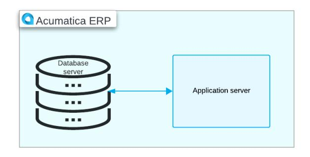

The following diagram shows a scalable configuration with multiple application servers and one database server. This configuration is designed to handle increased workload demands.

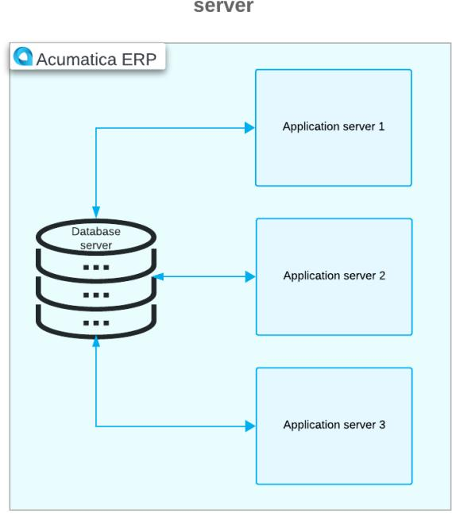

The following diagram shows a configuration where one server hosts both the application and the database. This setup is commonly used for development, testing, and training purposes.

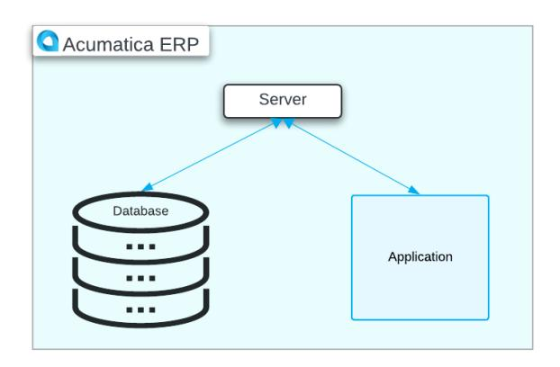

# <span id="page-15-1"></span><span id="page-15-0"></span>**Preparation for the Acumatica ERP Installation: System Environment**

Before proceeding with the installation of Acumatica ERP, make sure that the environment configuration on the computer where you plan to install the server soware part of Acumatica ERP is properly set up.

This topic provides an overview of the configuration of Internet Information Services (IIS) web server features, the specification of HTTPS settings, and the installation of semantic search for Microso SQL Server.

## **Configuration of IIS Web Server Features**

You need to ensure that the system configuration is suitable for installing the Acumatica ERP server part and that the following features are enabled on the IIS web server:

- **Internet Information Services > Web ManagementTools > IIS Management Console**
- **Internet Information Services > World Wide Web Services > Application Development Features**:
  - **.NETExtensibility 4.8**
  - **ASP.NET4.8**
  - **ISAPI Extensions**
  - **ISAPI Filters**
  - **WebSocket Protocol**
- **Internet Information Services > World Wide Web Services > Common HTTP Features**:
  - **Default Document**
  - **Static Content**
- **Internet Information Services > World Wide Web Services > Performance Features**:
  - **Dynamic Content Compression**
  - **Static Content Compression**
- **Internet Information Services > World Wide Web Services > Security > Request Filtering**

Make sure that for each application pool you are planning to use with Acumatica ERP, the **Enable 32 bit Applications** parameter is set to *False* (the setting is located on the **IIS Manager > Application Pools > Edit Application Pool > Advanced Settings** menu).

### **Setting Up HTTPS in an IIS Web Server**

When configuring your computer's environment, you need to ensure that HTTPS is being used. HTTPS is a secure communication protocol that encrypts the data exchanged between a client computer and a server, ensuring its security during transmission. This secure connection is essential for various functionality within your system.

The use of HTTPS makes it possible for users to export data from Acumatica ERP to Microso Excel spreadsheets, facilitating automatic updates of the data. Additionally, HTTPS is required for the implementation of single sign-on (SSO) to Acumatica ERP, which provides users with the ability to access the system seamlessly with their Google or Microso accounts.

You need to enable the TLS protocol to establish HTTPS connections in the IIS web server. To do this, you obtain a certificate from a certification authority and then register it with the IIS web server. This certificate is used to encrypt and decrypt the information transferred over the network, ensuring secure communication between the client and the server. For details on enabling the TLS protocol, refer to the IIS documentation.


Acumatica ERP does not support self-signed certificates.

## **Enabling Semantic Search for Microso SQL Server**

Acumatica ERP provides the full-text search functionality with the following capabilities within your instances:

- Performing semantic searches within SQL databases
- Identifying key phrases in text or documents
- Uncovering similar or related documents
- Offering insights into document similarities or relations

You can use this functionality if semantic search is enabled in Microso SQL Server.


Semantic search is not enabled by default in Microso SQL Server, while in MySQL Server, the semantic search functionality is enabled by default.

If semantic search is not already installed, you can easily add it by installing an update and selecting this feature under **Database EngineServices**. To install semantic search, go to the **Features to Install** page during Microso SQL Server setup and select **Full-Text and Semantic Extractions forSearch**. For details, see the documentation for Microso SQL Server.

# <span id="page-16-0"></span>**Preparation for the Acumatica ERP Installation: Implementation Activity**

In this implementation activity, you will learn how to enable the required Internet Information Services (IIS) web server features and validate the configuration of IIS. This will prepare you to install the server component of Acumatica ERP.

For training and testing purposes, you can install the server part of Acumatica ERP on operating systems that are not server operating systems. The instructions in this activity demonstrate the verification of the IIS web server features and the application pool settings on a computer running Windows 11. If you are using other supported environments and have trouble finding the required features, refer to the corresponding documentation for instructions.

#### **Story**

Suppose that you are the system administrator of the SweetLife Fruits & Jams company, and you need to verify the system environment prior to installing Acumatica ERP.

#### **Process Overview**

In this activity, you will do the following:

- 1. Enable the required IIS web server features
- 2. Verify the configuration of the IIS

#### **Step 1: Enabling the IIS Management Console Feature**

To enable the IIS Management Console feature, do the following:

- 1. On the taskbar, click Start to open the Start menu, which contains all your apps, settings, and files.
- 2. On the Start menu, type Windows Features.
- 3. Click **Turn Windows features on or off**. The **Windows Features** dialog box opens.
- 4. Go to **Internet Information Services > Web ManagementTools**.
- 5. Select the **IIS Management Console** check box, as shown in the following screenshot.

| If the check box is already selected, go to Step 2. |  |  |
|-----------------------------------------------------|--|--|
|                                                     |  |  |
|                                                     |  |  |
|                                                     |  |  |
|                                                     |  |  |
|                                                     |  |  |
|                                                     |  |  |
|                                                     |  |  |
|                                                     |  |  |
|                                                     |  |  |
|                                                     |  |  |
|                                                     |  |  |
|                                                     |  |  |
|                                                     |  |  |
|                                                     |  |  |
|                                                     |  |  |
|                                                     |  |  |
|                                                     |  |  |
|                                                     |  |  |

*Figure: The IIS Management Console feature*

### **Step 2: Enabling World Wide Web Services Features**

To enable various features that are included in the **World Wide Web Services** group of features, do the following:

- 1. While you are still viewing the **Windows Features** dialog box, go to **Internet Information Services > World Wide Web Services > Application Development Features**.
- 2. Select the following check boxes (as shown in the screenshot below):
  - **.NETExtensibility 4.8**
  - **ASP.NET4.8**
  - **ISAPI Extensions**
  - **ISAPI Filters**
  - **WebSocket Protocol**

| <b>Windows Features</b>                                                                                                                                   |    |        | × |  |
|-----------------------------------------------------------------------------------------------------------------------------------------------------------|----|--------|---|--|
| Turn Windows features on or off                                                                                                                           |    |        |   |  |
| To turn a feature on, select its check box. To turn a feature off, clear its<br>check box. A filled box means that only part of the feature is turned on. |    |        |   |  |
| <b>Application Development Features</b>                                                                                                                   |    |        |   |  |
| NET Extensibility 3.5                                                                                                                                     |    |        |   |  |
| .NET Extensibility 4.8                                                                                                                                    |    |        |   |  |
| Application Initialization                                                                                                                                |    |        |   |  |
| ASP                                                                                                                                                       |    |        |   |  |
| ASP.NET 3.5                                                                                                                                               |    |        |   |  |
| ASP.NET 4.8                                                                                                                                               |    |        |   |  |
| CGI                                                                                                                                                       |    |        |   |  |
| <b>ISAPI Extensions</b>                                                                                                                                   |    |        |   |  |
| <b>ISAPI Filters</b>                                                                                                                                      |    |        |   |  |
| Server-Side Includes                                                                                                                                      |    |        |   |  |
| <b>WebSocket Protocol</b>                                                                                                                                 |    |        |   |  |
|                                                                                                                                                           | OK | Cancel |   |  |

*Figure: Enabling of the Application Development Features*

- 3. Go to **Internet Information Services > World Wide Web Services > Common HTTP Features**.
- 4. Select the following check boxes (as shown in the screenshot below):
  - **Default Document**
  - **Static Content**

| <b>Windows Features</b>                                   |                                                                                                                                                           |        | × |  |  |  |
|-----------------------------------------------------------|-----------------------------------------------------------------------------------------------------------------------------------------------------------|--------|---|--|--|--|
| Turn Windows features on or off                           |                                                                                                                                                           |        |   |  |  |  |
|                                                           | To turn a feature on, select its check box. To turn a feature off, clear its<br>check box. A filled box means that only part of the feature is turned on. |        |   |  |  |  |
| Internet Information Services                             |                                                                                                                                                           |        |   |  |  |  |
| <b>FTP Server</b><br>圧                                    |                                                                                                                                                           |        |   |  |  |  |
| Web Management Tools<br>曱                                 |                                                                                                                                                           |        |   |  |  |  |
| World Wide Web Services                                   |                                                                                                                                                           |        |   |  |  |  |
| <b>Application Development Features</b><br>$\overline{+}$ |                                                                                                                                                           |        |   |  |  |  |
| <b>Common HTTP Features</b>                               |                                                                                                                                                           |        |   |  |  |  |
| <b>Default Document</b>                                   |                                                                                                                                                           |        |   |  |  |  |
| Directory Browsing                                        |                                                                                                                                                           |        |   |  |  |  |
| <b>HTTP Errors</b>                                        |                                                                                                                                                           |        |   |  |  |  |
| <b>HTTP Redirection</b>                                   |                                                                                                                                                           |        |   |  |  |  |
| <b>Static Content</b>                                     |                                                                                                                                                           |        |   |  |  |  |
| WebDAV Publishing                                         |                                                                                                                                                           |        |   |  |  |  |
|                                                           | ок                                                                                                                                                        | Cancel |   |  |  |  |

#### *Figure: Enabling of the Common HTTP Features*

- 5. Go to **Internet Information Services > World Wide Web Services > Performance Features**.
- 6. Select the following check boxes (as shown in the screenshot below):
  - **Dynamic Content Compression**
  - **Static Content Compression**

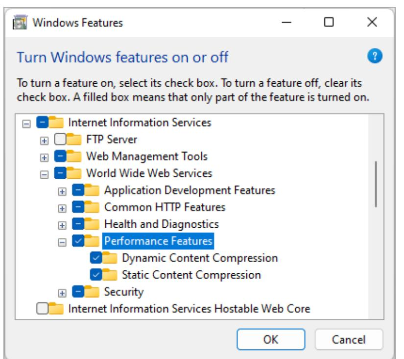

*Figure: Enabling of the Performance Features*

- 7. Go to **Internet Information Services > World Wide Web Services > Security**.
- 8. Select the **Request Filtering** check box (as shown in the following screenshot).

| Windows Features                                                                                                                                          |    |        | × |  |
|-----------------------------------------------------------------------------------------------------------------------------------------------------------|----|--------|---|--|
| Turn Windows features on or off                                                                                                                           |    |        |   |  |
| To turn a feature on, select its check box. To turn a feature off, clear its<br>check box. A filled box means that only part of the feature is turned on. |    |        |   |  |
| Security<br>$=$                                                                                                                                           |    |        |   |  |
| <b>Basic Authentication</b>                                                                                                                               |    |        |   |  |
| Centralized SSL Certificate Support                                                                                                                       |    |        |   |  |
| Client Certificate Mapping Authentication                                                                                                                 |    |        |   |  |
| Digest Authentication                                                                                                                                     |    |        |   |  |
| IIS Client Certificate Mapping Authentication                                                                                                             |    |        |   |  |
| <b>IP Security</b>                                                                                                                                        |    |        |   |  |
| <b>Request Filtering</b>                                                                                                                                  |    |        |   |  |
| <b>URL</b> Authorization                                                                                                                                  |    |        |   |  |
| <b>Windows Authentication</b>                                                                                                                             |    |        |   |  |
| Internet Information Services Hostable Web Core                                                                                                           |    |        |   |  |
| Legacy Components<br>$\overline{+}$                                                                                                                       |    |        |   |  |
|                                                                                                                                                           | ок | Cancel |   |  |

*Figure: Enabling of the Request Filtering feature*

9. Click **OK**.


If you have turned on some features, Windows shows an informational message.

## **Step 3: Configuring Internet Information Services**

To configure Internet Information Services, do the following:

- 1. On the taskbar, click Start to open the Start menu and click search for **Internet Information Services (IIS) Manager**.
- 2. In the le **Connections** pane, click **Application Pools**.
- 3. In the middle pane, in the list of available application pools on the server, right-click the **DefaultAppPool** application pool, which you will use on your website, and select **BasicSettings**.
- 4. In the **Edit Application Pool** dialog box, which opens, make sure that the following settings are specified, as shown in the following screenshot:
  - **.NET CLR version**: A version configured for .NET Version 4.8

The version number of the .NET Framework does not necessarily correspond to the version number of the CLR it includes. .NET Framework version 4.8 includes CLR Version 4.

- **Managed pipeline mode**: *Integrated*
- **Start application pool immediately**: Selected

| <b>Connections</b><br><b>Actions</b><br>ρ<br><b>Task Scheduler</b><br>.NET CLR version:<br><b>Event Viewer</b><br>ß<br><b>Shared Folders</b><br>22 <sup>1</sup><br>$\sim$ $ -$ MSK-<br>.NET CLR Version v4.0.30319<br>the list of application pools on the<br><b>Local Users and Groups</b><br>æ.<br>ted with worker processes, contain<br>Managed pipeline mode:<br>$\odot$<br>Performance<br>$\mathcal{P}$<br>$\rightarrow -0$ Sit<br>de isolation among different<br>$\mathbb{D}$<br>Start<br>Device Manager<br>Integrated<br>Storage<br>Stop<br>- Gas Show All Group by:<br>Disk Management<br>$\triangledown$ Start application pool immediately<br>t<br>Recycle<br>Services and Applications<br>- Re<br>.NET CLR Ve<br><b>Managed Pip</b><br>tus<br>Internet Information Ser<br><b>OK</b><br>Cancel<br>v4.0<br>Integrated<br>rted<br>Services<br>v4.0<br>Classic<br><sub>wurted</sub><br>Recycling<br>WMI Control<br>DefaultAppPool<br>Integrated<br><b>Started</b><br>v4.0<br>SQL Server Configuratio<br>16.<br><b>Message Queuing</b><br>E2<br>Rename<br>X Remove<br><sup>O</sup> Help | Computer Management<br>Action View Help<br>File<br>$\overline{R}$<br>Ý.<br>雨<br>Computer Management (Local)<br>$\leftarrow$<br>- 胜<br><b>System Tools</b> | ?<br><b>Edit Application Pool</b><br>Name: | п<br>$\times$<br>$\begin{array}{ c c c c c c c c c c c c c c c c c c c$                                                                                | × |
|------------------------------------------------------------------------------------------------------------------------------------------------------------------------------------------------------------------------------------------------------------------------------------------------------------------------------------------------------------------------------------------------------------------------------------------------------------------------------------------------------------------------------------------------------------------------------------------------------------------------------------------------------------------------------------------------------------------------------------------------------------------------------------------------------------------------------------------------------------------------------------------------------------------------------------------------------------------------------------------------------------------------------------------------------------------------------------------------|-----------------------------------------------------------------------------------------------------------------------------------------------------------|--------------------------------------------|--------------------------------------------------------------------------------------------------------------------------------------------------------|---|
|                                                                                                                                                                                                                                                                                                                                                                                                                                                                                                                                                                                                                                                                                                                                                                                                                                                                                                                                                                                                                                                                                                |                                                                                                                                                           | DefaultAppPool                             | <b>Add Application Pool</b><br>Set Application Pool Defaults<br><b>Application Pool Tasks</b><br><b>Edit Application Pool</b><br><b>Basic Settings</b> |   |
| $\rightarrow$<br>$\acute{\textrm{c}}$                                                                                                                                                                                                                                                                                                                                                                                                                                                                                                                                                                                                                                                                                                                                                                                                                                                                                                                                                                                                                                                          |                                                                                                                                                           |                                            | <b>Advanced Settings</b><br><b>View Applications</b>                                                                                                   |   |

*Figure: The settings of the default application pool*


We generally recommend that you use a separate application pool for the Acumatica ERP production instance.

- 5. Click **OK** to close the dialog box.
- 6. While the **DefaultAppPool** application pool is selected in the middle pane, in the right **Actions** pane, click **Advanced Settings**.
- 7. In the **Advanced Settings** dialog box, which opens, make sure that *False* is selected as the value of the **Enable 32-Bit Applications** setting (as shown in the following screenshot).

|              | <b>Advanced Settings</b>                                                                           |                                | 7      |   |
|--------------|----------------------------------------------------------------------------------------------------|--------------------------------|--------|---|
|              | $\vee$ (General)                                                                                   |                                |        | ۸ |
|              | .NET CLR Version                                                                                   | v4.0                           |        |   |
|              | <b>Enable 32-Bit Applications</b>                                                                  | False                          |        |   |
|              | <b>Managed Pipeline Mode</b>                                                                       | Integrated                     |        |   |
|              | Name                                                                                               | DefaultAppPool                 |        |   |
|              | Queue Length                                                                                       | 1000                           |        |   |
|              | <b>Start Mode</b>                                                                                  | OnDemand                       |        |   |
|              | $\vee$ CPU                                                                                         |                                |        |   |
|              | Limit (percent)                                                                                    | 0                              |        |   |
|              | <b>Limit Action</b>                                                                                | <b>NoAction</b>                |        |   |
|              | Limit Interval (minutes)                                                                           | 5                              |        |   |
|              | <b>Processor Affinity Enabled</b>                                                                  | False                          |        |   |
|              | <b>Processor Affinity Mask</b>                                                                     | 4294967295                     |        |   |
|              | Processor Affinity Mask (64-bit option)                                                            | 4294967295                     |        |   |
| $\checkmark$ | <b>Process Model</b>                                                                               |                                |        |   |
| $\geq$       | Generate Process Model Event Log Entry                                                             |                                |        |   |
|              | Identity                                                                                           | <b>ApplicationPoolIdentity</b> |        |   |
|              | Idle Time-out (minutes)                                                                            | 1440                           |        |   |
|              | <b>Idle Time-out Action</b>                                                                        | Terminate                      |        |   |
|              | <b>Name</b><br>[name] The application pool name is the unique identifier for the application pool. |                                |        |   |
|              |                                                                                                    | OK                             | Cancel |   |

*Figure: Advanced Settings of the DefaultAppPool*

8. Click **OK** to close the dialog box.

You have verified the Internet Information Services (IIS) configuration and can proceed to installing Acumatica ERP.

# <span id="page-23-0"></span>**Installing Acumatica ERP On-Premises**

In this chapter, you will find information about downloading and installing the Acumatica ERP Configuration wizard.

# <span id="page-23-2"></span><span id="page-23-1"></span>**Acumatica ERP Installation On-Premises: General Information**

The installation of Acumatica ERP begins with installing the Acumatica ERP Configuration wizard on the server. You can install the Acumatica ERP Configuration wizard with or without the Acumatica ERP Tools.

This topic provides an overview of the Acumatica ERP Configuration wizard and the Acumatica ERP Tools. It describes their functionalities, capabilities, and installation processes.

## **Learning Objectives**

In this chapter, you will do the following:

- Become familiar with the Acumatica ERP Configuration wizard and its capabilities
- Recognize the Acumatica ERP Tools
- Obtain the Acumatica ERP installation package
- Install the Acumatica ERP Configuration wizard
- Optional: Install the Acumatica ERP Tools

## **Applicable Scenario**

You may need to learn how to install the Acumatica ERP Configuration wizard if you are an implementation consultant who needs to install the Acumatica ERP Configuration wizard.

### **The Acumatica ERP Configuration Wizard**

The Acumatica ERP Configuration wizard is the part of soware that gives you the ability to deploy an Acumatica ERP application instance. The Acumatica ERP application instance is a website accessed by users in your company for daily tasks.

By using the Acumatica ERP Configuration wizard, you can do the following:

- Deploy multiple application instances
- Create additional tenants
- Perform application, database, and tenant maintenance
- Delete tenants and application instances

#### **Getting an Acumatica ERP Installation Package**

The installation of the Acumatica ERP Configuration wizard is initiated through the installation package. You can find and download the latest version of the installation package from the *[Acumatica Community](https://community.acumatica.com/)* website. On the menu bar of the website, you can click **Product** and select the version of Acumatica ERP whose installation package you want to download. The link to the installation package contains a nine-digit build number that has the XX.XXX.XXXX format. You click the link and download the AcumaticaERPInstall.msi Windows installer package.


You can download any of the previously released versions from the *[builds.acumatica.com](http://builds.acumatica.com)* website.

Aer you have downloaded the installation package, you can start installing the Acumatica ERP Configuration wizard.

## **Installation of the Acumatica ERP Configuration Wizard**

To install the Acumatica ERP Configuration wizard, you need to run AcumaticaERPInstall.msi, which you have downloaded on your computer.

The installation process will guide you through the Acumatica ERP Configuration wizard pages, on which you should perform the following actions:

- 1. Welcome page: This page opens when you run AcumaticaERPInstall.msi. To start the installation process, you should click **Next**.
- 2. End-User License Agreement page: On this page, you should read the license agreement, select the **I accept the terms in the License Agreement** check box, and click **Next**.
- 3. Main Soware Configuration page: On this page, you can select the necessary soware components (that is, the Acumatica ERP Tools) to install along with the Acumatica ERP Configuration wizard. By default, the **Install Acumatica ERP** and **Launch the Acumatica ERP Configuration Wizard** check boxes are selected. To proceed to the next page, you should click **Next**.
- 4. Destination Folder page: On this page, you should check the path to the default folder to which Acumatica ERP will be installed and change it, if needed. By default, the address of the folder is C:\Program Files \Acumatica ERP\. To proceed to the next page, you should click **Next**.
- 5. Confirmation page: On this page, you should click **Install** to install the Acumatica ERP Configuration wizard.

The Acumatica ERP soware starts installing. When the installation process has been completed, you should click **Finish**.

The Acumatica ERP Configuration wizard is automatically started. You can also run the Acumatica ERP Configuration wizard anytime by selecting it on the Start menu.

## **The Acumatica ERP Tools**

Along with the Acumatica ERP Configuration wizard, the Acumatica ERP installation package includes the Acumatica ERP Tools, which consist of the following components:

- Acumatica Report Designer: This component provides visual tools that you can use to design custom reports. For more information, see *[Acumatica Report Designer Guide](https://help-2025r1.acumatica.com/Help?ScreenId=ShowWiki&pageid=24b77bbe-0eb3-4d37-9350-071ae5743571)*.
- DeviceHub: This application is used to connect hardware devices, such as printers, scanners, and digital scales. You can also configure a set of default printers to streamline the printing of documents for users, regardless of the physical location of the users and printers. For detailed instructions on setting up hardware devices via DeviceHub, see *[Implementing DeviceHub](https://help-2025r1.acumatica.com/Help?ScreenId=ShowWiki&pageid=1d1c5e17-c4ac-4f64-a91e-76d58c0d5a98)*.
- Debugger Tools: The set of soware components that gives you a basic ability to debug the deployed Acumatica ERP instances. For more information, see *To View and Debug [Acumatica](https://help-2025r1.acumatica.com/Help?ScreenId=ShowWiki&pageid=40fcc931-64ac-4016-9d05-7426a22712da) ERP Source Code*.

You can install any of these components along with the Acumatica ERP Configuration wizard or at any later time.

If you have already installed the latest version of the Acumatica ERP Configuration wizard without the needed tool selected, you can install this tool in any of the following ways:

• Uninstall the Acumatica ERP Configuration wizard, and then install it with the tool that you need. For details, see *Acumatica ERP Installation [On-Premises:](#page-25-1) To Install the Acumatica ERP Configuration Wizard*.


• Modify the installation settings of Acumatica ERP and select the check box for the tool you need to install. For more details, see *Acumatica ERP Installation [On-Premises:](#page-27-1) To Install the Acumatica ERP Tools (Optional)*.

If the Acumatica ERP Configuration wizard, which you have already installed, is not the latest version, you can download and install the next version of it with the Acumatica ERP Tools.

# <span id="page-25-1"></span><span id="page-25-0"></span>**Acumatica ERP Installation On-Premises: To Install the Acumatica ERP Configuration Wizard**

In this implementation activity, you will learn how to download an Acumatica ERP version and install the Acumatica ERP Configuration wizard.

#### **Story**

Suppose that you, as the system administrator of the SweetLife Fruits & Jams company, need to download the Acumatica ERP 2025 R1 GA version and install the Acumatica ERP Configuration wizard for this version.

## **Process Overview**

In this activity, you will do the following:

- 1. Download the installation package for the needed version of Acumatica ERP
- 2. Install the Acumatica ERP Configuration wizard

#### **Step 1: Obtaining an Installation Package for a Specific Acumatica ERP Version**

In this step, you will find the build for the Acumatica ERP 2025 R1 GA version and download it.

To find and download the needed Acumatica ERP build, do the following:

1. Open the *[Acumatica Community](https://community.acumatica.com/)* website.

You will need your partner username and password to access the site.

2. On the **Product** menu on top of the page, click **2025 R1**.

The Acumatica ERP 2025 R1 Downloads and Release Notes page opens. On this page, you can find the latest release and prior releases of the selected version; you can also read the release notes.

- 3. Click the *Show Content* link in the **Prior Releases** section.
- 4. Click the *Acumatica 2025 R1 GA Build ХХ.ХХХ.ХХХХ* link.

The page with the release opens.

5. In the **Download Links** section, click the *Acumatica ERP 2025 R1 GA* link to download the AcumaticaERPInstall.msi Windows installer package.

Wait until the package is downloaded to your computer.

#### **Step 2: Installing Acumatica ERP**

In this step, you will install the Acumatica ERP Configuration wizard on your computer.

To install the Acumatica ERP Configuration wizard, do the following:

- 1. Run the AcumaticaERPInstall.msi file that you have downloaded in the previous step.
- 2. On the Welcome page of the Setup wizard, click **Next**, as shown in the following screenshot.

| Acumatica ERP 2025 R1 Setup |                                                      |        | × |
|-----------------------------|------------------------------------------------------|--------|---|
| a                           | Welcome to the Acumatica ERP 2025 R1<br>Setup Wizard |        |   |
| Acumatica<br>The Cloud ERP  | Version: 25.100.0054                                 |        |   |
|                             |                                                      |        |   |
|                             |                                                      |        |   |
|                             | Back<br>Next<br>. <del>.</del>                       | Cancel |   |

*Figure: The Welcome page of Acumatica ERP installer*

- 3. On the End-User License Agreement page, read the license agreement, and select the **I accept the terms in the License Agreement** check box.
- 4. Click **Next**.
- 5. On the Main Soware Configuration page, which opens, notice that the **Install Acumatica ERP** and **Launch the Acumatica ERP Configuration Wizard (Recommended)** check boxes are selected by default, as shown in the following screenshot.

| Acumatica ERP 2025 R1 Setup                                                                                                                                                                                                                                                                                                                                                                                                     | ×                          |
|---------------------------------------------------------------------------------------------------------------------------------------------------------------------------------------------------------------------------------------------------------------------------------------------------------------------------------------------------------------------------------------------------------------------------------|----------------------------|
| Main Software Configuration                                                                                                                                                                                                                                                                                                                                                                                                     | Acumatica<br>The Cloud ERP |
| The Acumatica ERP installer will install all the necessary software components. Please be aware<br>that the software must be configured before use. The Acumatica ERP Configuration wizard will<br>be started automatically after the installation is finished. If you wish to configure the software<br>later, please clear the first check box below. The Configuration wizard will be accessible under<br>the Programs menu. |                            |
| <b>Install Acumatica ERP</b>                                                                                                                                                                                                                                                                                                                                                                                                    |                            |
| Launch the Acumatica ERP Configuration Wizard (Recommended)                                                                                                                                                                                                                                                                                                                                                                     |                            |
| <b>Install Debugger Tools</b>                                                                                                                                                                                                                                                                                                                                                                                                   |                            |
| <b>Install DeviceHub</b>                                                                                                                                                                                                                                                                                                                                                                                                        |                            |
| <b>Install Report Designer</b>                                                                                                                                                                                                                                                                                                                                                                                                  |                            |
|                                                                                                                                                                                                                                                                                                                                                                                                                                 |                            |
| Back<br>Next                                                                                                                                                                                                                                                                                                                                                                                                                    | Cancel                     |

#### *Figure: Acumatica ERP components to be installed*

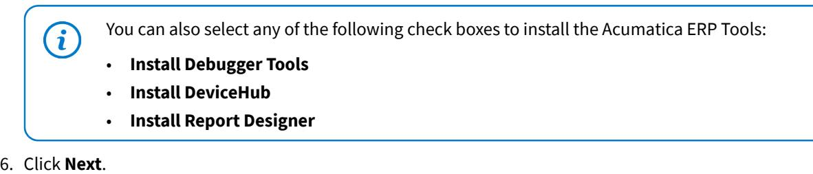

7. On the Destination Folder page, check the path to the default folder to which Acumatica ERP will be installed, and change it if needed.

By default, the address of the folder is C:\Program Files\Acumatica ERP\.

- 8. Click **Next**.
- 9. On the confirmation page, click **Install** to install the Acumatica ERP Configuration wizard.

Wait while the Acumatica ERP soware is being installed.

10.When the installation process has completed, click **Finish**.

The Acumatica ERP Configuration wizard is started automatically. You can also run the Acumatica ERP Configuration wizard anytime by clicking it on the Start menu.

<span id="page-27-1"></span>Now you can proceed with deploying the Acumatica ERP application instances.

# <span id="page-27-0"></span>**Acumatica ERP Installation On-Premises: To Install the Acumatica ERP Tools (Optional)**

The following activity will walk you through the process of installing the Acumatica ERP Tools separately from the Acumatica ERP Configuration wizard.

#### **Story**

Suppose that you, as the system administrator of the SweetLife Fruits & Jams company, need to install the Acumatica ERP Tools when the Acumatica ERP Configuration wizard has already been installed.

#### **Process Overview**

In this activity, you will install the Acumatica ERP Tools by modifying the Acumatica ERP installation settings on your computer.

#### **System Preparation**

Before you begin installing the Acumatica ERP Tools, as a prerequisite activity, make sure you have installed the Acumatica ERP Configuration wizard, as described in *Acumatica ERP Installation [On-Premises:](#page-25-1) To Install the Acumatica ERP [Configuration](#page-25-1) Wizard*.

#### **Step: Installing the Acumatica ERP Tools**

To install the Acumatica ERP Tools, do the following:

- 1. On the Start menu, click**Settings > Apps > Installed apps**.
- 2. In the list of installed applications, find Acumatica ERP 2025 R1, and click the **Modify** button, as shown in the following screenshot, which uses the Windows 11 interface as an example.

| $\leftarrow$ $\equiv$   | Settings                                                            | $\Box$              |   |
|-------------------------|---------------------------------------------------------------------|---------------------|---|
|                         | Apps > Apps & features                                              |                     |   |
| App list<br>Search apps | ρ                                                                   |                     |   |
|                         | Sort by: Name $\vee$ Filter by: All drives $\vee$<br>106 apps found |                     |   |
|                         |                                                                     |                     |   |
| O                       | Acumatica ERP 2025 R1<br>25.100.0054   Acumatica   4/15/2025        | 3.78 GB             | ÷ |
|                         |                                                                     | Modify<br>Uninstall |   |
|                         |                                                                     |                     |   |
|                         |                                                                     |                     |   |

#### *Figure: The Apps & features page*

- 3. On the Welcome page of the Acumatica ERP 2025 R1 Setup wizard, which opens, click **Next**.
- 4. On the Change, Repair, or Remove installation page, click **Change** (see the following screenshot).

| Acumatica ERP 2025 R1 Setup                                                                                                       |                            | $\times$ |
|-----------------------------------------------------------------------------------------------------------------------------------|----------------------------|----------|
| Change, repair, or remove installation                                                                                            |                            |          |
| Select the operation you wish to perform.                                                                                         | Acumatica<br>The Cloud ERP |          |
| Change<br>Lets you change the way features are installed.                                                                         |                            |          |
| Repair<br>Repairs errors in the most recent installation by fixing missing and corrupt<br>files, shortcuts, and registry entries. |                            |          |
| Remove<br>Removes Acumatica ERP 2025 R1 from your computer.                                                                       |                            |          |
|                                                                                                                                   |                            |          |
| Back<br>Next                                                                                                                      | Cancel                     |          |

*Figure: The Change, Repair, or Remove installation page*

- 5. On the Main Soware Configuration page, select any of the following check boxes for the Acumatica ERP tool installation (see the screenshot below):
  - **Install DebuggerTools**: Select this check box to install Debugger Tools.
  - **Install DeviceHub**: Select this check box to install DeviceHub.
  - **Install Report Designer**: Select this check box to install Acumatica Report Designer.

| Acumatica ERP 2025 R1 Setup                                                                                                                                                                                                                                                                                                                                                                                                     | ×                          |
|---------------------------------------------------------------------------------------------------------------------------------------------------------------------------------------------------------------------------------------------------------------------------------------------------------------------------------------------------------------------------------------------------------------------------------|----------------------------|
| Main Software Configuration                                                                                                                                                                                                                                                                                                                                                                                                     | Acumatica<br>The Cloud ERP |
| The Acumatica ERP installer will install all the necessary software components. Please be aware<br>that the software must be configured before use. The Acumatica ERP Configuration wizard will<br>be started automatically after the installation is finished. If you wish to configure the software<br>later, please clear the first check box below. The Configuration wizard will be accessible under<br>the Programs menu. |                            |
| <b>Install Acumatica ERP</b>                                                                                                                                                                                                                                                                                                                                                                                                    |                            |
| Launch the Acumatica ERP Configuration Wizard (Recommended)                                                                                                                                                                                                                                                                                                                                                                     |                            |
| Iv Install Debugger Tools                                                                                                                                                                                                                                                                                                                                                                                                       |                            |
| Install DeviceHub                                                                                                                                                                                                                                                                                                                                                                                                               |                            |
| Install Report Designer                                                                                                                                                                                                                                                                                                                                                                                                         |                            |
|                                                                                                                                                                                                                                                                                                                                                                                                                                 |                            |
| Back<br>Next                                                                                                                                                                                                                                                                                                                                                                                                                    | Cancel                     |

*Figure: The selection of the Acumatica ERP Tools*

- 6. Click **Next**.
- 7. On the Destination Folder page, specify the location where you want to install Acumatica ERP Tools, and then click **Next**, as shown in the following screenshot.

| Acumatica ERP 2025 R1 Setup                                                                                          |      |               | $\times$ |
|----------------------------------------------------------------------------------------------------------------------|------|---------------|----------|
| <b>Destination Folder</b><br>Click Next to install Acumatica ERP 2025 R1 to the default folder or click Ch Acumatica |      | The Cloud ERP |          |
| Install Acumatica ERP 2025 R1 to:                                                                                    |      |               |          |
| C: \Program Files\Acumatica ERP\<br>Change                                                                           |      |               |          |
| <b>Back</b>                                                                                                          | Next | Cancel        |          |

#### *Figure: The Destination Folder page*

8. On the Ready to Change Acumatica ERP 2025 R1 page, click **Change** (see the following screenshot).

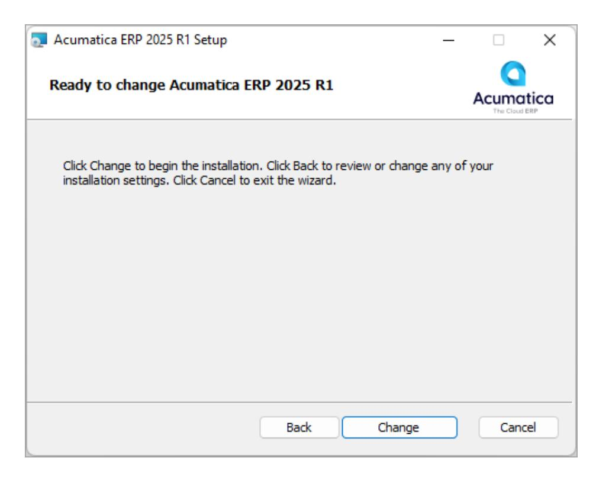

*Figure: The Ready to Change Acumatica ERP 2025 R1 page*

9. Aer the tool installation has been completed, click **Finish**.

# <span id="page-32-2"></span><span id="page-32-0"></span>**Installing Acumatica ERP in a Data Center**

In this chapter, you will find information about installing Acumatica ERP in a data center.

# <span id="page-32-1"></span>**Acumatica ERP Installation in a Data Center: General Information**

You can install Acumatica ERP in a data center where the system and the associated databases are hosted by the provider. This approach ensures enhanced scalability, security, and performance in a stable environment.

## **Learning Objectives**

In this chapter, you will do the following:

- Become familiar with the process of installing Acumatica ERP in a data center
- Launch an EC2 instance on Amazon Web Services (AWS) to host Acumatica ERP
- Create an Amazon Relational Database Service (Amazon RDS) instance on AWS to host the Acumatica ERP database
- Install Acumatica ERP on AWS and deploy an instance

## **Applicable Scenarios**

You may need to learn how to install Acumatica ERP in a data center in scenarios that include the following:

- You are an implementation consultant who needs to install Acumatica ERP in a data center.
- You are an implementation consultant who needs to install Acumatica ERP on AWS with an independent database server.

## **Installing Acumatica ERP in a Data Center**

You can install Acumatica ERP in a data center by using hosting or cloud service providers to ensure that your data is securely stored in persistent and durable storage in the cloud. The installation process depends on the service provider you choose and can be one of the following:

- For deploying Acumatica ERP on a web service that provides an operating system with Microso SQL Server, the installation process typically involves the steps described in *Acumatica ERP Installation [On-Premises:](#page-25-1) To Install the Acumatica ERP [Configuration](#page-25-1) Wizard*.
- For deploying Acumatica ERP as a cloud service on Windows Azure, you need to use Azure Cloud Services. The installation process typically involves creating a Windows virtual machine in the Azure portal. Aer setting up the virtual machine, you need to create an Acumatica ERP Service package and deploy it as described in the Windows Azure deployment guide.
- For deploying Acumatica ERP on AWS, you need to launch an Amazon EC2 instance to host the Acumatica ERP. Additionally, you need to create an Amazon RDS database instance to manage the data. Aer setting up these instances, you can deploy Acumatica ERP by using an Acumatica ERP installation package, which you can download from the *[Acumatica Community](https://community.acumatica.com/)* website. For details, see *[Acumatica ERP Installation in a Data](#page-33-2) Center: Installing [Acumatica](#page-33-2) ERP on Amazon Web Services*.

# <span id="page-33-2"></span><span id="page-33-0"></span>**Acumatica ERP Installation in a Data Center: Installing Acumatica ERP on Amazon Web Services**

You can install Acumatica ERP on Amazon Web Services (AWS). The Amazon Elastic Compute Cloud (Amazon EC2) provides the web server to host the Acumatica ERP application, while the Amazon Relational Database Service (Amazon RDS) provides the storage for the database. This topic includes recommendations for configuring the EC2 and RDS instances, as well as details about deploying Acumatica ERP on AWS.

## **Prerequisite Tasks**

Before you start installing Acumatica ERP on AWS, make sure that you have completed the following tasks:

- Signing up for AWS account
- Creating a key pair for secure access to your EC2 instances
- Creating a security group that defines the rules for network access to your EC2 instance, based on which it can connect to your RDS instance

## **Installation of Acumatica ERP on AWS**

The process of installing Acumatica ERP on AWS generally involves the following steps:

- 1. Launching an Amazon EC2 instance. During the launch of an Amazon EC2 instance, you select the instance type based on the performance requirements of the Acumatica ERP. This selection determines the processing power, memory, and network performance of the instance. Additionally, you configure the EC2 instance with the appropriate network settings, such as assigning it to a specific virtual private cloud (VPC) and setting up security groups. You also configure storage options, including the type and size of storage volumes, to ensure optimal performance and data persistence for the Acumatica ERP. For details, see *Acumatica ERP [Installation](#page-33-3) in a Data Center: To Launch an Amazon EC2 Instance*.
- 2. Creating an Amazon RDS database instance. During the creation of an Amazon RDS database instance, you select a database engine that is compatible with the Acumatica ERP to ensure proper functionality. You should determine the instance size based on performance needs and reserve sufficient storage capacity to accommodate the database. Additionally, you configure security settings to ensure secure access and protection of the database. For details, see *Acumatica ERP [Installation](#page-35-1) in a Data Center: To Create a Database [Instance on Amazon RDS](#page-35-1)*.
- 3. Installing the Acumatica ERP Configuration wizard and deploying an Acumatica ERP application instance. Aer setting up the EC2 and RDS instances, you install the Acumatica ERP Configuration wizard. This tool is used for the deployment of the Acumatica ERP instance and guides you through the configuration process. For more information, see *Acumatica ERP Installation [On-Premises:](#page-25-1) To Install the Acumatica ERP [Configuration](#page-25-1) Wizard*. Once the Acumatica ERP Configuration wizard is installed, you can deploy an Acumatica ERP instance. During this deployment, the Acumatica ERP is connected to the Amazon RDS database, ensuring that all application data is securely stored within the RDS environment. For more information, see *Acumatica ERP [Installation](#page-36-1) in a Data Center: To Install Acumatica ERP on Amazon EC2*.

# <span id="page-33-3"></span><span id="page-33-1"></span>**Acumatica ERP Installation in a Data Center: To Launch an Amazon EC2 Instance**

The following activity will walk you through the process of launching an Amazon Elastic Compute Cloud (Amazon EC2) instance.

This activity walks you through the configuration of third-party soware. Please note the following:

- The vendor of the third-party soware may change the user interface and settings. Therefore, the form elements and setting names that you see may differ from the ones described in the activity.
- The activity will be updated to describe changes in the user interface and settings.

#### **Story**

Suppose that you are the system administrator, and you need to launch an Amazon EC2 instance to host the Acumatica ERP application.

#### **Process Overview**

In this activity, you will launch an Amazon EC2 instance.

#### **Step: Launching an Amazon EC2 Instance**

To launch an Amazon EC2 instance, do the following:

- 1. Sign in to the AWS Management Console, and open Amazon EC2.
- 2. On the right side of the toolbar, select the region for your EC2 instance.


You must select the same region for your EC2 and RDS instances and for the key pair you use to sign in to your instances.

- 3. On the EC2 dashboard, click **Launch Instance** to open the **Launch an Instance** page.
- 4. In the **Name and Tags** section, specify the name to be used for the instance: AcumaticaAWS.
- 5. In the **Application and OSImages (Amazon Machine Image)** section, select the following Amazon Machine Image (AMI): *Microso Windows Server 2022 Base*.

To simplify the search for the required AMI, you can click the **QuickStart** tab in the **Application and OSImages (Amazon Machine Image)** section. Then you click the icon for the desired operating system. In the **Amazon Machine Image (AMI)** box, you will see the most recent operating system available for launching an EC2 instance.

6. In the **InstanceType** section, select the *m5.large* or *m5a.large* hardware configuration for your instance.


We recommend using a virtual machine with at least two cores and 8 GB of RAM.

- 7. In the **Key Pair (Login)** section, select the prepared key pair or create a new key pair.
- 8. In the **NetworkSettings** section, select the security group that you have prepared to launch Acumatica ERP, or create a new one with specific access rules for your instance.

If you create a new security group, AWS will automatically assign a name to the group based on its naming conventions.

9. In the **Summary** section on the right side of the page, review the settings for your instance, and then click **Launch Instance**.

Wait for the instance to launch. The result of the process will be displayed on the **Launch an Instance** page.

10.Aer the instance has successfully launched, click **Connect to Instance**.

- 11.On the **Connect to Instance** page, do the following:
  - a. On the **RDP Client** tab, select **Connect Using RDP Client**.
  - b. Download the Remote Desktop file.
  - c. Click **Get Password**.

12.On the **Get Windows Password** page, upload the file with the prepared key.

- 13.Click **Decrypt Password**. The page will close, returning you to the **Connect to Instance** page, where the password for accessing your instance will be displayed.
- 14.Run the Remote Desktop file you have downloaded on your computer to access the web server you have launched.
- 15.Enter your password for accessing the instance, and click **OK**.


If the system shows the Remote Desktop Connection page, click **Yes**.

16.For the operating system of the virtual machine, turn on Microso Internet Information Services (IIS), and make sure that the required IIS features are turned on, as described in *[Preparation for the Acumatica ERP](#page-15-1) [Installation: System Environment](#page-15-1)*.

# <span id="page-35-1"></span><span id="page-35-0"></span>**Acumatica ERP Installation in a Data Center: To Create a Database Instance on Amazon RDS**

The following activity will walk you through the process of creating a database instance on Amazon Relational Database Service (Amazon RDS).

This activity walks you through the configuration of third-party soware. Please note the following:

- The vendor of the third-party soware may change the user interface and settings. Therefore, the form elements and setting names that you see may differ from the ones described in the activity.
- The activity will be updated to describe changes in the user interface and settings.

#### **Story**

Suppose that you are the system administrator, and you need to create a database instance on Amazon RDS.

## **Process Overview**

In this activity, you will create an Amazon RDS database instance.

#### **System Preparation**

Before you begin creating an Amazon RDS database instance, make sure that you have performed the following prerequisite activity: *Acumatica ERP [Installation](#page-33-3) in a Data Center: To Launch an Amazon EC2 Instance*.

#### **Step: Creating a Database Instance on Amazon RDS**

To create an Amazon RDS database instance, do the following:

1. Sign in to the Amazon Web Services (AWS) Management Console, and open Amazon RDS.

2. On the right side of the toolbar, select the region in which you want to create the database instance.


You must select the same region for your EC2 and RDS instances and for the key pair you use to sign in to your instances.

- 3. In the navigation pane, click **Databases**.
- 4. Click **Create Database**.
- 5. On the **Create Database** page, select the **Easy Create** option button.
- 6. In the **Configuration** section, specify the information about your database instance, including the following settings:
  - a. **EngineType**: *Microso SQL Server*
  - b. **DB InstanceSize**: *Dev/Test*
  - c. **DB Instance Identifier**: AcumaticaAWS
  - d. **Master Username**: admin
  - e. **Credentials Management**: *Self Managed*
  - f. **Master Password**: The password you plan to use for the database instance
- 7. In the **Set Up EC2 Connection** section, specify the following settings:
  - a. **Connect to an EC2 Compute Resource**: Selected
  - b. **EC2 Instance**: AcumaticaAWS
- 8. In the **View DefaultSettings for Easy Create** section, review the settings you have specified for your database instance, and click **Create Database**.

Wait until the Amazon RDS database instance has been created.

- 9. On the **Databases** page, which opens, make sure that the new database instance appears in the list of instances. The database instance will have a status of *Creating* until it is created and ready for use. When the status changes to *Available*, you can connect to the database instance. Depending on the database instance class and storage allocated, it could take several minutes for the new instance to become available.
- 10.Select the database, and make a note of the DNS name of the instance that is specified in the **Endpoint** box on the **Connectivity & Security** tab of the page; you will need this name during the deployment of the Acumatica ERP instance.

# <span id="page-36-1"></span><span id="page-36-0"></span>**Acumatica ERP Installation in a Data Center: To Install Acumatica ERP on Amazon EC2**

The following activity will walk you through the process of installing the Acumatica ERP Configuration wizard and deploying an Acumatica ERP instance on the Amazon Elastic Compute Cloud (Amazon EC2) instance.

This activity walks you through the configuration of third-party soware. Please note the following:

- The vendor of the third-party soware may change the user interface and settings. Therefore, the form elements and setting names that you see may differ from the ones described in the activity.
- The activity will be updated to describe changes in the user interface and settings.

#### **Story**

Suppose that you are the system administrator, and you need to deploy an Acumatica ERP instance on the Amazon EC2 instance.

## **Process Overview**

In this activity, you will install the Acumatica ERP Configuration wizard and deploy an Acumatica ERP instance on the Amazon EC2 instance.

## **System Preparation**

Before you begin deploying an Acumatica ERP instance on the Amazon EC2 instance, make sure that you have performed the following prerequisite activities: *Acumatica ERP [Installation](#page-33-3) in a Data Center: To Launch an Amazon [EC2 Instance](#page-33-3)* and *Acumatica ERP [Installation](#page-35-1) in a Data Center: To Create a Database Instance on Amazon RDS*.

#### **Step: Deploying Acumatica ERP on the Amazon EC2 Instance**

To deploy Acumatica ERP on Amazon EC2, do the following:

- 1. From the *[Acumatica Community](https://community.acumatica.com/)* website, download an Acumatica ERP installation package with the version of Acumatica ERP you want to install. For details, see *Acumatica ERP Installation [On-Premises:](#page-25-1) To Install the Acumatica ERP [Configuration](#page-25-1) Wizard*
- 2. Run the Remote Desktop file that you have downloaded on your computer while launching an Amazon EC2 instance.


You use the Remote Desktop Connection service to connect to the web server running on your Amazon EC2 instance.

- 3. Copy the Acumatica ERP installation package to the web server on the Amazon EC2 instance.
- 4. Install the Acumatica ERP Configuration wizard, as described in *Acumatica ERP Installation [On-Premises:](#page-25-1) To Install the Acumatica ERP [Configuration](#page-25-1) Wizard*.

Wait until the installation of the Acumatica ERP Configuration wizard is complete.

- 5. On the Welcome page of the Acumatica ERP Configuration wizard, which opens, click **Deploy a New Acumatica ERP Instance**.
- 6. On the Database Server Connection page, specify the following server settings for the database that will be used by the Acumatica ERP instance:
  - a. **ServerType**: *Microso SQL Server*.
  - b. **Server Name**: The DNS name of the Amazon RDS database instance you have created. You can copy it from the **Endpoint** box on the **Connectivity & Security** tab of the **Databases** page of Amazon RDS. Also, if there is a custom port number, you can specify it aer a comma.

If you cannot connect to the server, check the security groups you have selected for the EC2 and RDS instances. You must select the same group for both services.

c. **SQLServer Authentication**: Selected.

In the boxes that become available on the page, specify the following settings:

- **Login**: *Admin*
- **Password**: The password you have created for the Amazon RDS database instance
- 7. Click **Next**.

- 8. On the Database Configuration page, specify the following settings:
  - a. **Create a New Database**: Selected
  - b. **New Database's Name**: AcumaticaAWS
- 9. Click **Next**.
- 10.On the Tenant Setup page, review the new tenant that the wizard creates by default with no data preloaded; it has the default name *Company* in the **Tenant Name** column.


The name specified in this column is displayed on the Sign-In page of the application instance and in the instance's user interface.

You can also configure the tenant, add more tenants, or restrict the list of tenants a user can see on the Sign-In page. For more information, see *[Maintaining](#page-69-2) Tenants*.

#### 11.Click **Next**.

- 12.On the Database Connection page, set up the authentication method that this instance of Acumatica ERP will use to connect to the database by specifying the following settings:
  - a. **SQLServer Authentication**: Selected
  - b. **Use Existing Login Credentials**: Selected
    - **Login**: *Admin*
    - **Password**: The password that you have created for the Amazon RDS database instance

13.Click **Next**.

14.On the Instance Configuration page, specify the following settings:

- **Instance Name**: AcumaticaAWS
- **Create Acumatica ERP Site**: Selected
- **Local Path to the Instance**: The path on the local computer where you run the web service to this application instance

#### 15.Click **Next**.

16.On the Website Configuration page, specify the following settings:

- a. **Available Websites**: *Default Web Site*
- b. **CreateVirtual Directory**: Selected
- c. **Virtual Directory Name**: AcumaticaAWS
- d. **Compile theSite**: Selected
- e. **Install RabbitMQ**: Selected
- f. **Install NodeJS**: Selected
- g. **Enable Modern UI**: Cleared
- h. **Use Existing Application Pool**: Selected
- j. **Available Application Pools**: *DefaultAppPool*
- 17.Click **Next**.
- 18.On the Confirmation of Configuration page, check the configuration settings you have specified, and click **Finish** to deploy this Acumatica ERP instance.
- 19.Click **OK** in the dialog box aer the installation is complete; the system returns you to the Welcome page of the Acumatica ERP Configuration wizard.

The new Acumatica ERP instance is created on the Awazon EC2 instance, and now you can access it for the first time. For details, see *Instance [Deployment:](#page-47-1) Accessing an Instance for the First Time* and *Instance [Deployment:](#page-48-1) To [Deploy an Out-of-the-Box Instance](#page-48-1)*.

# <span id="page-39-0"></span>**Deploying Acumatica ERP Instances**

In this chapter, you will find information about deploying Acumatica ERP application instances, signing in to an instance for the first time, and activate an Acumatica ERP license.

# <span id="page-39-2"></span><span id="page-39-1"></span>**Instance Deployment: General Information**

You can deploy an application instance with one tenant or multiple tenants by using the Acumatica ERP Configuration wizard.

This topic provides an overview of an Acumatica ERP instance deployment, as well as tenant creation, and the possible combinations of instances, databases, and tenants.

## **Learning Objectives**

In this chapter, you will do the following:

- Become familiar with the possible deployment configuration of instances, tenants, and databases
- Review the process of deploying an instance
- Deploy an out-of-the-box instance
- Deploy an instance with a tenant with the demo data
- Change password before the first sign-in to the instance
- Activate the default set of features in the instance
- Activate the product license for the instance
- Review product license details
- Deploy a Self-Service Portal instance and connect it to the database of the existing instance

#### **Applicable Scenarios**

You may need to learn how to deploy an Acumatica ERP application instance in scenarios that include the following:

- You are an implementation consultant who needs to deploy an Acumatica ERP application instance.
- You are a system administrator who needs to deploy an Acumatica ERP application instance for the employees of your company.

#### **Application Instances and Tenants**

In Acumatica ERP, when you create an application instance, at least one tenant is defined. A tenant represents a separate company. It is not possible to configure an instance without a tenant.

Acumatica ERP is an application with a multitenant architecture, making it possible for a single instance of the application to serve multiple tenants. You can deploy various combinations of instances, databases, and tenants depending on your company's business needs. These combinations are described below.

The following diagram shows an architecture with one application instance, one database, and one tenant.

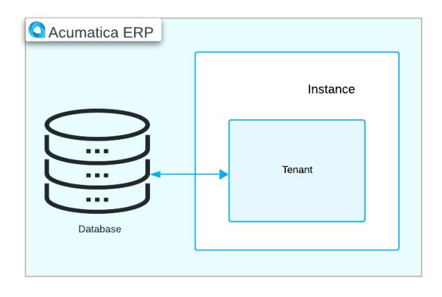

The following diagram shows an architecture with multiple application instances. Each instance has multiple tenants, and each tenant has its own database.

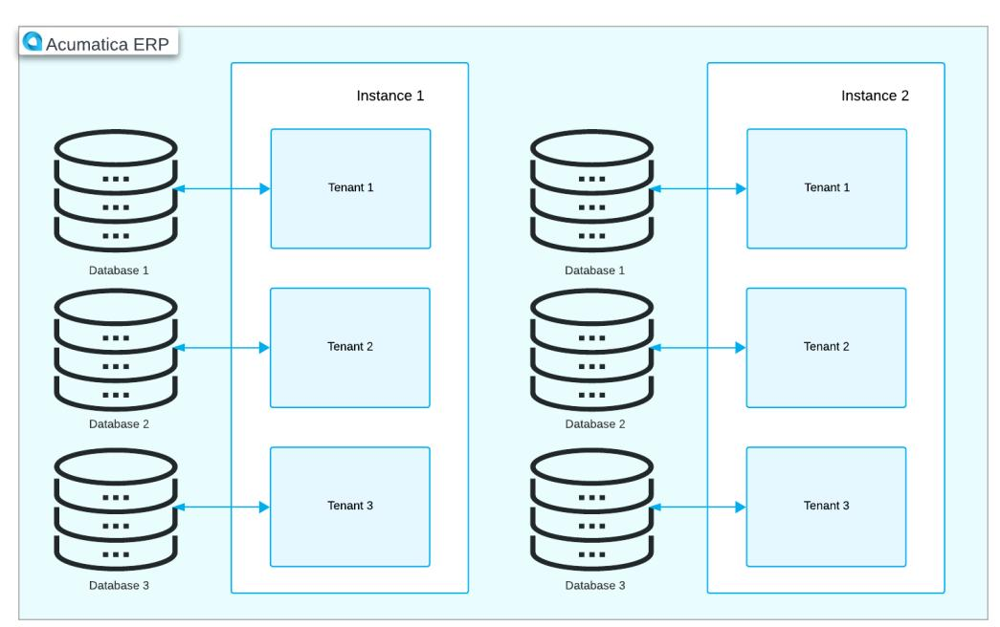

The following diagram shows an architecture with one application instance that has one database and multiple tenants with web access to the same database.

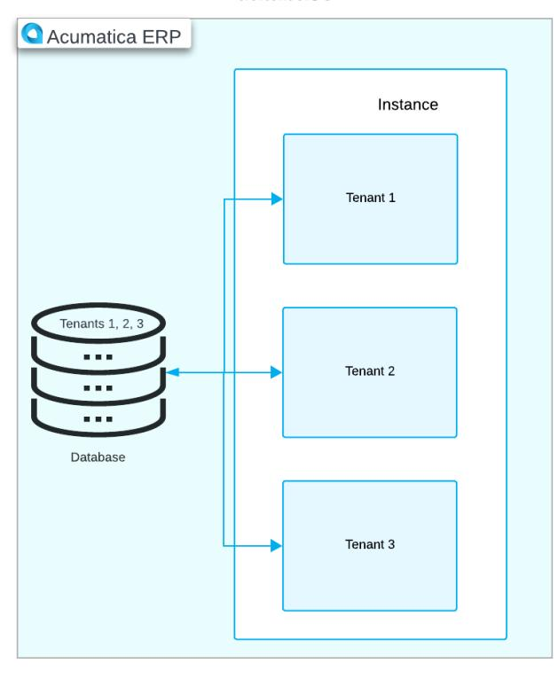

The following diagram shows an application instance with one database, where multiple tenants use the same database with completely isolated data. Although the application looks identical to all tenants, each tenant has exclusive access to only its own data.

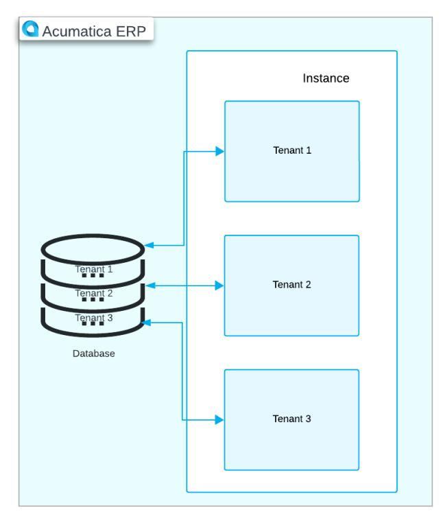

You can deploy an instance with a tenant that does not contain any predefined data and represents an out-ofthe-box company. You can also deploy a tenant that contains demo data that you can use for training purposes. For details, see *Instance Deployment: To Deploy an [Out-of-the-Box](#page-48-1) Instance* and *Instance [Deployment:](#page-61-1) To Deploy an [Instance with Demo Data](#page-61-1)*.

# <span id="page-42-1"></span><span id="page-42-0"></span>**Instance Deployment: Creation of an Instance**

You can create a new Acumatica ERP instance by using the Acumatica ERP Configuration wizard, which you have installed on your computer. The procedure for creating an instance is described below.

You can start creating an instance by running the Acumatica ERP Configuration wizard, which you can find on your computer in any of the following ways:

- By clicking**Start > Acumatica > Acumatica ERP Configuration**
- By clicking**Search > Acumatica ERP Configuration**
- By opening the folder in which you have installed Acumatica ERP Configuration wizard. By default, the address of the folder is C:\Program Files\Acumatica ERP\. In the C:\Program Files \Acumatica ERP\Data folder, you can find and run the AcumaticaConfig.exe file.

The Welcome page of the Acumatica ERP Configuration wizard will open.

You can start the deployment of a new instance in one of the following ways:

- By clicking **Deploy a New Acumatica ERP Instance**.
- By clicking **Perform Application Maintenance**.

On the Application Maintenance page, which opens, you then click **Create** to proceed.


You can use this way if at least one Acumatica ERP instance has already been deployed.

The following sections provide an overview of the settings that you need to specify on the pages of the Acumatica ERP Configuration wizard to deploy a new instance.

#### **Database Server Connection Page**

On this page, you should select the database server you want to use for a new instance and the server authentication method. You can do this by using the following UI elements:

- **ServerType**: Select the server type you want to use: *Microso SQL Server* or *MySQL Server*.
- **Server Name**: Type the name or address of the server machine.


For a MySQL server, the default port number is 3306. You can specify the custom port number aer a comma.

• **Windows Authentication**: Select this option button if you want to use Windows authentication for connecting to the database server.


This method works only for a local Microso SQL Server or when both application and database servers are members of the same Windows domain.

- **SQLServer Authentication**: Select this option button if you want to use SQL Server authentication for connecting to the database server. You should also specify the username and password for an account with sufficient rights to create or modify databases.
- **Encrypt DatabaseServer Connection**: Select this check box to require encryption from the server. This encryption secures the connection and protects transmitted data.

Note the following about selecting the authentication method:

- You must ensure that the selected authentication method is supported by the database server.
- Windows authentication does not work for MySQL Server.

## **Database Configuration Page**

On this page, you can either create a new database or connect to an existing one by selecting it from the list of available databases on the server. You should select one of the following option buttons:

- **Create a New Database**: Select this option button if you want to create a new database. You should also specify the name of the new database in the **New Database's Name** box. By default, the database name is *AcumaticaDB*, but you can change it.
- **Connect to an Existing Database**: Select this option button if you want to connect to an existing database. You should select the database in the **Available Databases on theServer** list.

You can also search for a specific database by using the **Database Filter** box.

If you are creating the Acumatica Self-Service Portal for an existing Acumatica ERP instance, you should connect to the database that is used by this instance.

Depending on the database you have selected, you can also select the relevant check box to update or repair the database, if required. If you want to shrink data aer the database maintenance, select the**Shrink Data Aer Update** or **Shrink Data Aer Repair** check box, respectively.

## **Tenant Setup Page**

On this page, you can specify the following settings for the tenant:

• **Tenant Name**: The name of the tenant. The default tenant name is *Company*. If you want to change it, you should double-click the name in the column, type a new tenant name, and press Enter.


This name is used only when multiple tenants are present; otherwise, the Sign-In page will not display a tenant selection box. Due to integration with OData, the name cannot contain the following special symbols: ,,;,:, +, =, ?, ^, <, >, /, \, {, }, [, ], |, #, \$, %, &, and @.

• **Insert Data**: The demo data that is used for this tenant. By default, a new tenant does not contain demo data. If you want to fill the database with demo data, you should select *SalesDemo* in the column.


The *U100* and *T100* demo data entries contain demo data that was prepared for the completion of Acumatica training courses.

For each tenant, you can also specify the following settings:

- **ParentTenant ID**: The identifier of the tenant that will be used as the parent tenant for this tenant. By default, the *System* tenant is specified. For more details about parent tenants, see *Tenant [Maintenance:](#page-69-3) [General Information](#page-69-3)*.
- **Visible**: The tenant's visibility to users. By default, a new tenant is visible (that is, the check box is selected). For more details about tenant visibility, see *Tenant [Maintenance:](#page-69-3) General Information*.
- **Advanced Settings**: A check box that indicates the ability to access advanced settings, such as defining parent tenants and inserting demo data, and displaying the System tenant if the check box is selected. By default, the check box is cleared.
- **SecureTenant on theSign-In Page**: A check box that indicates the ability to display the tenant selection box with all tenants of the instance on the Sign-In page. If the check box is selected, the tenant selection box on the Sign-In page of the instance will not appear until a user enters their username and password. Aer authorization, the system will display a list of companies allowed for the entered user account. For more details, see *Tenant [Maintenance:](#page-69-3) General Information*.

On this page, you can also create additional tenants or delete unneeded ones.

## **Database Connection Page**

On this page, you can select the authentication method for connection to the database. You should select one of the following option buttons:

• **Windows Authentication**: Select this option button if you want to use the default anonymous user account employed by Internet Information Services (IIS).

Windows authentication is not compatible with a MySQL Server.

• **SQLServer Authentication**: Select this option button if you want to use a different account for connecting to the database.

If you select this option, you should also specify the one of the following settings:

- **Create Login Credentials**: Select this option if you want to create a new SQL username.
- **Use Existing Login Credentials**: Select this option if you want to use an existing username and password.

The specified username must have the following minimum rights within the database server:

- For a Microso SQL server, *read*, *write*, *execute*, and *ddl\_admin*
- For a MySQL server, *create*, *alter*, *drop*, *select*, *delete*, *insert*, *update*, *create temporary tables*, and *execute*

#### **Instance Configuration Page**

On this page, you can specify the following instance configuration settings:

- **Instance Name**: The Acumatica ERP instance name. By default, the instance name is *AcumaticaERP*. You can change it.
- **Create Acumatica ERP Site**: An option button that you select if you want to create an Acumatica ERP application instance.
- **CreateSelf-Service Portal**: An option button that you select if you want to create an Acumatica Self-Service Portal site.

The Acumatica Self-Service Portal is designed to be a site where your customers can view relevant information about their interactions with your company as a vendor and perform common activities online. It is a special type of application instance connected to your Acumatica ERP instance but with limited access to functionality. For more details, see *[Instance](#page-64-2) [Deployment: Deploying the Acumatica Self-Service Portal](#page-64-2)*.

• **Local Path to the Instance**: The path on the local computer to the application instance. By default, it is C: \Program Files\Acumatica ERP\InstanceName, but you can change it.

#### **Website Configuration Page**

On this page, you can configure the website and application pool.

In the **WebsiteSettings** section, you specify the following settings:

- **Available Websites**: Select the website that you want to use. By default, the *Default Web Site* is selected.
- **CreateVirtual Directory**: Select the check box if you want to create a virtual directory with a name specified in the **Virtual Directory Name** box. To use the URL of the IIS default site (that is, *http:// www.domain.com*), clear the **CreateVirtual Directory** check box.
- **Compile theSite**: Select this check box if you want to allow the system to load the website faster for the first time.
- **Install RabbitMQ**: Select this check box if you want to install RabbitMQ (if it is not already installed) to support push notification functionality.

If you clear the **Install RabbitMQ** check box, the Acumatica ERP Configuration wizard configures the Acumatica ERP instance to use Microso Message Queuing (MSMQ) for push notifications.

• **Install NodeJS**: Select this check box if you want to install the needed version of Node.js for the compilation of the customization code.

If you want to use the version of Node.js that has already been installed in your system, you can clear the **Install NodeJS**check box and add the following key to the appSettings section of the Web.config file of your instance: <add key="NodeJs:NodeJsPath" value="C:\Program Files\NodeJs"/>, where value specifies the path to the location where Node.js has been installed.

You may want to use a dedicated application pool to better isolate instances and fine-tune resources that are allocated for the instance by IIS. To specify the dedicated application pool, select one of the following options in the **Application PoolSettings** section:

- **Create New Application Pool**: Select this option button if you want to create a new application pool. You should also type the application pool name in the **Application Pool Name** box.
- **Use Existing Application Pool**: Select this option button if you want to use an existing application pool. You should select the name of this application pool in the list of available application pools.

The list of application pools includes all the application pools you can use to install Acumatica ERP from the list of pools configured in the IIS web server. You can select an application pool that uses either the classic or integrated model of request processing through the web server.

Acumatica ERP employs the application pools that use one of the supported .NET Framework versions. For the list of supported .NET Framework versions, see *[System Requirements for the](#page-5-0) [Acumatica ERP Installation](#page-5-0)*.

For a production instance, we recommend that you create a new application pool for production deployment.

## **Confirmation of Configuration Page**

On the last page, you can review and confirm the overall instance configuration.

If you want to save the configuration settings in an XML file on your computer for use with a command-line tool, you should click**Save Configuration**. For details, see *Using the Acumatica ERP [Command-Line](#page-98-2) Tool*.

If you click **Finish**, the deployment of the Acumatica ERP instance will begin.

## **Configuration Wizard Logs**

By default, the system saves short logs for changes that have been made in an instance by using the Acumatica ERP Configuration wizard or the command-line tool. These changes are saved in the Logs folder, which is located in the folder where you have installed Acumatica ERP.


If you want to save full logs in the Logs folder, you should select the **Full Logging Mode** check box on the Confirmation of Configuration page of the Acumatica ERP Configuration wizard before starting to deploy the instance. You can also use the command-line tool to activate full logging mode. For details, see *[Acumatica ERP](#page-98-3) [Command-Line](#page-98-3) Tool: General Information*. This mode might be helpful for investigating the cause of any errors that occur in the instance.

For more details about using logs, see *[Using Logs](https://help-2025r1.acumatica.com/Help?ScreenId=ShowWiki&pageid=36e00e6e-4cdb-4cc9-a16f-9fc2c295bd4e)*.

# <span id="page-47-1"></span><span id="page-47-0"></span>**Instance Deployment: Accessing an Instance for the First Time**

When you finish deploying an Acumatica ERP application instance, you need to access it initially to proceed with further configuration.

## **Opening a Newly Created Instance**

Typically, the Acumatica ERP Configuration wizard completes the deployment of a new instance and returns you to the Welcome page of the wizard so that you can continue working with it. You can use the Acumatica ERP Configuration wizard to open the newly created instance as follows:

- 1. On the Welcome page, click **Perform Application Maintenance**.
- 2. On the Application Maintenance page, which opens, in the list of the installed sites, click the instance you want to open, and then click the **Launch** button.

The instance opens in a new tab of your default browser.

If you do not want to use the Acumatica ERP Configuration wizard, you can open the newly created instance in one of the following ways:

- On the Start menu, find the instance, and then click its name.
- In the address line of your web browser, enter the address: http://localhost:80/ Instance\_name/, where Instance\_name is the name you have specified for your instance.

You can omit the port number (that is, *:80*) in the URL if your server uses the default port *80* to connect to the HTTP protocol. In that case, you enter the following address: http://localhost/Instance\_name/.

To access the Acumatica ERP instance remotely, as any other user would, you would use the fully qualified domain name (FQDN) of the server instead of *localhost* in the URL.


The instance name is the name that you have specified in the**Virtual Directory Name** box on the Website Configuration page during instance creation.

### **Accessing a New Instance**

Every Acumatica ERP instance comes with an active default user account (*admin*) that you use to sign in to the system. The password for this user account for the first sign-in is *setup*. You start working with Acumatica ERP by changing the password for this user on the Sign-In page of the application instance.

By default, a password must be at least eight characters and contain characters from three of the following four categories:

- English uppercase characters (*A* through *Z*)
- English lowercase characters (*a* through *z*)
- Numerals (*0* through *9*)
- Special characters (such as *!*, *\$*, *#*, and *%*)

For details, see *Preparing an Instance: [System-Wide](https://help-2025r1.acumatica.com/Help?ScreenId=ShowWiki&pageid=562b7e1c-ef7b-4a3e-93ef-3ff34df5f6ed) Security Policy*.

Before you proceed, you should click the link of the Acumatica User Agreement above the**Sign In** button, read the agreement, and then select the check box to indicate that you have read the terms of the agreement and agree to them.

Aer that, you can click the**Sign In** button on the Sign-In page. The home page of the Acumatica ERP instance opens.

# <span id="page-48-1"></span><span id="page-48-0"></span>**Instance Deployment: To Deploy an Out-of-the-Box Instance**

In this activity, you will learn how to deploy an Acumatica ERP out-of-the-box application instance (that is, the instance without demo data) and sign in to it for the first time.

### **Story**

Suppose that you are the system administrator of your company, and you need to deploy the Acumatica ERP outof-the-box instance.

#### **Process Overview**

In this activity, you will do the following:

- 1. Deploy the Acumatica ERP out-of-the-box instance
- 2. Sign in to the Acumatica ERP out-of-the-box instance for the first time

#### **System Preparation**

Before you begin deploying an Acumatica ERP out-of-the-box application instance, make sure you have installed the Acumatica ERP Configuration wizard by performing the following prerequisite activity: *[Acumatica ERP](#page-25-1) Installation [On-Premises:](#page-25-1) To Install the Acumatica ERP Configuration Wizard*.

#### **Step 1: Deploying an Out-of-the-Box Instance**

To deploy an Acumatica ERP out-of-the-box instance, do the following:

- 1. On the Start menu, click **Acumatica ERP Configuration** to open the Acumatica ERP Configuration wizard.
- 2. On the Welcome page, click **Deploy a New Acumatica ERP Instance**, as shown in the following screenshot.

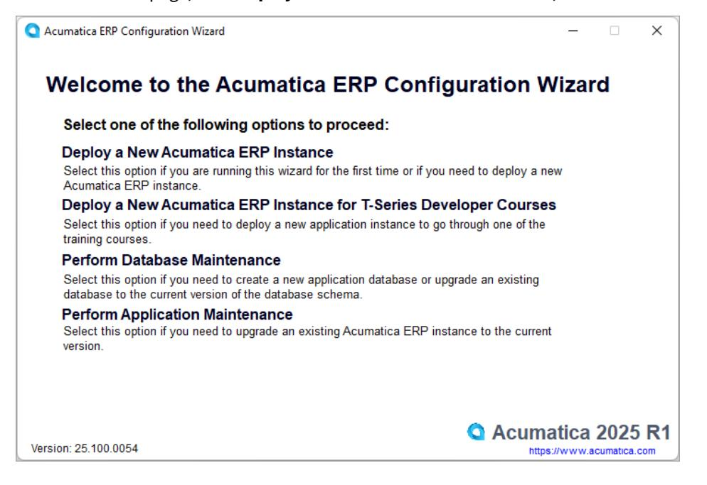

*Figure: The Welcome page of the Acumatica ERP Configuration wizard*

- 3. On the Database Server Connection page, which opens, specify the following settings, and then click **Next** (see the screenshot below):
  - a. **ServerType**: *Microso SQL Server*
  - b. **Server Name**: (local)

If you are using the Microso SQL Server Express edition, enter LOCALHOST \SQLEXPRESS.

- c. **Windows Authentication**: Selected
- d. Optionally. **Encrypt DatabaseServer Connection**: Selected

| <b>Acumatica ERP Configuration Wizard</b>                                                                                                |                                                                    |                                                                                                                                                                        | ×                                                                  |  |
|------------------------------------------------------------------------------------------------------------------------------------------|--------------------------------------------------------------------|------------------------------------------------------------------------------------------------------------------------------------------------------------------------|--------------------------------------------------------------------|--|
|                                                                                                                                          | <b>Database Server Connection</b>                                  |                                                                                                                                                                        |                                                                    |  |
|                                                                                                                                          | On this page, you configure the connection to the database server. |                                                                                                                                                                        |                                                                    |  |
| Specify the database server to be used. If the SQL<br>server port is not the default 1433, it should be<br>specified in the server name. |                                                                    | Specify the authentication method, and, if you choose<br>SQL Server Authentication, the login and password of an<br>account. The user must have appropriate rights for |                                                                    |  |
| Server Type:                                                                                                                             | Microsoft SQL Server                                               | creating databases or making changes to them.*                                                                                                                         |                                                                    |  |
| Server Name:                                                                                                                             | (local)                                                            | <b>O</b> Windows Authentication<br>SQL Server Authentication**<br>Login:                                                                                               |                                                                    |  |
|                                                                                                                                          |                                                                    | Password:                                                                                                                                                              |                                                                    |  |
|                                                                                                                                          |                                                                    | <b>Encrypt Database Server Connection</b>                                                                                                                              |                                                                    |  |
|                                                                                                                                          |                                                                    | The credentials are not stored or used later.<br>** The server should be configured to support this method.                                                            | * The user credentials are required during the configuration ONLY. |  |
| Version: 25.100.0054                                                                                                                     |                                                                    |                                                                                                                                                                        | <b>Back</b><br><b>Next</b>                                         |  |
| https://www.acumatica.com                                                                                                                |                                                                    |                                                                                                                                                                        |                                                                    |  |

#### *Figure: The Database Server Connection page*

- 4. On the Database Configuration page, which opens, enter the following settings to create a new database, and then click **Next** (see the following screenshot):
  - a. **Create a New Database**: Selected
  - b. **New Database's Name**: AcumaticaS100 .

| Acumatica ERP Configuration Wizard                                                    |                     |               |             |             | $\times$ |
|---------------------------------------------------------------------------------------|---------------------|---------------|-------------|-------------|----------|
| <b>Database Configuration</b>                                                         |                     |               |             |             |          |
| On this page, you select an existing database from the list or create a new database. |                     |               |             |             |          |
| Create a New Database                                                                 | New Database's Name | AcumaticaS100 |             |             |          |
| <b>Connect to an Existing Database</b>                                                | Database Filter:    |               |             |             |          |
| Available Databases on the Server                                                     | Reload the List     |               |             |             |          |
|                                                                                       |                     |               |             |             |          |
|                                                                                       |                     |               |             |             |          |
|                                                                                       |                     |               |             |             |          |
|                                                                                       |                     |               |             |             |          |
|                                                                                       |                     |               |             |             |          |
| Version: 25.100.0054                                                                  |                     |               | <b>Back</b> | <b>Next</b> |          |
| https://www.acumatica.com                                                             |                     |               |             |             |          |

*Figure: The Database Configuration page*

The Tenant Setup page opens. By default, the wizard creates a new tenant with no data preloaded and with the default name *Company* in the **Tenant Name** column. The name specified in this column is displayed on the Sign-in page of the application instance and in the instance's user interface.

5. On the Tenant Setup page, change the tenant name to MyCompany, and then click **Next** to go to the next page.

Leave the default values in other boxes, as shown in the following screenshot.

|   |                | Acumatica ERP Configuration Wizard                                                                        |                          |                    |                  |              |                          |                 | п               | × |
|---|----------------|-----------------------------------------------------------------------------------------------------------|--------------------------|--------------------|------------------|--------------|--------------------------|-----------------|-----------------|---|
|   |                | <b>Tenant Setup</b>                                                                                       |                          |                    |                  |              |                          |                 |                 |   |
|   |                | On this page, you create tenants. If you want to create a multitenant site, add rows with the appropriate |                          |                    |                  |              |                          |                 |                 |   |
|   |                | settings for each required tenant.<br><b>Installed Tenants</b>                                            |                          |                    |                  |              |                          |                 | Reload the List |   |
|   | ID             | <b>Tenant Name</b>                                                                                        | New                      | <b>Insert Data</b> | Parent Tenant ID |              | Visible                  | Additional Info |                 |   |
| r | $\overline{2}$ | MyCompany                                                                                                 | $\overline{\mathscr{S}}$ | $\checkmark$       | 1                | $\checkmark$ | $\overline{\mathcal{L}}$ | Company         |                 |   |
|   |                |                                                                                                           |                          |                    |                  |              |                          |                 |                 |   |
|   |                |                                                                                                           |                          |                    |                  |              |                          |                 |                 |   |
|   |                |                                                                                                           |                          |                    |                  |              |                          |                 |                 |   |
|   |                |                                                                                                           |                          |                    |                  |              |                          |                 |                 |   |
|   |                |                                                                                                           |                          |                    |                  |              |                          |                 |                 |   |
|   |                |                                                                                                           |                          |                    |                  |              |                          |                 |                 |   |
|   |                |                                                                                                           |                          |                    |                  |              |                          |                 |                 |   |
|   |                | Advanced Settings   Secure Tenant on the Sign-In Page                                                     |                          |                    |                  |              |                          | Create          | Delete          |   |
|   |                |                                                                                                           |                          |                    |                  |              |                          |                 |                 |   |
|   |                | Version: 25.100.0054                                                                                      |                          |                    |                  |              |                          | <b>Back</b>     | <b>Next</b>     |   |
|   |                | https://www.acumatica.com                                                                                 |                          |                    |                  |              |                          |                 |                 |   |

*Figure: The Tenant Setup page*

6. On the Database Connection page, which opens, leave the default **Windows Authentication** option selected, as shown in the following screenshot, and click **Next**.

| Acumatica ERP Configuration Wizard                                                                                                                                                                   | $\times$                                                                                   |
|------------------------------------------------------------------------------------------------------------------------------------------------------------------------------------------------------|--------------------------------------------------------------------------------------------|
| <b>Database Connection</b>                                                                                                                                                                           |                                                                                            |
| On this page, you specify the login credentials that Acumatica ERP will use to connect to the database.<br>You can use existing login credentials or let this wizard create the credentials for you. |                                                                                            |
| We recommend that you use an account with a limited set of permissions. If you use an existing user, it must<br>have the following permissions: read, write, execute, and ddladmin.                  |                                                                                            |
| <b>O</b> Windows Authentication*                                                                                                                                                                     |                                                                                            |
| SOL Server Authentication                                                                                                                                                                            |                                                                                            |
| <b>Create Login Credentials</b>                                                                                                                                                                      |                                                                                            |
| <b>Use Existing Login Credentials</b>                                                                                                                                                                |                                                                                            |
| Login:                                                                                                                                                                                               |                                                                                            |
| Password:                                                                                                                                                                                            |                                                                                            |
| Confirm Password:                                                                                                                                                                                    | * This option will create database server login<br>credentials for the IIS anonymous user. |
|                                                                                                                                                                                                      |                                                                                            |
|                                                                                                                                                                                                      |                                                                                            |
| Version: 25.100.0054                                                                                                                                                                                 | <b>Back</b><br><b>Next</b>                                                                 |
| https://www.acumatica.com                                                                                                                                                                            |                                                                                            |

#### *Figure: The Database Connection page*

The default anonymous user account used by Internet Information Services, which is *ApplicationPoolIdentity*, will be used to connect to the database.

- 7. On the Instance Configuration page, which opens, enter the following settings, and then click **Next**:
  - a. **Instance Name**: *AcumaticaS100*.

By default, this is the name that you have specified for the database. You can change it.

- b. **Create Acumatica ERP Site**: Selected.
- c. **Local Path to the Instance**: The path on the local computer to the application instance being created.

By default, this is the folder with the instance name, which is located in the folder where the Acumatica ERP Configuration wizard has been installed. The path should have the following format: %Program Files%\Acumatica ERP\AcumaticaS100, as shown in the following screenshot.

| <b>Instance Configuration</b>          |                                              |                                                                                                    |
|----------------------------------------|----------------------------------------------|----------------------------------------------------------------------------------------------------|
|                                        |                                              | Before you can use Acumatica ERP, the instance has to be created and configured. On this page, you |
| enter all the appropriate information. |                                              |                                                                                                    |
| Instance Name:                         | Acumatica S100                               | Create Acumatica ERP Site                                                                          |
|                                        |                                              | Create Self-Service Portal                                                                         |
| Local Path to the Instance:            | C:\Program Files\Acumatica ERP\AcumaticaS100 |                                                                                                    |
|                                        |                                              |                                                                                                    |
|                                        |                                              |                                                                                                    |
|                                        |                                              |                                                                                                    |
|                                        |                                              |                                                                                                    |
| Version: 25.100.0054                   |                                              |                                                                                                    |
| https://www.acumatica.com              |                                              | <b>Next</b><br><b>Back</b>                                                                         |

*Figure: The Instance Configuration page*

- 8. On the Website Configuration page, which opens, specify the following settings, and then click **Next** (see the screenshot below):
  - a. **Available Websites**: *Default Web Site*
  - b. **CreateVirtual Directory**: Selected
  - c. **Virtual Directory Name**: Name of the virtual directory, which matches the instance name
  - d. **Compile theSite**: Selected
  - e. **Install RabbitMQ**: Selected
  - f. **Install NodeJS**: Selected
  - g. **Enable Modern UI**: Cleared
  - h. **Use Existing Application Pool**: Selected
  - j. **Available Application Pools**: *DefaultAppPool*

| <b>Acumatica ERP Configuration Wizard</b> |                 |                                                                                                   |             |                 | $\times$ |
|-------------------------------------------|-----------------|---------------------------------------------------------------------------------------------------|-------------|-----------------|----------|
| <b>Website Configuration</b>              |                 |                                                                                                   |             |                 |          |
| enter all the appropriate information.    |                 | Before you can use Acumatica ERP, the website has to be created and configured. On this page, you |             |                 |          |
| <b>Website Settings</b>                   |                 | <b>Application Pool Settings</b>                                                                  |             |                 |          |
| <b>Available Websites</b>                 | Reload the List | <b>Create New Application Pool</b>                                                                |             |                 |          |
| Default Web Site                          |                 | <b>Application Pool Name:</b>                                                                     |             |                 |          |
|                                           |                 | O Use Existing Application Pool                                                                   |             | Reload the List |          |
|                                           |                 | Available Application Pools (Integrated Pipeline<br>Mode, Support 32bit apps is disabled):        |             |                 |          |
| Create Virtual Directory                  |                 | NETv4.5                                                                                           |             |                 |          |
| Virtual Directory Name: AcumaticaS100     |                 | Default App Pool                                                                                  |             |                 |          |
| <b>Compile the Site</b>                   |                 |                                                                                                   |             |                 |          |
| Install RabbitMQ                          |                 |                                                                                                   |             |                 |          |
| <b>Install NodeJS</b>                     |                 |                                                                                                   |             |                 |          |
| Enable Modern UI (not for production use) |                 |                                                                                                   |             |                 |          |
|                                           |                 |                                                                                                   |             |                 |          |
| Version: 25,100,0054                      |                 |                                                                                                   | <b>Back</b> | <b>Next</b>     |          |
| https://www.acumatica.com                 |                 |                                                                                                   |             |                 |          |

#### *Figure: The Website Configuration page*

The Confirmation of Configuration page opens, as shown in the following screenshot.

| Acumatica ERP Configuration Wizard                               |                                                                                                    |                    | $\times$      |
|------------------------------------------------------------------|----------------------------------------------------------------------------------------------------|--------------------|---------------|
| <b>Confirmation of Configuration</b>                             |                                                                                                    |                    |               |
|                                                                  |                                                                                                    |                    |               |
| the following table. Click Finish to complete the configuration. | The wizard has collected all the required information. On this page, you review the information in |                    |               |
|                                                                  |                                                                                                    |                    |               |
| Parameter                                                        | Value                                                                                              |                    |               |
| <b>Configuration Mode</b>                                        | NewInstance                                                                                        |                    |               |
| <b>Database Server Type</b>                                      | MSSqlServer                                                                                        |                    |               |
| Database Server Name                                             |                                                                                                    |                    |               |
| <b>Database Server Authentication Type</b>                       | True                                                                                               |                    |               |
| Database Server Timeout                                          | 30                                                                                                 |                    |               |
| Database                                                         | True                                                                                               |                    |               |
| Database Name                                                    | Acumatica S1001                                                                                    |                    |               |
| <b>Encrypt Database Server Connection</b>                        | True                                                                                               |                    |               |
| <b>Database Update</b>                                           | False                                                                                              |                    |               |
| Size of the Database                                             | 1                                                                                                  |                    |               |
|                                                                  | e al                                                                                               |                    |               |
| <b>Full Logging Mode</b>                                         |                                                                                                    | Save Configuration |               |
|                                                                  |                                                                                                    |                    |               |
| Version: 25.100.0054                                             |                                                                                                    | <b>Back</b>        | <b>Finish</b> |
|                                                                  |                                                                                                    |                    |               |

#### *Figure: The settings of the instance to be created*

- 9. Click **Finish**, and wait while the installation process completes.
- 10.Click **OK** in the dialog box aer the installation is complete; the system returns you to the Welcome page of the Acumatica ERP Configuration wizard.

The new Acumatica ERP instance is created, and now you can access it for the first time.

#### **Step 2: Accessing the Instance for the First Time**

To access the *AcumaticaS100* application instance for the first time, do the following:

- 1. While you are viewing the Welcome page of the Acumatica ERP Configuration wizard, click **Perform Application Maintenance**.
- 2. On the Application Maintenance page, which opens, in the list of installed sites, click the *AcumaticaS100* instance, and then click the **Launch** button, as shown in the following screenshot.

|                           | On this page, you can create a new website or manage the existing websites. |             |                         |                                            |                             |
|---------------------------|-----------------------------------------------------------------------------|-------------|-------------------------|--------------------------------------------|-----------------------------|
| <b>Installed Sites</b>    |                                                                             |             |                         |                                            | Reload the List             |
| <b>Instance Name</b>      | Database<br>Site Version<br>DR Version<br>Site Path                         |             |                         |                                            |                             |
| $\mathscr$ Acumatica S100 | Acumatica <sub>S</sub>                                                      | 25.100.0054 | 25.100.0054             | C:\Program Files\Acumatica ERP\AcumaticaS' |                             |
|                           |                                                                             |             |                         |                                            |                             |
|                           |                                                                             |             |                         |                                            |                             |
|                           |                                                                             |             |                         |                                            |                             |
| Create                    | <b>Delete</b><br>Upgrade                                                    | v           | <b>Change Database</b>  |                                            | <b>Review Instance Info</b> |
|                           |                                                                             |             | <b>Maintain Tenants</b> |                                            |                             |

#### *Figure: The list of the Acumatica ERP installed sites*

The instance opens in a new tab of your default browser.

- 3. Use the following credentials for the first sign-in:
  - **Username**: *admin*
  - **Password**: *setup*
- 4. Click **Sign In**.

The system prompts you to enter a new password and confirm it.

5. Type the new password in the **New Password** and **Confirm Password** boxes.

By default, passwords must be at least 8 characters and contain characters from three of the following four categories:

- English uppercase characters: *A* through *Z*
- English lowercase characters: *a* through *z*
- Numerals: *0* through *9*
- Special characters: *!*, *\$*, *#*, and *%*
- 6. Click the link of the Acumatica User Agreement above the**Sign In** button, read the agreement, and then select the check box to indicate that you have read the terms of the agreement and agree to them, as shown in the following screenshot.

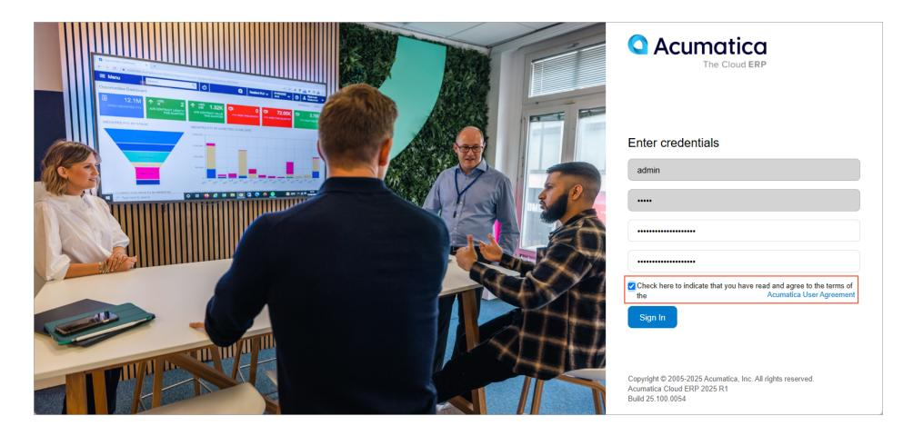

*Figure: Creation of a new password to an application instance*

7. Click **Sign In**.

The home page of the Acumatica ERP instance opens.

# <span id="page-55-0"></span>**Instance Deployment: Feature Activation and Licensing**

Aer you have deployed an instance, you can start the implementation. You need to activate the instance by enabling the default set of features. Then you apply the license and enable any purchased features that are not in the default set.

In this topic, you will read about the first sign-in to a new instance, license obtainment, feature enabling, and the limitations of trial and license modes.

## **First Sign-In to Acumatica ERP**

When you sign in to a new Acumatica ERP instance for the first time and attempt to navigate to any form, the system brings up the *[Enable/Disable Features](https://help-2025r1.acumatica.com/Help?ScreenId=ShowWiki&pageid=c1555e43-1bc5-4f6f-ba9d-b323f94d8a6b)* (CS100000) form (the only form you can access), which you use to enable the default set of features. Aer you do this, you can access the *[Activate License](https://help-2025r1.acumatica.com/Help?ScreenId=ShowWiki&pageid=4859a849-af09-340d-a55b-93c72eabd553)* (SM201510) form, where you can activate your license key if you want to remove the trial mode restrictions. If you want to proceed with the trial mode, you can enable any other features that are available.

## **Obtaining of a License**

In Acumatica ERP, you can request the purchased license by creating a support case through the *[Partner Portal](https://portal.acumatica.com/)*. You should specify the following settings in the case:

- **Installation ID**: The installation ID is available in the **About** dialog box of the Acumatica ERP application instance. To open this dialog box, on any Acumatica ERP form, select**Tools > About**.
- **Contract ID**: You can find this ID on your Acumatica ERP sales invoice.

Aer your license request is processed, you will receive a license key. Acumatica uses a licensing server to validate licenses. If the server where you installed the Acumatica ERP instance has no access to the internet, because of the Acumatica security policy, you may request a license file instead of the key.

You apply the key to your instance by clicking **Enter License Key** on the form toolbar of the *[Activate License](https://help-2025r1.acumatica.com/Help?ScreenId=ShowWiki&pageid=4859a849-af09-340d-a55b-93c72eabd553)* (SM201510) form, enter the license key in the **Activate New License** dialog box, and click **OK**. The system contacts the licensing server and validates the license online. Each license can be used to activate a predetermined number of instances. If you reach the limit for your license, you generally will not be able to use this license. Alternatively,

depending on your license settings, the system may bring up a prompt asking if you want to deactivate the license from the oldest instance.

To validate your license, the licensing server requires that port 443 be open on the computer that is running the Acumatica ERP instance where you enter the key. You may have to open port 443 if the computer has a firewall enabled.

To apply the license file, you should click **Upload License File** on the form toolbar of the *[Activate License](https://help-2025r1.acumatica.com/Help?ScreenId=ShowWiki&pageid=4859a849-af09-340d-a55b-93c72eabd553)* form, and then select and upload the license file by using the **Upload New License File** dialog box. If you use a license file, the system validates the license without contacting the licensing server.

### **Product Features**

Acumatica ERP provides scalable core system functionality and offers a range of add-on features. On the *[Enable/](https://help-2025r1.acumatica.com/Help?ScreenId=ShowWiki&pageid=c1555e43-1bc5-4f6f-ba9d-b323f94d8a6b) [Disable Features](https://help-2025r1.acumatica.com/Help?ScreenId=ShowWiki&pageid=c1555e43-1bc5-4f6f-ba9d-b323f94d8a6b)* (CS100000) form, you can view and modify the list of enabled features according to your license limitations.

You must enable a feature to cause all feature-related forms and individual elements to appear in Acumatica ERP. Some features may add only additional elements to the available forms, and others may enable a workspace or a set of workspaces with multiple forms. For example, the **Projects** menu item appears on the main menu only if the *Project Accounting* feature is enabled. If you enable the *Tax Entry From GL Module* feature, it only adds additional elements to the *Journal [Transactions](https://help-2025r1.acumatica.com/Help?ScreenId=ShowWiki&pageid=dda046bc-5946-407f-88f7-1c0c966fbe72)* (GL301000) form, which is available with the default set of features.

The *[Enable/Disable Features](https://help-2025r1.acumatica.com/Help?ScreenId=ShowWiki&pageid=c1555e43-1bc5-4f6f-ba9d-b323f94d8a6b)* form also displays (at the top of the form) the state of the currently selected feature set —that is, the set of functionality available in your instance of Acumatica ERP. The following states are possible:

- *Pending Activation*: The system displays this status when you access the form for the first time to enable the standard set of features. Also, the system displays the status aer you click **Modify** on the form toolbar to change the selection of features. This status indicates that the current settings on the form do not reflect the actual set of functionality available in Acumatica ERP.
- *Validated*: The system displays this status when you have enabled the features selected on the form by clicking **Enable** on the form toolbar. With this status, the enabled features on the form reflect the actual functionality available in your instance of Acumatica ERP.

Before you start implementing Acumatica ERP, you may find it helpful to become familiar with the functionality to be implemented and the add-on features your organization has included in the license. For details, see *[Preparing an](https://help-2025r1.acumatica.com/Help?ScreenId=ShowWiki&pageid=95c9a43e-fa12-4e79-99b4-6f5b1a688b72) [Instance: Acumatica ERP Features](https://help-2025r1.acumatica.com/Help?ScreenId=ShowWiki&pageid=95c9a43e-fa12-4e79-99b4-6f5b1a688b72)*.

You can also use the *[Enable/Disable Features](https://help-2025r1.acumatica.com/Help?ScreenId=ShowWiki&pageid=c1555e43-1bc5-4f6f-ba9d-b323f94d8a6b)* form to disable individual features in Acumatica ERP. We recommend that you *not* disable any feature aer it has been enabled and used in the live system; this may cause unexpected results, including data loss.

## **Trial and License Modes**

By default, Acumatica ERP is installed in trial mode. Although all features are available in this mode, the mode has the following restrictions:

- You can create no more than 10 tenants per instance.
- All tenants that you create are assigned the *Test Tenant* status. For details, see *Tenants: General [Information](https://help-2025r1.acumatica.com/Help?ScreenId=ShowWiki&pageid=dd966afb-b1d1-4e7d-85d7-5d5fc61a44a3)*.
- A watermark is added to all printed forms and reports.
- Only two conventional users can concurrently use the system.

*Conventional users* are users who can sign in by using their usernames and passwords on the Acumatica ERP Sign-In page, through the mobile application, or via the single sign-on page if SSO with Google or Microso Account has been set up.

Each time a third conventional user signs in to Acumatica ERP, one of the current users is forcibly signed out. The following message is displayed at the bottom of each form: *Your product is in trial mode. Only two concurrent users are allowed.* The message is followed by the *Activate* link, which you can click to activate a license.

• Only two API users can concurrently use the system. A third API user cannot sign in to Acumatica ERP and receives an error during the sign-in attempt.

> API users are users with client applications that can sign in using the contract-based REST API method, the screen-based SOAP API, or the OAuth 2.0 authorization mechanism for applications.

In trial mode, you can enable and use any feature. For a production site, you should activate the full-product license, thus running the system in license mode. Aer the license activation, the system hides the features that are not included in your license on the *[Enable/Disable Features](https://help-2025r1.acumatica.com/Help?ScreenId=ShowWiki&pageid=c1555e43-1bc5-4f6f-ba9d-b323f94d8a6b)* (CS100000) form, and you will not be able to enable these features.

When you obtain the license for using Acumatica ERP and apply this license to an instance, the trial mode restrictions are removed. The license defines the license tier (that is, the level of resources that you can use by using the license) and the set of features you can enable for the instance. For details on license tiers, see *[Typical](#page-8-0) Hardware and Virtual Machine [Configurations](#page-8-0) for PCS and PCP Licenses for the Acumatica ERP Installation*.

During licensing and activation, the application instance is restarted. When you apply a license to a non-testing environment, make sure that all users of your website are warned about the restart of the site so that they can save all work in progress.

If you use the Acumatica Self-Service Portal, you have to obtain a license for the Self-Service Portal instance, activate the license, and then activate the required Self-Service Portal features. For details, see *[Configuring the Self-](https://help-2025r1.acumatica.com/Help?ScreenId=ShowWiki&pageid=97ddf787-c234-4a5d-8cd3-79e8f860fb42)[Service Portal](https://help-2025r1.acumatica.com/Help?ScreenId=ShowWiki&pageid=97ddf787-c234-4a5d-8cd3-79e8f860fb42)*.

## **Multiple User Sessions for the Same Username**

You can define how an Acumatica ERP instance handles conventional users (but not API users) who try to sign in by using the same username—for example, from different browsers. In the site web.config settings, you can use the <concurrentUserMode> parameter to specify whether the system allows users to sign in multiple times under the same username.

To specify this, you need to add this parameter to the providers section in membership of the web.config file.

```
<membership defaultProvider="PXActiveDirectorySyncMembershipProvider">
 <providers>
 <remove name="PXActiveDirectorySyncMembershipProvider"/>
 <remove name="MySQLMembershipProvider" />
 <add name="PXActiveDirectorySyncMembershipProvider"
 type="PX.Data.PXActiveDirectorySyncMembershipProvider, PX.Data"
 mainProviderType="PX.Data.PXDatabaseMembershipProvider" . . .
 concurrentUserMode="true"/>
 </providers>
 </membership>
```

If the <concurrentUserMode> parameter is set to *false* (the default setting), the system allows multiple user sessions under the same username or names. For example, the same user or different users can sign in as *admin* in 10 user sessions, and all of them are counted to comply with the concurrent user limit.

If <concurrentUserMode> is set to *true*, the system allows only one user session under each username. If anyone tries to sign in the system with a username that is already signed in, the system will forcibly sign out the first user that is signed in with this username.

# <span id="page-58-1"></span><span id="page-58-0"></span>**Instance Deployment: To Enable Features and Activate the License**

In the following activity, you will learn how to enable features in Acumatica ERP, activate the license, and review the license information.

#### **Story**

Suppose that the SweetLife Fruits & Jams company has purchased an Acumatica ERP subscription in Acumatica Business Cloud. The instance has been installed by SaaS engineers.

As a system administrator, you have received the instance URL and the credentials to the *admin* user. Now you need to prepare the instance for implementation. You will be the first one to sign in to the instance, and you will activate and license it with the product key you have obtained from the sales representative.

The company has purchased the S1 license tier with three concurrent users and five tenants. In addition to the default set of features, your company has purchased the basic functionality associated with the *Inventory and Order Management* group of features.

#### **Process Overview**

To begin using the system aer the installation, you will use the *[Enable/Disable Features](https://help-2025r1.acumatica.com/Help?ScreenId=ShowWiki&pageid=c1555e43-1bc5-4f6f-ba9d-b323f94d8a6b)* (CS100000) form to enable the standard set of features, which gives you the ability to access the *[Activate License](https://help-2025r1.acumatica.com/Help?ScreenId=ShowWiki&pageid=4859a849-af09-340d-a55b-93c72eabd553)* (SM201510) form.

When you enable the features, you will still be in trial mode. To remove the restrictions of the trial mode, you will activate the license and enable the features that you bought in addition to the standard set.

#### **System Preparation**

Before you begin enabling features on an Acumatica ERP application instance, make sure that you have performed the following prerequisite activity: *Instance Deployment: To Deploy an [Out-of-the-Box](#page-48-1) Instance*.

## **Step 1: Enabling Features for the First Time**

To enable features in Acumatica ERP for the first time, do the following:

- 1. Launch the Acumatica ERP application instance with an out-of-the-box tenant and sign in with the following credentials:
  - Username: *admin*
  - Password: *setup* (or the one provided to you by the person who performed the installation)

When you sign in for the first time, the system requires you to change the password.

2. Open the *[Enable/Disable Features](https://help-2025r1.acumatica.com/Help?ScreenId=ShowWiki&pageid=c1555e43-1bc5-4f6f-ba9d-b323f94d8a6b)* (CS100000) form.

Notice that a number of features are selected by default and the activation status is *Pending Activation*, as shown in the following screenshot.

| © Acumatica                | Search                                                 | ⊘<br>$\checkmark$                                   |
|----------------------------|--------------------------------------------------------|-----------------------------------------------------|
| <b>Favorites</b>           | Enable/Disable Features                                | <b>CUSTOMIZATION</b><br>TOOLS $\blacktriangleright$ |
| Data Views                 | ↶<br><b>MODIFY</b><br><b>ENABLE</b>                    |                                                     |
| $\cdots$<br>More Items<br> | <b>Activation Status:</b><br><b>Pending Activation</b> |                                                     |
| 0.0.0                      | $\blacksquare$ Finance                                 | $\checkmark$                                        |

*Figure: Activation status of initial features*

3. On the toolbar, click **Enable** to activate the selected features.

The activation status of the currently selected feature set is now *Validated*, as the screenshot below shows. On the main menu, notice that new menu items (**Time and Expenses**, **Finance**, **Banking**, **Payables**, and **Receivables**) have appeared (also shown in the screenshot) that correspond to the features you have enabled. You can now click any of these menu items to go to the corresponding workspace and go to the forms within it.

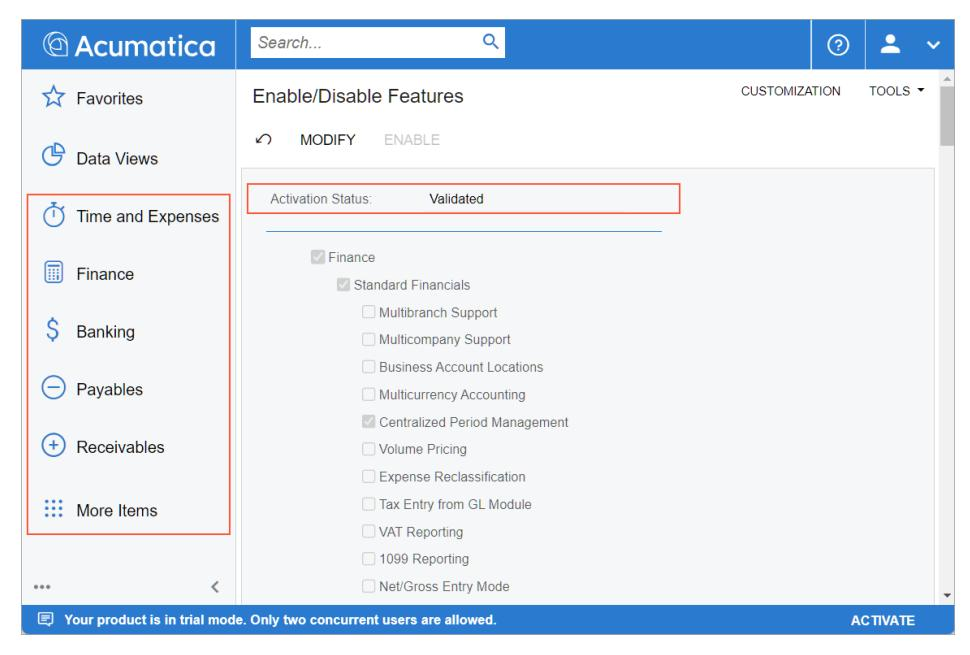

*Figure: The Validated status and the new menu items*

#### **Step 2: Activating the License**

To activate the license, do the following:

Before you proceed with license activation on a real website, make sure that all Acumatica ERP users have saved their work and signed out of the system. During license activation, the Acumatica ERP instance will be restarted, and any unsaved work will be lost.

- 1. Open the *[Activate License](https://help-2025r1.acumatica.com/Help?ScreenId=ShowWiki&pageid=4859a849-af09-340d-a55b-93c72eabd553)* (SM201510) form and do the following:
  - a. On the form toolbar, click **Enter License Key**.
  - b. In the **Activate New License** dialog box, enter the 918B-A728-0569-7FC6-D058 license key, as shown in the following screenshot.

| <b>Activate License</b>                                                                                        |                                                                  | <b>CUSTOMIZATION</b>                                                                                                                                                                                                                                         | TOOLS $\blacktriangleright$ |
|----------------------------------------------------------------------------------------------------------------|------------------------------------------------------------------|--------------------------------------------------------------------------------------------------------------------------------------------------------------------------------------------------------------------------------------------------------------|-----------------------------|
| <b>ENTER LICENSE KEY</b><br>↶                                                                                  | <b>UPLOAD LICENSE FILE</b>                                       |                                                                                                                                                                                                                                                              |                             |
| Status:                                                                                                        | <b>Activate New License</b><br>Inv                               | $\times$                                                                                                                                                                                                                                                     | $\lambda$                   |
| Valid From:<br>Number of Processors:<br>Number of Users:<br>$\boldsymbol{\Omega}$                              | 1/1<br>of software contract signing.<br>new license immediately. | Disclaimer: The license Key is a 20-character alphanumeric string (example: 1234-<br>5678-90AB-CDEF-1234) that your partner receives from Acumatica upon completion<br>If your system has been upgraded or reinstalled, please contact your partner to get a |                             |
| Valid To:<br>Version:<br>Number of Tenants:<br>Ò                                                               | 1/1<br>Please Enter License Key:                                 | 918B-A728-0569-7FC6-D058<br>CANCEL<br>OK                                                                                                                                                                                                                     |                             |
| $ \mathbf{x} $<br>$\times$<br>$\left  \leftrightarrow \right $<br><b>Feature Name</b><br>圓<br><b>Activated</b> |                                                                  |                                                                                                                                                                                                                                                              |                             |

#### *Figure: The license key*

c. Click **OK** at the bottom of the dialog box.

The system contacts the licensing server and validates the license online.

The license key used in this activity is for training purposes only. The license will be deactivated in 24 hours and the instance will return to the trial mode. The license can be applied to an instance only once.

- 2. In the **Agree to Proceed** dialog box, which opens, click the link to read the soware license agreement. If you agree to the terms, click **Agree** to proceed with activation. The dialog box closes.
- 3. In the Summary area of the form, review the status of the license (*Valid*), its validity period, and the number of users and tenants, as shown in the following screenshot.

| Activate License ☆ |                                                     | <b>CUSTOMIZATION</b> | TOOLS $\blacktriangledown$ |
|--------------------|-----------------------------------------------------|----------------------|----------------------------|
| ↶                  | ENTER LICENSE KEY UPLOAD LICENSE FILE APPLY LICENSE |                      |                            |
| Status:            | Valid                                               | $\odot$              | ᄉ                          |
| Valid From:        | 6/8/2020 12:00:00 AM                                |                      |                            |
| Number of Users:   | 3                                                   |                      |                            |
| ◙                  |                                                     |                      |                            |
| Valid To:          | 10/15/2026 12:00:00 AM                              |                      |                            |
| Version:           |                                                     |                      |                            |
| Number of Tenants: | 5                                                   |                      |                            |
| $\times$           | $ \mathbf{x} $<br>$\left  \rightarrow \right $      |                      |                            |
| 目<br>Activated     | <b>Feature Name</b>                                 |                      |                            |
| ⋟<br>п             | <b>Business Account Locations</b>                   |                      |                            |
| п                  | Active Directory and Other External SSO             |                      |                            |
| п                  | <b>Acumatica Payments</b>                           |                      |                            |
| п                  | Address Lookup Integration                          |                      |                            |
|                    | <b>Address Validation Integration</b>               |                      |                            |
| $\triangledown$    | Authentication                                      |                      |                            |
|                    | Warehouse Management                                |                      |                            |
|                    | <b>Advanced Integration Engine</b>                  |                      |                            |

#### *Figure: The license information*

4. In the table, review the features that this license supports.


You can use the filter for the **Activated** column to filter the activated features.

5. On the form toolbar, click **Apply License** to activate your license, and the system will restart the instance.

#### **Step 3: Enabling Additional Features**

To enable additional features in Acumatica ERP, do the following:

1. Open the *[Enable/Disable Features](https://help-2025r1.acumatica.com/Help?ScreenId=ShowWiki&pageid=c1555e43-1bc5-4f6f-ba9d-b323f94d8a6b)* (CS100000) form.

Notice that the list of features is narrowed to the features allowed by the applied license.

- 2. On the form toolbar, click **Modify**.
- 3. In the list of features, select the **Inventory and Order Management** check box.
- 4. On the toolbar, click **Enable** to activate the selected features.

The status of the currently selected feature set is now *Validated*. On the main menu, notice that new workspace menu items (**Sales Orders**, **Purchases**, and **Inventory**) have appeared that correspond to the feature you have enabled. You can now open the forms in these workspaces.

## **Step 4: Reviewing the License Information**

To review the license information—which includes the license status and limitations, warnings about any exceeded limits, and statistics about commercial transactions and constraints—do the following:

- 1. Open the *[License Monitoring Console](https://help-2025r1.acumatica.com/Help?ScreenId=ShowWiki&pageid=06869c57-819d-4626-a5a8-72507e6a79d8)* (SM604000) form.
- 2. On the **License** tab, which is shown in the screenshot below, review the information about your license as follows:
  - In the **LicenseStatus** read-only box, verify that the license status is *Valid*, which means that the instance is licensed and has been activated.
  - In the **License Details** section, review the instance limitations.
  - In the **Recommended Maximums** section, notice that **Concurrent Users** is set to *3*. This means that three users can work in the system at the same time.

| <b>License Monitoring Console</b>               |                           | <b>CUSTOMIZATION</b>                                    | TOOLS $\rightarrow$ |
|-------------------------------------------------|---------------------------|---------------------------------------------------------|---------------------|
| <b>LICENSE</b><br><b>STATISTICS</b><br>WARNINGS | <b>CONSTRAINT HISTORY</b> |                                                         |                     |
| License Status:                                 | Valid                     |                                                         |                     |
| * License Tier:                                 | S Series, Tier 1          |                                                         |                     |
| <b>LICENSE DETAILS.</b>                         |                           | SYSTEM CONSTRAINTS <b>And CONSTRAINTS</b>               |                     |
| Monthly Number of Commercial Transactions:      | 1000                      | Maximum Number of Web Services API Users:               | 10                  |
| Monthly Number of ERP Transactions:             | 20000                     | Maximum Number of Concurrent Web Services API Requests: | 3                   |
| Database Storage Included (GB):                 |                           | Maximum Number of Web Services API Requests per Minute: | 50                  |
| <b>RECOMMENDED MAXIMUMS</b>                     |                           | Maximum Number of Lines per Transaction:                | 1000                |
| Daily Commercial Transactions:                  | 100                       | Maximum Number of Serial Numbers per Document:          | 2000                |
| Daily ERP Transactions:                         | 2000                      | Maximum Number of Employees Paid by Month:              | $\Omega$            |
| <b>Concurrent Users:</b>                        | 3                         |                                                         |                     |

*Figure: The License Monitoring Console form*

## <span id="page-61-1"></span><span id="page-61-0"></span>**Instance Deployment: To Deploy an Instance with Demo Data**

In this activity, you will learn how to deploy an Acumatica ERP application instance with demo data.

#### **Story**

Suppose that you are the system administrator of your company, and you need to deploy the Acumatica ERP application instance with the *T100* dataset.

## **Process Overview**

In this activity, you will deploy the Acumatica ERP application instance with the *T100* dataset.

## **System Preparation**

Before you begin deploying an Acumatica ERP application instance, make sure that you have performed the following prerequisite activity: *Acumatica ERP Installation [On-Premises:](#page-25-1) To Install the Acumatica ERP Configuration [Wizard](#page-25-1)*.

#### **Step: Deploying an Instance with the Demo Data**

To create an Acumatica ERP instance with the *T100* dataset inserted, do the following:

- 1. On the Start menu, click **Acumatica ERP Configuration** to open the Acumatica ERP Configuration wizard.
- 2. On the Welcome page, which opens, click **Perform Application Maintenance**.
- 3. Below the list of existing application instances, click **Create**.
- 4. On the Database Server Connection page, specify the following settings, and then click **Next** to go to the next page:
  - **ServerType**: *Microso SQL Server*
  - **Server Name**: (local)
  - **Windows Authentication**: Selected
- 5. On the Database Configuration page, specify the following settings, and then click **Next** to go to the next page:
  - **Create a New Database**: Selected
  - **New Database's Name**: AcumaticaT100
- 6. On the Tenant Setup page, double-click in the **Insert Data** column for the automatically created row with the *Company* tenant name, and select *T100*, as shown in the following screenshot.

| o |                                                         |    | <b>Acumatica ERP Configuration Wizard</b>             |              |                    |                                                                                                           |              |                 |                 | $\times$ |
|---|---------------------------------------------------------|----|-------------------------------------------------------|--------------|--------------------|-----------------------------------------------------------------------------------------------------------|--------------|-----------------|-----------------|----------|
|   |                                                         |    | <b>Tenant Setup</b>                                   |              |                    |                                                                                                           |              |                 |                 |          |
|   |                                                         |    | settings for each required tenant.                    |              |                    | On this page, you create tenants. If you want to create a multitenant site, add rows with the appropriate |              |                 |                 |          |
|   |                                                         |    | <b>Installed Tenants</b>                              |              |                    |                                                                                                           |              |                 | Reload the List |          |
|   |                                                         | ID | <b>Tenant Name</b>                                    | <b>New</b>   | <b>Insert Data</b> | Parent Tenant ID                                                                                          | Visible      | Additional Info |                 |          |
|   | $\mathscr{S}$                                           | 12 | Company                                               | $\checkmark$ | T100<br>$\vee$ 1   | $\checkmark$                                                                                              | $\checkmark$ | Company         |                 |          |
|   |                                                         |    |                                                       |              | <b>SalesDemo</b>   |                                                                                                           |              |                 |                 |          |
|   |                                                         |    |                                                       |              | T100<br>U100       |                                                                                                           |              |                 |                 |          |
|   |                                                         |    |                                                       |              |                    |                                                                                                           |              |                 |                 |          |
|   |                                                         |    |                                                       |              |                    |                                                                                                           |              |                 |                 |          |
|   |                                                         |    |                                                       |              |                    |                                                                                                           |              |                 |                 |          |
|   |                                                         |    |                                                       |              |                    |                                                                                                           |              |                 |                 |          |
|   |                                                         |    |                                                       |              |                    |                                                                                                           |              |                 |                 |          |
|   |                                                         |    | Advanced Settings   Secure Tenant on the Sign-In Page |              |                    |                                                                                                           |              | Create          | Delete          |          |
|   |                                                         |    |                                                       |              |                    |                                                                                                           |              |                 |                 |          |
|   |                                                         |    | Version: 25.100.0054                                  |              |                    |                                                                                                           |              |                 |                 |          |
|   | <b>Next</b><br><b>Back</b><br>https://www.acumatica.com |    |                                                       |              |                    |                                                                                                           |              |                 |                 |          |

#### *Figure: Selection of a dataset for a new tenant*

- 7. Click **Next** to go to the next page.
- 8. On the Database Connection page, select **Windows Authentication**; click **Next**.
- 9. On the Instance Configuration page, specify the following settings, and then click **Next** to go to the next page:
  - **Instance Name**: AcumaticaT100
  - **Create Acumatica ERP Site**: Selected
  - **Local Path to the Instance**: The path to the application instance on the local computer
- 10.On the Website Configuration page, specify the following settings, and then click **Next** to go to the next page:
  - **WebsiteSettings**: *Default Web Site*
  - **CreateVirtual Directory**: Selected
  - **Virtual Directory Name**: AcumaticaT100
  - **Use Existing Application Pool**: Selected
  - **Available Application Pools**: *DefaultAppPool*

Leave the other settings without changes.

- 11.On the Confirmation of Configuration page, review the settings, and click **Finish**. Wait while the new application instance is created.
- 12.Aer the installation is completed, click **OK** in the dialog box to return to the Acumatica ERP Configuration wizard.

#### 13.Click **Perform Application Maintenance**.

14.Click the row with *AcumaticaT100* instance, and then click **Launch**.

The instance opens in a new tab of your default browser.

15.Use the *admin* username and the *setup* password to sign in to the instance for the first time, and change the default password.


By default, a password must be at least eight characters and contain characters from three of the following four categories: English uppercase characters (*A* through *Z*), English lowercase characters (*a* through *z*), numerals (*0* through *9*), and special characters (such as *!*, *\$*, *#*, and *%*). For details, see *Preparing an Instance: [System-Wide](https://help-2025r1.acumatica.com/Help?ScreenId=ShowWiki&pageid=562b7e1c-ef7b-4a3e-93ef-3ff34df5f6ed) Security Policy*.

The home page of the Acumatica ERP instance opens.

16.To verify that the demo data has been inserted, open the *[Employees](https://help-2025r1.acumatica.com/Help?ScreenId=ShowWiki&pageid=dae5144b-49b3-43a4-bce0-93f31b3f2321)* (EP203000) form, and make sure that there are six employees (Michael Andrews, Maxwell Baker, Layla Beauvoir, Joseph Becher, Martin Bernia, and Todd Bloom). These employees do not come in the out-of-the-box tenant; they have appeared in the instance because you directed the wizard to insert the demo data.

# <span id="page-64-2"></span><span id="page-64-0"></span>**Instance Deployment: Deploying the Acumatica Self-Service Portal**

The Acumatica Self-Service Portal is designed to be a site where your customers can view all the relevant information about their interactions with your company as a vendor and perform common activities online.

To give your customers limited access to your Acumatica ERP instance, you deploy a Self-Service Portal instance connected to your Acumatica ERP instance. The deployment procedure is mostly the same as the procedure for an Acumatica ERP instance. For details, see *[Instance Deployment: General Information](#page-39-2)*.

If you deploy a multitenant Acumatica ERP instance, aer you deploy the Self-Service Portal instance, you must specify the tenant that the Self-Service Portal users can access. For details, see *Instance [Deployment:](#page-66-2) To Specify the Tenant Available for [Self-Service](#page-66-2) Portal Users*.

If you want different tenants to be available through the Self-Service Portal, you must deploy a Self-Service Portal instance for each tenant.

If you need to distribute the load of user requests to a Self-Service Portal instance, you can create a group of Self-Service Portal instances that will be used as a single instance. The system recognizes Self-Service Portal instances as an instance group if the instances contain the same group identifier in their configuration. To create an instance group, you can deploy two or more Self-Service Portal instances, connect each of them to the same database, and specify the group identifier for each instance in the corresponding web.config file. In the file, the PortalSiteID setting in the appSettings section contains the value of the group identifier. For details, see *Instance [Deployment:](#page-66-3) To Set Up a Group of Self-Service Portal Instances*.

By default, the *CustomerPortal-1* value is specified as the PortalSiteID setting for each newly deployed Self-Service Portal instance.

The system shows the group identifier for a Self-Service Portal instance in the **Portal ID** box on the Portal Preferences (SP800000) form in the Self-Service Portal.

# <span id="page-64-3"></span><span id="page-64-1"></span>**Instance Deployment: To Deploy a Self-Service Portal Instance**

In this activity, you will learn how to deploy the Self-Service Portal instance and connect it to the database used by the existing Acumatica ERP instance.

### **Story**

Suppose that you are the system administrator of your company, need to deploy the Self-Service Portal instance to provide access to your Acumatica ERP instance for the customers.

#### **Process Overview**

In this activity, you will deploy the Self-Service Portal instance and connect it to the database of the existing Acumatica ERP instance.

## **System Preparation**

Before you begin deploying the Self-Service Portal instance, make sure that you have performed the following prerequisite activity: *Instance [Deployment:](#page-61-1) To Deploy an Instance with Demo Data*.

## **Step: Deploying a Self-Service Portal Instance**

To deploy the Self-Service Portal instance, do the following:

- 1. On the Start menu, click **Acumatica ERP Configuration** to open the Acumatica ERP Configuration wizard.
- 2. On the Welcome page, click **Deploy a New Acumatica ERP Instance**.
- 3. On the Database Server Connection page, specify the following settings, and then click **Next** to proceed to the next page:
  - **ServerType**: *Microso SQL Server*
  - **Server Name**: (local)
  - **Windows Authentication**: Selected
- 4. On the Database Configuration page, specify the following settings, and then click **Next** to proceed to the next page:
  - a. **Connect to an Existing Database**: Selected
  - b. **Available Databases on theServer**: The database that is used by the Acumatica ERP instance for which you want to create the Self-Service Portal instance
  - c. **Update Database**: A check box that you select if the schema of the database is outdated
  - d. **Shrink Data Aer Upgrade**: A check box that you select if you want to shrink data aer the database maintenance
- 5. On the Tenant Setup page, select the tenant that is used by the Acumatica ERP instance, and click **Next**.
- 6. On the Database Connection page, select **Windows Authentication**.
- 7. Click **Next**.
- 8. On the Instance Configuration page, specify the following settings:
  - a. **Instance Name**: The name to be used for the Self-Service Portal instance
  - b. **CreateSelf-Service Portal**: Selected
  - c. **Local Path to the Instance**: The path on the local computer to this application instance

By default, the path looks like C:\Program Files\Acumatica ERP\<instance name>. You can change it, if needed.

9. Click **Next**.

10.On the Website Configuration page, specify the following settings, and then click **Next** to proceed to the next page:

- **WebsiteSettings**: *Default Web Site*
- **CreateVirtual Directory**: Selected
- **Virtual Directory Name**: The name of the virtual directory for the Acumatica ERP instance

- **Use Existing Application Pool**: Selected
- List of existing application pools: *DefaultAppPool* Leave the other settings without changes.
- 11.On the Confirmation of Configuration page, do the following:
  - a. Check the configuration settings that you have specified.
  - b. If you want to save the configuration settings in an XML file on your computer, click**Save Configuration**.
  - c. Click **Finish** to deploy this Self-Service Portal instance.

# <span id="page-66-2"></span><span id="page-66-0"></span>**Instance Deployment: To Specify the Tenant Available for Self-Service Portal Users**

In this activity, you will learn how to specify the tenant that will be available for the Self-Service Portal users in a multitenant Acumatica ERP configuration.

#### **Story**

Suppose that you are the system administrator of your company, and you need to specify the tenant to which the Self-Service Portal users will have access.

#### **Process Overview**

In this activity, you will configure the available tenant for the Self-Service Portal users.

#### **System Preparation**

Before you begin configuring the tenant, perform the following prerequisite activity: *Instance [Deployment:](#page-64-3) To [Deploy a Self-Service Portal Instance](#page-64-3)*.

## **Step: Configuring the Tenant Available to Self-Service Portal Users**

To configure the tenant available to Self-Service Portal users, do the following:

- 1. Open the web.config file for the Self-Service Portal instance. This file is usually located in %Program Files%\Acumatica ERP\<instance name>, where *<instance name>* is the name of the Self-Service Portal instance.
- 2. In the file, find the providers section, which has the following settings.

<add name="PXSqlDatabaseProvider" ... companyID="" .../>

3. Change the following key value.

companyID="*x*"

*x* is the ID of the tenant that you want to make available to Self-Service Portal users.

4. Save the web.config file; this automatically restarts the website.

## <span id="page-66-3"></span><span id="page-66-1"></span>**Instance Deployment: To Set Up a Group of Self-Service Portal Instances**

In this activity, you will learn how to create a group of Self-Service Portal instances.

#### **Story**

Suppose that you are the system administrator of your company, and you need to set up a group of two Self-Service Portal instances with the *Retail* group identifier.

## **Process Overview**

In this activity, you will deploy two Self-Service Portal instances and specify the *Retail* group identifier in their configuration files.

## **System Preparation**

Before you begin doing this activity, make sure that you have performed the following prerequisite activity: *Instance [Deployment:](#page-61-1) To Deploy an Instance with Demo Data*.

#### **Step 1: Deploying Self-Service Portal Instances**

To deploy the first Self-Service Portal instance that will be included in the *Retail* group, do the following:

- 1. On the Start menu, click **Acumatica ERP Configuration** to open the Acumatica ERP Configuration wizard.
- 2. On the Welcome page, click **Deploy a New Acumatica ERP Instance**.
- 3. On the Database Server Connection page, specify the following settings, and then click **Next** to proceed to the next page:
  - **ServerType**: *Microso SQL Server*
  - **Server Name**: (local)
  - **Windows Authentication**: Selected
- 4. On the Database Configuration page, specify the following settings, and then click **Next** to proceed to the next page:
  - a. **Connect to an Existing Database**: Selected
  - b. **Available Databases on theServer**: The database that is used by the Acumatica ERP instance for which you want to create the Self-Service Portal instance


For a group of Self-Service Portal instances, the database must be the same across all instance.

- 5. On the Tenant Setup page, select the tenant that is used by the Acumatica ERP instance, and click **Next**.
- 6. On the Database Connection page, select **Windows Authentication**.
- 7. Click **Next**.
- 8. On the Instance Configuration page, specify the following settings:
  - a. **Instance Name**: Portal1
  - b. **CreateSelf-Service Portal**: Selected
  - c. **Local Path to the Instance**: The path on the local computer to this application instance

The path looks like C:\Program Files\Acumatica ERP\Portal1.

#### 9. Click **Next**.

10.On the Website Configuration page, verify the following settings, and then click **Next** to proceed to the next page:

- **WebsiteSettings**: *Default Web Site*
- **CreateVirtual Directory**: Selected
- **Virtual Directory Name**: *Portal1*
- **Use Existing Application Pool**: Selected
- List of existing application pools: *DefaultAppPool*
- 11.On the Confirmation of Configuration page, do the following:
  - a. Check the configuration settings that you have specified.
  - b. Click **Finish** to deploy this Self-Service Portal instance.

Aer the deployment of the *Portal1* instance is complete, repeat the instructions and deploy another Self-Service Portal instance. On the Instance Configuration page, specify *Portal2* as the name for the second instance and ensure that this name is also specified in the **Virtual Directory Name** box on the Website Configuration page.

When you deploy the *Portal2* instance, make sure that you specify the same database on the Database Configuration page as you did for the *Portal1* instance.

## **Step 2: Specifying the Group Identifier for the Self-Service Portal Instances**

To specify that the Self-Service Portal instances that you have deployed in the previous step belong to the *Retail* group of instances, do the following for each of the instances:

1. Open the web.config file corresponding to the Self-Service Portal instance.

This file is usually located in %Program Files%\Acumatica ERP\<instance name>, where *<instance name>* is the name of the Self-Service Portal instance—that is *Portal1* or *Portal2*.

- 2. In the file, find the appSettings section.
- 3. In the PortalSiteID setting, which represents the group identifier of the Self-Service Portal instance, specify the *Retail* value as follows.

```
<add key="PortalSiteID" value="Retail" />
```

4. Save the web.config file; this causes the system to automatically restart.

# <span id="page-69-2"></span><span id="page-69-0"></span>**Maintaining Tenants**

In this chapter, you will learn how to add and delete tenants within an Acumatica ERP application instance. Additionally, you will explore various modifications that can be made to tenants to meet your company's requirements.

# <span id="page-69-3"></span><span id="page-69-1"></span>**Tenant Maintenance: General Information**

Acumatica ERP provides you with the ability to create additional tenants, maintain them, and delete them by using the Acumatica ERP Configuration wizard.

This topic describes the ways of adding tenants by using the Acumatica ERP Configuration wizard, provides an overview of the System and custom parent tenants, and explains various changes that can be made to tenants.

## **Learning Objectives**

In this chapter, you will do the following:

- Become familiar with the process of adding more tenants
- Become familiar with the System tenant, a custom parent tenant, and the tenant hierarchy
- Create an additional tenant
- Deploy a multitenant Acumatica ERP instance
- Explore the visibility of tenants
- Learn about restrictions on tenant access
- Delete a tenant

## **Applicable Scenarios**

You may need to learn how to maintain tenants of the Acumatica ERP instance in scenarios that include the following:

- You are an implementation consultant who needs to add an additional tenant to the existing Acumatica ERP instance.
- You are an implementation consultant who needs to know what the System tenant is and how to create a custom parent tenant.
- You are a system administrator who needs to restrict access to some tenants within the Acumatica ERP instance for employees of the company.

## **The System Tenant and Tenant Hierarchy**

When you deploy an Acumatica ERP application instance, the hidden System tenant is always created automatically. The System tenant has an **ID** of *1* in the **ParentTenant ID** column on the Tenant Setup page of the Acumatica ERP Configuration wizard.

The System tenant contains predefined system data, such as preconfigured roles and numbering sequences, as well as wiki-based documentation. The system data is used by all tenants of the same application instance.

By default, the System tenant is hidden and all user-created tenants inherit the initial configuration and system (predefined) data from the System tenant. That is, in the tenant hierarchy, the System tenant serves as the root tenant and is the parent of all other tenants. All the data available in the System tenant is visible to other tenants in the same database.

When you create a new tenant, its parent tenant must be selected; the System tenant is inserted as a parent by default. If you create a new tenant by using the Acumatica ERP Configuration wizard, you can select any parent tenant for each of the child tenants by specifying its ID in the **ParentTenant ID** column. If you create a tenant on the *[Tenants](https://help-2025r1.acumatica.com/Help?ScreenId=ShowWiki&pageid=3f8ba9f5-9e04-4568-a93e-862ba7b92c2b)* (SM203520) form, the System tenant is assigned as its parent automatically and you cannot change it. For details, see *[Managing](https://help-2025r1.acumatica.com/Help?ScreenId=ShowWiki&pageid=d1270885-9df7-43b2-8f82-6a2074a4f4c1) Tenants by Using the Web Interface*.


Users can sign in to only child tenants. If you select an existing tenant to be a parent, users will not be able to sign in to the parent tenant anymore.

You cannot delete the System tenant.

## **Creation of Additional Tenants**

For an Acumatica ERP instance, you can create additional tenants on the Tenant Setup page of the Acumatica ERP Configuration wizard during or aer the initial deployment of an instance.

You can add an additional tenant to the instance by clicking **Create** on the Application Maintenance page of the wizard. For details, see *Tenant [Maintenance:](#page-71-1) To Create an Additional Tenant*.

Also, you can create tenants and view information about their settings on the *[Tenants](https://help-2025r1.acumatica.com/Help?ScreenId=ShowWiki&pageid=3f8ba9f5-9e04-4568-a93e-862ba7b92c2b)* (SM203520) form. For details, see *[Managing](https://help-2025r1.acumatica.com/Help?ScreenId=ShowWiki&pageid=d1270885-9df7-43b2-8f82-6a2074a4f4c1) Tenants by Using the Web Interface*.

### **A Custom Parent Tenant**

An application update or upgrade replaces all the data available in the System tenant, while the data created by users in user-created tenants remains unchanged. If you would like to replace preconfigured data, such as roles and numbering sequences, similarly for multiple new tenants, you can create a *custom parent tenant*: a parent tenant that will be used instead of the System tenant for your new tenants.

To configure a custom parent tenant, you create a new tenant on the Tenant Setup page of the Acumatica ERP Configuration wizard and provide a name that clearly indicates how this tenant will be used (for example, *NewParent* or *MyParent*). This tenant is a child of the System tenant and inherits all its data. In the custom parent tenant, you can override the preconfigured settings as needed and specify other configuration settings to be used in all the new tenants. Then when you create a new tenant by using the Acumatica ERP Configuration wizard, you specify the custom parent tenant as the parent tenant of the new tenant. The new tenant will inherit all the data from the custom parent tenant rather than from the System tenant.

You can create a custom parent tenant that is a child of another parent tenant. Note that users cannot sign in to a parent tenant.

You can create new tenants based on the custom parent tenant only by using the Acumatica ERP Configuration wizard. If you create new tenants on the *[Tenants](https://help-2025r1.acumatica.com/Help?ScreenId=ShowWiki&pageid=3f8ba9f5-9e04-4568-a93e-862ba7b92c2b)* (SM203520) form, the System tenant is assigned as its parent automatically. Due to technical limitations, you can have a maximum of 127 tenants on an Acumatica ERP instance. This includes all types of tenants, irrespective of their statuses.

## **Restriction of Access to Tenants**

In a multitenant Acumatica ERP instance, the tenant selection box appears on the Sign-In page by default, allowing users to select the tenant to sign in from the list of all available tenants.

If you want to restrict the list of tenants a user can see to only those the user has access to, select the**Secure Tenant on theSign-In Page** check box on the Tenant Setup page of the Acumatica ERP Configuration wizard. In this case, the tenant selection box does not appear on the Sign-In page by default, and all users must first authenticate themselves by entering their username and password. Depending on the user, one of the following occurs:

- A user who has access to only one tenant will be automatically signed in to that tenant aer entering their username and password.
- A user who has access to multiple tenants and has the same credentials for these tenants must select a tenant in the tenant selection box, which appears aer the user has been authenticated and contains the list of tenants available to the user.
- A user who has access to multiple tenants and has different credentials for different tenants is signed in to the tenant whose credentials the user entered on the Sign-In page.
- If a user who has access to multiple tenants and signs in to an Acumatica ERP instance by using single signon (SSO) with an external identity provider, the user is signed in to the first tenant that is listed on the *[Tenant](https://help-2025r1.acumatica.com/Help?ScreenId=ShowWiki&pageid=7df354c8-863c-4106-b0b7-a5ef60099e4c) [List](https://help-2025r1.acumatica.com/Help?ScreenId=ShowWiki&pageid=7df354c8-863c-4106-b0b7-a5ef60099e4c)* (SM203530) form with SSO enabled.

If you are using multiple tenants and SSO authentication and the**SecureTenant on theSign-In Page** check box is selected, ensure that all users can sign in to the first tenant listed on the *[Tenant](https://help-2025r1.acumatica.com/Help?ScreenId=ShowWiki&pageid=7df354c8-863c-4106-b0b7-a5ef60099e4c) List* (SM203530) form. If a user cannot sign in to the first listed tenant, they will not be able to select a different tenant to sign in to.

#### **Visibility of Tenants**

You can define the visibility of tenants for users on the Sign-In page of the Acumatica ERP instance. You do this by clearing or selecting the check box in the**Visible** column in the row of the tenant on the Tenant Setup page of the Acumatica ERP Configuration wizard. For details, see *Tenant [Maintenance:](#page-78-1) To Change Tenant Visibility*

## **Deletion of Tenants**

You may need to delete an existing tenant. You can do this by using the Acumatica ERP Configuration wizard. On the Tenant Setup page of the wizard, you can select the tenant you want to remove and click **Delete**. For details, see *Tenant [Maintenance:](#page-81-1) To Delete a Tenant*.

Because any tenant you see on the Tenant Setup page may be in production, you should create backups before making any changes.

## <span id="page-71-1"></span><span id="page-71-0"></span>**Tenant Maintenance: To Create an Additional Tenant**

The following activity will walk you through the process of creating an additional tenant.

#### **Story**

Suppose that you are the system administrator of your company, and you have been asked to create an additional tenant in an existing Acumatica ERP application instance.

#### **Process Overview**

In this activity, you will create an additional tenant in an existing instance.

#### **System Preparation**

Before you begin performing the step of this activity, make sure that you have performed one of the following prerequisite activities: *Instance [Deployment:](#page-61-1) To Deploy an Instance with Demo Data* or *Instance [Deployment:](#page-48-1) To [Deploy an Out-of-the-Box Instance](#page-48-1)*.

#### **Step: Creating an Additional Tenant**

If you have already deployed an Acumatica ERP instance, you can add an additional tenant to the instance as follows:

- 1. On the Start menu, click **Acumatica ERP Configuration** to open the Acumatica ERP Configuration wizard.
- 2. On the Welcome page, click **Perform Application Maintenance**.
- 3. On the Application Maintenance page, do the following:
  - a. In the **Installed Sites** list, select the appropriate Acumatica ERP instance.
  - b. Click **Maintain Tenants**.
- 4. In the **SQLServer Authentication** dialog box, select the authentication method to be used to connect to the database.
- 5. Click **OK**.
- 6. On the Tenant Setup page, click **Create** to add a new tenant.

A new row is appended to the table with the **New** check box selected.

7. To rename the tenant, double-click the tenant name in the**Tenant Name** column, type a new tenant name, and press Enter.

> This name is used only when multiple tenants are present; otherwise, the Sign-In page will not display a tenant selection box. Due to integration with OData, the name cannot contain the following special symbols: ,,;,:, +, =, ?, ^, <, >, /, \, {, }, [, ], |, #, \$, %, &, and @.

8. If you want to fill the database with demo data, select *SalesDemo* in the **Insert Data** column.


Datasets with names such as *U100* and *T100* contain demo data and are specially designed for the completion of Acumatica education courses.

- 9. Optional: For each tenant, specify the following settings:
  - **Visible**: Select this check box to have this tenant available for the end users.
  - **ParentTenant ID**: Select the identifier of the tenant you want to use as the parent for this tenant.
  - **SecureTenant on theSign-In Page**: This check box defines whether all tenants of the instance are displayed on the Sign-In page. If you select the check box, the box where the tenant can be selected on the Sign-In page of the instance will not be displayed until a user enters the username and password. Aer the user is authorized, the system displays a list of the companies where the user has the user account that was entered. If the check box is cleared, all tenants of the instance will be displayed on the Sign-In page, allowing users to select their tenant before entering their username and password.

The following read-only settings are also displayed for each tenant:

- **ID**: The numerical identifier of the tenant.
- **New**: A check box that indicates (if selected) that this tenant is newly created and has not been deployed yet. If the check box is cleared, the tenant has been deployed.
- **Additional Info**: The tenant name in the database.
- 10.Optional: Select the **Advanced Settings** check box so that the Acumatica ERP Configuration wizard enables options, such as defining parent datasets and inserting datasets, and displays the System tenant.

11.On the Confirmation of Configuration page, do the following:

- a. Check the configuration settings you have specified.
- b. If you want to save the configuration settings in an XML file on your computer, click**Save Configuration**.

c. Click **Finish** to deploy the new tenant.

## <span id="page-73-0"></span>**Tenant Maintenance: To Deploy an Instance with Multiple Tenants**

The following activity will walk you through the process of creating an Acumatica ERP application instance with three tenants. You will also make some changes to the tenants of the instance.

#### **Story**

Suppose that you are the system administrator for a group of companies, and you need to deploy the Acumatica ERP application instance with three tenants, one for each of the companies included in the group. You also need to make some changes to the tenants and then delete one of the existing tenants.

## **Process Overview**

In this activity, you will do the following:

- 1. Deploy the Acumatica ERP application instance with three tenants.
- 2. Set up the visibility of a tenant.
- 3. Delete an existing tenant.

#### **System Preparation**

Before you begin deploying an Acumatica ERP application instance, make sure that you have performed the following prerequisite activity: *Acumatica ERP Installation [On-Premises:](#page-25-1) To Install the Acumatica ERP Configuration [Wizard](#page-25-1)*.

## **Step 1: Creating an Instance with Multiple Tenants and Changing Tenants' Visibility Settings**

To create a multitenant Acumatica ERP instance, do the following:

- 1. On the Start menu, click **Acumatica ERP Configuration** to open the Acumatica ERP Configuration wizard.
- 2. On the Welcome page, click **Deploy a New Acumatica ERP Instance**.
- 3. On the Database Server Connection page, specify the following settings, and then click **Next** to go to the next page:
  - **ServerType**: *Microso SQL Server*
  - **Server Name**: (local)
  - **Windows Authentication**: Selected
- 4. On the Database Configuration page, specify the following settings, and then click **Next** to go to the next page:
  - **Create a New Database**: Selected
  - **New Database's Name**: AcumaticaMultitenant
- 5. On the Tenant Setup page, do the following to configure the tenants of the instance:
  - a. Click the **Create** button twice to add two more new tenants in addition to the default new tenant, so that there are three new tenants in the list.

The system automatically assigns the following names to the tenants in the**Tenant Name** column:

- For a tenant with an *ID* of *2*: Company
- For a tenant with an *ID* of *3*: Company2

- For a tenant with an *ID* of *4*: Company3
- b. In the first tenant in the list (the *Company* tenant), double-click in the **ParentTenant ID** column.

Notice that you can select only the default parent tenant (the *System* tenant, which has an **ID** of *1*).

c. Select the **Advanced Settings** check box below the table.

Now the wizard also displays the *System* tenant in the table. Notice that the**Visible** check box for this tenant is cleared, meaning that users do not see it.

- d. In the row with the *Company* tenant, clear the**Visible** check box.
- e. In the row with the *Company3* tenant, double-click in the **ParentTenant ID** column and select *2*, as shown in the screenshot below.

This makes *Company3* the child of *Company*. In this configuration, users will be able to sign in to only *Company2* and *Company3*, because these tenants do not have children.

| <b>Tenant Setup</b><br>On this page, you create tenants. If you want to create a multitenant site, add rows with the appropriate<br>settings for each required tenant.<br><b>Installed Tenants</b><br>Reload the List<br><b>Insert Data</b><br>Parent Tenant ID<br>Additional Info<br>ID<br><b>Tenant Name</b><br>Visible<br><b>New</b><br>∩<br>1<br>System<br>$\checkmark$<br>$\checkmark$<br>□<br>$\overline{2}$<br>$\overline{\mathcal{L}}$<br>$\checkmark$<br>11<br>Company<br>Company<br>$\checkmark$<br>a a<br>3<br>$\vert \mathcal{A} \vert$<br>1<br>Company2<br>Company <sub>2</sub><br>$\checkmark$<br>$\sim$<br>$\checkmark$<br>I2<br>Company3<br>Company3<br>$\checkmark$<br>$\checkmark$<br>$\sqrt{4}$<br>$\checkmark$<br>Delete<br>Advanced Settings   Secure Tenant on the Sign-In Page |  | <b>Acumatica ERP Configuration Wizard</b>         |  |  |             |             | × |
|-------------------------------------------------------------------------------------------------------------------------------------------------------------------------------------------------------------------------------------------------------------------------------------------------------------------------------------------------------------------------------------------------------------------------------------------------------------------------------------------------------------------------------------------------------------------------------------------------------------------------------------------------------------------------------------------------------------------------------------------------------------------------------------------------------|--|---------------------------------------------------|--|--|-------------|-------------|---|
|                                                                                                                                                                                                                                                                                                                                                                                                                                                                                                                                                                                                                                                                                                                                                                                                       |  |                                                   |  |  |             |             |   |
|                                                                                                                                                                                                                                                                                                                                                                                                                                                                                                                                                                                                                                                                                                                                                                                                       |  |                                                   |  |  |             |             |   |
|                                                                                                                                                                                                                                                                                                                                                                                                                                                                                                                                                                                                                                                                                                                                                                                                       |  |                                                   |  |  |             |             |   |
|                                                                                                                                                                                                                                                                                                                                                                                                                                                                                                                                                                                                                                                                                                                                                                                                       |  |                                                   |  |  |             |             |   |
|                                                                                                                                                                                                                                                                                                                                                                                                                                                                                                                                                                                                                                                                                                                                                                                                       |  |                                                   |  |  |             |             |   |
|                                                                                                                                                                                                                                                                                                                                                                                                                                                                                                                                                                                                                                                                                                                                                                                                       |  |                                                   |  |  |             |             |   |
|                                                                                                                                                                                                                                                                                                                                                                                                                                                                                                                                                                                                                                                                                                                                                                                                       |  |                                                   |  |  |             |             |   |
|                                                                                                                                                                                                                                                                                                                                                                                                                                                                                                                                                                                                                                                                                                                                                                                                       |  |                                                   |  |  |             |             |   |
|                                                                                                                                                                                                                                                                                                                                                                                                                                                                                                                                                                                                                                                                                                                                                                                                       |  |                                                   |  |  | Create      |             |   |
|                                                                                                                                                                                                                                                                                                                                                                                                                                                                                                                                                                                                                                                                                                                                                                                                       |  | Version: 25.100.0054<br>https://www.acumatica.com |  |  | <b>Back</b> | <b>Next</b> |   |

#### *Figure: The tenants to be created for the instance*

- f. Click **Next** to go to the next page.
- 6. On the Database Connection page, select **Windows Authentication**; click **Next**.
- 7. On the Instance Configuration page, specify the following settings, and then click **Next** to go to the next page:
  - **Instance Name**: AcumaticaMultitenant
  - **Create Acumatica ERP Site**: Selected
  - **Local Path to the Instance**: The path on the local computer to the application instance
- 8. On the Website Configuration page, specify the following settings, and then click **Next** to go to the next page:
  - **WebsiteSettings**: *Default Web Site*
  - **CreateVirtual Directory**: Selected
  - **Virtual Directory Name**: AcumaticaMultitenant
  - **Use Existing Application Pool**: Selected
  - List of existing application pools: *DefaultAppPool*

Leave the other settings without changes.

- 9. On the Confirmation of Configuration page, click **Finish**, and wait while the new application instance is created.
- 10.Aer the installation is completed, click **OK** in the dialog box to return to the Acumatica ERP Configuration wizard.
- 11.Click **Perform Application Maintenance**.
- 12.Click the row with the *AcumaticaMultitenant* instance, and then click **Launch**.

The instance opens in a new tab of your default browser. Notice that the instance's Sign-In page has the tenant selection box above the**Sign In** button with the *Company2* and *Company3* tenants you have created in this step, as shown in the following screenshot.

| <b>Q</b> Acumatica<br>The Cloud ERP                                                                            |
|----------------------------------------------------------------------------------------------------------------|
| Select a tenant                                                                                                |
| Company2<br>Company2<br>Company3<br><b>Liner ureuernigio</b>                                                   |
| Username<br>Password                                                                                           |
| Sign In<br>Forgot your credentials?                                                                            |
| Copyright @ 2005-2025 Acumatica, Inc. All rights reserved.<br>Acumatica Cloud ERP 2025 R1<br>Build 25,100,0054 |

*Figure: The Sign-In page with the tenant selection box*

#### **Step 2: Setting Up Tenant Visibility**

To make changes to tenants of the created instance, do the following:

- 1. Go back to the Acumatica ERP Configuration wizard.
- 2. On the Application Maintenance page, click the row with the *AcumaticaMultitenant* instance, and click **Maintain Tenants**.
- 3. In the SQL Server Authentication dialog box, leave **Windows Authentication** selected, and click **OK**.

The Tenant Setup page is displayed for the selected instance.

4. Click **Create** to add one more tenant to the instance.

The system adds a new row with the *Company4* tenant to the list.

5. Select the**SecureTenant on theSign-In Page** check box.

This hides the tenant selection box on the Sign-In page until a user enters a username and password. Aer the user is authorized, the system displays the tenant selection box with the list of tenants to which the user can sign in.

6. In the row with *Company3* tenant, clear the check box in the**Visible** column.

This makes the tenant invisible to all users. Only the *Company2* and *Company4* tenants have the**Visible** check box selected, as shown in the following screenshot.

|                | settings for each required tenant.             |               |                    | On this page, you create tenants. If you want to create a multitenant site, add rows with the appropriate |                          |                      |                 |  |
|----------------|------------------------------------------------|---------------|--------------------|-----------------------------------------------------------------------------------------------------------|--------------------------|----------------------|-----------------|--|
| ID             | <b>Installed Tenants</b><br><b>Tenant Name</b> | <b>New</b>    | <b>Insert Data</b> | Parent Tenant ID                                                                                          | Visible                  | Additional Info      | Reload the List |  |
| 1              |                                                | □             | $\checkmark$       | $\checkmark$                                                                                              |                          | 1                    |                 |  |
| $\overline{2}$ | Company                                        | ∩             | $\checkmark$       | 1<br>$\checkmark$                                                                                         |                          | Company              |                 |  |
| 3              | Company <sub>2</sub>                           | ∩             | $\checkmark$       | 11<br>$\checkmark$                                                                                        | $\overline{\mathcal{L}}$ | Company <sub>2</sub> |                 |  |
| <br>14         | Company3                                       | - 1           | $\checkmark$       | $\overline{2}$<br>$\checkmark$                                                                            |                          | Company3             |                 |  |
| 5              | Company4                                       | $\mathcal{A}$ |                    | $\vee$ 11<br>$\checkmark$                                                                                 |                          | Company4             |                 |  |

*Figure: The restriction of tenant visibility on the Sign-In page*

- 7. Click **Next**.
- 8. On the Confirmation of Configuration page, click **Finish**.
- 9. Aer the application instance is updated, click **OK** in the dialog box to return to the Acumatica ERP Configuration wizard.

#### 10.Click **Perform Application Maintenance**.

11.On the Application Maintenance page, click the row with the *AcumaticaMultitenant* instance, and click **Launch**.

The instance opens in a new tab of your default browser. Notice that the instance Sign-In page does not have the tenant selection box.

12.Enter the default username and password for the application instance (*admin* and *setup*, respectively).

Because the *admin* user has access to all the tenants you have created, the tenant selection box is displayed for the user. Notice that only *Company2* and *Company4* are available for signing in, as shown in the following screenshot.

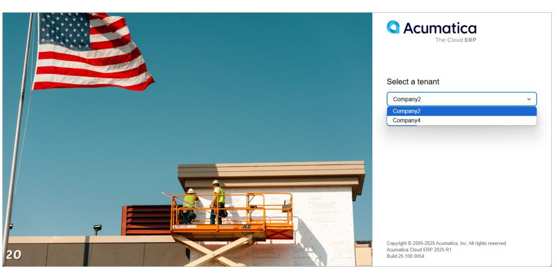

*Figure: The tenant selection box on the Sign-In page*

13.Select the *Company2* tenant in the tenant selection box and click**Sign In**.

The Sign-In page refreshes and shows the read-only tenant selection box with the selected *Company2* tenant. The system prompts you to enter a new password and confirm it, as shown in the following screenshot.

|                                                      | <b>Q</b> Acumatica<br>The Cloud ERP                                                                            |
|------------------------------------------------------|----------------------------------------------------------------------------------------------------------------|
| <b>WELL AND STATE</b>                                | Select a tenant                                                                                                |
|                                                      | Company2<br>$\checkmark$                                                                                       |
|                                                      | New Password                                                                                                   |
|                                                      | Confirm Password                                                                                               |
|                                                      | $\bigcirc$ Check here to indicate that you have read and agree to the terms of<br>the Acumatica User Agreement |
|                                                      | Sign In                                                                                                        |
| JLG<br>ıc<br><b>FANALESELL</b><br><b>Ruth (1303)</b> |                                                                                                                |
| 20<br>Y.<br>olar                                     | Copyright @ 2005-2025 Acumatica, Inc. All rights reserved.<br>Acumatica Cloud ERP 2025 R1<br>Build 25,100,0054 |

*Figure: Creation of a new password for a tenant in a multitenant instance*

- 14.Enter a new password and confirm it.
- 15.Click the link of the Acumatica User Agreement above the**Sign In** button, read the agreement, and then select the check box to indicate that you have read the terms of the agreement and agree to them.
- 16.Click **Sign In**.

You have signed in to the *AcumaticaMultitenant* instance. Now you can work within the *Company2* tenant.

- 17.Sign out.
- 18.On the Sign-In page, enter the default username and password for the application instance (*admin* and *setup*, respectively) to access the *Company4* tenant. Since the *admin* user has access to all the tenants you have created, the system prompts you to change the default password for the *Company4* tenant, as shown in the following screenshot. Notice that because you have entered the default password, the tenant selection box for the remaining *Company4* tenant does not appear.

|   | <b>A</b> cumatica<br>The Cloud ERP                                                                             |
|---|----------------------------------------------------------------------------------------------------------------|
|   | Enter credentials                                                                                              |
|   | admin                                                                                                          |
|   | 100000                                                                                                         |
|   |                                                                                                                |
|   |                                                                                                                |
| 取 | Check here to indicate that you have read and agree to the terms of<br>Acumatica User Agreement<br>the<br>Next |
|   | Copyright C 2005-2025 Acumatica, Inc. All rights reserved.<br>Acumatica Cloud ERP 2025 R1<br>Build 25,100,0054 |

*Figure: Creation of a new password for another tenant in a multitenant instance*

19.Change the password and click **Next**.

You have signed in to the *AcumaticaMultitenant* instance. Now you can work within the *Company4* tenant. You can also switch to the *Company2* tenant in the user menu, as shown in the following screenshot.

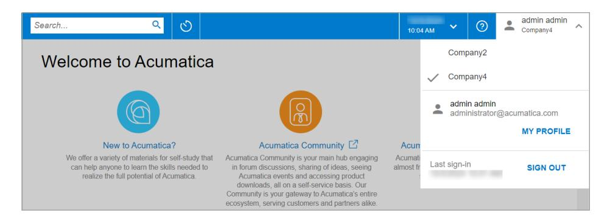

*Figure: Access to multiple tenants*

### **Step 3: Deleting an Existing Tenant**

In this step, you will delete the unnecessary tenant by doing the following:

- 1. Return to the Acumatica ERP Configuration wizard.
- 2. While you are viewing the Application Maintenance page, do the following:
  - a. In the **Installed Sites** list, click the row with the *AcumaticaMultitenant* instance.
  - b. Click **Maintain Tenants**.
- 3. In the **SQLServer Authentication** dialog box, leave **Windows Authentication** selected, and click **OK**.
- 4. On the Tenant Setup page, select the row with the *Company4* tenant in the **Installed Tenants** list.
- 5. Click **Delete**.
- 6. Click **OK** in the confirmation dialog box to delete the tenant.
- 7. Click **Next**.
- 8. On the Confirmation of Configuration page, do the following:
  - a. Check the configuration settings you have specified.
  - b. Click **Finish** to delete the tenant.

## <span id="page-78-1"></span><span id="page-78-0"></span>**Tenant Maintenance: To Change Tenant Visibility**

The following activity will walk you through the process of changing the visibility of a tenant.

#### **Story**

Suppose that you are the system administrator of your company, and you have need to change the visibility of a tenant in an existing Acumatica ERP application instance.

#### **Process Overview**

In this activity, you will change the visibility of a tenant in an existing instance.

#### **System Preparation**

Before you begin performing the step of this activity, perform one of the following prerequisite activities to deploy the Acumatica ERP application instance: *Instance [Deployment:](#page-61-1) To Deploy an Instance with Demo Data* or *[Instance](#page-48-1) Deployment: To Deploy an [Out-of-the-Box](#page-48-1) Instance*.

## **Step: Changing the Visibility of a Tenant**

To change the visibility of a tenant, do the following:

- 1. On the Start menu, click **Acumatica ERP Configuration** to open the Acumatica ERP Configuration wizard.
- 2. On the Welcome page, click **Perform Application Maintenance**.
- 3. On the Application Maintenance page, do the following:
  - a. In the **Installed Sites** box, select the appropriate Acumatica ERP instance.
  - b. In the bottom area of the page, click **Maintain Tenants**.
- 4. In the **SQLServer Authentication** dialog box, which is opened, select the authentication method to be used to connect to the database, and then click **OK**. The system closes the dialog box.
- 5. On the Tenant Setup page, in the**Visible** column of the **Installed Tenants** table, do either of the following:
  - Clear the check box in the row of the tenant you want to hide.
  - Select the check box in the row of the tenant you want to display.
- 6. Click **Next**.
- 7. On the Confirmation of Configuration page, do the following:
  - a. Check the configuration settings you have specified.
  - b. If you want to save the configuration settings in an XML file on your computer, click**Save Configuration**.
  - c. Click **Finish**.

## <span id="page-79-0"></span>**Tenant Maintenance: To Explore Tenant Visibility**

The following activity will walk you through the process of exploring how tenant visibility affects the existing Acumatica ERP application instance.

#### **Story**

Suppose that you are the system administrator of your company, and you have been asked to add a new tenant to the existing Acumatica ERP application instance. You will explore how to use the visible tenant as a parent tenant. Additionally, you will verify the capability of having an instance where all tenants are invisible.

#### **Process Overview**

In this activity, you will explore the visible capabilities of tenants.

#### **System Preparation**

Before you begin performing the step of this activity, make sure that you have performed the following prerequisite activity: *Instance [Deployment:](#page-61-1) To Deploy an Instance with Demo Data*.

#### **Step: Exploring the Capabilities of Tenant Visibility**

To explore the capabilities of tenant visibility, do the following:

- 1. On the Start menu, click **Acumatica ERP Configuration** to open the Acumatica ERP Configuration wizard.
- 2. On the Welcome page, click **Perform Application Maintenance**.
- 3. In the list of existing application instances, select the row with the Acumatica ERP instance and click the **Maintain Tenants** button. For more details about how to create the application instance, see *[Instance](#page-48-1) Deployment: To Deploy an [Out-of-the-Box](#page-48-1) Instance*.
- 4. In the SQL Server Authentication dialog box, leave the default settings, and click **OK**.

This opens the Tenant Setup page, which shows the full list of tenants for the selected application instance.

5. Select the **Advanced Settings** check box below the list of tenants.

The system displays the default *System* tenant with an **ID** of *1* in the list of tenants.


With the **Advanced Settings** check box selected, you can also select a new data template in the **Insert Data** column for an existing tenant. If you finish updating the tenant, the Acumatica ERP Configuration wizard replaces the tenant data with the data of the selected template.

6. Clear the**Visible** check box in the row with the *Company* tenant, and click **Next**.

The system displays a warning informing you that you cannot continue with all the instance's tenants being invisible.

- 7. In the warning dialog box, click **OK**.
- 8. On the Tenant Setup page, to which you return, do the following:
  - a. Click **Create** below the list of tenants to add one more tenant.
  - b. For the new tenant, select *2* in the **ParentTenant ID** column.
  - c. Select the**Visible** check box in the row with the *Company* tenant.
  - d. Click **Next**.

The system displays an error message informing you that you cannot continue because only an invisible tenant can be specified as a parent of another tenant, as shown in the following screenshot.

| Parent Tenant ID<br><b>Tenant Name</b><br><b>Insert Data</b><br>Visible<br>Additional Info<br>ID<br><b>New</b><br>∩<br>1<br>1<br>$\checkmark$<br>ш<br>$\checkmark$<br>12<br>$\checkmark$<br>1<br>Company<br>Company<br>$\vee$<br>Þ<br>n<br>$\checkmark$<br>2<br>3<br>$\overline{\mathcal{L}}$<br>$\overline{\mathcal{L}}$<br>Company <sub>2</sub><br>Company <sub>2</sub><br>$\checkmark$<br>$\checkmark$ |  | <b>Tenant So</b><br>On this page, you<br>settings for each<br><b>Installed Tenants</b> | <b>Acumatica ERP Configuration Wizard</b> | Acumatica ERP Configuration Wizard<br>An error occurred in '2' tenant.<br>One or more visible tenants is used as parent for other tenants. Please use only<br>invisible tenants as a parent.<br>Show Inner Messages Show Call Stack | OK |  | × | п<br>$\times$<br>e appropriate<br>Reload the List |
|-----------------------------------------------------------------------------------------------------------------------------------------------------------------------------------------------------------------------------------------------------------------------------------------------------------------------------------------------------------------------------------------------------------|--|----------------------------------------------------------------------------------------|-------------------------------------------|-------------------------------------------------------------------------------------------------------------------------------------------------------------------------------------------------------------------------------------|----|--|---|---------------------------------------------------|
|                                                                                                                                                                                                                                                                                                                                                                                                           |  |                                                                                        |                                           |                                                                                                                                                                                                                                     |    |  |   |                                                   |
|                                                                                                                                                                                                                                                                                                                                                                                                           |  |                                                                                        |                                           |                                                                                                                                                                                                                                     |    |  |   |                                                   |
|                                                                                                                                                                                                                                                                                                                                                                                                           |  |                                                                                        |                                           |                                                                                                                                                                                                                                     |    |  |   |                                                   |
|                                                                                                                                                                                                                                                                                                                                                                                                           |  |                                                                                        |                                           |                                                                                                                                                                                                                                     |    |  |   |                                                   |
| Advanced Settings   Secure Tenant on the Sign-In Page<br>Create<br>Delete                                                                                                                                                                                                                                                                                                                                 |  |                                                                                        |                                           |                                                                                                                                                                                                                                     |    |  |   |                                                   |

#### *Figure: The error message*

9. In the dialog box, click **OK**.

The system automatically clears the**Visible** check box in the row with the *Company* tenant.

10.On the Tenant Setup page, to which you return, do the following:

- a. Make sure that the**Visible** check box is selected only in the row with the new tenant, and that *2* is selected as the **ParentTenant ID** in this row.
- b. Click **Next**.
- 11.On the Confirmation of Configuration page, review your changes, and click **Finish**.
- 12.Wait while the application instance settings are updated, and click **OK**.

## <span id="page-81-1"></span><span id="page-81-0"></span>**Tenant Maintenance: To Delete a Tenant**

The following activity will walk you through the process of deleting a tenant.

#### **Story**

Suppose that you are the system administrator of your company, and you need to delete an unneeded tenant from an existing Acumatica ERP application instance.

#### **Process Overview**

In this activity, you will delete a tenant from an existing instance.

#### **System Preparation**

Before you begin performing the step of this activity, perform the following prerequisite activity: *[Tenant](#page-71-1) [Maintenance:](#page-71-1) To Create an Additional Tenant*.

### **Step: Deleting a Tenant**

If you need to delete a tenant, do the following:

- 1. On the Start menu, click **Acumatica ERP Configuration** to open the Acumatica ERP Configuration wizard.
- 2. On the Welcome page, click **Perform Application Maintenance**.
- 3. On the Application Maintenance page, do the following:
  - a. In the **Installed Sites** list, click the appropriate Acumatica ERP instance.
  - b. In the bottom area of the page, click **Maintain Tenants**.
- 4. In the **SQLServer Authentication** dialog box, select the authentication method to be used to connect to the database, and then click **OK**.
- 5. On the Tenant Setup page, select the tenant row in the **Installed Tenants** list.
- 6. Click **Delete**.
- 7. When you are prompted, click **OK** to delete the selected tenant.
- 8. Click **Next**.
- 9. On the Confirmation of Configuration page, do the following:
  - a. Check the configuration settings you have specified.
  - b. If you want to save the configuration settings in an XML file on your computer, click**Save Configuration**.
  - c. Click **Finish** to delete the tenant.

# <span id="page-83-0"></span>**Maintaining Instances**

In this chapter, you will learn how to perform maintenance tasks with the Acumatica ERP instances and their databases.

# <span id="page-83-1"></span>**Instance Maintenance: General Information**

In Acumatica ERP, you can review and adjust various settings of the instance, such as its name or database.

This topic provides an overview of the adjustments that you can make to existing instances and databases by using the Acumatica ERP Configuration wizard.

## **Learning Objectives**

In this chapter, you will do the following:

- Check the state of Acumatica ERP application instances and their databases
- View the settings of an Acumatica ERP instance
- Change the name of an Acumatica ERP instance
- Change a database in an Acumatica ERP instance

#### **Applicable Scenarios**

You may need to learn how to make some changes in an Acumatica ERP instance in scenarios that include the following:

- You are a system administrator who needs to link the existing Acumatica ERP instance to a new database.
- You are a system administrator who needs to view some settings of the Acumatica ERP instance and change its name.

#### **Viewing of an Instance's Settings**

You can view the following settings of an existing Acumatica ERP instance on the Instance Information page of the Acumatica ERP Configuration wizard:

- **Instance Name**
- **InstanceType**, which can be *RegularSite* to indicate Acumatica ERP or *CompanyPortal* to indicate the Acumatica Self-Service Portal.
- **Instance File Path**
- **Database**
- **DatabaseVersion**
- **FilesVersion**
- **Instance URL**
- **Website Name**
- **Virtual Directory Name**

You can open the Instance Information page as follows:

- 1. Run the Acumatica ERP Configuration wizard.
- 2. On the Welcome page, click **Perform Application Maintenance**.

3. Select the row with the instance whose settings you wish to review.

#### 4. Click **Review Instance Info**.

On the Instance Information page, the instance and virtual directory names can be edited. The Instance Information page also provides quick access to the folder where the files of this instance are stored. Additionally, you can create a shortcut for the instance URL to get quick access to the site.

## **Changing of the Instance Database**

You can change the database of an existing Acumatica ERP instance—for example, if you want to switch to a backup database. You can also associate the application instance with a new database and create it on the fly. To create a new database, you can use the **Perform Database Maintenance** option on the Welcome page of the Acumatica ERP Configuration wizard. For more details, see *To Perform Database [Maintenance](https://help-2025r1.acumatica.com/Help?ScreenId=ShowWiki&pageid=fc906c62-c65b-44d6-8210-13d9cea2b88d)*.

When you connect the application instance to another existing database, the version of the database is checked. The versions of the database and the Acumatica ERP Configuration wizard must be the same. If the database has a lower version, you must update it to correspond to the Acumatica ERP Configuration wizard version. This can be done during the process of changing the database. This will also require you to update the instance site.

# <span id="page-84-1"></span><span id="page-84-0"></span>**Instance Maintenance: Possible Update Statuses of an Instance**

In Acumatica ERP, you can see which instances and databases you need to update.

You can check the update status of your application instances and databases on the Application Maintenance page of the Acumatica ERP Configuration wizard, as shown in the following screenshot.

| Acumatica ERP Configuration Wizard |                                                                             |              |                         |           |             |                                            | $\times$ |
|------------------------------------|-----------------------------------------------------------------------------|--------------|-------------------------|-----------|-------------|--------------------------------------------|----------|
|                                    | <b>Application Maintenance</b>                                              |              |                         |           |             |                                            |          |
|                                    | On this page, you can create a new website or manage the existing websites. |              |                         |           |             |                                            |          |
| <b>Installed Sites</b>             |                                                                             |              |                         |           |             | Reload the List                            |          |
| <b>Instance Name</b>               | Database                                                                    | Site Version | DB Version              | Site Path |             |                                            |          |
| A Acumatica Multitenant            | <b>AcumaticaM</b>                                                           | 25 100 0054  | 25 100 0054             |           |             | C:\Program Files\Acumatica ERP\AcumaticaM  |          |
| $\mathscr O$ Acumatica S100        | Acumatica <sub>S</sub>                                                      | 25 101 0090  | 25 101 0090             |           |             | C:\Program Files\Acumatica ERP\AcumaticaS' |          |
| <b>23</b> Acumatica Training       | <b>Acumati</b>                                                              | 25.100.0     | 25.101.0                |           |             | C:\Program Files\Acumatica ERP\Acun        |          |
|                                    |                                                                             |              |                         |           |             |                                            |          |
|                                    |                                                                             |              |                         |           |             |                                            |          |
|                                    |                                                                             |              |                         |           |             |                                            |          |
|                                    |                                                                             |              |                         |           |             |                                            |          |
|                                    |                                                                             |              |                         |           |             |                                            |          |
| <b>Delete</b><br>Create            | Upgrade                                                                     | ▼            | <b>Change Database</b>  |           |             | Review Instance Info                       |          |
| Launch                             |                                                                             |              | <b>Maintain Tenants</b> |           |             |                                            |          |
|                                    |                                                                             |              |                         |           |             |                                            |          |
| Version: 25.101.0090               |                                                                             |              |                         |           |             |                                            |          |
| https://www.acumatica.com          |                                                                             |              |                         |           | <b>Back</b> |                                            |          |

#### *Figure: The icons indicating the update statuses of instances*

In the list of installed sites, you can see the following icons indicating the update status of each application instance:

• *Green check mark*: The instance and the associated database are up to date. (Also, the versions of the application instance, the database, and the Acumatica ERP Configuration wizard are the same.)

- *Yellow triangle with exclamation point*: The instance and the instance database are outdated. (That is, the version of the application instance is the same as the version of the database and is older than the version of the installed Acumatica ERP Configuration wizard.) The application instance will still work, even if the instance and database are out of date.
- *Red circle with a white X*: The instance or the instance database requires an update; that is, the versions of the instance and the instance's database are different. The application instance does not work, and you must update it, or update only the instance or the instance database if their versions are outdated.

This icon is also displayed when the database of the instance has not been found, or when the version of the instance, the database, or both is higher than the current version of the Acumatica ERP Configuration wizard.

On the Application Maintenance page, you can also see the following information:

- The version of the Acumatica ERP Configuration wizard that is installed on your server. The version is shown in the lower le corner of the page.
- The application instance version, which is displayed in the**SiteVersion** column for each application instance.
- The database version, which is displayed in the **DB Version** column for each application instance.

Note the following points about versions:

- The site version and the database version must be the same.
- The Acumatica ERP Configuration wizard version cannot be lower than the site or database version.

That is, you first upgrade the Acumatica ERP Configuration wizard, and you may then upgrade the site and the database. If you do not upgrade the site and the database, they will continue functioning.

- You can upgrade only the site, only the database, or both the site and the database.
- You cannot use the Acumatica ERP Configuration wizard with a higher version to deploy an application instance with a lower version.
- Versions of the system that are lower than the current version can be installed only by first uninstalling the current version of the Acumatica ERP Configuration wizard and then installing the desired version. The instances with a higher version will remain functional.

## <span id="page-85-0"></span>**Instance Maintenance: To View the Settings of an Instance**

The following activity will walk you through the process of viewing and modifying the settings of the Acumatica ERP application instance.

#### **Story**

Suppose that you are the system administrator of your company, and you need to review the settings of the existing Acumatica ERP application instance and change its name.

#### **Process Overview**

In this activity, you will review the settings of the Acumatica ERP application instance and change the instance name.

#### **System Preparation**

Before you begin performing the step of this activity, make sure that you have performed the following prerequisite activity: *Instance [Deployment:](#page-61-1) To Deploy an Instance with Demo Data*.

#### **Step: Changing the Settings of an Application Instance**

To review the settings of the instance and change its name, do the following:

- 1. On the Start menu, click **Acumatica ERP Configuration** to open the Acumatica ERP Configuration wizard.
- 2. On the Welcome page, click **Perform Application Maintenance**.
- 3. In the list of existing application instances, click the row with the Acumatica ERP application instance you want to review, and then click the **Review Instance Info** button.

This opens the Instance Information page.

- 4. To change the instance name, do the following:
  - a. Right of the **Instance Name** box, click **Rename**.
  - b. Change the name of the instance to AcumaticaTraining, as shown in the following screenshot.

|                           | <b>Application Maintenance</b><br>Acumatica ERP Configuration Wizard |                                                   | п  | $\times$           |                       |
|---------------------------|----------------------------------------------------------------------|---------------------------------------------------|----|--------------------|-----------------------|
| On this page,             | Instance Information<br>Confirm the settings of the instance.        |                                                   |    |                    |                       |
| <b>Installed Sites</b>    | Instance Name:                                                       | Acumatica Training                                |    | Save               | Reload the List       |
| <b>Instance Name</b>      | Instance Type:                                                       | <b>RegularSite</b>                                |    |                    |                       |
| Acumatica Mu              | Instance File Path:                                                  | C:\Program Files\Acumatica ERP\AcumaticaT100 Open |    |                    | FRP\AcumaticaM        |
| $\mathcal A$ Acumatica S1 | Database:                                                            | <b>Mcumatica T100</b>                             |    |                    | <b>FRP\AcumaticaS</b> |
| Acumatica <sub>T1</sub>   | Database Version:                                                    | 25.100.0054                                       |    |                    | <b>ERP\AcumaticaT</b> |
|                           | <b>Files Version:</b>                                                | 25.100.0054                                       |    |                    |                       |
|                           | Instance URL:                                                        | http://localhost:80/AcumaticaT100/                |    | Create<br>Shortcut |                       |
|                           | Website Name:                                                        | Default Web Site                                  |    |                    |                       |
|                           | Virtual Directory Name: Acumatica T100                               |                                                   |    | Rename             |                       |
| Create                    |                                                                      |                                                   | OK | Cancel             | <b>Instance Info</b>  |
| Launch                    |                                                                      | maintain Tenants                                  |    |                    |                       |

*Figure: The updated instance name*

- c. Right of the **Instance Name** box, click**Save**.
- 5. Right of the **Instance Files Path** box, click **Open**.

This opens the folder where the selected application instance is installed. In particular, this folder contains the web.config file of the current instance.

- 6. To change the virtual directory name, go back to the Acumatica ERP Configuration wizard, and do the following:
  - a. Right of the **Virtual Directory Name** box, click **Rename**.
  - b. Change the virtual directory name to AcumaticaTraining.
  - c. Right of the **Virtual Directory Name** box, click**Save**.
- 7. Click **OK** to save your changes.
- 8. In the dialog box with the notification message, click **OK**.

This closes the Instance Information page and returns you to the Application Maintenance page.

9. Open the Instance Information page again and notice that the URL of the renamed *AcumaticaTraining* instance has also been updated, as shown in the following screenshot.

| Acumatica ERP Configuration Wizard                            |                                                   | ×                  |
|---------------------------------------------------------------|---------------------------------------------------|--------------------|
| Instance Information<br>Confirm the settings of the instance. |                                                   |                    |
| Instance Name:                                                | <b>Acumatica Training</b>                         | Rename             |
| Instance Type:                                                | <b>RegularSite</b>                                |                    |
| Instance File Path:                                           | C:\Program Files\Acumatica ERP\AcumaticaT100 Open |                    |
| Database:                                                     | <b>AcumaticaT100</b>                              |                    |
| Database Version:                                             | 25.100.0054                                       |                    |
| Files Version:                                                | 25 100 0054                                       |                    |
| Instance URL:                                                 | http://localhost:80/AcumaticaTraining/            | Create<br>Shortcut |
| Website Name:                                                 | Default Web Site                                  |                    |
| Virtual Directory Name: <b>Acumatica Training</b>             |                                                   | Rename             |
|                                                               | OK                                                | Cancel             |

*Figure: The updated URL of the instance*

# <span id="page-87-0"></span>**Instance Maintenance: To Change the Database of an Instance**

The following activity will walk you through the process of changing the database for an existing Acumatica ERP application instance.

#### **Story**

Suppose that you are the system administrator of your company, and you need to change the database of the existing Acumatica ERP application instance to perform some maintenance activities on the original database.

#### **Process Overview**

In this activity, you will change the database of the Acumatica ERP application instance and connect the instance to the database of another Acumatica ERP instance.

#### **System Preparation**

Before you begin performing the step of this activity, make sure that you have performed the following prerequisite activity: *Instance [Deployment:](#page-61-1) To Deploy an Instance with Demo Data*.

#### **Step: Changing the Database**

To change the database of the existing application instance, do the following:

- 1. On the Start menu, click **Acumatica ERP Configuration** to open the Acumatica ERP Configuration wizard.
- 2. On the Welcome page, click **Perform Application Maintenance**.
- 3. In the list of existing application instances, click the row with the Acumatica ERP instance that you want to reconnect to another database, and click the **Change Database** button.

This opens the Database Server Connection page, which provides the list of available servers.

- 4. On the Database Server Connection page, specify the following settings, and click **Next** to go to the next page:
  - **ServerType**: *Microso SQL Server*

- **Server Name**: *(local)*
- **Windows Authentication**: Selected
- 5. On the Database Configuration page, specify the following settings, and click **Next** to go to the next page:
  - **Connect to an Existing Database**: Selected
  - **Available Databases on theServer**: The name of the database you want to connect the instance to

Notice that the version of the selected database is automatically detected (as shown in the following screenshot), and it is the same version that the Acumatica ERP Configuration wizard has.

| <b>Acumatica ERP Configuration Wizard</b>                                                                      |                                                                                                                   |             |             | × |
|----------------------------------------------------------------------------------------------------------------|-------------------------------------------------------------------------------------------------------------------|-------------|-------------|---|
| <b>Database Configuration</b>                                                                                  |                                                                                                                   |             |             |   |
| On this page, you select an existing database from the list or create a new database.                          |                                                                                                                   |             |             |   |
| Create a New Database<br>New Database's Name                                                                   |                                                                                                                   |             |             |   |
| Database Filter:<br>O Connect to an Existing Database                                                          |                                                                                                                   |             |             |   |
| Available Databases on the Server<br>Reload the List<br>AcumaticaMultitenant<br>AcumaticaS100<br>AcumaticaT100 | Acumatica database AcumaticaS100 (version<br>25.100.0054) has been selected.<br>The database has current version. |             |             |   |
|                                                                                                                | Repair Database<br>Shrink Data After Repair                                                                       |             |             |   |
|                                                                                                                |                                                                                                                   |             |             |   |
| Version: 25.100.0054<br>https://www.acumatica.com                                                              |                                                                                                                   | <b>Back</b> | <b>Next</b> |   |

*Figure: The selection of an existing database*

- 6. On the Tenant Setup page, click **Next**.
- 7. On the Database Connection page, click **Next**.
- 8. On the Confirmation of Configuration page, review your changes (see the following screenshot), and click **Finish**.

| Acumatica ERP Configuration Wizard                               |                                                                                                    |                    | × |
|------------------------------------------------------------------|----------------------------------------------------------------------------------------------------|--------------------|---|
| <b>Confirmation of Configuration</b>                             |                                                                                                    |                    |   |
| the following table. Click Finish to complete the configuration. | The wizard has collected all the required information. On this page, you review the information in |                    |   |
| Parameter                                                        | Value                                                                                              |                    |   |
| <b>Database Name</b>                                             | Acumatica S100                                                                                     |                    |   |
| <b>Encrypt Database Server Connection</b>                        | False                                                                                              |                    |   |
| <b>Database Update</b>                                           | False                                                                                              |                    |   |
| Size of the Database                                             | 1                                                                                                  |                    |   |
| <b>Skip Database Setup</b>                                       | False                                                                                              |                    |   |
| <b>Shrink Database</b>                                           | False                                                                                              |                    |   |
| <b>Optimize tables on MySql</b>                                  | False                                                                                              |                    |   |
| <b>Instance Name</b>                                             | Acumatica Training                                                                                 |                    |   |
| <b>Instance Physical File Path</b>                               | C:\Program Files\Acumatica ERP\AcumaticaT100                                                       |                    |   |
| <b>Instance SSL Certificate Trumborint</b>                       | 1                                                                                                  |                    |   |
| !!!!!!!!!!!!!!!!!!!!!!!!!!!!!!!!!!!!!!!!                         | <b>ALC: YOU AT A</b>                                                                               | Save Configuration |   |
| Version: 25.100.0054                                             | <b>Back</b>                                                                                        | Finish             |   |
| https://www.acumatica.com                                        |                                                                                                    |                    |   |

#### *Figure: The changed database*

- 9. Wait while the application instance settings are updated, and click **OK** in the confirmation dialog box.
- 10.On the Welcome page of the Acumatica ERP Configuration wizard, which opens, click **Perform Application Maintenance**.
- 11.On the Application Maintenance page, notice the values in the **Database** column. Two instances are now connected to the same database.

# <span id="page-90-0"></span>**Upgrading Acumatica ERP**

In this chapter, you will learn about upgrading and updating Acumatica ERP.

# <span id="page-90-1"></span>**Upgrading of Acumatica ERP: General Information**

You can upgrade Acumatica ERP by installing a new major version of the system. You can also update Acumatica ERP by installing an update with a new minor version of the system. A major version provides functional enhancements and new features. A minor version includes fixes for reported issues and occasionally functionality improvements. Both major and minor versions are distributed in builds, which are installation packages of the system. Builds are cumulative—each new build includes everything from the previous builds, along with any new fixes. This eliminates the need to install previous builds before installing the latest one.

To upgrade or update Acumatica ERP, you need to first upgrade or update the Acumatica ERP Configuration wizard to the needed version.

This topic provides an overview of upgrading and updating Acumatica ERP.

#### **Learning Objectives**

In this chapter, you will do the following:

- Install the next version of the Acumatica ERP Configuration wizard
- Update an application instance to the next version of Acumatica ERP

#### **Applicable Scenarios**

You may need to learn how to upgrade or update Acumatica ERP in scenarios that include the following:

- You are a system administrator who needs to upgrade Acumatica ERP to the latest product version.
- You are a system administrator who needs to update one of the Acumatica ERP instances to the next product version.

#### **Before You Proceed**

We strongly recommend that before you upgrade or update Acumatica ERP to a newer product version, you do the following:

- 1. Back up all configuration files and databases used by the application instances.
- 2. If you have created any custom views with the SCHEMABINDING clause in the Acumatica ERP database, remove them. (You can create these views anew aer the update.)
- 3. If you have been replicating the Acumatica ERP database, turn off the replication. (Otherwise, the system cannot be updated.)
- 4. If you developed a client application by using the screen-based SOAP API, follow the procedure described in *To Update a Client Application that Uses [Screen-Based](https://help-2025r1.acumatica.com/Help?ScreenId=ShowWiki&pageid=ff8e6867-8860-4eb4-a828-06e50bcb71e9) Web Services* to prevent a failure of your application that can happen because of the UI changes in the system.
- 5. On the *[Automation Schedule Statuses](https://help-2025r1.acumatica.com/Help?ScreenId=ShowWiki&pageid=97fb65d2-2303-4993-9351-b6fbe112c37d)* (SM205030) form, make sure that no processes are scheduled for the update time. If you find any scheduled processes, reschedule them so that they start aer the update.
- 6. On the *[Tenants](https://help-2025r1.acumatica.com/Help?ScreenId=ShowWiki&pageid=3f8ba9f5-9e04-4568-a93e-862ba7b92c2b)* (SM203520) form, click **Optimize Database** to check your Acumatica ERP database for orphaned snapshots, and delete any that the system finds.

#### **Upgrading Process**

The general process of system upgrading (to a major version) or updating (to a minor version) by using the Acumatica ERP Configuration wizard, which has already been installed on the server, is the following:

1. If necessary, notify users about the upcoming upgrade or update and automatically lock out the system for the time of the upgrade or update on the *[Apply Updates](https://help-2025r1.acumatica.com/Help?ScreenId=ShowWiki&pageid=ef4f5e3f-a91d-4762-8fcd-c517b53f86f0)* (SM203510) form, as described in *[Upgrading of](#page-94-2) [Acumatica](#page-94-2) ERP: To Schedule the System Lockout*. A message alerting users to the system lockout will be displayed on the Sign-In page.

When the lockout is in effect, the following happens in the system:

- Only users that have the *Administrator* role can sign in to the system.
- The system stops all processes that were run by a schedule.
- 2. Obtain the needed Acumatica ERP build in the *[Acumatica Community](https://community.acumatica.com/)* website. You need to use your partner's username and password to access the site. Download an installation package, and run it to upgrade or update the Acumatica ERP Configuration wizard.

The procedure is the same as the procedure for installing Acumatica ERP Configuration wizard. For details, see *[Acumatica ERP Installation On-Premises: General Information](#page-23-2)*.

- 3. Start upgrading or updating the database and the site of your application instance. The system will automatically perform the following actions:
  - a. For instances that contain published customization projects, validating the compatibility of the currently published customization code with the code of the new product version. If the validation is successful, the system upgrade or update the database and the site. If the validation fails, the**Validation Failed** window opens to display the list of the executed checks and the discovered errors, and the upgrade process is interrupted. To resolve any issues that were discovered, see *To Resolve an Issue [Discovered](https://help-2025r1.acumatica.com/Help?ScreenId=ShowWiki&pageid=8386c2f2-cf29-44ac-b04a-0e16e1aa28f6) During the [Validation](https://help-2025r1.acumatica.com/Help?ScreenId=ShowWiki&pageid=8386c2f2-cf29-44ac-b04a-0e16e1aa28f6)*.
  - b. Upgrading or updating the database and site of the instance.

If you need to upgrade or update the database without upgrading or updating the site or to upgrade or update only the site (without the database), see the next section in this topic.


We strongly recommend that you use the common procedure described in this section for a usual upgrade or update of your Acumatica ERP application instance.

The time required for the upgrade or update depends on the performance of your database server, the differences between the old and current versions of the database schema, the hardware configuration of the server, and the current system load. When the upgrade or update of the instance is finished, the Acumatica ERP Configuration wizard updates the list of instances.

- 4. If you are upgrading or updating your system from a version that did not include search indexes, you need to build search indexes by using the *Rebuild [Full-Text](https://help-2025r1.acumatica.com/Help?ScreenId=ShowWiki&pageid=7a401a06-6a1c-4979-9ee3-491582748626) Entity Index* (SM209500) form. If the system has search indexes that were built before the upgrade or update, we recommend rebuilding search indexes by using the form. For details, see *[Building Search Indexes](https://help-2025r1.acumatica.com/Help?ScreenId=ShowWiki&pageid=4f56d0b8-a098-4362-a8c0-fe545b9a0963)*.
- 5. If you are locked out the system, unlock the system on the *[Apply Updates](https://help-2025r1.acumatica.com/Help?ScreenId=ShowWiki&pageid=ef4f5e3f-a91d-4762-8fcd-c517b53f86f0)* form, as described in *[Upgrading of](#page-96-1) Acumatica ERP: To Unlock an [Acumatica](#page-96-1) ERP Instance*.

#### **Separate Upgrade of the Database and the Site**

You might need to upgrade or update the Acumatica ERP database without upgrading or updating the site, upgrade or update only the site, or consequently upgrade or update the database and the site.

If you need to upgrade or update the Acumatica ERP application instance and the Self-Service Portal instance that is connected to the database of the Acumatica ERP application instance, you can first upgrade or update the Acumatica ERP application instance (that is, the website and the database) and then the site of the Self-Service Portal. You can also upgrade or update the Self-Service Portal with its database and then upgrade or update only the site of the Acumatica ERP application instance.

To do the divided upgrade or update, you can use the **Upgrade Only Website** and **Upgrade Only Database** commands, which you can find in the drop-down list to the right of the **Upgrade** button on the Application Maintenance page of the Acumatica ERP Configuration wizard. For details, see *Upgrading of [Acumatica](#page-94-3) ERP: To [Update the Database of an Acumatica ERP Instance](#page-94-3)* and *Upgrading of Acumatica ERP: To Update an [Acumatica](#page-95-1) ERP [Site](#page-95-1)*.

When you upgrade or update your Acumatica ERP instance by using the **Upgrade Only Website** or **Upgrade Only Database** commands, the system does not validate the customization compatibility. If you have published customization projects in your Acumatica ERP instance, the instance may stop working aer an upgrade or update because of incompatible customization code. For details, see *[To](https://help-2025r1.acumatica.com/Help?ScreenId=ShowWiki&pageid=fc1f68ba-b4d6-4207-bf20-3a18fa99120a) Resolve Issues While Upgrading a [Customized](https://help-2025r1.acumatica.com/Help?ScreenId=ShowWiki&pageid=fc1f68ba-b4d6-4207-bf20-3a18fa99120a) Website*.

# <span id="page-92-0"></span>**Upgrading of Acumatica ERP: To Update an Instance**

The following activity will walk you through the process of updating the database and site of an Acumatica ERP application instance to the next minor version by using Acumatica ERP Configuration wizard.

### **Story**

Suppose that you are the system administrator of your company, and you need to update the existing Acumatica ERP application instance to the next minor version.

#### **Process Overview**

In this activity, you will update the Acumatica ERP instance from the previous version to a newer version.

#### **System Preparation**

Before you begin performing the steps of this activity, make sure that you have completed the *[Instance Deployment:](#page-61-1) To Deploy an [Instance](#page-61-1) with Demo Data* prerequisite activity.

## **Step 1: Obtaining an Installation Package with a Newer Version of Acumatica ERP**

To download an installation package with a newer version of Acumatica ERP and install it, do the following:

1. Open the *[Acumatica Community](https://community.acumatica.com/)* website.

You will need your partner's username and password to access the site.

2. On the **Product** menu at the top of the page, click **2025 R1**.

The Acumatica ERP 2025 R1 Downloads and Release Notes page opens. On this page, you can find the latest release and prior releases of the selected version and read the release notes.

- 3. To download the Acumatica 2025 R1 Update 1, click the *Show content* link in the **Prior Releases** section.
- 4. Click the *Acumatica 2025 R1 Update 1 Build ХХ.ХХХ.ХХХХ* link.

The page with the release opens.

- 5. In the **Download Links** section, click the *Acumatica ERP 2025 R1 Update 1* link to download the AcumaticaERPInstall.msi Windows installer package.
- 6. Install the newer version of the Acumatica ERP Configuration wizard, as described in *[Acumatica ERP](#page-25-1) Installation [On-Premises:](#page-25-1) To Install the Acumatica ERP Configuration Wizard*.

#### **Step 2: Updating an Instance**

To update the Acumatica ERP instance from the previous version to one you have just installed, do the following:

- 1. On the Start menu, click **Acumatica ERP Configuration** to open the Acumatica ERP Configuration wizard.
- 2. On the Welcome page, click **Perform Application Maintenance**.

On the Application Maintenance page, which opens, in the list of existing application instances, notice that all the instances have yellow triangles with exclamation points, as shown in the following screenshot.

| <b>Acumatica ERP Configuration Wizard</b>         |                                                                             |              |                         |           |             |                                            | $\times$ |
|---------------------------------------------------|-----------------------------------------------------------------------------|--------------|-------------------------|-----------|-------------|--------------------------------------------|----------|
|                                                   | <b>Application Maintenance</b>                                              |              |                         |           |             |                                            |          |
| <b>Installed Sites</b>                            | On this page, you can create a new website or manage the existing websites. |              |                         |           |             | Reload the List                            |          |
| <b>Instance Name</b>                              | Database                                                                    | Site Version | DR Version              | Site Path |             |                                            |          |
| A Acumatica Multitenant                           | <b>\AcumaticaM</b>                                                          | 25 100 0054  | 25 100 0054             |           |             | C:\Program Files\Acumatica ERP\AcumaticaM  |          |
| A Acumatica S100                                  | <b>AcumaticaS</b>                                                           | 25 100 0054  | 25 100 0054             |           |             | C:\Program Files\Acumatica ERP\AcumaticaS' |          |
| Acumatica Training                                | AcumaticaS                                                                  | 25.100.0054  | 25.100.0054             |           |             | C:\Program Files\Acumatica ERP\AcumaticaT  |          |
|                                                   |                                                                             |              |                         |           |             |                                            |          |
| Create                                            | Upgrade<br><b>Delete</b>                                                    | v            | <b>Change Database</b>  |           |             | Review Instance Info                       |          |
| Launch                                            |                                                                             |              | <b>Maintain Tenants</b> |           |             |                                            |          |
|                                                   |                                                                             |              |                         |           |             |                                            |          |
| Version: 25.101.0090<br>https://www.acumatica.com |                                                                             |              |                         |           | <b>Back</b> |                                            |          |

#### *Figure: The list of instances*

- 3. In the list of application instances, click the row with the Acumatica ERP instance you want to update, and click the **Upgrade** button.
- 4. In the confirmation dialog box, click **Yes** to continue the update.
- 5. In the **SQLServer Authentication** dialog box, which opens during the upgrade, leave the **Windows Authentication** option button (which is selected by default), and click **OK** to start the update.

The time required for the update depends on the performance of your database server, the differences between the old and current versions of the database schema, the hardware configuration of the server, and the current system load.


When the update of the instance is finished, the Acumatica ERP Configuration wizard updates the list of instances and shows the appropriate check mark next to each instance. For details about the icons in the list of instances, see *[Instance Maintenance: Possible Update Statuses of an Instance](#page-84-1)*.

# <span id="page-94-2"></span><span id="page-94-0"></span>**Upgrading of Acumatica ERP: To Schedule the System Lockout**

The following activity will walk you through the process of scheduling a system lockout before the upcoming Acumatica ERP upgrade or update.

## **Story**

Suppose that you are the system administrator of your company, and you need to lock out the system before upgrading or updating the existing Acumatica ERP application instance to the next version.

## **Process Overview**

In this activity, you will schedule the lockout of the Acumatica ERP instance before its upgrade or update.

#### **System Preparation**

Before you begin performing this activity, make sure that you have completed the *Instance [Deployment:](#page-61-1) To Deploy [an Instance with Demo Data](#page-61-1)* or *Instance Deployment: To Deploy an [Out-of-the-Box](#page-48-1) Instance* prerequisite activity.

#### **Step: Scheduling the System Lockout**

To schedule the Acumatica ERP lockout, do the following:

- 1. If you are not already signed in to Acumatica ERP, sign in.
- 2. Open the *[Apply Updates](https://help-2025r1.acumatica.com/Help?ScreenId=ShowWiki&pageid=ef4f5e3f-a91d-4762-8fcd-c517b53f86f0)* (SM203510) form.
- 3. On the form toolbar, click**Schedule Lockout**.
- 4. In the **Schedule Lockout** dialog box, specify the date and time when the system will be locked out and the reason for the lockout.


If you want to upgrade or update the system immediately, specify the current date and time.

- 5. If you want to lock out only the current site (but not all sites that use the same database) clear the **Lock Out AllSites** check box.
- 6. Click **OK** to lock out the system at the specified time.

# <span id="page-94-3"></span><span id="page-94-1"></span>**Upgrading of Acumatica ERP: To Update the Database of an Acumatica ERP Instance**

The following activity will walk you through the process of updating the database of the Acumatica ERP instance.


The updating of the instance is a separate process that you may need to perform.

#### **Story**

Suppose that you are the system administrator of your company, and you need to update only the database of the existing Acumatica ERP instance.

#### **Process Overview**

In this activity, you will update the database of the Acumatica ERP instance.

#### **System Preparation**

Before you begin performing the step of this activity, make sure that you have completed the *[Upgrading of](#page-94-2) [Acumatica](#page-94-2) ERP: To Schedule the System Lockout* prerequisite activity.

#### **Step: Updating the Database of an Instance**

To update the database of the Acumatica ERP instance, do the following:

- 1. On the Start menu, click **Acumatica ERP Configuration** to open the Acumatica ERP Configuration wizard.
- 2. On the Welcome page, click **Perform Application Maintenance**.
- 3. On the Application Maintenance page, do the following:
  - a. In the **Installed Sites** list, click the Acumatica ERP instance whose database you want to update. You can see the current version in the **DB Version** box.
  - b. In the drop-down menu next to the **Upgrade** button, select **Upgrade Only Database**.
- 4. When you are prompted, click **Yes** to continue the update.
- 5. In the **SQLServer Authentication** dialog box, specify the authentication method to be used to connect to the database.

If you select the**SQLServer Authentication** option button, specify the username and password of an account that has sufficient rights to make changes to the databases.

- 6. If you want to shrink data aer the database maintenance, select the**Shrink Data Aer Upgrade** check box.
- 7. Click **OK**.

The time required for the update depends upon your database server performance and the differences between the old and current versions of the database schema.

Aer you have updated the database, you should update the site, as described in *Upgrading of [Acumatica](#page-95-1) ERP: To [Update an Acumatica ERP Site](#page-95-1)*. Also, we strongly recommend rebuilding the search indexes by using the *[Rebuild](https://help-2025r1.acumatica.com/Help?ScreenId=ShowWiki&pageid=7a401a06-6a1c-4979-9ee3-491582748626) [Full-Text](https://help-2025r1.acumatica.com/Help?ScreenId=ShowWiki&pageid=7a401a06-6a1c-4979-9ee3-491582748626) Entity Index* (SM209500) form.

## <span id="page-95-1"></span><span id="page-95-0"></span>**Upgrading of Acumatica ERP: To Update an Acumatica ERP Site**

The following activity will walk you through the process of updating the site of Acumatica ERP.

The updating of the database is a separate process that you may need to perform. For details, see *Upgrading of Acumatica ERP: To Update the Database of an [Acumatica](#page-94-3) ERP Instance*.

#### **Story**

Suppose that you are the system administrator of your company, and you need to update only the site of the existing Acumatica ERP instance.

#### **Process Overview**

In this activity, you will update the Acumatica ERP site.

### **System Preparation**

Before you begin performing the step of this activity, make sure that you have completed the *[Upgrading of](#page-94-2) [Acumatica](#page-94-2) ERP: To Schedule the System Lockout* prerequisite activity.

## **Step: Updating an Acumatica ERP Instance**

To update the Acumatica ERP site, do the following:

- 1. On the Start menu, click **Acumatica ERP Configuration** to open the Acumatica ERP Configuration wizard.
- 2. On the Welcome page, click **Perform Application Maintenance**.
- 3. On the Application Maintenance page, do the following:
  - a. In the **Installed Sites** list, click the Acumatica ERP instance whose version you want to update. You can see the current version in the**SiteVersion** column.
  - b. In the drop-down menu next to the **Upgrade** button, select **Upgrade Only Website**.
- 4. When you are prompted, click **Yes** to continue the update.

The update process takes a few minutes, depending on the hardware configuration and the current system load. When the update of the instance is finished, the Acumatica ERP Configuration wizard updates the list of instances.

# <span id="page-96-1"></span><span id="page-96-0"></span>**Upgrading of Acumatica ERP: To Unlock an Acumatica ERP Instance**

The following activity will walk you through the process of unlocking the system aer the Acumatica ERP upgrade or update.

#### **Story**

Suppose that you are the system administrator of your company, and you need to unlock the system aer upgrading or updating the existing Acumatica ERP instance.

#### **Process Overview**

In this activity, you will unlock the Acumatica ERP instance aer its upgrade or update.

#### **System Preparation**

Before you begin performing the step of this activity, make sure that you have completed the *[Upgrading of](#page-94-2) [Acumatica](#page-94-2) ERP: To Schedule the System Lockout* prerequisite activity.

#### **Step: Unlocking the Acumatica ERP Instance**

To unlock Acumatica ERP, do the following:

- 1. If you are not already signed in to Acumatica ERP, sign in.
- 2. Open the *[Apply Updates](https://help-2025r1.acumatica.com/Help?ScreenId=ShowWiki&pageid=ef4f5e3f-a91d-4762-8fcd-c517b53f86f0)* (SM203510) form.

3. On the form toolbar, click**Stop Lockout** to unlock the system.

# <span id="page-98-2"></span><span id="page-98-0"></span>**Using the Acumatica ERP Command-Line Tool**

In this chapter, you will learn about performing some maintenance tasks in the Acumatica ERP application instance by using the command-line tool.

## <span id="page-98-3"></span><span id="page-98-1"></span>**Acumatica ERP Command-Line Tool: General Information**

In Acumatica ERP, you can deploy a new application instance and perform database and application maintenance tasks by using the command-line tool.

This topic provides an overview of how you can use the Acumatica ERP command-line tool instead of the Acumatica ERP Configuration wizard.

#### **Learning Objectives**

In this chapter, you will do the following:

- Become familiar with the Acumatica ERP command-line tool and its syntax
- Review some examples of using command-line commands to deploy instances and perform maintenance tasks by using the Acumatica ERP command-line tool
- Deploy an out-of-the-box Acumatica ERP instance from a configuration file by using the Acumatica ERP command-line tool

#### **Applicable Scenario**

You may need to learn how to use the Acumatica ERP command-line tool if you are a system administrator who prefers to use command-line commands to deploy a new instance and to perform some maintenance tasks without using the Acumatica ERP Configuration wizard.

#### **The Acumatica ERP Command-Line Tool**

The Acumatica ERP command-line tool is an executable file with the ac.exe name. By default, ac.exe is located in the folder on the computer that has Acumatica ERP installed, which is C:\Program Files (x86)\Acumatica ERP\Data\.

When you run ac.exe, you supply a set of command-line parameters, where each parameter must be presented in the following format.

-parameter:"parameter value"

When you pass a command-line command to the Acumatica ERP command-line tool, you should use the following syntax.

```
ac.exe [-f|-file:"path to configuration file"] [-cm|-configmode:"main scenario"] 
[-s|-dbsrvname:"server name"] [-sw|-dbsrvwinauth:"True|False"] 
[-u|-dbsrvuser:"username"] [-p|-dbsrvpass:"user password"] 
[-d|-dbname:"database name"] [-n|-dbnew:"True|False"] 
[-b|-dbupdate:"True|False"] [-dm|-dbmode:"Regular|Template|Demo"] 
[-dz|-dbsize:"database size in GB"] [-ds|-dbskip:"True|False"] 
[-dc|-dbshrink:"True|False"] [-i|-iname:"instance name"] 
[-io|-ioldname:"old instance name"] [-h|-ipath:"instance directory"] 
[-is|-vmsize:"Small|Medium|Large|ExtraLarge"]
```

```
[-it|-trumbprint:"X.509 thumbprint"][-w|-swebsite:"Web site name"] 
[-v|-svirtdir:"virtual directory"] [-po|-spool:"application pool"] 
[-a|-sactions:"AnonymousUser|SelectedUser"] 
[-k|-suser:"username"] [-m|-spass:"user password"] 
[-dw|-dbwinauth:"True or False"] [-dn|-dbnewuser:"True|False"] 
[-du|-dbuser:"username"] [-dp|-dbpass:"user password"] 
[-cs|-securemode:"True|False"] [-c|-company:"[ci|CompanyID=company ID];
[cp|ParentID=parent company ID] 
[cv|Visible=True];[ct|CompanyType=True]; [cn|LoginName:username]; 
[cd|Delete:True]"] [-op|-output:"Normal|Quiet|Forced"]
```

All parameter values in the command-line commands are case-sensitive and must be enclosed in quotation marks. Each parameter for the command line also has a short form that you can use instead of the full parameter name. If you have specified a parameter more than once in a command line, the last parameter value will be used.

You can run ac.exe in one of three modes:

•

•

- *Command-line*: Parameters are passed to ac.exe from the command line.
- *Batch*: The path to the configuration file with parameters is passed to ac.exe from the command line.
- *Mixed*: Some parameters are passed to ac.exe through the configuration file, while other parameters are passed from the command line. In this mode, command-line parameters have priority over those specified in the configuration file.

For details about possible parameters and their values, see *Acumatica ERP [Command-Line](#page-100-1) Tool: Possible [Parameters](#page-100-1) and Values*.

#### **Deployment of an Instance by Using the Acumatica ERP Command-Line Tool**

You can use a configuration file to deploy an Acumatica ERP instance with the Acumatica ERP command-line tool. You can create the configuration file with the command-line commands automatically by running the Acumatica ERP Configuration wizard. For details, see *Acumatica ERP [Command-Line](#page-107-1) Tool: To Deploy an Instance by Using the [Configuration File](#page-107-1)*.

You can also deploy an instance manually by using the command-line commands that you pass to ac.exe, as shown in the following examples:

```
ac.exe -configmode:"NewInstance" -dbsrvname:"GP" -dbname:"JPMorgan" 
-company:"CompanyID=1;CompanyType=;LoginName=;" 
-company:"CompanyID=2;CompanyType=;ParentID=1;Visible=Yes; LoginName=JPMorgan;" 
-iname:"JP Morgan" -ipath:"C:\Program Files\Program Folder\JP Morgan\\" 
-swebsite:"Default Web Site" -svirtdir:"JPMorgan" -spool:"JPMorgan" 
-sactions:"SelectedUser" -suser:"GP\Administrator"
ac.exe -cm:"NewInstance" -s:"SM" -d:"InstanceDB" -c:"ci=1;" 
-c:"ci=2;cp=1;ct=Demo;cv=True;cn=Company;" -i:"Instance"
```

```
-h:"C:\Program Files (x86)\Program Folder\Instance" -w:"Default Web Site" 
-v:"Instance" -po:"Classic .NET AppPool" -a:"AnonymousUser"
```

The command in this example also creates an application instance and uses the short forms of the command-line parameters.

#### **Maintenance of an Instance by Using the Command-Line Commands**

You can use the following examples of command-line commands, which you pass to ac.exe to perform some maintenance tasks in Acumatica ERP.

The following command updates an existing database.

```
ac.exe -configmode:"DBMaint" -dbsrvname:"SM" -dbnew:"False" -dbname:"DotNet4" 
-dbupdate:"True"
```

The following command updates an existing application instance.

ac.exe -cm:"UpgradeSite" -i:"Instance"

The following commands can be used to switch on full logging mode and save full logs of instance updates in the Logs folder of the Acumatica ERP installation folder:

- Short parameter name: ac.exe -fl:"Yes"
- Full parameter name: ac.exe -fulllog:"Yes"

For details about full logging mode, see *[Instance Deployment: Creation of an Instance](#page-42-1)*.

## <span id="page-100-1"></span><span id="page-100-0"></span>**Acumatica ERP Command-Line Tool: Possible Parameters and Values**

The following table lists all available command-line parameters, including their full and short names, values, and a brief description of each parameter that you can use in the Acumatica ERP command-line tool.

| Parameter             | Values                                                                                                                                                           | Description                                                                                                                                                                                                                                                                                                                                                                                                                                                                                                                              |
|-----------------------|------------------------------------------------------------------------------------------------------------------------------------------------------------------|------------------------------------------------------------------------------------------------------------------------------------------------------------------------------------------------------------------------------------------------------------------------------------------------------------------------------------------------------------------------------------------------------------------------------------------------------------------------------------------------------------------------------------------|
| -file or -f           | The path to the configuration file                                                                                                                               | Specifies the path to the XML configuration file.<br>Example: -file:"C:\Program Files<br>(x86)\Program Folder\Data\Install<br>Config.xml"<br>Required. Specifies the maintenance scenario for                                                                                                                                                                                                                                                                                                                                            |
| -configmode<br>or -cm | •<br>NewInstance<br>•<br>DBMaint<br>•<br>DBConection<br>•<br>CompanyConfig<br>•<br>NewTrainingInstance<br>•<br>DeleteSite<br>•<br>RenameSite<br>•<br>UpgradeSite | which you are using the command-line tool. You can<br>use the following values and applicable scenarios:<br>•<br>NewInstance: Installs a new application instance.<br>You can also use the following command-line pa<br>rameters in this scenario:<br>•<br>-company<br>•<br>-dbname<br>•<br>-dbnew<br>•<br>-dbnewuser<br>•<br>-dbpass<br>•<br>-dbsrvname<br>•<br>-dbsrvpass<br>•<br>-dbsrvuser<br>•<br>-dbsrvwinauth<br>•<br>-dbupdate<br>•<br>-dbuser<br>•<br>-dbwinauth<br>•<br>-iname<br>•<br>-ipath<br>•<br>-sactions<br>•<br>-spass |

| Parameter | Values | Description                                                                                                                                                                                                                                                                                                                                                    |
|-----------|--------|----------------------------------------------------------------------------------------------------------------------------------------------------------------------------------------------------------------------------------------------------------------------------------------------------------------------------------------------------------------|
|           |        | •<br>-spool<br>•<br>-suser<br>•<br>-svirtdir<br>•<br>-swebsite<br>•<br>-portal<br>•<br>DBMaint: Creates a new database or updates an<br>existing database with a current version of the<br>database schema. You can also use the following<br>command-line parameters in this scenario:                                                                        |
|           |        | •<br>-company<br>•<br>-dbname<br>•<br>-dbnew<br>•<br>-dbsrvname<br>•<br>-dbsrvpass<br>•<br>-dbsrvuser<br>•<br>-dbsrvwinauth<br>•<br>-dbupdate<br>•<br>DBConection: Modifies the database connection                                                                                                                                                            |
|           |        | settings. You can also use the following com<br>mand-line parameters in this scenario:<br>•<br>-company<br>•<br>-dbname<br>•<br>-dbnew<br>•<br>-dbnewuser<br>•<br>-dbpass<br>•<br>-dbsrvname<br>•<br>-dbsrvpass<br>•<br>-dbsrvuser                                                                                                                             |
|           |        | •<br>-dbsrvwinauth<br>•<br>-dbupdate<br>•<br>-dbuser<br>•<br>-dbwinauth<br>•<br>CompanyConfig: Adds new tenants or deletes ex<br>isting ones. You can also use the following com<br>mand-line parameters in this scenario:<br>•<br>-company<br>•<br>-dbname<br>•<br>-dbnew<br>•<br>-dbsrvname<br>•<br>-dbsrvpass<br>•<br>-dbsrvuser<br>•<br>-dbsrvwinauth<br>• |

| Parameter                | Values                  | Description                                                                                                                                                                                                                                                                                                                                   |
|--------------------------|-------------------------|-----------------------------------------------------------------------------------------------------------------------------------------------------------------------------------------------------------------------------------------------------------------------------------------------------------------------------------------------|
|                          |                         | •<br>NewTrainingInstance: Installs a new application<br>instance for a T-series training course and pub<br>lishes the required customization for the course.<br>In this scenario, you can use the command-line<br>parameters that are described for the NewIn<br>stance scenario and the following additional pa<br>rameter: -coursetemplate. |
|                          |                         | •<br>DeleteSite: Deletes an existing Acumatica ERP in<br>stance. You can also use the -iname parameter<br>in this scenario.                                                                                                                                                                                                                   |
|                          |                         | •<br>RenameSite: Renames an existing Acumatica ERP<br>instance. You can also use the following com<br>mand-line parameters in this scenario:                                                                                                                                                                                                  |
|                          |                         | •<br>-iname                                                                                                                                                                                                                                                                                                                                   |
|                          |                         | •<br>-ioldname                                                                                                                                                                                                                                                                                                                                |
|                          |                         | •<br>UpgradeSite: Upgrades the files of an existing<br>Acumatica ERP instance. You can also use the -<br>iname command-line parameter in this scenario.                                                                                                                                                                                       |
|                          |                         | Example: -configmode:"NewInstance"                                                                                                                                                                                                                                                                                                            |
| -dbsrvname or<br>-s      | Server name             | Specifies the name of the SQL server that will be<br>accessed by this Acumatica ERP application in<br>stance. The default value is (local), indicating that<br>the database will be deployed on the computer<br>where ac.exe is run.                                                                                                          |
|                          |                         | Example: -dbsrvname:"(local)"                                                                                                                                                                                                                                                                                                                 |
| -dbsrvwin<br>auth or -sw | •<br>True<br>•<br>False | Specifies whether Windows or SQL Server authenti<br>cation will be used by the configuration tools to ac<br>cess SQL Server. Select one of the following values:<br>•<br>True (default): Uses Windows authentication<br>•<br>False: Uses SQL Server authentication<br>Example: -dbsrvwinauth:"True"                                           |
| -dbsrvuser or<br>-u      | Username                | Specifies the username of the account used to ac<br>cess SQL Server. You must add this parameter if the<br>SQL Server Authentication method is used (and the<br>dbsrvwinauth parameter's value is set to False).<br>Example: -dbsrvuser:"SQLAdmin"                                                                                            |
| -dbsrvpass or<br>-p      | User password           | Specifies the user password for the account used<br>to access SQL Server. You must specify this parame<br>ter if the SQL Server Authentication method is used<br>(and the dbsrvwinauth parameter's value is set<br>to False).<br>Example: -dbsrvpass:" <user_password>"</user_password>                                                       |

| Parameter            | Values                                                                  | Description                                                                                                                                                                                                                                                                                                                                                              |
|----------------------|-------------------------------------------------------------------------|--------------------------------------------------------------------------------------------------------------------------------------------------------------------------------------------------------------------------------------------------------------------------------------------------------------------------------------------------------------------------|
| -dbname or -d        | Database name                                                           | Required. Specifies the name of the database main<br>tained by this application instance of Acumatica<br>ERP.<br>Example: -dbname:"HSBC_DB"                                                                                                                                                                                                                              |
| -dbnew or -n         | •<br>True<br>•<br>False                                                 | Specifies whether you want to create a new data<br>base in SQL Server. The default setting is True, indi<br>cating that a new database should be created. False<br>indicates that no new database should be created.<br>Example: -dbnew:"False"                                                                                                                          |
| -dbupdate or -<br>b  | •<br>True<br>•<br>False                                                 | Specifies whether you want to update an earlier<br>version of the database with a newer one. You can<br>also use this parameter to repair an existing data<br>base of the current version. The default setting is<br>True, indicating that the database should be updat<br>ed. False indicates that the database should not be<br>updated.<br>Example: -dbupdate:"False" |
| -dbsize or -dz       | •<br>1<br>•<br>5<br>•<br>10<br>20<br>•<br>30<br>•<br>•<br>40<br>•<br>50 | Specifies the maximum size of the database on<br>Azure SQL; therefore, this parameter is used only<br>for Acumatica ERP deployed on Windows Azure.<br>The available values correspond to the standard<br>database size values in gigabytes. The default set<br>ting is 1.<br>Example: -dbsize:"50"                                                                       |
| -dbskip or -ds       | •<br>True<br>•<br>False                                                 | Specifies whether the database setup steps are<br>skipped. If they are (which is indicated by True),<br>the database will be set up by the Acumatica ERP<br>instance at runtime. The default setting is False,<br>meaning that the database setup steps are not<br>skipped.<br>Example: -dbskip:"False"                                                                  |
| -dbshrink or -<br>dc | •<br>True<br>•<br>False                                                 | Specifies whether you want the ac.exe utility to<br>shrink the database once it has been configured.<br>This parameter is used only for Acumatica ERP de<br>ployed on Windows Azure. The default setting is<br>False, which indicates that the database should<br>not be shrinked. True indicates that the database<br>should be shrinked.<br>Example: -dbshrink:"True"  |
| -iname or -i         | The instance name                                                       | Required. Specifies the name of the Acumatica ERP<br>instance.<br>Example: -iname:"HSBC Main ERP"                                                                                                                                                                                                                                                                        |

| Parameter            | Values                                                     | Description                                                                                                                                                                                                                                                                                             |
|----------------------|------------------------------------------------------------|---------------------------------------------------------------------------------------------------------------------------------------------------------------------------------------------------------------------------------------------------------------------------------------------------------|
| -ioldname or -<br>io | The old instance name                                      | Specifies the current name of an Acumatica ERP in<br>stance when you rename this instance.<br>Example: -ioldname:"HSBC_HQ"                                                                                                                                                                              |
| -ipath or -h         | The instance directory                                     | Required. Specifies the directory where the applica<br>tion instance files will be stored. The default setting<br>is C:\Program Files\Acumatica ERP\.<br>Example: -ipath:"C:\Program Folder\"                                                                                                           |
| -vmsize or -is       | •<br>Small<br>•<br>Medium<br>•<br>Large<br>•<br>ExtraLarge | Specifies the relative size of the Windows Azure<br>virtual machine. This parameter is used only for<br>Acumatica ERP deployed on Windows Azure. The<br>default setting is Small.<br>Example: -vmsize:"ExtraLarge"                                                                                      |
| -swebsite or -<br>w  | The website name                                           | Specifies the name of the existing Internet Informa<br>tion Services (IIS) website on the local computer.                                                                                                                                                                                               |
| -svirtdir or -<br>v  | The virtual diretory                                       | Specifies the name of the IIS virtual directory. If<br>there is no such virtual directory in IIS, this directo<br>ry will be created on the local IIS.<br>Example: -svirtdir:" <virtual_directo<br>ry_name&gt;"</virtual_directo<br>                                                                    |
| -spool or -po        | Application pool                                           | Specifies the name of the IIS application pool. If<br>there is no such application pool in IIS, this pool will<br>be created in the local IIS.<br>Example: -spool:" <applica<br>tion_pool_name&gt;"</applica<br>                                                                                        |
| -dbwinauth or<br>-dw | True<br>•<br>•<br>False                                    | Specifies whether Windows or SQL Server authenti<br>cation will be used by this Acumatica ERP instance<br>to access SQL Server. Specify one of the following<br>values:<br>•<br>True (default): Uses Windows authentication<br>•<br>False: Uses SQL Server authentication<br>Example: -dbwinauth:"True" |
| -dbnewuser or<br>-dn | •<br>True<br>•<br>False                                    | Specifies whether a new SQL Server account must<br>be created. The default setting is True, indicating<br>that a new account must be created; if it is set to<br>False, no new account must be created.<br>Example: -dbnewuser:"True"                                                                   |

| Parameter             | Values                  | Description                                                                                                                                                                                                                                                                                                                                                                                                                                                                                                                                                                                                                                                                                                                                                                                                                                                             |
|-----------------------|-------------------------|-------------------------------------------------------------------------------------------------------------------------------------------------------------------------------------------------------------------------------------------------------------------------------------------------------------------------------------------------------------------------------------------------------------------------------------------------------------------------------------------------------------------------------------------------------------------------------------------------------------------------------------------------------------------------------------------------------------------------------------------------------------------------------------------------------------------------------------------------------------------------|
| -dbuser or -du        | The username            | Specifies the name of the user account used by this<br>Acumatica ERP instance to access SQL Server. You<br>must add this parameter if the SQL Server authenti<br>cation method is used (and the dbwinauth para<br>meter value is set to False).<br>Example: -dbuser:"SQLAdmin"                                                                                                                                                                                                                                                                                                                                                                                                                                                                                                                                                                                          |
| -dbpass or -dp        | User password           | Specifies the password of the user account used by<br>this Acumatica ERP instance to access SQL Server.<br>You must add this parameter if the SQL Server au<br>thentication method is used (and the dbwinauth<br>parameter value is set to False).<br>Example: -dbpass:"SQLAdmin"                                                                                                                                                                                                                                                                                                                                                                                                                                                                                                                                                                                       |
| -securemode<br>or -cs | •<br>True<br>•<br>False | Specifies whether the tenant ID is displayed on the<br>Sign-In page. Select one of the following values:<br>•<br>True: Hides the tenant ID<br>•<br>False (default): Displays the tenant ID<br>Example: -securemode:"False"                                                                                                                                                                                                                                                                                                                                                                                                                                                                                                                                                                                                                                              |
| -company or -c        | Tenant options          | Specifies tenant options. If you want to specify op<br>tions for more one tenant, specify this parameter<br>for each of the tenants. This parameter contains the<br>following subparameters:<br>•<br>CompanyID: Specifies the tenant ID. To modi<br>fy the settings of an existing tenant, specify its ID<br>here.<br>•<br>ParentID: Specifies the ID of the tenant's par<br>ent tenant.<br>•<br>Visible: Allows users to sign in to the tenant if<br>you specify the True value.<br>•<br>CompanyType: Inserts demo data into the ten<br>ant's database if you specify the True value.<br>•<br>LoginName: Displays the tenant name on the<br>Acumatica ERP Sign-In page.<br>•<br>Delete: Deletes the tenant if you specify the True<br>value.<br>Example: -company:"CompanyID=KC;<br>ParentID=1; Visible=True; Compa<br>nyType=True; LoginName=Company;<br>Delete=True" |

| Parameter                  | Values                                                        | Description                                                                                                                                                                                                                                                                                                                                                                                                                                                                                                                                                                                                                  |
|----------------------------|---------------------------------------------------------------|------------------------------------------------------------------------------------------------------------------------------------------------------------------------------------------------------------------------------------------------------------------------------------------------------------------------------------------------------------------------------------------------------------------------------------------------------------------------------------------------------------------------------------------------------------------------------------------------------------------------------|
| -output or -op             | •<br>Normal<br>•<br>Quiet<br>•<br>Forced                      | Specifies the command-line execution mode. Select<br>one of the following values:<br>•<br>Normal: The command line acts as a dialogue.<br>When you run the ac.exe utility, you will an<br>swer questions related to the parameters.<br>•<br>Quiet: All warnings are ignored. Any error forces<br>the ac.exe utility to stop and exit.<br>•<br>Forced: All warnings are ignored. If you do not<br>specify any mandatory parameters, they are au<br>tomatically configured with default values. Mi<br>nor errors are ignored, while critical errors force<br>the ac.exe utility to stop and exit.<br>Example: -output:"Forced" |
| -dbcollation<br>or -dl     | The SQL Server collation name                                 | Specifies a collation that will be used for a database<br>that is created during Acumatica ERP instance de<br>ployment instead of the default SQL_Latin1_Gener<br>al_CP1_CI_AS collation.<br>Example: -dbcollation:French_CI_AI                                                                                                                                                                                                                                                                                                                                                                                              |
| -dboptimize<br>or -do      | •<br>True<br>•<br>False                                       | Specifies whether the Optimize Tables com<br>mand should be applied to MySQL database tables<br>during the deployment of an Acumatica ERP in<br>stance. The default value of this parameter is False,<br>meaning that the command should not be applied,<br>because the process of table optimization may take<br>a lot of time. To apply the Optimize Tables<br>command, add this parameter, and specify the True<br>value.<br>Example: -dboptimize:"True"                                                                                                                                                                  |
| -portal or -pp             | •<br>True<br>•<br>False                                       | Specifies (if it is set to True) that the Self-Service<br>Portal should be installed.<br>Example: -portal:"True"                                                                                                                                                                                                                                                                                                                                                                                                                                                                                                             |
| -coursetem<br>plate or -ct | •<br>T210<br>•<br>T220<br>•<br>T230<br>•<br>T240<br>•<br>T250 | Specifies the training course for which an Acumati<br>ca ERP instance is deployed and the customization<br>project is published.<br>Example: -coursetemplate:"T210"                                                                                                                                                                                                                                                                                                                                                                                                                                                          |
| -newUI or -nu              | •<br>True<br>•<br>False                                       | Specifies whether the Modern UI is en<br>abled in Acumatica ERP by adding the En<br>ableSiteMapSwitchUI parameter with one of<br>the following values to the web.config file:<br>•<br>True: Enables the Modern UI<br>•<br>False (default): Disables the Modern UI                                                                                                                                                                                                                                                                                                                                                            |

| Parameter              | Values                  | Description                                                                                                                                                                                                                                                                                                                                                                 |
|------------------------|-------------------------|-----------------------------------------------------------------------------------------------------------------------------------------------------------------------------------------------------------------------------------------------------------------------------------------------------------------------------------------------------------------------------|
| -skiprabbit<br>or -rb  | •<br>True<br>•<br>False | Specifies whether the Skip RabbitMQ In<br>stallation command should be applied to an<br>instance during the deployment. The default value<br>of this parameter is False, meaning that the com<br>mand should not be applied. To apply the Skip<br>RabbitMQ Installation command, add this<br>parameter and specify True.                                                    |
| -skipcompile<br>or -sc | •<br>True<br>•<br>False | Specifies whether the Skip Compile Site<br>command should be applied to an instance during<br>the deployment. The default value of this parame<br>ter is False, meaning that the command should not<br>be applied. To apply the Skip Compile Site<br>command and skip the compilation of files during<br>the instance deployment, add this parameter and<br>specify True.   |
| -nodejs or -nj         | True<br>•<br>False<br>• | Specifies whether the NodeJS Installation<br>command should be applied and Node.js should<br>be automatically deployed during the instance's<br>deployment. The default value of this parameter<br>is True, meaning that the command should be ap<br>plied. To skip the deployment of Node.js during the<br>instance's deployment, add this parameter and<br>specify False. |


# <span id="page-107-1"></span><span id="page-107-0"></span>**Acumatica ERP Command-Line Tool: To Deploy an Instance by Using the Configuration File**

The following activity will walk you through the process of preparing a configuration file by using the Acumatica ERP Configuration wizard. You will then deploy an Acumatica ERP instance from this configuration file by using the Acumatica ERP command-line tool.

#### **Story**

Suppose that you are the system administrator of your company and you need to deploy an out-of-the-box Acumatica ERP instance from a configuration file by using the command-line tool.

#### **Process Overview**

In this activity, you will create a configuration file by using the Acumatica ERP Configuration wizard. Then you will deploy an out-of-the-box Acumatica ERP instance from this configuration file by using the command-line tool.

#### **System Preparation**

Before you begin performing the step of this activity, you should do the following:

- Make sure that you have completed the *Acumatica ERP Installation [On-Premises:](#page-25-1) To Install the Acumatica ERP [Configuration](#page-25-1) Wizard* prerequisite activity.
- Make sure that a command-line utility has been installed on your computer.


You can use Command Prompt, the built-in command-line utility for Microso Windows.

## **Step 1: Creating the Configuration File by Using the Acumatica ERP Configuration Wizard**

To create a configuration file with the settings of an Acumatica ERP instance, do the following:

- 1. On the Start menu, click **Acumatica ERP Configuration** to open the Acumatica ERP Configuration wizard.
- 2. On the wizard pages, specify the settings to deploy an out-of-the-box instance, as described in *[Instance](#page-48-1) Deployment: To Deploy an [Out-of-the-Box](#page-48-1) Instance*.

In the **Instance Name** box on the Instance Configuration page, specify the name of the instance: AcumaticaCLT.

- 3. On the Confirmation of Configuration page, click**Save Configuration** to save the configuration data. By default, the name of the configuration file is InstallConfig.xml.
- 4. Save the InstallConfig.xml on your computer.

#### **Step 2: Deploying an Instance by Using the Command-Line Tool**

To deploy an out-of-the-box Acumatica ERP instance with the settings specified in the prepared configuration file, do the following:

- 1. On the Start menu, run as administrator a command-line utility installed on your computer.
- 2. In the command line, enter a command to navigate to the folder where the Acumatica ERP Configuration wizard is installed and ac.exe is stored.

You can use the cd [path to ac.exe] command, where [path to ac.exe] is the path to the executed file, which is specified in the following format.

cd C:\Program Files (x86)\Acumatica ERP\Data\

3. In the command line, enter ac.exe -f:"path to the configuration file" to start the execution of the configuration file and the deployment of the instance. [path to the configuration file] is the path to the configuration file, which is specified in the following format.

ac.exe -f:"C:\Program Folder\InstallConfig.xml"

4. Press Enter.

Wait until the deployment of the *AcumaticaCLT* instance has been completed.

- 5. Open the Acumatica ERP Configuration wizard.
- 6. On the Welcome page of the Acumatica ERP Configuration wizard, click **Perform Application Maintenance**. The Application Maintenance page opens.
- 7. In the **Installed Sites** table, make sure that the *AcumaticaCLT* instance is in the list.
- 8. Select the *AcumaticaCLT* instance, and click **Launch**.

You can access the instance and enable the features for the first time to make sure that it is an out-of-thebox instance, as you have specified in the settings of the configuration file. (For more information about these tasks, see *Instance Deployment: To Deploy an [Out-of-the-Box](#page-48-1) Instance* and *Instance [Deployment:](#page-58-1) To [Enable Features and Activate the License](#page-58-1)*.)

# <span id="page-109-0"></span>**Using the Acumatica ERP PatchTool utility**

In this chapter, you will learn about applying patches to the Acumatica ERP application instance using the PatchTool command-line utility.

# <span id="page-109-1"></span>**Acumatica ERP PatchTool: General Information**

This topic shows you how to use the PatchTool command-line utility to check for, apply, and roll back patches for your Acumatica ERP application instance.

- Applying or rolling back a patch replaces files in the instance and restarts its website. Either lock out the system (see *Upgrading of [Acumatica](#page-94-2) ERP: To Schedule the System Lockout*) or make sure that all users know about the restart so that they can save their work.
  - PatchTool needs internet access to check for and download patches. If necessary, configure your firewall to allow this.
  - Run PatchTool with administrator privileges, as these are necessary to modify files in the Acumatica ERP application instance folder.

#### **Learning Objectives**

In this chapter, you will learn how to do the following:

- Correctly use PatchTool and its syntax
- Check if new patches are available for your Acumatica ERP application instance by using the utility
- Use PatchTool to download and apply patches for your Acumatica ERP application instance
- Roll back a previously installed patch by using PatchTool

#### **Applicable Scenario**

You may want to use the PatchTool utility if you're a system administrator responsible for keeping your Acumatica ERP instance up to date.

#### **Using PatchTool**

The PatchTool command-line utility is an executable file named PatchTool.exe. By default, the file is located in the %Program Files%\Acumatica ERP\Data\ folder on the computer with Acumatica ERP installed.

Alternatively, you can download the utility from the Acumatica website: *[https://update.acumatica.com/rest/api/patch/](https://update.acumatica.com/rest/api/patch/tool) [tool](https://update.acumatica.com/rest/api/patch/tool)*.

When you run PatchTool.exe, you specify:

- An action name (check, patch, or rollback)
- A set of command-line parameters, with each presented in the following format

-parameter "parameter value"

When you pass a command-line command to PatchTool, use the following syntax.

```
PatchTool.exe check|patch|rollback
```

```
-p|--path "path to the instance folder"
[-z|--zip "path to the backup archive"] 
[-a|--archive "path to the local patch archive"]
```

- Parameter values are case-sensitive and must be in quotation marks.
- You can use each parameter's short form or full name.
- If you specify a parameter more than once, its last value will be used.

For details, see *Acumatica ERP PatchTool: [Parameters](#page-111-1) and Values*.

#### **Checking for Patches**

You can check if new patches are available for the Acumatica ERP application instance by running the following command.

```
PatchTool.exe check 
--path "path to the instance folder"
```

PatchTool returns the following:

- If it finds a patch: A new patch found: <*VERSION*> P<*X*>. *VERSION* is the version number of the Acumatica ERP application instance, and *X* is the patch number.
- If no patches are available: No patches are available for download.

#### **Applying Patches**

To download the patch from the Acumatica website, create a .zip archive with backup files and apply the patch to the Acumatica ERP application instance by using the following command.

```
PatchTool.exe patch 
--path "path to the instance folder" 
[--zip "path to the backup archive"]
```

If the machine where your Acumatica ERP instance is installed doesn't have internet access, contact the Acumatica support team to get the patch as a .zip archive. Copy the patch archive to the machine where your Acumatica ERP instance is installed locally and then use the following command.

```
PatchTool.exe patch 
--path "path to the instance folder" 
--archive "path to the local patch archive" 
[--zip "path to the backup archive"]
```

The -z|--zip parameter is optional. If you omit it, PatchTool creates a .zip archive with backup files in the default backup folder. The folder's location (typically, %Program Files%\Acumatica ERP\BackUp\Sites \<instance name>) is defined by the BackupFolder parameter of the instance's web.config file. In the folder's name, *<instance name>* is the name of the application instance website.

PatchTool returns the following:

- On successful application: The patch with the <*VERSION*> P<*X*> version has been applied. *VERSION* is the version number of the Acumatica ERP application instance, and *X* is the patch number.
- When no patches are available: No patches are available for download.

#### **Uninstalling Patches**

To roll back a patch and restore files from the backup archive, use the following command.

```
PatchTool.exe rollback 
--path "path to the instance folder" 
[--zip "path to the backup archive"]
```

The -z|--zip parameter is optional. If you omit it, PatchTool looks in the default backup folder.

PatchTool returns one of the following:

- On successful rollback: Rollback completed.
- When no patch had been applied: Nothing to roll back. The site has not been patched.

## <span id="page-111-1"></span><span id="page-111-0"></span>**Acumatica ERP PatchTool: Parameters and Values**

The following table lists the command-line parameters you can use in the PatchTool command-line utility. You'll find the full and short names, values, and description of each parameter.

| Parameter    | Values                                    | Description                                                                                                |
|--------------|-------------------------------------------|------------------------------------------------------------------------------------------------------------|
| Command name | •<br>check<br>•<br>patch<br>•<br>rollback | The action that PatchTool should<br>perform.                                                               |
| --path or -p | The path to the instance folder           | The path to the Acumatica ERP ap<br>plication instance folder or to the<br>Acumatica ERP installer folder. |
|              |                                           | Example: --path "C:\Pro<br>gram Files\Acumatica ER<br>P\MyInstance"                                        |

| Parameter       | Values                              | Description                                                                                                                                                                                                                                                                                                                                                                                                                               |
|-----------------|-------------------------------------|-------------------------------------------------------------------------------------------------------------------------------------------------------------------------------------------------------------------------------------------------------------------------------------------------------------------------------------------------------------------------------------------------------------------------------------------|
| --zip or -z     | The path to the backup archive file | The path to the .zip archive with<br>backup files.                                                                                                                                                                                                                                                                                                                                                                                        |
|                 |                                     | When applying a patch, the utility<br>creates the backup archive file at<br>the specified location. When unin<br>stalling a patch, the utility loads the<br>backup archive file from the speci<br>fied location.                                                                                                                                                                                                                          |
|                 |                                     | If the parameter is omitted, the<br>utility will create or load the file<br>from the default backup folder.<br>The location of this is determined<br>by the BackupFolder parame<br>ter of the instance's web.con<br>fig file. Typically, it resides at<br>%Program Files%\Acumati<br>ca ERP\BackUp\Sites\ <in<br>stance name&gt;, where <instance<br>name&gt; is the name of the applica<br/>tion instance website.</instance<br></in<br> |
|                 |                                     | Example: --zip "C:\Back<br>up\archive.zip"                                                                                                                                                                                                                                                                                                                                                                                                |
| --archive or -a | The path to the patch archive file. | Specifies the path to the .zip<br>archive with patch files.                                                                                                                                                                                                                                                                                                                                                                               |
|                 |                                     | Use this parameter to apply a patch<br>when the machine where your<br>Acumatica ERP instance is installed<br>does not have internet access and<br>cannot download the patch file.                                                                                                                                                                                                                                                         |
|                 |                                     | Example: --archive<br>"C:\Patch<br>es\patch2025p4.zip"                                                                                                                                                                                                                                                                                                                                                                                    |

## <span id="page-112-0"></span>**Acumatica ERP PatchTool: To Apply Patches**

The following activity will walk you through the process of applying patches to an Acumatica ERP application instance by using the PatchTool command-line utility.

#### **Story**

Suppose that you are the system administrator of the SweetLife Fruits & Jams company, and you need to apply patches to an Acumatica ERP application instance.

#### **Process Overview**

In this activity, you will use PatchTool to check for available patches for your Acumatica ERP instance. If new patches are found, PatchTool automatically downloads them and applies them to your instance.

#### **System Preparation**

Before you begin performing the step of this activity, you should do the following:

- 1. Make sure that you've completed the *Instance Deployment: To Deploy an [Out-of-the-Box](#page-48-1) Instance* prerequisite activity.
- 2. Make sure that PatchTool has been installed on your computer.
- 3. Either lock out the system (see *Upgrading of [Acumatica](#page-94-2) ERP: To Schedule the System Lockout*) or make sure that all users know about the restart so that they can save their work. This is necessary because applying or rolling back a patch replaces the files in the instance and restarts its website.

## **Step: Applying the Patch**

To apply a patch to an Acumatica ERP instance, do the following:

1. On the Start menu, run a command-line utility installed on your computer as an administrator.

You can use Command Prompt, the built-in command-line utility for Microso Windows.

2. At the command prompt, enter a command to navigate to the folder where PatchTool is installed and PatchTool.exe is stored.

```
cd C:\Program Files\Acumatica ERP\Data\
```

3. At the command prompt, enter PatchTool.exe patch --path "path to the instance folder" to start the execution of the configuration file and the deployment of the instance. [path to the instance folder] is the path to the Acumatica ERP application instance folder, which is specified in the following format.

PatchTool.exe patch --path "C:\Program Files\Acumatica ERP\AcumaticaS100"

PatchTool checks the Acumatica website to see if any patches are available for the specified Acumatica ERP instance:

- **When no patches are available**, PatchTool returns No patches are available for download.
- **When a patch is available**, PatchTool:
  - Creates the backup archive file in the instance's default backup folder:

C:\Program Files\Acumatica ERP\BackUp\Sites\AcumaticaS100\

- Downloads the patch and replaces the files in the Acumatica ERP application instance folder.
- Restarts the instance.
- Returns The patch with the <*VERSION*> P<*X*> version has been applied, where *VERSION* is a version number of the Acumatica ERP application instance and *X* is the patch number.

# <span id="page-114-0"></span>**Uninstalling Acumatica ERP**

In this chapter, you will learn how to delete unnecessary Acumatica ERP application instances and how to uninstall Acumatica ERP Configuration wizard.

# <span id="page-114-2"></span><span id="page-114-1"></span>**Uninstalling of Acumatica ERP: General Information**

In Acumatica ERP, you can use the Acumatica ERP Configuration wizard to remove an existing application instance. If you no longer need the Acumatica ERP Configuration wizard (for example, if you need another version of the wizard), you can uninstall it.

This topic provides an overview of the processes of deleting instances and uninstalling the Acumatica ERP Configuration wizard.

## **Learning Objectives**

In this chapter, you will do the following:

- Learn about the deletion of application instances
- Learn about uninstalling the Acumatica ERP Configuration wizard
- Delete an application instance by using the Acumatica ERP Configuration wizard

#### **Applicable Scenarios**

You may need to learn how to delete an application instance or Acumatica ERP Configuration wizard in scenarios that include the following:

- You are a system administrator who needs to remove an unneeded Acumatica ERP application instance.
- You are a system administrator who needs to uninstall the Acumatica ERP Configuration wizard to install an earlier version of Acumatica ERP.

### **Deletion of an Instance**

Deleting an Acumatica ERP application instance removes this website from Internet Information Services and cleans up the virtual folder related to the website. The instance's database stays untouched—you can delete it by using the database management tools, if needed. Deletion of an instance also does not delete any customized pages or files.

You can delete an application instance by using the Acumatica ERP Configuration wizard. On the Application Maintenance page of the wizard, you select the Acumatica ERP instance that you want to delete and then click **Delete**. For details, see *[Uninstalling](#page-115-1) of Acumatica ERP: To Delete an Instance*.

#### **Uninstalling of the Acumatica ERP Configuration Wizard**

You might need to uninstall the Acumatica ERP Configuration wizard if you want to install earlier versions of Acumatica ERP. If you uninstall the current version and then install the needed earlier version, you will be able to deploy application instances with earlier versions. Existing application instances or databases will not be removed or altered; instead, the red circle with a white X instead of the green check mark will be shown for them on the Application Maintenance page of the Acumatica ERP Configuration wizard. For details, see *[Instance Maintenance:](#page-84-1) [Possible Update Statuses of an Instance](#page-84-1)*.

You can uninstall the Acumatica ERP Configuration wizard on the application server by using the standard Windows procedure. The uninstalling process removes only the applications and tools that have been installed by the

Acumatica ERP installer package. All the instances, databases, and customization projects that exist are kept intact and functional.

The general process of completely uninstalling Acumatica ERP from the application server is the following:

- 1. For each application instance, unpublish any customization projects.
- 2. Use the Acumatica ERP Configuration wizard to delete all application instances.
- 3. On the application server computer, uninstall Acumatica ERP Configuration wizard by using the Apps & features tool in Windows.

The relevant registry data will be removed as well as the program group item.

You can also remove Acumatica ERP in one step, also by using Apps & features. You can do this by selecting Acumatica ERP in the list of application, and then clicking the **Modify** button. In the Change, Repair, or Remove Installation page of the Setup wizard, which opens, you click the **Remove** button.

The above procedures do not affect the following entities:

- Databases created by the application: If you need to delete a database, do so manually by using SQL Server tools.
- Directories on the file system used by the application: If needed, manually delete the empty directories on the file system and the program group items.

# <span id="page-115-1"></span><span id="page-115-0"></span>**Uninstalling of Acumatica ERP: To Delete an Instance**

The following activity will walk you through the process of deleting an Acumatica ERP application instance.

#### **Story**

Suppose that you are the system administrator of your company, and need to delete the existing Acumatica ERP application instance.

#### **Process Overview**

In this activity, you will delete the Acumatica ERP application instance.

#### **System Preparation**

Before you begin deleting the Acumatica ERP application instance, make sure that you have completed the *[Instance](#page-61-1) [Deployment:](#page-61-1) To Deploy an Instance with Demo Data* or *Instance Deployment: To Deploy an [Out-of-the-Box](#page-48-1) Instance* prerequisite activity.

#### **Step: Deleting an Application Instance**

To delete the Acumatica ERP application instance, do the following:

- 1. On the Start menu, click **Acumatica ERP Configuration** to open the Acumatica ERP Configuration wizard.
- 2. On the Welcome page, click **Perform Application Maintenance**.
- 3. In the list of existing application instances, click the row with the Acumatica ERP instance you want to delete, and click **Delete**.
- 4. In the confirmation dialog box, click **Yes**.
- 5. Wait while the instance is deleted, and click **OK**.

The application created under the default site in Internet Information Services (IIS) when Acumatica ERP was installed has been deleted.