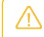
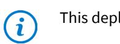
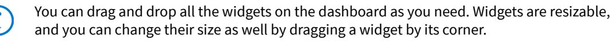
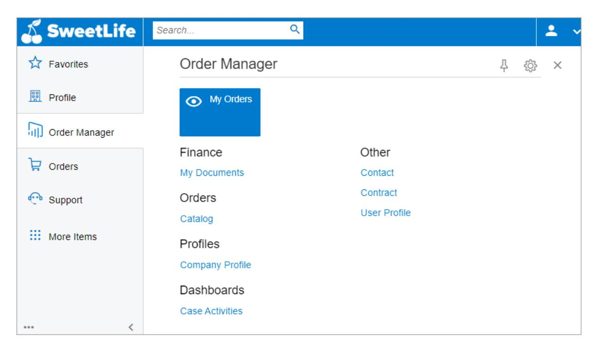
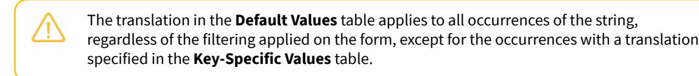
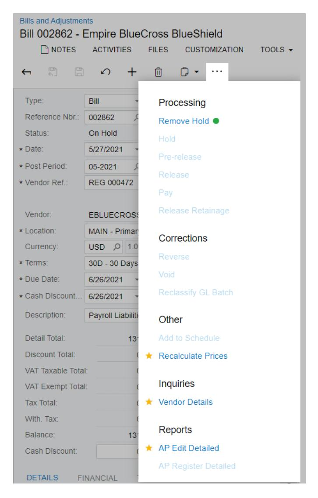

**Administrator Guide**

# **Self-Service Portal Administrator's Guide 2025 R1**


## **Contents**

| Copyright4                                                |                                                                                                                         |  |  |  |
|-----------------------------------------------------------|-------------------------------------------------------------------------------------------------------------------------|--|--|--|
| Overview of the Acumatica Self-Service Portal 5           |                                                                                                                         |  |  |  |
| Configuring the Self-Service Portal 7                     |                                                                                                                         |  |  |  |
|                                                           | Configuring the Self-Service Portal: General Information7                                                               |  |  |  |
|                                                           | Configuring the Self-Service Portal: Implementation Checklist 8                                                         |  |  |  |
|                                                           | Configuring the Self-Service Portal: To License the Self-Service Portal Instance10                                      |  |  |  |
|                                                           | Configuring the Self-Service Portal: To Specify the General Settings of the Self-Service Portal 12                      |  |  |  |
|                                                           | Configuring the Self-Service Portal: To Enable SSO with an External Identity Provider for the Self-Service<br>Portal 13 |  |  |  |
|                                                           | Managing Access to the Self-Service Portal 15                                                                           |  |  |  |
|                                                           | Managing Access to the Self-Service Portal: General Information15                                                       |  |  |  |
|                                                           | Managing Access to the Self-Service Portal: To Create User Roles for a Customer's Employees16                           |  |  |  |
|                                                           | Managing Access to the Self-Service Portal: To Create User Types for User Accounts18                                    |  |  |  |
|                                                           | Managing Access to the Self-Service Portal: To Create User Accounts for Contacts 20                                     |  |  |  |
|                                                           | Managing the Inventory Catalog in the Self-Service Portal24                                                             |  |  |  |
|                                                           | Managing the Inventory Catalog in the Self-Service Portal: General Information 24                                       |  |  |  |
|                                                           | Managing the Inventory Catalog in the Self-Service Portal: Online Order Processing26                                    |  |  |  |
|                                                           | Managing the Inventory Catalog in the Self-Service Portal: Implementation Checklist27                                   |  |  |  |
|                                                           | Managing the Inventory Catalog in the Self-Service Portal: Implementation Activity28                                    |  |  |  |
| Configuring Case Management in the Self-Service Portal 35 |                                                                                                                         |  |  |  |
|                                                           | Configuring Case Management in the Self-Service Portal: General Information 35                                          |  |  |  |
|                                                           | Configuring Case Management in the Self-Service Portal: Implementation Checklist 37                                     |  |  |  |
|                                                           | Configuring Case Management in the Self-Service Portal: Implementation Activity39                                       |  |  |  |
|                                                           | Tailoring the Self-Service Portal 44                                                                                    |  |  |  |
|                                                           | Tailoring the Self-Service Portal: General Information44                                                                |  |  |  |
|                                                           | Tailoring the Self-Service Portal: Creation and Modification of Generic Inquiries45                                     |  |  |  |
|                                                           | Tailoring the Self-Service Portal: Creation and Design of Dashboards49                                                  |  |  |  |
|                                                           | Tailoring the Self-Service Portal: Creation and Modification of Workspaces 51                                           |  |  |  |
|                                                           | Tailoring the Self-Service Portal: To Create a Generic Inquiry 51                                                       |  |  |  |
|                                                           | Tailoring the Self-Service Portal: To Create and Design a Dashboard 56                                                  |  |  |  |
|                                                           | Tailoring the Self-Service Portal: To Configure a Workspace 65                                                          |  |  |  |
|                                                           | To Reset Menu Settings 72                                                                                               |  |  |  |
| Managing Localization of the Self-Service Portal73        |                                                                                                                         |  |  |  |
|                                                           | Localization of the Self-Service Portal73                                                                               |  |  |  |

| Translation Process74                              |  |
|----------------------------------------------------|--|
| Boxes that Display Translated Values78             |  |
| To Translate Bound Strings79                       |  |
| To Translate Unbound Strings 80                    |  |
| To Exclude Strings from Translation81              |  |
| To Create a Localized Version of a Wiki Article 81 |  |
| Self-Service Portal Form Reference 82              |  |
| Access Rights by Role 82                           |  |
| Access Rights by Screen 84                         |  |
| Activate License 85                                |  |
| Customization Projects88                           |  |
| Feedback 93                                        |  |
| Portal Map 94                                      |  |
| Translation Dictionaries 95                        |  |
| Wiki 102                                           |  |
| Wiki Access by Role107                             |  |
| Wiki Articles109                                   |  |
| Wiki Categories111                                 |  |
| Wiki Editor Form for Articles 112                  |  |
| Wiki Products 117                                  |  |
| Wiki Site Map118                                   |  |
| Wiki Style Sheets119                               |  |
| Appendix121                                        |  |
| Form Toolbar and More Menu121                      |  |
| Table Toolbar 128                                  |  |

## <span id="page-3-0"></span>**Copyright**

#### **© 2025 Acumatica, Inc.**

#### **ALL RIGHTS RESERVED.**

No part of this document may be reproduced, copied, or transmitted without the express prior consent of Acumatica, Inc.

3075 112th Avenue NE, Suite 200, Bellevue, WA 98004, USA

## **Restricted Rights**

The product is provided with restricted rights. Use, duplication, or disclosure by the United States Government is subject to restrictions as set forth in the applicable License and Services Agreement and in subparagraph (c)(1)(ii) of the Rights in Technical Data and Computer Soware clause at DFARS 252.227-7013 or subparagraphs (c)(1) and (c)(2) of the Commercial Computer Soware-Restricted Rights at 48 CFR 52.227-19, as applicable.

#### **Disclaimer**

Acumatica, Inc. makes no representations or warranties with respect to the contents or use of this document, and specifically disclaims any express or implied warranties of merchantability or fitness for any particular purpose. Further, Acumatica, Inc. reserves the right to revise this document and make changes in its content at any time, without obligation to notify any person or entity of such revisions or changes.

## **Trademarks**

Acumatica is a registered trademark of Acumatica, Inc. HubSpot is a registered trademark of HubSpot, Inc. Microso Exchange and Microso Exchange Server are registered trademarks of Microso Corporation. All other product names and services herein are trademarks or service marks of their respective companies.

Soware Version: 2025 R1 Last Updated: 06/01/2025

## <span id="page-4-0"></span>**Overview of the Acumatica Self-Service Portal**

Acumatica ERP gives your company a complete set of business soware applications that your users can use anytime, from anywhere, by using virtually any device. On the other hand, only employees of your company can use the applications provided as part of Acumatica ERP. The way your employees have been able to communicate with your customers is manual and based on emails, phone calls, and postal mail.

With the many advancements in technology, customers expect to have all the information they need from your company at their fingertips. Most of the interaction between you and your customers should be online, automated, always available, and provided as self-service.

The Acumatica Self-Service Portal provides a solution for you to more efficiently work and communicate with your customers. The Self-Service Portal is specifically designed to be the site where your customers can view all the relevant information about their interactions with you as a vendor and perform needed activities online.

## **Customer Self-Service Capability**

By using the Self-Service Portal, your customers can access their account information, create and manage support cases, and create and track online orders—all without picking up the phone or sending an email. All of these services are available 24 hours a day, 7 days a week.

### **Self-Update of Customer Information**

By using the Self-Service Portal, customers can view and promptly update their company address and contact information, to keep the data in the system up to date at all times. You can view the updated information about the customer business account on the *[Business Accounts](https://help-2025r1.acumatica.com/Help?ScreenId=ShowWiki&pageid=823f9e2c-d352-4cf4-bbb9-ce6464fecc75)* (CR303000) form.

## **Financial Overview**

Within the Self-Service Portal, customers have the ability to see all historical documents, balances, due dates, payments received, and amount due.

### **Case Management**

Customers can use the Self-Service Portal to submit new cases, which seamlessly flow into Acumatica ERP. You can view the new cases by using the *[Cases](https://help-2025r1.acumatica.com/Help?ScreenId=ShowWiki&pageid=a492a091-9649-4826-bcc3-dccdf8765efd)* (CR306000) form. The customers can view the cases they submitted, track the statuses of these cases, provide additional information when required, and reopen closed cases.

You can set up a period during which users can reopen the case by using the *[Case Classes](https://help-2025r1.acumatica.com/Help?ScreenId=ShowWiki&pageid=3831be44-0b11-433c-a2a9-eb2d6183012f)* (CR206000) form.

For more information, see *[Defining Case Classes](https://help-2025r1.acumatica.com/Help?ScreenId=ShowWiki&pageid=87d9fb39-2e46-4b75-ae9a-3045637459bb)* and *[Configuring Case Management in the Self-Service Portal](#page-34-2)*.

#### **Order Management and Inventory Catalog**

With the order management and the inventory catalog in the Acumatica Self-Service Portal, you give your customers access to the products and services you sell. You use your Acumatica ERP instance to create the catalog and manage the product descriptions and images.

Your customers can use the Self-Service Portal to browse the list of available items, view item details, and then order the items online. The sales order is automatically generated and you can further process it. The customer tracks the status of the order and the shipments online. Also, the customer can view the invoice aer you release the document. For more information, see *[Managing the Inventory Catalog in the Self-Service Portal](#page-23-2)*.


This feature is inaccessible if the *Inventory and Order Management* group of features is disabled.

#### **Delegated User Management**

You can assign a user or multiple users of each customer as delegated administrators and give these users the rights to add new contacts or users to the customer's business account by using the Self-Service Portal. The delegated administrators can also assign the users one or more of the roles you have provided. All the added contacts are immediately visible on the *[Contacts](https://help-2025r1.acumatica.com/Help?ScreenId=ShowWiki&pageid=75a5dea9-d640-4b71-95b1-88534c4afad7)* (CR302000) form in Acumatica ERP.

#### **Localization of the User Interface and Wiki Articles**

You can localize the user interface of the Self-Service Portal and wiki articles to multiple languages. You can translate the strings of the application's user interface directly in the application or by exporting the application strings to a third-party product, performing the translation in that product, and importing the translated strings back. For details, see *[Managing Localization of the Self-Service Portal](#page-72-2)*.

## **Tailoring of the User Interface**

In Acumatica ERP, you can flexibly tailor the user interface (in particular, main menu items, workspaces, and dashboards) that all users will see so that it fits the business processes of your organization. Your tailoring of the user interface will make it easier for users to find and begin working with required forms, speeding document processing in the system. For example, you can add generic inquiry forms or dashboards to a Self-Service Portal site map on the *[Portal Map](#page-93-1)* (SM200521) form, so that the forms are available for quick access. For details, see *[Tailoring](#page-43-2) [the Self-Service Portal](#page-43-2)*.

## <span id="page-6-3"></span><span id="page-6-0"></span>**Configuring the Self-Service Portal**

Aer you install Acumatica Self-Service Portal, you configure the Self-Service Portal instance before you make it available to your customers.

<span id="page-6-2"></span>In this chapter, you will find information on the general settings of your Self-Service Portal instance.

## <span id="page-6-1"></span>**Configuring the Self-Service Portal: General Information**

The Acumatica Self-Service Portal provides tools that you can use to configure and maintain your Self-Service Portal instance.

## **Learning Objectives**

In this chapter, you will do the following:

- Activate the license of the Self-Service Portal
- Delete the license of the Self-Service Portal
- Specify the general settings of the Self-Service Portal

## **Applicable Scenarios**

You may need to configure the Self-Service Portal in the following cases:

- You want to create a special site for your customers for better communication and to work with them.
- You want each customer to have access to the customer's own documents, such as sales orders, invoices, credit memos, and statements.

## **Administration of the Self-Service Portal**

By using the system management tools of the Self-Service Portal, you can activate the license of your Self-Service Portal instance, specify the default settings, configure access to the functionality, set up single sign-on (SSO) with the supported identity providers, and customize your Self-Service Portal instance.

To access the system management functionality of the Self-Service Portal, you must sign in to your Self-Service Portal instance with a user account to which the *Administrator* or *Portal Admin* role is assigned.

#### **Roles for Self-Service Portal Management**

In Acumatica ERP, you configure all access by using roles. For your company's internal users to perform configuration and management tasks in the Self-Service Portal, these users must have sufficient access rights to the Self-Service Portal. Generally, the users who work with the Self-Service Portal need access rights to do the following:

- Configure and manage the Self-Service Portal instance: You assign these users the *Portal Admin* role, which has been specifically designed for those users who will configure and manage the Self-Service Portal.
- Initially configure the Self-Service Portal instance: You can assign these users the *Administrator* role, which gives these users full access to all system objects.



We recommend that you assign this role to users only during the initial Self-Service Portal setup. Aer the setup, you should assign the role to users only in extraordinary cases.

For more information on Acumatica ERP roles, see *[Managing User Access](https://help-2025r1.acumatica.com/Help?ScreenId=ShowWiki&pageid=58acde23-caf5-4a49-9e39-d8bd48779f16)*.

## **Licensing of the Self-Service Portal**

The Acumatica Self-Service Portal is a separate application instance that requires licensing. The Self-Service Portal instance and the standard Acumatica ERP instance use different types of licenses.

By default, the Self-Service Portal is installed in trial mode, which means that only two users may concurrently use the system. Each time a third user signs in to the Self-Service Portal, one of the current users is forcibly signed out.

You use the *[Activate License](#page-84-1)* (SM201510) form to enter a product key or upload a license file and then activate the system. When you obtain and activate the license for using the Self-Service Portal, the trial mode restrictions are removed.

#### **External Identity Provider for the Self-Service Portal**

The Acumatica Self-Service Portal supports single sign-on (SSO) with external identity providers. With SSO enabled, any user of the Self-Service Portal who specified their account with the identity provider for their user account in the Self-Service Portal will be able to sign in with their external account.

For more information on SSO in Acumatica ERP, see *[Integrating Acumatica ERP with OpenID Identity Providers](https://help-2025r1.acumatica.com/Help?ScreenId=ShowWiki&pageid=ef559879-9907-4ec4-826e-13854e094114)*.

## <span id="page-7-0"></span>**Configuring the Self-Service Portal: Implementation Checklist**

The following sections provide details you can use to ensure that the system is configured properly for managing cases in the Acumatica Self-Service Portal, and to understand (and change, if needed) the settings that affect the workflow of case management.

## **Mandatory Configuration in Acumatica ERP**

To ensure that the basic CRM configuration in Acumatica ERP for managing cases in Acumatica Self-Service Portal has been implemented properly, make sure that the necessary features have been enabled, entities have been created, and settings have been specified, as described in the following checklist.

| Form           | Criteria to Check                                                                                                  |
|----------------|--------------------------------------------------------------------------------------------------------------------|
| Multiple forms | The CRM functionality has been implemented, as described<br>in Configuring CRM Functionality: General Information. |

| Form                                       | Criteria to Check                                                                                                                                                                                                                                                             |
|--------------------------------------------|-------------------------------------------------------------------------------------------------------------------------------------------------------------------------------------------------------------------------------------------------------------------------------|
| Enable/Disable Features (CS100000)         | The following features have been enabled:                                                                                                                                                                                                                                     |
|                                            | •<br>Customer Management: This feature provides the cus<br>tomer relationship management (CRM) functionality, in<br>cluding lead and customer tracking, and gives users the<br>ability to manage sales opportunities, contacts, market<br>ing lists, and marketing campaigns. |
|                                            | •<br>Case Management in the Customer Management group of<br>features: This feature gives customer support personnel<br>the ability to create support cases, assign cases to own<br>ers, and process cases.                                                                    |
|                                            | •<br>Customer Portal. This feature gives users the ability to<br>use the Acumatica Self-Service Portal.                                                                                                                                                                       |
|                                            | •<br>Case Management on Portal in the Customer Portal group<br>of features. This feature gives your customers the ability<br>to add cases and track case processing through the Self<br>Service Portal.                                                                       |
|                                            | •<br>Financials on Portal in the Customer Portal group of fea<br>tures. This feature gives the Self-Service Portal users<br>(customers) to view the documents associated with their<br>company accounts in Acumatica ERP.                                                     |
| Activate License (SM201510)                | A license for the Self-Service Portal instance has been acti<br>vated, as described in Configuring the Self-Service Portal: To<br>License the Self-Service Portal Instance.                                                                                                   |
| Contact Classes (CR205000)                 | The needed contact classes have been created with the nec<br>essary settings, as described in Defining Contact Classes.                                                                                                                                                       |
| Business Account Classes (CR208000)        | The needed business account classes have been created<br>with the necessary settings, as described in Defining Busi<br>ness Account Classes.                                                                                                                                  |
| Customer Management Preferences (CR101000) | On the General Settings tab, numbering sequences have<br>been saved and default classes with the necessary settings<br>and attributes have been specified.                                                                                                                    |
| Contacts (CR302000)                        | The contact records for customer representatives and po<br>tential clients have been created and user accounts for<br>these contacts have been created and assigned the needed<br>roles, as described in Creating Contacts.                                                   |
| Business Accounts (CR303000)               | Business account records have been created, as described in<br>Creating Business Accounts.                                                                                                                                                                                    |
| Employee Classes (EP202000)                | The needed employee classes have been created with the<br>necessary settings and attributes.                                                                                                                                                                                  |
| Employees (EP203000)                       | Employee records have been created in the system.                                                                                                                                                                                                                             |

| Form                  | Criteria to Check                                                                                                                                                                                  |
|-----------------------|----------------------------------------------------------------------------------------------------------------------------------------------------------------------------------------------------|
| User Roles (SM201005) | The needed roles have been created and assigned to the<br>needed user accounts, as described in Managing Access to<br>the Self-Service Portal: To Create User Roles for a Customer's<br>Employees. |
| User Types (EP202500) | The needed user type has been created and assigned to the<br>needed roles as described in Managing Access to the Self<br>Service Portal: To Create User Types for User Accounts.                   |
| Users (SM201010)      | User accounts have been created for employees and cus<br>tomer contacts as described in Managing Access to the Self<br>Service Portal: To Create User Accounts for Contacts.                       |

## **Mandatory Configuration in the Acumatica Self-Service Portal**

Make sure that on the **GeneralSettings** tab of the Portal Preferences (SP800000) form, the general settings of the Self-Service Portal have been specified as described in *Configuring the [Self-Service](#page-11-1) Portal: To Specify the General [Settings of the Self-Service Portal](#page-11-1)*.

## <span id="page-9-1"></span><span id="page-9-0"></span>**Configuring the Self-Service Portal: To License the Self-Service Portal Instance**

In the following activity, you will learn how to activate a license for the Acumatica Self-Service Portal, as well as how to delete the license.

## **Story**

Suppose that the SweetLife Fruits & Jams company has decided to create a Self-Service Portal instance, which will be used by SweetLife's customers. Acting as system administrator, you need to configure the system before these users can use it.

In this activity, you will perform the first step of this configuration: activating the instance of the Self-Service Portal.

During production use of the Self-Service Portal, you activate your license and enable the needed features. During testing, however, you work in trial mode, where you can enable and use any feature. Thus, in the second step of this activity, you will delete the license so that you can continue working in trial mode while performing other activities that involve working with the Self-Service Portal.

## **Configuration Overview**

For the purposes of this activity, the following tasks have been performed:

• The Acumatica ERP application instance with the *U100\_SSP\_Admin\_2025 R1* dataset preloaded and the Self-Service Portal application instance have been deployed in the same database.


This deployment is outside of the scope of this course.

• In the *U100\_SSP\_Admin\_2025 R1* dataset, on the *[User Roles](https://help-2025r1.acumatica.com/Help?ScreenId=ShowWiki&pageid=c2879f3c-3739-430a-b02b-c225f5480966)* (SM201005) form of Acumatica ERP, the *Portal Admin* role has been assigned to the *gibbs* user account. The user account is associated with

Kimberly Gibbs, the system administrator in the SweetLife Fruits & Jams company. The role provides full administrative privileges in the Self-Service Portal.

#### **Process Overview**

In this activity, you will do the following:

- 1. Obtain the product key for the license for the Self-Service Portal by creating a support case through the Acumatica Portal (*[portal.acumatica.com](https://portal.acumatica.com/)*).
- 2. Activate your license on the *[Activate License](#page-84-1)* (SM201510) form of the Self-Service Portal.
- 3. Delete the Self-Service Portal license to return to trial mode for testing purposes.

## **System Preparation**

Before you apply a license key to the Self-Service Portal instance, you should do the following:

- 1. Obtain a product key from Acumatica by creating a support case through the Acumatica Portal (*[portal.acumatica.com](https://portal.acumatica.com/)*). Submit the following information:
  - **Installation ID**: To find the installation ID, on any Acumatica ERP or Self-Service Portal form, select**Tools > About...**. The **About Acumatica** dialog box, which contains this ID, opens.
  - **Contract ID**: You can find this ID on your Acumatica ERP sales invoice.
- 2. Make sure that the port 443 is opened on the computer running the Acumatica ERP instance. You may have to open port 443 if the computer has a firewall enabled.
- 3. Launch the Self-Service Portal instance that uses the same database as Acumatica ERP.
- 4. Sign in to a company with the *U100\_SSP\_Admin\_2025 R1* dataset preloaded as system administrator by using the *gibbs* username and the *123* password.

## **Step 1: Activating the Self-Service Portal License**

To activate the Self-Service Portal license, do the following:

- 1. In the Self-Service Portal, open the *[Activate License](#page-84-1)* (SM201510) form.
- 2. On the form toolbar, click **Enter License Key**.
- 3. In the **Activate New License** dialog box, which opens, enter the license key, which you have obtained through the Acumatica Portal (*[portal.acumatica.com](https://portal.acumatica.com/)*) and click **OK**.

The system contacts the licensing server and validates the license online.

- 4. In the **Agree to Proceed** dialog box, which opens, click the link to read the soware license agreement. If you agree to the terms of the agreement, click **Agree** to proceed with activation. The dialog box is closed.
- 5. In the Summary area, review the license's status (*Valid*), its validity period, and the number of users and tenants.
- 6. On the form toolbar, click **Apply License** to activate your license.

The system restarts the instance. In the table, notice the list of the features activated by the license.

## **Step 2: Deleting the Self-Service Portal License**

In this step, to restore trial mode for testing purposes, you will delete the Self-Service Portal license. (These actions would not be performed in production use of the portal.) Do the following:

1. While you are still viewing the *[Activate License](#page-84-1)* (SM201510) form, on the form toolbar, click **Delete License**.

2. In the **License** dialog box, which opens, click **OK**. Wait for the system to complete the operation.

The system restarts the instance. Notice that now the instance is in trial mode again.

## <span id="page-11-1"></span><span id="page-11-0"></span>**Configuring the Self-Service Portal: To Specify the General Settings of the Self-Service Portal**

In the following implementation activity, you will specify the general settings of the Acumatica Self-Service Portal instance.

#### **Story**

Suppose that SweetLife Fruits & Jams has decided to create a Self-Service Portal instance, which will be used by SweetLife customers. Acting as system administrator, you need to configure the system before these users can use it. You also need to specify the general settings for the Self-Service Portal.

## **Configuration Overview**

For the purposes of this activity, the following tasks have been performed:

• The Acumatica ERP application instance with the *U100\_SSP\_Admin\_2025 R1* dataset preloaded and the Self-Service Portal application instance have been deployed in the same database.


This deployment is outside of the scope of this course.

• In the *U100\_SSP\_Admin\_2025 R1* dataset, on the *[User Roles](https://help-2025r1.acumatica.com/Help?ScreenId=ShowWiki&pageid=c2879f3c-3739-430a-b02b-c225f5480966)* (SM201005) form of Acumatica ERP, the *Portal Admin* role has been assigned to the *gibbs* user account. The user account is associated with Kimberly Gibbs, the system administrator in the SweetLife Fruits & Jams company. The role provides full administrative privileges in the Self-Service Portal.

## **Process Overview**

In this activity, you will specify the general settings of the Self-Service Portal instance on the Portal Preferences (SP800000) form.

## **System Preparation**

Before you start specifying the general settings of the Self-Service Portal, do the following:

- 1. Launch the Acumatica ERP instance that uses the same database and tenant as the Self-Service Portal instance to be configured.
- 2. Sign in to a company with the *U100\_SSP\_Admin\_2025 R1* dataset preloaded as system administrator by using the *gibbs* username and the *123* password.
- 3. On the *[Enable/Disable Features](https://help-2025r1.acumatica.com/Help?ScreenId=ShowWiki&pageid=c1555e43-1bc5-4f6f-ba9d-b323f94d8a6b)* (CS100000) form, enable the *Customer Portal* feature.

## **Step: Specifying the General Settings of the Self-Service Portal**

To specify the general settings of the Self-Service Portal, perform the following instructions:

- 1. Sign in to a Self-Service Portal as system administrator by using the *gibbs* username and the *123* password.
- 2. Open the Portal Preferences (SP800000) form.

- 3. On the **GeneralSettings** tab (**PortalSettings** section), do the following:
  - a. In the **Portal Name** box, type the portal name, such as SweetLife Online Shop.
  - b. To restrict the visibility of financial documents, in the **Display Financial Documents** box, select *From Company*. With this option selected, the Self-Service Portal users will see the financial documents associated with a particular company (tenant) and its branches.

The **Display Financial Documents** box may be unavailable for editing, which depends on your Acumatica ERP license. If the box is unavailable for editing, make sure that you have deleted the license that you activated in the Self-Service Portal (see *[Configuring the Self-](#page-9-1)Service Portal: To License the [Self-Service](#page-9-1) Portal Instance*).

- c. In the **PortalSite Company** box, which appears, select *SWEETLIFE*.
- 4. On the form toolbar, click**Save**.

You have specified the general settings of the Self-Service Portal instance.

## <span id="page-12-0"></span>**Configuring the Self-Service Portal: To Enable SSO with an External Identity Provider for the Self-Service Portal**

The following activity will walk you through the process of enabling single sign-on (SSO) to the Self-Service Portal instance with a Microso account.

This activity is based on the *U100* dataset. If you are using another dataset, or if any system settings have been changed in *U100*, these changes can affect the workflow of the activity and the results of the processing. To avoid any issues, restore the *U100* dataset to its initial state.

#### **Story**

Suppose that SweetLife Fruits & Jams has decided to make it possible for your company's employees to sign in to the Self-Service Portal instance with an external identity provider. Acting as a system administrator, you need to configure the single sign-on capabilities with a Microso account because the company uses Microso Office services.

#### **Configuration Overview**

In the *U100* dataset, on the *[User Roles](https://help-2025r1.acumatica.com/Help?ScreenId=ShowWiki&pageid=c2879f3c-3739-430a-b02b-c225f5480966)* (SM201005) form of Acumatica ERP, the *Portal Admin* role (which provides full administrative privileges on the Self-Service Portal) has been assigned to the *gibbs* username, which belongs to Kimberly Gibbs, the system administrator in the SweetLife Fruits & Jams company.

#### **Process Overview**

In this activity, to enable SSO for the Self-Service Portal, you will register your Self-Service Portal instance with the identity provider and obtain the OAuth 2.0 credentials, including the client ID and client secret.

Aer that, you will register the credentials you obtain on the Identity Provider Preferences (SM201065) form of the Self-Service Portal.

#### **System Preparation**

Before you start to enable SSO with an external identity provider, do the following:

- 1. Deploy the Acumatica ERP application instance with the U100 dataset preloaded and the Self-Service Portal application instance on the same database.
- 2. Register the Acumatica ERP instance with Microso Account, as described in *To [Configure](https://help-2025r1.acumatica.com/Help?ScreenId=ShowWiki&pageid=6b852c66-01c4-40b5-af7d-c53d7e4bd672) Microsoft Entra ID for [Integration](https://help-2025r1.acumatica.com/Help?ScreenId=ShowWiki&pageid=6b852c66-01c4-40b5-af7d-c53d7e4bd672) with Your Acumatica ERP Instance*. (If you were registering the instance with Google, you would perform the actions described in *To Register an [Acumatica](https://help-2025r1.acumatica.com/Help?ScreenId=ShowWiki&pageid=53f81793-fd88-4375-8db3-d06b73b0b165) ERP Instance with Google*.) Make a note of the client ID and client secret, which you will need further in the activity.
- 3. Sign in to a Self-Service Portal company with the *U100* dataset preloaded. You should sign in as a system administrator with the following credentials:
  - **Username**: *gibbs*
  - **Password**: *123*

## **Step: Configuring and Enabling SSO in the Acumatica ERP Instance**

To configure and enable SSO, do the following in the Self-Service Portal:

- 1. Open the Identity Provider Preferences (SM201065) form.
- 2. In the table, do the following in the row of the Microso Account identity provider:
  - a. To enable SSO with this identity provider, select the **Active** check box.
  - b. In the **Realm** column, enter the full URL of your instance—for example, *http://app.site.net/ instance\_name*.
  - c. In the **Application ID** column, paste the client ID generated by the identity provider.
  - d. In the **Application Secret** column, paste the client secret generated by the identity provider.
- 3. On the form toolbar, click**Save**.

You have enabled the SSO functionality for the Self-Service Portal instance.

## <span id="page-14-0"></span>**Managing Access to the Self-Service Portal**

To give a contact access to the Acumatica Self-Service Portal, you add a user account to the contact account in Acumatica ERP. This user account must have a contact-related user type and the *Portal User* role assigned. The settings of the *Portal User* role define which functionality is available to the portal users. The user type settings determine the ability of the contact users to manage contact user accounts.

In this chapter, you will find information on the Self-Service Portal access management, including configuring the *Portal User* role, managing the contact's user accounts, managing contact-related user types, and delegating user management.

## <span id="page-14-2"></span><span id="page-14-1"></span>**Managing Access to the Self-Service Portal: General Information**

The Acumatica Self-Service Portal is a site designed to give the users of your customers' organizations limited access to your Acumatica ERP instance.

To control access to the Self-Service Portal, you assign these users *roles*: sets of access rights designed for users with similar responsibilities. These roles are assigned access rights to the appropriate system objects and functionality, so users can access only the information they need.

To ease the process of setting up roles, Acumatica ERP provides a set of predefined roles; you can make changes to any existing role, create your own role from the ground up (which we do not recommend), or copy an existing role and make changes to the copy. To give contacts in the customer's company the ability to access the Self-Service Portal instance, you can assign the predefined *Portal User* role (or a similar role that you create) to these contacts. When you create a user account associated with a contact, you assign the needed role to this user.

Also, by applying the default *Portal User* access rights, you can give administrative users in the customer's organization the access rights to add, delete, and manage user accounts for the contacts of their organization.

## **Learning Objectives**

In this chapter, you will do the following:

- Create user roles for the Self-Service Portal users
- Create user types for the Self-Service Portal users
- Create user accounts for contacts

#### **Applicable Scenarios**

You may need to create user roles, user types, and user accounts for the Self-Service Portal in the following cases:

- You want to give access to the Self-Service Portal to your customers' employees.
- You want users of your customers to be able to create contact and user accounts in the Self-Service Portal, on their own.

## **Portal User Role**

Acumatica ERP provides a predefined role, *Portal User*, designed to be assigned to users that may have access to the Self-Service Portal. A user with this role assigned can sign in to the Self-Service Portal and review the information pertaining to the business account associated with the user account, including the following:

- View and edit the company's contact information and address.
- Add, delete, and manage the contacts within the organization.

- View the contracts in the organization.
- View and print customer's documents, such as sales orders, shipments, statements, invoices, or credit memos.

If you use the predefined *Portal User* role, you can change the default role settings by using the *[Access Rights by](#page-81-2) [Role](#page-81-2)* (SM201025) form of the Acumatica ERP instance or the Self-Service Portal. You can also create your own role for portal users by copying the *Portal User* role and modifying the access rights in the new role.

For more information about creating a role for portal users, see *Managing Access to the [Self-Service](#page-15-1) Portal: To Create User Roles for a [Customer's](#page-15-1) Employees*.

### **External User Types**

In Acumatica ERP, *user types* provide default settings for new users that you create, including which entity type (an internal employee or an external contact) is associated with the user type and which roles can be associated with the user accounts to which the user type is assigned.

On the *User [Types](https://help-2025r1.acumatica.com/Help?ScreenId=ShowWiki&pageid=778035ea-b6a9-4fa9-829c-3d44fee563a7)* (EP202500) form, each user type for portal users must have the *contact* entity type selected in the **Linked Entity** box of the Summary area and the *Portal User* role (or any other custom portal role that you might have created for portal users) listed on the **Allowed Roles** tab.

For more information, see *User [Access:](https://help-2025r1.acumatica.com/Help?ScreenId=ShowWiki&pageid=93be1cc3-9f93-4c09-a2ef-c4152181eb4c) Linked Entities and User Types*.

#### **User Accounts for Contacts**

You can add a user account to a contact account in one of the following ways:

- By using the *[Contacts](https://help-2025r1.acumatica.com/Help?ScreenId=ShowWiki&pageid=75a5dea9-d640-4b71-95b1-88534c4afad7)* (CR302000) form to open the contact for editing, and then adding the user account information on the **User Info** tab.
- By using the *[Users](https://help-2025r1.acumatica.com/Help?ScreenId=ShowWiki&pageid=834cc181-97fa-4db4-a7e0-3eaba142c166)* (SM201010) form to create a user account and linking it with the existing contact account.

When you create a user account, you must select a contact-related user type and assign the user the *Portal User* role, or any other role created for the portal user. For details, see *Managing Access to the [Self-Service](#page-19-1) Portal: To [Create User Accounts for Contacts](#page-19-1)*.

## <span id="page-15-1"></span><span id="page-15-0"></span>**Managing Access to the Self-Service Portal: To Create User Roles for a Customer's Employees**

Acumatica ERP provides the predefined *Portal User* role, which allows users to view and work with the company profile and company documents, including contracts and financial documents. A user with this role can create, modify, or delete contacts associated with the company. These are powerful access rights that you might want to avoid assigning to everyone in a customer's company. You can create another role with restricted access to contact creation.

In the following implementation activity, you will create two roles for the Self-Service Portal (*Customer Admin* and *Customer User*); both roles are based on copies of the existing *Portal User* role.

#### **Story**

Suppose that your company wants to have different access rights for users of the Self-Service Portal. You need to create two user roles for the Self-Service Portal users: one for administrators of the customer (*Customer Admin*), and another for users of the customer (*Customer User*).

Acting as system administrator, you need to create user roles based on a copy of the existing *Portal User* role and specify the proper access rights to some of the forms.

## **Configuration Overview**

For the purposes of this activity, the following tasks have been performed:

• The Acumatica ERP application instance with the *U100\_SSP\_Admin\_2025 R1* dataset preloaded and the Self-Service Portal application instance have been deployed in the same database.



This deployment is outside of the scope of this training.

• In the *U100\_SSP\_Admin\_2025 R1* dataset, on the *[User Roles](https://help-2025r1.acumatica.com/Help?ScreenId=ShowWiki&pageid=c2879f3c-3739-430a-b02b-c225f5480966)* (SM201005) form of Acumatica ERP, the *Portal Admin* role has been assigned to the *gibbs* user account. The user account is associated with Kimberly Gibbs, the system administrator in the SweetLife Fruits & Jams company. The role provides full administrative privileges in the Self-Service Portal.

## **Process Overview**

In this activity, you will copy an existing role on the *[Access Rights by Role](#page-81-2)* (SM201025) form to create new roles. For one of the new roles, on the same form, you will modify the access rights to forms and specific records in the system.

## **System Preparation**

Before you start creating user roles, sign in to the Self-Service Portal instance with the *U100\_SSP\_Admin\_2025 R1* dataset preloaded as system administrator by using the *gibbs* username and the *123* password.

## **Step 1: Creating Roles by Copying an Existing Role**

To create the needed new roles by copying the existing *Portal User* role, do the following:

- 1. In the Self-Service Portal, open the *[Access Rights by Role](#page-81-2)* (SM201025) form.
- 2. In the **Role Name** box of the Summary area, select *Portal User*.
- 3. On the form toolbar, click **Copy Role**.
- 4. In the **New Role Name** box of the **New Role** dialog box, which opens, type Customer Admin and click **Copy**.

The system closes the dialog box, creates a new role on the *[Access Rights by Role](#page-81-2)* form (to which you return), and populates the new role with the settings of the role you have copied (except for the role name, for which the system inserts the new role name that you entered in the dialog box).

- 5. On the form toolbar, click**Save**.
- 6. On the form toolbar, click **Copy Role**.
- 7. In the **New Role Name** box of the **New Role** dialog box, which opens, type Customer User and click **Copy**. The system closes the dialog box, creates a new role on the *[Access Rights by Role](#page-81-2)* form (to which you return), and populates the new role with the settings of the role you have copied (except for the role name).
- 8. On the form toolbar, click**Save**.

In the following step, you will change this role's access to some of the forms to give the role fewer privileges.

## **Step 2: Defining the Proper Access Rights for the Customer User Role**

In this step, you will make changes to the *Customer User* role, which you have created. While you are still viewing the *Customer User* role on the *[Access Rights by Role](#page-81-2)* (SM201025) form, do the following:

- 1. In the le pane, click the **Administration** node (below the tenant node). The right pane displays the list of the forms available in the **Administration** workspace with the level of access rights the role has to each form.
- 2. In the right pane, in the row with *Portal Preferences* in the **Description** column, select *Revoked* in the **Access Rights** column.
- 3. On the form toolbar, click**Save**.
- 4. In the le pane, select **Profile**.
- 5. In the right pane, in the row with *Company Profile* in the **Description** column, select *View Only* in the **Access Rights** column.
- 6. In the row with *Contacts* in the **Description** column, select *Revoked* in the **Access Rights** column.
- 7. On the form toolbar, click**Save**.

You have created two user roles by copying an existing role. You have also changed the access rights of one of the new roles to some Self-Service Portal forms.

## <span id="page-17-1"></span><span id="page-17-0"></span>**Managing Access to the Self-Service Portal: To Create User Types for User Accounts**

In the following implementation activity, you will create user types to be used for contacts that will have access to the Acumatica Self-Service Portal. When a user type is specified for a newly created user, it causes the system to insert default settings, including the entity type (an external contact for a Self-Service Portal user) associated with the user type and the roles that can be associated with the user account.

#### **Story**

Suppose that SweetLife Fruits & Jams wants to give access to the Self-Service Portal for users of customers' companies. To start configuring the access, you need to create specific user types first. You will need to create the *Customer Admin* and *Customer User* user types, which you will use for the *Customer Admin* and *Customer User* user roles, respectively.

## **Configuration Overview**

For the purposes of this activity, the following tasks have been performed:

• The Acumatica ERP application instance with the *U100\_SSP\_Admin\_2025 R1* dataset preloaded and the Self-Service Portal application instance have been deployed in the same database.


This deployment is outside of the scope of this training.

• In the *U100\_SSP\_Admin\_2025 R1* dataset, on the *[User Roles](https://help-2025r1.acumatica.com/Help?ScreenId=ShowWiki&pageid=c2879f3c-3739-430a-b02b-c225f5480966)* (SM201005) form of Acumatica ERP, the *Portal Admin* role has been assigned to the *gibbs* user account. The user account is associated with Kimberly Gibbs, the system administrator in the SweetLife Fruits & Jams company. The role provides full administrative privileges in the Self-Service Portal.

## **Process Overview**

In this activity, you will do the following on the *User [Types](https://help-2025r1.acumatica.com/Help?ScreenId=ShowWiki&pageid=778035ea-b6a9-4fa9-829c-3d44fee563a7)* (EP202500) form of Acumatica ERP:

- 1. Create the *Customer User* and the *Customer Admin* user types.
- 2. Select the role that can be assigned to the newly created user accounts with the selected user type and make it default role.

## **System Preparation**

Before you start creating user types, do the following:

- 1. Launch the Acumatica ERP instance that uses the same database and tenant as the Self-Service Portal to be configured.
- 2. Sign in as system administrator by using the *gibbs* username and the *123* password.
- 3. Make sure that you have performed the following prerequisite activity: *[Managing Access to the Self-Service](#page-15-1) Portal: To Create User Roles for a [Customer's](#page-15-1) Employees*.

## **Step 1: Creating a User Type for Customers' Users**

In this step, you will create the *Customer User* user type, which will be selected for the Self-Service Portal users in the customers' companies who are not being given administrative access rights.

To add the *Customer User* user type, do the following in the Acumatica ERP instance:

- 1. In Acumatica ERP, open the *User [Types](https://help-2025r1.acumatica.com/Help?ScreenId=ShowWiki&pageid=778035ea-b6a9-4fa9-829c-3d44fee563a7)* (EP202500) form.
- 2. In the **UserType** box of the Summary area, type Customer User.
- 3. In the **Linked Entity** box, select *Contact*. This setting indicates that *Customer User* is a contact-related user type: a user type associated with a contact in your system.
- 4. In the **Description** box, type Customer user.
- 5. Select the **Allow ThisType for Contacts** check box.
- 6. On the **Allowed Roles** tab, click **Add Row**.
- 7. Specify the following settings for this row:
  - **Role Name**: *Customer User*
  - **Assigned by Default**: Selected

With this check box selected, this role will be automatically assigned to any new user for which the user type is selected.

- 8. On the **Login Rules** tab, select the **Use Email as Username** check box. This indicates that the email address of a contact will be used as the username of the contact for a new user of this user type.
- 9. On the form toolbar, click**Save**.

## **Step 2: Creating a User Type for Customers' Administrators**

In this step, you will add a special user type because none of the existing types allows a user to manage user accounts in the Self-Service Portal. To add the *Customer Admin* user type, do the following:

- 1. While you are still viewing the *User [Types](https://help-2025r1.acumatica.com/Help?ScreenId=ShowWiki&pageid=778035ea-b6a9-4fa9-829c-3d44fee563a7)* (EP202500) form, click **Add New Record** on the form toolbar.
- 2. In the **UserType** box of the Summary area, type Customer Admin.
- 3. In the **Linked Entity** box, select *Contact*. This setting indicates that *Customer Admin* is a contact-related user type: a user type associated with a contact in your system.
- 4. In the **Description** box, type Customer admin.
- 5. Select the **Allow ThisType for Contacts** check box.
- 6. On the **Allowed Roles** tab, click **Add Row**.
- 7. Specify the following settings for this row:
  - **Role Name**: *Customer Admin*

- **Assigned by Default**: Selected
- 8. On the **Login Rules** tab, select the **Use Email as Username** check box.
- 9. On the **Managed UserTypes** tab, do the following:
  - a. Click **Add Row**.
  - b. In the **UserType** column, select *Unrestricted External User*.
  - c. Click **Add Row**.
  - d. In the **UserType** column, select *Customer User*.

With these types listed on the tab, a user with the *Customer Admin* user type can create, manage, and delete user accounts that are associated with the user types listed on this tab.

10.On the form toolbar, click**Save**.

<span id="page-19-1"></span>You have created user types, which will be then assigned to the Self-Service Portal users.

## <span id="page-19-0"></span>**Managing Access to the Self-Service Portal: To Create User Accounts for Contacts**

In the following implementation activity, you will create user accounts by using the *[Users](https://help-2025r1.acumatica.com/Help?ScreenId=ShowWiki&pageid=834cc181-97fa-4db4-a7e0-3eaba142c166)* (SM201010) and *[Contacts](https://help-2025r1.acumatica.com/Help?ScreenId=ShowWiki&pageid=75a5dea9-d640-4b71-95b1-88534c4afad7)* (CR302000) forms of Acumatica ERP.

## **Story**

Suppose that your company has decided to provide the Self-Service Portal for users of customers' companies. As system administrator, you have already created user roles and user types. Now you need to create two user accounts in the Self-Service Portal for the following customer contacts of Storehut (a chain of supermarkets):

- A customer administrator (Tonya Lawrence, a buyer) who will have the access rights to manage other user accounts of this customer in the Self-Service Portal and update company's profile. The *Tonya Lawrence* contact has already been created on the *[Contacts](https://help-2025r1.acumatica.com/Help?ScreenId=ShowWiki&pageid=75a5dea9-d640-4b71-95b1-88534c4afad7)* (CR302000) form of Acumatica ERP, and you need to create a corresponding user account.
- A customer user (Ray Newman, an assistant buyer) who will have restricted access to company profile modification and company contacts. No contact or user account exists for Ray Newman in Acumatica ERP, and you will create both a contact and a user account.

You will then verify that the created users have the proper access rights in the Self-Service Portal.

## **Configuration Overview**

For the purposes of this activity, the following tasks have been performed:

• The Acumatica ERP application instance with the *U100\_SSP\_Admin\_2025 R1* dataset preloaded and the Self-Service Portal application instance have been deployed in the same database.


This deployment is outside of the scope of this training.

- In the *U100\_SSP\_Admin\_2025 R1* dataset, on the *[User Roles](https://help-2025r1.acumatica.com/Help?ScreenId=ShowWiki&pageid=c2879f3c-3739-430a-b02b-c225f5480966)* (SM201005) form of Acumatica ERP, the *Portal Admin* role has been assigned to the *gibbs* user account. The user account is associated with Kimberly Gibbs, the system administrator in the SweetLife Fruits & Jams company. The role provides full administrative privileges in the Self-Service Portal.
- In Acumatica ERP, the *STORE* contact class—for the employees of supermarkets and other stores—has been defined on the *[Contact Classes](https://help-2025r1.acumatica.com/Help?ScreenId=ShowWiki&pageid=2f95716d-2004-434d-bab8-45be518b7913)* (CR205000) form.


For the case classes that should be available for selection to customer contacts in the Self-Service Portal, the **Internal** check box in the Summary area of the *[Contact Classes](https://help-2025r1.acumatica.com/Help?ScreenId=ShowWiki&pageid=2f95716d-2004-434d-bab8-45be518b7913)* (CR205000) form should be cleared.

• In Acumatica ERP, the *Tonya Lawrence* contact has been created on the *[Contacts](https://help-2025r1.acumatica.com/Help?ScreenId=ShowWiki&pageid=75a5dea9-d640-4b71-95b1-88534c4afad7)* (CR302000) form and associated with the *STOREHUT* business account, which has been created on the *[Business Accounts](https://help-2025r1.acumatica.com/Help?ScreenId=ShowWiki&pageid=823f9e2c-d352-4cf4-bbb9-ce6464fecc75)* (CR303000) form and extended to be a customer.

#### **Process Overview**

For the two Storehut employees to whom you want to give access to the Self-Service Portal, you will create user accounts.

For Ray Newman, who does not have a related contact in Acumatica ERP, you will first create a contact on the *[Contacts](https://help-2025r1.acumatica.com/Help?ScreenId=ShowWiki&pageid=75a5dea9-d640-4b71-95b1-88534c4afad7)* (CR302000) form. You will then specify the settings to cause the system to create Ray's user account.

For Tonya Lawrence, a contact already exists in Acumatica ERP, and you will use the *[Users](https://help-2025r1.acumatica.com/Help?ScreenId=ShowWiki&pageid=834cc181-97fa-4db4-a7e0-3eaba142c166)* (SM201010) form to create Tonya's user account.

### **System Preparation**

Before you start creating user accounts for the Self-Service Portal, do the following:

- 1. Make sure that you have performed the following prerequisite activities:
  - a. *Managing Access to the [Self-Service](#page-15-1) Portal: To Create User Roles for a Customer's Employees*
  - b. *Managing Access to the [Self-Service](#page-17-1) Portal: To Create User Types for User Accounts*
- 2. Launch the Acumatica ERP instance that uses the same database and tenant as the Self-Service Portal to be configured.
- 3. Sign in as system administrator by using the *gibbs* username and the *123* password.

#### **Step 1: Creating a User Account for a Contact**

To create a user account for Tonya Lawrence, who already has a contact defined in the system, do the following:

- 1. In Acumatica ERP, open the *[Users](https://help-2025r1.acumatica.com/Help?ScreenId=ShowWiki&pageid=834cc181-97fa-4db4-a7e0-3eaba142c166)* (SM201010) form.
- 2. In the **Login** box of the Summary area, type tonya@storehut.example.com, which will be used as the username of the new user account.
- 3. Clear the **Generate Password** check box.
- 4. In the **Password** box, type 1234.
- 5. In the **UserType** box, select the *Customer Admin* user type. For this user type, *Contact* is selected in the **Linked Entity** box on the *User [Types](https://help-2025r1.acumatica.com/Help?ScreenId=ShowWiki&pageid=778035ea-b6a9-4fa9-829c-3d44fee563a7)* (EP202500) form, making *Customer User* a contact-related user type: a user type associated with a contact in your system.

The system displays a warning dialog box asking you to verify that you want to proceed.

- 6. In the warning dialog box, click **Yes**. You are proceeding because this temporary issue will be resolved when you select a linked entity.
- 7. In the **Linked Entity** box, select Tonya Lawrence.

The system automatically populates the appropriate elements on the form with the contact's name and email address.

8. To select the security policies to be applied to the user account according to your company's policy, specify the following settings:

- **Allow Password Recovery**: Selected
- **Allow Password Changes**: Selected
- **Password Never Expires**: Cleared
- **Force User to Change Password on Next Login**: Selected
- 9. On the form toolbar, click**Save**.

The system has created the user account for the *Tonya Lawrence* contact on the *[Users](https://help-2025r1.acumatica.com/Help?ScreenId=ShowWiki&pageid=834cc181-97fa-4db4-a7e0-3eaba142c166)* form.

## **Step 2: Creating a Contact and a User Account for This Contact**

To create a contact, *Ray Newman*, for the *STOREHUT* customer and create a user account of the *Customer User* type for this contact, do the following:

- 1. On the *[Contacts](https://help-2025r1.acumatica.com/Help?ScreenId=ShowWiki&pageid=75a5dea9-d640-4b71-95b1-88534c4afad7)* (CR302000) form, add a new record.
- 2. In the **Business Account** box of the Summary area, select *STOREHUT*.
- 3. On the **Details** tab, do the following:
  - a. In the **First Name** box of the **Contact** section, type Ray.
  - b. In the **Last Name** box, type Newman.
  - c. In the **Job Title** box, type Assistant buyer.
  - d. In the **Email** box, type ray.newman@storehut.example.com.
  - e. In the **Address** section, clear the **Override** check box. Based on the address information specified in the *STOREHUT* business account, the system fills in the address boxes with the company's address information.
- 4. On the **CRM Info** tab, in the **Contact Class** box, select *STORE*.
- 5. On the form toolbar, click**Save**.
- 6. On the **User Info** tab, do the following:
  - a. In the **UserType** box, select *Customer User*.
  - b. In the **Login** box, make sure that the *ray.newman@storehut.example.com* email address is inserted.
  - c. Clear the **Generate Password** check box. You will instead enter a password for this user.
  - d. In the **Password** box, type 123.
- 7. On the form toolbar, click**Save**.

In a production environment, if the system email account is configured in the Acumatica ERP instance, when you have added the user account for a contact and saved your changes, an email containing the username and password would be sent to the user's email account.

#### **Step 3: Reviewing the Customer Administrator's Access to the Self-Service Portal**

To verify that the customer administrator user account you created has access rights to create contacts and edit company profile information in the Self-Service Portal, do the following:

1. Sign in to the Self-Service Portal instance as the customer administrator you have defined by using the *tonya@storehut.example.com* username and the *1234* password.

The system immediately displays boxes for the new password because the **Force User to Change Password on Next Login** check box was selected on the *[Users](https://help-2025r1.acumatica.com/Help?ScreenId=ShowWiki&pageid=834cc181-97fa-4db4-a7e0-3eaba142c166)* (SM201010) form when you created the user account for this user.

2. In the New Password and Confirm Password boxes, type 123; click **Sign In**.

- 3. Open the Company Profile (SP408030) form.
- 4. Verify that you can edit company information by copying the phone number in the **Phone 1** box and inserting it in the **Fax** box.
- 5. On the form toolbar, click**Save**.
- 6. Open the Contacts (SP408040) form.
- 7. Verify that the **Add New** button is available on the form toolbar.

The user account of a customer administrator that you have created in this activity can create user accounts for contacts to access the Self-Service Portal instance for the specific customer. The customer administrator creates contacts directly in the Self-Service Portal. This process of creating contacts, which is similar to this process in the Acumatica ERP instance, is outside of the scope of this training.

8. Sign out of the Self-Service Portal.

## **Step 4: Reviewing the Customer User's Access to the Self-Service Portal**

To verify that the customer user that you created can sign in to the Self-Service Portal and does not have access to modify the company's information, do the following:

- 1. Sign in to the Self-Service Portal instance by using the *ray.newman@storehut.example.com* username and the *123* password.
- 2. Open the Company Profile (SP408030) form. Make sure that the data on the form is unavailable for editing.
- 3. Search for the Contacts (SP408040) form, and make sure that the form does not appear in the search results, indicating that it is not accessible.
- 4. Sign out of the Self-Service Portal.

In Acumatica ERP, you have created two user accounts by using the *[Users](https://help-2025r1.acumatica.com/Help?ScreenId=ShowWiki&pageid=834cc181-97fa-4db4-a7e0-3eaba142c166)* (SM201010) and *[Contacts](https://help-2025r1.acumatica.com/Help?ScreenId=ShowWiki&pageid=75a5dea9-d640-4b71-95b1-88534c4afad7)* (CR302000) forms. For these user accounts, you have specified different user types, which caused different user roles to be assigned to them. Because of these differences, the created users have different levels of access rights to the same forms in the Self-Service Portal instance.

## <span id="page-23-2"></span><span id="page-23-0"></span>**Managing the Inventory Catalog in the Self-Service Portal**

Before your customers can use your Self-Service Portal to place orders online, you have to configure the Self-Service Portal instance.

In this chapter, you can find information on configuring and managing online ordering in the Self-Service Portal.

## <span id="page-23-1"></span>**Managing the Inventory Catalog in the Self-Service Portal: General Information**

With the inventory catalog functionality in the Acumatica Self-Service Portal, you provide your customers with access to the products and services that your company sells. You use your Acumatica ERP instance to create the catalog and manage the product and service descriptions and images. In the Self-Service Portal, your customers can then add the products and services in the catalog to the cart and create orders.

## **Learning Objectives**

In this chapter, you will do the following:

- Develop an understanding of the tasks that must be performed for the configuration of the inventory catalog
- Configure order management in the Self-Service Portal
- Update descriptions and images for inventory items included in the catalog
- Create sales categories for the inventory catalog
- Manage sales categories for inventory items
- View the inventory items in the catalog and add an item to the cart in the Self-Service Portal

## **Applicable Scenarios**

You may need to configure order management and the inventory catalog in the Self-Service Portal in the following cases:

- You want to provide your customers with online and up-to-date access to the catalog of products or services that your company sells.
- You want to receive orders that customers create in the Self-Service Portal.

## **Workflow of the Configuration of the Inventory Catalog in the Self-Service Portal**

To prepare the system for customers to use the inventory catalog and place orders in the Self-Service Portal, you perform the following general steps:

- 1. You perform the initial configuration of the Self-Service Portal. For details, see *[Configuring the Self-Service](#page-6-2) [Portal: General Information](#page-6-2)*.
- 2. You set up access for users to the Self-Service Portal. For details, see *[Managing Access to the Self-Service](#page-14-2) [Portal: General Information](#page-14-2)*.
- 3. In Acumatica ERP, on the *[Enable/Disable Features](https://help-2025r1.acumatica.com/Help?ScreenId=ShowWiki&pageid=c1555e43-1bc5-4f6f-ba9d-b323f94d8a6b)* (CS100000) form, you enable the following features:
  - *Customer Portal*
  - *B2B Ordering*
  - *Financials on Portal*

4. In Acumatica ERP, on the *[Contact Classes](https://help-2025r1.acumatica.com/Help?ScreenId=ShowWiki&pageid=2f95716d-2004-434d-bab8-45be518b7913)* (CR206000) form, you make sure that the needed contact classes have been created.


For the contact classes that should be available for selection to users in the Self-Service Portal, the **Internal** check box in the Summary area of the form must be cleared.

5. In Acumatica ERP, on the *[Business Account Classes](https://help-2025r1.acumatica.com/Help?ScreenId=ShowWiki&pageid=7e56b062-9b9a-4628-8853-9532ae7fe1f4)* (CR208000) form, you make sure that the needed business account classes have been created.


For the business account classes that should be available for selection to customer administrators in the Self-Service Portal, the **Internal** check box in the Summary area of the form must be cleared.

- 6. In Acumatica ERP, you configure order management with inventory, as described in *[Order Management with](https://help-2025r1.acumatica.com/Help?ScreenId=ShowWiki&pageid=ebd65cf0-0ee1-46a9-b331-77835f1a8b63) [Inventory](https://help-2025r1.acumatica.com/Help?ScreenId=ShowWiki&pageid=ebd65cf0-0ee1-46a9-b331-77835f1a8b63)*.
- 7. In the Self-Service Portal, on the **B2B OrderingSettings** tab of the Portal Preferences (SP800000) form, you specify the settings for order management, as illustrated in *[Managing the Inventory Catalog in the Self-](#page-27-1)[Service Portal: Implementation Activity](#page-27-1)*.
- 8. In the Self-Service Portal, you create a catalog of products and services that will be available for ordering to the customers by adding items for sale to the catalog, as described in the following sections and as illustrated in *[Managing the Inventory Catalog in the Self-Service Portal: Implementation Activity](#page-27-1)*.

## **Sales Categories of Inventory Items**

On the *[Item Sales Categories](https://help-2025r1.acumatica.com/Help?ScreenId=ShowWiki&pageid=1cd87b69-9b41-4210-98fb-58b869df8a5f)* (IN204060) form of Acumatica ERP, a user with *Administrator* rights can create a hierarchical structure of sales categories that will be available for selection to the users on the Catalog (SP700000) form in the Self-Service Portal.

In the **Category** box of this form, a portal user can click the magnifier button to view the catalog structure, select a sales category, and view inventory items in the selected sales category.

## **Creation of the Catalog of Products and Services in the Self-Service Portal**

With order management in the Self-Service Portal, you can add items for sale (which have been created in Acumatica ERP) to the catalog in the Self-Service Portal. These items for sale are inventory items.

You can add to the catalog both stock items created on the *[Stock Items](https://help-2025r1.acumatica.com/Help?ScreenId=ShowWiki&pageid=77786a70-1f1e-4d63-ad98-96f98e4fcb0e)* (IN202500) form and non-stock items created on the *[Non-Stock Items](https://help-2025r1.acumatica.com/Help?ScreenId=ShowWiki&pageid=bf68dd4f-63d4-460d-8dc0-9152f2bd6bf1)* (IN202000) form.

In Acumatica ERP, on the *[Item Sales Categories](https://help-2025r1.acumatica.com/Help?ScreenId=ShowWiki&pageid=1cd87b69-9b41-4210-98fb-58b869df8a5f)* (IN204060) form, a user with *Administrator* rights can create sales categories for inventory items and use these categories to classify the products and services that your company sells. (For example, categories could use such phrases as *T-Shirts*, *Spare Car Parts*, *Laptops*, *Repair of Washing Machines*, or *Webinars*.)

Then in the Self-Service Portal, you add to the categories items for sale, which will be available in the catalog on the Catalog (SP700000) form.

Inventory items that do not have a sales category are not displayed in the catalog on the Catalog (SP700000) form in the Self-Service Portal and are unavailable for selection to the portal users.

For more details on managing inventory items, see *[Inventory Management](https://help-2025r1.acumatica.com/Help?ScreenId=ShowWiki&pageid=1873e99d-a763-43ad-b6c9-dbdf26867637)*.

## **Descriptions and Images of Inventory Items**

In Acumatica ERP, all inventory items include settings: identifier, description, image, price, cost, unit of measure (UOM), default warehouse, and default vendor information. On the Catalog (SP700000) form, a portal user can view the quantity, description, price, discount, and warehouse for each item. The user can click an item and in the **Item Details** dialog box, which opens, view additional item settings, such as the image and any attributes of the inventory item.

## <span id="page-25-0"></span>**Managing the Inventory Catalog in the Self-Service Portal: Online Order Processing**

The Orders suite of the Acumatica Self-Service Portal gives your customers the ability to order products online: They can browse the list of products, view the detailed product information, place orders, and monitor their progress. This topic describes the general steps in online order processing and the flow of data between your Self-Service Portal and Acumatica ERP instances. The specific procedures of this process depend on your company's requirements.

## **Using the Catalog**

In Acumatica ERP, you form the catalog and provide product descriptions and images. Your customer signs in to the Self-Service Portal instance and browses the catalog. For every item in the catalog, the customer can see the description, images, price, and availability in different warehouses.

## **Placing Orders**

Aer your customer decides which items to purchase, the customer does the following:

- 1. Places an order through the Self-Service Portal, selecting the items to buy and specifying the item quantities
- 2. Specifies shipping instructions, including the warehouses the items should be shipped from, the desired delivery date, the shipping location, and the carrier to be used for shipping the ordered goods
- 3. Prints the order

## **Processing Orders**

This order immediately becomes available on the *[Sales Orders](https://help-2025r1.acumatica.com/Help?ScreenId=ShowWiki&pageid=19e4021c-1b84-49fd-be12-0320c5f1c7e5)* (SO301000) form of your Acumatica ERP instance, thus helping you plan the fulfillment of the order.

The type of the generated order depends on the online ordering configuration of the Self-Service Portal. For more information, see *[Configuring Case Management in the Self-Service Portal: General Information](#page-34-3)*.

You process the order in accordance with your company's policy and the customer's contract; the order status is changed accordingly with each processing step. The customer can monitor the changes in the order status through the Self-Service Portal.

For more information on sales orders, see *[Order Management](https://help-2025r1.acumatica.com/Help?ScreenId=ShowWiki&pageid=f15b4416-7670-4988-954e-7460a8051671)*.

#### **Processing Shipments**

You directly create a shipment document for a particular sales order or a consolidated shipment for multiple sales orders of the same customer in Acumatica ERP. Then you process the shipment in accordance with your company's policy and the customer's contract; the shipment status is changed accordingly with each processing step.

Your customer can see all shipments associated with a particular order, print the shipping documents, and track shipping statuses through the Self-Service Portal.

For more information on shipments, see *[Processing Partial Shipments](https://help-2025r1.acumatica.com/Help?ScreenId=ShowWiki&pageid=1083bb4e-f28e-435c-bd82-f93814e565e2)*.

#### **Processing Invoices**

All the invoices you generate in Acumatica ERP for a customer become available in the Self-Service Portal for this customer.


In the Self-Service Portal, the invoices are not directly associated with the orders.

## <span id="page-26-0"></span>**Managing the Inventory Catalog in the Self-Service Portal: Implementation Checklist**

The following sections provide details you can use to ensure that the system is configured properly for managing the inventory catalog in the Acumatica Self-Service Portal, and to understand (and change, if needed) the settings that affect the processing workflow.

## **Mandatory Configuration in Acumatica ERP**

To ensure that the basic CRM configuration in Acumatica ERP for managing inventory catalog in the Acumatica Self-Service Portal has been implemented properly, make sure that the necessary features have been enabled, entities have been created, and settings have been specified, as described in the following checklist.

| Form                               | Criteria to Check                                                                                                                                                                                                                                                             |
|------------------------------------|-------------------------------------------------------------------------------------------------------------------------------------------------------------------------------------------------------------------------------------------------------------------------------|
| Multiple forms                     | The following tasks have been performed:                                                                                                                                                                                                                                      |
|                                    | •<br>The CRM functionality has been implemented, as de<br>scribed in Implementing Customer Relationship Manage<br>ment.                                                                                                                                                       |
|                                    | •<br>The order management has been implemented as de<br>scribed in Implementing Order Management.                                                                                                                                                                             |
|                                    | •<br>The Acumatica Self-Service Portal has been configured as<br>described in Configuring the Self-Service Portal.                                                                                                                                                            |
| Enable/Disable Features (CS100000) | The following features have been enabled:                                                                                                                                                                                                                                     |
|                                    | •<br>Customer Management: This feature provides the cus<br>tomer relationship management (CRM) functionality, in<br>cluding lead and customer tracking, and gives users the<br>ability to manage sales opportunities, contacts, market<br>ing lists, and marketing campaigns. |
|                                    | •<br>Inventory and Order Management.                                                                                                                                                                                                                                          |
|                                    | •<br>Customer Portal. This feature gives users the ability to<br>use the Acumatica Self-Service Portal.                                                                                                                                                                       |
|                                    | •<br>Financials on Portal in the Customer Portal group of fea<br>tures. This feature gives the Self-Service Portal users<br>(customers) to view the documents associated with their<br>company accounts in Acumatica ERP.                                                     |
| Stock Items (IN202500)             | The needed stock items have been created.                                                                                                                                                                                                                                     |

| Form                             | Criteria to Check                                                                                                                                                                                                                                        |
|----------------------------------|----------------------------------------------------------------------------------------------------------------------------------------------------------------------------------------------------------------------------------------------------------|
| Non-Stock Items (IN202000)       | The needed non-stock items have been created.                                                                                                                                                                                                            |
| Item Sales Categories (IN204060) | Sales categories for inventory items that will be used for<br>classifying the products and services that your company<br>sells have been created as described in Managing the Inven<br>tory Catalog in the Self-Service Portal: Implementation Activity. |
| Attributes (CS205000)            | Attributes to be used for stock items and non-stock items<br>have been created with the necessary settings.                                                                                                                                              |

## **Mandatory Configuration in the Acumatica Self-Service Portal**

Make sure that on the **B2B OrderingSettings** tab of the Portal Preferences (SP800000) form, the settings for order management have been specified as illustrated in *[Managing the Inventory Catalog in the Self-Service Portal:](#page-27-1) [Implementation Activity](#page-27-1)*.

## **Validation of Configuration**

To make sure that all configuration has been performed correctly, we recommend that in your system, you perform instructions similar to those described in *[Managing the Inventory Catalog in the Self-Service Portal: Implementation](#page-27-1) [Activity](#page-27-1)*.

## <span id="page-27-1"></span><span id="page-27-0"></span>**Managing the Inventory Catalog in the Self-Service Portal: Implementation Activity**

In the following implementation activity, you will set up the Acumatica Self-Service Portal for your customers to order online. You will also learn how to manage your online catalog in Acumatica ERP.

## **Story**

Suppose that you are Kimberly Gibbs, system administrator at the SweetLife Fruits & Jams company. You need to configure the Self-Service Portal to provide your customers with access to the products that SweetLife sells.

In your Acumatica ERP instance, you need to create new sales categories, add new items to these categories, which gives customers the ability to order these items in the Self-Service Portal.

## **Configuration Overview**

For the purposes of this activity, the following tasks have been performed:

• The Acumatica ERP application instance with the *U100\_SSP\_Admin\_2025 R1* dataset preloaded and the Self-Service Portal application instance have been deployed in the same database.


This deployment is outside of the scope of this training.

- In the *U100\_SSP\_Admin\_2025 R1* dataset, on the *[User Roles](https://help-2025r1.acumatica.com/Help?ScreenId=ShowWiki&pageid=c2879f3c-3739-430a-b02b-c225f5480966)* (SM201005) form of Acumatica ERP, the *Portal Admin* role has been assigned to the *gibbs* user account. The user account is associated with Kimberly Gibbs, the system administrator in the SweetLife Fruits & Jams company. The role provides full administrative privileges in the Self-Service Portal.
- On the *[Item Classes](https://help-2025r1.acumatica.com/Help?ScreenId=ShowWiki&pageid=80a3301b-4eb2-4ce2-94c5-0407c786a0f1)* (IN201000) form, the *FOOD* and *JCRCFGPRT* (parts of configurable juicers) item classes have been defined.

- On the *[Item Sales Categories](https://help-2025r1.acumatica.com/Help?ScreenId=ShowWiki&pageid=1cd87b69-9b41-4210-98fb-58b869df8a5f)* (IN204060) form, a few sales categories have been created, including the *Certificates* category.
- On the *[Stock Items](https://help-2025r1.acumatica.com/Help?ScreenId=ShowWiki&pageid=77786a70-1f1e-4d63-ad98-96f98e4fcb0e)* (IN202500) form, the inventory items of the *FOOD* and *JCRCFGPRT* (parts of configurable juicers) item classes have been created.

## **Process Overview**

In this activity, you will do the following:

- 1. Sign in to Acumatica ERP. In Acumatica ERP, on the *[Enable/Disable Features](https://help-2025r1.acumatica.com/Help?ScreenId=ShowWiki&pageid=c1555e43-1bc5-4f6f-ba9d-b323f94d8a6b)* (CS100000) form, you will enable the features needed for order management and inventory catalog.
- 2. In the Self-Service Portal, on the Portal Preferences (SP800000) form, specify the settings for order management and the inventory catalog.
- 3. In Acumatica ERP, do the following:
  - a. On the *[Stock Items](https://help-2025r1.acumatica.com/Help?ScreenId=ShowWiki&pageid=77786a70-1f1e-4d63-ad98-96f98e4fcb0e)* (IN202500) form, you will add a description and an image to an inventory item.
  - b. On the *[Item Sales Categories](https://help-2025r1.acumatica.com/Help?ScreenId=ShowWiki&pageid=1cd87b69-9b41-4210-98fb-58b869df8a5f)* (IN204060) form, you will create and manage sales categories for inventory items, add items to sales categories, and remove an item from a sales category.
- 4. Sign in to the Self-Service Portal. On the Catalog (SP700000) form, you will verify that the catalog contains the newly added items. Then you will verify that inventory catalog in the Self-Service Portal has been correctly configured.

#### **System Preparation**

Before you start configuring the order management and inventory catalog in the Self-Service Portal, do the following:

- 1. Launch the Acumatica ERP instance with the *U100\_SSP\_Admin\_2025 R1* dataset preloaded.
- 2. Sign in as system administrator Kimberly Gibbs by using the *gibbs* username and the *123* password.
- 3. In Acumatica ERP, make sure that on the *[Business Accounts](https://help-2025r1.acumatica.com/Help?ScreenId=ShowWiki&pageid=823f9e2c-d352-4cf4-bbb9-ce6464fecc75)* (CR303000) form, for the *STOREHUT* business account, *STORE* is selected in the **Business Account Class** box.
- 4. Make sure that you have performed the following prerequisite activities:
  - a. *Configuring the [Self-Service](#page-9-1) Portal: To License the Self-Service Portal Instance*
  - b. *Configuring the [Self-Service](#page-11-1) Portal: To Specify the General Settings of the Self-Service Portal*
  - c. *Managing Access to the [Self-Service](#page-15-1) Portal: To Create User Roles for a Customer's Employees*
  - d. *Managing Access to the [Self-Service](#page-17-1) Portal: To Create User Types for User Accounts*
  - e. *Managing Access to the [Self-Service](#page-19-1) Portal: To Create User Accounts for Contacts*
- 5. Download the *red\_delicious.jpg* and *sweetlife.jpg* files.

To be sure that the needed workspaces, forms, reports, and dashboards will be available in the Self-Service Portal, before completing the activity, add the following key to the appSettings section of the web.config file located in the folders of the Acumatica ERP and Self-Service Portal websites.

```
<add key="IsMultiSiteMode" value="true" />
```

You should also reload the webpages of the Acumatica ERP instance and the Self-Service Portal. Synchronization of the Acumatica ERP and Self-Service Portal instances may take some time.

## **Step 1: Enabling the Needed Features**

To enable the features needed for order management and inventory catalog, in Acumatica ERP, do the following:

- 1. Open the *[Enable/Disable Features](https://help-2025r1.acumatica.com/Help?ScreenId=ShowWiki&pageid=c1555e43-1bc5-4f6f-ba9d-b323f94d8a6b)* (CS100000) form.
- 2. On the form toolbar, click **Modify**.
- 3. Under the *Customer Portal* group of features, select the following check boxes:
  - **B2B Ordering**
  - **Financials on Portal**
- 4. On the form toolbar, click **Enable** to enable the features.

## **Step 2: Specifying the Settings for Order Management in the Self-Service Portal**

To specify the settings for online order management in the Self-Service Portal, do the following:

- 1. Launch the Self-Service Portal instance that uses the same database as the Acumatica ERP instance. You should sign in as system administrator by using the *gibbs* username and the *123* password.
- 2. Open the Portal Preferences (SP800000) form.
- 3. In the **GeneralSettings** section of the **B2B OrderingSettings** tab, do the following:
  - a. In the **Default Branch for New Orders** box, select *HEADOFFICE*.
  - b. In the **Sales OrderType** box, make sure that *SO* is selected.

This value determines the type of a sales order to be generated when a customer creates a sales order in the Self-Service Portal.

- 4. In the table, in the **Include in Warehouses List** column, select the check box in the row that has *WHOLESALE* in the **Warehouse ID** column.
- 5. On the form toolbar, click**Save**.
- 6. In the **GeneralSettings** section, do the following:
  - a. In the **DefaultStock Item Warehouse** box, select *WHOLESALE*, which is the warehouse to be used by default for ordering stock items.
  - b. In the **Default Non-Stock Item Warehouse** box, select *WHOLESALE*. This warehouse will be used by default for ordering non-stock items.
  - c. Clear the**Show Available Quantities** check box. This setting causes the quantities of items available in the warehouses to be displayed in the catalog on the Catalog (SP700000) form. You do not need the customers to see these quantities.
  - d. Make sure that the **Allow OnlySales Unit for Purchase** check box is selected. With this setting, items can be added to the purchase orders in only the unit of measure (UOM) that has been specified as the sales unit in the item's settings on the *[Stock Items](https://help-2025r1.acumatica.com/Help?ScreenId=ShowWiki&pageid=77786a70-1f1e-4d63-ad98-96f98e4fcb0e)* (IN202500) or *[Non-Stock Items](https://help-2025r1.acumatica.com/Help?ScreenId=ShowWiki&pageid=bf68dd4f-63d4-460d-8dc0-9152f2bd6bf1)* (IN202000) form.
- 7. In the **Default ImageSettings** section, upload the image to be used as the default image when an inventory item does not have any images attached. Do the following:
  - a. Click **Browse**.
  - b. Select the sweetlife.jpg file, which you have downloaded while preparing the system.
  - c. Click **Upload**.
- 8. On the form toolbar, click**Save**.
- 9. Sign out of the Self-Service Portal.

## **Step 3: Adding the Description and the Image for an Inventory Item**

If descriptions and images have been added for the inventory items in Acumatica ERP, customers can view these descriptions and images in the online catalog on the Catalog (SP700000) form of the Self-Service Portal.

To add the description and the image for the *APPLES* inventory item, do the following:

- 1. In Acumatica ERP, sign in to the system as system administrator by using the *gibbs* username and the *123* password.
- 2. On the *[Stock Items](https://help-2025r1.acumatica.com/Help?ScreenId=ShowWiki&pageid=77786a70-1f1e-4d63-ad98-96f98e4fcb0e)* (IN202500) form, open the *APPLES* record.
- 3. In the **Description** box, update the description by typing Fresh Red Delicious apples 1 lb.
- 4. Add the image to the stock item by doing the following:
  - a. On the **Attributes** tab, right of the **Image** box, click **Browse**.
  - b. Select the red\_delicious.jpg file, which you have downloaded earlier.
  - c. Click **Upload** to add the image to the stock item record.


The images that you upload on the **Attributes** tab of the *[Stock Items](https://help-2025r1.acumatica.com/Help?ScreenId=ShowWiki&pageid=77786a70-1f1e-4d63-ad98-96f98e4fcb0e)* form are displayed in the **Item Details** dialog box in the online catalog on the Catalog (SP700000) form of the Self-Service Portal, which a user can open by clicking the link in the **Inventory ID** column.

5. On the form toolbar, click**Save**.

## **Step 4: Creating New Sales Categories and Subcategories for Inventory Items**

To add new sales categories and subcategories to be used for inventory items in the catalog, do the following:

- 1. While you are still signed in to Acumatica ERP, open the *[Item Sales Categories](https://help-2025r1.acumatica.com/Help?ScreenId=ShowWiki&pageid=1cd87b69-9b41-4210-98fb-58b869df8a5f)* (IN204060) form.
- 2. Create the *Fruits* sales category as follows:
  - a. In the **Categories** pane, click the tenant name.
  - b. On the **Categories** pane toolbar, click **Add Category**.
  - c. At the top of the right pane, in the **Description** box, type Fruits (the name of the new category).
  - d. On the form toolbar, click**Save**.
- 3. Create the *Spares* sales category as follows:
  - a. In the **Categories** pane, click the tenant name.
  - b. On the **Categories** pane toolbar, click **Add Category**.
  - c. At the top of the right pane, in the **Description** box, type Spares.
  - d. On the form toolbar, click**Save**.
- 4. Create the subcategories of the *Fruits* category as follows:
  - a. In the **Categories** pane, click *Fruits*.
  - b. On the pane toolbar, click **Add Category**.
  - c. At the top of the right pane, in the **Description** box, type Exotic Fruits.
  - d. On the form toolbar, click**Save**.
  - e. In the **Categories** pane, click *Fruits*.
  - f. On the pane toolbar, click **Add Category**.
  - g. At the top of the right pane, in the **Description** box, type Seasonal Fruits.

h. On the form toolbar, click**Save**.

## **Step 5: Renaming a Sales Category**

You can rename sales categories for inventory items by changing their descriptions.

While you are still viewing the *[Item Sales Categories](https://help-2025r1.acumatica.com/Help?ScreenId=ShowWiki&pageid=1cd87b69-9b41-4210-98fb-58b869df8a5f)* (IN204060) form, to rename the *Spares* category (which you created in the previous step), do the following:

- 1. In the **Categories** pane, click the *Spares* category.
- 2. In the right pane, in the **Description** box, type Spare Parts.
- 3. On the form toolbar, click**Save**.

## **Step 6: Rearranging Sales Categories**

You can rearrange sales categories for inventory items by changing their order in the list of categories. Suppose that you need to place the *Certificates* category to the highest position for better visibility.

To rearrange the categories, do the following:

- 1. While you are still viewing the *[Item Sales Categories](https://help-2025r1.acumatica.com/Help?ScreenId=ShowWiki&pageid=1cd87b69-9b41-4210-98fb-58b869df8a5f)* (IN204060) form, in the **Categories** pane, click the *Certificates* category (which has been predefined in the *U100\_SSP\_Admin\_2025 R1* dataset).
- 2. On the pane toolbar, click **Move Node Up** to change the position of the category in the list. Click **Move Node Up** until the *Certificates* category is the first listed category.
- 3. On the form toolbar, click**Save**.

## **Step 7: Adding Inventory Items to the Sales Categories**

Your customers can view and add to their cart items from the online catalog on the Catalog (SP700000) form of the Self-Service Portal if these inventory items have been added to sales categories in Acumatica ERP.

To add inventory items to sales categories, do the following:

- 1. While you are still viewing the *[Item Sales Categories](https://help-2025r1.acumatica.com/Help?ScreenId=ShowWiki&pageid=1cd87b69-9b41-4210-98fb-58b869df8a5f)* (IN204060) form, in the **Categories** pane, click the *Fruits* category, to which you will add inventory items.
- 2. Add an inventory item to the *Fruits* category as follows:
  - a. In the right pane, on the table toolbar of the **Category Members** table, click **Add Row**.
  - b. In the **Inventory ID** column, select the *GINGER* item.
- 3. Add all inventory items of the *FOOD* item class to the *Fruits* category as follows:
  - a. In the right pane, on the table toolbar of the **Category Members** table, click **Add Items**.
  - b. In the **Add Items** dialog box, which opens, do the following:
    - a. In the **Add Items** box, select *By Class*.
    - b. In the **Item Class** box, select *FOOD*.
    - c. Click **Add** to add the items to the category and close the dialog box.
- 4. Add all inventory items of the *JCRCFGPRT* (parts of configurable juicers) item class to the *Spare Parts* category as follows:
  - a. In the le pane, click the *Spare Parts* category, to which you will add inventory items.
  - b. In the right pane, on the table toolbar of the **Category Members** table, click **Add Items**.
  - c. In the **Add Items** dialog box, which opens, do the following:

- a. In the **Add Items** box, select *By Class*.
- b. In the **Item Class** box, select *JCRCFGPRT*.
- c. Click **Add** to add the items to the category and close the dialog box. The system saves your changes automatically.


You can add an inventory item to multiple categories, if needed.

### **Step 8: Removing an Inventory Item from the Catalog**

If you remove an item from a particular sales category, it will no longer be shown under that category in the Self-Service Portal. To remove an item from a category, do the following:

- 1. While you are still viewing the *[Item Sales Categories](https://help-2025r1.acumatica.com/Help?ScreenId=ShowWiki&pageid=1cd87b69-9b41-4210-98fb-58b869df8a5f)* (IN204060) form, in the **Categories** pane, select the *Fruits* category, from which you want to remove the *GINGER* item.
- 2. In the right pane, in the **Category Members** table, select the unlabeled check box in the row with the *GINGER* item.
- 3. On the table toolbar, click **Delete Row**.
- 4. On the form toolbar, click**Save**.

You can see the modified list of sales categories for inventory items in the following screenshot.

| Item Sales Categories                                                                               |   |   |                                                              |             |                                    |                                      | <b>CUSTOMIZATION</b> | TOOLS +             |
|-----------------------------------------------------------------------------------------------------|---|---|--------------------------------------------------------------|-------------|------------------------------------|--------------------------------------|----------------------|---------------------|
| $\boxdot$<br>$\Omega$                                                                               |   |   |                                                              |             |                                    |                                      |                      |                     |
| !!!!!!!!!!!!!!!!!!!!!!!!!!!!!!!!!!!!!!!!<br>侕<br>$\pm$<br><b>G-COMPANY</b><br><b>■ Certificates</b> |   | Ò | * Description:<br><b>Category Members</b><br>$+$<br>$\times$ | Fruits<br>n | ĥ<br><b>ADD ITEMS</b><br>$\approx$ | Parent Category: Company<br>$\vdash$ | Q                    |                     |
| <b>A</b> Jams<br>图 Other                                                                            | B | п | <b>Inventory ID</b>                                          |             | <b>Description</b>                 | <b>Item Class</b>                    | <b>Item Status</b>   |                     |
| <b>G</b> <sup>-</sup> Eruits                                                                        | ≻ | □ | <b>APPLES</b>                                                |             | Fresh Red Delicious apples 1       | <b>FOOD</b>                          | Active               |                     |
| <b>B</b> Exotic Fruits                                                                              |   |   | <b>BANANAS</b>                                               |             | Bananas 1 lb                       | <b>FOOD</b>                          | Active               |                     |
| <b>B</b> Seasonal Fruits                                                                            |   |   | !!!!!!!!!!!!!!!!!!!!!!!!!!!!!!!!!!!!!!!!                     |             | Coconuts 1 lb                      | <b>FOOD</b>                          | Active               |                     |
| <b>B</b> Spare Parts                                                                                |   |   | <b>DRAGONFR</b>                                              |             | Fresh dragon fruit 1 lb            | <b>FOOD</b>                          | Active               |                     |
|                                                                                                     |   | ப | <b>GUAVAS</b>                                                |             | Fresh guavas 1 lb                  | <b>FOOD</b>                          | Active               |                     |
|                                                                                                     |   |   | <b>LEMONS</b>                                                |             | Fresh lemons 1 lb                  | <b>FOOD</b>                          | Active               |                     |
|                                                                                                     |   |   | <b>ORANGES</b>                                               |             | Fresh oranges 1 lb                 | <b>FOOD</b>                          | Active               |                     |
|                                                                                                     |   | □ | <b>PEARS</b>                                                 |             | Fresh pears 1 lb                   | <b>FOOD</b>                          | Active               |                     |
|                                                                                                     |   | ப | <b>TANGERINES</b>                                            |             | Fresh tangerines 1 lb              | <b>FOOD</b>                          | Active               |                     |
|                                                                                                     |   |   |                                                              |             |                                    |                                      |                      |                     |
|                                                                                                     |   |   |                                                              |             |                                    |                                      | $\lvert \langle$     | >1<br>$\rightarrow$ |

#### *Figure: The sales categories for inventory items*

5. Sign out of the system.

#### **Step 9: Reviewing the Inventory Catalog in the Self-Service Portal**

To verify that the changes you have made to the sales categories are reflected in the catalog in the Self-Service Portal, do the following:

- 1. Sign in to the Self-Service Portal as Tonya Lawrence by using the *tonya@storehut.example.com* username and the *123* password.
- 2. In the **Orders** workspace, click **Catalog**. The Catalog (SP700000) form opens.
- 3. In the **Category** box of the Selection area, click the magnifier button to open the list of sales categories for inventory items.
- 4. Make sure that you can see the *Fruits* and *Spare Parts* categories, which you have added in this activity. In the *Fruits* category, make sure that you can see the *Exotic Fruits* and *Seasonal Fruits* subcategories, which you have also created.
- 5. Double-click *Fruits*. The system inserts the value in the **Category** box and closes the list of sales categories.
- 6. In the table, make sure that you can see the inventory items that you have added in this activity (except *GINGER*, which you have deleted).
- 7. In the **Inventory ID** column, click the *APPLES* link. In the **Item Details** dialog box, which opens, view the image that you have uploaded in this activity. Close the dialog box.
- 8. In the row that has *APPLES* in the **Inventory ID** column and *Fresh Red Delicious apples 1 lb* in the **Description** column, do the following:
  - In the **Qty.** column, type 5.
  - Select the **Add to Cart** check box.

Notice that the description is the updated one you specified earlier in the activity.

9. On the table toolbar, click **Add to Cart**. Under the form toolbar, notice that a message about the item in the cart is shown. (See the following screenshot.)

|   | Catalog          |                    |                                          |                                 |                         |             |      |                          |                        |      | TOOLS $\sim$           |
|---|------------------|--------------------|------------------------------------------|---------------------------------|-------------------------|-------------|------|--------------------------|------------------------|------|------------------------|
|   | <b>OPEN CART</b> |                    |                                          |                                 |                         |             |      |                          |                        |      |                        |
|   |                  |                    | Your cart contains 5 items for 12.50 USD |                                 |                         |             |      |                          |                        |      |                        |
|   | Find Item:       |                    |                                          |                                 | <b>Selection Total:</b> |             | 0.00 | <b>USD</b>               |                        |      |                        |
|   | Category:        |                    | <b>Fruits</b>                            | Q                               |                         |             |      |                          |                        |      |                        |
|   | Ò                | <b>ADD TO CART</b> |                                          |                                 |                         |             |      |                          |                        |      |                        |
| 者 | Add To<br>Cart   |                    | Qty Inventory ID                         | <b>Description</b>              |                         | Price * Uni |      | <b>Discount</b><br>Pct.% | <b>Discount</b><br>Amt |      | <b>Total Warehouse</b> |
|   | □                | 0.00               | <b>APPLES</b>                            | Fresh Red Delicious apples 1 lb |                         | 2.5000      | LB   |                          | 0.000000               | 0.00 | <b>WHOLESALE</b>       |
|   | $\Box$           | 0.00               | <b>BANANAS</b>                           | Bananas 1 lb                    | $\bullet$               | 0.0000      | LB   |                          | 0.000000               | 0.00 | <b>WHOLESALE</b>       |
|   | $\Box$           | 0.00               | !!!!!!!!!!!!!!!!!!!!!!!!!!!!!!!!!!!!!!!! | Coconuts 1 lb                   | $\bullet$               | 0.0000      | LB   |                          | 0.000000               | 0.00 | <b>WHOLESALE</b>       |
|   | $\Box$           | 0.00               | <b>DRAGONFR</b>                          | Fresh dragon fruit 1 lb         |                         | 3.0000      | LB   |                          | 0.000000               | 0.00 | <b>WHOLESALE</b>       |
|   | $\Box$           | 0.00               | <b>GUAVAS</b>                            | Fresh guavas 1 lb               |                         | 12.9900     | LB   |                          | 0.000000               | 0.00 | <b>WHOLESALE</b>       |
|   | $\Box$           | 0.00               | <b>LEMONS</b>                            | Fresh lemons 1 lb               |                         | 2.7500      | LB   |                          | 0.000000               | 0.00 | <b>WHOLESALE</b>       |
|   | $\Box$           | 0.00               | <b>ORANGES</b>                           | Fresh oranges 1 lb              |                         | 2.1500      | LB   |                          | 0.000000               | 0.00 | <b>WHOLESALE</b>       |
|   | $\Box$           | 0.00               | <b>PEARS</b>                             | Fresh pears 1 lb                |                         | 7.1800      | LB   |                          | 0.000000               | 0.00 | <b>WHOLESALE</b>       |
|   | $\Box$           | 0.00               | <b>TANGERINES</b>                        | Fresh tangerines 1 lb           |                         | 2.0900      | LB   |                          | 0.000000               | 0.00 | <b>WHOLESALE</b>       |

*Figure: The items and the message about the items in the cart on the Catalog form*

You have reviewed the catalog of inventory items in the Self-Service Portal.

## <span id="page-34-2"></span><span id="page-34-0"></span>**Configuring Case Management in the Self-Service Portal**

<span id="page-34-3"></span>In this chapter, you will find information about configuring case management in the Self-Service Portal.

## <span id="page-34-1"></span>**Configuring Case Management in the Self-Service Portal: General Information**

In the Acumatica Self-Service Portal, your customers can use cases (also referred to as *support cases* or *tickets*) to communicate with your company. Through cases, these customers can submit requests, complaints, and questions about products and services that they have bought or are considering buying. By using the Self-Service Portal, they can easily submit, view, and track cases, as well as attach any files and notes related to a case.

This chapter provides information about configuring case management in the Self-Service Portal and the flow of data between the Self-Service Portal and Acumatica ERP instances.

## **Learning Objectives**

In this chapter, you will do the following:

- Become familiar with case processing in the Self-Service Portal
- Develop an understanding of the tasks that must be performed for the configuration of case management in the Self-Service Portal
- Configure basic case management functionality in the Self-Service Portal
- Verify that the case management functionality in the Self-Service Portal has been correctly configured

## **Applicable Scenarios**

You may need to configure case management in the Self-Service Portal in the following cases:

- You are an implementation consultant, and you need to initially configure the Acumatica ERP instance and the Self-Service Portal.
- You are an implementation consultant who has already implemented the Acumatica ERP instance and the Self-Service Portal. You need to configure case management in the Self-Service Portal because this is a new process in your company.

## **Workflow of the Case Management Implementation in the Self-Service Portal**

To prepare the system for case management implementation, you perform the following general steps:

- 1. You perform the initial configuration of the Self-Service Portal. For details, see *[Configuring the Self-Service](#page-6-2) [Portal: General Information](#page-6-2)*.
- 2. You set up access for users to the Self-Service Portal. For details, see *[Managing Access to the Self-Service](#page-14-2) [Portal: General Information](#page-14-2)*.
- 3. In Acumatica ERP, on the *[Enable/Disable Features](https://help-2025r1.acumatica.com/Help?ScreenId=ShowWiki&pageid=c1555e43-1bc5-4f6f-ba9d-b323f94d8a6b)* (CS100000) form, you enable the following features:
  - *Case Management*: This feature gives customer support personnel the ability to create support cases, assign cases to owners, and process cases.
  - *Case Management on Portal*: This feature gives your customers the ability to add cases and track case processing through the Self-Service Portal.
  - *Financials on Portal*: This feature gives your customers the ability to view the documents associated with their company accounts in Acumatica ERP.

- 4. In Acumatica ERP, on the *[Case Classes](https://help-2025r1.acumatica.com/Help?ScreenId=ShowWiki&pageid=3831be44-0b11-433c-a2a9-eb2d6183012f)* (CR206000) form, you make sure that the needed case classes have been created. For the case classes that should be available for selection to customer contacts in the Self-Service Portal, the **Internal** check box in the Summary area has been cleared.
- 5. In Acumatica ERP, on the *[Contact Classes](https://help-2025r1.acumatica.com/Help?ScreenId=ShowWiki&pageid=2f95716d-2004-434d-bab8-45be518b7913)* (CR205000) form, you make sure that the needed contact classes have been created. For the contact classes that should be available for selection to customer administrators in the Self-Service Portal, the **Internal** check box in the Summary area of the form has been cleared.
- 6. In Acumatica ERP, on the *[Business Account Classes](https://help-2025r1.acumatica.com/Help?ScreenId=ShowWiki&pageid=7e56b062-9b9a-4628-8853-9532ae7fe1f4)* (CR208000) form, you make sure that the needed business account classes have been created. For the business account classes that should be available for selection to customer administrators in the Self-Service Portal, the **Internal** check box in the Summary area of the form has been cleared.
- 7. In Acumatica ERP, on the *[Attributes](https://help-2025r1.acumatica.com/Help?ScreenId=ShowWiki&pageid=de0a353f-40d0-452d-9152-e65605e69788)* (CS205000) form, you make sure that the needed attributes for case classes have been created. For the attributes that should be available for selection to customer contacts in the Self-Service Portal, the **Internal** check box in the Summary area of the form has been cleared.
- 8. In the Self-Service Portal, on the Portal Preferences (SP800000) form, you specify the basic case management settings, as described in *[Configuring Case Management in the Self-Service Portal:](#page-38-1) [Implementation Activity](#page-38-1)*.

## **Case Processing in the Self-Service Portal**

In the Self-Service Portal, the customer contacts can do the following while working with the cases:

- Create a case on the New Case (SP203000) form.
- View the information provided in a case, check the progress of the case, enter additional information, and close the case on the Case Details (SP203010) form.
- View the list of open cases on the Open Cases (SP204000) form. A customer contact can narrow the range of open cases listed by the creator and the contract (if applicable).
- View the list of closed cases on the Closed Cases (SP204010) form. A customer contact can narrow the range of closed cases listed by the creator and the contract (if applicable).

In the Self-Service Portal, as a case is processed, the case may be assigned one of the following statuses:

- *New*: A customer has submitted the new case to the support team.
- *Open*: The support team is working on the case.
- *Pending Customer*: The support team is waiting for information or a response from the customer who has reported the case.
- *Closed*: The support team has resolved and closed the case.
- *Released*: The support team has resolved the case and released it, which causes a case-related invoice to be created.

Support teams usually process cases based on their priority. A case may be assigned to a case owner (that is, the representative of a support team who is responsible for resolving the case). The system inserts the status of the case based on actions by the customer or the support team members. When a case owner starts working on a case, the owner changes the status of a case from *New* to *Open*. You can see the status of a particular case in the Summary area of the Case Details (SP203010) form, and the statuses of cases in the tables on the Open Cases (SP204000) and Closed Cases (SP204010) forms.

When a case is updated or a support representative requests additional information, the contact who has reported the case will get an email notification if notifications have been configured in Acumatica ERP by system administrator. Also, a customer contact can monitor the case by using the Open Cases (SP204000) form.

When a case has the *Open* status, on the Case Details (SP203010) form, the customer contact can add any new or additional information to the case at any time, if needed. The customer contact clicks the **Add Comment** action on the form toolbar to open the **New Comment** dialog box, in which the customer contact can add comments and attach files. When the customer contact saves a new comment, the system lists the comment on the **Activities** tab of the form. The **Case Description** tab is unavailable for editing.

If a support representative has changed the status of a case to *Pending Customer*, this means that input from the customer contact is required. For example, the support team may need the contact who has reported the case to verify that the desired result has been achieved, or additional information may be needed. If a case has this status, the customer contact needs to check the case for details and find out what the support representative needs from the customer.

A customer contact can close the case in the Self-Service Portal, if needed.

## **Closing of a Case in the Self-Service Portal**

When a support team finishes working on a case, they set the case status to *Closed*. The case can be closed with one of the following reasons, which a Self-Service Portal user can view on the Case Details (SP203010) form or the Closed Cases (SP204010) form:

- *Resolved*: The contact who has reported the case has approved the decision or reply (depending on the initial request) of the support team.
- *Duplicate Of*: A similar case exists in the system.
- *Canceled*: The case has been canceled by the support team.
- *Rejected*: The support team cannot process the case for some reason (for example, because a third-party product is involved).
- *Abandoned*: The support team could not resolve the issue because the customer has not responded or provided the information requested by the support team.
- *Closed on Portal*: The customer contact who has reported the case has closed the case in the Self-Service Portal.

## **Template-Based Emails Related to Cases**

You can configure Acumatica ERP to automatically send template-based emails related to cases. For example, you might set up the system to send an email to a customer who has submitted a case when the case has been closed. For details, see *[Business Events: Subscribers](https://help-2025r1.acumatica.com/Help?ScreenId=ShowWiki&pageid=a0558ab9-930d-4a92-b40d-d8a428129d80)*.

## <span id="page-36-0"></span>**Configuring Case Management in the Self-Service Portal: Implementation Checklist**

The following sections provide details you can use to ensure that the system is configured properly for managing cases in the Acumatica Self-Service Portal, and to understand (and change, if needed) the settings that affect theworkflow of case management.

## **Mandatory Configuration in Acumatica ERP**

To ensure that the basic CRM configuration in Acumatica ERP for managing cases in the Acumatica Self-Service Portal has been implemented properly, make sure that the necessary features have been enabled, entities have been created, and settings have been specified, as described in the following checklist.

| Form           | Criteria to Check                                                                                                       |
|----------------|-------------------------------------------------------------------------------------------------------------------------|
| Multiple forms | The following tasks have been performed:                                                                                |
|                | •<br>The CRM functionality has been implemented, as de<br>scribed in Implementing Customer Relationship Manage<br>ment. |
|                | •<br>The Acumatica Self-Service Portal has been configured as<br>described in Configuring the Self-Service Portal.      |

| Form                                       | Criteria to Check                                                                                                                                                                                                                                                             |
|--------------------------------------------|-------------------------------------------------------------------------------------------------------------------------------------------------------------------------------------------------------------------------------------------------------------------------------|
| Enable/Disable Features (CS100000)         | The following features have been enabled:                                                                                                                                                                                                                                     |
|                                            | Customer Management: This feature provides the cus<br>•<br>tomer relationship management (CRM) functionality, in<br>cluding lead and customer tracking, and gives users the<br>ability to manage sales opportunities, contacts, market<br>ing lists, and marketing campaigns. |
|                                            | •<br>Case Management in the Customer Management group of<br>features: This feature gives customer support personnel<br>the ability to create support cases, assign cases to own<br>ers, and process cases.                                                                    |
|                                            | •<br>Customer Portal. This feature gives users the ability to<br>use the Acumatica Self-Service Portal.                                                                                                                                                                       |
|                                            | Case Management on Portal in the Customer Portal group<br>•<br>of features. This feature gives your customers the ability<br>to add cases and track case processing through the Self<br>Service Portal.                                                                       |
|                                            | •<br>Financials on Portal in the Customer Portal group of fea<br>tures. This feature gives the Self-Service Portal users<br>(customers) to view the documents associated with their<br>company accounts in Acumatica ERP.                                                     |
| Case Classes (CR206000)                    | The needed case classes have been created with the neces<br>sary settings, as described in Defining Case Classes.                                                                                                                                                             |
| Customer Management Preferences (CR101000) | On the General Settings tab, numbering sequences have<br>been saved and default classes with the necessary settings<br>and attributes have been specified.                                                                                                                    |

## **Mandatory Configuration in the Acumatica Self-Service Portal**

Make sure that on the **GeneralSettings** tab of the Portal Preferences (SP800000) form, the settings for case management have been specified as described in *[Configuring Case Management in the Self-Service Portal:](#page-38-1) [Implementation Activity](#page-38-1)*.

## **Recommended Configuration in Acumatica ERP**

To give users the ability to quickly add information about any products or services to a case, and to send emails related to a case to users you should specify and save the recommended settings, which are listed in the following table.

| Form                       | Criteria to Check                                                                                                                  |
|----------------------------|------------------------------------------------------------------------------------------------------------------------------------|
| Attributes (CS205000)      | Attributes to be used for case classes have been created<br>with the necessary settings.                                           |
| Non-Stock Items (IN202000) | The required non-stock items of the Labor type with needed<br>settings have been created, as described in Creating Labor<br>Items. |
| Email Accounts (SM204002)  | A system email account has been configured, as described<br>in Configuring Email Accounts.                                         |

| Form                            | Criteria to Check                                                                                                              |
|---------------------------------|--------------------------------------------------------------------------------------------------------------------------------|
| Business Events (SM302050)      | A business event that causes the system to send emails to<br>customer has been created.                                        |
| Email Templates (SM204003)      | A notification template that is a subscriber for the business<br>event has been created.                                       |
| Automation Schedules (SM205020) | The schedule for sending of emails has been created, as de<br>scribed in Managing Emails.                                      |
| Labor Rates (PM209900)          | The cost rates that are specific to particular labor items<br>have been created, as described in Creating Labor Items.         |
| Earning Types (EP102000)        | If you will be using the Per Activity billing mode, the needed<br>earning types that are used in activities have been created. |
|                                 | A predefined set of earning types has been<br>created in the system. You can modify this set<br>as needed.                     |

## **Other Settings in Acumatica ERP That Affect the Workflow**

You can affect the workflow of case management in the Acumatica Self-Service Portal by specifying additional settings in Acumatica ERP as follows:

- If you use a multicompany Acumatica ERP instance, the company that will be available for the Self-Service Portal users has been specified, as described in *Instance [Deployment:](https://help-2025r1.acumatica.com/Help?ScreenId=ShowWiki&pageid=8862cb23-2c20-45b6-b322-04fda5555b8f) To Specify the Tenant Available for Self-[Service Portal Users](https://help-2025r1.acumatica.com/Help?ScreenId=ShowWiki&pageid=8862cb23-2c20-45b6-b322-04fda5555b8f)*.
- To cause the system to associate a case with a contract, do the following:
  - On the *[Enable/Disable Features](https://help-2025r1.acumatica.com/Help?ScreenId=ShowWiki&pageid=c1555e43-1bc5-4f6f-ba9d-b323f94d8a6b)* (CS100000) form, enable the *Contract Management* feature in the *Advanced Financials* group of features: This feature provides the support of contracts, including case processing and contract billing. It makes available all forms related to contract processing and provides integration with accounts receivable and tracking of time and expenses.
  - On the *Contract [Templates](https://help-2025r1.acumatica.com/Help?ScreenId=ShowWiki&pageid=1d443263-e802-4d25-a166-d08fb31fea9b)* (CT202000) form, activate case counting by specifying a case count item (in the **Case BillingSettings** section of the**Summary** tab).

## **Validation of Configuration**

To make sure that all configuration has been performed correctly, we recommend that in your system, you perform instructions similar to those described in *[Configuring Case Management in the Self-Service Portal: Implementation](#page-38-1) [Activity](#page-38-1)*.

## <span id="page-38-1"></span><span id="page-38-0"></span>**Configuring Case Management in the Self-Service Portal: Implementation Activity**

In the following implementation activity, you will configure the case management functionality in the Acumatica Self-Service Portal.

#### **Story**

Suppose that you are Kimberly Gibbs, system administrator at the SweetLife Fruits & Jams company. You need to configure the case management functionality in the SweetLife Self-Service Portal to give customers the ability to submit and track cases.

## **Configuration Overview**

For the purposes of this activity, the following tasks have been performed:

• The Acumatica ERP application instance with the *U100\_SSP\_Admin\_2025 R1* dataset preloaded and the Self-Service Portal application instance have been deployed in the same database.


This deployment is outside of the scope of this training.

- In the *U100\_SSP\_Admin\_2025 R1* dataset, on the *[User Roles](https://help-2025r1.acumatica.com/Help?ScreenId=ShowWiki&pageid=c2879f3c-3739-430a-b02b-c225f5480966)* (SM201005) form of Acumatica ERP, the *Portal Admin* role has been assigned to the *gibbs* user account. The user account is associated with Kimberly Gibbs, the system administrator in the SweetLife Fruits & Jams company. The role provides full administrative privileges in the Self-Service Portal.
- On the *[Contact Classes](https://help-2025r1.acumatica.com/Help?ScreenId=ShowWiki&pageid=2f95716d-2004-434d-bab8-45be518b7913)* (CR205000) form, the *STORE* contact class has been created.
- On the *[Case Classes](https://help-2025r1.acumatica.com/Help?ScreenId=ShowWiki&pageid=3831be44-0b11-433c-a2a9-eb2d6183012f)* (CR206000) form, the *DELIVERY* and *JREPAIR* (repair of juicers) case classes have been created.
- On the *[Cases](https://help-2025r1.acumatica.com/Help?ScreenId=ShowWiki&pageid=a492a091-9649-4826-bcc3-dccdf8765efd)* (CR306000) form, the *Cleaning and maintenance of juicers* case has been created and assigned to Jeffrey Vega.

#### **Process Overview**

In this activity, you will do the following:

- 1. Sign in to Acumatica ERP. In Acumatica ERP, on the *[Enable/Disable Features](https://help-2025r1.acumatica.com/Help?ScreenId=ShowWiki&pageid=c1555e43-1bc5-4f6f-ba9d-b323f94d8a6b)* (CS100000) form, enable the features needed for case management.
- 2. Sign in to the Self-Service Portal. On the Portal Preferences (SP800000) form, specify the basic settings for case management. You will then select a notification template that the system will use for sending email notifications to the case owners about new comments in cases.
- 3. In the Self-Service Portal, verify that a user can create a case.
- 4. In Acumatica ERP, verify that a case owner receives an email notification about a new comment in a case.

#### **System Preparation**

Before you start configuring case management in the Self-Service Portal, do the following:

- 1. Launch the Acumatica ERP website with the *U100\_SSP\_Admin\_2025 R1* dataset preloaded and sign in as system administrator by using the *gibbs* username and the *123* password.
- 2. In Acumatica ERP, for the *STOREHUT* business account on the *[Business Accounts](https://help-2025r1.acumatica.com/Help?ScreenId=ShowWiki&pageid=823f9e2c-d352-4cf4-bbb9-ce6464fecc75)* (CR303000) form, make sure that the *STORE* business account class is selected in the **Class** box.
- 3. Make sure that you have performed the following prerequisite activities:
  - a. *Configuring the [Self-Service](#page-9-1) Portal: To License the Self-Service Portal Instance*
  - b. *Configuring the [Self-Service](#page-11-1) Portal: To Specify the General Settings of the Self-Service Portal*
  - c. *Managing Access to the [Self-Service](#page-15-1) Portal: To Create User Roles for a Customer's Employees*

- d. *Managing Access to the [Self-Service](#page-17-1) Portal: To Create User Types for User Accounts*
- e. *Managing Access to the [Self-Service](#page-19-1) Portal: To Create User Accounts for Contacts*

To be sure that the needed workspaces, forms, reports, and dashboards will be available in the Self-Service Portal, before completing the activity, add the following key to the web.config file located in the folders of the Acumatica ERP and Self-Service Portal websites.

```
<add key="IsMultiSiteMode" value="true" />
```

You should also reload the webpages of the Acumatica ERP instance and the Self-Service Portal. Synchronization of the Acumatica ERP and Self-Service Portal instances may take some time.

#### **Step 1: Enabling the Needed Features**

To enable the features needed for case management, do the following:

- 1. Open the *[Enable/Disable Features](https://help-2025r1.acumatica.com/Help?ScreenId=ShowWiki&pageid=c1555e43-1bc5-4f6f-ba9d-b323f94d8a6b)* (CS100000) form.
- 2. On the form toolbar, click **Modify**.
- 3. Make sure that under the *Customer Management* group of features, the **Case Management** check box is selected.
- 4. Under the *Customer Portal* groups of features, select the **Case Management on Portal** check box.
- 5. Make sure that the **Financials on Portal** check box is selected.
- 6. On the form toolbar, click **Enable** to enable the features.

#### **Step 2: Specifying the Basic Case Management Settings**

To specify the basic settings for case management in the Self-Service Portal, do the following:

- 1. Launch the Self-Service Portal and sign in to the system as system administrator by using the *gibbs* username and the *123* password.
- 2. Open the Portal Preferences (SP800000) form.
- 3. In the **CRM Settings** section of the **GeneralSettings** tab, do the following:
  - a. In the **Default Case Class** box, select *JREPAIR* (the case class defined for cases for the repair of juicers). This class will be inserted by default when a user creates a new case, but the user can change the case class.
  - b. In the **Priority** box, make sure that the *Medium* is selected.
  - c. In the **Default Contact Class** box, select *STORE*. This class will be inserted by default when a user creates a new contact, but the user can change the contact class.
- 4. On the form toolbar, click**Save**.

#### **Step 3: Setting Up Email Notifications About a New Comment in a Case**

You can set up the Self-Service Portal so that each time a user creates a new comment in a case, an email notification will be sent to the case owner (an employee of your company).

To set up these email notifications, do the following:

1. While you are still viewing the Portal Preferences (SP800000) form, in the **Case Activity Notification Template** box, select *New Case Comment from Portal*. This template will be used in an email to a case owner if a new comment has been added to the case.


This template is among the predefined notification templates that are provided with Acumatica ERP.

- 2. On the form toolbar, click**Save**.
- 3. Sign out of the Self-Service Portal.

## **Step 4: Verifying That a User Can Create a Case in the Self-Service Portal**

To create a case in the Self-Service Portal for testing purposes, do the following:

- 1. Sign in to the Self-Service Portal as Ray Newman by using the *ray.newman@storehut.example.com* username and the *123* password.
- 2. On the main menu panel, click**Support** to open the**Support** workspace.
- 3. Click *New Case*.
- 4. In the Summary area of the New Case (SP203000) form, which opens, do the following:
  - a. In the **Priority** box, select *Medium*.
  - b. In the **Class ID** box, select *DELIVERY*.
  - c. In the **Subject** box, type Delivery of the missing 5 jars of apple jam.
- 5. On the **Details** tab, in the text area, describe the issue, as shown in the following example:

Hi! The order of 15 jars each of pear, plum, and apple jam was not delivered in full because only 10 jars of apple jam were provided. Please deliver the missing 5 jars of apple jam.

- 6. On the **Attributes** tab, in the**Value** column of the only row, select *Apple jam 32 oz*.
- 7. On the form toolbar, click**Submit**.

The system saves the case, closes the New Case (SP203000) form, and opens the Case Details (SP203010) form with the case you have created. On the **Case Description** tab of this form, you can view the details of the case.


You use the New Case (SP203000) form only when you enter and submit a case; once the case has been submitted, you view the case and its information on the Case Details (SP203010) form.

You have verified that a portal user can create cases in the Self-Service Portal.

#### **Step 5: Adding a Comment to a Case**

To add a comment to the *Cleaning and maintenance of juicers* case, do the following:

- 1. On the main menu panel, click**Support**. The **Support** workspace opens.
- 2. Click *Open Cases*. The Open Cases (SP204000) form opens.
- 3. In the Selection area, clear the **Me** check box. Now you can see all the cases created by the employees of Storehut.
- 4. In the row with *Cleaning and maintenance of juicers* in the **Subject** column, click the link in the **Case ID** column. The case opens on the Case Details (SP203010) form. Notice that in the **Assigned To** box of the Summary area, *Jeffrey Vega* is specified.
- 5. On the form toolbar, click **Add Comment**.
- 6. In the **New Comment** dialog box, which opens, do the following:

- a. In the **Summary** box, type Appointment.
- b. In the text area, type your comment, such as the following:
  - You can come on Monday or Tuesday, anytime from 9 AM to 4 PM. Thanks!
- c. On the dialog box toolbar, click**Save & Close**.

The system has added your comment as an activity of the *Note* type on the **Activities** tab of the form. Now you can verify that Jeffrey Vega, a technician at SweetLife and the owner of the case, has received an email notification about the new comment in the case.

#### **Step 6: Verifying Receipt of the Email Notification About a New Comment in the Case**

To make sure that the case owner *Jeffrey Vega* has received an email notification about a new comment in the case, do the following:

- 1. Sign in to Acumatica ERP as system administrator Kimberly Gibbs by using the *gibbs* username and the *123* password.
- 2. On the *[Cases](https://help-2025r1.acumatica.com/Help?ScreenId=ShowWiki&pageid=a492a091-9649-4826-bcc3-dccdf8765efd)* (CR306000) form, open the *Cleaning and maintenance of juicers* case.
- 3. On the **Activities** tab, notice that a row with the *Note* type has been added to the table.
- 4. Open the *[All Emails](https://help-2025r1.acumatica.com/Help?ScreenId=ShowWiki&pageid=59fc2cfe-b358-47c6-9285-b071a689f7d6)* (CO409070) form.
- 5. On the **All Records** tab, open the *New comment on Case #000014* email, and verify that it contains the text defined in the previous step of the current activity.


The case number may be different depending on the number of cases you submitted.

## <span id="page-43-2"></span><span id="page-43-0"></span>**Tailoring the Self-Service Portal**

In this chapter, you will find information about creating and designing dashboards, adding and changing workspaces, and creating generic inquiries in the Self-Service Portal.

## <span id="page-43-1"></span>**Tailoring the Self-Service Portal: General Information**

You can tailor the Self-Service Portal based on the business processes of your customer's organization. You can modify or design a dashboard for your customers, add or change a workspace, and create a generic inquiry, which can be used for a widget on a dashboard.

## **Learning Objectives**

In this chapter, you will do the following:

- Create a generic inquiry in the Self-Service Portal
- Create and design a dashboard in the Self-Service Portal
- Create a workspace in the Self-Service Portal

## **Applicable Scenarios**

You may need to tailor the Self-Service Portal in the following cases:

- You are an implementation consultant and you need to create a generic inquiry in the Self-Service Portal according to your company's business needs.
- You are an implementation consultant and you need to change a Self-Service Portal workspace or create a new workspace according to your customer's business needs.
- You are an implementation consultant and you need to design a dashboard in the Self-Service Portal to display data related to your customer's business.

## **Generic Inquiries**

Acumatica ERP includes predefined generic inquiries, whose settings can be viewed on the *[Generic Inquiry](https://help-2025r1.acumatica.com/Help?ScreenId=ShowWiki&pageid=5388c653-eac4-4f43-b769-163cd037ab09)* (SM208000) form. These predefined generic inquiries are stored in the system data—that is, the data of the *System* tenant, which is the tenant installed by the system. The generic inquiries are also available in the Self-Service Portal.

Users can also create or modify generic inquiries without programming. For details on working with generic inquiries, see *Tailoring the [Self-Service](#page-44-1) Portal: Creation and Modification of Generic Inquiries*.

## **Workspaces in the Self-Service Portal**

A *workspace* is a menu that displays links to forms, reports, and dashboards of a particular functional area. A workspace may also contain tiles for frequently accessed forms (optionally with key settings filled in) and categories for grouping the links, such as **Profiles**, **Reports**, and **Preferences**. For more details about the UI elements of a workspace, see *[Learning About the Acumatica ERP UI](https://help-2025r1.acumatica.com/Help?ScreenId=ShowWiki&pageid=3613cc43-70d1-46ba-b4f1-4cf7e6b39ede)*.

For details on configuring workspaces, see *Tailoring the Self-Service Portal: Creation and Modification of [Workspaces](#page-50-2)*.

## **Dashboards**

A *dashboard* is a collection of widgets that are displayed on a single screen. With Acumatica ERP dashboards, you can monitor current financial, operational, and organizational information of your company, and analyze realtime trends that relate to your job. On dashboards, different types of information can be displayed in various presentation forms—such as text, charts, graphs, and tables—depending on your preferences and the specific type of data you want to see.

Acumatica ERP dashboards support various types of widgets, which have drill-down capabilities. By using the drilldown capabilities, a customer contact can navigate directly from a dashboard widget to the source of the data you are viewing, so that this contact can learn more about and take actions on the data that is highlighted on the dashboard. This data might be, for example, the number of cases in progress or orders placed.

<span id="page-44-1"></span>For details on designing dashboards, see *Tailoring the [Self-Service](#page-48-1) Portal: Creation and Design of Dashboards*.

## <span id="page-44-0"></span>**Tailoring the Self-Service Portal: Creation and Modification of Generic Inquiries**

A generic inquiry collects the data from the Acumatica ERP database based on the settings you specify when you design the inquiry. It then sorts, filters, and displays the inquiry results according to the settings specified for the inquiry on the *[Generic Inquiry](https://help-2025r1.acumatica.com/Help?ScreenId=ShowWiki&pageid=5388c653-eac4-4f43-b769-163cd037ab09)* (SM208000) form, so that a user does not have to perform all these steps manually. Because generic inquiries provide so much flexibility, the inquiry design process depends on your organization's specific business needs.

Acumatica ERP provides a number of predefined generic inquiries to address common needs for information. If any predefined generic inquiry provides similar results to those requested by users, you can make a copy of the predefined generic inquiry and modify the copy to meet the company's specific needs.

You can also build generic inquiries from the ground up. The design of a generic inquiry may include the following general steps, which are described further in this topic:

- 1. Preparation for creation of a generic inquiry
- 2. Creation of the generic inquiry
- 3. Preview of the generic inquiry
- 4. Refinement of the generic inquiry
- 5. Publication of the generic inquiry
- 6. Specification of access rights to the generic inquiry
- 7. Modification of the published generic inquiry

#### **Preparation for the Creation of a Generic Inquiry**

To design a generic inquiry in Acumatica ERP, you need to have general knowledge of data access classes (DACs). In Acumatica ERP, the data is stored in a database, but users do not access the database directly; instead, they access it through data access classes. When building inquiries, you retrieve data from the data access classes rather than working with the database tables directly.

Before you begin creating the generic inquiry, you gather the needed information by doing the following:

1. *Identifying the DACs to be used for the inquiry*: The data to be used in a generic inquiry is available through DACs, which represent specific data from the system database. Based on the business needs the inquiry will meet, you need to decide what general type of data you want to collect from the system database in order to list it in the results grid of the inquiry form. Thus, you need to know on which form this data is entered.

2. *Inspecting UI elements to find the DACs and data fields*: Based on the data you will use in the generic inquiry, you have to open the data entry forms where the data is entered and explore the user interface elements of the forms to find out which classes and data fields you can use to access this data.

For example, to discover the data access class that provides access to the sales order numbers, you need to inspect the form elements of the *[Sales Orders](https://help-2025r1.acumatica.com/Help?ScreenId=ShowWiki&pageid=19e4021c-1b84-49fd-be12-0320c5f1c7e5)* (SO301000) form.

For more information, see *[DAC Discovery: General Information](https://help-2025r1.acumatica.com/Help?ScreenId=ShowWiki&pageid=51ede759-d530-4101-bb3a-274e8a922faa)*.

## **Copying and Modification of a Predefined Generic Inquiry**

Based on a request for a generic inquiry to be created, you may decide that modification of a predefined generic inquiry would be faster than designing and creating the generic inquiry from the ground up. In this case, you should work with a copy of the predefined generic inquiry rather than modifying it directly.

If you were to directly modify any predefined generic inquiries in the system, the system would not update the settings of any predefined generic inquiries that you have modified. That is, aer an upgrade, any predefined generic inquiries that you have changed would not include any changes that may have been made to the system data with this upgrade. For example, if a database table previously included in the generic inquiry was removed in the system data of a newer version of Acumatica ERP, aer an upgrade to this version, the modified generic inquiry that includes this table will no longer work.

Thus, we strongly recommend that instead of directly modifying a predefined generic inquiry, you make a copy of the predefined inquiry and modify the copy. This approach is shown in *Tailoring the [Self-Service](#page-50-3) Portal: To Create a [Generic Inquiry](#page-50-3)*.

#### **Creation of a Generic Inquiry**

To create a generic inquiry, you perform the following general steps:

1. Creating a generic inquiry: You create a generic inquiry on the *[Generic Inquiry](https://help-2025r1.acumatica.com/Help?ScreenId=ShowWiki&pageid=5388c653-eac4-4f43-b769-163cd037ab09)* (SM208000) form. For easier navigation between inquiries, we recommend that your organization define and follow naming conventions for the inquiry titles that you will enter in the **InquiryTitle** box.

On the *[Generic Inquiry](https://help-2025r1.acumatica.com/Help?ScreenId=ShowWiki&pageid=5388c653-eac4-4f43-b769-163cd037ab09)* form, if you define user-selectable parameters that give users the ability to narrow the inquiry results, you can optionally specify the number of columns in which the inquiry parameters will be arranged on the resulting generic inquiry form, the maximum number of records to be displayed in the inquiry results, and the number of records to be displayed on every page of the inquiry results.

- 2. Specifying DACs: On the **DataSources** tab of this form, you select the DACs (which are referred to as *tables* in most user interface elements) to be used in your generic inquiry. For each table, you specify a value in the **Alias** column. This value will be used in SQL statements to designate the table. You can type the value in the **Alias** column manually or leave it empty; if you do not specify a value, the value from the**Source Name** column will be used instead.
- 3. Configuring the results grid: On the **Results Grid** tab of the form, you select the column values from the DACs to display data. On this tab, you can specify how the results of the search in the database tables should be displayed, with each row on this tab corresponding to a column in the results grid of the inquiry form. You can specify formulas in the **Data Field** column to calculate the values of columns in the results grid by using the Formula Editor dialog box. In this dialog box, the formula can be entered directly in the formula editing area or composed by selecting fields and using operators and functions. For details, see *[Modification](https://help-2025r1.acumatica.com/Help?ScreenId=ShowWiki&pageid=b0903394-3fed-4c7f-a55b-e8a740bb39d2) [of Inquiry Results: General Information](https://help-2025r1.acumatica.com/Help?ScreenId=ShowWiki&pageid=b0903394-3fed-4c7f-a55b-e8a740bb39d2)* and *[Formulas in Inquiry Results: General Information](https://help-2025r1.acumatica.com/Help?ScreenId=ShowWiki&pageid=83d3edbc-ebf1-4cc2-8b96-0671c4530cb8)*.

#### **Previewing of the Generic Inquiry**

Aer you have completed the basic steps of creating the generic inquiry on the *[Generic Inquiry](https://help-2025r1.acumatica.com/Help?ScreenId=ShowWiki&pageid=5388c653-eac4-4f43-b769-163cd037ab09)* (SM208000) form and saved the settings that you have specified on the form, you can preview the generic inquiry form to make sure it meets your expectations. You can preview an inquiry directly from this form by clicking the eye icon on the side panel of the *[Generic Inquiry](https://help-2025r1.acumatica.com/Help?ScreenId=ShowWiki&pageid=5388c653-eac4-4f43-b769-163cd037ab09)* form. In this case, the system displays the resulting generic inquiry form on the panel of the form in the same browser tab. You can also preview an inquiry by clicking the**View Inquiry** button on the form toolbar. In this case, the system displays the resulting generic inquiry form in a new browser tab.

You can preview an inquiry form by clicking the eye icon on the side panel of the form except in the following cases:

- The *Side Panel* option is selected in the **Window Mode** column of any row on the **Navigation Targets** pane of the **Navigation** tab of the *[Generic Inquiry](https://help-2025r1.acumatica.com/Help?ScreenId=ShowWiki&pageid=5388c653-eac4-4f43-b769-163cd037ab09)* form.
- Advanced filters have been created on the resulting inquiry form.

## **Refinement of the Generic Inquiry**

The creation of a generic inquiry can involve additional specifications, based on the business needs of the users. In this case, you can use other tabs of the *[Generic Inquiry](https://help-2025r1.acumatica.com/Help?ScreenId=ShowWiki&pageid=5388c653-eac4-4f43-b769-163cd037ab09)* (SM208000) form to achieve the needed results, previewing the refined inquiry form as you make changes.

To further refine the generic inquiry you are designing, you can make changes to the following:

- Table relations: You can specify table relations between data access classes on the **Relations** tab, so that the system can generate SQL requests to get the required data from the tables involved. In the**Table Relations** area of this tab, you can specify the relations between **Parent** and **Child** tables by selecting a **Join Type**. In the **Data Field Links for Active Relations** area of this tab, for each pair of related tables, you can specify the link condition between the columns of the tables. For more details about table relations, see *[Data from](https://help-2025r1.acumatica.com/Help?ScreenId=ShowWiki&pageid=6b3546f4-43f3-4adc-b63a-292384571415) [Multiple Data Sources: General Information](https://help-2025r1.acumatica.com/Help?ScreenId=ShowWiki&pageid=6b3546f4-43f3-4adc-b63a-292384571415)*.
- Parameters: On the **Parameters** tab, you select and configure the parameters to be placed in the Selection area of the generic inquiry form. The user can make selections in this area to filter the data displayed in the table. For more details about parameters and conditions, see *[Conditions and Parameters: General](https://help-2025r1.acumatica.com/Help?ScreenId=ShowWiki&pageid=cc229d39-2c78-4f97-9805-f8d91eb81d54) [Information](https://help-2025r1.acumatica.com/Help?ScreenId=ShowWiki&pageid=cc229d39-2c78-4f97-9805-f8d91eb81d54)*.
- Conditions: You can use the **Conditions** tab to specify conditions that filter the data to be displayed. For example, an inquiry displaying a customer's balance, based on the specified conditions, can hide invoices with a balance of zero. For more details about parameters and conditions, see *[Conditions and Parameters:](https://help-2025r1.acumatica.com/Help?ScreenId=ShowWiki&pageid=cc229d39-2c78-4f97-9805-f8d91eb81d54) [General Information](https://help-2025r1.acumatica.com/Help?ScreenId=ShowWiki&pageid=cc229d39-2c78-4f97-9805-f8d91eb81d54)*.
- Grouping: You can group inquiry data by specifying grouping conditions on the **Grouping** tab. For example, you can group sales orders by date and status to get the count of sales orders and their total and average amounts for each day and each status.
- Sorting: You can use the**Sort Order** tab to specify how the inquiry data is sorted—that is, the default order in which the results should be displayed on the inquiry form. For more details about the sorting and grouping, see *[Sorting and Grouping: General Information](https://help-2025r1.acumatica.com/Help?ScreenId=ShowWiki&pageid=98a9f17d-59a3-4d5b-aeb9-b6753265a889)*.
- Entry point: By using the **Entry Point** tab, you can optionally define the generic inquiry to be an entry point (that is, a substitute form) instead of the existing primary Acumatica ERP form. If you do this, when a user clicks the name of the primary form while navigating or searching, the system will open the generic inquiry form containing the list of records, and when the user clicks the name of a record in the list, the primary form will open with that record selected. For more details about making a generic inquiry an entry point, see *[Generic Inquiry as a Substitute Form: General Information](https://help-2025r1.acumatica.com/Help?ScreenId=ShowWiki&pageid=2c051f97-c884-4d23-81d1-38fb4336dd52)*.
- Navigation: On the **Navigation** tab, you can optionally configure inquiry columns to contain links to forms and webpages. For details, see *[Navigation Configuration: General Information](https://help-2025r1.acumatica.com/Help?ScreenId=ShowWiki&pageid=30994ae2-7c9b-4814-b4e7-86e1ab49c51a)*.

You might also want to change the inquiry title you have initially specified. To do this, you click **Change Inquiry Title** on the More menu of the *[Generic Inquiry](https://help-2025r1.acumatica.com/Help?ScreenId=ShowWiki&pageid=5388c653-eac4-4f43-b769-163cd037ab09)* form. In the dialog box that opens, you enter the new inquiry title for the generic inquiry and click **OK**. If this inquiry title is not unique, the system displays an error; you can enter another inquiry title. If the title is unique, the dialog box is closed and the new title is inserted in the **InquiryTitle** box. You need to save your changes to the generic inquiry for this new title to be saved to the database.

## **Publication of the Generic Inquiry**

When the inquiry has been created and all the necessary settings have been specified, you can preview and then publish it, so that it can be used by other users. To publish the generic inquiry form, on the form toolbar of the *[Generic Inquiry](https://help-2025r1.acumatica.com/Help?ScreenId=ShowWiki&pageid=5388c653-eac4-4f43-b769-163cd037ab09)* (SM208000) form, you click the **Publish to the UI** button. In the **Publish to the UI** dialog box, which opens, you can change the default settings of the title, workspace, and category. Also, you can change the automatically assigned screen identifier.

In the **Access Rights** section of the dialog box, you select one of the following option buttons to indicate which access rights should be specified for the newly added form:

- **Set to Granted for All Roles**: The system will set the access rights for this form to *Granted* for all user roles in the system.
- **Set to Revoked for All Roles**: The system will set the access rights for this form to *Revoked* for all user roles in the system.
- **Copy Access Rights from Screen** (default): The system will copy the set of the access rights from the specified form.

To complete the publication process, you click **Publish** in the **Publish to the UI** dialog box.

For details on the publication of a generic inquiry that is configured as a substitute form, see *[Generic](https://help-2025r1.acumatica.com/Help?ScreenId=ShowWiki&pageid=2c051f97-c884-4d23-81d1-38fb4336dd52) [Inquiry as a Substitute Form: General Information](https://help-2025r1.acumatica.com/Help?ScreenId=ShowWiki&pageid=2c051f97-c884-4d23-81d1-38fb4336dd52)*.

Aer you specify the needed settings and click **Publish** in the dialog box, the generic inquiry is published. That is, it is assigned a screen identifier and becomes available in the specified workspace. Also, the system adds the new site map node for this form to the site map and applies the appropriate access rights to this site map node.

The system assigns the inquiry form an automatically generated screen ID in a format similar to that of the screen IDs of other forms in the system. The ID consists of the following:

- The *GI* module code
- A six-digit number that is one greater than the numerical part of the most recently assigned screen ID for a generic inquiry

In the Summary area of the *[Generic Inquiry](https://help-2025r1.acumatica.com/Help?ScreenId=ShowWiki&pageid=5388c653-eac4-4f43-b769-163cd037ab09)* form, the system fills in the default workspace (that is, *Data Views*) and the default category (*Inquiries*) for this inquiry form, but you can override these settings at any time. For details on the automatic assignment of a workspace and category, see *[Categories and Workspaces for Entities of Specific](https://help-2025r1.acumatica.com/Help?ScreenId=ShowWiki&pageid=727ec8d0-331d-4bb0-9403-5fd83c542813) [Forms](https://help-2025r1.acumatica.com/Help?ScreenId=ShowWiki&pageid=727ec8d0-331d-4bb0-9403-5fd83c542813)*.

The screen ID, site map title, workspace, and category of an inquiry can also be modified on the *[Site](https://help-2025r1.acumatica.com/Help?ScreenId=ShowWiki&pageid=44b364ef-7810-400b-b1c6-8f471c249401) [Map](https://help-2025r1.acumatica.com/Help?ScreenId=ShowWiki&pageid=44b364ef-7810-400b-b1c6-8f471c249401)* (SM200520) form in Acumatica ERP.

## **Specification of Access Rights to the Generic Inquiry**

Aer you have published the generic inquiry, you can manage access rights to it. On the *[Access Rights by Screen](#page-83-1)* (SM201020) form, you select a role and one of the predefined levels of access rights. For more information, see *[Access Rights to Generic Inquiries: General Information](https://help-2025r1.acumatica.com/Help?ScreenId=ShowWiki&pageid=f91fd245-9627-430d-bcc1-b684573567dc)*.

## **Modification of the Published Generic Inquiry**

Users of the published generic inquiry form or their supervisors may request changes to the form.

In some cases, you will modify the generic inquiry directly. In other situations, including when you work with predefined generic inquiries, you will leave the original inquiry intact, copy it, and make changes to a copy of it.

If you want to modify a generic inquiry form, you can temporarily hide it (that is, make it not visible to other users). To temporarily hide the inquiry, you clear the values of the **Workspace** and **Category** boxes on the *[Site Map](https://help-2025r1.acumatica.com/Help?ScreenId=ShowWiki&pageid=44b364ef-7810-400b-b1c6-8f471c249401)* (SM200520) form in Acumatica ERP or on the *[Generic Inquiry](https://help-2025r1.acumatica.com/Help?ScreenId=ShowWiki&pageid=5388c653-eac4-4f43-b769-163cd037ab09)* (SM208000) form in the Self-Service Portal.

## <span id="page-48-1"></span><span id="page-48-0"></span>**Tailoring the Self-Service Portal: Creation and Design of Dashboards**

With dashboards, users can monitor current financial, operational, and organizational information, and analyze real-time trends that relate to their job. On dashboards, different types of information can be displayed in various presentation forms—such as text, charts, graphs, and tables.

You can create dashboards and share them with other users as forms. That is, you can place any dashboard in a workspace by adding it to the Acumatica ERP site map and specifying different access levels to the dashboard for the user roles available in the system.

## **Creation of a Dashboard**

You can create a dashboard if you have access to the *[Dashboards](https://help-2025r1.acumatica.com/Help?ScreenId=ShowWiki&pageid=04a14a8d-72c8-47b7-9da6-0722c561e7df)* (SM208600) form. For details on managing dashboards, see *[Administering Dashboard Forms](https://help-2025r1.acumatica.com/Help?ScreenId=ShowWiki&pageid=324b9ad1-6481-4633-8d45-f520f054dfe7)*. For details on designing dashboards, see *[Designing Dashboard](https://help-2025r1.acumatica.com/Help?ScreenId=ShowWiki&pageid=81323ebc-b8bc-450b-9aab-9963a6f12998) [Contents](https://help-2025r1.acumatica.com/Help?ScreenId=ShowWiki&pageid=81323ebc-b8bc-450b-9aab-9963a6f12998)*.

To add a new dashboard, on the *[Dashboards](https://help-2025r1.acumatica.com/Help?ScreenId=ShowWiki&pageid=04a14a8d-72c8-47b7-9da6-0722c561e7df)* form, you perform the following steps:

- 1. Creation: You add the new dashboard, enter its name, and specify the role for the owner of this dashboard. A user with the specified role assigned will be able to populate the dashboard with widgets, modify the dashboard layout, and edit widget properties.
- 2. Publication: You click the **Publish to the UI** button and make the needed changes to the default values in the **Site Map Title**, **Workspace**, and **Category** boxes. Also, the system assigns the dashboard an automatically generated ID in a format similar to the format of screen IDs of other dashboards, with *DB* as the two-letter module code: *DB000000*. When the ID is assigned, the system adds the dashboard to the site map. This setting controls whether the dashboard is published on the Acumatica ERP site.

In the **Access Rights** section of the dialog box, you select one of the following option buttons to indicate which access rights should be specified for the newly added form:

- **Set to Granted for All Roles**: The system will set the access rights for this form to *Granted* for all user roles in the system.
- **Set to Revoked for All Roles**: The system will set the access rights for this form to *Revoked* for all user roles in the system.
- **Copy Access Rights from Screen** (default): The system will copy the set of the access rights from the specified form.

Aer you specify the needed settings and click **Publish** in the dialog box, the dashboard is published. That is, it is assigned a screen identifier and becomes available in the specified workspace. Also, the system adds the new site map node for this form to the site map and applies the appropriate access rights to this site map node.

Aer the dashboard has been published you can adjust access to the dashboard on the**VisibleTo** tab of the form.

These settings control whether the dashboard is published on the Acumatica ERP site and where users can find it.

- 3. Visibility configuration: On the**VisibleTo** tab of the form, you can modify the access levels for the roles defined in the system. To give the access, you select the *Granted* access level for those roles for which the dashboard should be available.
- 4. Configuration of additional settings: During this step, you can do any of the following:
  - Allow users who can view the dashboard to create personal copies of the dashboard and to design these copies by selecting the **Allow Users to Personalize** check box. For a newly created dashboard, the check box is selected by default.
  - Select **Expose to the Mobile Application** if the dashboard should be displayed in the Acumatica mobile app connected to your Acumatica ERP site.
  - Specify the parameters for which elements should be displayed in the Selection area of the dashboard on the **Parameters** tab of the form. For example, you can add a date-relative parameter with the default *@WeekStart* value. In this case, the dashboard widgets will display data relevant to the first day of the current week by default. A user can change the parameter value at any time.

Aer you have created the dashboard, a user with the owner role can populate it with the planned widgets.

If you will be designing this dashboard, be sure to select a role that you are assigned to as the owner role. Otherwise, you will be working with your personal copy of the dashboard, and other users will not see any widgets that you add to the dashboard.

#### **Types of Widgets**

A *widget* is a dashboard component that provides a particular type of information, such as a real-time data view or a wiki article.

Before you create or modify a dashboard, you need to plan how many widgets and which types the dashboard will have. We recommend that you add no more than seven widgets to a particular dashboard. If a dashboard is cluttered with too many widgets, the users viewing the dashboard cannot understand the data quickly and easily.

In the **Add Widget** dialog box, you click one of the following widget types:

- **Chart**: A graphical representation of data from an Acumatica ERP form. You can use charts of various types, such as bar charts and line charts.
- **DataTable**: A systematic display of data from an Acumatica ERP form, with data arranged into rows and columns.
- **Embedded Page**: A document or an image that is stored on an external resource, such as cloud storage.
- **Header**: A title that can be added to the widget section.
- **Key Performance Indicator (KPI)**: A statistical record that measures progress or achievement toward a set performance indicator by showing parameters that are important to the business processes of your organization and should be monitored daily. The following visualization types are available for the widget:
  - *Scorecard*: Data is presented in the form of a card with a single parameter.
  - *Meter*: Data is presented in the form of a gauge with normal, warning, and alarm levels.
- **Link**: A link to an Acumatica ERP form, report, or dashboard.
- **PivotTable**: A data table organized to filter, sort, count, total, or give the average of data from an Acumatica ERP inquiry, displaying the summarized results in a separate table.
- **Power BITile**: A chart, scorecard, or other analytical information that is represented on a Power BI dashboard designed by your organization.
- **Trend Card KPI**: A statistical record showing parameters whose dynamic change is important to the business processes of your organization.
- **Wiki Page**: A reference topic, procedure, business plan, or other content that is frequently consulted by Acumatica ERP users.

## <span id="page-50-2"></span><span id="page-50-0"></span>**Tailoring the Self-Service Portal: Creation and Modification of Workspaces**

You arrange and configure workspaces in Menu Editing mode, which can be switched on for the main menu panel and workspaces. To switch to this mode, on the main menu panel, you click **Open Configuration Menu > Edit Menu**.

You can manage workspaces as follows:

- Add workspace menu items to the main menu panel and remove menu items from the main menu panel.
- Reorder the list of the workspace menu items on the main menu panel by dragging them.
- Delete a predefined workspace: If you delete a workspace, the system deletes the tiles and the links to forms, reports, and dashboards that were added to the workspace. You can add links to these forms, reports, and dashboards to other workspaces, if needed.
- Add a custom workspace. If your customer's organization needs to have access to specific forms, reports, and dashboards in a particular workspace, you can create a workspace and add a menu item for it to the main menu panel.

You can modify a workspace as follows:

- Rename a predefined workspace.
- Add new tiles and links to forms, reports, and dashboards.
- Delete the predefined tiles and links to forms, reports, and dashboards.
- Reorder tiles.
- Reorder categories.
- Regroup links to forms, reports, and dashboards: You can reorder the links in a category, move a link to a different category, or create a new category that fits your customer's business needs and add links to this category.

If you have modified a workspace and want to cancel all your changes, you can restore the default main menu panel and all workspaces. Changes in the following menu elements will be canceled:

- The list of workspaces that are items on the main menu panel and on the **More Items** menu
- Items in each workspace, such as tiles, and links to forms, reports, and dashboards
- Items in the quick menu of each workspace for all users of the system (which is a view of the workspace with a smaller number of frequently accessed links)
- Workspaces pinned to the main menu panel and unpinned from the main menu panel for all users of the system

## <span id="page-50-3"></span><span id="page-50-1"></span>**Tailoring the Self-Service Portal: To Create a Generic Inquiry**

In the following implementation activity, you will create a generic inquiry in the Acumatica Self-Service Portal.

#### **Story**

Suppose that you are Kimberly Gibbs, system administrator who also handles generic inquiries at the SweetLife Fruits & Jams company. You need to create a generic inquiry that will display the list of cases for the business account associated with the user. There is a predefined generic inquiry in Acumatica ERP that provides similar functionality. You need to copy it and adjust it for the Self-Service Portal users. This inquiry will be used in the future for building a dashboard.

## **Configuration Overview**

For the purposes of this activity, the following tasks have been performed:

• The Acumatica ERP application instance with the *U100\_SSP\_Admin\_2025 R1* dataset preloaded and the Self-Service Portal application instance have been deployed in the same database.


- In the *U100\_SSP\_Admin\_2025 R1* dataset, on the *[User Roles](https://help-2025r1.acumatica.com/Help?ScreenId=ShowWiki&pageid=c2879f3c-3739-430a-b02b-c225f5480966)* (SM201005) form of Acumatica ERP, the *Portal Admin* role has been assigned to the *gibbs* user account. The user account is associated with Kimberly Gibbs, the system administrator in the SweetLife Fruits & Jams company. The role provides full administrative privileges in the Self-Service Portal.
- On the *[Business Accounts](https://help-2025r1.acumatica.com/Help?ScreenId=ShowWiki&pageid=823f9e2c-d352-4cf4-bbb9-ce6464fecc75)* (CR303000) form, the *STOREHUT* business account has been created.
- On the *[Cases](https://help-2025r1.acumatica.com/Help?ScreenId=ShowWiki&pageid=a492a091-9649-4826-bcc3-dccdf8765efd)* (CR306000) form, a few cases for the *STOREHUT* business account have been created.

## **Process Overview**

In this activity, you will do the following:

- 1. Copy the *CR-Cases* inquiry on the *[Generic Inquiry](https://help-2025r1.acumatica.com/Help?ScreenId=ShowWiki&pageid=5388c653-eac4-4f43-b769-163cd037ab09)* (SM208000) form
- 2. Change the needed settings of the copied inquiry
- 3. Verify that the customer user has access to the created generic inquiry
- 4. Verify that the customer user can see the cases associated with the business account of the customer user

#### **System Preparation**

Before you start creating a generic inquiry in the Self-Service Portal, do the following:

- 1. Launch the Acumatica ERP instance with the *U100\_SSP\_Admin\_2025 R1* dataset preloaded.
- 2. Sign in to the system as system administrator Kimberly Gibbs by using the *gibbs* username and the *123* password.
- 3. On the *[Enable/Disable Features](https://help-2025r1.acumatica.com/Help?ScreenId=ShowWiki&pageid=c1555e43-1bc5-4f6f-ba9d-b323f94d8a6b)* (CS100000) form, make sure that the following features have been enabled:
  - *Customer Portal*
  - *B2B Ordering*
  - *Case Management on Portal*
  - *Financials on Portal*
- 4. Make sure that you have performed the following prerequisite activities:
  - a. *Configuring the [Self-Service](#page-9-1) Portal: To License the Self-Service Portal Instance*
  - b. *Configuring the [Self-Service](#page-11-1) Portal: To Specify the General Settings of the Self-Service Portal*
  - c. *Managing Access to the [Self-Service](#page-15-1) Portal: To Create User Roles for a Customer's Employees*
  - d. *Managing Access to the [Self-Service](#page-17-1) Portal: To Create User Types for User Accounts*
  - e. *Managing Access to the [Self-Service](#page-19-1) Portal: To Create User Accounts for Contacts*
  - f. *[Configuring Case Management in the Self-Service Portal: Implementation Activity](#page-38-1)*
- 5. Launch the Self-Service Portal website with the *U100\_SSP\_Admin\_2025 R1* dataset preloaded.

6. Sign in to the system as system administrator Kimberly Gibbs by using the *gibbs* username and the *123* password.

## **Step 1: Copying the Generic Inquiry**

To copy the existing generic inquiry, do the following:

- 1. In the Self-Service Portal, acting as system administrator Kimberly Gibbs, open the *[Generic Inquiry](https://help-2025r1.acumatica.com/Help?ScreenId=ShowWiki&pageid=5388c653-eac4-4f43-b769-163cd037ab09)* (SM208000) form.
- 2. In the **InquiryTitle** box of the Summary area, click the magnifier button and search for the *CR-Cases* inquiry.
- 3. Double-click the record to select it.
- 4. On the form toolbar, click the **Clipboard** button and then click **Copy**.
- 5. On the form toolbar, click **Add New Record**.
- 6. In the **InquiryTitle** box, type PortalCases.
- 7. Press the Tab key or move the focus to any other box on the form.
- 8. On the form toolbar, click **Clipboard > Paste**. The system inserts and replaces the values on the tabs of the form.


The system displays errors on the **Entry Point** and **Navigation** tabs because the copied generic inquiry has a link to the form that does not exist in the Self-Service Portal. You will fix that in the next step.

- 9. On the **Navigation** tab, in the **Navigation Targets** pane, do the following for each row:
  - a. In the **Link** column, click the row.
  - b. On the table toolbar, click **Delete Row**.
- 10.On the **Entry Point** tab, in the **EntryScreen** box (the **EntryScreen Settings** section), click the magnifier button, and double-click *Case Details* in the list of the available forms.

11.On the form toolbar, click**Save**.

You have created a new generic inquiry by copying a predefined inquiry that is available in Acumatica ERP. The created inquiry currently contains data about all cases existing in Acumatica ERP.

You need to restrict access to this information for the Self-Service Portal users so that they can see only those cases that are related to their business account (*STOREHUT*). In the next several steps, you will configure the inquiry to have the proper information in it.

#### **Step 2: Adding DACs to the Created Generic Inquiry**

In this step, you will add new DACs to the inquiry. While you are still on the *[Generic Inquiry](https://help-2025r1.acumatica.com/Help?ScreenId=ShowWiki&pageid=5388c653-eac4-4f43-b769-163cd037ab09)* (SM208000) form with the *PortalCases* inquiry selected, do the following:

- 1. On the table toolbar of the **DataSources** tab, click **Add Row**.
- 2. In the **Source Name** column of the added row, select *PX.Objects.CR.Contact*.


The list has about 600 DACs, so in the lookup table, you should use the Search box (upper right) to find the DAC.

- 3. In the same row, in the **Alias** column, type CustomerUser.
- 4. Add a new row.

- 5. In the **Source Name** column of the added row, select *PX.Objects.CR.CRCaseClass*.
- 6. In the same row, in the **Alias** column, type CaseClass.
- 7. On the form toolbar, click**Save**.

## **Step 3: Specifying Relations in the Generic Inquiry**

Now you will specify the relations of the added DACs. While you are still on the *[Generic Inquiry](https://help-2025r1.acumatica.com/Help?ScreenId=ShowWiki&pageid=5388c653-eac4-4f43-b769-163cd037ab09)* (SM208000) form with the *PortalCases* inquiry selected, on the table toolbar of the **Relations** tab, do the following:

- 1. On the table toolbar of the**Table Relations** table, click **Add Row**.
- 2. In the **ParentTable** column of the added row, select *CRCase*.
- 3. In the **Child Table** column of the same row, select *CustomerUser*.
- 4. In the same table, click **Add Row**.
- 5. Specify the following settings for the added row:
  - **ParentTable**: *CRCase*
  - **Child Table**: *CaseClass*
- 6. On the form toolbar, click**Save**.
- 7. In the **Table Relations** table, click the row with *CustomerUser* in the **Child Table** column.
- 8. On the table toolbar of the **Data Field Links For Active Relation** table (which is below the**Table Relations** table), click **Add Row**.
- 9. In the **Parent Field** column of the added row, select *CustomerID*.
- 10.Leave the *Equals* value in the **Condition** column of the row.
- 11.In the **Child Field** column of the same row, select *BAccountID*.
- 12.On the form toolbar, click**Save**.
- 13.In the **Table Relations** table of the **Relations** tab, click the row with *CaseClass* in the **Child Table** column.
- 14.On the table toolbar of the **Data Field Links For Active Relation** table, click **Add Row**.
- 15.In the **Parent Field** column of the added row, select *CaseClassID*.
- 16.Leave the *Equals* value in the **Condition** column.
- 17.In the **Child Field** column of the same row, select *CaseClassID*.
- 18.On the form toolbar, click**Save**.

#### **Step 4: Adding Conditions to the Generic Inquiry**

Now you need to add conditions that will filter the data. While you are still on the *[Generic Inquiry](https://help-2025r1.acumatica.com/Help?ScreenId=ShowWiki&pageid=5388c653-eac4-4f43-b769-163cd037ab09)* (SM208000) form with the *PortalCases* inquiry selected, do the following:

- 1. On the table toolbar of the **Conditions** tab, click **Add Row**.
- 2. In the **Data Field** column of the added row, select *CustomerUser.UserID*.
- 3. In the **Condition** column, leave the default *Equals* value.
- 4. In the **From Schema** column, select the check box.
- 5. In the **Value 1** column, type @me.
- 6. On the table toolbar, click **Add Row**, and in the row, specify the following settings:
  - a. **Data Field**: *CaseClass.IsInternal*
  - b. **Condition**: *Does Not Equal*

- c. **From Schema**: Selected
- d. **Value 1**: Selected
- 7. On the form toolbar, click**Save**.

## **Step 5: Editing Navigation to the Case Details Form**

You can add navigation to a specific form by adding a link to the generic inquiry form. With this navigation in place, in the resulting inquiry form, a user can click any case ID and the system will open the Case Details (SP203010) form in a new tab with the details of the selected case.

While you are still on the *[Generic Inquiry](https://help-2025r1.acumatica.com/Help?ScreenId=ShowWiki&pageid=5388c653-eac4-4f43-b769-163cd037ab09)* (SM208000) form with the *PortalCases* inquiry selected, do the following:

- 1. Open the **Navigation** tab.
- 2. On the **Navigation Targets** pane, for the row that has *SP203010 - Case Details* in the **Link** column, select *New Tab* in the **Window Mode** column.
- 3. On the form toolbar, click**Save**.
- 4. On the **Results Grid** tab, in the **NavigateTo** column of the row with the *CaseCD* data field selected, select *SP203010 - Case Details*. This is the form the system will open if the user clicks a particular case ID in the resulting inquiry form.
- 5. On the form toolbar, click**Save**.

## **Step 6: Making the Generic Inquiry Visible for Self-Service Portal Users**

Now that you have changed the needed settings of the inquiry, you will make it visible for Self-Service Portal users. While you are still on the *[Generic Inquiry](https://help-2025r1.acumatica.com/Help?ScreenId=ShowWiki&pageid=5388c653-eac4-4f43-b769-163cd037ab09)* (SM208000) form with the *PortalCases* inquiry selected, do the following:

- 1. On the form toolbar of the *[Generic Inquiry](https://help-2025r1.acumatica.com/Help?ScreenId=ShowWiki&pageid=5388c653-eac4-4f43-b769-163cd037ab09)* (SM208000) form, click the **Publish to the UI** button. The **Publish to the UI** dialog box opens.
- 2. In the dialog box, specify the following settings:
  - a. **Site Map Title**: All Cases
  - b. **Workspace**: *Support*
  - c. **Category**: *Inquiries*
- 3. In the **Access Rights** section of the dialog box, select the**Set to Granted for all Roles** option button. You might need to specify the roles needed to access this inquiry.
- 4. Click **Publish** to complete the publication process.
- 5. Sign out of the Self-Service Portal.

## **Step 7: Verifying a Customer User's Access to the Generic Inquiry Form**

In this step, you will verify that customer users have access to the inquiry by signing in to Ray Newman's user account. Do the following.

- 1. Sign in to the Self-Service Portal as Ray Newman by using the *ray.newman@storehut.example.com* username and the *123* password.
- 2. On the main menu, click **Support** to open the**Support** workspace.
- 3. Under the **Inquiries** category, click *All Cases* to open the generic inquiry.
- 4. Verify that you can see the list of the cases related to the *Storehut* business account only, as shown in the following screenshot.

|   | <b>All Cases</b><br>Ò<br>↶<br>0 | $\mathbf x$<br>$\mapsto$                    |               |            |                 |          | TOOLS $\star$              |
|---|---------------------------------|---------------------------------------------|---------------|------------|-----------------|----------|----------------------------|
|   |                                 | Drag column header here to configure filter |               | Υ          | $\Box$<br>1111  |          |                            |
|   | <b>B</b> Case ID                | Subject                                     | <b>Status</b> | Reason     | <b>Severity</b> | Priority | <b>Business</b><br>Account |
| ≻ | 000015                          | Delivery of the missing 5 jars of apple jam | <b>New</b>    | Unassigned | Medium          | Medium   | <b>STOREHUT</b>            |
|   | 000014                          | Cleaning and maintenance of juicers         | <b>New</b>    | Assigned   | Medium          | Medium   | <b>STOREHUT</b>            |
|   | 000013                          | A new citrus juicer cannot be turned on     | <b>New</b>    | Unassigned | Medium          | Medium   | <b>STOREHUT</b>            |
|   | 000012                          | Comparison of the juicers                   | Open          | In Process | Low             | Medium   | <b>STOREHUT</b>            |
|   | 000010                          | Request for juicer repair from Storehut     | <b>New</b>    | Unassigned | Medium          | Medium   | <b>STOREHUT</b>            |

#### *Figure: The All Cases generic inquiry*

5. In the row with *Comparison of the juicers* in the **Subject** column, click the link in the **Case ID** column. Make sure that the case opens on the Case Details (SP203010) form in a new browser tab.

## <span id="page-55-1"></span><span id="page-55-0"></span>**Tailoring the Self-Service Portal: To Create and Design a Dashboard**

In the following implementation activity, you will configure a dashboard in the Acumatica Self-Service Portal.

#### **Story**

Suppose that you are Kimberly Gibbs, system administrator who also handles dashboards at the SweetLife Fruits & Jams company. You need to create the new *Case Activities* dashboard based on a request from a SweetLife customer, the Storehut chain of supermarkets in New York. On the dashboard, the customer's managers should be able to monitor cases reported to SweetLife and have quick access to orders.

#### **Configuration Overview**

For the purposes of this activity, the following tasks have been performed:

• The Acumatica ERP application instance with the *U100\_SSP\_Admin\_2025 R1* dataset preloaded and the Self-Service Portal application instance have been deployed in the same database.


This deployment is outside of the scope of this training.

• In the *U100\_SSP\_Admin\_2025 R1* dataset, on the *[User Roles](https://help-2025r1.acumatica.com/Help?ScreenId=ShowWiki&pageid=c2879f3c-3739-430a-b02b-c225f5480966)* (SM201005) form of Acumatica ERP, the *Portal Admin* role has been assigned to the *gibbs* user account. The user account is associated with Kimberly Gibbs, the system administrator in the SweetLife Fruits & Jams company. The role provides full administrative privileges in the Self-Service Portal.

#### **Process Overview**

In this activity, you will do the following:

- 1. Create the *Case Activities* dashboard
- 2. Set up user access rights to the dashboard
- 3. Add the *Data Table*, *Link*, and *KPI* widgets to the dashboard

- 4. Select the dashboard layout template
- 5. Verify that the dashboard has been correctly configured

The dashboard configuration shown in the screenshots in this activity may slightly differ in its layout from the dashboards that you configure in your system. These differences do not affect the process flow.

#### **System Preparation**

Before you start creating and designing a dashboard in the Self-Service Portal, do the following:

- 1. Sign in to Acumatica ERP as system administrator Kimberly Gibbs by using the *gibbs* username and the *123* password.
- 2. On the *[Enable/Disable Features](https://help-2025r1.acumatica.com/Help?ScreenId=ShowWiki&pageid=c1555e43-1bc5-4f6f-ba9d-b323f94d8a6b)* (CS100000) form, make sure that the following features have been enabled:
  - *Customer Portal*
  - *B2B Ordering*
  - *Case Management on Portal*
  - *Financials on Portal*
- 3. Make sure that you have performed the following prerequisite activities:
  - a. *Configuring the [Self-Service](#page-9-1) Portal: To License the Self-Service Portal Instance*
  - b. *Configuring the [Self-Service](#page-11-1) Portal: To Specify the General Settings of the Self-Service Portal*
  - c. *Managing Access to the [Self-Service](#page-15-1) Portal: To Create User Roles for a Customer's Employees*
  - d. *Managing Access to the [Self-Service](#page-17-1) Portal: To Create User Types for User Accounts*
  - e. *Managing Access to the [Self-Service](#page-19-1) Portal: To Create User Accounts for Contacts*
  - f. *[Managing the Inventory Catalog in the Self-Service Portal: Implementation Activity](#page-27-1)*
  - g. *[Configuring Case Management in the Self-Service Portal: Implementation Activity](#page-38-1)*
  - h. *Tailoring the [Self-Service](#page-50-3) Portal: To Create a Generic Inquiry*
- 4. Launch the Self-Service Portal website with the *U100\_SSP\_Admin\_2025 R1* dataset preloaded.
- 5. Sign in to the system as system administrator by using the *gibbs* username and the *123* password.

#### **Step 1: Creating a Dashboard**

To create the *Case Activities* dashboard, do the following:

- 1. In the Self-Service Portal, open the *[Dashboards](https://help-2025r1.acumatica.com/Help?ScreenId=ShowWiki&pageid=04a14a8d-72c8-47b7-9da6-0722c561e7df)* (SM208600) form.
- 2. In the Summary area, do the following:
  - a. In the **Name** box, type Case Activities.
  - b. In the **Owner Role** box, select *Portal Admin*.
  - c. Clear the **Allow Users to Personalize** check box. Portal users should not be given the ability to make personalized copies of the dashboard.
- 3. On the form toolbar, click the **Publish to the UI** button. The **Publish to the UI** dialog box opens.
- 4. In the dialog box, specify the following settings:
  - a. **Site Map Title**: Case Activities
  - b. **Workspace**: *Support*
  - c. **Category**: *Dashboards*

- 5. In the **Access Rights** section of the dialog box, select the **Copy Access Rights from Screen** option button. Make sure that *Dashboards* is selected in the box right of the option button.
- 6. Click **Publish** to complete the publication process.

You have created an empty dashboard. In the next step, you will set up access rights for users to this dashboard.

The system assigns the dashboard an automatically generated ID in a format similar to that of the screen IDs of other dashboards, with *DB* as the two-letter module code: *DB000000*. When the ID is assigned, the system adds the dashboard to the site map. Because a workspace and category have been specified, a user with the *Portal Admin* role can access the dashboard through the workspace.

### **Step 2: Setting Up User Access Rights for an Administrator to the Dashboard**

Now you need to change the access rights to the dashboard so that users with the *Portal Admin* role can add widgets to the dashboard and users with *Customer Admin* and *Customer User* roles can view the dashboard.

While you are still viewing the *Case Activities* dashboard on the *[Dashboards](https://help-2025r1.acumatica.com/Help?ScreenId=ShowWiki&pageid=04a14a8d-72c8-47b7-9da6-0722c561e7df)* (SM208600) form in the Self-Service Portal, do the following:

1. On the **VisibleTo:** tab, in the row that has *Portal Admin* in the **Role** column, make sure that the *Granted* option is selected in the **Access Rights** column.


You can type the name of the role into the Search box in the lower part of the tab to quickly find the role.

With these access rights, the *gibbs* user can view the dashboard because *Portal Admin* is the owner role you specified for the dashboard.

- 2. In the row that has *Customer Admin* in the **Role** column, select *Granted* in the **Access Rights** column.
- 3. On the form toolbar, click**Save**.
- 4. In the row that has *Customer User* in the **Role** column, select *Granted* in the **Access Rights** column.
- 5. On the form toolbar, click**Save**.
- 6. On the form toolbar, click**View**. The *Case Activities* dashboard opens. The dashboard is empty because you have not yet added any widgets to it.
- 7. On the dashboard title bar, make sure that the **Design** button is displayed. This indicates that the user can modify the dashboard.

You have set up access rights for the Self-Service Portal administrator and users and verified that you have correctly set up the access rights for the administrator. Now you can populate the dashboard with widgets, which you will do in the next steps of this activity.

#### **Step 3: Adding a Data Table Widget to the Dashboard**

To add a *Data Table* widget to the dashboard in the Self-Service Portal, do the following:

- 1. While you are still viewing the *Case Activities* dashboard, on the dashboard title bar, click the **Design** button to switch to design mode.
- 2. In the widget placeholder in the upper part of the screen, click *Add a new widget*. The **Add Widget** dialog box opens.
- 3. In the **Add Widget** dialog box, click **DataTable**.
- 4. Click **Next**.
- 5. In the **InquiryScreen** box of the **Widget Properties** dialog box, which opens, click the magnifier button. The lookup table opens.

- 6. In the Search box, type cases.
- 7. In the **Title** column, double-click *Open Cases*, which closes the lookup table and fills in the **InquiryScreen** box of the dialog box.
- 8. Click **Inquiry Parameters**.
- 9. In the **Inquiry Parameters** dialog box, which opens, do the following:
  - a. Clear the **Me** check box.
  - b. Click **OK**.
- 10.In the **Widget Properties** dialog box (which you return to aer closing the **Inquiry Parameters** dialog box), select the **Automatically Adjust Height** check box.
- 11.Click **Column Settings**.
- 12.In the **Column Settings** dialog box, which opens, move columns from the**Selected Columns** list to the **Available Columns** list by selecting each needed column and then clicking the arrow pointing le. The **Selected Columns** list should contain only the following columns:
  - **Subject**
  - **Status**
  - **Reason**
  - **Severity**
  - **Priority**
  - **Contact**

13.Click **OK**. The **Column Settings** dialog box is closed.

- 14.In the **Caption** box of the **Widget Properties** dialog box (to which you return), type open cases to specify the title of the widget.
- 15.Click **Finish** to create the widget with the settings you have specified, save it, and add it to the dashboard.
- 16.On the dashboard title bar, click the **Design** button to switch to view mode.

#### **Step 4: Adding a Link Widget to the Dashboard**

To add a *Link* widget to the dashboard in the Self-Service Portal, do the following:

- 1. While you are still viewing the *Case Activities* dashboard, on the dashboard title bar, click the **Design** button to switch to design mode.
- 2. In the widget placeholder in the right part of the screen, click *Add a new widget*. The **Add Widget** dialog box opens.
- 3. In the dialog box, click **Link**.
- 4. Click **Next**.
- 5. In the **Widget Properties** dialog box, which opens, do the following:
  - a. In the **Icon** box, select the *visibility* icon, which will be displayed in the widget.


You can begin typing the name of the icon into the box to quickly find the icon.

- b. In the **Form** box, do the following:
  - a. Click the magnifier button.
  - b. In the lookup table that opens, in the Search box, type orders.
  - c. In the **Title** column, double-click *My Orders*, which closes the lookup table and fills in the **Form** box of the dialog box.

- c. In the **Caption** box, type My Orders.
- d. Click **Finish** to save your changes and close the dialog box.

The widget is added to the workspace.

6. On the dashboard title bar, click the **Design** button to switch to view mode.

You can see the *Case Activities* dashboard with the *Open Cases* and *My Orders* widgets in the following screenshot.

| <b>Case Activities</b>          |               |            |          |          |                       |
|---------------------------------|---------------|------------|----------|----------|-----------------------|
| OPEN CASES                      |               |            |          |          |                       |
| * Subject                       | <b>Status</b> | Reason     | Severity | Priority | Contact               |
| Billing plan                    | Open          | In Process | High     | High     |                       |
| Statement request               | New           | Unassigned | Medium   | Medium   |                       |
| Repair of a juicer for Deliciou | New           | Unassigned | Medium   | Medium   | <b>Diane Doe</b>      |
| Delivery of missing parts for J | New           | Unassigned | Low      | Medium   | <b>Michelle Evans</b> |
| Questions about specification   | New           | Unassigned | Medium   | Medium   | <b>Bruce Ward</b>     |
| Repair of JUICER15              | New           | Unassigned | Medium   | Medium   | <b>Michelle Evans</b> |
| Request for compatibility of a  | New           | Unassigned | Medium   | Medium   | <b>Chuck Hester</b>   |
| Request for juicer repair from  | New           | Unassigned | Medium   | Medium   | <b>Tonya Lawrence</b> |
| Which vegetables can be juic    | Open          | In Process | Medium   | Medium   | <b>Beverly Hail</b>   |
| Comparison of the juicers       | Open          | In Process | Low      | Medium   | <b>Tonya Lawrence</b> |
| A new citrus juicer cannot be   | New           | Unassigned | Medium   | Medium   | <b>Tonya Lawrence</b> |
| Cleaning and maintenance of     | New           | Assigned   | Medium   | Medium   | <b>Tonya Lawrence</b> |
| Delivery of the missing 5 jars  | New           | Unassigned | Medium   | Medium   | Ray Newman            |

*Figure: The Case Activities dashboard with the Data Table and Link widgets*

#### **Step 5: Adding a KPI Widget of the Meter Visualization Type to the Dashboard**

In this step, in the Self-Service Portal, you will create a *Key Performance Indicator (KPI)* widget based on the *All Cases* generic inquiry. This widget will display the total number of cases and their level in the number of cases. To add the *KPI* widget to the dashboard, do the following:

- 1. While you are still viewing the *Case Activities* dashboard, on the dashboard title bar, click the **Design** button to switch to design mode.
- 2. In the widget placeholder in any part of the screen, click *Add a new widget*. The **Add Widget** dialog box opens.
- 3. In the dialog box, click **Key Performance Indicator (KPI)**.
- 4. Click **Next**.
- 5. In the **Widget Properties** dialog box, which opens, do the following:
  - a. In the **InquiryScreen** box, select the *All Cases* inquiry, which will be used as a base for the widget.
  - b. In the **Field to Aggregate** box, select *Case ID*.
  - c. In the **Aggregate Function** box, make sure the *Count All* is selected.
  - d. In the **Normal LevelType** box, leave the default *Fixed Value*.
  - e. In the **Normal Level** box, specify 10.
  - f. In the **Alarm LevelType** box, select *Percent Value*.
  - g. In the **Alarm Level** box, specify 140. We specify 150% to revert the levels. 10 cases will be a normal level, from 11 to approximately 15 cases will be a warning level, and from 16 to 20 cases will be an alarm level.
  - h. Define the colors as follows:
    - **Normal Color**: *Green*
    - **Warning Color**: *Orange*
    - **Alarm Color**: *Red*
  - j. In the **Visualization Type** box, select *Meter*.

- k. In the **Caption** box, type case volume.
- l. Click **Finish** to save your changes and close the dialog box.

The widget is added to the workspace.

6. On the dashboard title bar, click the **Design** button to switch to view mode.

You can see the *Case Activities* dashboard with the *Case Volume* widget in the following screenshot.

| <b>Case Activities</b>               |               |            |          |          |                       |
|--------------------------------------|---------------|------------|----------|----------|-----------------------|
| OPEN CASES                           |               |            |          |          |                       |
| * Subject                            | <b>Status</b> | Reason     | Severity | Priority | Contact               |
| Billing plan                         | Open          | In Process | High     | High     |                       |
| Statement request                    | New           | Unassigned | Medium   | Medium   |                       |
| Repair of a juicer for Delicious     | New           | Unassigned | Medium   | Medium   | <b>Diane Doe</b>      |
| Delivery of missing parts for JU New |               | Unassigned | Low      | Medium   | <b>Michelle Evans</b> |
| Questions about specification        | New           | Unassigned | Medium   | Medium   | <b>Bruce Ward</b>     |
| Repair of JUICER15                   | New           | Unassigned | Medium   | Medium   | <b>Michelle Evans</b> |
| Request for compatibility of ac      | New           | Unassigned | Medium   | Medium   | <b>Chuck Hester</b>   |
| Request for juicer repair from       | New           | Unassigned | Medium   | Medium   | <b>Tonya Lawrence</b> |
| Which vegetables can be juice        | Open          | In Process | Medium   | Medium   | <b>Beverly Hail</b>   |
| Comparison of the juicers            | Open          | In Process | Low      | Medium   | <b>Tonya Lawrence</b> |
| A new citrus juicer cannot be tu     | New           | Unassigned | Medium   | Medium   | <b>Tonya Lawrence</b> |
| Cleaning and maintenance of j        | New           | Assigned   | Medium   | Medium   | <b>Tonya Lawrence</b> |
| Delivery of the missing 5 jars o     | New           | Unassigned | Medium   | Medium   | <b>Ray Newman</b>     |
|                                      |               |            |          |          |                       |
| CASE VOLUME                          |               |            |          |          |                       |
|                                      |               | 10         |          |          |                       |
|                                      |               |            |          |          |                       |
|                                      |               |            | 14       |          |                       |
|                                      |               |            |          |          |                       |
|                                      |               |            |          |          |                       |
|                                      |               |            |          |          |                       |
|                                      |               |            | 19       |          |                       |
|                                      |               |            |          |          |                       |
|                                      |               |            |          |          |                       |

*Figure: The Case Activities dashboard with the KPI widget of the Meter visualization type*

#### **Step 6: Adding KPI Widgets of the Scorecard Visualization Type to the Dashboard**

In this step, in the Self-Service Portal, you will create two *Key Performance Indicator (KPI)* widgets based on the *All Cases* generic inquiry.

You will create the *Case Volume* widget and change the parameters of new widgets. To add *KPI* widgets to the dashboard, do the following:

- 1. While you are still viewing the *Case Activities* dashboard, on the dashboard title bar, click the **Design** button to switch to design mode.
- 2. Point at the *Case Volume* widget and on the widget title bar, click the Clipboard button to copy the settings of the widget.
- 3. In the widget placeholder in any part of the screen, click *Paste from clipboard*. The system inserts the copied widget.
- 4. On the title bar of the created widget, click the Edit button. The **Widget Properties** dialog box opens.
- 5. Click the **FilterSettings** button.
- 6. In the **FilterSettings** dialog box, which opens, do the following:
  - a. On the table toolbar, click **Add Row**.
  - b. In the **Data Field** column of the added row, select *Status*.
  - c. In the **Conditions** column leave the default value: *Equals*.
  - d. In the **Value 1** column, select *New*.
  - e. On the table toolbar, click **Add Row**.
  - f. In the **Data Field** column of the added row, select *Reason*.

- g. In the **Conditions** column leave the default value: *Equals*.
- h. In the **Value 1** column, select *Unassigned*.
- j. Click **OK** to save your changes.
- 7. In the **Normal Level** box, specify 2.
- 8. In the **Visualization Type** box, select *Scorecard*.
- 9. In the **Icon** box, select *access time*.
- 10.In the **Caption** box, type unassigned cases.
- 11.Click **Finish** to save your changes and close the dialog box.

The widget is added to the dashboard.

- 12.Point at the *Unassigned Cases* widget and on the widget title bar, click the Clipboard button to copy the settings of the widget.
- 13.In the widget placeholder in any part of the screen, click *Paste from clipboard*. The system inserts the copied widget to the dashboard.
- 14.On the title bar of the created widget, click the Edit button. The **Widget Properties** dialog box opens.
- 15.Click the **FilterSettings** button.
- 16.In the **FilterSettings** dialog box, which opens, do the following:
  - a. In the row with *Reason*, change**Value 1** column, select *Assigned*.
  - b. Click **OK** to save your changes.
- 17.In the **Icon** box, select *arrow drop down circle*.
- 18.In the **Caption** box, type assigned cases.
- 19.Click **Finish** to save your changes and close the dialog box.

The widget is added to the dashboard.

20.On the dashboard title bar, click the **Design** button to switch to view mode.

You can see the dashboard with the *KPI* widgets in the following screenshot.

| <b>Case Activities</b>                |               |               |          |          |                       |
|---------------------------------------|---------------|---------------|----------|----------|-----------------------|
|                                       |               |               |          |          |                       |
| OPEN CASES                            |               |               |          |          |                       |
| * Subject                             | <b>Status</b> | Reason        | Severity | Priority | Contact               |
| Billing plan                          | Open          | In Process    | High     | High     |                       |
| Statement request                     | New           | Unassigned    | Medium   | Medium   |                       |
| Repair of a juicer for Delicious      | New           | Unassigned    | Medium   | Medium   | <b>Diane Doe</b>      |
| Delivery of missing parts for JU      | New           | Unassigned    | Low      | Medium   | <b>Michelle Evans</b> |
| Questions about specification o       | New           | Unassigned    | Medium   | Medium   | <b>Bruce Ward</b>     |
| Repair of JUICER15                    | New           | Unassigned    | Medium   | Medium   | Michelle Evans        |
| Request for compatibility of acc New  |               | Unassigned    | Medium   | Medium   | <b>Chuck Hester</b>   |
| Request for juicer repair from S New  |               | Unassigned    | Medium   | Medium   | <b>Tonya Lawrence</b> |
| Which vegetables can be juice         | Open          | In Process    | Medium   | Medium   | <b>Beverly Hail</b>   |
| Comparison of the juicers             | Open          | In Process    | Low      | Medium   | <b>Tonya Lawrence</b> |
| A new citrus juicer cannot be tu New  |               | Unassigned    | Medium   | Medium   | <b>Tonya Lawrence</b> |
| Cleaning and maintenance of j         | New           | Assigned      | Medium   | Medium   | <b>Tonya Lawrence</b> |
| Delivery of the missing 5 jars of New |               | Unassigned    | Medium   | Medium   | <b>Ray Newman</b>     |
| CASE VOLUME                           |               |               |          |          |                       |
|                                       |               |               |          |          |                       |
|                                       |               | 10            |          |          |                       |
|                                       |               |               |          |          |                       |
|                                       |               |               | 14       |          |                       |
|                                       |               |               |          |          |                       |
|                                       |               | $\mathcal{L}$ |          |          |                       |
|                                       |               |               |          |          |                       |
|                                       |               |               |          |          |                       |
|                                       |               |               | 19       |          |                       |
|                                       |               |               |          |          |                       |
|                                       |               |               |          |          |                       |
| $\odot$                               |               |               |          |          |                       |
|                                       |               |               |          |          | <b>ASSIGNED CASES</b> |
|                                       |               |               |          |          |                       |
|                                       |               |               |          |          |                       |

*Figure: The Case Activities dashboard with the KPI widgets*

## **Step 7: Selecting a Template for the Dashboard Layout**

Suppose that you want to arrange the widgets on the dashboard so that the le column takes two-thirds of the width of the working area. With this layout, the *Open Cases* widget on the dashboard will be larger and easier to see and the *My Orders* widget will be smaller. Further suppose that you want to place the *Unassigned Cases* and *Assigned Cases* widgets above the *Open Cases* widget and the *Case Volume* widget under the *My Orders* widget.

To select a dashboard layout template, do the following:

- 1. While you are still viewing the *Case Activities* dashboard in view mode, click the **Design** button on the dashboard title bar to switch to design mode.
- 2. On the dashboard title bar, click the **Edit Layout** button.
- 3. In the **Dashboard Layouts** dialog box, which opens, do the following:
  - a. Select the layout template that has a wide le column (two-thirds of the working area) and a narrow right column (one-third of the working area).
  - b. Click **OK**. The dialog box is closed, and the dashboard widgets are arranged within the selected layout.
- 4. Drag the *My Orders* widget to the right.
- 5. Drag the right border of the *Open Cases* widget to the right so that the widget takes two-thirds of the working area.


If the content of each widget's column is not fully displayed, you can drag the right border of the needed column.

- 6. Make your dashboard look similar to the dashboard in the screenshot below. Rearrange the widgets on the dashboard as follows:
  - a. *Open Cases* under *Unassigned Cases* and *Assigned Cases*
  - b. *Case Volume* under *My Orders*



#### 7. On the dashboard title bar, click the **Design** button to switch to view mode.

You can see the dashboard with the new layout in the following screenshot.

| <b>Case Activities</b>               |                         |              |          |          |                            |             | <b>REFRESH ALL</b> | <b>DESIGN</b> | TOOLS $\star$ |
|--------------------------------------|-------------------------|--------------|----------|----------|----------------------------|-------------|--------------------|---------------|---------------|
| $\odot$                              | <b>UNASSIGNED CASES</b> | $\odot$<br>0 |          |          | 0<br><b>ASSIGNED CASES</b> | My Orders   |                    |               |               |
| OPEN CASES                           |                         |              |          |          |                            | CASE VOLUME |                    |               |               |
| * Subject                            | <b>Status</b>           | Reason       | Severity | Priority | Contact                    |             | 10                 |               |               |
| Billing plan                         | Open                    | In Process   | High     | High     |                            |             |                    |               |               |
| Statement request                    | New                     | Unassigned   | Medium   | Medium   |                            |             |                    | 14            |               |
| Repair of a juicer for Delicious En  | New                     | Unassigned   | Medium   | Medium   | Diane Doe                  |             |                    |               |               |
| Delivery of missing parts for JUIC   | New                     | Unassigned   | Low      | Medium   | <b>Michelle Evans</b>      |             |                    |               |               |
| Questions about specification of J   | New                     | Unassigned   | Medium   | Medium   | <b>Bruce Ward</b>          |             |                    |               |               |
| Repair of JUICER15                   | New                     | Unassigned   | Medium   | Medium   | <b>Michelle Evans</b>      |             |                    |               |               |
| Request for compatibility of acces   | New                     | Unassigned   | Medium   | Medium   | <b>Chuck Hester</b>        |             |                    |               |               |
| Request for juicer repair from Stor  | New                     | Unassigned   | Medium   | Medium   | <b>Tonya Lawrence</b>      | o           |                    | 19            |               |
| Which vegetables can be juiced b     | Open                    | In Process   | Medium   | Medium   | <b>Beverly Hail</b>        |             |                    |               |               |
| Comparison of the juicers            | Open                    | In Process   | Low      | Medium   | <b>Tonya Lawrence</b>      |             |                    |               |               |
| A new citrus juicer cannot be turne  | New                     | Unassigned   | Medium   | Medium   | <b>Tonya Lawrence</b>      |             |                    |               |               |
| Cleaning and maintenance of juicers  | New                     | Assigned     | Medium   | Medium   | <b>Tonya Lawrence</b>      |             |                    |               |               |
| Delivery of the missing 5 jars of ap | New                     | Unassigned   | Medium   | Medium   | <b>Ray Newman</b>          |             |                    |               |               |

#### *Figure: The new layout of the Case Activities dashboard*

8. Sign out of the Self-Service Portal.

## **Step 8: Verifying That the Dashboard Has Been Correctly Configured**

To make sure that portal users can use the newly created *Case Activities* dashboard in the Self-Service Portal and that it has been configured correctly, do the following:

- 1. Sign in to the Self-Service Portal as the customer's contact Tonya Lawrence by using the *tonya@storehut.example.com* username and the *123* password.
- 2. On the main menu panel, click**Support** to open the**Support** workspace.
- 3. In the **Dashboards** category, click *Case Activities* to open the dashboard.
- 4. Make sure that the *Open Cases* and *My Orders* widgets, which you have added to the dashboard in the previous steps, are correctly displayed on the dashboard, as shown in the following screenshot.

| <b>Case Activities</b>                      |                              |            |          |          |                       |                                          |    | <b>REFRESHALL</b> | TOOLS $\star$ |
|---------------------------------------------|------------------------------|------------|----------|----------|-----------------------|------------------------------------------|----|-------------------|---------------|
| $\odot$                                     | 3<br><b>UNASSIGNED CASES</b> | $\odot$    |          |          | <b>ASSIGNED CASES</b> | My Orders                                |    |                   |               |
| OPEN CASES                                  |                              |            |          |          |                       | CASE VOLUME                              |    |                   |               |
| Subject                                     | Status                       | Reason     | Severity | Priority | Contact               |                                          | 10 |                   |               |
| Request for juicer repair from Storehut     | New                          | Unassigned | Medium   | Medium   | <b>Tonya Lawrence</b> |                                          |    |                   |               |
| Comparison of the juicers                   | Open                         | In Process | Low      | Medium   | <b>Tonya Lawrence</b> |                                          |    | 14                |               |
| A new citrus juicer cannot be turned on     | New                          | Unassigned | Medium   | Medium   | <b>Tonya Lawrence</b> |                                          |    |                   |               |
| Cleaning and maintenance of juicers         | New                          | Assigned   | Medium   | Medium   | <b>Tonya Lawrence</b> |                                          |    |                   |               |
| Delivery of the missing 5 jars of apple jam | New                          | Unassigned | Medium   | Medium   | <b>Ray Newman</b>     |                                          |    |                   |               |
|                                             |                              |            |          |          |                       | !!!!!!!!!!!!!!!!!!!!!!!!!!!!!!!!!!!!!!!! | 5  | 19                |               |

#### *Figure: The Case Activities dashboard (viewed by a portal user)*

5. Sign out of the Self-Service Portal.

## <span id="page-64-0"></span>**Tailoring the Self-Service Portal: To Configure a Workspace**

In the following implementation activity, you will configure a workspace in the Acumatica Self-Service Portal.

#### **Story**

Suppose that you are Kimberly Gibbs, system administrator who also manages workspaces, at the SweetLife Fruits & Jams company. Your colleague David Chubb has received a request from a customer, the Storehut chain of supermarkets in New York, about the customization of SweetLife's Self-Service Portal.

You need to create a workspace for Storehut's purchase managers in SweetLife's Self-Service Portal to give the managers the ability to monitor detailed information about their orders.

## **Configuration Overview**

For the purposes of this activity, the following tasks have been performed:

• The Acumatica ERP application instance with the *U100\_SSP\_Admin\_2025 R1* dataset preloaded and the Self-Service Portal application instance have been deployed in the same database.


This deployment is outside of the scope of this training.

• In the *U100\_SSP\_Admin\_2025 R1* dataset, on the *[User Roles](https://help-2025r1.acumatica.com/Help?ScreenId=ShowWiki&pageid=c2879f3c-3739-430a-b02b-c225f5480966)* (SM201005) form of Acumatica ERP, the *Portal Admin* role has been assigned to the *gibbs* user account. The user account is associated with Kimberly Gibbs, the system administrator in the SweetLife Fruits & Jams company. The role provides full administrative privileges in the Self-Service Portal.

## **Process Overview**

In this activity, you will do the following:

- 1. Create the **Order Management** workspace
- 2. Rename the workspace
- 3. Rearrange menu items on the main menu panel
- 4. Add form links to the workspace

- 5. Add a tile to the workspace
- 6. Create a new category in the workspace
- 7. Add links to the new category
- 8. Rearrange links in the workspace category
- 9. Delete a link from the workspace
- 10.Verify that the workspace has been correctly configured
- 11.Delete the workspace

#### **System Preparation**

Before you start configuring a workspace in the Self-Service Portal, do the following:

- 1. Launch the Acumatica ERP website with the *U100\_SSP\_Admin\_2025 R1* dataset preloaded.
- 2. Sign in to the system as system administrator Kimberly Gibbs by using the *gibbs* username and the *123* password.
- 3. On the *[Enable/Disable Features](https://help-2025r1.acumatica.com/Help?ScreenId=ShowWiki&pageid=c1555e43-1bc5-4f6f-ba9d-b323f94d8a6b)* (CS10000) form, make sure that the following features have been enabled:
  - *Customer Portal*
  - *B2B Ordering*
  - *Case Management on Portal*
  - *Financials on Portal*
- 4. Make sure that you have performed the following prerequisite activities:
  - a. *Configuring the [Self-Service](#page-9-1) Portal: To License the Self-Service Portal Instance*
  - b. *Configuring the [Self-Service](#page-11-1) Portal: To Specify the General Settings of the Self-Service Portal*
  - c. *Managing Access to the [Self-Service](#page-15-1) Portal: To Create User Roles for a Customer's Employees*
  - d. *Managing Access to the [Self-Service](#page-17-1) Portal: To Create User Types for User Accounts*
  - e. *Managing Access to the [Self-Service](#page-19-1) Portal: To Create User Accounts for Contacts*
  - f. *[Configuring Case Management in the Self-Service Portal: Implementation Activity](#page-38-1)*
  - g. *Tailoring the [Self-Service](#page-50-3) Portal: To Create a Generic Inquiry*
  - h. *Tailoring the [Self-Service](#page-55-1) Portal: To Create and Design a Dashboard*
- 5. Launch the Self-Service Portal website with the *U100\_SSP\_Admin\_2025 R1* dataset preloaded.
- 6. Sign in to the system as system administrator by using the *gibbs* username and the *123* password.

#### **Step 1: Creating a Workspace**

To create a workspace, do the following:

- 1. In the Self-Service Portal, switch to Menu Editing mode as follows:
  - a. On the main menu panel (in the lower le corner of the screen), click the **Open Configuration Menu** ( ) button.
  - b. Click **Edit Menu**.
- 2. On the top toolbar (in the upper le corner of the screen), click **Add Workspace**.
- 3. In the **Workspace Parameters** dialog box, which opens, specify the following settings:
  - a. In the **Icon** box, select *powerbi*; this icon will be displayed in the title of the workspace.

You can begin typing the name of the icon into the box to quickly find the icon.

- b. In the **Area** box, select *Operations*. This is the functional area for which the workspace will be displayed.
- c. In the **Title** box, type Order Management.
- d. Click **OK** to save your changes and close the dialog box.

The empty **Order Management** workspace has been created. In Menu Editing mode, you can see the title of the newly created workspace on the main menu panel.


An empty workspace that does not have any links to the forms, reports, or dashboards, is not displayed on the main menu panel in view mode.

4. In the lower le corner of the screen, click **Exit Menu Editing** to save your changes and stop working in Menu Editing mode.

## **Step 2: Renaming the Workspace**

Suppose that the customer has requested to rename the **Order Management** workspace to **Order Manager**.

To rename the workspace, do the following:

- 1. Switch to Menu Editing mode.
- 2. On the main menu panel, point at the **Order Management** workspace title.
- 3. Click **Edit Workspace Parameters** (the Edit button right of the workspace title).
- 4. In the **Workspace Parameters** dialog box, which opens, do the following:
  - a. In the **Title** box, type Order Manager.

You can change the icon and area of a workspace by selecting a new value in the corresponding box.

b. Click **OK** to save your changes. The dialog box is closed. The workspace has been renamed.

## **Step 3: Rearranging Workspace Menu Items on the Main Menu Panel**

To place the **Order Manager** menu item before the **Orders** menu item, do the following:

- 1. While you are still in Menu Editing mode, on the main menu panel, drag the **Order Manager** menu item before the **Orders** menu item.
- 2. In the lower le corner of the screen, click **Exit Menu Editing** to save your changes.

#### **Step 4: Adding Links to the Workspace**

To add links to the **Order Manager** workspace, do the following:

- 1. Switch to Menu Editing mode.
- 2. On the main menu panel, click the **Order Manager** title of the workspace.
- 3. On the top toolbar, click **Add Menu Item**.
- 4. In the **Select Forms** dialog box, which opens, select the check boxes le of the following form and dashboard names to add the links to the workspace:

You can begin typing the name into the Search box to quickly find the form.

- Case Activities
- Catalog
- Company Profile
- Contract
- Contact
- My Documents
- User Profile
- 5. Click **Add & Close** to save your changes and close the dialog box.
- 6.
  - In the upper right corner of the workspace title bar, click the **Pin to Main Menu Panel** ( ) button to add the new workspace to the main menu panel.
- 7. In the lower le corner of the screen, click **Exit Menu Editing** to save your changes.

Notice that the **Order Manager** workspace is now displayed on the main menu panel. The links to the forms that you have added are grouped in categories. You can move any link to a different category, which you will be doing further in this activity.

## **Step 5: Adding a Tile to the Workspace**

Suppose that you need to add the **My Orders** tile to the **Order Manager** workspace. This tile opens the My Orders (SP700003) form.

To add the **My Orders** tile to the workspace, do the following:

- 1. Switch to Menu Editing mode.
- 2. On the main menu panel, click the **Order Manager** title to open the workspace.
- 3. On the top toolbar, click **Add Tile**.
- 4. In the **Tile Parameters** dialog box, which opens, do the following:
  - a. In the **Icon** box, select the *visibility* icon that will be displayed in the tile.
  - b. In the **Title** box, type My Orders.
  - c. In the **Form** box, select *SP700003 - My Orders* (the form that opens if a user clicks the tile).

You can begin typing the name of the form into the box to quickly find the form.

d. Click **OK** to save your changes and close the dialog box.

The tile is added to the workspace.

5. In the lower le corner of the screen, click **Exit Menu Editing** to save your changes.

You can see the **Order Manager** workspace in the following screenshot.



#### *Figure: The Order Manager workspace*

You have configured a workspace. Notice that the links to the forms and the dashboard are grouped into the predefined categories. You can create new categories and add links to these categories, which you will be doing in the following steps.

#### **Step 6: Creating a Category in the Workspace**

In a workspace, forms, reports, and dashboards are grouped into categories, to make it easier for users to find the needed links. You can create categories, add the links (to forms, reports, and dashboards) to these categories, and move the links to different categories.

In this step, you will create the **Contacts** category in the Self-Service Portal.

To create the category, do the following:

- 1. Switch to Menu Editing mode.
- 2. Add the **Contacts** category to the workspace as follows:
  - a. On the top toolbar (in the upper right corner of the screen), click **Menu Settings** to open the Categories menu.
  - b. On the menu title bar, click **Add Category**.
  - c. In the **Category Parameters** dialog box, which opens, do the following:
    - a. In the **Title** box, type Contacts.
    - b. Click **OK** to save your changes. The dialog box is closed.

Any category you add is available for all workspaces. If you delete a category on the Categories menu, the category will be deleted from all workspaces where it has been added.

d. In the upper right corner of the screen, click **Menu Settings** to close Menu Editing mode.

## **Step 7: Adding Links to the Workspace Category**

In this step, you will add the *Contact*, *User Profile*, and *Company Profile* links to the **Contacts** category, which you have created in the previous step.

To add the links to the **Contacts** category in the Self-Service Portal, do the following:

- 1. While you are still in Menu Editing mode, select the **Order Manager** workspace.
- 2. Point at the *Contact* link and click the **Edit Link Parameters** button.
- 3. In the **Item Parameters** dialog box, which opens, do the following:
  - a. In the **Category** box, select *Contacts*.
  - b. Click **OK** to save your changes. The dialog box is closed.

The *Contact* link has been added to the **Contacts** category.


If you have multiple links in a category, you can rearrange the links within the category by dragging them.

- 4. Drag the *User Profile* link to the **Contacts** category.
- 5. Drag the *Company Profile* link to the **Contacts** category.
- 6. In the lower le corner of the screen, click **Exit Menu Editing** to save your changes. The **Order Manager** workspace opens in the view mode.

The *Contact*, *User Profile*, and *Company Profile* links are now displayed under the **Contacts** category. Notice that the **Profiles** category is no longer displayed in the workspace because no other links from this category remain in the workspace.

## **Step 8: Rearranging Links in the Workspace Category**

Suppose that you need to arrange the links in the **Contacts** category to be displayed in alphabetical order.

To rearrange the links in the category, do the following:

- 1. Switch to Menu Editing mode.
- 2. Drag the *Company Profile* link before the *Contact* link.

## **Step 9: Deleting a Link from the Workspace**

Suppose that your customer no longer needs the *Contract* link in the **Order Manager** workspace.

To delete the link from the workspace in the Self-Service Portal, do the following:

- 1. While you are still in Menu Editing mode, in the **Other** category, point at the *Contract* link.
- 2. Click **Delete Link**.
- 3. In the dialog box that opens, click **OK** to delete the *Contract* link. The dialog box is closed; the link has been deleted. Notice that the **Other** category is no longer displayed in the workspace because no other links from this category remain in the workspace.
- 4. In the lower le corner of the screen, click **Exit Menu Editing** to save your changes.

You can see the **Order Manager** workspace in the following screenshot.

| Favorites<br>ኚፖ                    | <b>Order Manager</b>                        |                        | <u>දිරි</u> | $\times$ |
|------------------------------------|---------------------------------------------|------------------------|-------------|----------|
| <b>盟</b> Profile                   | My Orders<br>$\odot$                        |                        |             |          |
| (iii) Order Manager                |                                             |                        |             |          |
| 旨<br>Orders                        | Finance                                     | Contacts               |             |          |
|                                    | My Documents                                | <b>Company Profile</b> |             |          |
| <b>վ. .</b> թ<br>Support           | <b>Orders</b>                               | Contact                |             |          |
|                                    | Catalog                                     | <b>User Profile</b>    |             |          |
| $\cdots$<br>More Items<br>$\cdots$ | <b>Dashboards</b><br><b>Case Activities</b> |                        |             |          |

*Figure: The Order Manager workspace with the new category and rearranged links*

5. Sign out of the Self-Service Portal.

## **Step 10: Verifying That the Workspace Has Been Correctly Configured**

To make sure that customers can use the newly created **Order Manager** workspace, do the following:

- 1. Sign in to the Self-Service Portal as customer Tonya Lawrence by using the *tonya@storehut.example.com* username and the *123* password.
- 2. On the main menu panel, click **Order Manager** to open the **Order Manager** workspace.
- 3. Make sure that the workspace items that you have added in the previous steps are displayed in the workspace.
- 4. In the **Dashboards** category, click *Case Activities* to view the dashboard.
- 5. Sign out of the Self-Service Portal.

#### **Step 11: Deleting the Workspace**

Suppose that the customer no longer needs the **Order Manager** workspace. To delete the workspace, do the following:

- 1. Sign in to the Self-Service Portal as system administrator Kimberly Gibbs by using the *gibbs* username and the *123* password.
- 2. Switch to Menu Editing mode.
- 3. On the main menu panel, point at the **Order Manager** workspace title.
- 4. Click **Delete Workspace**.

If you delete a workspace, its tiles and links to forms, reports, and dashboards are deleted. However, all included forms, reports, and dashboards remain in the system. The categories that you have created also remain the system; you can delete them by using the Categories menu.

5. In the dialog box that opens, click **OK** to delete the workspace. The system closes the dialog box and deletes the workspace.

## <span id="page-71-0"></span>**To Reset Menu Settings**

If you want to discard all the changes you and other users of your Acumatica ERP instance have made to menu settings (that is, customization and personalization of items in the main menu and customization and personalization of items in workspaces), you can reset the menu settings to those of the default configuration of the user interface of Acumatica ERP, as described in this topic.

## **To Reset Menu Settings**

- 1. On the main menu (lower le), click the configuration menu button ( ) and then click **Edit Menu** to switch to Menu Editing mode.
- 2. On the right side of the top toolbar, click **Menu Settings**, and then click **Reset to Default Menu Settings**.
- 3. In the bottom le corner of the screen, click **Exit Menu Editing** to save your resetting of menu settings and exit Menu Editing mode.

## <span id="page-72-2"></span><span id="page-72-0"></span>**Managing Localization of the Self-Service Portal**

If your organization's customers and partners who use Acumatica Self-Service Portal speak different native languages, you can localize the user interface, user input, and wiki articles to these languages, as described in this chapter.

## <span id="page-72-1"></span>**Localization of the Self-Service Portal**

Acumatica Self-Service Portal provides functionality that you can use to localize the system in multiple languages. You can maintain the user interface and wikis in multiple languages if you have multiple locales in Acumatica ERP. The default locale of Self-Service Portal is U.S. English.

Localization includes the use of locale-specific settings and the translation of the strings used in the application interface. In addition, you can translate user input and wiki articles to multiple languages.

In this topic, you will read about how you can localize Self-Service Portal.

## **Localizing Self-Service Portal**

You can localize Self-Service Portal in the following ways:

- You translate the strings used in the application interface. For details, see *[Translating](#page-72-3) the User Interface*.
- You translate the user input in the boxes with multilanguage support. For more information, see *[Translating](#page-72-4) [User Input](#page-72-4)*.
- You translate wiki articles. For details, see *[Translating](#page-73-1) Wiki Articles*.

## <span id="page-72-3"></span>**Translating the User Interface**

You can translate into multiple languages the strings used in the portal interface, such as box and column labels, error messages, and warnings. Before you start localizing the user interface of Self-Service Portal in a particular language you should make sure that a corresponding locale has been added to Acumatica ERP. For details, see *[Locales and Languages](https://help-2025r1.acumatica.com/Help?ScreenId=ShowWiki&pageid=b43ca9dd-782a-4fdc-b9c3-f3e9ddd2d8ac)*.

The translation process includes the collection and translation of the strings. For more information, see *[Translation](#page-73-2) [Process](#page-73-2)*.

## <span id="page-72-4"></span>**Translating User Input**

When users log in to Self-Service Portal with a particular locale, they see values in the following text boxes and table columns in the language of the locale (if the values have been translated in Acumatica ERP):

- The **Description** column on the **Catalog** (SP700000) form of the Orders suite
- The Description box in the **Item Details** dialog box of the Orders suite
- The **Category** box on the **Catalog** (SP700000) form of the Orders suite
- The **Type** column on the **My Orders** (SP700003) form of the Orders suite
- The **Country** box, which is on multiple forms of Self-Service Portal (such as the **Company Profile** (SP408030) form in the Support suite)

If the portal users do not see translated values in these form elements, you should check whether the values in the required locale language were added in Acumatica ERP. For details, see *Boxes that Display [Translated](#page-77-1) Values*.

## <span id="page-73-1"></span>**Translating Wiki Articles**

The Help wiki is created in the base language of Self-Service Portal, U.S. English. For a newly added locale, all articles will be displayed in the base language of the locale until you create locale-specific versions of the articles. For the detailed procedure, see *To Create a [Localized](#page-80-2) Version of a Wiki Article*.

Aer you have translated an article, only the versions of the article created in the selected locale will be listed on the **History** tab when you open the article in *Wiki Editor Form for [Articles](#page-111-1)*.

#### **Related Links**

- *[Locales and Languages](https://help-2025r1.acumatica.com/Help?ScreenId=ShowWiki&pageid=b43ca9dd-782a-4fdc-b9c3-f3e9ddd2d8ac)*
- *[Translation](#page-73-2) Process*
- *To Create a [Localized](#page-80-2) Version of a Wiki Article*
- *Wiki Editor Form for [Articles](#page-111-1)*

## <span id="page-73-2"></span><span id="page-73-0"></span>**Translation Process**

Acumatica Self-Service Portal provides built-in localization functionality, so you can easily translate Self-Service Portal into any language without using third-party products. You can collect the strings used in the whole system and translate them for any locale available in Acumatica ERP.

This topic explains how to translate interface strings by using the built-in localization functionality of Self-Service Portal.

## **Overview of Translation Tasks**

On Self-Service Portal, various strings that are used in the portal interface—such as element and column labels, error messages, and warnings—are stored within the code. When you initially translate the portal interface, you need to perform the following tasks:

- 1. Collect strings: You collect the strings that correspond to the application resources from the code that you want to translate. For details, see *Collection of the Strings for [Translation](#page-74-0)*.
- 2. Translate strings: You translate the collected strings on Self-Service Portal or by using an Excel file. For more information, see *String [Translation](#page-74-1)*.
- 3. Optionally, handle multiple occurrences of the same string: You check whether the translations of the strings that appear multiple times in the portal interface are appropriate on all forms. For details, see *[Multiple Occurrences of the Same String](#page-76-0)*.
- 4. Review the translations on forms: You review the forms to check whether all strings have been translated. For more information, see *Review of the [Translations](#page-76-1) on Forms*.

Aer you finish translating the strings on the interface, when a user signs in to the portal and selects a local language for which you have translated strings, the application will use the translated strings. For the strings that are not translated, the system will display the string value in the default language (U.S. English).

To keep the translated resources up to date, you can perform the following maintenance tasks as needed:

- Correct translations: When you or other person finds a mistake in the translation of an interface string, you can correct the translation right away. For details, see *[Translation](#page-77-2) Correction*.
- Update translations: Aer an update of Self-Service Portal you may need to update translations of the interface strings because some UI elements on forms may be changed. For more information, see *[Translation](#page-77-3) [Update](#page-77-3)*.

## <span id="page-74-0"></span>**Collection of the Strings for Translation**

During the string collection process, the system gathers all strings used on the portal (including the strings in customized system elements, such as forms) and prepares a string collection for translation. The collection process is resource- and time-consuming, and we recommend that you perform string collection only aer you have installed the portal and aer updates to collect the new and updated strings.

Source strings include element labels, toolbar and menu items, drop-down list options, error messages, dialog box captions, and form names. When you localize the system for the first time or aer you update your instance, you should collect all the strings used in the system for translation by clicking **CollectStrings** on the form toolbar on the *Translation [Dictionaries](#page-94-1)* (SM200540) form.

If you are collecting strings that were previously translated and if any of these strings has not been found during the new collection process, the system marks these strings as obsolete and displays them on the **Obsolete** tab of the *Translation [Dictionaries](#page-94-1)* form.

## <span id="page-74-1"></span>**String Translation**

Translation of the collected strings from U.S. English to any other language can be performed directly on Self-Service Portal. Alternatively, the filtered list of strings may be exported to an Excel file, and imported back aer being translated by a third-party system (for details, see *[Export and Import of Strings](#page-74-2)*).

Translating strings on Self-Service Portal is a straightforward process:

- 1. In the **DefaultValues** table of the *Translation [Dictionaries](#page-94-1)* (SM200540) form, you type the translation for each string that must be translated in the *<Target Language>* column.
- 2. For each string that does not require translation, you select the **Do NotTranslate** check box.
- 3. You save your changes.

For the detailed procedures that describe translating strings and excluding particular strings, see *To [Translate](#page-78-1) [Bound Strings](#page-78-1)*, *To [Translate](#page-79-1) Unbound Strings*, and *To Exclude Strings from [Translation](#page-80-3)*.

Aer you add translations for a string in all the languages defined in the system or mark a string as not requiring translation and save the result, the string is removed from the work area. You can see the fully translated strings and the excluded strings by selecting the**Show Localized** and **Show Excluded** check boxes, respectively, on the *Translation [Dictionaries](#page-94-1)* form.

We recommend that you pay attention to the following things when you translate the strings: how you filter strings to be translated, which special formatting you should use, and which strings you translate or do not translate. For more information, see *[String Filter](#page-75-0)*, *[Special Formatting in Strings](#page-75-1)*, and *Not [Translated](#page-76-2) Strings*.

## <span id="page-74-2"></span>**Export and Import of Strings**

You can export strings, translate them by using third-party applications, and import them back into Self-Service Portal. Translated strings are loaded into the system as a locale dictionary and are immediately applied to the user interface once a user signs into the system by using a specific locale.

You can also import the file with the translations into a new instance to speed up the translation process. The new instance should have the locale translations that you want to import.

If the imported file includes strings that were not collected in the instance, these strings will be imported as unbound strings. This happens because the system cannot match the forms and the system resources associated with the imported strings. These strings are displayed on the interface similarly to the way other unbound strings are displayed, and you won't be able to use the *[Usage](#page-100-0) [Details Dialog Box](#page-100-0)* on the *Translation [Dictionaries](#page-94-1)* (SM200540) form to quickly view the forms the strings are used on.

To export and import strings, you use the corresponding buttons on the table toolbar of the *Translation [Dictionaries](#page-94-1)* form.

The exported file includes only the strings displayed in the table, based on the filtering applied on the *Translation [Dictionaries](#page-94-1)* form.

## <span id="page-75-0"></span>**String Filter**

The strings you see on the *Translation [Dictionaries](#page-94-1)* (SM200540) form are filtered: You can see either *bound* or *unbound* strings. Bound strings are the strings associated with system resources bound to forms, such as table names. Unbound strings are the strings associated with resources that are not bound to forms, such as prompts. To translate all the strings on the interface, you should translate both the bound and unbound strings. The type of strings displayed on the *Translation [Dictionaries](#page-94-1)* form depends on whether the**Show Only Unbound** check box is selected in the Selection area of this form as follows:

• If the check box is cleared, the system displays only bound strings. For any bound string, you can get the context of the string: By using the *[Usage Details Dialog Box](#page-100-0)* dialog box, you can view the list of forms on which you can find the string and quickly navigate to any form in the list.

> On Self-Service Portal, the contents of a form may be content-related and may depend on the system configuration and on the selections on the form itself. If you don't see the string immediately, you can check if this string is described in the reference topic for the form in help.

Additionally, you can select a form in the**Show Used in UI** box in the Selection area of the form to view and translate only strings that are associated with the resources of the selected form.

• If the check box is selected, the system displays only unbound strings. Additionally, you can select which type (or types) of the unbound resources you want to view and translate.

To further narrow the displayed strings, you can use table filtering. For details, see the **Filters** topic in the Portal Interface Guide.

## <span id="page-75-1"></span>**Special Formatting in Strings**

If you open the list of collected strings on the *Translation [Dictionaries](#page-94-1)* (SM200540) form, you will see that the strings include the text itself and may include special formatting. The examples of the special formatting include the following:

- The *->* character: For commands in lists, the *->* character separates the name of the list from the command (for example, with *State -> Completed*, the *State ->* part of the string is for informational purposes only). You should translate only the text aer the *->* sign.
- HTML tags: Strings may include HTML tags that define the formatting of the string. For example, *<B>* and *</ B>* tags indicate that the enclosed text should be in bold type. You should keep these tags in the translated text in their respective places to keep the formatting.
- Placeholders that use the *'{<number>}'* format: These placeholders are replaced with the text when a user who works with the document gets the message. You must copy the placeholders without changes in the respective places in the translation.
- The ~ (tilde) character: When a message that you want to translate contains multiline text, the end of each line is indicated by the ~ character. You should use the tilde in the translated multiline text to mark the ends of lines.

If you do not mark the ends of lines with tildes in the translated text, the message will be displayed as one line for messages translated directly on Self-Service Portal, or the translation of this text will not be imported for messages translated in an external file (for example, in a Microso Excel workbook).

## <span id="page-76-2"></span>**Not Translated Strings**

In terms of the effect on the UI, there is no difference between a string with the **Do NotTranslate** check box selected and a string le untranslated and with the **Do NotTranslate** check box cleared: Either way, the user will see the value of the string in the default language. However, based on whether you select this check box, these strings are processed differently:

- A string with the **Do NotTranslate** check box selected is hidden from the *Translation [Dictionaries](#page-94-1)* (SM200540) form until you select the**Show Excluded** check box. This string is considered valid when the system validates translation of strings on forms.
- A string that is not translated and for which the **Do NotTranslate** check box is cleared appears on the *Translation [Dictionaries](#page-94-1)* form when you select a language for translation. These strings are considered invalid, and warnings about these strings appear on the form when the system validates string translation on forms.

For more information on the validation of translation of strings, see *Review of the [Translations](#page-76-1) [on Forms](#page-76-1)*.

## <span id="page-76-0"></span>**Multiple Occurrences of the Same String**

A string—such as an element label or a drop-down list option that is available on multiple forms—may be used in the interface multiple times. Depending on the context, the same string may require different translation. To address this situation, Self-Service Portal shows the resource or resources the string is associated with for each string listed in the **DefaultValues** table of the *Translation [Dictionaries](#page-94-1)* (SM200540) form. These resources, which are displayed in the **Key-SpecificValues** table, indicate the entities in which the specific string is used. You can provide correct translations for each occurrence of the string, depending on its context.

If you want to provide specific translations for different occurrences of a string, you must provide a generic translation in the **DefaultValues** table.

The translation you specify in the **DefaultValues** table is generally applied to all occurrences of the string automatically. But if you type specific translations for certain occurrences in the **Key-SpecificValues** table, the system will use the specific translations.

## <span id="page-76-1"></span>**Review of the Translations on Forms**

To check whether all the strings on a form are translated into a language defined in the system, you can turn on the validation of translations on forms for the language on the *[System Locales](https://help-2025r1.acumatica.com/Help?ScreenId=ShowWiki&pageid=6b40927b-3288-4ccd-bd7f-786fb246b9ac)* (SM200550) form in Acumatica ERP. For the detailed procedure, see *To Turn On Validation of [Translations](https://help-2025r1.acumatica.com/Help?ScreenId=ShowWiki&pageid=dccf6db9-54d7-45d5-818f-67f123375581)*.

With the validation active, when you sign in with the language and open a form that has untranslated strings, you see a warning appear at the top of the form with the quantity of the untranslated strings.

The warnings appear for all users of the system who sign in with the language.

You can click the warning to expand the list. Each warning includes the type and the details of the resource with which the untranslated string is associated and a link to the *Translation [Dictionaries](#page-94-1)* (SM200540) form. You can click the link to quickly open the *Translation [Dictionaries](#page-94-1)* form with the locale of the untranslated string selected, and then find and translate the string.


The strings with the **Do NotTranslate** check box selected on the **Collected** tab of the *[Translation](#page-94-1) [Dictionaries](#page-94-1)* form are considered valid and are not listed in the warning.

Aer you translate all strings into a language and validate the translations, you can turn off the validation of translations in Acumatica ERP, as described in *To Turn Off Validation of [Translations](https://help-2025r1.acumatica.com/Help?ScreenId=ShowWiki&pageid=736710bc-c8cb-411c-ac00-3fc9941e201c)*.

#### <span id="page-77-2"></span>**Translation Correction**

At any time during the translation process you may need to change the translation of a string—for example, to correct a typo. You can use the *Translation [Dictionaries](#page-94-1)* (SM200540) form to correct the translation. The steps to find and correct the translation depend on the string whose translation you want to correct:

- If the string has not been fully translated, you use the filtering options to find it and correct the translation.
- If the string has been fully translated and is hidden on the form, select the**Show Localized** check box to make the fully translated strings appear on the **Collected** tab, and then find the string and correct the translation.
- If the string has been wrongly marked as not requiring translation, you need to do the following:
  - You select the**Show Excluded** check box to make the strings that do not require translation appear on the **Collected** tab.
  - You find the string and clear the **Do NotTranslate** check box for the string.
  - In the **DefaultValues** table, you type the translation for each string that must be translated in the **[Target language]** column and save your changes.
  - You clear the**Show Excluded** check box.

If you know when the translation has been added or modified, you can use filtering to view only strings with translations added and modified aer the date by specifying the dates in the **Created Since** and **Modified Aer** boxes, respectively.

## <span id="page-77-3"></span>**Translation Update**

Sometimes the values of particular strings change. For example, this may happen if the functionality of a form is changed during an update of Self-Service Portal or if a customization has been applied to a form by the customizers in-house. When you collect strings, if any of the previously translated strings have not been found during the new collection process, these strings are considered obsolete and are displayed on the **Obsolete** tab of the *[Translation](#page-94-1) [Dictionaries](#page-94-1)* (SM200540) form. Strings with new values appear on the **Collected** tab as untranslated strings.

We recommend that you collect all strings in the system by using the *Translation [Dictionaries](#page-94-1)* form aer every update of Self-Service Portal.

#### **Related Links**

- *To Exclude Strings from [Translation](#page-80-3)*
- *To [Translate](#page-78-1) Bound Strings*
- *To [Translate](#page-79-1) Unbound Strings*
- *To Turn Off Validation of [Translations](https://help-2025r1.acumatica.com/Help?ScreenId=ShowWiki&pageid=736710bc-c8cb-411c-ac00-3fc9941e201c)*
- *To Turn On Validation of [Translations](https://help-2025r1.acumatica.com/Help?ScreenId=ShowWiki&pageid=dccf6db9-54d7-45d5-818f-67f123375581)*
- *[System Locales](https://help-2025r1.acumatica.com/Help?ScreenId=ShowWiki&pageid=6b40927b-3288-4ccd-bd7f-786fb246b9ac)*
- *Translation [Dictionaries](#page-94-1)*

## <span id="page-77-1"></span><span id="page-77-0"></span>**Boxes that Display Translated Values**

Acumatica Self-Service Portal displays the values of particular text boxes and columns in the language of the locale with which the user log in. These translated values are entered in Acumatica ERP. In this topic, you will find the list of the boxes and columns that can display translated values and the forms in Acumatica ERP where values in these boxes and columns are managed. (Each value type is described in a separate section.)


If portal users do not see translated values in the boxes and columns, you should make sure that the translations have been added in Acumatica ERP.

For details on the localization of user input in Acumatica ERP, see *[Enabling Multilingual User Input](https://help-2025r1.acumatica.com/Help?ScreenId=ShowWiki&pageid=b43ca9dd-782a-4fdc-b9c3-f3e9ddd2d8ac)* in *[Locales and](https://help-2025r1.acumatica.com/Help?ScreenId=ShowWiki&pageid=b43ca9dd-782a-4fdc-b9c3-f3e9ddd2d8ac) [Languages](https://help-2025r1.acumatica.com/Help?ScreenId=ShowWiki&pageid=b43ca9dd-782a-4fdc-b9c3-f3e9ddd2d8ac)*.

## **Descriptions of Inventory Items**

The descriptions of inventory items are displayed in the following elements on Self-Service Portal:

- The **Description** column on the **Catalog** (SP700000) form: In this column, the system displays the values from the **Description** box of the *[Non-Stock Items](https://help-2025r1.acumatica.com/Help?ScreenId=ShowWiki&pageid=bf68dd4f-63d4-460d-8dc0-9152f2bd6bf1)* (IN202000) and *[Stock Items](https://help-2025r1.acumatica.com/Help?ScreenId=ShowWiki&pageid=77786a70-1f1e-4d63-ad98-96f98e4fcb0e)* (IN202500) forms for the items defined in Acumatica ERP. (To open the forms, you navigate to **Distribution > Inventory > Work Area > Manage**.)
- The Description box in the **Item Details** dialog box: This column displays text added on the **Description** tab of the *[Non-Stock Items](https://help-2025r1.acumatica.com/Help?ScreenId=ShowWiki&pageid=bf68dd4f-63d4-460d-8dc0-9152f2bd6bf1)* (IN202000) and *[Stock Items](https://help-2025r1.acumatica.com/Help?ScreenId=ShowWiki&pageid=77786a70-1f1e-4d63-ad98-96f98e4fcb0e)* (IN202500) forms in Acumatica ERP.

## **Sales Categories**

In the **Category** box on the **Catalog** (SP700000) form of Self-Service Portal, users can select a sales category to filter inventory items. The categories are managed in the **Description** box, in the Summary area of the right pane of the *[Item Sales Categories](https://help-2025r1.acumatica.com/Help?ScreenId=ShowWiki&pageid=1cd87b69-9b41-4210-98fb-58b869df8a5f)* (IN204060) form in Acumatica ERP. (To open the form, you navigate to **Distribution > Inventory > Configuration > Manage**.)

#### **Order Types**

The order types are displayed in the**Type** column on the **My Orders** (SP700003) form of Self-Service Portal. This column displays the values from the **Description** box of the *Order [Types](https://help-2025r1.acumatica.com/Help?ScreenId=ShowWiki&pageid=e6984218-4260-4438-99e1-aee2b3765369)* (SO201000) form for order typed defined in Acumatica ERP. (To open the form, you navigate to **Distribution > Sales Orders > Configuration > Setup**.)

#### **Countries and States**

The system displays the list of countries in the **Country** box on multiple forms of Self-Service Portal, such as **Company Profile** (SP408030). This box displays one of the values from the **Country** box of the *[Countries/States](https://help-2025r1.acumatica.com/Help?ScreenId=ShowWiki&pageid=758ba560-0e2c-4ce2-9900-dd100b3d3006)* (CS204000) form in Acumatica ERP. (To open the form, you navigate to **Configuration > Common Settings > Common Settings**.)

In the **State** box, which usually follows the **Country** box, the system displays one of the states from the**State** box of the *[Countries/States](https://help-2025r1.acumatica.com/Help?ScreenId=ShowWiki&pageid=758ba560-0e2c-4ce2-9900-dd100b3d3006)* (CS204000) form in Acumatica ERP.

#### **Related Links**

- *[Locales and Languages](https://help-2025r1.acumatica.com/Help?ScreenId=ShowWiki&pageid=b43ca9dd-782a-4fdc-b9c3-f3e9ddd2d8ac)*
- *[Non-Stock Items](https://help-2025r1.acumatica.com/Help?ScreenId=ShowWiki&pageid=bf68dd4f-63d4-460d-8dc0-9152f2bd6bf1)*
- *[Stock Items](https://help-2025r1.acumatica.com/Help?ScreenId=ShowWiki&pageid=77786a70-1f1e-4d63-ad98-96f98e4fcb0e)*
- *[Item Sales Categories](https://help-2025r1.acumatica.com/Help?ScreenId=ShowWiki&pageid=1cd87b69-9b41-4210-98fb-58b869df8a5f)*
- *Order [Types](https://help-2025r1.acumatica.com/Help?ScreenId=ShowWiki&pageid=e6984218-4260-4438-99e1-aee2b3765369)*
- *[Countries/States](https://help-2025r1.acumatica.com/Help?ScreenId=ShowWiki&pageid=758ba560-0e2c-4ce2-9900-dd100b3d3006)*

## <span id="page-78-1"></span><span id="page-78-0"></span>**To Translate Bound Strings**

In Self-Service Portal, to translate collected strings, you use the *Translation [Dictionaries](#page-94-1)* (SM200540) form. For more information, see *[Translation](#page-73-2) Process*.

## **To Translate Strings Bound to a Form**

- 1. Open the *Translation [Dictionaries](#page-94-1)* (SM200540) form.
- 2. In the **Language** box, select the check boxes for the languages to which you want to translate the strings.
- 3. To view bound strings in the tables, clear the**Show Only Unbound** check box if it was selected.
- 4. To translate a string, do the following on the **Collected** tab:
  - a. In the **DefaultValues** table, select the string you want to translate.
  - b. If the string has only one occurrence in the system (that is, if only one row is displayed in the **Key-SpecificValues** table), type the translation in the **[Target language]** column (that is, the column with the name of the target language).
  - c. If the string has multiple occurrences in the system, do the following:
    - a. In the **[Target language]** column of the **DefaultValues** table, type the translation that is appropriate for most of the occurrences.
    - b. In the **[Target language]** column of the **Key-SpecificValues** table, type the translations for the specific occurrences that differ from the translation in the **DefaultValues** table.
    - c. If the translation of the occurrence in the **Key-SpecificValues** table is the same as the translation in the **DefaultValues** table, leave the column blank.



5. On the form toolbar, click**Save** to save your changes.

If the string was translated into all languages defined in the system, the string is automatically hidden.

6. Repeat Steps 4 and 5 until you translate all bound strings in the system.

## <span id="page-79-1"></span><span id="page-79-0"></span>**To Translate Unbound Strings**

On Self-Service Portal, to translate collected strings, you use the *Translation [Dictionaries](#page-94-1)* (SM200540) form. You perform the steps below to translate unbound strings: those that are not bound to a form. For more information, see *[Translation](#page-73-2) Process*.

## **To Translate Unbound Strings**

- 1. Open the *Translation [Dictionaries](#page-94-1)* (SM200540) form.
- 2. In the **Language** box, select the check boxes for the languages to which you want to translate the strings.
- 3. To view unbound strings in the tables, select the**Show Only Unbound** check box.
- 4. To translate a string, do the following on the **Collected** tab:
  - a. In the **DefaultValues** table, select the string you want to translate.
  - b. If the string has only one occurrence in the system (that is, only one row is displayed in the **Key-Specific Values** table), type the translation in the **[Target language]** column (that is, the column with the name of the target language).
  - c. If the string has multiple occurrences in the system, do the following:

- a. In the **[Target language]** column of the **DefaultValues** table, type the translation that is appropriate for most of the occurrences.
- b. In the **[Target language]** column of the **Key-SpecificValues** table, type the translations for specific occurrences that differ from the translation in the **DefaultValues** table.
- c. If the translation of the occurrence in the **Key-SpecificValues** table is the same as the translation in the **DefaultValues** table, leave the **[Target language]** column blank.

The translation in the **DefaultValues** table applies to all occurrences of the string, regardless of the filtering applied on the form, except the occurrences with a translation specified in the **Key-SpecificValues** table.

5. On the form toolbar, click**Save** to save your changes.

If the string was translated into all languages defined in the system, the string is automatically hidden.

6. Repeat Steps 4 and 5 until you translate all unbound strings in the system.

## <span id="page-80-3"></span><span id="page-80-0"></span>**To Exclude Strings from Translation**

In Self-Service Portal, you can exclude from the translation process strings that do not need to be translated by using the *Translation [Dictionaries](#page-94-1)* (SM200540) form, as described in the procedure below. For more information, see *[Translation](#page-73-2) Process*.

#### **To Exclude Strings from Translation**

- 1. Open the *Translation [Dictionaries](#page-94-1)* (SM200540) form.
- 2. In the **Language** box, select the check boxes for the language or languages to which you want to translate the strings.
- 3. For each string that you want to exclude (with all its occurrences) from translation, in the **DefaultValues** table on the **Collected** tab, select the **Do NotTranslate** check box in the string row.
- 4. On the form toolbar, click**Save** to save the changes.

The excluded strings and their occurrences are automatically hidden from the tables on the **Collected** tab.

## <span id="page-80-2"></span><span id="page-80-1"></span>**To Create a Localized Version of a Wiki Article**

For a newly added locale, all wiki articles will be displayed in the locale's base language until you create localespecific versions of the articles. You can translate wiki articles to the languages defined in the system by using the *Wiki Editor Form for [Articles](#page-111-1)*.

## **To Create a Localized Version of a Wiki Article**

- 1. Sign in to the portal with the locale, to which you want to translate a wiki article.
- 2. Locate the article in the wiki, and click **Edit** on the wiki toolbar to open the article in the *Wiki [Editor](#page-111-1) Form for [Articles](#page-111-1)*.
- 3. Replace the article name in English with an article name in the locale language.
- 4. Translate the article text into the locale language.
- 5. Save the article.

## <span id="page-81-0"></span>**Self-Service Portal Form Reference**

Each topic in this chapter provides reference information about a particular Acumatica Self-Service Portal form. The reference information includes details about the use of the form and all of the parts of the form, including areas, tabs, and toolbars. Each user interface element on the form is described, including buttons, commands, boxes, and check boxes.

## <span id="page-81-2"></span><span id="page-81-1"></span>**Access Rights by Role**

#### Form ID: (SM201025)

On this form, you can fine-tune the access rights each role has to particular workspaces (that is, to all forms in a workspace), system forms, containers of form elements, form elements. Also, you can create a role directly on this form by copying an existing one and adjusting the new role's access to system entities, as needed.

You use this form when you want to give a particular user role access rights to multiple Acumatica ERP system objects. For example, you might use this form to give the custom user role *Chief Accountant* access to all forms related to the financial functionality, either at the workspace level or for each form individually.

If you configure a role for working with a wiki, give the role access to the wiki by using this form, and then configure access to particular articles on the *Wiki [Access](#page-106-1) by Role* (SM202015) form. For details, see *Wiki Access [Management](https://help-2025r1.acumatica.com/Help?ScreenId=ShowWiki&pageid=f0708bda-251d-45e2-823a-62a48f7df7eb)*.

You can also set multiple roles' access rights to particular workspaces (that is, to all forms in a workspace), forms, containers of form elements, form elements, and wikis on the *[Access Rights by Screen](#page-83-1)* (SM201020) form. For more information about setting up user access rights, see *[Managing User Access](https://help-2025r1.acumatica.com/Help?ScreenId=ShowWiki&pageid=58acde23-caf5-4a49-9e39-d8bd48779f16)*.

## **Form Toolbar**

The form toolbar includes standard and form-specific buttons and commands. For the list of standard buttons, see *Form [Toolbar](#page-120-2) and More Menu*. The form-specific commands are listed in the following table.

| Button    | Description                                                                                                                                                                 |
|-----------|-----------------------------------------------------------------------------------------------------------------------------------------------------------------------------|
| Copy Role | Copies the set of access rights of the selected role to the new role.                                                                                                       |
|           | To create and populate a new role, type the new role name in the New Role Name box in<br>the New Role dialog box, which appears when you click this button, and click Copy. |

#### *Table: New Role Dialog Box*

This dialog box opens when you click the **Copy Role** button. By using this dialog box, you can copy the current role's set of access rights to a new role.

| Element                                    | Description                                                                              |  |  |
|--------------------------------------------|------------------------------------------------------------------------------------------|--|--|
| New Role Name                              | The name of the new role to which the access rights of the selected role will be copied. |  |  |
| This dialog box has the following buttons. |                                                                                          |  |  |

| Element | Description                                                                                                                                                                                                                                                                                                    |
|---------|----------------------------------------------------------------------------------------------------------------------------------------------------------------------------------------------------------------------------------------------------------------------------------------------------------------|
| Copy    | Creates a new role and copies the access rights of the current role to the new role, and<br>closes the dialog box. After the action has been completed and the dialog box is closed,<br>the new role will be selected in the Role Name box in the Summary area, and the role will<br>be available for editing. |

### **Summary Area**

You use this area to specify the name and description of a new role or to select an existing role.

| Element   | Description                                                                                                 |
|-----------|-------------------------------------------------------------------------------------------------------------|
| Role Name | The role name. Select a name from the list of roles or, if you're adding a new role, type the<br>role name. |

## **Le Pane**

In this pane, workspaces are represented as second-level nodes. (The top node represents the home page dashboard.) Expand the node of any workspace to view the forms within that workspace. Expand the node of any form to view the list of containers (of form elements), such as tabs and grids.

All wikis are represented by non-expandable nodes. You can set the access each role has to the wikis available in your company by using the *Wiki [Access](#page-106-1) by Role* (SM202015) form. To view and update the map of any wiki, use the *Wiki Site [Map](#page-117-1)* (SM202010) form. For details about managing access to wikis, see *Wiki Access [Management](https://help-2025r1.acumatica.com/Help?ScreenId=ShowWiki&pageid=f0708bda-251d-45e2-823a-62a48f7df7eb)*.

The **Hidden** node contains system objects, such as forms and reports, that are not displayed in the main menu but can be accessed through other forms.

When you click any node, the right pane displays the list of its objects with the level of access rights the role has to each object. You can restrict access to these objects as well.

## **Right Pane**

In this pane, you can view and edit the access rights of the selected role for the objects of the selected node. To change a level of access rights, in the row with the appropriate object, select the needed option in the **Access Rights** column.

Advanced filtering functionality is available for the list of system objects in the right pane. For details, see *[Managing Advanced Filters](https://help-2025r1.acumatica.com/Help?ScreenId=ShowWiki&pageid=c621d79a-274d-4b72-a699-0e92d78a7b23)*.

#### *Table: Table Columns*

| Column        | Description                                                                                                                                                                                                                                                                                                                                                                          |
|---------------|--------------------------------------------------------------------------------------------------------------------------------------------------------------------------------------------------------------------------------------------------------------------------------------------------------------------------------------------------------------------------------------|
| Description   | The name of the object.                                                                                                                                                                                                                                                                                                                                                              |
| Access Rights | The access rights of the selected role for the object. Notice that selecting the Multiple<br>Rights option for a node will not affect the access levels specified for the nested objects.<br>The option means that for the selected role, different access rights have been specified<br>for the nested objects.<br>For more information, see User Roles: Restriction Level Options. |

#### **Related Links**

- *[User Roles: General Information](https://help-2025r1.acumatica.com/Help?ScreenId=ShowWiki&pageid=6aca93da-a187-4117-ae0a-bc7bbd39b2ce)*
- *[User Roles: Restriction Level Options](https://help-2025r1.acumatica.com/Help?ScreenId=ShowWiki&pageid=488983bb-4b1c-4ddb-8341-61e58f000fda)*
- *[User Roles: Calculation of the Restriction Level for a User](https://help-2025r1.acumatica.com/Help?ScreenId=ShowWiki&pageid=5b4ebfa6-7bb0-43be-a191-83843e9f808d)*
- *[Users](https://help-2025r1.acumatica.com/Help?ScreenId=ShowWiki&pageid=834cc181-97fa-4db4-a7e0-3eaba142c166)*
- *[User Roles](https://help-2025r1.acumatica.com/Help?ScreenId=ShowWiki&pageid=c2879f3c-3739-430a-b02b-c225f5480966)*
- *[Access Rights by Screen](#page-83-1)*
- *Wiki [Access](#page-106-1) by Role*

## <span id="page-83-1"></span><span id="page-83-0"></span>**Access Rights by Screen**

Form ID: (SM201020)

On this form, you can view and modify the access rights of roles to particular workspaces (that is, to all forms in a workspace), forms, containers of form elements, form elements. For more information on roles and their access rights, see *[Configuring User Roles](https://help-2025r1.acumatica.com/Help?ScreenId=ShowWiki&pageid=87725d67-0299-44c6-9dff-0302579217b0)*.

For example, you might use this form to provide access to all forms in the **Configuration** workspace for the *Administrator* role and to prohibit access to the forms of this workspace for all other roles.

If you configure a role for working with a wiki, give access to the wiki by using this form, and then configure access to particular topics on the *Wiki [Access](#page-106-1) by Role* (SM202015) form. For details, see *[Wiki](https://help-2025r1.acumatica.com/Help?ScreenId=ShowWiki&pageid=f0708bda-251d-45e2-823a-62a48f7df7eb) [Access Management](https://help-2025r1.acumatica.com/Help?ScreenId=ShowWiki&pageid=f0708bda-251d-45e2-823a-62a48f7df7eb)*.

You can also use the *[Access Rights by Role](#page-81-2)* (SM201025) form to select a particular role and set its access to forms, and form elements.

## **Form Toolbar**

The form toolbar includes only standard buttons. For the list of standard buttons, see *Form [Toolbar](#page-120-2) and More Menu*.

## **Le Pane**

In this pane, workspaces are represented as second-level nodes. (The top node represents the home page dashboard.) Expand the node of any workspace and view the forms within that workspace. Expand the node of any form to view the list of containers (of form elements), such as tabs and grids.

All wikis are represented by non-expandable nodes. You can set the access each role has to the wikis available in your company by using the *Wiki [Access](#page-106-1) by Role* (SM202015) form. To view and update the map of any wiki, use the *Wiki Site [Map](#page-117-1)* (SM202010) form. For details about managing access to wikis, see *Wiki Access [Management](https://help-2025r1.acumatica.com/Help?ScreenId=ShowWiki&pageid=f0708bda-251d-45e2-823a-62a48f7df7eb)*.

The **Hidden** node contains system objects, such as forms and reports, that are not displayed in the main menu but can be accessed through other forms.

When you click any node, the right pane displays the roles defined in the system and the details for each, including its level of access rights.

## **Right Pane**

In this pane, you can view and edit the access rights of the roles for the selected node. To change a restriction level of access rights, in the row with the appropriate role, select the needed option in the **Access Rights** column.


Advanced filtering functionality is available for the list of roles in the right pane. For details, see *[Managing Advanced Filters](https://help-2025r1.acumatica.com/Help?ScreenId=ShowWiki&pageid=c621d79a-274d-4b72-a699-0e92d78a7b23)*.

#### *Table: Table Columns*

| Element           | Description                                                                                                                                                                                                                                                                                                                                                                                                                                                                                                                         |
|-------------------|-------------------------------------------------------------------------------------------------------------------------------------------------------------------------------------------------------------------------------------------------------------------------------------------------------------------------------------------------------------------------------------------------------------------------------------------------------------------------------------------------------------------------------------|
| Role              | The name of the role.                                                                                                                                                                                                                                                                                                                                                                                                                                                                                                               |
| Guest Role        | A check box that, if selected, indicates that the role is marked as a guest role.<br>For details, see User Roles: Predefined Roles.                                                                                                                                                                                                                                                                                                                                                                                                 |
| Description       | A description of the role.                                                                                                                                                                                                                                                                                                                                                                                                                                                                                                          |
| Access Rights     | The access rights of the role for the selected object.<br>The set of restriction levels available for the system objects depends on the object type.<br>For some objects, you can specify a more granular level; for others, you can either allow<br>or deny the access. For details, see User Roles: Restriction Level Options.                                                                                                                                                                                                    |
| Applied to Nested | Read-only. A check box that indicates, if selected, that a restriction level set to a parent<br>object (a form or a from container ) for a role is inherited by their nested objects. The sys<br>tem clears the check box for a role, if you explicitly specified access rights for a nested ob<br>ject for this role.<br>The check box is not available for nodes that represent workspaces, because access in<br>heritance is available for forms and their nested objects. For details, see User Roles: Gen<br>eral Information. |

#### **Related Links**

- *[User Roles: General Information](https://help-2025r1.acumatica.com/Help?ScreenId=ShowWiki&pageid=6aca93da-a187-4117-ae0a-bc7bbd39b2ce)*
- *[User Roles: Restriction Level Options](https://help-2025r1.acumatica.com/Help?ScreenId=ShowWiki&pageid=488983bb-4b1c-4ddb-8341-61e58f000fda)*
- *[User Roles: Calculation of the Restriction Level for a User](https://help-2025r1.acumatica.com/Help?ScreenId=ShowWiki&pageid=5b4ebfa6-7bb0-43be-a191-83843e9f808d)*
- *[User Roles: Predefined Roles](https://help-2025r1.acumatica.com/Help?ScreenId=ShowWiki&pageid=cdd2ae45-630a-4fae-9d7f-3dac7db2c297)*
- *[User Roles](https://help-2025r1.acumatica.com/Help?ScreenId=ShowWiki&pageid=c2879f3c-3739-430a-b02b-c225f5480966)*
- *Wiki [Access](#page-106-1) by Role*
- *[Access Rights by Role](#page-81-2)*

## <span id="page-84-1"></span><span id="page-84-0"></span>**Activate License**

#### Form ID: (SM201510)

You use this form to license your instances of Acumatica ERP and Acumatica Self-Service Portal. You can license your instance either online by using a licensing key or offline by using a license file. Aer you license the instance, you can activate it.

Acumatica Self-Service Portal instance and standard Acumatica ERP instance use different types of license.

To manage the licensing of your Self-Service Portal instance, you sign in to Self-Service Portal with a user account that has the *Administrator* or *Portal Admin* role, and you open this form in the Configuration suite.

## **Form Toolbar**

The form toolbar includes standard and form-specific buttons and commands. For the list of standard buttons, see *Form [Toolbar](#page-120-2) and More Menu*. The form-specific commands are listed in the following table.

| Button              | Description                                                                                                                                                                                                                                                                                                                                                         |
|---------------------|---------------------------------------------------------------------------------------------------------------------------------------------------------------------------------------------------------------------------------------------------------------------------------------------------------------------------------------------------------------------|
| Enter License Key   | Opens the Activate New License dialog box, which you can use to license the Acumatica<br>ERP instance online. When prompted, enter the license key you have obtained from your<br>sales representative, and then click OK. The system contacts the licensing server and val<br>idates the key.                                                                      |
|                     | Before attempting to activate your instance, make sure that the comput<br>er running your Acumatica ERP instance has access to the Internet and has<br>port 443 opened (if a firewall is enabled).                                                                                                                                                                  |
|                     | Once the license key you have entered has been validated and the status of the license is<br>changed to Valid, click Apply License on the form toolbar.                                                                                                                                                                                                             |
| Upload License File | Opens the Upload New License File dialog box, which you can use to license the<br>Acumatica ERP instance offline. You will be prompted to import the license file you have<br>obtained from your sales representative. Once you have imported the license file, click<br>Apply License on the form toolbar; access to the Internet is not required for this action. |
| Apply License       | Activates the current instance.                                                                                                                                                                                                                                                                                                                                     |
|                     | This button appears only after you have entered and validated a license key or uploaded<br>a license file.                                                                                                                                                                                                                                                          |
| Update License      | Updates the settings of the current license online.                                                                                                                                                                                                                                                                                                                 |
|                     | This button is displayed only when a license is active.                                                                                                                                                                                                                                                                                                             |
|                     | Before you attempt to update your license, make sure that the computer<br>running your Acumatica ERP instance has access to the Internet and has<br>port 443 opened (if a firewall is enabled).                                                                                                                                                                     |
| Delete License      | Deactivates the current license.                                                                                                                                                                                                                                                                                                                                    |
|                     | This button is displayed only when a license is active.                                                                                                                                                                                                                                                                                                             |

## **Summary Area**

This area displays the status and the general terms of the license.

| Element                  | Description                                                                                                                                                                            |
|--------------------------|----------------------------------------------------------------------------------------------------------------------------------------------------------------------------------------|
| Status                   | The current status of your Acumatica ERP license. In this box, the system displays one of<br>the following values:                                                                     |
|                          | •<br>Invalid: The instance is not licensed and is running in trial mode.                                                                                                               |
|                          | Valid: The instance is licensed and has been activated.<br>•                                                                                                                           |
|                          | Expires Soon: The license will expire soon. The number of days before expiration,<br>•<br>when this status starts to display, depends on your license settings.                        |
|                          | •<br>Expired: The license and the grace period have both expired, and the instance is run<br>ning in trial mode.                                                                       |
|                          | •<br>Rejected: The activation of the current instance was canceled because the number of<br>activated instances exceeded the maximum number of instances permitted by the li<br>cense. |
|                          | •<br>Grace Period: The license has expired, but during this time, you can use the instance.<br>The grace period depends on your license settings.                                      |
| Valid From               | The date from which the license is valid.                                                                                                                                              |
| Valid To                 | The date when the license expires.                                                                                                                                                     |
| Number of Proces<br>sors | The number of processors allowed by the license.                                                                                                                                       |
|                          | This parameter is displayed if your Acumatica ERP instance is installed on premises or in<br>a private cloud with a license of a legacy type.                                          |
| Version                  | The value in this box is used for informational purposes only; no specific functionality is<br>associated with it.                                                                     |
| Number of Users          | The number of users allowed by the license.                                                                                                                                            |
| Number ofTenants         | The number of tenants allowed by the license.                                                                                                                                          |

## **Table**

The table includes the lists of features available in Acumatica ERP, along with check boxes that indicate, if selected, the features that are activated. You can enable or disable the activated features by using the *[Enable/Disable](https://help-2025r1.acumatica.com/Help?ScreenId=ShowWiki&pageid=c1555e43-1bc5-4f6f-ba9d-b323f94d8a6b) [Features](https://help-2025r1.acumatica.com/Help?ScreenId=ShowWiki&pageid=c1555e43-1bc5-4f6f-ba9d-b323f94d8a6b)* (CS100000) form.

The table toolbar includes only standard buttons. For the list of standard buttons, see *Table [Toolbar](#page-127-1)*.

#### *Table: Table Columns*

| Column    | Description                                                                                                  |
|-----------|--------------------------------------------------------------------------------------------------------------|
| Activated | A check box indicating whether the feature is covered by the current license.                                |
| Feature   | The name of the feature.<br>For descriptions of features, see Preparing an Instance: Acumatica ERP Features. |

#### **Related Links**

- *[Instance Deployment: Feature Activation and Licensing](https://help-2025r1.acumatica.com/Help?ScreenId=ShowWiki&pageid=26e4dc0e-eff7-4dff-ba5f-21874c67141a)*
- *[Preparing an Instance: Acumatica ERP Features](https://help-2025r1.acumatica.com/Help?ScreenId=ShowWiki&pageid=95c9a43e-fa12-4e79-99b4-6f5b1a688b72)*

- *[Enable/Disable Features](https://help-2025r1.acumatica.com/Help?ScreenId=ShowWiki&pageid=c1555e43-1bc5-4f6f-ba9d-b323f94d8a6b)*
- *Configuring the [Self-Service](#page-9-1) Portal: To License the Self-Service Portal Instance*

## <span id="page-87-0"></span>**Customization Projects**

Form ID: (SM204505)

You use this form to do any of the following:

- Add a new customization project, which is a set of changes and additional files that are used to modify the Acumatica ERP application
- Open a customization project for editing in the Customization Project Editor
- Validate a customization project or multiple projects (see *Validation of a [Customization](https://help-2025r1.acumatica.com/Help?ScreenId=ShowWiki&pageid=f048f674-63dc-4ad4-b2ba-4b7ec43cfc95) Project* for details)
- Publish a customization project (or multiple projects) for a tenant or multiple tenants
- Cancel the publication of customization projects
- View the XML of the published customization project
- Export a customization project as the deployment package
- Import a customization project from an existing deployment package
- Delete a customization project

## **Form Toolbar**

The form toolbar includes standard buttons and form-specific buttons and commands. For the list of standard buttons, see *Form [Toolbar](#page-120-2) and More Menu*. The form-specific commands can be shown as buttons on the form toolbar, as commands on the More menu, or in both places. These commands are listed in the following table in alphabetical order.

| Command                                        | Description                                                                                                                                                                                                                                                                                                                                        |
|------------------------------------------------|----------------------------------------------------------------------------------------------------------------------------------------------------------------------------------------------------------------------------------------------------------------------------------------------------------------------------------------------------|
| DAC Attributes<br>(Runtime Valida<br>tion)     | Determines whether there are any PXAttributeFamilyAttribute violations on a<br>DAC field. This validation is performed at runtime.                                                                                                                                                                                                                 |
| DAC Field Types<br>(Runtime Valida<br>tion)    | Verifies that the data type of each DAC field matches the field states generated at run<br>time. This validation is performed at runtime.                                                                                                                                                                                                          |
| Export                                         | For the selected customization project, exports the deployment package of the cus<br>tomization project—that is, the ZIP file with the project. You first click the row with the<br>project and then click this command. The file has the same name as the exported cus<br>tomization project.<br>You click a project and then click this command. |
| Import                                         | Initiates the import of a previously exported deployment package from a ZIP file. When<br>you click this button or command, the system opens the Open Package dialog box,<br>which has the Choose File button and the Upload button to execute the operation.                                                                                      |
| Lookup Definitions<br>(Runtime Valida<br>tion) | Verifies that the DAC fields with lookup boxes defined for a segmented key properly han<br>dle foreign key segments by means of PXDimensionAttribute. This validation is<br>performed at runtime.                                                                                                                                                  |

| Command                                 | Description                                                                                                                                                                                                                                                                                                                                                                                                                                                                             |
|-----------------------------------------|-----------------------------------------------------------------------------------------------------------------------------------------------------------------------------------------------------------------------------------------------------------------------------------------------------------------------------------------------------------------------------------------------------------------------------------------------------------------------------------------|
| Publish                                 | Initiates the process of publishing the selected customization projects (that is, those<br>for which you have selected the check box in the Included column). When you click this<br>command, the Compilation dialog box opens to display a log of information about the<br>process.                                                                                                                                                                                                    |
|                                         | If both the project validation and the compilation of the modified website are successful,<br>the system displays the Publish button in the dialog box; you click this button to finalize<br>the publishing and to update the website.                                                                                                                                                                                                                                                  |
| Publish to Multiple<br>Tenants          | Opens the Publish to MultipleTenants dialog box, which is used to select the tenants to<br>which the selected customization projects are published and to configure the publishing<br>options. (You select the check box in the Included column for all projects to be published<br>before clicking this command.) After publication is complete, the selected tenants share<br>the customization data that is specific to the opened tenant and stored exclusively in the<br>database. |
|                                         | See Customization Projects: Publication to a Multitenant Website or Publication of Cus<br>tomization Projects in a Multitenant Site for details.                                                                                                                                                                                                                                                                                                                                        |
| Replace Highlight<br>ed Project Content | Initiates the import of a previously exported deployment package from a ZIP file to re<br>place the content of the customization project that is currently selected in the table. This<br>command opens the Open Package dialog box, which has the Choose File button and<br>the Upload button.                                                                                                                                                                                         |
| Screens with Cus<br>tom Workflow        | Opens the Screens with Custom Workflow dialog box, which lists the forms whose<br>workflow has been modified.                                                                                                                                                                                                                                                                                                                                                                           |
| Unpublish All                           | Removes the publication of all listed customization projects from the website. This com<br>mand does not delete the projects themselves.                                                                                                                                                                                                                                                                                                                                                |
|                                         | This command is always available, regardless of whether any customization projects<br>have been published.                                                                                                                                                                                                                                                                                                                                                                              |
| Validate Certifica<br>tion Status       | Checks the certification status of all customization projects.                                                                                                                                                                                                                                                                                                                                                                                                                          |
| Validate Highlight<br>ed Project        | Initiates the process of validating the selected customization project. You first click the<br>row with the project and then click this command.                                                                                                                                                                                                                                                                                                                                        |
|                                         | The command opens the Validation Results dialog box, which displays a log of informa<br>tion about the process.                                                                                                                                                                                                                                                                                                                                                                         |
| Validate Multiple<br>Projects           | Opens the Choose Projects dialog box, which is used to select the customization projects<br>for validation.                                                                                                                                                                                                                                                                                                                                                                             |
| View Published<br>XML                   | Displays the Published Customization page, which displays the merged content of the<br>customization projects that are currently published.                                                                                                                                                                                                                                                                                                                                             |
|                                         | See Published Customization Page for details.                                                                                                                                                                                                                                                                                                                                                                                                                                           |

## **Publish to Multiple Tenants Dialog Box**

By using this dialog box, you can publish customization projects to multiple tenants at once.

| Element                                                                | Description                                                                                                                                                                                                                                                                      |  |
|------------------------------------------------------------------------|----------------------------------------------------------------------------------------------------------------------------------------------------------------------------------------------------------------------------------------------------------------------------------|--|
| This dialog box includes a table with the following columns.           |                                                                                                                                                                                                                                                                                  |  |
| Selected                                                               | A check box that indicates (if selected) that the system will publish the selected cus<br>tomization projects on the tenant.                                                                                                                                                     |  |
| Tenant Name                                                            | The tenant name that is used on the site map.                                                                                                                                                                                                                                    |  |
| ID                                                                     | The tenant identifier, which was generated automatically by the system when the tenant<br>was created.                                                                                                                                                                           |  |
| Parent ID                                                              | The identifier of the parent tenant that was used to create the tenant in the Acumatica<br>ERP Configuration wizard.                                                                                                                                                             |  |
| This dialog box has the following elements below the table.            |                                                                                                                                                                                                                                                                                  |  |
| Apply Changes<br>Only to Database<br>(Skip Website Up<br>date)         | A check box that indicates (if selected) that the system applies to the selected tenants on<br>ly the database changes introduced by the selected customization packages.                                                                                                        |  |
|                                                                        | If you have published all the selected customization projects in the website for a tenant,<br>you do not need to update website files while publishing to the other tenants. You can<br>apply only the database changes.                                                         |  |
|                                                                        | For details, see Customization Projects: Publication to a Multitenant Website.                                                                                                                                                                                                   |  |
| Execute All Data<br>baseScripts (In<br>cluding Previously<br>Executed) | A check box that indicates (if selected) that the system cleans all the information about<br>previously executed scripts of the customization project and executes them once more<br>while publishing the selected projects.                                                     |  |
|                                                                        | If you have published all the selected customization projects in the website for a tenant,<br>you do not need to run the executed scripts once again while publishing the projects to<br>the other tenants. The system will run only any scripts that were not executed earlier. |  |
|                                                                        | For details, see Customization Projects: General Information.                                                                                                                                                                                                                    |  |
| This dialog box has the following buttons.                             |                                                                                                                                                                                                                                                                                  |  |
| OK                                                                     | Closes the dialog box and initiates the process of publishing the selected projects to each<br>tenant selected in the table of the dialog box. As a result, the published customization<br>content is saved in the database for each selected tenant.                            |  |
| Cancel                                                                 | Closes the dialog box without any changes.                                                                                                                                                                                                                                       |  |

## **Screens with Custom Workflow Dialog Box**

In this dialog box, which opens when you click**Screens with Custom Workflow** on the More menu, you can view the list of forms with modified workflows for all published customization projects, without the need to open the Customization Project Editor and investigate each customized screen.


The dialog box lists only the forms whose workflow has been modified by using Workflow UI.

The table toolbar includes only standard buttons. For the list of standard buttons, see *Table [Toolbar](#page-127-1)*.

| Element                                                     | Description                                                                                                  |  |
|-------------------------------------------------------------|--------------------------------------------------------------------------------------------------------------|--|
| The dialog box includes a table with the following columns. |                                                                                                              |  |
| Screen ID                                                   | The ID of the form for which a custom workflow has been created, or whose workflow<br>has been customized.   |  |
| Screen Name                                                 | The name of the form for which a custom workflow has been created, or whose workflow<br>has been customized. |  |
| This dialog box has the following button.                   |                                                                                                              |  |
| Close                                                       | Closes the dialog box.                                                                                       |  |

## **Choose Projects Dialog Box**

You use this dialog box, which opens when you click**Validate Multiple Projects** on the More menu, to select customization projects for validation.

The table toolbar includes only standard buttons. For the list of standard buttons, see *Table [Toolbar](#page-127-1)*.

| Element                                                     | Description                                                                                                                                                 |  |
|-------------------------------------------------------------|-------------------------------------------------------------------------------------------------------------------------------------------------------------|--|
| The dialog box includes a table with the following columns. |                                                                                                                                                             |  |
| Included                                                    | An unlabeled check box that you select to include the customization project specified<br>in the row in the validation process.                              |  |
| Published                                                   | A read-only check box that indicates that the customization project has been pub<br>lished.                                                                 |  |
| Project Name                                                | The name of the customization project.                                                                                                                      |  |
| Description                                                 | The description of the customization project.                                                                                                               |  |
| This dialog box has the following button.                   |                                                                                                                                                             |  |
| Validate                                                    | Starts the validation of the selected customization project or projects.                                                                                    |  |
| Validate and Show All<br>Messages                           | Starts the validation of the selected customization project or projects and displays<br>the results of the validation in the Validation Results dialog box. |  |
| Cancel                                                      | Closes the dialog box without running the validation.                                                                                                       |  |

## **Validation Results Dialog Box**

The system displays this dialog box when you click a row with a customization project and then click**Validate Highlighted Project** on the More menu. The system also displays the dialog box when you click**Validate and Show All Messages** in the **Choose Projects** dialog box,

The dialog box contains a text area for viewing the results of validation for each customization project selected in the **Choose Projects** dialog box. The dialog box also contains the **OK** button, which you click to close it.

## **Table**

This table lists all the customization projects that have been created for the instance of Acumatica ERP. The columns of the table are described below.

| Column                   | Description                                                                                                                                                                                                                                                                                                             |
|--------------------------|-------------------------------------------------------------------------------------------------------------------------------------------------------------------------------------------------------------------------------------------------------------------------------------------------------------------------|
| Included                 | An unlabeled check box that indicates (if selected) that the system will execute the se<br>lected command for the project in this row.                                                                                                                                                                                  |
| Published                | A check box that indicates (if selected) that the project is published.                                                                                                                                                                                                                                                 |
| Project Name             | The unique name of the project. The project name is also a link you can click to open<br>the project in the Customization Project Editor, which is used to configure the project<br>changeset for the website.                                                                                                          |
| Level                    | A number representing the level that is used to resolve any conflicts that arise if multiple<br>modifications of the same items of the website are merged.                                                                                                                                                              |
|                          | If you leave this box empty, the default value is 0.                                                                                                                                                                                                                                                                    |
|                          | Use higher values for projects that contain more important changes.                                                                                                                                                                                                                                                     |
| Screen Names             | A system-generated list of the identifiers of the screens that have been modified in the<br>project.                                                                                                                                                                                                                    |
| Description              | The description of the customization project, which may be a short explanation of the<br>changes.                                                                                                                                                                                                                       |
| Certification Sta<br>tus | The certification status of each uploaded customization project. A customization project<br>can have one of the following statuses:                                                                                                                                                                                     |
|                          | •<br>Certified: The project has been imported into the Acumatica ERP instance and is avail<br>able in the database with the certified customization projects.                                                                                                                                                           |
|                          | •<br>Not Certified: The project has been imported into the Acumatica ERP instance and is<br>not available in the database with the certified customization projects.                                                                                                                                                    |
|                          | •<br>Not Verified: The project has been manually modified or created in the current<br>Acumatica ERP instance.                                                                                                                                                                                                          |
|                          | •<br>Not Certified for Current Version: The project has been imported into the Acumati<br>ca ERP instance and is available in the database with the certified customization<br>projects, but the major version it has been certified for is not the same as the major<br>version of the current Acumatica ERP instance. |
| Initials                 | The project prefixes assigned to the customization project provided by Acumatica or ISV<br>partners.                                                                                                                                                                                                                    |
| Created By               | The name of the user who created the project.                                                                                                                                                                                                                                                                           |
| Last Modified On         | The date when the project was modified most recently.                                                                                                                                                                                                                                                                   |

## <span id="page-92-1"></span>**Published Customization Page**

The Published Customization page of the form shows the merged XML code of the customization projects that are currently published. You open this page by clicking**View Published** on the More menu.

On the Published Customization page, you can do the following:

- View the code
- Download the deployment package that contains the code
- Upload the deployment package as a ZIP file

The Published Customization page includes a toolbar and a text area for viewing XML code. The text area displays the XML content of a merged customization project. This area is not used for editing the XML code.

The toolbar buttons are listed below.

| Button           | Description                                                                                                                                                                                                                                                         |
|------------------|---------------------------------------------------------------------------------------------------------------------------------------------------------------------------------------------------------------------------------------------------------------------|
| Save to Database | Is not used in the current version.                                                                                                                                                                                                                                 |
| Download Package | Downloads the Customization.zip file, which has the full content of the merged<br>customization project. You can use this file as a joint deployment package to work with<br>the customization project or to publish the final customization on the target website. |
| Upload Package   | Initiates the upload of a deployment package to Acumatica ERP and makes XML code<br>available in the text area for viewing.                                                                                                                                         |
| Choose File      | Opens the Open dialog box, in which you select the deployment package file to be up<br>loaded.                                                                                                                                                                      |

## <span id="page-92-0"></span>**Feedback**

Form ID: (SM200525)

On this form, you can view the feedback that has been submitted by users of Self-Service Portal.

## **Form Toolbar**

The form toolbar includes only standard buttons. For the list of standard buttons, see *Form [Toolbar](#page-120-2) and More Menu*.

#### **Table**

In the table, you can see the messages the users submitted.

The table toolbar includes only standard buttons. For the list of standard buttons, see *Table [Toolbar](#page-127-1)*.

#### *Table: Table Columns*

| Column | Description                                                                                                                     |
|--------|---------------------------------------------------------------------------------------------------------------------------------|
| ID     | The ID of the message. Click the ID to open the Feedback Message Details dialog box to<br>view the feedback the user submitted. |
| Login  | The user who submitted feedback.                                                                                                |

| Column       | Description                                                                                                                                  |
|--------------|----------------------------------------------------------------------------------------------------------------------------------------------|
| Date         | The date when feedback was submitted.                                                                                                        |
| Found Answer | An indicator of whether the user found the answer to the question. The options are Yes,<br>No, and Unsure.                                   |
| Score        | A number (from 1 to 10) that indicates the user's level of satisfaction with the system. A<br>higher number represents greater satisfaction. |
| Summary      | The message the user le.                                                                                                                    |

#### *Table: Feedback Message Details*

| Element                                               | Details                                                                                              |
|-------------------------------------------------------|------------------------------------------------------------------------------------------------------|
| Close                                                 | A button you click to close the dialog box.                                                          |
| A user found what<br>she had been look<br>ing for     | An indicator of whether the user found the answer to his or her question.                            |
| Overall satisfac<br>tion with Self-Ser<br>vice Portal | A number that indicates the overall user satisfaction with the Self-Service Portal, from 1<br>to 10. |
| Other user com<br>ments and sugges<br>tions           | The text area where you can see the user's comments and suggestions.                                 |

## <span id="page-93-1"></span><span id="page-93-0"></span>**Portal Map**

#### Form ID: (SM200521)

You use this form to view and edit the structure of the Self-Service Portal. The system modules and the forms within them are organized hierarchically in a tree view. You can edit the form names as they are presented in the system tree and move the forms up or down in the list.

This form is also available in the Configuration suite of your Self-Service Portal instance. To access the Configuration suite, sign in to the Self-Service Portal instance with an account that has *Administrator* credentials.

## **Form Toolbar**

The form toolbar includes only standard buttons. For the list of standard buttons, see *Form [Toolbar](#page-120-2) and More Menu*.

## **System Tree Pane**

In this pane, system modules are represented as first-level nodes. Click a node icon to the le of any module to expand the node and view the hierarchical structure of the module. Some modules have a one-level list of forms, while other modules have a two-level list. When you click a node, the table displays the list of its components with their details.

All wikis are represented by non-expandable nodes. To view the map of any wiki, use the *Wiki Site [Map](#page-117-1)* (SM202010) form.

### **Table**

In the table, you can view and edit the details of the forms within a node, including relative paths to icons and URLs of the forms on the website.

#### *Table: Table Toolbar*

The table toolbar includes standard buttons and buttons that are specific to this table. For the list of standard buttons, see *Table [Toolbar](#page-127-1)*. The table-specific buttons are listed below.

| Button        | Description                                                                  |
|---------------|------------------------------------------------------------------------------|
| Move Row Up   | Moves the selected item one position up in the list of the same-level items. |
| Move Row Down | Moves the item one position down in the list of the same-level items.        |

#### *Table: Table Columns*

| Column     | Description                                                                                                                                                                                        |
|------------|----------------------------------------------------------------------------------------------------------------------------------------------------------------------------------------------------|
| Screen ID  | The screen ID of the item.                                                                                                                                                                         |
| Title      | The title of the module, section within a module, or form.                                                                                                                                         |
| Icon       | The relative path to the icon used to designate the item (module, section, or form).                                                                                                               |
| URL        | The URL of the item (module, section, or form).                                                                                                                                                    |
| Graph Type | The identifier of a system graph that provides the functionality for the item module.graph<br>name. A system graph is a system object that supports one or more forms and their func<br>tionality. |
| Expanded   | A check box that you select if you want the system to expand the node when you open<br>the node in the navigation pane.                                                                            |

## <span id="page-94-1"></span><span id="page-94-0"></span>**Translation Dictionaries**

#### Form ID: (SM200540)

You can use this form to collect all strings used in the whole system, and then translate the strings to any of the locales defined in the system. The system automatically finds all the occurrences of the collected strings. If needed, you can assign different translations to some of the occurrences of a string, depending on the context. For more information, see *[Translation](https://help-2025r1.acumatica.com/Help?ScreenId=ShowWiki&pageid=64819546-2b11-4e87-a7db-3a75b1249cb5) Process*.

You use the *[System Locales](https://help-2025r1.acumatica.com/Help?ScreenId=ShowWiki&pageid=6b40927b-3288-4ccd-bd7f-786fb246b9ac)* (SM200550) form to add, delete, and manage the locales defined in the system. For more information, see *[Locales and Languages](https://help-2025r1.acumatica.com/Help?ScreenId=ShowWiki&pageid=b43ca9dd-782a-4fdc-b9c3-f3e9ddd2d8ac)*.

## **Form Toolbar**

The form toolbar includes standard and form-specific buttons and commands. For the list of standard buttons, see *Form [Toolbar](#page-120-2) and More Menu*. The form-specific commands are listed in the following table.

| Button         | Description                                                                                                                                                          |
|----------------|----------------------------------------------------------------------------------------------------------------------------------------------------------------------|
| CollectStrings | Collects the strings used in the whole system.                                                                                                                       |
|                | String collection is a time- and resource-consuming operation that should<br>be performed during off-peak hours and never attempted on a busy pro<br>duction system. |

## **Selection Area**

The settings in this area define the contents of the **DefaultValues** and **Key-Specific** tables on the **Collected** and **Obsolete** tabs. You select the language or languages to which you want to translate the strings, and the corresponding columns appear in the tables of the form. Then you select the scope of the strings, either bound or unbound, to be displayed in the tables. Additionally, you can filter the strings by using other filtering options of the area, described in detail in the following table.

| Element               | Description                                                                                                                                                                                                                                                                                                                                                                                                                   |
|-----------------------|-------------------------------------------------------------------------------------------------------------------------------------------------------------------------------------------------------------------------------------------------------------------------------------------------------------------------------------------------------------------------------------------------------------------------------|
| Language              | A box you use to select a language or multiple languages in which you want to translate<br>the collected strings and view and update the existing translations. The list of languages<br>contains all languages defined in the system. To select a language, select the unnamed<br>check box that precedes the language in the list.<br>For each language you select, a column with the language name is added to the Default |
|                       | Values and Key-SpecificValues tables on the Collected and Obsolete tabs.                                                                                                                                                                                                                                                                                                                                                      |
| Show Localized        | A check box you select to display the strings that were translated to all languages defined<br>in the system.                                                                                                                                                                                                                                                                                                                 |
|                       | By default, the strings that were translated into all languages defined in the system are<br>automatically hidden from the tables. To view and, if necessary, update the translations,<br>use this check box to display the strings in the tables. After you have made any needed<br>changes, clear the check box to hide those strings again.                                                                                |
| Show Excluded         | A check box you select to display the strings that should not be translated (that is, the<br>strings with the Do NotTranslate check box selected).                                                                                                                                                                                                                                                                            |
|                       | By default, the strings with the Do NotTranslate check box selected are automatical<br>ly hidden from the tables. To view these strings and, if necessary, translate some of the<br>strings, select this check box to display the strings in the tables. After you have made any<br>needed changes, clear this check box to hide those strings again.                                                                         |
| Show Used in UI       | A form you select if you want to view and translate only the strings associated with re<br>sources bound to this form.                                                                                                                                                                                                                                                                                                        |
| Show Only Un<br>bound | A check box you select to view only unbound strings (that is, the strings associated with<br>resources that are not bound to forms, such as error messages or prompts). You clear the<br>check box to view the bound strings (that is, the strings associated with resources bound<br>to forms, such as table names).                                                                                                         |

| Element            | Description                                                                                                                                                                                                                                     |
|--------------------|-------------------------------------------------------------------------------------------------------------------------------------------------------------------------------------------------------------------------------------------------|
| Unbound Re         | The list of types of unbound strings. The following types are available:                                                                                                                                                                        |
| sources to Display | •<br>Action Display Name: The button captions on form and table toolbars.                                                                                                                                                                       |
|                    | •<br>Area: The areas that are used to group workspaces in the More Items menu in the user<br>interface.                                                                                                                                         |
|                    | •<br>Category: The categories that are used to group menu items in workspaces in the user<br>interface.                                                                                                                                         |
|                    | •<br>Chart Name: The chart captions in reports.                                                                                                                                                                                                 |
|                    | •<br>Color Name: The names of colors that are displayed in list boxes.                                                                                                                                                                          |
|                    | Constant in Formula: The captions of constants in report formulas.<br>•                                                                                                                                                                         |
|                    | Control: The captions of forms, tables, sections, tabs, and labels on forms (that is, the<br>•<br>strings on forms that are not related to text and list boxes, check boxes, and column<br>names).                                              |
|                    | •<br>DB String List Item: The names of list items that are taken directly from the Acumatica<br>ERP database.                                                                                                                                   |
|                    | Description Display Name (deprecated): The descriptions of automation step IDs.<br>•                                                                                                                                                            |
|                    | Display Name: The captions of text boxes, check boxes, and table columns that are<br>•<br>bound to entities (such as users).                                                                                                                    |
|                    | •<br>Font Family: The names of font families that are displayed in list boxes.                                                                                                                                                                  |
|                    | •<br>Font Name: The names of fonts that are displayed in list boxes.                                                                                                                                                                            |
|                    | •<br>Int List Item: The names of list items to which integer values correspond in the Acumati<br>ca ERP database.                                                                                                                               |
|                    | •<br>Mail Settings: The subjects and bodies from the mail settings of reports.                                                                                                                                                                  |
|                    | •<br>Message: The messages displayed to users and the button tooltips.                                                                                                                                                                          |
|                    | •<br>Mobile SiteMap Display Name: The nodes of the site map in the Acumatica ERP Mobile<br>Application.                                                                                                                                         |
|                    | •<br>Non UI Field: The internal names of fields in the database for fields that are not dis<br>played in the user interface. (These fields can be displayed in the application interface<br>when a user designs a report or a generic inquiry.) |
|                    | •<br>Prompt: The captions of report parameters.                                                                                                                                                                                                 |
|                    | •<br>Site Map Node: The nodes of the site map in your Acumatica ERP instance.                                                                                                                                                                   |
|                    | •<br>String List Item: The names of list items to which string values correspond in the<br>Acumatica ERP database.                                                                                                                              |
|                    | •<br>Text Box Value: The captions of text boxes in reports.                                                                                                                                                                                     |
|                    | •<br>Tile: The titles of tiles that are displayed in workspaces in the user interface.                                                                                                                                                          |
|                    | •<br>Valid Value: The labels of report parameters.                                                                                                                                                                                              |
|                    | •<br>Virtual Table Display Name: The captions of text boxes, check boxes, and table columns<br>that are unbound to entities.                                                                                                                    |
|                    | •<br>Workspace: The titles of workspaces in the modern user interface.                                                                                                                                                                          |
|                    | To view the strings of a type or multiple types, select the check box that precedes the type<br>or types. To view the strings of all types, clear all the check boxes in the list.                                                              |
|                    | This box becomes available if theShow Only Unbound check box is selected.                                                                                                                                                                       |
| Created Since      | The date you select to view in the tables only the strings whose translation (or at least<br>one of the translations) has been added to the system after this date.                                                                             |

| Element        | Description                                                                                                                                              |
|----------------|----------------------------------------------------------------------------------------------------------------------------------------------------------|
| Modified After | The date you select to view in the tables only the strings whose translation (or at least<br>one of the translations) has been modified after this date. |

## **Collected Tab**

This tab includes the **DefaultValues** and the **Key-SpecificValues** tables. The **DefaultValues** table displays the collected strings that meet the criteria you have specified in the Selection area. The **Key-SpecificValues** table displays all the occurrences (that meet the criteria you specified in the Selection area) of the string selected in the **DefaultValues** table.

In the **DefaultValues** table, you translate the values by entering the translation in the column with the name of the target language. The translation is automatically assigned to all occurrences of the string unless you specify other translations for some occurrences in the **Key-SpecificValues** table. If the string you translate appears in more than one place on the interface, you should check all the occurrences of the string in the **Key-SpecificValues** table. If the translation differs for some occurrences, specify the correct translation for these occurrences. The system determines the translation for each of the string occurrences following these general rules:

- If the string selected in the **DefaultValues** table has no translation specified in the **Key-SpecificValues** table, the occurrence has the same translation as specified for the string in the **DefaultValues** table.
- If the string selected in the **DefaultValues** table has a translation is specified in the **Key-SpecificValues** table, the occurrence has the translation as specified for the string in the **Kay-SpecificValues** table.
- If the string selected in the **DefaultValues** table has no translation in both the **DefaultValues** and **Key-SpecificValues** tables, the selected string and all its occurrences are not translated.

Aer the string has been translated to all languages defined in the system, it is automatically hidden from the **DefaultValues** table (unless the**Show Localized** check box is selected).

You can also exclude particular strings and their occurrences from translation. Excluding occurrences of a string from the translation follows these general rules:

- If the **Do NotTranslate** check box is selected for the string in the **DefaultValues** table, all occurrences of the string are excluded from the translation.
- If the **Do NotTranslate** check box is cleared for the string in the **DefaultValues** table, the occurrences of the string for which you select the **Do NotTranslate** check box in the **Key-SpecificValues** table are excluded from the translation.

Aer you save the changes, the system hides the string occurrences with the check box selected.

#### *Table: Default Values Table Toolbar*

The table toolbar includes standard buttons and buttons that are specific to this table. For the list of standard buttons, see *Table [Toolbar](#page-127-1)*. The table-specific buttons are listed below.

| Button             | Description                                                                                                                                                                                                   |
|--------------------|---------------------------------------------------------------------------------------------------------------------------------------------------------------------------------------------------------------|
| View Usage Details | Opens the Usage Details dialog box (described in detail in the Usage Details Dialog Box<br>section of this topic), where you can see the ID and the name of the form on which the se<br>lected value is used. |

#### *Table: Default Values Table Columns*

| Column            | Description                                                                                                                                                                                                                                                              |
|-------------------|--------------------------------------------------------------------------------------------------------------------------------------------------------------------------------------------------------------------------------------------------------------------------|
| SourceValue       | The string in the source language. The values may include the following special format<br>ting:                                                                                                                                                                          |
|                   | •<br>The -> sign: For commands in lists, the -> sign separates the name of the list from the<br>command (for example, State -> Completed; the State -> part of the string is for infor<br>mational purposes only). You should translate only the text after the -> sign. |
|                   | •<br>HTML tags: Strings may include HTML tags that define the string formatting. For exam<br>ple, <b> and </b> tags indicate the bold part of the text. You should keep the tags in<br>the translated text on their respective places to keep the formatting.            |
|                   | •<br>Placeholders that use the '{ <number>}' format: Such placeholders are replaced with<br/>the text when a user who works with document gets the message. You should copy the<br/>placeholders without changes in the respective places in the translation.</number>   |
| Do NotTranslate   | A check box that you select to indicate that the string does not need to be translated. Af<br>ter you save the changes, the system hides the strings with the check box selected.                                                                                        |
|                   | The exclusion is applied automatically to all occurrences of the string you can see in the<br>Key-SpecificValues table. To exclude only some of the occurrences, select the Do Not<br>Translate check box for the occurrences in the Key-SpecificValues table.           |
|                   | To view the strings marked with the check box, select theShow Excluded<br>check box in the Selection area.                                                                                                                                                               |
| [Target Language] | The string translated in the target language.                                                                                                                                                                                                                            |
|                   | The translation is applied automatically to all occurrences of the string that are not<br>specifically translated in the Key-SpecificValues table.                                                                                                                       |
|                   | You won't be able to save the translations of the occurrences of the string<br>selected in the Default Values table until you add the string translation to<br>the Default Values table.                                                                                 |

#### *Table: Key-Specific Values Table Toolbar*

The table toolbar includes only standard buttons. For the list of standard buttons, see *Table [Toolbar](#page-127-1)*.

| Button             | Description                                                                                                                                                                                                   |
|--------------------|---------------------------------------------------------------------------------------------------------------------------------------------------------------------------------------------------------------|
| View Usage Details | Opens the Usage Details dialog box (described in detail in the Usage Details Dialog Box<br>section of this topic), where you can see the ID and the name of the form on which the se<br>lected value is used. |

#### *Table: Key-Specific Values Table Columns*

| Column | Description                                                                                       |
|--------|---------------------------------------------------------------------------------------------------|
| Key    | The system resource with which the string selected in the Default Values table is associ<br>ated. |

| Column            | Description                                                                                                                                                                              |
|-------------------|------------------------------------------------------------------------------------------------------------------------------------------------------------------------------------------|
| Do NotTranslate   | A check box that you select to indicate that the selected occurrence of the string does not<br>need to be translated.                                                                    |
|                   | To view the strings for which this check box is selected, select theShow Ex<br>cluded check box in the Selection area.                                                                   |
| [Target Language] | The translation for the particular occurrence of the string selected in the Default Values<br>table.                                                                                     |
|                   | You won't be able to save the translations of the occurrences of the string<br>selected in the Default Values table until you add the string translation to<br>the Default Values table. |

## **Obsolete Tab**

This tab displays all strings that were previously translated but currently do not exist in the system. You can use them for reference or delete all the strings if they are not needed. The **DefaultValues** table displays the obsolete strings that meet the criteria you specified in the Selection area. The **Key-SpecificValues** table displays all the occurrences (that meet the criteria you specified in the Selection area) of the string selected in the **DefaultValues** table.

#### *Table: Default Values Table Toolbar*

The table toolbar includes standard buttons and buttons that are specific to this table. For the list of standard buttons, see *Table [Toolbar](#page-127-1)*. The table-specific buttons are listed below.

| Button                     | Description                                                                                                                                                                                                   |
|----------------------------|---------------------------------------------------------------------------------------------------------------------------------------------------------------------------------------------------------------|
| View Usage Details         | Opens the Usage Details dialog box (described in detail in the Usage Details Dialog Box<br>section of this topic), where you can see the ID and the name of the form on which the se<br>lected value is used. |
| Delete Obsolete<br>Strings | Deletes all strings in the table.                                                                                                                                                                             |

#### *Table: Default Values Table Columns*

| Column            | Description                                                                                                                                                                                                                                                                                                 |
|-------------------|-------------------------------------------------------------------------------------------------------------------------------------------------------------------------------------------------------------------------------------------------------------------------------------------------------------|
| SourceValue       | The string in the source language.                                                                                                                                                                                                                                                                          |
| Do NotTranslate   | A check box that you select to indicate that the string does not need to be translated. Af<br>ter you save the changes, the system hides the strings with the check box selected.<br>To view the strings for which this check box is selected, select theShow Ex<br>cluded check box in the Selection area. |
| [Target Language] | The translation for the string in the target language.                                                                                                                                                                                                                                                      |

#### *Table: Key-Specific Values Table Toolbar*

The table toolbar includes standard buttons and buttons that are specific to this table. For the list of standard buttons, see *Table [Toolbar](#page-127-1)*. The table-specific buttons are listed below.

| Button             | Description                                                                                                                                                                                                      |
|--------------------|------------------------------------------------------------------------------------------------------------------------------------------------------------------------------------------------------------------|
| View Usage Details | Opens the Usage Details dialog box (described in detail in the Usage Details Dialog Box<br>section of this topic), where you can see the ID and the name of the form on which the se<br>lected value is located. |

| Column            | Description                                                                                                                                                                                                                |
|-------------------|----------------------------------------------------------------------------------------------------------------------------------------------------------------------------------------------------------------------------|
| Key               | The system resource with which the string selected in the Default Values table is associ<br>ated. To view the form the resource is bound to, select the resource and then clickView<br>Usage Details on the table toolbar. |
| Do NotTranslate   | A check box that you select to indicate that the selected occurrence of the string does<br>not need to be translated. After you save the changes, the system hides the string occur<br>rences with the check box selected. |
|                   | To view the strings marked with the check box, select theShow Excluded<br>check box in the Selection area.                                                                                                                 |
| [Target Language] | The translation for the particular occurrence of the string selected in the Default Values<br>table.                                                                                                                       |

## <span id="page-100-0"></span>**Usage Details Dialog Box**

The **Usage Details** dialog box displays the forms the selected string is bound to.

You won't be able to view the usage details of an unbound resource (that is, the dialog box will be empty) because unbound resources are not bound to any form.

The table toolbar of this dialog box includes only standard buttons. For the list of standard buttons, see *[Table](#page-127-1) [Toolbar](#page-127-1)*.

| Element                                   | Description                                                                                                                                                                                                                                                                       |
|-------------------------------------------|-----------------------------------------------------------------------------------------------------------------------------------------------------------------------------------------------------------------------------------------------------------------------------------|
| Screen ID                                 | The ID of Acumatica ERP form on which the selected value is used.                                                                                                                                                                                                                 |
|                                           | The standalone screens, which have a screen ID of 00.00.00.00, are the<br>screens whose files are stored outside of the Pages folder in the site directo<br>ry on the server that is used to host the application site. The Sign-In page is<br>an example of a standalone screen. |
| Title                                     | The name of Acumatica ERP form on which the selected value is used.                                                                                                                                                                                                               |
| The dialog box has the following buttons. |                                                                                                                                                                                                                                                                                   |

| Element         | Description                                   |
|-----------------|-----------------------------------------------|
| Open UI Element | Opens the selected form in a new browser tab. |
| Close           | Closes the dialog box.                        |

#### **Related Links**

- *To [Translate](https://help-2025r1.acumatica.com/Help?ScreenId=ShowWiki&pageid=10699086-d19e-45df-869b-99b0f32ded9e) Bound Strings*
- *To [Translate](https://help-2025r1.acumatica.com/Help?ScreenId=ShowWiki&pageid=16dcc9cd-e2e4-4a5a-9b26-e5d5d3c4b7c9) Unbound Strings*
- *To Exclude Strings from [Translation](https://help-2025r1.acumatica.com/Help?ScreenId=ShowWiki&pageid=94050b82-52db-44fa-b485-4c0d66014a0c)*

## <span id="page-101-1"></span><span id="page-101-0"></span>**Wiki**

#### Form ID: (SM202005)

On this form, you can create a new wiki, modify the properties of an existing one, and add the wiki to (or delete it from) the site map. Also, you can change the access rights to wiki folders and apply tags for the articles in the wiki.

#### **Form Toolbar**

The form toolbar includes standard and form-specific buttons and commands. For the list of standard buttons, see *Form [Toolbar](#page-120-2) and More Menu*. The form-specific commands are listed in the following table.

| Button     | Description                                                                                                                                                                                                                                                                                                                                                      |
|------------|------------------------------------------------------------------------------------------------------------------------------------------------------------------------------------------------------------------------------------------------------------------------------------------------------------------------------------------------------------------|
| Clear Wiki | If a wiki is selected on the form, permanently deletes in this wiki all versions of articles<br>earlier than the date you specify in the Choose Date dialog box. If no wiki is selected on<br>the form, the Clear Wiki button permanently deletes in all wikis all versions of articles<br>earlier than the date that you specify in the Choose Date dialog box. |

#### **Summary Area**

You can use the elements in this area to set up a new wiki or to view or change the settings of an existing wiki.

#### *Table: General Section*

| Element    | Description                                                                                                                                                   |
|------------|---------------------------------------------------------------------------------------------------------------------------------------------------------------|
| ID         | The unique identifier of the wiki.                                                                                                                            |
| Name       | The name of the wiki, which appears in the following locations:                                                                                               |
|            | •<br>In the wiki tree, if another title is not stated in theSite Map Title box in the Classic UI<br>section of this form                                      |
|            | •<br>In the site tree                                                                                                                                         |
|            | •<br>On the wiki card on the Help dashboard of the user interface if theShow on Help<br>Dashboard check box is selected in the Modern UI section of this form |
| Created by | A read-only box showing the owner of the wiki (that is, the user that created it).                                                                            |
| Created    | A read-only box showing the time when the wiki was created.                                                                                                   |

#### *Table: Approval Section*

| Element          | Description                                                                                                                                                                                                                                                                                                                                                                                                                                                                                                                                                                                                                                                                                                            |
|------------------|------------------------------------------------------------------------------------------------------------------------------------------------------------------------------------------------------------------------------------------------------------------------------------------------------------------------------------------------------------------------------------------------------------------------------------------------------------------------------------------------------------------------------------------------------------------------------------------------------------------------------------------------------------------------------------------------------------------------|
| Hold on Edit     | A check box that indicates (if selected) that the Hold check box is selected by default for a<br>new wiki article in this wiki or a wiki article that is opened for editing. (The user can clear<br>the Hold check box before saving the article to publish the article or to begin the ap<br>proval process.) If the article is versioned, once it is saved with the Hold check box select<br>ed, a new version with the Hold status is created and the published version is still avail<br>able to users with View Only access rights. If the article is not versioned, the published<br>article is overwritten by a new version with the Hold status and is not available to users<br>with View Only access rights. |
|                  | You clear the Hold on Edit check box to have the system assign the Published status to<br>new articles and to published articles after each editing by default, whether or not the ar<br>ticle is versioned. The user can select the Hold check box before saving an article to pre<br>vent that article from being published.                                                                                                                                                                                                                                                                                                                                                                                         |
| Require Approval | A check box that indicates (if selected) that the approval is required for publishing wiki<br>articles in this wiki.                                                                                                                                                                                                                                                                                                                                                                                                                                                                                                                                                                                                   |
| Approval Group   | The group to initially process the request to approve the publication of the wiki articles;<br>select a group from the company tree. For more information about the company tree,<br>see Company Tree (EP204061). If the request is not processed by this group within the re<br>quired time, a notification will be sent to a group one level up in the company tree.<br>This box is available only if the Require Approval check box on the current form is select<br>ed.                                                                                                                                                                                                                                            |
| Approver ID      | The username of the employee from the approval group who is responsible for approv<br>ing the publication of articles in this wiki. The system fills in this box automatically with<br>the name of the owner of the group selected in the Approval Group box on this form. You<br>can select another user from the selected group if needed.<br>This box is available only if the Require Approval check box on the current form is select                                                                                                                                                                                                                                                                             |
|                  | ed.                                                                                                                                                                                                                                                                                                                                                                                                                                                                                                                                                                                                                                                                                                                    |

#### *Table: Modern UI Section*

You use this section if any users in your system use the Modern Acumatica ERP user interface.

| Element                   | Description                                                                                                                                                                                                                                                                                                                                                                                                                                                       |
|---------------------------|-------------------------------------------------------------------------------------------------------------------------------------------------------------------------------------------------------------------------------------------------------------------------------------------------------------------------------------------------------------------------------------------------------------------------------------------------------------------|
| Show on Help<br>Dashboard | A check box that indicates (if selected) that a card for this wiki will be displayed on the<br>Help dashboard.                                                                                                                                                                                                                                                                                                                                                    |
| Sequence                  | The whole or decimal number that defines the sequential position of the wiki on the Help<br>dashboard. You use a whole number to insert the selected wiki in sequential order (the<br>wiki with the lowest number is listed first, the wiki with the second-lowest number is list<br>ed second, and so on) on Help dashboard. You use a decimal number to insert the select<br>ed wiki between two existing wikis for which sequence numbers are already defined. |
|                           | The Acumatica ERP system doesn't verify the sequence number that you<br>specify for each wiki. We recommend that you use different sequence num<br>bers for different wikis to avoid errors.                                                                                                                                                                                                                                                                      |

| Element         | Description                                                                                                                |
|-----------------|----------------------------------------------------------------------------------------------------------------------------|
| Default Article | The introductory article to be displayed by default after a user clicks Explore on the wiki<br>card on the Help dashboard. |
| Default Icon    | A box that is reserved for future use.                                                                                     |

#### *Table: Classic UI Section*

| Element           | Description                                                                                                                                                                                                                                         |
|-------------------|-----------------------------------------------------------------------------------------------------------------------------------------------------------------------------------------------------------------------------------------------------|
| Site Map Location | The location of the wiki on the site map. Select the location of the wiki, or leave the box<br>blank to hide the wiki. The hidden wiki will not appear in the system and will be available<br>only on the current form.                             |
| Site Map Title    | The title of the wiki on the site map. When you select the location of the wiki in theSite<br>Map Location box, theSite Map Title box copies this title from the Name box of the Gen<br>eral section on this form, but you can change it if needed. |

## **Wiki Settings Tab**

You can use this tab to apply style options to the selected wiki. You can also specify the URL of the wiki for access outside of your local network.

| Element        | Description                                                                                                                                                                                                                                                                                                                                                          |
|----------------|----------------------------------------------------------------------------------------------------------------------------------------------------------------------------------------------------------------------------------------------------------------------------------------------------------------------------------------------------------------------|
| Style          | The prepared file with the CSS styles that define how all wiki articles will be displayed in a<br>browser. If you specify no file, browser-specific default styles will be used. You can create<br>a style by using the Wiki Style Sheets (SM202030) form.                                                                                                           |
| PrintStyle     | The prepared file with the CSS styles that define how all printed articles should look. If<br>no file is specified, browser-specific default styles will be used. You can use the Wiki Style<br>Sheets form to create a style.                                                                                                                                       |
| ArticleType    | The type of articles the wiki holds. The following options are available:                                                                                                                                                                                                                                                                                            |
|                | •<br>Article: The basic type of articles. This type of articles may contain various content<br>(text, tables, graphics, and links). Usually this type is used for Help articles.                                                                                                                                                                                     |
|                | •<br>KB Article: The type of article especially designed for Knowledge Base articles. This<br>type of articles may contain the same content as basic articles. Additionally, users can<br>rate the articles and leave their feedback for a particular article, which gives you the<br>ability to collect statistics and information on how helpful the articles are. |
| Template       | The template to be used for defining the style and contents of the wiki articles in the se<br>lected wiki. You must define templates before they are available for selection in this box.                                                                                                                                                                            |
|                | For more information, see To Create a Wiki Template and To Apply Templates to a Wiki.                                                                                                                                                                                                                                                                                |
| Print Template | The template to be used for defining the printing style and contents of the wiki articles in<br>the selected wiki. You must define templates before they are available for selection in this<br>box.                                                                                                                                                                 |
|                | For more information, see To Create a Wiki Template and To Apply Templates to a Wiki.                                                                                                                                                                                                                                                                                |

### *Table: Look and Feel Section*

| Element | Description                                                                                                                                                                                                                                                                                           |
|---------|-------------------------------------------------------------------------------------------------------------------------------------------------------------------------------------------------------------------------------------------------------------------------------------------------------|
| Header  | The template to be used for defining the style and contents of the headers of the wiki ar<br>ticles in the selected wiki. You must define templates before they are available for selec<br>tion in this box.<br>For more information, see To Create a Wiki Template and To Apply Templates to a Wiki. |
| Footer  | The template to be used for defining the style and contents of the footers of the wiki ar<br>ticles in the selected wiki. You must define templates before they are available for selec<br>tion in this box.<br>For more information, see To Create a Wiki Template and To Apply Templates to a Wiki. |

#### *Table: Miscellaneous Section*

| Element                | Description                                                                                            |
|------------------------|--------------------------------------------------------------------------------------------------------|
| DefaultSite Map<br>Tag | The tag to be used by default for wiki articles.                                                       |
| PublicVirtual Path     | The web address of the wiki on a local website to be used for access outside of your local<br>network. |

#### *Table: Dashboard Description Section*

| Element                   |                                                                                                                                                                                                                                                                                                                                                                                        |
|---------------------------|----------------------------------------------------------------------------------------------------------------------------------------------------------------------------------------------------------------------------------------------------------------------------------------------------------------------------------------------------------------------------------------|
| Dashboard De<br>scription | The brief description to be dislayed on the wiki card on the Help Dashboard. You should<br>fill in this box if the Modern Acumatica ERP UI is used by any users in your system. The de<br>scription box allows you to enter 255 characters, but we recommend that you enter 160<br>characters at most so that your description fits the wiki card displayed on the Help dash<br>board. |

## **Access Rights Tab**

You can use this tab to adjust the access rights roles have to the selected wiki.

The table toolbar includes only standard buttons. For the list of standard buttons, see *Table [Toolbar](#page-127-1)*.

#### *Table: Table Columns*

| Column      | Description                                                                                                                                                                                                                                                 |
|-------------|-------------------------------------------------------------------------------------------------------------------------------------------------------------------------------------------------------------------------------------------------------------|
| Role Name   | The name of a role that is defined in the system. The system displays all available roles in<br>the system in this table, one in each row. You can define the level of access rights for each<br>role.<br>For more information, see Wiki Access Management. |
| Guest Role  | A check box that indicates (if selected) that this role is marked as guest role—that is, it<br>can be applied to contact accounts.                                                                                                                          |
| Description | A short description that has been specified for the role.                                                                                                                                                                                                   |

| Column        | Description                                                                                                                                                                                                                                                                                |
|---------------|--------------------------------------------------------------------------------------------------------------------------------------------------------------------------------------------------------------------------------------------------------------------------------------------|
| Access Rights | The type of access rights the role has to the wiki. You can select one of the following op<br>tions, listed from the most restrictive access rights to the broadest:                                                                                                                       |
|               | •<br>Not Set: If all roles have Not Set access, the system allows all operations for a user with<br>the role. Once the access rights of at least one role have been changed to any other op<br>tion, the system prohibits access for users with all roles that have Not Set access rights. |
|               | •<br>Revoked: If a role has this level of access rights, the system doesn't allow any access to<br>the wiki and the articles and folders within it, including viewing these items.                                                                                                         |
|               | •<br>View Only: If a role has this level of access rights, the system allows a user with the role<br>to view a published article within the wiki or a published folder and all enclosed pub<br>lished items.                                                                               |
|               | •<br>Edit: If a role has this level of access rights, the system allows a user with the role to edit<br>the articles and folders within the wiki.                                                                                                                                          |
|               | •<br>Insert: If a role has this level of access rights, the system allows a user with the role to<br>edit articles and folders and create new ones.                                                                                                                                        |
|               | Publish: If a role has this level of access rights, the system allows a user with the role to<br>•<br>edit articles and folders, create new ones, and publish these items directly (or initiate<br>the approval process for publishing, if such approval is required for the wiki).        |
|               | •<br>Delete: If a role has this level of access rights, the system allows a user with the role to<br>delete articles and folders in the wiki, in addition to the Publish rights.                                                                                                           |

## **Tags Tab**

This tab contains the list of tags that users can use for the wiki articles to mark versions of a specific wiki.

#### *Table: Table Toolbar*

The table toolbar includes standard buttons and buttons that are specific to this table. For the list of standard buttons, see *Table [Toolbar](#page-127-1)*. The table-specific buttons are listed below.

| Button     | Description                                                                            |
|------------|----------------------------------------------------------------------------------------|
| ProcessTag | Assigns the selected tag to the latest versions of all published articles in the wiki. |

#### *Table: Table Columns*

| Column      | Description               |
|-------------|---------------------------|
| Description | The descriptive tag name. |

## **Locales Tab**

By using the **Locales** tab, you can select the languages that may be used in the wiki. You can select languages associated with locales from the list of locales defined on the *[System Locales](https://help-2025r1.acumatica.com/Help?ScreenId=ShowWiki&pageid=6b40927b-3288-4ccd-bd7f-786fb246b9ac)* (SM200550) form.

#### *Table: Table Columns*

The table toolbar includes only standard buttons. For the list of standard buttons, see *Table [Toolbar](#page-127-1)*.

| Column      | Description                                                                                |
|-------------|--------------------------------------------------------------------------------------------|
| Allow Using | A check box that you select if the language and related settings can be used for the wiki. |

| Column   | Description                                        |
|----------|----------------------------------------------------|
| Language | The language associated with the same-name locale. |

#### **Related Links**

- *Wiki Approval [Procedures](https://help-2025r1.acumatica.com/Help?ScreenId=ShowWiki&pageid=7617ea9f-48ba-4bd6-9492-0eb87800d7ee)*
- *To Add a [Wiki](https://help-2025r1.acumatica.com/Help?ScreenId=ShowWiki&pageid=c82c0ace-03e7-421c-9ca5-bc13270f4bb0)*
- *[Company](https://help-2025r1.acumatica.com/Help?ScreenId=ShowWiki&pageid=d6da67ae-145d-4eec-8732-74290afc7e74) Tree*
- *Wiki [Access](#page-106-1) by Role*
- *Wiki Style [Sheets](#page-118-1)*
- *[System Locales](https://help-2025r1.acumatica.com/Help?ScreenId=ShowWiki&pageid=6b40927b-3288-4ccd-bd7f-786fb246b9ac)*

## <span id="page-106-1"></span><span id="page-106-0"></span>**Wiki Access by Role**

#### Form ID: (SM202015)

You can use this form to set up the access rights that roles have to wiki articles. You can configure access rights to wikis at the individual article level, based on what (if anything) you want to permit users with the role to do.

Before you configure access to particular topics included in a wiki, you must configure roles' access to the wiki by using the *[Access Rights by Role](#page-81-2)* (SM201025) or *[Access Rights by Screen](#page-83-1)* (SM201020) form. For more information, see *Wiki Access [Management](https://help-2025r1.acumatica.com/Help?ScreenId=ShowWiki&pageid=f0708bda-251d-45e2-823a-62a48f7df7eb)*.

#### **Form Toolbar**

The form toolbar includes only standard buttons. For the list of standard buttons, see *Form [Toolbar](#page-120-2) and More Menu*.

#### **Summary Area**

You can use the elements in this area to select one of the existing roles.

| Element                         | Description                                                                                                                                                                                                                                                                                    |
|---------------------------------|------------------------------------------------------------------------------------------------------------------------------------------------------------------------------------------------------------------------------------------------------------------------------------------------|
| Role Name                       | The role name. Select the name from the list of roles.                                                                                                                                                                                                                                         |
| Role Description                | The description of the role.                                                                                                                                                                                                                                                                   |
| Apply Rights to<br>Nested Nodes | A check box that you select to apply changes in access rights of the node topic to all top<br>ics included in this node. Clear the check box to not apply changes in the access rights of<br>the node topic to the topics of this node for which access rights have been updated man<br>ually. |

#### **Le Pane**

This pane contains a tree-like structure of all the wikis configured in your organization with all the folders within them. The wikis are represented as second-level nodes. You can expand the node and view the hierarchical structure of the wiki. Some wikis have a one-level list of items, while other wikis have multiple levels. When you click a node, the right pane displays the list of its items (folders and articles) with their details.

## **Right Pane**

By using this pane, you can view and edit the items of the folder selected in the le pane and the access rights the selected role has to the articles in that folder.

When you select the company name node, you see the list of wikis in the right pane. If you change access for the wiki, you set up access to all the articles included in the wiki at once; you don't change access to the wiki itself. To set up access to the wiki, you use the *[Access Rights by Role](#page-81-2)* (SM201025) or *[Access Rights by Screen](#page-83-1)* (SM201020) form.

The table toolbar includes only standard buttons. For the list of standard buttons, see *Table [Toolbar](#page-127-1)*.

| Table: Table Columns |  |  |  |  |
|----------------------|--|--|--|--|
|----------------------|--|--|--|--|

| Column                  | Description                                                                                                                                                                                                                                                                                                                                                                                                                                                                                                                                                                                                                                                                                                                                                                                                                                                                                                                                                                                                                                                                                                                                                                                                                                                                                                                                                                                                                                                                                                                                                                                                        |
|-------------------------|--------------------------------------------------------------------------------------------------------------------------------------------------------------------------------------------------------------------------------------------------------------------------------------------------------------------------------------------------------------------------------------------------------------------------------------------------------------------------------------------------------------------------------------------------------------------------------------------------------------------------------------------------------------------------------------------------------------------------------------------------------------------------------------------------------------------------------------------------------------------------------------------------------------------------------------------------------------------------------------------------------------------------------------------------------------------------------------------------------------------------------------------------------------------------------------------------------------------------------------------------------------------------------------------------------------------------------------------------------------------------------------------------------------------------------------------------------------------------------------------------------------------------------------------------------------------------------------------------------------------|
| ID                      | The identifier of the article.                                                                                                                                                                                                                                                                                                                                                                                                                                                                                                                                                                                                                                                                                                                                                                                                                                                                                                                                                                                                                                                                                                                                                                                                                                                                                                                                                                                                                                                                                                                                                                                     |
| Name                    | The name of the article.                                                                                                                                                                                                                                                                                                                                                                                                                                                                                                                                                                                                                                                                                                                                                                                                                                                                                                                                                                                                                                                                                                                                                                                                                                                                                                                                                                                                                                                                                                                                                                                           |
| Access Rights           | The type of access rights the role has to the article. The following options provide access<br>to the article as described below:<br>•<br>Not Set: If all roles have Not Set access, the system allows all operations for a user with<br>the role. Once the access rights of at least one role have been changed to any other op<br>tion, the system prohibits access for users with all roles that have Not Set access rights.<br>•<br>Inherited: The access rights users with the role have to the article are defined by the<br>type of access rights specified for the node this article belongs to.<br>•<br>Revoked: If the role has this level of access rights, the system doesn't allow a user with<br>the role any access to the item.<br>•<br>View Only: A user with the role can view the published article or the published folder<br>and all enclosed published items.<br>•<br>Edit: The system allows a user with this role to edit the article.<br>•<br>Insert: The system allows a user with this role to edit the article or folder, create new ar<br>ticles, and initiate the approval process for publishing for the item if such approval is<br>requested for the wiki. This level allows higher and lower levels of access to be set to<br>the articles.<br>•<br>Publish: A user with this role can edit, create, and publish articles if such approval is<br>required for the wiki. This level allows setting higher and lower levels of access to the<br>items.<br>•<br>Delete: A user with this role can edit the article, delete it, or, for a folder, create new ar<br>ticles within it. |
| Parent Access<br>Rights | The type of access rights the role has to the for the node this article belongs to.                                                                                                                                                                                                                                                                                                                                                                                                                                                                                                                                                                                                                                                                                                                                                                                                                                                                                                                                                                                                                                                                                                                                                                                                                                                                                                                                                                                                                                                                                                                                |

#### **Related Links**

- *[User Roles: Predefined Roles](https://help-2025r1.acumatica.com/Help?ScreenId=ShowWiki&pageid=cdd2ae45-630a-4fae-9d7f-3dac7db2c297)*
- *[User Roles](https://help-2025r1.acumatica.com/Help?ScreenId=ShowWiki&pageid=c2879f3c-3739-430a-b02b-c225f5480966)*
- *[Wiki](#page-101-1)*
- *[Access Rights by Role](#page-81-2)*
- *[Access Rights by Screen](#page-83-1)*

## <span id="page-108-0"></span>**Wiki Articles**

#### Form ID: (SM202025)

On this form, you can view the wiki articles pending publishing that are assigned to you, your workgroup, or any other user or workgroup. You can specify a wiki, wiki folder, and date range to filter the list of articles. By using this form, you can mass-update the properties of multiple articles (for example, changing their status to *Published*).

## **Form Toolbar**

The form toolbar includes only standard buttons. For the list of standard buttons, see *Form [Toolbar](#page-120-2) and More Menu*.

## **Selection Area**

In this area, you specify the criteria to filter the articles listed below.

| Element           | Description                                                                                                                                                                                                            |
|-------------------|------------------------------------------------------------------------------------------------------------------------------------------------------------------------------------------------------------------------|
| Assigned to       | A check box and a box that you can use to select a user.                                                                                                                                                               |
|                   | By default, the check box is selected and the box displays your username. To select an<br>other user, clear the check box and select the username from the list in the box.                                            |
| Workgroup         | A check box and a box that you can use to select a workgroup. Select the check box to<br>select your workgroup. To select another workgroup, clear the check box and select the<br>workgroup from the list in the box. |
| Display Escalated | A check box that you select to display only escalated articles.                                                                                                                                                        |
| Author            | The author of the articles. You can leave the box blank or select an author from the list of<br>users.                                                                                                                 |
| Status            | The status of the articles to be listed. By default, it is Pending.                                                                                                                                                    |
| Wiki Name         | The name of the wiki whose articles you want to view. Leave the box blank to view arti<br>cles in all the wikis.                                                                                                       |
| Folder            | The folder in the wiki whose articles you want to view. Leave the box blank to view arti<br>cles in all folders.                                                                                                       |
| Created From      | The starting creation date of the date range of articles to be viewed.                                                                                                                                                 |
| To                | The ending creation date of the date range of articles to be viewed.                                                                                                                                                   |

## **Table**

In the table, you can see the articles that match the criteria that you specified in the selection area.

#### *Table: Table Toolbar*

The table toolbar includes standard buttons and buttons that are specific to this table. For the list of standard buttons, see *Table [Toolbar](#page-127-1)*. The table-specific buttons are listed below.

| Button      | Description                                                                                                                                |
|-------------|--------------------------------------------------------------------------------------------------------------------------------------------|
| View        | Displays the selected article.                                                                                                             |
| Process     | Opens the Update Article Properties Dialog Box dialog box so you can update properties of<br>the selected articles.                        |
| Process All | Opens the Update Article Properties Dialog Box dialog box, which you can use to update<br>the properties for all the articles in the list. |

#### *Table: Table Columns*

| Column           | Description                                                                                                |  |  |  |  |  |  |  |  |
|------------------|------------------------------------------------------------------------------------------------------------|--|--|--|--|--|--|--|--|
| Selected         | An unlabeled check box that you select to update the article if you click Process on the<br>table toolbar. |  |  |  |  |  |  |  |  |
| ID               | The ID of the article.                                                                                     |  |  |  |  |  |  |  |  |
| Name             | The name of the article.                                                                                   |  |  |  |  |  |  |  |  |
| Last Modified by | The user who modified the article most recently.                                                           |  |  |  |  |  |  |  |  |
| Status           | The status of the article.                                                                                 |  |  |  |  |  |  |  |  |
| Versioned        | A check box that indicates (if selected) that the article is versioned.                                    |  |  |  |  |  |  |  |  |
| Path             | The local path to the article.                                                                             |  |  |  |  |  |  |  |  |

#### <span id="page-109-0"></span>*Table: Update Article Properties Dialog Box*

You can use this dialog box to update any properties of the selected article or articles. For every box, specify the new setting (if you want to change it) or leave the box blank to leave the setting unchanged.

| Element       | Description                                                                                                                                                                                                                                                                                           |  |  |  |  |  |  |  |  |  |
|---------------|-------------------------------------------------------------------------------------------------------------------------------------------------------------------------------------------------------------------------------------------------------------------------------------------------------|--|--|--|--|--|--|--|--|--|
| Parent Folder | The new parent folder for the selected article or articles.                                                                                                                                                                                                                                           |  |  |  |  |  |  |  |  |  |
| Category      | The category of the selected article or articles.                                                                                                                                                                                                                                                     |  |  |  |  |  |  |  |  |  |
| Tag           | The tag for the selected article or articles.                                                                                                                                                                                                                                                         |  |  |  |  |  |  |  |  |  |
| Keywords      | Either one keyword or multiple keywords to be added to the list of keywords for the se<br>lected article or articles.                                                                                                                                                                                 |  |  |  |  |  |  |  |  |  |
| Versioned     | The option governing versioning for the articles, which is one of the following:<br>•<br>Do Not Change: To leave the article versioning options as they are<br>•<br>Maintain Versions: To enforce versioning for the articles<br>•<br>Do Not Maintain Versions: To remove versioning for the articles |  |  |  |  |  |  |  |  |  |
| Status        | The new status for the selected articles, which can be one of the following options: Pub<br>lished, On Hold, Rejected, or Do Not Change.                                                                                                                                                              |  |  |  |  |  |  |  |  |  |
| Apply         | Applies the changes and closes the dialog box.                                                                                                                                                                                                                                                        |  |  |  |  |  |  |  |  |  |

| Element | Description                                    |
|---------|------------------------------------------------|
| Cancel  | Cancels the changes and closes the dialog box. |

**Related Links**

• *[Wiki](#page-101-1)*

## <span id="page-110-0"></span>**Wiki Categories**

#### Form ID: (SM200523)

In wikis, *categories* are distinct classes that divide wiki articles into types. By using this form, you can add new categories, check the list of wiki articles in a selected category, add new topics or articles to the category, and exclude and articles from the category. You can assign one category to articles in different wikis.

## **Form Toolbar**

The form toolbar includes only standard buttons. For the list of standard buttons, see *Form [Toolbar](#page-120-2) and More Menu*.

## **Summary Area**

You use the elements in this area to set up a new category or select an existing category. The table below the elements shows the articles associated with the selected category.

| Element       | Description                                                                                                 |  |  |  |  |  |  |  |  |
|---------------|-------------------------------------------------------------------------------------------------------------|--|--|--|--|--|--|--|--|
| Category ID   | The identifier of the category. Select a category from the list, or type an ID to create a new<br>category. |  |  |  |  |  |  |  |  |
| Category Name | A more descriptive name for the category. If you're creating a category, type a name for<br>it.             |  |  |  |  |  |  |  |  |

#### **Table**

This table holds the list of wiki articles included in the selected category. If you have created a new category, you can assign articles to it by adding them to this table or by editing the articles and assigning the category to each article you edit.

#### *Table: Table Columns*

The table toolbar includes only standard buttons. For the list of standard buttons, see *Table [Toolbar](#page-127-1)*.

| Column     | Description                                                                                                                                                       |
|------------|-------------------------------------------------------------------------------------------------------------------------------------------------------------------|
| Article ID | The ID of the article to which the category is assigned. To add a new article to the catego<br>ry, add the row and then select the article ID from the wiki tree. |
| Name       | Read-only. The name defined for the article and shown on the wiki tree. The name may<br>be different from the ID.                                                 |

**Related Links**

• *To Use [Categories](https://help-2025r1.acumatica.com/Help?ScreenId=ShowWiki&pageid=da440cce-6ab7-45db-a0fa-95f67ed27d83) in Wikis*

## <span id="page-111-1"></span><span id="page-111-0"></span>**Wiki Editor Form for Articles**

By using this form, you can edit not only the full text of the article but also properties and settings of the article. To open the Wiki Editor form for an article, open the article and then click **Edit Current Article** on the wiki toolbar.

|                                                   | Wiki Editor Form for Articles                                                                                                                                                                                                                                                                                                                                                                                                                                                                                                                                    |   |                               |                |   |          |    |                                    |         |                    |         |       |                      |                |                   |                  |   |        |             |   | TOOLS * |  |
|---------------------------------------------------|------------------------------------------------------------------------------------------------------------------------------------------------------------------------------------------------------------------------------------------------------------------------------------------------------------------------------------------------------------------------------------------------------------------------------------------------------------------------------------------------------------------------------------------------------------------|---|-------------------------------|----------------|---|----------|----|------------------------------------|---------|--------------------|---------|-------|----------------------|----------------|-------------------|------------------|---|--------|-------------|---|---------|--|
| 周                                                 | ↶                                                                                                                                                                                                                                                                                                                                                                                                                                                                                                                                                                |   | <b>T</b> ATTACH               |                |   |          |    |                                    |         |                    |         |       |                      |                |                   |                  |   |        |             |   |         |  |
|                                                   | <b>CONTENT</b>                                                                                                                                                                                                                                                                                                                                                                                                                                                                                                                                                   |   | <b>PROPERTIES</b>             |                |   | CATEGORY |    | <b>PRODUCT</b>                     |         | <b>ATTACHMENTS</b> |         |       | <b>ACCESS RIGHTS</b> |                |                   | <b>RESPONSES</b> |   |        |             |   |         |  |
| Article ID:<br>DM con Wiki Wiki Editor Form for A |                                                                                                                                                                                                                                                                                                                                                                                                                                                                                                                                                                  |   |                               | Parent Folder: |   |          |    | Document Management Form Reference |         |                    |         |       |                      | ρ              |                   |                  |   |        |             |   |         |  |
| Name:                                             |                                                                                                                                                                                                                                                                                                                                                                                                                                                                                                                                                                  |   | Wiki Editor Form for Articles |                |   |          |    |                                    | Status: |                    |         |       | Published            |                |                   |                  |   |        | $\Box$ Hold |   |         |  |
|                                                   | Article Type:                                                                                                                                                                                                                                                                                                                                                                                                                                                                                                                                                    |   | Wiki                          |                |   |          |    |                                    |         | Published Date:    |         |       |                      | 7/27/2023 7:03 |                   |                  |   | Folder |             |   |         |  |
| a                                                 |                                                                                                                                                                                                                                                                                                                                                                                                                                                                                                                                                                  | R |                               | u              | s | D        | н. | H <sub>2</sub>                     | н.      | H <sub>4</sub>     | $x_{2}$ | $X^2$ | 洱                    |                | $\leftrightarrow$ | $\overline{S}$   | T | 뵤      |             | R | െ       |  |
| "Save"                                            | [image:UserGuide/Images/Wiki Editor Form for Articles Wiki EditorWE for Articles.giflpopup/Wiki Editor Form for Articles(267px){br}{TOC}<br>== Wiki Editor Form Toolbar==<br>You use the buttons on this toolbar to act upon the article that you have opened in the Wiki Editor form.<br>{  class="checklist"   width="100%"<br>Iwidth="20%" I Button<br>Iwidth="80%"   Description<br>Saves your changes and closes the Wiki Editor form. If the "Versioned" check box on the "Properties" tab is selected for the article, the system creates and saves a new |   |                               |                |   |          |    |                                    |         |                    |         |       |                      |                |                   |                  |   |        |             |   |         |  |
|                                                   | version of the article; if the check box is cleared, the system saves the changes to the same version.<br>"'Fxit Fdit Mode""<br>Discards all changes and closes the Wiki Editor form.                                                                                                                                                                                                                                                                                                                                                                            |   |                               |                |   |          |    |                                    |         |                    |         |       |                      |                |                   |                  |   |        |             |   |         |  |
| "Attach"<br><b>EEEContent Tab ElementsEEE</b>     | Opens the ""File Upload" dialog box, which you use to locate and import a file and then create a link to it. You can copy this link and insert it into the document to attach a file.<br>$==Content Table =$<br>On this tab, you can edit the full text of the article and the content-related attributes of the article.                                                                                                                                                                                                                                        |   |                               |                |   |          |    |                                    |         |                    |         |       |                      |                |                   |                  |   |        |             |   |         |  |

*Figure: Wiki Editor Form for Articles*

## **Wiki Editor Form Toolbar**

You use the buttons on this toolbar to act upon the article that you have opened in the Wiki Editor form.

| Button         | Description                                                                                                                                                                                                                                                                      |
|----------------|----------------------------------------------------------------------------------------------------------------------------------------------------------------------------------------------------------------------------------------------------------------------------------|
| Save           | Saves your changes and closes the Wiki Editor form. If theVersioned check box on the<br>Properties tab is selected for the article, the system creates and saves a new version of<br>the article; if the check box is cleared, the system saves the changes to the same version. |
| Exit Edit Mode | Discards all changes and closes the Wiki Editor form.                                                                                                                                                                                                                            |
| Attach         | Opens the File Upload dialog box, which you use to locate and import a file and then cre<br>ate a link to it. You can copy this link and insert it into the document to attach a file.                                                                                           |

## **Content Tab**

On this tab, you can edit the full text of the article and the content-related attributes of the article.

#### *Table: Content Tab Elements*

| Element    | Description                                                                                                                                                                                                                                              |
|------------|----------------------------------------------------------------------------------------------------------------------------------------------------------------------------------------------------------------------------------------------------------|
| Article ID | The unique article ID. To link the selected article to a form, base the article ID on the num<br>ber of the form, with underscores replacing periods. For example, if the form number is<br>AP101000, the ID of its form reference topic is AP_10_10_00. |

| Element        | Description                                                                                                                                                                                                                                                                                                                                                               |
|----------------|---------------------------------------------------------------------------------------------------------------------------------------------------------------------------------------------------------------------------------------------------------------------------------------------------------------------------------------------------------------------------|
| Name           | The name to be used for the article on the wiki tree. The name may be different from the<br>ID.                                                                                                                                                                                                                                                                           |
| ArticleType    | The markup used in the article. You can select one of the following options:                                                                                                                                                                                                                                                                                              |
|                | •<br>Wiki: Wiki markup, as described in Wiki Markup Reference<br>•<br>HTML: HTML                                                                                                                                                                                                                                                                                          |
| Parent Folder  | The name of the folder that holds the article.                                                                                                                                                                                                                                                                                                                            |
| Status         | The current state of the article, which is usually Hold (in progress) or Published (finished<br>and available for all users). You change the status of the drafted article to Published by<br>clearing the Hold check box. Published articles can be viewed by all users, while unpub<br>lished articles can be viewed by only users who are authorized to edit the wiki. |
|                | The other two statuses, Rejected and Pending, are used only if publishing approval is re<br>quired for the wiki. Rejected means that the article was not approved, and Pending indi<br>cates that publishing has been requested but the article has not yet been approved or re<br>jected.                                                                                |
| Hold           | A check box that gives the article the Hold status if selected; when you clear the check<br>box, the status of the article changes to Published if publishing approval is not required<br>or Pending if publishing approval is required.                                                                                                                                  |
| Approved       | A check box indicating that the article has been approved.                                                                                                                                                                                                                                                                                                                |
|                | You can select the Approved check box to approve the article or the Rejected check box<br>to reject the article.                                                                                                                                                                                                                                                          |
| Rejected       | A check box indicating that the article has been rejected.                                                                                                                                                                                                                                                                                                                |
|                | You can select the Approved check box to approve the article or the Rejected check box<br>to reject the article.                                                                                                                                                                                                                                                          |
| Published Date | The date of publishing or approval.                                                                                                                                                                                                                                                                                                                                       |
| Folder         | A check box indicating (if selected) that the article is also a folder.                                                                                                                                                                                                                                                                                                   |

#### *Table: Formatting Toolbar*

| Button         | Description                                                                                                                                                               |
|----------------|---------------------------------------------------------------------------------------------------------------------------------------------------------------------------|
| Preview / Edit | Switches between Preview and Editor modes. Click Preview to see how the article will<br>look after you save your current edits. Click Edit to switch to the editing mode. |
| Save           | Saves your changes and exits the editor.<br>This button is available only if you are editing a section of the article.                                                    |
| Cancel         | Cancels your changes and exits the editor.<br>This button is available only if you are editing a section of the article.                                                  |
| Attach file    | Opens the File Upload dialog box so you can attach a file to the article.                                                                                                 |
| Bold           | Marks the selected text in bold style.                                                                                                                                    |

| Button        | Description                                                          |
|---------------|----------------------------------------------------------------------|
| Italic        | Marks the selected text in italic style.                             |
| Underline     | Marks the selected text as underlined.                               |
| Strikethrough | Marks the selected text as strikethrough.                            |
| Hyperlink     | Inserts an external hyperlink.                                       |
| H1            | Marks the selected text as a first-level header.                     |
| H2            | Marks the selected text as a second-level header.                    |
| H3            | Marks the selected text as a third-level header.                     |
| H4            | Marks the selected text as a fourth-level header (the lowest level). |
| Subscript     | Marks the selected text as subscript.                                |
| Superscript   | Marks the selected text as superscript.                              |
| TOC           | Inserts a table of contents.                                         |
|               | This button is available only in Edit mode.                          |
| Box           | Encloses the selected text in a gray box.                            |
|               | This button is available only in Edit mode.                          |
| Inline Code   | Marks the selected text to be displayed as a listing.                |
|               | This button is available only in Edit mode.                          |
| Code Box      | Marks the selected text to be displayed as a block of code.          |
|               | This button is available only in Edit mode.                          |
| Line Break    | Inserts a line break. This button is available only in Edit mode.    |
| Page Break    | Inserts a page break. This button is available only in Edit mode.    |
| Hint Box      | Displays the selected text in a note box.                            |
|               | This button is available only in Edit mode.                          |
| Warning Box   | Displays the selected text in a caution box.                         |
|               | This button is available only in Edit mode.                          |

## **Properties Tab**

On this tab, you can view information pertaining to the creation and last modification of the article. You can also set the article keywords and add a summary, both of which the system searches when a user performs a search.

| Element       | Description                                                                                                                                              |
|---------------|----------------------------------------------------------------------------------------------------------------------------------------------------------|
| Summary       | A short description of the article content that is used to make searches more effective.                                                                 |
| Keywords      | A list of keywords of the article; use commas to separate keywords. The system uses key<br>words for searches.                                           |
| Versioned     | A check box that (if selected) indicates that the article is stored with all its versions.<br>This option is offered to preserve backward compatibility. |
| Version tags  | The list of tags used on the article and the toolbar with tools to maintain the list.<br>This option is offered to preserve backward compatibility.      |
| Created       | The day and time the article was created.                                                                                                                |
| Last modified | The day and time the article was last modified.                                                                                                          |

## **Category Tab**

By searching for articles of specific categories, users can find the articles they want to see more quickly. For more information about creating and assigning categories, see *To Use [Categories](https://help-2025r1.acumatica.com/Help?ScreenId=ShowWiki&pageid=da440cce-6ab7-45db-a0fa-95f67ed27d83) in Wikis*.

The table toolbar includes only standard buttons. For the list of standard buttons, see *Table [Toolbar](#page-127-1)*.

#### *Table: Table Columns*

| Columns     | Description                                     |
|-------------|-------------------------------------------------|
| Category ID | The ID of the category assigned to the article. |

## **Product Tab**

By searching for articles you applied to specific products, users can find the articles they want to see more quickly. For more information about creating and applying products, see *To Use [Categories](https://help-2025r1.acumatica.com/Help?ScreenId=ShowWiki&pageid=da440cce-6ab7-45db-a0fa-95f67ed27d83) in Wikis*.

The table toolbar includes only standard buttons. For the list of standard buttons, see *Table [Toolbar](#page-127-1)*.

#### *Table: Table Columns*

| Columns    | Description                                      |
|------------|--------------------------------------------------|
| Product ID | The ID of the product the article is applied to. |

#### **Attachments Tab**

This tab displays the list of attached files (such as images to be displayed in the text), if the wiki article includes attached files.

#### *Table: Table Toolbar*

The table toolbar includes standard buttons and buttons that are specific to this table. For the list of standard buttons, see *Table [Toolbar](#page-127-1)*. The table-specific buttons are listed below.

| Button   | Description                                                                                |
|----------|--------------------------------------------------------------------------------------------|
| Get Link | Shows the external and the internal link to the file attachment.                           |
| Edit     | Navigates to the File Maintenance (SM202510) form so you can view the details of the file. |

*Table: Table Columns*

| Column        | Description                                                                                                               |
|---------------|---------------------------------------------------------------------------------------------------------------------------|
| Name          | The name of the file attached to the article.                                                                             |
| Description   | A comment that was provided for the file during import to give other users information<br>about this version of the file. |
| Created by    | The author of the last version of the file attachment.                                                                    |
| Last Modified | The time of the last version of the file attachment.                                                                      |
| FileSize (kB) | The size of the last version of the file attachment.                                                                      |

## **Access Rights Tab**

On this tab, you can quickly modify the access rights that roles have to the article.

The table toolbar includes only standard buttons. For the list of standard buttons, see *Table [Toolbar](#page-127-1)*.

#### *Table: Table Columns*

| Columns                 | Description                                                                                                                                                                                                         |
|-------------------------|---------------------------------------------------------------------------------------------------------------------------------------------------------------------------------------------------------------------|
| Role Name               | The role with access rights to the article.                                                                                                                                                                         |
| Access Rights           | The level of access rights assigned to the role for this wiki object (folder or article). You<br>can set a role to any of the following options: Inherit, Revoked, View Only, Edit, Insert, Pub<br>lish, or Delete. |
| Parent Access<br>Rights | An info box that shows the level of access rights assigned to the role for the parent folder<br>of this wiki object.                                                                                                |

## **Subarticles Tab**

This tab, available only if the article is defined as a folder, contains a table showing the articles included in the folder. You can move any article up or down the list and save its new position in the list.

#### *Table: Table Toolbar*

The table toolbar includes standard buttons and buttons that are specific to this table. For the list of standard buttons, see *Table [Toolbar](#page-127-1)*. The table-specific buttons are listed below.

| Button  | Description                                          |
|---------|------------------------------------------------------|
| Move up | Moves the selected article one position up the list. |

| Button    | Description                                            |
|-----------|--------------------------------------------------------|
| Move down | Moves the selected article one position down the list. |

#### *Table: Table Columns*

| Element      | Description                                                                 |
|--------------|-----------------------------------------------------------------------------|
| Folder       | A check box that indicates (if selected) that the article is also a folder. |
| Article ID   | The identifier of the article.                                              |
| Article Name | The name of the article.                                                    |

#### **Responses Tab**

You can use this tab to check for feedback for the article.

The table toolbar includes only standard buttons. For the list of standard buttons, see *Table [Toolbar](#page-127-1)*.

#### *Table: Table Columns*

| Columns  | Description                                    |
|----------|------------------------------------------------|
| Login    | The user who submitted feedback.               |
| Date     | The date when the user submitted the feedback. |
| Revision | The article version which the user commented.  |
| Mark     | The rating the user set for the article.       |
| Summary  | The user comments.                             |

## <span id="page-116-0"></span>**Wiki Products**

Form ID: (SM200524)

Every article of a knowledge base wiki can be applied to a specific product. For every article, you can select a product or multiple products that the article applies to. By using this form, you can add new products, delete products, check the list of wiki articles that apply to a selected product, add new articles to the list, and exclude articles from the list.

#### **Form Toolbar**

The form toolbar includes only standard buttons. For the list of standard buttons, see *Form [Toolbar](#page-120-2) and More Menu*.

#### **Summary Area**

Use the elements in this area, described in the following table, to add a new product, to delete a product, or to select an existing product. The table below shows the articles associated with the selected product.

| Element      | Description                                                                                              |
|--------------|----------------------------------------------------------------------------------------------------------|
| Product ID   | The identifier of the product. Select a product from the list, or type an ID to create a new<br>product. |
| Product Name | A more descriptive name for the product. If you're creating a product, type a name for it.               |

#### **Table**

This table holds the list of wiki articles included in the selected product.

#### *Table: Table Columns*

The table toolbar includes only standard buttons. For the list of standard buttons, see *Table [Toolbar](#page-127-1)*.

| Column     | Description                                                                                                                                                          |
|------------|----------------------------------------------------------------------------------------------------------------------------------------------------------------------|
| Article ID | The ID of the article that applies to the selected product. To apply a new article to the<br>product, add the row and then select the article ID from the wiki tree. |
| Name       | The name that has been defined for the article and is shown on the wiki tree. The name<br>may be different from the ID.                                              |

#### **Related Links**

• *To Use [Products](https://help-2025r1.acumatica.com/Help?ScreenId=ShowWiki&pageid=ae15f234-f540-46a8-8aeb-3617bb02ba80) in Wikis*

## <span id="page-117-1"></span><span id="page-117-0"></span>**Wiki Site Map**

Form ID: (SM202010)

On this form, you can view and edit the structure of the wikis.

## **Form Toolbar**

The form toolbar includes only standard buttons. For the list of standard buttons, see *Form [Toolbar](#page-120-2) and More Menu*.

## **Le Pane**

This pane contains a tree-like structure of all the wikis configured in your organization with all the folders within them. The wikis are represented as first-level nodes. You can click a node icon to the le of any wiki to expand the node and view the hierarchical structure of the wiki. Some wikis have a one-level list of folders, while other wikis have multiple levels. When you click a node, the right pane displays the list of its items (folders and articles) with their details.

The pane toolbar button is listed in the table below.

| Button      | Description                |
|-------------|----------------------------|
| Reload Tree | Reloads the wiki site map. |

## **Right Pane**

By using this pane, you can view or edit the items of the node selected in the le pane.

#### *Table: Table Toolbar*

The table toolbar includes standard buttons and buttons that are specific to this table. For the list of standard buttons, see *Table [Toolbar](#page-127-1)*. The table-specific buttons are listed below.

| Button       | Description                                            |  |
|--------------|--------------------------------------------------------|--|
| Select All   | Selects all the items in the list.                     |  |
| View Article | Opens the selected article.                            |  |
| Move Up      | Moves the selected item up one position in the list.   |  |
| Move Down    | Moves the selected item down one position in the list. |  |

#### *Table: Table Columns*

| Column   | Description                                                                                                                                                                                                                                                                                                                                                                                |  |
|----------|--------------------------------------------------------------------------------------------------------------------------------------------------------------------------------------------------------------------------------------------------------------------------------------------------------------------------------------------------------------------------------------------|--|
| Selected | A check box you use to select the item in this row.                                                                                                                                                                                                                                                                                                                                        |  |
| ID       | The ID of the article or folder.                                                                                                                                                                                                                                                                                                                                                           |  |
| Name     | The name of the article or folder, which may not be the same as the ID.                                                                                                                                                                                                                                                                                                                    |  |
| Folder   | A check box you select to indicate that the article is a folder that can contain other arti<br>cles or folders. A folder appears as a node in the wiki tree. By clearing the check box, you<br>can make the selected folder an article only. If the folder that you're making an article<br>contains folders or articles, they will be moved to the parent folder that holds this article. |  |
| Number   | A number representing the order of the article in the wiki tree.                                                                                                                                                                                                                                                                                                                           |  |

#### **Related Links**

• *To Add a [Wiki](https://help-2025r1.acumatica.com/Help?ScreenId=ShowWiki&pageid=c82c0ace-03e7-421c-9ca5-bc13270f4bb0)*

## <span id="page-118-1"></span><span id="page-118-0"></span>**Wiki Style Sheets**

#### Form ID: (SM202030)

This form can be used to create Cascading Style Sheet (CSS) styles to be used for wikis. CSS styles are formatting rules that define the appearance of the web pages and wiki articles on the screen and when they're printed. A set of CSS styles is referred to as a *wiki style*.

### **Form Toolbar**

The form toolbar includes only standard buttons. For the list of standard buttons, see *Form [Toolbar](#page-120-2) and More Menu*.

#### **Summary Area**

By using the elements in this area, you can create a style definition and provide a name and description for it. A wiki style can be used in any of the wikis configured for your company account.

| Element           | Description                                      |  |
|-------------------|--------------------------------------------------|--|
| Style Name        | The unique identifier of the style.              |  |
| Style Description | A description of the style.                      |  |
| Style Definition  | The definition of the CSS style.                 |  |
|                   | For examples of styles, see Wiki Style Examples. |  |

#### **Related Links**

- *Wiki Style [Examples](https://help-2025r1.acumatica.com/Help?ScreenId=ShowWiki&pageid=71ccf63b-a9d5-483f-b4ef-76055ed78919)*
- *[Wiki](#page-101-1)*

## <span id="page-120-0"></span>**Appendix**

The appendix provides some reference information relevant for this document. The additional information in this section is a useful source for readers who need some reference material that is related to system forms and tables, as well as running reports.

#### **In this section:**

- *[Reports](https://help-2025r1.acumatica.com/Help?ScreenId=ShowWiki&pageid=a7c3a15e-77ba-493b-9507-1ee2ed301d89)*
- *Form [Toolbar](#page-120-2) and More Menu*
- *Table [Toolbar](#page-127-1)*
- *[Glossary](https://help-2025r1.acumatica.com/Help?ScreenId=ShowWiki&pageid=a2c92852-5ae8-4f4b-bf82-7f70cca0fdfa)*

## <span id="page-120-2"></span><span id="page-120-1"></span>**Form Toolbar and More Menu**

The form toolbar, which is available on most forms, is located near the top of the form, under the form name (and record title, if the form has one), as shown in the following screenshot.

The form toolbar includes the following:

- Standard buttons (see Item 1 in the following screenshot), with the particular set of buttons depending on the specific form
- On some forms, form-specific buttons (Item 2)
- On some form, the More button (Item 3); clicking this button opens the More menu (Item 4), which contains additional form-specific commands

| Opportunities<br><b>NOTES</b><br><b>FILES</b><br><b>CUSTOMIZATION</b><br>000004 - A juicer with the installation and training for Lake Cafe<br>3 |                                                                            |                                                | TOOLS $\blacktriangledown$                          |  |
|--------------------------------------------------------------------------------------------------------------------------------------------------|----------------------------------------------------------------------------|------------------------------------------------|-----------------------------------------------------|--|
| $\leftarrow$ $\Box$<br>$\Box$<br>$\Omega$                                                                                                        | n<br>面<br>$+$<br>$\overline{\mathsf{K}}$<br>$\lambda$<br>$\mathbf{v}$<br>≺ | <b>CREATE QUOTE</b><br><b>OPEN</b><br>$\cdots$ |                                                     |  |
| Opportunity ID:                                                                                                                                  | 000004<br>$\circ$                                                          | 2<br><b>Business Account:</b><br>LAKECAFE -    | <b>Activities</b><br>Processing                     |  |
| Status:                                                                                                                                          | <b>New</b><br>Location:                                                    | MAIN - Primai                                  | Open $\bullet$<br><b>Create Task</b>                |  |
| * Class ID:                                                                                                                                      | $\circ$<br>$\mathscr{Q}$<br>PROJECT - Project Sales<br>Contact:            |                                                | Close as Won<br><b>Create Note</b>                  |  |
| Stage:                                                                                                                                           | Owner:<br>Prospect                                                         |                                                | Close as Lost                                       |  |
| * Estimated Close Date:                                                                                                                          | 1/4/2021<br>$\mathcal{L}_{\mathcal{F}}$                                    |                                                | Other                                               |  |
| * Subject:                                                                                                                                       | A juicer with the installation and training for Lake Cafe                  |                                                | <b>Record Creation</b><br><b>Recalculate Prices</b> |  |
|                                                                                                                                                  |                                                                            |                                                | <b>Create Quote</b><br><b>Validate Addresses</b>    |  |
| <b>ACTIVITIES</b>                                                                                                                                |                                                                            | <b>FINANCIAL</b><br><b>SHIPPING</b>            | <b>Create Sales Order</b>                           |  |
| <b>DETAILS</b>                                                                                                                                   | <b>QUOTES</b><br>CONTACT<br><b>CRM INFO</b>                                | AT <sub>1</sub>                                | <b>Create Account</b>                               |  |
| <b>CREATE TASK</b><br>O                                                                                                                          | <b>CREATE EVENT</b><br><b>CREATE EMAIL</b><br>CREATE ACTIVITY +            | PIN/UNPIN<br>$\mathbb{H}$                      | <b>Create Contact</b>                               |  |
| $4 \times 1$ $\circ$<br>图 0<br>D.<br>k                                                                                                           | Type<br>* Summary                                                          | Start<br><b>Status</b>                         | <b>Create Invoice</b>                               |  |
|                                                                                                                                                  |                                                                            |                                                |                                                     |  |
|                                                                                                                                                  |                                                                            |                                                |                                                     |  |
|                                                                                                                                                  |                                                                            |                                                |                                                     |  |
|                                                                                                                                                  |                                                                            |                                                |                                                     |  |

#### *Figure: The form toolbar and the More menu*

You use the standard buttons on the form toolbar to navigate through entities that were created by using the current form, insert or delete an entity, use the clipboard, save the data you have entered, or cancel your work on the form.

A form toolbar on a particular form may include form-specific buttons in addition to standard buttons; it may also (or instead) include commands on the More menu. By using these form-specific buttons and commands, users can navigate to related records and forms, initiate specific actions, and perform modifications or processing related to the functionality of the form.

## **Standard Form Toolbar Buttons**

The following table lists the standard buttons of the form toolbar. A form toolbar may include some or all of these buttons.

| Button                       | Icon | Description                                                                                                                                                                                                                                                                                                                                                                                            |
|------------------------------|------|--------------------------------------------------------------------------------------------------------------------------------------------------------------------------------------------------------------------------------------------------------------------------------------------------------------------------------------------------------------------------------------------------------|
| Discard Changes<br>and Close |      | Discards any unsaved changes made to the entity, and navigates to the list of<br>records that is related to the current form.<br>If the system opened the current form in a pop-up window (from                                                                                                                                                                                                        |
|                              |      | a different form), this button is not displayed. To return to the<br>original form, click Close.                                                                                                                                                                                                                                                                                                       |
| Save & Close                 |      | Saves the changes made to the entity, and navigates to the list of records that<br>is related to the current form.                                                                                                                                                                                                                                                                                     |
| Save                         |      | Saves the changes made to the entity.                                                                                                                                                                                                                                                                                                                                                                  |
| Cancel                       |      | Depending on the context, does one of the following:                                                                                                                                                                                                                                                                                                                                                   |
|                              |      | •<br>Discards any unsaved changes you have made to entities and retrieves the<br>last saved version.                                                                                                                                                                                                                                                                                                   |
|                              |      | •<br>Clears all changes and restores the default settings.                                                                                                                                                                                                                                                                                                                                             |
| Add New Record               |      | Clears any values you've specified on the form, restores any default values,<br>and initiates the creation of a new entity.                                                                                                                                                                                                                                                                            |
| Delete                       |      | Deletes the currently selected entity, clears any values you have specified on<br>the form, and populates elements with the default values that the system in<br>serts when a new entity is created.                                                                                                                                                                                                   |
|                              |      | You can delete an entity only if it is not linked with another enti<br>ty.                                                                                                                                                                                                                                                                                                                             |
| Archive                      |      | Archives the document that is opened on the form. This button is available<br>if archival is set up on the Archival Policy (SM200400) form for the type of the<br>document open on the form and if the document meets the archival crite<br>ria—that is, if the document is older than the retention period specified on the<br>Archival Policy form and has been processed to completion or canceled. |
|                              |      | For more information on archiving the documents, see Archiving Old Docu<br>ments in the Acumatica ERP System Administration guide.                                                                                                                                                                                                                                                                     |

*Table: Standard Form Toolbar Buttons*

| Button                   | Icon | Description                                                                                                                                                                                                                                                                                                                                                                                                                                                                                                                                                                                                                                                           |
|--------------------------|------|-----------------------------------------------------------------------------------------------------------------------------------------------------------------------------------------------------------------------------------------------------------------------------------------------------------------------------------------------------------------------------------------------------------------------------------------------------------------------------------------------------------------------------------------------------------------------------------------------------------------------------------------------------------------------|
| Extract                  |      | Extracts the archived document from the archive and makes the system use<br>this document in day-to-day operations. This button is available if archival<br>is set up on the Archival Policy (SM200400) form for the type of the document<br>opened on the form is archived.                                                                                                                                                                                                                                                                                                                                                                                          |
|                          |      | For more information on archiving the documents, see Archiving Old Docu<br>ments in the Acumatica ERP System Administration guide.                                                                                                                                                                                                                                                                                                                                                                                                                                                                                                                                    |
| Clipboard                |      | Provides menu commands you can use to do the following:<br>•<br>Copy: Copy the selected entity to the clipboard.<br>•<br>Paste: Paste an entity or template from the clipboard.<br>•<br>Save asTemplate: Create a template based on the selected entity.<br>•<br>Import from XML: Import an entity or a template from an .xml file.<br>•<br>Export to XML: Export the selected entity to an .xml file.<br>For more information on templates and copy-and-paste operations in<br>Acumatica ERP, see Using Forms. For more information on importing and ex<br>porting .xml files, see Importing and Exporting Data to Excel and XML in the<br>Acumatica ERP User Guide. |
| Go to First Record       |      | Displays the first entity (in the list of entities of the specific type) and its de<br>tails.                                                                                                                                                                                                                                                                                                                                                                                                                                                                                                                                                                         |
| Go to Previous<br>Record |      | Displays the previous entity and its details.                                                                                                                                                                                                                                                                                                                                                                                                                                                                                                                                                                                                                         |
| Go to Next Record        |      | Displays the next entity and its details.                                                                                                                                                                                                                                                                                                                                                                                                                                                                                                                                                                                                                             |
| Go to Last Record        |      | Displays the last entity (in the list of entities of the specific type) and its de<br>tails.                                                                                                                                                                                                                                                                                                                                                                                                                                                                                                                                                                          |
| View Schedule            |      | Gives you the ability to schedule the processing. For more information, see<br>Automated Processing: General Information.                                                                                                                                                                                                                                                                                                                                                                                                                                                                                                                                             |

## **Inquiry Form Toolbar Buttons**

Acumatica ERP inquiry forms present data in a tabular format; they may also have selection criteria you can use to filter the data in the table. Predefined inquiry forms are provided as part of Acumatica ERP out of the box, and inquiry forms can be designed by a user with the appropriate access rights by using the Generic Inquiry tool (for details, see *[Managing Generic Inquiries](https://help-2025r1.acumatica.com/Help?ScreenId=ShowWiki&pageid=5737bca9-aebb-446d-9e1a-bc5fcfad6797)* in the Acumatica ERP Reporting Tools Guide). A form toolbar of an inquiry form contains both the standard form toolbar buttons (described in the table above) and the additional buttons described below.

| Button          | Icon | Description                                                                                                                                                                                                                       |
|-----------------|------|-----------------------------------------------------------------------------------------------------------------------------------------------------------------------------------------------------------------------------------|
| Refresh         |      | Refreshes the inquiry data in the table.                                                                                                                                                                                          |
| Cancel          |      | Clears all changes (including selection criteria that has been specified, if the<br>generic inquiry form has this criteria) and restores the default settings.                                                                    |
| Add New Record  |      | Initiates the creation of a new entity.                                                                                                                                                                                           |
| Edit            |      | Opens the applicable data entry form with the selected record.                                                                                                                                                                    |
| Fit toScreen    |      | Expands the form to fit on the screen and adjusts the column widths propor<br>tionally.                                                                                                                                           |
| Export to Excel |      | Exports the data to an Excel file. For more information, see Integration with Ex<br>cel in the Acumatica ERP Getting Started Guide.                                                                                               |
| Filter Settings |      | Opens the Filter Settings dialog box, which you can use to define a new filter.<br>After the filter has been created and saved, the corresponding tab appears on<br>the table. For more information about filtering, see Filters. |

## **The More Menu and Form-Specific Buttons**

If there are multiple form-specific commands on the form toolbar, they are displayed on a single menu—the More menu—and listed under descriptive categories, which makes it easier to find the needed menu command. On the More menu, you can easily define your favorite menu commands, which eases access to them.

On some forms, the system places a button (which is highlighted in green) on the form toolbar for the expected next command, which represents the likely next step to be performed on the selected record. The following screenshot, which shows the *Cash [Transactions](https://help-2025r1.acumatica.com/Help?ScreenId=ShowWiki&pageid=1e55821c-556b-4c3e-829c-95383eb2c8e2)* (CA304000) form, illustrates an example of the form toolbar and the More menu, which contains categories and menu commands.

| <b>Transactions</b><br>$\Box$ NOTES<br>TOOLS $\sim$<br><b>ACTIVITIES</b><br><b>FILES</b><br><b>CUSTOMIZATION</b><br>Cash Entry 000228 - 10200 Company Checking Account<br>3<br>2<br><b>RELEASE</b><br><b>HOLD</b><br>圖<br>$\Box$<br>n<br>$\mathsf{K}$<br>$\geq$<br>$\curvearrowleft$<br>侕<br>ゝ<br>$\cdots$<br>$\leftarrow$<br>٠<br>4<br>5/26/2021<br><b>Cash Entry</b><br>* Tran. Date:<br>Tran. Type:<br>Reports<br>Corrections<br>Reference Nbr.<br>000228<br>Q<br>* Fin. Period:<br>05-2021<br>$\hat{P}$ Activities<br>Reverse<br>Cash Account:<br>10200 - Company Checking Account<br><b>INTEREST - In</b><br>Entry Type:<br>Processing<br>1.00<br>- VIEW BASE<br><b>USD</b><br>Currency:<br>Receipt<br>Disbursement/<br>Status:<br>Balanced<br>* Document Ref.<br><b>INT-145</b><br>Hold<br>Owner:<br>EP00000002-<br>6<br>Remove Hold<br>Description:<br>Release <sup>®</sup><br><b>TRANSACTION DETAILS</b><br><b>TAX DETAILS</b><br><b>FINANCIAL DETAILS</b><br>APPROVAL DETAILS<br>$\boxed{\mathbf{x}}$<br>$\mathsf{x}$<br>工<br>Ò<br>$\mathbf{H}$<br>$\Lambda$<br>圓<br>D.<br>*Branch<br>Item ID<br><b>UOM</b><br>Amount *Offset<br><b>Account Descri</b><br><b>Description</b><br>Price<br>Quantity<br>Account<br>PRODWHOLE<br>1.00<br>49300<br>Other Income:<br>$\mathbb{Q}_1$<br>n<br>20.00<br>20.00<br>$\rightarrow$<br>Interest |  |  |  |  |  |  |  |  |  |  |  |
|--------------------------------------------------------------------------------------------------------------------------------------------------------------------------------------------------------------------------------------------------------------------------------------------------------------------------------------------------------------------------------------------------------------------------------------------------------------------------------------------------------------------------------------------------------------------------------------------------------------------------------------------------------------------------------------------------------------------------------------------------------------------------------------------------------------------------------------------------------------------------------------------------------------------------------------------------------------------------------------------------------------------------------------------------------------------------------------------------------------------------------------------------------------------------------------------------------------------------------------------------------------------------------------------------------------------------------------------|--|--|--|--|--|--|--|--|--|--|--|
|                                                                                                                                                                                                                                                                                                                                                                                                                                                                                                                                                                                                                                                                                                                                                                                                                                                                                                                                                                                                                                                                                                                                                                                                                                                                                                                                            |  |  |  |  |  |  |  |  |  |  |  |
|                                                                                                                                                                                                                                                                                                                                                                                                                                                                                                                                                                                                                                                                                                                                                                                                                                                                                                                                                                                                                                                                                                                                                                                                                                                                                                                                            |  |  |  |  |  |  |  |  |  |  |  |
|                                                                                                                                                                                                                                                                                                                                                                                                                                                                                                                                                                                                                                                                                                                                                                                                                                                                                                                                                                                                                                                                                                                                                                                                                                                                                                                                            |  |  |  |  |  |  |  |  |  |  |  |
|                                                                                                                                                                                                                                                                                                                                                                                                                                                                                                                                                                                                                                                                                                                                                                                                                                                                                                                                                                                                                                                                                                                                                                                                                                                                                                                                            |  |  |  |  |  |  |  |  |  |  |  |
|                                                                                                                                                                                                                                                                                                                                                                                                                                                                                                                                                                                                                                                                                                                                                                                                                                                                                                                                                                                                                                                                                                                                                                                                                                                                                                                                            |  |  |  |  |  |  |  |  |  |  |  |
|                                                                                                                                                                                                                                                                                                                                                                                                                                                                                                                                                                                                                                                                                                                                                                                                                                                                                                                                                                                                                                                                                                                                                                                                                                                                                                                                            |  |  |  |  |  |  |  |  |  |  |  |
|                                                                                                                                                                                                                                                                                                                                                                                                                                                                                                                                                                                                                                                                                                                                                                                                                                                                                                                                                                                                                                                                                                                                                                                                                                                                                                                                            |  |  |  |  |  |  |  |  |  |  |  |
|                                                                                                                                                                                                                                                                                                                                                                                                                                                                                                                                                                                                                                                                                                                                                                                                                                                                                                                                                                                                                                                                                                                                                                                                                                                                                                                                            |  |  |  |  |  |  |  |  |  |  |  |
|                                                                                                                                                                                                                                                                                                                                                                                                                                                                                                                                                                                                                                                                                                                                                                                                                                                                                                                                                                                                                                                                                                                                                                                                                                                                                                                                            |  |  |  |  |  |  |  |  |  |  |  |
|                                                                                                                                                                                                                                                                                                                                                                                                                                                                                                                                                                                                                                                                                                                                                                                                                                                                                                                                                                                                                                                                                                                                                                                                                                                                                                                                            |  |  |  |  |  |  |  |  |  |  |  |
|                                                                                                                                                                                                                                                                                                                                                                                                                                                                                                                                                                                                                                                                                                                                                                                                                                                                                                                                                                                                                                                                                                                                                                                                                                                                                                                                            |  |  |  |  |  |  |  |  |  |  |  |
|                                                                                                                                                                                                                                                                                                                                                                                                                                                                                                                                                                                                                                                                                                                                                                                                                                                                                                                                                                                                                                                                                                                                                                                                                                                                                                                                            |  |  |  |  |  |  |  |  |  |  |  |
|                                                                                                                                                                                                                                                                                                                                                                                                                                                                                                                                                                                                                                                                                                                                                                                                                                                                                                                                                                                                                                                                                                                                                                                                                                                                                                                                            |  |  |  |  |  |  |  |  |  |  |  |
|                                                                                                                                                                                                                                                                                                                                                                                                                                                                                                                                                                                                                                                                                                                                                                                                                                                                                                                                                                                                                                                                                                                                                                                                                                                                                                                                            |  |  |  |  |  |  |  |  |  |  |  |

#### *Figure: The form toolbar of the Transactions form*

The numbered items in the screenshot indicate the following:

- 1. A highlighted button for the expected next command, which represents the next logical step to be performed on the record selected on the form
- 2. Another button for a command that is commonly performed on the form
- 3. The More button, which you click to open the More menu
- 4. The More menu with most form-specific menu commands and descriptive categories on it
- 5. The star icon, which is used to mark the individual user's favorite commands on the form
- 6. An unavailable command

#### **Favorite Commands**

Based on your role in the company and your job duties, you may use some commands more oen than others. On the form toolbar, you can specify these commands as favorites. This will cause the system to duplicate the commands as form toolbar buttons, easing access to them.

To add a command to the form toolbar as a button, you open the More menu, hover over the needed command, and click the star icon when it appears. The yellow color of the star indicates that the command has been added to your favorites, and a button for the command appears on the form toolbar immediately. The following example shows two commands that have been added to the user's favorites on the *[Invoices and Memos](https://help-2025r1.acumatica.com/Help?ScreenId=ShowWiki&pageid=5e6f3b27-b7af-412f-a40a-1d4f4be70cba)* (AR301000) form and thus added as buttons on the form toolbar.

| <b>Invoices and Memos</b><br><b>P</b> NOTES<br><b>ACTIVITIES</b><br>TOOLS $\blacktriangledown$<br><b>FILES</b><br><b>CUSTOMIZATION</b><br>Invoice AR009654 - Alphabetland School Center |                                                                                 |                                                          |                                    |  |  |  |  |  |  |  |
|-----------------------------------------------------------------------------------------------------------------------------------------------------------------------------------------|---------------------------------------------------------------------------------|----------------------------------------------------------|------------------------------------|--|--|--|--|--|--|--|
| 周<br>$\Box$<br>$\pm$<br>冊<br>$\curvearrowleft$<br>$\leftarrow$                                                                                                                          | $\bigcap$ $\rightarrow$<br>$\lambda$<br>$\overline{\mathcal{K}}$<br>$\sum$<br>≺ | <b>RELEASE</b><br><b>CUSTOMER DETAILS</b><br><b>HOLD</b> | $\cdots$                           |  |  |  |  |  |  |  |
| Invoice<br>Type:<br>$\overline{\phantom{0}}$<br>AR009654 Q<br>Reference Nbr.:                                                                                                           | Processing                                                                      | Intercompany                                             | <b>Related Documents</b>           |  |  |  |  |  |  |  |
| Status:<br><b>Balanced</b>                                                                                                                                                              | <b>Remove Hold</b>                                                              | <b>Generate AP Document</b>                              | SO Invoice                         |  |  |  |  |  |  |  |
| 5/27/2021<br>* Date:<br>$\overline{\phantom{a}}$                                                                                                                                        | $\star$ Hold<br>Release <sup>O</sup>                                            | Approval                                                 | Pro Forma                          |  |  |  |  |  |  |  |
| 05-2021<br>* Post Period:<br>Q                                                                                                                                                          | Pay                                                                             | <b>Remove Credit Hold</b>                                | <b>Inquiries</b>                   |  |  |  |  |  |  |  |
| Customer Ord                                                                                                                                                                            | Release Retainage                                                               | <b>Credit Hold</b>                                       | <b>Customer Details</b><br>$\star$ |  |  |  |  |  |  |  |
| Description:<br>Weekly                                                                                                                                                                  |                                                                                 | <b>Printing and Emailing</b>                             | <b>Project Transactions</b>        |  |  |  |  |  |  |  |
|                                                                                                                                                                                         | Corrections<br>Reverse                                                          | Print                                                    | Reports                            |  |  |  |  |  |  |  |
|                                                                                                                                                                                         | Reverse and Apply to Memo                                                       | Email                                                    | <b>AR Edit Detailed</b>            |  |  |  |  |  |  |  |
| <b>FINANCIAL</b><br><b>ADDRES</b><br><b>DETAILS</b>                                                                                                                                     | Write Off                                                                       | Mark as Do not Email                                     | <b>AR Register Detailed</b>        |  |  |  |  |  |  |  |
| $\mathcal{C}_{1}$<br>$\times$<br><b>VIEW DEFE</b><br>P                                                                                                                                  | Reclassify GL Batch                                                             | Other                                                    |                                    |  |  |  |  |  |  |  |
| ョ<br><b>Inventory ID</b><br>*Branch                                                                                                                                                     |                                                                                 | <b>Add to Schedule</b>                                   |                                    |  |  |  |  |  |  |  |
|                                                                                                                                                                                         |                                                                                 | <b>Recalculate Prices</b>                                |                                    |  |  |  |  |  |  |  |
| <b>PRODWHOLE</b><br><b>SUPP OFF</b><br>n                                                                                                                                                |                                                                                 | <b>Send Email</b>                                        |                                    |  |  |  |  |  |  |  |

#### *Figure: Favorite commands on the More menu and the corresponding toolbar buttons*

Favorites are individual to each user account, specific to a particular form, and preserved across user sessions.

#### **Highlighted Buttons and Commands**

On some forms, the system applies predefined logic to commands for specific records. Based on this logic, the system may place a button on the form toolbar, highlight it using some color, or do both of these things.

If a command is the expected next command (that is, the command that is most likely to be clicked for a record with the current status), it is shown both on the form toolbar and on the More menu. The primary command on the form toolbar is highlighted in green (see Item 1 in the following screenshot), and on the More menu, it is marked with a green dot (Item 2). Below is an example of a cash transaction on the *Cash [Transactions](https://help-2025r1.acumatica.com/Help?ScreenId=ShowWiki&pageid=1e55821c-556b-4c3e-829c-95383eb2c8e2)* (CA304000) form that has the *On Hold* status (Item 3). Before you can process it, you need to remove it from hold. Because **Remove Hold** is the next logical command, it is displayed as a button on the form toolbar and highlighted in green.

| <b>Transactions</b><br>Cash Entry 000228 - 10200 Company Checking Account<br>$\Box$<br>圎<br>$\begin{array}{c} \square \\ \square \end{array}$<br>$\pm$<br>$\curvearrowleft$<br>$\leftarrow$                                      | Ô.<br>$\mathsf{K}$<br>$\geq$<br>≺<br>$\rightarrow$<br>$\overline{\phantom{a}}$                                    | $\Box$ NOTES<br><b>REMOVE HOLD</b><br>$\cdots$                                        | <b>ACTIVITIES</b><br><b>FILES</b> | <b>CUSTOMIZATION</b> | TOOLS $\blacktriangleright$ |  |  |  |  |  |
|----------------------------------------------------------------------------------------------------------------------------------------------------------------------------------------------------------------------------------|-------------------------------------------------------------------------------------------------------------------|---------------------------------------------------------------------------------------|-----------------------------------|----------------------|-----------------------------|--|--|--|--|--|
| Tran. Type:<br><b>Cash Entry</b><br>Reference Nbr.:<br>000228<br>$\mathcal{Q}$<br>Cash Account:<br>10200 - Company Checking Account<br>1.00<br><b>USD</b><br>Currency:<br>$\left(3\right)$<br>Status:<br>On Hold<br>Description: | * Tran, Date:<br>* Fin. Period:<br><b>Entry Type:</b><br>VIEW BASE<br>Disbursement/<br>* Document Ref.:<br>Owner: | Reports<br><b>Activities</b><br>Processing<br>Hold<br>Remove Hold ●<br>12.<br>Release | Corrections<br>Reverse            |                      |                             |  |  |  |  |  |
| <b>TRANSACTION DETAILS</b><br><b>TAX DETAILS</b><br><b>FINANCIAL DETAILS</b><br><b>APPROVAL DETAILS</b><br>Ò<br>$\mathbf{\overline{X}}$<br>土<br>$\times$<br>+<br>$\mathscr{Q}$<br>$\vdash$                                       |                                                                                                                   |                                                                                       |                                   |                      |                             |  |  |  |  |  |
| à.<br>(0)<br>n.<br>*Branch<br>Item ID                                                                                                                                                                                            | <b>Description</b>                                                                                                | Quantity                                                                              | <b>UOM</b><br><b>Price</b>        | Amount * Offset      | <b>Account</b>              |  |  |  |  |  |
| <b>PRODWHOLE</b><br>0<br>D                                                                                                                                                                                                       | Interest                                                                                                          | 1.00                                                                                  | 20.00                             | 20.00                | 49300                       |  |  |  |  |  |

*Figure: The highlighted command and the corresponding status*

#### **Unavailable Commands on the More Menu**

By default, on the More menu, the system displays all commands that could be available for the form, based on the system configuration. Some of these commands may be unavailable (that is, they are listed but cannot be clicked). These are the commands that are not applicable to the record based on its current status or other factors.

#### **The Responsive Form Toolbar and More Menu**

The form toolbar and the More menu have a responsive layout, meaning that they dynamically adjust to different screen sizes. When there is enough space, buttons for highlighted and favorite commands are displayed on the form toolbar. When the screen size decreases, the system moves the commands off the form toolbar one by one but keeps them on the More menu.

If there are multiple categories on the More menu, the categories and menu commands can be displayed in multiple columns on the More menu, depending on the screen size and the number of categories. When the screen size decreases, the system moves some categories and menu commands to the le to decrease the number of columns, and in the screens of the smallest size, all categories are displayed in one column. Below are two examples of the same menu in different screen sizes for a record on the *[Bills and Adjustments](https://help-2025r1.acumatica.com/Help?ScreenId=ShowWiki&pageid=956b4e51-3078-4d2d-85b3-65c080d95234)* (AP301000) form.

| <b>Bills and Adjustments</b>                                                                   |                                                                                                                    | Bill 002862 - Empire BlueCross BlueShield                                              |                                                                                             |                          | <b>P</b> NOTES                                               | <b>ACTIVITIES</b>     | <b>FILES</b>          | <b>CUSTOMIZATION</b>                                   | TOOLS $\blacktriangleright$ |
|------------------------------------------------------------------------------------------------|--------------------------------------------------------------------------------------------------------------------|----------------------------------------------------------------------------------------|---------------------------------------------------------------------------------------------|--------------------------|--------------------------------------------------------------|-----------------------|-----------------------|--------------------------------------------------------|-----------------------------|
| $\begin{array}{c} \boxed{11} \\ \boxed{1} \end{array}$<br>$\Box$<br>$\leftarrow$               | $\curvearrowleft$<br>┿                                                                                             | O<br>侕<br>$\overline{\phantom{a}}$                                                     | <b>REMOVE HOLD</b>                                                                          |                          | <b>RECALCULATE PRICES</b>                                    | <b>VENDOR DETAILS</b> |                       | AP EDIT DETAILED<br>$\cdots$                           |                             |
| Type:<br>Reference Nbr.:<br>Status:<br>$\star$ Date:                                           | <b>Bill</b><br>$\overline{\phantom{a}}$<br>002862<br>$\varphi$<br>On Hold<br>5/27/2021<br>$\overline{\phantom{a}}$ | Vendor:<br>* Location:<br>Currency:<br>$\star$ Terms:                                  | <b>EBLUECROSS - Empire</b><br><b>MAIN - Primary Location</b><br>USD 2 1.00<br>30D - 30 Days |                          | Processing<br>Remove Hold <sup>O</sup><br>Hold               |                       | Other<br>÷            | Add to Schedule<br><b>Recalculate Prices</b>           |                             |
| * Post Period:<br>* Vendor Ref.:                                                               | 05-2021<br>$\Omega$<br><b>REG 000472</b>                                                                           | * Due Date:<br>* Cash Discount                                                         | 6/26/2021<br>6/26/2021                                                                      | $\Box$ App<br>$\Box$ Pay | Pre-release<br>Release<br>Pay<br>Release Retainage           |                       | <b>Inquiries</b><br>÷ | <b>Vendor Details</b>                                  |                             |
| Description:<br><b>DETAILS</b><br>$\mathcal{C}$<br>$\mathscr{Q}$<br>+<br>割<br>D.<br>$*B$ ranch | <b>Payroll Liabilities</b><br><b>FINANCIAL</b><br>$\times$<br><b>Inventory ID</b>                                  | <b>TAXES</b><br><b>APPROVALS</b><br><b>VIEW DEFERRALS</b><br><b>Transaction Descr.</b> | <b>DISCOUNTS</b><br><b>ADD PO RECEIPT</b>                                                   | AP<br><b>ADD PC</b>      | Corrections<br>Reverse<br>Void<br><b>Reclassify GL Batch</b> |                       | Reports               | <b>AP Edit Detailed</b><br><b>AP Register Detailed</b> |                             |

*Figure: The form toolbar and More menu on a wide screen*



#### *Figure: The form toolbar and More menu on a narrow screen*

#### **Related Links**

- *[Integration with Excel](https://help-2025r1.acumatica.com/Help?ScreenId=ShowWiki&pageid=d4e757d5-bdf6-4d82-92e3-f26563d48ad4)*
- *To Copy a [Document](https://help-2025r1.acumatica.com/Help?ScreenId=ShowWiki&pageid=aa2b9a0f-794d-4dc7-80b4-14ed0702aea3) Contents to a New Document*
- *To Create a [Document](https://help-2025r1.acumatica.com/Help?ScreenId=ShowWiki&pageid=480487bd-b225-4065-9d82-97a3b68d7994) with a Template*

## <span id="page-127-1"></span><span id="page-127-0"></span>**Table Toolbar**

Each table on an Acumatica ERP form, tab, dialog box, or page has a table toolbar, which contains the buttons you can use to work with the details or objects of the table. A toolbar, shown in the following screenshot, includes buttons that are specific to the table, standard buttons that most table toolbars have, and the search box (for some tables; for others, the search box is displayed in the filtering area).

|               | $\mathbf x$<br>с<br>∣⇔∣                                           |    |                                          |                                |                          |           |                       |               |                 |               |   |  |
|---------------|-------------------------------------------------------------------|----|------------------------------------------|--------------------------------|--------------------------|-----------|-----------------------|---------------|-----------------|---------------|---|--|
|               | ALL RECORDS<br><b>ACTIVE</b>                                      |    |                                          |                                |                          |           |                       |               |                 |               |   |  |
|               | R<br>ρ<br>Drag column header here to configure filter<br>$\cdots$ |    |                                          |                                |                          |           |                       |               |                 |               |   |  |
| 髙             | O,                                                                | n  | <b>Customer ID</b>                       | <b>Customer Name</b>           | Customer<br><b>Class</b> | Country   | City                  | Currenc<br>ID | <b>Terms</b>    | <b>Status</b> |   |  |
| $\rightarrow$ | ी                                                                 | ı٦ | <b>ABARTENDE</b>                         | <b>USA Bartending School</b>   | <b>KEY</b>               | <b>US</b> | <b>Little Falls</b>   | <b>USD</b>    | 30 <sub>D</sub> | Active        |   |  |
|               | Û                                                                 |    | <b>ABCHOLDING</b>                        | <b>ABC Holdings Inc.</b>       | <b>KEY</b>               | <b>US</b> | <b>New York</b>       | <b>USD</b>    | 30 <sub>D</sub> | Active        |   |  |
|               | û                                                                 |    | !!!!!!!!!!!!!!!!!!!!!!!!!!!!!!!!!!!!!!!! | <b>ABC Studios Inc.</b>        | <b>KEY</b>               | <b>US</b> | <b>New York</b>       | <b>USD</b>    | 30 <sub>D</sub> | Active        |   |  |
|               | Û                                                                 |    | <b>ABCVENTURE</b>                        | <b>ABC Capital Ventures</b>    | <b>KEY</b>               | <b>US</b> | Philadelphia          | <b>USD</b>    | 30 <sub>D</sub> | Active        |   |  |
|               | Û                                                                 |    | <b>ACTIVESTAF</b>                        | <b>Active Staffing Service</b> | <b>LOCAL</b>             | <b>US</b> | <b>New York</b>       | <b>USD</b>    | 30 <sub>D</sub> | Active        |   |  |
|               | Û                                                                 |    | ALPHABETLD                               | Alphabetland School Center     | LOCAL                    | <b>US</b> | <b>North Bellmore</b> | <b>USD</b>    | 30 <sub>D</sub> | Active        |   |  |
|               |                                                                   |    |                                          |                                |                          |           |                       |               |                 |               |   |  |
|               |                                                                   |    | 1-6 of 103 records                       |                                |                          |           |                       | K             | $-1$            | of 18 pages   | ≻ |  |

*Figure: Table toolbar*

#### **Standard Table Toolbar Buttons**

The following table describes the standard table toolbar buttons. A table toolbar may include some or all of those buttons. If a table toolbar includes table-specific buttons, they are described in the reference help topic.

| Button                          | Icon | Description                                                                                                                                                                                           |
|---------------------------------|------|-------------------------------------------------------------------------------------------------------------------------------------------------------------------------------------------------------|
| Refresh                         |      | Refreshes the data in the table.                                                                                                                                                                      |
| Switch Between<br>Grid and Form |      | Controls how the elements are displayed: in a table (grid) with rows and columns;<br>or as separately arranged elements for one table row, with navigation tools you use<br>to move between row data. |
| Add Row                         |      | Appends a new row to the table so you can define a new detail or object. The new<br>row may contain some default values.                                                                              |
| Delete Row                      |      | Deletes the selected row or rows.                                                                                                                                                                     |
| Move Row Up                     |      | Moves the selected row one position up.                                                                                                                                                               |
| Move Row Down                   |      | Moves the selected row one position down.                                                                                                                                                             |
| Fit toScreen                    |      | Adjusts the table to the screen width and makes the column width proportional.                                                                                                                        |

| Button                    | Icon | Description                                                                                                                                                                                                                                                                                     |
|---------------------------|------|-------------------------------------------------------------------------------------------------------------------------------------------------------------------------------------------------------------------------------------------------------------------------------------------------|
| Export to Excel           |      | Exports the data in the table to an Excel file. For more information, see Integration<br>with Excel in the Acumatica ERP Getting Started Guide.                                                                                                                                                 |
| Filter Settings           |      | Opens the Filter Settings dialog box, which you can use to define a new advanced<br>filter. After you create and save the filter, the corresponding tab appears on the ta<br>ble.                                                                                                               |
|                           |      | For more information about filtering, see Filters. For details on the Filter Settings<br>dialog box, see Filter Settings Dialog Box.                                                                                                                                                            |
| Load Records<br>from File |      | Opens the File Upload dialog box, described in detail below, so you can locate and<br>upload a local file for import. You can use this option to import data from an Excel<br>spreadsheet (.xlsx) or .csv file. For the detailed procedure, see To Import Data<br>from a Local File to a Table. |
| Search                    |      | A box in which you can type a word, part of a word, or multiple words. As you type,<br>the system filters the contents of the table to display only rows that contain the<br>string you have typed in any column.                                                                               |
| Download                  |      | Downloads the selected file.                                                                                                                                                                                                                                                                    |

## **File Upload Dialog Box**

With the **File Upload** dialog box, you select a file of one of the supported formats (.csv or .xlsx) to import data from the file.

| Element                                  | Description                                                                                                                         |  |
|------------------------------------------|-------------------------------------------------------------------------------------------------------------------------------------|--|
| File Path                                | The path to the file you want to upload.<br>To select the file, click Browse, and then find and select the file you want to upload. |  |
| The dialog box has the following button. |                                                                                                                                     |  |
| Upload                                   | Closes the dialog box and opens the Common Settings dialog box, where you specify the<br>import settings.                           |  |

## **Common Settings Dialog Box**

In the **Common Settings** dialog box, which opens if you click **Upload** in the **File Upload** dialog box, you specify the import settings for a file that you has selected in the **File Upload** dialog box.

| Element                                   | Description                                                                                                                                                                    |  |
|-------------------------------------------|--------------------------------------------------------------------------------------------------------------------------------------------------------------------------------|--|
| Separator Chars                           | The character that is used as the separator in the imported file.                                                                                                              |  |
|                                           | By default, the comma is used as the separator. You specify the separator character if the<br>imported file uses any other separator.                                          |  |
|                                           | This box appears only if you import data from a .csv file.                                                                                                                     |  |
| Null Value                                | Optional. The value that is used to mark an empty column in the imported file. You speci<br>fy the null value if the value in the imported file differs from the empty string. |  |
| Encoding                                  | The encoding that is used in the imported file.                                                                                                                                |  |
|                                           | This box appears only if you import data from a .csv file.                                                                                                                     |  |
| Culture                                   | The regional format that has been used to display the time, currency, and other measure<br>ments in the imported file.                                                         |  |
| Mode                                      | The mode that determines which rows of the uploaded file will be imported into the ta<br>ble. The following options are available:                                             |  |
|                                           | •<br>Update Existing: The rows already present in the table will be updated, and the rows<br>not present in the table will be added.                                           |  |
|                                           | •<br>Bypass Existing: Only the new rows that are not present in the table will be imported.<br>The rows that are already present in the table will not be updated.             |  |
|                                           | •<br>Insert All Records: All the rows from the file will be imported into the table.                                                                                           |  |
|                                           | If you select this option, you may get duplicated rows because the sys<br>tem does not check for duplicates when importing rows from the file.                                 |  |
| The dialog box has the following buttons. |                                                                                                                                                                                |  |
| OK                                        | Closes the dialog box and opens the Columns dialog box.                                                                                                                        |  |
| Cancel                                    | Closes the dialog box without importing the data from the file.                                                                                                                |  |

## **Columns Dialog Box**

In the **Columns** dialog box, which opens if you click **OK** in the **Common Settings** dialog box, you match the columns in the imported file that you have selected in the **File Upload** dialog box to the columns in the Acumatica ERP table to which you are importing data.

| Element                                   | Description                                                         |  |
|-------------------------------------------|---------------------------------------------------------------------|--|
| Column Name                               | The name of the column in the uploaded file.                        |  |
| Property Name                             | The name of the corresponding column in the table in Acumatica ERP. |  |
| The dialog box has the following buttons. |                                                                     |  |
| OK                                        | Closes the dialog box and imports the selected file.                |  |

| Element | Description                                                     |
|---------|-----------------------------------------------------------------|
| Cancel  | Closes the dialog box without importing the data from the file. |

#### **Related Links**

- *[Tables](https://help-2025r1.acumatica.com/Help?ScreenId=ShowWiki&pageid=87a128a5-1230-4584-8c7a-ad05bcd08b75)*
- *[Integration with Excel](https://help-2025r1.acumatica.com/Help?ScreenId=ShowWiki&pageid=d4e757d5-bdf6-4d82-92e3-f26563d48ad4)*
- *To [Import](https://help-2025r1.acumatica.com/Help?ScreenId=ShowWiki&pageid=96773e07-5811-474d-a088-243f76f48f61) Data from a Local File to a Table*