**Developer Guide**

# **Workflow UI 2025 R1**

| Copyright4                                                                              |  |
|-----------------------------------------------------------------------------------------|--|
| Workflow UI Guide 5                                                                     |  |
| Getting Started with Workflows6                                                         |  |
| Getting Started with Workflows: General Information 6                                   |  |
| Getting Started with Workflows: Internal and External Names7                            |  |
| Creating Workflows 8                                                                    |  |
| Workflow Creation: General Information 8                                                |  |
| Workflow Creation: Planning a Workflow for a Form 10                                    |  |
| Workflow Creation: To Add a Workflow11                                                  |  |
| Workflow Creation: Configuration of States13                                            |  |
| Workflow Creation: To Add States 14                                                     |  |
| Configuring Workflow Elements17                                                         |  |
| Workflow Elements: General Information17                                                |  |
| Workflow Elements: To Modify Field Settings21                                           |  |
| Workflow Elements: To Add a Dialog Box 23                                               |  |
| Configuring Actions 25                                                                  |  |
| Action Configuration: General Information25                                             |  |
| Action Configuration: To Hide Unneeded Actions 27                                       |  |
| Action Configuration: To Add a Category to the More Menu28                              |  |
| Action Configuration: To Create Workflow Actions and Add Them to the Workflow States 29 |  |
| Action Configuration: To Create a Workflow Action That Displays a Dialog Box32          |  |
| Action Configuration: Action Sequences33                                                |  |
| Action Configuration: To Configure Sequential Action Execution 36                       |  |
| Configuring Conditions and Transitions41                                                |  |
| Conditions and Transitions: General Information 41                                      |  |
| Conditions and Transitions: To Add Conditions 46                                        |  |
| Conditions and Transitions: To Add Transitions 47                                       |  |
| Testing the Customization 52                                                            |  |
| Testing of the Customization Project: General Information52                             |  |
| Testing of the Customization Project: To Test a Custom Workflow 52                      |  |
| Working with Inherited Workflows56                                                      |  |
| Inherited Workflows: General Information56                                              |  |
| Inherited Workflows: Planning the Customization of a Workflow 57                        |  |
| Inherited Workflows: To Create an Inherited Workflow 59                                 |  |

| Customizing Workflows with the Diagram View 62                                                     |  |
|----------------------------------------------------------------------------------------------------|--|
| Diagram View: General Information 62                                                               |  |
| Diagram View: To Add a New State 63                                                                |  |
| Diagram View: To Add New Actions and Transitions 64                                                |  |
| Diagram View: To Add the Auto-Run Action66                                                         |  |
| Diagram View: To Specify Combo Box Values for States 69                                            |  |
| Diagram View: To Add Dialog Boxes 71                                                               |  |
| Diagram View: To Modify the Added Actions 74                                                       |  |
| Diagram View: To Remove Unneeded Parts of the Workflow77                                           |  |
| Diagram View: To Adjust the System State 78                                                        |  |
| Diagram View: To Test the Inherited Workflow79                                                     |  |
| Using Composite States81                                                                           |  |
| Composite States: General Information81                                                            |  |
| Composite States: To Modify a Workflow with a Composite State 82                                   |  |
| Configuring Event Handlers88                                                                       |  |
| Event Handlers: General Information88                                                              |  |
| Event Handlers: To Invoke Events Triggered by Field Changes90                                      |  |
| Customizing Workflows with a Workflow-Identifying Field 93                                         |  |
| Workflow-Identifying Fields: General Information 93                                                |  |
| Workflow-Identifying Fields: Planning Customization of a Workflow 94                               |  |
| Workflow-Identifying Fields: To Create an Inherited Workflow 95                                    |  |
| Workflow-Identifying Fields: To Add Conditions with User-Defined Fields97                          |  |
| Workflow-Identifying Fields: To Automate Transitions by Using Conditions (in the Tree View)102     |  |
| Workflow-Identifying Fields: To Automate Transitions by Using Conditions (in the Diagram View) 106 |  |
| Workflow-Identifying Fields: To Make System Actions Modify Custom Fields110                        |  |
| Workflow-Identifying Fields: To Test the Inherited Workflow with a Workflow-Identifying Field 112  |  |
| Using Workflow-Identifying Fields of the Second Level 115                                          |  |
| Workflow-Identifying Fields of the Second Level: General Information115                            |  |
| Workflow-Identifying Fields of the Second Level: Process Activity 118                              |  |
| Upgrading Workflows123                                                                             |  |
| Upgrade of Workflows: General Information 123                                                      |  |
| Upgrade of Workflows: To Upgrade a Customization Project That Contains an Inherited Workflow124    |  |

# **Copyright**

#### **© 2025 Acumatica, Inc.**

#### **ALL RIGHTS RESERVED.**

No part of this document may be reproduced, copied, or transmitted without the express prior consent of Acumatica, Inc.

3075 112th Avenue NE, Suite 200, Bellevue, WA 98004, USA

#### **Restricted Rights**

The product is provided with restricted rights. Use, duplication, or disclosure by the United States Government is subject to restrictions as set forth in the applicable License and Services Agreement and in subparagraph (c)(1)(ii) of the Rights in Technical Data and Computer Soware clause at DFARS 252.227-7013 or subparagraphs (c)(1) and (c)(2) of the Commercial Computer Soware-Restricted Rights at 48 CFR 52.227-19, as applicable.

#### **Disclaimer**

Acumatica, Inc. makes no representations or warranties with respect to the contents or use of this document, and specifically disclaims any express or implied warranties of merchantability or fitness for any particular purpose. Further, Acumatica, Inc. reserves the right to revise this document and make changes in its content at any time, without obligation to notify any person or entity of such revisions or changes.

#### **Trademarks**

Acumatica is a registered trademark of Acumatica, Inc. HubSpot is a registered trademark of HubSpot, Inc. Microso Exchange and Microso Exchange Server are registered trademarks of Microso Corporation. All other product names and services herein are trademarks or service marks of their respective companies.

Soware Version: 2025 R1 Last Updated: 06/01/2025

# **Workflow UI Guide**

This guide includes information about the following parts of workflows in Acumatica ERP: states, transitions, actions, conditions, fields, and event handlers. By using this guide, you can become familiar with the processes of creating custom workflows and customizing predefined workflows. This information will help you fine-tune the workflows to meet your business needs.

Many of the activities in this guide are dependent on earlier activities. We recommend that you complete the activities in the order in which they are presented.

# **Getting Started with Workflows**

In this chapter, you will learn what workflows are in Acumatica ERP and what these workflows consist of. You can use this understanding to create new workflows and customize existing ones so that the Acumatica ERP forms best fit the company's ways of working.

# **Getting Started with Workflows: General Information**

A workflow is a depiction of the ways the state of a record created on a particular Acumatica ERP form changes as a result of specific user interactions on the form and other events. You can use the pages of the Customization Project Editor to create and customize workflows.

#### **Learning Objectives**

In this lesson, you will learn what workflows are and how you can use them.

#### **Applicable Scenarios**

You might need to use workflows if the movement of records in the company follows an established sequence of operations. By customizing predefined workflows to align with this sequence, you can speed up the processing of records and automate the needed steps in the company's processes. You may want to instead develop custom workflows if the predefined workflows are not similar enough to the way the record is processed in your company or the form does not already have a workflow.

#### **Customization of Workflows**

You can customize predefined workflows for forms that have them; the resulting workflows are referred to as *customized* or *inherited*. You can also create *custom* workflows, which are not based on existing workflows, for any form.

You can define a single workflow for the whole form or multiple workflows, one for a record with each value of a specific field, such as a record type. For the whole form, you can configure the settings, such as field properties, conditions, and actions. For each of the workflows of the form, you can configure the properties of actions and fields for every state (status) the record can have. These properties determine the appearance of the form when the record has a particular status.

#### **States and Transitions**

A workflow can be described as a state machine, with transitions showing the movement of the record through its processing in the system as the corresponding work is performed in the company. For example, a workflow can involve the changing of the status of an opportunity based on user interactions on the *[Opportunities](https://help-2025r1.acumatica.com/Help?ScreenId=ShowWiki&pageid=5cb49cd5-2be8-4617-9341-958f1c5d6d53)* (CR304000) form to reflect the progress made with the potential customer that represents an opportunity.

For details on transitions, see *Conditions and [Transitions:](#page-40-2) General Information*.

#### **Actions and Fields**

An action of the workflow generally represents a button (or the related command on the More menu) on an Acumatica ERP form, while a field of the workflow is usually a box or a check box on a form. You can configure the action and field properties for a form and its workflows. The properties of actions and fields can depend on the conditions specified for the form when a record has any state or has a particular state. The action properties indicate whether the button (or the related command on the More menu) is visible and whether it is enabled. The field properties indicate whether the box is visible, whether it is enabled, and whether it is required.

If a field is disabled, hidden, or required at the workflow level or at the form level (that is, for all workflows of a particular form), the corresponding box becomes unavailable, hidden, or required, respectively, on the Acumatica ERP form. If an action is disabled or hidden at one of these levels, the related button or command on the More menu becomes unavailable or hidden, respectively, on the Acumatica ERP form.

#### **Conditions**

Conditions can be used in the properties of actions and fields at the form level (that is, for all workflows of a particular form). At the workflow level, conditions can be used to determine whether transitions are performed. Also, conditions can be used to determine whether actions are performed automatically.

# **Getting Started with Workflows: Internal and External Names**

This section describes the relationship between the terms used to describe internal elements in the Customization Project Editor and the elements on Acumatica ERP forms.

#### **Terminology for Internal and External Elements**

The terms that are used to describe elements in the code sometimes differ from the terms used to describe the corresponding elements on Acumatica ERP forms. The following table lists these elements. In this guide, the internal and external names are both used.

#### *Table: Internal and external names of the elements*

| External Name       | Internal Name       |
|---------------------|---------------------|
| Form                | Screen              |
| Box                 | Field               |
| Check box           |                     |
| Customized workflow | Customized workflow |
| Inherited workflow  |                     |
| Command             | Action              |
| Button              |                     |
| Status              | State               |

# **Creating Workflows**

In this chapter, you will learn how to create a workflow from scratch. Creating a workflow rather than customizing one may be the best option when the Acumatica ERP form for which you need a workflow does not have one, or when the needed workflow is too different from the predefined workflow or workflows of the form. No coding is required for the workflow creation process.

# **Workflow Creation: General Information**

The process of creating a workflow does not require coding. Instead, you can use pages of the Customization Project Editor, which make it easy to work with the workflow and its components.

Before you can add a workflow, the screen corresponding to the form must be added to the list of customized screens on the *[Customized Screens](https://help-2025r1.acumatica.com/Help?ScreenId=ShowWiki&pageid=98b095c8-14d5-477a-9fc3-cc7c57fee3cd)* page. To define a workflow, you use the pages organized under the**Screens** node in the navigation pane of the Customization Project Editor for a particular form.

The term *screen* is generally used to describe what you are creating or customizing in the Customization Project Editor. This term distinguishes the entity you work with here from the resulting form that will be used in Acumatica ERP. However, a form and its corresponding screen are essentially the same thing.

#### **Learning Objectives**

In this lesson, you will learn how to use the *[Workflow](https://help-2025r1.acumatica.com/Help?ScreenId=ShowWiki&pageid=8a944b6b-0e47-47c9-a6a7-1b266d8feba0) (Tree View)* page, and how to create a workflow from scratch.

#### **Applicable Scenarios**

You create a workflow when you need to implement a custom business process for an Acumatica ERP form and this form does not have any workflow or has a workflow that does not fit your business processes.

#### **Creation of a Workflow for a Form**

When you define a workflow for a particular form, you need to do the following:

- 1. Determine all possible states of the record that users work with on the particular form, and define those that do not already exist.
- 2. For each state, add all actions that can be performed with a record in this state and all transitions associated with each action.
- 3. Optional: When an action is invoked, if a user has to provide additional information for the record to transition to a different state, define the dialog boxes that contain the UI elements whose settings should be specified.
- 4. Optional: If some modifications to the form elements (that is, whether they appear, are available, and are required) are needed, specify which UI elements on the applicable form are shown, enabled, and required for each state of the workflow.
- 5. Optional: If some modifications to the form actions are needed, specify which commands on the applicable form should have connotations and should be duplicated on the form toolbar (in addition to being shown on the More menu) for each state of the workflow.
- 6. Optional: If the values of certain fields should be updated aer a transition, add new values for the fields.

- 7. Optional: If some modifications to the form fields are needed when the record enters a particular state or when it leaves it, add new values for these fields (for details, see *[Composite States: General Information](#page-80-2)*).
- 8. Optional: If certain states have similar properties or can be skipped under certain conditions, add these states to a composite state (for details, see *[Composite States: General Information](#page-80-2)*).

#### **Creation of Multiple Workflows for a Form**

You can add multiple workflows for a particular form. In this case, each workflow is applied to all records that have a specific value in a particular field, which can thus be described as a *workflow-identifying field* because its value determines the workflow to be used.

For example, for opportunities on the *[Opportunities](https://help-2025r1.acumatica.com/Help?ScreenId=ShowWiki&pageid=5cb49cd5-2be8-4617-9341-958f1c5d6d53)* (CR304000) form, one workflow can be applied to opportunities for which one opportunity class is selected, and another workflow can be applied to opportunities for which another class is selected.

For details on creating or customizing a workflow with workflow-identifying field, see *[Workflow-Identifying Fields:](#page-92-2) [General Information](#page-92-2)*.

#### **Primary Pages for Workflow Creation and Editing**

For any screen that has been added to the *[Customized Screens](https://help-2025r1.acumatica.com/Help?ScreenId=ShowWiki&pageid=98b095c8-14d5-477a-9fc3-cc7c57fee3cd)* page, you can use the *[Workflows](https://help-2025r1.acumatica.com/Help?ScreenId=ShowWiki&pageid=70fcbfa0-010e-4f44-9ebe-bc9f20e82f9e)* page to view the workflows and their general settings. (The table on the page is empty if no workflows have been defined for the screen.) To open this page, in the navigation pane of the Customization Project Editor, you click **Workflows** under the form ID.

You can click **Add Workflow** on the page toolbar, which opens the *[Workflow](https://help-2025r1.acumatica.com/Help?ScreenId=ShowWiki&pageid=8a944b6b-0e47-47c9-a6a7-1b266d8feba0) (Tree View)* page. This page, which is sometimes called the *Workflow Editor*, is the primary page that you will use when you are developing or modifying a workflow. By clicking **Diagram View** on the page toolbar, you can work with the *Workflow [\(Diagram](https://help-2025r1.acumatica.com/Help?ScreenId=ShowWiki&pageid=6cc999f0-df33-4db0-9f93-36329ad1de7e) View)* page. The diagram view is also referred to as the *Workflow Visual Editor*.

To use the *[Workflow](https://help-2025r1.acumatica.com/Help?ScreenId=ShowWiki&pageid=8a944b6b-0e47-47c9-a6a7-1b266d8feba0) (Tree View)* page for an existing workflow, you can click the link in the **Workflow Name** column of the *[Workflows](https://help-2025r1.acumatica.com/Help?ScreenId=ShowWiki&pageid=70fcbfa0-010e-4f44-9ebe-bc9f20e82f9e)* page. You can also click the workflow name in the navigation pane under **Workflows** for the screen you are modifying.

#### **Development of Workflows in an Extension Library**

You can develop and customize workflows not only in the Customization Project Editor but also in Visual Studio by using an extension library. To develop workflows, you should use Workflow API, which is a part of Acumatica Framework. For details, see *[Workflow API Guide](https://help-2025r1.acumatica.com/Help?ScreenId=ShowWiki&pageid=d739b4ca-7b1a-4871-904f-b29e677ea9c6)*.

#### **Use of a Single Customization Project Vs. Multiple Projects**

You should make all modifications to a form's workflow within a single customization project. This includes modifications to actions, fields, conditions, dialog boxes, and event handlers. If you have multiple customization projects that contain different workflow modifications for the same form, you need to specify the level for each of these projects before you publish them. The system will then apply the changes from the customization project with the highest level and will not apply the changes from other projects. For details about the levels of customization projects, see *[Project Publication: General Information](https://help-2025r1.acumatica.com/Help?ScreenId=ShowWiki&pageid=75b5787a-a8cb-46a3-8ba6-037455d8a42a)*.

If you want to have multiple customization projects that modify the workflow of the same form, you need to use Workflow API. If you want to apply the changes from different customization projects that modify the same form without Workflow API, you need to combine these changes in a single project. For details, see *[Workflow API Guide](https://help-2025r1.acumatica.com/Help?ScreenId=ShowWiki&pageid=d739b4ca-7b1a-4871-904f-b29e677ea9c6)*.

# **Workflow Creation: Planning a Workflow for a Form**

If an Acumatica ERP form does not have a workflow, you might want to create a workflow for it. In this topic, you will consider such a form, the predefined *[Task](https://help-2025r1.acumatica.com/Help?ScreenId=ShowWiki&pageid=6449513c-254e-4093-b7b8-06de0108c384)* (CR306020) form in Acumatica ERP, and explore an example of defining a workflow for the form.

#### **Overview of the Predefined Task Form**

Open the *Tasks* (EP4040PL) list of records and click **New Record** on the form toolbar. On the *[Task](https://help-2025r1.acumatica.com/Help?ScreenId=ShowWiki&pageid=6449513c-254e-4093-b7b8-06de0108c384)* (CR306020) form, which opens, notice the following:

- A user can change the status of the selected task by selecting an option in the**Status** box. This indicates that the form does not have a workflow. For a form with a workflow, the only way to change the status of the selected task for a user would be clicking buttons or commands to invoke actions that change the status.
- In the **Status** box, the following options are available:
  - *Open*
  - *Dra*
  - *Processing*
  - *Canceled*
  - *Completed*

The corresponding states have the same names.

• On the form toolbar, the following buttons (which have underlying actions) are available:

- **Complete**
- **Complete & Follow-Up**
- **Cancel**
- When you create a new task, the**Start Date** box is empty; the system does not insert the current date in this box.
- If you change the status of a task to *Completed*, the value in the **Completion (%)** box changes to *100*; however, if you then change the value in the**Status** box to any other value (*Open* or *Processing*), the value in the **Completion (%)** box remains *100*.

#### **The Needed Workflow for the Task Form**

Suppose that you want to create the workflow so that a task can have the following statuses: *Dra*, *Open*, *Processing*, *Completed*, and *Postponed*. You do not need the Canceled state in the workflow, and you do not need any of the predefined actions (or the corresponding buttons).

You also want the task workflow to have the transitions shown in the following table. You do not need to use any of the predefined buttons and command available on the form. Instead, you will create custom workflow actions.

| Original State | Action     | Target State |
|----------------|------------|--------------|
| Draft          | Open       | Open         |
|                | Postpone   | Postponed    |
| Open           | Start Work | Processing   |

#### *Table: Transitions of the new task workflow*

| Original State | Action   | Target State                                               |
|----------------|----------|------------------------------------------------------------|
|                | Resolve  | Completed                                                  |
|                | Postpone | Postponed                                                  |
| Processing     | Resolve  | Completed                                                  |
|                | Postpone | Postponed                                                  |
| Completed      | Reopen   | Open                                                       |
| Postponed      | Open     | Open if the value in the Completion (%) box is 0           |
|                | Open     | Processing if the value in the Completion (%) box is not 0 |

Further suppose that you want to implement the following changes to the *[Task](https://help-2025r1.acumatica.com/Help?ScreenId=ShowWiki&pageid=6449513c-254e-4093-b7b8-06de0108c384)* form:

- When a user creates a new task, by default, the task's status should be *Dra*, the **Start Date** should be the current date, and the **Completion (%)** box should be unavailable.
- If a task has the *Open* or *Processing* status, the user must fill in the **Owner** box.
- If a task has the *Processing* status and the user specifies *100* in the **Completion (%)** box, the status of the task automatically changes to *Completed*.
- If the status of a task changes from *Completed* to *Open*, the user must specify a new value in the **Completion (%)** box.

As a result, the workflow should look like the one shown in the following diagram.

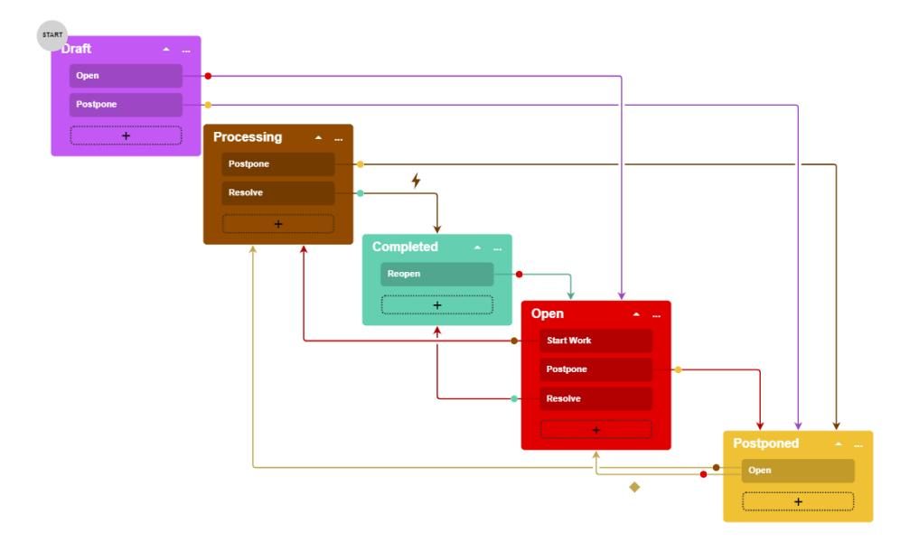

*Figure: The planned task workflow*

# **Workflow Creation: To Add a Workflow**

The following activity will walk you through the process of adding the screen associated with the *[Task](https://help-2025r1.acumatica.com/Help?ScreenId=ShowWiki&pageid=6449513c-254e-4093-b7b8-06de0108c384)* (CR306020) form to the list of customized screens and adding a workflow for the screen.

This activity is based on the *U100* dataset. If you are using another dataset, or if any system settings have been changed in *U100*, these changes can affect the workflow of the activity and the results of the processing. To avoid any issues, restore the *U100* dataset to its initial state.

#### **Story**

Suppose that you are a technical specialist that develops business solutions for the HardwareViewpoint company. You need to create a workflow for the *[Task](https://help-2025r1.acumatica.com/Help?ScreenId=ShowWiki&pageid=6449513c-254e-4093-b7b8-06de0108c384)* (CR306020) form, which is planned as specified in *[Workflow Creation:](#page-9-1) [Planning a Workflow for a Form](#page-9-1)*.

#### **Process Overview**

In this activity, you will do the following to begin the customization of the *[Task](https://help-2025r1.acumatica.com/Help?ScreenId=ShowWiki&pageid=6449513c-254e-4093-b7b8-06de0108c384)* (CR306020) form and add its workflow:

- 1. By using the *[Customization Projects](https://help-2025r1.acumatica.com/Help?ScreenId=ShowWiki&pageid=4d3a1166-826c-414b-a207-3d1669fbf9e5)* (SM204505) form as a starting point, add the *[Task](https://help-2025r1.acumatica.com/Help?ScreenId=ShowWiki&pageid=6449513c-254e-4093-b7b8-06de0108c384)* (CR306020) form to the list of customized screens on the *[Customized Screens](https://help-2025r1.acumatica.com/Help?ScreenId=ShowWiki&pageid=98b095c8-14d5-477a-9fc3-cc7c57fee3cd)* page of the Customization Project Editor.
- 2. Create a workflow for this form on the *[Workflows](https://help-2025r1.acumatica.com/Help?ScreenId=ShowWiki&pageid=70fcbfa0-010e-4f44-9ebe-bc9f20e82f9e)* page.
- 3. Navigate to the *[Workflow](https://help-2025r1.acumatica.com/Help?ScreenId=ShowWiki&pageid=8a944b6b-0e47-47c9-a6a7-1b266d8feba0) (Tree View)* page to view the workflow.

#### **System Preparation**

Before you begin creating a workflow for the *[Task](https://help-2025r1.acumatica.com/Help?ScreenId=ShowWiki&pageid=6449513c-254e-4093-b7b8-06de0108c384)* (CR306020) form, do the following:

1. Launch the Acumatica ERP website with the *U100* dataset preloaded, and sign in as system administrator by using the *gibbs* username and the *123* password.

The *gibbs* user is assigned the *Administrator* role, which has sufficient access rights to customize workflows.

2. On the *[Customization Projects](https://help-2025r1.acumatica.com/Help?ScreenId=ShowWiki&pageid=4d3a1166-826c-414b-a207-3d1669fbf9e5)* (SM204505) form, create a customization project named *TaskWorkflow*.

#### **Step 1: Adding the Screen to the List of Customized Screens**

To add the screen associated with the *[Task](https://help-2025r1.acumatica.com/Help?ScreenId=ShowWiki&pageid=6449513c-254e-4093-b7b8-06de0108c384)* (CR306020) form to the list of customized screens, do the following:

1. In the table on the *[Customization Projects](https://help-2025r1.acumatica.com/Help?ScreenId=ShowWiki&pageid=4d3a1166-826c-414b-a207-3d1669fbf9e5)* (SM204505) form, click the *TaskWorkflow* link.

The Customization Project Editor opens for the *TaskWorkflow* customization project. You will use this project to modify the *[Task](https://help-2025r1.acumatica.com/Help?ScreenId=ShowWiki&pageid=6449513c-254e-4093-b7b8-06de0108c384)* form.

- 2. In the navigation pane of the Customization Project Editor, click**Screens**.
- 3. On the page toolbar of the *[Customized Screens](https://help-2025r1.acumatica.com/Help?ScreenId=ShowWiki&pageid=98b095c8-14d5-477a-9fc3-cc7c57fee3cd)* page, which is opened, click **Customize ExistingScreen**.
- 4. In the **Customize ExistingScreen** dialog box, which is opened, select *Task (CR306020)*.
- 5. Click **OK** to close the dialog box.

The screen with the *CR306020* screen ID and the *Task* title is added to the list of customized screens.

#### **Step 2: Creating a Workflow for the Form**

Create a new workflow for the added screen as follows:

1. In the navigation pane, click**Screens > CR306020 > Workflows**.

The CR306020 (Task) Workflows page opens. (This is the name that appears for the *[Workflows](https://help-2025r1.acumatica.com/Help?ScreenId=ShowWiki&pageid=70fcbfa0-010e-4f44-9ebe-bc9f20e82f9e)* page.) Notice that it does not contain any workflows.

2. In the **State Identifier** box, select *Status*.

This is the field that will define the status of the applicable record created on the form.

- 3. Save your changes.
- 4. On the page toolbar, click **Add Workflow**.
- 5. In the **Add Workflow** dialog box, which is opened, specify the following settings:
  - **Operation**: *Create New Workflow* (specified automatically)
  - **Workflow Type**: *DEFAULT*
  - **Workflow Name**: Task
- 6. Click **OK** to close the dialog box.

A row for the workflow appears in the table on the page. Notice that the workflow's status is *New*, which means that this workflow is a custom workflow that is not based on any predefined workflow.

- 7. In the row with the workflow you have created, select the **Active** check box.
- 8. On the page toolbar, click**Save**.
- 9. In the row with the created workflow, click the link in the **Workflow Name** column.

The CR306020 (Task) State Diagram: Task page opens. (This is the *[Workflow](https://help-2025r1.acumatica.com/Help?ScreenId=ShowWiki&pageid=8a944b6b-0e47-47c9-a6a7-1b266d8feba0) (Tree View)* page.) Notice that the **States and Transitions** pane of the page does not contain any states or transitions.

### **Workflow Creation: Configuration of States**

States in a workflow for an Acumatica ERP form represent the statuses of a record that is created on this form.

#### **State Configuration**

The states of a workflow appear on the**States and Transitions** pane of the *[Workflow](https://help-2025r1.acumatica.com/Help?ScreenId=ShowWiki&pageid=8a944b6b-0e47-47c9-a6a7-1b266d8feba0) (Tree View)* page. You can change the location of any states by clicking the state and then clicking **Move Up** or **Move Down** on the pane toolbar. You specify how a record moves between those states by adding transitions.

You can add new states and predefined states (that is, states that already exist in the system) to a workflow. When you add a new state to a workflow, the system adds to the customization project the field that is specified as the state identifier for the screen. You can view this field on the *[Fields](https://help-2025r1.acumatica.com/Help?ScreenId=ShowWiki&pageid=762d7751-bf75-4713-9525-4305808df02c)* page. Also, for the field, the system adds a dialog box value with the same name as the state name.

The system marks the first state as the initial state of the workflow. You can specify another state as the initial one.

For any state, you can specify the fields whose properties should be modified. You can also specify which fields should be updated when a record on the form enters the state and when the record leaves the state.

The following screenshot shows the states on the**States and Transitions** pane for the opportunity workflow.

| <b>Customization Project Editor</b>                                              |                                                                         |                                                                        |                 |                 |  |             |                | <b>Back</b> | Reload                                  |                      |  |               |
|----------------------------------------------------------------------------------|-------------------------------------------------------------------------|------------------------------------------------------------------------|-----------------|-----------------|--|-------------|----------------|-------------|-----------------------------------------|----------------------|--|---------------|
| Source Control Publish <b>Extension Library</b> File                    |                                                                         |                                                                        |                 |                 |  |             |                |             |                                         |                      |  |               |
| CustomizationProject CR304000 (Opportunities) State Diagram: Default workflow |                                                                         |                                                                        |                 |                 |  |             |                |             |                                         |                      |  |               |
| $\star$ SCREENS $\sqrt{CR304000}$                                             | $\Box$ $\curvearrowleft$ <b>DIAGRAM VIEW</b> $\cdots$          |                                                                        |                 |                 |  |             |                |             |                                         |                      |  |               |
| Actions                                                                          | <b>States and Transitions</b> 间 个 ◡                            | <b>STATE PROPERTIES</b> <b>ACTIONS</b> <b>HANDLERS</b>           |                 |                 |  |             |                |             |                                         |                      |  |               |
| <b>Event Handlers</b> Fields l- New Conditions                          |                                                                         | Identifier: Description:                                            |                 | N <b>New</b> |  |             |                |             | Active Initial State of the Workflow |                      |  |               |
| - Workflows Default workflow                                                  | $\overline{\phantom{a}}$ Transitions Open->Open Close as Won->Won | <b>FIELDS</b> FIELDS TO UPDATE ON ENTRY FIELDS TO UPDATE ON EXIT |                 |                 |  |             |                |             |                                         |                      |  |               |
| <b>Dialog Boxes</b>                                                              | Close as Lost->Lost                                                     | O $\pm$ $\times$ $\mathbb H$ <b>COMBO BOX VALUES</b>       |                 |                 |  |             |                |             |                                         |                      |  |               |
| Data Access Code $\overline{\phantom{a}}$ Open                             | Opportunity Created from Lead->New                                      |                                                                        | <b>E</b> Active | *Object Name    |  | *Field Name | <b>Disable</b> | Hidden      | Requir                                  | <b>Default Value</b> |  | <b>Status</b> |
| <b>Files</b>                                                                     | $\div$ Transitions                                                      |                                                                        | ☑               | Opportunity     |  | Reason      | п              | $\Box$      | п                                       | Created              |  | Inherited     |
| Modern UI Files <b>Generic Inquiries</b>                                      | Close as Won->Won                                                       |                                                                        | ☑               | Opportunity     |  | Active      | ☑              | $\Box$      | $\Box$                                  | □                    |  | Inherited     |
| Reports                                                                          | Close as Lost->Lost $-$ Won                                          |                                                                        | ☑               | Opportunity     |  | Source      | $\Box$         | $\Box$      | $\Box$                                  |                      |  | Inherited     |
| <b>Dashboards</b> Site Map                                                    | $\div$ Transitions                                                      |                                                                        |                 |                 |  |             |                |             |                                         |                      |  |               |
| <b>Database Scripts</b> <b>System Locales</b>                                 | Reopen->Open $\overline{\phantom{a}}$ Lost                           |                                                                        |                 |                 |  |             |                |             |                                         |                      |  |               |
| Import/Export Scenarios <b>Shared Filters</b>                                 | $\div$ Transitions Reopen->Open                                      |                                                                        |                 |                 |  |             |                |             |                                         |                      |  |               |

*Figure: States on the State and Transitions pane*

# **Workflow Creation: To Add States**

The following activity will walk you through the process of adding new and predefined states to the workflow.

#### **Story**

Acting as the technical specialist, you need to add predefined states and a new state to the workflow you have defined for the *[Task](https://help-2025r1.acumatica.com/Help?ScreenId=ShowWiki&pageid=6449513c-254e-4093-b7b8-06de0108c384)* (CR306020) form.

#### **Process Overview**

By using the *[Workflow](https://help-2025r1.acumatica.com/Help?ScreenId=ShowWiki&pageid=8a944b6b-0e47-47c9-a6a7-1b266d8feba0) (Tree View)* page, you will add the following predefined states to the *Task* workflow:

- Draft
- Processing
- Completed
- Open

You will also add the new Postponed state to the workflow.

#### **System Preparation**

Before you begin adding states to the workflow, do the following:

1. Launch the Acumatica ERP website with the *U100* dataset preloaded, and sign in as system administrator by using the *gibbs* username and the *123* password.

The *gibbs* user is assigned the *Administrator* role, which has sufficient access rights to customize workflows.

2. Make sure that you have completed the *[Workflow](#page-10-1) Creation: To Add a Workflow* activity.

#### **Step 1: Adding the Predefined States to Your Workflow**

To add the predefined states to your workflow, in the Customization Project Editor for the *TaskWorkflow* project, do the following:

1. In the navigation pane, click**Screens > CR306020 > Workflows > Task**.

The CR306020 (Task) State Diagram: Task page opens.

- 2. On the More menu, click **Add Predefined State**.
- 3. In the **Add Predefined State** dialog box, which opens, select *Dra* in the **State** box. Leave the **ParentState** box empty.
- 4. Click **OK** to close the dialog box.

The Draft state is added to the**States and Transitions** pane. Notice that the Draft state has a twocharacter identifier on the**State Properties** tab.

5. By using instructions that are similar to Instructions 2–4, add the Processing, Completed, and Open predefined states to the workflow.

Each state will be added to the**States and Transitions** pane below the previous state and will have a twocharacter identifier on the**State Properties** tab.

6. In the **States and Transitions** pane, click the Draft state, and on the**State Properties** tab, make sure that the **InitialState of the Workflow** check box is selected.

This state will be the initial state in the workflow. That is, when a user creates a new task, this task will have the *Dra* status.

7. On the page toolbar, click**Save**.

#### **Step 2: Adding a New State to Your Workflow**

In this step, you will add a new state to your workflow. While you are still working on the CR306020 (Task) State Diagram: Task page of the Customization Project Editor, do the following:

- 1. On the page toolbar, click **Add State**.
- 2. In the **Add State** dialog box, which opens, specify the following settings:
  - **Identifier**: PP

You use a two-character identifier for a custom state to have it in similar format as the predefined ones.

- **Description**: Postponed
- **ParentState**: Empty

The dialog box should look as shown in the following screenshot.

| <b>Add State</b> |           |    |        |
|------------------|-----------|----|--------|
| * Identifier:    | PP        |    |        |
| * Description:   | Postponed |    |        |
| Parent State:    |           |    |        |
|                  |           |    |        |
|                  |           | OK | CANCEL |
|                  |           |    |        |

#### *Figure: The Add State dialog box*

- 3. Click **OK** to close the dialog box and add the new state to the**States and Transitions** pane.
- 4. On the page toolbar, click**Save**.

5. In the navigation pane, click**Screens > CR306020 > Fields**.

The CR306020 (Task) Fields page opens. Notice that the table contains a row with the UIStatus field, which is the state-identifying field specified for the screen on the *[Workflows](https://help-2025r1.acumatica.com/Help?ScreenId=ShowWiki&pageid=70fcbfa0-010e-4f44-9ebe-bc9f20e82f9e)* page (see Item 1 in the screenshot below).

- 6. On the page toolbar, click **Combo BoxValues**.
- 7. In the **Combo BoxValues** dialog box, which is opened, notice that the new value (*Postponed*) has been added to it (Item 2). When a new state is added to a workflow, for the state-identifying field, the system adds a value with the same name.

| <b>Customization Project Editor</b>                                                                    |                                     |                                                        |                                   |                                  |                     | <b>Back</b>         | Reload        |  |  |  |  |
|--------------------------------------------------------------------------------------------------------|-------------------------------------|--------------------------------------------------------|-----------------------------------|----------------------------------|---------------------|---------------------|---------------|--|--|--|--|
| <b>Extension Library</b> Publish Source Control File                                          |                                     |                                                        |                                   |                                  |                     |                     |               |  |  |  |  |
| <b>TaskWorkflow</b> ۰                                                                               | CR306020 (Task) Fields              |                                                        |                                   |                                  |                     |                     |               |  |  |  |  |
| $\overline{\phantom{a}}$ SCREENS $-$ CR306020                                                       | $\Box$ Ò $\Omega$ $\times$ | $+$ <b>COMBO BOX VALUES</b>                         |                                   | $\cdots$                         |                     |                     |               |  |  |  |  |
| Actions                                                                                                | <b>B</b> Object Name                | <b>Field Name</b>                                      |                                   | <b>Disabled</b> <b>Hidden</b> | Required            | <b>Display Name</b> | <b>Status</b> |  |  |  |  |
| <b>Event Handlers</b>                                                                                  | PX.Objects.CR.CRActivity            | <b>UIStatus</b>                                        |                                   |                                  |                     | <b>Status</b>       | <b>New</b>    |  |  |  |  |
| Fields (1) Conditions $\star$ Workflows (1) <b>Task</b> <b>Dialog Boxes</b> Data Access |                                     | Combo Box Values $+$ $\times$ <b>B</b> Active | *Value Custor                  | *Description                     | $\times$            | $\blacksquare$      |               |  |  |  |  |
| !!!!!!!!!!!!!!!!!!!!!!!!!!!!!!!!!!!!!!!!                                                               |                                     | $\boxed{\checkmark}$                                   | $\Box$ <b>RJ</b>               | Rejected                         | $\blacktriangle$    |                     |               |  |  |  |  |
| Files                                                                                                  |                                     | $\overline{\leq}$                                      | $\Box$ <b>CL</b>               | Canceled                         |                     |                     |               |  |  |  |  |
| <b>Generic Inquiries</b> Reports                                                                    |                                     | $\boxed{\textcolor{blue}{\leq}}$                       | $\Box$ PA                      | <b>Pending Approval</b>          |                     |                     |               |  |  |  |  |
| <b>Dashboards</b>                                                                                      |                                     | ☑                                                      | $\Box$ <b>RL</b>               | Released                         |                     |                     |               |  |  |  |  |
| Site Map <b>Database Scripts</b>                                                                    |                                     | $\overline{\checkmark}$                                | $\boxed{\checkmark}$ <b>PP</b> | Postponed                        | $\overline{2}$      |                     |               |  |  |  |  |
| <b>System Locales</b>                                                                                  |                                     |                                                        |                                   | $\mathbf{K}$                     | $>$   $\,<\,$    |                     |               |  |  |  |  |
| <b>Import/Export Scenarios</b> <b>Shared Filters</b> <b>Access Rights</b>                        |                                     |                                                        |                                   |                                  | CANCEL <b>OK</b> |                     |               |  |  |  |  |

*Figure: The Fields page with the added field*

8. Close the dialog box.

# **Configuring Workflow Elements**

In this chapter, you will learn how to configure workflow elements. You can specify the properties of any field to control the elements that correspond to these fields on the UI, including whether they appear, whether they are available, and whether they are required. Also, you can configure dialog boxes if you want users to provide additional information when they click a button or command to invoke an action.

# **Workflow Elements: General Information**

By using the *[Fields](https://help-2025r1.acumatica.com/Help?ScreenId=ShowWiki&pageid=762d7751-bf75-4713-9525-4305808df02c)* page, you can manage how particular boxes or check boxes are displayed on the form and what values can be selected from drop-down lists, depending on the status of the record on the form being modified.

You can also configure a dialog box that is shown to a user who clicks a particular action on a specific form. To give you the ability to define workflow dialog boxes, the Customization Project Editor provides the *[Dialog Boxes](https://help-2025r1.acumatica.com/Help?ScreenId=ShowWiki&pageid=d7b23e81-67e9-45ae-b162-b196a00b9160)* page.

#### **Learning Objectives**

In this lesson, you will learn how to modify field settings and create dialog boxes.

#### **Applicable Scenarios**

You specify field settings when you want to modify the display of the elements that correspond to these fields in the UI. You configure dialog boxes when you want users to provide additional information when they initiate an action that causes the record's transition to a different state.

#### **Field Configuration**

You use the *[Fields](https://help-2025r1.acumatica.com/Help?ScreenId=ShowWiki&pageid=762d7751-bf75-4713-9525-4305808df02c)* page to modify the settings of a particular field of a specific form. Any of these settings can be applied unconditionally (that is, it can always be *True* or *False*), or be applied only when certain condition is met. You can modify the following field settings:

- Disabled: An indicator of whether the corresponding element in the UI is available or unavailable.
- Hidden: An indicator of whether the corresponding element in the UI is visible or invisible.
- Required: An indicator of whether the corresponding element in the UI is required or optional.
- Display Name: The name of the corresponding element as it is displayed in the UI.
- Default Value: The default value for the corresponding box in the UI. This value will be inserted when a user adds a new record.

You can enter the needed value for the element or select one of the values available in the database. You can also use the Formula Editor to specify values that depend on the values of other elements (for example, *Type* or *Status*).

• List of combo box values: If the element is a combo box, the combo box values that can be selected in the box.

In the navigation pane of the Customization Project Editor, you open the *[Fields](https://help-2025r1.acumatica.com/Help?ScreenId=ShowWiki&pageid=762d7751-bf75-4713-9525-4305808df02c)* page by clicking **Fields** under the screen ID of the form for which you are modifying the field's settings. The following screenshot shows the CR301000 (Leads) Fields page with the added CampaignID, EMail, and Phone3Type fields.

| <b>Customization Project Editor</b>                               |  |                                     |                    |                   |               |          |                     |                | <b>Back</b>             | Reload        |  |  |  |  |  |  |                      |            |  |                  |  |      |  |  |            |
|-------------------------------------------------------------------|--|-------------------------------------|--------------------|-------------------|---------------|----------|---------------------|----------------|-------------------------|---------------|--|--|--|--|--|--|----------------------|------------|--|------------------|--|------|--|--|------------|
| File Publish <b>Extension Library</b> Source Control     |  |                                     |                    |                   |               |          |                     |                |                         |               |  |  |  |  |  |  |                      |            |  |                  |  |      |  |  |            |
| CustomizationProject <                                            |  | CR301000 (Leads) Fields             |                    |                   |               |          |                     |                |                         |               |  |  |  |  |  |  |                      |            |  |                  |  |      |  |  |            |
| $\overline{\phantom{a}}$ SCREENS $-$ CR301000                  |  | $\Box$ Ò $\Omega$ $\times$ | $^{+}$ $\cdots$ |                   |               |          |                     |                |                         |               |  |  |  |  |  |  |                      |            |  |                  |  |      |  |  |            |
| <b>Actions</b>                                                    |  | <b>B</b> Object Name                | <b>Field Name</b>  | <b>Disabled</b>   | <b>Hidden</b> | Required | <b>Display Name</b> | From Schema | <b>Default</b> Value | <b>Status</b> |  |  |  |  |  |  |                      |            |  |                  |  |      |  |  |            |
| <b>Event Handlers</b> Fields (3, inherited 2)                  |  | PX.Objects.CR.CRLead                | CampaignID         |                   |               | True     | Source Campaign     | ☑              | 000002                  | <b>New</b>    |  |  |  |  |  |  |                      |            |  |                  |  |      |  |  |            |
| Conditions (2)                                                    |  | PX.Objects.CR.CRLead                | <b>EMail</b>       | <b>DoNotEmail</b> |               |          | Email               | п              |                         | <b>New</b>    |  |  |  |  |  |  |                      |            |  |                  |  |      |  |  |            |
| <b>Workflows</b> <b>Dialog Boxes</b> CR304000 ▶ CR306000 |  |                                     |                    |                   |               |          |                     |                |                         |               |  |  |  |  |  |  | PX.Objects.CR.CRLead | Phone3Type |  | <b>DoNotCall</b> |  | Home |  |  | <b>New</b> |
|                                                                   |  | PX.Objects.CR.CRLead                | Resolution         |                   |               |          | Reason              | □              |                         | Inherited     |  |  |  |  |  |  |                      |            |  |                  |  |      |  |  |            |
|                                                                   |  | PX.Objects.CR.CRLead                | <b>Status</b>      |                   |               |          | <b>Status</b>       | □              |                         | Inherited     |  |  |  |  |  |  |                      |            |  |                  |  |      |  |  |            |
| Data Access Code                                               |  |                                     |                    |                   |               |          |                     |                |                         |               |  |  |  |  |  |  |                      |            |  |                  |  |      |  |  |            |

*Figure: The CR301000 (Leads) Fields page*

In the name that appears on the page, *Fields* is preceded by the screen ID and then the screen name in parentheses, so you can always see at a glance which form you are customizing.

#### **Dialog Box Configuration**

If you want the system to display a dialog box when a user clicks a particular button or command on a form, you first need to configure this dialog box. You then specify the dialog box in the **Action Properties** dialog box for the action associated with the button or command. (For details, see *[Action Configuration: General Information](#page-24-2)*.)

You configure dialog boxes on the *[Dialog Boxes](https://help-2025r1.acumatica.com/Help?ScreenId=ShowWiki&pageid=d7b23e81-67e9-45ae-b162-b196a00b9160)* page of the Customization Project Editor for a particular screen. You can add new dialog boxes and modify existing ones. For each dialog box, you specify the name that a dialog box will have when the system displays it to the user. You also specify all fields that represent elements in which the user will need to specify data. You can then specify default values for the added fields and mark the fields as required or hidden.

Aer you specify the needed settings for the dialog box, you can preview it by clicking **Preview Dialog Box** on the page toolbar or More menu of the page (see Item 1 in the following screenshot). The screenshot also shows the settings of the **Details** dialog box, which opens when a user opens a case on the *[Cases](https://help-2025r1.acumatica.com/Help?ScreenId=ShowWiki&pageid=a492a091-9649-4826-bcc3-dccdf8765efd)* (CR306000) form (Item 2). Notice that the *[Dialog Boxes](https://help-2025r1.acumatica.com/Help?ScreenId=ShowWiki&pageid=d7b23e81-67e9-45ae-b162-b196a00b9160)* page also lists two more dialog boxes associated with the screen (Item 3). The first one opens when the user clicks **Pending Customer**; the second one opens when the user clicks **Close**.

| <b>Customization Project Editor</b>                                                |                                                |              |                                                             |                  |                         |          |                    |                  |          |                  |                             | <b>Back</b> | Reload        |
|------------------------------------------------------------------------------------|------------------------------------------------|--------------|-------------------------------------------------------------|------------------|-------------------------|----------|--------------------|------------------|----------|------------------|-----------------------------|-------------|---------------|
| Publish <b>Extension Library</b> File                                        | Source Control                                 |              |                                                             |                  |                         |          |                    |                  |          |                  |                             |             |               |
| <b>CustomizationProject</b>                                                        | CR306000 (Cases) Dialog Boxes                  |              |                                                             |                  |                         |          |                    |                  |          |                  |                             |             |               |
| $\boxdot$ $\Omega$ $\overline{\phantom{a}}$ SCREENS ▶ CR301000            | n $\checkmark$                              |              | PREVIEW DIALOG BOX                                          | $\cdots$ [1]     |                         |          |                    |                  |          |                  |                             |             |               |
| ▶ CR304000 O $-$ CR306000                                                    | <b>Dialog Boxes</b> 3 $\times$ $^{+}$ |              | Title: Dialog Box Name:                                  | Open FormOpen |                         | Actions: | Number of Columns: | Open             | $\bf{0}$ |                  |                             |             | $\sim$        |
| Actions <b>B</b> Dialog Box Name <b>Event Handlers</b> FormOpen Fields |                                                | Status:      |                                                             | Modified         |                         |          |                    |                  |          |                  |                             |             |               |
| Conditions (1, inherited 4) • Workflows FormClose                            | FormPendingCustomer                            | Ò            | <b>Dialog Box Fields</b> $\times$ $\pm$ $\uparrow$ | ◡                | <b>COMBO BOX VALUES</b> |          |                    |                  |          |                  |                             |             |               |
| Dialog Boxes (1, inherited 2) <b>Data Access</b>                                |                                                | <b>R</b> Act | * Schema Field                                              |                  | *Field Name          | * Title  | From Schema     | Default Value | Required | Hidden           | Column Control Span Size |             | <b>Status</b> |
| Code                                                                               |                                                | ☑            | PX.Objects.CR.CRCase.resolution                             |                  | Reason                  | Reason   | $\overline{\Xi}$   | In Process       | True     |                  |                             |             | Inherited     |
| Files                                                                              |                                                | ☑            | PX.Objects.CR.CRCase.ownerID                                |                  | Owner                   | Owner    | $\Box$             | [ownerID]        |          |                  |                             |             | Inherited     |
| <b>Generic Inquiries</b>                                                           |                                                | ☑            | PX.Objects.CR.CRCase.Priority                               |                  | Priority                | Priority | $\Box$             |                  |          |                  |                             |             | New           |
| Reports <b>Dashboards</b> <b>Site Map</b>                                    |                                                | ☑            | PX.Objects.CR.CRCase.Severity                               |                  | Severity                | Severity | $\Box$             |                  |          | <b>CaseClass</b> |                             |             | <b>New</b>    |

*Figure: The CR306000 (Cases) Dialog Boxes page*

In the page name, *Dialog Boxes* is preceded by the form ID and then the form name in parentheses, so you can always see at a glance which form's dialog box you are customizing.

#### **Hiding of the Fields of a Dialog Box**

You can hide any field (element) in a dialog box depending on a condition. To do this, in the **Hidden** column of the **Dialog Box Fields** table on the *[Dialog Boxes](https://help-2025r1.acumatica.com/Help?ScreenId=ShowWiki&pageid=d7b23e81-67e9-45ae-b162-b196a00b9160)* page, you select the condition for the particular field. If this condition is met, the field is not displayed in the dialog box.

If all fields of a dialog box are hidden, this dialog box is not displayed. If particular fields are hidden but have default values specified for them, these fields are not displayed in the dialog box; however, it is still possible to use these fields in the workflow.

If you no longer plan to display a particular field in the dialog box, you can also unconditionally hide the field in the dialog box by selecting *True* in the **Hidden** column for this box. This functionality can be useful if the field has been added in the predefined workflow but is not required in the customized workflow. If you hide the field by selecting *True* in the **Hidden** column, no additional workflow modifications are required to hide the field.

#### **Specifying of Conditions for Required Fields**

You can make the element corresponding to any field in a dialog box conditionally required. To do this, in the **Required** column of the **Dialog Box Fields** table on the *[Dialog Boxes](https://help-2025r1.acumatica.com/Help?ScreenId=ShowWiki&pageid=d7b23e81-67e9-45ae-b162-b196a00b9160)* page, you select the condition for the particular field. If this condition is met, the corresponding element is marked as required in the dialog box.

In the **Required** column, you can instead select *True* of *False* to indicate that the field is always required or is never required, respectively.

The following screenshot shows the selection of the *ClosureNotesRequired* condition for the Closure Notes field of the dialog box that the system displays when the user closes a case.

|    | <b>Customization Project Editor</b>                                       |                               |                          |                        |                                  |                                         |                      |  |                |                          |                                                                                                                                  |                         |                             | <b>Back</b>   | Reload |
|----|---------------------------------------------------------------------------|-------------------------------|--------------------------|------------------------|----------------------------------|-----------------------------------------|----------------------|--|----------------|--------------------------|----------------------------------------------------------------------------------------------------------------------------------|-------------------------|-----------------------------|---------------|--------|
|    | <b>Extension Library</b> Source Control File Publish             |                               |                          |                        |                                  |                                         |                      |  |                |                          |                                                                                                                                  |                         |                             |               |        |
| ×. |                                                                           | CR306000 (Cases) Dialog Boxes |                          |                        |                                  |                                         |                      |  |                |                          |                                                                                                                                  |                         |                             |               |        |
|    | $\Box$ o $\Omega$ PREVIEW DIALOG BOX $\checkmark$ $\cdots$ |                               |                          |                        |                                  |                                         |                      |  |                |                          |                                                                                                                                  |                         |                             |               |        |
|    | <b>Dialog Boxes</b>                                                       |                               | Title:                   |                        | Close                            |                                         |                      |  | $\bullet$      |                          |                                                                                                                                  |                         |                             |               | $\sim$ |
|    | $^{+}$ $\mathsf{x}$ Ò                                               |                               | Dialog Box Name:         |                        | FormClose                        | Number of Columns: Actions: Close |                      |  |                |                          |                                                                                                                                  |                         |                             |               |        |
|    | <b>Dialog Box Name</b>                                                    |                               | Status:                  |                        | Inherited                        |                                         |                      |  |                |                          |                                                                                                                                  |                         |                             |               |        |
|    | FormOpen                                                                  |                               | <b>Dialog Box Fields</b> |                        |                                  |                                         |                      |  |                |                          |                                                                                                                                  |                         |                             |               |        |
|    | FormPendingCustomer                                                       |                               | Ò $+$                 | $\times$ $\uparrow$ | COMBO BOX VALUES $\downarrow$ |                                         |                      |  |                |                          |                                                                                                                                  |                         |                             |               |        |
|    | FormClose                                                                 |                               |                          |                        |                                  |                                         |                      |  |                |                          |                                                                                                                                  |                         |                             |               |        |
|    |                                                                           |                               | <b>E</b> Active          | * Schema Field         |                                  | *Field Name                             | $+$ Title            |  | From Schema | Default Value            | Required                                                                                                                         | Hidden                  | Column Control Span Size | <b>Status</b> |        |
|    |                                                                           |                               | ⊡                        |                        | PX.Objects.CR.CRCase.resolution  | Reason                                  | Reason               |  | ⊡              | Resolved                 | True                                                                                                                             |                         | 1                           | Inherited     |        |
|    |                                                                           |                               | ☑                        |                        | PX.Objects.CR.CRCase.solutionAct | SolutionActivityNotelD                  | Solution Provided In |  | $\Box$         | [solutionActivityNoteID] |                                                                                                                                  | NOT(TrackSolutionsInAct | 1                           | Inherited     |        |
|    |                                                                           |                               | $\boxtimes$              | [RichTextEdit]         |                                  | <b>ClosureNotes</b>                     | <b>Closure Notes</b> |  | $\Box$         | [closureNotes]           | ClosureNotesRequired                                                                                                             | $\mathcal{L}$           | 0                           | Inherited     |        |
|    |                                                                           |                               |                          |                        |                                  |                                         |                      |  |                |                          | True False <b>TrackSolutionsInActivities</b> NOT(TrackSolutionsInActivities) ClosureNotesRequired <b>IsActive</b> |                         |                             |               |        |

#### *Figure: Selection of a condition for the field*

If a required field is also marked as hidden and is empty, this field will be displayed in the dialog box (that is, it will not be hidden despite the setting).

#### **Values for a Drop-Down List in a Dialog Box**

In a dialog box that the system displays when you invoke particular actions on a form, you can select the source of the values that will be available in a drop-down list. Instead of specifying drop-down values explicitly for multiple dialog boxes, you can indicate that these values should be the same as in the target state or source state of the transition. By using this functionality, you can use only one dialog box for all actions in a workflow.

You select the source of the values of a drop-down list in the **Combo BoxValues** dialog box, which you open when you are viewing the *[Dialog Boxes](https://help-2025r1.acumatica.com/Help?ScreenId=ShowWiki&pageid=d7b23e81-67e9-45ae-b162-b196a00b9160)* page for a custom or customized workflow. To open this dialog box, you click a particular field in the **Dialog Box Fields** table and then clicking **Combo BoxValues** on the table toolbar.

In the **Source ofValues** box of the dialog box, you select one of the following options (see the screenshot below):

- *Take From Source State*: The values from the source state of the transition are used. This is the default option for a drop-down list in a new dialog box.
- *Take From Target State*: The values from the target state of the transition are used.
- *Specify Explicitly*: The values are selected in the table in the **Combo BoxValues** dialog box.

|                                 | <b>Combo Box Values</b> X |           |                                                                                      |  |                                |  |        |  |  |  |  |  |
|---------------------------------|------------------------------|-----------|--------------------------------------------------------------------------------------|--|--------------------------------|--|--------|--|--|--|--|--|
| Source of Values: $+ \times$ |                              |           | <b>Specify Explicitly</b> Take From Source State <b>Take From Target State</b> |  |                                |  |        |  |  |  |  |  |
| B                               | Active                       | Value     | Specify Explicitly                                                                   |  |                                |  |        |  |  |  |  |  |
| $\mathbf{\hat{}}$               | H                            | <b>RJ</b> | Rejected                                                                             |  |                                |  |        |  |  |  |  |  |
|                                 |                              | <b>RD</b> | Resolved                                                                             |  |                                |  |        |  |  |  |  |  |
|                                 |                              | MI        | More Info Requested                                                                  |  |                                |  |        |  |  |  |  |  |
|                                 | ☑                            | IP        | In Process                                                                           |  |                                |  |        |  |  |  |  |  |
|                                 |                              | IN        | Internal                                                                             |  |                                |  |        |  |  |  |  |  |
|                                 |                              |           |                                                                                      |  | $K$ $\leftarrow$ $\rightarrow$ |  | $\geq$ |  |  |  |  |  |
|                                 |                              |           |                                                                                      |  | OK                             |  | CANCEL |  |  |  |  |  |

#### *Figure: The Source of Values box of the Combo Box Values dialog box*

If an action triggers transitions to multiple target states, we recommend that you use the *Specify Explicitly* or *Take from Source State* option.

For details about transitions, see *Conditions and [Transitions:](#page-40-2) General Information*.

#### **Addition of Rich Text Editor Fields**

You might want to require users to enter certain text in elements in the dialog boxes that are opened when the status of a record on a form changes. You might also want to give the users the ability to enter text in all formats supported by a rich text editor.

To add to a dialog box a field with rich text editor support, in the **Dialog Box Fields** table on the *[Dialog Boxes](https://help-2025r1.acumatica.com/Help?ScreenId=ShowWiki&pageid=d7b23e81-67e9-45ae-b162-b196a00b9160)* page, you select *[RichTextEdit]* in the **Schema Field** column. The following screenshot shows the settings to add the ClosureNotes field (which corresponds to the box with the same name) to the dialog box that the system displays when the user closes a case.

| <b>Customization Project Editor</b>          |                                                       |                                            |                               |                        |                             |                |                          |                               |                                 |                             | <b>Back</b> | Reload        |
|----------------------------------------------|-------------------------------------------------------|--------------------------------------------|-------------------------------|------------------------|-----------------------------|----------------|--------------------------|-------------------------------|---------------------------------|-----------------------------|-------------|---------------|
| Publish <b>Extension Library</b> File  |                                                       | Source Control                             |                               |                        |                             |                |                          |                               |                                 |                             |             |               |
| CR306000 (Cases) Dialog Boxes œ.          |                                                       |                                            |                               |                        |                             |                |                          |                               |                                 |                             |             |               |
| $\boxtimes$ n $\Omega$ $\checkmark$ | PREVIEW DIALOG BOX                                    | $\cdots$                                   |                               |                        |                             |                |                          |                               |                                 |                             |             |               |
| <b>Dialog Boxes</b>                          | Title: Close Number of Columns: $\mathbf{0}$ |                                            |                               |                        |                             |                |                          |                               |                                 |                             |             | $\lambda$     |
| $\mathsf{x}$ Ò $+$                     |                                                       | Dialog Box Name: FormClose Inherited |                               |                        | Actions: <b>Close</b>    |                |                          |                               |                                 |                             |             |               |
| <b>B</b> Dialog Box Name                     | Status:                                               |                                            |                               |                        |                             |                |                          |                               |                                 |                             |             |               |
| FormOpen                                     | <b>Dialog Box Fields</b>                              |                                            |                               |                        |                             |                |                          |                               |                                 |                             |             |               |
| FormPendingCustomer                          | $\circ$ $+$                                        | $\mathsf{x}$ $\uparrow$                 | $\Delta$                      | COMBO BOX VALUES       |                             |                |                          |                               |                                 |                             |             |               |
| FormClose                                    |                                                       |                                            |                               |                        |                             |                |                          |                               |                                 |                             |             |               |
|                                              | <b>B</b> Active                                       | * Schema Field                             |                               | *Field Name            | * Title                     | From Schema | Default Value            | Required                      | Hidden                          | Column Control Span Size |             | <b>Status</b> |
|                                              | ☑                                                     | PX.Objects.CR.CRCase.resolution            |                               | Reason Reason       |                             | ☑              | Resolved                 | True                          |                                 |                             |             | Inherited     |
|                                              | ☑                                                     |                                            | PX.Objects.CR.CRCase.solution | SolutionActivityNoteID | <b>Solution Provided In</b> | $\Box$         | [solutionActivityNoteID] |                               | NOT(TrackSolutionsInActivities) | 1                           |             | Inherited     |
|                                              | ⊡                                                     | [RichTextEdit]                             |                               | ClosureNotes           | <b>Closure Notes</b>        | $\Box$         | [closureNotes]           | <b>IsClosureNotesRequired</b> |                                 | $\mathbf{0}$                |             | Inherited     |

*Figure: Selection of a rich text editor field*

When the user clicks **Close** on the More menu (under **Processing**) on the *[Cases](https://help-2025r1.acumatica.com/Help?ScreenId=ShowWiki&pageid=a492a091-9649-4826-bcc3-dccdf8765efd)* (CR306000) form to close a case, they can enter a comment in the text area. They can then use the buttons on the formatting toolbar to format the text and to insert images, links, and tables (see the following screenshot).

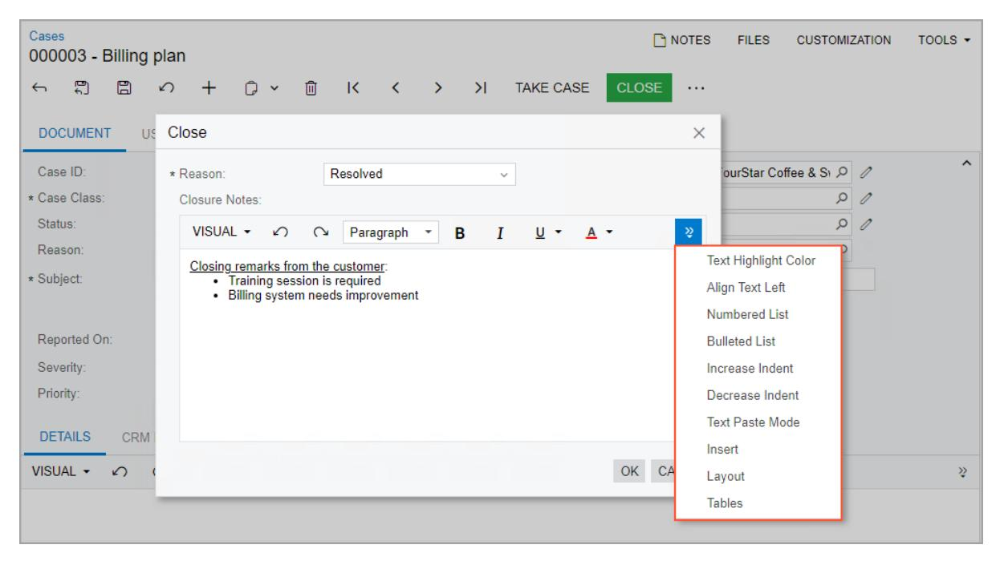

*Figure: Formatting of the comment in the dialog box*

The text area always spans the dialog box; therefore, the **Column Span** and **ControlSize** settings are not available for fields of the *[RichTextEdit]* type.

# **Workflow Elements: To Modify Field Settings**

The following activity will walk you through the process of modifying the field settings of the workflow states.

#### **Story**

Acting as the technical specialist, you need to modify the field settings for the workflow states you have added in *[Workflow](#page-13-1) Creation: To Add States*. With the modified settings, when a task is created, the value in the**Start Date** box will be the current date, and the **Completion (%)** box will be unavailable for editing.

#### **Process Overview**

On the *[Workflow](https://help-2025r1.acumatica.com/Help?ScreenId=ShowWiki&pageid=8a944b6b-0e47-47c9-a6a7-1b266d8feba0) (Tree View)* page, you will add the Start Date and Completion (%) fields to the Draft state and edit their settings.

As a self-test, you will also add the Owner field to the Open and Processing states on the same page.

#### **System Preparation**

Before you begin modifying field settings, do the following:

1. Launch the Acumatica ERP website with the *U100* dataset preloaded, and sign in as system administrator by using the *gibbs* username and the *123* password.

The *gibbs* user is assigned the *Administrator* role, which has sufficient access rights to customize workflows.

2. Make sure that you have completed the *[Workflow](#page-13-1) Creation: To Add States* activity.

#### **Step 1: Specifying the Default Value for the Field**

To specify the default value for the Start Date field in the Draft state, in the Customization Project Editor for the *TaskWorkflow* project, do the following:

1. In the navigation pane, click**Screens > CR306020 > Workflows > Task**.

The *[Workflow](https://help-2025r1.acumatica.com/Help?ScreenId=ShowWiki&pageid=8a944b6b-0e47-47c9-a6a7-1b266d8feba0) (Tree View)* page opens.

- 2. In the **States and Transitions** pane, click the Draft state.
- 3. On the **Fields** tab of the**State Properties** tab, click **Add Row** on the table toolbar, and specify the following settings in the added row:
  - **Object Name**: *Activity* (inserted automatically)
  - **Field Name**: *Start Date*
  - **DefaultValue**: *@Today*
- 4. Save your changes.

#### **Step 2: Making the Field Unavailable for Editing**

To make the *Completion (%)* field unavailable for editing in the Draft state, while you are still on the *[Workflow](https://help-2025r1.acumatica.com/Help?ScreenId=ShowWiki&pageid=8a944b6b-0e47-47c9-a6a7-1b266d8feba0) (Tree [View\)](https://help-2025r1.acumatica.com/Help?ScreenId=ShowWiki&pageid=8a944b6b-0e47-47c9-a6a7-1b266d8feba0)* page with the *Task* workflow displayed, do the following:

- 1. In the **States and Transitions** pane, click the Draft state.
- 2. On the **Fields** tab of the**State Properties** tab, click **Add Row** on the table toolbar again, and specify the following settings in the added row:
  - **Object Name**: *Activity* (inserted automatically)
  - **Field Name**: *Completion (%)*
  - **Disabled**: Selected
- 3. Save your changes.

#### **Step 3: Making the Field Required—Self-Guided Exercise**

Now that you have learned how to add fields for workflow states, add the Owner field to the Open and Processing states, and mark this field as required for both states.

# **Workflow Elements: To Add a Dialog Box**

The following activity will walk you through the process of creating a dialog box in a workflow.

#### **Story**

According to the planned workflow of the *[Task](https://help-2025r1.acumatica.com/Help?ScreenId=ShowWiki&pageid=6449513c-254e-4093-b7b8-06de0108c384)* (CR306020) form, when a user reopens a completed task on the form, the system needs to display a dialog box. In this dialog box, the user must specify the percent of task completion. Acting as the technical specialist, you will create this dialog box.

#### **Process Overview**

By using the *[Dialog Boxes](https://help-2025r1.acumatica.com/Help?ScreenId=ShowWiki&pageid=d7b23e81-67e9-45ae-b162-b196a00b9160)* page, you will add a new dialog box to the workflow.

#### **System Preparation**

Before you begin adding a dialog box, do the following:

1. Launch the Acumatica ERP website with the *U100* dataset preloaded, and sign in as system administrator by using the *gibbs* username and the *123* password.

The *gibbs* user is assigned the *Administrator* role, which has sufficient access rights to customize workflows.

2. Make sure that you have completed the *Workflow [Elements:](#page-20-1) To Modify Field Settings* activity.

#### **Step: Creating a Dialog Box**

To create the *Reopen* dialog box, do the following in the Customization Project Editor for the *TaskWorkflow* project:

- 1. In the navigation pane, click**Screens > CR306020 > Dialog Boxes**. The CR306020 (Task) Dialog Boxes page opens.
- 2. On the pane toolbar of the **Dialog Boxes** pane, click the button with the plus sign.
- 3. In the **New Dialog Box** dialog box, which opens, type FormReopen as the name, and click **OK**.
- 4. On the **Dialog Boxes** pane, click the name of the added dialog box.
- 5. In the **Title** box on the right pane, enter Details.
- 6. In the **Dialog Box Fields** table, click **Add Row** on the table toolbar, and specify the following settings in the added row:
  - **Schema Field**: *PX.Objects.CR.CRActivity.PercentCompletion*

This is the name of the field that corresponds to the **Completion (%)** box of the *[Task](https://help-2025r1.acumatica.com/Help?ScreenId=ShowWiki&pageid=6449513c-254e-4093-b7b8-06de0108c384)* (CR306020) form. You can start typing the name of the box to find the needed schema field.

- **Field Name**: Completion
- **Title**: *Completion (%)* (specified automatically)

- **From Schema**: Selected
- **DefaultValue**: 0
- **Required**: *True*
- **Column Span**: 1
- 7. Save your changes.
- 8. On the page toolbar, click **Preview Dialog Box**.

The dialog box should look as shown in the following screenshot.

| <b>Details</b>    |   |     |        |
|-------------------|---|-----|--------|
| * Completion (%): | 0 |     |        |
|                   |   | OK. | CANCEL |

*Figure: The Details dialog box for the Reopen action*

# **Configuring Actions**

In this chapter, you will learn how to configure actions in a workflow. You can create new actions, hide unneeded actions, and modify existing actions.

# **Action Configuration: General Information**

In a workflow, actions represent buttons on the form toolbar and commands on the More menu of a form.

#### **Learning Objectives**

In this chapter, you will learn how to do the following:

- Hide unneeded commands on the form
- Add new actions to the workflow
- Modify the added actions
- Add categories of the More menu
- Organize the commands into categories on the More menu

#### **Applicable Scenarios**

You may need to configure actions when you are creating transitions or editing states in a workflow.

#### **Configuration of Actions in a Workflow**

Actions are associated with buttons or commands (or both) in the user interface. When a user clicks a button or a command, the system may change the status of the record on the form according to the workflow settings. That is, these actions trigger transitions from one workflow state to another. You can use the same action to trigger transitions from a particular state to different states.

You configure actions for a particular screen. Therefore, before you start configuring actions, you need to make sure that the corresponding screen has been added to the customization project on the *[Customized Screens](https://help-2025r1.acumatica.com/Help?ScreenId=ShowWiki&pageid=98b095c8-14d5-477a-9fc3-cc7c57fee3cd)* page.

You configure workflow actions by using the *[Actions](https://help-2025r1.acumatica.com/Help?ScreenId=ShowWiki&pageid=4f289a88-5e75-49c1-b8bd-4e80de017ed3)* page (sometimes described as the *Action Editor*) of the Customization Project Editor. Actions added in the predefined workflow are automatically displayed on the page, and you can modify the properties of these actions.

To understand which of the listed actions are from the predefined workflow and which are new, you review the **Status** column for each action. Actions from the predefined workflow have the *Inherited* status, and all actions that you have added to the *[Actions](https://help-2025r1.acumatica.com/Help?ScreenId=ShowWiki&pageid=4f289a88-5e75-49c1-b8bd-4e80de017ed3)* page (including existing graph actions) have the *New* status. If you have modified an action from the predefined workflow, its status changes to *Modified* (see the following screenshot).

| <b>Customization Project Editor</b>                           |                                                                        |                              |                        |                 |                                |                      |                      | <b>Back</b>              | Reload           |  |  |  |  |
|---------------------------------------------------------------|------------------------------------------------------------------------|------------------------------|------------------------|-----------------|--------------------------------|----------------------|----------------------|--------------------------|------------------|--|--|--|--|
| Publish Source Control <b>Extension Library</b> File |                                                                        |                              |                        |                 |                                |                      |                      |                          |                  |  |  |  |  |
| <b>SalesOrders</b> ٠ SO301000 (Sales Orders) Actions    |                                                                        |                              |                        |                 |                                |                      |                      |                          |                  |  |  |  |  |
| SCREENS SO301000                                           | 阊 Ò ↶ $\pm$ $\times$ <b>REORDER ACTIONS</b> $\cdots$ |                              |                        |                 |                                |                      |                      |                          |                  |  |  |  |  |
| Data Access Code                                           | Action Name                                                            | <b>Display Name</b>          | <b>Action Type</b>     | <b>Disabled</b> | Hidden                         | Dialog <b>Box</b> | Processing Screen | Category                 | <b>Status</b>    |  |  |  |  |
| Files                                                         | openOrder                                                              | Open Order                   | <b>Graph Action</b>    |                 |                                |                      | SO501000             | Processing Categ         | Inherited        |  |  |  |  |
| <b>Generic Inquiries</b>                                      | placeOnBackOrder                                                       | Place on Back Order          | <b>Graph Action</b>    |                 |                                |                      |                      | Processing Categ         | Inherited        |  |  |  |  |
| Reports <b>Dashboards</b>                                  | preparelnvoice                                                         | Prepare Invoice              | <b>Graph Action</b>    |                 |                                |                      | SO501000             | Processing Categ         | Inherited        |  |  |  |  |
| <b>Site Map</b>                                               | printBlanket                                                           | Print Blanket Sales O        | <b>Graph Action</b>    |                 |                                |                      | SO502000             | Printing and Emai        | Inherited        |  |  |  |  |
| <b>Database Scripts</b>                                       | printQuote                                                             | <b>Print Quote</b>           | <b>Graph Action</b>    |                 |                                |                      | SO502000             | Printing and Emai        | Inherited        |  |  |  |  |
| <b>System Locales</b> <b>Import/Export Scenarios</b>       | printSalesOrder                                                        | <b>Print Sales Order</b>     | <b>Graph Action</b>    |                 |                                |                      | SO502000             | Printing and Emai        | Inherited        |  |  |  |  |
| <b>Shared Filters</b>                                         | processExpiredOrder                                                    | <b>Process Expired Order</b> | <b>Graph Action</b>    |                 |                                |                      | SO501000             | Processing Categ         | Inherited        |  |  |  |  |
| <b>Access Rights</b>                                          | putOnHold                                                              | Hold                         | <b>Graph Action</b>    |                 |                                |                      |                      | Processing Categ         | Modified         |  |  |  |  |
| <b>Wikis</b>                                                  | putOnHoldAuto                                                          | putOnHoldAuto                | Workflow               |                 | True                           |                      |                      | <b>Actions</b>           | New              |  |  |  |  |
| <b>Web Service Endpoints</b> <b>Analytical Reports</b>     | quickProcess                                                           | <b>Quick Process</b>         | <b>Graph Action</b>    |                 | NOT(AllowQuickProcess)         |                      |                      | Processing Categ.        | <b>Inherited</b> |  |  |  |  |
| <b>Push Notifications</b>                                     | ReassignApproval                                                       | Reassign                     | <b>Graph Action</b>    |                 | True                           |                      |                      | Action                   | Inherited        |  |  |  |  |
| <b>Business Events</b>                                        | recalcExternalTax                                                      | Recalculate External         | <b>Graph Action</b>    |                 |                                |                      |                      | <b>Other Category</b>    | Inherited        |  |  |  |  |
| <b>Mobile Application</b>                                     | recalculateDiscountsAction                                             | <b>Recalculate Prices</b>    | <b>Graph Action</b>    |                 |                                |                      |                      | <b>Other Category</b>    | Inherited        |  |  |  |  |
| <b>User-Defined Fields</b> Webhooks                        | reject                                                                 | Reject                       | <b>Graph Action</b>    |                 | True                           |                      |                      | Action                   | Inherited        |  |  |  |  |
| <b>Connected Applications</b>                                 | releaseFromCreditHold                                                  | <b>Remove Credit Hold</b>    | <b>Graph Action</b>    |                 |                                |                      | SO501000             | <b>Approval Category</b> | Inherited        |  |  |  |  |
|                                                               | releaseFromHold                                                        | <b>Remove Hold</b>           | <b>Graph Action</b>    |                 |                                |                      |                      | Processing Categ.        | Modified         |  |  |  |  |
|                                                               | removeHoldTotalLess                                                    | <b>Total Less Than 800</b>   | Workflow               |                 | True                           |                      |                      | Actions                  | <b>New</b>       |  |  |  |  |
|                                                               | removeRiskHold                                                         | <b>Remove Risk Hold</b>      | <b>Graph Action</b>    |                 |                                |                      |                      | <b>Approval Category</b> | Inherited        |  |  |  |  |
|                                                               | reopenOrder                                                            | Reopen Order                 | <b>Graph Action</b>    |                 |                                |                      |                      | Processing Categ.        | Inherited        |  |  |  |  |
|                                                               | riskHold                                                               | <b>Risk Hold</b>             | <b>Graph Action</b>    |                 |                                |                      |                      | <b>Approval Category</b> | Inherited        |  |  |  |  |
|                                                               | <b>ShowCustomerDetails</b>                                             | <b>Customer Details</b>      | Navigation: Side panel |                 | <b>IsTransfer</b>              |                      |                      |                          | <b>Inherited</b> |  |  |  |  |
|                                                               | ShowInvoicesAndMemosGI                                                 | <b>Invoices and Memos</b>    | Navigation: Side panel |                 | NOT(CanBelnvoiced)             |                      |                      |                          | Inherited        |  |  |  |  |
|                                                               | validateAddresses                                                      | <b>Validate Addresses</b>    | <b>Graph Action</b>    |                 |                                |                      |                      | <b>Other Category</b>    | Inherited        |  |  |  |  |
|                                                               | ViewServiceOrder                                                       | ViewServiceOrder             | <b>Graph Action</b>    |                 | NOT(IsFSActivatedForOrderType) |                      |                      | Inquiry                  | Inherited        |  |  |  |  |

#### *Figure: Modified action*

In the name that appears on the page, *Actions* is preceded by the form ID and then the form name in parentheses, so you can always see at a glance which form you are customizing.

#### **Types of Actions**

You can add the following types of actions by using the *[Actions](https://help-2025r1.acumatica.com/Help?ScreenId=ShowWiki&pageid=4f289a88-5e75-49c1-b8bd-4e80de017ed3)* page:

- Actions that redirect a user to a different form or report
- Workflow actions that change the state of the applicable record
- Actions that open a side panel
- Actions defined in a graph

Redirect actions can be created only on the *[Actions](https://help-2025r1.acumatica.com/Help?ScreenId=ShowWiki&pageid=4f289a88-5e75-49c1-b8bd-4e80de017ed3)* page.

The name and type of the action cannot be changed aer the action is created.

#### **Categories on the More Menu**

You can group commands under categories on the More menu, so that users can easily find them. For example, if a command is associated with an action related to changing the status of a record created on the form, it is usually displayed under the **Processing** category. Each category displays the commands whose actions are enabled based on the record's state, as well as those whose actions are disabled for this state.

When you add an action on the *[Actions](https://help-2025r1.acumatica.com/Help?ScreenId=ShowWiki&pageid=4f289a88-5e75-49c1-b8bd-4e80de017ed3)* page, you specify the category on the More menu where the associated menu command will be displayed. By default, no category is specified for an action, which means that its command will be listed under the **Other** category.

The default list of categories depends on the form. You can add new categories and modify or delete existing ones. Also, you can change the order in which the categories are displayed on the More menu.

#### **Addition of Actions Defined in the Graph**

In the workflow of an Acumatica ERP form, you can use actions that are defined in the graph that corresponds to the form. To add such action to the workflow of the form, you click **Add Existing Action** on the More menu of the *[Actions](https://help-2025r1.acumatica.com/Help?ScreenId=ShowWiki&pageid=4f289a88-5e75-49c1-b8bd-4e80de017ed3)* page opened for the form. By default, such actions are displayed on the form according to the properties of the *[PXButton](https://help.acumatica.com/(W(124))/Help?ScreenId=ShowWiki&pageid=1a7069c4-95d5-456b-41ec-5b19371358db)* attribute specified for the action, which the *As Configured in Graph* option in the *[Action Properties](https://help-2025r1.acumatica.com/Help?ScreenId=ShowWiki&pageid=4f289a88-5e75-49c1-b8bd-4e80de017ed3) [Dialog Box](https://help-2025r1.acumatica.com/Help?ScreenId=ShowWiki&pageid=4f289a88-5e75-49c1-b8bd-4e80de017ed3)* indicates.

#### **Viewing of Changes Between the Predefined and Customized Action**

All predefined actions of the applicable screen are displayed on the *[Actions](https://help-2025r1.acumatica.com/Help?ScreenId=ShowWiki&pageid=4f289a88-5e75-49c1-b8bd-4e80de017ed3)* page by default. If you have modified a predefined action on this page, you can view the changes by clicking**View Changes** on the More menu. You can also return the action properties to the original predefined state, if needed.

# **Action Configuration: To Hide Unneeded Actions**

The following activity will walk you through the process of hiding actions that are not required for the workflow.

#### **Story**

In your workflow, you do not need the **Cancel**, **Complete**, and **Complete & Follow-Up** buttons or the corresponding commands on the More menu of the *[Task](https://help-2025r1.acumatica.com/Help?ScreenId=ShowWiki&pageid=6449513c-254e-4093-b7b8-06de0108c384)* (CR306020) form. Acting as a technical specialist, you are going to hide these buttons and menu commands on the form.

#### **Process Overview**

By using the *[Actions](https://help-2025r1.acumatica.com/Help?ScreenId=ShowWiki&pageid=4f289a88-5e75-49c1-b8bd-4e80de017ed3)* page, you will hide the Cancel, Complete, and Complete & Follow-Up actions in all the workflow states.

#### **System Preparation**

Before you begin hiding unneeded actions, do the following:

1. Launch the Acumatica ERP website with the *U100* dataset preloaded, and sign in as system administrator by using the *gibbs* username and the *123* password.

The *gibbs* user is assigned the *Administrator* role, which has sufficient access rights to customize workflows.

2. Make sure that you have completed the *[Workflow](#page-13-1) Creation: To Add States* activity.

#### **Step: Hiding Actions**

To hide the actions, do the following in the Customization Project Editor for the *TaskWorkflow* project:

- 1. In the navigation pane, click**Screens > CR306020 > Actions**.
  - The CR306020 (Task) Actions page opens.
- 2. On the More menu, click **Add Existing Action**.

- 3. In the **Action Properties** dialog box, which is opened, specify the following settings:
  - **Action Name**: *CancelActivity*
  - **Hidden**: *True*

This setting indicates that this action will be hidden in all states of the workflow.

- 4. Click **OK** to close the dialog box and save your changes.
- 5. By using instructions that are similar to the previous three instructions, add the Complete and Complete & Follow-Up actions and mark them as hidden.

### **Action Configuration: To Add a Category to the More Menu**

The following activity will walk you through the process of adding a category to the More menu.

#### **Story**

Suppose that you want to add all the actions in the new workflow for the *[Task](https://help-2025r1.acumatica.com/Help?ScreenId=ShowWiki&pageid=6449513c-254e-4093-b7b8-06de0108c384)* (CR306020) form to the **Processing** category of the More menu. However, this form does not have any categories specified for the menu, and the More menu is not displayed. Acting as the technical specialist, you need to add a category to the More menu of this form.

#### **Process Overview**

In this activity, you will use the *[Actions](https://help-2025r1.acumatica.com/Help?ScreenId=ShowWiki&pageid=4f289a88-5e75-49c1-b8bd-4e80de017ed3)* page to add the **Processing** category to the More menu.

#### **System Preparation**

Before you begin adding a category to the More menu, do the following:

1. Launch the Acumatica ERP website with the *U100* dataset preloaded, and sign in as system administrator by using the *gibbs* username and the *123* password.

The *gibbs* user is assigned the *Administrator* role, which has sufficient access rights to customize workflows.

2. Make sure that you have completed the *[Workflow](#page-13-1) Creation: To Add States* activity.

#### **Step: Adding a Category to the More Menu**

To add the **Processing** category, do the following in the Customization Project Editor for the *TaskWorkflow* project:

1. In the navigation pane, click**Screens > CR306020 > Actions**.

The CR306020 (Task) Actions page opens.

- 2. On the More menu, click **Manage Categories**.
- 3. In the **Manage Categories** dialog box, which is opened, click **Add Category**.
- 4. In the **New Category** dialog box, which is opened, specify the following settings:
  - **Category Name**: Processing
  - **Display Name**: Processing
- 5. Click **OK** to close the dialog box.

6. In the **Manage Categories** dialog box (to which you return), click **OK** to close the dialog box and save your changes.

# **Action Configuration: To Create Workflow Actions and Add Them to the Workflow States**

The following activity will walk you through the process of creating workflow actions and adding them to the states of the workflow.

#### **Story**

Acting as a technical specialist, you need to create Open, Postpone, StartWork, and Resolve actions for the *[Task](https://help-2025r1.acumatica.com/Help?ScreenId=ShowWiki&pageid=6449513c-254e-4093-b7b8-06de0108c384)* (CR306020) form. These actions will be workflow actions, which move a task from one state of the workflow of the form to another state.

You need to add the new actions to the following states:

- The Draft state should contain the Open and Postpone actions.
- The Processing state should contain the Resolve and Postpone actions.
- The Open state should contain the StartWork, Resolve, and Postpone actions.
- The Postponed state should contain the Open action.

#### **Process Overview**

By using the *[Actions](https://help-2025r1.acumatica.com/Help?ScreenId=ShowWiki&pageid=4f289a88-5e75-49c1-b8bd-4e80de017ed3)* page, you will create the needed actions. By using the *[Workflow](https://help-2025r1.acumatica.com/Help?ScreenId=ShowWiki&pageid=8a944b6b-0e47-47c9-a6a7-1b266d8feba0) (Tree View)* page, you will add the actions to the workflow states.

#### **System Preparation**

Before you begin adding actions to the workflow states, do the following:

1. Launch the Acumatica ERP website with the *U100* dataset preloaded, and sign in as system administrator by using the *gibbs* username and the *123* password.

> The *gibbs* user is assigned the *Administrator* role, which has sufficient access rights to customize workflows.

2. Make sure that you have completed the *Action [Configuration:](#page-27-1) To Add a Category to the More Menu* activity.

#### **Step 1: Creating the Actions**

To create the Open, Postpone, Resolve, and StartWork actions, do the following in the Customization Project Editor for the *TaskWorkflow* project:

1. In the navigation pane, click**Screens > CR306020 > Actions**.

The CR306020 (Task) Actions page opens.

- 2. On the page toolbar, click **Add New Action**.
- 3. In the **Action Properties** dialog box, which is opened, specify the following settings:
  - **Action Name**: Open
  - **Display Name**: Open

- **Action Type**: *Workflow*
- **Category**: *Processing*
- **Display on Toolbar**: *If Available* (selected automatically)

This setting indicates that this action will be displayed as a button on the form toolbar and as a command under a category (**Processing**) on the More menu if the action is available for a record based on its state.

- 4. Click **OK** to close the dialog box and save your changes.
- 5. By using instructions (and settings, except for the action and display names) that are similar to the previous three instructions, create the actions listed in the following table.

| Action Name | Display Name |
|-------------|--------------|
| Postpone    | Postpone     |
| Resolve     | Resolve      |
| StartWork   | Start Work   |

#### **Step 2: Adding the Actions to the Dra State**

To add the Open and Postpone actions to the Draft state, do the following:

1. In the navigation pane, click**Screens > CR306020 > Workflows > Task**.

The CR306020 (Task) State Diagram: Task page opens.

- 2. In the **States and Transitions** pane, click the Draft state.
- 3. On the **Actions** tab, click **Add Row** on the table toolbar, and specify the following settings in the added row:
  - **Active**: Selected
  - **Action**: *Open (Open)*
  - **Duplicate on Toolbar**: Selected

This setting indicates that the button associated with this action will be displayed on the form toolbar, in addition to the associated command being displayed under **Processing** on the More menu.

• **Connotation**: *Success*

Because the Open action is the main action (command) in the Draft state, you are specifying this connotation for it. As a result, the system will highlight the associated button and command in green.

- 4. Click **Add Row** on the table toolbar again, and specify the following settings in the added row:
  - **Active**: Selected
  - **Action**: *Postpone (Postpone)*
  - **Duplicate on Toolbar**: Cleared
- 5. Save your changes.

#### **Step 3: Adding the Actions to the Processing State**

To add the Resolve and Postpone actions to the Processing state, while you are still working on the CR306020 (Task) State Diagram: Task page, do the following:

- 1. In the **States and Transitions** pane, click the Processing state.
- 2. On the **Actions** tab, click **Add Row** on the table toolbar, and specify the following settings in the added row:

- **Active**: Selected
- **Action**: *Resolve (Resolve)*
- **Duplicate on Toolbar**: Selected
- **Connotation**: *Success*
- 3. Click **Add Row** on the table toolbar again, and specify the following settings in the added row:
  - **Active**: Selected
  - **Action**: *Postpone (Postpone)*
  - **Duplicate on Toolbar**: Cleared
- 4. Save your changes.

#### **Step 4: Adding the Actions to the Open State**

To add the Start Work, Resolve, and Postpone actions to the Open state, while you are still working on the CR306020 (Task) State Diagram: Task page, do the following:

- 1. In the **States and Transitions** pane, click the Open state.
- 2. On the **Actions** tab, click **Add Row** on the table toolbar, and specify the following settings in the added row:
  - **Active**: Selected
  - **Action**: *Start Work (StartWork)*
  - **Duplicate on Toolbar**: Selected
  - **Connotation**: *Success*
- 3. Click **Add Row** on the table toolbar again, and specify the following settings in the added row:
  - **Active**: Selected
  - **Action**: *Resolve (Resolve)*
  - **Duplicate on Toolbar**: Cleared
- 4. Click **Add Row** on the table toolbar again, and specify the following settings in the added row:
  - **Active**: Selected
  - **Action**: *Postpone (Postpone)*
  - **Duplicate on Toolbar**: Cleared
- 5. Save your changes.

#### **Step 5: Adding the Action to the Postponed State**

To add the Open action to the Postponed state, while you are still working on the CR306020 (Task) Actions page, do the following:

- 1. In the **States and Transitions** pane, click the Postponed state.
- 2. On the **Actions** tab, click **Add Row**, and specify the following settings in the added row:
  - **Active**: Selected
  - **Action**: *Open (Open)*
  - **Duplicate on Toolbar**: Cleared
- 3. Save your changes.

# **Action Configuration: To Create a Workflow Action That Displays a Dialog Box**

The following activity will walk you through the process of adding a workflow action that displays a dialog box.

#### **Story**

When a task on the *[Task](https://help-2025r1.acumatica.com/Help?ScreenId=ShowWiki&pageid=6449513c-254e-4093-b7b8-06de0108c384)* (CR306020) form has the *Completed* status, only one action should be available: the Reopen action. When a user clicks the **Reopen** button or command, you want the system to display the **Reopen** dialog box, in which the user must specify the percent of the task completion.

Acting as the technical specialist, you need to create an action and add it to the Completed state.

#### **Process Overview**

On the *[Actions](https://help-2025r1.acumatica.com/Help?ScreenId=ShowWiki&pageid=4f289a88-5e75-49c1-b8bd-4e80de017ed3)* page, you will create an action that displays a dialog box. On the *[Workflow](https://help-2025r1.acumatica.com/Help?ScreenId=ShowWiki&pageid=8a944b6b-0e47-47c9-a6a7-1b266d8feba0) (Tree View)* page, you will then add the action to the Completed state.

#### **System Preparation**

Before you begin adding actions to the workflow states, do the following:

1. Launch the Acumatica ERP website with the *U100* dataset preloaded, and sign in as system administrator by using the *gibbs* username and the *123* password.

The *gibbs* user is assigned the *Administrator* role, which has sufficient access rights to customize workflows.

2. Make sure that you have completed the *Workflow [Elements:](#page-22-1) To Add a Dialog Box* and *Action [Configuration:](#page-27-1) To [Add a Category to the More Menu](#page-27-1)* activities.

#### **Step 1: Creating an Action**

To create the Reopen action, do the following in the Customization Project Editor for the *TaskWorkflow* project:

1. In the navigation pane, click**Screens > CR306020 > Actions**.

The CR306020 (Task) Actions page opens.

- 2. On the page toolbar, click **Add New Action**.
- 3. In the **Action Properties** dialog box, which is opened, specify the following settings:
  - **Action Name**: Reopen
  - **Display Name**: Reopen
  - **Dialog Box**: *Details(FormReopen)*
  - **Action Type**: *Workflow*
  - **Category**: *Processing*
- 4. Click **OK** to close the dialog box and save your changes.

#### **Step 2: Adding the New Action to the Completed State**

To add the Reopen action to the Completed state, do the following:

1. In the navigation pane, click**Screens > CR306020 > Workflows > Task**.

The CR306020 (Task) State Diagram: Task page opens.

- 2. In the **States and Transitions** pane, click the *Completed* state.
- 3. On the **Actions** tab, click **Add Row** on the table toolbar, and specify the following settings in the added row:
  - **Active**: Selected
  - **Action**: *Reopen (Reopen)*
  - **Duplicate on Toolbar**: Cleared
- 4. Save your changes.

# **Action Configuration: Action Sequences**

You can make the system automatically execute actions one aer another if certain conditions are met. Thus, you can optimize system performance and speed up the processing of records. When a sequence of actions is performed, the system shows a dialog box with the progress and results of performing the sequence.

You can add any actions to the sequence, including actions whose code is defined in the graph.

#### **Learning Objectives**

In this chapter, you will learn what action sequences are. You will also learn how to configure these sequences in a workflow.

#### **Applicable Scenarios**

You implement action sequences in the following cases:

- You want the system to execute multiple actions one aer another if certain conditions are met.
- You want the system to stop the processing of records if certain actions fail.
- You need to see which actions have been performed successfully and which ones have failed.

#### **Sequential Action Execution**

Each action can have multiple actions—referred to as *subscriber actions* or *subscribers*—that the system invokes aer it executes this action. Each subscriber can also have its own subscribers. If a condition is specified for an action, the system executes a subscriber action only if the condition is met and the action is available in the current workflow state. The system executes the action even if it is hidden.

If a subscriber action is unavailable in the current state of the workflow, the system displays an error. The system then either continues the execution of other subscriber actions or stops the execution, depending on the settings specified for this action.

Only actions of the same form (screen) can be configured to run in a sequence.

If a user clicks a button (or invokes a command) that has an underlying action with subscribers, the system proceeds as follows:

- 1. If a dialog box is specified for this action, the system displays it and updates the fields as specified on the **Field Update** tab of the **Action Properties** dialog box of the *[Actions](https://help-2025r1.acumatica.com/Help?ScreenId=ShowWiki&pageid=4f289a88-5e75-49c1-b8bd-4e80de017ed3)* page for the action.
- 2. The system performs all other steps in the workflow. Specifically, the system does the following by using the settings on the *[Actions](https://help-2025r1.acumatica.com/Help?ScreenId=ShowWiki&pageid=4f289a88-5e75-49c1-b8bd-4e80de017ed3)* page for the workflow state:

- a. Updates the specified fields (on the **Fields**, **Fields to Update on Entry**, and **Fields to Update on Exit** tabs).
- b. Performs the transitions.
- c. Updates the specified post-transition fields (in the **Fields to Update AerTransition** table).
- 3. If the action has been executed successfully, the system then executes its subscribers.

If a dialog box is specified for a subscriber action, the system does not display this dialog box to the user; instead, the system uses the specified dialog box values.

- 4. For each of the subscribers, the system performs all other steps in the workflow.
- 5. If a subscriber action has its own subscribers, the system executes them one by one if their respective conditions are met and they exist in the current workflow state.

During the execution of each action in a sequence, the system displays a dialog box with the status of the action execution, as shown in the following screenshot. (It is the same dialog box that the system displays when you click the **Quick Process** button on the *[Sales Orders](https://help-2025r1.acumatica.com/Help?ScreenId=ShowWiki&pageid=19e4021c-1b84-49fd-be12-0320c5f1c7e5)* (SO301000) form.) For the actions of the *Run Report* or *Navigation: Create Record* type, the system opens the corresponding report or data entry form in a new browser tab, and continues the processing of other actions in the current tab.

| Cases 000008 - Providing support services                                                                                                                                                                                                                              | $P$ NOT The operation has completed.                     | $\times$                                                                                                                                                                                                                                                                                                                                                                                                                                     |           |          |  |        |
|---------------------------------------------------------------------------------------------------------------------------------------------------------------------------------------------------------------------------------------------------------------------------|----------------------------------------------------------------|----------------------------------------------------------------------------------------------------------------------------------------------------------------------------------------------------------------------------------------------------------------------------------------------------------------------------------------------------------------------------------------------------------------------------------------------|-----------|----------|--|--------|
| 日 Ĥ 血 ↶ $\leftarrow$ $\checkmark$                                                                                                                                                                                                                          | $\overline{\mathsf{K}}$ $\rightarrow$ $\rightarrow$ ≺ | <b>NEW</b> $\cdots$                                                                                                                                                                                                                                                                                                                                                                                                                       |           |          |  |        |
| 000008 Case ID: Q                                                                                                                                                                                                                                                   | Class ID:                                                      | PRODSUPINC - Product Support - Incide 2                                                                                                                                                                                                                                                                                                                                                                                                      | Status:   | Closed   |  | $\sim$ |
| Date Reported: 10/26/2023 11:59 AM                                                                                                                                                                                                                                     | <b>Business Account:</b>                                       | C000000052 - Streamray Incorporated 0                                                                                                                                                                                                                                                                                                                                                                                                     | Reason:   | Resolved |  |        |
| Last Activity Date:                                                                                                                                                                                                                                                       | Contact:                                                       | $\mathscr{D}$                                                                                                                                                                                                                                                                                                                                                                                                                                | Severity: | Medium   |  |        |
| SLA:                                                                                                                                                                                                                                                                      | Owner:                                                         | Andrews Michael                                                                                                                                                                                                                                                                                                                                                                                                                              | Priority: | Medium   |  |        |
| <b>Closing Date:</b> 10/26/2023 12:00 PM                                                                                                                                                                                                                               | Subject:                                                       | <b>Processing Results</b>                                                                                                                                                                                                                                                                                                                                                                                                                    | $\times$  |          |  |        |
| <b>ADDITIONAL INFO</b> <b>DETAILS</b> <b>ATTRIBUTES</b> <b>BUSINESS ACCOUNT DETAILS</b> C000000052 - Streamray Incorporated <b>Business Account:</b> Contract: <b>BILLING</b> <b>Billable</b> Manual Override <b>Billable Time:</b> 0:00 | <b>ACTIVITIES</b> $\mathscr{Q}$                             | The document is successfully processed ల $\checkmark$ The Take Case action has completed. $\checkmark$ The Open action has completed. $\checkmark$ The Close action has completed. ! The Release action has failed. The system executed other actions because the Stop on Error check box had been cleared for this action Error: The Release button is disabled. ! The View Invoice action has not been executed |           |          |  |        |
| <b>Billable Overtime:</b> 0:00                                                                                                                                                                                                                                         |                                                                | because it is not used in the Closed workflow state. OK                                                                                                                                                                                                                                                                                                                                                                                   |           |          |  |        |

*Figure: The dialog box during action execution*

For details on action types, see *[Action Configuration: General Information](#page-24-2)*.

#### **Addition of Subscribers**

You add the subscribers to an action by using the **Actions Executed on Success** tab of the **Action Properties** dialog box on the *[Actions](https://help-2025r1.acumatica.com/Help?ScreenId=ShowWiki&pageid=4f289a88-5e75-49c1-b8bd-4e80de017ed3)* page in the Customization Project Editor. The following screenshot shows this dialog box for the Open action on the *[Leads](https://help-2025r1.acumatica.com/Help?ScreenId=ShowWiki&pageid=ce564fa0-baca-4d9b-97a8-ec69910de4c2)* (CR301000) form. Notice that this action has one subscriber: The Accept action (see Item 1 in the following screenshot), which the system always executes (Item 2).

You can instead specify that the system should execute the subscriber action only if a particular condition is met, by selecting this condition in the **Condition** column.

By default, the system executes all actions in a sequence even if any of these actions fails. If needed, you can make the system stop the execution of subscribers if a triggering action fails by selecting the**Stop on Error** check box (Item 3).

| <b>Customization Project Editor</b>                                 |                                         |                    |               |                           |                    |                                       |                                       |                                       |                            |                                                   |                   |             |               |                 | <b>Back</b> | Reload |
|---------------------------------------------------------------------|-----------------------------------------|--------------------|---------------|---------------------------|--------------------|---------------------------------------|---------------------------------------|---------------------------------------|----------------------------|---------------------------------------------------|-------------------|-------------|---------------|-----------------|-------------|--------|
| <b>Extension Library</b> File Publish Source Control       |                                         |                    |               |                           |                    |                                       |                                       |                                       |                            |                                                   |                   |             |               |                 |             |        |
| ActionSequences $\blacktriangleleft$ CR301000 (Leads) Actions |                                         |                    |               |                           |                    |                                       |                                       |                                       |                            |                                                   |                   |             |               |                 |             |        |
| $\overline{\phantom{a}}$ SCREENS $-$ CR301000                    |                                         | $\Box$ Ò        | $\Omega$      | $\times$                  | $+$                | <b>REORDER ACTIONS</b> $\cdots$    |                                       |                                       |                            |                                                   |                   |             |               |                 |             |        |
| Actions (1, inherited 15)                                           | Action Name <b>Action Properties</b> |                    |               |                           |                    |                                       |                                       |                                       |                            |                                                   |                   |             |               | <b>Status</b>   |             |        |
| <b>Event Handlers</b>                                               |                                         | Accept             |               |                           |                    |                                       |                                       |                                       |                            |                                                   |                   |             |               | ing             | Inherited   |        |
| <b>Fields</b>                                                       |                                         | CheckForDup        |               | Action Name:              |                    | Open                                  | Action Type: Workflow              |                                       |                            |                                                   |                   |             | n             | Inherited       |             |        |
| Conditions                                                          |                                         | CloseAsDupli       |               | <b>Display Name:</b>      |                    | Open $\checkmark$                  |                                       | Category: Rights to Enable Action: |                            | Processing $\checkmark$ Update $\ddot{}$ |                   |             |               |                 | Inherited   |        |
| Morkflows <b>Dialog Boxes</b>                                    |                                         | ConvertToOp        |               | Disabled:                 |                    |                                       |                                       |                                       |                            |                                                   |                   |             |               | ing             | Inherited   |        |
| ← CR306000                                                          |                                         | CreateBothCo       |               | Hidden:                   |                    |                                       | $\checkmark$                          | Rights to View Action:                |                            | $\ddot{}$                                         |                   |             |               | <b>Ireation</b> | Inherited   |        |
| <b>Data Access</b>                                                  |                                         | CreateContad       |               | Dialog Box:               |                    | Details(FormOpen)                     | $\checkmark$                          |                                       |                            |                                                   | Expose to Mobile  |             |               | <b>reation</b>  | Inherited   |        |
| Code                                                                |                                         |                    |               | <b>Processing Screen:</b> |                    | CR503020 - Update Leads               | Display on Toolbar: $\mathfrak{O}$ |                                       | $\checkmark$               |                                                   |                   |             |               |                 |             |        |
| Files                                                               |                                         | Disqualify         |               |                           |                    | □ Batch Mode Connotation:          |                                       |                                       |                            |                                                   | $\checkmark$      | ing         |               | Inherited       |             |        |
| <b>Generic Inquiries</b>                                            |                                         | <b>MarkAsConve</b> |               |                           |                    | <b>ACTIONS EXECUTED ON SUCCESS</b>    |                                       |                                       |                            |                                                   |                   |             |               | ing             | Inherited   |        |
| Reports                                                             |                                         | MarkAsValida       |               | <b>FIELD UPDATE</b>       |                    |                                       |                                       |                                       | <b>TRIGGERING ACTIONS</b>  |                                                   |                   |             |               |                 | Inherited   |        |
| <b>Dashboards</b> Site Map                                       |                                         | NewActivityN       |               | Ò $\pm$                | $\times$ 个      | $\boxed{\mathbf{X}}$ $\vdash$ ↓ |                                       |                                       |                            |                                                   |                   |             |               |                 | Inherited   |        |
| <b>Database Scripts</b>                                             |                                         | NewActivityP       | 圓             | Active                    | <b>Action Name</b> |                                       | <b>Action Type</b>                    |                                       | <b>Execution Condition</b> |                                                   | <b>Dialog Box</b> | <b>Stop</b> | <b>Status</b> |                 | Inherited   |        |
| <b>System Locales</b>                                               |                                         | newMailActivi      |               |                           |                    |                                       |                                       |                                       |                            |                                                   |                   | on Error |               |                 | Inherited   |        |
| <b>Import/Export Scenarios</b>                                      |                                         | <b>NewTask</b>     | $\rightarrow$ | ☑                         |                    |                                       |                                       |                                       |                            |                                                   |                   |             |               |                 | Inherited   |        |
| <b>Shared Filters</b>                                               |                                         | Qpen               |               |                           | Accept (Accept)    |                                       | <b>Graph Action</b>                   |                                       | True                       |                                                   | FormAccept        | $\Box$      | New           | ing             | Modified    |        |
| <b>Access Rights</b>                                                |                                         |                    |               |                           |                    |                                       |                                       |                                       |                            | $\overline{2}$                                    |                   |             | 3             |                 | Inherited   |        |
| <b>Wikis</b>                                                        |                                         | <b>Qualify</b>     |               |                           |                    |                                       |                                       |                                       |                            |                                                   |                   |             |               | ing             |             |        |
| <b>Web Service Endpoints</b>                                        |                                         | ValidateAddre      |               |                           |                    |                                       |                                       |                                       |                            |                                                   |                   |             |               |                 | Inherited   |        |
| <b>Analytical Reports</b> <b>Push Notifications</b>              |                                         |                    |               |                           |                    |                                       |                                       |                                       |                            |                                                   |                   |             |               |                 |             |        |
| <b>Business Events</b>                                              |                                         |                    |               |                           |                    |                                       |                                       |                                       |                            |                                                   |                   |             |               |                 |             |        |
| <b>Mobile Application</b>                                           |                                         |                    |               |                           |                    |                                       |                                       |                                       |                            |                                                   |                   |             |               |                 |             |        |
| <b>User-Defined Fields</b>                                          |                                         |                    |               |                           |                    |                                       |                                       |                                       |                            |                                                   |                   |             |               |                 |             |        |
| Webhooks                                                            |                                         |                    |               |                           |                    |                                       |                                       |                                       |                            |                                                   |                   | OK          | CANCEL        |                 |             |        |
| <b>Connected Applications</b>                                       |                                         |                    |               |                           |                    |                                       |                                       |                                       |                            |                                                   |                   |             |               |                 |             |        |

*Figure: The subscribers of the Close action*

#### **Viewing of the Triggering Actions**

You can see what actions trigger the execution of the current action on the**Triggering Actions** tab of the same dialog box (see the following screenshot).

| <b>Customization Project Editor</b>                                                                                                                                                                                                                                                                 |                                                                                                                                                                                                                                              |                                                                                                                                                                                                                                            |  |                                |                                                                                                                                                                                                                                                                                |                     |  |                                                                                                                                                                                   |                                                      |                                                                                   |                      |               |                                                                                                                       | <b>Back</b>                                                                                                                                                  | Reload |
|-----------------------------------------------------------------------------------------------------------------------------------------------------------------------------------------------------------------------------------------------------------------------------------------------------|----------------------------------------------------------------------------------------------------------------------------------------------------------------------------------------------------------------------------------------------|--------------------------------------------------------------------------------------------------------------------------------------------------------------------------------------------------------------------------------------------|--|--------------------------------|--------------------------------------------------------------------------------------------------------------------------------------------------------------------------------------------------------------------------------------------------------------------------------|---------------------|--|-----------------------------------------------------------------------------------------------------------------------------------------------------------------------------------|------------------------------------------------------|-----------------------------------------------------------------------------------|----------------------|---------------|-----------------------------------------------------------------------------------------------------------------------|--------------------------------------------------------------------------------------------------------------------------------------------------------------|--------|
| Publish <b>Extension Library</b> File                                                                                                                                                                                                                                                         | <b>Source Control</b>                                                                                                                                                                                                                        |                                                                                                                                                                                                                                            |  |                                |                                                                                                                                                                                                                                                                                |                     |  |                                                                                                                                                                                   |                                                      |                                                                                   |                      |               |                                                                                                                       |                                                                                                                                                              |        |
| <b>ActionSequences</b> $\blacktriangleleft$                                                                                                                                                                                                                                                      | CR301000 (Leads) Actions                                                                                                                                                                                                                     |                                                                                                                                                                                                                                            |  |                                |                                                                                                                                                                                                                                                                                |                     |  |                                                                                                                                                                                   |                                                      |                                                                                   |                      |               |                                                                                                                       |                                                                                                                                                              |        |
| SCREENS $-$ CR301000 Actions (1, inherited 15) <b>Fvent Handlers</b> Fields Conditions ▶ Workflows <b>Dialog Boxes</b> ← CR306000 <b>Data Access</b> Code Files <b>Generic Inquiries</b> Reports <b>Dashboards</b> Site Map <b>Database Scripts</b> | 日 Ò Action Name $\geq$ Accept <b>CheckForD</b> !!!!!!!!!!!!!!!!!!!!!!!!!!!!!!!!!!!!!!!! ConvertToO CreateBoth CreateCont <b>Disqualify</b> MarkAsCon <b>MarkAsVali</b> <b>NewActivity</b> NewActivity | $\Omega$ $\times$ $^{+}$ <b>Action Properties</b> Action Name: <b>Display Name:</b> Disabled: Hidden: Dialog Box: Processing Screen: <b>FIELD UPDATE</b> $\circ$ $^{+}$ $\times$ <b>图</b> Active |  | $\vdash$ <b>Action Name</b> | <b>REORDER ACTIONS</b> $\cdots$ Accept Accept $\checkmark$ $\checkmark$ Details(FormAccept) $\checkmark$ CR503020 - Update Leads $\mathfrak{O}$ □ Batch Mode <b>ACTIONS EXECUTED ON SUCCESS</b> $\boxed{\mathbf{X}}$ <b>Action Type</b> |                     |  | Action Type: Category: Rights to Enable Action: Rights to View Action: Display on Toolbar: Connotation: <b>TRIGGERING ACTIONS</b> <b>Execution Condition</b> | Workflow Processing Update Expose to Mobile | $\checkmark$ $\checkmark$ $\checkmark$ $\checkmark$ <b>Dialog Box</b> | $\checkmark$ Stop | <b>Status</b> | ry. ssing tion. tion sing <b>ICreation</b> <b>ICreation</b> sing ssing tion. es. es. | <b>Status</b> Inherited Inherited Inherited Inherited Inherited Inherited Inherited Inherited Inherited Inherited Inherited |        |
| <b>System Locales</b> Import/Export Scenarios                                                                                                                                                                                                                                                    | newMailAct                                                                                                                                                                                                                                   |                                                                                                                                                                                                                                            |  |                                |                                                                                                                                                                                                                                                                                |                     |  |                                                                                                                                                                                   |                                                      |                                                                                   | on Error          |               | es.                                                                                                                   | Inherited                                                                                                                                                    |        |
| <b>Shared Filters</b>                                                                                                                                                                                                                                                                               | <b>NewTask</b>                                                                                                                                                                                                                               | ☑ >                                                                                                                                                                                                                                     |  | Open (Open)                    |                                                                                                                                                                                                                                                                                | <b>Graph Action</b> |  | True                                                                                                                                                                              |                                                      | FormAccept                                                                        | $\Box$               | New           | es.                                                                                                                   | Inherited                                                                                                                                                    |        |
| <b>Access Rights</b>                                                                                                                                                                                                                                                                                | Open                                                                                                                                                                                                                                         |                                                                                                                                                                                                                                            |  |                                |                                                                                                                                                                                                                                                                                |                     |  |                                                                                                                                                                                   |                                                      |                                                                                   |                      |               | sing                                                                                                                  | Modified                                                                                                                                                     |        |
| <b>Wikis</b>                                                                                                                                                                                                                                                                                        | <b>Qualify</b>                                                                                                                                                                                                                               |                                                                                                                                                                                                                                            |  |                                |                                                                                                                                                                                                                                                                                |                     |  |                                                                                                                                                                                   |                                                      |                                                                                   |                      |               | ssing                                                                                                                 | Inherited                                                                                                                                                    |        |
| <b>Web Service Endpoints</b> <b>Analytical Reports</b>                                                                                                                                                                                                                                           | ValidateAdd                                                                                                                                                                                                                                  |                                                                                                                                                                                                                                            |  |                                |                                                                                                                                                                                                                                                                                |                     |  |                                                                                                                                                                                   |                                                      |                                                                                   |                      |               | lion.                                                                                                                 | Inherited                                                                                                                                                    |        |
| <b>Push Notifications</b> <b>Business Events</b> <b>Mobile Application</b> <b>User-Defined Fields</b> <b>Webhooks</b> <b>Connected Applications</b>                                                                                                                                  |                                                                                                                                                                                                                                              |                                                                                                                                                                                                                                            |  |                                |                                                                                                                                                                                                                                                                                |                     |  |                                                                                                                                                                                   |                                                      |                                                                                   | OK                   | CANCEL        |                                                                                                                       |                                                                                                                                                              |        |

#### *Figure: The subscribers of the Close action*

Note that aer you have added the Release action as a subscriber on the **Actions Executed on Success** tab for the Close action, the Close action automatically appears on the**Triggering Actions** tab in the **Action Properties** dialog box for the Release action.

#### **Editing of Dialog Boxes of Subscriber or Triggering Actions**

If a subscriber action has a dialog box configured for it, the system displays the name of this dialog box as a link in the **Dialog Box** column (see Item 1 in the following screenshot). If you click this link, the **Dialog BoxValues** dialog box opens, in which you can specify values other than the default ones. The screenshot shows the selection of the *More Info Requested* value (Item 2) instead of the default *In Process* value for the **Reason** box of the **Details** dialog box for the Open action.

| <b>Customization Project Editor</b>                     |   |                                   |        |                                             |                                  |                                     |                              |                                       |                                        |                           |                     |                    |                     |                                        |               |                                     | <b>Back Reload</b> |
|---------------------------------------------------------|---|-----------------------------------|--------|---------------------------------------------|----------------------------------|-------------------------------------|------------------------------|---------------------------------------|----------------------------------------|---------------------------|---------------------|--------------------|---------------------|----------------------------------------|---------------|-------------------------------------|--------------------|
| Publish <b>Extension Library</b> File             |   | Source Control                    |        |                                             |                                  |                                     |                              |                                       |                                        |                           |                     |                    |                     |                                        |               |                                     |                    |
| ActionSequence $\blacktriangleleft$                  | C | <b>Action Properties</b>          |        |                                             |                                  |                                     |                              |                                       |                                        |                           |                     |                    |                     |                                        |               |                                     |                    |
| $\overline{\phantom{a}}$ SCREENS $-$ CR306000        |   | Action Name:                      |        |                                             | takeCase <b>Take Case</b>     |                                     |                              | Action Type:                          | <b>Graph Action</b>                    |                           | $\checkmark$        |                    |                     |                                        |               |                                     |                    |
| Actions (4, inherited 16) <b>Event Handlers</b>      |   | <b>Display Name:</b> Disabled: |        |                                             |                                  |                                     | $\ddot{\phantom{0}}$         | Category: Rights to Enable Action: | Processing                             |                           | $\checkmark$        |                    |                     | Category                               |               | <b>Status</b>                       |                    |
| Fields Conditions (2)                                |   | Hidden: Dialog Box:            |        |                                             |                                  |                                     | $\checkmark$ $\checkmark$ | Rights to View Action:                |                                        | □ Expose to Mobile        | $\checkmark$        |                    |                     | Other                                  |               | <b>Inherited</b> <b>Modified</b> |                    |
| Workflows (1, inherited 1)                              |   |                                   |        | Processing Screen:                          |                                  |                                     | $\circ$                      | Display on Toolbar:                   | As Configured in Graph $\checkmark$ |                           |                     |                    | Processing Other |                                        |               | Inherited                           |                    |
| <b>Dialog Boxes</b> Data Access                      |   |                                   |        |                                             | <b>Batch Mode</b>                |                                     |                              | Connotation:                          |                                        |                           | $\checkmark$        |                    |                     | <b>CustomerServices</b>                |               | <b>Inherited</b>                    |                    |
| Code Files                                           |   | FIELD UPDATE                      |        |                                             | <b>ACTION PARAMETERS</b>         |                                     |                              | <b>ACTIONS EXECUTED ON SUCCESS</b>    |                                        | <b>TRIGGERING ACTIONS</b> |                     |                    |                     | <b>CustomerServices</b>                |               | <b>Inherited</b> <b>New</b>      |                    |
| <b>Generic Inquiries</b> <b>Reports</b>              |   | Ò Active                       | $^{+}$ | $\boldsymbol{\times}$ <b>Action Name</b> | 个                                | $\mathbb H$ $\boxed{\mathbf{X}}$ | <b>Action Type</b>           | Condition                             |                                        | <b>Dialog Box</b>         |                     | Stop               | <b>Status</b>       | <b>Activities</b>                      |               | Inherited                           |                    |
| <b>Dashboards</b> Site Map                           |   |                                   |        |                                             |                                  |                                     |                              |                                       |                                        |                           |                     | <b>On</b> Error |                     | <b>Activities</b> <b>Activities</b> |               | <b>Inherited</b> Inherited       |                    |
| Database Scripts                                        |   | $\mathbf{\bar{}}$ ☑            |        | Open (Open)                                 |                                  |                                     | <b>Graph Action</b>          | cls                                   |                                        | FormOpen                  |                     | $\Box$             | <b>New</b>          | <b>Activities</b>                      |               | Inherited                           |                    |
| <b>System Locales</b> Import/Export Scenarios        |   |                                   |        |                                             |                                  | <b>Dialog Box Values</b>            |                              |                                       |                                        |                           |                     |                    |                     |                                        |               | $\times$                            |                    |
| <b>Shared Filters</b> <b>Access Rights</b>           |   |                                   |        |                                             |                                  | Ò $+$                            | $\times$                     |                                       |                                        |                           |                     |                    |                     |                                        |               |                                     |                    |
| <b>Wikis</b> <b>Web Service Endpoints</b>            |   |                                   |        |                                             |                                  | Active                              | Field                        |                                       |                                        | From Schema            | <b>New Value</b>    |                    |                     |                                        | <b>Status</b> |                                     |                    |
| <b>Analytical Reports</b>                               |   |                                   |        |                                             |                                  | $>$ $\Box$                          | [FormOpen.Reason]            |                                       |                                        | ☑                         | More Info Requested |                    |                     |                                        | <b>New</b>    |                                     |                    |
| <b>Push Notifications</b> <b>Business Events</b>     |   |                                   |        |                                             |                                  |                                     |                              |                                       |                                        |                           |                     | $\mathbf{z}$       |                     |                                        |               |                                     |                    |
| <b>Mobile Application</b> <b>User-Defined Fields</b> |   |                                   |        |                                             |                                  |                                     |                              |                                       |                                        |                           |                     |                    |                     |                                        |               |                                     |                    |
| Webhooks <b>Connected Applications</b>               |   | viewInvoice ViewServiceOrder   |        |                                             | View Invoice ViewServiceOrder |                                     |                              |                                       |                                        |                           |                     |                    |                     |                                        |               |                                     |                    |
|                                                         |   |                                   |        |                                             |                                  |                                     |                              |                                       |                                        |                           |                     |                    |                     |                                        |               |                                     |                    |
|                                                         |   |                                   |        |                                             |                                  |                                     |                              |                                       |                                        |                           |                     |                    |                     |                                        |               |                                     |                    |
|                                                         |   |                                   |        |                                             |                                  |                                     |                              |                                       |                                        |                           |                     |                    |                     |                                        |               |                                     |                    |
|                                                         |   |                                   |        |                                             |                                  |                                     |                              |                                       |                                        |                           |                     |                    |                     |                                        |               | CLOSE                               |                    |

*Figure: The specification of dialog box values for a subscriber action*

If no values are specified explicitly in the **Dialog BoxValues** dialog box, the system uses the default values specified on the *[Dialog Boxes](https://help-2025r1.acumatica.com/Help?ScreenId=ShowWiki&pageid=d7b23e81-67e9-45ae-b162-b196a00b9160)* page.

# **Action Configuration: To Configure Sequential Action Execution**

The following activity will walk you through the process of configuring a sequence of actions for the *[Cases](https://help-2025r1.acumatica.com/Help?ScreenId=ShowWiki&pageid=a492a091-9649-4826-bcc3-dccdf8765efd)* (CR306000) form.

#### **Story**

Suppose that you are a technical specialist working on simple customizations in your company. Further suppose that you have been asked to make the following modifications to the case processing workflow:

- Aer a user takes a case, the status of this case should change from *New* to *Open*. As a reason for the change, the system should specify the *In Process* value.
- If a user closes a billable case, the system should release this case. That is, the status of this case should change from *Closed* to *Released*. Aer that, the system should display the invoice for the case—that is, invoke the**View Invoice** command.

#### **Process Overview**

By using the *[Conditions](https://help-2025r1.acumatica.com/Help?ScreenId=ShowWiki&pageid=0e3371f4-6aaf-461b-b52d-3a8cb423a2f9)* page, you will create a condition that checks if a case is billable. By using the *[Actions](https://help-2025r1.acumatica.com/Help?ScreenId=ShowWiki&pageid=4f289a88-5e75-49c1-b8bd-4e80de017ed3)* page, you will add subscribers for the takeCase action and the Close action. You will then publish the customization project and test the changes.

#### **System Preparation**

Before you begin performing the steps of this activity, do the following:

1. Launch the Acumatica ERP website with the *U100* dataset preloaded, and sign in as system administrator by using the *gibbs* username and the *123* password.

The *gibbs* user is assigned the *Administrator* role, which has sufficient access rights to customize workflows.

- 2. Make sure you have learned how to perform workflow customization, as described in *[Inherited Workflows:](#page-55-2) [General Information](#page-55-2)*.
- 3. Unpublish your current customization project or projects by doing the following:
  - a. Open the *[Customization Projects](https://help-2025r1.acumatica.com/Help?ScreenId=ShowWiki&pageid=4d3a1166-826c-414b-a207-3d1669fbf9e5)* (SM204505) form.
  - b. On the form toolbar, click **Unpublish All**.
- 4. On the *[Customization Projects](https://help-2025r1.acumatica.com/Help?ScreenId=ShowWiki&pageid=4d3a1166-826c-414b-a207-3d1669fbf9e5)* (SM204505) form, create a customization project named *ActionSequences*.

#### **Step 1: Adding a Form to the List of Customized Screens**

Add the *[Cases](https://help-2025r1.acumatica.com/Help?ScreenId=ShowWiki&pageid=a492a091-9649-4826-bcc3-dccdf8765efd)* (CR306000) form to the list of customized screens as follows:

- 1. In Acumatica ERP, open the *[Customization Projects](https://help-2025r1.acumatica.com/Help?ScreenId=ShowWiki&pageid=4d3a1166-826c-414b-a207-3d1669fbf9e5)* (SM204505) form.
- 2. In the table with the customization projects, click the *ActionSequences* link.

The Customization Project Editor opens with the *ActionSequences* customization project selected. You will use this project.

- 3. In the navigation pane of the Customization Project Editor, click**Screens**.
- 4. On the page toolbar of the Customized Screens page, which opens, click **Customize ExistingScreen**.
- 5. In the **Customize ExistingScreen** dialog box, which opens, select *Cases (CR306000)*.
- 6. Click **OK** to close the dialog box.

The Screen Editor: (CR306000) Cases page of the Customization Project Editor opens.

#### **Step 2: Creating a Condition**

To create a condition that checks if a case is billable, do the following:

- 1. In the navigation pane of the Customization Project Editor, click**Screens > CR306000 > Conditions**. The Conditions: CR306000 (Cases) page opens.
- 2. On the page toolbar, click **Add New Record**.
- 3. In the **Conditions Properties** dialog box, which opens, type IsBillable as the condition name.
- 4. Click **Add Row** on the table toolbar, and specify the following settings in the added row:
  - **Field Name**: *Billable*

- **Condition**: *Equals*
- **From Schema**: Selected
- **Value**: Selected
- 5. Make sure that the **Active** check box is selected for the added row.
- 6. Click **OK** to save your changes and close the dialog box.

The added condition appears in the list of conditions on the Conditions: CR306020 (Task) page. You will use this condition to check if a case is billable.

#### **Step 3: Adding a Subscriber for the takeCase Action**

To add the Open action as a subscriber to the takeCase action, do the following:

1. In the navigation pane of the Customization Project Editor, click**Screens > CR306000 > Actions**.

The CR306000 (Cases) Actions page opens.

2. In the table, click the *takeCase* link in the **Action Name** column.

The **Action Properties** dialog box opens.

- 3. On the **Actions Executed on Success** tab, click **Add Row** on the table toolbar and specify the following settings in the added row:
  - a. **Active**: Selected
  - b. **Action Name**: *Open (Open)*
  - c. **Execution Condition**: *True* (specified automatically)
  - d. **Dialog Box**: *FormOpen* (specified automatically)
  - e. **Stop on Error**: Cleared
- 4. In the table, click the *FormOpen* link in the **Dialog Box** column.

The **Dialog BoxValues** dialog box opens.

- 5. In the dialog box, click **Add Row** on the table toolbar, and specify the following settings in the added row:
  - **Active**: Selected
  - **Field**: *[FormOpen.Reason]*
  - **From Schema**: Selected
  - **New Value**: *In Process*

This setting will make the system display the *In Process* value in the **Reason** box of the *[Cases](https://help-2025r1.acumatica.com/Help?ScreenId=ShowWiki&pageid=a492a091-9649-4826-bcc3-dccdf8765efd)* (CR306000) form instead of the default *Assigned* value.

- 6. Click **Close** to close the dialog box.
- 7. In the **Action Properties** dialog box, to which you return, click **OK** to close it and save your changes.

#### **Step 4: Adding Subscribers for the Close Action**

To add the Release and View Invoice actions as subscribers to the Close action, do the following:

- 1. In the navigation pane of the Customization Project Editor, click**Screens > CR306000 > Actions**. The CR306000 (Cases) Actions page opens.
- 2. In the table, click the *Close* link in the **Action Name** column.

The **Action Properties** dialog box opens.

3. On the **Actions Executed on Success** tab, click **Add Row** on the table toolbar, and specify the following settings in the added row:

- **Active**: Selected
- **Action Name**: *Release (release)*
- **Execution Condition**: *IsBillable*
- **Stop on Error**: Selected

This setting will prevent the system from generating an invoice (that is, performing the View Invoice action) if the Release action fails.

- 4. Click **Add Row** again, and specify the following settings in the added row:
  - **Active**: Selected
  - **Action Name**: *View Invoice (viewInvoice)*
  - **Execution Condition**: *IsBillable*
  - **Stop on Error**: Cleared
- 5. Click **OK** to close the dialog box and save your changes.

#### **Step 5: Publishing the Customization Project**

To publish the *ActionSequences* customization project, do the following:

- 1. On the *[Customization Projects](https://help-2025r1.acumatica.com/Help?ScreenId=ShowWiki&pageid=4d3a1166-826c-414b-a207-3d1669fbf9e5)* (SM204505) form, click the *TaskWorkflow* project name to open the customization project.
- 2. On the menu of the Customization Project Editor, click **Publish > Publish Current Project**.

The system starts publishing the customization project and displays the progress in the **Compilation** pane, which appears at the bottom of the Customization Project Editor window.

3. Aer the system finishes updating the required data, click **Close Compilation Pane** in the **Compilation** pane.

#### **Step 6: Testing the takeCase Action**

In Acumatica ERP, test the modified takeCase action as follows:

- 1. On the *[Cases](https://help-2025r1.acumatica.com/Help?ScreenId=ShowWiki&pageid=a492a091-9649-4826-bcc3-dccdf8765efd)* (CR306000) form, create a case with the following settings:
  - **Case Class**: *JREPAIR*
  - **Business Account**: *CANDYY*
  - **Contact**: *Kathy T. Hurwitz* (specified automatically)
  - **Subject**: Juicer repairs
  - **Model of a Juicer**: *JUICER10*
- 2. On the form toolbar, click**Save**.

In the **Billing** section of the **CRM Info** tab, notice that the **Billable** check box is selected.

3. On the form toolbar, click**Take Case**.

The status of the case changes to *Open*. Notice that the system displays the **Processing Results** dialog box, indicating that it has executed first the takeCase action and then the Open action.

- 4. Click **OK** to close the dialog box.
- 5. In the Summary area, notice that the value in the **Reason** box is *In Process*.

The system did not display the **Details** dialog box when the status of the case changed from *New* to *Open*. Instead, the system used the value (*In Process*) that you have specified in the **Dialog BoxValues** dialog box for the Open action.

#### **Step 7: Testing the Close Action**

While you are still viewing the created case on the *[Cases](https://help-2025r1.acumatica.com/Help?ScreenId=ShowWiki&pageid=a492a091-9649-4826-bcc3-dccdf8765efd)* (CR306000) form, test the modified takeCase action as follows:

1. On the table toolbar of the **Activities** tab, click **Create Activity > Create Work Item**.

The *[Activity](https://help-2025r1.acumatica.com/Help?ScreenId=ShowWiki&pageid=09cd2553-0e9e-4450-804d-106159f9a5b6)* (CR306010) form opens in a pop-up window.

- 2. In the **Summary** box, type Request for juicer repairs.
- 3. In the **Started On** box, specify the current date.
- 4. In the text area, type The juicer has been repaired.
- 5. Make sure that the **Billable** check box is selected, and that in the **EarningType** box, *RG—Regular Hours* is selected.
- 6. In the **Time Spent** box, select *02:00*.
- 7. In the **Project** box, select *X—Non-Project Code*.
- 8. On the form toolbar, click **Complete**.

On the *[Cases](https://help-2025r1.acumatica.com/Help?ScreenId=ShowWiki&pageid=a492a091-9649-4826-bcc3-dccdf8765efd)* form, to which you return, notice that a row with the *Work Item* type has been added to the table on the **Activities** tab.

9. On the form toolbar, click **Close**.

10.In the **Close** dialog box, which opens, select *Resolved* in the **Reason** box, and click **OK**.

Because the case is billable, its status changes from *Closed* to *Released*, and the *[Invoices and Memos](https://help-2025r1.acumatica.com/Help?ScreenId=ShowWiki&pageid=5e6f3b27-b7af-412f-a40a-1d4f4be70cba)* (AR301000) form opens with the invoice for the case.

On the *[Cases](https://help-2025r1.acumatica.com/Help?ScreenId=ShowWiki&pageid=a492a091-9649-4826-bcc3-dccdf8765efd)* form, the system displays the **Processing Results** dialog box, indicating that it has executed the Close action, the Release action and then the View Invoice action.

# **Configuring Conditions and Transitions**

In this chapter, you will learn how to use conditions in a workflow. You can use conditions to specify when actions should be performed, when transitions should be triggered, and when certain fields are available on the form based on the status of the record. You will also learn how to configure transitions between workflow states.

### **Conditions and Transitions: General Information**

A transition in a workflow is triggered if a user performs a particular operation or a specific event is raised in the code. An event can be raised when some change occurs on the current form to the selected record or on another form to another record.

You can use conditions to specify when actions should be performed and when transitions should be triggered. By using conditions, you can control when particular fields should appear on the form as well as what properties the fields have based on particular settings of the record.

#### **Learning Objectives**

In this chapter, you will learn how to create conditions that will be used to modify actions. You will also learn how to add transitions between the states of the workflow.

#### **Applicable Scenarios**

Aer you add states to the workflow, you need to configure transitions between these states. You use conditions to specify when particular transitions should be performed.

#### **Transition for an Action**

In the following diagram, you can see the steps that the system performs when a user clicks a button or command to invoke an action in the UI of the current form. The system transits the entity to the target state, which can be different depending on the conditions.

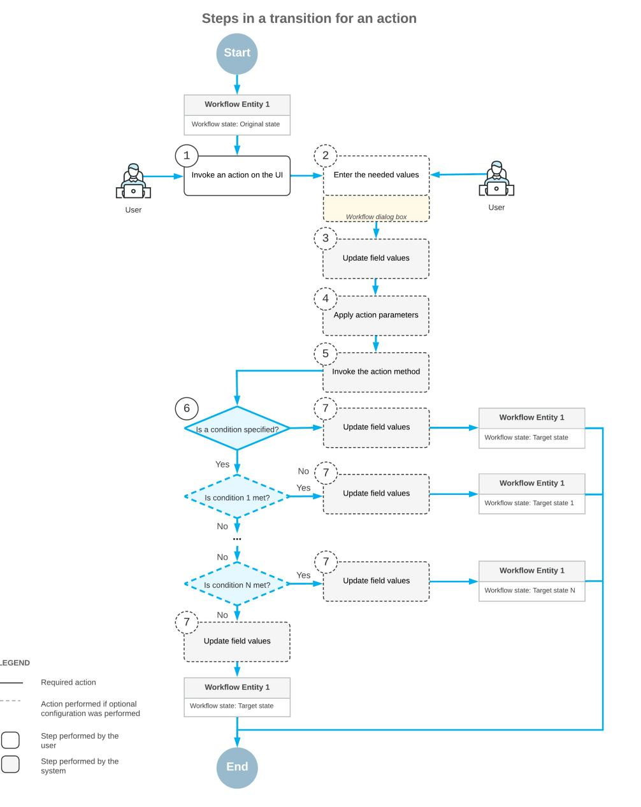

First, a user clicks a button or command to invoke an action on the form (Item 1 in the diagram). If applicable, the dialog box you have specified for the action is displayed, and the user enters the needed values in this dialog box (Item 2). Then the system updates the fields you have specified based on the values the user has entered in the dialog box for the action (Item 3). Optionally, if the action is defined in a graph, the system applies the parameters that you have specified for the action (Item 4) and invokes the action method (Item 5); only actions defined in a graph can have a method to be invoked and properties to be applied. If you have specified both a transition that the action triggers and a condition for this transition, the condition is then checked (Item 6).

In each transition, you can check for only one condition. To check for multiple conditions, you have to define multiple transitions, one for each condition. The system checks transition conditions in the order in which the transitions are defined on the *[Workflow](https://help-2025r1.acumatica.com/Help?ScreenId=ShowWiki&pageid=8a944b6b-0e47-47c9-a6a7-1b266d8feba0) (Tree View)* or *[Workflow \(Diagram](https://help-2025r1.acumatica.com/Help?ScreenId=ShowWiki&pageid=6cc999f0-df33-4db0-9f93-36329ad1de7e) [View\)](https://help-2025r1.acumatica.com/Help?ScreenId=ShowWiki&pageid=6cc999f0-df33-4db0-9f93-36329ad1de7e)* page of the Customization Project Editor. Conditions are defined on the *[Conditions](https://help-2025r1.acumatica.com/Help?ScreenId=ShowWiki&pageid=0e3371f4-6aaf-461b-b52d-3a8cb423a2f9)* page for the customized screen.

If you have specified the fields to be updated aer the transition or the fields to be updated when a record enters or leaves the state, the system proceeds as follows (Item 7):

- 1. In the original state, assigns new values to the fields that should be updated when a record exits the state. These new values affect all transitions from this state.
- 2. Updates the fields that should be updated aer this particular transition. This update affects only this transition.
- 3. In the target state, assigns new values to the fields that should be updated when a record enters the state. These new values affect all transitions to this state.

Finally, the system changes the record's state to the target state you have specified for the transition.

#### **Transition for an Event Handler**

In the following diagram, you can see the steps that the system performs during a transition to the target state when some change occurs on the current form to the current record or on a different form to another record. This raises an event in the code, which in turn invokes the event handler.

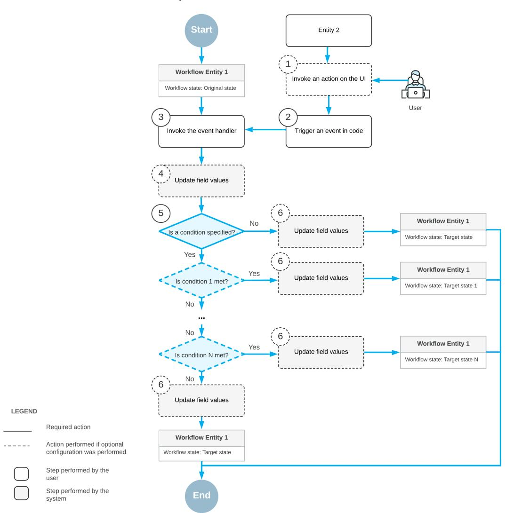

First, a user invokes an action in the UI of a different form for some other record (Item 1 in the diagram) or changes a value in a box on this form or another form. This triggers an event in the code (Item 2). Then the system invokes an event handler (Item 3) and updates any fields that you have specified for this event handler (Item 4). If you have specified a transition for this event handler and a condition for this transition, the condition is checked (Item 5).

In each transition, you can check for only one condition. To check for multiple conditions, you have to define multiple transitions, one for each condition. The system checks transition conditions in the order in which the transitions are defined on the *[Workflow](https://help-2025r1.acumatica.com/Help?ScreenId=ShowWiki&pageid=8a944b6b-0e47-47c9-a6a7-1b266d8feba0) (Tree View)* or *[Workflow \(Diagram](https://help-2025r1.acumatica.com/Help?ScreenId=ShowWiki&pageid=6cc999f0-df33-4db0-9f93-36329ad1de7e) [View\)](https://help-2025r1.acumatica.com/Help?ScreenId=ShowWiki&pageid=6cc999f0-df33-4db0-9f93-36329ad1de7e)* page of the Customization Project Editor. Conditions are defined on the *[Conditions](https://help-2025r1.acumatica.com/Help?ScreenId=ShowWiki&pageid=0e3371f4-6aaf-461b-b52d-3a8cb423a2f9)* page for the customized screen.

If you have specified the fields to be updated aer the transition or the fields to be updated when a record enters or leaves the state, the system proceeds as follows:

- 1. In the original state, assigns new values to the fields that should be updated when a record exits the state. These new values affect all transitions from this state.
- 2. Updates the fields that should be updated aer this particular transition. This update affects only this transition.
- 3. In the target state, assigns new values to the fields that should be updated when a record enters the state. These new values affect all transitions to this state.

Finally, the system changes the record's state to the target state you have specified for the transition.

#### **Configuration of Conditions and Transitions**

You use the *[Conditions](https://help-2025r1.acumatica.com/Help?ScreenId=ShowWiki&pageid=0e3371f4-6aaf-461b-b52d-3a8cb423a2f9)* page of the Customization Project Editor to construct a condition that can later be specified as a property value for the following items on a particular form:

- A UI control
- An action, including an auto-run action
- A transition

You can add new rows and modify existing rows of the conditions that you have created previously. You cannot modify predefined conditions.

The following screenshot shows the *[Conditions](https://help-2025r1.acumatica.com/Help?ScreenId=ShowWiki&pageid=0e3371f4-6aaf-461b-b52d-3a8cb423a2f9)* page for the *[Opportunities](https://help-2025r1.acumatica.com/Help?ScreenId=ShowWiki&pageid=5cb49cd5-2be8-4617-9341-958f1c5d6d53)* (CR304000) form with the **Condition Properties** dialog box opened for the ClassID condition.

| <b>Customization Project Editor</b>                                 |                                                                                        |         |                 | <b>Back</b> | Reload |  |  |  |  |  |
|---------------------------------------------------------------------|----------------------------------------------------------------------------------------|---------|-----------------|-------------|--------|--|--|--|--|--|
| Publish <b>Extension Library</b> File                         | <b>Source Control</b>                                                                  |         |                 |             |        |  |  |  |  |  |
| CustomizationProject <                                              | Conditions: CR304000 (Opportunities)                                                   |         |                 |             |        |  |  |  |  |  |
| $\overline{\phantom{a}}$ SCREENS ▶ CR301000 $\sqrt{CR304000}$ | $\Box$ $\circ$ $\Omega$ $\times$ $\mathscr{O}$ $^{+}$ B              |         |                 |             |        |  |  |  |  |  |
| Actions                                                             | <b>Condition Properties</b>                                                            |         |                 |             |        |  |  |  |  |  |
| <b>Event Handlers</b>                                               | <b>Condition Name:</b> ClassID                                                      |         |                 |             |        |  |  |  |  |  |
| Fields Conditions (1, inherited 3                                | Append System Condition                                                                |         |                 |             |        |  |  |  |  |  |
| ▶ Workflows                                                         | $\mathcal{P}$ Ò $^{+}$ $\times$                                               |         |                 |             |        |  |  |  |  |  |
| <b>Dialog Boxes</b> ▶ CR306000                                   | B *Condition Value <b>Brackets</b> *Field Name From Active Schema | Value 2 | <b>Brackets</b> | Operator    |        |  |  |  |  |  |
| Data Access                                                         | $\rightarrow$ ☑ ☑ Class ID <b>Equals</b> <b>SERVICE</b> ÷            |         |                 | And         |        |  |  |  |  |  |
| !!!!!!!!!!!!!!!!!!!!!!!!!!!!!!!!!!!!!!!!                            |                                                                                        |         |                 |             |        |  |  |  |  |  |
| Files                                                               |                                                                                        |         |                 |             |        |  |  |  |  |  |
| Generic Inquiries                                                   |                                                                                        |         |                 |             |        |  |  |  |  |  |
| Reports                                                             |                                                                                        |         |                 |             |        |  |  |  |  |  |
| <b>Dashboards</b>                                                   |                                                                                        |         |                 |             |        |  |  |  |  |  |
| Site Map                                                            |                                                                                        |         |                 |             |        |  |  |  |  |  |
| <b>Database Scripts</b>                                             |                                                                                        |         |                 |             |        |  |  |  |  |  |
| <b>System Locales</b>                                               |                                                                                        |         |                 |             |        |  |  |  |  |  |
| Import/Export Scenarios                                             |                                                                                        |         |                 |             |        |  |  |  |  |  |
| <b>Shared Filters</b>                                               |                                                                                        |         |                 |             |        |  |  |  |  |  |
| <b>Access Rights</b>                                                |                                                                                        |         |                 |             |        |  |  |  |  |  |
| Wikis                                                               |                                                                                        |         |                 |             |        |  |  |  |  |  |
| <b>Web Service Endpoints</b>                                        |                                                                                        |         |                 |             |        |  |  |  |  |  |
| <b>Analytical Reports</b>                                           |                                                                                        |         |                 |             |        |  |  |  |  |  |
| <b>Push Notifications</b>                                           |                                                                                        |         |                 |             |        |  |  |  |  |  |
| <b>Business Events</b>                                              |                                                                                        |         |                 | OK          | CANCEL |  |  |  |  |  |
| <b>Mobile Application</b>                                           |                                                                                        |         |                 |             |        |  |  |  |  |  |
| <b>User-Defined Fields</b>                                          |                                                                                        |         |                 |             |        |  |  |  |  |  |

*Figure: The Condition Properties dialog box*

In the name that appears on the *[Conditions](https://help-2025r1.acumatica.com/Help?ScreenId=ShowWiki&pageid=0e3371f4-6aaf-461b-b52d-3a8cb423a2f9)* page, *Conditions:* is followed by the form ID and then the form name in parentheses, so you can always see at a glance which form you are customizing. Notice that the page name shown in the screenshot is *Conditions: CR304000 (Opportunities)*.

You configure transitions by using the *[Workflow](https://help-2025r1.acumatica.com/Help?ScreenId=ShowWiki&pageid=8a944b6b-0e47-47c9-a6a7-1b266d8feba0) (Tree View)* page of the workflow. The added transitions are displayed on the**States and Transitions** pane of this page. You can change the order in which the transitions are displayed on this pane, if needed.

The following screenshot shows transitions on the**States and Transitions** pane for the opportunity workflow.

| <b>Customization Project Editor</b>                                                     |                                                                 |                                                                                         |                       |                         |                |                         |        |                 |                      | <b>Back</b> | Reload        |  |  |
|-----------------------------------------------------------------------------------------|-----------------------------------------------------------------|-----------------------------------------------------------------------------------------|-----------------------|-------------------------|----------------|-------------------------|--------|-----------------|----------------------|-------------|---------------|--|--|
| <b>Extension Library</b> File Publish                                             | Source Control                                                  |                                                                                         |                       |                         |                |                         |        |                 |                      |             |               |  |  |
| <b>CustomizationProject</b> ∢ CR304000 (Opportunities) State Diagram: Opportunity |                                                                 |                                                                                         |                       |                         |                |                         |        |                 |                      |             |               |  |  |
| $\overline{\phantom{a}}$ SCREENS                                                        | 日 $\Omega$ <b>ADD STATE</b> <b>CHANGE PARENT STATE</b> |                                                                                         |                       | <b>ADD TRANSITION</b>   |                | <b>DIAGRAM VIEW</b>     | .      |                 |                      |             |               |  |  |
| ← CR301000                                                                              | <b>States and Transitions</b>                                   |                                                                                         |                       | <b>STATE PROPERTIES</b> | <b>ACTIONS</b> | <b>HANDLERS</b>         |        |                 |                      |             |               |  |  |
| $-$ CR304000 Actions                                                                 | 圎 个 ↓                                                     |                                                                                         |                       |                         |                |                         |        |                 |                      |             |               |  |  |
| <b>Fvent Handlers</b>                                                                   |                                                                 |                                                                                         | Identifier:           |                         | N              |                         |        |                 |                      |             |               |  |  |
| Fields (6)                                                                              | - New (Inherited) $\div$ Transitions                         |                                                                                         | Description:          |                         | New            |                         |        |                 |                      |             |               |  |  |
| Conditions                                                                              | Open->Open (Inherited)                                          | Active Minitial State of the Workflow                                                |                       |                         |                |                         |        |                 |                      |             |               |  |  |
| - Workflows (1, inherited 1)                                                            | Close as Won->Won (Inherited)                                   |                                                                                         |                       |                         |                |                         |        |                 |                      |             |               |  |  |
| Default workflow                                                                        | Close as Lost->Lost (Inherited)                                 |                                                                                         |                       |                         |                |                         |        |                 |                      |             |               |  |  |
| Opportunity                                                                             | Opportunity Created from Lead->New (In                          | <b>FIELDS</b> FIELDS TO UPDATE ON ENTRY FIELDS TO UPDATE ON EXIT                  |                       |                         |                |                         |        |                 |                      |             |               |  |  |
| <b>Dialog Boxes</b>                                                                     | $\bullet$ Open (Inherited)                                      | $\circ$ $\pm$ $\times$ $\left  \rightarrow \right $ <b>COMBO BOX VALUES</b> |                       |                         |                |                         |        |                 |                      |             |               |  |  |
| Data Access                                                                             | $\overline{\phantom{a}}$ Transitions                            |                                                                                         |                       |                         |                |                         |        |                 |                      |             |               |  |  |
| Code                                                                                    | Close as Won->Won (Inherited)                                   | <b>B</b> Activ                                                                          |                       | * Object Name           | *Field Name    | <b>Disabled</b>         | Hidden | <b>Required</b> | <b>Default Value</b> |             | <b>Status</b> |  |  |
| <b>Files</b>                                                                            | Close as Lost->Lost (Inherited)                                 | $\mathbf{\bar{}}$                                                                       | $\boxed{\mathcal{Q}}$ | Opportunity             | Reason         | $\Box$                  | $\Box$ | $\Box$          | Created              |             | Inherited     |  |  |
| <b>Generic Inquiries</b>                                                                | - Won (Inherited)                                               |                                                                                         | $\boxed{\small\sim}$  |                         |                | $\overline{\textbf{S}}$ | □      | $\Box$          | $\Box$               |             |               |  |  |
| Reports                                                                                 | $\overline{\phantom{a}}$ Transitions                            |                                                                                         |                       | Opportunity             | Active         |                         |        |                 |                      |             | Inherited     |  |  |
| <b>Dashboards</b>                                                                       | Open->Open (Inherited)                                          |                                                                                         | ☑                     | Opportunity             | Source         | □                       | $\Box$ | $\Box$          |                      |             | Inherited     |  |  |
| Site Map <b>Database Scripts</b>                                                     | - Lost (Inherited)                                              |                                                                                         |                       |                         |                |                         |        |                 |                      |             |               |  |  |
| <b>System Locales</b>                                                                   | $\overline{\phantom{a}}$ Transitions                            |                                                                                         |                       |                         |                |                         |        |                 |                      |             |               |  |  |
| Import/Export Scenarios                                                                 | Open->Open (Inherited)                                          |                                                                                         |                       |                         |                |                         |        |                 |                      |             |               |  |  |
| <b>Shared Filters</b>                                                                   |                                                                 |                                                                                         |                       |                         |                |                         |        |                 |                      |             |               |  |  |
| <b>Access Rights</b>                                                                    |                                                                 |                                                                                         |                       |                         |                |                         |        |                 |                      |             |               |  |  |
|                                                                                         |                                                                 |                                                                                         |                       |                         |                |                         |        |                 |                      |             |               |  |  |

#### *Figure: The State and Transitions pane*

You can also add transitions between states by using the *Workflow [\(Diagram](https://help-2025r1.acumatica.com/Help?ScreenId=ShowWiki&pageid=6cc999f0-df33-4db0-9f93-36329ad1de7e) View)* page (for details, see *[Diagram](#page-61-2) View: General [Information](#page-61-2)*).

### **Conditions and Transitions: To Add Conditions**

The following activity will walk you through the process of creating conditions that modify actions.

#### **Story**

In your workflow for tasks created on the *[Task](https://help-2025r1.acumatica.com/Help?ScreenId=ShowWiki&pageid=6449513c-254e-4093-b7b8-06de0108c384)* (CR306020) form, you need the system to perform the Resolve action automatically when the **Completion (%)** is set to *100*, which reflects that the task is complete. You also want the Open action to trigger transitions to different states depending on the percent of the task completion. In this activity, you will start this process by creating the conditions.

#### **Process Overview**

You will use the *[Conditions](https://help-2025r1.acumatica.com/Help?ScreenId=ShowWiki&pageid=0e3371f4-6aaf-461b-b52d-3a8cb423a2f9)* page to add conditions that you will later use to modify the Resolve and Open actions.

#### **System Preparation**

Before you begin adding conditions, do the following:

1. Launch the Acumatica ERP website with the *U100* dataset preloaded, and sign in as system administrator by using the *gibbs* username and the *123* password.

The *gibbs* user is assigned the *Administrator* role, which has sufficient access rights to customize workflows.

2. Make sure that you have completed the *Action [Configuration:](#page-28-1) To Create Workflow Actions and Add Them to the [Workflow States](#page-28-1)* activity.

#### **Step 1: Adding the Completed Condition**

In this step, you will add the Completed condition, which you will later use to invoke the Resolve action automatically. Perform the following instructions in the Customization Project Editor for the *TaskWorkflow* project:

1. In the navigation pane, click**Screens > CR306020 > Conditions**.

The Conditions: CR306020 (Task) page opens.

- 2. On the page toolbar, click **Add New Record**.
- 3. In the **Conditions Properties** dialog box, which is opened, type Completed as the condition name.
- 4. Click **Add Row** on the table toolbar, and specify the following settings in the added row:
  - **Field Name**: *Completion (%)*
  - **Condition**: *Equals*
  - **From Schema**: Selected
  - **Value**: 100
- 5. Make sure that the **Active** check box is selected for the added row.
- 6. Click **OK** to save your changes and close the dialog box.

The added condition appears in the list of conditions on the Conditions: CR306020 (Task) page. You will use this condition to automatically change the status of a task to *Completed* when the condition is met.

#### **Step 2: Adding the NotStarted Condition**

In this step, you will add the NotStarted condition, which you will later use in the Open action to trigger transitions to different states. Perform the following instructions:

- 1. While you are still on the Conditions: CR306020 (Task) page, on the page toolbar, click **Add New Record**.
- 2. In the **Conditions Properties** dialog box, which is opened, type NotStarted as the condition name.
- 3. Click **Add Row** on the table toolbar, and specify the following settings in the added row:
  - **Field Name**: *Completion (%)*
  - **Condition**: *Equals*
  - **From Schema**: Selected
  - **Value**: 0
- 4. Make sure that the **Active** check box is selected for the added row.
- 5. Click **OK** to save your changes and close the dialog box.

The added condition appears in the list of conditions on the Conditions: CR306020 (Task) page. You will use this condition to change the status of a task from *Postponed* to *Open* when the condition is met.

# **Conditions and Transitions: To Add Transitions**

The following activity will walk you through the process of creating transitions between the states of the workflow.

#### **Story**

You can use the same action to trigger transitions from one state to different states. To do so, you need to use conditions for these transitions. If a condition is fulfilled, the system performs the transition that is first in the list of transitions from the current state. (This list is displayed on the**States and Transitions** pane of the *[Workflow](https://help-2025r1.acumatica.com/Help?ScreenId=ShowWiki&pageid=8a944b6b-0e47-47c9-a6a7-1b266d8feba0)*

*(Tree [View\)](https://help-2025r1.acumatica.com/Help?ScreenId=ShowWiki&pageid=8a944b6b-0e47-47c9-a6a7-1b266d8feba0)* page.) If the condition is not fulfilled, the system switches to the next transition in the list and checks its condition.

When a record is in the Postponed state, you will use the same action (Open) to trigger transitions to the Open state or to the Processing state, depending on the percent of the task completion as follows:

- If the value in the **Completion (%)** box is *0*, the target state should be Open.
- If the value in the **Completion (%)** box is not *0*, the target state should be Processing.

To implement these transitions, you will use the NotStarted and Completed conditions, which you have created in *Conditions and [Transitions:](#page-45-1) To Add Conditions*.

#### **Process Overview**

By using the *[Workflow](https://help-2025r1.acumatica.com/Help?ScreenId=ShowWiki&pageid=8a944b6b-0e47-47c9-a6a7-1b266d8feba0) (Tree View)* page, you will add the transitions from the Draft state to the Open state and to the Postponed state. You will also add the transitions from the Open state to the Processing state, the Postponed state, and the Completed state.

#### **System Preparation**

Before you begin adding transitions to the workflow, do the following:

1. Launch the Acumatica ERP website with the *U100* dataset preloaded, and sign in as system administrator by using the *gibbs* username and the *123* password.

The *gibbs* user is assigned the *Administrator* role, which has sufficient access rights to customize workflows.

2. Make sure that you have completed the activity *Conditions and [Transitions:](#page-45-1) To Add Conditions* and *[Action](#page-31-1) [Configuration:](#page-31-1) To Create a Workflow Action That Displays a Dialog Box* activities.

#### **Step 1: Adding the Simple Transitions (for the Dra State)**

To add the transitions from the Draft state to the Open state and the Postponed state, in the Customization Project Editor for the *TaskWorkflow* project, perform the following instructions:

1. In the navigation pane, click**Screens > CR306020 > Workflows > Task**.

The CR306020 (Task) Workflows page opens.

- 2. Add the transition from the Draft state to the Open state as follows:
  - a. In the **States and Transitions** pane, click the Draft state.
  - b. On the page toolbar, click **Add Transition**.
  - c. In the **Add Transition** dialog box, which is opened, select the following settings:
    - **Trigger Name**: *Open (Open)*
    - **TargetState**: *Open*
  - d. Click **OK** to close the dialog box.

Notice that the transition has appeared in the**States and Transitions** pane, in the**Transitions** node below the Draft state.

- e. Save your changes.
- 3. Add the transition from the Draft state to the Postponed state as follows:
  - a. In the **States and Transitions** pane, click the Draft state again.
  - b. On the page toolbar, click **Add Transition**.

- c. In the **Add Transition** dialog box, which is opened, specify the following settings:
  - **Trigger Name**: *Postpone (Postpone)*
  - **TargetState**: *Postponed*
- d. Click **OK** to close the dialog box.
- e. Save your changes.

#### **Step 2: Adding the Simple Transitions (for the Open State)**

In this step, you will add the transitions from the Open state to the Processing state, the Postponed state, and the Completed state. While you are still in the tree view of the CR306020 (Task) State Diagram: Task page, perform the following instructions:

- 1. Add the transition from the Open state to the Processing state as follows:
  - a. In the **States and Transitions** pane, click the Open state.
  - b. On the page toolbar, click **Add Transition**.
  - c. In the **Add Transition** dialog box, which is opened, select the following settings:
    - **Trigger Name**: *Start Work (StartWork)*
    - **TargetState**: *Processing*
  - d. Click **OK** to close the dialog box.

Notice that the transition has appeared in the**States and Transitions** pane, in the**Transitions** node below the Open state.

- 2. Add the transition from the Open state to the Postponed state as follows:
  - a. In the **States and Transitions** pane, click the Open state again.
  - b. On the page toolbar, click **Add Transition**.
  - c. In the **Add Transition** dialog box, which is opened, select the following settings:
    - **Trigger Name**: *Postpone (Postpone)*
    - **TargetState**: *Postponed*
  - d. Click **OK** to close the dialog box.
- 3. Add the transition from the Open state to the Completed state as follows:
  - a. In the **States and Transitions** pane, click the Open state again.
  - b. On the page toolbar, click **Add Transition**.
  - c. In the **Add Transition** dialog box, which is opened, select the following settings:
    - **Trigger Name**: *Resolve (Resolve)*
    - **TargetState**: *Completed*
  - d. Click **OK** to close the dialog box.
- 4. Save your changes.

#### **Step 3: Adding the Auto-Run Transitions (for the Processing State)**

To add the transitions from the Processing state to the Completed state and the Postponed state, while you are still in the tree view of the CR306020 (Task) State Diagram: Task page, perform the following instructions:

- 1. Add the transition from the Processing state to the Postponed state as follows:
  - a. In the **States and Transitions** pane, click the Processing state.
  - b. On the page toolbar, click **Add Transition**.

- c. In the **Add Transition** dialog box, which is opened, select the following settings:
  - **Trigger Name**: *Postpone (Postpone)*
  - **TargetState**: *Postponed*
- d. Click **OK** to close the dialog box.

Notice that the transition is added to the**States and Transitions** pane, to the**Transitions** node below the **Processing** node.

- 2. Add the transition from the Processing state to the Completed state as follows:
  - a. In the **States and Transitions** pane, click the Processing state again.
  - b. On the page toolbar, click **Add Transition**.
  - c. In the **Add Transition** dialog box, which is opened, select the following settings:
    - **Trigger Name**: *Resolve (Resolve)*
    - **TargetState**: *Completed*
  - d. Click **OK** to close the dialog box.
- 3. In the **States and Transitions** pane, click the Processing state again.
- 4. On the **Actions** tab, in the row with the Resolve (Resolve) action, select *Completed* in the **Auto-Run Condition** column.

This setting indicates that the system will perform this action automatically if the Completed condition is fulfilled.

5. Save your changes.

#### **Step 4: Adding the Transitions That Depend on a Condition (for the Postponed State)**

To implement transitions from the Postponed state, while you are still in the tree view of the CR306020 (Task) State Diagram: Task page, do the following:

- 1. In the **States and Transitions** pane, click the Postponed state.
- 2. On the page toolbar, click **Add Transition**.
- 3. In the **Add Transition** dialog box, which is opened, select the following settings:
  - **Trigger Name**: *Open (Open)*
  - **Condition**: *NotStarted*
  - **TargetState**: *Open*
- 4. Click **OK** to close the dialog box.
- 5. In the **States and Transitions** pane, click the Postponed state again.
- 6. On the page toolbar, click **Add Transition**.
- 7. In the **Add Transition** dialog box, which is opened, select the following settings:
  - **Trigger Name**: *Open (Open)*
  - **TargetState**: *Processing*
- 8. Click **OK** to close the dialog box.

The system will perform this transition if the condition for the first transition (that is, the NotStarted condition) is not fulfilled.

9. Save your changes.

# **Step 5: Adding a Transition That Causes Update of a Field Aer the Transition (for the Completed State)**

To add the transitions from the Completed state to the Open state, while you are still in the tree view of the CR306020 (Task) State Diagram: Task page, perform the following instructions:

- 1. In the **States and Transitions** pane, click the Completed state.
- 2. On the page toolbar, click **Add Transition**.
- 3. In the **Add Transition** dialog box, which is opened, specify the following settings:
  - **Trigger Name**: *Reopen (Reopen)*
  - **TargetState**: *Open*
- 4. Click **OK** to close the dialog box.
- 5. In the **Transitions** node of the **States and Transitions** pane, click the added transition.
- 6. In the **Fields to Update AerTransition** table of the**Transition Properties** tab, click **Add Row** on the table toolbar, and specify the following settings in the added row:
  - **Field Name**: *Completion (%)*
  - **From Schema**: Cleared
  - **New Value**: *[FormReopen.Completion]*

The last setting indicates that the Completion (%) field will be updated with the value that the user has specified in the **Details** dialog box. (You have created this dialog box in *Workflow [Elements:](#page-22-1) To Add a Dialog [Box](#page-22-1)*.)

7. Save your changes.

# **Testing the Customization**

In this chapter, you will learn how to test the workflow customization you have created for the *[Task](https://help-2025r1.acumatica.com/Help?ScreenId=ShowWiki&pageid=6449513c-254e-4093-b7b8-06de0108c384)* (CR306020) form. You need to publish the customization project before performing these tests on the form.

# **Testing of the Customization Project: General Information**

To make sure that you have implemented all changes correctly, you need to test your customization project.

#### **Learning Objectives**

In this chapter, you will learn how to test your customization project.

#### **Applicable Scenarios**

You test your customization project aer you have added all the required data to it. Also, you can run the test each time you make changes to the project.

#### **Application of Changes from the Customization Project**

You test the changes you have made to a form by publishing the customization project. If you are already signed in to Acumatica ERP and the form is open, you need to refresh it. You then need to perform the activities that involve the changes to make sure that the customized form works as expected.

You can publish your customization project from the Customization Project Editor or on the *[Customization Projects](https://help-2025r1.acumatica.com/Help?ScreenId=ShowWiki&pageid=4d3a1166-826c-414b-a207-3d1669fbf9e5)* (SM204505) form.

If you have previously published another customization project that modifies the current form and you do not need these changes, you need to unpublish this customization project before publishing the current one.

For details on publishing and unpublishing a customization project, see *To [Publish](https://help-2025r1.acumatica.com/Help?ScreenId=ShowWiki&pageid=739ba5bb-cf0e-40ff-91ca-4f1f1723db1f) a Single Project* and *[Project](https://help-2025r1.acumatica.com/Help?ScreenId=ShowWiki&pageid=d9034d17-70af-48a0-adb0-f37c63a90c61) [Unpublishing:](https://help-2025r1.acumatica.com/Help?ScreenId=ShowWiki&pageid=d9034d17-70af-48a0-adb0-f37c63a90c61) To Unpublish a Single Project*.

# **Testing of the Customization Project: To Test a Custom Workflow**

The following activity will walk you through the process of testing a custom workflow.

#### **Story**

Acting as the technical specialist, you need to publish your customization project and then test the changes on the *[Task](https://help-2025r1.acumatica.com/Help?ScreenId=ShowWiki&pageid=6449513c-254e-4093-b7b8-06de0108c384)* (CR306020) form and make sure that the new workflow works as expected.

#### **Process Overview**

On the *[Customization Projects](https://help-2025r1.acumatica.com/Help?ScreenId=ShowWiki&pageid=4d3a1166-826c-414b-a207-3d1669fbf9e5)* (SM204505) form of Acumatica ERP, you will publish your customization project. On the *[Task](https://help-2025r1.acumatica.com/Help?ScreenId=ShowWiki&pageid=6449513c-254e-4093-b7b8-06de0108c384)* (CR306020) form, you will then test the new workflow.

#### **System Preparation**

Before you begin testing the customization, do the following:

1. Launch the Acumatica ERP website with the *U100* dataset preloaded, and sign in as system administrator by using the *gibbs* username and the *123* password.

The *gibbs* user is assigned the *Administrator* role, which has sufficient access rights to customize workflows.

2. Make sure that you have completed the *Conditions and [Transitions:](#page-46-1) To Add Transitions* activity.

#### **Step 1: Publishing the Customization Project**

To publish the *TaskWorkflow* customization project, do the following:

- 1. On the *[Customization Projects](https://help-2025r1.acumatica.com/Help?ScreenId=ShowWiki&pageid=4d3a1166-826c-414b-a207-3d1669fbf9e5)* (SM204505) form, click the *TaskWorkflow* project name to open the customization project.
- 2. On the menu of the Customization Project Editor, click **Publish > Publish Current Project**.

The system starts publishing the customization project and displays the progress in the **Compilation** pane, which appears at the bottom of the Customization Project Editor window.

3. Aer the system finishes updating the required data, click **Close Compilation Pane** in the **Compilation** pane.

#### **Step 2: Testing the Dra State and State Diagram Dialog Box**

In Acumatica ERP, test the Draft state and the**State Diagram** dialog box as follows:

- 1. On the form toolbar of the Tasks (EP4040PL) list of records, click **New Record**.
- 2. On the *[Task](https://help-2025r1.acumatica.com/Help?ScreenId=ShowWiki&pageid=6449513c-254e-4093-b7b8-06de0108c384)* (CR306020) form, which opens, notice the following:
  - The value in the**Status** box is *Dra*.
  - The **Start Date** box has been filled in automatically with the current date.
  - The **Completion (%)** box is unavailable.
  - On the More menu, two commands are available: **Open** and **Postpone**. Also notice that **Open** is marked with a green dot.
  - On the form toolbar, the **Open** button is highlighted in green.
- 3. On the form title bar, click **Customization > Show State Diagram**.

The **State Diagram** dialog box opens. The diagram should look like the one shown in the following screenshot.

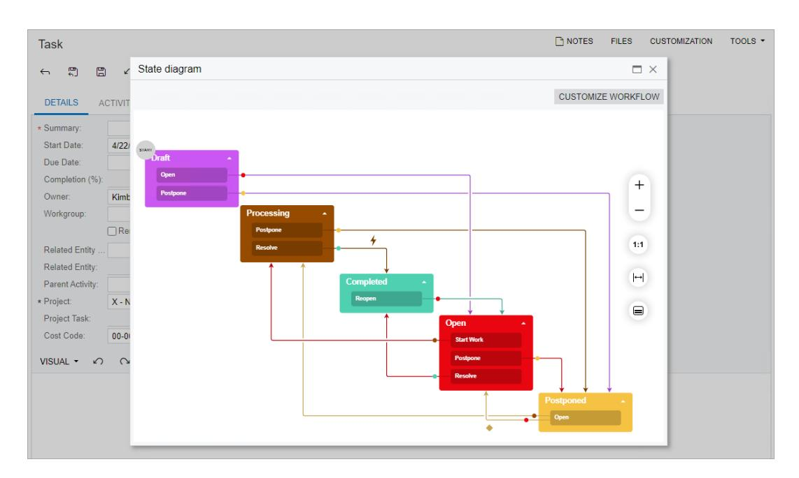

#### *Figure: The State Diagram dialog box*

4. Close the dialog box.

#### **Step 3: Testing the Open State**

While you are still on the *[Task](https://help-2025r1.acumatica.com/Help?ScreenId=ShowWiki&pageid=6449513c-254e-4093-b7b8-06de0108c384)* (CR306020) form, test the Open state as follows:

- 1. In the **Summary** box, enter Process customer request, and save your changes.
- 2. On the form toolbar, click **Open**.

The status of the task changes to *Open*.

3. Clear the **Owner** box, and try to save your changes.

The system displays an error for this box.

- 4. In the **Owner** box, select *Kimberly Gibbs*, and save your changes.
- 5. On the form, notice the following:
  - On the More menu, three commands are available:**Start Work**, **Resolve**, and **Postpone**.
  - On the form toolbar, the**Start Work** button is highlighted in green.

#### **Step 4: Testing the Processing State and the Resolve Action**

Test the Processing state and the Resolve action as follows:

- 1. While you are still on the *[Task](https://help-2025r1.acumatica.com/Help?ScreenId=ShowWiki&pageid=6449513c-254e-4093-b7b8-06de0108c384)* (CR306020) form, on the form toolbar, click**Start Work**.
- 2. On the form, notice the following:
  - The status of the task has been changed to *Processing*.
  - On the More menu, two commands are available: **Resolve** and **Postpone**.
  - On the form toolbar, the **Resolve** command is highlighted in green.
- 3. On the form toolbar, click **Resolve**.
- 4. On the form, notice the following:
  - The status of the task is *Completed*.

• On the More menu, only one command is available: **Reopen**.

#### **Step 5: Testing the Reopen Action and the Completed Condition**

While you are still on the *[Task](https://help-2025r1.acumatica.com/Help?ScreenId=ShowWiki&pageid=6449513c-254e-4093-b7b8-06de0108c384)* (CR306020) form, test the Reopen action and the Completed condition as follows:

- 1. On the form toolbar, click **Reopen**.
- 2. In the **Details** dialog box, which is opened, enter 10 in the **Completion (%)** box.
- 3. Click **OK** to close the dialog box.

The status of the task changes to *Open*, and the value in the **Completion (%)** box is *10*.

4. On the form toolbar, click **Postpone**.

The status of the task changes to *Postponed*, and on the More menu, only one command is available: **Open**.

5. On the form toolbar, click **Open**.

The status of the task changes to *Processing* because the value in the **Completion (%)** box is *10* (which is greater than *0*).

- 6. In the **Completion (%)** box, enter 100.
- 7. Save your changes.

The status of the task changes to *Completed* automatically.

# **Working with Inherited Workflows**

In this chapter, you will learn about inherited workflows, and when you should use them.

# **Inherited Workflows: General Information**

Some Acumatica ERP forms have at least one predefined workflow, which is a workflow that has been developed for a form in the out-of-the-box version of Acumatica ERP. If you want to make changes to a predefined workflow, you create an inherited workflow, which is based on the predefined one, and modify it as needed.

#### **Learning Objectives**

In this chapter, you will learn how to create inherited workflows.

#### **Applicable Scenarios**

You create an inherited workflow if you need to make changes to the predefined workflow so that it is better suited for your business processes.

#### **Use of Inherited Workflows**

An inherited workflow based on a predefined workflow inherits all modifications of the predefined workflow. Customizing an inherited workflow can save you time over creating a custom workflow from scratch, especially if you want to make only minor changes to the functionality of predefined workflow. You can view the difference between the predefined workflow and the inherited workflow, and cause the inherited workflow to revert to the predefined workflow.

An inherited workflow is also described as a *customized workflow*. These terms are interchangeable and they both describe facets of this workflow: It inherits its settings from the predefined workflow, and it is a customized version of the predefined workflow.

For each inherited workflow that you create, the system adds a node for the page under the **Workflows** node. The following screenshot shows the nodes of the workflows for the *[Leads](https://help-2025r1.acumatica.com/Help?ScreenId=ShowWiki&pageid=ce564fa0-baca-4d9b-97a8-ec69910de4c2)* (CR301000) form: the predefined workflow (*Default workflow*) and the inherited workflow (*LeadWorkflow*).

| <b>Customization Project Editor</b>                                                                                                                                                                                                                                                                                                       |                                                                                                                                                                                                                                                                                                                                                                                                                        |                                                                                                                                                              |                         |              |                 |                  |                  |                  |                 |         | <b>Back</b>                             | Reload                  |               |  |  |
|-------------------------------------------------------------------------------------------------------------------------------------------------------------------------------------------------------------------------------------------------------------------------------------------------------------------------------------------|------------------------------------------------------------------------------------------------------------------------------------------------------------------------------------------------------------------------------------------------------------------------------------------------------------------------------------------------------------------------------------------------------------------------|--------------------------------------------------------------------------------------------------------------------------------------------------------------|-------------------------|--------------|-----------------|------------------|------------------|------------------|-----------------|---------|-----------------------------------------|-------------------------|---------------|--|--|
| File Publish <b>Extension Library</b>                                                                                                                                                                                                                                                                                               | Source Control                                                                                                                                                                                                                                                                                                                                                                                                         |                                                                                                                                                              |                         |              |                 |                  |                  |                  |                 |         |                                         |                         |               |  |  |
| Leads ٠                                                                                                                                                                                                                                                                                                                                | CR301000 (Leads) State Diagram: Default workflow                                                                                                                                                                                                                                                                                                                                                                       |                                                                                                                                                              |                         |              |                 |                  |                  |                  |                 |         |                                         |                         |               |  |  |
| SCREENS $-$ CR301000                                                                                                                                                                                                                                                                                                                   | $\Omega$ 日 <b>DIAGRAM VIEW</b> $\cdots$                                                                                                                                                                                                                                                                                                                                                                       |                                                                                                                                                              |                         |              |                 |                  |                  |                  |                 |         |                                         |                         |               |  |  |
| <b>Actions</b> <b>Event Handlers</b>                                                                                                                                                                                                                                                                                                   | <b>States and Transitions</b> $\uparrow$ $\downarrow$ 而                                                                                                                                                                                                                                                                                                                                                       |                                                                                                                                                              | <b>STATE PROPERTIES</b> |              |                 |                  |                  |                  |                 |         |                                         |                         |               |  |  |
| Fields Conditions - Workflows (1, inherited 1) <b>Default workflow</b> LeadWorkflow <b>Dialog Boxes</b>                                                                                                                                                                                                                    | $\sim$ New $\overline{\phantom{a}}$ Transitions Open->Open Qualify->Sales-Ready Accept->Sales-Accepted Disqualify->Disqualified                                                                                                                                                                                                                                                                         | Identifier: н Description: New Active Initial State of the Workflow <b>FIELDS</b> FIELDS TO UPDATE ON EXIT FIELDS TO UPDATE ON ENTRY |                         |              |                 |                  |                  |                  |                 |         |                                         |                         |               |  |  |
| Data Access Code                                                                                                                                                                                                                                                                                                                       | Close as Duplicate->Disqualified Mark as Converted->Converted                                                                                                                                                                                                                                                                                                                                                       | $\mathcal{O}$ $^{+}$ $\times$ $\vdash$ <b>COMBO BOX VALUES</b>                                                                                   |                         |              |                 |                  |                  |                  |                 |         |                                         |                         |               |  |  |
| <b>Files</b> <b>Generic Inquiries</b>                                                                                                                                                                                                                                                                                                  | Convert to Opportunity->Converted                                                                                                                                                                                                                                                                                                                                                                                      | $\sim$ Open                                                                                                                                                  |                         |              | <b>B</b> Active | *Object Name     |                  | *Field Name      | <b>Disabled</b> | Hidden  | Required                                | <b>Default</b> Value | <b>Status</b> |  |  |
| Reports <b>Dashboards</b> Site Map <b>Database Scripts</b> <b>System Locales</b> Import/Export Scenarios <b>Shared Filters</b> <b>Access Rights</b> <b>Wikis</b> <b>Web Service Endpoints</b> <b>Analytical Reports</b> <b>Push Notifications</b> <b>Business Events</b> <b>Mobile Application</b> | $\overline{\phantom{a}}$ Transitions Qualify->Sales-Ready Accept->Sales-Accepted Disqualify->Disqualified Close as Duplicate->Disqualified Mark as Converted->Converted Convert to Opportunity->Converted Gales-Ready $\triangleright$ Transitions Gales-Accepted $\sqrt{\frac{1}{2}}$ Transitions $\overline{\phantom{a}}$ Disqualified $\triangleright$ Transitions Converted | $\rightarrow$                                                                                                                                                | ☑ ☑                  | Lead Lead |                 | Reason Source | $\Box$ $\Box$ | $\Box$ $\Box$ | ☑ $\Box$     | Created | Inherited Inherited                  |                         |               |  |  |
| <b>User-Defined Fields</b> <b>Webhooks</b> <b>Connected Applications</b>                                                                                                                                                                                                                                                            | $\star$ Suspended $\longrightarrow$ Transitions                                                                                                                                                                                                                                                                                                                                                                     |                                                                                                                                                              |                         |              |                 |                  |                  |                  |                 |         | $\mathbb{R}$ $\langle \quad \rangle$ |                         | $>$           |  |  |

#### *Figure: The tree view of the Workflow page with the predefined workflow*

If a predefined workflow is changed in an upgrade aer the development of any inherited workflows based on the predefined workflow, each of these workflows will inherit the changes. If a customization project contains an inherited workflow based on a predefined workflow and a newer version of the predefined workflow is available in Acumatica ERP, a customizer can upgrade the customization project with the inherited workflow with the latest changes from the system.

For details on upgrading an inherited workflow based on a predefined workflow with the latest changes in the system, see *[Upgrade of Workflows: General Information](#page-122-2)*.

### **Inherited Workflows: Planning the Customization of a Workflow**

If the predefined workflow for a form does not fit your business processes, you might want to make modifications to it. This topic describes this process by using the example of the *[Opportunities](https://help-2025r1.acumatica.com/Help?ScreenId=ShowWiki&pageid=5cb49cd5-2be8-4617-9341-958f1c5d6d53)* (CR304000) form.

#### **Overview of the Customized Workflow for the Opportunities Form**

The predefined workflow for the *[Opportunities](https://help-2025r1.acumatica.com/Help?ScreenId=ShowWiki&pageid=5cb49cd5-2be8-4617-9341-958f1c5d6d53)* (CR304000) form includes the states, actions, and transitions shown in the following screenshot.

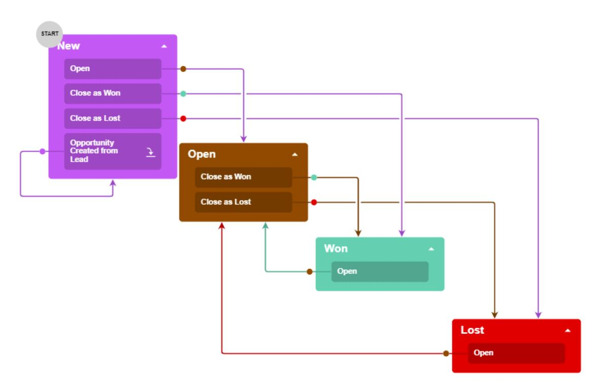

#### *Figure: The predefined workflow for opportunities*

Suppose that in your customization efforts, you need to incorporate a process of assigning a new opportunity before giving it the *Open* status. You need a new status, *Assigned*, for opportunities. A user should be able to do the following:

- Change the status from *New* to *Assigned* by clicking **Assign** on the *[Opportunities](https://help-2025r1.acumatica.com/Help?ScreenId=ShowWiki&pageid=5cb49cd5-2be8-4617-9341-958f1c5d6d53)* form. For an opportunity to be assigned, its owner must be selected in the **Owner** box.
- Change the status from *Assigned* to *Open* by clicking **Accept** on the form.
- Change the status from *Assigned* to *New* by clicking **Reject**.

Also, you need to add a hidden action named Auto-Assign, which is performed automatically if the **Owner** box is filled and the opportunity has the *New* status. The Auto-Assign action changes the status of the opportunity to *Assigned*.

When a user clicks **Accept** or **Reject**, the user should provide the reason for changing the state. When a user clicks **Assign**, the user should specify the **Owner** of the opportunity. In both of these situations, you will use a dialog box to obtain the needed setting.

The modified workflow would look like the one shown in the following screenshot.

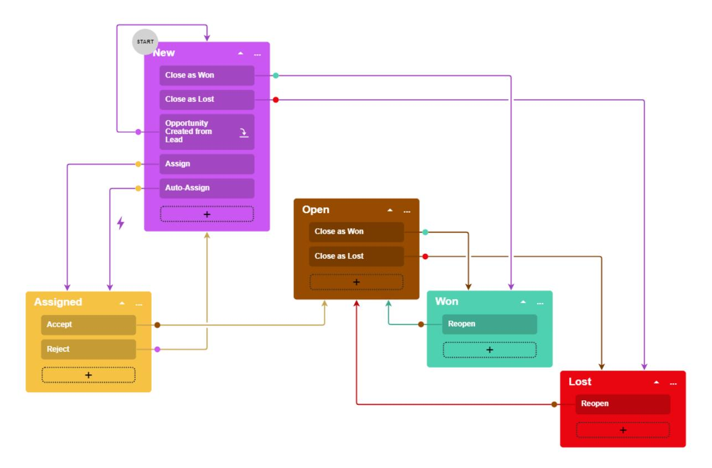

*Figure: The modified workflow for opportunities*

# **Inherited Workflows: To Create an Inherited Workflow**

The following activity will walk you through the process of adding an inherited workflow for a form based on a predefined one.

This activity is based on the *U100* dataset. If you are using another dataset, or if any system settings have been changed in *U100*, these changes can affect the workflow of the activity and the results of the processing. To avoid any issues, restore the *U100* dataset to its initial state.

#### **Story**

Acting as the technical specialist, you need to create a customized workflow for the *[Opportunities](https://help-2025r1.acumatica.com/Help?ScreenId=ShowWiki&pageid=5cb49cd5-2be8-4617-9341-958f1c5d6d53)* (CR304000) form.

#### **Process Overview**

You will add the *[Opportunities](https://help-2025r1.acumatica.com/Help?ScreenId=ShowWiki&pageid=5cb49cd5-2be8-4617-9341-958f1c5d6d53)* (CR304000) form to the list of customized screens on the *[Customized Screens](https://help-2025r1.acumatica.com/Help?ScreenId=ShowWiki&pageid=98b095c8-14d5-477a-9fc3-cc7c57fee3cd)* page of the Customization Project Editor. You will then use the *[Opportunities](https://help-2025r1.acumatica.com/Help?ScreenId=ShowWiki&pageid=5cb49cd5-2be8-4617-9341-958f1c5d6d53)* form as a starting point to create an inherited workflow for this form on the *[Workflows](https://help-2025r1.acumatica.com/Help?ScreenId=ShowWiki&pageid=70fcbfa0-010e-4f44-9ebe-bc9f20e82f9e)* page. From this page, you will open the *Workflow [\(Diagram](https://help-2025r1.acumatica.com/Help?ScreenId=ShowWiki&pageid=6cc999f0-df33-4db0-9f93-36329ad1de7e) View)* page for the inherited workflow.

#### **System Preparation**

Before you begin performing this activity, do the following:

1. Launch the Acumatica ERP website with the *U100* dataset preloaded, and sign in as system administrator by using the *gibbs* username and the *123* password.

The *gibbs* user is assigned the *Administrator* role, which has sufficient access rights to customize workflows.

- 2. Unpublish your current customization project or projects by doing the following:
  - a. Open the *[Customization Projects](https://help-2025r1.acumatica.com/Help?ScreenId=ShowWiki&pageid=4d3a1166-826c-414b-a207-3d1669fbf9e5)* (SM204505) form.
  - b. On the form toolbar, click **Unpublish All**.

For details on how to unpublish a customization project, see *Project [Unpublishing:](https://help-2025r1.acumatica.com/Help?ScreenId=ShowWiki&pageid=d9034d17-70af-48a0-adb0-f37c63a90c61) To Unpublish a Single [Project](https://help-2025r1.acumatica.com/Help?ScreenId=ShowWiki&pageid=d9034d17-70af-48a0-adb0-f37c63a90c61)*.

3. On the *[Customization Projects](https://help-2025r1.acumatica.com/Help?ScreenId=ShowWiki&pageid=4d3a1166-826c-414b-a207-3d1669fbf9e5)* (SM204505) form, create a customization project named *Opportunities*.

#### **Step 1: Adding a Form to the List of Customized Screens**

Add the *[Opportunities](https://help-2025r1.acumatica.com/Help?ScreenId=ShowWiki&pageid=5cb49cd5-2be8-4617-9341-958f1c5d6d53)* (CR304000) form to the list of customized screens as follows:

- 1. Open the *[Opportunities](https://help-2025r1.acumatica.com/Help?ScreenId=ShowWiki&pageid=5cb49cd5-2be8-4617-9341-958f1c5d6d53)* form.
- 2. On the form title bar, click **Customization > Show State Diagram**.
- 3. In the **State Diagram** dialog box, which opens, notice the predefined workflow of the form, which is shown. Click **Customize Workflow**.
- 4. In the **Select Customization Project** dialog box, which opens, select the *Opportunities* customization project.
- 5. Click **OK** to close the dialog box.

The CR304000 (Opportunities) Workflows page of the Customization Project Editor opens with the list of workflows for this screen. Notice that the list contains one workflow: *Default Workflow*. This is the predefined workflow of the form.

#### **Step 2: Creating a Customized Workflow**

Create a customized workflow for the *[Opportunities](https://help-2025r1.acumatica.com/Help?ScreenId=ShowWiki&pageid=5cb49cd5-2be8-4617-9341-958f1c5d6d53)* (CR304000) form as follows:

- 1. On the page toolbar of the CR304000 (Opportunities) Workflows page, which you opened in the previous step, click **Add Workflow**.
- 2. In the **Add Workflow** dialog box, which opens, specify the following settings:
  - **Operation**: *Extend System Workflow*

This is the operation you select when you want to create an inherited workflow based on another workflow.

• **Base Workflow**: *Default Workflow*

This is the specific workflow that will be extended for the inherited workflow that you are creating. Although this screen has one workflow, others have several.

• **Workflow Type**: *DEFAULT*

This is the type of the base workflow that will be extended for the inherited workflow.

- **Workflow Name**: OpportunitiesAssigned (the name of the workflow that will be displayed in the UI)
- 3. Click **OK** to close the dialog box.

A row for the workflow appears in the table on the Workflows page. Notice that the workflow's status is *Inherited*.

4. Select the **Active** check box for the created workflow.

Notice that the **Active** check box has been cleared automatically for the predefined workflow (*Default Workflow*). This means that the system will not use this workflow for the form anymore, aer the customization project is published.

- 5. On the page toolbar, click**Save**.
- 6. In the table, click the link in the **Workflow Name** column for the created workflow. The tree view of the CR304000 (Opportunities) State Diagram: OpportunitiesAssigned page opens.
- 7. On the page toolbar, click **Diagram View**.

In future activities, you will use the diagram view of the workflow to customize the workflow that you have created.

# **Customizing Workflows with the Diagram View**

In the topics of this chapter, you will learn how to customize a predefined workflow by using the diagram view of the Workflow page (also referred to as the Workflow Visual Editor). The diagram view provides visual representations of the states, actions, and transitions of the workflow.

## **Diagram View: General Information**

In addition to using the *[Workflow](https://help-2025r1.acumatica.com/Help?ScreenId=ShowWiki&pageid=8a944b6b-0e47-47c9-a6a7-1b266d8feba0) (Tree View)* page, you can use the *Workflow [\(Diagram](https://help-2025r1.acumatica.com/Help?ScreenId=ShowWiki&pageid=6cc999f0-df33-4db0-9f93-36329ad1de7e) View)* page (also referred to as the *Workflow Visual Editor*) to work with a particular workflow.

For a workflow with composite states, the diagram view is not available—that is, the **Diagram View** button is not displayed on the More menu of the *[Workflow](https://help-2025r1.acumatica.com/Help?ScreenId=ShowWiki&pageid=8a944b6b-0e47-47c9-a6a7-1b266d8feba0) (Tree View)* page (see *[Composite States:](#page-80-2) [General Information](#page-80-2)* for details).

#### **Learning Objectives**

In this chapter, you will learn about the use of the *Workflow [\(Diagram](https://help-2025r1.acumatica.com/Help?ScreenId=ShowWiki&pageid=6cc999f0-df33-4db0-9f93-36329ad1de7e) View)* page to customize workflows.

#### **Applicable Scenarios**

You use the *Workflow [\(Diagram](https://help-2025r1.acumatica.com/Help?ScreenId=ShowWiki&pageid=6cc999f0-df33-4db0-9f93-36329ad1de7e) View)* page to create or modify workflows if you prefer to use a visual representation of a workflow instead of its tree view.

#### **Working with the Diagram View**

The diagram view is structured like a traditional workflow, with visual representations of the states of the record and the transitions between them. To access the diagram view, while you are working with the tree view of the particular inherited, custom, or predefined workflow on the page, you click **Diagram View** on the page toolbar.

If you want a record on a form to have a status that is not available in an out-of-the-box system, you add a state that represents this status. If you want to indicate to the system that the status of the record should change when a user invokes a particular action, you specify this action as a trigger for the transition.

In the diagram view of a workflow, different states of the workflow are represented by boxes of different colors, and actions and event handlers that trigger transitions between the states are represented by labels in the boxes with states. The labels appear aer you create a transition and specify the source and target states.

You add transitions from one state to another by drawing lines between these states. To draw a line, in the box with the initial state, you click and hold the plus button. When you add a transition, you need to specify an action that triggers it. You can select an existing action or add a new one.

Actions and event handlers for a particular state are not displayed if they do not trigger any transitions.

The following screenshot shows the *Workflow [\(Diagram](https://help-2025r1.acumatica.com/Help?ScreenId=ShowWiki&pageid=6cc999f0-df33-4db0-9f93-36329ad1de7e) View)* page for the Opportunities workflow. Notice that the page name is *CR304000 (Opportunities) State Diagram: Default Workflow*. The form number and its name (in parentheses) precede *State Diagram*, which is followed by a colon and the workflow name of the predefined workflow (*Default Workflow* in this case).

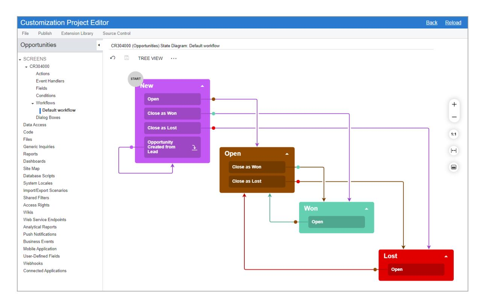

#### *Figure: The Workflow (Diagram View) page*

For a particular workflow, the tree view and diagram view of this page have the same page name.

### **Diagram View: To Add a New State**

The following activity will walk you through the process of adding a new state to an inherited workflow on the *Workflow [\(Diagram](https://help-2025r1.acumatica.com/Help?ScreenId=ShowWiki&pageid=6cc999f0-df33-4db0-9f93-36329ad1de7e) View)* page of the Customization Project Editor.

#### **Story**

Suppose that in your customization efforts on the *[Opportunities](https://help-2025r1.acumatica.com/Help?ScreenId=ShowWiki&pageid=5cb49cd5-2be8-4617-9341-958f1c5d6d53)* (CR304000) form, you need to incorporate a process of assigning a new opportunity before giving it the *Open* status. You need a new status, *Assigned*, for opportunities.

Acting as the technical specialist, you need to add a new state to the opportunity workflow for the *[Opportunities](https://help-2025r1.acumatica.com/Help?ScreenId=ShowWiki&pageid=5cb49cd5-2be8-4617-9341-958f1c5d6d53)* form. This state will correspond to the *Assigned* status of an opportunity created on this form.

#### **Process Overview**

By using the *Workflow [\(Diagram](https://help-2025r1.acumatica.com/Help?ScreenId=ShowWiki&pageid=6cc999f0-df33-4db0-9f93-36329ad1de7e) View)* page, you will add the Assigned state to the *OpportunitiesAssigned* workflow.

#### **System Preparation**

Before you begin adding a new state, do the following:

1. Launch the Acumatica ERP website with the *U100* dataset preloaded, and sign in as system administrator by using the *gibbs* username and the *123* password.

The *gibbs* user is assigned the *Administrator* role, which has sufficient access rights to customize workflows.

- 2. Make sure that you have learned how to create states, as described in *[Workflow Creation: General Information](#page-7-2)* and *[Workflow Creation: Configuration of States](#page-12-1)*.
- 3. Make sure that you have completed the *Inherited [Workflows:](#page-58-1) To Create an Inherited Workflow* activity.

#### **Step: Adding a State**

To add a new state to the workflow, perform the following instructions in the Customization Project Editor for the *Opportunities* customization project:

1. In the navigation pane, click**Screens > CR304000 > Workflows > OpportunitiesAssigned**.

The CR304000 (Opportunities) State Diagram: OpportunitiesAssigned page opens.

- 2. On the page toolbar, click **Diagram View** to begin working in the diagram view of the page.
- 3. On the page toolbar, click **Add State**.
- 4. In the **Add State** dialog box, which opens, specify the following settings:
  - **Identifier**: A
  - **Description**: Assigned
  - **ParentState**: Empty
- 5. Click **OK** to close the dialog box.

A box with the new state is added to the diagram. Notice that there are no transitions between this state and the predefined states.

6. Click **Save** on the page toolbar to save your changes.

You have added a new state to the workflow.

### **Diagram View: To Add New Actions and Transitions**

The following activity will walk you through the process of adding new actions and transitions to the workflow on the *Workflow [\(Diagram](https://help-2025r1.acumatica.com/Help?ScreenId=ShowWiki&pageid=6cc999f0-df33-4db0-9f93-36329ad1de7e) View)* page.

#### **Story**

Suppose that in your customization efforts on the *[Opportunities](https://help-2025r1.acumatica.com/Help?ScreenId=ShowWiki&pageid=5cb49cd5-2be8-4617-9341-958f1c5d6d53)* form, you need to incorporate a process of assigning a new opportunity before giving it the *Open* status. A user should be able to do the following:

- Change the status from *New* to *Assigned* by clicking **Assign** on the form toolbar.
- Change the status from *Assigned* to *Open* by clicking **Accept**.
- Change the status from *Assigned* to *New* by clicking **Reject**.

Acting as the technical specialist, you need to create the actions and specify the corresponding transitions.

#### **Process Overview**

By using the *Workflow [\(Diagram](https://help-2025r1.acumatica.com/Help?ScreenId=ShowWiki&pageid=6cc999f0-df33-4db0-9f93-36329ad1de7e) View)* page, you will add a transition from the Assigned state to the Open state, and a transition from the Assigned state to the New state. You will then add a transition from the New state to the Assigned state. By using the same page, you will also create the actions that trigger these transitions.

#### **System Preparation**

Before you begin performing the steps of this activity, do the following:

1. Launch the Acumatica ERP website with the *U100* dataset preloaded, and sign in as system administrator by using the *gibbs* username and the *123* password.

The *gibbs* user is assigned the *Administrator* role, which has sufficient access rights to customize workflows.

- 2. Make sure that you have learned how to add actions and transitions, as described in *[Action Configuration:](#page-24-2) [General Information](#page-24-2)* and *Conditions and [Transitions:](#page-40-2) General Information*.
- 3. Make sure that you have completed the *[Diagram](#page-62-1) View: To Add a New State* activity.

#### **Step 1: Adding a Transition from the Assigned State to the Open State**

In the Customization Project Editor for the *Opportunities* customization project, perform the following instructions:

1. In the navigation pane, click**Screens > CR304000 > Workflows > OpportunitiesAssigned**.

The CR304000 (Opportunities) State Diagram: OpportunitiesAssigned page opens.

- 2. On the page toolbar, click **Diagram View** to switch to the diagram view of the workflow.
- 3. In the box with the Assigned state, click and hold the plus button, and draw a line from the box with the Assigned state to the box with the Open state.
- 4. In the **Add Transition** dialog box, which opens, click **Create** to the right of the**Trigger Name** box to add a new action.
- 5. In the **New Action** dialog box, which opens, specify the following settings:
  - **Action Name**: Accept
  - **Display Name**: Accept
  - **Category**: *Actions*
    - This setting indicates that the action will be displayed under the **Actions** category of the More menu.
- 6. Click **OK** to close the dialog box.
- 7. In the **TargetState** box of the **Add Transition** dialog box, make sure *Open* is selected, and click **OK** to close the dialog box.

Notice that a label with the Accept action name has appeared in the box with the Assigned state. Also, an arrow that represents the transition from the Assigned state to the Open state has appeared in the diagram.

8. Save your changes.

#### **Step 2: Adding a Transition from the Assigned State to the New State**

To add a transition from the Assigned state to the New state, while you are still working with the diagram view of the CR304000 (Opportunities) State Diagram: OpportunitiesAssigned page, perform the following instructions:

- 1. In the box with the Assigned state, click and hold the plus button, and draw a line from the box with the Assigned state to the box with the New state.
- 2. In the **Add Transition** dialog box, which opens, click **Create** to add a new action.
- 3. In the **New Action** dialog box, which opens, specify the following settings:
  - **Action Name**: Reject

- **Display Name**: Reject
- **Category**: *Actions*
- 4. Click **OK** to close the dialog box.
- 5. In the **TargetState** box of the **Add Transition** dialog box, make sure *New* is selected.
- 6. Click **OK** to close the dialog box.
- 7. Save your changes.

Notice that the new transition and action have appeared in the diagram.

#### **Step 3: Adding a Transition from the New State to the Assigned State**

To add a transition from the New state to the Assigned state, while you are still in the diagram view of the CR304000 (Opportunities) State Diagram: OpportunitiesAssigned page, perform the following instructions:

- 1. In the box with the New state, click and hold the plus button, and draw a line from the box with the New state to the box with the Assigned state.
- 2. In the **Add Transition** dialog box, which opens, click **Create** to add a new action.
- 3. In the **New Action** dialog box, which opens, specify the following settings:
  - **Action Name**: Assign
  - **Display Name**: Assign
  - **Category**: *Actions*
- 4. Click **OK** to close the dialog box.
- 5. In the **TargetState** box of the **Add Transition** dialog box, make sure *Assigned* is selected.
- 6. Click **OK** to close the dialog box.
- 7. Save your changes.

Notice that the new transition and action have appeared in the diagram.

### **Diagram View: To Add the Auto-Run Action**

The following activity will walk you through the process of creating an auto-run action (that is, an action that the system performs automatically when a particular condition is met).

#### **Story**

If the **Owner** box on the *[Opportunities](https://help-2025r1.acumatica.com/Help?ScreenId=ShowWiki&pageid=5cb49cd5-2be8-4617-9341-958f1c5d6d53)* (CR304000) form is filled and the opportunity has the *New* status, the status of the opportunity should be automatically changed to *Assigned*. Acting as the technical specialist, you need to add another transition from the New state to the Assigned state for the workflow used by the form. The transition should be triggered automatically if the **Owner** box is not empty.

#### **Process Overview**

By using the *[Conditions](https://help-2025r1.acumatica.com/Help?ScreenId=ShowWiki&pageid=0e3371f4-6aaf-461b-b52d-3a8cb423a2f9)* page, you will create a condition that checks the **Owner** box. By using the *[Workflow](https://help-2025r1.acumatica.com/Help?ScreenId=ShowWiki&pageid=6cc999f0-df33-4db0-9f93-36329ad1de7e) [\(Diagram](https://help-2025r1.acumatica.com/Help?ScreenId=ShowWiki&pageid=6cc999f0-df33-4db0-9f93-36329ad1de7e) View)* page, you will add a new transition from the New state to the Assigned state and create a hidden action that triggers the transition.

#### **System Preparation**

Before you begin performing the steps of this activity, do the following:

1. Launch the Acumatica ERP website with the *U100* dataset preloaded, and sign in as system administrator by using the *gibbs* username and the *123* password.

The *gibbs* user is assigned the *Administrator* role, which has sufficient access rights to customize workflows.

- 2. Make sure that you have learned how to add actions, as described in *[Action Configuration: General](#page-24-2) [Information](#page-24-2)*.
- 3. Make sure that you have completed the *Diagram View: To Add New Actions and [Transitions](#page-63-1)* activity.

#### **Step 1: Creating a Condition**

In this step, you will add a condition that checks the **Owner** box. In the Customization Project Editor for the *Opportunities* customization project, perform the following instructions:

- 1. In the navigation pane, click**Screens > CR304000 > Conditions**. The Conditions: CR304000 (Opportunities) page opens.
- 2. On the page toolbar, click **Add New Record**.
- 3. In the **Condition Properties** dialog box, which opens, enter OwnerSpecified as the **Condition Name**.
- 4. On the table toolbar, click **Add Row**, and specify the following settings in the added row:
  - **Field Name**: *Owner*
  - **Condition**: *Is Not Empty*
- 5. Click **OK** to save your changes and close the dialog box.

The added condition appears in the table with the conditions on the page.

#### **Step 2: Adding a New Transition Between States**

To add a transition, in the Customization Project Editor for the *Opportunities* customization project, perform the following instructions:

1. In the navigation pane, click**Screens > CR304000 > Workflows > OpportunitiesAssigned**.

The CR304000 (Opportunities) State Diagram: OpportunitiesAssigned page opens.

- 2. On the page toolbar, click **Diagram View** to switch to the diagram view of the workflow.
- 3. In the diagram, in the box with the New state, click and hold the plus button, and draw a line from the box with the New state to the box with the Assigned state.
- 4. In the **Add Transition** dialog box, which opens, click **Create** to add a new action.
- 5. In the **New Action** dialog box, which opens, specify the following settings:
  - **Action Name**: AutoAssign
  - **Display Name**: Auto-Assign
- 6. Click **OK** to close the dialog box.
- 7. In the **TargetState** box of the **Add Transition** dialog box, make sure *Assigned* is selected.
- 8. Click **OK** to close the dialog box.
- 9. Save your changes.

#### **Step 3: Modifying the Created Action**

To make the created Auto-Assign action hidden on the *[Opportunities](https://help-2025r1.acumatica.com/Help?ScreenId=ShowWiki&pageid=5cb49cd5-2be8-4617-9341-958f1c5d6d53)* (CR304000) form of Acumatica ERP and performed automatically when the **Owner** box of the form is filled in, perform the following instructions:

- 1. While you are still working with the diagram view of the CR304000 (Opportunities) State Diagram: OpportunitiesAssigned page, click the More button in the box with the *New* state, and click **EditState** on the context menu.
- 2. On the **Actions** tab of the**State** dialog box, which opens, find the row with the AutoAssign action. In the **Auto-Run Condition** column, select *OwnerSpecified*.
- 3. Click **OK** to close the dialog box.
- 4. Save your changes to the workflow.
- 5. In the navigation pane of the Customization Project Editor, click**Screens > CR304000 > Actions**.

The CR304000 (Opportunities) Actions page opens.

- 6. In the table, click the *AutoAssign* link.
- 7. In the **Hidden** box of the **Action Properties** dialog box, which opens, select *True*.
- 8. Click **OK** to save your changes and close the dialog box.

Aer you have performed these instructions and returned to the diagram view of the workflow, the diagram should look similar to the one in the following diagram. (The results may look slightly different on different devices.)

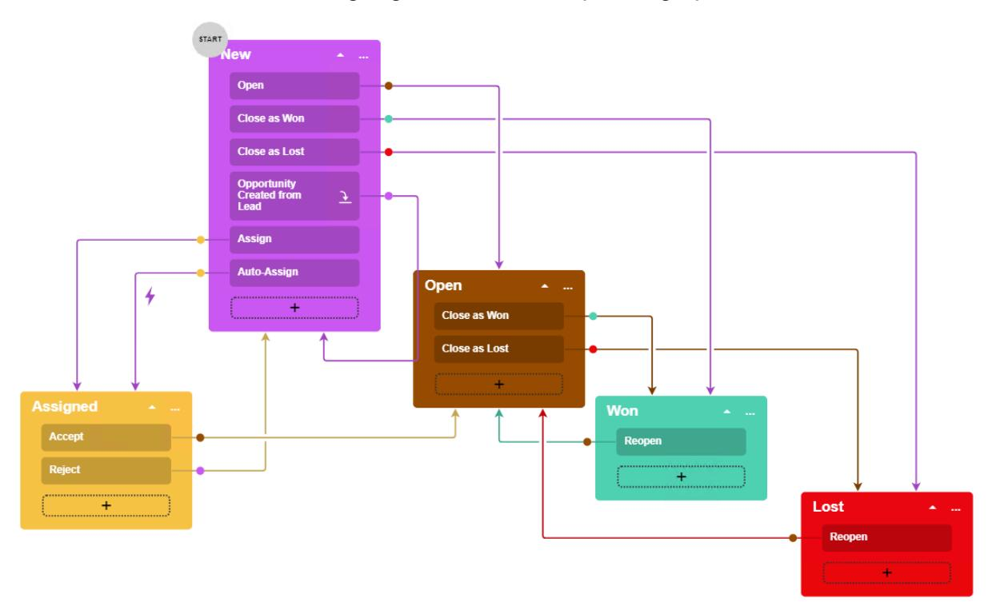

*Figure: The workflow diagram with the added state and transitions*

# **Diagram View: To Specify Combo Box Values for States**

The following activity will walk you through the process of modifying the list of combo box values that are available for particular states of the workflow. (Users will be able to select these values in certain boxes on the form when an opportunity has a particular status.) You will use the *Workflow [\(Diagram](https://help-2025r1.acumatica.com/Help?ScreenId=ShowWiki&pageid=6cc999f0-df33-4db0-9f93-36329ad1de7e) View)* page to modify the workflow.

#### **Story**

Acting as the technical specialist, you need to add to the workflow of the *[Opportunities](https://help-2025r1.acumatica.com/Help?ScreenId=ShowWiki&pageid=5cb49cd5-2be8-4617-9341-958f1c5d6d53)* (CR304000) form a new field for the **Reason** box and add new combo box values for this field.

#### **Process Overview**

By using the *[Fields](https://help-2025r1.acumatica.com/Help?ScreenId=ShowWiki&pageid=762d7751-bf75-4713-9525-4305808df02c)* page, you will add to your customization project the Resolution field, which corresponds to the **Reason** box of the *[Opportunities](https://help-2025r1.acumatica.com/Help?ScreenId=ShowWiki&pageid=5cb49cd5-2be8-4617-9341-958f1c5d6d53)* (CR304000) form. You will also add new combo box values for this box on the same page, and specify these values for the Open and New states on the *Workflow [\(Diagram](https://help-2025r1.acumatica.com/Help?ScreenId=ShowWiki&pageid=6cc999f0-df33-4db0-9f93-36329ad1de7e) View)* page.

#### **System Preparation**

Before you begin performing the steps of this activity, do the following:

1. Launch the Acumatica ERP website with the *U100* dataset preloaded, and sign in as system administrator by using the *gibbs* username and the *123* password.

The *gibbs* user is assigned the *Administrator* role, which has sufficient access rights to customize workflows.

- 2. Make sure that you have learned how to configure fields, as described in *[Workflow Elements: General](#page-16-2) [Information](#page-16-2)*.
- 3. Make sure that you have completed the *Diagram View: To Add the [Auto-Run](#page-65-1) Action* activity.

#### **Step 1: Adding a New Field**

To add the Resolution field, which corresponds to the **Reason** box of the *[Opportunities](https://help-2025r1.acumatica.com/Help?ScreenId=ShowWiki&pageid=5cb49cd5-2be8-4617-9341-958f1c5d6d53)* (CR304000) form, do the following in the Customization Project Editor for the *Opportunities* customization project:

1. In the navigation pane, click**Screens > CR304000 > Fields**.

The CR304000 (Opportunities) Fields page opens.

2. On the page, notice that the table contains the Status field.

The system added this field automatically when you created the Assigned state in *[Diagram](#page-62-1) View: To Add a [New State](#page-62-1)*.

- 3. On the page toolbar, click **Add New Record**.
- 4. In the **Add Field** dialog box, which is opened, specify the following settings:
  - a. **Container**: *Opportunity (Opportunity Summary)*
  - b. **DAC**: *PX.Objects.CR.CROpportunity (Opportunity)* (specified automatically)
  - c. **Field Name**: *Reason*
- 5. Select the unlabeled check box in the added row.
- 6. Click **Add & Close** to save your changes and close the dialog box.

The added field appears in the table on the CR304000 (Opportunities) Fields page.

7. Save your changes.

#### **Step 2: Adding Combo Box Values**

While you are still on the CR304000 (Opportunities) Fields page, add new combo box values for the added field as follows:

- 1. In the table, click the row with the added Resolution field.
- 2. On the page toolbar, click **Combo BoxValues**.
- 3. In the **Combo BoxValues** dialog box, which opens, click **Add Row** on the table toolbar, and enter the following settings in the added row:
  - **Value**: SV
  - **Description**: Service
- 4. Click **Add Row** on the table toolbar again, and enter the following settings in the added row:
  - **Value**: DD
  - **Description**: Delivery Date
- 5. Make sure the **Active** check box is selected in both of the rows you have added.
- 6. Click **OK** to close the dialog box.
- 7. Save your changes.

#### **Step 3: Specifying the Combo Box Values for the Open State**

Add the new combo box values to the Open state as follows:

1. In the navigation pane of the Customization Project Editor, click**Screens > CR304000 > Workflows > OpportunitiesAssigned**.

The CR304000 (Opportunities) State Diagram: OpportunitiesAssigned page opens.

- 2. On the page toolbar, click **Diagram View** to switch to the diagram view of the workflow.
- 3. In the diagram, double-click the Open state.
- 4. On the **Fields** tab of the**State** dialog box, which opens, click the row with the *Reason* field name.
- 5. On the table toolbar, click **Combo BoxValues**.
- 6. Select the **Active** check box in the row with the *SV* value, and click **OK** to close the dialog box.
- 7. Click **OK** in the **State** dialog box.
- 8. Save your changes.

#### **Step 4: Specifying the Combo Box Values for the New State**

While you are still in the diagram view of the CR304000 (Opportunities) State Diagram: OpportunitiesAssigned page, add the new combo box values to the New state as follows:

- 1. In the diagram, double-click the New state.
- 2. On the **Fields** tab of the**State** dialog box, which opens, click the row with the Reason field name.
- 3. On the table toolbar, click **Combo BoxValues**.
- 4. Select the **Active** check box in the row with the *DD* value, and click **OK** to close the dialog box.
- 5. Click **OK** in the **State** dialog box.

6. Save your changes.

## **Diagram View: To Add Dialog Boxes**

The following activity will walk you through the process of adding dialog boxes for the workflow. No matter whether you are editing a workflow on the *Workflow [\(Diagram](https://help-2025r1.acumatica.com/Help?ScreenId=ShowWiki&pageid=6cc999f0-df33-4db0-9f93-36329ad1de7e) View)* page or the *[Workflow](https://help-2025r1.acumatica.com/Help?ScreenId=ShowWiki&pageid=8a944b6b-0e47-47c9-a6a7-1b266d8feba0) (Tree View)* page, you add the dialog boxes on the *[Dialog Boxes](https://help-2025r1.acumatica.com/Help?ScreenId=ShowWiki&pageid=d7b23e81-67e9-45ae-b162-b196a00b9160)* page.

#### **Story**

In the HardwareViewpoint company, a salesperson should add additional information when they perform the following actions with an opportunity on the *[Opportunities](https://help-2025r1.acumatica.com/Help?ScreenId=ShowWiki&pageid=5cb49cd5-2be8-4617-9341-958f1c5d6d53)* (CR304000) form of Acumatica ERP:

- While accepting the opportunity, specify the reason and the stage of the opportunity
- While rejecting the opportunity, select the reason and provide additional details for it
- While assigning the opportunity, select the owner of the opportunity

Acting as the technical specialist, you need to add dialog boxes that prompt users for this information when they click the corresponding commands or buttons to invoke the Accept, Reject, and Assign actions.

#### **Process Overview**

By using the *[Dialog Boxes](https://help-2025r1.acumatica.com/Help?ScreenId=ShowWiki&pageid=d7b23e81-67e9-45ae-b162-b196a00b9160)* page, you will create the dialog box for the Accept action of the *OpportunitiesAssigned* workflow. As self-guided exercises, you will also create the dialog boxes for the Reject and Assign actions of the workflow.

#### **System Preparation**

Before you begin adding a new state, do the following:

1. Launch the Acumatica ERP website with the *U100* dataset preloaded, and sign in as system administrator by using the *gibbs* username and the *123* password.

The *gibbs* user is assigned the *Administrator* role, which has sufficient access rights to customize workflows.

- 2. Make sure you have learned how to add dialog boxes, as described in *[Workflow Elements: General](#page-16-2) [Information](#page-16-2)*.
- 3. Make sure you have completed the *[Diagram](#page-68-1) View: To Specify Combo Box Values for States* activity.

#### **Step 1: Creating a Dialog Box for the Accept Action**

In this step, you will create a dialog box that will be displayed when a user clicks the **Accept** button or the corresponding command on the *[Opportunities](https://help-2025r1.acumatica.com/Help?ScreenId=ShowWiki&pageid=5cb49cd5-2be8-4617-9341-958f1c5d6d53)* (CR304000) form. Do the following in the Customization Project Editor for the *Opportunities* customization project:

- 1. In the navigation pane, click**Screens > CR304000 > Dialog Boxes**.
- 2. On the **Dialog Boxes** pane of the CR304000 (Opportunities) Dialog Boxes page, which opens, click the plus button. The system opens a dialog box, **New Dialog Box**, so that you can specify the name of the dialog box.
- 3. In the **Dialog Box Name** box of the dialog box, type FormAccept, and click **OK**.
- 4. On the **Dialog Boxes** pane, click the name of the added dialog box.

- 5. In the **Title** box on the right pane, enter Details.
- 6. Save your changes.

#### **Step 2: Adding Fields to the Dialog Box for the Accept Action**

In this step, you will add the **Reason** and **Stage** boxes to the dialog box for the Accept action. While you are still on the CR304000 (Opportunities) Dialog Boxes page with the *FormAccept* dialog box selected, do the following:

- 1. In the **Dialog Box Fields** table, click **Add Row** on the table toolbar, and specify the following settings in the added row:
  - **Schema Field**: *PX.Objects.CR.CROpportunity.Resolution* This is the name of the field that corresponds to the **Reason** box on the *[Opportunities](https://help-2025r1.acumatica.com/Help?ScreenId=ShowWiki&pageid=5cb49cd5-2be8-4617-9341-958f1c5d6d53)* (CR304000) form.
  - **Field Name**: Reason
  - **Title**: *Reason* (specified automatically)
  - **From Schema**: Selected
  - **DefaultValue**: *In Process*
  - **Required**: *True*
  - **Column Span**: 1
- 2. Save your changes.
- 3. Specify the combo box values for the field as follows:
  - a. On the table toolbar, click **Combo BoxValues**.
  - b. In the **Combo BoxValues** dialog box, which opens, select *Specify Explicitly* in the **Source ofValues** box.
  - c. In the table, which appears in the dialog box, select the check boxes in the **Active** column for the *IP* (*In Process*) and *SV* (*Service*) values.
  - d. Click **OK** to close the dialog box.
  - e. Save your changes.
- 4. In the **Dialog Box Fields** table, click **Add Row** on the table toolbar again, and specify the following settings in the added row:
  - **Schema Field**: *PX.Objects.CR.CROpportunity.StageID*

This is the name of the field that will correspond to the**Stage** box in the UI.

- **Field Name**: Stage
- **Title**: *Stage* (specified automatically)
- **From Schema**: Cleared
- **DefaultValue**: Cleared
- **Required**: Cleared
- **Column Span**: 1
- 5. Save your changes.
- 6. On the page toolbar, click **Preview Dialog Box**.

The dialog box should look as shown in the following screenshot.

| <b>Details</b> |            |    |        |
|----------------|------------|----|--------|
| * Reason:      | In Process |    | ٠      |
| Stage:         |            |    | ÷      |
|                |            |    |        |
|                |            | OK | CANCEL |

*Figure: The Details dialog box for the Accept action*

#### **Step 3: Creating a Dialog Box for the Reject Action—Self-Guided Exercise**

In this self-guided exercise, you will add a dialog box for the Reject action with the FormReject name and the Details title.

You need to add to the dialog box the following fields:

• *Reason*

The field has the following settings in the **Dialog Box Fields** table:

- **Schema Field**: *PX.Objects.CR.CROpportunity.Resolution*
- **Field Name**: Reason
- **Title**: *Reason* (specified automatically)
- **From Schema**: Selected
- **DefaultValue**: Cleared
- **Required**: *True*
- **Column Span**: 1

The following combo box values should be available for the field: *PR* (*Price*) and *DD* (*Delivery Date*).

• *Details*

The field has the following settings in the **Dialog Box Fields** table:

- **Schema Field**: *PX.Objects.CR.CROpportunity.Details*
- **Field Name**: Details
- **Title**: *Details* (specified automatically)
- **From Schema**: Cleared
- **DefaultValue**: Cleared
- **Required**: Cleared
- **Column Span**: 1

The dialog box should look as shown in the following screenshot.

| <b>Details</b>        |    |        |
|-----------------------|----|--------|
| * Reason: Details: |    | ÷      |
|                       | OK | CANCEL |

*Figure: The Details dialog box for the Reject action*

#### **Step 4: Creating a Dialog Box for the Assign Action—Self-Guided Exercise**

In this self-guided exercise, you will add a dialog box for the Assign action with the FormAssign name and the Details title.

You need to add to the dialog box the Owner field of the PX.Objects.CR.CROpportunity.OwnerID schema field, which is required in the dialog box. That is, when a user clicks the button or command corresponding to the Assign action, the user will need to select the owner of the opportunity in this dialog box.

The dialog box should look as shown in the following screenshot.

| <b>Details</b> |     |        |
|----------------|-----|--------|
| * Owner:       |     |        |
|                | OK. | CANCEL |

*Figure: The Details dialog box for the Assign action*

### **Diagram View: To Modify the Added Actions**

The following activity will walk you through the process of modifying the actions so that these actions display dialog boxes, modify field values, and be available on the processing forms.

#### **Story**

In the HardwareViewpoint company, a salesperson should add additional information when performs the following actions with an opportunity on the *[Opportunities](https://help-2025r1.acumatica.com/Help?ScreenId=ShowWiki&pageid=5cb49cd5-2be8-4617-9341-958f1c5d6d53)* (CR304000) form of Acumatica ERP:

- While accepting the opportunity, specify the reason and the stage of the opportunity
- While rejecting the opportunity, select the reason and provide additional details for it
- While assigning the opportunity, select the owner of the opportunity

Acting as the technical specialist, you need to add the dialog boxes that prompt users for this information to the Accept, Reject, and Assign actions and modify the actions so that they use the information specified in the dialog boxes. You also need to display the actions on the *[Update Opportunities](https://help-2025r1.acumatica.com/Help?ScreenId=ShowWiki&pageid=9985441b-6827-478b-bd38-839a95dadea4)* (CR503120) form for mass-processing of opportunities. You need to make the buttons that correspond to the Assign and Accept actions be displayed on the form toolbar.

#### **Process Overview**

In the *Workflow [\(Diagram](https://help-2025r1.acumatica.com/Help?ScreenId=ShowWiki&pageid=6cc999f0-df33-4db0-9f93-36329ad1de7e) View)* page, you will make the button that corresponds to Assign action be displayed on the page toolbar. On the *[Actions](https://help-2025r1.acumatica.com/Help?ScreenId=ShowWiki&pageid=4f289a88-5e75-49c1-b8bd-4e80de017ed3)* page, for each of the Reject, Accept, and Assign actions, you will add a dialog box. You will also add the action to the list of actions available for mass-processing of opportunities. You will then define how the action should use the values specified in the dialog box.

#### **System Preparation**

Before you begin performing the steps of this activity, do the following:

1. Launch the Acumatica ERP website with the *U100* dataset preloaded, and sign in as system administrator by using the *gibbs* username and the *123* password.

The *gibbs* user is assigned the *Administrator* role, which has sufficient access rights to customize workflows.

2. Make sure that you have learned how to add actions, as described in *[Action Configuration: General](#page-24-2) [Information](#page-24-2)*.

3. Make sure that you have completed the *[Diagram](#page-70-1) View: To Add Dialog Boxes* activity.

#### **Step 1: Making the Buttons Displayed on the Form Toolbar**

You will now modify the Assign and Accept actions so that the associated buttons appear on the form toolbar of the *[Opportunities](https://help-2025r1.acumatica.com/Help?ScreenId=ShowWiki&pageid=5cb49cd5-2be8-4617-9341-958f1c5d6d53)* (CR304000) form. In the Customization Project Editor for the *Opportunities* customization project, perform the following instructions:

1. In the navigation pane, click**Screens > CR304000 > Workflows > OpportunitiesAssigned**.

The CR304000 (Opportunities) State Diagram: OpportunitiesAssigned page opens.

- 2. On the page toolbar, click **Diagram View** to switch to the diagram view of the workflow.
- 3. Modify the Assign action as follows:
  - a. In the diagram, click the More button in the box with the New state, and click **EditState** on the More menu.
  - b. On the **Actions** tab of the**State** dialog box, which opens, in the row with the Assign action, select the check box in the **Duplicate on Toolbar** column.

This will make the button associated with the Assign action be displayed on the form toolbar of the *[Opportunities](https://help-2025r1.acumatica.com/Help?ScreenId=ShowWiki&pageid=5cb49cd5-2be8-4617-9341-958f1c5d6d53)* (CR304000) form when an opportunity has the New status.

- c. Click **OK** to close the dialog box.
- 4. Modify the Accept action as follows:
  - a. In the diagram, double-click the Assigned state.
  - b. On the **Actions** tab of the**State** dialog box, which opens, in the row with the Accept action, select the check box in the **Duplicate on Toolbar** column.

This will make the button associated with the Accept action be displayed on the form toolbar of the *[Opportunities](https://help-2025r1.acumatica.com/Help?ScreenId=ShowWiki&pageid=5cb49cd5-2be8-4617-9341-958f1c5d6d53)* (CR304000) form when an opportunity has the *Assigned* status.

- c. Click **OK** to close the dialog box.
- 5. Save your changes.

#### **Step 2: Making the Reject Action Work with the Dialog Box**

Now you will add the dialog box to the Reject action. You will also add the action to the list of actions available on the *[Update Opportunities](https://help-2025r1.acumatica.com/Help?ScreenId=ShowWiki&pageid=9985441b-6827-478b-bd38-839a95dadea4)* (CR503120) form for mass-processing of opportunities. You will then define how the action should use the values specified in the dialog box.

In the Customization Project Editor for the *Opportunities* customization project, do the following:

- 1. In the navigation pane, click**Screens > CR304000 > Actions**.
- 2. In the table on the CR304000 (Opportunities) Actions page, which opens, click the *Reject* link.
- 3. In the **Action Properties** dialog box, which opens, select *Details(FormReject)* as the **Dialog Box**.
- 4. In the **ProcessingScreen** box, select *CR503120 - Update Opportunities*.
- 5. On the **Field Update** tab, click **Add Row** on the table toolbar, and specify the following settings in the added row:
  - **Field**: *Reason*
  - **From Schema**: Cleared
  - **New Value**: *[FormReject.Reason]*
- 6. Click **Add Row** on the table toolbar again, and specify the following settings in the added row:
  - **Field**: *Details*

- **From Schema**: Cleared
- **New Value**: *[FormReject.Details]*
- 7. Click **Add Row** on the table toolbar again, and specify the following settings in the added row:
  - **Field**: *Owner*
  - **From Schema**: Cleared
  - **New Value**: =Null

The **New Value** setting is required to clear the **Owner** box when the status of an opportunity changes to *New*.

8. Click **OK** to save your changes and close the dialog box.

#### **Step 3: Making the Accept Action Work with the Dialog Box—Self-Guided Exercise**

In this self-guided exercise, by using the CR304000 (Opportunities) Actions page, you will add the dialog box to the Accept action. You will also add the action to the list of actions available on the *[Update Opportunities](https://help-2025r1.acumatica.com/Help?ScreenId=ShowWiki&pageid=9985441b-6827-478b-bd38-839a95dadea4)* (CR503120) form for mass-processing of opportunities and define how the action should use the values specified in the dialog box.

For the Accept action, you need to specify the following settings in the **Action Properties** dialog box:

- **Dialog Box**: *Details(FormAccept)*
- **ProcessingScreen**: *CR503120 - Update Opportunities*.
- On the **Field Update** tab, Row 1:
  - **Field**: *Reason*
  - **From Schema**: Cleared
  - **New Value**: *[FormAccept.Reason]*
- On the **Field Update** tab, Row 2:
  - **Field**: *Stage*
  - **From Schema**: Cleared
  - **New Value**: *[FormAccept.Stage]*

#### **Step 4: Making the Assign Action Work with the Dialog Box—Self-Guided Exercise**

In this self-guided exercise, by using the CR304000 (Opportunities) Actions page, you will add the dialog box to the Assign action. You will also add the action to the list of actions available on the *[Update Opportunities](https://help-2025r1.acumatica.com/Help?ScreenId=ShowWiki&pageid=9985441b-6827-478b-bd38-839a95dadea4)* (CR503120) form for mass-processing of opportunities and define how the action should use the values specified in the dialog box.

For the Assign action, you need to specify the following settings in the **Action Properties** dialog box:

- **Dialog Box**: *Details(FormAssign)*
- **ProcessingScreen**: *CR503120 - Update Opportunities*.
- A row on the **Field Update** tab:
  - **Field**: *Owner*
  - **From Schema**: Cleared
  - **New Value**: *[FormAssign.Owner]*

# **Diagram View: To Remove Unneeded Parts of the Workflow**

The following activity will walk you through the process of removing unneeded elements of the workflow on the *Workflow [\(Diagram](https://help-2025r1.acumatica.com/Help?ScreenId=ShowWiki&pageid=6cc999f0-df33-4db0-9f93-36329ad1de7e) View)* page.

#### **Story**

Acting as the technical specialist, you need to remove the transition and the action that are not required in the workflow of the *[Opportunities](https://help-2025r1.acumatica.com/Help?ScreenId=ShowWiki&pageid=5cb49cd5-2be8-4617-9341-958f1c5d6d53)* (CR304000) form anymore.

#### **Process Overview**

On the *Workflow [\(Diagram](https://help-2025r1.acumatica.com/Help?ScreenId=ShowWiki&pageid=6cc999f0-df33-4db0-9f93-36329ad1de7e) View)* page, you will remove the predefined direct transition from the New state to the Open state, because it is no longer required. (In the modified workflow, this transition will not be used.) You will also remove the Open action, which triggers this transition, from the New state.

#### **System Preparation**

Before you begin adding a new state, do the following:

1. Launch the Acumatica ERP website with the *U100* dataset preloaded, and sign in as system administrator by using the *gibbs* username and the *123* password.

The *gibbs* user is assigned the *Administrator* role, which has sufficient access rights to customize workflows.

2. Make sure that you have completed the *[Diagram](#page-73-1) View: To Modify the Added Actions* activity.

#### **Step 1: Removing a Transition**

In this step, you will remove the transition from the New state to the Open state. In the Customization Project Editor for the *Opportunities* customization project, perform the following instructions:

1. In the navigation pane, click**Screens > CR304000 > Workflows > OpportunitiesAssigned**.

The CR304000 (Opportunities) State Diagram: OpportunitiesAssigned page opens.

- 2. On the page toolbar, click **Diagram View** to switch to the diagram view of the workflow.
- 3. In the diagram, click the transition from the New state to the Open state.
- 4. In the context menu that opens, click **Delete**.
- 5. In the dialog box that opens, confirm the action by clicking **Delete**.
- 6. Save your changes.

Notice that the box with the New state no longer contains the Open action. The action itself is not removed from the state; you should remove it manually.

#### **Step 2: Removing an Action**

To remove the Open action from the New state, while you are still in the diagram view of the CR304000 (Opportunities) State Diagram: OpportunitiesAssigned page, perform the following instructions:

1. In the diagram, click the More button in the box with the New state, and click **EditState** on the More menu.

2. On the **Actions** tab of the**State** dialog box, which opens, clear the check box in the **Active** column in the row with the Open action.

You cannot delete the Open action because it is a system action; therefore, you need to deactivate it.

- 3. Click **OK** to close the dialog box.
- 4. Save your changes.

# **Diagram View: To Adjust the System State**

The following activity will walk you through the process of adjusting a system state on the *Workflow [\(Diagram](https://help-2025r1.acumatica.com/Help?ScreenId=ShowWiki&pageid=6cc999f0-df33-4db0-9f93-36329ad1de7e) View)* page. In this activity, you will make one of the fields that is displayed in the system state required.

#### **Story**

Acting as the technical specialist, you need to make the **Owner** box required for the opportunities with the *Open* status on the *[Opportunities](https://help-2025r1.acumatica.com/Help?ScreenId=ShowWiki&pageid=5cb49cd5-2be8-4617-9341-958f1c5d6d53)* (CR304000) form.

#### **Process Overview**

On the *Workflow [\(Diagram](https://help-2025r1.acumatica.com/Help?ScreenId=ShowWiki&pageid=6cc999f0-df33-4db0-9f93-36329ad1de7e) View)* page, you will update the Open state (which is a predefined state) to make the **Owner** box required on the *[Opportunities](https://help-2025r1.acumatica.com/Help?ScreenId=ShowWiki&pageid=5cb49cd5-2be8-4617-9341-958f1c5d6d53)* (CR304000) form.

#### **System Preparation**

Before you begin performing this activity, do the following:

1. Launch the Acumatica ERP website with the *U100* dataset preloaded, and sign in as system administrator by using the *gibbs* username and the *123* password.

The *gibbs* user is assigned the *Administrator* role, which has sufficient access rights to customize workflows.

2. Make sure that you have completed the *Diagram View: To Remove [Unneeded](#page-76-1) Parts of the Workflow* activity.

#### **Step: Updating the System State**

To update the predefined Open system state, in the Customization Project Editor for the *Opportunities* customization project, perform the following instructions:

1. In the navigation pane of the Customization Project Editor, click**Screens > CR304000 > Workflows > OpportunitiesAssigned**.

The CR304000 (Opportunities) State Diagram: OpportunitiesAssigned page opens.

- 2. On the page toolbar, click **Diagram View** to switch to the diagram view of the workflow.
- 3. In the diagram, click the More button in the box with the Open state, and click **EditState** on the More menu.
- 4. On the **Fields** tab of the**State** dialog box, which opens, click **Add Row** on the table toolbar, and specify the following settings in the added row:
  - **Object Name**: *Opportunity* (specified automatically)
  - **Field Name**: *Owner*

- **Required**: Selected
- 5. Click **OK** to close the dialog box.
- 6. Save your changes.

# **Diagram View: To Test the Inherited Workflow**

The following activity will walk you through the process of testing the customized workflow that you have created for the *[Opportunities](https://help-2025r1.acumatica.com/Help?ScreenId=ShowWiki&pageid=5cb49cd5-2be8-4617-9341-958f1c5d6d53)* (CR304000) form.

#### **Story**

Acting as the technical specialist, you need to publish your customization project and then test your changes on the *[Opportunities](https://help-2025r1.acumatica.com/Help?ScreenId=ShowWiki&pageid=5cb49cd5-2be8-4617-9341-958f1c5d6d53)* (CR304000) form to make sure that the customized workflow works as expected.

#### **Process Overview**

By starting on the *[Customization Projects](https://help-2025r1.acumatica.com/Help?ScreenId=ShowWiki&pageid=4d3a1166-826c-414b-a207-3d1669fbf9e5)* (SM204505) form of Acumatica ERP, you will go to the Customization Project Editor for your customization project and publish it. On the *[Opportunities](https://help-2025r1.acumatica.com/Help?ScreenId=ShowWiki&pageid=5cb49cd5-2be8-4617-9341-958f1c5d6d53)* (CR304000) form, you will then test the customized workflow.

#### **System Preparation**

Before you begin performing the steps of this activity, do the following:

1. Launch the Acumatica ERP website with the *U100* dataset preloaded, and sign in as system administrator by using the *gibbs* username and the *123* password.

The *gibbs* user is assigned the *Administrator* role, which has sufficient access rights to customize workflows.

- 2. Make sure that you have learned how to test a customization, as described in *Testing of the [Customization](#page-51-3) [Project: General Information](#page-51-3)*.
- 3. Make sure that you have completed the *[Diagram](#page-77-1) View: To Adjust the System State* activity.

#### **Step 1: Publishing the Customization Project**

Publish your customization project as follows:

- 1. On the *[Customization Projects](https://help-2025r1.acumatica.com/Help?ScreenId=ShowWiki&pageid=4d3a1166-826c-414b-a207-3d1669fbf9e5)* (SM204505) form, click the *Opportunities* project name to open the customization project.
- 2. On the menu of the Customization Project Editor, click **Publish > Publish Current Project**.
- 3. Aer the system finishes updating the required data, click **Close Compilation Pane**.
- 4. Go to the *[Opportunities](https://help-2025r1.acumatica.com/Help?ScreenId=ShowWiki&pageid=5cb49cd5-2be8-4617-9341-958f1c5d6d53)* (CR304000) form, and refresh it.

For details on publishing a customization project, see *To [Publish](https://help-2025r1.acumatica.com/Help?ScreenId=ShowWiki&pageid=739ba5bb-cf0e-40ff-91ca-4f1f1723db1f) a Single Project*.

#### **Step 2: Testing the Assigned State and the Accept Action**

In Acumatica ERP, test your changes as follows:

1. Open the *[Opportunities](https://help-2025r1.acumatica.com/Help?ScreenId=ShowWiki&pageid=5cb49cd5-2be8-4617-9341-958f1c5d6d53)* (CR304000) form. If you already have the form open, refresh it.

- 2. Create an opportunity with the following settings:
  - **Business Account**: *MORNINGCAF*
  - **Description**: Training for Morning Cafe
  - **Owner**: Empty
- 3. On the form toolbar, click**Save**.
- 4. On the form toolbar, make sure that the **Assign** button is displayed, and click it.
- 5. In the **Details** dialog box, which opens, select *Kimberly Gibbs* in the **Owner** box.
- 6. Click **OK** to save your changes and close the dialog box.

Notice that the status of the opportunity has changed to *Assigned*, and that the **Owner** box now contains the name of the salesperson you have specified.

- 7. On the form toolbar, click **Accept**.
- 8. In the **Details** dialog box, which opens, select the following settings:
  - **Reason**: *In Process*
  - **Stage**: *Qualification*
- 9. Click **OK** to save your changes and close the dialog box.

Notice that the status of the opportunity has changed to *Open.*

#### **Step 3: Testing the Reject Action**

Test the Reject action as follows:

- 1. On the *[Opportunities](https://help-2025r1.acumatica.com/Help?ScreenId=ShowWiki&pageid=5cb49cd5-2be8-4617-9341-958f1c5d6d53)* (CR304000) form, create another opportunity with the following settings:
  - **Business Account**: *BISCCITY*
  - **Description**: Inquiry for berries
  - **Owner**: *Andrew Barber*
- 2. Save your changes.

Notice that the status of the opportunity has changed from *New* to *Assigned*.

- 3. On the More menu (under **Actions**), click **Reject**.
- 4. In the **Details** dialog box, which opens, specify the reason for rejection in the **Reason** box (*Delivery Date*) and any text in the **Details** box, such as Delivery has been delayed.
- 5. Click **OK** to save your changes and close the dialog box.

Notice that the status of the opportunity has changed to *New*, and the **Owner** box has become empty again.

# **Using Composite States**

In this chapter, you will learn how to use composite states in a workflow. A composite state contains an ordered sequence of nested states and transitions to and from these states. With these states, common settings for the nested states are specified in the composite state that includes these states. These settings may include actions, fields to be updated, and transitions.

# **Composite States: General Information**

This topic provides information about composite states in workflows in Acumatica ERP.

#### **Learning Objectives**

In this chapter, you will learn what a composite state is and how to modify it in an inherited workflow.

#### **Applicable Scenarios**

You use composite states if you want to specify common settings for a group of states in your workflow.

#### **Composite States in Workflows**

A composite state of a workflow, which can also be referred to as a *parent workflow state*, is a workflow state that contains an ordered sequence of nested workflow states and the transitions to and from these states. With composite workflow states, you can specify common settings (actions, fields to be updated, and transitions) for a group of workflow states only once—in the composite state that includes these workflow states.

For each of the workflow states inside the composite state, you can do the following:

- Specify whether this workflow state should be skipped by using a skip condition
- Specify a transition to the next workflow state inside the composite state instead of a transition to a specific workflow state
- Specify a transition to the workflow state that is the next one aer the composite state if this composite state is itself a nested workflow state in another composite state
- Override the settings inherited from the composite state, if needed

These capabilities make workflow customization much easier. You do not need to explicitly specify target workflow states for transitions. Thus, if you add or remove states in the workflow or change the order of states, you do not need to modify all the affected transitions.

The workflow for a record created on a form cannot be in a composite state; it can only be in one of its nested workflow states. When the workflow for a record enters any nested state in a composite state, the system checks the skip condition specified for this workflow state, if one has been defined. If the condition is fulfilled, the system does the following for the current workflow state:

- 1. Assigns the default values for the fields as specified on the**State Properties** tab of the *[Workflow](https://help-2025r1.acumatica.com/Help?ScreenId=ShowWiki&pageid=8a944b6b-0e47-47c9-a6a7-1b266d8feba0) (Tree View)* page for the form if the current state is the initial state of the workflow
- 2. Does not check the fields that should be updated when the workflow for the record enters the state and leaves it
- 3. Does not check any of the workflow settings, and moves the workflow for the record to the next state inside the composite state

If no skip condition is specified, the system uses the configuration for this workflow state. This means that the transitions are triggered only by actions or event handlers, and the system does not check the skip condition again while the workflow for the record remains in this state.

#### **Creation of a Composite State**

To add a composite state, you first add a new or a predefined state, and then specify a parent state for it in the **Change ParentState** dialog box, which is available on the *[Workflow](https://help-2025r1.acumatica.com/Help?ScreenId=ShowWiki&pageid=8a944b6b-0e47-47c9-a6a7-1b266d8feba0) (Tree View)* page of the Customization Project Editor.

#### **Example of a Composite State**

The screenshot below shows the default workflow of the *[Invoices](https://help-2025r1.acumatica.com/Help?ScreenId=ShowWiki&pageid=0acc9738-f141-4ea0-a2be-f34ea9d1b63a)* (SO303000) form on the *[Workflow](https://help-2025r1.acumatica.com/Help?ScreenId=ShowWiki&pageid=8a944b6b-0e47-47c9-a6a7-1b266d8feba0) (Tree View)* page of the Customization Project Editor. The composite state (see Item 1 in the screenshot) contains nested states (Item 2) that are part of a typical invoice workflow, as well as transitions (Item 3) to and from the composite state and the nested states. Notice that the Balanced nested state also contains transitions (Item 4).

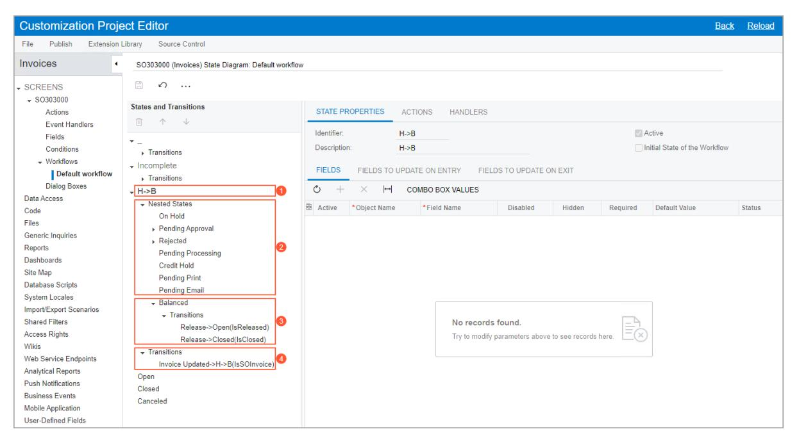

*Figure: A composite state in the invoice workflow*

For a workflow with composite states, the diagram view of the page is not available, and the **Diagram View** button is not displayed on the More menu of the *[Workflow](https://help-2025r1.acumatica.com/Help?ScreenId=ShowWiki&pageid=8a944b6b-0e47-47c9-a6a7-1b266d8feba0) (Tree View)* page.

## **Composite States: To Modify a Workflow with a Composite State**

The following activity will walk you through the process of modifying a composite state in the invoice workflow.

This activity is based on the *U100* dataset. If you are using another dataset, or if any system settings have been changed in *U100*, these changes can affect the workflow of the activity and the results of the processing. To avoid any issues, restore the *U100* dataset to its initial state.

#### **Story**

Suppose that you need to implement the following behavior on the *[Invoices](https://help-2025r1.acumatica.com/Help?ScreenId=ShowWiki&pageid=0acc9738-f141-4ea0-a2be-f34ea9d1b63a)* (SO303000) form:

- If a user specifies a discount for an invoice, you want this invoice to be reviewed and the discount to be approved before the user can proceed with processing the invoice. The invoice with the discount on review should have the *Postponed* status. Aer the discount is approved, the system specifies the business date in the **Cash Discount Date** box.
- If the user does not specify any discount, the invoice does not obtain the *Postponed* status.

On the *[Invoices](https://help-2025r1.acumatica.com/Help?ScreenId=ShowWiki&pageid=0acc9738-f141-4ea0-a2be-f34ea9d1b63a)* (SO303000) form, the default workflow includes a composite workflow state with multiple nested workflow states. To implement the described behavior, you need to add a new workflow state, Postponed, to the composite state aer the workflow state that corresponds to the *Credit Hold* status of an invoice.

You also need to specify a skip condition for the new workflow state and add a transition from this workflow state to the next state in the workflow. The skip condition will check for no cash discount being applied to the invoice.

#### **Process Overview**

By using the *[Workflows](https://help-2025r1.acumatica.com/Help?ScreenId=ShowWiki&pageid=70fcbfa0-010e-4f44-9ebe-bc9f20e82f9e)* page, you will create an inherited workflow for the *[Invoices](https://help-2025r1.acumatica.com/Help?ScreenId=ShowWiki&pageid=0acc9738-f141-4ea0-a2be-f34ea9d1b63a)* (SO303000) form. By using the *[Workflow](https://help-2025r1.acumatica.com/Help?ScreenId=ShowWiki&pageid=8a944b6b-0e47-47c9-a6a7-1b266d8feba0) (Tree View)* page, you will add a nested state to the workflow. On the *[Conditions](https://help-2025r1.acumatica.com/Help?ScreenId=ShowWiki&pageid=0e3371f4-6aaf-461b-b52d-3a8cb423a2f9)* page, you will specify a condition that the system will use to skip this state. You will then add a transition from the state to the next nested state on the *[Workflows](https://help-2025r1.acumatica.com/Help?ScreenId=ShowWiki&pageid=70fcbfa0-010e-4f44-9ebe-bc9f20e82f9e)* page.

#### **System Preparation**

Before you begin performing the steps of this activity, do the following:

1. Launch the Acumatica ERP website with the *U100* dataset preloaded, and sign in as system administrator by using the *gibbs* username and the *123* password.

The *gibbs* user is assigned the *Administrator* role, which has sufficient access rights to customize workflows.

- 2. Make sure you have learned how to perform workflow customization, as described in *[Inherited Workflows:](#page-55-2) [General Information](#page-55-2)*.
- 3. Unpublish your current customization project or projects by doing the following:
  - a. Open the *[Customization Projects](https://help-2025r1.acumatica.com/Help?ScreenId=ShowWiki&pageid=4d3a1166-826c-414b-a207-3d1669fbf9e5)* (SM204505) form.
  - b. On the form toolbar, click **Unpublish All**.
- 4. On the *[Customization Projects](https://help-2025r1.acumatica.com/Help?ScreenId=ShowWiki&pageid=4d3a1166-826c-414b-a207-3d1669fbf9e5)* (SM204505) form, create a customization project named *Invoices*.

#### **Step 1: Adding a Form to the List of Customized Screens**

Add the *[Invoices](https://help-2025r1.acumatica.com/Help?ScreenId=ShowWiki&pageid=0acc9738-f141-4ea0-a2be-f34ea9d1b63a)* (SO303000) form to the list of customized screens as follows:

- 1. In Acumatica ERP, open the *[Customization Projects](https://help-2025r1.acumatica.com/Help?ScreenId=ShowWiki&pageid=4d3a1166-826c-414b-a207-3d1669fbf9e5)* (SM204505) form.
- 2. In the table with the customization projects, click the *Invoices* link.

The Customization Project Editor opens for the *Invoices* customization project. You will use this project for the customization.

- 3. In the navigation pane of the Customization Project Editor, click**Screens**.
- 4. On the page toolbar of the Customized Screens page, which is opened, click **Customize ExistingScreen**.
- 5. In the **Customize ExistingScreen** dialog box, which is opened, select *Invoices*.

6. Click **OK** to close the dialog box.

The Screen Editor: SO303000 (Invoices) page of the Customization Project Editor opens.

#### **Step 2: Creating an Inherited Workflow for the Form**

Create a customized workflow for the *[Invoices](https://help-2025r1.acumatica.com/Help?ScreenId=ShowWiki&pageid=0acc9738-f141-4ea0-a2be-f34ea9d1b63a)* (SO303000) form as follows:

1. In the navigation pane of the Customization Project Editor, click**Screens > SO303000 > Workflows**.

The SO303000 (Invoices) Workflows page of the Customization Project Editor opens. Notice that the table on the page contains one workflow: *Default Workflow*.

- 2. On the page toolbar, click **Add Workflow**.
- 3. In the **Add Workflow** dialog box, which opens, specify the following settings:
  - **Operation**: *Extend System Workflow*
  - **Base Workflow**: *Default Workflow*
  - **Workflow Type**: *DEFAULT*
  - **Workflow Name**: Invoices (the name of the workflow that will be displayed on the Workflow page)
- 4. Click **OK** to close the dialog box.

A row for the workflow appears in the table on the Workflows page. Notice that the workflow's status is *Inherited*, which means that this workflow is based on a predefined workflow.

5. Select the **Active** check box for the created workflow.

Notice that the **Active** check box has been cleared automatically for the predefined workflow (*Default Workflow*). This means that the system will not use this workflow for the form anymore.

- 6. On the page toolbar, click**Save**.
- 7. In the table, click the link in the **Workflow Name** column for the created workflow.

The SO303000 (Invoices) State Diagram: Invoices page opens.

#### **Step 3: Adding a Condition**

To add a skip condition that the system will use to skip the Postponed state, perform the following instructions:

1. In the navigation pane, click**Screens > SO30300 > Conditions**.

The Conditions: SO303000 (Invoices) page opens.

- 2. On the page toolbar, click **Add New Record**.
- 3. In the **Conditions Properties** dialog box, which opens, type DiscountEmpty as the condition name.
- 4. On the table toolbar, add a row with the following settings:
  - **Field Name**: *Discount Total (OrderDiscTotal)*
  - **Condition**: *Equals*
  - **From Schema**: Selected
  - **Value**: 0
- 5. Make sure the **Active** check box is selected for the added row.
- 6. Click **OK** to save your changes and close the dialog box.

The added condition appears in the list of conditions on the Conditions: SO303000 (Invoices) page.

#### **Step 4: Adding a Nested State**

To add a new nested state to the composite state, perform the following instructions:

1. In the navigation pane, click**Screens > SO303000 > Workflows > Invoices**.

The SO303000 (Invoices) State Diagram: Invoices page opens.

- 2. On the page toolbar, click **Add State**.
- 3. In the **Add State** dialog box, which opens, specify the following settings:
  - **Identifier**: Q
  - **Description**: Postponed
  - **ParentState**: *H->B*
- 4. Click **OK** to close the dialog box.

In the **States and Transitions** pane, the system adds the Postponed state aer the last nested state (Balanced in this case).

- 5. With Postponed selected in the pane, use the arrows on the pane toolbar to move the added state aer the Credit Hold state.
- 6. With the Postponed state still selected, select *DiscountEmpty* in the **Skip Condition** box of the**State Properties** tab.

If the condition is fulfilled (that is, if the value in the **Cash Discount** box is *0*) and a document is ready to enter the Postponed state, it then skips this state and automatically moves to the next state (Pending Print in this case).

7. Save your changes.

#### **Step 5: Adding a Transition**

To add a transition from the added state to the next nested state of the composite state, perform the following instructions:

- 1. While you are still on the SO303000 (Invoices) State Diagram: Invoices page, click the Postponed state.
- 2. On the page toolbar, click **Add Transition**.
- 3. In the **Add Transition** dialog box, which is opened, click **Create** to the right of the**Trigger Name** box.
- 4. In the **New Action** dialog box, which is opened, specify the following settings for the action:
  - **Action Name**: DiscountApproved
  - **Display Name**: Discount Approved
  - **Category**: *Processing*
- 5. Click **OK** to close the **New Action** dialog box.
- 6. In the **TargetState** box of the **Add Transition** dialog box, select *@Next*.

This setting indicates that the transition will lead to the next state in the sequence (Pending Print in this case).

7. Click **OK** to close the dialog box.

The system adds the transition to the**Transitions** node of the Postponed state.

- 8. In the **States and Transitions** pane, click the Postponed state.
- 9. On the table toolbar of the **Fields to Update on Exit** tab (in the lower part of the**State Properties** tab) for this state, click **Add Row** and specify the following settings:
  - **Active**: Selected

- **Field Name**: *Cash Discount Date*
- **From Schema**: Cleared
- **New Value**: =Now()

Each time a document leaves the Postponed state, the value of the Cash Discount Date field changes to the business date. This happens when the document moves to another state because the transition has been triggered by the Discount Approved action.

10.Save your changes.

#### **Step 6: Publishing the Customization Project**

Publish the customization project as follows:

- 1. On the menu of the Customization Project Editor, click **Publish > Publish Current Project**.
- 2. Aer the system finishes updating the required data, click **Close Compilation Pane**.

#### **Step 7: Testing Your Changes**

Test your changes as follows:

- 1. In Acumatica ERP, go to the *[Invoices](https://help-2025r1.acumatica.com/Help?ScreenId=ShowWiki&pageid=0acc9738-f141-4ea0-a2be-f34ea9d1b63a)* (SO303000) form. You need to refresh the form if you were already viewing it before the publication of the project.
- 2. Test the workflow for an invoice that requires discount approval:
  - a. Create a new invoice for the customer with the *CITRUS* ID. Leave other settings in the Summary area as they are specified by default.
  - b. On the tab toolbar of the **Details** tab, click **Add Row**, and specify the following settings in the added row:
    - **Branch**: *HEADOFFICE* (specified automatically)
    - **Inventory ID**: *KIWIJAM96*
    - **Transaction Descr.**: *Kiwi jam 96 oz* (specified automatically)
    - **Warehouse**: *RETAIL* (specified automatically)
    - **Location**: *JS1*
    - **Quantity**: 20
  - c. On the form toolbar, click**Save**.
  - d. In the **Document Discounts** box of the Summary area of the form, enter 5.
  - e. On the form toolbar, click **Remove Hold**.

The status of the invoice changes to *Postponed*.

f. On the More menu, click **Discount Approved**.

The status of the invoice changes to *Balanced*, and the value in the **Cash Discount Date** box is the business date.

- 3. Test the workflow for an invoice that does not require discount approval:
  - a. Create another invoice for the customer with the *GROCERIEX* ID.
  - b. On the tab toolbar of the **Details** tab, click **Add Row**, and specify the following settings in the added row:
    - **Branch**: *HEADOFFICE* (specified automatically)
    - **Inventory ID**: *APPLES*
    - **Transaction Descr.**: *Fresh apples 1 lb* (specified automatically)
    - **Location**: *Main*
    - **Quantity**: 7

- c. On the form toolbar, click**Save**.
- d. On the form toolbar, click **Remove Hold**.

The status of the invoice changes to *Balanced*. Because you have not specified any value in the **Document Discounts** box, the system skipped the Postponed state and moved the invoice to the next state in the composite state (Balanced in this case).

# **Configuring Event Handlers**

In the topics of this chapter, you will learn how to configure event handlers for a workflow.

# **Event Handlers: General Information**

Acumatica ERP supports two types of events and event handlers that process these events. Events of the first type are triggered when changes occur to certain fields of a form. Event of the second type are triggered from the code.

For both types of events, you can configure event handlers on the *[Event Handlers](https://help-2025r1.acumatica.com/Help?ScreenId=ShowWiki&pageid=994e0a88-b5a1-4d0f-8420-24598db0cce8)* page of the Customization Project Editor, as described in the following sections, or in the code. For details on how to configure events and event handlers in the code, see *[Workflow Events: General Information](https://help-2025r1.acumatica.com/Help?ScreenId=ShowWiki&pageid=8aadf20a-c32d-425e-a39d-6cc8a64eec74)*.

#### **Learning Objectives**

In this chapter, you will learn how to modifying existing event handlers for a workflow.

#### **Applicable Scenarios**

You configure an event handler in a workflow to handle an event that is raised in the code when some change occurs on the current form to the current entity or on a different form to another entity. You modify the event handler when you want to specify what fields should be updated aer the system handles the event.

You also add a new event handler to the workflow to handle an event that is raised when changes occur to certain fields of a form on the UI.

#### **Configuration of Event Handlers**

You create and modify event handlers for a particular form by using the *[Event Handlers](https://help-2025r1.acumatica.com/Help?ScreenId=ShowWiki&pageid=994e0a88-b5a1-4d0f-8420-24598db0cce8)* page of the Customization Project Editor. When you click the link in the **Handler Name** column in the table on the page, the **Event Handler Properties** dialog box is opened, which shows the properties of the event handler (see the following screenshot). The list of properties may differ depending on the event handler. Notice that each event handler has a **Display Name**, which is displayed on the *Workflow [\(Diagram](https://help-2025r1.acumatica.com/Help?ScreenId=ShowWiki&pageid=6cc999f0-df33-4db0-9f93-36329ad1de7e) View)* page and on the *[Workflow](https://help-2025r1.acumatica.com/Help?ScreenId=ShowWiki&pageid=8a944b6b-0e47-47c9-a6a7-1b266d8feba0) (Tree View)* page (see *[Workflow](#page-7-2) [Creation: General Information](#page-7-2)* for details).

| <b>Customization Project Editor</b>                                                                                                  | <b>Back</b> | Reload           |
|--------------------------------------------------------------------------------------------------------------------------------------|-------------|------------------|
| File Publish <b>Extension Library</b> Source Control                                                                        |             |                  |
| WorkflowTypes ٠ SO301000 (Sales Orders) Event Handlers                                                                         |             |                  |
| Ò $\Box$ $+$ $\Omega$ $\mathsf{x}$ SCREENS $\cdots$ $\sqrt{SO301000}$                                           |             |                  |
| <b>Event Handler Properties</b> 图 Har <b>Actions</b>                                                                           |             | <b>Status</b>    |
| <b>Event Handlers</b> Qr <b>ENTITY TO APPLY WORKFLOW</b> Handler Name: OnlnvoiceReleased                                 |             | Inherited        |
| Fields Qr <b>Display Name:</b> <b>Invoice Released</b> Object From Event                                                 |             | <b>Inherited</b> |
| Conditions Qr <b>Triggered from Code</b> Event Type: Parameter From Event $\triangleright$ Workflows (3, inherited 7) |             | Inherited        |
| Event Source: PX.Objects.SO.SOInvoice+Events View From Graph Allow Multiple Entities Or <b>Dialog Boxes</b>              |             | Inherited        |
| Event Name: InvoiceReleased Data Access Qr                                                                                  |             | Inherited        |
| Code $\mathcal{P}$ Qr <b>FIELD UPDATE</b>                                                                                   |             | Inherited        |
| <b>Files</b> $Q_{I}$ <b>Generic Inquiries</b>                                                                                  |             | Inherited        |
| Ò $^{+}$ Ψ $\vdash$ $\mathbb{N}$ 个 $\times$ Qr <b>Reports</b>                                                |             | Inherited        |
| 自 *Field <b>New Value</b> <b>Active</b> From <b>Status</b> <b>Dashboards</b> Qr                                 | 1g          | Inherited        |
| <b>Schema</b> Site Map Qr                                                                                                      |             | Inherited        |
| <b>Database Scripts</b> Qr                                                                                                        |             | Inherited        |
| <b>System Locales</b> Qr                                                                                                          |             | <b>Inherited</b> |
| Import/Export Scenarios <b>Shared Filters</b> Qr                                                                               |             | Inherited        |
| <b>Access Rights</b> No records found.                                                                                            |             |                  |
| Qr <b>Wikis</b> ΠTry to modify parameters above to see records here.                                                       |             | Inherited        |
| Qr <b>Web Service Endpoints</b>                                                                                                   |             | Inherited        |
| Qr <b>Analytical Reports</b> <b>Push Notifications</b>                                                                         |             | Inherited        |
| Qr <b>Business Events</b>                                                                                                         |             | Inherited        |
| Qr <b>Mobile Application</b>                                                                                                      |             | Inherited        |
| <b>User-Defined Fields</b>                                                                                                           |             |                  |
| Webhooks <b>OK</b>                                                                                                                | CANCEL      |                  |
| <b>Connected Applications</b>                                                                                                        |             |                  |

*Figure: The Event Handler Properties dialog box*

Event handlers added in the predefined workflow are automatically displayed on the page, and you can modify the properties of these event handlers. To understand which of the listed event handlers are predefined and which are new, you can refer to the**Status** setting of each event handler. Predefined event handlers have the *Inherited* status, and all event handlers that you have added to the list on the *[Event Handlers](https://help-2025r1.acumatica.com/Help?ScreenId=ShowWiki&pageid=994e0a88-b5a1-4d0f-8420-24598db0cce8)* page have the *New* status. If you has edited the properties of a system event handler, its status changes to *Modified*.

The following types of event handlers are supported:

- *Triggered from Code*
- *Triggered by Field Change*

For event handlers of both types, you can modify the fields that should be updated aer the system handles the event. For event handlers of the *Triggered by Field Change* type, you can also specify the fields whose change should trigger the event. In this case, the fields of only the primary DACs can be used. You can specify the same fields for multiple event handlers.

### **Using of Event Handlers in the Workflow**

You can use event handlers to trigger transitions between states of the workflow.

You add existing event handlers to the customized or custom workflow on the *[Workflow](https://help-2025r1.acumatica.com/Help?ScreenId=ShowWiki&pageid=8a944b6b-0e47-47c9-a6a7-1b266d8feba0) (Tree View)* or *[Workflow](https://help-2025r1.acumatica.com/Help?ScreenId=ShowWiki&pageid=6cc999f0-df33-4db0-9f93-36329ad1de7e) [\(Diagram](https://help-2025r1.acumatica.com/Help?ScreenId=ShowWiki&pageid=6cc999f0-df33-4db0-9f93-36329ad1de7e) View)* page for this workflow.

On the *[Workflow](https://help-2025r1.acumatica.com/Help?ScreenId=ShowWiki&pageid=8a944b6b-0e47-47c9-a6a7-1b266d8feba0) (Tree View)* page (that is, in the tree view of the workflow), you use the table on the **Handlers** tab of a particular state to add the needed event handler. On the *Workflow [\(Diagram](https://help-2025r1.acumatica.com/Help?ScreenId=ShowWiki&pageid=6cc999f0-df33-4db0-9f93-36329ad1de7e) View)* page (that is, in the diagram view of the workflow), you open the**State** dialog box for a particular state and add the existing event handlers on the **Handlers** tab of this dialog box.

# **Event Handlers: To Invoke Events Triggered by Field Changes**

The following activity will walk you through the process of configuring an event handler for an event that is triggered by a field change on the UI.

#### **Story**

Suppose that you are customizing the workflow for the *[Cases](https://help-2025r1.acumatica.com/Help?ScreenId=ShowWiki&pageid=a492a091-9649-4826-bcc3-dccdf8765efd)* (CR306000) form, and you want the status of a case to change automatically to *Open* if a user specifies the owner of the case. To implement this behavior, you need to create an event handler for the event that is triggered by the field change.

#### **Process Overview**

By using the *[Workflows](https://help-2025r1.acumatica.com/Help?ScreenId=ShowWiki&pageid=70fcbfa0-010e-4f44-9ebe-bc9f20e82f9e)* page, you will create an inherited workflow for the *[Cases](https://help-2025r1.acumatica.com/Help?ScreenId=ShowWiki&pageid=a492a091-9649-4826-bcc3-dccdf8765efd)* (CR306000) form. On the *[Event](https://help-2025r1.acumatica.com/Help?ScreenId=ShowWiki&pageid=994e0a88-b5a1-4d0f-8420-24598db0cce8) [Handlers](https://help-2025r1.acumatica.com/Help?ScreenId=ShowWiki&pageid=994e0a88-b5a1-4d0f-8420-24598db0cce8)* page, you will create the event handler. You will then add a transition that this event handler triggers on the *[Workflows](https://help-2025r1.acumatica.com/Help?ScreenId=ShowWiki&pageid=70fcbfa0-010e-4f44-9ebe-bc9f20e82f9e)* page.

#### **System Preparation**

Before you begin modifying the event handler, do the following:

1. Launch the Acumatica ERP website with the *U100* dataset preloaded, and sign in as a system administrator by using the *gibbs* username and the *123* password.

The *gibbs* user is assigned the *Administrator* role, which has sufficient access rights to customize workflows.

- 2. Unpublish your currently published customization project or projects by doing the following:
  - a. Open the *[Customization Projects](https://help-2025r1.acumatica.com/Help?ScreenId=ShowWiki&pageid=4d3a1166-826c-414b-a207-3d1669fbf9e5)* (SM204505) form.
  - b. On the More menu (under **Publish**), click **Unpublish All**.

For details on how to unpublish a customization project, see *Project [Unpublishing:](https://help-2025r1.acumatica.com/Help?ScreenId=ShowWiki&pageid=d9034d17-70af-48a0-adb0-f37c63a90c61) To Unpublish a Single [Project](https://help-2025r1.acumatica.com/Help?ScreenId=ShowWiki&pageid=d9034d17-70af-48a0-adb0-f37c63a90c61)*.

3. Create a customization project named *Cases*.

#### **Step 1: Adding a Form to the List of Customized Screens**

Add the *[Cases](https://help-2025r1.acumatica.com/Help?ScreenId=ShowWiki&pageid=a492a091-9649-4826-bcc3-dccdf8765efd)* (CR306000) form to the list of customized screens in the new customization project as follows:

- 1. In Acumatica ERP, open the *[Customization Projects](https://help-2025r1.acumatica.com/Help?ScreenId=ShowWiki&pageid=4d3a1166-826c-414b-a207-3d1669fbf9e5)* (SM204505) form.
- 2. In the table with the customization projects, click the *Cases* link.

The Customization Project Editor opens for the *Cases* customization project.

- 3. In the navigation pane of the Customization Project Editor, click**Screens**. The Customized Screens page is opened.
- 4. On the page toolbar, click **Customize ExistingScreen**.
- 5. In the **Customize ExistingScreen** dialog box, which is opened, select *Cases (CR306000)*.
- 6. Click **OK** to close the dialog box.

The Screen Editor (CR306000) Cases page of the Customization Project Editor opens. Notice that the system has added the screen to this page.

#### **Step 2: Creating an Inherited Workflow for the Form**

Create a customized workflow for the *[Cases](https://help-2025r1.acumatica.com/Help?ScreenId=ShowWiki&pageid=a492a091-9649-4826-bcc3-dccdf8765efd)* (CR306000) form as follows:

1. In the navigation pane of the Customization Project Editor, click**Screens > SO303000 > Workflows**.

The CR306000 (Cases) Workflows page of the Customization Project Editor opens. Notice that the table on the page contains one workflow: *Default Workflow*.

- 2. On the page toolbar, click **Add Workflow**.
- 3. In the **Add Workflow** dialog box, which is opened, specify the following settings:
  - **Operation**: *Extend System Workflow*
  - **Base Workflow**: *Default Workflow*
  - **Workflow Type**: *DEFAULT*
  - **Workflow Name**: Cases (the name of the workflow that will be displayed on the Workflows page)
- 4. Click **OK** to close the dialog box.

A row for the workflow appears in the table on the Workflows page. Notice that the workflow's status is *Inherited*, which means that this workflow is based on a predefined workflow.

5. Select the **Active** check box in the row with the created workflow.

In the row for the predefined workflow (*Default Workflow*), notice that the **Active** check box has been cleared automatically. This means that the system will not use this workflow for the form anymore.

6. On the page toolbar, click**Save**.

#### **Step 3: Creating an Event Handler**

Create an event handler as follows:

1. In the navigation pane of the Customization Project Editor, click**Screens > CR306000 > Event Handlers**.

The CR306000 (Cases) Event Handlers page opens.

- 2. On the page toolbar, click **Add New Record**.
- 3. In the **Event Handler Properties** dialog box, which is opened, specify the following settings:
  - **Handler Name**: OwnerSpecified
  - **Display Name**: Owner Specified

This name will be displayed on the *[Workflow](https://help-2025r1.acumatica.com/Help?ScreenId=ShowWiki&pageid=8a944b6b-0e47-47c9-a6a7-1b266d8feba0) (Tree View)* and *Workflow [\(Diagram](https://help-2025r1.acumatica.com/Help?ScreenId=ShowWiki&pageid=6cc999f0-df33-4db0-9f93-36329ad1de7e) View)* pages for the workflow.

• **EventType**: *Triggered by Field Change*

This setting indicates that the event handler should handle the event that is triggered by changes in the fields.

• **Field Name**: *Owner*

This setting indicates that the event is triggered by changes in only one field: Owner.

4. Click **OK** to save your changes and close the dialog box.

The added event handler appears in the table on the CR306000 (Cases) Event Handlers page.

#### **Step 4: Adding a Transition**

Add a transition that is triggered by the created event handler as follows:

1. In the navigation pane, click**Screens > CR306000 > Workflows > Cases**.

The CR306000 (Cases) State Diagram: Cases page opens.

- 2. In the **States and Transitions** pane, click the *New* state.
- 3. On the More menu (under **Actions**), click **Add Transition**.
- 4. In the **Add Transition** dialog box, which is opened, specify the following settings:
  - **Triggered by Event Handler**: Selected
  - **Trigger Name**: *Owner Specified* (specified automatically)
  - **TargetState**: *Open*
- 5. Click **OK** to save your changes and close the dialog box.

Notice that in the**States and Transitions** pane, the transition is added to the**Transitions** node below the **Close Case from Portal > Open** transition.

The system also adds the *Owner Specified* event handler to the table on the **Handlers** tab for the *New* state.

#### **Step 5: Testing the Customization**

Test your changes to the workflow as follows:

1. On the menu of the Customization Project Editor, click **Publish > Publish Current Project**.

The system starts publishing the customization project and displays the progress in the **Compilation** pane, which appears at the bottom of the page.

- 2. Aer the system finishes updating the required data, click **Close Compilation Pane** in the **Compilation** pane.
- 3. Open the *[Cases](https://help-2025r1.acumatica.com/Help?ScreenId=ShowWiki&pageid=a492a091-9649-4826-bcc3-dccdf8765efd)* (CR306000) form and refresh it.
- 4. Create a case with the following settings:
  - **Case Class**: *JREPAIR*
  - **Business Account**: *CAKEADO*
  - **Contact**: *Michelle Evans* (specified automatically)
  - **Subject**: Juicer repairs
  - **Model of a Juicer**: *JUICER05*
- 5. On the form toolbar, click**Save**.

Notice that the status of the case is *New*.

6. In the **Owner** box, select *Brian Shook*.

Notice that the status of the case has changed to *Open*.

# **Customizing Workflows with a Workflow-Identifying Field**

In this chapter, you will learn how to customize workflows with a workflow-identifying field. The value of a workflow-identifying field determines which workflow will be used for the form. Thus, a record created on the form is processed differently based on the value of this field.

## **Workflow-Identifying Fields: General Information**

You can add multiple workflows for a particular form. In this case, each workflow is applied to all records that have a specific value in a particular field. This field is described as a *workflow-identifying field* because its value determines the workflow to be used.

For example, for opportunities on the *[Opportunities](https://help-2025r1.acumatica.com/Help?ScreenId=ShowWiki&pageid=5cb49cd5-2be8-4617-9341-958f1c5d6d53)* (CR304000) form, one workflow can be applied to opportunities for which one opportunity class is selected, and another workflow can be applied to opportunities for which another class is selected.

Both inherited workflows and custom workflows have workflow-identifying fields. An inherited workflow uses the same workflow-identifying field as the predefined workflow does.

#### **Learning Objectives**

In this chapter, you will gain experience creating a workflow that is based on the specific value of a selected field.

#### **Applicable Scenarios**

You customize a workflow with a workflow-identifying field if you need to make changes to the workflow so that it is better suited for your business processes, and you do not want to create such a workflow from scratch.

#### **Workflow Types**

A workflow type is a setting on the *[Workflows](https://help-2025r1.acumatica.com/Help?ScreenId=ShowWiki&pageid=70fcbfa0-010e-4f44-9ebe-bc9f20e82f9e)* page that determines the applicable records to which the workflow is applied. The applicable records depend on the particular form for which the workflow is defined. For example, on the *[Leads](https://help-2025r1.acumatica.com/Help?ScreenId=ShowWiki&pageid=ce564fa0-baca-4d9b-97a8-ec69910de4c2)* (CR301000) form, leads are the only applicable records, so one workflow for all leads is usually sufficient. On the *[Sales Orders](https://help-2025r1.acumatica.com/Help?ScreenId=ShowWiki&pageid=19e4021c-1b84-49fd-be12-0320c5f1c7e5)* (SO301000) form, the applicable records include sales orders, invoices, and credit memos, so a separate workflow type should be used for each of these entities.

The table of the *[Workflows](https://help-2025r1.acumatica.com/Help?ScreenId=ShowWiki&pageid=70fcbfa0-010e-4f44-9ebe-bc9f20e82f9e)* page has the **Workflow Type** column. The table of this page contains one row for each workflow, and the row shows the workflow used for records of the type. Thus, for a workflow without a workflowidentifying field, there is only one row. If the workflow has a workflow-identifying field, the table has multiple rows, with the workflow type determining the records that use the workflow.

#### **Workflow Types for Custom Workflows**

For a custom workflow, you set the workflow type to *DEFAULT* to use this workflow with all records, regardless of their settings.

If you need to apply different custom workflows to records with different values in a particular field, you specify the **Type Identifier** on the *[Workflows](https://help-2025r1.acumatica.com/Help?ScreenId=ShowWiki&pageid=70fcbfa0-010e-4f44-9ebe-bc9f20e82f9e)* page for the form. Then for each workflow you want to add, you click **Add Workflow** on the page toolbar; in the **Add Workflow** dialog box, which opens, you need to specify a workflow type other than *DEFAULT*.

The **Type Identifier** box is unavailable for the forms that contain active workflows that use the option in this box as the workflow type.

For example, for the *[Opportunities](https://help-2025r1.acumatica.com/Help?ScreenId=ShowWiki&pageid=5cb49cd5-2be8-4617-9341-958f1c5d6d53)* (CR304000) form, to apply a workflow to the records of a specific opportunity class, on the *[Workflows](https://help-2025r1.acumatica.com/Help?ScreenId=ShowWiki&pageid=70fcbfa0-010e-4f44-9ebe-bc9f20e82f9e)* page, you select *Class ID* in the **Type Identifier** box of the Summary area and click **Add Workflow** on the More menu. Then in the **Add Workflow** dialog box, you select a type other than *DEFAULT*.

### **Changing of the Value of the Workflow-Identifying Field**

If you select the **Allow Users to ModifyType** check box, a user can modify the element that corresponds to the field. If this check box is cleared, the element is unavailable for selection. With the check box selected, if a user changes the value of the field that defines the workflow type for a record on a particular form, the system does the following:

- If the current state of the record does not exist in the new workflow, the system transitions the record to the initial state of the new workflow that corresponds to the field value. The new workflow is then used for the record.
- If the current state of the record exists in the new workflow, the record remains in this state, and the new workflow is used for the record.

# **Workflow-Identifying Fields: Planning Customization of a Workflow**

The *[Sales Orders](https://help-2025r1.acumatica.com/Help?ScreenId=ShowWiki&pageid=19e4021c-1b84-49fd-be12-0320c5f1c7e5)* (SO301000) form provides workflows for multiple types of documents, such as sales orders, invoices, and credit memos. A separate workflow type is used for each of these documents. The type of the workflow is identified by the value of the Behavior internal field, which is unavailable on the form. (You can learn the field that is used as the workflow-identifying field for the form by reviewing the value of the**Type Identifier** box on the *[Workflows](https://help-2025r1.acumatica.com/Help?ScreenId=ShowWiki&pageid=70fcbfa0-010e-4f44-9ebe-bc9f20e82f9e)* page that is open for the form, as Item 1 in the following screenshot shows.) For sales orders, the Behavior field has the *SO* value, which is the type of the workflow for sales orders, as you can see on the *[Workflows](https://help-2025r1.acumatica.com/Help?ScreenId=ShowWiki&pageid=70fcbfa0-010e-4f44-9ebe-bc9f20e82f9e)* page (Item 2).

| <b>Customization Project Editor</b>                                                                                                                                                                                                      |                   |                                       |                  |                           |                                  |                     |                             |                                             | <b>Back</b>   | Reload                 |
|------------------------------------------------------------------------------------------------------------------------------------------------------------------------------------------------------------------------------------------|-------------------|---------------------------------------|------------------|---------------------------|----------------------------------|---------------------|-----------------------------|---------------------------------------------|---------------|------------------------|
| Publish <b>Extension Library</b> File                                                                                                                                                                                              |                   | Source Control                        |                  |                           |                                  |                     |                             |                                             |               |                        |
| SalesOrdersCheckHold SO301000 (Sales Orders) Workflows                                                                                                                                                                                |                   |                                       |                  |                           |                                  |                     |                             |                                             |               |                        |
| SCREENS $\div$ SO301000                                                                                                                                                                                                               | $\curvearrowleft$ | $\Box$                                | ADD WORKFLOW     | $\cdots$                  |                                  |                     |                             |                                             |               | $\hat{\phantom{a}}$    |
| Actions <b>Event Handlers</b> Fields Conditions ▶ Workflows                                                                                                                                                                  |                   | State Identifier: Type Identifier: |                  | <b>Status</b> Behavior | (1 Allow Users to Modify Type | Subtype Identifier: |                             | Order Type Allow Users to Modify Subtype |               |                        |
| <b>Dialog Boxes</b> Data Access !!!!!!!!!!!!!!!!!!!!!!!!!!!!!!!!!!!!!!!!                                                                                                                                                           | $\circ$ 圓      | $\times$ Active                    | Workflow Type | Workflow Subtype       | <b>Workflow Name</b>             |                     | <b>Base System Workflow</b> |                                             | <b>Status</b> |                        |
| <b>Files</b>                                                                                                                                                                                                                             |                   | ☑                                     | <b>MO</b>        | <b>DEFAULT</b>            | <b>MO</b> workflow               |                     |                             |                                             |               | <b>System Readonly</b> |
| <b>Generic Inquiries</b>                                                                                                                                                                                                                 |                   | ☑                                     | <b>BL</b>        | <b>DEFAULT</b>            | <b>BL</b> workflow               |                     |                             |                                             |               | <b>System Readonly</b> |
| Reports <b>Dashboards</b>                                                                                                                                                                                                             |                   | ☑                                     | <b>CM</b>        | <b>DEFAULT</b>            | CM workflow                      |                     |                             |                                             |               | <b>System Readonly</b> |
| Site Map                                                                                                                                                                                                                                 |                   | ☑                                     | IN               | <b>DEFAULT</b>            | IN workflow                      |                     |                             |                                             |               | <b>System Readonly</b> |
| <b>Database Scripts</b>                                                                                                                                                                                                                  |                   | ☑                                     | <b>RM</b>        | <b>DEFAULT</b>            | <b>RM</b> workflow               |                     |                             |                                             |               | <b>System Readonly</b> |
| <b>System Locales</b>                                                                                                                                                                                                                    |                   | ☑                                     | QT               | <b>DEFAULT</b>            | QT workflow                      |                     |                             |                                             |               | <b>System Readonly</b> |
| Import/Export Scenarios <b>Shared Filters</b>                                                                                                                                                                                         |                   | $\boxdot$                             | SO    | <b>DEFAULT</b>            | SO workflow                      |                     |                             |                                             |               | <b>System Readonly</b> |
| <b>Access Rights</b>                                                                                                                                                                                                                     |                   | ☑                                     | <b>TR</b>        | <b>DEFAULT</b>            | 2 <b>TR</b> workflow          |                     |                             |                                             |               | <b>System Readonly</b> |
| <b>Wikis</b> <b>Web Service Endpoints</b> <b>Analytical Reports</b> <b>Push Notifications</b> <b>Business Events</b> <b>Mobile Application</b> <b>User-Defined Fields</b> Webhooks <b>Connected Applications</b> |                   |                                       |                  |                           |                                  |                     |                             |                                             |               |                        |

#### *Figure: The Workflows page*

Suppose that in your customization efforts, you need to implement the following changes to the workflow of sales orders on the *[Sales Orders](https://help-2025r1.acumatica.com/Help?ScreenId=ShowWiki&pageid=19e4021c-1b84-49fd-be12-0320c5f1c7e5)* form:

- The system should release a new sales order from hold automatically if the **OrderTotal** is less than \$800.
- The system should put a sales order with any status on hold if the **OrderTotal** is greater than or equal to \$800.
- If a sales order with the **OrderTotal** greater than or equal to \$800 has been manually removed from hold once, it should not be possible to put this sales order on hold again, even if its **OrderTotal** has been increased.

To implement these changes, you need to customize the workflow of the *SO* workflow type for the *[Sales Orders](https://help-2025r1.acumatica.com/Help?ScreenId=ShowWiki&pageid=19e4021c-1b84-49fd-be12-0320c5f1c7e5)* form. Because the system does not store information about whether the sales order has been reviewed or whether it has been put on hold manually, you need to create user-defined fields for the workflow of sales orders with the *SO* type. One field will be used to check if a sales order has been put on hold manually, and another to check whether it has already been removed from hold. You need to implement conditions that use these user-defined fields and automate transitions by using these conditions. You also need to modify system actions so that they can change the values of these custom fields.

# **Workflow-Identifying Fields: To Create an Inherited Workflow**

The following activity will walk you through the process of creating an inherited workflow for the *[Sales Orders](https://help-2025r1.acumatica.com/Help?ScreenId=ShowWiki&pageid=19e4021c-1b84-49fd-be12-0320c5f1c7e5)* (SO301000) form based on a predefined one. You will modify this workflow in other activities of this chapter to fit the company's preferred workflow for sales orders.

This activity is based on the *U100* dataset. If you are using another dataset, or if any system settings have been changed in *U100*, these changes can affect the workflow of the activity and the results of the processing. To avoid any issues, restore the *U100* dataset to its initial state.

#### **Story**

Acting as the technical specialist, you need to create a customized workflow for sales orders on the *[Sales Orders](https://help-2025r1.acumatica.com/Help?ScreenId=ShowWiki&pageid=19e4021c-1b84-49fd-be12-0320c5f1c7e5)* (SO301000) form. This form uses the Behavior internal field as the workflow-identifying field. For sales orders, the Behavior field has the *SO* value, which is the type of the workflow for sales orders.

#### **Process Overview**

By using the *[Customized Screens](https://help-2025r1.acumatica.com/Help?ScreenId=ShowWiki&pageid=98b095c8-14d5-477a-9fc3-cc7c57fee3cd)* page, you will add the *[Sales Orders](https://help-2025r1.acumatica.com/Help?ScreenId=ShowWiki&pageid=19e4021c-1b84-49fd-be12-0320c5f1c7e5)* (SO301000) form to the list of customized screens. You will then create a customized workflow for it based on a predefined one by using the *[Workflows](https://help-2025r1.acumatica.com/Help?ScreenId=ShowWiki&pageid=70fcbfa0-010e-4f44-9ebe-bc9f20e82f9e)* page.

#### **System Preparation**

Before you begin performing the steps of this activity, do the following:

1. Launch the Acumatica ERP website with the *U100* dataset preloaded, and sign in as system administrator by using the *gibbs* username and the *123* password.

The *gibbs* user is assigned the *Administrator* role, which has sufficient access rights to customize workflows.

- 2. Unpublish your current customization project or projects by doing the following:
  - a. Open the *[Customization Projects](https://help-2025r1.acumatica.com/Help?ScreenId=ShowWiki&pageid=4d3a1166-826c-414b-a207-3d1669fbf9e5)* (SM204505) form.
  - b. On the form toolbar, click **Unpublish All**.
- 3. On the *[Customization Projects](https://help-2025r1.acumatica.com/Help?ScreenId=ShowWiki&pageid=4d3a1166-826c-414b-a207-3d1669fbf9e5)* form, create a customization project named *SalesOrdersCheckHold*.
- 4. Open the *Order [Types](https://help-2025r1.acumatica.com/Help?ScreenId=ShowWiki&pageid=e6984218-4260-4438-99e1-aee2b3765369)* (SO201000) form, and do the following:
  - a. Select the *SO* order type.
  - b. On the **General** tab, select the **Hold Orders on Entry** check box.
  - c. Save your changes.

#### **Step 1: Adding a Screen to the List of Customized Screens**

You will add the screen corresponding to the *[Sales Orders](https://help-2025r1.acumatica.com/Help?ScreenId=ShowWiki&pageid=19e4021c-1b84-49fd-be12-0320c5f1c7e5)* (SO301000) form to the list of customized screens as follows:

- 1. Open the *[Sales Orders](https://help-2025r1.acumatica.com/Help?ScreenId=ShowWiki&pageid=19e4021c-1b84-49fd-be12-0320c5f1c7e5)* form, and on the form title bar, click **Customization > Show State Diagram**.
- 2. In the **State Diagram** dialog box, which opens, click **Customize Workflow**.
- 3. In the **Select Customization Project** dialog box, which opens, select the *SalesOrdersCheckHold* customization project.
- 4. Click **OK** to close the dialog box.

The SO301000 (Sales Orders) Workflows page of the Customization Project Editor opens. Notice that the table on the page contains multiple predefined workflows.

#### **Step 2: Creating an Inherited Workflow for the Form**

Create an inherited workflow for the *[Sales Orders](https://help-2025r1.acumatica.com/Help?ScreenId=ShowWiki&pageid=19e4021c-1b84-49fd-be12-0320c5f1c7e5)* (SO301000) form as follows:

1. While you are still on the SO301000 (Sales Orders) Workflows page, notice that the option in the**Type Identifier** box is *Behavior*.

This box is unavailable because the *[Sales Orders](https://help-2025r1.acumatica.com/Help?ScreenId=ShowWiki&pageid=19e4021c-1b84-49fd-be12-0320c5f1c7e5)* form contains active workflows that use the option in this box as the workflow type.

- 2. On the page toolbar, click **Add Workflow**.
- 3. In the **Add Workflow** dialog box, which opens, specify the following settings:
  - **Operation**: *Extend System Workflow*
  - **Base Workflow**: *SO Workflow*
  - **Workflow Type**: *SO*
  - **Workflow Subtype**: *SO*

This setting indicates that the value of the Behavior internal field is *SO*.

- **Workflow Name**: Sales Order
- 4. Click **OK** to close the dialog box.

A row for the workflow appears in the table on the Workflows page. Notice that the workflow status is *Inherited*, and that in the **BaseSystem Workflow** column, *SO Workflow* is specified for it.

5. Select the **Active** check box in the row of the workflow you created.

Notice that the **Active** check box is still selected for the predefined workflow (*SO Workflow*).

6. Clear the **Active** check box for the *SO Workflow* predefined workflow.

This setting makes the system use the modified *Sales Order* workflow instead of the predefined one (because it is the only active workflow now).

- 7. On the page toolbar, click**Save**.
- 8. In the table, click the link in the **Workflow Name** column for the created workflow.

The SO301000 (Sales Orders) State Diagram: Sales Order page opens.

# **Workflow-Identifying Fields: To Add Conditions with User-Defined Fields**

The following activity will walk you through the process of creating workflow conditions with user-defined fields.

*User-defined fields* are fields an organization can add directly to the Acumatica ERP data entry forms to gather information that is important to the organization but does not already appear on the form. The fields can be displayed on the **User-Defined Fields** tab if the user should enter their values, or they can be hidden if they will be used internally. These fields are based on predefined and site-specific attributes that have been defined in the system. For details on user-defined fields, see *[Managing Attributes and User-Defined Fields](https://help-2025r1.acumatica.com/Help?ScreenId=ShowWiki&pageid=9ac91432-d70f-4f00-bc0a-f5569d76cdfd)*.

#### **Story**

Acting as a technical specialist, you need to add the following conditions to the workflow of sales orders on the *[Sales Orders](https://help-2025r1.acumatica.com/Help?ScreenId=ShowWiki&pageid=19e4021c-1b84-49fd-be12-0320c5f1c7e5)* (SO301000) form:

- *TotalMoreThan800*, which will be used to automatically put a sales order on hold if its **OrderTotal** is greater than \$800 and the sales order has not been yet reviewed
- *TotalLessThan800*, which will be used to automatically remove a sales order from hold if its **OrderTotal** is less than \$800 and it has not been put on hold manually

The system does not store information about whether the sales order has been reviewed or whether it has been put on hold manually. Therefore, you need to create user-defined fields for the workflow of sales orders with the *SO* order type. One user-defined field will be used to check if a sales order has been put on hold manually, and another will be used to check whether it has already been removed from hold. Because these fields will be used only internally, you will define them to be hidden.

#### **Process Overview**

On the *[Attributes](https://help-2025r1.acumatica.com/Help?ScreenId=ShowWiki&pageid=de0a353f-40d0-452d-9152-e65605e69788)* (CS205000) form, you will create the attributes that you will use for user-defined fields. You will then add user-defined fields for these attributes on the *[Edit User-Defined Fields](https://help-2025r1.acumatica.com/Help?ScreenId=ShowWiki&pageid=5f89ca96-f953-49c9-829f-08a3a22947db)* (CS205020) form. As an optional step, you will add the created fields to the customization project on the *[User-Defined Fields](https://help-2025r1.acumatica.com/Help?ScreenId=ShowWiki&pageid=5f3f740b-6410-42f4-af5b-de2744eb03f2)* page of the Customization Project Editor.

By using the *[Fields](https://help-2025r1.acumatica.com/Help?ScreenId=ShowWiki&pageid=762d7751-bf75-4713-9525-4305808df02c)* page, you will make the fields hidden on the *[Sales Orders](https://help-2025r1.acumatica.com/Help?ScreenId=ShowWiki&pageid=19e4021c-1b84-49fd-be12-0320c5f1c7e5)* (SO301000) form because these fields represent internal flags that should not be displayed to users.

By using the *[Conditions](https://help-2025r1.acumatica.com/Help?ScreenId=ShowWiki&pageid=0e3371f4-6aaf-461b-b52d-3a8cb423a2f9)* page, you will add the conditions that use the user-defined fields.

#### **System Preparation**

Before you begin adding a new state, do the following:

1. Launch the Acumatica ERP website with the *U100* dataset preloaded, and sign in as a system administrator by using the *gibbs* username and the *123* password.

The *gibbs* user is assigned the *Administrator* role, which has sufficient access rights to customize workflows.

- 2. Make sure that you have learned how to configure conditions, as described in *Conditions and [Transitions:](#page-40-2) [General Information](#page-40-2)*.
- 3. Make sure that you have completed the *[Workflow-Identifying](#page-94-1) Fields: To Create an Inherited Workflow* activity.

#### **Step 1: Creating Attributes**

In this step, you will create the attributes that will correspond to the user-defined fields. In Acumatica ERP, perform the following instructions:

- 1. On the *[Attributes](https://help-2025r1.acumatica.com/Help?ScreenId=ShowWiki&pageid=de0a353f-40d0-452d-9152-e65605e69788)* (CS205000) form, create an attribute with the following settings:
  - **Attribute ID**: SOONHOLD
  - **Description**: SO On Hold
  - **ControlType**: *Checkbox*

You will use this attribute to check whether a sales order has been put on hold manually, and to keep the sales order on hold if its **OrderTotal** is less than \$800.

- 2. On the form toolbar, click**Save**.
- 3. Add another attribute with the following settings:
  - **Attribute ID**: SOREVIEW
  - **Description**: SO Reviewed
  - **ControlType**: *Checkbox*

You will use this attribute to check whether a sales order was manually removed from hold previously.

4. On the form toolbar, click**Save**.

#### **Step 2: Adding User-Defined Fields to the Form**

In this step, you will add to the *[Sales Orders](https://help-2025r1.acumatica.com/Help?ScreenId=ShowWiki&pageid=19e4021c-1b84-49fd-be12-0320c5f1c7e5)* (SO301000) form the user-defined fields that correspond to the attributes you have created. In Acumatica ERP, perform the following instructions:

1. Open the *[Sales Orders](https://help-2025r1.acumatica.com/Help?ScreenId=ShowWiki&pageid=19e4021c-1b84-49fd-be12-0320c5f1c7e5)* (SO301000) form.

- 2. On the form title bar, click **Customization > Manage User-Defined Fields**.
- 3. On the *[Edit User-Defined Fields](https://help-2025r1.acumatica.com/Help?ScreenId=ShowWiki&pageid=5f89ca96-f953-49c9-829f-08a3a22947db)* (CS205020) form, which opens, add user-defined fields for the created attributes as follows:
  - a. On the form toolbar, click **Add User-Defined Field**.
  - b. In the **Attribute ID** box of the **User-Defined Field Parameters** dialog box, which opens, select *SOONHOLD*.
  - c. Click **OK** to save your changes and close the dialog box.
  - d. On the form toolbar, click **Add User-Defined Field** again.
  - e. In the **Attribute ID** box of the **User-Defined Field Parameters** dialog box, select *SOREVIEW*.
  - f. Click **OK** to save your changes and close the dialog box.
- 4. Click the back arrow to save the added fields and return to the *[Sales Orders](https://help-2025r1.acumatica.com/Help?ScreenId=ShowWiki&pageid=19e4021c-1b84-49fd-be12-0320c5f1c7e5)* form.

For specified types of sales orders, you can control whether each added user-defined field is disabled, whether it is required, and whether it is hidden. To do so, you use the **Properties** tab of the *[Edit User-](https://help-2025r1.acumatica.com/Help?ScreenId=ShowWiki&pageid=5f89ca96-f953-49c9-829f-08a3a22947db)[Defined Fields](https://help-2025r1.acumatica.com/Help?ScreenId=ShowWiki&pageid=5f89ca96-f953-49c9-829f-08a3a22947db)* (CS205020) form. On the tab, you select the needed sales order type in the **OrderType** box. In the table with the user-defined fields, you can then select any of the following check boxes for each field: **Required**, **Hidden**, and **Disabled**.

#### **Step 3 (Optional): Adding the User-Defined Fields to the Customization Project**

As an optional step, you can add the user-defined fields you have created to your customization project. In this case, it will be possible to export the customization project and then import and publish it on another instance without the need to create user-defined fields on this instance manually. To add the fields to the customization project, do the following:

- 1. For the *SalesOrdersCheckHold* customization project, in which you have created a customized workflow in *[Workflow-Identifying](#page-94-1) Fields: To Create an Inherited Workflow*, open the Customization Project Editor.
- 2. In the navigation pane, click **User-Defined Fields**.

The *[User-Defined Fields](https://help-2025r1.acumatica.com/Help?ScreenId=ShowWiki&pageid=5f3f740b-6410-42f4-af5b-de2744eb03f2)* page opens.

- 3. On the page toolbar, click **Add New Record**.
- 4. In the **Add User-Defined Fields** dialog box, which opens, select the unlabeled check boxes in the rows with the SOONHOLD and SOREVIEW attribute IDs.
- 5. Click **Save** to close the dialog box and save your changes.

The selected user-defined fields have been added to the customization project.

#### **Step 4: Hiding the User-Defined Fields from the Form**

To add the user-defined fields to the workflow and hide them on the *[Sales Orders](https://help-2025r1.acumatica.com/Help?ScreenId=ShowWiki&pageid=19e4021c-1b84-49fd-be12-0320c5f1c7e5)* (SO301000) form, in the Customization Project Editor for the *SalesOrdersCheckHold* customization project, perform the following instructions:

1. In the navigation pane, click**Screens > SO30100 > Fields**.

The SO30100 (Sales Orders) Fields page opens.

- 2. On the page toolbar, click **Add New Record**.
- 3. In the **Add Field** dialog box, which opens, specify the following settings:
  - **Container**: *Document (Order Summary)*
  - **DAC**: *PX.Objects.SO.SOOrder (Sales Order)* (specified automatically)

- **Field Name**: *SO On Hold*
- 4. Select the unlabeled check box in the added row.
- 5. Click **Add & Close** to save your changes and close the dialog box.

The added field appears in the table on the SO30100 (Sales Orders) Fields page.

- 6. On the page toolbar, click **Add New Record** again, and specify the following settings:
  - **Container**: *Document (Order Summary)*
  - **DAC**: *PX.Objects.SO.SOOrder (Sales Order)* (specified automatically)
  - **Field Name**: *SO Reviewed*
- 7. Select the unlabeled check box in the added row.
- 8. Click **Add & Close** to save your changes and close the dialog box.
- 9. In the rows with the AttributeSOONHOLD and AttributeSOREVIEW fields, select *True* in the **Hidden** column.

As an alternative to defining these fields as hidden in the field properties, you can select the **Hidden** check box for these user-defined fields on the *[Edit User-Defined Fields](https://help-2025r1.acumatica.com/Help?ScreenId=ShowWiki&pageid=5f89ca96-f953-49c9-829f-08a3a22947db)* (CS205020) form.

#### 10.Save your changes.

The SO30100 (Sales Orders) Fields page with the added fields should look as shown in the following screenshot.

| <b>Customization Project Editor</b>                                                                              |  |                       |                   |                 |        |          | <b>Back</b>         | Reload         |                      |  |               |
|------------------------------------------------------------------------------------------------------------------|--|-----------------------|-------------------|-----------------|--------|----------|---------------------|----------------|----------------------|--|---------------|
| <b>Extension Library</b> File Publish                                                                      |  | Source Control        |                   |                 |        |          |                     |                |                      |  |               |
| SalesOrdersCheckHold < SO301000 (Sales Orders) Fields                                                         |  |                       |                   |                 |        |          |                     |                |                      |  |               |
| $\Box$ Ò $\Omega$ $\times$ $^+$ $\overline{\phantom{a}}$ SCREENS $\cdots$ $\sqrt{SO301000}$ |  |                       |                   |                 |        |          |                     |                |                      |  |               |
| Actions <b>Event Handlers</b>                                                                                 |  | <b>B</b> Object Name  | <b>Field Name</b> | <b>Disabled</b> | Hidden | Required | <b>Display Name</b> | From Schema | <b>Default Value</b> |  | <b>Status</b> |
| Fields (2, inherited 1)                                                                                          |  | PX.Objects.SO.SOOrder | AttributeSOONHOLD |                 | True   |          | SO On Hold          | $\Box$         |                      |  | New           |
| Conditions                                                                                                       |  | PX.Objects.SO.SOOrder | AttributeSOREVIEW |                 | True   |          | <b>SO Reviewed</b>  | $\Box$         |                      |  | New           |
| Workflows (1, inherited 8)                                                                                       |  | PX.Objects.SO.SOOrder | <b>STATUS</b>     |                 |        |          | <b>Status</b>       | □              |                      |  | Inherited     |
| <b>Dialog Boxes</b> Data Access Code Files <b>Generic Inquiries</b> Reports <b>Dashboards</b>  |  |                       |                   |                 |        |          |                     |                |                      |  |               |

*Figure: The SO30100 (Sales Orders) Fields page*

#### **Step 5: Adding Conditions**

In this step, you will add conditions to be used for *SO* sales orders in the *SalesOrdersCheckHold* customization project. In the Customization Project Editor for this customization project, perform the following instructions:

1. In the navigation pane, click**Screens > SO30100 > Conditions**.

The Conditions: SO30100 (Sales Orders) page opens.

- 2. On the page toolbar, click **Add New Record**.
- 3. In the **Conditions Properties** dialog box, which opens, type TotalMoreThan800 as the condition name.
- 4. Add two rows with the following settings.

| Field Name  | Condition                   | From Schema | Value | Operator |  |
|-------------|-----------------------------|-------------|-------|----------|--|
| Order Total | Is Greater Than or Equal To | Selected    | 800   | And      |  |
| SO Reviewed | Equals                      | Selected    | Empty | And      |  |

- 5. Make sure that the **Active** check box is selected for the added rows.
- 6. Click **OK** to save your changes and close the dialog box.

The added condition appears in the list of conditions on the Conditions: SO30100 (Sales Orders) page.

7. By using instructions that are similar to Instructions 2 through 6, add the TotalLessThan800 condition to check whether the **OrderTotal** is less than \$800. Specify the following settings in the rows of the **Conditions Properties** for this condition.

| Field Name  | Condition    | From Schema | Value | Operator |
|-------------|--------------|-------------|-------|----------|
| Order Total | Is Less Than | Selected    | 800   | And      |
| SO On Hold  | Equals       | Selected    | Empty | And      |

The condition should look as shown in the following screenshot.

*Figure: The TotalLessThan800 condition*

# **Workflow-Identifying Fields: To Automate Transitions by Using Conditions (in the Tree View)**

The following activity will walk you through the process of adding to a workflow new transitions that are performed automatically by conditions. You will use the *[Workflow](https://help-2025r1.acumatica.com/Help?ScreenId=ShowWiki&pageid=8a944b6b-0e47-47c9-a6a7-1b266d8feba0) (Tree View)* page to perform this activity.

#### **Story**

In the predefined sales order workflow, when a user clicks **Remove Hold** on the form toolbar or More menu of the *[Sales Orders](https://help-2025r1.acumatica.com/Help?ScreenId=ShowWiki&pageid=19e4021c-1b84-49fd-be12-0320c5f1c7e5)* (SO301000) form, the *releaseFromHold* action triggers the transition from the On Hold state to one of the following states: Open, Pending Processing, or Awaiting Payment.

In the customized workflow, acting as a technical specialist, you need to add new transitions from the On Hold state to each of these states. The added transitions should be performed if the **OrderTotal** is less than \$800 that is, a sales order should be automatically removed from hold only if this condition is met. With these changes implemented, a sales order on the *[Sales Orders](https://help-2025r1.acumatica.com/Help?ScreenId=ShowWiki&pageid=19e4021c-1b84-49fd-be12-0320c5f1c7e5)* form will remain on hold only if its **OrderTotal** is greater than \$800 or if a user puts it on hold manually. In all other cases, the sales order will be removed from hold automatically.

If a sales order is removed from hold automatically, it should be moved to the same state (depending on which conditions are fulfilled) to which it would have moved if it had been removed from hold manually.

#### **Process Overview**

By using the *[Workflow](https://help-2025r1.acumatica.com/Help?ScreenId=ShowWiki&pageid=8a944b6b-0e47-47c9-a6a7-1b266d8feba0) (Tree View)* page, you will create a transition from the On Hold state to the Open state. To do so, on this page, you will create a new action that triggers this transition, and specify the conditions for it. You will then add transitions from the On Hold state to the Pending Processing state and to the Awaiting Payment state.

#### **System Preparation**

Before you begin performing the steps of this activity, do the following:

1. Launch the Acumatica ERP website with the *U100* dataset preloaded, and sign in as system administrator by using the *gibbs* username and the *123* password.

The *gibbs* user is assigned the *Administrator* role, which has sufficient access rights to customize workflows.

- 2. Make sure that you have learned how to add actions and transitions, as described in *[Action Configuration:](#page-24-2) [General Information](#page-24-2)* and *Conditions and [Transitions:](#page-40-2) General Information*.
- 3. Make sure that you have completed the *[Workflow-Identifying](#page-96-1) Fields: To Add Conditions with User-Defined [Fields](#page-96-1)* activity.

#### **Step 1: Adding a New Transition Between the On Hold state and the Open state**

You will create a new transition from the On Hold state to the Open state. In the Customization Project Editor for the *SalesOrdersCheckHold* customization project, perform the following instructions:

1. In the navigation pane, click**Screens > SO301000 > Workflows > Sales Order**.

The SO301000 (Sales Orders) State Diagram: Sales Order page opens.

2. In the **States and Transition** pane, click the On Hold state.

- 3. On the page toolbar, click **Add Transition**.
- 4. In the **Add Transition** dialog box, which opens, click **Create** to the right of the**Trigger Name** box to add a new action.
- 5. In the **New Action** dialog box, which opens, specify the following settings:
  - **Action Name**: removeHoldTotalLess
  - **Display Name**: Total Less Than 800
- 6. Click **OK** to close the dialog box.
- 7. In the **TargetState** box of the **Add Transition** dialog box, select *Open*, and make sure that the action you have created is specified in the**Trigger Name** box.
- 8. Click **OK** to close the dialog box.

Notice that the new transition is added to the On Hold state and is now listed in the**States and Transitions** pane below the other transitions from this state. Also notice that on the **Actions** tab of the On Hold state, the Total Less Than 800 action that you have created is added to the table below the other actions of this state.

9. Save your changes.

Instead of using the existing Remove Hold action, you have added the Total Less Than 800 action to distinguish between the following cases:

• A sales order has been reviewed and removed from hold manually.

In this case, the system selects the**SO Reviewed** check box on the *[Sales Orders](https://help-2025r1.acumatica.com/Help?ScreenId=ShowWiki&pageid=19e4021c-1b84-49fd-be12-0320c5f1c7e5)* (SO301000) form for the sales order.

• A sales order has been removed from hold automatically because its **OrderTotal** is less than \$800 and it has never been put on hold manually.

The system does not select the**SO Reviewed** check box on the *[Sales Orders](https://help-2025r1.acumatica.com/Help?ScreenId=ShowWiki&pageid=19e4021c-1b84-49fd-be12-0320c5f1c7e5)* (SO301000) form in this case; instead, it performs the added Total Less Than 800 action.

You added the Total Less Than 800 action because when the system performs the existing Remove Hold action, you want it to select the**SO Reviewed** check box so that it does not put a sales order on hold again. (This is the first case from the list above.) When the status of a sales order changes to *Open* automatically (which is the second case from the list), you want the system to leave this check box cleared.

#### **Step 2: Duplicating Settings of the Predefined Transition in the Added Transition**

To modify the transition from the On Hold state to the Open state, while you are still working with the tree view of the SO301000 (Sales Orders) State Diagram: Sales Order page in the Customization Project Editor, perform the following instructions:

1. In the **States and Transition** pane, click **On Hold > Transitions > Remove Hold->Open** to review the predefined transition.

In the **Fields to Update AerTransition** table of the**Transition Properties** tab, notice the settings in the row for the *InclCustOpenOrders* field. You will duplicate these settings in the added transition.

- 2. In the **States and Transition** pane, click the**Total LessThan 800->Open** transition.
- 3. In the **Fields to Update AerTransition** table of the**Transition Properties** tab, click **Add Row** on the table toolbar, and specify the following settings in the added row:
  - **Field Name**: *InclCustOpenOrders*
  - **From Schema**: Selected
  - **New Value**: Selected
- 4. Save your changes.

The custom transition from the On Hold state to the Open state should have the same settings as the respective transition triggered by the predefined Remove Hold action. Thus, you have adjusted the new transition by duplicating the settings of the respective transition triggered by the predefined action.

#### **Step 3: Duplicating the Settings of the Predefined Action in the Added Action**

Because the Total Less Than 800 action should remove a sales order from hold, the Hold field should be set to *False* when this action is performed, as is the case in the predefined releaseFromHold action. Also, this action should not be visible to users, because it is an auxiliary action that the system uses to automatically remove the sales order from hold on the *[Sales Orders](https://help-2025r1.acumatica.com/Help?ScreenId=ShowWiki&pageid=19e4021c-1b84-49fd-be12-0320c5f1c7e5)* (SO301000) form if it has an **OrderTotal** of less than \$800 and it has not been put on hold manually. To modify these settings, perform the following instructions:

1. In the navigation pane of the Customization Project Editor, click**Screens > SO301000 > Actions**.

The SO301000 (Sales Orders) Actions page opens.

- 2. In the table, click the *removeHoldTotalLess* link.
- 3. In the **Action Properties** dialog box, which opens, do the following:
  - a. In the **Hidden** box, select *True*.
  - b. On the **Field Update** tab, click **Add Row** on the table toolbar, and specify the following settings in the added row:
    - **Active**: Selected
    - **Field**: *Hold*
    - **From Schema**: Selected
    - **New Value**: Cleared

You can ensure that the predefined releaseFromHold action has the same settings on the **Field Update** tab.

The settings should look as shown in the following screenshot.

| <b>Customization Project Editor</b>                 |   |                                          |                                 |                        |                                                                      |              |                              |                  |                    |              |                     | <b>Back</b> | Reload           |
|-----------------------------------------------------|---|------------------------------------------|---------------------------------|------------------------|----------------------------------------------------------------------|--------------|------------------------------|------------------|--------------------|--------------|---------------------|-------------|------------------|
| Publish <b>Extension Library</b> File         |   | Source Control                           |                                 |                        |                                                                      |              |                              |                  |                    |              |                     |             |                  |
| SalesOrdersCheckHold $\blacktriangleleft$        |   |                                          | SO301000 (Sales Orders) Actions |                        |                                                                      |              |                              |                  |                    |              |                     |             |                  |
| $\overline{\phantom{a}}$ SCREENS $-$ SO301000    | Ò | $\Box$                                   | <b>Action Properties</b>        |                        |                                                                      |              |                              |                  |                    |              |                     |             |                  |
| Actions (1, inherited 44)                           |   | <b>B</b> Action Nan                      | Action Name:                    |                        | removeHoldTotalLess                                                  |              | Action Type:                 |                  | Workflow           |              |                     |             | <b>Status</b>    |
| <b>Event Handlers</b> Fields (2, inherited 1)    |   | emailBlanl                               | <b>Display Name:</b>            |                        | <b>Total Less Than 800</b>                                           |              | Category:                    |                  |                    | $\checkmark$ |                     |             | Inherited        |
| Conditions (2, inherited 27)                        |   | emailQuot                                | Disabled:                       |                        |                                                                      | $\checkmark$ | Rights to Enable Action:     |                  | Update             | $\checkmark$ |                     |             | Inherited        |
| $\triangleright$ Workflows (1, inherited 8)         |   | emailSale:                               | Hidden:                         |                        | True                                                                 | $\check{~}$  | Rights to View Action:       |                  |                    | $\check{~}$  |                     |             | Inherited        |
| <b>Dialog Boxes</b>                                 |   | initializeSt                             | Dialog Box:                     |                        |                                                                      | $\check{~}$  |                              |                  | □ Expose to Mobile |              |                     |             | Inherited        |
| Data Access                                         |   | OpenAppo                                 | Processing Screen:              |                        |                                                                      | $\varphi$    | <b>O</b> Display on Toolbar: |                  | Hide               | $\check{~}$  |                     |             | Inherited        |
| Code <b>Files</b>                                |   | openOrde                                 |                                 |                        | <b>Batch Mode</b>                                                    |              | Connotation:                 |                  |                    | $\checkmark$ |                     |             | Inherited        |
| <b>Generic Inquiries</b>                            |   | placeOnB                                 | <b>FIELD UPDATE</b>             |                        |                                                                      |              |                              |                  |                    |              |                     |             | Inherited        |
| Reports                                             |   | preparelny                               |                                 |                        |                                                                      |              |                              |                  |                    |              |                     |             | Inherited        |
| <b>Dashboards</b>                                   |   | printBlank                               | O $^{+}$                     | $\times$ $\uparrow$ | $\left  \rightarrow \right $ $\boxed{\mathbf{N}}$ $\downarrow$ |              |                              |                  |                    |              |                     |             | Inherited        |
| Site Map                                            |   |                                          | 日 Active                     | *Field                 |                                                                      |              | From                         | <b>New Value</b> |                    |              | <b>Status</b>       |             |                  |
| <b>Database Scripts</b>                             |   | printQuote                               |                                 |                        |                                                                      |              | Schema                       |                  |                    |              |                     |             | <b>Inherited</b> |
| <b>System Locales</b> Import/Export Scenarios    |   | printSales                               | ☑ v                          | Hold                   |                                                                      |              | ☑                            | □                |                    |              | New                 |             | Inherited        |
| <b>Shared Filters</b>                               |   | !!!!!!!!!!!!!!!!!!!!!!!!!!!!!!!!!!!!!!!! |                                 |                        |                                                                      |              |                              |                  |                    |              |                     |             | Inherited        |
| <b>Access Rights</b>                                |   | putOnHold                                |                                 |                        |                                                                      |              |                              |                  |                    |              |                     |             | Inherited        |
| <b>Wikis</b>                                        |   | guickProc                                |                                 |                        |                                                                      |              |                              |                  |                    |              |                     |             | Inherited        |
| <b>Web Service Endpoints</b>                        |   | Reassign/                                |                                 |                        |                                                                      |              |                              |                  |                    |              |                     |             | Inherited        |
| <b>Analytical Reports</b>                           |   | recalcExte                               |                                 |                        |                                                                      |              |                              |                  |                    |              |                     |             | Inherited        |
| <b>Push Notifications</b> <b>Business Events</b> |   | recalculate                              |                                 |                        |                                                                      |              |                              |                  |                    |              |                     |             | Inherited        |
| <b>Mobile Application</b>                           |   | reject                                   |                                 |                        |                                                                      |              |                              |                  |                    |              |                     |             | Inherited        |
| <b>User-Defined Fields</b>                          |   | releaseFro                               |                                 |                        |                                                                      |              |                              |                  |                    |              |                     |             | Inherited        |
| Webhooks                                            |   | releaseFro                               |                                 |                        |                                                                      |              |                              |                  |                    |              | <b>OK</b> CANCEL |             | Inherited        |
| <b>Connected Applications</b>                       |   | removeHoldTotalLess                      |                                 | Total Less Than        | Workflow                                                             |              |                              |                  |                    |              | <b>Actions</b>      | <b>New</b>  |                  |
|                                                     |   | removeRiskHold                           |                                 | Remove Risk H          | <b>Graph Action</b>                                                  |              |                              |                  |                    |              | Approval Categ.     |             | Inherited ۰   |

*Figure: The Action Properties dialog box*

4. Click **OK** to close the dialog box.

#### **Step 4: Automating the Action Execution**

You need to add a condition for the Total Less Than 800 action so that this action is performed automatically. With this action, a sales order should not remain on hold if its **OrderTotal** is less than \$800 and it has not been put on hold manually.

To add a condition for the Total Less Than 800 action, perform the following instructions:

1. In the navigation pane of the Customization Project Editor, click**Screens > SO301000 > Workflows > Sales Order**.

The SO301000 (Sales Orders) State Diagram: Sales Order page opens.

- 2. In the **States and Transitions** pane, click the On Hold state.
- 3. On the **Actions** tab, click the row with the Total Less Than 800 action, and select *TotalLessThan800* in the **Auto-Run Condition** column.
- 4. Save your changes.

If you switch to the diagram view of the SO301000 (Sales Orders) State Diagram: Sales Order page, you can notice that the added transition from the On Hold state to the Open state (which is triggered by the Total Less Than 800 action) has a lightning rod displayed above it. This symbol indicates that the action that triggers this transition contains an auto-run condition.

#### **Step 5: Adding a Transition from the On Hold State to the Pending Processing State**

In this step, you add a new transition from the On Hold state to the Pending Processing state; this transition will be triggered by the Total Less Than 800 action. In the tree view of the SO301000 (Sales Orders) State Diagram: Sales Order page of the Customization Project Editor, perform the following instructions:

- 1. In the **States and Transitions** pane, click the On Hold state.
- 2. On the page toolbar, click **Add Transition**.
- 3. In the **Add Transition** dialog box, which opens, specify the following settings:
  - **Trigger Name**: *Total Less Than 800*
  - **Condition**: *HasPaymentsInPendingProcessing* This is the same condition that is specified for the transition triggered by the Remove Hold action.
  - **TargetState**: *Pending Processing*
- 4. Click **OK** to close the dialog box.
- 5. Save your changes.

The transition from the On Hold state to the Pending Processing state should have the same properties as the respective transition triggered by the predefined Remove Hold action. Thus, you have added this transition by duplicating the respective transition triggered by this predefined action.

#### **Step 6: Adding a Transition from the On Hold State to the Awaiting Payment State**

To add a transition from the On Hold state to the Awaiting Payment state, while you are still working with the tree view of the SO301000 (Sales Orders) State Diagram: Sales Order page of the Customization Project Editor, perform the following instructions:

- 1. In the **States and Transitions** pane, select the On Hold state.
- 2. On the page toolbar, click **Add Transition**.
- 3. In the **Add Transition** dialog box, which opens, specify the following settings:
  - **Trigger Name**: *Total Less Than 800*
  - **Condition**: *IsPaymentRequirementsViolated*

This is the same condition that is specified for the transition triggered by the Remove Hold action.

- **TargetState**: *Awaiting Payment*
- 4. Click **OK** to close the dialog box.
- 5. Save your changes.

The transition from the On Hold state to the Awaiting Payment state should have the same properties as the respective transition triggered by the predefined Remove Hold action. Thus, you have added this transition by duplicating the respective transition triggered by this predefined action.

# **Workflow-Identifying Fields: To Automate Transitions by Using Conditions (in the Diagram View)**

The following activity will walk you through the process of adding to the workflow new transitions that are performed automatically when conditions are met. You will use the *Workflow [\(Diagram](https://help-2025r1.acumatica.com/Help?ScreenId=ShowWiki&pageid=6cc999f0-df33-4db0-9f93-36329ad1de7e) View)* page to perform this activity.

#### **Story**

In the predefined sales order workflow, when a user clicks **Hold** on the form toolbar or More menu of the *[Sales](https://help-2025r1.acumatica.com/Help?ScreenId=ShowWiki&pageid=19e4021c-1b84-49fd-be12-0320c5f1c7e5) [Orders](https://help-2025r1.acumatica.com/Help?ScreenId=ShowWiki&pageid=19e4021c-1b84-49fd-be12-0320c5f1c7e5)* (SO301000) form, the Hold (putOnHold) action triggers transitions to the On Hold state from any of the following states:

- Credit Hold
- Pending Processing

- Awaiting Payment
- Open
- Back Order

Suppose that you are a technical specialist. In the customized workflow, you need to add new transitions to the On Hold state from each of these states. With the changes implemented, a sales order will be put on hold automatically from any of these states if its **OrderTotal** on the *[Sales Orders](https://help-2025r1.acumatica.com/Help?ScreenId=ShowWiki&pageid=19e4021c-1b84-49fd-be12-0320c5f1c7e5)* (SO301000) form is greater than or equal to \$800 and it has not been removed from hold manually.

You may be considering the use of the system putOnHold action instead of a custom one. However, you cannot adjust a system action to be run automatically by a condition, because system actions cannot be automated in this way. Therefore, you cannot use the system action in this scenario.

#### **Process Overview**

By using the *Workflow [\(Diagram](https://help-2025r1.acumatica.com/Help?ScreenId=ShowWiki&pageid=6cc999f0-df33-4db0-9f93-36329ad1de7e) View)* page, you will create a transition from the Open state to the On Hold state. To do so, on the same page, you will create a new action that triggers this transition, and specify the conditions for it. You will then add transitions to the On Hold state from other states.

#### **System Preparation**

Before you begin performing the steps of this activity, do the following:

1. Launch the Acumatica ERP website with the *U100* dataset preloaded, and sign in as system administrator by using the *gibbs* username and the *123* password.

The *gibbs* user is assigned the *Administrator* role, which has sufficient access rights to customize workflows.

- 2. Make sure that you have learned how to add actions and transitions, as described in *[Action Configuration:](#page-24-2) [General Information](#page-24-2)* and *Conditions and [Transitions:](#page-40-2) General Information*.
- 3. Make sure that you have completed the *[Workflow-Identifying](#page-96-1) Fields: To Add Conditions with User-Defined [Fields](#page-96-1)* activity.

#### **Step 1: Adding a New Transition Between the Open State and the On Hold State**

You will create a transition from the On Hold state to the Open state. In the Customization Project Editor for the *SalesOrdersCheckHold* customization project, perform the following instructions:

1. In the navigation pane, click**Screens > SO301000 > Workflows > Sales Order**.

The SO301000 (Sales Orders) State Diagram: Sales Order page opens.

- 2. On the page toolbar, click **Diagram View**.
- 3. In the box with the Open state, click and hold the plus button, and draw a line from the box with the Open state to the box with the On Hold state.
- 4. In the **Add Transition** dialog box, which opens, click **Create** to the right of the**Trigger Name** box to add a new action.
- 5. In the **New Action** dialog box, which opens, specify the following settings:
  - **Action Name**: putOnHoldAuto
  - **Display Name**: putOnHoldAuto (specified automatically)

You do not need to specify the display name for the action because this action will not be displayed in the UI.

- 6. Click **OK** to close the dialog box.
- 7. In the **TargetState** box of the **Add Transition** dialog box, make sure that *On Hold* is selected, and click **OK**, which closes the dialog box.

Notice that a label with the putOnHoldAuto action name has appeared in the box with the Open state. Also, an arrow, which represents the transition from the Open state to the On Hold state, has appeared in the diagram.

8. Save your changes.

#### **Step 2: Adding New Transitions Between Other States and the On Hold state**

You will create transitions from the Pending Processing, Awaiting Payment, Credit Hold, and Back Order states to the On Hold state. While you are still working with the diagram view of the SO301000 (Sales Orders) State Diagram: Sales Order page, perform the following instructions:

- 1. In the box with the Pending Processing state, click and hold the plus button, and draw a line from the box with the Pending Processing state to the box with the On Hold state.
- 2. In the **Add Transition** dialog box, specify the following settings:
  - **Trigger Name**: *putOnHoldAuto (putOnHoldAuto)*
  - **TargetState**: *On Hold* (specified automatically)
- 3. Click **OK** to close the dialog box.
- 4. Save your changes.
- 5. Repeat Instructions 1 through 4 for each of the following states: Awaiting Payment, Credit Hold, and Back Order.

#### **Step 3: Duplicating the Settings of the Predefined Transitions in the Added Transitions**

The transition from other states to the On Hold state should have the same settings as the respective transitions triggered by the predefined Hold action. Thus, you will adjust the new transitions by duplicating the settings of the respective transitions triggered by the predefined action. While you are still working with the diagram view of the SO301000 (Sales Orders) State Diagram: Sales Order page in the Customization Project Editor, do the following:

- 1. Modify the transition from the Open state to the On Hold state as follows:
  - a. Click the transition from the Open state to the On Hold state that is initiated by the putOnHoldAuto action, and on the context menu that is displayed, click the Edit button.

The **Transition** dialog box opens.

- b. In the **Fields to Update AerTransition** table of the dialog box, click **Add Row** on the table toolbar, and specify the following settings in the added row:
  - **Field Name**: *InclCustOpenOrders*
  - **From Schema**: Selected
  - **New Value**: Cleared
- c. Click **OK** to close the dialog box.
- d. Save your changes.
- 2. Modify the transition from the Back Order state to the On Hold state as follows:
  - a. Click the transition from the Back Order state to the On Hold state that is initiated by the putOnHoldAuto action, and on the context menu that is displayed, click the Edit button.

The **Transition** dialog box opens.

- b. In the **Fields to Update AerTransition** table of the dialog box, click **Add Row** on the table toolbar, and specify the following settings in the added row:
  - **Field Name**: *BackOrdered*
  - **From Schema**: Selected
  - **New Value**: Cleared
- c. Click **Add Row** on the table toolbar again, and specify the following settings in the added row:
  - **Field Name**: *InclCustOpenOrders*
  - **From Schema**: Selected
  - **New Value**: Cleared
- d. Click **OK** to close the dialog box.
- e. Save your changes.
- 3. Modify the transition from the Credit Hold state to the On Hold state as follows:
  - a. Click the transition from the Credit Hold state to the On Hold state that is initiated by the putOnHoldAuto action, and on the context menu that is displayed, click the Edit button.

The **Transition** dialog box opens.

- b. In the **Fields to Update AerTransition** table of the dialog box, click **Add Row** on the table toolbar, and specify the following settings in the added row:
  - **Field Name**: *Credit Hold*
  - **From Schema**: Selected
  - **New Value**: Cleared
- c. Click **OK** to close the dialog box.
- d. Save your changes.

You do not modify the settings of the transitions from the Awaiting Payment and Pending Processing states to the On Hold state because the corresponding predefined transitions do not update any fields aer the transition is completed.

#### **Step 4: Duplicating the Settings of the Predefined Action in the Added Action**

Because the putOnHoldAuto action should put a sales order on hold, the Hold field should be set to *True* when this action is performed, as is the case in the predefined putOnHold action. Also, this action should not be visible to users, because it is an auxiliary action that the system uses to automatically put the sales order on hold on the *[Sales Orders](https://help-2025r1.acumatica.com/Help?ScreenId=ShowWiki&pageid=19e4021c-1b84-49fd-be12-0320c5f1c7e5)* (SO301000) form if it has an **OrderTotal** of greater than \$800 and it has not been put on hold manually. To implement these settings, perform the following instructions:

1. In the navigation pane of the Customization Project Editor, click**Screens > SO301000 > Actions**.

The SO301000 (Sales Orders) Actions page opens.

- 2. In the table, click the *putOnHoldAuto* link.
- 3. In the **Action Properties** dialog box, which opens, do the following:
  - a. In the **Hidden** box, select *True*.
  - b. On the **Field Update** tab, click **Add Row** on the table toolbar, and specify the following settings in the added row:
    - **Active**: Selected
    - **Field**: *Hold*
    - **From Schema**: Selected

- **New Value**: Selected
- c. Click **Add Row** on the table toolbar again, and specify the following settings in the added row:
  - **Active**: Selected
  - **Field**: *Canceled*
  - **From Schema**: Selected
  - **New Value**: Cleared

You can ensure that the predefined putOnHold action has the same settings on the **Field Update** tab.

4. Click **OK** to close the dialog box and save your changes.

#### **Step 5: Automating the Execution of Actions**

You need to add a condition for the putOnHoldAuto action so that this action is performed automatically. With this action, a sales order should not remain in the Open state if its **OrderTotal** is greater than \$800 and it has not been put on hold manually.

To add a condition for the putOnHoldAuto action, perform the following instructions:

1. In the navigation pane of the Customization Project Editor, click**Screens > SO301000 > Workflows > Sales Order**.

The SO301000 (Sales Orders) State Diagram: Sales Order page opens.

- 2. On the page toolbar, click **Diagram View**.
- 3. Click the More button in the box with the Open state, and click **EditState** on the context menu.

The **State** dialog box opens.

- 4. On the **Actions** tab of the dialog box, click the row with the putOnHoldAuto action, and select *TotalMoreThan800* in the **Auto-Run Condition** column.
- 5. Click **OK** to close the dialog box.
- 6. Save your changes.
- 7. By using instructions that are similar to the last four instructions, add the TotalMoreThan800 condition for the putOnHoldAuto action in the Pending Processing, Awaiting Payment, Credit Hold, and Back Order states.

### **Workflow-Identifying Fields: To Make System Actions Modify Custom Fields**

The following activity will walk you through the process of making system actions modify custom fields.

#### **Story**

In the inherited workflow, if a sales order has been manually removed from hold once, it should not be possible to put this sales order on hold again, even if its **OrderTotal** has been increased. Therefore, when a user clicks the **Hold** or **Remove Hold** button on the *[Sales Orders](https://help-2025r1.acumatica.com/Help?ScreenId=ShowWiki&pageid=19e4021c-1b84-49fd-be12-0320c5f1c7e5)* (SO301000) form, you need to indicate to the system that the sales order has been manually put on hold or removed from hold, respectively. To save this information, you will use the custom fields that you have added in *[Workflow-Identifying](#page-96-1) Fields: To Add Conditions with User-Defined Fields*. The system actions should update the values of these fields.

#### **Process Overview**

By using the *[Actions](https://help-2025r1.acumatica.com/Help?ScreenId=ShowWiki&pageid=4f289a88-5e75-49c1-b8bd-4e80de017ed3)* page, you will modify the Remove Hold and Hold actions.

#### **System Preparation**

Before you begin performing the steps of this activity, do the following:

1. Launch the Acumatica ERP website with the *U100* dataset preloaded, and sign in as system administrator by using the *gibbs* username and the *123* password.

The *gibbs* user is assigned the *Administrator* role, which has sufficient access rights to customize workflows.

- 2. Make sure that you have learned how to modify actions, as described in *[Action Configuration: General](#page-24-2) [Information](#page-24-2)*.
- 3. Make sure that you have completed the *[Workflow-Identifying](#page-101-1) Fields: To Automate Transitions by Using [Conditions](#page-101-1) (in the Tree View)* activity.

#### **Step 1: Modifying the Remove Hold Action**

You need to modify the Remove Hold system action so that the system selects the SO Reviewed flag for a sales order if the sales order on the *[Sales Orders](https://help-2025r1.acumatica.com/Help?ScreenId=ShowWiki&pageid=19e4021c-1b84-49fd-be12-0320c5f1c7e5)* form has been removed from hold manually and its **OrderTotal** is greater than or equal to \$800. If the **OrderTotal** is less than \$800, the system does not select any flag for the sales order (that is, if the **OrderTotal** then increases and becomes greater than or equal to \$800, the sales order is put on hold automatically).

To modify the Remove Hold system action, perform the following instructions:

1. In the navigation pane of the Customization Project Editor, select**Screens > SO301000 > Actions**.

The SO301000 (Sales Orders) Actions page opens.

2. In the table, click the *releaseFromHold* link in the **Action Name** column.

The **Action Properties** dialog box opens.

- 3. On the **Field Update** tab of the dialog box, click **Add Row** on the table toolbar, and specify the following settings in the added row:
  - **Field**: *SO Reviewed*
  - **From Schema**: Cleared
  - **New Value**: =IIf( [CuryOrderTotal]>=800, True, False)

These settings will prevent the system from putting a sales order on hold again if the **OrderTotal** is greater than or equal to \$800. (The formula makes the system set the flag to *True* only if the **OrderTotal** is greater than \$800 when the sales order is removed from hold.)

4. Click **OK** to save your changes and close the dialog box.

For details on how to use formulas, see *[Functions](https://help-2025r1.acumatica.com/Help?ScreenId=ShowWiki&pageid=3eacd492-e7bb-4bf9-888d-fa3c9155329f)* and *[Operators](https://help-2025r1.acumatica.com/Help?ScreenId=ShowWiki&pageid=7f38bb3b-0bf6-413b-9208-3a57e5e48c95)*.

#### **Step 2: Modifying the Hold Action**

The Hold system action is used to put a sales order on hold manually. You need to set the SO Reviewed flag to *False* (that is, clear the**SO Reviewed** check box) for the sales order in this case, because the system will set the flag to *True* when the sales order is removed from hold. You also need to set the SO On Hold flag to *True* for the sales order to indicate that it has been put on hold manually.

To modify the Hold system action, while you are still working on the SO301000 (Sales Orders) Actions page of the Customization Project Editor, perform the following instructions:

1. In the table, click the *putOnHold* link.

The **Action Properties** dialog box opens.

- 2. On the **Field Update** tab of the dialog box, click **Add Row** on the table toolbar, and specify the following settings in the added row:
  - **Field**: *SO Reviewed*
  - **From Schema**: Selected
  - **New Value**: Cleared
- 3. Click **Add Row** on the table toolbar again, and specify the following settings in the added row:
  - **Field**: *SO On Hold*
  - **From Schema**: Selected
  - **New Value**: Selected

These settings indicate that a sales order has been put on hold manually.

4. Click **OK** to save your changes and close the dialog box.

# **Workflow-Identifying Fields: To Test the Inherited Workflow with a Workflow-Identifying Field**

The following activity will walk you through the process of testing the inherited workflow that has a workflowidentifying field.

#### **Story**

Acting as the technical specialist, you need to publish your customization project and then test your changes on the *[Sales Orders](https://help-2025r1.acumatica.com/Help?ScreenId=ShowWiki&pageid=19e4021c-1b84-49fd-be12-0320c5f1c7e5)* (SO301000) form to make sure that the inherited workflow works as expected.

#### **Process Overview**

By starting on the *[Customization Projects](https://help-2025r1.acumatica.com/Help?ScreenId=ShowWiki&pageid=4d3a1166-826c-414b-a207-3d1669fbf9e5)* (SM204505) form of Acumatica ERP, you will go to the Customization Project Editor for your customization project and publish it. On the *[Sales Orders](https://help-2025r1.acumatica.com/Help?ScreenId=ShowWiki&pageid=19e4021c-1b84-49fd-be12-0320c5f1c7e5)* (SO301000) form, you will then test the customized workflow.

#### **System Preparation**

Before you begin performing the steps of this activity, do the following:

1. Launch the Acumatica ERP website with the *U100* dataset preloaded, and sign in as system administrator by using the *gibbs* username and the *123* password.

The *gibbs* user is assigned the *Administrator* role, which has sufficient access rights to customize workflows.

- 2. Make sure that you have learned how to test a customization, as described in *Testing of the [Customization](#page-51-3) [Project: General Information](#page-51-3)*.
- 3. Make sure that you have completed the *[Workflow-Identifying](#page-109-1) Fields: To Make System Actions Modify Custom [Fields](#page-109-1)* activity.

#### **Step 1: Publishing the Customization Project**

Publish your customization project as follows:

- 1. On the *[Customization Projects](https://help-2025r1.acumatica.com/Help?ScreenId=ShowWiki&pageid=4d3a1166-826c-414b-a207-3d1669fbf9e5)* (SM204505) form, click the *SalesOrdersCheckHold* project name to open the customization project.
- 2. On the menu of the Customization Project Editor, click **Publish > Publish Current Project**.
- 3. Aer the system finishes updating the required data, click **Close Compilation Pane**.

#### **Step 2: Testing the Automated Transitions**

Test the automated transitions in the workflow of sales orders as follows:

- 1. Open the *[Sales Orders](https://help-2025r1.acumatica.com/Help?ScreenId=ShowWiki&pageid=19e4021c-1b84-49fd-be12-0320c5f1c7e5)* (SO301000) form. If you already have the form open, refresh it.
- 2. Add a new record.

Notice that for the *SO* order type, which is selected by default, the status of the document is *Open*. This is because in the workflow for the sales orders, you have implemented the automatic transition from the On Hold state to the Open state if **OrderTotal** is less than \$800.

- 3. Specify the following settings for the new sales order:
  - **OrderType**: *SO*
  - **Customer**: *CITRUS*
  - **Description**: Equipment order
- 4. On the **Details** tab, click **Add Row**, and specify the following settings in the row:
  - **Inventory ID**: *BLADE12*
  - **Quantity**: 9
- 5. Save your changes.

Notice that the status of the sales order has changed to *On Hold* because the **OrderTotal** is now greater than \$800.

- 6. In the row, change the quantity to 3.
- 7. Save your changes.

Notice that the system has changed the status to *Open* because the **OrderTotal** is less than \$800.

#### **Step 3: Testing the Modified System Actions**

While you are still on the *[Sales Orders](https://help-2025r1.acumatica.com/Help?ScreenId=ShowWiki&pageid=19e4021c-1b84-49fd-be12-0320c5f1c7e5)* (SO301000) form, test the modified system actions as follows:

- 1. Open the sales order that you have created in the previous step.
- 2. On the form toolbar, click **Hold**.

You have manually changed the status to *On Hold*.

- 3. On the **Details** tab, in the row with *BLADE12* inventory item, change the quantity to 9.
- 4. On the form toolbar, click **Remove Hold**.

You have manually changed the status to *Open*.

- 5. On the **Details** tab, in the row with the *BLADE12* inventory item, change the quantity to 10.
- 6. Save your changes.

Make sure that the status has not changed to *On Hold* because the sales order was already removed from hold manually when the amount was greater than \$800.

#### **Step 4: Making Sure That the Workflow Is Applied Only to Sales Orders**

Because you have customized the workflow with a workflow-identifying field, you need to make sure that your changes are not applied to the documents other than sales orders. While you are still on the *[Sales Orders](https://help-2025r1.acumatica.com/Help?ScreenId=ShowWiki&pageid=19e4021c-1b84-49fd-be12-0320c5f1c7e5)* (SO301000) form, do the following:

- 1. On the form toolbar, click **Add New Record**.
- 2. Create a new invoice with the following settings:
  - **OrderType**: *IN*
  - **Customer**: *CITRUS*
- 3. On the **Details** tab, click **Add Row**, and specify the following settings in the row:
  - **Inventory ID**: *BLADE12*
  - **Quantity**: 9
- 4. Save your changes.

Notice that the status of the invoice remains *Open* although the **OrderTotal** is now greater than \$800, which indicates that the workflow for invoices has not been changed.

# **Using Workflow-Identifying Fields of the Second Level**

In this chapter, you will learn how to use workflow-identifying fields (that is, fields whose values determine the workflow to be used) of the second level.

# **Workflow-Identifying Fields of the Second Level: General Information**

This topic provides information about workflow identifiers (that is, workflow-identifying fields, which are fields whose values determine the workflow to be used) of the second level. You will also learn how to create different workflows that use these identifiers.

#### **Learning Objectives**

In this chapter, you will learn how to create separate workflows for various workflow identifiers of the second level.

#### **Applicable Scenarios**

You use workflow identifiers of the second level when you have multiple types of entities on a form, and you need to create separate workflows for each of these entity types.

#### **Example of Workflow Identifiers of the Second Level**

In Acumatica ERP, the workflows for the *[Sales Orders](https://help-2025r1.acumatica.com/Help?ScreenId=ShowWiki&pageid=19e4021c-1b84-49fd-be12-0320c5f1c7e5)* (SO30100) form are based on the predefined automation behavior, which can be one of the following:

- *Sales Order*
- *Transfer Order*
- *Invoice*
- *Quote*
- *Credit Memo*
- *RMA Order*
- *Blanket Order*
- *Mixed Order*

You cannot create custom automation behaviors.

On the *Order [Types](https://help-2025r1.acumatica.com/Help?ScreenId=ShowWiki&pageid=e6984218-4260-4438-99e1-aee2b3765369)* (SO201000) form, you can create multiple order types that are based on the same automation behavior. Without the use of workflow identifiers of the second level, on the *[Workflows](https://help-2025r1.acumatica.com/Help?ScreenId=ShowWiki&pageid=70fcbfa0-010e-4f44-9ebe-bc9f20e82f9e)* page, you cannot create separate workflows for these custom order types, because for a particular order type, the system uses the workflow of the automation behavior this order type is based on.

If for a form, a developer has specified a type identifier for a workflow in the code (by using Workflow API), then you can select a workflow-identifying field of the second level for this form. As a result, you can create a workflow for each pair of the type identifier value and the subtype identifier value. This functionality provides greater flexibility for the creation of workflows.

#### **Forms with Subtype Identifiers**

In an out-of-the-box system, you can create workflows that use the subtype identifier for the following forms:

- *[Sales Orders](https://help-2025r1.acumatica.com/Help?ScreenId=ShowWiki&pageid=19e4021c-1b84-49fd-be12-0320c5f1c7e5)* (SO30100)
- *[Purchase Orders](https://help-2025r1.acumatica.com/Help?ScreenId=ShowWiki&pageid=5565686c-96c4-4bfa-a51d-9a2566baa808)* (PO301000)
- *[Purchase Receipts](https://help-2025r1.acumatica.com/Help?ScreenId=ShowWiki&pageid=d9901c8d-486d-45ed-8088-ea3d8ee3af19)* (PO302000)
- *[Landed Costs](https://help-2025r1.acumatica.com/Help?ScreenId=ShowWiki&pageid=849e4a26-8c54-4a98-b366-02ea6a35e9fd)* (PO303000)
- *[Subcontracts](https://help-2025r1.acumatica.com/Help?ScreenId=ShowWiki&pageid=dc6a00f9-3913-47bb-b28d-105be0e0d20a)* (SC301000)
- *[Service Orders](https://help-2025r1.acumatica.com/Help?ScreenId=ShowWiki&pageid=6e5277d3-274e-45f5-b77d-4410ed736d21)* (FS300100)
- *[Appointments](https://help-2025r1.acumatica.com/Help?ScreenId=ShowWiki&pageid=ac486e9c-f5df-4829-94f0-2df8821361a0)* (FS300200)

On other forms of Acumatica ERP, you can implement multiple workflows first by using the type identifier; if needed, you can use the subtype identifier.

#### **Creation of Separate Workflows for Identifiers of the Second Level**

On the *[Workflows](https://help-2025r1.acumatica.com/Help?ScreenId=ShowWiki&pageid=70fcbfa0-010e-4f44-9ebe-bc9f20e82f9e)* page of the Customization Project Editor, you can define workflow selection to be based on the value of a type identifier and then further based on the value of the subtype identifier. A workflow defined for the subtype identifier value inherits its configuration from the workflow defined for the value of the type identifier. The following diagram shows the types and subtypes of workflows based on their workflow-identifier field values.

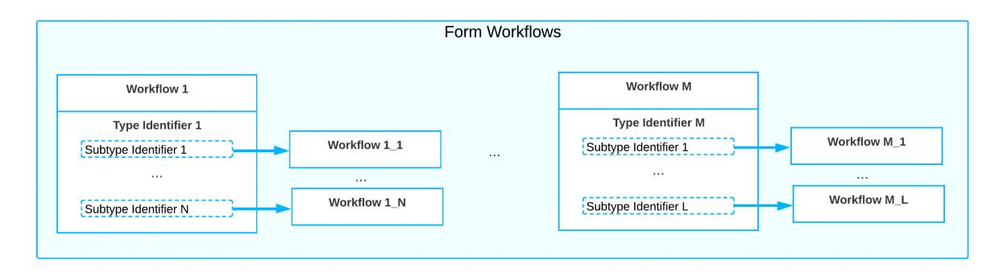

#### *Figure: Types and subtypes of workflows*

Suppose that on the *Order [Types](https://help-2025r1.acumatica.com/Help?ScreenId=ShowWiki&pageid=e6984218-4260-4438-99e1-aee2b3765369)* (SO201000) form, you have created two custom order types (*T1* and *T2*) that are based on the *Sales Order* automation behavior. For each form that has a workflow-identifying field specified in the predefined system workflow, as is the case with the *[Sales Orders](https://help-2025r1.acumatica.com/Help?ScreenId=ShowWiki&pageid=19e4021c-1b84-49fd-be12-0320c5f1c7e5)* (SO303000) form, the system displays a workflowidentifying field of the second level on the *[Workflows](https://help-2025r1.acumatica.com/Help?ScreenId=ShowWiki&pageid=70fcbfa0-010e-4f44-9ebe-bc9f20e82f9e)* page (the Order Type field in the following screenshot).

| <b>Customization Project Editor</b> <b>Back</b>                                  |                                           |                  |                         |                            |                      |                     |                               |               |                        |  |  |  |  |
|-------------------------------------------------------------------------------------|-------------------------------------------|------------------|-------------------------|----------------------------|----------------------|---------------------|-------------------------------|---------------|------------------------|--|--|--|--|
| Publish <b>Extension Library</b> <b>Source Control</b> File                |                                           |                  |                         |                            |                      |                     |                               |               |                        |  |  |  |  |
| <b>SalesOrderTypes</b> $\blacktriangleleft$ SO301000 (Sales Orders) Workflows |                                           |                  |                         |                            |                      |                     |                               |               |                        |  |  |  |  |
| $\overline{\phantom{a}}$ SCREENS $\star$ SO301000                                | 日 $\Omega$ <b>ADD WORKFLOW</b> . |                  |                         |                            |                      |                     |                               |               |                        |  |  |  |  |
| <b>Actions</b>                                                                      | State Identifier:                         |                  | <b>Status</b>           |                            |                      | Subtype Identifier: | Order Type                    |               | $\hat{\phantom{a}}$    |  |  |  |  |
| <b>Event Handlers</b> <b>Fields</b>                                              |                                           | Type Identifier: | <b>Behavior</b>         |                            |                      |                     | Allow Users to Modify Subtype |               |                        |  |  |  |  |
| Conditions                                                                          |                                           |                  |                         | Allow Users to Modify Type |                      |                     |                               |               |                        |  |  |  |  |
| ▶ Workflows <b>Dialog Boxes</b>                                                  |                                           | Ò $\times$    |                         |                            |                      |                     |                               |               |                        |  |  |  |  |
| Data Access !!!!!!!!!!!!!!!!!!!!!!!!!!!!!!!!!!!!!!!!                             | 冒                                         | Active           | Workflow <b>Type</b> | <b>Workflow Subtype</b>    | <b>Workflow Name</b> |                     | <b>Base System Workflow</b>   | <b>Status</b> |                        |  |  |  |  |
| <b>Files</b>                                                                        | $\rightarrow$                             | ☑                | <b>MO</b>               | <b>DEFAULT</b>             | <b>MO</b> workflow   |                     |                               |               | <b>System Readonly</b> |  |  |  |  |
| Generic Inquiries                                                                   |                                           | ☑                | <b>BL</b>               | <b>DEFAULT</b>             | <b>BL</b> workflow   |                     |                               |               | <b>System Readonly</b> |  |  |  |  |
| Reports <b>Dashboards</b>                                                        |                                           | ☑                | <b>CM</b>               | <b>DEFAULT</b>             | <b>CM</b> workflow   |                     |                               |               | <b>System Readonly</b> |  |  |  |  |
| Site Map                                                                            |                                           | ☑                | IN                      | <b>DEFAULT</b>             | IN workflow          |                     |                               |               | <b>System Readonly</b> |  |  |  |  |
| <b>Database Scripts</b>                                                             |                                           | ☑                | <b>RM</b>               | <b>DEFAULT</b>             | <b>RM</b> workflow   |                     |                               |               | <b>System Readonly</b> |  |  |  |  |
| <b>System Locales</b>                                                               |                                           | ☑                | QT                      | <b>DEFAULT</b>             | QT workflow          |                     |                               |               | <b>System Readonly</b> |  |  |  |  |
| <b>Import/Export Scenarios</b> <b>Shared Filters</b>                             |                                           | ☑                | SO           | <b>DEFAULT</b>             | SO workflow          |                     |                               |               | <b>System Readonly</b> |  |  |  |  |
| <b>Access Rights</b>                                                                |                                           | ☑                | <b>TR</b>               | <b>DEFAULT</b>             | <b>TR</b> workflow   |                     |                               |               | <b>System Readonly</b> |  |  |  |  |
| <b>Wikis</b> <b>Web Service Endpoints</b>                                        |                                           |                  |                         |                            |                      |                     |                               |               |                        |  |  |  |  |

#### *Figure: Selection of the workflow's subtype identifier*

For the *[Sales Orders](https://help-2025r1.acumatica.com/Help?ScreenId=ShowWiki&pageid=19e4021c-1b84-49fd-be12-0320c5f1c7e5)* form, the value of the subtype identifier is specified in the code, and the**Subtype Identifier** box of the *[Workflows](https://help-2025r1.acumatica.com/Help?ScreenId=ShowWiki&pageid=70fcbfa0-010e-4f44-9ebe-bc9f20e82f9e)* page is read-only. For other forms, this box is available for editing.

Then in the **Add Workflow** dialog box, which opens when you click the **Add Workflow** button on the page toolbar of the *[Workflows](https://help-2025r1.acumatica.com/Help?ScreenId=ShowWiki&pageid=70fcbfa0-010e-4f44-9ebe-bc9f20e82f9e)* page, you can select one of the created order types (*T1* or *T2*) as a workflow subtype (see the following screenshot).

| <b>Customization Project Editor</b>                     |                                   |                                |                                               |                                          |                     |                                 |                               | <b>Back</b>            | Reload                              |
|---------------------------------------------------------|-----------------------------------|--------------------------------|-----------------------------------------------|------------------------------------------|---------------------|---------------------------------|-------------------------------|------------------------|-------------------------------------|
| Publish <b>Extension Library</b> File             | Source Control                    |                                |                                               |                                          |                     |                                 |                               |                        |                                     |
| SalesOrderTypes                                         | SO301000 (Sales Orders) Workflows |                                |                                               |                                          |                     |                                 |                               |                        |                                     |
| SCREENS $\sqrt{SO301000}$                            | $\Box$ $\Omega$                | <b>ADD WORKFLOW</b>            | $\cdots$                                      |                                          |                     |                                 |                               |                        |                                     |
| Actions <b>Event Handlers</b>                        | State Identifier:                 |                                | <b>Status</b>                                 |                                          | Subtype Identifier: |                                 | Order Type                    |                        | $\hat{\phantom{a}}$ $\checkmark$ |
| <b>Fields</b> Conditions                             | Type Identifier:                  |                                | <b>Behavior</b> Allow Users to Modify Type |                                          |                     |                                 | Allow Users to Modify Subtype |                        |                                     |
| ▶ Workflows <b>Dialog Boxes</b>                      | $\circ$ $\times$               |                                |                                               |                                          |                     |                                 |                               |                        |                                     |
| Data Access Code                                     | 圓 <b>Active</b>                | <b>Workflow</b> <b>Type</b> | <b>Add Workflow</b>                           |                                          |                     | $\times$ ase System Workflow |                               | <b>Status</b>          |                                     |
| <b>Files</b>                                            | $\boxdot$                         | <b>MO</b>                      | Operation:                                    | <b>Extend System Workflow</b>            | $\checkmark$        |                                 |                               | <b>System Readonly</b> |                                     |
| <b>Generic Inquiries</b>                                | $\boxdot$                         | <b>BL</b>                      | * Base Workflow:                              | SO workflow                              | $\checkmark$        |                                 |                               | <b>System Readonly</b> |                                     |
| Reports <b>Dashboards</b>                            | ☑                                 | <b>CM</b>                      | Workflow Type:                                | <b>SO</b>                                | $\checkmark$        |                                 |                               | <b>System Readonly</b> |                                     |
| <b>Site Map</b>                                         | ☑                                 | IN                             | Workflow Subtype:                             | T 1                           | $\checkmark$        |                                 |                               | <b>System Readonly</b> |                                     |
| Database Scripts                                        | ☑                                 | <b>RM</b>                      | * Workflow Name:                              | Sales Order: T1                          |                     |                                 |                               | <b>System Readonly</b> |                                     |
| <b>System Locales</b>                                   | ☑                                 | QT                             |                                               |                                          | OK CANCEL        |                                 |                               | <b>System Readonly</b> |                                     |
| <b>Import/Export Scenarios</b> <b>Shared Filters</b> | ☑                                 | <b>SO</b>                      | <b>UEFAULI</b>                                | !!!!!!!!!!!!!!!!!!!!!!!!!!!!!!!!!!!!!!!! |                     |                                 |                               | <b>System Readonly</b> |                                     |
| <b>Access Rights</b> <b>Wikis</b>                    | ☑                                 | <b>TR</b>                      | <b>DEFAULT</b>                                | TR workflow                              |                     |                                 |                               | <b>System Readonly</b> |                                     |

*Figure: Selection of the workflow subtype*

Only one workflow per order type is supported.

You then can define both created workflows as active by selecting the **Active** check box (see the following screenshot). Note that the base workflow (*SO Workflow* in this case) remains active as well. The system will use this workflow for sales orders that are based on other order types and that have the *Sales Order* automation behavior that is, sales orders of the *eCommerce Order*, *Sales Order with Allocation*, and *Sales Order* types.

| <b>Customization Project Editor</b>                             |          |                                   |                         |                     |                            |                     |                             |            | <b>Back</b>                   | Reload              |
|-----------------------------------------------------------------|----------|-----------------------------------|-------------------------|---------------------|----------------------------|---------------------|-----------------------------|------------|-------------------------------|---------------------|
| Publish <b>Extension Library</b> File                     |          | Source Control                    |                         |                     |                            |                     |                             |            |                               |                     |
| SalesOrderTypes ∢                                            |          | SO301000 (Sales Orders) Workflows |                         |                     |                            |                     |                             |            |                               |                     |
| $\overline{\phantom{a}}$ SCREENS $-$ SO301000                | $\Omega$ | $\Box$                            | ADD WORKFLOW            | $\cdots$            |                            |                     |                             |            |                               |                     |
| Actions                                                         |          | State Identifier:                 |                         | <b>Status</b>       |                            | Subtype Identifier: |                             | Order Type |                               | $\hat{\phantom{a}}$ |
| <b>Event Handlers</b> Fields                                 |          | Type Identifier:                  |                         | <b>Behavior</b>     |                            |                     |                             |            | Allow Users to Modify Subtype |                     |
| Conditions                                                      |          |                                   |                         |                     | Allow Users to Modify Type |                     |                             |            |                               |                     |
| $\rightarrow$ Workflows (2, inherited 8) <b>Dialog Boxes</b> | Ò        | $\times$                          |                         |                     |                            |                     |                             |            |                               |                     |
| Data Access !!!!!!!!!!!!!!!!!!!!!!!!!!!!!!!!!!!!!!!!         | 目        | Active                            | Workflow <b>Type</b> | Workflow Subtype | <b>Workflow Name</b>       |                     | <b>Base System Workflow</b> |            | <b>Status</b>                 |                     |
| <b>Files</b>                                                    |          | ☑                                 | <b>MO</b>               | <b>DEFAULT</b>      | <b>MO</b> workflow         |                     |                             |            | <b>System Readonly</b>        |                     |
| <b>Generic Inquiries</b>                                        |          | ☑                                 | <b>BL</b>               | <b>DEFAULT</b>      | <b>BL</b> workflow         |                     |                             |            | <b>System Readonly</b>        |                     |
| Reports <b>Dashboards</b>                                    |          | ☑                                 | <b>CM</b>               | <b>DEFAULT</b>      | CM workflow                |                     |                             |            | <b>System Readonly</b>        |                     |
| Site Map                                                        |          | ☑                                 | IN                      | <b>DEFAULT</b>      | IN workflow                |                     |                             |            | <b>System Readonly</b>        |                     |
| <b>Database Scripts</b>                                         |          | ☑                                 | <b>RM</b>               | <b>DEFAULT</b>      | <b>RM</b> workflow         |                     |                             |            | <b>System Readonly</b>        |                     |
| <b>System Locales</b>                                           |          | ☑                                 | <b>QT</b>               | <b>DEFAULT</b>      | QT workflow                |                     |                             |            | <b>System Readonly</b>        |                     |
| Import/Export Scenarios <b>Shared Filters</b>                |          | ☑                                 | <b>SO</b>               | <b>DEFAULT</b>      | SO workflow                |                     |                             |            | <b>System Readonly</b>        |                     |
| <b>Access Rights</b>                                            |          | $\overline{\mathbb{S}}$           | <b>TR</b>               | <b>DEFAULT</b>      | <b>TR</b> workflow         |                     |                             |            | <b>System Readonly</b>        |                     |
| <b>Wikis</b>                                                    |          | ☑                                 | <b>SO</b>               | T 1      | Sales Order: T1            |                     | SO workflow                 |            | Inherited                     |                     |
| <b>Web Service Endpoints</b>                                    |          | $\boxdot$                         | <b>SO</b>               | T 2      | Sales Order: T2            |                     | SO workflow                 |            | Inherited                     |                     |
| <b>Analytical Reports</b> <b>Push Notifications</b>          |          |                                   |                         |                     |                            |                     |                             |            |                               |                     |
| <b>Business Events</b>                                          |          |                                   |                         |                     |                            |                     |                             |            |                               |                     |
| <b>Mobile Application</b>                                       |          |                                   |                         |                     |                            |                     |                             |            |                               |                     |
| <b>User-Defined Fields</b>                                      |          |                                   |                         |                     |                            |                     |                             |            |                               |                     |
| Webhooks                                                        |          |                                   |                         |                     |                            |                     |                             |            |                               |                     |
| <b>Connected Applications</b>                                   |          |                                   |                         |                     |                            |                     |                             |            |                               |                     |

#### *Figure: Two separate workflows for different order types*

Aer you create a separate workflow for each custom order type, you can perform the usual operations with these workflows by using the *[Workflow](https://help-2025r1.acumatica.com/Help?ScreenId=ShowWiki&pageid=8a944b6b-0e47-47c9-a6a7-1b266d8feba0) (Tree View)* or *Workflow [\(Diagram](https://help-2025r1.acumatica.com/Help?ScreenId=ShowWiki&pageid=6cc999f0-df33-4db0-9f93-36329ad1de7e) View)* pages: add, remove, or modify states, actions, fields, and transitions.

If you do not need to create separate workflows for each of the order types, you can keep the workflow with the *Default* subtype active. The system will use this workflow for sales orders that meet the following criteria:

- The behavior used for the sales orders is the same as the workflow type (for example, the behavior is *SO* and the workflow type is *SO*).
- Separate workflows have not been defined with this type and with a subtype that is the same as the order type.

# **Workflow-Identifying Fields of the Second Level: Process Activity**

The following activity will walk you through the process of creating workflows for custom order types.

This activity is based on the *U100* dataset. If you are using another dataset, or if any system settings have been changed in *U100*, these changes can affect the workflow of the activity and the results of the processing. To avoid any issues, restore the *U100* dataset to its initial state.

#### **Story**

Suppose that you want to give users the ability to create sales orders of the *In-Store Retail Order* and *Phone Order* types, and you do not want users to put the orders of the *In-Store Retail Order* type on hold. Further suppose that the orders of the *Phone Order* type should be confirmed. This means that when a user creates a phone order, its status should change to *Pending Confirmation*, and that the user should confirm the order to open it. You need to create separate workflows for these order types.

#### **Process Overview**

By using the *Order [Types](https://help-2025r1.acumatica.com/Help?ScreenId=ShowWiki&pageid=e6984218-4260-4438-99e1-aee2b3765369)* (SO201000) form, you will create two order types. By using the *[Workflows](https://help-2025r1.acumatica.com/Help?ScreenId=ShowWiki&pageid=70fcbfa0-010e-4f44-9ebe-bc9f20e82f9e)* page of the Customization Project Editor, you will create separate workflows for these order types. On the *[Sales Orders](https://help-2025r1.acumatica.com/Help?ScreenId=ShowWiki&pageid=19e4021c-1b84-49fd-be12-0320c5f1c7e5)* (SO301000) form, you will then test the customized workflow.

#### **System Preparation**

Before you begin performing the steps of this activity, do the following:

1. Launch the Acumatica ERP website with the *U100* dataset preloaded, and sign in as system administrator by using the *gibbs* username and the *123* password.

The *gibbs* user is assigned the *Administrator* role, which has sufficient access rights to customize workflows.

- 2. Make sure you have learned how to perform workflow customization, as described in *[Inherited Workflows:](#page-55-2) [General Information](#page-55-2)*.
- 3. On the *[Customization Projects](https://help-2025r1.acumatica.com/Help?ScreenId=ShowWiki&pageid=4d3a1166-826c-414b-a207-3d1669fbf9e5)* (SM204505) form, create a customization project named *SalesOrderTypes*.

#### **Step 1: Creating Order Types**

To add new order types, do the following:

- 1. In Acumatica ERP, open the *Order [Types](https://help-2025r1.acumatica.com/Help?ScreenId=ShowWiki&pageid=e6984218-4260-4438-99e1-aee2b3765369)* (SO201000) form, and add a new record.
- 2. In the Summary area, specify the following settings:
  - **OrderType**: IS
  - **Description**: In-Store Retail Order
  - **OrderTemplate**: *SO*
- 3. On the **General** tab, specify the following settings:
  - **Order NumberingSequence** (**OrderSettings** section): *SOORDER*
  - **Calculate Freight** (**OrderSettings** section): Cleared
  - **Freight Account** (**PostingSettings** section): *40010 (Sales – Freight)*
- 4. On the form toolbar, click**Save**.
- 5. On the form toolbar, click **Add New Record**, and specify the following settings in the Summary area:
  - **OrderType**: PH
  - **Description**: Phone Order
  - **OrderTemplate**: *SO*
- 6. On the **General** tab, specify the following settings:
  - **Order NumberingSequence** (**OrderSettings** section): *SOORDER*
  - **Calculate Freight** (**OrderSettings** section): Cleared

- **Freight Account** (**PostingSettings** section): *40010 (Sales – Freight)*
- 7. On the form toolbar, click**Save**.

#### **Step 2: Creating the Workflow for the In-Store Retail Order Type**

To create a workflow for the *In-Store Retail Order* type, which you have added in the previous step, do the following:

- 1. Open the *SalesOrderTypes* customization project, and add the *[Sales Orders](https://help-2025r1.acumatica.com/Help?ScreenId=ShowWiki&pageid=19e4021c-1b84-49fd-be12-0320c5f1c7e5)* (SO301000) form to the list of customized screens. (For details, see *[Workflow](#page-10-1) Creation: To Add a Workflow*.)
- 2. In the navigation pane of the Customization Project Editor, click**Screens > SO301000 > Workflows**.

The SO301000 (Sales Orders) Workflows page of the Customization Project Editor opens. Notice that the table on the page contains multiple workflows. Also notice that the value in the**Subtype Identifier** box is *Order Type* and that this box is read-only.

- 3. On the More menu (under **Actions**), click **Add Workflow**.
- 4. In the **Add Workflow** dialog box, which opens, specify the following settings:
  - **Operation**: *Extend System Workflow*

You select this operation when you want to create an inherited workflow based on another workflow.

• **Base Workflow**: *SO Workflow*

This is the specific workflow that will be extended for the inherited workflow that you are creating.

• **Workflow Type**: *SO*

This setting indicates that the created workflow will be used for sales orders that have the have the *Sales Order* automation behavior.

• **Workflow Subtype**: *IS*

This setting indicates that the workflow will be applied to the sales orders of the *In-Store Retail Order* order type.

- **Workflow Name**: *Sales Order: IS* (inserted automatically)
- 5. Click **OK** to close the dialog box.

A row for the workflow appears in the table on the *[Workflows](https://help-2025r1.acumatica.com/Help?ScreenId=ShowWiki&pageid=70fcbfa0-010e-4f44-9ebe-bc9f20e82f9e)* page. Notice that the workflow's status is *Inherited*. Also notice that the value in the **BaseSystem Workflow** column is *SO Workflow*.

6. Select the **Active** check box in the row with the created workflow.

Notice that the **Active** check box is still selected for the predefined workflow (*SO Workflow*). The system will use the *Sales Order: IS* workflow for sales orders of the *In-Store Retail Order* type. Also, the system will use the predefined *SO Workflow* for sales orders of the *Sales Order*, *eCommerce Order*, and *Sales Order with Allocation* types.

7. On the page toolbar, click**Save**.

#### **Step 3: Creating the Workflow for the Phone Order Type**

To create a workflow for the *Phone Order* type, which you have added in Step 1, do the following:

1. In the navigation pane of the Customization Project Editor, click**Screens > SO301000 > Workflows**.

The SO301000 (Sales Orders) Workflows page of the Customization Project Editor opens. Notice that the **Subtype Identifier** box is unavailable for editing and that the value in this box is *Order Type*.

- 2. On the More menu (under **Actions**), click **Add Workflow**.
- 3. In the **Add Workflow** dialog box, which opens, specify the following settings:
  - **Operation**: *Extend System Workflow*
  - **Base Workflow**: *SO Workflow*

- **Workflow Type**: *SO*
- **Workflow Subtype**: *PH*

This setting indicates that the workflow will be used for sales orders of the *Phone Order* order type.

- **Workflow Name**: *Sales Order: PH* (inserted automatically)
- 4. Click **OK** to close the dialog box.

A row for the workflow appears in the table on the Workflows page. Notice that the workflow's status is *Inherited*.

5. Select the **Active** check box for the created workflow.

Notice that the **Active** check box is still selected for the predefined workflow (*SO Workflow*) and for the *Sales Order: IS* workflow you have created in the previous step. This means that when you create a sales order of the *Phone Order* type, the system will use this new workflow and not the *SO Workflow* or *Sales Order: IS* workflow.

6. On the page toolbar, click**Save**.

#### **Step 4: Specifying Settings for the Sales Order: IS Workflow**

Now that you have created the workflows for each of the new order types, you can specify different settings for these workflows. Do the following:

1. In the navigation pane of the Customization Project Editor, click**Screens > SO301000 > Workflows > Sales Order: IS**.

The SO301000 (Sales Orders) State Diagram: Sales Order: IS page opens.

- 2. In the **States and Transitions** pane, click the *Open* state.
- 3. On the **Actions** tab, clear the check box in the row with the *Hold (putOnHold)* action.

This setting indicates that this action will not be available when the order is in the *Open* state.

- 4. In the Transitions node of the *Open* state, click the transition the *On Hold* state.
- 5. On the **Transitions** tab, clear the **Active** check box for the transition.

This setting indicates that the user will not be able to change the status of the order from *Open* to *Hold*.

- 6. Save your changes.
- 7. Publish the customization project.

#### **Step 5: Specifying Settings for the Sales Order: PH Workflow**

Specify the settings for the *Sales Order: PH* workflow as follows:

1. In the navigation pane of the Customization Project Editor, click**Screens > SO301000 > Workflows > Sales Order: PH**.

The SO301000 (Sales Orders) State Diagram: Sales Order: PH page opens.

- 2. On the page toolbar, click **Add State**, and specify the following settings in the dialog box that opens:
  - **Identifier**: W
  - **Description**: Pending Confirmation
- 3. Click **OK** to close the dialog box, and save your changes.
- 4. On the **States and Transitions** pane, click the *Pending Confirmation* state, and on the page toolbar, click **Add Transition**.
- 5. In the **Add Transition** dialog box, which is opened, click **Create** to the right of the**Trigger Name** box, and specify the following settings in the dialog box that opens:

- **Action Name**: Confirm
- **Display Name**: Confirm
- 6. Click **OK** to close the dialog box.
- 7. In the **Add Transition** dialog box, to which you return, select *Open* in the **TargetState** box, and click **OK**.

The system adds the transition to the *Pending Confirmation* state.

- 8. On the **States and Transitions** pane, click the *Pending Confirmation* state again, and on the page toolbar, click **Add Transition**.
- 9. In the **Add Transition** dialog box, which is opened, specify the following settings:
  - **Trigger Name**: *Cancel Order (cancelOrder)*
  - **TargetState**: *Cancel*
- 10.Click **OK** to close the dialog box, and save your changes.
- 11.On the **States and Transitions** pane, expand the**Transitions** node for the *\_* initial state, and click the transition to the *Open* state.
- 12.On the **Transition Properties** tab, select *Pending Confirmation* in the **TargetState** box, and save your changes.
- 13.Publish the customization project.

#### **Step 6: Testing the Customization**

In Acumatica ERP, test your changes as follows:

- 1. Open the *[Sales Orders](https://help-2025r1.acumatica.com/Help?ScreenId=ShowWiki&pageid=19e4021c-1b84-49fd-be12-0320c5f1c7e5)* (SO30100) form. If you already have the form open, refresh it.
- 2. Create a sales order, and specify the following settings in the Summary area:
  - **OrderType**: *IS*
  - **Customer**: *CANDYY*
  - **Description**: Jam order
- 3. On the **Details** tab, click **Add Row**, and specify the following settings in the row:
  - **Inventory ID**: *CHERJAM32*
  - **Quantity**: 5
- 4. Save your changes.

Notice that the status of the sales order is *Open*, and that **Hold** command is not available on the More menu.

- 5. Add a new sales order, and specify the following settings in the Summary area:
  - **OrderType**: *PH*
  - **Customer**: *COFFEESHOP*
  - **Description**: Fruit order
- 6. On the **Details** tab, click **Add Row**, and specify the following settings in the row:
  - **Inventory ID**: *GRAPEFRUIT*
  - **Quantity**: 5
- 7. Save your changes.

Notice that the status of the sales order is *Pending Confirmation*, and that on the More menu, only the **Confirm** and **Cancel Order** commands are available.

8. On the More menu (under **Actions**), click **Confirm**.

The status of the sales order changes to *Open*.

# **Upgrading Workflows**

Acumatica developers may modify the predefined workflows associated with inherited workflows that you have modified. In this chapter, you will learn how to upgrade the inherited workflows aer these updates have been made to the predefined workflows they are based on.

# **Upgrade of Workflows: General Information**

A customization project might contain inherited workflows—that is, customized workflows based on predefined workflows. During an upgrade to a new version of Acumatica ERP, the predefined workflow that is used in the system can be changed. To incorporate these changes in the customization project with the inherited workflow, you can upgrade workflows in a customization project, as described below.

During an upgrade to a new version of Acumatica ERP, if the predefined workflow that is used in the system has been changed, these changes of the predefined workflow are applied automatically to the system, along with the changes that are available in an inherited workflow that is based on this predefined workflow (if the customization project with this inherited workflow has been published in the system). That is, you do not need to update the customization project to apply the changes in the predefined workflow to the inherited workflow. You need to update the customization project only if you need to include these changes in the customization project.

#### **Learning Objectives**

In this chapter, you will learn how to include changes in the predefined workflow in a customization project that contains an inherited workflow that is based on this predefined workflow.

#### **Applicable Scenarios**

You upgrade a customization project that contains an inherited workflow if the predefined workflow on which the inherited workflow is based has been upgraded in the system and you need to include these changes in the customization project.

#### **Upgrade of a Customization Project That Contains Inherited Workflows**

For each inherited workflow, a customization project contains both the inherited workflow and the version of the predefined workflow on which the inherited workflow is based. If the version of the predefined workflow in the system and the version of the predefined workflow in the customization project differ, you may need to upgrade the customization project with the new version of the predefined workflow.

For each predefined workflow included in the customization project, each time you open this customization project, the Acumatica Customization Platform checks whether the current version of this predefined workflow is the same as the one that is used in the system. If the version of the predefined workflow in the customization project is not the same as the one that is used in the system, the system displays the corresponding message and prompts you to upgrade the version of the predefined workflow in the customization project.

If you upgrade the version of the predefined workflow in the customization project, the predefined workflow and all its inherited workflows in the customization project will contain the changes that are introduced in the version of the predefined workflow that is used in the system.

This upgrade merges the changes in the inherited workflow in the customization project and the changes in the predefined workflow that is available in the system. If any conflicts occur, a pop-up window appears that contains detailed information about the conflicts. You can review the conflicts and either continue the upgrade with the changes suggested by the system or cancel the upgrade of the predefined workflow.

# **Upgrade of Workflows: To Upgrade a Customization Project That Contains an Inherited Workflow**

The following activity will walk you through the process of upgrading a customization project that contains an inherited workflow with the changes introduced in the predefined workflow of Acumatica ERP. With this upgrade, you will include these changes in the customization project. That is, the changes introduced in the predefined workflow of Acumatica ERP will be reflected in both the predefined workflow that is included in the customization project and the inherited workflow that is based on this predefined workflow.

#### **Story**

Suppose that aer you have created an inherited workflow for the *[Opportunities](https://help-2025r1.acumatica.com/Help?ScreenId=ShowWiki&pageid=5cb49cd5-2be8-4617-9341-958f1c5d6d53)* (CR304000) form, Acumatica developers have modified the predefined workflow for this form: In the predefined workflow, the Review state and the Need Review action have been added. (In this activity, you will load the changes to the predefined workflow by importing and publishing the OpportunitySystemWorkflowChanges.zip customization package.)

Acting as a technical specialist, you need to upgrade the version of the predefined workflow in the customization project so that both the predefined workflow that is included in the customization project and the inherited workflow that is based on this predefined workflow contain the changes introduced by Acumatica developers.

#### **Process Overview**

By using the *[Customization Projects](https://help-2025r1.acumatica.com/Help?ScreenId=ShowWiki&pageid=4d3a1166-826c-414b-a207-3d1669fbf9e5)* (SM204505) form, you will upgrade the version of the predefined workflow of the *[Opportunities](https://help-2025r1.acumatica.com/Help?ScreenId=ShowWiki&pageid=5cb49cd5-2be8-4617-9341-958f1c5d6d53)* (CR304000) form in the *Opportunities* customization project.

#### **System Preparation**

Before you begin upgrading the workflows, do the following:

1. Launch the Acumatica ERP website with the *U100* dataset preloaded, and sign in as system administrator by using the *gibbs* username and the *123* password.

The *gibbs* user is assigned the *Administrator* role, which has sufficient access rights to customize workflows.

- 2. Unpublish your current customization project or projects by doing the following:
  - a. Open the *[Customization Projects](https://help-2025r1.acumatica.com/Help?ScreenId=ShowWiki&pageid=4d3a1166-826c-414b-a207-3d1669fbf9e5)* (SM204505) form.
  - b. On the form toolbar, click **Unpublish All**.
- 3. Make sure that you have completed the *[Diagram](#page-77-1) View: To Adjust the System State* activity; alternatively, you can import the *Opportunities.zip* customization package.
- 4. Load changes to the predefined workflow of the *[Opportunities](https://help-2025r1.acumatica.com/Help?ScreenId=ShowWiki&pageid=5cb49cd5-2be8-4617-9341-958f1c5d6d53)* (CR304000) form as follows:
  - a. Open the *[Customization Projects](https://help-2025r1.acumatica.com/Help?ScreenId=ShowWiki&pageid=4d3a1166-826c-414b-a207-3d1669fbf9e5)* (SM204505) form.
  - b. On the form toolbar, click **Import**.

- c. In the **Open Package** dialog box, which is opened, click **Choose File**, and select the *OpportunitySystemWorkflowChanges.zip* file.
- d. In the **Open Package** dialog box, click **Upload**.

The *OpportunitySystemWorkflowChanges* customization project is added to the list on the *[Customization](https://help-2025r1.acumatica.com/Help?ScreenId=ShowWiki&pageid=4d3a1166-826c-414b-a207-3d1669fbf9e5) [Projects](https://help-2025r1.acumatica.com/Help?ScreenId=ShowWiki&pageid=4d3a1166-826c-414b-a207-3d1669fbf9e5)* form.

- e. Select the unlabeled check box in the row with the *OpportunitySystemWorkflowChanges* customization project.
- f. On the form toolbar, click **Publish**.

#### **Step: Upgrading the Version of the Predefined Workflow in the Customization Project**

To upgrade the version of the predefined workflow in the customization project, perform the following instructions:

1. On the *[Customization Projects](https://help-2025r1.acumatica.com/Help?ScreenId=ShowWiki&pageid=4d3a1166-826c-414b-a207-3d1669fbf9e5)* (SM204505) form, click the link with the *Opportunities* customization project.

The Customization Project Editor opens for the *Opportunities* customization project.

- 2. In the table on the Customized Screens page, notice that the system displays a warning icon in the**Screen ID** column.
- 3. In the navigation pane, click**Screens > CR304000 > Workflows**.

The CR304000 (Opportunities) Workflows page opens. Notice that the system displays a warning icon for the **State Identifier** box.

4. On the page toolbar, click **Upgrade Predefined Workflow**.

The **Upgrade Conflicts** dialog box opens, as shown in the following screenshot. The dialog box contains information about the conflicts and actions that the system will take to resolve the conflicts.

| <b>Customization Project Editor</b>                                                                                         |                                                                                        |                                                                                            |                    |                     |                            |                  |                           |                                            | <b>Back</b>   | Reload        |                  |  |
|-----------------------------------------------------------------------------------------------------------------------------|----------------------------------------------------------------------------------------|--------------------------------------------------------------------------------------------|--------------------|---------------------|----------------------------|------------------|---------------------------|--------------------------------------------|---------------|---------------|------------------|--|
| <b>Extension Library</b> Publish File                                                                                 | Source Control                                                                         |                                                                                            |                    |                     |                            |                  |                           |                                            |               |               |                  |  |
| Opportunities $\blacktriangleleft$                                                                                       | CR304000 (Opportunities) Workflows                                                     |                                                                                            |                    |                     |                            |                  |                           |                                            |               |               |                  |  |
| - SCREENS $-CR304000$ Actions (4, inherited 17) <b>Event Handlers</b> Fields (2) Conditions (1, inherited 3) | 同 <b>ADD WORKFLOW</b> $\Omega$ <b>O</b> State Identifier: Type Identifier: | UPGRADE PREDEFINED WORKFLOW <b>Status</b> $\checkmark$ Allow Users to Modify Type | $\cdots$           |                     |                            |                  |                           |                                            |               |               | $\hat{ }$        |  |
| Workflows (1, inherited 1) Dialog Boxes (3, inherited 3)                                                                 | Upgrade conflicts                                                                      |                                                                                            |                    |                     |                            |                  |                           |                                            |               |               |                  |  |
| <b>Data Access</b> Code                                                                                                  | <b>El Workflow Element</b>                                                             |                                                                                            | Property           | <b>System Value</b> | <b>Customization Value</b> | System Action | Customiz <b>Action</b> | Resolve conflict in action                 |               |               | 2 nly |  |
| Files <b>Generic Inquiries</b>                                                                                           | > State 'Assigned', workflow 'OpportunitiesAssigned [DEFAULT]'                         |                                                                                            | <b>Line Number</b> |                     | $\overline{4}$             | None             | Added                     | Change line number                         |               |               |                  |  |
| Reports                                                                                                                     | State 'Review', workflow 'OpportunitiesAssigned [DEFAULT]'                             |                                                                                            | <b>Line Number</b> | 4                   |                            | Added            | None                      | Change line number                         |               |               |                  |  |
| Dashboards                                                                                                                  | Field 'Status [CROpportunity.STATUS]'                                                  |                                                                                            | ComboBoxValues     | <b>Set R Review</b> | SetFromUI A Assigned       | Added            | Modified                  | Merge combobox values                      |               |               |                  |  |
| Site Map                                                                                                                    | Field 'Status [CROpportunity.STATUS]'                                                  |                                                                                            | IsFromSchema       | False               |                            | Added            | Modified                  | Take property value from customized record |               |               |                  |  |
| <b>Database Scripts</b> <b>System Locales</b>                                                                            |                                                                                        |                                                                                            |                    |                     |                            |                  |                           |                                            |               |               |                  |  |
| Import/Export Scenarios <b>Shared Filters</b>                                                                            |                                                                                        |                                                                                            |                    |                     |                            |                  |                           | $\mathbb{R}$                               | $\rightarrow$ | $\rightarrow$ |                  |  |
| <b>Access Rights</b> Wikis                                                                                               |                                                                                        |                                                                                            |                    |                     |                            |                  |                           |                                            | OK            | CANCEL        |                  |  |
| <b>Web Service Endpoints</b>                                                                                                |                                                                                        |                                                                                            |                    |                     |                            |                  |                           |                                            |               |               |                  |  |
| <b>Analytical Reports</b> <b>Push Notifications</b>                                                                      |                                                                                        |                                                                                            |                    |                     |                            |                  |                           |                                            |               |               |                  |  |
| <b>Business Events</b>                                                                                                      |                                                                                        |                                                                                            |                    |                     |                            |                  |                           |                                            |               |               |                  |  |
| <b>Mobile Application</b> <b>User-Defined Fields</b>                                                                     |                                                                                        |                                                                                            |                    |                     |                            |                  |                           |                                            |               |               |                  |  |
| Webhooks                                                                                                                    |                                                                                        |                                                                                            |                    |                     |                            |                  |                           |                                            |               |               |                  |  |
| <b>Connected Applications</b>                                                                                               |                                                                                        |                                                                                            |                    |                     |                            |                  |                           |                                            |               |               |                  |  |

#### *Figure: The message about conflicts during upgrade*

5. In the dialog box, click **OK** to resolve the conflicts and merge the changes.

As a result, the version of the predefined workflow is updated in the customization project. Both the predefined workflow that is included in the customization project and the inherited workflow that is based on this predefined workflow now use the version of the predefined workflow that is used in the system.

6. In the navigation pane of the Customization Project Editor, click**Screens > CR304000 > Workflows > OpportunitiesAssigned**.

The CR304000 (Opportunities) State Diagram: OpportunitiesAssigned page opens. The customized workflow should look as shown in the following screenshot. Notice that the Review state, which has been added in the modified predefined workflow, is marked as inherited.

| <b>Customization Project Editor</b>                                                                                                                                                                                                                                                                                                                                                                                      |                                                                                                                                                                                                                                                                                                                                                       |                                                                                                                                 |                                         |                                        |                 |        |                                        |                      | Reload <b>Back</b>                                                                                                                                                                                                                                                                                                                                                                                                                                                                 |
|--------------------------------------------------------------------------------------------------------------------------------------------------------------------------------------------------------------------------------------------------------------------------------------------------------------------------------------------------------------------------------------------------------------------------|-------------------------------------------------------------------------------------------------------------------------------------------------------------------------------------------------------------------------------------------------------------------------------------------------------------------------------------------------------|---------------------------------------------------------------------------------------------------------------------------------|-----------------------------------------|----------------------------------------|-----------------|--------|----------------------------------------|----------------------|---------------------------------------------------------------------------------------------------------------------------------------------------------------------------------------------------------------------------------------------------------------------------------------------------------------------------------------------------------------------------------------------------------------------------------------------------------------------------------------|
| Publish <b>Extension Library</b> File                                                                                                                                                                                                                                                                                                                                                                              | Source Control                                                                                                                                                                                                                                                                                                                                        |                                                                                                                                 |                                         |                                        |                 |        |                                        |                      |                                                                                                                                                                                                                                                                                                                                                                                                                                                                                       |
| Opportunities ٠ $\overline{\phantom{a}}$ SCREENS                                                                                                                                                                                                                                                                                                                                                                   | CR304000 (Opportunities) State Diagram: OpportunitiesAssigned 阊 $\Omega$ <b>ADD STATE</b> <b>CHANGE PARENT STATE</b> <b>ADD TRANSITION</b> <b>DIAGRAM VIEW</b> $\cdots$                                                                                                                                                          |                                                                                                                                 |                                         |                                        |                 |        |                                        |                      |                                                                                                                                                                                                                                                                                                                                                                                                                                                                                       |
| $\sqrt{CR304000}$ Actions (4, inherited 18) <b>Event Handlers</b> Fields (2) Conditions (1, inherited 3) $\bullet$ Workflows (1, inherited 1) Default workflow OpportunitiesAssigned Dialog Boxes (3, inherited 4) Data Access                                                                                                                                                                | <b>States and Transitions</b> ⑩ $\downarrow$ $\uparrow$                                                                                                                                                                                                                                                                                      | <b>STATE PROPERTIES</b> <b>ACTIONS</b> <b>HANDLERS</b>                                                                    |                                         |                                        |                 |        |                                        |                      |                                                                                                                                                                                                                                                                                                                                                                                                                                                                                       |
|                                                                                                                                                                                                                                                                                                                                                                                                                          | - New (Modified) $\div$ Transitions Open->Open (Deleted) Close as Won->Won (Inherited) Close as Lost->Lost (Inherited) Opportunity Created from Lead->New (Inherited)                                                                                                                                                                  | Identifier: $\mathsf{R}$ Review Description: <b>FIELDS</b> FIELDS TO UPDATE ON ENTRY FIELDS TO UPDATE ON EXIT |                                         |                                        |                 |        | Active nitial State of the Workflow |                      |                                                                                                                                                                                                                                                                                                                                                                                                                                                                                       |
|                                                                                                                                                                                                                                                                                                                                                                                                                          |                                                                                                                                                                                                                                                                                                                                                       | $\circ$ $+$ <b>B</b> Active                                                                                               | $\times$ $\mathbb H$ *Object Name | <b>COMBO BOX VALUES</b> *Field Name | <b>Disabled</b> | Hidden | Required                               | <b>Default Value</b> | <b>Status</b>                                                                                                                                                                                                                                                                                                                                                                                                                                                                         |
| Code                                                                                                                                                                                                                                                                                                                                                                                                                     | Assign->Assigned Auto-Assign->Assigned                                                                                                                                                                                                                                                                                                             | ☑                                                                                                                               | Opportunity                             | Reason                                 | $\Box$          | $\Box$ | $\Box$                                 |                      | Inherited                                                                                                                                                                                                                                                                                                                                                                                                                                                                             |
| Files <b>Generic Inquiries</b> <b>Reports</b> <b>Dashboards</b> Site Map <b>Database Scripts</b> <b>System Locales</b> Import/Export Scenarios <b>Shared Filters</b> <b>Access Rights</b> Wikis <b>Web Service Endpoints</b> <b>Analytical Reports</b> <b>Push Notifications</b> <b>Business Events</b> <b>Mobile Application</b> <b>User-Defined Fields</b> Webhooks | Dpen (Modified) $\triangleright$ Transitions - Won (Inherited) $\triangleright$ Transitions - Lost (Inherited) Fransitions - Review (Inherited) $\overline{\phantom{a}}$ Transitions Won->Won (Inherited) Lost->Lost (Inherited) $\overline{\phantom{a}}$ Assigned $\div$ Transitions Accept->Open Reject->New | ☑                                                                                                                               | Opportunity                             | Owner                                  | $\Box$          | $\Box$ | ☑                                      |                      | Inherited                                                                                                                                                                                                                                                                                                                                                                                                                                                                             |
|                                                                                                                                                                                                                                                                                                                                                                                                                          |                                                                                                                                                                                                                                                                                                                                                       |                                                                                                                                 |                                         |                                        |                 |        |                                        |                      |                                                                                                                                                                                                                                                                                                                                                                                                                                                                                       |
| <b>Connected Applications</b>                                                                                                                                                                                                                                                                                                                                                                                            |                                                                                                                                                                                                                                                                                                                                                       |                                                                                                                                 |                                         |                                        |                 |        |                                        |                      | $\begin{array}{ccccccc} \multicolumn{3}{c}{} & \multicolumn{3}{c}{} & \multicolumn{3}{c}{} & \multicolumn{3}{c}{} & \multicolumn{3}{c}{} & \multicolumn{3}{c}{} & \multicolumn{3}{c}{} & \multicolumn{3}{c}{} & \multicolumn{3}{c}{} & \multicolumn{3}{c}{} & \multicolumn{3}{c}{} & \multicolumn{3}{c}{} & \multicolumn{3}{c}{} & \multicolumn{3}{c}{} & \multicolumn{3}{c}{} & \multicolumn{3}{c}{} & \multicolumn{3}{c}{} & \multicolumn{3}{c}{} & \multicolumn{3}{c}{} & \multic$ |

*Figure: The upgraded inherited workflow*