# **Interface Guide 2025 R1**

| Copyright5                                                  |  |
|-------------------------------------------------------------|--|
| Acumatica ERP Interface Guide6                              |  |
| Acumatica ERP User Interface 7                              |  |
| Basic Elements of the User Interface7                       |  |
| Search10                                                    |  |
| Recently Viewed14                                           |  |
| Company and Branch Selection Menu 16                        |  |
| Info Area 18                                                |  |
| Help19                                                      |  |
| Built-In Infotips 25                                        |  |
| Main Menu27                                                 |  |
| Menu Editing Mode29                                         |  |
| Workspaces 34                                               |  |
| Categories and Workspaces for Entities of Specific Forms 38 |  |
| Welcome to Acumatica Page in Acumatica ERP 40               |  |
| Modern UI 43                                                |  |
| Modern UI: Changes in UI Elements 43                        |  |
| Modern UI: Filters 47                                       |  |
| Modern UI: User Personalization 53                          |  |
| Modern UI: Site-Wide Personalization58                      |  |
| Modern UI: Managing User-Defined Fields66                   |  |
| Forms 69                                                    |  |
| Parts of a Form69                                           |  |
| Form Title Bar 70                                           |  |
| Form Toolbar and More Menu77                                |  |
| Page Toolbar 84                                             |  |
| Formatting Toolbar88                                        |  |
| Form Elements95                                             |  |
| Date Boxes96                                                |  |
| Calendar Dialog Box 96                                      |  |
| Formula Boxes 98                                            |  |
| Lookup Boxes98                                              |  |
| Currency Boxes 99                                           |  |
| Text Area100                                                |  |

| Translations Dialog Box102                                  |  |
|-------------------------------------------------------------|--|
| Reminder Dialog Box103                                      |  |
| Using Forms 104                                             |  |
| To Open a Form by Using Acumatica ERP Navigation Options106 |  |
| To Attach a File to a Record 106                            |  |
| To Attach a Note to a Record 107                            |  |
| To Attach a Pop-Up Note to a Record107                      |  |
| To Copy a Document Contents to a New Document108            |  |
| To Create a Document with a Template109                     |  |
| To Scan a File and Attach It to a Record 109                |  |
| Side Panels on Forms 110                                    |  |
| Processing Pop-Up Window 112                                |  |
| Tables 116                                                  |  |
| Table Rows and Columns116                                   |  |
| Table Toolbar 118                                           |  |
| Table Footer 122                                            |  |
| Filtering Area 123                                          |  |
| Adjusting the Table Layout 125                              |  |
| Default Table Layout and Accessibility126                   |  |
| To Change the Default Configuration of a Table128           |  |
| To Share a Column Configuration 129                         |  |
| To Hide or Display Table Columns129                         |  |
| To Adjust Column Widths130                                  |  |
| To Change the Order of Columns 131                          |  |
| Using Tables 132                                            |  |
| To Filter the Data in a Table133                            |  |
| To Attach a File to a Record Detail134                      |  |
| To Attach a Note to a Record Detail135                      |  |
| To Import Data from a Local File to a Table135              |  |
| To Scan a File and Attach It to a Record Detail136          |  |
| Calendar Boards and Maps 138                                |  |
| Parts of a Calendar Board 138                               |  |
| Service Order and Unassigned Appointments Pane139           |  |
| Calendar Dashboards 141                                     |  |
| Appointments on the Calendar Boards146                      |  |
| Parts of a Map 149                                          |  |

| Calendar and Map Elements152                                                    |  |
|---------------------------------------------------------------------------------|--|
| Calendar Dialog Box 152                                                         |  |
| Calendar Board and Map Tables153                                                |  |
| Hide Button159                                                                  |  |
| To Select a Date on a Calendar Board or Map by Using the Calendar Dialog Box161 |  |
| To Hide or Display Columns in a Table of a Calendar Board or Map 161            |  |
| To Sort Table Rows Based on a Column 162                                        |  |
| Color Picker Dialog Box162                                                      |  |
| Reports 164                                                                     |  |
| Report Form 164                                                                 |  |
| The Company/Branch Box on Report Forms 169                                      |  |
| To Run a Report 170                                                             |  |
| To Configure a Filter on a Report Form171                                       |  |
| To Modify a Filter on a Report Form172                                          |  |
| To Create a Report Template 172                                                 |  |
| Filters 176                                                                     |  |
| Types of Filters176                                                             |  |
| Saving of Filters for Future Use180                                             |  |
| To Save a Filter for Future Use181                                              |  |
| To Modify Active Clauses for an Advanced Filter 182                             |  |
| To Modify a Saved Filter183                                                     |  |
| To Share a Filter183                                                            |  |
| To Delete a Filter184                                                           |  |
| Examples of Advanced and Ad Hoc Filters 184                                     |  |
| Shortcut Keys 186                                                               |  |
| Glossary 190                                                                    |  |

# **Copyright**

#### **© 2025 Acumatica, Inc.**

#### **ALL RIGHTS RESERVED.**

No part of this document may be reproduced, copied, or transmitted without the express prior consent of Acumatica, Inc.

3075 112th Avenue NE, Suite 200, Bellevue, WA 98004, USA

# **Restricted Rights**

The product is provided with restricted rights. Use, duplication, or disclosure by the United States Government is subject to restrictions as set forth in the applicable License and Services Agreement and in subparagraph (c)(1)(ii) of the Rights in Technical Data and Computer Soware clause at DFARS 252.227-7013 or subparagraphs (c)(1) and (c)(2) of the Commercial Computer Soware-Restricted Rights at 48 CFR 52.227-19, as applicable.

# **Disclaimer**

Acumatica, Inc. makes no representations or warranties with respect to the contents or use of this document, and specifically disclaims any express or implied warranties of merchantability or fitness for any particular purpose. Further, Acumatica, Inc. reserves the right to revise this document and make changes in its content at any time, without obligation to notify any person or entity of such revisions or changes.

# **Trademarks**

Acumatica is a registered trademark of Acumatica, Inc. HubSpot is a registered trademark of HubSpot, Inc. Microso Exchange and Microso Exchange Server are registered trademarks of Microso Corporation. All other product names and services herein are trademarks or service marks of their respective companies.

Soware Version: 2025 R1 Last Updated: 06/01/2025

# **Acumatica ERP Interface Guide**

This guide provides an overview of the user interface and navigation options of the Acumatica ERP website, and explains the ways users can personalize their working environment. Although Acumatica ERP webpages have an intuitive point-and-click interface, you might require more information about certain elements of the interface. Knowledge of the Acumatica ERP interface and navigation basics will help you perform various tasks more efficiently.

# **Acumatica ERP User Interface**

In the user interface of Acumatica ERP, elements provide you with enhanced visualization and flexibility in configuring the navigation items. The user interface makes your work in the system convenient and easy, and you can configure it to better fit your working tasks.

This chapter describes the elements of the user interface.

# **In This Chapter**

- *[Basic Elements of the User Interface](#page-6-2)*
- *[Search](#page-9-1)*
- *[Recently](#page-13-1) Viewed*
- *[Company and Branch Selection Menu](#page-15-1)*
- *[Info Area](#page-17-1)*
- *[Help](#page-18-1)*
- *[Main Menu](#page-26-1)*
- *[Menu Editing Mode](#page-28-1)*
- *[Workspaces](#page-33-1)*
- *Welcome to [Acumatica](#page-39-1) Page in Acumatica ERP*

# **Basic Elements of the User Interface**

Every Acumatica ERP screen includes basic elements that users use for navigating the system, viewing and managing data, and performing other basic functions. The following screenshot shows a typical Acumatica ERP screen in the user interface with the basic elements that appear on it.

|                                  | $\overline{2}$                                | 3                                                    |                                                 |                                                                   | 5                                                                                                                                                                                                                              |
|----------------------------------|-----------------------------------------------|------------------------------------------------------|-------------------------------------------------|-------------------------------------------------------------------|--------------------------------------------------------------------------------------------------------------------------------------------------------------------------------------------------------------------------------|
| <b>Q</b> Acumatica               | Search                                        | $\alpha$ $\circlearrowright$                      |                                                 | Revision Two Products Products Wholesale                       | 8/25/2020 3:09 AM admin admin $\overline{\phantom{a}}$ の $\checkmark$ 01_SalesDemo                                                                                                                           |
| <b>A</b> Favorites 6          | Controller $\dot{\varpi}$                     |                                                      |                                                 | $\overline{7}$                                                    | <b>REFRESH ALL</b> <b>DESIGN</b> TOOLS *                                                                                                                                                                                 |
| <b>B</b> Data Views              | $*_s$ $\Omega$ <b>CASH ON-HAND</b>      | $*_s$ 1.51M <b>CASH REQUIRED: 30 DAYS</b>      | 1.51M $\mathbf{D}$ CASH REQUIRED: 60 DAYS | CASH POSITION 115,000,000                                      |                                                                                                                                                                                                                                |
| $\sigma$ Time and Expenses    |                                               |                                                      |                                                 | 110,000,000                                                       |                                                                                                                                                                                                                                |
| $\square$ Finance             | 9.87M $\leftrightarrow$ <b>OPEN AR</b>  | 8.12M $\leftrightarrow$ CASH EXPECTED: 30 DAYS | ¥s 29.33 AVERAGE DAYS TO PAY              | 105,000,000                                                       |                                                                                                                                                                                                                                |
| S Banking                     |                                               |                                                      |                                                 | 100,000,000                                                       |                                                                                                                                                                                                                                |
| 금 Projects                       |                                               |                                                      |                                                 | 95,000,000                                                        |                                                                                                                                                                                                                                |
| $\ominus$ Payables               | Ò !!!!!!!!!!!!!!!!!!!!!!!!!!!!!!!!!!!!!!!! | ⇄ 3                                               | ⇄                                               | $2019 - \frac{560}{2019} \cdot \frac{1000}{201}$ $-2019 - N0V$ | $\frac{10^{10}}{2019}$ - $\frac{10^{10}}{2020}$ - $\frac{10^{10}}{2070}$ - $\frac{10^{10}}{2070}$ - $\frac{10^{10}}{2070}$ - $\frac{10^{10}}{2070}$ - $\frac{10^{10}}{2070}$ - $\frac{10^{10}}{2070}$ - $\frac{10^{10}}{2070}$ |
| $\left( +\right)$ Receivables | <b>OVERDUE CUSTOMERS</b>                      | OVERDUE 90+                                          | ON CREDIT HOLD                                  | TOP OVERDUE BALANCES                                              |                                                                                                                                                                                                                                |
| $\varnothing$ Sales Orders    | Ġ 13                                       |                                                      | ⇄ $\Omega$                                   | Widget Credit Card Star America Toys Widget Connection      |                                                                                                                                                                                                                                |
| $\mathbf{F}$ Purchases           | <b>OVERDUE PAYMENTS</b>                       |                                                      | <b>VENDOR PAYMENT HOLD</b>                      | Agrilink Food Brass Key Bar                                    |                                                                                                                                                                                                                                |
| <b>La</b> Inventory              |                                               |                                                      |                                                 | Microchip Restaurant Shortstop Sports O'Neill's Trading     |                                                                                                                                                                                                                                |
| $2§$ Payroll                     |                                               |                                                      |                                                 | ABC Studios Inc Elevation Computers                            |                                                                                                                                                                                                                                |
| <b>卷</b> Configuration           |                                               |                                                      |                                                 | $\circ$ 500,000                                                | 1,000,000 1,500,000                                                                                                                                                                                                         |
| ashboards                        |                                               |                                                      |                                                 |                                                                   |                                                                                                                                                                                                                                |
| $\frac{1}{2}$ More Items         |                                               |                                                      |                                                 |                                                                   |                                                                                                                                                                                                                                |

#### *Figure: Basic elements of the user interface*

- 1. Home button
- 2. Search box
- 3. Recently Viewed button
- 4. Company and Branch Selection menu
- 5. Info area
- 6. Main menu (displayed as a panel)
- 7. Working area

# **Home Button**

When you click the Home button, which has the Acumatica logo on it and is located in the top le corner of the top pane of the Acumatica ERP screen, you are forwarded to the home page of your instance. You can specify a custom home page that will be opened instead of the default home page. For details, see *Your Working [Environment:](https://help-2025r1.acumatica.com/Help?ScreenId=ShowWiki&pageid=11db7f63-426d-446f-ae74-ed0bbff80e4d) [Process Activity](https://help-2025r1.acumatica.com/Help?ScreenId=ShowWiki&pageid=11db7f63-426d-446f-ae74-ed0bbff80e4d)*.

The Home button is displayed on the top pane only if the main menu panel is shown on the le side of the screen. If the main menu is minimized, you see the **Menu** button instead of the Home button.

# **Search Box**

By using the**Search** box on the top pane of the Acumatica ERP screen, you can search for a text string in menu items, form titles, help topics, files, notes, and *entities* that have been created using system forms, such as vendors, customers, prospects, employees, leads, and cases. Additionally, you can search for a form by its title and by its ID. For details, see *[Search](#page-9-1)*.

If a link to a form, report, or dashboard has not been added to any workspace, you cannot find this form or report by using the**Search** box in the top pane of the Acumatica ERP screen.

# **Recently Viewed Button**

By using the Recently Viewed button, you can easily navigate to the records you have recently used (or viewed) if you need to work with them again. The system stores up to 500 records that have been viewed. When you click the Recently Viewed button, the system displays a workspace with the following lists: **Record Types**, **Records**, **Favorite Records**. For details, see *[Recently](#page-13-1) Viewed*.

# **Company and Branch Selection Menu**

You can switch between companies and branches by clicking the Company and Branch Selection menu on the top pane of the Acumatica ERP screen. When you click the Company and Branch Selection menu, you can view the list of companies and their branches that you have access to. To switch to a particular company or branch, you click the name of the company or branch. If you have more companies and branches than the system can display, you can use the search box that is also a part of the Company and Branch Selection menu. For more information, see *[Company and Branch Selection Menu](#page-15-1)*.

# **Info Area**

The info area, in the upper-right corner of the top pane of the Acumatica ERP screen, contains the menus and buttons that you can use to sign out from the system, change the settings of your account, and change the business date. For more information, see *[Info Area](#page-17-1)*.

# **Main Menu**

The main menu in Acumatica ERP contains the links to your favorites and workspaces (menus with links to forms and reports). By default, the main menu is a panel located on the le side of the Acumatica ERP screen. You can minimize the menu so that it is displayed as a button in the top le corner of the screen (instead of the Home button). For details, see *[Main Menu](#page-26-1)*.

When you click a workspace item on the main menu, the workspace menu opens. This menu contains the forms and reports dedicated to a particular functional area. For details, see *[Workspaces](#page-33-1)*.

# **Working Area**

The working area, which is the large area on the right side of the screen, may display any of the following:

- Form: Acumatica ERP has forms of multiple types. For more information, see *[Forms](#page-68-2)*.
- Report: A report is a type of a form specifically designed to organize data in a presentable format, as described in *[Reports](#page-163-2)*.
- Dashboard: A dashboard is a collection of widgets, displayed on a single page, that give you needed information at a glance. For more information, see *[Designing Dashboard Contents](https://help-2025r1.acumatica.com/Help?ScreenId=ShowWiki&pageid=81323ebc-b8bc-450b-9aab-9963a6f12998)*.

# **Work with Acumatica ERP on Mobile Devices**

If you use Acumatica ERP in a browser of a mobile device, the main menu becomes minimized. In the minimized menu, you can see the icons and the titles of the links to workspaces. To open a workspace, you tap the needed link on the main menu. On the workspace, you can open any entity provided there by doing one of the following:

- To open a form in the same window, tap the link.
- To open a form with the main menu and header available in a new tab, long-press the link and select **Open in new tab**.

For maximum usability of the system on a mobile device, we recommend that you use the Acumatica mobile app.

#### **Related Links**

- *[Info Area](#page-17-1)*
- *[Search](#page-9-1)*
- *[Main Menu](#page-26-1)*
- *[Workspaces](#page-33-1)*
- *[Forms](#page-68-2)*
- *[Reports](#page-163-2)*

# **Search**

Searching in Acumatica ERP gives you the ability to quickly open a form (or a record on a form), find a file, find a help topic, or find a record in a recently viewed list of records. This topic contains information on performing searches in the user interface of Acumatica ERP.

#### **Search Workspace**

To begin a search, you type a text string in the**Search** box. (You can use the Ctrl+Q keyboard shortcut to place the cursor in the**Search** box.) The system opens the Search workspace in the working area, on top of the page (such as a dashboard or a form) that was opened when you started your search. The workspace is shown in the following screenshot.

| <b>Q</b> Acumatica                          | $\alpha$ memos                                        | $\circlearrowright$                                 | Revision Two Products Products Wholesale | 8/25/2020 $\odot$ $\ddot{\mathbf{v}}$ $1:20$ AM | $\bullet$ ∸ | admin admin 01_SalesDemo | $\ddotmark$ |
|---------------------------------------------|----------------------------------------------------------|-----------------------------------------------------|---------------------------------------------|----------------------------------------------------------|----------------|-----------------------------|-------------|
| $\overleftrightarrow{\mathbf{x}}$ Favorites | <b>MENU ITEMS (6)</b>                                    | <b>TRANSACTIONS AND PROFILES</b>                    | <b>HELP TOPICS</b>                          | <b>FILES</b>                                             |                | $\times$                    | $00LS -$    |
| ල Data Views                             | Receivables $\scriptstyle(\textcolor{red}{\text{+}})$ |                                                     |                                             |                                                          |                |                             |             |
| <b>Time and Expenses</b> ന               | <b>Transactions</b> <b>Invoices and Memos</b>         | <b>Processes</b> <b>Print Invoices and Memos</b> |                                             |                                                          |                |                             |             |
| 圃 Finance                                |                                                          | <b>Generate VAT Credit Memos</b>                    |                                             |                                                          |                |                             |             |
| S. Banking                               | <b>Sales Orders</b> $\mathcal{O}$                     |                                                     |                                             |                                                          |                |                             |             |
| 물 Projects                                  | Processes Process Invoices and Memos                  |                                                     |                                             |                                                          |                |                             |             |
| Payables $(-)$                           | Opportunities O                                       |                                                     |                                             |                                                          |                |                             | lul         |
| $^{(+)}$ Receivables                     | <b>Transactions</b>                                      |                                                     |                                             |                                                          |                |                             |             |
| $\mathscr{O}$ Sales Orders               | <b>Invoices and Memos</b>                                |                                                     |                                             |                                                          |                |                             |             |
| $\mathbf{F}$ Purchases                      | t Support                                     |                                                     |                                             |                                                          |                |                             |             |
| <b>b</b> Inventory                          | <b>Transactions</b> <b>Invoices and Memos</b>         |                                                     |                                             |                                                          |                |                             |             |
| $2§$ Payroll                                |                                                          |                                                     |                                             |                                                          |                |                             |             |

#### *Figure: Search workspace*

- 1. Search filter tabs
- 2. Search results

You can look through the search results on the Search workspace and go back to the page you had opened before you performed the search. For example, you can start to enter data on some Acumatica ERP form, search for some information, and then go back to the form and continue to enter data because your previous changes have been preserved.

### **Search Filter Tabs**

By default, the search in Acumatica ERP is performed in form and report names. You can switch to one of the search filter tabs to change the scope of the search. The following tabs are available:

- **Menu Items**: On this tab, you can scan for specific forms or reports by name or ID.
- **Transactions and Profiles**: On this tab, you can look for specific system records, such as customers, vendors, prospects, employee accounts, and notes attached to records.
- **Help Topics**: This tab lists search results in all guides and help topics. When you click a link to a Help topic, the topic is opened in a separate tab of a browser. If you want to open the Help topic over the working area, you should press Ctrl and click the link.
- **Files**: On this tab, you can view files attached to system records.

When you type a text string in the**Search** box and switch between the search filter tabs, your text string is preserved, and search results are automatically displayed for this text string.

# **Search in the List of Recently Viewed Records**

When you open the **RecentlyViewed** workspace, you might see an enormous number of records, because the system keeps up to 500 of the most recently viewed records in the **RecentlyViewed** workspace. If you know the key information about the record you are searching for—, like the name or the number of a record, or any information from the record description—you can search for this record by using the standard Acumatica ERP search functionality. If you perform this search when the **RecentlyViewed** workspace is open, the search is performed only among the records on this workspace. If this workspace is closed, then the system runs the systemwide search and displays all records that correspond to the user search request.

| <b>Q</b> Acumatica       | م، Orange Q۱                                                                                                                                                                          | 9/3/2020 All Fruits Mall $\circledR$ $\checkmark$ - AllFruitsMall 3:58 AM | admin admin $\sim$ SalesDemo |
|--------------------------|---------------------------------------------------------------------------------------------------------------------------------------------------------------------------------------------|---------------------------------------------------------------------------------------------|------------------------------------|
| <b>①</b> Recently Viewed |                                                                                                                                                                                             |                                                                                             | $\times$ TOOLS -                |
| <b>Record Types</b>      | Records                                                                                                                                                                                     | <b>Favorite Records</b>                                                                     |                                    |
| All (137)                | AR Invoice/Memo: Invoice, AR008287 Description: Apples and oranges Type: Invoice Reference Nbr.: AR008287                                                                                | Add records from the Recently Viewed list to                                             |                                    |
| Activity (1)             | Customer: SWEETLIFE Customer Name: SweetLife Fruits & Jams Date: 9/2/2020 12:00:00 AM Status: Open                                                                                       | Favorites.                                                                                  |                                    |
| AP document (5)          | Receipt: 001242                                                                                                                                                                             | <b>Recently Viewed</b>                                                                      |                                    |
| Appointment (5)          | Description: Apples and oranges Document Type: Receipt Reference Nbr.: 001242 Date: 9/2/2020 12:00:00 AM Transfer Type: 1-Step                                                           | Sales Order: TR, SO0053                                                                     |                                    |
| AR Invoice/Memo (8)      | <b>Status: Released</b>                                                                                                                                                                     | Order Type: TR Order Nbr.: SO0 Date: 1/1/2020 12:00:00 AM Stat                           |                                    |
| Attribute (4)            | Inventory Item: Fresh oranges 1 lb Inventory Item Description: Fresh oranges 1 lb                                                                                                        | ☆ Vendor: Blueline Advertisen                                                               |                                    |
| Bank Statement (1)       | Item Class Description: Fresh oranges 1 lb Type: Finished Good Inventory ID: ORANGES Base Unit: LB                                                                                       | Vendor Name: Blueline Advertiser Address: 9337 27ST St City: Lo                          |                                    |
| Billing Rule (1)         | Sales Order: SO, SO005488                                                                                                                                                                   | ☆ AR Invoice/Memo: Invo Type: Invoice Referenct                                          |                                    |
| Campaign (1)             | External Reference: 1234567 Description: Apples and oranges Order Type: SO Order Nbr.: SO005488 Customer: SWEETLIFE Customer Name: SweetLife Fruits & Jams Date: 9/2/2020 12:00:00 AM | mer Name: N                                                                                 |                                    |
| Case (1)                 | Status: Open                                                                                                                                                                                |                                                                                             |                                    |
| Cash Transactions (1)    |                                                                                                                                                                                             |                                                                                             |                                    |
| Change Order (1)         |                                                                                                                                                                                             |                                                                                             |                                    |
| Contact (3)              |                                                                                                                                                                                             |                                                                                             |                                    |

*Figure: Search in the list of the recently viewed records*

# **Search Results**

In Acumatica ERP, an intelligent search is implemented. The system performs a flexible search, considering all possible forms of the text string that you have entered in the**Search** box, and then lists the search results from the most relevant to the least relevant. For more information about turning on semantic search, see *[Preparation for the](https://help-2025r1.acumatica.com/Help?ScreenId=ShowWiki&pageid=4dc90b83-c6fd-4eb0-85ea-c5aa33a71897) [Acumatica ERP Installation: System Environment](https://help-2025r1.acumatica.com/Help?ScreenId=ShowWiki&pageid=4dc90b83-c6fd-4eb0-85ea-c5aa33a71897)* in the Acumatica ERP Installation Guide.

If you have searched by entering the name of an Acumatica ERP entry form that has a substitute form, the form name with a link to the substitute form (rather than the entry form) is displayed in the search results, but the entry form is not. When you use the form ID to search for the entry form, the system does not display a link to this entry form in the search results. You can open the entry form by using the substitute form.

The system narrows the search results based on the access rights of the user who performs the search. If you don't have permissive access rights to particular data (such as vendor accounts), these objects do not appear in the search results, even though they match the search criteria. Your access rights to file attachments are determined by your rights to the entities to which the files are attached.

Search results displayed on the**Transactions and Profiles** tab prioritizes records of the following entity types:

| Entity                              | Data access class           |
|-------------------------------------|-----------------------------|
| Business account                    | PX.Objects.CR.BAccount      |
| Customer                            | PX.Objects.AR.Customer      |
| Payroll employee                    | PX.Objects.PR.PREmployee    |
| Contact                             | PX.Objects.CR.Contact       |
| Vendor                              | PX.Objects.AP.Vendor        |
| Employee                            | PX.Objects.EP.EPEmployee    |
| Lead                                | PX.Objects.CR.CRLead        |
| Inventory item (stock or non-stock) | PX.Objects.IN.InventoryItem |

If you are using an Acumatica ERP tenant with demo data you need to build search indexes to accelerate searching in the system. For a procedure, see *[Search Indexes: General Information](https://help-2025r1.acumatica.com/Help?ScreenId=ShowWiki&pageid=91e54e08-0fb9-440f-a22d-9ca2e54c6919)* in the Acumatica ERP System Administration Guide.

# **Search Tips**

Keep the following tips in mind when you use the search capabilities in Acumatica ERP:

- To search for all possible forms of a particular word or phrase, you type it as is without any additional characters. For example, if you type *invoice* in the **Search** box, the system displays all strings that contain *invoice*, *invoices*, and *invoiced*.
- To search for an exact match of a particular word or phrase, you enclose it in quotation marks. For example, if you type *"Western Star Trucks"* in the **Search** box, the system returns only the customer with this exact name.
- To search for a particular string everywhere in the system (in form names, help topics, system entities, and files), you type the string in the**Search** box and then switch to each of the filtering tabs.

# **Usage of Online Help System in Search**

The built-in Help is provided with the Acumatica ERP instance. Topics in the built-in Help are relevant to the version of the Acumatica ERP instance in use and are not updated until the instance is updated.

Unlike built-in Help topics, online Help topics are regularly updated to the latest version of Acumatica ERP, and online Help contains the newest topics. The search functionality in online Help also takes into account the relevance of topics to the search term. If the system has been configured to use the online Help functionality, users can get the most relevant search results from the *[Online Help Portal](https://help.acumatica.com/)*, which is the open source of Help topics.

By default, the online Help search functionality is not turned on. To turn it on, you select the **Use Online Help System** check box on the *[Site Preferences](https://help-2025r1.acumatica.com/Help?ScreenId=ShowWiki&pageid=4859a849-af09-420d-a55b-93c72eabd553)* (SM200505) form.

When the **Use Online Help System** check box is selected on the *[Site Preferences](https://help-2025r1.acumatica.com/Help?ScreenId=ShowWiki&pageid=4859a849-af09-420d-a55b-93c72eabd553)* (SM200505) form, the search results for the Help topics are displayed as shown in the following screenshots.

| <b>Q</b> Acumatica           | sales order                                                           | $\alpha$                                       | $\circlearrowright$ |                                                                                                                                                                                                                    | Revision Two Products <b>Products Wholesale</b>                                                                                                                                                                                                                                                                                                                                                                                                               | 8/26/2020 $\ddotmark$ 4:08 AM | $\circledR$ |          | admin admin 01 SalesDemo |                            |  |
|------------------------------|-----------------------------------------------------------------------|------------------------------------------------|---------------------|--------------------------------------------------------------------------------------------------------------------------------------------------------------------------------------------------------------------|------------------------------------------------------------------------------------------------------------------------------------------------------------------------------------------------------------------------------------------------------------------------------------------------------------------------------------------------------------------------------------------------------------------------------------------------------------------|-------------------------------------|-------------|----------|-----------------------------|----------------------------|--|
| <b>A</b> Favorites           |                                                                       | <b>MENU ITEMS (14)</b>                         |                     | <b>TRANSACTIONS AND PROFILES</b>                                                                                                                                                                                   | <b>HELP TOPICS</b>                                                                                                                                                                                                                                                                                                                                                                                                                                               | <b>FILES</b>                        |             | $\times$ |                             | TOOLS $\blacktriangledown$ |  |
| (ማ <b>Data Views</b>      |                                                                       | <b>Production Order from Sales Order</b>       |                     |                                                                                                                                                                                                                    |                                                                                                                                                                                                                                                                                                                                                                                                                                                                  |                                     |             |          |                             |                            |  |
| <b>Time and Expenses</b>     |                                                                       |                                                |                     | This dialog box will open from the Sales Orders (SO301000) form when you select Actions > Production Order                                                                                                         | You use this form to create and view Production Order(s) for any and all lines of a Sales Order where the replenishment source of the stock item is                                                                                                                                                                                                                                                                                                              |                                     |             |          |                             |                            |  |
| Finance                      |                                                                       | • The Sales Order cannot be Pending Approval   |                     | manufactured. If an item does not appear in the list and you think it should, check the following: . The Sales Order Order Type is set to Allow Production Orders - Approved or Allow Production Orders - Hold. |                                                                                                                                                                                                                                                                                                                                                                                                                                                                  |                                     |             |          |                             |                            |  |
| <b>Banking</b>               |                                                                       | sales order line                               |                     | . The Mark for Production box must be checked on the sales order line.                                                                                                                                             | For 2019R1 and later, you must also check the MTO Order box on the sales order types to enable the Mark for Production check box on the                                                                                                                                                                                                                                                                                                                          |                                     |             |          |                             |                            |  |
| 물 Projects                   | Hint:                                                                 |                                                |                     |                                                                                                                                                                                                                    |                                                                                                                                                                                                                                                                                                                                                                                                                                                                  |                                     |             |          |                             |                            |  |
| Pavables $(-)$            | <b>SHOW FULL VERSION</b>                                              | $\overline{2}$                                 |                     |                                                                                                                                                                                                                    | 3 Was this helpful?                                                                                                                                                                                                                                                                                                                                                                                                                                           | <b>YES</b>                          | <b>NO</b>   |          |                             | $3u^n$ $2020 - 3u'$     |  |
| <b>Receivables</b>           | $\overline{4}$                                                        | SO Order Type (Sales Order)                    |                     |                                                                                                                                                                                                                    | A sales order is a document with the SO order type that you create to represent a customer request to buy goods in the specified quantities on the specified date, with the items in the sales order being shipped. A sales order of this type can be created based on a quote or opportunity, or you can enter                                                                                                                                               |                                     |             |          |                             |                            |  |
| <b>Sales Orders</b>          | all its settings from scratch. <b>Activation of the Order Type</b> | Integration of Sales Orders and Service Orders |                     |                                                                                                                                                                                                                    |                                                                                                                                                                                                                                                                                                                                                                                                                                                                  |                                     |             |          |                             |                            |  |
| $\mathbf{\nabla}$ Purchases  |                                                                       |                                                |                     | service, and the accountant who prepares invoices for the customer and processes sales orders in the system.                                                                                                       | A sales order document can be processed along with the service order as services (which were sold along with products) are being performed. Suppose that the customer has ordered some products of your company along with installation services for them. The sales order is received and entered into the system by a sales manager of your company. Then further processing is performed by the scheduler, the staff members assigned to the applicable |                                     |             |          |                             |                            |  |
| Inventory 6                  | <b>Sales Order Entity</b>                                             |                                                |                     |                                                                                                                                                                                                                    |                                                                                                                                                                                                                                                                                                                                                                                                                                                                  |                                     |             |          |                             |                            |  |
| $2s$ Payroll                 | <b>Sales Order Filtering</b>                                          |                                                |                     | The following filters are applied during the export of sales orders from Acumatica ERP:                                                                                                                            | This topic provides reference information about the standard filtering and field mapping used for the Sales Order entity during the synchronization between Acumatica ERP and BigCommerce. The topic also contains information about the merging of duplicate records during the synchronization.                                                                                                                                                             |                                     |             |          |                             |                            |  |
| <u>ମ୍ବର</u> Configuration |                                                                       |                                                |                     |                                                                                                                                                                                                                    |                                                                                                                                                                                                                                                                                                                                                                                                                                                                  |                                     | NEXT >      |          |                             | 1,500,000                  |  |
| <b>Dashboards</b>            |                                                                       |                                                |                     |                                                                                                                                                                                                                    |                                                                                                                                                                                                                                                                                                                                                                                                                                                                  |                                     |             |          |                             |                            |  |
|                              |                                                                       |                                                |                     |                                                                                                                                                                                                                    |                                                                                                                                                                                                                                                                                                                                                                                                                                                                  |                                     |             |          |                             |                            |  |

#### *Figure: Interface of the Help Topics tab of the search results*

| <b>Related Articles</b>                                  |                                |            |           |
|----------------------------------------------------------|--------------------------------|------------|-----------|
| • Create Production Order • Allocations In Production | • Production Order Maintenance |            |           |
| Open in new tab                                          | 5 Was this helpful?         | <b>YES</b> | <b>NO</b> |

#### *Figure: The Open in new tab button*

- 1. Topic preview box: This box displays a preview of the topic that the system has determined is the most relevant.
- 2. The **Show FullVersion** button: The user can click this button at the bottom of the preview box to open the whole topic in a preview box. If the user clicks the**Show FullVersion** button, the preview box is enlarged and the **Open this article at Help Portal** button appears, as shown in the second screenshot above.
- 3. Feedback section: The user can leave feedback by selecting **Yes** or **No** right of **Was this helpful?** in the preview box of the topic.

- 4. Other topics: The system displays the other topics that are relevant to the search string.
- 5. The **Open in new tab** button: This button (shown in the second screenshot above) appears only if the user has clicked the**Show FullVersion** button in the preview box or the topic itself was short. When the user clicks this button, the system navigates to the full version of the topic, opening the online Help in a new browser tab.

#### **Related Links**

• *[Preparation for the Acumatica ERP Installation: System Environment](https://help-2025r1.acumatica.com/Help?ScreenId=ShowWiki&pageid=4dc90b83-c6fd-4eb0-85ea-c5aa33a71897)*

# **Recently Viewed**

In fast-growing companies, it is important to organize employees' work so that all the needed information is at hand. This makes the work processes run smoothly and quickly. In Acumatica ERP, you can easily access the recently viewed records because the system stores the records you have recently accessed.

The recently viewed functionality is specific to each individual user. The system keeps the last 500 records you have interacted with and displays them in the **RecentlyViewed** workspace, which appears when you click the Recently Viewed button. The system stores only those records that have been created and opened on data entry forms. The frequently viewed records are placed at the top of the list so that you can have easy access to them.

# **The Recently Viewed Button**

To open the workspace showing your recently viewed records, you click the Recently Viewed button, which is located right of the Search box, as shown in the following screenshot. Each time you click the button, the system uses the data it has collected and refreshes the workspace to show the most recently used records.

*Figure: The location of the Recently Viewed button*

Clicking the button opens the **RecentlyViewed** workspace (see the following screenshot), which is placed over the working area of the screen.

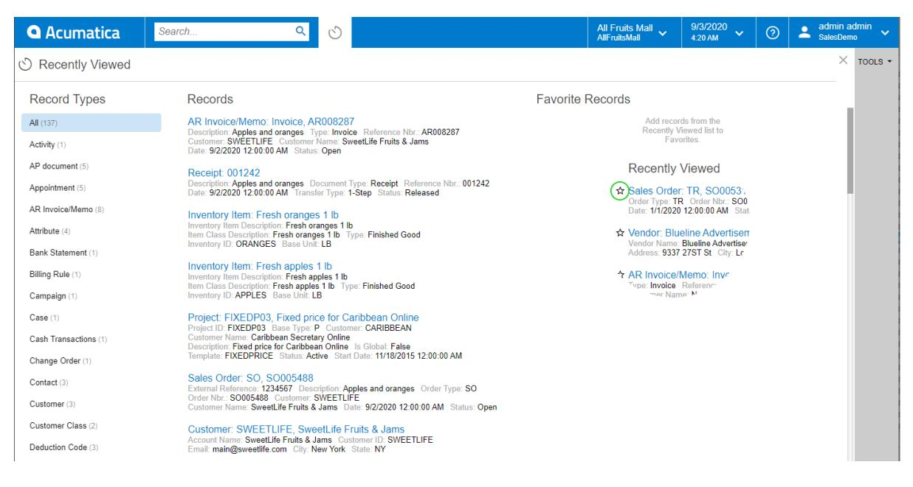

*Figure: The Recently Viewed workspace*

This workspace includes the following lists:

- **Record Types**: This list can be used to filter records by their type. By default, the system displays all records (the **All** record type). If needed, a user can select another record type to view records of only the selected type in the **Records** and **Favorite Records** lists. Record types are predefined, and the system adds the appropriate record types to the **RecentlyViewed** workspace automatically each time a user opens the workspace.
- **Records**: This list displays the last 500 records the user has interacted with. If the user has selected a record type other than **All**, the system filters the records and displays in this list only records of the selected record type.
- **Favorite Records**: This displays the records the user has marked as favorites for easy access to them, regardless of when they were last accessed.

If a user changes a locale and opens the **RecentlyViewed** workspace, **Record Types**, **Records**, and **Favorite Records** will list localized content, including records with localized names from the locale that the user has opened these records before.

# **Favorite Records**

When a user works with specific records frequently, the user can add them to **Favorite Records** in the **Recently Viewed** workspace. This won't remove them from the **Records** list; the record will be listed under both **Records** and **Favorite Records**.

To add a record to the list of favorite records, in the **Records** list, the user should hover over the needed record, and when the star icon appears, click the icon. The yellow color of the star indicates that the record has been added to the list of favorites. (The user needs to refresh the workspace to reflect these changes.)

| <b>Q</b> Acumatica       | Search                                                 | $\mathcal{C}$                                                                                                                                                                                                                               |                                                                                                                                                                                 | All Fruits Mall <b>AllFruitsMall</b> | 9/3/2020 $\checkmark$ 4:10 AM | $\odot$ | ∽ SalesDemo | admin admin |
|--------------------------|--------------------------------------------------------|---------------------------------------------------------------------------------------------------------------------------------------------------------------------------------------------------------------------------------------------|---------------------------------------------------------------------------------------------------------------------------------------------------------------------------------|-----------------------------------------|-------------------------------------|---------|----------------|-------------|
| <b>①</b> Recently Viewed |                                                        |                                                                                                                                                                                                                                             |                                                                                                                                                                                 |                                         |                                     |         |                | TOOLS -     |
| <b>Record Types</b>      | Records                                                |                                                                                                                                                                                                                                             | <b>Favorite Records</b>                                                                                                                                                         |                                         |                                     |         |                |             |
| All (137)                | ★ AR Invoice/Memo: Invoice, AR008287                   |                                                                                                                                                                                                                                             | ★ AR Invoice/Memo: Invoice, AR008287                                                                                                                                            |                                         |                                     |         |                |             |
| Activity (1)             | Date: 9/2/2020 12:00:00 AM Status: Open                | Description: Apples and oranges Type: Invoice Reference Nbr.: AR008287 Customer: SWEETLIFE Customer Name: SweetLife Fruits & Jams                                                                                                        | Description: Apples and oranges Type: Invoice Reference Nbr.: AR008287 Customer: SWEETLIFE Customer Name: SweetLife Fruits & Jams Date: 9/2/2020 12:00:00 AM Status: Open |                                         |                                     |         |                |             |
| AP document (5)          | Receipt: 001242                                        |                                                                                                                                                                                                                                             | ★ Inventory Item: Fresh apples 1 lb                                                                                                                                             |                                         |                                     |         |                |             |
| Appointment (5)          |                                                        | Description: Apples and oranges Document Type: Receipt Reference Nbr.: 001242 Date: 9/2/2020 12:00:00 AM Transfer Type: 1-Step Status: Released                                                                                          | Inventory Item Description: Fresh apples 1 lb Item Class Description: Fresh apples 1 lb Type: Finished Good Inventory ID: APPLES Base Unit: LB                               |                                         |                                     |         |                |             |
| AR Invoice/Memo (8)      | Inventory Item: Fresh oranges 1 lb                     |                                                                                                                                                                                                                                             |                                                                                                                                                                                 |                                         |                                     |         |                |             |
| Attribute (4)            |                                                        | Inventory Item Description: Fresh oranges 1 lb Item Class Description: Fresh oranges 1 lb Type: Finished Good Inventory ID: ORANGES Base Unit: LB                                                                                        |                                                                                                                                                                                 |                                         |                                     |         |                |             |
| Bank Statement (1)       | $\star$ Inventory Item: Fresh apples 1 lb              |                                                                                                                                                                                                                                             |                                                                                                                                                                                 |                                         |                                     |         |                |             |
| Billing Rule (1)         | Type: Finished Good Inventory ID: APPLES Base Unit: LB | Inventory Item Description: Fresh apples 1 lb Item Class Description: Fresh apples 1 lb +                                                                                                                                                   |                                                                                                                                                                                 |                                         |                                     |         |                |             |
| Campaign (1)             |                                                        | Project: FIXEDP03, Fixed price for Caribbean Online                                                                                                                                                                                         |                                                                                                                                                                                 |                                         |                                     |         |                |             |
| Case (1)                 |                                                        | Project ID: FIXEDP03 Base Type: P Customer: CARIBBEAN Customer Name: Caribbean Secretary Online Description: Fixed price for Caribbean Online Is Global: False Template: FIXEDPRICE Status: Active Start Date: 11/18/2015 12:00:00 AM |                                                                                                                                                                                 |                                         |                                     |         |                |             |
| Cash Transactions (1)    |                                                        |                                                                                                                                                                                                                                             |                                                                                                                                                                                 |                                         |                                     |         |                |             |

*Figure: Display of the records in Favorite Records*

# **Search for the Recently Viewed Records**

You can utilize the standard Search functionality to search among the recently viewed records. When the **Recently Viewed** workspace is open, the system runs the search only among the last 500 records you have interacted with. If this workspace is closed, then the system runs the system-wide search and displays all records that correspond to your search request.

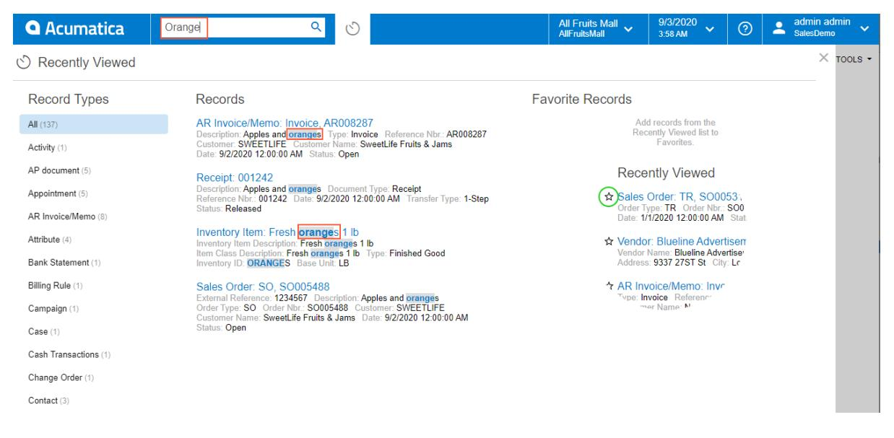

*Figure: Search among the recently viewed records*

# **Company and Branch Selection Menu**

In Acumatica ERP, you can switch between the companies and branches defined in the instance by using the Company and Branch Selection menu of the user interface. This menu contains the list of companies and branches that you have access to.

By using this Company and Branch Selection menu, shown in the screenshot below, you can view the total number of accessible companies and branches, and easily navigate to the needed one by clicking it. If the number of accessible companies and branches exceeds the number that can be displayed on the Company and Branch Selection menu, you can search for the needed company or branch in the**Search** box of this menu.

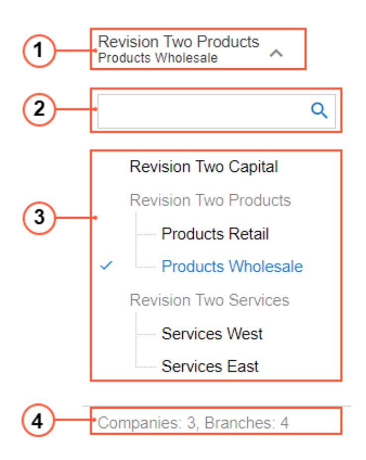

#### *Figure: Basic elements of the Company and Branch Selection menu*

- 1. Company or branch name: Displays the name of the company or branch (or both) to which you are currently signed in
- 2. Search box: Is used to search for a particular company or branch by its name, as described below
- 3. List of companies or branches (or both): Displays the list of the companies and their branches (if any) to which you have access
- 4. Company and branches counter: Displays the total number of companies and the total number of branches to which you have access

# **Switching Between Companies and Branches**

To switch between the companies and branches that you have access to, you use the Company and Branch Selection menu. You click the Company and Branch Selection menu on the top pane of any screen, and then click the name of the company or branch to which you want to sign in.

If a company has multiple branches, you can switch to its branches only. The company name is unavailable for selection in that case.

The selected company or branch is printed in blue and has a check mark le of its name.

# **Searching for a Company or a Branch**

The Company and Branch Selection menu can display a limited number of companies and branches because of size and design limitations. If you have access to multiple companies and branches but the Company and Branch Selection menu doesn't display a company you want to access because of insufficient space in the menu, you can search for the specific company or branch by its name.

You search for a company or a branch by typing its name in the search box of the Company and Branch Selection menu. The system initiates the matching process and displays the search results as soon as you begin typing in this box.

#### **Related Links**

- *[Basic Elements of the User Interface](#page-6-2)*
- *[Info Area](#page-17-1)*

# **Info Area**

The info area, in the right corner of the top pane on the Acumatica ERP screen in the user interface, includes a group of menus and buttons, as shown in the screenshot below. These menus and buttons communicate the status of your user account in the system and provide access to certain settings.

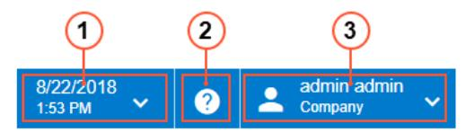

#### *Figure: Info area*

- 1. Business Date menu button
- 2. Open Help button
- 3. User menu button

You can find more details about these items in the following sections.

# **Business Date and Time**

By default, in Acumatica ERP, any user can change the business date by clicking the Business Date menu button and then selecting the needed date. If the *Secure Business Date* feature is enabled on the *[Enable/Disable Features](https://help-2025r1.acumatica.com/Help?ScreenId=ShowWiki&pageid=c1555e43-1bc5-4f6f-ba9d-b323f94d8a6b)* (CS100000) form, only users with the *BusinessDateOverride* role assigned to them can change the business date. The business date is the date that the system will insert by default on the records that you add to the system. By default, the current date is set as the business date. If you set a different date as the business date, this date will be used as the default date on Acumatica ERP forms and on documents that you create by using the forms. For details on changing the business date, see *To Change the [Business](https://help-2025r1.acumatica.com/Help?ScreenId=ShowWiki&pageid=6dfced5c-a970-4d22-880e-da44c463236f) Date* in the Acumatica ERP Getting Started Guide.

# **Open Help Button**

By clicking the Open Help button, you can open the Help menu, which overlaps with the working area. The content of this menu depends on the item displayed in the working area when you click this button. For a detailed description of Help capabilities in Acumatica ERP, see *[Help](#page-18-1)*.

#### **User Menu**

The User menu button displays your first and last name, and the name of the tenant to which you signed in if multiple tenants are configured in your Acumatica ERP instance. The following screenshot shows the items of the User menu.

| 1:47 PM | 8/22/2018 |              | Q                 |  | admin admin Company      |  |  |  |  |  |
|---------|-----------|--------------|-------------------|--|-----------------------------|--|--|--|--|--|
|         |           | Company      |                   |  |                             |  |  |  |  |  |
|         |           | Company2     |                   |  |                             |  |  |  |  |  |
|         |           | Company3     |                   |  |                             |  |  |  |  |  |
| 2       |           |              | admin admin       |  | administrator@acumatica.com |  |  |  |  |  |
|         |           |              |                   |  | <b>MY PROFILE</b>           |  |  |  |  |  |
| 3       |           | Last sign in | 8/22/2018 1:47 PM |  | <b>SIGN OUT</b>             |  |  |  |  |  |

#### *Figure: Items of the User menu*

The User menu includes the following sections:

- 1. Tenants
- 2. My Profile
- 3. Sign-In

The Tenants section of the User menu contains the list of tenants to which you can sign in if multiple tenants are configured in your Acumatica ERP instance. The tenant you are currently signed in to is indicated with a check mark. You can switch to a different tenant by clicking the tenant name. For more information on the configuration of multiple tenants, see *Tenants: General [Information](https://help-2025r1.acumatica.com/Help?ScreenId=ShowWiki&pageid=dd966afb-b1d1-4e7d-85d7-5d5fc61a44a3)* in the Acumatica ERP System Administration Guide.

The My Profile section contains your username, your email address, and the **My Profile** button, which you click to open the *[User Profile](https://help-2025r1.acumatica.com/Help?ScreenId=ShowWiki&pageid=8430c8b2-a79c-4f7b-9768-b0b7fad23a59)* (SM203010) form. For more information about the settings of your profile, see *[Managing](https://help-2025r1.acumatica.com/Help?ScreenId=ShowWiki&pageid=93b231a7-62b4-48f3-86d2-04c29bad1178) Your [Basic Working Environment](https://help-2025r1.acumatica.com/Help?ScreenId=ShowWiki&pageid=93b231a7-62b4-48f3-86d2-04c29bad1178)* in the Acumatica ERP Getting Started Guide.

The Sign-In section contains the date and time of your last sign-in to the system and the**Sign Out** button, which you click to sign out of the system. For more information, see *[Accessing Acumatica ERP](https://help-2025r1.acumatica.com/Help?ScreenId=ShowWiki&pageid=110c5f48-499a-400c-abdd-c104fae54919)* in the Acumatica ERP Getting Started Guide.

#### **Related Links**

- *[Accessing Acumatica ERP](https://help-2025r1.acumatica.com/Help?ScreenId=ShowWiki&pageid=110c5f48-499a-400c-abdd-c104fae54919)*
- *Managing Your Basic Working [Environment](https://help-2025r1.acumatica.com/Help?ScreenId=ShowWiki&pageid=93b231a7-62b4-48f3-86d2-04c29bad1178)*
- *Tenants: General [Information](https://help-2025r1.acumatica.com/Help?ScreenId=ShowWiki&pageid=dd966afb-b1d1-4e7d-85d7-5d5fc61a44a3)*
- *[Help](#page-18-1)*
- *[User Profile](https://help-2025r1.acumatica.com/Help?ScreenId=ShowWiki&pageid=8430c8b2-a79c-4f7b-9768-b0b7fad23a59)*

# **Help**

In the user interface of Acumatica ERP, you can click the Open Help button ( ) to view Help information that is relevant to your current work. The specific Help information you view depends on the item that is displayed in the working area when you click this button, as follows:

• If the working area is displaying a form other than a data entry form or mass processing form, the Help dashboard, which contains cards with descriptions of guides and links to them, is opened in a separate tab of a browser. For details, see *[Help Dashboard](#page-19-0)*.

- If the working area is displaying an Acumatica ERP a data entry form, processing form, or maintenance form, the Help menu specific to this form appears over the working area. The Help menu contains links to the conceptual, procedural, and reference topics that are related to the form. For more information, see *[Form-](#page-21-0)[Specific Help Menu](#page-21-0)*.
- If the working area is displaying a dashboard, the Help menu appears over the working area and displays links to the conceptual, procedural, and reference topics that are related to dashboards. For more information, see *[Form-Specific Help Menu](#page-21-0)*.
- If the working area is displaying a report, the reference topic that describes this report is opened in a separate tab of a browser.

The Help menu covers part of the working area. While viewing it, you can come back to the page that had been displayed in the working area by clicking the Open Help button again. The Help dashboard is opened in a separate browser tab, as are Help topics. If you want to open the Help dashboard and Help topics over the working area, you should press Ctrl and click the Open Help button.

# **Help Dashboard**

The Help dashboard (see the following screenshot) is the main navigation page of Acumatica ERP documentation.

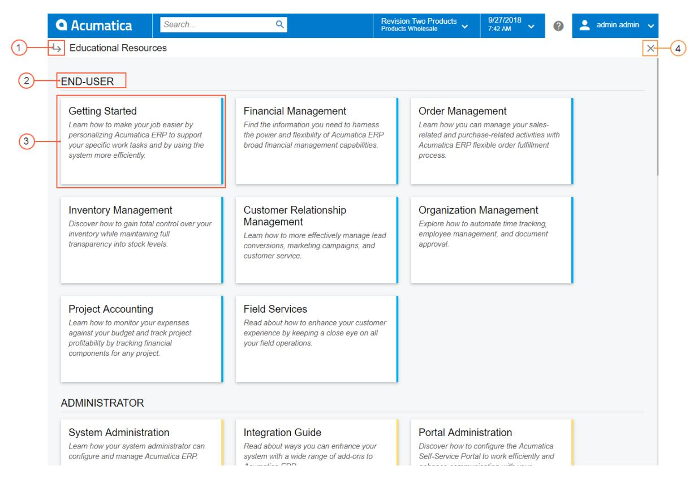

#### *Figure: Help dashboard*

- 1. Topic View button
- 2. Help section title
- 3. Guide card
- 4. Close Help button

You click the Topic View button to switch from the Help dashboard to a Help topic. The Help topic that you last viewed in the current session is displayed. If you haven't opened any Help topic yet, you see the list of Help guides in the navigation pane.

The guides in the Help section are organized in sections, based on the type of system user these guides are developed for (for example, *End User* or *Administrator*), or based on the function these guides perform (for example, *Reference* or *Quick Guides*).

A guide card is a card that contains a description of each guide. You click the guide card to open the guide.

You click the Close Help button to close the Help dashboard. The form, report, or dashboard that was displayed in the working area before you opened Help becomes visible on the screen.

# **Mobile-Friendly User Interface of the Help Topics**

In Acumatica ERP, Help topics are flexible and easy to read on mobile devices. The screenshot below displays an example of a Help topic opened on a mobile device.

|                                               |                                                                                                                                                                                                                    |  | $\cdot$ ull LTE $(4)$ |             |  |  |  |
|-----------------------------------------------|--------------------------------------------------------------------------------------------------------------------------------------------------------------------------------------------------------------------|--|-----------------------|-------------|--|--|--|
| AÅ                                            |                                                                                                                                                                                                                    |  |                       | C,          |  |  |  |
|                                               | Search                                                                                                                                                                                                             |  |                       |             |  |  |  |
|                                               | 2                                                                                                                                                                                                                  |  |                       |             |  |  |  |
| 2 minutes to read                             | Learning About Acumatica <b>Educational Resources</b>                                                                                                                                                           |  |                       | <b>Fdit</b> |  |  |  |
|                                               | In the following sections, you will find information about accessing and using the Acumatica educational resources.                                                                                             |  |                       | 3           |  |  |  |
| In This Topic                                 |                                                                                                                                                                                                                    |  | [Hide/Show]           |             |  |  |  |
| <b>Acumatica Portal</b> <b>Help Portal</b> | <b>Learning Objectives</b> <b>Applicable Scenarios</b> <b>Acumatica Educational Resources</b> <b>Acumatica Community</b> <b>Acumatica Open University</b> <b>Acumatica Resources for Developers</b> |  |                       |             |  |  |  |
|                                               | Learning Objectives                                                                                                                                                                                                |  |                       |             |  |  |  |
|                                               | In this chapter, you will learn how to do the following:                                                                                                                                                           |  |                       |             |  |  |  |
|                                               | Use the Acumatica Community resources Use the Acumatica Portal                                                                                                                                                  |  |                       |             |  |  |  |
|                                               | Use the Acumatica Help portal                                                                                                                                                                                      |  |                       |             |  |  |  |
|                                               | Access the Acumatica Open University resources                                                                                                                                                                     |  |                       |             |  |  |  |
| Access the Acumatica resources for developers |                                                                                                                                                                                                                    |  |                       |             |  |  |  |
|                                               | Applicable Scenarios                                                                                                                                                                                               |  |                       |             |  |  |  |
|                                               | You may want to learn about the Acumatica                                                                                                                                                                          |  |                       |             |  |  |  |
|                                               |                                                                                                                                                                                                                    |  |                       |             |  |  |  |

#### *Figure: Help topic on a mobile device*

The following items are shown in the screenshot:

- 1. Home button: Opens the Help dashboard, which has cards for the guides available on the Help Portal
- 2. Open/Hide button: Displays or hides the tree of topics available in the Help guide of the selected topic
- 3. Topic text: Is adjusted to the width of the screen of the device

When you open a Help topic on a mobile device, the system opens it with the topic tree closed by default. You can click the Open/Hide button to open the tree of available topics.

If you click the Home button, the system navigates to the Help dashboard with the list of available guides. You can

then click the Back button ( ) to return to the topic that was last opened.

In the mobile view of the topic, the Help topic toolbar is not available.

Text blocks are adjusted to the screen size automatically to fit the text to the screen, whereas the code blocks remains as they are but a horizontal scroll bar appears for these blocks. If you rotate the screen, the system automatically resizes the text blocks to fit them to the screen width.

#### **Form-Specific Help Menu**

A form-specific Help menu is opened when you click the Open Help ( ) button while viewing the majority of forms (except for reports and generic inquiries that are not described in Help) and dashboards. In this menu, you can see links to Help topics that are related to the form if a form is opened in the working area (see the following screenshot) or to dashboards if a dashboard is opened in the working area. The menu pane partially overlaps the working area.

| 9/28/2018 2:14 AM                          | $\bullet$ admin admin |  |
|-----------------------------------------------|-----------------------|--|
| <b>Procedures</b>                             |                       |  |
| To Add a Budget Ledger To Prepare a Budget |                       |  |
| Concepts                                      |                       |  |
| <b>Budgets Modification</b>                   |                       |  |
| <b>Budget Structure Example</b>               |                       |  |
| Security of GL Budget Articles                |                       |  |
| Form Reference                                |                       |  |
| <b>Budgets (GL302010)</b>                     |                       |  |
| <b>Help Dashboard</b>                         |                       |  |
| <b>Acumatica Educational Resources</b>        |                       |  |

*Figure: Form-specific Help menu*

# **Help Navigation Toolbar**

By default, when you click a link in the form-specific Help menu, the Help topic or the Help dashboard opens in a new tab of your browser. If you click the *Acumatica News* link in the *Help Dashboard* section of the form-specific Help menu, the system opens the Welcome to Acumatica page in the current tab. For more information, see *Welcome to [Acumatica](#page-39-1) Page in Acumatica ERP*.

If you want to open the Help topic or the Help dashboard in the same tab of your browser, you press Ctrl and click the needed link in the form-specific Help menu. You can navigate to different Help topics within a guide (item 2 in the screenshot below or selecting the topic in the Help tree) or switch to another guide by clicking the Open Help Dashboard button (item 1 in the screenshot below), and clicking the needed guide. If you want to return to the form

where you initiated the form-specific Help menu or the Help topic, you click the Open Help ( ) button. To return

to the form-specific Help menu, you click the Open Form-Specific Help menu button ( ; item 3 in the screenshot below), which appears near the Close button.

When you open a Help topic, you can see the navigation toolbar, which has tools you can use to quickly switch between Help topics and to close the Help topic you are viewing (see the following screenshot).

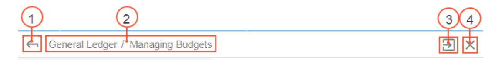

#### *Figure: Help Navigation toolbar*

- 1. Open Help Dashboard button
- 2. Path to the opened topic in the Help tree
- 3. Open Form-Specific Help menu button (appears only if you have opened the Help topic or the Help dashboard by pressing Ctrl+click)
- 4. Close

You click the Open Help Dashboard button to open the Help dashboard (for example, if you want to switch to another guide).

Each segment of the path to the opened topic is a link to the corresponding Help topic. By clicking the link, you can open a parent topic on any level.

You click the Close button to close the current topic. The main menu becomes visible on the screen.

# **Search of Help Topics**

You can search for information in Help in the following ways:

- By using the Open Help button: If you are working with a form or report and have questions related to the form or report, you can click the Open Help button to open a form-specific Help menu with links to related topics (for a form) or a reference topic (for a report).
- By using the**Search** box: If you want to find information that is not related to the form you are currently working with, you can type a search string in the**Search** box, switch to the **Help Topics** search filter tab, and find the necessary information in the search results.
- By using navigation in Help: If you want to read all information related to a particular functional area (for example, what tools the system provides for cash management), you open the Help dashboard, open a particular guide, and in the Help topic tree, click the title of the chapter you want to read.

# **View of a Help Topic**

The following screenshot shows a view of an Acumatica ERP Help topic with the parts that appear on it.

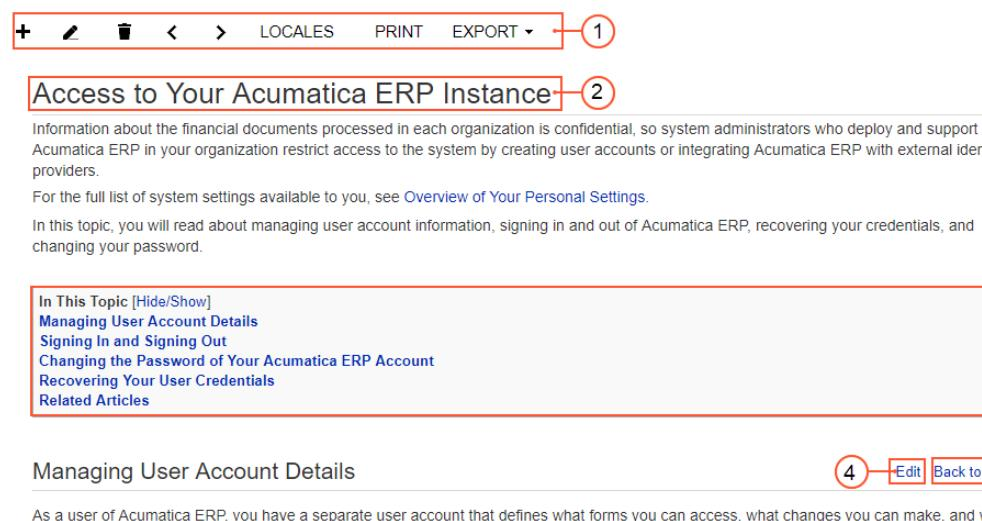

#### *Figure: Help Topic View*

- 1. Help topic toolbar
- 2. Help topic title
- 3. Topic table of contents (optional)
- 4. **Edit** button (available to users with sufficient access rights)
- 5. **Back toTop** button

By using the buttons on the Help topic toolbar, you can carry out the following common tasks:

- **Locales**: change the language of the topic.
- **Print**: print the topic.
- **Export**: export the topic to Word or as a plain text.

Large Help topics may include a table of contents, so you can navigate through the topic more easily. The table of contents lists links to sections of the topic; you can click any link to navigate to that section. By default, the table of contents is open. To minimize the table of contents or maximize it if it is closed, click **Hide/Show** on the table of contents.

Acumatica ERP Help topics can be edited or reorganized by a user with sufficient access rights. To edit the entire topic, you click the **Edit Current Article** button on the topic toolbar, which is available if you have sufficient access rights. For more information about access rights, see *Wiki Access [Management](https://help-2025r1.acumatica.com/Help?ScreenId=ShowWiki&pageid=f0708bda-251d-45e2-823a-62a48f7df7eb)*. To edit a section in a Help topic, you click the **Edit** button right of the section title. By default, this button is hidden, even for users with sufficient access rights to edit the topic. If you have these access rights, to be able to view and click the **Edit** button, you point to the section title.

When you scroll down in a large topic, you may want to easily return to the beginning of the topic. For this purpose, you can click the **Back toTop** button, which is also right of each section title. By default, this button is hidden. It appears when you point to the section title.

# **Related Links**

• *Wiki [Overview](https://help-2025r1.acumatica.com/Help?ScreenId=ShowWiki&pageid=567615ad-a883-413b-9d94-a36ed313a4d9)*

# **Built-In Infotips**

Acumatica ERP offers context-sensitive Help infotips to give you an on-the-spot description of a UI element, along with additional sources of information related to the element, while you are viewing a form. This reduces the need to leave the current form to search for information separately.

You can view infotips for boxes, check boxes, and option buttons of most forms, as well as for the columns of tables on these forms. (See the *Infotip Limitations* section of this topic for details.)

# **Infotip Access**

You access a particular infotip by hovering over the box, check box, or option button label and clicking the question mark that appears. The system opens an infotip, which is a pane with the description of the UI element and links to related Help topics.

The following screenshot shows the question mark icon that appears when you hover over the **Customer ID** box.

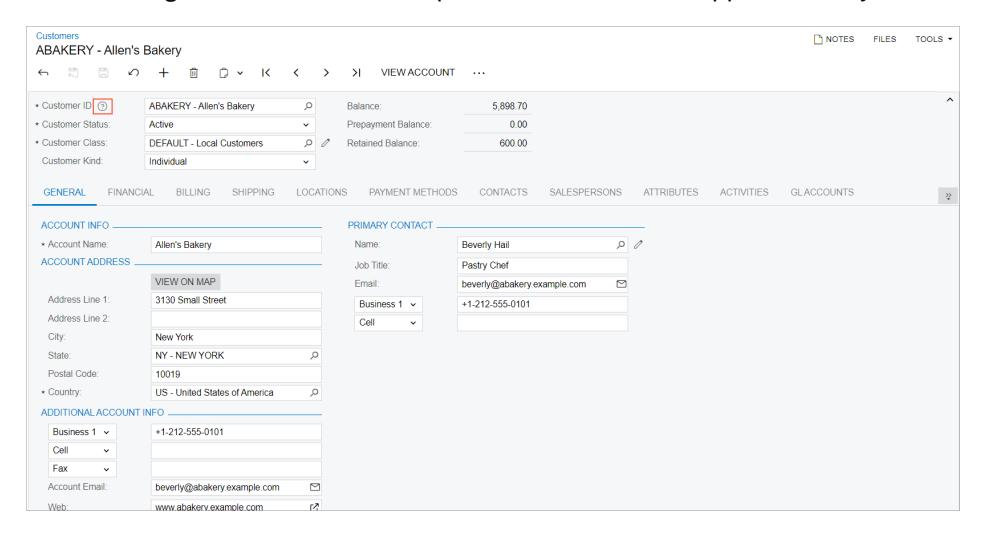

*Figure: The question mark icon next to the Customer ID box*

You access the infotip for a table column slightly differently. You first click the column name, which opens the Sorting and Filtering Settings dialog box. You then click the question mark icon in the bottom le corner of the dialog box (as the following screenshot shows).

| <b>Customers</b> <b>ABAKERY - Allen's Bakery</b> $\begin{matrix} \boxed{12} \\ \boxed{13} \end{matrix}$ $\Box$ 位 $\Omega$ $+$ $\leftarrow$ | Sort Ascending Sort Descending Clear Filter                            | <b>IEW ACCOUNT</b>           | $\cdots$                   |                     |                                        | $\bigcap$ NOTES     | <b>FILES</b>    | TOOLS $\star$                   |
|-----------------------------------------------------------------------------------------------------------------------------------------------------------------|------------------------------------------------------------------------------|------------------------------|----------------------------|---------------------|----------------------------------------|---------------------|-----------------|---------------------------------|
| <b>ABAKERY - All</b> * Customer ID: Active * Customer Status: * Customer Class: <b>DEFAULT - Loc</b> <b>Customer Kind:</b> Individual      | $\checkmark$ Equals Does Not Equal Contains Starts With Is Empty | nt Balance: Balance:      | 5,898.70 0.00 600.00 |                     |                                        |                     |                 | $\hat{ }$                       |
| <b>GENERAL</b> <b>FINANCIAL</b> <b>BILLING</b>                                                                                                            | Is Not Empty                                                                 | <b><i>MENT METHODS</i></b>   | <b>CONTACTS</b>            | <b>SALESPERSONS</b> | <b>ATTRIBUTES</b> <b>ACTIVITIES</b> | <b>GLACCOUNTS</b>   |                 | $\ddot{\phi}$                   |
| $\left  \rightarrow \right $ $\circ$ SET AS DEFAULT $+$                                                                                                | $\varphi$                                                                    |                              |                            |                     |                                        | $\circ$ All Records |                 | $\triangledown$ $\mathbf{v}$ |
| 80 $\Box$ *Location ID Active                                                                                                                          | $_{\odot}$ CANCEL OK                                                   | City ilt                  |                            | State               | Country                                | <b>Price Class</b>  | <b>Tax Zone</b> |                                 |
| > 0 $\Box$ ⊡ <b>MAIN</b>                                                                                                                               | Primary Location                                                             | $\boxdot$ <b>New York</b> |                            | <b>NY</b>           | <b>US</b>                              |                     |                 |                                 |
|                                                                                                                                                                 |                                                                              |                              |                            |                     |                                        |                     |                 |                                 |

*Figure: The question mark icon for a column*

# **Infotip Usage**

When you click the question mark icon for an element, the system opens the infotip: a pane that partially overlaps the working area of the screen (see Item 1 in the following screenshot). The infotip pane displays the description of the UI element and the following sections:

- **Activities**: A list of how-to Help topics with configuration or process activities that may be performed on the current form
- **Related Information**: A list of Help topics that contain conceptual information related to the functionality of the current form
- **Form Reference**: A link to the Help topic that has descriptions of the current form's UI elements
- **Help Dashboard**: Links to the Acumatica *Educational Resources* dashboard (Help portal) and to the Acumatica ERP news and announcements page
- **DAC Details**: A link to the corresponding DAC in the DAC Schema Browser

This section is available only for users with at least one of the following user roles: *Administrator*, *Report Designer*, and *Customizer*.

If an element's description is long, the *Show More* link (Item 2) is displayed. When you click *Show More*, the full text of the description is shown. If any of the sections below the description has more than three links, the section shows the first three links, followed by the *Show More* link (Item 3).

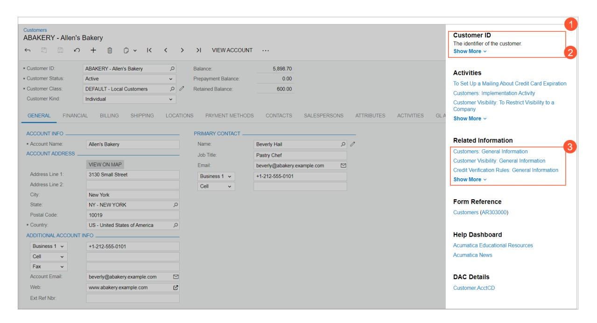

#### *Figure: The infotip for the Customer box*

To close the pane, you click anywhere on the form.

#### **Infotip Limitations**

Currently, infotips are not shown for the following elements:

- The names of tabs on a form
- Elements on the form title bar, form toolbar, and table toolbar
- Form-specific commands displayed on the More menu
- Dialog boxes or elements within them

Also, infotips are not supported for Acumatica ERP forms that are inquiry forms, generic inquiry forms, report forms, or ARM reports.

# **Main Menu**

The main menu in the user interface of Acumatica ERP, shown in the following screenshot, includes the **Favorites** menu item, the workspace menu items, the **More Items** menu item, the configuration menu, and the Collapse or Expand button.

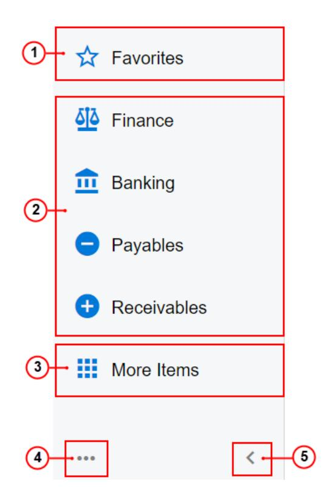

#### *Figure: Main menu*

- 1. **Favorites** menu item
- 2. Workspace menu items
- 3. **More Items** menu item
- 4. Configuration menu
- 5. Collapse or Expand button

You click the **Favorites** menu item to view your favorite forms. You click this item to open the list of your favorites.

You click each of the workspace menu items to view the forms and reports of that workspace, which is a particular functional area. If you need to open the current workspace (which is highlighted in the main menu), you can press Alt+G. By default, the most commonly used workspaces are represented with menu items on the main menu; you can add workspace menu items to the main menu or remove existing menu items. For details on workspaces, see *[Workspaces](#page-33-1)*.

When you click the **More Items** menu item, a menu is opened with tiles, grouped by broader functional areas, that represent all of the possible workspaces. You can pin any of these workspaces to the main menu by pointing to the

workspace tile and clicking the Pin ( ) button.

The configuration menu contains commands that you click to configure the location of the main menu and to edit the menu items in the whole system (if you are signed in to an account with the *Administrator* role assigned). The menu commands are listed in the following table. For details on configuring the location of the main menu, see *[Learning About the Acumatica ERP UI](https://help-2025r1.acumatica.com/Help?ScreenId=ShowWiki&pageid=3613cc43-70d1-46ba-b4f1-4cf7e6b39ede)* in the Getting Started Guide.

*Table: Menu Commands of the Configuration Menu*

| Command        | Description                                                                                                                                                                                                                                                                                                                                                              |
|----------------|--------------------------------------------------------------------------------------------------------------------------------------------------------------------------------------------------------------------------------------------------------------------------------------------------------------------------------------------------------------------------|
| Collapse toTop | Collapses the main menu panel and adds the Menu button in the top le corner of the screen (instead of the Home button with the Acumatica logo). When the main menu is collapsed, the work area expands to cover the area where the main menu had been. This menu command is displayed only when the main menu panel is shown on the le side of the screen. |
| Expand to Le  | Displays the expanded main menu panel on the le side of the screen. This menu command is displayed only when the main menu is collapsed and the Menu button is shown in the top le corner of the screen.                                                                                                                                                         |
| Edit Menu      | Switches the system to Menu Editing mode. In this mode, authorized users can customize menu items for the whole system. This menu command is displayed only to users with a role specified in the Menu Editor Role box on the Security Preferences (SM201060) form. For details, see Menu Editing Mode.                                                      |

By clicking the Collapse button, you can collapse the main menu panel so that it displays only icons, and by clicking the Expand button, you can expand the panel to the full width. By clicking these buttons, you can change the width of the main menu pane when the menu is in both locations—expanded on the le and collapsed to the top.

#### **Related Links**

- *[Customizing the User Interface](https://help-2025r1.acumatica.com/Help?ScreenId=ShowWiki&pageid=774107f8-a149-4676-9c78-0c884edd19cb)*
- *[Learning About the Acumatica ERP UI](https://help-2025r1.acumatica.com/Help?ScreenId=ShowWiki&pageid=3613cc43-70d1-46ba-b4f1-4cf7e6b39ede)*
- *Managing Your Basic Working [Environment](https://help-2025r1.acumatica.com/Help?ScreenId=ShowWiki&pageid=93b231a7-62b4-48f3-86d2-04c29bad1178)*

# **Menu Editing Mode**

In the user interface of Acumatica ERP, you open Menu Editing mode (see the following screenshot) by clicking the **Edit Menu** menu command on the configuration menu of the main menu. The **Edit Menu** menu command is available only to users with a role specified in the **Menu Editor Role** box on the *[Security Preferences](https://help-2025r1.acumatica.com/Help?ScreenId=ShowWiki&pageid=a100a91e-310b-4513-bc68-5110ad9463ff)* (SM201060) form. For details, see *[Customizing the User Interface](https://help-2025r1.acumatica.com/Help?ScreenId=ShowWiki&pageid=774107f8-a149-4676-9c78-0c884edd19cb)*.

| <b>+ ADD WORKSPACE</b>           | <b>+ ADD MENU ITEM</b> $+$ ADD TILE                   |                                                                                 | © MENU SETTINGS ∨ |
|----------------------------------|----------------------------------------------------------|---------------------------------------------------------------------------------|-------------------|
| Data Views                       | Finance: Full Menu                                       |                                                                                 | OLS - 4        |
| Time and Expenses                | <b>New</b> \$ Ø Journal                         | <b>Account</b> <b>Account</b> <b>Summary</b> <b>Details</b> Journal | <b>Reclassify</b> |
| 丽 Finance                     | Entry Select the items to be added to the quick menu. | <b>Entries</b>                                                                  |                   |
| Banking                          | Transactions                                             | <b>Financial Statements</b>                                                     |                   |
| e ez Projects                 | $\boxdot$ Journal Transactions                           | ⊠ Balance Sheet                                                                 |                   |
|                                  | Journal Vouchers                                         | Balance Sheet Yearly Comparision                                                |                   |
| 間 <b>Fixed Assets</b>         | <b>Trial Balance</b>                                     | <b>⊡</b> Profit & Loss                                                          |                   |
|                                  | Profiles                                                 | ☑ Profit & Loss Rolling 12 Month                                                |                   |
| $\frac{1}{2}$ \$ Currency Manage | ◯ Master Financial Calendar                              | ☑ Profit & Loss Quarterly                                                       |                   |
| $%$ Taxes                        | ☑ Company Financial Calendar                             | Profit & Loss by Location                                                       |                   |
|                                  | <b>⊡</b> Allocations                                     | Profit & Loss versus PTD Budget                                                 |                   |
| Payables                         | $\Box$ Recurring Transactions                            | Profit & Loss versus YTD Budget                                                 |                   |
|                                  | $\boxdot$ Chart of Accounts                              | Profit & Loss Annual Comparison                                                 |                   |
| Receivables                      | $\boxdot$ Subaccounts                                    | !!!!!!!!!!!!!!!!!!!!!!!!!!!!!!!!!!!!!!!!                                        |                   |
| <b>EXIT MENU EDITING</b> ∍    | Processes                                                | Dinese a Long by Product $\land$ Show Quick Menu atement                  |                   |

#### *Figure: Menu Editing mode*

The buttons that appear in Menu Editing mode are described in the following table.

| Button            | Description                                                                                                                                                                                                                    |
|-------------------|--------------------------------------------------------------------------------------------------------------------------------------------------------------------------------------------------------------------------------|
| Add Workspace     | Opens the Workspace Parameters Dialog Box with the boxes blank so you can specify these parameters and add a workspace to the UI.                                                                                           |
| Add Menu Item     | Opens the Select Forms Dialog Box for the selected workspace. The button is available when you first select a workspace in Menu Editing mode.                                                                               |
| Add Tile          | Opens the Tile Parameters Dialog Box with the boxes blank so you can specify these para meters and add a tile to the selected workspace. The button is available when you first select a workspace in Menu Editing mode. |
| Menu Settings     | Opens the Menu Settings menu.                                                                                                                                                                                                  |
| Exit Menu Editing | Saves your changes and exits Menu Editing mode.                                                                                                                                                                                |

#### *Table: Buttons of Menu Editing mode*

# **Editing and Deletion of Menu Items**

In Menu Editing mode, you can delete or edit the properties of the following items: workspace, category, form, and tile. When you point at an item, the toolbar pops up with the Edit and Delete buttons (see the following screenshot, which shows the toolbar for the workspace title).

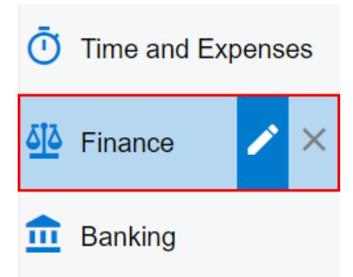

#### *Figure: Workspace pop-up toolbar*

In the following tables, you can find descriptions of the pop-up toolbars for each item type.

#### *Table: Workspace Pop-up Toolbar*

| Button | Description                                                                                                                                       |
|--------|---------------------------------------------------------------------------------------------------------------------------------------------------|
| Edit   | Opens the Workspace Parameters Dialog Box, which displays the parameters of the work space.                                                    |
| Delete | Deletes the workspace and the tiles that belong to the workspace from the system. The forms that belong to the workspace remain in the system. |

#### *Table: Section Pop-up Toolbar*

| Button | Description                                                                                                                    |
|--------|--------------------------------------------------------------------------------------------------------------------------------|
| Edit   | Opens the Category Parameters Dialog Box, which displays the parameters of the catego ry.                                   |
| Delete | Deletes the category from the system. The menu items under this category are moved to the Other category in each workspace. |

#### *Table: Form Pop-up Toolbar*

| Button | Description                                                                                                                                                                                                       |
|--------|-------------------------------------------------------------------------------------------------------------------------------------------------------------------------------------------------------------------|
| Edit   | Opens the Item Parameters Dialog Box, which displays the parameters of the form or re port. Changes to the form or report parameters are visible in all the workspaces to which the form or report belongs. |
| Delete | Deletes the link to the form or report from the current workspace. The form or report re mains in the system.                                                                                                  |

#### *Table: Tile Pop-up Toolbar*

| Button | Description                                                                        |
|--------|------------------------------------------------------------------------------------|
| Edit   | Opens the Tile Parameters Dialog Box, which displays the parameters of the tile.   |
| Delete | Deletes the tile from the system. You cannot restore the tile after it is deleted. |

# **Dialog Boxes of Menu Editing Mode**

In this section, you will find descriptions of all dialog boxes that you can open by using the buttons of Menu Editing mode.

#### *Table: Workspace Parameters Dialog Box*

In the **Workspace Parameters** dialog box, you can specify the parameters of a new workspace or edit the parameters of an existing workspace. You can invoke this dialog box by clicking **Add Workspace** or by clicking the Edit button on the workspace pop-up toolbar. This dialog box contains the elements described in the following table.

| Element                                        | Description                                                                                                                                                                                                                  |
|------------------------------------------------|------------------------------------------------------------------------------------------------------------------------------------------------------------------------------------------------------------------------------|
| Icon                                           | The icon that is displayed to the le of the workspace title. You can select an icon from the predefined list.                                                                                                            |
| Area                                           | The area under which the workspace is displayed on the More Items menu of the main menu. You can select an area from the predefined list.                                                                                 |
| Title                                          | The title of the workspace. The title of the workspace should be unique among the work spaces in the system. If you type an existing title, the system displays a warning and does not create or update the workspace. |
| The dialog box contains the following buttons. |                                                                                                                                                                                                                              |
| OK                                             | Saves your changes and closes the dialog box.                                                                                                                                                                                |
| Cancel                                         | Closes the dialog box without saving your changes.                                                                                                                                                                           |

#### *Table: Select Forms Dialog Box*

In the **Select Forms** dialog box, you can select the forms, reports, and dashboards links to which are displayed in the selected workspace. This dialog box contains a list of all forms, reports, and dashboards grouped by areas and categories. To add a form, report or dashboard to the workspace, you select the check box to the le of its caption. You can find a form, report, or dashboard by typing its title or ID in the**Search** box at the top of the dialog box.

In addition to the**Search** box and the listed forms, reports, and dashboards this dialog box contains (at the bottom right of the dialog box) the buttons described in the following table.

| Button      | Description                                                                                             |
|-------------|---------------------------------------------------------------------------------------------------------|
| Add         | Adds to the workspace the forms, reports, or dashboards you have selected.                              |
| Add & Close | Adds to the workspace the forms, reports, or dashboards you have selected and closes the dialog box. |
| Close       | Closes the dialog box without adding the selected forms, reports, or dashboards to the workspace.    |

#### *Table: Tile Parameters Dialog Box*

In the **Tile Parameters** dialog box, you can specify the parameters of a new tile you are adding to the selected workspace or edit the parameters of an existing tile in the workspace. The elements of this dialog box are described in the following table.

| Element                                        | Description                                                                                                                                                                                                                                                             |
|------------------------------------------------|-------------------------------------------------------------------------------------------------------------------------------------------------------------------------------------------------------------------------------------------------------------------------|
| Icon                                           | The icon that is displayed on the tile button. You can select an icon from the predefined list.                                                                                                                                                                      |
| Title                                          | The title of the tile. The title of the tile should be unique among the tiles in the system. If you type an existing title, the system displays a warning and does not create or update the tile.                                                                 |
| Form                                           | The Acumatica ERP form that is opened when a user clicks the tile. You can select a form from the predefined list. When you are selecting a form, you can type the first characters of the form ID or title, and the system filters the list by these characters. |
| Parameters                                     | The form-specific parameters of the address line that the system adds to the form link when a user clicks the tile.                                                                                                                                                  |
| The dialog box contains the following buttons. |                                                                                                                                                                                                                                                                         |
| OK                                             | Saves your changes to the parameters of the tile and closes the dialog box.                                                                                                                                                                                             |
| Cancel                                         | Closes the dialog box without saving your changes to the parameters of the tile.                                                                                                                                                                                        |

#### *Table: Menu Settings*

In the Menu Settings menu, you can add a new category, edit parameters, or delete an existing category. You can also reset the menu to the default state.

The menu contains only the specific buttons described in the following table.

| Button                            | Description                                                                                                                                                             |
|-----------------------------------|-------------------------------------------------------------------------------------------------------------------------------------------------------------------------|
| Reset to Default Menu Settings | Displays a confirmation dialog box, and once confirmed, resets the settings of the whole menu (the main menu items and the workspace items) to the default settings. |
| Add Category                      | Opens the Category Parameters Dialog Box with blank boxes.                                                                                                              |

#### *Table: Category Parameters Dialog Box*

In this dialog box, you can specify the parameters of a new category or edit the parameters of an existing category. You can invoke this dialog box by clicking **Add Category** in the Menu Settings menu or by clicking the Edit button on the category pop-up toolbar. Elements of this dialog box are described in the following table.

| Element                                        | Description                                                                                                                                                                                                                       |  |
|------------------------------------------------|-----------------------------------------------------------------------------------------------------------------------------------------------------------------------------------------------------------------------------------|--|
| Title                                          | The title of the category. The title of the category should be unique within the categories defined in the system. If you type an existing title, the system displays a warning and does not create or update the category. |  |
| The dialog box contains the following buttons. |                                                                                                                                                                                                                                   |  |
| OK                                             | Saves your changes and closes the dialog box.                                                                                                                                                                                     |  |
| Cancel                                         | Closes the dialog box without saving your changes.                                                                                                                                                                                |  |

#### *Table: Item Parameters Dialog Box*

In this dialog box, you can edit the parameters of a link to a form or report. You can invoke this dialog box by clicking the Edit button on the form title pop-up toolbar. Changes to the form or report parameters are visible in all workspaces to which the item belongs. The elements of this dialog box are described in the following table.

| Element                                        | Description                                                                                                                                                                                                   |  |
|------------------------------------------------|---------------------------------------------------------------------------------------------------------------------------------------------------------------------------------------------------------------|--|
| Category                                       | The category under which the form or report is displayed in the workspace.                                                                                                                                    |  |
| Title                                          | The title of the form or report. You can specify a unique title, or you can specify a form or report title that exists in the system because forms and reports are identified by their IDs, not titles. |  |
| The dialog box contains the following buttons. |                                                                                                                                                                                                               |  |
| OK                                             | Saves your changes and closes the dialog box.                                                                                                                                                                 |  |
| Cancel                                         | Closes the dialog box without saving your changes.                                                                                                                                                            |  |

#### **Related Links**

• *[Customizing the User Interface](https://help-2025r1.acumatica.com/Help?ScreenId=ShowWiki&pageid=774107f8-a149-4676-9c78-0c884edd19cb)*

# **Workspaces**

In the user interface of Acumatica ERP, a workspace is a menu that contains links to the forms and reports of a particular functional area of the product. In the following screenshot, the basic elements of a workspace are shown.

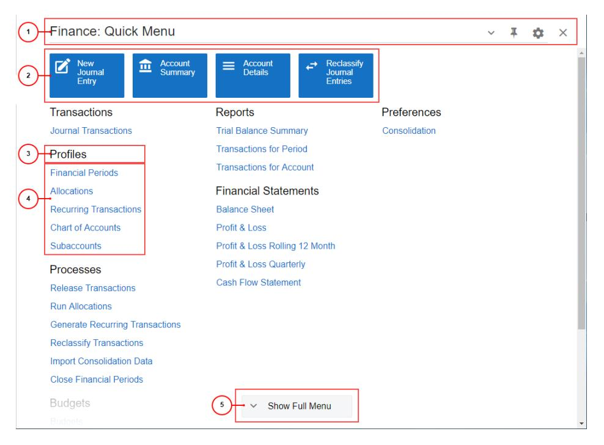

#### *Figure: Workspace elements*

1. Workspace title bar

- 2. Tiles
- 3. Category
- 4. Links to forms and reports
- 5. Workspace footer

The system displays the list of forms and reports in a workspace in one of the following views:

- **Quick Menu** (default; shown in the screenshot above): In this view, the most commonly used forms and reports are displayed.
- **Full Menu**: In this view, all forms and reports that have been added to the workspace are displayed.

On the workspace title bar, the system displays the view name. To toggle between these views, you can do any of the following:

- Click the workspace title bar.
- On the workspace footer, click the**Show Full Menu** or **Show Quick Menu** button.

You can personalize the list of forms displayed in the quick menu of a workspace for you (that is, your user account) when you switch to **Configuration** mode. The changes you make affect the current user session and all future sessions. For details, see *[Learning About the Acumatica ERP UI](https://help-2025r1.acumatica.com/Help?ScreenId=ShowWiki&pageid=3613cc43-70d1-46ba-b4f1-4cf7e6b39ede)* in the Getting Started Guide.

A user with the role specified in the **Menu Editor Role** box on the *[Security Preferences](https://help-2025r1.acumatica.com/Help?ScreenId=ShowWiki&pageid=a100a91e-310b-4513-bc68-5110ad9463ff)* (SM201060) form can use Menu Editing mode to customize the user interface for all users in the system. For details on the user interface elements of Menu Editing mode, see *[Menu Editing Mode](#page-28-1)*. For more information about customizing the menu elements in Acumatica ERP, see *[Customizing the User Interface](https://help-2025r1.acumatica.com/Help?ScreenId=ShowWiki&pageid=774107f8-a149-4676-9c78-0c884edd19cb)* in the System Administration Guide.

# **Workspace Title Bar**

In the workspace title bar, you can find the workspace title, the view in which the list of workspace items are displayed (**Quick Menu** or **Full Items**), and workspace title buttons (which are described in the following table).

| Button                      | Icon | Description                                                                                                                                                                |
|-----------------------------|------|----------------------------------------------------------------------------------------------------------------------------------------------------------------------------|
| Pin                         |      | Pins the workspace to the main menu panel.                                                                                                                                 |
|                             |      |                                                                                                                                                                            |
| Unpin                       |      | Unpins the workspace from the main menu panel.                                                                                                                             |
|                             |      |                                                                                                                                                                            |
| Workspace Configu ration |      | Opens the workspace in Configuration mode. In this mode, you can select the items (such as forms and reports) that are displayed on the Quick Menu of the workspace. |
| Close Workspace             |      | Closes the workspace and displays the page opened in the work ing area.                                                                                                 |

#### *Table: Workspace Title Bar Buttons*

| Button           | Icon | Description                                                                                                                                                                       |
|------------------|------|-----------------------------------------------------------------------------------------------------------------------------------------------------------------------------------|
| Reset to Default |      | Resets the list of items you currently have displayed in the Quick Menu of the workspace to the list of items that the system admin istrator configured for the Quick Menu. |
|                  |      | This button appears only if you are viewing a menu in Configura tion mode.                                                                                                     |
| Exit             |      | Saves your changes and closes Configuration mode for the work space, returning you to the mode in which you were viewing the workspace.                                     |
|                  |      | This button appears only if you are viewing a menu in Configura tion mode.                                                                                                     |

# **Tiles**

A tile is a special button on a workspace that you click to open a form or report with predefined settings (or, for a data entry form, with most settings blank so you can define a new entity). For example, by clicking a tile, you can open the *[Vendors](https://help-2025r1.acumatica.com/Help?ScreenId=ShowWiki&pageid=a9584be3-f2bd-4d67-80d4-8041d809df56)* (AP303000) form with a particular vendor selected in the**Vendor** box.

Predefined workspaces contain tiles with the most popular actions and forms for the workspace. You can make a

tile your favorite by clicking ( ) in the lower right corner of the tile.

If your user account is assigned the *Administrator* role, you can manage the tiles in a workspace for all system users. For details, see *UI Navigation Options: Tiles and Links to Forms in a [Workspace](https://help-2025r1.acumatica.com/Help?ScreenId=ShowWiki&pageid=433f5d13-a9a0-45d6-8971-a4da23a923b8)* in the System Administration Guide.

# **Categories**

In each workspace, categories are used to group items by type, which makes it easier for users to find needed items. For example, the**Transactions** category contains forms you can use to process transactions. The system provides a predefined group of categories.

If your user account is assigned the *Administrator* role, you can manage the groups of categories in the system. For more information, see *UI Navigation Options: Tiles and Links to Forms in a [Workspace](https://help-2025r1.acumatica.com/Help?ScreenId=ShowWiki&pageid=433f5d13-a9a0-45d6-8971-a4da23a923b8)* in the System Administration Guide.

# **Links to Forms and Reports**

On a workspace, you can find links to different types of forms: data entry forms, inquiries, processing forms, report forms, and substitute forms. You use a link on the workspace to open a particular form or report form that you want to work with.

For some forms, you can initiate the creation of a new document or other entity. Usually these forms have substitute forms. A substitute form has a list of records related to the form for which it is being substituted. For substitute forms for data entry forms (on which you can initiate a new record), the **+ NEW** button appears on the workspace when you point at the name of the form; this button is not available for reports, inquiry forms, or processing forms.

By using this button, you can open the entry form for creating a new entity directly from the workspace with just one click.

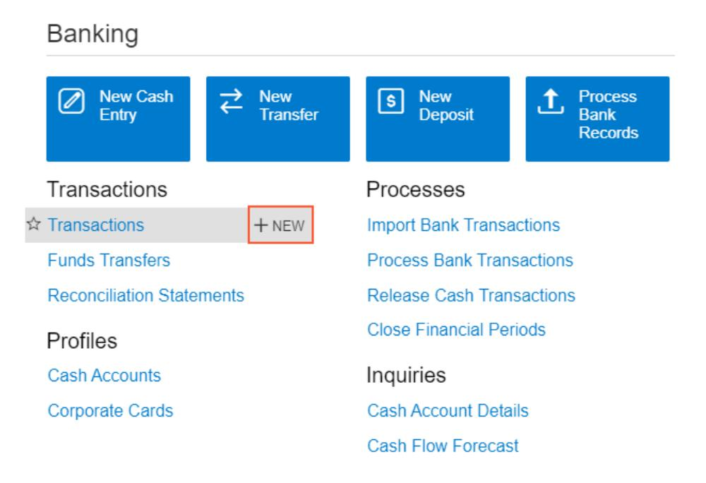

#### *Figure: Appearance of the +New button*

# **Workspace Footer**

On the workspace footer, you can find one of the buttons (which are described in the following table) that you use to toggle between the workspace views.

#### *Table: Workspace Footer Buttons*

| Button          | Description                                                                                                         |
|-----------------|---------------------------------------------------------------------------------------------------------------------|
| Show Full Menu  | Toggles the workspace to the Full Menu view. This button is displayed in the Quick Menu view of workspace items. |
| Show Quick Menu | Toggles the workspace to the Quick Menu view. This button is displayed in the Full Menu view of workspace items. |

# **Favorite Reports and Forms**

In the workspace, you can add a form to your favorites by pointing to the form name and clicking to the le of

the form name. Forms that you have added to favorites are marked with .

#### **Related Links**

- *[Customizing the User Interface](https://help-2025r1.acumatica.com/Help?ScreenId=ShowWiki&pageid=774107f8-a149-4676-9c78-0c884edd19cb)*
- *[Learning About the Acumatica ERP UI](https://help-2025r1.acumatica.com/Help?ScreenId=ShowWiki&pageid=3613cc43-70d1-46ba-b4f1-4cf7e6b39ede)*
- *[Menu Editing Mode](#page-28-1)*
- *[Vendors](https://help-2025r1.acumatica.com/Help?ScreenId=ShowWiki&pageid=a9584be3-f2bd-4d67-80d4-8041d809df56)*

# **Categories and Workspaces for Entities of Specific Forms**

In Acumatica ERP, you can specify a category and the workspace you want to save a form or a report to. On the forms below, you can create entities for which the separate links can be placed to the system. You can easily define the workspace and category in which each entity created on these forms is organized:

- *[Application Resources](https://help-2025r1.acumatica.com/Help?ScreenId=ShowWiki&pageid=42dc0306-b3b0-4428-ac07-6b53e90233ba)* (SM301010)
- *[Dashboards](https://help-2025r1.acumatica.com/Help?ScreenId=ShowWiki&pageid=04a14a8d-72c8-47b7-9da6-0722c561e7df)* (SM208600)
- *Pivot [Tables](https://help-2025r1.acumatica.com/Help?ScreenId=ShowWiki&pageid=16a3e9a2-8368-443f-a60e-840f8aa5b907)* (SM208010)
- *[Report Definitions](https://help-2025r1.acumatica.com/Help?ScreenId=ShowWiki&pageid=3ab2cb25-bcec-4a3e-b095-e4ce351875b5)* (CS206000)

The needed workspace and category of a particular entity are specified in the **Workspace** and **Category** boxes of the related forms.

Any application resource, dashboard, generic inquiry, pivot table, or ARM report is visible in the system (listed on the *[Site Map](https://help-2025r1.acumatica.com/Help?ScreenId=ShowWiki&pageid=44b364ef-7810-400b-b1c6-8f471c249401)* (SM200520) form) when a user saves the new entity for the first time. When the site map title is specified for a new entity created on one of these forms, the system inserts the default values in the **Workspace** and **Category** boxes, thus causing the entity to be placed in the default workspace and category for the type of entity. A user can either leave the default values or change them to the needed ones. The following table shows the default values of these boxes on each of the forms where these entities are created.

| Form title            | Workspace                                      | Category             |
|-----------------------|------------------------------------------------|----------------------|
| Application Resources | DataViews                                      | Other                |
| Dashboards            | DataViews                                      | Dashboards           |
| Pivot Tables          | DataViews                                      | Pivot Tables         |
| Report Definitions    | Report definitions of the GL type: Finance  | Financial Statements |
|                       | Report definitions of the PM type: Projects | Reports              |

#### *Table: Default values of the Workspace and Category boxes for new entities*

For an existing entity, a user may override the values in the **Workspace** and **Category** boxes any time.

# **The Workspace and Category Boxes on the Application Resources Form**

On the *[Application Resources](https://help-2025r1.acumatica.com/Help?ScreenId=ShowWiki&pageid=42dc0306-b3b0-4428-ac07-6b53e90233ba)* (SM301010) form, which is shown below, the **Workspace** and **Category** boxes are displayed in the Summary area.

| Application Resources $\hat{\varphi}$ |                                                                                 |
|---------------------------------------|---------------------------------------------------------------------------------|
| Ħ ↰                                | 阃 $\beta$ $\sim$ $\kappa$ $\sim$ $\rightarrow$ $\sim$ $\gamma$ VIEW RESOURCE |
| Application ID:                       | Site Map Title: Ω                                                            |
| Resource ID:                          | α Site Map Location: $<$ NEW $>$                                          |
| External Name:                        | Q Workspace:                                                                 |
| Resource URL:                         | Category:                                                                       |
|                                       | Screen ID:                                                                      |
|                                       |                                                                                 |

*Figure: Location of the boxes on the Application Resources form*

#### **The Workspace and Category Boxes on the Dashboards Form**

On the *[Dashboards](https://help-2025r1.acumatica.com/Help?ScreenId=ShowWiki&pageid=04a14a8d-72c8-47b7-9da6-0722c561e7df)* (SM208600) form, the **Workspace** and **Category** boxes are displayed in the Summary area, as shown in the following screenshot.

| Dashboards ☆  |                                              | <b>CUSTOMIZATION</b> TOOLS $\star$ |
|---------------|----------------------------------------------|---------------------------------------|
|               | 圖 う + 面 ウ K く > > H VIEW RESETALLUSER COPIES |                                       |
|               |                                              | $\hat{\phantom{a}}$                   |
| $\star$ Name: | Site Map Location:                           | ADD NEW NODE O                     |
| * Owner Role: | Workspace:                                   | Q                                     |
|               | Allow Users to Personalize Category:      | Q                                     |
|               | Expose to Mobile                             |                                       |

*Figure: Location of the boxes on the Dashboards form*

# **The Workspace and Category Boxes on the Pivot Tables Form**

On the *Pivot [Tables](https://help-2025r1.acumatica.com/Help?ScreenId=ShowWiki&pageid=16a3e9a2-8368-443f-a60e-840f8aa5b907)* (SM208010) form, which is shown in the following screenshot, the **Workspace** and **Category** boxes are displayed in the Summary area.

| <b>Pivot Tables</b> ☆   |                                                                 |                    |            |   |
|-------------------------|-----------------------------------------------------------------|--------------------|------------|---|
|                         | $\Box$ 5 + $\Box$ $D \cdot K$ < > > > > VIEW PIVOT EDIT INQUIRY |                    |            |   |
| * Screen ID:            |                                                                 | $\Omega$ * Name:   | Workspace: | ۵ |
| Shared Filter to Apply: | All Records ٠                                                | Site Map Location: | Category:  | ٥ |
| Pivot Table ID:         | <new></new>                                                     |                    |            |   |

*Figure: Location of the boxes on the Pivot Tables form*

# **The Workspace and Category Boxes on the Report Definitions Form**

On the *[Report Definitions](https://help-2025r1.acumatica.com/Help?ScreenId=ShowWiki&pageid=3ab2cb25-bcec-4a3e-b095-e4ce351875b5)* (CS206000) form, the **Workspace** and **Category** boxes are displayed in the**Site Map** section. (See the following screenshot.)

| <b>Report Definitions</b>                              |    |  |  |  |           |  |                      | $\Gamma$ notes | <b>FILES</b> | <b>CUSTOMIZATION</b> |                       | TOOLS .        |  |
|--------------------------------------------------------|----|--|--|--|-----------|--|----------------------|----------------|--------------|----------------------|-----------------------|----------------|--|
| SAVE&CLOSE $\leftarrow$                             |    |  |  |  |           |  | $\sim$ $\sim$        | $\rightarrow$  |              |                      | $\lambda$ COPY REPORT | <b>PREVIEW</b> |  |
| REPORT DEFINITION ____________________________________ |    |  |  |  |           |  |                      |                |              | SITE MAP             |                       |                |  |
| * Code:                                                | Ω  |  |  |  | Location: |  |                      | α              |              |                      |                       |                |  |
| * Description:                                         |    |  |  |  |           |  | Title:               |                |              |                      |                       |                |  |
| $\star$ Type:                                          | GL |  |  |  | ۰         |  |                      | Workspace:     |              |                      |                       | α              |  |
| * Row Set:                                             |    |  |  |  | Q 0    |  | Category:            |                |              |                      |                       | Q              |  |
| * Column Set:                                          |    |  |  |  | α 0    |  | <b>PAGE SETTINGS</b> |                |              |                      |                       |                |  |
| Unit Set:                                              |    |  |  |  | Q 0    |  |                      | Paper Kind:    |              |                      |                       | ▼              |  |
| Start Unit:                                            |    |  |  |  | α         |  |                      |                |              | Landscape            |                       |                |  |

#### *Figure: Location of the boxes on the Report Definitions form*

# **Welcome to Acumatica Page in Acumatica ERP**

In Acumatica ERP, the Welcome to Acumatica page is a built-in page that provides links to Acumatica external resources, such as Acumatica announcements and news, the Customer Portal, the Developer Network website, and the Acumatica educational resources.

You cannot modify any section of this page. When you click the links on the Welcome to Acumatica page, the system opens a pop-up window in the same tab or a new tab in your browser with the page that corresponds to the link.

#### **Welcome to Acumatica Elements**

The Welcome to Acumatica page consists of five sections, as shown in the following screenshot.

| <b>Q</b> Acumatica       | Q Search                                                                                                                                                                                                                                                                                                                                                                                                                                                                                                                                                         | $\circlearrowright$                                                                                           |                      |                                                                                                                                                                                                                                |                                                                                   | <b>Revision Two Products</b> <b>Products Wholesale</b> | 8/26/2020 6:27 AM | $\odot$ | admin admin 2 01 SalesDemo |  |
|--------------------------|---------------------------------------------------------------------------------------------------------------------------------------------------------------------------------------------------------------------------------------------------------------------------------------------------------------------------------------------------------------------------------------------------------------------------------------------------------------------------------------------------------------------------------------------------------------------|---------------------------------------------------------------------------------------------------------------|----------------------|--------------------------------------------------------------------------------------------------------------------------------------------------------------------------------------------------------------------------------|-----------------------------------------------------------------------------------|-----------------------------------------------------------|----------------------|---------|----------------------------------|--|
| <b>TA Favorites</b>      | Welcome to Acumatica                                                                                                                                                                                                                                                                                                                                                                                                                                                                                                                                                |                                                                                                               |                      |                                                                                                                                                                                                                                |                                                                                   |                                                           |                      |         |                                  |  |
| ረት Data Views         |                                                                                                                                                                                                                                                                                                                                                                                                                                                                                                                                                                     |                                                                                                               |                      |                                                                                                                                                                                                                                |                                                                                   |                                                           |                      |         |                                  |  |
| <b>Time and Expenses</b> | $\Omega$                                                                                                                                                                                                                                                                                                                                                                                                                                                                                                                                                            |                                                                                                               |                      |                                                                                                                                                                                                                                |                                                                                   |                                                           |                      |         |                                  |  |
| m Finance             | New to Acumatica? We offer a variety of materials for self-study that                                                                                                                                                                                                                                                                                                                                                                                                                                                                                            |                                                                                                               | Acumatica Portal [2] | The Acumatica Portal is a single access point to a                                                                                                                                                                             | Acumatica Development Platform [2] Acumatica Platform was part of our business |                                                           |                      |         |                                  |  |
| Banking                  | can help anyone to learn the skills needed to realise the full potential of Acumatica.                                                                                                                                                                                                                                                                                                                                                                                                                                                                           |                                                                                                               |                      | vast variety of resources that are aimed to almost from day one. We knew it was the best enhance your experience with Acumatica and help system to build our business. you to get the most out of the application. |                                                                                   |                                                           |                      |         |                                  |  |
| 言 Projects               | Announcements                                                                                                                                                                                                                                                                                                                                                                                                                                                                                                                                                       | 1                                                                                                             | 2                    |                                                                                                                                                                                                                                | 3                                                                                 |                                                           |                      |         |                                  |  |
| Payables                 |                                                                                                                                                                                                                                                                                                                                                                                                                                                                                                                                                                     |                                                                                                               |                      |                                                                                                                                                                                                                                |                                                                                   |                                                           |                      |         |                                  |  |
| Receivables              | Acumatica Named a Midmarket Leader in the IDC MarketScape for Midmarket Business ERP                                                                                                                                                                                                                                                                                                                                                                                                                                                                             |                                                                                                               |                      |                                                                                                                                                                                                                                | ERP Vendors Assessed: How Modern Solutions Can Enable the Digital Enterprise   |                                                           |                      |         |                                  |  |
| Sales Orders             | Published on July 2020                                                                                                                                                                                                                                                                                                                                                                                                                                                                                                                                              |                                                                                                               |                      | Published on July 2020                                                                                                                                                                                                         |                                                                                   |                                                           | $\overline{4}$       |         |                                  |  |
| $\Box$ Purchases         | Old TCO Calculator replaced by new Total                                                                                                                                                                                                                                                                                                                                                                                                                                                                                                                            |                                                                                                               |                      |                                                                                                                                                                                                                                | Maximize your Revenue through Acumatica                                           |                                                           |                      |         |                                  |  |
| Inventory                | Economic Impact™ Lead Gen Tool Published on May 2020                                                                                                                                                                                                                                                                                                                                                                                                                                                                                                             | Certification Published on April 2020                                                                      |                      |                                                                                                                                                                                                                                |                                                                                   |                                                           |                      |         |                                  |  |
| $2$ \$ Payroll           |                                                                                                                                                                                                                                                                                                                                                                                                                                                                                                                                                                     |                                                                                                               |                      |                                                                                                                                                                                                                                |                                                                                   |                                                           |                      |         |                                  |  |
| Configuration            | <b>News</b>                                                                                                                                                                                                                                                                                                                                                                                                                                                                                                                                                         |                                                                                                               |                      |                                                                                                                                                                                                                                |                                                                                   |                                                           |                      |         |                                  |  |
| <b>Dashboards</b>        | August 25, 2020 <b>G Acumatica</b> Why ERP Usability Is a Priority and a Differentiator Why ERP Usability Divya Ganesh Is a Priority and a Differentiator                                                                                                                                                                                                                                                                                                                                                                                         |                                                                                                               |                      |                                                                                                                                                                                                                                |                                                                                   |                                                           |                      |         |                                  |  |
| ::: More Items           | As an ERP buyer, how can you differentiate between your many ERP solution options? Prioritize usability in your evaluation.                                                                                                                                                                                                                                                                                                                                                                                                                                      |                                                                                                               |                      |                                                                                                                                                                                                                                |                                                                                   |                                                           |                      |         |                                  |  |
|                          |                                                                                                                                                                                                                                                                                                                                                                                                                                                                                                                                                                     | August 21, 2020 A Look at the REST-based API in Shipment Related Development Activities Chris Hardgrove |                      |                                                                                                                                                                                                                                |                                                                                   | 5                                                         |                      |         |                                  |  |
| Ć $\cdots$            | By adding the shipment package contents entity to your REST API endpoint, you will be able to expose the necessary elements in order to create the shipment package details. The Acumatica Contract-based API allows us to connect with the endpoint allocate the shipment lines. Further, provides you the power to create the shipment packages. With additional API calls, you can query the unique identifier ID values for the shipment allocation details. With those values, you are able to assign the serial numbers to the shipment packages. |                                                                                                               |                      |                                                                                                                                                                                                                                |                                                                                   |                                                           |                      |         |                                  |  |

#### *Figure: Welcome to Acumatica Elements*

- 1. *New to Acumatica?*: This section provides a set of external links to the Acumatica educational resources and social networks. When you click the section link, the system opens a pop-up window with the following three tabs:
  - **Get Extra Resources**: This tab provides links to Acumatica documentation, such as job aids, user guides, framework guides, API reference guides, and quick guides. You can download the job aids, which are available in MS Word.
  - **Visit Acumatica Open University**: This tab provides links to the pages with sets of courses available in Acumatica Open University. Each set of courses is organized by the functional area to which the courses belong in Acumatica ERP. Acumatica Open University is a free educational website available for any user. On this site, you can find such training resources as training guides, files for training, training session recordings, job aids, quick guides, and links to download Acumatica ERP and Acumatica Framework.
  - **Follow on Social Networks**: This tab provides links to the Acumatica accounts on social networks.
- 2. *Customer Portal*: This section provides the link to the page where you can navigate directly to the Customer Portal, or request access to portal if you do not have an Acumatica portal account yet.
- 3. *Acumatica Development Platform*: This section provides the link to the Acumatica Developer Network site. This site has a great deal of information that can be useful for developers and other users as well.
- 4. *Announcements*: This section provides the links to the latest Acumatica announcements.
- 5. *News*: This section provides a feed of company news, which is regularly updated.

#### **Access to the Welcome to Acumatica page**

By default, the system displays the Welcome to Acumatica page as the Home page if you have no dashboards configured in the system, an internet connection is available, and *www.acumatica.com* is accessible.

To open the Welcome to Acumatica page from other forms in the system, you can do one of the following:

- If no dashboards are configured in the system, no Home page is specified, and an internet connection is available, click the Acumatica logo to navigate to the Home page.
- If you have configured dashboards or specified a different Home page in the system, in the Info area of the system, click the **Open Help** button, and in the **Help Dashboard** section of the Help drop-down menu, click **Acumatica News**, as it is shown on the screenshot below.

| <b>Q</b> Acumatica          | Q Search                                                                                                                          | 8/29/2018 Revision Two Products ≗ admin admin $\sim$ Ø $\checkmark$ <b>Products Wholesale</b> 6:31 AM |
|-----------------------------|--------------------------------------------------------------------------------------------------------------------------------------|----------------------------------------------------------------------------------------------------------------------------|
| Favorites ☆              | Transactions *                                                                                                                       |                                                                                                                            |
| Data Views Шı            | $\mathbf{x}$ C $\overline{\phantom{a}}$                                                                                        | <b>Procedures</b> To Record a Cash Entry                                                                                |
|                             | Status: All - Tran. Date: All - Cash Account: All                                                                              | To Correct a Cash Entry                                                                                                    |
| <b>Time and Expenses</b>    | <b>B 0</b> Cash Reference <b>Status</b> Tran. Date Fin. Period <b>Description</b> $\Box$ <b>Account</b> Nbr. | <b>Document Re</b>                                                                                                         |
| 56 Finance               | 圖 10300 4/30/2018 04-2018 $\omega$ 000140 $\rightarrow$ Released                                                | Concepts Int Apr 2018 <b>Interest Earned Apr 2018</b>                                                                |
|                             | 10200 04-2018 Q 000139 Released 4/30/2018 $\Box$                                                                   | <b>BK Fee Apr</b> Monthly Service Fees Apr 2018 <b>Cash Transaction Processing</b>                                   |
| Banking m                | 10300 03-2018 $\omega$ 000138 Released 3/31/2018                                                                      | Interest Earned Mar 2018 Int Mar 2018 Cash Entry Processing                                                          |
|                             | !!!!!!!!!!!!!!!!!!!!!!!!!!!!!!!!!!!!!!!! 10200 000137 Released 3/31/2018 03-2018 n                                 | <b>BK Fee Mar.</b> Monthly Service Fees Mar 2018                                                                        |
| $\equiv$ Projects           | 10300 000136 2/28/2018 02-2018 Released                                                                                  | Int Feb 2018 Interest Earned Feb 2018 <b>Form Reference</b>                                                          |
|                             | 10200 000135 2/28/2018 02-2018 Released n                                                                             | Monthly Service Fees Feb 2018 <b>BK Fee Feb</b> Transactions (CA304000)                                              |
| Payables                    | $\omega$ 10300 000134 1/31/2018 01-2018 Released                                                                      | Interest Earned Jan 2018 Int Jan 2018                                                                                   |
|                             | !!!!!!!!!!!!!!!!!!!!!!!!!!!!!!!!!!!!!!!! $\Box$ 10200 000133 Released 1/31/2018 01-2018                            | <b>BK</b> Fee Jan Monthly Service Fees Jan 2018 <b>Help Dashboard</b>                                                |
| <b>Receivables</b>          | $\Omega$ 10300 000132 12-2017 Released 12/31/2017                                                                     | Int Dec 2017 <b>Interest Earned Dec 2017</b>                                                                            |
| Sales Orders                | 10200 000131 12/31/2017 12-2017 û Released I٦                                                                      | <b>BK Fee Dec</b> Monthly Service Fees Dec 2017 <b>Acumatica Educational Resources</b>                               |
|                             | 10200 000130 11/30/2017 11-2017 $\omega$ $\Box$ Released                                                           | <b>BK Fee Nov</b> <b>Acumatica News</b> Monthly Service Fees Nov 2017                                                |
| Purchases $\blacksquare$ | 10300 11/30/2017 11-2017 000129 Released $\omega$ 10300 10/31/2017 10-2017                                   | Int Nov 2017 Interest Earned Nov 2017 Interest Earned Oct 2017                                                       |
|                             | 000128 Released 10200 000127 10/31/2017 10-2017 n Released                                                      | Int Oct 2017 <b>BK Fee Oct</b> Monthly Service Fees Oct 2017                                                         |
| Inventory                   | $\omega$ 10200 09-2017 000126 Released 9/30/2017 n                                                                 | Monthly Service Fees Sep 2017 <b>BK Fee Sep</b>                                                                         |
|                             | 10300 000125 09-2017 $\omega$ Released 9/30/2017                                                                      | Interest Earned Sep 2017 Int Sep2017                                                                                    |
| H. Dashboards            | 10300 000124 08-2017 Released 8/31/2017                                                                                  | Interest Earned Aug 2017 Int Aug 2017                                                                                   |
|                             | 10200 000123 08-2017 $\omega$ 8/31/2017 n Released                                                                 | Monthly Service Fees Aug 2017 <b>BK Fee Aug</b>                                                                         |
| <b>HI</b> More Items        | 10300 000122 07-2017 Released 7/31/2017                                                                                  | Interest Earned July 2017 Int July 2017                                                                                 |
|                             | $\omega$ 10200 $\Box$ 000121 Released 7/31/2017 07-2017                                                               | <b>BK Fee July</b> Monthly Service Fees July 2017                                                                       |

*Figure: Access to the Welcome to Acumatica page from the Help drop-down menu*

#### **Related Links**

- *[Basic Elements of the User Interface](#page-6-2)*
- *[Info Area](#page-17-1)*

# **Modern UI**

The Modern UI is the new user interface of Acumatica ERP, which has been released with Version 2025 R1. The topics of this chapter provide an overview of all the functionality and capabilities that are available with the Modern UI.

# **Modern UI: Changes in UI Elements**

In Acumatica ERP 2025 R1, the Modern UI—a new technology of the user interface for Acumatica ERP forms —has been introduced. Key benefits of the Modern UI include the following:

- An improved look and feel, with important information easier to find at a glance
- Faster performance
- The ability to personalize forms to fit your specific workflows and information needs
- A responsive layout that adapts seamlessly to the device you are using

In the following sections, you will find information about the notable improvements to the user experience.

# **Responsive Layouts**

Because more users access Acumatica ERP from mobile devices, the Modern UI was designed to be more mobilefriendly. In the Classic UI, forms have fixed layouts and UI elements have predefined sizes, which may look odd on some devices. The system's appearance in Modern UI is visually appealing on any device because it features flexible layouts, with forms and UI elements to adapted to different screen sizes. The following screenshots demonstrate how the same form looks on tablets in Classic UI and in Modern UI.

|                                                | <b>PINOTES</b>                 | <b>ACTIVITIES</b>      | <b>FILES</b> | <b>CUSTOMIZATION</b> | TOOLS $\sim$ |
|------------------------------------------------|--------------------------------|------------------------|--------------|----------------------|--------------|
| <b>Sales Orders</b> SO 000073 - Candyy Cafe |                                |                        |              |                      |              |
| 뭐 圕 $\leftarrow$                         |                                | 侕 п $\checkmark$ | <b>HOLD</b>  | .                    |              |
| * Order Type:                                  | Q <b>SO</b>                 |                        |              |                      |              |
| Order Nbr.:                                    | 000073 Q                    |                        |              |                      |              |
| Status:                                        | Open                           |                        |              |                      |              |
| * Date:                                        | 12/4/2024 Ä                 |                        |              |                      |              |
| * Requested On:                                | 12/4/2024 m                 |                        |              |                      |              |
| Customer Ord                                   |                                |                        |              |                      |              |
| External Refer                                 |                                |                        |              |                      |              |
| * Customer:                                    | CANDYY - Candyy Cafe           |                        | Q            | 0                    |              |
| * Location:                                    | <b>MAIN - Primary Location</b> |                        | α α 0  |                      |              |
| Contact:                                       | Kathy T. Hurwitz               |                        |              | $\hat{a}$            |              |
| * Project:                                     | X - Non-Project Code.          |                        | ρ            | 0                    |              |
| Description:                                   |                                |                        |              |                      |              |
|                                                |                                |                        |              |                      |              |
| Ordered Qty.:                                  | 0.00                           |                        |              |                      |              |
| Detail Total:                                  | 0.00                           |                        |              |                      |              |
| Line Discounts:                                | 0.00                           |                        |              |                      |              |
| Document Dis                                   | 0.00                           |                        |              |                      |              |
| <b>Freight Total:</b>                          | 0.00                           |                        |              |                      |              |
| <b>Tax Total:</b>                              | 0.00                           |                        |              |                      |              |
| <b>Order Total:</b>                            | 0.00                           |                        |              |                      |              |

|                                                | ↑ Note ⊠ Activities $0$ Files                                      | ක            |  |  |  |
|------------------------------------------------|-----------------------------------------------------------------------|--------------|--|--|--|
| <b>Sales Orders</b> SO 000073 - Candyy Cafe |                                                                       |              |  |  |  |
| 뭐 - 금 $\Omega$ $\leftarrow$           | $+$ $\qquad \qquad \blacksquare$ <b>Hold</b> $\cap$ $\sim$ . |              |  |  |  |
| Order Type *                                   | SO                                                                    | $\mathbb Q$  |  |  |  |
| Order Nbr.                                     | 000073                                                                | $\alpha$     |  |  |  |
| <b>Status</b>                                  | Open                                                                  |              |  |  |  |
| Date *                              | Ä 12/4/2024                                                        |              |  |  |  |
| Requested On *                                 | Ä 12/4/2024                                                        |              |  |  |  |
| Customer Order Nbr.                            |                                                                       |              |  |  |  |
| <b>External Reference</b>                      |                                                                       |              |  |  |  |
|                                                |                                                                       |              |  |  |  |
| Customer*                                      | CANDYY - Candyy Cafe                                                  | $\mathbb{Q}$ |  |  |  |
| Location*                                      | MAIN - Primary Location                                               | $\mathbb{Q}$ |  |  |  |
| Contact                                        | Kathy T. Hurwitz                                                      | Q            |  |  |  |
| Project*                                       | X - Non-Project Code.                                                 | $\mathbb{Q}$ |  |  |  |
| Description                                    |                                                                       |              |  |  |  |
|                                                |                                                                       |              |  |  |  |
|                                                |                                                                       |              |  |  |  |

*Figure: Classic UI Figure: Modern UI*

#### **Form Title Bar Menus**

Every Acumatica ERP form in the Classic UI displays the **Customization** and **Tools** menus on the form title bar. In the Modern UI, these two menus have been combined into the Settings menu so that you can find the needed menu commands in one place. (See the following screenshots.)

|                                 | $\overline{\mathbf{x}}$ !!!!!!!!!!!!!!!!!!!!!!!!!!!!!!!!!!!!!!!! н $\sim$ 0                                                                                                                  |
|---------------------------------|----------------------------------------------------------------------------------------------------------------------------------------------------------------------------------------------------------|
|                                 |                                                                                                                                                                                                          |
| a Ω $\cdots$              | $\equiv$ All Records Status $\sim$ Module $\sim$ $\sim$                                                                                                                                      |
| Description Date Period      | $\cdots$                                                                                                                                                                                                 |
| Power bill for January          | 徽 !!!!!!!!!!!!!!!!!!!!!!!!!!!!!!!!!!!!!!!! $\mathbf{r}$ Module <b>Batch Number</b>                                                                                                           |
| Power bill for February         | 0 D AP $\rightarrow$ AP000000001                                                                                                                                                                   |
| 03-2023 Power bill for March | $0$ $D$ AP AP000000002                                                                                                                                                                                |
| 04-2023 Power bill for April | $0$ $n$ $AP$ AP000000003                                                                                                                                                                              |
| 05-2023 Power bill for May   | $0$ $A$ P AP000000004                                                                                                                                                                                 |
| Power bill for June             | $0$ $nAP$ AP000000005                                                                                                                                                                                 |
| 07-2023 Power bill for July  | $0$ $0$ AP AP000000006                                                                                                                                                                                |
| Power bill for August           | $0$ $nAP$ AP000000007                                                                                                                                                                                 |
|                                 | $0$ $n$ $AP$ AP000000008                                                                                                                                                                              |
|                                 | <b>Transaction Post</b> 1/22/2023 01-2023 2/23/2023 02-2023 3/23/2023 4/22/2023 5/22/2023 6/23/2023 06-2023 7/23/2023 8/22/2023 08-2023 Я of 101 pages $\rightarrow$ 1. |

# **Grouped Fieldsets**

In the Modern UI, related data entry fields are now visually grouped with color blocks (shown in the second screenshot below), enhancing clarity and making key settings easier to see at a glance. (These color blocks are not used in the Classic UI, as you can see in the first screenshot.)

| Customer:    | <b>ABAKERY - Allen's Bakery</b>  |    | Ordered Qtv.:     | 45.00                                    | $\lambda$ |
|--------------|----------------------------------|----|-------------------|------------------------------------------|-----------|
| Location:    | <b>MAIN - Primary Location</b>   |    | Detail Total:     | 664.50                                   |           |
| Contact:     | <b>Beverly Hail</b>              |    | Line Discounts:   | !!!!!!!!!!!!!!!!!!!!!!!!!!!!!!!!!!!!!!!! |           |
| Project:     | X - Non-Project Code.            | 1  | Document Dis      | 0.00                                     |           |
| Description: | Sale of peach and cranberry jams |    | Freight Total:    | 0.00                                     |           |
|              |                                  | // | <b>Tax Total:</b> | 0.00                                     |           |
|              |                                  |    | Order Total:      | 664.50                                   |           |

| Customer           | <b>ABAKERY - Allen's Bakery</b>  | Ordered Qtv.              | 45.00  |
|--------------------|----------------------------------|---------------------------|--------|
| Location           | MAIN - Primary Location          | <b>Detail Total</b>       | 664.50 |
| Contact            | <b>Beverly Hail</b>              | <b>Line Discounts</b>     | 0.00   |
| Project            | X - Non-Project Code.            | <b>Document Discounts</b> | 0.00   |
| <b>Description</b> | Sale of peach and cranberry jams | <b>Freight Total</b>      | 0.00   |
|                    | h                                | <b>Tax Total</b>          | 0.00   |
|                    |                                  | Order Total               | 664.50 |

*Figure: Classic UI*

# **Elements with Magnifier Buttons**

If a box or column has a magnifier button, you can click the magnifier button to open a lookup table and select a value.

If a value has already been selected, you may want to view the selected record on the form where it has been created. In the Classic UI, you did this by clicking the Edit button. In the Modern UI, the system displays the selected value as a link for visual uniformity. When you click the link, the system opens the selected record on the creation form. The following screenshots show these changes.

| Figure: Classic UI |  |  |
|--------------------|--|--|

*Figure: Modern UI*

Depending on the control's configuration, the magnifier button, the link, or the Edit button may be hidden.

# **Errors, Warnings, and Informational Messages**

In the Classic UI, Acumatica ERP displays errors, warnings, and some informational messages by using the browser's modal dialog boxes. The Modern UI displays these messages in the form's upper-right corner. (See the following screenshots.)

| Figure: Classic UI |  |  |  |  |  |
|--------------------|--|--|--|--|--|

In the Classic UI, informational messages are displayed as regular text, as shown below. In the Modern UI, informational messages are now highlighted in color to make them easier to notice (also shown below).

|  | Figure: Modern UI |  |
|--|-------------------|--|

*Figure: Classic UI*

# **Errors and Warnings in Table Values**

In the Classic UI, when an incorrect value is entered in a table, an error icon appears next to the tab name (if applicable) and beside the cell containing the incorrect value. (See the first screenshot below.) Similarly, if there is a warning related to a cell value, a warning icon will be displayed next to both the tab and the cell. To view the description of the error or warning, you hover over the respective icon.

In Modern UI, when there is an error or warning message related to a table value, the system displays an error or warning icon next to the tab name and beside the cell containing the incorrect value; it also highlights the entire row with the error. To view the description of the error or warning, you hover over the icon or the highlighted row. (See the second screenshot below.)

|                                          |                                                                              | <b>ODETAILS</b> | <b>TAXES</b>      | <b>FINANCIAL</b> | <b>SHIPPING</b>         | <b>ADDRESSES</b> | <b>SHIPMENTS</b> <b>PAYMENTS</b> | <b>RELATIONS</b>    | $\mathcal{V}$ |  |  |
|------------------------------------------|------------------------------------------------------------------------------|-----------------|-------------------|------------------|-------------------------|------------------|-------------------------------------|---------------------|---------------|--|--|
| !!!!!!!!!!!!!!!!!!!!!!!!!!!!!!!!!!!!!!!! |                                                                              |                 | $\times$          | <b>ADD ITEMS</b> | <b>ADD MATRIX ITEMS</b> | ADD INVOICE      | ADD BLANKET SO LINE                 | <b>LINE DETAILS</b> | X.            |  |  |
| 扇                                        | ۵                                                                            | n               | *Branch           | *Inventory ID    | Free <b>Hem</b>      | Warehouse        | <b>Line Description</b>             |                     | *UOM          |  |  |
|                                          | e.                                                                           |                 | <b>HEADOFFICE</b> | APJAM96          | п                       | <b>WHOLESALE</b> | Apple jam 96 oz                     |                     | PIECE         |  |  |
| ı                                        | ۵                                                                            | D               | <b>TBGROUP</b>    | APL-32-GBT       | □ درا                | <b>RETAIL</b>    | O pple Juice 32 fl oz Glass bottle  |                     | EA            |  |  |
|                                          | The specified inventory ID or alternate ID cannot be found in the system. |                 |                   |                  |                         |                  |                                     |                     |               |  |  |

*Figure: Modern UI*

*Figure: Classic UI*

# **Numeric Columns in Tables**

In the Classic UI, numeric values in table cells are truncated to fit the column width (shown in the first screenshot below). In the Modern UI, when a numeric value does not fit the column width, it is replaced with the *#* characters (shown in the second screenshot). This explicitly indicates that the respective values did not fit. To see the actual value, you hover over the cell, and the value is displayed as a tooltip.

| Status: All + Type: All + Date: All - |  |                |                     |                               |               |        |    |               |                    | v           | n              | $\sim$                         |             |                  |               | $\mathcal{D}$ |                       |    |  |
|---------------------------------------------|--|----------------|---------------------|-------------------------------|---------------|--------|----|---------------|--------------------|-------------|----------------|--------------------------------|-------------|------------------|---------------|---------------|-----------------------|----|--|
|                                             |  |                | <b>B</b> & D Type   | Refere Nbr.                | <b>Status</b> | Dat Pr | P) | Vend          | <b>Vendor Name</b> | Description | Vendor Ret. | Am                             | Orio Ret | Tot Am        | Ung Cu Ret | Rt Dr      | Crip. Ref. Nbr. | Pn |  |
|                                             |  | 9 0 | Debi.               | 0000 Open                     |               |        |    | 4/12/20  CO   | Compulink and Co.  |             |                | 434.01 0.00                    |             | 434.00 0.00 U.L. |               |               |                       |    |  |
|                                             |  |                | <b>B</b> D Debl     |                               | 0000 Open     |        |    | 6/180 O.L. BL | Blueline Adverti   |             |                | 1.500. 0.00 1.500 0.00 U.      |             |                  |               |               |                       |    |  |
|                                             |  |                | <b>&amp; D Debi</b> | 0010 Open                     |               |        |    | 5/26/20 CO    | Compulink and Co.  |             |                | 3.055 0.00 3.055 0.00 U. O     |             |                  |               |               |                       |    |  |
|                                             |  |                | <b>8 D Debi</b>     | 0000 Open 9/8/2/ 0 JA Jar Co. |               |        |    |               |                    |             |                | 355.01 0.00 355.00 0.00 U.L. C |             |                  |               |               |                       |    |  |

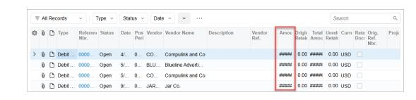

*Figure: Classic UI Figure: Modern UI*

# **A Single View of Data**

For some tables, in the Classic UI, you can switch between a grid view and form view of the data, as shown in the following screenshot. The grid view is a standard table view, with all details arranged in a table and each row representing one detail. The form view shows a set of elements intended for only one detail or document row, and you use the navigation buttons to move to a different detail.

| <b>Sales Orders</b> SO 000071 - FourStar Coffee & Sweets Shop                                                                       |                            |                  | <b>PHOTES</b> <b>ACTIVITIES</b>    | <b>FILES</b>                        | TOOLS $\sim$ <b>CUSTOMIZATION</b> |  |  |  |  |
|----------------------------------------------------------------------------------------------------------------------------------------|----------------------------|------------------|---------------------------------------|-------------------------------------|--------------------------------------|--|--|--|--|
| $\leftarrow$                                                                                                                           |                            | к                | Ы ⋗ ≺ $\cdots$               |                                     |                                      |  |  |  |  |
| <b>DOCUMENT</b>                                                                                                                        | <b>USER-DEFINED FIELDS</b> |                  |                                       |                                     |                                      |  |  |  |  |
| <b>SO</b> * Order Type:                                                                                                             | Q                          | Customer:        | COFFEESHOP - FourStar Coffee & Swee 2 | Ordered Qty.:                       | 18.00                                |  |  |  |  |
| Order Nbr.: 000071                                                                                                                  | Q                          | Location:        | <b>MAIN - Primary Location</b>        | <b>Detail Total:</b> 1           | 117.48                               |  |  |  |  |
| Status:                                                                                                                                | Completed                  | Contact:         | Andrea A. Weaver                      | Line Discounts: 1                | 0.00                                 |  |  |  |  |
| Date:                                                                                                                                  | 1/20/2024                  | Project:         | X - Non-Project Code.                 | Document Dis 0                   | 0.00                                 |  |  |  |  |
| Requested On:                                                                                                                          | 1/20/2024                  | Description:     | Sale of raspberry and strawberry jam  | <b>Freight Total:</b>               | 0.00                                 |  |  |  |  |
| Customer Ord                                                                                                                           |                            |                  | ħ                                     | <b>Tax Total:</b>                   | 10.43                                |  |  |  |  |
| External Refer                                                                                                                         |                            |                  |                                       | <b>Order Total:</b>                 | 127.91                               |  |  |  |  |
| <b>DETAILS</b> <b>TAXES</b>                                                                                                         | <b>FINANCIAL</b>           | <b>SHIPPING</b>  | <b>ADDRESSES</b> <b>SHIPMENTS</b>  | <b>PAYMENTS</b> <b>RELATIONS</b> | $\hat{\mathcal{N}}$                  |  |  |  |  |
| Ò                                                                                                                                      | <b>ADD ITEMS</b> ×      | ADD MATRIX ITEMS | ADD INVOICE                           | ADD BLANKET SO LINE                 | <b>LINE DETAILS</b> ≫             |  |  |  |  |
| <b>Switch Between Grid and Form</b>                                                                                                    | Free <b>Item</b>        | Warehouse        | <b>Line Description</b>               | *UOM                                | Quantity SI                       |  |  |  |  |
| 0 RASPJAM32 D                                                                                                                    | П                          | <b>WHOLESALE</b> | Raspberry jam 32 oz                   | <b>PIECE</b>                        | 12.00                                |  |  |  |  |
| 0 STRAWJAM32 D                                                                                                                   | П                          | <b>WHOLESALE</b> | Strawberry jam 32 oz                  | <b>PIECE</b>                        | 6.00                                 |  |  |  |  |
|                                                                                                                                        |                            |                  |                                       |                                     |                                      |  |  |  |  |
|                                                                                                                                        |                            |                  |                                       |                                     |                                      |  |  |  |  |
| $\geq$ On Hand 188.00 PIECE, Available 188.00 PIECE, Available for Shipping 188.00 PIECE, Allocated 0.00 PIECE $\mathbb{R}$ € |                            |                  |                                       |                                     |                                      |  |  |  |  |

#### *Figure: Classic UI*

In Modern UI, for simplicity, this data can be viewed and entered only in the table, as it was designed to be viewed and entered.

#### **Table Filters**

In the Modern UI, table filters have been enhanced to simplify data filtering. To learn more about these improvements, see *[Modern UI: Filters](#page-46-1)*.

#### **Multiline Text Boxes**

In the Classic UI, when you press Enter in a multiline text box, a new line is inserted.

However, in the Modern UI (unless the developer has configured it otherwise), when you press Enter, the system moves the focus to the next control instead. To insert a new line in the Modern UI, you need to press Ctrl+Enter.

# **Modern UI: Filters**

In the Modern UI, table filters have been enhanced to simplify data filtering. Additionally, a new Advanced Filter editor has been introduced.

The existing filters for a form will remain effective even aer the form is switched to Modern UI.

# **Filtering Area**

The filtering area of Acumatica ERP forms has been redesigned. The screenshot below shows the basic elements of the filtering area for the Sales Orders (SO3010PL) list of records.

|   |    | <b>Sales Orders</b>                   |                                                                     |                            |               |                           |                                          |                                   | ⊛ $\checkmark$   |
|---|----|---------------------------------------|---------------------------------------------------------------------|----------------------------|---------------|---------------------------|------------------------------------------|-----------------------------------|---------------------|
| Ò |    | $\div$ ↶                           | $\mathbf{\overline{x}}$ $\left\vert \leftrightarrow \right\vert$ |                            |               |                           | 3 2                                   | 5 4                            | 6                   |
|   |    | $\equiv$ All Records $\checkmark$  |                                                                     | Order Type = $'SO' \times$ | Status $\sim$ | Date $\checkmark$      | Customer $\checkmark$                 | Save Filter Search $\cdots$ | Q                   |
| 發 | Oı | <b>Order Type</b> $\mathbf T$ D | Order Nbr.                                                          | <b>Status</b>              | Date          | Sched. <b>Shipment</b> | Customer                                 | <b>Customer Name</b>              | <b>Ordered Qtv.</b> |
|   | 0  | $\Box$ SO               | 000073                                                              | Open                       | 12/4/2024     | 12/4/2024                 | <b>CANDYY</b>                            | Candyy Cafe                       | 0.00                |
|   | 0  | D SO                    | 000001                                                              | Completed                  | 1/29/2024     | 1/29/2024                 | <b>COFFEESHOP</b>                        | FourStar Coffee & Sweets Shop     | 40.00               |
|   | 0  | η SO                    | 000002                                                              | Completed                  | 1/25/2024     | 1/25/2024                 | !!!!!!!!!!!!!!!!!!!!!!!!!!!!!!!!!!!!!!!! | GoodFood One Restaurant           | 50.00               |
|   | 0  | D SO                    | 000003                                                              | Completed                  | 1/27/2024     | 1/27/2024                 | <b>HMBAKERY</b>                          | <b>HM's Bakery &amp; Cafe</b>     | 25.00               |
|   | 0  | P SO                    | 000004                                                              | Completed                  | 11/2/2023     | 11/2/2023                 | <b>HMBAKERY</b>                          | <b>HM's Bakery &amp; Cafe</b>     | 124.00              |
|   | 0  | D SO                    | 000005                                                              | Completed                  | 11/5/2023     | 11/5/2023                 | <b>GOODFOOD</b>                          | GoodFood One Restaurant           | 92.00               |
|   | 0  | D <b>SO</b>                        | 000006                                                              | Completed                  | 11/8/2023     | 11/8/2023                 | <b>HMBAKERY</b>                          | HM's Bakery & Cafe                | 63.00               |
|   | 0  | D SO                    | 000007                                                              | Completed                  | 11/13/2023    | 11/13/2023                | !!!!!!!!!!!!!!!!!!!!!!!!!!!!!!!!!!!!!!!! | GoodFood One Restaurant           | 75.00               |
|   | 0  | D SO                    | 000008                                                              | Completed                  | 11/15/2023    | 11/15/2023                | <b>HMBAKERY</b>                          | HM's Bakery & Cafe                | 120.00              |
|   | 0  | D SO                    | 000009                                                              | Completed                  | 11/19/2023    | 11/19/2023                | <b>GOODFOOD</b>                          | GoodFood One Restaurant           | 128.00              |
|   | 0  | D <b>SO</b>                        | 000010                                                              | Completed                  | 11/21/2023    | 11/21/2023                | <b>HMBAKERY</b>                          | HM's Bakery & Cafe                | 57.00               |
|   |    | Records 1-11 of 69                    |                                                                     |                            |               |                           |                                          | $\mathbf{K}$ 1 of 7 pages   | Я                   |

*Figure: Basic elements of the filtering area*

- 1. The Filter List button, which you can click to display a list of saved personal and shared filters.
- 2. The Quick Filter buttons, which you can click to define quick filter criteria, specify the sorting order, or remove the Quick Filter button for the respective data fields.
- 3. The **Add Quick Filter** button, which you can click to add more Quick Filter buttons for data fields or to open the Advanced Filter editor.
- 4. The **Save Filter** button, which you can use to save the filter for future usage. This button is visible only when the current filter has not been saved.
- 5. The More ( ) button, which you can click to execute menu commands for managing filters.
- 6. The Search box, which you can use to enter a string to highlight cell values that include the search term. By default, the maximum length for the search string is 100 characters, and the system uses the *Contains* condition to perform the search.

# **Filter List**

In the Modern UI, saved personal and shared filters are listed in a special Filter List drop-down menu, instead of as filter tabs as in Classic UI. To open the list of filters, click the Filter List button in the filtering area, as shown in the screenshot below.

| 發 $\checkmark$ <b>Sales Orders</b> Ò N $\pm$ ↗ $\leftrightarrow$ ∽ |            |                               |             |                           |                                          |                               |  |  |
|--------------------------------------------------------------------------------------------|------------|-------------------------------|-------------|---------------------------|------------------------------------------|-------------------------------|--|--|
| $\equiv$ All Records $\checkmark$                                                       | Order Type | Status $\vee$ $\checkmark$ | Date $\vee$ | Customer $\sim$           | .                                        | Q Search                   |  |  |
| <b>Search</b>                                                                              |            | Q                             | Date        | Sched. <b>Shipment</b> | Customer                                 | <b>Customer Name</b>          |  |  |
| All Records                                                                                |            |                               | 12/4/2024   | 12/4/2024                 | <b>CANDYY</b>                            | Candyy Cafe                   |  |  |
|                                                                                            |            | eted                          | 1/29/2024   | 1/29/2024                 | <b>COFFEESHOP</b>                        | FourStar Coffee & Sweets Shop |  |  |
| Orders in progress *                                                                    |            | eted                          | 1/25/2024   | 1/25/2024                 | <b>GOODFOOD</b>                          | GoodFood One Restaurant       |  |  |
| Big orders                                                                                 |            | eted                          | 1/27/2024   | 1/27/2024                 | <b>HMBAKERY</b>                          | HM's Bakery & Cafe            |  |  |
| My Sales Orders                                                                            |            | eted ని                    | 11/2/2023   | 11/2/2023                 | <b>HMBAKERY</b>                          | HM's Bakery & Cafe            |  |  |
|                                                                                            |            | eted                          | 11/5/2023   | 11/5/2023                 | !!!!!!!!!!!!!!!!!!!!!!!!!!!!!!!!!!!!!!!! | GoodFood One Restaurant       |  |  |
| 0 ſ٦ SO                                                                   | 000006     | Completed                     | 11/8/2023   | 11/8/2023                 | <b>HMBAKERY</b>                          | HM's Bakery & Cafe            |  |  |
| ⋒ m SO                                                                    | 000007     | Completed                     | 11/13/2023  | 11/13/2023                | !!!!!!!!!!!!!!!!!!!!!!!!!!!!!!!!!!!!!!!! | GoodFood One Restaurant       |  |  |
| P 0 SO                                                                    | 000008     | Completed                     | 11/15/2023  | 11/15/2023                | <b>HMBAKERY</b>                          | HM's Bakery & Cafe            |  |  |
| М 0 SO                                                                    | 000009     | Completed                     | 11/19/2023  | 11/19/2023                | !!!!!!!!!!!!!!!!!!!!!!!!!!!!!!!!!!!!!!!! | GoodFood One Restaurant       |  |  |
| $\Gamma$ so 0                                                                           | 000010     | Completed                     | 11/21/2023  | 11/21/2023                | <b>HMBAKERY</b>                          | HM's Bakery & Cafe            |  |  |
|                                                                                            |            |                               |             |                           |                                          |                               |  |  |
| Records 1-11 of 69                                                                         |            |                               |             |                           | $\mathcal{R}$ く                       | Ы ⋗ 1 of 7 pages     |  |  |

#### *Figure: Filter list drop-down menu*

In the Filter List drop-down menu, you can perform basic actions as follows:

- To apply one of the filters, click the filter name in the list.
- To search for a filter, type its name in the search box.
- To mark a filter as a favorite, hover over the filter name and click the star icon. Favorite filters are displayed at the top of the list.

Filters shared between all users of Acumatica ERP are denoted with the icon in the Filter List drop-down menu.

# **Quick Filters**

A quick filter is a reusable filter that you can apply to data fields in a particular table. You can apply multiple quick filters simultaneously; if you do, you will see multiple Quick Filter buttons in the filter area. If you click one of these buttons, the Quick Filter drop-down menu will open, as shown in the screenshot below.

| ® ∨ <b>Sales Orders</b>                                                                                           |                                                   |                                                        |                                |  |  |  |  |  |  |
|----------------------------------------------------------------------------------------------------------------------|---------------------------------------------------|--------------------------------------------------------|--------------------------------|--|--|--|--|--|--|
| $\mathbf{x}$ P $\left  \leftrightarrow \right $ ┿                                                           |                                                   |                                                        |                                |  |  |  |  |  |  |
| $\equiv$ All Records Order Type Date $\vee$ Q Status $\vee$ Customer $\sim$ Search $\checkmark$ |                                                   |                                                        |                                |  |  |  |  |  |  |
| <b>Order Type</b> 0 € I٦                                                                                    | È Sort Ascending O $\equiv$ Sort Descending | Sched. <b>Customer</b> <b>Shipment</b>           | <b>Customer Name</b>           |  |  |  |  |  |  |
| 0 n SO ⋗                                                                                         | $\overline{O}$                                    | 12/4/2024 <b>CANDYY</b>                             | Candyy Cafe                    |  |  |  |  |  |  |
| Г٩ SO ω                                                                                             | $\alpha$ 侕 Remove Filter                    | 1/29/2024 <b>COFFEESHOP</b>                         | FourStar Coffee & Sweets Shop  |  |  |  |  |  |  |
| 0 η SO                                                                                              | $\alpha$ Clear Filter $\times$              | 1/25/2024 !!!!!!!!!!!!!!!!!!!!!!!!!!!!!!!!!!!!!!!!  | GoodFood One Restaurant        |  |  |  |  |  |  |
| 0 ſ٩ SO                                                                                             | O(                                                | 1/27/2024 <b>HMBAKERY</b>                           | HM's Bakery & Cafe             |  |  |  |  |  |  |
| 0 ∩ SO                                                                                              | Equals ✓ $\alpha$                           | 11/2/2023 <b>HMBAKERY</b>                           | HM's Bakery & Cafe             |  |  |  |  |  |  |
| 0 Γ٩ SO                                                                                             | Does Not Equal $\alpha$                        | 11/5/2023 !!!!!!!!!!!!!!!!!!!!!!!!!!!!!!!!!!!!!!!!  | GoodFood One Restaurant        |  |  |  |  |  |  |
| 0 SO                                                                                                   | Is Empty $\alpha$                              | 11/8/2023 <b>HMBAKERY</b>                           | HM's Bakery & Cafe             |  |  |  |  |  |  |
| 0 SO                                                                                                   | Is Not Empty $\overline{O}$                    | 11/13/2023 !!!!!!!!!!!!!!!!!!!!!!!!!!!!!!!!!!!!!!!! | GoodFood One Restaurant        |  |  |  |  |  |  |
| 0 SO                                                                                                   | $\overline{O}$ Contains                        | 11/15/2023 <b>HMBAKERY</b>                          | HM's Bakery & Cafe             |  |  |  |  |  |  |
| 0 М SO                                                                                              | $\overline{O}$ Starts With                     | 11/19/2023 !!!!!!!!!!!!!!!!!!!!!!!!!!!!!!!!!!!!!!!! | GoodFood One Restaurant        |  |  |  |  |  |  |
| 0 ∩ SO                                                                                              | $\overline{O}$ Ends With                       | 11/21/2023 <b>HMBAKERY</b>                          | HM's Bakery & Cafe             |  |  |  |  |  |  |
| 0 n SO                                                                                              | $\alpha$ Does Not Contain                      | 11/26/2023 !!!!!!!!!!!!!!!!!!!!!!!!!!!!!!!!!!!!!!!! | GoodFood One Restaurant        |  |  |  |  |  |  |
| 0 Г٩ SO                                                                                             | $\alpha$ Q                                     | 11/29/2023 <b>HMBAKERY</b>                          | HM's Bakery & Cafe             |  |  |  |  |  |  |
| 0 n SO                                                                                              | $\overline{O}$                                    | !!!!!!!!!!!!!!!!!!!!!!!!!!!!!!!!!!!!!!!! 12/3/2023  | <b>GoodFood One Restaurant</b> |  |  |  |  |  |  |
| ⋒ Ռ SO                                                                                              | $\overline{0}$ Cancel <b>Apply</b>          | 12/6/2023 <b>HMBAKERY</b>                           | HM's Bakery & Cafe             |  |  |  |  |  |  |
| 0 n SO                                                                                              | $\alpha$                                          | 12/10/2023 !!!!!!!!!!!!!!!!!!!!!!!!!!!!!!!!!!!!!!!! | GoodFood One Restaurant        |  |  |  |  |  |  |
| Records 1-16 of 69                                                                                                   |                                                   | K <                                                 | Я of 5 pages ⋗ 1      |  |  |  |  |  |  |

#### *Figure: Quick Filter drop-down menu*

In the Quick Filter drop-down menu, you can act upon filters as follows:

- To sort the table rows by the values of the selected data field, click**Sort Ascending** or **Sort Descending**.
- To specify filter criteria, select the conditions, specify the desired value (if needed), and click **Apply**. The list of available conditions and values varies depending on the data field type.
- To discard filtering by the respective data field, click **Clear Filter**.
- To remove the Quick Filter button for the selected data field, click **Remove Filter**.

You can also rearrange the order of Quick Filter buttons in the filtering area by dragging the button to the desired position.

To add a Quick Filter button for a particular column, do one of the following:

- Drag the column header to the filter area.
- Click the **Add Quick Filter** button, and select the name of the needed data field in the dialog box that opens.
- Click the column header, specify the filter conditions and value, and click **Apply**. This will add the Quick Filter button and apply the specified filter criteria.
- Click within the cell and press Shi+F. This will add the Quick Filter button and filter the contents by the value of the selected cell.

### **Operations with Filters**

To keep the filter criteria for future usage, or to share the filter with other users, do either of the following:

- Click the **Save Filter** button. This button is visible only when the current filter has not been saved.
- Click the More ( ) button in the filter area and then click the**Save As** command.

Either of these actions will open the**Save Filter As** dialog box, which is shown in the following screenshot.

| <b>Sales Orders</b>                                                                   |                                                                                                  | ◎ ∨                 |
|---------------------------------------------------------------------------------------|--------------------------------------------------------------------------------------------------|---------------------|
| $\circ$ $\boxed{\mathbf{X}}$ $\mathbf{H}$ $\mathscr{O}$ $\Omega$ $\pm$ |                                                                                                  |                     |
| $\equiv$ All Records Order Type $\sim$ Status $\vee$ $\checkmark$            | Customer: Contains 'CANDY' X Date $\sim$ Search Save Filter $\checkmark$ $\cdots$ | Q                   |
| Order Type Order Nbr. <b>Status</b> ₩ 0                                   | $\times$ Save Filter As                                                                       | Ordered Qty.        |
| $\Box$ so 0 000073 Open →                                                 | Name: Orders of Candyy Caffe Shared $\Box$ Default Cancel Save                    | 0.00                |
| Records 1-1 of 1                                                                      | $\mathbb{K}^-$ $\prec$ 1 of 1 pages                                                        | >1 $\rightarrow$ |

#### *Figure: Save Filter As dialog box*

In the dialog box, you specify the name of the filter and click**Save**. Additionally, you can make the system apply this filter each time you open the form by selecting the **Default** check box before you click**Save**. Also, if you have access to the *[Filters](https://help-2025r1.acumatica.com/Help?ScreenId=ShowWiki&pageid=ed46ae19-b15e-4383-87de-2f068f42ef2d)* (CS209010) form, you can make the filter available to other users by selecting the**Shared** check box before you click**Save**.

Saved personal and shared filters are listed in the Filter List drop-down menu.

To modify the properties of the existing filter, click the More ( ) button in the filter area and then click the **Edit Filter** command.

To delete an existing saved filter, click the More ( ) button in the filter area and then click the **Delete Filter** command.

#### **Advanced Filter Editor**

By using the **Advanced Filter** dialog box, you can visually and intuitively specify complex filtering criteria—that is, one or more simple filtering criteria grouped and joined by logical operators. To open the dialog box, do either of the following:

- Click the More ( ) button in the filter area and then click the **Open Advanced Filter** command.
- Click the **Add Quick Filter** button and select **Advanced** in the dialog box that opens.

The following screenshot shows the **Advanced Filter** dialog box.

| Ò             | <b>Sales Orders</b> $\curvearrowleft$ 0 ٠ | $\boxtimes$ $\vdash$ |                        |           |                              |                                                |                    |          |                              |                |
|---------------|----------------------------------------------------|-------------------------|------------------------|-----------|------------------------------|------------------------------------------------|--------------------|----------|------------------------------|----------------|
|               | $\equiv$ All Records $\checkmark$               | Order Type              | <b>Advanced Filter</b> |           |                              |                                                |                    | $\times$ | earch                        | Q              |
| ⑬ O.       | <b>Order Type</b> $\mathbb{R}$                  | Order Nbr.              | <b>AND</b>             |           |                              | Status: Open, Pending Approval, Pending Proc X |                    |          |                              | Ordered Qty.   |
| $\omega$ ⋗ | $n$ so                                             | 000073                  | o                      |           | Date: This Week ×            | Û                                              |                    |          |                              | 0.00           |
| 0             | $D$ IN                                             | 000057                  | ≺ $\ln$             | <b>OR</b> |                              |                                                |                    |          |                              | 1.00           |
| 0             | $\Box$ IN                                          | 000059                  | In                     |           | Date < 6/10/2024 $\times$ | $^{+}$                                         |                    |          |                              | 1.00           |
| 0             | $\Gamma$ IN                                     | 000061                  | In                     |           |                              |                                                |                    |          |                              | 2.00           |
| û             | IN ſ۹                                           | 000063                  | In                     |           |                              |                                                |                    |          |                              | 1.00           |
| 0             | $\Gamma$ <b>MO</b>                              | 000113                  | c                      |           |                              |                                                |                    |          |                              | 45.00          |
| 0             | $\Gamma$ <b>SO</b>                              | 000001                  | C                      |           |                              |                                                | <b>Apply</b>       | Cancel   |                              | 40.00          |
| 0             | $\Gamma$ SO                          | 000002                  | $\mathbf C$            |           |                              |                                                |                    |          |                              | 50.00          |
| $\omega$      | $\Box$ so                                          | 000003                  | Completed              | 1/27/2024 | 1/27/2024                    | <b>HMBAKERY</b>                                | HM's Bakery & Cafe |          |                              | 25.00          |
|               | Records 1-9 of 77                                  |                         |                        |           |                              |                                                | $\mathbb{R}$       | $\leq$   | of 9 pages $\blacksquare$ | $\lambda$ ⋗ |

#### *Figure: Advanced Filter editor*

In the editor, you can do the following:

- To define filter criteria, click the name of the desired data field, specify the conditions and the desired values (if needed), and then click **Apply**. The list of available conditions and values varies depending on the data field type.
- To clear filter criteria, click the name of the desired data field and then click **Clear Filter**.
- To delete filter criteria, either click the icon or click the name of the desired data field and then click **Remove Filter**.
- To add another data field, click the plus icon next to the existing data field and select the name of the needed data field in the dialog box that opens.
- To change the logical operator, click the operator name. Possible operators are *AND* and *OR*.
- To group multiple filter criteria, hover over the logical operator and click the icon. Groups define the order of logical operations. Grouped criteria are denoted with parentheses.
- To cancel the grouping, hover over the parentheses and click the icon.
- To delete a group, hover over the parentheses and click the icon.
- To apply the current filter to the table and close the editor, click **Apply**.
- To close the editor without applying the filter, click **Cancel**.

Once the advanced filter has been applied to a table, it is displayed as a row in the filtering area, as shown in the following screenshot.

| ◎ ∨ <b>Sales Orders</b>                                          |                             |                                                                                   |                                          |                                         |                            |                    |  |  |  |  |
|---------------------------------------------------------------------|-----------------------------|-----------------------------------------------------------------------------------|------------------------------------------|-----------------------------------------|----------------------------|--------------------|--|--|--|--|
| 図 Ò $\Omega$ $\pm$ $\overline{\phantom{a}}$ 0        |                             |                                                                                   |                                          |                                         |                            |                    |  |  |  |  |
| $\equiv$ All Records $\checkmark$                                |                             | SOOrder_Status IN (Open, Pending Approval, Pending Processing) AND (SOOrder_Order |                                          | Save Filter $\checkmark$ $\cdots$ | Search                     | $\alpha$           |  |  |  |  |
| $\Box$ 0 <b>Order Type</b> 懲                               | Order Nbr. <b>Status</b> | $T$ Date T. Sched. <b>Shipment</b>                                       | <b>Customer</b>                          | <b>Customer Name</b>                    | Ordered Qty.               | <b>Order Total</b> |  |  |  |  |
| 0 $\Box$ so $\rightarrow$                                     | 000029 Open              | 1/29/2024 1/29/2024                                                            | <b>RETSALE</b>                           | <b>Individual Retail Customer</b>       | 20.00                      | 56.45              |  |  |  |  |
| 0 !!!!!!!!!!!!!!!!!!!!!!!!!!!!!!!!!!!!!!!! <b>SO</b>          | 000061 Open              | 1/29/2024 1/29/2024                                                            | !!!!!!!!!!!!!!!!!!!!!!!!!!!!!!!!!!!!!!!! | <b>GoodFood One Restaurant</b>          | 12.00                      | 93.81              |  |  |  |  |
| !!!!!!!!!!!!!!!!!!!!!!!!!!!!!!!!!!!!!!!! $^{\circ}$ <b>SO</b> | 000066 Open              | 1/25/2024 1/25/2024                                                            | <b>CAKEADO</b>                           | Cakeado Cafe                            | 25.00                      | 32.50              |  |  |  |  |
|                                                                     |                             |                                                                                   |                                          |                                         |                            |                    |  |  |  |  |
|                                                                     |                             |                                                                                   |                                          |                                         |                            |                    |  |  |  |  |
|                                                                     |                             |                                                                                   |                                          |                                         |                            |                    |  |  |  |  |
|                                                                     |                             |                                                                                   |                                          |                                         |                            |                    |  |  |  |  |
|                                                                     |                             |                                                                                   |                                          |                                         |                            |                    |  |  |  |  |
|                                                                     |                             |                                                                                   |                                          |                                         |                            |                    |  |  |  |  |
| Records 1-3 of 3                                                    |                             |                                                                                   |                                          | $\mathbf{K}$                            | of 1 pages $\mathbf{1}$ | $>$                |  |  |  |  |

*Figure: Advanced filter applied to a table*

# **Modern UI: User Personalization**

By using functionality of the Modern UI, you can easily customize the layout of forms. This topic describes various ways that you can adjust the user interface for your own user accounts. In the Modern UI, personal layouts of forms are retained between sessions and apply only to your user account.

# **Customizing Tab Controls**

Once a form has been switched to the Modern UI, you can change the order of tabs and hide or display individual tabs. Changes to the tab controls will be applied to the personal layout of the form.

To reorder a tab, click and hold the tab name and then drag it to the desired position (as shown in the screenshot below).

| Invoices Invoice 000003 - FourStar Coffee & Sweets Shop |                   |                                          |        |                                                                |                                  |                   | □ Note        |                     | $\boxdot$ Activities | $0$ Files           | 翁 ∨          |
|------------------------------------------------------------|-------------------|------------------------------------------|--------|----------------------------------------------------------------|----------------------------------|-------------------|---------------|---------------------|----------------------|---------------------|--------------|
| 뭐 $\leftarrow$                                          | $\boxdot$         | ↶                                        | ┿ 侕 | ∩∼                                                             | К                                | ≺                 | $\mathcal{P}$ | Ы                   | .                    |                     | $\checkmark$ |
| Type                                                       |                   | Invoice                                  |        |                                                                |                                  | $\checkmark$      |               | <b>Detail Total</b> |                      |                     | 559.47       |
|                                                            | Reference Nbr.    | 000003                                   |        |                                                                |                                  | Q                 |               | Amount              |                      | 595.84              |              |
| Closed <b>Status</b>                                    |                   |                                          |        |                                                                | <b>Balance</b>                   |                   |               | 0.00                |                      |                     |              |
| Date 1/28/2024                                          |                   |                                          |        |                                                                | <b>Cash Discount</b>             |                   |               | 0.00                |                      |                     |              |
| Customer Location <b>Terms</b>                       |                   | 30D - 30 Days                            |        | COFFEESHOP - FourStar Coffee <b>MAIN - Primary Location</b> |                                  |                   |               |                     |                      |                     |              |
| <b>DETAILS</b>                                             | <b>TAXES</b>      | <b>FREIGHT</b>                           |        | <b>FINANCIAL</b>                                               |                                  | <b>ADDRESSES</b>  |               |                     | <b>APPLICATIONS</b>  | .                   |              |
| Ò                                                          | Add Items         | !!!!!!!!!!!!!!!!!!!!!!!!!!!!!!!!!!!!!!!! |        | Add SO Line                                                    | $\left  \leftrightarrow \right $ | $\mathbf x$       |               | <b>FREIGHT</b>      | <b>Search</b>        |                     | Q            |
| ۞ O)                                                    | <b>F</b> * Branch |                                          |        | <b>Shipment Nbr.</b>                                           |                                  | <b>Order Type</b> |               | Order Nbr.          |                      | <b>Inventory ID</b> |              |
| ⋋ OJ.                                                   | <b>RETAIL</b>     |                                          |        |                                                                |                                  |                   |               |                     |                      | APJAM96             |              |
| ⋒ P                                                     | <b>RETAIL</b>     |                                          |        |                                                                |                                  |                   |               |                     |                      | ORJAM96             |              |

#### *Figure: Reordering tabs*

To hide a tab, click and hold the tab name, drag it first to the More button, and then drag it to the **Hidden Tabs** section (as shown in the screenshot below).

| Invoices                             | Invoice 000003 - FourStar Coffee & Sweets Shop                                 | □ Note $\boxdot$ Activities | ◎ ∨ $0$ Files   |
|--------------------------------------|--------------------------------------------------------------------------------|--------------------------------|--------------------|
| ㅋ Ħ $\leftarrow$               | K ∩ิิิ่ ิ ↶ ≺ $\pm$ 侕                                           | $\mathcal{P}$ Ы $\cdots$ | ×.                 |
| <b>Type</b>                          | Invoice $\checkmark$                                                        | <b>Detail Total</b>            | 559.47             |
| Reference Nbr.                       | Q 000003                                                                    | Amount                         | 595.84             |
| <b>Status</b>                        | <b>Closed</b>                                                                  | <b>Balance</b>                 | 0.00               |
| Date                                 | 1/28/2024                                                                      | <b>Cash Discount</b>           | 0.00               |
| Customer Location <b>Terms</b> | COFFEESHOP - FourStar Coffee MAIN - Primary Location 30D - 30 Days       |                                |                    |
| <b>DETAILS</b> <b>TAXES</b>       | <b>FINANCIAL</b> <b>FREIGHT</b> <b>ADDRESSES</b>                         | <b>APPLICATIONS</b>            | .                  |
| Õ Add Items                       | $ \mathbf{x} $ Add Order $\left  \leftrightarrow \right $ Add SO Line | Search .                    | <b>Hidden Tabs</b> |
| Ø 0 <b>P</b> *Branch           | <b>Order Type</b> <b>Shipment Nbr.</b>                                      | Order Nbr.                     | K                  |
| ⋟ O, <b>RETAIL</b> M        |                                                                                |                                | <b>APLIANIME</b>   |
| <b>RETAIL</b> M OJ.            |                                                                                |                                | ORJAM96            |

#### *Figure: Hiding tabs*

To display a hidden tab, click the More button and then drag the tab name from the **Hidden Tabs** section to the needed position.

#### **Customizing Table Controls**

In Modern UI, you can customize the appearance and content of table controls: add or remove visible columns, reorder columns, and change any column's width. Changes to the table would be applied to the personal layout of the form.

In the Modern UI the Settings button is displayed in the upper-le corner of the table control. By clicking this button, you can open the Column Configuration dialog box, as shown in the following screenshot.

| □ Note $\mathfrak{D}$ Activities                                                                             | $0$ Files ® ∨    |
|-----------------------------------------------------------------------------------------------------------------|---------------------|
| Invoices Invoice 000003 - FourStar Coffee & Sweets Shop                                                      |                     |
| H ㅋ 面 门 v $-15$ $\langle \quad \rangle$ ) $\pm$ ↶ $\leftarrow$ $\cdots$              |                     |
| <b>FINANCIAL</b> <b>DETAILS</b> <b>TAXES</b> <b>FREIGHT</b> <b>ADDRESSES</b> <b>APPLICATIONS</b> |                     |
| Ò Add Items $\mathbf{x}$ Add Order Add SO Line $\left  \leftarrow \right $ Search .        | Q                   |
| ۞ 0 *Branch Shipment Nbr. Order Nbr. <b>Order Type</b>                                           | <b>Inventory ID</b> |
| Q Search                                                                                                     | APJAM96             |
|                                                                                                                 | ORJAM96             |
| Files $\vdots$ ✓                                                                                          |                     |
| Branch !!!!!!!!!!!!!!!!!!!!!!!!!!!!!!!!!!!!!!!!                                                              |                     |
| $\sqrt{ }$ Notes TAB                                                                                         |                     |
| Tran. Type ÷                                                                                                 |                     |
| Reference Nbr. ÷                                                                                             |                     |
| Line Nbr. ÷                                                                                                  |                     |
| Line Order ÷                                                                                                 |                     |
| Line Type $\ddot{ }$                                                                                         |                     |
| Shipment Nbr. ÷Ι ◡                                                                                        |                     |
| OK. Reset Cancel                                                                                          |                     |

#### *Figure: Column Configuration dialog box*

In the Column Configuration dialog box, you can do any of the following:

- To hide or display a column, clear or select the check box next to the column name.
- To modify the order of the columns, drag the column name to the desired position in the list.
- To change whether the column should receive focus when you press Tab, hover over the column name and click **Tab** to change its state (which will cause the word to be crossed out or appear normal).
- To apply the column configuration, click **OK**.
- To cancel the column customization, click **Cancel**.
- To reset the customization and restore the default layout of the table, click **Reset**.

#### **Customizing Fieldsets**

You can collapse and expand certain controls to display fewer or more data fields. The collapsed or expanded state of the controls is retained for your user account between sessions.

| <b>Sales Orders</b> SO 000073 - Candyy Cafe |                         |            | ∩ Note $\mathfrak{D}$ Activities | $@$ Files ® ∨ |  |
|------------------------------------------------|-------------------------|------------|-------------------------------------|------------------|--|
| ㅋ E $\leftarrow$                         | 面 ウィ K く $^+$ ∽   |            | Hold $\sum_{i=1}^{n}$ ≻⊦ . |                  |  |
| Order Type *                                   | <b>SO</b>               | Q          | Ordered Qty.                        | 0.00             |  |
| Order Nbr.                                     | 000073                  | Q          | <b>Detail Total</b>                 | 0.00             |  |
| <b>Status</b>                                  | Open                    |            | <b>Line Discounts</b>               | 0.00             |  |
| Date *                                         | 户 12/4/2024          |            | Document Dis                        | 0.00             |  |
| Requested On *                                 | Ä 12/4/2024          |            | Freight Total                       | 0.00             |  |
| Customer Ord                                   |                         |            | <b>Tax Total</b>                    | 0.00             |  |
| External Refer                                 |                         |            | <b>Order Total</b>                  | 0.00             |  |
|                                                |                         |            |                                     |                  |  |
| Customer*                                      | CANDYY - Candyy Cafe    | Q          |                                     |                  |  |
| Location*                                      | MAIN - Primary Location | Q          |                                     |                  |  |
| Contact                                        | Kathy T. Hurwitz        | Q          |                                     |                  |  |
| Project*                                       | X - Non-Project Code.   | $\hbox{Q}$ |                                     |                  |  |
| Description                                    |                         |            |                                     |                  |  |
|                                                |                         |            |                                     |                  |  |

To expand or collapse a set of data fields, click the arrow icon in the form toolbar, as shown in the screenshots below.

*Figure: Expanded fieldset*

| <b>Sales Orders</b> SO 000073 - Candyy Cafe |                         | $\Box$ Note | $\boxdot$ Activities | $@$ Files          | * ©         |          |      |
|------------------------------------------------|-------------------------|-------------|----------------------|--------------------|-------------|----------|------|
| 6 A A                                          | 十 面 ウ $\Omega$       |             |                      | Ы                  | <b>Hold</b> | $\cdots$ |      |
| Order Type *                                   | <b>SO</b>               |             | Q                    | Ordered Qty.       |             |          | 0.00 |
| Order Nbr.                                     | 000073                  |             | Q                    | <b>Tax Total</b>   |             |          | 0.00 |
| <b>Status</b>                                  | Open                    |             |                      | <b>Order Total</b> |             | 0.00     |      |
| Date *                                         | Ħ 12/4/2024          |             |                      |                    |             |          |      |
|                                                |                         |             |                      |                    |             |          |      |
| Customer*                                      | CANDYY - Candyy Cafe    |             | Q                    |                    |             |          |      |
| Location *                          | MAIN - Primary Location |             | Q                    |                    |             |          |      |
| Project*                                       | X - Non-Project Code.   |             | Q                    |                    |             |          |      |

*Figure: Collapsed fieldset*

# **Modern UI: Site-Wide Personalization**

With Modern UI functionality, if you have the appropriate privileges, you can modify and customize the overall appearance of Acumatica ERP forms, including both standard and custom forms. Additionally, you can set a default form layout for the entire site. You can perform this site-wide personalization only if your user account is assigned both the *Administrator* and *Customizer* roles.

Any site-wide modifications you make will be shared among all system users. When you apply these changes, you can choose to either keep or override any personal configurations that system users have made.

# **Using Form Configuration Mode**

To modify a form's appearance, you click the Settings button on the form title bar and then click**Screen Configuration**. You are now working in Form Configuration mode (as shown in the following screenshot) for the current form; if you navigate to another form, the mode is deactivated, discarding any changes you have made.

| <b>Form</b> <b>Apply To All</b> Configuration                                                                                 | Reset To Default | Manage User-Defined Fields                       |               | Load Personal Configuration | $\bigcap$ $\vee$ | Cancel              |  |  |
|-------------------------------------------------------------------------------------------------------------------------------------|------------------|--------------------------------------------------|---------------|-----------------------------|------------------|---------------------|--|--|
| <b>Sales Orders</b> ◎ ∨ ∩ Note $\boxdot$ Activities $\mathbf{0}$ Files (1) IN 000063 - FourStar Coffee & Sweets Shop |                  |                                                  |               |                             |                  |                     |  |  |
| 뭐 Ħ ↶ $\leftarrow$                                                                                                         | 面 n ∽ $^+$ | $\mathsf{K} \subset \mathsf{C}$ $\rightarrow$ | Ы $\cdots$ |                             |                  | $\hat{\phantom{a}}$ |  |  |
| <b>Untitled</b>                                                                                                                     |                  |                                                  | ₩             | <b>Untitled</b>             |                  | €                   |  |  |
| Order Type *                                                                                                                        | IN               |                                                  | Q             | Ordered Qty.                |                  | 1.00                |  |  |
| Order Nbr.                                                                                                                          | 000063           |                                                  | Q             | <b>Detail Total</b>         |                  | 4,100.00            |  |  |
| <b>Status</b>                                                                                                                       | <b>Invoiced</b>  |                                                  |               | <b>Line Discounts</b>       |                  | 0.00                |  |  |
| Date                                                                                                                                | 1/18/2024        |                                                  |               | <b>Document Discounts</b>   |                  | 0.00                |  |  |
| Requested On                                                                                                                        | 1/18/2024        |                                                  |               | <b>Freight Total</b>        |                  | 0.00                |  |  |
| <b>Customer Order Nbr.</b>                                                                                                          |                  |                                                  |               | <b>Tax Total</b>            |                  | 0.00                |  |  |
| <b>External Reference</b>                                                                                                           |                  |                                                  |               | <b>Order Total</b>          |                  | 4,100.00            |  |  |
|                                                                                                                                     |                  |                                                  |               |                             |                  |                     |  |  |

#### *Figure: A form in Form Configuration mode*

When Form Configuration mode is active, the system does the following:

- Applies either the default layout of the current form or the layout shared between all users (if one has been configured)
- Displays the Form configuration pane on the top of the form
- Displays the Settings buttons next to each fieldset and tab control

The buttons that appear in the Form Configuration pane are described in the following table.

| Button                      | Description                                                                                                                                                                                                               |
|-----------------------------|---------------------------------------------------------------------------------------------------------------------------------------------------------------------------------------------------------------------------|
| Apply to All                | Applies the changes to the layout shared between all users and deacti vates Form Configuration mode. The system prompts you about whether it should replace or retain the personalized layouts of individual users. |
| Reset to Default            | Restores the form to the default layout supplied by Acumatica ERP.                                                                                                                                                        |
| Manage User-Defined Fields  | Opens a dialog box where you can manage user-defined fields associated with the current form. See Modern UI: Managing User-Defined Fields for de tails.                                                             |
| Load Personal Configuration | Opens a dialog box that displays other users' customized layouts for the current form and gives you the ability to apply the selected layout to the layout shared between all users.                                |
| Export Configuration        | Exports the current form's configuration to an external file.                                                                                                                                                             |
| Import Configuration        | Imports the form's configuration from an external file and applies it to the current form.                                                                                                                             |
| Cancel                      | Discards all changes and deactivates Form Configuration mode.                                                                                                                                                             |

### **Customizing Tab Controls**

In Form Configuration mode, you can change the order of tabs and hide or display individual tabs. Changes to the tab controls will be applied to form layout shared among all users.

To reorder a tab, click and hold the tab name and then drag it to the desired position (as shown in the screenshot below).

| Invoices                        | Invoice 000003 - FourStar Coffee & Sweets Shop |                                                 | ∩ Note $\boxdot$ Activities  | $0$ Files ි ∼    |
|---------------------------------|------------------------------------------------|-------------------------------------------------|---------------------------------|---------------------|
| 뭐 Ħ $\leftarrow$          | ↶ ∩ิิิ ิ 而 +                          | К ≺                                          | $\mathcal{P}$ Ы .         |                     |
| <b>Type</b>                     | Invoice                                        | $\checkmark$                                    | <b>Detail Total</b>             | 559.47              |
| Reference Nbr.                  | 000003                                         | Q                                               | Amount                          | 595.84              |
| <b>Status</b>                   | Closed                                         |                                                 | <b>Balance</b>                  | 0.00                |
| Date                            | 1/28/2024                                      |                                                 | <b>Cash Discount</b>            | 0.00                |
| Customer                        | COFFEESHOP - FourStar Coffee                   |                                                 |                                 |                     |
| Location                        | <b>MAIN - Primary Location</b>                 |                                                 |                                 |                     |
| <b>Terms</b>                    | 30D - 30 Days                                  |                                                 |                                 |                     |
| <b>DETAILS</b> <b>TAXES</b>  | <b>FINANCIAL</b> <b>FREIGHT</b>             | <b>ADDRESSES</b>                                | <b>APPLICATIONS</b>             | .                   |
| Õ Add Items                  | Add Order Add SO Line                       | $\mathbf x$ $\left  \leftrightarrow \right $ | <b>FREIGHT</b> <b>Search</b> | Q                   |
| ۞ 0 n *Branch             | <b>Shipment Nbr.</b>                           | <b>Order Type</b>                               | Order Nbr.                      | <b>Inventory ID</b> |
| ⋋ OJ. <b>RETAIL</b> Γ٩ |                                                |                                                 |                                 | APJAM96             |
| <b>RETAIL</b> ⋒ M         |                                                |                                                 |                                 | ORJAM96             |

#### *Figure: Reordering tabs*

To hide a tab, click and hold the tab name, drag it first to the More button, and then drag it to the **Hidden Tabs** section (as shown in the screenshot below).

| Invoices                             | Invoice 000003 - FourStar Coffee & Sweets Shop                                                                | ∩ Note $\boxdot$ Activities | W Files ◎ ∨          |
|--------------------------------------|---------------------------------------------------------------------------------------------------------------|--------------------------------|-------------------------|
| ㅋ Ħ $\leftarrow$               | ∩∼ К ↶ ≺ $\pm$ 而                                                                               | $\mathcal{P}$ Ы .        |                         |
| <b>Type</b>                          | Invoice $\checkmark$                                                                                       | <b>Detail Total</b>            | 559.47                  |
| Reference Nbr.                       | Q 000003                                                                                                   | Amount                         | 595.84                  |
| <b>Status</b>                        | Closed                                                                                                        | <b>Balance</b>                 | 0.00                    |
| Date                                 | 1/28/2024                                                                                                     | <b>Cash Discount</b>           | 0.00                    |
| Customer Location <b>Terms</b> | COFFEESHOP - FourStar Coffee MAIN - Primary Location 30D - 30 Days                                      |                                |                         |
| <b>DETAILS</b> <b>TAXES</b>       | <b>FREIGHT</b> <b>FINANCIAL</b> <b>ADDRESSES</b>                                                        | <b>APPLICATIONS</b>            | .                       |
| Ò Add Items                       | $ \mathbf{x} $ $\left  \leftrightarrow \right $ !!!!!!!!!!!!!!!!!!!!!!!!!!!!!!!!!!!!!!!! Add SO Line | <b>Search</b> .             |                         |
| ٤ n *Branch O)                 | <b>Shipment Nbr.</b> <b>Order Type</b>                                                                     | Order Nbr.                     | <b>Hidden Tabs</b> ≺ |
| ⋟ OJ. <b>P RETAIL</b>          |                                                                                                               |                                | <b>AP JAMPIO</b>        |
| <b>RETAIL</b> n. OJ.           |                                                                                                               |                                | ORJAM96                 |

#### *Figure: Hiding tabs*

To display a hidden tab, click the More button and then drag the tab name from the **Hidden Tabs** section to the needed position.

Additionally, in Form Configuration mode, Settings buttons appear next to each tab control. If you click one of these buttons, the**Tab Configuration** dialog box opens for the tab, as shown in the screenshot below.

|                                                                                                 | Form Conf Tab Configuration <b>Visible Tabs</b> | $\times$                 | Cancel                    |
|-------------------------------------------------------------------------------------------------|----------------------------------------------------|--------------------------|---------------------------|
| Invoices Invoice 00 $\overline{\mathbb{B}}$ $\leftarrow$                               | <b>Details</b> Taxes Commissions             |                          | ◎ ↓ es $\checkmark$ |
| <b>DETAILS</b> ↻ Add                                                                      | Freight Financial                               |                          | Q                         |
| 懲 $\mathbf 0$ $\Box$ $\mathbb{O}$ $\Box$ $\rightarrow$ $\mathbb{O}$ $\Box$ | :: Addresses <b>Discounts</b> Applications   | $\overline{\phantom{a}}$ |                           |
|                                                                                                 | Approvals <b>Hidden Tabs</b>                    |                          |                           |
|                                                                                                 | Reset To Default Apply                          | Cancel                   |                           |

*Figure: Tab Configuration dialog box*

In the **Tab Configuration** dialog box, you can do the following:

- To hide a tab, drag it from the**VisibleTabs** section to the **Hidden Tabs** section, or click the arrow button next to the tab name.
- To display a tab, drag it from the **Hidden Tabs** section back to the**VisibleTabs** section, or click the arrow button next to the tab name.
- To modify the order of the tabs, drag the tab name to the desired position in the list.
- To apply the tab configuration, click **Apply**.
- To cancel the customization of the tab, click **Cancel**.
- To reset the customization and restore the default layout of the tab control, press **Reset to Default**.

# **Customizing Tables**

In Form Configuration mode, you can add or remove visible columns, reorder columns, and change a column's width. Any changes you make to the table will be applied to the layout that all users share.

In the Modern UI the Settings button is displayed in the upper-le corner of the table control. By clicking this button, you can open the Column Configuration dialog box, as shown in the following screenshot.

| □ Note $\boxdot$ Activities                                                                                  | $0$ Files ⊚ ∨    |
|-----------------------------------------------------------------------------------------------------------------|---------------------|
| <b>Invoices</b> Invoice 000003 - FourStar Coffee & Sweets Shop                                               |                     |
| ㅋ H m $\bigcirc$ $\sim$ $-15$ $\langle \quad \rangle$ >1 … ↶ $\pm$ $\leftarrow$      |                     |
| <b>DETAILS</b> <b>TAXES</b> <b>FREIGHT</b> <b>FINANCIAL</b> <b>ADDRESSES</b> <b>APPLICATIONS</b> |                     |
| Ò $\mathbf{x}$ Add Items Add Order Add SO Line $\left  \leftarrow \right $ Search          | Q                   |
| 0 *Branch <b>@</b> Shipment Nbr. Order Type Order Nbr.                                           | <b>Inventory ID</b> |
| Q Search                                                                                                     | APJAM96             |
|                                                                                                                 | ORJAM96             |
| Files $\vdots$ $\sim$                                                                                     |                     |
| <b>Branch</b> ÷. ✓                                                                                        |                     |
| Notes ☑ <b>TAB</b>                                                                                        |                     |
| Tran. Type ÷                                                                                                 |                     |
| Reference Nbr. ÷                                                                                             |                     |
| Line Nbr. ÷                                                                                                  |                     |
| Line Order ÷                                                                                                 |                     |
| Line Type ÷                                                                                                  |                     |
| Shipment Nbr. ÷ $\sim$                                                                                    |                     |
| Reset OK Cancel                                                                                           |                     |

#### *Figure: Column Configuration dialog box*

In the Column Configuration dialog box, you can do any of the following:

- To hide or display a column, clear or select the check box next to the column name.
- To modify the order of the columns, drag the column name to the desired position in the list.
- To change whether the column should receive focus when you press Tab, hover over the column name and click **Tab** to change its state (which will cause the word to be crossed out or appear normal).
- To apply the column configuration, click **OK**.
- To cancel the column customization, click **Cancel**.
- To reset the customization and restore the default layout of the table, click **Reset**.

#### **Customizing Fieldsets**

In Form Configuration mode, you can expand and collapse certain controls to display fewer or more data fields. The collapsed or expanded state of the controls would be applied to form layout shared between all users.

| ㅋ H $\leftarrow$ | $\pm$ ∽              |   | Я Hold $\sum_{i=1}^{n}$ . |      |
|------------------------|-------------------------|---|------------------------------------|------|
| Order Type *           | <b>SO</b>               | Q | Ordered Qty.                       | 0.00 |
| Order Nbr.             | 000073                  | Q | <b>Detail Total</b>                | 0.00 |
| <b>Status</b>          | Open                    |   | <b>Line Discounts</b>              | 0.00 |
| Date *                 | Ä 12/4/2024          |   | Document Dis                       | 0.00 |
| Requested On *         | Ä 12/4/2024          |   | <b>Freight Total</b>               | 0.00 |
| Customer Ord           |                         |   | <b>Tax Total</b>                   | 0.00 |
| External Refer         |                         |   | <b>Order Total</b>                 | 0.00 |
|                        |                         |   |                                    |      |
| Customer*              | CANDYY - Candyy Cafe    | Q |                                    |      |
| Location*              | MAIN - Primary Location | Q |                                    |      |
| Contact                | Kathy T. Hurwitz        | Q |                                    |      |
| Project*               | X - Non-Project Code.   | Q |                                    |      |
| Description            |                         |   |                                    |      |

To expand or collapse a set of data fields, click the arrow icon in the form toolbar, as shown in the screenshots below.

*Figure: Expanded fieldset*

| <b>Sales Orders</b> $@$ Files ® ∨ ↑ Note ⊠ Activities SO 000073 - Candyy Cafe |                         |  |   |                    |          |
|-------------------------------------------------------------------------------------------|-------------------------|--|---|--------------------|----------|
| <b>ト</b> 問 日                                                                              | ○ +                     |  |   | Hold               | $\cdots$ |
| Order Type *                                                                              | <b>SO</b>               |  | Q | Ordered Qty.       | 0.00     |
| Order Nbr.                                                                                | 000073                  |  | Q | <b>Tax Total</b>   | 0.00     |
| <b>Status</b>                                                                             | Open                    |  |   | <b>Order Total</b> | 0.00     |
| Date *                                                                                    | Ä 12/4/2024          |  |   |                    |          |
|                                                                                           |                         |  |   |                    |          |
| Customer*                                                                                 | CANDYY - Candyy Cafe    |  | Q |                    |          |
| Location *                                                                     | MAIN - Primary Location |  | Q |                    |          |
| Project*                                                                                  | X - Non-Project Code.   |  | Q |                    |          |

#### *Figure: Collapsed fieldset*

Additionally, when Form Configuration mode is active, the Settings buttons appear in the upper-right corner of the fieldsets. If you click one of these buttons, the**Section Configuration** dialog box opens, as shown in the screenshot below.

| <b>Form</b> Configura       | <b>Section Configuration</b> <b>Available Elements</b>      | <b>Selected Elements</b>                                | ×                      |
|--------------------------------|----------------------------------------------------------------|---------------------------------------------------------|------------------------|
| <b>Sales Orders</b> SO 0000 | Search ρ                                                    | Search                                                  | Q                      |
| 门 $\leftarrow$              | Document $\vee$ Document                                    | <b>Untitled</b> fsColumnC-Order                      |                        |
| <b>Untitled</b>                | SOOrder CurrencyInfo v SOOrder_CurrencyInfo_                | Ordered Qty. Document.OrderQty                       | ✔                      |
| <b>Order Tv</b>                | AddinvoiceFilter v AddInvoiceFilter                         | <b>Detail Total</b> Document.CurvDetailExtPriceTotal |                        |
| Order Nb <b>Status</b>      | Billing Address v <b>Billing Address</b>                    | <b>Line Discounts</b> Document.CuryLineDiscTotal     |                        |
| Date *                         | Billing_Contact v <b>Billing Contact</b>                    | :: Document Discounts Document.CuryDiscTot           | 4 $^{\circ}$ TAB |
| Requeste                       | BlanketTaxZoneOverrideFilter v BlanketTaxZoneOverrideFilter | <b>Freight Total</b> Document.CuryFreightTot         |                        |
| Custome External            | CarrierData v CarrierData                                   | <b>Tax Total</b> Document.CuryTaxTotal               |                        |
|                                | copyparamfilter $\sim$ copyparamfilter                      | <b>Order Total</b> Document.CuryOrderTotal           |                        |
| <b>Untitled</b>                |                                                                |                                                         |                        |
| Custome                        | Reset To Default                                               |                                                         | Apply Cancel        |

*Figure: Section Configuration dialog box*

In the **Section Configuration** dialog box, you can perform the following actions:

- To rename the fieldset, hover over the group title in the**Selected Elements** pane, click the **Edit** button, and specify the new name of the fieldset.
- To add a UI element to the fieldset, locate the desired element in the **Available Elements** pane and drag it to the**Selected Elements** pane.
- To remove a UI element from the fieldset, hover over the element name in the**Selected Elements** pane and click the **Delete** button.

Default UI elements cannot be removed; only personalized elements can be.

- To change whether the UI element should receive focus when a user presses Tab, hover over the element name in the **Selected Elements** pane and click**Tab** to change its state (which will cause the word to be crossed out or appear normal).
- To change whether the UI element should be displayed when the fieldset is collapsed, hover over the element name in the **Selected Elements** pane and click **Pin**.
- To hide the UI element, hover over the element name in the**Selected Elements** pane and click the**Visible** button. If all elements in a fieldset are hidden, the entire fieldset becomes hidden.
- To modify the order of UI elements, drag the element name to the desired position in the**Selected Elements** pane.
- To apply the fieldset configuration, click **Apply**.
- To cancel fieldset customization, click **Cancel**.
- To reset the customization and restore the default layout, click **Reset to Default**.

# **Modern UI: Managing User-Defined Fields**

When personalizing data entry forms across the site in the Modern UI, you can conveniently add user-defined fields directly to these forms. For more information about user-defined fields, see the *[Managing Attributes and User-](https://help-2025r1.acumatica.com/Help?ScreenId=ShowWiki&pageid=9ac91432-d70f-4f00-bc0a-f5569d76cdfd)[Defined Fields](https://help-2025r1.acumatica.com/Help?ScreenId=ShowWiki&pageid=9ac91432-d70f-4f00-bc0a-f5569d76cdfd)* chapter.

You can perform site-wide personalization only if your user account is assigned both the *Administrator* and *Customizer* roles.

# **Managing User-Defined Fields of a Form**

Adding each user-defined field to a form in the Modern UI involves the following steps:

- 1. Selecting or creating the attribute that will be used as the user-defined field. User-defined fields are based on predefined and site-specific attributes that have been defined in the system.
- 2. Associating the selected field with the desired form.
- 3. Adding the field as a UI element to the desired section of the form.

Each of these steps is described in the sections below.

#### **Choosing Attributes**

Before adding any user-defined fields to a form, you should be sure the corresponding attributes have been defined on the *[Attributes](https://help-2025r1.acumatica.com/Help?ScreenId=ShowWiki&pageid=de0a353f-40d0-452d-9152-e65605e69788)* (CS205000) form. These attributes can be either ones already defined in the system or new ones that you create. For instructions on how to create attributes, see *To Create an [Attribute](https://help-2025r1.acumatica.com/Help?ScreenId=ShowWiki&pageid=09f6e130-34a1-4f98-bdf3-ffbe2a75abc5)*.

# **Associating the Field with the Form**

To associate a user-defined field with the form where it will be shown, you open this form and use the **Manage User-Defined Fields** dialog box (shown in the screenshot below). To open the dialog box, you first turn on Form Configuration mode by clicking the Settings button on the form title bar and then clicking**Screen Configuration**. Then you click the **Manage User-Defined Fields** button at the top of the form.

|                                           | Form Configuration         | Apply To All                                     | <b>Reset To Default</b> | Manage User-Defined Fields |   |              | Load Personal Configuration |              | $\bigcap$ $\checkmark$ | Cancel          | 国 Invoices and Memos |
|-------------------------------------------|----------------------------|--------------------------------------------------|-------------------------|----------------------------|---|--------------|-----------------------------|--------------|------------------------|-----------------|----------------------------|
| Sales Orders <b>SO</b> $\leftarrow$ | Manage User-Defined Fields |                                                  |                         |                            |   |              |                             |              |                        | CD              | $\times$ 2              |
|                                           | $^{+}$ Ò                | <b>Added User-Defined Fields</b> $\mathsf{X}$ |                         |                            | Ò | Properties   |                             |              |                        |                 | tomer tails 맑        |
|                                           | @ Attribute ID             |                                                  | Description             |                            |   | @ Order Type | Hidden                      | Required     | *Default Value         |                 | ated turn ments      |
| C                                         | <b>FSRESOL</b>             |                                                  | <b>Resolution Code</b>  |                            |   | $>$ CM       |                             | $\checkmark$ | 1 lb        | $\checkmark$    |                            |
| S                                         | <b>PRODUCT</b>             |                                                  | Products for sale       |                            |   | EO           |                             |              |                        |                 |                            |
| D                                         | $>$ WEIGHT                 |                                                  | Weight                  |                            |   | ER           |                             | $\checkmark$ |                        |                 |                            |
|                                           |                            |                                                  |                         |                            |   | IN           |                             | П            |                        |                 |                            |
|                                           |                            |                                                  |                         |                            |   | <b>MO</b>    |                             |              |                        |                 |                            |
|                                           |                            |                                                  |                         |                            |   | RC           |                             |              |                        |                 |                            |
|                                           |                            |                                                  |                         |                            |   | <b>RM</b>    |                             |              |                        |                 |                            |
|                                           |                            |                                                  |                         |                            |   | <b>RR</b>    |                             |              |                        |                 |                            |
|                                           |                            |                                                  |                         |                            |   | <b>SA</b>    |                             |              |                        |                 |                            |
|                                           |                            |                                                  |                         |                            |   | <b>SO</b>    |                             |              |                        |                 |                            |
|                                           |                            |                                                  |                         |                            |   | <b>TR</b>    |                             | H            |                        |                 |                            |
|                                           |                            |                                                  |                         |                            |   |              |                             |              |                        |                 |                            |
|                                           |                            |                                                  |                         |                            |   |              |                             |              |                        |                 |                            |
|                                           |                            |                                                  |                         |                            |   |              |                             |              |                        | Cancel Apply |                            |
|                                           | Description                |                                                  |                         |                            |   |              |                             |              |                        |                 |                            |

*Figure: The Manage User-Defined Fields dialog box*

In the **Manage User-Defined Fields** dialog box, you can perform the following actions:

- To associate a user-defined field with the form, click the **Add Row** button in the **Added User-Defined Fields** pane and specify the ID of the attribute in the **Attribute ID** column.
- To remove a user-defined field from a form, first click the row in the **Added User-Defined Fields** pane and then click the **Delete Row** button on the table toolbar.
- To refresh the list of user-defined fields, click the **Refresh** button on the table toolbar of the **Added User-Defined Fields** pane.
- To refresh the list of properties, click the **Refresh** button on the table toolbar of the **Properties** pane.
- To denote that a field should not be displayed on the form, select the desired field and record type (if the form supports multiple types of records) and select the **Hidden** check box.
- To mark a field as mandatory, select the desired field and record type (if the form supports multiple types of records) and select the **Required** check box.
- To specify the field's default value, select the desired field and record type (if the form supports multiple types of records) and specify the value in the **DefaultValue** column.
- To close the dialog box and apply the changes to the user-defined fields, click **Apply** in the lower right corner.
- To close the dialog box without saving any changes, click **Cancel** in the lower right corner.

# **Adding a Field to the Form**

Once user-defined fields are associated with the form, you can add them to any fieldset of the form by using the **Section Configuration** dialog box (shown in the screenshot below). To open the dialog box, you first turn on Form Configuration mode by clicking the Settings button on the form title bar and then clicking**Screen Configuration**. Then you click the Settings button in the top-right corner of the target fieldset.

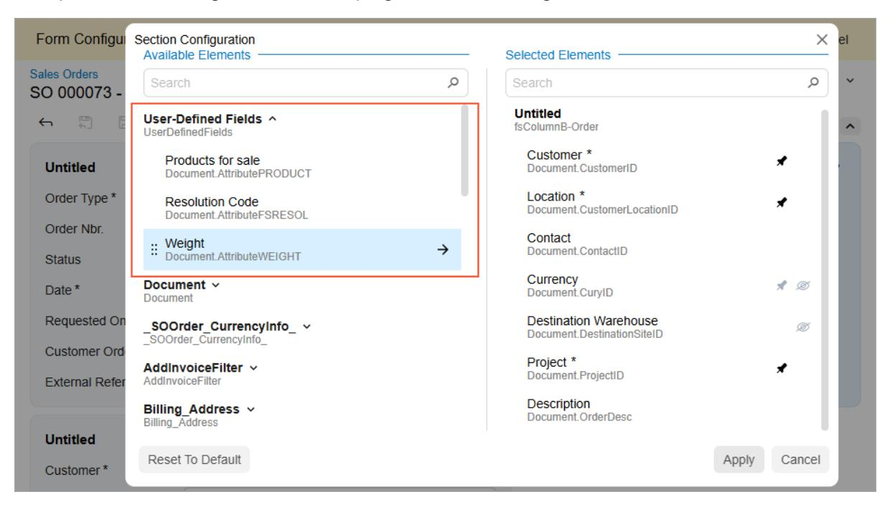

#### *Figure: User-defined fields in the Section Configuration dialog box*

User-defined fields associated with the form are listed under the **User-Defined Fields** node of the **Available Elements** pane.

To add a field to the fieldset, locate the field in the **Available Elements** pane and drag it to the**Selected Elements** pane.

Once you have added all the needed user-defined fields, click **Apply** to close the**Section Configuration** dialog box. Then click **Apply to All** in the Form Configuration pane to apply the layout changes to the form and turn off Form Configuration mode.

In this way, you can customize any form to display user-defined fields.

# **Forms**

Acumatica ERP forms are the main interface elements used throughout the entire working cycle, from configuring the system to entering and processing data, and then making reports or exporting data in various formats.

This chapter describes Acumatica ERP forms and their use in detail.

# **In This Chapter**

- *[Parts of a Form](#page-68-3)*
- *[Form](#page-69-1) Title Bar*
- *Form [Toolbar](#page-76-1) and More Menu*
- *[Formatting](#page-87-1) Toolbar*
- *[Form Elements](#page-94-1)*
- *[Using Forms](#page-103-1)*
- *[Side Panels on Forms](#page-109-1)*
- *[Processing](#page-111-1) Pop-Up Window*

# **Parts of a Form**

An Acumatica ERP form consists of several basic parts. The form can include only one part or a combination of parts, depending on the functionality and use of the form. The following screenshot shows a typical Acumatica ERP screen with the parts of a form that appear on it.

| <b>Q</b> Acumatica                   | Search                                                                          | $\alpha$ $\circlearrowright$                                                                                                    |                                                                  | Revision Two Products Products Wholesale | 2/14/2021 $\odot$ $\ddotmark$ 5:58 AM | admin admin company $\checkmark$                     |
|--------------------------------------|---------------------------------------------------------------------------------|------------------------------------------------------------------------------------------------------------------------------------|------------------------------------------------------------------|---------------------------------------------|------------------------------------------------|------------------------------------------------------------|
| <b>A</b> Favorites                   | <b>Journal Transactions</b> GL GL001638 - Actual Ledger                      |                                                                                                                                    |                                                                  | notes                                       | <b>ACTIVITIES</b> <b>FILES</b>              | TOOLS $\sim$ <b>CUSTOMIZATION</b>                       |
| $\boxed{1}$ Finance                  | 품 $\Box$ $\Omega$ $+$ $\leftarrow$                                  | ô۰ 面 $\overline{\mathbf{K}}$ $\lambda$ $\sim$ $\rightarrow$                                                         | ACTIONS - <b>REPORTS -</b>                                    | 2                                           |                                                |                                                            |
| Time and Expenses $\cup$          | GL Module: $\check{}$ GL001638 Q Batch Number: Posted Status: | !!!!!!!!!!!!!!!!!!!!!!!!!!!!!!!!!!!!!!!! Branch: <b>ACTUAL - Actual Ledger</b> Ledger: 1.00 <b>USD</b> Currency: | Type: 5 Orig. Batch Number: - VIEW BASE Debit Total: | Normal 3,504,101.37                      |                                                |                                                            |
| $2§$ Payroll                         | Transaction D. 12/2/2020 12-2020 Post Period:                          | Auto Reversing Create Tax Transactions                                                                                          | Reversing Entry <b>Credit Total:</b>                          | 3.504.101.37                                | [3]                                            |                                                            |
| $(-)$ Payables                    | Description:                                                                    | Accrued Subcontractor for the month                                                                                                |                                                                  |                                             |                                                |                                                            |
| $^{(+)}$ Receivables              | Ò $^+$ P                                                                  | VIEW SOURCE DOCUMENT RECLASSIFICATION HISTORY                                                                                   | $\mathbf{\overline{x}}$ $\vdash$ 土                         |                                             |                                                |                                                            |
| $\varnothing$ <b>Sales Orders</b> | D * Branch $\omega$ B                                          | * Account <b>Description</b>                                                                                                    | * Subaccount Project/Contract                                 | Ref. Number <b>Project Task</b>          | Quantity UOM                                   | Debit Amount                                            |
| $\mathbf{F}$ Purchases               | <b>0 D PRODWHOLE</b> 51250 <b>0 D</b> PRODWHOLE 20150                  | COGS - Subcontractors <b>Expense Purchase Accrual</b>                                                                           | <b>Бx</b> 000-000 $\mathsf{x}$ 000-000                  |                                             | 0.00 0.00                                   | 3,504,101.37 0.00 3,50                               |
| <b>b</b> Inventory                   |                                                                                 |                                                                                                                                    |                                                                  |                                             |                                                |                                                            |
| <b>Dashboards</b> 6               |                                                                                 | $\overline{4}$                                                                                                                     |                                                                  |                                             |                                                |                                                            |
| ::: More Items                       |                                                                                 |                                                                                                                                    |                                                                  |                                             |                                                |                                                            |
| ∢ $\cdots$                        |                                                                                 |                                                                                                                                    |                                                                  |                                             |                                                | $K$ $\leftarrow$ $\rightarrow$ $\rightarrow$ $\rightarrow$ |

#### *Figure: Parts of a form*

- 1. Form title bar
- 2. Form toolbar
- 3. Summary or selection area
- 4. Details area

5. Form elements

# **Form Title Bar**

The form title bar, which is present on each Acumatica ERP page, includes buttons for managing the form-related information. You can use this bar to view the notes and files attached to form records, to navigate to the list of records (if you are viewing a record on a data entry form or a class form), and to add the form to your favorites (except for data entry forms), among other capabilities. For more information, see *[Form](#page-69-1) Title Bar*.

# **Form Toolbar**

The form toolbar provides data navigation and processing buttons that apply to the entire form. You can use these buttons to cancel or save changes you've made, insert or delete an object, or navigate through the objects created while you use the form. For more information, see *Form [Toolbar](#page-76-1) and More Menu*.

# **Summary or Selection Area**

The Summary or Selection area includes a collection of elements of different types, generally arranged in a column or in multiple columns. This area may contain a summary of a document if a form contains a document or a variety of selections you can make to determine the information in the details area.

# **Details Area**

The details area contains the data of the object or entity.

On some forms, the details area contains a *table*. A table is an arrangement of similar objects or details displayed with the same number of parameters. For more information, see *[Tables](#page-115-2)*.

On other forms, the details area may contain a rich text editor, which includes a text area and a formatting toolbar. You can enter a description or comments in the text area. You use the buttons on the formatting toolbar to format your text and to insert images, links, and macros. For more information, see *[Formatting](#page-87-1) Toolbar*.

# **Form Elements**

Form elements are used to enter information or settings to be stored in the database, specify selection criteria for presenting information on the form, or display relevant information on the form. For more information, see *[Form](#page-94-1) [Elements](#page-94-1)*.

# **Form Title Bar**

The form title bar, located at the top of every Acumatica ERP form, includes general buttons you can use to manage the related data of the form—such as attaching a file to the form and adding the form to your favorites. The form title bar is slightly different depending on the type of form you are viewing:

• A data entry form or class creation form showing a single record (see the first screenshot below). This form title bar is shown in the following screenshot below; the numbered elements are noted below.

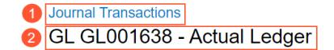

#### *Figure: Form title bar of a data entry or class creation form*

• Any other type of form, such as a processing form, configuration form, list of records, or other inquiry form. The following screenshot shows the form title bar for a list of records.

| 3 CUSTOMIZATION - <b>TOOLS</b> |
|-----------------------------------|
|-----------------------------------|

#### *Figure: Form title bar of another type of form*

You can find the following numbered elements on the screenshots above:

- 1. Form name button (Item 1). You can click it to return to the list of records, which in the example above is Journal Transactions (GL3010PL).
- 2. Record title (Item 2). This element is shown for only data entry or class forms to provide more information about the specific record that is being viewed on the form.
- 3. Menu buttons (Item 3). As the screenshots above show, various menu buttons appear on the right side of the form title bar, depending on the particular form.
- 4. **Add to Favorites** button (Item 4). Notice that this button is shown on the form title bar in only the second screenshot above; it is not shown on data entry forms or forms used to create classes.

A form title bar on a particular form may include some or all of the standard buttons, which are described in more detail in the next section.

# **Standard Form Title Bar Elements**

| Element          | Description                                                                                                                                                                                                                                                                                                                                                                                                                                                                                                                                                                                                                                                                                                                                                                                                    |
|------------------|----------------------------------------------------------------------------------------------------------------------------------------------------------------------------------------------------------------------------------------------------------------------------------------------------------------------------------------------------------------------------------------------------------------------------------------------------------------------------------------------------------------------------------------------------------------------------------------------------------------------------------------------------------------------------------------------------------------------------------------------------------------------------------------------------------------|
| Form Name        | Shows the name of the current form.                                                                                                                                                                                                                                                                                                                                                                                                                                                                                                                                                                                                                                                                                                                                                                            |
|                  | If you are on a data entry form or a form used to create a class, you can click the form name to navigate to the list of records of this type. For example, if you are viewing a par ticular customer, you click this button to view the list of customers defined in the system, and if you are viewing a particular customer class, you click this button to view the list of customer classes defined in the system.                                                                                                                                                                                                                                                                                                                                                                            |
|                  | For all other forms, clicking the form name causes the system to refresh the form.                                                                                                                                                                                                                                                                                                                                                                                                                                                                                                                                                                                                                                                                                                                             |
| Record Title     | For a data entry form or class form, shows the record title, which represents the ID and name, description, or additional information about the specific record.                                                                                                                                                                                                                                                                                                                                                                                                                                                                                                                                                                                                                                            |
|                  | For a new record, the system may display New Record as the record title. If the form box es used for creating a caption are populated when the form is opened, the system will display the limited record details. For example, if you initiate the creation of a AP bill on the Bills and Adjustments (AP301000) form, the system will display Bill as the record title because the required Type box is filled by default with the Bill option. If you change the value of the Type box to Credit Adj., the system will change the record title to Credit Adj However, if you initiate the creation of a task on the Task (CR306020) form, the system will display New Record in the record title because all elements the system uses for cre ating a caption are empty by default. |
| Add to Favorites | Adds the form to your favorites. If you frequently work with the current form, you can add it to your favorites for quicker access.                                                                                                                                                                                                                                                                                                                                                                                                                                                                                                                                                                                                                                                                         |
|                  | This button does not appear on the form title bar for data entry or class creation forms; it appears for other types of forms, including lists of records, configuration forms, and in quiry forms.                                                                                                                                                                                                                                                                                                                                                                                                                                                                                                                                                                                                      |

The following table lists the standard elements that a form title bar might include.

| Element       | Description                                                                                                                                                                                                                                                                                                                                                                                                             |
|---------------|-------------------------------------------------------------------------------------------------------------------------------------------------------------------------------------------------------------------------------------------------------------------------------------------------------------------------------------------------------------------------------------------------------------------------|
| Notes         | Gives you the ability to attach notes to records. For more information, see To Attach a Note to a Record.                                                                                                                                                                                                                                                                                                            |
| Activities    | Opens the Tasks and Activities dialog box, which gives you the ability to create and man age form-related activities, such as tasks, events, emails, phone calls, and appointments.                                                                                                                                                                                                                                  |
| Files         | Opens the Files dialog box, which gives you the ability to attach files to the form and manage the attached files.                                                                                                                                                                                                                                                                                                   |
| Customization | Provides access to the functionality that you can use to customize the Acumatica ERP in stance. For more information, see Customization Menu.                                                                                                                                                                                                                                                                        |
| Tools         | Provides the following commands, which give you form-related information:                                                                                                                                                                                                                                                                                                                                               |
|               | • Screen ID: Shows the ID of the current form. If the form's workflow has been cus tomized, the system displays the Flow icon ( ) to the le of the screen ID.                                                                                                                                                                                                                                                 |
|               | • Get Link: Displays the link to the current form, which you can send to another user.                                                                                                                                                                                                                                                                                                                               |
|               | • Web Service: Navigates to the page with the Web Service Definition Language (WSDL) for the Screen-Based API access methods for the currently open Acumatica ERP form.                                                                                                                                                                                                                                           |
|               | • DAC Schema Browser: Opens the DAC Schema Browser, which displays detailed infor mation about DACs and the relationships between DACs. If you are on a form that has a primary view DAC, the DAC Schema Browser displays the primary view DAC of this form. If you are on a form that does not have a primary view DAC, the DAC Schema Browser opens with an empty page.                                |
|               | • Notifications: Opens the Notifications dialog box, which lists the notifications config ured for the form and provides options that you can use to configure notification tem plates that can be used as subscribers of business events. For details, see Using Busi ness Events in the Acumatica ERP System Administration Guide.                                                                        |
|               | • Business Events: Opens the Business Events dialog box, which lists the business events configured for the form and provides options that you can use to create and send notifications about data changes on a data entry form. For details, see Using Busi ness Events in the Acumatica ERP System Administration Guide.                                                                                  |
|               | • Access Rights: Navigates to the Access Rights by Screen form where the form from which you initiated the Access Rights command is open by default in the company tree.                                                                                                                                                                                                                                       |
|               | • Audit History: If the field level auditing of the form is turned on, then in a separate tab, the system opens the Audit History page with the full history of changes of the form or the record opened on the form. If the field level auditing is turned off, then the system opens the Update History dialog box with the limited information about the form or record creation and its last update. |
|               | • Share Column Configuration: Opens the Share Column Configuration dialog box, which is described below. This item is visible for only users with the Administrator role.                                                                                                                                                                                                                                         |
|               | This item is not displayed on dashboard pages, wiki pages, pivot tables, or report forms.                                                                                                                                                                                                                                                                                                                            |
|               | • Trace: Opens the Trace page, where you can view recent operations performed by the current user, all messages, SQL statements, exceptions logged in the system, informa tion about system performance, and logs that will be sent to Acumatica.                                                                                                                                                              |
|               | • Profiler: Opens the Profiler dialog box, in which you can turn on or turn off the Re quest Profiler and export the information about the latest requests in the current user's session. For details about the Request Profiler, see System Health: Request Profiler.                                                                                                                                         |

| Element | Description                                                                                                                                                            |
|---------|------------------------------------------------------------------------------------------------------------------------------------------------------------------------|
|         | • About: Opens the About Acumatica dialog box, which displays information about the current version and build of the application and some copyright information. |

# **Share Column Configuration Dialog Box**

You can use the**Share Column Configuration** dialog box to set the current layout of a table on a particular form as the default layout and to share the settings with multiple users. To open the dialog box in the**Tools** menu on the form title bar you select**Share Column Configuration**.

This item is not displayed on dashboard pages, wiki pages, pivot tables, or report forms.

The **Share Column Configuration** dialog box contains two pages, which are described in detail below.

# *Table: Share Column Configuration Dialog Box: Page 1*

On this page, in the list, you can select (by using the unlabeled check boxes) one table or multiple tables of the form for which you want to set up defaults and share settings with users. In this list, you can see the tables for which you have changed the column settings. You can select multiple tables if you want to specify the same sharing settings for these tables. If the sharing settings you want to configure are table-specific, you can select one table at a time in this dialog box and specify the settings for only the selected table.

| Element                                   | Description                                                                                                 |  |
|-------------------------------------------|-------------------------------------------------------------------------------------------------------------|--|
| Included                                  | A check box that you select to make the system apply the current configuration of columns to this table. |  |
| Table ID                                  | The identifier of the table on this form to which the current configuration of columns can be applied.   |  |
| The dialog box has the following buttons. |                                                                                                             |  |
| Cancel                                    | Cancels your changes and closes the dialog box.                                                             |  |
| Next                                      | Goes to the next page of theShare Column Configuration dialog box.                                          |  |

#### *Table: Share Column Configuration Dialog Box: Page 2*

On this page, you can specify settings that determine for which users this configuration is set as the default configuration.

| Element            | Description                                                                                                                                                                                                                                                                                                                                                                                                             |
|--------------------|-------------------------------------------------------------------------------------------------------------------------------------------------------------------------------------------------------------------------------------------------------------------------------------------------------------------------------------------------------------------------------------------------------------------------|
| Set as the Default | A check box that you select to set the current column configurations of the table or tables you have selected on Page 1 as the default column configurations. With this check box se lected, the system applies the current column configuration for users of the system who have the default table layout. = If you clear the check box, in the Users table, you can select the particular users for which |
|                    | the system will apply the current layout of the table or tables.                                                                                                                                                                                                                                                                                                                                                        |

| Element                                        | Description                                                                                                                                                                                                                                                                                                               |
|------------------------------------------------|---------------------------------------------------------------------------------------------------------------------------------------------------------------------------------------------------------------------------------------------------------------------------------------------------------------------------|
| Override Users' Personal Configu rations | A check box that you select to replace the column configuration of the selected table or tables for users who have changed the default layout of the table or tables (that is, they have a personalized configuration of the table or tables).                                                                      |
|                                                | This box is selected and unavailable when you clear theSet as the Default check box; with these settings, you apply the column configuration to only users selected in the Users table, and the system always overrides any personalized column layouts the users might have configured for the selected tables. |
| User Role                                      | The user role, which you can select to filter the list of users displayed in the Users table.                                                                                                                                                                                                                             |
|                                                | This box is available only when you clear theSet as the Default check box.                                                                                                                                                                                                                                                |
| The dialog box has the following buttons.      |                                                                                                                                                                                                                                                                                                                           |
| Cancel                                         | Cancels your changes and closes the dialog box.                                                                                                                                                                                                                                                                           |
| Prev                                           | Returns to the previous page of the dialog box without saving your changes.                                                                                                                                                                                                                                               |
| Finish                                         | Saves your changes and closes the dialog box.                                                                                                                                                                                                                                                                             |

#### *Table: Share Column Configuration Dialog Box: Page 2, Users Table*

In this table, you can select the users to which you want to apply the current settings of columns in the selected table or tables.

The table toolbar includes only standard buttons. For the list of standard buttons, see *Table [Toolbar](#page-117-1)*.

| Column        | Description                                                                                                                             |
|---------------|-----------------------------------------------------------------------------------------------------------------------------------------|
| Included      | A check box that you select to indicate that the system should apply the current column settings to the user.                        |
| Login         | Read-only. The login name of the user in the system.                                                                                    |
| Display Name  | Read-only. For the user specified in the Login column, the combination of the First Name and Last Name on the Users (SM201010) form. |
| Email         | Read-only. The email address of the user.                                                                                               |
| Guest Account | Read-only. A check box that indicates (if selected) that the user account is a guest ac count.                                       |
| Status        | Read-only. The current status of the user (Active, Online, Disabled, or Temporarily Locked).                                            |

# **Profiler Dialog Box**

You use this dialog box to turn on the Request Profiler, which starts the logging of URL requests, SQL queries, exceptions, and warnings and errors; you can also turn off the Request Profiler and export a ZIP archive with the log files.

| Element         | Description                                                                                                                                                                                                                   |
|-----------------|-------------------------------------------------------------------------------------------------------------------------------------------------------------------------------------------------------------------------------|
| Start Logging   | Causes the Request Profiler to start logging URL requests, SQL queries, exceptions, and warnings and errors.                                                                                                               |
| Stop and Export | Causes the Request Profiler to return to the default monitoring and to export a ZIP archive with the log files that contain information in JSON format about the performed URL requests, SQL requests, and stack trace. |
| Profiler        | Opens the Request Profiler (SM205070) form.                                                                                                                                                                                   |

# **Tasks and Activities Dialog Box**

You use this dialog box to create tasks, emails, and activities, such as events, phone calls, and appointments, associated with the particular record or to view and manage existing tasks, emails, and activities listed in a table. Tasks, emails, and activities with the *Canceled* status are not shown in the table.

The table toolbar includes standard buttons and buttons that are specific to this table. For the list of standard buttons, see *Table [Toolbar](#page-117-1)*. The table-specific buttons are listed below.

| Button       | Description                                                                                                                                                                                                                                                       |
|--------------|-------------------------------------------------------------------------------------------------------------------------------------------------------------------------------------------------------------------------------------------------------------------|
| Add Task     | Opens the Task (CR306020) form so you can create a new task.                                                                                                                                                                                                      |
| Add Event    | Opens the Event (CR306030) form so you can create a new event.                                                                                                                                                                                                    |
| Add Email    | Opens the Email Activity (CR306015) form so you can create a new email.                                                                                                                                                                                           |
| Add Activity | Provides menu commands that correspond to the list of activity types configured on the Activity Types (CR102000) form. By clicking on a menu command, you open the Activity (CR306010) form, which you use to create an activity of the corresponding type. |

The table includes the following unlabeled columns.

| Column        | Description                                                                                                                                                                                                                                                                                      |
|---------------|--------------------------------------------------------------------------------------------------------------------------------------------------------------------------------------------------------------------------------------------------------------------------------------------------|
| Activity Type | An icon that indicates the type of the activity.                                                                                                                                                                                                                                                 |
| Start Date    | The start date of the activity. The start date is shown in red font in the following cases: • For an event that begins in less than an hour or whose start date has already passed, regardless of the status of the event • For a task whose due date matches the current date |
| Summary       | The description provided for the activity.                                                                                                                                                                                                                                                       |

| Column   | Description                                                                                                                                                                                    |
|----------|------------------------------------------------------------------------------------------------------------------------------------------------------------------------------------------------|
| Duration | The planned duration of the activity. The duration is shown in red font in the following cases:                                                                                             |
|          | • For an event that begins in less than an hour or whose start date has already passed, regardless of the status of the event • For a task whose due date matches the current date |

# **Files Dialog Box**

You use this dialog box for uploading files and attaching them to records and record details.

| Element                                                                                                                                                                                       | Description                                                                                                                                                                                                                                                                                                      |  |
|-----------------------------------------------------------------------------------------------------------------------------------------------------------------------------------------------|------------------------------------------------------------------------------------------------------------------------------------------------------------------------------------------------------------------------------------------------------------------------------------------------------------------|--|
| File Name                                                                                                                                                                                     | The name of the selected file to be uploaded.                                                                                                                                                                                                                                                                    |  |
|                                                                                                                                                                                               | The dialog box has the following buttons.                                                                                                                                                                                                                                                                        |  |
| Browse                                                                                                                                                                                        | Opens the system dialog box you can use to look for the file to be uploaded.                                                                                                                                                                                                                                     |  |
| Upload                                                                                                                                                                                        | Uploads the selected file.                                                                                                                                                                                                                                                                                       |  |
| The dialog box has a table that displays all files that have been attached to the record or record detail for which you have opened the dialog box.                                        |                                                                                                                                                                                                                                                                                                                  |  |
| The table toolbar includes standard buttons and buttons that are specific to this table. For the list of standard buttons, see Table Toolbar. The table-specific buttons are listed below. |                                                                                                                                                                                                                                                                                                                  |  |
| Add Link                                                                                                                                                                                      | Adds a link to a file that is stored in Acumatica ERP but attached to another record in the system to the table. For more information on managing files in Acumatica ERP, see Attachments: File Up load and Attachment.                                                                                    |  |
| Remove Link                                                                                                                                                                                | Removes a link to a file from the table.                                                                                                                                                                                                                                                                         |  |
| Scan                                                                                                                                                                                          | Runs the scanning of a document.                                                                                                                                                                                                                                                                                 |  |
|                                                                                                                                                                                               | This button is available only if the DeviceHub feature is enabled on the Enable/Disable Features (CS100000) form and at least one scanner is configured in the DeviceHub application.                                                                                                                         |  |
| Upload from Teams                                                                                                                                                                          | Opens the Upload from Teams (SM404000) form, where you can select files that have been shared with you in Microsoft Teams and add them to the record.                                                                                                                                                         |  |
|                                                                                                                                                                                               | This button is available only if the Teams Integration feature is enabled on the Enable/Disable Features (CS100000) form.                                                                                                                                                                                     |  |
| Upload Us ing Mobile                                                                                                                                                                       | If you have a mobile device with the installed Acumatica mobile app, when clicking this button, the system sends a push notification to the linked device.                                                                                                                                                    |  |
| App                                                                                                                                                                                           | Opening this push notification on the mobile device, navigates you to the Attachments screen. On this screen, you can either upload the existing files or take a photo of the needed entity. After you complete the upload on the mobile app, the selected files will appear in the Acumatica ERP site. |  |
| The table contains the following columns.                                                                                                                                                     |                                                                                                                                                                                                                                                                                                                  |  |

| Element   | Description                                                      |
|-----------|------------------------------------------------------------------|
| File Name | The name of the uploaded file.                                   |
| Comment   | Any comment that has been provided related to the uploaded file. |
| Last Date | The date when the uploaded file was last modified.               |

#### **Related Links**

- *[Activity](https://help-2025r1.acumatica.com/Help?ScreenId=ShowWiki&pageid=09cd2553-0e9e-4450-804d-106159f9a5b6)*
- *[Personal Settings for Record Processing](https://help-2025r1.acumatica.com/Help?ScreenId=ShowWiki&pageid=2c6bcbb9-f9ce-4561-90db-1b436da8d9b5)*
- *To Attach a Note to a [Record](#page-106-2)*
- *To Attach a File to a [Record](#page-105-2)*
- *[System Health: Request Profiler](https://help-2025r1.acumatica.com/Help?ScreenId=ShowWiki&pageid=4b2b51fa-eae3-4102-b1f2-d7ee96145174)*

# **Form Toolbar and More Menu**

The form toolbar, which is available on most forms, is located near the top of the form, under the form name (and record title, if the form has one), as shown in the following screenshot.

The form toolbar includes the following:

- Standard buttons (see Item 1 in the following screenshot), with the particular set of buttons depending on the specific form
- On some forms, form-specific buttons (Item 2)
- On some form, the More button (Item 3); clicking this button opens the More menu (Item 4), which contains additional form-specific commands

| Opportunities 000004 - A juicer with the installation and training for Lake Cafe                                                                                                                                                                                                                                                                                                                                          |                       |           |                              |                       |                                                                                                                | 3                                                                                                                                | <b>NOTES</b> <b>FILES</b> <b>CUSTOMIZATION</b> | TOOLS $\blacktriangledown$ |
|------------------------------------------------------------------------------------------------------------------------------------------------------------------------------------------------------------------------------------------------------------------------------------------------------------------------------------------------------------------------------------------------------------------------------|-----------------------|-----------|------------------------------|-----------------------|----------------------------------------------------------------------------------------------------------------|----------------------------------------------------------------------------------------------------------------------------------|------------------------------------------------------|----------------------------|
| $\begin{array}{c} \hline \begin{array}{c} \hline \begin{array}{c} \hline \begin{array}{c} \hline \begin{array}{c} \hline \begin{array}{c} \hline \begin{array}{c} \hline \end{array} \end{array} \end{array} \end{array} \end{array} \end{array}$ $\Box$ $\Omega$ $\leftarrow$                                                                                                                                      | n $+$ $\bullet$ | 面 Κ    | $\left\langle \right\rangle$ | <b>OPEN</b> $\geq$ | <b>CREATE QUOTE</b>                                                                                            | $\cdots$                                                                                                                         |                                                      |                            |
| 2 $\varphi$ 000004 <b>Business Account:</b> LAKECAFE - Opportunity ID: <b>New</b> Status: Location: MAIN - Primar PROJECT - Project Sales $\circ$ $\mathscr{O}$ * Class ID: Contact: Owner: Stage: Prospect $\overline{\phantom{a}}$ * Estimated Close Date: 1/4/2021 $\mathbf{v}$ A juicer with the installation and training for Lake Cafe * Subject: |                       |           |                              |                       | Processing Open $\bullet$ Close as Won Close as Lost <b>Record Creation</b> <b>Create Quote</b> | <b>Activities</b> <b>Create Task</b> <b>Create Note</b> Other <b>Recalculate Prices</b> <b>Validate Addresses</b> | $\hat{\phantom{a}}$                                  |                            |
| <b>Create Sales Order</b> <b>ACTIVITIES</b> <b>DETAILS</b> <b>QUOTES</b> CONTACT <b>CRM INFO</b> <b>FINANCIAL</b> <b>SHIPPING</b> AT 1 <b>Create Account</b> <b>CREATE TASK</b> <b>CREATE EVENT</b> CREATE ACTIVITY + PIN/UNPIN <b>CREATE EMAIL</b> $\vdash$ <b>Create Contact</b>                                                                                |                       |           |                              |                       |                                                                                                                |                                                                                                                                  |                                                      | $\overline{Y}$             |
| $\uparrow \qquad \qquad \downarrow \qquad \uparrow \qquad \uparrow$ 图 0 n. I¢.                                                                                                                                                                                                                                                                                                                                      | Type                  | * Summary |                              | <b>Status</b>         | Start                                                                                                          | <b>Create Invoice</b>                                                                                                            |                                                      |                            |
|                                                                                                                                                                                                                                                                                                                                                                                                                              |                       |           |                              |                       |                                                                                                                |                                                                                                                                  |                                                      |                            |

#### *Figure: The form toolbar and the More menu*

You use the standard buttons on the form toolbar to navigate through entities that were created by using the current form, insert or delete an entity, use the clipboard, save the data you have entered, or cancel your work on the form.

A form toolbar on a particular form may include form-specific buttons in addition to standard buttons; it may also (or instead) include commands on the More menu. By using these form-specific buttons and commands, users can navigate to related records and forms, initiate specific actions, and perform modifications or processing related to the functionality of the form.

# **Standard Form Toolbar Buttons**

The following table lists the standard buttons of the form toolbar. A form toolbar may include some or all of these buttons.

| Button                       | Icon | Description                                                                                                                                                                                                                                                                                                                                                                                                                                                                                                                                  |  |  |  |  |  |  |
|------------------------------|------|----------------------------------------------------------------------------------------------------------------------------------------------------------------------------------------------------------------------------------------------------------------------------------------------------------------------------------------------------------------------------------------------------------------------------------------------------------------------------------------------------------------------------------------------|--|--|--|--|--|--|
| Discard Changes and Close |      | Discards any unsaved changes made to the entity, and navigates to the list of records that is related to the current form.                                                                                                                                                                                                                                                                                                                                                                                                                |  |  |  |  |  |  |
|                              |      | If the system opened the current form in a pop-up window (from a different form), this button is not displayed. To return to the original form, click Close.                                                                                                                                                                                                                                                                                                                                                                           |  |  |  |  |  |  |
| Save & Close                 |      | Saves the changes made to the entity, and navigates to the list of records that is related to the current form.                                                                                                                                                                                                                                                                                                                                                                                                                           |  |  |  |  |  |  |
| Save                         |      | Saves the changes made to the entity.                                                                                                                                                                                                                                                                                                                                                                                                                                                                                                        |  |  |  |  |  |  |
| Cancel                       |      | Depending on the context, does one of the following: • Discards any unsaved changes you have made to entities and retrieves the last saved version. • Clears all changes and restores the default settings.                                                                                                                                                                                                                                                                                                                   |  |  |  |  |  |  |
| Add New Record               |      | Clears any values you've specified on the form, restores any default values, and initiates the creation of a new entity.                                                                                                                                                                                                                                                                                                                                                                                                                  |  |  |  |  |  |  |
| Delete                       |      | Deletes the currently selected entity, clears any values you have specified on the form, and populates elements with the default values that the system in serts when a new entity is created. You can delete an entity only if it is not linked with another enti ty.                                                                                                                                                                                                                                                           |  |  |  |  |  |  |
| Archive                      |      | Archives the document that is opened on the form. This button is available if archival is set up on the Archival Policy (SM200400) form for the type of the document open on the form and if the document meets the archival crite ria—that is, if the document is older than the retention period specified on the Archival Policy form and has been processed to completion or canceled. For more information on archiving the documents, see Archiving Old Docu ments in the Acumatica ERP System Administration guide. |  |  |  |  |  |  |

*Table: Standard Form Toolbar Buttons*

| Button                   | Icon | Description                                                                                                                                                                                                                                                                                                                                                                                                                                                                                                                                                                                                                                                           |  |  |  |
|--------------------------|------|-----------------------------------------------------------------------------------------------------------------------------------------------------------------------------------------------------------------------------------------------------------------------------------------------------------------------------------------------------------------------------------------------------------------------------------------------------------------------------------------------------------------------------------------------------------------------------------------------------------------------------------------------------------------------|--|--|--|
| Extract                  |      | Extracts the archived document from the archive and makes the system use this document in day-to-day operations. This button is available if archival is set up on the Archival Policy (SM200400) form for the type of the document opened on the form is archived.                                                                                                                                                                                                                                                                                                                                                                                          |  |  |  |
|                          |      | For more information on archiving the documents, see Archiving Old Docu ments in the Acumatica ERP System Administration guide.                                                                                                                                                                                                                                                                                                                                                                                                                                                                                                                                    |  |  |  |
| Clipboard                |      | Provides menu commands you can use to do the following: • Copy: Copy the selected entity to the clipboard. • Paste: Paste an entity or template from the clipboard. • Save asTemplate: Create a template based on the selected entity. • Import from XML: Import an entity or a template from an .xml file. • Export to XML: Export the selected entity to an .xml file. For more information on templates and copy-and-paste operations in Acumatica ERP, see Using Forms. For more information on importing and ex porting .xml files, see Importing and Exporting Data to Excel and XML in the Acumatica ERP User Guide. |  |  |  |
| Go to First Record       |      | Displays the first entity (in the list of entities of the specific type) and its de tails.                                                                                                                                                                                                                                                                                                                                                                                                                                                                                                                                                                         |  |  |  |
| Go to Previous Record |      | Displays the previous entity and its details.                                                                                                                                                                                                                                                                                                                                                                                                                                                                                                                                                                                                                         |  |  |  |
| Go to Next Record        |      | Displays the next entity and its details.                                                                                                                                                                                                                                                                                                                                                                                                                                                                                                                                                                                                                             |  |  |  |
| Go to Last Record        |      | Displays the last entity (in the list of entities of the specific type) and its de tails.                                                                                                                                                                                                                                                                                                                                                                                                                                                                                                                                                                          |  |  |  |
| View Schedule            |      | Gives you the ability to schedule the processing. For more information, see Automated Processing: General Information.                                                                                                                                                                                                                                                                                                                                                                                                                                                                                                                                             |  |  |  |

# **Inquiry Form Toolbar Buttons**

Acumatica ERP inquiry forms present data in a tabular format; they may also have selection criteria you can use to filter the data in the table. Predefined inquiry forms are provided as part of Acumatica ERP out of the box, and inquiry forms can be designed by a user with the appropriate access rights by using the Generic Inquiry tool (for details, see *[Managing Generic Inquiries](https://help-2025r1.acumatica.com/Help?ScreenId=ShowWiki&pageid=5737bca9-aebb-446d-9e1a-bc5fcfad6797)* in the Acumatica ERP Reporting Tools Guide). A form toolbar of an inquiry form contains both the standard form toolbar buttons (described in the table above) and the additional buttons described below.

| Forms   80 |  |
|------------|--|
|------------|--|

| Button          | Icon | Description                                                                                                                                                                                                                       |
|-----------------|------|-----------------------------------------------------------------------------------------------------------------------------------------------------------------------------------------------------------------------------------|
| Refresh         |      | Refreshes the inquiry data in the table.                                                                                                                                                                                          |
| Cancel          |      | Clears all changes (including selection criteria that has been specified, if the generic inquiry form has this criteria) and restores the default settings.                                                                    |
| Add New Record  |      | Initiates the creation of a new entity.                                                                                                                                                                                           |
| Edit            |      | Opens the applicable data entry form with the selected record.                                                                                                                                                                    |
| Fit toScreen    |      | Expands the form to fit on the screen and adjusts the column widths propor tionally.                                                                                                                                           |
| Export to Excel |      | Exports the data to an Excel file. For more information, see Integration with Ex cel in the Acumatica ERP Getting Started Guide.                                                                                               |
| Filter Settings |      | Opens the Filter Settings dialog box, which you can use to define a new filter. After the filter has been created and saved, the corresponding tab appears on the table. For more information about filtering, see Filters. |

# **The More Menu and Form-Specific Buttons**

If there are multiple form-specific commands on the form toolbar, they are displayed on a single menu—the More menu—and listed under descriptive categories, which makes it easier to find the needed menu command. On the More menu, you can easily define your favorite menu commands, which eases access to them.

On some forms, the system places a button (which is highlighted in green) on the form toolbar for the expected next command, which represents the likely next step to be performed on the selected record. The following screenshot, which shows the *Cash [Transactions](https://help-2025r1.acumatica.com/Help?ScreenId=ShowWiki&pageid=1e55821c-556b-4c3e-829c-95383eb2c8e2)* (CA304000) form, illustrates an example of the form toolbar and the More menu, which contains categories and menu commands.

| <b>Transactions</b> 周 $\leftarrow$                    | $\Box$ $\Omega$                        | Cash Entry 000228 - 10200 Company Checking Account n 而 + | $\mathsf{K}$ ٠  | $\lambda$                                                       | <b>RELEASE</b>                                           | 2 <b>HOLD</b> | $\mathbf{3}$ $\cdots$                        | $\Box$ NOTES | <b>ACTIVITIES</b> | <b>FILES</b> 4      | <b>CUSTOMIZATION</b> | TOOLS $\sim$           |
|-------------------------------------------------------------|-------------------------------------------|-------------------------------------------------------------------|--------------------|-----------------------------------------------------------------|----------------------------------------------------------|------------------|-------------------------------------------------|--------------|-------------------|------------------------|----------------------|------------------------|
| Tran. Type: Reference Nbr. Cash Account: Currency: | <b>Cash Entry</b> 000228 <b>USD</b> | $\circ$ 10200 - Company Checking Account 1.00               | - VIEW BASE        | * Tran. Date: * Fin. Period: Entry Type: Disbursement/ | 5/26/2021 05-2021 <b>INTEREST-In</b> Receipt    | ρ                | Reports $\triangle$ Activities Processing |              |                   | Corrections Reverse |                      |                        |
| Status: Description: <b>TRANSACTION DETAILS</b>       | Balanced                                  | <b>TAX DETAILS</b>                                                |                    | * Document Ref. Owner: <b>FINANCIAL DETAILS</b>           | <b>INT-145</b> EP00000002- <b>APPROVAL DETAILS</b> |                  | Hold Remove Hold Release ®     | 6            |                   |                        |                      |                        |
| Ò                                                           | $\mathsf{x}$ $\mathscr{D}$             | $\boxed{\mathbf{x}}$ $\left  \rightarrow \right $              | 土                  |                                                                 |                                                          |                  |                                                 |              |                   |                        |                      |                        |
| 園 n. *Branch                                          |                                           | Item ID                                                           | <b>Description</b> |                                                                 |                                                          |                  | Quantity                                        | <b>UOM</b>   | Price             | Amount *Offset         | Account              | <b>Account Descrip</b> |
| $\mathbf{0}$ n                                           | PRODWHOLE                                 |                                                                   | Interest           |                                                                 |                                                          |                  | 1.00                                            |              | 20.00             | 20.00                  | 49300                | Other Income: In       |

#### *Figure: The form toolbar of the Transactions form*

The numbered items in the screenshot indicate the following:

- 1. A highlighted button for the expected next command, which represents the next logical step to be performed on the record selected on the form
- 2. Another button for a command that is commonly performed on the form
- 3. The More button, which you click to open the More menu
- 4. The More menu with most form-specific menu commands and descriptive categories on it
- 5. The star icon, which is used to mark the individual user's favorite commands on the form
- 6. An unavailable command

# **Favorite Commands**

Based on your role in the company and your job duties, you may use some commands more oen than others. On the form toolbar, you can specify these commands as favorites. This will cause the system to duplicate the commands as form toolbar buttons, easing access to them.

To add a command to the form toolbar as a button, you open the More menu, hover over the needed command, and click the star icon when it appears. The yellow color of the star indicates that the command has been added to your favorites, and a button for the command appears on the form toolbar immediately. The following example shows two commands that have been added to the user's favorites on the *[Invoices and Memos](https://help-2025r1.acumatica.com/Help?ScreenId=ShowWiki&pageid=5e6f3b27-b7af-412f-a40a-1d4f4be70cba)* (AR301000) form and thus added as buttons on the form toolbar.

| <b>Invoices and Memos</b> <b>P</b> NOTES TOOLS $\blacktriangleright$ <b>ACTIVITIES</b> <b>FILES</b> <b>CUSTOMIZATION</b> Invoice AR009654 - Alphabetland School Center |                                                                                |                                                          |                                                                   |  |  |  |  |
|------------------------------------------------------------------------------------------------------------------------------------------------------------------------------------------|--------------------------------------------------------------------------------|----------------------------------------------------------|-------------------------------------------------------------------|--|--|--|--|
| 周 $\Box$ 侕 $\pm$ $\curvearrowleft$ $\leftarrow$                                                                                                                           | $\bigcap$ $\rightarrow$ $\lambda$ $\overline{\mathsf{K}}$ $\sum$ ≺ | <b>RELEASE</b> <b>HOLD</b> <b>CUSTOMER DETAILS</b> | $\cdots$                                                          |  |  |  |  |
| Invoice Type: $\overline{\phantom{a}}$ AR009654 Q Reference Nbr.:                                                                                                            | Processing Remove Hold                                                      | Intercompany <b>Generate AP Document</b>              | <b>Related Documents</b>                                          |  |  |  |  |
| Status: <b>Balanced</b>                                                                                                                                                               | $\star$ Hold                                                                   |                                                          | SO Invoice Pro Forma                                           |  |  |  |  |
| 5/27/2021 * Date: $\overline{\phantom{a}}$ 05-2021 * Post Period: Q                                                                                                       | Release O Pay                                                    | Approval <b>Remove Credit Hold</b>                    | <b>Inquiries</b>                                                  |  |  |  |  |
| Customer Ord                                                                                                                                                                             | Release Retainage                                                              | <b>Credit Hold</b>                                       | <b>Customer Details</b> $\star$ <b>Project Transactions</b> |  |  |  |  |
| Description: Weekly                                                                                                                                                                   | Corrections                                                                    | <b>Printing and Emailing</b>                             |                                                                   |  |  |  |  |
|                                                                                                                                                                                          | Reverse                                                                        | Print                                                    | Reports                                                           |  |  |  |  |
| <b>FINANCIAL</b> <b>DETAILS</b> <b>ADDRES</b>                                                                                                                                      | Reverse and Apply to Memo                                                      | Email                                                    | <b>AR Edit Detailed</b>                                           |  |  |  |  |
| $\times$ $\mathcal{C}_{1}$ P <b>VIEW DEFE</b>                                                                                                                                   | Write Off                                                                      | Mark as Do not Email                                     | <b>AR Register Detailed</b>                                       |  |  |  |  |
|                                                                                                                                                                                          | <b>Reclassify GL Batch</b>                                                     | Other                                                    |                                                                   |  |  |  |  |
| ョ <b>Inventory ID</b> *Branch                                                                                                                                                      |                                                                                | <b>Add to Schedule</b>                                   |                                                                   |  |  |  |  |
|                                                                                                                                                                                          |                                                                                | <b>Recalculate Prices</b>                                |                                                                   |  |  |  |  |
| <b>PRODWHOLE</b> <b>SUPP OFF</b> n                                                                                                                                                 |                                                                                | <b>Send Email</b>                                        |                                                                   |  |  |  |  |

#### *Figure: Favorite commands on the More menu and the corresponding toolbar buttons*

Favorites are individual to each user account, specific to a particular form, and preserved across user sessions.

# **Highlighted Buttons and Commands**

On some forms, the system applies predefined logic to commands for specific records. Based on this logic, the system may place a button on the form toolbar, highlight it using some color, or do both of these things.

If a command is the expected next command (that is, the command that is most likely to be clicked for a record with the current status), it is shown both on the form toolbar and on the More menu. The primary command on the form toolbar is highlighted in green (see Item 1 in the following screenshot), and on the More menu, it is marked with a green dot (Item 2). Below is an example of a cash transaction on the *Cash [Transactions](https://help-2025r1.acumatica.com/Help?ScreenId=ShowWiki&pageid=1e55821c-556b-4c3e-829c-95383eb2c8e2)* (CA304000) form that has the *On Hold* status (Item 3). Before you can process it, you need to remove it from hold. Because **Remove Hold** is the next logical command, it is displayed as a button on the form toolbar and highlighted in green.

| <b>Transactions</b> Cash Entry 000228 - 10200 Company Checking Account $\Box$ 圎 $\begin{array}{c} \square \\ \square \end{array}$ $\pm$ $\curvearrowleft$ $\leftarrow$                                      | Ô. $\mathsf{K}$ $\geq$ ≺ $\rightarrow$ $\overline{\phantom{a}}$                                    | $\Box$ NOTES <b>REMOVE HOLD</b> $\cdots$                                        | <b>ACTIVITIES</b> <b>FILES</b> | <b>CUSTOMIZATION</b> | TOOLS $\blacktriangleright$ |  |  |  |
|----------------------------------------------------------------------------------------------------------------------------------------------------------------------------------------------------------------------------------|-------------------------------------------------------------------------------------------------------------------|---------------------------------------------------------------------------------------|-----------------------------------|----------------------|-----------------------------|--|--|--|
| Tran. Type: <b>Cash Entry</b> Reference Nbr.: 000228 $\mathcal{Q}$ Cash Account: 10200 - Company Checking Account 1.00 <b>USD</b> Currency: $\left(3\right)$ Status: On Hold Description: | * Tran, Date: * Fin. Period: <b>Entry Type:</b> VIEW BASE Disbursement/ * Document Ref.: Owner: | Reports <b>Activities</b> Processing Hold Remove Hold ● 12. Release | Corrections Reverse            |                      |                             |  |  |  |
| <b>TRANSACTION DETAILS</b> <b>TAX DETAILS</b> <b>FINANCIAL DETAILS</b> <b>APPROVAL DETAILS</b> Ò $\mathbf{\overline{X}}$ 土 $\times$ + $\mathscr{Q}$ $\vdash$                                       |                                                                                                                   |                                                                                       |                                   |                      |                             |  |  |  |
| à. (0) n. *Branch Item ID                                                                                                                                                                                            | <b>Description</b>                                                                                                | Quantity                                                                              | <b>UOM</b> <b>Price</b>        | Amount * Offset      | <b>Account</b>              |  |  |  |
| <b>PRODWHOLE</b> 0 D                                                                                                                                                                                                       | Interest                                                                                                          | 1.00                                                                                  | 20.00                             | 20.00                | 49300                       |  |  |  |

*Figure: The highlighted command and the corresponding status*

#### **Unavailable Commands on the More Menu**

By default, on the More menu, the system displays all commands that could be available for the form, based on the system configuration. Some of these commands may be unavailable (that is, they are listed but cannot be clicked). These are the commands that are not applicable to the record based on its current status or other factors.

### **The Responsive Form Toolbar and More Menu**

The form toolbar and the More menu have a responsive layout, meaning that they dynamically adjust to different screen sizes. When there is enough space, buttons for highlighted and favorite commands are displayed on the form toolbar. When the screen size decreases, the system moves the commands off the form toolbar one by one but keeps them on the More menu.

If there are multiple categories on the More menu, the categories and menu commands can be displayed in multiple columns on the More menu, depending on the screen size and the number of categories. When the screen size decreases, the system moves some categories and menu commands to the le to decrease the number of columns, and in the screens of the smallest size, all categories are displayed in one column. Below are two examples of the same menu in different screen sizes for a record on the *[Bills and Adjustments](https://help-2025r1.acumatica.com/Help?ScreenId=ShowWiki&pageid=956b4e51-3078-4d2d-85b3-65c080d95234)* (AP301000) form.

| <b>Bills and Adjustments</b>                                                                   |                                                                                                                    | Bill 002862 - Empire BlueCross BlueShield                                              |                                                                                             |                          | <b>P</b> NOTES                                               | <b>ACTIVITIES</b>     | <b>FILES</b>          | <b>CUSTOMIZATION</b>                                   | TOOLS $\blacktriangleright$ |
|------------------------------------------------------------------------------------------------|--------------------------------------------------------------------------------------------------------------------|----------------------------------------------------------------------------------------|---------------------------------------------------------------------------------------------|--------------------------|--------------------------------------------------------------|-----------------------|-----------------------|--------------------------------------------------------|-----------------------------|
| $\begin{array}{c} \boxed{11} \\ \boxed{1} \end{array}$ $\Box$ $\leftarrow$               | $\curvearrowleft$ ┿                                                                                             | O 侕 $\overline{\phantom{a}}$                                                     | <b>REMOVE HOLD</b>                                                                          |                          | <b>RECALCULATE PRICES</b>                                    | <b>VENDOR DETAILS</b> |                       | AP EDIT DETAILED $\cdots$                           |                             |
| Type: Reference Nbr.: Status: $\star$ Date:                                           | <b>Bill</b> $\overline{\phantom{a}}$ 002862 $\varphi$ On Hold 5/27/2021 $\overline{\phantom{a}}$ | Vendor: * Location: Currency: $\star$ Terms:                                  | <b>EBLUECROSS - Empire</b> <b>MAIN - Primary Location</b> USD 2 1.00 30D - 30 Days |                          | Processing Remove Hold O Hold               |                       | Other ÷            | Add to Schedule <b>Recalculate Prices</b>           |                             |
| * Post Period: * Vendor Ref.:                                                               | 05-2021 $\Omega$ <b>REG 000472</b>                                                                           | * Due Date: * Cash Discount                                                         | 6/26/2021 6/26/2021                                                                      | $\Box$ App $\Box$ Pay | Pre-release Release Pay Release Retainage           |                       | <b>Inquiries</b> ÷ | <b>Vendor Details</b>                                  |                             |
| Description: <b>DETAILS</b> $\mathcal{C}$ $\mathscr{Q}$ + 割 D. $*B$ ranch | <b>Payroll Liabilities</b> <b>FINANCIAL</b> $\times$ <b>Inventory ID</b>                                  | <b>TAXES</b> <b>APPROVALS</b> <b>VIEW DEFERRALS</b> <b>Transaction Descr.</b> | <b>DISCOUNTS</b> <b>ADD PO RECEIPT</b>                                                   | AP <b>ADD PC</b>      | Corrections Reverse Void <b>Reclassify GL Batch</b> |                       | Reports               | <b>AP Edit Detailed</b> <b>AP Register Detailed</b> |                             |

*Figure: The form toolbar and More menu on a wide screen*

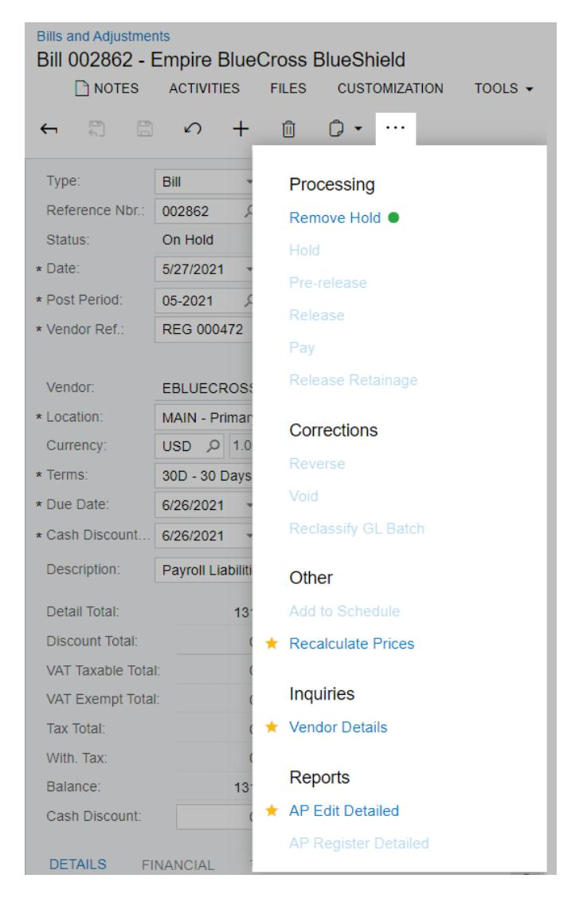

#### *Figure: The form toolbar and More menu on a narrow screen*

#### **Related Links**

- *[Integration with Excel](https://help-2025r1.acumatica.com/Help?ScreenId=ShowWiki&pageid=d4e757d5-bdf6-4d82-92e3-f26563d48ad4)*
- *To Copy a [Document](#page-107-1) Contents to a New Document*
- *To Create a [Document](#page-108-2) with a Template*

# **Page Toolbar**

The page toolbar, which is available on the pages of the Customization Project Editor, is located near the top of the page, under the page title, as shown in the following screenshot.

The page toolbar includes the following:

- Standard buttons (see Item 1 in the following screenshot), with the particular set of buttons depending on the specific page
- On some pages, page-specific buttons (Item 2)
- On some pages, the More button (Item 3); clicking this button opens the More menu (Item 4), which contains additional page-specific commands

| <b>Customization Project Editor</b>                                                                       |                         |                           |                        |                            |                     |                       |          |                       | <b>Back</b>   | Reload |
|-----------------------------------------------------------------------------------------------------------|-------------------------|---------------------------|------------------------|----------------------------|---------------------|-----------------------|----------|-----------------------|---------------|--------|
| Publish <b>Extension Library</b> File                                                               | Source Control          |                           |                        |                            |                     |                       |          |                       |               |        |
| <b>CustomizationProject</b> $\blacktriangleleft$ CR304000 (Opportunities) Actions $\overline{3}$ |                         |                           |                        |                            |                     |                       |          |                       |               |        |
| $\overline{\phantom{a}}$ SCREENS                                                                          | Ò $\Box$ $\Omega$ | $+$ $\times$           | <b>REORDER ACTIONS</b> | .                          |                     | 4                     |          |                       |               |        |
| $-$ CR304000 Actions (1. inherited 17) <b>Event Handlers</b>                                        | <b>图 Action Name</b>    | <b>Display Name</b>       | Action Type            | <b>Actions</b>             |                     | Changes               |          | tegory                | <b>Status</b> |        |
| Fields (1)                                                                                                | addNewContact           | <b>Add Contact</b>        | <b>Graph Action</b>    | <b>Add Existing Action</b> |                     | <b>View Changes</b>   |          | tivities              | <b>New</b>    |        |
| Conditions                                                                                                | <b>CloseAsLost</b>      | Close as Lost             | <b>Graph Action</b>    | <b>Reorder Actions</b>     |                     | <b>Revert Changes</b> |          | ocessing              | Inherited     |        |
| ▶ Workflows                                                                                               | CloseAsWon              | Close as Won              | <b>Graph Action</b>    | <b>Manage Categories</b>   |                     |                       |          | ocessing              | Inherited     |        |
| <b>Dialog Boxes</b> ▶ CR306000                                                                         | CreateApptDoc           | CreateApptDoc             | <b>Graph Action</b>    |                            |                     |                       |          | Services              | Inherited     |        |
| <b>Data Access</b>                                                                                        | CreateBothCont.         | <b>Create Account</b>     | <b>Graph Action</b>    |                            |                     |                       |          | RecordCreation        | Inherited     |        |
| $\sqrt{CODE}$                                                                                             | <b>CreateContact</b>    | <b>Create Contact</b>     | <b>Graph Action</b>    |                            |                     |                       |          | RecordCreation        | Inherited     |        |
| <b>Files</b>                                                                                              | CreateInvoice           | Create Invoice            | <b>Graph Action</b>    |                            |                     |                       |          | RecordCreation        | Inherited     |        |
| <b>Generic Inquiries</b>                                                                                  | createQuote             | <b>Create Quote</b>       | <b>Graph Action</b>    |                            |                     |                       |          | RecordCreation        | Inherited     |        |
| Reports <b>Dashboards</b>                                                                              | <b>CreateSalesOrder</b> | Create Sales Or           | <b>Graph Action</b>    |                            |                     |                       |          | <b>RecordCreation</b> | Inherited     |        |
| Site Map                                                                                                  | CreateSrvOrdD.          | CreateSrvOrdD             | <b>Graph Action</b>    |                            |                     |                       |          | <b>Services</b>       | Inherited     |        |
| <b>Database Scripts</b>                                                                                   | NewActivityN W          | <b>Create Note</b>        | <b>Graph Action</b>    |                            |                     |                       |          | <b>Activities</b>     | Inherited     |        |
| <b>System Locales</b>                                                                                     | NewTask Workf.          | <b>Create Task</b>        | <b>Graph Action</b>    |                            |                     |                       |          | <b>Activities</b>     | Inherited     |        |
| Import/Export Scenarios <b>Shared Filters</b>                                                          | Open                    | Open                      | <b>Graph Action</b>    |                            | <b>IsInNewState</b> | FormOpen              | CR503120 | Processing            | Inherited     |        |
| <b>Access Rights</b>                                                                                      | OpenAppointme.          | OpenAppointme             | <b>Graph Action</b>    |                            |                     |                       |          | <b>Services</b>       | Inherited     |        |
| <b>Wikis</b>                                                                                              | OpenFromNew             | Open                      | <b>Graph Action</b>    |                            | IsNotInNewState     | FormOpen              | CR503120 | Processing            | Inherited     |        |
| <b>Web Service Endpoints</b>                                                                              |                         |                           |                        |                            |                     |                       |          | Other                 | Inherited     |        |
| <b>Analytical Reports</b>                                                                                 | recalculatePrices       | <b>Recalculate Prices</b> | <b>Graph Action</b>    |                            |                     |                       |          |                       |               |        |

*Figure: The page toolbar and the More menu*

You use the standard buttons on the page toolbar to, insert or delete an entity, use the clipboard, save the data you have entered, and cancel your work on the page.

A page toolbar on a particular page may include page-specific buttons in addition to standard buttons; it may also (or instead) include commands on the More menu. These page-specific buttons and commands give you the ability to navigate to related pages, invoke specific actions, open dialog boxes, and perform modifications or processing related to the functionality of the page.

# **Standard Page Toolbar Buttons**

The following table lists the standard buttons of the page toolbar. A page toolbar may include some or all of these buttons.

| Button     | Icon | Description                                                                                                                                                                                                              |
|------------|------|--------------------------------------------------------------------------------------------------------------------------------------------------------------------------------------------------------------------------|
| Save       |      | Saves the changes made to the entity.                                                                                                                                                                                    |
| Cancel     |      | Depending on the context, does one of the following: • Discards any unsaved changes you have made to entities and retrieves the last saved version • Clears all changes and restores the default settings |
| Add Row    |      | Initiates the creation of a new entity                                                                                                                                                                                   |
| Delete Row |      | Deletes the currently selected entity                                                                                                                                                                                    |

| Table: Standard Page Toolbar Buttons |  |  |
|--------------------------------------|--|--|
|                                      |  |  |

| Button          | Icon | Description                                                                                                                                                                   |
|-----------------|------|-------------------------------------------------------------------------------------------------------------------------------------------------------------------------------|
| Refresh         |      | Refreshes the data in the table                                                                                                                                               |
| Clipboard       |      | Provides menu commands you can use to do the following: • Copy: Copy the selected entity to the clipboard • Paste: Paste an entity or template from the clipboard |
| Edit            |      | Opens the currently selected entity on the applicable page so that you can view its settings and modify it, if needed.                                                     |
| Fit toScreen    |      | Expands the page to fit on the screen and adjusts the column widths propor tionally.                                                                                       |
| Export to Excel |      | Exports the data to an Excel file. For more information, see Integration with Ex cel in the Acumatica ERP Getting Started Guide.                                           |

# **The More Menu and Page-Specific Buttons**

If there are multiple page-specific commands on the page toolbar, they are displayed on a single menu—the More menu—and listed under descriptive categories, which makes it easier to find the needed menu command. On the More menu, you can easily define your favorite menu commands, which eases access to them.

On some pages, the system places a button (which is highlighted in green) on the page toolbar for the expected next command, which represents the likely next step to be performed on the selected record. The following screenshot, which shows the *[Workflow](https://help-2025r1.acumatica.com/Help?ScreenId=ShowWiki&pageid=8a944b6b-0e47-47c9-a6a7-1b266d8feba0) (Tree View)* page for the *[Cases](https://help-2025r1.acumatica.com/Help?ScreenId=ShowWiki&pageid=a492a091-9649-4826-bcc3-dccdf8765efd)* (CR306000) form, illustrates an example of the page toolbar and the More menu, which contains categories and menu commands.

| <b>Customization Project Editor</b>                                 |                                                                         |                       |                                                               |                     |        |                  | <b>Back</b> | Reload        |
|---------------------------------------------------------------------|-------------------------------------------------------------------------|-----------------------|---------------------------------------------------------------|---------------------|--------|------------------|-------------|---------------|
| <b>Extension Library</b> Publish File                         | <b>Source Control</b>                                                   |                       |                                                               |                     |        |                  |             |               |
| <b>CustomizationProject</b> $\blacktriangleleft$                 | CR306000 (Cases) te Diagra OFFAULT                                   |                       |                                                               |                     |        |                  |             |               |
| $\overline{\phantom{a}}$ SCREENS ▶ CR304000 $\sqrt{CR306000}$ | B $\Omega$ <b>ADD STATE</b> . <b>States and Transitions</b> |                       | З                                                             |                     |        |                  |             |               |
| Actions                                                             | 圎 ↓                                                                  | <b>Actions</b>        |                                                               | Changes             |        |                  |             |               |
| <b>Event Handlers</b>                                               | - New (Inherited)                                                       | <b>Add State</b>      |                                                               | <b>View Changes</b> |        |                  | Active      |               |
| Fields (1, inherited 1)                                             | $\overline{\phantom{a}}$ Transitions                                    | <b>Add Transition</b> |                                                               | Other               |        |                  |             |               |
| Conditions                                                          | Take Case->New (Inhe.                                                   |                       |                                                               |                     |        |                  |             |               |
| $\rightarrow$ Workflows (1. inherited 1)                            | Open->Open (Inherited)                                                  | 4 Add New             |                                                               | Change Parent State | 5      |                  |             |               |
| Default workflow                                                    | ☆ Add Predefined State Pending Customer->Per                         |                       |                                                               |                     |        |                  |             |               |
| <b>DEFAULT</b>                                                      | Close->Closed (Inheriteur                                               | * larget State:       | <b>INew</b>                                                   |                     |        |                  |             |               |
| <b>Dialog Boxes</b>                                                 | Open Case in Portal->Open (                                             |                       |                                                               |                     |        |                  |             |               |
| Data Access                                                         | Close Case From Portal->Clo                                             |                       | <b>Fields to Update After Transition</b>                      |                     |        |                  |             |               |
| $\triangleright$ CODE                                               | Dpen (Inherited)                                                        | ↻ +                | $\times$ 个 $\downarrow$ $\left  \rightarrow \right $ |                     |        |                  |             |               |
| Files                                                               | $\triangleright$ Transitions                                            | 髙 Active           | *Field Name                                                   |                     | From   | <b>New Value</b> |             | <b>Status</b> |
| <b>Generic Inquiries</b>                                            | - Pending Customer (Modified)                                           |                       |                                                               |                     | Schema |                  |             |               |
| Reports                                                             | ▶ Nested States                                                         | ☑                     | Reason                                                        |                     | ☑      | Assigned         |             | Inherited     |
| Dashboards                                                          | $\triangleright$ Transitions                                            |                       |                                                               |                     |        |                  |             |               |
| <b>Site Map</b>                                                     | Closed (Inherited)                                                      |                       |                                                               |                     |        |                  |             |               |
| <b>Database Scripts</b>                                             | $\triangleright$ Transitions                                            |                       |                                                               |                     |        |                  |             |               |
| <b>System Locales</b>                                               | Released (Inherited)                                                    |                       |                                                               |                     |        |                  |             |               |
| <b>Import/Export Scenarios</b>                                      |                                                                         |                       |                                                               |                     |        |                  |             |               |

*Figure: The page toolbar of the Workflow page*

The numbered items in the screenshot indicate the following:

- 1. A button for a command that is commonly performed on the page
- 2. The More button, which you click to open the More menu
- 3. The More menu with the page-specific menu commands and descriptive categories on it
- 4. The star icon, which is used to mark the individual user's favorite commands on the page
- 5. An unavailable command

#### **Favorite Commands**

Based on your role in the company and your job duties, you may use some commands more oen than others. On the page toolbar, you can specify these commands as favorites. This will cause the system to duplicate the commands as page toolbar buttons, easing access to them.

To add a command to the page toolbar as a button, you open the More menu, hover over the needed command, and click the star icon when it appears. The yellow color of the star indicates that the command has been added to your favorites, and a button for the command appears on the page toolbar immediately. The following example shows a command that has been added to the user's favorites on the *[Actions](https://help-2025r1.acumatica.com/Help?ScreenId=ShowWiki&pageid=4f289a88-5e75-49c1-b8bd-4e80de017ed3)* page and thus added as a button on the page toolbar.

| <b>Customization Project Editor</b>                                                                                                                                                                                                                                                                                                                                                                                                                                               |                                                     |                                                                            |                                                                   |                                                                                   |                                              | <b>Back</b> | Reload                                                    |                                                   |  |
|-----------------------------------------------------------------------------------------------------------------------------------------------------------------------------------------------------------------------------------------------------------------------------------------------------------------------------------------------------------------------------------------------------------------------------------------------------------------------------------|-----------------------------------------------------|----------------------------------------------------------------------------|-------------------------------------------------------------------|-----------------------------------------------------------------------------------|----------------------------------------------|-------------|-----------------------------------------------------------|---------------------------------------------------|--|
| Source Control Publish <b>Extension Library</b> File                                                                                                                                                                                                                                                                                                                                                                                                                     |                                                     |                                                                            |                                                                   |                                                                                   |                                              |             |                                                           |                                                   |  |
| <b>CustomizationProject</b> $\blacktriangleleft$                                                                                                                                                                                                                                                                                                                                                                                                                               | CR306000 (Cases) Actions                            |                                                                            |                                                                   |                                                                                   |                                              |             |                                                           |                                                   |  |
| $\overline{\phantom{a}}$ SCREENS ▶ CR304000 $\sqrt{CR306000}$                                                                                                                                                                                                                                                                                                                                                                                                               | 日 Ò $\sim$ <b>图 Action Name</b>            | $\pm$ $\times$ <b>Display Name</b>                                   | <b>REORDER ACTIONS</b> <b>Action Type</b>                      | MANAGE CATEGORIES $\cdots$ <b>Actions</b>                                   | Changes                                      |             | !!!!!!!!!!!!!!!!!!!!!!!!!!!!!!!!!!!!!!!!                  | <b>Status</b>                                     |  |
| <b>Actions</b> <b>Event Handlers</b> Fields (1, inherited 1) Conditions $\sim$ Workflows (1. inherited 1) Default workflow <b>DEFAULT</b> <b>Dialog Boxes</b> Data Access CODE <b>Files</b> <b>Generic Inquiries</b> Reports <b>Dashboards</b> Site Map <b>Database Scripts</b> <b>System Locales</b> Import/Export Scenarios <b>Shared Filters</b> <b>Access Rights</b> <b>Wikis</b> <b>Web Service Endpoints</b> | assign Close closeCaseFromP.                  | Apply Assignmen Close Close Case Fro                                 | <b>Graph Action</b> Workflow <b>Graph Action</b>            | <b>Add Existing Action</b> <b>Reorder Actions</b> $\star$ Manage Categories | <b>View Changes</b> <b>Revert Changes</b> |             | Other Processing Other                              | Inherited Inherited Inherited               |  |
|                                                                                                                                                                                                                                                                                                                                                                                                                                                                                   | CreateServiceOr NewActivityN_W                   | CreateServiceOr <b>Create Note</b>                                      | <b>Graph Action</b> <b>Graph Action</b>                        |                                                                                   |                                              |             | <b>Services</b> <b>Activities</b> <b>Activities</b> | <b>Inherited</b> <b>Inherited</b>              |  |
|                                                                                                                                                                                                                                                                                                                                                                                                                                                                                   | NewActivityP W NewActivityW_W NewMailActivity | <b>Create Phone Call</b> <b>Create Work Item</b> <b>Create Email</b> | <b>Graph Action</b> <b>Graph Action</b> <b>Graph Action</b> |                                                                                   |                                              |             | <b>Activities</b> <b>Activities</b>                    | Inherited <b>Inherited</b> <b>Inherited</b> |  |
|                                                                                                                                                                                                                                                                                                                                                                                                                                                                                   | NewTask Workfl Open OpenAppointme             | <b>Create Task</b> Open OpenAppointme                                | <b>Graph Action</b> Workflow <b>Graph Action</b>            |                                                                                   | FormOpen                                     | CR503220    | <b>Activities</b> Processing <b>Services</b>        | Inherited Inherited Inherited               |  |
|                                                                                                                                                                                                                                                                                                                                                                                                                                                                                   | gpenCaseFromP openCaseFromP PendingCustomer   | Open Case in Po Reopen Case fro <b>Pending Customer</b>              | <b>Graph Action</b> <b>Graph Action</b> Workflow            |                                                                                   | FormPendingCu                                | CR503220    | Other Other Processing                              | <b>Inherited</b> Inherited Inherited        |  |
|                                                                                                                                                                                                                                                                                                                                                                                                                                                                                   | release takeCase viewInvoice                  | Release <b>Take Case</b> View Invoice                                | <b>Graph Action</b> <b>Graph Action</b> <b>Graph Action</b> |                                                                                   |                                              | CR507000    | Processing Processing Other                         | Inherited <b>Inherited</b> Inherited        |  |
| <b>Analytical Reports</b> <b>Push Notifications</b>                                                                                                                                                                                                                                                                                                                                                                                                                            | ViewServiceOrder                                    | ViewServiceOrder                                                           | <b>Graph Action</b>                                               |                                                                                   |                                              |             | Services                                                  | <b>Inherited</b>                                  |  |

#### *Figure: Favorite command on the More menu and the corresponding toolbar button*

Favorites are individual to each user account, specific to a particular page, and preserved across user sessions.

#### **Unavailable Commands on the More Menu**

By default, on the More menu, the system displays all commands that could be available for the page, based on the system configuration. Some of these commands may be unavailable. These are the commands that are not applicable to the entity based on its current status or other factors.

# **The Responsive Page Toolbar and More Menu**

The page toolbar and the More menu have a responsive layout, meaning that they dynamically adjust to different screen sizes. When there is enough space, buttons for favorite commands are displayed on the page toolbar. When the screen size decreases, the system moves the commands off the page toolbar one by one but keeps them on the More menu.

If there are multiple categories on the More menu, the categories and menu commands can be displayed in multiple columns on the More menu, depending on the screen size and the number of categories. When the screen size decreases, the system moves some categories and menu commands to the le to decrease the number of columns, and in the screens of the smallest size, all categories are displayed in one column.

# **Formatting Toolbar**

Formatting is available on Acumatica ERP forms in which the details area or tab has a text area with a rich text editor. In the text area, you can add detailed information about some record or text to be used in some other way (for example, in a message or an email). The formatting toolbar has buttons you can use to edit text, change the typographical treatment of the text, and format it. You can also click buttons to add files and insert images.

The formatting toolbar is located above the text area (see the screenshot below) and may include standard and form-specific buttons.

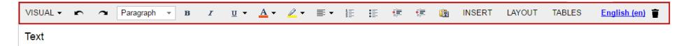

#### *Figure: Formatting Toolbar*

You use the standard buttons on the formatting toolbar to write and edit text, use the clipboard, and format the text in the text area.

# **Standard Formatting Toolbar Buttons**

The following table lists the standard buttons that a formatting toolbar might include.

| Button | Icon | Description                                                                                                                                                                                                                                                                                                                                                                                                                                                                                                                         |
|--------|------|-------------------------------------------------------------------------------------------------------------------------------------------------------------------------------------------------------------------------------------------------------------------------------------------------------------------------------------------------------------------------------------------------------------------------------------------------------------------------------------------------------------------------------------|
| Visual |      | Provides the following menu commands: • Visual: Opens the editor view, where you can input and format the text. • HTML: Opens the editor in HTML view, where you can input multiple HTML elements. We recommend that you use theVisual view to avoid mis prints in HTML tags. • Plain text: Opens the plain text view, in which all the formatting is re moved. You can edit the text without formatting. • Preview: Opens the preview mode, where you can view the content as it will look. |
| Undo   |      | Cancels the most recent changes you have made.                                                                                                                                                                                                                                                                                                                                                                                                                                                                                      |
| Redo   |      | Restores the changes you canceled by clicking Undo.                                                                                                                                                                                                                                                                                                                                                                                                                                                                                 |
| Style  |      | Applies the selected style to the text. The following styles are available: Para graph, Header1, Header2, Header3, Header4, Header5, Header6, Preformatted, or Quote.                                                                                                                                                                                                                                                                                                                                                         |

| Button                  | Icon | Description                                                                                                                                                                                      |
|-------------------------|------|--------------------------------------------------------------------------------------------------------------------------------------------------------------------------------------------------|
| Bold                    |      | Marks the selected text in bold style.                                                                                                                                                           |
| Italic                  |      | Marks the selected text in italic style.                                                                                                                                                         |
| Underline               |      | Marks the selected text as underlined. You can also use the following menu commands in the drop-down list:                                                                                    |
|                         |      | • StrikeThrough: Marks the selected text as strike through.                                                                                                                                   |
|                         |      | • Subscript: Marks the selected text as subscript.                                                                                                                                            |
|                         |      | • Superscript: Marks the selected text as superscript.                                                                                                                                        |
| Font Color              |      | Changes the color of the selected text to the color you click.                                                                                                                                   |
| Text Highlight Color |      | Highlights the selected text in the color you click.                                                                                                                                             |
| Align Text Le          |      | Aligns the selected text to the le with a ragged right margin. You can also use the following menu commands in the drop-down list:                                                           |
|                         |      | • Center: Centers the selected text. • Align Text Right: Aligns the selected text to the right with a ragged le margin.                                                             |
|                         |      | • Justify: Aligns the selected text evenly between the le and right margins.                                                                                                                 |
| Numbered List           |      | Starts a numbered list or converts the selected text to a numbered list.                                                                                                                         |
| Bulleted List           |      | Starts a bulleted list or converts the selected text to a bulleted list.                                                                                                                         |
| Increase Indent         |      | Moves the paragraph farther away from the margin.                                                                                                                                                |
| Decrease Indent         |      | Moves the paragraph closer to the margin.                                                                                                                                                        |
| PasteText Mode          |      | Switches the mode of pasting text from the clipboard. Select the button to re move formatting of the pasted text. Or clear the selection to keep formatting of the pasted text.            |
| Insert                  |      | Displays the toolbar that contains the following buttons:                                                                                                                                        |
|                         |      | • Image: Opens the Insert Image dialog box, which you can use to insert an image into the text area. The dialog box is described in the Insert Image Dia log Box section of this topic. |

| Button | Icon | Description                                                                                                                                                                                                                                                                                                                                                                                                |
|--------|------|------------------------------------------------------------------------------------------------------------------------------------------------------------------------------------------------------------------------------------------------------------------------------------------------------------------------------------------------------------------------------------------------------------|
|        |      | • Link: Opens the Insert Link dialog box, which you can use to insert any links into the text area. The dialog box is described in the Insert Link Dialog Box section of this topic.                                                                                                                                                                                                              |
|        |      | • Macros: Provides the following options:                                                                                                                                                                                                                                                                                                                                                               |
|        |      | • TOC: Inserts a table of contents, which contains all headers of the current document.                                                                                                                                                                                                                                                                                                              |
|        |      | • Subarticles: Inserts a table of contents, which contains all the subarticles linked to the current article.                                                                                                                                                                                                                                                                                        |
|        |      | • Info: Inserts an info box.                                                                                                                                                                                                                                                                                                                                                                            |
|        |      | • Warning: Inserts a warning box.                                                                                                                                                                                                                                                                                                                                                                       |
|        |      | • File list: Inserts a control that lists all the files attached to the article.                                                                                                                                                                                                                                                                                                                        |
|        |      | • Code: Opens the dialog box for inserting code.                                                                                                                                                                                                                                                                                                                                                        |
|        |      | • IFrame: Opens the dialog box for specifying the parameters for inserting the frame.                                                                                                                                                                                                                                                                                                                |
|        |      | • Placeholder: Inserts a placeholder in the text area that can be replaced with the appropriate text. This button is available for templates only.                                                                                                                                                                                                                                                   |
|        |      | • Data Field: Displays a list of available data fields for selection. This but ton can be used to insert a field value in a notification related to a business event. For details on the business events, see Using Business Events.                                                                                                                                                              |
|        |      | • Previous Data Field: Displays a list of data fields whose previous values can be inserted in the text area. This button can be used to insert a previ ous field value in a notification related to a business event. The system will insert the placeholder with the PREV function, for example PREV((CR Case_status)). For details on the business events, see Using Business Events. |
|        |      | • Template: Provides the list of notification templates that can be copied into the text area.                                                                                                                                                                                                                                                                                                       |
| Layout |      | Displays a toolbar that contains the following buttons:                                                                                                                                                                                                                                                                                                                                                    |
|        |      | • Create Section: Creates a section in the editing area.                                                                                                                                                                                                                                                                                                                                                |
|        |      | • Remove Section: Removes the section that the cursor is pointing to.                                                                                                                                                                                                                                                                                                                                   |
|        |      | • Section Up: Moves the section the cursor is pointing to one level up.                                                                                                                                                                                                                                                                                                                                 |
|        |      | • Section Down: Moves the section the cursor is pointing to one level down.                                                                                                                                                                                                                                                                                                                             |
|        |      | • One Section: Changes the markup layout by uniting the selected section into one section.                                                                                                                                                                                                                                                                                                           |
|        |      | • TwoSections: Changes the markup layout by dividing the selected section into two equal parts (sections).                                                                                                                                                                                                                                                                                           |
|        |      | • Le Bar: Changes the markup layout by dividing the selected section into two parts. The le part is located closer to the le margin.                                                                                                                                                                                                                                                              |
|        |      | • Right Bar: Changes the markup layout by dividing the selected section into two parts. The right part is located closer to the right margin.                                                                                                                                                                                                                                                        |
|        |      | • ThreeSections: Changes the markup layout by dividing the selected sec tion into three equal parts (sections).                                                                                                                                                                                                                                                                                      |
|        |      | • Side Bars: Changes the markup layout by dividing the selected section into three parts (sections) by creating side bars on the le and on the right.                                                                                                                                                                                                                                               |

| Button            | Icon | Description                                                                                                                                                                                                                                                                                                                                                                                                                       |
|-------------------|------|-----------------------------------------------------------------------------------------------------------------------------------------------------------------------------------------------------------------------------------------------------------------------------------------------------------------------------------------------------------------------------------------------------------------------------------|
| Tables            |      | Displays the toolbar that contains the following buttons: • Create Table: Invokes the dialog box, where you can specify the number of                                                                                                                                                                                                                                                                                       |
|                   |      | rows and columns and create the table. • Insert Row Before Cursor: Inserts the row before the selected one. • Insert Row After Cursor: Inserts the row after the selected one. • Insert Column Before Cursor: Inserts the column before the selected one. • Insert Column After Cursor: Inserts the column after the selected one. • Delete Row: Deletes the selected row.                          |
|                   |      | • Delete Column: Deletes the selected column. • Del. Table: Deletes the selected table.                                                                                                                                                                                                                                                                                                                                  |
| Language Selector |      | Displays a link with a language name and the ISO code of an active system lo cale. In Acumatica ERP instances with multiple active locales, the system au tomatically determines this language by a translation that a user specified in the text area (for example, a description of a stock item on the Stock Items (IN202500) form) by using the algorithm described in The Order of the Lan guages in the Box. |
|                   |      | You can click this link and select a language manually from the drop-down list. If there is a translation of the text for the selected language in the Acumatica ERP database, it will be displayed in the text area. If there is no translation of the text for a required language in the Acumatica ERP database, you can enter it in the text area.                                                                |
|                   |      | A check mark near the language in the selector indicates that there is a trans lation of the text for the selected language in the Acumatica ERP database.                                                                                                                                                                                                                                                                     |
| Delete            |      | Deletes the text specified in the text area for the language selected in the lan guage selector.                                                                                                                                                                                                                                                                                                                               |

# **Insert Image Dialog Box**

You use this dialog box for inserting images into the text area. The navigation pane contains tabs that you can use to insert an image from any of the following sources: your device, the system, or the web. Aer going to the tab that represents the source of the image, you use the elements on the tab to select and insert the needed images.

The tabs of this dialog box are documented below. Some common elements are shown at the bottom of all the tabs; you can find the descriptions of these elements aer the descriptions of the tabs and their tab-specific elements.

#### *Table: Insert Image Dialog Box: Attached Images Tab*

By using the **Attached Images** tab, you can upload an image from your device and insert it into your text. The top part of the tab has the following elements.

| Element                                             | Description                                                         |  |
|-----------------------------------------------------|---------------------------------------------------------------------|--|
| The top part of the tab has the following elements. |                                                                     |  |
| File                                                | The name of the file, which the system fills in when you select it. |  |

| Element                                                                                       | Description                                                                                            |  |
|-----------------------------------------------------------------------------------------------|--------------------------------------------------------------------------------------------------------|--|
| Browse                                                                                        | A button that you click to open a dialog box in which you can select the image file for up loading. |  |
| Upload                                                                                        | A button that you click to upload the selected file.                                                   |  |
| In the work area of the tab, you can view all files that have been uploaded for the activity. |                                                                                                        |  |

#### *Table: Insert Image Dialog Box: Search Images Tab*

By using the**Search Images** tab, you can search for an image among the images stored in the system and insert the selected one. The top part of the tab has the following elements.

| Element                                                                                                      | Description                                                                                                                                                                                                                                |  |
|--------------------------------------------------------------------------------------------------------------|--------------------------------------------------------------------------------------------------------------------------------------------------------------------------------------------------------------------------------------------|--|
| The top part of the tab has the following elements.                                                          |                                                                                                                                                                                                                                            |  |
| Search                                                                                                       | An untitled box in which you can enter a search string.                                                                                                                                                                                    |  |
| Search                                                                                                       | A button that you can click to search the images stored in the system whose names have the search string you specified in the Search box. The system displays the list of the files it locates (if any) in the work area of the tab. |  |
| The work area of the tab shows all images that match the search string that you specified in the Search box. |                                                                                                                                                                                                                                            |  |

#### *Table: Insert Image Dialog Box: Image from the Web Tab*

By using the **Image from the Web** tab, you can insert an image by entering its URL. The top part of this tab has the following elements.

| Element                                                                                             | Description                                                                         |  |
|-----------------------------------------------------------------------------------------------------|-------------------------------------------------------------------------------------|--|
| The top part of the tab has the following elements.                                                 |                                                                                     |  |
| Enter Image URL                                                                                     | The URL to the image.                                                               |  |
| Preview Image                                                                                       | A button that you click to view a preview of the image in the work area of the tab. |  |
| The tab has a work area that shows the image if you have entered its URL and clicked Preview Image. |                                                                                     |  |

#### *Table: Insert Image Dialog Box: Common Elements*

All of the tabs of the dialog box have the following elements, which are located at the bottom of the dialog box.

| Element | Description                                                                                       |
|---------|---------------------------------------------------------------------------------------------------|
| Caption | The caption of the image. After you select an image to be inserted, you can type its cap tion. |
| Insert  | A button that you click to insert the image file into the text area and close the dialog box.     |
| Cancel  | A button that you click to cancel the adding of the image and close the dialog box.               |

In the Acumatica ERP instance, all emails that have embedded images encoded by the base64 algorithm are processed in the following way (without affecting the display of the email):

- 1. The base64 attachment is extracted from the email.
- 2. The extracted attachment is saved as a file.
- 3. The file is attached to the email.
- 4. The link to the attached file is inserted into the email body.

# **Insert Link Dialog Box**

You use this dialog box to insert links to forms, wiki articles, external websites, and files into the text area. You click one of the tabs in the navigation pane on the le side of the dialog box, and then you use the elements on the tab to add a link to the selected object into your text.

The tabs of this dialog box are documented below. Some common elements are shown at the bottom of all the tabs; you can find the descriptions of these elements aer the descriptions of the tabs and their tab-specific elements.

#### *Table: Insert Link Dialog Box: Attached Files Tab*

By using the **Attached Files** tab, you can upload and attach files to the selected record, view the files that have been attached, and paste a link to a file attached to the selected record into your text.

You can paste links only to files that have been uploaded to the system. For more information on managing files in Acumatica ERP, see *[Attachments: File Maintenance](https://help-2025r1.acumatica.com/Help?ScreenId=ShowWiki&pageid=707c3e2d-dc3c-41b3-a75b-ed8bb53b82ef)*.

| Element                                                                                                                                             | Description                                                                                  |  |
|-----------------------------------------------------------------------------------------------------------------------------------------------------|----------------------------------------------------------------------------------------------|--|
| The top part of the tab has the following elements.                                                                                                 |                                                                                              |  |
| File                                                                                                                                                | The name of the file to be attached, which the system fills in when you select it.           |  |
| Browse                                                                                                                                              | A button that you click to open a dialog box in which you can select the file for uploading. |  |
| Upload                                                                                                                                              | A button that you click to upload the selected file.                                         |  |
| The work area of the tab has a table that displays the files attached to the selected record.                                                       |                                                                                              |  |
| The table toolbar includes only standard buttons. For the list of standard buttons, see Table Toolbar. The table contains the following columns. |                                                                                              |  |
| Name                                                                                                                                                | The name of the uploaded file.                                                               |  |
| Size (kb)                                                                                                                                           | The size in kilobytes of the uploaded file.                                                  |  |
| Comment                                                                                                                                             | A comment that has been entered when the file was uploaded to the system.                    |  |

#### *Table: Insert Link Dialog Box: Search Files Tab*

By using the**Search Files** tab, you can add a link to a file that is stored in Acumatica ERP but attached to another record in the system.

You can paste links only to files that have been uploaded to the system. For more information on managing files in Acumatica ERP, see *[Attachments: File Maintenance](https://help-2025r1.acumatica.com/Help?ScreenId=ShowWiki&pageid=707c3e2d-dc3c-41b3-a75b-ed8bb53b82ef)*.

| Forms   94 |  |
|------------|--|
|            |  |

| Element                                             | Description                                                                                                                                                                                                 |
|-----------------------------------------------------|-------------------------------------------------------------------------------------------------------------------------------------------------------------------------------------------------------------|
| The top part of the tab has the following elements. |                                                                                                                                                                                                             |
| Search                                              | A box where you enter the search string before clicking theSearch button.                                                                                                                                   |
| Search                                              | A button that you click to search the files stored in the system that have the specified search string in their name. The system displays the list of the files it finds (if any) in the table below. |

The work area of the tab has a table that shows the search result and displays all files stored in the system that contain the search string in their name.

The table toolbar includes only standard buttons. For the list of standard buttons, see *[Table Toolbar](#page-117-1)*. The table contains the following columns.

| Name      | A name of the uploaded file.                                             |
|-----------|--------------------------------------------------------------------------|
| Size (kb) | The size in kilobytes of the uploaded file.                              |
| Comment   | A name of the uploaded file that contains the search string in its name. |

#### *Table: Insert Link Dialog Box: File from the Web Tab*

By using the **File from the Web** tab, you can add a link to a file that is stored on the web.

| Element                                                                         | Description                                                                                             |  |
|---------------------------------------------------------------------------------|---------------------------------------------------------------------------------------------------------|--|
| The top part of the tab has the following element.                              |                                                                                                         |  |
| Enter file URL here                                                             | The URL to the file, which you paste here. The system inserts the link to the file in the work area. |  |
| The work area of the tab displays the link to the file that is located the web. |                                                                                                         |  |

#### *Table: Insert Link Dialog Box: Search Articles Tab*

By using the**Search Articles** tab, you can insert a link to a wiki article that is available in the system.

| Element                                                                                                                                                                                                                       | Description                                                                                                                                                                                                                       |  |
|-------------------------------------------------------------------------------------------------------------------------------------------------------------------------------------------------------------------------------|-----------------------------------------------------------------------------------------------------------------------------------------------------------------------------------------------------------------------------------|--|
| The top part of the tab has the following elements.                                                                                                                                                                           |                                                                                                                                                                                                                                   |  |
| Search                                                                                                                                                                                                                        | A box where you enter the search string before clicking theSearch button.                                                                                                                                                         |  |
| Search                                                                                                                                                                                                                        | A button that you click to search the articles available in the system that have the speci fied search string in their title. The system displays the list of the articles it finds (if any) in the table of the work area. |  |
| The work area of the tab has a table that initially displays all wiki articles available in the system. If you enter a search string and clickSearch, the table shows all articles whose titles contain the search string. |                                                                                                                                                                                                                                   |  |
| The table toolbar includes only standard buttons. For the list of standard buttons, see Table Toolbar. The table contains the following columns.                                                                           |                                                                                                                                                                                                                                   |  |
| Title                                                                                                                                                                                                                         | The title of a topic in the online Help or an article in a custom wiki.                                                                                                                                                           |  |

| Element | Description                                                                                                                |
|---------|----------------------------------------------------------------------------------------------------------------------------|
| Title   | The title of the chapter (in the online Help or an article in a custom wiki) in which the top ic or article is located. |
| Created | The date when the topic or article was created.                                                                            |

#### *Table: Insert Link Dialog Box: Search Screens Tab*

By using the**Search Screens** tab, you can add a link to an Acumatica ERP form.

| Element                                             | Description                                                                                                                                                                             |  |  |  |  |
|-----------------------------------------------------|-----------------------------------------------------------------------------------------------------------------------------------------------------------------------------------------|--|--|--|--|
| The top part of the tab has the following elements. |                                                                                                                                                                                         |  |  |  |  |
| Search                                              | A box where you enter the search string before clicking theSearch button.                                                                                                               |  |  |  |  |
| Search                                              | A button that you click to search the screens that have the specified search string in their name. The system displays the list of the screens it finds (if any) in the table below. |  |  |  |  |
|                                                     |                                                                                                                                                                                         |  |  |  |  |

The work area of the tab has a table that initially displays all screens (forms) available in the system. If you enter a search string and click**Search**, the table shows all screens whose names contain the search string.

The table toolbar includes only standard buttons. For the list of standard buttons, see *[Table Toolbar](#page-117-1)*. The table contains the following columns.

| Title     | The name of the form.                                                    |  |
|-----------|--------------------------------------------------------------------------|--|
| Screen ID | The ID of the form.                                                      |  |
| Module    | The name of the functional area of the system to which the form belongs. |  |

#### *Table: Insert Link Dialog Box: Common Elements*

All of the tabs of the dialog box have the following elements, which are located at the bottom of the dialog box.

| Element     | Description                                                                                                                       |
|-------------|-----------------------------------------------------------------------------------------------------------------------------------|
| Insert Link | The text of the link as it will be displayed in the text area. You can enter the text to repre sent the link in the text area. |
| Insert      | A button that you click to insert the link to the file into the text area and close the dialog box.                            |
| Cancel      | A button that you click to cancel the adding of the link and close the dialog box.                                                |

#### **Related Links**

• *[Parts of a Form](#page-68-3)*

# **Form Elements**

In Acumatica ERP, you use the form elements to enter settings, which the system stores in the database or uses as criteria to select what is displayed on the form.

# **Types of Form Elements**

Acumatica ERP supports the following types of form elements:

- Date box: You use a date box to enter a date. You can type the date or use the Calendar dialog box to select the date. For more information, see *[Date Boxes](#page-95-2)* or *[Calendar Dialog Box](#page-95-3)*.
- Lookup box: You use this box to select a value from a list of predefined values or from another information table from the database. For more information, see *[Lookup Boxes](#page-97-2)*
- Currency box: A currency box is a type of lookup box that provides additional controls for currency manipulation. For more information, see *[Currency Boxes](#page-98-1)*.
- Check box: You select or clear a check box to turn on or turn off an option.
- Text box: A box in which you can enter data.
- Formula box: A text box on a small number of forms, which you can use to open the Formula Editor dialog box and construct a formula. For more information, see *[Formula Boxes](#page-97-3)*.
- Option button: A circle that you can click to turns on or turn off a setting. Option buttons are generally organized in groups, and you can select only one option from the group of option buttons.

If a box is marked with asterisk (\*), you must fill it in.

# **Unavailable Elements**

When you enter data on the Acumatica ERP forms, you may notice that some elements are unavailable. Some of these unavailable elements are *info boxes*: read-only boxes that contain system-generated values, such as document statuses and total amounts. Other unavailable elements can be used only if a specific option is selected in another element on this form or on another form.

# **Date Boxes**

Date boxes are used to enter dates, as shown on the screenshot below.

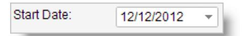

#### *Figure: Date box*

To change any date, you can either type a specific date into the date box or select it by using the calendar dialog box, which you access from the date box. For more information, see *[Calendar Dialog Box](#page-95-3)*.

By default, the current business date is displayed in the info area in the top right corner of a form. For more information, see *[Info Area](#page-17-1)*.

#### **Related Links**

- *To Select a Date by Using the [Calendar](#page-96-0)*
- *To Change the [Business](https://help-2025r1.acumatica.com/Help?ScreenId=ShowWiki&pageid=6dfced5c-a970-4d22-880e-da44c463236f) Date*

# **Calendar Dialog Box**

The Calendar dialog box, which appears when you click the arrow in a date box, displays the calendar page for the selected date, as shown in the screenshot below. You can use the Calendar dialog box to select a new date, which will appear in the date box. For details, see *To Select a Date by Using the [Calendar](#page-96-0)*.

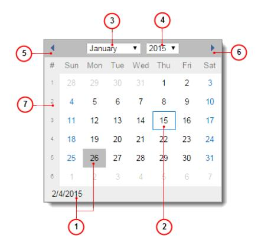

#### *Figure: Calendar*

- 1. Current date
- 2. Selected date
- 3. Selected month
- 4. Selected year
- 5. Previous month
- 6. Next month
- 7. Week number column

When you're defining a new object, entity, or record, the selected date by default is the business date specified in Acumatica ERP. For details on changing the business date, see *To Change the [Business](https://help-2025r1.acumatica.com/Help?ScreenId=ShowWiki&pageid=6dfced5c-a970-4d22-880e-da44c463236f) Date* in the Acumatica ERP Getting Started Guide.

#### **Related Links**

• *To Select a Date by Using the [Calendar](#page-96-0)*

# **To Select a Date by Using the Calendar**

To select a date in a date box by using the Calendar dialog box, do the following:

- 1. Click the arrow to the right of a date box to open the Calendar dialog box.
- 2. Browse calendar pages as follows:
  - To change the year, click the selected year, and then click the year you want to view.
  - To change the month, click the selected month, and then click the month you want to view.
  - To view the page showing the previous month, click the Previous Month arrow.
  - To view the page showing the next month, click the Next Month arrow.
- 3. Click on a day to select the date and close the dialog box.

The selected date is now displayed in the date box.

#### **Related Links**

- *[Calendar Dialog Box](#page-95-3)*
- *[Date Boxes](#page-95-2)*

# **Formula Boxes**

Formula boxes are used to enter formula, as shown on the screenshot below.

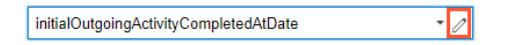

#### *Figure: Formula box*

To enter a formula, you can click the Edit button to open the Formula Editor dialog box and construct a formula. For more information, see *[Formulas](https://help-2025r1.acumatica.com/Help?ScreenId=ShowWiki&pageid=f03d234f-6813-4259-8f62-0a36a8320c2e)*.

# **Lookup Boxes**

Acumatica ERP uses the following types of lookup boxes:

- *Drop-down list*: The currently selected option is shown in the box. Click the arrow to see the other options.
- *Multi-select drop-down list*: A type of drop-down list in which you can select one option or multiple options at once. Click the arrow to view the available options, and then select the check boxes for the options you want to select. The selected options are displayed in the box, separated by commas.
- *Lookup table*: This lookup box has a selector button that is indicated with a magnifier icon. Click the selector button to open a lookup table that shows objects in the database and information about each object.

In some cases, a lookup box offers additional buttons. For example, on a variety of forms, you can click **Edit** ( ) to the right of the **Vendor** box to open the *[Vendors](https://help-2025r1.acumatica.com/Help?ScreenId=ShowWiki&pageid=a9584be3-f2bd-4d67-80d4-8041d809df56)* (AP303000) form as a pop-up and create a vendor record on the fly.

The Acumatica ERP currency box is a type of lookup box that provides additional buttons for currency manipulation. For more information, see *[Currency Boxes](#page-98-1)*.

In the screenshot below, you can see an Acumatica ERP form with the types of lookup boxes called out.

|                                         |                             | 2       |               |                         |                  |      |               |                                        |                     |          |
|-----------------------------------------|-----------------------------|---------|---------------|-------------------------|------------------|------|---------------|----------------------------------------|---------------------|----------|
| Type:                                   | Bill +           | ٠       | * Vendor:     |                         |                  |      |               |                                        | ρ                   | <b>P</b> |
| Reference Nbr.:                         | $<$ NFW $>$                 | $\circ$ | * Location:   |                         |                  |      |               |                                        | Ω                   |          |
| Status:                                 | On Hold                     |         |               | Currency:               | USD p | 1.00 |               | <b>VIEW BASE</b> 1 $\rightarrow$ |                     |          |
|                                         | $\blacksquare$ Hold         |         | * Terms:      |                         |                  |      |               |                                        | Ω                   |          |
| * Date:                                 | 2/4/2015                    | ٠       | * Due Date:   |                         |                  |      |               |                                        |                     |          |
| * Post Period:                          | 01-2015                     | ۰,      |               | * Cash Discoun          |                  |      | ٠             |                                        |                     |          |
| * Vendor Ref.:                          | <b>Select - Post Period</b> |         |               |                         |                  |      |               | $\square \times$                       |                     |          |
| Description:                            | <b>SELECT</b>               | c       | $\rightarrow$ |                         |                  |      |               | م                                      |                     |          |
|                                         | Financial Period ID         |         | $\ddagger$    | <b>Description</b>      |                  |      |               |                                        |                     |          |
|                                         | $\mathbf{r}$ 01-2015     |         |               | February                |                  |      |               |                                        |                     |          |
| <b>Document Details</b>                 | 02-2015                     |         |               | March                   |                  |      |               |                                        |                     |          |
|                                         | 03-2015                     |         |               | April                   |                  |      |               |                                        | EIPT LINE           | AD       |
| с                                       | 04-2015                     |         |               | May                     |                  |      |               |                                        |                     |          |
| 魯 <b>Branch</b> $\mathbf{0}$ n |                             |         |               |                         | κ                | ∢    | $\rightarrow$ | ิ≻เ                                    | <b>Quantity UOM</b> |          |
|                                         |                             |         |               |                         |                  |      |               |                                        |                     |          |
|                                         |                             |         |               | $\overline{\mathbf{3}}$ |                  |      |               |                                        |                     |          |

#### *Figure: Lookup box*

- 1. Lookup box with drop-down list
- 2. Lookup box with lookup table
- 3. Lookup table
- 4. Additional button: **Edit**

5. Currency box

# **Using Autocomplete**

When you enter values into most lookup boxes that have a lookup table, you can use *autocomplete*, which is a feature providing automatic completion of typed strings: You start typing in the box, and the system displays in the lookup table the list of suggestions that include the string you have typed.

You can turn off autocomplete for your user account on the *[User Profile](https://help-2025r1.acumatica.com/Help?ScreenId=ShowWiki&pageid=8430c8b2-a79c-4f7b-9768-b0b7fad23a59)* (SM203010) form by clearing the **Lookup BoxSuggestions** check box.

For example, suppose you wanted to find a customer whose name is *Nautilus Bar SABL*. In the **Customer** box, you might type bar, and the list of customers would be filtered to include only the customers whose ID or name includes the string you typed, as shown in the following screenshot. Now you would press the Down Arrow key two times to navigate to Nautilus Bar SABL and press Enter to select the customer.

# **Selecting a Value in the Lookup Box**

To select a value in the lookup box, do one of the following:

- If you know the value, type it in the box and press Enter.
  - For example, on the *[Purchase Orders](https://help-2025r1.acumatica.com/Help?ScreenId=ShowWiki&pageid=5565686c-96c4-4bfa-a51d-9a2566baa808)* (PO301000) form, to select a purchase order with the number 100, type 100 in the **Order Nbr.** box.
- Click the magnifier icon and select the value in the lookup table.

You can use filtering options to display only documents with specific properties. For more information, see *[Filters](#page-175-2)*.

• If the box supports autocomplete, start typing the value, and then select the value in the table.

#### **Related Links**

- *[Form Elements](#page-94-1)*
- *[Currency Boxes](#page-98-1)*

# **Currency Boxes**

An Acumatica ERP currency box is a special type of lookup box. It contains information about the currency and exchange rate, as well as controls to give you advanced functionality, as shown in the following screenshot.

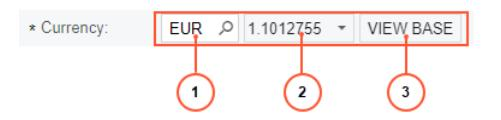

#### *Figure: Currency box*

- 1. **Currency Identifier** box, which has a magnifier button that you can click to open the currency lookup table
- 2. **Exchange Rate** box, which has an arrow you can click to open the **RateSelection** dialog box (described and shown in the next section)
- 3. **CurrencyToggle** button

#### **Rate Selection Dialog Box**

In the **RateSelection** dialog box, you can specify the ID of the currency rate type (see Item 1 in the following screenshot) and the date on which the rate becomes effective (Item 2).

The **Currency Unit Equivalents** section of the dialog box (Item 3) shows the exchange rates between the selected foreign currency and the base currency.

| Rate Selection                                        |                     |     |                                                 | ×  |
|-------------------------------------------------------|---------------------|-----|-------------------------------------------------|----|
| * Effective Date: <b>CURRENCY UNIT EQUIVALENTS</b> | Curr. Rate Type ID: |     | <b>SPOT</b> 47 2/1/2023 $\overline{2}$ |    |
| 1.000                                                 | <b>EUR</b>          | $=$ | 1.10127550 <b>USD</b>                        |    |
| 1.000                                                 | <b>USD</b>          | $=$ | 3 0.90803800 <b>EUR</b>                   |    |
|                                                       |                     |     |                                                 | OK |

#### *Figure: The Rate Selection dialog box*

In the example in this screenshot, 1 euro (EUR) is equal to 1.10127550 US dollars (USD), and 1 US dollar is equal to 0.90803800 euros.

# **The Currency Toggle Button**

For the documents with amounts in a foreign currency, the Currency Toggle button switches the currency of the amounts between the base currency and the selected foreign currency. The label on the Currency Toggle button depends on the currently selected currency of the amount:

- **View Base**: The amount is displayed in the foreign currency; click the button to view the amount in the base currency.
- **View Cury**: The amount is displayed in the base currency; click the button to view the amount in the foreign currency.

The Currency Toggle button does not affect the documents with amounts in the base currency only.

#### **Related Links**

• *[Form Elements](#page-94-1)*

# **Text Area**

A text area is used for the entering comments about or a description of the record selected on the data entry form. (See the following screenshot.) The text area is a part of a rich text editor, which is used in some boxes or areas on a data entry form.

|                                          |  | VISUAL - の G Paragraph - B I U - A - 2 - E - 油 - 三 画 ② INSERT |  |  |  |  |  |  |  |  | LAYOUT TABLES |  |
|------------------------------------------|--|---------------------------------------------------------------|--|--|--|--|--|--|--|--|---------------|--|
| Call to Bake the Best customer tomorrow. |  |                                                               |  |  |  |  |  |  |  |  |               |  |
|                                          |  |                                                               |  |  |  |  |  |  |  |  |               |  |
|                                          |  |                                                               |  |  |  |  |  |  |  |  |               |  |
|                                          |  |                                                               |  |  |  |  |  |  |  |  |               |  |
|                                          |  |                                                               |  |  |  |  |  |  |  |  |               |  |
|                                          |  |                                                               |  |  |  |  |  |  |  |  |               |  |

*Figure: Text area*

# **Using Intelligent Text Completion**

The intelligent text completion functionality provides automatic suggestions to continue text that you start to type in a text area of a data entry form. The autocomplete suggestions are available in a text area only if the *Intelligent Text Completion* feature is enabled on the *[Enable/Disable Features](https://help-2025r1.acumatica.com/Help?ScreenId=ShowWiki&pageid=c1555e43-1bc5-4f6f-ba9d-b323f94d8a6b)* (CS100000) form and the **IntelligentText Completion** check box is selected on the *[User Profile](https://help-2025r1.acumatica.com/Help?ScreenId=ShowWiki&pageid=8430c8b2-a79c-4f7b-9768-b0b7fad23a59)* (SM203010) form for your user account.

When the *Intelligent Text Completion* feature is enabled by the system administrator for the first time, the system uses the built-in model for all users (unless intelligent text completion has been turned off for their user account). This model provides the most commonly used polite phrases (for example, *Could you please provide an update on …*). The following screenshot shows the text area of the *[Task](https://help-2025r1.acumatica.com/Help?ScreenId=ShowWiki&pageid=6449513c-254e-4093-b7b8-06de0108c384)* (CR306020) form with suggestions to complete the text that has been typed.

| <b>Task</b> Test task for autocomplete suggestions                                                             |                       |  |                                        |                       |                      |               |                        |              |                      |   |   |        | <b>FINOTES</b> | <b>FILES</b> | <b>CUSTOMIZATION</b> |        | TOOLS $\star$ |  |
|-------------------------------------------------------------------------------------------------------------------|-----------------------|--|----------------------------------------|-----------------------|----------------------|---------------|------------------------|--------------|----------------------|---|---|--------|----------------|--------------|----------------------|--------|---------------|--|
| $\overline{\mathcal{L}}$ $\mathbb{F}$ n 圎 $\Omega$ <b>COMPLETE</b> $\leftarrow$ $\checkmark$ |                       |  |                                        |                       |                      |               |                        |              | COMPLETE & FOLLOW UP |   |   | CANCEL |                |              |                      |        |               |  |
|                                                                                                                   |                       |  |                                        |                       |                      |               |                        |              |                      |   |   |        |                |              |                      |        |               |  |
| <b>DETAILS</b> <b>ACTIVITIES</b>                                                                               |                       |  |                                        |                       |                      |               |                        |              |                      |   |   |        |                |              |                      |        |               |  |
| * Summary:                                                                                                        |                       |  | Test task for autocomplete suggestions |                       |                      |               |                        |              |                      |   |   |        |                |              |                      |        |               |  |
| Start Date:                                                                                                       | 8/8/2023              |  | $\checkmark$                           |                       | Status: Priority: |               | Open                   |              | $\checkmark$         |   |   |        |                |              |                      |        |               |  |
| Due Date:                                                                                                         | 8/8/2024              |  | $\checkmark$                           |                       |                      |               | Normal $\checkmark$ |              |                      |   |   |        |                |              |                      |        |               |  |
| Completion (%):                                                                                                   |                       |  | 0                                      |                       |                      | Category:     |                        |              | ρ                    |   |   |        |                |              |                      |        |               |  |
| Owner:                                                                                                            | <b>Kimberly Gibbs</b> |  |                                        | Q                     |                      | Completed At: |                        |              |                      |   |   |        |                |              |                      |        |               |  |
| Workgroup:                                                                                                        |                       |  |                                        | $\varphi$             |                      | Time Spent:   |                        | 00:00        |                      |   |   |        |                |              |                      |        |               |  |
|                                                                                                                   | Reminder              |  | <b>V</b> Internal                      |                       |                      | Overtime:     |                        | 00:00        |                      |   |   |        |                |              |                      |        |               |  |
| Related Entity $\checkmark$                                                                                    |                       |  |                                        | <b>Billable Time:</b> |                      | 00:00         |                        |              |                      |   |   |        |                |              |                      |        |               |  |
| <b>Related Entity:</b>                                                                                            |                       |  |                                        |                       | 7                    |               | Billable Overti        | 00:00        |                      |   |   |        |                |              |                      |        |               |  |
| Parent Activity:                                                                                                  |                       |  |                                        |                       |                      |               |                        |              |                      |   |   |        |                |              |                      |        |               |  |
| * Project:                                                                                                        |                       |  | X - Non-Project Code.                  | Q                     |                      |               |                        |              |                      |   |   |        |                |              |                      |        |               |  |
| Project Task:                                                                                                     |                       |  |                                        |                       |                      |               |                        |              |                      |   |   |        |                |              |                      |        |               |  |
| Cost Code:                                                                                                        |                       |  | 00-000 - Default Cost Code             | $\varnothing$         |                      |               |                        |              |                      |   |   |        |                |              |                      |        |               |  |
| VISUAL + $\curvearrowleft$                                                                                     | $\Omega$              |  | Paragraph *                            | B                     | $\bf{I}$             | $U$ $\sim$    |                        | $\mathbb{Z}$ | E×.                  | 温 | 温 | 建      | 巨              | ₽            | <b>INSERT</b>        | LAYOUT | <b>TABLES</b> |  |
| Could you please provide an $\rightarrow$                                                                         |                       |  |                                        |                       |                      |               |                        |              |                      |   |   |        |                |              |                      |        |               |  |
|                                                                                                                   | provide an            |  |                                        |                       |                      |               |                        |              |                      |   |   |        |                |              |                      |        |               |  |
| provide an update provide an update on                                                                         |                       |  |                                        |                       |                      |               |                        |              |                      |   |   |        |                |              |                      |        |               |  |
|                                                                                                                   |                       |  | provide an update on the               |                       |                      |               |                        |              |                      |   |   |        |                |              |                      |        |               |  |
|                                                                                                                   | provide us            |  |                                        |                       |                      |               |                        |              |                      |   |   |        |                |              |                      |        |               |  |
|                                                                                                                   |                       |  |                                        |                       |                      |               |                        |              |                      |   |   |        |                |              |                      |        |               |  |

#### *Figure: Suggestions provided by the built-in model*

You can switch between suggestions by using the Up and Down arrow keys on the keyboard; you select the needed string by using the Right arrow key. You can instead ignore the suggestions and continue typing all the needed text.

To improve the quality of suggested text over time, the system generates text completion models that collect the phrases that a particular user types and then use these phrases as training data. The system generates a model for each user separately, depending on the user's activity and the phrases that this user types most commonly. By default, the system performs the generation of models for all users every week on Saturday. The text completion model is updated if the system has collected new training data for the particular user since the previous model

generation. On the *Generate Models for Text [Completion](https://help-2025r1.acumatica.com/Help?ScreenId=ShowWiki&pageid=8708580f-3d50-4a13-8e62-b8b97e85b740)* (SM508000) form, the system administrator can create a new schedule or manually generate models for certain users or for all users.

If the system does not collect new training data for a particular user, the system does not generate a new model; instead, it continues to use the last generated model.

You can turn off this functionality for your user account by clearing the **IntelligentText Completion** check box in the **PersonalSettings** section on *[User Profile](https://help-2025r1.acumatica.com/Help?ScreenId=ShowWiki&pageid=8430c8b2-a79c-4f7b-9768-b0b7fad23a59)* form. This setting affects only your user account.

# **Translations Dialog Box**

The **Translations** dialog box is a localization tool that you use to provide multiple translations for text that users enter in the text boxes of the system, as well as to view existing translations for the text. This dialog box is available for multiple text boxes in the system; these text boxes are listed in *[Boxes That Have Multilanguage Support](https://help-2025r1.acumatica.com/Help?ScreenId=ShowWiki&pageid=837d92c1-eeba-4023-8f83-23a7023a48c7)*.

The **Translations** dialog box may contain one text box or multiple text boxes, with each box labeled with a language name, where you can enter translations, as shown in the screenshot below. You enter a translation or multiple translations, close the dialog box, and click**Save** on the form toolbar.

| <b>Translations</b>     |         |
|-------------------------|---------|
| English (en)            | January |
| Deutsch (de)            | Januar  |
| français (fr) $\bullet$ | Janvier |
|                         |         |
|                         |         |

#### *Figure: Translations dialog box*

- 1. Language labels
- 2. Text boxes for entering translations

You can invoke the dialog box by clicking the link with an ISO code of a language next to a text box. Additionally, when you are editing a value in a cell (of a table) or a box that has multilanguage support, you can click CTRL +SHIFT+L to invoke the**Translations** dialog box.

The number of boxes in the**Translations** dialog box is defined by the number of languages that are used in localization of user input. For details, see *[Locales and Languages](https://help-2025r1.acumatica.com/Help?ScreenId=ShowWiki&pageid=b43ca9dd-782a-4fdc-b9c3-f3e9ddd2d8ac)*.

# **The Order of the Languages in the Box**

The order of the languages in the**Translations** dialog box depends on the locale you are currently logged in to. The system displays the languages of the boxes in the**Translations** dialog box in the following order:

- 1. The language associated with a locale you are currently logged in to
- 2. The language marked as the default on the *[System Locales](https://help-2025r1.acumatica.com/Help?ScreenId=ShowWiki&pageid=6b40927b-3288-4ccd-bd7f-786fb246b9ac)* (SM200550) form
- 3. Alternative languages displayed in the sequence specified for them in the**Sequence** column on the *[System](https://help-2025r1.acumatica.com/Help?ScreenId=ShowWiki&pageid=6b40927b-3288-4ccd-bd7f-786fb246b9ac) [Locales](https://help-2025r1.acumatica.com/Help?ScreenId=ShowWiki&pageid=6b40927b-3288-4ccd-bd7f-786fb246b9ac)* form

The ISO code whose language is displayed as the link depends on the following factors:

- Which locale you are currently logged in to
- Whether there is a translation for the language associated with the locale
- Whether there is a translation for the default language

The system determines which ISO code to display as follows:

- 1. If a translation is available for the language associated with the locale to which the user is currently logged in, then the system does the following:
  - Displays the translation in the text box that has multilanguage support
  - Displays the ISO code of the language as a link that you can click to invoke the**Translations** dialog box
- 2. If a translation for the locale language is not available, the system searches for a translation specified for the language marked as the default on the *[System Locales](https://help-2025r1.acumatica.com/Help?ScreenId=ShowWiki&pageid=6b40927b-3288-4ccd-bd7f-786fb246b9ac)* form. If a translation for the default language is available, the system does the following:
  - Displays the default translation in the text box that has multilanguage support
  - Displays the ISO code of the default language as a link that you can click to invoke the**Translations** dialog box
- 3. If a translation for the default language is not available, the system searches for a translation specified for any language marked as an alternative on the *[System Locales](https://help-2025r1.acumatica.com/Help?ScreenId=ShowWiki&pageid=6b40927b-3288-4ccd-bd7f-786fb246b9ac)* form. If a translation for an alternative language is available, the system does the following:
  - Displays the alternative translation in the text box that has multilanguage support
  - Displays the ISO code of the corresponding alternative language as a link that you can click to invoke the **Translations** dialog box
- 4. If there are no available translations, the system does the following:
  - Displays no value in the text box that has multilanguage support
  - Displays the ISO code of the language associated with the locale you are currently signed in with as a link that you can click to invoke the**Translations** dialog box

#### **Related Links**

- *[Form Elements](#page-94-1)*
- *[Locales and Languages](https://help-2025r1.acumatica.com/Help?ScreenId=ShowWiki&pageid=b43ca9dd-782a-4fdc-b9c3-f3e9ddd2d8ac)*
- *[Boxes That Have Multilanguage Support](https://help-2025r1.acumatica.com/Help?ScreenId=ShowWiki&pageid=837d92c1-eeba-4023-8f83-23a7023a48c7)*

# **Reminder Dialog Box**

Starting at the time specified as the reminder time for a particular task or event, the **Reminder** dialog box will appear automatically.

|              | Reminder |              |                            |                          |                     |                   | $\square$ $\times$ |
|--------------|----------|--------------|----------------------------|--------------------------|---------------------|-------------------|--------------------|
| B            |          | Summary ٠ |                            |                          |                     | <b>Start Date</b> |                    |
| $\mathbf{v}$ | 囗        |              | <b>Approve Investments</b> |                          |                     | 7/15/2009 8:00 PM |                    |
|              |          |              |                            |                          |                     |                   |                    |
|              |          |              |                            |                          |                     |                   |                    |
|              |          |              |                            |                          |                     |                   |                    |
|              |          |              |                            |                          |                     |                   |                    |
|              |          |              |                            |                          |                     |                   |                    |
|              |          |              |                            |                          |                     |                   |                    |
|              |          |              |                            |                          |                     |                   |                    |
|              |          |              |                            |                          |                     |                   |                    |
|              |          |              |                            |                          |                     |                   |                    |
|              |          | SNOOZE       | 5 minutes                  | $\overline{\phantom{a}}$ | <b>VIEW DETAILS</b> | <b>DISMISS</b>    | <b>DISMISS ALL</b> |

#### *Figure: Reminder dialog box*

By using the **Reminder** dialog box, you can do any of the following:

- Drill down to the selected task or event details
- Dismiss the selected task or event from the list
- Clear the list of tasks and events

• Postpone the reminder

# **Table**

In this table, you can see tasks and events for which you set the reminder.

| Column     | Description                                                                                                                                                                 |
|------------|-----------------------------------------------------------------------------------------------------------------------------------------------------------------------------|
| Summary    | The short description of the task or event for which you set the reminder. To view the de tails, click the summary to open the Task (CR306020) or Event (CR306030) form. |
| Start Date | The start date and time of the task or event.                                                                                                                               |

### **Dialog Box Toolbar**

The form toolbar includes only form-specific buttons, which are listed below.

| Button       | Description                                                                             |
|--------------|-----------------------------------------------------------------------------------------|
| Snooze       | Postpones the reminder for the selected task or event for the time interval you select. |
| View Details | Displays the details of the selected task or event.                                     |
| Dismiss      | Removes the selected task or event from the list.                                       |
| Dismiss All  | Removes all tasks and events from the list.                                             |

# **Using Forms**

During the normal course of business, you use forms to add, delete, edit, and manage records, such as documents or business accounts. You use form functionality to facilitate this process.

# **Navigating to a Form**

To open a form, you either navigate to the form or search for it. You navigate to the form by clicking the appropriate workspace item on the main menu of Acumatica ERP, and then clicking the form you want to view. For details on searching for a form, see *[Search Capabilities: General Information](https://help-2025r1.acumatica.com/Help?ScreenId=ShowWiki&pageid=6a7886a5-ed3f-4e5b-8b5f-5d8b517bc755)*.

# **Attaching Files to Records**

In Acumatica ERP, files can be attached to any record that Acumatica ERP keeps for the objects—such as invoices, leads, customers, bills, sales orders, and batches of transactions—that users add by using data entry forms. You can attach different files, such as images in various formats, scanned documents, and internal instructions for employees.

You can attach files to the records on data entry forms. The value in parentheses to the right of the **File** menu on the form title bar shows the number of files attached to the selected record.

Files can also be attached to record details. For more information, see *To Attach a File to a [Record](#page-133-1) [Detail](#page-133-1)*.

You can easily manage and track files and images attached to Acumatica ERP records and record details for various purposes. For more information on managing attached files, see *[Managing External Storage for File Attachments](https://help-2025r1.acumatica.com/Help?ScreenId=ShowWiki&pageid=a5989c03-43df-4f31-bd2d-db6d79be31c8)* in the Acumatica ERP System Administration Guide and *[Working with Data Entry Forms](https://help-2025r1.acumatica.com/Help?ScreenId=ShowWiki&pageid=619c96d4-9e80-47b2-b835-ffb44dde8afc)* and *[Importing and Exporting](https://help-2025r1.acumatica.com/Help?ScreenId=ShowWiki&pageid=f33b758e-c242-4812-8205-1e435072336a) [Data to Excel and XML](https://help-2025r1.acumatica.com/Help?ScreenId=ShowWiki&pageid=f33b758e-c242-4812-8205-1e435072336a)* in the Acumatica ERP Getting Started Guide.

#### **Attaching Notes to Records**

In Acumatica ERP, you can attach text notes to any record that Acumatica ERP keeps for the objects—such as invoices, opportunities, vendors, bills, purchase orders, and batches of transactions—that users add by using data entry forms. You can use these notes to communicate key information about the record or record detail to other users.

Notes can also be attached to record details. For more information, see *To Attach a Note to a [Record](#page-134-2) [Detail](#page-134-2)*.

#### **Copying and Pasting**

In Acumatica ERP, you can easily create a new document by copying and pasting an existing document of the same type. This functionality can also be used to create new objects, such as vendor or customer classes, by copying existing objects. For applicable forms, the copying and pasting options are offered on the **Clipboard** menu on the form toolbar (shown in the screenshot below). For the detailed procedure, see *To Copy a [Document](#page-107-1) Contents to a [New Document](#page-107-1)*.

For more information, see *[Copy-and-Paste](https://help-2025r1.acumatica.com/Help?ScreenId=ShowWiki&pageid=fcb022ae-7e19-4d22-acb6-4adcd84868c0) Options and Record Templates* in the Acumatica ERP Getting Started Guide.

# **Applying a Template**

If templates have been added for a document you want to create, you can use a template to fill the elements for a new document. You can see the available templates on the **Clipboard** menu on the form toolbar, as shown in the screenshot below.

| <b>Sales Orders</b> QT QT001018 - Jersey Central Office Equip |                                           |                                | <b>P NOTES</b>                       | <b>ACTIVITIES</b> | <b>FILES</b> <b>CUSTOMIZATION</b> | TOOLS $\sim$  |
|------------------------------------------------------------------|-------------------------------------------|--------------------------------|--------------------------------------|-------------------|--------------------------------------|---------------|
| 뭐 $\Box$ $\pm$ 面 $\Omega$ $\leftarrow$            | $\geq$ κ ≺ $\rightarrow$ n    | <b>COPY ORDER</b>              | <b>HOLD</b>                       |                   |                                      |               |
| م * Order Type: QT $\star$                              | <b>Copy</b>                               | Office Eqi O 0              | Ordered Qty.:                        | 2.00              |                                      | ㅅ             |
| م Order Nbr.: QT001018 $\pmb{\ast}$                     | <b>『B</b> Paste                           | م $\mathscr{O}$             | <b>Detail Total:</b>                 | 42,000.00         |                                      |               |
| Open Status:                                                  | <b>□ Save as Template</b>                 | α $\mathscr{O}$             | Line Discounts:                      | 4,200.00          |                                      |               |
| ₿ * Date: 1/12/2025                                        | Paste from [QuickOrder: Computers]        | <b>JIEW BASE</b>               | Document Dis                         | 0.00              |                                      |               |
| $\star$ * Requested On: 2/11/2025 Ä                     |                                           | م 0                         | <b>Freight Total:</b>                | 0.00              |                                      |               |
| Customer Ord. CJOEQUIP202                                     | Paste from [Quote: Supplies]              |                                | <b>Tax Total:</b>                    | 0.00              |                                      |               |
| External Refer                                                   |                                           |                                | <b>Order Total:</b>                  | 37,800.00         |                                      |               |
| <b>TAXES</b> <b>COMMISSIONS</b> <b>DETAILS</b>             | <b>SHIPPING</b> <b>FINANCIAL</b>       | <b>ADDRESSES</b>               | <b>DISCOUNTS</b> <b>SHIPMENTS</b> | <b>PAYMENTS</b>   | <b>RELATIONS</b>                     | <b>TOTALS</b> |
| <b>DELIVERY SETTINGS</b>                                         |                                           | <b>ORDER SHIPPING SETTINGS</b> |                                      |                   |                                      |               |
| Ship Via: م                                                   | <b>SHOP FOR RATES</b> Sched. Shipment: |                                | 2/11/2025 自                       |                   |                                      |               |
| V Will Call                                                      |                                           |                                | Ship Separately                      |                   |                                      |               |
| <b>FOB Point:</b>                                                | م <b>Shipping Rule:</b>                |                                | <b>Back Order Allowed</b>            | $\checkmark$      |                                      |               |
| 100 Priority:                                                 | Cancel By:                                |                                | Canceled 2/11/2025 $\Box$      |                   |                                      |               |
| <b>Shipping Terms:</b>                                           | م                                         | Preferred Warehouse ID:        |                                      | م                 |                                      |               |
| <b>Shipping Zone:</b>                                            | م                                         |                                |                                      |                   |                                      |               |
| Residential Delivery                                             |                                           |                                |                                      |                   |                                      |               |
| □ Saturday Delivery                                              |                                           |                                |                                      |                   |                                      |               |
| V Insurance                                                      |                                           |                                |                                      |                   |                                      |               |
| □ Use Customer's Account                                         |                                           |                                |                                      |                   |                                      |               |

*Figure: Document templates on the Clipboard menu*

For the detailed procedure, see *To Create a [Document](#page-108-2) with a Template*.

For more information, see *[Copy-and-Paste](https://help-2025r1.acumatica.com/Help?ScreenId=ShowWiki&pageid=fcb022ae-7e19-4d22-acb6-4adcd84868c0) Options and Record Templates* in the Acumatica ERP Getting Started Guide.

# **Importing from and Exporting to XML**

In Acumatica ERP, some record types, such as generic inquiries and Analytical Report Manager (ARM) reports, have a complex structure. You may need to export data from these forms—for example, to transfer a generic inquiry to another instance. Then in the other instance, you need to import this generic inquiry. You can import and export these records in XML format.

A form has XML export and import functionality when the **Export as XML** and **Import from XML** menu commands are available if you click **Clipboard** on the form toolbar aer you select an entity. For example, navigate to the *[Generic Inquiry](https://help-2025r1.acumatica.com/Help?ScreenId=ShowWiki&pageid=5388c653-eac4-4f43-b769-163cd037ab09)* (SM208000) form, select an inquiry, and notice that this menu command is available. For details, see *To [Export](https://help-2025r1.acumatica.com/Help?ScreenId=ShowWiki&pageid=5296d05c-776f-48ea-8137-d1e74c438caa) Data to XML* and *To [Import](https://help-2025r1.acumatica.com/Help?ScreenId=ShowWiki&pageid=5fa2a144-2f1d-4369-b1fe-adc732accf7e) Data from XML*.

#### **Related Links**

- *[Forms](#page-68-2)*
- *To Open a Form by Using Acumatica ERP [Navigation](#page-105-3) Options*
- *To Attach a File to a [Record](#page-105-2)*
- *To Attach a Note to a [Record](#page-106-2)*
- *To Copy a [Document](#page-107-1) Contents to a New Document*
- *To Create a [Document](#page-108-2) with a Template*

# **To Open a Form by Using Acumatica ERP Navigation Options**

Generally, to open a form, you do the following:

- 1. In the main menu, select the workspace the form belongs to.
- 2. In the workspace, click on the form title.

# **To Attach a File to a Record**

You can attach a file, such as a scanned document with a signature, to a record (that is, an entity or a document created on a data entry form), as described in this topic.

# **To Attach a File to a Record**

To attach a file to a record, use one of the following methods:

- Drag the file:
  - a. Open the form, and then select the record you want to attach the file to.
  - b. Open the folder or library where the file is located and drag it to the Summary area of the form.
- Use the **Files** dialog box:
  - a. Open the form, and then select the record you want to attach the file to.
  - b. On the form title bar, click **Files**.
  - c. In the **Files** dialog box, click **Browse**.
  - d. Select the file you want to attach, click **Open**, and then click **Upload**.

The system attaches the file to the record and increments the counter of files attached to the selected record.

# **To Attach a Note to a Record**

You can attach any text to a record (that is, entity or a document created on a data entry form), as described in this topic. For example, you can add important information for your colleagues who works with this record.

# **To Attach a Note to a Record**

- 1. Open the form, and then select the record you want to attach a note to.
- 2. On the form title bar, click **Notes**.
- 3. In the **Enter Record Note** dialog box, type the text of the note.
- 4. Click **OK**.
- 5. On the form title bar, verify that the icon color near the **Notes** button has changed from white to yellow.

You can read the note if you click **Notes** on the form title bar.

# **To Attach a Pop-Up Note to a Record**

You can attach pop-up text messages to a record (that is, an entity or a document created on a data entry form), as described in this topic. A pop-up message with a note about a customer, a vendor, or an inventory item will be then displayed to users when they select the entity while creating documents in the system. For example, you can add important information for your colleagues who works with this record.

The following entities support pop-up notes:

- Customer accounts on the *[Customers](https://help-2025r1.acumatica.com/Help?ScreenId=ShowWiki&pageid=652929bc-9606-4056-aa6e-0c2d1147171b)* (AR303000) form
- Vendor accounts on the *[Vendors](https://help-2025r1.acumatica.com/Help?ScreenId=ShowWiki&pageid=a9584be3-f2bd-4d67-80d4-8041d809df56)* (AP303000) form
- Inventory items on the *[Stock Items](https://help-2025r1.acumatica.com/Help?ScreenId=ShowWiki&pageid=77786a70-1f1e-4d63-ad98-96f98e4fcb0e)* (IN202500) and *[Non-Stock Items](https://help-2025r1.acumatica.com/Help?ScreenId=ShowWiki&pageid=bf68dd4f-63d4-460d-8dc0-9152f2bd6bf1)* (IN202000) forms
- Business accounts on the *[Business Accounts](https://help-2025r1.acumatica.com/Help?ScreenId=ShowWiki&pageid=823f9e2c-d352-4cf4-bbb9-ce6464fecc75)* (CR303000) form

#### **To Attach a Note to a Record**

- 1. Open the form, and then select the record you want to attach a note to.
- 2. On the form title bar, click **Notes**.
- 3. In the **Enter Record Note** dialog box, select **Add Pop-Up Note** check box. The system displays the **Pop-Up Note** box.
- 4. In the **Pop-Up Note** box, type the text of the pop-up note.
- 5. Click **OK**.

When you create a document in the system with a record to which a pop-up note has been added earlier, the system will display the note as pop-up window.

You can view pop-up notes added for customer accounts and inventory items when you create documents on the following forms:

- *[Invoices and Memos](https://help-2025r1.acumatica.com/Help?ScreenId=ShowWiki&pageid=5e6f3b27-b7af-412f-a40a-1d4f4be70cba)* (AR301000)
- *[Cash Sales](https://help-2025r1.acumatica.com/Help?ScreenId=ShowWiki&pageid=f8e8a35f-4de7-40c0-8030-ebf9f7910119)* (AR304000)
- *[Sales Orders](https://help-2025r1.acumatica.com/Help?ScreenId=ShowWiki&pageid=19e4021c-1b84-49fd-be12-0320c5f1c7e5)* (SO301000)

- *[Invoices](https://help-2025r1.acumatica.com/Help?ScreenId=ShowWiki&pageid=0acc9738-f141-4ea0-a2be-f34ea9d1b63a)* (SO303000)
- *[Service Orders](https://help-2025r1.acumatica.com/Help?ScreenId=ShowWiki&pageid=6e5277d3-274e-45f5-b77d-4410ed736d21)* (FS300100)
- *[Appointments](https://help-2025r1.acumatica.com/Help?ScreenId=ShowWiki&pageid=ac486e9c-f5df-4829-94f0-2df8821361a0)* (FS300200)

Pop-up notes added for vendor accounts will be displayed when you create documents on the following forms:

- *[Bills and Adjustments](https://help-2025r1.acumatica.com/Help?ScreenId=ShowWiki&pageid=956b4e51-3078-4d2d-85b3-65c080d95234)* (AP301000)
- *[Purchase Orders](https://help-2025r1.acumatica.com/Help?ScreenId=ShowWiki&pageid=5565686c-96c4-4bfa-a51d-9a2566baa808)* (PO301000)
- *[Purchase Receipts](https://help-2025r1.acumatica.com/Help?ScreenId=ShowWiki&pageid=d9901c8d-486d-45ed-8088-ea3d8ee3af19)* (PO302000)

A pop-up note added for a business account will be displayed on the following forms for leads, opportunities, contacts, and cases associated with the business account:

- *[Leads](https://help-2025r1.acumatica.com/Help?ScreenId=ShowWiki&pageid=ce564fa0-baca-4d9b-97a8-ec69910de4c2)* (CR301000)
- *[Opportunities](https://help-2025r1.acumatica.com/Help?ScreenId=ShowWiki&pageid=5cb49cd5-2be8-4617-9341-958f1c5d6d53)* (CR304000)
- *[Contacts](https://help-2025r1.acumatica.com/Help?ScreenId=ShowWiki&pageid=75a5dea9-d640-4b71-95b1-88534c4afad7)* (CR302000)
- *[Cases](https://help-2025r1.acumatica.com/Help?ScreenId=ShowWiki&pageid=a492a091-9649-4826-bcc3-dccdf8765efd)* (CR306000)

# **To Copy a Document Contents to a New Document**

In Acumatica ERP, you can create a record (a document, transaction, class, or profile) by coping and pasting the contents of a record of the same type, as described in this topic. These capabilities are available on any data entry or maintenance for that is used for record creation. For more information about the creation of records, see *[Record](https://help-2025r1.acumatica.com/Help?ScreenId=ShowWiki&pageid=f6ca32a5-7560-43a1-b2c4-5177adff7e6c) [Entry: General Information](https://help-2025r1.acumatica.com/Help?ScreenId=ShowWiki&pageid=f6ca32a5-7560-43a1-b2c4-5177adff7e6c)* and *[Copy-and-Paste](https://help-2025r1.acumatica.com/Help?ScreenId=ShowWiki&pageid=fcb022ae-7e19-4d22-acb6-4adcd84868c0) Options and Record Templates*.

If a record contains more than 1,000 detail lines, only the first 1,000 detail lines are copied to a new record.

## **To Copy a Record's Contents to a New Record**

- 1. On the data entry or maintenance form, open the record that you want to copy.
- 2. On the **Clipboard** menu on the form toolbar, click **Copy**.

The contents of the record are copied to the clipboard.

- 3. On the form toolbar, click **Add New Record**.
- 4. On the **Clipboard** menu, click **Paste**.

The contents of the clipboard are pasted into the new record.

If the product configurator is use in your system—that is, if the *Product Configurator* feature is enabled on the *[Enable/Disable Features](https://help-2025r1.acumatica.com/Help?ScreenId=ShowWiki&pageid=c1555e43-1bc5-4f6f-ba9d-b323f94d8a6b)* (CS100000) form—a line item of some records may be defined as configurable. If the original record contains any line with a configurable item, the system does not copy the configuration-related settings of the line to the new record.

- 5. Edit the elements in the new record.
- 6. On the form toolbar, click**Save** to save the new record.

Now you can process the new record according to your company's workflow.

# **To Create a Document with a Template**

You can create a record (a document, transaction, class, or profile) by using a previously created template, as described in this topic. For more information about the creation of records, see *[Record Entry: General Information](https://help-2025r1.acumatica.com/Help?ScreenId=ShowWiki&pageid=f6ca32a5-7560-43a1-b2c4-5177adff7e6c)* and *[Copy-and-Paste](https://help-2025r1.acumatica.com/Help?ScreenId=ShowWiki&pageid=fcb022ae-7e19-4d22-acb6-4adcd84868c0) Options and Record Templates*.

# **To Create a Document by Using a Template**

- 1. On the appropriate form, click **Add New Record** to create a new record.
- 2. On the **Clipboard** menu, select the template from which you want to copy data.

The data from the template is pasted into your record.

- 3. Check that the record has the appropriate date, post period, and amounts. If required, make necessary changes.
- 4. On the form toolbar, click**Save**.

Now you can process the new record according to your company's workflow.

# **To Scan a File and Attach It to a Record**

In Acumatica ERP, you can scan a file and attach it to a record—that is, to an entity or a document created on a data entry form. This topic describes the process of scanning and attaching the file.

This functionality is available only if the *DeviceHub* feature is enabled on the *[Enable/Disable Features](https://help-2025r1.acumatica.com/Help?ScreenId=ShowWiki&pageid=c1555e43-1bc5-4f6f-ba9d-b323f94d8a6b)* (CS100000) form and at least one scanner has been configured in the DeviceHub application. For more information about configuring scanners in DeviceHub, see the topics of the *[Configuring Printers](https://help-2025r1.acumatica.com/Help?ScreenId=ShowWiki&pageid=06681984-282b-47a8-998a-2e6d7ac50b96)* chapter.

# **To Scan a File and Attach It to a Record**

- 1. Open the appropriate data entry form, and then select the record to which you want to attach the file.
- 2. On the form title bar, click **Files**.
- 3. In the **Files** dialog box, which opens, click**Scan**.
- 4. In the **Submit forScanning** dialog box, which opens, select a scanner in the**Scanner** box.

The system fills in the boxes of the dialog box with the default settings of the scanner. You can change these settings, if needed.

- 5. On the toolbar of the dialog box, click**Scan** to initiate the scanning of the document. When the system completes the scanning, the**Submit forScanning** dialog box closes; the system returns you to the **Files** dialog box, where a row with the name of the file with the scanned document appears in the table.
- 6. Click **Upload**. The system attaches the scanned document to the record.

# **Side Panels on Forms**

On particular forms in Acumatica ERP, you can simultaneously view forms or dashboards with information related to the selected record without navigating away from the form. These forms or dashboards are displayed in the side panel in the right part of a form.

In this topic, you will find information about side panels.

# **UI Elements of the Side Panel**

The following screenshot displays the main UI elements of the side panel. The screenshot shows the Business Accounts (CR3030PL) list of records, with the side panel showing information about the selected record (the first record in the table).

| <b>Business Accounts</b>                                                |                         |                        | CUSTOMIZATION Y TOOLS $\blacktriangledown$ | $\bf{O}$ <b>Business</b>                | <b>Business Accounts</b> Alta Ace                            | $\left  4 \right $                           |
|-------------------------------------------------------------------------|-------------------------|------------------------|-----------------------------------------------|--------------------------------------------|-----------------------------------------------------------------|----------------------------------------------|
| Õ $\mathbf{x}$ ↶                                                  |                         |                        | $\overline{2}$                                | Accounts                                   | $\begin{bmatrix} 1 \\ 1 \\ 1 \end{bmatrix}$ 뭐 ↶ $^{+}$ | <b>VIEW CUSTOMER</b>                         |
| <b>ALL RECORDS</b> MY ACCOUNTS <b>ACCOUNT SUMMARY</b>             |                         |                        |                                               | ≗ Contacts                              | <b>Business Account:</b>                                        | <b>AACUSTOMER - Alta A</b>                   |
| Customer Status: All - Type: All ~ Class: All v                   | $\overline{\mathbf{Y}}$ | $\Box$ $\mathbf{r}$ | Q                                             |                                            | * Customer Status:                                              | Active                                       |
| B 0 D <b>Business</b> <b>Business Account Name</b>             | Type                    | <b>Class</b>           | <b>Customer Status</b>                        | ⊕ Marketing                             | Owner:                                                          | <b>Maxwell Baker</b>                         |
| Account 1                                                            |                         |                        |                                               |                                            | Class:                                                          |                                              |
| Û B <b>AACUSTOMER</b> Alta Ace                                 | Customer                |                        | Active                                        | ○ Opportunities                         | <b>GENERAL</b> CRM INFO                                      | <b>ATTRIBUTES</b>                            |
| 0 D <b>AASERVICES</b> <b>AA Services</b>                       | Vendor                  |                        | Prospect                                      |                                            |                                                                 |                                              |
| 0 <b>AAVENDOR</b> Goto Vendor Inc.                                | Vendor                  |                        | Prospect                                      | $\left[ \mathscr{O}\right]$ Sales Order | <b>ACCOUNT INFO</b>                                             |                                              |
| <b>ABARTENDE</b> <b>USA Bartending School</b> Û                   | Customer                | <b>BUSINESS</b>        | Active                                        | <b>Status</b>                              | * Account Name:                                                 | Alta Ace                                     |
| 0 <b>ABCHOLDING</b> <b>ABC Holdings Inc.</b>                      | Customer                |                        | Active                                        | $^{(+)}$                                   | <b>ACCOUNT ADDRESS</b>                                          |                                              |
| <b>ABCSTUDIOS</b> <b>ABC Studios Inc.</b>                            | Customer                |                        | Active                                        | Receivables                                |                                                                 | ADDRESS LOOKUP                               |
| 0 <b>ABCVENTURE</b> <b>ABC Capital Ventures</b>                   | Customer                |                        | Active                                        |                                            | Address Line 1:                                                 | 156 10th Ave                                 |
| 0 <b>ACITAISYST</b> Acitai Systems - Computer Services For B D | Vendor                  |                        | Prospect                                      | ⋒ Cases                                 | Address Line 2:                                                 |                                              |
| 0 <b>ACTIVESTAF</b> <b>Active Staffing Service</b> D           | Customer                |                        | Active                                        |                                            | City: State:                                                 | <b>New York</b> NY - NEW YORK             |
| 0 D <b>ADPSERVICE</b> Automatic Data Processing Inc.           | Vendor                  |                        | Prospect                                      | 甴 Services                              | Postal Code:                                                    | 10011                                        |
| 0 <b>AEROCOREBE</b> Aerocorebe Travel Agency Corporation D     | Vendor                  |                        | Prospect                                      |                                            | * Country:                                                      | US - United States of                        |
| 0 <b>AFTONBLADE</b> Aftonbladet D                              | <b>Business Account</b> | <b>BUSINESS</b>        | Prospect                                      | P                                          | ADDITIONAL ACCOUNT INFO                                         |                                              |
| 0 <b>ALPHABETLD</b> Alphabetland School Center                    | Customer                |                        | Active                                        | Equipment                                  | <b>Business 1</b>                                               | +1 (212) 555-6724                            |
| 0 <b>ALPINEAIR</b> <b>Alpine Air Products</b> D                | Vendor                  |                        | Prospect                                      | জ                                          | Cell                                                            |                                              |
| Û <b>AMERDOOR</b> American Door & Glass                           | Vendor                  |                        | Prospect                                      | Contracts                                  | Fax                                                             |                                              |
| 0 D <b>AMERINS</b> American Insurance Company                  | Vendor                  |                        | Prospect                                      | 물                                          | <b>Account Email:</b>                                           | ap@altaace.con                               |
| 0 D <b>AMERREFRIG</b> American Refrigeration                   | Vendor                  |                        | Prospect                                      | Projects                                   | Web:                                                            |                                              |
| 0 D <b>AMROBANK</b> AMRO Bank Japan                            | Customer                |                        | Active                                        |                                            | ACCOUNT PERSONAL DATA PRIVACY.                                  |                                              |
| 0 <b>ANTUNSWEST</b> D Antun's of Westchester                   | Customer                |                        | Active                                        |                                            |                                                                 | Consented to the Processing of Personal Data |
| 0 <b>APOSTELSCH</b> Church of The Apostles                        | Customer                |                        | Active                                        |                                            | * Date of Consent:                                              | 1/1/2020                                     |
| Û <b>AQUARIUM</b> <b>Aquarium Company</b>                         | Vendor                  |                        | Prospect                                      |                                            | <b>Consent Expires:</b>                                         |                                              |
| Ů D <b>ARCHCO</b> Architectural Design Company                 | Vendor                  |                        | Prospect                                      |                                            | PRIMARY CONTACT                                                 |                                              |
|                                                                         |                         |                        | $\blacktriangleright$                         | $\overline{3}$                             | Name:                                                           | Amelia Armstrong                             |
|                                                                         |                         | €                      |                                               |                                            | Job Title:                                                      | Accountant                                   |
| 1-22 of 275 records                                                     | $\mathbb{R}$            |                        | 1 of 13 pages $\rightarrow$ $\geq$         | $\rightarrow$                              | Email:                                                          | aarmstrong@altaace.                          |

#### *Figure: The interface of the side panel*

- 1. Record for which the side panel is shown
- 2. Side panel tabs
- 3. Expand or Collapse button

- 4. Form or dashboard title bar
- 5. Form or dashboard area

# **Record Whose Information Is Shown**

Depending on the type of form with a side panel, the record whose information is shown in the side panel might be any of the following:

- The record that you have opened on a data entry or maintenance form, such as a bill of material on the *[Bill](https://help-2025r1.acumatica.com/Help?ScreenId=ShowWiki&pageid=1aae7d3a-d5f9-4693-b91f-663c4c2d362b) [of Material](https://help-2025r1.acumatica.com/Help?ScreenId=ShowWiki&pageid=1aae7d3a-d5f9-4693-b91f-663c4c2d362b)* (AM208000) form. The side panel of this form has tabs where you can view various information related to the bill of material.
- A record selected in a list of records, which is a type of form that shows the records created by using the corresponding data entry or maintenance form. On the side panel of the Stock Items (IN2025PL) list of records, for example, you can view the settings of the selected stock item on the *[Stock Items](https://help-2025r1.acumatica.com/Help?ScreenId=ShowWiki&pageid=77786a70-1f1e-4d63-ad98-96f98e4fcb0e)* (IN202500) form without leaving the list of records. The screenshot in the next section provides another example of a side panel for a list of records.
- A record selected in a table of details or inquiry results on a form. For example, the *[Inventory Planning](https://help-2025r1.acumatica.com/Help?ScreenId=ShowWiki&pageid=05634ed3-1a22-4751-960d-1782a9b08056) [Exceptions](https://help-2025r1.acumatica.com/Help?ScreenId=ShowWiki&pageid=05634ed3-1a22-4751-960d-1782a9b08056)* (AM403000) form has a table showing the list of exceptions generated during MRP that meet your selection criteria. You can continue to view that form while the side panel displays additional information related to the exception whose row is selected in the table.

# **Side Panel Tabs**

A side panel can contain one tab or multiple tabs. To view information in a side panel for a particular record, you select the entity on a form (for an entry form) or click the entity row in the list (for a form with a list of records or other table) and then click a tab icon in the side panel.

A tab can display a data entry form or a maintenance form, an inquiry form (including a generic inquiry), or a dashboard. Information displayed on the tab is related to the record selected on the main form.

Tabs that have been predefined to appear on the side panel may or may not be displayed, depending on the set of features enabled on the *[Enable/Disable Features](https://help-2025r1.acumatica.com/Help?ScreenId=ShowWiki&pageid=c1555e43-1bc5-4f6f-ba9d-b323f94d8a6b)* (CS100000) form and the settings of the selected record.

# **Expand or Collapse Button**

By default, the side panel is collapsed and displays only the tab icons. By clicking the Expand button, you can expand the panel to the full width. By clicking the Collapse button, you can collapse the panel. When the panel is expanded, you can resize it by dragging its le border.

### **Form or Dashboard Title Bar**

The form or dashboard title bar may contains the following elements:

- Form or dashboard title: Shows the title of the current form or dashboard.
- Record title: For a data entry form or class form, shows the record title, which represents the ID and name, description, or additional information about the specific record.
- Notes button: Gives you the ability to attach notes to the record or view notes attached to the record. This button is displayed only for standard forms.
- Files button: Opens the **Files** dialog box, which gives you the ability to attach files to the record and manage the attached files. This button is displayed only for standard forms.
- Maximize button: Maximizes the side panel to the width of the main form.
- Minimize button: Minimizes the side panel to the default size.
- Close button: Collapses the expanded side panel.

For details on the standard elements of the form title bar, see *[Form](#page-69-1) Title Bar*.

# **Form or Dashboard Area**

The form or dashboard area displays the data related to the record that is open or selected on the main form.

# **Processing Pop-Up Window**

In Acumatica ERP, each form designed for the mass processing of data records displays the **Processing** pop-up window. This window provides the details of the process you are running in the system. The **Processing** pop-up window appears when you invoke the processing; you close the window manually. It consists of a process bar, tabs with statuses, and a table with details, as shown in the following screenshot.

| 5 |     |           | Processed ^    | $\overline{\mathcal{L}}$ $\overline{0}$ Errors $\vee$ Warnings $\vee$ | 98             | Remaining $\vee$  | 105 Total $\vee$      |
|---|-----|-----------|----------------|--------------------------------------------------------------------------------|----------------|-------------------|--------------------------|
|   | C   | $\mapsto$ | $ \mathbf{x} $ |                                                                                |                |                   |                          |
|   | E 0 | n         | <b>Status</b>  | Message                                                                        | Customer ID | Customer Class | Customer Name            |
| ◙ | m,  |           | Processed      | The record has been processed successf                                         | ACTIVE         | LOCAL             | Active Staffing Service  |
| ల | ω,  |           | Processed      | The record has been processed successf                                         | ALPHA          | LOCAL             | Alphabetland School Cent |
|   |     |           | Processed      | The record has been processed successf                                         | AMROB          | <b>INTL</b>       | AMRO Bank N.V.           |
|   |     |           | Processed      | The record has been processed successf                                         | ANTUN          | LOCAL             | Antun's of Westchester   |
|   | 0   |           | Processed      | The record has been processed successf                                         | APOST          | LOCAL             | Church of The Apostles   |

#### *Figure: Major parts of the Processing pop-up window*

- 1. Maximize/Minimize button: You use this button to enlarge the pop-up window to the size of the form from which you invoked processing or to minimize the pop-up window if it has already been enlarged.
- 2. Progress area: You use this area to see the progress of the process you are running in the system. It contains three measurements: the percentage of records that have been processed, the remaining time, and the elapsed time.
- 3. Tabs area: You use these tabs to see the status of the records you are processing. This area contains tab tiles and tab details.
- 4. **Cancel Processing** button: You click this button to stop the processing now.

# **Progress Area**

When you run the processing of any data records (that is, documents or entities), you can see what percentage of the data records have already been processed, how much time remains in the processing, and how much time has elapsed.

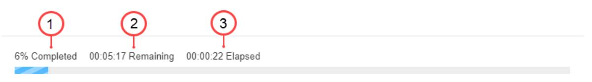

#### *Figure: Progress area*

- 1. Completed: Displays the percentage of records that have been processed.
- 2. Remaining: Displays the time remaining until the process finishes running. The remaining time is displayed in the following time format: *hh:mm:ss*.
- 3. Elapsed: Displays the time that the process takes. The elapsed time is displayed in the following time format: *hh:mm:ss*.

# **Tabs Area**

You use this area to view the details of the process you are running. In the Tabs area, you can see the following tabs:

- **Processed**: Lists all the successfully processed records
- **Errors**: Lists all the records that were processed with errors
- **Warnings**: Lists all the records that were processed with warnings
- **Remaining**: Lists all the remaining records to be processed
- **Total**: Lists all the records included in the processing (those that have been processed successfully, those for which warnings or errors have occurred, and those that need to be processed)

By default, these tabs are closed. You can expand each of these tabs to open the details of the processed documents. In the following screenshot, the **Processed** tab is expanded (1), and the **Errors** tab is closed (2).

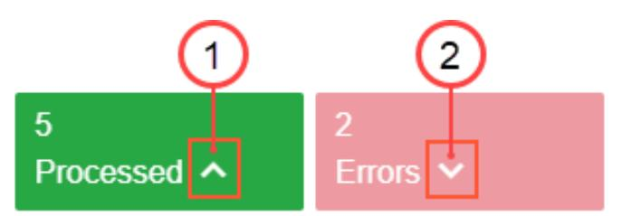

#### *Figure: Status of the tabs*

When you open any tab, the system displays a table with a list of processed records. The records in the lists of the tabs may have links. If you click a link in the list, the system opens the related record on the appropriate form in a new browser tab.

# **The Results of Processing and Cancellation**

When the processing of the records finishes, the system displays the results of the processing, whether it has been successful or unsuccessful. The following screenshot shows the **Processing** pop-up window when the processing has been successful.

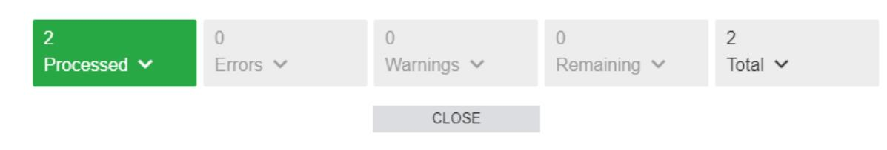

#### *Figure: Processing pop-up window with successful results*

The progress area informs you that the processing of the records has been completed and displays the time this process has taken. If the overall process was successful but there are some errors or warnings in the records, the system displays the *Process completed with errors* or *Process completed with warnings* message, respectively. The Tabs area sorts the records by statuses and provides details of these records.

While the system is preparing the records for processing or processing of the records, if an error occurs that is not directly connected with any record, the system will stop the processing and display the following error: *An error occurred while initializing processing. Show error message*. To find out why processing failed, you can click the *Show error message* link in the error message. The system will display the error message, as illustrated in the following screenshot. Error messages are unique to each process.

| Processing                                                                                      |                                                                                                    |                 |                  |              |  |  |  |  |
|-------------------------------------------------------------------------------------------------|----------------------------------------------------------------------------------------------------|-----------------|------------------|--------------|--|--|--|--|
| <b>3</b> An error occurred while initializing processing. Show error message., 00:00:00 Elapsed |                                                                                                    |                 |                  |              |  |  |  |  |
|                                                                                                 | The Execution Date box cannot be empty if the <b>Stop on Execution Date option is selected.</b> |                 |                  |              |  |  |  |  |
| $Proceeded$ $\vee$                                                                              | $E$ rrors $\vee$                                                                                   | Warnings $\vee$ | Remaining $\vee$ | Total $\vee$ |  |  |  |  |
|                                                                                                 |                                                                                                    | CLOSE           |                  |              |  |  |  |  |
|                                                                                                 |                                                                                                    |                 |                  |              |  |  |  |  |

#### *Figure: Processing pop-up window with an error*

If you need to stop the processing of the records, you can click the **Cancel Processing** button. When you click this button, the system opens the **Confirmation** dialog box, which asks you to confirm that you want to stop processing the records. If you click **Yes**, the system will prevent the processing of the remaining records, and the **Processing** pop-up window will have a similar appearance to that of the window displayed in the following screenshot.

| Processing                             |               |                                                             |                        |                    |  |  |  |
|----------------------------------------|---------------|-------------------------------------------------------------|------------------------|--------------------|--|--|--|
| Processing cancelled, 00:01:26 Elapsed |               |                                                             |                        |                    |  |  |  |
| 1 Processed $\vee$                  | Errors $\vee$ | !!!!!!!!!!!!!!!!!!!!!!!!!!!!!!!!!!!!!!!! Warnings $\vee$ | 20 Remaining $\vee$ | 22 Total $\sim$ |  |  |  |
|                                        |               | <b>CLOSE</b>                                                |                        |                    |  |  |  |

*Figure: Processing pop-up window aer the process has been canceled*

#### **Related Links**

- *[Basic Elements of the User Interface](#page-6-2)*
- *[Info Area](#page-17-1)*

# **Tables**

On many Acumatica ERP forms, tabs, and dialog boxes, some or all of the data is arranged in *tables*, where each row represents an object or detail (such as an account, an inventory item, a document row, or a journal entry) and each column shows a parameter of the object or detail in the row.

A table can have the following elements:

- Table rows and columns (see Item 1 in the following screenshot)
- A table toolbar (2) with buttons you can click to invoke actions as you work with the objects or details in the table
- A table footer (3) with buttons you can click to navigate between the pages of the table
- A filtering area (4), which you can use to filter the objects in the table

|   |   |   |                                             | $\overline{2}$                 |                          |           | 4                     |               |                 |                            |
|---|---|---|---------------------------------------------|--------------------------------|--------------------------|-----------|-----------------------|---------------|-----------------|----------------------------|
|   | с | r | $\left  \rightarrow \right $ ∕           | $\mathbf x$                    |                          |           |                       |               |                 |                            |
|   |   |   | ALL RECORDS <b>ACTIVE</b>                |                                |                          |           |                       |               |                 |                            |
|   |   |   | Drag column header here to configure filter |                                |                          |           |                       | a Y        | $\cdots$        | ρ                          |
| B | Û | n | <b>Customer ID</b>                          | <b>Customer Name</b>           | Customer <b>Class</b> | Country   | City                  | Currenc ID | <b>Terms</b>    | <b>Status</b>              |
| ♭ | 面 |   | ABARTENDE                                   | <b>USA Bartending School</b>   | <b>KEY</b>               | <b>US</b> | <b>Little Falls</b>   | <b>USD</b>    | 30 D | Active                     |
|   | O |   | <b>ABCHOLDING</b>                           | <b>ABC Holdings Inc.</b>       | <b>KEY</b>               | <b>US</b> | New York              | <b>USD</b>    | 30 D | Active                     |
|   | û |   | !!!!!!!!!!!!!!!!!!!!!!!!!!!!!!!!!!!!!!!!    | <b>ABC Studios Inc.</b>        | <b>KEY</b>               | <b>US</b> | <b>New York</b>       | <b>USD</b>    | 30 D | Active                     |
|   | Û |   | <b>ABCVENTURE</b>                           | <b>ABC Capital Ventures</b>    | <b>KEY</b>               | <b>US</b> | Philadelphia          | <b>USD</b>    | 30 D | Active                     |
|   | Û |   | <b>ACTIVESTAF</b>                           | <b>Active Staffing Service</b> | <b>LOCAL</b>             | <b>US</b> | <b>New York</b>       | <b>USD</b>    | 30 D | Active                     |
|   | Û |   | <b>ALPHABETLD</b>                           | Alphabetland School Center     | <b>LOCAL</b>             | <b>US</b> | <b>North Bellmore</b> | <b>USD</b>    | 30 D | Active                     |
|   |   |   |                                             |                                |                          |           |                       |               |                 |                            |
|   |   |   | 1-6 of 103 records                          |                                |                          |           |                       | $\mathbb{R}$  | $\blacksquare$  | $\geq$ of 18 pages ⋗ |
|   |   |   |                                             |                                |                          | 3         |                       |               |                 |                            |

*Figure: Table*

#### **In This Chapter**

- *Table Rows and [Columns](#page-115-3)*
- *Table [Toolbar](#page-117-1)*
- *Table [Footer](#page-121-1)*
- *[Filtering Area](#page-122-1)*
- *[Adjusting](#page-124-1) the Table Layout*
- *Using [Tables](#page-131-1)*

# **Table Rows and Columns**

In tables on Acumatica ERP forms, tabs, or dialog boxes, each row represents an object or detail (such as an account, an inventory item, a document row, or a journal entry) and each column shows a parameter of the object or detail in the particular row.

# **Shortcut Menu**

Right-clicking within the rows of a table opens a shortcut menu. The commands you see in the menu, which depend on the table you are working with, are mostly duplicates of actions on the table toolbar, but they offer you easier access to them. The unique menu commands are described in the following table. For description of other commands, see *Table [Toolbar](#page-117-1)*.

*Table: Shortcut Menu Commands*

| Option                      | Description                                                                                                                                                                           |
|-----------------------------|---------------------------------------------------------------------------------------------------------------------------------------------------------------------------------------|
| Clear Column Filter         | Clears the simple filter that you have applied to the selected column.                                                                                                                |
| Filter byThis Cell Value | Filters the data in the table by the value of the selected cell, causing only rows with this value in this column to be displayed. For details, see To Filter the Data in a Table. |

# **Column Configuration Dialog Box**

You can use the **Column Configuration** dialog box to work with tables in ways that better suit your needs. By using this dialog box, you can do the following:

- Change the visibility of the columns in the table
- Adjust the order of columns
- Restore the default table layout
- Save your changes to the table layout, including the quick filters and sorting you have applied to the table

To open the **Column Configuration** dialog box, you click the Column Configuration ( ) button (the lemost icon among the column headers), shown in the screenshot below.

| 闾 |     |      |  | <b>D</b> D   <del>立</del>   ! * Summary         |
|---|-----|------|--|-------------------------------------------------|
|   |     |      |  | Loss analysis required for sales meeting        |
|   | íJ, | - 19 |  | <b>Executive call to help close opportunity</b> |
|   |     |      |  | <b>Approve pricing discount for ToyStar</b>     |

#### *Figure: Column Configuration button*

| Element                                   | Description                                                                                                                                                      |  |  |  |
|-------------------------------------------|------------------------------------------------------------------------------------------------------------------------------------------------------------------|--|--|--|
| Search for Available Columns           | A box in which you can start typing, and the system displays the list of columns whose names contain the string you have typed in the Available Columns list. |  |  |  |
| Available Columns                         | The columns that are hidden from the table.                                                                                                                      |  |  |  |
| Selected Columns                          | The columns that are shown in the table.                                                                                                                         |  |  |  |
| Search for Selected Columns            | A box in which you can start typing, and the system displays the list of columns whose names contain the string you have typed in theSelected Columns list.   |  |  |  |
| The dialog box has the following buttons. |                                                                                                                                                                  |  |  |  |

| Element                         | Description                                                                                                                                                                                                                                                                                                                                            |
|---------------------------------|--------------------------------------------------------------------------------------------------------------------------------------------------------------------------------------------------------------------------------------------------------------------------------------------------------------------------------------------------------|
| Add Column                      | Moves the selected column to theSelected Columns list, causing it to be displayed on the table.                                                                                                                                                                                                                                                     |
| Remove Column                   | Moves the selected column to the Available Columns list, causing it to be hidden from the table.                                                                                                                                                                                                                                                    |
| Move Up                         | Moves the selected column up in the list (that is, to the le side of the table).                                                                                                                                                                                                                                                                      |
| Move Down                       | Moves the selected column down in the list (that is, to the right side of the table).                                                                                                                                                                                                                                                                  |
| Reset to Default                | Loads the default table settings.                                                                                                                                                                                                                                                                                                                      |
| Delete Default Configuration | Deletes the default configuration of the table columns created in theShare Column Con figuration dialog box. This button is visible to users with the Administrator role and is available if a shared default configuration has been set previously. For details on sharing column configuration, see Default Table Layout and Accessibility. |
| OK                              | Applies your changes and closes the dialog box.                                                                                                                                                                                                                                                                                                        |
| Cancel                          | Discards all unsaved changes and closes the dialog box.                                                                                                                                                                                                                                                                                                |

#### **Related Links**

- *[Adjusting](#page-124-1) the Table Layout*
- *To Hide or Display Table [Columns](#page-128-2)*
- *To Adjust [Column](#page-129-1) Widths*
- *To Change the Order of [Columns](#page-130-1)*
- *Table [Toolbar](#page-117-1)*

# **Table Toolbar**

Each table on an Acumatica ERP form, tab, dialog box, or page has a table toolbar, which contains the buttons you can use to work with the details or objects of the table. A toolbar, shown in the following screenshot, includes buttons that are specific to the table, standard buttons that most table toolbars have, and the search box (for some tables; for others, the search box is displayed in the filtering area).

|               | с                                                                      | r  | ∣⊷∣                                      | $\mathbf x$                    |                   |           |                       |               |                  |                    |
|---------------|------------------------------------------------------------------------|----|------------------------------------------|--------------------------------|-------------------|-----------|-----------------------|---------------|------------------|--------------------|
|               | ALL RECORDS <b>ACTIVE</b>                                           |    |                                          |                                |                   |           |                       |               |                  |                    |
|               | R Y ρ Drag column header here to configure filter $\cdots$ |    |                                          |                                |                   |           |                       |               |                  |                    |
| 髙             | Û,                                                                     | n  | <b>Customer ID</b>                       | <b>Customer Name</b>           | Customer Class | Country   | City                  | Currenc ID | <b>Terms</b>     | <b>Status</b>      |
| $\rightarrow$ | ा                                                                      | I٦ | <b>ABARTENDE</b>                         | <b>USA Bartending School</b>   | <b>KEY</b>        | US.       | <b>Little Falls</b>   | USD.          | 30 D  | Active             |
|               | O                                                                      |    | <b>ABCHOLDING</b>                        | <b>ABC Holdings Inc.</b>       | <b>KEY</b>        | <b>US</b> | New York              | <b>USD</b>    | 30 D  | Active             |
|               | û                                                                      |    | !!!!!!!!!!!!!!!!!!!!!!!!!!!!!!!!!!!!!!!! | <b>ABC Studios Inc.</b>        | <b>KEY</b>        | <b>US</b> | <b>New York</b>       | <b>USD</b>    | 30 D  | Active             |
|               | Û                                                                      |    | <b>ABCVENTURE</b>                        | <b>ABC Capital Ventures</b>    | <b>KEY</b>        | <b>US</b> | Philadelphia          | <b>USD</b>    | 30 D  | Active             |
|               | Û                                                                      |    | <b>ACTIVESTAF</b>                        | <b>Active Staffing Service</b> | <b>LOCAL</b>      | <b>US</b> | <b>New York</b>       | <b>USD</b>    | 30 D  | Active             |
|               | Û                                                                      |    | ALPHABETLD                               | Alphabetland School Center     | LOCAL             | <b>US</b> | <b>North Bellmore</b> | <b>USD</b>    | 30 D  | Active             |
|               |                                                                        |    |                                          |                                |                   |           |                       |               |                  |                    |
|               |                                                                        |    | 1-6 of 103 records                       |                                |                   |           |                       | $\mathbb{R}$  | 1 of 18 pages | $\rightarrow$ ⋗ |

*Figure: Table toolbar*

# **Standard Table Toolbar Buttons**

The following table describes the standard table toolbar buttons. A table toolbar may include some or all of those buttons. If a table toolbar includes table-specific buttons, they are described in the reference help topic.

| Button                          | Icon | Description                                                                                                                                                                                           |
|---------------------------------|------|-------------------------------------------------------------------------------------------------------------------------------------------------------------------------------------------------------|
| Refresh                         |      | Refreshes the data in the table.                                                                                                                                                                      |
| Switch Between Grid and Form |      | Controls how the elements are displayed: in a table (grid) with rows and columns; or as separately arranged elements for one table row, with navigation tools you use to move between row data. |
| Add Row                         |      | Appends a new row to the table so you can define a new detail or object. The new row may contain some default values.                                                                              |
| Delete Row                      |      | Deletes the selected row or rows.                                                                                                                                                                     |
| Move Row Up                     |      | Moves the selected row one position up.                                                                                                                                                               |
| Move Row Down                   |      | Moves the selected row one position down.                                                                                                                                                             |
| Fit toScreen                    |      | Adjusts the table to the screen width and makes the column width proportional.                                                                                                                        |

| Button                    | Icon | Description                                                                                                                                                                                                                                                                                     |  |  |  |  |
|---------------------------|------|-------------------------------------------------------------------------------------------------------------------------------------------------------------------------------------------------------------------------------------------------------------------------------------------------|--|--|--|--|
| Export to Excel           |      | Exports the data in the table to an Excel file. For more information, see Integration with Excel in the Acumatica ERP Getting Started Guide.                                                                                                                                                 |  |  |  |  |
| Filter Settings           |      | Opens the Filter Settings dialog box, which you can use to define a new advanced filter. After you create and save the filter, the corresponding tab appears on the ta ble.                                                                                                               |  |  |  |  |
|                           |      | For more information about filtering, see Filters. For details on the Filter Settings dialog box, see Filter Settings Dialog Box.                                                                                                                                                            |  |  |  |  |
| Load Records from File |      | Opens the File Upload dialog box, described in detail below, so you can locate and upload a local file for import. You can use this option to import data from an Excel spreadsheet (.xlsx) or .csv file. For the detailed procedure, see To Import Data from a Local File to a Table. |  |  |  |  |
| Search                    |      | A box in which you can type a word, part of a word, or multiple words. As you type, the system filters the contents of the table to display only rows that contain the string you have typed in any column.                                                                               |  |  |  |  |
| Download                  |      | Downloads the selected file.                                                                                                                                                                                                                                                                    |  |  |  |  |

# **File Upload Dialog Box**

With the **File Upload** dialog box, you select a file of one of the supported formats (.csv or .xlsx) to import data from the file.

| Element                                  | Description                                                                                                                         |  |  |  |
|------------------------------------------|-------------------------------------------------------------------------------------------------------------------------------------|--|--|--|
| File Path                                | The path to the file you want to upload. To select the file, click Browse, and then find and select the file you want to upload. |  |  |  |
| The dialog box has the following button. |                                                                                                                                     |  |  |  |
| Upload                                   | Closes the dialog box and opens the Common Settings dialog box, where you specify the import settings.                           |  |  |  |

# **Common Settings Dialog Box**

In the **Common Settings** dialog box, which opens if you click **Upload** in the **File Upload** dialog box, you specify the import settings for a file that you has selected in the **File Upload** dialog box.

| Element                                   | Description                                                                                                                                                                    |  |  |  |  |  |
|-------------------------------------------|--------------------------------------------------------------------------------------------------------------------------------------------------------------------------------|--|--|--|--|--|
| Separator Chars                           | The character that is used as the separator in the imported file.                                                                                                              |  |  |  |  |  |
|                                           | By default, the comma is used as the separator. You specify the separator character if the imported file uses any other separator.                                          |  |  |  |  |  |
|                                           | This box appears only if you import data from a .csv file.                                                                                                                     |  |  |  |  |  |
| Null Value                                | Optional. The value that is used to mark an empty column in the imported file. You speci fy the null value if the value in the imported file differs from the empty string. |  |  |  |  |  |
| Encoding                                  | The encoding that is used in the imported file.                                                                                                                                |  |  |  |  |  |
|                                           | This box appears only if you import data from a .csv file.                                                                                                                     |  |  |  |  |  |
| Culture                                   | The regional format that has been used to display the time, currency, and other measure ments in the imported file.                                                         |  |  |  |  |  |
| Mode                                      | The mode that determines which rows of the uploaded file will be imported into the ta ble. The following options are available:                                             |  |  |  |  |  |
|                                           | • Update Existing: The rows already present in the table will be updated, and the rows not present in the table will be added.                                           |  |  |  |  |  |
|                                           | • Bypass Existing: Only the new rows that are not present in the table will be imported. The rows that are already present in the table will not be updated.             |  |  |  |  |  |
|                                           | • Insert All Records: All the rows from the file will be imported into the table.                                                                                           |  |  |  |  |  |
|                                           | If you select this option, you may get duplicated rows because the sys tem does not check for duplicates when importing rows from the file.                                 |  |  |  |  |  |
| The dialog box has the following buttons. |                                                                                                                                                                                |  |  |  |  |  |
| OK                                        | Closes the dialog box and opens the Columns dialog box.                                                                                                                        |  |  |  |  |  |
| Cancel                                    | Closes the dialog box without importing the data from the file.                                                                                                                |  |  |  |  |  |

# **Columns Dialog Box**

In the **Columns** dialog box, which opens if you click **OK** in the **Common Settings** dialog box, you match the columns in the imported file that you have selected in the **File Upload** dialog box to the columns in the Acumatica ERP table to which you are importing data.

| Element                                   | Description                                                         |  |  |  |  |
|-------------------------------------------|---------------------------------------------------------------------|--|--|--|--|
| Column Name                               | The name of the column in the uploaded file.                        |  |  |  |  |
| Property Name                             | The name of the corresponding column in the table in Acumatica ERP. |  |  |  |  |
| The dialog box has the following buttons. |                                                                     |  |  |  |  |
| OK                                        | Closes the dialog box and imports the selected file.                |  |  |  |  |

| Element | Description                                                     |  |
|---------|-----------------------------------------------------------------|--|
| Cancel  | Closes the dialog box without importing the data from the file. |  |

#### **Related Links**

- *[Tables](#page-115-2)*
- *[Integration with Excel](https://help-2025r1.acumatica.com/Help?ScreenId=ShowWiki&pageid=d4e757d5-bdf6-4d82-92e3-f26563d48ad4)*
- *To [Import](#page-134-3) Data from a Local File to a Table*

# **Table Footer**

A table on an Acumatica ERP form, tab, or dialog box can have a table footer, which contains buttons you can click to navigate between the pages of the table. The toolbar footer displays navigation buttons if the table has too many details or objects (that is, table rows) to fit on one page. For a generic inquiry form (such as a substitute form for a data entry form), the table footer also displays the number of pages and the total number of records, as shown in the following screenshot.

If a request to the database takes too much time and the system cannot calculate the number of records for the generic inquiry before timeout (which is calculated based on settings of Microso SQL Server; the default timeout setting is 6 seconds), the system displays a warning message, and the table footer does not display the total number of records.

|                                             |    |  | ALL REVURDO $A \cup B \cup C$         |                                   |                          |           |                       |               |                 |               |  |
|---------------------------------------------|----|--|------------------------------------------|-----------------------------------|--------------------------|-----------|-----------------------|---------------|-----------------|---------------|--|
| Drag column header here to configure filter |    |  |                                          |                                   | a                        | $\cdots$  |                       | α             |                 |               |  |
| 髙                                           | Ū, |  | <b>Customer ID</b>                       | <b>Customer Name</b>              | Customer <b>Class</b> | Country   | City                  | Currenc ID | <b>Terms</b>    | <b>Status</b> |  |
| $\rightarrow$                               | ा  |  | <b>ABARTENDE</b>                         | <b>USA Bartending School</b>      | <b>KEY</b>               | <b>US</b> | <b>Little Falls</b>   | <b>USD</b>    | 30 D | Active        |  |
|                                             | O  |  | <b>ABCHOLDING</b>                        | <b>ABC Holdings Inc.</b>          | <b>KEY</b>               | <b>US</b> | New York              | <b>USD</b>    | 30 D | Active        |  |
|                                             | û  |  | !!!!!!!!!!!!!!!!!!!!!!!!!!!!!!!!!!!!!!!! | <b>ABC Studios Inc.</b>           | <b>KEY</b>               | <b>US</b> | New York              | <b>USD</b>    | 30 D | Active        |  |
|                                             | Û  |  | <b>ABCVENTURE</b>                        | <b>ABC Capital Ventures</b>       | <b>KEY</b>               | <b>US</b> | Philadelphia          | <b>USD</b>    | 30 D | Active        |  |
|                                             | Ū  |  | <b>ACTIVESTAF</b>                        | <b>Active Staffing Service</b>    | LOCAL                    | <b>US</b> | New York              | <b>USD</b>    | 30 D | Active        |  |
|                                             | Û  |  | <b>ALPHABETLD</b>                        | <b>Alphabetland School Center</b> | LOCAL                    | <b>US</b> | <b>North Bellmore</b> | <b>USD</b>    | 30 D | Active        |  |
|                                             |    |  |                                          |                                   |                          |           |                       |               |                 |               |  |
| 1-6 of 103 records K of 18 pages К |    |  |                                          |                                   |                          |           |                       |               |                 |               |  |

*Figure: Table footer*

# **Standard Navigation Elements of the Table Footer**

If a particular table has too many details (table rows) to fit on one page, you use the elements on the footer to browse the table pages.

| Element          | Icon | Description                           |
|------------------|------|---------------------------------------|
| Go to First Page |      | Displays the first page of the table. |

| Element                | Icon | Description                                                                                                                                                                                                          |
|------------------------|------|----------------------------------------------------------------------------------------------------------------------------------------------------------------------------------------------------------------------|
| Go to Previous Page |      | Displays the previous page of the table.                                                                                                                                                                             |
| x of y pages           |      | The number of the currently selected page (in a box that can be edited) and the to tal number of pages of the table. You can type the number of the page in this box to open the page with the entered number. |
|                        |      | This box appears only on generic inquiry forms (such as substitutes for data entry forms).                                                                                                                        |
| Go to Next Page        |      | Displays the next page of the table.                                                                                                                                                                                 |
| Go to Last Page        |      | Displays the last page of the table.                                                                                                                                                                                 |

#### **Related Links**

• *[Tables](#page-115-2)*

# **Filtering Area**

A table on an Acumatica ERP form, tab, or dialog box can have a filtering area, which you can use to filter the objects in the table. The filtering area, as shown in the following screenshot, can include filter tabs that are specific to the table, quick filters that you can configure on the fly for the table, buttons that you use to edit, save, and remove table filters, and the search box.

|               |    | ⊢                                           | $\mathbf{\overline{x}}$           |                   |           |                       |               |                 |                   |        |
|---------------|----|---------------------------------------------|-----------------------------------|-------------------|-----------|-----------------------|---------------|-----------------|-------------------|--------|
|               |    | ALL RECORDS <b>ACTIVE</b>                |                                   |                   |           |                       |               |                 |                   |        |
|               |    | Drag column header here to configure filter |                                   |                   |           |                       | a             | $\cdots$        |                   | ρ      |
| 髙             | Û  | <b>Customer ID</b>                          | <b>Customer Name</b>              | Customer Class | Country   | City                  | Currenc ID | <b>Terms</b>    | <b>Status</b>     |        |
| $\rightarrow$ | ा  | <b>ABARTENDE</b>                            | <b>USA Bartending School</b>      | <b>KEY</b>        | <b>US</b> | <b>Little Falls</b>   | <b>USD</b>    | 30 D | Active            |        |
|               | Û  | <b>ABCHOLDING</b>                           | <b>ABC Holdings Inc.</b>          | <b>KEY</b>        | <b>US</b> | New York              | <b>USD</b>    | 30 D | Active            |        |
|               | û  | !!!!!!!!!!!!!!!!!!!!!!!!!!!!!!!!!!!!!!!!    | <b>ABC Studios Inc.</b>           | <b>KEY</b>        | <b>US</b> | <b>New York</b>       | <b>USD</b>    | 30 D | Active            |        |
|               | O, | <b>ABCVENTURE</b>                           | <b>ABC Capital Ventures</b>       | <b>KEY</b>        | <b>US</b> | Philadelphia          | <b>USD</b>    | 30 D | Active            |        |
|               | Û  | <b>ACTIVESTAF</b>                           | <b>Active Staffing Service</b>    | <b>LOCAL</b>      | US        | New York              | <b>USD</b>    | 30 D | Active            |        |
|               | Û  | <b>ALPHABETLD</b>                           | <b>Alphabetland School Center</b> | <b>LOCAL</b>      | <b>US</b> | <b>North Bellmore</b> | <b>USD</b>    | 30 D | Active            |        |
|               |    |                                             |                                   |                   |           |                       |               |                 |                   |        |
|               |    | 1-6 of $103$ records                        |                                   |                   |           |                       | K             |                 | 1. of 18 pages | $\geq$ |

*Figure: Filtering area*

# **Elements of the Filtering area**

The following table describes the standard elements of the filtering area. A filtering area can include some or all of those elements. If a filtering area includes table-specific filter tabs, they are described in the form reference help topic.

| Element                                           | Icon | Description                                                                                                                                                                                                                                                                                                                                                                                                                                                                     |  |  |  |  |  |  |  |
|---------------------------------------------------|------|---------------------------------------------------------------------------------------------------------------------------------------------------------------------------------------------------------------------------------------------------------------------------------------------------------------------------------------------------------------------------------------------------------------------------------------------------------------------------------|--|--|--|--|--|--|--|
| Drag column header here to configure filter |      | A box in the filtering area to which you can drag a table header to add a quick filter. Once you drop the table header there, a button with the quick filter appears. You can filter the data in the table on the fly by specifying the value of the quick filter, as described in Filtering and Sorting Capabilities: Process Activity in the Getting Start ed Guide. You can add multiple quick filters to the filtering area by dragging table headers to it. |  |  |  |  |  |  |  |
| Filter Settings                                   |      | Opens the Filter Settings dialog box, which you can use to define a new advanced filter or edit an existing one. After you create and save the filter, the corresponding tab appears on the table.                                                                                                                                                                                                                                                                        |  |  |  |  |  |  |  |
|                                                   |      | The button is highlighted if the records in the table are already filtered with an ad vanced filter.                                                                                                                                                                                                                                                                                                                                                                         |  |  |  |  |  |  |  |
|                                                   |      | For more information about advanced filters, see Types of Filters. For details on the Filter Settings dialog box, see Filter Settings Dialog Box.                                                                                                                                                                                                                                                                                                                            |  |  |  |  |  |  |  |
| Save                                              |      | Opens the Filter Settings dialog box, where you specify the name of the new filter and save the filter.                                                                                                                                                                                                                                                                                                                                                                      |  |  |  |  |  |  |  |
|                                                   |      | This button is available if you have added at least one quick filter for the form.                                                                                                                                                                                                                                                                                                                                                                                              |  |  |  |  |  |  |  |
| > Save As                                         |      | Opens the Filter Settings dialog box, where you specify a new name for the cur rently displayed filter and save this filter with the new name.                                                                                                                                                                                                                                                                                                                               |  |  |  |  |  |  |  |
|                                                   |      | This button is available if you have added at least one quick filter for the form.                                                                                                                                                                                                                                                                                                                                                                                              |  |  |  |  |  |  |  |
| > Remove                                          |      | Removes the tab with the filter from the form.                                                                                                                                                                                                                                                                                                                                                                                                                                  |  |  |  |  |  |  |  |
|                                                   |      | This button is available if the currently displayed filter was previously saved and you have the rights to delete this filter. (You have the rights to delete a filter if the filter is not shared or if the filter is shared and the user account under which you are signed in has access to editing shared filters—that is, to the Filters (CS209010) form.)                                                                                                     |  |  |  |  |  |  |  |
| Search                                            |      | A box in which you can type a word, a part of a word, or multiple words. As you type, the system filters the contents of the table to display only rows that contain the string you have typed in any column.                                                                                                                                                                                                                                                             |  |  |  |  |  |  |  |

# **Filter Settings Dialog Box**

In the **FilterSettings** dialog box, you specify the name of the filter configured in the filtering area and save the filter. The dialog box opens when you click**Save** or **Save As** in the filtering area

| Element                                   | Description                                                                                                                        |
|-------------------------------------------|------------------------------------------------------------------------------------------------------------------------------------|
| Filter Name                               | The name of the saved filter. This name is displayed as the name of the tab with the fil tered records on the form.             |
| Shared Filter                             | A check box that you select to share the saved filter. If the check box is cleared, the filter will be visible only to you.     |
|                                           | This check box is available only if you have access to editing shared filters—that is, to the Filters (CS209010) form.          |
|                                           | The system displays all shared quick filters on the Filters (CS209010) form.                                                       |
| The dialog box has the following buttons. |                                                                                                                                    |
| OK                                        | Closes the dialog box and opens a tab for the saved filter if the filter already exists or cre ates a for a newly saved filter. |

# **Adjusting the Table Layout**

As you work, you may need to adjust layouts of tables to suit your needs; typical operations are discussed below.

# **Switching Between Form View and Grid View**

On data entry forms, tables can be presented in the following views:

• **Grid View**: This is a standard tabular view, with all details arranged in a table and each row representing one detail or document row, as shown in the following screenshot.

|  |                 | $\ell + i$     |             | View Source Document                |                 |                    |              |                 |      |                                          | × |
|--|-----------------|----------------|-------------|-------------------------------------|-----------------|--------------------|--------------|-----------------|------|------------------------------------------|---|
|  | <b>BOD-</b>     | Branch Account | Description | + Subaccount Project                | Project Task | $+$ Ref. Number | Quantity UOM | Debit Amount |      | Credit Transaction Amount Description |   |
|  | $\geq 0$ D MAIN |                |             | 101000 Cash on Hand US-00-00-00-0 X |                 |                    | 50.00        | 0.00            | 0.00 |                                          |   |
|  |                 |                |             |                                     |                 |                    |              |                 |      |                                          |   |
|  |                 |                |             |                                     |                 |                    |              |                 |      |                                          |   |
|  |                 |                |             |                                     |                 |                    |              |                 |      |                                          |   |
|  |                 |                |             |                                     |                 |                    |              |                 | ĸ    | $\langle \rangle$                        |   |

#### *Figure: Table in grid view*

• **Form View**: With the form view (shown in the following screenshot), you see a set of elements intended for only one detail or document row, and you use the navigation buttons (in the lower le corner of the form) to move from one row of the table to another.

| c $\epsilon$ +              | View Source Document   [- |   | 审 $\pmb{\times}$ |                       |        |        |               | $\mathcal{H}$ |
|-----------------------------------|---------------------------|---|---------------------|-----------------------|--------|--------|---------------|---------------|
| · Branch:                         | <b>MAIN - New York</b>    | D | Project             | X - Non-Project Code. | ø      |        |               |               |
| * Account:                        | 101000 - Cash on Hand USD | P | Project Task:       |                       |        |        |               |               |
| * Subaccount:                     | US-00-00-00-000           |   |                     |                       |        |        |               |               |
| . Ref. Number:                    |                           |   |                     |                       |        |        |               |               |
| UOM:                              | p                         |   |                     |                       |        |        |               |               |
| Quantity:                         | 50.00                     |   |                     |                       |        |        |               |               |
| Debit Amount                      | 0.00                      |   |                     |                       |        |        |               |               |
| Credit Amount                     | 0.00                      |   |                     |                       |        |        |               |               |
| Transaction Description:          |                           |   |                     |                       |        |        |               |               |
| $\mathsf{R}$ First $\leq$ Prev | S Next $ $ Last        |   |                     |                       |        |        |               |               |
|                                   |                           |   |                     |                       | $\leq$ | $\leq$ | $\rightarrow$ | >1            |

*Figure: Table in form view*

To switch between these two views, do the following:

• Click **Switch Between Grid and Form** ( ) on the table toolbar.

# **Changing the Table Layout**

You can adjust any table to meet your information needs. Adjustments that you make to a table affect only your user account and are not visible to other users.

You can fine-tune the table in the following ways:

- Hide or display columns, as described in *To Hide or Display Table [Columns](#page-128-2)*
- Adjust the column width, as described in *To Adjust [Column](#page-129-1) Widths*
- Change the order of columns, as described in *To Change the Order of [Columns](#page-130-1)*

When you make any of these changes, the table will display them immediately, and the system will save them automatically.

The **Column Configuration** dialog box, which is used to adjust the table, is described in *[Column Configuration](#page-116-0) [Dialog Box](#page-116-0)*.

If your user account is assigned the *Administrator* role you can set default column configuration for all users of the system and configure table layouts for particular users, as described in *Default Table Layout and [Accessibility](#page-125-1)*.

#### **Related Links**

- *Default Table Layout and [Accessibility](#page-125-1)*
- *To Hide or Display Table [Columns](#page-128-2)*
- *To Adjust [Column](#page-129-1) Widths*
- *To Change the Order of [Columns](#page-130-1)*
- *[Column Configuration Dialog Box](#page-116-0)*

# **Default Table Layout and Accessibility**

Your organization may have specific requirements for processing documents in Acumatica ERP, which can be reflected in the table layout on particular forms. If your user account is assigned the *Administrator* role in Acumatica ERP, you can set the default column configuration for all users of the system or configure table layouts for particular users, as described in this topic.

# **Setting and Changing the Default Table Layout**

You can configure the required table layout (such as the order of columns and the set of columns to be displayed) and set this configuration as the new default layout, while logged in to a user account that has the *Administrator* role. Aer you have set the new default layout for a particular table, the system applies this layout to the following users:

- All new users added to the system aer you set the default layout
- All existing users who haven't changed the default layout

If users have personalized layouts of a particular table, you can override their table settings with these default settings.

# **Setting the Visibility of the Table Columns**

For each table of a data entry or mass processing form, you can define the visibility of the columns by using the **Column Configuration** dialog box. In the**Selected Columns** list of this dialog box, the system displays the columns that are visible on the table. These table columns may look like those in the following screenshot.

| Selected Columns        |            |   |  |
|-------------------------|------------|---|--|
|                         |            | ρ |  |
| Files                   |            | ∸ |  |
| Notes                   |            |   |  |
| Branch                  |            |   |  |
| Inventory ID            |            |   |  |
| Free Item               |            |   |  |
| Warehouse               |            |   |  |
| Location                |            |   |  |
| <b>Line Description</b> | <b>TAB</b> |   |  |
| <b>UOM</b>              | <b>TAB</b> |   |  |
| Quantity                |            |   |  |
| Qty. On Shipments       |            |   |  |
| Open Qty.               |            |   |  |

#### *Figure: Visibility of the column cells*

•

•

One of the following indicators (also shown in the previous screenshot) can be shown for each column:

: Indicates that the column is accessible through a keyboard (that is, a user can tab to the column). This button is not visible by default and appears only when you point at the column name.

: Indicates that the column is not accessible through a keyboard. In this case, when a user attempts to tab to the column by pressing the Tab key on the keyboard, the system instead skips the column (and any others that are inaccessible through a keyboard) and goes to the next accessible column. If accessibility for a column has been turned off, this button is visible by default and stays visible when you point at the column name.

To change the state of the accessibility of a column, in the**Selected Columns** list of the dialog box, you point at the

column name and click the or button.

By default, changes in the column configuration are applied to the current user account. However, a user with administrative access to the system can configure the column accessibility; this administrative user can then share its configuration with specific users in the system or make it the default configuration for all users.

# **Configuring Table Layouts and Accessibility Settings for Particular Users**

If particular users have specific requirements for the table layout and accessibility on a form, you can set up the required configuration while logged in to a user account that has the *Administrator* role, and you can then apply this configuration to these users only. These users will see this table configuration when they navigate to the form, but other users will not. Users can change this default table configuration at any time. To configure the layout and accessibility settings of a table or multiple tables on a form for particular users, you do the following:

- 1. You navigate to the form and configure the layout and accessibility settings required by users of the table or tables on the form.
- 2. On the form title bar, you click **Help > Share Column Configuration**. The **Share Column Configuration** dialog box is opened. (For a description of the dialog box, see *[Share Column Configuration Dialog Box](#page-72-0)*.)
- 3. In the dialog box, you do the following:
  - a. On Page 1, you select the table or tables you have configured.
  - b. On Page 2, you clear the**Set as the Default** check box.
  - c. In the Users table of Page 2, you select the users to which you want to apply the table layout. If these users are all assigned a particular role, in the **User Role** box, you can select this role to filter the list of users in the list and then select the needed users.

#### **Related Links**

• *[Share Column Configuration Dialog Box](#page-72-0)*

# **To Change the Default Configuration of a Table**

If you have already set up a default configuration for one table or multiple tables on a form, you may later want to change this default configuration. To do this, you first delete the previously configured default configuration and then configure a new one.

The ability to change a default configuration of a table is available only to users with administrative access to the system.

# **To Change the Default Configuration**

- 1. Navigate to the form, and while viewing the table for which you want to change the default layout, click to bring up the **Column Configuration** dialog box.
- 2. In the bottom of the dialog box, click **Delete Default Configuration**.
- 3. Configure the new table layout.
- 4. Define this layout as the default layout by using the *[Share Column Configuration Dialog Box](#page-72-0)*.

# **To Share a Column Configuration**

You can configure a default layout of a table (or multiple tables) on a form and then define it as the default for other users in the system by sharing the configuration.

The ability to share a column configuration is available only to users with administrative access to the system.

# **To Share a Column Configuration**

- 1. Navigate to the form and configure the appropriate layout of the table or tables on the form.
- 2. On the form title bar, click**Tools > Share Column Configuration**. The **Share Column Configuration** dialog box is opened. (For details about the dialog box, see *[Share Column Configuration Dialog Box](#page-72-0)*.)
- 3. In the dialog box, do the following:
  - a. On Page 1, select the table or the tables for which you want to specify default settings.
  - b. On Page 2, do one of the following:
    - Select the**Set as the Default** check box to make the table configuration or configurations the default settings for all users. Also, for users who have set up their own column configurations for the table or tables, if you want to replace their table layouts with the configuration you have defined as the default, select the **Override Users' Personal Configurations** check box.
    - Clear the**Set as the Default** check box and select users with whom you want to share the table configuration or configurations. You can filter the list of users by selecting a role in the **User Role** box.
  - c. Click **Finish** to apply your changes.

# **To Hide or Display Table Columns**

You can hide or display table columns according to your needs for information, as described in this topic.

# **To Display Hidden Table Columns**

- 1. In the table, click the Column Configuration button ( ), the lemost icon among the column headers, to open the **Column Configuration** dialog box (for reference, see *[Column Configuration Dialog Box](#page-116-0)*).
- 2. To display a hidden column (or multiple hidden columns) in the table, do the following:
  - a. In the **Available Columns** list, select the column or columns to be added as follows:
    - If you want to display just one hidden column and you see it in the list, click the column.
    - If you know the name of the column you want to add but don't see it, start typing the column name in the Available Columns search box, and the system will display a list of columns that include the string you have typed. Click the column you want to display.
    - To select multiple individual columns, press and hold the Ctrl key, and then click each column that you want to display.
    - To select multiple columns that are adjacent to one another, press and hold the Shi key, and then click the first and the last column of the block.
  - b. Click the Add Column to the Selected Columns List ( ) button.

- 3. Click one of the following to apply the changes:
  - **Save** to save the layout changes for the current session and future sessions.
  - **OK** to change the layout for only the current session.

# **To Hide Table Columns**

- 1. In the table, click the Column Configuration button ( ), the lemost icon among the column headers, to open the **Column Configuration** dialog box.
- 2. To hide a column (or to hide multiple columns) from the table, do the following:
  - a. In the **Selected Columns** list, select the column or columns you want to hide as follows:
    - If you want to hide just one hidden column and you see it in the list, click the column.
    - If you know the name of the column you want to hide but don't see it, start typing the column name in the Selected Columns search box, and the system will display a list of columns that include the string you have typed. Click the column you want to hide.
    - To select multiple individual columns, press and hold the Ctrl key, and then click each column that you want to select.
    - To select multiple columns that are near each other, press and hold the Shi key, and then click the first and the last column of the block.
  - b. Click Remove Column from the Selected Columns List ( ) button.
- 3. Click one of the following to apply the changes:
  - **Save** to save the layout changes for the current session and future sessions.
  - **OK** to change the layout for only the current session.

# **To Restore the Default Table Layout**

- 1. Click the Column Configuration button ( ).
- 2. In the bottom le of the **Column Configuration** dialog box, click **Reset to Default**.

All the changes that you have previously made to the table layout will be reset.

# **To Adjust Column Widths**

If not all columns fit in the screen and you must scroll to the right to view some of them, you can adjust the column widths so that you can view all columns on the screen without scrolling. You might not see some column headers in their entirety if their full text doesn't fit in the reduced column width, but making this adjustment will give you the ability to view all the columns. You can adjust column widths automatically and manually, and you can restore default widths, as described in this topic.

# **To Adjust the Column Width Automatically**

• On the table toolbar, click **Fit toScreen** ( ). The column widths will be reduced proportionally so that the whole table fits the screen.

This change is saved automatically by the system, that is, when you open the table in the future you will see this change.

# **To Adjust the Column Width Manually**

- 1. Move the pointer over the column split line (the line dividing two columns). When the pointer becomes a double-headed arrow, drag the pointer le or right to move the line.
- 2. Repeat Step 1 for each column split line you want to move.

These changes are saved automatically by the system, that is, when you open the table in the future you will see this change.

# **To Restore the Default Table Layout**

- 1. Click the Column Configuration button ( ).
- 2. In the bottom le of the **Column Configuration** dialog box, click **Reset to Default**.

All the changes that you have previously made to the table layout will be reset.

# **To Change the Order of Columns**

As you work, you might want to change the order of columns so that the information is grouped to better fit your work and preferences. For example, you might want to make particular columns adjacent or move to the le the columns you consider the most important.

To rearrange the layout of columns in a table, you can use one of the following ways, described in detail below:

- On the form, drag a column to a new position
- Use the Column Configuration dialog box

# **To Move Columns on the Form**

- 1. Drag the column header to the desired position. Note the red arrows, which indicate the exact position where you can drop the column between two other columns.
- 2. Repeat this step for each column you want to move.

These changes are saved automatically by the system, that is, when you open the table in the future you will see this change.

# **To Move Columns by Using Column Configuration Dialog Box**

- 1. In the table, click the Column Configuration button ( ) to open the **Column Configuration** dialog box.
- 2. To shi a column to the le in the table, do the following:
  - a. In the **Selected Columns** list, click the column you want to move.
  - b. Click the Move Up ( ) button to move the column one position to the le.
  - c. Repeat the previous substep until the column is in the appropriate place.
- 3. To shi a column to the right in the table, do the following:
  - a. In the **Selected Columns** list, select the column you want to move.
  - b. Click the Move Down ( ) button to move the column one position to the right.

- c. Repeat the previous substep until the column is in the appropriate place.
- 4. Click **OK** to save the layout changes.

# **To Restore the Default Table Layout**

- 1. Click the Column Configuration button ( ).
- 2. In the bottom le of the **Column Configuration** dialog box, click **Reset to Default**.

All the changes that you have previously made to the table layout will be reset.

# **Using Tables**

As you work, you may need to perform specific operations with tables; typical operations are discussed below.

For instructions on adjusting table layout, see *[Adjusting](#page-124-1) the Table Layout*.

# **Selecting Objects in the Table**

Some forms have a Select column (with a check box as a header) that you can use to select objects from the table:

- To select particular objects, click the check box in the Selected column for each object.
- To select all objects displayed on the current page of the table, click the Selected check box in the column header.

# **Using Simple Filters and Sorting**

You might find it helpful to narrow the range and rearrange the order of displayed objects before selecting particular ones. You use the simple filters by selecting the appropriate options in the menu that appears when you click any column header in any table in the system. You can find the detailed procedures in *To [Filter](#page-132-1) the Data in a [Table](#page-132-1)*.

You can also use filters to add tabs with only the data you want to see. For more information, see *[Filters](#page-175-2)*.

# **Attaching Files to Record Details**

In Acumatica ERP, files can be attached to any detail of a record (that is, an object, entity, or document created by using a form). A record detail is a particular row in the record that a user has added by using the data entry form. You can attach different files, such as images in various formats, scanned documents, and internal instructions for employees.

Files can also be attached to records. For more information, see *To Attach a File to a [Record](#page-105-2)*.

You can easily manage and track files and images attached to Acumatica ERP records and record details for various purposes. For more information on managing attached files, see *[Managing External Storage for File Attachments](https://help-2025r1.acumatica.com/Help?ScreenId=ShowWiki&pageid=a5989c03-43df-4f31-bd2d-db6d79be31c8)* in the Acumatica ERP System Administration Guide and *[Working with Data Entry Forms](https://help-2025r1.acumatica.com/Help?ScreenId=ShowWiki&pageid=619c96d4-9e80-47b2-b835-ffb44dde8afc)* and *[Importing and Exporting](https://help-2025r1.acumatica.com/Help?ScreenId=ShowWiki&pageid=f33b758e-c242-4812-8205-1e435072336a) [Data to Excel and XML](https://help-2025r1.acumatica.com/Help?ScreenId=ShowWiki&pageid=f33b758e-c242-4812-8205-1e435072336a)* in the Acumatica ERP Getting Started Guide.

# **Attaching Notes to Record Details**

In Acumatica ERP, a record is an object, entity, or document created by using a form. A record is a particular row in the record, and you can attach text notes to any record detail. By using these notes, you can communicate key information about the record detail to other users.

Notes can also be attached to records. For more information, see *To Attach a Note to a [Record](#page-134-2) Detail*.

# **To Filter the Data in a Table**

You quickly filter the data of any table in the system by using simple filters—that is, by selecting the appropriate options in the menu that appears when you click the header of the column to which you want apply the filter. On generic inquiry forms (such as substitutes for entry forms), you can filter data in tables by using quick filters—that is, by dragging column headers to the filtering area of the table and specifying the filtering values.

In this topic, you will read about setting up filters based on table columns, clearing these filters, managing column sorting, and filtering by a selected cell value.

Simple and quick filters cannot include complex filtering conditions (with multiple clauses connected with *Or* operators and combined with parenthesis). If you need to use complex filtering conditions, you create an advanced filter as described in *[Managing Advanced Filters](https://help-2025r1.acumatica.com/Help?ScreenId=ShowWiki&pageid=c621d79a-274d-4b72-a699-0e92d78a7b23)*.

# **To Set Up a Filter on Table Columns**

- 1. Open the form with the table for which you want to set up a filter on table columns.
- 2. In the table, do one of the following:
  - Click the header of the column whose values you want to filter.
  - If the **Drag column header here to configure filter** box of the filtering area is available above the table (which indicates that you are viewing a generic inquiry form), drag the header of the column whose values you want to filter to this part of the filtering area and click the button that is added to the filtering area once you drop the header there.
- 3. If you want to filter data in a column with a fixed set of options (such as**Status**), in the dialog box that has opened, select the required values.
- 4. If you want to filter data in a column with unlimited number of values (such as**Vendor**), do the following:
  - In the dialog box that has opened, select the filter condition from the list of available conditions. The available conditions (such as **Contains**, **Equals**, **Does Not Equal**, **Is Null**, **Is Not Null** or **Is Empty**) depend on the data type of the column.
  - In the box at the bottom of the dialog box, type the filter value (if needed).
- 5. Click **OK** to apply the filter.

Now the table displays only the rows that satisfy the terms of the filter. The column header is highlighted and

displays the filter icon ( ). If the table is on a generic inquiry form, a button is added to the filtering area and displays the column name and filtering value.

You can set up filters for any number of table columns. If you set up filters for multiple columns, the system displays only the rows that satisfy the terms of all filters.

# **To Filter Data by a Selected Cell Value**

You can filter the data in a table on an inquiry or processing form by a value of any cell that you select as follows:

- 1. Open the form with the table for which you want to set up filtering by a cell value.
- 2. In the table, right-click the cell that contains the value by which you want to filter the data, and click **Filter byThis CellValue**.

As a result, the table displays only the rows for which this column contains this value. The column header is

highlighted and displays the filter icon ( ). If the table is on a generic inquiry form, a button is added to the filtering area and displays the column name and filtering value.

You can also apply this filter by clicking the required cell and pressing SHIFT+F.

# **To Clear a Filter**

On the form with the table for which you want to clear a simple or quick filter, do one of the following:

- If there is a button with the filter in the filtering area, drag the button to the table.
- In the table, click the header of the column for which you want to clear the filter, and do one of the following:
  - If you filtered data in a column with fixed set of options, click**Select All** and then click **OK**.
  - If you filtered data in a column with unlimited number of values, click **Clear Filter**.

# **To Turn On Column Sorting**

- 1. Open the form with the table for which you want to set up column sorting.
- 2. In the table, click the header of the column whose values you want to sort.
- 3. In the dialog box, select the sorting order—ascending (that is, A to Z for text, lowest to highest for numbers, or newest to latest for dates) or descending (that is, Z to A for text, highest to lowest for numbers, or latest to newest for dates).

The column header displays the ascending ( ) or descending ( ) sorting icon.

You can turn on sorting for only one column in a table at a time.

# **To Turn Off Column Sorting**

On the form with the table for which you want to clear column sorting, do the following:

- 1. In the table, click the header of the column for which you want to clear sorting.
- 2. Click the sorting option you have previously clicked. The column sorting is now turned off.

# **To Attach a File to a Record Detail**

You can attach a file in any format to a record detail (a detail row or line of the entity or document), as described in this topic.

# **To Attach a File to a Record Detail**

- 1. Open the form, and select the record you want to attach the file to.
- 2. In the table, at the beginning of the appropriate detail row, click Files ( ) to open the **Files** dialog box.
- 3. In the **Files** dialog box, click **Browse**.
- 4. Select the file you want to attach, and click **Open** and then click **Upload**.
- 5. Verify that the Files ( ) button has changed to the File Attached ( ) button.

# **To Attach a Note to a Record Detail**

You can attach a note to a record detail (a detail row or line of the entity or document), as described in this topic. For example, you can leave a comment for your colleagues who will process the document with this detail later, as described in this topic.

# **To Attach a Note to a Record Detail**

- 1. Open the form, and then select the record that contains the detail you want to attach the note to.
- 2. In the table, at the beginning of the appropriate detail row, click Note ( ).
- 3. In the **Enter Record Note** dialog box, type the text of the note.
- 4. Click **OK**.
- 5. On the form toolbar, click**Save**.
- 6. Verify that the Attach Note button ( ) has changed to the Note Attached button ( ).

To read the note, open the form, select the record, click the record detail with the note attached, and click Note Attached ( ).

# **To Import Data from a Local File to a Table**

You can import data from an Excel spreadsheet or a CSV file to a table on an Acumatica ERP form if the **Load Records from File** button appears on the table toolbar.

For more information, see *Table [Toolbar](#page-117-1)* and *[Integration with Excel](https://help-2025r1.acumatica.com/Help?ScreenId=ShowWiki&pageid=d4e757d5-bdf6-4d82-92e3-f26563d48ad4)*.

# **To Import Data from a Local File**

- 1. Open the appropriate form, and either add a new record or select the record to which you want to import data.
- 2. On the table toolbar of the table to which you want to import data, click **Load Records from File**.
- 3. In the **File Upload** dialog box, click **Choose File** and select the file you want to import.
- 4. Click **Upload** to upload the file to the system.

Aer the file is uploaded, the **Common Settings** dialog box is opened.

5. If you are importing an Excel spreadsheet, do the following in the **Common Settings** dialog box:

- a. If an atypical null value is used in the uploaded file, specify the value in the **NullValue** box.
- b. In the **Culture** box, select the region whose measurement settings have been used in the uploaded file.
- c. In the **Mode** box, select one of the following options:
  - *Update Existing*: To update the rows that are already present in the table and add new rows that are not present in the table.
  - *Bypass Existing*: To import only new rows that were not present in the table. The existing rows will not be updated.
  - *Insert All Records*: To add all rows from the file to the table.

If you select this option, the resulting table may have duplicated rows because the system does not check for duplicates when it is importing rows from the file.

- d. Click **OK**.
- 6. If you are importing a CSV file, do the following in the **Common Settings** dialog box:
  - a. If an atypical separator character is used in the uploaded file, specify it in the**Separator Chars** box.
  - b. If an atypical null value is used in the uploaded file, specify the value in the **NullValue** box.
  - c. Select the encoding of the uploaded file in the **Encoding** box.
  - d. In the **Culture** box, select the region whose measurement settings have been used in the uploaded file.
  - e. In the **Mode** box, select one of the following options:
    - *Update Existing*: To update the rows that are already present in the table and add new rows that are not present in the table.
    - *Bypass Existing*: To import only new rows that were not present in the table. The existing rows will not be updated.
    - *Insert All Records*: To add all rows from the file to the table.

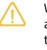

With this option selected, the uploaded CSV file must contain only rows that have not already been imported. If the system encounters a row that already exists in the table, the import process will be terminated. To resolve the situation, click **Cancel** on the form toolbar, and then try to import data in another mode.

- f. Click **OK**.
- 7. In the **Columns** dialog box, match the columns of the imported file (displayed in the **Column Name** column) to the columns in the table on the form to which you want to import data (displayed in the **Property Name** column).
- 8. Click **OK** to import data to the table.
- 9. Aer the data has been imported successfully, click**Save** on the form toolbar.

Aer you have imported the data and saved the document, you can continue processing the document based on your organization's workflow.

# **To Scan a File and Attach It to a Record Detail**

In Acumatica ERP, you can scan a file and attach it to a record detail—that is, to a detail row or line of a record (an entity or a document) created on a data entry form. This topic describes the process of scanning and attaching the file.

This functionality is available only if the *DeviceHub* feature is enabled on the *[Enable/Disable Features](https://help-2025r1.acumatica.com/Help?ScreenId=ShowWiki&pageid=c1555e43-1bc5-4f6f-ba9d-b323f94d8a6b)* (CS100000) form and at least one scanner has been configured in the DeviceHub application. For more information about configuring scanners in DeviceHub, see the topics of the *[Configuring Printers](https://help-2025r1.acumatica.com/Help?ScreenId=ShowWiki&pageid=06681984-282b-47a8-998a-2e6d7ac50b96)* chapter.

# **To Scan a File and Attach It to a Record Detail**

- 1. Open the appropriate data entry form, and select the record to which you want to attach the file.
- 2. In the appropriate detail row of the table, at the beginning of the row, click the Files ( ) button.
- 3. In the **Files** dialog box, which opens, click**Scan**.
- 4. In the **Submit forScanning** dialog box, which opens, select a scanner in the**Scanner** box.

The system fills in the boxes of the dialog box with the default settings of the scanner. You can change these settings, if needed.

- 5. On the toolbar of the dialog box, click**Scan** to initiate the scanning of the document. When the system completes the scanning, the**Submit forScanning** dialog box closes; the system returns you to the **Files** dialog box, where a row with the name of the file with the scanned document appears in the table.
- 6. Click **Upload**. The system attaches the scanned document to the record detail (that is, to the detail row of the record).

# **Calendar Boards and Maps**

You can use Acumatica ERP calendar boards and maps when you work with the field services functionality.

The Acumatica ERP calendar board and map interface is described in detail in this chapter.

# **In This Chapter**

- *[Parts of a Calendar Board](#page-137-2)*
- *[Service Order and Unassigned Appointments Pane](#page-138-1)*
- *[Calendar Dashboards](#page-140-1)*
- *[Parts of a Map](#page-148-1)*
- *[Calendar and Map Elements](#page-151-2)*
- *[Color Picker Dialog Box](#page-161-2)*

# **Parts of a Calendar Board**

Each Acumatica ERP calendar board consists of several basic parts. The following screenshot shows a typical Acumatica ERP form with the parts of a calendar board on it.

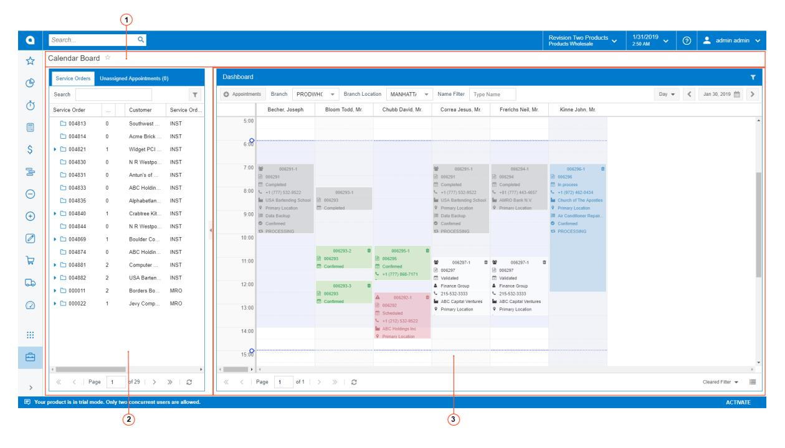

#### *Figure: Parts of a calendar board*

- 1. Form title bar
- 2. Service Orders and Unassigned Appointments pane
- 3. Dashboard pane

# **Form Title Bar**

This bar includes the title of the specific calendar board.

# **Service Order and Unassigned Appointment Pane**

This pane contains the**Service Orders** and **Unassigned Appointments** tabs. You can drag any service order or appointment from these tabs to the needed time slot on the calendar to schedule an appointment. For more information, see *[Service Order and Unassigned Appointments Pane](#page-138-1)*.

# **Dashboard Pane**

This pane displays the events assigned to a specific staff member or to a specific room. The events can be either appointments or working schedule rules (that is, the time area that indicates staff member's work times), depending on the calendar board. For more information, see *[Calendar Dashboards](#page-140-1)*.

#### **Related Links**

- *[Service Order and Unassigned Appointments Pane](#page-138-1)*
- *[Calendar Dashboards](#page-140-1)*
- *[Calendar and Map Elements](#page-151-2)*
- *[Calendar Board](https://help-2025r1.acumatica.com/Help?ScreenId=ShowWiki&pageid=00cc92c3-408f-4fe3-b6bf-e801559f74f9)*
- *[Room Calendar Board](https://help-2025r1.acumatica.com/Help?ScreenId=ShowWiki&pageid=52cfe99e-53ca-425d-ab28-7b2508a1faf7)*
- *[Routes on Map](https://help-2025r1.acumatica.com/Help?ScreenId=ShowWiki&pageid=552bd083-b7e4-4ee3-9270-7be6b7292a01)*
- *[Staff Appointments on Map](https://help-2025r1.acumatica.com/Help?ScreenId=ShowWiki&pageid=fb372257-a821-47d7-96f9-9dd6bb1e6337)*
- *[Staff Calendar Board](https://help-2025r1.acumatica.com/Help?ScreenId=ShowWiki&pageid=b1d15e47-fba9-4bbf-a7fa-2f7c396c8df4)*
- *[Staff Routes on Map](https://help-2025r1.acumatica.com/Help?ScreenId=ShowWiki&pageid=e2c22a91-5e7c-4269-8134-e890dbba7d3a)*

# **Service Order and Unassigned Appointments Pane**

The Service Order and Unassigned Appointments pane (see the screenshot below) is located in the le part of each calendar board. This pane contains the**Service Orders** and **Unassigned Appointments** tabs. These tabs consist of tables that list unassigned service orders and appointments, any of which can be dragged to the calendar to schedule the services included in the service order or appointment. For details on these tables, see *[Calendar Board](#page-152-1) and Map [Tables](#page-152-1)*.

| Calendar Board #            |                                          |                                    |              |                    |                                                                          |                                |                                                          |                                                                  |                      |                                                           |  |                                 |              |
|----------------------------------------|------------------------------------------|------------------------------------|--------------|--------------------|--------------------------------------------------------------------------|--------------------------------|----------------------------------------------------------|------------------------------------------------------------------|----------------------|-----------------------------------------------------------|--|---------------------------------|--------------|
| Service Orders                         |                                          | <b>Unassigned Appointments (0)</b> |              | Dashboard          |                                                                          |                                |                                                          |                                                                  |                      |                                                           |  |                                 | $\mathbf{r}$ |
| Search                                 |                                          |                                    | $\mathbf{r}$ | C Appointments     | Branch                                                                   | PRODWHC - Branch Location   | MANHATT/ $\;$                                         | Name Filter   Type Name                                          |                      |                                                           |  | Day $\star$ < Jan 30, 2019 mm > |              |
| Service Order                          |                                          | Customer                           | Service Ord. |                    | Becher, Joseph                                                           | Bloom Todd, Mr.                | Chubb David, Mr.                                         | Correa Jesus, Mr.                                                | Frerichs Neil. Mr.   | Kinne John, Mr.                                           |  |                                 |              |
| □ 004813                               | $\theta$                                 | Southwest                          | <b>INST</b>  | 5:00               |                                                                          |                                |                                                          |                                                                  |                      |                                                           |  |                                 |              |
| □ 004814                               | !!!!!!!!!!!!!!!!!!!!!!!!!!!!!!!!!!!!!!!! | Acme Brick                         | INST         |                    |                                                                          |                                |                                                          |                                                                  |                      |                                                           |  |                                 |              |
| $\triangleright$ 004821                | $\overline{1}$                           | Widget PCI                         | <b>INST</b>  | 6:00               |                                                                          |                                |                                                          |                                                                  |                      |                                                           |  |                                 |              |
| $\square$ 004830                       | !!!!!!!!!!!!!!!!!!!!!!!!!!!!!!!!!!!!!!!! | N R Westpo INST                    |              |                    |                                                                          |                                |                                                          |                                                                  |                      |                                                           |  |                                 |              |
| □ 004831                               | !!!!!!!!!!!!!!!!!!!!!!!!!!!!!!!!!!!!!!!! | Antun's of                         | <b>INST</b>  | $7:00$ as          | 006291-1 图 006291                                                     |                                |                                                          | 登 006291-1 团 006291                                        | 006294-1 团 006294 | 006296-1 日 006296                                      |  |                                 |              |
| $\square$ 004833                       | $\theta$                                 | ABC Holdin                         | <b>INST</b>  |                    | C Completed                                                              |                                |                                                          | <b>问 Completed</b>                                               | 筒 Completed          | $2$ In process                                            |  |                                 |              |
| □ 004835                               | !!!!!!!!!!!!!!!!!!!!!!!!!!!!!!!!!!!!!!!! | Alphabetlan                        | INST         |                    | 8:00 $\leftarrow$ +1 (777) 532-9522 In USA Bartending School R 006293 | 006293-1                       |                                                          | $-41(777)532-9522$ In USA Barlending School In AMRO Bank N.V. | $-481(777)443.4657$  | $L = +1(972)462.0434$ <b>In Church of The Apostles</b> |  |                                 |              |
|                                        |                                          |                                    | <b>INST</b>  |                    | 9 Primary Location                                                       | □ Completed                    |                                                          | 9 Primary Location                                               | 9 Primary Location   | <b>9</b> Primary Location                                 |  |                                 |              |
| $\triangleright$ $\square$ 004840      | $\overline{1}$                           | Crabtree Kit                       |              | 9:00               | <b>E</b> Data Backup Confirmed                                        |                                |                                                          | <b>E</b> Data Backup Confirmed                                |                      | ■ Air Conditioner Repair. Confirmed                    |  |                                 |              |
| $\Box$ 004844                          | $\circ$                                  | N R Westpo INST                    |              |                    | <b>13 PROCESSING</b>                                                     |                                |                                                          | <b>13 PROCESSING</b>                                             |                      | <b>E3 PROCESSING</b>                                      |  |                                 |              |
| $\triangleright$ 004869                | $\overline{1}$                           | Boulder Co                         | <b>INST</b>  | 10:00              |                                                                          | 006293-2 <b>日 006293</b>    | 006295-1 图 006295                                     |                                                                  |                      |                                                           |  |                                 |              |
| $\square$ 004874                       | !!!!!!!!!!!!!!!!!!!!!!!!!!!!!!!!!!!!!!!! | ABC Holdin                         | INST         |                    |                                                                          | Confirmed                      | Confirmed                                                |                                                                  |                      |                                                           |  |                                 |              |
| $\triangleright$ $\square$ 004881      | $\overline{2}$                           | Computer                           | <b>INST</b>  | 11:00              |                                                                          |                                | $L = +1 (777) 868 - 7171$ lar New York International. |                                                                  |                      |                                                           |  |                                 |              |
| $\triangleright$ $\square$ 004882      | $\overline{c}$                           | USA Barten                         | INST         |                    |                                                                          |                                | 9 Primary Location                                       |                                                                  |                      |                                                           |  |                                 |              |
| $\blacktriangleright$ $\Box$ 000011    | 2                                        | Borders Bo                         | <b>MRO</b>   | 12:00              |                                                                          | 006293-3                       |                                                          |                                                                  |                      |                                                           |  |                                 |              |
| $\blacktriangleright$ $\square$ 000022 | $\overline{1}$                           | Jevy Comp                          | MRO          |                    |                                                                          | 图 006293 <b>Confirmed</b>   | A 006292-1 图 006292                                   |                                                                  |                      |                                                           |  |                                 |              |
|                                        |                                          |                                    |              | 13:00              |                                                                          |                                | [2] Scheduled                                            |                                                                  |                      |                                                           |  |                                 |              |
|                                        |                                          |                                    |              |                    |                                                                          |                                | $4 + 1(212) 532 - 9522$                                  |                                                                  |                      |                                                           |  |                                 |              |
|                                        |                                          |                                    |              | 14:00              |                                                                          |                                | <b>M</b> ABC Holdings Inc. 9 Primary Location         |                                                                  |                      |                                                           |  |                                 |              |
|                                        |                                          |                                    |              |                    |                                                                          |                                |                                                          |                                                                  |                      |                                                           |  |                                 |              |
|                                        |                                          |                                    |              | 15:00              |                                                                          |                                |                                                          |                                                                  |                      |                                                           |  |                                 |              |
|                                        |                                          |                                    |              |                    |                                                                          |                                |                                                          |                                                                  |                      |                                                           |  |                                 |              |
| $\ll$ $\lt$   Page   1                 |                                          | of 29 $\rightarrow$ »              | - 2          | $\ll$ $\langle$ | Page !!!!!!!!!!!!!!!!!!!!!!!!!!!!!!!!!!!!!!!!                         | of $1 \quad > \quad \gg \quad$ |                                                          |                                                                  |                      |                                                           |  | Cleared Filter v                | 僵            |

*Figure: Service Order and Unassigned Appointments pane*

The pane can be hidden by clicking the Hide button (the arrow that is right of the pane). For details, see *[Hide Button](#page-158-1)*.

# **Viewing Details**

If you double-click a row with a service order or appointment, the system displays key details of the service order (shown in the following screenshot) or appointment.

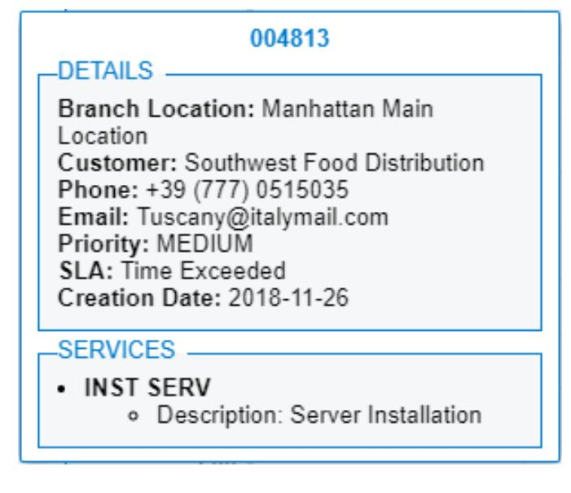

#### *Figure: Service order details*

#### **Related Links**

- *[Parts of a Calendar Board](#page-137-2)*
- *[Calendar and Map Elements](#page-151-2)*
- *[Calendar Board](https://help-2025r1.acumatica.com/Help?ScreenId=ShowWiki&pageid=00cc92c3-408f-4fe3-b6bf-e801559f74f9)*
- *[Room Calendar Board](https://help-2025r1.acumatica.com/Help?ScreenId=ShowWiki&pageid=52cfe99e-53ca-425d-ab28-7b2508a1faf7)*
- *[Staff Calendar Board](https://help-2025r1.acumatica.com/Help?ScreenId=ShowWiki&pageid=b1d15e47-fba9-4bbf-a7fa-2f7c396c8df4)*

# **Calendar Dashboards**

On the calendar boards, the dashboards provide information in a calendar format where users can manage appointments and staff members' schedules in time. The following screenshot of the *[Calendar Board](https://help-2025r1.acumatica.com/Help?ScreenId=ShowWiki&pageid=00cc92c3-408f-4fe3-b6bf-e801559f74f9)* (FS300300) shows the main parts of a dashboard.

| Calendar Board $\pi$              |                |                                    |              |                           |                                            |                              |                                                 | .1.                                        | (2)                                | ر 3                                                    |                          |   |
|-----------------------------------|----------------|------------------------------------|--------------|---------------------------|--------------------------------------------|------------------------------|-------------------------------------------------|--------------------------------------------|------------------------------------|--------------------------------------------------------|--------------------------|---|
| Service Orders                    |                | <b>Unassigned Appointments (0)</b> |              | Dashboard                 |                                            |                              |                                                 |                                            |                                    |                                                        |                          |   |
| Search                            |                |                                    | $\tau$       | Appointments              | Branch                                     | Branch Location PRODWHC - | MANHATT/ -                                      | Name Filter   Type Name                    |                                    |                                                        | Day > < Jan 30, 2019 館 > |   |
| Service Order                     | $\sim$         | Customer                           | Service Ord. |                           | Becher, Joseph                             | Bloom Todd, Mr.              | Chubb David, Mr.                                | Correa Jesus, Mr.                          | Frerichs Neil. Mr.                 | Kinne John, Mr.                                        |                          |   |
| $\Box$ 004813                     | $\theta$       | Southwest.                         | <b>INST</b>  | 5:00                      |                                            |                              |                                                 |                                            |                                    |                                                        |                          |   |
| $\square$ 004814                  | $\theta$       | Acme Brick.                        | INST         |                           |                                            |                              |                                                 |                                            |                                    |                                                        |                          |   |
| $\triangleright$ 004821           | $\overline{1}$ | Widget PCI.                        | INST         | 6:00                      |                                            |                              |                                                 |                                            |                                    |                                                        |                          |   |
| $\square$ 004830                  | $\theta$       | N R Westpo                         | INST         |                           |                                            |                              |                                                 |                                            |                                    |                                                        |                          |   |
| □ 004831                          | $\mathbf{0}$   | Antun's of                         | INST         | 7:00 號                    | 006291-1 图 006291                       |                              |                                                 | ÷ 006291-1 图 006291                  | 006294-1 图 006294               | 006296-1 图 006296                                   |                          |   |
| $\square$ 004833                  | $\theta$       | ABC Holdin.                        | INST         |                           | □ Completed 8:00 \, +1 (777) 532-9522   | 006293-1                     |                                                 | C Completed $L + 1$ (777) 532-9522      | □ Completed $-481(777)443.4657$ | th process $L + 1$ (972) 462-0434                   |                          |   |
| $\square$ 004835                  | $\theta$       | Alphabetlan                        | INST         |                           | In USA Barlending School 2 006293          |                              |                                                 | In USA Bartending School                   | <b>In</b> AMRO Bank N.V.           | <b>M</b> Church of The Apostles                        |                          |   |
| $\triangleright$ $\square$ 004840 | $\overline{1}$ | Crabtree Kit.                      | INST         | $9 - 00$                  | 9 Primary Location <b>E</b> Data Backup | Completed                    |                                                 | P Primary Location <b>E</b> Data Backup | 9 Primary Location                 | 9 Primary Location <b>E</b> Air Conditioner Repair. |                          |   |
| $\square$ 004844                  | $\theta$       | N R Westpo                         | INST         |                           | Confirmed <b>EL PROCESSING</b>          |                              |                                                 | Confirmed <b>EL PROCESSING</b>          |                                    | Confirmed <b>E3 PROCESSING</b>                      |                          |   |
| $\triangleright$ 004869           | $\overline{1}$ | Boulder Co                         | INST         | 10:00                     |                                            | 006293-2                     | 吉 006295-1                                   |                                            |                                    |                                                        |                          |   |
| $\Box$ 004874                     | $\theta$       | ABC Holdin                         | INST         |                           |                                            | □ 006293 Confirmed        | 图 006295 Confirmed                           |                                            |                                    |                                                        |                          |   |
| $\triangleright$ $\square$ 004881 | $\overline{2}$ | Computer                           | INST         | 11:00                     |                                            |                              | $L = +1(777)868 - 7171$                         |                                            |                                    |                                                        |                          |   |
| $\triangleright$ $\square$ 004882 | $\overline{z}$ | USA Barten.                        | INST         |                           |                                            |                              | M New York International. 9 Primary Location |                                            |                                    |                                                        |                          |   |
| $\triangleright$ 000011           | $\overline{2}$ | Borders Bo                         | MRO          | 12:00                     |                                            | 006293-3 □ 006293         | $\mathbf{r}$                                    |                                            |                                    |                                                        |                          |   |
| $\triangleright$ $\square$ 000022 | $\mathbf{1}$   | Jevy Comp                          | MRO          |                           |                                            | Confirmed                    | A 006292-1 一致 团 006292                    |                                            |                                    |                                                        |                          |   |
|                                   |                |                                    |              | 13:00                     |                                            |                              | <b>的 Scheduled</b>                              |                                            |                                    |                                                        |                          |   |
|                                   |                |                                    |              | 14:00                     |                                            |                              | $-$ +1 (212) 532-9522 M ABC Holdings Inc.    |                                            |                                    |                                                        |                          |   |
|                                   |                |                                    |              |                           |                                            |                              | 9 Primary Location                              |                                            |                                    |                                                        |                          |   |
|                                   |                |                                    |              | 15:00                     |                                            |                              |                                                 |                                            |                                    |                                                        |                          |   |
|                                   |                |                                    |              |                           |                                            |                              |                                                 |                                            |                                    |                                                        |                          |   |
| $\ll$ $\lt$   Page   1            |                | of 29 $\rightarrow$ $\gg$ $\Box$   |              | $\langle$   Page $\ll$ | !!!!!!!!!!!!!!!!!!!!!!!!!!!!!!!!!!!!!!!!   | of $1 \rightarrow \gg \Box$  |                                                 |                                            |                                    |                                                        | Cleared Filter -         | 僵 |
|                                   |                |                                    |              |                           |                                            |                              |                                                 |                                            |                                    |                                                        |                          |   |
|                                   |                |                                    |              | $\left( 4\right)$         |                                            |                              |                                                 | $\boxed{5}$                                | $\left[6\right]$                   |                                                        |                          |   |

#### *Figure: Dashboard pane*

The dashboard on a calendar board includes the following parts:

- 1. Dashboard Title Bar: A bar that contains form-specific elements that you can use to filter the dashboard information
- 2. Dashboard Toolbar: A bar above the dashboard content that contains standard and form-specific elements that you can use to tailor the dashboard information
- 3. Horizontal Axis: A part of the dashboard that defines the horizontal attribute for the dashboard content
- 4. Vertical Axis: A part of the dashboard that defines the vertical attribute for the dashboard content
- 5. Dashboard Footer: A bar below the dashboard content that displays navigation buttons, the View Mode button, and time resolution slider
- 6. Dashboard: The content of the dashboard, which consists of an interactive calendar you can work with to schedule appointments, staff members, and rooms

# **Dashboard Title Bar**

The dashboard title bar is located on the top of the dashboard. This bar can contain the **Filter** and **Clear Filter** buttons, which are described in following the table.

| Button       | Icon | Description                                                                                                                                                                          |
|--------------|------|--------------------------------------------------------------------------------------------------------------------------------------------------------------------------------------|
| Filter       |      | Opens the Staff Filters dialog box, which can be used to define a new filter. When you apply the filter and exit the dialog box, the information on the dashboard is up dated. |
| Clear Filter |      | Clears the filter settings. This button appears on the dashboard only if a filter has been applied to the dash board.                                                          |

# **Dashboard Toolbar**

The dashboard toolbar is located in the upper part of the dashboard. The toolbar can contain standard and formspecific elements. If a dashboard toolbar includes specific elements, they are described in the relevant form reference topic.

The following table describes the standard dashboard buttons. A dashboard toolbar may include some or all of these buttons.

| Button                        | Icon | Description                                                                                                                                                                                                                                                                                                  |
|-------------------------------|------|--------------------------------------------------------------------------------------------------------------------------------------------------------------------------------------------------------------------------------------------------------------------------------------------------------------|
| Previous Day or Date Range |      | Shows the dashboard the day before the date indicated on the Day button (if you are viewing a day), a week before the date range indicated on the Date Range but ton (if you are viewing a week), or a month before the date range indicated on the Date Range button (if you are viewing a month). |
| Date or Date Range         |      | Displays a particular date of the dashboard if you are viewing a day, or a particular date range if you are viewing a week or month on the calendar. To manually change the date, click this button and change the date in the Calendar dialog box. For de tails, see Calendar Dialog Box.          |
| Next Day or Date Range     |      | Shows the dashboard the day after the date indicated on the Day button (if you are viewing a day), a week after the date range indicated on the Date Range button (if you are viewing a week), or a month after the date range indicated on the Date Range button (if you are viewing a month).     |

#### *Table: Standard Buttons*

# **Horizontal Axis**

On the *[Calendar Board](https://help-2025r1.acumatica.com/Help?ScreenId=ShowWiki&pageid=00cc92c3-408f-4fe3-b6bf-e801559f74f9)* (FS300300) and *[Room Calendar Board](https://help-2025r1.acumatica.com/Help?ScreenId=ShowWiki&pageid=52cfe99e-53ca-425d-ab28-7b2508a1faf7)* (FS300700) forms, which have multiple view modes, in the *Vertical* view mode, on the horizontal axis of the dashboard, staff members and rooms are shown, respectively. In the *Horizontal* view mode, times are shown on the horizontal axis.

For the *[Calendar Board](https://help-2025r1.acumatica.com/Help?ScreenId=ShowWiki&pageid=00cc92c3-408f-4fe3-b6bf-e801559f74f9)* and *[Room Calendar Board](https://help-2025r1.acumatica.com/Help?ScreenId=ShowWiki&pageid=52cfe99e-53ca-425d-ab28-7b2508a1faf7)* forms, you can set the default view mode that a user sees upon opening a calendar in the**View Mode** box on the **Calendars and Maps** tab of the *[Service Management Preferences](https://help-2025r1.acumatica.com/Help?ScreenId=ShowWiki&pageid=1c1b94d7-ac39-4f84-a966-588290b5ba80)* (FS100100) form.

On the *[Staff Calendar Board](https://help-2025r1.acumatica.com/Help?ScreenId=ShowWiki&pageid=b1d15e47-fba9-4bbf-a7fa-2f7c396c8df4)* (FS300400) and *[Staff Working Schedule Board](https://help-2025r1.acumatica.com/Help?ScreenId=ShowWiki&pageid=12d4ce83-6520-46dc-afad-46a36627a82a)* (FS300500) forms, dates are shown on the horizontal axis of the dashboard.

# **Vertical Axis**

On the *[Calendar Board](https://help-2025r1.acumatica.com/Help?ScreenId=ShowWiki&pageid=00cc92c3-408f-4fe3-b6bf-e801559f74f9)* (FS300300) and *[Room Calendar Board](https://help-2025r1.acumatica.com/Help?ScreenId=ShowWiki&pageid=52cfe99e-53ca-425d-ab28-7b2508a1faf7)* (FS300700) forms, which have multiple view modes, in the *Horizontal* view mode, on the vertical axis of the dashboard, staff members and rooms are shown, respectively. In the *Vertical* view mode, times are shown on the vertical axis.

For the *[Calendar Board](https://help-2025r1.acumatica.com/Help?ScreenId=ShowWiki&pageid=00cc92c3-408f-4fe3-b6bf-e801559f74f9)* and *[Room Calendar Board](https://help-2025r1.acumatica.com/Help?ScreenId=ShowWiki&pageid=52cfe99e-53ca-425d-ab28-7b2508a1faf7)* forms, you can set the default view mode that a user sees upon opening a calendar in the**View Mode** box on the **Calendars and Maps** tab of the *[Service Management Preferences](https://help-2025r1.acumatica.com/Help?ScreenId=ShowWiki&pageid=1c1b94d7-ac39-4f84-a966-588290b5ba80)* (FS100100) form.

On the *[Staff Calendar Board](https://help-2025r1.acumatica.com/Help?ScreenId=ShowWiki&pageid=b1d15e47-fba9-4bbf-a7fa-2f7c396c8df4)* (FS300400) and *[Staff Working Schedule Board](https://help-2025r1.acumatica.com/Help?ScreenId=ShowWiki&pageid=12d4ce83-6520-46dc-afad-46a36627a82a)* (FS300500) forms, times are shown on the vertical axis of the dashboard.

# **Dashboard Footer**

The *[Calendar Board](https://help-2025r1.acumatica.com/Help?ScreenId=ShowWiki&pageid=00cc92c3-408f-4fe3-b6bf-e801559f74f9)* (FS300300) and *[Room Calendar Board](https://help-2025r1.acumatica.com/Help?ScreenId=ShowWiki&pageid=52cfe99e-53ca-425d-ab28-7b2508a1faf7)* (FS300700) forms have a dashboard footer. You use the elements of the footer to browse the dashboard pages (if there are too many details to fit on one page), to change the view mode of the dashboard, and to change the time intervals of the dashboard.

#### *Table: Footer Elements*

| Element       | Icon | Description                                                                                                                                                                              |
|---------------|------|------------------------------------------------------------------------------------------------------------------------------------------------------------------------------------------|
| First Page    |      | A button you click to display the first page of the dashboard details.                                                                                                                   |
|               |      |                                                                                                                                                                                          |
| Previous Page |      | A button you click to display the previous page of the dashboard details.                                                                                                                |
|               |      |                                                                                                                                                                                          |
| Page N of M   |      | A box that contains the current page (N) of the total pages of the dashboard details (M). You can manually indicate the page to which you want to navigate by typing in the N box. |
| Next Page     |      | A button you click to display the next page of the dashboard details.                                                                                                                    |
|               |      |                                                                                                                                                                                          |
| Last Page     |      | A button you click to display the last page of the dashboard details.                                                                                                                    |
|               |      |                                                                                                                                                                                          |
| Refresh       |      | A button you click to refresh the dashboard content.                                                                                                                                     |
|               |      |                                                                                                                                                                                          |

| Element         | Icon | Description                                                                                                                                                                                                                                                                                                                                                                         |
|-----------------|------|-------------------------------------------------------------------------------------------------------------------------------------------------------------------------------------------------------------------------------------------------------------------------------------------------------------------------------------------------------------------------------------|
| Time Filter     |      | An option that indicates which time filter (if any) is applied to the dashboard to lim it the days and times shown. You can change the option manually; the following op tions are available:                                                                                                                                                                                 |
|                 |      | • Cleared Filter: No time filter is applied to the dashboard. That is, the dashboard shows information for 24 hours of each day of the date range selected on the dashboard toolbar.                                                                                                                                                                                       |
|                 |      | • Working Time: The dashboard shows information from the start time to the end time of working hours for each day of the date range selected on the dashboard toolbar.                                                                                                                                                                                                     |
|                 |      | The start time and end time of working hours related to field services are speci fied in the DayStartTime and Day End Time boxes on the Calendars and Maps tab of the Service Management Preferences (FS100100) form.                                                                                                                                                         |
|                 |      | • Weekdays: The dashboard shows information for 24 hours from Mondays to Fri days for the date range selected on the dashboard toolbar.                                                                                                                                                                                                                                       |
|                 |      | • Working Time and Weekdays: The dashboard shows information for working hours from Mondays to Fridays for the date range selected on the dashboard toolbar.                                                                                                                                                                                                               |
|                 |      | The start time and end time of working hours related to field services are speci fied in the DayStartTime and Day End Time boxes on the Calendars and Maps tab of the Service Management Preferences form.                                                                                                                                                                    |
|                 |      | • Booked Days: The dashboard shows the days to which at least one appointment is assigned for the displayed staff members during the the date range selected on the dashboard toolbar; for each day, it shows only the time interval to which at least one appointment is assigned.                                                                                     |
|                 |      | By default, the filter selected in theTime Filter box on the Calendars and Maps tab of the Service Management Preferences form is selected.                                                                                                                                                                                                                                      |
| Minus           |      | A button that you click to reduce the time resolution on the calendar board. When you click this button, the system increases the time interval of each time slot. For instance, if each time slot represents a one-hour interval (such as 9:00 to 10:00) and you click this button once, each time slot will represent a two-hour interval (such as 8:00 to 10:00).    |
|                 |      | This button appears on the dashboard only in the Horizontal view mode.                                                                                                                                                                                                                                                                                                              |
| Time Resolution |      | A slider that you move to change the time resolution of the calendar board. When you move the slider to the le, the system increases the time interval of each time slot. When you move the slider to the right, the system reduces the time interval of each time slot.                                                                                                  |
|                 |      | This slider appears on the dashboard only in the Horizontal view mode.                                                                                                                                                                                                                                                                                                              |
| Plus            |      | A button that you click to increase the time resolution on the calendar board. When you click this button, the system reduces the time interval of each time slot. For in stance, if each time slot represents a one-hour interval (such as 9:00 to 10:00) and you click this button once, each time slot will represent a 15-minute interval (such as 10:00 to 10:15). |
|                 |      | This button appears on the dashboard only in the Horizontal view mode.                                                                                                                                                                                                                                                                                                              |

| Element                | Icon | Description                                                                                                                     |
|------------------------|------|---------------------------------------------------------------------------------------------------------------------------------|
| HorizontalView Mode |      | Changes the orientation of the dashboard to horizontal. This button is displayed on the dashboard in the Vertical view mode. |
| VerticalView Mode   |      | Changes the orientation of the dashboard to vertical. This button is displayed on the dashboard in the Horizontal view mode. |

# **Dashboard Content**

On the dashboard you can see the appointments scheduled for the selected date or date range, the working hours, and the current time. You can use this area to reschedule existing appointments or create new ones.

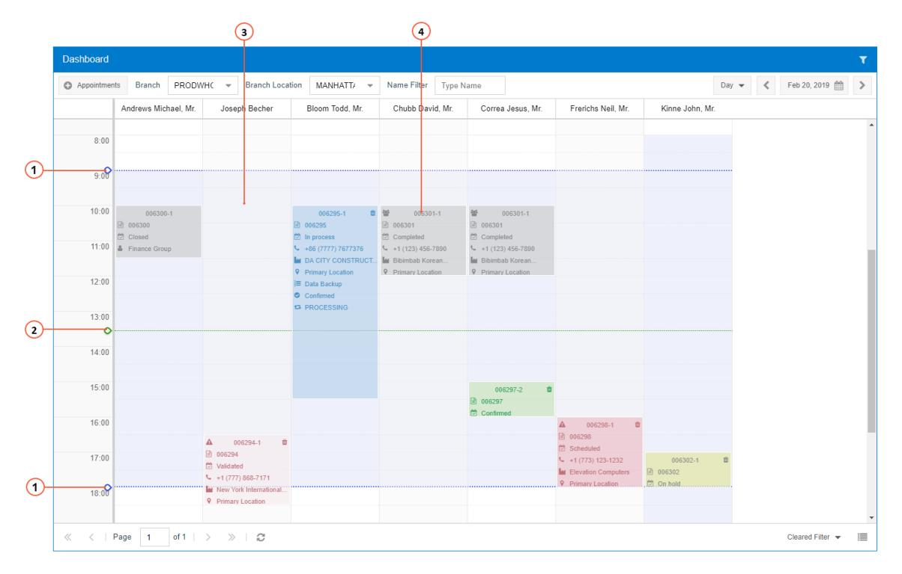

#### *Figure: Dashboard Content*

The dashboard content includes the following elements:

- 1. Blue guides: Horizontal or vertical (depending on the orientation of the dashboard) lines that represent the start and end times of the working calendar selected in the **Work Calendar** box on the **Calendars and Maps** tab of the *[Service Management Preferences](https://help-2025r1.acumatica.com/Help?ScreenId=ShowWiki&pageid=1c1b94d7-ac39-4f84-a966-588290b5ba80)* (FS100100) form.
- 2. Green guide: A horizontal or vertical (depending on the orientation of the dashboard) line that indicates the current time.
- 3. Staff working schedule: A series of boxes that represent the staff working schedule. The color of the box depends on the availability. If the color is blue, the staff member is available; if the color is red, the staff member is unavailable.
- 4. *Appointment*: A shaded box that represents a scheduled appointment and its time range. For details about appointments, see *[Appointments on the Calendar Boards](#page-145-1)*.

5. *Watch Icon*: An icon that appears when you move the cursor through the dashboard and shows the time at which cursor is pointing.

#### **Related Links**

- *[Appointments on the Calendar Boards](#page-145-1)*
- *[Parts of a Calendar Board](#page-137-2)*
- *[Calendar and Map Elements](#page-151-2)*
- *[Calendar Board](https://help-2025r1.acumatica.com/Help?ScreenId=ShowWiki&pageid=00cc92c3-408f-4fe3-b6bf-e801559f74f9)*
- *[Room Calendar Board](https://help-2025r1.acumatica.com/Help?ScreenId=ShowWiki&pageid=52cfe99e-53ca-425d-ab28-7b2508a1faf7)*
- *[Staff Calendar Board](https://help-2025r1.acumatica.com/Help?ScreenId=ShowWiki&pageid=b1d15e47-fba9-4bbf-a7fa-2f7c396c8df4)*

# **Appointments on the Calendar Boards**

On a dashboard, you can view the existing appointments for a particular day in the selected time range (see the screenshot below), as well as perform actions on appointments.

| <b>Unassigned Appointments (0)</b> Service Orders                                                                                                                                                                                                                                                              |                                                                                                                                                                                                                                                                                                                                                                                              | Dashboard $\overline{\mathbf{r}}$                                                                                                                                |                                                                                                                                                                                                                           |                                                                                                   |                                                                                                                            |                                                                                                                                                                                                                         |                                                                                                                                                                                      |                                                                                                                                                                                                    |         |                   |
|-------------------------------------------------------------------------------------------------------------------------------------------------------------------------------------------------------------------------------------------------------------------------------------------------------------------|----------------------------------------------------------------------------------------------------------------------------------------------------------------------------------------------------------------------------------------------------------------------------------------------------------------------------------------------------------------------------------------------|---------------------------------------------------------------------------------------------------------------------------------------------------------------------|---------------------------------------------------------------------------------------------------------------------------------------------------------------------------------------------------------------------------|---------------------------------------------------------------------------------------------------|----------------------------------------------------------------------------------------------------------------------------|-------------------------------------------------------------------------------------------------------------------------------------------------------------------------------------------------------------------------|--------------------------------------------------------------------------------------------------------------------------------------------------------------------------------------|----------------------------------------------------------------------------------------------------------------------------------------------------------------------------------------------------|---------|-------------------|
| Search                                                                                                                                                                                                                                                                                                            |                                                                                                                                                                                                                                                                                                                                                                                              | $\mathbf{T}$                                                                                                                                                        | Branch <b>C</b> Appointments                                                                                                                                                                                           | Branch Location PRODWHC -                                                                      | MANHATT/ $\overline{\phantom{a}}$                                                                                       | Name Filter Type Name                                                                                                                                                                                                |                                                                                                                                                                                      |                                                                                                                                                                                                    | $Day -$ | < Jan 30, 2019 mm |
| Service Order                                                                                                                                                                                                                                                                                                     | Customer                                                                                                                                                                                                                                                                                                                                                                                     | Service Ord.                                                                                                                                                        | Becher, Joseph                                                                                                                                                                                                            | Bloom Todd, Mr.                                                                                   | Chubb David, Mr.                                                                                                           | Correa Jesus, Mr.                                                                                                                                                                                                       | Frerichs Neil, Mr.                                                                                                                                                                   | Kinne John, Mr.                                                                                                                                                                                    |         |                   |
| □ 004813 $\Box$ 004814 $\triangleright$ $\square$ 004821 $\Box$ 004830 □ 004831 □ 004833 $\square$ 004835 $\triangleright$ $\Box$ 004840 $\Box$ 004844 $\triangleright$ $\square$ 004869 $\square$ 004874 $\triangleright$ $\square$ 004881 $\triangleright$ $\square$ 004882 | $\theta$ Southwest $^{\circ}$ Acme Brick Widget PCI $\mathbf{1}$ $^{\circ}$ N R Westpo $\Omega$ Antun's of ABC Holdin $\mathbf{0}$ $\theta$ Alphabetlan $\ddot{\phantom{1}}$ Crabtree Kit N R Westpo $\theta$ Boulder Co $\overline{1}$ $\mathbf{0}$ ABC Holdin $\overline{2}$ Computer $\overline{2}$ USA Barten | <b>INST</b> INST INST <b>INST</b> <b>INST</b> <b>INST</b> INST <b>INST</b> <b>INST</b> <b>INST</b> <b>INST</b> INST <b>INST</b> | 5:00 6:00 7:00 册 006291-1 图 006291 <b>凹</b> Completed $8:00$ $\leftarrow +1$ (777) 532-9522 9 Primary Location $9:00$ $\equiv$ Data Backup Confirmed <b>t3 PROCESSING</b> 10:00 11:00 | 006293-1 In USA Bartending School @ 006293 □ Completed 006293-2 日 006293 Confirmed | 006295-1 图 006295 Confirmed $L$ +1 (777) 868-7171                                                                 | ڂ 006291-1 日 006291 Completed $-41(777)532-9522$ In USA Bartending School 9 Primary Location <b>三 Data Backup</b> Confirmed <b>E3 PROCESSING</b> 쓯 006297-1 图 006297 C Validated | 006294-1 □ 006294 Completed $-81(777)443.4657$ In AMRO Bank N.V. 9 Primary Location 自營 006297-1 $\ddot{\phantom{a}}$ 图 006297 (2) Validated | 006296-1 图 006296 n process $L + 1(972)$ 462-0434 <b>In</b> Church of The Apostles 9 Primary Location <mark>}</mark> Air Conditioner Repair Confirmed <b>E3 PROCESSING</b> |         |                   |
| $\triangleright$ $\square$ 000011 $\triangleright$ $\square$ 000022                                                                                                                                                                                                                                            | $\overline{2}$ Borders Bo Jevy Comp $\overline{1}$                                                                                                                                                                                                                                                                                                                                  | MRO MRO                                                                                                                                                          | 12:00 13:00 14:00 15:00                                                                                                                                                                                          | 006293-3 吉 间 006293 Confirmed                                                            | $\Delta$ 006292-1 图 006292 筒 Scheduled $-1$ (212) 532-9522 <b>M</b> ABC Holdings Inc. 9 Primary Location | Finance Group $\frac{1}{2}$ 215-532-3333 <b>M</b> ABC Capital Ventures 9 Primary Location                                                                                                                      | Finance Group $C = 215 - 532 - 3333$ <b>In</b> ABC Capital Ventures 9 Primary Location                                                                                      |                                                                                                                                                                                                    |         |                   |

*Figure: Appointments on the Calendar Board form*

# **Appointments**

The color of an appointment box depends on the status of the appointment and the configuration of the calendar. On the *[Calendar Preferences](https://help-2025r1.acumatica.com/Help?ScreenId=ShowWiki&pageid=400107bc-4a63-4969-aa7e-1840a629381c)* (FS100500) form, you can specify the background color and the color of the text to be used for appointment boxes with specific statuses on calendar boards.

In the box that displays the appointment, key data fields are shown along with icons indicating the data. You can modify the number of fields that will be displayed in the appointment boxes. You also can change the default order of these fields in the box. Additionally, you can select any icon to be displayed next to each field in the box.

The key fields and default icons as summarized in the following table.

| Element               | Icon | Description                                                                                |
|-----------------------|------|--------------------------------------------------------------------------------------------|
| SO Ref. Nbr.          |      | The reference number of the service order associated with the appointment.                 |
| Customer Name         |      | The name of the customer.                                                                  |
| Contact Name          |      | The name of the customer contact.                                                          |
| Customer Loca tion |      | The location where the appointment takes place.                                            |
| Room                  |      | The identifier of the room where the internal appointment takes place.                     |
| Contact               |      | The customer's contact phone number.                                                       |
| FirstService          |      | The first service to be performed in the appointment.                                      |
| Confirmed             |      | The indicator that the appointment has been confirmed with the associated cus tomer.    |
| Not Confirmed         |      | The indicator that the appointment has not been confirmed with the associated customer. |
| Staff Members         |      | The indicator that multiple staff members have been assigned to the appointment.           |
| Status                |      | The status of the appointment.                                                             |
| Workflow Stage        |      | The workflow stage of the appointment.                                                     |

| Element | Icon | Description                                                                                         |
|---------|------|-----------------------------------------------------------------------------------------------------|
| Trash   |      | A button that you click to delete the appointment.                                                  |
| Warning |      | The indicator that the appointment has a warning. You can point at the icon to view information. |

# **Appointment Actions**

You can do the following on the dashboard:

- Create a new appointment
- Move an appointment
- Change the duration of an appointment
- Delete an appointment

You can also use the Appointment Actions menu to edit, clone, validate, or confirm a particular appointment. To open the Appointment Actions menu for the appointment, you right-click the appointment. The menu appears with the menu commands described in the following table.

| Element                                    | Description                                                                                                         |
|--------------------------------------------|---------------------------------------------------------------------------------------------------------------------|
| Edit                                       | Opens the Appointments (FS300200) form with the selected appointment, so you can view its details and modify it. |
| Clone                                      | Opens the Clone Appointments (FS500201) form, where you can clone the selected ap pointment.                     |
| Validate by Dispatch er/ClearValidation | Validates the selected appointment, or negates the validation of the selected appoint ment.                      |
| Confirm/Unconfirm                          | Confirms the confirmation with the customer of the selected appointment, or re moves this confirmation.          |
| Delete                                     | Deletes the appointment from the system.                                                                            |

# *Table: Appointment Menu Commands*

# **Appointment Details**

You can also view the details of a particular appointment by double-clicking the appointment. The appointment details, shown in the following screenshot, appear right of the appointment.

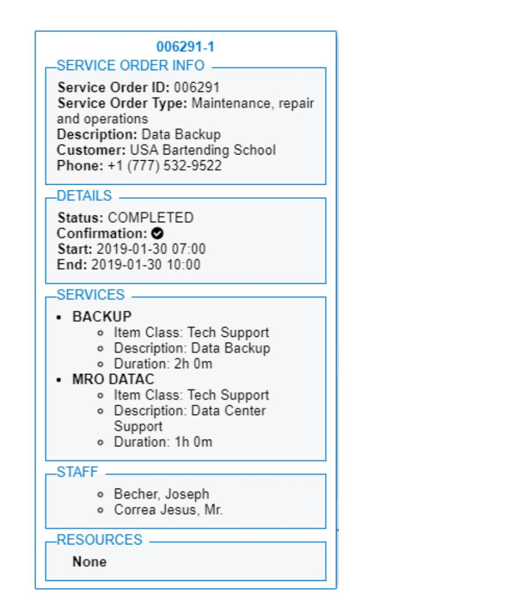

#### *Figure: Appointment details*

#### **Related Links**

- *[Parts of a Calendar Board](#page-137-2)*
- *[Calendar Dashboards](#page-140-1)*
- *[Color Picker Dialog Box](#page-161-2)*
- *[Calendar Board](https://help-2025r1.acumatica.com/Help?ScreenId=ShowWiki&pageid=00cc92c3-408f-4fe3-b6bf-e801559f74f9)*
- *[Room Calendar Board](https://help-2025r1.acumatica.com/Help?ScreenId=ShowWiki&pageid=52cfe99e-53ca-425d-ab28-7b2508a1faf7)*
- *[Staff Calendar Board](https://help-2025r1.acumatica.com/Help?ScreenId=ShowWiki&pageid=b1d15e47-fba9-4bbf-a7fa-2f7c396c8df4)*

# **Parts of a Map**

An Acumatica ERP form with a map consists of several basic parts. The following screenshot shows a typical Acumatica ERP form with the parts of a map on it.

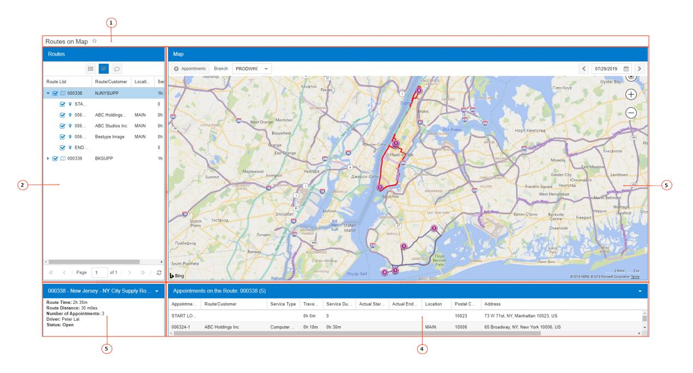

#### *Figure: Parts of a map*

- 1. Form title bar
- 2. Pane with appointments (**Routes** or **Staff**)
- 3. Map pane
- 4. Route Information pane
- 5. Appointment Information pane

# **Form Title Bar**

This bar includes the title of the map.

# **Pane with Appointments**

This pane displays the list of appointments for a particular branch and a particular day, grouped by the staff member assigned to them or grouped by the route execution they are related to.

This pane is named either**Staff** or **Routes**, depending on the particular map form and its contents.

You can hide this pane by clicking on the arrow right of the pane. For details, see *[Hide Button](#page-158-1)*.

# **Map Pane**

The map pane contains the map area and the map toolbar. The map area displays the appointments of the selected day on a Bing map, filtered by the staff member or the route execution selected on the**Staff** or **Routes** tab.

The map toolbar can contain standard and form-specific elements. If a map toolbar includes specific elements, they are described in the relevant form reference topic. The following table describes the standard map buttons that may be found on a particular map toolbar.

#### *Table: Standard Buttons*

| Button                        | Icon | Description                                                                                                                                                                                                                                                                                           |
|-------------------------------|------|-------------------------------------------------------------------------------------------------------------------------------------------------------------------------------------------------------------------------------------------------------------------------------------------------------|
| Appointments                  |      | Opens the Appointments (FS300200) form, where you can create a new appoint ment.                                                                                                                                                                                                                   |
|                               |      | To create an appointment by using this button, a default service order type has to be specified on the User Profile form or on the Service Management Preferences (FS100100) form.                                                                                                              |
| Previous Day or Date Range |      | Shows the map the day before the date indicated on the Day button (if you are viewing a day), a week before the date range indicated on the Date Range button (if you are viewing a week), or a month before the date range indicated on the Date Range button (if you are viewing a month). |
| Date or Date Range         |      | Displays the map for a particular date on the calendar. To manually change the date, click this button and change the date in the Calendar dialog box. For details, see Calendar Dialog Box.                                                                                                    |
| Next Day or Date Range     |      | Shows the map the day after the date indicated on the Day button (if you are view ing a day), a week after the date range indicated on the Date Range button (if you are viewing a week), or a month after the date range indicated on the Date Range button (if you are viewing a month).   |

# **Route Information Pane**

On this pane, for the staff member or route execution you have selected in the pane with appointments (**Staff** or **Routes**), you can view data about the route, such as the route duration, distance, and number of appointments.

The name of this pane is initially **Route Information**, and the pane contains no data. When you select a staff member or route execution, the system changes the name of the pane to reflect its contents.

You can hide this pane by clicking on the arrow right of the pane. For details, see *[Hide Button](#page-158-1)*.

# **Appointment Information Pane**

On this pane, you can view data (such as appointment number, related customer, duration, and address) on each appointment on the route of the staff member or route you have selected in the pane listing appointments (**Staff** or **Routes**). You have to select a staff member or a route execution to view this data.

The name of this pane is initially **Appointment Information**, and the pane contains no data. When you select a staff member or route, the system changes the name of the pane to reflect its contents.

#### **Related Links**

- *[Calendar and Map Elements](#page-151-2)*
- *[Routes on Map](https://help-2025r1.acumatica.com/Help?ScreenId=ShowWiki&pageid=552bd083-b7e4-4ee3-9270-7be6b7292a01)*
- *[Staff Appointments on Map](https://help-2025r1.acumatica.com/Help?ScreenId=ShowWiki&pageid=fb372257-a821-47d7-96f9-9dd6bb1e6337)*
- *[Staff Routes on Map](https://help-2025r1.acumatica.com/Help?ScreenId=ShowWiki&pageid=e2c22a91-5e7c-4269-8134-e890dbba7d3a)*

# **Calendar and Map Elements**

You use the calendar and map elements to display elements or invoke actions on the calendar boards and maps.

# **Types of Calendar and Map Elements**

The calendar boards and maps support the following types of elements:

- *Calendar*: You use the Calendar dialog box to select a date in a calendar. For more information, see *[Calendar](#page-151-3) [Dialog Box](#page-151-3)*.
- *Table*: The data in the calendars and maps is arranged in tables, where each row represents an object or detail, and each column shows a parameter of each object or detail. For more information, see *[Calendar](#page-152-1) Board and Map [Tables](#page-152-1)*.
- *Hide Button*: You use this button to temporarily hide panes on the calendars and maps. For more information, see *[Hide Button](#page-158-1)*.

# **Calendar Dialog Box**

The Calendar dialog box, which appears when you click a date on a calendar or map form, displays the calendar page of the month of the selected date, as shown in the following screenshot. You can use the Calendar dialog box to select the new date, which will appear under the **Date** or **Date Range** box. For details, see *To [Select](#page-160-2) a Date on a [Calendar Board or Map by Using the Calendar Dialog Box](#page-160-2)*.

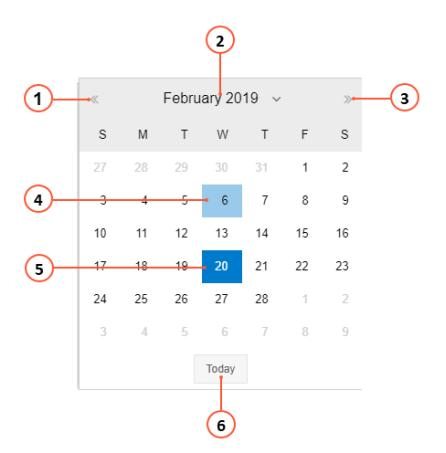

#### *Figure: Calendar*

- 1. Previous Month button
- 2. Selected Month and Year button
- 3. Next Month button
- 4. Current date
- 5. Selected date
- 6. **Today** button

If you click the Selected Month and Year button (see 3 in the screenshot above), the Month and Year dialog box appears (see the screenshot below), in which you can select the month and the year for which information will be displayed on the calendar or map.

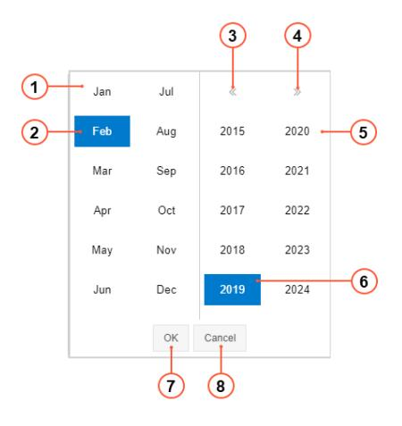

#### *Figure: The Month and Year dialog box*

- 1. Month area
- 2. Selected month
- 3. Previous year
- 4. Next year
- 5. Year area
- 6. Selected year
- 7. **OK** button
- 8. **Cancel** button

#### **Related Links**

- *[Parts of a Calendar Board](#page-137-2)*
- *[Parts of a Map](#page-148-1)*
- *To Select a Date on a Calendar Board or Map by Using the [Calendar](#page-160-2) Dialog Box*
- *[Calendar Board](https://help-2025r1.acumatica.com/Help?ScreenId=ShowWiki&pageid=00cc92c3-408f-4fe3-b6bf-e801559f74f9)*
- *[Room Calendar Board](https://help-2025r1.acumatica.com/Help?ScreenId=ShowWiki&pageid=52cfe99e-53ca-425d-ab28-7b2508a1faf7)*
- *[Routes on Map](https://help-2025r1.acumatica.com/Help?ScreenId=ShowWiki&pageid=552bd083-b7e4-4ee3-9270-7be6b7292a01)*
- *[Staff Appointments on Map](https://help-2025r1.acumatica.com/Help?ScreenId=ShowWiki&pageid=fb372257-a821-47d7-96f9-9dd6bb1e6337)*
- *[Staff Calendar Board](https://help-2025r1.acumatica.com/Help?ScreenId=ShowWiki&pageid=b1d15e47-fba9-4bbf-a7fa-2f7c396c8df4)*
- *[Staff Routes on Map](https://help-2025r1.acumatica.com/Help?ScreenId=ShowWiki&pageid=e2c22a91-5e7c-4269-8134-e890dbba7d3a)*

# **Calendar Board and Map Tables**

Tabs and panes on the calendar boards and maps contain tables on the calendar boards and maps display relevant objects or details in each row and a key setting of the object or detail in each column. The forms provide interaction between the tables and the calendar or map (such as when a service order is dragged to the appropriate day and time on the calendar).

The table toolbar may have elements (boxes and buttons) you can use to filter the information that is displayed in the table. Also, the table footer may have navigation elements you can use if not all table rows can be viewed at the same time.

The following screenshot show examples of tables and their toolbars. The le table shows a list of service orders (which spans multiple pages, as the table footer illustrates), and the right lists routes.

| <b>Service Orders</b>             |                | <b>Unassigned Appointments (0)</b> |                                          |                              | <b>Routes</b>                                                    |                |                |
|-----------------------------------|----------------|------------------------------------|------------------------------------------|------------------------------|------------------------------------------------------------------|----------------|----------------|
| Search                            |                |                                    | $\overline{\mathbf{r}}$ $\mathscr{A}$ | $\blacksquare$               |                                                                  | 三              |                |
| Service Order                     | $\cdots$       | Customer                           | Service Ord                              |                              | Route List                                                       | Route/Customer | Ser Locati  |
| $\triangleright$ $\Box$ 000022    | $\mathbf{1}$   | Jevy Comp                          | <b>MRO</b>                               |                              | $\triangleright$ $\bigtriangledown$ (II) 000338                  | NJNYSUPP       | 1h             |
| $\Box$ 000023 Þ.               | 1              | Kamm Syst                          | <b>MRO</b>                               |                              |                                                                  | <b>BKSUPP</b>  | 1 h |
| $\Box$ 000029 Þ.               | 2              | USA-NYM                            | <b>MRO</b>                               | $\left( \frac{1}{2} \right)$ | $\triangleright$ $\triangleright$ ( $\triangleright$ (II) 000339 |                |                |
| □ 000113 ×                     | 2              | Widget Con                         | <b>MRO</b>                               |                              |                                                                  |                |                |
| □ 000142 ×                     | 2              | Naaap Ass                          | <b>MRO</b>                               |                              |                                                                  |                |                |
| $\triangleright$ $\Box$ 000157    | $\overline{2}$ | O'Neill's Tra                      | <b>MRO</b>                               |                              |                                                                  |                |                |
| $\triangleright$ $\square$ 000204 | $\overline{2}$ | USA-NYM                            | <b>MRO</b>                               |                              |                                                                  |                |                |
| $\triangleright$ $\square$ 000216 | $\overline{2}$ | Road Build                         | <b>MRO</b>                               |                              |                                                                  |                |                |
| □ 000227 Þ.                    | 2              | Data Recov                         | <b>MRO</b>                               |                              |                                                                  |                |                |
| $\Box$ 000300 Þ.               | $\overline{2}$ | Uniforce St                        | <b>MRO</b>                               |                              |                                                                  |                |                |
| □ 000315 Þ.                    | $\mathbf{1}$   | Boulder Co                         | <b>MRO</b>                               |                              |                                                                  |                |                |
| □ 000345 ×                     | $\overline{2}$ | Road Build                         | <b>MRO</b>                               |                              |                                                                  |                |                |
| $\triangleright$ $\square$ 000353 | $\overline{2}$ | Data Recov                         | <b>MRO</b>                               |                              |                                                                  |                |                |
| ▶ □ 000386                        | $\overline{2}$ | Gold River                         | <b>MRO</b>                               |                              |                                                                  |                |                |
| $\triangleright$ 000442           | 1              | Elite Answe                        | <b>MRO</b>                               |                              |                                                                  |                |                |
|                                   |                |                                    |                                          |                              |                                                                  |                |                |
|                                   |                |                                    |                                          |                              |                                                                  |                |                |
|                                   |                |                                    |                                          |                              | $\overline{a}$                                                   |                | Þ              |
| $\leftarrow$                      |                |                                    |                                          |                              |                                                                  |                |                |
| $\ll$ Page $\,<$            | 1              | of 8 $\rightarrow$              | $\gg$ c                               | $\overline{\mathbf{3}}$      | $\ll$ Page                                                    | of 1 1      | c $\gg$     |

#### *Figure: A table on a calendar and on a map*

- 1. Table toolbar
- 2. Table
- 3. Footer

#### **Calendar and Map Table Toolbars**

A table toolbar, which contains standard elements and may contain elements specific to the table, is located above the table.

See below for a description of the standard table toolbar element on forms with calendar boards.

| Button | Icon | Description                                                                                                                                                                                                   |
|--------|------|---------------------------------------------------------------------------------------------------------------------------------------------------------------------------------------------------------------|
| Search | -    | A box in which you can type multiple words or a part of a word to direct the system to search through the records in the table. As you type, the system filters the con tents of the table accordingly. |

*Table: Standard Table Toolbar Elements (Forms with Calendars)*

See below for descriptions of the standard table toolbar elements on forms with maps.

*Table: Standard Table Toolbar Elements (Forms with Maps)*

| Button                                       | Icon | Description                                                                                                                                                                                                                                                                                                                                                      |
|----------------------------------------------|------|------------------------------------------------------------------------------------------------------------------------------------------------------------------------------------------------------------------------------------------------------------------------------------------------------------------------------------------------------------------|
| Expand All Routes                            |      | A toggle button you click to turn on the expansion of all the routes listed in the ta ble for staff members (causing the button to be shaded). If you click the button again, this expansion is turned off (and the button is no longer shaded).                                                                                                           |
| Show All Appoint ments                    |      | A toggle button you click to turn on the display of all appointments on the map, se lecting all the check boxes in the Route List column and causing the button to be shaded. If you click the button again, the system clears all the check boxes in the table so that all appointments are hidden on the map (and the button is no longer shaded). |
| Show All Appoint ments Info on the Map |      | A toggle button you click to turn on the display of appointment information on the map. The following information is shown: the identifier of the staff member as signed, and the number of the appointment. If you click the button again, this dis play of appointment information is turned off (and the button is no longer shaded).                |
| Show Suggested Route on Map               |      | A toggle button you click to turn on the display of the routes suggested by Bing Maps for all staff members and appointments selected in theStaff pane. If the user clicks the button again, the display of suggested routes is turned off.                                                                                                                |
| Show All Devices on Map                   |      | A toggle button you click to turn on the display of the most recent staff member lo cations (that is, the Driver Location icons) on the map. If you click the button again, this display of appointment information is turned off (and the button is no longer shaded                                                                                   |

# **Calendar and Map Table Footer**

You use the elements of the table footer to browse the pages of the particular table, if there are too many table rows to fit on one page.

| Element       | Icon | Description                                                                                                                            |
|---------------|------|----------------------------------------------------------------------------------------------------------------------------------------|
| First Page    |      | Displays the first page of the table.                                                                                                  |
|               |      |                                                                                                                                        |
| Previous Page |      | Displays the previous page of the table.                                                                                               |
|               |      |                                                                                                                                        |
| Page N of M   | -    | Indicates the current page (N) out of the total pages in the table (M). You can manu ally indicate the page by typing in the N box. |
| Next Page     |      | Displays the next page of the table.                                                                                                   |
|               |      |                                                                                                                                        |

|  | Table: Footer Navigation Section Elements |  |
|--|-------------------------------------------|--|
|  |                                           |  |

| Element   | Icon | Description                          |
|-----------|------|--------------------------------------|
| Last Page |      | Displays the last page of the table. |
| Refresh   |      | Refreshes the table content.         |

# **Modification of the Layout of Tables**

To modify the table columns, you use the Column Configuration dialog box (see the screenshot below). You can make the following changes:

- Hide or display columns in the table (for details, see *To Hide or Display Columns in a Table of a [Calendar](#page-160-3) [Board or Map](#page-160-3)*)
- Sort records in a particular table (as described in *To Sort Table Rows Based on a [Column](#page-161-3)*)

To open the Column Configuration dialog box, click the Column Configuration button (the arrow right of each column), as shown in the following screenshot.

|   | <b>Service Orders</b>   |                                          | <b>Unassigned Appointments (0)</b> |                                      |
|---|-------------------------|------------------------------------------|------------------------------------|--------------------------------------|
|   | Search                  |                                          |                                    |                                      |
| 1 | Service Order 1 -       | $\cdots$                                 | Customer                           | Service Ord                          |
|   | $\triangleright$ 000011 | Î A Sort Ascending         | Bo                                 | MRO                                  |
| 2 | ▶ □ 000022              | $1\frac{A}{Z}$                           | Sort Descending mp                 | MRO                                  |
|   | □ 004813                | $\blacksquare$ <b>Columns</b>         | Þ.                                 | <b>⊘</b> Quantity                    |
|   | □ 004814                | 0                                        | Acme Bi & Customer                 |                                      |
|   | □ 004821                | 1                                        |                                    | Widget   Service Order Type          |
|   | $\Box$ 004830           | 0                                        | N R Wes & Priority                 |                                      |
|   | □ 004831                | !!!!!!!!!!!!!!!!!!!!!!!!!!!!!!!!!!!!!!!! | Antun's Severity                   |                                      |
|   | $\Box$ 004833           | 0                                        | ABC Ho Ø SLA                       |                                      |
|   | □ 004835                | 0                                        | Alphabe & Date                     |                                      |
|   | $\Box$ 004840           | 1                                        |                                    | Crabtree <b>D</b> Estimated Duration |
|   | $\square$ 004844        | 0                                        | N R West Source Type               |                                      |
|   | $\Box$ 004869           | 1                                        | Boulder                            | Source Ref.                          |
|   | □ 004874                | 0                                        | $\vee$ ABC Ho                   | Supervisor                           |
|   | □ 004881                | 2                                        | Computer                           | INST                                 |
|   | $\Box$ 004882           | 2                                        | USA Barten                         | INST                                 |
|   |                         |                                          |                                    |                                      |
|   |                         |                                          |                                    |                                      |
|   |                         |                                          |                                    |                                      |
|   |                         |                                          |                                    |                                      |
|   |                         |                                          |                                    | Þ                                    |
|   | ≪ $\langle$   Page   | 1                                        | of 29 $\left. \right.$          | $\gg$ $\qquad$ c                  |

#### *Figure: The Column Configuration dialog box*

- 1. Column Configuration button
- 2. Column Configuration dialog box

The elements in the Column Configuration dialog box are described below.

| Element        | Description                                                                                          |
|----------------|------------------------------------------------------------------------------------------------------|
| Sort Ascending | Sorts the records based on the values in this column: from the lowest value to the highest value. |

| Element         | Description                                                                                                       |
|-----------------|-------------------------------------------------------------------------------------------------------------------|
| Sort Descending | Sorts the records based on the values in this column: from the highest value to the lowest value.              |
| Columns         | Opens the list of the table columns, where selected check boxes indicate columns to be displayed in the table. |

In each table, you can also change the width and order of columns. To change the width, Move the pointer over the column split line (the line dividing two columns). When the pointer becomes a double-headed arrow, drag the pointer le or right to move the line. To change the order of the columns, drag the column header to the desired position. Note the arrows that indicate the exact position where the column can be dropped (see the screenshot below).

| <b>Service Orders</b> |                                          | <b>Unassigned Appointments (0)</b> |              |
|-----------------------|------------------------------------------|------------------------------------|--------------|
| Search                |                                          |                                    |              |
| Service Order         | Qua                                      | Service Ord                        | Customer     |
| □ 004813              | Customer                                 |                                    | Southwest    |
| □ 004814              | 0                                        | <b>INST</b>                        | Acme Brick   |
| □ 004830              | 0                                        | <b>INST</b>                        | N R Westpo   |
| □ 004831              | !!!!!!!!!!!!!!!!!!!!!!!!!!!!!!!!!!!!!!!! | <b>INST</b>                        | Antun's of   |
| □ 004833              | !!!!!!!!!!!!!!!!!!!!!!!!!!!!!!!!!!!!!!!! | <b>INST</b>                        | ABC Holdin   |
| □ 004835              | !!!!!!!!!!!!!!!!!!!!!!!!!!!!!!!!!!!!!!!! | <b>INST</b>                        | Alphabetlan  |
| $\Box$ 004844         | !!!!!!!!!!!!!!!!!!!!!!!!!!!!!!!!!!!!!!!! | <b>INST</b>                        | N R Westpo   |
| $\square$ 004874      | !!!!!!!!!!!!!!!!!!!!!!!!!!!!!!!!!!!!!!!! | <b>INST</b>                        | ABC Holdin   |
| $\square$ 000022      | 1                                        | <b>MRO</b>                         | Jevy Comp    |
| 004821                | 1                                        | <b>INST</b>                        | Widget PCI   |
| $\bigcirc$ 004840     | 1                                        | <b>INST</b>                        | Crabtree Kit |
| 004869 כ              | 1                                        | INST                               | Boulder Co   |
| $\Box$ 000011         | 2                                        | MRO                                | Borders Bo   |
| 18810 ⊏               | 2                                        | <b>INST</b>                        | Computer     |
| □ 004882              | 2                                        | <b>INST</b>                        | USA Barten   |
|                       |                                          |                                    |              |
|                       |                                          |                                    |              |
|                       |                                          |                                    |              |
|                       |                                          |                                    |              |
|                       |                                          |                                    | þ            |
| $\ll$ $\langle$ 1  | Page 1                                | of 29 $\rightarrow$             | c $\gg$ 1 |

*Figure: Moving a column to another position in the table*

#### **Related Links**

- *[Parts of a Calendar Board](#page-137-2)*
- *[Parts of a Map](#page-148-1)*
- *To Hide or Display Columns in a Table of a [Calendar](#page-160-3) Board or Map*
- *To Sort Table Rows Based on a [Column](#page-161-3)*
- *[Calendar Board](https://help-2025r1.acumatica.com/Help?ScreenId=ShowWiki&pageid=00cc92c3-408f-4fe3-b6bf-e801559f74f9)*
- *[Room Calendar Board](https://help-2025r1.acumatica.com/Help?ScreenId=ShowWiki&pageid=52cfe99e-53ca-425d-ab28-7b2508a1faf7)*
- *[Routes on Map](https://help-2025r1.acumatica.com/Help?ScreenId=ShowWiki&pageid=552bd083-b7e4-4ee3-9270-7be6b7292a01)*
- *[Staff Appointments on Map](https://help-2025r1.acumatica.com/Help?ScreenId=ShowWiki&pageid=fb372257-a821-47d7-96f9-9dd6bb1e6337)*
- *[Staff Calendar Board](https://help-2025r1.acumatica.com/Help?ScreenId=ShowWiki&pageid=b1d15e47-fba9-4bbf-a7fa-2f7c396c8df4)*
- *[Staff Routes on Map](https://help-2025r1.acumatica.com/Help?ScreenId=ShowWiki&pageid=e2c22a91-5e7c-4269-8134-e890dbba7d3a)*

# **Hide Button**

You can hide the Service Order and Unassigned Appointment pane on calendar boards; on maps, you can hide the pane listing appointments (**Staff** or **Routes**) and the pane with route information (initially named **Route Information**).

To hide a pane on a calendar or map, you click the Hide button (that is, the arrow located right of the pane), shown in the following screenshot.

| <b>Q</b> Acumatica      | $\alpha$ Search.                                                                                                                                                                                                                                                                                                                                | 2/6/2019 Revision Two Products Products Wholesale $\odot$ $\triangle$ admin admin $\vee$ $\mathbf{v}$ 4:09 AM |               |
|-------------------------|----------------------------------------------------------------------------------------------------------------------------------------------------------------------------------------------------------------------------------------------------------------------------------------------------------------------------------------------------|---------------------------------------------------------------------------------------------------------------------------------|---------------|
| Favorites               | Calendar Board *                                                                                                                                                                                                                                                                                                                                   |                                                                                                                                 |               |
| (B Data Views           | Dashboard <b>Unassigned Appointments (0)</b> Service Orders                                                                                                                                                                                                                                                                                  |                                                                                                                                 |               |
| Time and Expenses       | $\mathbf T$ Branch PRODWHO Branch Location MANHATT/ Name Filter   Type Name Search <b>C</b> Appointments $\mathbf{v}$ $\;$ $\;$ Service Order Becher, Joseph Bloom Todd, Mr. Chubb David, Mr. Service Ord. Correa Jesus, Mr. Customer                                                              | Jan 30, 2019 (ft) Day $\blacktriangledown$ $\langle$ Frerichs Neil. Mr. Kinne John, Mr.                             | $\rightarrow$ |
| $\boxed{m}$ Finance     | 5:00 <b>INST</b> $\square$ 004813 $\theta$ Southwest                                                                                                                                                                                                                                                                                   |                                                                                                                                 |               |
|                         | □ 004814 Acme Brick. INST $\theta$ 6:00 $\triangleright$ $\square$ 004821 Widget PCI <b>INST</b> $\overline{1}$                                                                                                                                                                                                            |                                                                                                                                 |               |
| S Banking               | $\square$ 004830 INST $\Omega$ N R Westpo 7:00 砂 005291-1 ڂ 005291-1                                                                                                                                                                                                                                                       | 005294-1 006296-1                                                                                                            |               |
| e Projects              | □ 004831 INST $\theta$ Antun's of 团 006291 团 006291 Completed <b>凹 Completed</b> □ 004833 ABC Holdin. <b>INST</b> $\theta$                                                                                                                                                                                        | m 006294 m 006296 Completed <b>简 In process</b>                                                                        |               |
| $\Theta$ Payables       | 8:00 $\leftarrow$ +1 (777) 532-9522 005293-1 $4 + 1(777) 532.9522$ In USA Barlending School @ 006293 In USA Barlending School In AMRO Bank N.V. □ 004835 Alphabetlan INST $\theta$ C Completed 9 Primary Location 9 Primary Location                                                                              | $-481(777)443-4657$ $L = +1(972)462.0434$ <b>In</b> Church of The Apostles P Primary Location 9 Primary Location    |               |
| $\bigoplus$ Receivables | INST $\blacktriangleright$ $\Box$ 004840 Crabtree Kit $\overline{1}$ 9:00 E Data Backup E Data Backup Confirmed Confirmed $\square$ 004844 INST $\theta$ N R Westpo                                                                                                                                            | Air Conditioner Repair. Confirmed                                                                                            |               |
| 8 Sales Orders          | <b>E3 PROCESSING</b> <b>E3 PROCESSING</b> 10:00 $\triangleright$ ( $\triangleright$ 004869 Boulder Co., <b>INST</b> !!!!!!!!!!!!!!!!!!!!!!!!!!!!!!!!!!!!!!!!                                                                                                                                                                     | <b>E3 PROCESSING</b>                                                                                                            |               |
| $\Box$ Purchases        | 006293-2 006295-1 A $\square$ 004874 ABC Holdin. INST $\theta$ 图 006293 图 006295 11:00 鬙 006297-1 $\blacktriangleright$ $\Box$ 004881 $\overline{c}$ INST Computer. Confirmed <b>Confirmed</b>                                                                                                  | 自觉 006297-1 ø                                                                                                             |               |
| <b>La</b> Inventory     | Pt 006297 $L = +1 (777) 868 - 7171$ $\triangleright$ $\square$ 004882 <b>INST</b> $\overline{2}$ USA Barten. (2) Validated 12:00 006293-3 n Finance Group                                                                                                                                                 | R 006297 (2) Validated A Finance Group                                                                         |               |
| ashboards               | $\triangleright$ $\triangleright$ 000011 <b>MRO</b> $\overline{2}$ Borders Bo 图 006293 $\frac{1}{2}$ 215-532-3333 $\Delta$ 006292-1 [2] Confirmed ABC Capital Ventures $\triangleright$ $\square$ 000022 <b>MRO</b> $\overline{1}$ !!!!!!!!!!!!!!!!!!!!!!!!!!!!!!!!!!!!!!!! 图 006292 13:00 | $L$ 215-532-3333 <b>Le</b> ABC Capital Ventures                                                                              |               |
|                         | 9 Primary Location 简 Scheduled 4 +1 (212) 532-9522                                                                                                                                                                                                                                                                                           | P Primary Location                                                                                                              |               |
| ::: More Items          | In ABC Holdings Inc. 14:00 9 Primary Location                                                                                                                                                                                                                                                                                                |                                                                                                                                 |               |
|                         | 15.08                                                                                                                                                                                                                                                                                                                                              |                                                                                                                                 |               |
| $\cdots$ ł           | of $29$ > of $1 \quad   \quad \gg \quad   \quad \mathcal{O}$ Page $\gg$ $\approx$ $\ll$ $\langle$ Page $\pm$ 1 $\ll$ $\blacksquare$ $\langle$                                                                                                                                                                           | Cleared Filter =                                                                                                                | 崖             |

#### *Figure: The Hide button on a calendar*

If the pane is hidden, the rectangle is displayed to the right from the pane (see the screenshot below). You can make the system temporarily display the hidden pane by clicking the rectangle. The pane appears as shown in the following screenshot. (If you click the rectangle again, the system removes this temporarily displayed pane.)

| <b>Q</b> Acumatica                       | Search                                                                 | $\alpha$                                                 |                                    |                            |                                                       | Revision Two Products <b>Products Wholesale</b>                         |                                                                            | 2/6/2019 $\checkmark$ 4:16 AM | $\odot$                                                       | ≗                | admin admin $\vee$      |
|------------------------------------------|------------------------------------------------------------------------|----------------------------------------------------------|------------------------------------|----------------------------|-------------------------------------------------------|----------------------------------------------------------------------------|----------------------------------------------------------------------------|-------------------------------------|---------------------------------------------------------------|------------------|-------------------------|
| Favorites ☆                           | Calendar Board ☆                                                       |                                                          |                                    |                            |                                                       |                                                                            |                                                                            |                                     |                                                               |                  |                         |
| ල Data Views                          | <b>Service Orders</b>                                                  |                                                          | <b>Unassigned Appointments (0)</b> |                            |                                                       |                                                                            |                                                                            |                                     |                                                               |                  | $\overline{\mathbf{r}}$ |
| <b>Time and Expenses</b> œ            | Search Service Order                                                |                                                          | Customer                           | $\top$ Service Ord.     | $MANHATT$ $\rightarrow$ chtion Chubb David. Mr. | Name Filter Type Name Correa Jesus, Mr.                              | Frerichs Neil. Mr.                                                         | $Dav -$                             | $\overline{\left( \right. }%$ Kinne John. Mr.              | Jan 30, 2019     | $\rightarrow$           |
| 俪 Finance                             | □ 004813                                                               | u. $\Omega$                                           | Southwest                          | <b>INST</b>                |                                                       |                                                                            |                                                                            |                                     |                                                               |                  |                         |
|                                          | □ 004814                                                               | !!!!!!!!!!!!!!!!!!!!!!!!!!!!!!!!!!!!!!!!                 | Acme Brick                         | <b>INST</b>                |                                                       |                                                                            |                                                                            |                                     |                                                               |                  |                         |
| Ŝ Banking                             | $\triangleright$ $\square$ 004821 □ 004830                          | $\mathbf{1}$ !!!!!!!!!!!!!!!!!!!!!!!!!!!!!!!!!!!!!!!! | Widget PCI N R Westpo           | <b>INST</b> <b>INST</b> |                                                       |                                                                            |                                                                            |                                     |                                                               |                  |                         |
| 뭏 Projects                            | □ 004831                                                               | $\mathbf{0}$                                             | Antun's of                         | <b>INST</b>                |                                                       | 參 006291-1 2 006291                                                  | 006294-1 □ 006294                                                       | □ 006296                            | 006296-1                                                      |                  |                         |
| ۳ Payables                            | □ 004833 □ 004835                                                   | $\mathbf{0}$ $\mathbf{0}$                             | ABC Holdin Alphabetlan          | <b>INST</b> <b>INST</b> |                                                       | [2] Completed $-1$ (777) 532-9522 M USA Bartending School | <b>凹</b> Completed $\frac{1}{6}$ +81 (777) 443-4657 M AMRO Bank N.V. | 创 In process             | $-1$ (972) 462-0434 In Church of The Apostles              |                  |                         |
| $^{(+)}$ Receivables                  | $\triangleright$ $\square$ 004840                                      | 1                                                        | Crabtree Kit                       | <b>INST</b>                |                                                       | Primary Location <b>三 Data Backup</b>                                   | P Primary Location                                                         |                                     | <b>9</b> Primary Location <b>E</b> Air Conditioner Repair. |                  |                         |
| $\overline{\mathscr{O}}$ Sales Orders | $\square$ 004844 $\triangleright$ $\square$ 004869                  | !!!!!!!!!!!!!!!!!!!!!!!!!!!!!!!!!!!!!!!! 1            | N R Westpo Boulder Co           | <b>INST</b> <b>INST</b> |                                                       | Confirmed <b>13 PROCESSING</b>                                          |                                                                            | Confirmed <b>E3 PROCESSING</b>   |                                                               |                  |                         |
|                                          | □ 004874                                                               | !!!!!!!!!!!!!!!!!!!!!!!!!!!!!!!!!!!!!!!!                 | ABC Holdin                         | <b>INST</b>                | 006295-1 图 006295                                  |                                                                            |                                                                            |                                     |                                                               |                  |                         |
| ₽ Purchases                           | $\triangleright$ $\square$ 004881 $\triangleright$ $\square$ 004882 | 2 $\overline{2}$                                      | Computer USA Barten             | <b>INST</b> <b>INST</b> | Confirmed $41(777)868-7171$                        | 쑵 006297-1 图 006297 ch Validated                                  | 自營 006297-1 □ 006297 C Validated                                  | Ů                                   |                                                               |                  |                         |
| دلما Inventory                        | $\blacktriangleright$ $\Box$ 000011                                    | $\overline{c}$                                           | Borders Bo                         | <b>MRO</b>                 | Á 006292-1                                         | & Finance Group $\frac{1}{2}$ 215-532-3333                              | Finance Group $4215 - 532 - 3333$                                       |                                     |                                                               |                  |                         |
| Dashboards                               | $\triangleright$ $\Box$ 000022                                         | 1                                                        | Jevy Comp                          | MRO                        | 日 006292 <b>D</b> Scheduled                        | ABC Capital Ventures <b>9</b> Primary Location                          | ABC Capital Ventures <b>9</b> Primary Location                          |                                     |                                                               |                  |                         |
| $\frac{1}{2}$ More Items                 |                                                                        |                                                          |                                    |                            | $-1$ (212) 532-9522 <b>M</b> ABC Holdings Inc      |                                                                            |                                                                            |                                     |                                                               |                  |                         |
|                                          |                                                                        |                                                          |                                    |                            | <b>9</b> Primary Location                             |                                                                            |                                                                            |                                     |                                                               |                  |                         |
|                                          | ≪ $\overline{\left\langle \right\rangle }$                          | Page $\overline{1}$                                   | of $29 \mid$                       | c $\gg$                 |                                                       |                                                                            |                                                                            |                                     |                                                               | Cleared Filter v | 這                       |
| $\overline{\phantom{a}}$              |                                                                        |                                                          |                                    |                            |                                                       |                                                                            |                                                                            |                                     |                                                               |                  |                         |

#### *Figure: The temporarily displayed pane*

To display the pane on the calendar or map again, you click the arrow at the top of the rectangle or the arrow right of the rectangle, as shown in the screenshot below.

| <b>Q</b> Acumatica             | Search           |                                           | $\alpha$                                                                       |                         |                                                                         | Revision Two Products Products Wholesale                                 | 2/6/2019 4:11 AM                                                        | 2 $\odot$ $\ddotmark$                                                        | admin admin $\sqrt{}$                  |
|--------------------------------|------------------|-------------------------------------------|--------------------------------------------------------------------------------|-------------------------|-------------------------------------------------------------------------|-----------------------------------------------------------------------------|----------------------------------------------------------------------------|------------------------------------------------------------------------------------|----------------------------------------|
| <b>TA</b> Favorites            | Calendar Board * |                                           |                                                                                |                         |                                                                         |                                                                             |                                                                            |                                                                                    |                                        |
| ሞ Data Views                |                  | <b>Dashboard</b> <b>C</b> Appointments | PRODWH( Branch                                                              | Branch Location ٠    | MANHATT/ $\rightarrow$                                               | Name Filter Type Name                                                    |                                                                            | Day $\blacktriangledown$ $\left\langle \right\rangle$                           | T Jan 30, 2019 (1) $\rightarrow$ |
| <b>Time and Expenses</b> ω  |                  |                                           | Becher, Joseph                                                                 | Bloom Todd, Mr.         | Chubb David, Mr.                                                        | Correa Jesus, Mr.                                                           | Frerichs Neil, Mr.                                                         | Kinne John, Mr.                                                                    |                                        |
| 圃 Finance                   |                  | 5:00                                      |                                                                                |                         |                                                                         |                                                                             |                                                                            |                                                                                    |                                        |
| S. Banking                  |                  | 6:00                                      |                                                                                |                         |                                                                         |                                                                             |                                                                            |                                                                                    |                                        |
| 물 Projects                     |                  | 7:00 營                                    | 006291-1 □ 006291                                                           |                         |                                                                         | 举 006291-1 □ 006291                                                   | 006294-1 □ 006294                                                       | 006296-1 图 006296                                                               |                                        |
| Payables $(-)$              |                  |                                           | □ Completed 8:00 $\leftarrow$ +1 (777) 532-9522 In USA Bartending School | 006293-1 □ 006293    |                                                                         | [2] Completed $-1$ (777) 532-9522 IM USA Bartending School | <b>D</b> Completed $\frac{1}{6}$ +81 (777) 443-4657 M AMRO Bank N.V. | □ In process $\frac{1}{2}$ +1 (972) 462-0434 <b>M</b> Church of The Apostles |                                        |
| $^{(+)}$ <b>Receivables</b> |                  |                                           | 9 Primary Location $9:00$ $\equiv$ Data Backup Confirmed                 | Completed               |                                                                         | 9 Primary Location <b>三 Data Backup</b> Confirmed                     | 9 Primary Location                                                         | <b>9</b> Primary Location <b>i≡</b> Air Conditioner Repair. Confirmed        |                                        |
| $\varnothing$ Sales Orders  |                  | 10:00                                     | <b>E3 PROCESSING</b>                                                           | 006293-2                | 盲 006295-1                                                           | <b>ET PROCESSING</b>                                                        |                                                                            | <b>E3 PROCESSING</b>                                                               |                                        |
| $\Box$ Purchases               |                  | 11:00                                     |                                                                                | 图 006293 □ Confirmed | 图 006295 Confirmed $-41(777)868-7171$                             | 쓯 006297-1 □ 006297                                                   | û 自營 006297-1 □ 006297                                            |                                                                                    |                                        |
| unventory                      |                  | 12:00                                     |                                                                                | 006293-3 日 006293    | $\Delta$ 006292-1                                                    | (2) Validated Finance Group $\frac{1}{2}$ 215-532-3333     | (2) Validated Finance Group $\frac{1}{2}$ 215-532-3333    |                                                                                    |                                        |
| <b>Dashboards</b> 21        |                  | 13:00                                     |                                                                                | Confirmed               | 2 006292 <b>色 Scheduled</b>                                          | <b>M</b> ABC Capital Ventures 9 Primary Location                         | ABC Capital Ventures 9 Primary Location                                 |                                                                                    |                                        |
| ::: More Items                 |                  | 14:00                                     |                                                                                |                         | $-1$ (212) 532-9522 <b>M</b> ABC Holdings Inc. 9 Primary Location |                                                                             |                                                                            |                                                                                    |                                        |
|                                |                  | 15:00                                     |                                                                                |                         |                                                                         |                                                                             |                                                                            |                                                                                    |                                        |
| $\overline{\phantom{a}}$    |                  | $\langle$   Page ≪                     | of 1 $\rightarrow$ $\overline{1}$                                           | $\mathcal{L}$ $\gg$  |                                                                         |                                                                             |                                                                            |                                                                                    | 這 Cleared Filter -                  |
|                                |                  |                                           |                                                                                |                         |                                                                         |                                                                             |                                                                            |                                                                                    |                                        |

On maps, similar button hides the **Appointment Information** pane, which is placed above the pane.

#### **Related Links**

- *[Parts of a Calendar Board](#page-137-2)*
- *[Parts of a Map](#page-148-1)*
- *[Calendar Board](https://help-2025r1.acumatica.com/Help?ScreenId=ShowWiki&pageid=00cc92c3-408f-4fe3-b6bf-e801559f74f9)*
- *[Room Calendar Board](https://help-2025r1.acumatica.com/Help?ScreenId=ShowWiki&pageid=52cfe99e-53ca-425d-ab28-7b2508a1faf7)*
- *[Routes on Map](https://help-2025r1.acumatica.com/Help?ScreenId=ShowWiki&pageid=552bd083-b7e4-4ee3-9270-7be6b7292a01)*
- *[Staff Appointments on Map](https://help-2025r1.acumatica.com/Help?ScreenId=ShowWiki&pageid=fb372257-a821-47d7-96f9-9dd6bb1e6337)*
- *[Staff Calendar Board](https://help-2025r1.acumatica.com/Help?ScreenId=ShowWiki&pageid=b1d15e47-fba9-4bbf-a7fa-2f7c396c8df4)*
- *[Staff Routes on Map](https://help-2025r1.acumatica.com/Help?ScreenId=ShowWiki&pageid=e2c22a91-5e7c-4269-8134-e890dbba7d3a)*

# **To Select a Date on a Calendar Board or Map by Using the Calendar Dialog Box**

To select a date by using the Calendar dialog box, do the following:

- 1. Click the Calendar icon in the **Date or Date Range** box.
- 2. Browse calendar pages as follows:
  - To change the month, the year, or both, do the following:
    - a. Click the Selected Month and Year button.
    - b. In the Month and Year dialog box, which appears, click the year for which you want to view information.
    - c. Click the year for which you want to view information.
    - d. Click the **OK** button to close the dialog box.
  - To view the page for the previous month, click the Previous Month button.
  - To view the page for the next month, click the Next Month button.
- 3. Click the day for which you want to view the information on the calendar or map.

# **To Hide or Display Columns in a Table of a Calendar Board or Map**

You can hide or display table columns on a calendar board or map according to your needs for information, as described in this topic.

# **To Hide Table Columns**

- 1. In the table, click the Column Configuration menu button (the arrow at the right of any column).
- 2. Point at the **Columns** menu command. The list of available columns of the table appears.
- 3. In the list, clear the check boxes next to the names of the columns you want to hide.

# **To Display Hidden Table Columns**

- 1. In the table, click the Column Configuration menu button (the arrow at the right of any column).
- 2. Point the cursor at the **Columns** menu command. The list of available columns of the table appears.
- 3. In the list, select the check boxes next to the names of the hidden columns you want to display.

# **To Sort Table Rows Based on a Column**

You can sort the records in a table on a calendar board or map according to your needs for information. You can sort the records based on the values in any column in the table, in either ascending or descending order, as described in this topic.

# **To Sort by a Table Column (in Ascending Order)**

Do one of the following:

- In the table, click the Column Configuration button (the arrow right of the column header) of the column for which you want to do the sorting. Click**Sort Ascending**.
- Click the column header either once or twice until the ascending order sign ( ) appears right of the column name.

Each time you click the column header, the system toggles between sorting by that column in ascending order and sorting by the column in descending order.

# **To Sort by a Table Column (in Descending Order)**

Do one of the following:

- In the table, click the Column Configuration button (the arrow right of the column header) of the column for which you want to do the sorting. Click**Sort Descending**.
- Click the column header either once or twice until the descending order sign ( ) appears right of the column name.

# **Color Picker Dialog Box**

You use the Color Picker dialog box to specify, select, and save a color. The dialog box appears when you click and open any color box in the **Background Color** or **Text Color** box on the *[Calendar Preferences](https://help-2025r1.acumatica.com/Help?ScreenId=ShowWiki&pageid=400107bc-4a63-4969-aa7e-1840a629381c)* (FS100500) form. This dialog box displays the color page for the selected color, as shown in the screenshot below.

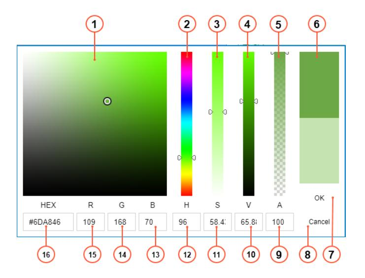

#### *Figure: Color Picker*

- 1. Color Picker area: You can click in the necessary area to select the necessary color. The circle shows the currently selected color.
- 2. Hue slider: You can move the slider to select the necessary hue of the color.
- 3. Saturation slider: You can move the slider to select the necessary saturation of the color.
- 4. Value slider: You can move the slider to select the necessary lightness or darkness of the color.
- 5. Alpha slider: You can move the slider to select the necessary transparency of the color.
- 6. Color Preview box: In the upper half of the box, you can view the currently selected color and compare it with the previously selected color in the lower half of the box.
- 7. **OK** button: You click it to select the color and close the color picker.
- 8. **Cancel** button: You click it to close the color picker without making any changes.
- 9. Alpha value box: You can view or set the numeric value of transparency of the color.
- 10.Value value box: You can view or set the numeric value of lightness or darkness of the color.
- 11.Saturation slider: You can view or set the numeric value of saturation of the color.
- 12.Hue slider: You can view or set the numeric value of hue of the color.
- 13.Blue color box: You can view or set the numeric value of blue component of the color in RGB color format.
- 14.Green color box: You can view or set the numeric value of green component of the color in RGB color format.
- 15.Red color box: You can view or set the numeric value of red component of the color in RGB color format.
- 16.RGB color box: You can view or set the hexadecimal number of the color in RGB color format.

#### **Related Links**

- *[Appointments on the Calendar Boards](#page-145-1)*
- *[Calendar Preferences](https://help-2025r1.acumatica.com/Help?ScreenId=ShowWiki&pageid=400107bc-4a63-4969-aa7e-1840a629381c)*

# **Reports**

In addition to offering a comprehensive collection of reports, Acumatica ERP gives you a high degree of control over each report.

On a typical report form, described in *[Report Form](#page-163-3)*, you can adjust the report settings to meet your specific informational needs. You can specify sorting and filtering options and select the data by using report-specific settings—such as financial period, ledger, and account—and configure additional processing settings for each report. The settings can be saved as a report template for later use. For details, see *To Run a [Report](#page-169-1)* and *To [Create](#page-171-2) a Report [Template](#page-171-2)*.

Aer you run a report, the prepared report appears on your screen. You can print the report, export the report to a file, or send the report by email.

This chapter describes a typical report form and the main tasks related to using reports.

#### **In This Chapter**

- *[Report Form](#page-163-3)*
- *To Run a [Report](#page-169-1)*
- *To Modify a Filter on a [Report](#page-171-3) Form*
- *To Create a Report [Template](#page-171-2)*

# **Report Form**

Before you run a report, you specify the needed parameters on the report form. You can select a template and manually make selections that affect the information collected. Also, you can specify appropriate settings to print or email the finished report.

The following screenshot shows a typical report form.

| TOOLS $\sim$ <b>Daily Sales Profitability</b> |                                                                                       |                |  |  |
|--------------------------------------------------|---------------------------------------------------------------------------------------|----------------|--|--|
| 0 ↶ <b>RUN REPORT</b>                      | REMOVE TEMPLATE 4 <b>SAVE TEMPLATE</b>                                          |                |  |  |
| Template                                         | $\times$ $\times$ 2 □ Default □ Shared                                          |                |  |  |
| <b>REPORT PARAMETERS</b>                         | ADDITIONAL SORT AND FILTERS PRINT AND EMAIL SETTINGS <b>EMAIL NOTIFICATIONS</b> |                |  |  |
| <b>Report Format</b> Company/Branch:          | <b>Detailed</b> $\checkmark$ HEADOFFICE - SweetLife Head Offi v                 |                |  |  |
| <b>From Date</b>                                 | 2/1/2025 Ħ                                                                         |                |  |  |
| <b>To Date</b>                                   | Ë 2/20/2025                                                                        |                |  |  |
| <b>Document Type</b>                             | $\checkmark$                                                                          | $\overline{3}$ |  |  |
| Warehouse:                                       | Q                                                                                     |                |  |  |
| Customer:                                        | Q                                                                                     |                |  |  |
| Inventory:                                       | Q                                                                                     |                |  |  |
|                                                  | Released Transactions Only                                                            |                |  |  |
|                                                  | Completed Transactions Only                                                           |                |  |  |

#### *Figure: Report form*

- 1. Report form toolbar
- 2. Selection area
- 3. Details area

# **Report Form Toolbar**

The following table lists the buttons of the report form toolbar, which appears on the report form when you are configuring a report.

| Button              | Description                                                                                                              |
|---------------------|--------------------------------------------------------------------------------------------------------------------------|
| Cancel              | Clears any changes you have made on the report form and restores the default settings.                                   |
| Run Report          | Initiates data collection for the report and displays the generated report.                                              |
| SaveTemplate        | Gives you the ability to save the currently selected report as a template with all the select ed settings.            |
| Remove Tem plate | Removes the previously saved template. This button is available only when a template is specified on the report form. |

# **Report Toolbar**

The following table lists the buttons of the report toolbar, which is shown on the generated report that you have run.

| Buttons                 | Icon | Description                                                                                                                                                                                                    |
|-------------------------|------|----------------------------------------------------------------------------------------------------------------------------------------------------------------------------------------------------------------|
| Parameters              |      | Navigates back to the report form to let you change the report parameters.                                                                                                                                     |
| Refresh                 |      | Refreshes the information displayed in the report (if any data changes were made).                                                                                                                             |
| Groups                  |      | Adds to the report a le pane where the report structure is shown. Click a report node to highlight the pertinent data in the right pane.                                                                   |
| View PDF / View HTML | /    | Displays the report as a PDF, or displays the report in HTML format. The available but ton depends on the current report view; if you're viewing a PDF, for instance, you will see the View HTML button. |
| First                   |      | Displays the first page of the report.                                                                                                                                                                         |
| Previous                |      | Displays the previous page.                                                                                                                                                                                    |

| Buttons | Icon | Description                                                                                                                             |
|---------|------|-----------------------------------------------------------------------------------------------------------------------------------------|
| Next    |      | Displays the next page.                                                                                                                 |
| Last    |      | Displays the last page of the report.                                                                                                   |
| Print   |      | Opens the browser dialog box so you can print the report.                                                                               |
| Send    |      | Opens the Email Activity dialog box, which you use to send the report file (in the se lected format) to the specified email address. |
| Export  |      | Enables you to export the data in the selected format (Excel or PDF).                                                                   |

# **Selection Area**

You use the elements in this area to select an existing template, which you can share with other users or use as your default report settings. You can also select the locale and the localization.

| Element  | Description                                                                                                                                                                                                                                                                         |
|----------|-------------------------------------------------------------------------------------------------------------------------------------------------------------------------------------------------------------------------------------------------------------------------------------|
| Template | The template to be used for the report. If any templates have been created and saved, you can select a template to use its settings for the report.                                                                                                                              |
| Default  | A check box that indicates (if selected) that the selected template is marked as the default one for you. A default template cannot be shared.                                                                                                                                   |
| Shared   | A check box that indicates (if selected) that the selected template is shared with other users. A shared template cannot be marked as the default.                                                                                                                               |
| Locale   | A locale that you select to indicate to the system that the report should be prepared with the data translated to the language associated with this locale. This box is displayed if there are multiple active locales in the system. For details, see Locales and Languages. |

The elements of this area, which are available for all reports, are described in the following table.

| Element      | Description                                                                                                                                                                                                                                                                                                            |  |
|--------------|------------------------------------------------------------------------------------------------------------------------------------------------------------------------------------------------------------------------------------------------------------------------------------------------------------------------|--|
| Localization | The localization that is used for the report.                                                                                                                                                                                                                                                                          |  |
|              | This box appears on the form if the following conditions are met:                                                                                                                                                                                                                                                      |  |
|              | • The Canadian Localization or UK Localization feature is enabled on the Enable/Disable Features (CS100000) form.                                                                                                                                                                                                |  |
|              | • A localized version of the report exists in the system.                                                                                                                                                                                                                                                           |  |
|              | One of the following options can be selected in the box:                                                                                                                                                                                                                                                               |  |
|              | • None (default): Even though the report has a localized version, the report will be printed without any localization applied.                                                                                                                                                                                   |  |
|              | • Canada: The Canadian version of the report will be printed. If the company in which you are signed in has Canada selected in the Localization box on the Company Details tab (Configuration Settings section) on the Companies (CS101500) form, this setting is se lected by default in the current box. |  |
|              | To determine if a localized version of a report exists, the system checks the Site\ReportsDefault directory, the database, the ReportsCus tomized folder, and the ReportsDefault folder.                                                                                                                         |  |

# **Report Parameters Tab**

The **Report Parameters** tab has sections where you can specify the contents of the report depending on the current report and vary in the following regards:

- Which elements are available on a particular report
- Whether elements contain default values
- Whether specific elements require values to be selected
- Whether elements may be le blank to let you display a broader range of data

# **Additional Sort and Filters Tab**

The **AdditionalSort and Filter** tab contains additional sorting and filtering conditions:

- **Additional sorting conditions**: Defines the sorting order. You can add a line, select one of the reportspecific properties, and select the *Descending* or *Ascending* sort order for the column.
- **Additional filtering conditions**: Defines the report filter. You can add a line, select one of the reportspecific properties, and define a condition and its value. The list of conditions include one-operand and two-operand conditions. To create a more complicated logical expression, you can use brackets and logical operations between brackets. For more information on creating filters, see *[Managing Advanced Filters](https://help-2025r1.acumatica.com/Help?ScreenId=ShowWiki&pageid=c621d79a-274d-4b72-a699-0e92d78a7b23)*. For detailed procedures on using ad hoc filters, see *[Reports: Process Activity](https://help-2025r1.acumatica.com/Help?ScreenId=ShowWiki&pageid=2b4d7aa8-25dc-4777-880a-fee2274990c7)*.

# **Print and Email Settings Tab**

If you plan to print the report or save the report as a PDF, select the appropriate settings in the **PrintSettings** area.

#### *Table: Print Settings Section*

| Element         | Description                                                   |
|-----------------|---------------------------------------------------------------|
| Deleted Records | Selects the visibility of the data deleted from the database. |

| Element                 | Description                                                          |
|-------------------------|----------------------------------------------------------------------|
| Print All Pages         | Causes all pages of the report to be printed.                        |
| Print in PDF format     | Displays the report in PDF format.                                   |
| Compress PDF file       | Indicates that the system will generate a compressed PDF.            |
| Embed fonts in PDF file | Indicates that the system will generate the PDF with fonts embedded. |

If you plan to send the report as an email, in the **EmailSettings** area, specify the format in which the report will be sent, as well as the email subject, the recipients of copies of the report, and the email account of the recipient.

| Field         | Description                                                                                                                                                                                                                 |  |  |  |  |  |
|---------------|-----------------------------------------------------------------------------------------------------------------------------------------------------------------------------------------------------------------------------|--|--|--|--|--|
| Format        | The format (HTML, PDF, or Excel) in which the report will be emailed.                                                                                                                                                       |  |  |  |  |  |
|               | Merge function for reports in Excel format is not supported. If you want to merge a report with other reports and send an aggregated report by email, you should select either the HTML or PDF format for the report. |  |  |  |  |  |
| Email Account | The email address of the recipient.                                                                                                                                                                                         |  |  |  |  |  |
| CC            | An additional addressee to receive a carbon copy (CC) of the email.                                                                                                                                                         |  |  |  |  |  |
| BCC           | The email address of a person to receive a blind carbon copy (BCC) of the email; an address entered in this box will be hidden from other recipients.                                                                    |  |  |  |  |  |
| Subject       | The subject of the email.                                                                                                                                                                                                   |  |  |  |  |  |

#### **Report Versions Tab**

If the report has multiple versions, you can select one of them.

This tab displays the data only to users assigned with report designer user role.

Report versions are designed in the Report Designer. To activate editing report versions, give the user report designer role.

*Table: Report Versions Tab Toolbar*

| Button                                                       | Description                            |  |  |
|--------------------------------------------------------------|----------------------------------------|--|--|
| Refresh                                                      | Refreshes the list of report versions. |  |  |
| Select Temporarily activates the selected report version. |                                        |  |  |

#### **Email Notifications Tab**

The **Email Notifications** tab lists the email templates used to send the report.

#### *Table: Table Toolbar*

The table toolbar includes standard buttons and buttons that are specific to this table. For the list of standard buttons, see *Table [Toolbar](#page-117-1)*. The table-specific buttons are listed below.

| Button          | Description                                                                                                                                                                     |
|-----------------|---------------------------------------------------------------------------------------------------------------------------------------------------------------------------------|
| Schedule Report | Opens the Email Templates (SM204003) form, where you can select or create a new email template that can be used to send the report and specify a schedule for notifications. |
|                 | The button appears only if the user account to which you are signed in has at least the Insert level of access rights to the Email Templates (SM204003) form.                |

| Column                   | Description                                                                                                     |  |  |  |  |
|--------------------------|-----------------------------------------------------------------------------------------------------------------|--|--|--|--|
| Email Template           | The email template to be used to generate the body of the email notification.                                   |  |  |  |  |
| Screen ID                | The identifier of the form whose elements are used as the source of specific placeholders for this template. |  |  |  |  |
| Recipients               | The email addresses of the people to receive the email. Use semicolons as separators be tween addresses.     |  |  |  |  |
| Report Template          | The template configured for the report.                                                                         |  |  |  |  |
| Report Template Owner | The name of the user who created the template.                                                                  |  |  |  |  |

#### *Table: Table Columns*

#### **Related Links**

- *To Run a [Report](#page-169-1)*
- *To Create a Report [Template](#page-171-2)*
- *Types of [Filters](#page-175-3)*
- *[Automation Schedule Statuses](https://help-2025r1.acumatica.com/Help?ScreenId=ShowWiki&pageid=97fb65d2-2303-4993-9351-b6fbe112c37d)*

# **The Company/Branch Box on Report Forms**

When you are running a report, you use report parameters on the report form to narrow the data to your current information needs. You can use a report parameter to select the organizational unit whose data will be shown. In the **Company/Branch** box, you can see a hierarchy of company groups, companies, and branches that shows the relationships between them. By default, the system inserts the company or branch to which you are signed in, but you can select another company group, company, or branch. See the following screenshot for an example of the hierarchical list of company groups, companies, and branches in the **Company/Branch** box; the labeled items are described below.

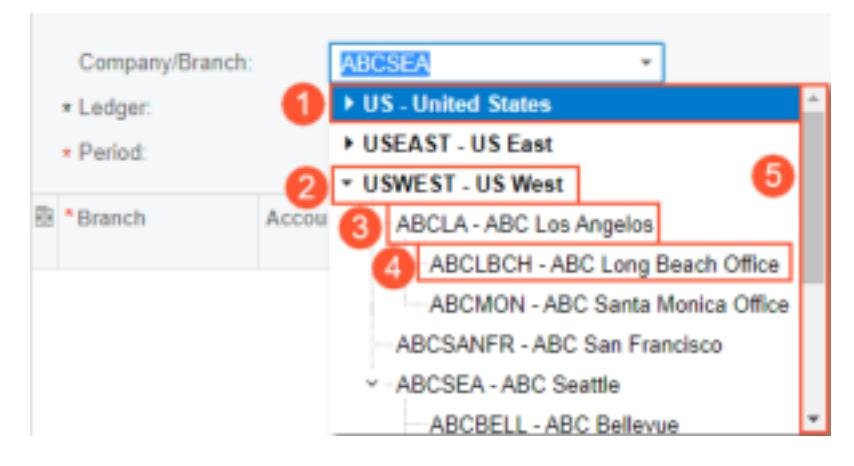

*Figure: A hierarchy in the Company/Branch box*

- 1. Collapsed company group (including branches within any company)
- 2. Expanded company group (including branches within any company)
- 3. Company; you can collapse the company if there are nested branches
- 4. Branch
- 5. Scroll bar

In Acumatica ERP, you can define company groups if multiple companies have access to the same set of customer and vendor records. If a company in the company group has branches, they are automatically added to the group within the company. By using this group functionality, you can build reports for the whole group rather than generating separate reports for each company or branch. For more information about company groups, see *[Company Groups](https://help-2025r1.acumatica.com/Help?ScreenId=ShowWiki&pageid=5ffde0f3-5320-421c-b3aa-ebd151bf764b)*.

If a company is not in any company group, in the **Company/Branch** box, it will be displayed as a standalone entity aer all the company groups.

You can collapse or expand company groups and companies to easily navigate to the needed entity. If there are multiple companies and branches in the list, the system displays only part of this list, and you can use the scroll bar to move up and down.

# **Searching for a Company or a Branch**

The **Company/Branch** box can display a limited number of the companies and branches because of size and design limitations. If you have access to multiple companies and branches, in addition to scrolling within the hierarchical list in this box and collapsing entities, you can search for a specific company or branch by its name.

You search for a company or a branch by typing its name in the **Company/Branch** box. The system initiates the matching process and displays the search results as soon as you begin typing in this box.

# **To Run a Report**

Acumatica ERP reports display the information you want to see in easy-to comprehend formats. This topic describes how you run a typical report.

# **To Run a Report**

- 1. Open the report form.
- 2. On the **Report Parameters** tab, select the report parameters.

- 3. Optional: On the **AdditionalSort and Filters** tab, in the **Additional Sorting Conditions** table, set up the sorting. Do the following:
  - a. In the table toolbar, click **Add Row**.
  - b. In the **Property** column, select the property on which you want to sort.
  - c. In the **Condition** column, select **Ascending** to perform an ascending sort (that is, A to Z for text, lower to higher for numbers, or newest to oldest for dates), or select **Descending** to perform a descending sort (that is, Z to A for text, higher to lower for numbers, or oldest to newest for dates).
  - d. Repeat the three previous substeps for each column you want to sort by.
- 4. Optional: On the **AdditionalSort and Filters** tab, in the **Additional Filtering Conditions** tab, set up a filter to get only the data you want to see. For more information on adding filter conditions, see *[Managing](https://help-2025r1.acumatica.com/Help?ScreenId=ShowWiki&pageid=c621d79a-274d-4b72-a699-0e92d78a7b23) [Advanced Filters](https://help-2025r1.acumatica.com/Help?ScreenId=ShowWiki&pageid=c621d79a-274d-4b72-a699-0e92d78a7b23)*.
- 5. Optional: In the **PrintSettings** section of the **Print and EmailSettings** tab, specify the settings for printing the report.
- 6. Optional: In the **EmailSettings** section of the **Print and EmailSettings** tab, specify the settings for sending the report by email.
- 7. Click **Run Report**.

This generates and displays the report. Now you can print the report or save it to your computer in one of the available formats.

# **To Change the Parameters of a Prepared Report**

You can modify report parameters aer you've prepared a report. To change the report parameters, do the following:

- 1. On the toolbar of the report, click **Parameters**. This returns you to the report form, and the **Parameters** button is highlighted, denoting that you are currently viewing the parameters..
- 2. Change the report parameters.

You can click **Parameters** to toggle between the report form and the report without losing the changes made on the report form.

3. Click **Run Report** to view the report with the new parameters applied.

# **To Configure a Filter on a Report Form**

When you generate a report, you can configure an ad hoc filter for the report data, as described in this topic. For details on filter clauses, see *[Managing Advanced Filters](https://help-2025r1.acumatica.com/Help?ScreenId=ShowWiki&pageid=c621d79a-274d-4b72-a699-0e92d78a7b23)*.

# **To Configure an Ad Hoc Filter on a Report Form**

- 1. Open the report form, and then click the **AdditionalSort and Filter** tab.
- 2. In the **Additional Filtering Conditions** table, click **Add Row** to create a filter clause. (An ad hoc filter may consist of one filter clause, represented by one row, or multiple filter clauses, represented by multiple rows.)
- 3. In the **Property** column, select the entity type associated with the report from the list.
- 4. In the **Condition** column, select the logical operation that will be applied to the value of the selected property.
- 5. In the **Value** column, type the value for the logical condition used to filter the data.

- 6. If the logical operation you selected in the **Condition** column requires the second value, type it in the **Second Value** column.
- 7. Repeat Steps 2-6 for each filter clause in this ad hoc filter.
- 8. If you want to join any of the filter clauses, do the following:
  - In the lemost **Brackets** column of the first clause that should be joined, select the opening bracket or brackets. (The number of opening brackets in the first clause depends on the number of nested clauses.)
  - In the **Operator** column of the same clause, select the logical operator that will be used to join the clauses.
  - In the rightmost **Brackets** column of the last clause that should be joint, select the closing bracket or brackets. (The number of closing brackets in the first clause depends on the number of nested clauses and should be equal to the number of opening brackets in the first clause that is joint.)
- 9. To apply the filter, be sure the other settings on the report form have the values you need, and click **Run Report**.

# **To Modify a Filter on a Report Form**

Aer you have run a report for which you configured an ad hoc filter, if you need to, you can modify the filter before you send or print the report, as described in this topic.

# **To Modify a Filter on a Report Form**

- 1. If you are viewing the report, on the report toolbar of the report, click **Parameters**. The system opens the report form, and the **Parameters** button on the toolbar is highlighted.
- 2. In the **Additional Filtering Conditions** table of the **AdditionalSort and Filters** tab, modify the filter conditions. For more information, see *[Reports: Process Activity](https://help-2025r1.acumatica.com/Help?ScreenId=ShowWiki&pageid=2b4d7aa8-25dc-4777-880a-fee2274990c7)*, *[Managing Advanced Filters](https://help-2025r1.acumatica.com/Help?ScreenId=ShowWiki&pageid=c621d79a-274d-4b72-a699-0e92d78a7b23)*.
- 3. Click **Run Report**.

# **To Create a Report Template**

You can save the report parameters you have specified as a template, as described below. You then use this template to immediately populate the report form with your preferred parameters so that you can run reports more quickly. This topic also describes how to remove a report template and how to schedule a report to be run.

# **To Create a Report Template**

- 1. Open the needed report form.
- 2. Specify the report parameters and run the report to check the report settings, as described in detail in *[Reports: Process Activity](https://help-2025r1.acumatica.com/Help?ScreenId=ShowWiki&pageid=2b4d7aa8-25dc-4777-880a-fee2274990c7)*.
- 3. On the report toolbar, click **Parameters** to view the parameters on the report form.

You can click **Parameters** to toggle between the report form and the report without losing the changes made on the report form.

- 4. To use this template by default for the current report (so that when you bring up this report form, the settings of the template are specified), select the **Default** check box.
- 5. To share this template with other users, select the**Shared** check box.

You cannot select a shared template as the default. If you select the**Shared** check box, the **Default** check box becomes cleared and unavailable for editing.

- 6. Click **SaveTemplate**.
- 7. In the **EnterTemplate Name** dialog box, which opens, type the name of the new template.
- 8. Click **OK**.

If you have saved the template as the default, when you open the report form, the template is already selected and the system automatically fills in the selections of the template. If you have not saved the template as the default, you can select it in the**Template** box and the system fills in the selections of the template.

#### **To Remove a Report Template**

- 1. Open the needed report form.
- 2. In the **Template** box, select the report template that you want to remove.
- 3. On the report form toolbar, click **RemoveTemplate**.

Aer you remove a template, it cannot be selected in the**Template** box.

# **To Schedule the Running of a Report**

- 1. Open the needed report form.
- 2. In the **Template** box, select the report template that you want to schedule.
- 3. On the **Email Notifications** tab, click**Schedule Report** to open the *Email [Templates](https://help-2025r1.acumatica.com/Help?ScreenId=ShowWiki&pageid=ebcda76a-433f-4bde-8aed-efc69474fd03)* (SM204003) form.
- 4. On the *Email [Templates](https://help-2025r1.acumatica.com/Help?ScreenId=ShowWiki&pageid=ebcda76a-433f-4bde-8aed-efc69474fd03)* form, in the **Description** box, enter a description of the new email template.
- 5. Specify the sender's address in the **From** box.
- 6. Specify the recipients of the email in the**To**, **CC**, and **BCC** boxes.
- 7. On the **Message** tab, enter the contents of the email notification.
- 8. Click **Save** on the form toolbar to create the email template. The**Send BySchedules** tab will be displayed.
- 9. On this tab, click **CreateSchedule** to open the *[Automation Schedules](https://help-2025r1.acumatica.com/Help?ScreenId=ShowWiki&pageid=76757610-2d0f-4ead-a948-d67da24ec116)* (SM205020) form.
- 10.On the *[Automation Schedules](https://help-2025r1.acumatica.com/Help?ScreenId=ShowWiki&pageid=76757610-2d0f-4ead-a948-d67da24ec116)* form, in the **Description** box, enter a description of the new schedule.
- 11.On the **Details** tab, specify the additional settings of the schedule:
  - a. Optional: In the**Starts On** box of the **Details** tab, select the start date. By default, the schedule execution starts on the current business date.
  - b. Optional: If you need to specify an expiration date for the schedule, clear the **No Expiration Date** check box, and specify the expiration date in the **Expires On** box.
  - c. Do one of the following:
    - If you want to limit the number of executions, in the **Execution Limit** box, specify the number of times the schedule should be executed.
    - If you do not need to limit the number of executions, select the **No Execution Limit** check box.
  - d. Optional: In the **Process with Branch** box, select the branch under which the schedule should be processed. For example, if documents are created by this schedule, the system creates these documents and specifies the selected branch for each document.
  - e. Optional: Change the time zone in which the schedule will operate. By default, the time zone specified on the *[User Profile](https://help-2025r1.acumatica.com/Help?ScreenId=ShowWiki&pageid=8430c8b2-a79c-4f7b-9768-b0b7fad23a59)* (SM203010) form for the currently signed-in user is selected.

12.On the **Schedule** tab, specify the execution dates and time as follows:

- a. Specify how oen the schedule execution should be performed:
  - To execute the schedule daily or every *x* days, do the following:
    - a. In the **ScheduleType** section, select **Daily**.
    - b. Optional: In the**Schedule Details** section, in the **Next Execution Date** box, select the date and time when the schedule should be executed next.
    - c. In the **Every x Day(s)** box, type the number of days between successive executions of the schedule.
  - To execute the schedule weekly or every *x* weeks, do the following:
    - a. In the **ScheduleType** section, select **Weekly**.
    - b. Optional: In the**Schedule Details** section, in the **Next Execution Date** box, select the date and time when the schedule should be executed next.
    - c. In the **Every x Week(s)** box, type the number of weeks between successive executions of the schedule.
    - d. Select the appropriate check boxes for the day or days of the week on which the schedule should be executed.
  - To execute the schedule monthly or every *x* months, do the following:
    - a. In the **ScheduleType** section, select **Monthly**.
    - b. Optional: In the**Schedule Details** section, in the **Next Execution Date** box, select the date and time when the schedule should be executed next.
    - c. In the **Every x Month(s)** box, type the number of months between successive executions of the schedule.
    - d. Select when the schedule should be executed: the day of the month, or the week in the month and the day of the week (such as the third Friday of the month).
  - To execute the schedule once per financial period or every *x* financial periods, perform the following steps:
    - a. In the **ScheduleType** section, select **By Financial Period**.
    - b. Optional: In the**Schedule Details** section, in the **Next Execution Date** box, select the date and time when the schedule should be executed next.
    - c. In the **Every x Period(s)** box, type the number of financial periods between successive executions of the schedule.
    - d. Select the appropriate option button to indicate when the schedules should be executed: at the end of the period, at the start of the period, or on a fixed day of the period (which you should specify if you select this option button).
- b. In the **Execution Time** section, specify the particular time of the day to start and stop the processing as follows:
  - a. In the **Starts On** box, select the hour and minute when the first execution of the schedule should start.
  - b. If you want the processing to be stopped at specific time or you want the processing to be repeated multiple times a day, in the**Stops On** box, select the hour and minute when the first execution of the schedule should stop.
  - c. If execution of the schedule should be repeated multiple times a day, in the **Every** box, select the interval between successive executions of the schedule.
  - d. In the **Next Execution Date** box, make sure the next execution time is correct.
  - e. If you want the system to execute the schedule at exactly the time specified in the **Next Execution Time** box, select the **ExactTime** check box. If the check box is cleared, the system may shi the next execution time of the schedule by multiple minutes.

13.Click **Save** on the form toolbar to create the schedule. When you save a newly created schedule, the system gives it an identifier in accordance with the built-in numbering sequence intended for automation schedules.

Aer you have added a schedule for the report to be run, the system will send the report with the parameters specified in the template according to the schedule settings.

# **Filters**

In Acumatica ERP, forms oen use tables to present data in ways that users can easily comprehend. But when a single table spans multiple pages, you might find it challenging to glean the needed information from it. Filters give you the means to display only those records that you want to see at the moment.

# **In This Chapter**

- *Types of [Filters](#page-175-3)*
- *[Saving of Filters for Future Use](#page-179-1)*
- *[Examples of Advanced and Ad Hoc Filters](#page-183-2)*

# **Types of Filters**

Filters in Acumatica ERP help you find the information you want to view in a table and include only the data you need in a generated report. To help you meet your changing information needs, Acumatica ERP has the following types of filters, each with different functionality: simple, quick, advanced, and ad hoc.

All Acumatica ERP filters are form-specific—that is, if a filter is designed for one form, you cannot apply it to another form.

### **Simple Filters**

You use *simple filters* to quickly filter data in a table. To use a simple filter, you click the header of the column to which you want to apply the filter and specify a condition for the column. This causes the system to display only the table rows for which this column meets the selected condition, as shown in the screenshot below. You can then sort the data to best meet your information needs.

| Invoices and Memos $\hat{\varpi}$ TOOLS $\sim$ CUSTOMIZATION +                                                                             |    |   |                    |                   |               |           |                     |                                            |  |
|--------------------------------------------------------------------------------------------------------------------------------------------------|----|---|--------------------|-------------------|---------------|-----------|---------------------|--------------------------------------------|--|
| $ \mathbf{x} $ Ò $\mapsto$ 1 ∽                                                                                                       |    |   |                    |                   |               |           |                     |                                            |  |
| $\boxplus$ $\triangledown$ Status: All Date: All $\rightarrow$ Type: All $\overline{\phantom{a}}$ $\overline{\phantom{a}}$  |    |   |                    |                   |               |           |                     | $\mathcal{L}$                              |  |
| 圖                                                                                                                                                | O, | D | Type               | Reference Nbr. | <b>Status</b> |           | Date Post Period | <b>Customer Name</b> Customer           |  |
|                                                                                                                                                  | 0  | D | Invoice            | AR006880          | Balanced      | 6/6/2019  | 06-2019             | Sort Ascending                             |  |
|                                                                                                                                                  | 0  | D | Invoice            | AR006879          | Balanced      | 6/6/2019  | 06-2019             | Sort Descending                            |  |
|                                                                                                                                                  | 0  | D | Invoice            | AR006878          | Balanced      | 6/6/2019  | 06-2019             | Clear Filter                               |  |
|                                                                                                                                                  | 0  |   | Debit Memo         | AR006877          | Open          | 5/31/2019 | 05-2019             | Equals ✓                                |  |
|                                                                                                                                                  | 0  |   | Credit Memo        | AR006876          | Open          | 5/31/2019 | 05-2019             | Does Not Equal                             |  |
|                                                                                                                                                  | 0  |   | <b>Credit Memo</b> | AR006875          | Open          | 3/12/2019 | 03-2019             | Contains                                   |  |
|                                                                                                                                                  | û  |   | Invoice            | AR006874          | Open          | 3/6/2019  | 03-2019             | Starts With                                |  |
|                                                                                                                                                  | 0  | D | Invoice            | AR006873          | Closed        | 3/5/2019  | 03-2019             | Is Null                                    |  |
|                                                                                                                                                  | 0  | D | Invoice            | AR006872          | Open          | 3/14/2019 | 03-2019             | hn Is Not Null                          |  |
|                                                                                                                                                  | 0  | D | Invoice            | AR006871          | On Hold       | 3/1/2019  | 03-2019             | quip <b>ABARTENDE</b> Q              |  |
|                                                                                                                                                  | 0  | D | Invoice            | AR006870          | Closed        | 3/5/2019  | 03-2019             |                                            |  |
|                                                                                                                                                  | 0  | n | Overdue Charge     | AR006869          | Open          | 3/31/2019 | 03-2019             | CANCEL OK                               |  |
|                                                                                                                                                  | 0  | D | Overdue Charge     | AR006868          | Open          | 3/31/2019 | 03-2019             | <b>SNOSHORT</b> <b>Shortstop Sports</b> |  |

#### *Figure: A simple filter*

For generic inquiry forms (such as substitutes for entry forms), once you have configured a simple filter, the simple filter is added to the filtering area of the table, where you can work with the simple filter as you can work with a quick filter. For details, see *[Quick Filters](#page-176-0)* below.

For details on using simple filters, see *To Filter the Data in a [Table](#page-132-1)*.

# **Quick Filters**

You use *quick filters* to filter data in a table on a generic inquiry form (such as a substitute form for a data entry form). To use a quick filter, you drag to the filtering area above the table the header of the column to which you want to apply the filter. In the filtering area, you select the values of each added quick filter (if the column has a fixed set of options) or the filter condition of each quick filter (if the column has an unlimited number of values), as shown in the following screenshot.

| Invoices and Memos $\phi$ TOOLS $\star$ CUSTOMIZATION +                   |    |              |                         |                   |                                   |                               |                              |  |  |  |
|---------------------------------------------------------------------------------|----|--------------|-------------------------|-------------------|-----------------------------------|-------------------------------|------------------------------|--|--|--|
| Ò $ \mathbf{x} $ $\mathscr{O}$ $\mapsto$                               |    |              |                         |                   |                                   |                               |                              |  |  |  |
| Status: All Date: All Type: All $\rightarrow$ $\overline{\phantom{a}}$ |    |              |                         |                   | Customer: = 'ABARTENDE'           | $\boxplus$ $\triangledown$ | $\varphi$                 |  |  |  |
| 圖                                                                               | 0  | D            | Type                    | Reference Nbr. | Sort Ascending Sort Descending | Customer                      | <b>Customer Name</b>         |  |  |  |
|                                                                                 | 0  | n            | Invoice                 | AR006880          | Remove Quick Filter               | <b>ABARTENDE</b>              | <b>USA Bartending School</b> |  |  |  |
|                                                                                 | Q  |              | Invoice                 | AR006878          | Clear Filter                      | <b>ABARTENDE</b>              | <b>USA Bartending School</b> |  |  |  |
|                                                                                 | O, |              | Debit Memo              | AR006877          |                                   | <b>ABARTENDE</b>              | <b>USA Bartending School</b> |  |  |  |
|                                                                                 | 0  |              | Credit Memo AR006876 |                   | Equals ✓ Does Not Equal     | <b>ABARTENDE</b>              | <b>USA Bartending School</b> |  |  |  |
|                                                                                 | 0  | Invoice D |                         | AR006873          |                                   | <b>ABARTENDE</b>              | <b>USA Bartending School</b> |  |  |  |
|                                                                                 | O, | n            | Invoice                 | AR006843          | Contains Starts With           | <b>ABARTENDE</b>              | <b>USA Bartending School</b> |  |  |  |
|                                                                                 | 0  | D            | Invoice                 | AR006829          | Is Null                           | <b>ABARTENDE</b>              | <b>USA Bartending School</b> |  |  |  |
|                                                                                 | O, | n            | Invoice                 | AR006807          | Is Not Null                       | <b>ABARTENDE</b>              | <b>USA Bartending School</b> |  |  |  |
|                                                                                 | 0  |              | Invoice                 | AR006736          |                                   | <b>ABARTENDE</b>              | <b>USA Bartending School</b> |  |  |  |
|                                                                                 | 0  |              | Invoice                 | AR006710          | <b>ABARTENDE</b> ρ             | <b>ABARTENDE</b>              | <b>USA Bartending School</b> |  |  |  |
|                                                                                 | 0  |              | Invoice                 | AR006665          | OK CANCEL                      | <b>ABARTENDE</b>              | <b>USA Bartending School</b> |  |  |  |
|                                                                                 | 0  | D            | Invoice                 | AR006634          | 01-2019 Closed 1/31/2019    | <b>ABARTENDE</b>              | <b>USA Bartending School</b> |  |  |  |

#### *Figure: A quick filter*

You can save quick filters for future use. When you save a filter, the system adds to the form a tab with the filter applied. The tab will be shown on the form when you open the form in the future. The tab has the name that you specify during saving of the filter. You can create quick filters for your personal use or share them with other users.

For details on using quick filters, see *[Filtering and Sorting in Acumatica ERP](https://help-2025r1.acumatica.com/Help?ScreenId=ShowWiki&pageid=1b8f46e3-bcb9-46d9-99c0-50f3b4e37d4b)* and *[Managing Advanced Filters](https://help-2025r1.acumatica.com/Help?ScreenId=ShowWiki&pageid=c621d79a-274d-4b72-a699-0e92d78a7b23)*.

#### **Advanced Filters**

You add *advanced filters* on processing and inquiry forms to have the data filtered when you open the form; you can create and apply these filters any time you want to, and save them for future use. These filters are considered advanced because you can specify complex and flexible filtering conditions when you set up these filters. For more information on designing advanced filters, see *[Managing Advanced Filters](https://help-2025r1.acumatica.com/Help?ScreenId=ShowWiki&pageid=c621d79a-274d-4b72-a699-0e92d78a7b23)*.

You use the **FilterSettings** dialog box to add an advanced filter to a form (see item 1 in the following screenshot). When you save the filter, the system adds to the form a tab (item 2) with the filter applied; the tab will be shown on the form when you open the form in the future. You can create advanced filters for your personal use or share them with other users.

|   |        |           |   |          | Revision Two HQ - Tasks $\pm$ |                 |                                        |                          |               |                   |                                          |       |
|---|--------|-----------|---|----------|-------------------------------|-----------------|----------------------------------------|--------------------------|---------------|-------------------|------------------------------------------|-------|
|   | с      |           |   |          | {                             | <b>COMPLETE</b> | CANCEL $\left  \rightarrow \right $ | $\mathbf x$ ▼         |               |                   |                                          |       |
| Ø |        | ALL TASKS |   |          | <b>MY TASKS</b>               |                 | MY WORKGROUP'S TASKS                   | FOLLOW-UP TASKS          |               | COMPLETED TASKS   |                                          | TODAY |
|   |        |           |   |          | B D D D I * Summary           |                 |                                        |                          | <b>Status</b> | <b>Start Date</b> | Due Date                                 |       |
|   | Þ ü |           |   |          | <b>Filter Settings</b>        |                 |                                        |                          |               |                   | ×                                        | 17    |
|   | ü.     | $\Box$    |   | My Tasks |                               |                 | w.                                     | Default <b>El Shared</b> |               |                   |                                          | 2017  |
| 0 |        | $-$       |   | с        | −                             | ÷ $\times$   |                                        |                          |               |                   |                                          | 017   |
|   |        |           |   | Acti     | <b>Bracket</b>                | * Property      | *Condition                             | Value                    | Value2        | <b>Bracket</b>    | !!!!!!!!!!!!!!!!!!!!!!!!!!!!!!!!!!!!!!!! |       |
|   |        |           | r | ₽        | $\epsilon$                    | <b>Status</b>   | Equals                                 | Open                     |               |                   | Or                                       |       |
|   |        |           |   | V        |                               | <b>Status</b>   | Equals                                 | Processing               |               |                   | Or                                       |       |
|   |        |           |   | V        |                               | <b>Status</b>   | Equals                                 | Draft                    |               |                   | And                                      |       |
|   |        |           |   | V        |                               | Owner           | Equals                                 | @me                      |               |                   | And                                      |       |
|   |        |           |   |          |                               |                 |                                        |                          |               |                   |                                          |       |
|   |        |           |   |          |                               |                 |                                        |                          |               |                   |                                          |       |

#### *Figure: An advanced filter*

For more information on using advanced filters, see *[Saving of Filters for Future Use](#page-179-1)*. For details on the **Filter Settings** dialog box, see *[Filter Settings Dialog Box](https://help-2025r1.acumatica.com/Help?ScreenId=ShowWiki&pageid=740754ac-3770-44a2-88b6-21bb115ea56a)*.

#### **Ad Hoc Filters**

You configure *ad hoc filters* on report forms to fine-tune the basic report parameters, as shown in the screenshot below. These filters cannot be saved directly to be reused at a later time; however, you can set up and save report templates that contain the filtering and sorting settings you use for an ad hoc filter.

| ø                                                | New York - GL Edit Detailed +                                                            |               |                                        |                   |            |                     |        | HELP =   |
|--------------------------------------------------|------------------------------------------------------------------------------------------|---------------|----------------------------------------|-------------------|------------|---------------------|--------|----------|
| ÷                                                | <b>RUN REPORT</b> SAVE TEMPLATE                                                       |               | REMOVE TEMPLATE                        | SCHEDULE TEMPLATE |            |                     |        |          |
| Template                                         | <b>□ Default</b> □ Shared                                                                | x v           |                                        |                   |            |                     |        |          |
|                                                  | Report Parameters Additional Sort and Filters Print and Email Settings   Report Versions |               |                                        |                   |            |                     |        |          |
| <b>Additional Sorting Conditions</b> $\times$ |                                                                                          | $\times$ + | <b>Additional Filtering Conditions</b> |                   |            |                     |        |          |
| Property                                         | Condition                                                                                | <b>Bracke</b> | Property                               | Condition         | Value      | <b>Second Value</b> | Bracke | Operator |
| > GL Transaction.Line                            | Ascending                                                                                |               | Ledger Currency                        | Equals            | <b>EUR</b> |                     |        | And      |

#### *Figure: An ad hoc filter*

For more information on designing ad hoc filters, see *[Filtering and Sorting in Acumatica ERP](https://help-2025r1.acumatica.com/Help?ScreenId=ShowWiki&pageid=1b8f46e3-bcb9-46d9-99c0-50f3b4e37d4b)* in the Acumatica ERP Getting Started Guide. For more information on using ad hoc filters, see *[Reports](#page-163-2)*.

# **Saving of Filters for Future Use**

Reusable filters, which are available on processing and inquiry forms, are created to filter data in the table part of the form and can be reused anytime aer you create them. You can reuse quick filters and advanced filters. For details on the filter types, see *Types of [Filters](#page-175-3)*.

# **Reusable Filters on Forms**

You can reuse filters on a particular processing or inquiry form in one of the following ways:

- By creating and saving a quick filter directly on that form.
- By creating and saving an advanced filter directly on that form by using the **FilterSettings** dialog box. For more information on the **FilterSettings** dialog box, see *[Filter Settings Dialog Box](https://help-2025r1.acumatica.com/Help?ScreenId=ShowWiki&pageid=740754ac-3770-44a2-88b6-21bb115ea56a)*.

You can do the following with quick or advanced filters you have defined for forms:

- Create a filter and save it for later use, as described. For more information on designing complex filter conditions for advanced filters, see *[Managing Advanced Filters](https://help-2025r1.acumatica.com/Help?ScreenId=ShowWiki&pageid=c621d79a-274d-4b72-a699-0e92d78a7b23)*.
- Update the clauses of an existing filter, as described in *[Managing Advanced Filters](https://help-2025r1.acumatica.com/Help?ScreenId=ShowWiki&pageid=c621d79a-274d-4b72-a699-0e92d78a7b23)*.
- Share a filter with other users, as described in *[Filtering and Sorting Capabilities: Process Activity](https://help-2025r1.acumatica.com/Help?ScreenId=ShowWiki&pageid=833941e3-38d7-433e-a932-78d7a0cc8467)*. For more information on working with shared filters, see *[Managing Advanced Filters](https://help-2025r1.acumatica.com/Help?ScreenId=ShowWiki&pageid=c621d79a-274d-4b72-a699-0e92d78a7b23)*.
- Delete an obsolete filter, as described in *[Filtering and Sorting Capabilities: Process Activity](https://help-2025r1.acumatica.com/Help?ScreenId=ShowWiki&pageid=833941e3-38d7-433e-a932-78d7a0cc8467)*.

# **Shared Filters**

In Acumatica ERP, quick and advanced filters can be shared with other users, no matter who created the filters. You can share your filters with other users and use the filters that have been created and shared by other users. Shared filters are available to all users of the system.

You can modify or delete a shared filter through the form to which it is applied as well as on the *[Filters](https://help-2025r1.acumatica.com/Help?ScreenId=ShowWiki&pageid=ed46ae19-b15e-4383-87de-2f068f42ef2d)* (CS209010) form. For more information on shared filter management, see *[Managing Advanced Filters](https://help-2025r1.acumatica.com/Help?ScreenId=ShowWiki&pageid=c621d79a-274d-4b72-a699-0e92d78a7b23)* in the Acumatica ERP System Administration Guide.

# **Filters as Tabs**

On a form, the available quick and advanced filters that you have created (or that other users have shared with you) are displayed as tabs, as shown in the following screenshot with item 2. The **All Records** tab shows all records without any filter applied, and the name of each other tab corresponds to the name of the filter (item 1 in the following screenshot shows where the name is specified).

|   | с | $\mathbf{H}$ | $\sqrt{2}$ s. Al Records Asset Liability Income | $\bullet$  | $\mathbf{x}$                            | VIEW RESTRICTION GROUPS. Œ |                | 国  44    |                            |                |                              |                       |                    | ø                  |
|---|---|--------------|-------------------------------------------------------|------------|-----------------------------------------|-------------------------------|----------------|-------------|----------------------------|----------------|------------------------------|-----------------------|--------------------|--------------------|
|   |   |              | G D + Account                              |            | Account Class <b>Filter Sottings</b> | Type:                         | Active         | Description |                            |                | Require <b>SHARA</b> × | L'on Detaul Sub | <b>Post Option</b> | Com <b>Aire</b> |
| s | u |              | 408000                                                | 5N)        |                                         |                               |                |             |                            |                |                              | ο                     | Detail             |                    |
|   | ü |              | 401000                                                | SAL        | Incoree                                 |                               |                | $\sim$      | <b>UD</b> Default U Shared |                |                              | □                     | Detail             |                    |
|   | s | DI           | 402000                                                | <b>SAL</b> | Asset                                   |                               |                |             |                            |                |                              | $\Box$                | Detail             |                    |
|   |   |              | 403000                                                | SAL        | Liability <b>Incame</b>              |                               |                |             |                            |                |                              | □                     | Detail             |                    |
|   |   |              | 404000                                                | 巫          |                                         |                               |                |             | <b>Value</b>               | <b>Buacket</b> | <b>Operation</b>             | O                     | Detail             |                    |
|   | s |              | 1 406000                                              | <b>BB</b>  | $\overline{\mathscr{L}}$ ÷.          | Type                          | Equals         | Income      |                            |                | And                          | □                     | Detail             |                    |
|   | u |              | $D$ 408000                                            | OTH        |                                         |                               |                |             |                            |                |                              | □                     | Detail             |                    |
|   |   |              | $   -400006$                                          | 四          |                                         |                               |                |             |                            |                |                              | □                     | Detail             |                    |
|   |   |              | 1.454000                                              | on         |                                         |                               |                |             |                            |                |                              | $\Box$                | Detail             |                    |
|   | u |              | $D$ 455000                                            | OIH        |                                         |                               |                |             |                            |                |                              | $\Box$                | Detail             |                    |
|   |   |              | 1488000                                               | BE)        |                                         |                               |                |             |                            |                |                              | $\Box$                | Detail             |                    |
|   |   |              | 450000                                                | on         |                                         |                               |                |             |                            |                |                              | O                     | Detail             |                    |
|   |   |              | 1014981934                                            | OIL        |                                         |                               |                |             |                            |                |                              | $\Box$                | Detail             |                    |
|   | u |              | □ 498105                                              | OIH        |                                         |                               |                |             |                            |                |                              | □                     | Detail             |                    |
|   |   |              | <b>B</b> □ 456106                                     | OTH        | <b>NEW</b>                              | SAVE.                         | SAVE AS REMOVE |             |                            | <b>OK</b>      | CANCEL                       | □                     | Detail             |                    |

#### *Figure: Filters as tabs*

When you click a tab, the system displays the list of items filtered according to the settings of the particular filter that corresponds to the tab.

#### **Related Links**

• *[Filter Settings Dialog Box](https://help-2025r1.acumatica.com/Help?ScreenId=ShowWiki&pageid=740754ac-3770-44a2-88b6-21bb115ea56a)*

# **To Save a Filter for Future Use**

You can save a filter for later use on the processing or inquiry form to which it will be applied, as described in this topic.

#### **To Save a Filter on a Generic Inquiry Form (Quick Filter)**

- 1. Open the generic inquiry form you want to add a filter to.
- 2. Set up a filter on table columns, as described in *To Set Up a Filter on Table [Columns](#page-132-1)*.
- 3. In the filtering area above the table, click**Save** or **... > Save As**.
- 4. In the dialog box that opens, in the **Filter Name** box, type the name of the filter. This name will be used as the name of the tab with the filtered records on the inquiry form.
- 5. If you want to share this filter with other users, select the**Shared Filter** check box.

For more information, see *[Advanced Filters: General Information](https://help-2025r1.acumatica.com/Help?ScreenId=ShowWiki&pageid=f6bd0804-543a-4e52-9fe9-4cd8305c575b)*.

6. Click **OK** to save the filter. A tab with the filtered records appears on the form.

# **To Save a Filter as Pivot Table of a Generic Inquiry Form**

- 1. Open the generic inquiry form you want to add a filter to.
- 2. In the filtering area above the table, click **... > Save As Pivot**.
- 3. In the dialog box that opens, in the **Filter Name** box, type the name. This name will be used as the name of the tab with the pivot table on the inquiry form.

4. If you want to share this pivot with other users, select the**Shared Filter** check box.

For more information, see *Pivot Tables: [Creation](https://help-2025r1.acumatica.com/Help?ScreenId=ShowWiki&pageid=2144fd22-8257-4afb-9b5a-13f00d76f2cc) of a Pivot Table on a Filter Tab*.

- 5. Click **OK** to save the pivot table. A pivot table tab is opened, allowing to make edits.
- 6. Set up the pivot table, as described in *Pivot [Tables:](https://help-2025r1.acumatica.com/Help?ScreenId=ShowWiki&pageid=d1d73984-a2a9-4c98-b95b-4551004a9ee3) To Create a Pivot Table on a Filter Tab*.
- 7. In the filtering area above the table, click **Edit pivot table** icon. The changes are saved and the resulting pivot table is opened.

Click **Edit pivot table** again if you need to make more edits in the pivot table.

# **To Save an Advanced Filter**

- 1. Open the processing or inquiry form you want to add a filter to.
- 2. On the table toolbar, click **FilterSettings** ( ) to open the **FilterSettings** dialog box.
- 3. If an existing filter is selected, click **New** (bottom le of the dialog box) to add a new filter.
- 4. Specify the filter clauses as follows:
  - a. On the table toolbar, click **Add Row** to add a new clause.
  - b. Specify the property, condition, and applicable value or values of the new clause. For more information about filter clauses, see *[Advanced Filters: General Information](https://help-2025r1.acumatica.com/Help?ScreenId=ShowWiki&pageid=f6bd0804-543a-4e52-9fe9-4cd8305c575b)*.
  - c. Repeat the two previous substeps for each clause you want to add.
  - d. If required, add brackets and use operators to join the clauses.
- 5. If you want to use this filter as the default filter for the current form, select the **Default** check box.
- 6. If you want to share this filter with other users, select the**Shared** check box.
- 7. To save the filter for future use, do the following:
  - a. At the bottom le of the dialog box, click**Save**.
  - b. In the **Enter the filter name here** dialog box, which opens, type the name of the new filter.
  - c. Click **OK** to close the **Enter the filter name here** dialog box and return to the **FilterSettings** dialog box, where the name you typed is in the unlabeled box (top right).
- 8. Click **Apply** to close the dialog box and apply the filter.

#### **Related Links**

• *[Filter Settings Dialog Box](https://help-2025r1.acumatica.com/Help?ScreenId=ShowWiki&pageid=740754ac-3770-44a2-88b6-21bb115ea56a)*

# **To Modify Active Clauses for an Advanced Filter**

An advanced filter may contain active and inactive clauses; each clause is represented in one row of the table on the **FilterSettings** dialog box for the filter. When a filter is applied to a form, the active clauses are applied to the records in the list, and the inactive clauses are ignored. You can easily modify the advanced filter by changing the active status of the clauses before the filter is applied, as described in this topic. For details about the syntax of clauses, see *[Managing Advanced Filters](https://help-2025r1.acumatica.com/Help?ScreenId=ShowWiki&pageid=c621d79a-274d-4b72-a699-0e92d78a7b23)*.

# **To Modify Active Clauses for an Advanced Filter**

- 1. On the applicable form, open the tab with the filter.
- 2. On the table toolbar, click **FilterSettings** ( ).
- 3. In the **FilterSettings** dialog box, which the system has opened, if you want to use a clause in the filter, select the **Active** check box that precedes the clause. Repeat this step for all clauses you want to make active.
- 4. If you want to exclude a clause from the filter, clear the **Active** check box that precedes the clause. Repeat this step for all clauses you want to make inactive.
- 5. If you want to save the state of the clauses, click**Save**. (If you have made other changes in the filter settings, they also will be saved.)
- 6. Click **Apply** to apply the filter and close the dialog box.

# **To Modify a Saved Filter**

You can modify a saved filter on the inquiry or processing form this filter is applied to, as described in this topic.

# **To Modify a Saved Filter**

- 1. Open the form and navigate to the tab with the filter that you want to edit.
- 2. Do one of the following to modify the filter:
  - In the filtering area, edit any of the existing filtering conditions or add new filtering conditions, as described in *[Filtering and Sorting Capabilities: Process Activity](https://help-2025r1.acumatica.com/Help?ScreenId=ShowWiki&pageid=833941e3-38d7-433e-a932-78d7a0cc8467)*.
  - Either on the table toolbar or in the filtering area, click **FilterSettings** ( ) and do any of the following to modify the filter:
    - Select or clear the **Active** check box in a table row to change which clauses are active.
    - Click **Add Row**, and then specify the new clause; repeat this step as many times as you need.
    - Edit any of the existing clauses.
    - For details about filter settings of advanced filters, see *[Managing Advanced Filters](https://help-2025r1.acumatica.com/Help?ScreenId=ShowWiki&pageid=c621d79a-274d-4b72-a699-0e92d78a7b23)*.
- 3. Do one of the following to save your changes:
  - In the filtering area, click**Save**.
  - If you want to save the filter under another name, in the filtering area, click**Save As** and specify the new filter name.
  - In the **FilterSettings** dialog box, click**Save** and click **Apply** to close the dialog box.
  - If you want to save the filter under another name, in the **FilterSettings** dialog box, click **Copy**, specify the new filter name, and click **Apply** to close the dialog box.

# **To Share a Filter**

You can share with your colleagues a quick or advanced filter you have created, as described in this topic. For more information on work with shared filters, see *[Advanced Filters: General Information](https://help-2025r1.acumatica.com/Help?ScreenId=ShowWiki&pageid=f6bd0804-543a-4e52-9fe9-4cd8305c575b)*.

### **To Share a Filter**

- 1. Open the form, and open the tab with the filter that you want to share.
- 2. In the filtering area or on the table toolbar, click **FilterSettings** ( ).
- 3. In the **FilterSettings** dialog box, select the**Shared** check box.
- 4. Click **Apply** to apply this change to the filter and save it.

# **To Delete a Filter**

You can delete a previously saved filter from the form this filter is applied to, as described in this topic.

# **To Delete a Filter**

- 1. Open the applicable form, and open the tab with the filter you want to delete.
- 2. Do one of the following:
  - In the filtering area, click **... > Remove**.
  - Either on the table toolbar or in the filtering area, click **FilterSettings** ( ), and do the following to delete the filter:
    - a. At the bottom of the dialog box, click **Remove**.
    - b. At the bottom of the dialog box, click **Apply** to delete the filter and close the dialog box.

The tab corresponding to the filter is removed from the form.

# **Examples of Advanced and Ad Hoc Filters**

The examples in this topic show you how you can filter records by using ad hoc and advanced filters.

#### **Ad Hoc Filter**

The *[AP Balance by GL Account](https://help-2025r1.acumatica.com/Help?ScreenId=ShowWiki&pageid=92545582-aa05-4b36-9aed-1c894ebfe0d2)* (AP632000) report displays the balances of the Accounts Payable accounts and activities on the accounts for the selected period. To fine-tune the report to show only payments collected on the *140000* account, you can add the following filter in the **Additional Filtering Conditions** table of the **Additional Sort and Filters** tab of the report form.

|                            |               | <b>Additional Filtering Conditions</b> |                  |        |                     |               |          |
|----------------------------|---------------|----------------------------------------|------------------|--------|---------------------|---------------|----------|
|                            | ×             |                                        |                  |        |                     |               |          |
|                            | <b>Bracke</b> | <b>Property</b>                        | <b>Condition</b> | Value  | <b>Second Value</b> | <b>Bracke</b> | Operat   |
| $\boldsymbol{\mathcal{I}}$ |               | GL Account.Account ID                  | Equals           | 140000 |                     |               | And ۰ |

#### **Advanced Filter with Multiple Clauses**

To view the tasks your workgroup is working on, on the Tasks (EP4040PL) form, you can add the following filter.

|    |                              | <b>Filter Settings</b> |                    |               |                       |                |        |                |          | $\times$ |
|----|------------------------------|------------------------|--------------------|---------------|-----------------------|----------------|--------|----------------|----------|----------|
|    |                              | My Workgroup Tasks     |                    |               | $\check{\phantom{a}}$ | Default Shared |        |                |          |          |
| Ò  |                              | 0 $\vdash$          | $^{+}$ $\times$ |               |                       |                |        |                |          |          |
|    | □                            | Bracket                | * Property         |               | *Condition            | Value          | Value2 | <b>Bracket</b> | Operator |          |
|    | $\overline{\smile}$          |                        | Workgroup          |               | Is In                 | @MyWorktree    |        |                | And      |          |
| n. | $\boxed{\small{\times}}$  |                        | <b>Status</b>      |               | Equals                | Open           |        |                | Or       |          |
| ⋇  | $\overline{\smile}$ .     |                        | <b>Status</b>      |               | Equals                | Processing     |        |                | And      |          |
|    |                              |                        |                    |               |                       |                |        |                |          |          |
|    |                              |                        |                    |               |                       |                |        |                |          |          |
|    |                              |                        |                    |               |                       |                |        |                |          |          |
|    |                              |                        |                    |               |                       |                |        |                |          |          |
|    | <b>NEW</b>                   | SAVE                   | COPY               | <b>REMOVE</b> |                       |                |        |                | APPLY    | CANCEL   |

The filter works as follows:

- By grouping the two status clauses, you include the tasks with a status of *Open* or *Processing*.
- By adding the *Workgroup* clause, you include only the tasks assigned to your workgroups.

# **Advanced Filter with a Date-Relative Clause**

To view the phone calls due next week, you can use the following filter on the Tasks (EP4040PL) form.

|   | <b>Titer Settings</b>     |                   |                         |             |                                        |                  | ×         |
|---|---------------------------|-------------------|-------------------------|-------------|----------------------------------------|------------------|-----------|
|   | Phone calls due next week |                   |                         |             | . <b>U Default</b> U Shared U Shortcut |                  |           |
|   |                           | $\mathbf{\times}$ |                         |             |                                        |                  |           |
| o | <b>Brankels</b>           | <b>Property</b>   | 1 Cardifice. | Value       | <b>Balture</b> 2            | <b>Brandon's</b> | Coreanian |
| × |                           | Due Date          | is Deturned             | @WeekStat+1 | @WeekEnd+1                             |                  | And       |
| R |                           | Sammary           | Contains                | Phone call  |                                        |                  | And       |

The filter works as follows:

- By adding the first clause, you include the tasks with a due date of next week.
- By adding the second clause, you include the tasks whose summary includes the phrase *Phone call* with any capitalization because filtering is not case-sensitive.

#### **Related Links**

- *[Filters](#page-175-2)*
- *Types of [Filters](#page-175-3)*

# **Shortcut Keys**

You can invoke the most common Acumatica ERP operations through keyboard shortcuts, as described in this topic.

# **Form Toolbar Shortcuts**

The following table displays the keyboard shortcuts you can use to execute form toolbar commands.

| Key         | Description                                                                                                                             |
|-------------|-----------------------------------------------------------------------------------------------------------------------------------------|
| Esc         | Depending on the context, does one of the following:                                                                                    |
|             | • Discards any unsaved changes you have made to objects or entities and re trieves the last saved version.                        |
|             | • Clears all changes and restores the default settings.                                                                              |
| Ctrl+Insert | Clears any values you've specified on the form, restores any default values, and initiates the creation of a new object or entity.   |
| Ctrl+Delete | Deletes the currently selected object or entity, clears any values you have speci fied on the form, and restores the default values. |
|             | You can delete a document that is not linked with another docu ment.                                                                 |
| Ctrl+S      | Saves the changes made to the object or entity.                                                                                         |
| Page Up     | Displays the previous object or entity and its details.                                                                                 |
| Page Down   | Displays the next object or entity and its details.                                                                                     |

# **Summary Area Shortcuts**

The following table displays the keyboard shortcuts of the Summary or Selection area of any form.

| Key              | Description                                                                                                                                                   |
|------------------|---------------------------------------------------------------------------------------------------------------------------------------------------------------|
| Tab              | Moves the cursor to the next element.                                                                                                                         |
| Shi+Tab         | Moves the cursor to the previous element.                                                                                                                     |
| F3               | If the cursor is in a lookup box, opens the lookup table so that you can search for a value.                                                               |
| Ctrl+Le Arrow   | Moves the cursor to the beginning of the next segment of the element if the ele ment has multiple segments (for example, when you enter a subaccount).     |
| Ctrl+Right Arrow | Moves the cursor to the beginning of the previous segment of the element if the el ement has multiple segments (for example, when you enter a subaccount). |

| Key         | Description                                                                                                                                          |
|-------------|------------------------------------------------------------------------------------------------------------------------------------------------------|
| Ctrl+Shi+L | Invoke the Translations box for boxes with multilanguage support if multilingual user input is enabled. For details, see Translations Dialog Box. |

# **Table Navigation Shortcuts**

The following table displays the keyboard shortcuts you can use to navigate tables on any forms.

| Key                                | Description                                                                                                                                                            |
|------------------------------------|------------------------------------------------------------------------------------------------------------------------------------------------------------------------|
| Arrow Keys                         | Moves one cell up, down, le, or right in a table.                                                                                                                     |
| Tab                                | Moves the cursor to the next element in the current row.                                                                                                               |
| Shi+Tab                           | Moves the cursor to the previous element in the current row.                                                                                                           |
| Home                               | Goes to the first column in the current row.                                                                                                                           |
| End                                | Goes to the last column in the current row.                                                                                                                            |
| Ctrl+Home                          | Goes to the first row in the same column.                                                                                                                              |
| Ctrl+End                           | Goes to the last row in the same column.                                                                                                                               |
| Page Down                          | Goes to the first row in the same column.                                                                                                                              |
| Page Up                            | Goes to the last row in the same column.                                                                                                                               |
| Shi+F                             | Filters the data in the table.                                                                                                                                         |
| F5                                 | Refreshes the data (if the cursor is set in a table cell).                                                                                                             |
| F6                                 | Sorts the lines by the values in the selected column.                                                                                                                  |
| Double-click under the last row | Appends a new row.                                                                                                                                                     |
| Enter or F2                        | Switches to editing mode.                                                                                                                                              |
| Enter or F2                        | Switch to editing mode.                                                                                                                                                |
| Ctrl+Shi+L                        | In editing mode, invoke the Translations box for boxes with multilanguage sup port if multilingual user input is enabled. For details, see Translations Dialog Box. |
| F4                                 | Switches between grid and form modes.                                                                                                                                  |
| F3                                 | If the cursor is in a lookup box, opens the lookup table so that you can search for a value.                                                                        |
| Ctrl+Le Arrow                     | Moves the cursor to the beginning of the next segment of the element if the ele ment has multiple segments (for example, when you enter a subaccount).              |

| Key              | Description                                                                                                                                                   |
|------------------|---------------------------------------------------------------------------------------------------------------------------------------------------------------|
| Ctrl+Right Arrow | Moves the cursor to the beginning of the previous segment of the element if the el ement has multiple segments (for example, when you enter a subaccount). |

# **Calendar Navigation Shortcuts**

When you click the arrow of a date box on an Acumatica ERP form, the **Calendar** dialog box is brought up. You can use the **Calendar** dialog box to select a new date, which will appear in the date box. The following table displays the keyboard shortcuts you can use to navigate the **Calendar** dialog box on any form.

| Key         | Description                                                            |
|-------------|------------------------------------------------------------------------|
| Le Arrow   | Moves the cursor to the previous day.                                  |
| Right Arrow | Moves the cursor to the next day.                                      |
| Up Arrow    | Moves the cursor one week earlier.                                     |
| Down Arrow  | Moves the cursor one week later.                                       |
| Enter       | Fills in the date box with the selected date and close the dialog box. |

# **Date Box Shortcuts**

Any date consists of the date components—that is, month, day, and year—that you enter to define a calendar date in a date box. The following table displays the keyboard shortcuts you can use to change the selected date once you have clicked in the date box near the needed component on any form.

| Key                     | Description                                         |
|-------------------------|-----------------------------------------------------|
| Up Arrow                | Increases the selected component of the date by 1.  |
| +                       |                                                     |
| + on the numeric keypad |                                                     |
| Down Arrow              | Decreases the selected component of the date by 1.  |
| -                       |                                                     |
| - on the numeric keypad |                                                     |
|                         | Moves the cursor to the next component of the date. |
| /                       |                                                     |
| . on the numeric keypad |                                                     |
| / on the numeric keypad |                                                     |
| Right Arrow             |                                                     |

| Key                               | Description                                             |
|-----------------------------------|---------------------------------------------------------|
| Shi + .                          | Moves the cursor to the previous component of the date. |
| Shi + /                          |                                                         |
| Shi + / on the numeric keypad |                                                         |
| Le Arrow                         |                                                         |

# **Search Box Shortcuts**

In the following table, you can find keyboard shortcuts related to the**Search** box.

| Key    | Description                         |
|--------|-------------------------------------|
| Ctrl+Q | Places the cursor in theSearch box. |

# **Main Menu Shortcuts**

The following table displays the keyboard shortcuts you can use to work with main menu items.

| Key   | Description                                                                                                                               |
|-------|-------------------------------------------------------------------------------------------------------------------------------------------|
| Alt+G | Opens the current workspace (which is highlighted in the main menu when you have a form, dashboard, or report of that workspace open). |
| Esc   | Closes the opened workspace.                                                                                                              |

#### *[A](#page-189-1) [B](#page-191-0) [C](#page-192-0) [D](#page-195-0) [E](#page-195-1) [F](#page-195-2) [G](#page-196-0) [H](#page-196-1) [I](#page-197-0) [J](#page-197-1) [K](#page-198-0) [L](#page-198-1) [M](#page-199-0) [N](#page-199-1) [O](#page-200-0) [P](#page-200-1)* **Q** *[R](#page-201-0) [S](#page-202-0) [T](#page-203-0) [U](#page-204-0) [V](#page-205-0) [W](#page-205-1)* **X** *[Y](#page-205-2)* **Z**

| A                   |                                                                                                                                                                                                                                                                                                                                                                                                                                                                                                                                                 |
|---------------------|-------------------------------------------------------------------------------------------------------------------------------------------------------------------------------------------------------------------------------------------------------------------------------------------------------------------------------------------------------------------------------------------------------------------------------------------------------------------------------------------------------------------------------------------------|
| account             | A general ledger entity that holds a detailed record of similar transactions in volving a particular item, such as a source of cash or a recipient of income. supports several account types: Asset, Liability, Income, and Expense. All of a company's accounts are listed on its chart of accounts. In Acumatica ERP, ac counts are used with subaccounts, and at system setup, you choose whether account identifiers should be composed of segments. See also general ledger, chart of accounts, subaccount, and segment. |
| account class       | A user-defined class that is used to group related accounts of the same type and that can be used in reports and inquiries for convenient grouping, sorting, and filtering of information associated with accounts. For example, you can create a class for long-term liabilities and another for middle-term liabilities.                                                                                                                                                                                                             |
| accounts payable    | A functional area of Acumatica ERP that provides functionality for efficient management of your company's vendors, primarily for goods and services pur chased by your company. See also vendor.                                                                                                                                                                                                                                                                                                                                          |
| accounts receivable | A functional area of Acumatica ERP that provides functionality for efficient management of your company's customers, primarily for goods and services sold by your company. See also customer.                                                                                                                                                                                                                                                                                                                                            |
| home page           | The first page a user sees upon signing in to the website. By default, the home page displays the documentation list, but it can be configured to display the home page dashboard. See also dashboard.                                                                                                                                                                                                                                                                                                                                    |
| adjustment period   | A financial period with the same start and end dates (and, thus, a duration of zero days) that is the last period in the financial year. An adjustment period can be added only at initial setup. On data entry forms, an adjustment period is available only when you directly type it in the Fin. Period box. See also finan cial period and financial year.                                                                                                                                                                      |
| aging period        | One of a group of time intervals used for sorting a company's open AR doc uments by age or its open AP documents by days outstanding. For example, aging periods may be defined as follows: -999 to 0 days past due, 1 to 30 days past due, 31 to 60 days past due, and 61 to 91 days past due.                                                                                                                                                                                                                                        |
| aggregating value   | A special value of a segment of a subaccount that indicates the sum of appro priate budget articles whose subaccounts have other values in this segment. By aggregating values, you can build a hierarchical structure of budget arti cles. See also segment and subaccount.                                                                                                                                                                                                                                                           |
| allocation template | A group of settings, saved as a whole, used to help you automate allocations; allocation templates can be defined using the Allocations (GL204500) form. You can create an allocation source by using input masks to specify multiple ac counts and subaccounts at once, and you can set up rules for distributing the source amount over multiple accounts. See also input mask, account, and sub account.                                                                                                                      |

| AP bill              | A document created for each vendor invoice that includes information about the vendor, location, and currency used for the transaction. A bill may con tain either line items or one summary line with a tax category specified. Some taxes are calculated for the entire document, and some are calculated for each line item, depending on each tax's Calculation Rule setting on the Taxes (TX205000) form. See also vendor, location, tax category, and tax.                                                                           |
|----------------------|-----------------------------------------------------------------------------------------------------------------------------------------------------------------------------------------------------------------------------------------------------------------------------------------------------------------------------------------------------------------------------------------------------------------------------------------------------------------------------------------------------------------------------------------------------------|
| AP check             | A payment document created for a vendor. A separate AP check may be re quired for each AP document, depending on your selected configuration options. AP checks should always have zero unapplied balance; that is, the amount of a check should be exactly the amount of the bill or bills it pays for. See also vendor.                                                                                                                                                                                                                     |
| AP credit adjustment | A clearing document created to correct errors on an existing bill, or in re sponse to a vendor's overdue charges or a debit memo. Posting a credit ad justment increases the balance of accounts payable.                                                                                                                                                                                                                                                                                                                                           |
| AP debit adjustment  | An AP document created on the Bills and Adjustments (AP301000) form for a vendor refund. It may be applied to any bills of the same vendor. Discounts cannot be taken on debit adjustments. See also vendor.                                                                                                                                                                                                                                                                                                                                        |
| approval             | The act of formally giving permission for a document to proceed to the next step in its workflow. An organization may require documents, such as pur chase orders or expense claims, to be approved by authorized persons before they may be paid. Also, you can require that wiki articles be approved before they may be published. In Acumatica ERP, you can configure approvals by as signing documents to specific persons for approvals and by giving only autho rized persons access to certain processing forms. See also form. |
| AR credit memo       | A clearing document created for damaged goods or a previous overcharging invoice. A credit memo may have one summary line or multiple line items. A credit memo may be applied against invoices, debit memos, and overdue charges. See also overdue charges.                                                                                                                                                                                                                                                                                     |
| AR debit memo        | A document that adjusts the amount in one or several previous undercharging invoices. It doesn't contain a direct reference to any original invoices; if need ed, you can reference the original invoice in the Description box. Debit memos may be numbered differently from invoices.                                                                                                                                                                                                                                                          |
| AR invoice           | An itemized request for payment for goods sold or services rendered. An in voice includes the customer information, location, currency, and any refer ence number in the original customer document. The due date of the docu ment is calculated based on the credit terms associated with the customer. An AR invoice may have a single summary line or multiple line items. For each line, a tax category may be specified. See also customer, location, credit terms, and tax category.                                              |
| assignment map       | A structure representing the hierarchy of workgroups involved in processing or approval. See also approval.                                                                                                                                                                                                                                                                                                                                                                                                                                            |

| assignment rules     | A set of rules you can configure—based on the properties of an entity (such as a lead or case) or a document (such as an expense claim, sales order, or pur chase order)—to enable automatic assignment to appropriate employees for processing or approval. For the selected entity type, you facilitate automatic assignment of entities to workgroups and to particular users by creating an as signment map and rules based on properties of the entity or document. See al so approval and assignment map.                                                                               |
|----------------------|-----------------------------------------------------------------------------------------------------------------------------------------------------------------------------------------------------------------------------------------------------------------------------------------------------------------------------------------------------------------------------------------------------------------------------------------------------------------------------------------------------------------------------------------------------------------------------------------------------------------|
| attribute            | A custom element that your company can add to forms to keep additional in formation about products, leads, customers, inventory items, and other enti ties. Attributes—which are used on various forms in the system—give you the ability to gather details that are meaningful for your business. See also form, customer, inventory item, and inventory.                                                                                                                                                                                                                                          |
| attribute class      | A grouping of your company's leads, opportunities, customers, or cases by a specific set of attributes. See also attribute.                                                                                                                                                                                                                                                                                                                                                                                                                                                                                  |
| authentication       | The process by which establishes a potential user as valid and grants access to the system. A user must use a valid username and password pair for successful authentication. See also user.                                                                                                                                                                                                                                                                                                                                                                                                              |
| authorization        | The process by which verifies whether a user has sufficient access rights to particular forms, elements, and actions. The system makes this determina tion for a user who has successfully signed in, based on the roles assigned to the user and the restriction groups that include the user as a member. See also user, form, role, and restriction group.                                                                                                                                                                                                                                       |
| auto-reversing batch | A batch for which the system automatically creates another batch that revers es debit and credit entries into the next financial period; the debit entry is re versed as a credit entry and vice versa. Auto-reversing entries are used to re verse some period-end adjustments. See also batch, general ledger, and finan cial period.                                                                                                                                                                                                                                                             |
| automation schedule  | A schedule defined for an processing form to direct the system to perform spe cific processing periodically. You can create automation schedules by using the Automation Schedules (SM205020) form. See also automation schedule                                                                                                                                                                                                                                                                                                                                                                          |
| B                    |                                                                                                                                                                                                                                                                                                                                                                                                                                                                                                                                                                                                                 |
| bank account         | A cash account associated with a specific bank (which in is defined as a ven dor) and with one or more linked clearing accounts. Bank charges can be con figured as entry types associated with the bank account. Bank accounts gener ally require periodic reconciliations to be performed. See also vendor, clearing account, entry type, and reconciliation.                                                                                                                                                                                                                                     |
| base currency        | The currency of the environment in which the company generates and ex pends cash. A base currency can be the only currency used in the system or one of multiple currencies used. The base currency is the default currency for recording transactions, budgets, and other GL data, and it is used for report ing, income statement, and balance sheet calculations. For general ledger ac counts denominated to a foreign currency, maintains the history of transac tions and balances in both the currency of denomination and the base curren cy. See also general ledger and account. |

| base price              | A price for an item set with respect to the base unit, expressed in the base cur rency and offered to customers of the base price class (those not associated with any specific price class by default). Base prices can be defined and main tained directly, following your company's pricing policy. See also base unit, base currency, customer, and inventory.                                                                                                                                                                        |
|-------------------------|-------------------------------------------------------------------------------------------------------------------------------------------------------------------------------------------------------------------------------------------------------------------------------------------------------------------------------------------------------------------------------------------------------------------------------------------------------------------------------------------------------------------------------------------------------|
| base unit               | The unit of measure in which a particular item is tracked from the moment it is received at a warehouse or produced at one of your facilities until it is picked for shipping. Generally, the base unit is the smallest unit defined in the system for a particular item. Also, the base unit is the unit of measure used for calcu lating item costs. See also warehouse.                                                                                                                                                                |
| batch                   | A set of related transactions or journal entries that are in the same currency, refer to the same ledger, and occur in the same financial period. A batch's deb it total and credit total are calculated over all the transactions. Some batches are generated by the system automatically, such as those implementing reval uations. Only balanced batches (those for which the credit total equals the debit total) can be released and posted to the specified ledger. See also journal entry, financial period, and revaluation |
| batch control total     | A user-entered total that is used for batch status validation if it is enforced in your system—that is, if theValidate Batch ControlTotals on Entry check box on the General Ledger Preferences (GL102000) is selected. A batch can be saved with the Balanced status only if the user types into this box a value that is equal to the batch's debit total and credit total amounts. We recommend that you use batch control total validation to reduce data input errors. See al so batch.                                        |
| budget article          | An account-subaccount pair recorded in a budget ledger with a budget amount. A budget article has subarticles if its subaccount has at least one ag gregating value in any segment. See also account, subaccount, aggregating val ue, and segment.                                                                                                                                                                                                                                                                                           |
| business account        | A set of information about one of your company's vendors or customers, in cluding its locations, contacts, and payment and shipping options. Acumatica ERP uses this information, which is specified on data entry forms, throughout the system. Your company also has a business account to record its own loca tions, contacts, and shipping settings. See also vendor, customer, and location.                                                                                                                                         |
| C                       |                                                                                                                                                                                                                                                                                                                                                                                                                                                                                                                                                       |
| cash account            | A special type of general ledger account used to record various monetary transactions in a specific currency. You can specify entry types and payment methods with which the cash account is associated. Each cash account is as signed to a specific branch. See also general ledger, account, entry type, pay ment method.                                                                                                                                                                                                              |
| cash-in-transit account | An account used for cash that is being moved from one currency to another. Because cross-rates are not used in Acumatica ERP, currency conversion is performed via the base currency with the use of the cash-in-transit account and subaccount. See also account, base currency, and subaccount.                                                                                                                                                                                                                                            |

| cash discount       | A deduction from the total payable amount, which is allowed if the amount owed is paid within a specified time period on or before a due date. Cash dis counts available for your organization are defined by credit terms assigned to vendors, and cash discounts available for customers are defined by credit terms assigned to customers. See also credit terms, vendor, and customer                                                                                                                                                                                                                   |
|---------------------|-------------------------------------------------------------------------------------------------------------------------------------------------------------------------------------------------------------------------------------------------------------------------------------------------------------------------------------------------------------------------------------------------------------------------------------------------------------------------------------------------------------------------------------------------------------------------------------------------------------------------|
| cash management     | A functional area of Acumatica ERP that you use to manage cash and bank ac counts, cash transactions (including funds transfer), and bank statement rec onciliations. See also cash account, bank account, funds transfer, and reconcilia tion.                                                                                                                                                                                                                                                                                                                                                                |
| chart of accounts   | A listing of the accounts in the system to which you will record accounting transactions. The chart of accounts, which you maintain in Acumatica ERP by using the Chart of Accounts (GL202500) form, consists of balance sheet ac counts (assets and liabilities) and income statement accounts (income and ex penses). The chart of accounts should follow national and industry standards while also reflecting the operations of your company. See also account.                                                                                                                                      |
| clearing account    | A cash account that temporarily holds customer payments included in a de posit. Once the money is actually deposited to the bank and the deposit is released, a batch of transactions will be generated to move the payment amounts from clearing accounts to the bank account and to record the charges incurred as expenses. See also cash account, customer, deposit, batch, and bank account.                                                                                                                                                                                                        |
| combined subaccount | A subaccount that can be combined from multiple involved subaccounts, based on rules you create, for certain transactions; use elements with labels such as CombineSubaccount From to set up these rules. A box for a com bined subaccount displays a subaccount mask, such as ––––.––.–––.––––, in accordance with the segmented structure of subaccounts defined for your company. For each segment, you can specify one of the involved subaccounts as the source of the segment value. See the Combined Subaccounts article for more information. See also subaccount and combined subaccount. |
| commission          | A payment made to a salesperson for goods and services sold. Commission is calculated once in a commission period based on total invoice amounts or payments received, depending on your configuration choice. For each docu ment, calculates the commission amount as a percentage. For an invoice, the commission may be split among multiple salespeople.                                                                                                                                                                                                                                                |
| common settings     | A functional area of Acumatica ERP used by administrators and implementa tion consultants to control global system settings. Some configuration set tings—such as company information, segmented keys, and numbering se quences—must be provided during initial system setup and cannot be mod ified later. Other information, such as credit terms and logistics settings, can be added at any time. See also segmented key, numbering sequence, and credit terms.                                                                                                                                   |
| consolidation       | The process of combining separate accounting data into one set of data by im porting data from subsidiaries to the parent company. Whether your organiza tion is a parent company or a subsidiary of a larger company, you can prepare and consolidate the data into one consolidation ledger in the parent company.                                                                                                                                                                                                                                                                                           |
| consolidation data  | The data imported to the parent company (as GL batches with system-gener ated descriptions) to enable consolidation. See also general ledger, batch, and consolidation.                                                                                                                                                                                                                                                                                                                                                                                                                                           |

| consolidation mapping | The process of matching accounts and subaccounts in a subsidiary against those of the parent company for consolidation. Mapping of subaccounts can be performed across subaccount segments. See also account, subaccount, and segment.                                                                                                                                                                                                                                                                                                                                  |
|-----------------------|----------------------------------------------------------------------------------------------------------------------------------------------------------------------------------------------------------------------------------------------------------------------------------------------------------------------------------------------------------------------------------------------------------------------------------------------------------------------------------------------------------------------------------------------------------------------------------|
| credit terms          | Conditions and stipulations used by vendors in their relations with your com pany and by your company in its relations with customers when any outstand ing balance is paid. Credit terms include an installment option (one payment or multiple installments), a payment schedule, and terms for cash discount (for only the single-installment option). Also, credit terms can be used as a schedule for overdue charges. See also vendor, customer, cash discount, and credit terms.                                                                        |
| currency management   | A functional area of Acumatica ERP that you use to define multiple currencies, enabling foreign currency transactions throughout the system. You can main tain the lists of currencies, track exchange rate fluctuations, and perform peri odical revaluations. See also revaluation.                                                                                                                                                                                                                                                                                   |
| currency rate         | The rating of one currency valued against another. You use the Currency Rates (CM301000) form to enter foreign currencies' exchange rates and the base cur rency rates. Rates for each rate type are specified with respect to the base cur rency and are recorded to the database with the type of arithmetic operation required to apply the rate. Each record contains the rate and the date when it becomes effective. The rate is used for currency conversions for documents that have later dates until a new rate is recorded. See also base currency. |
| customer              | One of your company's trade debtors. In Acumatica ERP, you can set up de fault values for individual customers, customer classes, and customer doc uments to help make data entry easier and less error-prone. When you en ter a new invoice for a customer, calculates the due date, discount date, and amount automatically, based on its credit terms. Tax settings are by default those of the tax zone associated with the customer location. See also customer class, credit terms, tax, and tax zone.                                                   |
| customer class        | A group of settings that provides default values when users create new cus tomer accounts, thus saving them time. You divide customers into classes based on the types of goods or services they purchase from you. See also cus tomer.                                                                                                                                                                                                                                                                                                                                 |
| customer management   | A functional area of Acumatica ERP that helps your company set up customer service based on contracts and effectively track service issues reported by cus tomers. Also, the functionality provides tools to help salespeople generate quality leads, track and analyze sales opportunities, and manage marketing campaigns by sending personalized emails in bulk. See also customer.                                                                                                                                                                               |
| customer price class  | A group of customers that may be offered special prices because of their buy ing habits. All customers of the same customer price class are charged the same price for the same item, and you can set different prices for the same item for different customer price classes. See also customer.                                                                                                                                                                                                                                                                       |
| customer statement    | A complete record of the customer's invoices, debit and credit memos, pay ments, prepayments, and overdue charges for a specific period. A statement includes all new activity for a statement cycle, from the previous statement date to the current statement date. Any open debit items from prior periods are included in the statement, grouped by days outstanding. See also state ment cycle and prepayment.                                                                                                                                               |

| dashboard         | An interface that organizes and presents key information in a format that users can interpret easily. System administrators can design a set of compa ny-specific template dashboards. A user can modify any of them or create from scratch a set of personalized dashboards that display information tai lored to job and information needs.                                                                                                                                                                                                                                                                                                                                                                                                                                                                                                                                                                                                              |
|-------------------|------------------------------------------------------------------------------------------------------------------------------------------------------------------------------------------------------------------------------------------------------------------------------------------------------------------------------------------------------------------------------------------------------------------------------------------------------------------------------------------------------------------------------------------------------------------------------------------------------------------------------------------------------------------------------------------------------------------------------------------------------------------------------------------------------------------------------------------------------------------------------------------------------------------------------------------------------------------------|
| deferral code     | A code used in Acumatica ERP to configure how revenues and expenses are recognized. If a line amount in an invoice or a bill should be recognized over several periods, a deferral code (of the revenue or expense type, respectively) is assigned to this line.                                                                                                                                                                                                                                                                                                                                                                                                                                                                                                                                                                                                                                                                                              |
| deferral schedule | A number of related transactions automatically generated for the documents whose lines have deferral codes assigned. See also deferral code.                                                                                                                                                                                                                                                                                                                                                                                                                                                                                                                                                                                                                                                                                                                                                                                                                        |
| deferred revenue  | A functional area of Acumatica ERP that stores definitions of deferral codes, while giving you the ability to view and edit deferral schedules generated for AP and AR documents and recognize parts of deferred amount according to these schedules.                                                                                                                                                                                                                                                                                                                                                                                                                                                                                                                                                                                                                                                                                                         |
| deposit           | 1. An instance of physically placing money in a bank.                                                                                                                                                                                                                                                                                                                                                                                                                                                                                                                                                                                                                                                                                                                                                                                                                                                                                                                  |
|                   | 2. In Acumatica ERP, an internal document created using the Bank Deposits (CA305000) form. Batch deposits are used to group customer payments de posited to the bank in bulk. When you enter payments intended for such deposits into Acumatica ERP, they are recorded to special clearing ac counts, which temporarily hold payments drawn from customers' AR ac counts. Before you make a deposit to the bank, you create a deposit in Acumatica ERP, list the payments and cash to be deposited, and print a de posit slip. After the money was actually deposited, the deposit can be cor rected to contain only payments accepted by the bank and released. On the deposit's release, a batch of transactions will be generated to move the payment amounts from clearing accounts to the bank account and to record the charges incurred as expenses. See also deposit, batch, customer, clearing account, and bank account. |
| discount          | A means of reducing sales prices. In Acumatica ERP, your company can config ure various types of discounts applicable to sales orders and intended to at tract customers: document-level discounts that are subtracted from the doc ument total, item-level discounts that apply to a document line, and flat-price discounts, which are special discounted prices that depend on the quantities of goods purchased. See also customer.                                                                                                                                                                                                                                                                                                                                                                                                                                                                                                                 |
| E                 |                                                                                                                                                                                                                                                                                                                                                                                                                                                                                                                                                                                                                                                                                                                                                                                                                                                                                                                                                                        |
| entry type        | A user-defined type of transaction (which can be a cash receipt or cash dis bursement) used to categorize cash transactions. See also cash management.                                                                                                                                                                                                                                                                                                                                                                                                                                                                                                                                                                                                                                                                                                                                                                                                              |
| event             | An activity that has a specific start time and duration. You create events for all or several users and invite users, leads, contacts, and customers as attendees. You can send invitation or rescheduling emails to attendees.                                                                                                                                                                                                                                                                                                                                                                                                                                                                                                                                                                                                                                                                                                                                  |
| F                 |                                                                                                                                                                                                                                                                                                                                                                                                                                                                                                                                                                                                                                                                                                                                                                                                                                                                                                                                                                        |
|                   |                                                                                                                                                                                                                                                                                                                                                                                                                                                                                                                                                                                                                                                                                                                                                                                                                                                                                                                                                                        |

| Favorites                    | Links to the forms the particular user accesses most frequently. Any user can create his or her own list of favorites for personal use.                                                                                                                                                                                                                                                                                                                                                                              |
|------------------------------|-------------------------------------------------------------------------------------------------------------------------------------------------------------------------------------------------------------------------------------------------------------------------------------------------------------------------------------------------------------------------------------------------------------------------------------------------------------------------------------------------------------------------|
| financial period             | A part of a financial year defined by its start date and end date. A financial year can be divided into monthly, bimonthly, quarterly, or custom-defined periods. For each next new year, generates financial periods in accordance with initial system settings. We recommend that you not change financial settings in once transactions have been posted to any of the periods. See also financial year.                                                                                                 |
| financial year               | A time interval used for calculating annual financial statements. The year is de fined by its start date, which you determine, and lasts 12 months. For example, the U.S. government's financial year begins on October 1 of the previous cal endar year and ends on September 30 of the year that gives the financial year its number. A financial year consists of a number of financial periods and may include an additional adjustment period. See also financial period and adjust ment period. |
| FOB point                    | A destination at which the vendor delivers the goods to be loaded to the trans portation provided by the carrier. The customer covers the freight and other expenses for the cargo from a FOB (meaning freight on board) point. See also vendor and customer.                                                                                                                                                                                                                                                  |
| foreign currency translation | The process of restating the account balances in a reporting currency. For ac counts denominated to currencies other than the reporting currency, the bal ances expressed in the base currency are recalculated to the reporting curren cy. See also account and base currency.                                                                                                                                                                                                                                |
| form                         | A screen in Acumatica ERP that you use to enter needed data, configure and maintain system functionality, view inquiry data, and perform processes that are key to your business.                                                                                                                                                                                                                                                                                                                                 |
| form toolbar                 | A toolbar present on most forms with data navigation and processing buttons to invoke actions that apply to the entire form. For example, its actions can be used to cancel or save changes you've made, to insert or delete objects, or to navigate through the objects created via the form. See also form.                                                                                                                                                                                                  |
| funds transfer               | A transaction that moves an amount from one cash account to another, with related service charges. Funds can be transferred between accounts denomi nated to different foreign currencies in two steps, using the cash in transit ac count for currency conversion to the base currency and from the base curren cy. See also cash account, cash-in-transit account, and base currency.                                                                                                                     |
| G                            |                                                                                                                                                                                                                                                                                                                                                                                                                                                                                                                         |
| general ledger               | A functional area of Acumatica ERP that serves as the central application where all financial information is collected for analyzing, summarizing, and re porting. You can set up your company's financial structure through the chart of accounts and subaccounts, collect information through transactions entered by users, and prepare data for generating various financial statements. See al so chart of accounts and subaccount.                                                                 |
| H                            |                                                                                                                                                                                                                                                                                                                                                                                                                                                                                                                         |

| historical rate       | An exchange rate for the foreign currency with respect to the base currency that was effective during a certain past period. The system uses historical rates for foreign currency translations and "past-date" transactions. See also base currency and general ledger.                                                                                                                                                                                                                                                                                                                                                                                                                                                                                                          |
|-----------------------|--------------------------------------------------------------------------------------------------------------------------------------------------------------------------------------------------------------------------------------------------------------------------------------------------------------------------------------------------------------------------------------------------------------------------------------------------------------------------------------------------------------------------------------------------------------------------------------------------------------------------------------------------------------------------------------------------------------------------------------------------------------------------------------------|
| I                     |                                                                                                                                                                                                                                                                                                                                                                                                                                                                                                                                                                                                                                                                                                                                                                                            |
| inline editor         | An editing tool you can use to edit a section of a Wiki article or its full text. The inline editor contains both a text box (which contains the text of the applicable section) and a Formatting toolbar.                                                                                                                                                                                                                                                                                                                                                                                                                                                                                                                                                                           |
| input mask            | A mask implemented to govern what a user may enter into a box, so that the required format is used on data entry forms. Masks are used, for example, for phone numbers, postal codes, and tax registration IDs. Moreover, input masks can be created using regular expressions to validate entered values, since the values for some elements must follow not only input format requirements but also specific rules.                                                                                                                                                                                                                                                                                                                                                       |
| integration services  | The powerful capabilities that provide the ability to filter and import data from external sources, converting it into internal format, and configure data syn chronization between and third-party applications to be performed on sched ule. Also, you can configure data export with conversion to required formats.                                                                                                                                                                                                                                                                                                                                                                                                                                                           |
| inventory item        | A stock or non-stock item defined and tracked in Acumatica ERP. The record's unique identifier, Inventory ID, as with other identifiers in Acumatica ERP, can be segmented, with special meaning assigned to each segment. (The INVEN TORY key is used to configure inventory IDs.) Well-designed inventory IDs can help you sort and group items in operational and management reports. See al so stock item and non-stock item.                                                                                                                                                                                                                                                                                                                                           |
| inventory             | A functional area of Acumatica ERP that provides real-time access to item availability data configured in accordance with your company's policies. You can maintain a perpetual inventory system as well as performing physical in ventories, which can be performed as full inventory and by cycles. You can use subitems as an additional means of tracking special types of inventory items, and you can track inventory items by either lot or serial numbers and expira tion dates. (See lot serial numbers for more details.) Advanced inventory func tionality includes flexible posting settings, multiple warehouses with multiple specialized locations, and automatic replenishments. See also subitems, inven tory item, and lot or serial numbers. |
| inventory price class | A class used to group inventory items by the method of their price calculation. An inventory price class may include items of one or more item classes. See al so inventory item and item class.                                                                                                                                                                                                                                                                                                                                                                                                                                                                                                                                                                                     |
| item class            | A class used to group stock or non-stock items with similar properties and to provide default settings for new items. See also stock item and non-stock item.                                                                                                                                                                                                                                                                                                                                                                                                                                                                                                                                                                                                                           |
| J                     |                                                                                                                                                                                                                                                                                                                                                                                                                                                                                                                                                                                                                                                                                                                                                                                            |

| journal entry         | A record of debit or credit to any account in the general ledger. Journal en tries (or transactions), which are added in batches, must follow the general ized double-entry rule: the debit total must be equal to the credit total through all the entries in a batch. The batch contains the date, the accounts and sub accounts to be debited, the accounts and subaccounts to be credited, and the debit or credit amounts for each transaction. A batch of journal entries can be marked as recurring or auto-reversing. See also account, general ledger, batch, subaccount, and auto-reversing batch.                                                     |
|-----------------------|---------------------------------------------------------------------------------------------------------------------------------------------------------------------------------------------------------------------------------------------------------------------------------------------------------------------------------------------------------------------------------------------------------------------------------------------------------------------------------------------------------------------------------------------------------------------------------------------------------------------------------------------------------------------------------------|
| K                     |                                                                                                                                                                                                                                                                                                                                                                                                                                                                                                                                                                                                                                                                                       |
| kit                   | An inventory item that consists of other stock or non-stock items as compo nents and requires assembling (or packaging) to become a salable good. You enter a kit as a stock or non-stock item using either the Stock Items (IN202500) or Non-Stock Items (IN202000) form and select the Is a Kit option. You can specify the kit's components (with their quantities) using the Kit Specifications (IN209500) form. A kit may include a number of stock and non-stock compo nents. See also inventory item, non-stock item, and stock item.                                                                                                                        |
| L                     |                                                                                                                                                                                                                                                                                                                                                                                                                                                                                                                                                                                                                                                                                       |
| landed costs          | All extra costs—beyond the prices at which the goods are purchased from ven dors—associated with acquiring products and "landing" them at one of your company's locations. These costs might include customs duties, handling fees, freight charges, value-added taxes, and other costs for a particular prod uct. In Acumatica ERP, you can define these costs via the Landed Cost Codes (PO202000) form. See also vendor and tax.                                                                                                                                                                                                                                    |
| location              | 1. One of multiple places of business for a particular company. Each location is assigned to a tax zone and, as a business entity, may have a separate tax registration ID from that of the main location of the company. 2. A warehouse location. See also tax zone and warehouse location.                                                                                                                                                                                                                                                                                                                                                                              |
| location table        | The list of a particular warehouse's locations and their properties. Use the lo cation table to configure your warehouse to fit the logistical processes estab lished in your company. For each location table, you can specify whether to include the quantities of stock items stored at this location in the quantity of available items calculated for the warehouse, whether to cost the inventory on this location separately, what inventory operations are allowed for the lo cation, and what the location's pick priority is. Users can consult this table for reference when they're creating receipts, issues, or transfers. See also ware house. |
| lot or serial numbers | Identifying numbers through which you track goods in your inventory. Serial numbers are used when you need to trace each item of the same inventory ID, while lot numbers are used to trace items (of the same ID) that were purchased or produced together and have the same expiration dates (if applicable). You can segment lot and serial numbers by using the Lot/Serial Classes (IN207000) form. Acumatica ERP supports the following types of segments for lot/serial numbers: constant, date, and auto-incrementing. See also segment.                                                                                                                     |

| low seasons           | Time intervals in which the decreasing factors (used to divide the standard re plenishment quantity to get lower replenishment quantities during low sea sons) should be applied to quantities on purchase orders generated to replen ish the stock. Each inventory item may have multiple low seasons, each with different decreasing factors. See also inventory item.                                                                                                                                                                                                                                                                                                         |
|-----------------------|----------------------------------------------------------------------------------------------------------------------------------------------------------------------------------------------------------------------------------------------------------------------------------------------------------------------------------------------------------------------------------------------------------------------------------------------------------------------------------------------------------------------------------------------------------------------------------------------------------------------------------------------------------------------------------------------|
| M                     |                                                                                                                                                                                                                                                                                                                                                                                                                                                                                                                                                                                                                                                                                              |
| main menu             | A panel located on the le side of the Acumatica ERP screen that contains the links to your favorites and workspaces (menus with links to forms and re ports). See also form, Favorites, and dashboard                                                                                                                                                                                                                                                                                                                                                                                                                                                                                 |
| management            | A functional area of Acumatica ERP that you use to define users, roles, and re striction groups for security management. It also provides site management, wiki management, task management, customization management, and file management capabilities, as well as integration services. See also user, role, restriction group, and integration services.                                                                                                                                                                                                                                                                                                                      |
| multicurrency         | A mode in which Acumatica ERP can function to support multiple currencies. If you have activated multicurrency support, you can manage transactions in various foreign currencies, record exchange rates for multiple rate types as needed, report in a specific foreign currency, and revalue GL, AP, and AR ac counts in the base currency. The base currency is used for reporting and in come statement calculation. See also base currency and Currency Manage ment.                                                                                                                                                                                                  |
| N                     |                                                                                                                                                                                                                                                                                                                                                                                                                                                                                                                                                                                                                                                                                              |
| negative inventory    | An option, offered in Acumatica ERP, allowing a negative inventory balance for an inventory item or a group of items. This can occur when the inventory issue is made before the necessary quantity of the item arrives at the warehouse. To calculate the balance of over-issued inventory items, the most recent histori cal cost will be used until the item is received. When the inventory is received, the system will match the receipt cost with the issue cost, and generate a cost adjustment for the difference. Appropriate warnings are issued on transac tions that will result in negative inventory balances. See also inventory item and warehouse. |
| non-stock item        | An inventory item that is not stored in a warehouse. Such items can be of dif ferent types: labor, service (such as product assembly, installation, or person alization), charge, expense, and actual non-stock items, such as goods used only for drop-shipments. For a non-stock item, you can specify the following information in Acumatica ERP: base, sales, and purchase units; conversion co efficients; price and cost information; and the default GL accounts and subac counts to be used for transactions with the items. See also inventory item, ware house, general ledger, and account.                                                                  |
| notification template | An email template with variables denoting values in an employee or contact record. When the email is sent, the system replaces variables with values from the database record associated with each addressee for email personalization.                                                                                                                                                                                                                                                                                                                                                                                                                                                |

| numbering sequence | A set of rules the system uses to generate the next unique identifier when you create a new object of certain type (such as a batch). provides a number of predefined numbering sequences you can use. A numbering sequence may have subsequences. If one numbering sequence is used for multiple object types, all the objects get numbers according to the order in which they were created, so successive numbers can be assigned to objects of different types. See also batch.                                                                                                                                                                                                                 |
|--------------------|-----------------------------------------------------------------------------------------------------------------------------------------------------------------------------------------------------------------------------------------------------------------------------------------------------------------------------------------------------------------------------------------------------------------------------------------------------------------------------------------------------------------------------------------------------------------------------------------------------------------------------------------------------------------------------------------------------------------------|
| O                  |                                                                                                                                                                                                                                                                                                                                                                                                                                                                                                                                                                                                                                                                                                                       |
| overdue charges    | Charges calculated on open Accounts Receivable items that are past due. Acumatica ERP calculates overdue charges and displays them on customer statements. You can configure these charges to be compound charges (charges calculated on charges) or not. Overdue charges are based on terms that provide a schedule for payment. See also accounts receivable and cus tomer statement.                                                                                                                                                                                                                                                                                                                |
| P                  |                                                                                                                                                                                                                                                                                                                                                                                                                                                                                                                                                                                                                                                                                                                       |
| payment method     | A way in which customers pay for goods they purchase from your organization. For each payment method, you can use a number of predefined elements: de fine the element names as you want them to appear on the interface, and set up input validation for these elements (input masks or regular expressions). Payment methods are based on the following general means of payment: credit cards, gi certificates, purchase orders, cash cards, and custom meth ods. See also customer and input mask.                                                                                                                                                                                             |
| PI cycle           | The physical inventory cycle assigned to the stock item. PI cycles are used to arrange the items into groups for periodic counting. For more details on using PI cycles, see Planning for Physical Inventory. See also stock item.                                                                                                                                                                                                                                                                                                                                                                                                                                                                              |
| posting class      | A group of items that defines the default account to be used and the rules for composing the default subaccount for transactions with the applicable inven tory items. Accounts and subaccounts for transactions can be obtained from the following sources: inventory item, warehouse, or posting class. See also combined subaccount, Inventory, account, subaccount, combined subaccount, warehouse, and inventory item.                                                                                                                                                                                                                                                                            |
| prepayment         | A document that represents amounts paid in advance for future purchases. A vendor's request for prepayment is processed as follows: You use the Checks and Payments (AP302000) form to enter the prepayment. Then the prepay ment is paid in full by an AP check in the same currency as the default cash account. If the payment method associated with the default cash account re quires printing a check, print it and release the AP check, which changes its status to Closed and creates a payment of the Prepayment type with the refer ence number of the original prepayment request. After that, you can apply the prepayment to bills and adjustments. See also accounts payable. |
| price list         | A list of sales prices that is set for goods sold in a specific currency, offered to customers of a particular customer price class, and specified with respect to various units of measure available for the items. In Acumatica ERP, you can maintain multiple price lists. See also sales price, customer, and customer price class.                                                                                                                                                                                                                                                                                                                                                                   |

| purchase orders           | A functional area of Acumatica ERP that provides functionality for efficient management of your company's supply chain and optimization of the cost of acquiring materials or services.                                                                                                                                                                                                                                                                                                                                                                                                                                                                                                                                     |
|---------------------------|-----------------------------------------------------------------------------------------------------------------------------------------------------------------------------------------------------------------------------------------------------------------------------------------------------------------------------------------------------------------------------------------------------------------------------------------------------------------------------------------------------------------------------------------------------------------------------------------------------------------------------------------------------------------------------------------------------------------------------------|
| purchase requisitions     | A functional area of Acumatica ERP with forms you can use to streamline and customize the process of requesting needed items. You can request goods and services, approve requests, and prevent cost overruns.                                                                                                                                                                                                                                                                                                                                                                                                                                                                                                              |
| R                         |                                                                                                                                                                                                                                                                                                                                                                                                                                                                                                                                                                                                                                                                                                                                   |
| reason code               | A code used to provide additional information regarding transactions in the system. When you configure a reason code on the Reason Codes (CS211000) form, you can specify whether this code is used for inventory and if so, how it is used. By using inventory-related reason codes, you can post transactions re lated to direct inventory operations (such as receipts, issues, transfers, adjust ments, and physical inventory counts) to specific accounts and assign particu lar subaccounts to them for more detailed reporting. See also reason code, In ventory, account, and subaccount.                                                                                                           |
| reconciliation            | The process of matching the cash transactions recorded in Acumatica ERP against those presented on a bank statement. Theoretically, the balance of the cash account associated with the bank should reconcile to the balance of the bank statement, but there may be some discrepancy between account balances. The goal of reconciliation is to find discrepancies and determine whether each is due to entry errors or timing. In Acumatica ERP, you mark doc uments as cleared as you receive preliminary information from the bank. Lat er, when you have received the bank statement, you reconcile transactions with the bank statement.                                                            |
| recurring GL transactions | GL transactions that repeat regularly. To automate the entering of recurring transactions, such as depreciation transactions, Acumatica ERP gives you the ability to create schedules for them. A schedule defines how many times and how often specific batches should be repeated. One batch or multiple batches can be assigned to a schedule as long as they have the Balanced status. Once a batch is assigned to a schedule, its status changes to Scheduled. To create schedules, use the Recurring Transactions (GL203500) form. See also schedule and batch.                                                                                                                                        |
| replenishment policy      | Settings that define how automatic replenishment for the inventory item is initiated, as well as its source, quantity, and time intervals, including low sea sons, during which replenishment is initiated in smaller quantities. See also in ventory item.                                                                                                                                                                                                                                                                                                                                                                                                                                                              |
| restriction group         | A set of objects (such as users, accounts, and subaccounts) of two or more types created to, if the group includes users, restrict users' access to only ob jects in the same group; if the group doesn't include users, the restriction group relates its objects in a way that limits their use. For instance, one restric tion group may include two users and a number of special-use accounts that only these two users can update, and another restriction group may include several GL expense accounts and a subaccount that should be used only with these particular accounts. If a restriction group is defined as inverse, the ob jects in the group instead cannot be used with one another. |

| Retained Earnings account | A special system-maintained accounts that is of the Liability type and must be created before any actual data is entered. The Retained Earnings account ac cumulates the company's net income (or loss) after the dividends have been paid. Retained earnings are summarized over the years since the first year of company operations. During the financial year closing, this account is updated by the amount accumulated on the YTD Net Income account. See also YTD Net Income.                                                                                           |
|---------------------------|--------------------------------------------------------------------------------------------------------------------------------------------------------------------------------------------------------------------------------------------------------------------------------------------------------------------------------------------------------------------------------------------------------------------------------------------------------------------------------------------------------------------------------------------------------------------------------------------------|
| revaluation               | The process of revising the value of AP, AR, or GL accounts that are maintained in a foreign currency.                                                                                                                                                                                                                                                                                                                                                                                                                                                                                        |
| role                      | A set of access rights to certain system objects—such as specific wiki articles, forms, form elements, and toolbar actions—to which you assign users. When you define roles, give only the access rights necessary to perform typical tasks. Sets of access rights by different roles should not intersect. We recommend that you assign to a user several roles rather than creating a more complicated role with the same privileges as multiple already-defined roles. Acumatica ERP has several preconfigured roles.                                                       |
| S                         |                                                                                                                                                                                                                                                                                                                                                                                                                                                                                                                                                                                                  |
| sales orders              | A functional area of Acumatica ERP you use to manage sales-related activities, such as maintaining multiple price lists, configuring the system to calculate discounts, entering quotes, fulfilling sales orders, generating pick lists, creat ing shipments, and adding landed costs.                                                                                                                                                                                                                                                                                                  |
| sales price               | A price you set for a particular item that you sell in a specific currency, offer to customers of a particular customer price class, and specify with respect to an appropriate unit of measure. Sales prices can be maintained with regard to items' sales units or base units. See also customer, customer price class, sales unit, and base unit.                                                                                                                                                                                                                                 |
| sales unit                | The unit of measure in which a particular item is sold to a customer. See also customer.                                                                                                                                                                                                                                                                                                                                                                                                                                                                                                      |
| schedule                  | A definition in Acumatica ERP of how many times and how often specific AP batches, AR documents should be generated for recurring transactions. Once a batch or a document is assigned to a schedule, its status changes to Sched uled. The system uses the original documents or batches as templates to gen erate similar documents or batches with only transaction dates being changed as dictated by the schedule. See also batch.                                                                                                                                           |
| Search box                | A box that you use to perform a quick search in the entities. You can click the Search icon to open the Search form, which offers more extensive capabilities to search in the system.                                                                                                                                                                                                                                                                                                                                                                                                     |
| segment                   | 1. In Acumatica ERP, one of the parts of an identifier of an entity—such as account, subaccount, inventory item, subitem, warehouse or location re served to carry special meaning. Segments should be populated with val ues before entities are created. Segment values are alphanumeric strings of the fixed length, and one of the segments may be assigned a numbering se quence. Several input validation options can be used to verify the segment values when users create new entities of the type. 2. To break the identifier into segments (as described above). |
|                           | See also account, subaccount, inventory item, location, and warehouse.                                                                                                                                                                                                                                                                                                                                                                                                                                                                                                                           |

| segmented key        | A system entity that you use to define the structure of identifiers for a certain type of object and then serves as a template when a user creates an identifier for a new object. These segmented keys include the following: ACCOUNT, for GL accounts; SUBACCOUNT, for GL subaccounts; BIZACCT, for vendor and cus tomer accounts; INVENTORY, for inventory items; and SALESPER, for salesper son accounts. For more detailed information, see Segmented Identifiers. See al so general ledger, account, subaccount, and vendor.                                                                                                        |
|----------------------|-------------------------------------------------------------------------------------------------------------------------------------------------------------------------------------------------------------------------------------------------------------------------------------------------------------------------------------------------------------------------------------------------------------------------------------------------------------------------------------------------------------------------------------------------------------------------------------------------------------------------------------------------------------|
| standard cost method | A method for inventory item valuation in which standard cost is calculated outside the system using company-specific policies. With this method, the cur rently effective standard costs are assigned to inventory items on their receipt, issue, adjustment or transfer, regardless of their actual costs. When items as signed to this method are received at the warehouses, any differences be tween the actual and standard costs are recorded to the specified standard cost variance accounts and posted to the general ledger. Standard costs can be updated as often as is needed. See also inventory item and warehouse.     |
| stock item           | An inventory item stored and maintained in steady volumes at some ware house. For each stock item, Acumatica ERP tracks a basic set of item proper ties, such as the item's identifier, description, price, cost, units of measure, and default warehouse and vendor information. Stock items can have many ad ditional properties, known as attributes in Acumatica ERP, that do not affect item processing but may be important for analyzing the stock movements or item sales. See also inventory item and attribute.                                                                                                                 |
| statement cycle      | The schedule for customer statements. You can also set up four aging peri ods that sort open documents by days past due. You can use the aging peri ods to prepare an AR aging schedule at the end of each month, which you can analyze to identify potential cash flow problems. Statement cycles can be as signed to customer classes and to individual customers. See also customer statement, aging period, customer class, and customer.                                                                                                                                                                                                |
| subaccount           | A subcategory of the account that carries identifying information; in Acumat ica ERP, you use subaccounts with accounts to virtually split accounts into smaller, more specific ones. This gives you finer classification within the ac count for reporting and internal management purposes. While account identi fiers carry information about the account type along with the actual account number, subaccount identifiers can provide such information as the division, department, and cost center. Each journal entry is recorded with the appropri ate account and subaccount combination. See also account and journal entry. |
| subitems             | Codes that can be used for further categorization of an inventory items. Su bitems are used in the system if you have otherwise-identical products with different colors, sizes, or other properties tracked because of their importance to customers. Thus, under the same inventory ID, there may be a number of subitems—records about products that share all settings of the inventory item record but have additional properties that differ. If your site uses subitems, they should be specified for each inventory ID related to a stock item. See also inventory item, customer, and stock item.                             |
| T                    |                                                                                                                                                                                                                                                                                                                                                                                                                                                                                                                                                                                                                                                             |

| table               | An arrangement of similar objects or details, each displayed with the same number of properties, on many forms. In a details table, each row represents an object or detail (for example, an account, subaccount, document line, or journal entry) and its properties; elements specifying properties are grouped into columns.                                                                                                                                                                     |
|---------------------|-----------------------------------------------------------------------------------------------------------------------------------------------------------------------------------------------------------------------------------------------------------------------------------------------------------------------------------------------------------------------------------------------------------------------------------------------------------------------------------------------------------------|
| table toolbar       | A toolbar located above (and sometimes above and below) a Details table with buttons you can use to perform detail-related actions, including the follow ing: add, edit, or delete details; filter details; perform custom actions; and re arrange details by changing the order of values in any column.                                                                                                                                                                                              |
| task                | An activity that you have to complete before a due date but that doesn't have a specific time or duration. By default, you create tasks for yourself, but you al so can create tasks and assign them to other employees.                                                                                                                                                                                                                                                                                  |
| tax                 | A compulsory financial contribution imposed by a government. In Acumati ca ERP, you can configure taxes of the following major types: Sales, Use, VAT, and Withholding. The definition of each tax includes the tax rate (used to calcu late the tax amount), the method of calculation, the effective date, and the ac counts to which the tax amounts are posted. Each tax is reported to a specific tax agency and is paid to or claimed from the agency. See also account and tax agency. |
| tax agency          | A tax authority, defined in as a vendor, that requires tax reports to be filed reg ularly. For your convenience, you can create a vendor class for tax agencies (lo cal and federal). Each tax agency requires tax reports to be filed regularly. See also vendor and vendor class.                                                                                                                                                                                                                    |
| tax category        | A list of taxes associated with a product or a service when it is purchased or sold. See also Taxes.                                                                                                                                                                                                                                                                                                                                                                                                         |
| taxes               | A functional area of Acumatica ERP where you can enter the definitions of tax es, tax categories, and tax zones that are used across Acumatica ERP for auto matic tax calculation for every document and transaction. See also Taxes, tax category, and tax zone.                                                                                                                                                                                                                                      |
| tax reporting group | An entity used to accrue taxable amounts and tax amounts charged on GL, AP, and AR transactions for tax reporting purposes. For example, a VAT requires two groups (input and output): one for tax amounts charged on sales, and an other for tax amounts charged on purchases. A sales tax requires one output group for taxes on sales. Tax reporting groups are used to calculate the report lines for a report to a tax authority. For more information, see Tax Report                      |
| tax report lines    | Lines configured for a tax agency as a combination of output and input report ing groups for various taxes associated with the same tax agency. See also tax agency and taxes.                                                                                                                                                                                                                                                                                                                            |
| tax zone            | An area or tax jurisdiction where the same taxes are enforced. In Acumatica ERP, a tax zone includes a list of taxes to be applied to a customer's invoice or a vendor's bill depending on the location.                                                                                                                                                                                                                                                                                                  |
| U                   |                                                                                                                                                                                                                                                                                                                                                                                                                                                                                                                 |

| user               | A person who uses the ERP system. Once a user has been authenticated, the system checks the user's membership in roles. Users can view only the forms, articles, and elements authorized by their roles, and can perform only the ac tions permitted by these roles. Users may be members of restriction groups, which let them access specific entities included in the groups. See also role, form, and restriction group.                                                                             |
|--------------------|-------------------------------------------------------------------------------------------------------------------------------------------------------------------------------------------------------------------------------------------------------------------------------------------------------------------------------------------------------------------------------------------------------------------------------------------------------------------------------------------------------------------------|
| V                  |                                                                                                                                                                                                                                                                                                                                                                                                                                                                                                                         |
| vendor             | One of your company's trade creditors. For ease of use, you can set up de fault values for vendor classes, individual vendors, and vendor documents. When users enter new bills, they must specify a vendor for each bill. Once they choose the vendor, certain elements on the form will be automatically popu lated with the vendor's default values. The due date and available discount are calculated automatically, based on the vendor's credit terms. See also vendor class and credit terms. |
| vendor class       | A group of settings that provides default values when users create new vendor accounts. Divide vendors into classes based on the types of goods they sell or services they provide. See also vendor.                                                                                                                                                                                                                                                                                                              |
| W                  |                                                                                                                                                                                                                                                                                                                                                                                                                                                                                                                         |
| warehouse          | A place where goods are stored. A warehouse in Acumatica ERP does not nec essarily represent one physical building where your inventory is stocked; you can divide a large physical storage space into several areas and define each as a warehouse in Acumatica ERP. A warehouse can even be virtual: For example, all goods that are on the way to you from the supplier can be considered as lo cated in the virtual goods-in-transit warehouse.                                                      |
| warehouse location | An actual or virtual place in a warehouse that can be used to receive, store, or issue specific goods or all goods. Each warehouse can include several loca tions. Warehouse location IDs are defined with the INLOCATION segmented key. See also warehouse.                                                                                                                                                                                                                                                   |
| wiki article       | An entity that consists of digital content on a particular topic and makes up a wiki, along with other articles. Articles can be organized in folders in ways that best fit your needs.                                                                                                                                                                                                                                                                                                                           |
| wiki editor        | The form, invoked when you click Edit for an open wiki article, that you use to edit both the article text and its properties.                                                                                                                                                                                                                                                                                                                                                                                       |
| wiki markup        | 1. The syntax used to create wiki articles. Using wiki markup, you can create articles, add headings, tables of contents, hint boxes, and warning boxes. 2. A mode in which you can edit wiki articles and view the wiki markup.                                                                                                                                                                                                                                                                                  |
| Wiki toolbar       | A toolbar, appearing below the main menu when you open a wiki article, that provides a variety of actions you can use as you browse the wiki and work with articles. These actions include creating a new article, moving to the previous or next article in the wiki tree, and printing or deleting the current article.                                                                                                                                                                                      |
| Y                  |                                                                                                                                                                                                                                                                                                                                                                                                                                                                                                                         |

| YTD (Year-to-Date) Net In come account | A special account, automatically maintained by the system, that records the net income (the difference between the amounts posted on income and ex pense GL accounts) accumulated since the beginning of the financial year. This difference is updated by every transaction posted. During closing of the finan cial year, the balance of the YTD Net Income account is transferred to the Re tained Earnings account and is reset to zero for a new financial year. The YTD Net Income account should be of the Liability type and must be created before any actual data is entered. See also account and financial year. |
|-------------------------------------------|---------------------------------------------------------------------------------------------------------------------------------------------------------------------------------------------------------------------------------------------------------------------------------------------------------------------------------------------------------------------------------------------------------------------------------------------------------------------------------------------------------------------------------------------------------------------------------------------------------------------------------------------------|
|                                           |                                                                                                                                                                                                                                                                                                                                                                                                                                                                                                                                                                                                                                                   |