**Developer Guide**

# **Mobile Framework Guide 2025 R1**


| Copyright5                                                 |  |
|------------------------------------------------------------|--|
| Working with the Mobile Framework 6                        |  |
| To Start Acumatica ERP on a Mobile Device 8                |  |
| System Requirements for the Acumatica Mobile App 11        |  |
| Mobile Site Map12                                          |  |
| To Update the Main Menu of a Mobile App12                  |  |
| To Manage the Workspaces of the Mobile App 12              |  |
| To Configure Workspaces in the Acumatica ERP Instance 13   |  |
| To Manage Workspaces in a Customization Project 15         |  |
| To Tailor A User's Workspaces in the Mobile App 17         |  |
| To Update a Screen of a Mobile App 18                      |  |
| To Add a Screen to the Mobile Site Map (Example)19         |  |
| To Remove a Screen of a Mobile App20                       |  |
| To Convert an XML Mobile Site Map to MSDL Format 21        |  |
| To Reverse Changes Made to the Mobile Site Map 21          |  |
| Configuring the Mobile Site Map 23                         |  |
| Main Menu23                                                |  |
| Sidebar Menu 29                                            |  |
| Screens 30                                                 |  |
| Getting the WSDL Schema 30                                 |  |
| Adding Attributes of Entities to Mobile Screens 32         |  |
| Configuring Editing Screens35                              |  |
| Configuring Related Containers37                           |  |
| Configuring Selectors 43                                   |  |
| Configuring User-Defined Fields44                          |  |
| Displaying Any Field as a Text Field47                     |  |
| Mapping Dashboards47                                       |  |
| Mapping Reports48                                          |  |
| Redirecting the User to Different Screens and Containers51 |  |
| Configuring Screen Layout54                                |  |
| Configuring Lists 54                                       |  |
| Displaying Thumbnails56                                    |  |
| Grouping Fields on a Screen57                              |  |
| Configuring Specific Functionality of a Screen58           |  |

| Creating the User Signature59                                |  |
|--------------------------------------------------------------|--|
| Configuring Attachments 61                                   |  |
| Dialog Boxes and Smart Panels 63                             |  |
| Mapping a Smart Panel63                                      |  |
| Displaying a Simple Dialog Box 68                            |  |
| Configuring the Close Button of a Smart Panel69              |  |
| Configuring the Mobile Site Map by Using XML (deprecated) 71 |  |
| To Customize the Mobile Site Map for a Form 71               |  |
| To Add a Form to the Mobile Site Map by Using an XML File 71 |  |
| To Generate the Delta from Two Mobile Site Maps 73           |  |
| How to Use XML Examples of This Section 74                   |  |
| Main Menu74                                                  |  |
| Sidebar Menu 79                                              |  |
| Screens 80                                                   |  |
| Getting the WSDL Schema 81                                   |  |
| Configuring Lists 82                                         |  |
| Configuring Editing Forms 87                                 |  |
| Mapping Reports89                                            |  |
| Mapping Dashboards92                                         |  |
| Grouping Fields on a Form 93                                 |  |
| Configuring Attachments 94                                   |  |
| Configuring Selectors 96                                     |  |
| Configuring Nested Containers98                              |  |
| Adding Entity Attributes to Mobile Screens 105               |  |
| Redirecting to Different Screens and Containers 107          |  |
| Displaying Any Field as a Text Field111                      |  |
| Creating the User Signature111                               |  |
| Mobile Site Map Reference116                                 |  |
| MSDL116                                                      |  |
| Object Types 117                                             |  |
| Constants 145                                                |  |
| Instructions 145                                             |  |
| Error Messages152                                            |  |
| XML Tags153                                                  |  |
| <sm:action>155</sm:action>                                   |  |
| <sm:attachments>157</sm:attachments>                         |  |

| <sm:attributes>158</sm:attributes>                                                    |  |
|---------------------------------------------------------------------------------------|--|
| <sm:container>158</sm:container>                                                      |  |
| <sm:containerlink>159</sm:containerlink>                                              |  |
| <sm:field> 160</sm:field>                                                             |  |
| <sm:folder> 163</sm:folder>                                                           |  |
| <sm:group>164</sm:group>                                                              |  |
| <sm:include>165</sm:include>                                                          |  |
| <sm:layout>165</sm:layout>                                                            |  |
| <sm:recordactionlink>167</sm:recordactionlink>                                        |  |
| <sm:screen>168</sm:screen>                                                            |  |
| <sm:selectorcontainer>169</sm:selectorcontainer>                                      |  |
| <sm:type> 169</sm:type>                                                               |  |
| Icons169                                                                              |  |
| Troubleshooting Tips182                                                               |  |
| To Access an Acumatica ERP Instance Running Locally from the Acumatica Mobile App 182 |  |
| Known Limitations185                                                                  |  |
| ac.exe MOBILEITEMAP Reference186                                                      |  |
|                                                                                       |  |

# <span id="page-4-0"></span>**Copyright**

#### **© 2025 Acumatica, Inc.**

#### **ALL RIGHTS RESERVED.**

No part of this document may be reproduced, copied, or transmitted without the express prior consent of Acumatica, Inc.

3075 112th Avenue NE, Suite 200, Bellevue, WA 98004, USA

### **Restricted Rights**

The product is provided with restricted rights. Use, duplication, or disclosure by the United States Government is subject to restrictions as set forth in the applicable License and Services Agreement and in subparagraph (c)(1)(ii) of the Rights in Technical Data and Computer Soware clause at DFARS 252.227-7013 or subparagraphs (c)(1) and (c)(2) of the Commercial Computer Soware-Restricted Rights at 48 CFR 52.227-19, as applicable.

### **Disclaimer**

Acumatica, Inc. makes no representations or warranties with respect to the contents or use of this document, and specifically disclaims any express or implied warranties of merchantability or fitness for any particular purpose. Further, Acumatica, Inc. reserves the right to revise this document and make changes in its content at any time, without obligation to notify any person or entity of such revisions or changes.

#### **Trademarks**

Acumatica is a registered trademark of Acumatica, Inc. HubSpot is a registered trademark of HubSpot, Inc. Microso Exchange and Microso Exchange Server are registered trademarks of Microso Corporation. All other product names and services herein are trademarks or service marks of their respective companies.

Soware Version: 2025 R1 Last Updated: 06/01/2025

# <span id="page-5-0"></span>**Working with the Mobile Framework**

By using Acumatica Mobile Framework, you can access and use Acumatica ERP through a mobile device wherever you are.

Acumatica Mobile Framework is a modern web development platform that provides the following key features:

- **Real-time access:** The Acumatica mobile app connects to your Acumatica ERP instance in real time, so users always have access to up-to-date information.
- **Developer-selected functionality:** Any Acumatica ERP functionality can be exposed on a mobile device.
- **Mobile device integration:** The Acumatica mobile app uses the unique capabilities of the applicable mobile device, such as the camera or fingerprint reader.
- **Ease of customization:** The framework gives you the ability to configure the mobile app by using metadata without coding. You do not need to learn how to program for iOS or Android.

The framework contains the following components (see the diagram below):

- The native mobile client application that Acumatica provides for iOS devices
- The native mobile client application that Acumatica provides for Android devices
- The Mobile API, which is a part of the Acumatica Framework API

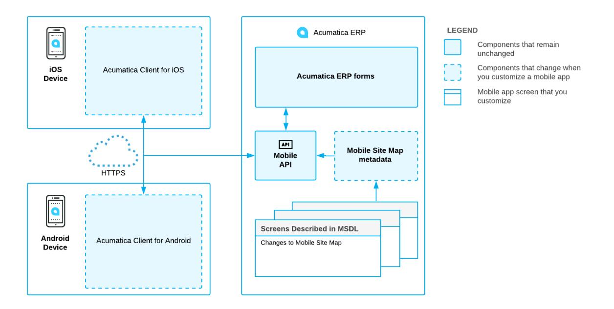

#### *Figure: Acumatica Mobile Framework architecture*

An Acumatica mobile client application uses the Mobile API to access the data of the forms that are mapped for mobile apps in the Acumatica ERP instance. The metadata of the mobile site map is used to configure the user interface of the mobile client application. You can expose any form of Acumatica ERP on your mobile device if the mobile site map includes the metadata for the form.

The Acumatica mobile app is like a browser for an instance of Acumatica ERP in that it does not have built-in ERP-related functionality. The Acumatica mobile app instead uses the configuration and data in Acumatica ERP and displays it to the user.

This part of the guide describes how to configure the Acumatica ERP mobile site map. The part is intended for application developers who are learning how to customize Acumatica ERP or other Acumatica Framework–based applications.

# <span id="page-7-0"></span>**To Start Acumatica ERP on a Mobile Device**

The Acumatica mobile app provides access to the functionality of Acumatica ERP, such as approving documents, managing time cards, processing sales orders, and handling expense receipts and claims.

The Acumatica mobile app is an out-of-the-box solution that gives users the ability to access Acumatica ERP from mobile devices so that they can enter and manage their work documents. This application provides the user interface to access the data and functionality of Acumatica ERP by using the predefined original mobile site map.

To start using Acumatica ERP on a mobile device, perform the following actions:

- 1. Download the free Acumatica mobile app from Apple Store or Google Play, and install it on the mobile device.
- 2. Launch the app.
- 3. Enter the URL and optional name of your Acumatica site (for example, *https://your.acumatica.site.com*), and tap **Next**.

If both the Acumatica ERP server and the mobile device use the same local wireless network, you can specify the URL in one of the following ways:

- *http://<Computer Name>/<Website Name>*, such as *http://MyComputer/MySite*
- *http://<IP Address>/<Website Name>*, such as *http://111.222.3.44/MySite*
- 4. Enter the credentials of your user account.
- 5. Tap**Sign In** to enter the site.

The app connects to the Acumatica ERP server, and the server authorizes the user and returns the metadata to render the Home screen of the mobile app.

The following screenshot shows the Home screen of the mobile app. The menu contains a placeholder for adding KPI widgets (see Item 1 in the screenshot), the list of recently visited screens and records (Item 2), the list of screens and records marked as favorites (Item 3), and the tiles with the workspaces (Item 4).

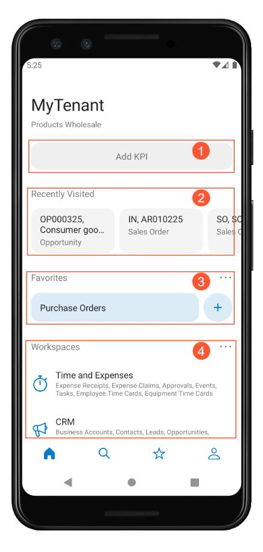

*Figure: The Home screen of the mobile app*

At the bottom of the Home screen, there is a navigation bar highlighted in the following screenshot. The navigation bar contains access to the following:

- The Home screen of the app
- Search in the documents and mapped screens
- The list of favorite workspaces and screens
- Settings of the app where you can sign out of the instance

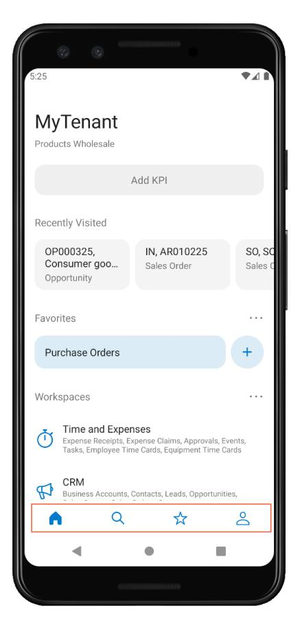

*Figure: The navigation bar of the mobile app*

# <span id="page-10-0"></span>**System Requirements for the Acumatica Mobile App**

To support the Acumatica mobile app, a device must meet the following requirements:

- A supported operating system: Android 5.1 and later, or iOS 15 and later
- Sufficient free disk space (the amount depends on the particular device)
- An internet connection

Currently, the mobile app fully supports the following versions of Acumatica ERP:

- 2023 R2
- 2024 R1
- 2024 R2

# <span id="page-11-3"></span><span id="page-11-0"></span>**Mobile Site Map**

The mobile site map is the metadata you use to configure the Acumatica mobile app. The mobile site map contains descriptions of the elements that should appear on the mobile device, including the main menu, the workspaces, the screens, and the fields and actions on the screens.

The mobile site map is defined with Mobile Site Map Definition Language (MSDL) code. You access and edit the mobile site map definition by using the Customization Project Editor.

# <span id="page-11-5"></span><span id="page-11-1"></span>**To Update the Main Menu of a Mobile App**

In a customization project, you can update the main menu of the customized Acumatica mobile app by using the Customization Project Editor.

### **To Update the Main Menu of the Mobile App**

- 1. Open the *[Customization Projects](https://help-2025r1.acumatica.com/Help?ScreenId=ShowWiki&pageid=4d3a1166-826c-414b-a207-3d1669fbf9e5)* (SM204505) form, and in the **Project Name** column, click the link of the customization project. The Customization Project Editor opens.
- 2. Open the Mobile Application page.
- 3. On the More menu of the page, click **Update Main Menu**.

The Update: MENU page opens. The *Update MENU* screen appears in the list of modified screens on the Mobile Application page of the Customization Project Editor.

- 4. In the **Result Preview** area of the Update: MENU page, explore the original code of the main menu.
- 5. In the **Commands** area of the Update: MENU page, implement your code by using Mobile Site Map Definition Language (MSDL). For details, see *[Main Menu](#page-22-2)*.
- 6. Save your changes.

Your commands are applied to the menu. If any errors have occurred, you can see them in the **Errors** area of the form. If your changes have been applied successfully, you can see the updated site map of the main menu in the **Result Preview** area of the form.

7. Publish your customization project.

#### **Related Links**

• *[Main Menu](#page-22-2)*

## <span id="page-11-4"></span><span id="page-11-2"></span>**To Manage the Workspaces of the Mobile App**

The main menu of the Acumatica mobile app contains workspaces that are similar to those in your Acumatica ERP instance but that you configure separately.

You manage the workspaces of the main menu by using the Customization Project Editor and the *[Mobile](https://help-2025r1.acumatica.com/Help?ScreenId=ShowWiki&pageid=fa01ef78-1297-4a3f-87ff-fa018f86bc98) [Workspaces](https://help-2025r1.acumatica.com/Help?ScreenId=ShowWiki&pageid=fa01ef78-1297-4a3f-87ff-fa018f86bc98)* (AU220012) and *[Mobile Workspace](https://help-2025r1.acumatica.com/Help?ScreenId=ShowWiki&pageid=769f34f8-f804-43ec-97a7-ae98c679d4f0)* (AU220013) forms in your instance, as well as in the mobile app itself.

If you configure the workspaces on the *[Mobile Workspaces](https://help-2025r1.acumatica.com/Help?ScreenId=ShowWiki&pageid=fa01ef78-1297-4a3f-87ff-fa018f86bc98)* and *[Mobile Workspace](https://help-2025r1.acumatica.com/Help?ScreenId=ShowWiki&pageid=769f34f8-f804-43ec-97a7-ae98c679d4f0)* forms and in your customization project, the system applies these settings to all copies of the Acumatica mobile apps connected to the current tenant in the Acumatica ERP instance. To configure these settings, you need to have the *Administrator* or *Customizer* predefined role.

If any user configures workspaces, screens, and KPI widgets in the mobile app, these settings are applied to the mobile app for only this user.

### <span id="page-12-1"></span><span id="page-12-0"></span>**To Configure Workspaces in the Acumatica ERP Instance**

You configure the workspaces and their screens of the Acumatica mobile app in your Acumatica ERP instance by using the *[Mobile Workspaces](https://help-2025r1.acumatica.com/Help?ScreenId=ShowWiki&pageid=fa01ef78-1297-4a3f-87ff-fa018f86bc98)* (AU220012) and *[Mobile Workspace](https://help-2025r1.acumatica.com/Help?ScreenId=ShowWiki&pageid=769f34f8-f804-43ec-97a7-ae98c679d4f0)* (AU220013) forms, as well as the Customization Project Editor. This topic describes the way you can configure the workspaces of the mobile app.

This configuration applies to all copies of the Acumatica mobile app connected to the current tenant in an Acumatica ERP instance. To perform this configuration, you need to have the *Administrator* or *Customizer* predefined role. To view the applied changes, if you are signed in to the mobile app, you need to sign out and then to sign in again.

### **To Add a Workspace**

You can add a workspace to the mobile app so that its tile is shown on the main menu. Do the following:

- 1. In your Acumatica ERP instance, open the *[Mobile Workspaces](https://help-2025r1.acumatica.com/Help?ScreenId=ShowWiki&pageid=fa01ef78-1297-4a3f-87ff-fa018f86bc98)* (AU220012) form.
- 2. On the form toolbar, click **Add Row** and provide the following values:
  - **Workspace ID**: Internal identifier of the workspace
  - **Display Name**: Name of the workspace that is displayed in the mobile app
- 3. Make sure that the**Visible** check box is selected in the row of the added workspace.
- 4. Save your changes.

#### **To Change the Order of Workspaces**

To change the order in which the workspaces are displayed on the main menu of the mobile app, perform the following steps:

- 1. Open the *[Mobile Workspaces](https://help-2025r1.acumatica.com/Help?ScreenId=ShowWiki&pageid=fa01ef78-1297-4a3f-87ff-fa018f86bc98)* (AU220012) form.
- 2. Click the row with the workspace you want to move.
- 3. On the form toolbar, click **Move Row Up** or **Move Row Down** to change the position of the workspace.
- 4. Save your changes.

#### **To Remove a Workspace from the List of Workspaces**

To remove a workspace from the main menu of the mobile app, perform the following steps:

- 1. Open the *[Mobile Workspaces](https://help-2025r1.acumatica.com/Help?ScreenId=ShowWiki&pageid=fa01ef78-1297-4a3f-87ff-fa018f86bc98)* (AU220012) form.
- 2. Click the row with the workspace you want to delete.
- 3. On the form toolbar, click **Delete Row**.

Alternatively, you can clear the check box in the**Visible** column of the row with the workspace. In this case, the workspace will not be displayed on the mobile app, but the system will store its settings, and you can make it visible again if needed.

4. Save your changes.

#### **To Add a Screen to a Workspace**

To add a screen to a workspace, perform the following steps:

- 1. Open the *[Mobile Workspaces](https://help-2025r1.acumatica.com/Help?ScreenId=ShowWiki&pageid=fa01ef78-1297-4a3f-87ff-fa018f86bc98)* (AU220012) form.
- 2. In the **Workspace ID** column of the table on the form, click the link with the identifier of the workspace for which you want to add a screen.

The *[Mobile Workspace](https://help-2025r1.acumatica.com/Help?ScreenId=ShowWiki&pageid=769f34f8-f804-43ec-97a7-ae98c679d4f0)* (AU220013) opens for the workplace.

- 3. On the table toolbar of the**Screens** tab, click **Add Row**.
- 4. In the **Item Name** column, select the required screen.


If you have added a new screen to the mobile site map and want to add it to a workspace, you have to publish the customization project first. The new screen is displayed in the **Item Name** selector only aer changes to the mobile site map are applied to the instance.

- 5. Make sure the**Visible** check box is selected for the added screen.
- 6. Save your changes.

#### **To Change the Position of a Screen in a Workspace**

To change the position of any screen in a workspace, perform the following steps:

- 1. Open the *[Mobile Workspace](https://help-2025r1.acumatica.com/Help?ScreenId=ShowWiki&pageid=769f34f8-f804-43ec-97a7-ae98c679d4f0)* (AU220013) form, and select the workspace.
- 2. Click the row with the screen you want to move.
- 3. On the form toolbar, click **Move Row Up** or **Move Row Down** to change the position of the screen.
- 4. Save your changes.

#### **To Remove a Screen from a Workspace**

To remove a screen from a workspace, perform the following steps:

- 1. Open the *[Mobile Workspace](https://help-2025r1.acumatica.com/Help?ScreenId=ShowWiki&pageid=769f34f8-f804-43ec-97a7-ae98c679d4f0)* (AU220013) form for the required workspace.
- 2. Click the row with the screen you want to delete.
- 3. On the table toolbar, click **Delete Row**.

Alternatively, you can clear the check box in the**Visible** column of the row with this screen. In this case, the screen will not be displayed in the workspace but will remain in the list of screens on the**Screens** tab of this form, and you can make it visible again if needed.

4. Save your changes.

#### **To Add a Widget to a Workspace**

To add a widget to a workspace, perform the following steps:

- 1. Open the *[Mobile Workspace](https://help-2025r1.acumatica.com/Help?ScreenId=ShowWiki&pageid=769f34f8-f804-43ec-97a7-ae98c679d4f0)* (AU220013) form for the required workspace.
- 2. On the table toolbar of the **Widgets** tab, click **Add Row**.
- 3. In the **Dashboard** column, select the dashboard that contains the widget.
- 4. In the **Widget** column, select the widget you want to add to the dashboard.

- 5. In the row, make sure the**Visible** check box is selected.
- 6. Save your changes.

#### **To Change the Position of a Widget in a Workspace**

To change the position of any widget in a workspace, perform the following steps:

- 1. Open the *[Mobile Workspace](https://help-2025r1.acumatica.com/Help?ScreenId=ShowWiki&pageid=769f34f8-f804-43ec-97a7-ae98c679d4f0)* (AU220013) form for the workspace.
- 2. On the **Widgets** tab, click the row with the widget you want to move.
- 3. On the table toolbar, click **Move Row Up** or **Move Row Down** to change the position of the widget.
- 4. Save your changes.

#### **To Remove a Widget from a Workspace**

To remove a widget from a workspace, perform the following steps:

- 1. Open the *[Mobile Workspace](https://help-2025r1.acumatica.com/Help?ScreenId=ShowWiki&pageid=769f34f8-f804-43ec-97a7-ae98c679d4f0)* (AU220013) form for the required workspace.
- 2. On the **Widgets** tab, click the row with the widget you want to delete.
- 3. On the table toolbar, click **Delete Row**.
- 4. Save your changes.

Alternatively, you can clear the check box in the**Visible** column of the row with the widget. In this case, the widget will not be displayed in the workspace but will remain in the list of widgets on the *[Mobile Workspace](https://help-2025r1.acumatica.com/Help?ScreenId=ShowWiki&pageid=769f34f8-f804-43ec-97a7-ae98c679d4f0)* (AU220013) form, and you can make it visible again if needed.

## <span id="page-14-1"></span><span id="page-14-0"></span>**To Manage Workspaces in a Customization Project**

You can add to a customization project the following types of items:

- *MobileSitemapWorkspace*: This item contains general data, such as the name of a workspace, its sequential number, and its icon.
- *MobileSitemapWorkspaceItems*: This item contains the screens included in the workspace.
- *MobileSitemapWorkspaceWidgets*: This item contains the KPI widgets included in the workspace and its screens.

We recommend that you add screens to the workspace of the mobile app in Acumatica ERP. If you were to add a new screen to the mobile app by using the **Add New Screen** command on the Mobile Application page of the Customization Project Editor, the new screen would be added to the **Other** workspace by default. To avoid this, you need to add this screen to one of the workspaces on the *[Mobile Workspace](https://help-2025r1.acumatica.com/Help?ScreenId=ShowWiki&pageid=769f34f8-f804-43ec-97a7-ae98c679d4f0)* (AU220013) form, as described in the *To Add a Screen to a Workspace* section of the *To Manage Workspaces in a [Customization](#page-14-1) Project* topic.

#### **To Add a Workspace to a Customization Project**

To add any workspaces to a particular customization project, perform the following steps:

- 1. Open the *[Customization Projects](https://help-2025r1.acumatica.com/Help?ScreenId=ShowWiki&pageid=4d3a1166-826c-414b-a207-3d1669fbf9e5)* (SM204505) form, and in the **Project Name** column, click the link of the customization project. The Customization Project Editor opens.
- 2. In the navigation pane, click **Mobile Application** to open the Mobile Application page.
- 3. On the More menu of the page, click **Manage Workspaces**.

The Mobile Workspace page opens.

4. On the page toolbar, click **Add New Record**.

The **Add Workspace** dialog box opens. The dialog box contains workspaces that you have modified. These include workspaces for which you have added any screens or widgets on the *[Mobile Workspace](https://help-2025r1.acumatica.com/Help?ScreenId=ShowWiki&pageid=769f34f8-f804-43ec-97a7-ae98c679d4f0)* (AU220013) form, new workspaces you have created on the form, as well as workspaces whose order you have changed on the *[Mobile Workspaces](https://help-2025r1.acumatica.com/Help?ScreenId=ShowWiki&pageid=fa01ef78-1297-4a3f-87ff-fa018f86bc98)* (AU220012) form.

5. Select the unlabeled check box in each row with a workspace whose changes you want to add to the project.

In the navigation pane, notice that the Mobile Workspaces page is listed under the **Mobile Application** node. Open this page, and you can see that the More menu of this page contains the **Manage Workspaces** command.

6. Click **Save** to add the selected workspaces to the customization project and save your changes.

#### **To Configure Workspaces from a Customization Project**

To configure workspaces from a customization project, perform the following steps:

- 1. Open the *[Customization Projects](https://help-2025r1.acumatica.com/Help?ScreenId=ShowWiki&pageid=4d3a1166-826c-414b-a207-3d1669fbf9e5)* (SM204505) form, and in the **Project Name** column, click the link of the customization project. The Customization Project Editor opens.
- 2. In the navigation pane, click **Mobile Workspaces** to open the Mobile Application page.
- 3. On the More menu of the page, click **Manage Workspaces**.

The *[Mobile Workspaces](https://help-2025r1.acumatica.com/Help?ScreenId=ShowWiki&pageid=fa01ef78-1297-4a3f-87ff-fa018f86bc98)* (AU220012) form opens in a new window.

- 4. On the form, configure the workspaces as described in *To Configure [Workspaces](#page-12-1) in the Acumatica ERP [Instance](#page-12-1)*.
- 5. Save your changes, and close the window.

#### **To Update a Workspace in a Customization Project**

To update a workspace in a customization project aer you have modified it in the Acumatica ERP instance, perform the following steps:

- 1. Open the *[Customization Projects](https://help-2025r1.acumatica.com/Help?ScreenId=ShowWiki&pageid=4d3a1166-826c-414b-a207-3d1669fbf9e5)* (SM204505) form, and in the **Project Name** column, click the link of the customization project. The Customization Project Editor opens.
- 2. In the navigation pane, click **Mobile Workspaces** to open the Mobile Application page.
- 3. In the table on the page, click the workspace you want to update.
- 4. On the More menu, click **Reload from Database**.

#### **To Remove a Workspace from a Customization Project**

To remove a workspace from a customization project, perform the following steps:

- 1. Open the *[Customization Projects](https://help-2025r1.acumatica.com/Help?ScreenId=ShowWiki&pageid=4d3a1166-826c-414b-a207-3d1669fbf9e5)* (SM204505) form, and in the **Project Name** column, click the link of the customization project. The Customization Project Editor opens.
- 2. On the navigation pane, click **Mobile Workspaces** to open the Mobile Application page.
- 3. In the table on the page, click the row with the workspace you want to remove.
- 4. On the page toolbar, click **Delete Row**.
- 5. Save your changes.

# <span id="page-16-0"></span>**To Tailor A User's Workspaces in the Mobile App**

The configuration described in this topic is performed by a user of the Acumatica mobile app. The configuration applies to only this user's copy of the mobile app.

A workspace added on the *[Mobile Workspaces](https://help-2025r1.acumatica.com/Help?ScreenId=ShowWiki&pageid=fa01ef78-1297-4a3f-87ff-fa018f86bc98)* form is displayed on the main menu of the mobile app only if this workspace contains at least one screen or one KPI widget that is available to the mobile app user.

### **To Change the Order of Workspaces**

To change the order in which the workspaces are displayed on the main menu of the mobile app for your user account, perform the following steps:

1. Sign in to the mobile app.

The main menu of the app opens.

2. On the More menu of the **Workspaces** section, tap **Reorder Workspaces**.

The **Reorder Workspaces** screen opens.

- 3. On the screen, tap and hold a tile, and then drag it to the required location.
- 4. Click the back arrow to save your changes and return to the main menu.

### **To Change the Order of Screens**

To change the order in which the screens are displayed within a workspace, perform the following steps:

1. Sign in to the mobile app.

The main menu of the app opens.

- 2. Tap the tile with the required workspace.
- 3. Tap the More (…) button of the**Screens** section, and then tap **ReorderScreens**.

The **ReorderScreens** screen opens.

- 4. On the screen, tap and hold a tile, and then drag it to the required location.
- 5. Click the back arrow to save your changes and return to the workspace.

### **To Add KPI Widgets**

On the main menu of the mobile app and in each of the workspaces, you can add KPI widgets of the following types:

- Scorecard
- Meter
- Trend card

By default, no widgets are displayed. To add a widget to the main menu or to a workspace, perform the following steps:

1. Sign in to the mobile app.

The main menu of the app opens.

- 2. On the menu, tap **Add KPI**, or open a workspace and then tap **Add KPI**.
  - The Search screen opens.
- 3. On the screen, tap the widget you want to add.
  - Notice that the mobile app marks it as a favorite.
- 4. Click the back arrow to save your changes and return to the workspace.

The mobile app adds the selected widget to the workspace or to the main menu. You can view the list of records of a widget by tapping it.

Aer you have added at least one widget to the workspace, the More (…) button of the **KPIs** section becomes available. You can edit the list of KPIs or add new ones by tapping the corresponding commands on this menu.

You can see a widget only if the corresponding dashboard is visible and your user account has the needed privileges to view this dashboard.

### **To Add a Screen to Your List of Favorites**

To add a screen to your list of favorites, perform the following steps:

1. Sign in to the mobile app.

The main menu of the app opens.

- 2. Tap the workspace that contains the screen, and then tap the screen you want to add to favorites.
- 3. Tap the More (…) button of the screen, and then tap **Add Screen to Favorites**.
- 4. Click the back arrow to save your changes and return to the workspace.

To view the added screens, click **Favorites** on the bottom menu of the mobile app.

You can remove screens from favorites by performing steps similar to those you performed to add these items to favorites. You tap the More (…) buttonof an item, and then you tap **RemoveScreen from Favorites**.

### **To Add a Record to Your List of Favorites**

To add a record to your list of favorites, perform the following steps:

1. Sign in to the mobile app.

The main menu of the app opens.

- 2. Tap the required workspace, and then tap the required screen.
- 3. Select the record you want to add to favorites.
- 4. Tap the More (…) button of the record, and then tap **Add Record to Favorites**, and close the record.
- 5. Click the back arrow to save your changes and return to the workspace.

To view the added records, click **Favorites** on the bottom menu of the mobile app.

You can remove records from favorites by performing steps similar to those you performed to add these items to favorites. You tap the More (…) button of an item, and then you tap **Remove Record from Favorites**.

### <span id="page-17-1"></span><span id="page-17-0"></span>**To Update a Screen of a Mobile App**

In a customization project, you can update an existing screen of the customized Acumatica mobile app by using the Customization Project Editor.

### **To Update a Screen of a Mobile App**

- 1. Open the *[Customization Projects](https://help-2025r1.acumatica.com/Help?ScreenId=ShowWiki&pageid=4d3a1166-826c-414b-a207-3d1669fbf9e5)* (SM204505) form, and in the **Project Name** column, click the link of the customization project. The Customization Project Editor opens.
- 2. Open the Mobile Application page.
- 3. On the More menu of the page, click **Update ExistingScreen**.

The **Update ExistingScreen** dialog box opens.

4. In the dialog box, specify the ID of the screen you want to update, and click **OK**.

The Update: <screen\_name> page opens. The new *update* screen with its details appears in the list of modified screens on the Mobile Application page of the Customization Project Editor.

- 5. Explore the original code of the screen in the **Result Preview** area of the Update: <screen\_name> page.
- 6. Implement your code by using Mobile Site Map Definition Language (MSDL) in the **Commands** area of the page. For details, see *[Screens](#page-29-2)*.
- 7. Save your changes.

Your commands are applied to the site map. If any errors have occurred, you can see them in the **Errors** area of the page. If your changes have been applied successfully, you can see the updated site map of the main menu in the **Result Preview** area of the form.

8. Publish the customization project.

# <span id="page-18-1"></span><span id="page-18-0"></span>**To Add a Screen to the Mobile Site Map (Example)**

Suppose that you need to add to the Acumatica mobile app a screen that corresponds to an Acumatica ERP form. The form ID is *XXX*. The desired mobile screen has to contain the Date and Description fields and the Insert and Delete actions of the original *XXX* form of Acumatica ERP. Further suppose that you need to add the screen to a workspace.

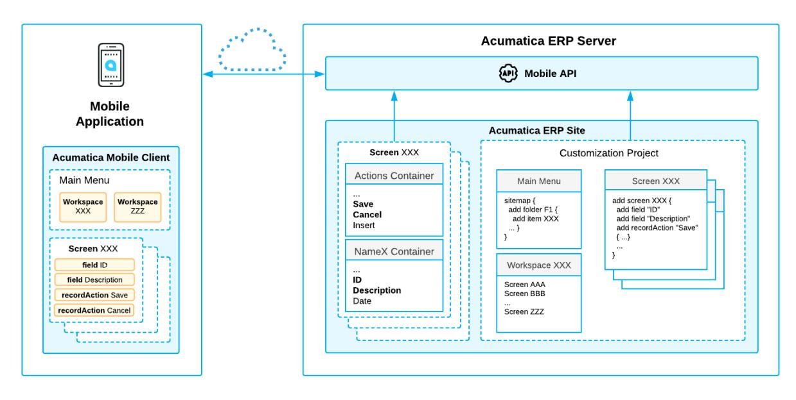

#### *Figure: Use of MSDL to configure a screen in the mobile app*

The diagram above shows how the Acumatica Mobile Framework uses the MSDL code to configure the *XXX* screen in the mobile app. (See *[Configuring the Mobile Site Map](#page-22-3)* for details.) You declare the desired screen,

workspace, containers, fields, actions, and other objects by using Mobile Site Map Definition Language (MSDL) in the Customization Project Editor. The objects you want to be displayed on the mobile app screen must be present on the original Acumatica ERP form (see *[Getting the WSDL Schema](#page-80-1)*).

Aer you publish your customization project, the screen you have defined by using MSDL appears in the mobile app.

#### **To Add a Screen to the Mobile Site Map**

To add a screen to the mobile site map, perform the following steps:

- 1. Get the WSDL schema for the original *XXX* screen of Acumatica ERP, as described in *[Getting the WSDL](#page-80-1) [Schema](#page-80-1)*.
- 2. Open the *[Customization Projects](https://help-2025r1.acumatica.com/Help?ScreenId=ShowWiki&pageid=4d3a1166-826c-414b-a207-3d1669fbf9e5)* (SM204505) form, and in the **Project Name** column, click the link of the customization project. The Customization Project Editor opens.
- 3. Open the Mobile Application page.
- 4. On the More menu of the page, click **Add New Screen**.

The **Add New Screen** dialog box opens.

5. In the dialog box, enter the form ID of the Acumatica ERP form (and thus of the corresponding screen in the mobile app) that you want to add to the mobile app, and click **OK**.

The Add: <screen\_name> page opens. The row with the *add* screen and its details appears in the list of modified screens on the Mobile Application page of the Customization Project Editor.

6. Notice that the initial code of the screen includes only one add instruction.

```
add screen <screen_ID> {
# you can add commands here
# ObjectAttribute = Value
}
```

(See *[add](#page-145-0)* for details about the instruction.)

7. Implement the code of the new screen in the **Commands** area of the Add page. For details, see *[Screens](#page-29-2)*.

While implementing the code, use the WSDL schema to understand which actions and fields are available for the form you are adding. For details, see *[Getting the WSDL Schema](#page-80-1)*.

8. Save your changes.

Your commands are applied to the site map. If any errors have occurred, you can see them in the **Errors** area of the page. If your changes have been applied successfully, you can see the updated site map of the main menu in the **Result Preview** area of the form.

9. On the Update: MENU page, add a shortcut for the new screen in the main menu, as illustrated in the following code.

```
add item <screen_ID> {
 visible = True 
 displayName = "screen_title" }
```

10.Save your changes, and publish your customization project.

### <span id="page-19-0"></span>**To Remove a Screen of a Mobile App**

You can remove a screen of the customized Acumatica mobile app from a customization project by using the Customization Project Editor.

#### **To Remove a Screen of a Mobile App**

- 1. Open the *[Customization Projects](https://help-2025r1.acumatica.com/Help?ScreenId=ShowWiki&pageid=4d3a1166-826c-414b-a207-3d1669fbf9e5)* (SM204505) form, and in the **Project Name** column, click the link of the customization project. The Customization Project Editor opens.
- 2. Open the Mobile Application page.
- 3. On the More menu of the page, click **Remove ExistingScreen**.

The **Remove ExistingScreen** dialog box opens.

4. In the dialog box, specify the ID of the screen you want to remove, and click **OK**.

The selected screen is removed. The *Remove <screen\_name>* row appears in the list of modified screens on the Mobile Application page of the Customization Project Editor.

### <span id="page-20-2"></span><span id="page-20-0"></span>**To Convert an XML Mobile Site Map to MSDL Format**

You can convert an XML mobile site map to MSDL format any time you want by using the ac.exe command-line utility, as described in this topic.

#### **To Convert an XML Site Map to MSDL Format**

Run the ac.exe command-line utility, which is located in the Data folder of your Acumatica ERP installation folder, with the MOBILESITEMAP command, the convert argument, and the following parameters:

- The path to the folder with the mobile site map, which is the \App\_Data\Mobile folder of the Acumatica ERP application instance. The file containing the mobile site map must be named mobilesitemap.xml.
- The path to the MSD script file to which you want to save the generated site map.

The following code shows an example of the command line. (The line breaks are only for display purposes.)

```
ac.exe MOBILESITEMAP c s
 "D:\ProgramFiles\AcumaticaERP\CustomizedAcumaticaDB\App_Data\Mobile" 
 "D:\ProgramFiles\AcumaticaERP\CustomizedAcumaticaDB\App_Data\Mobile\sitemap.msd"
```

You can use the short name of the convert argument, which is c.

#### **Related Links**

• *[ac.exe MOBILEITEMAP Reference](#page-185-0)*

### <span id="page-20-1"></span>**To Reverse Changes Made to the Mobile Site Map**

When you are customizing the mobile site map in a customization project by using the Customization Project Editor, you might need to reverse the changes you have made to the site map of the Acumatica mobile app in this project. You can return to the original site map for one tenant or for all tenants without removing the other changes you have made in the customization project.

#### **To Reverse Changes Made to the Mobile Site Map**

To reverse the changes to the mobile site map in a particular customization project, perform the following steps:

- 1. Open the customization project in the Customization Project Editor.
- 2. Click **Mobile Application** in the navigation pane to open the Mobile Application page.
- 3. On the More menu of the page, click **Clear CurrentTenant** if you want to reverse the changes to the current tenant only. If you want to reverse the changes to all tenants, click **Clear AllTenants**.

The mobile app customization is unpublished from the selected tenants.

To return to your changes, publish your customization project, as described in *To Publish the [Current](https://help-2025r1.acumatica.com/Help?ScreenId=ShowWiki&pageid=4c750ed2-7741-47f6-9d54-136f7dc7198a) Project*.

# <span id="page-22-3"></span><span id="page-22-0"></span>**Configuring the Mobile Site Map**

You develop the code that creates or changes the mobile site map in the memory of the Acumatica ERP server by using Mobile Site Map Definition Language (MSDL).

Before Acumatica Framework 2021 R2, XML was used to configure the mobile site map.

### **MSDL Overview**

MSDL provides the capability to configure the user interface of the Acumatica mobile app. It transcends XML in terms of its flexibility of usage for the mobile site map, because you can apply MSDL code multiple times for any Acumatica ERP form, whether it is a custom, customized, or original form. In contrast with XML, Acumatica Mobile Framework can successively apply MSDL code for a form from multiple customizations without problems or restrictions.

If you already have an XML site map in MSDL format, you should convert the XML mobile site map to MSDL format, as described in *To [Convert](#page-20-2) an XML Mobile Site Map to MSDL Format*.

See the *[MSDL](#page-115-2)* section of *[Mobile Site Map Reference](#page-115-3)* for details about MSDL syntax, object types, and instructions.

### **User Interface Structure**

You can modify the elements of the Acumatica mobile app user interface by using MSDL. The user interface of the Acumatica mobile app has the following structure:

- *[Main Menu](#page-73-2)*: You can customize the main menu by using instructions that work with the Folder and Screen objects.
- *[Screens](#page-79-1)*: You can customize the mobile app screens by using instructions that work with Container, Field, Action, and other objects.

In previous versions of Acumatica ERP, you could customize the sidebar menu by populating it with links ti favorite records and screens. As of Acumatica ERP 2025 R1, the sidebar menu has been deprecated. Customization projects that contain sidebar modification will no longer work. We recommend that you use the workspace functionality and add the required records and screens to Favorites. (For details, see *[Main Menu](#page-22-2)*.)

### **How to Use the MSDL Examples of This Section**

In this section, each example contains a list of MSDL instructions that modify the mobile site map for your instance of Acumatica ERP.

To use the examples from this section, you should first add a new page (or modify an existing one) in the Customization Project Editor, and then insert the code in the **Commands** area. You can see your changes aer you publish the customization project. For details, see the topics of the *[Mobile Site Map](#page-11-3)* chapter.

## <span id="page-22-2"></span><span id="page-22-1"></span>**Main Menu**

The main menu of the Acumatica mobile app consists of workspaces, a placeholder for adding KPI widgets, the list of recently visited screens and records, the list of screens and records marked as favorites, and the bottom menu with the **Home**, **Search**, **Favorites**, and **Settings** buttons. A user can go to any of these parts of the mobile app by tapping the needed part of the screen.


The workspaces in the mobile app are not the same as the workspaces in the web version. You configure mobile workspaces separately (see *To Manage the [Workspaces](#page-11-4) of the Mobile App*).

To add a screen to the main menu, you perform the following steps:

- 1. Map the screen to the mobile site map, as described in *To Add a Screen to the Mobile Site Map [\(Example\)](#page-18-1)*
- 2. Add the screen to the mobile site map, as described in *To [Update](#page-11-5) the Main Menu of a Mobile App*
- 3. Add the screen to a workspace, as described in *To Manage the [Workspaces](#page-11-4) of the Mobile App*

The access rights for screens in the mobile application are the same as the access rights for screens in Acumatica ERP.

The start page of the main menu contains all child tags of the *[sitemap](#page-149-0)* instruction.

In this topic, you can read about and perform several simple examples that demonstrate how to build the main menu of the mobile application.

### **Exploring of the Original Main Menu Code**

You can view the original code of the main menu of the Acumatica mobile app by doing the following:

- 1. Open the *[Customization Projects](https://help-2025r1.acumatica.com/Help?ScreenId=ShowWiki&pageid=4d3a1166-826c-414b-a207-3d1669fbf9e5)* (SM204505) form, and in the **Project Name** column, click the link of the customization project. The Customization Project Editor opens.
- 2. Open the Mobile Application page.
- 3. On the More menu of the page, click **Update Main Menu**.

The Update: MENU page opens. The *Update: MENU* screen appears in the list of modified screens on the Mobile Application page.

4. On the Update: MENU page, explore the original code of the main menu in the **Result Preview** area.

The mobile app's main menu is shown in the following screenshot.

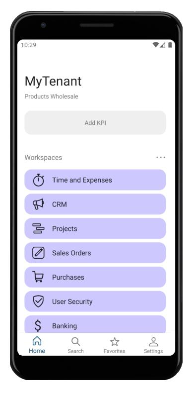

*Figure: The main menu of the mobile app*

### **Example: Adding a Screen to a Workspace**

Adding a screen to a workspace consists of two actions:

- Adding the new screen to the mobile site map, as described in *To Add a [Screen](#page-18-1) to the Mobile Site Map [\(Example\)](#page-18-1)*
- Adding the new screen to a workspace

In this example, you will add the *Unreconciled transactions* widget of the *Controller* dashboard to the **CRM** workspace by using the *[Mobile Workspaces](https://help-2025r1.acumatica.com/Help?ScreenId=ShowWiki&pageid=fa01ef78-1297-4a3f-87ff-fa018f86bc98)* (AU220012) and *[Mobile Workspace](https://help-2025r1.acumatica.com/Help?ScreenId=ShowWiki&pageid=769f34f8-f804-43ec-97a7-ae98c679d4f0)* (AU220013) forms.

To add the widget, perform the following steps:

- 1. Open the *[Mobile Workspaces](https://help-2025r1.acumatica.com/Help?ScreenId=ShowWiki&pageid=fa01ef78-1297-4a3f-87ff-fa018f86bc98)* form.
- 2. In the **Workspace ID** column, click *CRM*.

The *[Mobile Workspace](https://help-2025r1.acumatica.com/Help?ScreenId=ShowWiki&pageid=769f34f8-f804-43ec-97a7-ae98c679d4f0)* form opens.

- 3. On the table toolbar of the **Widgets** tab, click **Add Row**, and specify the following settings in the added row:
  - **Dashboard**: *Controller*
  - **Widget**: *Unreconciled transactions*
- 4. Save your changes.
- 5. Sign out of the mobile app, and then sign in again.
- 6. On the main menu, tap **CRM**.

The workspace should look similar to the one shown in the following screenshot:

| $\epsilon$<br>10:29              | ▼⊿∎       |
|----------------------------------|-----------|
| $\leftarrow$<br><b>CRM</b>       |           |
| <b>KPIs</b>                      |           |
| Unreconciled transactions        | 2.54K     |
| Screens                          |           |
| <b>Business Accounts</b>         | $\pm$     |
| Contacts                         | $\ddot{}$ |
| Leads                            | $\ddot{}$ |
| Opportunities                    | $\ddot{}$ |
| <b>Sales Quotes</b>              | $\pm$     |
| Sales Orders                     | $\ddot{}$ |
| 6<br>Home<br>Search<br>Favorites | Settings  |
|                                  |           |

*Figure: The CRM workspace with the added widget*

### **Example: Adding a Screen to a Folder**

As of Acumatica ERP 2025 R1, the adding of screens by methods described in the section has been deprecated. We recommend that you use the workspace functionality as described in *To [Configure](#page-12-1) [Workspaces in the Acumatica ERP Instance](#page-12-1)*.

Adding a screen to a folder consists of two actions:

- Adding a new screen to the mobile site map, as described in *To Add a [Screen](#page-18-1) to the Mobile Site Map [\(Example\)](#page-18-1)*
- Adding the new screen shortcut to the main menu.

In this example, you will add a shortcut of the Controller screen to the Dashboards folder of the main menu. Copy the code below to the Commands area of the Update: MENU page in the Customization Project Editor.

```
update sitemap { 
 add folder "Folder_0" {
 displayName = "Dashboards" 
 icon = "system://Folder" 
 add item "DB000015" { 
 displayName = "Controller" 
 icon = "system://Graph1" 
 } 
 }
}
```

The screenshots below show the results of this code on the mobile device.

#### *Figure: The main menu, the contents of the folder, and the screen*

A folder must include at least one screen.

A folder can be of one of the following types, which determine how the folder contents are displayed:

- ListFolder (default): With a folder of this type, folders and screens are represented as tiles with icons (see the first screenshot in the example in this section, shown above). You need to tap an icon to open a folder or screen.
- HubFolder: In a folder of this type (see an example in the right screenshot at the end of the next section), the content of a screen is displayed like a tab item on a form. You swipe le and right to navigate through the contents of the folder.

Nested folders of the HubFolder type are not supported. That is, you may not add a folder of the HubFolder type within another folder of HubFolder type.

#### **Example: Configuring Screens for Forms with Tabs**

Some Acumatica ERP forms display lists on multiple tabs (as the following screenshot shows).

|      |        | <b>Invoiced</b> Items                                                 |                                |                      |                       |                      |              |           |                     |            |                                  |         | <b>CUSTOMIZATION</b> | TOOLS $\sim$<br>۰.      |
|------|--------|-----------------------------------------------------------------------|--------------------------------|----------------------|-----------------------|----------------------|--------------|-----------|---------------------|------------|----------------------------------|---------|----------------------|-------------------------|
| Ò    |        | $ \mathbf{x} $<br>↶<br>$\overline{\phantom{a}}$<br><b>ALL RECORDS</b> | <b>KEY CUSTOMERS 12 MONTHS</b> |                      |                       |                      |              |           |                     |            |                                  |         |                      |                         |
|      |        | Drag column header here to configure filter                           |                                |                      |                       |                      |              |           |                     |            |                                  | B<br>Y  | $\cdots$             | ρ                       |
| 83 O | D      |                                                                       | Customer ID T Customer Name    | Customer<br>Class ID | <b>Address Line 1</b> | City                 | <b>State</b> | Country   | Financial<br>Period | Date       | <b>Invoice Reference</b><br>Nbr. | Type    | <b>Inventory ID</b>  | <b>Description</b>      |
| >    | D<br>面 | <b>ABARTENDE</b>                                                      | USA Bartendin                  | <b>KEY</b>           | 201 Lower Notch Rd    | <b>Little Falls</b>  | <b>NJ</b>    | <b>US</b> | 202112              | 12/31/2021 | AR010486                         | Invoice | SPECIALO.            | Special or cust.        |
|      | ۵<br>Ð | ABCVENT                                                               | ABC Capital Ve                 | <b>KEY</b>           | 601 W Girard Ave      | Philadelphia         | <b>PA</b>    | <b>US</b> | 202112              | 12/31/2021 | AR010505                         | Invoice | LABORJR              | Labor - Junior          |
|      | ۵<br>D | <b>ACTIVESTAF</b>                                                     | Active Staffing                | <b>LOCAL</b>         | 460 W 34th St         | <b>New York</b>      | NY           | <b>US</b> | 202112              | 12/31/2021 | AR010410                         | Invoice | SOFTSAAS1            | <b>Software SaaS</b>    |
|      | ۰<br>D | <b>ACTIVESTAF</b>                                                     | Active Staffing                | LOCAL                | 460 W 34th St         | <b>New York</b>      | <b>NY</b>    | <b>US</b> | 202112              | 12/31/2021 | AR010410                         | Invoice | SOFTSAAS2            | Software SaaS.          |
|      | ۵      | <b>ARTCAGES</b>                                                       | Artcages                       | LOCAL                | 574 Chief Justice Cu  | Cohasset             | <b>MA</b>    | <b>US</b> | 202112              | 12/31/2021 | AR010496                         | Invoice | <b>CONSULTI</b>      | <b>Project Consult.</b> |
|      | ۵<br>D | <b>ARTCAGES</b>                                                       | Artcages                       | <b>LOCAL</b>         | 574 Chief Justice Cu. | Cohasset             | <b>MA</b>    | <b>US</b> | 202112              | 12/31/2021 | AR010496                         | Invoice | <b>LABORPM</b>       | Labor - Project         |
|      | ۵<br>D | <b>ARTCAGES</b>                                                       | Artcages                       | LOCAL                | 574 Chief Justice Cu  | Cohasset             | MA           | <b>US</b> | 202112              | 12/31/2021 | AR010496                         | Invoice | <b>LABORSR</b>       | Labor - Senior          |
|      | ۵      | <b>ARTCAGES</b>                                                       | Artcages                       | LOCAL                | 574 Chief Justice Cu  | Cohasset             | <b>MA</b>    | <b>US</b> | 202112              | 12/31/2021 | AR010496                         | Invoice | <b>LABORJR</b>       | Labor - Junior.         |
|      | ٥<br>n | CARIBBEAN                                                             | Caribbean Sec.                 | <b>INTLEU</b>        | 26 Rue du Gouvern     | Fort de Fra          |              | MQ        | 202112              | 12/31/2021 | AR010504                         | Invoice | <b>LABORSR</b>       | Labor - Senior          |
|      | ۵      | CARIBBEAN                                                             | Caribbean Sec                  | <b>INTLEU</b>        | 26 Rue du Gouvern     | Fort de Fra          |              | <b>MQ</b> | 202112              | 12/31/2021 | AR010504                         | Invoice | <b>LABORJR</b>       | Labor - Junior.         |
|      | ۵      | <b>CARIBBEAN</b>                                                      | Caribbean Sec.                 | <b>INTLEU</b>        | 26 Rue du Gouvern     | Fort de Fra          |              | MQ        | 202112              | 12/31/2021 | AR010504                         | Invoice | <b>LABORJRO</b>      | Labor - Junior          |
|      | ٥<br>D | <b>CJOEQUIP</b>                                                       | Jersey Central                 | LOCAL                | 266 Pulaski Rd #2     | Greenlawn            | NY           | <b>US</b> | 202112              | 12/31/2021 | AR010497                         | Invoice | <b>CONSULTI</b>      | <b>Project Consult.</b> |
|      | ۵      | <b>ELEIMPORT</b>                                                      | Electonic Impor                | LOCAL                | 1050 West Frankfor    | Carrollton           | IX           | <b>US</b> | 202112              | 12/31/2021 | AR010483                         | Invoice | ELEBOSE1             | Bose Quiet Co.          |
|      | ۵      | <b>ELEIMPORT</b>                                                      | Electonic Impor                | LOCAL                | 1050 West Frankfor    | Carrollton           | <b>TX</b>    | <b>US</b> | 202112              | 12/31/2021 | AR010483                         | Invoice | ELEBOSE2             | <b>Bose Bluetooth.</b>  |
|      | ٥<br>n | <b>ELITEANSW</b>                                                      | <b>Elite Answering</b>         | <b>LOCAL</b>         | 377 Watchogue Rd      | <b>Staten Island</b> | NY           | <b>US</b> | 202112              | 12/31/2021 | AR010413                         | Invoice | <b>SOFTMAINT</b>     | Software maint.         |
|      | ۵      | <b>ELITEANSW</b>                                                      | <b>Elite Answering</b>         | LOCAL                | 377 Watchogue Rd      | <b>Staten Island</b> | <b>NY</b>    | <b>US</b> | 202112              | 12/31/2021 | AR010413                         | Invoice | <b>SOFTMAINT</b>     | Software maint.         |
|      | ۵<br>D | <b>ELITEANSW</b>                                                      | <b>Elite Answering</b>         | <b>LOCAL</b>         | 377 Watchoque Rd      | <b>Staten Island</b> | NY           | <b>US</b> | 202112              | 12/31/2021 | AR010498                         | Invoice | <b>CONSULTI</b>      | <b>Project Consult.</b> |
|      | ٥      | INDSACRA                                                              | Sacramento In                  | LOCAL                | 2710 Ramp Way         | Sacramento           | CA           | <b>US</b> | 202112              | 12/31/2021 | AR010484                         | Invoice | <b>INDLIFT3</b>      | Rider Forklift -        |
|      | 0      | <b>INDSACRA</b>                                                       | Sacramento In                  | LOCAL                | 2710 Ramp Way         | Sacramento           | CA           | <b>US</b> | 202112              | 12/31/2021 | AR010484                         | Invoice | <b>INDMIXER1</b>     | Hobart HL600-.          |
|      | $0$ D  | JEVTCOM.                                                              | <b>Jevy Computers</b>          | <b>LOCAL</b>         | 400 Cornwall Rd       | Cherry Hill          | NJ           | <b>US</b> | 202112              | 12/31/2021 | AR010492                         | Invoice | <b>CONSULTI</b>      | <b>Project Consult.</b> |

#### *Figure: Acumatica ERP form with multiple tabs*

In the mobile app, such a form is represented as multiple subscreens, with each subscreen corresponding to a single tab. However, you have to configure only one screen because the mobile API server automatically performs the screen expansion into multiple screens.

In the following example and the screenshot shown above, we will use the Invoiced Items generic inquiry (GI000008). If you don't have this generic inquiry in your instance of Acumatica ERP you can create this generic inquiry. For details, see *[Managing Generic Inquiries](https://help-2025r1.acumatica.com/Help?ScreenId=ShowWiki&pageid=5737bca9-aebb-446d-9e1a-bc5fcfad6797)*.

To configure a screen for a form, do the following:

- 1. Add the GI000008 screen to the mobile site map by performing the steps described in *To Add a [Screen](#page-18-1) to the [Mobile Site Map \(Example\)](#page-18-1)*.
- 2. Copy the following code to the **Commands** area of the Add: GI000008 page, and save your changes.

```
add screen GI000008 {
 add container "Result" {
 add field "AccountName"
 add field "CustomerClassID"
 add field "InvoiceDate"
 }
}
```

3. Update the main menu of the mobile app with the following code. For details, see *To [Update](#page-11-5) the Main Menu [of a Mobile App](#page-11-5)*.

```
add folder "Invoiced_Items" {
 type = HubFolder
 displayName = "Invoiced Items"
 icon = "system://Pen"
 add item "GI000008" {
 displayName = "Invoiced Items"
 }
}
```

4. Add the screens to the **CRM** workspace, as described in *To Configure [Workspaces](#page-12-1) in the Acumatica ERP [Instance](#page-12-1)*.

5. Publish your customization project, and open the mobile app.

The following screenshots show the result of this code on a mobile device. The first screenshot shows the changes to the main menu. The second screenshot shows the added screen with tabs.

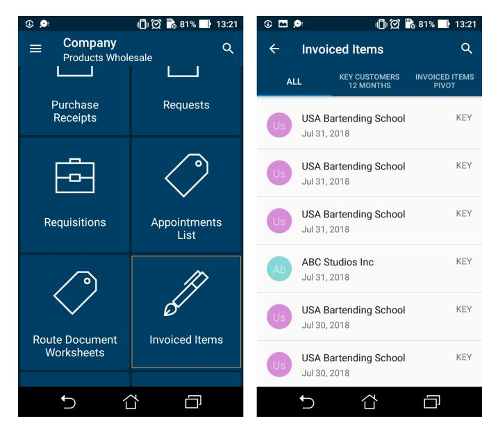

*Figure: The multi-tab screen represented as a folder*

# <span id="page-28-0"></span>**Sidebar Menu**

As of Acumatica ERP 2025 R1, the sidebar menu of the Acumatica mobile app has been deprecated. Customization projects that contain modification to the sidebar menu will no longer work. We recommend that you use the workspace functionality and add the required records and screens to Favorites. (For details, see *[Main Menu](#page-22-2)*.)

The mobile app has a *sidebar menu*, which is the shortcut menu for favorite folders and screens. You can add links to folders and screens to the sidebar menu.

### **Example: Adding a Screen to the Sidebar Menu**

To add a folder or screen to the sidebar menu, you need to set the IsDefaultFavorite attribute of the folder or screen to *true*.

To do this, copy the code below to the Commands area of the Update: MENU page, and publish the customization project.

```
update sitemap {
 ...
 update item "PM301000" { 
 isDefaultFavorite = True 
 }
 ...
}
```

The resulting sidebar menu of the mobile app will include a link for quick access to the Projects (PM301000) screen.

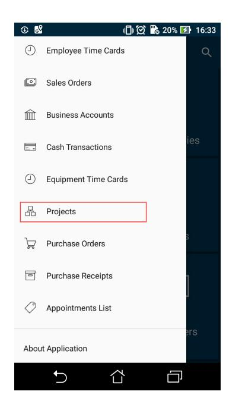

*Figure: A link to the screen in the sidebar menu*

# <span id="page-29-2"></span><span id="page-29-0"></span>**Screens**

This section consists of the following topics, which describe different tasks of configuring screens in the mobile application:

- *[Getting the WSDL Schema](#page-80-1)*
- *[Adding Attributes of Entities to Mobile Screens](#page-31-1)*
- *[Configuring Editing Screens](#page-34-1)*
- *[Configuring Related Containers](#page-36-1)*
- *[Configuring Selectors](#page-42-1)*
- *[Configuring User-Defined Fields](#page-43-1)*
- *[Displaying](#page-46-2) Any Field as a Text Field*
- *[Mapping Dashboards](#page-46-3)*
- *[Mapping Reports](#page-47-1)*
- *[Redirecting the User to Different Screens and Containers](#page-50-1)*

# <span id="page-29-3"></span><span id="page-29-1"></span>**Getting the WSDL Schema**

You can get the needed information to configure a screen from the WSDL schema, which is available on the title bar of the form in Acumatica ERP through**Tools > Web Service** in the UI.

For any container (that is, a form, tab, grid, tree, or panel), element, or action with the **#** or **%** title, the generated WSDL file contains NUMBER instead of the # symbol, and PERCENT instead of the % symbol.

To obtain the WSDL schema, perform the following steps:

1. In Acumatica ERP, open the form for which you want information.

- 2. On the title bar of the form, click**Tools > Web Service** in the UI.
- 3. On the screen with the web service links, click**Service Description**, as shown in the following screenshot.

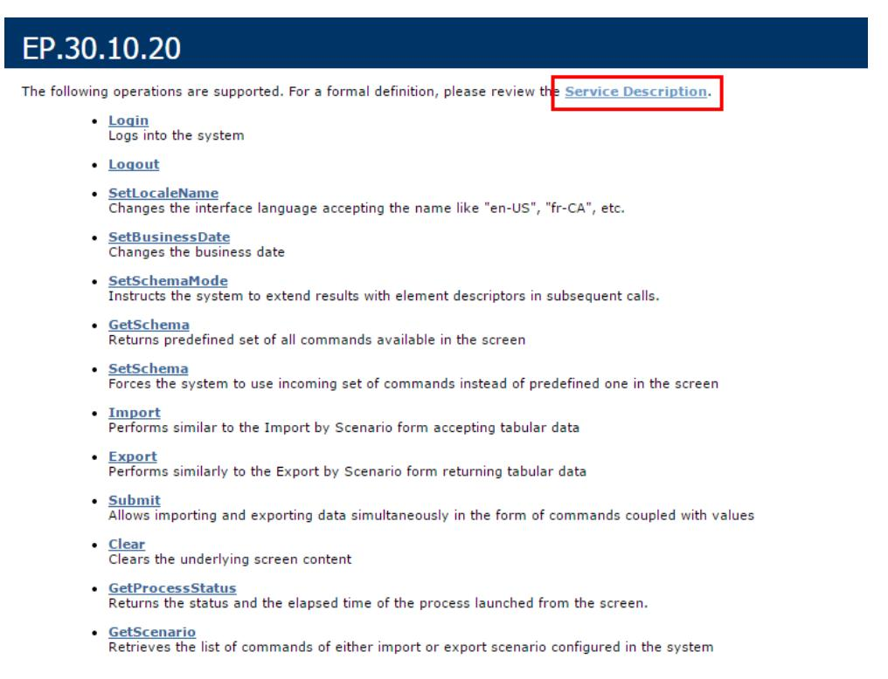

#### *Figure: Getting the service description for a form*

See the following screenshot for an example of the WSDL schema. The schema includes containers (such as the ReceiptDetails container in this example), the list of container fields, and the Actions list.

| $\mathcal{F}$ )                                                                                                                                                                                  |  |
|--------------------------------------------------------------------------------------------------------------------------------------------------------------------------------------------------|--|
|                                                                                                                                                                                                  |  |
|                                                                                                                                                                                                  |  |
| V <s:complextype name="Actions"></s:complextype>                                                                                                                                                 |  |
| $\blacktriangledown$ <s :="" sequence=""></s>                                                                                                                                                    |  |
| <s:element maxoccurs="1" minoccurs="0" name="CancelCloseToList" type="tns:Action"></s:element>                                                                                                   |  |
| <s:element maxoccurs="1" minoccurs="0" name="SaveCloseToList" type="tns:Action"></s:element>                                                                                                     |  |
| <s:element maxoccurs="1" minoccurs="0" name="Save" type="tns:Action"></s:element>                                                                                                                |  |
| <s:element maxoccurs="1" minoccurs="0" name="Cancel" type="tns:Action"></s:element>                                                                                                              |  |
| <s:element maxoccurs="1" minoccurs="0" name="Insert" type="tns:Action"></s:element>                                                                                                              |  |
| <s:element maxoccurs="1" minoccurs="0" name="CopyDocumentCopyPaste" type="tns:Action"></s:element>                                                                                               |  |
| <s:element maxoccurs="1" minoccurs="0" name="PasteDocumentCopyPaste" type="tns:Action"></s:element>                                                                                              |  |
| <s:element maxoccurs="1" minoccurs="0" name="SaveTemplateCopyPaste" type="tns:Action"></s:element>                                                                                               |  |
| <s:element maxoccurs="1" minoccurs="0" name="Delete" type="tns:Action"></s:element>                                                                                                              |  |
| <s:element maxoccurs="1" minoccurs="0" name="First" type="tns:Action"></s:element>                                                                                                               |  |
| <s:element maxoccurs="1" minoccurs="0" name="Previous" type="tns:Action"></s:element>                                                                                                            |  |
| <s:element maxoccurs="1" minoccurs="0" name="Next" type="tns:Action"></s:element>                                                                                                                |  |
| <s:element maxoccurs="1" minoccurs="0" name="Last" type="tns:Action"></s:element>                                                                                                                |  |
| <s:element maxoccurs="1" minoccurs="0" name="NewTask" type="tns:Action"></s:element>                                                                                                             |  |
| <s:element maxoccurs="1" minoccurs="0" name="NewEvent" type="tns:Action"></s:element>                                                                                                            |  |
| <s:element maxoccurs="1" minoccurs="0" name="ViewActivity" type="tns:Action"></s:element><br><s:element maxoccurs="1" minoccurs="0" name="NewMailActivity" type="tns:Action"></s:element>        |  |
|                                                                                                                                                                                                  |  |
| <s:element maxoccurs="1" minoccurs="0" name="OpenActivityOwner" type="tns:Action"></s:element><br><s:element maxoccurs="1" minoccurs="0" name="ViewAllActivities" type="tns:Action"></s:element> |  |
| <s:element maxoccurs="1" minoccurs="0" name="NNewActivity" type="tns:Action"></s:element>                                                                                                        |  |
| <s:element maxoccurs="1" minoccurs="0" name="CNewActivity" type="tns:Action"></s:element>                                                                                                        |  |
| <s:element maxoccurs="1" minoccurs="0" name="ENewActivity" type="tns:Action"></s:element>                                                                                                        |  |
| <s:element maxoccurs="1" minoccurs="0" name="MNewActivity" type="tns:Action"></s:element>                                                                                                        |  |
| <s:element maxoccurs="1" minoccurs="0" name="PNewActivity" type="tns:Action"></s:element>                                                                                                        |  |
| <s:element maxoccurs="1" minoccurs="0" name="WNewActivity" type="tns:Action"></s:element>                                                                                                        |  |
| <s:element maxoccurs="1" minoccurs="0" name="ResetListNavigation" type="tns:Action"></s:element>                                                                                                 |  |
| $\langle$ /s:sequence>                                                                                                                                                                           |  |
|                                                                                                                                                                                                  |  |
| ▼ <s:complextype name="ReceiptDetailsServiceCommands"></s:complextype>                                                                                                                           |  |
| $\blacktriangledown$ <s :="" sequence=""></s>                                                                                                                                                    |  |
| <s:element maxoccurs="1" minoccurs="0" name="KeyReceiptID" type="tns:Key"></s:element>                                                                                                           |  |
| <s:element maxoccurs="1" minoccurs="0" name="EveryReceiptID" type="tns:EveryValue"></s:element>                                                                                                  |  |
| <s:element maxoccurs="1" minoccurs="0" name="DeleteRow" type="tns:DeleteRow"></s:element>                                                                                                        |  |
| <s:element maxoccurs="1" minoccurs="0" name="DialogAnswer" type="tns:Answer"></s:element>                                                                                                        |  |
| <s:element maxoccurs="1" minoccurs="0" name="Attachment" type="tns:Attachment"></s:element>                                                                                                      |  |
| $\langle$ /s:sequence>                                                                                                                                                                           |  |
|                                                                                                                                                                                                  |  |
| ▼ <s:complextype name="ReceiptDetails"></s:complextype>                                                                                                                                          |  |
| $\blacktriangledown$ <s :="" sequence=""></s>                                                                                                                                                    |  |
| <s:element maxoccurs="1" minoccurs="0" name="DisplayName" type="s:string"></s:element>                                                                                                           |  |
| <s:element maxoccurs="1" minoccurs="0" name="ReceiptID" type="tns:Field"></s:element>                                                                                                            |  |
| <s:element maxoccurs="1" minoccurs="0" name="ReceiptIDClaimDetailCD" type="tns:Field"></s:element>                                                                                               |  |
| <s:element maxoccurs="1" minoccurs="0" name="Date" type="tns:Field"></s:element>                                                                                                                 |  |
| <s:element maxoccurs="1" minoccurs="0" name="Currency" type="tns:Field"></s:element>                                                                                                             |  |
| <s:element maxoccurs="1" minoccurs="0" name="CuryViewState" type="tns:Field"></s:element>                                                                                                        |  |
| <s:element maxoccurs="1" minoccurs="0" name="RefNbr" type="tns:Field"></s:element>                                                                                                               |  |
| <s:element maxoccurs="1" minoccurs="0" name="ExpenseItem" type="tns:Field"></s:element>                                                                                                          |  |
| <s:element maxoccurs="1" minoccurs="0" name="Description" type="tns:Field"></s:element>                                                                                                          |  |
| <s:element maxoccurs="1" minoccurs="0" name="UOM" type="tns:Field"></s:element>                                                                                                                  |  |
| <s:element maxoccurs="1" minoccurs="0" name="Quantity" type="tns:Field"></s:element>                                                                                                             |  |
| <s:element maxoccurs="1" minoccurs="0" name="UnitCost" type="tns:Field"></s:element>                                                                                                             |  |
| <s:element maxoccurs="1" minoccurs="0" name="TotalAmount" type="tns:Field"></s:element>                                                                                                          |  |
| <s:element maxoccurs="1" minoccurs="0" name="EmployeePart" type="tns:Field"></s:element>                                                                                                         |  |
| <s:element maxoccurs="1" minoccurs="0" name="ClaimAmount" type="tns:Field"></s:element>                                                                                                          |  |
| <s:element maxoccurs="1" minoccurs="0" name="NoteText" type="tns:Field"></s:element>                                                                                                             |  |
| <s:element maxoccurs="1" minoccurs="0" name="ServiceCommands" type="tns:ReceiptDetailsServiceCommands"></s:element>                                                                              |  |
| $\langle$ /s:sequence>                                                                                                                                                                           |  |
|                                                                                                                                                                                                  |  |
| <b>Welcomminuture</b> name="BecaintClaraificationtenud coCommande"\                                                                                                                              |  |

*Figure: Viewing an example of the WSDL schema*

With this information, you can start configuring the screen.

Before configuring a screen in the mobile app, you should check how the form looks in the web version of Acumatica ERP to decide how to configure the screen.

### <span id="page-31-1"></span><span id="page-31-0"></span>**Adding Attributes of Entities to Mobile Screens**

In Acumatica ERP, a *class* is a grouping of entities of a particular type—such as leads, opportunities, customers, cases, projects, and stock or non-stock items—that have similar properties. For each class, you can define a list of attributes to gather specific information about entities of the class. In Acumatica ERP, an *attribute* is some quality or characteristic beyond those already tracked on the data entry form for the entity.

If attributes have been defined for an entity class, on the data entry form for the entity, the attributes are usually displayed on a separate tab as a table that contains a set of key-value pairs. Attributes of entities can be redefined, added, or removed at any time; thus, it is not possible to explicitly specify them in a mobile site map. Instead, you use specific definitions to show attributes of entities in a mobile application.

In a mobile application, the attributes of entities are displayed as a screen or a part of a screen with input fields rather than being displayed in a table. For improved usability, you can apply a group as a container for attributes.

### **Example: Displaying a Group of Attributes on the Summary Tab**

Suppose that in the mobile app, you need to display the attributes that are defined for a case class and displayed on the *[Cases](https://help-2025r1.acumatica.com/Help?ScreenId=ShowWiki&pageid=a492a091-9649-4826-bcc3-dccdf8765efd)*(CR306000) form of Acumatica ERP. (These attributes are shown in the following screenshot.)

On screens that have been predefined for the Acumatica mobile app, there are usually two additional tabs that are not present on the corresponding Acumatica ERP form: the**Summary** tab and the **Settings** tab. The**Summary** tab contains most of the elements from the Summary area of the corresponding form. The**Settings** tab contains group objects, each of which is related to a tab from the tab area of the corresponding form.

| SAVE & CLOSE<br>←                                                                 | a<br>$\blacksquare$ |                                                                                                                                                                                                                                                                                                                                                                                                          | ı٦. | ÷ | к | ≺ | ゝ | ≻⊦ | $AC/IIONS =$ | INQUIRIES $\sim$ |             | TAKE CASE                                    |
|-----------------------------------------------------------------------------------|---------------------|----------------------------------------------------------------------------------------------------------------------------------------------------------------------------------------------------------------------------------------------------------------------------------------------------------------------------------------------------------------------------------------------------------|-----|---|---|---|---|----|--------------|------------------|-------------|----------------------------------------------|
| Case ID:<br>Date Reported:<br>Last Activity Date:<br>SLA:<br><b>Closing Date:</b> | 000112<br>11/1/2016 |                                                                                                                                                                                                                                                                                                                                                                                                          |     |   |   |   |   |    |              |                  | ℯ<br>ℯ<br>ℯ | Status:<br>Reason:<br>Severity:<br>Priority: |
| <b>DETAILS</b><br>ADDITIONAL INFO                                                 |                     | ρ<br>$\star$ Class ID:<br>PRODSUP - Product Support with Contr<br>11/1/2016 1:25 PM<br>* Business Account:<br>ABARTENDE - USA Bartending School<br>* Contact:<br>Kabuk, Fadi<br>11/1/2016 2:25 PM<br>Owner:<br>Baker Maxwell, Mr.<br>9/8/2017 1:36 PM<br>* Subject:<br>SaaS Upgrade requested<br><b>ATTRIBUTES</b><br><b>ACTIVITIES</b><br><b>RELATED CASES</b><br><b>RELATIONS</b><br>Required<br>Value |     |   |   |   |   |    |              |                  |             |                                              |
| $\mathbf{x}$<br>⊢<br>с                                                            |                     |                                                                                                                                                                                                                                                                                                                                                                                                          |     |   |   |   |   |    |              |                  |             |                                              |
| <b>Q</b> Attribute                                                                |                     |                                                                                                                                                                                                                                                                                                                                                                                                          |     |   |   |   |   |    |              |                  |             |                                              |
| > Product needing support                                                         |                     | ш                                                                                                                                                                                                                                                                                                                                                                                                        |     |   |   |   |   |    |              |                  |             |                                              |
| <b>Product Purchase Date</b>                                                      |                     |                                                                                                                                                                                                                                                                                                                                                                                                          |     |   |   |   |   |    |              |                  |             |                                              |

#### *Figure: Viewing the Attributes tab on the Cases form*

To display attributes on the**Summary** tab, you should use the add attributes instruction inside the add group instruction. The following example adds a group of attributes in the CaseSummary container.

```
add screen CR306000 {
 openAs = Form
 … 
 add container "CaseSummary" {
 add group "AttributesGroup" {
 displayName = "Attributes"
 collapsable = True
 collapsed = True
 add attributes "Attributes"
 }
 }
 … 
}
```

In this code, the attributes object is wrapped in the group named AttributesGroup.

The following screenshot shows the resulting screen in the mobile app.

| O)<br>Case<br>×<br>Case ID<br>000119<br>Date Reported<br>Feb 5, 2018<br>Last Activity Date<br>Feb 5, 2018 |
|-----------------------------------------------------------------------------------------------------------|
|                                                                                                           |
|                                                                                                           |
|                                                                                                           |
|                                                                                                           |
|                                                                                                           |
|                                                                                                           |
|                                                                                                           |
|                                                                                                           |
|                                                                                                           |
| <b>ATTRIBUTES</b>                                                                                         |
| Product needing support                                                                                   |
| Software                                                                                                  |
| Product Purchase Date                                                                                     |
| Dec 5, 2016                                                                                               |
| <b>ACTIVITIES</b>                                                                                         |
|                                                                                                           |

*Figure: Viewing the Cases screen and the Attributes group*

### **Example: Displaying Attributes on Other Tabs of a Screen**

To display attributes on a tab other than the**Summary** tab, you need to add a container with attributes and use a containerLink object, as the following code shows.

```
add screen CR306000 {
 add container "CaseSummary" {
 add layout "Settings" {
 displayName = "Settings"
 layout = "Tab"
 add containerLink "Attributes"
 }
 }
 add container "Attributes" {
 attributes = True
 attachments {}
 }
}
```

In this code, the link to the *Attributes* container is added inside the**Settings** tab. To see the full example, in the navigation pane of the Customization Project Editor, select the **Mobile Application** page, and click **Customize > Update ExistingScreen > CR306000**

The following screenshots show the**Settings** tab with a link to the list of attributes and the list of attributes (on the second screen).

| Нет SIM-карты                                              | 15:34 |            | $81\%$                       | Нет SIM-карты           | 15:37               | 80%                          |
|------------------------------------------------------------|-------|------------|------------------------------|-------------------------|---------------------|------------------------------|
| く                                                          | Case  |            |                              | く                       | <b>Case Summary</b> |                              |
| Case ID: 000127<br>Business Account: USA Bartending School |       |            |                              | Product needing support |                     |                              |
| User-Defined Fields<br>nmary                               |       | Activities | <b>Settings</b>              | Product Purchase Date   |                     | $\left\langle \right\rangle$ |
| Relations                                                  |       |            | $\mathcal{P}$                |                         |                     |                              |
| <b>Related Cases</b>                                       |       |            | $\rightarrow$                |                         |                     |                              |
| Attributes                                                 |       |            | $\left\langle \right\rangle$ |                         |                     |                              |
|                                                            |       |            |                              |                         |                     |                              |
|                                                            |       |            |                              |                         |                     |                              |
|                                                            |       |            |                              |                         |                     |                              |
|                                                            |       |            |                              |                         |                     |                              |
|                                                            |       |            |                              |                         |                     |                              |
|                                                            |       |            |                              |                         |                     |                              |
|                                                            |       |            |                              |                         |                     |                              |
|                                                            |       |            |                              |                         |                     |                              |
|                                                            |       |            |                              |                         |                     |                              |
| <b>Files</b>                                               |       |            | <b>Take Case</b>             |                         |                     |                              |

<span id="page-34-1"></span>

# <span id="page-34-0"></span>**Configuring Editing Screens**

You may have to configure an editing screen (that is, a screen that can be used to enter and edit a data record) based on the use of the corresponding form in Acumatica ERP.

In some cases, Acumatica ERP uses a single form to manage data records of a particular type (that is, the *.aspx* page contains the FormView and Grid controls). In these cases, in the mobile site map, you have to configure both the form view and the list view by using a single declaration of the Screen object.

In other cases, Acumatica ERP uses the following separate forms for data records of a particular type:

- A list view (the *.aspx* page contains one Grid control) to manage records, which is called the *substitute form*. (It has this name because this form is brought up instead of the data entry form when a user navigates to or searches for the form; it shows these records in a tabular format. On the substitute form, when the user clicks a record, the entry form opens to show the details of the selected record.)
- A form view (the *.aspx* page with one FormView control) to enter and edit settings, which is usually called a *form* or *entry form*.

In these cases, you have to configure two separate declarations of the Screen object (that is, two screens): the list screen (which corresponds to the Acumatica ERP substitute form), and the editing screen.

#### **Example: Creating the Same Layout for the List View and the Form View**

An example of a screen with the same layout for the list view and the form view is presented in the *[Configuring Lists](#page-53-2)* topic.

You can see the list of fields and edit them at the same time.

#### **Example: Configuring the List and the Editing Form Separately**

In this example, we will add the Invoices (SO3030PL) list screen, which corresponds to the Invoices (SO3030PL) substitute form (a grid listing all available invoices), and the Invoices (SO303000) editing screen, which corresponds to the Invoices (SO303000) entry form (used to enter and edit the data of one invoice) in Acumatica ERP .

To configure these screens, do the following:

- 1. Add the Invoices (SO3030PL) list screen, as described in *To Add a Screen to the Mobile Site Map [\(Example\)](#page-18-1)*.
- 2. Insert the following code in the **Commands** area of the Add: SO3030PL page.

```
add screen SO3030PL {
 add container "Result" {
 add field "ReferenceNbrSOInvoiceRefNbr"
 add field "Status"
 add field "Customer"
 add field "Date"
 add containerAction "Insert" {
 icon = "system://Plus"
 behavior = Create
 redirect = True
 }
 add containerAction "EditDetail" {
 behavior = Open
 redirect = True
 }
 }
}
```

In the screen, you find two actions that can be invoked to open the editing screen for a data record: behavior = Create and behavior = Open. The redirect = True attribute indicates that the editing screen needs to be opened separately. The actual screen that will be opened is determined by the server logic.

- 3. Add the Invoices (SO303000) screen, as described in *To Add a Screen to the Mobile Site Map [\(Example\)](#page-18-1)*.
- 4. Insert the following code in the **Commands** area of the Add: SO303000 page.

```
add screen SO303000 {
 add container "InvoiceSummary" { 
 add field "Customer"
 add field "Location"
 add field "Terms" 
 add field "DueDate"
 add field "CashDiscountDate" 
 add field "Currency" {
 selector {
 add field "CurrencyID"
 }
 PickerType = Attached
 }
 add recordAction "Save" {
 behavior = Save
 } 
 add recordAction "Cancel" {
 behavior = Cancel
 }
 }
```

```
}
```

5. Add the screens to the main menu of the mobile app using the **Update Main Menu** page as shown below.

```
add item "SO3030PL" {
 displayName = "Invoices" 
 icon = "system://NewsPaper" 
} 
add item "SO303000" {
 displayName = "Invoice"
 visible = False 
}
```

The visible attribute of the Invoices (SO303000) screen is set to *false* to hide the editing screen from the main menu of the mobile app so that a user can access it only from the Invoices (SO3030PL) screen.

Aer you publish the customization project, you should see a new tile on the main menu of the mobile app and the corresponding screens, as shown below.

| $\odot$ m $\odot$                         | <b>旧図 ■ 71% ■ 17:09</b>            | $\odot$ m $\odot$ |                               | <b>IDI ② B</b> 71% <b>D</b> 17:09 | $\odot$ m $\odot$               |                                      | <b>心② &amp; 71%</b> 17:09 |
|-------------------------------------------|------------------------------------|-------------------|-------------------------------|-----------------------------------|---------------------------------|--------------------------------------|---------------------------|
| Company<br>Ξ<br><b>Products Wholesale</b> | $\alpha$                           | $\leftarrow$      | <b>Invoices</b>               | Q                                 | $\times$                        | Invoice                              | $\mathbb{G}$              |
| -                                         |                                    |                   | AR005784<br>ALPHABETLD        | Balanced<br>Jul 20, 2018          | Customer*                       | Alphabetland School Center           |                           |
| <b>Requisitions</b>                       | <b>Appointments</b><br><b>List</b> |                   | AR005783<br>ABARTENDE         | Balanced<br>Jul 12, 2018          | Location*                       | <b>Primary Location</b>              | ۰                         |
|                                           |                                    |                   | AR005779<br><b>ABCSTUDIOS</b> | Open<br>Apr 19, 2018              | Terms*<br>30 Days<br>Due Date * |                                      |                           |
|                                           |                                    |                   | AR005778                      | Open                              |                                 | Aug 19, 2018                         |                           |
| <b>Route Document</b><br>Worksheets       | <b>Dashboards</b>                  |                   | WIDGETCC                      | Apr 30, 2018                      |                                 | Cash Discount Date *<br>Aug 19, 2018 |                           |
|                                           |                                    |                   | AR005777<br>WRIGHTCORN        | Open<br>Apr 30, 2018              | Currency<br><b>USD</b>          |                                      |                           |
|                                           |                                    |                   | AR005776<br><b>ABCVENTURE</b> | Open<br>Apr 30 2218               |                                 |                                      |                           |
| Invoices                                  |                                    |                   | AR005775                      | $\pm$                             |                                 |                                      |                           |
|                                           | 曰                                  |                   |                               | 冖                                 |                                 |                                      | 勻                         |

*Figure: The List and the Editing Forms*

In this example, you use the Invoices (SO3030PL) screen to display the list screen, and you use the Invoices (SO303000) screen to display the editing screen. The same approach is used with forms in Acumatica ERP.

### <span id="page-36-1"></span><span id="page-36-0"></span>**Configuring Related Containers**

This topic describes how to configure different types of related containers on the same screen.

#### **Example: Configuring a Screen with One-to-Many (Master-Detail) Containers**

With one-to-many containers declared inside the screen object, one container is considered the master container, while all other containers are considered detail containers.

The following code is an example of the one-to-many-containers scheme. You can see the full example if you select **Update ExistingScreen > EP301000** on the toolbar of the Mobile Application page in the Customization Project Editor.

```
add screen EP301000 {
 openAs = Form
 add container "DocumentSummary" {
 ...
 }
 add container "AddReceipts" {
 type = SelectionActionList
 visible = False
 listActionsToExpand = 1
 add field "Description"
 add field "ClaimAmount"
 add field "Date"
 add field "Currency"
 add listAction "SubmitReceipt" {
 icon = "system://Check"
 behavior = Void
 }
 attachments {}
 }
 add container "ExpenseClaimDetails" {
 fieldsToShow = 6
 listActionsToExpand = 3
 containerActionsToExpand = 3
 add field "Description"
 add field "Amount"
 ...
 attachments {}
 }
 ...
}
```

In this example, DocumentSummary is the master container. All other declared detail containers are displayed on the screen below the master container in the order of their declaration.

The following screenshot shows the resulting screen in the mobile application.

| 18:41 3 3 4 5 4 5 4 5 4 5 4 5 4 5 4 5 4 5 4 5<br>$\mathbf{C}$ , $\mathbf{Q}$ |               |               |  |  |  |  |  |
|------------------------------------------------------------------------------|---------------|---------------|--|--|--|--|--|
| <b>Expense Claim</b><br>X                                                    |               | O)            |  |  |  |  |  |
| Reference Nbr.: EX000025<br>Status: Released                                 |               |               |  |  |  |  |  |
| Description*                                                                 |               |               |  |  |  |  |  |
| Site visit for Marlin project                                                |               |               |  |  |  |  |  |
| Date *                                                                       | Approval Date |               |  |  |  |  |  |
| Sep 16, 2016                                                                 | Oct 3, 2016   |               |  |  |  |  |  |
| Claimed By*                                                                  | Department ID |               |  |  |  |  |  |
| Baker Maxwell, Mr.                                                           | Finance       |               |  |  |  |  |  |
| Claim Total                                                                  | Currency      |               |  |  |  |  |  |
|                                                                              |               |               |  |  |  |  |  |
| Primary Location                                                             |               |               |  |  |  |  |  |
| <b>DETAILS</b>                                                               |               |               |  |  |  |  |  |
| Branch*                                                                      |               |               |  |  |  |  |  |
| Products Wholesale                                                           |               |               |  |  |  |  |  |
| Tax Zone                                                                     |               |               |  |  |  |  |  |
| Note Text                                                                    |               |               |  |  |  |  |  |
| <b>EXPENSE CLAIM DETAILS</b>                                                 |               | $\mathcal{P}$ |  |  |  |  |  |
| <b>TAX DETAILS</b>                                                           |               | ⋋             |  |  |  |  |  |
| <b>APPROVAL DETAILS</b>                                                      |               | ⋋             |  |  |  |  |  |
|                                                                              |               |               |  |  |  |  |  |

*Figure: Screen with one-to-many containers*

### <span id="page-38-0"></span>**Example: Displaying Fields from Different Containers in One Container**

You can configure a container so that it displays fields form different containers.

The screen in this example includes the ClaimDetails container, which also has a field from the ReceiptDetailsExpenseDetails container. You do not need to declare both containers. Instead, in the field object, you separate the corresponding container name and its field with the *#* symbol, as shown in the following sample code.

```
add screen EP301020 {
 openAs = Form
 add container "ClaimDetails" {
 … 
 add field "ReceiptDetailsExpenseDetails#Description"
 add field "Date"
 add field "ExpenseItem" {
 pickerType = Searchable
 selector {
 add field "Description"
 add field "InventoryID"
 }
 }
 … 
 }
 … 
}
```

In this example, the Description field of the ReceiptDetailsExpenseDetails container is displayed (among other fields). To see the full example, in the navigation pane of the Customization Project Editor select the Mobile Application page and click **Customize > Update ExistingScreen > EP301020**.

The following screenshot shows the resulting screens with containers containing declared fields.

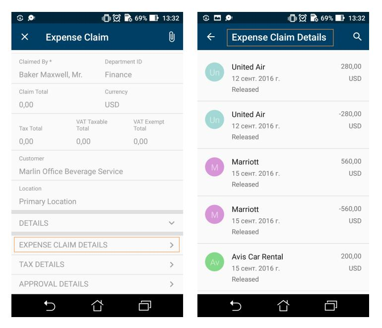

*Figure: Screens with containers containing declared fields*

#### <span id="page-39-0"></span>**Example: Configuring a Screen with Many-to-One (Master-Detail) Containers**

Acumatica ERP includes dialog boxes that are opened from forms and that provide additional actions for items in a grid. For example, on the Expense Claims (EP301030) form, you could use the **Add Receipts** dialog box to add receipts to an expense claim entity. See the following screenshot.

|                                                                      |        | Reference Nbr.:     | EX000045                     | $\mathsf{Q}$       |           | * Claimed By:            |            |                                          | EP00000002 - Baker Maxwell, Mr.   | $\Omega$                          |                      | Claim Total: |                    |                                       |
|----------------------------------------------------------------------|--------|---------------------|------------------------------|--------------------|-----------|--------------------------|------------|------------------------------------------|-----------------------------------|-----------------------------------|----------------------|--------------|--------------------|---------------------------------------|
| Status:                                                              |        |                     | On Hold                      |                    |           | Currency:                | <b>USD</b> |                                          | 1.00                              | VIEW BASE                         |                      |              | VAT Taxable Total: |                                       |
| * Date:                                                              |        |                     | 8/9/2018                     |                    |           | * Department ID:         |            |                                          | <b>FINANCE - Finance</b>          |                                   |                      |              | VAT Exempt Total:  |                                       |
| Approval Date:                                                       |        |                     |                              |                    |           | Customer:                |            |                                          |                                   | ABARTENDE - USA Bartending Scho Q |                      | Tax Total:   |                    |                                       |
|                                                                      |        |                     |                              |                    |           | Location:                |            |                                          | <b>MAIN - Primary Location</b>    | Ω                                 |                      |              |                    |                                       |
| * Description:                                                       |        |                     | Dinner with client           |                    |           |                          |            |                                          |                                   |                                   |                      |              |                    |                                       |
|                                                                      |        |                     | <b>EXPENSE CLAIM DETAILS</b> | <b>TAX DETAILS</b> |           | <b>FINANCIAL DETAILS</b> |            |                                          | <b>APPROVAL DETAILS</b>           |                                   |                      |              |                    |                                       |
| С                                                                    |        | I                   | $\times$                     | ADD NEW RECEIPT    |           | <b>ADD RECEIPTS</b>      |            | $\left  \boldsymbol{\mathsf{H}} \right $ | $\bullet$<br>$\boxed{\mathbb{X}}$ |                                   |                      |              |                    |                                       |
| $\Box$<br>0                                                          | *Date  |                     | Ref.<br>Nbr.                 | *Expense<br>Item   | *Descript | Quar <sup>*U</sup>       |            | <b>Unit</b><br>Cost                      | <b>Amount</b>                     | Tax<br><b>Amount</b>              | Emplo<br>Part        | Amour        | Claim Currenc      | Amount Status<br>in<br>Claim<br>Curr. |
|                                                                      |        | <b>Add Receipts</b> |                              |                    |           |                          |            |                                          |                                   |                                   |                      |              |                    |                                       |
| $\mathbf x$<br>⊶<br>с<br>*Date<br>Receipt<br>魯<br>П<br><b>Number</b> |        |                     |                              |                    |           |                          |            |                                          |                                   |                                   |                      |              |                    |                                       |
|                                                                      |        | Ref.<br>Nbr.        | *Claimed by                  |                    | *Branch   | *Description             |            |                                          |                                   | <b>Claim Amount</b>               | Currenc <sup>S</sup> |              |                    |                                       |
| ,                                                                    | П      | 000175              |                              | 7/25/2018          |           | EP00000002               |            | PROD                                     | rent a truck                      |                                   |                      |              | 0.00               | <b>USD</b>                            |
|                                                                      | $\Box$ | 000174              | 8/9/2018                     |                    |           | EP00000002               |            | PROD                                     | <b>MCDonalds</b>                  |                                   |                      |              | 20.00              | <b>USD</b>                            |
|                                                                      |        |                     |                              |                    |           |                          |            |                                          |                                   |                                   |                      |              |                    |                                       |
|                                                                      |        |                     |                              |                    |           |                          |            |                                          |                                   |                                   |                      |              |                    |                                       |
|                                                                      |        |                     |                              |                    |           |                          |            |                                          |                                   |                                   |                      |              |                    |                                       |

*Figure: Example of a dialog box with a grid*

To map this kind of dialog box to the mobile app, you need to specify type = SelectionActionList for the container corresponding to this dialog box in the form's WSDL schema and specify a *[listAction](#page-134-0)*, as shown in the following code.

```
add screen EP301000 {
 openAs = Form
 … 
 add container "AddReceipts" {
 type = SelectionActionList
 visible = False
 listActionsToExpand = 1
 add field "Description"
 add field "ClaimAmount"
 add field "Date"
 add field "Currency"
 add listAction "SubmitReceipt" {
 icon = "system://Check"
 behavior = Void
 }
 attachments {}
 }
 … 
}
```

To see the full example, in the navigation pane of the Customization Project Editor select the Mobile Application page and click **Customize > Update ExistingScreen > EP301000**.

The screenshots below show the resulting screens in the mobile app. Screens with list actions support selecting multiple items.

The first screenshot shows the content of the DocumentSummary container of the Expense Claims (EP301030) screen and the **Add Receipts** button, which corresponds to the listAction "SubmitReceipt".

The DisplayName attribute is not defined for the nested container; therefore, for the container, the mobile application displays the *Add Receipts* name, which is obtained from the Mobile API server.

If a user taps the **Add Receipts** button, the mobile app displays the content of this container and provides multiselection, as the second screenshot shows. The user can tap **Expense Claim Details**, as shown in the third screenshot, to view the Expense Claim Details screen, shown in the fourth screenshot.

| $\odot$ .0                                     | 11 22 8 72% 2 14:22                | $\odot$ .         | 14:22 372% 31 14:22                                 | $\odot$ m $\odot$                                |                                      | 11 22 8 72% 2 14:22         | $\odot$ $\blacksquare$ $\blacksquare$ | 11 22 8 72% 2 14:22                   |                     |
|------------------------------------------------|------------------------------------|-------------------|-----------------------------------------------------|--------------------------------------------------|--------------------------------------|-----------------------------|---------------------------------------|---------------------------------------|---------------------|
| ×<br><b>Expense 0</b>                          | <b>Add Receipts</b>                | $\leftarrow$<br>3 | ⊙                                                   | $\times$<br><b>Expense Claim</b>                 | Û.                                   | Ъ.<br>ਵ∕                    | $\leftarrow$                          | <b>Expense Claim Details</b>          | $\alpha$            |
| Reference Nbr.: 000001<br>Status: On Hold      | Submit                             |                   | 0.00<br>rented a car<br>Jul 31, 2018<br><b>USD</b>  | Reference Nbr.: 000001<br>Status: On Hold        |                                      |                             |                                       | test<br>Jul 25, 2018                  | 56.00<br><b>USD</b> |
| Description*<br>Submitted Receipt(s)<br>Date * | Approval Date                      |                   | 0.00<br>booked a room<br>Jul 31, 2018<br><b>USD</b> | Claimed By*<br>Baker Maxwell, Mr.<br>Claim Total | Department ID<br>Finance<br>Currency |                             | Re                                    | Open<br>rented a car                  | 0.00                |
| Jul 25, 2018<br>۰                              | $-/-/-$                            |                   | 0.00<br>ordered pencils                             | 56.00                                            | <b>USD</b>                           |                             |                                       | Jul 31, 2018<br>Open                  | <b>USD</b>          |
| Claimed By *<br>Baker Maxwell, Mr.             | Department ID<br>Finance           |                   | Jul 31, 2018<br><b>USD</b><br>0.00<br>rented a bike | Tax Total<br>Total<br>0.00<br>0.00               | VAT Taxable                          | VAT Exempt<br>Total<br>0.00 |                                       | booked a room<br>Jul 31, 2018         | 0.00<br><b>USD</b>  |
| Claim Total<br>56.00                           | Currency<br><b>USD</b>             |                   | Jul 31, 2018<br><b>USD</b>                          | Customer                                         |                                      |                             |                                       | Open                                  |                     |
| Tax Total<br>Total                             | VAT Taxable<br>VAT Exempt<br>Total |                   |                                                     | Location                                         |                                      |                             |                                       | rented a bike<br>Jul 31, 2018<br>Open | 0.00<br><b>USD</b>  |
| 0.00<br>0.00<br>Customer                       | 0.00                               |                   |                                                     | <b>DETAILS</b>                                   |                                      | $\checkmark$                |                                       |                                       |                     |
| Location                                       |                                    |                   |                                                     | <b>EXPENSE CLAIM DETAILS</b>                     |                                      | $\checkmark$                |                                       |                                       | $\pm$               |
|                                                | 슈<br>þ                             |                   | ⇧<br>曰                                              | ↰                                                | ☆                                    | þ                           |                                       | ⇧<br>闩<br>↽                           |                     |

*Figure: Container supporting list actions*

#### **Example: Configuring a Screen with a Container Link**

In the mobile app, a container can contain a link to another container on the screen toolbar or on the screen among the fields. To use a container link, do the following:

- Declare the container to which you want to add a link
- Add the *[containerLink](#page-121-0)* object

See the following code for an example of the creation of a link to the Summary container.

```
add screen EP305000 {
 add container "DocumentSummary" {
 … 
 add containerLink "Summary" {
 control = "ListItem"
 formPriority = 52
 }
 … 
 }
 add container "Summary" {
 …}
 … 
}
```

Based on this code, you can open the Summary screen by using the list entry.

The screenshots below show the Timecard (EP305000) screen with the container links and the opened Summary screen.

| 18:39 3 39 39                                  | 18:39 3 39% 18:39<br>¢                                   |
|------------------------------------------------|----------------------------------------------------------|
| ŧ<br><b>Timecard</b><br>$\times$               | Q<br><b>Summary</b><br>$\leftarrow$                      |
| Ref. Nbr.<br>TC000549                          | 40:00<br><b>RG</b><br>Non-Project Code.<br>Normalization |
| Status<br>Released                             |                                                          |
| Week<br>2013-39 (09/22 - 09/28)                |                                                          |
| TIME TOTALS<br>$\checkmark$                    |                                                          |
| <b>SUMMARY</b><br>$\left\langle \right\rangle$ |                                                          |
| DETAILS<br>$\mathcal{P}$                       |                                                          |
| <b>MATERIALS</b><br>$\mathcal{P}$              |                                                          |
|                                                |                                                          |
|                                                |                                                          |
|                                                |                                                          |
| 门                                              | 句                                                        |

<span id="page-42-1"></span>*Figure: Use of container link to open a container*

# <span id="page-42-0"></span>**Configuring Selectors**

You can configure selector fields to be displayed as pop-up windows or grids by using the selector instruction.

#### **Example: Configuring a Screen with Selectors**

The following example configures a selector for the **Currency** field of the Invoices (SO303000) screen. To see an example, copy the code below to the Add: SO303000 Invoices page of the Customization Project Editor, and publish the project.

```
add screen SO303000 {
 add container "InvoiceSummary" {
 add field "Customer"
 add field "Location"
 add field "Terms"
 add field "DueDate"
 add field "CashDiscountDate"
 add field "Currency" {
 selector {
 add field "CurrencyID"
 }
 pickerType = Attached
 }
 add recordAction "Save" {
 behavior = Save
 }
 }
}
```

A selector with pickerType="Attached" is displayed as a field on the first screenshot and as a pop-up window on the second screenshot.

| $\circledast$        | 18:22                                         | $\circledast$       | 18:22 8 11% 2 18:22 |
|----------------------|-----------------------------------------------|---------------------|---------------------|
| Invoice<br>$\times$  | $\textcolor{red}{\textbf{0}}$<br>$\checkmark$ | Invoice<br>$\times$ | $\mathbf{0}$        |
| Customer*            |                                               | Customer*           |                     |
| Location*            |                                               | Currency            |                     |
| Terms*               |                                               | No Value            |                     |
|                      |                                               | CAD                 |                     |
| Due Date*<br>$-/-/-$ |                                               | <b>EUR</b>          |                     |
| Cash Discount Date * |                                               | GBP                 |                     |
| $-/-/-$<br>Currency  |                                               | SGD                 |                     |
| <b>USD</b>           | ٠                                             | $\odot$ USD         |                     |
|                      |                                               |                     |                     |
|                      |                                               |                     |                     |
|                      |                                               |                     |                     |

*Figure: A selector as a pop-up window*

**Related Links**

• *[selector](#page-150-0)*

# <span id="page-43-1"></span><span id="page-43-0"></span>**Configuring User-Defined Fields**

You can configure the mapping of user-defined field to a mobile app screen by using the add UDFields instruction.

Because not all system entities have entity classes, attributes cannot always be added to data entry forms via classes. In these cases, user-defined fields can be added directly to the data entry forms where these entities are created. When these fields are defined for a form, they are specified on the **User-Defined Fields** tab. By default, the **User-Defined Fields** tab is displayed on a mobile screen if the associated form has user-defined fields. For example, the following screenshots show user-defined fields displayed on the *[Cases](https://help-2025r1.acumatica.com/Help?ScreenId=ShowWiki&pageid=a492a091-9649-4826-bcc3-dccdf8765efd)* (CS306000) form and on the Cases screen of the mobile app.

| !!!!!!!!!!!!!!!!!!!!!!!!!!!!!!!!!!!!!!!!                                          |                                                                                                                                               |
|-----------------------------------------------------------------------------------|-----------------------------------------------------------------------------------------------------------------------------------------------|
| $\begin{array}{c} \square \\ \square \end{array}$<br>SAVE & CLOSE<br>$\leftarrow$ | ◎ ▼ ◎<br>$\circ$ +<br>$\overline{\mathbf{K}}$<br>$\rightarrow$ $\rightarrow$<br>ACTIONS ▼<br>$\sim$ $\sim$<br>INQUIRIES Y<br><b>TAKE CASE</b> |
| <b>USER-DEFINED FIELDS</b><br><b>DOCUMENT</b>                                     |                                                                                                                                               |
| Product Purchase Date:                                                            | Project Director:                                                                                                                             |
| Industry:                                                                         | Promised Date:<br>۰<br>۰                                                                                                                      |
|                                                                                   |                                                                                                                                               |
|                                                                                   |                                                                                                                                               |
| ADDITIONAL INFO<br><b>DETAILS</b>                                                 | <b>ATTRIBUTES</b><br><b>ACTIVITIES</b><br><b>RELATED CASES</b><br><b>RELATIONS</b><br><b>SYNC STATUS</b>                                      |
|                                                                                   |                                                                                                                                               |
| Paragraph<br>VISUAL Y<br>↶<br>$\circ$                                             | - 1 U * A * 2 * E * 泪 泪 目 目 目<br><b>INSERT</b><br>v.<br>LAYOUT<br><b>TABLES</b><br>- 12<br>в                                                  |
|                                                                                   |                                                                                                                                               |

#### *Figure: The User-Defined Fields tab on the Cases form*

| ₹                                                    | ঋ রি.॥ 53% ■ 14:20 |
|------------------------------------------------------|--------------------|
| Case<br>×                                            | O)                 |
| Case ID: 000124<br><b>Business Account: Artcages</b> |                    |
| <b>SUMMARY</b><br>USER-DEFINED FIELDS ACTIVITIES     | <b>SETTIN</b>      |
| Product Purchase Date<br>--/--/----                  |                    |
| Industry                                             |                    |
| Project Director                                     |                    |
| <b>Promised Date</b><br>$-/-/-$                      |                    |
|                                                      |                    |
|                                                      |                    |
|                                                      |                    |
|                                                      |                    |

*Figure: The User-Defined Fields tab on the Cases screen*

User-defined fields that are attributes of the *Selector* control type specified on the *[Attributes](https://help-2025r1.acumatica.com/Help?ScreenId=ShowWiki&pageid=de0a353f-40d0-452d-9152-e65605e69788)* (CS205000) form cannot be mapped.

#### **Organizing the Layout of User-Defined Fields**

You can organize the layout of user-defined fields by putting all user-defined fields into an object of the following types:

- layout
- container
- group

You do this by specifying the add UDFields instruction inside an object of the listed types.

For example, if user-defined fields should be displayed as a group of fields alongside other fields (rather than on a separate tab), a developer can use the following code. The add instruction should be used with an object of the UDFields type, as you can see from the highlighted line in the example.

```
update screen CR306000 {
 update container "CaseSummary" {
 update layout "Settings" {
 add group "UDFGroup" {
 displayName = "User-Defined Fields"
 add UDFields "UDFInline"
 placeAt 0
 }
 }
 }
}
```

The code above puts all user-defined fields in a group on the**Settings** tab of the Cases screen, as shown in the screenshot below.

|  | UDFInline is an arbitrary name that has not been used anywhere else in the mapping. |
|--|-------------------------------------------------------------------------------------|
|  |                                                                                     |
|  |                                                                                     |
|  |                                                                                     |
|  |                                                                                     |
|  |                                                                                     |
|  |                                                                                     |
|  |                                                                                     |
|  |                                                                                     |
|  |                                                                                     |
|  |                                                                                     |
|  |                                                                                     |
|  |                                                                                     |
|  |                                                                                     |
|  |                                                                                     |
|  |                                                                                     |
|  |                                                                                     |
|  |                                                                                     |

*Figure: User-defined fields displayed in a group*

#### **Hiding User-Defined Fields**

You can cancel the display of user-defined fields on a screen by using the hideUDF attribute of the screen object, as the following code shows.

```
update screen CR306000 {
hideUDF = True
}
```

The hideUDF attribute and the add UDFields instruction cannot be used in the same screen mapping.

#### **Related Links**

- *[UDFields](#page-143-0)*
- *[screen](#page-139-0)*

# <span id="page-46-2"></span><span id="page-46-0"></span>**Displaying Any Field as a Text Field**

The mobile API gives you the ability to map a control of any type from an Acumatica ERP form to a text box in the mobile app. This ability can be useful when both of the following conditions are met:

- You have one of the following problems with the use of the field in the mobile application:
  - A value in the control for the field is displayed oddly or incorrectly.
  - The mapping of the field raises an exception.
- You do not need to add a new value for the field in the mobile app.

When these conditions are met, you can force the mobile application to treat this field as a common text field.

To do this, in the Field object of the field, specify the ForceType="String" attribute. The input value is inserted directly into the cache of the corresponding container.

We do not recommend that you use the ForceType attribute unless you have extensive experience developing custom controls and fully understand the outcome of using this attribute. Note that by using the ForceType attribute, you could switch off some types of field validation, which could damage data in the database.

#### **Related Links**

• *[field](#page-124-0)*

## <span id="page-46-3"></span><span id="page-46-1"></span>**Mapping Dashboards**

To map a dashboard to the mobile app, you have to do the following:

• Add a screen with the corresponding dashboard. For details, see *To Add a [Screen](#page-18-1) to the Mobile Site Map [\(Example\)](#page-18-1)*.

> If a user taps a dashboard widget, the mobile app tries to open the appropriate screen that supplies data to the widget. You may also want to add the screens that contain the data on which dashboard widgets are based. If the screen is absent in the mobile site map, the mobile app displays a warning.

• Add a shortcut of the added dashboard screen to the main menu.

A screen of the *Dashboard* type can display the following types of dashboard widgets:

- Chart
- Data Table
- Score Card
- Trend Card

Widgets of other types are not available in the mobile app. For details on widget types, see *[Configuring](https://help-2025r1.acumatica.com/Help?ScreenId=ShowWiki&pageid=8c29d265-5f12-4d07-82a6-369f0e49ddb1) Widgets*.

#### **Example: Adding a Dashboard Screen**

In this example, you will add the Controller (DB000015) screen with a set of dashboard widgets. Do the following:

• Add the Controller (DB000015) screen in the Customization Project Editor by using the following code.

```
add screen DB000015 {
 type = Dashboard
}
```

• Add the Dashboards folder and the Controller (DB000015) screen to the main menu of the mobile app, as shown in the following code. The code must be inside the sitemap instruction.

```
...
add folder "Folder_0" {
 displayName = "Dashboards"
 icon = "system://Folder"
 add item "DB000015" {
 displayName = "Controller"
 icon = "system://Graph1"
 }
}
...
```

The following screenshot displays the Controller (DB000015) screen for that is defined in an instance of Acumatica ERP. If you click on any widget, the screen is not displayed because the appropriate screens were not added to the mobile site map. You can add them to the mobile site map later.

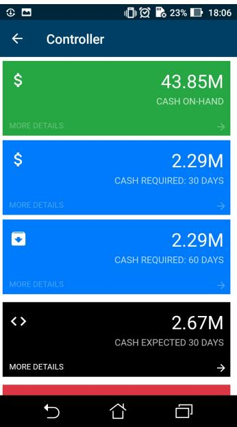

<span id="page-47-1"></span>*Figure: Viewing a dashboard screen*

## <span id="page-47-0"></span>**Mapping Reports**

A user can create and view an Acumatica Report Designer report through the mobile app if the following conditions are met:

- The report form already exists in Acumatica ERP.
- The report form metadata has been added to the mobile site map.
- The user account has been granted access rights to view the report.

To map a report form to the mobile app, you have to add a screen for the report form. This screen must have the type attribute set to *Report*.

The following screenshot displays a sample screen of the *Report* type with the DisplayName attribute set to *Shipment Report*.

| ¢                 |                        | 19:24 19:24 |  |
|-------------------|------------------------|-------------|--|
| ×                 | <b>Shipment Report</b> |             |  |
|                   | Select a Template *    |             |  |
| <b>Start Date</b> |                        |             |  |
| Jul 1, 2018       |                        |             |  |
| End Date          |                        |             |  |
|                   | Jul 17, 2018           |             |  |
| Customer ID       |                        |             |  |
|                   |                        |             |  |
| Warehouse         |                        |             |  |
|                   |                        |             |  |
| Inventory ID      |                        |             |  |
|                   |                        |             |  |
|                   |                        |             |  |
|                   |                        |             |  |
|                   |                        |             |  |
|                   |                        |             |  |
|                   |                        |             |  |
|                   |                        |             |  |

*Figure: Viewing a report screen*

On the screenshot, notice the round blue button, which corresponds to the **Run Report** button on the report form toolbar in Acumatica ERP.

#### **Using an Action to Generate a Report**

Acumatica Mobile Framework supports the Acumatica ERP actions that generate reports. To enable such an action in the mobile app, you should map the action to the form on which the action is invoked. For example, you could map the action to print a document to the entry form on which the document is created. In the mobile site map, the containerAction, recordAction, or selectionAction object has to contain the Redirect attribute set to *True*.

To map a report to the mobile app, do the following:

- 1. Add the report form to the mobile site map. For details, see *To Add a [Screen](#page-18-1) to the Mobile Site Map [\(Example\)](#page-18-1)*.
- 2. Add the report form to the main menu of the mobile app. For details, see *To [Update](#page-11-5) the Main Menu of a [Mobile App](#page-11-5)*.
- 3. Map the action that opens the report.

For example, if you need to map the Sales Order (SO641010) report to the Sales Orders (SO301000) screen, do the following:

1. Add the Sales Order report to the mobile site map. The screen code should look as follows.

```
add screen SO641010 {
 type = Report
```

```
}
```

2. Add the report to the main menu. The code for the main menu should look as follows.

```
update sitemap {
 ...
 add item "SO641010" {
 displayName="Sales Order"
 visible=False
 }
}
```

3. In the Sales Orders screen, map the action that opens the Sales Order report. The mapping of the action should look as follows.

```
update screen SO301000 {
 update container "OrderSummary" {
 add recordAction "PrintSalesOrder" {
 redirect = True
 }
 }
}
```

The following screenshot shows the resulting action button for the report in the screen's menu.

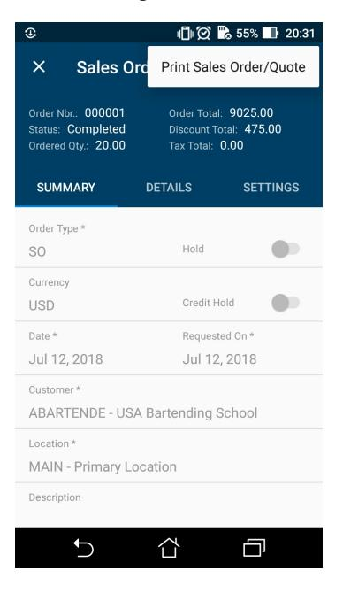

#### *Figure: Viewing the report action button on the Sales Orders screen*

When a user performs the action by using the mobile app, the app immediately receives the corresponding report in PDF format from the Acumatica ERP server and displays the report for the user, as shown in the following screenshot.

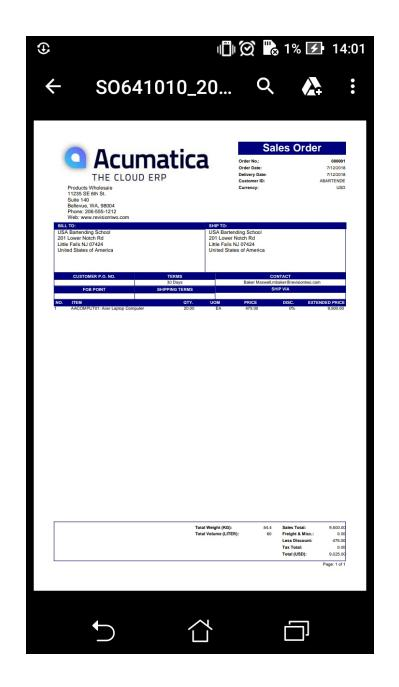

*Figure: Viewing the report*

# <span id="page-50-1"></span><span id="page-50-0"></span>**Redirecting the User to Different Screens and Containers**

You can redirect the user to different screens and containers in a mobile app in one of the following ways:

- Allow a redirection that is already implemented in Acumatica ERP
- Create a new redirection

Redirections can be performed to the following objects:

- A container inside the current screen
- Another screen
- A container inside another screen

### **Allowing of a Redirection That Is Implemented in Acumatica ERP**

While executing an action, you may need to redirect the mobile app from the current screen to a different screen or to an external URL. As a rule, the business logic of Acumatica ERP handles redirection to a screen by using the PXRedirectRequiredException and PXPopupRedirectException exceptions.

In the mobile app, you can allow a redirection that is implemented in an action of Acumatica ERP. To do this, you set the redirect attribute of the appropriate containerAction, recordAction, or selectionAction object to *True*.

#### **Use of an Existing Redirection from the List Form View to the Editing Form View**

You can see an example of redirecting from the list form view to the editing form view in the *[Configuring Editing](#page-34-1) [Screens](#page-34-1)* topic.

In the Invoices (SO3030PL) list screen, you can find two actions that can be invoked to open the editing form for a data record: Behavior="Create" and Behavior="Open". The Redirect="true" attribute indicates that the editing screen needs to be opened separately. The actual screen that will be opened is determined by the server logic.

You can still control the current screen aer an action is completed by using the After attribute of the corresponding action object. The After attribute defines more complex behavior of the container when the redirect attribute of this object is set to *True*. The possible values for the after attribute have the following meanings:

- If redirection doesn't happen:
  - Refresh: The current container is refreshed.
  - Close: The current container is closed, and the previous container in the stack is loaded.
- If redirection happens:
  - Refresh: A new screen is loaded, and the previous one is saved in the stack.
  - Close: The current container is closed, and the new one is opened, which takes the position of the closed container in the stack.

The default value of the after attribute is Refresh.

#### **Example: Using the Existing Redirection to an External URL**

If an action on an Acumatica ERP form provides redirection to an external URL, you can map the action to use it in the mobile app. To do this, you need no additional attributes in the action object. However, the redirect attribute of the tag must be set to *True*, as shown in the following example.

```
...
add recordAction "ViewOnMap" {
 behavior = Void
 redirect = True
}
...
```

On a mobile device, such action launches the default browser and passes the URL, which is obtained from the Acumatica ERP server, to the browser that opens the webpage specified in the URL.

#### **Creation of a New Redirection to a Screen or Container**

You can create a redirection to any container or screen in the mobile app when the redirection does not exist in Acumatica ERP. For example, you can do this to implement pop-up windows in the mobile app.

To create a redirection, you use the following attributes:

- RedirectToScreen specifies the ID of the screen to redirect the user to. If the redirection target is within the current screen (such as a different container), don't use this attribute.
- RedirectToContainer specifies the name of the container to redirect the user to. If you don't specify this attribute, you are redirected to the primary container of the target screen.

#### **Example: Creating a Redirection to Another Container Inside theScreen**

The following is an example of redirecting the user to another container inside the screen.

```
add screen "EP301000" {
 openAs = Form
 add container "DocumentSummary" {
 add field "ReferenceNbr" {
 forceIsDisabled = True
 }
 add field "Description"
 add recordAction "ShowSubmitReceipt" {
 behavior = Void
 redirect = True
 redirectToScreen = "EP301000"
 redirectToContainer = "SubmitReceipts$List"
 }
 add recordAction "Save" {
```

```
 behavior = Save
 after = Close
 }
 add recordAction "Cancel" {
 behavior = Cancel
 }
 attachments {
 disabled = True
 }
 }
 add container "SubmitReceipts" {
 type = SelectionActionList
 visible = False
 add field "Description"
 add field "Date"
 add field "ClaimAmount"
 add listAction "SubmitReceipt" {
 behavior = Void
 }
 }
}
```

In this example, the Expense Claims (EP301000) screen includes the following containers:

• DocumentSummary, which contains the following redirection on the record action.

```
add recordAction "ShowSubmitReceipt" {
 behavior = Void
 redirect = True
 redirectToScreen = "EP301000"
 redirectToContainer = "SubmitReceipts$List"
 }
```

• SubmitReceipts, to which the redirection is declared by the redirectToContainer = "SubmitReceipts\$List" attribute.

The RedirectToScreen attribute is not applicable here because both containers belong to the same screen.

The value of the redirectToContainer attribute can be expanded with special arguments separated with the *\$* symbol (as shown in the following example).

RedirectToContainer="InventoryLookup\$List\$InventoryLookupInventory"

These arguments allow more detailed configuration of the container behavior. The arguments are specified as follows:

- 1. The first argument is the name is the name of the container.
- 2. The second argument specifies how to open the container:
  - List: The container should be opened as a list view
  - Form: The container should be opened as a form view
- 3. If the second argument is set to List, you may specify a third argument to indicate an additional container that is used as a filter for the data records in the main container.

To use the expanded way of configuring a redirection, you should clearly understand how the target screen works, how its business logic operates, and how the state of the business logic objects changes aer any of the actions is executed.

### <span id="page-53-0"></span>**Configuring Screen Layout**

The following section contains information about configuring layout of a mobile screen such as configuring lists and fields on a screen.

### <span id="page-53-2"></span><span id="page-53-1"></span>**Configuring Lists**

This topic describes how to configure a screen that contains a list of records created by an entry form in Acumatica ERP.

#### **Example: Creating a Simple List View Layout**

A list view (that is, a list of records) is the simplest screen layout.

In this example, you will add a list of records that have been created on the *[Invoices and Memos](https://help-2025r1.acumatica.com/Help?ScreenId=ShowWiki&pageid=5e6f3b27-b7af-412f-a40a-1d4f4be70cba)* (AR301000) form or its corresponding screen. To prepare a screen for this example, you should do the following:

- Add a screen based on the Invoices and Memos (AR301000) form to the mobile site map. For details, see *[To](#page-18-1) [Add a Screen to the Mobile Site Map \(Example\)](#page-18-1)*.
- Add a screen shortcut to the main menu of the mobile app. For details, see *[Main Menu](#page-22-2)*.

Before adding a list of records created by a particular form, you explore the WSDL schema of the Invoices and Memos (AR301000) form, which the screen will be based on, as described in *[Getting the WSDL Schema](#page-80-1)*, and find the elements you want to add to the mobile screen. In this example, we want to add an action button and several fields of a record that will be displayed in the list. The WSDL schema elements are shown below.

#### *Figure: WSDL schema elements used in the example*

So to add the highlighted action buttons and fields to the screen you are creating, you should use the following code.

```
add screen AR301000 {
 add container "InvoiceSummary" {
 add field "Customer"
 add field "Location"
 add field "ReferenceNbr"
 add field "Terms"
 add field "DueDate"
 add recordAction "Save" {
 behavior = Save
 } 
 add recordAction "Cancel" {
 behavior = Cancel
 }
 }
}
```

You must declare the Cancel action for all screens that include it in the WSDL schema. Without the Cancel action mapped, the changes discarded in the mobile app might not be discarded on the server.

The le screenshot below shows the resulting screen you will see in the mobile application; you can tap any record to make changes to it. The right screenshot shows the form view of an individual record. Once you change any setting in this view, the ✓ symbol appears. Tap it to save your changes.

| $\oplus$ $\bullet$ |                                                            | 11:2 8 77% 1 13:50          | $\odot$ $\Box$ $\odot$                                                     | 1 3:54 |
|--------------------|------------------------------------------------------------|-----------------------------|----------------------------------------------------------------------------|--------|
|                    | <b>Invoices</b>                                            | Q                           | <b>Invoices</b><br>$\times$                                                | 0      |
|                    | <b>USA Bartending</b><br>School<br>AR005785<br>Sep 5, 2018 | Primary Location<br>30 Days | Customer*<br><b>USA Bartending School</b><br>Location*<br>Primary Location |        |
|                    | <b>USA Bartending</b><br>School<br>AR005782<br>Sep 2, 2018 | Primary Location<br>30 Days | Reference Nbr.<br>AR005785<br>Terms*<br>30 Days                            |        |
|                    | Westwood Manor<br>AR005781<br>May 5, 2018                  | Primary Location<br>30 Days | Due Date*<br>Sep 6, 2018                                                   |        |
|                    | <b>ABC Studios Inc.</b><br>AR005779<br>May 19, 2018        | Primary Location<br>30 Days |                                                                            |        |
|                    | <b>Widget Credit Card</b><br>AR005778                      | Primary Location<br>30 Days |                                                                            |        |
|                    |                                                            |                             |                                                                            |        |

*Figure: List view layout and form view layout*

All list views in Acumatica ERP mobile app support multi-selection. You can select multiple records and perform actions that have been declared as *[selectionAction](#page-141-0)*.

#### **Related Links**

• *[container](#page-117-0)*

# <span id="page-55-0"></span>**Displaying Thumbnails**

In Acumatica ERP, the system can display thumbnails—that is, small images—for the records in the list view of a mobile app screen. For each listed record, a thumbnail can be displayed next to the record description if the record includes a field containing an image. An example is shown in the following screenshot, where thumbnails are displayed for each record in the Photo Log list view.

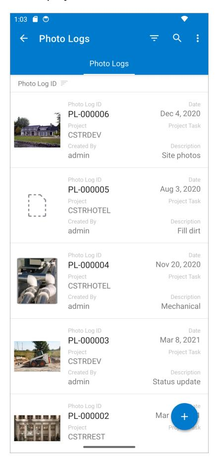

*Figure: Thumbnails in the list view*

When the app displays the list view with the images, it asynchronously downloads the images for each record and displays them in the list. If an image is not available, the icon of an image file is displayed instead (see the second record in the screenshot above).

### **Configuring Thumbnails**

For thumbnails to be displayed in the list view of the mobile screen, you need to configure the mapping of the list in MSDL: In the list mapping, specify elementType = FilePreview in the field object that contains the image file.

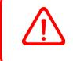

A field marked with FilePreview should have a FileID value that corresponds to the FileID value in the UploadFile table in the instance database.

The following code shows an example implementing the screenshot above.

```
 fieldsToShow = 5
 containerActionsToExpand = 1
 add field "Name" {
 listDisplayFormat = CaptionValue
 }
 add field "PhotoID" {
 listDisplayFormat = CaptionValue
 }
 add field "UploadedOn" {
 listDisplayFormat = CaptionValue
 }
 add field "UploadedBy"
 {
 displayName = "Created By"
 listDisplayFormat = CaptionValue
 }
 add field "Description" {
 listDisplayFormat = CaptionValue
 }
 add field "FileId" {
 elementType = FilePreview
 }
 add selectionAction "Delete" {
 icon = "system://Trash"
 behavior = Delete
 after = Close
 }
 add containerAction "ViewPhoto" {
 behavior = Open
 redirect = True
 }
```

}

{

• *[field](#page-124-0)*

### <span id="page-56-0"></span>**Grouping Fields on a Screen**

You can combine fields into groups to make data entry more logical and intuitive by using the group object, as the following example shows.

#### **Example: Grouping Fields**

The following example enhances the Sales Order Preferences (SO101000) screen. To see an example of grouping fields into a group, add the Sales Orders Preferences (SO101000) screen to your customization project (as described in *To Add a Screen to the Mobile Site Map [\(Example\)](#page-18-1)*), copy the code below to the **Commands** area of the Add: SO101000 page, and publish the project.

```
add screen SO101000 {
 add container "GeneralSettingsDataEntrySettings" {
 add field "DefaultSalesOrderType"
 add group "DataEntrySettings" {
 displayName = "Data Entry Settings"
```

```
 collapsable = True
 collapsed = True
 add field "DefaultTransferOrderType"
 add field "ShipmentNumberingSequence"
 }
 add recordAction "Save" {
 behavior = Save
 }
 }
}
```

While entering data, the user may collapse or expand a particular group of fields. You can prevent a group from being collapsed by setting the collapsable attribute of the group to *False* (by default, the attribute value is *True*). If a group is collapsible (the collapsable attribute is set to *True*), the collapsed attribute indicates whether a group is initially collapsed (by default, the attribute value is *False*).

You can see the result in the mobile application in the following screenshots.

The le screenshot shows the **Data EntrySettings** group, which is initially collapsed. If the user clicks on the header of the group, the group is expanded, as shown in the right screenshot.

| 15:10                                      | 10 図 26% 27 15:10                                                                                                    |
|--------------------------------------------|----------------------------------------------------------------------------------------------------------------------|
| $\circledast$                              | !!!!!!!!!!!!!!!!!!!!!!!!!!!!!!!!!!!!!!!!                                                                             |
| <b>SO Preferences</b>                      | <b>SO Preferences</b>                                                                                                |
| $\times$                                   | ×                                                                                                                    |
| Default Sales Order Type                   | Default Sales Order Type                                                                                             |
| Sales Order                                | Sales Order                                                                                                          |
| <b>DATA ENTRY SETTINGS</b><br>$\checkmark$ | <b>DATA ENTRY SETTINGS</b><br>Default Transfer Order Type<br>Transfer<br>Shipment Numbering Sequence*<br>SO Shipment |
|                                            |                                                                                                                      |

#### *Figure: A collapsible group on a screen*

#### **Related Links**

• *[group](#page-129-0)*

### <span id="page-57-0"></span>**Configuring Specific Functionality of a Screen**

The following section contains instructions and examples on configuring specific functionality such as signatures and scanning of receipts.

## <span id="page-58-0"></span>**Creating the User Signature**

The mobile app provides the additional functionality for user to create a signature and attach the signature image file to an Acumatica ERP form that supports file attachments.


This functionality does not work in the container object with attachments disabled (the attachments instruction with the disabled attribute set to *True*).

To add this functionality to your mobile app, you should update the corresponding page by adding the recordAction object with the behavior attribute set to *SignReport*. The container to which you add the recordAction object must support attachments.

For example, to add an area for adding a user signature to the Sales Orders (SO301000) screen, open the Update: SO301000 page (for details, see *To [Update](#page-17-1) a Screen of a Mobile App*), and insert the following code in the **Commands** area.

```
update screen SO301000 {
 update container "OrderSummary" {
 ...
 add recordAction "SignReport" {
 behavior = SignReport
 displayName = "Sign"
 }
 ...
 }
}
```

As a result, the**Sign** action appears on the appropriate screen of the mobile app, as the following screenshot shows.

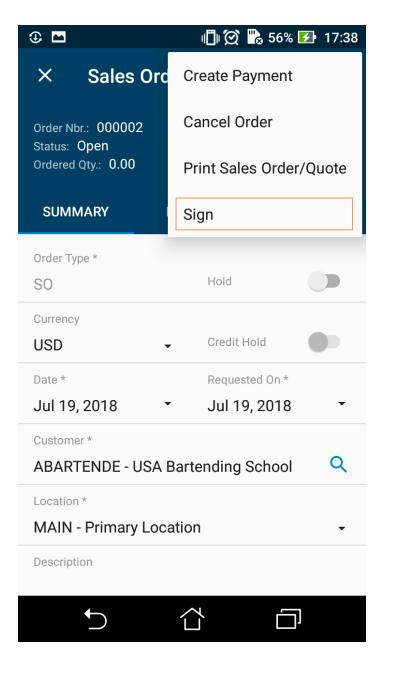

*Figure: Viewing the Sign action on the screen toolbar*

When the user clicks this action, the app displays a blank form with the **Cancel** and **OK** buttons and the words *Sign here* to instruct the user to add the signature, as shown in the following screenshot. A user can add multiple signatures to one record.

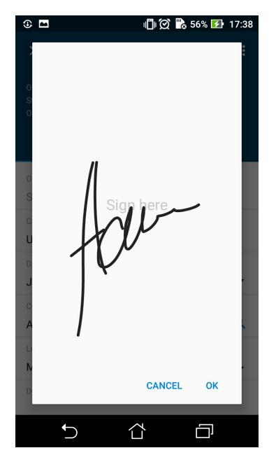

#### *Figure: Creating a signature*

Aer the user clicks the Save (✓) button on the screen toolbar (shown in the following screenshot), the mobile app sends the signature file to the Acumatica ERP server, which saves the file in the database as a file attached to the appropriate form. In the mobile app, the attachment is displayed as an image that is attached to the Acumatica ERP form.

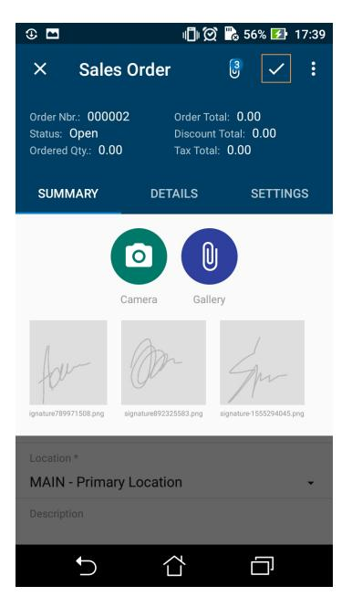

*Figure: Viewing signatures added to the screen*

# <span id="page-60-1"></span><span id="page-60-0"></span>**Configuring Attachments**

By default, the mobile application enables file attachments and displays them on a screen if the screen supports the attachments. However, the default handling of attachments can be overridden.

On iOS devices, it is possible to upload only image files. Files of other types are not supported.

### **Example: Configuring a Screen with Attachments**

The following sample code gives the Invoices (SO303000) screen the ability to accept attachments of various formats. To see an example, add the Invoices (SO303000) screen to your customization project (as described in *[To](#page-18-1) [Add a Screen to the Mobile Site Map \(Example\)](#page-18-1)*), copy the code below to the **Commands** area of the Add: SO303000 page, and publish the project.

```
add screen SO303000 {
 add container "InvoiceSummary" {
 add field "Customer"
 add field "Location"
 add field "Terms"
 add field "DueDate"
 add field "CashDiscountDate"
 add field "Currency" {
 selector {
 add field "CurrencyID"
 }
 PickerType = Attached
 }
 add recordAction "Save" {
 behavior = Save
 }
 add recordAction "Cancel" {
 behavior = Cancel
 }
 attachments {
 add type "jpg" {
 extension = "jpg" 
 }
 add type "png" {
 extension = "png"
 }
 add type "pdf" {
 extension = "pdf"
 }
 }
 }
}
```

To enable or disable attachments and configure the file types that are allowed, you use the attachments instruction inside the container object.

If a screen does not support attachments, the attachments are not displayed even if you set the disabled attribute of the attachments instruction to *False*.

The screenshot below shows the resulting screen in the mobile application. To attach an item, the user taps the paper clip symbol in the top right corner of the screen. Aer at least one item has been attached, the number next to the paper clip indicates how many items have been attached.

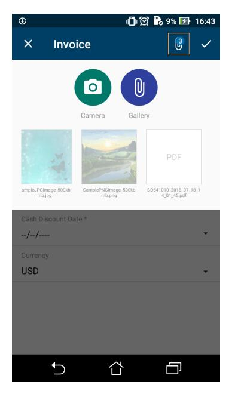

*Figure: A screen with attachments*

### **The Enhancement of Images Taken from the Camera**

The functionality of enhancing images taken from the camera of a mobile device is implemented in the Acumatica mobile app with the help of Azure Form Recognizer (AFR) version 3.1. This image enhancement makes the image look better and more readable. This functionality is useful for any printed document, such as expense receipts that may be attached to documents in Acumatica ERP.

To switch on image enhancement in the Acumatica mobile app, you should set the imageAdjustmentPreset attribute to *Receipt* in the attachments instruction of the mobile site map as follows.

```
attachments {
 imageAdjustmentPreset = Receipt
}
```

When the imageAdjustmentPreset attribute is set to *Receipt*, a corresponding button appears in the attachment area (see the screenshot below). When a user taps the highlighted button, a special camera mode is switched on in the Acumatica mobile app. In this mode, the following enhancements of the image captured by the camera are performed:

- The image is cropped by the bounding box of the detected edges.
- Any image distortion is removed.
- The image is converted into black and white.
- The contrast of the image is maximized.

Each of these enhancements is first performed automatically and then the user can also add manual adjustments. The automatic changes cannot be undone.

| œ                 |                                              |               |   | 10 2 8 9% 17:11 |
|-------------------|----------------------------------------------|---------------|---|-----------------|
| X                 | <b>Expense Recei</b>                         |               | 0 | ፧               |
| i'o               | Receipt Number: <new><br/>Status: Open</new> |               |   |                 |
| Description*      |                                              |               |   |                 |
| Date *            |                                              |               |   |                 |
| Jul 20, 2018      |                                              |               |   |                 |
| Expense Item*     |                                              |               |   |                 |
| Amount            |                                              | Employee Part |   |                 |
| 0.00              |                                              | 0.00          |   |                 |
| Project/Contract* |                                              |               |   |                 |
|                   | X - Non-Project Code.                        |               |   |                 |
| Project Task      |                                              |               |   |                 |
| Billable          |                                              |               |   |                 |
|                   |                                              |               |   |                 |

#### *Figure: A screen with the attachment area to add photos in enhanced mode*

If the imageAdjustmentPreset attribute is not specified or has value other than Receipt, the Acumatica mobile app attaches the original image taken from the camera.

#### **Related Links**

• *[attachments](#page-146-0)*

### <span id="page-62-0"></span>**Dialog Boxes and Smart Panels**

The following section contains information about mapping of simple dialog boxes and smart panels (complex dialog boxes).

### <span id="page-62-2"></span><span id="page-62-1"></span>**Mapping a Smart Panel**

This section describes how to map a smart panel (a complex dialog box) to the Acumatica mobile app. For details on smart panels, see *[Dialog Box \(PXSmartPanel\)](https://help-2025r1.acumatica.com/Help?ScreenId=ShowWiki&pageid=2fe4a5bb-c249-4d30-b117-af8d1671a589)*.

To map a smart panel, you need to perform the following steps, which are described in a greater detail below:

- 1. In the form ASPX, learn the name of the smart panel and the name of the action which opens it. See *[Locating](#page-63-0) [of Objects to Be Mapped](#page-63-0)*.
- 2. In the screen mapping, add an action that opens the smart panel. See *[Mapping of an Action That Opens a](#page-63-1) [Smart Panel](#page-63-1)*.
- 3. In the screen mapping, map the smart panel, including its containers and actions. *[Mapping of a Smart Panel](#page-64-0)*

You can see a complete example of a smart panel mapping in *[Example: Adding a Smart Panel on the Sales Orders](#page-65-0) [\(SO301000\) Form](#page-65-0)*.

### <span id="page-63-0"></span>**Locating of Objects to Be Mapped**

The general idea of learning the object names that you need to map is the following: To learn the name of an action, you search for the name of the action in the ASPX file of the form. To learn the name of a container and its fields, you search for the container and its fields in the WSDL schema of the form.

Before mapping an action to the mobile app, you need to learn its name. You can do this by analyzing the WSDL schema and the form ASPX.

Before mapping a smart panel to the mobile app, you need to learn the names of the UI controls on the smart panel as follows:

- 1. Open the WSDL schema of the form. For details on opening the WSDL schema, see *[Getting the WSDL](#page-29-3) [Schema](#page-29-3)*.
- 2. In the WSDL schema, find the complexType element with the fields that match the fields you see on the smart panel.


If a smart panel consists of multiple containers, such as a Summary area and a grid, you should map these containers separately.

3. Learn the name of the complexType element and the names of the elements inside it.

To map actions on the smart panel, you should learn their names by doing the following:

- 1. Open the form ASPX by using the Element Inspector.
- 2. Find the PXSmartPanel element that defines the smart panel. You can do this by using comments in the ASPX and comparing elements in the UI and in the ASPX.
- 3. In the PXSmartPanel element, locate the PXPanel element. The PXPanel element contains the PXButton elements, which define actions on the smart panel. In the PXButton element you want to map, learn the value of the CommandName or DialogResult attribute (either of which exists in the definition of an action). You will later use the CommandName attribute value for the action name, and the DialogResult attribute value for the DialogResult action attribute.

If an action does not have the CommandName attribute, you can use any name for it in the mapping. For example, for the action with no CommandName and DialogResult = "Ok", you can add the action under the "Ok" name.

### <span id="page-63-1"></span>**Mapping of an Action That Opens a Smart Panel**

To map an action that opens a smart panel, do the following:

- 1. Learn the name of the action in the WSDL schema.
- 2. In the screen mapping, inside the update container or add container instruction, add the recordAction object. For the object, specify the following attributes:
  - displayName: The name to be displayed in the UI
  - redirect: *true*
  - redirectToDialog: The custom name of the smart panel you will map later

An example of the mapping is shown below.

```
add recordAction "AddInvBySite" {
 displayName = "Add Stock Item"
 redirect = true
 redirectToDialog = "SO301000D1"
```

For details, see *[recordAction](#page-137-0)*.

#### <span id="page-64-0"></span>**Mapping of a Smart Panel**

}

To map a smart panel, do the following:

- 1. Learn the names of containers, fields, and actions that you want to map inside the smart panel as described in *[Locating of Objects to Be Mapped](#page-63-0)*.
- 2. In the screen mapping, inside the update screen or add screen instruction, add the dialog object. For the dialog object, specify the following attributes:
  - Type: The type of the smart panel
  - OpenAs: The display type of the smart panel

See the following example of a dialog object. For details on the dialog object, see *[dialog](#page-122-0)*.

```
add dialog SO301000D1 {
 type = FilterListScreen
 openAs = List
 ...
}
```

- 3. Inside the dialog object, add the actions that you want to display on the smart panel. For each action, add the dialogAction object, and specify the following attributes for it:
  - DisplayName: The name of the action in the UI.
  - DialogResult: The same value that is specified in the DialogResult attribute of the action in the form ASPX.

If the DialogResult attribute is not specified for the action in the form ASPX, you do not need to map it in MSDL.

• CloseDialog: An indicator of whether the app should close the smart panel aer the user taps the action.

An example of the dialog action is shown in the following code. For details on the dialogAction object, see *[dialogAction](#page-123-0)*.

```
add dialogAction "Ok" {
 DisplayName = "Add&Close"
 DialogAnswer = "OK"
 closeDialog = true
}
```

4. Inside the dialog object, add the containers that you want to display on the smart panel.

If the container should contain actions such as listAction and containerAction, in the container, specify includeDialogActions = true.

An example of a container is shown in the following code. For details, see *[container](#page-117-0)*.

```
add container "AddTag" {
 includeDialogActions = True
 add field "Customer"
 add field "Contact"
 add field "Barcode" {
 special = BarCodeScan
```

#### }

5. If you have added any dialogAction objects (in Instruction 3), for each dialogAction object, you also need to add a recordAction, containerAction, or listAction object inside a container where you want the action to be displayed. The new object should have the same name as the dialogAction object.

Suppose that you have added the dialogAction "Ok", as described in Instruction 3, and a container, as described in Instruction 4. Then you need to add the recordAction object inside the container as shown in the following code.

```
add container "AddTag" {
 ... 
 add recordAction "Ok"
}
```

#### <span id="page-65-0"></span>**Example: Adding a Smart Panel on the Sales Orders (SO301000) Form**

The following code demonstrates how to map the **Inventory Lookup** smart panel, which is implemented on the **Details** tab of the *[Sales Orders](https://help-2025r1.acumatica.com/Help?ScreenId=ShowWiki&pageid=19e4021c-1b84-49fd-be12-0320c5f1c7e5)* (SO301000) form. For details on creating a mapping of a form in a customization project, see *To [Update](#page-17-1) a Screen of a Mobile App* and *To Add a Screen to the Mobile Site Map [\(Example\)](#page-18-1)*.

```
update screen SO301000 {
 update container "OrderSummary" {
 formActionsToExpand = 3
 add recordAction "AddInvBySite" {
 displayName = "Add Stock Item"
 redirect = true
 redirectToDialog = "SO301000D1"
 }
 }
 add dialog SO301000D1 {
 type = FilterListScreen
 openAs = List
 add dialogAction "Ok" {
 DisplayName = "Add&Close"
 DialogResult = "OK"
 closeDialog = true
 }
 add dialogAction "Cancel" {
 DisplayName = "Cancel"
 DialogResult = "Cancel"
 closeDialog = true
 }
 add dialogAction "AddInvSelBySite"
 {
 DisplayName = "Add"
 closeDialog = false
 }
 add container "InventoryLookupInventory"
 {
 add field "Inventory"
 ...
 add field "HistoryDate"
 }
```

```
 add container "InventoryLookup"{
 type = SelectionActionList
 includeDialogActions = true
 add field "QtySelected"
 add field "Selected" {
 special = "ListSelection"
 }
 add field "Warehouse"
 ...
 add field "AlternateDescription"
 add listAction "AddInvSelBySite" {
 DisplayName = "Add"
 }
 add containerAction "Cancel" {
 displayName = "Cancel"
 }
 add listAction "Ok"
 {
 DisplayName = "Add&Close"
 after = Close
 }
 }
 }
```

}

The resulting smart panel looks as shown in the following screenshots. The first screenshot shows the mapped **Add Stock Item** action on the menu of the Sales Order screen. The second screenshot shows the **Inventory** smart panel with two stock items selected. The third screenshot shows the stock items added to the **Details** tab of the Sales Order screen.

| $18:10$ $\infty$ $\bullet$ $\bullet$ $\cdot$                    | $\mathbf{C} \mathbf{N} \mathbf{R} \mathbf{C} \mathbf{C}$ and $\mathbf{C} \mathbf{C}$ |                      | $18:10$ <b>a</b> $\infty$ <b>e</b> $\cdot$   |                               | $\mathbf{C} \mathbf{N} = \mathbb{C} \mathbf{C} \mathbf{C} \mathbf{C} \mathbf{C} \mathbf{C} \mathbf{C} \mathbf{C} \mathbf{C} \mathbf{C} \mathbf{C} \mathbf{C} \mathbf{C} \mathbf{C} \mathbf{C} \mathbf{C} \mathbf{C} \mathbf{C} \mathbf{C} \mathbf{C} \mathbf{C} \mathbf{C} \mathbf{C} \mathbf{C} \mathbf{C} \mathbf{C} \mathbf{C} \mathbf{C} \mathbf{C} \mathbf{C} \mathbf{C} \mathbf{C} \mathbf{C} \mathbf{C} \mathbf$ |              | 18:11 ◎ ■ ∞ …                                  | $\mathbf{Q} \mathbf{N}$ $\widehat{\mathbf{S}}$ , $\mathbf{C}_{1,1}$ $\mathbf{C}_{2,1}$ $\mathbf{C}$ |
|-----------------------------------------------------------------|--------------------------------------------------------------------------------------|----------------------|----------------------------------------------|-------------------------------|-------------------------------------------------------------------------------------------------------------------------------------------------------------------------------------------------------------------------------------------------------------------------------------------------------------------------------------------------------------------------------------------------------------------------|--------------|------------------------------------------------|-----------------------------------------------------------------------------------------------------|
| Sales Ord<br>$\times$                                           | Hold                                                                                 |                      | $\overline{2}$<br>$\leftarrow$               | Select all                    |                                                                                                                                                                                                                                                                                                                                                                                                                         | $\times$     | <b>Sales Order</b>                             | $\alpha$                                                                                            |
| Order Nbr.: <new><br/>Status: Open<br/>Ordered Qty.: 0.00</new> | Cancel Order<br>Add Stock Item                                                       |                      | 1.00<br>ELECCOMP -4                          | Cancel<br>Add                 |                                                                                                                                                                                                                                                                                                                                                                                                                         | Status: Open | Order Nbr.: <new><br/>Ordered Qty.: 2.00</new> | Order Total: 610.00<br>Discount Total: 0.00<br>Tax Total: 0.00                                      |
| <b>SUMMARY</b>                                                  | <b>DETAILS</b><br><b>SETTINGS</b>                                                    |                      | ELEEASTCOM                                   |                               |                                                                                                                                                                                                                                                                                                                                                                                                                         |              | <b>SUMMARY</b><br><b>DETAILS</b>               | <b>SETTINGS</b>                                                                                     |
| Order Type *<br>S <sub>O</sub>                                  | Currency<br><b>USD</b>                                                               |                      | AACOMPUT01<br>Acer Laptop Computer<br>200.00 | Add&close                     | EA<br>200.00                                                                                                                                                                                                                                                                                                                                                                                                            | Aa           | AACOMPUT01<br>Acer Laptop Computer             | 1.00                                                                                                |
| Date *<br>Jan 15, 2021<br>▼                                     | Requested On *<br>Jan 15, 2021                                                       | $\blacktriangledown$ | 1.00<br>CONSUMER -300-TOYS                   |                               | <b>RETAIL</b>                                                                                                                                                                                                                                                                                                                                                                                                           | Aa           | AALEGO500<br>Lego 500 piece set                | 1.00                                                                                                |
| Customer*<br>AACUSTOMER - Alta Ace                              |                                                                                      | Q                    | CONDEWSUP<br>AALEGO500<br>Lego 500 piece set |                               | Dewsoft Toy Supply<br>$\Omega$<br>EA                                                                                                                                                                                                                                                                                                                                                                                    |              |                                                |                                                                                                     |
| Location *                                                      |                                                                                      |                      | 785.00                                       |                               | 785.00                                                                                                                                                                                                                                                                                                                                                                                                                  |              |                                                |                                                                                                     |
| MAIN - Primary Location                                         |                                                                                      |                      |                                              |                               |                                                                                                                                                                                                                                                                                                                                                                                                                         |              |                                                |                                                                                                     |
| Contact                                                         |                                                                                      | Q                    | 0.00<br>FOOD<br><b>FOODETISUP</b>            | -300-PKGFOODS                 | <b>RETAIL</b><br><b>Etik Food Supplies</b>                                                                                                                                                                                                                                                                                                                                                                              |              |                                                |                                                                                                     |
| Description                                                     |                                                                                      |                      | AAPOWERAID                                   | Poweraid 32 Oz - lot numbered | !!!!!!!!!!!!!!!!!!!!!!!!!!!!!!!!!!!!!!!!<br>EA                                                                                                                                                                                                                                                                                                                                                                          |              |                                                |                                                                                                     |
| Notes                                                           |                                                                                      |                      | 9,000.00                                     |                               | 9,000.00                                                                                                                                                                                                                                                                                                                                                                                                                |              |                                                |                                                                                                     |
|                                                                 |                                                                                      |                      | 0.00                                         |                               | <b>RETAIL</b>                                                                                                                                                                                                                                                                                                                                                                                                           |              |                                                |                                                                                                     |
| <b>SHIPPING</b>                                                 |                                                                                      | $\checkmark$         | CONSUMER -300-TOYS<br>CONPERIPH              | Periphery Distribution Co.    |                                                                                                                                                                                                                                                                                                                                                                                                                         |              |                                                |                                                                                                     |
| PAYMENT SETTINGS                                                |                                                                                      | $\checkmark$         | CONAIRT1                                     |                               | !!!!!!!!!!!!!!!!!!!!!!!!!!!!!!!!!!!!!!!!                                                                                                                                                                                                                                                                                                                                                                                |              |                                                |                                                                                                     |
|                                                                 | ✓                                                                                    |                      | $\mathbf{III}$                               | ∩                             | $\langle$                                                                                                                                                                                                                                                                                                                                                                                                               |              | <br>∩                                          | $\langle$                                                                                           |

#### *Figure: Using the Inventory smart panel*

#### **Related Links**

- *[dialogAction](#page-123-0)*
- *[dialog](#page-122-0)*

# <span id="page-67-0"></span>**Displaying a Simple Dialog Box**

In Acumatica ERP, the system can display a dialog box for confirmation purposes either when user invokes an action or during a commit of a field value to the server. The system supports the following types of dialog boxes:

- Simple dialog boxes that contain text and two buttons, such as **OK** and **Cancel** or **Yes** and **No**. These dialog boxes are implemented by using the Ask() method.
- Extended dialog boxes with UI elements, grids, or both. These dialog boxes can be used as a part of a workflow.

Currently, the Acumatica mobile app supports simple dialog boxes, which are displayed when a user selects an action. You do not need to map these dialog boxes; if a simple dialog box is displayed in the desktop version of Acumatica ERP, the dialog box will also be displayed in the mobile app.

### **Enabling a Dialog Box in Application Code**

Before Acumatica ERP 2020 R2, dialog boxes were not supported in the mobile app. Thus, they are oen suppressed by checking the *[IsMobile](https://help.acumatica.com/Help?ScreenId=ShowWiki&pageid=198bc715-56b2-37c5-895f-fd136023c404)* property value of a graph. For a dialog box to be displayed in the mobile app, you need to remove this checking.

For example, in the following code, the dialog box is not displayed for the mobile app.

```
 if (this.Transactions.Select().Count > 0 && !IsMobile)
{
 this.Document.Ask(Messages.Warning, Messages.POOrderOrderDateChangeConfirmation, 
 MessageButtons.YesNo, MessageIcon.Question);
}
```

To enable the dialog box for the mobile app, the code should look as follows.

```
if (this.Transactions.Select().Count > 0)
{
 this.Document.Ask(Messages.Warning, Messages.POOrderOrderDateChangeConfirmation, 
 MessageButtons.YesNo, MessageIcon.Question);
}
```

# <span id="page-68-1"></span><span id="page-68-0"></span>**Configuring the Close Button of a Smart Panel**

A mobile screen that corresponds to a smart panel in the browser version of Acumatica ERP can have the Close button. This button corresponds to the X button on a screen toolbar on Android devices and to the Back (**<**) button on iOS devices. By default, the button opens the previous container and does not have a callback to the server.

You can configure the Close button to have a callback to the server by specifying the dialog result for the button. You can do this in one of the following ways:

- Specify the dialog result in the CloseButtonDialogResult attribute of the dialog object
- Define the Close action in detail by using the CloseButtonDialogAction property of the dialog object


For each button, you can use only one of these approaches.

# **Specifying the Dialog Result in the CloseButtonDialogResult Attribute**

You can specify the dialog result for a button in the CloseButtonDialogResult attribute of the *[dialog](#page-122-0)* object. The possible values of the attribute correspond to the elements of the *[WebDialogResult](https://help.acumatica.com/Help?ScreenId=ShowWiki&pageid=85082ebd-9eeb-5668-7339-66127e6f41bd)* enumeration. The following code shows an example of the dialog result value being specified for the Close action.

```
update screen SO301000 {
 add dialog "AddLine" {
 CloseButtonDialogResult = "No"
 ...
 }
}
```

## **Defining the Close Action**

You can define the Close action by doing the following:

- 1. In the *[dialog](#page-122-0)* object, define the action by adding the *[dialogAction](#page-123-0)* object.
- 2. In the *[dialogAction](#page-123-0)* object, specify the dialog result in the dialogResult property.


In the dialogAction object, you don't need to specify the CloseDialog property because the button closes the screen by default.

3. In the dialog object, specify the name of the action in the CloseButtonDialogAction property.

The following code shows an example of the Close action being defined in a dialog box.

```
update screen SO301000 {
 ...
 update dialog "AddLine" {
 CloseButtonDialogAction = "NoAction"
 update dialogAction "NoAction" {
 dialogResult = "No"
 }
 }
}
```

#### **Related Links**

- *[dialog](#page-122-0)*
- *[dialogAction](#page-123-0)*

# <span id="page-70-3"></span><span id="page-70-0"></span>**Configuring the Mobile Site Map by Using XML (deprecated)**

Using XML for customizing the Mobile Site Map is deprecated since Acumatica 2025 R1. Use *[Configuring the Mobile Site Map](#page-22-3)* instead.

The user interface of the Acumatica mobile app has the following structure:

- *[Main Menu](#page-73-2)*, which can include the sm:Folder and sm:Screen elements
- *[Sidebar Menu](#page-78-1)*, which can include links to favorite folders and screens
- *[Screens](#page-79-1)*, which can include sm:Container, sm:Field, sm:Action, and other elements

<span id="page-70-4"></span>See *[Mobile Site Map Reference](#page-115-3)* for detailed descriptions of all tags.

# <span id="page-70-1"></span>**To Customize the Mobile Site Map for a Form**

Before you start to customize the original mobile site map, we recommend that you explore the files in the \App\_Data\Mobile folder of the website to learn which forms of Acumatica ERP are used in the map. The folder can contain the files with the XML metadata and MSDL code of not only the original mobile site map but also any customizations that have been applied to the map.

To customize the mapping for an Acumatica ERP form that is included in the original mobile site map, we recommend that you develop custom MSDL code. (See *[Configuring the Mobile Site Map](#page-22-3)* for details.)

We recommend that you avoid including in the mobile site map the XML metadata for an Acumatica ERP form that is already included in the original mobile site map. Currently, the mobile framework does not allow the merging of multiple sets of metadata for the same form of Acumatica ERP. Also, we recommend that you not customize the files of the original mobile site map. In a future version of Acumatica ERP, an XML file can contain additional metadata for new functionality, about which you would never know because the file is replaced by the customized one.

Aer you have saved the MSDL code in a .msd file in the \App\_Data\Mobile folder of the website, you can add this file to a customization project that can be deployed to an instance of Acumatica ERP.

# <span id="page-70-2"></span>**To Add a Form to the Mobile Site Map by Using an XML File**

To add the metadata for an Acumatica ERP form to the mobile site map, you have to include it in a new .xml file in the \App\_Data\Mobile folder of the website. If the metadata must contain multiple new .xml.inc files, place the files in the \App\_Data\Mobile\includes folder of the website.

Suppose that you need to add to the mobile site map an Acumatica ERP form with the *XXX* screen ID, and you are sure that the mobile site map does not contain the XML metadata for this form. Further suppose that you have to add the Date and Description fields and the Insert and Delete actions of the original *XXX* screen of Acumatica ERP to the screen on the mobile device, as the following diagram shows.

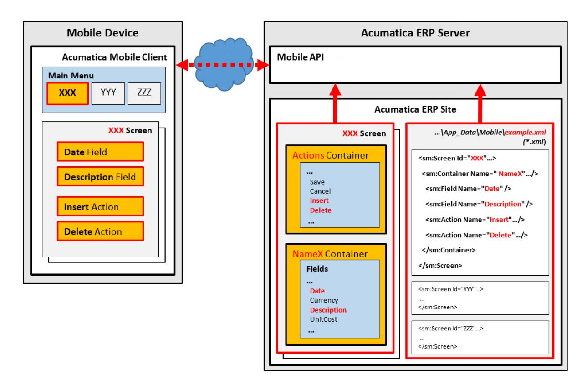

#### *Figure: Use of an XML file to configure a screen in the mobile app*

The diagram shows how Acumatica Mobile Framework uses the metadata of the example.xml file to configure the *XXX* screen in the mobile app. (See *[Configuring the Mobile Site Map by Using XML \(deprecated\)](#page-70-3)* for details.)

To create the metadata for the form, perform the following actions:

1. In the \App\_Data\Mobile folder, create the example.xml file, which contains the XML header and the sm:SiteMap tag, as follows.

```
<?xml version="1.0" encoding="UTF-8"?>
<sm:SiteMap xmlns:sm="http://acumatica.com/mobilesitemap" xmlns:xsi="http://
www.w3.org/2001/XMLSchema-instance">
```

```
</sm:SiteMap>
```


See *[Mobile Site Map Reference](#page-115-3)* for detailed descriptions of all tags used in the mobile site map.

- 2. Get the WSDL schema for the original *XXX* screen of Acumatica ERP, as described in *[Getting the WSDL](#page-80-1) [Schema](#page-80-1)*.
- 3. Add the sm:Screen tag to the sm:SiteMap tag, as described in *[Configuring Lists](#page-81-1)*.
- 4. In the WSDL schema, find the Insert and Delete actions and make sure that these actions belong to the *Action* container.
- 5. In the WSDL schema, find the Date and Description fields and make sure that these fields belong to the *NameX* container.
- 6. Add the sm:Container tag to the sm:Screen tag, assigning it the *NameX* name to map the *NameX* container of the original *XXX* screen of Acumatica ERP to the *XXX* screen in the mobile app (see the figure above).

- 7. For each required field, add an sm:Field tag with the original name to the container tag to map the field to the *XXX* screen in the mobile app.
- 8. For each required action, add an sm:Action tag with the original name to the container tag to map the action to the *XXX* screen in the mobile app.

Once you have changed the mobile site map, you can include the added .xml and .xml.inc files in a customization project as *File* items to deploy the customization on the target system. For details, see *[Custom Files](https://help-2025r1.acumatica.com/Help?ScreenId=ShowWiki&pageid=d474f5d8-47a0-42b3-af00-8e0940e32b7f)* in the Customization Guide.

# <span id="page-72-0"></span>**To Generate the Delta from Two Mobile Site Maps**

The following information is applicable only for Acumatica Framework versions earlier than 2025 R1.

If you have developed a custom site map for the mobile application and want to redistribute it to multiple Acumatica ERP instances, you can generate a delta script file that can be applied to the default site map. You then add this delta file to the customization project, as described in this topic.

### **To Generate the Delta from Two Mobile Site Maps**

1. For an Acumatica ERP instance, customize the site map for the mobile application. (For details, see *[To](#page-70-4) [Customize the Mobile Site Map for a Form](#page-70-4)*.)


Make sure all nodes of the site map have the Name attribute specified. This attribute is used by the system during the generation of the delta file.

- 2. Deploy another Acumatica ERP instance of the same version with the default site map for the mobile application.
- 3. Run the ac.exe command-line utility, which is located in the Data folder of your Acumatica ERP installation folder, with the MOBILESITEMAP command, the delta argument, and the following parameters:
  - The path to the folder with the default site map, which is the \App\_Data\Mobile folder of the corresponding Acumatica ERP application instance.


If the folder specified in this parameter is empty, the utility converts the XML site map specified in the second parameter to MSDL format.

- The path to the folder with the customized site map, which is the \App\_Data\Mobile folder of the customized Acumatica ERP application instance.
- The path to the MSD script file to save the generated delta. You have to save the MSD file with the delta in the \App\_Data\Mobile folder of the Acumatica ERP application instance to make Acumatica ERP apply the delta automatically when a user starts the mobile application connected to this instance.

The following code shows an example of the command line. (The line breaks are only for display purposes.)

ac.exe MOBILESITEMAP d s

```
 "D:\ProgramFiles\AcumaticaERP\DefaultAcumaticaDB\App_Data\Mobile"
```

```
 "D:\ProgramFiles\AcumaticaERP\CustomizedAcumaticaDB\App_Data\Mobile"
```

"D:\ProgramFiles\AcumaticaERP\CustomizedAcumaticaDB\App\_Data\Mobile\delta.msd"


You can use the short name of the delta argument, which is d.

4. Add the delta file to a customization project to apply the changes in the mobile site map to other instances of Acumatica ERP.

#### **Related Links**

• *[ac.exe MOBILEITEMAP Reference](#page-185-0)*

### <span id="page-73-0"></span>**How to Use XML Examples of This Section**

In this section, each example contains the XML metadata that you can use as the mobile site map for your instance of Acumatica ERP.

All examples include the metadata for the Acumatica ERP forms that are used in the original mobile site map. Because the Acumatica Mobile Framework does not allow the merging of multiple sets of metadata for the same form of Acumatica ERP, you cannot use the examples while the website contains the original mobile site map. To avoid possible errors on the server, you should temporarily (during the period while you are reading the guide and completing its examples) cancel the original mapping in the instance of Acumatica ERP where you intend to test the examples.

To do this, perform the following actions:

- 1. In the \App\_Data\Mobile folder of the website, rename the mobilesitemap.xml file to mobilesitemap.xml.bak.
- 2. In the same folder, create the mobilesitemap.xml file, which contains the following XML code.

```
<?xml version="1.0" encoding="UTF-8"?>
<sm:SiteMap xmlns:sm="http://acumatica.com/mobilesitemap"
 xmlns:xsi="http://www.w3.org/2001/XMLSchema-instance">
</sm:SiteMap>
```


If you want the Acumatica ERP server to load all XML files from the \App\_Data\Mobile folder of the website, the mobilesitemap.xml file is mandatory in this folder. If the file is absent, the server does not load other XML files, and the mobile site map is empty.

Aer you have completed these actions, the mobile site map is empty, and the server loads all other XML files from the \App\_Data\Mobile folder of the website. Therefore, you can add .xml files with the sample code provided in the examples to the \App\_Data\Mobile folder to perform testing.


We recommend that you remove the code of each tested example before testing the next one, because some examples contain the metadata for the same forms of Acumatica ERP.

### <span id="page-73-2"></span><span id="page-73-1"></span>**Main Menu**

The main menu of the Acumatica mobile application consists of links to folders and screens. Clicking on a folder link opens the folder, which may include links to screens and other folders. Thus, the folders have a hierarchy, as the folders in file systems do. The main menu provides access to screens in the mobile site map, and folders are used to organize the screens.


Access rights for screens in the mobile application are the same as the access rights for screens in Acumatica ERP.

The start page of the main menu contains all child tags of the sm:SiteMap tag.

In this topic, you can read about and perform several simple examples that demonstrate how to build the main menu of the mobile application.

### **Example: Viewing the Simplest Configuration of the Mobile Application**

To see an example of the mobile application with a simple configuration, copy the code below to an .xml file, place the file in the \App\_Data\Mobile folder of the Acumatica ERP website, and start the mobile application.

```
<?xml version="1.0" encoding="UTF-8"?>
<sm:SiteMap xmlns:sm="http://acumatica.com/mobilesitemap" xmlns:xsi="http://
www.w3.org/2001/XMLSchema-instance">
 <sm:Screen Id="PM301000" Type="SimpleScreen" DisplayName="Projects" Icon="system://
Display1">
 <sm:Container Name="ProjectSummary">
 <sm:Field Name="Status" />
 <sm:Field Name="ProjectID" />
 <sm:Field Name="Customer" />
 <sm:Field Name="TemplateID" />
 <sm:Field Name="Hold" />
 <sm:Field Name="Description" />
 </sm:Container>
 </sm:Screen>
</sm:SiteMap>
```

|  |  |  | On a mobile device, the mobile application will look like the application shown in the following screenshots. |
|--|--|--|---------------------------------------------------------------------------------------------------------------|
|  |  |  |                                                                                                               |
|  |  |  |                                                                                                               |
|  |  |  |                                                                                                               |

| $\sqrt{3}$ at 13:48                 | ψ                                     | 13:50<br>$\overline{\mathbf{r}}$ all |
|-------------------------------------|---------------------------------------|--------------------------------------|
| <b>Acumatica</b><br><b>SIGN OUT</b> | <b>Projects</b><br>$\leftarrow$       |                                      |
|                                     | Active<br>Borders Books, Music & Cafe | Fixed price plus                     |
|                                     | Active<br>Road Builder Company        | Fixed price com                      |
| <b>Projects</b>                     | Active<br>Road Builder Company        | Fixed price com                      |
|                                     | Suspend<br>Marina Golf Club           | pseudo-FPCPP                         |
|                                     | Suspend<br>Road Builder Company       | Fixed price com                      |
|                                     | Suspend<br>Road Builder Company       | Completed proje                      |
|                                     | Suspend<br>Road Builder Company       | Completed proje                      |

#### *Figure: The simple mobile application*

Notice that the main menu contains only the link to the **Projects** screen; there are no folders on the menu.

#### **Example: Adding a Screen to a Folder**

In this example, you will add a screen to a folder. If you copy the code below to an *.xml* file in the \App\_Data \Mobile folder, the **Projects** screen will be located in the **Organization** folder.

```
<?xml version="1.0" encoding="UTF-8"?>
<sm:SiteMap xmlns:sm="http://acumatica.com/mobilesitemap" xmlns:xsi="http://
www.w3.org/2001/XMLSchema-instance">
 <sm:Folder DisplayName="Organization" Icon="system://NewsPaper" >
 <sm:Screen Id="PM301000" Type="SimpleScreen" DisplayName="Projects" Icon="system://
Display1">
 <sm:Container Name="ProjectSummary">
 <sm:Field Name="Status" />
 <sm:Field Name="ProjectID" />
 <sm:Field Name="Customer" />
 <sm:Field Name="TemplateID" />
 <sm:Field Name="Hold" />
 <sm:Field Name="Description" />
 </sm:Container>
 </sm:Screen>
 </sm:Folder>
```

#### </sm:SiteMap>

The screenshots below show the results of this code on the mobile device.

| ψ                     | $\frac{2}{3}$ at 15:01 | ψ                            | $\frac{2}{3}$ all 15:01 | 中息                                                                          | $\frac{2}{3}$ all 15:02    |
|-----------------------|------------------------|------------------------------|-------------------------|-----------------------------------------------------------------------------|----------------------------|
| Acumatica<br>$\equiv$ | <b>SIGN OUT</b>        | Organization<br>$\leftarrow$ | <b>SIGN OUT</b>         | Projects<br>$\leftarrow$                                                    |                            |
|                       |                        |                              |                         | <b>Pranticing incentity Co, Etc.</b><br>Active<br>Plant Engineering Co, Ltd | Percent complet            |
|                       |                        |                              |                         | Active<br>Plant Engineering Co, Ltd                                         | Fixed price perc           |
| Organization          |                        | <b>Projects</b>              |                         | Active<br>Ajigasawa Prince Hotel                                            | PM #17-1                   |
|                       |                        |                              |                         | Active<br>ABC Studios Inc, The                                              | Capped TM proj             |
|                       |                        |                              |                         | Active<br>USA Bartending School                                             | <b>Time &amp; Material</b> |
|                       |                        |                              |                         | Active<br><b>USA Bartending School</b>                                      | Time & Material            |
|                       |                        |                              |                         | Active                                                                      | <b>TMWIP #16-2</b>         |

#### *Figure: The main menu, the contents of the folder, and the screen*

A folder must include at least one screen.

A folder can be of one of the following types, which determine how the folder contents are displayed:

- ListFolder (default): With a folder of this type, folders and screens are represented as icons (see the example in this section, shown above). You need to tap an icon to open a folder or screen.
- HubFolder: In a folder of this type, the content of a screen is displayed like a tab item on a form. You swipe le and right to navigate through the contents of the folder, as the example in the next section shows.

Nested folders of the HubFolder type are not supported. That is, you may not add a folder of the HubFolder type within another folder of HubFolder type.

### **Example: Creating a Folder of the HubFolder Type**

In this example, you will create a folder of the HubFolder type and add two screens to it. Copy the code below to an .xml file in the \App\_Data\Mobile folder, and start the mobile application.

```
<?xml version="1.0" encoding="UTF-8"?>
<sm:SiteMap xmlns:sm="http://acumatica.com/mobilesitemap" xmlns:xsi="http://
www.w3.org/2001/XMLSchema-instance">
 <sm:Folder DisplayName="Organization" Icon="system://NewsPaper" Type="HubFolder">
 <sm:Screen Id="PM301000" Type="SimpleScreen" DisplayName="Projects">
 <sm:Container Name="ProjectSummary">
 <sm:Field Name="Status" />
 <sm:Field Name="ProjectID" />
 <sm:Field Name="Customer" />
 <sm:Field Name="TemplateID" />
 <sm:Field Name="Hold" />
 <sm:Field Name="Description" />
 </sm:Container>
 </sm:Screen>
 <sm:Screen Id="CR306020" Type="SimpleScreen" DisplayName="Tasks">
 <sm:Container Name="Details">
 <sm:Field Name="Summary" />
 <sm:Field Name="StartDate" />
 <sm:Field Name="Internal" />
 <sm:Field Name="DueDate" />
 <sm:Field Name="Completion" />
 <sm:Field Name="Workgroup" />
 <sm:Field Name="Owner" />
 <sm:Field Name="Reminder" />
 <sm:Field Name="RemindAtReminderDateDate" />
 <sm:Field Name="RemindAtReminderDateTime" />
 </sm:Container>
 </sm:Screen>
 </sm:Folder>
```

```
</sm:SiteMap>
```

In the following screenshots, you can see the results of this code on a mobile device.

| ψ              | $\frac{2}{3}$ at 15:01 | $\Psi$        |                 | $\hat{S}$ $\hat{A}$ 15:14  | $\Psi$        |                            |                              | $\frac{2}{10}$ d $15.15$                 |
|----------------|------------------------|---------------|-----------------|----------------------------|---------------|----------------------------|------------------------------|------------------------------------------|
| Acumatica<br>≡ | <b>SIGN OUT</b>        | $\leftarrow$  | Organization    | $\bm{\mathsf{Q}}$          | $\leftarrow$  |                            | Organization                 |                                          |
|                |                        |               | <b>Projects</b> | <b>Tasks</b>               | Projects      |                            | <b>Tasks</b>                 |                                          |
|                |                        | <b>Active</b> |                 | PM #17-2                   | No            |                            | Conduct Meeting with Inv     | 09.07.09<br>16.07.09                     |
|                |                        | Active        |                 | Cost+ internal #1          | No            | <b>Approve Investments</b> |                              | 16.07.09<br>$---/---/---$                |
| Organization   |                        | Active        |                 | PM15-01-13-1<br>PM15-01-05 | No            |                            | Discuss contact terms an     | 29.07.09<br>26.11.09                     |
|                |                        | Active        |                 | PM15-01-13-2<br>PM15-01-05 | Meeting<br>No |                            |                              | 31.07.09<br>$---/---/---$                |
|                |                        | <b>Active</b> |                 | PM15-01-13-3<br>PM15-01-05 | No            |                            | <b>Business Conversation</b> | 29.07.09<br>26.11.09                     |
|                |                        | <b>Active</b> |                 | PM15-01-13-1<br>PM15-01-05 | No            | Make sale request          |                              | 17.08.09<br>$---/---/---$                |
|                |                        | <b>Active</b> |                 | PM15-01-13-2               |               | Make offer                 |                              | !!!!!!!!!!!!!!!!!!!!!!!!!!!!!!!!!!!!!!!! |

*Figure: The main menu and the folder of HubFolder type*

When you tap the **Organization** icon, the mobile application opens the folder with the **Projects** and **Tasks** lists in it. You can switch between these lists by swiping right and le.

### **Example: Configuring Screens with Tabs**

Some Acumatica ERP forms display lists on multiple tabs (as the following screenshot shows).

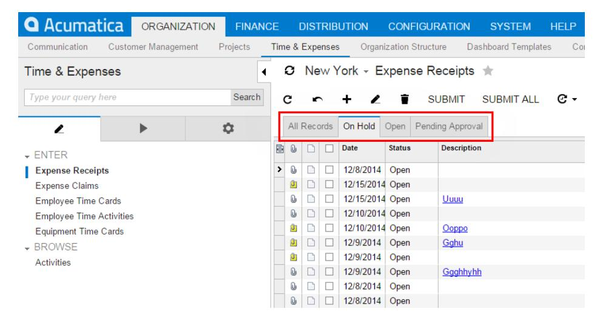

*Figure: Acumatica ERP form with multiple tabs*

In the mobile application, such a form is represented as multiple screens, with each screen corresponding to a single tab. However, you have to configure the screen only once because the mobile API server automatically performs the screen expansion into multiple screens.

Copy the code below to an .xml file in the \App\_Data\Mobile folder, and start the mobile application. In this example, you will notice that the **Expense Receipts** form (EP301010) is represented by a number of screens, each corresponding to a single tab (**All Records**, **On Hold**, **Open**, or **Pending Approval**). This example adds the screens to a folder of the HubFolder type, so you will switch between tabs by swiping right and le. If you changed the folder type to ListFolder, the tabs would be represented by icons.

```
<sm:SiteMap xmlns:sm="http://acumatica.com/mobilesitemap" xmlns:xsi="http://
www.w3.org/2001/XMLSchema-instance">
 <sm:Folder DisplayName="Expense Receipts" Type="HubFolder" Icon="system://NewsPaper">
 <sm:Screen Id="EP301010" Type="SimpleScreen" DisplayName="Expense Receipts">
 <sm:Container Name="ExpenseReceipts">
 <sm:Field Name="Date" />
 <sm:Field Name="ClaimAmount"/>
 <sm:Field Name="DescriptionTranDesc"/>
 <sm:Field Name="Currency" />
 </sm:Container>
 </sm:Screen>
```

```
 </sm:Folder>
```

</sm:SiteMap>

| ψ                                 | $\frac{2}{3}$ at 216:05 | ψ<br>$\frac{2}{3}$ all $\frac{1}{2}$ 16:06 |                         |                    |
|-----------------------------------|-------------------------|--------------------------------------------|-------------------------|--------------------|
| <b>Acumatica</b><br>$\equiv$      | <b>SIGN OUT</b>         | $\leftarrow$                               | <b>Expense Receipts</b> |                    |
|                                   |                         | All                                        | On Hold                 | Open               |
|                                   |                         | 15.12.14                                   |                         | 0,00<br><b>USD</b> |
|                                   |                         | 15.12.14                                   |                         | 0,00<br><b>USD</b> |
| <b>Expense</b><br><b>Receipts</b> |                         | 15.12.14<br>Uuuu                           |                         | 0,00<br><b>USD</b> |
|                                   |                         | 10.12.14                                   |                         | 0,00<br><b>USD</b> |
|                                   |                         | 10.12.14<br>Ooppo                          |                         | 0,00<br><b>USD</b> |
|                                   |                         | 09.12.14<br>Gghu                           |                         | 0,00<br><b>USD</b> |
|                                   |                         | 09.12.14                                   |                         | <u>0.00 </u>       |

The following screenshots show the result of this code on a mobile device.

<span id="page-78-1"></span>*Figure: The multi-tab screen represented as a folder*

### <span id="page-78-0"></span>**Sidebar Menu**

The mobile application has a *sidebar menu*, which is the shortcut menu for favorite folders and screens. You can insert links to folders and screens into the sidebar menu.

#### **Example: Adding a Screen to the Sidebar Menu**

To add a folder or screen to the sidebar menu, you need to set the IsDefaultFavorite attribute of the folder or screen to *true*.

Copy the code below to an .xml file, put the file in the \App\_Data\Mobile folder of the Acumatica ERP website, and start the mobile application.

```
<?xml version="1.0" encoding="UTF-8"?>
```

```
<sm:SiteMap xmlns:sm="http://acumatica.com/mobilesitemap" xmlns:xsi="http://
www.w3.org/2001/XMLSchema-instance">
 <sm:Folder DisplayName="Organization" Icon="system://NewsPaper" >
 <sm:Screen Id="PM301000" Type="SimpleScreen" DisplayName="Projects" Icon="system://
Display1" IsDefaultFavorite="true">
 <sm:Container Name="ProjectSummary">
 <sm:Field Name="Status" />
 <sm:Field Name="ProjectID" />
 <sm:Field Name="Customer" />
 <sm:Field Name="TemplateID" />
 <sm:Field Name="Hold" />
 <sm:Field Name="Description" />
 </sm:Container>
 </sm:Screen>
 </sm:Folder>
```

</sm:SiteMap>

The resulting sidebar menu of the mobile application will include a link for quick access to the Projects screen.

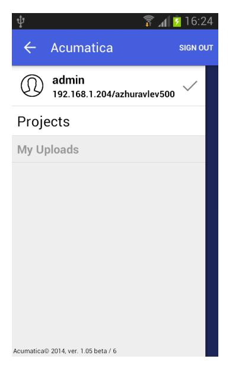

*Figure: A link to the screen in the sidebar menu*

### <span id="page-79-1"></span><span id="page-79-0"></span>**Screens**

This section describes how to configure screens in the mobile application.

The section consists of the following topics:

- *[Getting the WSDL Schema](#page-80-1)*
- *[Configuring Lists](#page-81-1)*
- *[Configuring Editing Forms](#page-86-1)*
- *[Mapping Reports](#page-88-1)*
- *[Mapping Dashboards](#page-91-1)*

- *[Grouping Fields on a Form](#page-92-1)*
- *[Configuring Attachments](#page-93-1)*
- *[Configuring Selectors](#page-95-1)*
- *[Configuring Nested Containers](#page-97-1)*
- *[Adding Entity Attributes to Mobile Screens](#page-104-1)*
- *[Redirecting to Different Screens and Containers](#page-106-1)*
- *[Displaying](#page-110-2) Any Field as a Text Field*
- *[Creating the User Signature](#page-110-3)*

# <span id="page-80-1"></span><span id="page-80-0"></span>**Getting the WSDL Schema**

You can get the needed information to configure a screen from the WSDL schema, which is available on the title bar of the form in Acumatica ERP through**Tools > Web Service** in the UI.

For any container (that is, a form, tab, grid, tree, or panel), element, or action with the **#** or **%** title, the generated WSDL file contains NUMBER instead of the # symbol, and PERCENT instead of the % symbol.

To obtain the WSDL schema, perform the following steps:

- 1. In Acumatica ERP, open the form for which you want information.
- 2. On the title bar of the form, click**Tools > Web Service** in the UI.
- 3. On the screen with the web service links, click**Service Description**, as shown in the following screenshot.

See the following screenshot for an example of the WSDL schema. The schema includes containers (such as the ReceiptDetails container in this example), the list of container fields, and the Actions list.

| V <s:complextype name="Actions"></s:complextype>                                                                    |  |
|---------------------------------------------------------------------------------------------------------------------|--|
| v <s:sequence></s:sequence>                                                                                         |  |
| <s:element maxoccurs="1" minoccurs="0" name="CancelCloseToList" type="tns:Action"></s:element>                      |  |
| <s:element maxoccurs="1" minoccurs="0" name="SaveCloseToList" type="tns:Action"></s:element>                        |  |
| <s:element maxoccurs="1" minoccurs="0" name="Save" type="tns:Action"></s:element>                                   |  |
| <s:element maxoccurs="1" minoccurs="0" name="Cancel" type="tns:Action"></s:element>                                 |  |
| <s:element maxoccurs="1" minoccurs="0" name="Insert" type="tns:Action"></s:element>                                 |  |
| <s:element maxoccurs="1" minoccurs="0" name="CopyDocumentCopyPaste" type="tns:Action"></s:element>                  |  |
| <s:element maxoccurs="1" minoccurs="0" name="PasteDocumentCopyPaste" type="tns:Action"></s:element>                 |  |
| <s:element maxoccurs="1" minoccurs="0" name="SaveTemplateCopyPaste" type="tns:Action"></s:element>                  |  |
| <s:element maxoccurs="1" minoccurs="0" name="Delete" type="tns:Action"></s:element>                                 |  |
| <s:element maxoccurs="1" minoccurs="0" name="First" type="tns:Action"></s:element>                                  |  |
| <s:element maxoccurs="1" minoccurs="0" name="Previous" type="tns:Action"></s:element>                               |  |
| <s:element maxoccurs="1" minoccurs="0" name="Next" type="tns:Action"></s:element>                                   |  |
| <s:element maxoccurs="1" minoccurs="0" name="Last" type="tns:Action"></s:element>                                   |  |
| <s:element maxoccurs="1" minoccurs="0" name="NewTask" type="tns:Action"></s:element>                                |  |
| <s:element maxoccurs="1" minoccurs="0" name="NewEvent" type="tns:Action"></s:element>                               |  |
| <s:element maxoccurs="1" minoccurs="0" name="ViewActivity" type="tns:Action"></s:element>                           |  |
| <s:element maxoccurs="1" minoccurs="0" name="NewMailActivity" type="tns:Action"></s:element>                        |  |
| <s:element maxoccurs="1" minoccurs="0" name="OpenActivityOwner" type="tns:Action"></s:element>                      |  |
| <s:element maxoccurs="1" minoccurs="0" name="ViewAllActivities" type="tns:Action"></s:element>                      |  |
| <s:element maxoccurs="1" minoccurs="0" name="NNewActivity" type="tns:Action"></s:element>                           |  |
| <s:element maxoccurs="1" minoccurs="0" name="CNewActivity" type="tns:Action"></s:element>                           |  |
| <s:element maxoccurs="1" minoccurs="0" name="ENewActivity" type="tns:Action"></s:element>                           |  |
| <s:element maxoccurs="1" minoccurs="0" name="MNewActivity" type="tns:Action"></s:element>                           |  |
| <s:element maxoccurs="1" minoccurs="0" name="PNewActivity" type="tns:Action"></s:element>                           |  |
| <s:element maxoccurs="1" minoccurs="0" name="WNewActivity" type="tns:Action"></s:element>                           |  |
| <s:element maxoccurs="1" minoccurs="0" name="ResetListNavigation" type="tns:Action"></s:element>                    |  |
| $\langle$ /s:sequence>                                                                                              |  |
|                                                                                                                     |  |
| V <s:complextype name="ReceiptDetailsServiceCommands"></s:complextype>                                              |  |
| $\blacktriangledown$ <s :="" sequence=""></s>                                                                       |  |
| <s:element maxoccurs="1" minoccurs="0" name="KeyReceiptID" type="tns:Key"></s:element>                              |  |
| <s:element maxoccurs="1" minoccurs="0" name="EveryReceiptID" type="tns:EveryValue"></s:element>                     |  |
| <s:element maxoccurs="1" minoccurs="0" name="DeleteRow" type="tns:DeleteRow"></s:element>                           |  |
| <s:element maxoccurs="1" minoccurs="0" name="DialogAnswer" type="tns:Answer"></s:element>                           |  |
| <s:element maxoccurs="1" minoccurs="0" name="Attachment" type="tns:Attachment"></s:element>                         |  |
| $\langle$ /s:sequence>                                                                                              |  |
|                                                                                                                     |  |
| ▼ <s:complextype name="ReceiptDetails"></s:complextype>                                                             |  |
| $\blacktriangledown$ <s :="" sequence=""></s>                                                                       |  |
| <s:element maxoccurs="1" minoccurs="0" name="DisplayName" type="s:string"></s:element>                              |  |
| <s:element maxoccurs="1" minoccurs="0" name="ReceiptID" type="tns:Field"></s:element>                               |  |
| <s:element maxoccurs="1" minoccurs="0" name="ReceiptIDClaimDetailCD" type="tns:Field"></s:element>                  |  |
| <s:element maxoccurs="1" minoccurs="0" name="Date" type="tns:Field"></s:element>                                    |  |
| <s:element maxoccurs="1" minoccurs="0" name="Currency" type="tns:Field"></s:element>                                |  |
| <s:element maxoccurs="1" minoccurs="0" name="CuryViewState" type="tns:Field"></s:element>                           |  |
| <s:element maxoccurs="1" minoccurs="0" name="RefNbr" type="tns:Field"></s:element>                                  |  |
| <s:element maxoccurs="1" minoccurs="0" name="ExpenseItem" type="tns:Field"></s:element>                             |  |
| <s:element maxoccurs="1" minoccurs="0" name="Description" type="tns:Field"></s:element>                             |  |
| <s:element maxoccurs="1" minoccurs="0" name="UOM" type="tns:Field"></s:element>                                     |  |
| <s:element maxoccurs="1" minoccurs="0" name="Quantity" type="tns:Field"></s:element>                                |  |
| <s:element maxoccurs="1" minoccurs="0" name="UnitCost" type="tns:Field"></s:element>                                |  |
| <s:element maxoccurs="1" minoccurs="0" name="TotalAmount" type="tns:Field"></s:element>                             |  |
| <s:element maxoccurs="1" minoccurs="0" name="EmployeePart" type="tns:Field"></s:element>                            |  |
| <s:element maxoccurs="1" minoccurs="0" name="ClaimAmount" type="tns:Field"></s:element>                             |  |
| <s:element maxoccurs="1" minoccurs="0" name="NoteText" type="tns:Field"></s:element>                                |  |
| <s:element maxoccurs="1" minoccurs="0" name="ServiceCommands" type="tns:ReceiptDetailsServiceCommands"></s:element> |  |
| $\langle$ /s:sequence>                                                                                              |  |
|                                                                                                                     |  |

*Figure: Viewing an example of the WSDL schema*

With this information, you can start configuring the screen.

Before configuring a screen in the mobile app, you should check how the form looks in the web version of Acumatica ERP to decide how to configure the screen.

### <span id="page-81-1"></span><span id="page-81-0"></span>**Configuring Lists**

This topic describes how to configure a screen that contains a list of records.

#### <span id="page-81-2"></span>**Example: Creating a Simple List View Layout**

A list of records is the simplest screen layout.

To complete an example of configuring the simplest screen layout, copy the code below to an .xml file, put the file in the \App\_Data\Mobile folder of the Acumatica ERP website, and start the mobile application.

```
<?xml version="1.0" encoding="UTF-8"?>
```

```
<sm:SiteMap xmlns:sm="http://acumatica.com/mobilesitemap" xmlns:xsi="http://
www.w3.org/2001/XMLSchema-instance">
 <sm:Screen DisplayName="Expense Receipt" Icon="system://Display1" Id="EP301020"
 Type="SimpleScreen">
 <sm:Container FieldsToShow="3" Name="ReceiptDetails">
 <sm:Field Name="Date" />
 <sm:Field Name="Description" />
 <sm:Field Name="ExpenseItem" />
 <sm:Field Name="TotalAmount" />
 <sm:Action Behavior="Create" Context="Container" DisplayName="Add"
 Icon="system://Plus" Name="Insert" />
 <sm:Action Behavior="Delete" Context="Selection" Icon="system://Trash"
 Name="Delete" />
 </sm:Container>
 </sm:Screen>
</sm:SiteMap>
```

This example uses the WSDL schema elements marked in the screenshot below.

*Figure: WSDL schema elements used in the example*

The following screenshot shows the resulting screen you will see in the mobile application.

| ◬Ⴤ◕▦◔                       | $\overline{\mathbf{a}}$ at $\overline{\mathbf{b}}$ 17:07 |
|-----------------------------|----------------------------------------------------------|
| <b>Expense Receipt</b><br>← |                                                          |
| 22.12.14<br>Car Rental      |                                                          |
| 15.12.14<br>Freight charges |                                                          |
| 15.12.14<br>Car Rental      |                                                          |
| 15.12.14<br>Car Rental      | Uuuu                                                     |
| 10.12.14<br>Car Rental      |                                                          |
| 10.12.14<br>Car Rental      | ppo                                                      |
| 09.12.14<br>Car Rental      | Gghu                                                     |

#### *Figure: List view layout*

The FieldsToShow attribute of the sm:Container tag is used to limit the number of fields for a record that will be shown in the list. You use this attribute only when the same screen description is used for both the list view and form view.

You use the sm:Action tag for actions that are available in the UI. (You can get the list of actions from the WSDL schema; see *[Getting the WSDL Schema](#page-80-1)*.) The Name attribute should be set to the name of the action, as found in the WSDL schema.

Actions are divided into standard actions (such as **Open**, **Save**, and **Cancel**) and all other actions (such as**Void**). The placement of the standard actions can be different from that of other actions, and some standard actions (such as **Open**) are not displayed on the UI at all. Whether an action is considered standard depends on the value of the Behavior attribute.

The Context attribute is used to set the target of the action. For example, you can use an action with Context="Selection" when the multiple selection of records, as shown in the screenshot below, is activated.

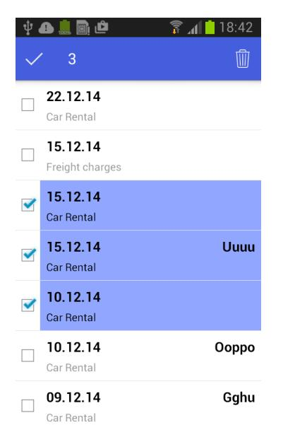

*Figure: Selection of multiple records*

You use the Icon attribute to set the icon that is displayed on the UI.

See *[<sm:Action>](#page-154-1)* for more information about the attributes of the sm:Action tag.

#### **Example: Creating a Screen with a Filtered List**

To see an example of configuring a screen with a filtered list, copy the code below to an .xml file, put the file in the \App\_Data\Mobile folder of the Acumatica ERP website, and start the mobile application.

```
<?xml version="1.0" encoding="UTF-8"?>
<sm:SiteMap xmlns:sm="http://acumatica.com/mobilesitemap" xmlns:xsi="http://
www.w3.org/2001/XMLSchema-instance">
 <sm:Folder DisplayName="Expense Claims" Type="HubFolder" Icon="system://Folder" >
 <sm:Screen Id="EP301030" Type="FilterListScreen" DisplayName="Expense Claims" >
 <sm:Container Name="Selection" >
 <sm:Field Name="Employee" />
 </sm:Container>
 <sm:Container Name="Claim" >
 <sm:Field Name="Date" />
 <sm:Field Name="Status" />
 <sm:Field Name="Description" />
 <sm:Field Name="ClaimTotal" />
 </sm:Container>
 </sm:Screen>
 </sm:Folder>
```

</sm:SiteMap>

To configure a screen with a filtered list, do the following:

- 1. Specify the screen type: Type="FilterListScreen".
- 2. In the WSDL schema, find the container corresponding to the filter, and add it to the screen description ( sm:Container Name="Selection" in the example above).
- 3. In the WSDL schema, find the container corresponding to the list of records, and add it to the screen description ( sm:Container Name="Claim" in the example above).

As a result, in the mobile application, the screen will include a button that opens the filter. When you tap the button, you open the form so you can edit the filter fields (see the screenshots below).

| ტ<br><b>Expense Claims</b><br>$\leftarrow$ | $\widehat{\mathbb{R}}$ at 18:31<br>$\mathcal{A}$<br>$\cup$ | 直<br>ψ<br>$\leftarrow$ | $\widehat{\mathbb{R}}$ at 18:31<br><b>Expense Claims</b><br><b>APPLY FILTER</b> | $\Psi$ &<br>$\leftarrow$ | ĉ<br><b>Expense Claims</b>                             | 18:31<br>$\widehat{\widetilde{\phantom{w}}\!\!}$           |
|--------------------------------------------|------------------------------------------------------------|------------------------|---------------------------------------------------------------------------------|--------------------------|--------------------------------------------------------|------------------------------------------------------------|
| All<br>02.11.09                            | On Hold<br>Released                                        | Employee               | Baker Maxwell, Mr.                                                              |                          | EP00000002<br>EP00000002                               | Baker Maxwell ,<br>Baker Maxwell, Mr.                      |
| CT 2-3: Claim<br>11.07.09                  | 380,00<br>Approved                                         |                        |                                                                                 |                          | !!!!!!!!!!!!!!!!!!!!!!!!!!!!!!!!!!!!!!!!<br>EP00000003 | Beauvoir Layla ,<br>Beauvoir Layla, Mrs.                   |
| test                                       | 36,00                                                      |                        |                                                                                 |                          | !!!!!!!!!!!!!!!!!!!!!!!!!!!!!!!!!!!!!!!!<br>EP00000004 | Becher, Joseph<br>Becher, Joseph                           |
|                                            |                                                            |                        |                                                                                 |                          | EP00000007<br>EP00000007                               | Brawner Pam<br>Brawner Pam, Mr.                            |
|                                            |                                                            |                        |                                                                                 |                          | EP00000008<br>EP00000008                               | Bujacek Michal ,<br>Bujacek Michal, Mr.                    |
|                                            |                                                            |                        |                                                                                 |                          | !!!!!!!!!!!!!!!!!!!!!!!!!!!!!!!!!!!!!!!!<br>EP00000010 | Church Steve<br>Church Steve, Mr.                          |
|                                            |                                                            |                        |                                                                                 |                          | !!!!!!!!!!!!!!!!!!!!!!!!!!!!!!!!!!!!!!!!<br>EP00000013 | Domenico Rick,<br>!!!!!!!!!!!!!!!!!!!!!!!!!!!!!!!!!!!!!!!! |

<span id="page-86-1"></span>*Figure: Use of a filter on a screen*

# <span id="page-86-0"></span>**Configuring Editing Forms**

You have to configure an editing form (that is, a form that is used to enter and edit a data record) based on the use of the form in Acumatica ERP.

In some cases, Acumatica ERP uses a single form to manage data records of a particular type (that is, the *.aspx* page contains the FormView and Grid controls). In these cases, in the mobile site map, you have to configure both the editing form and the list form by using a single declaration of the sm:Screen tag.

In other cases, Acumatica ERP uses the following separate forms for data records of a particular type:

- A list view (the *.aspx* page contains one Grid control) to manage records
- A form view (the *.aspx* page with one FormView control) to edit fields

In these cases, you have to configure two separate declarations of the sm:Screen tag: one for the list form, and another for the editing form.

### **Example: Creating the Same Layout for the Editing Form and the List**

To see an example of configuring an editing form to use the same layout as a list does, copy the code below to an .xml file, put the file in the \App\_Data\Mobile folder of the Acumatica ERP website, and start the mobile application.

```
<?xml version="1.0" encoding="UTF-8"?>
<sm:SiteMap xmlns:sm="http://acumatica.com/mobilesitemap" xmlns:xsi="http://
www.w3.org/2001/XMLSchema-instance">
 <sm:Screen DisplayName="Expense Receipt" Icon="system://Display1" Id="EP301020"
 Type="SimpleScreen">
 <sm:Container FieldsToShow="3" Name="ReceiptDetails">
 <sm:Field Name="Date" />
 <sm:Field Name="Description" />
 <sm:Field Name="ExpenseItem" />
 <sm:Field Name="TotalAmount" />
```

```
 <sm:Action Behavior="Save" Context="Record" Name="Save" />
 <sm:Action Behavior="Cancel" Context="Record" Name="Cancel" />
 <sm:Action Behavior="Create" Context="Container" DisplayName="Add"
 Icon="system://Plus" Name="Insert" />
 <sm:Action Behavior="Delete" Context="Selection" Icon="system://Trash"
 Name="Delete" />
 </sm:Container>
 </sm:Screen>
</sm:SiteMap>
```

This example is almost identical to *[Example:](#page-81-2) Creating a Simple List View Layout*, except that it adds two actions, **Save** and **Cancel**, which you need to save or cancel changes to a data record.

#### **Example: Configuring the List and the Editing Form Separately**

To see an example of configuring the editing form differently than you do a list form, copy the code below to an .xml file, put the file in the \App\_Data\Mobile folder of the Acumatica ERP website, and start the mobile application.

```
<?xml version="1.0" encoding="UTF-8"?>
<sm:SiteMap xmlns:sm="http://acumatica.com/mobilesitemap" xmlns:xsi="http://
www.w3.org/2001/XMLSchema-instance">
 <sm:Folder DisplayName="Expense Receipts" Type="HubFolder" Icon="system://NewsPaper" >
 <sm:Screen Id="EP301010" Type="SimpleScreen" DisplayName="Expense Receipts" >
 <sm:Container Name="ExpenseReceipts" >
 <sm:Field Name="Date" />
 <sm:Field Name="ClaimAmount" />
 <sm:Field Name="DescriptionTranDesc" />
 <sm:Field Name="Currency" />
 <sm:Action Name="addNew" Context="Container" Behavior="Create"
 Redirect="true" Icon="system://Plus" />
 <sm:Action Name="editDetail" Context="Container" Behavior="Open"
 Redirect="true" />
 <sm:Action Name="Delete" Context="Selection" Behavior="Delete"
 Icon="system://Trash" />
 </sm:Container>
 </sm:Screen>
 </sm:Folder>
 <sm:Screen Id="EP301020" Type="SimpleScreen" Icon="system://Display1"
 DisplayName="Expense Receipt" Visible="false" OpenAs="Form">
 <sm:Container Name="ReceiptDetails" >
 <sm:Field Name="Date" />
 <sm:Field Name="Description" />
 <sm:Field Name="ExpenseItem" />
 <sm:Field Name="TotalAmount" />
 <sm:Action Name="Save" Context="Record" Behavior="Save" />
 <sm:Action Name="Cancel" Context="Record" Behavior="Cancel" />
 </sm:Container>
 </sm:Screen>
</sm:SiteMap>
```

In this example, you use the *EP301010* screen to display the list form, and you use the *EP301020* screen to display the editing form. The same approach is used in Acumatica ERP.

To hide the editing form from the main menu of the mobile application, set the Visible attribute to *false* for the sm:Screen tag; see the *EP301020* screen configuration above.

In the list form (*EP301010*), you find two actions that can be invoked to open the editing form for a data record: Behavior="Create" and Behavior="Open". The Redirect="true" attribute indicates that the editing form needs to be opened as a different screen. The actual screen that will be opened is determined by the server logic.

# <span id="page-88-1"></span><span id="page-88-0"></span>**Mapping Reports**

The user can create and view an Acumatica Report Designer report through the mobile app, if the following conditions are met:

- The report form is implemented in Acumatica ERP.
- The report form metadata is added to the mobile site map.
- The user is granted the access rights to the report.

To map a report form, you have to add to the mobile site map the sm:Screen tag with the Id attribute set to the report form ID and the Type attribute set to *Report*. The following example provides mapping of the Shipment Summary report (SO620500).

```
...
<sm:Screen DisplayName="Shipment Summary" Icon="system://Credit" Id="SO620500"
 Type="Report"/>
...
```


In the mobile site map, you cannot define the content of a report form, for example, to change the set of parameters or the form layout. The *Report* type of the screen forces the system to map the screen as is without changes. Therefore, within the sm:Screen tag with the Type attribute set to *Report*, a nested tag is ignored.

The following screenshot displays a screen of the *Report* type with the DisplayName attribute set to *Test Report*.

| 3,50K/c $\approx$ all $\sqrt{2}$ 89% |
|--------------------------------------|
|                                      |
|                                      |
|                                      |
|                                      |
|                                      |
|                                      |
|                                      |
|                                      |
|                                      |
|                                      |
|                                      |
|                                      |
|                                      |
|                                      |
|                                      |
|                                      |
|                                      |

#### *Figure: Viewing a report screen*

On the screenshot, the red button corresponds to the **Run Report** button of the report in Acumatica ERP.

In the main menu of the mobile app, to organize report screens, you can create a special folder of the *ListFolder* type and include in the folder the links to multiple reports, as in the following example.

```
...
<sm:Folder DisplayName="Reports" Icon="system://Folder" Type="ListFolder">
 <sm:Screen DisplayName="Test Report" Icon="system://Clock" Id="CR621010" Type="Report"/
>
 <sm:Screen DisplayName="Sales Order Summary" Icon="system://Cash" Id="SO610500"
 Type="Report"/>
 <sm:Screen DisplayName="Shipment Summary" Icon="system://Credit" Id="SO620500"
 Type="Report"/>
</sm:Folder>
...
```

#### **Using an Action to Generate a Report**

The system supports the Acumatica ERP actions that generate reports. To enable such action for a business entity in the mobile app, you should map the action, for example, in the entry form for the entity. In the mobile site map, the sm:Action tag has to contain the Redirect attribute set to *true*, as in the following example.

```
...
<sm:Screen DisplayName="Sales Orders">
...
 <sm:Container Name="OrderSummary">
...
 <sm:Action Behavior="Record" Context="Record" Name="PrintSalesOrderQuoteReport"
 Redirect="true"/>
...
 </sm:Container>
...
</sm:Screen>
```

| 11:58 AM       |                  | 1.63K/s $\hat{ }$ all $\hat{ }$ + (<br>0.60% |
|----------------|------------------|----------------------------------------------|
| ×              |                  | Sales Ord Print Sales Order/Quote            |
| Order Type     |                  |                                              |
| SO.            |                  |                                              |
| Order Nbr.     |                  |                                              |
| 000586         |                  |                                              |
| Hold           |                  |                                              |
| <b>Status</b>  |                  |                                              |
| Open           |                  |                                              |
| Date           |                  |                                              |
| Feb 3, 2009    |                  |                                              |
| Requested On   |                  |                                              |
| Feb 3, 2009    |                  |                                              |
| Customer Order |                  |                                              |
| SO004-07-06    |                  |                                              |
| Customer       |                  |                                              |
|                | SO customer #4D5 |                                              |

#### *Figure: Viewing the report action button on the Sales Orders screen*

For a report action, the appropriate report form must be mapped because the action uses this form to create the report.

Once the action is performed by using the mobile app, the app immediately receives the corresponding report in PDF format from the Acumatica ERP server and displays the report for the user, as shown in the following screenshot.

|         | 12:00 PM                                                                                                                                     |                      |                                              |                                                           |                                  | 2.83K/s $\hat{ }$ all $\hat{ }$ + ■ 60%         |
|---------|----------------------------------------------------------------------------------------------------------------------------------------------|----------------------|----------------------------------------------|-----------------------------------------------------------|----------------------------------|-------------------------------------------------|
|         |                                                                                                                                              | SO641010_20          |                                              |                                                           |                                  | i                                               |
|         |                                                                                                                                              |                      |                                              |                                                           |                                  |                                                 |
|         |                                                                                                                                              |                      |                                              |                                                           |                                  |                                                 |
|         |                                                                                                                                              |                      |                                              | <b>Crew No.</b>                                           | <b>Sales Order</b>               | conten                                          |
|         | New York<br>777 West 21st St.<br>#10-01 Lucky Numbers Building<br>New York, NY, 10010<br>Phone: +1 (777) 234-2200<br>Web: www.rapid-byte.com |                      |                                              | Order Onte:<br>Delivery Date<br>Customer ID:<br>Currency: |                                  | connect<br>00/2000<br>sponsors.<br><b>Virit</b> |
|         | <b>BILL TO.</b>                                                                                                                              |                      | \$909.100                                    |                                                           |                                  |                                                 |
|         | customer acces<br><b>UNITED STATES</b>                                                                                                       |                      | UNITED STATES                                | O oustomer #405                                           |                                  |                                                 |
|         | <b>SUSTEMER P.O. NO</b>                                                                                                                      | mow                  |                                              | Mchael A                                                  | <b>WEACT</b><br>                 |                                                 |
|         | FOR FORD                                                                                                                                     | <b>MOTELM</b>        |                                              |                                                           | <b>SHP WA</b>                    |                                                 |
|         | m<br><b>COMPOSITION IN THE REAL</b>                                                                                                          | ēπ                   | <b>DOM</b><br>m.                             |                                                           | <b>Cenz</b>                      | <b>EXTENDED PRICE</b>                           |
| ٠       | SCRODOVERS SO BAN MED                                                                                                                        | tone<br><b>STORY</b> | carrier                                      | 300.000<br><b>State Annual</b>                            | $\sim$                           | <b>Last on</b>                                  |
| ś<br>ä  | 50000001:50 lan HD1<br>50000003:50 ten #403                                                                                                  | 1,0000<br>1,0000     | PALLET<br>PALLET                             | 1,900,0000<br>1,000,0000                                  | os.<br>es.                       | 1,508.00<br>1,908.00                            |
| b.      | SODDED TO BAN HER                                                                                                                            | 408,0000             | <b>CLMATR</b>                                | 6,0000                                                    | C <sub>2</sub>                   | 2,400.00                                        |
| é,      | SOUNDADY SO NO MED.                                                                                                                          | 408,0000             | <b>CEMETO</b>                                | A 5000                                                    | <b>COL</b>                       | 2,008.00                                        |
| x<br>j, | 500000603: 50 hers #400<br>SC00000401-8O ilen #4D1                                                                                           | 108,0000<br>100,0000 | <b>NG</b><br>ĸ                               | 20,0000<br>20,0000                                        | os:<br>$^{th}$                   | 2,008.00<br>2,008.00                            |
|         |                                                                                                                                              |                      |                                              |                                                           |                                  |                                                 |
|         |                                                                                                                                              |                      |                                              |                                                           |                                  |                                                 |
|         |                                                                                                                                              |                      | Total Weight (KG):<br>Total Volume 5, ITER): | ۸<br>۵                                                    | Sales Total:<br>Freight & Mon.   | 16,700.00<br>o no                               |
|         |                                                                                                                                              |                      |                                              |                                                           | <b>Less Discours</b>             | oac                                             |
|         |                                                                                                                                              |                      |                                              |                                                           | <b>Tax Total</b><br>Total (USE): | om<br>45,700.00                                 |
|         |                                                                                                                                              |                      |                                              |                                                           |                                  | Page 1 of 1                                     |
|         |                                                                                                                                              |                      |                                              |                                                           |                                  |                                                 |
|         |                                                                                                                                              |                      |                                              |                                                           | <b>Sales Order</b>               |                                                 |
|         | New York<br>777 West 21st St.                                                                                                                |                      |                                              | <b>Craw No.:</b><br>Order Dete:                           |                                  | content<br>200909                               |

*Figure: Viewing the report*

### <span id="page-91-1"></span><span id="page-91-0"></span>**Mapping Dashboards**

You can add a dashboard to the mobile site map. To do this, you have to add to the mobile site map the sm:Screen tag with the Id attribute set to the dashboard form ID and the Type attribute set to *Dashboard*. The following example provides mapping of three dashboard screens for the mobile app.

```
...
<sm:Folder DisplayName="Dashboards" Icon="system://Folder" Type="ListFolder">
 <sm:Screen DisplayName="Controller" Icon="system://Graph1" Id="DH000025"
 Type="Dashboard" />
 <sm:Screen DisplayName="Financial" Icon="system://Graph1" Id="DH000045"
 Type="Dashboard" />
 <sm:Screen DisplayName="Sales Manager" Icon="system://Graph1" Id="DH000005"
 Type="Dashboard" />
</sm:Folder>
...
```

A screen of the *Dashboard* type can display the following types of dashboard widgets:

- Chart
- Data Table
- Score Card
- Trend Card

Widgets of other types will be hidden.

If you click a dashboard widget, the mobile app tries to open the appropriate screen. If the screen is absent in the mobile site map, the mobile app displays a warning.

The following screenshot displays a screen for the Sales Manager dashboard page that is defined in an instance of Acumatica ERP.

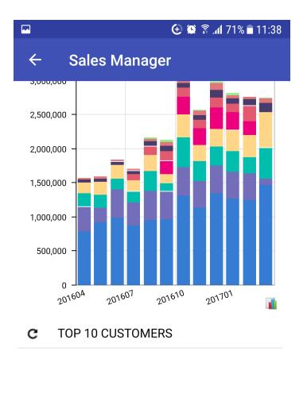

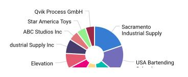

*Figure: Viewing a dashboard screen*

### <span id="page-92-1"></span><span id="page-92-0"></span>**Grouping Fields on a Form**

You can combine fields into groups, as the following example shows, to make data entry more logical and intuitive.

#### **Example: Grouping Fields**

To see an example of grouping fields into groups, copy the code below to an .xml file, put the file in the \App\_Data\Mobile folder of the Acumatica ERP website, and start the mobile application.

```
<?xml version="1.0" encoding="UTF-8"?>
<sm:SiteMap xmlns:sm="http://acumatica.com/mobilesitemap" xmlns:xsi="http://
www.w3.org/2001/XMLSchema-instance">
 <sm:Folder DisplayName="Expense Receipts" Type="HubFolder" Icon="system://NewsPaper" >
 <sm:Screen Id="EP301010" Type="SimpleScreen" DisplayName="Expense Receipts" >
 <sm:Container Name="ExpenseReceipts" >
 <sm:Field Name="Date" />
 <sm:Field Name="ClaimAmount" />
 <sm:Field Name="DescriptionTranDesc" />
 <sm:Field Name="Currency" />
 <sm:Action Name="addNew" Context="Container" Behavior="Create"
 Redirect="true" Icon="system://Plus" />
 <sm:Action Name="editDetail" Context="Container" Behavior="Open"
 Redirect="true" />
 <sm:Action Name="Delete" Context="Selection" Behavior="Delete"
 Icon="system://Trash" />
 </sm:Container>
 </sm:Screen>
 </sm:Folder>
 <sm:Screen Id="EP301020" Type="SimpleScreen" Icon="system://Display1"
 DisplayName="Expense Receipt" Visible="false" OpenAs="Form">
 <sm:Container Name="ReceiptDetails" >
 <sm:Field Name="Date" />
 <sm:Field Name="Description" />
 <sm:Group DisplayName="Details" Collapsable="true" Collapsed="true">
 <sm:Field Name="ExpenseItem" />
 <sm:Field Name="TotalAmount" />
 </sm:Group>
 <sm:Action Name="Save" Context="Record" Behavior="Save" />
 <sm:Action Name="Cancel" Context="Record" Behavior="Cancel" />
 </sm:Container>
 </sm:Screen>
</sm:SiteMap>
```

While entering data, the user may collapse or expand a particular group of fields. You can prevent a group from being collapsed by setting the Collapsable attribute of the group to *false* (by default, the attribute value is *true*). If a group is collapsible (the Collapsable attribute is set to *true*), the Collapsed attribute indicates whether a group is initially collapsed (by default, the attribute value is *false*).

You can see the result in the mobile application in the following screenshots.

| $\Psi$ a m c<br>$\widehat{\mathcal{E}}$ at $\blacksquare$ 13:54 | $\Psi$ a m c<br>$\widehat{\widehat{\mathbf{a}}}$ at $\widehat{\mathbf{b}}$ 13:55 |
|-----------------------------------------------------------------|----------------------------------------------------------------------------------|
| Expense R SAVE & CLOSE<br><b>SAVE</b><br>←                      | Expense R SAVE & CLOSE<br>$\leftarrow$<br><b>SAVE</b>                            |
| Õ                                                               | <u>@</u>                                                                         |
| $\vert$ Date<br>22.12.14<br>A                                   | Date<br>22.12.14<br>A                                                            |
| <b>Description</b>                                              | Description                                                                      |
| <b>DETAILS</b> ~                                                | <b>DETAILS</b> $\sim$                                                            |
|                                                                 | Car Rental<br><b>Expense Item</b><br>A                                           |
|                                                                 | 0,00<br><b>Total Amount</b>                                                      |
|                                                                 |                                                                                  |
|                                                                 |                                                                                  |
|                                                                 |                                                                                  |

*Figure: A collapsible group on a screen*

The le screenshot shows the **Details** group that is initially collapsed. If the user clicks on the header of the group, the group will expand, as shown in the right screenshot.

### <span id="page-93-1"></span><span id="page-93-0"></span>**Configuring Attachments**

By default, the mobile application enables attachments and displays them on a screen if the screen supports the attachments. However, the default handling of attachments can be overridden.

#### **Example: Configuring a Screen with Attachments**

To see an example of changing the way attachments are handled, copy the code below to an .xml file, put the file in the \App\_Data\Mobile folder of the Acumatica ERP website, and start the mobile application.

```
<?xml version="1.0" encoding="UTF-8"?>
<sm:SiteMap xmlns:sm="http://acumatica.com/mobilesitemap" xmlns:xsi="http://
www.w3.org/2001/XMLSchema-instance">
 <sm:Folder DisplayName="Expense Receipts" Type="HubFolder" Icon="system://NewsPaper" >
 <sm:Screen Id="EP301010" Type="SimpleScreen" DisplayName="Expense Receipts" >
 <sm:Container Name="ExpenseReceipts" >
 <sm:Field Name="Date" />
 <sm:Field Name="ClaimAmount" />
 <sm:Field Name="DescriptionTranDesc" />
 <sm:Field Name="Currency" />
 <sm:Action Name="addNew" Context="Container" Behavior="Create"
 Redirect="true" Icon="system://Plus" />
 <sm:Action Name="editDetail" Context="Container" Behavior="Open"
 Redirect="true" />
 <sm:Action Name="Delete" Context="Selection" Behavior="Delete"
 Icon="system://Trash" />
 </sm:Container>
 </sm:Screen>
```

```
 </sm:Folder>
 <sm:Screen Id="EP301020" Type="SimpleScreen" Icon="system://Display1"
 DisplayName="Expense Receipt" Visible="false" OpenAs="Form">
 <sm:Container Name="ReceiptDetails" AttachmentsControlPriority="75">
 <sm:Attachments Disabled="false">
 <sm:Type Extension="jpg" />
 <sm:Type Extension="png" />
 <sm:Type Extension="pdf" />
 </sm:Attachments>
 <sm:Field Name="Date" FormPriority="90"/>
 <sm:Field Name="Description" FormPriority="80" />
 <sm:Field Name="ExpenseItem" FormPriority="70" />
 <sm:Field Name="TotalAmount" FormPriority="60" />
 <sm:Action Name="Save" Context="Record" Behavior="Save" />
 <sm:Action Name="Cancel" Context="Record" Behavior="Cancel" />
 </sm:Container>
 </sm:Screen>
</sm:SiteMap>
```

If a screen does not support attachments, the attachments will not be displayed even if you specify <sm:Attachments Disabled="false">.

You specify the position of the attachments by using the AttachmentsControlPriority container attribute and the FormPriority field attribute. The fields and attachments are aligned vertically according to the priority —the higher the priority, the higher the element's position.

To disable attachments and configure the file types that are allowed, you use the sm:Attachments tag inside the sm:Container tag.

The screenshot below shows the resulting screen in the mobile application.

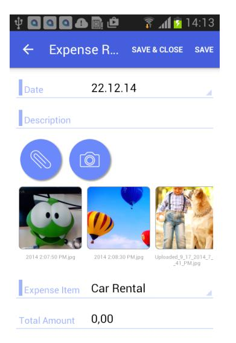

*Figure: A screen with attachments*

#### **Enhancing Images Taken from the Camera**

The functionality of enhancing images taken from the camera of a mobile device is implemented in the Acumatica mobile app. This image enhancement makes the image look better and more readable. This functionality is useful for photos of expense receipts that may be attached to documents in Acumatica ERP.

To switch on image enhancement in the Acumatica mobile app, you should set the ImageAdjustmentPreset attribute to *Receipt* in the sm:Attachments tag of the mobile site map as follows:

<sm:Attachments ImageAdjustmentPreset="Receipt"/>

When the ImageAdjustmentPreset attribute is set to *Receipt*, a special camera mode is switched on in the Acumatica mobile app. In this mode, the following enhancements of the image captured by the camera are preformed automatically:

- The image is cropped by the bounding box of the detected edges.
- The image distortion is removed.
- The image is converted into black and white.
- The contrast of the image is maximized.

If the ImageAdjustmentPreset attribute is not specified or has another value, the Acumatica mobile app attaches an original image taken from the camera.

### <span id="page-95-1"></span><span id="page-95-0"></span>**Configuring Selectors**

You can configure selector fields to be displayed as pop-up windows or grids.

#### **Example: Configuring a Screen with Selectors**

To see an example of configuring a selector field, copy the code below to an .xml file, put the file in the \App\_Data\Mobile folder of the Acumatica ERP website, and start the mobile application.

```
<?xml version="1.0" encoding="UTF-8"?>
<sm:SiteMap xmlns:sm="http://acumatica.com/mobilesitemap" xmlns:xsi="http://
www.w3.org/2001/XMLSchema-instance">
 <sm:Folder DisplayName="Expense Receipts" Type="HubFolder" Icon="system://NewsPaper" >
 <sm:Screen Id="EP301010" Type="SimpleScreen" DisplayName="Expense Receipts" >
 <sm:Container Name="ExpenseReceipts" >
 <sm:Field Name="Date" />
 <sm:Field Name="ClaimAmount" />
 <sm:Field Name="DescriptionTranDesc" />
 <sm:Field Name="Currency" />
 <sm:Action Name="addNew" Context="Container" Behavior="Create"
 Redirect="true" Icon="system://Plus" />
 <sm:Action Name="editDetail" Context="Container" Behavior="Open"
 Redirect="true" />
 <sm:Action Name="Delete" Context="Selection" Behavior="Delete"
 Icon="system://Trash" />
 </sm:Container>
 </sm:Screen>
 </sm:Folder>
```

```
 <sm:Screen Id="EP301020" Type="SimpleScreen" Icon="system://Display1"
 DisplayName="Expense Receipt" Visible="false" OpenAs="Form">
 <sm:Container Name="ReceiptDetails" >
 <sm:Field Name="Date" />
 <sm:Field Name="Description" />
 <sm:Field Name="ExpenseItem" >
 <sm:SelectorContainer FieldsToShow="2" PickerType="Detached">
 <sm:Field Name="InventoryID" />
 <sm:Field Name="Description" />
 </sm:SelectorContainer>
 </sm:Field>
 <sm:Field Name="Currency" >
 <sm:SelectorContainer PickerType="Attached">
 <sm:Field Name="CurrencyID" />
 </sm:SelectorContainer>
 </sm:Field>
 <sm:Action Name="Save" Context="Record" Behavior="Save" />
 <sm:Action Name="Cancel" Context="Record" Behavior="Cancel" />
 </sm:Container>
 </sm:Screen>
</sm:SiteMap>
```

To configure a selector field, you use the sm:SelectorContainer tag inside the sm:Field tag. The PickerType attribute specifies which of the two ways the selector should be displayed.

A selector with PickerType="Attached" is displayed as a pop-up window (see the screenshot below).

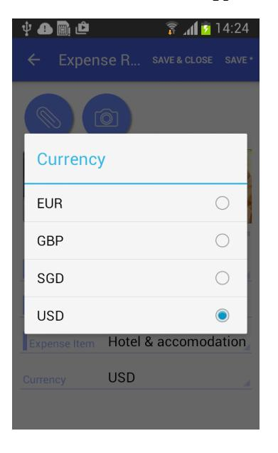

#### *Figure: A selector as a pop-up window*

A selector with PickerType="Detached" is displayed as a grid (as shown in the screenshot below). You can configure the fields to display by adding nested sm:Field tags.

| $\mathbf{\Psi}$ a m c       | $\frac{24}{11}$ 14:24  |  |  |
|-----------------------------|------------------------|--|--|
| <b>Expense Receipt</b><br>← |                        |  |  |
| CARRENTAL                   | Car Rental             |  |  |
| CARRENTAL                   | Car Rental             |  |  |
| <b>FREIGHTS01</b>           | <b>Freight charges</b> |  |  |
| FREIGHTS01                  | Freight charges        |  |  |
| <b>ACCOMODATION</b>         | Hotel & accomo         |  |  |
| ACCOMODATION                | Hotel & accomodation   |  |  |
| LOCALTRAVEL                 | <b>Local travel</b>    |  |  |
| <b>LOCALTRAVEL</b>          | Local travel           |  |  |
| <b>OVRSEATRAVEL</b>         | Overseas travel        |  |  |
| OVRSEATRAVEL                | Overseas travel        |  |  |
| ENTERTAINMNT                | Entertainment          |  |  |
| <b>FNTFRTAINMNT</b>         | Entertainment          |  |  |

<span id="page-97-1"></span>*Figure: A selector as a grid*

## <span id="page-97-0"></span>**Configuring Nested Containers**

This topic describes how to configure the types of related containers on the same screen.

#### **Example: Configuring a Screen with One-to-Many (Master-Detail) Containers**

With one-to-many containers, one container declared inside the sm:Screen tag is considered the master container, while all other containers are considered detail containers.

To see an example of configuring one-to-many containers, copy the code below to an .xml file, put the file in the \App\_Data\Mobile folder of the Acumatica ERP website, and start the mobile application.

```
<?xml version="1.0" encoding="UTF-8"?>
<sm:SiteMap xmlns:sm="http://acumatica.com/mobilesitemap" xmlns:xsi="http://
www.w3.org/2001/XMLSchema-instance">
 <sm:Folder DisplayName="Expense Claims" Type="HubFolder" Icon="system://Folder"
 IsDefaultFavorite="true">
 <sm:Screen Id="EP301030" Type="FilterListScreen" DisplayName="Expense Claims"
 Visible="true" >
 <sm:Container Name="Selection">
 <sm:Field Name="Employee"/>
 </sm:Container>
 <sm:Container Name="Claim" >
 <sm:Field Name="Date" />
 <sm:Field Name="Status" />
 <sm:Field Name="Description" />
 <sm:Field Name="ClaimTotal" />
 <sm:Action Name="CreateNew" Context="Container" Behavior="Create"
 Redirect="true" Icon="system://Plus" />
```

```
 <sm:Action Name="EditDetail" Context="Container" Behavior="Open"
 Redirect="true" />
 </sm:Container>
 </sm:Screen>
 </sm:Folder>
 <sm:Screen Id="EP301000" Type="SimpleScreen" DisplayName="Expense Claim"
 Visible="false" OpenAs="Form">
 <sm:Container Name="DocumentSummary" >
 <sm:Attachments Disabled="true"/>
 <sm:Field Name="Date" />
 <sm:Field Name="Status" />
 <sm:Field Name="Description" />
 <sm:Field Name="ClaimTotal" />
 <sm:Field Name="Currency" />
 <sm:Action Name="Save" Context="Record" Behavior="Save" />
 <sm:Action Name="Cancel" Context="Record" Behavior="Cancel" />
 </sm:Container>
 <sm:Container Name="ExpenseClaimDetails" >
 <sm:Attachments Disabled="true"/>
 <sm:Field Name="Date" ListPrioruty="99" FormPriority="99" />
 <sm:Field Name="Description" FormPriority="98" />
 <sm:Field Name="ExpenseItem" FormPriority="97"/>
 <sm:Field Name="Currency" FormPriority="95"/>
 <sm:Field Name="TotalAmount" ListPriority="96" FormPriority="94" />
 <sm:Field Name="ProjectContract" Container="ReceiptClassification"
 FormPriority="93" />
 <sm:Field Name="ProjectTask" Container="ReceiptClassification"
 FormPriority="92" />
 <sm:Action Name="Insert" Context="Container" Behavior="Create" Icon="system://
Plus"/>
 <sm:Action Name="Delete" Context="Selection" Behavior="Delete" />
 <sm:Action Name="Save" Context="Record" Behavior="Save" />
 <sm:Action Name="Cancel" Context="Record" Behavior="Cancel" />
 </sm:Container>
 </sm:Screen>
</sm:SiteMap>
```

All declared detail containers are displayed on a screen below the screen fields in the order of their declaration.

```
To add, update, and delete data records in a detail container, you use the
Behavior="Create", Behavior="Open" and Behavior="Delete" actions, as you do on the master
screen.
```

The screenshot below shows the resulting screen in the mobile application.

| $\Psi$ a . q $\Delta$        |           | 15:52<br>$\mathbb{E}$ all |       |  |
|------------------------------|-----------|---------------------------|-------|--|
|                              | Expense C | <b>SAVE &amp; CLOSE</b>   | SAVE* |  |
| Date                         | 23.12.14  |                           |       |  |
| Status                       | On Hold   |                           |       |  |
| <b>Description</b>           |           |                           |       |  |
| Claim Total                  | 0,00      |                           |       |  |
| Currency                     | USD       |                           |       |  |
| <b>EXPENSE CLAIM DETAILS</b> |           |                           |       |  |

#### *Figure: Screen with one-to-many containers*

#### **Example: Configuring a Screen with Many-as-One Containers**

Some screens include multiple containers that are displayed as one container.

The screen in this example includes the ReceiptDetails and ReceiptClassification containers, which have a many-as-one relationship. You do not declare both containers; instead, you use the Container attribute of the sm:Field tag to display fields from the ReceiptClassification container.

To configure these containers, copy the code below to an .xml file, put the file in the \App\_Data\Mobile folder of the Acumatica ERP website, and start the mobile application.

```
<?xml version="1.0" encoding="UTF-8"?>
<sm:SiteMap xmlns:sm="http://acumatica.com/mobilesitemap" xmlns:xsi="http://
www.w3.org/2001/XMLSchema-instance">
 <sm:Folder DisplayName="Expense Receipts" Type="HubFolder" Icon="system://NewsPaper" >
 <sm:Screen Id="EP301010" Type="SimpleScreen" DisplayName="Expense Receipts" >
 <sm:Container Name="ExpenseReceipts" >
 <sm:Field Name="Date" />
 <sm:Field Name="ClaimAmount" />
 <sm:Field Name="DescriptionTranDesc" />
 <sm:Field Name="Currency" />
 <sm:Action Name="addNew" Context="Container" Behavior="Create"
 Redirect="true" Icon="system://Plus" />
 <sm:Action Name="editDetail" Context="Container" Behavior="Open"
 Redirect="true" />
 <sm:Action Name="Delete" Context="Selection" Behavior="Delete"
 Icon="system://Trash" />
 </sm:Container>
 </sm:Screen>
 </sm:Folder>
 <sm:Screen Id="EP301020" Type="SimpleScreen" Icon="system://Display1"
 DisplayName="Expense Receipt" Visible="false" OpenAs="Form">
```

```
 <sm:Container Name="ReceiptDetails" >
```

```
 <sm:Field Name="Date" />
 <sm:Field Name="Description" />
 <sm:Field Name="ExpenseItem" />
 <sm:Field Name="Currency" />
 <sm:Field Name="ProjectContract" Container="ReceiptClassification" />
 <sm:Field Name="ProjectTask" Container="ReceiptClassification" />
 <sm:Action Name="Save" Context="Record" Behavior="Save" />
 <sm:Action Name="Cancel" Context="Record" Behavior="Cancel" />
 </sm:Container>
 </sm:Screen>
</sm:SiteMap>
```

The following screenshot shows the resulting screen in the mobile application.

| <b>▲  A</b> __       |          |                         | 15:58       |  |  |
|----------------------|----------|-------------------------|-------------|--|--|
| Expense R            |          | <b>SAVE &amp; CLOSE</b> | <b>SAVE</b> |  |  |
|                      |          |                         |             |  |  |
| Date                 | 15.12.14 |                         | 4           |  |  |
| <b>Description</b>   |          |                         |             |  |  |
| <b>Expense Item</b>  |          | Freight charges         | 4           |  |  |
| Currency             | USD      |                         | 4           |  |  |
| Project/<br>Contract |          | TMWIP16201              | A           |  |  |
| <b>Project Task</b>  | Task 1   |                         | 4           |  |  |

#### *Figure: Screen with many-as-one containers*

#### **Example: Configuring a Screen with Many-to-One (Master-Detail) Containers with Multi-Selection**

Acumatica ERP includes a special type of container that supports multi-selection—selection of multiple items or options.

To see an example of configuring a container with multi-selection, copy the code below to an .xml file, put the file in the \App\_Data\Mobile folder of the Acumatica ERP website, and start the mobile application.

```
<?xml version="1.0" encoding="UTF-8"?>
<sm:SiteMap xmlns:sm="http://acumatica.com/mobilesitemap" xmlns:xsi="http://
www.w3.org/2001/XMLSchema-instance">
 <sm:Folder DisplayName="Expense Claims" Type="HubFolder" Icon="system://Folder"
 IsDefaultFavorite="true">
 <sm:Screen Id="EP301030" Type="FilterListScreen" DisplayName="Expense Claims"
 Visible="true" >
 <sm:Container Name="Selection">
```

```
 <sm:Field Name="Employee"/>
```

```
 </sm:Container>
 <sm:Container Name="Claim" >
 <sm:Field Name="Date" />
 <sm:Field Name="Status" />
 <sm:Field Name="Description" />
 <sm:Field Name="ClaimTotal" />
 <sm:Action Name="CreateNew" Context="Container" Behavior="Create"
 Redirect="true" Icon="system://Plus" />
 <sm:Action Name="EditDetail" Context="Container" Behavior="Open"
 Redirect="true" />
 </sm:Container>
 </sm:Screen>
 </sm:Folder>
 <sm:Screen Id="EP301000" Type="SimpleScreen" DisplayName="Expense Claim"
 Visible="false" OpenAs="Form">
 <sm:Container Name="DocumentSummary" >
 <sm:Attachments Disabled="true"/>
 <sm:Field Name="Date" />
 <sm:Field Name="Status" />
 <sm:Field Name="Description" />
 <sm:Field Name="ClaimTotal" />
 <sm:Field Name="Currency" />
 <sm:Action Name="Save" Context="Record" Behavior="Save" />
 <sm:Action Name="Cancel" Context="Record" Behavior="Cancel" />
 </sm:Container>
 <sm:Container Name="SubmitReceipts" Type="SelectionActionList" >
 <sm:Field Name="Description" />
 <sm:Field Name="Date" />
 <sm:Field Name="ClaimAmount" />
 <sm:Action Name="SubmitReceipt" Context="List" Behavior="Void" Icon="system://
Plus" />
 </sm:Container>
 </sm:Screen>
</sm:SiteMap>
```

In the code, you enable multi-selection by setting the container type with Type="SelectionActionList" and specifying the action context with Context="List".

The screenshots below show the resulting screen in the mobile application.

| 圓色<br>$\frac{2}{3}$ $\frac{1}{4}$ 17:02      | 剛卓<br>$\frac{2}{3}$ and 16:55<br>$\mathbf{\psi}$ a |
|----------------------------------------------|----------------------------------------------------|
| Expense C SAVE & CLOSE SAVE*<br>$\leftarrow$ | $\overline{2}$<br><b>SUBMIT</b>                    |
| 23.12.14<br>Date<br>A                        | 08.12.14<br>0,00                                   |
| On Hold<br>Status<br>$\angle$<br>Description | 08.12.14<br>$\blacktriangledown$<br>0,00           |
| 0,00<br>Claim Total                          | 08.12.14<br>$\blacktriangledown$<br>0,00           |
| <b>USD</b><br>Currency<br>A                  | 08.12.14<br>0,00                                   |
| <b>SUBMIT RECEIPTS</b><br>A                  | 08.12.14<br>0,00                                   |
|                                              | Ggghhyhh<br>09.12.14<br>0,00                       |
|                                              | 09.12.14<br>0,00                                   |

#### *Figure: Container supporting multi-selection*

The le screenshot shows the content of the DocumentSummary container of the Expense Claim screen and the header of the SubmitReceipts nested container. If the user taps the header of the nested container, the mobile application displays the content of this container and provides multi-selection, as the second screenshot shows.

The DisplayName attribute is not defined for the nested container, therefore for the container, the mobile application displays the *Submit Receipts* name that is obtained from the Mobile API server.

### **Example: Configuring a Screen with a Container Link**

In the mobile application, a container can contain a link to another container on the action panel or on the screen among the fields. To create a container link on the action panel, use the sm:ContainerLink tag, as the following example shows.

To see an example of creating a container link on the action panel, copy the code below to an .xml file, put the file in the \App\_Data\Mobile folder of the Acumatica ERP website, and start the mobile application.

```
<?xml version="1.0" encoding="UTF-8"?>
<sm:SiteMap xmlns:sm="http://acumatica.com/mobilesitemap" xmlns:xsi="http://
www.w3.org/2001/XMLSchema-instance">
 <sm:Folder DisplayName="Expense Claims" Type="HubFolder" Icon="system://Folder"
 IsDefaultFavorite="true">
 <sm:Screen Id="EP301030" Type="FilterListScreen" DisplayName="Expense Claims"
 Visible="true" >
 <sm:Container Name="Selection">
 <sm:Field Name="Employee"/>
 </sm:Container>
 <sm:Container Name="Claim" >
 <sm:Field Name="Date" />
 <sm:Field Name="Status" />
 <sm:Field Name="Description" />
 <sm:Field Name="ClaimTotal" />
```

```
 <sm:Action Name="CreateNew" Context="Container" Behavior="Create"
 Redirect="true" Icon="system://Plus" />
 <sm:Action Name="EditDetail" Context="Container" Behavior="Open"
 Redirect="true" />
 </sm:Container>
 </sm:Screen>
 </sm:Folder>
 <sm:Screen Id="EP301000" Type="SimpleScreen" DisplayName="Expense Claim"
 Visible="false" OpenAs="Form">
 <sm:Container Name="DocumentSummary" >
 <sm:Attachments Disabled="true"/>
 <sm:Field Name="Date" />
 <sm:Field Name="Status" />
 <sm:Field Name="Description" />
 <sm:Field Name="ClaimTotal" />
 <sm:Field Name="Currency" />
 <sm:ContainerLink Container="SubmitReceipts" Control="Button"/>
 <sm:Action Name="Save" Context="Record" Behavior="Save" />
 <sm:Action Name="Cancel" Context="Record" Behavior="Cancel" />
 </sm:Container>
 <sm:Container Name="SubmitReceipts" Type="SelectionActionList" >
 <sm:Field Name="Description" />
 <sm:Field Name="Date" />
 <sm:Field Name="ClaimAmount" />
 <sm:Action Name="SubmitReceipt" Context="List" Behavior="Void" Icon="system://
Plus" />
 </sm:Container>
 </sm:Screen>
</sm:SiteMap>
```

In this code, you can open the SubmitReceipts container by using the button in the action panel (because of the Control="Button" attribute of sm:ContainerLink).

The screenshot below shows the resulting screen, which displays the container link on the action panel in the mobile application.

| $\mathbf{B}$ , iii $\mathbf{B}$ |         |          | $\sqrt{3}$ $\sqrt{17.03}$ |
|---------------------------------|---------|----------|---------------------------|
| <b>SAVE &amp; CLOSE</b>         |         | SAVE *   | <b>SUBMIT RECEIPTS</b>    |
| Date                            |         | 23.12.14 |                           |
| Status                          | On Hold |          |                           |
| <b>Description</b>              |         |          |                           |
| Claim Total                     | 0,00    |          |                           |
| Currency                        | USD     |          |                           |

#### *Figure: Use of a button on the action panel to open a container*

To locate the container link among the screen fields, you use the Control="ListItem" attribute instead of the Control="Button" one. To set the exact position of the container link among the screen fields, specify the appropriate value for the Priority attribute.

# <span id="page-104-1"></span><span id="page-104-0"></span>**Adding Entity Attributes to Mobile Screens**

In Acumatica ERP, for a class as a business object, you can define a list of entity attributes to gather specific information about members of the class. Attributes are defined for a particular class, which is a grouping of entities—such as leads, opportunities, customers, cases, projects, and stock or non-stock items—that have similar properties.

On an Acumatica ERP form where attributes for an entity is defined, the attributes are usually displayed on a separate tab as a table that contains a set of key-value pairs. Because entity attributes are dynamic, it is not possible to explicitly specify them in a mobile site map. Therefore, specific definitions are used to show the attributes in a mobile application.

Thus, in a mobile application, entity attributes are displayed as a form or part of a form with input fields rather than as a table. For improved usability, you can apply a group as a container for attributes.

Suppose that in the mobile app you need to display the attributes of the *[Case Classes](https://help-2025r1.acumatica.com/Help?ScreenId=ShowWiki&pageid=3831be44-0b11-433c-a2a9-eb2d6183012f)* form (CR206000) of Acumatica ERP, which are shown in the screenshot below.

| <b>Q</b> Acumatica                                                                                                                                                           | <b>ORGANIZATION</b>      | <b>FINANCE</b><br><b>DISTRIBUTION</b> | 乲                      |                   | 4/13/2015 10:15 AM                   | <b>ADMIN</b>         |
|------------------------------------------------------------------------------------------------------------------------------------------------------------------------------|--------------------------|---------------------------------------|------------------------|-------------------|--------------------------------------|----------------------|
| Communication                                                                                                                                                                | Customer Management      | Projects<br>Time & Expenses           | Organization Structure |                   | Dashboard Templates                  | $\rightarrow$        |
| Customer<br>◀<br>Management                                                                                                                                                  | Ω                        | New York - Case Classes               | n NOTES                | <b>ACTIVITIES</b> | <b>FILES</b><br><b>CUSTOMIZATION</b> | $HELP -$             |
| Search<br>Type your query h                                                                                                                                                  | Н<br>∽                   | π<br>ウ・<br>K<br>$\prec$               | ≻<br>ゝ                 |                   |                                      |                      |
| ΰ<br>◢<br>Þ<br>lu                                                                                                                                                            | * Case Class ID:         | SOFTWARE - Softw P                    | Internal               |                   |                                      |                      |
| * Description:<br>Software Related Issues<br>$\overline{\phantom{a}}$ SETUP<br>Labor Items <b>Attributes</b><br>Reaction<br><b>Details</b><br><b>Customer Management Pre</b> |                          |                                       |                        |                   |                                      |                      |
| Contact & Lead Classes<br>$\vert \mathbf{x} \vert$<br>$\times$<br>C<br>٠<br> ↔                                                                                               |                          |                                       |                        |                   |                                      |                      |
| <b>Business Account Classes</b><br>Opportunity Classes                                                                                                                       | 目<br><b>Attribute ID</b> | <b>Description</b>                    | Sort Order             | Required          | Control<br>Internal<br><b>Type</b>   | <b>Default Value</b> |
| <b>Case Classes</b>                                                                                                                                                          | OS                       | <b>Operation System</b>               |                        |                   | Combo<br>H                           |                      |
| <b>Activity Types</b>                                                                                                                                                        | <b>SPRODUCT</b>          | Software Product                      | $\overline{2}$         |                   | Combo<br>$\mathbf{1}$                |                      |
|                                                                                                                                                                              | <b>SAPPLIC</b>           | <b>Application Name</b>               | 3                      |                   | Text<br>H                            |                      |
|                                                                                                                                                                              | <b>SVERSION</b>          | Version Of Software                   | 4                      |                   | Text                                 |                      |
|                                                                                                                                                                              | <b>ASSETID</b>           | Asset ID                              | 5                      |                   | Text                                 |                      |

*Figure: Viewing the Attributes tab on the Case Classes form*

#### **Example: Configuring a Screen with a Group of Attributes**

To see an example of creating a group for the attributes of a particular form, copy the code below to an .xml file, put the file in the \App\_Data\Mobile folder of the Acumatica ERP website, and start the mobile application.

```
<?xml version="1.0" encoding="UTF-8"?>
<sm:SiteMap xmlns:sm="http://acumatica.com/mobilesitemap" xmlns:xsi="http://
www.w3.org/2001/XMLSchema-instance">
 <sm:Screen DisplayName="Case" Id="CR306000" OpenAs="Form" Type="SimpleScreen">
 <sm:Container FormActionsToExpand="1" Name="CaseSummary">
 <sm:Field Name="ClassID">
 <sm:SelectorContainer PickerType="Attached" />
 </sm:Field>
 <sm:Group Collapsable="true" Collapsed="true" DisplayName="Case Attributes">
 <sm:Attributes From="Attributes" />
 </sm:Group>
 </sm:Container>
 </sm:Screen>
```

</sm:SiteMap>

The From attribute of the sm:Attributes tag specifies the name of the screen container that holds the entity attributes.

In this code, note that the sm:Attributes tag is wrapped in the group named *Case Attributes*.

The screenshot below shows the resulting screen in the mobile application.

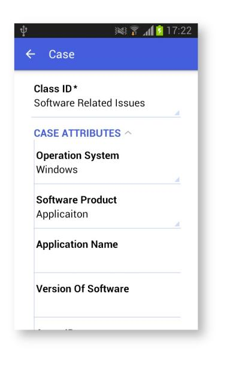

*Figure: Viewing the Case Attributes group*

Also, you can use the sm:Attributes tag to map a pair of columns from any grid of Acumatica ERP to a form view in the mobile app as a key-value pair. For example, if a grid contains a key field, a value field, and a field for sorting, to create a sorted group of key-value pairs of the grid on a form view of the mobile app, you might define the following <sm:Attributes> tag (see *[<sm:Attributes>](#page-157-2)* for details).

```
...
<sm:Container ...>
...
 <sm:Group ...>
 <sm:Attributes From="GridDataView" IDField="Column1_FieldName"
 IDValue="Column5_FieldName" OrderField="Column3_FieldName" />
 </sm:Group>
</sm:Container>
...
```

In the example above, GridDataView is the DataMember defined for the grid; Column1\_FieldName, Column5\_FieldName, and Column3\_FieldName are correspondingly the key field, the value field, and the field for sorting.

## <span id="page-106-1"></span><span id="page-106-0"></span>**Redirecting to Different Screens and Containers**

You can redirect the user to different screens and containers in a mobile application in one of the following ways:

- 1. Allow a redirection that is already implemented in Acumatica ERP
- 2. Create a new redirection to a screen or container

These ways are described in the following sections.

### **Allowing a Redirection That Is Implemented in Acumatica ERP**

While executing an action, you may need to redirect the application from the current screen to a different screen or to an external URL. As a rule, the business logic of Acumatica ERP handles redirection to a screen by using the PXRedirectRequiredException and PXPopupRedirectException exceptions.

In a mobile application, you can allow a redirection that is implemented in an action of Acumatica ERP. To do this, you set the Redirect attribute of the *[<sm:Action>](#page-154-1)* tag to *true* in an .xml file of the mobile site map.

#### **Example: Using Existing Redirection from the List to the Editing Form**

To see an example of allowing a redirection implemented in an action, copy the code below to an .xml file, put the file in the \App\_Data\Mobile folder of the Acumatica ERP website, and start the mobile application.

```
<?xml version="1.0" encoding="UTF-8"?>
<sm:SiteMap xmlns:sm="http://acumatica.com/mobilesitemap" xmlns:xsi="http://
www.w3.org/2001/XMLSchema-instance">
 <sm:Folder DisplayName="Expense Receipts" Type="HubFolder" Icon="system://NewsPaper" >
 <sm:Screen Id="EP301010" Type="SimpleScreen" DisplayName="Expense Receipts" >
 <sm:Container Name="ExpenseReceipts" >
 <sm:Field Name="Date" />
 <sm:Field Name="ClaimAmount" />
 <sm:Field Name="DescriptionTranDesc" />
 <sm:Field Name="Currency" />
 <sm:Action Name="addNew" Context="Container" Behavior="Create"
 Redirect="true" Icon="system://Plus" />
 <sm:Action Name="editDetail" Context="Container" Behavior="Open"
 Redirect="true" />
 <sm:Action Name="Delete" Context="Selection" Behavior="Delete"
 Icon="system://Trash" />
 </sm:Container>
 </sm:Screen>
 </sm:Folder>
 <sm:Screen Id="EP301020" Type="SimpleScreen" Icon="system://Display1"
 DisplayName="Expense Receipt" Visible="false" OpenAs="Form">
 <sm:Container Name="ReceiptDetails" >
 <sm:Field Name="Date" />
 <sm:Field Name="Description" />
 <sm:Field Name="ExpenseItem" />
 <sm:Field Name="TotalAmount" />
 <sm:Action Name="Save" Context="Record" Behavior="Save" />
 <sm:Action Name="Cancel" Context="Record" Behavior="Cancel" />
 </sm:Container>
 </sm:Screen>
</sm:SiteMap>
```

In this example, you use the *EP301010* screen to display the list and the *EP301020* screen to display the editing form. In the list view (*EP301010*), notice two actions that result in opening the form view for a data record: Behavior="Create" and Behavior="Open". The Redirect="true" attribute indicates that the editing form needs to be opened as a different screen.

You can still control the current screen aer an action is completed by using the After attribute of the corresponding sm:Action tag. The After attribute defines more complex behavior of the container when the Redirect attribute of this tag is set to *true*. Possible values for the After attribute have the following meanings:

- If redirection doesn't happen:
  - Refresh: The current container is refreshed.
  - Close: The current container is closed, and the previous container in the stack is loaded.
- If redirection happens:

- Refresh: A new screen is loaded, and the previous one is saved in the stack.
- Close: The current container is closed, and the new one is opened and takes the position of the closed container in the stack.

The default value of the After attribute is Refresh.

#### **Example: Using Existing Redirection to an External URL**

If an action on an Acumatica ERP form provides redirection to an external URL, you can map the action to use in the mobile app. To do this, you need no additional attributes in the <sm:Action> tag. However, the Redirect attribute of the tag must be set to *true* as in the following example.

```
...
<sm:Action Behavior="Void" Context="Record" Name="ViewOnMap" Redirect="true"/>
...
```

On a mobile device, such action launches the default browser and passes the URL, which is obtained from the Acumatica ERP server, to the browser that opens the webpage specified in the URL.

#### **Creating a New Redirection to a Screen or Container**

You can create a redirection to any container or screen in the mobile application when the redirection is absent in Acumatica ERP. For example, you can do this to implement pop-up windows in the mobile application.

To create a redirection, you use the following attributes:

- RedirectToScreen sets the ID of the screen to redirect to. If the redirection target is within the current screen (such as a different container), don't use this attribute.
- RedirectToContainer sets the name of the container to redirect to. If you don't specify this attribute, you are redirected to the primary container of the target screen.

#### **Example: Creating a Redirection to Another Container Inside theScreen**

To see an example of creating a new redirection to another container inside the screen, copy the code below to an .xml file, put the file in the \App\_Data\Mobile folder of the Acumatica ERP website, and start the mobile application.

```
<?xml version="1.0" encoding="UTF-8"?>
<sm:SiteMap xmlns:sm="http://acumatica.com/mobilesitemap" xmlns:xsi="http://
www.w3.org/2001/XMLSchema-instance">
 <sm:Folder DisplayName="Expense Claims" Icon="system://Folder" Type="HubFolder">
 <sm:Screen DisplayName="Expense Claims" Id="EP301030" Type="FilterListScreen">
 <sm:Container Name="Selection">
 <sm:Field Name="Employee"/>
 </sm:Container>
 <sm:Container Name="Claim">
 <sm:Field ForceIsDisabled="true" Name="ReferenceNbr"/>
 <sm:Field Name="Status"/>
 <sm:Field Name="Date"/>
 <sm:Field Name="ClaimTotal"/>
 <sm:Field Name="Description"/>
 <sm:Action Behavior="Open" Context="Container" Name="EditDetail"
 Redirect="true"/>
 <sm:Action Behavior="Create" Context="Container" Icon="system://Plus"
 Name="CreateNew" Redirect="true"/>
 </sm:Container>
```

```
 </sm:Screen>
 </sm:Folder>
 <sm:Screen DisplayName="Expense Claim" Id="EP301000" OpenAs="Form" Type="SimpleScreen"
 Visible="false">
 <sm:Container Name="DocumentSummary">
 <sm:Attachments Disabled="true"/>
 <sm:Field ForceIsDisabled="true" Name="ReferenceNbr"/>
 <sm:Field Name="Description"/>
 <sm:Action Behavior="Void" Context="Record" Name="ShowSubmitReceipt"
 Redirect="true" RedirectToScreen="EP301000" RedirectToContainer="SubmitReceipts$List"/>
 <sm:Action After="Close" Behavior="Save" Context="Record" Name="Save"/>
 <sm:Action Behavior="Cancel" Context="Record" Name="Cancel"/>
 </sm:Container>
 <sm:Container Name="SubmitReceipts" Type="SelectionActionList" Visible="false">
 <sm:Field Name="Description"/>
 <sm:Field Name="Date"/>
 <sm:Field Name="ClaimAmount"/>
 <sm:Action Behavior="Void" Context="List" Name="SubmitReceipt"/>
 </sm:Container>
 </sm:Screen>
</sm:SiteMap>
```

In this example, the *EP301000* screen with DisplayName="Expense Claim" includes the following containers:

• DocumentSummary, which contains the following redirection on the Record action:

<sm:Action ... Context="Record" Name="ShowSubmitReceipt" Redirect="true" RedirectToScreen="EP301000" RedirectToContainer="SubmitReceipts\$List"/>

• SubmitReceipts, to which the redirection is declared by the RedirectToContainer attribute

The RedirectToScreen attribute cannot be declared because both containers belong to the same screen.

In the example presented in this section, the container name has the "SubmitReceipts\$List" value, which consists of two parts. You can expand the name of the container with special arguments for more detailed configuration of the container behavior (as shown in the following example).

RedirectToContainer="InventoryLookup\$List\$InventoryLookupInventory"

In this example, the RedirectToContainer value consists of the following parts:

- Part of the string (up to the first *\$* sign) is the name of the container.
- Part of the string (between the first and second *\$* sign) specifies how to open the container:
  - List: Open as a list
  - Form: Open as a form (default)
- If the second parameter is set explicitly to List, in the rest of the string, you can specify an additional container that is used as a filter for the data records in the main container.

To use the expanded way of configuring a redirection, you should clearly understand how the target screen works, how its business logic operates, and how the state of the business logic objects changes aer any of the actions is executed.

# <span id="page-110-2"></span><span id="page-110-0"></span>**Displaying Any Field as a Text Field**

The mobile API gives you the ability to map a control of any type from an Acumatica ERP form to a text box in the mobile application. This ability can be useful when both of the following conditions are met:

- You have one of the following problems with the use of the field in the mobile application:
  - A value in the control for the field is displayed oddly or incorrectly.
  - The mapping of the field raises an exception.
- You do not need to specify a new value for the field in the mobile application.

For these conditions, you can force the mobile application to treat this field as a common text field.

To do this, in the sm:Field tag for the field, you can specify the ForceType="String" attribute. The input value is inserted directly into the cache of the corresponding container.

We do not recommend that you use the ForceType attribute unless you have extensive experience developing custom controls and fully understand the outcome of using this attribute. Note that by using the ForceType attribute, you could switch off some types of field validation, which could damage data in the database.

# <span id="page-110-3"></span><span id="page-110-1"></span>**Creating the User Signature**

The mobile app provides an additional functionality to create the user signature and attach the signature image file to an Acumatica ERP form that supports file attachments.

This functionality does not work in the *[<sm:Container>](#page-157-3)* tag that contains the *[<sm:Attachments>](#page-156-1)* tag with the Disabled attribute set to *true*.

To add this functionality to the mobile site map, you should add the *[<sm:Action>](#page-154-1)* tag with the Behavior attribute set to *SignReport* to a container of a screen that is mapped to a form, which supports attachments. In the action tag, you should also specify the Name and Context attributes as shown in the following example.

```
...
<sm:Action Behavior="SignReport" Context="Record" DisplayName="Sign" Name="SignReport"/>
...
```

As a result, the**SIGN** action will appear on the appropriate screen of the mobile app, as the following screenshot shows.

| 14:06           |                                                      | … * 必 令   | $\mathbf{H}$ $\Box$ 41% |
|-----------------|------------------------------------------------------|-----------|-------------------------|
| X               | <b>Sales Orders</b>                                  | $\rm \Xi$ | i<br><b>SIGN</b>        |
| <b>Customer</b> |                                                      |           |                         |
|                 | <b>ABC Holdings Inc</b>                              |           |                         |
| exceeded!       | The customer's Days Past Due number of days has been |           |                         |
| Location        |                                                      |           |                         |
|                 | <b>Primary Location</b>                              |           |                         |
| Currency        |                                                      |           |                         |
| <b>USD</b>      |                                                      |           |                         |
|                 |                                                      |           |                         |
| Credit Hold     |                                                      |           |                         |
| Project         |                                                      |           |                         |
|                 | Non-Project Code.                                    |           |                         |
| Description     |                                                      |           |                         |
| Ordered Qty.    |                                                      |           |                         |
| 0.00            |                                                      |           |                         |
|                 | VAT Exempt Total                                     |           |                         |

*Figure: Viewing the SIGN action on the toolbar of a screen*

When the user clicks this action, the application displays a blank form with the **Cancel** and **OK** buttons and suggests the user to add the signature, as shown in the following screenshot.

| 14:10                                                                                                                                                   | ※ ◎ 利 ● 41%<br>     |
|---------------------------------------------------------------------------------------------------------------------------------------------------------|---------------------|
| ¢<br>$\begin{array}{c}\n\mathbf{A} \\ \vdots \\ \mathbf{B}\n\end{array}$<br>L<br>F<br>۱<br>$\mathbf C$<br>$\overline{L}$<br>$\mathsf{C}$<br>P<br>N<br>D | Sign here           |
| $\circ$<br>!!!!!!!!!!!!!!!!!!!!!!!!!!!!!!!!!!!!!!!!<br>١                                                                                                | <b>CANCEL</b><br>OK |

*Figure: Creating a signature*

Aer the user signs the form and clicks **OK**, an attachment with the signature adds to the screen in the mobile app (see the following screenshot). To save the signature file in the database, the user should click the Save button.

| 14:10            |                               |           | $\mathbf{u} \ast \mathbf{A} \subseteq \mathbf{A}$ and $\mathbf{A}$ and $\mathbf{A}$ |
|------------------|-------------------------------|-----------|-------------------------------------------------------------------------------------|
| X                | <b>Sales Orders</b>           | $\bf \Xi$ | i                                                                                   |
|                  | DISCOUNT DE FAILS             |           |                                                                                     |
| <b>SHIPMENTS</b> |                               |           | $\mathcal{E}$                                                                       |
| <b>PAYMENTS</b>  |                               |           | $\mathcal{E}$                                                                       |
|                  |                               |           |                                                                                     |
|                  | <b>ORDER TOTALS</b>           |           |                                                                                     |
|                  | <b>FREIGHT INFO</b>           |           |                                                                                     |
| QUANTITIES       | <b>CALCULATED AMOUNTS AND</b> |           |                                                                                     |
|                  |                               |           |                                                                                     |

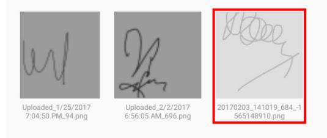

#### *Figure: Viewing the signature added to the screen of the mobile app*

Aer the user clicks Save on the screen toolbar, the mobile app sends the signature file to the Acumatica ERP server that saves the file in the database as a file attached to the appropriate form. In the mobile application, the attachment is displayed as an image that is attached to the Acumatica ERP form.

| 14:11            |                        |   | $\mathbf{u} \ast \mathbf{A} \mathbf{v} \mathbf{v} \mathbf{v} = \mathbf{A} \mathbf{0} \mathbf{v}$ |
|------------------|------------------------|---|--------------------------------------------------------------------------------------------------|
| x                | <b>Sales Orders</b>    | ⋐ | å                                                                                                |
|                  | DISCOUNT DE FAILS      |   | ↗                                                                                                |
| <b>SHIPMENTS</b> |                        |   | $\mathcal{E}$                                                                                    |
| <b>PAYMENTS</b>  |                        |   | ↘                                                                                                |
|                  |                        |   |                                                                                                  |
|                  | ORDER TOTALS           |   |                                                                                                  |
|                  | <b>FREIGHT INFO</b>    |   |                                                                                                  |
| QUANTITIES       | CALCULATED AMOUNTS AND |   |                                                                                                  |
|                  |                        |   |                                                                                                  |

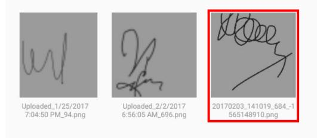

*Figure: Viewing the signature added to the Acumatica ERP form*

# <span id="page-115-3"></span><span id="page-115-0"></span>**Mobile Site Map Reference**

This chapter contains reference information for the elements that are used to configure the mobile site map of the Acumatica mobile app.

### **In This Chapter**

- *[MSDL](#page-115-2)*
- *XML [Tags](#page-152-1)* (deprecated)
- *[Icons](#page-168-3)*

### <span id="page-115-2"></span><span id="page-115-1"></span>**MSDL**

Mobile Site Map Definition Language (MSDL) can be used for the following purposes:

- To change the mobile site map
- To create the content for the empty mobile site map

MSDL includes the following regulations and recommendations:

- Instruction names are not case sensitive. For example, you can enter the add instruction as *Add*, *ADD*, or *aDD*.
- Each instruction must be written in a new line of MSDL code.
- You can use any number of spaces before an instruction in a line of code.
- If an instruction is located inside braces, this instruction is executed in the context of the object of the instruction that contains the opening bracket.
- An instruction can contain multiple nested instructions within braces.
- To specify or update the value of an attribute of an object in the mobile site map, add the attribute assignment within braces for the instruction for the object, as shown in the following code.

```
 add recordAction "EditDetail" {
 behavior = Open
 }
```

- An instruction can contain multiple assignment commands within braces.
- Braces for an instruction can be placed on the same line aer the instruction or on the next line, as shown in the following code.

```
 add field "Date" {
 ...
 }
 add field "Description"
 {
 ...
 }
```

• You can omit the space before and aer braces, as the following example shows.

```
add item "EP301010"{
 displayName = "Expense Receipts"}
```

• A comment starts with the *#* symbol and is considered finished at the end of the line.

```
# this is a comment
```

This section contains detailed information about the following elements of MSDL:

- *[Object](#page-116-1) Types*
- *[Constants](#page-144-2)*
- *[Instructions](#page-144-3)*
- *[Error Messages](#page-151-1)*

# <span id="page-116-1"></span><span id="page-116-0"></span>**Object Types**

An MSDL instruction can be applied to the following object types:

- The following action object types:
  - *[containerAction](#page-119-0)* (applied to a whole container)
  - *[listAction](#page-134-0)* (applied to a list view)
  - *[recordAction](#page-137-0)* (applied a single opened record)
  - *[selectionAction](#page-141-0)* (applied to a list of selected records)
- These link object types:
  - *[containerLink](#page-121-0)*
  - *[recordActionLink](#page-139-1)*
- *[attributes](#page-116-2)*
- *[container](#page-117-0)*
- *[field](#page-124-0)*
- *[folder](#page-128-0)*
- *[group](#page-129-0)*
- *[item](#page-131-0)*
- *[screen](#page-139-0)*
- *[type](#page-143-1)*
- *[UDFields](#page-143-0)*

Objects have attributes, and each attribute can have any number of possible values. If the attribute is an indicator, it can have only the *true* or *false* value.

The topics in this section provide reference information on each of these object types, including a list of attributes and an example of the use of the object type.

### <span id="page-116-2"></span>**attributes**

An object that maps an entity attributes to the mobile app screen.

| Attribute | Description                                                                 |
|-----------|-----------------------------------------------------------------------------|
| From      | The name of the data view for the grid that contains the entity attributes. |

| Attribute    | Description                                                                          |
|--------------|--------------------------------------------------------------------------------------|
| FormPriority | The priority value that defines the position of the entity attributes on the screen. |
| Name         | The identifier of the attributes, as found in the WSDL schema.                       |

The attributes object can also be used to map a grid of Acumatica ERP to a form view that displays key-value pairs. Then you should also use the following attributes inside the instruction.

| Attribute  | Description                                                                                                                                                                 |
|------------|-----------------------------------------------------------------------------------------------------------------------------------------------------------------------------|
| IDField    | The identifier of the grid field, as found in the WSDL schema, that specifies the key<br>field for the key-value pairs. By default, the value is AttributeID.               |
| IDValue    | The identifier of the grid field, as found in the WSDL schema, that specifies the val<br>ue field for the key-value pairs. By default, the value is Value.                  |
| OrderField | Optional. The grid field identifier, as found in the WSDL schema, that is used for<br>sorting rows in the grid to display in the form view. By default, the value is Order. |

### **Example**

In the following example, a grid containing two entity attributes is added.

```
add attributes "GridDataView" {
 displayName = "Status"
 displayName = "Quantity"
}
```

#### **Related Links**

- *[<sm:Attributes>](#page-157-2)*
- *[Adding Attributes of Entities to Mobile Screens](#page-31-1)*

## <span id="page-117-0"></span>**container**

An object that maps a form container to the mobile app. The object can include fields, actions, nested containers, and other elements.

| Attribute                      | Description                                                                                                                                                |
|--------------------------------|------------------------------------------------------------------------------------------------------------------------------------------------------------|
| AttachmentsCon<br>trolPriority | The priority value that defines the position of the attachments in the list.                                                                               |
|                                | This attribute is deprecated. Now the attachments icon is displayed<br>on the top toolbar of the app screen. For details, see Configuring At<br>tachments. |

| Attribute                    | Description                                                                                                                                                                                                                                                                |
|------------------------------|----------------------------------------------------------------------------------------------------------------------------------------------------------------------------------------------------------------------------------------------------------------------------|
| Attributes                   | An indicator of whether this container holds entity attributes. If the indicator val<br>ue is true, you should not specify the items of the container, because the container<br>configuration is generated dynamically.                                                    |
| ContainerAction<br>sToExpand | The number of containerAction objects to be visible in the bottom part of the<br>list screen. The default value depends on the platform of the particular mobile de<br>vice running the app.                                                                               |
|                              | Setting ContainerActionsToExpand = 1 for a container will<br>cause the action corresponding to the containerAction object<br>that is defined first to be displayed as a button in the bottom part of<br>the corresponding screen.                                          |
| DisplayName                  | The name of the container on the UI.                                                                                                                                                                                                                                       |
| FieldsToShow                 | The number of fields to be displayed in the list.                                                                                                                                                                                                                          |
| FormActionsToEx<br>pand      | The number of recordAction objects to be visible in the toolbar on the editing<br>screen. The default value depends on the platform of particular mobile device run<br>ning the app.                                                                                       |
| ListActionsToEx<br>pand      | The number of listAction and selectionAction objects to be visible in the<br>bottom part of the list screen when the multiple selection of records is activated.<br>The default value depends on the platform of the particular mobile device running<br>the app.          |
|                              | Setting ListActionsToExpand = 1 for a container will cause the<br>action corresponding to the listAction or selectionAction<br>object that is defined first to be displayed as a button in the bottom<br>part of the corresponding screen.                                 |
| Type                         | An optional attribute that specifies the type of the container. The only possible val<br>ue is SelectionActionList, which is used for a listAction object. See Example:<br>Configuring a Screen with Many-to-One (Master-Detail) Containers or listAction for de<br>tails. |
| Visible                      | An indicator of whether the link to the container is visible on the editing screen.<br>This attribute can be applied to a secondary container. By default, the value is true.                                                                                              |
| includeDialogAc<br>tions     | An indicator of whether the container includes actions for a smart panel. The at<br>tribute can be used only for a container object inside the dialog object. For<br>details, see dialog.                                                                                  |

In the following example, a container with two fields is added.

```
add container "OrdersToApply" { 
 fieldsToShow = 2 
 add field "AppliedToOrder" { 
 listPriority = 90
```

```
 } 
 add field "NoteText" { 
 textType = PlainMultiLine 
 } 
}
```

• *[<sm:Container>](#page-157-3)*

## <span id="page-119-0"></span>**containerAction**

In the mobile site map, an object that defines the appearance and behavior of an action that is related to a container and performs the business logic implemented in Acumatica ERP. This type of action is displayed only on the list view.

| Attribute   | Description                                                                                                                                                                                                                                                                                                                                                                                                                                     |
|-------------|-------------------------------------------------------------------------------------------------------------------------------------------------------------------------------------------------------------------------------------------------------------------------------------------------------------------------------------------------------------------------------------------------------------------------------------------------|
| After       | The behavior of the current container after the action is completed. The value can<br>be one of the following:                                                                                                                                                                                                                                                                                                                                  |
|             | •<br>Refresh: The current container should be refreshed after the action is complet<br>ed.                                                                                                                                                                                                                                                                                                                                                      |
|             | •<br>Close: The current container should be closed after the action is completed.                                                                                                                                                                                                                                                                                                                                                               |
|             | If the Redirect attribute of an action object is set to true, the After attribute of<br>this object defines more complex behavior for the current container. See Redirect<br>ing the User to Different Screens and Containers for details.                                                                                                                                                                                                      |
| Behavior    | Required. The behavior of the action—which defines how the mobile app obtains<br>from the server the data resulting from the action and processes this data. The val<br>ue can be one of the following:                                                                                                                                                                                                                                         |
|             | •<br>Create: Creates a new data record. If the Redirect attribute value is true, this<br>action redirects the user to a container defined on a different screen.                                                                                                                                                                                                                                                                                |
|             | Open: Opens the data record for editing on a different screen. If the Redirect<br>•<br>attribute value is true, this action redirects the user to a container defined on a<br>different screen.                                                                                                                                                                                                                                                 |
|             | •<br>Record: Indicates that the mobile app should to expect a single record as the<br>server response.                                                                                                                                                                                                                                                                                                                                          |
|             | SignReport: Indicates that the mobile app should add the Sign action to the<br>•<br>container. This action is not implemented in Acumatica ERP and uses the spe<br>cific capabilities of the mobile devices to create the user signature as an image<br>file. The user can save the signature in the database of the Acumatica ERP in<br>stance as a file attachment for the appropriate form. See Creating the User Sig<br>nature for details. |
|             | Void: Tells the mobile app to not use any records that are returned in the server<br>•<br>response.                                                                                                                                                                                                                                                                                                                                             |
| DisplayName | The name of the action in the UI.                                                                                                                                                                                                                                                                                                                                                                                                               |

| Attribute               | Description                                                                                                                                                                                       |
|-------------------------|---------------------------------------------------------------------------------------------------------------------------------------------------------------------------------------------------|
| Icon                    | The name of the image that is used to display the action icon on the UI. If this at<br>tribute is not specified for an action, the action is displayed on the UI without an<br>icon.              |
|                         | See Icons for the possible values and the corresponding images for the Icon at<br>tribute.                                                                                                        |
| Priority                | The priority value that defines the position of the action on the screen or the tool<br>bar relative to other container actions.                                                                  |
| Redirect                | An indicator of whether the action redirects the user to a container of a screen. You<br>can use this attribute to do the following:                                                              |
|                         | •<br>Allow a redirection defined for the action in Acumatica ERP by setting the at<br>tribute to true.                                                                                            |
|                         | •<br>Deny a redirection defined for the action in Acumatica ERP by setting the at<br>tribute to false. This is the default setting of the Redirect attribute.                                     |
|                         | •<br>Define a new redirection for the action by setting the attribute to true and spec<br>ifying the attributes of this tag to set one of the following as the destination of<br>the redirection: |
|                         | •<br>RedirectToScreen, to redirect to the primary container of the specified<br>screen                                                                                                            |
|                         | •<br>RedirectToContainer, to redirect to another container of the current<br>screen                                                                                                               |
|                         | •<br>RedirectToScreen and RedirectToContainer, to redirect to a<br>specified container of a specified screen                                                                                      |
|                         | See Redirecting the User to Different Screens and Containers for<br>more details.                                                                                                                 |
| RedirectToContain<br>er | The name of the destination container. The name can consist of the following<br>parts separated by the \$ symbol:                                                                                 |
|                         | •<br>The name of the container                                                                                                                                                                    |
|                         | •<br>The display type of the container: List or Form (default)                                                                                                                                    |
|                         | •<br>The optional name of the additional container whose data is used as a filter                                                                                                                 |
|                         | The mobile site map has to include the metadata for this container.                                                                                                                               |
|                         | For details, see Redirecting the User to Different Screens and Containers.                                                                                                                        |
| RedirectToDialog        | The name of the complex dialog box (smart panel) that is the destination. For de<br>tails, see Mapping a Smart Panel.                                                                             |
| RedirectToScreen        | The name of the destination screen. The mobile site map has to include the meta<br>data for this screen. For details, see Redirecting the User to Different Screens and<br>Containers.            |

| Attribute         | Description                                                                                                                                                                                                                                                    |
|-------------------|----------------------------------------------------------------------------------------------------------------------------------------------------------------------------------------------------------------------------------------------------------------|
| SyncLongOperation | An indicator of whether the mobile app should wait until the action is completed if<br>this action is defined as a PXLongRunOperation one and is executed asynchro<br>nously in Acumatica ERP. By default, the SyncLongOperation attribute is set<br>to false. |
|                   | The SyncLongOperation attribute will be deprecated in a future<br>release.                                                                                                                                                                                     |

In the following example, an action for creating a new record is added.

```
add containerAction "Insert" { 
 icon = "system://Plus" 
 behavior = Create 
}
```

#### **Related Links**

• *[<sm:Action>](#page-154-1)*

# <span id="page-121-0"></span>**containerLink**

An object that specifies a link to another container on the screen toolbar or on the screen among the fields.

| Attribute  | Description                                                                                                                                                                                                                                                                                                                                                 |
|------------|-------------------------------------------------------------------------------------------------------------------------------------------------------------------------------------------------------------------------------------------------------------------------------------------------------------------------------------------------------------|
| Container  | The name that that will serve as the link to the container.                                                                                                                                                                                                                                                                                                 |
| Control    | The type of control, which is one of the following values:<br>•<br>ListItem: An indicator that the link to the container is displayed among the fields<br>on the screen according to the value defined in the Priority attribute of this<br>object.                                                                                                         |
|            | •<br>Button: An indicator that the link to the container is displayed in the screen tool<br>bar according to the value defined in the Priority attribute of this object.                                                                                                                                                                                    |
| Icon       | The name of the image that is used to display the link when the Control attribute<br>is set to Button and the link is displayed in the action panel in the UI. If this attribute<br>is not specified for a link, the link is displayed in the UI without an icon. See the pos<br>sible values and the corresponding images for the Icon attribute in Icons. |
| Priority   | The priority value that defines the position of the link in the enclosing container on<br>the screen.                                                                                                                                                                                                                                                       |
| ValueField | The name of the field whose value is used as the link text. The field must be de<br>clared in the container.                                                                                                                                                                                                                                                |

| Attribute | Description                                                                                                                                                                                |
|-----------|--------------------------------------------------------------------------------------------------------------------------------------------------------------------------------------------|
| Weight    | The value that is used to set the width of the link within the row of the UI element<br>defined by the layout object with the Template attribute set to Inline. The default<br>value is 1. |

In the following example, a link to a container is added.

```
add containerLink "Details" {
 control = "ListItem"
 formPriority = 51
}
```

#### **Related Links**

- *[Configuring Related Containers](#page-36-1)*
- *[<sm:ContainerLink>](#page-158-1)*

## <span id="page-122-0"></span>**dialog**

An object that defines the appearance and behavior of a complex dialog box (smart panel).

### **Attributes**

| Attribute                   | Description                                                                                                                                                                                                                                                                         |
|-----------------------------|-------------------------------------------------------------------------------------------------------------------------------------------------------------------------------------------------------------------------------------------------------------------------------------|
| CloseButtonDialo<br>gResult | The dialog result for the Close action. The possible values of the property corre<br>spond to the elements of the WebDialogResult enumeration.                                                                                                                                      |
|                             | For more details, see Configuring the Close Button of a Smart Panel.                                                                                                                                                                                                                |
| OpenAs                      | The display type of the dialog box. When the dialog box is opened, this attribute<br>specifies how to open the primary container. The value can be one of the follow<br>ing:                                                                                                        |
|                             | •<br>List (default): The smart panel opens as a list.                                                                                                                                                                                                                               |
|                             | •<br>Form: The smart panel opens as a form.                                                                                                                                                                                                                                         |
| Type                        | The type of the smart panel, which is one of the following values:                                                                                                                                                                                                                  |
|                             | •<br>SimpleScreen: The smart panel is a common screen.                                                                                                                                                                                                                              |
|                             | •<br>FilterListScreen: The smart panel corresponds to the Acumatica ERP form based<br>on the FormDetail form template. Such a smart panel must include two con<br>tainers: The first container maps the form area of the smart panel (filter), and<br>the second one maps the grid. |

### **Allowed Parent and Child Objects**

The dialog object can be present inside the *[screen](#page-139-0)* object.

The dialog object can contain the following objects:

- *[container](#page-117-0)*
- *[dialogAction](#page-123-0)*

In the following example, a smart panel is implemented.

```
add dialog SO301000D1 {
 type = SimpleScreen
 openAs = Form
 add dialogAction "Ok" {
 DisplayName = "Add & Close"
 DialogResult = "Ok"
 CloseDialog = true
 }
 add container "InventoryLookupInventory"
 {
 add field "Inventory"
 add field "BarCode"
 add field "SiteID"
 }
}
```

#### **Related Links**

• *[Mapping a Smart Panel](#page-62-2)*

## <span id="page-123-0"></span>**dialogAction**

An object that defines the appearance and behavior of an action that is related to a complex dialog box (smart panel). This type of action is displayed only inside a smart panel.


| Attribute    | Description                                                                                                                                                                                                                        |
|--------------|------------------------------------------------------------------------------------------------------------------------------------------------------------------------------------------------------------------------------------|
| dialogResult | The type of the action. The attribute value should be the same as the type of the<br>action on the smart panel being mapped. For details, see WebDialogResult Enu<br>meration. The attribute can have one of the following values: |
|              | •<br>OK                                                                                                                                                                                                                            |
|              | •<br>Abort                                                                                                                                                                                                                         |
|              | •<br>Cancel                                                                                                                                                                                                                        |
|              | •<br>Ignore                                                                                                                                                                                                                        |
|              | •<br>No                                                                                                                                                                                                                            |
|              | •<br>None                                                                                                                                                                                                                          |
|              | •<br>Retry                                                                                                                                                                                                                         |

| Attribute   | Description                                                                                        |
|-------------|----------------------------------------------------------------------------------------------------|
| DisplayName | The name of the action in the UI.                                                                  |
| CloseDialog | An indicator of whether the app should close the smart panel after the action has<br>been invoked. |

### **Allowed Parent and Child Objects**

The dialogAction object can be present inside the *[dialog](#page-122-0)* object.

The dialogAction object cannot contain any objects.

### **Example**

In the following example, an action is implemented that saves data entered on the screen and closes the smart panel.

```
add dialogAction "DialogOK" { 
 DisplayName = "Save&Close"
 DialogResult = OK
 CloseDialog = true
}
```

#### **Related Links**

• *[Mapping a Smart Panel](#page-62-2)*

# <span id="page-124-0"></span>**field**

An object that maps a UI element field to the mobile app. This object can include fields, actions, nested containers, and other elements.

If a field from one container is also used in another container, you should use the ContainerName#FieldName format of the field name, where ContainerName is the name of the container (as it is specified in the WSDL schema) that contains the field, and FieldName is the name of the field in this container. See *[Example: Displaying](#page-38-0) [Fields from Different Containers in One Container](#page-38-0)* for details.

| Attribute   | Description                                                                                                                                             |
|-------------|---------------------------------------------------------------------------------------------------------------------------------------------------------|
| displayName | The name for the field, which by default is automatically set by the system. Howev<br>er, you can change it.                                            |
| elementType | The type of the field. The attribute can have only one value: FilePreview.                                                                              |
|             | A field marked with FilePreview should have a FileID value that<br>corresponds to the FileID value in the UploadFile table in the<br>instance database. |

| Attribute                 | Description                                                                                                                                                                                                                                                                                                                                                                                                                                                                         |
|---------------------------|-------------------------------------------------------------------------------------------------------------------------------------------------------------------------------------------------------------------------------------------------------------------------------------------------------------------------------------------------------------------------------------------------------------------------------------------------------------------------------------|
| forceIsDisabled           | An indicator of whether the field will be unavailable on the editing form regardless<br>of the server logic. By default, the field availability depends on the server logic.                                                                                                                                                                                                                                                                                                        |
| forceIsVisible            | An indicator of whether the field is visible on the editing form regardless of the<br>server logic. By default, the field visibility depends on the server logic.                                                                                                                                                                                                                                                                                                                   |
| forceRequired             | An indicator of whether the field is mandatory and must be filled in on the screen. If<br>its value is true, the field is mandatory. If its value is false, the field is not mandato<br>ry. If the attribute is not specified, the need to fill the field is determined by the da<br>ta obtained from the server.                                                                                                                                                                   |
| forceType                 | The field type that is used by the application instead of the original field type. The<br>only value of this attribute is String, which is an indicator of whether the field is vis<br>ible on the editing form regardless of the server logic. By default, the field visibility<br>depends on the server logic.                                                                                                                                                                    |
| formPriority              | The priority value that defines the position of the field on the form.                                                                                                                                                                                                                                                                                                                                                                                                              |
| listDisplayFormat         | The format that is used to display the field in the list. The value can be one of the<br>following:                                                                                                                                                                                                                                                                                                                                                                                 |
|                           | •<br>Value: An indicator that the field is represented only by the field value in the list.                                                                                                                                                                                                                                                                                                                                                                                         |
|                           | •<br>CaptionValue: An indicator that the field is represented by the caption and the<br>value in the list.                                                                                                                                                                                                                                                                                                                                                                          |
|                           | This attribute is applicable only to selector fields. See selector and Configuring<br>Selectors for details.                                                                                                                                                                                                                                                                                                                                                                        |
| listPriority              | The priority value that defines the position of the field in the list.                                                                                                                                                                                                                                                                                                                                                                                                              |
| pickerType                | The processing type of the selector field value; this attribute is applicable to only<br>selector fields. The value can be one of the following:                                                                                                                                                                                                                                                                                                                                    |
|                           | •<br>Attached: An indicator that the selector is displayed as a pop-up dialog box.                                                                                                                                                                                                                                                                                                                                                                                                  |
|                           | •<br>Detached: An indicator that the selector is displayed as a separate screen.                                                                                                                                                                                                                                                                                                                                                                                                    |
|                           | •<br>Searchable: An indicator that the mobile app should display the Search but                                                                                                                                                                                                                                                                                                                                                                                                     |
|                           | ton (<br>) right of the field control. If the user enters a text fragment in the con<br>trol and clicks the button, the app sends to the Acumatica ERP server a query<br>to search the records, and find those that contain the specified fragment in the<br>field value. After the response, the mobile app opens the selector screen and<br>displays the list of the field values obtained from the server. The user uses the<br>list to select a value for the selector control. |
| selectorDisplay<br>Format | The selector field format that is used to display the field value. The value can be<br>one of the following:                                                                                                                                                                                                                                                                                                                                                                        |
|                           | •<br>Key: An indicator that the value is represented by the key field of the selector.                                                                                                                                                                                                                                                                                                                                                                                              |
|                           | •<br>Description: An indicator that the value is represented by the value field of the<br>selector. This is the default value of the SelectorDisplayFormat attribute.                                                                                                                                                                                                                                                                                                               |
|                           | •<br>KeyDescription: An indicator that the value is represented by the combination of<br>the key and value fields of the selector.                                                                                                                                                                                                                                                                                                                                                  |
|                           | This attribute is applicable to only selector fields. See selector and Configuring<br>Selectors for details.                                                                                                                                                                                                                                                                                                                                                                        |

| Attribute | Description                                                                                                                                                                                                                                                                                                                                                                                                                                                                       |
|-----------|-----------------------------------------------------------------------------------------------------------------------------------------------------------------------------------------------------------------------------------------------------------------------------------------------------------------------------------------------------------------------------------------------------------------------------------------------------------------------------------|
| special   | The field type that is used by the mobile app for a specific purpose. The value can be<br>one of the following:                                                                                                                                                                                                                                                                                                                                                                   |
|           | •<br>AllowEdit (applicable to selector fields only): An indicator that the app should dis                                                                                                                                                                                                                                                                                                                                                                                         |
|           | play the Edit button (<br>) right of the field. If the user taps the button, the mo<br>bile app opens the data entry form for the business entity (such as a customer<br>or sales order), selected in the field. The button appears if both of the following<br>conditions are met:                                                                                                                                                                                               |
|           | •<br>On the Acumatica ERP form, the edit button is displayed for the correspond<br>ing control.                                                                                                                                                                                                                                                                                                                                                                                   |
|           | •<br>In the mobile app, the field is not empty and contains an ID that can be used<br>to select the appropriate data record of the business entity.                                                                                                                                                                                                                                                                                                                               |
|           | •<br>EmailAddress: An indicator that the app should treat this field as an input box<br>for an email address. It enables auto-complete for email addresses: As the user<br>types an email address for a new email activity by using the on-screen keyboard,<br>the system displays a list of possible completions, which are derived from the<br>system database or from the device's address book. The EmailAddress value is<br>not supported in iOS apps.                       |
|           | •<br>EmailSend: An indicator that the app should display the Send Email button (<br>)<br>right of the field control. If the user clicks the button, the mobile app forces the<br>system of the mobile device to create a new email message and use the field val<br>ue as the destination address for the message. In iOS, the Mail app is opened.                                                                                                                                |
|           | •<br>PhoneCall: An indicator that the app should display the Phone Call button (<br>)<br>right of the field. If the user taps the button, the mobile app forces the system of<br>the mobile device to open an app for voice calls with the phone number that has<br>been specified in the field.                                                                                                                                                                                  |
|           | •<br>GpsCoords: An indicator that the app should obtain the location of the user's mo<br>bile device and fill the field before sending to the Acumatica ERP server the da<br>ta record that is being modified on the screen. If the field with this attribute val<br>ue does not have a value, an action mapped on the screen cannot be executed;<br>for example, the user cannot save a data record that contains an empty field with<br>the Special attribute set to GpsCoords. |
|           | The location is reported as a string in the following format: <latitude>:<longi<br>tude&gt; (for instance, 65.61295166666667:-20.137938333333334).</longi<br></latitude>                                                                                                                                                                                                                                                                                                          |
|           | You can forcibly hide the field by setting the ForceIsVisible attribute to<br>false, so it is not shown in the user interface, or you can make the field unavail<br>able for editing by setting the ForceIsDisabled attribute to true. If the<br>ForceIsVisible and ForceIsDisabled attributes are not specified, then<br>the appropriate field state will be defined by the Acumatica ERP server.                                                                                |
|           | •<br>UrlOpen: An indicator that the app should display the Open URL button (<br>)<br>right of the field control. If the user clicks the button, the mobile app forces the<br>system of the mobile device to launch the default browser (Safari in iOS) for the<br>external URL specified in the field control.                                                                                                                                                                    |
|           | •<br>ListSelection: An indicator that a field holds the current state of selection of<br>an item in the list (true for selected, false for unselected). The option can be used<br>only for Boolean fields.                                                                                                                                                                                                                                                                        |
|           | The following screenshot shows an example of using the Special attribute for<br>fields mapped on a screen in the mobile app.                                                                                                                                                                                                                                                                                                                                                      |

| Attribute | Description                                                                                                                                                                                                                                                                                                                     |
|-----------|---------------------------------------------------------------------------------------------------------------------------------------------------------------------------------------------------------------------------------------------------------------------------------------------------------------------------------|
|           |                                                                                                                                                                                                                                                                                                                                 |
|           |                                                                                                                                                                                                                                                                                                                                 |
|           |                                                                                                                                                                                                                                                                                                                                 |
|           | Figure: Viewing the fields with the Special attribute in the mobile app                                                                                                                                                                                                                                                         |
| textType  | The type of text to be used for the field value. The value can be one of the following:<br>•<br>HTML: The text can be HTML markup.<br>•<br>PlainSingleLine: The text is displayed on a single line.<br>•<br>PlainMultiLine: The text is displayed on multiple lines. The look of the input con<br>trol depends on the platform. |

| Attribute | Description                                                                                                                                                                                                         |
|-----------|---------------------------------------------------------------------------------------------------------------------------------------------------------------------------------------------------------------------|
| weight    | The value that is used to set the width of the field within the UI element line de<br>fined by the layout object with the layout attribute set to Inline. The default value<br>is 1.                                |
|           | In the following example, the TotalAmount field takes two-thirds of the total<br>width, and the Currency field takes one-third.                                                                                     |
|           | add layout "Layout_1" {<br>layout = "Inline"<br>add field "ReceiptDetailsExpenseDetails#TotalAmount" {<br>weight = 2<br>}<br>add field "ReceiptDetailsExpenseDetails#Currency" {<br>pickerType = Attached<br>}<br>} |

In the following example, a field is added.

```
add field "OrderNbr" { 
 forceIsDisabled = True 
 listPriority = 100 
}
```

#### **Related Links**

```
• <sm:Field>
```

# <span id="page-128-0"></span>**folder**

An object of the main menu of the mobile app that can hold multiple folders and screen shortcuts.

| Attribute         | Description                                                                                                                                                                                                                                                                                                                                                                            |
|-------------------|----------------------------------------------------------------------------------------------------------------------------------------------------------------------------------------------------------------------------------------------------------------------------------------------------------------------------------------------------------------------------------------|
| DisplayName       | The name of the folder in the UI.                                                                                                                                                                                                                                                                                                                                                      |
| Icon              | The name of the image that is used to display the folder icon on the main menu<br>(and on the sidebar menu, if specified) of the mobile application. This attribute is<br>optional; if this attribute is not specified for a folder, the folder is displayed in the UI<br>without an icon.<br>See the possible values and the corresponding images for the Icon attribute in<br>Icons. |
| IsDefaultFavorite | An indicator of whether a link for the folder is added to the sidebar menu as a fa<br>vorite folder. If the attribute is set to True, a link is added to the sidebar menu. By<br>default, this attribute is set to False.                                                                                                                                                              |

| Attribute | Description                                                                                                         |
|-----------|---------------------------------------------------------------------------------------------------------------------|
| Type      | The type of the folder (that is, the way it is displayed and used), which is one of the<br>following values:        |
|           | •<br>ListFolder: An indicator that the folder contents are displayed as tiles.                                      |
|           | •<br>HubFolder: An indicator that the folder contents are displayed as pages that the<br>user navigates by swiping. |

In the following example, a new folder containing the Expense Rexeipts (EP301010) screen is added to the main menu of the mobile app. The added folder will also appear in the sidebar menu of the mobile app.

```
add folder "ExpenseReceipts" { 
 type = HubFolder 
 isDefaultFavorite = True 
 displayName = "Expense Receipts" 
 icon = "system://NewsPaper" 
 add item "EP301010" { 
 displayName = "Expense Receipts" 
 } 
}
```

#### **Related Links**

• *[<sm:Folder>](#page-162-1)*

### <span id="page-129-0"></span>**group**

An object that maps a field group to the mobile app. The object can contain the following objects and instructions:

- *[field](#page-124-0)*
- *[layout](#page-132-0)*
- Attributes
- *[recordActionLink](#page-139-1)*

| Attribute   | Description                                                                                                                                                                                                                                                                                                                  |
|-------------|------------------------------------------------------------------------------------------------------------------------------------------------------------------------------------------------------------------------------------------------------------------------------------------------------------------------------|
| Collapsable | An indicator of whether this group may be collapsed or expanded. If its value is<br>true, the group can be collapsed or expanded, and you can specify whether the<br>group is collapsed when the screen is opened by using the Collapsed attribute. If<br>the value is false, the group is expanded and cannot be collapsed. |
|             | If the Template attribute is set to ExpansionPanel, the value of the attribute is ig<br>nored. Expansion panels are always collapsible.                                                                                                                                                                                      |

| Attribute    | Description                                                                                                                                                                                                                                                                                                                                                                                          |
|--------------|------------------------------------------------------------------------------------------------------------------------------------------------------------------------------------------------------------------------------------------------------------------------------------------------------------------------------------------------------------------------------------------------------|
| Collapsed    | An indicator of whether this group is collapsed by default. If its value is true, the<br>group is collapsed when the screen is opened. If the value is false, the group is ex<br>panded when the screen is opened.                                                                                                                                                                                   |
|              | If Template=Group (or the Template attribute is not set) and Col<br>lapsable=false, the value of the attribute is ignored.                                                                                                                                                                                                                                                                           |
|              | For expansion panels (Template=ExpansionPanel) and collapsible groups<br>(Template=Group and Collapsable=true), if the value of the attribute is not<br>specified, the group is collapsed when the screen is opened.                                                                                                                                                                                 |
| DisplayName  | The name of the group in the UI.                                                                                                                                                                                                                                                                                                                                                                     |
|              | If the Template attribute is set to ExpansionPanel, the value of the attribute is ig<br>nored. An expansion panel does not have the name of the group in the UI.                                                                                                                                                                                                                                     |
| Field        | Obsolete. The name of the field whose value is displayed when the group is col<br>lapsed.                                                                                                                                                                                                                                                                                                            |
|              | The value of this field is ignored. Expansion panels (Template=ExpansionPan<br>el) always display the first field (sm:field) or layout definition (sm:layout) in<br>the group. Other groups (Template=Group) do not display any fields when the<br>group is collapsed.                                                                                                                               |
| FormPriority | The priority value that defines the position of the group on the screen.                                                                                                                                                                                                                                                                                                                             |
| Template     | The template that is used for the group. The following values can be used for this<br>attribute:                                                                                                                                                                                                                                                                                                     |
|              | •<br>ExpansionPanel: An expansion panel, which can be collapsed or expanded. The<br>collapsed expansion panel displays only the first field (field) or layout defini<br>tion (layout) in the group. An expansion panel does not have the name of the<br>group in the UI. You can configure how the expansion panel is displayed by using<br>the Collapsed and FormPriority attributes of the object. |
|              | •<br>Group: A group of UI elements. You can configure how the group is displayed by<br>using the DisplayName, Collapsable, Collapsed, and FormPriority<br>attributes of the object.                                                                                                                                                                                                                  |
|              | If the value of the attribute is not specified, the Group template is used.                                                                                                                                                                                                                                                                                                                          |

In the following example, a group of fields is added to a screen. Fields from the added group contain information from the PaymentSettings container.

```
add group "PayInfoGroup" { 
 displayName = "Payment Settings" 
 collapsable = True 
 collapsed = True 
 add field "PaymentSettings#PaymentMethod" 
 add field "PaymentSettings#CardAccountNo" 
 add field "PaymentSettings#CashAccount" 
 add field "PaymentSettings#PaymentRef" 
 add field "PaymentSettings#ProcessingStatus" { 
 displayName = "CC Processing Status" 
 }
```

}

#### **Related Links**

• *[<sm:Group>](#page-163-1)*

### <span id="page-131-0"></span>**item**

An object of the main menu that defines a screen of a mobile app.

#### **Attributes**

| Attribute         | Description                                                                                                                                                                                                                                                                                                                                                                                                                                                      |
|-------------------|------------------------------------------------------------------------------------------------------------------------------------------------------------------------------------------------------------------------------------------------------------------------------------------------------------------------------------------------------------------------------------------------------------------------------------------------------------------|
| DisplayName       | The name of the menu item on the UI.                                                                                                                                                                                                                                                                                                                                                                                                                             |
| ExpandSelector    | The name of a selector field from the primary container. An Acumatica ERP form<br>can contain a selector control that acts like a filter. For example, the OrderType<br>selector control on the Sales Orders form (SO301000) works as a filter. If the Ex<br>pandSelector attribute is specified for a screen, then the mobile app represents<br>the screen as multiple tabs, where each tab corresponds to a single value of the ref<br>erenced selector field. |
| Icon              | The name of an image that is used to display the screen icon on the main menu<br>(and on the sidebar menu, if item is specified as favorite) of a mobile application. If<br>this optional attribute is not specified for a screen, the screen is displayed in the UI<br>without an icon. See Icons for the possible values and the corresponding images for<br>the Icon attribute.                                                                               |
| isDefaultFavorite | An indicator of whether a link for the screen is added to the sidebar menu as a fa<br>vorite screen. This attribute has the following possible values:                                                                                                                                                                                                                                                                                                           |
|                   | •<br>true, indicating that the screen is displayed in the sidebar menu.                                                                                                                                                                                                                                                                                                                                                                                          |
|                   | •<br>false, meaning that the screen is not displayed in the sidebar menu. This value is<br>set by default.                                                                                                                                                                                                                                                                                                                                                       |
| Visible           | An indicator of the visibility of the screen in the main menu. If the value of this at<br>tribute is true, the screen is visible on the main menu. By default, the value is true.                                                                                                                                                                                                                                                                                |

#### **Example**

In the following example, the Transaction (CA304000) screen is added to the main menu of the mobile app.

```
add item "CA304000" {
 expandSelector = "TranType"
 displayName = "Cash Transactions"
 icon = "system://Credit"
}
```

#### **Related Links**

• *[<sm:Screen>](#page-167-1)*

## <span id="page-132-0"></span>**layout**

An object that helps to arrange multiple UI elements on a screen of the mobile app. The object can contain the following types of nested objects:

- *[field](#page-124-0)*
- *[group](#page-129-0)*
- *[containerLink](#page-121-0)*
- *[recordActionLink](#page-139-1)*
- layout

The layout object with the **layout** attribute set to *HeaderSimple*, *HeaderFirstAttachment*, and *Tab* can include nested layout objects with Template=Inline. The layout objects for which the **Template** attribute is *Inline* cannot include any nested layout objects. The layout objects for which the **Template** attribute is *DataTab* can include only containerLink objects.

### **Attributes**

| Attribute | Description                                                                                                                                                                                                                                                                                                                                                                                                            |
|-----------|------------------------------------------------------------------------------------------------------------------------------------------------------------------------------------------------------------------------------------------------------------------------------------------------------------------------------------------------------------------------------------------------------------------------|
| Layout    | The template that is used to define the layout. The following values can be used for this at<br>tribute:                                                                                                                                                                                                                                                                                                               |
|           | •<br>HeaderFirstAttachment: An indicator that the mobile app should arrange the UI elements,<br>which are mapped by the nested objects, in a group-like header container with an attach<br>ment icon on the le. If you click the attachment icon, you can take a photo and attach<br>the photo to the screen of the mobile app. The camera behavior is affected by the attrib<br>utes of the attachments instruction. |
|           | The tag with the attribute set to HeaderFirstAttachment can include nested layout ob<br>jects with layout=Inline. The objects with the attribute set to HeaderFirstAttachment<br>cannot be nested in other layout instuction and can be nested only in container ob<br>jects.                                                                                                                                          |
|           | Fields inside a layout object of the HeaderFirstAttachment type are always<br>displayed read-only.                                                                                                                                                                                                                                                                                                                     |
|           | •<br>HeaderSimple: An indicator that the mobile app should arrange the UI elements, which<br>are mapped by the nested objects, in a group-like header container.                                                                                                                                                                                                                                                       |
|           | An object with the attribute set to HeaderSimple can include nested layout objects with<br>Layout=Inline. An object with the attribute set to HeaderSimple cannot be nested in<br>other layout objects and can be nested only in container objects.                                                                                                                                                                    |
|           | Fields inside a layout object of the HeaderSimple type are always displayed<br>read-only.                                                                                                                                                                                                                                                                                                                              |
|           | HeaderSticky: An indicator that the mobile app should arrange the UI elements, which are<br>•<br>mapped by the nested objects, in a group-like header container that is always displayed<br>at the top of the screen. It means that when a user scrolls a screen, the header container                                                                                                                                 |

stays at the top of the screen.

| Attribute | Description                                                                                                                                                                                                                                                                                       |
|-----------|---------------------------------------------------------------------------------------------------------------------------------------------------------------------------------------------------------------------------------------------------------------------------------------------------|
|           | An object with the attribute set to HeaderSticky can include nested layout objects with<br>Layout=Inline. An object with the attribute set to HeaderSticky cannot be nested in<br>other layout objects and can be nested only in container objects.                                               |
|           | Fields inside a layout object of the HeaderSticky type are always displayed<br>read-only.                                                                                                                                                                                                         |
|           | •<br>Inline: An indicator that the mobile app should arrange UI elements that are mapped by<br>the nested tags, in a line by using the Weight attributes specified for these elements. If<br>the Weight attribute is not defined for a nested tag, the mobile app uses 1 as the default<br>value. |
|           | The object with the attribute set to Inline cannot include nested layout objects. The ob<br>jects with the attribute set to Inline can be nested in other layout objects.                                                                                                                         |
|           | •<br>Tab: An indicator that the mobile app can contain elements valid for templates, such as<br>other layouts with Inline template, recordAction objects, and cotainerLink ob<br>jects.                                                                                                           |
|           | Objects that are inside the object wrapping the tab object but not included in the tab ex<br>plicitly are located in a default tab that is always displayed in the mobile app as the first<br>tab on the screen. The name of the default tab is Summary.                                          |
|           | •<br>DataTab: A layout object that can contain only containerLink objects. Containers that are<br>referenced using containerLink objects from the dataTab are displayed as a list of<br>elements, not links to containers.                                                                        |
|           | •<br>EmbeddedList: A layout object that can contain a single containerLink object. The option<br>allows the support of embedded list markup.                                                                                                                                                      |

In the following example, the fields are arranged in three rows using the layout object.

```
add layout "OrderHeader" {
 displayName = "OrderHeader"
 layout = "HeaderSimple"
 add layout "OrderHeaderNbrRow" {
 layout = "Inline"
 add field "OrderNbr"
 add field "OrderTotal"
 }
 add layout "OrderHeaderTaxTotalRow" {
 layout = "Inline"
 add field "Status"
 add field "DiscountTotal"
 }
 add layout "OrderHeaderTotalRow" {
 layout = "Inline"
 add field "OrderedQty"
 add field "TaxTotal"
 }
}
```

The result is presented on the following screenshot.

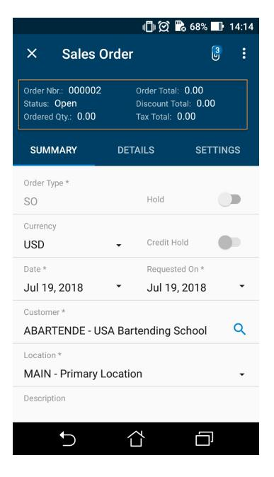

*Figure: Viewing the organized layout*

• *[<sm:Layout>](#page-164-2)*

# <span id="page-134-0"></span>**listAction**


This object type is deprecated.

In the mobile site map, an object that defines the appearance and behavior of an action that is performed on the data records selected in the list. Such an action is displayed only on the list view. You can use this object if the implementation of the action in Acumatica ERP supports the processing of multiple records. Then if the user has selected multiple records in the list, the action is applied at once to all the rows selected in the list.

| Attribute | Description                                                                                                                                                                                                                        |
|-----------|------------------------------------------------------------------------------------------------------------------------------------------------------------------------------------------------------------------------------------|
| After     | The behavior of the current container after the action is completed. The value can<br>be one of the following:                                                                                                                     |
|           | •<br>Refresh: The current container should be refreshed after the action is complet<br>ed.                                                                                                                                         |
|           | •<br>Close: The current container should be closed after the action is completed.                                                                                                                                                  |
|           | If the Redirect attribute of the sm:Action tag is set to true, the After at<br>tribute of this object defines more complex behavior for the current container. See<br>Redirecting to Different Screens and Containers for details. |

| Attribute   | Description                                                                                                                                                                                                                                                                                                                                                                                                                                   |
|-------------|-----------------------------------------------------------------------------------------------------------------------------------------------------------------------------------------------------------------------------------------------------------------------------------------------------------------------------------------------------------------------------------------------------------------------------------------------|
| Behavior    | Required. The behavior of the action—which defines how the mobile app obtains<br>from the server the data resulting from the action and processes this data. The val<br>ue can be one of the following:                                                                                                                                                                                                                                       |
|             | •<br>Cancel: Discards the unsaved changes. You must declare the action if it is<br>present in the WSDL.                                                                                                                                                                                                                                                                                                                                       |
|             | •<br>Create: Creates a new data record. If the Redirect attribute value is true, this<br>action redirects the user to a container defined on a different screen.                                                                                                                                                                                                                                                                              |
|             | •<br>Delete: Deletes the data record.                                                                                                                                                                                                                                                                                                                                                                                                         |
|             | •<br>Open: Opens the data record for editing on a different screen. If the Redirect<br>attribute value is true, this action redirects the user to a container defined on a<br>different screen.                                                                                                                                                                                                                                               |
|             | •<br>Record: Indicates that the mobile app should expect a single record as the server<br>response.                                                                                                                                                                                                                                                                                                                                           |
|             | •<br>Save: Saves the data record.                                                                                                                                                                                                                                                                                                                                                                                                             |
|             | •<br>SignReport: Indicates that the mobile app should add the Sign action to the con<br>tainer. This action is not implemented in Acumatica ERP and uses the specific<br>capabilities of the mobile devices to create the user signature as an image file.<br>The user can save the signature in the database of the Acumatica ERP instance<br>as a file attachment for the appropriate form. See Creating the User Signature for<br>details. |
|             | •<br>Void: Tells the mobile app to not use any records that are returned in the server<br>response.                                                                                                                                                                                                                                                                                                                                           |
| DisplayName | The name of the action in the UI.                                                                                                                                                                                                                                                                                                                                                                                                             |
| Icon        | The name of the image that is used to display the action icon on the UI. If this at<br>tribute is not specified for an action, the action is displayed on the UI without an<br>icon.                                                                                                                                                                                                                                                          |
|             | See Icons for the possible values and the corresponding images for the Icon at<br>tribute.                                                                                                                                                                                                                                                                                                                                                    |
| Priority    | The priority value that defines the position of the action on the screen or the tool<br>bar relative to other list actions.                                                                                                                                                                                                                                                                                                                   |

| Attribute               | Description                                                                                                                                                                                                                                                    |
|-------------------------|----------------------------------------------------------------------------------------------------------------------------------------------------------------------------------------------------------------------------------------------------------------|
| Redirect                | An indicator of whether the action redirects the user to a container of a screen. You<br>can use this attribute to do the following:                                                                                                                           |
|                         | •<br>Allow a redirection defined for the action in Acumatica ERP by setting the at<br>tribute to true.                                                                                                                                                         |
|                         | •<br>Deny a redirection defined for the action in Acumatica ERP by setting the at<br>tribute to false. This is the default setting of the Redirect attribute.                                                                                                  |
|                         | •<br>Define a new redirection for the action by setting the attribute to true and spec<br>ifying the attributes of this tag to set one of the following as the destination of<br>the redirection:                                                              |
|                         | •<br>RedirectToScreen, to redirect to the primary container of the specified<br>screen                                                                                                                                                                         |
|                         | •<br>RedirectToContainer, to redirect to another container of the current<br>screen                                                                                                                                                                            |
|                         | •<br>RedirectToScreen and RedirectToContainer, to redirect to a spec<br>ified container of a specified screen                                                                                                                                                  |
|                         | See Redirecting to Different Screens and Containers for more details.                                                                                                                                                                                          |
| RedirectToContain<br>er | The name of the destination container. The name can consist of the following parts<br>separated by the \$ symbol:                                                                                                                                              |
|                         | •<br>The name of the container                                                                                                                                                                                                                                 |
|                         | •<br>The display type of the container: List or Form (default)                                                                                                                                                                                                 |
|                         | •<br>The optional name of the additional container whose data is used as a filter                                                                                                                                                                              |
|                         | The mobile site map has to include the metadata for this container.                                                                                                                                                                                            |
| RedirectToDialog        | The name of the destination complex dialog box (smart panel). For details, see<br>Mapping a Smart Panel.                                                                                                                                                       |
| RedirectToScreen        | The name of the destination screen. The mobile site map has to include the meta<br>data for this screen.                                                                                                                                                       |
| SyncLongOperation       | An indicator of whether the mobile app should wait until the action is completed if<br>this action is defined as a PXLongRunOperation one and is executed asynchro<br>nously in Acumatica ERP. By default, the SyncLongOperation attribute is set to<br>false. |
|                         | The SyncLongOperation attribute will be deprecated in a future<br>release.                                                                                                                                                                                     |

In the following example, an action for processing the list of records is added.

```
add listAction "Process" {
 behavior = Void 
 redirect = True
 syncLongOperation = True
```

}

#### **Related Links**

• *[<sm:Action>](#page-154-1)*

### <span id="page-137-0"></span>**recordAction**

In the mobile site map, an object that defines the appearance and behavior of an action that is performed on the current data record. This type of action is displayed only on the form view (editing screen).

| Attribute   | Description                                                                                                                                                                                                                                                                                                                                                                                                                                   |
|-------------|-----------------------------------------------------------------------------------------------------------------------------------------------------------------------------------------------------------------------------------------------------------------------------------------------------------------------------------------------------------------------------------------------------------------------------------------------|
| After       | The behavior of the current container after the action is completed. The following<br>possible values indicate what to do:                                                                                                                                                                                                                                                                                                                    |
|             | •<br>Refresh: Refresh the current container after the action is completed.                                                                                                                                                                                                                                                                                                                                                                    |
|             | •<br>Close: Closed the current container after the action is completed.                                                                                                                                                                                                                                                                                                                                                                       |
|             | If the Redirect attribute of the sm:Action tag is set to true, the After at<br>tribute of this object defines more complex behavior for the current container. See<br>Redirecting to Different Screens and Containers for details.                                                                                                                                                                                                            |
| Behavior    | Required. The behavior of the action—which defines how the mobile app obtains<br>from the server the data resulting from the action and processes this data. The val<br>ue can be one of the following:                                                                                                                                                                                                                                       |
|             | •<br>Cancel: Discards the unsaved changes. You must declare this action if it is<br>present in the WSDL.                                                                                                                                                                                                                                                                                                                                      |
|             | •<br>Create: Creates a new data record. If the Redirect attribute value is true, this<br>action redirects the user to a container defined on a different screen.                                                                                                                                                                                                                                                                              |
|             | •<br>Delete: Deletes the data record.                                                                                                                                                                                                                                                                                                                                                                                                         |
|             | •<br>Open: Opens the data record for editing on a different screen. If the Redirect<br>attribute value is true, this action redirects the user to a container defined on a<br>different screen.                                                                                                                                                                                                                                               |
|             | •<br>Record: Tells the mobile app to expect a single record as the server response.                                                                                                                                                                                                                                                                                                                                                           |
|             | •<br>Save: Saves the data record.                                                                                                                                                                                                                                                                                                                                                                                                             |
|             | •<br>SignReport: Indicates that the mobile app should add the Sign action to the con<br>tainer. This action is not implemented in Acumatica ERP and uses the specific<br>capabilities of the mobile devices to create the user signature as an image file.<br>The user can save the signature in the database of the Acumatica ERP instance<br>as a file attachment for the appropriate form. See Creating the User Signature for<br>details. |
|             | •<br>Void: Indicates to the mobile app to not use any records that are returned in the<br>server response.                                                                                                                                                                                                                                                                                                                                    |
| DisplayName | The name of the action in the UI.                                                                                                                                                                                                                                                                                                                                                                                                             |

| Attribute               | Description                                                                                                                                                                                                                                                    |
|-------------------------|----------------------------------------------------------------------------------------------------------------------------------------------------------------------------------------------------------------------------------------------------------------|
| Icon                    | The name of the image that is used to display the action icon on the UI. If this at<br>tribute is not specified for an action, the action is displayed on the UI without an<br>icon.                                                                           |
|                         | See Icons for the possible values and the corresponding images for the Icon at<br>tribute.                                                                                                                                                                     |
| Priority                | The priority value that defines the position of the action on the screen or the tool<br>bar relative to other record actions.                                                                                                                                  |
| Redirect                | An indicator of whether the action redirects the user to a container of a screen. You<br>can use this attribute to do the following:                                                                                                                           |
|                         | •<br>Allow a redirection defined for the action in Acumatica ERP by setting the at<br>tribute to true.                                                                                                                                                         |
|                         | •<br>Deny a redirection defined for the action in Acumatica ERP by setting the at<br>tribute to false. This is the default setting of the Redirect attribute.                                                                                                  |
|                         | •<br>Define a new redirection for the action by setting the attribute to true and spec<br>ifying the attributes of this tag to set one of the following as the destination of<br>the redirection:                                                              |
|                         | •<br>RedirectToScreen, to redirect to the primary container of the specified<br>screen                                                                                                                                                                         |
|                         | •<br>RedirectToContainer, to redirect to another container of the current<br>screen                                                                                                                                                                            |
|                         | •<br>RedirectToScreen and RedirectToContainer, to redirect to a spec<br>ified container of a specified screen                                                                                                                                                  |
|                         | See Redirecting to Different Screens and Containers for more details.                                                                                                                                                                                          |
| RedirectToContain<br>er | The name of the destination container. The name can consist of the following parts<br>separated by the \$ symbol:                                                                                                                                              |
|                         | •<br>The name of the container                                                                                                                                                                                                                                 |
|                         | •<br>The display type of the container: List or Form (default)                                                                                                                                                                                                 |
|                         | •<br>The name of the additional container whose data is used as a filter (optional)                                                                                                                                                                            |
|                         | The mobile site map has to include the metadata for this container.                                                                                                                                                                                            |
| RedirectToDialog        | The name of the destination complex dialog box (smart panel). For details, see<br>Mapping a Smart Panel.                                                                                                                                                       |
| RedirectToScreen        | The name of the destination screen. The mobile site map has to include the meta<br>data for this screen.                                                                                                                                                       |
| SyncLongOperation       | An indicator of whether the mobile app should wait until the action is completed if<br>this action is defined as a PXLongRunOperation one and is executed asynchro<br>nously in Acumatica ERP. By default, the SyncLongOperation attribute is set to<br>false. |
|                         | The SyncLongOperation attribute will be deprecated in a future<br>release.                                                                                                                                                                                     |

In the following example, an action to delete an opened record is added.

```
add recordAction "Delete" { 
 Icon = "system://Trash" 
 Behavior = Delete 
 After = Close 
}
```

#### **Related Links**

• *[<sm:Action>](#page-154-1)*

### <span id="page-139-1"></span>**recordActionLink**

An object that you can use to remove an action from the screen toolbar and put the action among the *[field](#page-124-0)* objects on an editing screen. The action to which this object refers must be declared with the same name within the same container by using any action object (for details, see *[Object](#page-116-1) Types*).

#### **Attributes**

| Attribute | Description                                                                                                                                                                          |
|-----------|--------------------------------------------------------------------------------------------------------------------------------------------------------------------------------------|
| weight    | The value that is used to set the width of the link within the UI element line defined<br>by the layout object with the Template attribute set to Inline. The default value is<br>1. |

#### **Example**

In the following example, a container with an action and corresponding action link is added.

```
add container "SampleContainer" {
 add recordActionLink "ViewOnMap"
 add recordAction "ViewOnMap" {
 behavior = Void
 redirect = True
 }
}
```

#### **Related Links**

• *[<sm:RecordActionLink>](#page-166-1)*

### <span id="page-139-0"></span>**screen**

An object that maps an Acumatica ERP form to the mobile app. This object can include the definition of screen containers and the assignment of attributes.

### **Attributes**

| Attribute | Description                                                                                                                                                                                                                                                                                                                                                                                                                                                                                                                                       |
|-----------|---------------------------------------------------------------------------------------------------------------------------------------------------------------------------------------------------------------------------------------------------------------------------------------------------------------------------------------------------------------------------------------------------------------------------------------------------------------------------------------------------------------------------------------------------|
| OpenAs    | The display type of the screen. When the screen is opened from a menu, this at<br>tribute specifies how to open the primary container. Otherwise, when the screen<br>is opened by a redirection from an action and the RedirectToContainer at<br>tribute of this action does not explicitly specify how to open the container, then this<br>attribute specifies how to open the redirected container of the screen. The value<br>can be one of the following:<br>•<br>List: The screen opens as a list.<br>•<br>Form: The screen opens as a form. |
| Type      | The type of the screen, which is one of the following values:                                                                                                                                                                                                                                                                                                                                                                                                                                                                                     |
|           | •<br>SimpleScreen: The screen is a common screen.                                                                                                                                                                                                                                                                                                                                                                                                                                                                                                 |
|           | •<br>FilterListScreen: The screen corresponds to the Acumatica ERP form based on<br>the FormDetail form template. Such a screen must include two containers.<br>The first container maps the form area of the form (filter), and the second one<br>maps the grid.                                                                                                                                                                                                                                                                                 |
|           | •<br>Report: The screen is an Acumatica Report Designer report.                                                                                                                                                                                                                                                                                                                                                                                                                                                                                   |
|           | •<br>Dashboard: The screen is a dashboard. A screen of this type can display the fol<br>lowing types of dashboard widgets:                                                                                                                                                                                                                                                                                                                                                                                                                        |
|           | Chart<br>•                                                                                                                                                                                                                                                                                                                                                                                                                                                                                                                                        |
|           | •<br>Data Table                                                                                                                                                                                                                                                                                                                                                                                                                                                                                                                                   |
|           | •<br>Score Card                                                                                                                                                                                                                                                                                                                                                                                                                                                                                                                                   |
|           | •<br>Trend Card                                                                                                                                                                                                                                                                                                                                                                                                                                                                                                                                   |
|           | Other widget types will be hidden.                                                                                                                                                                                                                                                                                                                                                                                                                                                                                                                |
| hideUDF   | An indicator of whether user-defined fields should not be displayed on a screen. De<br>fault value is False.                                                                                                                                                                                                                                                                                                                                                                                                                                      |
|           | The hideUDF attribute and the add UDFields instruction cannot<br>be used in the same screen mapping.                                                                                                                                                                                                                                                                                                                                                                                                                                              |

### **Example**

In the following example, the Sales Orders (SO301000) screen that has been present in the original mobile site map is updated.

```
update screen SO301000 {
 hideUDF = True
 update container "OrderSummary" {
 add recordAction "PrintSalesOrderQuoteReport" {
 redirect = True
 }
 add recordAction "SignReport" {
 behavior = SignReport
 displayName = "Sign"
 }
 }
```

}

#### **Related Links**

• *[<sm:Screen>](#page-167-1)*

## <span id="page-141-0"></span>**selectionAction**

In the mobile site app, an action can be performed with data records selected in the list. The selectionAction object defines the appearance and behavior of this action. This type of action is displayed only on the list view. If the user has selected multiple records in the list, the action is applied successively to each selected record.

| Attribute   | Description                                                                                                                                                                                                                                                                                                                                                                                                                                   |
|-------------|-----------------------------------------------------------------------------------------------------------------------------------------------------------------------------------------------------------------------------------------------------------------------------------------------------------------------------------------------------------------------------------------------------------------------------------------------|
| After       | The behavior of the current container after the action is completed. The value can<br>be one of the following:                                                                                                                                                                                                                                                                                                                                |
|             | •<br>Refresh: The current container should be refreshed after the action is complet<br>ed.                                                                                                                                                                                                                                                                                                                                                    |
|             | •<br>Close: The current container should be closed after the action is completed.                                                                                                                                                                                                                                                                                                                                                             |
|             | If the Redirect attribute of an action object is set to true, the After attribute of<br>this object defines more complex behavior for the current container. See Redirect<br>ing to Different Screens and Containers for details.                                                                                                                                                                                                             |
| Behavior    | Required. The behavior of the action—which defines how the mobile app obtains<br>from the server the data resulting from the action and processes this data. The val<br>ue can be one of the following:                                                                                                                                                                                                                                       |
|             | •<br>Cancel: Discards the unsaved changes. You must declare this action if it is<br>present in the WSDL.                                                                                                                                                                                                                                                                                                                                      |
|             | •<br>Create: Creates a new data record. If the Redirect attribute value is true, this<br>action redirects the user to a container defined on a different screen.                                                                                                                                                                                                                                                                              |
|             | •<br>Delete: Deletes the data record.                                                                                                                                                                                                                                                                                                                                                                                                         |
|             | Open: Opens the data record for editing on a different screen. If the Redirect<br>•<br>attribute value is true, this action redirects the user to a container defined on a<br>different screen.                                                                                                                                                                                                                                               |
|             | •<br>Record: Indicated that the mobile app should expect a single record as the server<br>response.                                                                                                                                                                                                                                                                                                                                           |
|             | •<br>Save: Saves the data record.                                                                                                                                                                                                                                                                                                                                                                                                             |
|             | SignReport: Indicates that the mobile app should add the Sign action to the con<br>•<br>tainer. This action is not implemented in Acumatica ERP and uses the specific<br>capabilities of the mobile devices to create the user signature as an image file.<br>The user can save the signature in the database of the Acumatica ERP instance<br>as a file attachment for the appropriate form. See Creating the User Signature for<br>details. |
|             | Void: Tells the mobile app to not use any records that are returned in the server<br>•<br>response.                                                                                                                                                                                                                                                                                                                                           |
| DisplayName | The name of the action in the UI.                                                                                                                                                                                                                                                                                                                                                                                                             |

| Attribute               | Description                                                                                                                                                                                                                                                    |
|-------------------------|----------------------------------------------------------------------------------------------------------------------------------------------------------------------------------------------------------------------------------------------------------------|
| Icon                    | The name of the image that is used to display the action icon on the UI. If this at<br>tribute is not specified for an action, the action is displayed on the UI without an<br>icon.                                                                           |
|                         | See Icons for the possible values and the corresponding images for the Icon at<br>tribute.                                                                                                                                                                     |
| Priority                | The priority value that defines the position of the action on the screen or the tool<br>bar relative to other selection actions.                                                                                                                               |
| Redirect                | An indicator of whether the action redirects the user to a container of a screen. You<br>can use this attribute to do the following:                                                                                                                           |
|                         | •<br>Allow a redirection defined for the action in Acumatica ERP by setting the at<br>tribute to true.                                                                                                                                                         |
|                         | •<br>Deny a redirection defined for the action in Acumatica ERP by setting the at<br>tribute to false. This is the default setting of the Redirect attribute.                                                                                                  |
|                         | •<br>Define a new redirection for the action by setting the attribute to true and spec<br>ifying the attributes of this tag to set one of the following as the destination of<br>the redirection:                                                              |
|                         | •<br>RedirectToScreen, to redirect to the primary container of the specified<br>screen                                                                                                                                                                         |
|                         | •<br>RedirectToContainer, to redirect to another container of the current<br>screen                                                                                                                                                                            |
|                         | •<br>RedirectToScreen and RedirectToContainer, to redirect to a spec<br>ified container of a specified screen                                                                                                                                                  |
|                         | See Redirecting to Different Screens and Containers for more details.                                                                                                                                                                                          |
| RedirectToContain<br>er | The name of the destination container. The name can consist of the following parts<br>separated by the \$ symbol:                                                                                                                                              |
|                         | •<br>The name of the container                                                                                                                                                                                                                                 |
|                         | •<br>The display type of the container: List or Form (default)                                                                                                                                                                                                 |
|                         | •<br>The optional name of the additional container whose data is used as a filter                                                                                                                                                                              |
|                         | The mobile site map has to include the metadata for this container.                                                                                                                                                                                            |
| RedirectToDialog        | The name of the destination complex dialog box (smart panel). For details, see<br>Mapping a Smart Panel.                                                                                                                                                       |
| RedirectToScreen        | The name of the destination screen. The mobile site map has to include the meta<br>data for this screen.                                                                                                                                                       |
| SyncLongOperation       | An indicator of whether the mobile app should wait until the action is completed if<br>this action is defined as a PXLongRunOperation one and is executed asynchro<br>nously in Acumatica ERP. By default, the SyncLongOperation attribute is set to<br>false. |
|                         | The SyncLongOperation attribute will be deprecated in a future<br>release.                                                                                                                                                                                     |

In the following example, a new action for deleting selected records is defined.

```
add selectionAction "Delete" { 
 icon = "system://Trash" 
 behavior = Delete 
}
```

#### **Related Links**

• *[<sm:Action>](#page-154-1)*

## <span id="page-143-1"></span>**type**

For attachments, an object that defines a file name extension of the permitted file type.

On iOS devices, it is possible to upload only image files. Files of other types are not supported.

### **Attributes**

| Attribute | Description                                         |
|-----------|-----------------------------------------------------|
| Extension | The file name extension of the permitted file type. |

### **Example**

The following examples defines three types of files that can be attached to the record: JPG, PNG, and PDF.

```
attachments {
 add type "jpg" {
 extension = "jpg" 
 }
 add type "png" {
 extension = "png"
 }
 add type "pdf" {
 extension = "pdf"
 }
}
```

#### **Related Links**

• *[<sm:Type>](#page-168-4)*

# <span id="page-143-0"></span>**UDFields**

An object that maps user-defined fields of a form to the equivalent screen in the mobile app. A single use of the UDFields object maps all user-defined fields of a particular screen.

### **Attributes**

The object contains no attributes.

### **Example**

The following example maps user-defined fields of the *[Cases](https://help-2025r1.acumatica.com/Help?ScreenId=ShowWiki&pageid=a492a091-9649-4826-bcc3-dccdf8765efd)* (CR306000) form to the Cases screen. *UDFInline* is an arbitrary name that has not been used anywhere else in the mapping.

```
update screen "CR306000" {
 update container "CaseSummary" {
 add UDFields "UDFInline"
 }
}
```

# <span id="page-144-2"></span><span id="page-144-0"></span>**Constants**

The following types of constants are supported in MSDL.

| Type    | Example            |
|---------|--------------------|
| integer | 100500             |
| string  | "Expense Receipts" |
| boolean | true and false     |
| enum    | hubFolder          |

## <span id="page-144-3"></span><span id="page-144-1"></span>**Instructions**

#### *Format:*

```
# comment
instructionName objectType "objectName" {
 attributeName1 = newValue1
 attributeName2 = newValue2
 ...
 instructionName1 objectType1 "objectName1" {
 ...
 }
}
```

MSDL provides the following instructions.

| Instruction | Description                                                                                                         |
|-------------|---------------------------------------------------------------------------------------------------------------------|
| add         | Appends the specified object as a child to the object that is referenced in the outer<br>scope of this instruction. |

| Instruction | Description                                                                                                                                        |
|-------------|----------------------------------------------------------------------------------------------------------------------------------------------------|
| attachments | In a container, switches the MSDL interpreter to the mode of setting the attach<br>ment attributes.                                                |
| placeAfter  | In the mobile site map, moves the object that is referenced in the outer scope of<br>this instruction after the specified object.                  |
| placeAt     | In the mobile site map, moves the object that is referenced in the outer scope of<br>this instruction to the specified position.                   |
| placeBefore | In the mobile site map, moves the object that is referenced in the outer scope of<br>this instruction to the position before the specified object. |
| remove      | Removes the specified object from the mobile site map.                                                                                             |
| sitemap     | Switches the MSDL interpreter to the mode of editing the main menu of the mobile<br>site map.                                                      |
| selector    | In a field, switches the MSDL interpreter to the mode of editing the selector con<br>tent.                                                         |
| update      | Switches the MSDL interpreter to the mode of editing the specified object.                                                                         |

# <span id="page-145-0"></span>**add**

In the mobile site map of the Acumatica ERP instance, appends the referenced object as a child to the object that was processed by a previous instruction with an opening brace.

*Syntax:*

add objectType "objectName"

*Parameters:*

- objectType: The keyword that specifies one of the object types, as described in *[Object](#page-116-1) Types*.
- objectName: The string constant that specifies the object name as it is defined in the WSDL schema. (See *[Getting the WSDL Schema](#page-80-1)* for details.) If objectType is field, to add to the container a child field from another container, you specify the value of this parameter in the following format: ContainerName#FieldName, where ContainerName is the name of the container (as it is specified in the WSDL schema) that contains the field, and FieldName is the name of the field in this container.

#### *Example:*

Suppose that you need to add a new field to a container that is defined in the mobile site map. We recommend that you do this as shown in the following example.

```
update screen "ERP_ScreenID" {
 update container "WSDL_ContainerName" {
 add field "WSDL_FieldName" {
 FieldTagAttribute1 = Value1
 FieldTagAttribute2 = Value2
 }
 }
```

}

The code above performs the following operations:

- 1. Finds the screen by the specified name in the mobile site map
- 2. If the previous operation has succeeded, finds the container with the specified name in the mobile site map
- 3. If the previous operation has succeeded, finds the container in the WSDL schema of the form
- 4. In the WSDL schema, finds the field that has the name specified in the add instruction
- 5. If the previous operation has succeeded, adds the field to the mobile site map
- 6. If an assignment command for an attribute of the field is specified for the add instruction within braces, sets the attribute to the specified value

### <span id="page-146-0"></span>**attachments**

In a container in the mobile site map of the Acumatica ERP instance, switches the MSDL interpreter to the mode in which the attachment attributes can be set.

On iOS devices, it is possible to upload only image files. Files of other types are not supported.

*Syntax:*

attachments {}

The braces are mandatory. Within the braces, you can add assignment commands for the attributes of the instruction.

| Attribute                 | Description                                                                                                                                                                                                                                                                                                                                                                                             |
|---------------------------|---------------------------------------------------------------------------------------------------------------------------------------------------------------------------------------------------------------------------------------------------------------------------------------------------------------------------------------------------------------------------------------------------------|
| Disabled                  | An indicator of whether attachments are disabled. If its value is true, the attach<br>ments are disabled.                                                                                                                                                                                                                                                                                               |
| ImageAdjustmentP<br>reset | The type of the image adjustment that is processed by the application for enhanc<br>ing images taken from the camera of a mobile device. The only value of this at<br>tribute is Receipt, which is an indicator that a special camera mode is switched on<br>in the Acumatica mobile app. In this mode, the following enhancements of the im<br>age captured by the camera are preformed automatically: |
|                           | •<br>The image is cropped based the bounding box of the receipt's detected edges.<br>•<br>The image distortion is removed.                                                                                                                                                                                                                                                                              |
|                           | •<br>The image is converted into black and white.                                                                                                                                                                                                                                                                                                                                                       |
|                           | •<br>The contrast of the image is maximized.                                                                                                                                                                                                                                                                                                                                                            |
| Name                      | The identifier of the attachments, as found in the WSDL schema.                                                                                                                                                                                                                                                                                                                                         |
| MaxFileSize               | The maximum size of an attached file.                                                                                                                                                                                                                                                                                                                                                                   |
| MaxImageHeight            | The maximum height of an attached image (in pixels).                                                                                                                                                                                                                                                                                                                                                    |

| Attribute     | Description                                         |
|---------------|-----------------------------------------------------|
| MaxImageWidth | The maximum width of an attached image (in pixels). |

Suppose that you need to specify the following requirements related to attachments:

- The attachments of an Acumatica ERP form are allowed in the container.
- The attachments can contain files that have the JPG or PNG extension.
- Image adjustment is not used for an attached file.

You can add the following code within the instruction for the appropriate container.

```
 any instruction for the container {
 ...
 attachments {
 disabled = false
 add type "jpg"
 add type "png"
 imageAdjustmentPreset = Receipt
 }
}
```

#### **Related Links**

- *[<sm:Attachments>](#page-156-1)*
- *[Managing External Storage for File Attachments](https://help-2025r1.acumatica.com/Help?ScreenId=ShowWiki&pageid=a5989c03-43df-4f31-bd2d-db6d79be31c8)*

### <span id="page-147-0"></span>**placeAer**

In the mobile site map, moves the object that is referenced in the outer scope of this instruction immediately aer the specified object. The instruction is used to order child objects within a parent object of the mobile site map. You cannot use the instruction to move an object from one parent object to another.

*Syntax:*

placeAfter objectType "objectName"

#### *Parameters:*

- objectType: A keyword that specifies an object type, as described in *[Object](#page-116-1) Types*.
- objectName: The string constant that specifies the name of the object of the type specified by the objectType parameter. The object must exist in the instance of the mobile site map in the memory of Acumatica ERP server before the MSDL interpreter processes the placeAfter instruction.

#### *Example:*

Suppose that you need to move the *EP503010* form shortcut within the *ExpenseReceipts* folder of the main menu to the position aer the *EP301010* form shortcut. You can add the following code within the sitemap instruction.

```
update folder "ExpenseReceipts" {
 update item "EP503010" {
 placeAfter item "EP301010"
 }
}
```

### <span id="page-148-0"></span>**placeAt**

In the mobile site map, moves the object that is referenced in the outer scope of this instruction to the specified position in the same parent object of the mobile site map.

*Syntax:*

```
placeAt positionNumber
```

*Parameter:*

• positionNumber: The non-negative integer value that specifies the number of the target position in the parent object.

*Example:*

Suppose that you need to add a shortcut to the Expense Receipts (EP301010) screen to the first position in the ExpenseReceipts folder of the main menu and change the display name of the shortcut. You can add the following code within the sitemap instruction.

```
update folder "ExpenseReceipts" {
 add item "EP301010" { 
 displayName = "Expense Receipts"
 placeAt 0
 }
}
```

### <span id="page-148-1"></span>**placeBefore**

In the mobile site map, moves the object that is referenced in the outer scope of this instruction immediately before the specified object. The instruction is used to order child objects within a parent object of the mobile site map. You cannot use the instruction to move an object from one parent object to another.

*Syntax:*

placeBefore objectType "objectName"

*Parameters:*

- objectType: A keyword that specifies an object type, as described in *[Object](#page-116-1) Types*.
- objectName: The string constant that specifies the name of the object of the type specified by the objectType parameter. The object must exist in the instance of the mobile site map in the memory of Acumatica ERP server before the MSDL interpreter processes the placeBefore instruction.

*Example:*

Suppose that you need to add the *CompanyName* field within the *ContactSummary* container to the position before the *Address* group. You can add the following code within an instruction for the container.

```
update screen "CR302000" {
 update container "ContactSummary" {
 ...
 add group "Address" {...}
 ...
```

```
 add field "CompanyName" {
 container = "DetailsSummary"
 placeBefore group "Address"
 }
 }
}
```

### <span id="page-149-1"></span>**remove**

In the mobile site map of the Acumatica ERP instance, removes the referenced object, along with any child objects it has, from the mobile site map.

*Syntax:*

remove objectType "objectName"

*Parameters:*

- objectType: A keyword that specifies one of the object types, as described in *[Object](#page-116-1) Types*.
- objectName: The string constant that specifies the object name as it is defined in the WSDL schema. (See *[Getting the WSDL Schema](#page-80-1)* for details.)

*Example:*

Suppose that you need to remove a field from a container that is defined in the mobile site map. We recommend that you do this as shown in the following example.

```
update screen "ERP_ScreenID" {
 update container "WSDL_ContainerName" {
 remove field "WSDL_FieldName"
 }
}
```

The code above performs the following operations:

- 1. Finds the screen with the specified name in the mobile site map
- 2. If the previous operation has succeeded, finds the container with the specified name in the mobile site map
- 3. If the previous operation has succeeded, removes the field from the mobile site map


If the field contains a selector container, the container is also removed from the mobile site map.

### <span id="page-149-0"></span>**sitemap**

Switches the MSDL interpreter to editing mode for the main menu of the mobile site map.

*Syntax:*

sitemap {}

The braces are mandatory. Within the braces, you can add instructions for objects of the main menu of the mobile site map.

#### *Examples:*

The following code adds the new folder to the main menu, sets the attributes of the folder in the mobile site map (see *[folder](#page-128-0)* for details), and adds the shortcut for the Expense Receipts (EP301010) screen with the specified display name to the folder.

```
sitemap {
 add folder "ExpenseReceipts" {
 type = HubFolder
 isDefaultFavorite = True
 displayName = "Expense Receipts"
 icon = "system://NewsPaper"
 add item "EP301010" {
 displayName = "Expense Receipts"
 } 
}
```

The code below updates the ExpenseReceipts folder of the main menu in the following ways:

- Switches the MSDL interpreter to editing mode for the main menu
- Changes the display name of the folder
- Removes the shortcut to the Expense Receipts screen from the folder
- Adds the shortcut to the Expense Receipts screen to the folder with the specified display name
- Switches the MSDL interpreter back to editing mode for the content of the mobile site map

```
update folder "ExpenseReceipts" {
 displayName = "New display name"
 remove item "EP301010"
 add item "EP503010" {
 displayName = "Other screen"
 }
}
```

The code above can be executed because it operates with the objects that are created in the previous code example.

### <span id="page-150-0"></span>**selector**

In a field in the mobile site map of the Acumatica ERP instance, switches the MSDL interpreter to editing mode for the selector content.

*Syntax:*

selector {}

The braces are mandatory. Within the braces, you can add assignment commands for attributes of the *[container](#page-117-0)* object and instructions for the fields that are used as selector columns.

*Example:*

Suppose that you need to define for a field a selector container that contains four columns but displays only three. You can add the following code within an instruction for the field.

```
 any instruction for the field {
 selector {
 fieldsToShow = 3
```

```
 add field "BusinessAccount"
 add field "Type"
 add field "BusinessAccountName"
 add field "BAccountID"
 }
}
```

# <span id="page-151-2"></span>**update**

In the mobile site map of the Acumatica ERP instance, switches the MSDL interpreter to editing mode for specified object.

*Syntax:*

update objectType "objectName"

*Parameters:*

- objectType: A keyword that specifies one of the object types, as described in *[Object](#page-116-1) Types*.
- objectName: The string constant that specifies the object name as it is defined in the WSDL schema. (See *[Getting the WSDL Schema](#page-80-1)* for details.)

*Example:*

Suppose that you need to add a new field to a container of a screen that is defined in the mobile site map. We recommend that you do this as shown in the following example.

```
update screen "ERP_ScreenID" {
 update container "WSDL_ContainerName" {
 add field "WSDL_FieldName" {
 ...
 }
 }
}
```

The code above performs the following operations:

- 1. Finds the screen with the specified name in the mobile site map
- 2. If the previous operation has succeeded, finds the container with the specified name in the mobile site map
- 3. If the previous operation has succeeded, finds the container in the WSDL schema of the form
- 4. In the WSDL schema, finds the field with the name specified in the add instruction
- 5. If the previous operation has succeeded, adds the field to the mobile site map

### <span id="page-151-1"></span><span id="page-151-0"></span>**Error Messages**

The MSDL interpreter can work in the following modes:

- Production mode, in which the interpreter ignores most errors while processing the MSDL code, for greater stability
- Debugging mode, in which the interpreter logs every error and stops executing the MSDL code if an error occurs

Production mode is used by default; here the MSDL interpreter does not log errors that occur. The interpreter ignores any MSDL file that contains a syntax error. It also ignores any instruction that contains a semantic error; if such an instruction contains nested instructions and assignment commands, the interpreter also ignores them.

To turn on debugging mode, you should turn on the mobileSitemapDebug key by including the following string in the <appSettings> section of the web.config file, which is located in the website folder:<add key="mobileSitemapDebug" value="True" />.

If the key is turned on, the MSDL interpreter logs errors and sends the error messages to the mobile app, which displays these messages on the mobile device.

The error messages are logged in the following format.

path\\fileName:lineNumber errorMessage

The interpreter logs the following types of errors.

| Example of Error Message                                             | Description                                                                                                                                                                                  |
|----------------------------------------------------------------------|----------------------------------------------------------------------------------------------------------------------------------------------------------------------------------------------|
| Invalid command 'ad'.                                                | The instruction name is invalid.                                                                                                                                                             |
| Can't use entity type 'scren' in cur<br>rent context.                | The interpreter detects an unknown object or an attempt to use the ob<br>ject in the wrong context. The interpreter ignores the instruction and all<br>the nested commands and instructions. |
| Invalid argument '1'                                                 | The instruction contains an invalid type of a parameter.                                                                                                                                     |
| Invalid argument count                                               | The instruction contains the wrong number of parameters. The inter<br>preter ignores the instruction and all the nested commands and instruc<br>tions.                                       |
| Can't find entity with key 'Ex<br>penseReceipts' in current context. | The object specified in the instruction (for example, update or remove)<br>is not found in the mobile site map.                                                                              |
| Only one instance of entity type<br>'sitemap'.                       | The instruction is trying to add an object that exists in the mobile site<br>map, and the site map can contain only one such object.                                                         |
| Entity with key 'EP301010' already<br>exists.                        | The instruction is trying to add an object that exists in the parent object.                                                                                                                 |
| Can't use attribute 'someAttr' in cur<br>rent context.               | The assignment command is trying to set an attribute that does not rely<br>on the specified object.                                                                                          |
| Can't assign value to attribute<br>'forceRequired'                   | The assignment command is trying to assign to the attribute a value of an<br>inappropriate type.                                                                                             |
| Syntax error: extraneous input '}'                                   | The interpreter has detected a syntax error in the specified line of the<br>MSDL code.                                                                                                       |

# <span id="page-152-1"></span><span id="page-152-0"></span>**XML Tags**

XML tags for customizing the Mobile Site Map is deprecated since Acumatica 2025 R1. Use *[MSDL](#page-115-2)* instead.

The figure below shows the relationships between tag types in the mobile site map. In the figure, each line connecting a le tag type and a right tag type indicates that the le tag may contain any number of right tags. The exception to this rule is the sm:Container tag, which may include only a single sm:Attachments tag.

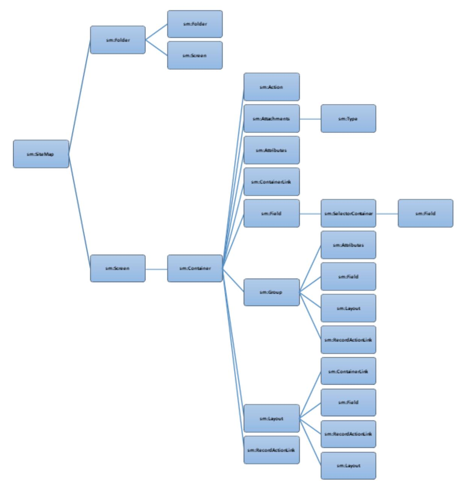

The sm:Include tag can be located in any place of another tag.

### **In This Section**

- *[<sm:Action>](#page-154-1)*
- *[<sm:Attachments>](#page-156-1)*
- *[<sm:Attributes>](#page-157-2)*
- *[<sm:Container>](#page-157-3)*
- *[<sm:ContainerLink>](#page-158-1)*
- *[<sm:Field>](#page-159-1)*
- *[<sm:Folder>](#page-162-1)*

- *[<sm:Group>](#page-163-1)*
- *[<sm:Include>](#page-164-3)*
- *[<sm:Layout>](#page-164-2)*
- *[<sm:RecordActionLink>](#page-166-1)*
- *[<sm:Screen>](#page-167-1)*
- *[<sm:SelectorContainer>](#page-168-5)*
- *[<sm:Type>](#page-168-4)*

# <span id="page-154-1"></span><span id="page-154-0"></span>**<sm:Action>**

The sm:Action tag has the following attributes.

| Attribute | Description                                                                                                                                                                                                                                                                                                                                                                                                                              |
|-----------|------------------------------------------------------------------------------------------------------------------------------------------------------------------------------------------------------------------------------------------------------------------------------------------------------------------------------------------------------------------------------------------------------------------------------------------|
| After     | The behavior of the current container after the action is completed. The value can<br>be one of the following:                                                                                                                                                                                                                                                                                                                           |
|           | •<br>Refresh: An indicator that the current container is refreshed after the action is<br>completed.                                                                                                                                                                                                                                                                                                                                     |
|           | •<br>Close: An indicator that the current container is closed after the action is com<br>pleted.                                                                                                                                                                                                                                                                                                                                         |
|           | If the Redirect attribute of the sm:Action tag is set to true, the After at<br>tribute of this tag defines more complex behavior of the current container. See<br>Redirecting to Different Screens and Containers for details.                                                                                                                                                                                                           |
| Behavior  | Required. The behavior of the action—which defines how the mobile app obtains<br>from the server the data resulting from the action and processes this data. The val<br>ue can be one of the following:                                                                                                                                                                                                                                  |
|           | •<br>Cancel: The action that discards the unsaved changes. You must declare the ac<br>tion if it is present in the WSDL.                                                                                                                                                                                                                                                                                                                 |
|           | •<br>Create: The action that creates a new data record. If the Redirect attribute<br>value is true, the action redirects the user to a container defined on a different<br>screen.                                                                                                                                                                                                                                                       |
|           | •<br>Delete: The action that deletes the data record.                                                                                                                                                                                                                                                                                                                                                                                    |
|           | •<br>Open: The action that opens the data record for editing from a different screen. If<br>the Redirect attribute value is true, the action redirects the user to a contain<br>er defined on a different screen.                                                                                                                                                                                                                        |
|           | Record: The type of behavior that is a hint for the mobile app to expect a single<br>•<br>record as the server response.                                                                                                                                                                                                                                                                                                                 |
|           | •<br>Save: The action that saves the data record.                                                                                                                                                                                                                                                                                                                                                                                        |
|           | •<br>SignReport: An indicator that the mobile app should add the SIGN action to the<br>container. This action is not implemented in Acumatica ERP and uses specific<br>capabilities of mobile devices to create the user signature as an image file. The<br>user can save the signature in the database of the Acumatica ERP instance as a<br>file attachment for the appropriate form. See Creating the User Signature for de<br>tails. |
|           | •<br>Void: The type of behavior that is a hint for the mobile app to do not use any<br>records that are returned in the server response.                                                                                                                                                                                                                                                                                                 |

| Attribute   | Description                                                                                                                                                                                                                                                                                                                                                                                            |
|-------------|--------------------------------------------------------------------------------------------------------------------------------------------------------------------------------------------------------------------------------------------------------------------------------------------------------------------------------------------------------------------------------------------------------|
| Context     | Required. The context of the action—that is, what the action is performed on. The<br>value can be one of the following:                                                                                                                                                                                                                                                                                |
|             | •<br>Container: The action that is related to a container and performs the business<br>logic implemented in Acumatica ERP. Such an action is displayed only on the list<br>view.                                                                                                                                                                                                                       |
|             | •<br>List: The action that is performed on the data records selected in the list. Such<br>an action is displayed only on the list view. You can use this value if the im<br>plementation of the action in Acumatica ERP supports processing of multiple<br>records. Then if the user has selected multiple records in the list, the action is<br>applied at once to all the rows selected in the list. |
|             | •<br>Record: The action that is performed on the current data record. Such an action<br>is displayed only on the form view.                                                                                                                                                                                                                                                                            |
|             | •<br>Selection: The action that is performed on the data records selected in the list.<br>Such an action is displayed only on the list view. If the user has selected multiple<br>records in the list, the action is applied successively to each selected record.                                                                                                                                     |
| DisplayName | The name of the action in the UI.                                                                                                                                                                                                                                                                                                                                                                      |
| Icon        | The name of the image that is used to display the action icon on the UI. This at<br>tribute is optional. If this attribute is not specified for an action, the action is dis<br>played in the UI without an icon. See the possible values and the corresponding im<br>ages for the Icon attribute in Icons.                                                                                            |
| Name        | The action identifier, as found in the WSDL schema.                                                                                                                                                                                                                                                                                                                                                    |
| Priority    | The priority value that defines the position of the action on the screen or the tool<br>bar, depending on the Context value of this tag.                                                                                                                                                                                                                                                               |
| Redirect    | An indicator of whether the action redirects the user to a container of a screen. You<br>can use this attribute to do the following:                                                                                                                                                                                                                                                                   |
|             | •<br>Allow a redirection defined for the action in Acumatica ERP by setting the at<br>tribute to true.                                                                                                                                                                                                                                                                                                 |
|             | •<br>Deny a redirection defined for the action in Acumatica ERP by setting the at<br>tribute to false. This is the default setting of the Redirect attribute.                                                                                                                                                                                                                                          |
|             | •<br>Define a new redirection for the action by setting the attribute to true and speci<br>fying the attributes of this tag to set the following destination of the redirection:                                                                                                                                                                                                                       |
|             | •<br>RedirectToScreen, to redirect to the primary container of the specified<br>screen                                                                                                                                                                                                                                                                                                                 |
|             | •<br>RedirectToContainer, to redirect to another container of the current<br>screen                                                                                                                                                                                                                                                                                                                    |
|             | •<br>RedirectToScreen and RedirectToContainer, to redirect to a spec<br>ified container of a specified screen                                                                                                                                                                                                                                                                                          |
|             | See Redirecting to Different Screens and Containers for more details.                                                                                                                                                                                                                                                                                                                                  |

| Attribute               | Description                                                                                                                                                                                                                                                    |
|-------------------------|----------------------------------------------------------------------------------------------------------------------------------------------------------------------------------------------------------------------------------------------------------------|
| RedirectToContain<br>er | The name of the destination container. The name can consist of the following parts<br>separated by the \$ sign:                                                                                                                                                |
|                         | •<br>The name of the container                                                                                                                                                                                                                                 |
|                         | •<br>The display type of the container: List or Form (default)                                                                                                                                                                                                 |
|                         | •<br>Optional: The name of the additional container whose data is used as a filter                                                                                                                                                                             |
|                         | The mobile site map has to include the metadata for this container.                                                                                                                                                                                            |
| RedirectToScreen        | The name of the destination screen. The mobile site map has to include the meta<br>data for this screen.                                                                                                                                                       |
| SyncLongOperation       | An indicator of whether the mobile app should wait until the action is completed if<br>this action is defined as a PXLongRunOperation one and is executed asynchro<br>nously in Acumatica ERP. By default, the SyncLongOperation attribute is set to<br>false. |

• *XML [Tags](#page-152-1)*

## <span id="page-156-1"></span><span id="page-156-0"></span>**<sm:Attachments>**

The sm:Attachments tag has the following attributes.

| Attribute                 | Description                                                                                                                                                                                                                                                                                                                                                                                                                                                                                                                                                                                                                          |
|---------------------------|--------------------------------------------------------------------------------------------------------------------------------------------------------------------------------------------------------------------------------------------------------------------------------------------------------------------------------------------------------------------------------------------------------------------------------------------------------------------------------------------------------------------------------------------------------------------------------------------------------------------------------------|
| Disabled                  | An indicator of whether attachments are disabled. If its value is true, the attach<br>ments are disabled.                                                                                                                                                                                                                                                                                                                                                                                                                                                                                                                            |
| ImageAdjustmentP<br>reset | The type of the image adjustment that is processed by the application for enhanc<br>ing images taken from the camera of a mobile device. The only value of this at<br>tribute is Receipt, which is an indicator that a special camera mode is switched on<br>in the Acumatica mobile application. In this mode, the following enhancements of<br>the image captured by the camera are preformed automatically:<br>•<br>The image is cropped by the bounding box of the detected edges.<br>•<br>The image distortion is removed.<br>•<br>The image is converted into black and white.<br>•<br>The contrast of the image is maximized. |
| Name                      | The identifier of the attachments, as found in the WSDL schema.                                                                                                                                                                                                                                                                                                                                                                                                                                                                                                                                                                      |
| MaxFileSize               | The maximum size of an attached file.                                                                                                                                                                                                                                                                                                                                                                                                                                                                                                                                                                                                |
| MaxImageHeight            | The maximum height of an attached image (in pixels).                                                                                                                                                                                                                                                                                                                                                                                                                                                                                                                                                                                 |
| MaxImageWidth             | The maximum width of an attached image (in pixels).                                                                                                                                                                                                                                                                                                                                                                                                                                                                                                                                                                                  |

• *XML [Tags](#page-152-1)*

### <span id="page-157-2"></span><span id="page-157-0"></span>**<sm:Attributes>**

The sm:Attributes tag has the following attributes.

| Attribute    | Description                                                                          |
|--------------|--------------------------------------------------------------------------------------|
| From         | The name of the data view for the grid that contains the entity attributes.          |
| FormPriority | The priority value that defines the position of the entity attributes on the screen. |
| Name         | The identifier of the attributes, as found in the WSDL schema.                       |

If the sm:Attributes tag is used to map a grid of Acumatica ERP to a form view that displays key-value pairs, you should also use the following attributes in this tag.

| Attribute  | Description                                                                                                                                                                 |
|------------|-----------------------------------------------------------------------------------------------------------------------------------------------------------------------------|
| IDField    | The identifier of the grid field, as found in the WSDL schema, that specifies the key<br>field for the key-value pairs. By default, the value is AttributeID.               |
| IDValue    | The identifier of the grid field, as found in the WSDL schema, that specifies the val<br>ue field for the key-value pairs. By default, the value is Value.                  |
| OrderField | Optional. The grid field identifier, as found in the WSDL schema, that is used for<br>sorting rows in the grid to display in the form view. By default, the value is Order. |

#### **Related Links**

• *XML [Tags](#page-152-1)*

### <span id="page-157-3"></span><span id="page-157-1"></span>**<sm:Container>**

The sm:Container tag has the following attributes.

| Attribute                      | Description                                                                                                                                                                                                                  |
|--------------------------------|------------------------------------------------------------------------------------------------------------------------------------------------------------------------------------------------------------------------------|
| AttachmentsCon<br>trolPriority | The priority value that defines the position of the attachments in the list.                                                                                                                                                 |
| Attributes                     | An indicator of whether that this container holds entity attributes. If the indicator<br>value is true, you should not specify the items of the container, because the con<br>tainer configuration is generated dynamically. |
| ContainerAction<br>sToExpand   | The number of actions with the Context attribute set to Container to be visible<br>in the toolbar on the list form. The default value depends on the platform.                                                               |
| DisplayName                    | The name of the container on the UI.                                                                                                                                                                                         |

| Attribute               | Description                                                                                                                                                                                                                         |
|-------------------------|-------------------------------------------------------------------------------------------------------------------------------------------------------------------------------------------------------------------------------------|
| FieldsToShow            | The number of fields to display in the list.                                                                                                                                                                                        |
| FormActionsToEx<br>pand | The number of actions with the Context attribute set to Record to be visible in<br>the toolbar on the editing form. The default value depends on the platform.                                                                      |
| ListActionsToEx<br>pand | The number of actions with the Context attribute set to Selection or List to<br>be visible in the toolbar on the list form when the multiple selection of records is<br>activated. The default value depends on the platform.       |
| Name                    | The identifier of the container, as found in the WSDL schema.                                                                                                                                                                       |
| Type                    | An optional attribute that specifies the type of the container. The only possible val<br>ue is SelectionActionList, which is used for an action with the Context attribute set<br>to List. See <sm:action> for details.</sm:action> |
| Visible                 | An indicator of whether the link to the container is visible on the editing form. This<br>attribute can be applied to a secondary container. By default, the value is true.                                                         |

• *XML [Tags](#page-152-1)*

# <span id="page-158-1"></span><span id="page-158-0"></span>**<sm:ContainerLink>**

The sm:ContainerLink tag has the following attributes.

| Attribute  | Description                                                                                                                                                                                                                                                                                                                                                                                                 |
|------------|-------------------------------------------------------------------------------------------------------------------------------------------------------------------------------------------------------------------------------------------------------------------------------------------------------------------------------------------------------------------------------------------------------------|
| Container  | The name that is the link to the container. The name is specified in the Name at<br>tribute of the sm:Container tag for the container.                                                                                                                                                                                                                                                                      |
| Control    | The type of control, which is one of the following values:<br>•<br>ListItem: An indicator that the link to the container is displayed among the form<br>fields according to the value defined in the Priority attribute of this tag.<br>Button: An indicator that the link to the container is displayed in the action pan<br>•<br>el according to the value defined in the Priority attribute of this tag. |
| Icon       | The name of the image that is used to display the link when the Control attribute<br>is set to Button and the link is displayed in the action panel in the UI. This attribute<br>is optional. If this attribute is not specified for a link, it is displayed in the UI with<br>out an icon. See the possible values and the corresponding images for the Icon at<br>tribute in Icons.                       |
| Name       | The identifier of the link to the container, as found in the WSDL schema.                                                                                                                                                                                                                                                                                                                                   |
| Priority   | The priority value that defines the position of the link in the enclosing container on<br>the form.                                                                                                                                                                                                                                                                                                         |
| ValueField | The name of the field whose value is used as the link text. The field must be de<br>clared in the container.                                                                                                                                                                                                                                                                                                |

| Attribute | Description                                                                                                                                                                                         |
|-----------|-----------------------------------------------------------------------------------------------------------------------------------------------------------------------------------------------------|
| Weight    | The value that is used to set the width of the link within the UI element line defined<br>by the <sm:layout> tag with the Template attribute set to Inline. The default value<br/>is 1.</sm:layout> |

• *XML [Tags](#page-152-1)*

# <span id="page-159-1"></span><span id="page-159-0"></span>**<sm:Field>**

The sm:Field tag has the following attributes.

| Attribute         | Description                                                                                                                                                                                                                                                                                                      |
|-------------------|------------------------------------------------------------------------------------------------------------------------------------------------------------------------------------------------------------------------------------------------------------------------------------------------------------------|
| Container         | The name of the container object of the field, as it is specified in the WSDL schema.<br>This attribute is specified if the field from another container is used in the contain<br>er.                                                                                                                           |
| DisplayName       | The name for the field, which by default is automatically set by the system. Howev<br>er, you can change it.                                                                                                                                                                                                     |
| ForceIsDisabled   | An indicator of whether the field will be unavailable on the editing form regardless<br>of the server logic. By default, the field availability depends on the server logic.                                                                                                                                     |
| ForceIsVisible    | An indicator of whether the field is visible on the editing form regardless of the serv<br>er logic. By default, the field visibility depends on the server logic.                                                                                                                                               |
| ForceRequired     | An indicator of whether the field is mandatory and must be filled on the screen. If<br>its value is true, the field is mandatory. If its value is false, the field is not mandato<br>ry. If the attribute is not specified, the need to fill the field is determined by the data<br>obtained from the server.    |
| ForceType         | The field type that is used by the application instead of the original field type. The<br>only value of this attribute is String, which is an indicator of whether the field is vis<br>ible on the editing form regardless of the server logic. By default, the field visibility<br>depends on the server logic. |
| FormPriority      | The priority value that defines the position of the field on the form.                                                                                                                                                                                                                                           |
| ListDisplayFormat | The format that is used to display the field in the list. The value can be one of the<br>following:                                                                                                                                                                                                              |
|                   | •<br>Value: An indicator that the field is represented only by the field value in the list.                                                                                                                                                                                                                      |
|                   | •<br>CaptionValue: An indicator that the field is represented by the caption and the<br>value in the list.                                                                                                                                                                                                       |
| ListPriority      | The priority value that defines the position of the field in the list.                                                                                                                                                                                                                                           |
| Name              | The field identifier, as found in the WSDL schema.                                                                                                                                                                                                                                                               |

| Attribute                 | Description                                                                                                                                                                                                                                                                                                                                                                                                                                                           |
|---------------------------|-----------------------------------------------------------------------------------------------------------------------------------------------------------------------------------------------------------------------------------------------------------------------------------------------------------------------------------------------------------------------------------------------------------------------------------------------------------------------|
| PickerType                | (Applicable to a selector field.) The processing type of the selector field value. The<br>value can be one of the following:                                                                                                                                                                                                                                                                                                                                          |
|                           | Attached: An indicator that the selector is displayed as a pop-up dialog.<br>•                                                                                                                                                                                                                                                                                                                                                                                        |
|                           | Detached: An indicator that the selector is displayed as a separate screen.<br>•                                                                                                                                                                                                                                                                                                                                                                                      |
|                           | •<br>Searchable: An indicator that the mobile app should display the Search but                                                                                                                                                                                                                                                                                                                                                                                       |
|                           | ton (<br>) right of the field control. If the user enters a text fragment in the con<br>trol and clicks the button, the app sends to the Acumatica ERP server a query to<br>search the records, which contain the specified fragment in the field value. After<br>the response, the mobile app opens the selector screen and displays the list of<br>the field values obtained from the server. The user uses the list to select a value<br>for the selector control. |
| SelectorDisplay<br>Format | The selector field format that is used to display the field value. The value can be<br>one of the following:                                                                                                                                                                                                                                                                                                                                                          |
|                           | •<br>Key: An indicator that the value is represented by the key field of the selector.                                                                                                                                                                                                                                                                                                                                                                                |
|                           | •<br>Description: An indicator that the value is represented by the value field of the<br>selector. This is the default value of the SelectorDisplayFormat attribute.                                                                                                                                                                                                                                                                                                 |
|                           | •<br>KeyDescription: An indicator that the value is represented by the combination of<br>the key and value fields of the selector.                                                                                                                                                                                                                                                                                                                                    |
| Special                   | The field type that is used by the mobile app for a special purpose. The value can be<br>one of the following:                                                                                                                                                                                                                                                                                                                                                        |
|                           | •<br>AllowEdit: (Applicable to a selector field.) An indicator that the app should dis                                                                                                                                                                                                                                                                                                                                                                                |
|                           | play the Edit button (<br>) right of the field control. If the user clicks the button,<br>the mobile app tries to open the data entry form for the business entity (such as a<br>customer or sales order), selected in the field. The button appears if the following<br>conditions are met:                                                                                                                                                                          |
|                           | •<br>In the Acumatica ERP form, the edit button is displayed for the corresponding<br>field control.                                                                                                                                                                                                                                                                                                                                                                  |
|                           | •<br>In the mobile app, the data field is not empty and contains an ID that can be<br>used to select the appropriate data record of the business entity.                                                                                                                                                                                                                                                                                                              |
|                           | •<br>EmailAddress: An indicator that the app should treat this field as an input box for<br>an email address. It enables auto-complete for email addresses, and the system<br>displays a list of possible completions as the user types an email address for a<br>new email activity by using the on-screen keyboard. The suggested completions<br>are taken from the system database or from the device's address book. The value<br>is not supported in iOS apps.   |
|                           | •<br>EmailSend: An indicator that the app should display the Send Email button (<br>)<br>right of the field control. If the user clicks the button, the mobile app forces the<br>system of the mobile device to create a new email message and use the field val<br>ue as the destination address for the message. In iOS. the Mail app is opened.                                                                                                                    |
|                           | •<br>PhoneCall: An indicator that the app should display the Phone Call button (<br>)<br>right of the field control. If the user clicks the button, the mobile app forces the<br>system of the mobile device to open an application for voice calls with the phone<br>number specified in the field control.                                                                                                                                                          |
|                           | •<br>GpsCoords: An indicator that the app should get a user location and fill the field<br>before sending to the Acumatica ERP server the data record, which is modified on<br>the screen. If the field value is not defined, an action mapped on the screen can-                                                                                                                                                                                                     |

| Attribute | Description                                                                                                                                                                                                                                                                                                                                                                                       |
|-----------|---------------------------------------------------------------------------------------------------------------------------------------------------------------------------------------------------------------------------------------------------------------------------------------------------------------------------------------------------------------------------------------------------|
|           | not be executed; for example, the user cannot save a data record, which contains<br>an empty field with the Special attribute set to GpsCoords.                                                                                                                                                                                                                                                   |
|           | The location is reported as a string in the following format: <latitude>:<longi<br>tude&gt;, for instance, 65.61295166666667:-20.137938333333334.</longi<br></latitude>                                                                                                                                                                                                                           |
|           | You can forcibly hide the field by setting the ForceIsVisible attribute to<br>false, so it is not shown in the user interface, or you can make the field unavail<br>able for editing by setting the ForceIsDisabled attribute to true. If the<br>ForceIsVisible and ForceIsDisabled attributes are not specified, then<br>an appropriate field state will be defined by the Acumatica ERP server. |
|           | •<br>UrlOpen: An indicator that the app should display the Open URL button (<br>)<br>right of the field control. If the user clicks the button, the mobile app forces the<br>system of the mobile device to launch a default browser (Safari in iOS) for the ex<br>ternal URL specified in the field control.                                                                                     |
|           | The following screenshot shows an example of using the Special attribute for<br>fields mapped on a screen in the mobile app.                                                                                                                                                                                                                                                                      |
|           |                                                                                                                                                                                                                                                                                                                                                                                                   |
|           |                                                                                                                                                                                                                                                                                                                                                                                                   |
|           |                                                                                                                                                                                                                                                                                                                                                                                                   |
|           |                                                                                                                                                                                                                                                                                                                                                                                                   |
|           |                                                                                                                                                                                                                                                                                                                                                                                                   |
|           |                                                                                                                                                                                                                                                                                                                                                                                                   |
|           |                                                                                                                                                                                                                                                                                                                                                                                                   |
|           |                                                                                                                                                                                                                                                                                                                                                                                                   |
|           |                                                                                                                                                                                                                                                                                                                                                                                                   |
|           |                                                                                                                                                                                                                                                                                                                                                                                                   |
|           |                                                                                                                                                                                                                                                                                                                                                                                                   |
|           | Figure: Viewing the fields with the Special attribute in the mobile app                                                                                                                                                                                                                                                                                                                           |

| Attribute | Description                                                                                                                                                                                                                                                                                                                                                                          |
|-----------|--------------------------------------------------------------------------------------------------------------------------------------------------------------------------------------------------------------------------------------------------------------------------------------------------------------------------------------------------------------------------------------|
| TextType  | The type of text to be used for the field value. The value can be one of the following:<br>•<br>HTML: An indicator that the text can be HTML markup.<br>•<br>PlainSingleLine: An indicator that the text is displayed on a single line.<br>•<br>PlainMultiLine: An indicator that the text is displayed on multiple lines. The look<br>of the input control depends on the platform. |
| Weight    | The value that is used to set the width of the field within the UI element line defined<br>by the <sm:layout> tag with the Template attribute set to Inline. The default value<br/>is 1.<br/>In the following example, the TotalAmount field takes 2/3 of the total width, and<br/>the Currency field takes 1/3.</sm:layout>                                                         |
|           | <sm:layout template="Inline"><br/><sm:field <br="" container="ReceiptDetailsExpenseDetails">Name="TotalAmount" Weight="2"/&gt;<br/><sm:field <br="" container="ReceiptDetailsExpenseDetails">Name="Currency" PickerType="Attached"/&gt;<br/></sm:field></sm:field></sm:layout>                                                                                                       |

• *XML [Tags](#page-152-1)*

### <span id="page-162-1"></span><span id="page-162-0"></span>**<sm:Folder>**

The sm:Folder tag has the following attributes.

| Attribute         | Description                                                                                                                                                                                                                                                                                                                                                                         |
|-------------------|-------------------------------------------------------------------------------------------------------------------------------------------------------------------------------------------------------------------------------------------------------------------------------------------------------------------------------------------------------------------------------------|
| DisplayName       | The name of the folder in the UI.                                                                                                                                                                                                                                                                                                                                                   |
| Icon              | The name of an image that is used to display the folder icon on the main menu (and<br>on the sidebar menu, if specified) of a mobile application. This attribute is option<br>al; if this attribute is not specified for a folder, the folder is displayed in the UI with<br>out an icon. See the possible values and the corresponding images for the Icon at<br>tribute in Icons. |
| IsDefaultFavorite | An indicator of whether a link for the folder is added to the sidebar menu as a fa<br>vorite folder. If the attribute is set to true, a link is added to the sidebar menu. By<br>default, this attribute is set to false.                                                                                                                                                           |
| Name              | The identifier of the folder, as found in the WSDL schema.                                                                                                                                                                                                                                                                                                                          |
| Type              | The type of the folder (that is, the way it is displayed and used), which is one of the<br>following values:<br>ListFolder: An indicator that the folder contents are displayed as icons.<br>•<br>•<br>HubFolder: An indicator that the folder contents are displayed as pages that the<br>user navigates by swiping.                                                               |

• *XML [Tags](#page-152-1)*

### <span id="page-163-1"></span><span id="page-163-0"></span>**<sm:Group>**

The sm:Group tag is used to group multiple UI elements on a screen of the mobile app. The tag can contain the following types of nested tags:

- *[<sm:Field>](#page-159-1)*
- *[<sm:Layout>](#page-164-2)*
- *[<sm:Attributes>](#page-157-2)*
- *[<sm:RecordActionLink>](#page-166-1)*

For details about the relationships between tag types in the mobile site map, see the diagram in *XML [Tags](#page-152-1)*.

### **Attributes**

The sm:Group tag has the following attributes.

| Attribute    | Description                                                                                                                                                                                                                                                                                                                                                                                                          |
|--------------|----------------------------------------------------------------------------------------------------------------------------------------------------------------------------------------------------------------------------------------------------------------------------------------------------------------------------------------------------------------------------------------------------------------------|
| Collapsable  | An indicator of whether this group may be collapsed or expanded. If its value is<br>true, the group can be collapsed or expanded, and you can specify whether the<br>group is collapsed when the screen is opened by using the Collapsed attribute. If<br>the value is false, the group is expanded and cannot be collapsed.<br>If the Template attribute is set to ExpansionPanel, the value of the attribute is ig |
|              | nored. Expansion panels are always collapsible.                                                                                                                                                                                                                                                                                                                                                                      |
| Collapsed    | An indicator of whether this group is collapsed by default. If its value is true, the<br>group is collapsed when the screen is opened. If the value is false, the group is ex<br>panded when the screen is opened.                                                                                                                                                                                                   |
|              | If Template=Group (or the Template attribute is not set) and Col<br>lapsable=false, the value of the attribute is ignored.                                                                                                                                                                                                                                                                                           |
|              | For expansion panels (Template=ExpansionPanel) and collapsible groups<br>(Template=Group and Collapsable=true), if the value of the attribute is not<br>specified, the group is collapsed when the screen is opened.                                                                                                                                                                                                 |
| DisplayName  | The name of the group in the UI.                                                                                                                                                                                                                                                                                                                                                                                     |
|              | If the Template attribute is set to ExpansionPanel, the value of the attribute is ig<br>nored. An expansion panel does not have the name of the group in the UI.                                                                                                                                                                                                                                                     |
| Field        | Obsolete. The name of the field whose value is displayed when the group is col<br>lapsed.                                                                                                                                                                                                                                                                                                                            |
|              | The value of this field is ignored. Expansion panels (Template=ExpansionPan<br>el) always display the first field (sm:field) or layout definition (sm:layout) in<br>the group. Other groups (Template=Group) do not display any fields when the<br>group is collapsed.                                                                                                                                               |
| FormPriority | The priority value that defines the position of the group on the screen.                                                                                                                                                                                                                                                                                                                                             |

| Attribute | Description                                                                                                                                                                                                                                                                                                                                                                                           |
|-----------|-------------------------------------------------------------------------------------------------------------------------------------------------------------------------------------------------------------------------------------------------------------------------------------------------------------------------------------------------------------------------------------------------------|
| Name      | The name of the group. The attribute is optional; however, we recommend that you<br>specify its value because the value is used as the identifier of the group and the sys<br>tem tracks changes in the mobile site map by using the value of this attribute.                                                                                                                                         |
| Template  | The template that is used for the group. The following values can be used for this<br>attribute:                                                                                                                                                                                                                                                                                                      |
|           | •<br>ExpansionPanel: An expansion panel, which can be collapsed or expanded. The<br>collapsed expansion panel displays only the first field (sm:field) or layout de<br>finition (sm:layout) in the group. Expansion panels does not have the name of<br>the group in the UI. You can configure how the expansion panel is displayed by<br>using the Collapsed and FormPriority attributes of the tag. |
|           | •<br>Group: A group of UI elements. You can configure how the group is displayed by<br>using the DisplayName, Collapsable, Collapsed, and FormPriority<br>attributes of the tag.                                                                                                                                                                                                                      |
|           | If the value of the attribute is not specified, the Group template is used.                                                                                                                                                                                                                                                                                                                           |

• *XML [Tags](#page-152-1)*

# <span id="page-164-3"></span><span id="page-164-0"></span>**<sm:Include>**

The sm:Include tag has the following attribute.

| Attribute | Description                                                                                                                                                                                                                                                                                       |
|-----------|---------------------------------------------------------------------------------------------------------------------------------------------------------------------------------------------------------------------------------------------------------------------------------------------------|
| filename  | The namepath of the file that is included in the mobile site map. You can include in<br>the mobile site map a metadata file located in any folder within the website folder.<br>However, we recommend that you place an included file in the \App_Data\Mo<br>bile\includes folder of the website. |

#### **Related Links**

• *XML [Tags](#page-152-1)*

### <span id="page-164-2"></span><span id="page-164-1"></span>**<sm:Layout>**

The sm:Layout tag is used to arrange multiple UI elements on a screen of the mobile app. The tag can contain the following types of nested tags:

- *[<sm:Field>](#page-159-1)*
- *[<sm:ContainerLink>](#page-158-1)*
- *[<sm:RecordActionLink>](#page-166-1)*
- <sm:Layout>

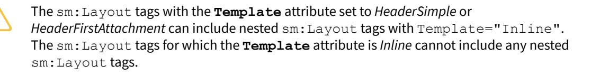

For details about the relationships between tag types in the mobile site map, see the diagram in *XML [Tags](#page-152-1)*.

### **Attributes**

The sm:Layout tag has the following attributes.

| Attribute | Description                                                                                                                                                                                                                                                                                                                                                                                                                                                                                                                                            |
|-----------|--------------------------------------------------------------------------------------------------------------------------------------------------------------------------------------------------------------------------------------------------------------------------------------------------------------------------------------------------------------------------------------------------------------------------------------------------------------------------------------------------------------------------------------------------------|
| Name      | The identifier of the line layout, as found in the WSDL schema.                                                                                                                                                                                                                                                                                                                                                                                                                                                                                        |
| Template  | The template that is used to define the layout. The following values can be used for<br>this attribute:                                                                                                                                                                                                                                                                                                                                                                                                                                                |
|           | •<br>HeaderFirstAttachment: An indicator that the mobile app should arrange the UI<br>elements, which are mapped by the nested tags, in a group-like header contain<br>er with an attachment icon on the le. If you click the attachment icon, you can<br>take a photo and attach the photo to the screen of the mobile app. The cam<br>era behavior is affected by the attributes of the sm:attachments tag. If the<br>screen of the mobile app already has attachments, the first attachment thumb<br>nail is shown instead of the attachment icon. |
|           | The tag with the attribute set to HeaderFirstAttachment can include nested<br>sm:Layout tags with Template="Inline". The tags with the attribute set<br>to HeaderFirstAttachment cannot be nested in other sm:Layout tags and can<br>be nested only in sm:Container tags.                                                                                                                                                                                                                                                                              |
|           | HeaderSimple: An indicator that the mobile app should arrange the UI elements,<br>•<br>which are mapped by the nested tags, in a group-like header container.                                                                                                                                                                                                                                                                                                                                                                                          |
|           | The tag with the attribute set to HeaderSimple can include nested sm:Lay<br>out tags with Template="Inline". The tag with the attribute set to Head<br>erSimple cannot be nested in other sm:Layout tags and can be nested only in<br>sm:Container tags.                                                                                                                                                                                                                                                                                               |
|           | •<br>Inline: An indicator that the mobile app should arrange UI elements, which are<br>mapped by the nested tags, in a line by using the Weight attributes specified<br>for these elements. If the Weight attribute is not defined for a nested tag, the<br>mobile app uses 1 as the default value.                                                                                                                                                                                                                                                    |
|           | The tag with the attribute set to Inline cannot include nested sm:Layout tags.<br>The tags with the attribute set to Inline can be nested in other sm:Layout tags.                                                                                                                                                                                                                                                                                                                                                                                     |

### **Examples**

In the following example, the TotalAmount field takes 3/6 of the total width, the Save action link takes 1/6, and the Currency field takes 2/6.

```
<sm:Layout Template="Inline">
 <sm:Field Container="ReceiptDetailsExpenseDetails" Name="TotalAmount" 
 Weight="3"/>
 <sm:RecordActionLink Name="Save"/>
 <sm:Field Container="ReceiptDetailsExpenseDetails" Name="Currency" 
 PickerType="Attached" Weight="2"/>
```

</sm:Layout>

The following example shows how nested sm:Layout tags can be used.

```
<sm:Layout Name="ReceiptHeader" Template="HeaderSimple">
 <sm:Layout Name="ReceiptIdLine" Template="Inline">
 <sm:Field Name="ReceiptID" ForceIsDisabled="true"/>
 <sm:Field Name="Status" ForceIsDisabled="true"/>
 </sm:Layout>
</sm:Layout>
```

#### **Related Links**

• *XML [Tags](#page-152-1)*

### <span id="page-166-1"></span><span id="page-166-0"></span>**<sm:RecordActionLink>**

You can use the sm:RecordActionLink tag to remove an action from the screen toolbar and put the action among the *[<sm:Field>](#page-159-1)* tags on a data entry form. The action to which this tag refers must be declared with the same name within the same container by using the *[<sm:Action>](#page-154-1)* tag.

#### **Attributes**

The sm:RecordActionLink tag has the following attributes.

| Attribute | Description                                                                                                                                                                                         |
|-----------|-----------------------------------------------------------------------------------------------------------------------------------------------------------------------------------------------------|
| Name      | The action identifier, as found in the WSDL schema.                                                                                                                                                 |
| Weight    | The value that is used to set the width of the link within the UI element line defined<br>by the <sm:layout> tag with the Template attribute set to Inline. The default value<br/>is 1.</sm:layout> |

#### **Example**

The following example shows how to use the sm:RecordActionLink tag in the mobile site map.

```
<sm:Container ...>
 ...
 <sm:RecordActionLink Name="ViewOnMap"/>
 ...
 <sm:Action Behavior="Void" Context="Record" Name="ViewOnMap" Redirect="true"/>
 ...
</sm:Container>
```

#### **Related Links**

• *XML [Tags](#page-152-1)*

# <span id="page-167-1"></span><span id="page-167-0"></span>**<sm:Screen>**

| Attribute      | Description                                                                                                                                                                                                                                                                                                                                                                                                                                                                    |
|----------------|--------------------------------------------------------------------------------------------------------------------------------------------------------------------------------------------------------------------------------------------------------------------------------------------------------------------------------------------------------------------------------------------------------------------------------------------------------------------------------|
| DisplayName    | The name of the screen on the UI.                                                                                                                                                                                                                                                                                                                                                                                                                                              |
| ExpandSelector | The name of a selector field from the primary container. An Acumatica ERP form<br>can contain a selector control that acts like a filter. For example, the OrderType<br>selector control on the Sales Orders form (SO301000) works as a filter. If the Ex<br>pandSelector attribute is specified for a screen, then the mobile application<br>represents the screen as multiple screens, where each screen corresponds to a sin<br>gle value of the referenced selector field. |
| Icon           | The name of an image that is used to display the screen icon on the main menu<br>(and on the sidebar menu, if specified) of a mobile application. This attribute is op<br>tional. If this attribute is not specified for a screen, the screen is displayed in the<br>UI without an icon. See the possible values and the corresponding images for the<br>Icon attribute in Icons.                                                                                              |
| Id             | The screen identifier, such as IN201000. You can find the value to specify there in the<br>screen URL of the corresponding Acumatica ERP form.                                                                                                                                                                                                                                                                                                                                 |
| OpenAs         | The display type of the screen. When the screen is opened from a menu, this at<br>tribute specifies how to open the primary container. Otherwise, when the screen<br>is opened by a redirection from an action and the RedirectToContainer at<br>tribute of this action does not explicitly specify how to open the container, then this<br>attribute specifies how to open the redirected container of the screen. The value<br>can be one of the following:                  |
|                | •<br>List: An indicator that the screen opens as a list.<br>•<br>Form: An indicator that the screen opens as a form.                                                                                                                                                                                                                                                                                                                                                           |
| Type           | The type of the screen, which is one of the following values:<br>•<br>SimpleScreen: An indicator that the screen is a common screen.<br>•<br>FilterListScreen: An indicator that the screen corresponds to the Acumatica ERP<br>form based on the FormDetail form template. Such a screen should include<br>at least two containers. The first container maps the form area of the form (fil                                                                                   |
|                | ter), and the second one maps the grid.<br>•<br>Report: An indicator that the screen is an Acumatica Report Designer report.<br>•<br>Dashboard: An indicator that the screen is a dashboard. A screen of this type can<br>display the following types of dashboard widgets:<br>•<br>Chart<br>•<br>Data Table<br>•<br>Score Card                                                                                                                                                |
|                | •<br>Trend Card<br>Other widget types will be hidden.                                                                                                                                                                                                                                                                                                                                                                                                                          |

The sm:Screen tag has the following attributes.

| Attribute | Description                                                                                                                                                                       |
|-----------|-----------------------------------------------------------------------------------------------------------------------------------------------------------------------------------|
| Visible   | An indicator of the visibility of the screen in the main menu. If the value of this at<br>tribute is true, the screen is visible on the main menu. By default, the value is true. |

• *XML [Tags](#page-152-1)*

# <span id="page-168-5"></span><span id="page-168-0"></span>**<sm:SelectorContainer>**

The sm:SelectorContainer tag has same attributes as sm:Container, as well as the following attributes.

| Attribute    | Description                                                            |
|--------------|------------------------------------------------------------------------|
| FieldsToShow | The number of columns to display in the selector.                      |
| Name         | The identifier of the selector container, as found in the WSDL schema. |

#### **Related Links**

• *XML [Tags](#page-152-1)*

### <span id="page-168-4"></span><span id="page-168-1"></span>**<sm:Type>**

The sm:Type tag has the following attribute.

| Attribute | Description                                         |
|-----------|-----------------------------------------------------|
| Extension | The file name extension of the permitted file type. |

#### **Related Links**

• *XML [Tags](#page-152-1)*

### <span id="page-168-3"></span><span id="page-168-2"></span>**Icons**

In the mobile site map, you can use the Icon attribute to set the icon that is displayed on the UI for the following MSDL objects:

- containerAction
- listAction
- recordAction
- selectionAction
- folder
- item

To specify an icon for an MSDL object, use the following format of the attribute value: system://IconName, where the IconName is one of the following values.

| Icon Name        | Description |
|------------------|-------------|
| Alarm            |             |
|                  |             |
|                  |             |
| Albums           |             |
|                  |             |
| AngleDownCircle  |             |
|                  |             |
| AngleLeftCircle  |             |
|                  |             |
| AngleRightCircle |             |
|                  |             |
| AngleUpCircle    |             |
|                  |             |
| Attention        |             |
|                  |             |
| Bell             |             |
|                  |             |
| Bookmarks        |             |
|                  |             |

| Icon Name   | Description |
|-------------|-------------|
| BottomArrow |             |
|             |             |
|             |             |
| Box1        |             |
|             |             |
| Box2        |             |
|             |             |
| Browser     |             |
|             |             |
| Calculator  |             |
|             |             |
| Camera      |             |
|             |             |
| Cart        |             |
|             |             |
| Cash        |             |
|             |             |
| Chat        |             |
|             |             |

| Icon Name     | Description |
|---------------|-------------|
| Check         |             |
|               |             |
|               |             |
| Clock         |             |
|               |             |
| CloseCircle   |             |
|               |             |
| Cloud         |             |
|               |             |
| CloudDownload |             |
|               |             |
| CloudUpload   |             |
|               |             |
| Comment       |             |
|               |             |
| Compass       |             |
|               |             |
| Config        |             |
|               |             |

| Icon Name | Description |
|-----------|-------------|
| CopyFile  |             |
|           |             |
|           |             |
| Credit    |             |
|           |             |
| Culture   |             |
|           |             |
| Date      |             |
|           |             |
| Display1  |             |
|           |             |
| Display2  |             |
|           |             |
| Download  |             |
|           |             |
| Drawer    |             |
|           |             |
| Drop      |             |
|           |             |

| Icon Name | Description |
|-----------|-------------|
| Edit      |             |
|           |             |
|           |             |
| File      |             |
|           |             |
| Filter    |             |
|           |             |
| Flag      |             |
|           |             |
| Folder    |             |
|           |             |
| Gleam     |             |
|           |             |
| Global    |             |
|           |             |
| Graph     |             |
|           |             |
| Graph1    |             |
|           |             |

| Icon Name | Description |
|-----------|-------------|
| Graph2    |             |
|           |             |
| Graph3    |             |
|           |             |
| Home      |             |
|           |             |
| Id        |             |
|           |             |
| Info      |             |
|           |             |
| Key       |             |
|           |             |
| Keypad    |             |
|           |             |
| LeftArrow |             |
|           |             |
| Less      |             |
|           |             |

| Icon Name    | Description |
|--------------|-------------|
| Link         |             |
|              |             |
|              |             |
| Lock         |             |
|              |             |
| Mail         |             |
|              |             |
| MailOpen     |             |
|              |             |
| MailOpenFile |             |
|              |             |
| Map          |             |
|              |             |
| MapMarker    |             |
|              |             |
| Menu         |             |
|              |             |
| Monitor      |             |
|              |             |

| Icon Name  | Description |
|------------|-------------|
| More       |             |
|            |             |
| Network    |             |
|            |             |
| NewsPaper  |             |
|            |             |
| Next       |             |
|            |             |
| Note       |             |
|            |             |
| Note2      |             |
|            |             |
| Notebook   |             |
|            |             |
| Paperclip  |             |
|            |             |
| PaperPlane |             |
|            |             |

| Icon Name    | Description |
|--------------|-------------|
| Pen          |             |
|              |             |
|              |             |
| Phone        |             |
|              |             |
| PhotoGallery |             |
|              |             |
| Plane        |             |
|              |             |
| Plus         |             |
|              |             |
| Portfolio    |             |
|              |             |
| Prev         |             |
|              |             |
| Print        |             |
|              |             |
| Refresh      |             |
|              |             |

| Icon Name    | Description |
|--------------|-------------|
| RefreshCloud |             |
|              |             |
|              |             |
| Repeat       |             |
|              |             |
| Request      |             |
|              |             |
| Ribbon       |             |
|              |             |
| RightArrow   |             |
|              |             |
| Safe         |             |
|              |             |
| Search       |             |
|              |             |
| Server       |             |
|              |             |
| Share        |             |
|              |             |

| Icon Name | Description |
|-----------|-------------|
| Shopbag   |             |
|           |             |
| Signal    |             |
|           |             |
|           |             |
| Star      |             |
|           |             |
| Stopwatch |             |
|           |             |
|           |             |
| Target    |             |
|           |             |
| Ticket    |             |
|           |             |
| Timer     |             |
|           |             |
| Trash     |             |
|           |             |
| Umbrella  |             |
|           |             |
|           |             |

| Icon Name  | Description |
|------------|-------------|
| Unlock     |             |
|            |             |
|            |             |
| UpArrow    |             |
|            |             |
| Upload     |             |
|            |             |
| User       |             |
|            |             |
| UserFemale |             |
|            |             |
| UserFilter |             |
|            |             |
| Users      |             |
|            |             |
| Way        |             |
|            |             |
| World      |             |
|            |             |

# <span id="page-181-0"></span>**Troubleshooting Tips**

This chapter contains troubleshooting information about common issues that you may encounter when working with the Acumatica mobile app.

# <span id="page-181-1"></span>**To Access an Acumatica ERP Instance Running Locally from the Acumatica Mobile App**

When you are trying to access an Acumatica ERP instance that is running on a computer in your local network from the Acumatica mobile app, you may encounter some connection issues that prevent you from accessing this instance. The following sections describe the actions that can help you to resolve such issues.

### **Check the Network Connection and Firewall Settings**

You must make sure that the mobile device that is running the Acumatica mobile app is connected to the same WiFi network as the computer with the Acumatica ERP instance installed. Once you have confirmed that this is the case, you should check the firewall settings on the computer to ensure that it can accept inbound connections from other devices over this network. Do the following:

- 1. On the computer, run the *Allow an app through Windows Firewall* program. You can find the program by opening the **Start** menu and typing the name of the program in the search box.
- 2. Click the **Change settings** button.
- 3. In the **Allowed apps and features** table, find the *World Wide Web Services (HTTP)* row. In this row, make sure that the check box le of its name is selected.

Also, if the local network that you are connected to is a private network, you should select the check box in the **Private** column. If it is a public network, you should select the check box in the **Public** column. If you are unsure about the type of the network to which you are connected, you should select both check boxes. The following screenshot shows an example.

|                | Allowed apps                                                             |         |                         |  |
|----------------|--------------------------------------------------------------------------|---------|-------------------------|--|
| $(\Leftarrow)$ | « System and Security > Windows Firewall > Allowed apps                  | v c     | Search Control Panel    |  |
|                | Allow apps to communicate through Windows Firewall                       |         |                         |  |
|                | To add, change, or remove allowed apps and ports, click Change settings. |         |                         |  |
|                | What are the risks of allowing an app to communicate?                    |         | Change settings         |  |
|                | Allowed apps and features:                                               |         |                         |  |
|                | Name                                                                     | Private | Public<br>۸             |  |
|                | Windows Media Player                                                     | √       | □                       |  |
|                | ☑ Windows Media Player Network Sharing Service                           | ⊽       | $\Box$                  |  |
|                | □ Windows Media Player Network Sharing Service (Internet)                | п       | □                       |  |
|                | Windows Peer to Peer Collaboration Foundation                            | п       | $\Box$                  |  |
|                | Windows Reading List                                                     | ✓       | $\overline{\mathbf{v}}$ |  |
|                | Windows Remote Management                                                | п       | $\Box$                  |  |
|                | Windows Remote Management (Compatibility)                                | п       | $\Box$                  |  |
|                | windows_ie_ac_001                                                        | ✓       | $\breve{\phantom{a}}$   |  |
|                | Wireless Display                                                         | ⊽       | $\overline{\mathbf{v}}$ |  |
|                | Wireless Portable Devices                                                | П       | $\Box$                  |  |
|                | Vorld Wide Web Services (HTTP)                                           | ⊡       | $\overline{\mathbf{z}}$ |  |
|                |                                                                          | Details | Remove                  |  |
|                |                                                                          |         | Allow another app       |  |
|                |                                                                          |         |                         |  |
|                |                                                                          |         |                         |  |
|                |                                                                          |         |                         |  |
|                |                                                                          | OK      | Cancel                  |  |

#### *Figure: The update of the firewall settings*

4. Click **OK** to save your changes.

For security reasons, you should revert the changes you have made to the firewall settings aer you no longer need to access your Acumatica ERP instance from another device on your local network.

#### **Check the Connection URL**

To access the Acumatica ERP instance that is installed on the computer from the Acumatica mobile app, you need to know the IP address of this computer. Do the following:

- 1. Run the Command Prompt program on the computer. You can find the program by opening the**Start** menu and typing the name of the program in the search box.
- 2. Once the program launches, type ipconfig, and press *Enter* on your keyboard. The program displays the Windows IP configuration, as shown in the following screenshot.

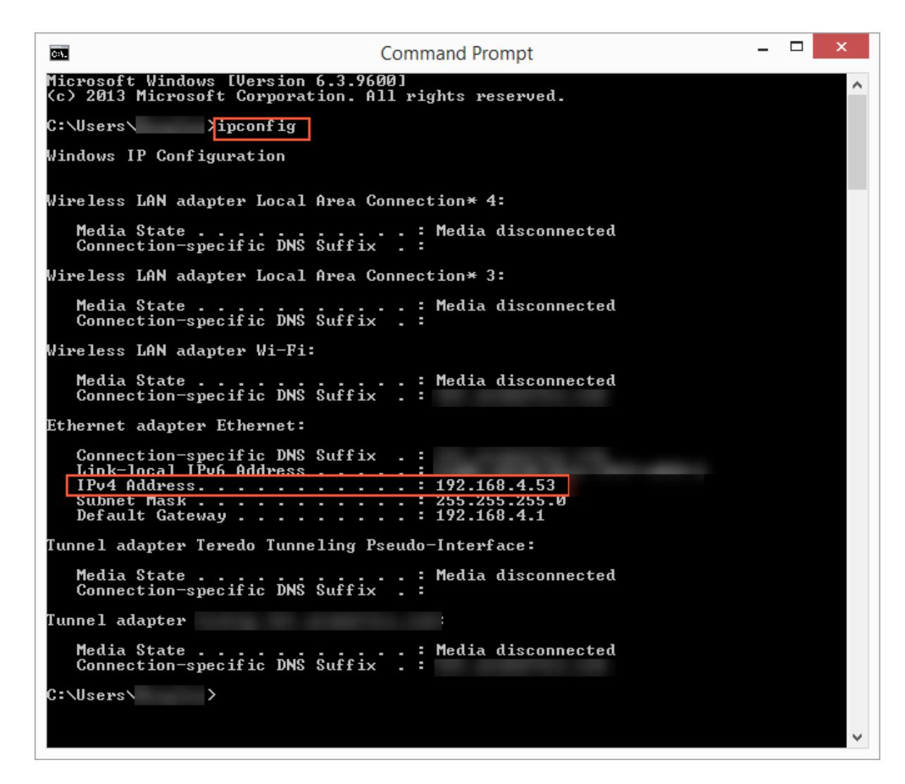

*Figure: The IP address of the computer*

To construct the connection URL, you should follow this pattern: *http://<IP Address>/<Website Name>*. Suppose that the name of your Acumatica ERP instance is *MyAcumatica* and the IP address of the computer that is running this instance is the same as the one highlighted in the previous screenshot. In this case, your connection URL will be *http://192.168.4.53/MyAcumatica*.

- 3. In the mobile app, enter the URL that you have constructed based on the instance name and your own computer's IP address, and tap **Next**.
- 4. Enter the credentials of your user account.
- 5. Tap**Sign In** to enter the site.

# <span id="page-184-0"></span>**Known Limitations**

The Acumatica mobile app has the following functionality limitations:

- Analytical Report Manager (ARM) reports are not supported in the mobile app.
- Related entity selector elements, such as **Related Svc. Doc. Nbr.** on the Expense Receipts screen, are not supported in the mobile app. The selector for such elements may display incorrect values.
- Filters inside selector elements, such as **Cost Code** on the Expense Receipts screen, are not supported in the mobile app.

# <span id="page-185-0"></span>**ac.exe MOBILEITEMAP Reference**

The command-line tool (executable name ac.exe) provides multiple parameters and applications. This topic describes the list of possible parameters and values of ac.exe that can be applied to mobile site maps. When working with mobile site maps, the first key that you must always use is MOBILESITEMAP.

By default, ac.exe is located in the folder on the computer that has Acumatica ERP installed, which is C:\Program Files (x86)\Acumatica ERP\Data\.

| Syntax                                                                                                               | Description                                                                                                                                 |
|----------------------------------------------------------------------------------------------------------------------|---------------------------------------------------------------------------------------------------------------------------------------------|
| d[elta] s[cript]<br>path_to_old_sitemap_folder<br>path_to_new_sitemap_folder path_to_ms<br>dl_script_file            | Compares two mobile site maps and saves an MSDL<br>script with the delta of these site maps.                                                |
| d[elta] p[roject]<br>path_to_old_sitemap_fold<br>er path_to_new_sitemap_folder<br>path_to_customization_project_file | Compares two mobile site maps and saves the delta of<br>these site maps to the customization project.                                       |
| c[onvert] s[cript]<br>path_to_sitemap_folder path_to_ms<br>dl_script_file                                            | Converts an XML mobile site map to MSDL format.                                                                                             |
| c[onvert] p[roject]<br>path_to_sitemap_folder path_to_cus<br>tomization_project_file                                 | Converts an XML mobile site map to MSDL format and<br>saves the result to the specified customization project.                              |
| u[pgrade] s[cript] path_to_cus<br>tom_sitemap_folder path_to_msdl_scrip<br>t_file                                    | Compares an XML mobile site map with the default<br>mobile site map and saves an MSDL script with the<br>delta of these site maps.          |
| u[pgrade] p[roject] path_to_cus<br>tom_sitemap_folder path_to_customiza<br>tion_project_file                         | Compares an XML mobile site map with the default<br>mobile site map and saves the delta of these site maps<br>to the customization project. |

#### **Related Links**

• *Using the Acumatica ERP [Command-Line](https://help-2025r1.acumatica.com/Help?ScreenId=ShowWiki&pageid=d78ac822-79f1-4a9c-91df-b6459946a2ba) Tool*