| Copyright 4                                                                                                                 |  |
|-----------------------------------------------------------------------------------------------------------------------------|--|
| Part 1: Acumatica Test SDK—Certification Training 5                                                                         |  |
| Course Prerequisites 6                                                                                                      |  |
| Acumatica Test SDK Overview 8                                                                                               |  |
| Configuring Tests Solution 10<br>Implementing the Test 15                                                                   |  |
| Running the Test<br>. 20                                                                                                    |  |
| Part 2. Acumatica Test SDK—API Reference 22                                                                                 |  |
| PX.QA.Tools.dll<br>. 23                                                                                                     |  |
| Check 24                                                                                                                    |  |
| Config 26                                                                                                                   |  |
| Log 28                                                                                                                      |  |
| Core.dll 29                                                                                                                 |  |
| Browser 30                                                                                                                  |  |
| Button 31                                                                                                                   |  |
| CheckBox 33                                                                                                                 |  |
| DateSelector 35                                                                                                             |  |
| DropDown 38<br>Selector 40                                                                                                  |  |
| TreeSelector<br>. 43                                                                                                        |  |
| Grid<br>. 44                                                                                                                |  |
| GroupBox 47                                                                                                                 |  |
| ImageUploader<br>. 50                                                                                                       |  |
| Input 51                                                                                                                    |  |
| Label<br>. 53                                                                                                               |  |
| RichTextEdit 54                                                                                                             |  |
| ToolBarButton 55                                                                                                            |  |
| TreeView 57                                                                                                                 |  |
| ClassGenerator.exe 60<br>ClassGenerator.exe.config<br>. 61                                                                  |  |
| Part 3: Acumatica Test SDK—Programming Tasks 64                                                                             |  |
| Known Issues 65                                                                                                             |  |
| How to Use Page Wrapper Generation Tool 66                                                                                  |  |
| How to Generate Page Wrappers Using Test SDK API 67                                                                         |  |
| How to Work With Errors That Occur During Page Wrapper Generation 69                                                        |  |
| How to Change the Settings of the Page Wrapper Generation Tool 75                                                           |  |
| How to Change Browser Settings 78                                                                                           |  |
| How to Change Chrome Settings 79                                                                                            |  |
| How to Change Culture Settings<br>. 80<br>How to Change Predefined Timeouts 82                                              |  |
| How to Manage Log Providers 83                                                                                              |  |
| How to Work with Alerts 85                                                                                                  |  |
| How to Commit Changes in Rows of a Detail Table 88                                                                          |  |
| How to Navigate through the Rows of a Detail Table 89                                                                       |  |
| How to Show or Hide Columns in a Detail Table 90                                                                            |  |
| How to Use Column Filters of a Detail Table 93                                                                              |  |
| How to Work with Errors 95                                                                                                  |  |
| How to Work with Warnings 97<br>How to Work with Windows 99                                                                 |  |
| How to Work with the Names of UI Elements 100                                                                               |  |
| How to Work with Drop-Down Menus on Toolbars 101                                                                            |  |
| How to Work with Pop-Up Dialog Boxes<br>. 102                                                                               |  |
| How to Work with Pop-Up Panels 104                                                                                          |  |
| How to Verify a Note on a Form 105                                                                                          |  |
| How to Add a Note to a Detail Line<br>. 106                                                                                 |  |
| How to Add a Note to an Acumatica Form 107                                                                                  |  |
| How to Upload a File<br>. 108                                                                                               |  |
| How to Upload Data from an Excel File into a Detail Table 109<br>How to Upload Data from a CSV File into a Detail Table 110 |  |
| How to Attach a File to an Acumatica Form 111                                                                               |  |
| How to Attach a File to a Detail Line<br>. 112                                                                              |  |
| How to Remove an Attached File from an Acumatica Form 113                                                                   |  |
| How to Remove an Attached File from a Detail Line 114                                                                       |  |
| How to Publish Customization Projects 115                                                                                   |  |
| How to Work with Smart Delays 116                                                                                           |  |
|                                                                                                                             |  |
| How to Capture Screenshots 118                                                                                              |  |
| How to Get Datetime in the Current User's Timezone 119                                                                      |  |
| How to use Comparator to compare .xml, .csv, .pdf, Excel files<br>. 120                                                     |  |
| How to Verify string/long/int/DateTime returned by a method 121<br>How to work with dynamic controls 122                    |  |

# Test SDK

Acumatica Test SDK is a programming framework that provides an easy way to develop automated tests for applications built on top of Acumatica Framework. This document provides important information about Acumatica Test SDK, including its structure, API reference, programming guidelines, and installation and configuration instructions. The document is of particular interest to those who develop extensions or customizations by using Acumatica Framework and want to automate the testing of the functionality that they have developed.

# <span id="page-3-0"></span>Copyright

© Acumatica, Inc.

ALL RIGHTS RESERVED.

No part of this document may be reproduced, copied, or transmitted without the express prior consent of Acumatica, Inc.

4030 Lake Washington Blvd NE, Suite 100

Kirkland, WA 98033

## Restricted Rights

The product is provided with restricted rights. Use, duplication, or disclosure by the United States Government is subject to restrictions as set forth in the applicable License and Services Agreement and in subparagraph (c)(1)(ii) of the Rights in Technical Data and Computer Software clause at DFARS 252.227-7013 or subparagraphs (c)(1) and (c)(2) of the Commercial Computer Software-Restricted Rights at 48 CFR 52.227-19, as applicable.

### Disclaimer

Acumatica, Inc. makes no representations or warranties with respect to the contents or use of this document, and specifically disclaims any express or implied warranties of merchantability or fitness for any particular purpose. Further, Acumatica, Inc. reserves the right to revise this document and make changes in its content at any time, without obligation to notify any person or entity of such revisions or changes.

## Trademarks

Acumatica is a registered trademark of Acumatica, Inc. All other product names and services herein are trademarks or service marks of their respective companies.

# <span id="page-4-0"></span>Part 1: Acumatica Test SDK—Certification Training

In This Part

- [Course Prerequisites](#page-5-0)
- [Acumatica Test SDK Overview](#page-7-0)
- [Configuring Tests Solution](#page-9-0)
- [Implementing the Test](#page-14-0)
- [Running the Test](#page-19-0)

# <span id="page-5-0"></span>Course Prerequisites

- [Acumatica ERP Instance](#page-5-1)
- [Downloading Acumatica Test SDK](#page-5-2)
- [Creating Acumatica Test Solution](#page-5-3)

<span id="page-5-1"></span>Acumatica ERP Instance

Acumatica ERP instance should be deployed with default tenant settings

|                | <b>Installed tenants:</b>                       |              |                    |          |                  |              |              |                 | Reload the List |  |
|----------------|-------------------------------------------------|--------------|--------------------|----------|------------------|--------------|--------------|-----------------|-----------------|--|
| ID             | Login Tenant Name                               | New          | <b>Insert Data</b> |          | Parent Tenant ID |              | Visible      | Additional Info |                 |  |
| $\overline{2}$ | Company                                         | $\checkmark$ |                    | $\vee$ 1 |                  | $\checkmark$ | $\checkmark$ | Company         |                 |  |
|                |                                                 |              |                    |          |                  |              |              |                 |                 |  |
|                |                                                 |              |                    |          |                  |              |              |                 |                 |  |
|                |                                                 |              |                    |          |                  |              |              |                 |                 |  |
|                |                                                 |              |                    |          |                  |              |              |                 |                 |  |
|                |                                                 |              |                    |          |                  |              |              |                 |                 |  |
|                |                                                 |              |                    |          |                  |              |              |                 |                 |  |
|                |                                                 |              |                    |          |                  |              |              |                 |                 |  |
|                | Advanced Settings   Secure Tenant on Login Form |              |                    |          |                  |              |              | <b>New</b>      | Delete          |  |
|                |                                                 |              |                    |          |                  |              |              |                 |                 |  |
|                | ersion: 20.203.0028                             |              |                    |          |                  |              |              | < Back          | Next >          |  |
|                | tp://www.acumatica.com                          |              |                    |          |                  |              |              |                 |                 |  |

The first login is admin, and the password to log in to the new company is setup; you should change the password before running your tests.

<span id="page-5-2"></span>Downloading Acumatica Test SDK

You should download the preferred version of Acumatica Test SDK from<http://acumatica-builds.s3.amazonaws.com/index.html?prefix=builds>. Deploy the Acumatica Test SDK and unzip it to a folder on your local computer.

You must use the same version of both Acumatica ERP and Acumatica Test SDK.

## <span id="page-5-3"></span>Creating Acumatica Test Solution

Create a test solution by using latest Visual Studio as follows:

1. In Visual Studio, create a new project Tests with the following parameters:

- Project template: Console App (.NET Core) C#
- Project name: Tests
- Solution name: Tests

Project name must start from the word Tests.

#### 2. In Visual Studio, add packages folder from your Test SDK as a nuget source

| Options                                                                                                                                                                                                                                                                                                                                                                                                                                                                                                                                                                                             |                                          |                                                                                                                                                                |          | ?      | $\times$ |
|-----------------------------------------------------------------------------------------------------------------------------------------------------------------------------------------------------------------------------------------------------------------------------------------------------------------------------------------------------------------------------------------------------------------------------------------------------------------------------------------------------------------------------------------------------------------------------------------------------|------------------------------------------|----------------------------------------------------------------------------------------------------------------------------------------------------------------|----------|--------|----------|
| Search Options (Ctrl+E)<br>٩                                                                                                                                                                                                                                                                                                                                                                                                                                                                                                                                                                        |                                          | Package sources:                                                                                                                                               |          |        |          |
| <b>D</b> Environment<br>Projects and Solutions<br>▷ Source Control<br>▷ Work Items<br>▷ Text Editor<br>Debugging<br>D Performance Tools<br>MET Portability Analyzer<br>Azure Service Authentication<br><b>D</b> Container Tools<br>D Cross Platform<br>Database Tools<br>$\triangleright$ F# Tools<br><b>D</b> IntelliCode<br>A NuGet Package Manager<br>General<br>Package Sources<br>REST API Client Code Generator<br><b>D</b> SOL Server Tools<br>$\triangleright$ Test<br>Fext Templating<br>▷ Web Forms Designer<br>D Web Performance Test Tools<br>Mindows Forms Designer<br>> XAML Designer | $\Box$ nuget.org<br>$\sqrt{\frac{1}{2}}$ | https://api.nuget.org/v3/index.json<br>Microsoft Visual Studio Offline Packages<br>C:\Program Files (x86)\Microsoft SDKs\NuGetPackages\<br>C:\TestSDK\packages |          |        |          |
|                                                                                                                                                                                                                                                                                                                                                                                                                                                                                                                                                                                                     | Name:                                    | local                                                                                                                                                          |          |        |          |
|                                                                                                                                                                                                                                                                                                                                                                                                                                                                                                                                                                                                     | Source:                                  | C:\TestSDK\packages                                                                                                                                            | $\cdots$ | Update |          |
|                                                                                                                                                                                                                                                                                                                                                                                                                                                                                                                                                                                                     |                                          |                                                                                                                                                                | OK       | Cancel |          |

2. Add package references to the Tests project:

- Execution
- GeneratedWrappers.Acumatica (you may need to check "Enable prerelease" in NuGet Packages Manager and add version to the file name in the packages folder, e.g. GeneratedWrappers.Acumatica.21.102.63-P106163.nupkg)

At this point your Tests.csproj file should look like:

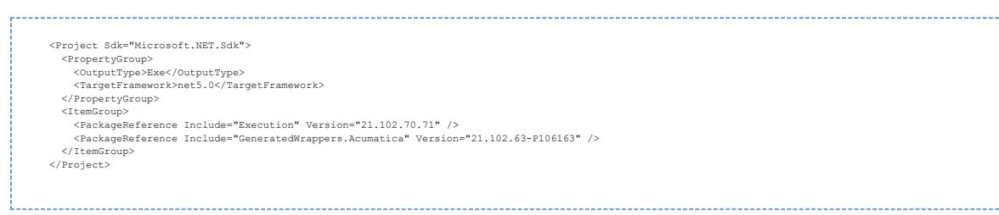

3. Open Program.cs file of the Tests project (or create a new one if it was not created automatically on step 1) and modify it as follows:

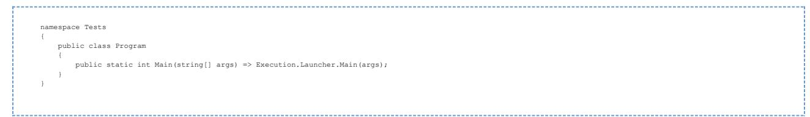

7

# <span id="page-7-0"></span>Acumatica Test SDK Overview

- [Understanding the Acumatica Test SDK Components](#page-7-1)
- [Acumatica Test SDK Components](#page-7-2)

<span id="page-7-1"></span>Understanding the Acumatica Test SDK Components

You will use the following components to create and run tests for Acumatica ERP or products based on Acumatica Framework:

- Browser: You use a browser to run and test an Acumatica-based product.
- Page wrapper generation tool: You use this tool to create wrappers for the pages of your Acumatica-based product.
- Test framework: You include the generated page wrappers in your test solution and create the code of your tests by using the classes available in the wrappers. You use the test runner to run the created tests in the browser.
- Selenium WebDriver: The test runner uses the WebDriver for interaction with the browser.

The page wrapper generation tool creates object mapping model for every page developed by Acumatica Framework. You can access any UI element such as Forms, Grids, Toolbars, data-fields available on a page which you use operating as an ordinary user with Acumatica ERP or any other Acumatica based product. Test SDK uses built-in control wrapper to construct complex objects such as forms, grids and pages. You need to create wrappers for each page that you want to test.

#### The interaction between these components is illustrated in the following diagram.

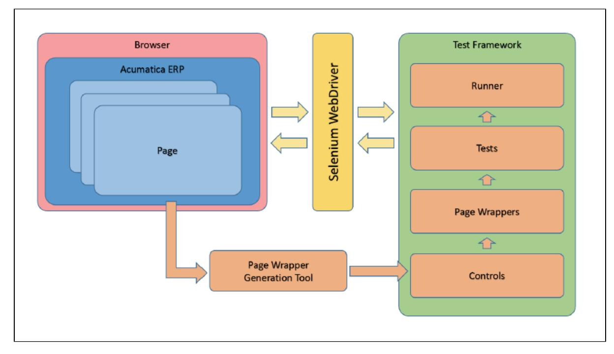

Figure: Acumatica Test SDK Components

## <span id="page-7-2"></span>Acumatica Test SDK Components

#### Acumatica Test SDK consists of the components in the following table.

|   | Folder                       | File Name or Subfolder                 | Description                                                                                              |
|---|------------------------------|----------------------------------------|----------------------------------------------------------------------------------------------------------|
| 1 | Test SDK > Chrome            | chrome.exe and other<br>files/folders  | The Google Chrome browser application                                                                    |
| 2 | Test SDK > Firefox           | firefox.exe and other<br>files/folders | The Mozilla Firefox browser application                                                                  |
| 3 | Test SDK ><br>ClassGenerator | ClassGenerator.exe                     | The page wrapper generation tool. You use this console application to generate all your page<br>wrappers |

|   |                         | ClassGenerator.exe.config | An example of the configuration file, which contains the wrapper generation settings that the page<br>wrapper generation tool uses<br>You can find more details on how to change these settings in How to Change the Settings of the<br>Page Wrapper Generation Tool |
|---|-------------------------|---------------------------|----------------------------------------------------------------------------------------------------------------------------------------------------------------------------------------------------------------------------------------------------------------------|
|   |                         | Host.dll                  | A service component that is used to create proxy objects to generate page wrappers                                                                                                                                                                                   |
| 4 | Test SDK > package<br>s | *.nupkg                   | TestSDK nuget packages                                                                                                                                                                                                                                               |
| 5 | Test SDK                | Config.xml                | An example of the configuration file that contains test settings used by the test runner                                                                                                                                                                             |
|   |                         | SDK - README.pdf          | The Test SDK documentation                                                                                                                                                                                                                                           |

## <span id="page-9-0"></span>Configuring Tests Solution

- [Step 1: Creating Extension Classes for Generated Page Wrappers](#page-9-1)
- [Step 2: Including Extension Classes Into Project](#page-11-0)
- [Step 3: Creating Test](#page-12-0)

## <span id="page-9-1"></span>Step 1: Creating Extension Classes for Generated Page Wrappers

In this step, you will create extension classes for page wrappers from the GeneratedWrappers.Acumatica package.

- SM201010\_AccessUsers
- SM201025\_ModernAccess
- SM201060\_PreferencesSecurityMaint
- SM208600\_DashboardMaint
- CS100000\_FeaturesMaint
- CS101500\_OrganizationMaint
- CS102000\_BranchMaint
- AP101000\_APSetupMaint
- AR101000\_ARSetupMaint
- GL102000\_GLSetupMaint
- GL202500\_AccountMaint
- SO101000\_SOSetupMaint
- EP202500\_EPLoginTypeMaint
- DB000038

By means of modifications in extension classes you grant access to automatically generated protected properties of the page wrappers and can change their default behaviour. By default, the page wrapper generation tool marks all automatically generated properties that grant access to container properties as protected. To access these properties from the test, create an extension class.

Create extension classes (cs files with the appropriate names) for each automatically generated page wrapper from the list below:

|        | using GeneratedWrappers.Acumatica;                                           |
|--------|------------------------------------------------------------------------------|
|        | namespace Tests.Extensions                                                   |
| {      |                                                                              |
| {      | public class User : SM201010_AccessUsers                                     |
|        | public c_userlist_form Summary => UserList_form;                             |
|        | public c_allowedroles_gridroles Roles => AllowedRoles_gridRoles;             |
| }<br>} |                                                                              |
|        |                                                                              |
|        |                                                                              |
|        |                                                                              |
|        | using GeneratedWrappers.Acumatica;                                           |
|        | namespace Tests.Extensions                                                   |
| {      | public class AccessRightsByRole : SM201025_ModernAccess                      |
| {      | public c_roles_form Summary => Roles_form;                                   |
|        |                                                                              |
|        | public c_roleentities_griddet Details => RoleEntities_griddet;               |
| }      | public c_parameters ParametersTree => Parameters;                            |
| }      |                                                                              |
|        |                                                                              |
|        |                                                                              |
|        |                                                                              |
|        | using GeneratedWrappers.Acumatica;                                           |
|        | namespace Tests.Extensions                                                   |
| {      | public partial class SecurityPreferences : SM201060_PreferencesSecurityMaint |
| {      | public c_prefs_form GeneralSettings => Prefs_form;                           |
| }<br>} |                                                                              |
|        |                                                                              |
|        |                                                                              |

```
using GeneratedWrappers.Acumatica;
namespace Tests.Extensions
{
 public class Dashboards : SM208600_DashboardMaint
 {
 public c_dashboards_frmheader Summary => Dashboards_frmHeader;
 public c_entityroles_gridroles Details => EntityRoles_gridRoles;
 }
}
using GeneratedWrappers.Acumatica;
namespace Tests.Extensions
{
 public partial class Features : CS100000_FeaturesMaint
 {
 public c_features_form Summary => Features_form;
 }
}
using GeneratedWrappers.Acumatica;
namespace Tests.Extensions
{
 public class Company : CS101500_OrganizationMaint
 {
 public c_baccount_pxformview1 Summary => BAccount_PXFormView1;
 public c_defaddress_defaddress DefaultAddress => DefAddress_DefAddress;
 public c_organizationview_pxformview1 OrganizationSettings => OrganizationView_PXFormView1;
 public c_organizationview_company BaseCurrency => OrganizationView_Company;
 public c_commonsetup_commonsettings CommonSettings => Commonsetup_commonsettings;
 public c_organizationledgerlinkwithledgerselect_grdledgerlinks Ledgers => OrganizationLedgerLinkWithLedgerSelect_grdLedgerLinks;
 public c_branchesview_grdbranches Branches => BranchesView_grdBranches;
 public c_employees_grdemployees Employees => Employees_grdEmployees;
 public c_organizationview_configurationsettings ConfigurationSettings => OrganizationView_ConfigurationSettings;
 }
}
using GeneratedWrappers.Acumatica;
namespace Tests.Extensions
{
 public partial class Branch : CS102000_BranchMaint
 {
 public c_baccount_pxformview1 Summary => BAccount_PXFormView1;
 public c_defaddress_defaddress DefaultAddress => DefAddress_DefAddress;
 }
}
using GeneratedWrappers.Acumatica;
namespace Tests.Extensions
{
 public partial class SetupAp : AP101000_APSetupMaint { }
}
using GeneratedWrappers.Acumatica;
namespace Tests.Extensions
{
 public partial class SetupAr : AR101000_ARSetupMaint { }
}
using GeneratedWrappers.Acumatica;
namespace Tests.Extensions
{
 public partial class SetupGl : GL102000_GLSetupMaint
 {
 public c_glsetuprecord_form GeneralSettings => GLSetupRecord_form;
 }
}
```

| using GeneratedWrappers.Acumatica;                                                  |  |
|-------------------------------------------------------------------------------------|--|
| namespace Tests.Extensions                                                          |  |
| {                                                                                   |  |
| public partial class Account : GL202500_AccountMaint                                |  |
| {                                                                                   |  |
| public c_accountrecords_grid Details => AccountRecords_grid;                        |  |
| }<br>}                                                                              |  |
|                                                                                     |  |
|                                                                                     |  |
|                                                                                     |  |
|                                                                                     |  |
|                                                                                     |  |
| using GeneratedWrappers.Acumatica;                                                  |  |
|                                                                                     |  |
| namespace Tests.Extensions<br>{                                                     |  |
| public partial class SetupSo : SO101000_SOSetupMaint { }                            |  |
| }                                                                                   |  |
|                                                                                     |  |
|                                                                                     |  |
|                                                                                     |  |
|                                                                                     |  |
| using GeneratedWrappers.Acumatica;                                                  |  |
|                                                                                     |  |
| namespace Tests.Extensions                                                          |  |
| {                                                                                   |  |
| public class UserTypes : EP202500_EPLoginTypeMaint<br>{                             |  |
| public c_logintype_form Summary => LoginType_form;                                  |  |
|                                                                                     |  |
| public c_allowedroles_allowsrolesgrid AllowedRoles => AllowedRoles_allowsRolesGrid; |  |
| }<br>}                                                                              |  |
|                                                                                     |  |
|                                                                                     |  |
|                                                                                     |  |
|                                                                                     |  |
|                                                                                     |  |
| using GeneratedWrappers.Acumatica;                                                  |  |
| namespace Tests.Extensions                                                          |  |
| {                                                                                   |  |
| public class Dashboard : DB000038 { }                                               |  |
| }                                                                                   |  |
|                                                                                     |  |
|                                                                                     |  |
|                                                                                     |  |

## <span id="page-11-0"></span>Step 2: Including Extension Classes Into Project

In this step, you will include extension classes for page wrappers into project.

To include extension classes for page wrappers into project, do the following:

- 1. Create an Extensions folder in the Tests project.
- 2. Include all extension classes from the previous step into it.

At this point your solution should look like shown on the screenshot below:

| <b>Solution Explorer</b>                   | ▼ + × |
|--------------------------------------------|-------|
| ◎ ◎ ⊙ △ ─ ○ · ऽ ♪ ◎ ◎ <i>▶</i> ─           |       |
| Search Solution Explorer (Ctrl+;)          |       |
| [4] Solution 'Tests' (1 of 1 project)      |       |
| <b>C# Tests</b>                            |       |
| <sup>14</sup> Dependencies<br>D            |       |
| $\blacktriangleleft$ Extensions            |       |
| C <sup>#</sup> AccessRightsByRole.cs<br>Þ  |       |
| C <sup>#</sup> Account.cs<br>D             |       |
| C <sup>#</sup> Branch.cs<br>D              |       |
| Þ<br>C <sup>#</sup> Company.cs             |       |
| C <sup>#</sup> Dashboard.cs<br>d           |       |
| C <sup>#</sup> Dashboards.cs<br>d          |       |
| C <sup>#</sup> Features.cs<br>D            |       |
| C <sup>#</sup> SecurityPreferences.cs<br>Þ |       |
| D<br>C <sup>#</sup> SetupAp.cs             |       |
| C <sup>#</sup> SetupAr.cs<br>D             |       |
| C <sup>#</sup> SetupGl.cs<br>Þ             |       |
| C <sup>#</sup> SetupSo.cs<br>Þ             |       |
| C# User.cs<br>d                            |       |
| C <sup>#</sup> UserTypes.cs<br>D           |       |
| Program.cs<br>D<br>C#                      |       |

To simplify maintenance place extension classes in a separate folder of the project.

#### <span id="page-12-0"></span>Step 3: Creating Test

In this step, you will create a template for your test.

Create Test class (Test.cs) as shown below and include it into the project:

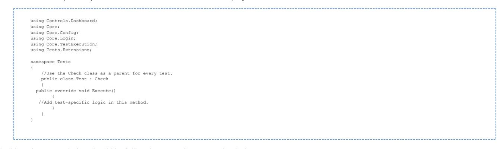

At this point your solution should look like shown on the screenshot below:

| Solution Explorer                                                                                                                                             |  |
|---------------------------------------------------------------------------------------------------------------------------------------------------------------|--|
| $\circ\circ\wedge\mathring{\mathbf{n}}\cdot\mid\circ\cdot\mathop{\mathsf{S}}\mathop{\mathsf{d}}\mathop{\mathsf{m}}\nolimits\mid\boldsymbol{\mathcal{P}}\mid-$ |  |
| Search Solution Explorer (Ctrl+;)                                                                                                                             |  |
| Solution 'Tests' (1 of 1 project)<br>C# Tests<br><b>A</b> Dependencies<br>D<br><b>Extensions</b>                                                              |  |
| C <sup>#</sup> Program.cs<br>D                                                                                                                                |  |
| C# Test.cs<br>D                                                                                                                                               |  |
|                                                                                                                                                               |  |

## <span id="page-14-0"></span>Implementing the Test

- [1. Adding wrapper extensions to the test](#page-14-1)
- [2. Adding steps to the test](#page-14-2)

#### <span id="page-14-1"></span>1. Adding wrapper extensions to the test

#### Modify Test class according to:

```
using Controls.Dashboard;
using Core;
using Core.Config;
using Core.Login;
using Core.TestExecution;
using Tests.Extensions;
namespace Tests
{
 //Use the Check class as a parent for every test.
 public class Test : Check
 {
 private readonly SecurityPreferences SecurityPreferences = new SecurityPreferences();
 private readonly AccessRightsByRole AccessRightsByRole = new AccessRightsByRole();
 private readonly Dashboards Dashboards = new Dashboards();
 private readonly Dashboard Dashboard = new Dashboard();
 private readonly UserTypes UserTypes = new UserTypes();
 private readonly Features Features = new Features();
 private readonly Company Company = new Company();
 private readonly Account Account = new Account();
 private readonly SetupSo SetupSo = new SetupSo();
 private readonly SetupGl SetupGl = new SetupGl();
 private readonly SetupAp SetupAp = new SetupAp();
 private readonly SetupAr SetupAr = new SetupAr();
 private readonly Branch Branch = new Branch();
 private readonly User User = new User();
 public override void Execute()
 {
 //Add test-specific logic in this method.
 }
 }
}
```

#### <span id="page-14-2"></span>2. Adding steps to the test

#### Modify Test class according to:

```
using Controls.Dashboard;
using Core;
using Core.Config;
using Core.Login;
using Core.TestExecution;
using Tests.Extensions;
namespace Tests
{
 //Use the Check class as a parent for every test.
 public class Test : Check
 {
 private readonly SecurityPreferences SecurityPreferences = new SecurityPreferences();
 private readonly AccessRightsByRole AccessRightsByRole = new AccessRightsByRole();
 private readonly Dashboards Dashboards = new Dashboards();
 private readonly Dashboard Dashboard = new Dashboard();
 private readonly UserTypes UserTypes = new UserTypes();
 private readonly Features Features = new Features();
 private readonly Company Company = new Company();
 private readonly Account Account = new Account();
 private readonly SetupSo SetupSo = new SetupSo();
 private readonly SetupGl SetupGl = new SetupGl();
 private readonly SetupAp SetupAp = new SetupAp();
 private readonly SetupAr SetupAr = new SetupAr();
 private readonly Branch Branch = new Branch();
 private readonly User User = new User();
 public override void Execute()
 {
 //Add test-specific logic in this method.
 PxLogin.LoginToDestinationSite();
 #region TestCase 1 - Operationg with few branches/companies
 using (TestExecution.CreateTestCaseGroup("Operationg with few branches/companies"))
 {
 #region Step 1 - Create first company
 using (TestExecution.CreateTestStepGroup("Create first company"))
 {
 Features.OpenScreen();
 Features.Insert();
 Features.Summary.Branch.SetTrue();
 Features.Summary.DistributionModule.SetTrue();
 Features.RequestValidation();
 Company.OpenScreen();
 Company.Insert();
 Company.Summary.AcctCD.Type("FIRSTCOMP");
 Company.Summary.AcctName.Type("First company");
 Company.OrganizationSettings.OrganizationType.Select("Without Branches");
 Company.DefaultAddress.CountryID.Select("RU");
 Company.BaseCurrency.BaseCuryID.Select("RUB");
```

```
 Company.CommonSettings.WeightUOM.Select("KG");
 Company.CommonSettings.VolumeUOM.Select("LITER");
 Company.Save();
 VerifyCompanyVisibility(1, 0, "First company");
 }
 #endregion
 #region Step 2 - Create second company
 using (TestExecution.CreateTestStepGroup("Create second company"))
 {
 Company.Insert();
 Company.Summary.AcctCD.Type("SECONDCOMP");
 Company.Summary.AcctName.Type("Second company");
 Company.OrganizationSettings.OrganizationType.Select("Without Branches");
 Company.DefaultAddress.CountryID.Select("AL");
 Company.Save();
 VerifyCompanyVisibility(2, 0, "First company", "Second company");
 }
 #endregion
 #region Step 3 - Remove first company
 using (TestExecution.CreateTestStepGroup("Remove first company"))
 {
 Company.Insert();
 Company.Summary.AcctCD.Select("FIRSTCOMP");
 Company.Delete();
 VerifyCompanyVisibility(1, 0, "Second company");
 }
 #endregion
 #region Step 4 - Add new one with branches
 using (TestExecution.CreateTestStepGroup("Add new one with branches"))
 {
 Company.Insert();
 Company.Summary.AcctCD.Type("THIRDCOMP");
 Company.Summary.AcctName.Type("Third company");
 Company.OrganizationSettings.OrganizationType.Select("With Branches Not Requiring Balancing");
 Company.DefaultAddress.CountryID.Select("CA");
 Company.Save();
 VerifyCompanyVisibility(1, 0, "Second company");
 }
 #endregion
 #region Step 5 - Create few branches
 using (TestExecution.CreateTestStepGroup("Create few branches"))
 {
 Branch.OpenScreen();
 Branch.Insert();
 Branch.Summary.AcctCD.Type("THBRANCH1");
 Branch.Summary.AcctName.Type("Third Cmp Branch 1");
 Branch.Summary.OrganizationID.Select("THIRDCOMP");
 Branch.DefaultAddress.CountryID.Select("AF");
 Branch.Save();
 VerifyCompanyVisibility(2, 1, "Second company", "Third company", "Third Cmp Branch 1");
 Branch.Insert();
 Branch.Summary.AcctCD.Type("THBRANCH2");
 Branch.Summary.AcctName.Type("Third Cmp Branch 2");
 Branch.Summary.OrganizationID.Select("THIRDCOMP");
 Branch.DefaultAddress.CountryID.Select("AL");
 Branch.Save();
 VerifyCompanyVisibility(2, 2, "Second company", "Third company", "Third Cmp Branch 1", "Third Cmp Branch 2");
 }
 #endregion
 #region Step 6 - Add user and verify company visibility
 using (TestExecution.CreateTestStepGroup("Add user and verify company visibility"))
 {
 SecurityPreferences.OpenScreen();
 SecurityPreferences.GeneralSettings.IsPasswordMinLength.SetFalse();
 SecurityPreferences.GeneralSettings.PasswordComplexity.SetFalse();
 SecurityPreferences.Save();
 UserTypes.OpenScreen();
 UserTypes.Summary.LoginTypeName.Type("NewType");
 UserTypes.Summary.Description.Type("NewUserType");
 UserTypes.AllowedRoles.New();
 UserTypes.AllowedRoles.Row.Rolename.Select("Customizer");
 UserTypes.Save();
 User.OpenScreen();
 User.Insert();
 User.Summary.Username.Type("user1");
 User.Summary.LoginTypeID.Select("NewType");
 User.Summary.Email.Type("test@con.con");
 User.Roles.Row.Selected.SetTrue();
 User.Save();
 User.ResetPassword();
 User.Summary.NewPassword.Type(Config.SITE_DST_PASSWORD);
 User.Summary.ConfirmPassword.Type(Config.SITE_DST_PASSWORD);
 User.Summary.Ok();
 AccessRightsByRole.OpenScreen();
 AccessRightsByRole.Summary.Rolename.Select("Customizer");
 AccessRightsByRole.ParametersTree.Tree.Select("COMPANY");
 foreach (var workspace in AccessRightsByRole.Details.Columns.RoleDescr.GetValues())
 {
 AccessRightsByRole.Details.SelectRow(AccessRightsByRole.Details.Columns.RoleDescr, workspace);
 AccessRightsByRole.Details.Row.RoleRight.Select("Granted");
 }
 AccessRightsByRole.Save();
 PxLogin.LogIn("user1", Config.SITE_DST_PASSWORD);
 VerifyCompanyVisibility(2, 2, "Second company", "Third company", "Third Cmp Branch 1", "Third Cmp Branch 2");
 }
 #endregion
 #region Step 7 - Set Access Role for companies
 using (TestExecution.CreateTestStepGroup("Set Access Role for companies"))
 {
 PxLogin.LoginToDestinationSite();
 Company.OpenScreen();
 Company.Summary.AcctCD.Select("SECONDCOMP");
 Company.ConfigurationSettings.RoleName.Select("Customizer");
 Company.Save();
 VerifyCompanyVisibility(1, 0, "Second company");
```

```
 PxLogin.LogIn("user1", Config.SITE_DST_PASSWORD);
 VerifyCompanyVisibility(1, 0, "Second company");
```

```
 PxLogin.LoginToDestinationSite();
 Company.OpenScreen();
 Company.Summary.AcctCD.Select("THIRDCOMP");
 Company.ConfigurationSettings.RoleName.Select("Administrator");
 Company.Save();
 Company.MessageBox.Ok();
 VerifyCompanyVisibility(2, 2, "Second company", "Third company", "Third Cmp Branch 1", "Third Cmp Branch 2");
 Company.Summary.AcctCD.Select("SECONDCOMP");
 Company.ConfigurationSettings.RoleName.Reset();
 Company.Save();
 VerifyCompanyVisibility(1, 2, "Third company", "Third Cmp Branch 1", "Third Cmp Branch 2");
 PxLogin.LogIn("user1", Config.SITE_DST_PASSWORD);
 Company.OpenScreen();
 Company.PageHeader.Branch.IsVisible().VerifyEquals(false);
 }
 #endregion
 #endregion
 #region TestCase 2 - Widgets
 using (TestExecution.CreateTestCaseGroup("Widgets"))
 PxLogin.LoginToDestinationSite();
 #region Step 1 - Create dashboard
 using (TestExecution.CreateTestStepGroup("Create dashboard"))
 {
 Account.OpenScreen();
```

 Account.New(); Account.Details.Row.AccountCD.Type("111"); Account.Details.Row.AccountClassID.Select("AP"); Account.New(); Account.Details.Row.AccountCD.Type("222"); Account.Details.Row.AccountClassID.Select("AR"); Account.Save();

 SetupGl.OpenScreen(); SetupGl.GeneralSettings.YtdNetIncAccountID.Select("111"); SetupGl.GeneralSettings.RetEarnAccountID.Select("222"); SetupGl.Save();

 SetupAp.OpenScreen(); SetupAp.Save();

}

{

 SetupAr.OpenScreen(); SetupAr.Save();

 SetupSo.OpenScreen(); SetupSo.Save();

```
 Dashboards.OpenScreen();
 Dashboards.Insert();
 Dashboards.Summary.Name.Type("Board");
 Dashboards.Summary.Visible.SetTrue();
 Dashboards.Summary.WorkspaceID.Select("Data Views");
 Dashboards.Summary.SubcategoryID.Select("Dashboards");
 Dashboards.Summary.DefaultOwnerRole.Select("DashboardDesigner");
 Dashboards.Details.SetFalse();
 Dashboards.Details.SelectRow(Dashboards.Details.Columns.RoleName, "Administrator");
 Dashboards.Details.Row.RoleRight.Select("Granted");
 Dashboards.Details.SelectRow(Dashboards.Details.Columns.RoleName, "Customizer");
 Dashboards.Details.Row.RoleRight.Select("Granted");
 Dashboards.Save();
 Dashboards.ViewDashboard();
```

 } #endregion

{

{

#region Step 2 - Create datatable widget

using (TestExecution.CreateTestStepGroup("Create datatable widget"))

 Dashboard.Design(); Dashboard.Dashboard.DynamicControl<EmptyWidget>(1, 1).AddWidget();

 Dashboard.Dashboard.Wizard.AddWidget.DataTabledisplaysTheTableWithDataFromAParticularView(); Dashboard.Dashboard.Wizard.AddWidget.Next(); Dashboard.Dashboard.Wizard.AddPXTableWidget.InquiryScreenID.Select("Sales Orders"); Dashboard.Dashboard.Wizard.AddPXTableWidget.EdCaption.Type("Sales Orders table");

 Dashboard.Dashboard.Wizard.AddWidget.Finish(); Dashboard.Design();

 Dashboard.Dashboard.DynamicControl<DataTableWidget>(1, 1).Grid.ColumnsCount().VerifyIsGreaterThan(1); Dashboard.Dashboard.DynamicControl<DataTableWidget>(1, 1).Grid.RowsCount().VerifyEquals(0);

 } #endregion

```
 #region Step 3 - Create chart widget
 using (TestExecution.CreateTestStepGroup("Create chart widget"))
```

```
 Dashboard.Design();
 Dashboard.Dashboard.DynamicControl<EmptyWidget>(1, 2).AddWidget();
 Dashboard.Dashboard.Wizard.AddWidget.ChartdisplaysTheChartUsingDataFromAParticularView();
```

 Dashboard.Dashboard.Wizard.AddWidget.Next(); Dashboard.Dashboard.Wizard.AddPXChartWidget.InquiryScreenID.Select("Order Types");

```
 Dashboard.Dashboard.Wizard.AddPXChartWidget.Configure();
 Dashboard.Dashboard.Wizard.ChartSettings.ChartType.Select("Doughnut");
 Dashboard.Dashboard.Wizard.ChartSettings.CategoryField.Select("Description");
 Dashboard.Dashboard.Wizard.ChartSettings.ValueField.Select("Order Type");
 Dashboard.Dashboard.Wizard.ChartSettings.ValueAggregate.Select("Count All");
```

```
 Dashboard.Dashboard.Wizard.ChartSettings.Ok1();
 Dashboard.Dashboard.Wizard.AddPXChartWidget.EdCaption.Type("Order Types");
 Dashboard.Dashboard.Wizard.AddWidget.Finish();
 Dashboard.Design();
```

Dashboard.Dashboard.DynamicControl<PieChartWidget>(1, 2).GetSlice(1).GetValue().VerifyEquals("Cash Sale: 10.00% (1.00)");

 } #endregion

```
 #region Step 4 - Create scored kpi widget
 using (TestExecution.CreateTestStepGroup("Create scored kpi widget"))
 {
 Dashboard.Design();
```

Dashboard.Dashboard.DynamicControl<EmptyWidget>(2, 1).AddWidget();

 Dashboard.Dashboard.Wizard.AddWidget.KeyPerformanceIndicatorKpiDisplaysAKpiAsAMeterOrScorecard(); Dashboard.Dashboard.Wizard.AddWidget.Next(); Dashboard.Dashboard.Wizard.AddKPIScoreWidget.InquiryScreenID.Select("Order Types"); Dashboard.Dashboard.Wizard.AddKPIScoreWidget.AggregateField.Select("Order Type"); Dashboard.Dashboard.Wizard.AddKPIScoreWidget.EdCaption.Type("Order Types KPI");

 Dashboard.Dashboard.Wizard.AddWidget.Finish(); Dashboard.Dashboard.DynamicControl<CardKpiWidget>(2, 1).Edit.Click(); Dashboard.Dashboard.Wizard.AddKPIScoreWidget.InquiryScreenID.Select("Order Types"); Dashboard.Dashboard.Wizard.AddKPIScoreWidget.AggregateField.Select("Order Type"); Dashboard.Dashboard.Wizard.AddWidget.Finish(); Dashboard.Design();

Dashboard.Dashboard.DynamicControl<CardKpiWidget>(2, 1).GetKpiStatus().VerifyEquals(CardKpiWidget.KpiStatuses.Error);

 } #endregion

 } #endregion

}

{

internal static void VerifyCompanyVisibility(int companiesCount, int branchesCount, params string[] companies)

var wrapper = new Wrapper();

wrapper.PageHeader.Branch.Click();

 wrapper.PageHeader.Branch.GetValues().VerifyEachOfValuesEquals(companies); wrapper.PageHeader.Branch.Status.GetValue().VerifyEquals(\$"Companies: {companiesCount}, Branches: {branchesCount}");

wrapper.PageHeader.Branch.Click();

| } | }<br>} |  |  |  |  |  |  |
|---|--------|--|--|--|--|--|--|
|   |        |  |  |  |  |  |  |
|   |        |  |  |  |  |  |  |

# <span id="page-19-0"></span>Running the Test

1. Modify Config.xml located in Test SDK package as follows:

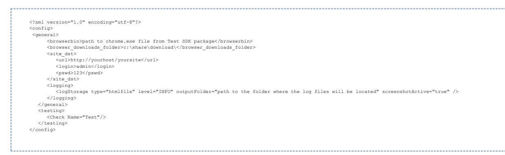

- 2. Right-click on Tests project in Tests solution and select Properties option
- 3. In Debug => Application arguments type arguments as follows:
  - /config "path to Config.xml file from Test SDK package" (example: /config "C:\TestSDK\Config.xml")


- 4. Press F5 to start the test.
- 5. If you have done everything correctly the following log files will appear the outputFolder folder specified in Config.xml after test completes:

| Name                                          | Date modified    | Type           | Size   |  |
|-----------------------------------------------|------------------|----------------|--------|--|
| Test_2021_03_30_12_08_01_Log_INFO             | 30.03.2021 12:16 | File folder    |        |  |
| C Test_2021_03_30_12_08_01_Log_INFO_PASS.html | 30.03.2021 12:16 | Chrome HTML Do | 204 KB |  |

# <span id="page-21-0"></span>Part 2. Acumatica Test SDK—API Reference

In This Part

- [PX.QA.Tools.dll](#page-22-0)
- [Core.dll](#page-28-0)
- [ClassGenerator.exe](#page-59-0)

# <span id="page-22-0"></span>PX.QA.Tools.dll

- [Check](#page-23-0)
- [Config](#page-25-0)
- [Log](#page-27-0)

## <span id="page-23-0"></span>Check

Every test created using Test SDK must have a Check class as a parent - this allows to use the following approach for every test with the following steps in the sequence:

- 1. You can do some preparation before running your test - for example you can login into the system first, restore a company snapshot or restore a database backup if required.
- 2. Test whatever is required to be tested by your test.
- 3. Finalize the test - for example you can sigh out from the system, stop browser, create company snapshot or create a database backup if required.

The following public methods are available for every test:

- [BeforeExecute\(\)](#page-23-1)
- [Execute\(\)](#page-23-2)
- [AfterExecute\(\)](#page-23-3)

<span id="page-23-1"></span>BeforeExecute()

Use if something must be done before the test starts, e.g. site configuration can be placed here.

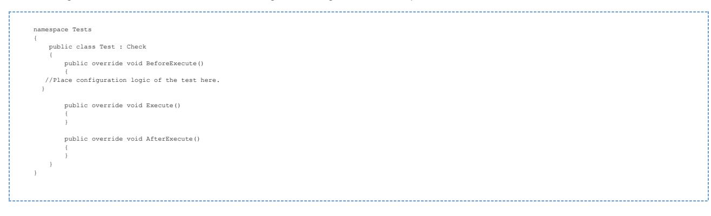

#### <span id="page-23-2"></span>Execute()

Place main logic of the test here.

| namespace Tests                      |  |  |  |
|--------------------------------------|--|--|--|
|                                      |  |  |  |
| {                                    |  |  |  |
| public class Test : Check            |  |  |  |
| {                                    |  |  |  |
| public override void BeforeExecute() |  |  |  |
| {                                    |  |  |  |
| }                                    |  |  |  |
|                                      |  |  |  |
|                                      |  |  |  |
| public override void Execute()       |  |  |  |
| {                                    |  |  |  |
| //Place main logic of the test here. |  |  |  |
| }                                    |  |  |  |
|                                      |  |  |  |
| public override void AfterExecute()  |  |  |  |
|                                      |  |  |  |
| {                                    |  |  |  |
| }                                    |  |  |  |
| }                                    |  |  |  |
| }                                    |  |  |  |
|                                      |  |  |  |
|                                      |  |  |  |
|                                      |  |  |  |

#### <span id="page-23-3"></span>AfterExecute()

Use if something must be done after the test ends.

```
namespace Tests
{
 public class Test : Check
 {
 public override void BeforeExecute()
 { 
 }
 public override void Execute()
 {
 }
 public override void AfterExecute()
 {
 //Place logic of the test here.
 }
 }
}
```

## <span id="page-25-0"></span>Config

- [Example 1](#page-25-1)
- [Example 2](#page-25-2)
- [Node Specification](#page-25-3)

Config (Config.xml) is the configuration file that includes all required settings and options Test SDK users have to provide for every test, such as URL of the AUT, access credentials, web browser, logs format etc.

<span id="page-25-1"></span>Example 1

| xml version="1.0" encoding="utf-8"?                                                                                       |
|---------------------------------------------------------------------------------------------------------------------------|
| <config></config>                                                                                                         |
| <general></general>                                                                                                       |
| <browserbin>C:\TestSDK\Chrome\chrome.exe</browserbin>                                                                     |
| <site_dst></site_dst>                                                                                                     |
| <url>http://host/aut/</url>                                                                                               |
| <login>username</login>                                                                                                   |
| <pswd>password</pswd>                                                                                                     |
|                                                                                                                           |
| <logging></logging>                                                                                                       |
| <logstorage level="INFO" outputfolder="output folder for log files" screenshotactive="true" type="htmlfile"></logstorage> |
|                                                                                                                           |
|                                                                                                                           |
| <testing></testing>                                                                                                       |
|                                                                                                                           |
|                                                                                                                           |
|                                                                                                                           |

## <span id="page-25-2"></span>Example 2

|                       | xml version="1.0" encoding="utf-8"?                                                                                       |
|-----------------------|---------------------------------------------------------------------------------------------------------------------------|
| <config></config>     |                                                                                                                           |
| <general></general>   |                                                                                                                           |
|                       | <browserbin>path to browser.exe</browserbin>                                                                              |
|                       | <browser_downloads_folder>c:\share\download\</browser_downloads_folder>                                                   |
|                       | <default_culture_info>en-US</default_culture_info>                                                                        |
|                       | <long_timeout_ms>global timeout in milliseconds</long_timeout_ms>                                                         |
| <site_dst></site_dst> |                                                                                                                           |
|                       | <url>http://host/aut/</url>                                                                                               |
|                       | <login>username</login>                                                                                                   |
|                       | <pswd>password</pswd>                                                                                                     |
|                       |                                                                                                                           |
| <site_prt></site_prt> |                                                                                                                           |
|                       | <url>http://host/portal/</url>                                                                                            |
|                       | <login>username</login>                                                                                                   |
|                       | <pswd>password</pswd>                                                                                                     |
|                       |                                                                                                                           |
| <logging></logging>   |                                                                                                                           |
|                       | <logstorage level="INFO" outputfolder="output folder for log files" screenshotactive="true" type="htmlfile"></logstorage> |
|                       |                                                                                                                           |
|                       | <backup_restore active="true" dbprovider="sql_server_name"></backup_restore>                                              |
|                       | <backup_folder>output folder for backups</backup_folder>                                                                  |
|                       |                                                                                                                           |
|                       |                                                                                                                           |
| <testing></testing>   |                                                                                                                           |
|                       | <check name="Test name 1"></check>                                                                                        |
|                       | <check name="Test name 2"></check>                                                                                        |
|                       | <check name=""></check>                                                                                                   |
|                       | <check name="Test name N"></check>                                                                                        |
|                       |                                                                                                                           |
|                       |                                                                                                                           |
|                       |                                                                                                                           |
|                       |                                                                                                                           |

#### <span id="page-25-3"></span>Node Specification

| Nodes                                                 | Parents             | Attributes | Options    | Description                                                                                                   |
|-------------------------------------------------------|---------------------|------------|------------|---------------------------------------------------------------------------------------------------------------|
| xml version="1.0"<br encoding="utf-8"?>               | -                   | -          | -          | Specifies the XML version and the encoding that<br>should be used if the encoding is different from<br>ASCII. |
| <config></config>                                     | -                   | -          | -          | Root node for all other tags.                                                                                 |
| <general></general>                                   | <config></config>   | -          | -          | Contains general configuration settings for your<br>test.                                                     |
| <browserbin></browserbin>                             | <general></general> | -          | -          | Specifies the path to the browser application<br>launcher (required for Chrome).                              |
| <browser_downloads_folder></browser_downloads_folder> | <general></general> | -          | -          | Specifies the browser's downloads folder                                                                      |
| <browserheadless></browserheadless>                   | <general></general> | -          | true/false | Specifies whether to run the browser in headless<br>mode                                                      |

| <default_culture_info></default_culture_info> | <general></general>               | -                | -          | Specifies the culture to be used in your test. The<br>English (United States) culture (en-US) is used if<br>the tag is not specified.           |
|-----------------------------------------------|-----------------------------------|------------------|------------|-------------------------------------------------------------------------------------------------------------------------------------------------|
| <long_timeout_ms></long_timeout_ms>           | <general></general>               | -                | -          | Specifies the global timeout in milliseconds                                                                                                    |
| <site_dst></site_dst>                         | <general></general>               | -                | -          | Contains information about the<br>destination Acumatica ERP instance used in your<br>test.                                                      |
| <site_prt></site_prt>                         | <general></general>               | -                | -          | Contains information about the Partner<br>Portal instance used in your test.                                                                    |
| <url></url>                                   | <site_dst></site_dst>             | -                | -          | Specifies the URL of the Acumatica ERP instance<br>to be used in your test.                                                                     |
|                                               | <site_prt></site_prt>             |                  |            |                                                                                                                                                 |
| <login></login>                               | <site_dst></site_dst>             | -                | -          | Specifies the login of the Acumatica ERP instance<br>to be used in your test.                                                                   |
|                                               | <site_prt></site_prt>             |                  |            |                                                                                                                                                 |
| <pswd></pswd>                                 | <site_dst></site_dst>             | -                | -          | Specifies the password of the Acumatica ERP<br>instance to be used in your test.                                                                |
|                                               | <site_prt></site_prt>             |                  |            |                                                                                                                                                 |
| <logging></logging>                           | <general></general>               | -                | -          | Contains log settings.                                                                                                                          |
| <logstorage></logstorage>                     | <logging></logging>               | type             | htmlfile   | Specifies the log storage setting. Log storage<br>settings are defined in the How to Configure<br>Logging and Define Screenshot Settings topic. |
|                                               |                                   | level            | OFF        |                                                                                                                                                 |
|                                               |                                   |                  | ERROR      |                                                                                                                                                 |
|                                               |                                   |                  | WARN       |                                                                                                                                                 |
|                                               |                                   |                  | INFO       |                                                                                                                                                 |
|                                               |                                   |                  | DEBUG      |                                                                                                                                                 |
|                                               |                                   | outputFolder     | -          |                                                                                                                                                 |
|                                               |                                   | screenshotActive | true/false |                                                                                                                                                 |
| <backup_restore></backup_restore>             | <general></general>               | Active           | true/false |                                                                                                                                                 |
|                                               |                                   | dbProvider       | -          |                                                                                                                                                 |
| <backup_folder></backup_folder>               | <backup_restore></backup_restore> | -                | -          |                                                                                                                                                 |
| <testing></testing>                           | <config></config>                 | -                | -          | Contains the list of your tests.                                                                                                                |
| <check></check>                               | <testing></testing>               | Name             | -          | Specifies the name of your test.                                                                                                                |

### <span id="page-27-0"></span>Log

The test log can include the entries shown in the following table.

|   | Type       | Description                                                                                | Example                                                                                                                                     |
|---|------------|--------------------------------------------------------------------------------------------|---------------------------------------------------------------------------------------------------------------------------------------------|
| 1 | Testcase   | A group of messages of a single test case. Contains the<br>name of the test case.          | Testcase: Case 1                                                                                                                            |
| 2 | Step       | A group of messages of a single test step. Contains the<br>name of the test step.          | Step: Step 1                                                                                                                                |
| 3 | Debug      | A debug message. Can include a nested Screenshot mes<br>sage.                              | Debug: The page is not fully loaded yet                                                                                                     |
| 4 | Screenshot | A reference to a screenshot that has been saved to a file on<br>your computer.             | Screenshot:<br>c:\pic\localhost_27_05_2015_17_22_43_027.jpg                                                                                 |
| 5 | Infomation | An informational message, which contains information<br>that makes the log easier to read. | Information: Verify error successful. Error message:<br>Error #13: Inserting 'GL Batch' record raised one or<br>more errors. Please review. |
| 6 | Warning    | A warning message. Can include a nested Screenshot me<br>ssage.                            | Warning: Cannot show Acumatica Trace                                                                                                        |
| 7 | Error      | An error message. Can include a nested Screenshot mess<br>age.                             | Error: Modal dialog present                                                                                                                 |

You can find more information on log files in [How to Manage Log Providers](#page-82-0).

## <span id="page-28-0"></span>Core.dll

- [Browser](#page-29-0)
- [Button](#page-30-0)
- [CheckBox](#page-32-0)
- [DateSelector](#page-34-0)
- [DropDown](#page-37-0)
- [Selector](#page-39-0)
- [TreeSelector](#page-42-0)
- [Grid](#page-43-0)
- [GroupBox](#page-46-0)
- [ImageUploader](#page-49-0)
- [Input](#page-50-0)
- [Label](#page-52-0)
- [RichTextEdit](#page-53-0)
- [ToolBarButton](#page-54-0)
- [TreeView](#page-56-0)

## <span id="page-29-0"></span>Browser

To begin preparing your test environment, you need to make sure that you have the suitable versions of WebDriver and your browser. Please use dlls and browsers provided with the TestSDK package

#### Preparing for Testing in Chrome

Specify the browser-dependent settings in the Config.xml file, which is available in your Acumatica Test SDK folder, as described below.

<browserbin>path to chrome.exe</browserbin>

#### Preparing for Testing in Firefox

Specify the browser-dependent settings in the Config.xml file, which is available in your Acumatica Test SDK folder, as described below.

<browserbin>path to firefox.exe</browserbin>

## <span id="page-30-0"></span>Button

#### [UI](#page-30-1) [How to use Button](#page-31-0)

<span id="page-30-1"></span>UI

| о<br>New York $\sim$ Journal Transactions<br>$\Gamma$ NOTES<br><b>ACTIVITIES</b><br><b>FILES</b><br><b>NOTIFICATIONS</b> |                                          |                    |                         |                |                        |                       | $HELP -$            |  |                     |
|--------------------------------------------------------------------------------------------------------------------------|------------------------------------------|--------------------|-------------------------|----------------|------------------------|-----------------------|---------------------|--|---------------------|
| a<br>$\blacksquare$<br>÷                                                                                                 |                                          | ウ・青 K く            | $\geq$<br>$\rightarrow$ | <b>RELEASE</b> | <b>ACTIONS -</b>       | <b>REPORTS -</b>      |                     |  |                     |
| Module:                                                                                                                  | GL                                       | * Branch:<br>÷     | <b>MAIN - New York</b>  |                | ρ                      |                       | Orig. Batch Number: |  |                     |
| Batch Number:                                                                                                            | $<$ NEW $>$                              | Ω<br>* Ledger:     | <b>ACTUAL</b>           |                | Ω                      | Debit Total:          |                     |  | 0.00                |
| Status:                                                                                                                  | <b>Balanced</b>                          | Currency:          | $\Omega$<br><b>USD</b>  | $1.00$         | VIEW BASE              | Credit Total:         |                     |  | 0.00                |
|                                                                                                                          | !!!!!!!!!!!!!!!!!!!!!!!!!!!!!!!!!!!!!!!! |                    | Auto Reversing          |                |                        |                       |                     |  |                     |
| * Transaction Da                                                                                                         | 4/7/2015                                 | ÷                  | $\Box$ Reversing Entry  |                |                        |                       |                     |  |                     |
| * Post Period:                                                                                                           | 03-2015                                  | Ω                  | Create Tax Trans.       |                |                        |                       |                     |  |                     |
| Description:                                                                                                             |                                          |                    |                         |                |                        |                       |                     |  |                     |
| ⊠<br>$\bullet$<br>$\times$<br>$\rightarrow$<br>÷<br>c<br><b>VIEW SOURCE DOCUMENT</b><br>$\epsilon$                       |                                          |                    |                         |                |                        |                       |                     |  |                     |
| 目<br><b>Branch</b><br>Û                                                                                                  | * Accoun                                 | <b>Description</b> | * Subaccount            | Project        | Project<br><b>Task</b> | Ref.<br><b>Number</b> | <b>Quantity UOM</b> |  | <b>Debit Amount</b> |
| <b>MAIN</b><br>O<br>$*$                                                                                                  | Ω                                        |                    |                         | Χ              |                        |                       | 0.00                |  | 0.00                |

#### Figure: Button VIEW BASE on the Journal Transactions page

| New York $\sim$ Journal Transactions<br>o                     |                                                                   | $\Box$ NOTES<br><b>ACTIVITIES</b>                            | <b>FILES</b><br>HELP $\star$<br><b>NOTIFICATIONS</b> |
|---------------------------------------------------------------|-------------------------------------------------------------------|--------------------------------------------------------------|------------------------------------------------------|
| Ы<br>Ĥ, ≁<br>- 61<br>÷<br>5                                   | $\mathsf{K}$<br><b>RELEASE</b><br>≺<br>$\lambda$<br>$\rightarrow$ | ACTIONS $\sim$<br>REPORTS -                                  |                                                      |
| GL<br>Module:<br>$\mathbf{v}$                                 | MAIN - New York<br>* Branch:                                      | ρ<br>Orig. Batch Number:                                     |                                                      |
| $<$ NEW $>$<br>$\Omega$<br>Batch Number:                      | <b>ACTUAL</b><br>* Ledger:                                        | Ω<br>Debit Total:                                            | 0.00                                                 |
| <b>Balanced</b><br>Status:                                    | USD <sub>p</sub><br>1.00<br>Currency:                             | <b>VIEW BASE</b><br>Credit Total:<br>$\overline{\mathbf{v}}$ | 0.00                                                 |
| $\Box$ Hold                                                   | Auto Reversing                                                    |                                                              |                                                      |
| 4/7/2015<br>* Transaction Da<br>$\overline{\phantom{a}}$      | <b>Rate Selection</b>                                             | ×                                                            |                                                      |
| 03-2015<br>$\mathcal{Q}$<br>* Post Period:                    | Curr. Rate Type ID: SPOT                                          |                                                              |                                                      |
| Description:                                                  | Effective Date:<br>4/7/2015                                       |                                                              |                                                      |
| $\times$<br>C<br>VIEW SO<br>◢                                 | <b>CURRENCY UNIT EQUIVALENTS</b>                                  |                                                              |                                                      |
| 髙<br>Û<br>* Branch<br><b>Desc</b><br>$\Box$<br>* Accoun       | 1.000<br><b>USD</b><br>=                                          | <b>USD</b><br>1.00000000                                     | <b>Quantity UOM</b><br><b>Debit Amount</b>           |
| $\Box$<br>Û<br><b>MAIN</b><br>100000<br>Pett<br>$\mathcal{I}$ | 1.000<br>$=$<br><b>USD</b>                                        | 1.00000000<br><b>USD</b>                                     | 0.00<br>0.00                                         |
|                                                               |                                                                   | <b>OK</b>                                                    |                                                      |
|                                                               |                                                                   |                                                              |                                                      |

Figure: Button OK in the Rate Selection dialog

|                          | <b>Q</b> Acumatica<br>THE CLOUD ERP |
|--------------------------|-------------------------------------|
|                          |                                     |
|                          | My Username                         |
|                          | My Password                         |
|                          | <b>Test</b><br>$\blacktriangledown$ |
| $11$ $\cap$ $\mathbb{R}$ | Sign In                             |

Figure: Button Sign In on the login page

#### <span id="page-31-0"></span>How to use Button

| Branch Branch = new Branch();                                     |  |
|-------------------------------------------------------------------|--|
| Branch.OpenScreen();                                              |  |
| Branch.GeneralInfo_MainAddress.Buttons.ViewonMap.Click();         |  |
|                                                                   |  |
|                                                                   |  |
|                                                                   |  |
|                                                                   |  |
|                                                                   |  |
| Branch Branch = new Branch();                                     |  |
| Branch.OpenScreen();                                              |  |
|                                                                   |  |
| if (Branch.GeneralInfo_MainAddress.Buttons.ViewonMap.IsEnabled()) |  |
| {<br>Branch.GeneralInfo_MainAddress.Buttons.ViewonMap.Click();    |  |
| }                                                                 |  |
|                                                                   |  |
|                                                                   |  |
|                                                                   |  |

## <span id="page-32-0"></span>CheckBox

Description

Checkbox allows you to set one of the available boolean values: true, false.

- [How a checkbox looks like in user interface](#page-32-1)
- [How to use a checkbox](#page-33-0)

<span id="page-32-1"></span>How a checkbox looks like in user interface

| New York - Companies $\pm$<br>O                 |                        |                          |                            |                                  | HELP $\star$  |
|-------------------------------------------------|------------------------|--------------------------|----------------------------|----------------------------------|---------------|
| Ы<br>$+$<br>- 77<br>ゝ<br>$\sum$<br>≺            | <b>COPY COMPANY</b>    | <b>CREATE SNAPSHOT</b>   | <b>RESTORE SNAPSHOT</b>    |                                  |               |
| CHANGE TO TEST COMPANY                          |                        |                          |                            |                                  |               |
| 14<br>Company ID:                               | $\varnothing$          | Status:                  | Active                     |                                  |               |
| <b>Test</b><br>Login Name:                      |                        | Company Name:            | Company                    |                                  |               |
| Snapshot Restoration History   Use<br>Snapshots | <b>Create Snapshot</b> |                          | $\times$                   |                                  |               |
| c<br>X<br><b>IMPORT SNAPSHOT</b><br>PREPA       | Source Company:        | Company (14)             |                            | $\mathbbmss{}$<br>$\vdash$<br>r. |               |
| 圁<br>$\Box$<br>Û<br>Name<br><b>Description</b>  | Name:                  | Company 2015 04 07 07 38 |                            | <b>Company ID</b>                | Customization |
|                                                 | Description:           |                          |                            |                                  |               |
|                                                 | Export Mode:           | Full                     | $\overline{\phantom{a}}$   |                                  |               |
|                                                 |                        | O Include Customization  |                            |                                  |               |
|                                                 |                        | Prepare Data for Export  |                            |                                  |               |
|                                                 |                        |                          | <b>CANCEL</b><br><b>OK</b> |                                  |               |

### <span id="page-33-0"></span>How to use a checkbox

The following code fragments set journal transactions batch on hold on "Journal Transactions" screen:

| BatchBatch.Summary.Hold.Set(true); |  |
|------------------------------------|--|
|                                    |  |
|                                    |  |
|                                    |  |
|                                    |  |
|                                    |  |
| Batch.Summary.Hold.SetTrue();      |  |
|                                    |  |
|                                    |  |
|                                    |  |

## <span id="page-34-0"></span>DateSelector

#### Description

Date-selector allows you to type or select string values in formats: Date (1900/1/1), Time (12:00 AM), Duration (00:10), Text (value is typed as is, no additional formatting applied).

- [How date-selector looks like in user interface](#page-34-1)
- [How to use date-selector](#page-36-0)

#### <span id="page-34-1"></span>How date-selector looks like in user interface

|                      |                      |                    |                          |                             |                |               |                                          |                          |             |                  |                               | n NOTES             | <b>ACTIVITIES</b>                                      | <b>FILES</b> | HELP -                           |
|----------------------|----------------------|--------------------|--------------------------|-----------------------------|----------------|---------------|------------------------------------------|--------------------------|-------------|------------------|-------------------------------|---------------------|--------------------------------------------------------|--------------|----------------------------------|
| В                    |                      | ₿×                 |                          | К<br>≺                      | ゝ              | ≻             | <b>RELEASE</b>                           |                          | ACTIONS -   |                  | <b>REPORTS -</b>              |                     |                                                        |              |                                  |
| Module:              | GL                   |                    | $\overline{\mathbf{v}}$  | Branch:                     |                |               |                                          |                          |             |                  |                               | Orig. Batch Number: |                                                        |              |                                  |
| Batch Number:        | $\mathbf \pi$        |                    | Ω                        | * Ledger:                   |                |               |                                          |                          |             | Ω                |                               | Debit Total:        |                                                        | 0.00         |                                  |
| Status:              |                      | On Hold            |                          |                             | Currency:      |               | USD <sub>p</sub><br>1.00                 | $\overline{\phantom{a}}$ |             | <b>VIEW BASE</b> |                               | Credit Total:       |                                                        | 0.00         |                                  |
|                      | $\triangledown$ Hold |                    |                          |                             |                |               | Auto Reversing                           |                          |             |                  |                               | Control Total:      |                                                        | 0.00         |                                  |
| * Transaction Da.    |                      | $4/9/2015$         | $\overline{\mathbf{v}}$  |                             |                |               | <b>□ Reversing Entry</b>                 |                          |             |                  |                               |                     |                                                        |              |                                  |
| * Post Period:       |                      |                    | ρ                        |                             |                |               |                                          |                          |             |                  |                               |                     |                                                        |              |                                  |
| Description:         |                      |                    |                          |                             |                |               |                                          |                          |             |                  |                               |                     |                                                        |              |                                  |
|                      |                      |                    |                          |                             |                |               | $\mathbf{\Sigma}$                        |                          |             |                  |                               |                     |                                                        |              |                                  |
| c<br>I               | ×                    |                    |                          | <b>VIEW SOURCE DOCUMENT</b> |                | ⊢             |                                          | 的                        |             |                  |                               |                     |                                                        |              |                                  |
| Û<br>* Acco<br>n     |                      | <b>Description</b> |                          | * Subaccoun                 | Project        | <b>Task</b>   | Project<br>Ref.                          | <b>Number</b>            | Quantit UOI |                  | <b>Debit</b><br><b>Amount</b> |                     | <b>Credit Transaction</b><br><b>Amount Description</b> |              | <b>Non</b><br><b>Billab</b>      |
| Û<br>D<br>1000       |                      | Petty Cash         |                          |                             | ρ              |               |                                          |                          | 0.00        |                  | 0.00                          | 0.00                |                                                        |              | □                                |
| Journal Transactions |                      |                    |                          |                             |                |               |                                          |                          |             |                  |                               | n Notes             | <b>ACTIVITIES</b>                                      | <b>FILES</b> |                                  |
| c<br>Н               | F.                   |                    |                          | к<br>≺                      | ゝ              | $\mathcal{F}$ | <b>RELEASE</b>                           |                          | ACTIONS -   |                  | <b>REPORTS -</b>              |                     |                                                        |              |                                  |
| Module:              | GL                   |                    | $\overline{\mathbf{v}}$  | Branch:                     |                |               |                                          |                          |             |                  |                               | Orig. Batch Number: |                                                        |              |                                  |
| Batch Number:        | π                    |                    | ρ                        | * Ledger:                   |                |               |                                          |                          |             | ρ                |                               | Debit Total:        |                                                        | 0.00         |                                  |
| Status:              |                      | On Hold            |                          |                             | Currency:      | <b>USD</b>    | ρ<br>1.00                                | $\overline{\phantom{a}}$ |             | <b>VIEW BASE</b> |                               | Credit Total:       |                                                        | 0.00         |                                  |
|                      | $\nabla$ Hold        |                    |                          |                             |                |               | Auto Reversing                           |                          |             |                  |                               | Control Total:      |                                                        | 0.00         |                                  |
| * Transaction Da.    |                      | 4/9/2015           | $\overline{\phantom{a}}$ |                             |                |               | Reversing Entry                          |                          |             |                  |                               |                     |                                                        |              | $HELP -$                         |
| * Post Period:       | ∢                    |                    | April                    | $\blacktriangledown$        | $2015$ $\star$ |               | !!!!!!!!!!!!!!!!!!!!!!!!!!!!!!!!!!!!!!!! |                          |             |                  |                               |                     |                                                        |              |                                  |
| Description:         | #                    | Sun                | Mon                      | Tue<br>Wed                  | Thu            | Fri           | Sat                                      |                          |             |                  |                               |                     |                                                        |              |                                  |
|                      | 13                   | 29                 | 30                       | 31<br>1                     | 2              | 3             | 4                                        |                          |             |                  |                               |                     |                                                        |              |                                  |
| I                    | 14                   | 5                  | 6                        | 7                           | 9              | 10            | $\boxed{\mathbf{x}}$                     | $\bf \bar \Phi$          |             |                  |                               |                     |                                                        |              |                                  |
| * Acco<br>n          |                      |                    |                          | 8                           |                |               | 11<br>Ref.                               | <b>Number</b>            | Quantit UOI |                  | <b>Debit</b><br><b>Amount</b> |                     | <b>Credit Transaction</b><br><b>Amount Description</b> |              |                                  |
| n<br>1000            | 15                   | 12                 | 13                       | 14<br>15                    | 16             | 17            | 18                                       |                          | 0.00        |                  | 0.00                          | 0.00                |                                                        |              | <b>Non</b><br><b>Billab</b><br>П |
| Û<br>Û               | 16                   | 19                 | 20                       | 21<br>22                    | 23             | 24            | 25                                       |                          |             |                  |                               |                     |                                                        |              |                                  |

| <b>Automation Schedules</b>                                 |                                                  |                                                          |                                                     | $\square$ $\times$      |
|-------------------------------------------------------------|--------------------------------------------------|----------------------------------------------------------|-----------------------------------------------------|-------------------------|
| <b>Automation Schedules</b>                                 |                                                  |                                                          | $\Box$ NOTES<br><b>FILES</b>                        | $HELP -$                |
| SAVE & CLOSE<br>Н                                           | $\blacksquare$ K < ><br>$\overline{\phantom{0}}$ | >I VIEW SCREEN                                           |                                                     |                         |
| * Screen ID:<br>Schedule ID:                                | <b>Import Scenarios</b><br>ρ<br>$<$ NEW $>$<br>ρ | Execution Limit:<br>Executed:                            | No Execution Limit<br>1<br>$\bf{0}$<br><b>Times</b> |                         |
| * Description:<br>Action Name:<br>Conditions<br>Dates Hours | Process All<br>Active<br><b>Filter Values</b>    | 4/9/2015<br>* Starts On:<br>Expires On:<br>Last Executed | $\overline{\mathbf{v}}$<br>Mo Expiration Date       |                         |
| Starts On:<br>Stops On:<br>Every:                           | ۰.<br>00:00                                      | * Next Execution Time:                                   | 12:05 PM<br>Exact Time                              | $\overline{\mathbf{v}}$ |

| <b>Automation Schedules</b> |                                   |                               |                        |                    |                          | $\square$ $\times$ |
|-----------------------------|-----------------------------------|-------------------------------|------------------------|--------------------|--------------------------|--------------------|
| <b>Automation Schedules</b> |                                   | 12:00 AM<br>▲<br>12:30 AM     |                        | $\Box$ NOTES       | <b>FILES</b>             | $HELP -$           |
| SAVE & CLOSE<br>Ы           | K<br>Ť.<br>$\blacksquare$         | 1:00 AM<br>1:30 AM            | EN                     |                    |                          |                    |
| * Screen ID:                | <b>Import Scenarios</b><br>Ω      | Ξ<br>2:00 AM<br>2:30 AM       | 1                      | No Execution Limit |                          |                    |
| Schedule ID:                | Q<br>$<\!\!NEW\!\!>$              | 3:00 AM<br>3:30 AM            | 0                      | <b>Times</b>       |                          |                    |
| * Description:              |                                   | 4:00 AM                       | $\overline{\mathbf v}$ |                    |                          |                    |
| Action Name:                | Process All<br>$\boxed{v}$ Active | 4:30 AM<br>5:00 AM            |                        | No Expiration Date |                          |                    |
| Conditions<br>Dates   Hours | <b>Filter Values</b>              | 5:30 AM<br>6:00 AM<br>6:30 AM |                        |                    |                          |                    |
| Starts On:                  |                                   | 7:00 AM<br>7:30 AM            | 12:05 PM               |                    | $\overline{\phantom{a}}$ |                    |
| Stops On:                   |                                   | 8:00 AM                       | <b>Exact Time</b>      |                    |                          |                    |
| Every:                      | 00:00                             | 8:30 AM<br>9:00 AM            |                        |                    |                          |                    |
|                             |                                   | 9:30 AM                       |                        |                    |                          |                    |
|                             |                                   |                               |                        |                    |                          |                    |
|                             |                                   |                               |                        |                    |                          |                    |

|                            |                | $O$ Tasks $\pm$ |                                          |                                                                                 |                         |                           |                |                 |           |        |                    |                                             |                                                                  |                |         |                       | <b>CUSTOMIZATION</b> | DASHBOARD - | <b>HELP</b> |
|----------------------------|----------------|-----------------|------------------------------------------|---------------------------------------------------------------------------------|-------------------------|---------------------------|----------------|-----------------|-----------|--------|--------------------|---------------------------------------------|------------------------------------------------------------------|----------------|---------|-----------------------|----------------------|-------------|-------------|
|                            |                |                 |                                          |                                                                                 |                         |                           |                |                 |           |        |                    |                                             |                                                                  |                |         |                       |                      |             |             |
| c                          | $\blacksquare$ |                 | ٠<br>ℯ                                   | $\mathbb{R}$<br><b>COMPLETE</b><br>$\rightarrow$<br>CANCEL                      | $\overline{\mathbf{r}}$ |                           |                |                 |           |        |                    |                                             |                                                                  |                |         |                       |                      |             | R           |
|                            |                |                 |                                          | All Tasks   My Tasks   My Workgroup's Tasks   Follow-Up Tasks   Completed Tasks |                         |                           |                |                 |           |        |                    |                                             |                                                                  |                |         |                       |                      |             |             |
| <b>B</b> 0                 | $\Box$         |                 | <b>①</b> ! Task<br>ID                    | * Summary                                                                       |                         | <b>Status</b>             | Date           |                 | Due Date  |        |                    | <b>Related Entity</b><br><b>Description</b> |                                                                  |                |         |                       |                      |             |             |
| $\mathbb{O}$               | $\Box$         |                 | 27                                       | Task 16                                                                         |                         | Open                      | 1/1/2012       |                 |           |        |                    |                                             |                                                                  |                |         |                       |                      |             |             |
| $> 0$ D                    |                |                 | !!!!!!!!!!!!!!!!!!!!!!!!!!!!!!!!!!!!!!!! | Task 15                                                                         |                         | Open                      | 1/1/2013       |                 |           |        |                    |                                             |                                                                  |                |         |                       |                      |             |             |
| Û                          | $\Box$         |                 | 23                                       | Task 12                                                                         |                         | Open                      | 4/1/2013       |                 |           |        |                    |                                             |                                                                  |                |         |                       |                      |             |             |
| $\mathbb{O}$               | $\Box$         |                 | 30                                       | Task 19                                                                         |                         | Open                      | 5/1/2013       |                 |           |        |                    |                                             |                                                                  |                |         |                       |                      |             |             |
| $\mathbb{O}$               |                |                 | 20                                       | Task 09                                                                         | <b>Filter Settings</b>  |                           |                |                 |           |        |                    |                                             |                                                                  |                |         | $\boldsymbol{\times}$ |                      |             |             |
| $\mathbb{O}$               |                |                 | 22                                       | Task 11                                                                         |                         |                           |                |                 |           |        |                    |                                             |                                                                  |                |         |                       |                      |             |             |
| $\mathbb{O}$               |                |                 | 19                                       | Task 08                                                                         |                         |                           |                |                 | $\star$ . |        |                    |                                             | Default Shared Shortcut                                          |                |         |                       |                      |             |             |
| Û                          |                |                 | 16                                       | Task 05                                                                         | C<br>$\mathbf{H}$       | $\ddot{}$<br>$\mathbf{z}$ | $\times$       |                 |           |        |                    |                                             |                                                                  |                |         |                       |                      |             |             |
| $\mathbb{O}$               | $\mathbb{P}$   |                 | 15                                       | Task 04                                                                         |                         |                           |                |                 |           |        |                    |                                             |                                                                  |                |         |                       |                      |             |             |
| $\mathbb{O}$               |                |                 | 13                                       | Task 02                                                                         | $\Box$<br><b>Bracke</b> | * Property                | *Condition     | Value           |           |        | Value <sub>2</sub> |                                             |                                                                  | <b>Bracke</b>  | Operato |                       |                      |             |             |
| $\mathbb O$                |                |                 | 12                                       | Task 01                                                                         | $\Box$<br>$\ast$        | Date                      | Equals         |                 |           |        | $\checkmark$       |                                             |                                                                  |                | And     |                       |                      |             |             |
| $\mathbb{O}$               |                |                 | 14                                       | Task 03                                                                         |                         |                           |                | ◀               |           | August |                    |                                             | $\vert \overline{\mathbf{v}} \vert$ 2013 $\overline{\mathbf{v}}$ |                |         | @Today                |                      |             |             |
| $\mathbb{O}$               | $\Box$         |                 | 24                                       | Task 13                                                                         |                         |                           |                | #               |           |        |                    |                                             | Sun Mon Tue Wed Thu Fri Sat                                      |                |         | @WeekStart            |                      |             |             |
| $\mathbb{O}$               | $\Box$         |                 | 18                                       | Task 07                                                                         |                         |                           |                | 31 <sup>°</sup> | 28        | 29     | 30                 | 31                                          | $\mathbf{1}$                                                     | $\overline{2}$ | -3      | @WeekEnd              |                      |             |             |
| $\mathbb O$                |                |                 | 29                                       | Task 18                                                                         |                         |                           |                | 32 <sub>1</sub> |           | 5      | 6                  |                                             | 8                                                                |                |         | @MonthStart           |                      |             |             |
| $\mathbb{O}$               |                |                 | 17                                       | Task 06                                                                         |                         |                           |                |                 |           |        |                    |                                             |                                                                  | 9              | 10      | @MonthEnd             |                      |             |             |
| Û                          |                |                 | 21                                       | Task 10                                                                         |                         |                           |                | 33              | 11        | 12     | 13                 | 14                                          | 15                                                               | 16             | 17      | @QuarterStart         |                      |             |             |
| $\mathbb{O}$               | $\Box$         |                 | 25                                       | Task 14                                                                         |                         |                           |                | 34 <sup>°</sup> | 18        | 19     | 20                 | 21                                          | 22                                                               | 23             | 24      | @QuarterEnd           |                      |             |             |
| $\mathbb{O}$<br>$0$ $\Box$ | $\Box$         |                 | 31<br>28                                 | Task 20                                                                         |                         |                           |                |                 |           |        |                    |                                             |                                                                  |                |         | @PeriodStart          |                      |             |             |
|                            |                |                 |                                          | Task 17                                                                         | <b>NEW</b>              | SAVE                      | SAVE AS REMOVE | 35 <sub>1</sub> | 25        | 26     | 27                 | 28                                          | 29                                                               | 30             | 31      | @PeriodEnd            |                      |             |             |
|                            |                |                 |                                          |                                                                                 |                         |                           |                | 36 <sup>°</sup> |           |        |                    | Δ                                           |                                                                  | -6             |         | @YearStart            |                      |             |             |
|                            |                |                 |                                          |                                                                                 |                         |                           |                |                 | 8/22/2013 |        |                    |                                             |                                                                  |                |         | @YearEnd              |                      |             |             |
|                            |                |                 |                                          |                                                                                 |                         |                           |                |                 |           |        |                    |                                             |                                                                  |                |         |                       |                      |             |             |

#### <span id="page-36-0"></span>How to use date-selector

automationSchedule.Save();

The code examples below show how to type "Transaction Date" on "Journal Transactions" screen:

automationSchedule.DatesHours.StartTime.Type(0, 0, DateSelector.Options.Time); automationSchedule.DatesHours.EndTime.Type(23, 59, DateSelector.Options.Time);

JournalEntry batch = new JournalEntry(); batch.Summary.DateEntered.Type(new DateTime(1900, 12, 31)); JournalEntry batch = new JournalEntry(); batch.Summary.DateEntered.Type("12/31/1900", DateSelector.Options.Text); The code example below show how to select "Start Time" and "End Time" for schedule on "Automation Schedules" screen: ProcessImportScenario processImportScenario = new ProcessImportScenario(); AutomationSchedule automationSchedule = new AutomationSchedule(); processImportScenario.OpenScreen(); processImportScenario.ScheduleAdd(); automationSchedule.Summary.Description.Type("Test");

37

## <span id="page-37-0"></span>DropDown

Description

Drop-down allows you to select one of the options availbale in the drop-down list.

- [How drop-down looks like in user interface](#page-37-1)
- [How to use drop-down](#page-38-0)

<span id="page-37-1"></span>How drop-down looks like in user interface

|        | С |         |   |                                                 |             |                          |                          |   |                                  | Branch #1 • Checks And Payments ★       |              |                                         |                          | η    | <b>NOTES</b>                             |   | <b>ACTIVITIES</b> | <b>FILES</b>       | <b>CUSTOMIZATION</b>         | $HELP -$         |
|--------|---|---------|---|-------------------------------------------------|-------------|--------------------------|--------------------------|---|----------------------------------|-----------------------------------------|--------------|-----------------------------------------|--------------------------|------|------------------------------------------|---|-------------------|--------------------|------------------------------|------------------|
|        | Н |         |   | ٠                                               | D.          | $\overline{\phantom{a}}$ | ∙                        | к | ≺                                | ゝ                                       | ≻            | <b>RELEASE</b>                          | <b>VOID</b>              |      | <b>ACTIONS -</b>                         |   |                   | <b>INQUIRIES -</b> | <b>REPORTS -</b>             |                  |
|        |   |         |   |                                                 |             |                          |                          |   |                                  |                                         |              |                                         |                          |      |                                          |   |                   |                    |                              | ▴                |
|        |   | Type:   |   |                                                 | Check       |                          | ÷                        |   | * Vendor:                        |                                         |              | V02 - BINCL2 Vendor                     |                          |      | α                                        | Ł |                   | Payment Amo        | 0.00                         |                  |
|        |   |         |   | Reference Nbr.:                                 | $<$ NEW $>$ |                          | Ω                        |   | * Location:                      |                                         |              | <b>MAIN - Primary Location</b>          |                          |      | ρ                                        |   |                   | Unapplied Bala     | 0.00                         |                  |
|        |   | Status: |   |                                                 | Printed     |                          |                          |   |                                  | * Payment Meth                          | <b>SWIFT</b> |                                         |                          |      | Ω                                        |   |                   | Application A      | 0.00                         |                  |
|        |   |         |   |                                                 | $\Box$ Hold |                          |                          |   | * Cash Account:                  |                                         |              |                                         |                          |      | Ω                                        |   |                   | Finance Charg      | 0.00                         |                  |
|        |   |         |   | * Application Date:                             | 4/6/2015    |                          | $\overline{\phantom{a}}$ |   | Currency:                        |                                         | <b>USD</b>   | 1.00                                    | $\overline{\phantom{a}}$ |      | <b>VIEW BASE</b>                         |   |                   |                    |                              |                  |
|        |   |         |   | * Application Pe                                |             |                          | ρ                        |   | Description:                     |                                         |              |                                         |                          |      |                                          |   |                   |                    |                              |                  |
|        |   |         |   | * Payment Ref.:                                 |             |                          |                          |   |                                  |                                         |              |                                         |                          |      |                                          |   |                   |                    |                              |                  |
|        |   |         |   | Documents to Apply                              |             |                          |                          |   |                                  | Application History   Financial Details |              |                                         |                          |      | Remittance Information   Finance Charges |   |                   |                    |                              |                  |
|        | с |         | ÷ | ×                                               |             |                          | <b>LOAD DOCUMENTS</b>    |   | $\left  \leftrightarrow \right $ | $\mathbf{x}$                            |              |                                         |                          |      |                                          |   |                   |                    |                              |                  |
| 目      | Û |         |   | <b>Document</b><br><b>Type</b>                  |             | Nbr.                     | *Reference               |   |                                  | <b>Amount Paid</b>                      |              | Cash<br><b>Discount</b><br><b>Taken</b> |                          |      | With, Tax Date                           |   | <b>Due Date</b>   |                    | Cash<br><b>Discount Date</b> | <b>Cross Rat</b> |
| $\ast$ | Û |         |   | Bill                                            |             | ۰                        |                          |   |                                  | 0.00                                    |              | 0.00                                    |                          | 0.00 |                                          |   |                   |                    |                              | 0.0000000        |
|        |   |         |   | Bill<br>Debit Adj.<br>Credit Adj.<br>Prepayment |             |                          |                          |   |                                  |                                         |              |                                         |                          |      |                                          |   |                   |                    |                              |                  |

<span id="page-38-0"></span>How to use drop-down

The following code fragments select value "GL" in the drop-down "Module" on "Journal Transactions" screen:

| Batch.Summary.Module.Select("GL"); |  |
|------------------------------------|--|
|                                    |  |
|                                    |  |
|                                    |  |
|                                    |  |
|                                    |  |

#### <span id="page-39-0"></span>Selector

Description

Selector allows to select single record in pop-up table using differnt values available in table columns.

- [How Selector Looks Like in User Interface](#page-39-1)
- [How to Use Selector](#page-41-0)

<span id="page-39-1"></span>How Selector Looks Like in User Interface

|   | c      | New York - Journal Transactions $\star$ |                           |                          |                             |           |                 |               |                          |                   |                         |                         | n Notes      | <b>ACTIVITIES</b>                                        | <b>FILES</b>        |                  | <b>NOTIFICATIONS</b> | $HELP -$            |
|---|--------|-----------------------------------------|---------------------------|--------------------------|-----------------------------|-----------|-----------------|---------------|--------------------------|-------------------|-------------------------|-------------------------|--------------|----------------------------------------------------------|---------------------|------------------|----------------------|---------------------|
|   | Н      |                                         | P                         | T                        | к                           | ≺         | ⋗               | ≻∣            |                          | <b>RELEASE</b>    |                         | ACTIONS -               |              | <b>REPORTS -</b>                                         |                     |                  |                      |                     |
|   |        | Module:                                 | GL                        | ÷                        |                             | * Branch: |                 | <b>MAIN</b>   |                          |                   |                         |                         | ρ            |                                                          | Orig. Batch Number: |                  |                      |                     |
|   |        | Batch Number:                           | <new></new>               | ρ                        |                             | * Ledger: |                 |               | <b>ACTUAL</b>            |                   |                         |                         | Ω            | Debit Total:                                             |                     |                  | 0.00                 |                     |
|   |        | Status:                                 | On Hold                   |                          |                             |           |                 |               | USD <sub>p</sub>         | 1.00              | $\overline{\mathbf{v}}$ | <b>VIEW BASE</b>        |              | Credit Total:                                            |                     |                  | 0.00                 |                     |
|   |        |                                         | $\nabla$ Hold             |                          |                             | Currency: |                 |               | Auto Reversing           |                   |                         |                         |              |                                                          |                     |                  |                      |                     |
|   |        |                                         |                           |                          |                             |           |                 |               | <b>□ Reversing Entry</b> |                   |                         |                         |              |                                                          |                     |                  |                      |                     |
|   |        | * Transaction Da.                       | 4/7/2015                  | $\overline{\mathbf{v}}$  |                             |           |                 |               |                          |                   |                         |                         |              |                                                          |                     |                  |                      |                     |
|   |        | * Post Period:                          | 03-2015                   | Ω                        |                             |           |                 |               |                          | Create Tax Trans. |                         |                         |              |                                                          |                     |                  |                      |                     |
|   |        | Description:                            |                           |                          |                             |           |                 |               |                          |                   |                         |                         |              |                                                          |                     |                  |                      |                     |
|   | c      |                                         | ×                         |                          | <b>VIEW SOURCE DOCUMENT</b> |           |                 | $\rightarrow$ | $\mathbf{x}$             | 的                 |                         |                         |              |                                                          |                     |                  |                      |                     |
| 圁 | Û      | n<br>* Branch                           | * Accoun                  |                          | <b>Description</b>          |           | * Subaccount    |               |                          | Project           |                         | Project<br><b>Task</b>  |              | Ref.<br><b>Number</b>                                    | <b>Quantity UOM</b> |                  |                      | <b>Debit Amount</b> |
| ≯ | Û      | <b>MAIN</b><br>n                        | 100000                    |                          | Petty Cash USD              |           | US-00-00-00-000 |               |                          | $\mathsf{X}$      |                         |                         |              |                                                          | 0.00                |                  |                      | 0.00                |
|   |        |                                         |                           |                          |                             |           |                 |               |                          |                   |                         |                         |              |                                                          |                     |                  |                      |                     |
|   | с<br>Н | New York - Journal Transactions         |                           |                          | К                           | ≺         | ゝ               | ≻∣            |                          | <b>RELEASE</b>    |                         | ACTIONS -               | $\Box$ notes | <b>ACTIVITIES</b><br><b>REPORTS -</b>                    | <b>FILES</b>        |                  | <b>NOTIFICATIONS</b> | $HELP -$            |
|   |        |                                         |                           |                          |                             |           |                 |               |                          |                   |                         |                         |              |                                                          |                     |                  |                      |                     |
|   |        | Module:                                 | GL                        | $\overline{\phantom{a}}$ |                             | * Branch: |                 | <b>MAIN</b>   |                          |                   |                         |                         | Ω            |                                                          | Orig. Batch Number: |                  |                      |                     |
|   |        | Batch Number:                           | <new></new>               | Ω                        |                             | * Ledger: |                 |               | <b>Select - Branch</b>   |                   |                         |                         |              |                                                          |                     | $\square \times$ | 0.00                 |                     |
|   |        | Status:                                 | On Hold                   |                          |                             | Currency: |                 |               | <b>SELECT</b>            | c                 | $\mapsto$               |                         |              |                                                          |                     | α                | 0.00                 |                     |
|   |        | * Transaction Da                        | <b>マ</b> Hold<br>4/7/2015 | $\overline{\mathbf v}$   |                             |           |                 |               | <b>目</b> Branch          |                   | $\uparrow$              | <b>Posting</b>          |              | <b>Branch Name</b>                                       |                     |                  |                      |                     |
|   |        | * Post Period:                          | 03-2015                   | Ω                        |                             |           |                 |               | <b>EAST</b>              |                   |                         | Ledger<br><b>AKTUAL</b> |              | Eastern branch                                           |                     |                  |                      |                     |
|   |        |                                         |                           |                          |                             |           |                 |               | $>$ MAIN                 |                   |                         | <b>ACTUAL</b>           |              | New York                                                 |                     |                  |                      |                     |
|   |        | Description:                            |                           |                          |                             |           |                 |               | <b>NORTH</b>             |                   |                         | <b>AKTUAL</b>           |              | Europe                                                   |                     |                  |                      |                     |
|   | C      | I                                       | x                         |                          | <b>VIEW SOURCE DOCUMENT</b> |           |                 |               | <b>SOUTH</b>             |                   |                         | <b>ACTUAL</b>           |              | <b>New Mexico</b>                                        |                     |                  |                      |                     |
|   | B 0    | * Branch                                | * Accoun                  |                          | <b>Description</b>          |           | * Subaci        |               | <b>WEST</b>              |                   |                         | <b>TXTEST</b>           |              | San Francisco                                            |                     |                  | <b>Debit Amount</b>  |                     |
|   | >∣ ⊕   | <b>MAIN</b><br>n                        | 100000                    |                          | Petty Cash USD              |           | $US-00-$        |               |                          |                   |                         |                         |              | $\mathbb{R}$<br>!!!!!!!!!!!!!!!!!!!!!!!!!!!!!!!!!!!!!!!! | ⋟                   | $\geq$           |                      | 0.00                |

|   |                 | Module:             | GL            | $\overline{\phantom{a}}$ | * Branch:                               |                  | <b>MAIN - New York</b>                           | Q                                   |                       |                         |                     |                      |                     |
|---|-----------------|---------------------|---------------|--------------------------|-----------------------------------------|------------------|--------------------------------------------------|-------------------------------------|-----------------------|-------------------------|---------------------|----------------------|---------------------|
|   |                 | Batch Number:       | <new></new>   | Q                        | * Ledger:                               | <b>ACTUAL</b>    |                                                  | Q                                   |                       |                         |                     |                      |                     |
|   |                 | Status:             | On Hold       |                          | Currency:                               |                  | $USD$ $\varphi$ 1.00<br>$\overline{\phantom{a}}$ | <b>VIEW BASE</b>                    |                       |                         |                     |                      |                     |
|   |                 |                     | <b>Diold</b>  |                          |                                         |                  | Auto Reversing                                   |                                     |                       |                         |                     |                      |                     |
|   |                 | * Transaction Da.   | 4/7/          |                          |                                         |                  |                                                  |                                     |                       |                         | $\square$ $\times$  |                      |                     |
|   |                 | * Post Period:      | $03-2$        | <b>SELECT</b>            | $\rightarrow$<br>с                      | Y                |                                                  |                                     |                       |                         | م                   |                      |                     |
|   |                 | Orig. Batch Number: |               |                          |                                         |                  |                                                  |                                     |                       |                         |                     |                      |                     |
|   |                 | Debit Total:        |               | <b>a</b> Account ↑       | <b>Account</b><br><b>Class</b>          | <b>Type</b>      | <b>Description</b>                               |                                     | <b>Currenc</b>        | <b>Account</b><br>Group |                     |                      |                     |
|   |                 | Credit Total:       |               | $\geq 100000$            | <b>CASHASSET</b>                        | Asset            | Petty Cash USD                                   |                                     | <b>USD</b>            |                         |                     |                      |                     |
|   |                 | Description:        |               | 101000                   | <b>CASHASSET</b>                        | Asset            | Cash on Hand USD                                 |                                     | <b>USD</b>            |                         |                     |                      |                     |
|   |                 |                     |               | 101010                   | <b>CASHASSET</b>                        | Asset            | Cash on Hand GBP                                 |                                     | <b>GBP</b>            |                         |                     |                      |                     |
|   | с               | I                   | ×             |                          |                                         |                  |                                                  |                                     |                       |                         |                     |                      |                     |
| 圁 | Û               | * Branch<br>n       | * At          |                          |                                         |                  |                                                  |                                     | к                     | ≺<br>ゝ                  | Ы                   | <b>UOM</b>           | <b>Debit Amount</b> |
|   | $\mathcal{I}$ 0 | <b>MAIN</b><br>D    | 100000        |                          | Petty Cash USD                          | US-00-00-00-000  | $\mathsf{X}$                                     |                                     |                       |                         | 0.00                |                      | 0.00                |
|   | с               |                     |               |                          | New York • Journal Transactions $\star$ |                  |                                                  |                                     |                       |                         |                     |                      |                     |
|   | Н               |                     |               |                          | К<br>≺<br>ゝ                             | ≻⊦               | <b>RELEASE</b>                                   | $\bigcap$ NOTES<br><b>ACTIONS -</b> | <b>REPORTS -</b>      | <b>ACTIVITIES</b>       | <b>FILES</b>        | <b>NOTIFICATIONS</b> | HELP -              |
|   |                 | Module:             | GL            | $\overline{\phantom{a}}$ | * Branch:                               |                  | <b>MAIN - New York</b>                           | ρ                                   |                       |                         |                     |                      |                     |
|   |                 | Batch Number:       | <new></new>   | Q                        | * Ledger:                               | <b>ACTUAL</b>    |                                                  | Q                                   |                       |                         |                     |                      |                     |
|   |                 | Status:             | On Hold       |                          | Currency:                               | USD <sub>p</sub> | 1.00<br>$\overline{\mathbf{v}}$                  | <b>VIEW BASE</b>                    |                       |                         |                     |                      |                     |
|   |                 |                     | $\nabla$ Hold |                          |                                         |                  | Auto Reversing                                   |                                     |                       |                         |                     |                      |                     |
|   |                 | * Transaction Da    | 4/7/2015      | $\overline{\phantom{a}}$ |                                         |                  | $\Box$ Reversing Entry                           |                                     |                       |                         |                     |                      |                     |
|   |                 | * Post Period:      | 03-2015       | Ω                        |                                         |                  | Create Tax Trans.                                |                                     |                       |                         |                     |                      |                     |
|   |                 | Orig. Batch Number: |               |                          |                                         |                  |                                                  |                                     |                       |                         |                     |                      |                     |
|   |                 | Debit Total:        |               |                          | 0.00                                    |                  |                                                  |                                     |                       |                         |                     |                      |                     |
|   |                 | Credit Total:       |               |                          | 0.00                                    |                  |                                                  |                                     |                       |                         |                     |                      |                     |
|   |                 |                     |               |                          |                                         |                  |                                                  |                                     |                       |                         |                     |                      |                     |
|   |                 | Description:        |               |                          |                                         |                  |                                                  |                                     |                       |                         |                     |                      |                     |
|   | c               | I                   | x             |                          | <b>VIEW SOURCE DOCUMENT</b>             | ⊶                | 的<br>$\mathbf{x}$                                |                                     |                       |                         |                     |                      |                     |
|   | B 0             | * Branch<br>n       | * Accoun      |                          | <b>Description</b>                      | * Subaccount     | Project                                          | Project<br><b>Task</b>              | Ref.<br><b>Number</b> |                         | <b>Quantity UOM</b> |                      | <b>Debit Amount</b> |

|   |   |         |                     | C New York - Journal Transactions |                    |                          | <b>Product Group</b> |              |                             |                    |                            |   |   |           | $\Box$ $\times$ <b>OTIFICATIONS</b> | HELP $\star$        |
|---|---|---------|---------------------|-----------------------------------|--------------------|--------------------------|----------------------|--------------|-----------------------------|--------------------|----------------------------|---|---|-----------|-------------------------------------|---------------------|
|   | а |         |                     | Ê.<br>$\overline{\phantom{a}}$    | ▔<br>К             | ≺                        | <b>SELECT</b>        | c            | $\left  \bm{\cdot} \right $ | T                  |                            |   |   | م         |                                     |                     |
|   |   |         |                     |                                   |                    |                          | <b>B</b> Value       |              | $\uparrow$                  | <b>Description</b> |                            |   |   |           |                                     |                     |
|   |   | Module: |                     | GL                                | ▼                  | * Branch:                | $\geq 000$           |              |                             | Other              |                            |   |   |           |                                     |                     |
|   |   |         | Batch Number:       | $<$ NEW $>$                       | Ω                  | * Ledger:                | A01                  |              |                             | <b>IN06 A01</b>    |                            |   |   |           |                                     |                     |
|   |   | Status: |                     | On Hold                           |                    | Currency:                | A02                  |              |                             | <b>IN06 A02</b>    |                            |   |   |           |                                     |                     |
|   |   |         |                     | $\nabla$ Hold                     |                    |                          | A03                  |              |                             | <b>IN06 A03</b>    |                            |   |   |           |                                     |                     |
|   |   |         |                     |                                   |                    |                          | A04                  |              |                             | <b>IN06 A04</b>    |                            |   |   |           |                                     |                     |
|   |   |         | * Transaction Da    | 4/7/2015                          | ÷                  |                          | H <sub>00</sub>      |              |                             | Hardware-Other     |                            |   |   |           |                                     |                     |
|   |   |         | * Post Period:      | 03-2015                           | Ω                  |                          | <b>HNB</b>           |              |                             |                    | Hardware-Notebooks         |   |   |           |                                     |                     |
|   |   |         | Orig. Batch Number: |                                   |                    |                          | <b>HNW</b>           |              |                             |                    | Hardware-Network Equipment |   |   |           |                                     |                     |
|   |   |         | Debit Total:        |                                   | 0.00               |                          | <b>HSV</b>           |              |                             | Hardware-Servers   |                            |   |   |           |                                     |                     |
|   |   |         | Credit Total:       |                                   | 0.00               |                          | <b>HWS</b>           |              |                             |                    | Hardware-Workstatons       |   |   |           |                                     |                     |
|   |   |         | Description:        |                                   |                    |                          | 101                  |              |                             | <b>IN06 101</b>    |                            |   |   |           |                                     |                     |
|   |   |         |                     |                                   |                    |                          | 102                  |              |                             | <b>IN06 102</b>    |                            |   |   |           |                                     |                     |
|   | с | ٠       | ◢                   | $\times$                          |                    | <b>VIEW SOURCE DOCUN</b> | 103                  |              |                             | <b>IN06 103</b>    |                            |   |   |           |                                     |                     |
| 圄 | Û |         | * Branch            | * Accoun                          | <b>Description</b> |                          |                      |              |                             |                    | К                          | ≺ | ゝ | $\lambda$ | <b>UOM</b>                          | <b>Debit Amount</b> |
| ℐ | Û | n       | MAIN                | 100000                            |                    | Petty Cash USD           | US-00-00-00-000      | $\mathbf{X}$ |                             |                    |                            |   |   | 0.00      |                                     | 0.00                |

## <span id="page-41-0"></span>How to Use Selector

To select a value that is present in any column/row of the selector use:

User.OpenScreen(); User.Summary.LoginTypeID.Select("Employee"); //Specify value here To select a value that is present in a specific column of the selector use: User.OpenScreen(); User.Summary.LoginTypeID.Select("Employee", "User Type"); //Specify value and column name here

## <span id="page-42-0"></span>TreeSelector

Description Selector control with tree in popup panel

- [How Tree-Selector Looks Like in User Interface](#page-42-1)
- [How to Use Tree-Selector](#page-42-2)

<span id="page-42-1"></span>How Tree-Selector Looks Like in User Interface

|                                | ○ New York - Report Definitions  |                    |                      |                        |
|--------------------------------|----------------------------------|--------------------|----------------------|------------------------|
| a<br>ć                         | 巾ヶ 盲<br>– l<<br>≺                | $\lambda$<br>ゝ     | <b>COPY REPORT</b>   | <b>PREVIEW</b>         |
| <b>REPORT DEFINITION _____</b> |                                  |                    | SITE MAP             |                        |
| * Code:                        | <b>DBS</b><br>Ω                  |                    | Location:            | Ω                      |
| * Description:                 | <b>Balance Sheet Comparative</b> |                    | Title:               | <b>SELECT</b><br>- c   |
| * Type:                        | GL<br>$\overline{\phantom{a}}$   |                    | <b>PAGE SETTINGS</b> | ⊟ <sup></sup> Company  |
| * Row Set:                     | DBALSHEET - Balance Shee P       | ₽                  | Paper Kind:          | in Organization        |
| * Column Set:                  | DBALSHEET - Balance Shee P       | ℯ                  |                      | <b>ங்⊕ Finance</b>     |
| Unit Set:                      | Ω                                | L                  | <b>MARGINS.</b>      | in Distribution        |
| Start Unit:                    | Ω                                |                    | Top:                 | <b>E</b> Configuration |
|                                | DEFAULT DATA SOURCE SETTINGS _   |                    | Bottom:              | ம் film System         |
| Ledger:                        | Ω                                | $\sqrt{ }$ Request | Left:                | ம் பி Help             |
| Start Account:                 | Ω                                | Request            | Right:               | n Hidden               |

### <span id="page-42-2"></span>How to Use Tree-Selector

This control have several select options. Most commonly used option is "Path".

With this option, framework will select value in tree like real user.

// Select sitemap location AutomationNotification.Summary.ScreenID.Select("Company/Organization/Customer Management/Work Area/Enter/Leads");

## <span id="page-43-0"></span>Grid

```
How Grid looks like in user interface
        How to use Grid
How Grid looks like in user interface
       Description
       Grid allows you to manipulate with records in table.
```

<span id="page-44-0"></span>

|              | c      |                                                  |          | New York - Sales Orders                                                                                                    |                                          |             |                                |             |                                |   |        |                      | NOTES                          |        | <b>ACTIVITIES</b> | <b>FILES</b>                                                                                           |                             | <b>NOTIFICATIONS</b>                                  |                      | $HELP$ $\star$                                |                             |
|--------------|--------|--------------------------------------------------|----------|----------------------------------------------------------------------------------------------------------------------------|------------------------------------------|-------------|--------------------------------|-------------|--------------------------------|---|--------|----------------------|--------------------------------|--------|-------------------|--------------------------------------------------------------------------------------------------------|-----------------------------|-------------------------------------------------------|----------------------|-----------------------------------------------|-----------------------------|
|              | ы      |                                                  |          | D<br>$\blacktriangledown$                                                                                                  | К<br>◼                                   | ≺           | ゝ                              | $\lambda$   | ACTIONS -                      |   |        |                      | INQUIRIES -                    |        |                   | REPORTS -                                                                                              |                             |                                                       |                      |                                               |                             |
|              |        | * Order Type:                                    |          | <b>SO</b>                                                                                                                  | ρ                                        |             | * Customer:                    |             |                                |   |        |                      | SO00000003 - SO customer #003  |        | Ł                 | Ordered Qty.:                                                                                          |                             |                                                       | 9.00                 |                                               |                             |
|              |        | Order Nbr.:                                      |          | 000006                                                                                                                     | ρ                                        | * Location: |                                |             | <b>MAIN - Primary Location</b> |   |        |                      |                                |        |                   | VAT Exempt T                                                                                           |                             |                                                       | 0.00                 |                                               |                             |
|              |        | <b>Document Details</b>                          |          | <b>Tax Details</b>                                                                                                         |                                          |             |                                |             |                                |   |        |                      |                                |        |                   | Commissions   Financial Settings   Payment Settings   Shipping Settings   Discount Details   Shipments |                             |                                                       |                      |                                               | $\overset{\gg}{\downarrow}$ |
|              | c      | ÷                                                |          | x                                                                                                                          | <b>ALLOCATIONS</b>                       |             | ADD INVOICE                    |             | ADD ITEM                       |   |        | PO LINK              |                                |        |                   | <b>INVENTORY SUMMARY</b>                                                                               | $\left  \leftarrow \right $ | $\boxed{\mathbf{X}}$                                  | ⋒                    |                                               |                             |
| 圁            | Û      |                                                  | * Branch | <b>Allocations</b>                                                                                                         |                                          |             |                                |             |                                |   |        |                      |                                |        |                   |                                                                                                        |                             | ×                                                     | c<br>$L$ D           |                                               |                             |
|              |        |                                                  |          | $\left  \boldsymbol{\mathsf{H}} \right $<br>с                                                                              | ⊠                                        |             |                                |             |                                |   |        |                      |                                |        |                   | $\times$ $\times$                                                                                      | Y                           |                                                       | $\mathcal{L}$ C<br>C |                                               |                             |
| ≯            | Û<br>O | $\Box$<br><b>MAIN</b><br>$\Box$<br><b>MAIN</b>   |          | <b>B</b> Subiten                                                                                                           | <b>Ship</b><br>On                        | Allc        | Alloc.<br>Wareho               | Cor         | *Lot/Se<br>Nbr.                |   |        | Quantit              | Qty. On<br><b>Shipme</b>       |        | Receive           | Qty. UOM                                                                                               | Related<br><b>Docume</b>    |                                                       | 0.0000<br>0.00 0.00  |                                               | $\Box$<br>$\Box$            |
|              |        |                                                  |          | $\geq 0$                                                                                                                   | 3/1/2009                                 | n           | WHO                            | ☑           |                                |   |        | 6.00                 | 6.00                           |        | $0.00$ PC         |                                                                                                        | 000005                      |                                                       |                      |                                               |                             |
| $\leftarrow$ | с<br>ы | * Name:<br>* Provider Type:<br>Parameters Schema |          | On Hand 82.00 PC, Available 82.00 PC, Available for Shipping 82.00 PC, Allocated 0.00 PC<br>New York - Data Providers<br>D | ACHExportProvider<br><b>ACH Provider</b> | κ           | ≺<br>ゝ                         | ≻<br>ρ<br>ρ |                                |   |        | <b>GET FILE LINK</b> |                                |        | $\mathbb{R}$      | $\rightarrow$<br>$\overline{\left\langle \right\rangle }$<br>n notes                                   | $>$  <br>OK<br>K            | !!!!!!!!!!!!!!!!!!!!!!!!!!!!!!!!!!!!!!!!<br>FILES (1) | ↘                    | $HELP -$                                      | Þ.<br>$>$                   |
|              |        | <b>Source Objects</b>                            |          |                                                                                                                            |                                          |             |                                |             |                                |   |        | <b>Source Fields</b> |                                |        |                   |                                                                                                        |                             |                                                       |                      |                                               |                             |
|              | c      | +                                                | ×        |                                                                                                                            | FILL SCHEMA OBJECTS                      |             | ÷                              |             |                                | c | +      |                      | x                              |        |                   | FILL SCHEMA FIELDS                                                                                     |                             |                                                       | EDIT COMMAND         | $\stackrel{\textstyle\mathsf{v}}{\mathsf{v}}$ |                             |
| 目            | Û      | Activ<br>$\Box$                                  |          | * Object                                                                                                                   |                                          |             | Command                        |             | 圁                              | Û | $\Box$ | $\mathbf{A}$         | Field                          | H      |                   | <b>Description</b>                                                                                     | Dat<br>Typ                  | D<br>L                                                | Command              |                                               |                             |
| ٠            | O      | D                                                | ☑        | CCD_Entry                                                                                                                  |                                          |             |                                |             | ٠                              | Û | D      | ☑                    | $\mathsf{FH}_{\square \cdots}$ | $\Box$ |                   | FH_RecordTy                                                                                            | St                          | 1                                                     |                      |                                               | ۸                           |
|              |        |                                                  |          |                                                                                                                            |                                          |             |                                |             |                                | Û | D      | ☑                    | $FH_{\_ \cdots}$               | $\Box$ |                   | FH_PriorityCode                                                                                        | St                          | 2                                                     |                      |                                               |                             |
|              |        |                                                  |          |                                                                                                                            |                                          |             |                                |             |                                | Û | n      | ☑                    | FH_I                           | $\Box$ |                   | FH_Immediate                                                                                           | St                          | 10                                                    |                      |                                               |                             |
|              |        |                                                  |          |                                                                                                                            |                                          |             |                                |             |                                | Û | ⊔      | ☑                    | FH_I                           | $\Box$ |                   | FH_Immediate                                                                                           | St                          | 10                                                    |                      |                                               |                             |
|              |        |                                                  |          |                                                                                                                            |                                          |             |                                |             |                                | Û | n      | $\blacktriangledown$ | $FH_{\_ \cdots}$               | $\Box$ |                   | FH_FileCreati                                                                                          | St                          | 6                                                     |                      |                                               |                             |
|              |        |                                                  |          |                                                                                                                            |                                          |             |                                |             |                                | Û | D      | ☑                    | $FH_{\_ \cdots}$               | $\Box$ |                   | FH_FileCreati                                                                                          | St                          | 4                                                     |                      |                                               |                             |
|              |        |                                                  |          |                                                                                                                            |                                          |             |                                |             |                                | O | ۱٦     | ☑                    | $FH_{\_ \cdots}$               | $\Box$ |                   | FH_FileIDMod                                                                                           | St                          | 1                                                     |                      |                                               | ▼                           |
|              |        |                                                  |          |                                                                                                                            |                                          |             | $K$ $\leftarrow$ $\rightarrow$ | >           |                                |   |        |                      |                                |        |                   |                                                                                                        | $\lvert \zeta \rvert$       | ⟨                                                     | $\rightarrow$        |                                               | >                           |

## How to use Grid

#### Code fragment below shows how to add row in "Transaction Details" grid on "Journal Transactions" screen:

var batch = new JournalEntry(); batch.OpenScreen(); batch.Details.New(); batch.Details.Row.AccountID.Select("100000"); batch.Details.Row.SubID.Type("US000000000"); batch.Details.Row.CuryDebitAmt.Type(100); batch.Details.Row.CuryCreditAmt.Type(0);

## <span id="page-46-0"></span>GroupBox

Description

Group-box allow you to select one of te options available.

- [How group-box looks like in user interface](#page-46-1)
- [How to use group-box](#page-47-0)

<span id="page-46-1"></span>How group-box looks like in user interface

| NUMBERING SETTINGS                             |                                 |        | POSTING AND RETENTION SETTINGS - |                                                            |                                          |  |  |
|------------------------------------------------|---------------------------------|--------|----------------------------------|------------------------------------------------------------|------------------------------------------|--|--|
| * Batch Numbering Sequence:                    | <b>BATCH - GL Batch</b>         | ρ<br>Ł | Generate Reversing Ent           | On Post                                                    | $\overline{\phantom{a}}$                 |  |  |
| * Import Numbering Sequence:                   | TBIMPORT - GL Trial Balance Q   | Ł      |                                  | M Automatically Post on Release                            |                                          |  |  |
| * Schedule Numbering Sequence:                 | SCHEDULE - Repeating Task P     | Ł      |                                  |                                                            | <b>I</b> Allow Posting to Closed Periods |  |  |
| * Allocation Numbering Sequence:               | ALLOCATION - GL Allocation Q    | Ł      | Keep Transactions for:           | 65                                                         | Periods                                  |  |  |
| * Document Batch Numbering Se                  | BATCH - GL Batch                | Ł<br>Q | <b>DATA ENTRY SETTINGS</b>       |                                                            |                                          |  |  |
| Reuse reference numbers in Journal Vouchers    |                                 |        |                                  | <b>In Hold Batches on Entry</b>                            |                                          |  |  |
| CHART OF ACCOUNTS SETTINGS: -                  |                                 |        |                                  | My Hold Vouchers on Entry                                  |                                          |  |  |
| <b>YTD Net Income Acct:</b>                    | 302000 - Year to Date Net Incom |        |                                  |                                                            | Validate Batch Control Totals on Entry   |  |  |
| * Retained Earnings Acct:                      | 303000 - Retained Earnings      | α      | Default Subaccount:              |                                                            |                                          |  |  |
| Sign of the Trial Balance:                     | Normal                          | ÷      | ROUNDING SETTINGS                |                                                            |                                          |  |  |
| <b>Chart of Accounts Order</b>                 |                                 |        | * Rounding Gain Account:         |                                                            | 810010 - Rounding Gain (Loss O           |  |  |
| © 1:Assets 2:Liabilities 3:Income and Expenses |                                 |        | * Rounding Gain Subaccount:      |                                                            | US-00-00-00-000 - US Default             |  |  |
| © 1:Assets 2:Liabilities 3:Income 4:Expenses   |                                 |        |                                  | 810010 - Rounding Gain (Loss O<br>* Rounding Loss Account: |                                          |  |  |
| © 1:Income 2:Expenses 3:Assets 4:Liabilities   |                                 |        | * Rounding Loss Subaccount:      |                                                            | US-00-00-00-000 - US Default             |  |  |
| © 1:Income and Expenses 2:Assets 3:Liabilities |                                 |        |                                  |                                                            |                                          |  |  |
| O Custom Chart of Accounts Order               |                                 |        |                                  |                                                            |                                          |  |  |

| a<br>٠                                                               | К<br>≺<br>ゝ                          | ≻⊦                                | <b>RUN NOW</b> |                   |       |                                |                                   |
|----------------------------------------------------------------------|--------------------------------------|-----------------------------------|----------------|-------------------|-------|--------------------------------|-----------------------------------|
| Schedule ID:                                                         | 000015<br>ρ                          | Active                            |                | Description:      |       |                                | Car straight depreciation, 1 year |
| * Start Date:                                                        | 3/15/2009<br>$\overline{\mathbf{v}}$ |                                   |                | Last Executed:    |       | 2/15/2010                      |                                   |
| <b>Expiration Date:</b>                                              |                                      | Mever Expires                     |                | Next Execution:   |       | 3/15/2010                      |                                   |
| Execution Limit (times):                                             | 12                                   | $\Box$ No Limit                   |                | Executed (times): |       |                                | 12                                |
| SCHEDULE TYPE -                                                      |                                      |                                   |                | MONTHLY -         |       |                                |                                   |
| © Daily                                                              |                                      |                                   |                | Every:            | $1 -$ | Month(s)                       |                                   |
| <b>Weekly</b>                                                        |                                      |                                   |                | O On Day          | 15    |                                |                                   |
| <b>◎</b> Monthly                                                     |                                      |                                   |                | © On the          | 1st   | Sunday                         |                                   |
| <b>By Financial Period</b>                                           |                                      |                                   |                |                   |       |                                |                                   |
| Batch List   Generated Documents                                     |                                      |                                   |                |                   |       |                                |                                   |
|                                                                      |                                      |                                   |                |                   |       |                                |                                   |
| c<br>$\times$<br>$\left  \right. \left. \right. \left. \right $<br>╈ | ⊠                                    |                                   |                |                   |       |                                |                                   |
| Modi<br>* Batch<br>阊<br>$\Box$<br>Û<br><b>Number</b>                 | Ledger                               | <b>Transaction</b><br><b>Date</b> | Post<br>Period | <b>Status</b>     |       | Control Currer<br><b>Total</b> |                                   |
| GL<br>><br>Û<br>n.<br>00002983                                       | <b>ACTUAL</b>                        | 3/15/2009                         | 02-2009        | Scheduled         |       | 400.00 USD                     |                                   |
|                                                                      |                                      |                                   |                |                   |       |                                |                                   |
|                                                                      |                                      |                                   |                |                   |       |                                |                                   |
| New York ~ Vendor Price Worksheets<br>c                              |                                      |                                   |                |                   |       |                                |                                   |
|                                                                      |                                      |                                   |                |                   |       |                                |                                   |
| Ы<br>ウ・                                                              | К<br>î<br>≺                          | $\geq$<br>$\rightarrow$           | <b>RELEASE</b> |                   |       |                                |                                   |
|                                                                      |                                      | <b>Calculate Pending Prices</b>   |                |                   |       | $\times$                       |                                   |
|                                                                      | $\hbox{O}$                           |                                   |                |                   |       |                                |                                   |
| $<$ NEW $>$<br>Reference Nbr.:                                       |                                      |                                   |                |                   |       |                                |                                   |
| On Hold<br>Status:                                                   |                                      | <b>PRICE ADJUSTMENT -</b>         |                |                   |       |                                |                                   |
| $\boxed{v}$ Hold                                                     |                                      | % of Original Price:              |                | 100.000000        |       |                                |                                   |

| Description:     |                 |     | Decimal Places:    | 6 |                                           |        |         |     |  |
|------------------|-----------------|-----|--------------------|---|-------------------------------------------|--------|---------|-----|--|
| c<br>X           | <b>ADD ITEM</b> | COF | <b>PRICE BASIS</b> |   | Update with Zero Price when Basis is Zero |        |         |     |  |
| <b>a</b> *Vendor | * Inventory ID  | Des | C Last Cost        |   |                                           |        | urrency | Tax |  |
|                  |                 |     | Avg./Std. Cost     |   |                                           |        |         |     |  |
|                  |                 |     | <b>OMSRP</b>       |   |                                           |        |         |     |  |
|                  |                 |     | Source Price       |   |                                           |        |         |     |  |
|                  |                 |     | © Pending Price    |   |                                           |        |         |     |  |
|                  |                 |     |                    |   | <b>UPDATE</b>                             | CANCEL |         |     |  |
|                  |                 |     |                    |   |                                           |        |         |     |  |

<span id="page-47-0"></span>How to use group-box

Code fragments below show how to use group-box:

GenerateRecurringTransactionsGl.Summary.LimitTypeSel.Set("On this date");

#### Code below shows how to select differnet price basis options in pop-up panel "Calculate Pending Prices" on "Vendor Price Worksheets" screen:

VendorPriceWorksheets vendorPriceWorksheets = new VendorPriceWorksheets(); vendorPriceWorksheets.OpenScreen();

vendorPriceWorksheets.Details.CmdCalculate();

vendorPriceWorksheets.CalculatePendingPrices.PriceBasis.Set("Last Cost"); vendorPriceWorksheets.CalculatePendingPrices.PriceBasis.Set("MSRP");

vendorPriceWorksheets.CalculatePendingPrices.PriceBasis.Set("Pending Price");

vendorPriceWorksheets.CalculatePendingPrices.Cancel();

### <span id="page-49-0"></span>ImageUploader

Description

Represents upload image control. This control used for upload and preview images in Acumatica.

- [How Image Uploader looks like in user interface](#page-49-1)
- [How to use Image Uploader](#page-49-2)

<span id="page-49-1"></span>How Image Uploader looks like in user interface

| Contacts            |                           |                                                                                           |                    |      |                                 |                           |                                                                                                           | $\Box$ NOTES  | FILES (1)     | <b>CUSTOMIZ</b> |
|---------------------|---------------------------|-------------------------------------------------------------------------------------------|--------------------|------|---------------------------------|---------------------------|-----------------------------------------------------------------------------------------------------------|---------------|---------------|-----------------|
| ↔                   | SAVE & CLOSE              | Н                                                                                         |                    | IP - | $\blacksquare$ K < > > $\times$ |                           | <b>ACTIONS *</b>                                                                                          |               |               |                 |
|                     | Contact ID:               |                                                                                           | Baker Maxwell, Dr. |      | Q                               | Workgroup:                |                                                                                                           |               | ρ             |                 |
| Type:               |                           | Employee                                                                                  |                    |      |                                 | Owner:                    |                                                                                                           |               | ρ             |                 |
|                     |                           | $\sqrt{ }$ Active                                                                         |                    |      |                                 |                           |                                                                                                           |               |               |                 |
|                     | Details   Additional Info |                                                                                           |                    |      |                                 |                           | Attributes   Activities   Relations   Opportunities   Cases   Campaigns   Marketing Lists   Notifications |               |               |                 |
|                     | COMMON -                  | the control of the control of the control of the control of the control of the control of |                    |      |                                 |                           | PHOTO <u>_______________________________</u>                                                              |               |               |                 |
| Gender:             |                           |                                                                                           |                    |      |                                 | Select an Image to Upload |                                                                                                           | <b>BROWSE</b> | <b>UPLOAD</b> |                 |
|                     | Marital Status:           |                                                                                           |                    |      |                                 |                           |                                                                                                           |               |               |                 |
|                     | Spouse/Partner Name:      |                                                                                           |                    |      |                                 |                           |                                                                                                           |               |               |                 |
|                     | <b>LEAD HISTORY -</b>     |                                                                                           |                    |      |                                 |                           |                                                                                                           |               |               |                 |
| Source:             |                           |                                                                                           |                    |      |                                 |                           |                                                                                                           |               |               |                 |
|                     | Campaign ID:              |                                                                                           |                    |      |                                 |                           |                                                                                                           |               |               |                 |
| Status:             |                           |                                                                                           |                    |      |                                 |                           |                                                                                                           |               |               |                 |
|                     | Reason:                   |                                                                                           |                    |      |                                 |                           |                                                                                                           |               |               |                 |
|                     | Converted By:             |                                                                                           |                    |      |                                 |                           |                                                                                                           |               |               |                 |
| Qualification Date: |                           |                                                                                           |                    |      |                                 |                           |                                                                                                           |               |               |                 |
|                     | <b>SYNCHRONIZATION</b>    |                                                                                           |                    |      |                                 |                           |                                                                                                           |               |               |                 |
|                     |                           |                                                                                           | Synchronize        |      |                                 |                           |                                                                                                           |               |               |                 |

<span id="page-49-2"></span>How to use Image Uploader

This control extend functionality of FileUploader and adds image preview panel

#### Next example show upload image process

| // Click BROWSE, type file path and click Open                                             |  |
|--------------------------------------------------------------------------------------------|--|
| Contact.Details.Img.SelectFile(@"\\qaserver\QACenterShare\testdata\Exchange\pomidor.png"); |  |
| // Click UPLOAD button                                                                     |  |
| Contact.Details.Img.UploadFile();                                                          |  |

## <span id="page-50-0"></span>Input

Description Input allows you to type text values.

- [How input looks like in user interface](#page-50-1)
- [How to use input](#page-51-0)

How input looks like in user interface

<span id="page-50-1"></span>


| My Username |         |
|-------------|---------|
| My Password |         |
| Help        |         |
|             | Sign In |

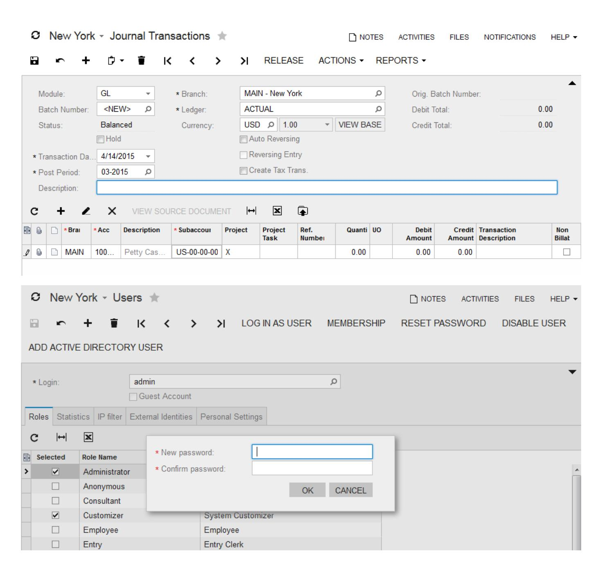

## <span id="page-51-0"></span>How to use input

The code fragments below type value into "Description" filed on "Journal Transactions" screen:

| JournalEntry journalEntry = new JournalEntry(); |  |
|-------------------------------------------------|--|
| journalEntry.OpenScreen();                      |  |
| journalEntry.Insert();                          |  |
| journalEntry.Summary.Description.Type("Test");  |  |
|                                                 |  |
|                                                 |  |
|                                                 |  |
|                                                 |  |
|                                                 |  |
|                                                 |  |

#### <span id="page-52-0"></span>Label

Description

Label shows informational text, more often descriptive name of the respective field.

- [How Label Looks Like in User Interface](#page-52-1)
- [How to Use Label](#page-52-2)

#### <span id="page-52-1"></span>How Label Looks Like in User Interface

|                                                                                         | c<br>New York $\sim$ Journal Transactions<br>$\bigcap$ NOTES<br><b>ACTIVITIES</b><br>$HELP -$<br><b>FILES</b><br><b>NOTIFICATIONS</b> |         |                  |               |                                                                  |                                                           |              |                          |                      |              |                  |                        |               |                                                        |                             |
|-----------------------------------------------------------------------------------------|---------------------------------------------------------------------------------------------------------------------------------------|---------|------------------|---------------|------------------------------------------------------------------|-----------------------------------------------------------|--------------|--------------------------|----------------------|--------------|------------------|------------------------|---------------|--------------------------------------------------------|-----------------------------|
| A                                                                                       |                                                                                                                                       | ć       |                  | L)            | !!!!!!!!!!!!!!!!!!!!!!!!!!!!!!!!!!!!!!!!<br>$\blacktriangledown$ | к<br>≺                                                    | $\geq$<br>⋋  | <b>RELEASE</b>           |                      | ACTIONS -    |                  | <b>REPORTS -</b>       |               |                                                        |                             |
| <b>MAIN - New York</b><br>GL<br>ρ<br>Module:<br>Orig. Batch Number:<br>$*$ Branch:<br>÷ |                                                                                                                                       |         |                  |               |                                                                  |                                                           |              |                          |                      |              |                  |                        |               |                                                        |                             |
|                                                                                         |                                                                                                                                       |         | Batch Number:    |               | 00000013<br>Ω                                                    | * Ledger:                                                 |              | <b>GLTEST</b>            |                      |              | ρ                |                        | Debit Total:  |                                                        | 178.94                      |
|                                                                                         |                                                                                                                                       | Status: |                  | On Hold       |                                                                  | Currency:                                                 |              | $\circ$<br><b>USD</b>    | 1.00                 | $\mathbf{v}$ | <b>VIEW BASE</b> |                        | Credit Total: |                                                        | 178.94                      |
|                                                                                         |                                                                                                                                       |         |                  | $\nabla$ Hold |                                                                  |                                                           |              | Auto Reversing           |                      |              |                  |                        |               |                                                        |                             |
|                                                                                         |                                                                                                                                       |         | * Transaction Da | 1/1/2007      | $\overline{\phantom{a}}$                                         |                                                           |              | <b>□ Reversing Entry</b> |                      |              |                  |                        |               |                                                        |                             |
|                                                                                         |                                                                                                                                       |         | * Post Period:   | 12-2006       | Ω                                                                |                                                           |              | Create Tax Trans.        |                      |              |                  |                        |               |                                                        |                             |
|                                                                                         |                                                                                                                                       |         | Description:     |               |                                                                  | Simple GL transaction between 2 accounts same subaccounts |              |                          |                      |              |                  |                        |               |                                                        |                             |
| с                                                                                       |                                                                                                                                       | ╈       | ◢                | $\times$      |                                                                  | <b>VIEW SOURCE DOCUMENT</b>                               |              | $\mathbf{x}$<br>⊶        | G                    |              |                  |                        |               |                                                        |                             |
| 髙                                                                                       | Û                                                                                                                                     | n       | * Bra            | * Acc         | <b>Description</b>                                               | * Subaccou                                                | Project      | Project<br><b>Task</b>   | Ref.<br><b>Numbe</b> | Quant UO     |                  | <b>Debit</b><br>Amount |               | <b>Credit Transaction</b><br><b>Amount Description</b> | <b>Non</b><br><b>Billal</b> |
| ≯                                                                                       | Û                                                                                                                                     | $\Box$  | <b>MAIN</b>      | 775           | Wages E                                                          | $US-00-00$                                                | $\mathsf{X}$ |                          | 00000                | 0.00         |                  | 178.94                 | 0.00          | Simple GL trans                                        | ப                           |
|                                                                                         | Û.                                                                                                                                    | n       | <b>MAIN</b>      | 232           | Wages P                                                          | $US-00-00$                                                | ΙX           |                          | 00000                | 0.00         |                  | 0.00                   | 178.94        | Simple GL trans                                        | □                           |
|                                                                                         |                                                                                                                                       |         |                  |               |                                                                  |                                                           |              |                          |                      |              |                  |                        |               |                                                        |                             |

## <span id="page-52-2"></span>How to Use Label

The code below opens "Journal Transaction" screen, gets text from label next to "Module" field and types it into console:

| JournalEntry batch = new JournalEntry();           |  |
|----------------------------------------------------|--|
| batch.OpenScreen();                                |  |
| var module = batch.Summary.ModuleLabel.GetValue(); |  |
|                                                    |  |
|                                                    |  |
|                                                    |  |
|                                                    |  |
|                                                    |  |

## <span id="page-53-0"></span>RichTextEdit

Description Represents complex text editor. Allows to edit text, press several editor buttons and perform text navigation

- [How Rich Text Edit looks like in user interface](#page-53-1)
- [How to use Rich Text Edit](#page-53-2)

<span id="page-53-1"></span>How Rich Text Edit looks like in user interface

| <b>Email Activity</b>                                                                                     | $\Box$ NOTES | <b>FILES</b>  | <b>CUSTOMIZATION</b> | HELP -        |
|-----------------------------------------------------------------------------------------------------------|--------------|---------------|----------------------|---------------|
| SAVE & CLOSE <b>D</b><br>n ∎<br><b>SEND</b><br><b>ACTIONS -</b>                                           |              |               |                      |               |
| From:<br>ρ<br>Q<br>$\star$ To:<br>CC:<br>Q<br>Q<br>BCC:                                                   |              |               |                      |               |
| * Subject:<br>Message<br>Details                                                                          |              |               |                      |               |
| - 1 U → A → ∥ → E → 目 目 目 卓 章 画<br>$\mathbf{v} = \mathbf{B}$<br>Paragraph<br>VISUAL -<br>$\sim$<br>$\sim$ |              | <b>INSERT</b> | LAYOUT               | <b>TABLES</b> |
| This is RishTextEdit                                                                                      |              |               |                      |               |

<span id="page-53-2"></span>How to use Rich Text Edit

#### Next example demonstrate typical editor usage.

| // Change editor mode to Visual            |  |
|--------------------------------------------|--|
| Email.Details.Body.Mode.Visual();          |  |
| // Erase all content from editor           |  |
| Email.Details.Body.Clear();                |  |
| // Type new content                        |  |
| Email.Details.Body.Type("EX404 – Step 2"); |  |
|                                            |  |
|                                            |  |
|                                            |  |
|                                            |  |

## <span id="page-54-0"></span>ToolBarButton

Description

ToolBarButton allows you to click on buttons in screen, report or grid toolbars.

- [How ToolBarButton Looks Like in User Interface](#page-54-1)
- [How to Use ToolBarButton](#page-55-0)

<span id="page-54-1"></span>How ToolBarButton Looks Like in User Interface

|                      | c          |         |                   |             | New York - Journal Transactions $\pm$ |   |                      |              |              |                        | $\bigcap$ NOTES      |      | <b>ACTIVITIES</b> |   | <b>FILES</b>                  | <b>NOTIFICATIONS</b> |                                                           | $HELP -$ |
|----------------------|------------|---------|-------------------|-------------|---------------------------------------|---|----------------------|--------------|--------------|------------------------|----------------------|------|-------------------|---|-------------------------------|----------------------|-----------------------------------------------------------|----------|
|                      | Н          | ∽       | ٠                 |             | ウィー音                                  | K | ≺                    | ≻            | ≻            | <b>RELEASE</b>         |                      |      |                   |   | ACTIONS - REPORTS -           |                      |                                                           |          |
|                      |            | Module: |                   | GL          | ÷                                     |   | * Branch:            |              |              | <b>MAIN - New York</b> |                      |      |                   | ρ |                               |                      |                                                           | ▼        |
|                      |            |         | Batch Number:     | <new></new> | Q                                     |   | * Ledger:            |              |              | <b>ACTUAL</b>          |                      |      |                   | α |                               |                      |                                                           |          |
|                      | c          |         | $\mathbf{r}$<br>٠ | x           |                                       |   | VIEW SOURCE DOCUMENT |              | $\mapsto$    | $\mathbf{x}$           | ⊕                    |      |                   |   |                               |                      |                                                           |          |
|                      | <b>B</b> 0 | n       | * Bra             | * Acc       | <b>Description</b>                    |   | * Subaccou           | Project      |              | Project<br><b>Task</b> | Ref.<br><b>Numbe</b> |      | Quant UO          |   | <b>Debit</b><br><b>Amount</b> |                      | <b>Credit Transaction</b><br><b>Amount Description</b>    |          |
|                      | Û          | B       | MAIN              | 100         | Petty Ca                              |   | $US-00-00$           | X            |              |                        |                      | 0.00 |                   |   | 10.00                         | 0.00                 |                                                           |          |
| ≯                    | Û          |         | <b>MAIN</b>       | 101         | Cash on                               |   | $US-00-00$           | $\mathsf{X}$ |              |                        |                      | 0.00 |                   |   | 0.00                          | 10.00                |                                                           |          |
|                      |            |         |                   |             |                                       |   |                      |              |              |                        |                      |      |                   |   |                               |                      |                                                           |          |
|                      |            |         |                   |             |                                       |   |                      |              |              |                        |                      |      |                   |   |                               |                      |                                                           |          |
|                      |            |         |                   |             |                                       |   |                      |              |              |                        |                      |      |                   |   |                               |                      |                                                           |          |
|                      |            |         |                   |             |                                       |   |                      |              |              |                        |                      |      |                   |   |                               |                      |                                                           |          |
|                      |            |         |                   |             |                                       |   |                      |              |              |                        |                      |      |                   |   |                               |                      |                                                           |          |
|                      |            |         |                   |             |                                       |   |                      |              |              |                        |                      |      |                   |   |                               |                      |                                                           |          |
|                      |            |         |                   |             |                                       |   |                      |              |              |                        |                      |      |                   |   |                               |                      |                                                           |          |
|                      |            |         |                   |             |                                       |   |                      |              |              |                        |                      |      |                   |   |                               |                      |                                                           |          |
| $\blacktriangleleft$ |            |         |                   |             |                                       |   |                      |              | $\mathbf{H}$ |                        |                      |      |                   |   |                               |                      |                                                           | Þ.       |
|                      |            |         |                   |             |                                       |   |                      |              |              |                        |                      |      |                   |   |                               | K                    | $\overline{\left\langle \right\rangle }$<br>$\rightarrow$ | $>$      |

## <span id="page-55-0"></span>How to Use ToolBarButton

The code below opens "Journal Transactions" screen and clicks "Insert" button:

JournalEntry batch = new JournalEntry(); batch.OpenScreen(); batch.Insert();

The code below opens "Journal Transactions" screen, skips to the last batch available and clicks "Release" button if it is enabled:

|   | JournalEntry batch = new JournalEntry();                                |
|---|-------------------------------------------------------------------------|
|   | batch.ToolBar.Release.WaitAction = Wait.WaitForLongOperationToComplete; |
|   | batch.OpenScreen();                                                     |
|   | batch.Last();                                                           |
|   | if (batch.ToolBar.Release.IsEnabled())                                  |
| { |                                                                         |
|   | batch.Release();                                                        |
| } |                                                                         |

## <span id="page-56-0"></span>TreeView

Description Tree-view allows you to select nodes in tree.

- [How Tree-View Looks Like in User Interface](#page-56-1)
- [How to Use Tree-View](#page-58-0)
- [Known Issues & Helpful Tips](#page-58-1)

<span id="page-56-1"></span>How Tree-View Looks Like in User Interface

| $\mathbf c$                   | $\ddot{}$<br>$\mathbf c$ | $2 \times 80$ | $\begin{picture}(20,20) \put(0,0){\line(1,0){10}} \put(15,0){\line(1,0){10}} \put(15,0){\line(1,0){10}} \put(15,0){\line(1,0){10}} \put(15,0){\line(1,0){10}} \put(15,0){\line(1,0){10}} \put(15,0){\line(1,0){10}} \put(15,0){\line(1,0){10}} \put(15,0){\line(1,0){10}} \put(15,0){\line(1,0){10}} \put(15,0){\line(1,0){10}} \put(15,0){\line(1$<br>$\left  \right. \left. \right. \left. \right $<br>个<br>$\downarrow$ | $\mathbb{X}$                                                                                                                                                                                                                                                                                                                                                                                                                                                                                                                                               |
|-------------------------------|--------------------------|---------------|----------------------------------------------------------------------------------------------------------------------------------------------------------------------------------------------------------------------------------------------------------------------------------------------------------------------------------------------------------------------------------------------------------------------------|------------------------------------------------------------------------------------------------------------------------------------------------------------------------------------------------------------------------------------------------------------------------------------------------------------------------------------------------------------------------------------------------------------------------------------------------------------------------------------------------------------------------------------------------------------|
| <b>a-© COMPANY</b>            | <b>B</b> ScreenID        | Title         | Icon                                                                                                                                                                                                                                                                                                                                                                                                                       | Url                                                                                                                                                                                                                                                                                                                                                                                                                                                                                                                                                        |
| <b>Drganization</b>           |                          |               |                                                                                                                                                                                                                                                                                                                                                                                                                            |                                                                                                                                                                                                                                                                                                                                                                                                                                                                                                                                                            |
| <b>∲ு⊜ Finance</b>            |                          |               |                                                                                                                                                                                                                                                                                                                                                                                                                            |                                                                                                                                                                                                                                                                                                                                                                                                                                                                                                                                                            |
| <b>General Ledger</b>         |                          |               |                                                                                                                                                                                                                                                                                                                                                                                                                            |                                                                                                                                                                                                                                                                                                                                                                                                                                                                                                                                                            |
| <b>∲</b> Work Area            |                          |               |                                                                                                                                                                                                                                                                                                                                                                                                                            |                                                                                                                                                                                                                                                                                                                                                                                                                                                                                                                                                            |
| <b>O</b> Enter                |                          |               |                                                                                                                                                                                                                                                                                                                                                                                                                            |                                                                                                                                                                                                                                                                                                                                                                                                                                                                                                                                                            |
| <b>Journal Transactions</b>   |                          |               |                                                                                                                                                                                                                                                                                                                                                                                                                            |                                                                                                                                                                                                                                                                                                                                                                                                                                                                                                                                                            |
| <sup>1</sup> Journal Vouchers |                          |               |                                                                                                                                                                                                                                                                                                                                                                                                                            |                                                                                                                                                                                                                                                                                                                                                                                                                                                                                                                                                            |
| <b>Budgets</b>                |                          |               |                                                                                                                                                                                                                                                                                                                                                                                                                            |                                                                                                                                                                                                                                                                                                                                                                                                                                                                                                                                                            |
| " A Trial Balance             |                          |               |                                                                                                                                                                                                                                                                                                                                                                                                                            |                                                                                                                                                                                                                                                                                                                                                                                                                                                                                                                                                            |
| <b>i</b> Manage               |                          |               |                                                                                                                                                                                                                                                                                                                                                                                                                            |                                                                                                                                                                                                                                                                                                                                                                                                                                                                                                                                                            |
| <b>d</b> Explore              |                          |               |                                                                                                                                                                                                                                                                                                                                                                                                                            |                                                                                                                                                                                                                                                                                                                                                                                                                                                                                                                                                            |
| Processes<br>田"               |                          |               |                                                                                                                                                                                                                                                                                                                                                                                                                            |                                                                                                                                                                                                                                                                                                                                                                                                                                                                                                                                                            |
| <b>o</b> Reports              |                          |               |                                                                                                                                                                                                                                                                                                                                                                                                                            |                                                                                                                                                                                                                                                                                                                                                                                                                                                                                                                                                            |
| <b>E</b> Configuration        |                          |               |                                                                                                                                                                                                                                                                                                                                                                                                                            |                                                                                                                                                                                                                                                                                                                                                                                                                                                                                                                                                            |
| Cash Management               |                          |               |                                                                                                                                                                                                                                                                                                                                                                                                                            |                                                                                                                                                                                                                                                                                                                                                                                                                                                                                                                                                            |
| <b>Conducts</b> Payable       |                          |               |                                                                                                                                                                                                                                                                                                                                                                                                                            |                                                                                                                                                                                                                                                                                                                                                                                                                                                                                                                                                            |
| <b>E</b> Accounts Receivable  |                          |               |                                                                                                                                                                                                                                                                                                                                                                                                                            |                                                                                                                                                                                                                                                                                                                                                                                                                                                                                                                                                            |
| <b>E</b> Fixed Assets         | $\overline{\phantom{a}}$ |               |                                                                                                                                                                                                                                                                                                                                                                                                                            | $\begin{array}{ccccccc}\n\left. \left. \right  & \left. \left. \right  & \left. \right  & \left. \right  & \left. \right  & \left. \right  & \left. \right  & \left. \right  & \left. \right  & \left. \right  & \left. \right  & \left. \right  & \left. \right  & \left. \right  & \left. \right  & \left. \right  & \left. \right  & \left. \right  & \left. \right  & \left. \right  & \left. \right  & \left. \right  & \left. \right  & \left. \right  & \left. \right  & \left. \right  & \left. \right  & \left. \right  & \left. \right  & \left$ |

| * Role Name:<br>Role Description: | ρ                                        |                                                                                          |
|-----------------------------------|------------------------------------------|------------------------------------------------------------------------------------------|
| <b>e-© COMPANY</b>                | $+ \times +$<br>c                        |                                                                                          |
| <b>Organization</b>               | 冒<br><b>Description</b><br><b>Access</b> |                                                                                          |
| <b>O</b> Einance                  | <b>Rights</b>                            |                                                                                          |
| <b>General Ledger</b>             |                                          |                                                                                          |
| on Work Area                      |                                          |                                                                                          |
| on Enter                          | Ξ                                        |                                                                                          |
| on Journal Transactions           |                                          |                                                                                          |
| <b>Em GL Batch</b>                |                                          |                                                                                          |
| " com GL Transaction              |                                          |                                                                                          |
| <b>o</b> Journal Vouchers         |                                          |                                                                                          |
| ⊕‴□ Budgets                       |                                          |                                                                                          |
| <b>de The Trial Balance</b>       |                                          |                                                                                          |
| <b>⊕</b> ்⊟ Manage                |                                          |                                                                                          |
| <b><i>i</i></b> Explore           |                                          |                                                                                          |
| <b>d</b> Processes                |                                          |                                                                                          |
| <b>i</b> Reports                  |                                          |                                                                                          |
| <b>de Configuration</b>           |                                          |                                                                                          |
| ட் <sup></sup> ⊑⊫ Cash Management | $\overline{\phantom{a}}$                 | $\begin{array}{ccccccc}\n\mathsf{K} & \mathsf{K} & \mathsf{K} & \mathsf{K}\n\end{array}$ |

| с<br>▬                                     |   |                          | Properties   | Attributes      | Events                 | Add Controls   Add Data Fields |       | <b>View ASPX</b> |  |
|--------------------------------------------|---|--------------------------|--------------|-----------------|------------------------|--------------------------------|-------|------------------|--|
| ▶ <i><b>i</b></i> DataSource: JournalEntry |   | c                        | ⊢            |                 |                        |                                |       |                  |  |
| ▼ <i>m</i> Form: BatchModule               |   |                          | Override     | <b>Property</b> |                        |                                | Value |                  |  |
| 印 Column<br>Þ.                             |   | $\overline{\phantom{a}}$ |              |                 | <b>Base Properties</b> |                                |       |                  |  |
| <b><i><u>i</u></i></b> Column<br>Þ.        |   |                          | $\mathbf{I}$ |                 | ColumnSpan             |                                |       |                  |  |
| fill Column<br>Þ.                          | Ξ |                          | $\mathbf{I}$ |                 | ColumnWidth            |                                |       |                  |  |
| $\bigstar$ Parameters<br>Þ.                |   |                          |              |                 | ControlSize            |                                | XМ    |                  |  |
| ▼ <i>m</i> Grid: GLTranModuleBatNbr        |   |                          |              |                 | EndGroup               |                                |       |                  |  |
| 画 Line Nbr.                                |   |                          |              |                 | GroupCaption           |                                |       |                  |  |
| 画 Branch                                   |   |                          | $\Box$       |                 | LabelsWidth            |                                | s     |                  |  |
| 画 Account                                  |   |                          | $\Box$       | Merge           |                        |                                |       |                  |  |
| <b>M</b> Description                       |   |                          | П            |                 | <b>StartColumn</b>     |                                | True  |                  |  |
| 画 Subaccount                               |   |                          | П            |                 | StartGroup             |                                |       |                  |  |
| em Project                                 |   |                          |              | <b>StartRow</b> |                        |                                |       |                  |  |
| 画 Project Task                             |   |                          |              |                 | SuppressLabel          |                                |       |                  |  |
| 画 Ref. Number                              |   |                          |              |                 |                        |                                |       |                  |  |
|                                            |   |                          |              |                 |                        |                                |       |                  |  |

|                             |                           |                                                                       |                                              |                |                                                          |                          |           |                    |              |                                |                                                                                                                                       | ▲                                        |
|-----------------------------|---------------------------|-----------------------------------------------------------------------|----------------------------------------------|----------------|----------------------------------------------------------|--------------------------|-----------|--------------------|--------------|--------------------------------|---------------------------------------------------------------------------------------------------------------------------------------|------------------------------------------|
| Map:                        | <b>Time Card Approval</b> |                                                                       |                                              | Q              |                                                          |                          |           |                    |              |                                |                                                                                                                                       |                                          |
| * Name:                     | Time Card Approval        |                                                                       |                                              |                |                                                          |                          |           |                    |              |                                |                                                                                                                                       |                                          |
| $\star$ Entity:             | <b>Employee Timecard</b>  |                                                                       |                                              |                |                                                          |                          |           |                    |              |                                |                                                                                                                                       |                                          |
| <b>Tree</b>                 | $\blacksquare$            | <b>Rules</b>                                                          |                                              |                |                                                          |                          |           |                    |              |                                |                                                                                                                                       |                                          |
| $\mathbf c$                 |                           | c                                                                     | $\times$<br>÷                                | $+ UP$         | $\left  \leftarrow \right $<br>$\blacklozenge$ DOWN      |                          |           |                    |              |                                |                                                                                                                                       |                                          |
| □ COMPANY<br>All Time Cards |                           | 目                                                                     | Seq. Type                                    | * Name         |                                                          | Jump to                  | Workgroup |                    | Assign<br>to | <b>Employee</b><br><b>Name</b> |                                                                                                                                       | Departmen                                |
|                             |                           | $\blacktriangleright$                                                 | 1 Assign                                     | All Time Cards |                                                          |                          | Finance   |                    | Beauvo       |                                | Beauvoir Lay                                                                                                                          | <b>FINANCE</b>                           |
|                             |                           | $\leftarrow$<br><b>Conditions</b><br>$\mathbf c$<br><b>B</b> * Entity | Rule Type:<br>$\mathbb{R}$ $\mathbb{H}$<br>٠ |                | $\mathbb{H}$<br>All conditions are true.<br>* Field Name | $\overline{\phantom{a}}$ | Condition | <b>Field Value</b> |              |                                | $\begin{array}{ccccccc} \ & \ & \ & \ & \ & \ & \ & \ & \ & \ & \ & \ & \ & \ & \ & \ & \ & \ & \ &$                                  | !!!!!!!!!!!!!!!!!!!!!!!!!!!!!!!!!!!!!!!! |
|                             |                           |                                                                       |                                              |                |                                                          |                          |           |                    |              |                                | $\begin{array}{ccccccc} \left  \left\langle \quad & \left\langle \quad & \right\rangle & \quad \right\rangle \right  & & \end{array}$ |                                          |

#### <span id="page-58-0"></span>How to Use Tree-View

The code fragments below shows how to open "Journal Transactions" node in site-map tree:

| SiteMap siteMap = new SiteMap();                                                                       |  |
|--------------------------------------------------------------------------------------------------------|--|
|                                                                                                        |  |
| siteMap.OpenScreen();                                                                                  |  |
| siteMap.Parameters.Tree.Select("COMPANY/Finance/General Ledger/Work Area/Enter/Journal Transactions"); |  |
|                                                                                                        |  |
|                                                                                                        |  |
|                                                                                                        |  |
|                                                                                                        |  |
|                                                                                                        |  |
|                                                                                                        |  |
|                                                                                                        |  |

#### <span id="page-58-1"></span>Known Issues & Helpful Tips

If tree contains several nodes with identical names you can select any of them by index:

| JournalEntry journalEntry = new JournalEntry();                                                       |
|-------------------------------------------------------------------------------------------------------|
| CustomizationObjectExt customizationMenu = new CustomizationObjectExt();                              |
| LayoutEditor layoutEditor = new LayoutEditor();                                                       |
| journalEntry.OpenScreen();                                                                            |
| customizationMenu.Custom();                                                                           |
| customizationMenu.InspectelementCtrlAtlClick();                                                       |
| journalEntry.Summary.BranchID.Click();                                                                |
| customizationMenu.ElementProperties.Customize();                                                      |
| customizationMenu.SelectCustomizationProject.New();                                                   |
| customizationMenu.NewProject.NewProject.Type("Test");                                                 |
| customizationMenu.NewProject.Ok();                                                                    |
| customizationMenu.SelectCustomizationProject.Ok();                                                    |
| layoutEditor.Properties.SelectRow(layoutEditor.Properties.FilterForm.Fields.Value.Value, "BranchID"); |
| layoutEditor.ParametersTree.TreePageControls.Select("Form: BatchModule/Column", 3);                   |
| layoutEditor.ParametersTree.TreePageControls.Select("Form: BatchModule/Column", 1);                   |
| layoutEditor.ParametersTree.TreePageControls.Select("Form: BatchModule/Column", 2);                   |
|                                                                                                       |
|                                                                                                       |
|                                                                                                       |
|                                                                                                       |

# <span id="page-59-0"></span>ClassGenerator.exe

ClassGenerator.exe is a command line tool that allows Test SDK users to generate page wrappers for applications built on top of Acumatica Framework.

[ClassGenerator.exe.config](#page-60-0)

## <span id="page-60-0"></span>ClassGenerator.exe.config

- [ClassGenerator.exe.config](#page-60-1)
- [PagesList.txt](#page-61-0)
- [PagesWithParameters.txt](#page-61-1)
- [GenericInquiriesWithParameters.txt](#page-61-2)

<span id="page-60-1"></span>ClassGenerator.exe.config

You can change the settings of the page wrapper generation tool (ClassGenerator.exe) in the ClassGenerator.exe.config file. The structure of this file is shown below.

| xml version="1.0" encoding="utf-8"?<br><configuration></configuration>                                                            |
|-----------------------------------------------------------------------------------------------------------------------------------|
| <appsettings></appsettings>                                                                                                       |
| Local path to the Acumatica ERP instance installation directory                                                                   |
| <add key="SitePhysicalPath" value="C:\Program Files (x86)\Acumatica ERP\yoursite"></add>                                          |
| Output directory to store the generated page wrappers                                                                             |
| <add key="GenResultPath" value="C:\share\output"></add>                                                                           |
| User to be used for page wrapper generation                                                                                       |
| <add key="UserName" value="admin@Demo"></add>                                                                                     |
| IDs of the pages you want to run wrapper generation for; the wildcard * is supported                                              |
| <add key="FileNameFilter" value="CS100000, CS102000, CM202000, GL201500, CS202000, GL202500, GL102000, GL101000, GL201000"></add> |
| Deletes all files in output directory before running the page wrapper generation process                                          |
| <add key="ClearOutput" value="true"></add>                                                                                        |
| Namespace where wrapper classes will be defined. Use the template "GeneratedWrappers.<PartnerName>".                              |
| <add key="Namespace" value="GeneratedWrappers.Acumatica"></add>                                                                   |
|                                                                                                                                   |
|                                                                                                                                   |
|                                                                                                                                   |

#### You can use the following keys in the ClassGenerator.exe.config file to configure the generation of page wrappers.

| # | Key                | Key                                                                                                                                                                                                                                   | Mandatory/ | Usage                                                                                                   |
|---|--------------------|---------------------------------------------------------------------------------------------------------------------------------------------------------------------------------------------------------------------------------------|------------|---------------------------------------------------------------------------------------------------------|
|   | Name               | Description                                                                                                                                                                                                                           | Optional   | Example                                                                                                 |
| 1 | SitePhysicalPath   | Specifies the local path to the installation directory<br>of an Acumatica ERP instance.                                                                                                                                               | Mandatory  | <add <br="" key="SitePhysicalPath">value="C:\Program Files<br/>(x86)\Acumatica ERP\demo"/&gt;</add>     |
| 2 | GenResultPath      | Specifies the directory where the generated page<br>wrappers should be saved.                                                                                                                                                         | Mandatory  | <add <br="" key="GenResultPath">value="C:\Output"/&gt;</add>                                            |
| 3 | UserName           | Specifies the user name to be used to log in to the<br>Acumatica ERP instance.<br>If you need to log in to a specific company, you                                                                                                    | Mandatory  | <add key="UserName" value="admin"></add><br><add <br="" key="UserName">value="admin@Company"/&gt;</add> |
|   |                    | should specify the user name in the following<br>format: UserName@CompanyName, where UserNa<br>me is replaced with the name of the user, and Comp<br>anyName is replaced with the name of the<br>company to which you want to log in. |            |                                                                                                         |
| 4 | FileNameFilter     | Specifies the IDs of the forms for which you want to<br>generate page wrappers.                                                                                                                                                       | Mandatory  | <add <br="" key="FileNameFilter">value="GL301000, GL501000"/&gt;</add>                                  |
|   |                    | You can use two-letter prefix of the Acumatica ERP<br>module name as the value of this key to generate                                                                                                                                |            | <add <br="" key="FileNameFilter">value="GL301000, CR"/&gt;</add>                                        |
|   |                    | wrappers for all forms of the module.<br>You can use * as the value of this key to generate<br>wrappers for all pages.                                                                                                                |            | <add <br="" key="FileNameFilter">value="*"/&gt;</add>                                                   |
| 5 | PagesList          | Specifies the file that contains the list of IDs of the<br>forms that should be included in or excluded from<br>the page wrapper generation.                                                                                          | Optional   | <add key="PagesList" value="PagesLis&lt;br&gt;t.txt"></add>                                             |
| 6 | PagesListAttribute | Specifies whether the forms that are specified in the<br>PagesList key should be included in or excluded                                                                                                                              | Optional   | <add <br="" key="PagesListAttribute">value="include"/&gt;</add>                                         |
|   |                    | from the page wrapper generation.<br>You can set the value of this key to include to<br>include the forms in the page wrapper generation.                                                                                             |            | <add <br="" key="PagesListAttribute">value="exclude"/&gt;</add>                                         |
|   |                    | You can set the value of this key to exclude to<br>exclude the forms from the page wrapper<br>generation.                                                                                                                             |            |                                                                                                         |
| 7 | ClearOutput        | Specifies whether all files in the output directory,<br>which is specified in the GenResultPath key,                                                                                                                                  | Mandatory  | <add key="ClearOutput" value="true"></add>                                                              |

|               |                          | should be removed before the page wrapper<br>generation starts.<br>You can set the value of this key to true to<br>remove all files from the output folder before page                       |          | <add <br="" key="ClearOutput">value="false"/&gt;</add>                                                |
|---------------|--------------------------|----------------------------------------------------------------------------------------------------------------------------------------------------------------------------------------------|----------|-------------------------------------------------------------------------------------------------------|
|               |                          | wrapper generation.<br>You can set the value of this key to false to not<br>delete the files from the output folder before page<br>wrapper generation.                                       |          |                                                                                                       |
| 8             | Namespace                | Specifies the namespace where page wrapper<br>classes should be defined.<br>We recommend that you use the following template<br>for the namespace name: GeneratedWrappers.<<br>PartnerName>. | Optional | <add <br="" key="Namespace">value="GeneratedWrappers.Acumatica"/&gt;</add>                            |
| 9             | PagesParameters          | Specifies the file that contains the list of forms that<br>require some parameters to open.                                                                                                  | Optional | <add key="PagesParameters" value="Pa&lt;br&gt;gesWithParameters.txt"></add>                           |
| 10            | GenericInquiryParameters | Specifies the file that contains the list of generic<br>inquiries that require some parameters to open.                                                                                      | Optional | <add <br="" key="GenericInquiryParameters">value="GenericInquiriesWithParameter<br/>s.txt"/&gt;</add> |
| 11            | CorrectCTL01             | Specifies whether the entries of ctl01 should be<br>replaced with ctl00 in the generated page                                                                                                | Optional | <add <br="" key="CorrectCTL01">value="true"/&gt;</add>                                                |
| PagesList.txt |                          | wrappers.<br>You can set the value of this key to true to<br>replaces entries of ctl01 with ctl00 in the<br>generated page wrappers.                                                         |          | <add <br="" key="CorrectCTL01">value="false"/&gt;</add>                                               |

<span id="page-61-0"></span>You can set the value of this key to false to not replace entries of ctl01 with ctl00 in the <add key="PagesList" value="PagesList.txt"/>

generated page wrappers. Specifies the file that contains the list of IDs of the forms that should be included in or excluded from the page wrapper generation.

|          | Example |  |
|----------|---------|--|
| CS100000 |         |  |
| CS102000 |         |  |
| GL201500 |         |  |
| GL301000 |         |  |
| GL501000 |         |  |
|          |         |  |

#### PagesWithParameters.txt

<span id="page-61-1"></span><add key="PagesParameters" value="PagesWithParameters.txt"/>

Specifies the file that contains the list of forms that require some parameters to open.

| Example                                                                                                                    |
|----------------------------------------------------------------------------------------------------------------------------|
| CR306010 ?TaskID=29&RefNoteID=764<br>CR306015 ?TaskID=30&RefNoteID=764&NotificationID=4517FCC3-98A7-4521-B4C7-1BD80B2846E6 |

#### GenericInquiriesWithParameters.txt

<span id="page-61-2"></span><add key="GenericInquiryParameters" value="GenericInquiriesWithParameters.txt"/>

Specifies the file that contains the list of generic inquiries that require some parameters to open.

|                                                                                                        | Example |  |
|--------------------------------------------------------------------------------------------------------|---------|--|
| GI000001 ?Name=Currency Rates History                                                                  |         |  |
| CR3010PL ?ID=20e4ab0d-0631-4759-a48d-6ec20ac78291                                                      |         |  |
| CR3060PL ?ID=24d48139-cf11-4be6-9bd3-57ee86893778                                                      |         |  |
| CR3040PL ?ID=a95a50d6-6892-4052-b6aa-8e769efa2bfc                                                      |         |  |
| CR3080PL ?ID=6b673610-9cee-46c3-adb4-1e1569ddbb0b                                                      |         |  |
| CR3020PL ?ID=d345a840-d1cf-4d6f-a2df-a454b85b20d8                                                      |         |  |
| CR3030PL ?ID=df95d4e3-fb8c-4aff-ba9a-f8371e7b1908                                                      |         |  |
|                                                                                                        |         |  |
|                                                                                                        |         |  |
| CR2040PL ?ID=45c1d74f-f7b4-498d-bee2-416863b35196<br>CR2020PL ?ID=d7dfa28a-36ad-467c-addb-c2080eda3484 |         |  |

# <span id="page-63-0"></span>Part 3: Acumatica Test SDK—Programming Tasks

In this part, you can find descriptions of the programming tasks that you can perform by using Acumatica Test SDK.

In This Part

- [Known Issues](#page-64-0)
- [How to Use Page Wrapper Generation Tool](#page-65-0)
- [How to Generate Page Wrappers Using Test SDK API](#page-66-0)
- [How to Work With Errors That Occur During Page Wrapper Generation](#page-68-0)
- [How to Change the Settings of the Page Wrapper Generation Tool](#page-74-0)
- [How to Change Browser Settings](#page-77-0)
- [How to Change Chrome Settings](#page-78-0)
- [How to Change Culture Settings](#page-79-0)
- [How to Change Predefined Timeouts](#page-81-0)
- [How to Manage Log Providers](#page-82-0)
- [How to Work with Alerts](#page-84-0)
- [How to Commit Changes in Rows of a Detail Table](#page-87-0)
- [How to Navigate through the Rows of a Detail Table](#page-88-0)
- [How to Show or Hide Columns in a Detail Table](#page-89-0)
- [How to Use Column Filters of a Detail Table](#page-92-0)
- [How to Work with Errors](#page-94-0)
- [How to Work with Warnings](#page-96-0)
- [How to Work with Windows](#page-98-0)
- [How to Work with the Names of UI Elements](#page-99-0)
- [How to Work with Drop-Down Menus on Toolbars](#page-100-0)
- [How to Work with Pop-Up Dialog Boxes](#page-101-0)
- [How to Work with Pop-Up Panels](#page-103-0)
- [How to Verify a Note on a Form](#page-104-0)
- [How to Add a Note to a Detail Line](#page-105-0)
- [How to Add a Note to an Acumatica Form](#page-106-0)
- [How to Upload a File](#page-107-0)
- [How to Upload Data from an Excel File into a Detail Table](#page-108-0)
- [How to Upload Data from a CSV File into a Detail Table](#page-109-0)
- [How to Attach a File to an Acumatica Form](#page-110-0)
- [How to Attach a File to a Detail Line](#page-111-0)
- [How to Remove an Attached File from an Acumatica Form](#page-112-0)
- [How to Remove an Attached File from a Detail Line](#page-113-0)
- [How to Publish Customization Projects](#page-114-0)
- [How to Work with Smart Delays](#page-115-0)
- [How to Capture Screenshots](#page-117-0)
- [How to Get Datetime in the Current User's Timezone](#page-118-0)
- [How to use Comparator to compare .xml, .csv, .pdf, Excel files](#page-119-0)
- [How to Verify string/long/int/DateTime returned by a method](#page-120-0)
- [How to work with dynamic controls](#page-121-0)

# <span id="page-64-0"></span>Known Issues

This topic describes the following known issue of Acumatica Test SDK:

[Tests Incorrectly Click or Don't Click Elements on a Form](#page-64-1)

<span id="page-64-1"></span>Tests Incorrectly Click or Don't Click Elements on a Form

One of the possible reasons of such behavior is the display scale setting in Windows OS.

To fix the issue, in the Control Panel, select All Control Panel Items > Display, and set the display scale to 100%, as shown in the following screenshot.

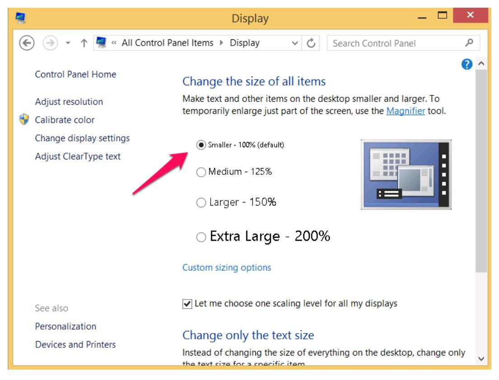

# <span id="page-65-0"></span>How to Use Page Wrapper Generation Tool

The page wrapper generation tool is a tool that you can use to generate page wrappers for the Acumatica forms whose functionality you want to test.

## Parts of the Page Wrapper Generation Tool

The page wrapper generation tool consists of two parts:

- ClassGenerator.exe: The assembly that you run to generate page wrappers. It searches for ASPX and RPX files in the directory that you specify by the conditions that you specify. Also, the assembly moves the Host.dll file from the working directory of ClassGenerator.exe to the Acumatica instance directory that you specify. The Acumatica instance directory must be accessible by the file system.
- Host.dll: The working assembly. It is moved to the Acumatica instance directory by ClassGenerator.exe during page wrapper generation. The working assembly processes requests from ClassGenerator.exe, uses the ASP.NET infrastructure to get instances of Acumatica page classes, parses them, generates the wrapper classes, and saves the classes in the directory that you specify.

ClassGenerator.exe uses requests, such as <Instance path>/Pages/PM/PM503000.aspx. You can find this request in the ScreenUrl pro perty of the generated class. If something goes wrong during page wrapper generation, try to open the form by using this URL in a browser. You can find more information on page wrapper generation errors in [Common Errors That Can Occur During Page Wrapper Generation](#page-68-0).

## Launch Modes

You can run page wrapper generation tool as a separate application or use it though the API. The following recommendations apply:

- If you run ClassGenerator.exe as a separate application, you need to specify its parameters in the configuration file. For details, see [How](#page-74-0) [to Change the Settings of the Page Wrapper Generation Tool.](#page-74-0)
- If you use ClassGenerator.exe through the API, you need to add a reference to it from your .Net Framework code and create an instance of the ClassGenerator.ClassGenerator class. For details, see [How to Generate Page Wrappers Programmatically.](#page-66-0)

<span id="page-66-0"></span>How to Generate Page Wrappers Using Test SDK API

You can use the page wrapper generation tool through the API. To do this, add a reference to ClassGenerator.exe to your project, create an instance of the ClassGenerator.ClassGenerator class and generate the wrappers, as shown in the code fragment below.

ClassGenerator.ClassGenerator WG = new ClassGenerator.ClassGenerator("C:\Program Files (x86)\Acumatica ERP\demo", "C:\Output")); WG.Run("GL301000, GL501000");

To use the page wrapper generation tool (ClassGenerator.exe) through the API, do the following:

- 1. Add to your project a reference to ClassGenerator.exe.
- 2. Create an instance of the ClassGenerator.ClassGenerator class, as shown in the following code fragment. The constructor takes as input arguments the path to the Acumatica ERP instance and the path to the folder where the generated page wrappers should be saved.

ClassGenerator.ClassGenerator WG = new ClassGenerator.ClassGenerator("C:\Program Files (x86)\Acumatica ERP\demo", "C:\Output");

3. Specify the username that should be used to log in to the Acumatica ERP instance, as shown in the following code fragment. You can omit this step if the user is admin.

WG.Username = "Simpson";

4. Specify the namespace that should be used for generated classes, as shown in the following code fragment. By default, the GeneratedW rappers.Acumatica namespace is used. We recommend that you use the following format for the namespace name: GeneratedWrap pers.<OEMName>.

WG.Namespace = "GeneratedWrappers.Acumatica";

- 5. If you need to create multiple wrappers for one form, specify a postfix for wrapper files and class names to distinguish the wrappers, as shown in the following code.
  - WG.Postfix = "INT";
- 6. If you need to specify the forms for which you do not need to generate wrappers, add these forms to the list of forms that should be excluded from page wrapper generation as follows.

WG.ExceptedScreens.Add("SM204520");

- 7. If you need to use the specific URL of a page, you can use one of the approaches listed below:
  - If you need to specify particular entries for a form, do this as follows.

WG.SpecificEntries.Add("CR306010", "?TaskID=29&RefNoteID=764");

If you need to generate wrappers for a generic inquiry, add the inquiry to the list of generic inquiries for generation.

WG.GIs.Add("GI000001", "?Name=Currency Rates History");

In the situations described above or in other situations when you need to specify particular URL of a page, add the page for generation as follows. The example below adds analytical reports from demo data for generation. (This is the only way to generate wrappers for these pages.)

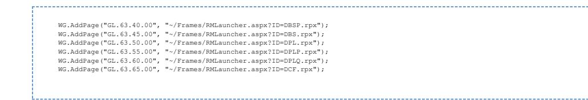

- 8. Start page wrapper generation in one of the following ways.
  - If you have added all forms for which you need to generate page wrappers by the specific URL, as described in the previous step, run page wrapper generation as follows.

| WG.Run();                                                                                                                                       |  |
|-------------------------------------------------------------------------------------------------------------------------------------------------|--|
| If you want to generate wrappers for ASPX and RPX files in the folder of the Acumatica ERP instance, run page wrapper<br>generation as follows. |  |
| WG.Run("*.*px");                                                                                                                                |  |
| If you want to generate wrappers for particular forms, run page wrapper generation as follows.                                                  |  |

WG.Run("AU203002,SM204520");

# <span id="page-68-0"></span>How to Work With Errors That Occur During Page Wrapper Generation

In this topic, you can find the following common errors that can occur during page wrapper generation and recommendations on how to fix them:

- [Error: Value cannot be null](#page-68-1)
- [Error: Request is not available in this context](#page-68-2)
- [Error: Object reference not set to an instance of an object.](#page-69-0)
- [Error: The 'SkinId' property cannot be changed dynamically if Page has a stylesheet theme. For dynamic controls, set the property before](#page-70-0) [calling ApplyStyleSheetSkin\(\).](#page-70-0)
- [Error: Unable to find assembly 'PX.Data, Version=1.0.0.0, Culture=neutral, PublicKeyToken=3b136cac2f602b8e'.](#page-71-0)
- [Error: Object reference not set to an instance of an object. for a Custom Application](#page-72-0)
- [Error: Type 'PX.Data.PXNotEnoughRightsException' in Assembly 'PX.Data, Version=1.0.0.0, Culture=neutral,](#page-73-0) [PublicKeyToken=3b136cac2f602b8e' is not marked as serializable.](#page-73-0)

#### <span id="page-68-1"></span>Error: Value cannot be null

The error Value cannot be null can occur during page wrapper generation. The stack trace of the error is shown below.

Process DONE - GL301000

#### Value cannot be null

```
System.Exception: Unable to get screen GL301000 with url /Pages/GL/GL301000.aspx --->
System.ArgumentNullException: Value cannot be null.
Parameter name: Unable to receive Request Handler: (Page)((HttpContext)ar.AsyncState).Handler is null,
verify screen existing.
 at ClassGenerator.Host.MyProxy.GetPage(IAsyncResult ar)
 at ClassGenerator.Host.MyProxy.<>c__DisplayClass7_0.<Process>b__0(IAsyncResult ar)
 at System.Web.HttpAsyncResult.Complete(Boolean synchronous, Object result, Exception error,
RequestNotificationStatus status)
 at System.Web.HttpApplication.ApplicationStepManager.ResumeSteps(Exception error)
 at System.Web.HttpApplication.System.Web.IHttpAsyncHandler.BeginProcessRequest(HttpContext context,
AsyncCallback cb, Object extraData)
 at ClassGenerator.Host.MyProxy.ProcessRequest(HttpContext ctx, AsyncCallback cb)
 at ClassGenerator.Host.MyProxy.Process(String uri, String user, String screenID, String genResultPath,
String postfix, String Namespace, Boolean corectCTL01)
 --- End of inner exception stack trace ---
Server stack trace:
 at ClassGenerator.Host.MyProxy.Process(String uri, String user, String screenID, String genResultPath,
String postfix, String Namespace, Boolean corectCTL01)
 at System.Runtime.Remoting.Messaging.StackBuilderSink._PrivateProcessMessage(IntPtr md, Object[] args,
Object server, Object[]& outArgs)
 at System.Runtime.Remoting.Messaging.StackBuilderSink.SyncProcessMessage(IMessage msg)
Exception rethrown at [0]:
 at System.Runtime.Remoting.Proxies.RealProxy.HandleReturnMessage(IMessage reqMsg, IMessage retMsg)
 at System.Runtime.Remoting.Proxies.RealProxy.PrivateInvoke(MessageData& msgData, Int32 type)
 at ClassGenerator.Host.MyProxy.Process(String uri, String user, String screenID, String genResultPath,
String postfix, String Namespace, Boolean corectCTL01)
 at ClassGenerator.ScreenExtractor.GetScreen(ScreenMeta ScreenMeta) in
E:\Bld\AC-TESTSDK2018R101-JOB1\tests\Selenium\ClassGenerator\ClassGenerator\ScreenExtractor.cs:line 42
 at ClassGenerator.ClassGenerator.Run() in
E:\Bld\AC-TESTSDK2018R101-JOB1\tests\Selenium\ClassGenerator\ClassGenerator\ClassGenerator.cs:line 183
```

#### Solution

Remove Telemetry dlls from the site's bin folder, disable Request Profiler on SM205070

<span id="page-68-2"></span>Error: Request is not available in this context

The error Request is not available in this context can occur during page wrapper generation. The stack trace of the error is shown below.

Process DONE - CS206000

Request is not available in this context

```
System.Exception: Unable to get screen cs206000 with url /Pages/CustomFolder/CS/cs206000.aspx --->
System.Web.HttpException: Request is not available in this context
 at System.Web.UI.Page.get_Request()
 at PX.Web.UI.PXSmartPanel.GetVisibleFromRequest() in
C:\BuildAgent\work\3942f517507dc821\code\NetTools\PX.Web.UI\Controls\Containers\SmartPanel.cs:line 2077
 at PX.Web.UI.PXSmartPanel.OnInit(EventArgs e) in
C:\BuildAgent\work\3942f517507dc821\code\NetTools\PX.Web.UI\Controls\Containers\SmartPanel.cs:line 1134
 at System.Web.UI.Control.InitRecursive(Control namingContainer)
 at System.Web.UI.Control.InitRecursive(Control namingContainer)
 at System.Web.UI.Control.InitRecursive(Control namingContainer)
 at System.Web.UI.Control.InitRecursive(Control namingContainer)
 at System.Web.UI.Control.AddedControl(Control control, Int32 index)
 at System.Web.UI.ControlCollection.Add(Control child)
 at PX.Web.UI.PXFormView.CreateChildControls(IEnumerable dataSource, Boolean dataBinding) in
C:\BuildAgent\work\3942f517507dc821\code\NetTools\PX.Web.UI\Controls\Containers\FormView.cs:line 627
 at System.Web.UI.WebControls.CompositeDataBoundControl.CreateChildControls()
 at PX.Web.UI.PXBoundPanel.CreateChildControls() in
C:\BuildAgent\work\3942f517507dc821\code\NetTools\PX.Web.UI\Controls\Containers\BoundPanel.cs:line 1757
 at System.Web.UI.Control.EnsureChildControls()
 at System.Web.UI.WebControls.CompositeDataBoundControl.get_Controls()
 at ClassGenerator.Host.ControlSearcher`1.FindControls(Control control)
 at ClassGenerator.Host.ControlSearcher`1.FindControls(Control control)
 at ClassGenerator.Host.ControlSearcher`1.FindControls(Control control)
 at ClassGenerator.Host.ControlSearcher`1.FindControls(Control control)
 at ClassGenerator.Host.ControlSearcher`1.FindControls(Control control)
 at ClassGenerator.Host.ControlSearcher`1..ctor(Control control)
 at ClassGenerator.Host.Helper.setToolbarUpdatable(Page page)
 at ClassGenerator.Host.MyProxy.GetPage(IAsyncResult ar)
 at ClassGenerator.Host.MyProxy.<>c__DisplayClass7_0.<Process>b__2(IAsyncResult ar)
 at System.Web.HttpAsyncResult.Complete(Boolean synchronous, Object result, Exception error,
RequestNotificationStatus status)
 at System.Web.HttpApplication.ApplicationStepManager.ResumeSteps(Exception error)
 at System.Web.HttpApplication.System.Web.IHttpAsyncHandler.BeginProcessRequest(HttpContext context,
AsyncCallback cb, Object extraData)
 at ClassGenerator.Host.MyProxy.ProcessRequest(HttpContext ctx, AsyncCallback cb)
 at ClassGenerator.Host.MyProxy.Process(String uri, String user, String screenID, String genResultPath,
String postfix, String Namespace, Boolean corectCTL01)
 --- End of inner exception stack trace ---
Server stack trace: 
 at ClassGenerator.Host.MyProxy.Process(String uri, String user, String screenID, String genResultPath,
String postfix, String Namespace, Boolean corectCTL01)
 at System.Runtime.Remoting.Messaging.StackBuilderSink._PrivateProcessMessage(IntPtr md, Object[] args,
Object server, Object[]& outArgs)
 at System.Runtime.Remoting.Messaging.StackBuilderSink.SyncProcessMessage(IMessage msg)
Exception rethrown at [0]: 
 at System.Runtime.Remoting.Proxies.RealProxy.HandleReturnMessage(IMessage reqMsg, IMessage retMsg)
 at System.Runtime.Remoting.Proxies.RealProxy.PrivateInvoke(MessageData& msgData, Int32 type)
 at ClassGenerator.Host.MyProxy.Process(String uri, String user, String screenID, String genResultPath,
String postfix, String Namespace, Boolean corectCTL01)
 at ClassGenerator.ScreenExtractor.GetScreen(ScreenMeta ScreenMeta) in
E:\Bld\AC-TSDK60U1-JOB1\tests\Selenium\ClassGenerator\ClassGenerator\ScreenExtractor.cs:line 42
 at ClassGenerator.ClassGenerator.Run(List`1 ScreensMetadata) in
E:\Bld\AC-TSDK60U1-JOB1\tests\Selenium\ClassGenerator\ClassGenerator\ClassGenerator.cs:line 158
```

#### Solution

- You can not neither open the screen in browser nor generate page wrapper for it. Pleas fixe your application to let the browser open it and run wrapper generation again.
- You can face this error running Windows 8 OS request maybe lost specifically on this OS due to related MS bug. Please change OS and run wrapper generation again.
- You have more than 1 company in your database but there is no company specified in the Config.xml you use while generating page wrappers. Please join user name with company name in your Config.xml file as follows: <add key="Username" value="admin@COMPANY\_NAME"/>.

#### <span id="page-69-0"></span>Error: Object reference not set to an instance of an object.

The error Object reference not set to an instance of an object. can occur during page wrapper generation. The stack trace of the error is shown below.

```
Process page /Pages/MODULE/XX000000.aspx
Process DONE - XX000000 in 4 ms
Process FAIL
Object reference not set to an instance of an object.
Server stack trace:
 at PX.Web.UI.PXBaseDataSource.GetPrimaryActions()
 at PX.Web.UI.PXBaseDataSource.CreateChildControls()
 at System.Web.UI.Control.EnsureChildControls()
 at PX.Web.UI.PXBaseDataSource.get_Controls()
 at PX.Web.UI.ControlHelper.EnumDataControls(ControlCollection collection, List`1 dataControls, List`1
unboundControls, List`1 unboundIDs, Boolean collectUnboundControls)
 at PX.Web.UI.ControlHelper.EnumDataControls(ControlCollection collection, List`1 dataControls, List`1
unboundControls, List`1 unboundIDs, Boolean collectUnboundControls)
 at PX.Web.UI.ControlHelper.EnumDataControls(ControlCollection collection, List`1 dataControls, List`1
unboundControls, List`1 unboundIDs, Boolean collectUnboundControls)
 at PX.Web.UI.ControlHelper.EnumDataControls(ControlCollection collection, List`1 dataControls, List`1
unboundControls, List`1 unboundIDs, Boolean collectUnboundControls)
 at PX.Web.UI.ControlHelper.GetDataControls(Page page, List`1 unboundControls, List`1 unboundIDs, List`1
graphViewOrder)
 at PX.Web.UI.ControlHelper.GetDataControls(Page page, List`1 unboundControls)
 at ClassGenerator.Host.MyProxy.Callback(IAsyncResult ar)
 at System.Web.HttpAsyncResult.Complete(Boolean synchronous, Object result, Exception error,
RequestNotificationStatus status)
 at System.Web.HttpApplication.ApplicationStepManager.ResumeSteps(Exception error)
 at System.Web.HttpApplication.System.Web.IHttpAsyncHandler.BeginProcessRequest(HttpContext context,
AsyncCallback cb, Object extraData)
 at ClassGenerator.Host.MyProxy.process(String uri, String user, AsyncCallback cb)
 at ClassGenerator.Host.MyProxy.Process(String uri, String user)
 at System.Runtime.Remoting.Messaging.StackBuilderSink._PrivateProcessMessage(IntPtr md, Object[] args,
Object server, Object[]& outArgs)
 at System.Runtime.Remoting.Messaging.StackBuilderSink.SyncProcessMessage(IMessage msg)
Exception rethrown at [0]:
 at System.Runtime.Remoting.Proxies.RealProxy.HandleReturnMessage(IMessage reqMsg, IMessage retMsg)
 at System.Runtime.Remoting.Proxies.RealProxy.PrivateInvoke(MessageData& msgData, Int32 type)
 at ClassGenerator.Host.MyProxy.Process(String uri, String user)
```

at ClassGenerator.Program.Main(String[] args)

#### Solution

The form for which you are generating a page wrapper requires a parameter to open. You need to generate wrappers for such forms in a special way. If the form is a generic inquiry, see How to Generate Wrappers for Generic Inquiries with Parameters for more information. For information on generating page wrappers for other pages with parameters, see How to Generate Wrappers for Forms with Parameters.

<span id="page-70-0"></span>Error: The 'SkinId' property cannot be changed dynamically if Page has a stylesheet theme. For dynamic

controls, set the property before calling ApplyStyleSheetSkin().

The error The 'SkinId' property cannot be changed dynamically if Page has a stylesheet theme. For dynamic controls, set the property before calling ApplyStyleSheetSkin(). can occur during page wrapper generation. The stack trace of the error is shown below.

Process page/Pages/MODULE/XX000000.aspx Process DONE - XX000000 in 10 ms Process FAIL

**The 'SkinId' property cannot be changed dynamically if Page has a stylesheet theme. For dynamic controls, set the property before calling ApplyStyleSheetSkin().**

```
Server stack trace:
```

at System.Web.UI.Control.set\_SkinID(String value)

at PX.Web.UI.PXToolBar.set\_SkinID(String value)

at PX.Web.UI.PXBaseDataSource.CreateChildControls()

at System.Web.UI.Control.EnsureChildControls()

at PX.Web.UI.PXBaseDataSource.get\_Controls()

 at PX.Web.UI.ControlHelper.EnumDataControls(ControlCollection collection, List`1 dataControls, List`1 unboundControls, List`1 unboundIDs, Boolean collectUnboundControls)

 at PX.Web.UI.ControlHelper.EnumDataControls(ControlCollection collection, List`1 dataControls, List`1 unboundControls, List`1 unboundIDs, Boolean collectUnboundControls)

```
 at PX.Web.UI.ControlHelper.EnumDataControls(ControlCollection collection, List`1 dataControls, List`1
unboundControls, List`1 unboundIDs, Boolean collectUnboundControls)
 at PX.Web.UI.ControlHelper.EnumDataControls(ControlCollection collection, List`1 dataControls, List`1
unboundControls, List`1 unboundIDs, Boolean collectUnboundControls)
 at PX.Web.UI.ControlHelper.GetDataControls(Page page, List`1 unboundControls, List`1 unboundIDs, List`1
graphViewOrder)
 at PX.Web.UI.ControlHelper.GetDataControls(Page page, List`1 unboundControls)
 at ClassGenerator.Host.MyProxy.Callback(IAsyncResult ar)
 at System.Web.HttpAsyncResult.Complete(Boolean synchronous, Object result, Exception error,
RequestNotificationStatus status)
 at System.Web.HttpApplication.ApplicationStepManager.ResumeSteps(Exception error)
 at System.Web.HttpApplication.System.Web.IHttpAsyncHandler.BeginProcessRequest(HttpContext context,
AsyncCallback cb, Object extraData)
 at ClassGenerator.Host.MyProxy.process(String uri, String user, AsyncCallback cb)
 at ClassGenerator.Host.MyProxy.Process(String uri, String user)
 at System.Runtime.Remoting.Messaging.StackBuilderSink._PrivateProcessMessage(IntPtr md, Object[] args,
Object server, Object[]& outArgs)
 at System.Runtime.Remoting.Messaging.StackBuilderSink.SyncProcessMessage(IMessage msg)
Exception rethrown at [0]:
 at System.Runtime.Remoting.Proxies.RealProxy.HandleReturnMessage(IMessage reqMsg, IMessage retMsg)
 at System.Runtime.Remoting.Proxies.RealProxy.PrivateInvoke(MessageData& msgData, Int32 type)
 at ClassGenerator.Host.MyProxy.Process(String uri, String user)
```

at ClassGenerator.Program.Main(String[] args)

#### Solution

Check whether you can open the form in the user interface of your Acumatica application. This usually indicates that there is some error in your Acumatica application code, and that you neither can open this form in the user interface of the application nor generate a page wrapper for the form.

<span id="page-71-0"></span>Error: Unable to find assembly 'PX.Data, Version=1.0.0.0, Culture=neutral,

PublicKeyToken=3b136cac2f602b8e'.

The error Unable to find assembly 'PX.Data, Version=1.0.0.0, Culture=neutral, PublicKeyToken=3b136cac2f602b8e'. can occur during page wrapper generation. The stack trace of the error is shown below.

```
Process page /Pages/MODULE/XX000000.aspx
Process DONE - XX000000 in 6 ms
Process FAIL
Unable to find assembly 'PX.Data, Version=1.0.0.0, Culture=neutral, PublicKeyToken=3b136cac2f602b8e'.
Server stack trace:
 at System.Runtime.Serialization.Formatters.Binary.BinaryAssemblyInfo.GetAssembly()
 at System.Runtime.Serialization.Formatters.Binary.ObjectReader.GetType(BinaryAssemblyInfo assemblyInfo,
String name)
 at System.Runtime.Serialization.Formatters.Binary.ObjectMap..ctor(String objectName, String[]
memberNames, BinaryTypeEnum[] binaryTypeEnumA, Object[] typeInformationA, Int32[] memberAssemIds,
ObjectReader objectReader, Int32 objectId, BinaryAssemblyInfo assembly
Info, SizedArray assemIdToAssemblyTable)
 at
System.Runtime.Serialization.Formatters.Binary.__BinaryParser.ReadObjectWithMapTyped(BinaryObjectWithMapTyp
ed record)
 at System.Runtime.Serialization.Formatters.Binary.__BinaryParser.ReadObjectWithMapTyped(BinaryHeaderEnum
binaryHeaderEnum)
 at System.Runtime.Serialization.Formatters.Binary.__BinaryParser.Run()
 at System.Runtime.Serialization.Formatters.Binary.ObjectReader.Deserialize(HeaderHandler handler,
__BinaryParser serParser, Boolean fCheck, Boolean isCrossAppDomain, IMethodCallMessage methodCallMessage)
 at System.Runtime.Serialization.Formatters.Binary.BinaryFormatter.Deserialize(Stream
serializationStream, HeaderHandler handler, Boolean fCheck, Boolean isCrossAppDomain, IMethodCallMessage
methodCallMessage)
 at System.Runtime.Remoting.Channels.CrossAppDomainSerializer.DeserializeObject(MemoryStream stm)
 at System.Runtime.Remoting.Messaging.SmuggledMethodReturnMessage.FixupForNewAppDomain()
 at System.Runtime.Remoting.Channels.CrossAppDomainSink.SyncProcessMessage(IMessage reqMsg)
```

Exception rethrown at [0]:

- at System.Runtime.Remoting.Proxies.RealProxy.HandleReturnMessage(IMessage reqMsg, IMessage retMsg)
- at System.Runtime.Remoting.Proxies.RealProxy.PrivateInvoke(MessageData& msgData, Int32 type)
- at ClassGenerator.Host.MyProxy.Process(String uri, String user)
- at ClassGenerator.Program.Main(String[] args)

#### Solution

There are two possible reasons for this error:

- Something is wrong in your Acumatica application code, and you can neither open this form in the user interface of the application nor generate a page wrapper for the form. Check whether you can open the form in the user interface of your Acumatica application.
- A user that doesn't exist is specified in the configuration file of the page wrapper generation tool (ClassGenerator.exe.config). Specify an existing user of your Acumatica application in the configuration file. You can find information on how to change the login that is used by the page wrapper generation tool in [How to Change the Settings of the Page Wrapper Generation Tool.](#page-74-0)

<span id="page-72-0"></span>Error: Object reference not set to an instance of an object. for a Custom Application

The error Object reference not set to an instance of an object. can occur during page wrapper generation when a page wrapper is generated for a custom application. The stack trace of the error is shown below.

```
Process page/Pages/MODULE/XX000000.aspx
Process DONE - XX000000 in 7 ms
Process FAIL
Object reference not set to an instance of an object.
Server stack trace:
 ... custom aplication code...
 at PX.Data.PXGraph.CreateInstance(Type graphType, String prefix)
 at PX.Web.UI.PXBaseDataSource.CreateDataGraphAsSingleton(Type type)
 at PX.Web.UI.PXBaseDataSource.CreateDataGraph(Type type)
 at PX.Web.UI.PXBaseDataSource.get_DataGraph()
 at PX.Web.UI.PXBaseDataSource.get_ToolBar()
 at PX.Web.UI.PXBaseDataSource.CreateChildControls()
 at System.Web.UI.Control.EnsureChildControls()
 at PX.Web.UI.PXBaseDataSource.get_Controls()
 at PX.Web.UI.ControlHelper.EnumDataControls(ControlCollection collection, List`1 dataControls, List`1
unboundControls, List`1 unboundIDs, Boolean collectUnboundControls)
 at PX.Web.UI.ControlHelper.EnumDataControls(ControlCollection collection, List`1 dataControls, List`1
unboundControls, List`1 unboundIDs, Boolean collectUnboundControls)
 at PX.Web.UI.ControlHelper.EnumDataControls(ControlCollection collection, List`1 dataControls, List`1
unboundControls, List`1 unboundIDs, Boolean collectUnboundControls)
 at PX.Web.UI.ControlHelper.EnumDataControls(ControlCollection collection, List`1 dataControls, List`1
unboundControls, List`1 unboundIDs, Boolean collectUnboundControls)
 at PX.Web.UI.ControlHelper.EnumDataControls(ControlCollection collection, List`1 dataControls, List`1
unboundControls, List`1 unboundIDs, Boolean collectUnboundControls)
 at PX.Web.UI.ControlHelper.GetDataControls(Page page, List`1 unboundControls, List`1 unboundIDs, List`1
graphViewOrder)
 at PX.Web.UI.ControlHelper.GetDataControls(Page page, List`1 unboundControls)
 at ClassGenerator.Host.MyProxy.Callback(IAsyncResult ar)
 at System.Web.HttpAsyncResult.Complete(Boolean synchronous, Object result, Exception error,
RequestNotificationStatus status)
 at System.Web.HttpApplication.ApplicationStepManager.ResumeSteps(Exception error)
 at System.Web.HttpApplication.System.Web.IHttpAsyncHandler.BeginProcessRequest(HttpContext context,
AsyncCallback cb, Object extraData)
 at ClassGenerator.Host.MyProxy.process(String uri, String user, AsyncCallback cb)
 at ClassGenerator.Host.MyProxy.Process(String uri, String user)
 at System.Runtime.Remoting.Messaging.StackBuilderSink._PrivateProcessMessage(IntPtr md, Object[] args,
Object server, Object[]& outArgs)
 at System.Runtime.Remoting.Messaging.StackBuilderSink.SyncProcessMessage(IMessage msg)
Exception rethrown at [0]:
 at System.Runtime.Remoting.Proxies.RealProxy.HandleReturnMessage(IMessage reqMsg, IMessage retMsg)
 at System.Runtime.Remoting.Proxies.RealProxy.PrivateInvoke(MessageData& msgData, Int32 type)
 at ClassGenerator.Host.MyProxy.Process(String uri, String user)
 at ClassGenerator.Program.Main(String[] args)
```

#### Solution

There are two possible reasons for this error:

- The form for which you are generating a page wrapper requires a parameter to open. You need to generate wrappers for such forms in a special way. If the form is a generic inquiry, see How to Generate Wrappers for Generic Inquiries with Parameters for more information. For information on generating page wrappers for other pages with parameters, see How to Generate Wrappers for Forms with Parameters.
- Something is wrong in your custom Acumatica application code, and you neither can open this form in the user interface of the application nor generate a page wrapper for the form. Check whether you can open the form in the user interface of your Acumatica application.

<span id="page-73-0"></span>Error: Type 'PX.Data.PXNotEnoughRightsException' in Assembly 'PX.Data, Version=1.0.0.0, Culture=neutral,

PublicKeyToken=3b136cac2f602b8e' is not marked as serializable.

The error Type 'PX.Data.PXNotEnoughRightsException' in Assembly 'PX.Data, Version=1.0.0.0, Culture=neutral, PublicKeyToken=3b136cac2f602b8e' is not marked as serializable. can occur during page wrapper generation. The stack trace of the error is shown below.

Process page /Pages/MODULE/XX000000.aspx Process DONE - XX000000 in 5 ms Process FAIL

#### **Type 'PX.Data.PXNotEnoughRightsException' in Assembly 'PX.Data, Version=1.0.0.0, Culture=neutral, PublicKeyToken=3b136cac2f602b8e' is not marked as serializable.**

Server stack trace:

 at System.Runtime.Serialization.Formatters.Binary.WriteObjectInfo.InitSerialize(Object obj, ISurrogateSelector surrogateSelector, StreamingContext context, SerObjectInfoInit serObjectInfoInit, IFormatterConverter converter, ObjectWriter objectWriter, Serializati onBinder binder)

 at System.Runtime.Serialization.Formatters.Binary.WriteObjectInfo.Serialize(Object obj, ISurrogateSelector surrogateSelector, StreamingContext context, SerObjectInfoInit serObjectInfoInit, IFormatterConverter converter, ObjectWriter objectWriter, SerializationBi nder binder)

 at System.Runtime.Serialization.Formatters.Binary.ObjectWriter.Serialize(Object graph, Header[] inHeaders, \_\_BinaryWriter serWriter, Boolean fCheck)

 at System.Runtime.Serialization.Formatters.Binary.BinaryFormatter.Serialize(Stream serializationStream, Object graph, Header[] headers, Boolean fCheck)

 at System.Runtime.Remoting.Channels.CrossAppDomainSerializer.SerializeMessageParts(ArrayList argsToSerialize)

at System.Runtime.Remoting.Messaging.SmuggledMethodReturnMessage..ctor(IMethodReturnMessage mrm)

at System.Runtime.Remoting.Messaging.SmuggledMethodReturnMessage.SmuggleIfPossible(IMessage msg)

at System.Runtime.Remoting.Channels.CrossAppDomainSink.DoDispatch(Byte[] reqStmBuff,

SmuggledMethodCallMessage smuggledMcm, SmuggledMethodReturnMessage& smuggledMrm)

at System.Runtime.Remoting.Channels.CrossAppDomainSink.DoTransitionDispatchCallback(Object[] args)

Exception rethrown at [0]:

at System.Runtime.Remoting.Proxies.RealProxy.HandleReturnMessage(IMessage reqMsg, IMessage retMsg)

at System.Runtime.Remoting.Proxies.RealProxy.PrivateInvoke(MessageData& msgData, Int32 type)

at ClassGenerator.Host.MyProxy.Process(String uri, String user)

at ClassGenerator.Program.Main(String[] args)

#### Solution

Check whether the user that is used by the page wrapper generation tool for logging in to your Acumatica application has sufficient rights to view the form. Check whether the page is configured as visible in your Acumatica application.

# <span id="page-74-0"></span>How to Change the Settings of the Page Wrapper Generation Tool

- [ClassGenerator.exe.config](#page-74-1)
- [PagesList.txt](#page-75-0)
- [PagesWithParameters.txt](#page-75-1)
- [GenericInquiriesWithParameters.txt](#page-75-2)

### <span id="page-74-1"></span>ClassGenerator.exe.config

You can change the settings of the page wrapper generation tool (ClassGenerator.exe) in the ClassGenerator.exe.config file. The structure of this file is shown below.

| xml version="1.0" encoding="utf-8"?                                                                                               |  |
|-----------------------------------------------------------------------------------------------------------------------------------|--|
| <configuration></configuration>                                                                                                   |  |
| <appsettings></appsettings>                                                                                                       |  |
| Local path to the Acumatica ERP instance installation directory                                                                   |  |
| <add key="SitePhysicalPath" value="C:\Program Files (x86)\Acumatica ERP\yoursite"></add>                                          |  |
| Output directory to store the generated page wrappers                                                                             |  |
| <add key="GenResultPath" value="C:\share\output"></add>                                                                           |  |
| User to be used for page wrapper generation                                                                                       |  |
| <add key="UserName" value="admin@Demo"></add>                                                                                     |  |
| IDs of the pages you want to run wrapper generation for; the wildcard * is supported                                              |  |
| <add key="FileNameFilter" value="CS100000, CS102000, CM202000, GL201500, CS202000, GL202500, GL102000, GL101000, GL201000"></add> |  |
| Deletes all files in output directory before running the page wrapper generation process                                          |  |
| <add key="ClearOutput" value="true"></add>                                                                                        |  |
| Namespace where wrapper classes will be defined. Use the template "GeneratedWrappers.<PartnerName>".                              |  |
| <add key="Namespace" value="GeneratedWrappers.Acumatica"></add>                                                                   |  |
|                                                                                                                                   |  |
|                                                                                                                                   |  |
|                                                                                                                                   |  |
|                                                                                                                                   |  |
|                                                                                                                                   |  |

#### You can use the following keys in the ClassGenerator.exe.config file to configure the generation of page wrappers.

| # | Key                | Key                                                                                                                                                                                                                                                                                                                                 | Mandatory/ | Usage                                                                                                   |
|---|--------------------|-------------------------------------------------------------------------------------------------------------------------------------------------------------------------------------------------------------------------------------------------------------------------------------------------------------------------------------|------------|---------------------------------------------------------------------------------------------------------|
|   | Name               | Description                                                                                                                                                                                                                                                                                                                         | Optional   | Example                                                                                                 |
| 1 | SitePhysicalPath   | Specifies the local path to the installation directory<br>of an Acumatica ERP instance.                                                                                                                                                                                                                                             | Mandatory  | <add <br="" key="SitePhysicalPath">value="C:\Program Files<br/>(x86)\Acumatica ERP\demo"/&gt;</add>     |
| 2 | GenResultPath      | Specifies the directory where the generated page<br>wrappers should be saved.                                                                                                                                                                                                                                                       | Mandatory  | <add <br="" key="GenResultPath">value="C:\Output"/&gt;</add>                                            |
| 3 | UserName           | Specifies the user name to be used to log in to the<br>Acumatica ERP instance.<br>If you need to log in to a specific company, you<br>should specify the user name in the following<br>format: UserName@CompanyName, where UserNa<br>me is replaced with the name of the user, and Comp<br>anyName is replaced with the name of the | Mandatory  | <add key="UserName" value="admin"></add><br><add <br="" key="UserName">value="admin@Company"/&gt;</add> |
| 4 | FileNameFilter     | company to which you want to log in.<br>Specifies the IDs of the forms for which you want to<br>generate page wrappers.                                                                                                                                                                                                             | Mandatory  | <add <br="" key="FileNameFilter">value="GL301000, GL501000"/&gt;</add>                                  |
|   |                    | You can use two-letter prefix of the Acumatica ERP<br>module name as the value of this key to generate                                                                                                                                                                                                                              |            | <add <br="" key="FileNameFilter">value="GL301000, CR"/&gt;</add>                                        |
|   |                    | wrappers for all forms of the module.<br>You can use * as the value of this key to generate<br>wrappers for all pages.                                                                                                                                                                                                              |            | <add <br="" key="FileNameFilter">value="*"/&gt;</add>                                                   |
| 5 | PagesList          | Specifies the file that contains the list of IDs of the<br>forms that should be included in or excluded from<br>the page wrapper generation.                                                                                                                                                                                        | Optional   | <add key="PagesList" value="PagesLis&lt;br&gt;t.txt"></add>                                             |
| 6 | PagesListAttribute | Specifies whether the forms that are specified in the<br>PagesList key should be included in or excluded                                                                                                                                                                                                                            | Optional   | <add <br="" key="PagesListAttribute">value="include"/&gt;</add>                                         |
|   |                    | from the page wrapper generation.<br>You can set the value of this key to include to<br>include the forms in the page wrapper generation.<br>You can set the value of this key to exclude to<br>exclude the forms from the page wrapper                                                                                             |            | <add <br="" key="PagesListAttribute">value="exclude"/&gt;</add>                                         |
|   |                    | generation.                                                                                                                                                                                                                                                                                                                         |            |                                                                                                         |
| 7 | ClearOutput        | Specifies whether all files in the output directory,                                                                                                                                                                                                                                                                                | Mandatory  | <add key="ClearOutput" value="true"></add>                                                              |

|                    |                          | which is specified in the GenResultPath key,<br>should be removed before the page wrapper<br>generation starts.<br>You can set the value of this key to true to<br>remove all files from the output folder before page<br>wrapper generation.<br>You can set the value of this key to false to not<br>delete the files from the output folder before page<br>wrapper generation. |          | <add <br="" key="ClearOutput">value="false"/&gt;</add>                                                             |
|--------------------|--------------------------|----------------------------------------------------------------------------------------------------------------------------------------------------------------------------------------------------------------------------------------------------------------------------------------------------------------------------------------------------------------------------------|----------|--------------------------------------------------------------------------------------------------------------------|
| 8                  | Namespace                | Specifies the namespace where page wrapper<br>classes should be defined.<br>We recommend that you use the following template<br>for the namespace name: GeneratedWrappers.<<br>PartnerName>.                                                                                                                                                                                     | Optional | <add <br="" key="Namespace">value="GeneratedWrappers.Acumatica"/&gt;</add>                                         |
| 9                  | PagesParameters          | Specifies the file that contains the list of forms that<br>require some parameters to open.                                                                                                                                                                                                                                                                                      | Optional | <add key="PagesParameters" value="Pa&lt;br&gt;gesWithParameters.txt"></add>                                        |
| 10                 | GenericInquiryParameters | Specifies the file that contains the list of generic<br>inquiries that require some parameters to open.                                                                                                                                                                                                                                                                          | Optional | <add <br="" key="GenericInquiryParameters">value="GenericInquiriesWithParameter<br/>s.txt"/&gt;</add>              |
| 11<br>CorrectCTL01 |                          | Specifies whether the entries of ctl01 should be<br>replaced with ctl00 in the generated page<br>wrappers.                                                                                                                                                                                                                                                                       | Optional | <add <br="" key="CorrectCTL01">value="true"/&gt;<br/><add <br="" key="CorrectCTL01">value="false"/&gt;</add></add> |
| PagesList.txt      |                          | You can set the value of this key to true to<br>replaces entries of ctl01 with ctl00 in the<br>generated page wrappers.                                                                                                                                                                                                                                                          |          |                                                                                                                    |

<span id="page-75-0"></span>You can set the value of this key to false to not replace entries of ctl01 with ctl00 in the <add key="PagesList" value="PagesList.txt"/>

generated page wrappers. Specifies the file that contains the list of IDs of the forms that should be included in or excluded from the page wrapper generation.

|          | Example |
|----------|---------|
| CS100000 |         |
| CS102000 |         |
| GL201500 |         |
| GL301000 |         |
| GL501000 |         |
|          |         |
|          |         |

### PagesWithParameters.txt

<span id="page-75-1"></span><add key="PagesParameters" value="PagesWithParameters.txt"/>

Specifies the file that contains the list of forms that require some parameters to open.

#### Example

CR306010 ?TaskID=29&RefNoteID=764 CR306015 ?TaskID=30&RefNoteID=764&NotificationID=4517FCC3-98A7-4521-B4C7-1BD80B2846E6

## GenericInquiriesWithParameters.txt

<span id="page-75-2"></span><add key="GenericInquiryParameters" value="GenericInquiriesWithParameters.txt"/>

Specifies the file that contains the list of generic inquiries that require some parameters to open.

|                                                   | Example |
|---------------------------------------------------|---------|
| GI000001 ?Name=Currency Rates History             |         |
| CR3010PL ?ID=20e4ab0d-0631-4759-a48d-6ec20ac78291 |         |
| CR3060PL ?ID=24d48139-cf11-4be6-9bd3-57ee86893778 |         |
| CR3040PL ?ID=a95a50d6-6892-4052-b6aa-8e769efa2bfc |         |
| CR3080PL ?ID=6b673610-9cee-46c3-adb4-1e1569ddbb0b |         |
| CR3020PL ?ID=d345a840-d1cf-4d6f-a2df-a454b85b20d8 |         |
| CR3030PL ?ID=df95d4e3-fb8c-4aff-ba9a-f8371e7b1908 |         |
| CR2040PL ?ID=45c1d74f-f7b4-498d-bee2-416863b35196 |         |
| CR2020PL ?ID=d7dfa28a-36ad-467c-addb-c2080eda3484 |         |

# <span id="page-77-0"></span>How to Change Browser Settings

If you want to use custom browser configuration settings, you can change them as described in this topic.

Below you can find the following information on changing browser settings:

- [Changing Browser Profile Preferences in Code](#page-77-1)
- [Reseting Browser Settings to Default in Code](#page-77-2)

<span id="page-77-1"></span>Changing Browser Profile Preferences in Code

You can change the browser profile preferences in code by using the Browser.ProfileBuilder property.

The code below shows an example of the browser settings being changed. After this code is executed, the browser restarts with the new profile.

Browser.ProfileBuilder.SetPreference("browser.download.dir", @"C:\download").ApplyProfile();

<span id="page-77-2"></span>Reseting Browser Settings to Default in Code

The code below shows how to reset the browser profile to use the default settings. After this code is executed, the browser restarts with the new profile.

Browser.ProfileBuilder.ResetProfile().ApplyProfile();

# <span id="page-78-0"></span>How to Change Chrome Settings

If you want to use custom Chrome configuration settings, you can change them as described in this topic.

Below you can find the following information on changing Chrome settings:

- [Changing Chrome Profile Preferences in Code](#page-78-1)
- [Reseting Chrome Settings to Default in Code](#page-78-2)

<span id="page-78-1"></span>Changing Chrome Profile Preferences in Code

You can change the Chrome profile preferences in code by using the Browser.ProfileBuilder property.

The code below shows an example of changing the Chrome settings. After this code is executed, the browser restarts with the new profile.

Browser.ProfileBuilder.SetPreference("download.default\_directory", @"C:\download").ApplyProfile();

<span id="page-78-2"></span>Reseting Chrome Settings to Default in Code

The code below shows how to reset the browser profile to use the default settings. After this code is executed, the browser restarts with the new profile.

Browser.ProfileBuilder.ResetProfile().ApplyProfile();

# <span id="page-79-0"></span>How to Change Culture Settings

Dates and other country-specific data that you enter into Acumatica ERP by using Test SDK are sensitive to the culture settings. For dates and other country-specific data to be recognized correctly by Acumatica ERP, the Test SDK culture must be the same as the culture that is specified in Acumatica ERP.

By default, Acumatica Test SDK uses the English (United States) culture. You can find out which culture is used in Acumatica ERP on the System Locales form (SM200550; System > Management > Manage), as shown in the following screenshot.

| Management                       | C New York - System Locales ★<br>$\leftarrow$                       |                                                                                |             | CUSTOMIZATION HELP                                                                                   |
|----------------------------------|---------------------------------------------------------------------|--------------------------------------------------------------------------------|-------------|------------------------------------------------------------------------------------------------------|
| Type your query here             | Search<br>X LOCALE PREFERENCES<br>ы<br>c<br>$\blacksquare$<br>$\pm$ | $\left  \left. \left. \right. \right  \right.$ $\left  \left. \right  \right.$ |             |                                                                                                      |
| $\div$ EXPLORE                   | <sup>2</sup> Locale Name                                            | * Locale Name in Locale Language                                               | Description | Sequence<br>Active                                                                                   |
| Companies                        | > English (United Kingdom)                                          | English                                                                        | English     | $\overline{\mathbf{M}}$<br>$\mathbf{1}$                                                              |
| Audit                            |                                                                     |                                                                                |             |                                                                                                      |
| <b>Audit History</b>             |                                                                     |                                                                                |             |                                                                                                      |
| $\sqrt{\text{MANAGE}}$           |                                                                     |                                                                                |             |                                                                                                      |
| Companies                        |                                                                     |                                                                                |             |                                                                                                      |
| Audit                            |                                                                     |                                                                                |             |                                                                                                      |
| System Locales                   |                                                                     |                                                                                |             |                                                                                                      |
| <b>Translation Dictionaries</b>  |                                                                     |                                                                                |             |                                                                                                      |
| <b>Translation Sets</b>          |                                                                     |                                                                                |             |                                                                                                      |
| Rebuild Full-Text Entity Index   |                                                                     |                                                                                |             |                                                                                                      |
| $\overline{\phantom{a}}$ PROCESS |                                                                     |                                                                                |             |                                                                                                      |
| Apply Updates                    |                                                                     |                                                                                |             |                                                                                                      |
| <b>Request Profiler</b>          |                                                                     |                                                                                |             |                                                                                                      |
| Memory Profiler                  |                                                                     |                                                                                |             |                                                                                                      |
| <b>Collect Translation Sets</b>  |                                                                     |                                                                                |             |                                                                                                      |
| CONFIGURE                        |                                                                     |                                                                                |             |                                                                                                      |
| Update Preferences               |                                                                     |                                                                                |             |                                                                                                      |
|                                  |                                                                     |                                                                                |             |                                                                                                      |
|                                  |                                                                     |                                                                                |             |                                                                                                      |
|                                  |                                                                     |                                                                                |             |                                                                                                      |
|                                  |                                                                     |                                                                                |             |                                                                                                      |
|                                  |                                                                     |                                                                                |             |                                                                                                      |
|                                  |                                                                     |                                                                                |             |                                                                                                      |
|                                  |                                                                     |                                                                                |             |                                                                                                      |
|                                  |                                                                     |                                                                                |             |                                                                                                      |
|                                  |                                                                     |                                                                                |             |                                                                                                      |
|                                  |                                                                     |                                                                                |             |                                                                                                      |
|                                  |                                                                     |                                                                                |             |                                                                                                      |
|                                  |                                                                     |                                                                                |             |                                                                                                      |
|                                  |                                                                     |                                                                                |             |                                                                                                      |
| r.                               |                                                                     |                                                                                |             |                                                                                                      |
|                                  |                                                                     |                                                                                |             |                                                                                                      |
| m                                |                                                                     |                                                                                |             | $\begin{array}{ccccccc} \ & \ & \ & \ & \ & \ & \ & \ & \ & \ & \ & \ & \ & \ & \ & \ & \ & \ & \ &$ |

To change the culture that is used in Test SDK, you should specify the value in the <default\_culture\_info> tag in the Config.xml file. By default, this tag is not specified. Consider the following examples of culture settings in the configuration file.

The following configuration makes Test SDK use default (English (United States)) culture.

| xml version="1.0" encoding="utf-8"?                                                                                     |
|-------------------------------------------------------------------------------------------------------------------------|
| <config xmlns="http://tempuri.org/XMLSchema2.xsd"></config>                                                             |
| <general></general>                                                                                                     |
| <browser>*firefox</browser>                                                                                             |
| –- Sets the culture to English (United States) --                                                                       |
| –- default_culture_info is not specified--                                                                              |
| <site_dst></site_dst>                                                                                                   |
| <rmhost></rmhost>                                                                                                       |
| <url>http://localhost/testsite</url>                                                                                    |
| <login>admin</login>                                                                                                    |
| <pswd>123</pswd>                                                                                                        |
| <lang>English</lang>                                                                                                    |
| <cmpid></cmpid>                                                                                                         |
|                                                                                                                         |
| <logging></logging>                                                                                                     |
| <logstorage level="INFO" outputfolder="" screenshotactive="true" screenshotoutputfolder="" type="txtfile"></logstorage> |
|                                                                                                                         |
|                                                                                                                         |
| <testing></testing>                                                                                                     |
| <check name="Test"></check>                                                                                             |
|                                                                                                                         |
|                                                                                                                         |
|                                                                                                                         |

The following configuration makes Test SDK use English (United Kingdom) culture.

| xml version="1.0" encoding="utf-8"?                                                                                     |  |
|-------------------------------------------------------------------------------------------------------------------------|--|
| <config xmlns="http://tempuri.org/XMLSchema2.xsd"></config>                                                             |  |
| <general></general>                                                                                                     |  |
| <browser>*firefox</browser>                                                                                             |  |
| –- Sets the culture to English (United Kingdom) --                                                                      |  |
| <default_culture_info>enGB</default_culture_info>                                                                       |  |
| <site_dst></site_dst>                                                                                                   |  |
| <rmhost></rmhost>                                                                                                       |  |
| <url>http://localhost/testsite</url>                                                                                    |  |
| <login>admin</login>                                                                                                    |  |
| <pswd>123</pswd>                                                                                                        |  |
| <lang>English</lang>                                                                                                    |  |
| <cmpid></cmpid>                                                                                                         |  |
|                                                                                                                         |  |
| <logging></logging>                                                                                                     |  |
| <logstorage level="INFO" outputfolder="" screenshotactive="true" screenshotoutputfolder="" type="txtfile"></logstorage> |  |
|                                                                                                                         |  |
|                                                                                                                         |  |
| <testing></testing>                                                                                                     |  |
| <check name="Test"></check>                                                                                             |  |
|                                                                                                                         |  |
|                                                                                                                         |  |
|                                                                                                                         |  |
|                                                                                                                         |  |
|                                                                                                                         |  |
|                                                                                                                         |  |
|                                                                                                                         |  |

## <span id="page-81-0"></span>How to Change Predefined Timeouts

In Acumatica Test SDK, there are five predefined timeouts. The primary timeout, which is widely used in tests and lasts two minutes by default, is LongTimeOut. The lengths of all other timeouts are expressed in relation to the length of LongTimeOut. (See the following code fragment for details.)

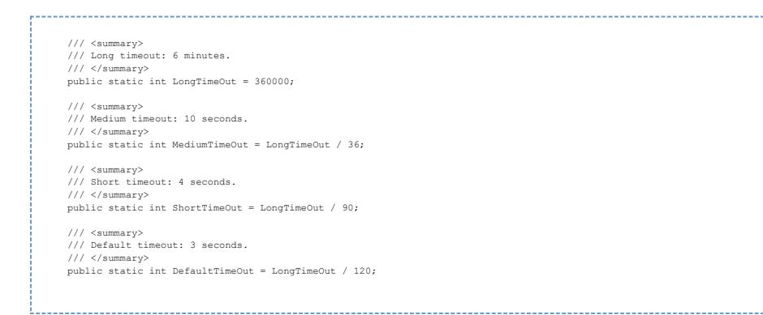

The predefined timeouts are used for long-running operations. For example, the code fragment below opens the Journal Transactions form (GL301000), releases a batch, and waits for the long-running release operation to complete within two minutes.

var batch = new JournalEntry(); batch.OpenScreen(); batch.ToolBar.Release.WaitAction = Wait.WaitForLongOperationToComplete; batch.Release();

If you need to change the time the test waits for the long-running operation to complete, you can change the default timeout. For example, the code fragment below shows how to make the LongTimeOut twice as long.

var batch = new JournalEntry(); using (new Wait(Wait.LongTimeOut \* 2)) { batch.OpenScreen(); batch.ToolBar.Release.WaitAction = Wait.WaitForLongOperationToComplete; batch.Release(); }

You can set default timeout in the [Config.xml](#page-25-0) file as well:

| <config></config> | xml version="1.0" encoding="utf-8"?<br><general></general>                    |
|-------------------|-------------------------------------------------------------------------------|
|                   | <br><long_timeout_ms>global timeout in milliseconds</long_timeout_ms><br><br> |
| <br>              |                                                                               |

# <span id="page-82-0"></span>How to Manage Log Providers

Acumatica Test SDK provides logs saved in an HTML file: Screenshots are displayed on the HTML page if screenshot saving is turned on.

## Configuring Log Settings

Before running your test, you can specify the settings for the log by using the <logging> tag of the Config.xml file, as shown below. You cannot change the parameters that apply to the saving of logs during test execution.

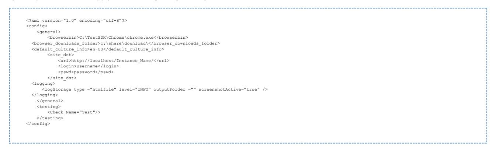

When configuring log settings, you have to specify the following mandatory attributes of each <logStorage> tag:

- type: Specifies the type of log storage. Set the attribute to htmlfile to save the log in an HTML file.
- level: Specifies which messages should be included in the log. Set the attribute to one of the predefined levels, which are described below in this topic. You can also turn off logging of the current type by setting this attribute to OFF.
- screenshotActive: Turns on or off the saving of screenshots for the current type of the log. Set the attribute to true to turn on the saving of screenshots, or to false to turn off the saving of screenshots for the current type of the log. If screenshots are turned off for all types of logs, screenshots won't even be captured. If screenshots are turned on for at least one type of log, then screenshots will be captured and will be saved according to the settings of each log type.

#### Log Levels

You can specify which messages should be included in the log by specifying one of the log levels, which are described in the table below.

| Level | Description                                                                                                          | Included<br>Messages                                                                              | Screenshots                                                                                                                                       |
|-------|----------------------------------------------------------------------------------------------------------------------|---------------------------------------------------------------------------------------------------|---------------------------------------------------------------------------------------------------------------------------------------------------|
| OFF   | Turns off logging for the current log type.                                                                          | No messages<br>are written.                                                                       | No screenshots are taken.                                                                                                                         |
| ERROR | Logs error messages and messages that help you<br>navigate in the log file.                                          | Check<br>Testcase<br>Step<br>Operation<br>Action<br>Error                                         | Only nested screenshots from the Error messages and Controls<br>screenshots are created if the saving of screenshots is turned on.                |
| WARN  | Logs error and warning messages, as well as messages<br>that help you navigate in the log file.                      | Check<br>Testcase<br>Step<br>Operation<br>Action<br>Warning<br>Error                              | Only nested screenshots from the Error and Warning messages and<br>Controls screenshots are created if the saving of screenshots is turned<br>on. |
| INFO  | Logs all types of messages (except for the Debug<br>messages). This level is suitable for daily regression<br>tests. | Check<br>Testcase<br>Step<br>Operation<br>Action<br>Screenshot<br>Information<br>Warning<br>Error | All screenshots (except for the nested screenshots of the Debug<br>messages) are created if the saving of screenshots is turned on.               |

| DEBUG | Logs all types of log messages. | Check<br>Testcase<br>Step<br>Operation<br>Action<br>Debug<br>Screenshot<br>Information<br>Warning<br>Error | All screenshots are created (if the saving of screenshots is turned on). |
|-------|---------------------------------|------------------------------------------------------------------------------------------------------------|--------------------------------------------------------------------------|

# Log in an HTML File

The HTML log file contains a tree representation of the log. Log messages in the file have colors that depend on their type: Errors are red, warnings are yellow, and all other messages are black. Color highlighting is applied to the parent nodes of the highlighted message. For example, if an error occurs in one step of a test case, then the nodes for the operation that contains the error, the test step, the test case, and the root Test node will be colored with red.

If you have configured the log to be saved in HTML format, the test runner saves the following files and the folder for each test in the sequence of tests:

- {test\_name}\_{start\_execution\_time}\_Log\_{level}\_{status}.html: Displays the log with the specified level for the test with the specified status of processing. See the description of the test statuses below in this topic.
- {test\_name}\_{start\_execution\_time}\_Log\_{level}.json: Contains the log data.
- {test\_name}\_{start\_execution\_time}\_{level} folder: Contains screenshots (JPG files) for the test. The folder is created if configuring screenshots is turned on for the log.

#### Test Statuses

The table below describes the test statuses that can be used in the names of HTML log files.

| Status    | Description                                                                                                                                                    | Example                                                                                                                                                                                                                                                                                                                                                                                                       |
|-----------|----------------------------------------------------------------------------------------------------------------------------------------------------------------|---------------------------------------------------------------------------------------------------------------------------------------------------------------------------------------------------------------------------------------------------------------------------------------------------------------------------------------------------------------------------------------------------------------|
| InProcess | The test is in progress. This status can be combined with<br>the WARN or ERROR status.                                                                         | The test is in progress. No error or warning has occurred yet.<br>Test_2016_05_19_03_12_18_Log_INFO_InProcess.html<br>The test is in progress. At least one warning has occurred.<br>Test_2016_05_19_03_12_18_Log_INFO_InProcess_WARN.html<br>The test is in progress. At least one error has occurred. Also, there<br>may be at least one warning.<br>Test_2016_05_19_03_12_18_Log_INFO_InProcess_Error.html |
| PASS      | The test has completed. Errors and warnings haven't<br>occurred.                                                                                               | The test has been passed.<br>Test_2016_05_19_03_15_24_Log_INFO_PASS.html                                                                                                                                                                                                                                                                                                                                      |
| WARN      | A warning has occurred during the test execution. WAR<br>N is added to the name of the log file as soon as the<br>warning log message is produced by the test. | The test is in progress. At least one warning has occurred.<br>Test_2016_05_19_03_12_18_Log_INFO_InProcess_WARN.html<br>The test is completed. At least one warning has occurred.<br>Test_2016_05_19_03_12_18_Log_INFO_WARN.html                                                                                                                                                                              |
| ERROR     | An error has occured during the test execution. ERROR i<br>s added to the name of the log file as soon as the error<br>log message is produced by the test.    | The test is in progress. At least one error has occurred.<br>Test_2016_05_19_03_12_18_Log_INFO_InProcess_ERROR.html<br>The test is completed. At least one warning has occurred. Also,<br>there may be at least one warning.<br>Test_2016_05_19_03_12_18_Log_INFO_ERROR.html                                                                                                                                  |

# <span id="page-84-0"></span>How to Work with Alerts

In this topic, you can find examples of how to work with alerts by using Test SDK. You may need to work with alerts, prompts, and confirmations in the following scenarios, which are described in detail below:

- [Navigating Away from The Form Where Unsaved Changes Have Been Made](#page-84-1)
- [Verifying that an Alert Has Been Thrown](#page-84-2)
- [Verifying that the Alert with Exact Message Has Been Thrown](#page-85-0)

<span id="page-84-1"></span>Navigating Away from The Form Where Unsaved Changes Have Been Made

If you navigate away from the form where unsaved changes have been made, the Acumatica application throws the standard confirmation, which is shown in the following screenshot. You need to discard all unsaved changes before navigation.

| Module:                  | GL                                       | * Branch:<br>$\mathbf{v}$   | <b>MAIN - New York</b>                   | $\alpha$                               | Type:               | Normal              |                                       |                 |                |
|--------------------------|------------------------------------------|-----------------------------|------------------------------------------|----------------------------------------|---------------------|---------------------|---------------------------------------|-----------------|----------------|
| Batch Number:            | $<\!\!N\textsf{EW}\!\!>$                 | $\alpha$<br>* Ledger:       | <b>ACTUAL</b>                            | $\Omega$                               | Orig. Batch Number: |                     |                                       |                 |                |
| Status:                  | Balanced                                 | Currency:                   | USD Q 1.00                               | VIEW BASE                              | Debit Total:        | 0.00                |                                       |                 |                |
|                          | $\Box$ Hold                              |                             | Auto Reversing                           |                                        | Credit Total:       | 0.00                |                                       |                 |                |
| * Transaction Da         | 6/17/2016 -                              |                             | $\Box$ Reversing                         |                                        |                     |                     |                                       |                 |                |
| * Post Period:           | !!!!!!!!!!!!!!!!!!!!!!!!!!!!!!!!!!!!!!!! |                             | !!!!!!!!!!!!!!!!!!!!!!!!!!!!!!!!!!!!!!!! | Any unsaved changes will be discarded. |                     |                     |                                       |                 |                |
| Description:             | 123                                      |                             |                                          |                                        |                     |                     |                                       |                 |                |
| $\mathbf{C}$<br>$+$<br>{ | $\times$                                 | VIEW SOURCE DOCUMENT RECLAS |                                          | OK<br>Cancel                           |                     |                     |                                       |                 |                |
| <b>B</b> 0 P * Branch    | * Accoun Description                     |                             | * Subaccount<br><b><i>IFFERING</i></b>   | <b>TEMPOR</b>                          | Quantity UOM        | <b>Debit Amount</b> | <b>Credit Transaction Description</b> | <b>Non</b>      | Reclass. Batch |
|                          |                                          |                             |                                          | Task                                   | <b>Number</b>       |                     | <b>Amount</b>                         | <b>Billable</b> | Number         |

The code fragment below clicks OK in the alert and dismisses it without throwing an exception.

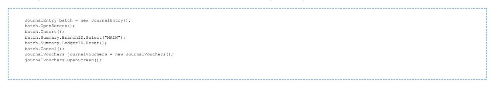

#### <span id="page-84-2"></span>Verifying that an Alert Has Been Thrown

If an error message is displayed in your Acumatica application after the test application clicks a button and you need to verify that an alert has been thrown, you can handle the error as described in this scenario.

An example of an error message, which appears if you click Save on the Journal Transactions form (GL301000; Finance > General Ledger > Enter) before filling in all required elements, is shown in the following screenshot.

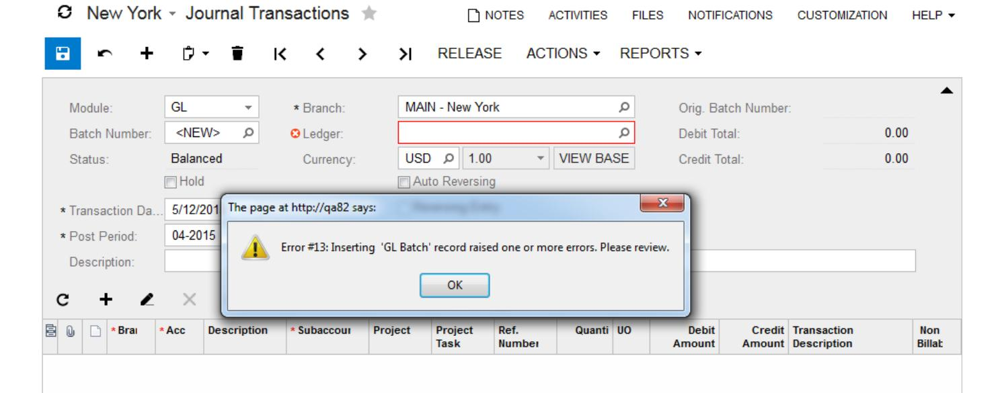

 The code fragment below clicks Save on the Journal Transactions form (GL301000), validates that an alert exists, and clicks OK to dismiss it without validation of the text of the alert.

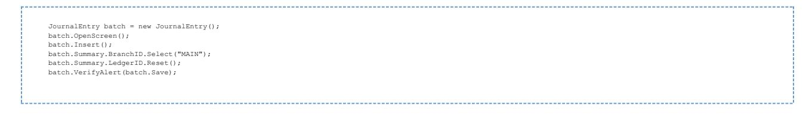

<span id="page-85-0"></span>Verifying that the Alert with Exact Message Has Been Thrown

If an error message is displayed in your Acumatica application after the test application clicks a button and you need to verify the text of the alert, you can handle the error as described in this scenario.

An example of an error message, which appears if you click Save on the Journal Transactions form (GL301000; Finance > General Ledger > Enter) before filling in all required elements, is shown in the following screenshot.

| <b>Non</b><br><b>Billat</b> |
|-----------------------------|
|                             |
|                             |
|                             |

The code fragment below clicks Save on the Journal Transactions form (GL301000), validates that the alert exists, validates its text message, and clicks OK to dismiss the alert.

JournalEntry batch = new JournalEntry(); batch.OpenScreen(); batch.Insert(); batch.Summary.BranchID.Select("MAIN"); batch.Summary.LedgerID.Reset(); batch.VerifyAlert(batch.Save, "Error #13: Inserting 'GL Batch' record raised one or more errors. Please review.");

# <span id="page-87-0"></span>How to Commit Changes in Rows of a Detail Table

To commit changes in the rows of a detail table, use the CommitRows() method. This method commits all changes made to the rows of the detail table and exits the table editing mode. The following screenshot shows two rows that are committed on the Journal Transactions form (GL301000; Finance > General Ledger > Enter).

| <b>Q Acumatica</b> ORGANIZATION<br><b>FINANCE</b>                                                                                                                                                                                  |                                                                                          | CONFIGURATION SYSTEM HELP                                                                                       |                                                             |                                                                                                            |                     |                                   |                                                                        |                                       |                      |  |           |                   | 10/14/2015 9:42 AM ADMIN                                                                                                                                                                                                                                                                                                                                                                                                                                                              |                  |
|------------------------------------------------------------------------------------------------------------------------------------------------------------------------------------------------------------------------------------|------------------------------------------------------------------------------------------|-----------------------------------------------------------------------------------------------------------------|-------------------------------------------------------------|------------------------------------------------------------------------------------------------------------|---------------------|-----------------------------------|------------------------------------------------------------------------|---------------------------------------|----------------------|--|-----------|-------------------|---------------------------------------------------------------------------------------------------------------------------------------------------------------------------------------------------------------------------------------------------------------------------------------------------------------------------------------------------------------------------------------------------------------------------------------------------------------------------------------|------------------|
| General Ledger Cash Management Accounts Payable                                                                                                                                                                                    |                                                                                          | Accounts Receivable Taxes Currency Management                                                                   |                                                             |                                                                                                            |                     |                                   |                                                                        |                                       |                      |  |           |                   |                                                                                                                                                                                                                                                                                                                                                                                                                                                                                       |                  |
| General Ledger<br>$\blacktriangleleft$                                                                                                                                                                                             |                                                                                          | ○ New York • Journal Transactions ★                                                                             |                                                             |                                                                                                            |                     |                                   |                                                                        |                                       |                      |  | $N$ NOTES | <b>ACTIVITIES</b> | FILES CUSTOMIZATION HELP                                                                                                                                                                                                                                                                                                                                                                                                                                                              |                  |
| Type your query here<br>Search                                                                                                                                                                                                     | н<br>$\ddot{}$<br>$\blacksquare$                                                         | ウェー音                                                                                                            | ドーく<br>$\rightarrow$                                        | >I RELEASE ACTIONS · REPORTS ·                                                                             |                     |                                   |                                                                        |                                       |                      |  |           |                   |                                                                                                                                                                                                                                                                                                                                                                                                                                                                                       |                  |
| ≎<br>$\overline{\ln}$<br>$\epsilon$<br>▶<br>$\downarrow$ ENTER<br><b>Journal Transactions</b><br>Journal Vouchers<br>Budgets<br><b>Trial Balance</b><br>$\div$ MANAGE<br><b>Financial Periods</b><br><b>Recurring Transactions</b> | Module:<br>Batch Number:<br>Status:<br>* Transaction D<br>* Post Period:<br>Description: | GL<br>$\tau$<br>$\Omega$<br>$<\!\!NEW\!\!>$<br>Balanced<br>$\Box$ Hold<br>$10/14/2015$ *<br>$\circ$<br>$\times$ | * Branch:<br>* Ledger:<br>Currency:<br>VIEW SOURCE DOCUMENT | MAIN - New York<br><b>ACTUAL</b><br>$USD$ $\rho$ 1.00<br>Auto Reversing<br>Reversing Entry<br>$\mathbf{z}$ | $\bullet$           | $\circ$<br>$\circ$<br>- VIEW BASE | Orig. Batch Number:<br>Debit Total:<br>Credit Total:<br>Control Total: |                                       | 0.00<br>0.00<br>0.00 |  |           |                   |                                                                                                                                                                                                                                                                                                                                                                                                                                                                                       | $\blacktriangle$ |
| $\div$ EXPLORE                                                                                                                                                                                                                     | c<br>$+$<br>$\epsilon$<br><b>B</b> 0 D<br>* Branch                                       | * Accoun<br><b>Description</b>                                                                                  |                                                             | $\left  \rightarrow \right $<br>Ref. Number                                                                | Quantity <b>UOM</b> | <b>Debit Amount</b>               |                                                                        | <b>Credit Transaction Description</b> |                      |  |           |                   |                                                                                                                                                                                                                                                                                                                                                                                                                                                                                       |                  |
| Account Summary<br>Account by Period                                                                                                                                                                                               | $0$ $\Box$ MAIN                                                                          | 100000                                                                                                          | Petty Cash USD                                              | 0.00                                                                                                       |                     |                                   | Amount<br>0.00                                                         |                                       |                      |  |           |                   |                                                                                                                                                                                                                                                                                                                                                                                                                                                                                       |                  |
| <b>Account Details</b>                                                                                                                                                                                                             | $I \cup$ $\Box$ MAIN                                                                     | 200000                                                                                                          | Accounts Paya                                               | 0.00                                                                                                       |                     | 0.00<br>0.00                      | 0.00                                                                   |                                       |                      |  |           |                   |                                                                                                                                                                                                                                                                                                                                                                                                                                                                                       |                  |
|                                                                                                                                                                                                                                    |                                                                                          |                                                                                                                 |                                                             |                                                                                                            |                     |                                   |                                                                        |                                       |                      |  |           |                   |                                                                                                                                                                                                                                                                                                                                                                                                                                                                                       |                  |
|                                                                                                                                                                                                                                    |                                                                                          |                                                                                                                 |                                                             |                                                                                                            |                     |                                   |                                                                        |                                       |                      |  |           |                   | $\begin{array}{ccccccc} \multicolumn{3}{c}{} & \multicolumn{3}{c}{} & \multicolumn{3}{c}{} & \multicolumn{3}{c}{} & \multicolumn{3}{c}{} & \multicolumn{3}{c}{} & \multicolumn{3}{c}{} & \multicolumn{3}{c}{} & \multicolumn{3}{c}{} & \multicolumn{3}{c}{} & \multicolumn{3}{c}{} & \multicolumn{3}{c}{} & \multicolumn{3}{c}{} & \multicolumn{3}{c}{} & \multicolumn{3}{c}{} & \multicolumn{3}{c}{} & \multicolumn{3}{c}{} & \multicolumn{3}{c}{} & \multicolumn{3}{c}{} & \multic$ |                  |
|                                                                                                                                                                                                                                    |                                                                                          |                                                                                                                 |                                                             |                                                                                                            |                     |                                   |                                                                        |                                       |                      |  |           |                   |                                                                                                                                                                                                                                                                                                                                                                                                                                                                                       |                  |

The following code shows how to commit all changes made to the rows of the detail table on the Journal Transactions form (GL301000).

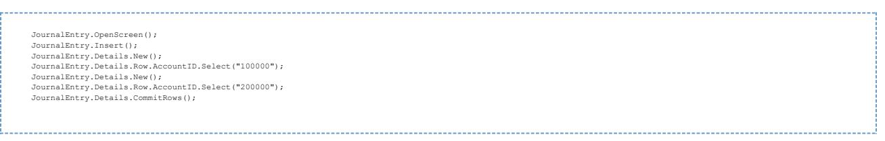

## <span id="page-88-0"></span>How to Navigate through the Rows of a Detail Table

To navigate through the rows of a detail table, use the SelectRow() method. This method can select a record in the detail table by its row number or by a <Column Name>:<Cell Value> pair.

If the specified record cannot be activated (for example, a wrong index or nonexistent <Column Name>:<Cell Value> pair is specified as a parameter of the method), the SelectRow() method prints an error message in the log.

IMPORTANT NOTE To select the very first row in a grid use index 1, e.g.: JournalEntry.Details.SelectRow(1);

The following screenshot illustrates the selection of the first row of a detail table on the Journal Transactions form (GL301000; Finance > General Ledger > Enter).

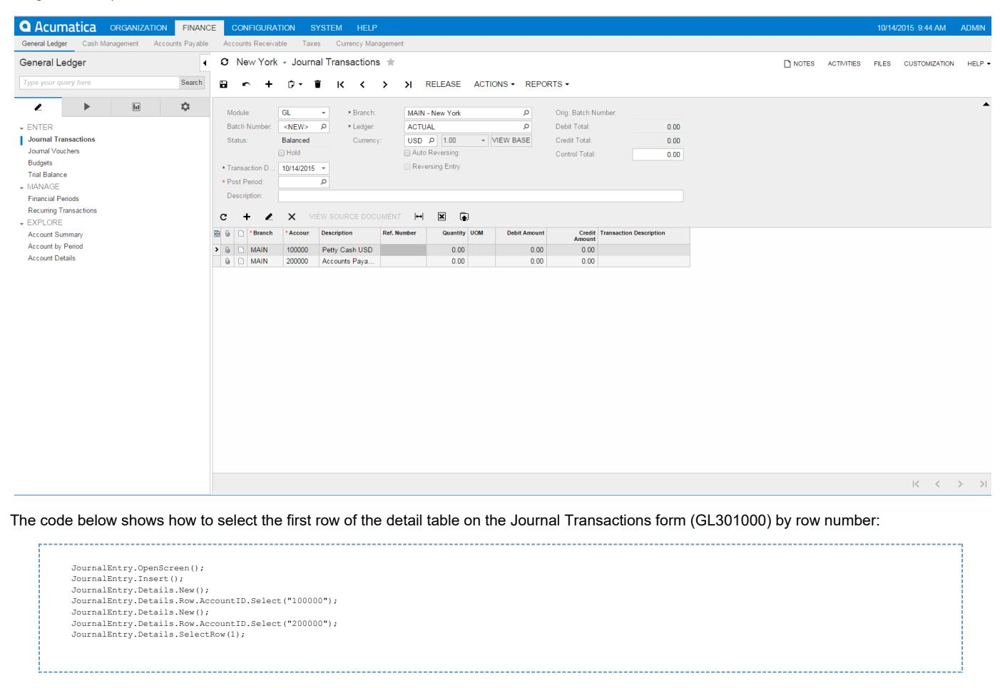

The code below shows how to select the first row of the detail table on the Journal Transactions form (GL301000) by <Column Name>:<Cell Value> pair:

JournalEntry.OpenScreen(); JournalEntry.Insert(); JournalEntry.Details.New(); JournalEntry.Details.Row.AccountID.Select("100000"); JournalEntry.Details.New(); JournalEntry.Details.Row.AccountID.Select("200000"); JournalEntry.Details.SelectRow(JournalEntry.Details.Columns.Description, "Petty Cash USD");

# <span id="page-89-0"></span>How to Show or Hide Columns in a Detail Table

In this topic, you can find the descriptions of the following tasks:

- [Showing a Hidden Column](#page-89-1)
- [Hiding a Displayed Column](#page-89-2)
- [Restoring the Default Layout of the Columns](#page-90-0)

#### <span id="page-89-1"></span>Showing a Hidden Column

To display a hidden column, use the ShowColumn() method. The ShowColumn() method moves the specified column to the Selected columns l ist of the Columns Configuration dialog box, as shown in the following screenshot, and sets the column position in the table to its position in the corresponding wrapper class.

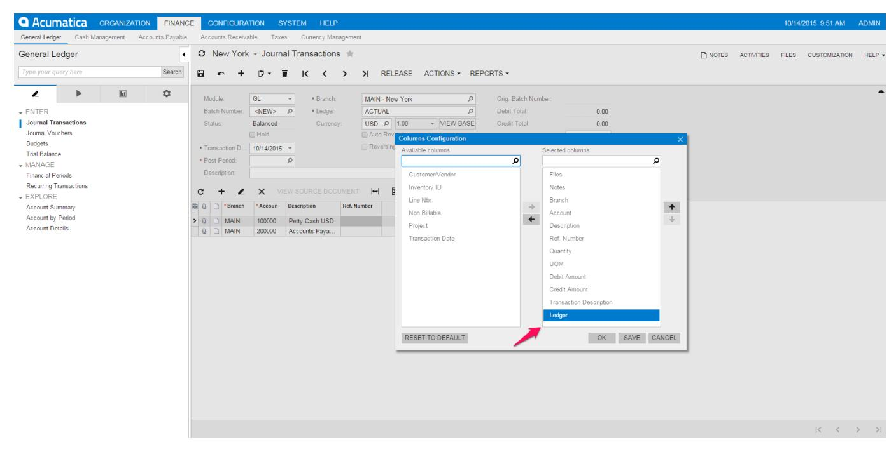

The following code shows how to show the hidden Ledger column in the details table of the Journal Transactions form (GL301000; Finance > General Ledger > Enter).

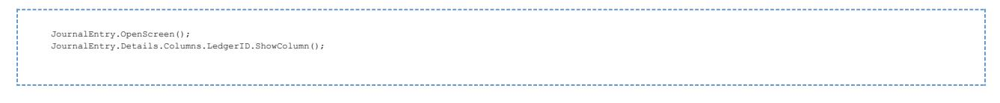

### <span id="page-89-2"></span>Hiding a Displayed Column

To hide a displayed column of a detail table, use the HideColumn() method. The HideColumn() method moves the specified column to the Av ailable columns list of the Columns Configuration dialog box, as shown in the following screenshot.

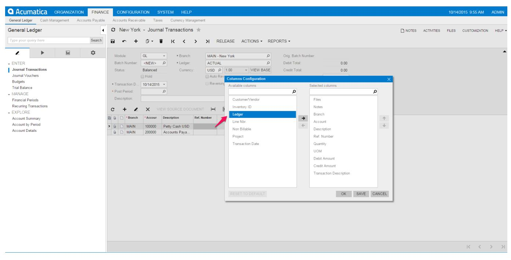

The following code shows how to hide the Ledger column of the detail table on the Journal Transactions form (GL301000).

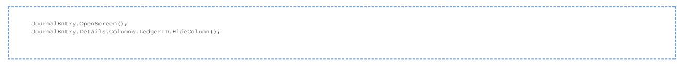

### <span id="page-90-0"></span>Restoring the Default Layout of the Columns

To restore the default layout of the columns of a detail table, use the ResetLayout() method. The ResetLayout() method clicks the Reset to Default button in the Columns Configuration dialog box, which is shown in the following screenshot.

| <b>Q Acumatica</b> ORGANIZATION<br>FINANCE                                                                                                                                                                                                                                                                                                                     |                                                                                                                                                                                                                                                                                                                        |                                                                                                   | CONFIGURATION SYSTEM HELP                                                                                                                       |               |                                                                                                    |                                                                                                                                                                                                             |                                                                            |                                                                                                                                                                                                                                               |                                                          |  | 10/14/2015 10:00 AM ADMIN                                                                            |   |
|----------------------------------------------------------------------------------------------------------------------------------------------------------------------------------------------------------------------------------------------------------------------------------------------------------------------------------------------------------------|------------------------------------------------------------------------------------------------------------------------------------------------------------------------------------------------------------------------------------------------------------------------------------------------------------------------|---------------------------------------------------------------------------------------------------|-------------------------------------------------------------------------------------------------------------------------------------------------|---------------|----------------------------------------------------------------------------------------------------|-------------------------------------------------------------------------------------------------------------------------------------------------------------------------------------------------------------|----------------------------------------------------------------------------|-----------------------------------------------------------------------------------------------------------------------------------------------------------------------------------------------------------------------------------------------|----------------------------------------------------------|--|------------------------------------------------------------------------------------------------------|---|
| General Ledger Cash Management Accounts Payable                                                                                                                                                                                                                                                                                                                |                                                                                                                                                                                                                                                                                                                        |                                                                                                   | Accounts Receivable Taxes Currency Management                                                                                                   |               |                                                                                                    |                                                                                                                                                                                                             |                                                                            |                                                                                                                                                                                                                                               |                                                          |  |                                                                                                      |   |
| General Ledger<br>$\overline{\phantom{a}}$                                                                                                                                                                                                                                                                                                                     | ○ New York - Journal Transactions ★                                                                                                                                                                                                                                                                                    |                                                                                                   |                                                                                                                                                 |               |                                                                                                    |                                                                                                                                                                                                             |                                                                            |                                                                                                                                                                                                                                               |                                                          |  | NOTES ACTIVITIES FILES CUSTOMIZATION HELP                                                            |   |
| Type your query here<br>Search                                                                                                                                                                                                                                                                                                                                 | ы<br>$\ddot{}$<br>$\overline{ }$                                                                                                                                                                                                                                                                                       | ウ・<br>÷                                                                                           | K <                                                                                                                                             | $\rightarrow$ |                                                                                                    | >I RELEASE ACTIONS • REPORTS •                                                                                                                                                                              |                                                                            |                                                                                                                                                                                                                                               |                                                          |  |                                                                                                      |   |
| $\ddot{\mathbf{C}}$<br>$\boxed{\text{ht}}$<br>ℯ<br>▶<br>$\div$ ENTER<br><b>Journal Transactions</b><br>Journal Vouchers<br><b>Budgets</b><br><b>Trial Balance</b><br>$\times$ MANAGE<br><b>Financial Periods</b><br><b>Recurring Transactions</b><br>$\overline{\phantom{a}}$ EXPLORE<br><b>Account Summary</b><br>Account by Period<br><b>Account Details</b> | Module:<br>Batch Number:<br>Status:<br>* Transaction D   10/14/2015 *<br>* Post Period:<br>Description:<br>$\mathbf{C}$<br>$\pm$<br>$\mathcal{L}$<br><b>B</b> 0<br>* Branch<br>n<br>$\triangleright$ 0 $\Box$ MAIN<br>$\begin{array}{ c c c }\n\hline\n\end{array}$ $\begin{array}{ c c c }\n\hline\n\end{array}$ MAIN | GL<br>$\leq$ NEW> $\qquad$<br>Balanced<br>$\Box$ Hold<br>$\times$<br>* Accoun<br>100000<br>200000 | * Branch:<br>$\mathbf{v}$<br>* Ledger:<br>Currency:<br>$\circ$<br>VIEW SOURCE DOCUMENT<br><b>Description</b><br>Petty Cash USD<br>Accounts Paya | Ref. Number   | MAIN - New York<br>ACTUAL<br>USD $\Omega$ 1.00<br>Auto Rev<br>Reversing<br>$\left  \right $<br>- 5 | $\circ$<br>$\circ$<br>v   VIEW BASE<br><b>Columns Configuration</b><br>Available columns<br>Customer/Vendor<br>Inventory ID<br>Line Nbr.<br>Non Billable<br>Project<br>Transaction Date<br>RESET TO DEFAULT | Orig. Batch Number:<br>Debit Total:<br>Credit Total:<br>ام<br>$\leftarrow$ | 0.00<br>0.00<br>Selected columns<br>Files<br>Notes<br>Branch<br>!!!!!!!!!!!!!!!!!!!!!!!!!!!!!!!!!!!!!!!!<br>Description<br>Ref. Number<br>Quantity<br><b>UOM</b><br>Debit Amount<br>Credit Amount<br>Transaction Description<br>Ledger<br>OK. | م<br>$\ddot{\phantom{1}}$<br>$\downarrow$<br>SAVE CANCEL |  |                                                                                                      | ▴ |
|                                                                                                                                                                                                                                                                                                                                                                |                                                                                                                                                                                                                                                                                                                        |                                                                                                   |                                                                                                                                                 |               |                                                                                                    |                                                                                                                                                                                                             |                                                                            |                                                                                                                                                                                                                                               |                                                          |  |                                                                                                      |   |
|                                                                                                                                                                                                                                                                                                                                                                |                                                                                                                                                                                                                                                                                                                        |                                                                                                   |                                                                                                                                                 |               |                                                                                                    |                                                                                                                                                                                                             |                                                                            |                                                                                                                                                                                                                                               |                                                          |  |                                                                                                      |   |
|                                                                                                                                                                                                                                                                                                                                                                |                                                                                                                                                                                                                                                                                                                        |                                                                                                   |                                                                                                                                                 |               |                                                                                                    |                                                                                                                                                                                                             |                                                                            |                                                                                                                                                                                                                                               |                                                          |  | $\begin{array}{ccccccc} \vert \zeta & \zeta & \zeta & \succ & \searrow & \searrow \vert \end{array}$ |   |

The following code shows how to restore the default layout of the columns on the Journal Transactions form (GL301000).

JournalEntry.OpenScreen(); JournalEntry.Details.ResetLayout();

## <span id="page-92-0"></span>How to Use Column Filters of a Detail Table

You can specify a filtering condition in every column of a detail table. The list of conditions and filters is available in the user interface of your Acumatica application and depends on the control type of the column (such as text, number, or date).

In this topic, you can find the descriptions of the following tasks:

- [Setting a Column Filter](#page-92-1)
- [Clearing a Filter](#page-92-2)

#### <span id="page-92-1"></span>Setting a Column Filter

To specify a column filter, use the Columns property. See below for examples of setting different column filters.

The following code shows an example of setting the Starts With filter, which is applicable for any text or selector field.

SalesPrice.Details.Columns.InventoryID.StartsWith("REQ");

The following code examples illustrate the setting of the Equals filter:

For a date picker

SalesPrice.Details.Columns.EffectiveDate.Equals(new System.DateTime(2011, 5, 16));

For a box with text

SalesPrice.Details.Columns.InventoryID\_InventoryItem\_Descr.Equals("RQ13");

For a box with a number

SalesPrice.Details.Columns.SalesPrice.Equals(60);

The following code illustrates the setting of the Is Between and Is Greater than or Equal to filters, which are available for date pickers and boxes with numbers.

SalesPrice.Details.Columns.SalesPrice.IsBetween(50, 60); SalesPrice.Details.RowsCount().VerifyEquals(2); SalesPrice.Details.Columns.SalesPrice.IsGreaterThanOrEqualTo(60); SalesPrice.Details.RowsCount().VerifyEquals(20);

The code below shows how to use the True and False filters, which are available for check box columns.

SalesPrice.Details.Columns.IsPromotionalPrice.IsTrue(); SalesPrice.Details.Columns.IsPromotionalPrice.IsFalse();

The following code shows how to select the filtering values for a drop-down column. To specify the values to be selected, you can use either the values visible in the UI or the internal IDs of the values.

```
//Using values visible in the UI
EntryType.Details.Columns.Module.SelectValues("CA", "AP");
//Using internal IDs of the values
FixedAsset.TransactionHistory.Columns.TranType.SelectValues("A+", "A-", "P+", "P-");
```

<span id="page-92-2"></span>Clearing a Filter

To clear the filter of a column, use the ClearFilter() method. This method is not available for drop-down columns.

EntryType.Details.Columns.EntryTypeId.ClearFilter();

### To clear the filter for a drop-down column, call the SelectAll() method.

EntryType.Details.Columns.Module.SelectAll();

## <span id="page-94-0"></span>How to Work with Errors

Test SDK provides the GetError() method for working with errors that occur on the form or on a control, such as the error in the following screenshot. By using the GetError() method, you can verify whether an error appears on the form or on the control, and check the text of the error message.

In your test application, you can verify an error on the form or control by performing one of the following tasks:

- [Verifying Whether an Error Appears on the Form](#page-94-1)
- [Verifying that No Error Appears on the Form](#page-94-2)
- [Verifying the Text of the Error Message on the Form](#page-94-3)
- [Verifying Whether an Error Appears on the Control](#page-95-0)
- [Verifying the Text of the Error Message on a Control](#page-95-1)
- [Verifying the Text of the Error Message on the Cell of a Detail Table](#page-95-2)
- [Verifying the Text of the Error Message on the Row of a Detail Table](#page-95-3)

<span id="page-94-1"></span>Verifying Whether an Error Appears on the Form

To check whether an error appears on the form, use the GetError() method of the form class, as shown in the following example.

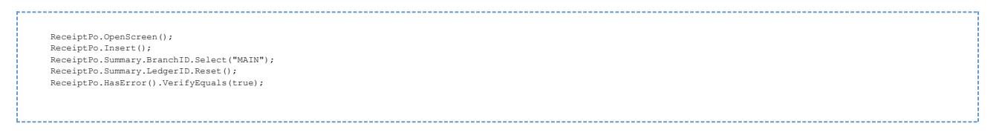

#### <span id="page-94-2"></span>Verifying that No Error Appears on the Form

To make sure that no error appears on the form, use the GetError() method of the form class with the parameter set to False, as shown in the following example.

```
ReceiptPo.OpenScreen();
ReceiptPo.Insert();
ReceiptPo.Summary.BranchID.Select("MAIN");
ReceiptPo.HasError().VerifyEquals(false);
```

<span id="page-94-3"></span>Verifying the Text of the Error Message on the Form

To check that the correct text of the error message is displayed on the form, use the GetError() method of the form class with the text of the error as the parameter, as shown in the following example. You can specify a part of the error message in the parameter of the method; in this case, the method checks whether the error message on the form contains the specified text. You can also use wildcards in the parameter of the method (for details, see How to Use Wildcards When Verifying Errors and Warnings).

| ReceiptPo.OpenScreen();                                             |
|---------------------------------------------------------------------|
| ReceiptPo.Insert();                                                 |
| ReceiptPo.Summary.BranchID.Select("MAIN");                          |
| ReceiptPo.Summary.LedgerID.Reset();                                 |
| ReceiptPo.GetErrors().VerifyContains("'Ledger' may not be empty."); |
|                                                                     |
|                                                                     |
|                                                                     |
|                                                                     |

<span id="page-95-0"></span>Verifying Whether an Error Appears on the Control

To check whether an error appears on the particular control, use the GetError() method of the control class, as shown in the following example.

| ReceiptPo.OpenScreen();                                   |
|-----------------------------------------------------------|
| ReceiptPo.Insert();                                       |
| ReceiptPo.Summary.BranchID.Select("MAIN");                |
| ReceiptPo.Summary.LedgerID.Reset();                       |
| ReceiptPo.Summary.LedgerID.HasError().VerifyEquals(true); |
|                                                           |
|                                                           |
|                                                           |
|                                                           |

<span id="page-95-1"></span>Verifying the Text of the Error Message on a Control

To check that the correct text of the error message is displayed on the control, use the GetError() method of the control class with the text of the error as the parameter, as shown in the following example. You can specify a part of the error message in the parameter of the method; in this case, the method checks whether the error message on the form contains the specified text. You can also use wildcards in the parameter of the method (for details, see How to Use Wildcards When Verifying Errors and Warnings).

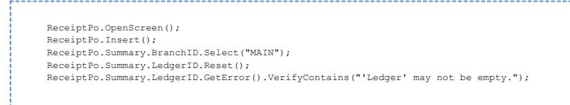

<span id="page-95-2"></span>Verifying the Text of the Error Message on the Cell of a Detail Table

To check whether an error appears on the particular cell of a detail table, activate the needed row and use the GetError() method of the cell class, as shown in the following example.

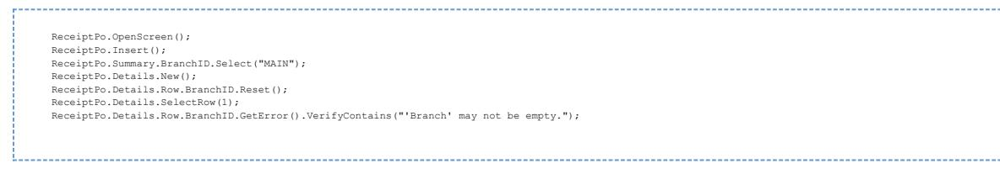

## <span id="page-95-3"></span>Verifying the Text of the Error Message on the Row of a Detail Table

To check the text of the error message that appears on the row of a detail table, activate the needed row and use the GetError() method of the detail table class, as shown in the following example.

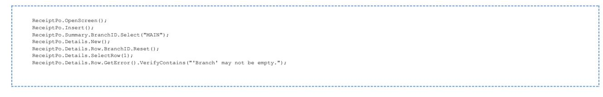

## <span id="page-96-0"></span>How to Work with Warnings

Test SDK provides the GetWarning() method for working with the warnings that occur on the form or on a control, such as the warning shown in the following screenshot. By using the GetWarning() method, you can verify whether a warning appears on the form or control, and check the text of the warning message.

| н<br>ć                                                          |                 | 良・ 盲                    | К<br>≺               | ≻∣<br>⋟           | <b>RELEASE</b>           |                      | $AC/TONS$ $\sim$         |                  | <b>REPORTS</b> $\rightarrow$  |                     |                                                        |                             |
|-----------------------------------------------------------------|-----------------|-------------------------|----------------------|-------------------|--------------------------|----------------------|--------------------------|------------------|-------------------------------|---------------------|--------------------------------------------------------|-----------------------------|
| Module:                                                         | GL              | $\overline{\mathbf{v}}$ | * Branch:            |                   | <b>MAIN - New York</b>   |                      |                          | Ω                |                               | Orig. Batch Number: |                                                        |                             |
| Batch Number:                                                   | $<$ NEW $>$     | ρ                       | * Ledger:            |                   | <b>ACTUAL</b>            |                      |                          | ρ                |                               | Debit Total:        |                                                        | 0.00                        |
| Status:                                                         | <b>Balanced</b> |                         | Currency:            |                   | $\circ$<br><b>USD</b>    | 1.00                 | $\overline{\phantom{a}}$ | <b>VIEW BASE</b> |                               | Credit Total:       |                                                        | 0.00                        |
|                                                                 | $\Box$ Hold     |                         |                      |                   | Auto Reversing           |                      |                          |                  |                               |                     |                                                        |                             |
| * Transaction Da                                                | 4/20/2015       | ÷                       |                      |                   | Reversing Entry          |                      |                          |                  |                               |                     |                                                        |                             |
| <b>O</b> Post Period:                                           | 13-2016         | α                       |                      |                   | <b>Create Tax Trans.</b> |                      |                          |                  |                               |                     |                                                        |                             |
| Transaction date is outside the specified period<br>date range. |                 |                         |                      |                   |                          |                      |                          |                  |                               |                     |                                                        |                             |
| с                                                               |                 |                         | VIEW SOURCE DOCUMENT | $\leftrightarrow$ | $\vert x \vert$          | G                    |                          |                  |                               |                     |                                                        |                             |
| 圓<br>$\Box$<br>Û<br>* Bra                                       | * Acc           | <b>Description</b>      | * Subaccou           | Project           | Project<br>Task          | Ref.<br><b>Numbe</b> | Quant UO                 |                  | <b>Debit</b><br><b>Amount</b> |                     | <b>Credit Transaction</b><br><b>Amount Description</b> | <b>Non</b><br><b>Billat</b> |
|                                                                 |                 |                         |                      |                   |                          |                      |                          |                  |                               |                     |                                                        |                             |

In your test application, you can verify a warning on the form or control by performing one of the following tasks:

- [Verifying the Number of Warnings That Appear on the Form](#page-96-1)
- [Verifying the Text of the Warning Message on the Form](#page-96-2)
- [Verifying Whether a Warning Appears on the Control](#page-96-3)
- [Verifying the Text of the Warning Message on the Cell of a Detail Table](#page-97-0)
- [Verifying the Text of the Warning Message on the Row of a Detail Table](#page-97-1)

#### <span id="page-96-1"></span>Verifying the Number of Warnings That Appear on the Form

To check the number of warnings that appear on the form, use the GetWarning() method of the form class. The following example verifies that one error appears on the form.

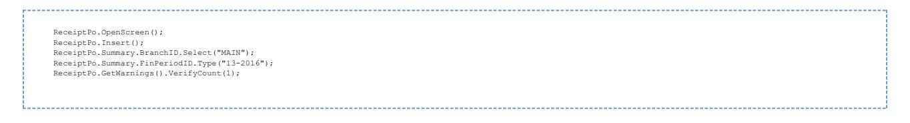

### <span id="page-96-2"></span>Verifying the Text of the Warning Message on the Form

To check that the correct text of the warning message is displayed on the form, use the GetWarning() method of the form class with the text of the warning as the parameter, as shown in the following example. You can specify a part of the warning message in the parameter of the method; in this case, the method checks whether the warning message on the form contains the specified text. You can also use wildcards in the parameter of the method (for details, see [Supported Wildcards\)](https://wiki.acumatica.com/display/TS/Supported+Wildcards).

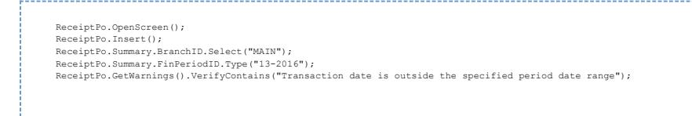

<span id="page-96-3"></span>Verifying Whether a Warning Appears on the Control

To check whether a warning appears on the control, use the GetWarning() method of the control class, as shown in the following example.

| ReceiptPo.OpenScreen();                                                                                                   |
|---------------------------------------------------------------------------------------------------------------------------|
| ReceiptPo.Insert();                                                                                                       |
| ReceiptPo.Summary.BranchID.Select("MAIN");                                                                                |
| ReceiptPo.Summary.FinPeriodID.Type("13-2016");                                                                            |
| ReceiptPo.Summary.FinPeriodID.GetWarning().VerifyContains("Transaction date is outside the specified period date range"); |
|                                                                                                                           |
|                                                                                                                           |
|                                                                                                                           |

## <span id="page-97-0"></span>Verifying the Text of the Warning Message on the Cell of a Detail Table

To check whether a warning appears on the cell of a detail table, activate the needed row and use the GetWarning() method of the cell class, as shown in the following example.

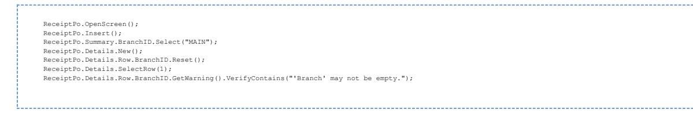

<span id="page-97-1"></span>Verifying the Text of the Warning Message on the Row of a Detail Table

To check the text of the warning message that appears on the row of a detail table, activate the needed row and use the GetWarning() method of the detail table class, as shown in the following example.

ReceiptPo.OpenScreen(); ReceiptPo.Insert(); ReceiptPo.Summary.BranchID.Select("MAIN"); ReceiptPo.Details.New(); ReceiptPo.Details.Row.BranchID.Reset(); ReceiptPo.Details.SelectRow(1); ReceiptPo.Details.Row.GetWarning().VerifyContains("'Branch' may not be empty.");

# <span id="page-98-0"></span>How to Work with Windows

On some Acumatica forms, pop-up forms can appear as you work with the form.

The following example shows how to select an active window when multiple Acumatica forms appear on the screen of your computer.

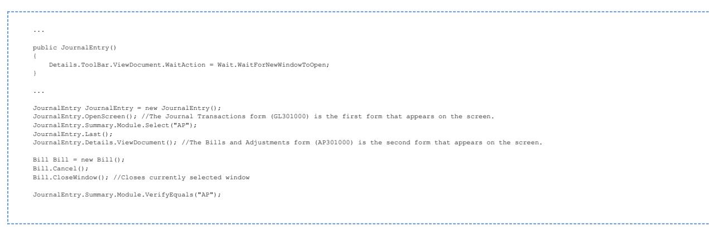

## <span id="page-99-0"></span>How to Work with the Names of UI Elements

In this topic, you can find examples that illustrate how to work with the names of UI elements by using Test SDK. The name of the Description ele ment on the Journal Transactions form (GL301000; Finance > General Ledger > Work Area > Enter) is highlighted in the following screenshot.

|                             |                                | ○ New York • Journal Transactions ★ |                                               |           |                     |               |                     | $\Gamma$ notes      | <b>ACTIVITIES</b> | <b>FILES</b> | CUSTOMIZATION                                | $HELP -$             |
|-----------------------------|--------------------------------|-------------------------------------|-----------------------------------------------|-----------|---------------------|---------------|---------------------|---------------------|-------------------|--------------|----------------------------------------------|----------------------|
| в<br>÷<br>$\blacksquare$    | ウ・<br>▼                        | к<br>≺<br>ゝ                         | RELEASE<br>$\geq$                             |           | ACTIONS -           | REPORTS -     |                     |                     |                   |              |                                              |                      |
| Module:                     | GL<br>$\overline{\phantom{a}}$ | * Branch:                           | MAIN - New York                               |           | Q                   |               | Orig. Batch Number: |                     |                   |              |                                              |                      |
| Batch Number:               | <new><br/>Q</new>              | * Ledger:                           | <b>ACTUAL</b>                                 |           | Ω                   | Debit Total:  |                     | 0.00                |                   |              |                                              |                      |
| Status:                     | Balanced                       | Currency:                           | USD <sub>p</sub>                              | 1.00      | - VIEW BASE         | Credit Total: |                     | 0.00                |                   |              |                                              |                      |
|                             | $\Box$ Hold                    |                                     | Auto Reversing                                |           |                     |               |                     |                     |                   |              |                                              |                      |
| * Transaction D.            | 5/5/2015<br>$\checkmark$       |                                     | Reversing Entry                               |           |                     |               |                     |                     |                   |              |                                              |                      |
| * Post Period:              | 04-2015<br>α                   |                                     |                                               |           |                     |               |                     |                     |                   |              |                                              |                      |
| Description:                |                                |                                     |                                               |           |                     |               |                     |                     |                   |              |                                              |                      |
|                             |                                |                                     |                                               |           |                     |               |                     |                     |                   |              |                                              |                      |
| c<br>◢<br>÷                 | $\times$                       | VIEW SOURCE DOCUMENT                | $\mathbbm{X}$<br>$\left  \rightarrow \right $ | $\bullet$ |                     |               |                     |                     |                   |              |                                              |                      |
| n<br><b>B</b> 0<br>* Branch | * Accoun                       | Description                         | * Subaccount                                  | Project   | <b>Project Task</b> | Ref. Number   | Quantity UOM        | <b>Debit Amount</b> |                   |              | <b>Credit Amount Transaction Description</b> | Nor<br><b>Billat</b> |

You may need to perform the following tasks with the names of UI elements:

- [Obtaining the Name of a UI Element](#page-99-1)
- [Verifying the Name of a UI Element](#page-99-2)

#### <span id="page-99-1"></span>Obtaining the Name of a UI Element

The following code shows how to obtain the name of a UI element.

JournalEntry JournalEntry = new JournalEntry(); JournalEntry.OpenScreen(); JournalEntry.Summary.DescriptionLabel.GetValue();

## <span id="page-99-2"></span>Verifying the Name of a UI Element

#### The following code shows how to verify the name of a UI element.

JournalEntry JournalEntry = new JournalEntry(); JournalEntry.OpenScreen(); JournalEntry.Summary.DescriptionLabel.GetValue().VerifyEquals("Description:");

# <span id="page-100-0"></span>How to Work with Drop-Down Menus on Toolbars

In this topic, you can find examples that illustrate how to work with a drop-down menu on a toolbar by using Test SDK. The following screenshot shows the toolbar buttons that are located on the drop-down menu of the Journal Transactions form (GL301000; Finance > General Ledger > Work Area > Enter).

| <b>Q Acumatica</b> ORGANIZATION                                                                                                                                                                                                                                                             | <b>FINANCE</b>        | <b>DISTRIBUTION</b>                                                                                                                                                                                 |                                                                                                       | <b>CONFIGURATION SYSTEM</b>                                                                                                                                                                 | <b>HELP</b>                                                                                                                                                                                        |                                              |                                                                        |                                                                                 |                                                     |                                                           |        |                                                                                                           |                                                   | 9/22/2015 10:46 AM ADMIN                               |                  |
|---------------------------------------------------------------------------------------------------------------------------------------------------------------------------------------------------------------------------------------------------------------------------------------------|-----------------------|-----------------------------------------------------------------------------------------------------------------------------------------------------------------------------------------------------|-------------------------------------------------------------------------------------------------------|---------------------------------------------------------------------------------------------------------------------------------------------------------------------------------------------|----------------------------------------------------------------------------------------------------------------------------------------------------------------------------------------------------|----------------------------------------------|------------------------------------------------------------------------|---------------------------------------------------------------------------------|-----------------------------------------------------|-----------------------------------------------------------|--------|-----------------------------------------------------------------------------------------------------------|---------------------------------------------------|--------------------------------------------------------|------------------|
| General Ledger Cash Management Accounts Payable                                                                                                                                                                                                                                             |                       | Accounts Receivable                                                                                                                                                                                 |                                                                                                       | Fixed Assets Deferred Revenue                                                                                                                                                               | Taxes                                                                                                                                                                                              |                                              | Currency Management                                                    |                                                                                 |                                                     |                                                           |        |                                                                                                           |                                                   |                                                        |                  |
| General Ledger                                                                                                                                                                                                                                                                              |                       | $\blacktriangleleft$                                                                                                                                                                                |                                                                                                       | ○ New York - Journal Transactions ★                                                                                                                                                         |                                                                                                                                                                                                    |                                              |                                                                        |                                                                                 |                                                     |                                                           |        | NOTES ACTIVITIES FILES                                                                                    | <b>NOTIFICATIONS</b>                              | <b>CUSTOMIZATION</b>                                   | $HELP -$         |
| Type your query here                                                                                                                                                                                                                                                                        | Search                | 日<br>$\ddot{}$<br>$\blacksquare$                                                                                                                                                                    | D- ii                                                                                                 | $K \leftarrow \leftarrow \rightarrow$                                                                                                                                                       | XI RELEASE                                                                                                                                                                                         |                                              | ACTIONS -                                                              | REPORTS -                                                                       |                                                     |                                                           |        |                                                                                                           |                                                   |                                                        |                  |
|                                                                                                                                                                                                                                                                                             |                       |                                                                                                                                                                                                     |                                                                                                       |                                                                                                                                                                                             |                                                                                                                                                                                                    |                                              |                                                                        |                                                                                 |                                                     |                                                           |        |                                                                                                           |                                                   |                                                        |                  |
| ℯ<br>▶<br>$E$ ENTER<br>Journal Transactions<br>Journal Vouchers<br><b>Budgets</b><br><b>Trial Balance</b><br>$\times$ MANAGE<br><b>Financial Periods</b><br>Allocations<br><b>Recurring Transactions</b><br>$\div$ EXPLORE<br>Account Summary<br>Account by Period<br>Account by Subaccount | $\overline{\ln}$<br>٠ | Module:<br><b>Batch Number:</b><br>Status:<br>* Transaction D.<br>* Post Period:<br>Description:<br>c<br>÷<br>,<br>图 8<br>* Branch<br>n.<br>$\triangleright$ $\odot$ $\Box$ MAIN<br>$0$ $\Box$ MAIN | GL<br>00000013 Q<br>Posted<br>Hold<br>1/1/2007<br>13-2017<br>$\times$<br>* Accoun<br>775000<br>232000 | * Branch:<br>$\star$<br>* Ledger:<br>Currency:<br>Simple GL transaction between 2 accounts same subaccounts<br>VIEW SOURCE DOCUMENT<br><b>Description</b><br>Wages Expense<br>Wages Payable | MAIN - New York<br><b>GLTEST</b><br><b>USD</b><br>Auto Reversing<br>Reversing Entry<br>Create Tax Trans.<br>$\left  \rightarrow \right $<br>* Subaccount<br>US-00-00-00-000 X<br>US-00-00-00-000 X | 1.00<br>$\blacksquare$<br>$\circ$<br>Project | Reverse Batch<br>Add to Schedule<br>- VIEW BASE<br><b>Project Task</b> | Debit Total:<br>Credit Total:<br><b>Ref. Number</b><br>0000000001<br>0000000001 | Orig. Batch Number:<br>Quantity UOM<br>0.00<br>0.00 | 178.94<br>178.94<br><b>Debit Amount</b><br>178.94<br>0.00 | Amount | <b>Credit Transaction Description</b><br>0.00 Simple GL transaction be<br>178.94 Simple GL transaction be | <b>Non</b><br><b>Billable</b><br>$\Box$<br>$\Box$ |                                                        | $\blacktriangle$ |
| <b>Account Details</b>                                                                                                                                                                                                                                                                      |                       |                                                                                                                                                                                                     |                                                                                                       |                                                                                                                                                                                             |                                                                                                                                                                                                    |                                              |                                                                        |                                                                                 |                                                     |                                                           |        |                                                                                                           |                                                   |                                                        |                  |
|                                                                                                                                                                                                                                                                                             |                       |                                                                                                                                                                                                     |                                                                                                       |                                                                                                                                                                                             |                                                                                                                                                                                                    |                                              |                                                                        |                                                                                 |                                                     |                                                           |        |                                                                                                           |                                                   | $ \langle \quad \langle \quad \rangle \quad \rangle  $ |                  |
|                                                                                                                                                                                                                                                                                             |                       |                                                                                                                                                                                                     |                                                                                                       |                                                                                                                                                                                             | Your product is in the trial mode. Only two concurrent users are allowed. Activate                                                                                                                 |                                              |                                                                        |                                                                                 |                                                     |                                                           |        |                                                                                                           |                                                   |                                                        |                  |

You may need to perform the following tasks with the drop-down menu of a toolbar:

- [Clicking a Toolbar Button That Is Located on a Drop-Down Menu](#page-100-1)
- [Verifying That a Toolbar Button That Is Located on a Drop-Down Menu is Enabled](#page-100-2)

<span id="page-100-1"></span>Clicking a Toolbar Button That Is Located on a Drop-Down Menu

To click a toolbar button that is located on a drop-down menu, you need to invoke the Click() method of the button class, as shown in the following code. You do not need to open the menu first.

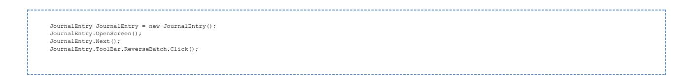

<span id="page-100-2"></span>Verifying That a Toolbar Button That Is Located on a Drop-Down Menu is Enabled

To verify that a toolbar button that is located on a drop-down menu is enabled, you need to invoke the IsEnabled() method of the button class. You do not need to open the menu first.

JournalEntry JournalEntry = new JournalEntry(); JournalEntry.OpenScreen(); JournalEntry.Next(); JournalEntry.ToolBar.ReverseBatch.IsEnabled().VerifyEquals(true);

# <span id="page-101-0"></span>How to Work with Pop-Up Dialog Boxes

In this topic, you can find examples that show how to work with pop-up dialog boxes. An example of pop-up dialog box is shown in the following screenshot.

| New York Event                                                             |                                                                                                                    |                            | NOTES FILES HELP * |                                                                  |
|----------------------------------------------------------------------------|--------------------------------------------------------------------------------------------------------------------|----------------------------|--------------------|------------------------------------------------------------------|
| SAVE & CLOSE <b>E F</b> F GOMPLETE CANCEL ACTIONS                          |                                                                                                                    |                            |                    |                                                                  |
| Details   Related Activities   Attendees                                   |                                                                                                                    |                            |                    |                                                                  |
| $C$ + $X$ INVITE INVITEALL $\left \rightarrow\right $ $\boxed{\mathbf{x}}$ |                                                                                                                    |                            |                    |                                                                  |
|                                                                            |                                                                                                                    |                            |                    | $x -$                                                            |
| Name<br>Michael Andrews                                                    | Email<br>MAndrews@Rapid-Byte.com                                                                                   | Comment<br>Michael Andrews |                    | Invitation<br>Accepted                                           |
| $\rho$ Mendenhall Jason, Mr.                                               | JMendenhall@Rapid-Byte.com                                                                                         | Jason Mendenhall           |                    | Not invited                                                      |
|                                                                            | <b>Invite All</b><br>Would you like to send the event invitation to<br>the selected attendees?<br>NO CANCEL<br>YES |                            |                    |                                                                  |
|                                                                            |                                                                                                                    |                            |                    | $\mathbb{K} \quad \leftarrow \quad \rightarrow \quad \mathbb{N}$ |

You may need to perform the following tasks with pop-up dialog boxes:

- [Clicking a Button in a Pop-Up Dialog Box](#page-101-1)
- [Closing a Pop-Up Dialog Box](#page-101-2)
- [Obtaining the Message Text from a Pop-Up Dialog Box](#page-102-0)

#### <span id="page-101-1"></span>Clicking a Button in a Pop-Up Dialog Box

The following code shows how to click a button in a pop-up dialog box through the example of the Invite All dialog box, which can be invoked on the Event form (CR306030).

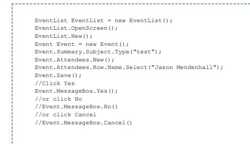

#### <span id="page-101-2"></span>Closing a Pop-Up Dialog Box

The following code shows how to close a pop-up dialog box through the example of the Invite All dialog box, which can be invoked on the Event form (CR306030).

EventList EventList = new EventList(); EventList.OpenScreen(); EventList.New(); Event Event = new Event(); Event.Summary.Subject.Type("test"); Event.Attendees.New(); Event.Attendees.Row.Name.Select("Jason Mendenhall"); Event.Save(); Event.MessageBox.Close();

## <span id="page-102-0"></span>Obtaining the Message Text from a Pop-Up Dialog Box

The following code shows how to obtain the text from a pop-up dialog box through the example of the Invite All dialog box, which can be invoked on the Event form (CR306030).

EventList EventList = new EventList(); EventList.OpenScreen(); EventList.New(); Event Event = new Event(); Event.Summary.Subject.Type("test"); Event.Attendees.New(); Event.Attendees.Row.Name.Select("Jason Mendenhall"); Event.Save(); var messageText = Event.MessageBox.GetValue();

# <span id="page-103-0"></span>How to Work with Pop-Up Panels

In this topic, you can find examples that show how to work with pop-up panels that appear on Acumatica forms by using Test SDK. An example of a pop-up panel is shown in the following screenshot.

| <b>Q</b> Acumatica<br>ORGANIZATION                                                                                                       | <b>FINANCE</b><br><b>DISTRIBUTION</b><br>CONFIGURATION SYSTEM HELP                                                                                                                                                                                                                                                                                                                                                                                                                                                                                                                                                                                                                                                                                                                                                                                                                                                                                                                                                                                 |                                          | 9/23/2015 8:28 AM                                                                                                                                    | <b>ANDREWS</b>                                                                                                                                                                                                                                                                                                                                                                                                                                                                        |
|------------------------------------------------------------------------------------------------------------------------------------------|----------------------------------------------------------------------------------------------------------------------------------------------------------------------------------------------------------------------------------------------------------------------------------------------------------------------------------------------------------------------------------------------------------------------------------------------------------------------------------------------------------------------------------------------------------------------------------------------------------------------------------------------------------------------------------------------------------------------------------------------------------------------------------------------------------------------------------------------------------------------------------------------------------------------------------------------------------------------------------------------------------------------------------------------------|------------------------------------------|------------------------------------------------------------------------------------------------------------------------------------------------------|---------------------------------------------------------------------------------------------------------------------------------------------------------------------------------------------------------------------------------------------------------------------------------------------------------------------------------------------------------------------------------------------------------------------------------------------------------------------------------------|
| Sales Orders<br>Purchase Orders<br>Inventory                                                                                             | <b>Purchase Requisitions</b>                                                                                                                                                                                                                                                                                                                                                                                                                                                                                                                                                                                                                                                                                                                                                                                                                                                                                                                                                                                                                       |                                          |                                                                                                                                                      |                                                                                                                                                                                                                                                                                                                                                                                                                                                                                       |
| <b>Sales Orders</b>                                                                                                                      | O New York - Sales Orders<br>$\blacktriangleleft$                                                                                                                                                                                                                                                                                                                                                                                                                                                                                                                                                                                                                                                                                                                                                                                                                                                                                                                                                                                                  | n NOTES                                  | ACTIVITIES FILES NOTIFICATIONS                                                                                                                       | $HELP -$                                                                                                                                                                                                                                                                                                                                                                                                                                                                              |
| Search<br>Type your query here                                                                                                           | >I ACTIONS + REPORTS +<br>日<br>÷<br>D ≁<br>÷<br>$\mathsf{K}$<br>$\overline{ }$<br>$\prec$<br>$\rightarrow$                                                                                                                                                                                                                                                                                                                                                                                                                                                                                                                                                                                                                                                                                                                                                                                                                                                                                                                                         |                                          |                                                                                                                                                      |                                                                                                                                                                                                                                                                                                                                                                                                                                                                                       |
| $\boxed{\text{Id}}$<br>$\mathfrak{D}$<br>{<br>$\overline{ }$ ENTER<br>Sales Orders<br>Shipments<br>Invoices<br>Payments and Applications | * Order Type:<br><b>SO</b><br>$\mathcal{Q}$<br>* Customer:<br>SO000004D5 - SO customer #4D5<br>Crdered Qty.<br>1.017.00<br>000586<br>$\Omega$<br>Order Nbr.<br>$\Omega$<br>MAIN - Primary Location<br>VAT Exempt.<br>0.00<br>* Location:<br>$\Box$ Hold<br>v VIEW BASE<br>VAT Taxable<br>$USD$ $\rho$ 1.00<br>Currency:<br>0.00<br>Credit Hold<br>Open<br>Tax Total:<br>0.00<br>Status:<br>$\Omega$<br>* Date:<br>2/3/2009<br>* Project:<br>X - Non-Project Code.<br>Order Total:<br>16,700.00<br>$\mathbf{v}$<br>000040700<br>promone<br>* Requested On<br><b>Allocations</b><br>Custom<br>$\boxed{\textbf{x}}$<br>$\left\vert \leftarrow \right\vert$<br>$\mathbf c$<br>External<br>Subitem<br>Ship On<br>Allocated<br>Alloc. Warehouse<br>Completed<br>* Lot/Serial Nbr.<br>Quantity<br>Oty. On Shipments<br>Document<br>$\rightarrow$ 0-<br>2/3/2009<br>$\Box$<br><b>RETAIL</b><br>100.00<br>0.00<br>$\Box$<br>$\rm c$<br>$\ddot{}$<br><b>B B D</b><br>$> 0$ D<br>$0$ $0$<br>$0$ $\Box$<br>$0$ $0$<br>$0$ $0$<br>0 D <br>$0$ $\Box$<br>$0$ $0$ | Active<br>Qty. Received UOM<br>$0.00$ PC | $\times$ $\times$<br><b>Related Document</b><br>$\begin{array}{ccccccc} \ & \ & \ & \ & \ & \ & \ & \ & \ & \ & \ & \ & \ & \ & \ & \ & \ & \ & \ &$ | $\overline{\mathbf{r}}$<br>Ext. Price T<br>$\overline{p}$<br>1,000.00<br>1,000.00<br>.950.00<br>.950.00<br>,900.00<br>,900.00<br>,400.00<br>.600.00<br>OK                                                                                                                                                                                                                                                                                                                             |
|                                                                                                                                          | On Hand 200.00 PC, Available 200.00 PC, Available for Shipping 200.00 PC, Allocated 0.00 PC                                                                                                                                                                                                                                                                                                                                                                                                                                                                                                                                                                                                                                                                                                                                                                                                                                                                                                                                                        |                                          |                                                                                                                                                      | $\begin{array}{ccccccc} \multicolumn{3}{c}{} & \multicolumn{3}{c}{} & \multicolumn{3}{c}{} & \multicolumn{3}{c}{} & \multicolumn{3}{c}{} & \multicolumn{3}{c}{} & \multicolumn{3}{c}{} & \multicolumn{3}{c}{} & \multicolumn{3}{c}{} & \multicolumn{3}{c}{} & \multicolumn{3}{c}{} & \multicolumn{3}{c}{} & \multicolumn{3}{c}{} & \multicolumn{3}{c}{} & \multicolumn{3}{c}{} & \multicolumn{3}{c}{} & \multicolumn{3}{c}{} & \multicolumn{3}{c}{} & \multicolumn{3}{c}{} & \multic$ |
|                                                                                                                                          | Your product is in the trial mode. Only two concurrent users are allowed. Activate                                                                                                                                                                                                                                                                                                                                                                                                                                                                                                                                                                                                                                                                                                                                                                                                                                                                                                                                                                 |                                          |                                                                                                                                                      |                                                                                                                                                                                                                                                                                                                                                                                                                                                                                       |

You may need to perform the following task with pop-up panels:

[Closing a Pop-up Panel](#page-103-1)

#### <span id="page-103-1"></span>Closing a Pop-up Panel

The following code shows how to close a pop-up panel through the example of the Allocations pop-up panel that can appear on the Sales Orders form (SO301000; Distribution > Sales Orders > Work Area > Enter).

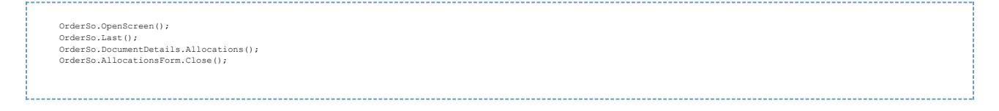

# <span id="page-104-0"></span>How to Verify a Note on a Form

In this topic, you will see an example of the note text on a form being verified.

The following screenshot illustrates the verification of a note on the Journal Transactions form (GL301000).

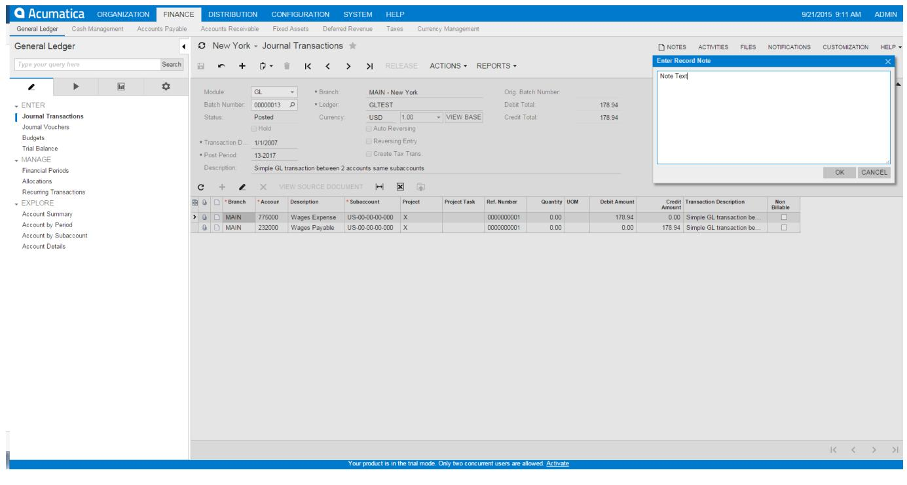

The code below shows how to verify the text of a note in your test.

JournalEntry JournalEntry = new JournalEntry(); JournalEntry.OpenScreen(); JournalEntry.Note(); JournalEntry.NotePanel.NoteEdit.VerifyEquals("Note Text") JournalEntry.NotePanel.Cancel();

# <span id="page-105-0"></span>How to Add a Note to a Detail Line

In this topic, you will see an example of adding a note to a detail line of a document on an Acumatica ERP form.

The following screenshot illustrates a note being added to a detail line on the Journal Transactions form (GL301000).

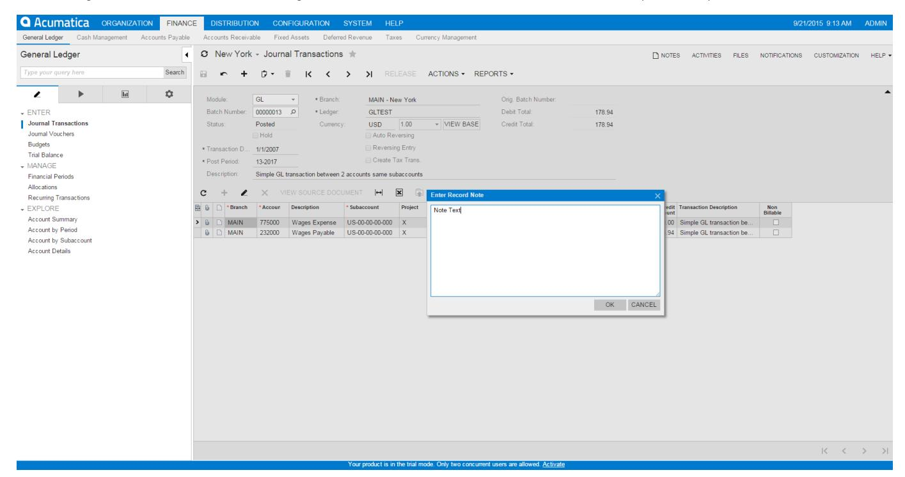

The code below shows how to implement adding a note to a detail line in your test.

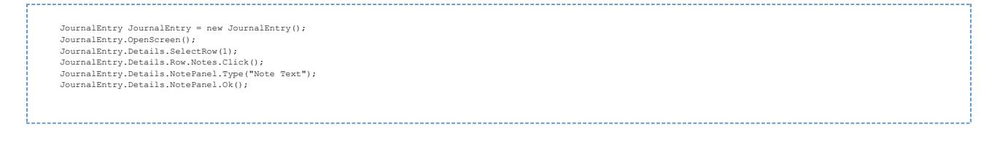

# <span id="page-106-0"></span>How to Add a Note to an Acumatica Form

In this topic, you will see an example of adding a note to a record on a form by using Test SDK.

The following screenshot shows a note being added in Acumatica ERP.

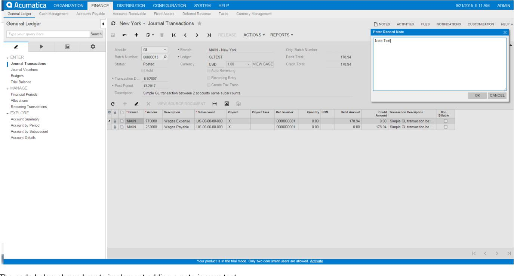

The code below shows how to implement adding a note in your test.

JournalEntry JournalEntry = new JournalEntry(); JournalEntry.OpenScreen(); JournalEntry.Note(); JournalEntry.NotePanel.Type("Note Text") JournalEntry.NotePanel.Ok();

# <span id="page-107-0"></span>How to Upload a File

On some Acumatica ERP forms, you can upload files of different formats to the form by using form-specific buttons on the form toolbar. For example, on the Import Bank Transactions form (CA306500; Finance > Cash Management > Enter), you can upload a file by clicking the Upload File button on the form toolbar. This opens the Statement File Upload dialog box, which is shown in the following screenshot.

| <b>Statement File Upload</b> |                                                                      |             |
|------------------------------|----------------------------------------------------------------------|-------------|
| Choose File:                 | ◉ Upload file ⓒ Link to existing file<br>No file selected.<br>Browse |             |
| Comment:                     |                                                                      | ÷<br>$-1.1$ |
| max 25000KB                  | <b>CLOSE</b><br><b>UPLOAD</b>                                        |             |

#### The example below shows how to upload a file on the Import Bank Transactions form (CA306500).

BankTransactionsImport BankTransactionsImport = new BankTransactionsImport(); BankTransactionsImport.OpenScreen(); BankTransactionsImport.UploadFile(); BankTransactionsImport.StatementFileUpload.SelectFile("C:\\share\\BankTransactions.dat"); BankTransactionsImport.StatementFileUpload.Upload();

# <span id="page-108-0"></span>How to Upload Data from an Excel File into a Detail Table

The following example shows how to upload data from an Excel file into a detail table on the Chart of Accounts form (GL202500; Finance > General Ledger > Configuration > Manage).

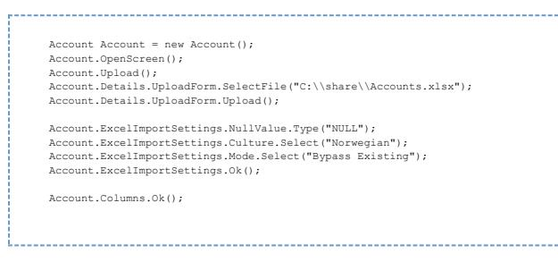

# <span id="page-109-0"></span>How to Upload Data from a CSV File into a Detail Table

The following code shows an example of data being uploaded from a CSV file into a detail table on the Chart of Accounts form (GL202500; Finance > General Ledger > Configuration > Manage).

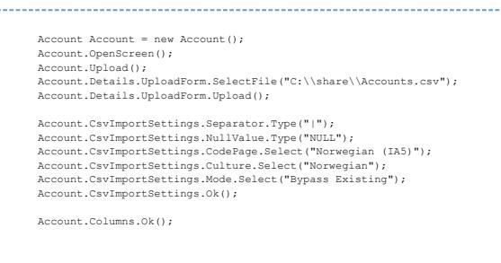

# <span id="page-110-0"></span>How to Attach a File to an Acumatica Form

The following code shows an example of a file being attached to a record on the Journal Transactions form (GL301000).

JournalEntry JournalEntry = new JournalEntry(); JournalEntry.OpenScreen(); JournalEntry.Last(); JournalEntry.FilesMenuShow(); JournalEntry.FilesUploadDialog.FilesAttached.VerifyRowsCount(0); JournalEntry.FilesUploadDialog.FileUploader.SelectFile("C:\\share\\Test.txt"); JournalEntry.FilesUploadDialog.FileUploader.Upload(); JournalEntry.FilesUploadDialog.FilesAttached.VerifyRowsCount(1); string fileName = JournalEntry.FilesUploadDialog.FilesAttached.Row.FileName.GetValue(); JournalEntry.FilesUploadDialog.FilesAttached.Row.Comment.Type( string.Format("This file has been attached to Acumatica page: {0}", fileName)); JournalEntry.FilesUploadDialog.Close();

# <span id="page-111-0"></span>How to Attach a File to a Detail Line

The following code shows how to attach a file to a detail line of a record on the Journal Transactions form (GL301000).

```
JournalEntry JournalEntry = new JournalEntry();
JournalEntry.OpenScreen();
JournalEntry.Last();
JournalEntry.Details.VerifyRowsCount(1);
JournalEntry.Details.SelectRow(1);
JournalEntry.Details.Row.Files.Click();
JournalEntry.Details.FilesUploadDialog.FilesAttached.VerifyRowsCount(0);
JournalEntry.Details.FilesUploadDialog.FileUploader.SelectFile("C:\\share\\Test.xlsx");
JournalEntry.Details.FilesUploadDialog.FileUploader.Upload();
JournalEntry.Details.FilesUploadDialog.FilesAttached.VerifyRowsCount(1);
string fileName = JournalEntry.Details.FilesUploadDialog.FilesAttached.Row.FileName.GetValue();
JournalEntry.Details.FilesUploadDialog.FilesAttached.Row.Comment.Type(
 string.Format("This file has been attached to a detail line: {0}", fileName));
JournalEntry.Details.FilesUploadDialog.Close();
```

# <span id="page-112-0"></span>How to Remove an Attached File from an Acumatica Form

You can use one of the following approaches when removing an attached file from an Acumatica form:

- You can remove the file by using the File Maintenance form (SM202510).
- You can remove the file by using the Search in Files form (SM202520).

Removing an Attached File by Using the File Maintenance Form (SM202510)

The following code shows how to remove the attached file from the Journal Transactions form (GL301000) by using the File Maintenance form (SM202510).

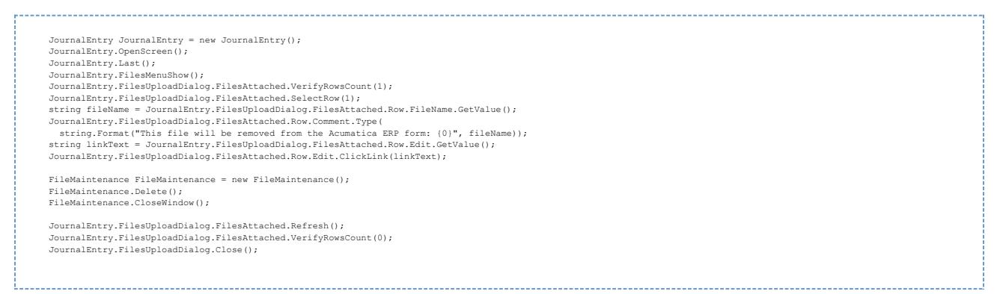

## Removing an Attached File by Using the Search in Files Form (SM202520)

The following code shows how to remove the attached file from the Journal Transactions form (GL301000) by using the Search in Files form (SM202520).

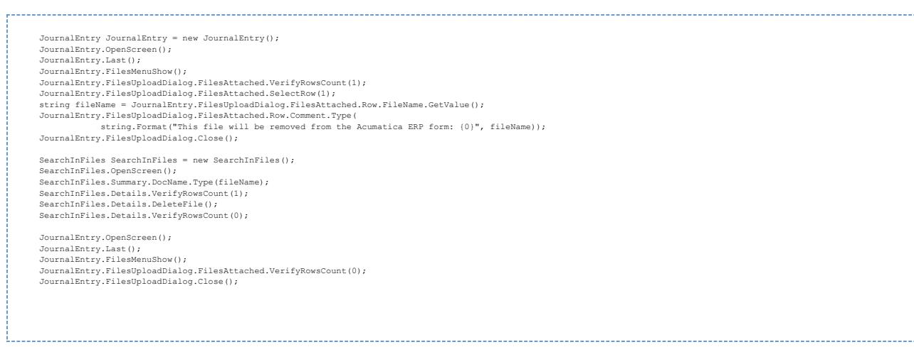

# <span id="page-113-0"></span>How to Remove an Attached File from a Detail Line

You can use one of the two approaches to remove the file attached to a detail line:

- Remove the file by using the File Maintenance form (SM202510)
- Remove the file by using the Search in Files form (SM202520)

Removing the File Attached to a Detail Line by Using the File Maintenance form (SM202510)

The following code shows how to remove the file attached to a detail line on the Journal Transactions form (GL301000). The approach illustrated in this code uses the File Maintenance form (SM202510) to remove the attached file.

JournalEntry JournalEntry = new JournalEntry(); JournalEntry.OpenScreen(); JournalEntry.Last(); JournalEntry.Details.VerifyRowsCount(1); JournalEntry.Details.SelectRow(1); JournalEntry.Details.Row.Files.Click(); JournalEntry.Details.FilesUploadDialog.FilesAttached.VerifyRowsCount(1); JournalEntry.Details.FilesUploadDialog.FilesAttached.SelectRow(1); string fileName = JournalEntry.Details.FilesUploadDialog.FilesAttached.Row.FileName.GetValue(); JournalEntry.Details.FilesUploadDialog.FilesAttached.Row.Comment.Type( string.Format("This file will be removed from a detail line of the Acumatica ERP form: {0}", fileName)); string linkText = JournalEntry.Details.FilesUploadDialog.FilesAttached.Row.Edit.GetValue(); JournalEntry.Details.FilesUploadDialog.FilesAttached.Row.Edit.ClickLink(linkText); FileMaintenance FileMaintenance = new FileMaintenance(); FileMaintenance.Delete(); FileMaintenance.CloseWindow(); JournalEntry.Details.FilesUploadDialog.FilesAttached.Refresh(); JournalEntry.Details.FilesUploadDialog.FilesAttached.VerifyRowsCount(0); JournalEntry.Details.FilesUploadDialog.Close();

## Removing the File Attached to a Detail Line by Using the Search in Files Form (SM202520)

The following code shows how to remove the file attached to a detail line on the Journal Transactions form (GL301000). The approach illustrated in this code uses the Search in Files form (SM202520) to remove the attached file.

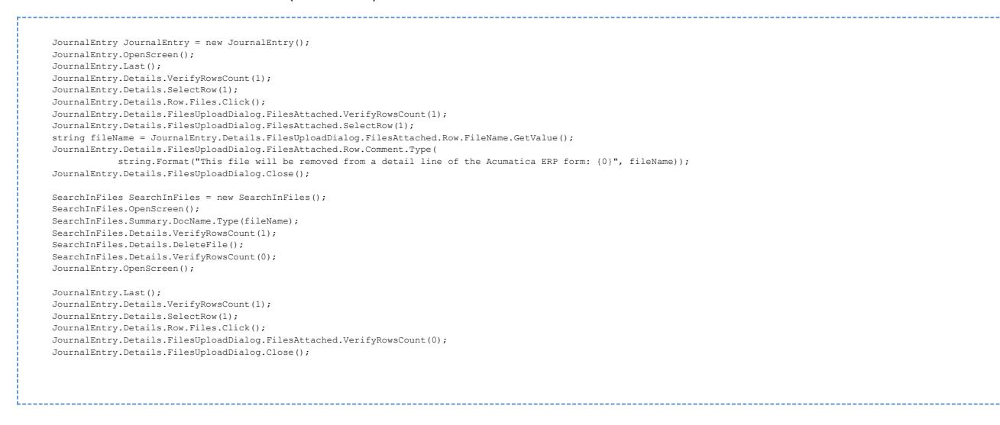

# <span id="page-114-0"></span>How to Publish Customization Projects

In your test application, you can upload a customization project and publish it by using any of the following approaches.

### Example 1

1. Define the following extension class for the page wrapper of the Customization Projects form (SM204505; System > Customization > Manage).

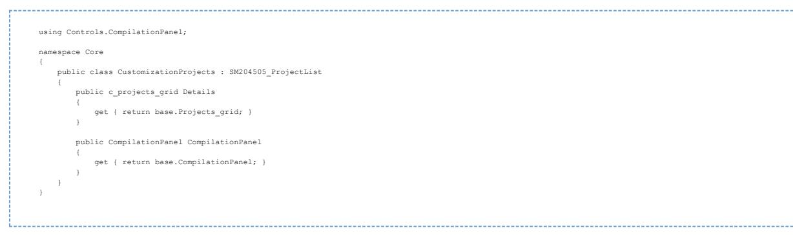

#### 2. Upload and publish a customization project in your test as follows.

```
CustomizationProjects.OpenScreen();
CustomizationProjects.ActionImport();
CustomizationProjects.Details.UploadForm.SelectFile("C:\share\CustomizationProject.zip");
CustomizationProjects.Details.UploadForm.Upload();
CustomizationProjects.Details.Row.IsWorking.SetTrue();
CustomizationProjects.ActionPublish();
CustomizationProjects.CompilationPanel.Validate(true, "Validation finished successfully.");
CustomizationProjects.CompilationPanel.Publish(true, "Website has been updated.");
CustomizationProjects.CompilationPanel.Close();
```

# <span id="page-115-0"></span>How to Work with Smart Delays

In this topic, you can find examples of how to work with smart delays. You may need to use smart delays when performing the following tasks:

- [Waiting For a New Window to Open](#page-115-1)
- [Waiting for a Condition](#page-115-2)

# Waiting for a Long-Running Operation to Complete

To wait for a long-running operation to complete, use the WaitForLongOperationToComplete() method of the Wait class.

By default, for all buttons that start long-running operations, waiting for the long-running operation to complete is already implemented in Test SDK. However, you may need to change the default wait action. The code example below shows how to change the default wait action.

| public JournalEntry()                                             |
|-------------------------------------------------------------------|
| {                                                                 |
| ToolBar.Release.WaitAction = Wait.WaitForLongOperationToComplete; |
| }                                                                 |
|                                                                   |
|                                                                   |
| JournalEntry journalEntry = new JournalEntry();                   |
| journalEntry.OpenScreen();                                        |
|                                                                   |
| journalEntry.Insert();                                            |
| journalEntry.Summary.BranchID.Select("MAIN");                     |
| journalEntry.Summary.LedgerID.Select("ACTUAL");                   |
| journalEntry.Summary.Description.Type("Test journal entry 1");    |
| journalEntry.Details.New();                                       |
| journalEntry.Details.Row.AccountID.Type("100000");                |
| journalEntry.Details.Row.ProjectID.Select("X");                   |
| journalEntry.Details.Row.CuryDebitAmt.Type(100);                  |
| journalEntry.Details.New();                                       |
| journalEntry.Details.Row.AccountID.Select("101000");              |
| journalEntry.Details.Row.CuryCreditAmt.Type(100);                 |
| journalEntry.Release();                                           |

You can also make the test application wait for the specified result of the long-running operation (success or failure) and check the message on completion of the operation, as shown in the following code.

```
...
public JournalEntry() 
{ 
 ToolBar.Release.WaitAction = () => Wait.WaitForLongOperationToComplete(false, "Operation failed."); 
}
...
JournalEntry journalEntry = new JournalEntry();
journalEntry.OpenScreen();
journalEntry.Insert();
journalEntry.Summary.BranchID.Select("MAIN");
journalEntry.Summary.LedgerID.Select("ACTUAL");
journalEntry.Summary.Description.Type("Test journal entry 1");
journalEntry.Details.New();
journalEntry.Details.Row.AccountID.Type("100000");
journalEntry.Details.Row.ProjectID.Select("X");
journalEntry.Details.Row.CuryDebitAmt.Type(100);
journalEntry.Details.New();
journalEntry.Details.Row.AccountID.Select("101000");
journalEntry.Details.Row.CuryCreditAmt.Type(100);
journalEntry.Release();
```

#### <span id="page-115-1"></span>Waiting For a New Window to Open

The code example below shows how to wait for a form to load in another window.

<span id="page-115-2"></span>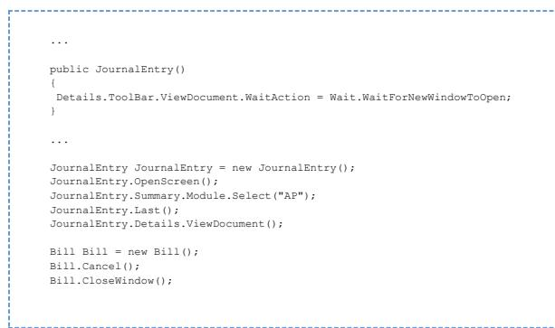

## Waiting for a Condition

To wait for a condition in your test application, use the WaitForCondition() method of the Wait class, as shown in the following code.

You do not need to check simple conditions, such as whether a box or a button is visible or available on the form, because these conditions are checked by Test SDK automatically when the test application clicks a button or changes data in a box. You may need to use waiting for a condition when you compose a complex reaction on some action.

Wait.WaitForCondition(JournalEntry.ToolBar.Save.IsEnabled, Wait.LongTimeOut);

# <span id="page-117-0"></span>How to Capture Screenshots

The following code shows how to capture a screenshot during the test.

Log.Screenshot();

# <span id="page-118-0"></span>How to Get Datetime in the Current User's Timezone

You can get a datetime in the current user's timezone using the following property:

Browser.InstanceTime

## <span id="page-119-0"></span>How to use Comparator to compare .xml, .csv, .pdf, Excel files

Methods of a static class Core.Comparator can be used to verify data in a bulk

- 1. XML data (Comparator.Xml.Compare(...), is used inside Report.Compare(...))
- 2. PDF files (Comparator.Pdf.Compare(...))
- 3. Image files (Comparator.Image.Compare(...))
- 4. Table Data in different formats
  - a. .xlsx
    - b. .csv
    - c. string[][]
    - d. Grids in Acumatica UI

Usage:

1. Set up in tests: (for example you need to verify that exported .xlsx is correct)

| #region Step 2. Export to Excel                                                                                                                                                                                                                                                                         |
|---------------------------------------------------------------------------------------------------------------------------------------------------------------------------------------------------------------------------------------------------------------------------------------------------------|
| using (TestExecution.CreateTestStepGroup("Export to Excel"))<br>{<br>AccountDetails.Export(); //Note: Wait action should be set ToolBar.Export.WaitAction = Wait.Wait.WaitForFileDownloadComplete;<br>Comparator.Table.Compare("AD100_TC2_S2", Core.Core.Browser.Browser.Downloads.GetLastFile());<br>} |
| #endregion                                                                                                                                                                                                                                                                                              |

#### 2. Get the baseline (from test results or by manually exporting the file)

3. Add the file to your Tests project (.csv format is recommended), set Copy To Output Directory file property to Copy if Newer (for old-style csproj)

<None Include="ERP\FINANCE\General Ledger\Account Details\Data\AD100\_TC2\_S2.csv"> <CopyToOutputDirectory>PreserveNewest</CopyToOutputDirectory> </None>

4. Run the test.

# <span id="page-120-0"></span>How to Verify string/long/int/DateTime returned by a method

In this topic, you will see an example of verification of sting/long/int/DateTime returned by a custom method.

| using PX.QA.Tools;                                  |  |
|-----------------------------------------------------|--|
|                                                     |  |
| SomeMethod().VerifyEquals("test", "Method result"); |  |
|                                                     |  |
| long value = SomeMethod();                          |  |
| value.VerifyEquals(123, "Method result");           |  |
|                                                     |  |
| "test".VerifyEquals("test", "Some string");         |  |
|                                                     |  |
|                                                     |  |
|                                                     |  |
|                                                     |  |
|                                                     |  |

Pay attention: these Verify\* methods have second argument (verifiableName), which allows you to specify what exactly you are verifying. Don't forget to set it in test.

## <span id="page-121-0"></span>How to work with dynamic controls

Test SDK provides ability to find a control (ToolBarButton, Button,

CheckBox, Input, Selector, FormulaCombo, DropDown, DateSelector, Container, SmartPanel, GroupBox, QuickSearch, Grid) not generated in WG, e.g. created via customization project. There are two methods: DynamicControl and DynamicGrid (last one has been created just for convenience and it invokes DynamicControl inside with specific type parameter).

How to Use DynamicControl/DynamicGrid

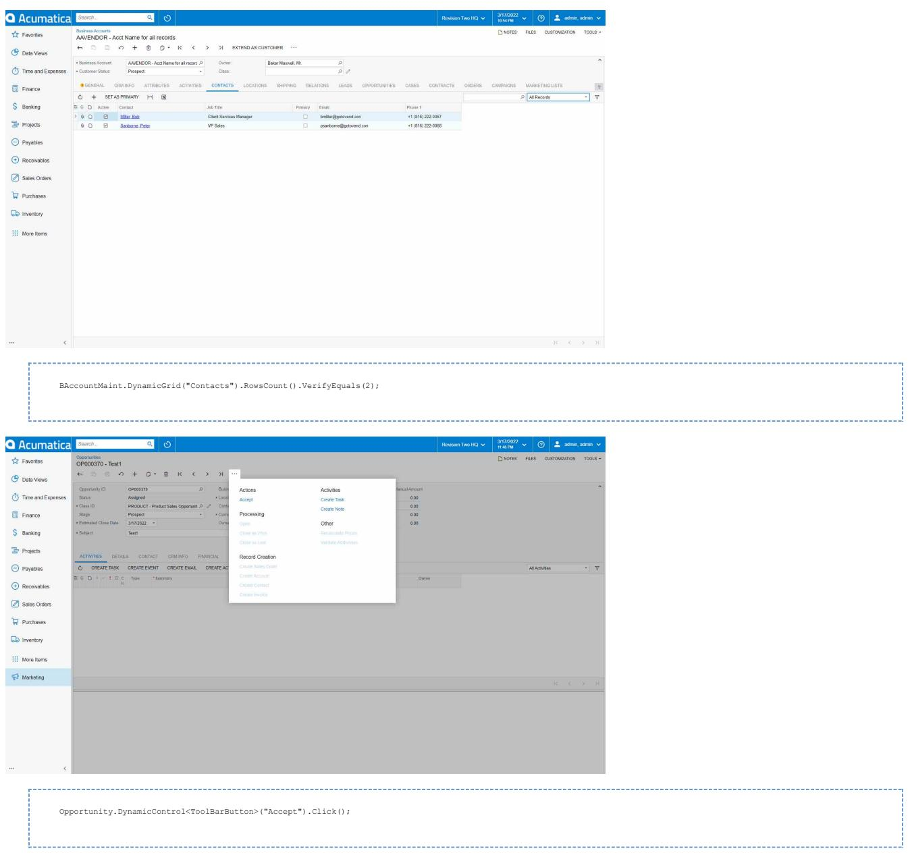

And few rows for totally new screen

| HiTestScreen.OpenScreen();<br>date.Type(DateTime.Now);<br>date.IsEnabled().VerifyEquals(true); |  | OrderPo HiTestScreen = new OrderPo() { ScreenId = "HITEST00" };<br>HiTestScreen.DynamicControl <selector>("Branch").Select("HQ");<br/>var date = HiTestScreen.DynamicControl<dateselector>("Date");<br/>HiTestScreen.DynamicControl<input/>("Some Data").Type("Test");<br/>HiTestScreen.DynamicControl<toolbarbutton>("Put On Hold").Click();<br/>HiTestScreen.DynamicControl<checkbox>("Hold").GetValue().VerifyEquals(true);</checkbox></toolbarbutton></dateselector></selector> |  |  |  |  |  |
|------------------------------------------------------------------------------------------------|--|-------------------------------------------------------------------------------------------------------------------------------------------------------------------------------------------------------------------------------------------------------------------------------------------------------------------------------------------------------------------------------------------------------------------------------------------------------------------------------------|--|--|--|--|--|
|                                                                                                |  |                                                                                                                                                                                                                                                                                                                                                                                                                                                                                     |  |  |  |  |  |

## Known Issues & Helpful Tips

In case you have multiple invocations save the control into variable:

```
var customButton = Wrapper.DynamicControl<ToolBarButton>("Button Name");
customButton.IsVisible().VerifyEquals(false);
customButton.Click();
```