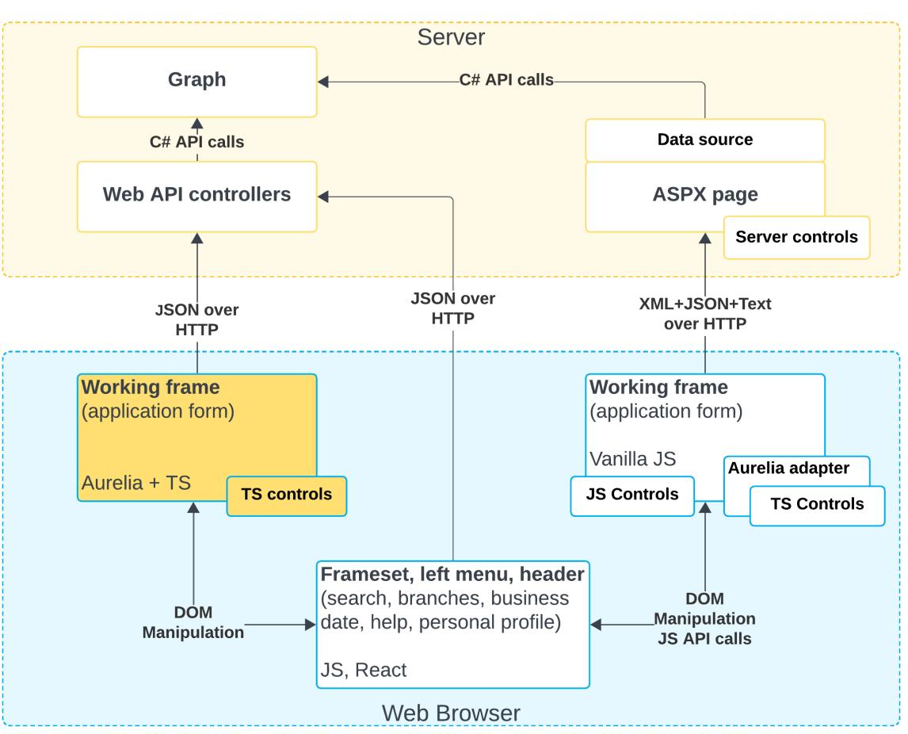
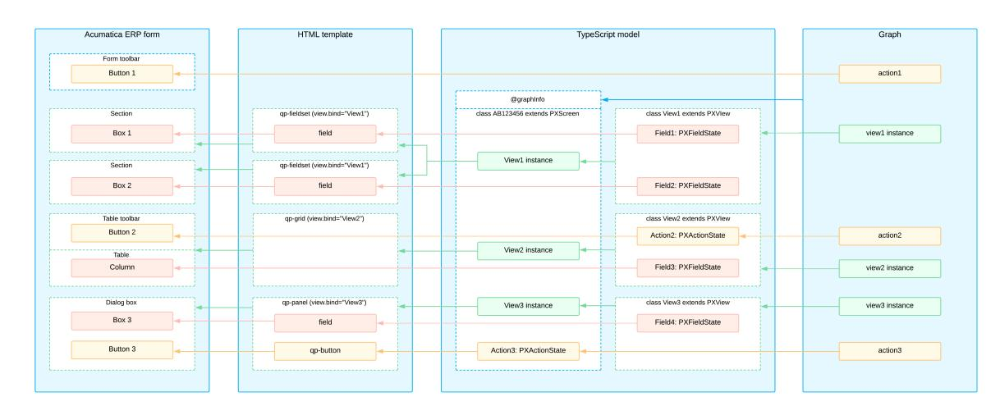
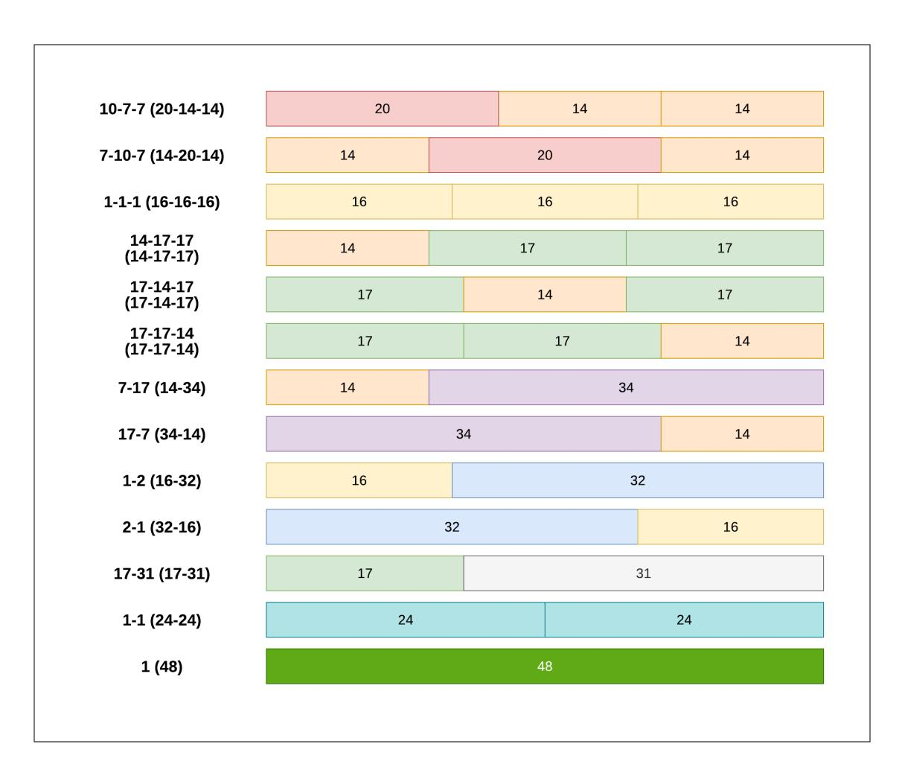
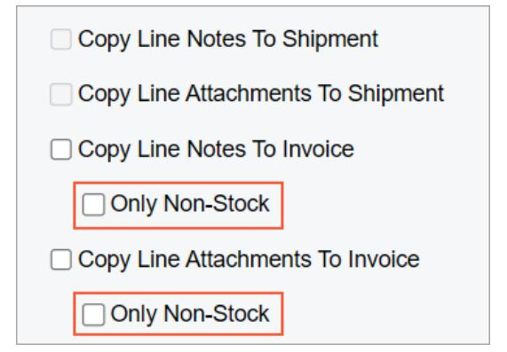
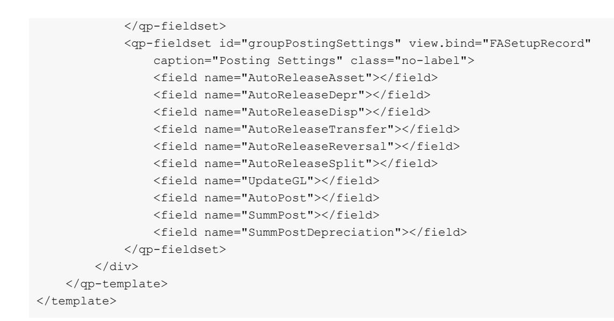
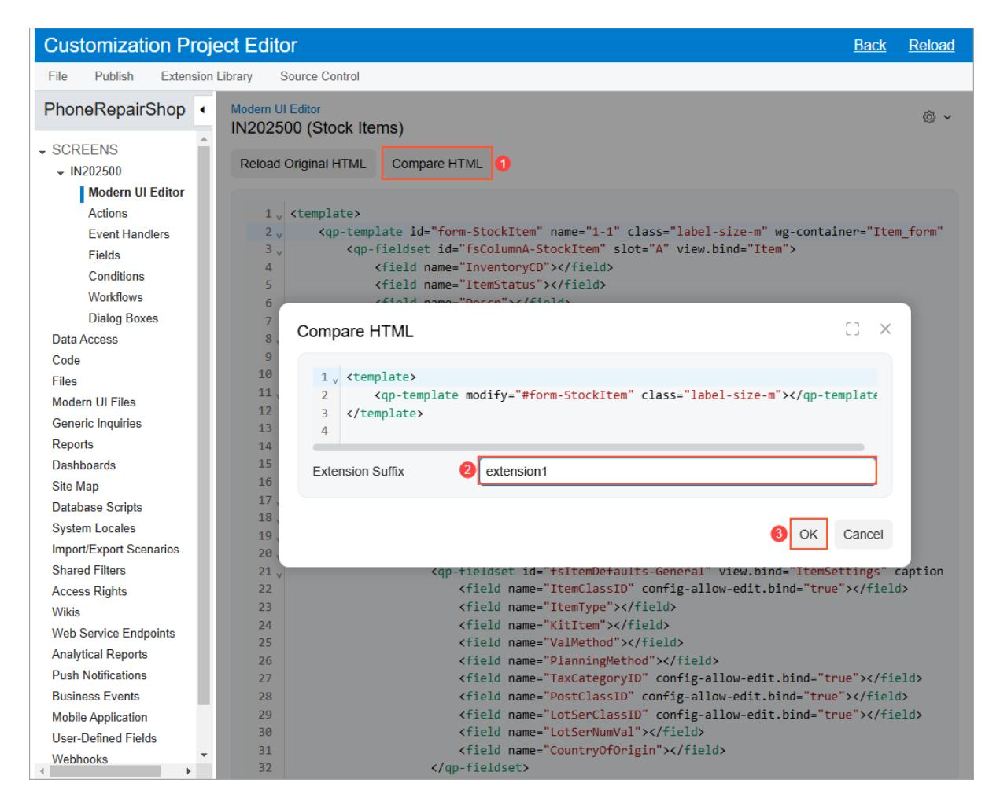
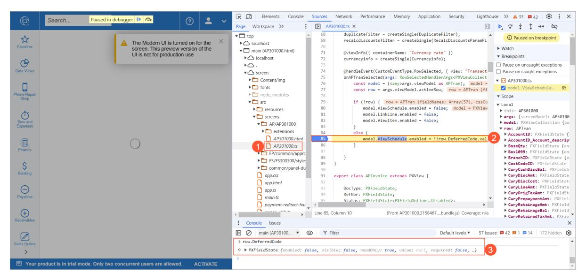
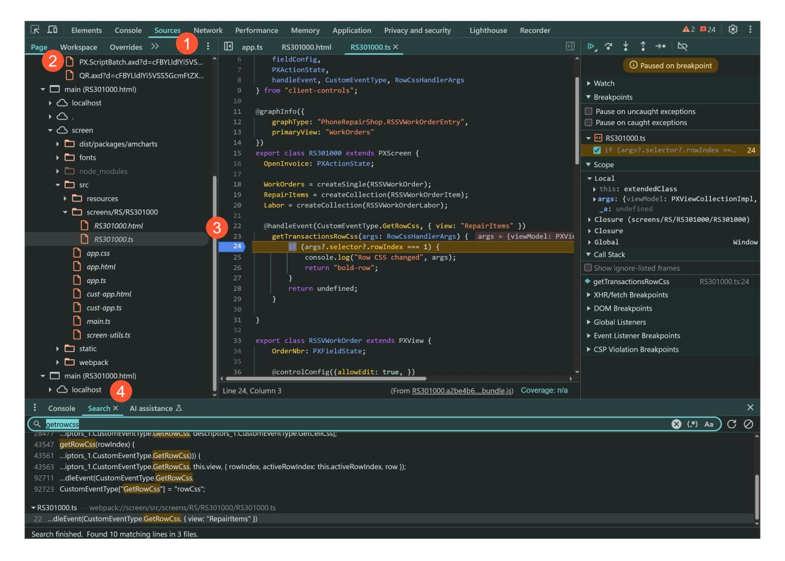
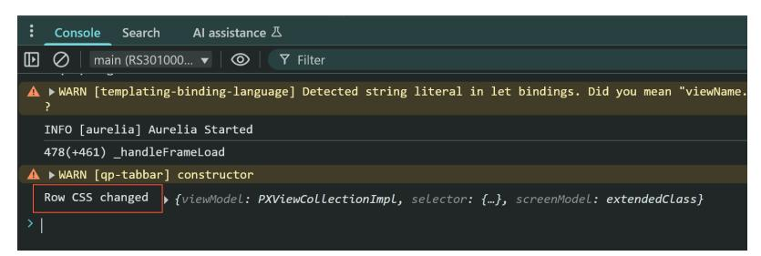
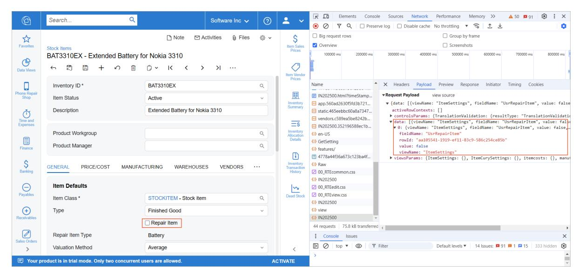

**Developer Guide**

# **UI Development Guide 2025 R1**


# **Contents**

| Copyright5                                  |                                                                                                                                    |  |  |  |  |
|---------------------------------------------|------------------------------------------------------------------------------------------------------------------------------------|--|--|--|--|
| UI Developer Guide6                         |                                                                                                                                    |  |  |  |  |
| Part 1: Getting Started with the Modern UI7 |                                                                                                                                    |  |  |  |  |
|                                             | Modern UI Development: General Information 7                                                                                       |  |  |  |  |
|                                             | Modern UI Development: Building of the Source Code 10                                                                              |  |  |  |  |
|                                             | Modern UI Development: To Deploy an Instance with Custom Forms and the Modern UITo Deploy an<br>Instance for the Training Course12 |  |  |  |  |
|                                             | Modern UI Development: Activity 1.2.1: To Build the Source Code of All Acumatica ERP Forms for Modern<br>UI Development 13         |  |  |  |  |
|                                             | Modern UI Development: Activity 2.1.2: To Build the Source Code of a Particular Form for the Modern UI<br>Development14            |  |  |  |  |
|                                             | Modern UI Development: Switching of a Form Between the Modern UI and the Classic UI16                                              |  |  |  |  |
|                                             | Part 2: Defining Acumatica ERP Forms in HTML and TypeScript 19                                                                     |  |  |  |  |
|                                             | UI Definition in HTML and TypeScript: General Information19                                                                        |  |  |  |  |
|                                             | UI Definition in HTML and TypeScript: Activity 2.1.1: To Create the UI of a Form 24                                                |  |  |  |  |
|                                             | UI Definition in HTML and TypeScript: Built-In Converter28                                                                         |  |  |  |  |
|                                             | UI Definition in HTML and TypeScript: Activity 2.2.1: To Convert an Acumatica ERP Form to the Modern UI<br>with the Converter29    |  |  |  |  |
|                                             | UI Definition in HTML and TypeScript: Joined Fields 33                                                                             |  |  |  |  |
|                                             | UI Definition in HTML and TypeScript: View Parameters in the viewInfo Decorator34                                                  |  |  |  |  |
|                                             | UI Definition in HTML and TypeScript: Backend Action with Parameters 36                                                            |  |  |  |  |
|                                             | Part 3: Designing the Layout of an Acumatica ERP Form 38                                                                           |  |  |  |  |
|                                             | Form Layout: General Information38                                                                                                 |  |  |  |  |
|                                             | Form Layout: Predefined Templates 38                                                                                               |  |  |  |  |
|                                             | Form Layout: Grid Presets45                                                                                                        |  |  |  |  |
|                                             | Form Layout: CSS Classes 49                                                                                                        |  |  |  |  |
|                                             | Form Layout: An Element Next to Another Element 57                                                                                 |  |  |  |  |
|                                             | Defining a Setup Form 61                                                                                                           |  |  |  |  |
|                                             | Setup Form: General Information61                                                                                                  |  |  |  |  |
|                                             | Setup Form: A Form with Only a Summary Area62                                                                                      |  |  |  |  |
|                                             | Setup Form: A Form with Tabs 65                                                                                                    |  |  |  |  |
|                                             | Setup Form: Activity 3.2.1: To Create the UI of a Setup Form68                                                                     |  |  |  |  |
| Defining a Data Entry Form 73               |                                                                                                                                    |  |  |  |  |
|                                             | Data Entry Form: General Information73                                                                                             |  |  |  |  |
|                                             | Data Entry Form: Definition in TypeScript and HTML 77                                                                              |  |  |  |  |

| Data Entry Form: Activity 3.3.1: To Create the UI of a Data Entry Form80                                        |  |
|-----------------------------------------------------------------------------------------------------------------|--|
| Defining a Processing Form 87                                                                                   |  |
| Processing Form: General Information87                                                                          |  |
| Processing Form: A Form with Only a Grid 89                                                                     |  |
| Processing Form: A Form with a Selection Area and a Grid 91                                                     |  |
| Processing Form: A Form with a Selection Area and a Grid with Filters93                                         |  |
| Processing Form: A Form with a Grid and Single Element in the Selection Area94                                  |  |
| Processing Form: Activity 3.4.1: To Create the UI of a Processing Form95                                        |  |
| Part 6: Customizing Acumatica ERP Forms in HTML and TypeScript101                                               |  |
| UI Customization Development: General Information 101                                                           |  |
| UI Customization Development: Activity 6.1.1: To Add Elements to an Acumatica ERP Form 103                      |  |
| UI Customization Development: Activity 6.1.2: To Add a Tab to an Acumatica ERP Form107                          |  |
| Including the Modern UI Changes in a Customization Project 110                                                  |  |
| Customization Project with UI Changes: General Information 110                                                  |  |
| Customization Project with UI Changes: How UI Customization Works111                                            |  |
| Customization Project with UI Changes: Activity 6.2.1: To Include Source Files in a Customization<br>Project112 |  |
| Adjusting HTML and TypeScript Code 115                                                                          |  |
| UI Adjustments in HTML and TypeScript: General Information 115                                                  |  |
| UI Adjustments in HTML and TypeScript: HTML Examples 116                                                        |  |
| UI Adjustments in HTML and TypeScript: TypeScript Examples 117                                                  |  |
| Customizing Modern UI Forms in the Customization Project Editor 120                                             |  |
| Screen Editor for the Modern UI: General Information 120                                                        |  |
| Reusing a UI Definition 124                                                                                     |  |
| Reusing of UI Definitions: General Information 124                                                              |  |
| Reusing of UI Definitions: Reusable UI Definitions with Parameters 128                                          |  |
| Handling UI Events130                                                                                           |  |
| UI Events: General Information130                                                                               |  |
| UI Events: Changing of the CSS for a Row of a Table131                                                          |  |
| UI Events: Debugging the UI Code in the Browser131                                                              |  |
| Activity 7.2.1: To Implement and Debug an Event Handler132                                                      |  |
| UI Events: Changing of Availability of a UI Element 135                                                         |  |
| UI Events: Handling of Data That Is Unrelated to Any View 135                                                   |  |
| UI Events: Handling of Large Binary Data 137                                                                    |  |
| UI Events: Displaying of Relative Dates138                                                                      |  |
| Part 8: Testing the Modern UI 139                                                                               |  |

#### Contents | **4**

| Testing of the Modern UI: General Information 139                        |  |
|--------------------------------------------------------------------------|--|
| Testing of the Modern UI: Names of WG Containers142                      |  |
| Testing of the Modern UI: Update of Tests Written for the Classic UI 145 |  |
| Testing of the Modern UI: Frontend Actions in Wrappers147                |  |
| Supporting UI Localization 148                                           |  |
| UI Localization: General Information148                                  |  |
| UI Localization: TypeScript and HTML Code of the Modern UI 149           |  |
| UI Localization: DACs151                                                 |  |
| UI Localization: Application Messages in C# 152                          |  |
| UI Localization: Multilanguage Fields154                                 |  |
| UI Localization: Optimization of Memory Consumption of Localized Data156 |  |
| Troubleshooting the Modern UI162                                         |  |
| Modern UI Troubleshooting: General Information 162                       |  |
| Modern UI Troubleshooting: Developer Tools in the Browser 162            |  |
| Modern UI Troubleshooting: Unreflected Changes in the Modern UI164       |  |
| Modern UI Troubleshooting: Build Options 165                             |  |

# <span id="page-4-0"></span>**Copyright**

#### **© 2025 Acumatica, Inc.**

#### **ALL RIGHTS RESERVED.**

No part of this document may be reproduced, copied, or transmitted without the express prior consent of Acumatica, Inc.

3075 112th Avenue NE, Suite 200, Bellevue, WA 98004, USA

## **Restricted Rights**

The product is provided with restricted rights. Use, duplication, or disclosure by the United States Government is subject to restrictions as set forth in the applicable License and Services Agreement and in subparagraph (c)(1)(ii) of the Rights in Technical Data and Computer Soware clause at DFARS 252.227-7013 or subparagraphs (c)(1) and (c)(2) of the Commercial Computer Soware-Restricted Rights at 48 CFR 52.227-19, as applicable.

#### **Disclaimer**

Acumatica, Inc. makes no representations or warranties with respect to the contents or use of this document, and specifically disclaims any express or implied warranties of merchantability or fitness for any particular purpose. Further, Acumatica, Inc. reserves the right to revise this document and make changes in its content at any time, without obligation to notify any person or entity of such revisions or changes.

#### **Trademarks**

Acumatica is a registered trademark of Acumatica, Inc. HubSpot is a registered trademark of HubSpot, Inc. Microso Exchange and Microso Exchange Server are registered trademarks of Microso Corporation. All other product names and services herein are trademarks or service marks of their respective companies.

Soware Version: 2025 R1 Last Updated: 06/01/2025

# <span id="page-5-0"></span>**UI Developer Guide**

In this guide, you can find information about how to develop the UI for an Acumatica Framework–based application. You will learn how to configure your development environment and how to design the layout of a form.

# <span id="page-6-0"></span>**Part 1: Getting Started with the Modern UI**

In this part, you will find an overview of the main principles of the Modern UI of Acumatica ERP and learn about its architecture and features. You will also learn how to build the source code for the development of the Modern UI and how to switch a form between the Modern UI and the Classic UI.

## <span id="page-6-2"></span><span id="page-6-1"></span>**Modern UI Development: General Information**

The Modern UI is a .NET-compatible product that provides updated UI capabilities without ASPX pages. On the server side, the Modern UI is represented by web services. On the client side, it is represented by a template-based single-page application (SPA) framework based on *[Aurelia](https://aurelia.io/)*.

The application code is written in TypeScript. The framework transcribes the TypeScript code into JavaScript code, which is then executed on the web browser. This approach simplifies code support. Developers use HTML and CSS to design the layout of a form.

## **Learning Objectives**

In this chapter, you will learn how to do the following:

- Enable the Modern UI while deploying an instance
- Switch a form between the Modern UI and the Classic UI
- Verify that certain prerequisite installation and configuration tasks have been performed before building the UI from the source code
- Build the Modern UI from the source code
- Automatically rebuild the source code for a form when its source files are modified and saved

#### **Applicable Scenarios**

You will work with the Modern UI in the following cases:

- You need to make it possible to use the Modern UI for your instance.
- You need to convert any number of forms of your Acumatica ERP instance to the Modern UI.
- You need to create a new form that is based on the Modern UI.
- You need to be able to switch between the Modern UI and the Classic UI of a form.

#### **Enabling of the Modern UI in the Acumatica ERP Configuration Wizard**

While deploying an instance by using the Acumatica ERP Configuration wizard, you can give users the ability to switch to the Modern UI. To do this, you select the **Enable Modern UI** check box on the Website Configuration page of the wizard, as shown in the following screenshot.

| Acumatica ERP Configuration Wizard                                                                                                                                                                                | $\times$                                                                                                                  |  |  |  |  |  |  |
|-------------------------------------------------------------------------------------------------------------------------------------------------------------------------------------------------------------------|---------------------------------------------------------------------------------------------------------------------------|--|--|--|--|--|--|
| <b>Website Configuration</b>                                                                                                                                                                                      |                                                                                                                           |  |  |  |  |  |  |
| Before you can use Acumatica ERP, the website has to be created and configured. On this page, you<br>enter all the appropriate information.                                                                       |                                                                                                                           |  |  |  |  |  |  |
| <b>Website Settings</b>                                                                                                                                                                                           | <b>Application Pool Settings</b>                                                                                          |  |  |  |  |  |  |
| <b>Available Websites</b><br>Reload the List                                                                                                                                                                      | <b>Create New Application Pool</b><br>$\cup$                                                                              |  |  |  |  |  |  |
| Default Web Site                                                                                                                                                                                                  | <b>Application Pool Name:</b><br>◉ Use Existing Application Pool<br>Reload the List                                       |  |  |  |  |  |  |
| ○ Create Virtual Directory<br>Virtual Directory Name: AcumaticaERP<br><b>Compile the Site</b><br>⋈<br>Install RabbitMQ<br><b>Install NodeJS</b><br>◡<br>$\triangledown$ Enable Modern UI (not for production use) | Available Application Pools (Integrated Pipeline<br>Mode, Support 32bit apps is disabled):<br>NETv4.5<br>Default App Pool |  |  |  |  |  |  |
| https://www.acumatica.com                                                                                                                                                                                         | <b>Back</b><br><b>Next</b>                                                                                                |  |  |  |  |  |  |

Make sure that you have the **Install NodeJS**check box selected so that the Acumatica ERP Configuration wizard installs the needed version of Node.js for compilation of the customization code of the Modern UI. If you want to use the version of Node.js that has already been installed in your system, you can clear the **Install NodeJS**check box and add the following key to the appSettings section of the Web.config file of your instance: <add key="NodeJs:NodeJsPath" value="C:\Program Files\NodeJs"/>. In this key, value specifies the path to the location where Node.js has been installed.

### When you select the **Enable Modern UI** check box, the system adds the <add

key="EnableSiteMapSwitchUI" value="True" /> key to the Web.config file of your instance. If you want to disable the switching to the Modern UI for your instance, you can remove this key or change its value to *False*. However, if some forms were already switched to the Modern UI before you removed this key or changed its value, these forms will still stay in the Modern UI.

You should select the **Enable Modern UI** check box only when you are deploying an instance for testing purposes. To enable the Modern UI in a production environment, please contact your Acumatica partner.

#### **Architecture of the Modern UI**

The architecture of the Modern UI is based on the *[Model-View-ViewModel](https://learn.microsoft.com/en-us/dotnet/architecture/maui/mvvm) (MVVM) pattern*, with the parts of the architecture represented as follows:

- A view is represented by an HTML template.
- A view model is represented by the code written in TypeScript.
- A model is represented by a graph on the server that exchanges data from the client side.

The following diagram shows the architecture of the Modern UI and the interaction between its components.



Currently, the Modern UI is embedded in the infrastructure of the Classic UI. The Modern UI is represented by a new frame that enables TypeScript controls in the Classic UI infrastructure. Also, the Modern UI includes web API controllers that are added to the controllers of the Classic UI. Some parts of the Modern UI have been connected to the Classic UI architecture via an Aurelia adapter, which adapts TypeScript's controllers to work in the Classic UI architecture. The forms that are fully converted to the Modern UI (highlighted in yellow in the preceding diagram) work directly with web API controllers.

JSON serves as the protocol between the client side and the server side. As a result, all requests can be seen in a unified format and used for debugging.

## **Capabilities of the Modern UI**

The Modern UI provides a variety of new capabilities for both developers and users. For developers, the Modern UI provides the following capabilities in comparison to the Classic UI:

- The template (HTML and CSS) and presentation logic layers (TypeScript) are fully customizable.
- The client-side model can be programmed by using the event-driven model, which is similar to the serverside model.
- The graph code generally does not require any modifications. The Modern UI and the Classic UI share the same graph.
- The developers can always switch between the Modern UI and the Classic UI.

For users, the Modern UI provides exciting new features. For details, see the following topics:

- *[Modern UI: Changes in UI Elements](https://help-2025r1.acumatica.com/Help?ScreenId=ShowWiki&pageid=5fec9220-52be-4566-93b4-f5cfbdba9429)*
- *[Modern UI: Filters](https://help-2025r1.acumatica.com/Help?ScreenId=ShowWiki&pageid=670f4502-7700-4a07-8a32-491275b7f211)*
- *[Modern UI: User Personalization](https://help-2025r1.acumatica.com/Help?ScreenId=ShowWiki&pageid=c03e368f-4805-4eaf-8054-ebe8036fabaf)*
- *Modern UI: Site-Wide [Personalization](https://help-2025r1.acumatica.com/Help?ScreenId=ShowWiki&pageid=8788a111-5714-4d33-9962-059e49baf657)*
- *[Modern UI: Managing User-Defined Fields](https://help-2025r1.acumatica.com/Help?ScreenId=ShowWiki&pageid=d7c0ced9-0ff5-4a78-9cab-ef17f68acb76)*

## <span id="page-9-1"></span><span id="page-9-0"></span>**Modern UI Development: Building of the Source Code**

When you want to start migrating Acumatica ERP forms to the Modern UI or you want create a new form based on it, you need to build the source code of each form to see its Modern UI version. Aer that, if you make any changes to the UI of the forms by using its source code, you need to rebuild its source code to see the results of your changes. You build the source code in the FrontendSources folder of your instance. You also need to make sure that you perform some prerequisite actions before you start building the source code.

#### <span id="page-9-2"></span>**Performing the Prerequisite Actions**

Before you begin building the source code for the first time, you do the following:

- 1. You make sure you have Node.js installed on your computer. By default, Node.js is installed by the Acumatica ERP Configuration wizard when you deploy a new application instance.
- 2. You make sure that in the appSettings section of the Web.config file of your Acumatica ERP instance, the following key is added.

<add key="EnableSiteMapSwitchUI" value="True" />

3. You run the following command in the FrontendSources folder. You can use terminal in Visual Studio Code, or Windows PowerShell or a similar program.

npm run getmodules

This command installs the required dependencies needed to build the sources correctly.


The system performs this instruction automatically during the first publication of a customization project that contains any Modern UI files.

## **Building the Source Code for All Acumatica ERP Forms**

To build the sources in the FrontendSources folder of your instance, you need to run a command in the same folder. This command generates the form schema and JavaScript code from the TypeScript code and creates the mapping between the JavaScript and TypeScript code. You use this mapping to debug the client code in a web browser.

To build the sources during the UI development, you run the following command in the FrontendSources folder.

npm run build-dev

To build the sources in production mode, you run the following command in the FrontendSources folder.

```
npm run build
```

We recommend that you use the build-dev command instead of the build command during the development for easier debugging in the web browser.

#### **Building the Source Code for Particular Acumatica ERP Forms**

To speed up the build process, you can initiate the build for only specific forms instead of all of them. To do this, you can run one of the following modified versions of the command instead of the one in the preceding section in the FrontendSources\screen folder:

• npm run build-dev --- --env screenIds=SO301000,FS305100

The command above builds the sources for only the *[Sales Orders](https://help-2025r1.acumatica.com/Help?ScreenId=ShowWiki&pageid=19e4021c-1b84-49fd-be12-0320c5f1c7e5)* (SO301000) and *[Service Contract](https://help-2025r1.acumatica.com/Help?ScreenId=ShowWiki&pageid=f435f472-2bdd-4d76-9e41-08591b878f3a) [Schedules](https://help-2025r1.acumatica.com/Help?ScreenId=ShowWiki&pageid=f435f472-2bdd-4d76-9e41-08591b878f3a)* (FS305100) forms.

• npm run build-dev --- --env modules=AR,AP,GL

The command above builds the sources for only the forms in the specified functional areas (AR, AP, and GL in this example).

#### **Automatically Rebuilding the Source Code for Particular Acumatica ERP Forms**

During the migration of the needed forms to the Modern UI, you make changes to the generated source files in the FrontendSources\screen folder of your instance. To see the changes that you make to a form, you will need to rebuild the corresponding source files every time a change is made. To save time, you can run a command that causes the source files to be rebuilt automatically each time a file is modified and saved in this folder.

To automatically rebuild the sources for only specific forms, you can run one of the following commands in the FrontendSources\screen folder. You need to run this command only once.

npm run watch --- --env screenIds=SO301000,FS305100

The command above automatically rebuilds the sources for only the *[Sales Orders](https://help-2025r1.acumatica.com/Help?ScreenId=ShowWiki&pageid=19e4021c-1b84-49fd-be12-0320c5f1c7e5)* (SO301000) and *[Service](https://help-2025r1.acumatica.com/Help?ScreenId=ShowWiki&pageid=f435f472-2bdd-4d76-9e41-08591b878f3a) [Contract Schedules](https://help-2025r1.acumatica.com/Help?ScreenId=ShowWiki&pageid=f435f472-2bdd-4d76-9e41-08591b878f3a)* (FS305100) forms when their corresponding source files are modified and saved.

```
npm run watch --- --env modules=AR,AP,GL
```

•

•

The command above automatically rebuilds the sources for only the forms in the specified functional area (AR, AP, and GL in this example).

To run the watch command from the root folder of your instance, you can navigate to the root folder in Windows PowerShell, and run the following command along with the screenIds or modules parameter.

npm run watch --prefix .\FrontendSources\screen\

We recommend that you do not use the watch command without the screenIds or modules parameters because the command may behave in an unstable manner.

# <span id="page-11-1"></span><span id="page-11-0"></span>**Modern UI Development: To Deploy an Instance with Custom Forms and the Modern UITo Deploy an Instance for the Training Course**

The following activity will walk you through the process of preparing and deploying an Acumatica ERP instance that you can use to perform the steps in the chapters of this guide.

The following activity will walk you through the process of preparing and deploying an Acumatica ERP instance that you can use to perform the steps in the lessons of this training course.

#### **Story**

Suppose that you need to perform customization tasks and complete the activities described in the chapters of this guide that are related to the development of the Modern UI. You need to deploy an instance of Acumatica ERP with the *PhoneRepairShop* customization project published and the Modern UI turned on.

To perform customization tasks and complete the activities described in the lessons of this training course, you need to deploy an instance of Acumatica ERP with the *PhoneRepairShop* customization project published and the Modern UI turned on.

## **Process Overview**

In this activity, you will prepare the environment and install tools that will help you to perform customization tasks. You will then deploy an instance of Acumatica ERP with the *PhoneRepairShop* customization project published and the dataset from the *T240 Processing Forms* course.

### **Step 1: Preparing the Environment**

If you have completed any of the training courses of the *T* series and are using the same environment for the current course, you can skip this step.

Before you begin deploying the needed Acumatica ERP instance, do the following:

- 1. Make sure that the environment that you are going to use conforms to the *[System Requirements for the](https://help-2025r1.acumatica.com/Help?ScreenId=ShowWiki&pageid=5cf164e5-889f-458b-8757-320c96598ab7) [Acumatica ERP Installation](https://help-2025r1.acumatica.com/Help?ScreenId=ShowWiki&pageid=5cf164e5-889f-458b-8757-320c96598ab7)*.
- 2. Make sure that the Web Server (IIS) features that are listed in *[Configuration](https://help-2025r1.acumatica.com/Help?ScreenId=ShowWiki&pageid=4dc90b83-c6fd-4eb0-85ea-c5aa33a71897) of IIS Web Server Features* are turned on.
- 3. Install Microso Visual Studio Code.
- 4. Clone or download the customization project and the source code of the extension library from the *[Help](https://github.com/Acumatica/Help-and-Training-Examples)[and-Training-Examples](https://github.com/Acumatica/Help-and-Training-Examples)* repository in Acumatica GitHub to a folder on your computer.
- 5. Install Acumatica ERP. On the Main Soware Configuration page of the Acumatica ERP Setup wizard, select the **Install Acumatica ERP** check box.

## **Step 2: Deploying the Instance**

To perform customization tasks, you need to deploy an instance of Acumatica ERP for the *T290 Modern UI for Developers* training course on the instance.

You deploy an Acumatica ERP instance and configure it as follows:

- 1. Open the Acumatica ERP Configuration wizard, and do the following:
  - a. Click **Deploy a New Acumatica ERP Instance forT-Series Developer Courses**.

- b. On the Instance Configuration page, do the following:
  - a. In the **Training Course** box, select *T290 Modern UI for Developers*.
  - b. In the **Local Path to the Instance** box, select a folder that is outside of the C:\Program Files (x86), C:\Program Files, and C:\Users folders. (We recommend that you store the website folder outside of these folders to avoid an issue with permission to work in these folders when you customize the website.)
- c. On the Database Configuration page, make sure the name of the database is SmartFix\_T290.
- d. On the Website Configuration page, make sure the **Install NodeJS** and **Enable Modern UI** check boxes are selected.

The system creates a new Acumatica ERP instance, adds a new tenant, loads the data to it, and publishes the customization project that is needed for activities of this guide.

The system creates a new Acumatica ERP instance, adds a new tenant, loads the data to it, and publishes the customization project that is needed for activities of this training course.

The system also installs Node.js and adds the NodeJs:NodeJsPath and EnableSiteMapSwitchUI keys in the appSettings section of the Web.config file of the instance.

2. Make sure that a Visual Studio solution is available in the App\_Data\Projects\PhoneRepairShop folder of the Acumatica ERP instance folder.

This is the solution of the extension library that you will modify in the activities of this guide.

This is the solution of the extension library that you will modify in the activities of this training course.

- 3. Sign in to the new tenant by using the following credentials:
  - **Username**: admin
  - **Password**: setup

Change the password when the system prompts you to do so.

4. In the top right corner of the Acumatica ERP screen, click the username, and then click **My Profile**. The *[User](https://help-2025r1.acumatica.com/Help?ScreenId=ShowWiki&pageid=8430c8b2-a79c-4f7b-9768-b0b7fad23a59) [Profile](https://help-2025r1.acumatica.com/Help?ScreenId=ShowWiki&pageid=8430c8b2-a79c-4f7b-9768-b0b7fad23a59)* (SM203010) form opens. On the **General Info** tab, select *YOGIFON* in the **Default Branch** box; then click **Save** on the form toolbar.

In subsequent sign-ins to this account, you will be signed in to this branch.

5. Optional: Add the *[Customization Projects](https://help-2025r1.acumatica.com/Help?ScreenId=ShowWiki&pageid=4d3a1166-826c-414b-a207-3d1669fbf9e5)* (SM204505) and *[Generic Inquiry](https://help-2025r1.acumatica.com/Help?ScreenId=ShowWiki&pageid=5388c653-eac4-4f43-b769-163cd037ab09)* (SM208000) forms to your favorites. For details about how to add a form to your favorites, see *[Favorites: General Information](https://help-2025r1.acumatica.com/Help?ScreenId=ShowWiki&pageid=6ec5534a-8fe8-4b8d-83d2-721d9c2d5864)*.

If for some reason you cannot complete instructions in this step, you can create an Acumatica ERP instance and manually publish the needed customization project, as described in *[Appendix: Initial](https://help-2025r1.acumatica.com/Help?ScreenId=ShowWiki&pageid=87a1d833-6af8-4aba-ae48-2c704df3ea58) [Configuration](https://help-2025r1.acumatica.com/Help?ScreenId=ShowWiki&pageid=87a1d833-6af8-4aba-ae48-2c704df3ea58)*.

# <span id="page-12-1"></span><span id="page-12-0"></span>**Modern UI Development: Activity 1.2.1: To Build the Source Code of All Acumatica ERP Forms for Modern UI Development**

The following activity will walk you through the process of initially building the source code for all the forms that are available in the Modern UI.

#### **Story**

Suppose that you are going to develop the Modern UI for new Acumatica ERP forms or customize the Modern UI of existing forms for the Smart Fix company. Before you start your development, you need to rebuild all the Modern UI sources in the FrontendSources folder of your instance.

#### **Process Overview**

You will execute a command to build the source code for the first time.

#### **System Preparation**

Before you build the source code for the first time, do the following:

- 1. Complete the following prerequisite activity: *Modern UI [Development:](#page-11-1) To Deploy an Instance with Custom Forms and the Modern UITo Deploy an [Instance](#page-11-1) for the Training Course*. As a result, the following have been done:
  - Node.js, the node version manager (nvm), and the node package manager (npm) have been installed correctly on your computer.
  - The <add key="EnableSiteMapSwitchUI" value="True" /> key has been added to the appSettings section of the Web.config file of your Acumatica ERP instance.
- 2. Use Windows PowerShell or a similar program to run the following command in the FrontendSources folder of your instance: npm run getmodules. This command installs the required dependencies needed to build the sources correctly.

Before you build the source code for the first time, use Windows PowerShell or a similar program to run the following command in the FrontendSources folder of your instance: npm run getmodules. This command installs the required dependencies needed to build the sources correctly.

#### **Step: Building the Source Code for All Acumatica ERP Forms**

When you build the sources in the FrontendSources folder of your instance for all Acumatica ERP forms that are available in the Modern UI, the system generates the form schema and JavaScript code from the TypeScript code and creates the mapping between the JavaScript and TypeScript code. You can then use this mapping to debug the client code in a web browser.

To build the sources, run the npm run build-dev command in the FrontendSources folder. Note that this command may take some time to finish its execution.

Once the command has finished executing, you should see a message that a webpack has been successfully compiled.

## <span id="page-13-1"></span><span id="page-13-0"></span>**Modern UI Development: Activity 2.1.2: To Build the Source Code of a Particular Form for the Modern UI Development**

The following activity will walk you through the process of building the source code of a particular form that is defined in the Modern UI.

#### **Story**

Suppose that you have defined the Repair Services (RS201000) form in the Modern UI for the Smart Fix company. In the previous activity, you have defined the Repair Services (RS201000) form in the Modern UI for the Smart Fix company. You need to build the source code of this form in the FrontendSources\screen folder of your instance.

#### **Process Overview**

You will execute a command to start building the source code for the Repair Services (RS201000) form. You will then review the UI of the form.

#### **System Preparation**

Before you begin building the source code for the Repair Services (RS201000) form, you need to perform the prerequisite actions and complete the steps as described in *UI Definition in HTML and [TypeScript:](#page-23-1) Activity 2.1.1: To [Create the UI of a Form](#page-23-1)*. You should have the following results:

- The node version manager (nvm), Node.js, and the node package manager (npm) have been installed correctly on your computer.
- The <add key="EnableSiteMapSwitchUI" value="True" /> key has been added to the appSettings section of the Web.config file of your Acumatica ERP instance.
- The required dependencies needed to build the sources have been installed installed correctly in the FrontendSources folder of your instance.
- The source code has been built for the first time for all the forms available in the Modern UI.
- The source files for the Serviced Devices form has been generated in the FrontendSources\screen \src\screens\RS\RS201000 folder of your instance.

#### **Step 1: Building the Source Code for a Particular Form**

To build the sources for the Repair Services (RS201000) form, run the following command in the FrontendSources\screen folder. (You can use terminal in Visual Studio Code, or Windows PowerShell or a similar program.)

npm run build-dev --- --env screenIds=RS201000

You have specified the ID of the Repair Services form in the screenIds parameter to indicate that the sources should be built for only the Repair Services form.

Once the command finishes executing, you should see a message about successful compilation of a webpack.

#### **Step 2: Viewing the Form in the Modern UI**

To test your changes, open the Repair Services (RS201000) form, and do the following:

- 1. While you are on the Classic UI of the Repair Services form, click**Tools > Switch to Modern UI** on the form title bar.
- 2. In the *ScreenRepair* row, clear the **Walk-In Service** check box, as shown on the following screenshot.

| తి<br>$\checkmark$<br><b>Repair Services</b> |   |        |                     |                                                     |               |                           |                               |                                                |   |
|----------------------------------------------|---|--------|---------------------|-----------------------------------------------------|---------------|---------------------------|-------------------------------|------------------------------------------------|---|
| Õ                                            |   | H      | $\times$<br>↶<br>+  | $\mathbf{\overline{N}}$<br>$\overline{\phantom{a}}$ |               |                           | Search                        |                                                | Q |
| සූ                                           | 0 | ſ٩     | * Service ID        | *Description                                        | <b>Active</b> | Walk-In<br><b>Service</b> | <b>Requires</b><br>Prepayment | <b>Requires</b><br>Preliminary<br><b>Check</b> |   |
|                                              | 0 | $\Box$ |                     | BATTERYREPLACE Battery Replacement                  | ☑             | ☑                         |                               |                                                |   |
|                                              | 0 | Г۹     | <b>LIQUIDDAMAGE</b> | <b>Liquid Damage</b>                                | ☑             |                           | ☑                             | ☑                                              |   |
|                                              | 0 | ∩      | <b>SCREENREPAIR</b> | <b>Screen Repair</b>                                | ☑             |                           |                               | ☑                                              |   |
|                                              |   |        |                     |                                                     |               |                           |                               |                                                |   |
|                                              |   |        |                     |                                                     |               |                           |                               |                                                |   |

*Figure: Clearing the Walk-In Service check box*

- 3. Notice that the **Requires Preliminary Check** check box has been selected automatically.
- 4. Select the **Walk-In Service** check box in the *ScreenRepair* row.
- 5. Notice that the **Requires Preliminary Check** check box has been cleared automatically.
- 6. Save your changes.

#### **Step 3 (Optional): Setting Up Automatic Rebuild of the Source Code for a Form**

During developmental activities of the Modern UI, you make changes to the source files in the FrontendSources \screen folder of your instance. To see the changes that you make to a form, you need to rebuild the corresponding source files every time a change is made. To save time, you can run a command that causes the source files for a particular form to be rebuilt automatically each time a file is modified and saved in this folder.

To rebuild the source files automatically for the Repair Services (RS201000) form, use Windows PowerShell or a similar program to run the following command in the FrontendSources\screen folder. You need to run this command only once: npm run watch –-- --env screenIds=RS201000.

## <span id="page-15-0"></span>**Modern UI Development: Switching of a Form Between the Modern UI and the Classic UI**

Acumatica ERP provides a number of ways that you can use to switch an Acumatica ERP form that is using the Modern UI to the Classic UI or vice versa.

For tenants that an administrator has defined as test tenants by clicking **Change toTestTenant** on the More menu of the *[Tenants](https://help-2025r1.acumatica.com/Help?ScreenId=ShowWiki&pageid=3f8ba9f5-9e04-4568-a93e-862ba7b92c2b)* (SM203520) form, switching forms between the Modern UI and the Classic UI is available by default. You can directly use any of the methods described in the following sections to switch the UI of a form.

For tenants that are not defined as test tenants, before you use any of the methods described in the following sections, you may need to make a change to the Web.config file of your Acumatica ERP instance. In the appSettings section, you should add the <add key="EnableSiteMapSwitchUI" value="True" /> key (if it has not already been added).

If you have selected the **Enable Modern UI** check box while deploying your instance by using the Acumatica ERP Configuration wizard, the system has automatically added the <add key="EnableSiteMapSwitchUI" value="True" /> key to the Web.config file of your instance.

If you switch a form's UI by using the methods described below, the form's UI will be switched for all users. Thus, this capability is not provided to all users. Only users with the *Edit* level of access rights to the *[Site Map](https://help-2025r1.acumatica.com/Help?ScreenId=ShowWiki&pageid=44b364ef-7810-400b-b1c6-8f471c249401)* (SM200520) form can switch the UI of a form.

#### **Using a Menu Command to Switch the UI**

While viewing a form in the Classic UI, you can click**Tools > Switch to Modern UI** on the form title bar to switch the form to the Modern UI. (See the following screenshot.)

| <b>Sales Orders</b><br>TOOLS $\blacktriangledown$<br><b>P</b> NOTES<br><b>CUSTOMIZATION</b><br><b>ACTIVITIES</b><br><b>FILES</b><br>SO 000004 - Jevy Computers |                                                           |                                                    |  |  |  |  |
|----------------------------------------------------------------------------------------------------------------------------------------------------------------|-----------------------------------------------------------|----------------------------------------------------|--|--|--|--|
| n<br>몸<br>$\mathbb{F}$<br>侕<br>$\overline{\mathsf{K}}$<br>∽<br>$\leftarrow$<br>$\check{ }$                                                                     | <b>CREATE SHIPMENT</b><br>$\geq$<br><b>HOLD</b><br>⋋<br>≺ | CST.SO.30.10.00<br>Screen ID                       |  |  |  |  |
| <b>SO</b><br>* Order Type:<br>Q<br>* Customer:                                                                                                                 | Q<br>0<br>C000000003 - Jevy Computers<br>Ordered Qtv.:    | Get Link<br>Web Service                            |  |  |  |  |
| 000004<br>Q<br>Order Nbr :<br>Contact:                                                                                                                         | $\varphi$<br>0<br>Detail Total:                           | DAC Schema Browser                                 |  |  |  |  |
| Status:<br>Description:<br>Open                                                                                                                                | I ine Discounts:                                          | <b>Notifications</b>                               |  |  |  |  |
| * Date:<br>10/28/2024<br>A                                                                                                                                     | Document Dis<br>h                                         | <b>Business Events</b>                             |  |  |  |  |
| * Requested On:<br>10/28/2024<br>A                                                                                                                             | Freight Total:                                            | Switch to Modern UI                                |  |  |  |  |
| Customer Ord<br>SO185-009-26                                                                                                                                   | <b>Tax Total:</b>                                         | Audit History                                      |  |  |  |  |
| External Refer                                                                                                                                                 | Order Total:                                              | Access Rights                                      |  |  |  |  |
| <b>DETAILS</b><br><b>TAXES</b><br><b>COMMISSIONS</b><br><b>FINANCIAL</b>                                                                                       | <b>ADDRESSES</b><br><b>SHIPPING</b><br><b>SHIPMENTS</b>   | Share Column Configuration<br><b>PAYN</b><br>Trace |  |  |  |  |
| Ò<br>$\times$<br>$\pm$<br><b>ADD ITEMS</b><br>0<br>ADD INVOICE                                                                                                 | ADD BLANKET SO LINE<br><b>ITEM AVAILABILITY</b>           | ℍ<br>Profiler                                      |  |  |  |  |
| 冒<br>0<br>n<br><b>Branch</b><br>* Inventory ID<br>Free<br>Item                                                                                                 | Warehouse<br><b>Line Description</b>                      | About                                              |  |  |  |  |
|                                                                                                                                                                |                                                           |                                                    |  |  |  |  |
| ≻<br>0<br>n<br><b>MYSTORE</b><br>!!!!!!!!!!!!!!!!!!!!!!!!!!!!!!!!!!!!!!!!                                                                                      | <b>MAIN</b><br>Lego 500 piece set                         | <b>PIECE</b><br>10.00                              |  |  |  |  |

*Figure: The Switch to Modern UI command*

While viewing a form in the Modern UI, you can click the Settings button on the form title bar and then**Switch to Classic UI** to switch the form to the Classic UI. (See the following screenshot.)

| Sales Orders<br>SO 000004 - Jevy Computers |                                |                                                              |                                                                      | <b>门</b> Note<br>$\triangleright$ Activities | - ⊗<br>国<br><b>Q</b> Files               |
|--------------------------------------------|--------------------------------|--------------------------------------------------------------|----------------------------------------------------------------------|----------------------------------------------|------------------------------------------|
| 뭐<br>$\Xi$<br>↶<br>$\leftarrow$            | $\bigcirc$ $\sim$<br>佪<br>$^+$ | $\geq$<br>K<br>$\left\langle \right\rangle$<br>$\rightarrow$ | <b>Create Shipment</b><br>Hold<br>$\cdots$                           |                                              | CST.SO.30.10.00<br>Screen ID<br>Get Link |
| Order Type *                               | <b>SO</b><br>Q                 | Customer*                                                    | C000000003 - Jevy Computers<br>Q                                     | Ordered Qty.                                 | Web Service                              |
| Order Nbr.                                 | 000004<br>$\alpha$             | Contact                                                      | $\mathsf Q$                                                          | <b>Detail Total</b>                          | DAC Schema Browser                       |
| <b>Status</b>                              | Open                           | <b>Description</b>                                           |                                                                      | <b>Line Discounts</b>                        | Notifications                            |
| Date *                                     | $\Box$<br>10/28/2024           |                                                              | h                                                                    | <b>Document Discounts</b>                    | Business events                          |
| Requested On *                             | 户<br>10/28/2024                |                                                              |                                                                      | <b>Freight Total</b>                         | Switch to Classic UI                     |
| <b>Customer Order Nbr.</b>                 | SO185-009-26                   |                                                              |                                                                      | <b>Tax Total</b>                             | Audit history                            |
| <b>External Reference</b>                  |                                |                                                              |                                                                      | <b>Order Total</b>                           | Access Rights                            |
| <b>TAXES</b><br><b>DETAILS</b>             | <b>COMMISSIONS</b>             | <b>FINANCIAL</b><br><b>SHIPPING</b>                          | <b>ADDRESSES</b><br><b>SHIPMENTS</b><br><b>PAYMENTS</b>              | <b>RELATIONS</b><br><b>TOTALS</b>            | Profiler                                 |
| Ò<br>$\times$<br>$\pm$                     | Add Items<br>Add Invoice       | Add Blanket SO Line                                          | $\mathbf{\overline{N}}$<br>$\vdash$<br><b>Item Availability</b><br>土 | Searc                                        | Share Column Configuration<br>Trace      |
| $\Gamma$<br>*Branch<br>ଶ୍ୱ                 | *Inventory ID                  | Warehouse<br>Free Item                                       | <b>Line Description</b>                                              | *UOM<br>Qu                                   | About                                    |

*Figure: The Switch to Classic UI command*

The **Switch to Modern UI** command is available for only the forms that have been migrated to the Modern UI.

#### **Switching the UI on the Site Map Form**

You can use the *[Site Map](https://help-2025r1.acumatica.com/Help?ScreenId=ShowWiki&pageid=44b364ef-7810-400b-b1c6-8f471c249401)* (SM200520) form to specify the default UI to be displayed for any number of forms.

To cause a form to be displayed in the Modern UI or the Classic UI, you select *Modern* or *Classic* in the **UI** column of the row that corresponds to the form, as shown in the following screenshot.

| Site Map      |                                     |                          |                                     |                                              | <b>CUSTOMIZATION</b>                 | TOOLS $\blacktriangleright$ |   |
|---------------|-------------------------------------|--------------------------|-------------------------------------|----------------------------------------------|--------------------------------------|-----------------------------|---|
| n<br>O<br>∽   | +<br>×<br>SWITCH TO MODERN UI       | SWITCH TO CLASSIC UI     | COPY UI SETTINGS TO TENANTS         | $\mathbf{x}$<br>$\left  \rightarrow \right $ |                                      |                             | Q |
| 图 * Screen ID | Title                               | U                        | <b>URL</b>                          | <b>Graph Type</b>                            | Workspaces                           | Category                    |   |
| AM 00 00 01   | <b>Work Center Schedule</b>         | Classic                  | GenericInquiry/GenericInq           | PX.Data.PXGenericIngGrph                     | <b>Production Orders</b>             | Inquiries                   |   |
| AM.00.00.04   | <b>MPS Listing</b>                  | <b>Modern</b><br>Classic | GenericInquiry/GenericInq           | PX.Data.PXGenericIngGrph                     | <b>Inventory Planning</b>            | Inquiries                   |   |
| AM.00.00.05   | <b>Forecast Listing</b>             | <b>Classic</b>           | -/GenericInquiry/GenericInq         | PX.Data.PXGenericIngGrph                     | <b>Inventory Planning</b>            | Inquiries                   |   |
| AM.00.00.06   | <b>Production Summary</b>           | Classic                  | ~/GenericInquiry/GenericInq         | PX.Data.PXGenericIngGrph                     | <b>Production Orders</b>             | Inquiries                   |   |
| AM.00.00.07   | <b>Work Center Dispatch</b>         | <b>Classic</b>           | ~/GenericInquiry/GenericInq         | PX.Data.PXGenericIngGrph                     | <b>Production Orders</b>             | <b>Inquiries</b>            |   |
| AM.00.00.08   | <b>Item Settings</b>                | <b>Classic</b>           | ~/GenericInquiry/GenericInq         | PX.Data.PXGenericIngGrph                     | <b>Bills of Material, Data Views</b> | <b>Inquiries</b>            |   |
| AM.00.00.09   | <b>Active Estimates</b>             | <b>Classic</b>           | ~/GenericInquiry/GenericInq         | PX.Data.PXGenericIngGrph                     | <b>Estimating</b>                    | <b>Inquiries</b>            |   |
| AM.00.00.11   | Transactions By Production          | <b>Classic</b>           | ~/GenericInquiry/GenericInq         | PX.Data.PXGenericIngGrph                     | <b>Production Orders, Data Views</b> | Inquiries                   |   |
| AM.00.00.12   | <b>Machine Schedule</b>             | <b>Classic</b>           | ~/GenericInquiry/GenericInq         | PX.Data.PXGenericIngGrph                     | <b>Production Orders</b>             | Inquiries                   |   |
| AM.00.00.14   | <b>Tool Schedule</b>                | <b>Classic</b>           | ~/GenericInquiry/GenericInq         | PX.Data.PXGenericIngGrph                     | <b>Production Orders</b>             | Inquiries                   |   |
| AM.00.00.15   | <b>Material Transaction Details</b> | Classic                  | ~/GenericInquiry/GenericInq         | PX.Data.PXGenericInqGrph                     | <b>Production Orders</b>             | Inquiries                   |   |
| AM.00.00.16   | <b>Inventory Planning History</b>   | <b>Classic</b>           | ~/GenericInquiry/GenericInq         | PX.Data.PXGenericIngGrph                     | <b>Inventory Planning</b>            | Inquiries                   |   |
| AM.00.00.17   | Inventory Planning Audit Hist       | <b>Classic</b>           | ~/GenericInquiry/GenericInq         | PX.Data.PXGenericIngGrph                     | <b>Inventory Planning</b>            | Inquiries                   |   |
| AM.00.16.DB   | AM-DB-Engineering Change            | Classic                  | ~/GenericInquiry/GenericInq         | PX.Data.PXGenericIngGrph                     |                                      |                             |   |
| AM.00.17.DB   | AM-DB-Engineering Change            | Classic                  | ~/GenericInquiry/GenericInq         | PX.Data.PXGenericIngGrph                     |                                      |                             |   |
| AM.00.18.DB   | <b>AM-DB-Production Variance</b>    | Classic                  | $\sim$ /genericinguiry/genericingui | PX.Data.PXGenericIngGrph                     |                                      |                             |   |
|               |                                     |                          |                                     |                                              |                                      |                             |   |
|               |                                     |                          |                                     |                                              | K                                    | >                           | Я |

#### *Figure: The options in the UI column*

The *[Site Map](https://help-2025r1.acumatica.com/Help?ScreenId=ShowWiki&pageid=44b364ef-7810-400b-b1c6-8f471c249401)* form also has the**Switch to Modern UI** and the **Switch to Classic UI** buttons on the form toolbar. By using either button, you can switch the UI for all the listed forms with a single click.

Clicking the **Switch to Modern UI** button will not switch the UI for the *[Site Map](https://help-2025r1.acumatica.com/Help?ScreenId=ShowWiki&pageid=44b364ef-7810-400b-b1c6-8f471c249401)* form itself. To do so, you need to find the row corresponding to this form in the table, select *Modern* in the **UI** column, and save your changes. Then you need to reload the *[Site Map](https://help-2025r1.acumatica.com/Help?ScreenId=ShowWiki&pageid=44b364ef-7810-400b-b1c6-8f471c249401)* form to see its Modern UI version.

The *[Site Map](https://help-2025r1.acumatica.com/Help?ScreenId=ShowWiki&pageid=44b364ef-7810-400b-b1c6-8f471c249401)* form also has the **Copy UISettings toTenants** button on the form toolbar. By using this button, you can copy the UI settings of all the listed forms to other tenants. When you click this button, the system displays a dialog box where you can select the tenants to which you want to copy the UI settings.

# <span id="page-18-0"></span>**Part 2: Defining Acumatica ERP Forms in HTML and TypeScript**

In this part, you will learn about the main components of the Modern UI, which include the definition of views of the form in TypeScript and the layout definition in HTML. You can also find information about how to convert an ASPX file of an Acumatica ERP form to HTML and TypeScript.

## <span id="page-18-2"></span><span id="page-18-1"></span>**UI Definition in HTML and TypeScript: General Information**

The structure of an Acumatica ERP form in the Modern UI is represented by the following layers:

- The presentation logic in a TypeScript (TS) file, which provides a definition of views with particular settings for them
- The layout of UI elements displayed on the form in HTML

#### **Learning Objectives**

In this chapter, you will learn how to do the following:

- Define the presentation logic and layout of a form in the Modern UI
- Use the built-in converter to convert a form from the Classic UI to the Modern UI

#### **Applicable Scenarios**

You define an Acumatica ERP form in HTML and TypeScript in the following cases:

- In a customization project, you have developed an Acumatica ERP form for the Classic UI. Now you need to convert this form to the Modern UI to continue supporting this form in future versions of Acumatica ERP.
- You are developing a new Acumatica ERP form.

#### **Controls of the Modern UI**

Controls are building blocks for the layout of an Acumatica ERP form. Each control is composed of an HTML template and a TypeScript class.

A control can have the following attributes:

- config: An attribute whose properties define the appearance and behavior of the control. Any changes to the values of these properties made in the browser are not passed to the server and can be overwritten by the server on each round trip.
- value: The value that is displayed in the control, which can be changed both in the browser and on the server.
- id: An identifier of the control, which is a shortcut for the id property of the config attribute.
- Other bindable attributes, which are shortcuts bound to the properties in the config attribute.

You can change config directly in HTML. You can specify particular properties defined in config in one of the following ways:

- Specify a set of properties by using config.bind, as the following code shows: config.bind="{imageSet: 'main', imageKey: 'Refresh'}"
- Specify a single property, as the following code shows: config-allow-edit.bind="true"

If you specify the value for a single property, you need to transform the name of the property that is available in config. For example, suppose that the propertyName property is available in config. To specify a single property, you transform the name to config-property-name.

All controls can be divided into the following categories:

- Simple controls (which are bindable to server fields)
- Containers (which are vessels for other controls)
- Compound controls (which usually are bindable to a view or have their own controller)
- Abstract controls (which serve as a basis for other control types)

For simple controls, you typically do not specify their type, such as qp-checkbox, in HTML. Instead, you use the field tag in HTML. The server automatically defines the type of the field in the Modern UI. The PX\*FieldAttribute attribute that is assigned to the field in the backend code creates a specific type, which is an inheritor of PXFieldState. This type affects the default control used by the client.

You cannot use shortened versions of custom HTML tags, such as <qp-grid .../> or <qpbutton .../>, because of HTML limitation, which prohibits shorten version of tags except for a limited number of tags. HTML allows use of shortened tags only for particular standard HTML tags.

#### **Acumatica ERP Form in the Modern UI**

You can find the source code of the Modern UI of original Acumatica ERP forms in the FrontendSources \screen\src\screens folder of the Acumatica ERP instance folder.

Below you can see an example of the hierarchy of the files and folders of the Modern UI.

```
Site
- FrontendSources/screen/src/screens
- - GL
- - - GL401000
- - - - extensions (optional)
- - - - - GL401000_extension1.html
- - - - - GL401000_extension1.ts
- - - - - GL401000_extension2.html
- - - - - GL401000_extension2.ts
- - - - GL401000.html
- - - - GL401000.ts
- - - - views.ts (optional)
```

The FrontendSources\screen\src\screens folder contains subfolders with two-letter names. Each subfolder contains the source code of the forms whose screen IDs start with these two letters. For each form, the subfolder contains a folder with the screen ID as the folder name, such as GL401000. This folder contains the HTML and TS files that have the screen ID as the file name, such as GL401000.ts and GL401000.html. For large forms with many data views, such as *[Sales Orders](https://help-2025r1.acumatica.com/Help?ScreenId=ShowWiki&pageid=19e4021c-1b84-49fd-be12-0320c5f1c7e5)* (SO301000), view definitions may be located in separate files with the views.ts name.

You must use the import directive to refer to the view definitions from separate files, as shown in the following code.

```
import{
 SOOrder,
 BlanketTaxZoneOverrideFilter
} from './views';
```

The extensions folder contains TS and HTML files for extensions of the form. Each file name starts with the screen ID and ends with a postfix that indicates the purpose of the extension, such as GL401000\_MultiCurrency.ts.

You can define the views and layout in extensions of the form in the following cases:

- For the areas of the form that are specific to particular features.
- For the definitions of dialog boxes (which are also called smart panels in the Classic UI).
- For the definitions of tabs. However, for tabs in extensions, you need to specify that the tab has an external definition and provide its ID by using the ref attribute of the qp-tab tag. For details, see *[Tab:](https://help-2025r1.acumatica.com/Help?ScreenId=ShowWiki&pageid=a6a626ec-f75e-41dd-9370-a7b09de0f9de) [Configuration](https://help-2025r1.acumatica.com/Help?ScreenId=ShowWiki&pageid=a6a626ec-f75e-41dd-9370-a7b09de0f9de)*.
- For any UI customization of the form. For details about UI customization, see *[UI Customization Development:](#page-100-2) [General Information](#page-100-2)*.

#### <span id="page-20-0"></span>**Screen Class in TypeScript**

To define the views of an Acumatica ERP form in TypeScript, in the TS file of the form, you define a *screen class*—a class for the form—as shown in the following code.

```
import { 
 graphInfo,
 PXScreen
} from "client-controls";
@graphInfo({
 graphType:'PX.Objects.GL.AccountHistoryEnq',
 primaryView:'Filter'
})
export class GL401000 extends PXScreen {
}
```

When you start typing the name of an API element in a TypeScript file in the FrontendSources \screen folder in Visual Studio Code, the list of available elements is shown. You can also hover over an element to see its description.

The screen class must satisfy the following requirements:

- It has the screen ID as the name of the class, such as GL401000.
- It extends the PXScreen class.
- It has the *[graphInfo](https://help.acumatica.com/Help?ScreenId=ShowWiki&pageid=ba15979b-3ec3-9ddb-913c-3345acb5106f)* decorator, in which you specify the graph and the primary view of the graph.


You can also specify optional parameters of the graphInfo decorator and use other decorators.


In the Modern UI, each Acumatica ERP form must use its own graph type.

In the screen class, you define a property for each data view, as shown in the following code.

```
import { 
 graphInfo, PXScreen, createSingle 
} from "client-controls";
@graphInfo({
 graphType:'PX.Objects.GL.AccountHistoryEnq',
```

```
 primaryView:'Filter'
})
export class GL401000 extends PXScreen {
 @viewInfo({containerName: 'Filter'})
 Filter = createSingle(GLHistoryEnqFilter);
}
```

This property must satisfy the following requirements:

- It has the same name as the name of the data view. You will use this name to bind a UI control to the data view in HTML.
- If you need to display a form control, the property is initialized with the createSingle method, which takes as the input parameter an instance of the view class. (The view class is described below.)
- If you need to display a table (grid) or a tree, the property is initialized with the createCollection method, which takes as the input parameter an instance of the view class. You can specify configuration parameters for the table by using the *[gridConfig](https://help.acumatica.com/Help?ScreenId=ShowWiki&pageid=0307daab-31d8-32d7-f9d0-d61137b7919f)* decorator and for the tree by using the *[treeConfig](https://help.acumatica.com/Help?ScreenId=ShowWiki&pageid=22737b48-be73-e8b7-91db-973c9a79b4cb)* decorator.

The createCollection method can be also used in the scenarios when multiple records need to be displayed and these records are rendered without a predefined Acumatica ERP control, such as in the Outlook plug-in.

• It has the *[viewInfo](https://help.acumatica.com/Help?ScreenId=ShowWiki&pageid=344ef905-3b77-c11f-3515-d1428ad9c9ac)* decorator with the specified container name. (This name is used as an object name during the configuration of particular functionality, such as workflows and import and export scenarios. If this value is not specified, the system displays the name of the data view as the object name.)

Multiple containers can be bound to the same graph's view. If you need to bind multiple container controls to the same graph's view and one of these controls corresponds to a table or a tree, you initialize the property in TypeScript by using the createCollection function.

#### <span id="page-21-0"></span>**View Classes in TypeScript**

In the TS file of the form, for each view of the graph you define a *view class*—that is, a class for each view of the graph—as shown in the following code. The class extends the PXView class.

You can use any name for the view class. However, we recommend that you use the name of the primary DAC of the respective data view as the name of the view class.

For the view classes that are added in a customization project, we recommend that you keep the prefix in the name. The prefix consists of the two-letter identifier indicating the part of the functional area and a two-letter prefix of the application area.

```
import { 
 PXView 
} from "client-controls";
export class GLHistoryEnqFilter extends PXView {
}
```

In each view class, you specify the properties for all data fields of the data view that you want to be able to show or use in the UI, as shown below. You use the name of the data field as the property name.

```
Description: PXFieldState;
ShowCuryDetail: PXFieldState<PXFieldOptions.Hidden | 
 PXFieldOptions.CommitChanges>;
```

```
OrderDate: PXFieldState<PXFieldOptions.CommitChanges>;
```

The fields that you have included in view classes are also used in various integration-related functionality, such as in Acumatica Mobile Framework, the screen-based SOAP API, and the copypaste functionality.

For each property, you specify the type of the property, which can be one of the following:

- PXFieldState
- PXFieldState<list\_of\_options>, where you specify the options by using the *[PXFieldOptions](https://help.acumatica.com/(W(6))/Help?ScreenId=ShowWiki&pageid=da180a08-b380-09c7-07c6-b5b63a806087)* enum. The options can be combined.

You can also use decorators for fields. For details about decorators for fields, see *[Fieldset: Field Configuration](https://help-2025r1.acumatica.com/Help?ScreenId=ShowWiki&pageid=d0dd6e9a-f2ee-4a2c-9080-a81983d3d471)*.

For details about how to add a field from a joined data access class of the data view, see *[UI Definition in HTML and](#page-32-1) [TypeScript:](#page-32-1) Joined Fields*.

#### <span id="page-22-0"></span>**Action Definitions in TypeScript**

The actions that are defined in the graph or in the workflow have corresponding commands displayed on the More menu of the form toolbar by default. You do not need to define them in the TypeScript code of the Acumatica ERP form.

However, if you need to place a button for an action on an area of the form other than the toolbar or the More menu, you need to include the action definition in TypeScript. For details about this scenario, see *[Button:](https://help-2025r1.acumatica.com/Help?ScreenId=ShowWiki&pageid=74eaaf33-4d94-4b75-bea2-0033a52c6960) [Configuration](https://help-2025r1.acumatica.com/Help?ScreenId=ShowWiki&pageid=74eaaf33-4d94-4b75-bea2-0033a52c6960)*.

When you include the property of the PXActionState type for the action in the TypeScript code of a form, this action is automatically bound by name to an action in the graph. This action is not displayed on the form toolbar by default. To specify explicitly whether the button for the action is displayed on the form toolbar, you can use the *[PXButton.DisplayOnMainToolbar](https://help.acumatica.com/(W(1))/Help?ScreenId=ShowWiki&pageid=1a7069c4-95d5-456b-41ec-5b19371358db)* property in the action declaration in the graph.

#### **Layout in HTML**

In the HTML file, you define the layout of an Acumatica ERP form, as shown in the following example. You must place all HTML controls inside the template tag.

```
<template>
 <qp-template id="form-Filter" name="7-10-7" class="equal-height">
 <qp-fieldset id="fsColumnA-Filter" slot="A" view.bind="Filter">
 <field name="OrderDate"></field>
 <field name="ShowCuryDetail"></field>
 </qp-fieldset>
 <qp-fieldset id="fsColumnB-Filter" slot="B" view.bind="Filter">
 <field name="Description"></field>
 </qp-fieldset>
 </qp-template>
 <qp-grid id="grid-Details" view.bind="transactions"></qp-grid>
</template>
```

If you open the FrontendSources\screen folder in Visual Studio Code, when you start typing the name of the tag or its attribute in an HTML file in a subfolder of this folder, the list of available tags or attributes is shown. You can also hover over an HTML element to see its description.

In the HTML file, you use the rules described in the following resources:

- *[Part 3: Designing the Layout of an Acumatica ERP Form](#page-37-3)*, which covers the general approach you should follow
- *[UI Component Guide](https://help-2025r1.acumatica.com/Help?ScreenId=ShowWiki&pageid=01fb46ae-afe8-4e38-8cde-b8ffe87970dc)*, which provides guidelines for particular UI elements

We recommend that you configure the appearance of UI controls by using the TypeScript decorators, such as *[fieldConfig](https://help.acumatica.com/Help?ScreenId=ShowWiki&pageid=a1284c74-b44a-cdf3-6d8f-3ebd9938f5fa)*, *[controlConfig](https://help.acumatica.com/Help?ScreenId=ShowWiki&pageid=ece136fa-9f2c-a8b2-3b3c-aff23a4d1156)*, *[gridConfig](https://help.acumatica.com/Help?ScreenId=ShowWiki&pageid=0307daab-31d8-32d7-f9d0-d61137b7919f)*, and *[columnConfig](https://help.acumatica.com/Help?ScreenId=ShowWiki&pageid=174c3931-2148-bc0c-ee45-705f27e1aec6)*, instead of using properties of the config attribute in HTML. For details about configuration of particular controls, see *[UI Component Guide](https://help-2025r1.acumatica.com/Help?ScreenId=ShowWiki&pageid=01fb46ae-afe8-4e38-8cde-b8ffe87970dc)*.

#### **UI Components of an Acumatica ERP Form**

The following diagram shows the UI components of an Acumatica ERP form and the interactions between them.



<span id="page-23-1"></span>*Figure: UI components and their interactions*

## <span id="page-23-0"></span>**UI Definition in HTML and TypeScript: Activity 2.1.1: To Create the UI of a Form**

The following activity will walk you through the process of creating the UI of an Acumatica ERP form from scratch.

#### **Story**

The Repair Services (RS201000) form, which you will develop, will be used to view the list of services provided by the Smart Fix company. By clicking buttons on the form toolbar, users will be able to add a new service, edit an existing service, and delete a service. The following screenshot shows what this form should look like.

| తి<br>$\checkmark$<br><b>Repair Services</b> |   |    |                      |                                    |        |                           |                               |                                                |   |  |
|----------------------------------------------|---|----|----------------------|------------------------------------|--------|---------------------------|-------------------------------|------------------------------------------------|---|--|
|                                              | Õ | Ħ  | ↶<br>$\times$<br>$+$ | 図<br>$\leftrightarrow$             |        |                           | Search                        |                                                | Q |  |
| සූ                                           | 0 | M  | * Service ID         | *Description                       | Active | Walk-In<br><b>Service</b> | <b>Requires</b><br>Prepayment | <b>Requires</b><br>Preliminary<br><b>Check</b> |   |  |
| ≻                                            | 0 | n. |                      | BATTERYREPLACE Battery Replacement | ☑      | ☑                         |                               |                                                |   |  |
|                                              | 0 | Γ٩ | <b>LIQUIDDAMAGE</b>  | <b>Liquid Damage</b>               | 罓      |                           | ☑                             | ☑                                              |   |  |
|                                              | Û |    | <b>SCREENREPAIR</b>  | <b>Screen Repair</b>               | ☑      | ☑                         |                               |                                                |   |  |
|                                              |   |    |                      |                                    |        |                           |                               |                                                |   |  |
|                                              |   |    |                      |                                    |        |                           |                               |                                                |   |  |

#### *Figure: Service list on the Repair Services form*

You have already implemented the backend for the form, which includes the RSSVRepairServiceMaint graph and the RSSVRepairService data access class (DAC). You have also already added the RSSVRepairService table to the application database.

### **Process Overview**

You will create TypeScript and HTML files for the Repair Services (RS201000) form. In the TypeScript file, you will define the screen class and view class for the form. In the HTML file, you will define the layout of the form.

#### **System Preparation**

Before you begin the creation of the UI of the Repair Services (RS201000) form, do the following:

- 1. Complete the following prerequisite activity: *Modern UI [Development:](#page-11-1) To Deploy an Instance with Custom Forms and the Modern UITo Deploy an [Instance](#page-11-1) for the Training Course*. Make sure that the prepared instance contains the following items:
  - The RSSVRepairServiceMaint graph in the customization code
  - The RSSVRepairService DAC in the customization code
  - The RSSVRepairService database table
- 2. Perform the prerequisite actions and build the source code for the first time, as described in *[Modern UI](#page-12-1) [Development:](#page-12-1) Activity 1.2.1: To Build the Source Code of All Acumatica ERP Forms for Modern UI Development*.

### **Step 1: Creating Files for the Form**

To create the Modern UI for the Repair Services (RS201000) form, you need to create TypeScript and HTML files for the form. Create the files as follows:

- 1. In Visual Studio Code, open the FrontendSources\screen folder. (You can open the folder by clicking **File > Open Folder** on the toolbar.)
- 2. In the FrontendSources\screen\src\screens folder of your Acumatica ERP instance, create a folder with the RS name if it has not been created yet. You will store the UI sources for all forms with the *RS* prefix in this folder.
- 3. In the FrontendSources\screen\src\screens\RS folder, create a folder with the RS201000 name if it has not been created yet. You will store the UI sources for the Repair Services form in this folder.
- 4. In the FrontendSources\screen\src\screens\RS\RS201000 folder, create the following files:
  - RS201000.ts

• RS201000.html

#### **Step 2: Defining the Screen Class in TypeScript**

To define the view of the Repair Services (RS201000) form in TypeScript, you define a screen class and a property for the data view of the form. Do the following:

1. In the RS201000.ts file, add the following import directives.

```
import {
 PXScreen, graphInfo, createCollection,
} from "client-controls";
```

When you start typing the name of an API element in a TypeScript file in the FrontendSources\screen folder in Visual Studio Code, the list of available elements is shown. You can also hover over an element to see its description.

2. Define the screen class for the form, as follows. The class name is the ID of the form.

```
export class RS201000 extends PXScreen {}
```

3. For the screen class, add the graphInfo decorator, and specify the graph and the primary view of the form in the decorator properties, as follows. Hide the **Note** and **Files** buttons on the form title bar by using the hideFilesIndicator and hideNotesIndicator properties. You do not need notes and files for the whole form because each record in the table on the form has its own notes and files.

```
@graphInfo({
 graphType: "PhoneRepairShop.RSSVRepairServiceMaint",
 primaryView: "RepairService",
 hideFilesIndicator: true,
 hideNotesIndicator: true,
})
export class RS201000 extends PXScreen {}
```

4. Define the property for the data view of the form by using the following code. Because the data view is used to display a table, you need to initialize the property with the createCollection method. The input parameter of this method is an instance of the view class, which you will define in the next step.

```
export class RS201000 extends PXScreen {
 RepairService = createCollection(RSSVRepairService);
}
```

#### **Step 3: Defining the View Class in TypeScript**

You need to define a view class for the single data view of the Repair Services (RS201000) form. Proceed as follows:

1. In the RS201000.ts file, update the list of import directives, as the following code shows.

```
import {
 PXScreen, graphInfo, createCollection,
 PXView, PXFieldState,
 gridConfig, PXFieldOptions, GridPreset
} from "client-controls";
```

2. Define the view class as follows.

```
export class RSSVRepairService extends PXView {}
```

3. In the view class, specify the properties for all data fields of the data view, as shown below. You use the name of the data field as the property name.

```
export class RSSVRepairService extends PXView {
 ServiceCD : PXFieldState;
 Description : PXFieldState;
 Active : PXFieldState;
 WalkInService : PXFieldState<PXFieldOptions.CommitChanges>;
 Prepayment : PXFieldState;
 PreliminaryCheck : PXFieldState<PXFieldOptions.CommitChanges>;
}
```

The WalkInService and PreliminaryCheck fields should commit changes to the server; therefore, you have used the PXFieldOptions.CommitChanges option for the property type.

4. Add the gridConfig decorator to the view class, as the following code shows. In the gridConfig decorator, you must specify the preset property. Because the table is the primary element of the Repair Services form, you use the *Primary* preset.

```
@gridConfig({
 preset: GridPreset.Primary
})
export class RSSVRepairService extends PXView {
 ServiceCD : PXFieldState;
 Description : PXFieldState;
 Active : PXFieldState;
 WalkInService : PXFieldState<PXFieldOptions.CommitChanges>;
 Prepayment : PXFieldState;
 PreliminaryCheck : PXFieldState<PXFieldOptions.CommitChanges>;
}
```

#### **Step 4: Defining the Layout in HTML**

The Repair Services (RS201000) form contains only a table. Therefore, to define the layout of the form, you need to include only the qp-grid element in the RS201000.html file, as the following code shows.

```
<template>
 <qp-grid id="grid-RepairService" view.bind="RepairService"></qp-grid>
</template>
```

You have specified the ID of the qp-grid control and bound the control to the RepairServices property, which you have defined in the RS201000.ts file.

If you open the FrontendSources\screen folder in Visual Studio Code, when you start typing the name of the tag or its attribute in an HTML file in a subfolder of this folder, the list of available tags or attributes is shown. You can also hover over an HTML element to see its description.

Now you can build the source files and view how the converted form looks in the Modern UI. For details, see *[Modern](#page-13-1) UI [Development:](#page-13-1) Activity 2.1.2: To Build the Source Code of a Particular Form for the Modern UI Development*.

## <span id="page-27-0"></span>**UI Definition in HTML and TypeScript: Built-In Converter**

You can use Acumatica's built-in converter, which transforms an Acumatica ERP form from the Classic UI to the Modern UI. The converter parses an ASPX page of the form and generates the source files of the form in the Modern UI. These source files include a TypeScript definition and initialization of views and an HTML layout of the form.

### **Running the Converter**

To use the Modern UI, you need to have the following setting in the appSettings section of the web.config file of the Acumatica ERP instance: <add key="EnableSiteMapSwitchUI" value="True" />. For details on this setting, see *[Modern UI Development: General Information](#page-6-2)*.

This setting also makes it possible for you to convert any form to the Modern UI on the fly by using the converter. To run the converter, you open the needed Acumatica ERP form in the Classic UI and click **Customization > Convert to Modern UI** on the form title bar.

The **Convert to Modern UI** command is available only if the *Customizer* role is assigned to your user account.

Aer you execute this command, the following files are generated:

- views.ts, which contains declarations of all views that are used in the form
- [SCREENID].ts, which contains the initialization of views for the form
- [SCREENID].html, which contains the HTML layout of the form

By default, the files are saved in a ZIP archive, which you can download.

- To obtain the converted version that is most similar to the original, you need to turn on all Acumatica ERP features related to the form before conversion.
- The converter ignores any JavaScript code in ASPX files or the code in the ASPX.CS files.

## **Configuring the Converter**

You can modify the behavior of the converter by adjusting the px.core\ui\screenConverter tag of the web.config file of the instance, as shown in the following example.

```
<ui>
 <screenConverter declareViewsInViewModelFile="false" />
</ui>
```

You can use any of the following properties of the screenConverter tag:

- declareViewsInViewModelFile: If you set this property to *True*, the converter will declare the views in the <ScreenID>.ts file instead of creating a separate views.ts file.
- shouldFilesBeDownloaded: If you set this property to *False*, the files are saved in the folder that is defined by the screenConverterOutputFolder property. By default, the shouldFilesBeDownloaded property is *True* and the files are saved in a ZIP archive.
- screenConverterOutputFolder: You can use this property to specify the output folder for the generated files. The property is used only if the shouldFilesBeDownloaded property is *False*. By default, the output folder is FrontendSources\screen\src\development\<Tenant Name> \screens\[FirstTwoLettersOfSCREENID]\[SCREENID].

- usingOfPXJoinSyntaxEnabled: If you set this property to *True*, the system uses the approach for joined fields, which uses periods. For details on the approaches to define joined fields, see *[UI Definition in](#page-32-1) HTML and [TypeScript:](#page-32-1) Joined Fields*. By default, this property is *True*.
- isAutoFormatEnabled: If you set this property to *True*, the system uses the Prettier tool to automatically format the HTML and the TypeScript code generated by the converter.

# <span id="page-28-1"></span><span id="page-28-0"></span>**UI Definition in HTML and TypeScript: Activity 2.2.1: To Convert an Acumatica ERP Form to the Modern UI with the Converter**

The following activity will walk you through the conversion of an Acumatica ERP form from the Classic UI to the Modern UI. You will convert the form by using the built-in converter.

#### **Story**

Suppose that you have developed the Serviced Devices (RS202000) form for the Smart Fix company. The form has been developed for a previous version of Acumatica ERP and is displayed in the Classic UI. You need to convert the form to the Modern UI and want to use the built-in converter.

#### **Process Overview**

You will modify the converter settings to fit your needs and convert the form to the Modern UI. You will then review the contents of the TypeScript and HTML files and adjust them. You will build the Modern UI sources for the form and review the resulting form.

#### **System Preparation**

Before you begin converting the Serviced Devices (RS202000) form, do the following:

- 1. Complete the following prerequisite activity: *Modern UI [Development:](#page-11-1) To Deploy an Instance with Custom Forms and the Modern UITo Deploy an [Instance](#page-11-1) for the Training Course*. The prepared instance contains the Serviced Devices (RS202000) form.
- 2. Perform the prerequisite actions and build the source code for the first time, as described in *[Modern UI](#page-12-1) [Development:](#page-12-1) Activity 1.2.1: To Build the Source Code of All Acumatica ERP Forms for Modern UI Development*.

#### **Step 1: Adjusting the Converter Settings**

The built-in converter comes with default settings. You need to adjust them to have the following results aer conversion:

- The views are declared in the RS202000.ts file instead of a separate views.ts file.
- The files of the Serviced Devices (RS202000) form are saved in the FrontendSources\screen\src \screens\RS\RS202000 folder of the instance instead of a ZIP file.

To configure the converter, add the shouldFilesBeDownloaded and declareViewsInViewModelFile attributes in the px.core\ui\screenConverter tag of the web.config file of the instance, as shown in the following code.

```
<ui>
 <screenConverter usingOfPXJoinSyntaxEnabled="true" 
 shouldFilesBeDownloaded="false" 
 declareViewsInViewModelFile="true"/>
</ui>
```


The usingOfPXJoinSyntaxEnabled attribute is specified in the web.config file by default.

#### **Step 2: Generating the Source Files with the Converter**

Now you can generate the source files of the form by using the converter. To generate the files, do the following on the Serviced Devices (RS202000) form:

1. On the **Customization** menu, click **Convert to Modern UI**.

The system generates the files, saves them in the FrontendSources\screen\src\development \<Tenant Name>\screens\RS\RS202000 folder of the instance, and displays a notification that the conversion has completed.

- 2. Close the notification by clicking **OK**.
- 3. Move the generated files from the development folder to the following location.

FrontendSources\screen\src\screens\RS\RS202000

#### **Step 3: Adjusting the Generated TypeScript File**

The generated TypeScript file may contain unnecessary import directives. To clean up the code, do the following:

1. Review the RS202000.ts file.

The TypeScript code contains the RS202000 screen class, which extends the PXScreen class and includes a property for the data view of the form. The code also contains the RSSVDevice view class, which extends the PXView class.

- 2. Adjust the file as follows:
  - a. Remove unnecessary import directives.
  - b. Fix any formatting issues.
  - c. Adjust the name in the viewInfo decorator, which specifies the container name. (This name is used as an object name during the configuration of particular functionality, such as workflows and import and export scenarios.)

The resulting file looks as follows.

```
import { 
 createSingle, PXScreen, graphInfo, viewInfo, PXView, PXFieldState
} from "client-controls";
@graphInfo({
 graphType: "PhoneRepairShop.RSSVDeviceMaint",
 primaryView: "ServDevices",
})
export class RS202000 extends PXScreen {
 @viewInfo({containerName: "Service Devices"})
 ServDevices = createSingle(RSSVDevice);
}
// View
export class RSSVDevice extends PXView {
 DeviceCD : PXFieldState;
 Description : PXFieldState;
 Active : PXFieldState;
 AvgComplexityOfRepair : PXFieldState;
```

```
Step 4: Adjusting the Generated HTML File
```

}

The generated HTML file may contain unnecessary code elements and inaccurate IDs. To adjust the file, do the following:

1. Review the RS202000.html file.

The HTML code includes one qp-template element with the 1-1 name, which organizes the elements on the form into two columns of equal width. Each column is defined with the qp-fieldset element, which is marked with the slot attribute to identify the column of the template to which the fieldset belongs. Each fieldset includes the field elements for UI elements that appear on the form.

- 2. Adjust the file as follows:
  - a. Move fields from the fieldset with slot="B" to the end of the fieldset with slot="A" and remove the fieldset with slot="B". Since the form has only four fields, it is better to organize them in one column.
  - b. Change the IDs so that they match the guidelines for IDs. You can use the following IDs:
    - For the qp-template tag: form-ServDevices
    - For the qp-fieldset tag: fsColumnA

You can find the guidelines for IDs of particular UI components in *[UI Component Guide](https://help-2025r1.acumatica.com/Help?ScreenId=ShowWiki&pageid=01fb46ae-afe8-4e38-8cde-b8ffe87970dc)*.

- c. Remove the wg-container attribute because you do not have tests for the Classic UI of the Serviced Devices (RS202000) form, which can be reused for the Modern UI. (For details about the tests, see *[Part 8:](#page-138-2) Testing the [Modern](#page-138-2) UI*.)
- d. Fix any formatting issues.

The resulting HTML code looks as follows.

```
<template>
 <qp-template id="form-ServDevices" name="1-1">
 <qp-fieldset id="fsColumnA" slot="A" view.bind="ServDevices">
 <field name="DeviceCD"></field>
 <field name="Description"></field>
 <field name="Active"></field>
 <field name="AvgComplexityOfRepair"></field>
 </qp-fieldset>
 </qp-template>
</template>
```

#### **Step 5: Building the Source Code and Viewing the Form**

Now you can build the source files and view how the converted form looks in the Modern UI. Do the following:

1. Build the source code of the Serviced Devices (RS202000) form. For details on how to do it, see *[Modern UI](#page-13-1) [Development:](#page-13-1) Activity 2.1.2: To Build the Source Code of a Particular Form for the Modern UI Development*.


When you build the generated files, make sure they are located in the src/screens folder. The files that were generated in the development folder are ignored.

2. While you are on the Classic UI of the Serviced Devices (RS202000) form, click**Tools > Switch to Modern UI** on the form title bar. The Modern UI for the form is displayed.

3. In the **Device Code** box, click the selector icon.

| <b>Serviced Devices</b><br><b>New Record</b>                                                                                                                                                                                                                                                                                                                                  |                                                 |                                          | <b>Q</b> Files<br>ද්රිූ<br>□ Note<br>$\checkmark$                                                    |
|-------------------------------------------------------------------------------------------------------------------------------------------------------------------------------------------------------------------------------------------------------------------------------------------------------------------------------------------------------------------------------|-------------------------------------------------|------------------------------------------|------------------------------------------------------------------------------------------------------|
| $\begin{picture}(20,20) \put(0,0){\line(1,0){10}} \put(15,0){\line(1,0){10}} \put(15,0){\line(1,0){10}} \put(15,0){\line(1,0){10}} \put(15,0){\line(1,0){10}} \put(15,0){\line(1,0){10}} \put(15,0){\line(1,0){10}} \put(15,0){\line(1,0){10}} \put(15,0){\line(1,0){10}} \put(15,0){\line(1,0){10}} \put(15,0){\line(1,0){10}} \put(15,0){\line(1$<br>$\Box$<br>$\leftarrow$ | +<br>$\Omega$                                   |                                          |                                                                                                      |
| Device Code*                                                                                                                                                                                                                                                                                                                                                                  | Q                                               |                                          |                                                                                                      |
| Description                                                                                                                                                                                                                                                                                                                                                                   | Select - Device Code                            |                                          | $\begin{bmatrix} 1 \\ 2 \end{bmatrix}$ $\times$                                                      |
| Complexity                                                                                                                                                                                                                                                                                                                                                                    | Ò<br>Select<br>$\left  \leftrightarrow \right $ | Search                                   | Q                                                                                                    |
|                                                                                                                                                                                                                                                                                                                                                                               | $\uparrow$<br>@ Device Code                     | <b>Active</b><br><b>Complexity</b>       |                                                                                                      |
|                                                                                                                                                                                                                                                                                                                                                                               | <b>IPHONE6</b>                                  | High<br>$\overline{\smile}$              |                                                                                                      |
|                                                                                                                                                                                                                                                                                                                                                                               | <b>MOTORRAZR</b>                                | $\checkmark$<br>Low                      |                                                                                                      |
|                                                                                                                                                                                                                                                                                                                                                                               | NOKIA3310                                       | $\checkmark$<br>Low                      |                                                                                                      |
|                                                                                                                                                                                                                                                                                                                                                                               | SAMSUNGGS4                                      | <b>Medium</b><br>$\overline{\checkmark}$ |                                                                                                      |
|                                                                                                                                                                                                                                                                                                                                                                               |                                                 |                                          |                                                                                                      |
|                                                                                                                                                                                                                                                                                                                                                                               |                                                 |                                          | $\begin{array}{ccccccc} \ & \ & \ & \ & \ & \ & \ & \ & \ & \ & \ & \ & \ & \ & \ & \ & \ & \ & \ &$ |

#### *Figure: The lookup table*

4. In the lookup table, select the *MotorRAZR* device.

The rest of the elements on the form are filled in with the *MotorRAZR* device properties, as shown in the following screenshot.

| <b>Serviced Devices</b><br><b>MOTORRAZR</b>                                                                                                                                                                                                                                                                                                                         |                  |  |  |          |              |  |  | □ Note | $0$ Files | ;⊗ |
|---------------------------------------------------------------------------------------------------------------------------------------------------------------------------------------------------------------------------------------------------------------------------------------------------------------------------------------------------------------------|------------------|--|--|----------|--------------|--|--|--------|-----------|----|
| $\begin{picture}(20,20) \put(0,0){\line(1,0){10}} \put(15,0){\line(1,0){10}} \put(15,0){\line(1,0){10}} \put(15,0){\line(1,0){10}} \put(15,0){\line(1,0){10}} \put(15,0){\line(1,0){10}} \put(15,0){\line(1,0){10}} \put(15,0){\line(1,0){10}} \put(15,0){\line(1,0){10}} \put(15,0){\line(1,0){10}} \put(15,0){\line(1,0){10}} \put(15,0){\line(1$<br>$\leftarrow$ | ○ +              |  |  |          |              |  |  |        |           |    |
| Device Code <sup>*</sup><br><b>MOTORRAZR</b>                                                                                                                                                                                                                                                                                                                        |                  |  |  | $\alpha$ |              |  |  |        |           |    |
| <b>Description</b>                                                                                                                                                                                                                                                                                                                                                  | Motorola RAZR V3 |  |  |          |              |  |  |        |           |    |
| $\blacktriangleright$ Active                                                                                                                                                                                                                                                                                                                                        |                  |  |  |          |              |  |  |        |           |    |
| Complexity                                                                                                                                                                                                                                                                                                                                                          | Low              |  |  |          | $\checkmark$ |  |  |        |           |    |
|                                                                                                                                                                                                                                                                                                                                                                     |                  |  |  |          |              |  |  |        |           |    |

#### *Figure: The device properties*

- 5. Clear the **Active** check box.
- 6. On the form toolbar, click**Save**.

## <span id="page-32-1"></span><span id="page-32-0"></span>**UI Definition in HTML and TypeScript: Joined Fields**

To add a field from a joined data access class (DAC) of the data view to the UI of an Acumatica ERP form, you can use one of the approaches that are described in this topic.

#### **Using Two Underscores**

In this approach to adding a joined field to the UI of an Acumatica ERP form, you separate the name of the joined DAC and the field name in this DAC with two underscores. The following example shows the declaration of a joined field in TypeScript.

```
Customer__AcctName: PXFieldState;
```

The following HTML code uses this joined field.

```
<field name="Customer__AcctName"></field>
```

#### **Using Periods**

In this approach to adding a joined field, you separate the view class name, the name of the joined DAC, and the field name with periods.

In the TypeScript code of the form, you do the following:

- 1. Declare a class with any name, such as the name of the joined DAC.
- 2. In the class, declare the properties for the joined fields that you are going to use. The names of the properties are the names of the fields.

For example, suppose that you need to add fields from the joined Customer class. The new class in TypeScript should look as follows.

```
export class Customer {
 AcctName: PXFieldState;
 ClassID: PXFieldState;
}
```

3. In the view class that corresponds to the data view with the joined DAC, declare a property for the joined DAC. The name of the property is the name of the joined DAC, and the type of the property is the class that you have just declared. The following example shows an example of the property for the joined DAC.

```
export class DiscountCustomer extends PXView {
 ...
 Customer : Customer;
}
export class RS209500 extends PXScreen {
 Discount = createSingle(DiscountCustomer);
}
```

As a result of adding the joined fields in this way, you can use them in HTML. You can specify the full name of the field, which includes the following parts separated by periods: the view class name, the name of the joined DAC, and the field name. Alternatively, if the fieldset that contains the field has the data view specified, you can use a shorter name that omits the view class name. The following code shows both of these approaches.

```
<qp-fieldset id="columnOne" view.bind="Discount">
 <field name="DiscountCustomer.Customer.AcctName"></field>
 <field name=".Customer.AcctName"></field>
</qp-fieldset>
```

## <span id="page-33-0"></span>**UI Definition in HTML and TypeScript: View Parameters in the viewInfo Decorator**

Suppose that one control depends on parameters from another control. For example, depending on the value selected in a tree (qp-tree), a different view should be displayed in the table.

In this case, you can define a list of parameters in the viewInfo decorator for the view of the dependent control and then specify them in the view delegate in the graph.

#### **Declaring View Parameters**

To define parameters in the viewInfo decorator, you do the following:

1. In the viewInfo decorator, specify the parameters property with an array.

```
{parameters : []}
```

- 2. Declare each parameter in the array by creating the ControlParameter object with the following values:
  - a. The name of the parameter (it will be used later in the view delegate)
  - b. The view where the parameter is located
  - c. The name of the field in this view that holds the parameter value

The following code shows a declaration of the parent parameter for the Items view. The parent parameter is defined by the WFStageID field in the Nodes view.

```
@viewInfo({ parameters: [ new ControlParameter("parent", "Nodes", "WFStageID") ] })
Items = createCollection(FSWFStage);
```

This functionality was implemented by using the PXControlParam tag in the Classic UI. For details about conversion to the Modern UI, see *[Reference for the parameters Property of the viewInfo](#page-34-0) [Decorator](#page-34-0)*.

#### **Using View Parameters in the View Delegate**

To use the view parameter in the graph, you declare the view delegate with the same parameter. Inside the view delegate, you can use this parameter to return a different query. For details on defining data view delegates, see *Filtering Records [Dynamically](https://help-2025r1.acumatica.com/Help?ScreenId=ShowWiki&pageid=9366b5f6-a643-4174-b91c-ae4b3f1e5947) with Data View Delegates*.

The following code shows an example of a data view delegate for the Items view. Note that the parent parameter is declared in the view delegate. This parameter will have the value specified in the TypeScript declaration.

```
protected virtual IEnumerable items([PXInt] int? parent)
{
 NodeFilter.Current.ParentWFStageID = (parent == null) ? RootNodeID : parent;
 PXResultset<FSWFStage> bqlResultSet;
 if (parent == null || parent == RootNodeID)
```

```
 {
 bqlResultSet = PXSelect<FSWFStage,
 Where<
 FSWFStage.wFID, Equal<Current<SelectedNode.wFID>>,
 And<FSWFStage.parentWFStageID, 
 Equal<Current<SelectedNode.parentWFStageID>>>>>
 .Select(this);
 }
 else
 {
 bqlResultSet = PXSelect<FSWFStage,
 Where<
 FSWFStage.wFID, Equal<Current<SelectedNode.wFID>>,
 And<FSWFStage.parentWFStageID,
 Equal<Required<FSWFStage.parentWFStageID>>>>>
 .Select(this, parent);
 }
 return bqlResultSet;
}
```

As a result, you can display a different grid depending on the node selected in the tree. The following screenshot shows the example implemented in the code above. (In the **Workflow Stages** tree, the *MRO* node is selected.)

| <b>Workflow Stages</b>                      |                                                                    |                      |                    |    |                         |                   |                                     |                 |                |                 |                        | TOOLS $\star$<br><b>CUSTOMIZATION</b> |                          |
|---------------------------------------------|--------------------------------------------------------------------|----------------------|--------------------|----|-------------------------|-------------------|-------------------------------------|-----------------|----------------|-----------------|------------------------|---------------------------------------|--------------------------|
| $\boxdot$<br>$\Omega$                       |                                                                    |                      |                    |    |                         |                   |                                     |                 |                |                 |                        |                                       |                          |
| Service Order Type:<br>Description:         | MRO - Maintenance, repair ar Q<br>Maintenance, repair and operatio |                      |                    |    |                         |                   |                                     |                 |                |                 |                        |                                       |                          |
| <b>Workflow Stages</b>                      |                                                                    | $\blacktriangleleft$ | $\circ$            |    | $+$<br>$\times$<br>个 UP | $\downarrow$ DOWN | $\mathbf{\overline{N}}$<br>$\vdash$ |                 |                |                 |                        |                                       |                          |
| ↻<br><b>B</b> -C MRO                        |                                                                    |                      | 冒<br>0             | D. | *Workflow Stage ID      | Allow<br>Complete | Allow<br>Cancel                     | Allow<br>Reopen | Allow<br>Close | Allow<br>Update | Allow<br><b>Delete</b> | <b>Description</b>                    |                          |
| <b>E PROCESSING</b>                         |                                                                    |                      | 0<br>$\rightarrow$ | D. | <b>PROCESSING</b>       | ☑                 | ☑                                   | ☑               | ☑              | ☑               | ☑                      | Service order in being processed      |                          |
| <b>REJECTED</b>                             |                                                                    |                      | 0                  | D. | <b>REJECTED</b>         | ☑                 | ☑                                   | ☑               | ☑              | ☑               | ☑                      | Payment rejection                     |                          |
| <b>IN VERIFIED</b><br><b>EMPL CONFIRMED</b> |                                                                    |                      | 0                  |    | <b>VERIFIED</b>         | ☑                 | $\Box$                              | ☑               | ☑              | ☑               | □                      | Payment verification is successful.   |                          |
| <b>E CUST CONFIRMED</b>                     |                                                                    |                      | $\mathbf{0}$       |    | <b>EMPL CONFIRMED</b>   | ☑                 | $\Box$                              | ☑               | ☑              | ☑               | $\Box$                 | Confirmed by employee                 |                          |
| <b>E</b> SHIPPED                            |                                                                    |                      | 0                  |    | <b>CUST CONFIRMED</b>   | ☑                 | $\Box$                              | ☑               | ☑              | ☑               | $\Box$                 | Confirmed by customer                 |                          |
| <b>In DELAYED</b>                           |                                                                    |                      |                    | 0  |                         | <b>SHIPPED</b>    | ☑                                   | $\Box$          | ☑              | ☑               | $\Box$                 | $\Box$                                | Service has been shipped |
|                                             |                                                                    |                      | $\mathbf{0}$       | D  | <b>DELAYED</b>          | ☑                 | ☑                                   | ☑               | ☑              | ☑               | ☑                      | Shipment delayed                      |                          |
|                                             |                                                                    |                      |                    |    |                         |                   |                                     |                 |                |                 |                        |                                       |                          |

*Figure: A grid displayed depending on a node of a tree*

## <span id="page-34-0"></span>**Reference for the parameters Property of the viewInfo Decorator**

The following table shows the correspondence between PXControlParam and the TypeScript elements that are involved in configuring view parameters.

| ASPX                                                                                                                                                                                                                                                                                                                                   | TypeScript                                                                                                                                            |
|----------------------------------------------------------------------------------------------------------------------------------------------------------------------------------------------------------------------------------------------------------------------------------------------------------------------------------------|-------------------------------------------------------------------------------------------------------------------------------------------------------|
| PXControlParam                                                                                                                                                                                                                                                                                                                         | ControlParameter: The class that is used to create<br>an instance of a view parameter.                                                                |
| <px:pxgrid id="grid"><br/><levels><br/><px:pxgridlevel<br>DataMember="Items"&gt;<br/><br/><br/></px:pxgridlevel<br></levels><br/><parameters><br/><px:pxcontrolparam<br>ControlID="tree"<br/>Name="parent"<br/>PropertyName="SelectedValue"<br/>Type="String" &gt;<br/><br/></px:pxcontrolparam<br></parameters><br/><br/></px:pxgrid> | @viewInfo({<br>parameters: [<br>new ControlParameter(<br>"parent",<br>"Nodes",<br>"WFStageID"<br>)<br>]<br>})<br>Items = createCollection(FSWFStage); |
| ControlID<br>ControlID="tree"                                                                                                                                                                                                                                                                                                          | viewName (the second parameter of the Control<br>Parameter constructor): The name of the view on<br>which the current view depends.                   |
| Name<br>Name="parent"                                                                                                                                                                                                                                                                                                                  | name (the first parameter of the ControlParame<br>ter constructor): The name of the parameter.                                                        |
| PropertyName<br>PropertyName="SelectedValue"                                                                                                                                                                                                                                                                                           | fieldName( the third parameter of the Control<br>Parameter constructor): The name of the field in the<br>view specified in the second parameter.      |

# <span id="page-35-0"></span>**UI Definition in HTML and TypeScript: Backend Action with Parameters**

You can execute an action defined in backend with parameters passed from the frontend. For that purpose, you need to create an object of the ServerCommand type and pass it to the screenService.executeCommand method.

In TypeScript code of the screen, do the following:

1. Create an object of the ServerCommand type. In the constructor, pass the name of the action property defined in backend and an array of parameter values, as shown in the following code.

const command = new ServerCommand("ActionName", [Param1, Param2, ...]);

- 2. When you need to execute the action, call the screenService.executeCommand method.
- 3. In the executeCommand method, pass an object of the ServerCommand type, as shown in the following code.

```
this.screenService.executeCommand(command);
```

#### **Example**

Suppose that you have defined an action in a graph, as shown in the following code. The name of the action property is MatrixGridCellChanged.

In the action body, you use the columnName parameter passed through the adapter (adapter.CommandArguments).

```
public PXAction<MainItemType> MatrixGridCellChanged;
[PXUIField(Visible = false, Enabled = true, 
 MapEnableRights = PXCacheRights.Select, MapViewRights = PXCacheRights.Select)]
[PXButton(CommitChanges = true)]
public virtual IEnumerable matrixGridCellChanged(PXAdapter adapter)
{ 
 string columnName = adapter.CommandArguments?.TrimEnd();
 ...
}
```

In frontend, you need to execute this action and pass the columnName value as a parameter. To do that, you need to call the this.screenServce.executeCommand method, and pass the ServerCommand object as a parameter.

In the constructor of the ServerCommand object, you need to pass the name of the action (MatrixGridCellChanged) and an array of parameters with a single value (columnName).

An example for the MatrixGridCellChanged action is shown in the following code.

```
export class IN401500 extends PXScreen {
 onMatrixCellChanged(args: any) {
 ...
 this.screenService.executeCommand(new ServerCommand("MatrixGridCellChanged",
 [columnName]));
 ...
 }
}
```

# <span id="page-37-3"></span><span id="page-37-0"></span>**Part 3: Designing the Layout of an Acumatica ERP Form**

This part provides instructions on organizing the layout of an Acumatica ERP form.

## <span id="page-37-1"></span>**Form Layout: General Information**

When developing an Acumatica ERP form or any of its parts, you should design the layout of the form according to the standard practices. This chapter provides recommendations and descriptions of tools that you can use to design the layout quickly and in a unified way.

#### **Learning Objectives**

In this chapter, you will learn about the following:

- Approaches to organize the layout of a form and a table (typically referred to as a *grid* in this chapter) by using different tools
- The specification of predefined templates for different parts of the form
- The use of presets to configure the appearance of grids
- The ways you can use the predefined CSS classes
- Uses of the controls that organize other elements of the form
- The ways to configure different types of a control to achieve a particular layout

### **Applicable Scenarios**

You can use the information from this chapter in the following scenarios:

- Migrating an existing form from the Classic UI to the Modern UI
- Developing a new form by using the Modern UI
- Developing a new part of an existing form, such as a grid or a tab with elements

## **Approaches to Organize Layout**

The Modern UI provides the following approaches to quickly organize layout in a unified way:

- A summary area or a tab area of an Acumatica ERP form can use one of the predefined layouts. Predefined layouts are defined by templates that you specify for an area of a form.
- For grids, you can specify a predefined set of properties by using presets.
- You can use CSS classes to adjust color settings and organize layout inside templates. They can also be used for grids and for the organization of multiple UI controls inside a field area.

## <span id="page-37-4"></span><span id="page-37-2"></span>**Form Layout: Predefined Templates**

You can specify a template for an area of an Acumatica ERP form in the HTML code of the form. The template defines the layout of its content. The template's content is grouped into named slots. The layout defined by the template depends on the width of the included elements and the resolution of the users's display.

#### **Overview of Templates**

To specify a template for an area of the form, you use the qp-template tag. The qp-template tag has the following attributes, which are required:

- id, which identifies a template instance and can be used to reference the template in customizations and extensions
- name, which specifies which template to use

Each template organizes UI elements in a number of slots. The name of a template has the following structure: *<Slot1>-...-<SlotN>*, where:

- *N* is the number of slots in the template.
- Each of *Slot1, ..., SlotN* is a number that designates the relative width of the slot.

For example, the 7-10-7 template has three slots. The first slot has a width of 7/24 of the form width. The second slot is 10/24 of the form width. The third slot has a width of 7/24 of the form width. (24 is the sum of relative width of all slots: 7 + 10 + 7 = 24.)

To use qp-template, you need to distribute the UI controls among the available slots by using the slot attribute. In each slot, controls are rendered vertically. The slots are referred to by names, such as A, B, and C. You can specify the slot attribute for any element, such as qp-fieldset, qp-grid, or div. If a template contains multiple slots, you can distribute controls only between some of them. For example, if a template contains three slots, you can use only two of them. In this case, the third slot remains empty.

The following example shows the use of the 7-10-7 template.

```
<qp-template id="formDocument" name="7-10-7" wg-container>
 <qp-fieldset id="fsColumnA" slot="A" view.bind="Document">
 <field name="OrderType"></field>
 <field name="OrderNbr"></field>
 <field name="Status"></field>
 <field name="OrderDate"></field>
 <field name="RequestDate"></field>
 <field name="CustomerOrderNbr"></field>
 <field name="CustomerRefNbr"></field>
 </qp-fieldset>
 <qp-fieldset id="fsColumnB" slot="B" view.bind="Document">
 <field name="CustomerID" config-allow-edit.bind="true"></field>
 <field name="CustomerLocationID" config-allow-edit.bind="true"></field>
 <field name="ContactID" config-allow-edit.bind="true"></field>
 <field name="CuryID" control-type="qp-currency" view.bind="CurrencyInfo"></field>
 <field name="DestinationSiteID"></field>
 <field name="ProjectID" config-allow-edit.bind="true"></field>
 <field name="OrderDesc" config-type.bind="1" config-rows.bind="3"></field>
 </qp-fieldset>
 <qp-fieldset id="fsColumnC-summary" slot="C" view.bind="Document">
 <field name="OrderQty"></field>
 <field name="CuryDiscTot"></field>
 <field name="CuryVatExemptTotal"></field>
 <field name="CuryVatTaxableTotal"></field>
 <field name="CuryTaxTotal"></field>
 <field name="CuryOrderTotal"></field>
 <field name="CuryControlTotal"></field>
 </qp-fieldset>
</qp-template>
```

## **Recommendations for Templates Selection**

Depending on the type of the form, we recommend that you use the templates and label sizes specified in the following table.

| Form Type                                            | Template                                                                   | Label Size |
|------------------------------------------------------|----------------------------------------------------------------------------|------------|
| Data entry forms that display trans<br>actional data | Three-slot templates for the Sum<br>mary area                              | Default    |
|                                                      | You can select a particular tem<br>plate by the recommendations be<br>low. |            |
| Data entry forms that display pro<br>file data       | 1-1                                                                        | M          |
| Processing forms                                     | 17-17-14 or 17-14-17                                                       | Default    |
| Inquiry forms                                        | 17-17-14 or 17-14-17                                                       | Default    |
| Setup forms                                          | 1-1                                                                        | XM         |
| Maintenance forms                                    | 1-1                                                                        | XM         |

You can also use the following general recommendations when selecting a particular template.

If the Summary area or a tab of a form should include three slots of elements, you can use one of the following templates:

- 7-10-7 if you need to include short elements in Slot A and Slot C of the template, but you want to put long elements in Slot B
- 17-17-14 if you need Slot A and Slot B with equal widths, but a shorter Slot C
- 1-1-1 if you want to show three slots with similar widths

If the Summary area of a form should include two slots of elements, you can use one of the following templates:

- 1-1 if you need two slots with equal width
- 17-7 or 2-1 if you want to put a grid in Slot A and a fieldset in Slot B or if 1-1 is not wide enough because you want to put very long elements in Slot A
- 7-17 or 1-2 if you want to put a fieldset in Slot A and a grid in Slot B or if 1-1 is not wide enough because you want to put very long elements in Slot B

### **Available Templates**

The following table lists the available templates, along with a description and a screenshot showing each template.

| Template | Description                                      |                                                                      |  |  |  |  |  |  |  |
|----------|--------------------------------------------------|----------------------------------------------------------------------|--|--|--|--|--|--|--|
| 17-17-14 | Shows three slots; Slot C includes short fields. |                                                                      |  |  |  |  |  |  |  |
|          |                                                  |                                                                      |  |  |  |  |  |  |  |
|          |                                                  |                                                                      |  |  |  |  |  |  |  |
|          |                                                  |                                                                      |  |  |  |  |  |  |  |
|          |                                                  |                                                                      |  |  |  |  |  |  |  |
|          |                                                  |                                                                      |  |  |  |  |  |  |  |
|          |                                                  |                                                                      |  |  |  |  |  |  |  |
|          |                                                  |                                                                      |  |  |  |  |  |  |  |
|          |                                                  |                                                                      |  |  |  |  |  |  |  |
| 17-14-17 |                                                  | Shows three slots; Slot B has shorter fields than Slot A and Slot C. |  |  |  |  |  |  |  |
|          |                                                  |                                                                      |  |  |  |  |  |  |  |
|          |                                                  |                                                                      |  |  |  |  |  |  |  |
|          |                                                  |                                                                      |  |  |  |  |  |  |  |
|          |                                                  |                                                                      |  |  |  |  |  |  |  |
|          |                                                  |                                                                      |  |  |  |  |  |  |  |
|          |                                                  |                                                                      |  |  |  |  |  |  |  |
|          |                                                  |                                                                      |  |  |  |  |  |  |  |
|          |                                                  |                                                                      |  |  |  |  |  |  |  |
| 14-17-17 |                                                  | Shows three slots; Slot A has shorter fields than Slot B and Slot C. |  |  |  |  |  |  |  |
|          |                                                  |                                                                      |  |  |  |  |  |  |  |
|          |                                                  |                                                                      |  |  |  |  |  |  |  |
|          |                                                  |                                                                      |  |  |  |  |  |  |  |
|          |                                                  |                                                                      |  |  |  |  |  |  |  |
| 17-31    |                                                  | Shows two slots; Slot A has shorter fields than Slot B.              |  |  |  |  |  |  |  |
|          |                                                  |                                                                      |  |  |  |  |  |  |  |
|          |                                                  |                                                                      |  |  |  |  |  |  |  |
|          |                                                  |                                                                      |  |  |  |  |  |  |  |
|          |                                                  |                                                                      |  |  |  |  |  |  |  |
|          |                                                  |                                                                      |  |  |  |  |  |  |  |
|          |                                                  |                                                                      |  |  |  |  |  |  |  |
|          |                                                  |                                                                      |  |  |  |  |  |  |  |
|          |                                                  |                                                                      |  |  |  |  |  |  |  |
|          |                                                  |                                                                      |  |  |  |  |  |  |  |

| Template | Description                                     |                                                 |  |  |  |  |  |  |  |
|----------|-------------------------------------------------|-------------------------------------------------|--|--|--|--|--|--|--|
| 7-10-7   | Shows three slots; Slot B includes long fields. |                                                 |  |  |  |  |  |  |  |
|          |                                                 |                                                 |  |  |  |  |  |  |  |
|          |                                                 |                                                 |  |  |  |  |  |  |  |
|          |                                                 |                                                 |  |  |  |  |  |  |  |
| 10-7-7   |                                                 | Shows three slots; Slot A includes long fields. |  |  |  |  |  |  |  |
|          |                                                 |                                                 |  |  |  |  |  |  |  |
|          |                                                 |                                                 |  |  |  |  |  |  |  |
|          |                                                 |                                                 |  |  |  |  |  |  |  |
| 17-7     |                                                 | Shows two slots; Slot A includes long fields.   |  |  |  |  |  |  |  |
|          |                                                 |                                                 |  |  |  |  |  |  |  |
|          |                                                 |                                                 |  |  |  |  |  |  |  |
|          |                                                 |                                                 |  |  |  |  |  |  |  |
|          |                                                 |                                                 |  |  |  |  |  |  |  |
| 7-17     |                                                 | Shows two slots; Slot B includes long fields.   |  |  |  |  |  |  |  |
|          |                                                 |                                                 |  |  |  |  |  |  |  |
|          |                                                 |                                                 |  |  |  |  |  |  |  |
|          |                                                 |                                                 |  |  |  |  |  |  |  |
|          |                                                 |                                                 |  |  |  |  |  |  |  |

| Shows three slots with similar lengths of elements.<br>1-1-1<br>Shows two slots; Slot A includes long fields.<br>2-1<br>Shows two slots; Slot B includes long fields.<br>1-2<br>Shows two slots with similar lengths of elements.<br>1-1 | Template | Description |  |  |  |  |  |  |  |  |  |
|------------------------------------------------------------------------------------------------------------------------------------------------------------------------------------------------------------------------------------------|----------|-------------|--|--|--|--|--|--|--|--|--|
|                                                                                                                                                                                                                                          |          |             |  |  |  |  |  |  |  |  |  |
|                                                                                                                                                                                                                                          |          |             |  |  |  |  |  |  |  |  |  |
|                                                                                                                                                                                                                                          |          |             |  |  |  |  |  |  |  |  |  |
|                                                                                                                                                                                                                                          |          |             |  |  |  |  |  |  |  |  |  |
|                                                                                                                                                                                                                                          |          |             |  |  |  |  |  |  |  |  |  |
|                                                                                                                                                                                                                                          |          |             |  |  |  |  |  |  |  |  |  |
|                                                                                                                                                                                                                                          |          |             |  |  |  |  |  |  |  |  |  |
|                                                                                                                                                                                                                                          |          |             |  |  |  |  |  |  |  |  |  |
|                                                                                                                                                                                                                                          |          |             |  |  |  |  |  |  |  |  |  |
|                                                                                                                                                                                                                                          |          |             |  |  |  |  |  |  |  |  |  |
|                                                                                                                                                                                                                                          |          |             |  |  |  |  |  |  |  |  |  |
|                                                                                                                                                                                                                                          |          |             |  |  |  |  |  |  |  |  |  |
|                                                                                                                                                                                                                                          |          |             |  |  |  |  |  |  |  |  |  |
|                                                                                                                                                                                                                                          |          |             |  |  |  |  |  |  |  |  |  |
|                                                                                                                                                                                                                                          |          |             |  |  |  |  |  |  |  |  |  |
|                                                                                                                                                                                                                                          |          |             |  |  |  |  |  |  |  |  |  |
|                                                                                                                                                                                                                                          |          |             |  |  |  |  |  |  |  |  |  |
|                                                                                                                                                                                                                                          |          |             |  |  |  |  |  |  |  |  |  |
|                                                                                                                                                                                                                                          |          |             |  |  |  |  |  |  |  |  |  |
|                                                                                                                                                                                                                                          |          |             |  |  |  |  |  |  |  |  |  |
|                                                                                                                                                                                                                                          |          |             |  |  |  |  |  |  |  |  |  |
|                                                                                                                                                                                                                                          |          |             |  |  |  |  |  |  |  |  |  |
|                                                                                                                                                                                                                                          |          |             |  |  |  |  |  |  |  |  |  |
|                                                                                                                                                                                                                                          |          |             |  |  |  |  |  |  |  |  |  |
|                                                                                                                                                                                                                                          |          |             |  |  |  |  |  |  |  |  |  |
|                                                                                                                                                                                                                                          |          |             |  |  |  |  |  |  |  |  |  |
|                                                                                                                                                                                                                                          |          |             |  |  |  |  |  |  |  |  |  |
|                                                                                                                                                                                                                                          |          |             |  |  |  |  |  |  |  |  |  |
|                                                                                                                                                                                                                                          |          |             |  |  |  |  |  |  |  |  |  |
|                                                                                                                                                                                                                                          |          |             |  |  |  |  |  |  |  |  |  |
|                                                                                                                                                                                                                                          |          |             |  |  |  |  |  |  |  |  |  |
|                                                                                                                                                                                                                                          |          |             |  |  |  |  |  |  |  |  |  |

| Template | Description                      |  |  |  |  |  |
|----------|----------------------------------|--|--|--|--|--|
| 1        | Shows one slot with long fields. |  |  |  |  |  |
|          |                                  |  |  |  |  |  |
|          |                                  |  |  |  |  |  |
|          |                                  |  |  |  |  |  |

#### **Comparison of Templates**

The following diagram shows the comparison of the width of the slots in templates.



## <span id="page-44-1"></span><span id="page-44-0"></span>**Form Layout: Grid Presets**

To configure the appearance of a table (which is also called *grid*) on an Acumatica ERP form, you can specify a preset for the grid control. A preset is a predefined set of properties, such as mergeToolbarWidth or syncPosition, that define the appearance of the grid.

Presets are an analog of the SkinID property in ASPX in the Classic UI. However, not all values of the SkinID property have analogs in the Modern UI. You need to find the appropriate preset in the list of available values.

You should use presets because they unify the appearance of grids in the UI and simplify the process of updating the design.

To specify the preset, you use the preset property of the gridConfig decorator, as shown in the following example.

| Without Preset                                                                                                                                                                                                                                                                                                                                                               | With Preset                                                                                                 |
|------------------------------------------------------------------------------------------------------------------------------------------------------------------------------------------------------------------------------------------------------------------------------------------------------------------------------------------------------------------------------|-------------------------------------------------------------------------------------------------------------|
| @gridConfig({<br>adjustPageSize: true,<br>mergeToolbarWith: 'ScreenToolbar',<br>syncPosition: true,<br>preserveSortsAndFilters: true,<br>allowDelete: false,<br>allowInsert: false,<br>allowImport: false,<br>allowSkipTabs: false,<br>actionsConfig: {<br>insert: {hidden: true},<br>delete: {hidden: true}}<br>})<br>export class GLHistoryEnquiryResult<br>extends PXView | @gridConfig({<br>preset: GridPreset.ReadOnly<br>})<br>export class GLHistoryEnquiryResult<br>extends PXView |

#### **Available Presets**

The following table lists the values of the preset property and the designs they provide.


If some of the properties of the preset do not fit your needs, you can override them in the gridConfig decorator.

| Value      | Description                                                                                                                                                                                                                                                                                                                                                                                                                                                                                                                                                                                                             |  |  |
|------------|-------------------------------------------------------------------------------------------------------------------------------------------------------------------------------------------------------------------------------------------------------------------------------------------------------------------------------------------------------------------------------------------------------------------------------------------------------------------------------------------------------------------------------------------------------------------------------------------------------------------------|--|--|
| Primary    | An editable table, which includes the following com<br>ponents:<br>•<br>Table toolbar: Merged with the form toolbar<br>•<br>Filtering and search: Available and saved in the ses<br>sion<br>•<br>Table footer: Displayed<br>Guidelines:<br>•<br>Use this preset for primary lists with an editable ta<br>ble if there is no entry form for the records, such as<br>Chart of Accounts (GL202500).<br>•<br>Do not specify a grid caption.<br>Respective SkinID in ASPX: Primary                                                                                                                                           |  |  |
| Inquiry    | A read-only table, which includes the following com<br>ponents:<br>•<br>Table toolbar: Merged with the form toolbar<br>•<br>Filtering and search: Available and saved in the ses<br>sion<br>•<br>Table footer: Displayed<br>•<br>The insert and delete operations inside the table:<br>Forbidden<br>Guidelines:<br>•<br>Use this preset for primary lists with read-only<br>grids, such as Sales Orders (SO3010PL), Invoic<br>es (SO3030PL), and Import Bank Transactions<br>(CA3065PL).<br>•<br>Use the preset for inquiry forms.<br>•<br>Do not specify a table caption.<br>Respective SkinID in ASPX: PrimaryInquiry |  |  |
| Processing | A read-only table, which includes the following com<br>ponents:<br>•<br>Table toolbar: Merged with the form toolbar<br>•<br>Filtering and search: The grid filters are shown on<br>demand (showFilterBar: GridFilter<br>BarVisibility.OnDemand)<br>•<br>Table footer: Displayed<br>•<br>The insert and delete operations inside the table:<br>Forbidden<br>Guidelines:<br>•<br>Use for processing forms.<br>This preset does not have an analogue in ASPX.                                                                                                                                                              |  |  |

| Value    | Description                                                                                                                                                                                                                                                                                                                                                                                                                                                                             |  |  |
|----------|-----------------------------------------------------------------------------------------------------------------------------------------------------------------------------------------------------------------------------------------------------------------------------------------------------------------------------------------------------------------------------------------------------------------------------------------------------------------------------------------|--|--|
| ReadOnly | A read-only table, which includes the following com<br>ponents:                                                                                                                                                                                                                                                                                                                                                                                                                         |  |  |
|          | •<br>Table toolbar: Displayed separately from the form<br>toolbar<br>•<br>Filtering and search: Only the Search box is avail<br>able<br>•<br>Table footer: Displayed<br>•<br>The insert and delete operations inside the table:<br>Forbidden<br>Guidelines:<br>•<br>Use this preset for read-only tables on data entry<br>forms, such as the table on theShipments tab on<br>Sales Orders (SO301000) form.<br>•<br>Do not specify a grid caption.<br>Respective SkinID in ASPX: Inquiry |  |  |
| Details  | An editable table, which includes the following com<br>ponents:<br>•<br>Table toolbar: Displayed separately from the form<br>toolbar<br>•<br>Filtering and search: Only the Search box is avail<br>able<br>•<br>Table footer: Displayed<br>•<br>The insert and delete operations inside the table:<br>Allowed<br>Guidelines:<br>•<br>Use this preset for editable tables on data entry<br>forms.<br>•<br>Do not specify a table caption.<br>Respective SkinID in ASPX: Details          |  |  |

| Value      | Description                                                                                                                                                                                                                                                                                                                                                                                                                                                                                                                |  |  |
|------------|----------------------------------------------------------------------------------------------------------------------------------------------------------------------------------------------------------------------------------------------------------------------------------------------------------------------------------------------------------------------------------------------------------------------------------------------------------------------------------------------------------------------------|--|--|
| Attributes | A partially editable table with a predefined set of rows,<br>but the cells can be editable. The table includes the<br>following components:                                                                                                                                                                                                                                                                                                                                                                                |  |  |
|            | •<br>Table toolbar: Not displayed<br>•<br>Filtering and search: Unavailable<br>•<br>Table footer: Not displayed<br>•<br>The insert and delete operations inside the grid:<br>Forbidden<br>Guidelines:<br>•<br>Use this preset for smaller tables surrounded by<br>other fieldsets, such as the Attributes table on the<br>Attributes tab of the Stock Items (IN202500) form.<br>•<br>Specify a table caption.<br>Respective SkinID in ASPX: Attributes                                                                     |  |  |
| ShortList  | An editable table, which includes the following com<br>ponents:<br>•<br>Table toolbar: Displayed separately from the form<br>toolbar<br>•<br>Filtering and search: Unavailable<br>•<br>Table footer: Not displayed<br>•<br>The insert and delete operations inside the grid: Al<br>lowed<br>Guidelines:<br>•<br>Use this preset for smaller tables, such as theSales<br>Categories table on the Attributes tab of the Stock<br>Items form.<br>•<br>Do not specify a table caption.<br>Respective SkinID in ASPX: ShortList |  |  |
| Empty      | An empty preset that includes no settings.<br>Guideline: Use this preset if the preset property be<br>comes mandatory and you need to use a custom set of<br>properties.                                                                                                                                                                                                                                                                                                                                                   |  |  |

The default values of settings in each preset are described in the *[attached file](Published/DeveloperGuide/Files/GridPresets.xlsx)*.

In the file, the value *from server* means that the default value is received from the server. If no value is specified on the server side, the default value is *false*. If the *true* value is specified, the value is defined by the server. If the *true* value is specified and no value has been received from the server, the value is *true*.

You can find the default values of settings in each preset in the file attached to the *[Form Layout: Grid Presets](https://help.acumatica.com/(W(3))/Help?ScreenId=ShowWiki&pageid=7e979f7d-cfac-44c3-9c23-f72635fc4f7f)* topic on help.acumatica.com.

## <span id="page-48-1"></span><span id="page-48-0"></span>**Form Layout: CSS Classes**

You can use the predefined CSS classes, which are listed below, to adjust the color settings and layout of templates. These classes are defined in the FrontendSources/screen/static/basic-layout.css file of the instance folder.

#### **adaptive-height**

You can use the adaptive-height CSS class for qp-text-box in the multiline mode or for its parent control. The class causes the parent control to adapt its height to the size of the qp-text-boxcontrol.

The following example uses this class.

```
<qp-panel
 id="LogFileFilterRecord" caption="Log" auto-repaint="true" width="50vw">
 <qp-fieldset id="frmLockout" view.bind="LogFileFilterRecord">
 <field
 name="Text"
 class="label-size-xxs adaptive-height"
 config-type.bind="1"></field>
 </qp-fieldset>
 <footer>
 <qp-button id="btnCancel" dialog-result="Cancel" caption="Close"></qp-button>
 </footer>
</qp-panel>
```

#### **align-end**

The align-end CSS class causes an element to be placed on the right side of the container, such as a form.

For example, if you need a set of buttons to be placed along the right border of a form that is displayed in a pop-up panel, you need to put the buttons in a div tag and specify the align-end class for this div tag. Such a form is shown in the following screenshot.

| <b>Process Bank Transactions</b> |                                   |                                                       |                             |                                                      |              |  |
|----------------------------------|-----------------------------------|-------------------------------------------------------|-----------------------------|------------------------------------------------------|--------------|--|
| $\Box$<br>周<br>$\leftarrow$      | Auto-Match<br>Process<br>$\Omega$ | <b>Retrieve Transactions</b><br><b>Match Settings</b> |                             |                                                      |              |  |
| Cash Account                     | <b>Bank Transaction Rules</b>     |                                                       |                             | $\begin{bmatrix} 1 \\ 2 \end{bmatrix}$ $\times$<br>⊘ |              |  |
| Unmatch<br>Ò                     |                                   |                                                       |                             |                                                      |              |  |
| <b>S</b> Match Type              |                                   |                                                       |                             |                                                      | 0.00         |  |
| Matched to Inv                   | Rule Description *                |                                                       |                             |                                                      | 0.00         |  |
| <b>O</b> Created                 |                                   | Active                                                |                             |                                                      |              |  |
| Created<br>Created               |                                   |                                                       |                             |                                                      | 0.00<br>4.33 |  |
| Created                          | <b>General Matching Criteria</b>  |                                                       | <b>Payee/Payer Matching</b> |                                                      |              |  |
| Created                          | Debit/Credit                      | Disbursement<br>$\checkmark$                          | Payee/Payer                 |                                                      |              |  |
| $\bullet$<br>Created             | Cash Account                      | 10200 - Company Checking Account Q                    |                             | Use Wildcards (*, ?)                                 |              |  |
| Created                          | Currency                          | <b>USD</b>                                            |                             |                                                      |              |  |
| <b>Created</b>                   | Tran. Code                        |                                                       | <b>Amount Matching</b>      |                                                      |              |  |
| <b>Created</b><br><b>Created</b> |                                   |                                                       | Matching Mode               | Equal<br>$\checkmark$                                | Price        |  |
| <b>O</b> Created                 | <b>Description Matching</b>       |                                                       | Amount*                     | 4.3300                                               |              |  |
|                                  | Tran. Description                 | Starbucks                                             |                             |                                                      |              |  |
| <b>Created</b>                   |                                   | □ Match Case                                          | <b>Rule Application</b>     |                                                      |              |  |
| <b>Created</b>                   |                                   | Use Wildcards (*, ?)                                  | Action                      | Create Document<br>$\checkmark$                      |              |  |
| <b>Created</b><br>Created<br>Đ.  |                                   |                                                       | Resulting Entry Type*       | $\alpha$                                             |              |  |
| Created                          |                                   |                                                       |                             |                                                      |              |  |
| <b>Created</b>                   |                                   |                                                       |                             | Apply to All<br>Apply                                |              |  |
|                                  | ┉                                 | vnDDZbe3D8lwJdGmlxPoFP45ojLnNMfq                      |                             |                                                      |              |  |
| Created                          | $\boxed{\triangledown}$           | LDaavGxQaqsDNkxyg8MvS8aq5VDAv8i                       |                             |                                                      |              |  |
|                                  |                                   |                                                       |                             |                                                      |              |  |

#### *Figure: The Bank Transaction Rules form*

The following example implements this screenshot and uses the align-end class.

```
<template>
 <qp-template> ... </qp-template>
 <div class="h-stack align-end">
 <qp-button id="buttonApply" state.bind="SaveClose"></qp-button>
 <qp-button id="buttonApplyAll" state.bind="SaveAndApply"></qp-button>
 </div>
</template>
```

In a dialog box (the qp-panel control), you do not need to specify the align-end class for the buttons located in the footer tag. The alignment along the right side is implemented for the footer by default.

#### **col-auto**

The col-auto CSS class causes an element to have its caption fully visible and does not include excessive space in any screen size, as shown for the**View On Map** button in the following screenshots for a narrow screen and a wide screen. That is, the width of the button is fixed for any screen size.

| <b>Account Address</b> |             |
|------------------------|-------------|
|                        | View On Map |
| <b>Address Line 1</b>  |             |

| <b>Account Address</b> |             |
|------------------------|-------------|
|                        | View On Map |
| <b>Address Line 1</b>  |             |

The following example uses this class.

```
<field name="AddressButtons">
 <qp-button id="btnViewOnMap" state.bind="ViewOnMap" class="col-auto">
 </qp-button>
</field>
```

The class can be applied to any element (however, it is designed to be used with buttons).

#### **col-N**

The col-N CSS class, where N is a number from 1 to 12, specifies the width of a control in columns. N defines the number of columns that the control occupies relative to the width of its parent control. (That is, the width of the parent control is considered to be 12 columns.)

You can use these classes to organize multiple UI controls inside a field area (which are implemented with Merge in PXLayoutRule in ASPX). For examples of the organization of multiple UI controls in a field area, see *[Form](#page-56-1) [Layout: An Element Next to Another Element](#page-56-1)*.

Controls that span multiple columns of controls (which are implemented with ColumnSpan in PXLayoutRule in ASPX) should be avoided. You should use multiline text boxes instead. For details, see *Text Box: [Multiline](https://help-2025r1.acumatica.com/Help?ScreenId=ShowWiki&pageid=5ce953ff-b70b-4ead-a228-894f2a692789) Text Box*.

The following example uses this class.

```
<field name="ShipVia">
 <qp-button id="btnShopRates" state.bind="ShopRates" class="col-7">
 </qp-button>
</field>
```

The class can be applied to any element.

#### **col-lg-X, col-md-X, and col-sm-X**

The col-lg-X, col-md-X, col-sm-X CSS classes, where X is a number from 1 to 12, specify the width of a control in columns for different types of screens:

- For large screens: col-lg-X
- For medium screens: col-md-X
- For small screens: col-sm-X

X indicates the width in columns, where 1 is the smallest width and 12 is the full width of the parent control.

The following example uses these classes.

```
<div class="v-stack col-sm-12 col-md-6 col-lg-4"></div>
```

The class can be applied to any element.

#### **control-size-<SIZE>**

The control-size-XXX classes limit the maximum width of a control to the specified size.

<SIZE> can have the following values:

- *xxs*: 40 px
- *xs*: 70 px
- *s*: 100 px
- *sm*: 140 px
- *m*: 200 px
- *xm*: 250 px
- *l*: 300 px
- *xl*: 350 px
- *xxl*: 400 px

The following examples use these classes.

```
<field class="control-size-m"...>
<qp-field class="control-size-l"...>
<qp-fieldset class="control-size-xxl"...>
```

The class can be applied to any element.

We do not recommend that you use these classes extensively: Because the Modern UI forms are adaptive to the width of the screen, the use of these classes may lead to different widths of controls in a single column.

#### **equal-height**

The equal-height class indicates that the columns in the template should be aligned in height.

The class can be applied to qp-template.

#### **framed-section**

The framed-section CSS class displays a container in a separate gray frame, as shown in the following screenshot.

| $\bullet$ $\bullet$ $\bullet$ $\times$ Create Payment Create Prepayment $\bullet$ |                 |                                    | $\mathbbm{N}$                                              | $\cdots$ $\triangledown$ Active |   |
|-----------------------------------------------------------------------------------|-----------------|------------------------------------|------------------------------------------------------------|---------------------------------|---|
| හි<br>$\begin{bmatrix} 0 \\ 1 \end{bmatrix}$ Doc. Type                            | *Reference Nbr. | Applied To Transferred to<br>Order |                                                            | Invoice                         | B |
|                                                                                   |                 |                                    |                                                            |                                 |   |
|                                                                                   |                 |                                    |                                                            |                                 |   |
|                                                                                   |                 |                                    | $K$ $\leftarrow$ $\rightarrow$ $\rightarrow$ $\rightarrow$ |                                 |   |

#### The following example uses this class.

```
<qp-grid id="gridSalesPerTran" view.bind="SalesPerTran"
 class="framed-section"></qp-grid>
```

The class can be applied to any container.

#### **full-width**

The full-width CSS class stretches the right side of the template to the right side of the screen, ignoring the maximum size of the form, which is 1600 px.

We recommend that you use this CSS class if you have a wide grid inside the template.

The following example uses this class.

```
<qp-template name="7-17" id="comissions-form" class="full-width">
 ...
</qp-template>
```

The class can be applied to qp-template.

#### **h-stack**

The h-stack CSS class defines the list of elements rendered horizontally.

The following example uses this class.

```
<div class="h-stack">
 <div class="h-stack" >
 <qp-fieldset id="first" hide-caption="true">
 ...
 </qp-fieldset>
 <qp-fieldset id="second" hide-caption="false">
 ...
 </qp-fieldset>
 </div>
 <qp-fieldset id="summary" hide-caption="false" caption="Summary" >
 ...
 </qp-fieldset>
</div>
```

The class can be applied to any container.

#### **highlights-section**

The highlights-section CSS class defines the style for the pane with a blue background, as shown in the following screenshot.

| Ordered Qty.          | 0.00 |
|-----------------------|------|
| Detail Total          | 0.00 |
| <b>Freight Total</b>  | 0.00 |
| <b>Line Discounts</b> | 0.00 |
| Document Discounts    | 0.00 |
| <b>Tax Total</b>      | 0.00 |
| Order Total           | 0.00 |

The following example uses this class.

```
<qp-fieldset id="totals"
 hide-caption="false" 
 class="highlights-section">
 ...
</qp-fieldset>
```

The class can be applied to qp-fieldset.

#### **indent-1, indent-2, and indent-3**

The indent-1, indent-2, and indent-3 CSS classes define the number of indentations for the control. The number in the class name corresponds to the number of indentations.



The following example uses this class.

```
<field name="CopyLineNotesToInvoice"></field>
<field name="CopyLineNotesToInvoiceOnlyNS" class="indent-1"></field>
```

The class can be applied to the field tag.

#### **label-size-<SIZE>**

The label-size-<SIZE> CSS class specifies the width of the labels in the container.


We do not recommend that you overuse this set of CSS classes. Ideally, all labels on a form should have the same size.

<SIZE> can have the following values:

- *xxs*: 40 px
- *xs*: 70 px
- *s*: 100 px
- *sm*: 140 px
- *m*: 200 px
- *xm*: 250 px
- *l*: 300 px
- *xl*: 350 px
- *xxl*: 400 px

The class can be applied to any element.

#### **no-label**

The no-label CSS class specifies that the element and all its nested elements do not have labels. However, you can override this behavior in any nested element by specifying class="label-size-<SIZE>" for the nested element.


You do not need to use class="no-label" with qp-field. qp-field does not have a label by default.

In the following code, the One field has a label of size *S*, the Two field has no label, the Three field has no label, and the Four field has a label of size *M*.

```
<qp-template name="1" id="mf" class="no-label">
 <qp-fieldset id="fs1" view.bind="MyView" class="label-size-s">
 <field name="One"></field>
 <field name="Two" class="no-label"></field>
 </qp-fieldset>
 <qp-fieldset id="fs2" view.bind="MyView">
 <field name="Three"></field>
 <field name="Four" class="label-size-m"></field>
 </qp-fieldset>
</qp-template>
```

The class can be applied to any element.

#### **no-stretch**

The no-stretch CSS class prevents the element from being stretched over the height of the whole Acumatica ERP form or the area of a form, such as a tab.


By default, the grid is stretched over the height of the whole area.

The following example uses this class.

```
<div class="v-stack">
 <div id="Filter_form" wg-container>
```

```
 ...
 </div>
 <qp-grid id="grid" view.bind="EnqResult"
 class="no-stretch">
 </qp-grid>
</div>
```

The class can be applied to any container.

#### **stretch**

The stretch CSS class stretches the element over the height of the container to which the element belongs. For example, the element can be stretched to the height of the whole Acumatica ERP form or the area of a form, such as a tab.

The class is applied by default to qp-grid and qp-tabbar.

The following example uses this class.

```
<qp-rich-text-editor id="edDescription" class="stretch"
 state.bind="Case.Description">
</qp-rich-text-editor>
```

The class can be applied to any element.

#### **transparent-section**

The transparent-section CSS class defines the style of the pane with the transparent background.

We recommend that you use transparency only for fieldsets with a maximum of two rows of controls.

The following screenshot shows an element in a transparent fieldset.

| Details                                                    | Taxes | Billing              | Shipping                | <b>Commissions</b> | Payment Methods  |  | Contacts | Salespersons | Attributes | A |
|------------------------------------------------------------|-------|----------------------|-------------------------|--------------------|------------------|--|----------|--------------|------------|---|
| SP0003 - Steve Church<br>Default Salespers<br>$\checkmark$ |       |                      |                         |                    |                  |  |          |              |            |   |
| Ĉ)                                                         |       | $\times$<br>$\vdash$ | $\overline{\mathbf{x}}$ |                    |                  |  |          |              |            |   |
| తి                                                         |       | Branch*              | Inventory ID*           |                    | Warehouse        |  |          |              |            |   |
|                                                            |       | <b>SERWEST</b>       | <b>CONPAPERST</b>       |                    | <b>WHOLESALE</b> |  |          |              |            |   |
|                                                            |       | <b>SERWEST</b>       | COMPENC100              |                    | <b>WHOLESALE</b> |  |          |              |            |   |
|                                                            |       | <b>SERWEST</b>       | COMPEN100               |                    | <b>WHOLESALE</b> |  |          |              |            |   |
|                                                            |       | <b>SERWEST</b>       | COMPENC100              |                    | <b>WHOLESALE</b> |  |          |              |            |   |
|                                                            |       |                      |                         |                    |                  |  |          |              |            |   |

The following screenshot shows a selected check box in a transparent fieldset.

| <b>Details</b>      | Taxes             | Billing | Shipping     | Locations |  |
|---------------------|-------------------|---------|--------------|-----------|--|
| Override            |                   |         |              |           |  |
| Contact             |                   |         |              |           |  |
|                     | <b>First Name</b> |         | William      |           |  |
| Last Name           |                   |         | Conway       |           |  |
| <b>Account Name</b> |                   |         | Bearings Inc |           |  |

The following example uses this class.

```
<qp-template name="17-17-14" id="byBookFilterForm">
 <qp-fieldset slot="A" id="deprBookFilterForm" view.bind="deprbookfilter"
 class="transparent-section">
 <field name="BookID"></field>
 </qp-fieldset>
</qp-template>
```

The class can be applied to qp-fieldset .

#### **v-stack**

The v-stack CSS class defines the list of elements rendered vertically.

The elements are rendered vertically by default; therefore, in most cases, there is no need to use this class.

The following example uses this class.

```
<div class="v-stack">
 <div id="Filter_form" wg-container>
 ...
 </div>
 <qp-grid id="grid" view.bind="EnqResult">
 </qp-grid>
</div>
```

<span id="page-56-1"></span>The class can be applied to any container.

## <span id="page-56-0"></span>**Form Layout: An Element Next to Another Element**

If you need to define an additional element—for example, a button, another box, or a label—next to another element, you can add the corresponding tag inside the field tag. Each field tag can include one tag or multiple tags, such as qp-field or qp-button.

#### **Adding an Element Next to Another Element**

You can add more than one control in place of an element in the following ways:

• By adding the additional controls inside the field tag.

In this case, the controls inside the field tag are dependent on the behavior of the control bound to the field tag. For example, when the control bound to the field tag is hidden (for example, due to a feature switch or by a user in the**Screen Configuration** dialog box), the dependent control is also hidden.

By default, the second control will occupy half of the space dedicated for the original field. If you need the second control to have a different width, you can specify class="col-N", where N is a number of columns that is less than 12. The minimum width is 2 columns. To move a field to the next line, specify col-12.

• By replacing the contents of the field tag with controls specified inside the field tag (by using the replace-content attribute).

In this case, all controls specified in the field tag are independent of each other and the replaced control (except for nested controls).

If you need to specify the width of the controls, you need to specify col-XX classes for all controls nested in the field tag unless the controls are nested within each other.

We recommend that you use the approach with adding controls inside the field tag for two related controls, such as a box and the related check box, or a box and its dynamic description.

Use the approach with replacing of the contents of the field tag for multiple unrelated controls. Do not use the approach with adding controls inside the field tag if you need to put multiple controls that are unrelated to each other in a row. If an error occurs in one of these controls, it will be duplicated in another control, as shown in the following screenshot.

#### **Adding a Check Box Next to an Element**

You can add a check box next to an element (defined by the field tag) so that they both occupy a space of a single control. To do that, you need to add the qp-field bound to this check box inside the field tag. For example, suppose that you need to add the **Canceled** check box next to the **Cancel Date** box, as shown in the following screenshot.

| <b>Order Shipping Settings</b> |                             |              |
|--------------------------------|-----------------------------|--------------|
| Sched. Shipment                | 10/28/2024                  |              |
|                                | <b>Ship Separately</b>      |              |
| <b>Shipping Rule</b>           | <b>Cancel Remainder</b>     | $\checkmark$ |
| <b>Cancel By</b>               | Canceled<br>10/28/2024<br>n |              |
| Preferred Warehous             |                             | Q            |

#### *Figure: The Canceled check box next to the Cancel Date box*

The following code can be used to add the check box next to the **Cancel Date** box (which corresponds to the CancelDate field).

```
<field name="CancelDate">
 <qp-field control-state.bind="CurrentDocument.Cancelled" 
 config-enabled.bind="false"></qp-field>
</field>
```

You do not need to specify class="no-label" for the second control to omit the empty label of the check box because this class is used by default for a qp-field tag inside the field tag.

#### **Adding a Button to the Next Line**

You can add a button aer another control so that it is displayed on the next line below the control. To do that, you need to add the button control inside the field tag and specify class="col-12" for the button control.

For example, suppose that you need to place the **Address Lookup** button on the next line aer a check box, as shown in the following screenshot.

| <b>Ship-To Address</b> |                    |  |  |
|------------------------|--------------------|--|--|
|                        | □ Override Address |  |  |
|                        | Address Lookup     |  |  |
| <b>Address Line 1</b>  |                    |  |  |
| <b>Address Line 2</b>  |                    |  |  |

*Figure: The Address Lookup button below a check box*

The **Address Lookup** button is implemented by using the qp-address-lookup tag. The following code shows an example of moving the **Address Lookup** button to the next line.

```
<field name="OverrideAddress">
 <qp-address-lookup class="col-12" view.bind="Shipping_Address">
 </qp-address-lookup>
</field>
```

#### **Replacing a Field**

You can put any content, such as a text box and a button, instead of an element (that is, occupy the field space with arbitrary elements) by doing the following:

- 1. In the field tag, specify the replace-content attribute.
- 2. Optional: If the field whose content you are replacing has no definition in TypeScript, add the unbound attribute.
- 3. Inside the field tag, add all tags for the elements you want to add.

Suppose that you want to replace the content of an element with one button that occupies the whole space of the element, as shown in the following screenshot.

| <b>Delivery Settings</b> |                |              |
|--------------------------|----------------|--------------|
|                          | Shop for Rates |              |
| <b>FOB Point</b>         |                | $\checkmark$ |
| Priority                 |                | c            |
| <b>Shipping Terms</b>    |                | $\checkmark$ |

#### *Figure: A button in place of a field*

You need to add the qp-button tag inside the field tag, as shown in the following code.

```
<field name="fakename" replace-content unbound>
 <qp-button id="buttonShopRates" class="col-12" state.bind="ShopRates"></qp-button>
</field>
```

#### **Adding Multiple Elements in a Line**

You can put multiple elements, such as check boxes, in one line by placing them inside the single field tag and specifying the proper CSS class. For details about CSS classes, see *[Form Layout: CSS Classes](#page-48-1)*.

Suppose that you need to show three check boxes in a single line, as shown in the following screenshots.

| <b>Weekly Settings</b> |           |              |
|------------------------|-----------|--------------|
| Every                  |           | week(s)<br>1 |
| Sunday                 | Wednesday | Saturday     |
| Monday                 | Thursday  |              |
| Tuesday                | Friday    |              |

#### *Figure: Three check boxes in a single line*

You need to put three qp-field tags inside a single field tag and specify class="col-4" for each of the qpfield tags, as shown in the following code.

```
<field name="fake01" unbound replace-content>
 <qp-field control-state.bind="StaffScheduleSelected.WeeklyOnSun" 
 config-enabled.bind="false" class="col-4"></qp-field>
 <qp-field control-state.bind="StaffScheduleSelected.WeeklyOnWed" 
 config-enabled.bind="false" class="col-4"></qp-field>
 <qp-field control-state.bind="StaffScheduleSelected.WeeklyOnSat" 
 config-enabled.bind="false" class="col-4"></qp-field>
```

</field>

You do not need to set class="no-label" to remove the label before each check box because this class is used by default in this case.

The col-4 class helps to distribute the check boxes equally, which means that each check box occupies 4 (12 / 3 = 4) columns out of the 12 columns that the replaced element occupies. (If you need to have four columns and need to distribute them equally, you should use class="col-3".)

# <span id="page-60-0"></span>**Defining a Setup Form**

This part provides instructions on configuring a setup form and recommendations on organizing the layout of the form.

## <span id="page-60-1"></span>**Setup Form: General Information**

On a setup form, an administrator provides configuration or maintenance settings for some functionality in the instance. In the Acumatica ERP workspaces, setup forms are typically listed under **Preferences**. This topic provides recommendations and guidelines on organizing the layout of a setup form.

The following screenshot shows an example of a setup form with tabs.

| 483<br>Sales Orders Preferences          |                                                              |                                        |                                      |  |
|------------------------------------------|--------------------------------------------------------------|----------------------------------------|--------------------------------------|--|
| 鳳<br>$\Omega$                            |                                                              |                                        |                                      |  |
| <b>APPROVAL</b><br><b>GENERAL</b>        | <b>MAILING &amp; PRINTING</b><br><b>WAREHOUSE MANAGEMENT</b> |                                        |                                      |  |
| <b>Data Entry Settings</b>               |                                                              | <b>Posting Settings</b>                |                                      |  |
| Default Sales Order Type                 | sol<br>Q                                                     |                                        | Automatically Release IN Documents   |  |
| Default Transfer Order Type              | Q<br><b>TR</b> - Transfer                                    |                                        |                                      |  |
| Shipment Numbering Sequence*             | Q<br>SOSHIPMENT - SO Shipment                                | <b>Freight Calculation Settings</b>    |                                      |  |
| Picking Worksheet Numbering Seque        | PICKWORKSH - SO Picking Wo Q                                 | Freight Allocation on Partial Shipping | <b>Allocate Proportionally</b>       |  |
|                                          | Advanced Availability Validation                             |                                        |                                      |  |
|                                          |                                                              | <b>Sales Profitability Settings</b>    |                                      |  |
| <b>Price Settings</b>                    |                                                              | Cost Calculation Basis for Non-Stock   | Non-Stock Kit Standard Cost Plus S ~ |  |
| Validate Min. Markup                     | Warning<br>$\checkmark$                                      |                                        |                                      |  |
|                                          | Use a Price Adjustment Multiplier                            | <b>Intercompany Order Settings</b>     |                                      |  |
| Ignore Min. Markup Validation for Prices | Specific to Customers                                        | Default Type for Intercompany Sales *  | SI - Sales Order - related company Q |  |
|                                          | Specific to Customer Price Classes                           | Default Type for Intercompany Retu *   | Q<br>RM - RMA Order                  |  |
|                                          | Specific to Promotions                                       |                                        | Disable Adding Items to Orders       |  |
|                                          |                                                              |                                        | Disable Editing Prices and Discounts |  |
| <b>Shipment Settings</b>                 |                                                              |                                        |                                      |  |
| Free Item Shipping *                     | Proportional<br>$\checkmark$                                 | <b>Related Item Settings</b>           |                                      |  |
|                                          | Hold Shipments on Entry                                      |                                        | Show Only Available Items            |  |

*Figure: A setup form with tabs*

#### **Learning Objectives**

In this chapter, you will learn how to do the following to define the setup form:

- Organize the layout of a setup form
- Configure a setup form with only a Summary area
- Configure a setup form with tabs

#### **Applicable Scenarios**

You configure the setup form in the following cases:

• You are migrating an existing setup form to the Modern UI.

• You are creating a new setup form by using the Modern UI.

### **Template and Label Sizes**

The recommended template for a setup form is 1-1. For details about the available templates, see *[Form Layout:](#page-37-4) [Predefined](#page-37-4) Templates*.

The recommended size for labels on setup forms is *xm*.

#### **Recommendations for Organizing the Layout**

The following table shows recommendations for organizing the layout of a setup form.

| Correct            |                                                                                                                                                                                                                                | Incorrect |  |
|--------------------|--------------------------------------------------------------------------------------------------------------------------------------------------------------------------------------------------------------------------------|-----------|--|
| see the full name. | When most labels are long, make all labels long (with class="label-size- <size>" in qp-template).<br/>They should be as long as is needed to make most labels visible without a user needing to hover over the label to</size> |           |  |
|                    |                                                                                                                                                                                                                                |           |  |
|                    |                                                                                                                                                                                                                                |           |  |
|                    |                                                                                                                                                                                                                                |           |  |

#### **UX and Functional Design Guidelines**

The form design should be tailored for screens with a resolution of 1280 x 720.

The number of the setup form should start with *10*. For details, see *[Form and Report Numbering](https://help-2025r1.acumatica.com/Help?ScreenId=ShowWiki&pageid=4a5e6db8-cbba-4cbe-b0f1-1d774381c1b4)*.

#### **Related Links**

- *[Creating Setup Forms](https://help-2025r1.acumatica.com/Help?ScreenId=ShowWiki&pageid=884fc64f-bea3-4a0d-a1fa-ece24e5096be)*
- *Form [Types](https://help-2025r1.acumatica.com/Help?ScreenId=ShowWiki&pageid=b527d7df-0b1d-4132-b734-7264a734af9e)*
- *[Form and Report Numbering](https://help-2025r1.acumatica.com/Help?ScreenId=ShowWiki&pageid=4a5e6db8-cbba-4cbe-b0f1-1d774381c1b4)*

## <span id="page-61-0"></span>**Setup Form: A Form with Only a Summary Area**

The following topic describes how to configure a form that contains only a Summary area. (In the Classic UI, these forms were based on the FormView template.) The following screenshot shows an example of a form with this layout.

| <b>Fixed Assets Preferences</b> |                                                      |                                 |                                                 | - ⊚                                     |
|---------------------------------|------------------------------------------------------|---------------------------------|-------------------------------------------------|-----------------------------------------|
| $\boxdot$<br>$\Omega$           |                                                      |                                 |                                                 |                                         |
| <b>Account Settings</b>         |                                                      | <b>Numbering Settings</b>       |                                                 |                                         |
|                                 |                                                      |                                 |                                                 |                                         |
| FA Accrual Account*             | 15999 - Fixed Asset Clearing Account<br>$\mathbb{Q}$ | Transaction Numbering Sequence* | FAREGISTER - Fixed Asset Document Register      | $\hbox{\footnotesize $Q$}$              |
| FA Accrual Sub. *               | 000-000                                              | Asset Numbering Sequence*       | <b>FASSET - Fixed Asset</b>                     | $\hbox{\ensuremath{\mathsf{Q}}\xspace}$ |
| Proceeds Account                | 11010 - AR Accrual Account<br>$\alpha$               | Batch Numbering Sequence*       | BATCHFA - FA Batch                              | $\mathbb Q$                             |
| Proceeds Subaccount             | 000-000                                              | <b>Tag Numbering Sequence</b>   |                                                 | $\alpha$                                |
|                                 |                                                      |                                 | Copy Tag Number from Asset ID                   |                                         |
| Other                           |                                                      |                                 |                                                 |                                         |
| Depreciation History View       | By Book<br>$\checkmark$                              | <b>Posting Settings</b>         |                                                 |                                         |
|                                 | Oepreciate in Disposal Period                        |                                 | Automatically Release Acquisition Transactions  |                                         |
|                                 | Show Accurate Depreciation                           |                                 | Automatically Release Depreciation Transactions |                                         |
|                                 | Require Full Reconciliation before Disposal          |                                 | Automatically Release Disposal Transactions     |                                         |
|                                 | Allow to Modify Predefined Depreciation Methods      |                                 | Automatically Release Transfer Transactions     |                                         |
|                                 |                                                      |                                 | Automatically Release Reversal Transactions     |                                         |
|                                 |                                                      |                                 | Automatically Release Split Transactions        |                                         |
|                                 |                                                      |                                 | V Update GL                                     |                                         |
|                                 |                                                      |                                 | Automatically Post on Release                   |                                         |
|                                 |                                                      |                                 | Post Summary on Updating GL                     |                                         |
|                                 |                                                      |                                 | Post Depreciation Summary on Updating GL        |                                         |
|                                 |                                                      |                                 |                                                 |                                         |

*Figure: A form with only a Summary area*

#### **View Definition in TypeScript**

To configure a form with only a Summary area in the TypeScript file, you do the following:

- For the view of the Summary area, you use the createSingle method.
- You use a class that extends PXView with the full list of the fields of the Summary area.

The following code shows an example of the TypeScript configuration for the form in the screenshot above.

```
import {
 PXScreen, createSingle, graphInfo, PXView,
 PXFieldState, PXFieldOptions, controlConfig
} from 'client-controls';
export class FASetup extends PXView {
 FAAccrualAcctID: PXFieldState<PXFieldOptions.CommitChanges>;
 FAAccrualSubID: PXFieldState<PXFieldOptions.CommitChanges>;
 ProceedsAcctID: PXFieldState<PXFieldOptions.CommitChanges>;
 ProceedsSubID: PXFieldState<PXFieldOptions.CommitChanges>;
 DeprHistoryView: PXFieldState;
 DepreciateInDisposalPeriod: PXFieldState;
 AccurateDepreciation: PXFieldState;
 ReconcileBeforeDisposal: PXFieldState;
 AllowEditPredefinedDeprMethod: PXFieldState;
 @controlConfig({allowEdit: true, }) 
 RegisterNumberingID: PXFieldState;
 @controlConfig({allowEdit: true, }) 
 AssetNumberingID: PXFieldState;
 @controlConfig({allowEdit: true, }) 
 BatchNumberingID: PXFieldState;
```

```
 @controlConfig({allowEdit: true, }) 
 TagNumberingID: PXFieldState;
 CopyTagFromAssetID: PXFieldState;
 AutoReleaseAsset: PXFieldState;
 AutoReleaseDepr: PXFieldState;
 AutoReleaseDisp: PXFieldState;
 AutoReleaseTransfer: PXFieldState;
 AutoReleaseReversal: PXFieldState;
 AutoReleaseSplit: PXFieldState;
 UpdateGL: PXFieldState;
 AutoPost: PXFieldState;
 SummPost: PXFieldState;
 SummPostDepreciation: PXFieldState;
}
@graphInfo({ 
 graphType: 'PX.Objects.FA.SetupMaint', 
 primaryView: 'FASetupRecord' 
})
export class FA101000 extends PXScreen {
 FASetupRecord = createSingle(FASetup);
}
```

#### **Layout in HTML**

You define the layout of a setup form with only a Summary area by adding one qp-template control to the HTML code of the form with slots for each column. For details on the available templates, see *[Form Layout: Predefined](#page-37-4) [Templates](#page-37-4)*.

The following code shows the HTML template for the form in the screenshot above.

```
<template>
 <qp-template name="1-1" id="formDocument" wg-container="FASetupRecord_form">
 <div slot="A">
 <qp-fieldset id="groupAccountSettings" view.bind="FASetupRecord" 
 caption="Account Settings">
 <field name="FAAccrualAcctID"></field>
 <field name="FAAccrualSubID"></field>
 <field name="ProceedsAcctID"></field>
 <field name="ProceedsSubID"></field>
 </qp-fieldset>
 <qp-fieldset id="groupOther" view.bind="FASetupRecord" caption="Other">
 <field name="DeprHistoryView"></field>
 <field name="DepreciateInDisposalPeriod"></field>
 <field name="AccurateDepreciation"></field>
 <field name="ReconcileBeforeDisposal"></field>
 <field name="AllowEditPredefinedDeprMethod"></field>
 </qp-fieldset>
 </div>
 <div slot="B">
 <qp-fieldset id="groupNumberingSettings" view.bind="FASetupRecord" 
 caption="Numbering Settings">
 <field name="RegisterNumberingID"></field>
 <field name="AssetNumberingID"></field>
 <field name="BatchNumberingID"></field>
 <field name="TagNumberingID"></field>
 <field name="CopyTagFromAssetID"></field>
```



## <span id="page-64-0"></span>**Setup Form: A Form with Tabs**

The following topic describes how to configure a form that consists of multiple tabs. (In the Classic UI, these forms were based on the TabView template.) The following screenshot shows an example of a form with this layout.

| Sales Orders Preferences                                           |                                                                 |                                           | O v                                                                   |
|--------------------------------------------------------------------|-----------------------------------------------------------------|-------------------------------------------|-----------------------------------------------------------------------|
| B<br>∽                                                             |                                                                 |                                           |                                                                       |
| <b>GENERAL</b><br><b>APPROVAL</b><br><b>MAILING &amp; PRINTING</b> | <b>WAREHOUSE MANAGEMENT</b>                                     |                                           |                                                                       |
| <b>Data Entry Settings</b>                                         |                                                                 | <b>Posting Settings</b>                   |                                                                       |
| Default Sales Order Type                                           | $\hbox{\ensuremath{\mathsf{Q}}\xspace}$<br>SO - Sales Order     |                                           | Automatically Release IN Documents                                    |
| Default Transfer Order Type                                        | $\hbox{\ensuremath{\mathsf{Q}}\xspace}$<br><b>TR</b> - Transfer |                                           |                                                                       |
| Shipment Numbering Sequence*                                       | $\mathbb{Q}$<br>SOSHIPMENT - SO Shipment                        | <b>Freight Calculation Settings</b>       |                                                                       |
| Picking Worksheet Numbering Sequence                               | $\mathbb{Q}$<br>PICKWORKSH - SO Picking Worksheet               | Freight Allocation on Partial Shipping    | <b>Allocate Proportionally</b>                                        |
|                                                                    | Advanced Availability Validation                                |                                           |                                                                       |
|                                                                    |                                                                 | <b>Sales Profitability Settings</b>       |                                                                       |
| <b>Price Settings</b>                                              |                                                                 | Cost Calculation Basis for Non-Stock Kits | Non-Stock Kit Standard Cost Plus Stock Component Cost<br>$\checkmark$ |
| Validate Min. Markup                                               | Warning<br>$\checkmark$                                         |                                           |                                                                       |
|                                                                    | Use a Price Adjustment Multiplier                               | <b>Intercompany Order Settings</b>        |                                                                       |
| Ignore Min. Markup Validation for Prices                           | □ Specific to Customers                                         | Default Type for Intercompany Sales*      | Q<br>SI - Sales Order - related company                               |
|                                                                    | Specific to Customer Price Classes                              | Default Type for Intercompany Returns *   | $\alpha$<br>RM - RMA Order                                            |
|                                                                    | □ Specific to Promotions                                        |                                           | <b>Disable Adding Items to Orders</b>                                 |
|                                                                    |                                                                 |                                           | □ Disable Editing Prices and Discounts                                |
| <b>Shipment Settings</b>                                           | $\checkmark$                                                    |                                           |                                                                       |
| Free Item Shipping*                                                | Proportional<br>Hold Shipments on Entry                         | <b>Related Item Settings</b>              |                                                                       |
|                                                                    | Validate Shipment Total on Confirmation                         |                                           | Show Only Available Items                                             |
|                                                                    | Add Zero Lines for Items Not in Stock                           |                                           |                                                                       |
|                                                                    | Create Zero Shipments                                           | <b>Related Case Settings</b>              |                                                                       |
|                                                                    |                                                                 | Default Return Order Type                 | $\mathbb{Q}$                                                          |
| <b>Invoice Settings</b>                                            |                                                                 |                                           |                                                                       |
|                                                                    | Hold Invoices on Failed Credit Check                            |                                           |                                                                       |
|                                                                    | Use Shipment Date for Invoice Date                              |                                           |                                                                       |
|                                                                    |                                                                 |                                           |                                                                       |

*Figure: A form with multiple tabs*

#### **View Definition in TypeScript**

To configure a setup form with multiple tabs in the TypeScript file, you do the following:

- For the views that display one record, you use the createSingle method.
- For the views that display a grid, you use the createCollection method.
- For each view for a tab, you use a class that extends PXView with the full list of fields to be displayed.
- For each grid and its columns, you use the gridConfig and columnConfig decorators. For details, see *Table (Grid): [Configuration](https://help-2025r1.acumatica.com/Help?ScreenId=ShowWiki&pageid=ddfc4bfc-6ea5-45a2-b9fc-b45fe4c37052) of the Table and Its Columns*.

The following code shows an example of the TypeScript configuration for the form in the screenshot above.

```
import {
 PXScreen,
 PXView,
 PXFieldState,
 PXFieldOptions,
 createSingle,
 graphInfo,
 viewInfo,
 columnConfig,
} from "client-controls";
@graphInfo({
 graphType: "PX.Objects.SO.SOSetupMaint",
 primaryView: "sosetup",
})
export class SO101000 extends PXScreen {
 @viewInfo({ containerName: "SO Preferences" })
 sosetup = createSingle(sosetup);
}
export class sosetup extends PXView {
 DefaultOrderType: PXFieldState;
 TransferOrderType: PXFieldState;
 ShipmentNumberingID: PXFieldState;
 @columnConfig({ allowNull: false })
 PickingWorksheetNumberingID: PXFieldState;
 AdvancedAvailCheck: PXFieldState;
 MinGrossProfitValidation: PXFieldState;
 UsePriceAdjustmentMultiplier: PXFieldState;
 IgnoreMinGrossProfitCustomerPrice: PXFieldState;
 IgnoreMinGrossProfitCustomerPriceClass: PXFieldState;
 IgnoreMinGrossProfitPromotionalPrice: PXFieldState;
 FreightAllocation: PXFieldState;
 FreeItemShipping: PXFieldState;
 HoldShipments: PXFieldState;
 RequireShipmentTotal: PXFieldState;
 AddAllToShipment: PXFieldState<PXFieldOptions.CommitChanges>;
 CreateZeroShipments: PXFieldState<PXFieldOptions.CommitChanges>;
```

```
 CreditCheckError: PXFieldState;
 UseShipDateForInvoiceDate: PXFieldState;
 AutoReleaseIN: PXFieldState;
 SalesProfitabilityForNSKits: PXFieldState;
 DfltIntercompanyOrderType: PXFieldState;
 OrderType: PXFieldState;
 DfltIntercompanyRMAType: PXFieldState;
 DisableAddingItemsForIntercompany: PXFieldState;
 DisableEditingPricesDiscountsForIntercompany: 
 PXFieldState<PXFieldOptions.CommitChanges>;
 ShowOnlyAvailableRelatedItems: PXFieldState;
 DefaultReturnOrderType: PXFieldState;
 OrderRequestApproval: PXFieldState<PXFieldOptions.Disabled | 
 PXFieldOptions.Hidden>;
}
```

#### **Layout in HTML**

You define the layout of a setup form with tabs by adding the following tags to the HTML code of the form:

- A qp-tabbar tag with a nested qp-tab element for each tab.
- For each tab that does not contain a grid, a nested qp-template tag. For details on using templates, see *Form Layout: [Predefined](#page-37-4) Templates*.

The following code shows the HTML template for the form in the screenshot above.

```
<template>
 <qp-tabbar id="tabbar">
 <qp-tab id="tab-General" caption="General" class="label-size-xm">
 <qp-template id="form-General" name="1-1" wg-container="sosetup_tab">
 <div id="divColumnA-General" slot="A">
 <qp-fieldset id="fsDataEntry-General" 
 view.bind="sosetup" caption="Data Entry Settings">
 <field name="DefaultOrderType"></field>
 <field name="TransferOrderType"></field>
 <field name="ShipmentNumberingID"></field>
 <field name="PickingWorksheetNumberingID"></field>
 <field name="AdvancedAvailCheck"></field>
 </qp-fieldset>
 <qp-fieldset id="fsPrice-General" view.bind="sosetup" 
 caption="Price Settings">
 <field name="MinGrossProfitValidation"></field>
 <field name="UsePriceAdjustmentMultiplier"></field>
 <field name="IgnoreMinGrossProfitCustomerPrice">
 <qp-label slot="label" 
 caption="Ignore Min. Markup Validation for Prices">
 </qp-label>
 </field>
 <field name="IgnoreMinGrossProfitCustomerPriceClass"></field>
 <field name="IgnoreMinGrossProfitPromotionalPrice"></field>
 </qp-fieldset>
 <qp-fieldset id="fsShipment-General" view.bind="sosetup"
```

```
 caption="Shipment Settings">
 <field name="FreeItemShipping"></field>
 <field name="HoldShipments"></field>
 <field name="RequireShipmentTotal"></field>
 <field name="AddAllToShipment"></field>
 <field name="CreateZeroShipments"></field>
 </qp-fieldset>
 <qp-fieldset id="fsInvoice-General" view.bind="sosetup"
 caption="Invoice Settings">
 <field name="CreditCheckError"></field>
 <field name="UseShipDateForInvoiceDate"></field>
 </qp-fieldset>
 </div>
 <div id="divColumnB-General" slot="B">
 <qp-fieldset id="fsPosting-General" view.bind="sosetup"
 caption="Posting Settings">
 <field name="AutoReleaseIN"></field>
 </qp-fieldset>
 <qp-fieldset id="fsFreightCalculation-General"
 view.bind="sosetup" 
 caption="Freight Calculation Settings">
 <field name="FreightAllocation"></field>
 </qp-fieldset>
 <qp-fieldset id="fsSalesProfitability-General"
 view.bind="sosetup"
 caption="Sales Profitability Settings">
 <field name="SalesProfitabilityForNSKits"></field>
 </qp-fieldset>
 <qp-fieldset id="fsIntercompanyOrder-General" 
 view.bind="sosetup"
 caption="Intercompany Order Settings">
 <field name="DfltIntercompanyOrderType"></field>
 <field name="DfltIntercompanyRMAType"></field>
 <field name="DisableAddingItemsForIntercompany"></field>
 <field name="DisableEditingPricesDiscountsForIntercompany"></field>
 </qp-fieldset>
 <qp-fieldset id="fsRelatedItem-General" 
 view.bind="sosetup"
 caption="Related Item Settings">
 <field name="ShowOnlyAvailableRelatedItems"></field>
 </qp-fieldset>
 <qp-fieldset id="fsRelatedCase-General"
 view.bind="sosetup" caption="Related Case Settings">
 <field name="DefaultReturnOrderType"></field>
 </qp-fieldset>
 </div>
 </qp-template>
 </qp-tab>
 </qp-tabbar>
</template>
```

## <span id="page-67-1"></span><span id="page-67-0"></span>**Setup Form: Activity 3.2.1: To Create the UI of a Setup Form**

The following activity will walk you through the process of creating the UI of an Acumatica ERP setup form.

#### **Story**

The Smart Fix company uses the Repair Work Orders (RS301000) data entry form to create and manage repair work orders. The Repair Work Order Preferences (RS101000) setup form, for which you will develop the Modern UI, will be used by an administrative user to specify the company's preferences for the repair work orders. The following screenshot shows what this form should look like.

| Repair Work Order Preferences |                                            |             |
|-------------------------------|--------------------------------------------|-------------|
| 周<br>$\curvearrowleft$        |                                            |             |
| Numbering Sequence*           | <b>WORKORDER - Repair Work Orders</b>      | $\alpha$    |
| Walk-In Customer*             | C000000001 - Jersey Central Office Equip Q |             |
| <b>Default Employee</b>       | Becher, Joseph                             | $\mathsf Q$ |
| Prepayment Percent*           | 10.00                                      |             |
|                               |                                            |             |

#### *Figure: The Repair Work Order Preferences form*

You have already implemented the backend for the form, which includes the RSSVSetup data access class (DAC) and the RSSVSetupMaint graph. Also, you have added the RSSVSetup table to the application database.

#### **Process Overview**

You will create TypeScript and HTML files for the Repair Work Order Preferences (RS101000) form. In the TypeScript file, you will define the screen class and view class for the form. In the HTML file, you will define the layout of the form.

#### **System Preparation**

Before you begin the creation of the UI of the Repair Work Order Preferences (RS101000) form, do the following:

- 1. Complete the following prerequisite activity: *Modern UI [Development:](#page-11-1) To Deploy an Instance with Custom Forms and the Modern UITo Deploy an [Instance](#page-11-1) for the Training Course*. Make sure that the prepared instance contains the following items:
  - The RSSVSetupMaint graph in the customization code
  - The RSSVSetup DAC in the customization code
  - The RSSVSetup database table
- 2. To build the source code for the first time, make sure that you have completed the following prerequisite activity: *Modern UI [Development:](#page-12-1) Activity 1.2.1: To Build the Source Code of All Acumatica ERP Forms for [Modern UI Development](#page-12-1)*.

#### **Step 1: Creating Files for the Setup Form**

To create the Modern UI for the Repair Work Order Preferences (RS101000) setup form, you need to create TypeScript and HTML files for the form. Create the files as follows:

- 1. In the FrontendSources\screen\src\screens folder of your Acumatica ERP instance, create a folder with the RS name if it has not been created yet. You will store the UI sources for all forms with the *RS* prefix in this folder.
- 2. In the FrontendSources\screen\src\screens\RS folder, create a folder with the RS101000 name. You will store the UI sources for the Repair Work Order Preferences form in this folder.
- 3. In the FrontendSources\screen\src\screens\RS\RS101000 folder, create the following files:
  - RS101000.ts

• RS101000.html

#### **Step 2: Defining the Screen Class in TypeScript**

To define the view of the Repair Work Order Preferences (RS101000) setup form in TypeScript, you define a screen class and a property for the data view of the form. Do the following:

1. In the RS101000.ts file, add the import directives as follows.

```
import {
 PXScreen,
 createSingle,
 graphInfo,
} from "client-controls";
```

2. Define the screen class for the form as follows. The class name is the ID of the form.

```
export class RS101000 extends PXScreen {}
```

3. For the screen class, add the graphInfo decorator, and specify the graph and the primary view of the form in the decorator properties, as shown in the following code.

```
@graphInfo({
 graphType: "PhoneRepairShop.RSSVSetupMaint",
 primaryView: "Setup",
})
export class RS101000 extends PXScreen {}
```

4. Define the property for the data view of the form by using the following code. Because the data view is used to display only a Summary area, you need to initialize the property with the createSingle method. The input parameter of this method is an instance of the view class that you will define in the next step.

```
export class RS101000 extends PXScreen {
 Setup = createSingle(RSSVSetup);
}
```

#### **Step 3: Defining the View Class in TypeScript**

You need to define a view class for the single data view of the Repair Work Order Preferences (RS101000) setup form. Proceed as follows:

1. In the RS101000.ts file, update the list of import directives, as the following code shows.

```
import {
 PXScreen,
 createSingle,
 graphInfo,
 PXView,
 PXFieldState,
 controlConfig,
} from "client-controls";
```

2. Define the view class as follows.

```
export class RSSVSetup extends PXView {}
```

3. In the view class, specify the properties for all data fields of the data view, as shown below. You use the name of the data field as the property name.

```
export class RSSVSetup extends PXView {
 @controlConfig({allowEdit: true, })
 NumberingID: PXFieldState;
 @controlConfig({allowEdit: true, })
 WalkInCustomerID: PXFieldState;
 DefaultEmployee: PXFieldState;
 PrepaymentPercent: PXFieldState;
}
```

You have used the controlConfig decorator to display the values in the **NumberingSequence** and **Walk-In Customer** boxes as links to the records whose identifiers are displayed in the selector control.

4. Save your changes.

#### **Step 4: Defining the Layout in HTML**

The Repair Work Order Preferences (RS101000) setup form contains only a Summary area with a single column. Therefore, to define the layout of the form, you need to add one qp-template element in the HTML file. You also need to add one qp-fieldset element to group the fields of the column in a slot for the column, as the following code shows.

```
<template>
 <qp-template id="form-RepairWorkOrderPreferences" name="1-1"
 class="label-size-xm">
 <qp-fieldset id="fsPreferences-RepairWorkOrder" slot="A" view.bind="Setup">
 <field name="NumberingID"></field>
 <field name="WalkInCustomerID"></field>
 <field name="DefaultEmployee"></field>
 <field name="PrepaymentPercent"></field>
 </qp-fieldset>
 </qp-template>
</template>
```

You have specified an ID for the qp-fieldset control and bound the control to the Setup view, which you have defined in the RS101000.ts file.

You have used the following recommended settings:

- The *1-1* template for the form
- The *label-size-xm* class for the qp-template element

#### **Step 5: Building and Viewing the Setup Form**

To build the source files for the Repair Work Order Preferences (RS101000) setup form and view its Modern UI version, do the following:

1. Run the following command in the FrontendSources\screen folder of your instance.

npm run build-dev --- --env screenIds=RS101000

2. Aer the source files have been built successfully, launch your Acumatica ERP instance, and open the Repair Work Order Preferences setup form.

- 3. On the form title bar, click**Tools > Switch to Modern UI**. The Modern UI version of the Repair Work Order Preferences setup form is displayed. The form should look similar to the form shown in the screenshot in the *Story* section of this activity.
- 4. Click the link in the **NumberingSequence** box and make sure the *[Numbering Sequences](https://help-2025r1.acumatica.com/Help?ScreenId=ShowWiki&pageid=a8d11c23-21f2-42a3-b17d-9637c9cf8031)* (CS201010) form opens with the *WORKORDER* record displayed.

# <span id="page-72-0"></span>**Defining a Data Entry Form**

This part provides instructions on configuring a data entry form and recommendations on organizing the layout of the form.

# <span id="page-72-1"></span>**Data Entry Form: General Information**

A data entry form is used for the input of records of a particular type. This topic provides recommendations and guidelines on organizing the layout of a data entry form.

The following screenshot shows an example of a data entry form. As is true of most data entry forms, the displayed form has a Summary area and a tab area with multiple tabs. The displayed tab shows a table (generally referred to as a *grid*).

| 로                                                                                        | 圖<br>$\Omega$                                                         | Û<br>$\pm$                                      | $D \times K \times D$                                 |                                                 | $\lambda$                      |                                                                                                                           |                                        |                                       |                                      |                                                               |                                 |                  |                             |                     |  |
|------------------------------------------------------------------------------------------|-----------------------------------------------------------------------|-------------------------------------------------|-------------------------------------------------------|-------------------------------------------------|--------------------------------|---------------------------------------------------------------------------------------------------------------------------|----------------------------------------|---------------------------------------|--------------------------------------|---------------------------------------------------------------|---------------------------------|------------------|-----------------------------|---------------------|--|
| Order Type *                                                                             |                                                                       | <b>SO</b>                                       |                                                       | $\mathbb{Q}$                                    | Customer*                      |                                                                                                                           | FDIAGRI - Agrilink Food                |                                       |                                      |                                                               | Ordered Qtv.                    |                  | 355.00                      |                     |  |
| Order Nbr.                                                                               |                                                                       |                                                 | 001253<br>$\mathbb{Q}$<br>Location <sup>*</sup>       |                                                 |                                | MAIN - Primary Location                                                                                                   |                                        |                                       |                                      | <b>Detail Total</b>                                           |                                 | 10.006.50        |                             |                     |  |
| Completed<br><b>Status</b><br>Date <sup>*</sup><br>2/5/2013                              |                                                                       | Contact                                         |                                                       |                                                 |                                |                                                                                                                           |                                        | <b>Freight Total</b>                  |                                      | 0.00                                                          |                                 |                  |                             |                     |  |
|                                                                                          |                                                                       | Currency                                        | <b>USD</b>                                            | View Base<br>$\mathbf{1}$                       |                                |                                                                                                                           |                                        | <b>Line Discounts</b>                 |                                      |                                                               |                                 | 0.00             |                             |                     |  |
| Requested On*                                                                            |                                                                       |                                                 | 2/5/2013                                              |                                                 | Project <sup>*</sup>           |                                                                                                                           | X - Non-Project Code.                  |                                       |                                      |                                                               | <b>Document Discounts</b>       |                  | 0.00                        |                     |  |
| Customer Order Nbr.                                                                      |                                                                       |                                                 |                                                       |                                                 | Description                    | Food Order                                                                                                                |                                        |                                       |                                      |                                                               | <b>Tax Total</b>                |                  | 0.00                        |                     |  |
|                                                                                          |                                                                       |                                                 |                                                       |                                                 |                                |                                                                                                                           |                                        |                                       |                                      |                                                               |                                 |                  |                             |                     |  |
| Γħ                                                                                       | <b>External Reference</b><br><b>TOTALS</b><br>Add Items<br>Configurat | <b>FINANCIAL</b><br>Add Matrix Items<br>*Branch | <b>SHIPPING</b><br>Add Invoice<br>*Inventory ID       | <b>ADDRESSES</b><br>Add Blanket SO Line<br>Free | <b>PAYMENTS</b><br>Warehouse   | <b>SHIPMENTS</b><br><b>RISKS</b><br><b>Line Details</b><br>PO Link<br><b>Item Availability</b><br><b>Line Description</b> | <b>DISCOUNTS</b><br>Configure<br>* UOM | <b>COMMISSIONS</b><br>Link Prod Order | $\overline{\phantom{a}}$<br>Quantity | 1,<br><b>RELATIONS</b><br>$\cdots$<br>$\mathbf{x}$<br>Qty. On | <b>Order Total</b><br>Open Qty. | <b>Unit Cost</b> | Search<br><b>Unit Price</b> | 10,006.50<br>Manual |  |
|                                                                                          |                                                                       |                                                 |                                                       | Item                                            |                                |                                                                                                                           |                                        |                                       |                                      | <b>Shipments</b>                                              |                                 |                  |                             | Price               |  |
| $\Box$                                                                                   | $\Box$                                                                | <b>PRODWHOLE</b>                                | <b>FOODBREAD</b>                                      | $\Box$                                          | <b>RETAIL</b>                  | Hot Dog Buns 8 PK (12per pack)                                                                                            | EA                                     |                                       | 50.00                                | 50.00                                                         | 0.00                            | 0.00             | 34.65                       | $\Box$              |  |
|                                                                                          | $\Box$                                                                | <b>PRODWHOLE</b>                                | FOODCHIP36                                            | $\Box$                                          | <b>RETAIL</b>                  | Wise Potato Chips 1.25oz Bags / 36PK                                                                                      | EA                                     |                                       | 80.00                                | 80.00                                                         | 0.00                            | 0.00             | 20.00                       | $\Box$              |  |
|                                                                                          | $\Box$                                                                | <b>PRODWHOLE</b>                                | <b>FOODHOTDOG</b>                                     | $\Box$                                          | <b>RETAIL</b>                  | Ball Park Beef Franks 3lbs 2 PK                                                                                           | EA                                     |                                       | 50.00                                | 50,00                                                         | 0.00                            | 0.00             | 34.99                       | $\Box$              |  |
| <b>DETAILS</b><br>$\mathbf{0}$<br>$\mathbf{0}$<br>$0$ $\Box$<br>$0$ $\Box$<br>$0$ $\Box$ | $\Box$                                                                | <b>PRODWHOLE</b>                                | FOODKCOF35                                            | $\Box$                                          | <b>RETAIL</b>                  | Coffee K-Cup Sampler Coffee 35 Count                                                                                      | EA                                     |                                       | 100.00                               | 100.00                                                        | 0.00                            | 0.00             | 22.95                       | $\Box$              |  |
| $0$ $\Box$<br>$0$ $\Box$                                                                 | $\Box$<br>$\Box$                                                      | <b>PRODWHOLE</b><br><b>PRODWHOLE</b>            | !!!!!!!!!!!!!!!!!!!!!!!!!!!!!!!!!!!!!!!!<br>FOODTEA06 | $\Box$<br>$\Box$                                | <b>RETAIL</b><br><b>RETAIL</b> | Sweet N Low Sugar 12pk<br>Liptons Cold Brew Tea Bags 6 Pack                                                               | EA<br>EA                               |                                       | 25.00<br>50.00                       | 25.00<br>50.00                                                | 0,00<br>0.00                    | 0.00<br>0.00     | 55.42<br>24.88              | $\Box$<br>$\Box$    |  |

*Figure: A data entry form*

## **Learning Objectives**

In this chapter, you will how to do the following when you define a data entry form:

- Organize the layout of the data entry form
- Configure the data entry form in HTML and TypeScript

#### **Applicable Scenarios**

You configure a data entry form in the following cases:

- You are migrating an existing data entry form to the Modern UI.
- You are creating a new data entry form by using the Modern UI.

#### **Templates and Label Sizes**

Data entry forms that display transactional data, such as *[Invoices and Memos](https://help-2025r1.acumatica.com/Help?ScreenId=ShowWiki&pageid=5e6f3b27-b7af-412f-a40a-1d4f4be70cba)* (AR301000), should use three-column templates for the Summary area. You can select a particular template by the general recommendations below. You use the default label size.

Data entry forms that display profile data, such as *[Customers](https://help-2025r1.acumatica.com/Help?ScreenId=ShowWiki&pageid=652929bc-9606-4056-aa6e-0c2d1147171b)* (AR303000), should use the 1-1 template. Label size should be M.

When selecting a particular template, you can also use the general recommendations that are described in *[Form](#page-37-4) Layout: [Predefined](#page-37-4) Templates*.

#### **Recommendations for Organizing the Layout**

The following table shows recommendations for organizing the layout of a data entry form.

| Correct                                               | Incorrect                                                                                            |
|-------------------------------------------------------|------------------------------------------------------------------------------------------------------|
| right side of the screen.                             | If you need to show total numbers, put them in the blue fieldset (class="highlights-section") on the |
| Do not put the blue fieldset between other fieldsets. |                                                                                                      |
|                                                       |                                                                                                      |

If you have multiple fieldsets with short labels and short values in fields, put them in multiple columns and stacks by using one of the following templates: 1-1-1, 7-10-7, 17-17-14, or 1-1.

Do not put fields with short labels and short values in fields in the 1 template.

| Correct                                                                                                         | Incorrect |
|-----------------------------------------------------------------------------------------------------------------|-----------|
| Make labels with long text longer. Try to make the labels in all fieldsets similar in length (specify class="la |           |
| bel-size- <size>" in qp-template).<br/>Use a caption instead of showing a single tab.</size>                    |           |

For grids, add the caption as described in *[Table with a Title](https://help-2025r1.acumatica.com/Help?ScreenId=ShowWiki&pageid=7df86966-f2e2-4941-a0be-23478f14bae0)*.

For fieldsets in a qp-template, use the qp-caption control.

| Correct                                                                                                                                                                         | Incorrect |
|---------------------------------------------------------------------------------------------------------------------------------------------------------------------------------|-----------|
|                                                                                                                                                                                 |           |
|                                                                                                                                                                                 |           |
|                                                                                                                                                                                 |           |
|                                                                                                                                                                                 |           |
| Try to occupy slots of the template equally in order to balance the screen.                                                                                                     |           |
|                                                                                                                                                                                 |           |
| Use the multiline Description field because the width of a single slot on the data entry form may not fit the<br>field properly. For details, see Text Box: Multiline Text Box. |           |

| Incorrect |  |
|-----------|--|
|           |  |
|           |  |
|           |  |
|           |  |
|           |  |
|           |  |
|           |  |
|           |  |
|           |  |
|           |  |
|           |  |
|           |  |
|           |  |
|           |  |
|           |  |
|           |  |
|           |  |
|           |  |
|           |  |
|           |  |
|           |  |
|           |  |
|           |  |
|           |  |

#### **UX and Functional Guidelines**

The form design should be tailored for screens with a resolution of 1280 x 720.

The number of the data entry form should start with *30*. For details, see *[Form and Report Numbering](https://help-2025r1.acumatica.com/Help?ScreenId=ShowWiki&pageid=4a5e6db8-cbba-4cbe-b0f1-1d774381c1b4)*.

## <span id="page-76-0"></span>**Data Entry Form: Definition in TypeScript and HTML**

The following topic describes how to configure a data entry form depending on its layout.

#### **View Definition in TypeScript**

For a form with a Summary area and multiple tabs, you use the following in the TypeScript file of the form:

- For the summary view and the views that display one record, the createSingle method.
- For each property for the view that displays a grid, the createCollection method.
- For the summary view and each view for a tab, a class that extends PXView with the full list of fields to be displayed.
- The *[headerDescription](https://help.acumatica.com/Help?ScreenId=ShowWiki&pageid=42eca698-eaf6-0c59-3fe2-cca1ea8432e3)* decorator for fields in the Summary area whose value should be included in the record title below the form name.
- The *[gridConfig](https://help.acumatica.com/Help?ScreenId=ShowWiki&pageid=0307daab-31d8-32d7-f9d0-d61137b7919f)* and *[columnConfig](https://help.acumatica.com/Help?ScreenId=ShowWiki&pageid=174c3931-2148-bc0c-ee45-705f27e1aec6)* decorators for each grid and its columns. For details, see *[Table](https://help-2025r1.acumatica.com/Help?ScreenId=ShowWiki&pageid=ddfc4bfc-6ea5-45a2-b9fc-b45fe4c37052) (Grid): [Configuration](https://help-2025r1.acumatica.com/Help?ScreenId=ShowWiki&pageid=ddfc4bfc-6ea5-45a2-b9fc-b45fe4c37052) of the Table and Its Columns*.

The following code shows an example of the TypeScript configuration for the *[Sales Orders](https://help-2025r1.acumatica.com/Help?ScreenId=ShowWiki&pageid=19e4021c-1b84-49fd-be12-0320c5f1c7e5)* (SO301000) form.

```
import
{
 createCollection,
 createSingle,
 PXScreen,
 graphInfo,
 PXActionState
} from "client-controls";
@graphInfo({
 graphType: 'PX.Objects.SO.SOOrderEntry',
 primaryView: 'Document'
```

```
})
export class SO301000 extends PXScreen {
 //Actions that are used in qp-button tags in HTML
 AddInvoiceOK: PXActionState;
 OverrideBlanketTaxZone: PXActionState;
 ...
 //Properties for view classes
 Document = createSingle(SOOrderHeader);
 Transactions = createCollection(SOLine);
 Taxes = createCollection(SOTaxTran);
 CurrentDocument = createSingle(SOOrder);
 ...
}
//View classes
export class SOOrderHeader extends PXView {
 OrderType: PXFieldState;
 OrderNbr: PXFieldState;
 Status: PXFieldState<PXFieldOptions.Disabled>;
 DontApprove: PXFieldState<PXFieldOptions.Disabled>;
 Approved: PXFieldState<PXFieldOptions.Disabled>;
 OrderDate: PXFieldState<PXFieldOptions.CommitChanges>;
 RequestDate: PXFieldState<PXFieldOptions.CommitChanges>;
 CustomerOrderNbr: PXFieldState<PXFieldOptions.CommitChanges>;
 CustomerRefNbr: PXFieldState;
 CuryInfoID: PXFieldState;
 @headerDescription
 CustomerID: PXFieldState<PXFieldOptions.CommitChanges>;
 CustomerLocationID: PXFieldState<PXFieldOptions.CommitChanges>;
 ContactID: PXFieldState<PXFieldOptions.CommitChanges>;
 CuryID: PXFieldState<PXFieldOptions.CommitChanges>;
 DestinationSiteID: PXFieldState<PXFieldOptions.CommitChanges>;
 ProjectID: PXFieldState<PXFieldOptions.CommitChanges>;
 OrderDesc: PXFieldState;
 OrderQty: PXFieldState<PXFieldOptions.Disabled>;
 CuryDiscTot: PXFieldState<PXFieldOptions.CommitChanges>;
 CuryVatExemptTotal: PXFieldState<PXFieldOptions.Disabled>;
 CuryVatTaxableTotal: PXFieldState<PXFieldOptions.Disabled>;
 CuryTaxTotal: PXFieldState<PXFieldOptions.Disabled>;
 CuryOrderTotal: PXFieldState<PXFieldOptions.Disabled>;
 CuryControlTotal: PXFieldState<PXFieldOptions.CommitChanges>;
 ArePaymentsApplicable: PXFieldState<PXFieldOptions.CommitChanges>;
 IsRUTROTDeductible: PXFieldState<PXFieldOptions.CommitChanges>;
 IsFSIntegrated: PXFieldState<PXFieldOptions.Disabled>;
 ShowDiscountsTab: PXFieldState;
 ShowShipmentsTab: PXFieldState;
 ShowOrdersTab: PXFieldState;
}
export class SOOrder extends PXView {
 BranchID: PXFieldState<PXFieldOptions.CommitChanges>;
 BranchBaseCuryID: PXFieldState;
 DisableAutomaticTaxCalculation: PXFieldState<PXFieldOptions.CommitChanges>;
```

```
 ...
}
@gridConfig({
 preset: GridPreset.Details,
 initNewRow: true,
 syncPosition: true,
 wrapToolbar: true,
 statusField: "Availability"
})
export class SOLine extends PXView {
 //Table toolbar actions
 AddInvBySite: PXActionState;
 ShowMatrixPanel: PXActionState;
 ...
 //Table columns
 Availability: PXFieldState<PXFieldOptions.Hidden>;
 @columnConfig({ allowShowHide: GridColumnShowHideMode.Server })
 ExcludedFromExport: PXFieldState;
 IsConfigurable: PXFieldState;
 @columnConfig({ hideViewLink: true })
 BranchID: PXFieldState<PXFieldOptions.CommitChanges>;
 ...
}
```

#### **Layout in HTML**

You define the layout of a data entry form by adding the following tags to the HTML code of the form:

- A qp-template tag. For details on using templates, see *Form Layout: [Predefined](#page-37-4) Templates*.
- A qp-tabbar tag with a nested qp-tab element for each tab.
- For each tab that does not contain a grid, a nested qp-template tag.

The following example shows the HTML template for the *[Sales Orders](https://help-2025r1.acumatica.com/Help?ScreenId=ShowWiki&pageid=19e4021c-1b84-49fd-be12-0320c5f1c7e5)* (SO301000) form.

```
<template>
 <qp-template name="7-10-7" id="form-Document" wg-container>
 <qp-fieldset id="fsColumnA" slot="A" view.bind="Document">
 <field name="OrderType"></field>
 <field name="OrderNbr"></field>
 ...
 </qp-fieldset>
 <qp-fieldset id="fsColumnB" slot="B" view.bind="Document">
 <field name="CustomerID" config-allow-edit.bind="true"></field>
 <field name="CustomerLocationID" config-allow-edit.bind="true"></field>
 ...
 </qp-fieldset>
 <qp-fieldset id="fsColumnC-summary" slot="C" view.bind="Document" 
 caption="Summary">
 <field name="OrderQty"></field>
 <field name="CuryDiscTot"></field>
 ...
 </qp-fieldset>
 </qp-template>
```

```
 <qp-tabbar active-tab-id="tabDetails" id="tabs">
 <qp-tab id="tabDetails" caption="Details">
 <qp-grid view.bind="Transactions" topBarConfig.bind="{disableMenu: false}">
 </qp-grid>
 </qp-tab>
 <qp-tab id="tabFinancial" caption="Financial">
 <qp-template id="form-Financial" name="1-1-1">
 <qp-fieldset id="fsColumnA-Financial" slot="A" view.bind="CurrentDocument"
 caption="Financial Information">
 <field name="BranchID"></field>
 <field name="BranchBaseCuryID"></field>
 ...
 </qp-fieldset>
 <div slot="B">
 <qp-fieldset id="fsColumnB-Payment"
 view.bind="CurrentDocument"
 caption="Payment Information">
 <field name="OverridePrepayment"></field>
 <field name="PrepaymentReqPct"></field>
 ...
 </qp-fieldset>
 <qp-fieldset id="fsColumnB-Ownership"
 view.bind="CurrentDocument"
 caption="Ownership">
 <field name="WorkgroupID"></field>
 <field name="OwnerID"></field>
 </qp-fieldset>
 <qp-fieldset id="fsColumnB-Other" view.bind="CurrentDocument"
 caption="Other Information">
 <field name="OrigOrderType" config-enabled.bind="false"></field>
 <field name="OrigOrderNbr" config-allow-edit.bind="true"
 config-enabled.bind="false"></field>
 ...
 </qp-fieldset>
 </div>
 </qp-template>
 </qp-tab>
 ...
 </qp-tabbar>
</template>
```

## <span id="page-79-1"></span><span id="page-79-0"></span>**Data Entry Form: Activity 3.3.1: To Create the UI of a Data Entry Form**

The following activity will walk you through the process of developing the UI of a data entry form.

#### **Story**

Suppose that you need to develop the Repair Work Orders (RS301000) form in the Modern UI. The form will have a Summary area and two tabs below the Summary area.

The following screenshot shows what the form should look like.

| <b>Repair Work Orders</b><br>000001 - Battery Replacement |                                          |                                                     |                                          |                                | $0$ Files<br>n Note | ◎ ∨                 |
|-----------------------------------------------------------|------------------------------------------|-----------------------------------------------------|------------------------------------------|--------------------------------|---------------------|---------------------|
| 뭐<br>$\Box$<br>↶<br>$\leftarrow$                          | 血<br>$D \times K$<br>$+$                 | $\lambda$<br>$\left\langle \right\rangle$<br>$\sum$ | <b>Remove Hold</b><br>$\cdots$           |                                |                     | $\hat{\phantom{a}}$ |
| Order Nbr.                                                | 000001                                   | $\alpha$<br>Customer ID <sup>*</sup>                | C000000001 - Jersey Central Office Equip | $\alpha$<br><b>Order Total</b> | 40.00               |                     |
| <b>Status</b>                                             | On Hold                                  | Service <sup>*</sup>                                | BATTERYREPLACE - Battery Replacement     | Q<br>Invoice Nbr.              |                     |                     |
| Date Created *                                            | 自<br>10/12/2022                          | Device <sup>*</sup>                                 | NOKIA3310 - Nokia 3310                   | $\hbox{\scriptsize\textsf{Q}}$ |                     |                     |
| Date Completed                                            |                                          | Assignee                                            |                                          | $\mathbb Q$                    |                     |                     |
| Priority                                                  | Low                                      | Description<br>$\checkmark$                         | Battery replacement, Nokia 3310          |                                |                     |                     |
|                                                           |                                          |                                                     |                                          |                                |                     |                     |
| <b>REPAIR ITEMS</b><br><b>LABOR</b>                       |                                          |                                                     |                                          |                                |                     |                     |
| $\rightarrow$<br>$+$<br>Õ<br>$\times$                     | $\mathbf x$                              |                                                     |                                          |                                | Search              | Q                   |
| Repair Item Type<br>88.                                   | <b>Inventory ID</b>                      | <b>Description</b>                                  | Price                                    |                                |                     |                     |
| $\Box$<br>Battery                                         | <b>BAT3310</b>                           | Battery for Nokia 3310                              | 20.00                                    |                                |                     |                     |
| <b>Back Cover</b><br>$\bigcap$<br>0                       | !!!!!!!!!!!!!!!!!!!!!!!!!!!!!!!!!!!!!!!! | Back cover for Nokia 3310                           | 10.00                                    |                                |                     |                     |
|                                                           |                                          |                                                     |                                          |                                |                     |                     |
|                                                           |                                          |                                                     |                                          |                                |                     |                     |

#### *Figure: The Repair Work Orders form*

You have already implemented the backend for the form, which includes the RSSVWorkOrderEntry graph and the RSSVWorkOrder, RSSVWorkOrderItem, and RSSVWorkOrderLabor data access classes (DACs). You have also already added the corresponding tables to the application database.

#### **Process Overview**

You will create TypeScript and HTML files for the Repair Work Orders (RS301000) form. In the TypeScript file, you will define the screen class and view classes for the form. You will also define the following views:

- WorkOrders, which is the primary view of the form and is bound to the Summary area of the form
- RepairItems, which is bound to the table on the **Repair Items** tab of the form
- Labor, which is bound to the table on the **Labor** tab of the form

In the HTML file, you will define the layout of the form.

#### **System Preparation**

Before you begin creating the UI of the Repair Work Orders (RS301000) form, do the following:

- 1. Complete the following prerequisite activity: *Modern UI [Development:](#page-11-1) To Deploy an Instance with Custom Forms and the Modern UITo Deploy an [Instance](#page-11-1) for the Training Course*. Make sure the prepared instance contains the following items:
  - The RSSVWorkOrderEntry graph in the customization code
  - The RSSVWorkOrder, RSSVWorkOrderItem, and RSSVWorkOrderLabor DACs in the customization code
  - The RSSVWorkOrder, RSSVWorkOrderItem, and RSSVWorkOrderLabor database tables
- 2. To take the prerequisite actions and build the source code for the first time, perform the following prerequisite activity: *Modern UI [Development:](#page-12-1) Activity 1.2.1: To Build the Source Code of All Acumatica ERP [Forms for Modern UI Development](#page-12-1)*.

#### **Step 1: Creating Files for the Form**

To implement the Modern UI version of the Repair Work Orders (RS301000) form, you need to create the TypeScript and HTML files for the form. Create the files as follows:

- 1. In the FrontendSources\screen\src\screens folder of your Acumatica ERP instance, create a folder with the RS name if one has not been created yet. You will store the UI sources for all forms with the *RS* prefix in this folder.
- 2. In the FrontendSources\screen\src\screens\RS folder, create a folder with the RS301000 name if it has not been created yet.
- 3. In the FrontendSources\screen\src\screens\RS\RS301000 folder, create the following files:
  - RS301000.ts
  - RS301000.html

#### **Step 2: Defining the Screen Class in TypeScript**

To define the view of the Repair Work Orders (RS301000) form in TypeScript, you define a screen class and a property for the data views of the form. Do the following:

1. In the RS301000.ts file, add the import directives as follows.

```
import {
 PXScreen, createCollection, graphInfo,
 viewInfo, createSingle,
} from "client-controls";
```

2. Define the screen class for the form, as the following code shows. The class name is the ID of the form.

export class RS301000 extends PXScreen {}

3. For the screen class, add the graphInfo decorator, and specify the graph and the primary view of the form in the decorator properties, as the following code shows.

```
@graphInfo({
 graphType: "PhoneRepairShop.RSSVWorkOrderEntry",
 primaryView: "WorkOrders"
})
export class RS301000 extends PXScreen {}
```

4. Define the properties for the data views of the form, as the following code shows. To initialize the data view of the Summary area of the form, you should use the createSingle method. For the data view that is used to display a table, you need to initialize the property with the createCollection method. You will define the view classes whose instances are used as input parameters of the methods in the next step.

> The names of the data view properties should be the same as those in the graph. For example, if the WorkOrders view is declared in the RSSVWorkOrderEntry graph, the property with the same name should be declared in the RS301000 screen class.

```
export class RS301000 extends PXScreen {
 @viewInfo({ containerName: "Work Order" })
 WorkOrders = createSingle(RSSVWorkOrder);
 @viewInfo({ containerName: "Repair Items" })
 RepairItems = createCollection(RSSVWorkOrderItem);
 @viewInfo({ containerName: "Labor" })
 Labor = createCollection(RSSVWorkOrderLabor);
}
```

In the viewInfo decorator, you have specified the names of the containers. These names are used as object names during the configuration of particular functionality, such as workflows and import and export scenarios. If this value is not specified, the system displays the name of the data view as the object name.

#### **Step 3: Defining the Primary View Class in TypeScript**

You need to define a view class for the primary data view of the Repair Work Orders (RS30100) form, which is WorkOrders.

#### Proceed as follows:

1. In the RS301000.ts file, update the list of import directives, as the following code shows.

```
import {
 PXScreen, createCollection, graphInfo,
 viewInfo, createSingle,
 PXView, PXFieldOptions, PXFieldState, controlConfig,
} from "client-controls";
```

2. Define the RSSVRepairWorkOrder view class as follows.

```
export class RSSVWorkOrder extends PXView {}
```

3. In the view class, specify the properties for all data fields of the data view that should be displayed in the UI, as shown below. You use the name of the data field as the property name.

```
export class RSSVWorkOrder extends PXView {
 OrderNbr: PXFieldState;
 @controlConfig({allowEdit: true, })
 CustomerID: PXFieldState<PXFieldOptions.CommitChanges>;
 DateCreated: PXFieldState;
 DateCompleted: PXFieldState;
 Status: PXFieldState;
 @controlConfig({rows: 2})
 Description : PXFieldState<PXFieldOptions.Multiline>;
 @controlConfig({allowEdit: true, })
 ServiceID : PXFieldState<PXFieldOptions.CommitChanges>;
 @controlConfig({allowEdit: true, })
 DeviceID: PXFieldState<PXFieldOptions.CommitChanges>;
 OrderTotal: PXFieldState;
 Assignee: PXFieldState;
 Priority: PXFieldState<PXFieldOptions.CommitChanges>;
 InvoiceNbr: PXFieldState;
}
```

For the CustomerID, ServiceID, DeviceID, and Priority fields, changes should be committed to the server; therefore, you have used the PXFieldOptions.CommitChanges option for the property type.

You have defined the links in the selector controls for the CustomerID, ServiceID, and DeviceID fields by specifying allowEdit: true in the controlConfig decorator.

You have used the controlConfig decorator with the specified rows property and the Description field with the PXFieldOptions.Multiline option to define a multiline text box with two text lines.

#### **Step 4: Defining the View Classes for Tables in TypeScript**

In the TypeScript file of the form, you need to define view classes for the views that are bound to tables on the **Repair Items** and **Labor** tabs of the Repair Work Orders (RS301000) form: RSSVWorkOrderItem and RSSVWorkOrderLabor. Proceed as follows:

- 1. In the RS301000.ts file, add gridConfig and GridPreset to the list of import directives.
- 2. Define the RSSVWorkOrderItem view class as follows.

```
export class RSSVWorkOrderItem extends PXView {
 RepairItemType: PXFieldState;
 InventoryID: PXFieldState<PXFieldOptions.CommitChanges>;
 InventoryID_description: PXFieldState;
 BasePrice: PXFieldState;
}
```

For the InventoryID field, changes should be committed to the server; therefore, you have used the PXFieldOptions.CommitChanges option for the property type.

3. Add the gridConfig decorator to the RSSVWorkOrderItem view class, as the following code shows. In the gridConfig decorator, you must specify the preset property. Because the table is used on one of the tabs of the data entry form, you use the *Details* preset. For information about presets, see *[Form Layout:](#page-44-1) [Grid Presets](#page-44-1)*.

```
@gridConfig({
 preset: GridPreset.Details
})
export class RSSVWorkOrderItem extends PXView {
 RepairItemType: PXFieldState;
 InventoryID: PXFieldState<PXFieldOptions.CommitChanges>;
 InventoryID_description: PXFieldState;
 BasePrice: PXFieldState;
}
```

4. Define the RSSVWorkOrderLabor view class similarly to the way you defined the RSSVWorkOrderItem view class. The resulting class should be defined as follows.

```
@gridConfig({
 preset: GridPreset.Details
})
export class RSSVWorkOrderLabor extends PXView {
 InventoryID: PXFieldState;
 InventoryID_description: PXFieldState;
 DefaultPrice: PXFieldState;
 Quantity: PXFieldState<PXFieldOptions.CommitChanges>;
 ExtPrice: PXFieldState;
}
```

5. Save your changes.

#### **Step 5: Defining the Layout in HTML**

The Repair Work Orders (RS301000) form contains the Summary area and two tabs below it. The Summary area has three columns, which you can arrange by using the 7-10-7 template. Each tab contains a table. To define the layout of the form, do the following:

1. Define the Summary area of the form by adding the qp-template tag with the 7-10-7 template. For each slot, define a fieldset, as shown in the following code. For the third fieldset, specify class="highlights-section", which makes the fieldset have blue background.

```
<template>
 <qp-template
 id="form-Order"
 name="7-10-7"
 class="equal-height"
 qp-collapsible
 >
 <qp-fieldset id="fsColumnA-Order" slot="A" view.bind="WorkOrders">
 </qp-fieldset>
 <qp-fieldset id="fsColumnB-Order" slot="B" view.bind="WorkOrders">
 </qp-fieldset>
 <qp-fieldset id="fsColumnC-Order" slot="C" view.bind="WorkOrders"
 class="highlights-section">
 </qp-fieldset>
 </qp-template>
</template>
```

Each fieldset has been bound to the same WorkOrders property.

For details about the qp-template tag and slots, see *Form Layout: [Predefined](#page-37-4) Templates*.

2. In each fieldset, add the field tags for the fields that should be displayed in corresponding fieldset, as the following code shows.

```
 <qp-fieldset id="fsColumnA-Order" slot="A" view.bind="WorkOrders">
 <field name="OrderNbr"></field>
 <field name="Status"></field>
 <field name="DateCreated"></field>
 <field name="DateCompleted"></field>
 <field name="Priority"></field>
 </qp-fieldset>
 <qp-fieldset id="fsColumnB-Order" slot="B" view.bind="WorkOrders">
 <field name="CustomerID"></field>
 <field name="ServiceID"></field>
 <field name="DeviceID"></field>
 <field name="Assignee"></field>
 <field name="Description"></field>
 </qp-fieldset>
 <qp-fieldset id="fsColumnC-Order" slot="C" view.bind="WorkOrders"
 class="highlights-section">
 <field name="OrderTotal"></field>
 <field name="InvoiceNbr"></field>
 </qp-fieldset>
```

- 3. Define the **Repair Items** tab:
  - a. Aer the qp-template tag, add the qp-tabbar tag with a nested qp-tab tag, as the following code shows. In the qp-tab tab, specify the name of the tab in the caption attribute.

```
 <qp-tabbar id="tabbar">
 <qp-tab id="tab-RepairItems" caption="Repair Items">
 </qp-tab>
 </qp-tabbar>
```

b. Define the table that should be displayed on the **Repair Items** tab: In the qp-tab tag, add the qp-grid tag, which is bound to the RepairItems view, as the following code shows.

```
 <qp-tabbar id="tabbar">
 <qp-tab id="tab-RepairItems" caption="Repair Items">
 <qp-grid id="grid-RepairItems" view.bind="RepairItems"></qp-grid>
 </qp-tab>
 </qp-tabbar>
```

4. Define the **Labor** tab similarly to the way you defined the **Repair Items** tab: In the qp-tabbar tag, add the qp-tab tag aer the qp-tab tag that was defined in the previous instruction. In the new qp-tab tag, add the qp-grid tag, and bind it to the Labor view, as the following code shows.

```
 <qp-tab id="tab-Labor" caption="Labor">
 <qp-grid id="grid-Labor" view.bind="Labor"></qp-grid>
 </qp-tab>
```

5. Save your changes.

#### **Step 6: Building and Viewing the Form**

To build the source files for the Repair Work Orders (RS301000) form and view its Modern UI version, do the following:

1. Run the following command in the FrontendSources\screen folder of your instance.

```
npm run build-dev --- --env screenIds=RS301000
```

- 2. Aer the source files have been built successfully, launch your Acumatica ERP instance, and open the Repair Work Orders form for the *000001* work order.
- 3. On the form title bar, click**Tools > Switch to Modern UI**. The Modern UI version of the Repair Work Orders form is displayed. The form should look similar to the form shown in the screenshot in the *Story* section of this activity.


If you see multiple actions of the form toolbar and no More menu aer you switch to the Modern UI, open the Apply Updates (SM203510) form, and in the More menu, click Reset Caches.

- 4. Click the link in the **Customer ID** box and make sure the *[Customers](https://help-2025r1.acumatica.com/Help?ScreenId=ShowWiki&pageid=652929bc-9606-4056-aa6e-0c2d1147171b)* (AR303000) form opens with the *C000000001* record displayed. Close the *[Customers](https://help-2025r1.acumatica.com/Help?ScreenId=ShowWiki&pageid=652929bc-9606-4056-aa6e-0c2d1147171b)* form.
- 5. On the Repair Work Orders form, make sure the **Description** box is multiline.
- 6. On the form toolbar, click **Remove Hold**. Notice that the status of the repair work order has changed to *Ready for Assignment*.

# <span id="page-86-0"></span>**Defining a Processing Form**

This part provides instructions on configuring a processing form and recommendations on organizing the layout of the form.

## <span id="page-86-1"></span>**Processing Form: General Information**

On a processing form, a user can perform an operation on multiple selected records at once. A processing form can include the following parts:

- An optional Selection area, which can include elements to narrow the listed records and elements that affect how the processing occurs.
- A table (which is also referred to as a *grid*).
- Optional table filters (also known as quick filters) that are displayed above the table. For details, see *[Filtering](https://help-2025r1.acumatica.com/Help?ScreenId=ShowWiki&pageid=103a4dd8-cbfe-4da1-9dfa-1c24618e3205) [Area](https://help-2025r1.acumatica.com/Help?ScreenId=ShowWiki&pageid=103a4dd8-cbfe-4da1-9dfa-1c24618e3205)* and *[Quick Filters](https://help-2025r1.acumatica.com/Help?ScreenId=ShowWiki&pageid=9371f240-f73a-4b7a-8f16-72add7be7b62)*).

This topic provides recommendations and guidelines on organizing the layout of a processing form. The following screenshot shows an example of a processing form with a Selection area and a grid.

| <b>Process Orders</b>   |                                                                                   |           |                            |               |                   | ;◎ ∨                                     |
|-------------------------|-----------------------------------------------------------------------------------|-----------|----------------------------|---------------|-------------------|------------------------------------------|
| Õ<br>Process<br>↶       | $\circlearrowright$ $\circ$<br>$\vdash$<br>$\mathbf{\overline{N}}$<br>Process All |           |                            |               |                   | $\triangledown$                          |
| Action                  | <b>Create Shipment</b><br>$\checkmark$                                            | Customer  |                            | $\mathsf{Q}$  |                   |                                          |
| Select By               | Ship Date<br>$\checkmark$                                                         | Carrier   |                            | $\mathsf{Q}$  |                   |                                          |
| <b>Start Date</b>       | Ö                                                                                 | Ship Via  |                            | $\mathsf{Q}$  |                   |                                          |
| Shipment Date *         | Ö<br>12/2/2024                                                                    | Warehouse |                            | $\mathsf{Q}$  |                   |                                          |
| End Date *              | Ö<br>12/2/2024                                                                    |           |                            |               |                   |                                          |
| සූ<br>Order Type<br>. . | Order Nbr.<br><b>Description</b>                                                  |           | <b>Customer Order Nbr.</b> | <b>Status</b> | <b>Total Paid</b> | Unpaid Ter<br><b>Balance</b>             |
| <b>SO</b><br>$>$ $\Box$ | 000002                                                                            |           | SO169-050-35               | Open          | 0.00              | 125.00 30D                               |
| <b>SO</b><br>□          | 000004                                                                            |           | SO185-009-26               | Open          | 0.00              | 420.00 30D                               |
| <b>SO</b><br>П          | 000006                                                                            |           | SO123-455-67               | Open          | 0.00              | 2,200.00 30E                             |
|                         |                                                                                   |           |                            |               |                   |                                          |
|                         |                                                                                   |           |                            |               | $\mathcal{K}$     | $\rightarrow$<br>$\langle \quad \rangle$ |

*Figure: A processing form*

#### **Learning Objectives**

In this chapter, you will learn how to do the following while defining a processing form:

- Organize the layout of the processing form
- Configure the processing form in HTML and TypeScript

#### **Applicable Scenarios**

You configure the processing form in the following cases:

- You are migrating an existing processing form to the Modern UI.
- You are creating a new processing form by using the Modern UI.

#### **Template, Label Sizes, and Other Layout Settings**

By default, you should use the following guidelines while designing a processing form:

- For the Selection area, you use the 17-17-14 or 17-14-17 template. For more details about templates, see *Form Layout: [Predefined](#page-37-4) Templates*.
- For the Selection area, you use the default label sizes.
- For the table area, you use the Processing preset. For details about presets, see *[Form Layout: Grid](#page-44-1) [Presets](#page-44-1)*.
- No **Activities**, **Files**, and **Notes** buttons in the form title bar should be displayed.
- No **Files** and **Notes** buttons in the table should be displayed.

However, for particular forms, the **Notes** and **Files** buttons can be required. For example, on the *[Process Export Scenarios](https://help-2025r1.acumatica.com/Help?ScreenId=ShowWiki&pageid=98b89c73-6b93-4a79-92c0-8581f0f93d05)* (SM207035) form, this is the only way a user can download an exported file.

• Sections in the Selection area can have captions if the captions make sense.

#### **Recommendations for Organizing the Layout**

The following table shows recommendations for organizing the layout of a processing form.

| Correct |  |  |  |  |                                             |  |  |  |  | Incorrect |  |  |  |  |  |  |  |  |  |  |  |
|---------|--|--|--|--|---------------------------------------------|--|--|--|--|-----------|--|--|--|--|--|--|--|--|--|--|--|
|         |  |  |  |  | Put all commands on a single toolbar.       |  |  |  |  |           |  |  |  |  |  |  |  |  |  |  |  |
|         |  |  |  |  | Do not separate commands into two toolbars. |  |  |  |  |           |  |  |  |  |  |  |  |  |  |  |  |
|         |  |  |  |  |                                             |  |  |  |  |           |  |  |  |  |  |  |  |  |  |  |  |
|         |  |  |  |  |                                             |  |  |  |  |           |  |  |  |  |  |  |  |  |  |  |  |
|         |  |  |  |  |                                             |  |  |  |  |           |  |  |  |  |  |  |  |  |  |  |  |
|         |  |  |  |  |                                             |  |  |  |  |           |  |  |  |  |  |  |  |  |  |  |  |
|         |  |  |  |  |                                             |  |  |  |  |           |  |  |  |  |  |  |  |  |  |  |  |
|         |  |  |  |  |                                             |  |  |  |  |           |  |  |  |  |  |  |  |  |  |  |  |
|         |  |  |  |  |                                             |  |  |  |  |           |  |  |  |  |  |  |  |  |  |  |  |
|         |  |  |  |  |                                             |  |  |  |  |           |  |  |  |  |  |  |  |  |  |  |  |
|         |  |  |  |  |                                             |  |  |  |  |           |  |  |  |  |  |  |  |  |  |  |  |
|         |  |  |  |  |                                             |  |  |  |  |           |  |  |  |  |  |  |  |  |  |  |  |
|         |  |  |  |  |                                             |  |  |  |  |           |  |  |  |  |  |  |  |  |  |  |  |
|         |  |  |  |  |                                             |  |  |  |  |           |  |  |  |  |  |  |  |  |  |  |  |
|         |  |  |  |  |                                             |  |  |  |  |           |  |  |  |  |  |  |  |  |  |  |  |
|         |  |  |  |  |                                             |  |  |  |  |           |  |  |  |  |  |  |  |  |  |  |  |
|         |  |  |  |  |                                             |  |  |  |  |           |  |  |  |  |  |  |  |  |  |  |  |
|         |  |  |  |  |                                             |  |  |  |  |           |  |  |  |  |  |  |  |  |  |  |  |
|         |  |  |  |  |                                             |  |  |  |  |           |  |  |  |  |  |  |  |  |  |  |  |
|         |  |  |  |  |                                             |  |  |  |  |           |  |  |  |  |  |  |  |  |  |  |  |
|         |  |  |  |  |                                             |  |  |  |  |           |  |  |  |  |  |  |  |  |  |  |  |
|         |  |  |  |  |                                             |  |  |  |  |           |  |  |  |  |  |  |  |  |  |  |  |
|         |  |  |  |  |                                             |  |  |  |  |           |  |  |  |  |  |  |  |  |  |  |  |
|         |  |  |  |  |                                             |  |  |  |  |           |  |  |  |  |  |  |  |  |  |  |  |
|         |  |  |  |  |                                             |  |  |  |  |           |  |  |  |  |  |  |  |  |  |  |  |

Use a single field tag for an element with the **Date Range** label and two date and time controls for the selection of the start date and the end date.

Do not use two separate fields in a fieldset for the**Start Date** and **End Date** boxes on processing forms.

This approach applies only to processing forms.

| Correct |  | Incorrect |  |
|---------|--|-----------|--|
|         |  |           |  |

### **UX and Functional Guidelines**

The form design should be tailored for screens with a resolution of 1280 x 720.

The number of a processing form should start with *50*. For details, see *[Form and Report Numbering](https://help-2025r1.acumatica.com/Help?ScreenId=ShowWiki&pageid=4a5e6db8-cbba-4cbe-b0f1-1d774381c1b4)*.

#### **Related Links**

- *[Creating Processing Forms](https://help-2025r1.acumatica.com/Help?ScreenId=ShowWiki&pageid=b0c31590-0ef4-4f7a-996b-4e215bf4fca5)*
- *Form [Types](https://help-2025r1.acumatica.com/Help?ScreenId=ShowWiki&pageid=b527d7df-0b1d-4132-b734-7264a734af9e)*
- *[Form and Report Numbering](https://help-2025r1.acumatica.com/Help?ScreenId=ShowWiki&pageid=4a5e6db8-cbba-4cbe-b0f1-1d774381c1b4)*

## <span id="page-88-0"></span>**Processing Form: A Form with Only a Grid**

The following topic describes how to configure a processing form that contains only a table and does not contain the Selection area or table filters (also called quick filters). (In the Classic UI, these forms were based on the GridView template.) The following screenshot shows an example of a form with this layout.

| <b>Release Production Orders</b><br>⊗ ∨<br><b>Q</b> Files<br>门 Note |              |            |          |                              |                                                            |                                          |                   |                                                     |                   |                   |               |
|---------------------------------------------------------------------|--------------|------------|----------|------------------------------|------------------------------------------------------------|------------------------------------------|-------------------|-----------------------------------------------------|-------------------|-------------------|---------------|
| Ò                                                                   |              | Process    |          | Process All<br>$\sim$ $\sim$ | $\mathbf{\overline{N}}$<br>$\triangledown$<br>$\mathbf{H}$ |                                          |                   |                                                     |                   | Search            | $\alpha$      |
| త                                                                   | 0            | n          | Selected | Order Type                   | <b>Production Nbr.</b>                                     | <b>Inventory ID</b>                      | Warehouse         | !!!!!!!!!!!!!!!!!!!!!!!!!!!!!!!!!!!!!!!!<br>Produce | <b>Start Date</b> | <b>End Date</b>   | Order<br>Date |
| ≻                                                                   | $\mathbf{0}$ | $\Box$     | □        | <b>RO</b>                    | AM000003                                                   | <b>MGPCB</b>                             | <b>WHOLESALE</b>  | 15.00 EA                                            | 2/9/2023          | 2/14/2023         | 2/8/2022      |
|                                                                     |              | $0$ $\Box$ | □        | <b>RO</b>                    | AM000008                                                   | !!!!!!!!!!!!!!!!!!!!!!!!!!!!!!!!!!!!!!!! | <b>WHOLESALE</b>  | 100.00 EA                                           | 2/9/2023          | 2/10/2023         | 3/18/2022     |
|                                                                     | 0            | $\Box$     | П        | <b>RO</b>                    | AM000011                                                   | <b>MGBASE</b>                            | <b>WHOLESALE</b>  | 100.00 EA                                           | 2/7/2023          | 2/9/2023          | 3/14/2022     |
|                                                                     |              | $0$ D      | П        | <b>RO</b>                    | AM000012                                                   | <b>MGRESVINLT</b>                        | <b>WHOLESALE</b>  | 10.00 EA                                            | 2/8/2023          | 2/9/2023          | 2/14/2022     |
|                                                                     |              | $0$ D      | П        | <b>RO</b>                    | AM000013                                                   | <b>MGBASE</b>                            | <b>WHOLESALE</b>  | 100.00 EA                                           | 2/8/2023          | 2/10/2023         | 4/8/2022      |
|                                                                     |              | $0$ $\Box$ | П        | <b>RO</b>                    | AM000016                                                   | <b>MGPCB</b>                             | <b>WHOLESALE</b>  | 50.00 EA                                            | 2/13/2023         | 2/14/2023         | 3/21/2022     |
|                                                                     |              | $0$ $\Box$ | □        | <b>RO</b>                    | AM000018                                                   | <b>AMPIPECVR</b>                         | <b>WHOLESALE</b>  | 100.00 PALLET                                       | 2/22/2023         | 2/24/2023         | 3/28/2022     |
|                                                                     |              | $0$ D      | П        | <b>RO</b>                    | AM000023                                                   | <b>AMCTOBAT</b>                          | <b>WHOLESALE</b>  | 25.00 EA                                            | 2/23/2023         | 2/24/2023         | 1/2/2023      |
|                                                                     |              | $0$ D      | □        | <b>RO</b>                    | AM000029                                                   | AMKEURIG45                               | <b>WHOLESALE</b>  | 3.00 EA                                             | 2/17/2023         | 2/20/2023         | 11/18/2022    |
|                                                                     |              | $0$ D      | П        | <b>RO</b>                    | AM000031                                                   | AMKEURIG45                               | <b>WHOLESALE</b>  | 100.00 EA                                           | 2/13/2023         | 2/17/2023         | 11/23/2022    |
|                                                                     | $\mathbf{0}$ | $\Box$     | □        | <b>RO</b>                    | AM000032                                                   | AMKEURIG45                               | <b>WHOLESALE</b>  | 50.00 EA                                            | 2/20/2023         | 2/21/2023         | 12/5/2022     |
|                                                                     |              | $0$ D      | П        | <b>RO</b>                    | AM000036                                                   | <b>MGWIDGET</b>                          | <b>WHOLESALE</b>  | 3.00 EA                                             | 2/7/2023          | 2/9/2023          | 11/10/2022    |
|                                                                     | 0            | $\Box$     | □        | <b>RO</b>                    | AM000037                                                   | !!!!!!!!!!!!!!!!!!!!!!!!!!!!!!!!!!!!!!!! | <b>VA-WHOLESL</b> | 1.00 EA                                             | 2/7/2023          | 2/7/2023          | 11/2/2022     |
|                                                                     |              | $0$ D      | П        | <b>RO</b>                    | AM000043                                                   | AMKEURIG45                               | <b>WHOLESALE</b>  | 10.00 EA                                            | 2/20/2023         | 2/22/2023         | 2/7/2023      |
|                                                                     |              |            |          |                              |                                                            |                                          |                   |                                                     |                   |                   |               |
|                                                                     |              |            |          |                              |                                                            |                                          |                   |                                                     |                   | $\mathbf{K}$<br>✓ | >1            |

*Figure: A processing form without the Selection area or table filters*

#### **View Definition in TypeScript**

For a processing form with only a table (and no Selection area or table filters), you need to use the following in the TypeScript file of the form:

- The createCollection method to define a property for the data view to display a table.
- A class that extends PXView with the full list of fields for the table.
- A preset for the table: Processing. For details about presets, see *[Form Layout: Grid Presets](#page-44-1)*.

The following code shows an example of this implementation of a processing form.

```
import {
 PXView, PXFieldState, commitChanges, graphInfo, PXScreen, createCollection
} from "client-controls";
@graphInfo({
 graphType: 'PX.Objects.CR.CRActivitySetupMaint',
 primaryView: 'ActivityTypes'
})
export class CR102000 extends PXScreen {
 ActivityTypes = createCollection(ActivityTypes);
}
@gridConfig({
 preset: GridPreset.Processing,
 quickFilterFields: ['ClassID', 'Type', 'Description']
})
export class ActivityTypes extends PXView {
 ClassID: PXFieldState
 Type: PXFieldState;
 Description: PXFieldState;
 Active: PXFieldState;
 IsDefault: PXFieldState;
 Application: PXFieldState<PXFieldOptions.CommitChanges>;
 ImageUrl: PXFieldState;
 PrivateByDefault: PXFieldState<PXFieldOptions.CommitChanges>;
 RequireTimeByDefault: PXFieldState<PXFieldOptions.CommitChanges>;
 Incoming: PXFieldState;
 Outgoing: PXFieldState;
}
```

#### **Layout in HTML**

For a processing form with only a table (and no Selection area or table filters), you define the layout by adding one qp-grid control to the HTML code of the form, as shown in the following example.

```
<template>
 <qp-grid id="grid" view.bind="ActivityTypes">
 </qp-grid>
</template>
```

## <span id="page-90-1"></span><span id="page-90-0"></span>**Processing Form: A Form with a Selection Area and a Grid**

The following topic describes how to configure a processing form that contains the Selection area and a table but does not contain table filters (also called quick filters). (In the Classic UI, these forms were based on the FormDetail template.) The following screenshot shows an example of a form with this layout.

| <b>Calculate Depreciation</b> |                                  |                 |                       |                            |                         |                                     |  |                      |                     |                   | <b>卷 ∨</b>               |                 |
|-------------------------------|----------------------------------|-----------------|-----------------------|----------------------------|-------------------------|-------------------------------------|--|----------------------|---------------------|-------------------|--------------------------|-----------------|
| O                             | ↶                                | <b>Process</b>  | Process All           | O<br>⊢<br>$\check{ }$      | $\mathbf{\overline{x}}$ |                                     |  |                      |                     |                   |                          | $\triangledown$ |
|                               |                                  | Company/Branch* |                       | PRODWHOLE - Products Who ~ |                         | <b>Asset Class</b>                  |  | $\hbox{\large\it Q}$ |                     |                   |                          |                 |
| <b>Book</b>                   |                                  |                 |                       |                            | $\alpha$                | <b>Parent Asset</b>                 |  | $\alpha$             |                     |                   |                          |                 |
|                               | <b>To Period</b>                 |                 | 02-2024               |                            | $\alpha$                |                                     |  |                      |                     |                   |                          |                 |
|                               | Action *                         |                 | <b>Calculate Only</b> |                            | $\checkmark$            |                                     |  |                      |                     |                   |                          |                 |
|                               |                                  |                 |                       |                            |                         |                                     |  |                      |                     |                   |                          |                 |
| $^{\circ}$<br>۞               | $\Box$                           | л               | <b>Branch</b>         | <b>Fixed Asset</b>         |                         | <b>Description</b>                  |  | <b>Asset Class</b>   | <b>Parent Asset</b> | <b>Book</b>       | <b>Current</b><br>Period |                 |
| ゝ<br>$\mathbf{0}$             | $\Box$                           | o               | PRODWHOLE             | 00000007                   |                         | Fixed Asset - Machine 001           |  | <b>EQUIP</b>         |                     | BOOK <sub>2</sub> | 08-2020                  |                 |
|                               | $0$ D                            | □               | <b>PRODWHOLE</b>      | 00000007                   |                         | Fixed Asset - Machine 001           |  | <b>EQUIP</b>         |                     | BOOK3             | 08-2020                  |                 |
|                               | $0$ D                            | П               | <b>PRODWHOLE</b>      | 00000008                   |                         | Fixed Asset - Machine 002           |  | <b>EQUIP</b>         |                     | BOOK <sub>2</sub> | 08-2020                  |                 |
|                               | $0$ D                            | п               | <b>PRODWHOLE</b>      | 00000008                   |                         | Fixed Asset - Machine 002           |  | <b>EQUIP</b>         |                     | BOOK3             | 08-2020                  |                 |
|                               | $0$ D                            | $\Box$          | <b>PRODWHOLE</b>      | 00000009                   |                         | Fixed Asset - Office Furniture      |  | <b>FURNITURE</b>     |                     | BOOK <sub>2</sub> | 08-2020                  |                 |
|                               | $0$ D                            | □               | <b>PRODWHOLE</b>      | 00000009                   |                         | Fixed Asset - Office Furniture      |  | <b>FURNITURE</b>     |                     | BOOK3             | 08-2020                  |                 |
| $\mathbf{0}$                  | $\Box$                           | $\Box$          | <b>PRODWHOLE</b>      | 00000010                   |                         | Fixed Asset - Office Furniture      |  | <b>FURNITURE</b>     |                     | BOOK <sub>2</sub> | 08-2020                  |                 |
|                               | $0$ D                            | □               | <b>PRODWHOLE</b>      | 00000010                   |                         | Fixed Asset - Office Furniture      |  | <b>FURNITURE</b>     |                     | BOOK3             | 08-2020                  |                 |
|                               | $0$ <sup><math>\Box</math></sup> | П               | <b>PRODWHOLE</b>      | 00000011                   |                         | Fixed Asset - Building Improvements |  | <b>BUILDINGIMP</b>   |                     | BOOK <sub>2</sub> | 08-2020                  |                 |
|                               | $0$ D                            | П               | <b>PRODWHOLE</b>      | 00000011                   |                         | Fixed Asset - Building Improvements |  | <b>BUILDINGIMP</b>   |                     | BOOK3             | 08-2020                  |                 |
|                               |                                  |                 |                       |                            |                         |                                     |  |                      |                     |                   |                          |                 |
|                               |                                  |                 |                       |                            |                         |                                     |  |                      |                     | $\mathbf{K}$      | $\rightarrow$<br>€       | $\lambda$       |

*Figure: A processing form with the Selection area*

#### **View Definition in TypeScript**

For a processing form with the Selection area and a table (but no table filters), you need to do the following in the TypeScript file of the form:

- For the view that displays elements of the Selection area, you use the createSingle method.
- For the view that displays the table, you use the createCollection method.
- For each view, you use a class that extends PXView with the full list of fields to be displayed.
- You use the *[gridConfig](https://help.acumatica.com/Help?ScreenId=ShowWiki&pageid=0307daab-31d8-32d7-f9d0-d61137b7919f)* decorator for the table and the *[columnConfig](https://help.acumatica.com/Help?ScreenId=ShowWiki&pageid=174c3931-2148-bc0c-ee45-705f27e1aec6)* decorator for the columns. For details, see *Table (Grid): [Configuration](https://help-2025r1.acumatica.com/Help?ScreenId=ShowWiki&pageid=ddfc4bfc-6ea5-45a2-b9fc-b45fe4c37052) of the Table and Its Columns*.

The following code shows an example of this implementation of a processing form.

```
import {
 PXScreen, createSingle, createCollection, graphInfo, PXView, PXFieldState, 
 gridConfig, columnConfig, linkCommand, PXActionState, PXFieldOptions
} from 'client-controls';
@gridConfig({ preset: GridPreset.Processing })
export class FABookBalance extends PXView {
 @columnConfig({ allowCheckAll: true })
 Selected: PXFieldState;
```

```
 @columnConfig({ hideViewLink: true })
 FixedAsset__BranchID: PXFieldState;
 @linkCommand('ViewAsset')
 @columnConfig({ allowUpdate: false })
 AssetID: PXFieldState;
 FixedAsset__Description: PXFieldState;
 @linkCommand('ViewClass')
 @columnConfig({ allowUpdate: false })
 ClassID: PXFieldState;
 @columnConfig({ hideViewLink: true })
 FixedAsset__ParentAssetID: PXFieldState;
 @linkCommand('ViewBook')
 @columnConfig({ allowUpdate: false })
 BookID: PXFieldState;
 @columnConfig({ allowUpdate: false })
 CurrDeprPeriod: PXFieldState;
 @columnConfig({ allowNull: false })
 YtdDeprBase: PXFieldState;
 @columnConfig({ allowUpdate: false })
 FixedAsset__BaseCuryID: PXFieldState;
 FADetails__ReceiptDate: PXFieldState;
 FixedAsset__UsefulLife: PXFieldState;
 @columnConfig({ hideViewLink: true })
 FixedAsset__FAAccountID: PXFieldState;
 @columnConfig({ hideViewLink: true })
 FixedAsset__FASubID: PXFieldState;
 FADetails__TagNbr: PXFieldState;
 @columnConfig({ hideViewLink: true })
 Account__AccountClassID: PXFieldState;
}
export class Filter extends PXView {
 OrgBAccountID: PXFieldState<PXFieldOptions.CommitChanges>;
 BookID: PXFieldState<PXFieldOptions.CommitChanges>;
 PeriodID: PXFieldState<PXFieldOptions.CommitChanges>;
 Action: PXFieldState<PXFieldOptions.CommitChanges>;
 ClassID: PXFieldState<PXFieldOptions.CommitChanges>;
 ParentAssetID: PXFieldState<PXFieldOptions.CommitChanges>;
}
@graphInfo({ graphType: 'PX.Objects.FA.CalcDeprProcess', primaryView: 'Filter' })
```

```
export class FA502000 extends PXScreen {
```

```
 ViewBook: PXActionState;
 ViewAsset: PXActionState;
 ViewClass: PXActionState;
 Filter = createSingle(Filter);
 Balances = createCollection(FABookBalance);
}
```

#### **Layout in HTML**

You define the layout for a processing form with the Selection area and a table (but no table filters) by adding the following elements to the HTML code of the form:

- A qp-template element to display the elements of the Selection area. For details on using templates, see *Form Layout: [Predefined](#page-37-4) Templates*.
- A qp-grid element with the list of records to process.

The following code shows an example of a processing form with this layout.

```
<template>
 <qp-template name="17-17-14" id="formFilter" wg-container="Filter_form">
 <qp-fieldset slot="A" id="columnFirst" view.bind="Filter">
 <field name="OrgBAccountID" control-type="qp-branch-selector"></field>
 <field name="BookID"></field>
 <field name="PeriodID"></field>
 <field name="Action"></field>
 </qp-fieldset>
 <qp-fieldset slot="B" id="columnSecond" view.bind="Filter">
 <field name="ClassID"></field>
 <field name="ParentAssetID"></field>
 </qp-fieldset>
 </qp-template>
 <qp-grid id="grid" view.bind="Balances">
 </qp-grid>
</template>
```

## <span id="page-92-0"></span>**Processing Form: A Form with a Selection Area and a Grid with Filters**

The following topic describes how to configure a processing form that contains the Selection area, table filters (also called quick filters), and a table. (In the Classic UI, these forms were based on the FormDetail template.) An example of a form with this layout is shown in the following screenshot.

|    |           | <b>Update Cases</b> |                                                  |                         |                          |                            | ;⊗                      |
|----|-----------|---------------------|--------------------------------------------------|-------------------------|--------------------------|----------------------------|-------------------------|
| Ò  |           | Process<br>↶        | Process All<br>$\mathbf{\overline{x}}$<br>ℍ      |                         |                          |                            | $\blacktriangledown$ My |
|    | Operation |                     | <b>Update Settings</b>                           | $\checkmark$            |                          |                            |                         |
| My |           | $\checkmark$        | Owner = @me $\times$<br>$\cdots$<br>$\checkmark$ |                         |                          | Search                     | Q                       |
| හූ |           | Case ID             | Subject                                          | <b>Status</b>           | Reason                   | Severity                   | Priority                |
| ⋋  |           | 000122              | Verify tax address for future orders             | Open                    | In Process               | Medium                     | Medium                  |
|    |           | 000124              | Client cannot access system - password           | <b>Pending Customer</b> | More Info Requested High |                            | High                    |
|    |           |                     |                                                  |                         |                          |                            |                         |
|    |           | Records 1-2 of 2    |                                                  |                         | $\vert \langle$<br>≤     | $\mathbf{1}$<br>of 1 pages |                         |

#### *Figure: A processing form with the Selection area and table filters*

You implement this type of layout in the same way as is described in *[Processing Form: A Form with a Selection Area](#page-90-1) [and a Grid](#page-90-1)*. The table filters are stored in the system data and are displayed for the table whose data view has the PXFilterable attribute. For an example of a form with stored table filters, see *[Assign Opportunities](https://help-2025r1.acumatica.com/Help?ScreenId=ShowWiki&pageid=25d2c9f5-a497-4ef0-adb4-e6b2f43a165c)* (CR503110) form.

## <span id="page-93-0"></span>**Processing Form: A Form with a Grid and Single Element in the Selection Area**

The following topic describes how to configure a processing form that contains a single element in the Selection area and a table. (In the Classic UI, these forms were based on the FormDetail template.) An example of a form with this layout is shown in the following screenshot.

| Process Orders<br>@ ↓ |                     |                                            |                         |           |                            |          |                      |                      |                      |                            |                                         |  |
|-----------------------|---------------------|--------------------------------------------|-------------------------|-----------|----------------------------|----------|----------------------|----------------------|----------------------|----------------------------|-----------------------------------------|--|
| Ò<br>↶                | Process             | $\circlearrowright$ $\circ$<br>Process All | $\overline{\mathbf{x}}$ | Y         |                            |          |                      |                      | Search               |                            | $\hbox{\ensuremath{\mathsf{Q}}}\xspace$ |  |
|                       |                     |                                            |                         |           |                            |          |                      |                      |                      |                            |                                         |  |
| Action                |                     | Release                                    | $\checkmark$            |           |                            |          |                      |                      |                      |                            |                                         |  |
|                       |                     |                                            |                         |           |                            |          |                      |                      |                      |                            |                                         |  |
| ⑬                     | Branch <sup>*</sup> | Inventory ID*                              | Free<br>Item            | Warehouse | Line Description           | Quantity | Qty. On<br>Shipments | Drop-Ship<br>PO Nbr. | Drop-Ship<br>PO Line | Drop-Ship<br>PO Line       |                                         |  |
|                       |                     |                                            |                         |           |                            |          |                      |                      | Nbr.                 | Nbr.                       |                                         |  |
|                       | <b>SERWEST</b>      | <b>CONPAPERST</b>                          | ∩                       | WHOLESALE | Latter Paper Ream Standard | 280.00   | 280.00               | 280.00               | 280.00               | 280.00                     |                                         |  |
|                       | <b>SERWEST</b>      | COMPENC100                                 | $\Box$                  | WHOLESALE | Pencil - Box of 100        | 10.00    | 10.00                | 10.00                | 10.00                | 10.00                      |                                         |  |
|                       | <b>SERWEST</b>      | COMPEN100                                  | $\Box$                  | WHOLESALE | Pens - Box of 100          | 10.00    | 10.00                | 10.00                | 10.00                | 10.00                      |                                         |  |
|                       | <b>SERWEST</b>      | !!!!!!!!!!!!!!!!!!!!!!!!!!!!!!!!!!!!!!!!   | $\Box$                  | WHOLESALE | Pens - Box of 100          | 123.00   | 123.00               | 123.00               | 123.00               | 123.00                     |                                         |  |
|                       | <b>SERWEST</b>      | <b>CONPAPERST</b>                          | $\Box$                  | WHOLESALE | Latter Paper Ream Standard | 10.00    | 10.00                | 10.00                | 10.00                | 10.00                      |                                         |  |
|                       | <b>SERWEST</b>      | <b>CONPAPERST</b>                          | $\Box$                  | WHOLESALE | Pencil - Box of 100        | 100.00   | 100.00               | 100.00               | 100.00               | 100.00                     |                                         |  |
|                       | <b>SERWEST</b>      | <b>CONPAPERST</b>                          | $\Box$                  | WHOLESALE | Pencil - Box of 100        | 280.00   | 280.00               | 280.00               | 280.00               | 280.00                     |                                         |  |
|                       | <b>SERWEST</b>      | <b>CONPAPERST</b>                          | $\Box$                  | WHOLESALE | Pencil - Box of 100        | 10.00    | 10.00                | 10.00                | 10.00                | 10.00                      |                                         |  |
|                       | <b>SERWEST</b>      | <b>CONPAPERST</b>                          | $\Box$                  | WHOLESALE | Pencil - Box of 100        | 100.00   | 100.00               | 100.00               | 100.00               | 100.00                     |                                         |  |
|                       | <b>SERWEST</b>      | <b>CONPAPERST</b>                          | $\Box$                  | WHOLESALE | Pencil - Box of 100        | 10.00    | 10.00                | 10.00                | 10.00                | 10.00                      |                                         |  |
|                       | <b>SERWEST</b>      | <b>CONPAPERST</b>                          | $\Box$                  | WHOLESALE | Pencil - Box of 100        | 100.00   | 280.00               | 280.00               | 10.00                | 10.00                      |                                         |  |
|                       | <b>SERWEST</b>      | <b>CONPAPERST</b>                          | $\Box$                  | WHOLESALE | Pencil - Box of 100        | 10.00    | 10.00                | 280.00               | 10.00                | 280.00                     |                                         |  |
|                       | <b>SERWEST</b>      | <b>CONPAPERST</b>                          | $\Box$                  | WHOLESALE | Pencil - Box of 100        | 100.00   | 280.00               | 10.00                | 10.00                | 10.00                      |                                         |  |
|                       | <b>SERWEST</b>      | <b>CONPAPERST</b>                          | $\Box$                  | WHOLESALE | Pencil - Box of 100        | 10.00    | 10.00                | 280.00               | 10.00                | 280.00                     |                                         |  |
| 1-21 of 2212 records  |                     |                                            |                         |           |                            |          |                      |                      | $\mathbb{R}$         | $\langle$<br>$\rightarrow$ | $>$                                     |  |
|                       |                     |                                            |                         |           |                            |          |                      |                      |                      |                            |                                         |  |
|                       |                     |                                            |                         |           |                            |          |                      |                      |                      |                            |                                         |  |
|                       |                     |                                            |                         |           |                            |          |                      |                      |                      |                            |                                         |  |
|                       |                     |                                            |                         |           |                            |          |                      |                      |                      |                            |                                         |  |

*Figure: A processing form with one element in the Selection area and a table*

You implement this type of layout in the same way as is described in *[Processing Form: A Form with a Selection Area](#page-90-1) [and a Grid](#page-90-1)*.

## <span id="page-94-1"></span><span id="page-94-0"></span>**Processing Form: Activity 3.4.1: To Create the UI of a Processing Form**

The following activity will walk you through the process of developing the UI of a processing form.

#### **Story**

Suppose that you need to develop the Assign Work Orders (RS501000) form in the Modern UI. The form will have the Selection area and a table, as shown in the following screenshot.

| Assign Work Orders                                                           |                       |               |          |                |                                | ◎ ∨                                    |
|------------------------------------------------------------------------------|-----------------------|---------------|----------|----------------|--------------------------------|----------------------------------------|
| Ò<br><b>Assign All</b><br>⊙∼<br>$\mathbf{\Sigma}$<br>Assign<br>H<br>$\Omega$ | Search                | $\alpha$      |          |                |                                |                                        |
| Priority<br>$\checkmark$<br>Minimum Number of Days Unassigned<br>$\mathbf 0$ | Service               |               | $\alpha$ |                |                                |                                        |
| ැලි}<br><b>Description</b><br>Order Nbr.                                     | Service               | <b>Device</b> | Priority | Assign To      | <b>Assigned Work</b><br>Orders | Number of Number of Days<br>Unassigned |
| 000001<br>Battery replacement, Nokia 3310<br>≻                               | <b>BATTERYREPLACE</b> | NOKIA3310     | Low      | Baker, Maxwell | $\mathbf{0}$                   | 653                                    |
|                                                                              |                       |               |          |                |                                |                                        |
|                                                                              |                       |               |          |                | $\mathbf{K}$                   | >1                                     |

*Figure: The Assign Work Orders form*

You have already implemented the backend for the form, which includes the RSSVAssignProcess graph and the RSSVWorkOrder and RSSVWorkOrderToAssignFilter data access classes (DACs). You have also already added the corresponding tables to the application database.

#### **Process Overview**

You will create TypeScript and HTML files for the Assign Work Orders (RS501000) form. In the TypeScript file, you will define the screen class and view classes for the form. You will also define the following views:

- Filter, which is bound to the Selection area of the form
- WorkOrders, which is bound to the table of the form

In the HTML file, you will define the layout of the form.

#### **System Preparation**

Before you begin creating the UI of the Assign Work Orders (RS501000) form, do the following:

- 1. Complete the following prerequisite activity: *Modern UI [Development:](#page-11-1) To Deploy an Instance with Custom Forms and the Modern UITo Deploy an [Instance](#page-11-1) for the Training Course*. Make sure the prepared instance contains the following items:
  - The RSSVAssignProcess graph in the customization code
  - The RSSVWorkOrder and RSSVWorkOrderToAssignFilter DACs in the customization code
  - The RSSVWorkOrder database table
- 2. To take the prerequisite actions and build the source code for the first time, perform the following prerequisite activity: *Modern UI [Development:](#page-12-1) Activity 1.2.1: To Build the Source Code of All Acumatica ERP [Forms for Modern UI Development](#page-12-1)*.

#### **Step 1: Creating Files for the Form**

To implement the Modern UI version of the Assign Work Orders (RS501000) form, you need to create the TypeScript and HTML files for the form. Create the files as follows:

- 1. In the FrontendSources\screen\src\screens folder of your Acumatica ERP instance, create a folder with the RS name if one has not been created yet. You will store the UI sources for all forms with the *RS* prefix in this folder.
- 2. In the FrontendSources\screen\src\screens\RS folder, create a folder with the RS501000 name if it has not been created yet.
- 3. In the FrontendSources\screen\src\screens\RS\RS501000 folder, create the following files:
  - RS501000.ts
  - RS501000.html

#### **Step 2: Defining the Screen Class in TypeScript**

To define the view of the Assign Work Orders (RS501000) form in the TypeScript file of the form, you define a screen class and a property for the data view of the form. Do the following:

1. In the RS501000.ts file, add the import directives as follows.

```
import {
 PXScreen, createCollection, graphInfo,
 viewInfo, createSingle,
} from "client-controls";
```

2. Define the screen class for the form, as the following code shows. The class name is the ID of the form.

```
export class RS501000 extends PXScreen {}
```

3. For the screen class, add the graphInfo decorator, and specify the graph and the primary view of the form in the decorator properties, as the following code shows.

```
@graphInfo({
 graphType: "PhoneRepairShop.RSSVAssignProcess",
 primaryView: "Filter"
})
export class RS501000 extends PXScreen {}
```

4. Define the property for the data views of the form, as the following code shows. To initialize the data view of the Selection area of the form, you should use the createSingle method. For the data view that is used to display a table, you need to initialize the property with the createCollection method. The method takes as the input parameter an instance of the view class, which you will define in the next step.

> The names of the data view properties should be the same as those in the graph. For example, if the WorkOrders view is declared in the RSSVAssignProcess graph, the property with the same name should be declared in the RS501000 screen class.

```
export class RS501000 extends PXScreen {
 @viewInfo({containerName: "Filter Parameters"})
 Filter = createSingle(RSSVWorkOrderToAssignFilter);
 @viewInfo({containerName: "Work Orders to Assign"})
 WorkOrders = createCollection(RSSVWorkOrder);
}
```

In the viewInfo decorators, you have specified the name of the container for the Selection area and the table.

#### **Step 3: Defining the View Class for the Selection Area in TypeScript**

In the TypeScript file of the form, you need to define a view class for the primary data view of the Assign Work Orders (RS501000) form, which is Filter.

Proceed as follows:

1. In the RS501000.ts file, update the list of import directives, as the following code shows.

```
import {
 PXScreen, createCollection, graphInfo,
 viewInfo, createSingle,
 PXView, PXFieldOptions, PXFieldState,
} from "client-controls";
```

2. Define the RSSVWorkOrderToAssignFilter class as follows.

```
export class RSSVWorkOrderToAssignFilter extends PXView {}
```

3. In the view class, specify the properties for all data fields of the data view that should be displayed in the UI, as shown below. You use the name of the data field as the property name.

```
export class RSSVWorkOrderToAssignFilter extends PXView {
 Priority: PXFieldState<PXFieldOptions.CommitChanges>;
```

```
 TimeWithoutAction: PXFieldState<PXFieldOptions.CommitChanges>;
 ServiceID: PXFieldState<PXFieldOptions.CommitChanges>;
}
```

All fields of the view should be defined so that changes are committed to the server; therefore, you have used the PXFieldOptions.CommitChanges option for the property type.

#### **Step 4: Defining the View Class for the Table in TypeScript**

In the TypeScript file of the form, you need to define a view class for the table on the Assign Work Orders (RS501000) form, which is RSSVWorkOrder. Proceed as follows:

- 1. In the RS501000.ts file, add gridConfig, columnConfig, and GridPreset to the list of import directives.
- 2. Define the RSSVWorkOrder view class as follows.

```
export class RSSVWorkOrder extends PXView { 
 @columnConfig({ allowCheckAll: true })
 Selected: PXFieldState; 
 @columnConfig({ hideViewLink: true })
 OrderNbr: PXFieldState;
 Description: PXFieldState;
 @columnConfig({ hideViewLink: true })
 ServiceID: PXFieldState;
 @columnConfig({ hideViewLink: true })
 DeviceID: PXFieldState;
 Priority: PXFieldState;
 @columnConfig({ hideViewLink: true})
 AssignTo: PXFieldState<PXFieldOptions.CommitChanges>;
 NbrOfAssignedOrders: PXFieldState;
 TimeWithoutAction: PXFieldState;
}
```

For the Selected field, in the *[columnConfig](https://help.acumatica.com/Help?ScreenId=ShowWiki&pageid=174c3931-2148-bc0c-ee45-705f27e1aec6)* decorator, you have specified that a user should be able to select all records on the page by clicking the check box in the column header.

For the OrderNbr, ServiceID, DeviceID fields, and AssignTo fields, in the columnConfig decorator, you have specified that the selector link should not be displayed.

For the AssignTo field, you have specified that changes in this field should be committed to the server.

3. Add the gridConfig decorator to the RSSVWorkOrder view class, as the following code shows. In the gridConfig decorator, you must specify the preset property. Because the table is used on the processing form, you use the *Processing* preset. For details about presets, see *[Form Layout: Grid Presets](#page-44-1)*.

```
@gridConfig({
 preset: GridPreset.Processing,
 autoAdjustColumns: true
})
export class RSSVWorkOrder extends PXView { 
... 
}
```

In the gridConfig decorator, you have also specified that the table width should be adjusted to the screen width. Otherwise, some of the columns may not be wide enough to display values.

4. Save your changes.

#### **Step 5: Defining the Layout in HTML**

The Assign Work Orders (RS501000) form contains the Selection area and a table below it. The Selection area has two columns, which you can arrange by using the 17-17-14 template, which is a recommended one for processing forms. To define the layout of the form, do the following:

1. Define the Selection area of the form by adding the qp-template tag with the 17-17-14 template. For the first two slots, define a fieldset, as shown in the following code. To leave the third slot empty, do not specify any tags for it.

```
<template>
 <qp-template
 id="form-Filter"
 name="17-17-14"
 class="equal-height"
 >
 <qp-fieldset
 id="fsColumnA-Filter"
 slot="A"
 view.bind="Filter"
 class="label-size-xm"
 >
 </qp-fieldset>
 <qp-fieldset id="fsColumnB-Filter" slot="B" view.bind="Filter">
 </qp-fieldset>
 </qp-template>
</template>
```

Each fieldset has been bound to the same Filter view.

For details about the qp-template tag and slots, see *Form Layout: [Predefined](#page-37-4) Templates*.

2. In each fieldset, add the field tags for the fields that should be displayed in the corresponding fieldset, as the following code shows.

```
 <qp-fieldset
 id="fsColumnA-Filter"
 slot="A"
 view.bind="Filter"
 class="label-size-xm"
 >
 <field name="Priority"></field>
 <field name="TimeWithoutAction"></field>
 </qp-fieldset>
 <qp-fieldset id="fsColumnB-Filter" slot="B" view.bind="Filter">
 <field name="ServiceID"></field>
 </qp-fieldset>
```

In the first fieldset, you have also specified the width of the labels by using the *label-size-xm* class. For more details about CSS classes, see *[Form Layout: CSS Classes](#page-48-1)*.

3. Define the table that displays repair work orders: Aer the qp-template tag, add the qp-grid tag and bind it to the WorkOrders view, as the following code shows.

<qp-grid id="grid-WorkOrders" view.bind="WorkOrders"> </qp-grid>

4. Save your changes.

#### **Step 6: Building and Viewing the Form**

To build the source files for the Assign Work Orders (RS501000) processing form and view its Modern UI version, do the following:

1. Run the following command in the FrontendSources\screen folder of your instance.

```
npm run build-dev --- --env screenIds=RS501000
```

- 2. Aer the source files have been built successfully, launch your Acumatica ERP instance, and open the Assign Work Orders form.
- 3. On the form title bar, click**Tools > Switch to Modern UI**. The Modern UI version of the Assign Work Orders form is displayed. The form should look similar to the form shown in the screenshot in the *Story* section of this activity.
- 4. In the **Priority** box, select *High*. Make sure that only repair work orders with the *High* priority (if any) are displayed in the table.
- 5. Click **Cancel** on the form toolbar.
- 6. On the form toolbar, click **Assign All**. Aer all repair work orders in the table have been processed, a report opens with the result of processing.

# <span id="page-100-0"></span>**Part 6: Customizing Acumatica ERP Forms in HTML and TypeScript**

In this part, you will learn about how you can customize the Modern UI of Acumatica ERP in HTML and TypeScript. You can also find information about how to include changes to the Modern UI in a customization project.

# <span id="page-100-2"></span><span id="page-100-1"></span>**UI Customization Development: General Information**

When you customize the UI of Acumatica ERP in TypeScript and HTML, you may add new Acumatica ERP forms or customize existing ones. For details on implementing a new form, see *UI Definition in HTML and [TypeScript:](#page-18-2) General [Information](#page-18-2)*. For a form whose UI you need to customize, you add TypeScript and HTML files for customization extensions of the form. Each file name starts with the screen ID and ends with a postfix that indicates the purpose of the extension, as you can see in the S0301000\_Customization1.ts file name.

The Modern UI changes are defined for each tenant of an Acumatica ERP instance independently.

## **Learning Objectives**

In this chapter, you will learn how to add new elements, such as boxes and tabs, to the UI of an Acumatica ERP form in TypeScript and HTML.

#### **Applicable Scenarios**

You may need to customize the UI of Acumatica ERP in TypeScript and HTML if any of the following scenarios apply:

- Your customization project is introducing capabilities that are not provided by Acumatica ERP.
- You are developing integration with an external system.
- Your customization project needs to support custom workflows that integrate multiple systems.

## **Extension in TypeScript**

To define an extension of an existing Acumatica ERP form in TypeScript, you use TypeScript mixins. For details about mixins, see *<https://www.typescriptlang.org/docs/handbook/mixins.html#alternative-pattern>*.

In the TypeScript file of an extension, you define an interface that extends the screen class and a class with the same name the interface has.

We recommend that you make sure the following postfixes match: the posfix in the name of the TypeScript file with the extension, and the postfixes in the names of the classes and interfaces that extend original classes.

In the examples below, the following should be declared in the GL401000\_MultiCurrency.ts file:

- The GL401000\_MultiCurrency and GLHistoryEnqFilter\_MultiCurrency classes
- The GL401000\_MultiCurrency and GLHistoryEnqFilter\_MultiCurrency interfaces

The \_MultiCurrency postfix of the file matches the postfix of the classes and the interfaces.

Instead of extending the screen class, the interface can extend other extension classes or multiple classes (such as the screen class and an extension class). The order of the applied extensions is defined similarly to the way it is defined for graph extensions in C# code. For details about the order, see *[The Order in Which Extensions Are Loaded](https://help-2025r1.acumatica.com/Help?ScreenId=ShowWiki&pageid=91f755b8-885c-458a-bcb9-748c5cc03360)*.

In the extension class, you do any of the following:

- Initialize new data views in the same way as you do in the screen class. For details about the screen class and view classes, see *Screen Class in [TypeScript](#page-20-0)* and *View Classes in [TypeScript](#page-21-0)*.
- Optional: In the parameter of the featureInstalled decorator, specify the feature for which the extension should be available.
- Optional: Define new actions in the same way as you do in the screen class. For details about action definitions, see *Action Definitions in [TypeScript](#page-22-0)* and *[Button: Configuration](https://help-2025r1.acumatica.com/Help?ScreenId=ShowWiki&pageid=74eaaf33-4d94-4b75-bea2-0033a52c6960)*.
- Optional: Adjust the TypeScript code of the original form.

An example is shown in the following code.

```
import { featureInstalled, FeaturesSet } from "client-controls";
import { GL401000 } from "src/screens/GL/GL401000/GL401000";
export interface GL401000_MultiCurrency extends GL401000 { }
@featureInstalled(FeaturesSet.Multicurrency)
export class GL401000_MultiCurrency {
}
```

For each data view that you need to modify, you add an interface and a class for the extension data view, as shown in the following example.

```
import { featureInstalled, FeaturesSet } from "client-controls";
import { GLHistoryEnqFilter } from "src/screens/GL/GL401000/GL401000";
export interface GLHistoryEnqFilter_MultiCurrency 
 extends GLHistoryEnqFilter { }
@featureInstalled(FeaturesSet.Multicurrency)
export class GLHistoryEnqFilter_MultiCurrency {
 ShowCuryDetail: PXFieldState<PXFieldOptions.CommitChanges>;
}
```

For more examples of adjustments of TypeScript code, see *UI [Adjustments](#page-116-1) in HTML and TypeScript: TypeScript [Examples](#page-116-1)*.

#### **Extension in HTML**

In the HTML file of an extension, you can modify the layout of the screen, if necessary. The following code shows an example of a modification.

```
<template>
 <field after="#columnSecond [name='SubCD']" name="ShowCuryDetail"></field>
</template>
```

In this example, the after attribute of the field tag shows that the ShowCuryDetail field should be placed aer the tag with the SubCD name in the container with the columnSecond ID.

All tags that customize the original HTML code of an Acumatica ERP form must be located on the highest level of the extension layout—that is, in the template tag of the highest level.

For more examples of layout adjustments, see *UI [Adjustments](#page-115-1) in HTML and TypeScript: HTML Examples*.

# <span id="page-102-1"></span><span id="page-102-0"></span>**UI Customization Development: Activity 6.1.1: To Add Elements to an Acumatica ERP Form**

This activity will walk you through the process of adding elements to an existing Acumatica ERP form.

#### **Story**

Suppose that you need to add two elements to the *[Stock Items](https://help-2025r1.acumatica.com/Help?ScreenId=ShowWiki&pageid=77786a70-1f1e-4d63-ad98-96f98e4fcb0e)* (IN202500) form, as shown in the following screenshot.

| <b>Stock Items</b><br>◎ ∨<br><b>Q</b> Files<br>n Note<br>$\Box$ Activities<br>BAT3310EX - Extended Battery for Nokia 3310 |                                                                                             |                      |                               |                                         |                              |  |  |
|---------------------------------------------------------------------------------------------------------------------------|---------------------------------------------------------------------------------------------|----------------------|-------------------------------|-----------------------------------------|------------------------------|--|--|
| a<br>B<br>$^{+}$<br>$\Omega$<br>$\leftarrow$                                                                              | $\overline{\mathsf{K}}$<br>血<br>∩ ∽<br>$\sim$ $\sim$<br>$\rightarrow$<br>$\lambda$ $\cdots$ |                      |                               |                                         |                              |  |  |
| Inventory ID*                                                                                                             | <b>BAT3310EX</b>                                                                            | $\mathsf Q$          | Product Workgroup             |                                         | Q                            |  |  |
| Item Status                                                                                                               | Active                                                                                      | $\checkmark$         | Product Manager               |                                         | $\mathsf{Q}$                 |  |  |
| Description                                                                                                               | Extended Battery for Nokia 3310                                                             |                      |                               |                                         |                              |  |  |
| <b>GENERAL</b><br><b>PRICE/COST</b>                                                                                       | <b>WAREHOUSES</b><br><b>VENDORS</b><br><b>ATTRIBUTES</b>                                    | <b>PACKAGING</b>     | <b>CROSS-REFERENCE</b>        | <b>GLACCOUNTS</b><br><b>DESCRIPTION</b> |                              |  |  |
| <b>Item Defaults</b>                                                                                                      |                                                                                             |                      | <b>Unit of Measure</b>        |                                         |                              |  |  |
| Item Class*                                                                                                               | STOCKITEM - Stock item                                                                      | $\mathbb{Q}$         | Base Unit*                    | PIECE<br>Q                              | V Divisible Unit             |  |  |
| Type                                                                                                                      | <b>Finished Good</b>                                                                        | $\checkmark$         | Sales Unit*                   | PIECE<br>$\alpha$                       | <b>V</b> Divisible Unit      |  |  |
|                                                                                                                           | Repair Item                                                                                 |                      | Purchase Unit*                | PIECE<br>Q                              | V Divisible Unit             |  |  |
| Repair Item Type                                                                                                          | Battery                                                                                     | $\checkmark$         |                               | □ Weight Item                           |                              |  |  |
| Valuation Method                                                                                                          | Average                                                                                     | $\checkmark$         |                               |                                         |                              |  |  |
| Tax Category*                                                                                                             | <b>EXEMPT - Exempt</b>                                                                      | $\mathsf Q$          | <b>Conversion Rules</b>       |                                         |                              |  |  |
| Posting Class *                                                                                                           | <b>STOCKITEM - Stock item</b>                                                               | Ò<br>$\alpha$        | $^{+}$<br>$\times$            |                                         |                              |  |  |
| Auto-Incremental Value                                                                                                    |                                                                                             | ର                    | *From Unit<br>Multiply/Divide |                                         | Conversion To Unit<br>Factor |  |  |
| Country Of Origin                                                                                                         |                                                                                             | $\hbox{\large\it Q}$ |                               |                                         |                              |  |  |
|                                                                                                                           |                                                                                             |                      |                               |                                         |                              |  |  |
| <b>Marchouse Defaults</b>                                                                                                 |                                                                                             |                      |                               |                                         |                              |  |  |

*Figure: Elements to be added to the Stock Items form*

That is, the customization of this form will include adding the following elements to the **Item Defaults** section of the **General** tab:

- The **Repair Item** check box, which will be used to indicate whether the selected stock item is a repair item.
- The **Repair Item Type** box, which will hold the repair item type to which the repair item belongs. The box will contain the following predefined options: *Battery*, *Screen*, *Screen Cover*, *Back Cover*, or *Motherboard*.

You have already implemented the backend of the form in the *PhoneRepairShop* customization project, which includes the following additions:

- Two custom field declarations in the extension of the IN.InventoryItem data access class (DAC).
- One custom event handler, which you have added to the extension of the InventoryItemMaint graph. You have used the RowSelected event handler to configure the UI presentation logic.

You have also already added the custom UsrRepairItem and UsrRepairItemType columns to the InventoryItem database table of the application database.

#### **Process Overview**

You will create an extension of the Modern UI of the *[Stock Items](https://help-2025r1.acumatica.com/Help?ScreenId=ShowWiki&pageid=77786a70-1f1e-4d63-ad98-96f98e4fcb0e)* (IN202500) form in TypeScript and HTML, build the source code of the UI of the form, and test the changes.

#### **System Preparation**

Before you begin the customization of the UI of the *[Stock Items](https://help-2025r1.acumatica.com/Help?ScreenId=ShowWiki&pageid=77786a70-1f1e-4d63-ad98-96f98e4fcb0e)* (IN202500) form, do the following:

- 1. Complete the following prerequisite activity: *Modern UI [Development:](#page-11-1) To Deploy an Instance with Custom Forms and the Modern UITo Deploy an [Instance](#page-11-1) for the Training Course*.
- 2. Confirm that the prepared instance contains the following items:
  - The InventoryItemMaint\_Extension graph extension in the customization code
  - The InventoryItemExt DAC extension in the customization code
  - The UsrRepairItem and UsrRepairItemType columns in the InventoryItem database table
- 3. Complete the following prerequisite activity: *Modern UI [Development:](#page-12-1) Activity 1.2.1: To Build the Source Code [of All Acumatica ERP Forms for Modern UI Development](#page-12-1)*.

#### **Step 1: Creating Files for the Extension**

To create the Modern UI for the new UI elements on the *[Stock Items](https://help-2025r1.acumatica.com/Help?ScreenId=ShowWiki&pageid=77786a70-1f1e-4d63-ad98-96f98e4fcb0e)* (IN202500) form, you need to create TypeScript and HTML files for the form.

In the FrontendSources\screen\src\screens\IN\IN202500\extensions folder, create the following files:

- IN202500\_PhoneRepairShop.ts
- IN202500\_PhoneRepairShop.html

#### **Step 2: Extending the Screen Class in TypeScript**

To customize the *[Stock Items](https://help-2025r1.acumatica.com/Help?ScreenId=ShowWiki&pageid=77786a70-1f1e-4d63-ad98-96f98e4fcb0e)* (IN202500) form in TypeScript, you need to extend the screen class of the form. Do the following:

1. In the IN202500\_PhoneRepairShop.ts file, add the following import directive. The directive imports the IN202500 class, which is the screen class of the *[Stock Items](https://help-2025r1.acumatica.com/Help?ScreenId=ShowWiki&pageid=77786a70-1f1e-4d63-ad98-96f98e4fcb0e)* form.

```
import {
 IN202500,
} from "src/screens/IN/IN202500/IN202500";
```

2. Define the interface that extends the IN202500 screen class of the form and the class with the same name as the interface name as follows.

```
export interface IN202500_PhoneRepairShop extends IN202500 { }
export class IN202500_PhoneRepairShop {
}
```

#### **Step 3: Extending the View Class in TypeScript**

To add elements to the **Item Defaults** section of the **General** tab of the *[Stock Items](https://help-2025r1.acumatica.com/Help?ScreenId=ShowWiki&pageid=77786a70-1f1e-4d63-ad98-96f98e4fcb0e)* (IN202500) form in TypeScript, you need to extend the view class that provides data for the **Item Defaults** section. Proceed as follows:

1. Review the IN202500.html file in the FrontendSources\screen\src\screens\IN\IN202500 folder. You can see that the property for the view class for the **Item Defaults** section of the **General** tab of the form is ItemSettings, as shown in the following screenshot.

|    | <gp-tabbar class="label-size-m" id="tabbar"></gp-tabbar>                                 |                                                                                                            |
|----|------------------------------------------------------------------------------------------|------------------------------------------------------------------------------------------------------------|
| 18 | <gp-tab caption="General" id="tab-General"></gp-tab>                                     |                                                                                                            |
| 19 | <ap-template id="form-General" name="1-1" wg-container="ItemSettings tab"></ap-template> |                                                                                                            |
| 20 | <div id="divColumnA-General" slot="A"></div>                                             |                                                                                                            |
|    |                                                                                          | <ap-fieldset id="fsItemDefaults-General"  caption="Item-Defaults"  view.bind="ItemSettings"></ap-fieldset> |
|    | <field config-allow-edit.bind="true" name="ItemClassID"></field>                         |                                                                                                            |
|    | <field name="ItemType"></field>                                                          |                                                                                                            |

#### *Figure: The property for the view class*

In the IN202500.ts file in the same folder, find the name of the view class that corresponds to this property (see the following screenshot).

#### *Figure: The view class*

2. In the IN202500\_PhoneRepairShop.ts file, update the list of import directives, as the following code shows.

```
import {
 IN202500,
 ItemSettings
} from "src/screens/IN/IN202500/IN202500";
import {
 PXFieldState,
 PXFieldOptions,
} from "client-controls";
```

3. Add an interface and a class for the extension data view as follows.

```
export interface ItemSettings_PhoneRepairShop extends ItemSettings { }
export class ItemSettings_PhoneRepairShop {}
```

4. In the ItemSettings\_PhoneRepairShop class, specify the properties for the UsrRepairItem and UsrRepairItemType fields of the data view, as shown below. You use the name of the data field as the property name.

```
export class ItemSettings_PhoneRepairShop {
 UsrRepairItem: PXFieldState<PXFieldOptions.CommitChanges>;
 UsrRepairItemType: PXFieldState;
}
```

For the UsrRepairItem field, changes should be committed to the server; therefore, you have used the PXFieldOptions.CommitChanges option for the property type.

5. Save your changes.

#### **Step 4: Adjusting the Layout in HTML**

You need to add two elements aer the **Item Type** box in the **Item Defaults** section of the **General** tab of the *[Stock](https://help-2025r1.acumatica.com/Help?ScreenId=ShowWiki&pageid=77786a70-1f1e-4d63-ad98-96f98e4fcb0e) [Items](https://help-2025r1.acumatica.com/Help?ScreenId=ShowWiki&pageid=77786a70-1f1e-4d63-ad98-96f98e4fcb0e)* (IN202500) form. Do the following to adjust the layout in HTML:

1. Review the IN202500.html file in the FrontendSources\screen\src\screens\IN\IN202500 folder once again. You can see that the ItemType field is located in the fieldset with the *fsItemDefaults-General* ID, as shown in the following screenshot.

| 21 |  |  | <dp-fieldset caption="Item Defaults" id="fsItemDefaults-General" view.bind="ItemSettings"></dp-fieldset> |
|----|--|--|----------------------------------------------------------------------------------------------------------|
| 22 |  |  | <field config-allow-edit.bind="true" name="ItemClassID"></field>                                         |
| 23 |  |  | <field name="ItemType"></field>                                                                          |
| 24 |  |  | <field name="KitItem"></field>                                                                           |
| 25 |  |  | <field name="ValMethod"></field>                                                                         |
| 26 |  |  | <field name="PlanningMethod"></field>                                                                    |
| 27 |  |  | <field config-allow-edit.bind="true" name="TaxCategoryID"></field>                                       |
| 28 |  |  | <field config-allow-edit.bind="true" name="PostClassID"></field>                                         |
| 29 |  |  | <field config-allow-edit.bind="true" name="LotSerClassID"></field>                                       |
| 30 |  |  | <field name="LotSerNumVal"></field>                                                                      |
| 31 |  |  | <field name="CountryOfOrigin"></field>                                                                   |
| 32 |  |  |                                                                                                          |

#### *Figure: The ID of the fieldset*

2. In the IN202500\_PhoneRepairShop.html file, which you have created earlier in this activity, add the following code.

```
<template>
 <field
 after="#fsItemDefaults-General [name='ItemType']"
 name="UsrRepairItem"
 ></field>
 <field
 after="#fsItemDefaults-General [name='UsrRepairItem']"
 name="UsrRepairItemType"
 ></field>
</template>
```

You have inserted the UsrRepairItem field aer the ItemType field of the fsItemDefaults-General fieldset, and the UsrRepairItemType field aer the UsrRepairItem field.

3. Save your changes.

#### **Step 5: Building the Source Code**

Build the source code of the Modern UI of the *[Stock Items](https://help-2025r1.acumatica.com/Help?ScreenId=ShowWiki&pageid=77786a70-1f1e-4d63-ad98-96f98e4fcb0e)* (IN202500) form, including the customization code, by executing the following command in the FrontendSources\screen folder.

```
npm run build-dev --- --env screenIds=IN202500
```

#### **Step 6: Testing the Changes**

To test your changes, open the *[Stock Items](https://help-2025r1.acumatica.com/Help?ScreenId=ShowWiki&pageid=77786a70-1f1e-4d63-ad98-96f98e4fcb0e)* (IN202500) form and do the following:

- 1. While you are on the Classic UI of the form, click**Tools > Switch to Modern UI** on the form title bar.
- 2. Select the *BAT3310EX* item.
- 3. Make sure that the **Repair Item Type** box in the **Item Defaults** section of the **General** tab is available because the **Repair Item** check box is selected.

- 4. Clear the **Repair Item** check box and make sure that the **Repair Item Type** box becomes unavailable for editing. This functionality is implemented in the custom event handler in the backend code.
- 5. Do not save your changes.

# <span id="page-106-1"></span><span id="page-106-0"></span>**UI Customization Development: Activity 6.1.2: To Add a Tab to an Acumatica ERP Form**

This activity will walk you through the process of adding a tab to an existing Acumatica ERP form.

#### **Story**

Suppose that you need to add the new **Compatible Devices** tab to the *[Stock Items](https://help-2025r1.acumatica.com/Help?ScreenId=ShowWiki&pageid=77786a70-1f1e-4d63-ad98-96f98e4fcb0e)* (IN202500) form, as shown in the following screenshot. The tab will contain a table with the compatible serviceable devices for the selected repair item. On this tab, managers of the Smart Fix company will list the devices that can be serviced by using the item.

You will place the new tab to the right of the **Price/Cost** tab. This tab will appear on the form only if the **Repair Item** check box is selected on the **General** tab.

| <b>Stock Items</b><br>BAT3310EX - Extended Battery for Nokia 3310<br>품<br>$\Box$<br>$^{+}$<br>$\Omega$<br>$\leftarrow$ | 血<br>$\bigcap$ $\vee$<br>K<br>$\langle \quad \rangle$<br>$\geq$ | $\cdots$                    |                                                    |                  | □ Note                 | $0$ Files<br>$\Box$ Activities  | ;⊗ ↓          |
|------------------------------------------------------------------------------------------------------------------------|-----------------------------------------------------------------|-----------------------------|----------------------------------------------------|------------------|------------------------|---------------------------------|---------------|
| Inventory ID*<br><b>Item Status</b><br><b>Description</b>                                                              | <b>BAT3310EX</b><br>Active<br>Extended Battery for Nokia 3310   | $\mathsf Q$<br>$\checkmark$ | <b>Product Workgroup</b><br><b>Product Manager</b> |                  |                        |                                 | $\alpha$<br>Q |
| <b>GENERAL</b><br><b>PRICE/COST</b>                                                                                    | <b>COMPATIBLE DEVICES</b><br><b>WAREHOUSES</b>                  | <b>VENDORS</b>              | <b>ATTRIBUTES</b>                                  | <b>PACKAGING</b> | <b>CROSS-REFERENCE</b> | $\triangle$ GLACCOUNTS $\cdots$ |               |
| Ò<br>$+$<br>$\times$<br>$\mathbb H$<br>N                                                                               |                                                                 |                             |                                                    |                  |                        | Search                          | $\mathsf Q$   |
| $\bigcap$<br>Device<br>{©}                                                                                             | <b>Description</b>                                              |                             |                                                    |                  |                        |                                 |               |
| <b>D</b> NOKIA3310<br>U                                                                                                | <b>Nokia 3310</b>                                               |                             |                                                    |                  |                        |                                 |               |
|                                                                                                                        |                                                                 |                             |                                                    |                  |                        |                                 |               |

#### *Figure: A new tab on the Stock Items form*

You have already implemented the backend of the form in the *PhoneRepairShop* customization project, which includes the following additions:

- The RSSVStockItemDevice data access class (DAC)
- The CompatibleDevices data view in the InventoryItemMaint\_Extension graph extension
- The RowSelected<InventoryItem> event handler in the InventoryItemMaint\_Extension graph extension

You have also already added the RSSVStockItemDevice database table to the application database.

#### **Process Overview**

You will modify the extension of the Modern UI of the *[Stock Items](https://help-2025r1.acumatica.com/Help?ScreenId=ShowWiki&pageid=77786a70-1f1e-4d63-ad98-96f98e4fcb0e)* (IN202500) form in TypeScript and HTML, build the source code of the UI of the form, and test the changes.

#### **System Preparation**

Before you begin adding the tab to the UI of the *[Stock Items](https://help-2025r1.acumatica.com/Help?ScreenId=ShowWiki&pageid=77786a70-1f1e-4d63-ad98-96f98e4fcb0e)* (IN202500) form, do the following:

- 1. Complete the following prerequisite activity: *Modern UI [Development:](#page-11-1) To Deploy an Instance with Custom Forms and the Modern UITo Deploy an [Instance](#page-11-1) for the Training Course*.
- 2. Confirm that the prepared instance contains the following items:
  - The CompatibleDevices data view and the RowSelected<InventoryItem> event handler in the InventoryItemMaint\_Extension graph extension in the customization code
  - The RSSVStockItemDevice DAC in the customization code
  - The RSSVStockItemDevice database table
- 3. Complete the following prerequisite activity: *Modern UI [Development:](#page-12-1) Activity 1.2.1: To Build the Source Code [of All Acumatica ERP Forms for Modern UI Development](#page-12-1)*.
- 4. Customize the **General** tab of the form by performing the *UI [Customization](#page-102-1) Development: Activity 6.1.1: To [Add Elements to an Acumatica ERP Form](#page-102-1)* prerequisite activity.

#### **Step 1: Modifying the Screen Extension in TypeScript**

To add a new tab to the *[Stock Items](https://help-2025r1.acumatica.com/Help?ScreenId=ShowWiki&pageid=77786a70-1f1e-4d63-ad98-96f98e4fcb0e)* (IN202500) form in TypeScript, you need to modify the screen extension that you have added in *UI [Customization](#page-102-1) Development: Activity 6.1.1: To Add Elements to an Acumatica ERP Form*. Do the following:

- 1. In the IN202500\_PhoneRepairShop.ts file in the FrontendSources\screen\src\screens \IN\IN202500\extensions folder, add createCollection to the list of directives imported from client-controls.
- 2. In the IN202500\_PhoneRepairShop class, define the property for the data view that corresponds to the table on the tab by using the following code. Because the data view is used to display a table, you need to initialize the property with the createCollection method. The input parameter of this method is an instance of the view class that you will define in the next step.

```
export class IN202500_PhoneRepairShop {
 CompatibleDevices = createCollection(RSSVStockItemDevice);
}
```

### **Step 2: Defining the View Class for the Tab in TypeScript**

You need to define the view class for the **Compatible Devices** tab of the *[Stock Items](https://help-2025r1.acumatica.com/Help?ScreenId=ShowWiki&pageid=77786a70-1f1e-4d63-ad98-96f98e4fcb0e)* (IN202500) form in TypeScript. Proceed as follows:

- 1. In the IN202500\_PhoneRepairShop.ts file, add PXView, gridConfig, and GridPreset to the list of directives imported from client-controls.
- 2. Define the RSSVStockItemDevice view class as follows.

```
export class RSSVStockItemDevice extends PXView {
 DeviceID: PXFieldState<PXFieldOptions.CommitChanges>;
 DeviceID_description: PXFieldState;
}
```

For the DeviceID field, changes should be committed to the server; therefore, you have used the PXFieldOptions.CommitChanges option for the property type. The DeviceID\_description field is the description that is available through the selector control of the DeviceID field.

3. Add the gridConfig decorator to the view class, as the following code shows. In the gridConfig decorator, you must specify the preset property. Because you need an editable table on the tab, you use the *Details* preset.

@gridConfig({ preset: GridPreset.Details

```
})
export class RSSVStockItemDevice extends PXView {
 DeviceID: PXFieldState<PXFieldOptions.CommitChanges>;
 DeviceID_description: PXFieldState;
}
```

4. Save your changes.

#### **Step 3: Adjusting the Layout in HTML**

You need to add the **Compatible Devices** tab aer the **Price/Cost** tab on the *[Stock Items](https://help-2025r1.acumatica.com/Help?ScreenId=ShowWiki&pageid=77786a70-1f1e-4d63-ad98-96f98e4fcb0e)* (IN202500) form. Do the following to adjust the layout in HTML:

- 1. Review the IN202500.html file in the FrontendSources\screen\src\screens\IN\IN202500 folder, and locate the qp-tab tag inside the qp-tabbar tag that defines the **Price/Cost** tab. The qp-tab tag has the *tab-PriceCost* ID.
- 2. In the IN202500\_PhoneRepairShop.html file, add the following code aer the second field tag.

```
 <qp-tab
 after="#tab-PriceCost"
 id="tab-CompatibleDevices"
 caption="Compatible Devices"
 >
 <qp-grid id="grid-CompatibleDevices" view.bind="CompatibleDevices">
 </qp-grid>
 </qp-tab>
```

You have inserted the tab aer the last tab of the tab bar.

3. Save your changes.

#### **Step 4: Building the Source Code**

Build the source code of the Modern UI of the *[Stock Items](https://help-2025r1.acumatica.com/Help?ScreenId=ShowWiki&pageid=77786a70-1f1e-4d63-ad98-96f98e4fcb0e)* (IN202500) form, including the customization code, by executing the following command in the FrontendSources\screen folder.

```
npm run build-dev --- --env screenIds=IN202500
```

#### **Step 5: Testing the Changes**

To test your changes, open the *[Stock Items](https://help-2025r1.acumatica.com/Help?ScreenId=ShowWiki&pageid=77786a70-1f1e-4d63-ad98-96f98e4fcb0e)* (IN202500) form in the Modern UI and do the following:

- 1. Select the *BAT3310EX* item and make sure that the **Compatible Devices** tab is displayed for it. (The tab is displayed because the **Repair Item** check box is selected on the **General** tab.)
- 2. On the **Compatible Devices** tab, add the *Nokia3310* device to the list.
- 3. Save your changes.
- 4. Select the *HEADSET* item and make sure that the **Compatible Devices** tab is not displayed for this item. (This is because the **Repair Item** check box is cleared.)

# <span id="page-109-0"></span>**Including the Modern UI Changes in a Customization Project**

You may need to distribute the changes that you have made to the Modern UI of your Acumatica ERP instance to other instances. As a part of this process, you need to create a customization project and include all the Modern UI changes in this customization project. You then export the project as a ZIP file. In the target instance, you import the file and publish this customization project.

In this chapter, you can find information about how to include Modern UI changes in a customization project. For details about importing, exporting, and publishing customization projects, see *[Managing Customization Projects](https://help-2025r1.acumatica.com/Help?ScreenId=ShowWiki&pageid=03b07c52-2ba7-47f0-9b91-00b36aaf21aa)* and *[Publishing Customization Projects](https://help-2025r1.acumatica.com/Help?ScreenId=ShowWiki&pageid=e6a2428f-23e1-4765-8746-bcf5848eb467)*.

# <span id="page-109-2"></span><span id="page-109-1"></span>**Customization Project with UI Changes: General Information**

To distribute the changes that you have made to the Modern UI of your Acumatica ERP instance to other Acumatica ERP instances, you need to include your Modern UI files in a customization project. You include the Modern UI files in a customization project on the Modern UI Files page of the Customization Project Editor.


The Modern UI changes are applied to each tenant of an Acumatica ERP instance independently.

## **Learning Objectives**

In this chapter, you will learn how to include changes to the Modern UI in a customization project.

## **Applicable Scenarios**

You include changes to the Modern UI in a customization project if you need to use these changes in another Acumatica ERP instance.

## **Preparation for Publishing a Customization Project with Modern UI Files**

For the publication of customization projects with Modern UI files, Node.js must be installed, including the node version manager (nvm) and node package manager (npm). The Acumatica ERP Configuration wizard installs the needed version of Node.js if the **Install NodeJS**check box is selected on the Website Configuration page of the wizard.

If you want to use the version of Node.js that has already been installed in your system, you can clear the **Install NodeJS**check box and add the following key to the appSettings section of the Web.config file of your instance: <add key="NodeJs:NodeJsPath" value="C: \Program Files\NodeJs"/>, where value specifies the path to the location where Node.js has been installed.

Before publishing a customization project with Modern UI files, you may need to further configure the Acumatica ERP instance by specifying the following keys in the Web.config file of the instance:

- NodeJs:NpmCachePath: Specifies the path for the npm cache, such as C:\instances\site \App\_Data\npm-cache. This key is mostly intended for production use.
- NodeJs:DevBuild: If the value is *true*, turns on developer mode, which will be used while the Customization Project Editor compiles the UI sources.

• NodeJs:CompileAllScreens: If the value is *false*, during publication of customization projects, compiles the Modern UI source code only for the Acumatica ERP forms whose Modern UI source code has been modified. If the value is *true*, all Modern UI source code is compiled.

#### **Adding of Files to a Customization Project**

To add Modern UI files to a customization project, you use the Modern UI Files page. On the page toolbar, you click **Add New Record**; in the dialog box that opens, you select the Modern UI files that you need to include in the customization project.

The approach for adding files to a customization project is subject to change.

#### **Publishing of a Customization Project with Modern UI Files**

You can publish a customization project with Modern UI files in the same way as you publish any other customization project. For details about how to publish a customization project, see *[Publishing Customization](https://help-2025r1.acumatica.com/Help?ScreenId=ShowWiki&pageid=e6a2428f-23e1-4765-8746-bcf5848eb467) [Projects](https://help-2025r1.acumatica.com/Help?ScreenId=ShowWiki&pageid=e6a2428f-23e1-4765-8746-bcf5848eb467)*.

If any error related to the Modern UI files occurs during the publication of the customization project, you can find the log of the compilation of the Modern UI files in the App\_Data\logs folder of the instance.

## <span id="page-110-1"></span><span id="page-110-0"></span>**Customization Project with UI Changes: How UI Customization Works**

In this topic, you can find information about how a customization project that includes changes to the Modern UI works, including how it is published and unpublished.

#### **Where the Source Code of the Modern UI Changes Is Stored**

When a customization project that contains changes to the Modern UI is published for a particular tenant, the system copies the UI changes included in the customization project to the FrontendSources\screen \src\customizationScreens\<Tenant Name> folder. The FrontendSources\screen\src \customizationScreens folder contains a subfolder for each tenant for which a customization project with the Modern UI changes is published.

Each tenant folder contains the Screens folder. The customizationScreens\<Tenant Name>\screens folder contains subfolders with two-letter names. For each new form or each form whose UI has been customized, the subfolder contains a folder with the screen ID as the folder name, such as S0301000. This folder includes the following files and folders:

- For a form whose UI has been customized, the extensions folder, which contains TypeScript and HTML files for customization-related extensions of the form.
- For a new form, the HTML and TypeScript files that have the screen ID as the file name, such as SO304000.ts and SO304000.html. The views.ts file and the Extensions folder may also be included for the form.

Below you can see an example of the hierarchy of the files and folders with code that customizes the Modern UI.

```
Site
- FrontendSources\screen\src\customizationScreens
- - Tenant 1
- - - screens
- - - - SO
- - - - - S0301000
- - - - - - extensions
```

```
- - - - - - - SO301000_customization1.html
- - - - - - - SO301000_customization1.ts
- - - - - SO304000
- - - - - - extensions (optional)
- - - - - - - SO304000_extension1.html
- - - - - - - SO304000_extension1.ts
- - - - - - SO304000.html
- - - - - - SO304000.ts
- - - - - - views.ts (optional)
```

#### **Where the Compiled UI Changes Are Saved**

When a customization project that contains changes to the Modern UI is published for a particular tenant, the system takes the original UI sources and the UI sources from the FrontendSources\screen\src \customizationScreens\<Tenant Name> folder, compiles them, and produces the files that include all UI changes from the customization project in the Scripts\Screens\<Tenant Name> folder. The files outside of the Scripts\Screens\<Tenant Name> folder remain unchanged.

Below you can see an example of the hierarchy of the files and folders with the compiled sources of the Modern UI.

```
Site
- Scripts
- - Screens
- - - Tenant 1
- - - - S0301000.hashcode.bundle.js
- - - - S0301000.html
- - - - S0304000.hashcode.bundle.js
- - - - S0304000.html
- - - S0301000.hashcode.bundle.js
- - - S0301000.html
```

#### **How the UI Customization Project is Unpublished**

When a customization project that contains changes to the Modern UI is unpublished for a particular tenant, the system removes the Scripts\Screens\<Tenant Name> and customizationScreens\<Tenant Name> folders.

#### **How a Form Works Aer the Publication of a UI Customization Project**

When a user opens an Acumatica ERP form, the system first looks for the sources of the form in the Scripts \Screens\<Tenant Name> folder. If the files for this form exist in this folder, the system displays the form with the UI changes from the customization project. If no files for this form are found in the folder, the system displays the original form.

## <span id="page-111-0"></span>**Customization Project with UI Changes: Activity 6.2.1: To Include Source Files in a Customization Project**

This activity will walk you through the process of including source files in a customization project.

#### **Story**

Suppose that for the Smart Fix company, you have defined the Modern UI for multiple Acumatica ERP forms and added elements to the Modern UI of particular forms. You need to include all these changes in a customization

project to be able to distribute the changes to the Acumatica ERP instances that are used by employees of the Smart Fix company.

#### **Process Overview**

You will rebuild all your changes, include them in a customization project, and publish the project.

#### **System Preparation**

Before you begin including Modern UI source files in a customization project, do the following:

- 1. Perform the following prerequisite activities:
  - a. *Modern UI [Development:](#page-11-1) To Deploy an Instance with Custom Forms and the Modern UITo Deploy an [Instance](#page-11-1) for the Training Course*
  - b. *Modern UI [Development:](#page-12-1) Activity 1.2.1: To Build the Source Code of All Acumatica ERP Forms for Modern UI [Development](#page-12-1)*
- 2. Complete at least one of the following activities:
  - *UI Definition in HTML and [TypeScript:](#page-23-1) Activity 2.1.1: To Create the UI of a Form*
  - *UI Definition in HTML and [TypeScript:](#page-28-1) Activity 2.2.1: To Convert an Acumatica ERP Form to the Modern UI [with the Converter](#page-28-1)*
  - *Data Entry Form: [Activity](#page-79-1) 3.3.1: To Create the UI of a Data Entry Form*
  - *Processing Form: Activity 3.4.1: To Create the UI of a [Processing](#page-94-1) Form*
  - *Setup Form: [Activity](#page-67-1) 3.2.1: To Create the UI of a Setup Form*
- 3. Perform at least one of the following activities:
  - *UI [Customization](#page-102-1) Development: Activity 6.1.1: To Add Elements to an Acumatica ERP Form*
  - *UI [Customization](#page-106-1) Development: Activity 6.1.2: To Add a Tab to an Acumatica ERP Form*

#### **Step 1: Building the Source Files**

Build the source code of the Modern UI for the current tenant, including the customization code, by executing the following command in the FrontendSources folder.

npm run build-dev

#### **Step 2: Including Files in the Customization Project**

To redistribute the Modern UI customization files, you need to include them in the customization project with the backend customization code as follows:

- 1. On the *[Customization Projects](https://help-2025r1.acumatica.com/Help?ScreenId=ShowWiki&pageid=4d3a1166-826c-414b-a207-3d1669fbf9e5)* (SM204505) form, click the *PhoneRepairShop* project name to open this customization project.
- 2. On the navigation pane of the Customization Project Editor, which opens, click **Modern UI Files**. The Custom Files page opens.
- 3. On the page toolbar, click **Add New Record**.
- 4. In the **Add Files** dialog box, select the unlabeled check box in the rows with the following files:
  - screens\RS\RS101000\RS101000.html
  - screens\RS\RS101000\RS101000.ts
  - screens\RS\RS201000\RS201000.html
  - screens\RS\RS201000\RS201000.ts

- screens\RS\RS202000\RS202000.html
- screens\RS\RS202000\RS202000.ts
- screens\RS\RS301000\RS301000.html
- screens\RS\RS301000\RS301000.ts
- screens\RS\RS501000\RS501000.html
- screens\RS\RS501000\RS501000.ts
- screens\IN\IN202500\extensions\IN202500\_PhoneRepairShop.html
- screens\IN\IN202500\extensions\IN202500\_PhoneRepairShop.ts


You may not have particular files if you have not performed the prerequisite activities in which these files and folders are created. Select the check boxes for all files from the list above that appear in the dialog box, and disregard the other listed files.

- 5. Click **Save**.
- 6. Publish the customization project.

# <span id="page-114-0"></span>**Adjusting HTML and TypeScript Code**

In this part, you will learn how to adjust the HTML layout and TypeScript code of Acumatica ERP forms and reusable UI definitions. These skills are essential when you are working on customization projects that require changes in the Modern UI of Acumatica ERP or when you are developing complex forms that need to be broken into smaller, more manageable components.

## <span id="page-114-1"></span>**UI Adjustments in HTML and TypeScript: General Information**

The frontend code of an Acumatica ERP form includes the UI definition in HTML and TypeScript. You may need to adjust the layout of the form in HTML or modify the views and fields that are available on the form in TypeScript.

#### **Learning Objectives**

In this chapter, you will learn how to do the following:

- Adjust the layout of an Acumatica ERP form or a reusable UI definition in HTML
- Adjust the TypeScript code of an Acumatica ERP form or a reusable UI definition

## **Applicable Scenarios**

You adjust the layout or TypeScript code of an Acumatica ERP form in the following cases:

- You are developing a customization project that changes the Modern UI of a predefined Acumatica ERP form.
- You are developing a complex Acumatica ERP form with multiple tabs and dialog boxes and want to split the frontend code of the form into smaller parts by using extensions. In the extensions, you need to connect the smaller parts to the whole form by adjusting the layout or the TypeScript code of the form.
- You are developing an Acumatica ERP form for which the availability of particular UI elements depends on a feature. You add these elements in extensions and connect these elements to the whole form by adjusting the layout or TypeScript code of the form.
- You have developed a reusable UI definition and need to insert it into an Acumatica ERP form while adjusting the layout or TypeScript code that is defined in the reusable UI definition. (For details about reusable UI definitions, see *[Reusing a UI Definition](#page-123-2)*.)

## **UI Adjustments in HTML and TypeScript**

You can adjust the layout of an Acumatica ERP form in HTML by adding controls to the form, removing them from the form, or reodering them. You can also modify the layout based on a condition. For examples of layout adjustments, see *UI [Adjustments](#page-115-1) in HTML and TypeScript: HTML Examples*.


All tags that customize the original HTML code of an Acumatica ERP form must be located on the highest level of the extension layout—that is, in the template tag of the highest level.

In TypeScript, you may need to add new fields or view classes to the form, modify field options, and add, remove, or modify decorators of fields or view classes. For examples of these adjustments, see *[UI Adjustments in HTML and](#page-116-1) [TypeScript:](#page-116-1) TypeScript Examples*.

## <span id="page-115-1"></span><span id="page-115-0"></span>**UI Adjustments in HTML and TypeScript: HTML Examples**

You may need to add, remove, or replace particular UI elements to adjust the UI definition of the form. In this topic, you can find examples of layout adjustment in HTML.


All tags that customize the original HTML code of an Acumatica ERP form must be located on the highest level of the extension layout—that is, in the template tag of the highest level.

## **Adding Fields to the End of a Fieldset**

Suppose that you need to add fields to a fieldset that is already defined on the form. The following code adds two fields to the fieldset that has id="main". These fields will be added to the end of the fieldset, as shown in the following screenshot.

| Item Lookup                       |                                                                                                                 | n Note | (i) Files | ◎ ∨ |
|-----------------------------------|-----------------------------------------------------------------------------------------------------------------|--------|-----------|-----|
| $\Box$<br><b>Reset</b><br>↶       |                                                                                                                 |        |           |     |
| Scan<br>Warehouse<br>Inventory ID | The Item Lookup mode is in use.<br>The active mode is set to Item Lookup.<br>Scan the barcode of the warehouse. |        |           |     |

#### *Figure: Two boxes at the end of the fieldset*

```
<template>
 <template modify="#main">
 <field name="SiteID"></field>
 <field name="InventoryID"></field>
 </template>
</template>
```

## **Modifying Fields in a Fieldset**

To add a field in the middle of a fieldset, in one of the following attributes of the field tag, you use a CSS selector that specifies the field relative to which you need to place the new elements:

- before: Puts an element before the element referenced in this attribute.
- after: Puts an element aer the element referenced in this attribute.
- append: Puts an element aer all child elements of the element referenced in this attribute.
- prepend: Puts an element before all child elements of the element referenced in this attribute.
- modify: Modifies values of the attributes of the element referenced in this attribute.
- remove: Removes the element referenced in this attribute.
- replace: Replaces the element referenced in this attribute.

In the following example, the FieldName field is inserted aer the OriginalFieldName field of the secondary fieldset.

```
<template>
 <field name="FieldName" after="#secondary [name='OriginalFieldName']">
 </field>
</template>
```

#### **Reordering Fieldsets**

To modify the order of fieldsets on an Acumatica ERP form, you add the qp-fieldset tag, specify the ID of the fieldset that you want to move in the modify attribute, and specify the new location by using the after or before attributes. In the following example, the fieldset with the *SomeID* ID is placed aer the fieldset with the *AnotherID* ID.

```
<template>
 <qp-fieldset modify="#SomeID" after="#AnotherID"></qp-fieldset>
</template>
```

#### **Modifying the Layout Based on a Condition**

To modify the layout only if a condition is fulfilled, you add the if.bind attribute to the container tag that you want to modify. In the following code, the tab is added only if the check box that corresponds to the ShowPutAway field is selected.

```
<template>
 <qp-tab after="#tabPutAway" id="tabTransfers" caption="Transfers" 
 if.bind="HeaderView.ShowPutAway.value == true">
 <qp-grid id="formTransfers" view.bind="RelatedTransfers">
 </qp-grid>
 </qp-tab>
</template>
```

## <span id="page-116-1"></span><span id="page-116-0"></span>**UI Adjustments in HTML and TypeScript: TypeScript Examples**

You may need to adjust the TypeScript code of the form, such as to add or replace a decorator. In this topic, you can find examples of TypeScript adjustment.

Suppose that the following view class is defined for an Acumatica ERP form. It can be defined directly in the code of the form or in a reusable UI definition. The following sections describe how to adjust this definition in an extension.

```
@featureInstalled("PX.Objects.CS.FeaturesSet+CommerceIntegration")
export class Address extends PXView {
 OverrideAddress: PXFieldState<PXFieldOptions.CommitChanges>;
 AddressLine1: PXFieldState<PXFieldOptions.CommitChanges>;
 AddressLine2: PXFieldState<PXFieldOptions.CommitChanges>;
 City: PXFieldState<PXFieldOptions.CommitChanges>;
 State: PXFieldState<PXFieldOptions.CommitChanges>;
 PostalCode: PXFieldState<PXFieldOptions.CommitChanges>;
 CountryID: PXFieldState<PXFieldOptions.CommitChanges>;
 Latitude: PXFieldState;
 Longitude: PXFieldState;
}
```

#### **Adding Fields**

Suppose that for a particular form you need to add a field to a view class in an extension. You create an extension of the view class and add the needed field.

The following code extends the Address view class, whose definition is shown in the previous section, and adds the AddressLine3 field to it.

```
export interface RS203040_AddressWithLine3 extends Address { }
export class RS203040_AddressWithLine3 {
 AddressLine3: PXFieldState<PXFieldOptions.CommitChanges>;
}
```

#### **Adding Field Options**

Suppose that for a particular form, you need to specify PXFieldOptions.CommitChanges for a field that is already defined in a view class of the form. You create an extension of the view class and add this field with the PXFieldOptions.CommitChanges option.

The following code extends the Address view class, whose definition is available in the beginning of this topic, and specifies the PXFieldOptions.CommitChanges option for the Latitude field.

```
export interface RS203040_AddressWithLatitudeCommitChanges extends Address { }
export class RS203040_AddressWithLatitudeCommitChanges {
 Latitude: PXFieldState<PXFieldOptions.CommitChanges>;
}
```

#### **Replacing Field Options**

Suppose that for a particular form, you need to remove PXFieldOptions.CommitChanges for a field that is already defined in a view class of the form. You create an extension of the view class and add this field with the fieldOptions decorator assigned.

The following code extends the Address view class, whose definition is available in the beginning of this topic, and removes the PXFieldOptions.CommitChanges option for the AddressLine2 field.

```
export interface RS203040_AddressWithoutCommit extends Address { }
export class RS203040_AddressWithoutCommit {
 @fieldOptions({ commitChanges: false })
 AddressLine2: PXFieldState<PXFieldOptions.CommitChanges>;
}
```

#### **Adding a Decorator for a Field or Class**

Suppose that for a particular form, you need to add a decorator for a field of a view class or for the view class itself. To add a decorator for a view class, you create an extension for the view class and add the needed decorator for it. To add a decorator for a field of the class, you extend the view class and add this field with the needed decorator.

If a decorator is specified for the field or class and the added decorator is the same as the original one, the options specified in the added decorator completely override the options specified in the original decorator.

The following code extends the Address view class and specifies the controlConfig decorator for the State field.

```
export interface RS203040_AddressWithEditableState extends Address { }
export class RS203040_AddressWithEditableState {
 @controlConfig({allowEdit: true, })
 State: PXFieldState<PXFieldOptions.CommitChanges>;
}
```

#### **Removing a Decorator from a Field or Class**

Suppose that for a particular form, you need to remove the decorator from a field of a view class or from the view class itself. To remove the decorator from a view class, you extend the view class and add the removeDecorator decorator for it. To remove the decorator from a field of the class, you extend the view class and add this field with the removeDecorator decorator.

The following code extends the Address view class and removes the featureInstalled decorator from the class.

```
export interface RS203040_AddressNoFeature extends Address { }
@removeDecorator("featureInstalled")
export class RS203040_AddressNoFeature {
}
```

#### **Modifying a Decorator for a Field or Class**

Suppose that for a particular form, you need to modify the options specified in the decorator for a field of a view class or for the view class itself. To modify a decorator for a view class, you extend the view class and add the updateDecorator decorator for it. To modify a decorator for a field of the class, you extend the view class and add this field with the updateDecorator decorator.

The options specified in the updateDecorator decorator are merged with the original options of the decorator. The following rules are used during the merge:

- If the original decorator specifies an option and this option is overridden in the updateDecorator decorator, the new value is used.
- If the original decorator specifies an option and this option is not defined in the updateDecorator decorator, the value from the original decorator is used.

The following code extends the WorkbenchTreeNode view class and updates the options specified in the treeConfig decorator of the class.

```
export interface RS203040_WorkbenchTreeNodeExt extends WorkbenchTreeNode { }
@updateDecorator("treeConfig", "topBarItems", {
 Rename: { 
 config: { 
 commandName: "rename", 
 id: "rename", 
 text: "Rename", 
 images: { normal: "control@EditN" }
 } 
 },
})
export class RS203040_WorkbenchTreeNodeExt {
}
```

# <span id="page-119-0"></span>**Customizing Modern UI Forms in the Customization Project Editor**

In this chapter, you will learn how to use the Customization Project Editor to customize new and existing forms that you have developed for the Modern UI.

# <span id="page-119-1"></span>**Screen Editor for the Modern UI: General Information**

The Customization Project Editor gives you the ability to customize the Modern UI forms that you have added to your customization project. These include custom forms that you have developed for the Modern UI from scratch, as well as existing Acumatica ERP forms that you have switched to the Modern UI in your instance.

### **Learning Objectives**

In this chapter, you will learn how to customize the layout of a form by using the HTML editor that is available in the Customization Project Editor.

## **Applicable Scenarios**

You customize a form in the Modern UI by using the Customization Project Editor in the following cases:

- You want to customize the layout of an existing form that you have switched to the Modern UI in your instance and automatically generate the necessary extension file.
- You want to customize the layout of a new form that you have developed for the Modern UI and automatically generate the necessary extension file.

## **Access to the HTML Editor**

The HTML editor is available on the navigation pane of the Customization Project Editor for each form that you have added to your customization project. To access the editor, on the navigation pane, expand the**Screens** node. In the list of forms displayed under the expanded**Screens** node, expand the node that corresponds to the form for which you want to edit the HTML code, and click the **Modern UI Editor** node. The *[Modern UI Editor](https://help-2025r1.acumatica.com/Help?ScreenId=ShowWiki&pageid=c372f053-df55-4502-b451-65a279f8d3d7)* (AU201080) page opens with the HTML editor and displays the current HTML code for the form, as shown in the following screenshot.

| <b>Publish</b><br><b>Extension Library</b><br><b>Source Control</b><br>File<br>PhoneRepairShop<br><b>Modern UI Editor</b><br>$\blacktriangleleft$<br>◎ ∨<br>IN202500 (Stock Items)<br>$\overline{\phantom{a}}$ SCREENS<br><b>Reload Original HTML</b><br><b>Compare HTML</b><br>$\times$ IN202500<br><b>I</b> Modern UI Editor<br><b>Actions</b><br>$1v$ <template><br/><gp-template class="equal-height label-size-m" id="form-StockItem" name="1-1" wg-containe<br=""><math>2_{\nu}</math><br/><b>Fvent Handlers</b><br/><gp-fieldset id="fsColumnA-StockItem" slot="A" view.bind="Item"><br/>3<sub>1</sub><br/><b>Fields</b><br/><field name="InventoryCD"></field><br/>4<br/>Conditions<br/><field name="ItemStatus"></field><br/>5<br/><b>Workflows</b><br/><field name="Descr"></field><br/>6<br/><b>Dialog Boxes</b><br/><math>\overline{7}</math><br/><br/><ap-fieldset id="fsColumnB-StockItem" slot="B" view.bind="Item"><br/>8<sub>v</sub><br/>Data Access<br/><field name="ProductWorkgroupID"></field><br/>9<br/>Code<br/><field name="ProductManagerID"></field><br/>10<br/><b>Files</b><br/><using view="ItemSettings" wg-container="ItemSettings tab"><br/>11<sub>1</sub><br/>Modern UI Files<br/><field config-allow-edit.bind="true" name="TemplateItemID"></field><br/>12<br/><b>Generic Inquiries</b><br/><math>\langle</math>/using&gt;<br/>13<br/>Reports<br/></using></ap-fieldset><br/>14<br/>15<br/><br/><b>Dashboards</b><br/>16<br/><b>Site Map</b><br/><ap-tabbar class="label-size-m" id="tabbar"><br/>17<sub>1</sub><br/><b>Database Scripts</b><br/><qp-tab caption="General" id="tab-General"><br/>18<sub>v</sub><br/><b>System Locales</b><br/><qp-template id="form-General" name="1-1" wg-container="ItemSettings_tab"><br/>19<sub>v</sub><br/><b>Import/Export Scenarios</b><br/><div id="divColumnA-General" slot="A"><br/>20<sub>v</sub><br/><b>Shared Filters</b><br/><ap-fieldset caption<br="" id="fsItemDefaults-General" view.bind="ItemSettings">21<sub>W</sub><br/><field config-allow-edit.bind="true" name="ItemClassID"></field><br/>22<br/><b>Access Rights</b><br/><field name="ItemType"></field><br/>23<br/><b>Wikis</b><br/><field_name="kitttem"><br/>24<br/><b>Web Service Endpoints</b><br/><field name="ValMethod"></field><br/>25<br/><b>Analytical Reports</b><br/>26<br/><field name="PlanningMethod"></field><br/><b>Push Notifications</b><br/><field config-allow-edit.bind="true" name="TaxCategoryID"></field><br/>27<br/><b>Business Events</b><br/><field config-allow-edit.bind="true" name="PostClassID"></field><br/>28<br/><field config-allow-edit.bind="true" name="LotSerClassID"></field><br/>29<br/><b>Mobile Application</b><br/><field name="LotSerNumVal"></field><br/>30</field_name="kitttem"></ap-fieldset></div></qp-template></qp-tab></ap-tabbar></gp-fieldset></gp-template></template> | <b>Customization Project Editor</b><br>Reload<br><b>Back</b> |  |  |  |  |  |
|-------------------------------------------------------------------------------------------------------------------------------------------------------------------------------------------------------------------------------------------------------------------------------------------------------------------------------------------------------------------------------------------------------------------------------------------------------------------------------------------------------------------------------------------------------------------------------------------------------------------------------------------------------------------------------------------------------------------------------------------------------------------------------------------------------------------------------------------------------------------------------------------------------------------------------------------------------------------------------------------------------------------------------------------------------------------------------------------------------------------------------------------------------------------------------------------------------------------------------------------------------------------------------------------------------------------------------------------------------------------------------------------------------------------------------------------------------------------------------------------------------------------------------------------------------------------------------------------------------------------------------------------------------------------------------------------------------------------------------------------------------------------------------------------------------------------------------------------------------------------------------------------------------------------------------------------------------------------------------------------------------------------------------------------------------------------------------------------------------------------------------------------------------------------------------------------------------------------------------------------------------------------------------------------------------------------------------------------------------------------------------------------------------------------------------------------------------------------------------------------------------------------------------------------------------------------------------------------------------------------------------------------------------------------------------------------------------------------------------------------------------------------------------------------------------------------------------------------------------------------------------|--------------------------------------------------------------|--|--|--|--|--|
|                                                                                                                                                                                                                                                                                                                                                                                                                                                                                                                                                                                                                                                                                                                                                                                                                                                                                                                                                                                                                                                                                                                                                                                                                                                                                                                                                                                                                                                                                                                                                                                                                                                                                                                                                                                                                                                                                                                                                                                                                                                                                                                                                                                                                                                                                                                                                                                                                                                                                                                                                                                                                                                                                                                                                                                                                                                                               |                                                              |  |  |  |  |  |
|                                                                                                                                                                                                                                                                                                                                                                                                                                                                                                                                                                                                                                                                                                                                                                                                                                                                                                                                                                                                                                                                                                                                                                                                                                                                                                                                                                                                                                                                                                                                                                                                                                                                                                                                                                                                                                                                                                                                                                                                                                                                                                                                                                                                                                                                                                                                                                                                                                                                                                                                                                                                                                                                                                                                                                                                                                                                               |                                                              |  |  |  |  |  |
|                                                                                                                                                                                                                                                                                                                                                                                                                                                                                                                                                                                                                                                                                                                                                                                                                                                                                                                                                                                                                                                                                                                                                                                                                                                                                                                                                                                                                                                                                                                                                                                                                                                                                                                                                                                                                                                                                                                                                                                                                                                                                                                                                                                                                                                                                                                                                                                                                                                                                                                                                                                                                                                                                                                                                                                                                                                                               |                                                              |  |  |  |  |  |
|                                                                                                                                                                                                                                                                                                                                                                                                                                                                                                                                                                                                                                                                                                                                                                                                                                                                                                                                                                                                                                                                                                                                                                                                                                                                                                                                                                                                                                                                                                                                                                                                                                                                                                                                                                                                                                                                                                                                                                                                                                                                                                                                                                                                                                                                                                                                                                                                                                                                                                                                                                                                                                                                                                                                                                                                                                                                               |                                                              |  |  |  |  |  |
|                                                                                                                                                                                                                                                                                                                                                                                                                                                                                                                                                                                                                                                                                                                                                                                                                                                                                                                                                                                                                                                                                                                                                                                                                                                                                                                                                                                                                                                                                                                                                                                                                                                                                                                                                                                                                                                                                                                                                                                                                                                                                                                                                                                                                                                                                                                                                                                                                                                                                                                                                                                                                                                                                                                                                                                                                                                                               |                                                              |  |  |  |  |  |
|                                                                                                                                                                                                                                                                                                                                                                                                                                                                                                                                                                                                                                                                                                                                                                                                                                                                                                                                                                                                                                                                                                                                                                                                                                                                                                                                                                                                                                                                                                                                                                                                                                                                                                                                                                                                                                                                                                                                                                                                                                                                                                                                                                                                                                                                                                                                                                                                                                                                                                                                                                                                                                                                                                                                                                                                                                                                               |                                                              |  |  |  |  |  |
|                                                                                                                                                                                                                                                                                                                                                                                                                                                                                                                                                                                                                                                                                                                                                                                                                                                                                                                                                                                                                                                                                                                                                                                                                                                                                                                                                                                                                                                                                                                                                                                                                                                                                                                                                                                                                                                                                                                                                                                                                                                                                                                                                                                                                                                                                                                                                                                                                                                                                                                                                                                                                                                                                                                                                                                                                                                                               |                                                              |  |  |  |  |  |
|                                                                                                                                                                                                                                                                                                                                                                                                                                                                                                                                                                                                                                                                                                                                                                                                                                                                                                                                                                                                                                                                                                                                                                                                                                                                                                                                                                                                                                                                                                                                                                                                                                                                                                                                                                                                                                                                                                                                                                                                                                                                                                                                                                                                                                                                                                                                                                                                                                                                                                                                                                                                                                                                                                                                                                                                                                                                               |                                                              |  |  |  |  |  |
|                                                                                                                                                                                                                                                                                                                                                                                                                                                                                                                                                                                                                                                                                                                                                                                                                                                                                                                                                                                                                                                                                                                                                                                                                                                                                                                                                                                                                                                                                                                                                                                                                                                                                                                                                                                                                                                                                                                                                                                                                                                                                                                                                                                                                                                                                                                                                                                                                                                                                                                                                                                                                                                                                                                                                                                                                                                                               |                                                              |  |  |  |  |  |
|                                                                                                                                                                                                                                                                                                                                                                                                                                                                                                                                                                                                                                                                                                                                                                                                                                                                                                                                                                                                                                                                                                                                                                                                                                                                                                                                                                                                                                                                                                                                                                                                                                                                                                                                                                                                                                                                                                                                                                                                                                                                                                                                                                                                                                                                                                                                                                                                                                                                                                                                                                                                                                                                                                                                                                                                                                                                               |                                                              |  |  |  |  |  |
|                                                                                                                                                                                                                                                                                                                                                                                                                                                                                                                                                                                                                                                                                                                                                                                                                                                                                                                                                                                                                                                                                                                                                                                                                                                                                                                                                                                                                                                                                                                                                                                                                                                                                                                                                                                                                                                                                                                                                                                                                                                                                                                                                                                                                                                                                                                                                                                                                                                                                                                                                                                                                                                                                                                                                                                                                                                                               |                                                              |  |  |  |  |  |
| <field name="CountryOfOrigin"></field><br>31<br>Webhooks<br>32<br>                                                                                                                                                                                                                                                                                                                                                                                                                                                                                                                                                                                                                                                                                                                                                                                                                                                                                                                                                                                                                                                                                                                                                                                                                                                                                                                                                                                                                                                                                                                                                                                                                                                                                                                                                                                                                                                                                                                                                                                                                                                                                                                                                                                                                                                                                                                                                                                                                                                                                                                                                                                                                                                                                                                                                                                                            | <b>User-Defined Fields</b>                                   |  |  |  |  |  |

*Figure: The form's HTML code*

#### **Use of the HTML Editor**

You use the editor to make the necessary modifications to the layout of the form and generate an extension file. Once you have made the necessary changes, click the **Compare HTML** button. The system displays a dialog box that shows the code changes that you have made. In the **Extension Suffix** box of the dialog box, you specify the suffix for the extension file name, and click **OK**. The following screenshot shows an example.



*Figure: The Compare HTML dialog box*

The system generates the extension file (in the specified subfolder in the FrontendSources\screen\src \customizationScreens\<Tenant Name>\screens\<FirstTwoLettersOfFormID>\<FormID> \extensions file path). It also adds this file to the *[Custom Files \(Modern UI\)](https://help-2025r1.acumatica.com/Help?ScreenId=ShowWiki&pageid=9b4ba123-5395-4d40-9383-b553b7d12ba0)* page under the **Modern UI Files** node, as shown in the following screenshot.

| <b>Customization Project Editor</b>                      |                                                                               |                  |                    |                         | <b>Back</b>                | Reload |
|----------------------------------------------------------|-------------------------------------------------------------------------------|------------------|--------------------|-------------------------|----------------------------|--------|
| Publish<br><b>Extension Library</b><br>File              | <b>Source Control</b>                                                         |                  |                    |                         |                            |        |
| PhoneRepairShop <                                        | <b>Custom Files</b>                                                           |                  |                    |                         |                            |        |
| $\star$ SCREENS                                          | $\Box$<br>Ò<br>$\Omega$<br>$\times$ +                                         |                  |                    |                         |                            |        |
| $\sqrt{10202500}$<br>Modern UI Editor                    | 目<br><b>0</b> Object Name                                                     | <b>Screen ID</b> | <b>Description</b> | <b>Last Modified By</b> | <b>Last Modified</b><br>On |        |
| <b>Actions</b><br><b>Event Handlers</b>                  | 面<br>screens\IN\IN202500\extensions\IN202500_extension1.html<br>$\rightarrow$ | <b>IN202500</b>  |                    | admin admin             | 1/28/2025                  |        |
| Fields<br>Conditions                                     |                                                                               |                  |                    |                         |                            |        |
| Workflows<br><b>Dialog Boxes</b>                         |                                                                               |                  |                    |                         |                            |        |
| <b>Data Access</b>                                       |                                                                               |                  |                    |                         |                            |        |
| Code                                                     |                                                                               |                  |                    |                         |                            |        |
| Files<br>Modern UI Files (1)<br><b>Generic Inquiries</b> |                                                                               |                  |                    |                         |                            |        |
| <b>Reports</b><br><b>Dashboards</b><br>$\mathbf{r}$      |                                                                               |                  |                    |                         |                            |        |

*Figure: The Custom Files page and Modern UI Files node*


Currently you cannot generate the corresponding TypeScript extension file along with the generated HTML extension file by using the *[Modern UI Editor](https://help-2025r1.acumatica.com/Help?ScreenId=ShowWiki&pageid=c372f053-df55-4502-b451-65a279f8d3d7)* (AU201080) page. This functionality will be available in a future release. As a workaround, you can manually create the TypeScript extension file with the needed code in the same folder where the HTML extension file was generated by the system.

You then publish the customization project and validate your changes by opening the corresponding form in your instance.

# <span id="page-123-2"></span><span id="page-123-0"></span>**Reusing a UI Definition**

You can reuse the UI definition of an Acumatica ERP form or a part of a form in other Acumatica ERP forms. This approach may be useful if you need to create a form that is almost identical to another Acumatica ERP form or you need to reuse a part of a form in multiple forms. In this part, you will learn how to reuse UI definitions in HTML and TypeScript.

## <span id="page-123-1"></span>**Reusing of UI Definitions: General Information**

You can reuse a UI definition in TypeScript and HTML as follows:

- To reuse a TypeScript declaration, you extend a screen class or a class that derives from a screen class.
- To reuse an HTML declaration or any part of it, you use the qp-include tag.

#### **Learning Objectives**

In this chapter, you will learn how to do the following:

- Reuse the whole UI definition of an Acumatica ERP form for another form
- Create and use a reusable UI definition with and without parameters

#### **Applicable Scenarios**

You reuse a UI definition in the following cases:

- You need to implement two almost-identical Acumatica ERP forms, such as *[Site Map](https://help-2025r1.acumatica.com/Help?ScreenId=ShowWiki&pageid=44b364ef-7810-400b-b1c6-8f471c249401)* (SM200520) and *[Portal](https://help-2025r1.acumatica.com/Help?ScreenId=ShowWiki&pageid=a93313e7-b50d-4a12-85b8-21e503f0f559) [Map](https://help-2025r1.acumatica.com/Help?ScreenId=ShowWiki&pageid=a93313e7-b50d-4a12-85b8-21e503f0f559)* (SM200521). You reuse the UI definition of one form to define the other form.
- You need to implement multiple Acumatica ERP forms that have similar UI definitions, such as *[Scan](https://help-2025r1.acumatica.com/Help?ScreenId=ShowWiki&pageid=19a4f613-fe30-4649-b025-234071490c60) [and Receive](https://help-2025r1.acumatica.com/Help?ScreenId=ShowWiki&pageid=19a4f613-fe30-4649-b025-234071490c60)* (IN301020), *[Scan and Issue](https://help-2025r1.acumatica.com/Help?ScreenId=ShowWiki&pageid=589455a2-a6bd-4d0e-ac5a-1a4f5a0d9dee)* (IN302020), *Scan and [Transfer](https://help-2025r1.acumatica.com/Help?ScreenId=ShowWiki&pageid=a110f8a7-acca-496f-98e9-8f5f84f42279)* (IN304020), and *[Scan and Count](https://help-2025r1.acumatica.com/Help?ScreenId=ShowWiki&pageid=9ce6eb18-6c13-4767-9304-b1abb96296dd)* (IN305020). You implement a reusable UI definition for the parts of the forms with a common UI and adjust the definition for each form.
- You need to use identical parts of a form—such as sections, tabs, or dialog boxes—on multiple forms.

#### **Reuse of the Whole UI Definition of a Form**

To reuse the UI definition of a form, you need to reuse both the TypeScript declaration and the HTML code by performing the following general steps:

1. In the TypeScript file for the new form, you extend the existing screen class, as shown in the following example. You must specify the graph type and the primary view of the new form in the *[graphInfo](https://help.acumatica.com/(W(5))/Help?ScreenId=ShowWiki&pageid=ba15979b-3ec3-9ddb-913c-3345acb5106f)* decorator.

```
In the Modern UI, each Acumatica ERP form must use its own graph type.
```

```
@graphInfo({
 graphType: "PX.SiteMap.Graph.PortalMapMaint"
 primaryView: "SiteMap",
})
export class SM200521 extends SM200520 {}
```

You can use an exact copy of the original class or modify the UI definition inherited from the base class.

2. In the HTML file for the new form, you insert the HTML code of the existing form by using the qp-include tag.

```
<template>
 <qp-include url="../SM200520/SM200520.html">
</template>
```

#### **Creation of a Reusable UI Definition**

To create a reusable UI definition that contains the parts of a form that you want to reuse, you perform the following general steps:

1. In a TS file, you declare an abstract class that extends the PXScreen class, as shown in the following code.

```
export abstract class BarcodeProcessingScreen extends PXScreen {
}
```

2. In the abstract class, you define the views and the logic that will be reused, as the following example shows.

```
import { ScanInfo, ScanLogs } from "./views";
export abstract class BarcodeProcessingScreen extends PXScreen {
 @viewInfo({ containerName: "Scan Information" })
 Info = createSingle(ScanInfo);
 @viewInfo({ containerName: "Scan Logs" })
 Logs = createCollection(ScanLogs);
 @handleEvent(CustomEventType.GetRowCss, { view: 'Logs' })
 getLogsRowCss(args: RowCssHandlerArgs) {
 if (args?.selector?.row?.MessageType.value === 'ERR') {
 return 'excessedLine startedLine';
 }
 else if (args?.selector?.row?.MessageType.value === 'WRN') {
 return 'startedLine';
 }
 return undefined;
 }
}
```

3. In the HTML file with the same name as the TS file, you define the reusable HTML code, as shown in the following example.

```
<template>
 <require from="screens/barcodeProcessing/styles.css"></require>
 <qp-template id="HeaderView_formHeader" name="7-10-7" wg-container 
 class="equal-height">
 <qp-fieldset id="main" view.bind="HeaderView" slot="A">
 <field name="Barcode"
 control-type="qp-barcode-input"
 config-sound-control.bind="Info.MessageSoundFile"
 config-submit-command.bind="Scan">
 </field>
 </qp-fieldset>
```

```
 <qp-fieldset id="secondary" view.bind="HeaderView" slot="B" 
 class="no-label">
 <field name="Message" config-rows.bind="3"></field>
 </qp-fieldset>
 <qp-fieldset id="third" view.bind="HeaderView" slot="C" 
 class="no-label">
 <field name="ProcessingSucceeded"
 config.bind="{
 label: '',
 renderStyle: 'button',
 checkImages: { normal: 'main@Success' },
 uncheckImages: { normal: 'main@Fail' }
 }"
 config-class.bind="'ProcessingStatusIcon'">
 </field>
 </qp-fieldset>
 <qp-fieldset id="info" view.bind="Info">
 <field name="MessageSoundFile" show.bind="false"></field>
 </qp-fieldset>
 </qp-template>
 <qp-tabbar id="mainTab">
 <qp-tab id="tabLogs" caption="Scan Log">
 <qp-grid id="gridLogs" wg-container="grid4" view.bind="Logs">
 </qp-grid>
 </qp-tab>
 </qp-tabbar>
</template>
```

This code implements a Summary area with three columns and a tab bar with a single tab.

You can also define the parameters of a reusable UI definition in the qp-include-parameters tag. For details, see *[Reusing of UI Definitions: Reusable UI Definitions with Parameters](#page-127-1)*.

#### **Use of a Reusable UI Definition**

To use a reusable UI definition on a form, you do the following:

1. In the TypeScript file of the form in which you need to insert the reusable UI definition, you declare the screen class that extends the abstract class of the reusable UI definition, as shown in the following code.

```
import { BarcodeProcessingScreen } 
 from "../../barcodeProcessing/BarcodeProcessingScreen";
export class IN202520 extends BarcodeProcessingScreen {
}
```

2. In the HTML code of the form in which you need to insert the reusable UI definition, you add the qpinclude tag with a reference to this reusable UI definition, as shown in the following code.

```
<template>
 <qp-include
 url="../../barcodeProcessing/BarcodeProcessingScreen.html">
 </qp-include>
```

```
</template>
```

The following code shows an example of the insertion of a reusable UI definition with parameters. (For details, see *[Reusing of UI Definitions: Reusable UI Definitions with Parameters](#page-127-1)*.)

```
<div slot="B">
 <qp-include url="../../../common/forms/form-address/form-address.html"
 id="formA"
 address-view="AddressCurrent">
 </qp-include>
</div>
```

3. You adjust the TypeScript and HTML code of the form as described in the following section.

#### **Adjusting of the Reusable UI Definition**

Aer you have inserted a reusable UI definition in the UI definition of a form, you may need to add, remove, or replace particular elements to adjust the definition of the form. You do the following:

1. In the TypeScript code of the form, you define the elements that you need to modify or that are not included in the reusable UI definition, such as in the following code.

```
export class IN202520 extends BarcodeProcessingScreen {
 @viewInfo({ containerName: "Scan Header" })
 HeaderView = createSingle(ScanHeader);
}
```

You can find examples of TypeScript code adjustments in *UI [Adjustments](#page-116-1) in HTML and TypeScript: TypeScript [Examples](#page-116-1)*.

- 2. You adjust the layout of the reusable UI definition as follows:
  - a. You add one of the tags that you need to modify aer or inside the qp-include tag.

If the tags adjust the layout of the reusable UI definition and are defined aer the qpinclude tag, these tags must be located in the top-level template tag of the HTML file.

- b. You specify the attribute that indicates the type of modification, which can be one of the following:
  - before: Puts an element before the element referenced in this attribute.
  - after: Puts an element aer the element referenced in this attribute.
  - append: Puts an element aer all child elements of the element referenced in this attribute.
  - prepend: Puts an element before all child elements of the element referenced in this attribute.
  - modify: Modifies values of the attributes of the element referenced in this attribute.
  - remove: Removes the element referenced in this attribute.
  - replace: Replaces the element referenced in this attribute.
- c. As the value of the attribute, you specify a CSS selector that defines the element relative to which you need to place the new element, such as *#main* or *#secondary [name='OriginalFieldName']"*.

You can use the following approaches when specifying the CSS selector:

• Specifying the exact location of the element, such as the ID of the fieldset and the name of the field.

If no element that satisfies the CSS selector is found, the build process fails. For example, suppose that you want to place a box right aer the specific box in the specific fieldset of a form. You specify the exact location of the new field in the CSS selector, including the ID of the fieldset and the name of the field. If in a future version of Acumatica ERP, the field relative to which the new field is placed is moved to another fieldset, the build process will fail for this CSS selector.

• Specifying only the name of the field.

If more than one item satisfies the specified CSS selector, the build process fails. For example, suppose that you want to place a new box right aer the specific box and it does not matter to you where this specific box is located on the form. You specify only the name of the field in the CSS selector. If in a future version of Acumatica ERP, the field is moved to another fieldset, the build process will be successful for this CSS selector.

You add as many adjustments as you need. You can find examples of layout adjustments in *[UI Adjustments in](#page-115-1) HTML and [TypeScript:](#page-115-1) HTML Examples*.

#### **Predefined Reusable UI Definitions**

A number of predefined reusable UI definitions are available in the following locations:

- The FrontendSources/screen/src/screens/common folder of the Acumatica ERP instance
- The common folder for particular functionality, such as the FrontendSources/screen/src/ screens/IN/common folder of the Acumatica ERP instance for inventory functionality

<span id="page-127-1"></span>You can use these reusable UI definitions in your UI customization projects.

## <span id="page-127-0"></span>**Reusing of UI Definitions: Reusable UI Definitions with Parameters**

You can define a reusable UI definition with string parameters, such as a view value, and then provide values for these parameters when you are referencing the reusable UI definition.

#### **Defining a Reusable UI Definition with Parameters**

To define parameters in a reusable UI definition, you add the parameter names in the qp-includeparameters tag, which is inside the template tag of the reusable UI definition. You define parameters by using the mustache.js library. For details about the library, see *<https://github.com/janl/mustache.js>*.

You can define a parameter as being required (that is, a developer must specify a value for the parameter when the developer inserts the reusable UI definition in a particular form) by using the required modifier for the parameter. You can also specify the default value for a parameter.

To reference the parameters in the tags of the reusable UI definition, you specify the parameter name in double braces, for example, "{{id}}".

The following code shows an example of the **Address** section. In this example, the id, address-view, and wgcontainer parameters are required. The caption parameter has the Address string as the default value.

```
<template>
 <qp-include-parameters
 id.required
 address-view.required
```

```
 wg-container.required
 caption="Address">
 </qp-include-parameters>
 <qp-fieldset
 id="{{id}}"
 view.bind="{{address-view}}"
 caption="{{caption}}"
 wg-container="{{wg-container}}"
 >
 <field name="FakeField" unbound>
 <qp-address-lookup class="col-12" view.bind="{{address-view}}">
 </qp-address-lookup>
 </field>
 ...
 </qp-fieldset>
</template>
```

#### **Inserting a Reusable UI Definition with Parameters**

When you want to insert a reusable UI definition, you specify the parameters in the qp-include tag.

The following example shows the insertion of the reusable UI definition for the **Address** section, whose HTML code is defined in the section above.

```
<div slot="B">
 <qp-include url="../../../common/forms/form-address/form-address.html"
 id="formA"
 address-view="AddressCurrent"
 wg-container="AddressCurrent_formA"
 ></qp-include>
</div>
```

# <span id="page-129-0"></span>**Handling UI Events**

The Acumatica ERP user interface implements handling of many runtime events. You may need to define custom handlers of UI events that the built-in system behavior does not cover. This part describes some of these scenarios and the ways you can manage them.

## <span id="page-129-1"></span>**UI Events: General Information**

You may need to handle UI events if you need to implement runtime changes to the UI of an Acumatica ERP form that are not implemented in the built-in UI functionality.

#### **Learning Objectives**

In this chapter, you will learn how to do the following:

- Handle UI events
- Work with data that is unrelated to any view by using event handling
- Work with large binary data by using event handling

#### **Applicable Scenarios**

You handle UI events if you need to implement scenarios such as the following:

- Change the CSS for a cell or row of a table on an Acumatica ERP form
- Pass to an Acumatica ERP form data that is unrelated to any data view
- Pass large binary data to an Acumatica ERP form
- Calculate a value that is only displayed on an Acumatica ERP form and is not saved to the database

#### **Event Handling**

You use the *[handleEvent](https://help.acumatica.com/Help?ScreenId=ShowWiki&pageid=74bcaf87-062e-0b68-05f7-222e51751a27)* decorator to mark a handler of a runtime event for the specified view, for the specified field, or with no relation to a view or field.

The event types that are defined in the *[CustomEventType](https://help.acumatica.com/Help?ScreenId=ShowWiki&pageid=3577810d-417e-0518-74be-587de1c13771)* enum are supported.

Be aware that any logic that you implement using event handlers is available only in the Modern UI forms and is not accessible through the web services or the mapping of the mobile application.

#### **Sample Event Handlers**

The source code of Acumatica ERP provides a set of sample event handlers for the Sales Orders (SO301000) form. You can find it in the following location of any instance.

\FrontendSources\screen\src\screens\SO\SO301000\extensions\SO301000\_FieldsSample.ts

To test the event handlers, you need to do the following:

- 1. Uncomment the SO301000\_FieldsSample interface.
- 2. Uncomment the SO301000\_FieldsSample class.

3. Rebuild the code.

## <span id="page-130-0"></span>**UI Events: Changing of the CSS for a Row of a Table**

You can implement an event handler for the GetRowCss event to change the CSS for any row of a table, such as the bold rows shown in the following screenshot.

|                                         | AAPOWERAID Poweraid 32 Oz - lot numbered | <b>LREX15038</b> | 6/29/2024           | <b>WHOLESALE</b> | <b>R1S1</b> | 5.00          | 5.00     | 0.00 EA               |  |
|-----------------------------------------|------------------------------------------|------------------|---------------------|------------------|-------------|---------------|----------|-----------------------|--|
|                                         | <b>AACOMPUT01 Acer Laptop Computer</b>   |                  |                     | <b>WHOLESALE</b> | <b>R1S1</b> | 1.00          | 5.00     | 4.00 EA               |  |
| Inventory ID                            | <b>Transaction Descr.</b>                | *Lot/Serial Nbr. | *Expiration<br>Date | Warehouse        | *Location   | Received Qtv. | Quantity | Remaining UOM<br>Qty. |  |
| $\overline{\mathbf{x}}$<br>$\leftarrow$ |                                          |                  |                     |                  |             |               | Search   |                       |  |
| <b>RECEIVE</b>                          | <b>SUAN LUG</b>                          |                  |                     |                  |             |               |          |                       |  |

#### *Figure: Bold rows in the table*

In the PO302020 screen class in the following example, the Received view property is defined for the ReceiptSplitsForReceive view class. In this screen class, the getReceivedRowCss method has the handleEvent decorator, which indicates that the method handles the GetRowCss event for the Received view instance. The hanlder method returns the name of the CSS class to be applied to the row of the ReceiptSplitsForReceive type.

```
export class PO302020 extends PXScreen {
 Received = createCollection(ReceiptSplitsForReceive);
 @handleEvent(CustomEventType.GetRowCss, { view: "Received" })
 getReceivedRowCss(args: RowCssHandlerArgs<ReceiptSplitsForReceive>): string {
 const split = args?.selector?.row;
 if (split != null && split.ReceiveQty.value > split.Qty.value) {
 return "bold-row";
 }
 return undefined;
 }
}
```

You can use the CSS classes that are defined in the FrontendSources\screen\static \custom.css file or define your own classes in a CSS file for the form, such as in EP503010.css.

## <span id="page-130-2"></span><span id="page-130-1"></span>**UI Events: Debugging the UI Code in the Browser**

You can debug any typescript code including the code of event handlers using developer tools.

On the **Sources** tab of the developer tools, you can find the source code of the form. You can use this code for debugging.


For easier debugging, you need to build the UI source code with the build-dev command. For details about building the source code, see *[Modern UI Development: Building of the Source Code](#page-9-1)*.

You can set a breakpoint in the code. When the breakpoint is hit, in the **Console** tab in the bottom of the**Sources** tab, you can type the name of the variable to see its value, type an expression to evaluate it, or change the value of a variable to check how the system works with this value.

For example, in the following screenshot, the TypeScript code of the *[Bills and Adjustments](https://help-2025r1.acumatica.com/Help?ScreenId=ShowWiki&pageid=956b4e51-3078-4d2d-85b3-65c080d95234)* (AP301000) form is open, as Item 1 shows. A breakpoint is set for a line in the code (Item 2). This breakpoint is hit during the opening of the form, and the debugger has stopped on this line. In the console, the row.DeferredCode name has been entered, and the value of this variable is displayed (Item 3).



*Figure: Debugging in the web browser*

## <span id="page-131-0"></span>**Activity 7.2.1: To Implement and Debug an Event Handler**

This activity will walk you through the implementation of an event handler and debugging it using the developer tools in the browser.

#### **Story**

Suppose that you need to highlight with bold a second line in a table and print the message in the Console window when it happens.

#### **Process Overview**

You will implement the GetRowCss event handler, in which you will print the message in the Console window and return the new CSS class for the second line of a table. Then you will debug the code using the developer tools.

#### **Step 1: Implementing the Event Handler**

To implement the GetRowCss event handler, do the following:

1. In the RS301000.ts file, in the RS301000 screen class, add the following event handler.

```
export class RS301000 extends PXScreen {
 ...
 @handleEvent(CustomEventType.GetRowCss, { view: "RepairItems" })
 getTransactionsRowCss(args: RowCssHandlerArgs) {
 }
}
```

To indicate that the method is an event handler, you have used the handleEvent decorator. As the first parameter of the decorator, you have specified the type of the event, and in the second parameter you have specified the view for which the event handler is intended.

2. In the body of the event handler, check the number of the row, print the message in the Console window and return the name of the CSS class in the string format.

```
 @handleEvent(CustomEventType.GetRowCss, { view: "RepairItems" })
 getTransactionsRowCss(args: RowCssHandlerArgs) {
 if (args?.selector?.rowIndex === 1) {
 console.log("Row CSS changed", args);
 return "bold-row";
 }
 return undefined;
 }
```

You can find the names of available CSS classes in the FrontendSources/screen/ static/custom.css file.

3. Rebuild your code.

#### **Step 2: Test the Event Handler**

To test the event handler, do the following:

- 1. Refresh the Repair Work Orders (RS301000) form.
- 2. Create a repair work order with the following values:
  - **Customer ID**: *C000000001*
  - **Service**: *BATTERYREPLACE*
  - **Device**: *NOKIA3310*
- 3. On the **Repair Items** tab, two lines appear.

The second line is bold, as shown in the following screenshot.

| <b>REPAIR ITEMS</b><br><b>LABOR</b> |     |        |                    |                                          |                                  |       |
|-------------------------------------|-----|--------|--------------------|------------------------------------------|----------------------------------|-------|
| c١                                  |     | $+$    | $\times$<br>ℍ<br>⊠ |                                          |                                  |       |
| ශූ                                  | 0   |        | Repair Item Type   | <b>Inventory ID</b>                      | <b>Description</b>               | Price |
|                                     | O   | $\Box$ | Battery            | <b>BAT3310</b>                           | Battery for Nokia 3310           | 20.00 |
|                                     | ÛJ. | ۱۹     | <b>Back Cover</b>  | !!!!!!!!!!!!!!!!!!!!!!!!!!!!!!!!!!!!!!!! | <b>Back cover for Nokia 3310</b> | 10.00 |
|                                     |     |        |                    |                                          |                                  |       |

*Figure: The bold line on the Repair Items tab*

#### **Step 3: Debugging the Code**

To debug the code of the event handler, do the following:

- 1. Open the developer tools of your browser.
- 2. Open the **Sources** tab (Item 1 in the following screenshot).



*Figure: The developer tools window*

3. On the **Page** tab (Item 2), locate the source code of the RS301000 screen according to the following path.

top/main (RS301000.html)/screen/src/screens/RS/RS301000/RS301000.ts


You can also search for the needed line on the**Search** tab (Item 3) of the developer tools.

- 4. Put the breakpoint on line 24 (Item 4).
- 5. Open the Repair Work Orders (RS301000) form.
- 6. Create a new repair work order with the same data as in the previous step.
- 7. When the breaking point is hit, go through the steps for the first line and the second line of the table on the **Repair Items** tab..
- 8. On the **Console** tab, notice that the messages from the event handler, as shown in the following screenshot.



#### *Figure: The Console tab*

## <span id="page-134-0"></span>**UI Events: Changing of Availability of a UI Element**

To change the availability of a UI element, you can implement an event handler for the RowSelected or CurrentRowChanged event. If you implement any of these event handlers, the availability of the element is defined on the client side without both communication with the server side and the committing of changes to the server. Therefore implementation of these event handlers can improve the performance of the application.

#### **Changing Availability of a Button**

To change the availability of a button, for example, depending on a row selected in the table or a change in the table, you need to do the following:

1. Declare the object of the PXActionState type in the screen or view class.

```
export class SOLine extends PXView {
 POSupplyOK: PXActionState;
}
```

2. Implement an event handler for the RowSelected or CurrentRowChanged event.

In the following example, a handler for the RowSelected event is used to define the availability of the button that corresponds to the POSupplyOK action. The POSupplyOK action is defined in the SOLine view class, whose instance is available through the Transactions view property.

```
export class SO301000 extends PXScreen {
 Transactions = createCollection(SOLine);
 @handleEvent(CustomEventType.CurrentRowChanged, { view: "Transactions" })
 onSOLineChanged(args: CurrentRowChangedHandlerArgs<PXViewCollection<SOLine>>) {
 const model = (<any>args.viewModel as SOLine); 
 const ar = args.viewModel.activeRow;
 if (model.POSupplyOK) model.POSupplyOK.enabled = !!ar?.POCreate.value;
 if (model.ItemAvailability) 
 model.ItemAvailability.enabled = !!ar?.IsStockItem.value;
 if (model.SOOrderLineSplittingExtension_ShowSplits) 
 model.SOOrderLineSplittingExtension_ShowSplits.enabled = !!ar;
 }
}
```

## <span id="page-134-1"></span>**UI Events: Handling of Data That Is Unrelated to Any View**

For a callback request that the client sends to the server, the server processes the request, prepares the data to be returned, and injects this data in the final JSON response that is sent to the client. For this callback processing, Acumatica ERP provides a number of hooks. You can attach data handlers to these hooks and implement custom code in these data handlers. The attached handlers can prepare data and execute update operations. When a request comes to the server, the system calls the hooks one by one. The handlers are executed independently of one another. You can execute different code on different hooks to execute a particular code fragment before another one.

You can use these hooks to pass data that is unrelated to any view of the graph to the TypeScript code of the Acumatica ERP form that corresponds to the graph. In this case, you should implement the approach that is described in this topic.

#### **Implementing the Base Abstract Class**

The BaseCustomDataHandler<TGraph> and BaseCustomDataHandler<TGraph, TParams> abstract classes are base classes that provide the methods to obtain data that is not PXView-based from a graph or submit this data to the graph. These classes are used during client callback.

You need to create a data handler class that inherits from one of these base classes. In the data handler class, you override the method that you want to call to obtain or submit the data. The following code shows an example of the implementation of the class for the SiteMapMaint graph, which means that this handler is executed only in the context of the SiteMapMaint graph or its descendents.

```
using PX.Api.TSBasedScreen.Interfaces;
using PX.SiteMap.Graph;
namespace PX.Api.TSBasedScreen.Objects.Handlers.SM200520;
internal class SM200520Handler : BaseCustomDataHandler<SiteMapMaint>
{
 protected override void CollectData(SiteMapMaint graph, dynamic result)
 {
 result.RefreshSitemap = graph.IsSiteMapAltered;
 }
}
```

In the CollectData method in the code above, the value of the RefreshSitemap parameter has been specified. The method will be executed when the server collects the data that is sent back to the client during the callback execution. The specified value of the RefreshSitemap parameter will be passed to the UI, along with other data returned by the server.

Aer you have defined the class that inherits from the BaseCustomDataHandler<TGraph> or BaseCustomDataHandler<TGraph, TParams> abstract class, the service for dependency injection is fully defined. You need to register the service.

#### **Registering the Service**

You register the service that you have implemented for dependency injection. For details about dependency injection, see *[Dependency Injection](https://help-2025r1.acumatica.com/Help?ScreenId=ShowWiki&pageid=67164f06-37ff-40c1-9f33-55e6aa43b44e)*. You use the RegisterCustomDataHandler method to register the data handler class.

The following code shows an example of this registration.

```
using Autofac;
using PX.Api.TSBasedScreen.Interfaces;
namespace PX.Api.TSBasedScreen.Objects
{
 public class ServiceRegistration : Module
 {
 protected override void Load(ContainerBuilder builder)
 {
 builder.RegisterCustomDataHandler<SM200520Handler>();
 }
 }
```

You can specify another name for the data handler during registration, as shown in the following code. This name will be used in the frontend code.

builder.RegisterCustomDataHandler<RefreshSiteMapHandler<SiteMapMaint>>( name: "SM200520RefreshSiteMapHandler");

You may need to specify the name for the data handler during registration if you have implemented a generic data handler with a graph type as the type parameter and you want to register this generic event handler for multiple graphs.

#### **Changing the TypeScript Code**

}

In the screen class in the TypeScript code of the Acumatica ERP form, you add a method and specify the customDataHandler decorator for it. As the name of the method you must specify the name that has been used during the registration of the data handler class for dependency injection in the backend code. By default, this name is the name of the data handler class.

This method will be executed aer each callback from the server, and it will process the data that is received from the server. The method is strongly typed. In the following code, the result from the server contains one parameter, whose value is assigned in the class that implements the base abstract class in the backend code.

```
@customDataHandler()
SM200520Handler(result: { RefreshSitemap: boolean }) {
 if (result.RefreshSitemap) {
 refreshMenu();
 }
}
```

## <span id="page-136-0"></span>**UI Events: Handling of Large Binary Data**

`data:application/pdf;base64,\${e}`);

In a UI event handler, you can access large binary objects, such as PDFs or images, that are received from the server. To access the large object, you call the baseApiClient.fetchExt method, as shown in the following example.

```
@handleEvent(CustomEventType.RowSelected, 
 { view: 'EmployeesWithPaychecksList' })
onEmployeesWithPaychecksRowChange(
 args: RowSelectedHandlerArgs<PXViewCollection<PREmployee>>) {
 if (!args?.viewModel?.activeRow?.BAccountID?.value) return;
 if (this.previousEmployeeRowId === 
 args.viewModel.activeRow.BAccountID.value) return;
 this.previousEmployeeRowId = 
 args.viewModel.activeRow.BAccountID.value;
 this.baseApiClient.fetchExt(`ui/screen/PR502000/lob`, {
 Command: "GeneratePdfDocument",
 Parameters: {
 employeeID: args.viewModel.activeRow.BAccountID.value,
 }
 }).then(e => {
 const iframe = document.getElementById('pdfHolder');
 if (e) {
 iframe.setAttribute('src',
```

```
 }
 else {
 iframe.setAttribute('src', "");
 }
 });
}
```

# <span id="page-137-0"></span>**UI Events: Displaying of Relative Dates**

The date and time control can display relative dates—that is, values such as *@Today* or *@WeekStart* (shown below).

| From<br>Schema | Value        |          |                |              |                                                |             |                   |                      |                                           |
|----------------|--------------|----------|----------------|--------------|------------------------------------------------|-------------|-------------------|----------------------|-------------------------------------------|
| ☑              | @QuarterEnd  |          |                | Ä            |                                                |             |                   |                      |                                           |
| H<br>П         | $\,<\,$<br># | Sun      | October<br>Mon | $\checkmark$ | Tue Wed                                        | 2024<br>Thu | $\searrow$<br>Fri | $\mathcal{P}$<br>Sat | @Today<br>@WeekStart<br>@WeekEnd          |
| . .<br>⊔       | 40<br>41     | 29<br>6  | 30<br>7        | 1<br>8       | 2<br>9                                         | 3<br>10     | 4<br>11           | 5<br>12              | @MonthStart<br>@MonthEnd<br>@QuarterStart |
|                | 42<br>43     | 13<br>20 | 14<br>21       | 15<br>22     | !!!!!!!!!!!!!!!!!!!!!!!!!!!!!!!!!!!!!!!!<br>23 | 17<br>24    | 18<br>25          | 19<br>26             | @QuarterEnd<br>@PeriodStart<br>@PeriodEnd |
| ☑              | 44<br>45     | 27<br>3  | 28<br>4        | 29<br>5      | 30<br>6                                        | 31<br>7     | 1<br>8            | $\overline{2}$<br>9  | @YearStart<br>@YearEnd                    |
| H              |              |          |                |              | Today is 10/9/2024                             |             |                   |                      |                                           |

#### *Figure: Relative dates*

To specify that a user can enter relative dates in the control, you need to implement the *[RowSelected](https://help.acumatica.com/(W(28))/Help?ScreenId=ShowWiki&pageid=3577810d-417e-0518-74be-587de1c13771)* event handler. In the event handler, you call the *[PXDatetimeFieldState.showRelativeDates](https://help.acumatica.com/(W(28))/Help?ScreenId=ShowWiki&pageid=0b0b99e2-1fcd-403d-76d6-fd586c54c9be)* method to indicate that the values are allowed.

An example of such a handler is shown in the following code.

```
@handleEvent(CustomEventType.RowSelected, { view: "Rules" })
 onEPRuleConditionSelected(
 args: RowSelectedHandlerArgs<PXViewCollection<EPRuleCondition>>) 
{
 const ar = args.viewModel.activeRow;
 ar.Value?.to(PXDatetimeFieldState).showRelativeDates();
}
```

# <span id="page-138-2"></span><span id="page-138-0"></span>**Part 8: Testing the Modern UI**

In this part, you can find information on how to maintain the testability of forms that have tests created in the Classic UI and how to migrate these tests to the Modern UI.

# <span id="page-138-1"></span>**Testing of the Modern UI: General Information**

This topic describes WG containers and the WG containers' structure that is used in tests for both the Classic UI and the Modern UI.

### **Learning Objectives**

In this chapter, you will learn how to do the following:

- Get the structure of WG containers for a form
- Specify the names of WG containers
- Update tests for the Modern UI

### **Applicable Scenarios**

You need to learn about WG containers when you are doing the following:

- Testing forms written in the Modern UI by using tests created for the same forms in the Classic UI
- Migrating tests from the Classic UI to the Modern UI

### **Overview of WG Containers**

*WG* stands for *wrapper generator*. A *wrapper* is a part of tests that functions as an interface for tests for the UI of Acumatica ERP. A wrapper describes the structure of UI elements located in different containers on the form—that is, it describes the structure of containers and elements they include.

A *container* is an entity that contains fields. Thus, a *WG container* is a container of fields that are used in tests, and the wrapper describes the structure of WG containers. Every WG container is referred to by a name. The name of the WG container is generated automatically unless it is specified explicitly. For a container that has both the view name and the ID specified, the name of the WG container is generated according to the following rule: <view\_name>\_<container\_id>.

The following screenshot shows an example of a file that describes WG containers.

#### *Figure: The structure of WG containers*

The generation of wrappers does not depend on any features being enabled or disabled.

#### **Access to the Wrapper of a Form**

You can access a wrapper of any form that has been switched to the Modern UI by using a URL with the following format: <instance\_URL>/ui/wrappers/<Screen\_ID>. For example, you would access a wrapper for the *[Invoices and Memos](https://help-2025r1.acumatica.com/Help?ScreenId=ShowWiki&pageid=5e6f3b27-b7af-412f-a40a-1d4f4be70cba)* (AR301000) form on the PhoneRepairShop instance with the following URL: *http:// localhost/PhoneRepairShop/ui/wrappers/AR301000*.

The following code is the beginning of the JSON file that is opened by this URL. The file shows the structure of WG containers of this form.

```
{
 "containers": [
 {
 "id": "formDocument",
 "name": "Document_form",
 "controlType": "QP-TEMPLATE",
 "fields": [
 {
 "id": "edDocument-DocType",
 "fieldName": "DocType",
 "viewName": "Document",
 "displayName": "Type",
 "controlType": "qp-drop-down",
 "dataType": "String",
 "containerPath": [
 "formDocument"
 ],
 "supportLocalizationPanel": false
 },
 {
 "id": "edDocument-RefNbr",
 "fieldName": "RefNbr",
 "viewName": "Document",
 "displayName": "Reference Nbr.",
 "controlType": "qp-selector",
 "dataType": "String",
```

```
 "containerPath": [
 "formDocument"
 ],
 "supportLocalizationPanel": false
 },
 ...]
 }
 ]
}
```

#### **Structure of UI Containers**

In ASPX files, tags, such as PXFormView and PXGrid, are used to define containers for tests.

In the Modern UI, the fields are organized in containers differently. For example, in the Classic UI, the form contained three columns inside one PXFormView, as shown in the following example.

```
<px:PXFormView ID="form" runat="server" DataSourceID="ds" 
 Style="z-index: 100" Width="100%" 
 DataMember="Filter" Caption="Selection" DefaultControlID="edAction">
 <Template>
 <px:PXLayoutRule runat="server" StartColumn="True" LabelsWidth="SM" ControlSize="XM" />
 <px:PXDropDown CommitChanges="True" ID="edAction" runat="server" 
 DataField="Action" />
 <px:PXSelector CommitChanges="True" ID="edStatementCycleId" runat="server" 
 DataField="StatementCycleId" />
 <px:PXDateTimeEdit CommitChanges="True" ID="edStatementDate" runat="server" 
 DataField="StatementDate" />
 <px:PXLayoutRule runat="server" StartColumn="True" LabelsWidth="S" ControlSize="XM" />
 <px:PXSegmentMask CommitChanges="True" ID="edBranchID" runat="server" 
 DataField="BranchID" />
 <px:PXSegmentMask CommitChanges="True" ID="edOrganizationID" runat="server" 
 DataField="OrganizationID" />
 <px:PXCheckBox CommitChanges="True" ID="chkCuryStatements" runat="server" 
 DataField="CuryStatements" />
 <px:PXCheckBox CommitChanges="True" ID="chkShowAll" runat="server" 
 DataField="ShowAll" />
 <px:PXLayoutRule runat="server" StartColumn="True" LabelsWidth="S" ControlSize="SM" />
 <px:PXCheckBox CommitChanges="True" ID="chkPrintWithDeviceHub" runat="server" 
 DataField="PrintWithDeviceHub" AlignLeft="true" />
 <px:PXCheckBox CommitChanges="True" ID="chkDefinePrinterManually" runat="server" 
 DataField="DefinePrinterManually" AlignLeft="true" />
 <px:PXSelector CommitChanges="True" ID="edPrinterID" runat="server" 
 DataField="PrinterID" />
 <px:PXTextEdit CommitChanges="true" ID="edNumberOfCopies" runat="server" 
 DataField="NumberOfCopies" />
 <px:PXLayoutRule runat="server" StartRow="true" LabelsWidth="SM" ControlSize="XXL" />
 <px:PXTextEdit CommitChanges="True" ID="edStatementMessage" runat="server" 
 DataField="StatementMessage" TextMode="MultiLine" Height="55px" />
 </Template>
</px:PXFormView>
```

In the Modern UI, every such column is a separate qp-fieldset container, as shown in the following code.

```
<qp-template name="top-17-17-14" id="formFilter" wg-container="Filter_form">
 <qp-fieldset slot="A" id="columnFirst" view.bind="Filter">
 <field name="Date"></field>
```

```
 <field name="VendorID"></field>
 <field name="CustomerID"></field>
 </qp-fieldset>
 <qp-fieldset slot="B" id="columnSecond" view.bind="Filter">
 <field name="CreateOnHold"></field>
 <field name="CreateInSpecificPeriod"></field>
 <field name="FinPeriodID"></field>
 </qp-fieldset>
 <qp-fieldset slot="C" id="columnThird" view.bind="Filter">
 <field name="ProjectID"></field>
 <field name="CopyProjectInformation"></field>
 </qp-fieldset>
</qp-template>
```

qp-fieldset is a minimum container entity in the Modern UI. The wrapper generator treats it as a container entity. As a result, the structure of the containers has changed.

If you do not specify WG containers explicitly, the wrapper will not be generated correctly for a test written for the Classic UI to work: Instead of one container with fields of the old PXFormVIew tag, you will get three containers with fields (one for each qp-fieldset).

#### **Summary**

Current tests rely on the structure of the UI elements on the form of the Classic UI.

In order for these tests to work property, wrappers need to describe the same structure of the form. But in the Modern UI, the structure of the form is different. So for the current tests to work on the Modern UI, you need to specify the names of WG containers explicitly for most of the tags (except those for which the names are generated properly). You can specify names of WG containers in several ways. For more information on specifying the names of WG containers, see *Testing of the Modern UI: Names of WG [Containers](#page-141-1)*.

## <span id="page-141-1"></span><span id="page-141-0"></span>**Testing of the Modern UI: Names of WG Containers**

To maintain the testability of the forms in the Modern UI, the names of WG containers must be the same as the names of respective wrapper containers for the Classic UI. By default, the WG container names for qp-fieldset and qp-grid are generated automatically so that they are the same as the names in the Classic UI.

The name of the WG container is generated as follows: <ViewName>\_<ElementID>, where ElementID is the value of the id attribute specified in the tag.

For complex cases or when the element IDis different from the one specified in the Classic UI, you can specify the name of the WG container manually in HTML by using the following approaches.

#### **The wg-container Attribute Without a Name**

To make the WG container name have the <ViewName>\_<ElementID> format, you add the wg-container attribute to a tag that has the view and ID specified and do not specify the name of the WG container.

The wrapper generator will generate a single container for all fields inside this tag, ignoring all containers inside the tag.

In the Modern UI, the values of the id attribute are visible to users for personalization, so they should be easy to understand. Therefore, we recommend that you specify the legacy name of the container in the wg-container attribute, as described in the following sections, and create a new user-friendly identifier. For instructions on specifying the id values, see the page corresponding to the UI element in *[UI Component Guide](https://help-2025r1.acumatica.com/Help?ScreenId=ShowWiki&pageid=01fb46ae-afe8-4e38-8cde-b8ffe87970dc)*.

### **The wg-container Attribute for the qp-template Tag**

To assign the same WG container name to all fields inside all fieldsets of the qp-template tag, you specify the wg-container attribute in the qp-template tag. The resulting name will have the following format: <Template\_id>, where <Template\_id> is the value of the id attribute of the qp-template tag.

The following table shows the usage of the wg-container attribute in the qp-template tag of the HTML template and the corresponding tag in the ASPX file.

| HTML                                                                                                                                                                                                                                                                                                                                                                                                                                                                                                                                                                                                                                                                                  | ASPX                                                                                                                                                                                                       |
|---------------------------------------------------------------------------------------------------------------------------------------------------------------------------------------------------------------------------------------------------------------------------------------------------------------------------------------------------------------------------------------------------------------------------------------------------------------------------------------------------------------------------------------------------------------------------------------------------------------------------------------------------------------------------------------|------------------------------------------------------------------------------------------------------------------------------------------------------------------------------------------------------------|
| <qp-template<br>name="7-10-7"<br/>id="Document_form"<br/>wg-container<br/>class="equal-height"&gt;<br/><qp-fieldset<br>slot="A"<br/>id="first"<br/>view.bind="Document"&gt;<br/><field name="OrderType"></field><br/><br/><br/><qp-fieldset<br>slot="B"<br/>id="second"<br/>view.bind="Document"&gt;<br/><field<br>name="CustomerID"<br/>config-allow-edit.bind="true"&gt;<br/><br/><br/><br/><qp-fieldset<br>slot="C"<br/>label-size="col-lg-6"<br/>id="summary"<br/>view.bind="Document"<br/>caption="Summary"<br/>class="highlights-section"&gt;<br/><field name="OrderQty"></field><br/><br/><br/></qp-fieldset<br></field<br></qp-fieldset<br></qp-fieldset<br></qp-template<br> | <px:pxformview<br>ID="form"<br/>runat="server"<br/>DataSourceID="ds"<br/>Style="z-index: 100"<br/>Width="100%"<br/>DataMember="Document"<br/>Caption="Order Summary"<br/>&gt;<br/><br/></px:pxformview<br> |
|                                                                                                                                                                                                                                                                                                                                                                                                                                                                                                                                                                                                                                                                                       |                                                                                                                                                                                                            |

This approach is useful when the fields used to be in the same WG container but ended up separated in multiple fieldsets of the same template, such as three columns in the Summary area.

#### **The wg-container Attribute with the Explicitly Specified Name**

To make the name of WG container exactly the same as it was in the Classic UI, you specify it as a value of the wgcontainer attribute. All nested controls will have the same WG container name that is specified in the parent tag.

The following table shows how to specify the name of the WG container in the HTML file and the corresponding code in ASPX.

| HTML                                                                                                                                                                                                                                                             | ASPX                                                                                                                                                                                                                                       |
|------------------------------------------------------------------------------------------------------------------------------------------------------------------------------------------------------------------------------------------------------------------|--------------------------------------------------------------------------------------------------------------------------------------------------------------------------------------------------------------------------------------------|
| <qp-fieldset<br>slot="C"<br/>id="groupVoucherDetails"<br/>view.bind="Voucher"<br/>wg-container="VoucherDetails_Voucher"<br/>caption="Voucher Details"&gt;<br/><field name="VoucherBatchNbr"></field><br/><field name="WorkBookID"></field><br/></qp-fieldset<br> | <px:pxformview<br>ID="VoucherDetails"<br/>runat="server"<br/>DataMember="Voucher"<br/>DataSourceID="ds"&gt;<br/><template><br/><px:pxtextedit></px:pxtextedit><br/><px:pxtextedit></px:pxtextedit><br/></template><br/></px:pxformview<br> |

#### **Names of WG Containers Inside a Fieldset**

In the qp-fieldset tag, if you need to specify the names of the WG container for multiple fields, you put these fields inside the using tag and specify the name of the WG container in the using tag. This approach may be useful if fields from different WG containers are included in the same fieldset.

The following table shows an example of the using tag in HTML and the corresponding code in ASPX.

| HTML                                                                                                                                                                                                                                                                                    | ASPX                                                                                                                                                                                                                                                                                                                                                                                   |
|-----------------------------------------------------------------------------------------------------------------------------------------------------------------------------------------------------------------------------------------------------------------------------------------|----------------------------------------------------------------------------------------------------------------------------------------------------------------------------------------------------------------------------------------------------------------------------------------------------------------------------------------------------------------------------------------|
| <qp-fieldset><br/><field name="ClassID"></field><br/><using<br>wg-container="Details_formDetails2"<br/>view="AssetDetails"&gt;<br/><field name="PropertyType"></field><br/><field name="Status"></field><br/><br/><field name="AssetTypeID"></field><br/><br/></using<br></qp-fieldset> | <px:pxtab><br/><px:pxselector></px:pxselector><br/><px:pxformview <br="" id="formDetails2">runat="server" DataSourceID="ds"<br/>DataMember="Details" &gt;<br/><template><br/><px:pxlayoutrule></px:pxlayoutrule><br/><px:pxdropdown></px:pxdropdown><br/><px:pxdropdown></px:pxdropdown><br/></template><br/></px:pxformview><br/><px:pxselector></px:pxselector><br/><br/></px:pxtab> |

#### **The wg-name Attribute**

To specify the name of the element inside a container, for the qp-field and qp-button tags, you can use the wg-name attribute.

The following table shows usage of the wg-name attribute and the corresponding code in ASPX.

| HTML                                                                                                                                                                                                                             | ASPX                                                                                                                                                                                                                                                                                                                                                                                                                                |  |  |  |  |  |  |
|----------------------------------------------------------------------------------------------------------------------------------------------------------------------------------------------------------------------------------|-------------------------------------------------------------------------------------------------------------------------------------------------------------------------------------------------------------------------------------------------------------------------------------------------------------------------------------------------------------------------------------------------------------------------------------|--|--|--|--|--|--|
| <field<br>name="CuryOrigDocAmt"&gt;<br/><qp-button<br>id="buttonAdjustDocumentAmount"<br/>wg-name="btnAdjustDocAmt"<br/>state.bind=<br/>"model.viewModel.AdjustDocAmt"<br/>class="col-2"&gt;<br/><br/></qp-button<br></field<br> | <px:pxlayoutrule<br>runat="server" Merge="True" /&gt;<br/><px:pxnumberedit<br>ID="edCuryOrigDocAmt"<br/>runat="server"<br/>DataField="CuryOrigDocAmt"<br/>CommitChanges="True"/&gt;<br/><px:pxbutton<br>ID="btnAdjustDocAmt"<br/>CommandName="AdjustDocAmt"<br/>CommandSourceID="ds"<br/>runat="server"<br/>/&gt;<br/><px:pxlayoutrule runat="server"></px:pxlayoutrule></px:pxbutton<br></px:pxnumberedit<br></px:pxlayoutrule<br> |  |  |  |  |  |  |

## **WG Containers for the qp-info-box Control**

By default, the qp-info-box control are not included into wrappers. If you want to include the qp-info-box control into wrappers, specify the WG attributes manually, as shown in the following example. For more details about the qp-info-box control, see *Error, Warning, or [Informational](https://help-2025r1.acumatica.com/Help?ScreenId=ShowWiki&pageid=02b1c143-df92-4d41-ad94-dc1f55c8ffdf) Notification*.

| HTML                                           | ASPX                                                             |
|------------------------------------------------|------------------------------------------------------------------|
| <qp-info-box<br>caption.bind=</qp-info-box<br> | <px:pxformview<br>ID="FormAccountTypeChange" </px:pxformview<br> |
| "AccountTypeChangePrepare.Message.val          | DataMember="AccountTypeChangePrepare">                           |
| ue"                                            | <template></template>                                            |
| id="messageLabel"                              | <px:pxlayoutrule></px:pxlayoutrule>                              |
| type="info"                                    | <px:pxlabel <="" runat="server" th=""></px:pxlabel>              |
| wg-container=                                  | ID="messageLabel"                                                |
| "AccountTypeChangePrepare_FormAccount          | SkinID="Label" Height="100%"                                     |
| TypeChange"                                    | OnDataBinding=                                                   |
| wg-name="MessageLabel_">                       | "messageLabel_DataBinding"/>                                     |
|                                                |                                                                  |
|                                                |                                                                  |

# <span id="page-144-0"></span>**Testing of the Modern UI: Update of Tests Written for the Classic UI**

In some cases, wrapper generation may fail due to changes between the Classic UI and the Modern UI. In that case, you need to update tests as described in this topic.

## **Table Filters**

In the Classic UI, table filters are displayed as tabs, such as **All Records** and **Ready to Process** in the following screenshot.

|   |              |                   | <b>Sync History</b> |                         |                                         |               |                   |                |  |
|---|--------------|-------------------|---------------------|-------------------------|-----------------------------------------|---------------|-------------------|----------------|--|
|   | Ò            | - 2               |                     | $\Omega$                | <b>SYNC</b><br>$\mathbb{N}$<br>$\vdash$ | $\mathbf{Y}$  | $\cdots$          |                |  |
|   |              | Store:<br>Entity: |                     |                         | <select></select>                       |               | Q<br>$\checkmark$ |                |  |
|   | ALL RECORDS  |                   |                     | <b>READY TO PROCESS</b> |                                         | <b>FAILED</b> | PROCESSED         | <b>SKIPPED</b> |  |
| 麘 | $\mathbf{0}$ | D                 |                     | ш                       | <b>Entity</b>                           | <b>Store</b>  |                   | ERP ID         |  |

*Figure: Table filters in the Classic UI*

The test code for these filters looks as follows.

```
Screen.Grid.AllRecords();
Screen.Grid.ReadyToProcess();
```

In the Modern UI, filter tabs do not exist. Instead, table filters are presented as a menu, as shown in the following screenshot.

*Figure: Table filters in the Modern UI*

| <b>Sync History</b>                             |                            |              |                                                                       |                             |
|-------------------------------------------------|----------------------------|--------------|-----------------------------------------------------------------------|-----------------------------|
| $\boxdot$<br>Sync<br>Ò<br>$\bullet$<br>$\times$ | $\leftarrow$ X<br>$\cdots$ |              |                                                                       |                             |
| testStore<br>Store                              |                            | $\mathbb{Q}$ |                                                                       |                             |
| Entity                                          |                            | $\checkmark$ |                                                                       |                             |
| $\equiv$ Ready To Pr $\sim$                     |                            |              | BCEntity_IsActive = True AND (Status = Prepared OR Status = Failed) ~ | $\cdots$                    |
| Search                                          | Q                          | ERP ID       | External ID                                                           | <b>External Description</b> |
| All Records                                     |                            |              |                                                                       |                             |
| Aborted                                         | ది                         |              |                                                                       |                             |
| Deleted                                         | සී                         |              |                                                                       |                             |
| Failed                                          | ది                         |              |                                                                       |                             |
| Filtered                                        | ది                         |              |                                                                       |                             |
| Inactive                                        | 25                         |              |                                                                       |                             |
| Invalid                                         | 8                          |              |                                                                       |                             |
| Processed                                       | ది                         |              |                                                                       |                             |
|                                                 | සි                         |              |                                                                       |                             |
| Ready To Process                                |                            |              |                                                                       |                             |

You should change the test code for such filters to the following.

Screen.Grid.SelectFilter("Filter Name Here");

## **User-Defined Fields**

In the Classic UI, user-defined fields were located on a separate tab of the applicable data entry form. The name of the tab was **User-Defined Fields** (Attributes in the test code). So to test the user-defined field, the test code had to open the tab and find the specified control.

In the Modern UI, no such tab is displayed. All user-defined fields are added to the fieldsets manually by the user and displayed among the pre-defined fields.

To support backward compatibility with the Classic UI, in the test code, you need to use the GetUDF<Type>(UDF\_Name, Container\_Name) method to access the user-defined field. In the method, Type is the type of the control for the user-defined field. In the method parameters, you specify the name of the user-defined field and the name of the container (fieldset) where the user-defined field is located on the Modern UI form.

Suppose that the selection of a value for a user-defined field on the form in the Classic UI looks as follows.

OrderSo.Attributes.DynamicControl<Selector>(UDF\_Name).Select("UDF\_Value")

For the Modern UI, the selection of a value for a user-defined field should look as follows.

OrderSo.GetUDF<Selector>(UDF\_Name, Container\_Name).Select("UDF\_Value")

When you are using the GetUDF method, for the Classic UI, the behavior will be the same as before: The method will open the **User-Defined Fields** tab, find the specified control, and select the value.

For the Modern UI, the method searches for the specified user-defined field in the specified container. If the field is found, the method selects the field value. If the field is not found, the method opens the personalization dialog box; it then finds the user-defined field in the list, adds it to the container, saves the changes, and selects the value in the user-defined field.

## <span id="page-146-0"></span>**Testing of the Modern UI: Frontend Actions in Wrappers**

If an action is declared only in frontend and does not have a corresponding action in the graph, this action is also included in wrappers and can be used in tests. The name of such action in wrappers is exactly the same as the name of the action in TypeScript.

For example, suppose that the action is declared in TypeScript, as shown in the following code.

```
export class AUSchedule extends PXView {
 ViewScreen: PXActionState;
 ...
}
```

The name of the action in wrappers would be ViewScreen. You cannot change the name for the action in wrappers.

If you have a frontend action (that is, an action that is added through the topBarItems property of the gridConfig decorator), you need to declare this action in a view class, as shown in the code example above.

#### **Related Links**

• *Table [Toolbar](https://help-2025r1.acumatica.com/Help?ScreenId=ShowWiki&pageid=f9220c5c-9c83-4a59-aa77-4962bc24b373) Button That Opens a Dialog Box*

# <span id="page-147-0"></span>**Supporting UI Localization**

Acumatica Framework provides built-in localization tools that you can use to translate the user interface and application messages to different languages. This chapter provides guidelines on how to prepare the Acumatica Framework application for localization efforts.

## <span id="page-147-1"></span>**UI Localization: General Information**

Acumatica ERP provides built-in localization functionality, so you can easily translate Acumatica ERP into any language without using third-party products. You can collect the strings used in the whole system or on a particular form, and translate them for any locale available in Acumatica ERP. Once the translated strings are entered and applied, the application does not require any recompilation or reinstallation.

For more information about how to use the built-in localization functionality, see *[Translation](https://help-2025r1.acumatica.com/Help?ScreenId=ShowWiki&pageid=64819546-2b11-4e87-a7db-3a75b1249cb5) Process*. To support this functionality in the customization code, you must prepare data access classes (DACs) and the code.

### **Learning Objectives**

In this chapter, you will learn how to do the following:

- Localize the Modern UI in HTML and TypeScript
- Prepare data access classes (DACs) for localization
- Localize application messages in C# code
- Implement multilanguage fields
- Optimize the memory consumption of localized data

#### **Applicable Scenarios**

Generally, you need to support localization of the user interface in the application code if you develop any code that affects the user interface of Acumatica ERP. Localization of the user interface is crucial if the code that you develop is included in a customization project that is used in the situations such as the following:

- Your customization project is intended for use in multiple countries with different languages.
- In the region where the customization project is intended to be distributed, there are legal requirements to provide products and services in the local language.
- Your customization project is intended for use in an organization that operates in multiple countries.

#### **Strings That Can Be Localized**

By using the *Translation [Dictionaries](https://help-2025r1.acumatica.com/Help?ScreenId=ShowWiki&pageid=74cad436-94ee-4598-b1ff-a886d54088b4)* (SM200540) form, you can add translations for the string constants that are collected from the code of the application, and save them to the database. When a user signs in with a specific language, the system loads the translations and displays the translated strings to the user. For more information on localization, see *[Locales and Languages](https://help-2025r1.acumatica.com/Help?ScreenId=ShowWiki&pageid=b43ca9dd-782a-4fdc-b9c3-f3e9ddd2d8ac)*.

The system collects for localization the string constants that are specified in the following items of the application:

- The DisplayName property of the PXUIField attribute of the fields of data access classes (DACs) and actions of graphs
- The AllowedLabels property of the PXStringList and PXIntList attributes
- The Values property of the classes that implement the ILocalizableValues interface

- The captions of form, grid, and panel controls and labels of input controls, which are specified in ASPX for the Classic UI
- The UI names in the caption attribute of the respective tags in HTML for the Modern UI
- The containerName parameter of the viewInfo decorator in TypeScript for the Modern UI
- The titles of all forms in the site map, and workspace and category names
- Report elements (such as text box labels and diagram agendas)
- public const string fields of the classes marked with the PXLocalizable attribute

You can also translate user input to multiple languages and store translations in the database. For more information about the localization of user input, see *[UI Localization: Multilanguage Fields](#page-153-1)*.

#### **Related Links**

- *[Locales and Languages](https://help-2025r1.acumatica.com/Help?ScreenId=ShowWiki&pageid=b43ca9dd-782a-4fdc-b9c3-f3e9ddd2d8ac)*
- *Translation [Dictionaries](https://help-2025r1.acumatica.com/Help?ScreenId=ShowWiki&pageid=74cad436-94ee-4598-b1ff-a886d54088b4)*

## <span id="page-148-0"></span>**UI Localization: TypeScript and HTML Code of the Modern UI**

The following items in the TypeScript and HTML code of the Modern UI are localized automatically—that is, you do not need to specify anything for them in the TypeScript or HTML code:

- The UI names in the caption attribute of the respective tags in HTML
- The containerName parameter of the viewInfo decorator in TypeScript

If you want to localize any other text in the TypeScript or HTML code, you need to use one of the approaches described in the following sections.

#### **Localizing Strings in TypeScript Code**

If you need to localize the value of an HTML attribute, such as text or toolTip, you need to declare a class with the strings for localization and use the *[localizable](https://help.acumatica.com/(W(1))/Help?ScreenId=ShowWiki&pageid=996daf88-0f99-e5b7-2dd6-37e53ad89736)* decorator on this class, as shown in the following example.

```
import { 
 localizable
} from "client-controls";
@localizable
class ActionCaption {
 static AddRelatedTableRelations = "Add Related Table";
 static BrowseForRelation = "Add Relations";
 static ShowAvailableValues = "Combo Box Values";
}
@localizable
class ActionToolTip {
 static AddRelatedTableRelations = "Add a relation between tables";
 static BrowseForRelation = "Add a related table for the selected table";
 static ShowAvailableValues = "Display the list of combo box values";
}
@gridConfig({
 preset: GridPreset.Details,
 initNewRow: true,
 autoAdjustColumns: true,
 autoRepaint: ["JoinConditions", "RelatedTables", "TablesInformation"],
```

```
 topBarItems: {
 moveUpRelations: {...},
 moveDownRelations: {...},
 addRelatedTableRelations: {
 index: 5,
 config: {
 commandName: "addRelatedTableRelations",
 text: ActionCaption.AddRelatedTableRelations,
 toolTip: ActionToolTip.AddRelatedTableRelations
 }
 }
 }
})
export class GIRelation extends PXView { ... }
```

You can also use the localizable decorator to mark a localizable string, as shown in the following examples.

```
export class QpDacBrowserCustomElement {
 @localizable
 static NothingFoundMsg: string = 
 "No entries have been found for the {filter}";
}
```

You can also specify the context for the message in the parameter of the decorator, as shown in the following code. The value of the parameter is displayed in the **Key** column of the **Key-SpecificValues** tab of the *[Translation](https://help-2025r1.acumatica.com/Help?ScreenId=ShowWiki&pageid=74cad436-94ee-4598-b1ff-a886d54088b4) [Dictionaries](https://help-2025r1.acumatica.com/Help?ScreenId=ShowWiki&pageid=74cad436-94ee-4598-b1ff-a886d54088b4)* (SM200540) form. For example, the value of the parameter can help to distinguish two messages if they have the same identifiers and are declared in the classes with the same names.

```
@localizable("PX.Objects.AP.Messages")
class Messages {
 static LinesHintSingleLine = "line selected";
}
```

#### **Using Localizable Strings Defined in TypeScript in HTML Code**

If in HTML code you need to use the localizable string that is defined in TypeScript, you need to do the following:

1. You define a property in the screen class that corresponds to the class with localizable messages, as shown in the following example.

```
//The class with localizable messages
@localizable
export class LocalizableStrings {
 static btnPrevDataField_tooltip = "<Tooltip text>";
}
//The screen class
@graphInfo({ 
 graphType: 'PX.BusinessProcess.UI.MobileNotificationMaint', 
 primaryView: 'Notifications' 
})
export class SM204004 extends PXScreen {
 //The property that corresponds to the class with localizable messages
 LocalizableStrings = LocalizableStrings;
 ...
}
```

2. You use this property in HTML code, as shown in the following example.

```
<qp-button id="btnPrevDataField" 
 caption="Insert Previous Data Field" 
 tooltip.bind = 'LocalizableStrings.btnPrevDataField_tooltip'>
</qp-button>
```

#### **Localizing Strings in HTML Code**

To make the content of a tag in HTML localizable, you mark the tag with the i18n attribute, as shown in the following example. This is the standard attribute for the localization of HTML code.

```
<a id="UserPrefs_form2_OutlookLink" 
 href="~/../../../OutlookAddinManifest" i18n>
 Download Outlook Add-In Manifest
</a>
```

You can also mark any attribute in HTML with the .i18n attribute suffix to make the value of the attribute localizable, as shown in the following example.

<custom-tag text.i18n="Hello, World!"></custom-tag>

## <span id="page-150-1"></span><span id="page-150-0"></span>**UI Localization: DACs**

When the system localizes the fields of the data access classes (DACs) and DAC names, it collects the string constants that are specified in the following code elements:

- The DisplayName property of the PXUIField attribute of the fields of the DACs
- The AllowedLabels property of the PXStringList attribute or PXIntList attribute of the fields of the DACs

To prepare each DAC for localization, you need to adjust its code as described in the following sections.

#### **DAC Fields**

To define the names of the UI elements that correspond to DAC fields to be localizable, you specify the DisplayName parameter of the PXUIField attribute for each visible field in the DAC, as shown in the following example.

If you change the DisplayName value of the PXUIField attribute on the fly (by creating your own PXFieldState), you should localize the string independently.

```
public new abstract class docType : PX.Data.IBqlField{}
[PXDBString(3, IsKey = true, IsFixed = true)]
[PXDefault()]
[PXUIField(DisplayName = "Document Type")]
public override string DocType { get; set; }
```

#### **Drop-Down Lists**

You specify the values that should be displayed in drop-down lists by using the PXStringList attribute, as shown in the following example.

```
public abstract class lineSource : PX.Data.IBqlField{}
[PXString(1, IsFixed = true)] 
[PXStringList(
 new string[] { "D", "R" },
 new string[] { "Draft", "Request" })]
[PXUIField(DisplayName = "Line Source")]
public virtual string LineSource { get; set; }
```

#### **Radio Buttons**

For localization of the list of strings used as radio button names in a group of radio buttons (also known as an *option buttons*), you specify the value of the DisplayName property of PXUIField for strings in PXStringListAttribute, as shown in the following example.

The *->* character separates the name of the list from the command.

```
public abstract class displayMode : 
 PX.Data.BQL.BqlString.Field<displayMode> 
{ 
 public const string AllEntries = "A";
 public const string Matched = "M";
 public const string NotMatched = "N";
 [PXLocalizable]
 public class Messages
 {
 public const string AllEntries = "Display Mode -> Display All Entries";
 public const string Matched = "Display Mode -> Matched";
 public const string NotMatched = "Display Mode -> Not Matched";
 }
 public class ListAttribute : PXStringListAttribute
 {
 public ListAttribute() : base(
 new[] { AllEntries, Matched, NotMatched },
 new[] { Messages.AllEntries, Messages.Matched, Messages.NotMatched }
 ){ }
 }
}
[PXString]
[displayMode.List]
[PXUIField(DisplayName = "Display Mode")] 
[PXDefault(displayMode.AllEntries)] 
public virtual string DisplayMode { get; set; }
```

## <span id="page-151-0"></span>**UI Localization: Application Messages in C#**

For localization of the messages in the C# source code, the system collects strings from the classes that are marked with the PXLocalizable attribute.

#### **Defining Localized Messages in Your Application**

To make your application display localized messages, you need to move all strings that should be translated to the public static Messages class and specify the PXLocalizable attribute for this class, as shown in the following code.

The exceptions to this requirement are field descriptions and list attributes in the data access classes, which are handled separately. For details on how to make field descriptions and list attributes localizable, see *[UI Localization: DACs](#page-150-1)*.

```
using System;
using PX.Data;
using PX.Common;
[PXLocalizable()]
public static class Messages
{
 public const string FieldNotFound = "The field is not found.";
 public const string InvalidAddress = "The address is not valid.";
 public const string AdditionalData = "Author's title: {0}; author's name: {1}.";
}
```

No hyphenation is provided by the system. During the acquisition process of localizable data, all the new-line symbols (*\n\r*) are to be removed. You can use the reserved symbol (*~*) to cause the insertion of a new line.

#### **Displaying the Localized Version of a Message**

If a message from the Messages class is used in an error or warning message that is displayed when an exception of the PXException type or of a type derived from PXException is thrown, you provide a non-localized message. (See the following example.) The system displays the localized message automatically if there is a translation for this message in the database.

```
if (field == null)
{
 throw new PXException(Messages.FieldNotFound);
}
```

If you need to receive the localized version of a message from the Messages class within the application code (for example, if the message is displayed in the confirmation dialog box, which is displayed if you use the Ask() method of a data view in the code), you use one of the following methods:

• PXMessages.Localize(): The method searches for the translation of the provided string in the database and returns the first translation it finds.

```
string msg = PXMessages.Localize(Messages.FieldNotFound);
```

- PXMessages.LocalizeFormat(): The method searches for the translation of the provided string, which includes placeholders (such as *{0}* or *{1}*), in the database and returns the first translation it finds.
- PXLocalizer.Localize(): The method returns the translation with the given key, which you specify in the second parameter. A string may have multiple translations; one translation for each occurrence of the string in the application. For each of the occurrences, a key value is created. For example, if the string is

declared in a class marked with the PXLocalizable attribute, the full qualified name of the class is the key, as the following code shows.

```
string localizedMsg = PXLocalizer.Localize(
 ActionsMessages.ChangesWillBeSaved,
 typeof(ActionsMessages).ToString());
```

## <span id="page-153-1"></span><span id="page-153-0"></span>**UI Localization: Multilanguage Fields**

With Acumatica Framework, you can create fields configured to accept values entered in multiple languages if multiple locales are defined in Acumatica ERP. For example, if the English and French locales have been set up in Acumatica ERP, a user can specify the value of the **Description** box on the *[Stock Items](https://help-2025r1.acumatica.com/Help?ScreenId=ShowWiki&pageid=77786a70-1f1e-4d63-ad98-96f98e4fcb0e)* (IN202500) form in English and French.

For details about multilanguage fields on Acumatica ERP forms, see *[Managing Locales and Languages](https://help-2025r1.acumatica.com/Help?ScreenId=ShowWiki&pageid=2548c58f-eb91-4706-b004-dbe7d6062946)*.

#### **Configuring a Field to Have Values in Multiple Languages**

You perform the following general steps to configure a field to have values in multiple languages:

1. In the data access class (DAC) that you want to contain a multilanguage field, you define the NoteID field with the PXNote attribute, as shown below.

```
public abstract class noteID : IBqlField { }
[PXNote]
public virtual Guid? NoteID { get; set; }
```

2. If you want to configure a field to have values in multiple languages, you annotate this field with the PXDBLocalizableString attribute. The following code shows an example of the use of the PXDBLocalizableString attribute.

```
[PXDBLocalizableString(60, IsUnicode = true)]
```

The PXDBLocalizableString attribute works similarly to the PXDBString attribute, but unlike the PXDBString attribute, the PXDBLocalizableString attribute can be used instead of the PXDBText and PXString attributes.

3. If you need to provide values in multiple languages for a field with the PXDBText attribute, you replace this attribute with the PXDBLocalizableString attribute and do not specify the length parameter, as shown in the following example.

```
[PXDBLocalizableString(IsUnicode = true)]
```

4. If you need to configure a field that has the PXString attribute, which is used in conjunction with the PXDBCalced attribute, you replace the PXString attribute with the PXDBLocalizableString attribute and set the value of the NonDB parameter to true, as shown in the following example.

```
[PXDBLocalizableString(255, IsUnicode = true, NonDB = true, 
 BqlField = typeof(PaymentMethod.descr))] 
[PXDBCalced(typeof(Switch<Case<Where<PaymentMethod.descr, IsNotNull>, 
 PaymentMethod.descr>, CustomerPaymentMethod.descr>), typeof(string))]
```

## **Configuring the Default Value of a Multilanguage Field**

If you want a multilanguage field to have a default value in a specific language, you use the PXLocalizableDefault attribute instead of the PXDefault attribute; in its second parameter, you specify either a BQL field or a BQL select that provides language selection.

For example, in Acumatica ERP, the default value of the SOLine line description is obtained from the appropriate InventoryItem description based on the language that is set for the selected customer. The TransactionDesr field of the SOLine DAC has the PXLocalizableDefault attribute with a second parameter that specifies the language as follows: typeof(Customer.languageName). See the following example of the use of the PXLocalizableDefault attribute.

```
[PXLocalizableDefault(typeof(Search<InventoryItem.descr,
 Where<InventoryItem.inventoryID, 
 Equal<Current<SOLine.inventoryID>>>>),
 typeof(Customer.languageName), 
 PersistingCheck = PXPersistingCheck.Nothing)]
```

## **Obtaining the Value of a Multilanguage Field in the Current Locale**

If you want to obtain the value of a multilanguage field in the current locale, you use the PXDatabase.SelectSingle() or PXDatabase.SelectMulti() method. You pass to the method the return value of the PXDBLocalizableStringAttribute.GetValueSelect() static method instead of passing a new PXDataField object to it. (The PXDBLocalizableStringAttribute.GetValueSelect() method takes three input parameters: the table name, the field name, and a Boolean flag that indicates whether strings should be returned as text with unlimited length.)

#### The following code shows an example of the use of the

}

PXDBLocalizableStringAttribute.GetValueSelect() method.

```
foreach (PXDataRecord record in PXDatabase.SelectMulti<Numbering>(
 newPXDataField<Numbering.numberingID>(), 
 PXDBLocalizableStringAttribute.GetValueSelect("Numbering", 
 "NewSymbol", false),
 newPXDataField<Numbering.userNumbering>()))
{
 ...
```

Generally, you use the PXDatabase.SelectSingle() and PXDatabase.SelectMulti() methods for retrieving data within the Prefetch() method of a database slot. Remember to add language code to the slot key when you obtain a slot, as shown in the following example, because with the use of PXDBLocalizableStringAttribute, the data becomes language-specific. Therefore, you need different slot instances for different languages.

```
Numberings items = PXDatabase.GetSlot<Numberings>(
 typeof(Numberings).Name + currentLanguage, typeof(Numbering));
```

#### **Obtaining the Value of a Multilanguage Field in a Specific Language**

If you want to obtain the value of a multilanguage field in a specific language, you use the PXDBLocalizableStringAttribute.GetTranslation() method. You pass the following input parameters to the method:

- A DAC cache
- A DAC instance
- A field name
- The ISO code of the language

```
The following code shows an example of use of the
PXDBLocalizableStringAttribute.GetTranslation() method.
```

```
tran.TranDesc =
 PXDBLocalizableStringAttribute.GetTranslation(
 Caches[typeof(InventoryItem)], item, typeof(InventoryItem.descr).Name,
 customer.Current?.LanguageName);
```

## <span id="page-155-0"></span>**UI Localization: Optimization of Memory Consumption of Localized Data**

To optimize the memory consumption of static data, you can move the localization data from all customer application instances to centralized storage. By default, the localization data is kept in the database of every Acumatica ERP instance, and the total size of this data therefore equals the number of instances times the size of the data. If you move the localization data to centralized storage, there is only one copy of this data.

Alternatively, you can optimize the consumption of memory by disabling localization.

Whether you disable localization or set up centralized storage of localization data, you should perform the following general steps:

- 1. You implement a custom translation provider. To do this, you follow the instructions in *[Implementing a](#page-155-1) Custom [Translation](#page-155-1) Provider* or *[Disabling Localization](#page-159-0)* in this topic, depending on the chosen method of optimizing memory consumption.
- 2. You place the assembly file with the new provider in the Bin directory of the Acumatica ERP instance and add the assembly to the customization project as a *File* element.
- 3. You register the new provider in the pxtranslate element of the web.config file, as described in the *[Registering](#page-159-1) the New Provider in Web.config* section of this topic.

#### <span id="page-155-1"></span>**Implementing a Custom Translation Provider**

To implement a custom translation provider, you derive a class from the PXTranslationProvider class and override the LoadCultureDictionary() method, as the following example shows.

```
public class DemoTranslationProvider : PXTranslationProvider
{
 public override PXCultureDictionary LoadCultureDictionary(
 string locale, bool includeObsolete, bool escapeStrings)
 {
 PXCultureDictionary dictionary = new PXCultureDictionary();
 ...
 // Adding a general translation for some string
 dictionary.Append(
```

```
 valueToTranslate,
 new PXCultureValue(locale, translation));
 // Adding a special translation for some string
 dictionary.AppendException(
 valueToTranslate,
 new PXCultureEx(resourceID, locale, translation));
 ...
 return dictionary;
 }
}
```

The LoadCultureDictionary() method returns an instance of the PXCultureDictionary type. Values are added to objects of this type through the Append() and AppendException() methods. Append() adds a general translation for a string. AppendException() adds a translation for a special case (exception) identified by the resource key.

The code below defines a custom translation provider that loads the localization data from an external Acumatica ERP database by using ADO.NET tools.

```
using System;
using System.Collections.Generic;
using System.Data.SqlClient;
using System.Linq;
using System.Text;
using PX.Data;
using PX.Translation;
namespace Demo.Translation
{
 public class DemoTranslationProvider : PXTranslationProvider
 {
 private struct TranslationKey
 {
 public Guid id;
 public string resKey;
 public string locale;
 }
 // The connection string for the database that stores localization
 // data
 // Specify a specific value of the connection string
 private const string connectionString = "";
 // Overriding the method that returns the dictionary of
 // localization data
 public override PXCultureDictionary LoadCultureDictionary(
 string locale, bool includeObsolete, bool escapeStrings)
 {
 string localizationValueSelect;
 string localizationTranslationSelect;
 InitializeSelectCommand(locale, includeObsolete,
 out localizationValueSelect,
 out localizationTranslationSelect);
 Dictionary<Guid, string> localizationValue;
 Dictionary<TranslationKey, string> localizationTranslation;
 SelectLocalizationValues(localizationValueSelect,
```

localizationTranslationSelect,

```
 out localizationValue,
 out localizationTranslation);
 return CreateCultureDictionary(escapeStrings, localizationValue,
 localizationTranslation);
 }
 // Builds the SQL statement for selecting localization data
 private void InitializeSelectCommand(
 string locale, bool includeObsolete,
 out string localizationValueSelect,
 out string localizationTranslationSelect)
 {
 StringBuilder localizationValueSelectBld = 
 new StringBuilder("Select IDlv, NeutralValue" + 
 "From LocalizationValue");
 if (!includeObsolete)
 {
 localizationValueSelectBld.Append(" Where IsObsolete = 0");
 }
 localizationValueSelect = localizationValueSelectBld.ToString();
 StringBuilder localizationTranslationSelectBld =
 new StringBuilder("Select IDlt, ResKey, Value, Locale" + 
 "From LocalizationTranslation");
 if (!string.IsNullOrEmpty(locale))
 {
 localizationTranslationSelectBld.AppendFormat(
 " Where Locale = '{0}'", locale);
 }
 localizationTranslationSelect = 
 localizationTranslationSelectBld.ToString();
 }
 // Retrieves localization data from the database by using the provided
 // SQL statement
 private void SelectLocalizationValues(
 string localizationValueSelect,
 string localizationTranslationSelect,
 out Dictionary<Guid, string> localizationValue,
 out Dictionary<TranslationKey, string> localizationTranslation)
 {
 localizationValue = new Dictionary<Guid, string>();
 localizationTranslation = 
 new Dictionary<TranslationKey, string>();
 using (SqlConnection connection = 
 new SqlConnection(connectionString))
 {
 connection.Open();
 SqlCommand command = new SqlCommand(localizationValueSelect,
 connection);
 using (SqlDataReader reader = command.ExecuteReader())
 {
 while (reader.Read())
 {
```

```
 localizationValue.Add(reader.GetGuid(0),
 reader.GetString(1));
 }
 }
 command.CommandText = localizationTranslationSelect;
 using (SqlDataReader reader = command.ExecuteReader())
 {
 while (reader.Read())
 {
 TranslationKey newTranslationKey = new TranslationKey()
 {
 id = reader.GetGuid(0),
 resKey = reader.GetString(1),
 locale = reader.GetString(3)
 };
 localizationTranslation.Add(newTranslationKey,
 reader.GetString(2));
 }
 }
 }
 }
 // Fills the PXCultureDictionary object with localization data by using
 // the provided dictionaries of values to translate and the
 // corresponding translations
 private PXCultureDictionary CreateCultureDictionary(
 bool escapeStrings,
 Dictionary<Guid, string> localizationValue,
 Dictionary<TranslationKey, string> localizationTranslation)
 {
 PXCultureDictionary dictionary = new PXCultureDictionary();
 if (localizationTranslation.Count != 0)
 {
 foreach (Guid id in localizationValue.Keys)
 {
 IEnumerable<TranslationKey> localizationTranslationKeys = 
 from translationRowKey in localizationTranslation.Keys
 where translationRowKey.id == id
 select translationRowKey;
 foreach (TranslationKey key in localizationTranslationKeys)
 {
 string translationResKey = key.resKey;
 string translationLocale = key.locale;
 string translationValue = localizationTranslation[key];
 string value = escapeStrings ?
 PXLocalizer.EscapeString(translationValue) :
 translationValue;
 if (string.IsNullOrEmpty(translationResKey))
 {
 dictionary.Append(
 localizationValue[id],
 new PXCultureValue(translationLocale, value));
 }
 else
```

```
 {
 dictionary.AppendException(
 localizationValue[id],
 new PXCultureEx(translationResKey,
 translationLocale, value));
 }
 }
 }
 }
 return dictionary;
 }
 }
}
```

#### <span id="page-159-0"></span>**Disabling Localization**

To disable localization, you implement a custom translation provider with the LoadCultureDictionary() method that returns null, as the following code shows.

```
public class DemoTranslationProvider : PXTranslationProvider
{
 public override PXCultureDictionary LoadCultureDictionary(
 string locale, bool includeObsolete, bool escapeStrings)
 {
 return null;
 }
}
```

#### <span id="page-159-1"></span>**Registering the New Provider in Web.config**

Once the provider class is defined, you register it in the web.config file by adding a new key to the providers collection of the pxtranslate element and specifying the new key in the defaultProvider property of pxtranslate. You use the add element to register the provider. You set the name attribute to the key, which can be any unique value, and specify the type of the custom provider in the type attribute.

The following code shows the configuration of DemoTranslationProvider, which was introduced in the previous section, in the pxtranslate element of the web.config file.

```
<px.core>
 ...
 <pxtranslate defaultProvider="DemoTranslationProvider">
 <providers>
 <!--The default translation provider-->
 <remove name="PXDBTranslatonProvider" />
 <add name="PXDBTranslatonProvider"
 type="PX.Data.PXDBTranslatonProvider, PX.Data" />
 <!--The custom translation provider-->
 <remove name="DemoTranslationProvider" />
 <add name="DemoTranslationProvider"
 type="Demo.Translation.DemoTranslationProvider, TranslationProvider"
 applicationName="/"/>
 </providers>
 </pxtranslate>
 ...
```

</px.core>

# <span id="page-161-0"></span>**Troubleshooting the Modern UI**

In this part, you can find information on how to troubleshoot the Modern UI. You will learn how to debug the UI in the browser, troubleshoot the building errors, and force the UI changes to be displayed.

## <span id="page-161-1"></span>**Modern UI Troubleshooting: General Information**

If you experience issues with the code developed for the Modern UI, you may need to use the troubleshooting techniques.

#### **Learning Objectives**

In this chapter, you will learn how to do the following:

- Troubleshoot the frontend code in the browser
- Force UI changes to be displayed in the browser
- Specify the log level for building the source code
- Build the source code for a particular tenant

### **Applicable Scenarios**

You troubleshoot the Modern UI in the following cases:

- UI components are not displayed correctly.
- UI components work incorrectly.
- Build of the Modern UI fails.

#### **Modern UI Troubleshooting**

To troubleshoot issues with the Modern UI, you can use the built-in browser tools. You can find brief descriptions of particular troubleshooting scenarios in *Modern UI [Troubleshooting:](#page-161-3) Developer Tools in the Browser*.

If for some reason the changes you have made to the code of the Modern UI are not displayed, you may find useful the information in *Modern UI [Troubleshooting:](#page-163-1) Unreflected Changes in the Modern UI*.

For details about the build options that may help you to find the issue with the Modern UI code, see *[Modern UI](#page-164-1) [Troubleshooting:](#page-164-1) Build Options*.

## <span id="page-161-3"></span><span id="page-161-2"></span>**Modern UI Troubleshooting: Developer Tools in the Browser**

You may need to use the developer tools available in the web browser to troubleshoot the Modern UI. The sections below provide details about troubleshooting in the Chrome web browser. The details for other web browsers may be slightly different.

To open the developer tools of the browser, you press F12 on the keyboard or select **Developer tools** in the menu of the browser.

For information on debugging source code using the developer tools, see *[UI Events: Debugging the UI Code in the](#page-130-2) [Browser](#page-130-2)*.

#### **Viewing the Data that Is Posted to the Server and Returned from the Server**

On the **Network** tab of the developer tools, you can find information about the requests that have been used to display the Acumatica ERP form. The requests that may be useful for debugging have the form ID as their name. You can filter out these requests by using the Filter button on the toolbar of the **Network** tab and selecting the **Fetch/XHR** filter.

You can select the **Preserve Log** check box on the toolbar of the **Network** tab to keep the requests during navigation or a page reload.

When you open a form, you have the first GET request with structure as the name. This request retrieves all the screen information from the server. If this request has already been executed, most of the data returned with this request is cached. You can turn off this behavior by selecting the **Disable cache** check box on the toolbar of the **Network** tab.

The POST requests with the form ID as the name are not cached. They contain information about the changes made on the form and the responses to these changes from the server. The **Payload** tab provides information about what has been posted to the server in JSON format. In the data field of the payload, you can see the data changes that has been posted to the server. The server will use this data to update PXCache data. For example, the following screenshot shows the data that is sent when the **Repair Item** check box is cleared on the form.



#### *Figure: Payload data*

The viewsParams and controlsParams fields contain information about the views and controls that need to be reloaded. The viewsParams field contains the views that are initialized with the CreateSingle method in TypeScript. The controlsParams field contains the views that are initialized with the CreateCollection method and other controls, such as the form toolbar.

For the POST request, on the **Preview** tab (on the right pane of the **Network** tab), you can see the data that is posted back from the server. In the fieldStates field, you see the field states for all fields that are defined in the TypeScript code. You can use this data to check whether the correct field state has been sent from the server. For example, in the following screenshot, the **Repair Item Type** box is unavailable for editing, as indicated by enabled: false in the field state for the UsrRepairItemType field.

| $^{\circledR}$       | Q<br>Search                                                             |                                                            | Software Inc $\sqrt{}$ | $\odot$                                                              | 2<br>$\ddotmark$         | 12 万                                   | Elements<br>!!!!!!!!!!!!!!!!!!!!!!!!!!!!!!!!!!!!!!!! | Sources                                                                                       | Network                                                                        | Performance                                                                    | Memory >> | A 50 M 91                             | ල<br>$\vdots$ $\times$ |  |  |  |
|----------------------|-------------------------------------------------------------------------|------------------------------------------------------------|------------------------|----------------------------------------------------------------------|--------------------------|----------------------------------------|------------------------------------------------------|-----------------------------------------------------------------------------------------------|--------------------------------------------------------------------------------|--------------------------------------------------------------------------------|-----------|---------------------------------------|------------------------|--|--|--|
|                      |                                                                         |                                                            |                        |                                                                      |                          | $\odot$ $\odot$<br>Y                   | $\alpha$                                             |                                                                                               |                                                                                | □ Preserve log □ Disable cache No throttling ▼ る ① 上                           |           |                                       | Ω                      |  |  |  |
| ☆                    | <b>P</b> Note<br><b>O</b> Files<br>68 ↓<br>$\triangleright$ Activities  |                                                            |                        |                                                                      |                          | Big request rows<br>Group by frame     |                                                      |                                                                                               |                                                                                |                                                                                |           |                                       |                        |  |  |  |
| Favorites            |                                                                         |                                                            |                        |                                                                      | Item Sales               | Ś<br>Overview<br>□ Screenshots         |                                                      |                                                                                               |                                                                                |                                                                                |           |                                       |                        |  |  |  |
|                      | <b>Stock Items</b><br>BAT3310EX - Extended Battery for Nokia 3310       |                                                            |                        |                                                                      | Prices                   | 100000 ms                              | 200000 ms                                            | 300000 ms                                                                                     | 400000 ms                                                                      | 500000 ms                                                                      | 600000 ms | 700000 ms                             | 800000 ms              |  |  |  |
| ල                    |                                                                         |                                                            |                        |                                                                      |                          |                                        |                                                      |                                                                                               |                                                                                |                                                                                |           |                                       |                        |  |  |  |
| Data Views           | т<br>$\leftarrow$                                                       | $\overline{\mathbf{K}}$<br>$\geq$<br>\,<br>$\check{~}$<br> |                        |                                                                      | O<br><b>Item Vendor</b>  |                                        |                                                      |                                                                                               |                                                                                |                                                                                |           |                                       |                        |  |  |  |
|                      |                                                                         |                                                            |                        |                                                                      | Prices                   |                                        |                                                      |                                                                                               |                                                                                |                                                                                |           |                                       |                        |  |  |  |
| ⊔                    | Inventory ID*                                                           | <b>BAT3310EX</b>                                           |                        | $\alpha$                                                             |                          | Name<br>O reatures/                    |                                                      | $\sim$ $\times$ Headers                                                                       |                                                                                | Payload Preview Response Initiator                                             |           | Timing Cookies                        |                        |  |  |  |
| Phone Repair<br>Shop | <b>Item Status</b>                                                      | Active                                                     |                        | $\checkmark$                                                         | 開                        | T 4778a44f36a673c123ba4f               |                                                      |                                                                                               | ▶ 90: {fieldName: "UsrRepairItem",}<br>v 91: {fieldName: "UsrRepairItemType",} |                                                                                |           |                                       |                        |  |  |  |
|                      |                                                                         |                                                            |                        |                                                                      | Inventory<br>Summary     |                                        | IN202500.html?timeStamp                              | fieldName: "UsrRepairItemType"                                                                |                                                                                |                                                                                |           |                                       |                        |  |  |  |
| Ō                    | Extended Battery for Nokia 3310<br><b>Description</b>                   |                                                            |                        |                                                                      |                          | D app.560ad2630f5fd3b721               |                                                      | v fieldState: {nullable: true, visibility: 3, length: 2, type: 18, ty<br>commitChanges: false |                                                                                |                                                                                |           |                                       |                        |  |  |  |
| Time and<br>Expenses | <b>Inventory Summary</b>                                                |                                                            |                        |                                                                      |                          |                                        | Static.465eebbc60a8a7347                             | emptyPossible: true                                                                           |                                                                                |                                                                                |           |                                       |                        |  |  |  |
|                      | <b>Product Workgroup</b>                                                |                                                            |                        | $\mathbb{Q}$                                                         | $-\circ$<br>Inventon     | vendors.c589ea5be8242b                 |                                                      | enabled: false<br>exclusiveValues: true                                                       |                                                                                |                                                                                |           |                                       |                        |  |  |  |
| 圃                    |                                                                         |                                                            |                        |                                                                      | Allocation<br>Details    | D IN202500.352196588ec1b               |                                                      | isUnicode: true                                                                               |                                                                                |                                                                                |           |                                       |                        |  |  |  |
| Finance              | <b>Product Manager</b>                                                  | $\alpha$                                                   |                        |                                                                      |                          | O en-US                                |                                                      | length: 2                                                                                     |                                                                                |                                                                                |           |                                       |                        |  |  |  |
|                      |                                                                         |                                                            |                        |                                                                      | n                        | <b>(i)</b> GetSetting<br>(b) features/ |                                                      | nullable: true<br>voptions: [{value: "BT", text: "Battery"}, {value: "SR", text: "Sc          |                                                                                |                                                                                |           |                                       |                        |  |  |  |
| \$                   | PRICE/COST                                                              |                                                            |                        | $\cdots$                                                             | Inventory<br>Transaction | FT 4778a44f36a673c123ba4f              |                                                      | P 0: {value: "BT", text: "Battery"}                                                           |                                                                                |                                                                                |           |                                       |                        |  |  |  |
| Banking              | <b>GENERAL</b><br><b>MANUFACTURING</b>                                  | <b>WAREHOUSES</b>                                          | <b>VENDORS</b>         |                                                                      | History                  | <b>CO</b> Raw                          |                                                      |                                                                                               |                                                                                | > 1: {value: "SR", text: "Screen"}<br>> 2: {value: "SC", text: "Screen Cover"] |           |                                       |                        |  |  |  |
|                      |                                                                         |                                                            |                        |                                                                      |                          | 2 00 RTEcommon.css                     |                                                      |                                                                                               |                                                                                | > 3: {value: "BC", text: "Back Cover"}                                         |           |                                       |                        |  |  |  |
| ⊖                    | <b>Item Defaults</b>                                                    |                                                            |                        |                                                                      | ↜                        | (b) IN202500                           |                                                      |                                                                                               | readOnly: true                                                                 | * 4: {value: "MB", text: "Motherboard"}                                        |           |                                       |                        |  |  |  |
| Payables             | Item Class*                                                             | STOCKITEM - Stock item                                     |                        | $\mathbb{Q}$                                                         | <b>Dead Stock</b>        | 7 00 RTEedit.css                       |                                                      |                                                                                               | stateType: "default"                                                           |                                                                                |           |                                       |                        |  |  |  |
|                      |                                                                         |                                                            |                        |                                                                      |                          | Z 00 RTEview.css                       |                                                      |                                                                                               |                                                                                | text: "Repair Item Type"                                                       |           |                                       |                        |  |  |  |
| $\odot$              | <b>Type</b>                                                             | <b>Finished Good</b>                                       |                        | $\checkmark$                                                         |                          | <b>63 IN202500</b>                     |                                                      |                                                                                               | type: 18<br>typeName: "String"                                                 |                                                                                |           |                                       |                        |  |  |  |
| Receivables          |                                                                         | $\Box$ Repair Item                                         |                        |                                                                      | O view                   |                                        | value: "BT"<br>visibility: 3                         |                                                                                               |                                                                                |                                                                                |           |                                       |                        |  |  |  |
| $\oslash$            |                                                                         | <b>Battery</b>                                             |                        |                                                                      |                          | <b>03 IN202500</b>                     |                                                      |                                                                                               |                                                                                |                                                                                |           |                                       |                        |  |  |  |
| Sales Orders         | Repair Item Type                                                        |                                                            |                        | ▶ 92: {fieldName: "NoteText",}<br>75.8 kB transferred<br>44 requests |                          |                                        |                                                      |                                                                                               |                                                                                |                                                                                |           |                                       |                        |  |  |  |
| $\rightarrow$        | <b>Valuation Method</b>                                                 | Average                                                    |                        |                                                                      |                          | : Console                              | Issues                                               |                                                                                               |                                                                                |                                                                                |           |                                       | $\times$               |  |  |  |
|                      |                                                                         |                                                            |                        |                                                                      |                          | ⊘<br>冋<br>top                          | $\circledcirc$<br>$\mathbf{v}$                       | Y Filter                                                                                      |                                                                                | Default levels ▼                                                               |           | 14 Issues: 四91 四1 四15   334 hidden @B |                        |  |  |  |
|                      | F Your product is in trial mode. Only two concurrent users are allowed. |                                                            |                        |                                                                      | <b>ACTIVATE</b>          |                                        |                                                      |                                                                                               |                                                                                |                                                                                |           |                                       |                        |  |  |  |

#### *Figure: Field state*

For the GET request, in the fieldStates field on the **Preview** tab, you can see the default state of the element.

#### **Opening Developer Tools for a Form That Opens in a New Tab**

By default, when an Acumatica ERP form is opened in a new tab, such as when you click on a link on a form, the developer tools are not open for the form in the tab and you miss the request that loads the form for the first time. You can turn on the opening of the developer tools for a new tab if the developer tools are open in the current tab. In Chrome, you select the **Auto-Open DevTools for popups** check box on the Settings menu of the developer tools.

#### **Importing and Exporting HAR Files**

You can export information about all requests that have been made during the current session with developer tools by using the **Export HAR** button on the toolbar of the **Network** tab of the developer tools. You may need to provide this file to your Acumatica support provider. To import the HAR file, you use the **Import HAR file** button.

## <span id="page-163-1"></span><span id="page-163-0"></span>**Modern UI Troubleshooting: Unreflected Changes in the Modern UI**

In some cases, when you have made changes to the sources of the forms that have been migrated to the Modern UI and rebuilt the sources, you may not see these changes reflected in the web browser when you open one of these forms.

The following actions may help you resolve this issue:

- Restart your Acumatica ERP instance by doing one of the following:
  - Modify and save the Web.config file.
  - Click the **Restart Application** button on the *[Apply Updates](https://help-2025r1.acumatica.com/Help?ScreenId=ShowWiki&pageid=ef4f5e3f-a91d-4762-8fcd-c517b53f86f0)* (SM203510) form.
  - Use the Web Server (IIS).
- Sign in to your Acumatica ERP instance as an administrative user, and navigate to the form whose changes do not appear in the web browser. Press *F12* on your keyboard to open the developer tools in the web browser. On the **Network** tab, select the **Disable cache** check box, and refresh the page. If your changes to the form still do not appear, proceed to the next instruction.


The actions in this instruction are based on the assumption that you are using the Chrome web browser. The specific actions may differ for other web browsers.

• On the More menu of the *[Apply Updates](https://help-2025r1.acumatica.com/Help?ScreenId=ShowWiki&pageid=ef4f5e3f-a91d-4762-8fcd-c517b53f86f0)* form, click the **Reset Caches** command. Navigate back to the form whose changes do not appear in the web browser, and refresh the page.

## <span id="page-164-1"></span><span id="page-164-0"></span>**Modern UI Troubleshooting: Build Options**

For troubleshooting errors during building of the Modern UI, you can use additional build options, which are described in the following sections.

## **Log Level for Building the Source Code**

You can specify the log level in the build command, as shown in the following example. The log level determines the minimum threshold at which a logging method should be enabled.

npm run build-dev --- --env LOG\_LEVEL=trace

The following log levels are available:

- fatal
- error
- warn
- info
- debug
- trace

For more details on log levels, see *[documentation of the pino logger](https://github.com/pinojs/pino/blob/main/docs/api.md#levels)*.

When the build is completed, the links to the log files are displayed along with the result of the build.

#### **Building of the Source Code for a Particular Tenant**

As described in *[Customization Project with UI Changes: How UI Customization Works](#page-110-1)*, the source code for published changes to the Modern UI in a particular tenant is located in the FrontendSources\screen \src\customizationScreens\<Tenant Name>\screens folder. For troubleshooting errors during building of the Modern UI changes of a particular tenant of your instance, you can run the following command in the FrontendSources folder, where *TenantName* is the tenant name in the **Login Name** box of the *[Tenants](https://help-2025r1.acumatica.com/Help?ScreenId=ShowWiki&pageid=3f8ba9f5-9e04-4568-a93e-862ba7b92c2b)* (SM203520) form.

npm run build-dev --- --env tenant=TenantName

Before building the source code for changes to the Modern UI, be sure to follow the instructions described in *[Performing the Prerequisite Actions](#page-9-2)*.

You can use the tenant=TenantName parameter with any other parameters, such as screenIds or modules, or with the watch command with parameters. For details about the parameters, see *[Modern UI Development:](#page-9-1) [Building of the Source Code](#page-9-1)*.


By default, the system executes the npm run build command (instead of npm run builddev) during publication of a customization project with the Modern UI changes. You can adjust this behavior by adding the respective keys in the Web.config file. For details about the keys, see *[Customization Project with UI Changes: General Information](#page-109-2)*.