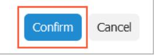
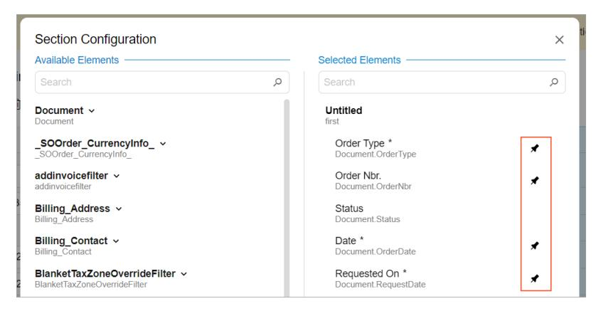
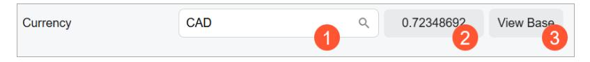
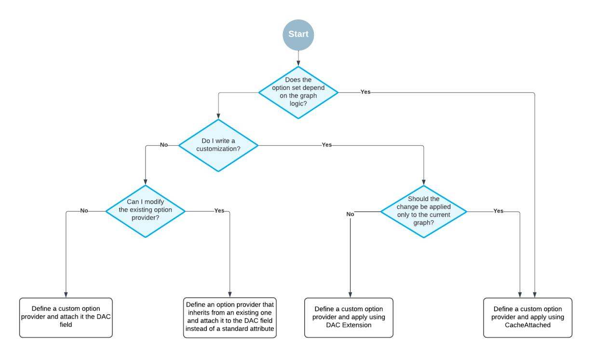
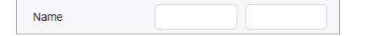
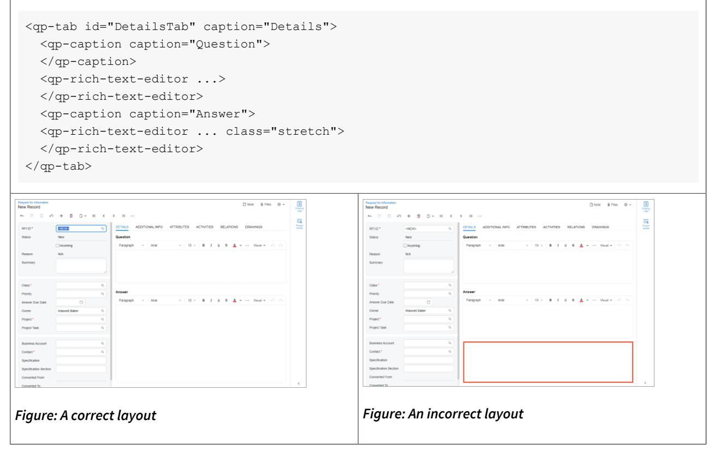
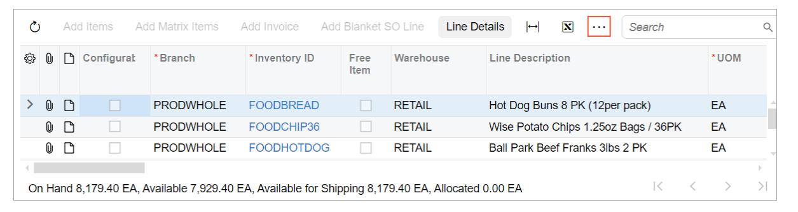

**Developer Guide**

# **UI Component Reference Guide 2025 R1**


| Copyright7                                                    |  |
|---------------------------------------------------------------|--|
| UI Component Guide 8                                          |  |
| Address Lookup9                                               |  |
| Address Lookup: General Information 9                         |  |
| Address Lookup: Layout Examples10                             |  |
| Barcode Editor12                                              |  |
| Barcode Editor: General Information 12                        |  |
| Barcode Editor: Configuration of Sound Effects13              |  |
| Barcode Editor: Conversion from ASPX to HTML and TypeScript14 |  |
| Button 17                                                     |  |
| Button: General Information17                                 |  |
| Button: Configuration18                                       |  |
| Button: Layout Examples 21                                    |  |
| Button: Conversion from ASPX to HTML and TypeScript 23        |  |
| Caption 27                                                    |  |
| Caption: General Information 27                               |  |
| Caption: Caption of a Fieldset, Table, or a Tab27             |  |
| Caption: Caption of a Template28                              |  |
| Check Box 29                                                  |  |
| Check Box: General Information29                              |  |
| Check Box: Layout Examples 31                                 |  |
| Check Box: Conversion from ASPX to HTML and TypeScript 32     |  |
| Collapsible Area36                                            |  |
| Collapsible Area: General Information 36                      |  |
| Collapsible Area: Configuration 36                            |  |
| Color Picker 39                                               |  |
| Color Picker: General Information39                           |  |
| Color Picker: Conversion from ASPX to HTML and TypeScript40   |  |
| Combo Box41                                                   |  |
| Combo Box: General Information41                              |  |
| Combo Box: Conversion from ASPX to HTML and TypeScript42      |  |
| Currency 45                                                   |  |
| Currency: General Information 45                              |  |
| Currency: Configuration of the Currency Control47             |  |

| Currency: Conversion from ASPX to HTML and TypeScript49                      |  |
|------------------------------------------------------------------------------|--|
| Date and Time 52                                                             |  |
| Date and Time Control: General Information 52                                |  |
| Date and Time Control: Configuration 53                                      |  |
| Date and Time Control: Conversion from ASPX to HTML and TypeScript 55        |  |
| Dialog Box59                                                                 |  |
| Dialog Box: General Information 59                                           |  |
| Dialog Box: Configuration 62                                                 |  |
| Dialog Box: Field Validation 66                                              |  |
| Dialog Box: Opening a Dialog Box 67                                          |  |
| Dialog Box: Buttons on the Dialog Box69                                      |  |
| Dialog Box: Executing Action on Dialog Box Closing 72                        |  |
| Dialog Box: Files72                                                          |  |
| Dialog Box: Notes74                                                          |  |
| Dialog Box: Conversion from ASPX to HTML and TypeScript 75                   |  |
| Error, Warning, or Informational Notification79                              |  |
| Error, Warning, or Informational Notification: General Information 79        |  |
| Error, Warning, or Informational Notification: Configuration 81              |  |
| Fieldset83                                                                   |  |
| Fieldset: General Information 83                                             |  |
| Fieldset: Field Configuration89                                              |  |
| Fieldset: Layout Examples90                                                  |  |
| Formula Editor 97                                                            |  |
| Formula Editor: General Information 97                                       |  |
| Formula Editor: Implementation of a Standard Formula Editor100               |  |
| Formula Editor: Configuration of a Combo Box Field for the Formula Editor100 |  |
| Formula Editor: Implementation of Custom Option Providers101                 |  |
| Formula Editor: Customization of Option Providers 103                        |  |
| Icon105                                                                      |  |
| Icon: General Information 105                                                |  |
| Icon: Conversion from ASPX to HTML and TypeScript106                         |  |
| Image Uploader 107                                                           |  |
| Image Uploader: General Information 107                                      |  |
| Image Uploader: Conversion from ASPX to HTML and TypeScript 107              |  |
| Image Viewer110                                                              |  |
| Image Viewer: General Information110                                         |  |
|                                                                              |  |

| Image Viewer: Loading of Images from a Third-Party Source111     |  |
|------------------------------------------------------------------|--|
| Image Viewer: Conversion from ASPX to HTML and TypeScript 112    |  |
| Label113                                                         |  |
| Label: General Information 113                                   |  |
| Label: A Combo Box Control as a Label 113                        |  |
| Label: A Single Label for Multiple Controls114                   |  |
| Label: Conversion from ASPX to HTML and TypeScript115            |  |
| Link Editor 117                                                  |  |
| Link Editor: General Information 117                             |  |
| LinkEditor: Conversion from ASPX to HTML and TypeScript118       |  |
| Mail Editor120                                                   |  |
| Mail Editor: General Information 120                             |  |
| Mail Editor: Configuration 122                                   |  |
| Mail Editor: Conversion from ASPX to HTML and TypeScript122      |  |
| Mask Editor 125                                                  |  |
| Mask Editor: General Information125                              |  |
| Mask Editor: Conversion from ASPX to HTML and TypeScript 125     |  |
| Radio Button (Option Button) 127                                 |  |
| Radio Button: General Information 127                            |  |
| Radio Button: Configuration 129                                  |  |
| Radio Button: Conversion from ASPX to HTML and TypeScript131     |  |
| Record Title135                                                  |  |
| Record Title: General Information 135                            |  |
| Record Title: Configuration 137                                  |  |
| Resizer 138                                                      |  |
| Resizer: General Information 138                                 |  |
| Rich Text Editor 141                                             |  |
| Rich Text Editor: General Information 141                        |  |
| Rich Text Editor: Configuration143                               |  |
| Rich Text Editor: Conversion from ASPX to HTML and TypeScript144 |  |
| Selector147                                                      |  |
| Selector Control: General Information 147                        |  |
| Selector Control: Configuration of a Link149                     |  |
| Selector Control: Configuration of the Control's Text 151        |  |
| Selector Control: Configuration of the Lookup Table152           |  |
| Selector Control: Manual Configuration of the Value and Text153  |  |
|                                                                  |  |

| Selector Control: Multiple-Selection Mode 154                         |  |
|-----------------------------------------------------------------------|--|
| Selector Control: Displaying of the Value in the Selector Control 154 |  |
| Selector Control: Selector Parameters 154                             |  |
| Selector Control: Conversion from ASPX to HTML and TypeScript155      |  |
| Splitter160                                                           |  |
| Splitter: General Information160                                      |  |
| Splitter: Configuration163                                            |  |
| Splitter: Conversion from ASPX to HTML 164                            |  |
| Tab 167                                                               |  |
| Tab: General Information 167                                          |  |
| Tab: Configuration 170                                                |  |
| Tab: Conversion from ASPX to HTML and TypeScript171                   |  |
| Table (Grid) 174                                                      |  |
| Table (Grid): General Information174                                  |  |
| Table (Grid): Configuration of the Table and Its Columns177           |  |
| Table (Grid): Configuration of the Table Toolbar 179                  |  |
| Table (Grid): Configuration of the Search in the Table 183            |  |
| Table (Grid): Table with Highlighted Contents184                      |  |
| Table (Grid): Changing of Column Properties Dynamically185            |  |
| Table (Grid): Layout Examples 186                                     |  |
| Table (Grid): Conversion from ASPX to HTML and TypeScript 189         |  |
| Time Span 214                                                         |  |
| Time Span: General Information 214                                    |  |
| Time Span: Conversion from ASPX to HTML and TypeScript 216            |  |
| Text Box 218                                                          |  |
| Text Box: General Information 218                                     |  |
| Text Box: Multiline Text Box 219                                      |  |
| Text Box: Conversion from ASPX to HTML and TypeScript220              |  |
| Tree 221                                                              |  |
| Tree: General Information 221                                         |  |
| Tree: Configuration 222                                               |  |
| Tree: Markup of a Tree Node Using HTML223                             |  |
| Tree: Conversion from ASPX to HTML and TypeScript224                  |  |
| Tree Selector 237                                                     |  |
| Tree Selector Control: General Information237                         |  |
| Tree Selector Control: Configuration238                               |  |

| Tree Selector Control: Conversion from ASPX to HTML and TypeScript239 |  |
|-----------------------------------------------------------------------|--|
| Upload Dialog Box247                                                  |  |
| Upload Dialog Box: General Information 247                            |  |
| Upload Dialog Box: Configuration of an Upload Dialog Box 248          |  |
| Upload Dialog Box: Conversion from ASPX to HTML and TypeScript 249    |  |
| Upload Files Button252                                                |  |
| Upload Files Button: General Information 252                          |  |
| Upload Files Button: Conversion from ASPX to HTML and TypeScript 253  |  |
| Wizard255                                                             |  |
| Wizard: General Information 255                                       |  |
| Wizard: Configuration of Buttons 258                                  |  |
| Wizard: Conversion from ASPX to HTML and TypeScript259                |  |

# <span id="page-6-0"></span>**Copyright**

### **© 2025 Acumatica, Inc.**

#### **ALL RIGHTS RESERVED.**

No part of this document may be reproduced, copied, or transmitted without the express prior consent of Acumatica, Inc.

3075 112th Avenue NE, Suite 200, Bellevue, WA 98004, USA

## **Restricted Rights**

The product is provided with restricted rights. Use, duplication, or disclosure by the United States Government is subject to restrictions as set forth in the applicable License and Services Agreement and in subparagraph (c)(1)(ii) of the Rights in Technical Data and Computer Soware clause at DFARS 252.227-7013 or subparagraphs (c)(1) and (c)(2) of the Commercial Computer Soware-Restricted Rights at 48 CFR 52.227-19, as applicable.

## **Disclaimer**

Acumatica, Inc. makes no representations or warranties with respect to the contents or use of this document, and specifically disclaims any express or implied warranties of merchantability or fitness for any particular purpose. Further, Acumatica, Inc. reserves the right to revise this document and make changes in its content at any time, without obligation to notify any person or entity of such revisions or changes.

## **Trademarks**

Acumatica is a registered trademark of Acumatica, Inc. HubSpot is a registered trademark of HubSpot, Inc. Microso Exchange and Microso Exchange Server are registered trademarks of Microso Corporation. All other product names and services herein are trademarks or service marks of their respective companies.

Soware Version: 2025 R1 Last Updated: 06/01/2025

## <span id="page-7-0"></span>**UI Component Guide**

In this guide, you can find details about the configuration of UI components. For each UI component, you can find design guidelines, naming conventions, and information about the configuration of the related UI controls.

## <span id="page-8-0"></span>**Address Lookup**

In this chapter, you will learn about the configuration of **Address Lookup** buttons. You will learn when to use an **Address Lookup** button and how to organize a layout that includes such a button.

## <span id="page-8-1"></span>**Address Lookup: General Information**

An **Address Lookup** button is a control that a user can click to search for addresses that are available in the entered records. When a user clicks this control, the system opens the corresponding dialog box, where the user can perform a search operation. In this dialog box, the user can also add a new address, update an existing address, and fill in the missing address information in a record.

An example of this control is available on the **Addresses** tab of the *[Sales Orders](https://help-2025r1.acumatica.com/Help?ScreenId=ShowWiki&pageid=19e4021c-1b84-49fd-be12-0320c5f1c7e5)* (SO301000) form, as shown in the following screenshot.

| Sales Orders<br>SO <new></new> |                                        |                                     |                                     |                  | n Note           | $\Box$ Activities | $0$ Files | ◎ 、 |
|--------------------------------|----------------------------------------|-------------------------------------|-------------------------------------|------------------|------------------|-------------------|-----------|-----|
| $\Xi$<br>저<br>$\leftarrow$     | の + 自                                  | $>1$ Hold                           |                                     |                  |                  |                   |           |     |
| <b>DETAILS</b><br><b>TAXES</b> | <b>COMMISSIONS</b><br><b>FINANCIAL</b> | <b>SHIPPING</b><br><b>ADDRESSES</b> | <b>PAYMENTS</b><br><b>SHIPMENTS</b> | <b>DISCOUNTS</b> | <b>RELATIONS</b> | <b>TOTALS</b>     |           |     |
| <b>Ship-To Contact</b>         |                                        | <b>Bill To Contact</b>              |                                     |                  |                  |                   |           |     |
|                                | Override Contact                       |                                     | Override Contact                    |                  |                  |                   |           |     |
| <b>Account Name</b>            |                                        | <b>Account Name</b>                 |                                     |                  |                  |                   |           |     |
| Attention                      |                                        | Attention                           |                                     |                  |                  |                   |           |     |
| Phone 1                        |                                        | Phone 1                             |                                     |                  |                  |                   |           |     |
| Email                          |                                        | Email                               |                                     |                  |                  |                   |           |     |
| <b>Ship-To Address</b>         |                                        | <b>Bill-To Address</b>              |                                     |                  |                  |                   |           |     |
|                                | Override Address                       |                                     | Override Address                    |                  |                  |                   |           |     |
|                                | Address Lookup                         |                                     | Address Lookup                      |                  |                  |                   |           |     |
| Address Line 1                 |                                        | Address Line 1                      |                                     |                  |                  |                   |           |     |
| Address Line 2                 |                                        | Address Line 2                      |                                     |                  |                  |                   |           |     |
| City                           |                                        | City                                |                                     |                  |                  |                   |           |     |

#### *Figure: The Address Lookup button*

In the Classic UI, **Address Lookup** button is defined by PXButton, with the corresponding value specified for the button's CommandName property. You also need to separately define the code for the corresponding dialog box that opens when this button is clicked. In the Modern UI, an **Address Lookup** button is defined by the *[qp](https://help.acumatica.com/(W(1))/Help?ScreenId=ShowWiki&pageid=1dbff7a3-a969-f6ec-9534-bb360fabbe52)[address-lookup](https://help.acumatica.com/(W(1))/Help?ScreenId=ShowWiki&pageid=1dbff7a3-a969-f6ec-9534-bb360fabbe52)* HTML tag. This tag already includes the code for both the button and the corresponding dialog box.

## **Learning Objectives**

In this chapter, you will learn the following about an **Address Lookup** button:

- The design guidelines for an **Address Lookup** button
- The proper configuration of a button for specific cases, such as when a button is to be placed below another element

## **Applicable Scenarios**

You configure an **Address Lookup** button on a form when a user needs to look up addresses that are available in the entered records.

### **Address Lookup ID**

An ID of a address lookup in HTML consists of three parts: the addressLookup prefix, the location of the **Address Lookup** button, and the semantic name separated with a dash. The semantic name describes the purpose of the element. For example, the **Address Lookup** button on the **Billing** tab that specifies an address may have the addressLookupBilling-Addresses ID, as the following code shows.

```
<qp-address-lookup id="addressLookupBilling-Addresses" 
 view.bind="Billing_Address" class="col-12"></qp-address-lookup>
```

## <span id="page-9-0"></span>**Address Lookup: Layout Examples**

In this topic, you can find examples of ways to configure various layouts with **Address Lookup** buttons.

## **Address Lookup Button at the Top of a Fieldset**

You can add an **Address Lookup** button at the top of a fieldset, as shown in the following screenshot.

| <b>Ship-To Address</b> |                               |
|------------------------|-------------------------------|
|                        | Address Lookup                |
| <b>Address Line 1</b>  |                               |
| <b>Address Line 2</b>  |                               |
| City                   |                               |
| * Country              | US - United States of America |
| <b>State</b>           |                               |
| <b>Postal Code</b>     |                               |

*Figure: The Address Lookup button*

To add an **Address Lookup** button, you add a field tag with the unbound attribute and nest the qp-addresslookup tag within it, as shown in the following code example.

```
<field name="FakeField" unbound>
 <qp-address-lookup class="col-12" view.bind="Shipping_Address">
 </qp-address-lookup>
</field>
```

#### **Address Lookup Button Below a UI Element**

You can add a button aer another control so that it is displayed on the next line below the control. To do that, you need to add the button control inside the field tag and specify class="col-12" for the button control.

For example, suppose that you need to place the **Address Lookup** button on the next line aer a check box, as shown in the following screenshot.

| <b>Ship-To Address</b> |                    |  |
|------------------------|--------------------|--|
|                        | □ Override Address |  |
|                        | Address Lookup     |  |
| <b>Address Line 1</b>  |                    |  |
| <b>Address Line 2</b>  |                    |  |

*Figure: The Address Lookup button below a check box*

The **Address Lookup** button is implemented by using the qp-address-lookup tag. The following code shows an example of moving the **Address Lookup** button to the next line.

```
<field name="OverrideAddress">
 <qp-address-lookup class="col-12" view.bind="Shipping_Address">
 </qp-address-lookup>
</field>
```

## <span id="page-11-0"></span>**Barcode Editor**

In this chapter, you will learn about the configuration of a barcode editor. You will learn when to use a barcode editor and how to organize a layout that includes a barcode editor.

## <span id="page-11-1"></span>**Barcode Editor: General Information**

A barcode editor is a control in which a user can input a barcode and view its representation in the UI. The barcode editor uses the functionality of the barcode-driven engine provided by Acumatica ERP.

A barcode editor is defined by PXTextEdit in the Classic UI. In the Modern UI, you define a barcode editor in one of the following ways:

- By using the field or qp-field tag with the qp-barcode-input control type specified
- Explicitly by using the *[qp-barcode-input](https://help.acumatica.com/(W(1))/Help?ScreenId=ShowWiki&pageid=5c63d353-31da-9c38-960f-b4a27bb9a71c)* control

## **Learning Objectives**

In this chapter, you will learn the following about the barcode editor:

- The design guidelines for the barcode editor, including the naming conventions and layout recommendations
- The proper configuration of the barcode editor for specific cases, such as enabling the sound signal

## **Applicable Scenarios**

You configure the barcode editor when you want to give a user the capability to scan a barcode.

## **Overview of the Barcode Editor**

The barcode editor looks like a text box with a text value that corresponds to the barcode values. The system submits the text value to the server when a user presses Enter by using the action specified in the submitCommand property. Note that the default action Scan has already been implemented and specified in the control, so normally, you do not need to specify it. For details, see *[Barcode-Driven Engine Guide](https://help-2025r1.acumatica.com/Help?ScreenId=ShowWiki&pageid=422a7a11-bd6e-4eba-ba34-f70612ad1b1f)*.

To facilitate back-to-back barcode scanning, the control prevents defocusing when a user presses Enter.

You can also configure the sound signal that the computer plays when a user scans the barcode. For details, see *[Barcode Editor: Configuration of Sound Effects](#page-12-1)*.

The declaration of the field for the barcode editor in TypeScript must not include <PXFieldOptions.CommitChanges> because that setting incurs extra requests to the server. A fatal error will be thrown if the CommitChanges setting is specified.

#### **UI Naming Convention**

The following table shows the UI naming convention for a barcode editor.

| Naming Convention                                                                                                                                                   | Example                                                                                                      |
|---------------------------------------------------------------------------------------------------------------------------------------------------------------------|--------------------------------------------------------------------------------------------------------------|
| Use a noun or a noun phrase to de<br>scribe the contents of a barcode<br>editor. Preferably, the name of a<br>barcode editor should consist of<br>one or two words. | The Scan barcode editor on the Scan Materials (AM300030) form, which is<br>shown in the following screenshot |

## **Use of the BarcodeProcessingScreen Component**

The source code of Acumatica ERP provides a reusable component, named BarcodeProcessingScreen, that you can use to insert the barcode editor with all necessary logic. The component is defined in the Screen/src/ screens/barcodeProcessing folder of the instance, and it uses the functionality defined in the barcodedriven engine.

The reusable component includes the following:

- The Summary area with the scanned barcode and the message indicating the result of the scanning
- The **Scan Log** tab, which lists all attempts to scan the barcode
- The logic to produce the sound signal when the barcode is scanned

For details on including the reusable component in the UI, see *[Reusing a UI Definition](https://help-2025r1.acumatica.com/Help?ScreenId=ShowWiki&pageid=e66cd57c-fa98-4f18-8964-d1146eba83a7)*.

For details on configuring the backend part of the form that uses the barcode-driven engine, see *[Barcode-Driven](https://help-2025r1.acumatica.com/Help?ScreenId=ShowWiki&pageid=422a7a11-bd6e-4eba-ba34-f70612ad1b1f) [Engine Guide](https://help-2025r1.acumatica.com/Help?ScreenId=ShowWiki&pageid=422a7a11-bd6e-4eba-ba34-f70612ad1b1f)*.

#### **Related Links**

• *[Barcode-Driven Engine Guide](https://help-2025r1.acumatica.com/Help?ScreenId=ShowWiki&pageid=422a7a11-bd6e-4eba-ba34-f70612ad1b1f)*

## <span id="page-12-1"></span><span id="page-12-0"></span>**Barcode Editor: Configuration of Sound Effects**

In the barcode editor, you can configure a sound signal that the computer plays when a barcode is being scanned. You can also specify the location of the sound signal library to specify a custom sound.

## **Specifying a Sound Signal**

To specify a sound signal, you need to pair it with an invisible control. This control should be mapped to a field that contains the name of sound files. Do the following:

1. In TypeScript, define a view and a field that contains a sound file, as shown in the following example.

```
export class ScanInfo extends PXView {
 MessageSoundFile: PXFieldState<PXFieldOptions.Disabled>;
 ...
}
export abstract class BarcodeProcessingScreen extends PXScreen {
 @viewInfo({ containerName: "Scan Information" })
 Info = createSingle(ScanInfo);
```

```
 ...
}
```

2. In the HTML template, add a field that contains a sound file, as shown in the following example. The field should be invisible.

```
<qp-fieldset id="fsInfo-Header" view.bind="Info">
 <field name="MessageSoundFile" show.bind="false"></field>
</qp-fieldset>
```

3. Specify the field name in the soundControl property of the barcode editor control, as shown in the following example.

```
<field name="Barcode" control-type="qp-barcode-input"
 config-sound-control.bind="Info.MessageSoundFile" ...></field>
```

### **Configuring the Location of the Sound Signal Library**

The config parameter of the qp-barcode-input control provides the following ways to specify the sound signal and its location:

• The soundMapper function: The function accepts the name of the file as an argument and returns the file with its path. An example of the function definition is shown in the following code.

```
soundMapper : (name) => `https://contoso.com/themes/business/${name}.webm`
```

• The soundPath and soundControl properties: The properties specify the URL of the folder with the sound files and the field that contains the file name without an extension, respectively.

If the soundMapper function is defined, the system does not analyze the values defined in these properties. If the soundMapper function is not defined, the system determines the sound file location as follows: "soundPath" + "value\_from\_soundControl" + ".wav". For example, suppose that you specify the soundPath and soundControl values as shown in the following code.

```
@controlConfig({
 soundPath: "https://contoso.com/themes/business/",
 soundControl: Info.MessageSoundFile
})
Barcode : PXFieldState;
```

The name of the file in the Info.MessageSoundFile field is *"Success"*. The resulting file URL will look as follows.

https://contoso.com/themes/business/Success.wav

## <span id="page-13-0"></span>**Barcode Editor: Conversion from ASPX to HTML and TypeScript**

The following tables will help you to convert the ASPX elements that are related to the barcode editor to HTML or TypeScript elements.

## **PXTextEdit**

The following table shows the correspondence between the PXTextEdit element and the HTML or TypeScript elements. During the conversion of ASPX pages to HTML and TypeScript, you need to replace these ASPX elements with their analogs in HTML or TypeScript.

| ASPX                                                                                                                                                                         | HTML or TypeScript                                                                                                                                                               |  |
|------------------------------------------------------------------------------------------------------------------------------------------------------------------------------|----------------------------------------------------------------------------------------------------------------------------------------------------------------------------------|--|
| PXTextEdit                                                                                                                                                                   | Replace it with field and specify con<br>trol-type="qp-barcode-input" in the field<br>tag. In rare cases, you should replace it explicitly with<br>the qp-barcode-input control. |  |
| <px:pxtextedit <br="" id="edBarcode" runat="serv&lt;br&gt;er">DataField="Barcode"&gt;<br/><autocallback command="Scan" target="d&lt;br&gt;s"></autocallback></px:pxtextedit> |                                                                                                                                                                                  |  |
|                                                                                                                                                                              | <field <="" control-type="qp&lt;br&gt;barcode-input" name="Barcode" td=""></field>                                                                                               |  |
| <behavior commitchanges="True"></behavior><br>                                                                                                                               | config-sound-control.bind="Info.Mes<br>sageSoundFile"                                                                                                                            |  |
| <clientevents initialize="Barcode_Ini&lt;br&gt;tialize"></clientevents><br>                                                                                                  | config-submit-command.bind="S<br>can">                                                                                                                                           |  |
|                                                                                                                                                                              |                                                                                                                                                                                  |  |
| DataField                                                                                                                                                                    | Use the name attribute of the field tag.                                                                                                                                         |  |
| <px:pxtextedit datafield="Barcode"></px:pxtextedit>                                                                                                                          | <field name="Barcode"></field>                                                                                                                                                   |  |
| ID                                                                                                                                                                           | Replace it with the id attribute of the qp-field tag<br>if this tag is used as a replacement. In other cases, the<br>ID is not necessary for a barcode editor.                   |  |
| <px:pxtextedit id="edBarcode"></px:pxtextedit>                                                                                                                               |                                                                                                                                                                                  |  |

## **AutoCallBack in PXTextEdit**

The following table shows the correspondence between the AutoCallBack element located inside the PXTextEdit tag and the HTML or TypeScript elements. During the conversion of ASPX pages to HTML and TypeScript, you need to replace these ASPX elements with their analogs in HTML or TypeScript.

| ASPX                                                                                                                                                                                                                                                   | HTML or TypeScript                                                                                                       |
|--------------------------------------------------------------------------------------------------------------------------------------------------------------------------------------------------------------------------------------------------------|--------------------------------------------------------------------------------------------------------------------------|
| AutoCallBack > Command                                                                                                                                                                                                                                 | In the fieldConfig decorator or in the field tag,<br>specify the action name in the submitCommand                        |
| <px:pxtextedit><br/><autocallback command="Scan" target="d&lt;/td&gt;&lt;td colspan=2&gt;property of the control.&lt;/td&gt;&lt;/tr&gt;&lt;tr&gt;&lt;td&gt;s"><br/><behavior commitchanges="True"></behavior><br/></autocallback><br/></px:pxtextedit> | <field <br="" control-type="qp&lt;br&gt;barcode-input" name="Barcode">config-submit-command.bind="S<br/>can"&gt;</field> |
|                                                                                                                                                                                                                                                        | The Scan action is defined in the barcode-driven en<br>gine, so you do not need to define it in TypeScript.              |

## **Obsolete ASPX Controls and Properties**

The following table lists the obsolete ASPX elements that are related to the barcode editor. You do not need to replace these ASPX elements with any HTML or TypeScript elements.

| ASPX Control | Properties/Comments       |
|--------------|---------------------------|
| PXTextEdit   | •<br>runat                |
| AutoCallBack | •<br>Target               |
| ClientEvents | The tag is not necessary. |

## <span id="page-16-0"></span>**Button**

In this chapter, you will learn about the configuration of buttons. You'll learn when to use buttons, how to name them, and how to organize a layout that includes buttons.

## <span id="page-16-1"></span>**Button: General Information**

A button is a control that users can interact with to trigger an action or execute a command.

A button is defined by PXButton in the Classic UI. In the Modern UI, a button is defined by the *[qp-button](https://help.acumatica.com/(W(7))/Help?ScreenId=ShowWiki&pageid=b625313a-58f8-3614-13b1-54b95fa4faf3)* HTML tag.

You do not need to manually add the standard buttons to the form toolbar of an Acumatica ERP form. The buttons representing actions that are available on the form toolbar are added automatically to the form. For details about adding button to various parts of the form, see *[Button: Configuration](#page-17-1)*.

## **Learning Objectives**

In this chapter, you will learn the following about a button:

- The design guidelines for a button, including the naming conventions and layout recommendations
- The proper configuration of a button for specific cases, such as when a button is to be placed below another element
- The key details of each property of a button

## **Applicable Scenarios**

You configure buttons in the following user scenarios:

- A user needs to trigger an action or execute a command, such as initiating invoice creation.
- A user needs to confirm or cancel an action or a command, such as canceling the release of an invoice.

## **Button ID**

An ID of a button in HTML consists of two parts, the button prefix and the semantic name. The semantic name describes the purpose of the element. For example, you may have a button that adjusts the document amount. You can set its ID to buttonAdjustDocAmt, as the following code shows.

<qp-button id="buttonAdjustDocAmt"></qp-button>

## **UI Naming Conventions**

The following table shows the UI naming conventions for a button.

| Naming Convention                                                                                                                                                                                                                           | Example                                                                                                                  |  |
|---------------------------------------------------------------------------------------------------------------------------------------------------------------------------------------------------------------------------------------------|--------------------------------------------------------------------------------------------------------------------------|--|
| Use a verb or verb phrase that de<br>scribes the process that is initiated<br>when a user clicks the button. Ti<br>tle-style capitalization is used for<br>button names. In the Classic UI,<br>button names are displayed in up<br>percase. | The Release and Release All buttons on the Release AR Documents<br>(AR501000) form, as shown in the following screenshot |  |

## <span id="page-17-1"></span><span id="page-17-0"></span>**Button: Configuration**

In this topic, you can learn how to adjust a button for specific cases.

## **Action Definition in TypeScript**

The actions that are defined in the graph or in the workflow have corresponding commands displayed on the More menu of the form toolbar by default. You do not need to define them in the TypeScript code of the Acumatica ERP form.

However, if you need to place a button for an action on an area of the form other than the toolbar or the More menu, you need to do the following:

• To place a button on a table toolbar, you specify the property with the name of the corresponding action in the view class of the table, as shown below.

```
import { 
 gridConfig,
 PXView,
 PXActionState
} from "client-controls";
@gridConfig({
 preset: GridPreset.Details
})
export class SOLine extends PXView {
 AddInvBySite: PXActionState;
}
```

• To place a button in a dialog box or somewhere on the form (outside of the form toolbar or table toolbar), you specify the property with the name of the corresponding action in the screen class, as the following code shows. You then add the qp-button tag for the action in HTML. For details, see *[Dialog Box:](#page-61-1) [Configuration](#page-61-1)*.

```
import { 
 graphInfo,
 PXScreen,
 PXActionState
} from "client-controls";
```

```
@graphInfo({
 graphType: "PX.Objects.GL.AccountHistoryEnq",
 primaryView: "Filter"})
export class GL401000 extends PXScreen {
 AddInvoiceOK: PXActionState;
}
```

• To execute an action when a user clicks the link on the field, you specify the property with the name of the corresponding action in the screen class and use the *[linkCommand](https://help.acumatica.com/Help?ScreenId=ShowWiki&pageid=bcc7789a-04b4-7fc6-0e03-a9a9bc2d8e88)* decorator for the field that displays the link. An example of such action is shown in the following code.

```
@gridConfig({ preset: GridPreset.Processing })
export class FABookBalance extends PXView { 
 @linkCommand("ViewAsset")
 @columnConfig({ allowUpdate: false })
 AssetID: PXFieldState;
 ...
}
@graphInfo({ graphType: "PX.Objects.FA.CalcDeprProcess", primaryView: "Filter" })
export class FA502000 extends PXScreen {
 ViewAsset: PXActionState;
 Balances = createCollection(FABookBalance);
}
```

When you include the property of the PXActionState type for the action in the TypeScript code of a form, this action is automatically bound by name to an action in the graph. This action is not displayed on the form toolbar by default. To specify explicitly whether the button for the action is displayed on the form toolbar, you can use the *[PXButton.DisplayOnMainToolbar](https://help.acumatica.com/(W(1))/Help?ScreenId=ShowWiki&pageid=1a7069c4-95d5-456b-41ec-5b19371358db)* property in the action declaration in the graph.

### **Button for a Graph Action in HTML**

If you need to use an action defined in a graph in your HTML code, you must specify the state attribute for the button that corresponds to this action, as shown in the following code.

```
<qp-button id="buttonAddBlanketLine" state.bind="AddBlanketLineOK">
</qp-button>
```

In the code above, you have used the state attribute and specified the *AddBlanketLineOK* value for its bind property, which is the name of the action that is defined in the graph.

#### **Configuration of Button Properties**

You use the actionConfig decorator to specify the properties of an action explicitly defined in a view class, such as an action that corresponds to a button on the table toolbar or a button in a dialog box. The full list of properties is defined in the *[IActionConfig](https://help.acumatica.com/(W(1))/Help?ScreenId=ShowWiki&pageid=372fd44c-c8e2-5144-865e-22710fb5352e)* interface. The following code uses this decorator.

```
@localizable
export class LocalizableStrings {
 static btn_specifyDatabaseEngine = "Specify Database Engine";
}
export class AU209000 extends PXScreen {
 localizableStrings = LocalizableStrings;
```

```
 @actionConfig({text: LocalizableStrings.btn_specifyDatabaseEngine})
 actionAddSqlAttribute: PXActionState;
```

You can also specify the properties of any button by using the config attribute of the *[qp-button](https://help.acumatica.com/(W(1))/Help?ScreenId=ShowWiki&pageid=b625313a-58f8-3614-13b1-54b95fa4faf3)* tag in HTML, as the following code shows.

```
<qp-button id="pdfPrevPageBtn" 
 config.bind="{images: { normal: 'svg:main@arrowLeft' } }">
</qp-button>
```

You can also handle the state and appearance of any action that corresponds to a button or command on the table toolbar by using the actionsConfig property of the gridConfig decorator, as shown in the following examples.

```
// Hides the Refresh button from the table toolbar.
@gridConfig({
 actionsConfig: { refresh: { hidden: true } }
})
export class SOLine extends PXView
// Adds the Custom Refresh button.
@gridConfig({
 actionsConfig: {
 refresh: {
 renderAs: MenuItem.RENDER_TEXT,
 images: {},
 text: "Custom Refresh" } 
 }
})
export class POLine extends PXView
```

#### **Standard Buttons of a Dialog Box**

}

For the standard buttons of a dialog box—such as **OK** or **Cancel**—you must have the dialog-result attribute specified. Also, if you do not specify the caption attribute, the button's caption will be set to the value of the dialog-result attribute, and the caption will be localizable by general rules. You can override the default caption by specifying the caption attribute. You can omit the caption attribute if its value is the same as the value of the dialog-result attribute.

The following code example shows an approach to declaring the **OK** button of a dialog box that has a caption.

```
<qp-button id="buttonOK" caption="Confirm" dialog-result="OK"> </qp-button>
```

The following code example shows an approach to declaring the **Cancel** button of a dialog box that does not have a caption.

<qp-button id="buttonCancel" dialog-result="Cancel"></qp-button>

For more details on buttons of a dialog box, see *[Dialog Box: Buttons on the Dialog Box](#page-68-1)*.

#### **Configuration of Button Connotation**

You can configure a button connotation from frontend by using the class property of the qp-button tag. The property can have the following values:

• major-button: The button is highlighted with blue, as shown in the following screenshot.



An example implementation of this button is shown in the following code.

| <qp-button< th=""><th></th><th></th></qp-button<> |  |  |
|---------------------------------------------------|--|--|
| id="btnOK" dialog-result="OK"                     |  |  |
| config.bind="{ validateInput: true }"             |  |  |
| caption="Confirm"                                 |  |  |
| class="major-button">                             |  |  |
|                                                   |  |  |

• minor-button: The button does not have any frame, gray or blue. When a user hovers over the button with this class, the button gets a gray frame. In the following screenshot, the **Reset to Default** and **Manage User-Defined Fields** buttons have class="minor-button" specified. The **Manage User-Defined Fields** button has a gray frame because a mouse hovers over it.

| Apply To All | <b>Reset To Default</b> | Manage User-Defined Fields |
|--------------|-------------------------|----------------------------|
|              |                         |                            |

By default, a button has a gray frame as shown in the following screenshot.

| Add | Add & Close | Cancel |
|-----|-------------|--------|
|     |             |        |

## <span id="page-20-1"></span><span id="page-20-0"></span>**Button: Layout Examples**

In this topic, you can find examples of ways to configure various layouts with buttons.

#### **Button Below a UI Element**

You can add a button aer another control so that it is displayed on the next line below the control. To do that, you need to add the button control inside the field tag and specify class="col-12" for the button control.

For example, suppose that you need to place the **Address Lookup** button on the next line aer a check box, as shown in the following screenshot.

| <b>Ship-To Address</b> |                    |  |  |  |
|------------------------|--------------------|--|--|--|
|                        | □ Override Address |  |  |  |
|                        | Address Lookup     |  |  |  |
| <b>Address Line 1</b>  |                    |  |  |  |
| <b>Address Line 2</b>  |                    |  |  |  |

*Figure: The Address Lookup button below a check box*

The **Address Lookup** button is implemented by using the qp-address-lookup tag. The following code shows an example of moving the **Address Lookup** button to the next line.

```
<field name="OverrideAddress">
 <qp-address-lookup class="col-12" view.bind="Shipping_Address">
 </qp-address-lookup>
</field>
```

## **Button Above a Set of UI Elements**

Suppose that you need to display the**Shop for Rates** button above a set of boxes, as shown in the following screenshot.

| <b>Delivery Settings</b> |                |              |
|--------------------------|----------------|--------------|
|                          | Shop for Rates |              |
| <b>FOB Point</b>         |                | $\checkmark$ |
| Priority                 |                | 0            |
| <b>Shipping Terms</b>    |                | $\checkmark$ |

*Figure: A button placed above other elements*

You need to put the qp-button tag within the field tag with the replace-content and unbound attributes, as shown in the following code example.

```
<qp-fieldset slot="A" id="currentDocument_formDeliverySettings" 
 wg-container view.bind="CurrentDocument" caption="Delivery Settings">
 <field name="fakename" replace-content unbound>
 <qp-button id="buttonShopRates" class="col-12" state.bind="ShopRates"></qp-button>
 </field>
 <field name="FOBPoint"></field>
 <field name="Priority"></field>
 <field name="ShipTermsID"></field>
</qp-fieldset>
```

## **Button with a Fixed Width**

Suppose that you want to set a fixed width to be used for the**Shop for Rates** button regardless of the width of the screen, as shown in the following screenshots.

| <b>Delivery Settings</b> |   |                |
|--------------------------|---|----------------|
| Ship Via                 | Ω | Shop for Rates |

*Figure: A button with a fixed width on a narrow screen*

| <b>Delivery Settings</b> |                |
|--------------------------|----------------|
| Ship Via                 | Shop for Rates |

#### *Figure: A button with a fixed width on a wide screen*

You need to specify the class="col-auto" attribute to set a fixed width for the button, as shown in the following code example.

```
<field name="ShipVia">
```

```
 <qp-button id="btnShopRates" state.bind="ShopRates" class="col-auto">
 </qp-button>
</field>
```

## **Button with an Image**

An image for a button is an SVG icon that is stored in the \Content\svg\_icons folder of your instance. You can add a button with an image by using one of the following approaches:

- Specify the ImageSet and ImageKey properties in the PXButton attribute of the corresponding action in the graph code.
- Specify the config attribute and provide a value for the imageSet and imageKey properties in it.

The ImageSet (declared in a graph) or imageSet (declared in HTML) property specifies one of the icon sets available in the \Content\svg\_icons folder. The ImageKey (declared in a graph) or imageKey (declared in HTML) property specifies a particular item from this icon set.

The following code example shows you how to define the Refresh image for a button whose action is defined in the graph code.

```
[PXButton(ImageKey = Web.UI.Sprite.Main.Refresh, ImageSet = Web.UI.Sprite.AliasMain)]
public IEnumerable Refresh(PXAdapter adapter) {}
```

The following code example shows you how to define the Refresh image for a button in HTML. This code adds a button to the right of an existing field.

```
<field name="CuryOrigDocAmt">
 <qp-button id="buttonAdjustDocAmt" state.bind="model.viewModel.AdjustDocAmt"
 class="col-4"
 config.bind="{imageSet: 'main', imageKey: 'Refresh'}"></qp-button>
</field>
```

## <span id="page-22-0"></span>**Button: Conversion from ASPX to HTML and TypeScript**

The following tables will help you to convert ASPX elements that are related to buttons to HTML or TypeScript elements.

## **PXButton**

The following table shows the correspondence between PXButton and HTML or TypeScript elements. During the conversion of ASPX pages to HTML and TypeScript, you need to replace these ASPX elements with their analogs in HTML or TypeScript.

| ASPX                        | HTML or TypeScript                                   |
|-----------------------------|------------------------------------------------------|
| PXButton                    | Is replaced by the qp-button tag.                    |
| <px:pxbutton></px:pxbutton> | <qp-button id="buttonAdjustDocAmt"><br/></qp-button> |

| ASPX                                                                           | HTML or TypeScript                                                                                                                                                                                                                                       |
|--------------------------------------------------------------------------------|----------------------------------------------------------------------------------------------------------------------------------------------------------------------------------------------------------------------------------------------------------|
| CommandName<br><px:pxbutton<br>CommandName= "AddOK"  /&gt;</px:pxbutton<br>    | Is replaced by the state.bind attribute, which<br>binds the button to the specified action defined in a<br>graph.<br><qp-button <br="" id="buttonAddOK">state.bind="AddOK"&gt;<br/></qp-button>                                                          |
| DialogResult<br><px:pxbutton<br>DialogResult= "Cancel"  /&gt;</px:pxbutton<br> | Is replaced by dialog-result attribute, which<br>specifies the response returned by an action. This at<br>tribute is required for the standard buttons of a dialog<br>box.                                                                               |
|                                                                                | <qp-button<br>id="buttonCancel"<br/>dialog-result="Cancel"&gt;<br/></qp-button<br>                                                                                                                                                                       |
|                                                                                | This attribute can have any of the following values:<br>•<br>Abort<br>•<br>Cancel<br>•<br>Ignore<br>•<br>No<br>•<br>None<br>•<br>OK<br>•<br>Retry<br>•<br>Yes                                                                                            |
| Enabled<br><px:pxbutton<br>Enabled= "True"  /&gt;</px:pxbutton<br>             | Is replaced by the enabled attribute, which indicates<br>(if set to true) that the button is enabled on the UI.<br><qp-button id="buttonAdjustDocAmt"><br/>enabled="true" </qp-button>                                                                   |
| ID<br><px:pxbutton<br>ID= "button1"  /&gt;</px:pxbutton<br>                    | Is replaced by the id attribute. This is a required at<br>tribute.<br><qp-button id="button1"><br/></qp-button>                                                                                                                                          |
| Text<br><px:pxbutton<br>Text= "Add More"  /&gt;</px:pxbutton<br>               | Is replaced by the caption attribute, which defines<br>the text that is displayed on the button. The string<br>specified in this attribute is localizable.<br><qp-button <br="" id="button1">caption="Add More" dialog-result="Add"&gt;<br/></qp-button> |

| ASPX                                                                                                   | HTML or TypeScript                                                                                                                                                                                                                                                                                                         |  |
|--------------------------------------------------------------------------------------------------------|----------------------------------------------------------------------------------------------------------------------------------------------------------------------------------------------------------------------------------------------------------------------------------------------------------------------------|--|
| Tooltip                                                                                                | Use the tooltip attribute of the qpbutton tag.                                                                                                                                                                                                                                                                             |  |
| <px:pxtoolbarbutton><br/><tooltip="add related="" tables"=""><br/></tooltip="add></px:pxtoolbarbutton> | <qp-button <br="" id="buttonAddTable">config.bind="{tooltip="Add a related ta<br/>ble for the selected table"}"&gt;</qp-button>                                                                                                                                                                                            |  |
|                                                                                                        | For buttons on a table toolbar, use the tooltip para<br>meter while defining an action in the topBarItems<br>property of the gridConfig decorator. For details,<br>see Table (Grid): Configuration of the Table Toolbar                                                                                                    |  |
|                                                                                                        | @gridConfig({<br>topBarItems: {<br>addRelatedTableRelations: {<br>index: 5,<br>config: {<br>commandName: "addRelatedTableRela<br>tions",<br>text: ActionCaption.AddRelated<br>TableRelations,<br>toolTip: ActionToolTip.AddRelated<br>TableRelations<br>}<br>}<br>}<br>})<br>export class GIRelation extends PXView {<br>} |  |
| Size                                                                                                   | Is replaced by the class attribute, which indicates<br>how many columns of width the button should occu<br>py.                                                                                                                                                                                                             |  |
| Visible                                                                                                | Is replaced by the hidden attribute, which indicates<br>(if set to true) that the button is not visible on the UI.                                                                                                                                                                                                         |  |
| <px:pxbutton<br>Visible= "True"  /&gt;</px:pxbutton<br>                                                | <qp-button id="buttonAdjustDocAmt"><br/>hidden="false" </qp-button>                                                                                                                                                                                                                                                        |  |

## **PXDSCallbackCommand**

The following table shows the correspondence between PXDSCallbackCommand and HTML or TypeScript elements. During the conversion of ASPX pages to HTML and TypeScript, you need to replace these ASPX elements with their analogs in HTML or TypeScript.

| ASPX               | HTML or TypeScript                                                                   |
|--------------------|--------------------------------------------------------------------------------------|
| PopupCommand       | Use the popupCommand property of the action<br>Config decorator.                     |
|                    | @actionConfig({<br>popupCommand: 'Refresh'<br>})<br>CreatePrepayment: PXActionState; |
| PopupCommandTarget | Use the target property of the actionConfig dec<br>orator.                           |
| PopupPanel         | Use the popupPanel property in the config at<br>tribute of the qp-button tag.        |

## **Obsolete ASPX Controls and Properties**

The following table lists obsolete ASPX elements that are related to buttons. You do not need to replace these ASPX elements with any HTML or TypeScript elements.

| ASPX Control        | Properties           |
|---------------------|----------------------|
| PXButton            | •<br>CommandSourceID |
|                     | •<br>runat           |
|                     | •<br>SyncVisible     |
| PXDSCallbackCommand | •<br>CommitChanges   |
|                     | •<br>DependOnGrid    |
|                     | •<br>Name            |
|                     | •<br>PostData        |
|                     | •<br>StartNewGroup   |
|                     | •<br>Visible         |

## <span id="page-26-0"></span>**Caption**

In this chapter, you will learn about the configuration of captions. You will learn when to use captions and how to organize a layout that includes them.

## <span id="page-26-1"></span>**Caption: General Information**

A caption is a text that precedes a group of fields or a table. The caption is defined by the *[qp-caption](https://help.acumatica.com/(W(7))/Help?ScreenId=ShowWiki&pageid=a0617790-db40-fb53-09ae-1407ae25f869)* tag in HTML.

## **Learning Objectives**

In this chapter, you will learn the following about a caption:

- The design guidelines for the caption, including the naming conventions and layout recommendations
- The proper configuration of the caption

#### **Applicable Scenarios**

You configure a caption when you need to add a title for a group of controls inside a template.

## <span id="page-26-2"></span>**Caption: Caption of a Fieldset, Table, or a Tab**

To specify a caption for a fieldset, table, or tab, you use the caption attribute of the respective tag. The caption attribute is localizable. For details, see *[Fieldset](#page-82-2)*, *Table [\(Grid\)](#page-173-2)*, and *[Tab](#page-166-2)*.

The following screenshot shows the **Attributes** caption specified for a table.

| Field Name        |                     |                   |           | Field Name |  |  |  |  |
|-------------------|---------------------|-------------------|-----------|------------|--|--|--|--|
| Field Name        |                     |                   |           | Field Name |  |  |  |  |
| Field Name        |                     |                   |           |            |  |  |  |  |
| Field Name        |                     |                   |           |            |  |  |  |  |
| <b>Attributes</b> |                     |                   |           |            |  |  |  |  |
| ₩                 | Branch <sup>+</sup> | Inventory ID *    | Warehouse |            |  |  |  |  |
|                   | <b>SERWEST</b>      | <b>CONPAPERST</b> | WHOLESALE |            |  |  |  |  |
|                   | <b>SERWEST</b>      | COMPENC100        | WHOLESALE |            |  |  |  |  |
|                   | <b>SERWEST</b>      | COMPEN100         | WHOLESALE |            |  |  |  |  |
|                   | <b>SERWEST</b>      | COMPENC100        | WHOLESALE |            |  |  |  |  |
|                   | <b>SERWEST</b>      | <b>CONPAPERST</b> | WHOLESALE |            |  |  |  |  |
|                   |                     |                   |           |            |  |  |  |  |

#### *Figure: A caption for a table*

The following code example adds a caption to a grid.

```
<qp-grid id="ordersGrid" 
 view.bind="BlanketOrderChildrenDisplayList" 
 caption="Child Orders">
</qp-grid>
```

## <span id="page-27-0"></span>**Caption: Caption of a Template**

To specify a caption for a group of fields inside a template, as shown with the **Attribute** caption in the following screenshot, you use the qp-caption control.

| Field Name<br>Field Name | Field Name<br>Field Name |  |
|--------------------------|--------------------------|--|
| Field Name<br>Field Name |                          |  |
| <b>Attributes</b>        |                          |  |
| Field Name               | Field Name               |  |
| Field Name               | Field Name               |  |
| Field Name               |                          |  |
| Field Name               |                          |  |

#### *Figure: A caption for a template*

The following code example implements this approach.

```
<qp-caption caption="Contacts"></qp-caption>
<qp-template name="1-1-1" id="SyncPolicy_tab_Contacts" wg-container>
 <qp-fieldset id="contacts_left" slot="A" view.bind="SyncPolicy">
 <field name="ContactsSync"></field>
 <field name="ContactsSeparated"></field>
 <field name="ContactsMerge"></field>
 <field name="ContactsSkipCategory"></field>
 <field name="ContactsGenerateLink"></field>
 </qp-fieldset>
 <qp-fieldset id="contacts_right" slot="B" view.bind="SyncPolicy">
 <field name="ContactsDirection"></field>
 <field name="ContactsFolder"></field>
 <field name="ContactsFilter"></field>
 <field name="ContactsClass" config-allow-edit.bind="true"></field>
 </qp-fieldset>
</qp-template>
```

## <span id="page-28-2"></span><span id="page-28-0"></span>**Check Box**

In this chapter, you will learn about the configuration of check boxes. You'll learn when to use check boxes, how to name them, and how to organize a layout that includes them.

## <span id="page-28-1"></span>**Check Box: General Information**

A check box is a control in which a user makes a choice between two mutually exclusive options.

A check box is defined by PXCheckBox in the Classic UI. In the Modern UI, a check box is defined by the field tag (whose control type is automatically defined as a check box from the backend code). In rare cases, a check box in the Modern UI is defined explicitly by the *[qp-check-box](https://help.acumatica.com/(W(7))/Help?ScreenId=ShowWiki&pageid=f2676e56-7b9a-a6d9-8694-6c0178825f7d)* control.

## **Learning Objectives**

In this chapter, you will learn the following information about a check box:

- The design guidelines for a check box, including the naming conventions and layout recommendations
- The proper configuration of a check box for specific cases, such as when a check box is located next to another element in the same row.
- A detailed description of each property of a check box

## **Applicable Scenarios**

You configure check boxes in the following user scenarios:

- A user can select multiple items in a list of items, such as selecting items from a list of preferences.
- A user chooses one option from two possible options, such as enabling or disabling a feature.
- A user selects a specific criterion to apply to the displayed information to filter or sort data.

## **UI Naming Conventions**

The following table shows the UI naming conventions for a check box.

| Naming Convention                                                                                            | Example                                                                                                                                    |  |  |  |  |  |  |
|--------------------------------------------------------------------------------------------------------------|--------------------------------------------------------------------------------------------------------------------------------------------|--|--|--|--|--|--|
| For a check box that (if selected)<br>enables an action, use a verb or<br>verb phrase that describes this ac | The CopyTag Number from Asset ID check box on the Fixed Assets Pref<br>erences (FA101000) form, which is shown in the following screenshot |  |  |  |  |  |  |
| tion.                                                                                                        |                                                                                                                                            |  |  |  |  |  |  |
|                                                                                                              |                                                                                                                                            |  |  |  |  |  |  |
|                                                                                                              |                                                                                                                                            |  |  |  |  |  |  |
|                                                                                                              |                                                                                                                                            |  |  |  |  |  |  |
|                                                                                                              |                                                                                                                                            |  |  |  |  |  |  |
|                                                                                                              |                                                                                                                                            |  |  |  |  |  |  |
|                                                                                                              |                                                                                                                                            |  |  |  |  |  |  |
|                                                                                                              |                                                                                                                                            |  |  |  |  |  |  |
|                                                                                                              |                                                                                                                                            |  |  |  |  |  |  |

| Naming Convention                                                                                  | Example                                                                                             |  |  |  |  |  |  |  |
|----------------------------------------------------------------------------------------------------|-----------------------------------------------------------------------------------------------------|--|--|--|--|--|--|--|
| For a check box that (if selected)<br>gives an entity some property, use<br>a noun or noun phrase. | The ReverseVATcheck box on the Taxes (TX205000) form, which is<br>shown in the following screenshot |  |  |  |  |  |  |  |
|                                                                                                    |                                                                                                     |  |  |  |  |  |  |  |
|                                                                                                    |                                                                                                     |  |  |  |  |  |  |  |
|                                                                                                    |                                                                                                     |  |  |  |  |  |  |  |
|                                                                                                    |                                                                                                     |  |  |  |  |  |  |  |
|                                                                                                    |                                                                                                     |  |  |  |  |  |  |  |
|                                                                                                    |                                                                                                     |  |  |  |  |  |  |  |
|                                                                                                    |                                                                                                     |  |  |  |  |  |  |  |
|                                                                                                    |                                                                                                     |  |  |  |  |  |  |  |
|                                                                                                    |                                                                                                     |  |  |  |  |  |  |  |
|                                                                                                    |                                                                                                     |  |  |  |  |  |  |  |

#### **Recommendations for Organizing the Layout**

The following table shows the recommendations for organizing the layout for check boxes.

| Correct |                                                                                       | Incorrect                                                                                                         |  |  |  |  |  |
|---------|---------------------------------------------------------------------------------------|-------------------------------------------------------------------------------------------------------------------|--|--|--|--|--|
|         | When a fieldset contains only check boxes, align the check boxes without le padding. |                                                                                                                   |  |  |  |  |  |
|         | To remove the le padding, specify class="no-label" in qp-fieldset, as shown below.   |                                                                                                                   |  |  |  |  |  |
|         | <qp-fieldset class="no-label" slot="C"></qp-fieldset>                                 |                                                                                                                   |  |  |  |  |  |
|         |                                                                                       |                                                                                                                   |  |  |  |  |  |
|         |                                                                                       |                                                                                                                   |  |  |  |  |  |
|         |                                                                                       |                                                                                                                   |  |  |  |  |  |
|         |                                                                                       |                                                                                                                   |  |  |  |  |  |
|         |                                                                                       |                                                                                                                   |  |  |  |  |  |
|         | Figure: A correct layout                                                              | Figure: An incorrect layout                                                                                       |  |  |  |  |  |
|         |                                                                                       | Keep the default le padding for check boxes in a section if the section contains other controls and has a title. |  |  |  |  |  |
|         |                                                                                       |                                                                                                                   |  |  |  |  |  |
|         |                                                                                       |                                                                                                                   |  |  |  |  |  |
|         |                                                                                       |                                                                                                                   |  |  |  |  |  |
|         |                                                                                       |                                                                                                                   |  |  |  |  |  |
|         |                                                                                       |                                                                                                                   |  |  |  |  |  |
|         |                                                                                       |                                                                                                                   |  |  |  |  |  |
|         |                                                                                       |                                                                                                                   |  |  |  |  |  |
|         | Figure: A correct layout                                                              | Figure: An incorrect layout                                                                                       |  |  |  |  |  |

## <span id="page-30-0"></span>**Check Box: Layout Examples**

In this topic, you can find examples of configurations of layouts with check boxes.

## **Check Box Next to a UI Element**

Suppose that you want to place the **Canceled** check box next to the **Cancel By** box in the same row, as shown in the following screenshot.

| <b>Order Shipping Settings</b> |                            |              |
|--------------------------------|----------------------------|--------------|
| Sched. Shipment                | 1/24/2024<br>A             |              |
| $\Box$ Ship Separately         |                            |              |
| <b>Shipping Rule</b>           | <b>Cancel Remainder</b>    | $\checkmark$ |
| <b>Cancel By</b>               | 1/24/2024<br>Canceled<br>n |              |
| Preferred Warehous             |                            |              |
|                                |                            |              |

#### *Figure: A check box next to a box*

You use the following code.

```
<field name="CancelDate">
 <qp-field control-state.bind="CurrentDocument.Cancelled" 
 config-enabled.bind="false"></qp-field>
</field>
```

You do not need to specify class="no-label" for the second control to omit the empty label of the check box because class="no-label" is used by default for a qp-field tag inside a field tag.

## **Multiple Check Boxes in a Row**

Suppose that you need to display three check boxes in a row, as shown in the following screenshot.

| <b>Weekly Settings</b> |                  |              |
|------------------------|------------------|--------------|
| Every                  |                  | week(s)<br>1 |
| <b>√</b> Sunday        | $\Box$ Wednesday | Saturday     |
| Monday                 | Thursday         |              |
| Tuesday                | Friday           |              |

*Figure: Multiple check boxes in a row*

The following code implements this layout.

```
<field name="fake01" unbound replace-content>
 <qp-field control-state.bind="StaffScheduleSelected.WeeklyOnSun" 
 config-enabled.bind="false" class="col-4"></qp-field>
 <qp-field control-state.bind="StaffScheduleSelected.WeeklyOnWed" 
 config-enabled.bind="false" class="col-4"></qp-field>
 <qp-field control-state.bind="StaffScheduleSelected.WeeklyOnSat" 
 config-enabled.bind="false" class="col-4"></qp-field>
</field>
```

You do not need to set class="no-label" to remove the label before each check box because this class is used by default in this case.

You have distributed the check boxes equally with class="col-4", which means that each check box occupies four (12 / 3 = 4) columns out of 12 columns that the replaced field occupies. (If you need to have four columns and need to distribute them equally, you should use class="col-3".)

## <span id="page-31-0"></span>**Check Box: Conversion from ASPX to HTML and TypeScript**

The following tables will help you to convert the ASPX elements that are related to check boxes to HTML or TypeScript elements.

## **PXCheckBox**

The following table shows the correspondence between the PXCheckBox ASPX element and the HTML or TypeScript elements. During the conversion of ASPX pages to HTML and TypeScript, you need to replace these ASPX elements with their analogs in HTML or TypeScript.

| Replace with field (whose control type is automat<br>ically defined as a check box from the backend code).                                                |  |  |
|-----------------------------------------------------------------------------------------------------------------------------------------------------------|--|--|
| In rare cases, you should replace it explicitly with the<br>qp-check-box control.                                                                         |  |  |
| Use the textAlign property of the config at<br>tribute of the qp-check-box control. The property<br>specifies whether the text of the check box should be |  |  |
| aligned right or le. The following values are available:<br>right and left.                                                                              |  |  |
| <field <br="">control-type="qp-check-box"<br/>config.bind="{textAlign: 'right'}"&gt;</field>                                                              |  |  |
|                                                                                                                                                           |  |  |

| ASPX                                                                              | HTML or TypeScript                                                                                                                                                                                                                                                                                                                                 |
|-----------------------------------------------------------------------------------|----------------------------------------------------------------------------------------------------------------------------------------------------------------------------------------------------------------------------------------------------------------------------------------------------------------------------------------------------|
| CommitChanges<br><px:pxcheckbox<br>CommitChanges="True"  /&gt;</px:pxcheckbox<br> | Use PXFieldOptions.CommitChanges in Type<br>Script code.<br>export class DefLocation<br>extends PXView {<br>OverrideAddress:<br>PXFieldState<<br>PXFieldOptions.CommitChanges>;<br>}                                                                                                                                                               |
| DataField<br><px:pxcheckbox<br>DataField="AutoPost"  /&gt;</px:pxcheckbox<br>     | Use the name attribute of the field tag.<br><field name="AutoPost"><br/></field>                                                                                                                                                                                                                                                                   |
| FalseValue<br><px:pxcheckbox<br>FalseValue="D"  /&gt;</px:pxcheckbox<br>          | Use the falseValue property of the config at<br>tribute of the qp-check-box control. The property<br>specifies the string and the boolean value that is used<br>as the field value when the check box is cleared.<br><field <br="">control-type="qp-check-box"<br/>config.bind="{falseValue: 'D'}"&gt;<br/></field>                                |
| ID<br><px:pxcheckbox<br>ID="chkAutoPost"  /&gt;</px:pxcheckbox<br>                | Replace with the id attribute of the qp-field tag if<br>this tag is used as a replacement. In other cases, the ID<br>is not necessary for a check box.                                                                                                                                                                                             |
| RenderStyle<br><px:pxcheckbox<br>RenderStyle="Button"  /&gt;</px:pxcheckbox<br>   | Use the falseValue property of the config at<br>tribute of the qp-check-box control. The property<br>specifies how the check box is rendered. If you need to<br>render the check box as a button, set the property to<br>button.<br><field <br="" name="ProcessingSucceeded">config.bind="{<br/>renderStyle: 'button'<br/>}"<br/>&gt;<br/></field> |

| HTML or TypeScript                                                                                                                             |  |
|------------------------------------------------------------------------------------------------------------------------------------------------|--|
| Use the trueValue property of the config at<br>tribute of the qp-check-box control. The property                                               |  |
| specifies the string or the boolean value that is used as<br>the field value when the check box is selected.                                   |  |
| <field <br="">control-type="qp-check-box"<br/>config.bind="{trueValue: 'A'}"&gt;<br/></field>                                                  |  |
| Use class="no-label" for the field tag. (You<br>do not need to use class="no-label" with qp<br>field, which does not have a label by default.) |  |
|                                                                                                                                                |  |
|                                                                                                                                                |  |

## **CheckImages**

The following table shows the correspondence between the CheckImages ASPX element and the HTML or TypeScript elements. During the conversion of ASPX pages to HTML and TypeScript, you need to replace these ASPX elements with their analogs in HTML or TypeScript.

| ASPX                                                                                                                                                                                                                   | HTML or TypeScript                                                                                                                                                                                                                                                                                                                                                                                                                               |
|------------------------------------------------------------------------------------------------------------------------------------------------------------------------------------------------------------------------|--------------------------------------------------------------------------------------------------------------------------------------------------------------------------------------------------------------------------------------------------------------------------------------------------------------------------------------------------------------------------------------------------------------------------------------------------|
| CheckImages<br><px:pxcheckbox<br>ID="edSuccessRecognition"<br/>runat="server"<br/>DataField="NumCheck"<br/>RenderStyle="Button"<br/>&gt;<br/><checkimages normal="main@Success"></checkimages><br/></px:pxcheckbox<br> | Use the checkImages property of the config at<br>tribute of the qp-check-box control. The property<br>specifies the image that should be used for the select<br>ed state of the check box if this check box is rendered<br>as a button (see renderStyle). The image is an SVG<br>icon from the \Content\svg_icons folder of the<br>Acumatica ERP instance.<br><field <br="" name="ProcessingSucceeded">config.bind="{<br/>checkImages: {</field> |
|                                                                                                                                                                                                                        | normal: 'main@Success' }<br>}"<br>><br>                                                                                                                                                                                                                                                                                                                                                                                                          |

## **UncheckImages**

The following table shows the correspondence between the UncheckImages ASPX element and the HTML or TypeScript elements. During the conversion of ASPX pages to HTML and TypeScript, you need to replace these ASPX elements with their analogs in HTML or TypeScript.

| ASPX                                                                                                                                                                                                         | HTML or TypeScript                                                                                                                                                                                                                                                                                                                                                                                                              |
|--------------------------------------------------------------------------------------------------------------------------------------------------------------------------------------------------------------|---------------------------------------------------------------------------------------------------------------------------------------------------------------------------------------------------------------------------------------------------------------------------------------------------------------------------------------------------------------------------------------------------------------------------------|
| UncheckImages<br><px:pxcheckbox<br>ID="chkIsValid"<br/>runat="server"<br/>DataField="Valid"<br/>RenderStyle="Button"<br/>&gt;<br/><uncheckimages normal="main@Fail"></uncheckimages><br/></px:pxcheckbox<br> | Use the uncheckImages property of the config at<br>tribute of the qp-check-box control. The property<br>specifies the image that should be used for the select<br>ed state of the check box if this check box is rendered<br>as a button (see renderStyle). The image is an SVG<br>icon from the \Content\svg_icons folder of the<br>Acumatica ERP instance.<br><field <br="" name="ProcessingSucceeded">config.bind="{</field> |
|                                                                                                                                                                                                              | uncheckImages: {<br>normal: 'main@Fail' }<br>}"<br>><br>                                                                                                                                                                                                                                                                                                                                                                        |

## **Obsolete ASPX Control and Property**

The following table lists the obsolete ASPX element that is related to check boxes. You do not need to replace this ASPX element with any HTML or TypeScript elements.

| ASPX Control | Property |
|--------------|----------|
| PXCheckBox   | runat    |

## <span id="page-35-0"></span>**Collapsible Area**

In this chapter, you will learn how to configure a collapsible area on an Acumatica ERP form. You will also learn how to configure the UI elements in this area to be pinned or unpinned by default.

## <span id="page-35-1"></span>**Collapsible Area: General Information**

A collapsible area is an area on an Acumatica ERP form that users can expand or collapse to show or hide its content. When the area is collapsed, only the pinned elements are displayed, saving screen space and directing users' attention toward important elements. When expanded, the collapsible area reveals additional content. Collapsible areas are useful when you want to manage screen space effectively while providing access to secondary or optional information.

In the Modern UI, a collapsible area is defined by the qp-collapsible attribute, which is added to the tag that defines the area.

## **Learning Objectives**

In this chapter, you will learn about the proper configuration of a collapsible area and the elements of the area that are pinned by default.

## **Applicable Scenarios**

You configure a collapsible area in the following cases:

- You need to manage a large number of elements on any part of an Acumatica ERP form. For example, if an area on an Acumatica ERP form contains multiple sections with more than five UI elements, you can use a collapsible area to give users the ability to expand the key information while keeping other content hidden.
- You want to hide optional or less frequently used content on an Acumatica ERP form.
- You want to give users control over the content of some part of an Acumatica ERP form. With collapsible areas, users can control what information they want to see.

## <span id="page-35-3"></span><span id="page-35-2"></span>**Collapsible Area: Configuration**

You can configure an area on an Acumatica ERP form to be collapsible. You can define either of the following as a collapsible area:

- A section that corresponds to a container
- A part of the form that corresponds to a template

When a part of the form is collapsed, only the pinned elements are displayed.

## **Configuring a Collapsible Area**

To make an area of an Acumatica ERP form collapsible, you add the qp-collapsible attribute to the tag that defines the area, as shown in the following code example.

```
<qp-template name="7-10-7" id="document_form" 
 qp-collapsible class="equal-height">
</qp-template>
```

If the form has any collapsible areas, the arrow button is displayed at the top right corner of the form, as shown in the following screenshot.

| <b>Sales Orders</b><br><b>SO</b> |                  |                                  |                                          |                            |              | □ Note<br>⊠ Activities    | ;⊗<br>$0$ Files |
|----------------------------------|------------------|----------------------------------|------------------------------------------|----------------------------|--------------|---------------------------|-----------------|
| 뭐<br>$\Box$<br>$\leftarrow$      | णि<br>$\Omega$ + | $\mathbb{D}$ $\sim$ $\mathbb{R}$ | $\sim$ $\sim$<br>$\rightarrow$<br>$\geq$ | Hold<br>$\cdots$           |              |                           | $\lambda$       |
| Order Type *                     | <b>SO</b>        | $\hbox{\large \it Q}$            | Customer*                                |                            | Q            | Ordered Qty.              | 0.00            |
| Order Nbr                        | $<$ NEW $>$      | Q                                | Location <sup>*</sup>                    |                            | Q            | <b>Detail Total</b>       | 0.00            |
| <b>Status</b>                    | Open             |                                  | Contact                                  |                            |              | <b>Freight Total</b>      | 0.00            |
| Date *                           | 2/5/2024         | Ħ                                | Currency                                 | <b>USD</b><br>$\mathsf{Q}$ | View Base    | Line Discounts            | 0.00            |
| Requested On*                    | 2/5/2024         | ₿                                | Project*                                 | X - Non-Project Code.      | $\mathsf{Q}$ | <b>Document Discounts</b> | 0.00            |
| Customer Order Nbr.              |                  |                                  | <b>Description</b>                       |                            |              | <b>Tax Total</b>          | 0.00            |
| <b>External Reference</b>        |                  |                                  |                                          |                            | h            | <b>Order Total</b>        | 0.00            |
|                                  |                  |                                  |                                          |                            |              |                           |                 |

*Figure: A Summary area with collapsible sections*

When a user clicks the button, all containers with the qp-collapsible attribute are collapsed; only the pinned elements are displayed.

Sections with no pinned elements in the Summary or Selection area are displayed but empty (that is, they contain no elements), and their height is adjusted to the height of the other sections, as shown in the following screenshot. If the section has a title, the title is displayed.

| <b>Sales Orders</b><br><b>SO</b>             |                      |                                  |                         |        |                       |              | □ Note | <b>⊠</b> Activities | $0$ Files | ⊗ ∼                 |
|----------------------------------------------|----------------------|----------------------------------|-------------------------|--------|-----------------------|--------------|--------|---------------------|-----------|---------------------|
| $\overline{\mathbb{C}}$<br>6<br>$\leftarrow$ | 阃<br>$\circ$ +       | $\mathbb{Q}$ $\sim$ $\mathbb{R}$ | $\langle \quad \rangle$ | $\geq$ | Hold<br>$\cdots$      |              |        |                     |           | $\ddot{\mathbf{v}}$ |
| Order Type *                                 | <b>SO</b>            | Q                                | Customer*               |        |                       | $\mathsf{Q}$ |        |                     |           |                     |
| Order Nbr.                                   | $<\!\!N\!\!E W\!\!>$ | $\mathsf{Q}$                     | Location <sup>*</sup>   |        |                       | $\mathbb{Q}$ |        |                     |           |                     |
| Date *                                       | 2/5/2024             | ₿                                | Project*                |        | X - Non-Project Code. | $\mathbb{Q}$ |        |                     |           |                     |
| Requested On*                                | 2/5/2024             | $\Box$                           |                         |        |                       |              |        |                     |           |                     |
|                                              |                      |                                  |                         |        |                       |              |        |                     |           |                     |

*Figure: The Summary area with the collapsed sections*

If the section is displayed on a tab and it has no pinned elements, only the title of the section is displayed without the space normally used by its elements, as shown with the sections on the right side of the form in the following screenshot.

| <b>TAXES</b><br><b>DETAILS</b>                | <b>COMMISSIONS</b>                              | <b>FINANCIAL</b> | <b>SHIPPING</b>            | <b>ADDRESSES</b> | <b>PAYMENTS</b> | <b>SHIPMENTS</b> |
|-----------------------------------------------|-------------------------------------------------|------------------|----------------------------|------------------|-----------------|------------------|
| <b>Financial Information</b>                  |                                                 |                  | <b>Payment Information</b> |                  |                 |                  |
| Branch <sup>*</sup>                           | PRODWHOLE - Prod Q<br>□ Disable Automatic Tax C |                  | Ownership                  |                  |                 |                  |
| <b>Customer Tax Zone</b>                      | Override Tax Zone                               |                  | <b>Other Information</b>   |                  |                 |                  |
| Tax Exemption Num<br><b>Entity Usage Type</b> | Default                                         | $\checkmark$     |                            |                  |                 |                  |
|                                               | <b>Bill Separately</b>                          |                  |                            |                  |                 |                  |

*Figure: Collapsible sections on a tab*

## **Defining Pinned Elements**

By default, all required elements—that is, the elements that correspond to the fields with the [PXUIFields(Required = true)] attribute in the DAC—are pinned. A user can specify which elements are pinned in the **Screen Configuration** dialog box, as shown in the following screenshot.



#### *Figure: The Screen Configuration*

You can configure other elements to be pinned by default. To pin an element that corresponds to a field from code, you use the pinned attribute of the field tag, as shown in the following example.

<field name="OrderQty" pinned></field> <field name="CuryDetailExtPriceTotal" pinned="true"></field>

To unpin an element that corresponds to a field, you specify pinned="false", as shown in the following code.

```
<field name="OrderDate" pinned="false"></field>
```

## <span id="page-38-0"></span>**Color Picker**

In this chapter, you will learn about the configuration of the color picker control. You'll learn when to use this control and how to organize it in a layout.

## <span id="page-38-1"></span>**Color Picker: General Information**

A color picker is a group of controls and the Color Picker dialog box, which give a user the ability to select a color.

The following screenshot shows an example of this control.

| <b>Primary Color</b>               | $#007$ acc                                   |
|------------------------------------|----------------------------------------------|
| Template for External Links        |                                              |
| <b>Portal External Access Link</b> |                                              |
| <b>Display Name Order</b>          |                                              |
| <b>Table Settings</b>              | Ö                                            |
| <b>Search Condition</b>            | 122<br>204<br>0                              |
| Max. Length of Search String       | R<br>G<br>в<br>$\hat{\mathcal{C}}$<br>$\sim$ |

#### *Figure: The color picker group of controls*

In the Classic UI, the color picker control is defined by the PXTextEdit tag with the TextMode="Color" attribute. In the Modern UI, the color picker control is defined by the *[qp-color-picker](https://help.acumatica.com/(W(7))/Help?ScreenId=ShowWiki&pageid=55169129-3026-82e4-72f0-836822366439)* tag.

## **Learning Objectives**

In this chapter, you will learn the following about the color picker:

- The design guidelines for the color picker control
- The proper configuration of the color picker control

## **Applicable Scenarios**

You configure the color picker control when you want a user select an arbitrary color from a dialog box.

## **Design Guidelines**

A color picker is implemented as a field tag with a control-type="qp-color-picker" attribute, as shown in the following code.

<field name="PrimaryColor" control-type="qp-color-picker"></field>

The default value of the color picker is specified in the backend code.

You do not need to specify control-type="qp-color-picker" for fields that have the PXColorState state, such as the fields that have PXColorListAttribute specified on the DAC field.

## <span id="page-39-0"></span>**Color Picker: Conversion from ASPX to HTML and TypeScript**

The following table will help you to convert the ASPX element for the color picker control to an HTML element.

## **PXTextEdit**

The following table shows the correspondence between the PXTextEdit element and the HTML or TypeScript elements. During the conversion of ASPX pages to HTML and TypeScript, you need to replace these ASPX elements with their analogs in HTML or TypeScript.

| ASPX                                                                                                                                                         | HTML or TypeScript                                                                                                                         |
|--------------------------------------------------------------------------------------------------------------------------------------------------------------|--------------------------------------------------------------------------------------------------------------------------------------------|
| PXTextEdit                                                                                                                                                   | HTML template:                                                                                                                             |
| <px:pxtextedit<br>ID="edPrimaryColor"<br/>runat="server"<br/>DataField="PrimaryColor"<br/>CommitChanges="True"<br/>TextMode="Color" /&gt;</px:pxtextedit<br> | <qp-fieldset><br/><field name="PrimaryColor"><br/></field><br/></qp-fieldset>                                                              |
|                                                                                                                                                              | TypeScript:                                                                                                                                |
|                                                                                                                                                              | PrimaryColor:<br>PXFieldState <pxfieldoptions.com<br>mitChanges&gt;;</pxfieldoptions.com<br>                                               |
|                                                                                                                                                              | You need to specify con<br>trol-type="qp-color-picker"<br>in HTML unless the field has the PXCol<br>orList attribute specified in the DAC. |

## <span id="page-40-0"></span>**Combo Box**

In this chapter, you will learn about the configuration of combo boxes. You'll learn when to use combo boxes, how to name them, and how to organize a layout that includes them.

## <span id="page-40-1"></span>**Combo Box: General Information**

A combo box is a drop-down control that combines a text box with a list of options. It can consist of any number of values that a user can select. You can configure a combo box so that the user can select more than one value.

A combo box is defined by PXDropDown in the Classic UI. In the Modern UI, a combo box is defined by the field tag, whose control type is automatically defined as a combo box from the backend code. In rare cases, a combo box in the Modern UI is defined explicitly by the *[qp-drop-down](https://help.acumatica.com/(W(7))/Help?ScreenId=ShowWiki&pageid=bc0d2a73-9cf0-0913-7740-927613f91b48)* control.

## **Learning Objectives**

In this chapter, you will learn the following about a combo box:

- The design guidelines for a combo box, including the naming conventions
- The details of each property of a combo box

## **Applicable Scenarios**

You configure combo boxes in the following user scenarios:

- A user needs to select a single item or multiple items from a finite list of items, such as selecting items from a list of preferences.
- A user needs to selects a specific criterion from a predefined list of options to apply a filter or sort data.

### **UI Naming Convention**

The following table shows the UI naming convention for a combo box.

| Naming Convention                                                                                      | Example                                                                                                        |  |
|--------------------------------------------------------------------------------------------------------|----------------------------------------------------------------------------------------------------------------|--|
| Use a noun or a noun phrase to<br>describe the contents of a combo<br>box. Preferably, combo box names | The Customer Status combo box on the Customers (AR303000) form,<br>which is shown in the following screenshot. |  |
| should consist of one or two words.                                                                    |                                                                                                                |  |
|                                                                                                        |                                                                                                                |  |
|                                                                                                        |                                                                                                                |  |
|                                                                                                        |                                                                                                                |  |
|                                                                                                        |                                                                                                                |  |
|                                                                                                        |                                                                                                                |  |
|                                                                                                        |                                                                                                                |  |
|                                                                                                        |                                                                                                                |  |
|                                                                                                        |                                                                                                                |  |
|                                                                                                        |                                                                                                                |  |
|                                                                                                        |                                                                                                                |  |

## **Recommendations for Organizing the Layout**

The following table shows the recommendations for organizing the layout for combo boxes.

| Correct                                                                                                                                                                                                                                                                                                                                                                                                     |  | Incorrect                   |  |  |
|-------------------------------------------------------------------------------------------------------------------------------------------------------------------------------------------------------------------------------------------------------------------------------------------------------------------------------------------------------------------------------------------------------------|--|-----------------------------|--|--|
| If the area where you are going to place the control has enough space, the control is used often (such as in a wiz<br>ard or a dialog box), and the list of options contains no more than five options, we recommend that you use ra<br>dio buttons instead of a combo box to avoid a user spending extra time on opening the options list in the combo<br>box, scanning the list, and selecting an option. |  |                             |  |  |
|                                                                                                                                                                                                                                                                                                                                                                                                             |  |                             |  |  |
|                                                                                                                                                                                                                                                                                                                                                                                                             |  |                             |  |  |
| Figure: A correct layout                                                                                                                                                                                                                                                                                                                                                                                    |  | Figure: An incorrect layout |  |  |

## <span id="page-41-0"></span>**Combo Box: Conversion from ASPX to HTML and TypeScript**

The following tables will help you to convert the ASPX elements that are related to combo boxes to HTML or TypeScript elements.

#### **PXDropDown**

The following table shows the correspondence between PXDropDown and HTML or TypeScript elements. During the conversion of ASPX pages to HTML and TypeScript, you need to replace these ASPX elements with their analogs in HTML or TypeScript.

| ASPX                            | HTML or TypeScript                                                                                     |  |
|---------------------------------|--------------------------------------------------------------------------------------------------------|--|
| PXDropDown                      | Replace it with field (whose control type is auto<br>matically defined as a combo box from the backend |  |
| <px:pxdropdown></px:pxdropdown> | code). In rare cases, you should replace it explicitly                                                 |  |
|                                 | with the qp-drop-down control.                                                                         |  |

| ASPX                                                                                    | HTML or TypeScript                                                                                                                                                                                                                                                   |  |
|-----------------------------------------------------------------------------------------|----------------------------------------------------------------------------------------------------------------------------------------------------------------------------------------------------------------------------------------------------------------------|--|
| AllowEdit<br><px:pxdropdown<br>AllowEdit="True"  /&gt;</px:pxdropdown<br>               | Use the allowEdit property of the config at<br>tribute of the qp-drop-down control. If the property<br>is set to true, a user can enter values that are not avail<br>able in the combo box.                                                                          |  |
|                                                                                         | <field<br>config-allow-edit.bind="true" &gt;<br/></field<br>                                                                                                                                                                                                         |  |
| AllowMultiSelect<br><px:pxdropdown<br>AllowMultiSelect="True"  /&gt;</px:pxdropdown<br> | Use the allowMultiSelect property of the con<br>fig attribute of the qp-drop-down control. If the<br>property is set to true, a user can select multiple values<br>from the combo box.                                                                               |  |
|                                                                                         | <field<br>config-allow-multi-select.bind="true" &gt;<br/></field<br>                                                                                                                                                                                                 |  |
| AllowNull<br><px:pxdropdown<br>AllowNull="True"  /&gt;</px:pxdropdown<br>               | Use the allowNull property of the config at<br>tribute of the qp-drop-down control. If the property<br>is set to true, an empty value is allowed for the combo<br>box.                                                                                               |  |
|                                                                                         | <field<br>config-allow-null.bind="true" &gt;<br/></field<br>                                                                                                                                                                                                         |  |
| AutoSuggest<br><px:pxdropdown<br>AutoSuggest="True"  /&gt;</px:pxdropdown<br>           | Use the autoSuggest property of the config at<br>tribute of the qp-drop-down control. If the property<br>is set to true, while a user is typing to search for a value<br>in the combo box, the system should suggest match<br>ing values available in the combo box. |  |
|                                                                                         | <field<br>config-auto-suggest.bind="true" &gt;<br/></field<br>                                                                                                                                                                                                       |  |
| CommitChanges                                                                           | Use PXFieldOptions.CommitChanges in Type<br>Script code.                                                                                                                                                                                                             |  |
| <px:pxdropdown<br>CommitChanges="True"  /&gt;</px:pxdropdown<br>                        | export class Account extends PXView {<br>Type:<br>PXFieldState <pxfieldoptions.com<br>mitChanges&gt;;<br/>}</pxfieldoptions.com<br>                                                                                                                                  |  |
| DataField                                                                               | Use the name attribute of the field tag.                                                                                                                                                                                                                             |  |
| <px:pxdropdown<br>DataField="AutoPost"  /&gt;</px:pxdropdown<br>                        | <field name="AutoPost"><br/></field>                                                                                                                                                                                                                                 |  |

| ASPX                                                                                                                                                                                      | HTML or TypeScript                                                                                                                                                                                                                                     |
|-------------------------------------------------------------------------------------------------------------------------------------------------------------------------------------------|--------------------------------------------------------------------------------------------------------------------------------------------------------------------------------------------------------------------------------------------------------|
| Enabled<br><px:pxdropdown< td=""><td>Use PXFieldOptions.Disabled in TypeScript<br/>code. The property specifies that the combo box is un<br/>available for editing.</td></px:pxdropdown<> | Use PXFieldOptions.Disabled in TypeScript<br>code. The property specifies that the combo box is un<br>available for editing.                                                                                                                           |
| Enabled="False"  />                                                                                                                                                                       | export class Account extends PXView {<br>Type:<br>PXFieldState <pxfieldoptions.disabled>;<br/>}</pxfieldoptions.disabled>                                                                                                                              |
| ID<br><px:pxdropdown<br>ID="chkAutoPost"  /&gt;</px:pxdropdown<br>                                                                                                                        | If the qp-field tag is being used to replace the PX<br>DropDown ASPX element, specify the id attribute of<br>this tag. In other cases, the ID is not necessary for a<br>combo box.                                                                     |
| ValuesSeparator<br><px:pxdropdown<br>ValuesSeparator=";"  /&gt;</px:pxdropdown<br>                                                                                                        | Use the valuesSeparator property of the config<br>attribute of the qp-drop-down control. The property<br>specifies the character that is used to separate select<br>ed values in the combo box while the allowMultiS<br>elect property is set to true. |
|                                                                                                                                                                                           | <field config-value-separator.bind=";"><br/></field>                                                                                                                                                                                                   |

## **Obsolete ASPX Control and Properties**

The following table lists the obsolete ASPX element that is related to combo boxes. You do not need to replace this ASPX element with any HTML or TypeScript element.

| ASPX Control | Properties         |  |  |  |  |
|--------------|--------------------|--|--|--|--|
| PXDropDown   | •<br>NullText      |  |  |  |  |
|              | •<br>runat         |  |  |  |  |
|              | •<br>Size          |  |  |  |  |
|              | •<br>SuppressLabel |  |  |  |  |

## <span id="page-44-0"></span>**Currency**

In this chapter, you will learn about the configuration of the currency control. You will develop an understanding of when to use a currency control and how to configure it.

## <span id="page-44-1"></span>**Currency: General Information**

You use a currency control to display a currency on an Acumatica ERP form. This control provides advanced capabilities: Users can select a currency, view and select an exchange rate, and toggle between the foreign and base currencies.

In Classic UI a curremcy control is defined by PXCurrencyRate. In the Modern UI, a currency control appears and is used slightly differently on where it is defined on an Acumatica ERP form: as an advanced lookup box in a qptemplate control or in a column of a table. You define a currency control by using the following controls in the Modern UI:

- qp-currency for the lookup box
- qp-currency-selector for the table column

## **Learning Objectives**

In this chapter, you will learn the following:

- The design guidelines for the currency control, including the naming conventions and layout recommendations
- The proper configuration of the currency control

## **Applicable Scenarios**

You configure the currency control in the following cases:

- Users need to specify a currency and a currency rate in a qp-template control.
- Users need to specify a currency in a table column.

## **Currency Control for the Lookup Box**

As a looup box, a currency control has two modes:

- The foreign currency mode, which displays the foreign currency:
  - The foreign currency mode is shown by default.
- The base currency mode

These views are described and shown below.

#### **Foreign Currency Mode**

The foreign currency mode displays the following:

- A currency selector (see Item 1 in the example in the following screenshot).
- When a user clicks the magnifier button of the currency selector, they can select a currency that has been defined on the Currencies (CM202000) form.
- An exchange rate between the selected foreign currency and the base currency (Item 2).

• The **View Base** button (Item 3), which a user can click to switch between the base currency and the current currency.



*Figure: The default mode of the currency control*

When a user clicks the exchange rate box (Item 2), the system opens the **RateSelection** dialog box (see the following screenshot), where a user can configure the currency rate. The user selects the ID of the currency rate type and the date when the rate becomes effective. In the **Currency Unit Equivalents** section, the user can see the exchange rates between the selected foreign currency and the base currency.

| <b>Rate Selection</b>            |               |            |          |
|----------------------------------|---------------|------------|----------|
| Curr. Rate Type ID               | <b>SPOT</b>   |            | $\alpha$ |
| Effective Date *                 | 8/1/2024<br>Ä |            |          |
| <b>Currency Unit Equivalents</b> |               |            |          |
| 1 CAD<br>$=$                     | 0.72348692    | <b>USD</b> |          |
| 1 USD<br>$\equiv$                | 1.38219500    | CAD        |          |
|                                  |               |            |          |
|                                  |               |            | OK       |

*Figure: The Rate Selection dialog box*

#### **Base Currency Mode**

The base currency mode is displayed when a user clicks**View Base** in the currency control. The base currency mode displays the following:

- The base currency.
- The **View Cury** button.

By clicking the**View Cury** button, the user can switch to the default mode of the control (with**View Base** displayed).

| Base (USD)<br>Currency | <b>View Cury</b> |
|------------------------|------------------|
|------------------------|------------------|

*Figure: The base currency mode of the currency control*

## **Currency Control for the Table Column**

A currency control in a table column is represented by a currency selector. When a user clicks the magnifier button, the **CurrencySelection** dialog box is opened, as shown in the following screenshot. The user selects a currency and then the system displays the currency unit equivalencies. That is, it shows the exchange rates between the selected foreign currency and the base currency.

| <b>Currency</b> |   | Shipping Terms FOB Point |                                  | Lead Time Ship Via<br>(Days)             |            |            | <b>Expiration</b><br><b>Date</b> | <b>Promised Date</b> |
|-----------------|---|--------------------------|----------------------------------|------------------------------------------|------------|------------|----------------------------------|----------------------|
| <b>USD</b>      | Q |                          |                                  | !!!!!!!!!!!!!!!!!!!!!!!!!!!!!!!!!!!!!!!! |            |            |                                  |                      |
|                 |   |                          | <b>Currency Selection</b>        |                                          |            |            |                                  | $\times$             |
|                 |   | Currency                 |                                  | <b>USD</b>                               |            |            |                                  | $\hbox{\large\it Q}$ |
|                 |   |                          | <b>Currency Unit Equivalents</b> |                                          |            |            |                                  |                      |
|                 |   | 1 USD                    | $\equiv$                         |                                          | 1.00000000 | <b>USD</b> |                                  |                      |
|                 |   | 1 USD                    | $\equiv$                         |                                          | 1.00000000 | <b>USD</b> |                                  |                      |
|                 |   |                          |                                  |                                          |            |            |                                  | OK                   |

*Figure: The Currency Selection dialog box*

## **Currency ID**

An ID of a currency control in HTML consists of two parts: the cury prefix and the semantic name. The semantic name describes the purpose of the element. For example, a control that specifies the vendor currency may have the curyVendorCurrency ID, as the following code shows.

<qp-currency id="curyVendorCurrency"></qp-currency>

## **UI Naming Convention**

The following table shows the UI naming conventions for the currency.

| Naming Convention                                                                                                                                         | Example                                                                                              |  |  |  |  |  |  |
|-----------------------------------------------------------------------------------------------------------------------------------------------------------|------------------------------------------------------------------------------------------------------|--|--|--|--|--|--|
| Use a noun or a noun phrase to de<br>scribe the UI name of the curren<br>cy box. Preferably, currency box<br>names should consist of one or two<br>words. | The Currency box on the Sales Orders (SO301000) form, which is shown<br>in the following screenshot. |  |  |  |  |  |  |
|                                                                                                                                                           |                                                                                                      |  |  |  |  |  |  |

## <span id="page-46-0"></span>**Currency: Configuration of the Currency Control**

To configure a currency control, you need to do the following:

- Map a view for the control in TypeScipt.
- Add a field for the control in HTML or TypeScript.
- The way you add the control depends on whether it is located in a form view, or a table. See *[Defining a](#page-47-0) [Currency](#page-47-0) Control in the Form View* and *Defining the [Currency](#page-47-1) Control in a Table*.
- Configure the type of the control and specify the view for it.

## **Defining the View**

Suppose that the view for a currency control is defined in the graph as follows.

```
public PXSelect<CurrencyInfo, Where<CurrencyInfo.curyInfoID, 
 Equal<Current<SOOrder.curyInfoID>>>> currencyinfo;
```

To define the view for the currency control in TypeScript, do the following:

1. Define a view class that implements the ICurrencyInfo interface, as shown in the following code.

```
export class CurrencyInfo extends PXView implements ICurrencyInfo {
 CuryInfoID: PXFieldState;
 BaseCuryID: PXFieldState;
 BaseCalc: PXFieldState;
 CuryID: PXFieldState<PXFieldOptions.CommitChanges>;
 DisplayCuryID: PXFieldState;
 CuryRateTypeID: PXFieldState<PXFieldOptions.CommitChanges>;
 BasePrecision: PXFieldState;
 CuryRate: PXFieldState<PXFieldOptions.CommitChanges>;
 CuryEffDate: PXFieldState<PXFieldOptions.CommitChanges>;
 RecipRate: PXFieldState<PXFieldOptions.CommitChanges>;
 SampleCuryRate: PXFieldState<PXFieldOptions.CommitChanges>;
 SampleRecipRate: PXFieldState<PXFieldOptions.CommitChanges>;
}
```

2. Create the instance of the view in the screen class, as shown in the following code.

```
export class SO301000 extends PXScreen {
 @viewInfo({ containerName: "Process Order" })
 _SOOrder_CurrencyInfo_ = createSingle(CurrencyInfo);
}
```

### <span id="page-47-0"></span>**Defining a Currency Control in the Form View**

Suppose that you need to define a currency control in the form view, and it should look as shown in the following screenshot.

#### *Figure: Currency control*

To add a currency control to a form, you use the field tag inside a fieldset in the HTML template. In the field tag, you need to specify the following parameters:

- The type of the control: qp-currency
- The view that defines the currency data, which you defined in TypeScript

The following code shows implementation of the currency control in the screenshot above.

```
<field name="CuryID" 
 control-type="qp-currency" 
 view.bind="_SOOrder_CurrencyInfo_">
</field>
```

## <span id="page-47-1"></span>**Defining the Currency Control in a Table**

Suppose that you need to define a currency control in a table—that is, a **Currency** column with a currency selector, as shown in the following screenshot.

| <b>Currency</b> | <b>Shipping Terms</b> | <b>FOB Point</b>                 |            | Lead Time Ship Via<br>(Days) |            |            | <b>Expiration</b><br><b>Date</b> | <b>Promised Date</b> |          |
|-----------------|-----------------------|----------------------------------|------------|------------------------------|------------|------------|----------------------------------|----------------------|----------|
| Q<br><b>USD</b> |                       |                                  |            | $\overline{0}$               |            |            |                                  |                      |          |
|                 |                       | <b>Currency Selection</b>        |            |                              |            |            |                                  |                      | $\times$ |
|                 | Currency              |                                  | <b>USD</b> |                              |            |            |                                  | $\hbox{\large\it Q}$ |          |
|                 |                       | <b>Currency Unit Equivalents</b> |            |                              |            |            |                                  |                      |          |
|                 | 1 USD                 |                                  | $\equiv$   |                              | 1.00000000 | <b>USD</b> |                                  |                      |          |
|                 | 1 USD                 |                                  | $\equiv$   |                              | 1.00000000 | <b>USD</b> |                                  |                      |          |
|                 |                       |                                  |            |                              |            |            |                                  |                      | Oł       |

#### *Figure: Currency selector*

To add a currency control in a table column, you use the columnConfig decorator in TypeScript, where you need to specify the following parameters:

• The type of the control: qp-currency-selector.

For this purpose, you need to use the editorType property: editorType: "qp-currencyselector".

• The view that defines the currency data, which you defined in TypeScript.

For this purpose, you need to use the viewName property of the editorConfig property.

The following code shows the implementation of the currency control in the screenshot above.

```
@columnConfig({
 editorType: "qp-currency-selector",
 hideViewLink: true,
 editorConfig: {
 viewName "_RQRequisition_CurrencyInfo_"
 },
})
CuryID: PXFieldState<PXFieldOptions.CommitChanges>;
```

## <span id="page-48-0"></span>**Currency: Conversion from ASPX to HTML and TypeScript**

The following tables will help you to convert the ASPX elements that are related to the currency control to HTML or TypeScript elements.

## **PXCurrencyRate**

The following table shows the correspondence between the PXCurrencyRate element and the HTML or TypeScript elements. During the conversion of ASPX pages to HTML and TypeScript, you need to replace these ASPX elements with their analogs in HTML or TypeScript.

| ASPX                                                                                                                                                                 | HTML or TypeScript                                                                                             |  |  |  |  |
|----------------------------------------------------------------------------------------------------------------------------------------------------------------------|----------------------------------------------------------------------------------------------------------------|--|--|--|--|
| PXCurrencyRate                                                                                                                                                       | Use the field tag with control-type="qp-cur<br>rency" in the HTML template.                                    |  |  |  |  |
| <pxa:pxcurrencyrate<br>DataField="CuryID"<br/>ID="edCury"<br/>runat="server"<br/>DataSourceID="ds"<br/>RateTypeView="_SOOrder_CurrencyInfo_"</pxa:pxcurrencyrate<br> | <field <br="" name="CuryID">control-type="qp-currency"<br/>view.bind="_SOOrder_CurrencyInfo_"&gt;<br/></field> |  |  |  |  |
| DataMember="_Currency_"><br>                                                                                                                                         |                                                                                                                |  |  |  |  |
| DataField                                                                                                                                                            | Use the name attribute of the field tag.                                                                       |  |  |  |  |
| <pxa:pxcurrencyrate<br>DataField="CuryID"  &gt;<br/></pxa:pxcurrencyrate<br>                                                                                         | <field name="CuryID"><br/></field>                                                                             |  |  |  |  |
| RateTypeView                                                                                                                                                         | Use the view.bind property of the field tag.                                                                   |  |  |  |  |
| <pxa:pxcurrencyrate<br><br/>RateTypeView="_SOOrder_CurrencyInfo_"&gt;<br/></pxa:pxcurrencyrate<br>                                                                   | <field <br="" name="CuryID">view.bind="_SOOrder_CurrencyInfo_"&gt;<br/></field>                                |  |  |  |  |
|                                                                                                                                                                      | The view should be defined in TypeScript<br>and should implement the ICurren<br>cyInfo interface.              |  |  |  |  |

## **Obsolete ASPX Controls and Properties**

The following table lists the obsolete ASPX elements that are related to the currency control. You do not need to replace these ASPX elements with any HTML or TypeScript elements.

| ASPX Control   | Properties                                         |
|----------------|----------------------------------------------------|
| PXCurrencyRate | •<br>DataMember<br>•<br>DataSourceID<br>•<br>runat |

| ASPX Control   | Properties                                                                                                                                                                                  |
|----------------|---------------------------------------------------------------------------------------------------------------------------------------------------------------------------------------------|
| CurrencyEditor | The control is no longer supported because the form<br>view is no longer supported for a table. To define a col<br>umn with the currency control, use the qp-curren<br>cy-selector control. |
|                | •<br>ID                                                                                                                                                                                     |
|                | •<br>SuppressLabel                                                                                                                                                                          |
|                | •<br>Hidden                                                                                                                                                                                 |
|                | •<br>DataField                                                                                                                                                                              |
|                | •<br>runat                                                                                                                                                                                  |
|                | •<br>DataSourceID                                                                                                                                                                           |
|                | •<br>DataMember                                                                                                                                                                             |

## <span id="page-51-0"></span>**Date and Time**

In this chapter, you will learn about the configuration of date and time controls. You will develop an understanding of when to use date and time controls and how to name them.

## <span id="page-51-1"></span>**Date and Time Control: General Information**

A date and time control displays the date and the time, only the time, or only the date. By clicking the calendar button in the date box, a user can select the date in the calendar, as shown in the following screenshot. By clicking the clock button in the time box, a user can select the time from the drop-down list.

| <b>Created On</b>   | 9:00A<br>Ä<br>9/26/2020                                                              |            |                 |    |                                          |              |                |     |
|---------------------|--------------------------------------------------------------------------------------|------------|-----------------|----|------------------------------------------|--------------|----------------|-----|
| <b>Created By</b>   | !!!!!!!!!!!!!!!!!!!!!!!!!!!!!!!!!!!!!!!!<br>2020<br>September $\sim$<br>$\checkmark$ |            |                 |    |                                          |              |                |     |
|                     | #                                                                                    | <b>Sun</b> | Mon Tue Wed Thu |    |                                          |              | Fri            | Sat |
| Schedule Impact (d. | 36                                                                                   | 30         | 31              | 1  | 2                                        | 3            | 4              | 5   |
|                     | 37                                                                                   | 6          | 7               | 8  | 9                                        | 10           | 11             | 12  |
| Cost Impact         | 38                                                                                   | 13         | 14              | 15 | !!!!!!!!!!!!!!!!!!!!!!!!!!!!!!!!!!!!!!!! | 17           | 18             | 19  |
|                     | 39                                                                                   | 20         | 21              | 22 | 23                                       | 24           | 25             | 26  |
|                     | 40                                                                                   | 27         | 28              | 29 | 30                                       | $\mathbf{1}$ | $\overline{2}$ | 3   |
|                     | 41                                                                                   | 4          | 5               | 6  | $\tau$                                   | 8            | 9              | 10  |
|                     | Today is 2/5/2024                                                                    |            |                 |    |                                          |              |                |     |

#### *Figure: A date and time control*

A date and time control is defined by PXDateTimeEdit in the Classic UI. In the Modern UI, you use the field tag inside a fieldset. If you need to display the date and the time separately in two boxes, you also use a nested qpfield control inside the field tag. The control type in the Modern UI is defined automatically from the backend code. In rare cases, you may need to explicitly use the *[qp-datetime-edit](https://help.acumatica.com/(W(7))/Help?ScreenId=ShowWiki&pageid=7f98e5a2-cc4d-663c-e8e4-3706beb062b5)* or *[qp-datetime-edit-utc](https://help.acumatica.com/(W(7))/Help?ScreenId=ShowWiki&pageid=3c5e1e2a-d98f-e9df-20f0-3cd93486b460)* tag.

## **Learning Objectives**

In this chapter, you will learn the following about a date and time control:

- The design guidelines for a date and time control, including the naming conventions
- The proper configuration of a date and time control for specific cases, such as a control with both the date and the time
- A detailed description of each property of a date and time control

## **Applicable Scenarios**

You use date and time controls in the following scenarios:

• On data entry forms where users need to input or modify temporal information. The use of date and time controls ensures accurate and standardized input formats, reducing errors and enhancing data consistency.

- On forms that involve scheduling, calendar management, or event planning. Users can select specific dates and times for appointments, meetings, or other time-sensitive activities.
- On forms that are designed for reporting or analytical purposes, to filter or aggregate data based on temporal parameters.
- In the implementation of notifications. Users can make the system trigger automated actions at specified dates and times.
- In automated processes, such as scheduled tasks, which frequently rely on date and time controls to initiate actions at predefined intervals.

## **Date and Time Control ID**

The field tag does not have an ID. If the control is defined as a field with a nested qp-field, the qp-field tag has an ID that consists of two parts, the field prefix and the semantic name. The semantic name describes the purpose of the element. For example, a time field for the contact export date and time control can have the fieldContactExportTime ID, as the following code shows.

```
<field name="ContactsExportDate_Date">
 <qp-field
 id="fieldContactExportTime"
 control-state.bind=
 "EmailSyncAccountFilter.ContactsExportDate_Time"
 </qp-field>
</field>
```

## **UI Naming Conventions**

The following table shows the UI naming conventions for date and time controls.

| Naming Convention                                                                                     | Example                                                                                      |  |  |  |  |  |  |  |
|-------------------------------------------------------------------------------------------------------|----------------------------------------------------------------------------------------------|--|--|--|--|--|--|--|
| Use nouns or noun phrases that<br>describe the content of a date<br>and time control. Preferably, box | The Date box on the Invoices (SO303000) form, which is shown in the fol<br>lowing screenshot |  |  |  |  |  |  |  |
| names should consist of no more                                                                       |                                                                                              |  |  |  |  |  |  |  |
| than two words.                                                                                       |                                                                                              |  |  |  |  |  |  |  |
|                                                                                                       |                                                                                              |  |  |  |  |  |  |  |
|                                                                                                       |                                                                                              |  |  |  |  |  |  |  |
|                                                                                                       |                                                                                              |  |  |  |  |  |  |  |
|                                                                                                       |                                                                                              |  |  |  |  |  |  |  |
|                                                                                                       |                                                                                              |  |  |  |  |  |  |  |
|                                                                                                       |                                                                                              |  |  |  |  |  |  |  |
|                                                                                                       |                                                                                              |  |  |  |  |  |  |  |
|                                                                                                       |                                                                                              |  |  |  |  |  |  |  |
|                                                                                                       |                                                                                              |  |  |  |  |  |  |  |
|                                                                                                       |                                                                                              |  |  |  |  |  |  |  |
|                                                                                                       |                                                                                              |  |  |  |  |  |  |  |
|                                                                                                       |                                                                                              |  |  |  |  |  |  |  |
|                                                                                                       |                                                                                              |  |  |  |  |  |  |  |
|                                                                                                       |                                                                                              |  |  |  |  |  |  |  |
|                                                                                                       |                                                                                              |  |  |  |  |  |  |  |
|                                                                                                       |                                                                                              |  |  |  |  |  |  |  |
|                                                                                                       |                                                                                              |  |  |  |  |  |  |  |

## <span id="page-52-0"></span>**Date and Time Control: Configuration**

In this topic, you can learn how to adjust a date and time control.

#### **Date and Time Control Definition**

To define a date and time control, in the data access class (DAC), you need to add one of the date and time attributes (such as *[PXDate](https://help.acumatica.com/(W(33))/Main?ScreenId=ShowWiki&pageid=f3ba8d95-6f11-16eb-3c57-b0b030f5d41c)*, *[PXDateAndTime](https://help.acumatica.com/(W(33))/Main?ScreenId=ShowWiki&pageid=e99e29f8-1a5f-23e8-a4a2-75ca171f33df)*, *[PXDBDate](https://help.acumatica.com/(W(31))/Main?ScreenId=ShowWiki&pageid=94441fa4-1035-987d-129d-15538490e44b)*, *[PXDBTime](https://help.acumatica.com/(W(38))/Main?ScreenId=ShowWiki&pageid=7658dee7-e543-45fc-bff9-4089159b07d1)*, or *[PXDBDateAndTime](https://help.acumatica.com/(W(33))/Main?ScreenId=ShowWiki&pageid=7d1babdd-7dab-c573-4209-5f314a34c719)*) to the property field, as shown in the following code.

```
public abstract class effectiveAsOfDate : 
 PX.Data.BQL.BqlDateTime.Field<effectiveAsOfDate> { }
[PXDBDate]
[PXUIField(DisplayName = "Effective As Of")]
public virtual DateTime? EffectiveAsOfDate { get; set; }
```

In the TypeScript and HTML code, you then define a field with no additional settings specified. For details, see *[UI](https://help-2025r1.acumatica.com/Help?ScreenId=ShowWiki&pageid=910adc1e-ae5c-42b2-8310-d3bdd35a1e74) Definition in HTML and [TypeScript:](https://help-2025r1.acumatica.com/Help?ScreenId=ShowWiki&pageid=910adc1e-ae5c-42b2-8310-d3bdd35a1e74) General Information*.

#### **Separate Boxes for Date and Time**

If you need to display the date and the time in two separate boxes, you define the date and time control, as shown in the following example. You use a nested qp-field control with the timeMode property set to *true* in config.

```
<field name="ContactsExportDate_Date">
 <qp-field
 class="col-3 no-label"
 control-state.bind=
 "EmailSyncAccountFilter.ContactsExportDate_Time"
 config-time-mode.bind="true">
 </qp-field>
</field>
```

#### **Input Mask and Display Mask**

The date and time mask configuration are taken from the locale preferences and do not require any additional setup. However, if you need to specify the input mask and the display mask, you specify the value of the InputMask or DisplayMask property of the date and time attribute that is assigned to the DAC property field. You use the *[standard](https://docs.microsoft.com/en-us/dotnet/standard/base-types/standard-date-and-time-format-strings)* and *[custom](https://docs.microsoft.com/en-us/dotnet/standard/base-types/custom-date-and-time-format-strings)* date and time format strings.

The following example shows the use of the InputMask and DisplayMask properties.

```
public abstract class parameter1 : 
 PX.Data.BQL.BqlDateTime.Field<parameter1> { }
[PXDateAndTime(DisplayMask = "D", InputMask ="d")]
[PXUIField(DisplayName = "Parameter 1")]
public virtual DateTime? Parameter1 { get; set; }
```

#### **Relative Dates**

The date and time control can display relative dates—that is, values such as *@Today* or *@WeekStart* (shown below).

| From<br>Schema | Value              |     |                |              |                                          |                |        |                |                            |
|----------------|--------------------|-----|----------------|--------------|------------------------------------------|----------------|--------|----------------|----------------------------|
| ☑              | @QuarterEnd<br>Ä   |     |                |              |                                          |                |        |                |                            |
| H              |                    |     |                |              |                                          |                |        |                | @Today                     |
| H              | $\lt$              |     | October        | $\checkmark$ |                                          | 2024           | $\sim$ | $\mathcal{E}$  | @WeekStart                 |
| П              | #                  | Sun | Mon            |              | Tue Wed                                  | Thu            | Fri    | Sat            | @WeekEnd                   |
| H              | 40                 | 29  | 30             | 1            | $\overline{2}$                           | 3              | 4      | 5              | @MonthStart                |
| П              | 41                 | 6   | 7              | 8            | 9                                        | 10             | 11     | 12             | @MonthEnd<br>@QuarterStart |
| H              | 42                 | 13  | 14             | 15           | !!!!!!!!!!!!!!!!!!!!!!!!!!!!!!!!!!!!!!!! | 17             | 18     | 19             | @QuarterEnd                |
| ⊔              | 43                 | 20  | 21             | 22           | 23                                       | 24             | 25     | 26             | @PeriodStart               |
| H              | 44                 | 27  | 28             | 29           | 30                                       | 31             | 1      | $\overline{2}$ | @PeriodEnd<br>@YearStart   |
| ☑              | 45                 | 3   | $\overline{4}$ | 5            | 6                                        | $\overline{7}$ | 8      | 9              | @YearEnd                   |
|                | Today is 10/9/2024 |     |                |              |                                          |                |        |                |                            |
|                |                    |     |                |              |                                          |                |        |                |                            |

#### *Figure: Relative dates*

To specify that a user can enter relative dates in the control, you need to implement the *[RowSelected](https://help.acumatica.com/(W(28))/Help?ScreenId=ShowWiki&pageid=3577810d-417e-0518-74be-587de1c13771)* event handler. In the event handler, you call the *[PXDatetimeFieldState.showRelativeDates](https://help.acumatica.com/(W(28))/Help?ScreenId=ShowWiki&pageid=0b0b99e2-1fcd-403d-76d6-fd586c54c9be)* method to indicate that the values are allowed.

An example of such a handler is shown in the following code.

```
@handleEvent(CustomEventType.RowSelected, { view: "Rules" })
 onEPRuleConditionSelected(
 args: RowSelectedHandlerArgs<PXViewCollection<EPRuleCondition>>) 
{
 const ar = args.viewModel.activeRow;
 ar.Value?.to(PXDatetimeFieldState).showRelativeDates();
}
```

## <span id="page-54-0"></span>**Date and Time Control: Conversion from ASPX to HTML and TypeScript**

The following tables will help you to convert ASPX elements that are related to date and time controls to HTML or TypeScript elements.

## **PXDateTimeEdit**

The following table shows the correspondence between the PXDateTimeEdit ASPX control and HTML or TypeScript elements. During the conversion of ASPX pages to HTML and TypeScript, you need to replace these ASPX elements with their analogs in HTML or TypeScript.

| ASPX                                                                                                                                                                                                                                                                                                                                                                         | HTML or TypeScript                                                                                                                                                                                                                 |  |
|------------------------------------------------------------------------------------------------------------------------------------------------------------------------------------------------------------------------------------------------------------------------------------------------------------------------------------------------------------------------------|------------------------------------------------------------------------------------------------------------------------------------------------------------------------------------------------------------------------------------|--|
| PXDateTimeEdit<br><px:pxdatetimeedit<br>CommitChanges="True"<br/>ID="edExportedDate_Date"<br/>runat="server"<br/>DataField="ExportDate_Date" /&gt;<br/><px:pxdatetimeedit<br>CommitChanges="True"<br/>ID="edExportedDate_Time"<br/>runat="server"<br/>DataField="ExportDate_Time"<br/>TimeMode="true"<br/>SuppressLabel="True"</px:pxdatetimeedit<br></px:pxdatetimeedit<br> | To display two separate boxes for date and time, in the<br>TypeScript code of the form, define two fields—a field<br>for the date and a field for the time—as shown in the<br>following code.                                      |  |
|                                                                                                                                                                                                                                                                                                                                                                              | export class EmailSyncFilter<br>extends PXView {<br>ExportDate_Date:<br>PXFieldState<<br>PXFieldOptions.CommitChanges>;<br>ExportDate_Time:<br>PXFieldState<<br>PXFieldOptions.CommitChanges>;<br>}                                |  |
| Width="84" />                                                                                                                                                                                                                                                                                                                                                                | In HTML code of the form, use the field tag for the<br>date field and a nested qp-field tag for the time<br>field, as the following code shows.                                                                                    |  |
|                                                                                                                                                                                                                                                                                                                                                                              | <field name="ExportDate_Date"><br/><qp-field<br>id="fieldExportTime"<br/>class="col-3 no-label"<br/>control-state.bind=<br/>"EmailSyncFilter.ExportDate_Time"<br/>config-time-mode.bind="true"&gt;<br/><br/></qp-field<br></field> |  |
| CommitChanges<br><px:pxdatetimeedit<br>CommitChanges="True"</px:pxdatetimeedit<br>                                                                                                                                                                                                                                                                                           | Use the CommitChanges option of PXFieldState<br>in TypeScript, as the following code shows. With this<br>option, the control commits changes to the server<br>each time a user has changed the value in the box and                |  |
| DataField="ExportDate_Date" />                                                                                                                                                                                                                                                                                                                                               | focus is no longer on the box.<br>export class EmailSyncFilter<br>extends PXView {<br>ExportDate_Date:<br>PXFieldState<<br>PXFieldOptions.CommitChanges>;<br>}                                                                     |  |

#### Date and Time | **57**

| ASPX                                                                                                                                                                                                                                        | HTML or TypeScript                                                                                                                                                                                                                                                                                                   |  |
|---------------------------------------------------------------------------------------------------------------------------------------------------------------------------------------------------------------------------------------------|----------------------------------------------------------------------------------------------------------------------------------------------------------------------------------------------------------------------------------------------------------------------------------------------------------------------|--|
| DataField<br><px:pxdatetimeedit<br>DataField="ExportDate_Date"/&gt;<br/><px:pxdatetimeedit<br>DataField="ExportDate_Time"/&gt;</px:pxdatetimeedit<br></px:pxdatetimeedit<br>                                                                | To specify the data fields to be used for the date and<br>time control, use the name attribute of the field tag<br>for the date field, and control-state.bind of the<br>qp-field tag for the time field, as the following code<br>shows.<br><field name="ExportDate_Date"><br/><qp-field< td=""></qp-field<></field> |  |
|                                                                                                                                                                                                                                             | control-state.bind=<br>"EmailSyncFilter.ExportDate_Time"<br><br>                                                                                                                                                                                                                                                     |  |
| ID<br><px:pxdatetimeedit< td=""><td>Use the id attribute of the nested qp-field tag for<br/>the time field, as the following code shows. The id at<br/>tribute is not used for field tags.</td></px:pxdatetimeedit<>                        | Use the id attribute of the nested qp-field tag for<br>the time field, as the following code shows. The id at<br>tribute is not used for field tags.                                                                                                                                                                 |  |
| ID="edExportedDate_Date"<br>/><br><px:pxdatetimeedit<br>ID="edExportedDate_Time"<br/>/&gt;</px:pxdatetimeedit<br>                                                                                                                           | <field name="ExportDate_Date"><br/><qp-field<br>id="fieldExportTime"<br/>control-state.bind=<br/>"EmailSyncFilter.ExportDate_Time"<br/><br/></qp-field<br></field>                                                                                                                                                   |  |
| SuppressLabel<br><px:pxdatetimeedit< td=""><td>To hide the label for a field, use class="no-label"<br/>for the field, as the following code shows. For details<br/>about the class, see Form Layout: CSS Classes.</td></px:pxdatetimeedit<> | To hide the label for a field, use class="no-label"<br>for the field, as the following code shows. For details<br>about the class, see Form Layout: CSS Classes.                                                                                                                                                     |  |
| DataField="ExportDate_Time"<br>SuppressLabel="True" />                                                                                                                                                                                      | <field name="ExportDate_Date"><br/><qp-field<br>control-state.bind=<br/>"EmailSyncFilter.ExportDate_Time"<br/>class="no-label"<br/><br/></qp-field<br></field>                                                                                                                                                       |  |
| TimeMode<br><px:pxdatetimeedit< td=""><td>To indicate that the field contains time, use the<br/>timeMode property of config of the field, as shown<br/>in the following code.</td></px:pxdatetimeedit<>                                     | To indicate that the field contains time, use the<br>timeMode property of config of the field, as shown<br>in the following code.                                                                                                                                                                                    |  |
| DataField="ExportDate_Time"<br>TimeMode="true"/>                                                                                                                                                                                            | <field name="ExportDate_Date"><br/><qp-field<br>control-state.bind=<br/>"EmailSyncFilter.ExportDate_Time"<br/>config-time-mode.bind="true"&gt;<br/><br/></qp-field<br></field>                                                                                                                                       |  |

| ASPX                                                                                          | HTML or TypeScript                                                                                                                                                                                                                                               |  |
|-----------------------------------------------------------------------------------------------|------------------------------------------------------------------------------------------------------------------------------------------------------------------------------------------------------------------------------------------------------------------|--|
| Width                                                                                         | Use the col-N class to define the width of the field, as<br>the following code shows. In col-N, N is the number<br>of columns the field occupies, which can be a whole<br>number between 1 and 12. For details about the class,<br>see Form Layout: CSS Classes. |  |
| <px:pxdatetimeedit<br>DataField="ExportDate_Time"<br/>Width="84" /&gt;</px:pxdatetimeedit<br> |                                                                                                                                                                                                                                                                  |  |
|                                                                                               | <field name="ExportDate_Date"><br/><qp-field<br>class="col-3"<br/>control-state.bind=<br/>"EmailSyncFilter.ExportDate_Time"<br/>&gt;<br/><br/></qp-field<br></field>                                                                                             |  |

## **Obsolete ASPX Controls and Properties**

The following table lists obsolete ASPX elements that are related to date and time controls. You do not need to replace these ASPX elements with any HTML or TypeScript elements.

| ASPX Control   | Property |
|----------------|----------|
| PXDateTimeEdit | runat    |

## <span id="page-58-2"></span><span id="page-58-0"></span>**Dialog Box**

In this chapter, you will learn about the configuration of dialog boxes—that is, pop-up panels or windows that are opened on Acumatica ERP forms when a user clicks a button or link. You'll learn when to use dialog boxes, how to name them, and how to organize their layout.

## <span id="page-58-3"></span><span id="page-58-1"></span>**Dialog Box: General Information**

A dialog box is a pop-up panel or window that opens when a user clicks a button or link. In Acumatica ERP, it can be either of the following:

- A modal pop-up panel that gives the user information and prompts them to enter settings or click a button (or both) before continuing. This type of dialog box may be opened when the user clicks a button or a command.
- A pop-up window that contains an Acumatica ERP form. This type of dialog box is not modal and is usually opened when the user clicks a link on a form. You define the form that opens in the pop-up window as you define any other form.

A dialog box is defined by PXSmartPanel in the Classic UI. In the Modern UI, a dialog box can be defined by the *[qp-panel](https://help.acumatica.com/(W(7))/Help?ScreenId=ShowWiki&pageid=263bbb26-0eb6-c6fd-f37f-6d10269965f2)* control, or in rare cases, by the qp-dialog control.

The qp-panel control is not specifically a control for creating a dialog box; it is a generic placeholder for an HTML template that can be used in various other contexts, such as creating a tab or wizard.

## **Learning Objectives**

In this chapter, you will learn the following:

- The design guidelines for a dialog box, including the naming conventions and layout recommendations
- The details of each property of a dialog box that is created by using the qp-panel control

## **Applicable Scenarios**

You configure a dialog box in the following user scenarios:

- A user needs to enter data on a form that is related to another entity without having to navigate to that entity's form.
- A user has clicked a button or command, and you want the user to provide additional information before the system invokes the associated action.
- A user has clicked a button, and you want the user to verify or cancel the intention to continue before the action is invoked.
- A user has clicked a link with a record's identifier, and the system should open a pop-up window to show the selected record on the corresponding form.

## **Types of Dialog Boxes**

The following table lists different types of dialog boxes and the corresponding controls.

| Control               | Purpose                                                              | Documentation                          |
|-----------------------|----------------------------------------------------------------------|----------------------------------------|
| qp-panel              | Smart panel, simple dialog box                                       | Dialog Box                             |
| No control is needed. | Workflow dialog box                                                  | Implementing Workflow Dialog Box<br>es |
| qp-upload-dialog      | Dialog box for uploading files                                       | Upload Dialog Box                      |
| qp-multi-upload       | A button and a dialog box for up<br>loading multiple files at a time | Upload Files Button                    |

## **UI Naming Conventions**

The following table shows the UI naming conventions for a dialog box.

| Naming Convention                                                                                                                                                                       | Example                                                                                                                                                                            |  |  |  |  |
|-----------------------------------------------------------------------------------------------------------------------------------------------------------------------------------------|------------------------------------------------------------------------------------------------------------------------------------------------------------------------------------|--|--|--|--|
| Dialog box used to confirm an ac<br>tion that the user has invoked by<br>clicking a button or command: Use<br>the button or command name (or a<br>part of it) as the name of the dialog | When a user clicks the Switch to Modern UI button on the Site Map<br>(SM200520) form, the dialog box shown below opens. Thus, the dialog box<br>is also named Switch to Modern UI. |  |  |  |  |
|                                                                                                                                                                                         |                                                                                                                                                                                    |  |  |  |  |
| box caption.                                                                                                                                                                            |                                                                                                                                                                                    |  |  |  |  |
|                                                                                                                                                                                         |                                                                                                                                                                                    |  |  |  |  |
|                                                                                                                                                                                         |                                                                                                                                                                                    |  |  |  |  |
|                                                                                                                                                                                         |                                                                                                                                                                                    |  |  |  |  |
|                                                                                                                                                                                         |                                                                                                                                                                                    |  |  |  |  |
|                                                                                                                                                                                         |                                                                                                                                                                                    |  |  |  |  |
|                                                                                                                                                                                         |                                                                                                                                                                                    |  |  |  |  |
|                                                                                                                                                                                         |                                                                                                                                                                                    |  |  |  |  |
|                                                                                                                                                                                         |                                                                                                                                                                                    |  |  |  |  |
|                                                                                                                                                                                         |                                                                                                                                                                                    |  |  |  |  |
|                                                                                                                                                                                         |                                                                                                                                                                                    |  |  |  |  |
|                                                                                                                                                                                         |                                                                                                                                                                                    |  |  |  |  |
|                                                                                                                                                                                         |                                                                                                                                                                                    |  |  |  |  |
|                                                                                                                                                                                         |                                                                                                                                                                                    |  |  |  |  |

#### Dialog Box | **61**

| Naming Convention                                                                                                                                                                                                                                                            | Example                                                                                                                                                                                                                           |
|------------------------------------------------------------------------------------------------------------------------------------------------------------------------------------------------------------------------------------------------------------------------------|-----------------------------------------------------------------------------------------------------------------------------------------------------------------------------------------------------------------------------------|
| For a dialog box used to provide ad<br>ditional information before the sys<br>tem can execute the action that the<br>user has invoked by clicking a but<br>ton or command: Use the button or                                                                                 | When a user clicks the Calculate Pending Prices button on the Sales<br>Price Worksheets (AR202010) form, the following dialog box opens. It<br>should be named Calculate Pending Prices (as shown below) or Calcu<br>late Prices. |
| command name (or a part of it) as<br>the name of the dialog box caption.                                                                                                                                                                                                     |                                                                                                                                                                                                                                   |
|                                                                                                                                                                                                                                                                              |                                                                                                                                                                                                                                   |
|                                                                                                                                                                                                                                                                              |                                                                                                                                                                                                                                   |
|                                                                                                                                                                                                                                                                              |                                                                                                                                                                                                                                   |
|                                                                                                                                                                                                                                                                              |                                                                                                                                                                                                                                   |
|                                                                                                                                                                                                                                                                              |                                                                                                                                                                                                                                   |
|                                                                                                                                                                                                                                                                              |                                                                                                                                                                                                                                   |
|                                                                                                                                                                                                                                                                              |                                                                                                                                                                                                                                   |
|                                                                                                                                                                                                                                                                              |                                                                                                                                                                                                                                   |
|                                                                                                                                                                                                                                                                              |                                                                                                                                                                                                                                   |
|                                                                                                                                                                                                                                                                              |                                                                                                                                                                                                                                   |
|                                                                                                                                                                                                                                                                              |                                                                                                                                                                                                                                   |
|                                                                                                                                                                                                                                                                              |                                                                                                                                                                                                                                   |
|                                                                                                                                                                                                                                                                              |                                                                                                                                                                                                                                   |
|                                                                                                                                                                                                                                                                              |                                                                                                                                                                                                                                   |
| For a dialog box used to confirm a<br>change, such as a change in the val<br>ue of a box that causes changes in<br>other boxes: Use a clear summary<br>as the name of the dialog box cap<br>tion. The name should describe the<br>change that the user needs to con<br>firm. | Suppose that a user has made a change on a form that will cause an ad<br>dress on the form to be replaced. The name of the dialog box that con<br>firms this change should be Replace Address.                                    |

| Naming Convention                                                                                                                                                                | Example                                                                                                                                                                                                                                                                                                                       |
|----------------------------------------------------------------------------------------------------------------------------------------------------------------------------------|-------------------------------------------------------------------------------------------------------------------------------------------------------------------------------------------------------------------------------------------------------------------------------------------------------------------------------|
| For a dialog box that asks the user a<br>question or offers multiple choices:<br>Use a short summary of the choic<br>es or the question that you want to<br>present to the user. | When a user clicks the Create Contact command on the More menu of<br>the Leads (CR301000) form, the dialog box should be named Create Con<br>tact, as shown below.                                                                                                                                                            |
|                                                                                                                                                                                  |                                                                                                                                                                                                                                                                                                                               |
| For a dialog box that opens a form<br>in a pop-up window: You do not<br>need to make any changes to the<br>form's name.                                                          | Suppose that a user has clicked the link in the Customer box for the se<br>lected record on the Sales Orders (SO301000) form. The system launch<br>es a pop-up window and displays the selected record on the Customers<br>(AR303000) form. Notice that the original name of this form is maintained<br>in the pop-up window. |
|                                                                                                                                                                                  |                                                                                                                                                                                                                                                                                                                               |

#### **Related Links**

• *[Upload Dialog Box](#page-246-2)*

## <span id="page-61-1"></span><span id="page-61-0"></span>**Dialog Box: Configuration**

A dialog box can contain a Summary area, a grid, and a footer with buttons, as shown in the following screenshot.

| £B<br>$\times$<br>Inventory Lookup<br>Inventory<br>Barcode<br>Warehouse<br>$\alpha$<br>Item Class ID<br>$\alpha$<br>Selection Mode<br>All Items<br>○ Sold Since<br>Show Available Items Only<br>Č١<br>$\overline{\mathbf{x}}$<br>Y<br>$\left  \rule{0.2cm}{0.13cm} \right $<br>Sales Unit<br>п<br>Qty. Warehouse<br>*Inventory ID<br>Description<br>鎉<br>Qty.<br>Available<br>Selected<br>16.00<br>$\mathcal{P}$<br>0.00 RETAIL<br>EA<br>п<br>AACOMPUT01<br>Acer Laptop Computer<br>294.00<br>0.00 WHOLESALE<br>AACOMPUT01<br>Acer Laptop Computer<br>EA<br>1.897.00<br>0.00 RETAIL<br>AALEGO500<br>Lego 500 piece set<br><b>FA</b><br>п<br>9.00<br>0.00 VA-RETAIL<br>AALEGO500<br><b>EA</b><br>Lego 500 piece set<br>1.898.00<br>0.00 WHOLESALE<br>AALEGO500<br>Lego 500 piece set<br>EA<br>п<br>6.00<br>0.00 WHOLESALE<br>п<br>AAMACHINE1<br>Injection molding machine - serial numbered EA<br>9.000.00<br>0.00 RETAIL<br><b>AAPOWERAID</b><br>Powerald 32 Oz - lot numbered<br>EA<br>15.000.00<br>1<br>п<br>0.00 WHOLESALE<br><b>AAPOWERAID</b><br>Powerald 32 Oz - lot numbered<br>EA<br>9.00<br>0.00 WHOLESALE<br><b>AMCTOBAT</b><br><b>Custom Wooden Bat</b><br>EA<br>21.00<br>п<br>0.00 WHOLESALE<br>EA<br>AMKEURIG45<br>Keurig Model 450<br>20.00<br>0.00 RETAIL<br>EA<br><b>CONAIRT1</b><br>Harvil 4 Foot Air Hockey Table<br>0.00 WHOLESALE<br>EA<br>45.00<br><b>CONAIRT1</b><br>Harvil 4 Foot Air Hockey Table<br>$\mid$ $\mid$<br>$\geq$<br>$\,<$<br>$\rightarrow$<br>Add & Close<br>Add<br>Cancel |  |  |  |  |  |  |  |
|----------------------------------------------------------------------------------------------------------------------------------------------------------------------------------------------------------------------------------------------------------------------------------------------------------------------------------------------------------------------------------------------------------------------------------------------------------------------------------------------------------------------------------------------------------------------------------------------------------------------------------------------------------------------------------------------------------------------------------------------------------------------------------------------------------------------------------------------------------------------------------------------------------------------------------------------------------------------------------------------------------------------------------------------------------------------------------------------------------------------------------------------------------------------------------------------------------------------------------------------------------------------------------------------------------------------------------------------------------------------------------------------------------------------------------------------------------------------------------------------------------------|--|--|--|--|--|--|--|
|                                                                                                                                                                                                                                                                                                                                                                                                                                                                                                                                                                                                                                                                                                                                                                                                                                                                                                                                                                                                                                                                                                                                                                                                                                                                                                                                                                                                                                                                                                                |  |  |  |  |  |  |  |
|                                                                                                                                                                                                                                                                                                                                                                                                                                                                                                                                                                                                                                                                                                                                                                                                                                                                                                                                                                                                                                                                                                                                                                                                                                                                                                                                                                                                                                                                                                                |  |  |  |  |  |  |  |
|                                                                                                                                                                                                                                                                                                                                                                                                                                                                                                                                                                                                                                                                                                                                                                                                                                                                                                                                                                                                                                                                                                                                                                                                                                                                                                                                                                                                                                                                                                                |  |  |  |  |  |  |  |
|                                                                                                                                                                                                                                                                                                                                                                                                                                                                                                                                                                                                                                                                                                                                                                                                                                                                                                                                                                                                                                                                                                                                                                                                                                                                                                                                                                                                                                                                                                                |  |  |  |  |  |  |  |
|                                                                                                                                                                                                                                                                                                                                                                                                                                                                                                                                                                                                                                                                                                                                                                                                                                                                                                                                                                                                                                                                                                                                                                                                                                                                                                                                                                                                                                                                                                                |  |  |  |  |  |  |  |
|                                                                                                                                                                                                                                                                                                                                                                                                                                                                                                                                                                                                                                                                                                                                                                                                                                                                                                                                                                                                                                                                                                                                                                                                                                                                                                                                                                                                                                                                                                                |  |  |  |  |  |  |  |
|                                                                                                                                                                                                                                                                                                                                                                                                                                                                                                                                                                                                                                                                                                                                                                                                                                                                                                                                                                                                                                                                                                                                                                                                                                                                                                                                                                                                                                                                                                                |  |  |  |  |  |  |  |
|                                                                                                                                                                                                                                                                                                                                                                                                                                                                                                                                                                                                                                                                                                                                                                                                                                                                                                                                                                                                                                                                                                                                                                                                                                                                                                                                                                                                                                                                                                                |  |  |  |  |  |  |  |
|                                                                                                                                                                                                                                                                                                                                                                                                                                                                                                                                                                                                                                                                                                                                                                                                                                                                                                                                                                                                                                                                                                                                                                                                                                                                                                                                                                                                                                                                                                                |  |  |  |  |  |  |  |
|                                                                                                                                                                                                                                                                                                                                                                                                                                                                                                                                                                                                                                                                                                                                                                                                                                                                                                                                                                                                                                                                                                                                                                                                                                                                                                                                                                                                                                                                                                                |  |  |  |  |  |  |  |
|                                                                                                                                                                                                                                                                                                                                                                                                                                                                                                                                                                                                                                                                                                                                                                                                                                                                                                                                                                                                                                                                                                                                                                                                                                                                                                                                                                                                                                                                                                                |  |  |  |  |  |  |  |
|                                                                                                                                                                                                                                                                                                                                                                                                                                                                                                                                                                                                                                                                                                                                                                                                                                                                                                                                                                                                                                                                                                                                                                                                                                                                                                                                                                                                                                                                                                                |  |  |  |  |  |  |  |
|                                                                                                                                                                                                                                                                                                                                                                                                                                                                                                                                                                                                                                                                                                                                                                                                                                                                                                                                                                                                                                                                                                                                                                                                                                                                                                                                                                                                                                                                                                                |  |  |  |  |  |  |  |
|                                                                                                                                                                                                                                                                                                                                                                                                                                                                                                                                                                                                                                                                                                                                                                                                                                                                                                                                                                                                                                                                                                                                                                                                                                                                                                                                                                                                                                                                                                                |  |  |  |  |  |  |  |
|                                                                                                                                                                                                                                                                                                                                                                                                                                                                                                                                                                                                                                                                                                                                                                                                                                                                                                                                                                                                                                                                                                                                                                                                                                                                                                                                                                                                                                                                                                                |  |  |  |  |  |  |  |
|                                                                                                                                                                                                                                                                                                                                                                                                                                                                                                                                                                                                                                                                                                                                                                                                                                                                                                                                                                                                                                                                                                                                                                                                                                                                                                                                                                                                                                                                                                                |  |  |  |  |  |  |  |
|                                                                                                                                                                                                                                                                                                                                                                                                                                                                                                                                                                                                                                                                                                                                                                                                                                                                                                                                                                                                                                                                                                                                                                                                                                                                                                                                                                                                                                                                                                                |  |  |  |  |  |  |  |
|                                                                                                                                                                                                                                                                                                                                                                                                                                                                                                                                                                                                                                                                                                                                                                                                                                                                                                                                                                                                                                                                                                                                                                                                                                                                                                                                                                                                                                                                                                                |  |  |  |  |  |  |  |
|                                                                                                                                                                                                                                                                                                                                                                                                                                                                                                                                                                                                                                                                                                                                                                                                                                                                                                                                                                                                                                                                                                                                                                                                                                                                                                                                                                                                                                                                                                                |  |  |  |  |  |  |  |
|                                                                                                                                                                                                                                                                                                                                                                                                                                                                                                                                                                                                                                                                                                                                                                                                                                                                                                                                                                                                                                                                                                                                                                                                                                                                                                                                                                                                                                                                                                                |  |  |  |  |  |  |  |
|                                                                                                                                                                                                                                                                                                                                                                                                                                                                                                                                                                                                                                                                                                                                                                                                                                                                                                                                                                                                                                                                                                                                                                                                                                                                                                                                                                                                                                                                                                                |  |  |  |  |  |  |  |
|                                                                                                                                                                                                                                                                                                                                                                                                                                                                                                                                                                                                                                                                                                                                                                                                                                                                                                                                                                                                                                                                                                                                                                                                                                                                                                                                                                                                                                                                                                                |  |  |  |  |  |  |  |
|                                                                                                                                                                                                                                                                                                                                                                                                                                                                                                                                                                                                                                                                                                                                                                                                                                                                                                                                                                                                                                                                                                                                                                                                                                                                                                                                                                                                                                                                                                                |  |  |  |  |  |  |  |
|                                                                                                                                                                                                                                                                                                                                                                                                                                                                                                                                                                                                                                                                                                                                                                                                                                                                                                                                                                                                                                                                                                                                                                                                                                                                                                                                                                                                                                                                                                                |  |  |  |  |  |  |  |
|                                                                                                                                                                                                                                                                                                                                                                                                                                                                                                                                                                                                                                                                                                                                                                                                                                                                                                                                                                                                                                                                                                                                                                                                                                                                                                                                                                                                                                                                                                                |  |  |  |  |  |  |  |
|                                                                                                                                                                                                                                                                                                                                                                                                                                                                                                                                                                                                                                                                                                                                                                                                                                                                                                                                                                                                                                                                                                                                                                                                                                                                                                                                                                                                                                                                                                                |  |  |  |  |  |  |  |
|                                                                                                                                                                                                                                                                                                                                                                                                                                                                                                                                                                                                                                                                                                                                                                                                                                                                                                                                                                                                                                                                                                                                                                                                                                                                                                                                                                                                                                                                                                                |  |  |  |  |  |  |  |
|                                                                                                                                                                                                                                                                                                                                                                                                                                                                                                                                                                                                                                                                                                                                                                                                                                                                                                                                                                                                                                                                                                                                                                                                                                                                                                                                                                                                                                                                                                                |  |  |  |  |  |  |  |

*Figure: Sample layout of a dialog box*

## **View Definition of a Dialog Box**

syncPosition: true,

The following code shown an example of a view declaration and initialization for a dialog box.

```
@graphInfo({graphType: 'PX.Objects.SO.SOOrderEntry', primaryView: 'Document', 
 bpEventsIndicator: true, udfTypeField: 'OrderType', showActivitiesIndicator: true})
export class SO301000 extends PXScreen {
 ...
 AddSelectedItems: PXActionState;
 @viewInfo({containerName: "Inventory Lookup"})
 ItemFilter = createSingle(SOSiteStatusFilter);
 @viewInfo({containerName: "Inventory Lookup"})
 ItemInfo = createCollection(SOSiteStatusSelected);
}
export class SOSiteStatusFilter extends PXView {
 Inventory: PXFieldState<PXFieldOptions.CommitChanges>;
 BarCode: PXFieldState<PXFieldOptions.CommitChanges>;
 SiteID: PXFieldState<PXFieldOptions.CommitChanges>;
 ItemClass: PXFieldState<PXFieldOptions.CommitChanges>;
 SubItem: PXFieldState<PXFieldOptions.CommitChanges>;
 Mode: PXFieldState<PXFieldOptions.CommitChanges>;
 HistoryDate: PXFieldState<PXFieldOptions.CommitChanges>;
 OnlyAvailable: PXFieldState<PXFieldOptions.CommitChanges>;
 DropShipSales: PXFieldState<PXFieldOptions.CommitChanges>;
 CustomerLocationID: PXFieldState<PXFieldOptions.CommitChanges>;
}
@gridConfig({
 preset: GridPreset.ReadOnly,
```

```
 adjustPageSize: true
})
export class SOSiteStatusSelected extends PXView {
 @columnConfig({allowCheckAll: true}) Selected: PXFieldState;
 QtySelected: PXFieldState;
 @columnConfig({hideViewLink: true}) SiteID: PXFieldState;
 @columnConfig({hideViewLink: true}) ItemClassID: PXFieldState;
 ItemClassDescription: PXFieldState;
 @columnConfig({hideViewLink: true}) PriceClassID: PXFieldState;
 PriceClassDescription: PXFieldState;
 @columnConfig({hideViewLink: true}) PreferredVendorID: PXFieldState;
 PreferredVendorDescription: PXFieldState;
 @columnConfig({hideViewLink: true}) InventoryCD: PXFieldState;
 @columnConfig({hideViewLink: true}) SubItemID: PXFieldState;
 Descr: PXFieldState;
 @columnConfig({hideViewLink: true}) SalesUnit: PXFieldState;
 QtyAvailSale: PXFieldState;
 QtyOnHandSale: PXFieldState;
 CuryID: PXFieldState;
 QtyLastSale: PXFieldState;
 CuryUnitPrice: PXFieldState;
 LastSalesDate: PXFieldState;
 DropShipLastQty: PXFieldState;
 DropShipCuryUnitPrice: PXFieldState;
 DropShipLastDate: PXFieldState;
 AlternateID: PXFieldState;
 AlternateType: PXFieldState;
 AlternateDescr: PXFieldState;
}
```

## **Layout of a Dialog Box**

To define the layout of the Summary area of a dialog box, you use one of the predefined templates. For details, see *Form Layout: [Predefined](https://help-2025r1.acumatica.com/Help?ScreenId=ShowWiki&pageid=df37e247-9176-46fe-b326-f1af81e5c547) Templates*. The following code shown an example of the HTML for the dialog box in the preceding screenshot.

```
<qp-panel id="ItemInfo" 
 caption="Inventory Lookup" auto-repaint="true" width="lg" height="85vh">
 <qp-template id="ItemFilter_formSitesStatus" name="17-17-14" 
 class="equal-height" wg-container>
 <qp-fieldset id="fs-sitestatusfilter-first" slot="A" view.bind="ItemFilter">
 <field name="Inventory"></field>
 <field name="BarCode"></field>
 <field name="SiteID"></field>
 <field name="ItemClass"></field>
 <field name="SubItem"></field>
 </qp-fieldset>
 <qp-fieldset id="fs-sitestatusfilter-second" slot="B" view.bind="ItemFilter">
 <field name="Mode" control-type="qp-radio"></field>
 <field name="HistoryDate"></field>
 <field name="OnlyAvailable"></field>
 <field name="DropShipSales"></field>
 </qp-fieldset>
 <qp-fieldset id="fs-sitestatusfilter-third" slot="C" view.bind="ItemFilter">
 <field name="CustomerLocationID"></field>
 </qp-fieldset>
```

```
 </qp-template>
 <qp-grid id="ItemInfo_gridSiteStatus" view.bind="ItemInfo">
 </qp-grid>
 <footer>
 <qp-button id="btnAdd" state.bind="AddSelectedItems">
 </qp-button>
 <qp-button id="btnAddClose" caption="Add & Close" dialog-result="OK">
 </qp-button>
 <qp-button id="btnCancel" caption="Cancel" dialog-result="Cancel">
 </qp-button>
 </footer>
</qp-panel>
```

## **Width and Height of a Dialog Box**

Generally, you do not need to specify the width and height of a dialog box. If you need to change the width and height of the dialog box that are detected by default, you can use the width and height attributes of the qppanel tag.

To specify the width of the dialog box, you use the preferred values for the property, which are *sm*, *md*, and *lg*. Only if the predefined sizes do not suit your needs can you can use other standard CSS units to specify the value for this property, such as pixels (px), percentage (%), or viewport width (vw). For a complete list of standard CSS values and units, see *[CSS values and units](https://developer.mozilla.org/en-US/docs/Learn/CSS/Building_blocks/Values_and_units)*.

You may need to specify the height of a dialog box if the dialog box contains a grid, tab, or rich text editor. You set the height by using pixels (px) or the viewport height (vh).

The following code shows some examples of the usage of different values and units for the width and height attributes.

```
<qp-panel
 id="ItemInfo" width="md" height="85vh">
...
</qp-panel> 
<qp-panel
 id="ItemInfo" width="120px" height="85vh">
...
</qp-panel> 
<qp-panel
 id="ItemInfo" width="100%" height="85vh">
...
</qp-panel>
```

If a dialog box contains a text message in the qp-text-box control, its parent, or the field tag that corresponds to the qp-text-box control, you can make the height of the dialog box adaptive to the size of the message. For this purpose, do the following:

- 1. Specify the adaptive-height CSS class for the qp-text-box control or its parent. For details, see *[adaptive-height](https://help-2025r1.acumatica.com/Help?ScreenId=ShowWiki&pageid=6411e1bf-5ef5-4734-865c-7d2f6800289c)*.
- 2. Specify the multiline mode for the qp-text-box control. For details, see *Text Box: [Multiline](#page-218-1) Text Box*.

The following code shows an example of configuring adaptive height in a dialog box.

```
<qp-panel
 id="LogFileFilterRecord" caption="Log" auto-repaint="true" width="50vw">
 <qp-fieldset id="frmLockout" view.bind="LogFileFilterRecord">
```

```
 <field
 name="Text"
 class="label-size-xxs adaptive-height"
 config-type.bind="1"></field>
 </qp-fieldset>
 <footer>
 <qp-button id="btnCancel" dialog-result="Cancel" caption="Close"></qp-button>
 </footer>
</qp-panel>
```

## **Buttons of a Dialog Box**

To add a button to the dialog box, you do the following:

1. In the qp-panel tag, you specify the qp-button tag.

For the button to be at the bottom of the dialog box, add the qp-button tag inside the footer tag.

2. You bind the button to an action by specifying action in the state attribute or specify the dialogresult attribute.

For more details on adding buttons to a dialog box, see *[Dialog Box: Buttons on the Dialog Box](#page-68-1)*.

#### **Related Links**

• *Table [Toolbar](#page-181-0) Button That Opens a Dialog Box*

## <span id="page-65-0"></span>**Dialog Box: Field Validation**

If you want the system to perform validation of values (for example, in event handlers or by using the VerifyRequired method) when a user clicks a button in a dialog box, you need to enable this validation in the frontend.

The validation can be performed both for the fields of a dialog box and for the fields on the form.

To enable this validation, do the following:

1. In the HTML template, for the button that returns WebDialogResult.OK, specify validateInput = true, as shown in the following code.

```
<footer id="footer-CreateSalesOrder">
 <qp-button id="buttonOK-CreateSalesOrder" dialog-result="OK" 
 config.bind="{validateInput: true}">
 </qp-button>
</footer>
```

2. If you need to validate values when a user clicks the **Close** button in the dialog box, in the qp-panel tag, specify closeButtonValidateInput = true, as shown in the following code.

```
<qp-panel id="CreateSalesOrder" caption="Create Sales Order" 
 auto-repaint="true" width="sm"
 close-button-dialog-result="No" close-button-validate-input="true">
```

#### **Related Links**

- *[Interface IButtonControlConfig](https://help.acumatica.com/Help?ScreenId=ShowWiki&pageid=1791b648-ce15-9c55-d3fd-e7db496414c6)*
- *[Interface IGeneralDialogConfig](https://help.acumatica.com/Help?ScreenId=ShowWiki&pageid=3623c743-7b18-4fe7-d197-a7f453d58b8b)*

## <span id="page-66-1"></span><span id="page-66-0"></span>**Dialog Box: Opening a Dialog Box**

You can define an action that opens a dialog box by using the following types of actions:

- A frontend action whose corresponding button is anywhere on the form
- A frontend action whose corresponding button is on the table toolbar
- A backend action mapped in the frontend

A *frontend action* is an action that is defined only in the frontend and does not have a corresponding action in a graph or a graph extension.

The Classic UI provides only the ability to trigger a backend action in the frontend. By using the Modern UI, you can define frontend actions that open a dialog box.

## **Frontend Action Anywhere on a Form**

To define a fronend action with a button located anywhere on a form, do the following:

1. In TypeScript, define a PXActionState property for this action.

The following code shows an example of defining an action in the screen class.

```
export class SO301000 extends PXScreen {
 viewInquiryParams: PXAcionState;
}
```

- 2. Add the actionConfig decorator.
- 3. In the popupPanel property of the actionConfig decorator, specify the dialog box that his action opens, as shown in the following code.

```
@actionConfig({popupPanel: 'InquiryParams'})
viewInquiryParams: PXAcionState;
```

If you also need to specify an action that should be executed when the dialog box is closed, use the popupCommand property.

By default, this action is displayed on the More menu. To specify its location, add the qp-button tag for this action in HTML template or use the topBarItems property of the gridConfig decorator. The following code shows an example of the qp-button tag being used to define the action parameters.

```
<qp-button id="edInquiryParameters" caption="Inquiry Parameters" 
 if.bind="viewInquiryParams.visible==true"></qp-button>
```

#### **Frontend Action on the Table Toolbar**

To define an action that opens a dialog box and whose button is located on the table toolbar, you can use one of the following approaches:

- Define an action in the view class for the grid and specify the popupPanel property in the actionConfig decorator.
- Define an action in the screen class and specify it in the topBarItems property of the gridConfig decorator. For more details, see *Table [Toolbar](#page-181-0) Button That Opens a Dialog Box*.

#### **Backend Action Mapped in the Frontend**

To define a backend action that is mapped in the frontend and opens a dialog box, do the following:

1. In the backend, define an action that opens a dialog box.

To invoke the dialog box, use the AskExt() method of the view, as shown in the following example.

```
public PXAction<SOOrder> addBlanketLine;
[PXUIField(DisplayName = "Add Blanket SO Line", 
 MapEnableRights = PXCacheRights.Update, 
 MapViewRights = PXCacheRights.Select, Visible = true)]
[PXLookupButton()]
public virtual IEnumerable AddBlanketLine(PXAdapter adapter)
{
 if (Base.Document.Current != null && BlanketSplits.AskExt() == WebDialogResult.OK)
 {
 ...
 }
}
```

2. In the backend, define an action that closes the dialog box with the WebDialogResult.OK result, as shown in the following example.

```
public PXAction<SOOrder> addBlanketLineOK;
[PXUIField(DisplayName = "Add", 
 MapEnableRights = PXCacheRights.Select, 
 MapViewRights = PXCacheRights.Select)]
[PXLookupButton()]
public virtual IEnumerable AddBlanketLineOK(PXAdapter adapter)
{
 BlanketSplits.View.Answer = WebDialogResult.OK;
 return AddBlanketLine(adapter);
}
```

3. In the frontend, in TypeScript, define the PXActionState properties for the action that opens the dialog box. An example is shown in the following code.

```
export class SOLine extends PXView {
 AddBlanketLine: PXActionState;
}
export class SO301000_AddBlanketOrderLine {
 AddBlanketLineOK: PXActionState;
}
```

- 4. If you need to specify the location of the button that opens the dialog box, in the HTML template, add the qp-button tag for the action or use the topBarItems property of the gridConfig decorator.
- 5. In the HTML template, specify the location of the button that closes the dialog box. For more details on actions on the dialog box, see *[Dialog Box: Buttons on the Dialog Box](#page-68-1)*.

The following code shows an example of a button being placed in the footer of the dialog box.

```
<footer id="footer-AddBlanketOrderLine">
 <qp-button id="buttonAdd-AddBlanketOrderLine" state.bind="AddBlanketLineOK"></qp-
button>
```

</footer

## <span id="page-68-1"></span><span id="page-68-0"></span>**Dialog Box: Buttons on the Dialog Box**

You can add two types of button to a dialog box:

- A standard button, such as **OK** or **Cancel**
- A button whose action is defined in the backend

## **Processing a Dialog Box Action**

In a dialog box, a button's logic can be determined in one of the following ways:

- By binding the button to a graph action
- By specifying the value of the dialog-result attribute
- By combining the ways listed above

This section describes the differences between these three approaches.

An action in a dialog box is processed as follows: Suppose that a user invokes an action, OpenDialog, that opens a dialog box. In the backend, in the OpenDialog action body, the dialog box is opened. In the UI, a user sees the dialog box and clicks one of the buttons in it. Then the system acts as follows, based on the action bound to the clicked button and the specified dialog-result value:

- By default, the frontend invokes the same action that opened the dialog box (in this case, OpenDialog).
- If no action is bound and a dialog-result is specified, the frontend invokes the action that opened the dialog (in this case, OpenDialog) with the specified dialog-result value. You can process the returned dialog-result value in the action body in the graph.
- If some action is bound to the clicked button and no dialog-result value is specified, the system invokes this action.
- If both the dialog-result value is specified and an action is bound to the button, both the OpenDialog action and the bound action will be executed on the server when this button is clicked. The bound action will be executed first. If no exceptions are thrown, the OpenDialog action with the specified dialog-result value will also be executed in the same server round trip. The following code shows examples of this type of buttons.

The functionality described in this list item is not widely used in Acumatica ERP. We recommend that you not use this approach to execute both actions simultaneously. But if your legacy code uses this approach, you can migrate the code to the Modern UI without server-side modifications.

```
<qp-panel ...>
 ...
 <footer>
 <qp-button id="CreatePaymentRefundButton" 
 state.bind="CreatePaymentRefund" dialog-result="Abort">
 </qp-button>
 <qp-button id="CreatePaymentCaptureButton" 
 state.bind="CreatePaymentCapture" dialog-result="Yes">
 </qp-button>
 <qp-button id="CreatePaymentAuthorizeButton" 
 state.bind="CreatePaymentAuthorize" dialog-result="No">
 </qp-button>
```

```
 <qp-button id="CreatePaymentOKButton" 
 state.bind="CreatePaymentOK" dialog-result="OK">
 </qp-button>
 <qp-button id="CreatePaymentCancelButton" 
 state.bind="CreatePaymentCancel" dialog-result="Cancel">
 </qp-button>
 </footer>
</qp-panel>
```

Thus, we recommend only the following approaches for actions in the dialog box:

- Specify the dialog-result value, and in the graph, process it in the body of the action that opens the dialog box.
- Bind the action to the button of the dialog box by specifying the action in the state.bind attribute

If the dialog-result attribute is specified for a button, clicking this button will always close the dialog box. If you have not specified the dialog-result attribute for a button, clicking this button will never close the dialog box.

## **Adding a Button with dialog-result**

To add a button with the dialog-result value, in the HTML template, add the qp-button tag in the footer tag of the qp-panel tag and specify the following attributes:

- id
- dialog-result
- caption

If you do not specify the caption attribute, the button's caption will be set to the value of the dialogresult attribute, and the caption will be localizable by general rules. You can override the default caption by specifying the caption attribute. You can omit the caption attribute if its value is the same as the value of the dialog-result attribute.

Suppose that an action that opens a dialog box is defined in a graph as shown in the following code. You process the dialog-result value in the body of the action that invoked the dialog box.

```
public PXAction<ARInvoice> selectARTran;
[PXUIField(DisplayName = "Add Return Line", 
 MapEnableRights = PXCacheRights.Insert, MapViewRights = PXCacheRights.Select)]
[PXLookupButton]
public virtual IEnumerable SelectARTran(PXAdapter adapter)
{
 if (Base.Document.Cache.AllowInsert)
 {
 WebDialogResult result = arTranList.AskExt();
 if (result == WebDialogResult.OK)
 AddARTran(adapter);
 }
 return adapter.Get();
}
```

The following code shows an example of the **Add & Close** and **Cancel** buttons being added to this dialog box.

```
<qp-panel>
 <footer id="footer-AddReturnLine">
 <qp-button id="buttonAddClose-AddReturnLine" dialog-result="OK" 
 caption="Add & Close"></qp-button>
```

```
 <qp-button id="buttonCancel-AddReturnLine" dialog-result="Cancel"></qp-button>
 </footer>
</qp-panel>
```

### **Adding a Button with a Bound Action**

Suppose that an action that opens a dialog box is defined in a graph as shown in the following code.

```
public PXAction<Document> addARTran;
[PXButton(DisplayOnMainToolbar = false), PXUIField(DisplayName = "Add Return Line")]
protected virtual IEnumerable AddARTran(PXAdapter adapter)
{
 // do some work
}
```

To add a button whose action is defined in backend, do the following:

1. In TypeScript, in the screen class, add a member of the PXActionState type with the same name as the PXAction property in the graph.

The following code shows an example of adding the AddARTran action.

```
export class SO303000_AddReturnLine {
 AddARTran: PXActionState;
 ...
}
```

- 2. In the HTML template, add the qp-button tag in the qp-panel tag. You can place the tag either among the controls of the dialog box or in the footer. In the qp-button tag, specify the following attributes:
  - id
  - state

In this attribute, specify the name of the action added in the screen class.

The following code shows an example of the AddARTran action being added in HTML.

```
<qp-panel>
 <footer>
 <qp-button id="buttonAdd-AddReturnLine" state.bind="AddARTran"></qp-button>
 </footer>
</qp-panel>
```

If you define an action in the screen class in TypeScript, the action is hidden from the More menu and the form toolbar. That is, this approach cancels the default display behavior of the button and hands over the ability to manage this behavior to the developer. As a result, you can specify the location of the button anywhere on the form, such as in the Summary area of a dialog box or in the footer. If you do not add the qp-button tag in HTML, the button for the action will not be displayed anywhere on the form.

#### **Specifying the Response Returned by the Close Button**

For a dialog box, you can specify the response returned by the Close button (which is located at the top right corner of the dialog box). To do this, in the qp-panel tag, specify the close-button-dialog-result attribute, as shown in the following code.

<qp-panel id="rollsettings" caption="BOM Cost Settings"

```
 auto-repaint="true" 
 close-button-dialog-result="Abort">
```

You can process the response the same way as you processed the dialog-result value in the body of the action that opened the dialog box.

#### **Related Links**

- *[Button: Layout Examples](#page-20-1)*
- *[Button: Configuration](#page-17-1)*

## <span id="page-71-2"></span><span id="page-71-0"></span>**Dialog Box: Executing Action on Dialog Box Closing**

You can specify the action to be executed when a dialog box is closed. To do this, specify the name of the action method in the command property of the qp-panel tag.

Suppose that you have defined the following action in a graph.

```
public PXAction<GLBudgetTree> Preload;
[PXButton]
[PXUIField(MapEnableRights = PXCacheRights.Update, Visible = false)]
public virtual IEnumerable preload(PXAdapter adapter)
{ ... }
```

In the frontend, you only need to provide the name of the action in the qp-panel tag, as shown in the following code. You do not need to declare a property of the PXActionState type in TypeScript unless you want to hide it from the More menu.

```
<qp-panel id="Details" caption="Preload Accounts" auto-repaint="true" 
 command="preload">
```

#### **Related Links**

• *[Interface IGeneralDialogConfig](https://help.acumatica.com/Help?ScreenId=ShowWiki&pageid=3623c743-7b18-4fe7-d197-a7f453d58b8b)*

## <span id="page-71-1"></span>**Dialog Box: Files**

The **Files** dialog box gives a user the ability to attach files to the primary record displayed on a form. To open this dialog box, the user clicks the **Files** button on the right side of the form title bar. Below you can see an example of the **Files** button and the corresponding dialog box.

| <b>Sales Orders</b><br>SO SO008320 - KRK Consulting Service                                     |                    |                   |                                        |                    |                                            | n Note                                                                                               | $0$ Files<br>◎ ∨<br>$\Box$ Activities | 图<br>Invoices and<br>Memos            |
|-------------------------------------------------------------------------------------------------|--------------------|-------------------|----------------------------------------|--------------------|--------------------------------------------|------------------------------------------------------------------------------------------------------|---------------------------------------|---------------------------------------|
| $\begin{array}{c} \boxed{13} \\ \boxed{13} \end{array}$<br>$\Box$<br>$\sqrt{2}$<br>$\leftarrow$ | 面<br>$+$           | $D -$<br>$-1<$    | $\left\langle \right\rangle$<br>$\sum$ | $\geq$<br>$\cdots$ |                                            |                                                                                                      | $\hat{\phantom{a}}$                   | $\equiv$                              |
| Order Type *                                                                                    | <b>SO</b>          | Q                 | Customer                               |                    | <b>KRKCONSULT - KRK Consulting Service</b> | Ordered Qty.                                                                                         | 40.00                                 | Customer<br><b>Details</b>            |
| Order Nbr.                                                                                      | SO008320           |                   |                                        |                    |                                            | CD.                                                                                                  | 19,160.00                             | $E_{\rm B}$                           |
| <b>Status</b>                                                                                   | Completed          | Files             |                                        |                    |                                            | $\times$                                                                                             | 1,916.00                              | Related<br>Return<br><b>Documents</b> |
| Date                                                                                            | 5/9/2024           |                   |                                        |                    | <b>Upload Files</b>                        |                                                                                                      | 0.00                                  |                                       |
| Requested On                                                                                    | 5/9/2024           | Ò<br>J,           | Add Link                               | Remove Link        | $\vdash$                                   |                                                                                                      | 0.00                                  |                                       |
| <b>Customer Order Nbr.</b>                                                                      | <b>KRKCONSULT</b>  |                   |                                        |                    |                                            |                                                                                                      | 0.00                                  |                                       |
| <b>External Reference</b>                                                                       |                    |                   |                                        |                    |                                            |                                                                                                      | 17,244.00                             |                                       |
| <b>TAXES</b><br><b>DETAILS</b>                                                                  | <b>COMMISSIONS</b> |                   |                                        |                    |                                            |                                                                                                      | <b>PAYMENTS</b><br>$\cdots$           |                                       |
| O<br>Add Items                                                                                  | Add Matrix Items   |                   |                                        |                    |                                            |                                                                                                      | $\mathsf{Q}$<br><b>Search</b>         |                                       |
| Configurable<br>r<br><u>ରେ</u>                                                                  | *Branch            |                   |                                        |                    |                                            | $\begin{array}{ccccccc} \ & \ & \ & \ & \ & \ & \ & \ & \ & \ & \ & \ & \ & \ & \ & \ & \ & \ & \ &$ | Quantity<br>Qty<br><b>Shipm</b>       |                                       |
| $\mathbf{0}$<br>$\Box$<br>⋗                                                                     | <b>SERVWEST</b>    | <b>OUT INVOLO</b> |                                        | <b>WITCLEOMLE</b>  | <b>INUSTRIA ORDINE ODAIIISIT</b>           | 50                                                                                                   | 40.00                                 | 41                                    |
|                                                                                                 |                    |                   |                                        |                    |                                            |                                                                                                      |                                       | $\lt$                                 |

#### *Figure: The Files dialog box*

The Files dialog box is implemented using the qp-upload-dialog control.

#### **Hiding the Files Button**

The **Files** button is displayed by default. To hide this button from the form title bar, specify hideFilesIndicator : true in the graphInfo decorator.

#### **Default Closing Behavior**

By default, a user can close the **Files** dialog box only by clicking the X button in the dialog box. A user cannot close the dialog box by clicking outside the dialog box.

#### **Opening the Files Dialog Box from a Custom Button**

You can implement a button anywhere on a form, and specify that this button should open the **Files** dialog box. For this purpose, do the following:

1. In TypeScript code, define the following method, which opens the **Files** dialog box.

```
filesShow() {
 (this.activeScreenVM?.screenService
 .getDataComponent(NoteMenuDataComponent.dataComponentName) as
 NoteMenuDataComponent).filesShow();
}
```

2. In HTML, define a button by using the qp-button tag.

<qp-button id="btnFiles" caption="Attach Files"></qp-button>

3. In the qp-button tag, specify the method that opens the **Files** dialog box in the click.delegate attribute, as the following code shows.

<qp-button id="btnFiles" caption="Open Files" **click.delegate="filesShow()"**>

</qp-button>

#### **Related Links**

• *[Attachments: File Upload and Attachment](https://help-2025r1.acumatica.com/Help?ScreenId=ShowWiki&pageid=d5588b84-014c-485a-8ca3-526b794684b5)*

## <span id="page-73-0"></span>**Dialog Box: Notes**

The Notes dialog box provides a user with the ability to specify notes for a particular record displayed on a form. To open the Notes dialog box, the user clicks the **Note** button on the right side of the form title bar. Below you can see an example of the Note button and the corresponding dialog box.

| <b>Sales Orders</b><br>SO SO008320 - KRK Consulting Service<br>同<br>$\Box$<br>$\sqrt{ }$<br>$\leftarrow$ | 间<br>$+$           | $-15$<br>$D -$ | $\langle \cdot \rangle$<br>$\lambda$ $\sim$ |                         |                                            |                     | □ Note              | <b>Q</b> Files<br>$\Box$ Activities | ◎ ▼                   | 图<br>Invoices and<br><b>Memos</b>     |
|----------------------------------------------------------------------------------------------------------|--------------------|----------------|---------------------------------------------|-------------------------|--------------------------------------------|---------------------|---------------------|-------------------------------------|-----------------------|---------------------------------------|
|                                                                                                          |                    |                |                                             |                         |                                            |                     |                     |                                     | $\boldsymbol{\wedge}$ | $\equiv$<br>Customer                  |
| Order Type *                                                                                             | <b>SO</b>          | Q              | Customer                                    |                         | <b>KRKCONSULT - KRK Consulting Service</b> | Ordered Qty.        |                     |                                     | 40.00                 | <b>Details</b>                        |
| Order Nbr.                                                                                               | SO008320           | Q              | Location                                    | MAIN - Primary Location |                                            | <b>Detail Total</b> |                     |                                     | 19,160.00             | $\mathbf{d}$                          |
| <b>Status</b>                                                                                            | Completed          |                | <b>Enter Record Note</b>                    |                         |                                            | 83.<br>$\times$     | ounts               |                                     | 1,916.00              | Related<br>Return<br><b>Documents</b> |
| Date                                                                                                     | 5/9/2024           |                |                                             |                         |                                            |                     | <b>tt Discounts</b> |                                     | 0.00                  |                                       |
| <b>Requested On</b>                                                                                      | 5/9/2024           |                |                                             |                         |                                            |                     | <b>otal</b>         |                                     | 0.00                  |                                       |
| Customer Order Nbr.                                                                                      | KRKCONSULT20244-   |                |                                             |                         |                                            |                     |                     |                                     | 0.00                  |                                       |
| <b>External Reference</b>                                                                                |                    |                |                                             |                         |                                            |                     | ial                 |                                     | 17,244.00             |                                       |
| <b>TAXES</b><br><b>DETAILS</b>                                                                           | <b>COMMISSIONS</b> | <b>FINANC</b>  |                                             |                         |                                            |                     | <b>LINKS</b>        | <b>PAYMENTS</b><br>$\cdots$         |                       |                                       |
| ↻<br>Add Items                                                                                           | Add Matrix Items   | Add Invoic     |                                             |                         |                                            |                     | $\cdots$            | Search                              | Q                     |                                       |
| n<br>Configurable<br>n.<br>!!!!!!!!!!!!!!!!!!!!!!!!!!!!!!!!!!!!!!!!                                      | *Branch            | * Inve         |                                             |                         | Save                                       | Cancel              | <b>NOU*</b>         | Quantity                            | Qty<br><b>Shipm</b>   |                                       |
| $\mathbf{0}$<br>$\Box$<br>≻<br>m.                                                                        | <b>SERVWEST</b>    |                | <b>SOFTROSES</b><br>n                       | <b>WHOLESALE</b>        | Rosetta Stone Spanish                      |                     | EA                  | 40.00                               | 41                    |                                       |
|                                                                                                          |                    |                |                                             |                         |                                            |                     |                     |                                     |                       |                                       |
|                                                                                                          |                    |                |                                             |                         |                                            |                     |                     |                                     |                       |                                       |
|                                                                                                          |                    |                |                                             |                         |                                            |                     |                     |                                     |                       |                                       |
|                                                                                                          |                    |                |                                             |                         |                                            |                     |                     |                                     |                       | $\overline{\left( \right. }%$         |

#### *Figure: The Notes dialog box*

The Notes dialog box is implemented using the qp-dialog control.

#### **Hiding the Note Button**

The **Note** button is displayed by default. To hide this button from the form title bar, specify hideNotesIndicator : true in the graphInfo decorator.

### **Default Closing Behavior**

By default, a user can close the Note dialog box in one of the following ways:

- If no changes have been made in the notes attached to the record, the dialog box is closed when a user clicks anywhere outside the dialog box.
- If any modification has been made to the notes attached to the record, a user can close the dialog box only by clicking the**Save** button in the dialog box.

## **Opening Notes from a Custom Button**

You can implement a button anywhere on a form, and specify that this button should open the Notes dialog box. For this purpose, do the following:

1. In TypeScript code, define the following method, which opens the Notes dialog box.

```
noteShow() {
 (this.screenService.getDataComponent(NoteMenuDataComponent.dataComponentName) 
 as NoteMenuDataComponent).noteShow();
}
```

2. In HTML, define a button by using the qp-button tag.

```
<qp-button id="notes" caption="Open Notes"></qp-button>
```

3. In the qp-button tag, specify the method that opens the Notes dialog box in the click.delegate attribute, as the following code shows.

```
<qp-button id="notes" caption="Open Notes" click.delegate="noteShow()">
</qp-button>
```

#### **Related Links**

• *[Attachments: Note Attachments](https://help-2025r1.acumatica.com/Help?ScreenId=ShowWiki&pageid=b37ebeca-87c7-432f-8d14-7f7ab8c059f0)*

## <span id="page-74-0"></span>**Dialog Box: Conversion from ASPX to HTML and TypeScript**

The following tables will help you to convert the ASPX elements that are related to dialog boxes to HTML or TypeScript elements.

## **PXSmartPanel**

The following table shows the correspondence between PXSmartPanel and HTML or TypeScript elements. During the conversion of ASPX pages to HTML and TypeScript, you need to replace these ASPX elements with their analogs in HTML or TypeScript.

| ASPX                                                               | HTML or TypeScript                                                                                                                                |  |  |  |  |  |
|--------------------------------------------------------------------|---------------------------------------------------------------------------------------------------------------------------------------------------|--|--|--|--|--|
| PXSmartPanel                                                       | Is replaced by the qp-panel tag.                                                                                                                  |  |  |  |  |  |
| AutoRepaint                                                        | Is replaced by the auto-repaint attribute, which<br>indicates (if set to true) that the system should initi                                       |  |  |  |  |  |
| <px:pxsmartpanel<br>AutoRepaint="True"  /&gt;</px:pxsmartpanel<br> | ate a callback to the server with all the updated da<br>ta. The server then processes the data and shows the<br>processed data in the dialog box. |  |  |  |  |  |
|                                                                    | <qp-panel<br>id="ItemInfo" auto-repaint="true"&gt;<br/><br/></qp-panel<br>                                                                        |  |  |  |  |  |

#### Dialog Box | **76**

| ASPX                                                                                      | HTML or TypeScript                                                                                                                                                                                                                                     |
|-------------------------------------------------------------------------------------------|--------------------------------------------------------------------------------------------------------------------------------------------------------------------------------------------------------------------------------------------------------|
| Caption<br><px:pxsmartpanel<br>Caption="Inventory Lookup"<br/> /&gt;</px:pxsmartpanel<br> | Is replaced by the caption attribute, which sets the<br>caption of the dialog box. The caption is localizable.<br><qp-panel<br>id="ItemInfo" caption="Inventory<br/>Lookup"&gt;<br/><br/></qp-panel<br>                                                |
| CloseButtonDialogResult                                                                   | Is replaced by the close-button-dialog-re<br>sult attribute, which specifies the dialog result for<br>the Close button of the dialog box.<br><qp-panel <br="" id="ItemInfo">close-button-dialog-result="Abort"&gt;<br/><br/></qp-panel>                |
| CommandName<br><px:pxsmartpanel<br>CommandName="preload"  /&gt;</px:pxsmartpanel<br>      | Is replaced by the command attribute, which specifies<br>the action that should be executed on dialog closing.<br>For more details, see Dialog Box: Executing Action on<br>Dialog Box Closing.<br><qp-panel command="preload" id="Details"></qp-panel> |
| Height                                                                                    | Is replaced by the height attribute, which sets the<br>height of the dialog box.<br><qp-panel<br>id="ItemInfo" width="85vw"<br/>height="85vh"&gt;<br/><br/></qp-panel<br>                                                                              |
| ID<br><px:pxsmartpanel<br>ID="ItemInfo"  /&gt;</px:pxsmartpanel<br>                       | Is replaced by the id attribute, which sets the ID of the<br>dialog box. Use the key value from ASPX for the id in<br>HTML if the id and key in ASPX do not match.<br><qp-panel<br>id="ItemInfo"&gt;<br/><br/></qp-panel<br>                           |
| Key                                                                                       | Is replaced by the id attribute which sets the id of the<br>dialog box. Use the key value from ASPX for the id in<br>HTML if the id and key in ASPX do not match. This is a<br>requirement to maintain the testability of the UI.                      |

| ASPX  | HTML or TypeScript                                                                       |  |
|-------|------------------------------------------------------------------------------------------|--|
| Width | Is replaced by the width attribute, which sets the<br>width of the dialog box.           |  |
|       | <qp-panel<br>id="ItemInfo" width="1632px"<br/>height="918px"&gt;<br/><br/></qp-panel<br> |  |

## **PXPanel**

The following table shows the correspondence between the PXPanel ASPX element and HTML or TypeScript elements. During the conversion of ASPX pages to HTML and TypeScript, you need to replace these ASPX elements with their analogs in HTML or TypeScript.

| ASPX                                                                                                      | HTML or TypeScript                                                                                           |  |  |  |
|-----------------------------------------------------------------------------------------------------------|--------------------------------------------------------------------------------------------------------------|--|--|--|
| PXPanel                                                                                                   | Is replaced by the footer tag. The footer tag con<br>tains the buttons at the bottom of the dialog box. This |  |  |  |
| <px:pxpanel <="" runat="server" td=""><td>tag can contain any number of qp-button tags.</td></px:pxpanel> | tag can contain any number of qp-button tags.                                                                |  |  |  |
| ID="PXPanelAddToProjects"                                                                                 |                                                                                                              |  |  |  |
| SkinID="Buttons">                                                                                         | <footer></footer>                                                                                            |  |  |  |
| <px:pxbutton<br>runat="server"</px:pxbutton<br>                                                           | <qp-button<br>id="buttonCancel-addItemLookup"</qp-button<br>                                                 |  |  |  |
| ID="btnCancel"                                                                                            | dialog-result="Cancel">                                                                                      |  |  |  |
| Text="Cancel"                                                                                             |                                                                                                              |  |  |  |
| DialogResult="Cancel" >                                                                                   |                                                                                                              |  |  |  |
|                                                                                                           |                                                                                                              |  |  |  |
|                                                                                                           |                                                                                                              |  |  |  |

## **Obsolete ASPX Controls and Properties**

The following table lists obsolete ASPX elements that are related to dialog boxes. You do not need to replace these ASPX elements with any HTML or TypeScript elements.

| ASPX Control | Properties                      |  |  |  |  |
|--------------|---------------------------------|--|--|--|--|
| PXSmartPanel | •<br>AcceptButtonId             |  |  |  |  |
|              | •<br>AllowMove                  |  |  |  |  |
|              | •<br>AllowResize                |  |  |  |  |
|              | •<br>AlreadyLocalized           |  |  |  |  |
|              | •<br>AutoCallBack-Command       |  |  |  |  |
|              | •<br>AutoCallBack-Target        |  |  |  |  |
|              | •<br>AutoReload                 |  |  |  |  |
|              | •<br>AutoSize-Container         |  |  |  |  |
|              | •<br>AutoSize-Enabled           |  |  |  |  |
|              | •<br>CallbackArgument           |  |  |  |  |
|              | •<br>CallBackMode-CommitChanges |  |  |  |  |
|              | •<br>CallBackMode-PostData      |  |  |  |  |

| ASPX Control | Properties           |  |  |  |
|--------------|----------------------|--|--|--|
|              | •<br>CancelButtonID  |  |  |  |
|              | •<br>CommandSourceID |  |  |  |
|              | •<br>DependsOnView   |  |  |  |
|              | •<br>HideAfterAction |  |  |  |
|              | •<br>LoadOnDemand    |  |  |  |
|              | •<br>Overflow        |  |  |  |
|              | •<br>Position        |  |  |  |
|              | •<br>RenderVisible   |  |  |  |
|              | •<br>runat           |  |  |  |
|              | •<br>SkinID          |  |  |  |
| PXPanel      | •<br>ID              |  |  |  |

# <span id="page-78-0"></span>**Error, Warning, or Informational Notification**

In this chapter, you will learn about the configuration of error, warning, and informational notifications. You will develop an understanding of when to use these notifications and what is the best way to phrase them.

## <span id="page-78-2"></span><span id="page-78-1"></span>**Error, Warning, or Informational Notification: General Information**

A notification on an Acumatica ERP form is a control containing an error message, a warning message, or an informational message that is displayed to a user to convey important information related to the data displayed on the form. The following screenshots show examples of an informational notification, a warning notification, and an error notification.

| Process Order                                                |                                              |                                                                | $\times$          | Process Order                                                |                                                                         | $\times$ | Process Order                                                |                                                   |                                                                       | $\times$                                 |
|--------------------------------------------------------------|----------------------------------------------|----------------------------------------------------------------|-------------------|--------------------------------------------------------------|-------------------------------------------------------------------------|----------|--------------------------------------------------------------|---------------------------------------------------|-----------------------------------------------------------------------|------------------------------------------|
| All Items are available on selected dates,                   |                                              |                                                                |                   | changing the date or the warehouse.                          | There are no items to ship on the selected date in the warehouse. Try   |          | changing the date or the warehouse.                          |                                                   | There are no items to ship on the selected date in the warehouse. Try |                                          |
| Warehouse ID<br>Shipment Date                                | Warehouse 1<br>● Today<br>Tomorrow<br>Custom | 6/15/2099                                                      | o                 | Warehouse ID<br>Shipment Date                                | Warehouse 1<br><b>O</b> Today<br><b>Tomorrow</b><br>Custom<br>6/15/2099 | o        | Warehouse ID<br>Shipment Date                                | Warehouse 1<br><b>Today</b><br>Tomorrow<br>Custom | 6/15/2099                                                             | !!!!!!!!!!!!!!!!!!!!!!!!!!!!!!!!!!!!!!!! |
| Shipping<br>Create Shipment<br>Confirm Shipment<br>Update IN |                                              | Print Labels<br>Print Pick List<br>Print Shipment Confirmation |                   | Shipping<br>Create Shipment<br>Confirm Shipment<br>Update IN | Print Labels<br>Print Pick List<br>Print Shipment Confirmation          |          | Shipping<br>Create Shipment<br>Confirm Shipment<br>Update IN |                                                   | Print Labels<br>Print Pick List<br>Print Shipment Confirmation        |                                          |
| Invoicing<br>Prepare Invoice<br>Email Invoice                |                                              | Print Invoice<br>Release Invoice'                              |                   | Invoicing<br>Prepare Invoice<br>Email Invoice                | Print Invoice<br>Release Invoice'                                       |          | Invoicing<br>Prepare Invoice<br>Email Invoice                |                                                   | Print Invoice<br>Release Invoice'                                     |                                          |
| <b>Print Settings</b><br>Print with DeviceHub                |                                              |                                                                |                   |                                                              |                                                                         | Cancel   |                                                              |                                                   |                                                                       | Cancel                                   |
| Define Printers Manually                                     |                                              |                                                                |                   |                                                              |                                                                         |          |                                                              |                                                   |                                                                       |                                          |
| Printer<br>Copies to Print                                   | Printer #00001<br>$\mathbf{1}$               |                                                                | $\circ$<br>Cancel |                                                              |                                                                         |          |                                                              |                                                   |                                                                       |                                          |

#### *Figure: Notifications*

In the Modern UI, a notification is defined by the *[qp-info-box](https://help.acumatica.com/(W(1))/Help?ScreenId=ShowWiki&pageid=296216bd-7cd7-9681-9417-5263ed43b060)* control. The Classic UI does not have an analog of this control.

### **Learning Objectives**

In this chapter, you will learn the following about error, warning, and informational notifications:

- The guidelines for error, warning, and informational messages
- The proper configuration of a notification for specific cases, such as a notification that appears in specific place of an Acumatica ERP form

#### **Applicable Scenarios**

You configure an error, warning, or informational notification in the following cases:

- An error or a warning has been generated during validation of the data that the user has entered on an Acumatica ERP form.
- Some information related to the data displayed on an Acumatica ERP form should be shown to a user.

### **Message Guidelines**

The main idea of any error message is to describe the problem that is stopping the user or system from completing a task and to educate the user on how to solve this problem. Before finalizing an error message and inserting it in the code, you should consider whether your message answers the following questions:

- What problem has occurred? (State the problem clearly.)
- Why did it happen? (Explain what has gone wrong.)
- How can the user solve the problem? (Provide the user with a solution to the problem.)

Your error message should answer at least two of these questions in a given situation. It must include enough information for the user to understand the problem and to overcome it.

In a warning message, you inform a user about a problem that could arise so that they can avoid it. Clearly state what could go wrong and how the user can avoid it. Do not include any unneeded details.

You use an informational message when you want to provide helpful information to help the user understand what is happening (for example, informing them about the successful completion of a process). Keep the message concise and useful; the goal is to support the user in completing the task at hand, not to slow their work with unneeded or confusing information.

In all types of messages, you should use complete sentences and the proper punctuation. Clear, concise messages enhance and smooth the user experience.

## **Recommendations for Organizing the Layout**

The following table shows the recommendations for organizing the layout with error, warning, and informational notifications.

| Correct | Incorrect |
|---------|-----------|
|         |           |

When a template contains fields in only one fieldset and an error, warning, or informational notification should be displayed for this fieldset, align the notification with the fieldset.

Put both the qp-info-box tag and the qp-fieldset tags into a single div tag with the specified slot value, as shown below.

```
<qp-template id="scanSetupTemplate" name="1-1" class="label-size-xm">
 <div slot="A">
 <qp-info-box caption="These settings are specific to the current branch." 
 type="info"></qp-info-box>
 <qp-fieldset slot="A" id="ScanSetup_formScanSetup" 
 view.bind="ScanSetup" caption="Manufacturing Operations Settings">
 </qp-fieldset>
 </div>
</qp-template>
```

| Correct                  | Incorrect                   |
|--------------------------|-----------------------------|
|                          |                             |
| Figure: A correct layout | Figure: An incorrect layout |

## <span id="page-80-0"></span>**Error, Warning, or Informational Notification: Configuration**

In this topic, you can find information about how to configure an error, warning, or informational notification to be displayed on an Acumatica ERP form.

## **Configuration from the Backend**

To display an error, warning, or informational notification on an Acumatica ERP form, you generally do not need to explicitly add the qp-info-box control in the frontend code of an Acumatica ERP form. Instead, you should validate the data on the backend and throw an exception of the PXSetPropertyException type, as described in *Data [Validation:](https://help-2025r1.acumatica.com/Help?ScreenId=ShowWiki&pageid=f914ffdd-8e71-4fc6-b82c-4639d60b1c6a) Validation of Field Values* and *Data [Validation:](https://help-2025r1.acumatica.com/Help?ScreenId=ShowWiki&pageid=afd8e230-1f9c-48c5-8e1e-800d58eb349e) Validation of a Data Record*. In this case, the notification is displayed automatically for the field or data record for which the exception has been thrown.

## **Notification Defined in the Frontend**

You may need to display a static notification on an Acumatica ERP form or display a notification in a specific place on the form. In this case, you can explicitly define the qp-info-box control in the HTML code of an Acumatica ERP form.

In the following example, the notification displays the message that is defined by the state of the field specified in the control. You need to define this field in the data access class that provides data for the Acumatica ERP form and in the TypeScript code of the form.

The notification is not displayed if the field specified in the state attribute does not have any error, warning, or informational message attached (that is, its state is *none*).

<qp-info-box state.bind="QuickProcessParameters.AvailabilityMessage"> </qp-info-box>

The notification in the following code displays the error, warning, or informational message that is assigned to any of the fields or records of the view specified in the control. If no error, warning, or informational messages are assigned to the fields or records of the view, the notification is not displayed.

<qp-info-box view.bind="QuickProcessParameters"></qp-info-box>

You can also specify the type and text of the notification message directly in the control, as the following example shows.

```
<qp-info-box caption="An informational message" type="info">
</qp-info-box>
```

You define the position of the notification on an Acumatica ERP form by placing the qp-info-box control in the needed location in HTML code of the form. By default, the notification is stretched through the whole container where it is added. For example, if the qp-info-box tag is added inside the qp-template tag, the notification has the same width as the whole template.

## <span id="page-82-2"></span><span id="page-82-0"></span>**Fieldset**

In this chapter, you will learn about defining fieldsets and configuring fields inside them.

## <span id="page-82-1"></span>**Fieldset: General Information**

A fieldset is a control that is a container of fields—that is, it displays one field or multiple fields.

A fieldset is defined by the *[qp-fieldset](https://help.acumatica.com/(W(1))/Help?ScreenId=ShowWiki&pageid=276007df-a4d4-abce-a6aa-5c423f085a4f)* tag and contains any number of field tags or, in rare cases, *[qp](https://help.acumatica.com/(W(1))/Help?ScreenId=ShowWiki&pageid=019e98e4-5965-0417-f2e3-1ccbc23b8018)[field](https://help.acumatica.com/(W(1))/Help?ScreenId=ShowWiki&pageid=019e98e4-5965-0417-f2e3-1ccbc23b8018)* tags. The control does not have an analog in the Classic UI.

## **Learning Objectives**

In this chapter, you will learn the following about fieldsets:

- The design guidelines for a fieldset, including the naming conventions and layout recommendations
- Examples of fieldsets for particular layouts

## **Applicable Scenarios**

You configure a fieldset when you want to display any number of fields.

#### **Overview of a Fieldset and Its Contents**

A fieldset can represent any group of fields in the UI, such as a column of fields in the Summary area, a framed section with a title, or fields inside a dialog box.

A fieldset is also used to organize layout—that is, it can be used as a slot of a qp-template tag. For details, see *Form Layout: [Predefined](https://help-2025r1.acumatica.com/Help?ScreenId=ShowWiki&pageid=df37e247-9176-46fe-b326-f1af81e5c547) Templates*.

A fieldset can include one field or multiple fields. You use the field tag to define a field inside qp-fieldset.

Fields defined in the HTML code of the form by using field tags are displayed by default. You can remove fields from a fieldset or add fields to one by using the**Screen Configuration** dialog box. You open this dialog box by clicking**Screen Configuration** on the Settings menu and then clicking the Settings icon in the upper right corner of the fieldset.

When you use the field tag, the system will display the control that corresponds to the DAC field specified in the name attribute. If you need to add another control, you need to specify it manually inside the field tag.

The following example shows a definition of a fieldset with three fields inside it.

```
<qp-fieldset slot="A" id="fsFinancial" view.bind="CurrentDocument" caption="Financial
 Information">
 <field name="BranchID"></field>
 <field name="BranchBaseCuryID"></field>
 <field name="DisableAutomaticTaxCalculation"></field>
</qp-fieldset>
```

## **Fieldset ID**

An ID of a fieldset in HTML consists of two parts, the fs prefix and the semantic name. The ID depends on purpose of the fieldset:

• For a fieldset that represents a column of fields (such as in the Summary area), the ID has the following structure: fsColumnN-<SemanticName> where N is the name of the slot in the template. The semantic name describes the purpose of the element and should be the same for all columns of the template. An example of the fieldsets for three columns is shown in the following code.

```
<qp-template name="7-10-7" id="document_form" wg-container 
 qp-collapsible class="equal-height">
 <qp-fieldset slot="A" id="fsColumnA-Order" view.bind="Document">
 ...
 </qp-fieldset>
 <qp-fieldset slot="B" id="fsColumnB-Order" view.bind="Document">
 ...
 </qp-fieldset>
 <qp-fieldset slot="C" label-size="col-lg-6" id="fsColumnC-Order" 
 view.bind="Document" class="highlights-section">
 ...
 </qp-fieldset>
 </qp-template>
```

• For all other fieldsets, the ID has the following structure: fs<SematicName>, such as fsShipToAddress. If a fieldset has a title specified in the caption attribute, the semantic name should repeat the title without spaces.

### **UI Naming Conventions**

A fieldset can have a title that is specified using the caption attribute. If a fieldset represents a column, it can have an optional title that a user can change in the**Screen Configuration** dialog box. The following table shows the UI naming conventions for the title of a fieldset.

| Naming Convention                                                       | Example |  |
|-------------------------------------------------------------------------|---------|--|
| Use noun phrases.<br>Avoid using Settings in section                    |         |  |
| names.<br>Title-style capitalization is used for                        |         |  |
| section names. (In the Classic UI,<br>section names are displayed in up |         |  |
| percase.)                                                               |         |  |
|                                                                         |         |  |

## **Recommendations for Organizing the Layout Inside a Fieldset**

The following table shows recommendations for organizing the layout of the fieldset.

| Correct                                        |                                                                                                                                                                                                                                                                                                                                                     | Incorrect |                             |                                                                                                                      |
|------------------------------------------------|-----------------------------------------------------------------------------------------------------------------------------------------------------------------------------------------------------------------------------------------------------------------------------------------------------------------------------------------------------|-----------|-----------------------------|----------------------------------------------------------------------------------------------------------------------|
|                                                | An Element Next to Another Element.                                                                                                                                                                                                                                                                                                                 |           |                             | Inside the fieldset, you can put check boxes, fields, and buttons right after a field. For details, see Form Layout: |
|                                                | Do not put two or more sets of a label and a control in the same row.                                                                                                                                                                                                                                                                               |           |                             |                                                                                                                      |
|                                                |                                                                                                                                                                                                                                                                                                                                                     |           |                             |                                                                                                                      |
| Figure: A correct layout                       |                                                                                                                                                                                                                                                                                                                                                     |           | Figure: An incorrect layout |                                                                                                                      |
| Figure: Another correct layout                 |                                                                                                                                                                                                                                                                                                                                                     |           |                             |                                                                                                                      |
| •<br>•<br>Form Layout: CSS Classes):<br>•<br>• | Allocate more space for long labels and fields by using the following approaches:<br>Use a proper template that has a wider section for your controls<br>class="label-size- <size>" for the length of labels<br/>class="col-lg-XX" or class="col-md-XX" for the length of fields<br/>Do not use narrow templates for wide labels and fields.</size> |           | Figure: An incorrect layout | Specify the length of labels and fields by using the following CSS classes (for details on these classes, see        |
|                                                |                                                                                                                                                                                                                                                                                                                                                     |           |                             |                                                                                                                      |
| Figure: A correct layout                       |                                                                                                                                                                                                                                                                                                                                                     |           |                             |                                                                                                                      |

|                                                            | Incorrect                                                                                                                                                                                                                                                                                                        |
|------------------------------------------------------------|------------------------------------------------------------------------------------------------------------------------------------------------------------------------------------------------------------------------------------------------------------------------------------------------------------------|
| For the field to be used as a label, specify slot="label". | When you need to use a combo box, a check box, or a radio button as a label for a field, align them as labels.<br>Do not use combo boxes, check boxes, or radio buttons along with other fields when they are used as labels.                                                                                    |
| Figure: A correct layout                                   | Figure: An incorrect layout                                                                                                                                                                                                                                                                                      |
| fieldset and there is no title.                            | When a fieldset contains only check boxes and does not have a title, align check boxes without a le padding.<br>To remove le padding, specify class="no-label" in qp-fieldset. See Check Box.<br>Do not leave the default le padding for check boxes or radio buttons when there are no other controls in the |
|                                                            |                                                                                                                                                                                                                                                                                                                  |
| Figure: A correct layout                                   | Figure: An incorrect layout                                                                                                                                                                                                                                                                                      |
| Figure: Another correct layout                             | In a single fieldset, make sure that the length of all labels is the same and the length of all fields is the same.                                                                                                                                                                                              |

| Correct                  |                                                                                                                                                             | Incorrect                   |                                                                                                                                          |  |
|--------------------------|-------------------------------------------------------------------------------------------------------------------------------------------------------------|-----------------------------|------------------------------------------------------------------------------------------------------------------------------------------|--|
| Figure: A correct layout |                                                                                                                                                             |                             | Figure: An incorrect layout<br>Configure two or three lines in a text box for the description, summary, subject, or other similar field. |  |
|                          | For details about how to create a multiline text box, see Text Box: Multiline Text Box.<br>not span the text box over multiple columns as was done in ASPX. |                             | Do not use a single-line text box for the description, summary, subject, or similar field for data entry forms. Do                       |  |
|                          |                                                                                                                                                             |                             |                                                                                                                                          |  |
| Figure: A correct layout | You can also make the whole fieldset longer.<br>Figure: A correct layout with longer fields                                                                 | Figure: An incorrect layout |                                                                                                                                          |  |
|                          | lection of the start date and the end date.<br>Do not use two separate fields in a fieldset forStart Date and End Date boxes on processing forms.           |                             | On processing forms, use a single field with the Date Range label and two date and time controls for the se                              |  |
| Figure: A correct layout |                                                                                                                                                             |                             |                                                                                                                                          |  |

## **Recommendations for Organizing the Layout of Multiple Fieldsets**

The following table shows recommendations for organizing a layout that includes multiple fieldsets.

| Correct                                                                                                                                                                           | Incorrect                        |  |  |
|-----------------------------------------------------------------------------------------------------------------------------------------------------------------------------------|----------------------------------|--|--|
| Try to occupy slot A and slot B equally in order to balance the form.                                                                                                             |                                  |  |  |
| Do not put far more fieldsets into slot A as compared to slot B and the other way round.                                                                                          |                                  |  |  |
|                                                                                                                                                                                   |                                  |  |  |
|                                                                                                                                                                                   |                                  |  |  |
| Figure: A correct layout                                                                                                                                                          | Figure: An incorrect layout      |  |  |
| Use a caption instead of showing a single tab.<br>Do not confuse the table caption and template caption.<br>Do not show a single tab when you can replace it with a grid caption. |                                  |  |  |
|                                                                                                                                                                                   |                                  |  |  |
| Figure: A correct layout                                                                                                                                                          | Figure: An incorrect layout      |  |  |
|                                                                                                                                                                                   |                                  |  |  |
| Figure: Another correct layout                                                                                                                                                    | Figure: Another incorrect layout |  |  |

| Correct                                                                                                                                                                                                                                     | Incorrect                   |  |  |  |  |
|---------------------------------------------------------------------------------------------------------------------------------------------------------------------------------------------------------------------------------------------|-----------------------------|--|--|--|--|
| Stretch sections that are above tabs vertically so that their heights become similar.<br>Do not leave sections with different heights above tabs.                                                                                           |                             |  |  |  |  |
|                                                                                                                                                                                                                                             |                             |  |  |  |  |
| Figure: A correct layout                                                                                                                                                                                                                    | Figure: An incorrect layout |  |  |  |  |
| In the Summary area, put statistical data, such as totals, in a highlighted section (class="high<br>lights-section").<br>Do not show the highlights in a gray section.                                                                      |                             |  |  |  |  |
| Figure: A correct layout                                                                                                                                                                                                                    | Figure: An incorrect layout |  |  |  |  |
| In gray sections, show selectors, combo boxes, and other fields that do not represent total values.<br>Do not put fields—such as selectors, combo boxes, or other fields that do not represent total values—in the high<br>lighted section. |                             |  |  |  |  |
| Figure: A correct layout                                                                                                                                                                                                                    | Figure: An incorrect layout |  |  |  |  |
|                                                                                                                                                                                                                                             |                             |  |  |  |  |

#### **Related Links**

• *[WG Containers for the qp-info-box Control](https://help-2025r1.acumatica.com/Help?ScreenId=ShowWiki&pageid=62d4f55b-6c7a-452b-811e-0138f19fbe10)*

## <span id="page-88-0"></span>**Fieldset: Field Configuration**

You can define properties of a field in a fieldset by using the *[fieldConfig](https://help.acumatica.com/Help?ScreenId=ShowWiki&pageid=a1284c74-b44a-cdf3-6d8f-3ebd9938f5fa)* decorator or by using the *[controlConfig](https://help.acumatica.com/Help?ScreenId=ShowWiki&pageid=ece136fa-9f2c-a8b2-3b3c-aff23a4d1156)* decorator, which is a shortcut for the fieldConfig decorator.

The controlConfig decorator accepts configuration of the associated control as a parameter. If you do not need to specify the type of the control (in the controlType property), you can use the controlConfig decorator instead of the fieldConfig decorator.

### **Example**

Suppose that you have the following code in HTML.

```
<field name="FormatLocale"
 control-type="qp-selector" config.bind="{ displayMode: 'text', 
 suggester: { descriptionName:'CultureReadableName' } }">
</field>
```

We recommend that you rewrite the code above by using the fieldConfig decorator as follows.

```
@fieldConfig({
 controlType: "qp-selector",
 controlConfig: {
 displayMode: 'text',
 suggester: { descriptionName: 'CultureReadableName' },
 }
}) 
FormatLocale: PXFieldState;
```

If you do not need to change the default type of the control, you can make the TypeScript code shorter by using the controlConfig decorator, as shown in the following example.

```
@controlConfig({
 displayMode: 'text',
 suggester: { descriptionName: 'CultureReadableName' },
}) 
FormatLocale: PXFieldState;
```

If you have defined the control properties in TypeScript by using one of the decorators as shown above, the code of the field in HTML looks as shown in the following code.

```
<field name="FormatLocale"></field>
```

## <span id="page-89-0"></span>**Fieldset: Layout Examples**

In this topic, you will find cases of complicated layouts inside a fieldset and instructions on how to implement them.

### **Check Boxes Next to Particular Controls**

If you need to put check boxes next to particular controls and define them to occupy half of the control space, as shown in the following screenshot, add the qp-field tag inside the field tag, and specify class="col-6" for the nested control.

| Field Name 1  | 000001 | Override<br>$\sim$       |
|---------------|--------|--------------------------|
| Field Name 2  | 000001 | Override<br>$\checkmark$ |
| Field Name 3  | 000001 |                          |
| Field Name, 4 | 000001 |                          |
|               |        |                          |
|               | 1/2    | 1/2                      |

#### *Figure: Check boxes next to particular controls*

The following code implements this approach.

```
<qp-fieldset id="groupFields" view.bind="View1">
 <field name="Field1">
 <qp-field control-state.bind="View1.Override1" class="col-6" >
 </qp-field>
 </field>
 <field name="Field2">
 <qp-field control-state.bind="View1.Override2" class="col-6" >
 </qp-field>
 </field>
 <field name="Field3">
 <span class="col-6"></span>
 </field>
 <field name="Field4">
 <span class="col-6"></span>
 </field>
</qp-fieldset>
```

## **Check Boxes Next to All Controls**

If you need to put check boxes next to all controls (as the following screenshot shows), add the qp-field tag inside the field tag. There is no need to specify the class.

| Field Name |            |    | 000001 <b>V</b> Override   |
|------------|------------|----|----------------------------|
| Date       | 11/11/2025 | Ħ. | $\vee$ Override            |
| Field Name |            |    | 000001   <b>V</b> Override |

#### *Figure: Check boxes next to all controls*

The following code illustrates this approach.

```
<qp-fieldset id="groupFields" view.bind="View1">
 <field name="Field1">
 <qp-field control-state.bind="View1.Override1"></qp-field>
 </field>
 <field name="Date">
 <qp-field control-state.bind="View1.Override2"></qp-field>
 </field>
```

```
 <field name="Field3">
 <qp-field control-state.bind="View1.Override3"></qp-field>
 </field>
</qp-fieldset>
```

## **Complicated Layout with Multiple Controls in a Row**

Suppose that you need to organize a complicated layout with multiple controls in a row, as shown in the following screenshot.

| <b>Aging Settings</b>      |                                                           |    |                                             |
|----------------------------|-----------------------------------------------------------|----|---------------------------------------------|
|                            |                                                           |    | Use Financial Periods for Aging             |
| <b>Aging Period (Days)</b> |                                                           |    | <b>Description</b>                          |
| <b>Current Period</b>      |                                                           |    | includes the documents that are not overdue |
| 1                          |                                                           | 11 | 1 to 11 Days                                |
| 12                         | $\overline{\phantom{0}}$                                  | 30 | 12 to 30 Days                               |
| 31                         | $\overline{\phantom{000000000000000000000000000000000000$ | 60 | 31 to 60 Days                               |
| Over                       |                                                           | 60 | Over 60 days                                |
| Age Based On               |                                                           |    | Due Date<br>$\sim$                          |

#### *Figure: Complicated layout*

The following code implements the layout above.

```
<qp-fieldset id="groupAgingSettings-ARStatementCycleRecord"
 view.bind="ARStatementCycleRecord" Caption="Aging Settings">
 <field name="UseFinPeriodForAging">
 </field>
 <field name="AgingPeriodsCaption" unbound>
 <qp-label slot="label" caption="Aging Period (Days)">
 </qp-label>
 <qp-label caption="Description">
 </qp-label>
 </field>
 <field name="AgeMsgCurrent">
 <qp-label slot="label" caption="Current Period">
 </qp-label>
 </field>
 <field name="AgeMsg00">
 <div slot="label" class="no-label h-stack">
 <qp-field
 control-state.bind=
 "ARStatementCycleRecord.Bucket01LowerInclusiveBound"
 class="col-4">
 </qp-field>
 -
 <qp-field
 control-state.bind="ARStatementCycleRecord.AgeDays00"
```

```
 class="col-4">
 </qp-field>
 </div>
 </field>
 <field name="AgeMsg01">
 <div slot="label" class="no-label h-stack">
 <qp-field
 control-state.bind=
 "ARStatementCycleRecord.Bucket02LowerInclusiveBound"
 class="col-4">
 </qp-field>
 -
 <qp-field
 control-state.bind="ARStatementCycleRecord.AgeDays01"
 class="col-4">
 </qp-field>
 </div>
 </field>
 <field name="AgeMsg02">
 <div slot="label" class="no-label h-stack">
 <qp-field
 control-state.bind=
 "ARStatementCycleRecord.Bucket03LowerInclusiveBound"
 class="col-4">
 </qp-field>
 -
 <qp-field
 control-state.bind="ARStatementCycleRecord.AgeDays02"
 class="col-4">
 </qp-field>
 </div>
 </field>
 <field name="AgeMsg03">
 <div slot="label" class="no-label h-stack">
 Over
 <qp-field
 control-state.bind=
 "ARStatementCycleRecord.Bucket04LowerInclusiveBound"
 class="col-4">
 </qp-field>
 </div>
 </field>
 <field name="AgeBasedOn">
 </field>
</qp-fieldset>
```

## **Multiple Columns in a Fieldset**

Suppose that you need to implement the layout that is shown in the following screenshot.

| Execution                  |                   |               |     |
|----------------------------|-------------------|---------------|-----|
| Start day                  | <b>Start time</b> | Trips per day |     |
| Sunday<br>$\vert\vee\vert$ | 10:00 AM          | Ò             | 222 |
| Monday<br>✓                | 10:00 AM          | Ò             | 2   |
| Tuesday                    |                   |               |     |
| Thursday                   |                   |               |     |
| Wednesday                  |                   |               |     |
| Friday                     |                   |               |     |
| Saturday                   |                   |               |     |
|                            |                   |               |     |

*Figure: Multiple columns in a fieldset*

The following code implements the layout above.

```
<qp-fieldset id="RouteSelected_10"
 view.bind="RouteSelected">
 <field name="fake01" unbound replace-content>
 <qp-label caption="Day of Week" class="col-4">
 </qp-label>
 <qp-label caption="Start Time" class="col-4">
 </qp-label>
 <qp-label caption="Trips per Day" class="col-4">
 </qp-label>
 </field>
 <field name="fake02" unbound replace-content>
 <qp-field control-state.bind="RouteSelected.ActiveOnSunday"
 no-label="true" class="col-4">
 </qp-field>
 <qp-field
 control-state.bind="RouteSelected.BeginTimeOnSunday_Time"
 no-label="true"
 config-time-mode.bind="true" class="col-4">
 </qp-field>
 <qp-field control-state.bind="RouteSelected.NbrTripOnSunday"
 no-label="true" class="col-4">
 </qp-field>
 </field>
 <field name="fake03" unbound replace-content>
 <qp-field control-state.bind="RouteSelected.ActiveOnMonday"
 no-label="true" class="col-4">
 </qp-field>
 <qp-field
 control-state.bind="RouteSelected.BeginTimeOnMonday_Time"
 no-label="true"
 config-time-mode.bind="true" class="col-4">
 </qp-field>
 <qp-field control-state.bind="RouteSelected.NbrTripOnMonday"
 no-label="true" class="col-4">
 </qp-field>
```

```
 </field>
 <field name="fake04" unbound replace-content>
 <qp-field control-state.bind="RouteSelected.ActiveOnTuesday"
 no-label="true" class="col-4">
 </qp-field>
 <qp-field
 control-state.bind="RouteSelected.BeginTimeOnTuesday_Time"
 no-label="true"
 config-time-mode.bind="true" class="col-4">
 </qp-field>
 <qp-field control-state.bind="RouteSelected.NbrTripOnTuesday"
 no-label="true" class="col-4">
 </qp-field>
 </field>
 <field name="fake05" unbound replace-content>
 <qp-field control-state.bind="RouteSelected.ActiveOnWednesday"
 no-label="true" class="col-4">
 </qp-field>
 <qp-field
 control-state.bind="RouteSelected.BeginTimeOnWednesday_Time"
 no-label="true"
 config-time-mode.bind="true" class="col-4">
 </qp-field>
 <qp-field
 control-state.bind="RouteSelected.NbrTripOnWednesday"
 no-label="true" class="col-4">
 </qp-field>
 </field>
 <field name="fake06" unbound replace-content>
 <qp-field control-state.bind="RouteSelected.ActiveOnThursday"
 no-label="true" class="col-4">
 </qp-field>
 <qp-field
 control-state.bind="RouteSelected.BeginTimeOnThursday_Time"
 no-label="true"
 config-time-mode.bind="true" class="col-4">
 </qp-field>
 <qp-field control-state.bind="RouteSelected.NbrTripOnThursday"
 no-label="true" class="col-4">
 </qp-field>
 </field>
 <field name="fake07" unbound replace-content>
 <qp-field control-state.bind="RouteSelected.ActiveOnFriday"
 no-label="true" class="col-4">
 </qp-field>
 <qp-field
 control-state.bind="RouteSelected.BeginTimeOnFriday_Time"
 no-label="true"
 config-time-mode.bind="true" class="col-4">
 </qp-field>
 <qp-field control-state.bind="RouteSelected.NbrTripOnFriday"
 no-label="true" class="col-4">
 </qp-field>
 </field>
 <field name="fake08" unbound replace-content>
 <qp-field control-state.bind="RouteSelected.ActiveOnSaturday"
 no-label="true" class="col-4">
```

```
 </qp-field>
 <qp-field
 control-state.bind="RouteSelected.BeginTimeOnSaturday_Time"
 no-label="true"
 config-time-mode.bind="true" class="col-4">
 </qp-field>
 <qp-field
 control-state.bind="RouteSelected.NbrTripOnSaturday"
 no-label="true" class="col-4">
 </qp-field>
 </field>
</qp-fieldset>
```

## <span id="page-96-0"></span>**Formula Editor**

In this chapter, you will learn about the configuration of the formula editor. You'll learn when to use this control and how to organize it in a layout.

## <span id="page-96-1"></span>**Formula Editor: General Information**

The formula editor is a control that gives a user the ability to select or compose a formula. The formula editor control is composed of a *formula box* and *Formula Editor dialog box*.

The formula editor control is implemented with the *[qp-formula-editor](https://help.acumatica.com/(W(1))/Help?ScreenId=ShowWiki&pageid=65e8ca2c-720b-34a2-0787-8c6bbf50b119)* control in the Modern UIand replaces the following controls from the Classic UI:

- CTFormulaInvoiceEditor
- CTFormulaTransactionEditor
- RMFormulaEditor
- PMFormulaEditor
- PXFormulaEditor
- PXFormulaCombo

## **Learning Objectives**

In this chapter, you will learn the following about the formula editor:

- The design guidelines for the formula editor, including the naming conventions and layout recommendations
- The proper configuration of the formula editor for specific cases, such as custom options in the Formula Editor dialog box

## **Applicable Scenarios**

You configure the formula editor in the following cases:

- You need to give users the ability to select an existing formula from a combo box
- You need to give users the ability to compose custom formulas

## **Formula Box**

A *formula box* is a box of the formula editor where the formula is displayed. The formula box can be added as a column or as a box in a fieldset.

The formula box can behave like a text box or a combo box depending on the attributes on the corresponding DAC field. The following screenshot shows an example of formula boxes.

| <b>Calculation Settings</b> |                                        |              |  |
|-----------------------------|----------------------------------------|--------------|--|
| Rate Type                   | BURDENRATE - Burden rate               | Q            |  |
| If $@Rate$ Is N             | Set @Rate to 1                         | $\checkmark$ |  |
| Quantity Form               | =[PMTran.Qty]                          | 0            |  |
| Billable Qty. F             | =[PMTran.BillableQty]                  | 0            |  |
| Amount Formula              | =[PMTran.Amount]*@Rate                 | 0            |  |
| Description Fo              | ='Burden on '+[PMAccountGroup.GroupCD] | 0            |  |

#### *Figure: Formula boxes*

In the following screenshot, you can see an example of a formula box in a column.

| Source Field / Value                       |  |  |
|--------------------------------------------|--|--|
| =[Document.DocType]                        |  |  |
| <b>Currency Rate Type</b>                  |  |  |
| <b>Document Date</b>                       |  |  |
| <b>Document Description</b>                |  |  |
| Inventory ID (non-stock)                   |  |  |
| Line Branch                                |  |  |
| <b>Line Description</b>                    |  |  |
| Location                                   |  |  |
| <b>Post Period</b>                         |  |  |
| Project                                    |  |  |
| <b>Project Task</b>                        |  |  |
| Quantity                                   |  |  |
| =IsNull([Location], [Document.VendorLocati |  |  |
| Vendor Ref                                 |  |  |
| =IsNull([Currency], [Document.CuryID])     |  |  |

#### *Figure: A formula box in a column*

You can also configure the formula editor control to be displayed as a combo box, as shown in the following screenshot. For details, see *[Formula Editor: Configuration of a Combo Box Field for the Formula Editor](#page-99-2)*.

#### **Formula Editor Dialog Box**

A *Formula Editor dialog box* is a dialog box where a user can compose a formula. The dialog box (see the following screenshot) opens when a user clicks the Edit button in a formula box.

| Description Formula                                          |                                        | CD.<br>$\times$ |               |
|--------------------------------------------------------------|----------------------------------------|-----------------|---------------|
| $\hbox{\large \it Q}$<br>Search                              | Search                                 | $\hbox{Q}$      | n Transaction |
| Parameters                                                   |                                        |                 |               |
| $\sim$ Operators                                             |                                        |                 |               |
| Arithmetic                                                   |                                        |                 | $\checkmark$  |
| Comparison                                                   |                                        |                 | Q             |
| Logical                                                      |                                        |                 | Q             |
| Other                                                        |                                        |                 |               |
| $\sim$ Functions                                             |                                        |                 | Q             |
| Conversion                                                   |                                        |                 |               |
| Aggregates                                                   |                                        |                 |               |
| Text                                                         |                                        |                 |               |
| ='Burden on '+[PMAccountGroup.GroupCD]                       |                                        |                 |               |
|                                                              |                                        |                 | Q             |
|                                                              |                                        |                 | $\checkmark$  |
| Use /* commented line */ to comment the text in the formula. |                                        |                 | $\mathscr{O}$ |
|                                                              | Validate<br>OK                         | Cancel          | $\mathscr{O}$ |
| Amount Formula                                               |                                        |                 |               |
|                                                              | =[PMTran.Amount]*@Rate                 |                 | $\mathscr{O}$ |
| Description Fo                                               | ='Burden on '+[PMAccountGroup.GroupCD] |                 | $\mathscr{O}$ |

#### *Figure: The Formula Editor dialog box*

The formula editor can be implemented with the following tags:

- qp-formula-dialog for a text box and a formula editor dialog box
- qp-formula-combo for a drop-down control and a formula editor dialog box

However, you do not need to add these tags to the HTML template; the dialog box is displayed by default.

## **Configuration of a Formula Editor**

You can configure the formula box and Formula Editor dialog box in the following locations:

• In the DAC field attributes—specifically, by using the *[PXFormulaEditor](https://help.acumatica.com/(W(1))/Help?ScreenId=ShowWiki&pageid=ed3fd9ca-44e4-9cc5-eb27-b681139451bc)* attribute.

We recommend that you configure the control by using DAC field attributes. For details, see *[Formula Editor: Implementation of a Standard Formula Editor](#page-99-3)*.

- In TypeScript, in the *[columnConfig](https://help.acumatica.com/(W(1))/Help?ScreenId=ShowWiki&pageid=174c3931-2148-bc0c-ee45-705f27e1aec6)* or *[fieldConfig](https://help.acumatica.com/(W(1))/Help?ScreenId=ShowWiki&pageid=a1284c74-b44a-cdf3-6d8f-3ebd9938f5fa)* decorator.
- In HTML template, in the config attributes.

If you have used the PXFormulaEditor attribute, you do not need to specify the control type anywhere. It will be determined automatically as "qp-formula-editor". In case the control has a formula editor functionality configured using the attributes and a list of combo box values (for example, configured by using the PXStringList attribute), the type of the control is determined automatically as "qp-formula-combo".

If you do not use the PXFormulaEditor attribute on a DAC field, to add the formula editor, you need to specify the type of the control in the view definition in TypeScript as follows:

• If the control is a fieldset, in the fieldConfig decorator, specify control-type="qp-formulaeditor".

• If the control is in a table, in the columnConfig decorator, specify editor-type="qp-formulaeditor".

## <span id="page-99-3"></span><span id="page-99-0"></span>**Formula Editor: Implementation of a Standard Formula Editor**

To configure the formula editor, you should use the following attributes on the DAC field:

• The PXFormulaEditor attribute, which indicates that the control is a formula editor.

By using this attribute, you can configure the display name for the formula box and specify the data type of the field. The attribute does not configure the Formula Editor dialog box or fill it with formula parameters.

• Descendants of PXFormulaEditor.OptionsProviderAttribute. These attributes provide options that are independent from the graph and are called *option providers*.

Currently, the following descendants of PXFormulaEditor.OptionsProviderAttribute are available to configure the formula editor:

- The AddFunctions attribute, which adds standard functions to the formula editor.
- The AddOperators attribute, which adds standard operations to the formula editor.
- The AddStyles attribute, which adds standard styles to the formula editor.

Suppose that you need to configure a formula editor for a field, and it should be displayed as a combo box in a column in the UI. The configuration of this field in the backend and frontend consists of the following parts:

1. The field configuration in the DAC, as shown below.

```
#region Field
public abstract class field : PX.Data.BQL.BqlString.Field { }
[PXFormulaEditor(DisplayName = "Data Field", IsDBField = true)]
[PXFormulaEditor.AddOperators]
[PXFormulaEditor.AddFunctions]
[PXStringList(new string[] { null }, new string[] { "" }, ExclusiveValues = false)]
[PXDefault]
public string Field { get; set; }
#endregion
```

You do not need to specify the PXUIField or PXDBString attribute when you are using the PXFormulaEditor attribute.

2. The field configuration in TypeScript, as shown in the following code.

```
@columnConfig({
 editorType: "qp-formula-editor",
 comboBox: true
})
SourceFieldOrValue: PXFieldState<PXFieldOptions.CommitChanges>;
```

In this case, the configuration of the field in HTML is not necessary because the field is included in the qpgrid tag.

## <span id="page-99-2"></span><span id="page-99-1"></span>**Formula Editor: Configuration of a Combo Box Field for the Formula Editor**

To configure the formula editor to be displayed as a combo box, you need to do the following:

1. In the DAC field, add the PXStringList attribute, as shown in the following code.

```
#region Field
public abstract class field : PX.Data.BQL.BqlString.Field { }
[PXFormulaEditor(DisplayName = "Data Field", IsDBField = true)]
[PXFormulaEditor.AddOperators]
[PXFormulaEditor.AddFunctions]
[PXStringList(new string[] { null }, new string[] { "" }, ExclusiveValues = false)]
[PXDefault]
public string Field_Name { get; set; }
#endregion
```

2. If the values in the combo box are dynamic, populate the field with the combo box values by using the PXStringListAttribute.SetList method in the graph code—for example, in the RowSelected event handler.

If the values are static, you can populate them in the PXStringList attribute in the DAC, as the following code shows.

```
PXStringListAttribute.SetList<DAC_Name.Field_Name>(
 sender, row,
 new string[]
 {
 OrderStatus.OnHold,
 OrderStatus.Shipping,
 },
 new string[]
 {
 "On Hold",
 "Shipping",
});
```

3. In the HTML template or TypeScript code, enable the combo box mode for the field, as shown below.

```
@columnConfig({comboBox: true})
field_Name : PXFieldState;
```

#### **Related Links**

• *[Configuration of Drop-Down Lists](https://help-2025r1.acumatica.com/Help?ScreenId=ShowWiki&pageid=7ae228cf-c106-4766-a5fe-d267bfd88779)*

## <span id="page-100-1"></span><span id="page-100-0"></span>**Formula Editor: Implementation of Custom Option Providers**

In the Formula Editor dialog box, you can add options that are dependent on the logic in the graph (such as a list of available fields). To do this, you need to define a *custom option provider* and apply it to the DAC field by using the CacheAttached event handler.

To define a custom option provider, you do the following:

1. In the graph, define the option provider as a nested class of the graph.

The class should inherit from PXFormulaEditor.OptionsProviderAttribute, as shown in the following example. Also, the class should be defined inside the graph. This way, you make sure that the option provider will not be used outside the graph. Later, the new class will be used as an attribute on the CacheAttached event handler.

```
public class GenericInquiryDesigner : PXGraph<GenericInquiryDesigner>
{
```

```
 ...
 public class PXFormulaEditor_AddFieldsAttribute : 
 PXFormulaEditor.OptionsProviderAttribute
 {
 }
}
```

- 2. In the new class, override the ChangeOptionsSet(PXGraph graph, ISet options) method.
- 3. In the ChangeOptionsSet method, populate the array of options. Each element of the array is an object of the FormulaObject type that has two fields: Category and Value. Value is the actual component of the formula (operand or operator), and Category is the path to the component in the tree. In the following screenhost, the Category values are shown in Item 1, and Value values are shown in Item 2.

| Data Field                                                   |           | Ω<br>$\times$ |  |  |
|--------------------------------------------------------------|-----------|---------------|--|--|
| $\alpha$<br>Search                                           | Search    | Q             |  |  |
| Fields                                                       | CBool(x)  |               |  |  |
| $~\sim~$ Functions                                           | CDate(x)  |               |  |  |
| Conversion                                                   | CDb(x)    |               |  |  |
| DateTime                                                     | CDec(x)   |               |  |  |
| Math                                                         | Clnt(x)   |               |  |  |
| Other                                                        | Clong(x)  |               |  |  |
| Text                                                         | CShort(x) |               |  |  |
| Operators<br>$\checkmark$                                    | CSng(x)   |               |  |  |
| Arithmetic                                                   | CStr(x)   |               |  |  |
| Comparison                                                   |           |               |  |  |
|                                                              |           |               |  |  |
| Use /* commented line */ to comment the text in the formula. |           |               |  |  |
|                                                              | Validate  | OK<br>Cancel  |  |  |

#### *Figure: Category and value in the Formule Editor dialog box*

The Category field should have the following structure: <Option\_name>/<Category\_name>. For example, if you are defining the set of fields for the formula editor, the Category value is "Fields/ <Table\_name>".


The order of categories is determined by the system: All categories are sorted in alphabetic order. You cannot change the order of categories in the code.

The following example from the GenericInquiryDesigner class shows how to add a set of parameters from multiple tables.

```
public class PXFormulaEditor_AddParametersAttribute : 
 PXFormulaEditor.OptionsProviderAttribute
{
 public string CategoryName { get; set; }
 public override void ChangeOptionsSet(PXGraph graph, ISet<FormulaOption> options)
 {
 var designer = (GenericInquiryDesigner)graph; 
 var parameters = designer.GetAllParameters();
 var fields = designer.GetAllFields();
 foreach (var parameter in parameters.Concat(fields))
 {
```

```
 options.Add(new FormulaOption
 {
 Category = CategoryName,
 Value = parameter
 });
 }
 }
```

}

4. Connect the option provider by using the CacheAttached mechanism to the DAC field in the graph. To do that, in the graph, define the CacheAttached event handler for the field where you want to configure the formula editor. On the event handler, add the PXMergeAttributes attribute and the new attribute you defined in the nested class.

```
public class PXFormulaEditor_AddParametersAttribute : 
 PXFormulaEditor.OptionsProviderAttribute
{
 public class PXFormulaEditor_AddParametersAttribute : 
 PXFormulaEditor.OptionsProviderAttribute {...}
 [PXMergeAttributes]
 [PXFormulaEditor_AddParameters(CategoryName = "Fields")]
 protected virtual void _(Events.CacheAttached<GIDesign.rowStyleFormula> e) { }
}
```

## <span id="page-102-0"></span>**Formula Editor: Customization of Option Providers**

You can customize the option sets provided by the AddFunctions, AddOperators, and AddStyles attributes by doing one of the following:

- Defining a custom option provider that inherits from PXFormulaEditor.OptionsProviderAttribute and defining the option set, as described in *[Formula Editor: Implementation of Custom Option Providers](#page-100-1)*.
- Defining a custom option provider that inherits from one of the existing attributes and modifying the existing option set. You do this by adding, updating, or deleting options from the set.

Do not use both the custom option provider and its parent attribute (AddFunctions, AddOperator, or AddStyles) together. This could cause the changes to be applied unpredictably in the child attribute.

You can use any combination of standard attributes and descendants of PXFormulaEditor.OptionsProviderAttribute together.

For example, you can use this approach to remove multiple values from the AddStyles attribute, as shown in the following code.

```
public class RemoveRedStylesAttribute : OptionsProviderAttribute
{
 public override void ChangeOptionsSet(PXGraph graph, ISet<FormulaOption> options)
 {
 options.Remove(DefaultFormulaOptions.Styles.Red);
 options.Remove(DefaultFormulaOptions.Styles.Red60);
 options.Remove(DefaultFormulaOptions.Styles.Red40);
 options.Remove(DefaultFormulaOptions.Styles.Red20);
 options.Remove(DefaultFormulaOptions.Styles.Red00);
```

$$
\begin{matrix} & & \end{matrix}
$$

You can attach a custom option provider in the following places:

• On the DAC field in the DAC definition.

We recommend this approach when you write original code and the option set does not depend on the graph logic.

• On the CacheAttached event handler in the graph code.

We recommend this approach when you customize existing code and the option set depends on the graph logic.

• On the DAC extension.

We recommend this approachwhen the change should be applied to the DAC regardless of where it is used.

The following diagram shows how you should select the approach to define a custom option provider.



*Figure: Selecting a way to customize an option provider*

<span id="page-104-0"></span>In this chapter, you will learn about the configuration of icons and the key details of each property of an icon.

## <span id="page-104-1"></span>**Icon: General Information**

An icon is an image that provides a visual representation of a particular function of the system. An icon is generally placed over a UI element that a user interacts with, such as a button. An example is the icon used to represent the **Save** button on the form toolbar of a form.

An icon is defined by PXImage in the Classic UI. In the Modern UI, an icon is defined by the *[qp-icon](https://help.acumatica.com/Help?ScreenId=ShowWiki&pageid=b795747b-3649-9ded-52c6-91420ec1f833)* HTML tag.

## **Learning Objectives**

In this chapter, you will learn the following about an icon:

- The proper configuration of an icon
- The key details of each property of an icon

### **Applicable Scenario**

You configure an icon when you want to use an image to visually represent an action on the UI of a form.

#### **Icon ID**

An ID of an icon in HTML consists of two parts, the icon prefix and the semantic name. The semantic name describes the purpose of the element. For example, you may have an icon that represents drag-and-drop functionality in a file upload dialog box. You can set its ID to iconDragDrop, as the following code shows.

<qp-icon id="iconDragDrop"></qp-icon>

#### **Configuration of an Icon**

To configure an icon, you use the *[qp-icon](https://help.acumatica.com/Help?ScreenId=ShowWiki&pageid=b795747b-3649-9ded-52c6-91420ec1f833)* HTML tag and specify its imagesrc property. The image source can be a Font Awesome glyph, an SVG icon, or a simple raster icon, such as a PNG or a GIF file. The following code shown an example of the configuration of a qp-icon control that uses a Font Awesome glyph as the image source.

<qp-icon imagesrc="main@Excel"></qp-icon>

The height and the width of the icon are adjusted automatically in most cases, and we recommend that you not specify the height and width attributes of the qp-icon control manually.

The following example shows how you can specify an SVG icon as the image source.

<qp-icon imagesrc="svg:main@filledKey"></qp-icon>

The following example shows how you can specify a simple raster icon as the image source.

```
<qp-icon imagesrc="icons/disk.png"></qp-icon>
```

## <span id="page-105-0"></span>**Icon: Conversion from ASPX to HTML and TypeScript**

The following table will help you to convert the ASPX elements that are related to an icon to HTML or TypeScript elements.

## **PXImage**

The following table shows the correspondence between the PXImage element and the HTML or TypeScript elements. During the conversion of ASPX pages to HTML and TypeScript, you need to replace these ASPX elements with their analogs in HTML or TypeScript.

| ASPX                                                                                                                               | HTML or TypeScript                                                                                                                                                    |  |
|------------------------------------------------------------------------------------------------------------------------------------|-----------------------------------------------------------------------------------------------------------------------------------------------------------------------|--|
| PXImage                                                                                                                            | Use the qp-icon tag, as shown in the following code.                                                                                                                  |  |
| <px:pximage<br>ID="PXImage1"<br/>runat="server"<br/>ImageUrl="main@Excel"<br/>Width="16"<br/>Height="16"<br/>/&gt;</px:pximage<br> | <qp-icon<br>imagesrc="main@Excel"&gt;<br/></qp-icon<br>                                                                                                               |  |
| ID                                                                                                                                 | Use the id attribute of the qp-icon tag.                                                                                                                              |  |
| ImageUrl                                                                                                                           | Use the imagesrc attribute of the qp-icon tag. The<br>image source can be a Font Awesome glyph, an SVG<br>icon, or a simple raster icon, such as a PNG or a GIF file. |  |
| Height                                                                                                                             | Use the height attribute of the qp-icon tag.                                                                                                                          |  |
|                                                                                                                                    | <qp-icon <br="">height="16px"&gt;<br/></qp-icon>                                                                                                                      |  |
| Width                                                                                                                              | Use the width attribute of the qp-icon tag.                                                                                                                           |  |
|                                                                                                                                    | <qp-icon <br="">width="16px"&gt;<br/></qp-icon>                                                                                                                       |  |

## <span id="page-106-0"></span>**Image Uploader**

In this chapter, you will learn about the configuration of image uploader, which is used to select and upload images.

## <span id="page-106-1"></span>**Image Uploader: General Information**

An image uploader is a control that is used to select and upload images. The following screenshot shows an example of an image uploader control.

## *Figure: The image uploader control*

An image uploader control is defined by PXImageUploader in the Classic UI. In the Modern UI, an image uploader control is defined by the *[qp-image-uploader](https://help.acumatica.com/(W(1))/Help?ScreenId=ShowWiki&pageid=ae256cc4-9091-eb69-8242-82d742463c9c)* tag.

## **Learning Objectives**

In this chapter, you will learn how to convert the ASPX elements of an image uploader control to HTML or TypeScript.

## **Applicable Scenarios**

You configure an image uploader control when a user needs to attach images to a record.

## <span id="page-106-2"></span>**Image Uploader: Conversion from ASPX to HTML and TypeScript**

The following tables will help you to convert the ASPX elements that are related to the image uploader control to HTML or TypeScript elements.

## **PXImageUploader**

The following table shows the correspondence between PXImageUploader and HTML or TypeScript elements. During the conversion of ASPX pages to HTML and TypeScript, you need to replace these ASPX elements with their analogs in HTML or TypeScript.

| ASPX                                                                                                                                                                                            | HTML or TypeScript                                                                                                                                                              |  |  |
|-------------------------------------------------------------------------------------------------------------------------------------------------------------------------------------------------|---------------------------------------------------------------------------------------------------------------------------------------------------------------------------------|--|--|
| PXImageUploader                                                                                                                                                                                 | Use the qp-image-uploader tag, as shown in the<br>following code.                                                                                                               |  |  |
| <px:pximageuploader<br>Height="320px"<br/>Width="430px"<br/>ID="imgUploader"<br/>runat="server"<br/>DataField="ImageUrl"<br/>AllowUpload="True"<br/>AllowNoImage="True"</px:pximageuploader<br> | <qp-image-uploader<br>id="ImageUrl"<br/>state.bind="Item.ImageUrl"<br/>value.two-way="Item.ImageUrl.value"<br/>width="300px"<br/>height="300px"&gt;<br/></qp-image-uploader<br> |  |  |
| ShowComment="True"<br>DataMember="ItemSettings"<br>/>                                                                                                                                           | Alternatively, you can use the field tag and speci<br>fy qp-image-uploader as the value of the con<br>trol-type attribute, as shown in the following code.                      |  |  |
|                                                                                                                                                                                                 | <field<br>name="ImageUploader"<br/>control-type="qp-image-uploader"<br/>/&gt;</field<br>                                                                                        |  |  |
| AllowNoImage<br><px:imageuploader <br="" id="imgUploader">AllowNoImage="True" /&gt;</px:imageuploader>                                                                                          | Use the allowNull property of the config at<br>tribute.                                                                                                                         |  |  |
| AllowUpload<br><px:imageuploader <br="" id="imgUploader">AllowUpload="True" /&gt;</px:imageuploader>                                                                                            | Use the readOnly property of the config attribute.                                                                                                                              |  |  |
| DataField                                                                                                                                                                                       | Use the state and value attributes of the qp-im<br>age-uploader tag, as shown in the following code.                                                                            |  |  |
|                                                                                                                                                                                                 | <qp-image-uploader<br>state.bind="Item.ImageUrl"<br/>value.two-way="Item.ImageUrl.value"<br/>&gt;<br/></qp-image-uploader<br>                                                   |  |  |
|                                                                                                                                                                                                 | Alternatively, you can use the name property of the<br>field tag in HTML to specify the DAC field name, as<br>shown in the following code.                                      |  |  |
|                                                                                                                                                                                                 | <field<br>name="Item.ImageUrl"  &gt;<br/>control-type="qp-image-uploader"<br/></field<br>                                                                                       |  |  |

| ASPX                                                                                         | HTML or TypeScript                                                        |
|----------------------------------------------------------------------------------------------|---------------------------------------------------------------------------|
| DataMember                                                                                   | Use the viewName property of the config attribute.                        |
| <px:imageuploader <br="" id="imgUploader">DataMember="ItemSettings" /&gt;</px:imageuploader> |                                                                           |
| Height                                                                                       | Use the height attribute of the qp-image-up<br>loader tag.                |
|                                                                                              | <qp-image-uploader<br><br/>height="300px"&gt;<br/></qp-image-uploader<br> |
| Width                                                                                        | Use the width attribute of the qp-image-up<br>loader tag.                 |
|                                                                                              | <qp-image-uploader<br><br/>width="300px"&gt;<br/></qp-image-uploader<br>  |

## **Obsolete ASPX Control and Property**

The following table lists the obsolete ASPX element that is related to the image uploader control. You do not need to replace this ASPX element with any HTML or TypeScript element.

| ASPX Control    | Properties         |
|-----------------|--------------------|
| PXImageUploader | •<br>runat         |
|                 | •<br>SuppressLabel |

## <span id="page-109-0"></span>**Image Viewer**

In this chapter, you will learn about the configuration of image viewers.

## <span id="page-109-1"></span>**Image Viewer: General Information**

An image viewer is a control that is used to display an image. This control displays the image by using a URL that is stored in a field that is bound to this control. The following screenshot shown an example of an image viewer control.

| Contact              |                      | Item photos      |
|----------------------|----------------------|------------------|
| First Name           |                      | o                |
| Last Name            |                      |                  |
| Account Name         |                      |                  |
| Job Title            |                      |                  |
| Email                | ◙<br>$\triangleleft$ | $\triangleright$ |
| Work<br>$\checkmark$ |                      |                  |
| Cell<br>$\vee$       |                      |                  |
|                      |                      |                  |
|                      |                      |                  |
|                      |                      |                  |

#### *Figure: The Image Viewer control*

An image viewer control is defined by PXImageView in the Classic UI. In the Modern UI, an image viewer control is defined by the *[qp-image-view](https://help.acumatica.com/(W(1))/Help?ScreenId=ShowWiki&pageid=b104948d-ac2a-f39d-5026-de79340d3cfd)* tag.

## **Learning Objectives**

In this chapter, you will learn the following about an image viewer control:

- The various approaches to specifying the size of an image viewer control
- The conversion of the ASPX elements of an image viewer control to HTML or TypeScript

## **Applicable Scenarios**

You configure an image viewer control when a user needs to view images that are associated with a record.

## **Specifying the Size of an Image Viewer Control**

You can specify the size of an image viewer control in the following ways:

• By specifying a fixed size: You can specify the size in pixels or as a percentage. You can also specify a fixed size by using the viewport height or width. The following code shows an example with each of these units.

```
<qp-image-view width="400px" height="280px">
</qp-image-view>
<qp-image-view width="50%" height="50vw">
</qp-image-view>
<qp-image-view width="100vh" height="50px">
</qp-image-view>
```

• By specifying the size proportionally based on one dimension: You can specify one dimension (either the width or the height) as a specific proportion of the overall size of the image that is to be displayed. Before the image is loaded and displayed in the control, the control will have a size of *0* for the dimension that was not specified. Aer the image is loaded, the control's size will be based on the specified proportion of the image size. The following code shows an example.

```
<qp-image-view width="400px"></qp-image-view>
<qp-image-view height="100%"></qp-image-view>
<qp-image-view width="100vh"></qp-image-view>
```

• By specifying the size proportionally based on width and height: You can specify the proportions by using fractions, which are represented by *fr* in code. To specify the width as *400px*, and the height as *800px*, you can use the following code.

<qp-image-view width="400px 1fr" height="2fr"></qp-image-view>

• By specifying the size by using the aspect-ratio property: You can specify one dimension explicitly, and the other dimension will be calculated by the system based on the specified value for the aspect-ratio property. If none of the dimensions have been specified, the system will calculate the size based on the dimensions of the parent container while considering the value specified for the aspect-ratio property. The following code shows an example.

<qp-image-view height="100%" aspect-ratio="2/3"></qp-image-view>

In the code above, the specified the value for the height property is *100%* and the value for the aspectratio property is *2/3*. The number *2* represents the proportion of the width, whereas *3* represents the proportion of the height. For more details, see *[aspect-ratio](https://developer.mozilla.org/en-US/docs/Web/CSS/aspect-ratio)*.

The values of the following properties are determined in the same way as the width and height properties are, as described in the preceding list:

- max-width and max-height
- min-width and min-height

You can also control the way an image is scaled inside an image viewer control by using the object-fit property. This property has the following values:

- *contain*
- *cover*
- *fill*
- *scale-down*

The following code shows an usage example.

```
<qp-image-view aspect-ratio="2/3" object-fit="cover">
</qp-image-view>
```

In the code above, the size of the control is determined by the parent control. The aspect-ratio of the dimensions is set to *2/3*. This means that the image will always cover the whole control and keep its proportions. The image will be cropped if the ratio of the dimensions is something other than *2/3*. For me details, see *[object-fit](https://developer.mozilla.org/en-US/docs/Web/CSS/object-fit)*.

## <span id="page-110-0"></span>**Image Viewer: Loading of Images from a Third-Party Source**

When a user specifies an image from a third-party source (such as a third-party integration), the Cross-Origin Resource Sharing (CORS) policy may prevent the system from loading it.

To resolve this issue, in the qp-image-view control, specify showProgress: false, as shown in the following code. This setting disables the CORS policy and the progress bar for uploading the image.

```
export class SendGridDesignImportParameters extends PXView {
 ...
```

```
 @controlConfig({showProgress: false})
 ThumbnailUrl : PXFieldState;
}
```

## <span id="page-111-0"></span>**Image Viewer: Conversion from ASPX to HTML and TypeScript**

The following table will help you to convert the ASPX elements that are related to image viewer control to HTML or TypeScript elements.

## **PXImageView**

The following table shows the correspondence between the PXImageView element and the HTML or TypeScript elements. During the conversion of ASPX pages to HTML and TypeScript, you need to replace these ASPX elements with their analogs in HTML or TypeScript.

| ASPX                                                                                                                                                                    | HTML or TypeScript                                                                                                                                     |
|-------------------------------------------------------------------------------------------------------------------------------------------------------------------------|--------------------------------------------------------------------------------------------------------------------------------------------------------|
| PXImageView<br><px:pximageview<br>ID="edTeamsMemberPhoto"<br/>runat="server"<br/>DataField="PhotoFileName"<br/>Width="64"<br/>Height="64"<br/>/&gt;</px:pximageview<br> | Use the qp-image-view tag, as shown in the follow<br>ing code.                                                                                         |
|                                                                                                                                                                         | <qp-image-view<br>id="PhotoFileName"<br/>width="64px"<br/>height="64px"&gt;<br/></qp-image-view<br>                                                    |
|                                                                                                                                                                         | Alternatively, you can use the field tag and spec<br>ify qp-image-view as the value of the con<br>trol-type attribute, as shown in the following code. |
|                                                                                                                                                                         | <field<br>name="PhotoFileName"<br/>control-type="qp-image-view"&gt;<br/></field<br>                                                                    |
| Height                                                                                                                                                                  | Use the height attribute of the qp-image-view<br>tag.                                                                                                  |
|                                                                                                                                                                         | <qp-image-view <br="">height="300px"&gt;<br/></qp-image-view>                                                                                          |
| Width                                                                                                                                                                   | Use the width attribute of the qp-image-view tag.                                                                                                      |
|                                                                                                                                                                         | <qp-image-view <br="">width="300px"&gt;<br/></qp-image-view>                                                                                           |

## <span id="page-112-0"></span>**Label**

In this chapter, you will learn about the configuration of labels. You'll learn when to use labels and how to organize a layout that includes them.

## <span id="page-112-1"></span>**Label: General Information**

A label is a text that precedes a field value. You can specify a field to occupy the width of a label. Any tag can be used as a label, including qp-label.

## **Learning Objectives**

In this chapter, you will learn the following about a label:

- The design guidelines for the label, including the naming conventions and layout recommendations
- The proper configuration of a label for specific cases, such as adding a single label for multiple controls

## **Applicable Scenarios**

You configure a label in the following cases:

- You need to add a label for multiple UI controls located in a single line.
- You need to add explanatory text (at least one sentence) before a UI element such as a table

## **Label ID**

An ID of a label in HTML consists of two parts, the label prefix and the semantic name separated by a hyphen. The semantic name repeats or summarizes the label text. For example, if a label contains a sentence and precedes a table on the **Billing** tab of a form, it may have the label-Billing ID, as the following code shows.

<qp-label id="label-Billing" caption="..."/>

## **UI Naming Conventions**

For labels that precede one or multiple UI elements, you use the naming conventions for this type of element.

For labels that contain a whole sentence, use general rules of the language.

## <span id="page-112-2"></span>**Label: A Combo Box Control as a Label**

You can define a control, such as a combo box to occupy the space of a label.

Suppose that you need to display a combo box in place of a label for another control, as shown in the following screenshot.

| <b>Primary Contact</b>            |  |
|-----------------------------------|--|
| <b>Name</b>                       |  |
| <b>Job Title</b>                  |  |
| Email                             |  |
| <b>Business 1</b><br>$\checkmark$ |  |
| Cell<br>$\checkmark$              |  |

#### *Figure: A combo box in place of a label*

In the HTML template, you need to add a field for that label by using the qp-field tag and specify the following attributes for the field:

- slot="label" to display that control in space for the label of the parent control
- class="no-label" to remove the space allocated for the label part of that control

The following code shows an example that implements the layout from the screenshot above.

```
<field name="Phone1">
 <qp-field slot="label" class="no-label" 
 control-state.bind="PrimaryContactCurrent.Phone1Type">
 </qp-field>
</field>
```

Alternatively, you can add both fields explicitly, as shown in the following code.

```
<field name="groupPhone1" unbound>
 <qp-field slot="label" class="no-label" 
 control-state.bind="DefContact.Phone1Type"></qp-field>
 <qp-field class="col-12 no-label"
 control-state.bind="DefContact.Phone1" ></qp-field>
</field>
```

## <span id="page-113-0"></span>**Label: A Single Label for Multiple Controls**

You can add a single label for multiple controls.

Suppose that you need to display a single label for two text boxes and both of these text boxes need to have equal widths, as shown in the following screenshot.



#### *Figure: A single label for two boxes*

In the HTML template, you need to do the following:

- Add the field tag for the first field, as usual
- Add the nested qp-label tag and specify slot="label" for that tag
- For the qp-label tag, specify class="no-label" to remove the space allocated for the label part of each control
- Add the nested qp-field control for the second field
- For the qp-field tag, specify class="col-6" so that each text box occupies 50% of the space

The following code implements the layout from the screenshot above.

```
<field name="FirstName">
 <qp-label slot="label" caption="Name" 
 if.bind="PrimaryContactCurrent.FirstName.visible == true" class="no-label">
 </qp-label>
 <qp-field control-state.bind="PrimaryContactCurrent.LastName" class="col-6">
 </qp-field>
</field>
```

The system puts the controls in the following order:

- 1. The control with slot="label"
- 2. The control from the parent field tag
- 3. The control specified in the nested qp-field tag

## <span id="page-114-0"></span>**Label: Conversion from ASPX to HTML and TypeScript**

The following tables will help you to convert the ASPX elements that are related to the label control to HTML or TypeScript elements.

## **PXLabel**

The following table shows the correspondence between the PXLabel element and the HTML or TypeScript elements. During the conversion of ASPX pages to HTML and TypeScript, you need to replace these ASPX elements with their analogs in HTML or TypeScript.

| ASPX                                                                                                                                               | HTML or TypeScript                                                                                                                                                             |
|----------------------------------------------------------------------------------------------------------------------------------------------------|--------------------------------------------------------------------------------------------------------------------------------------------------------------------------------|
| PXLabel                                                                                                                                            | For labels with no text that are used to organize layout,<br>use the appropriate templates instead. For details, see<br>Form Layout: Predefined Templates.                     |
| <px:pxlabel<br>runat="server" ID="space1" /&gt;</px:pxlabel<br>                                                                                    |                                                                                                                                                                                |
| PXLabel                                                                                                                                            | For labels that display an informational message, use<br>the qp-info-box tag. For more details, see Error,<br>Warning, or Informational Notification: General Informa<br>tion. |
| <px:pxlabel <br="" runat="server">ID="lblRecalcTaxes"<br/>Text="Taxes will be recalculated "<br/>Height="40px" Width="350px"&gt;<br/></px:pxlabel> |                                                                                                                                                                                |
|                                                                                                                                                    | <qp-info-box<br>caption="Taxes will be recalculat<br/>ed "<br/>type="info"&gt;</qp-info-box<br>                                                                                |
|                                                                                                                                                    |                                                                                                                                                                                |

| ASPX                                                                        | HTML or TypeScript                                                                   |
|-----------------------------------------------------------------------------|--------------------------------------------------------------------------------------|
| Text                                                                        | Use the caption property of the qp-info-box<br>control.                              |
| <px:pxlabel<br>Text="Taxes will be recalculated " &gt;<br/></px:pxlabel<br> | <qp-info-box<br>caption="Taxes will be recalculat<br/>ed "&gt;<br/></qp-info-box<br> |

## **Obsolete ASPX Controls and Properties**

The following table lists the obsolete ASPX elements that are related to the label control. You do not need to replace these ASPX elements with any HTML or TypeScript elements.

| ASPX Control | Properties |
|--------------|------------|
| PXLabel      | •<br>ID    |
|              | •<br>runat |

## <span id="page-116-0"></span>**Link Editor**

In this chapter, you will learn about the configuration of a link editor. You'll learn when to use a link editor and how to organize a layout that includes a link editor.

## <span id="page-116-1"></span>**Link Editor: General Information**

A link editor represents a text box with a link that a user can click and be redirected to another page.

```
A link editor is defined by PXLinkEdit in the Classic UI. In the Modern UI, you define a link editor either by using
the field or qp-field tag with the qp-link-editor control type specified or explicitly by using the qp-
link-editor control.
```

## **Learning Objectives**

In this chapter, you will learn the following about the link editor:

- The design guidelines for the link editor, including the naming conventions
- The guidelines for converting the element from the Classic UI to Modern UI

## **Applicable Scenarios**

You configure the link editor when you want to add a control with a link that a user can click and be redirected to another page.

## **Overview of the Link Editor**

A link editor consists of a text box that contains the link and the dialog box where a user can specify the link name and URL. The text box part of the link editor contains a link icon at the right side of it, as shown in the following screenshot.

| Web | acumatica.com |  |
|-----|---------------|--|
|     |               |  |

#### *Figure: A link editor*

When a user click the link icon, the **Edit Link** dialog box opens, as shown in the following screenshot. In this dialog box, a user can specify the link text which will be displayed in the link editor, and the link URL.

| Edit Link |    |        |
|-----------|----|--------|
| Link Text |    |        |
| Link URL  |    |        |
|           | OK | Cancel |

#### *Figure: The Edit Link dialog box*

Aer the user clicks **OK**, the link text is displayed in the link editor text box.

## **UI Naming Convention**

The following table shows the UI naming convention for a link editor.

| Naming Convention                                                                                                                                   | Example                                                                                             |  |
|-----------------------------------------------------------------------------------------------------------------------------------------------------|-----------------------------------------------------------------------------------------------------|--|
| Use a noun or a noun phrase to de<br>scribe the contents of a link edi<br>tor. Preferably, link editor names<br>should consist of one or two words. | The URL link editor on the Webhooks (SM304000) form, which is shown in<br>the following screenshot. |  |
|                                                                                                                                                     |                                                                                                     |  |

## <span id="page-117-0"></span>**LinkEditor: Conversion from ASPX to HTML and TypeScript**

The following tables will help you to convert the ASPX elements that are related to the link editor to HTML or TypeScript elements.

## **PXLinkEdit**

The following table shows the correspondence between the PXLinkEdit element and the HTML or TypeScript elements. During the conversion of ASPX pages to HTML and TypeScript, you need to replace these ASPX elements with their analogs in HTML or TypeScript.

| ASPX                                                                                                                             | HTML or TypeScript                                                                                                                                          |  |
|----------------------------------------------------------------------------------------------------------------------------------|-------------------------------------------------------------------------------------------------------------------------------------------------------------|--|
| PXLinkEdit                                                                                                                       | Replace it with field with control-type="qp<br>link-editor". In rare cases, you should replace it<br>explicitly with the qp-link-editor control.            |  |
| <px:pxlinkedit <br="" id="edDefContactWebSite">runat="server" DataField="WebSite"<br/>CommitChanges="True" /&gt;</px:pxlinkedit> |                                                                                                                                                             |  |
|                                                                                                                                  | <field control-type="qp&lt;br&gt;link-editor" name="WebSite"></field>                                                                                       |  |
| DataField                                                                                                                        | Use the name attribute of the field tag.                                                                                                                    |  |
| <px:pxlinkedit datafield="WebSite"></px:pxlinkedit>                                                                              | <field name="WebSite"></field>                                                                                                                              |  |
| ID                                                                                                                               | Replace it with the id attribute of the qp-field tag<br>if this tag is used as a replacement. In other cases, the<br>ID is not necessary for a link editor. |  |
| <px:pxlinkedit id="edDefContactWe&lt;br&gt;bSite"></px:pxlinkedit>                                                               |                                                                                                                                                             |  |

| ASPX                                                 | HTML or TypeScript                                                                                                                  |  |
|------------------------------------------------------|-------------------------------------------------------------------------------------------------------------------------------------|--|
| CommitChanges                                        | In the view class in TypeScript, specify PXFieldOp<br>tions.CommitChanges.                                                          |  |
| <px:pxlinkedit commitchanges="True"></px:pxlinkedit> | export class Contact extends PXView {<br>WebSite: PXFieldState <pxfieldoption<br>s.CommitChanges&gt;;<br/><br/>}</pxfieldoption<br> |  |

## **Obsolete ASPX Controls and Properties**

The following table lists the obsolete ASPX elements that are related to the link editor. You do not need to replace these ASPX elements with any HTML or TypeScript elements.

| ASPX Control | Properties |
|--------------|------------|
| PXLinkEdit   | •<br>runat |

# <span id="page-119-2"></span><span id="page-119-0"></span>**Mail Editor**

In this chapter, you will learn about the configuration of the mail editor control, including when and how to use a mail editor.

## <span id="page-119-1"></span>**Mail Editor: General Information**

The mail editor control consists of a text field and a button in the UI. In the text field, a user can enter an email address. You can assign an action to the button. If you do not specify an action, then by default, the button launches the default mail client application that is configured on the system running the Acumatica ERP instance.

A mail editor is defined by PXMailEdit in the Classic UI. In the Modern UI, you define a mail editor either by using the field tag with the control type specified or explicitly by using the *[qp-mail-editor](https://help.acumatica.com/(W(1))/Help?ScreenId=ShowWiki&pageid=e3ce6369-88f2-5da9-1fd1-234d15647693)* control.

## **Learning Objectives**

In this chapter, you will learn the following about the mail editor:

- The common uses of the mail editor
- The proper configuration of the mail editor

## **Applicable Scenarios**

You configure the mail editor when you want to give a user the ability to enter an email address and execute the appropriate action by clicking the button of this control.

## **Uses of the Mail Editor**

You generally use the mail editor control on forms that store an email address. As mentioned, you can specify an action for the button associated with this control. Typically, this action launches either the default email client application of your system or the *[Email Activity](https://help-2025r1.acumatica.com/Help?ScreenId=ShowWiki&pageid=5f2ec363-ec67-4dce-ae28-1158b6dd8ef3)* (CR306015) form in a pop-up window.

The following screenshot shows an example of the mail editor control on the **General** tab of the *[Customers](https://help-2025r1.acumatica.com/Help?ScreenId=ShowWiki&pageid=652929bc-9606-4056-aa6e-0c2d1147171b)* (AR303000) form.

Item 1 in the following screenshot shows the text field of the control, in which the user types an email address. Item 2 shows the button associated with the control, which the user clicks to execute the action you have configured.

| Customers<br><b>ABAKERY - Allen's Bakery</b>                         |                                                                          |  |
|----------------------------------------------------------------------|--------------------------------------------------------------------------|--|
| $\Box$<br>$\overline{\mathbb{C}}$<br>$+$<br>$\leftarrow$<br>$\Omega$ | <b>面                                    </b><br>View Account<br>         |  |
| Account Name*                                                        | Allen's Bakery                                                           |  |
| Customer Status *                                                    | Active<br>$\checkmark$                                                   |  |
| <b>GENERAL</b><br><b>FINANCIAL</b><br><b>BILLING</b>                 | <b>SHIPPING</b><br>LOCATIONS<br>PAYMENT METHODS<br><b>CONTACTS</b><br>SA |  |
| <b>Account Info</b>                                                  |                                                                          |  |
| <b>Business 1</b><br>$\checkmark$                                    | +1-212-555-0101                                                          |  |
| Cell<br>$\checkmark$                                                 |                                                                          |  |
| $\checkmark$<br>Fax                                                  |                                                                          |  |
| Email<br>1                                                           | beverly@abakery.example.com<br>$\overline{2}$                            |  |
| Web                                                                  | www.abakery.example.com                                                  |  |
| Legal Name*                                                          | Allen's Bakery                                                           |  |
| Ext Ref Nbr                                                          |                                                                          |  |
| <b>Account Address</b>                                               |                                                                          |  |
|                                                                      | View On Map                                                              |  |
| Address Line 1                                                       | 3130 Small Street                                                        |  |
| Address Line 2                                                       |                                                                          |  |
| City                                                                 | New York                                                                 |  |
| Country *                                                            | US - United States of America<br>Q                                       |  |

#### *Figure: The Mail Editor control on the Customers form*

The following screenshot shows the result of the user clicking the button of the control shown in the previous screenshot: The action specified for the button has opened the *[Email Activity](https://help-2025r1.acumatica.com/Help?ScreenId=ShowWiki&pageid=5f2ec363-ec67-4dce-ae28-1158b6dd8ef3)* form in a pop-up window. Notice that the email address that was specified in the text field of the control in the preceding screenshot has been automatically inserted into the**To** box.

| <b>Email Activity</b>                    |                                                                                                   |                       | □ Note<br>$0$ Files<br>⑬ ∨         |
|------------------------------------------|---------------------------------------------------------------------------------------------------|-----------------------|------------------------------------|
| $\Box$<br>득<br>圎<br>$\Omega$<br>$^{+}$   | Send<br>Select Template<br>$\cdots$                                                               |                       | $\hat{\phantom{a}}$                |
| From                                     | $\mathbb{Q}$<br>System                                                                            |                       | <b>Incoming</b><br>$\Box$ Internal |
| !!!!!!!!!!!!!!!!!!!!!!!!!!!!!!!!!!!!!!!! | beverly@abakery.example.com ×<br>$\mathbb{Q}$                                                     | Related Entity Type   | Customer<br>$\checkmark$           |
|                                          |                                                                                                   | <b>Related Entity</b> | ABAKERY, Allen's B  Q              |
| CC                                       | $\hbox{\large\it Q}$                                                                              | <b>Email Status</b>   | Draft                              |
| <b>BCC</b>                               | $\hbox{\large \it Q}$                                                                             | Created On            | 9/19/2024 11:09 AM                 |
| Subject                                  |                                                                                                   |                       |                                    |
| <b>DETAILS</b><br><b>MESSAGE</b>         |                                                                                                   |                       |                                    |
| Paragraph<br>Arial<br>$\checkmark$       | $\vee$ 13 $\vee$ <b>B</b> $I$ <b>U S A</b> $\vee$ <b>P</b> $\vee$ $\equiv \vee$ $\equiv$ $\equiv$ |                       | Visual $\mathbf{v}$ ( $\Diamond$   |
|                                          |                                                                                                   |                       |                                    |
|                                          |                                                                                                   |                       |                                    |
|                                          |                                                                                                   |                       |                                    |
|                                          |                                                                                                   |                       |                                    |
|                                          |                                                                                                   |                       |                                    |
|                                          |                                                                                                   |                       |                                    |

*Figure: The pop-up window with the Email Activity form*

## <span id="page-121-0"></span>**Mail Editor: Configuration**

The configuration parameters for the mail editor control are defined in the IMailEditorControlConfig interface. To configure a mail editor, you typically use the field tag with the control type specified as qp-maileditor, as shown in the following code example.

<field name="Email" control-type="qp-mail-editor"></field>

Alternatively, you can use the qp-mail-editor tag explicitly to configure the mail editor, as shown in the following code example.

<qp-mail-editor state.bind="Email"></<qp-mail-editor>

## <span id="page-121-1"></span>**Mail Editor: Conversion from ASPX to HTML and TypeScript**

The following tables will help you to convert the ASPX elements that are related to a mail editor to HTML or TypeScript elements.

## **PXMailEdit**

The following table shows the correspondence between the PXMailEdit element and the HTML or TypeScript element. During the conversion of ASPX pages to HTML and TypeScript, you need to replace these ASPX elements with their analogs in HTML or TypeScript.

| ASPX                                                                                          | HTML or TypeScript                                                                                                                                                                                                                                                            |  |
|-----------------------------------------------------------------------------------------------|-------------------------------------------------------------------------------------------------------------------------------------------------------------------------------------------------------------------------------------------------------------------------------|--|
| PXMailEdit                                                                                    | Replace with field and specify qp-mail-editor<br>as the control type, as shown in the following code.                                                                                                                                                                         |  |
| <px:pxmailedit></px:pxmailedit>                                                               | <field<br><br/>control-type="qp-mail-editor"&gt;<br/><br/>Alternatively, you can use the qp-mail-editor tag<br/>to explicitly define the control, as shown in the follow<br/>ing code.<br/><qp-mail-editor<br> &gt;<br/><!--<qp-mail-editor--></qp-mail-editor<br></field<br> |  |
| CommandName<br><px:pxmailedit<br>CommandName="RunEmailActivity"<br/> /&gt;</px:pxmailedit<br> | Use the action property of the config attribute of<br>the qp-mail-editor control, as shown below.<br><field<br><br/>control-type="qp-mail-editor"<br/>config.bind="{action: 'RunEmailActivi<br/>ty'}"&gt;<br/></field<br>                                                     |  |
| DataField<br><px:pxmailedit<br>DataField="Email"<br/> /&gt;</px:pxmailedit<br>                | Use the name property of the field tag, as shown in<br>the following code.                                                                                                                                                                                                    |  |
|                                                                                               | <field <br="" name="Email">control-type="qp-mail-editor"&gt;<br/></field>                                                                                                                                                                                                     |  |
|                                                                                               | If you defined the control explicitly by using the qp<br>mail-editor tag, use the state.bind property of<br>this tag, as shown in the following code.                                                                                                                         |  |
|                                                                                               | <qp-mail-editor<br>state.bind="Email"&gt;<br/><!--<qp-mail-editor--></qp-mail-editor<br>                                                                                                                                                                                      |  |

| ASPX                                                                         | HTML or TypeScript                                                                                                    |  |
|------------------------------------------------------------------------------|-----------------------------------------------------------------------------------------------------------------------|--|
| ID<br><px:pxmailedit<br>ID="edDefContactEmail"<br/> /&gt;</px:pxmailedit<br> | Use the id property of the config attribute of the<br>qp-mail-editor control, as shown below.                         |  |
|                                                                              | <field <br="" name="Email">control-type="qp-mail-editor"<br/>config.bind="{id: 'edDefContactEmail'}"&gt;<br/></field> |  |

## **Obsolete ASPX Controls and Properties**

The following table lists the obsolete ASPX elements that are related to mail editors. You do not need to replace these ASPX elements with any HTML or TypeScript elements.

| ASPX Control | Properties           |
|--------------|----------------------|
| PXMailEdit   | •<br>runat           |
|              | •<br>CommandSourceID |

## <span id="page-124-0"></span>**Mask Editor**

In this chapter, you will learn about the configuration of the mask editor control, including when and how to use a mask editor.

## <span id="page-124-1"></span>**Mask Editor: General Information**

The mask editor control represents a text box with an input mask.

A mask editor is defined by PXMaskEdit in the Classic UI. In the Modern UI, you define a mask editor by using the field tag with the control type specified in TypeScript or explicitly by using the *[qp-mask-editor](https://help.acumatica.com/(W(1))/Help?ScreenId=ShowWiki&pageid=9c53af8a-8482-f47c-67a3-38f734076d6f)* control.

## **Learning Objectives**

In this chapter, you will learn the following about the mask editor:

- The common usages of the mask editor
- The proper configuration of the mask editor

## **Applicable Scenarios**

You configure the mask editor when you want to ensure that a user enters a text value correctly based on a predefined format (mask). For example, you might want the user to enter a postal code that consists of two letters and four numerical digits.

## **Configuration of a Mask Editor**

To configure a mask editor, you need to specify the control type in TypeScript as follows:

• If the control is a text box inside a template, use the fieldConfig decorator, as shown in the following code.

```
@fieldConfig({controlType: "qp-mask-editor"})
PostalCode: PXFieldState<PXFieldOptions.CommitChanges>;
```

• If the control is a column in a table, use the columnConfig decorator, as shown in the following code.

```
@columnConfig({
 width: 200,
 editorType: "qp-mask-editor",
 editorConfig: { emptyChar: "0"} })
StartIPAddress: PXFieldState;
```

You do not need to specify the control type as "qp-mask-editor" if the mask is applied as a part of the selector control.

## <span id="page-124-2"></span>**Mask Editor: Conversion from ASPX to HTML and TypeScript**

The following tables will help you to convert the ASPX elements that are related to the mask editor to HTML or TypeScript elements.

## **PXMaskEdit**

The following table shows the correspondence between the PXMaskEdit element and the HTML or TypeScript elements. During the conversion of ASPX pages to HTML and TypeScript, you need to replace these ASPX elements with their analogs in HTML or TypeScript.

| ASPX                                                                                                                                                                 | HTML or TypeScript                                                                                                                           |
|----------------------------------------------------------------------------------------------------------------------------------------------------------------------|----------------------------------------------------------------------------------------------------------------------------------------------|
| PXMaskEdit                                                                                                                                                           | Use the fieldConfig or columnConfig decorator<br>to specify the type of the control and its properties.                                      |
| <px:pxmaskedit<br>ID="edStartIPAddress"<br/>runat="server"<br/>DataField="StartIPAddress"<br/>EmptyChar="0"<br/>InputMask="###.###.###.###" /&gt;</px:pxmaskedit<br> | @columnConfig({<br>editorType: "qp-mask-editor",<br>editorConfig: { emptyChar: "0"} })<br>StartIPAddress: PXFieldState;                      |
| EmptyChar                                                                                                                                                            | Use the config.emptyChar property of the qp<br>mask-editor control.                                                                          |
| <px:pxmaskedit <br="">EmptyChar="0" /&gt;</px:pxmaskedit>                                                                                                            | @columnConfig({<br>editorConfig: { emptyChar: "0"} })<br>StartIPAddress: PXFieldState;                                                       |
| InputMask                                                                                                                                                            | Use the config.inputMask property of the qp<br>mask-editor control. However, by default, the in                                              |
| <px:pxmaskedit <br="">InputMask="###.###.###.###" /&gt;</px:pxmaskedit>                                                                                              | putMask property is assigned the value from the PX<br>UIField attribute on the corresponding DAC field, so<br>you do not need to specify it. |

## **Obsolete ASPX Controls and Properties**

The following table lists the obsolete ASPX elements that are related to mask editor. You do not need to replace these ASPX elements with any HTML or TypeScript elements.

| ASPX Control | Properties |
|--------------|------------|
| PXMaskEdit   | •<br>ID    |
|              | •<br>runat |

## <span id="page-126-0"></span>**Radio Button (Option Button)**

In this chapter, you will learn about the configuration of radio buttons (also known as *option buttons*). You'll learn when to use radio buttons and how to organize a layout that includes them.

## <span id="page-126-1"></span>**Radio Button: General Information**

A radio button is a small circle that a user can click to turn on or turn off an action, as shown in the following screenshot. Radio buttons are generally organized in groups in which a user is permitted to select only one of the radio buttons.


#### *Figure: A group of radio buttons*

A group of radio buttons is defined by PXGroupBox with nested PXRadioButton elements in the Classic UI. In the Modern UI, you define a group of radio buttons by using the field tag with the control type specified in TypeScript or explicitly by using the qp-radio control.

## **Learning Objectives**

In this chapter, you will learn the following about radio buttons:

- The design guidelines for radio buttons, including the naming conventions and layout recommendations
- The proper configuration of radio buttons for specific cases, such as including an additional box next to a radio button option

## **Applicable Scenarios**

You configure radio buttons when a user needs to select one of the buttons from a set of mutually exclusive options and you want all options to be visible at once.

## **UI Naming Conventions**

The following table shows the UI naming conventions for radio buttons.

| Naming Convention                                                                                                                                                                                                                                                                                                                                                                                                                                                                                                                                                                                                                                                                        | Example                                                                                                             |
|------------------------------------------------------------------------------------------------------------------------------------------------------------------------------------------------------------------------------------------------------------------------------------------------------------------------------------------------------------------------------------------------------------------------------------------------------------------------------------------------------------------------------------------------------------------------------------------------------------------------------------------------------------------------------------------|---------------------------------------------------------------------------------------------------------------------|
| Use either of the following phras<br>es as the names of a group of radio<br>buttons:<br>•<br>Noun phrases.<br>Use noun phrases if they satis<br>fy the context—the name that<br>precedes the group of radio but<br>tons they follow and the mean<br>ing they are intended to convey.<br>•<br>Adverbs or prepositional phras<br>es.<br>Use adverbs or prepositional<br>phrases when the radio buttons<br>should tell a user when or un<br>der what circumstances some<br>thing should happen. Usually<br>these radio buttons follow the<br>verb phrase used as the name<br>that precedes the group of radio<br>buttons.<br>The radio button names should be<br>parallel with one another. | The Equipment Class radio buttons on the Stock Items (IN202500) form,<br>which is shown in the following screenshot |

## **Recommendations for Organizing the Layout**

The following table shows the recommendations for organizing the layout for radio buttons.

| Correct                          | Incorrect                                                                                                           |
|----------------------------------|---------------------------------------------------------------------------------------------------------------------|
| there are more than two of them. | If there are more than two radio buttons, list them vertically. Do not arrange radio buttons in multiple columns if |
| Figure: A correct layout         | Figure: An incorrect layout                                                                                         |
|                                  |                                                                                                                     |

If the area where you are going to place the control has enough space, the control is used often (such as in a wizard or a dialog box), and the list of options contains no more than five options, use radio buttons instead of a combo box to avoid a user spending extra time on opening the option list in the combo box, scanning the list, and selecting an option.

| Correct                  |  |  | Incorrect                   |  |
|--------------------------|--|--|-----------------------------|--|
|                          |  |  |                             |  |
|                          |  |  |                             |  |
|                          |  |  |                             |  |
|                          |  |  |                             |  |
|                          |  |  |                             |  |
|                          |  |  |                             |  |
| Figure: A correct layout |  |  | Figure: An incorrect layout |  |

## <span id="page-128-1"></span><span id="page-128-0"></span>**Radio Button: Configuration**

In this topic, you will learn how to configure radio buttons for various layouts.

## **Vertical Group of Radio Buttons**

A simple group of radio buttons is defined in HTML with a field tag. You need to specify the qp-radio control type in the configuration of the control. By default, radio buttons are rendered horizontally.

In the following example, the radio buttons are configured to be rendered vertically.

```
<field name="PriceBasis" caption="Price Basis"
 control-type="qp-radio"
 config-class.bind="'vertical'">
</field>
```

The following screenshot shows the resulting layout.

| <b>Calculate Pending Prices</b>         | ED 11<br>$\times$ |
|-----------------------------------------|-------------------|
|                                         |                   |
| <b>Price Basis</b>                      |                   |
| ◯ Last Cost + Markup %                  |                   |
| ◯ Avg./Std. Cost + Markup %             |                   |
| ● Source Price                          |                   |
| $\bigcirc$ Pending Price                |                   |
| <b>MSRP</b>                             |                   |
| Multiplier (% of Price Basis)           |                   |
|                                         | 100.000000        |
| Decimal Places                          |                   |
|                                         | 2                 |
| Update with Zero Price if Basis Is Zero |                   |
|                                         |                   |
|                                         |                   |
|                                         | Update<br>Cancel  |

*Figure: Vertical group of radio buttons*

## **Group of Radio Buttons with a Box Next to a Radio Button**

In some cases, you might need the user to provide additional information if a particular radio button is selected. You can do this by placing a box right of the name of the radio button.

To insert a box next to a radio button, you perform the following steps:

- 1. For the field tag that corresponds to a radio button, you add the replace-content attribute.
- 2. Inside the field tag, you do the following:
  - a. You insert a qp-field tag that has the qp-radio control type and is bound to the needed field. You also specify the name of the control in the name property of the config attribute.
  - b. You add a qp-radio-item tag for the radio button for which you need to add a box in the same row. For the tag, you specify the following attributes:
    - name: The same name that you have specified for the qp-field tag with the qp-radio control type
    - value: The value that corresponds to the radio button in the database
  - c. You add a control, such as qp-field, for the box that you need to add in the same row.

The following example implements this approach.

```
<field name="ScheduleOption" replace-content>
 <qp-field
 control-type="qp-radio"
 control-state.bind="DeferredCode.ScheduleOption"
 config-name.bind="'ScheduleOption'"
```

```
 config-class.bind="'vertical'"
 >
 <span class="col-6"></span>
 <qp-radio-item name="ScheduleOption" value="D" class="col-6">
 </qp-radio-item>
 <qp-field control-state.bind="DeferredCode.FixedDay" class="col-6">
 </qp-field>
 </qp-field>
</field>
```

The code above results in the layout shown in the following screenshot.

| • On Start of Financial Period     |  |
|------------------------------------|--|
| ◯ On End of Financial Period       |  |
| ○ On Fixed Day of Financial Period |  |
|                                    |  |

*Figure: A box next to a radio button*

## <span id="page-130-0"></span>**Radio Button: Conversion from ASPX to HTML and TypeScript**

The following tables will help you to convert the ASPX elements that are related to radio buttons to HTML or TypeScript elements.

### **PXGroupBox**

The following table shows the correspondence between the PXGroupBox element and the HTML or TypeScript elements. During the conversion of ASPX pages to HTML and TypeScript, you need to replace these ASPX elements with their analogs in HTML or TypeScript.

| ASPX                                                                                                                                                                                                                                                                                                                                                                                                                                                                                                                                                                                                                                                                                                                                                                                                                    | HTML or TypeScript                                                                                  |
|-------------------------------------------------------------------------------------------------------------------------------------------------------------------------------------------------------------------------------------------------------------------------------------------------------------------------------------------------------------------------------------------------------------------------------------------------------------------------------------------------------------------------------------------------------------------------------------------------------------------------------------------------------------------------------------------------------------------------------------------------------------------------------------------------------------------------|-----------------------------------------------------------------------------------------------------|
| PXGroupBox                                                                                                                                                                                                                                                                                                                                                                                                                                                                                                                                                                                                                                                                                                                                                                                                              | Use the qp-radio and qp-radio-item tags in<br>HTML instead. For details about this approach, see Ra |
| <px:pxgroupbox<br>CommitChanges="True"<br/>RenderStyle="Simple"<br/>ID="gpMode"<br/>runat="server"<br/>Caption="Selected Mode"<br/>DataField="Mode"<br/>Width="280px"<br/>Height="25px"&gt;<br/><template><br/><px:pxlayoutrule<br>runat="server"<br/>Merge="True"<br/>LabelsWidth="S"<br/>ControlSize="S" /&gt;<br/><px:pxradiobutton<br>runat="server"<br/>ID="rModeSite"<br/>Value="0"<br/>Text="By Site State" /&gt;<br/><px:pxradiobutton<br>runat="server"<br/>ID="rModeCustomer"<br/>Value="1"<br/>Text="By Last Sale" /&gt;<br/><px:pxdatetimeedit<br>CommitChanges="True"<br/>ID="edHistoryDate"<br/>runat="server"<br/>DataField="HistoryDate"<br/>SuppressLabel="true" /&gt;<br/></px:pxdatetimeedit<br></px:pxradiobutton<br></px:pxradiobutton<br></px:pxlayoutrule<br></template><br/></px:pxgroupbox<br> | dio Button: Configuration.                                                                          |
| Caption<br><px:pxgroupbox<br>Caption="Selected Mode" /&gt;</px:pxgroupbox<br>                                                                                                                                                                                                                                                                                                                                                                                                                                                                                                                                                                                                                                                                                                                                           | Specify the DisplayName property in the PXUI<br>Field attribute of the respective DAC field.        |

| ASPX                                                                                                                                                                                                                      | HTML or TypeScript                                                                                                                                                                                                                                                                                                                                                  |
|---------------------------------------------------------------------------------------------------------------------------------------------------------------------------------------------------------------------------|---------------------------------------------------------------------------------------------------------------------------------------------------------------------------------------------------------------------------------------------------------------------------------------------------------------------------------------------------------------------|
| CommitChanges<br><px:pxgroupbox<br>CommitChanges="True"/&gt;</px:pxgroupbox<br>                                                                                                                                           | Use the CommitChanges option of PXFieldState<br>in TypeScript, as the following code shows. With this<br>option, the control commits changes to the server<br>each time a user has changed the value in the box and<br>focus is no longer on the box.<br>export class Document<br>extends PXView {<br>Mode:<br>PXFieldState<<br>PXFieldOptions.CommitChanges>;<br>} |
|                                                                                                                                                                                                                           |                                                                                                                                                                                                                                                                                                                                                                     |
| DataField<br><px:pxgroupbox< td=""><td rowspan="2">Use the name attribute of the field tag or the con<br/>trol-state attribute of the qp-field tag in HTML<br/>to bind the control to a data field.</td></px:pxgroupbox<> | Use the name attribute of the field tag or the con<br>trol-state attribute of the qp-field tag in HTML<br>to bind the control to a data field.                                                                                                                                                                                                                      |
| DataField="Mode"/>                                                                                                                                                                                                        |                                                                                                                                                                                                                                                                                                                                                                     |
| ID                                                                                                                                                                                                                        | Use the id attribute of the qp-field tag if this tag<br>is used as a replacement. For the field tag, the ID is<br>not used.                                                                                                                                                                                                                                         |
| <px:pxgroupbox id="gpMode"></px:pxgroupbox>                                                                                                                                                                               |                                                                                                                                                                                                                                                                                                                                                                     |

## **PXRadioButton**

The following table shows the correspondence between the PXRadioButton element and the HTML or TypeScript elements. During the conversion of ASPX pages to HTML and TypeScript, you need to replace these ASPX elements with their analogs in HTML or TypeScript.

| ASPX                                                                                                                                                                                                                      | HTML or TypeScript                                                                                                                                                                                                                                               |
|---------------------------------------------------------------------------------------------------------------------------------------------------------------------------------------------------------------------------|------------------------------------------------------------------------------------------------------------------------------------------------------------------------------------------------------------------------------------------------------------------|
| PXRadioButton                                                                                                                                                                                                             | Use the qp-radio-item tag or the options prop<br>erty of the config attribute of the qp-radio tag, as<br>shown in the following code, in HTML instead. For de<br>tails about the approach, see Radio Button: Configura<br>tion.                                  |
| <px:pxgroupbox><br/><template><br/><px:pxlayoutrule></px:pxlayoutrule></template></px:pxgroupbox>                                                                                                                         |                                                                                                                                                                                                                                                                  |
| <px:pxradiobutton<br>runat="server"<br/>ID="rModeSite"<br/>Value="0"<br/>Text="By Site State" /&gt;<br/><px:pxradiobutton></px:pxradiobutton><br/><px:pxdatetimeedit></px:pxdatetimeedit><br/><br/></px:pxradiobutton<br> | <qp-field<br>control-state.bind=<br/>"QuickProcessParameters.ShipDateMode"<br/>control-type="qp-radio"<br/>config-options.bind=<br/>"[{ value: 0, text: 'Today' },<br/>{ value: 1, text: 'Tomorrow' },<br/>{ value: 2, text: 'Custom' }]"&gt;<br/></qp-field<br> |
| Text<br><px:pxradiobutton<br>Text="By Site State" /&gt;</px:pxradiobutton<br>                                                                                                                                             | Use the text property inside the options property<br>of the config attribute, or use the text attribute of<br>the qp-radio-item tag in HTML.                                                                                                                     |

| ASPX                                                      | HTML or TypeScript                                                                                                                            |
|-----------------------------------------------------------|-----------------------------------------------------------------------------------------------------------------------------------------------|
| Value                                                     | Use the value property inside the options property<br>of the config attribute, or use the text attribute of<br>the qp-radio-item tag in HTML. |
| <px:pxradiobutton<br>Value="0"/&gt;</px:pxradiobutton<br> |                                                                                                                                               |

## **Obsolete ASPX Controls and Properties**

The following table lists the obsolete ASPX elements that are related to radio buttons. You do not need to replace these ASPX elements with any HTML or TypeScript elements.

| ASPX Control  | Properties                                                                              |
|---------------|-----------------------------------------------------------------------------------------|
| PXGroupBox    | •<br>Height<br>•<br>RenderStyle<br>•<br>runat<br>•<br>ValidateRequestMode<br>•<br>Width |
| PXRadioButton | •<br>runat<br>•<br>ID                                                                   |

## <span id="page-134-0"></span>**Record Title**

In this chapter, you will learn about the configuration of a record title—that is, a short description of the current record that is displayed under the name of an Acumatica ERP form. You will learn when to use record titles and how to include field values in them.

## <span id="page-134-1"></span>**Record Title: General Information**

In Acumatica ERP, data entry and maintenance forms can have a record title, which is a short description of the current record that is displayed under the form name on the form title bar. The record title usually includes the record's ID along with the its name, its description, or additional information about the record.

The record title is also called the *header description*. In this topic, for simplicity, it will be further referred to as the *record title*.

The following screenshot shows an example of the record title for the *[Shipments](https://help-2025r1.acumatica.com/Help?ScreenId=ShowWiki&pageid=f47cffcc-543e-469c-a204-a9c1e3da346d)* (SO302000) form. Notice that the record title shows both the shipment number and the customer name.

| <b>Shipments</b><br>000021 - Agrilink Food<br>E<br>품<br>Ο + Π<br>$\leftarrow$ | $K \leftarrow \leftarrow \rightarrow \rightarrow$<br>$\cdots$ |                    |                                  |
|-------------------------------------------------------------------------------|---------------------------------------------------------------|--------------------|----------------------------------|
| Shipment Nbr.                                                                 | 000021<br>Q                                                   | Customer           | FDIAGRI - Agrilink Food          |
| Type                                                                          | Shipment                                                      | Location           | <b>MAIN - Primary Location</b>   |
| <b>Status</b>                                                                 | Completed                                                     | Warehouse ID       | <b>RETAIL - Retail Warehouse</b> |
| Operation                                                                     | <b>Issue</b>                                                  | <b>Description</b> |                                  |
| <b>Shipment Date</b>                                                          | 2/7/2013                                                      |                    | //                               |

*Figure: The record title of the Shipments form*

#### **Learning Objectives**

In this chapter, you will learn the following:

- The design guidelines for a record title, including the naming conventions and layout recommendations
- The proper configuration of a record title

#### **Applicable Scenarios**

You configure a record title if you want to display a short description of the current record on a data entry or maintenance form.

#### **UI Naming Conventions**

The following table shows the UI naming conventions for record titles.

| Naming Convention                                                                                                                                                                                                                                                                              | Example                                                                                                                                                                                                                        |  |  |  |  |  |  |  |
|------------------------------------------------------------------------------------------------------------------------------------------------------------------------------------------------------------------------------------------------------------------------------------------------|--------------------------------------------------------------------------------------------------------------------------------------------------------------------------------------------------------------------------------|--|--|--|--|--|--|--|
| For a data entry form that is used to<br>enter documents, include the fol<br>lowing information:                                                                                                                                                                                               | The record title on the Sales Orders (SO301000) form, which is shown in<br>the following screenshot. On this form, the record title displays the key<br>fields of the sales order (its order type and number) and the customer |  |  |  |  |  |  |  |
| •<br>The document identifier.                                                                                                                                                                                                                                                                  | name.                                                                                                                                                                                                                          |  |  |  |  |  |  |  |
| For documents that have multi<br>ple key fields (such as sales or<br>ders or invoices), you need to in<br>clude all key fields.                                                                                                                                                                |                                                                                                                                                                                                                                |  |  |  |  |  |  |  |
| •<br>The account name of the cus                                                                                                                                                                                                                                                               |                                                                                                                                                                                                                                |  |  |  |  |  |  |  |
| tomer or vendor account relat                                                                                                                                                                                                                                                                  |                                                                                                                                                                                                                                |  |  |  |  |  |  |  |
| ed to the document.                                                                                                                                                                                                                                                                            |                                                                                                                                                                                                                                |  |  |  |  |  |  |  |
|                                                                                                                                                                                                                                                                                                |                                                                                                                                                                                                                                |  |  |  |  |  |  |  |
| form that is used to enter mainte<br>nance records or profiles (such as<br>inventory items, customers, and<br>contacts) that are used in data en<br>try records, include the following<br>information:<br>•<br>The record identifier<br>•<br>The record name<br>For other data entry or mainte | following screenshot. On this form, the record title displays the identifier<br>of the customer record and the customer name.<br>The record title on the Credit Terms (CS206500) form, which is shown in                       |  |  |  |  |  |  |  |
| nance forms, include the following<br>information:                                                                                                                                                                                                                                             | the following screenshot. On this form, the record title displays the identi<br>fier of the credit term record and its description.                                                                                            |  |  |  |  |  |  |  |
| •<br>The record's identifier.<br>For records that have com<br>pound identifiers, you need to<br>include all parts of the identifier.                                                                                                                                                           |                                                                                                                                                                                                                                |  |  |  |  |  |  |  |
| •<br>The record's description.<br>If the record does not have a de                                                                                                                                                                                                                             |                                                                                                                                                                                                                                |  |  |  |  |  |  |  |
| scription, you can use any oth<br>er field that can help a user to                                                                                                                                                                                                                             |                                                                                                                                                                                                                                |  |  |  |  |  |  |  |
| identify the record.                                                                                                                                                                                                                                                                           |                                                                                                                                                                                                                                |  |  |  |  |  |  |  |
|                                                                                                                                                                                                                                                                                                |                                                                                                                                                                                                                                |  |  |  |  |  |  |  |
|                                                                                                                                                                                                                                                                                                |                                                                                                                                                                                                                                |  |  |  |  |  |  |  |
|                                                                                                                                                                                                                                                                                                |                                                                                                                                                                                                                                |  |  |  |  |  |  |  |

## <span id="page-136-0"></span>**Record Title: Configuration**

For data entry and maintenance forms, the record title includes the values of key fields by default. If you need to adjust the automatically defined record title, you can use one of the following approaches:

- Use the *[headerDescription](https://help.acumatica.com/Help?ScreenId=ShowWiki&pageid=42eca698-eaf6-0c59-3fe2-cca1ea8432e3)* decorator (recommended)
- Implement the *[ICaptionable](https://help.acumatica.com/(W(1))/Help?ScreenId=ShowWiki&pageid=f40963dd-b558-65cd-5135-21f1b2e7ae7a)* interface in the graph of the form

## **Using the headerDescription Decorator**

To define a record title, in the view class that corresponds to the primary view of the graph, you need to add the *[headerDescription](https://help.acumatica.com/Help?ScreenId=ShowWiki&pageid=42eca698-eaf6-0c59-3fe2-cca1ea8432e3)* decorator to every field whose value should be specified in the record title. For details on defining view classes, see *View Classes in [TypeScript](https://help-2025r1.acumatica.com/Help?ScreenId=ShowWiki&pageid=910adc1e-ae5c-42b2-8310-d3bdd35a1e74)*.

The decorator is applicable to any field in the primary view.

For example, the record title for the *[Shipments](https://help-2025r1.acumatica.com/Help?ScreenId=ShowWiki&pageid=f47cffcc-543e-469c-a204-a9c1e3da346d)* (SO302000) form is composed of the following values:**Shipment Nbr.** (the ShipmentNbr field, which is the key field of the form) and **Customer** (the CustomerID field). To define the record title, the headerDescription decorator is added to the CustomerID field in the definition of the view class, as shown in the following code.

```
export class SOShipmentHeader extends PXView {
 ShipmentNbr: PXFieldState;
 @headerDescription
 CustomerID: PXFieldState<PXFieldOptions.CommitChanges>;
 ...
```

}

You do not need to add the headerDescription decorator to the key field (ShipmentNbr in the example above) because the key fields are added to the record title by default.

Depending on which fields are marked with the headerDescription decorator, the record title is composed according to the following rules:

- If no field is marked with the headerDescription decorator, the record title is received from the server. If the server does not send the record title or sends information that it should be empty, the record title is composed of the set of key fields of the view and the description of the last key field if this description exists.
- If only the non-key fields are marked with the headerDescription decorator, the record title is composed of the key fields of the view and the description of the fields marked with the headerDescription decorator.
- If only the key fields are marked with the headerDescription decorator, the record title is composed of these key fields and the description of the last key field, regardless of whether it is marked with the headerDescription decorator.
- If both the key fields and the non-key fields are marked with the headerDescription decorator, the record title is composed based on these fields.

You can specify how a field is shown in the record title by specifying the parameter of the headerDescription decorator on this field. For details, see *[Enumeration HeaderDescription](https://help.acumatica.com/Help?ScreenId=ShowWiki&pageid=174c3931-2148-bc0c-ee45-705f27e1aec6)*.

## <span id="page-137-0"></span>**Resizer**

In this chapter, you will learn about the configuration of a resizer control, including when and how to use a resizer.

## <span id="page-137-1"></span>**Resizer: General Information**

A resizer is a control that gives you the ability to adjust the height of a control that is located inside the resizer. You can put any control whose height can be changed into a resizer, such as a table or a tree. If a user adjusts the height of the control, the system stores the adjusted height in the user's preferences. When the user opens the form at any later time, the control will be shown with the adjusted height.

The control looks like a line with three dots in the middle (see the first screenshot below). The line is located under the control that has been placed inside the resizer. When a user hovers over the line with three dots (see the second screenshot below), the mouse pointer turns into a double-headed arrow with two lines in the middle, which means that the lines can be moved.

| <b>GENERAL</b><br><b>FULFILLMENT</b> | <b>PRICE/COST</b><br><b>VENDORS</b> | <b>DESCRIPTION</b><br><b>GLACCOUNTS</b> | <b>CONFIGURATION</b>                    | <b>ITEM CREATION</b>                                                         | <b>UPDATE SETTINGS</b><br><b>MATRIX ITEMS</b>                          | <b>ECOMMERCE</b> |                                           |
|--------------------------------------|-------------------------------------|-----------------------------------------|-----------------------------------------|------------------------------------------------------------------------------|------------------------------------------------------------------------|------------------|-------------------------------------------|
| <b>Attributes</b>                    |                                     |                                         |                                         | <b>Inventory ID Segment Settings</b>                                         |                                                                        |                  |                                           |
| <b>卷</b> Attribute<br>Required       | Category                            | Value                                   | $\Box$                                  | Ò<br>$^{+}$<br>$\times$<br>$\uparrow$                                        | $\boxed{\mathbf{X}}$<br>$\vdash$<br>$\downarrow$                       | Search           | $\hbox{\ensuremath{\mathsf{Q}}\xspace}$   |
| > Resistor - Ohms<br>$\Box$          | Variant                             |                                         | $\boxed{\textcolor{blue}{\mathcal{L}}}$ | 《》 Segment Type                                                              | *Attribute ID<br>Constant                                              | *Numbering ID    | *Number of Us                             |
| $\Box$<br>Resistor - Power           | Variant                             |                                         | $\boxed{\smile}$                        |                                                                              |                                                                        |                  | Characters<br>$\epsilon$                  |
| $\Box$<br>Resistor - Toleran         | Variant                             |                                         | $\boxed{\smile}$                        | > Template ID                                                                |                                                                        |                  | $\overline{\mathbf{3}}$                   |
|                                      |                                     |                                         |                                         | <b>Attribute Value</b>                                                       | <b>RESOHM</b>                                                          |                  | 3                                         |
|                                      |                                     |                                         |                                         | <b>Attribute Value</b>                                                       | <b>RESPOWER</b>                                                        |                  | $\overline{2}$                            |
|                                      |                                     |                                         |                                         | <b>Attribute Value</b>                                                       | <b>RESTOL</b>                                                          |                  | 1                                         |
| Default Column Attribute ID*         | $1.11 -$<br><b>RESOHM</b>           |                                         | $\hbox{\ensuremath{\mathsf{Q}}\xspace}$ | <b>Description Segment Settings</b><br>$^{+}$<br>↻<br>$\times$<br>$\uparrow$ | $\boxed{\mathbf{X}}$<br>$\vdash$<br>$\downarrow$                       | Search           | $\mathbb{Q}$                              |
| Default Row Attribute ID*            | <b>RESPOWER</b>                     |                                         | $\hbox{O}_\zeta$                        | <b>@ Segment Type</b>                                                        | * Attribute ID<br>Constant                                             | *Numbering ID    | *Number of Us<br>Characters<br>$\epsilon$ |
|                                      |                                     |                                         |                                         | $\sum$ Constant                                                              | Resistors 100ct                                                        |                  | 15                                        |
|                                      |                                     |                                         |                                         | <b>Attribute Caption</b>                                                     | <b>RESOHM</b>                                                          |                  | $\overline{7}$                            |
|                                      |                                     |                                         |                                         | Constant                                                                     |                                                                        |                  | 1                                         |
|                                      |                                     |                                         |                                         | <b>Attribute Caption</b>                                                     | <b>RESPOWER</b>                                                        |                  | 9                                         |
|                                      |                                     |                                         |                                         | Constant                                                                     |                                                                        |                  | 1                                         |
|                                      |                                     |                                         |                                         | <b>Attribute Caption</b>                                                     | <b>RESTOL</b>                                                          |                  | $\overline{2}$                            |
|                                      |                                     |                                         |                                         |                                                                              |                                                                        |                  | 9                                         |
|                                      |                                     |                                         |                                         | Constant                                                                     | tolerance                                                              |                  |                                           |
|                                      |                                     |                                         |                                         |                                                                              | Description Example: Resistors 100ct, 150 Ohm, 0.2 Watts, 1% tolerance |                  |                                           |

*Figure: The three dots on a resizer*

| <b>GENERAL</b> |                   | <b>FULFILLMENT</b>                    | PRICE/COST |                 | <b>VENDORS</b> |       | <b>GLACCOUNTS</b> | <b>DESCRIPTION</b> | <b>CONFIGURATI</b>      |  |
|----------------|-------------------|---------------------------------------|------------|-----------------|----------------|-------|-------------------|--------------------|-------------------------|--|
|                | <b>Attributes</b> |                                       |            |                 |                |       |                   |                    |                         |  |
| G}             | Attribute         |                                       | Required   | Category        |                | Value |                   |                    |                         |  |
| ⋋              |                   | Resistor - Ohms                       |            | Variant         |                |       |                   |                    | ☑                       |  |
|                |                   | Resistor - Power                      |            | Variant         |                |       |                   |                    | $\overline{\checkmark}$ |  |
|                |                   | Resistor - Toleran                    |            | Variant         |                |       |                   |                    | $\overline{\checkmark}$ |  |
|                |                   |                                       |            |                 |                |       |                   |                    |                         |  |
|                |                   |                                       |            |                 |                |       |                   |                    |                         |  |
|                |                   |                                       |            |                 |                | ÷     |                   |                    |                         |  |
|                |                   | Default Column Attribute ID*          |            | <b>RESOHM</b>   |                |       |                   |                    | Q                       |  |
|                |                   | Default Row Attribute ID <sup>*</sup> |            | <b>RESPOWER</b> |                |       |                   |                    | Q                       |  |
|                |                   |                                       |            |                 |                |       |                   |                    |                         |  |

*Figure: Changing of the height of the control by using a resizer*

#### **Learning Objectives**

In this chapter, you will learn the following about the resizer:

- The design guidelines for the resizer, including the naming conventions and layout recommendations
- The proper configuration of the resizer

#### **Applicable Scenarios**

You configure a resizer when you want to give a user the ability to change the height of a control manually.

#### **Resizer Overview**

The resizer control is defined by the qp-resizer tag in HTML.

To add a control inside a resizer, you place the tag for the control inside the qp-resizer tag, as shown in the following code. You can specify the initial height of the control in the resizer by using the initialSize attribute of the qp-resizer tag.

```
<qp-tab id="tab-UpdateExcludeSettings" caption="Update Settings">
 <qp-resizer id="resizer-gridFields" initial-size="400px">
 <qp-grid id="gridFields-UpdateExcludeSettings"
 view.bind="FieldsExcludedFromUpdate"
 caption="Fields Excluded from Update"
 class="framed-section">
 </qp-grid>
 </qp-resizer>
 <qp-resizer id="resizer-gridAttributes" initial-size="400px">
 <qp-grid id="gridAttributes-UpdateExcludeSettings"
 view.bind="AttributesExcludedFromUpdate"
 caption="Attributes Excluded from Update"
 class="framed-section">
 </qp-grid>
 </qp-resizer>
</qp-tab>
```

## **Resizer ID**

The ID of a resizer in HTML consists of two parts with a hyphen between them: the resizer prefix and the semantic name. The semantic name describes the element that is located inside the resizer. For example, a resizer that adjusts the height of a table with item attributes may have the resizer-gridAttributes ID, as the following code shows.

```
<qp-resizer id="resizer-gridAttributes" initial-size="400px">
 <qp-grid id="gridAttributes-UpdateExcludeSettings" ...>
 </qp-grid>
</qp-resizer>
```

## <span id="page-140-0"></span>**Rich Text Editor**

In this chapter, you will learn about the configuration of a rich text editor. You'll learn when to use a rich text editor and how to organize a layout that includes it.

## <span id="page-140-1"></span>**Rich Text Editor: General Information**

A rich text editor represents a text box with the formatting toolbar in the UI. (For details about the formatting toolbar, see *[Formatting](https://help-2025r1.acumatica.com/Help?ScreenId=ShowWiki&pageid=21f37778-be31-42b2-93c6-610fa55bef28) Toolbar*.)

A rich text editor is defined by PXRichTextEdit in the Classic UI. In the Modern UI, you define a rich text editor either by using the field or qp-field tag with the control type specified or explicitly by using the *[qp-rich](https://help.acumatica.com/(W(1))/Help?ScreenId=ShowWiki&pageid=b1b64678-b4c2-d362-be31-eeefde7f4b9d)[text-editor](https://help.acumatica.com/(W(1))/Help?ScreenId=ShowWiki&pageid=b1b64678-b4c2-d362-be31-eeefde7f4b9d)* control.

## **Learning Objectives**

In this chapter, you will learn the following about a rich text editor:

- The design guidelines for a rich text editor, including the naming conventions and layout recommendations
- The proper configuration of a rich text editor for specific cases, such as when two rich text editors are used on one Acumatica ERP form

## **Applicable Scenarios**

You use a rich text editor on Acumatica ERP forms where users need to create, edit, and format text with various styles and media elements, such as in the following scenarios:

- Composing and formatting emails that may use different fonts, colors, and embedded images
- Formatting project descriptions, updates, and collaborative notes
- Creating product descriptions and reviews with rich formatting

## **Rich Text Editor ID**

The ID of a rich text editor in HTML consists of two parts: the ed prefix and the semantic name. The semantic name describes the purpose of the element. For example, a rich text editor where a user provides the project issue description may have the edProjectIssueDescription ID, as the following code shows.

<qp-rich-text-editor id="edProjectIssueDescription"></qp-rich-text-editor>

## **UI Naming Conventions**

The following table shows the UI naming conventions for a rich text editor.

#### Rich Text Editor | **142**

| Naming Convention                                                                                                                                     | Example                                                                                                                                                        |  |  |  |  |
|-------------------------------------------------------------------------------------------------------------------------------------------------------|----------------------------------------------------------------------------------------------------------------------------------------------------------------|--|--|--|--|
| If the contents of the rich text ed<br>itor are clearly described by the<br>container in which it is located, do<br>not specify any name for the rich | The rich text editor on the Description tab of the Template Items<br>(IN203000) form, which is shown in the following screenshot                               |  |  |  |  |
| text editor.                                                                                                                                          |                                                                                                                                                                |  |  |  |  |
|                                                                                                                                                       |                                                                                                                                                                |  |  |  |  |
|                                                                                                                                                       |                                                                                                                                                                |  |  |  |  |
|                                                                                                                                                       |                                                                                                                                                                |  |  |  |  |
| Use a noun or a noun phrase to de<br>scribe the contents of a rich text<br>editor if multiple rich text editors<br>are used in one container. Prefer  | The Question and Answer rich text editors on the Details tab of the Re<br>quest for Information (PJ301000) form, which is shown in the following<br>screenshot |  |  |  |  |
| ably, the names of rich text editors                                                                                                                  |                                                                                                                                                                |  |  |  |  |
| should consist of no more than two                                                                                                                    |                                                                                                                                                                |  |  |  |  |
| words.                                                                                                                                                |                                                                                                                                                                |  |  |  |  |
|                                                                                                                                                       |                                                                                                                                                                |  |  |  |  |
|                                                                                                                                                       |                                                                                                                                                                |  |  |  |  |
|                                                                                                                                                       |                                                                                                                                                                |  |  |  |  |
|                                                                                                                                                       |                                                                                                                                                                |  |  |  |  |
|                                                                                                                                                       |                                                                                                                                                                |  |  |  |  |
|                                                                                                                                                       |                                                                                                                                                                |  |  |  |  |
|                                                                                                                                                       |                                                                                                                                                                |  |  |  |  |
|                                                                                                                                                       |                                                                                                                                                                |  |  |  |  |
|                                                                                                                                                       |                                                                                                                                                                |  |  |  |  |

## **Recommendations for Organizing the Layout**

The following table shows the recommendations for organizing the layout for a rich text editor.

| Correct | Incorrect |
|---------|-----------|
|         |           |

If two rich text editors are displayed on the UI vertically, we recommend that you explicitly stretch at least one of them.

This will prevent empty spaces from being created between or after the rich text editors. Depending on your specific context, you may want to stretch either one or both of the rich text editors.

To stretch the controls, you specify class="stretch" in the qp-rich-text-editor tag that represents the second rich text editor, as the following example shows. This causes the second rich text editor to expand its height to the end of its parent container and thus eliminates any empty space below it.



## <span id="page-142-0"></span>**Rich Text Editor: Configuration**

In this topic, you can find general information about configuration of the rich text editor control as well as about layout adjustments.

## **Configuration**

To configure a rich text editor, you can use the *[qp-rich-text-editor](https://help.acumatica.com/(W(1))/Help?ScreenId=ShowWiki&pageid=b1b64678-b4c2-d362-be31-eeefde7f4b9d)* tag, as shown in the following code. The configuration parameters for the control are defined in the *[IRichTextEditorConfig](https://help.acumatica.com/(W(1))/Help?ScreenId=ShowWiki&pageid=419b4741-deeb-21f0-b918-813d69158c96)* interface.

```
<qp-rich-text-editor id="edBody"
 state.bind="EstimateRecordSelected.Body"
 class="stretch">
</qp-rich-text-editor>
```

You can also use the field or qp-field tag with the control type specified instead of the qp-rich-texteditor tag.

### **Vertical Scroll in a Complex Layout**

We do not recommend that you have three vertical scroll lines on a form, such as for a combination of a summary area, grid, and rich text editor.

To avoid three vertical scroll lines, you do the following adjustments to the grid and rich text editor controls:

- 1. Set the *[expandToContent](https://help.acumatica.com/(W(5))/Help?ScreenId=ShowWiki&pageid=419b4741-deeb-21f0-b918-813d69158c96)* property to *true* for the rich text editor control.
- 2. Do not use resize in the grid.
- 3. For the grid, specify *[autoGrowInHeight](https://help.acumatica.com/(W(5))/Help?ScreenId=ShowWiki&pageid=fcde085e-8527-faeb-064e-17a6156a5499)* equal to Fit.
- 4. For the grid, specify *[PageSize](https://help.acumatica.com/(W(5))/Help?ScreenId=ShowWiki&pageid=fcde085e-8527-faeb-064e-17a6156a5499)* equal to *10*.

As a result, the form will include one scroll for the whole form. The grid will grow in height until it has 10 lines. If it has more than 10 lines, it will have pages.

## <span id="page-143-0"></span>**Rich Text Editor: Conversion from ASPX to HTML and TypeScript**

The information in the following tables will help you to convert the ASPX elements that are related to a rich text editor to HTML or TypeScript elements.

#### **AutoSize**

The following table shows the correspondence between the AutoSize element and the HTML or TypeScript elements. During the conversion of ASPX pages to HTML and TypeScript, you need to replace these ASPX elements with their analogs in HTML or TypeScript.

| ASPX                                                                                                                | HTML or TypeScript                                                                                                           |
|---------------------------------------------------------------------------------------------------------------------|------------------------------------------------------------------------------------------------------------------------------|
| AutoSize                                                                                                            | Use the properties in the config attribute of the qp<br>rich-text-editor control.                                            |
| <px:pxrichtextedit><br/><autosize<br>Enabled="True"<br/>MinHeight="216"/&gt;<br/></autosize<br></px:pxrichtextedit> | <qp-rich-text-editor<br>id="edBody"<br/>state.bind="ItemSettings.Body"<br/>class="stretch"&gt;<br/></qp-rich-text-editor<br> |
| Enabled                                                                                                             | Use the expandToContent property in the config<br>attribute of the qp-rich-text-editor control.                              |
| <px:pxrichtextedit><br/><autosize<br>Enabled="True"&gt;<br/></autosize<br></px:pxrichtextedit>                      | <qp-rich-text-editor<br>config.bind="{expandToContent: true}"&gt;<br/></qp-rich-text-editor<br>                              |

| ASPX                                                                                             | HTML or TypeScript                                                                                           |
|--------------------------------------------------------------------------------------------------|--------------------------------------------------------------------------------------------------------------|
| MinHeight                                                                                        | Use the expandToContentMinHeight property in<br>the config attribute of the qp-rich-text-edi<br>tor control. |
| <px:pxrichtextedit><br/><autosize<br>MinHeight="216"/&gt;<br/></autosize<br></px:pxrichtextedit> |                                                                                                              |
|                                                                                                  | <qp-rich-text-editor<br>config.bind=<br/>"{expandToContentMinHeight: 216}"&gt;<br/></qp-rich-text-editor<br> |

## **PXRichTextEdit**

The following table shows the correspondence between the PXRichTextEdit element and the HTML or TypeScript elements. During the conversion of ASPX pages to HTML and TypeScript, you need to replace these ASPX elements with their analogs in HTML or TypeScript.

| ASPX                                                                                                                                                                                                                                              | HTML or TypeScript                                                                                                           |
|---------------------------------------------------------------------------------------------------------------------------------------------------------------------------------------------------------------------------------------------------|------------------------------------------------------------------------------------------------------------------------------|
| PXRichTextEdit                                                                                                                                                                                                                                    | Use the qp-rich-text-editor tag in HTML.                                                                                     |
| <px:pxrichtextedit<br>ID="edBody"<br/>runat="server"<br/>DataField="Body"<br/>Style="border-width: 0px;"<br/>AllowAttached="true"<br/>AllowSearch="true"<br/>AllowLoadTemplate="false"<br/>AllowSourceMode="true"&gt;<br/></px:pxrichtextedit<br> | <qp-rich-text-editor<br>id="edBody"<br/>state.bind="ItemSettings.Body"<br/>class="stretch"&gt;<br/></qp-rich-text-editor<br> |
| ID                                                                                                                                                                                                                                                | Use the id attribute of the qp-rich-text-editor<br>tag in HTML.                                                              |
| <px:pxrichtextedit<br>ID="edBody"&gt;<br/></px:pxrichtextedit<br>                                                                                                                                                                                 | <qp-rich-text-editor<br>id="edBody"&gt;<br/></qp-rich-text-editor<br>                                                        |
| DataField                                                                                                                                                                                                                                         | Use the state attribute of the qp-rich-text-ed<br>itor tag in HTML.                                                          |
| <px:pxrichtextedit<br>DataField="Body"&gt;<br/></px:pxrichtextedit<br>                                                                                                                                                                            | <qp-rich-text-editor<br>state.bind="ItemSettings.Body"&gt;<br/></qp-rich-text-editor<br>                                     |

## **Obsolete ASPX Controls and Properties**

The following table lists the obsolete ASPX elements that are related to rich text editors. You do not need to replace these ASPX elements with any HTML or TypeScript elements.

| ASPX Control   | Properties             |
|----------------|------------------------|
| PXRichTextEdit | •<br>AllowAttached     |
|                | •<br>AllowLoadTemplate |
|                | •<br>AllowSearch       |
|                | •<br>AllowSourceMode   |
|                | •<br>runat             |
|                | •<br>Style             |

<span id="page-146-0"></span>In this chapter, you will learn about the configuration of selector controls, including when to use a selector control and how to name it.

## <span id="page-146-1"></span>**Selector Control: General Information**

A selector control that consists of a box to hold a selected value and a lookup table where a user can select a value, as shown in the following screenshot.

| Customer*             | AACUSTOMER - Alta Ace          |  |
|-----------------------|--------------------------------|--|
| Location <sup>*</sup> | <b>MAIN - Primary Location</b> |  |
| Contact               | <b>Amelia Armstrong</b>        |  |

#### *Figure: The Selector controls*

A selector control is defined by PXSelector in the Classic UI. In the Modern UI, a selector control is defined by the field tag (whose control type is automatically defined as a selector from the backend code). In rare cases, a selector control in the Modern UI is defined explicitly by the *[qp-selector](https://help.acumatica.com/(W(1))/Help?ScreenId=ShowWiki&pageid=26089c6f-5a63-9d30-2d33-827c98c3d439)* control.

## **Learning Objectives**

In this chapter, you will learn the following about a selector control:

- The design guidelines for the selector control, including the naming conventions and layout recommendations
- The proper configuration of the selector control for specific cases, such as when it should display a link to a record
- A detailed description of each property of the selector control
- Differences between the selector control in the Classic UI and in the Modern UI

## **Applicable Scenarios**

You configure a selector control in the following cases:

- A user needs to select a record from a list of possible records.
- You need to display a box or a column with a record identifier.
- You need to display the unique identifier of the existing record or the new record.
- A user needs to be able to open the record by clicking on the link.

## **Differences between the Classic UI and the Modern UI**

The following screenshots demonstrate the difference between the PXSelector control in the Classic UI and the qp-selector control in the Modern UI.

The new selector control does not have the Edit button, which gave users of the Classic UI the ability to open the selected record for editing. Instead, in the Modern UI, the selector control displays a link to the selected record. A user clicks the link to open the record in a new window. For details on configuring a link in the selector control, see *[Selector Control: Configuration of a Link](#page-148-1)*.

To create a new record for a selector control in the Modern UI, a user needs to click the magnifier button and then click + on the toolbar of the lookup table. (In the Classic UI, a user could do this by clicking the Edit button for an empty selector control.)

| Old        | ABARTENDE - USA Bartending Schor Q 2          |
|------------|-----------------------------------------------|
|            |                                               |
| <b>New</b> | <b>ABARTENDE - USA Bartending School</b><br>ρ |
|            | ID is a link Name is not a link               |
|            |                                               |
|            | Barnes, Chris<br>Q<br>0                       |
| <b>Old</b> |                                               |
| <b>New</b> | Ω<br>Barnes, Chris                            |

*Figure: Differences in the selector control between the Classic UI and the Modern UI*

## **UI Naming Conventions**

The following table shows the UI naming conventions for a selector control.

| Naming Convention                                                                                                                                        | Example |  |  |  |  |  |
|----------------------------------------------------------------------------------------------------------------------------------------------------------|---------|--|--|--|--|--|
| For the label before the selector                                                                                                                        |         |  |  |  |  |  |
| control, use a noun or noun phrase<br>that describes the content of the el                                                                               |         |  |  |  |  |  |
| ement.<br>Preferably, this label should consist                                                                                                          |         |  |  |  |  |  |
| of no more than two words.                                                                                                                               |         |  |  |  |  |  |
| Use ID in this name<br>according to the fol<br>lowing guidelines:                                                                                        |         |  |  |  |  |  |
| •<br>You use ID in the<br>name if in this el                                                                                                             |         |  |  |  |  |  |
| ement, only the<br>identifier of the                                                                                                                     |         |  |  |  |  |  |
| entity can be se                                                                                                                                         |         |  |  |  |  |  |
| lected and dis<br>played (as shown<br>in the Customer<br>ID box in the sec<br>ond screenshot).                                                           |         |  |  |  |  |  |
| •<br>You do not use ID<br>in the name if in<br>this element, the<br>identifier and the<br>name of the entity<br>(separated by a hy<br>phen) is displayed |         |  |  |  |  |  |
| (as shown in the<br>Customer box in<br>the first screen<br>shot).                                                                                        |         |  |  |  |  |  |

## <span id="page-148-1"></span><span id="page-148-0"></span>**Selector Control: Configuration of a Link**

A selector control can display a value as a link to the record whose identifier is displayed in the selector control. The link is configured differently depending on the location of the selector control.

## **Selector Control in a Fieldset**

In a fieldset, you add the link by specifying allowEdit: true in the controlConfig decorator for the field in TypeScript, as shown in the following example.

```
@controlConfig({allowEdit: true, })
CustomerID: PXFieldState<PXFieldOptions.CommitChanges>;
@controlConfig({allowEdit: true, })
CustomerLocationID: PXFieldState;
@controlConfig({allowEdit: true, })
```

```
ContactID: PXFieldState;
```

The code above displays links, as shown in the following screenshot.

| Customer <sup>*</sup> | <b>ABARTENDE - USA Bartending School</b> |  |
|-----------------------|------------------------------------------|--|
| Location <sup>*</sup> | <b>MAIN - Primary Location</b>           |  |
| Contact               | Kabuk, Fadi                              |  |

#### *Figure: Links in the selector controls*


#### **Selector Control in a Table**

In a table, a link is displayed by default. To remove the link, specify hideViewLink: true in the columnConfig decorator in TypeScript, as shown in the following example.

```
@columnConfig({ hideViewLink: true })
BranchID: PXFieldState<PXFieldOptions.CommitChanges>;
```

The code above removes the link from the **Branch** column, as shown in the following screenshot.

| ₩ |  | $\mathbf{0}$   $\mathbf{B}$ * Branch | *Inventory ID |
|---|--|--------------------------------------|---------------|
|   |  |                                      |               |
|   |  |                                      |               |
| ⋗ |  | @ ↑ HQ                               | AACOMPUT01    |

#### *Figure: Link in the grid*

## **Link Behavior**

You can configure which action is executed when a user clicks the link in the selector. By default, the system opens the record that is specified in the selector. To specify a custom action, you use the editCommand property of the qp-selector config property.

Suppose that a user can specify a form name in the selector. By clicking the link, a user should be able to open the form specified in the selector with an new record. To configure this behavior, you need to do the following:

- 1. In the backend, define an action that opens the entered form with the new record.
- 2. In the frontend, declare a PXActionState property in the screen class for this action.
- 3. In the controlConfig decorator for the form field, specify the action in the editCommand property, as shown in the following example.

```
export class EPAssignmentMap extends PXView {
 @controlConfig({editCommand: "OpenForm"})
 GraphType: PXFieldState<PXFieldOptions.CommitChanges>;
}
```

## <span id="page-150-0"></span>**Selector Control: Configuration of the Control's Text**

The text in a selector control is determined by the parameters specified in the PXSelector attribute (or a derived attribute, such as Customer) on the DAC field. By default, the value of the SubstituteKey parameter of the PXSelector attribute is displayed in the selector control.

## **Adding Additional Text to the Default Text**

You can add additional text to the selector element. This text will be shown aer the default text, separated by a hyphen. To add the additional text to the text box, specify the field that contains the additional text in the DescriptionField parameter of the PXSelector attribute (or its descendants), as shown in the following code.

```
[PXDefault]
[Customer(
 typeof(Search<BAccountR.bAccountID, Where<True, Equal<True>>>),
 Visibility = PXUIVisibility.SelectorVisible,
 DescriptionField = typeof(Customer.acctName),
 Filterable = true)]
...
public virtual Int32? CustomerID
```

## **Replacing Default Text**

You can replace the identifier from the SubstituteKey parameter with more human-readable text that is specified in the DescriptionField parameter value of the PXSelector attribute. To replace the default text (within the link) with a human-readable field, you can do one of the following:

- In the DAC code, on the DAC field, in the PXSelector attribute, specify SelectorMode = PXSelectorMode.DisplayModeText.
- In the HTML code, in the field tag, specify displayMode = "text" (see the descriptions of other possible values in qp-selector).
- Only for a grid column: In the TypeScript code, in the columnConfig decorator, specify displayMode: GridColumnDisplayMode.Text.

If you need to specify which field should be displayed in the column selector explicitly, you can specify the field in the textField tag, as shown in the following example.

```
@columnConfig({ 
 hideViewLink: true, 
 textField: "ShipmentPlanType_INPlanType_LocalizedDescr" })
```

## **Entering a Value in the Selector Box**

You can configure the selector box so that when a user enters a value by typing characters in the selector box, the entered string is assigned as the value of the field—that is, the valueField property of the control. For this purpose, you need to do the following in the controlConfig decorator:

- 1. For the displayMode property, specify "text".
- 2. For the selectorMode property, specify PXSelectorMode.TextModeEditable.


You can use the selectorMode property to configure the autocomplete feature, the display mode, and the "text" mode of the selector box.

For example, suppose that you need a user to be able to enter the URL of a link manually in a selector column. The following code implements this behavior.

```
@columnConfig({ 
 displayMode: GridColumnDisplayMode.Both, 
 editorConfig: { 
 displayMode: "text", 
 selectorMode: PXSelectorMode.TextModeEditable 
 } 
})
Link: PXFieldState<PXFieldOptions.CommitChanges>;
```

#### **Related Links**

• *[PXSelector](https://help.acumatica.com/Help?ScreenId=ShowWiki&pageid=ba7af401-68a9-90bd-9a63-8b2ab7d23c4b)*

## <span id="page-151-0"></span>**Selector Control: Configuration of the Lookup Table**

You can configure the lookup table that is displayed when a user clicks the magnifier icon in the selector box.

#### **Configuring the Add New Record Button**

You can specify which action is executed when a user clicks the **Add New Record** button in the lookup table, as shown in the following screenshot. By default, the system opens the relevant form with an empty record (that is, no values except default ones are filled in). To specify the action, use the addCommand property of the qpselector config property.

| <b>Business Account</b>                      |                         |                              | <b>BRASSKEY - Brass Key Bar</b> |                          | $\mathbb{Q}$ |                       |                 |        |                                |           | Manual Amount |  |  |
|----------------------------------------------|-------------------------|------------------------------|---------------------------------|--------------------------|--------------|-----------------------|-----------------|--------|--------------------------------|-----------|---------------|--|--|
| Location                                     | MAIN - Primary Location |                              |                                 | $\mathsf{Q}$             |              | <b>Detail Total</b>   |                 |        |                                | 10,000.00 |               |  |  |
| Contact                                      |                         | <b>Erneast Reinhold</b>      |                                 | $\mathsf{Q}$             |              | <b>Line Discounts</b> |                 |        |                                |           | 0.00          |  |  |
| Currency*<br>Owner                           |                         | Select - Contact             |                                 |                          |              |                       |                 |        |                                | CD.       | $\times$      |  |  |
| <b>Description</b>                           |                         | Select<br>Ò<br>$\vdash$<br>+ |                                 |                          |              |                       | $\triangledown$ | Search |                                |           | $\mathsf Q$   |  |  |
|                                              | 63                      | Contact                      |                                 | Job Title                |              |                       |                 |        | <b>Account Name</b>            |           |               |  |  |
|                                              | ゝ                       | <b>Erneast Reinhold</b>      |                                 | <b>Financial Manager</b> |              |                       |                 |        | <b>Brass Key Bar</b>           |           |               |  |  |
| <b>CONT</b><br><b>DTES</b><br>Create Activit |                         |                              |                                 |                          |              |                       |                 |        |                                |           |               |  |  |
| Summary                                      |                         |                              |                                 |                          |              |                       |                 |        |                                |           |               |  |  |
|                                              |                         |                              |                                 |                          |              |                       |                 |        | $K \leftarrow K \rightarrow H$ |           |               |  |  |

#### *Figure: The lookup table of the selector control*

Suppose that when a user clicks the **Add New Record** button in the selector control, the system needs to open a new record with prefilled values that depend on the user's data. For that purpose, you need to do the following:

- 1. In the backend, define an action that opens a form with a new record and prefills the values depending on the user's data.
- 2. In the frontend, declare a PXActionState property in the screen class for this action.

3. In the controlConfig decorator for the form field, specify the action in the addCommand property, as shown in the following example.

```
export class CROpportunityHeader extends PXView {
 @controlConfig({addCommand: "CreateNewContact"})
 ContactID: PXFieldState<PXFieldOptions.CommitChanges>;
}
```

## <span id="page-152-2"></span>**Sorting Rows in the Lookup Table**

By default, the rows in the lookup table are sorted as follows:

- If only plain text is displayed in the selector box (displayMode = "text"), the lookup table is sorted by the value of the textField property. The default value of the textField property is the SubstituteKey value of the PXSelector attribute on the DAC field.
- Otherwise, the sorting is performed by valueField. The default value of the valueField property is the field in the Search<> command of the PXSelector attribute on the DAC field.

You can specify the field for sorting rows in the lookup table by specifying the column name in the textField property of the qp-selector config property. An example is shown in the following code.

```
@columnConfig({
 displayMode: GridColumnDisplayMode.Both,
 editorConfig: {
 textField: "title", displayMode: "text"
 }
})
ScreenID : PXFieldState;
```

For more details on the valueField and textField properties, see *[Selector Control: Manual Configuration of the](#page-152-1) [Value](#page-152-1) and Text*.

#### **Related Links**

- *[qp-selector](https://help.acumatica.com/Help?ScreenId=ShowWiki&pageid=26089c6f-5a63-9d30-2d33-827c98c3d439)*
- *[Interface ISelectorControlConfig](https://help.acumatica.com/Help?ScreenId=ShowWiki&pageid=f09209ae-c510-12ea-b69e-c24f1db45d18)*

## <span id="page-152-1"></span><span id="page-152-0"></span>**Selector Control: Manual Configuration of the Value and Text**

By default, the values selected and displayed in the selector control are determined by the settings in the PXSelector attribute on the DAC field as follows:

- The value selected in the lookup table is determined by the Search<> command of the PXSelector attribute.
- The text displayed in the selector box is determined by the SubsituteKey property of the PXSelector attribute.

For more details on using the PXSelector attribute, see *[Configuration of Selector Controls](https://help-2025r1.acumatica.com/Help?ScreenId=ShowWiki&pageid=fa079f56-6579-4984-88a9-139214a0750e)*.

However, if the DAC field does not have the PXSelector attribute for some reason (for example, when a custom field state is created in an event handler of the graph), you can use the following properties of the qp-selector config property to specify these settings manually:

- valueField: The field whose value is selected in the lookup table
- textField: The field whose value is displayed in the selector box aer the link text

The following code shows an example from the *[Filters](https://help-2025r1.acumatica.com/Help?ScreenId=ShowWiki&pageid=ed46ae19-b15e-4383-87de-2f068f42ef2d)* (CS209010) form that illustrates the usage of these properties.

```
export class FilterHeader extends PXView {
 @controlConfig({ valueField: "Name", textField: "DisplayName" })
 ViewName: PXFieldState<PXFieldOptions.CommitChanges>;
 ...
}
```

These properties also affect how the sorting is performed in the lookup table. For details, see *[Sorting Rows in the](#page-152-2) [Lookup](#page-152-2) Table*.

**Related Links**

- *[Selector Control: Configuration of a Link](#page-148-1)*
- *[Class PXSelectorAttribute](https://help.acumatica.com/Help?ScreenId=ShowWiki&pageid=ba7af401-68a9-90bd-9a63-8b2ab7d23c4b)*

## <span id="page-153-0"></span>**Selector Control: Multiple-Selection Mode**

You can configure a selector control so that a user can select multiple values in it. To configure the multipleselection mode, in the controlConfig decorator of the field that corresponds to the selector control, you specify multiSelect = true and an optional template in the valueTemplate parameter.

For example, if you want a user to select multiple emails in a selector control, you can use the following code. In the value template below, *{0}* is the value (that is, a email address) and *{1}* is the description text.

```
@controlConfig({ multiSelect: true, valueTemplate: '{1} <{0}>' })
 MailTo: PXFieldState<PXFieldOptions.CommitChanges>;
```

## <span id="page-153-1"></span>**Selector Control: Displaying of the Value in the Selector Control**

In some cases, you may want to explicitly specify the control that is used to display the value selected in a selector control. By default, the qp-text-editor control is used to display the selected value. To specify a control explicitly, you can use the editorType property of the config attribute of the selector control, as shown in the following code example.

```
<field name="MailTo" control-type="qp-selector"
 config-editor-type.bind="'qp-mail-editor'">
</field>
```

In the code above, you have specified that the selected value in the selector control should be displayed by using the qp-mail-editor control. For details about this control, see *[Mail Editor](#page-119-2)*.

## <span id="page-153-3"></span><span id="page-153-2"></span>**Selector Control: Selector Parameters**

You can configure parameters for the selector control. The provided parameter value is used in PXSelector attribute on the DAC field.

You specify selector parameters in the config property of the qp-selector control in one of the following ways:

• If you need to specify dynamic values, use the parameters function, which is shown in the following code.

```
parameters(screen: PXScreen): { [k: string]: any };
```

In the parameters function, you specify the screen class as an argument so that the validation and calculation can be performed for the provided parameters. The parameters function should return the dictionary, where each object is a name and a value of the selector parameter.

To provide the value of the selector parameter, you can refer to the views of the current form by using the screen property. To refer to the currently selected record, you can use the activeRow property of the view. An example is shown in the following code.

```
parameters: (screen: AP203500) => ({ 
 "APRegister.docType": screen.Document_Detail.activeRow.DocType.value })
```

In the code above, the parameter name is APRegister.docType, and the parameter value is in the AP203500 screen, Document\_Detail view, and DocType property of the currently selected record.

• If you can specify static values, use the parameters property, which is shown below.

```
parameters: { [k: string]: any }
```

As the property value, you specify the dictionary, where each object is a name and a value of the selector parameter.

### **Example: Defining a Selector Column that Depends on Another Column**

Suppose that you need show different records in the refNbr selector depending on a document type specified in the docType field in the same table row.

To implement this dependency, do the following:

1. In the backend: In the PXSelector attribute for the refNbr DAC field, specify the APRegister.docType parameter, as shown in the following code.

```
[PXSelector(typeof(Search<APRegister.refNbr, 
 Where<APRegister.docType, Equal<Optional<APRegister.docType>>>>), 
 Filterable = true)]
public virtual String RefNbr {...}
```

2. In the frontend: In the view definition in TypeScript, in the definition for the RefNbr field, specify the parameters in the columnConfig decorator, as shown in the following code.

```
@columnConfig({
 editorConfig: {
 parameters: (screen: AP203500) => ({ 
 "APRegister.docType": screen.Document_Detail.activeRow.DocType.value })
 }
})
RefNbr: PXFieldState;
```

## <span id="page-154-0"></span>**Selector Control: Conversion from ASPX to HTML and TypeScript**

The following tables will help you to convert the ASPX elements that are related to the selector control to HTML or TypeScript elements.

## **PXSelector**

The following table shows the correspondence between PXSelector and HTML or TypeScript elements. During the conversion of ASPX pages to HTML and TypeScript, you need to replace these ASPX elements with their analogs in HTML or TypeScript.

| ASPX                                                                                                                                                                                                                                     | HTML or TypeScript                                                                                                                                                                                                                                                                                                                                                |  |  |  |  |
|------------------------------------------------------------------------------------------------------------------------------------------------------------------------------------------------------------------------------------------|-------------------------------------------------------------------------------------------------------------------------------------------------------------------------------------------------------------------------------------------------------------------------------------------------------------------------------------------------------------------|--|--|--|--|
| PXSelector<br><px:pxselector<br>runat="server"<br/>ID="edContactID"<br/>DataField="ContactID"<br/>AllowEdit="True"<br/>DataSourceID="ds"<br/>AllowAddNew="True"<br/>AutoRefresh="True"<br/>CommitChanges="True" /&gt;</px:pxselector<br> | Use the field tag, as shown in the following code.<br>The control represents the selector control if the PXS<br>elector attribute is specified (or its descendants are<br>specified) for the DAC field in the name attribute.<br><field <br="" name="ContactID">config-allow-edit.bind="true"&gt;<br/></field><br>In rare cases, you can use the qp-selector tag. |  |  |  |  |
| AllowAddNew<br><px:pxselector <br="" id="edContactID">AllowAddNew="True" /&gt;</px:pxselector>                                                                                                                                           | Use the config-allow-edit property in HTML, as<br>shown in the following code. The property enables the<br>link and add the + (Add Row) button to the lookup ta<br>ble of the selector control.                                                                                                                                                                   |  |  |  |  |
| AllowEdit<br><px:pxselector <br="" id="edContactID">AllowEdit="True" /&gt;</px:pxselector>                                                                                                                                               | <field <br="" name="ContactID">config-allow-edit.bind="true"&gt;<br/></field>                                                                                                                                                                                                                                                                                     |  |  |  |  |
| CommitChanges<br><px:pxselector <br="" id="edContactID">CommitChanges="True" /&gt;</px:pxselector>                                                                                                                                       | In the TypeScript file, use the PXFieldOption<br>s.CommitChanges type parameter when defining<br>the field, as shown in the following code.<br>ContactID:<br>PXFieldState <pxfieldoptions.com<br>mitChanges&gt;;</pxfieldoptions.com<br>                                                                                                                          |  |  |  |  |
| DataField<br><px:pxselector<br>DataField="ContactID"  /&gt;</px:pxselector<br>                                                                                                                                                           | Use the name property of the field tag in HTML to<br>specify the DAC field name, as shown in the following<br>code.<br><field name="ContactID"></field>                                                                                                                                                                                                           |  |  |  |  |
| DisplayMode<br><px:pxselector <br="" id="edSrvOrdType">DataField="SrvOrdType"<br/>DisplayMode="Text"  /&gt;</px:pxselector>                                                                                                              | Specify what should be displayed in the selector by us<br>ing the config-display-mode property in HTML,<br>as shown in the following code. The possible values<br>are "both", "id", and "text".<br><field <br="" name="EntityTypeName">config-display-mode.bind="'text'"&gt;<br/></field>                                                                         |  |  |  |  |

| ASPX                                                                                                                                             | HTML or TypeScript                                                                                                                                                                                                                                              |  |  |  |
|--------------------------------------------------------------------------------------------------------------------------------------------------|-----------------------------------------------------------------------------------------------------------------------------------------------------------------------------------------------------------------------------------------------------------------|--|--|--|
| TextField                                                                                                                                        | Use the textField property in the controlCon<br>fig decorator.                                                                                                                                                                                                  |  |  |  |
| <px:pxselector <br="" id="edViewName">DataField="ViewName"<br/>ValueField="Name"<br/>TextField="DisplayName"<br/> /&gt;</px:pxselector>          | @controlConfig({<br>valueField: "Name", textField: "Display<br>Name" })<br>ViewName: PXFieldState <pxfieldoptions.com<br>mitChanges&gt;;</pxfieldoptions.com<br>                                                                                                |  |  |  |
| TextMode                                                                                                                                         | Use the selectorMode property in the control<br>Config decorator.                                                                                                                                                                                               |  |  |  |
| <px:pxselector <br="" id="edNavScreen">DatField="Link"<br/>DisplayMode="Text"<br/>TextField="Title"<br/>TextMode="Editable"/&gt;</px:pxselector> | @columnConfig({<br>displayMode: GridColumnDisplayMod<br>e.Both,<br>editorConfig: {<br>displayMode: "text",<br>selectorMode: PXSelectorMode.TextMod<br>eEditable<br>}<br>})<br>Link: PXFieldState <pxfieldoptions.com<br>mitChanges&gt;;</pxfieldoptions.com<br> |  |  |  |
| ValueField                                                                                                                                       | Use the valueField property in the controlCon<br>fig decorator.                                                                                                                                                                                                 |  |  |  |
| <px:pxselector <br="" id="edViewName">DataField="ViewName"<br/>ValueField="Name"<br/>TextField="DisplayName"<br/> /&gt;</px:pxselector>          | @controlConfig({<br>valueField: "Name", textField: "Display<br>Name" })<br>ViewName: PXFieldState <pxfieldoptions.com<br>mitChanges&gt;;</pxfieldoptions.com<br>                                                                                                |  |  |  |

## **PXSegmentMask**

The following table shows the correspondence between PXSegmentMask and HTML or TypeScript elements. During the conversion of ASPX pages to HTML and TypeScript, you need to replace these ASPX elements with their analogs in HTML or TypeScript.

| ASPX                                                                                                           | HTML or TypeScript                                                                                                                                                                                                                                                                                                                                                                          |  |  |  |
|----------------------------------------------------------------------------------------------------------------|---------------------------------------------------------------------------------------------------------------------------------------------------------------------------------------------------------------------------------------------------------------------------------------------------------------------------------------------------------------------------------------------|--|--|--|
| PXSegmentMask<br><px:pxsegmentmask<br>CommitChanges="True"<br/>ID="edCustomerID"</px:pxsegmentmask<br>         | Use the field tag, as shown in the following code.<br>The control represents the selector control if the PXS<br>elector attribute is specified (or its descendants are<br>specified) for the DAC field in the name attribute.                                                                                                                                                               |  |  |  |
| runat="server"<br>DataField="CustomerID"<br>AllowAddNew="True"                                                 | <field <br="" name="CustomerID">config-allow-edit.bind="true"&gt;</field>                                                                                                                                                                                                                                                                                                                   |  |  |  |
| AllowEdit="True"<br>DataSourceID="ds"<br>AutoRefresh="True"/>                                                  | In rare cases, you can use the qp-selector tag.                                                                                                                                                                                                                                                                                                                                             |  |  |  |
| Wildcard                                                                                                       | Use the wildCard property of the controlConfig<br>or columnConfig decorator.                                                                                                                                                                                                                                                                                                                |  |  |  |
| <px:pxsegmentmask<br>DataField="SubCD"<br/>SelectorMode="Segment"<br/>WildCard="?" /&gt;</px:pxsegmentmask<br> | @columnConfig({<br>wildcard: "?",<br>editorConfig: {<br>wildcard: "?"<br>}<br>})<br>SubCD: PXFieldState;<br>You need to specify the wildCard prop<br>erty twice: first for the column value<br>when the table just shows the value, and<br>second in the editorConfig decora<br>tor, when a user actually selects the con<br>trol inside the column and edits the val<br>ue in the control. |  |  |  |

## **PXMultiSelector**

The following table shows the correspondence between the PXMultiSelector ASPX element and HTML or TypeScript elements. During the conversion of ASPX pages to HTML and TypeScript, you need to replace these ASPX elements with their analogs in HTML or TypeScript.

| ASPX                                                                                                             | HTML or TypeScript                                                                                      |  |  |  |
|------------------------------------------------------------------------------------------------------------------|---------------------------------------------------------------------------------------------------------|--|--|--|
| PXMultiSelector                                                                                                  | Use the multiSelect property, which is available in<br>the config attribute of the qp-selector control, |  |  |  |
| <px:pxmultiselector< td=""><td>as shown in the following code. The property indicates</td></px:pxmultiselector<> | as shown in the following code. The property indicates                                                  |  |  |  |
| ID="edMailTo"                                                                                                    | whether multiple values can be selected in the control.                                                 |  |  |  |
| runat="server"                                                                                                   |                                                                                                         |  |  |  |
| SkinID="email"                                                                                                   | @controlConfig({                                                                                        |  |  |  |
| TextField="SearchSuggestion"                                                                                     | multiSelect: true,                                                                                      |  |  |  |
| ValueField="EMail"                                                                                               | valueTemplate: '{1} <{0}>' })                                                                           |  |  |  |
| DataSourceID="ds"                                                                                                | MailTo: PXFieldState;                                                                                   |  |  |  |
| DataField="MailTo"                                                                                               |                                                                                                         |  |  |  |
| Width="100%"                                                                                                     |                                                                                                         |  |  |  |
| AutoGenerateColumns="false"                                                                                      |                                                                                                         |  |  |  |
| Hidden="True"                                                                                                    |                                                                                                         |  |  |  |
| CommitChanges="True">                                                                                            |                                                                                                         |  |  |  |

## **Parameters**

The following table shows the correspondence between Parameters and HTML or TypeScript elements. During the conversion of ASPX pages to HTML and TypeScript, you need to replace these ASPX elements with their analogs in HTML or TypeScript.

| ASPX                                                                                        | HTML or TypeScript                                                                                  |  |  |  |
|---------------------------------------------------------------------------------------------|-----------------------------------------------------------------------------------------------------|--|--|--|
| Parameters                                                                                  | Use the parameters property in the config prop<br>erty of the qp-selector control. For details, see |  |  |  |
| <px:pxselector datafield="RefNbr"></px:pxselector>                                          | Selector Control: Selector Parameters.                                                              |  |  |  |
| <parameters></parameters>                                                                   |                                                                                                     |  |  |  |
| <px:pxcontrolparam <="" controlid="grid" td=""><td>@columnConfig({</td></px:pxcontrolparam> | @columnConfig({                                                                                     |  |  |  |
| Name="APRegister.docType"<br>PropertyName="DataValues["Doc                                  | editorConfig: {<br>parameters: (screen: AP203500) => ({                                             |  |  |  |
| Type"]"                                                                                     | "APRegister.docType": screen.Docu                                                                   |  |  |  |
| Type="String" />                                                                            | ment_Detail.activeRow.DocType.value })                                                              |  |  |  |
|                                                                                             | }                                                                                                   |  |  |  |
|                                                                                             | })                                                                                                  |  |  |  |
|                                                                                             | RefNbr: PXFieldState;                                                                               |  |  |  |

# <span id="page-159-0"></span>**Splitter**

In this chapter, you will learn about the configuration of a splitter control, including when to use a splitter and how to name it.

## <span id="page-159-1"></span>**Splitter: General Information**

A *splitter* is a control that gives you the ability to organize two panes with controls so that the panes can occupy the same part of the form, and give a user an ability to adjust the width of the panes and hide and show them separately.

## **Learning Objectives**

In this chapter, you will learn the following about a splitter:

- The design guidelines for the splitter, including the naming conventions and layout recommendations
- The proper configuration of the splitter for specific cases, such as removing scrollers
- The details of each property of the splitter

## **Applicable Scenarios**

You configure a splitter when you need to organize two panes with controls on a form and give users the ability to close each of the areas.

## **Splitter Control**

The splitter control looks like a line with three dots in the middle and arrows that can be used to open or close the encased controls. When you hover over the three dots (see the first screenshot below), the two arrows appear next to it (as shown in the second screenshot).

| <b>Item Class Tree</b>                 | Search                                  | Q | Class ID <sup>*</sup>    |  | DISTRIB - -                | - Supply Distributic $Q$            |               |
|----------------------------------------|-----------------------------------------|---|--------------------------|--|----------------------------|-------------------------------------|---------------|
| ALLOTHER - - All Others                |                                         |   | <b>Description</b>       |  | <b>Supply Distribution</b> |                                     |               |
|                                        | <b>CHARGE - - Miscellaneous Charges</b> |   |                          |  |                            |                                     |               |
| <b>CONSUMER - - Consumer Goods</b>     |                                         |   | <b>A</b> GENERAL         |  | <b>RESTRICTION GROUPS</b>  | <b>ATTRIBUTES</b>                   | <b>A SERV</b> |
|                                        | CONSUMER -100-BABY Baby P               |   |                          |  |                            |                                     |               |
|                                        | CONSUMER-200-FITNESS Fitn               |   | <b>General Settings</b>  |  |                            |                                     |               |
|                                        | CONSUMER -300-TOYS Toys                 |   |                          |  | <b>Stock Item</b>          |                                     |               |
|                                        | CONSUMER-400-GARDENPAT                  |   |                          |  | Allow Negative Quantity    |                                     |               |
|                                        | CONSUMER -500-TSHIRT Tee                |   | Item Type                |  | Service                    |                                     |               |
| DEPOSIT - - Deposit Item               |                                         |   | <b>Valuation Method</b>  |  | Standard                   |                                     |               |
| <b>DISTRIB - - Supply Distribution</b> |                                         |   |                          |  |                            |                                     |               |
| $\checkmark$                           | ELECCOMP - - Electronics & Comp         |   | <b>Tax Category</b>      |  |                            | <b>EXEMPT - Exempt Tax Category</b> | Q             |
|                                        | ELECCOMP-100-AUDIO Audio                |   | <b>Posting Class</b>     |  |                            | <b>SMPC - Service Management</b>    | Q             |
|                                        | ELECCOMP -200-VISUAL Visual             |   | Post Cost to Expenses On |  | <b>Purchases</b>           |                                     | $\checkmark$  |

*Figure: The three dots on a splitter*

| <b>Ifem Class Tree</b>                 | Search                                | Q             | Class $ID^*$             |  | DISTRIB - -                      | - Supply Distributic $Q$            |                |
|----------------------------------------|---------------------------------------|---------------|--------------------------|--|----------------------------------|-------------------------------------|----------------|
| ALLOTHER - - All Others                |                                       |               | <b>Description</b>       |  | <b>Supply Distribution</b>       |                                     |                |
|                                        | <b>CHARGE</b> - Miscellaneous Charges |               |                          |  |                                  |                                     |                |
| <b>CONSUMER - - Consumer Goods</b>     |                                       |               | <b>A GENERAL</b>         |  | <b>RESTRICTION GROUPS</b>        | <b>ATTRIBUTES</b>                   | <b>A SERVI</b> |
|                                        | CONSUMER -100-BABY Baby P             |               |                          |  |                                  |                                     |                |
|                                        | CONSUMER - 200 FITNESS Fitn           |               | <b>General Settings</b>  |  |                                  |                                     |                |
|                                        | CONSUMER -300-TOYS Toys               |               |                          |  | <b>Stock Item</b>                |                                     |                |
|                                        | CONSUMER-400-GARDENPAT.               |               |                          |  | <b>Allow Negative Quantity</b>   |                                     |                |
|                                        | CONSUMER -500-TSHIRT Tee              | $\rightarrow$ | Item Type                |  | Service                          |                                     |                |
| DEPOSIT - - Deposit Item               |                                       |               | <b>Valuation Method</b>  |  |                                  |                                     |                |
| <b>DISTRIB - - Supply Distribution</b> |                                       |               |                          |  | Standard                         |                                     |                |
| $\checkmark$                           | ELECCOMP - - Electronics & Comp       |               | <b>Tax Category</b>      |  |                                  | <b>EXEMPT - Exempt Tax Category</b> | Q              |
|                                        | ELECCOMP -100-AUDIO Audio             |               | <b>Posting Class</b>     |  | <b>SMPC - Service Management</b> |                                     | Q              |
|                                        | ELECCOMP - 200-VISUAL Visual          |               | Post Cost to Expenses On |  | <b>Purchases</b>                 |                                     | $\checkmark$   |
|                                        | ELECCOMP-300-PARTS/ACC P              |               | Lot/Serial Class         |  |                                  |                                     |                |

#### *Figure: The arrows on a splitter*

When you click the top arrow, you collapse the right pane, when you click the bottom arrow, you collapse the le pane. The following screenshot shows the le pane collapsed.

| Class ID <sup>*</sup>          | DISTRIB - -                         | - Supply Distribution                     | Q            |
|--------------------------------|-------------------------------------|-------------------------------------------|--------------|
| <b>Description</b>             | <b>Supply Distribution</b>          |                                           |              |
| <b>A</b> GENERAL               | <b>RESTRICTION GROUPS</b>           | <b>ATTRIBUTES</b><br>A SERVICE MANAGEMENT |              |
| <b>General Settings</b>        |                                     |                                           |              |
|                                | <b>Stock Item</b>                   |                                           |              |
|                                | <b>Allow Negative Quantity</b>      |                                           |              |
| Item Type<br>$\mathbf \bullet$ | Service                             |                                           |              |
| <b>Valuation Method</b>        | Standard                            |                                           |              |
| <b>Tax Category</b>            | <b>EXEMPT - Exempt Tax Category</b> |                                           | Q            |
| <b>Posting Class</b>           | <b>SMPC - Service Management</b>    |                                           | $\circ$      |
| Post Cost to Expen             | <b>Purchases</b>                    |                                           | $\checkmark$ |
| <b>Lot/Serial Class</b>        |                                     |                                           |              |

#### *Figure: A splitter with a closed pane*

The splitter control is defined by the *[qp-splitter](https://help.acumatica.com/(W(8))/Help?ScreenId=ShowWiki&pageid=639af4b6-48cd-c413-3ef9-2d4526d593f7)* tag in HTML.

A splitter contains panes that can be closed or opened by the user. A splitter can include exactly two panes. Each pane can include any number of controls.

Each pane is defined by the split-pane tag (so that the qp-splitter tag contains two sets of the splitpane tags). To put a control in a pane, you add the split-pane tag inside the qp-splitter tag, and then add the control inside the split-pane tag that corresponds to the pane where you want to put the control.

The following example shows two tables located in two panes.

```
<qp-splitter id="sp1">
 <split-pane>
 <qp-grid id="formReceipts" view.bind="Receipts">
 </qp-grid>
 </split-pane>
 <split-pane>
 <qp-grid id="formAPDocs" view.bind="APDocs">
 </qp-grid>
 </split-pane>
</qp-splitter>
```

## **Splitter ID**

An ID of a splitter in HTML consists of two parts, the splitter prefix and the semantic name. The semantic name describes the purpose of the element. For example, a splitter that includes two tables on the **PO History** tab may have the splitter-POHistory ID, as the following code shows.

<qp-splitter id="splitter-POHistory"></qp-splitter>

For each pane, the id should consist of two parts, the splitPaneA or splitPaneB prefix and the semantic name. The letter A or B in the prefix corresponds to the first pane and the second pane, respectively. The semantic name should be identical to the semantic name specified in the id of the qp-splitter tag. An example is shown in the following code.

```
<qp-splitter id="splitter-POHistory">
<split-pane id="splitPaneA-POHistory">
...
</split-pane>
<split-pane id="splitPaneB-POHistory">
...
</split-pane>
</qp-splitter>
```

#### **Recommendations for Organizing the Layout**

The following table shows the recommendations for organizing the layout for the splitter.

| Correct                                                                                                                                 | Incorrect |  |  |  |  |  |
|-----------------------------------------------------------------------------------------------------------------------------------------|-----------|--|--|--|--|--|
| When each pane of a splitter contains a table, and the panes are organized horizontally, make the splitter visi<br>ble.                 |           |  |  |  |  |  |
| To make the splitter visible, specify fading = "false" in the qp-splitter tag, as shown below.                                          |           |  |  |  |  |  |
| <qp-splitter fading="false"></qp-splitter>                                                                                              |           |  |  |  |  |  |
| Do not configure a splitter between two horizontal tables with any of the following parameters: fad<br>ing="true" and invisible="true". |           |  |  |  |  |  |

| Correct |  |  |  |                          |  |  |  |  |  | Incorrect |  |  |  |  |                             |  |  |  |  |  |
|---------|--|--|--|--------------------------|--|--|--|--|--|-----------|--|--|--|--|-----------------------------|--|--|--|--|--|
|         |  |  |  |                          |  |  |  |  |  |           |  |  |  |  |                             |  |  |  |  |  |
|         |  |  |  |                          |  |  |  |  |  |           |  |  |  |  |                             |  |  |  |  |  |
|         |  |  |  |                          |  |  |  |  |  |           |  |  |  |  |                             |  |  |  |  |  |
|         |  |  |  |                          |  |  |  |  |  |           |  |  |  |  |                             |  |  |  |  |  |
|         |  |  |  |                          |  |  |  |  |  |           |  |  |  |  |                             |  |  |  |  |  |
|         |  |  |  |                          |  |  |  |  |  |           |  |  |  |  |                             |  |  |  |  |  |
|         |  |  |  |                          |  |  |  |  |  |           |  |  |  |  |                             |  |  |  |  |  |
|         |  |  |  |                          |  |  |  |  |  |           |  |  |  |  |                             |  |  |  |  |  |
|         |  |  |  |                          |  |  |  |  |  |           |  |  |  |  |                             |  |  |  |  |  |
|         |  |  |  |                          |  |  |  |  |  |           |  |  |  |  |                             |  |  |  |  |  |
|         |  |  |  |                          |  |  |  |  |  |           |  |  |  |  |                             |  |  |  |  |  |
|         |  |  |  |                          |  |  |  |  |  |           |  |  |  |  |                             |  |  |  |  |  |
|         |  |  |  |                          |  |  |  |  |  |           |  |  |  |  |                             |  |  |  |  |  |
|         |  |  |  |                          |  |  |  |  |  |           |  |  |  |  |                             |  |  |  |  |  |
|         |  |  |  |                          |  |  |  |  |  |           |  |  |  |  |                             |  |  |  |  |  |
|         |  |  |  |                          |  |  |  |  |  |           |  |  |  |  |                             |  |  |  |  |  |
|         |  |  |  |                          |  |  |  |  |  |           |  |  |  |  |                             |  |  |  |  |  |
|         |  |  |  | Figure: A correct layout |  |  |  |  |  |           |  |  |  |  | Figure: An incorrect layout |  |  |  |  |  |

## <span id="page-162-0"></span>**Splitter: Configuration**

In this topic, you will learn how to configure a splitter control for different cases.

A splitter has many configuration options, which can be set up by means of the config property and the set of attributes in the HTML template. The full list of options is located in the ISplitterConfig interface.

## **Splitting the Width and the Height**

You can organize panes vertically and horizontally by specifying the value of the split attribute. By default, the panes are stacked vertically (split = "width"), which means that the width of the control is split into columns. When you specify split="height", the height of the control is split into rows.

When the panes are stacked vertically (split = "width") and the user adjusts the width of one of the panes, the other pane's width is adjusted accordingly. The width of the splitter itself does not change.

When the panes are stacked horizontally (split="height") and the user adjusts the height of one of the panes, this pane's height is changed, but the height of the other pane remains fixed.

## **Removing Scrollers From Splitter Panes**

If you are using a splitter, the system may display scrollers for all panes, such as two horizonal scrollers and two vertical scrollers. This may not look very appealing.

As a possible solution, instead of using the splitter, you can use the qp-resizer control for one part or both parts of the splitter. In this case, a single vertical scroller will be displayed for the whole form.

For example, suppose that you need to display a table and a tab control below the table. You should put the table inside the qp-resizer control and then specify autoAdjustColumns: true in the gridConfig decorator for this table.

As the result, the paging buttons will appear for the table, and no scroller will be displayed for the table or the tabs.

The following table shows two implementations of this example, along with screenshots showing the result: the first column shows the qp-splitter control, and the second column illustrates the qp-resizer control.

| With qp-splitter                                                                                                                                                                                                                                               | With qp-resizer                                                                                                                                                                                         |  |  |  |  |  |  |  |  |
|----------------------------------------------------------------------------------------------------------------------------------------------------------------------------------------------------------------------------------------------------------------|---------------------------------------------------------------------------------------------------------------------------------------------------------------------------------------------------------|--|--|--|--|--|--|--|--|
| <qp-splitter <br="" id="ProdSplitter">split="height"<br/>initial-split="50%" state="normal"<br/>reversed.bind="true"&gt;<br/><split-pane><br/><qp-grid <br="" id="gridOperations">view.bind="ProdOperRecords"&gt;grid&gt;</qp-grid></split-pane></qp-splitter> | HTML Template:<br><qp-resizer <br="" id="ProdResizer">initial-size="200px"<br/>min-size="140px"&gt;<br/><qp-grid <br="" id="gridOperations">view.bind="ProdOperRecords"&gt;</qp-grid><br/></qp-resizer> |  |  |  |  |  |  |  |  |
| <br><split-pane></split-pane>                                                                                                                                                                                                                                  | TypeScript:                                                                                                                                                                                             |  |  |  |  |  |  |  |  |
| <qp-tabbar id="mainTab"></qp-tabbar><br>@gridConfig({<br><br>preset: GridPreset.Details,<br><br>adjustPageSize: true,<br>autoRepaint: [],<br>})<br>export class AMProdOper extends PXView<br>{}                                                                |                                                                                                                                                                                                         |  |  |  |  |  |  |  |  |
|                                                                                                                                                                                                                                                                |                                                                                                                                                                                                         |  |  |  |  |  |  |  |  |
|                                                                                                                                                                                                                                                                |                                                                                                                                                                                                         |  |  |  |  |  |  |  |  |
|                                                                                                                                                                                                                                                                |                                                                                                                                                                                                         |  |  |  |  |  |  |  |  |
|                                                                                                                                                                                                                                                                |                                                                                                                                                                                                         |  |  |  |  |  |  |  |  |

## <span id="page-163-0"></span>**Splitter: Conversion from ASPX to HTML**

The following tables will help you to convert the ASPX elements that are related to the splitter to HTML elements.

## **PXSplitContainer**

The following table shows the correspondence between the PXSplitContainer element and the HTML or TypeScript elements. During the conversion of ASPX pages to HTML, you need to replace these ASPX elements with their analogs in HTML.

| ASPX                                                                                                                                                                          | HTML or TypeScript                                                                                                                                                                                                                                                                |  |  |  |  |  |  |
|-------------------------------------------------------------------------------------------------------------------------------------------------------------------------------|-----------------------------------------------------------------------------------------------------------------------------------------------------------------------------------------------------------------------------------------------------------------------------------|--|--|--|--|--|--|
| PXSplitContainer                                                                                                                                                              | Use the qp-splitter tag, as shown in the following<br>code.                                                                                                                                                                                                                       |  |  |  |  |  |  |
| <px:pxsplitcontainer <br="" runat="server">ID="sp1"<br/>SplitterPosition="300" SkinID="Horizon<br/>tal"<br/>Panel1MinSize="150" Panel2MinSize="150"&gt;</px:pxsplitcontainer> | <qp-splitter <br="" id="Relations_sp">split="height" initial-split="300"<br/>first-pane-min-size="150"<br/>last-pane-min-size="150"&gt;</qp-splitter>                                                                                                                             |  |  |  |  |  |  |
| <template1> and <template2></template2></template1>                                                                                                                           | Use the <split-pane> tag, as shown in the follow<br/>ing code.</split-pane>                                                                                                                                                                                                       |  |  |  |  |  |  |
| <template1><br/><px:pxgrid id="grdJoins">Grid&gt;<br/></px:pxgrid></template1><br><template2><br/><px:pxgrid id="grdOns"></px:pxgrid><br/></template2>                        | <split-pane><br/><qp-grid <br="" id="Relations_grdJoins">view.bind="Relations" wg-container&gt;<br/></qp-grid><br/></split-pane><br><split-pane><br/><qp-grid <br="" id="JoinConditions_grdOns">view.bind="JoinConditions" wg-contain<br/>er&gt;<br/></qp-grid><br/></split-pane> |  |  |  |  |  |  |
| ID                                                                                                                                                                            | Use the id attribute of the qp-splitter tag.                                                                                                                                                                                                                                      |  |  |  |  |  |  |
| <px:pxsplitcontainer id="sp1"></px:pxsplitcontainer>                                                                                                                          | <qp-splitter id="splitter-ItemClass"></qp-splitter>                                                                                                                                                                                                                               |  |  |  |  |  |  |
| SplitterPosition                                                                                                                                                              | Use the initial-split attribute of the qp<br>splitter tag.                                                                                                                                                                                                                        |  |  |  |  |  |  |
| <px:pxsplitcontainer <br="" id="sp1">SplitterPosition="300"&gt;</px:pxsplitcontainer>                                                                                         | <qp-splitter <br="" id="splitter-ItemClass">initial-split="20%"&gt;</qp-splitter>                                                                                                                                                                                                 |  |  |  |  |  |  |
| SkinID                                                                                                                                                                        | Use the split attribute of the qp-splitter tag.                                                                                                                                                                                                                                   |  |  |  |  |  |  |
| <px:pxsplitcontainer <br="" id="sp1">SkinID="Horizontal"&gt;</px:pxsplitcontainer>                                                                                            | <qp-splitter <br="" id="Relations_sp">split="height"&gt;</qp-splitter>                                                                                                                                                                                                            |  |  |  |  |  |  |
| Panel1MinSize                                                                                                                                                                 | Use the first-pane-min-size attribute of the<br>qp-splitter tag.                                                                                                                                                                                                                  |  |  |  |  |  |  |
| <px:pxsplitcontainer <br="" id="sp1">Panel1MinSize="150"&gt;</px:pxsplitcontainer>                                                                                            | <qp-splitter <br="" id="Relations_sp">first-pane-min-size="150"&gt;</qp-splitter>                                                                                                                                                                                                 |  |  |  |  |  |  |
| Panel2MinSize                                                                                                                                                                 | Use the last-pane-min-size attribute of the qp<br>splitter tag.                                                                                                                                                                                                                   |  |  |  |  |  |  |
| <px:pxsplitcontainer <br="" id="sp1">Panel2MinSize="150"&gt;</px:pxsplitcontainer>                                                                                            | <qp-splitter <br="" id="Relations_sp">last-pane-min-size="150"&gt;</qp-splitter>                                                                                                                                                                                                  |  |  |  |  |  |  |

## **Obsolete ASPX Control**

The following table lists the obsolete ASPX element that is related to the splitter. You do not need to replace this ASPX elements with any HTML element.

| ASPX Control     | Properties |
|------------------|------------|
| PXSplitContainer | •<br>runat |

<span id="page-166-2"></span><span id="page-166-0"></span>In this chapter, you will learn about the configuration of tabs. You'll learn when to use tabs and how to name them.

## <span id="page-166-1"></span>**Tab: General Information**

A tab is a control that looks like a bookmark with a textual title, as shown in the following screenshot. A tab is usually located in a group of tabs, which is called *tab bar*. Users click tabs to navigate between multiple views within a single window.

| Sales Orders<br>SO 001253 - Agrilink Food                                                     |                                |                         |                     |                    |                     |                                      |                          |              | <b>门</b> Note                       | $\triangleright$ Activities | $0$ Files                                                                                                              | ◎ ∨       |
|-----------------------------------------------------------------------------------------------|--------------------------------|-------------------------|---------------------|--------------------|---------------------|--------------------------------------|--------------------------|--------------|-------------------------------------|-----------------------------|------------------------------------------------------------------------------------------------------------------------|-----------|
| ↶<br>←                                                                                        | $\bigcirc$ $\sim$<br>血<br>$^+$ | $\overline{\mathsf{K}}$ | ≺<br>$\rightarrow$  | $\geq$<br>$\cdots$ |                     |                                      |                          |              |                                     |                             |                                                                                                                        | $\lambda$ |
| Order Type *                                                                                  | <b>SO</b>                      | $\mathbb{Q}$            | Customer*           |                    |                     | <b>FDIAGRI - Agrilink Food</b>       |                          |              | Ordered Qty.                        |                             | 355.00                                                                                                                 |           |
| Order Nbr.                                                                                    | 001253                         | $\mathsf Q$             | Location*           |                    |                     | <b>MAIN - Primary Location</b>       |                          |              | <b>Detail Total</b>                 |                             | 10,006.50                                                                                                              |           |
| <b>Status</b>                                                                                 | Completed                      |                         | Contact             |                    |                     |                                      |                          |              | <b>Freight Total</b>                |                             |                                                                                                                        | 0.00      |
| Date *                                                                                        | 2/5/2013                       |                         | Currency            |                    | <b>USD</b>          |                                      | View Base                |              | <b>Line Discounts</b>               |                             |                                                                                                                        | 0.00      |
| Requested On *                                                                                | 2/5/2013                       |                         | Project*            |                    |                     | X - Non-Project Code.                |                          |              | <b>Document Discounts</b>           |                             |                                                                                                                        | 0.00      |
| Customer Order Nbr.                                                                           |                                |                         | <b>Description</b>  |                    | <b>Food Order</b>   |                                      | <b>Tax Total</b>         |              |                                     | 0.00                        |                                                                                                                        |           |
| <b>External Reference</b>                                                                     |                                |                         |                     |                    |                     |                                      |                          |              | <b>Order Total</b>                  |                             | 10.006.50                                                                                                              |           |
|                                                                                               |                                |                         |                     |                    |                     |                                      |                          | h            |                                     |                             |                                                                                                                        |           |
| <b>TAXES</b><br><b>DETAILS</b>                                                                | <b>COMMISSIONS</b>             | <b>FINANCIAL</b>        | <b>SHIPPING</b>     |                    | <b>ADDRESSES</b>    | <b>PAYMENTS</b>                      | <b>SHIPMENTS</b>         | <b>RISKS</b> | <b>DISCOUNTS</b>                    | <b>RELATIONS</b>            | .                                                                                                                      |           |
| Õ<br>Add Items                                                                                | Add Matrix Items               | Add Invoice             | Add Blanket SO Line |                    | <b>Line Details</b> | PO Link                              | <b>Item Availability</b> | ы            | $\mathbf{\overline{N}}$<br>$\cdots$ | Search                      |                                                                                                                        | $\circ$   |
| 63<br>0<br>Configural:                                                                        | *Branch                        | * Inventory ID          | Free<br>Item        | Warehouse          |                     | <b>Line Description</b>              |                          |              | *UOM                                | Quantity                    | Qty. On<br><b>Shipments</b>                                                                                            |           |
| 0<br>$\Box$<br>п<br>$\mathcal{E}$                                                             | <b>PRODWHOLE</b>               | <b>FOODBREAD</b>        | п                   | <b>RETAIL</b>      |                     | Hot Dog Buns 8 PK (12per pack)       |                          |              | EA                                  | 50.00                       | 50.00                                                                                                                  |           |
| $0$ D<br>$\Box$                                                                               | <b>PRODWHOLE</b>               | FOODCHIP36              | □                   | <b>RETAIL</b>      |                     | Wise Potato Chips 1.25oz Bags / 36PK |                          |              | EA                                  | 80.00                       | 80.00                                                                                                                  |           |
| $0$ D<br>$\Box$                                                                               | <b>PRODWHOLE</b>               | <b>FOODHOTDOG</b>       | п                   | <b>RETAIL</b>      |                     | Ball Park Beef Franks 3lbs 2 PK      |                          |              | EA                                  | 50.00                       | 50.00                                                                                                                  |           |
| On Hand 0.470.40 EA Australia 7.000.40 EA Australia for Oktober 0.470.40 EA Allocated 0.00 EA |                                |                         |                     |                    |                     |                                      |                          |              |                                     |                             | $\begin{array}{ccccccccccccccccc} & & & & & & & \ & & & & & \ & & & & & \ & & & & & \ & & & & & \ & & & & & \ & & & &$ |           |

### *Figure: A form with multiple tabs*

A tab is defined by PXTabItem in the Classic UI and by *[qp-tab](https://help.acumatica.com/(W(8))/Help?ScreenId=ShowWiki&pageid=aac6d7aa-e2f9-aac3-838d-db12a2bcd4e3)* in the Modern UI. A tab bar is defined by PXTab in the Classic UI and by *[qp-tabbar](https://help.acumatica.com/(W(8))/Help?ScreenId=ShowWiki&pageid=7660d36c-0c00-81dd-ef46-0640b84a7cb1)* in the Modern UI.

## **Learning Objectives**

In this chapter, you will learn the following information about a tab:

- The design guidelines for a tab, including the naming conventions and layout recommendations
- The proper configuration of a tab for specific cases, such as conditional visibility of the tab
- A detailed description of each property of API elements that are related to a tab

## **Applicable Scenarios**

You configure a tab in the following cases:

- You want to keep a clear distinction between various sets of information, so that a user can easily switch between different contexts within the same Acumatica ERP form.
- You need to guide a user through a step-by-step workflow and simplify complex tasks. You organize a layout with multiple tabs where each tab represents a sequential stage.

## **Tab ID**

An ID of a tab in HTML consists of two parts, the tab prefix and the semantic name. An ID of a tab bar has the tabs prefix and the semantic name. The semantic name describes the purpose of the element. For example, a tab that displays invoices may have the tabInvoices ID, and the whole tab bar that displays the settings of an sales order may have the tabsSOOrder ID, as the following code shows.

```
<qp-tabbar id="tabsSOOrder">
 <qp-tab id="tabInvoices">
 </qp-tab>
</qp-tabbar>
```

## **UI Naming Conventions**

The following table shows the UI naming conventions for tabs.

| Naming Convention                                                                                                                                                                               | Example                                                                                                                     |  |  |  |  |  |
|-------------------------------------------------------------------------------------------------------------------------------------------------------------------------------------------------|-----------------------------------------------------------------------------------------------------------------------------|--|--|--|--|--|
| Use a noun or noun phrase.                                                                                                                                                                      | The Application History tab on the Payments and Applications (AR302000)<br>form, which is shown in the following screenshot |  |  |  |  |  |
|                                                                                                                                                                                                 |                                                                                                                             |  |  |  |  |  |
|                                                                                                                                                                                                 |                                                                                                                             |  |  |  |  |  |
|                                                                                                                                                                                                 |                                                                                                                             |  |  |  |  |  |
| Use a name that is as short as pos<br>sible while maintaining clarity. That<br>is, the tab name should clearly dis<br>tinguish the tab's content from the<br>content of other tabs on the form. | The Issue and Scan Log tabs on the Scan and Issue (IN302020) form,<br>which are shown in the following screenshot           |  |  |  |  |  |

## **Naming Convention Example** For tabs that contain lists or tables with links to related records, use the plural form of the related record's name. The **Payments** and **Shipments** tabs on the *[Sales Orders](https://help-2025r1.acumatica.com/Help?ScreenId=ShowWiki&pageid=19e4021c-1b84-49fd-be12-0320c5f1c7e5)* (SO301000) form, which are shown in the following screenshot For tabs with standard content, use the following standard names: • **General**: The core information about a record • **Details**: The detail lines of the record • **Addresses**: The addresses and contact information related to the record • **Financial**: The financial settings of the record • **Shipping**: The shipping settings of the record • **Mailing & Printing**: The mailing and printing settings that can be used for the record, class, or functional area • **Taxes**: The taxes applied to the record • **Discounts**: The discounts applied to the record • **Approvals**: The history of approvals for the record • **Activities**: Activities related to the record The **General**, **Financial**, **Shipping**, and **Activities** tabs on the *[Customers](https://help-2025r1.acumatica.com/Help?ScreenId=ShowWiki&pageid=652929bc-9606-4056-aa6e-0c2d1147171b)* (AR303000) form, which are shown in the following screenshot

## **Recommendations for Organizing Layout**

The following table shows the recommendations for organizing the layout for tabs.

| Correct                  |  | Incorrect                                                                                                               |  |
|--------------------------|--|-------------------------------------------------------------------------------------------------------------------------|--|
|                          |  | Do not create a form with one tab. Instead of a single tab, use a container with a title, such as a table with a title. |  |
|                          |  |                                                                                                                         |  |
|                          |  |                                                                                                                         |  |
|                          |  | Figure: An incorrect layout                                                                                             |  |
| Figure: A correct layout |  |                                                                                                                         |  |

## <span id="page-169-0"></span>**Tab: Configuration**

In this topic, you can learn how to define the layout of a tab and how to adjust the tab visibility.

## **Tab Layout**

You organize the layout of a tab as follows:

- If the tab will contain only a table, see *Table [\(Grid\)](#page-173-2)*.
- If the tab will not contain only a table, you use a nested qp-template tag. For details about the organization of the layout with qp-template, see *Form Layout: [Predefined](https://help-2025r1.acumatica.com/Help?ScreenId=ShowWiki&pageid=df37e247-9176-46fe-b326-f1af81e5c547) Templates*.

## **Tab Layout in an Extension**

The ref attribute specifies the ID of the tab that is defined in an extension, as shown in the following code.

```
<qp-tab ref="tabUserInfo_Content">
</qp-tab>
```

The tab in an extension can be defined as the following code shows. In this example, you need to use nested template tags. The first template tag is a template for the whole extension, and the second one is a template for the tab content.

```
<template>
 <template id="tabUserInfo_Content">
 <qp-template ...>
 </qp-template>
 </template>
</template>
```

## **Conditional Visibility of a Tab**

To display the tab conditionally, you can use visible.bind='<condition>' for the qp-tab tag, as shown in the following example.

```
<qp-tab id="tabDuplicates" caption="Duplicates" ref="tabDuplicates_Content" 
 visible.bind="Lead.DuplicateFound.value === true"></qp-tab>
```

However we recommend that you define conditional visibility of a tab in the graph code. For details, see *[Configuration of the User Interface in Code](https://help-2025r1.acumatica.com/Help?ScreenId=ShowWiki&pageid=56b2353a-7fe3-4156-aa56-dcd774dba3e2)*.

## <span id="page-170-0"></span>**Tab: Conversion from ASPX to HTML and TypeScript**

The following tables will help you to convert tab-related ASPX elements to HTML or TypeScript elements.

## **PXTab**

The following table shows the correspondence between the PXTab ASPX control and HTML or TypeScript elements. During the conversion of ASPX pages to HTML and TypeScript, you need to replace these ASPX elements with their analogs in HTML or TypeScript.

| ASPX                                                                                                                                                                                                                                                                 | HTML or TypeScript                                                                                                                                                   |  |  |
|----------------------------------------------------------------------------------------------------------------------------------------------------------------------------------------------------------------------------------------------------------------------|----------------------------------------------------------------------------------------------------------------------------------------------------------------------|--|--|
| PXTab                                                                                                                                                                                                                                                                | Use the qp-tabbar control, as shown in the follow<br>ing code. The control represents a tab bar in HTML.                                                             |  |  |
| <px:pxtab <br="" id="tab" runat="server">Width="100%" Height="100%"&gt;<br/><items><br/><px:pxtabitem text="Material"><br/></px:pxtabitem><br/><px:pxtabitem text="Tools"><br/></px:pxtabitem><br/></items><br/><autosize enabled="True"></autosize><br/></px:pxtab> | <qp-tabbar id="tab"><br/></qp-tabbar>                                                                                                                                |  |  |
| ID<br><px:pxtab id="tabsSOOrder"></px:pxtab>                                                                                                                                                                                                                         | Use the id attribute of the qp-tabbar control. The<br>attribute specifies the ID of the tab bar, as shown in the<br>following example.                               |  |  |
|                                                                                                                                                                                                                                                                      | <qp-tabbar<br>id="tabsSOOrder"<br/></qp-tabbar<br>                                                                                                                   |  |  |
| SelectedIndex                                                                                                                                                                                                                                                        | Use the active-tab-id attribute of the qp-tab<br>bar control. The attribute specifies the ID of the active<br>tab on the tab bar, as shown in the following example. |  |  |
| <px:pxtab selectedindex="1"><br/></px:pxtab>                                                                                                                                                                                                                         |                                                                                                                                                                      |  |  |
|                                                                                                                                                                                                                                                                      | <qp-tabbar<br>active-tab-id="tabSettings"<br/></qp-tabbar<br>                                                                                                        |  |  |
|                                                                                                                                                                                                                                                                      |                                                                                                                                                                      |  |  |

| ASPX                                     | HTML or TypeScript                                                             |  |  |
|------------------------------------------|--------------------------------------------------------------------------------|--|--|
| TabIndex                                 | Use the tabIndex property of the config attribute<br>of the qp-tabbar control. |  |  |
| <px:pxtab tabindex="23"><br/></px:pxtab> |                                                                                |  |  |

## **PXTabItem**

The following table shows the correspondence between the PXTabItem ASPX control and HTML or TypeScript elements. During the conversion of ASPX pages to HTML and TypeScript, you need to replace these ASPX elements with their analogs in HTML or TypeScript.

| ASPX                                                                                                                                                                               | HTML or TypeScript                                                                                                                                                                                                                 |  |  |
|------------------------------------------------------------------------------------------------------------------------------------------------------------------------------------|------------------------------------------------------------------------------------------------------------------------------------------------------------------------------------------------------------------------------------|--|--|
| PXTabItem                                                                                                                                                                          | Use the qp-tab control, as shown in the following<br>code. The control represents a tab in HTML.                                                                                                                                   |  |  |
| <px:pxtabitem<br>Text="Estimates"<br/>BindingContext="form"<br/>RepaintOnDemand="false"&gt;<br/><template><br/><px:pxgrid><br/></px:pxgrid><br/></template><br/></px:pxtabitem<br> | <qp-tab<br>id="tabEstimates"<br/>caption="Estimates"&gt;<br/><qp-grid><br/></qp-grid><br/></qp-tab<br>                                                                                                                             |  |  |
| LoadOnDemand<br><px:pxtabitem<br>LoadOnDemand="true"&gt;<br/></px:pxtabitem<br>                                                                                                    | Use the load-on-demand attribute of the qp-tab<br>control. The attribute makes the system load the tab,<br>even if the tab is inactive. The following code uses this<br>attribute.<br><qp-tab load-on-demand="true"><br/></qp-tab> |  |  |
| Text<br><px:pxtabitem text="Options"><br/></px:pxtabitem>                                                                                                                          | Use the caption attribute of the qp-tab control.<br>The attribute specifies the title of the tab. The follow<br>ing code uses this attribute.<br><qp-tab caption="Options"><br/></qp-tab>                                          |  |  |
| Visible<br><px:pxtabitem visible="True"><br/></px:pxtabitem>                                                                                                                       | Use the visible attribute of the qp-tab control.<br>The attribute specifies whether the tab appears on the<br>form. The following code uses this attribute.                                                                        |  |  |
|                                                                                                                                                                                    | <qp-tab visible="true"><br/></qp-tab>                                                                                                                                                                                              |  |  |

| ASPX<br>HTML or TypeScript<br>VisibleExp<br>tab tag, as shown in the following example.                                                           |                                                        |
|---------------------------------------------------------------------------------------------------------------------------------------------------|--------------------------------------------------------|
| <px:pxtabitem<br>VisibleExp="DataControls["edDupli<br/><qp-tab<br>cateFound"]<br/>.Value == true"<br/>=== true"&gt;</qp-tab<br></px:pxtabitem<br> | Use visible.bind=' <condition>' for the qp</condition> |
| LoadOnDemand="True">                                                                                                                              | visible.bind="Lead.DuplicateFound.value<br>            |

## **Obsolete ASPX Controls and Properties**

The following table lists obsolete ASPX elements that are related to tabs. You do not need to replace these ASPX elements with any HTML or TypeScript elements.

| ASPX Control                                                        | Properties             |
|---------------------------------------------------------------------|------------------------|
| AutoSize                                                            | All properties         |
| <px:pxtab><br/><autosize enabled="True"></autosize><br/></px:pxtab> |                        |
| PXTab                                                               | •<br>AllowAutoHide     |
|                                                                     | •<br>BindingContext    |
| <px:pxtab<br>AllowAutoHide="True"</px:pxtab<br>                     | •<br>DataKeyNames      |
| BindingContext="form"                                               | •<br>DataMember        |
| DataKeyNames="ProdOrdID"                                            | •<br>DataSourceID      |
| DataMember="AMBSetupRecord"                                         | •<br>DefaultControlID  |
| DataSourceID="ds"                                                   | •<br>DynamicTabs       |
| DefaultControlID="edBatchID"<br>DynamicTabs="False"                 | •<br>FilesIndicator    |
| FilesIndicator="False"                                              | •<br>Height            |
| Height="100%"                                                       | •                      |
| MarkRequired="Dynamic"                                              | MarkRequired           |
| NoteIndicator="False"                                               | •<br>NoteIndicator     |
| runat="server"                                                      | •<br>runat             |
| SelectedIndexExpr=''<br>Style="z-index: 100"                        | •<br>SelectedIndexExpr |
| Width="100%" >                                                      | •<br>Style             |
|                                                                     | •<br>Width             |
| PXTabItem                                                           | •<br>BindingContext    |
|                                                                     | •<br>DependsOnView     |
| <px:pxtabitem< td=""><td>•<br/>RepaintOnDemand</td></px:pxtabitem<> | •<br>RepaintOnDemand   |
| BindingContext="TreeNodeSelectedForm"                               |                        |
| DependsOnView="ComplianceDocuments"<br>RepaintOnDemand="true">      |                        |
|                                                                     |                        |
|                                                                     |                        |

# <span id="page-173-2"></span><span id="page-173-0"></span>**Table (Grid)**

In this chapter, you will learn how to configure tables (which are also called *grids*) on Acumatica ERP forms. You will learn which names you need to assign to columns in tables and to buttons on the table toolbar. You will also learn how to organize a layout that includes tables.

## <span id="page-173-1"></span>**Table (Grid): General Information**

In a table (or *grid*), each row represents an object or detail,) and each column shows a text title describing a property of the object or detail in the row. A table can be located on a tab or in a dialog box and have its own toolbar. Alternatively. a table can occupy the whole form, as shown in the screenshot below. In this case, the table toolbar is merged with the form toolbar.

|               |   | Process Orders       |                                          |                         |                  |                            |          |                      |                      |                              |                              | @            |
|---------------|---|----------------------|------------------------------------------|-------------------------|------------------|----------------------------|----------|----------------------|----------------------|------------------------------|------------------------------|--------------|
| $\mathcal{C}$ | ↶ | Process              | Process All<br>$\circ$                   | $\overline{\mathbf{x}}$ | $\triangledown$  |                            |          |                      |                      | Search                       |                              | $\mathbb{Q}$ |
| 0             |   | Branch*              | Inventory ID*                            | Free<br>Item            | Warehouse        | <b>Line Description</b>    | Quantity | Qty. On<br>Shipments | Drop-Ship<br>PO Nbr. | Drop-Ship<br>PO Line<br>Nbr. | Drop-Ship<br>PO Line<br>Nbr. |              |
|               |   | <b>SERWEST</b>       | <b>CONPAPERST</b>                        | ∩                       | WHOLESALE        | Latter Paper Ream Standard | 280.00   | 280.00               | 280.00               | 280.00                       | 280.00                       |              |
|               |   | <b>SERWEST</b>       | !!!!!!!!!!!!!!!!!!!!!!!!!!!!!!!!!!!!!!!! | $\Box$                  | WHOLESALE        | Pencil - Box of 100        | 10.00    | 10.00                | 10.00                | 10.00                        | 10.00                        |              |
|               |   | <b>SERWEST</b>       | COMPEN100                                | ∩                       | WHOLESALE        | Pens - Box of 100          | 10.00    | 10.00                | 10.00                | 10.00                        | 10.00                        |              |
|               |   | <b>SERWEST</b>       | !!!!!!!!!!!!!!!!!!!!!!!!!!!!!!!!!!!!!!!! | $\Box$                  | WHOLESALE        | Pens - Box of 100          | 123.00   | 123.00               | 123.00               | 123.00                       | 123.00                       |              |
|               |   | <b>SERWEST</b>       | <b>CONPAPERST</b>                        | ∩                       | WHOLESALE        | Latter Paper Ream Standard | 10.00    | 10.00                | 10.00                | 10.00                        | 10.00                        |              |
|               |   | <b>SERWEST</b>       | <b>CONPAPERST</b>                        | $\Box$                  | <b>WHOLESALE</b> | Pencil - Box of 100        | 100.00   | 100.00               | 100.00               | 100.00                       | 100.00                       |              |
|               |   | <b>SERWEST</b>       | <b>CONPAPERST</b>                        | ∩                       | WHOLESALE        | Pencil - Box of 100        | 280.00   | 280.00               | 280.00               | 280.00                       | 280.00                       |              |
|               |   | <b>SERWEST</b>       | <b>CONPAPERST</b>                        | $\Box$                  | WHOLESALE        | Pencil - Box of 100        | 10.00    | 10.00                | 10.00                | 10.00                        | 10.00                        |              |
|               |   | <b>SERWEST</b>       | <b>CONPAPERST</b>                        | $\Box$                  | WHOLESALE        | Pencil - Box of 100        | 100.00   | 100.00               | 100.00               | 100.00                       | 100.00                       |              |
|               |   | <b>SERWEST</b>       | <b>CONPAPERST</b>                        | $\Box$                  | WHOLESALE        | Pencil - Box of 100        | 10.00    | 10.00                | 10.00                | 10.00                        | 10.00                        |              |
|               |   | <b>SERWEST</b>       | <b>CONPAPERST</b>                        | $\Box$                  | WHOLESALE        | Pencil - Box of 100        | 100.00   | 280.00               | 280.00               | 10.00                        | 10.00                        |              |
|               |   | <b>SERWEST</b>       | <b>CONPAPERST</b>                        | $\Box$                  | WHOLESALE        | Pencil - Box of 100        | 10.00    | 10.00                | 280.00               | 10.00                        | 280.00                       |              |
|               |   | <b>SERWEST</b>       | <b>CONPAPERST</b>                        | $\Box$                  | WHOLESALE        | Pencil - Box of 100        | 100.00   | 280.00               | 10.00                | 10.00                        | 10.00                        |              |
|               |   | <b>SERWEST</b>       | <b>CONPAPERST</b>                        | $\Box$                  | WHOLESALE        | Pencil - Box of 100        | 10.00    | 10.00                | 280.00               | 10.00                        | 280.00                       |              |
|               |   | <b>SERWEST</b>       | <b>CONPAPERST</b>                        | ∩                       | WHOLESALE        | Pencil - Box of 100        | 100.00   | 280.00               | 10.00                | 10.00                        | 10.00                        |              |
|               |   | <b>SERWEST</b>       | <b>CONPAPERST</b>                        | $\Box$                  | WHOLESALE        | Pencil - Box of 100        | 10.00    | 10.00                | 280.00               | 280.00                       | 10.00                        |              |
|               |   | <b>SERWEST</b>       | <b>CONPAPERST</b>                        | ∩                       | WHOLESALE        | Pencil - Box of 100        | 100.00   | 280.00               | 10.00                | 10.00                        | 10.00                        |              |
|               |   |                      |                                          |                         |                  |                            |          |                      |                      |                              |                              |              |
|               |   | 1-21 of 2212 records |                                          |                         |                  |                            |          |                      |                      | $\mathbf{K}$                 | $\rightarrow$<br>$\, < \,$   | >1           |

A table is defined by PXGrid in the Classic UI and by *[qp-grid](https://help.acumatica.com/(W(1))/Help?ScreenId=ShowWiki&pageid=0a8e518a-ce57-f6a1-c8ea-63762f139fd7)* in the Modern UI.

#### *Figure: A table*

## **Learning Objectives**

In this chapter, you will learn the following information about a table:

- The design guidelines for a table, including the naming conventions and layout recommendations
- The proper configuration of a table for specific cases, such as a table with a title or a table with highlighted content
- A detailed description of each property of API elements that are related to a table

## **Applicable Scenarios**

You configure a table in the following cases:

- You need to display multiple database records on an Acumatica ERP form, such as information about inventory items included in a sales order.
- You need users to sort and filter data easily. Users can click column headers to sort data based on that column or use filter options to narrow down the displayed information.
- For scenarios where users need to input or edit data in a structured format, such as on the *[Chart of Accounts](https://help-2025r1.acumatica.com/Help?ScreenId=ShowWiki&pageid=85557f41-a4af-47a8-b198-2a01461ce9c3)* (GL202500) form, tables provide a familiar and efficient way to do so.

## **Table ID**

An ID of a table in HTML consists of two parts, the grid prefix and the semantic name. The semantic name describes the purpose of the element. For example, a table that shows transactions can have the gridTransactions ID, as the following code shows.

```
<qp-grid id="gridTransactions"></qp-grid>
```

## **UI Naming Conventions**

The following table shows the UI naming conventions for tables.

| Naming Convention                                                                                                                                                                           | Example                                                                                                                        |  |
|---------------------------------------------------------------------------------------------------------------------------------------------------------------------------------------------|--------------------------------------------------------------------------------------------------------------------------------|--|
| For column names, use a noun or<br>noun phrase (except for the case<br>when the column header contains<br>a check box). Preferably, the phrase<br>should include no more than two<br>words. | The Location Name column on the Locations tab of the Customers<br>(AR303000) form, which is shown in the following screenshot  |  |
| For names of buttons of table tool<br>bars, use verbs or verb phrases that<br>describe the process initiated when<br>the user clicks the button.                                            | The Release and Release All buttons on the Release AR Documents<br>(AR501000) form, which is shown in the following screenshot |  |

## **Recommendations for Organizing Layout**

The following table shows the recommendations for organizing the layout for tables.

|                                          | Field Name<br>Field Name |                               |                            |              |                      |       |                             |              |        |         |               |  |
|------------------------------------------|--------------------------|-------------------------------|----------------------------|--------------|----------------------|-------|-----------------------------|--------------|--------|---------|---------------|--|
| Details                                  | Taxes                    | Billing<br>Shipping Locations |                            |              |                      |       |                             |              |        |         |               |  |
|                                          | Stock Items              |                               |                            |              |                      |       |                             |              |        |         |               |  |
| Ò                                        | ÷<br>1                   | $\times$<br>$\mathbf{r}$      |                            |              |                      |       |                             |              | Search |         |               |  |
| $\alpha$                                 | Inventory ID *           | Warehouse                     | Line Description           |              | Qtv. On<br>Shloments |       |                             |              |        |         |               |  |
|                                          | CONPAPERST               | <b>WHOLESALE</b>              | Latter Paper Ream Standard |              | 280.00               |       |                             |              |        |         |               |  |
|                                          | COMPEN100                | <b>WHOLESALE</b>              | Pencil - Box of 100        |              | 10.00                |       |                             |              |        |         |               |  |
|                                          | COMPENC100               | <b>WHOLESALE</b>              | Pens - Box of 100          |              | 10.00                |       |                             |              |        |         |               |  |
|                                          | COMPENIOR                | <b>WHOLESALE</b>              | Perrs - Box of 100         |              | 123.00               |       |                             |              |        |         |               |  |
|                                          | COMPENC100               | WHOLESALE                     | Latter Paper Ream Standard |              | 10.00                |       |                             |              |        |         |               |  |
|                                          |                          |                               |                            |              |                      |       |                             |              |        | $<$ $<$ | $\rightarrow$ |  |
|                                          | <b>Shipments</b>         |                               |                            |              |                      |       |                             |              |        |         |               |  |
| !!!!!!!!!!!!!!!!!!!!!!!!!!!!!!!!!!!!!!!! | $\ddot{}$<br>- 1         | $\times$<br>1.111             |                            |              |                      |       |                             |              | Search |         |               |  |
| !!!!!!!!!!!!!!!!!!!!!!!!!!!!!!!!!!!!!!!! | Document Nbr. Status     |                               | Shipment Date              | Shipped Qty. |                      |       | Shipped Weight Invoice Type | Invoice Nbr. |        |         |               |  |
|                                          | 00123000                 | Completed                     | 11/11/2071                 |              | 12.00                |       | 12.00 Invoice               | 0000012      |        |         |               |  |
|                                          | 00123001                 | Completed                     | 11/11/2071                 |              | 12.00                | 12.00 | Invoice                     | 0000013      |        |         |               |  |
|                                          | 00123002                 | Completed                     | 11/11/2071                 |              | 12.00                | 12.00 | Invoice                     | 0000014      |        |         |               |  |
|                                          | 00123003                 | Completed                     | 11/11/2071                 |              | 12.00                | 12.00 | Invoice                     | 0000015      |        |         |               |  |
|                                          | 00123004                 | Completed                     | 11/11/2071                 |              | 12.00                |       | 12.00 Invoice               | 0000016      |        |         |               |  |
|                                          |                          |                               |                            |              |                      |       |                             |              |        |         |               |  |


*Figure: An incorrect layout with two tables*

Put a table in a gray section when the table is surrounded by fieldsets. To put a table in a gray section, in the qpgrid tag, specify class="framed-section".

| Figure: A correct layout |  | Figure: An incorrect layout |  |
|--------------------------|--|-----------------------------|--|

| Correct |                          |  |  | Incorrect |                                                                                              |  |  |                             |  |  |                                                                                                               |  |
|---------|--------------------------|--|--|-----------|----------------------------------------------------------------------------------------------|--|--|-----------------------------|--|--|---------------------------------------------------------------------------------------------------------------|--|
|         |                          |  |  |           | Show values in columns as links only for the records that are supposed to be open by a user. |  |  |                             |  |  |                                                                                                               |  |
|         |                          |  |  |           |                                                                                              |  |  |                             |  |  |                                                                                                               |  |
|         |                          |  |  |           |                                                                                              |  |  |                             |  |  |                                                                                                               |  |
|         |                          |  |  |           |                                                                                              |  |  |                             |  |  |                                                                                                               |  |
|         |                          |  |  |           |                                                                                              |  |  |                             |  |  |                                                                                                               |  |
|         |                          |  |  |           |                                                                                              |  |  |                             |  |  |                                                                                                               |  |
|         |                          |  |  |           |                                                                                              |  |  |                             |  |  |                                                                                                               |  |
|         |                          |  |  |           |                                                                                              |  |  |                             |  |  |                                                                                                               |  |
|         | Figure: A correct layout |  |  |           |                                                                                              |  |  | Figure: An incorrect layout |  |  |                                                                                                               |  |
|         |                          |  |  |           |                                                                                              |  |  |                             |  |  | Show as a check box the header for the column with check boxes for selection of a row. Don't useSelected as a |  |
|         |                          |  |  |           | name for the column with check boxes for selection of a row.                                 |  |  |                             |  |  |                                                                                                               |  |
|         |                          |  |  |           |                                                                                              |  |  |                             |  |  |                                                                                                               |  |
|         |                          |  |  |           |                                                                                              |  |  |                             |  |  |                                                                                                               |  |
|         |                          |  |  |           |                                                                                              |  |  |                             |  |  |                                                                                                               |  |
|         |                          |  |  |           |                                                                                              |  |  |                             |  |  |                                                                                                               |  |
|         |                          |  |  |           |                                                                                              |  |  |                             |  |  |                                                                                                               |  |
|         | Figure: A correct layout |  |  |           |                                                                                              |  |  | Figure: An incorrect layout |  |  |                                                                                                               |  |
|         |                          |  |  |           | Make the columns with only icons or check boxes narrow.                                      |  |  |                             |  |  |                                                                                                               |  |
|         |                          |  |  |           |                                                                                              |  |  |                             |  |  |                                                                                                               |  |
|         |                          |  |  |           |                                                                                              |  |  |                             |  |  |                                                                                                               |  |
|         |                          |  |  |           |                                                                                              |  |  |                             |  |  |                                                                                                               |  |

## <span id="page-176-0"></span>**Table (Grid): Configuration of the Table and Its Columns**

In this topic, you can learn how to configure a table and its columns.

## **Table Configuration**

To specify the configuration parameters of a grid, you use the gridConfig decorator in TypeScript. You put the decorator on the definition of the view class for the table, as shown in the following example.

```
@gridConfig({
 preset: GridPreset.Inquiry,
 initNewRow: true, 
 quickFilterFields: ['AccountClassID', 'Type', 'PostOption', 'CuryID']
})
export class AccountRecords extends PXView {
}
```

For each table, you must specify a preset in the preset property of the gridConfig decorator. A preset is a predefined set of properties of the gridConfig decorator that define how the table is displayed. For more information about presets, see *[Form Layout: Grid Presets](https://help-2025r1.acumatica.com/Help?ScreenId=ShowWiki&pageid=7e979f7d-cfac-44c3-9c23-f72635fc4f7f)*.

## **Table Columns**

To specify the configuration parameters of a table column, you use the columnConfig decorator, as shown in the following example.

```
export class SOLine extends PXView {
 @columnConfig({ allowShowHide: GridColumnShowHideMode.Server })
 ExcludedFromExport: PXFieldState;
 IsConfigurable: PXFieldState;
 @columnConfig({ hideViewLink: true })
 BranchID: PXFieldState<PXFieldOptions.CommitChanges>;
}
```

## **Configuring Password Value in Matrix Mode**

Suppose that you are configuring a table in the matrix mode, and in one of the columns, a value may contain a password. In case a cell contains a password, the value should be hidden with asterisk ( \* ) symbols.

|                  |         |                    | <b>SMS Providers</b> |          |                         |               |               |                                              |                      | $\mathbf{\triangle}$ NOTES | <b>FILES</b>                       | <b>CUSTOMIZATION</b> |         |               | TOOLS $\blacktriangledown$ |
|------------------|---------|--------------------|----------------------|----------|-------------------------|---------------|---------------|----------------------------------------------|----------------------|----------------------------|------------------------------------|----------------------|---------|---------------|----------------------------|
| $\boxplus$       |         | ↶                  | $+$                  | 阃        | $\overline{\mathsf{K}}$ | $\sim$ $\sim$ | $\rightarrow$ |                                              | >I SEND TEST MESSAGE |                            |                                    |                      |         |               |                            |
|                  | * Name: |                    |                      |          |                         |               |               | Twilio SMS Provider (requires authorization) |                      | Q                          | Default                            |                      |         |               |                            |
|                  |         | * Provider Type:   |                      |          |                         |               |               | PX.SmsProvider.Twilio.TwilioVoiceProvider    |                      | Q                          |                                    |                      |         |               |                            |
|                  |         | <b>PARAMETERS</b>  |                      |          |                         |               |               |                                              |                      |                            |                                    |                      |         |               |                            |
| $\mathcal{C}$    |         | $^{+}$             | $\times$             | $\vdash$ | $\mathbf{N}$            |               |               |                                              |                      |                            |                                    |                      |         |               |                            |
| <b>B</b> Name    |         |                    |                      |          |                         |               |               |                                              | Value                |                            |                                    |                      |         |               |                            |
| $\sum_{i=1}^{n}$ |         | <b>Account SID</b> |                      |          |                         |               |               |                                              |                      |                            | AC4c6a177147fb7f2e7054e74619110881 |                      |         |               |                            |
|                  |         | <b>Auth Token</b>  |                      |          |                         |               |               |                                              | *******              |                            |                                    |                      |         |               |                            |
|                  |         | <b>From Number</b> |                      |          |                         |               |               |                                              | 7035741996           |                            |                                    |                      |         |               |                            |
|                  |         |                    |                      |          |                         |               |               |                                              |                      |                            |                                    |                      |         |               |                            |
|                  |         |                    |                      |          |                         |               |               |                                              |                      |                            |                                    |                      |         |               |                            |
|                  |         |                    |                      |          |                         |               |               |                                              |                      |                            |                                    | $\mathbf{K}$         | $\prec$ | $\rightarrow$ | $>$                        |

#### *Figure: A password value*

This behavior is configured only in backend: When assigning the value that contains a password (PXStringState), for example, in the FieldSelecting event handler, call the IsPassword(true) method for the value.

In frontend, the table and its view are configured as usual without any specific changes such as config.type == "2" (which indicates a password value) for the qp-text-editor control.

### **Configuring a Column Footer to Show Totals**

To show the totals of all the lines for particular columns in each column's footer area in the UI, you use the footerText property of a table column. The following code illustrates the property's use.

```
protected async onSummaryGridDataReadyHandler(grid: QpGridCustomElement,
 args: QpGridEventArgs) {
 if (!grid.view) return;
 const defaultTotal = "00:00";
 const fieldName = 0;
 const fieldValue = 1;
 const totals = [
 ["Sun", this.Document.SunTotal?.value],
 ["Mon", this.Document.MonTotal?.value],
 ["Tue", this.Document.TueTotal?.value],
 ["Wed", this.Document.WedTotal?.value],
 ["Thu", this.Document.ThuTotal?.value],
 ["Fri", this.Document.FriTotal?.value],
 ["Sat", this.Document.SatTotal?.value],
 ["TimeSpent", this.Document.WeekTotal?.value]
 ];
 totals.forEach((total) => {
 const column = grid.getColumn(total[fieldName]);
 if (column) column.footerText = this.formatTime(total[fieldValue] ?? defaultTotal);
 });
}
```

In the code above, the footerText property is set to the total value for each column of the grid that is specified in the totals collection.

## <span id="page-178-1"></span><span id="page-178-0"></span>**Table (Grid): Configuration of the Table Toolbar**

In this topic, you can learn how to configure actions on the table toolbar.

#### **Definition of Actions**

The actions of the table toolbar must be defined in TypeScript. You use the PXActionState in the grid view class, which is the inheritor of the PXView class. (See the example below.) Actions of the table toolbar are not displayed on the form toolbar.

```
export class SOLine extends PXView {
 AddInvoice: PXActionState;
}
```

### <span id="page-178-2"></span>**State and Appearance of Actions**

You can also handle the state and appearance of any action that corresponds to a button or command on the table toolbar by using the actionsConfig property of the gridConfig decorator, as shown in the following examples.

```
// Hides the Refresh button from the table toolbar.
@gridConfig({
```

```
 actionsConfig: { refresh: { hidden: true } }
})
export class SOLine extends PXView
// Adds the Custom Refresh button.
@gridConfig({
 actionsConfig: {
 refresh: {
 renderAs: MenuItem.RENDER_TEXT,
 images: {},
 text: "Custom Refresh" } 
 }
})
export class POLine extends PXView
```

You can also use the *[actionConfig](https://help.acumatica.com/Help?ScreenId=ShowWiki&pageid=674b9f3a-47ad-c975-e0ea-0707ced9c420)* decorator to specify properties of an action that is explicitly defined in the view class for the table.

## **More Button**

If all buttons of the table toolbar cannot be displayed on the screen because of the screen's width, you can make the system show the More button in the table toolbar, as shown in the following screenshot.



#### *Figure: The More button*

To display the More button for the table toolbar, you use the wrapToolbar property of the gridConfig decorator, as the following code shows.

```
@gridConfig({
 wrapToolbar: true
})
export class SOLine extends PXView
```

#### **Menu Button**

You may need to group multiple commands under one menu button, as shown with the **Create Activity** menu button in the following screenshot.

|                |   |           | <b>Business Accounts</b>                 |   | <b>AACUSTOMER - Alta Ace</b> |                     |                   |                   |                           |                          |                        |          |                               |                 |           |
|----------------|---|-----------|------------------------------------------|---|------------------------------|---------------------|-------------------|-------------------|---------------------------|--------------------------|------------------------|----------|-------------------------------|-----------------|-----------|
| $\leftarrow$   |   | 뭐         | 阊                                        |   | ↶                            | $\pm$               | 侕                 | ∩ิิ ิ             | $\mathsf{K}$ $\mathsf{K}$ | $\rightarrow$            | $\lambda$              |          | <b>View Customer</b>          |                 |           |
|                |   |           | <b>Business Account *</b>                |   |                              |                     |                   | <b>AACUSTOMER</b> |                           |                          |                        |          |                               | Q               |           |
|                |   |           | Account Name *                           |   |                              |                     |                   | Alta Ace          |                           |                          |                        |          |                               |                 |           |
|                |   |           | Customer Status *                        |   |                              |                     |                   | Active            |                           |                          |                        |          |                               | $\checkmark$    |           |
| <b>GENERAL</b> |   |           |                                          |   | <b>DUPLICATES</b>            |                     | <b>ATTRIBUTES</b> |                   | <b>ACTIVITIES</b>         |                          | <b>ADDITIONAL INFO</b> |          |                               | <b>CONTACTS</b> |           |
| Ò              |   |           | <b>Create Task</b>                       |   |                              | <b>Create Event</b> |                   |                   | <b>Create Email</b>       | Create Activity v        |                        | $\vdash$ | 図                             |                 |           |
| සූ             | 0 | $\bigcap$ | $\checkmark$                             | Ţ | Ϋ́                           |                     | <b>Type</b>       |                   | * Summ                    | Create Chat              |                        |          |                               | <b>Status</b>   |           |
| ゝ              | 0 | $\Gamma$  | !!!!!!!!!!!!!!!!!!!!!!!!!!!!!!!!!!!!!!!! |   |                              | О                   | <b>Phone Call</b> |                   | Amelia                    | <b>Create Escalation</b> |                        |          | <b>Irchase of A Completed</b> |                 |           |
|                | 0 | ∩         | $\checkmark$                             |   |                              | О                   |                   | <b>Phone Call</b> | Called /                  | Create Message           |                        |          | id to set up Completed        |                 |           |
|                | 0 | ∩         | ✓                                        |   |                              | m                   | Event             |                   | On site                   | Create Phone Call        |                        |          | ase                           |                 | Completed |
|                | Ū | Г۹        | $\checkmark$                             |   |                              | M                   | Email             |                   | Acer La                   | Create Work Item         |                        |          |                               | Open            |           |
|                |   |           |                                          |   |                              |                     |                   |                   |                           | Create Note              |                        |          |                               |                 |           |

#### *Figure: Menu button*

If you need to configure a menu button with static commands for the table toolbar, you use the topBarItems property of the gridConfig decorator, as the following example shows.

```
@gridConfig({
 topBarItems: {
 TestMenu: {
 type: "menu-options",
 index: 1,
 config: {
 images: { 
 normal: "svg:main@external" },
 options: {
 first: {
 text: "First",
 commandName: "First" 
 },
 second: {
 text: "Second",
 commandName: "Second"
 }
 }
 }
 }
 }
})
export class SOLine extends PXView
```

If you need to define the list of menu commands dynamically, you use the PXAction.SetMenu method in the constructor of the graph or in the overridden Initialize method in the graph extension, as shown in the following example. In this case, you do not need to specify the menu commands in the topBarItems property of the gridConfig decorator.

```
public class MyGraphMaint : PXGraph<MyGraphMaint>
{
 public PXAction<MyDAC> MyMenuAction;
```

```
 private const string MenuAction1 = "FirstAction";
 private const string MenuAction2 = "SecondAction";
 public MyGraphMaint()
 {
 MyMenuAction.SetMenu(new[]
 {
 new ButtonMenu(MenuAction1, Messages.Command_MenuAction1, null),
 new ButtonMenu(MenuAction2, Messages.Command_MenuAction2, null),
 });
 }
}
[PXLocalizable]
public static class Messages
{
 public const string Command_MenuAction1 = "First Command";
 public const string Command_MenuAction2 = "Second Command";
}
```

## <span id="page-181-0"></span>**Table Toolbar Button That Opens a Dialog Box**

You can add a button that opens a dialog box to the table toolbar by using the topBarItems property of the gridConfig decorator. The action that corresponds to this button can be defined only in frontend and has no corresponding action in the graph.

To implement an action that opens a dialog box, in the topBarItems property of the gridConfig decorator, you specify the following:

- 1. The internal name of the action
- 2. The index of the action on the table toolbar
- 3. The configuration of the action:
  - commandName: *ExecuteCommand*
  - popupPanel: The name of the dialog box
  - text: The text on the button

For example, suppose that you need to define an action that opens the PanelRef dialog box (which is defined with the qp-panel control in HTML). An example of such action is shown in the following code.

```
@gridConfig({
 topBarItems: {
 PanelRef: {
 index: 0,
 config: {
 commandName: "ExecuteCommand",
 popupPanel: "PanelRef",
 text: Labels.ReferenceDesignators,
 }
 }
 ...
})
```

For details about wrappers for such action, see *Testing of the Modern UI: Frontend Actions in [Wrappers](https://help-2025r1.acumatica.com/Help?ScreenId=ShowWiki&pageid=fc952faa-571d-4997-81bf-fe2ab161b3f4)*.

## **Standard Buttons**

When you define a table on the form, a set of buttons is added to the table toolbar by default. The following table lists the names of the buttons and names of corresponding actions in code.

| Button Name            | Action Name   |
|------------------------|---------------|
| Refresh                | refresh       |
| Add Row                | insert        |
| Delete Row             | delete        |
| Fit toScreen           | adjust        |
| Export to Excel        | exportToExcel |
| Load Records from File | import        |
| Filter Setting         | filter        |

You can refer to a standard button by its action name in the TypeScript code, for example, to modify visibility in the actionConfig decorator. For more details, see *[State and Appearance of Actions](#page-178-2)*.

## <span id="page-182-1"></span><span id="page-182-0"></span>**Table (Grid): Configuration of the Search in the Table**

To configure the search in the table, you need to specify fast filter settings for the table. A fast filter is applied to the table when a user enters a value in the Search box of the table or in another box on an Acumatica ERP form if the field that corresponds to this box is used for fast filtering.

## **Hiding the Search Box or Changing Its Position**

By default, the Search box of a table is displayed on the filter bar of the table. You can hide the Search box or display it on the table toolbar by using the showFastFilter property in the gridConfig decorator, as the following example shows.

```
@gridConfig({
 showFastFilter: 
 GridFastFilterVisibility.False
})
export class FieldValue
 extends PXView
```

## **Including Columns in the List of Searched Fields**

To include columns in the list of searched fields, you use the allowFastFilter property in the columnConfig decorator for the needed columns or the fastFilterByAllFields property in the gridConfig decorator. Take into account the following considerations:

• By default, the search is performed in all string columns.

- To exclude particular columns from the search, fastFilterByAllFields is not needed; you need to use allowFastFilter: false.
- To have only particular columns searched, you can set fastFilterByAllFields: false and allowFastFilter: true for only these columns.

### **Using a Field Value for Fast Filtering**

You may need to filter records in the table by a value that a user has specified in a box on the Acumatica ERP form. To use a field value for fast filtering, you do the following:

1. Specify an alias for the view model of the qp-grid element, as the following code shows.

```
<qp-grid id="gridSiteStatus" view.bind="ItemInfo" 
 view-model.ref="gridSiteStatusVM">
</qp-grid>
```

2. Use this alias in the qp-fast-filter attribute of the field that should be used as a fast filter for the table, as shown below.

```
<field name="Inventory" qp-fast-filter.bind="gridSiteStatusVM">
</field>
```

You can also use one field in multiple fast filters by providing an array of view model aliases in the qp-fast-filter attribute, as the following code shows.

```
<field name="Inventory" 
 qp-fast-filter.bind="[gridSiteStatusVM, gridRelatedItemsVM]">
</field>
```

## <span id="page-183-0"></span>**Table (Grid): Table with Highlighted Contents**

You may need to highlight the contents of a table. For example, you may need to make a row displayed as bold, such as for a row with total values on an inquiry form. To highlight the contents of the table, you implement a method that modifies the CSS for the row and assigns the handleEvent decorator to it. In the parameters of the decorator, you specify the event type that the method handles and the view or the view and column for which the event is handled.

The following example makes the row of the Transactions view bold.

```
@handleEvent(CustomEventType.GetRowCss, { view: 'Transactions' })
getTransactionsRowCss(args: RowCssHandlerArgs) {
 if (args?.selector?.rowIndex === 1) {
 // see static/custom.css
 return 'bold-row';
 }
 return undefined;
}
```

The following examples makes the CuryLineAmt cell of the Transactions view colored red if its value is greater than 1000.

```
@handleEvent(CustomEventType.GetCellCss, 
 { view: 'Transactions', column: 'CuryLineAmt' })
```

```
getTransactionsCellCss(args: CellCssHandlerArgs): string | undefined {
 if (args?.selector?.rowIndex === 0 &&
 args?.selector?.cellValue > 1000) {
 // see static/custom.css
 return 'red-cell';
 }
 return undefined;
}
```

## <span id="page-184-0"></span>**Table (Grid): Changing of Column Properties Dynamically**

You can change column properties dynamically in a table by using an event handler.

The visibility of a column is managed by two properties:

- The allowShowHide property of a column, which determines whether a user can show or hide the column in the table
- The visible property, which indicates whether the column should be displayed in the table by default

Suppose that you need to hide some of the columns depending on a condition. When the columns are loaded into the table, the onFilterColumns event occurs. So to hide a column completely, you need to set values for the allowShowHide and visible properties in the event handler for the onFilterColumns event.

To implement the dynamic change of these properties when the table is loaded, you need to do the following:

1. Implement an event handler for the onFilterColumns event in the screen class.

The following code shows an example of changing the allowShowHide and visible properties. The event handler is defined in the screen class and accepts the condition for showing the column as a parameter.

```
@graphInfo({ 
 graphType: "PX.Objects.AM.MRPDisplay", 
 primaryView: "Detailrecs" 
})
export class AM400000 extends PXScreen {
 ...
 protected detailrecsOnFilterColumns(column: IGridColumn, show : boolean): 
 boolean {
 if (column.field === "CreateSubAssemblyOrders" || 
 column.field === "OrderType" || 
 column.field === "ProdOrdID") 
 {
 column.allowShowHide = show ? GridColumnShowHideMode.Server 
 : GridColumnShowHideMode.False;
 column.visible = show;
 }
 return true;
 }
}
```

2. In the qp-grid tag of the HTML template, specify the name of the event handler in the onFilterColumns attribute. In the attribute value, specify the parameter values for the event handler.

The following examples show the specification of the event handler with different parameter values.

<qp-grid id="gridPurchaseDisplay" view.bind="ProcessRecords"

```
 on-filter-columns.call="detailrecsOnFilterColumns(col, false)"></qp-grid>
```

```
<qp-grid id="gridManufactureDisplay" view.bind="ProcessRecords" 
 on-filter-columns.call="detailrecsOnFilterColumns(col, true)"></qp-grid>
```

## <span id="page-185-0"></span>**Table (Grid): Layout Examples**

In this topic, you can find examples of various layouts with tables.

#### **Table in a Gray Section**

Suppose that you need to place a table in a gray section, as shown in the following screenshot.

| $0 + \times + \times$ |                  |            | Search                       |                                                         | $\mathsf Q$ |
|-----------------------|------------------|------------|------------------------------|---------------------------------------------------------|-------------|
| සූ<br>*Location       | *Lot/Serial Nbr. | <b>UOM</b> | Quantity *Expiration<br>Date |                                                         |             |
|                       |                  |            |                              |                                                         |             |
|                       |                  |            |                              |                                                         |             |
|                       |                  |            |                              |                                                         |             |
|                       |                  |            |                              | $  \langle \quad \langle \quad \rangle \quad \rangle  $ |             |

#### *Figure: A table in a gray section*

To define a table in a gray section, you specify class="framed-section" for the qp-grid tag, as shown in the following code.

```
<qp-grid slot="B" id="gridSerialNumbers" 
 view.bind="MasterSplits" class="framed-section">
</qp-grid>
```

#### **Table with a Title**

Suppose that you need to define a table with a title, as shown in the following screenshot.

| <b>Grid Caption</b> |  |  |
|---------------------|--|--|
|                     |  |  |

|              | ×                  |            |         |  |
|--------------|--------------------|------------|---------|--|
| From Unit    | Multiply/Divid     | Conversion | To Unit |  |
| <b>LGBOX</b> | Large Box          | 20,000     |         |  |
| <b>MBOX</b>  | <b>Medium Box</b>  | 10.000     |         |  |
| <b>BOX</b>   | <b>Regular Box</b> | 5.000      |         |  |

#### *Figure: A table with a title*

To define a table with a title, you specify the caption attribute in the qp-grid tag, as shown in the following code.

```
<qp-grid id="gridOrders"
 view.bind="BlanketOrderChildrenDisplayList"
```

```
 caption="Grid Caption">
</qp-grid>
```

## **Table with Elements Above It in a Gray Section**

Suppose that for a table in a gray section, you need to place elements, such as boxes, above the table and inside the gray section, as shown in the following screenshot.

| <b>Fieldset Caption</b>                  |                   |            |                |
|------------------------------------------|-------------------|------------|----------------|
| <b>Field Name</b>                        | 100.00            |            |                |
| Field Name                               | 100.00            |            |                |
| !!!!!!!!!!!!!!!!!!!!!!!!!!!!!!!!!!!!!!!! | $\times$          |            |                |
|                                          | Multiply/Divid    | Conversion | <b>To Unit</b> |
| From Unit                                |                   |            |                |
| <b>LGBOX</b>                             | Large Box         | 20.000     |                |
| <b>MBOX</b>                              | <b>Medium Box</b> | 10.000     |                |

#### *Figure: A table with boxes in a gray section*

To define a table with elements above it in a gray section, you do the following in the HTML code:

- 1. Add a qp-fieldset tag.
- 2. Specify the caption attribute for the qp-fieldset tag.
- 3. Put the following N + 1 field tags in the qp-fieldset tag, where N is the number of elements you need to define above the table:
  - N fields for the elements above the table
  - One field for the table with the replace-content and unbound attributes
- 4. Put the qp-grid tag inside the field with replace-content and unbound.

You do not need to specify any classes for coloring because the gray section is displayed for the entire fieldset by default.

The following code implements this approach.

```
<qp-fieldset id="groupID" view.bind="View1" caption="Fieldset Caption">
 <field name="Field1"></field>
 <field name="Field2></field>
 <field name="FakeField" replace-content unbound>
 <qp-grid id="gridSomeGrid" view.bind="View2"></qp-grid>
 </field>
</qp-fieldset>
```

## **Table with a Title and Elements Above It in a Gray Section**

Suppose that for a table in a gray section, you need to specify a table title; further suppose that you need to add elements above the table inside the gray section, as shown in the following screenshot.

|                     | <b>Fieldset Caption</b> |        |            |         |
|---------------------|-------------------------|--------|------------|---------|
| Field Name 1        |                         | 100.00 |            |         |
| Field Name 2        |                         | 100.00 |            |         |
| <b>Grid Caption</b> |                         |        |            |         |
|                     |                         |        |            |         |
| Ò                   | ×                       |        |            |         |
| From Unit           | Multiply/Divid          |        | Conversion | To Unit |
| <b>LGBOX</b>        | Large Box               |        | 20.000     |         |
| <b>MBOX</b>         | <b>Medium Box</b>       |        | 10.000     |         |

#### *Figure: A table with a title and with elements above it in a gray section*

To implement this layout, you need to do the following in HTML code:

- 1. Add a qp-fieldset tag.
- 2. Add the title for the fieldset by specifying the caption attribute for the qp-fieldset tag.
- 3. Put the following N + 1 field tags in the qp-fieldset tag, where N is the number of elements you need to define above the table:
  - N fields for the elements above the table
  - One field for the table with the replace-content and unbound attributes
- 4. Put the qp-grid tag inside the field with replace-content and unbound.
- 5. Add the title for the table by specifying the caption attribute for the qp-grid tag.

You do not need to specify any classes for coloring because the gray section is displayed for the entire fieldset by default.

The following code implements this approach.

```
<qp-fieldset id="groupID" view.bind="View1" caption="Fieldset Caption">
 <field name="Field1"></field>
 <field name="Field2></field>
 <field name="FakeField" replace-content unbound>
 <qp-grid id="gridSomeGrid" view.bind="View2" caption="Grid Caption">
 </qp-grid>
 </field>
</qp-fieldset>
```

## **Table with a Fixed Height**

By default, the grid is stretched over the whole width of the area. If a grid should not occupy the whole tab or form, you specify class="fixed-height" for it, as shown in the following example.

```
<qp-grid id="gridSomeGrid" view.bind="GridView" class="fixed-height">
</qp-grid>
```

## <span id="page-188-0"></span>**Table (Grid): Conversion from ASPX to HTML and TypeScript**

The following tables will help you to convert ASPX elements that are related to tables to HTML or TypeScript elements.

## **ActionBar**

The following table shows the correspondence between the ActionBar ASPX element and the HTML or TypeScript elements. During the conversion of ASPX pages to HTML and TypeScript, you need to replace these ASPX elements with their analogs in HTML or TypeScript.

| ASPX                                                                                                                                                                                                                                 | HTML or TypeScript                                                                                                                                                                                        |  |  |
|--------------------------------------------------------------------------------------------------------------------------------------------------------------------------------------------------------------------------------------|-----------------------------------------------------------------------------------------------------------------------------------------------------------------------------------------------------------|--|--|
| ActionBar                                                                                                                                                                                                                            | To specify the toolbar buttons for the grid, define ac<br>tions in the view class of the grid in TypeScript, as                                                                                           |  |  |
| <px:pxgrid><br/><actionbar><br/><customitems><br/><px:pxtoolbarbutton<br>Text="Add Invoice"<br/>CommandSourceID="ds"<br/>CommandName="AddInvoice" /&gt;<br/></px:pxtoolbarbutton<br></customitems><br/></actionbar><br/></px:pxgrid> | shown in the following code.                                                                                                                                                                              |  |  |
|                                                                                                                                                                                                                                      | export class SOLine extends PXView {<br>AddInvoice: PXActionState;<br>}                                                                                                                                   |  |  |
|                                                                                                                                                                                                                                      | You can also specify particular action properties with<br>the actionsConfig and defaultAction proper<br>ties in the gridConfig decorator.                                                                 |  |  |
| DefaultAction<br><px:pxgrid><br/><actionbar<br>DefaultAction="EditDetail"/&gt;<br/></actionbar<br></px:pxgrid>                                                                                                                       | Use the defaultAction property of the gridCon<br>fig decorator, as shown in the following code. The<br>property specifies the action that is executed when a<br>user double-clicks a record in the table. |  |  |
|                                                                                                                                                                                                                                      | @gridConfig({<br>defaultAction: "EditDetail"<br>})<br>export class EPApproval<br>extends PXView                                                                                                           |  |  |

## **AutoCallback**

The following table shows the correspondence between the AutoCallback ASPX element and the HTML or TypeScript elements. During the conversion of ASPX pages to HTML and TypeScript, you need to replace these ASPX elements with their analogs in HTML or TypeScript.

| ASPX                                                                        | HTML or TypeScript                                                                                      |
|-----------------------------------------------------------------------------|---------------------------------------------------------------------------------------------------------|
| AutoCallback                                                                | Use the autoRepaint property in the gridConfig<br>decorator, as shown in the following code. The proper |
| <px:pxgrid></px:pxgrid>                                                     | ty refreshes the specified data view depending on the                                                   |
| <autocallback< td=""><td>record selected in the table.</td></autocallback<> | record selected in the table.                                                                           |
| Command="save"                                                              |                                                                                                         |
| Target="view1">                                                             | @gridConfig({                                                                                           |
|                                                                             | autoRepaint: ["view1"]                                                                                  |
|                                                                             | })                                                                                                      |
|                                                                             | export class Approvals extends PXView                                                                   |
|                                                                             |                                                                                                         |

## **CallbackCommands**

The following table shows the correspondence between the CallbackCommands ASPX element and the HTML or TypeScript elements. During the conversion of ASPX pages to HTML and TypeScript, you need to replace these ASPX elements with their analogs in HTML or TypeScript.

| ASPX                                                                                                                                                 | HTML or TypeScript                                                                                                                                                                      |
|------------------------------------------------------------------------------------------------------------------------------------------------------|-----------------------------------------------------------------------------------------------------------------------------------------------------------------------------------------|
| CallbackCommands                                                                                                                                     | Use the pasteCommand property in the gridCon<br>fig decorator, as shown in the following code. The<br>property specifies the name of the command that per<br>forms the paste operation. |
| <px:pxgrid><br/><callbackcommands<br>PasteCommand="PasteLine"&gt;<br/><save postdata="Container"></save><br/><br/></callbackcommands<br></px:pxgrid> |                                                                                                                                                                                         |
|                                                                                                                                                      | @gridConfig({<br>pasteCommand: "PasteLine",<br>})<br>export class GIResult extends PXView                                                                                               |

## **Mode**

The following table shows the correspondence between the Mode ASPX element and the HTML or TypeScript elements. During the conversion of ASPX pages to HTML and TypeScript, you need to replace these ASPX elements with their analogs in HTML or TypeScript.

| ASPX                                                              | HTML or TypeScript                                                                                                                                                                                                |
|-------------------------------------------------------------------|-------------------------------------------------------------------------------------------------------------------------------------------------------------------------------------------------------------------|
| AllowAddNew                                                       | Use the allowInsert property of the gridConfig<br>decorator. If the value is true, this property indicates<br>that a user can insert new records directly in the table.<br>The following code uses this property. |
| <px:pxgrid><br/><mode allowaddnew="True"></mode><br/></px:pxgrid> |                                                                                                                                                                                                                   |
|                                                                   | @gridConfig({<br>allowInsert: true<br>})<br>export class Approvals extends PXView                                                                                                                                 |

| ASPX                                                                                   | HTML or TypeScript                                                                                                                                                                                                                                                                                 |
|----------------------------------------------------------------------------------------|----------------------------------------------------------------------------------------------------------------------------------------------------------------------------------------------------------------------------------------------------------------------------------------------------|
| AllowDelete<br><px:pxgrid><br/><mode allowdelete="True"></mode><br/></px:pxgrid>       | Use the allowDelete property of the gridConfig<br>decorator. If the value is true, this property indicates<br>that a user can delete records directly in the table. The<br>following code uses this property.<br>@gridConfig({<br>allowDelete: true<br>})<br>export class Approvals extends PXView |
| AllowDragRows<br><px:pxgrid><br/><mode allowdragrows="True"></mode><br/></px:pxgrid>   | Use the allowDragRows property of the gridCon<br>fig decorator. If the value is true, this property indi<br>cates that a user can drag rows in the table. The fol<br>lowing code uses this property.<br>@gridConfig({<br>allowDragRows: true<br>})<br>export class GIResult extends PXView         |
| AllowRowSelect<br><px:pxgrid><br/><mode allowrowselect="True"></mode><br/></px:pxgrid> | Use the allowRowSelect property of the grid<br>Config decorator. If the value is true, this property<br>indicates that a user can select a row in the table. The<br>following example uses this property.<br>@gridConfig({<br>allowRowSelect: false<br>})<br>export class Approvals extends PXView |
| AllowUpdate<br><px:pxgrid><br/><mode allowupdate="True"></mode><br/></px:pxgrid>       | Use the allowUpdate property of the gridConfig<br>decorator. If the value is true, this property indicates<br>that a user can update records in the table. The follow<br>ing code uses this property.<br>@gridConfig({<br>allowUpdate: true<br>})<br>export class Approvals extends PXView         |
| AutoInsert<br><px:pxgrid><br/><mode autoinsert="True"></mode><br/></px:pxgrid>         | Use the autoInsert property of the gridConfig<br>decorator. If the value is true, a user can save default<br>values inserted into a row without changing it. The fol<br>lowing code uses this property.<br>@gridConfig({<br>autoInsert: true<br>})<br>export class PriceBreak extends PXView       |

| ASPX                                                        | HTML or TypeScript                                                                                                                                                                                                                                                                                                                                                                                                                                                                                                                                                                                                                                                                                                                    |
|-------------------------------------------------------------|---------------------------------------------------------------------------------------------------------------------------------------------------------------------------------------------------------------------------------------------------------------------------------------------------------------------------------------------------------------------------------------------------------------------------------------------------------------------------------------------------------------------------------------------------------------------------------------------------------------------------------------------------------------------------------------------------------------------------------------|
| InitNewRow                                                  | Use the initNewRow property of the gridConfig<br>decorator. If the value is true, this property indicates<br>that the webpage should perform a server callback up<br>on the insertion of a new row.<br>Normally, when a user clicks the Add Row button on<br>a table toolbar, the new empty row is created only on<br>the webpage, and the data is not sent to the applica<br>tion server. This means that the C# code with all event<br>handlers is not executed. For the data to be sent to the<br>server, you need to specify initNewRow: true. Al<br>so, by specifying this property, you can avoid an ex<br>tra row being created automatically when a user clicks<br>the Save button.<br>The following code uses this property. |
| <px:pxgrid><br/><mode initnewrow="True"></mode></px:pxgrid> |                                                                                                                                                                                                                                                                                                                                                                                                                                                                                                                                                                                                                                                                                                                                       |
|                                                             |                                                                                                                                                                                                                                                                                                                                                                                                                                                                                                                                                                                                                                                                                                                                       |
|                                                             | @gridConfig({                                                                                                                                                                                                                                                                                                                                                                                                                                                                                                                                                                                                                                                                                                                         |
|                                                             | initNewRow: true<br>})<br>export class AccountRecords<br>extends PXView                                                                                                                                                                                                                                                                                                                                                                                                                                                                                                                                                                                                                                                               |

## **PXGrid**

The following table shows the correspondence between the PXGrid ASPX control and the HTML or TypeScript elements. During the conversion of ASPX pages to HTML and TypeScript, you need to replace these ASPX elements with their analogs in HTML or TypeScript.

| ASPX                                                                                                                                                                                                                                                                                                                                                                                                                                                                                                                                                                                                        | HTML or TypeScript                                                                                                                                                                                                                                                                                                                                     |
|-------------------------------------------------------------------------------------------------------------------------------------------------------------------------------------------------------------------------------------------------------------------------------------------------------------------------------------------------------------------------------------------------------------------------------------------------------------------------------------------------------------------------------------------------------------------------------------------------------------|--------------------------------------------------------------------------------------------------------------------------------------------------------------------------------------------------------------------------------------------------------------------------------------------------------------------------------------------------------|
| PXGrid<br><px:pxgrid<br>ID="grid"<br/>runat="server"<br/>Height="350px"<br/>Width="100%"<br/>AdjustPageSize="Auto"<br/>SkinID="Primary"<br/>AllowSearch="True"<br/>FastFilterFields=<br/>"AccountCD,Description"<br/>SyncPosition="True"&gt;<br/><levels><br/><px:pxgridlevel<br>DataMember="AccountRecords"&gt;<br/><br/></px:pxgridlevel<br></levels><br/><layout<br>FormViewHeight="250px" /&gt;<br/><autosize<br>Container="Window"<br/>Enabled="True"<br/>MinHeight="200" /&gt;<br/><mode<br>AllowFormEdit="True"<br/>AllowUpload="True" /&gt;<br/></mode<br></autosize<br></layout<br></px:pxgrid<br> | Is replaced by qp-grid in HTML. To define a table,<br>you need to instantiate a view class with the grid<br>Config decorator in TypeScript and add a qp-grid<br>tag in HTML, as shown in the following code frag<br>ments.                                                                                                                             |
|                                                                                                                                                                                                                                                                                                                                                                                                                                                                                                                                                                                                             | @graphInfo({  })<br>export class GL103001<br>extends PXScreen {<br>AccountRecords =<br>createCollection(GLConsolAccount);<br>}<br>@gridConfig({<br>preset: GridPreset.Inquiry,<br>initNewRow: true<br>})<br>export class GLConsolAccount<br>extends PXView<br><qp-grid<br>id="gridAccountRecords"<br/>view.bind="AccountRecords"&gt;<br/></qp-grid<br> |
| AdjustPageSize<br><px:pxgrid adjustpagesize="Auto"><br/></px:pxgrid>                                                                                                                                                                                                                                                                                                                                                                                                                                                                                                                                        | Use the adjustPageSize property in the grid<br>Config decorator, as shown in the following exam<br>ple. If the value is true, this property makes the ta<br>ble show only one page of rows, without the vertical<br>scrollbar. The following code uses this property.                                                                                  |
|                                                                                                                                                                                                                                                                                                                                                                                                                                                                                                                                                                                                             | @gridConfig({<br>adjustPageSize: true<br>})<br>export class ActivityTypes<br>extends PXView                                                                                                                                                                                                                                                            |
| AllowFilter<br><px:pxgrid allowfilter="True"><br/></px:pxgrid>                                                                                                                                                                                                                                                                                                                                                                                                                                                                                                                                              | Use the allowStoredFilters in the gridCon<br>fig decorator, as shown in the following code. If the<br>value is true, the system adds the Search box for the<br>table. The following code uses this property.                                                                                                                                           |
|                                                                                                                                                                                                                                                                                                                                                                                                                                                                                                                                                                                                             | @gridConfig({<br>allowStoredFilters: false<br>})<br>export class AppointmentData<br>extends PXView                                                                                                                                                                                                                                                     |

| ASPX                                                           | HTML or TypeScript                                                                                                                                                                                                                                                                                                                                                                                                                                                                                                                                                                                                                                                                                                                                                                                         |
|----------------------------------------------------------------|------------------------------------------------------------------------------------------------------------------------------------------------------------------------------------------------------------------------------------------------------------------------------------------------------------------------------------------------------------------------------------------------------------------------------------------------------------------------------------------------------------------------------------------------------------------------------------------------------------------------------------------------------------------------------------------------------------------------------------------------------------------------------------------------------------|
| AllowPaging<br><px:pxgrid allowpaging="True"><br/></px:pxgrid> | Use the pagerMode property in the gridConfig<br>decorator, as shown in the following code. The prop<br>erty defines whether pages should be displayed for<br>the table. The property can have one of the following<br>values, which are defined by the GridPagerMode<br>enum:<br>•<br>InfiniteScroll: No pages for the table are dis<br>played. A user can only scroll the records of the ta<br>ble.<br>•<br>NextPrevFirstLast: The Next, Previous, First,<br>and Last links are displayed for the pages of the ta<br>ble. A user can use these links to switch between<br>the pages of the table.<br>•<br>Numeric: The page numbers are displayed as links<br>that a user can click to switch between the pages of<br>the table.<br>The following code uses this property.<br>@gridConfig({<br>pagerMode: |
|                                                                | GridPagerMode.NextPrevFirstLast<br>})<br>export class FASheetHistory<br>extends PXView                                                                                                                                                                                                                                                                                                                                                                                                                                                                                                                                                                                                                                                                                                                     |
| AutoAdjustColumns                                              | Use the autoAdjustColumns property in the<br>gridConfig decorator. If the value is true, the prop<br>erty makes the system adjust the column width auto<br>matically. The following code uses this property.                                                                                                                                                                                                                                                                                                                                                                                                                                                                                                                                                                                               |
| <px:pxgrid<br>AutoAdjustColumns="True"&gt;<br/></px:pxgrid<br> |                                                                                                                                                                                                                                                                                                                                                                                                                                                                                                                                                                                                                                                                                                                                                                                                            |
|                                                                | @gridConfig({<br>autoAdjustColumns: true<br>})<br>export class ARDiscount<br>extends PXView                                                                                                                                                                                                                                                                                                                                                                                                                                                                                                                                                                                                                                                                                                                |

| ASPX                                                                                             | HTML or TypeScript                                                                                                                                                                                                                                                                                                                                                                                                                                                                                                                 |
|--------------------------------------------------------------------------------------------------|------------------------------------------------------------------------------------------------------------------------------------------------------------------------------------------------------------------------------------------------------------------------------------------------------------------------------------------------------------------------------------------------------------------------------------------------------------------------------------------------------------------------------------|
| AutoGenerateColumns<br><px:pxgrid<br>AutoGenerateColumns="AppendDynamic"&gt;<br/></px:pxgrid<br> | Use the generateColumns property of the grid<br>Config decorator. The property defines the mode of<br>column generation for the table. You can use one of<br>the following modes, which are defined in the Grid<br>ColumnGeneration enum:<br>•<br>None<br>•<br>Append<br>•<br>Recreate<br>AppendDynamic<br>•<br>Selector<br>•<br>The following example assigns the AppendDynamic<br>mode for the table.<br>@gridConfig({<br>generateColumns:<br>GridColumnGeneration.AppendDynamic<br>})<br>export class Parameters extends PXView |
| AutoSaveLayout<br><px:pxgrid<br>AutoSaveLayout="True"&gt;<br/></px:pxgrid<br>                    | Use the autoSaveLayout property of the grid<br>Config decorator. If the value is true, the property<br>makes the system save the layout of the table after<br>each column is resized. The following code uses this<br>property.<br>@gridConfig({<br>autoSaveLayout: true<br>})<br>export class Parameters<br>extends PXView                                                                                                                                                                                                        |
| BatchUpdate<br><px:pxgrid<br>BatchUpdate="True"&gt;<br/></px:pxgrid<br>                          | Use the batchUpdate property of the gridConfig<br>decorator, as shown in the following code. If a table<br>contains editable fields that depend on each other, the<br>BatchUpdate property should be false.<br>@gridConfig({<br>batchUpdate: true<br>})<br>export class APInvoice<br>extends PXView                                                                                                                                                                                                                                |

| ASPX                                                                                        | HTML or TypeScript                                                                                                                                                                                                                                                                                               |
|---------------------------------------------------------------------------------------------|------------------------------------------------------------------------------------------------------------------------------------------------------------------------------------------------------------------------------------------------------------------------------------------------------------------|
| BlankFilterHeader<br><px:pxgrid<br>BlankFilterHeader="All Activities"&gt;</px:pxgrid<br>    | Use the blankFilterHeader property of the<br>gridConfig decorator, as shown in the following<br>code. You can use the blankFilterHeader proper<br>ty to define a custom title for the All Records filter.                                                                                                        |
|                                                                                             | @localizable<br>class Messages {<br>static ActivitiesFilterHeader = "All Ac<br>tivities";<br>}<br>@gridConfig({<br>preset: GridPreset.Inquiry,<br>showFilterBar: GridFilterBarVisibili<br>ty.OnDemand,<br>blankFilterHeader: Messages.Activities<br>FilterHeader<br>})<br>export class Activities extends PXView |
| Caption<br><px:pxgrid<br>Caption="Schedules"&gt;<br/></px:pxgrid<br>                        | Use the caption attribute of the qp-grid control in<br>HTML. The attribute defines a title for the table. When<br>the table is hidden, the title specified in the caption<br>attribute is hidden too.<br>Do not use the qp-caption or qp-la<br>bel tags to specify a table title.                                |
|                                                                                             | The following code specifies a title for the table.                                                                                                                                                                                                                                                              |
|                                                                                             | <qp-grid<br>id="ordersGrid"<br/>view.bind=<br/>"BlanketOrderChildrenDisplayList"<br/>caption="Child Orders"&gt;<br/></qp-grid<br>                                                                                                                                                                                |
| EditPageUrl<br><px:pxgrid<br>EditPageUrl="~/Pages/AP/AP203500.aspx"&gt;<br/></px:pxgrid<br> | Use the gridDataUrl property in the gridCon<br>fig decorator. You can use this property to change<br>the standard API for the retrieval of the table data.                                                                                                                                                       |

| ASPX                                                                                                       | HTML or TypeScript                                                                                                                                                                                                                                                                                                                                                                                                                                                                                                                                             |
|------------------------------------------------------------------------------------------------------------|----------------------------------------------------------------------------------------------------------------------------------------------------------------------------------------------------------------------------------------------------------------------------------------------------------------------------------------------------------------------------------------------------------------------------------------------------------------------------------------------------------------------------------------------------------------|
| FastFilterFields<br><px:pxgrid<br>FastFilterFields=<br/>"ClassID,Type,Description"&gt;<br/></px:pxgrid<br> | Use allowFastFilter in the columnConfig<br>decorator for the needed columns or fastFilter<br>ByAllFields in the gridConfig decorator. Take<br>into account the following considerations:<br>•<br>By default, the search is performed in all string<br>columns.<br>•<br>To exclude particular columns from the search,<br>fastFilterByAllFields is not needed; you<br>need to use allowFastFilter: false.<br>•<br>To have only particular columns searched, you<br>can set fastFilterByAllFields: false<br>and allowFastFilter: true for only these<br>columns. |
| FastFilterId<br><px:pxgrid<br>FastFilterID="edInventory"&gt;<br/></px:pxgrid<br>                           | Use the qp-fast-filter attribute of the field<br>tag, as described in Table (Grid): Configuration of the<br>Search in the Table.                                                                                                                                                                                                                                                                                                                                                                                                                               |
| FilesIndicator<br><px:pxgrid<br>FilesIndicator="True"&gt;<br/></px:pxgrid<br>                              | Use the showNoteFiles property in the gridCon<br>fig decorator. The following code uses this property.<br>@gridConfig({<br>showNoteFiles:<br>GridNoteFilesShowMode.Suppress<br>})<br>export class RecipientProjects<br>extends PXView                                                                                                                                                                                                                                                                                                                          |
| ID<br><px:pxgrid id="gridUsers"><br/></px:pxgrid>                                                          | Use the id attribute of the qp-grid control in HTML.<br>The attribute specifies the ID of the control, as shown<br>in the following code.<br><qp-grid id="gridUsers"><br/></qp-grid>                                                                                                                                                                                                                                                                                                                                                                           |
| KeepPosition<br><px:pxgrid keepposition="True"><br/></px:pxgrid>                                           | Use the keepPosition property in the gridCon<br>fig decorator. This property indicates whether the<br>system keeps the keys of the record selected in the<br>grid. The following code uses this property.<br>@gridConfig({<br>keepPosition: true<br>})<br>export class TaxReportLine<br>extends PXView                                                                                                                                                                                                                                                         |

| ASPX                                                                 | HTML or TypeScript                                                                                                                                                                                                                          |
|----------------------------------------------------------------------|---------------------------------------------------------------------------------------------------------------------------------------------------------------------------------------------------------------------------------------------|
| MarkRequired<br><px:pxgrid markrequired="Dynamic"><br/></px:pxgrid>  | Use the markRequired property in the gridCon<br>fig decorator. This property indicates whether the<br>columns of the table can be marked as required. The<br>following code uses this property.                                             |
|                                                                      | @gridConfig({<br>markRequired: true<br>})<br>export class Payments<br>extends PXView                                                                                                                                                        |
| NoteIndicator                                                        | Use the showNoteFiles property in the gridCon<br>fig decorator. The following code uses this property.                                                                                                                                      |
| <px:pxgrid<br>NoteIndicator="True"&gt;<br/></px:pxgrid<br>           | @gridConfig({<br>showNoteFiles:<br>GridNoteFilesShowMode.Suppress<br>})<br>export class RecipientProjects<br>extends PXView                                                                                                                 |
| PageSize<br><px:pxgrid pagesize="12"><br/></px:pxgrid>               | Use the pageSize property in the gridConfig dec<br>orator. This property specifies the maximum number<br>of records on a page if the table is displayed on multi<br>ple pages. The following code uses this property.                       |
|                                                                      | @gridConfig({<br>PageSize: 12<br>})<br>export class RecipientProjects<br>extends PXView                                                                                                                                                     |
| PreserveSortsAndFilters                                              | Use the preserveSortsAndFilters property in<br>the gridConfig decorator. If the value is true, this<br>property specifies that the current filter and sorted<br>columns should be stored in the session. By default,<br>the value is false. |
| <px:pxgrid<br>PreserveSortsAndFilters="True"&gt;<br/></px:pxgrid<br> |                                                                                                                                                                                                                                             |
|                                                                      | The following code uses this property.                                                                                                                                                                                                      |
|                                                                      | @gridConfig({<br>preserveSortsAndFilters: true<br>})<br>export class BPEventHistory<br>extends PXView                                                                                                                                       |

| ASPX                                                                            | HTML or TypeScript                                                                                                                                                                                                                                                                                                                                                                                                                                                                                                                                                                                   |
|---------------------------------------------------------------------------------|------------------------------------------------------------------------------------------------------------------------------------------------------------------------------------------------------------------------------------------------------------------------------------------------------------------------------------------------------------------------------------------------------------------------------------------------------------------------------------------------------------------------------------------------------------------------------------------------------|
| RepaintColumns<br><px:pxgrid<br>RepaintColumns="True"&gt;<br/></px:pxgrid<br>   | Use the repaintColumns property in the grid<br>Config decorator. If the value is true, the system re<br>paints column on every request to the server. By de<br>fault, the value is false.<br>The following code uses this property.<br>@gridConfig({<br>repaintColumns: true<br>})<br>export class CashFlowForecast<br>extends PXView                                                                                                                                                                                                                                                                |
| SkinID<br><px:pxgrid<br>SkinID="Details"&gt;<br/></px:pxgrid<br>                | Use the preset property of the gridConfig deco<br>rator. The property specifies a set of settings that de<br>fine the appearance of the table. The following val<br>ues, which are defined by the GridPreset enum, are<br>available:<br>•<br>Primary<br>•<br>Inquiry<br>•<br>Processing<br>•<br>ReadOnly<br>•<br>Details<br>•<br>Attributes<br>•<br>ShortList<br>•<br>Empty<br>For more information about presets, see Form Layout:<br>Grid Presets.<br>The following code uses this property.<br>@gridConfig({<br>preset: GridPreset.Inquiry<br>})<br>export class AccountRecords<br>extends PXView |
| StatusField<br><px:pxgrid<br>StatusField="Availability"&gt;<br/></px:pxgrid<br> | Use the statusField property of the gridCon<br>fig decorator. The property specifies the name of the<br>column that is displayed in the footer of the table. The<br>following code uses this property.<br>@gridConfig({<br>statusField: "Availability"<br>})<br>export class SOLine extends PXView                                                                                                                                                                                                                                                                                                   |

| ASPX                                                                 | HTML or TypeScript                                                                                                                                                                                                                                                                                                                    |
|----------------------------------------------------------------------|---------------------------------------------------------------------------------------------------------------------------------------------------------------------------------------------------------------------------------------------------------------------------------------------------------------------------------------|
| SyncPosition<br><px:pxgrid<br>SyncPosition="True"&gt;</px:pxgrid<br> | Use the syncPosition property of the gridCon<br>fig decorator. If the value is true, the property spec<br>ifies that the Current record must be synchronized<br>with the record selected in the table.                                                                                                                                |
|                                                                      | If a form contains a table and the form<br>toolbar includes an action to process a<br>single record that is selected in the table,<br>the action delegate method must have<br>a reference to the selected record in the<br>cache.                                                                                                     |
|                                                                      | To use the Current property of a PX<br>Cache object to access the record se<br>lected in a table, the Current property<br>must be synchronized with the record se<br>lected in the grid. To force the system to<br>provide this synchronization, you have to<br>set the syncPosition property of the<br>gridConfig decorator to true. |
|                                                                      | The following code uses this property.                                                                                                                                                                                                                                                                                                |
|                                                                      | @gridConfig({<br>syncPosition: true<br>})<br>export class FABookBalance<br>extends PXView                                                                                                                                                                                                                                             |
| TabIndex                                                             | Use the tabIndex property of the gridConfig dec<br>orator. The property specifies the index of the table<br>during the TAB navigation. The following code uses<br>this property.                                                                                                                                                      |
| <px:pxgrid<br>TabIndex="-1"&gt;<br/></px:pxgrid<br>                  |                                                                                                                                                                                                                                                                                                                                       |
|                                                                      | @gridConfig({<br>tabIndex: -1<br>})<br>export class SOLine extends PXView                                                                                                                                                                                                                                                             |

#### *Table: PXGridColumn*

The following table shows the correspondence between the PXGridColumn ASPX control and the HTML or TypeScript elements. During the conversion of ASPX pages to HTML and TypeScript, you need to replace these ASPX elements with their analogs in HTML or TypeScript.

| ASPX                                                                                                                                                                                                                                                                                                                                                                                                                                                                                                                                                                        | HTML or TypeScript                                                                                                                                                                                                                                                                                                             |
|-----------------------------------------------------------------------------------------------------------------------------------------------------------------------------------------------------------------------------------------------------------------------------------------------------------------------------------------------------------------------------------------------------------------------------------------------------------------------------------------------------------------------------------------------------------------------------|--------------------------------------------------------------------------------------------------------------------------------------------------------------------------------------------------------------------------------------------------------------------------------------------------------------------------------|
| PXGridColumn                                                                                                                                                                                                                                                                                                                                                                                                                                                                                                                                                                | Define columns in the view class of the table in Type<br>Script, as shown in the following example.                                                                                                                                                                                                                            |
| <px:pxgrid><br/><levels><br/><px:pxgridlevel><br/><columns><br/><px:pxgridcolumn<br>AllowNull="False"<br/>DataField="Selected"<br/>TextAlign="Center"<br/>Type="CheckBox" Width="40px"<br/>AutoCallBack="true"<br/>AllowCheckAll="true"<br/>CommitChanges="true"<br/>/&gt;<br/><px:pxgridcolumn<br>DataField="InventoryCD"<br/>DisplayFormat="&gt;AAAAAAAAAA"<br/>/&gt;<br/><px:pxgridcolumn<br>DataField="ProductWorkgroupID"<br/>/&gt;<br/></px:pxgridcolumn<br></px:pxgridcolumn<br></px:pxgridcolumn<br></columns><br/></px:pxgridlevel><br/></levels><br/></px:pxgrid> | export class SOLine extends PXView {<br>Availability:<br>PXFieldState <pxfieldoptions.hidden>;<br/>@columnConfig({<br/>allowShowHide:<br/>GridColumnShowHideMode.Server<br/>})<br/>ExcludedFromExport: PXFieldState;<br/>}</pxfieldoptions.hidden>                                                                             |
| AllowCheckAll<br><px:pxgrid><br/><levels><br/><px:pxgridlevel><br/><columns><br/><px:pxgridcolumn<br>DataField="Selected"<br/>AllowCheckAll="true" /&gt;</px:pxgridcolumn<br></columns></px:pxgridlevel></levels></px:pxgrid>                                                                                                                                                                                                                                                                                                                                               | Use the allowCheckAll property in the column<br>Config decorator, as shown in the code below. If the<br>value is true, the system adds a check box in the head<br>er of the column, which gives the user the ability to se<br>lect all check boxes in the column for the page.<br>@columnConfig({<br>allowCheckAll: true<br>}) |
| <br><br><br>                                                                                                                                                                                                                                                                                                                                                                                                                                                                                                                                                                | Selected: PXFieldState;                                                                                                                                                                                                                                                                                                        |
| AllowFilter                                                                                                                                                                                                                                                                                                                                                                                                                                                                                                                                                                 | Use the allowFilter property in the columnCon<br>fig decorator, as the following code shows. If the                                                                                                                                                                                                                            |
| <px:pxgrid><br/><levels><br/><px:pxgridlevel><br/><columns><br/><px:pxgridcolumn<br>AllowFilter="true" /&gt;<br/></px:pxgridcolumn<br></columns><br/></px:pxgridlevel><br/></levels><br/></px:pxgrid>                                                                                                                                                                                                                                                                                                                                                                       | value is true, the system adds column filtering in the<br>header of the column.<br>@columnConfig({<br>allowFilter: true<br>})<br>Type: PXFieldState;                                                                                                                                                                           |

| ASPX                                                                                                                                                                                                                  | HTML or TypeScript                                                                                                                                                                                                                                                               |
|-----------------------------------------------------------------------------------------------------------------------------------------------------------------------------------------------------------------------|----------------------------------------------------------------------------------------------------------------------------------------------------------------------------------------------------------------------------------------------------------------------------------|
| AllowFocus<br><px:pxgrid><br/><levels><br/><px:pxgridlevel><br/><columns><br/><px:pxgridcolumn<br>AllowFocus="true" /&gt;<br/></px:pxgridcolumn<br></columns><br/></px:pxgridlevel><br/></levels></px:pxgrid>         | Use the allowFocus property in the columnCon<br>fig decorator, as the following code shows. If the val<br>ue is true, the system places the cursor in the column<br>when a new record is added to the table.<br>@columnConfig({<br>allowFocus: true<br>})<br>Type: PXFieldState; |
| <br>AllowNull<br><px:pxgrid><br/><levels><br/><px:pxgridlevel><br/><columns><br/><px:pxgridcolumn<br>AllowNull="false" /&gt;<br/></px:pxgridcolumn<br></columns><br/></px:pxgridlevel><br/></levels><br/></px:pxgrid> | Use the allowNull property in the gridConfig<br>decorator, as shown below. If the value is false, the<br>system prevents the cell value from being cleared.<br>@columnConfig({<br>allowNull: false<br>})<br>PaymentLeadTime: PXFieldState;                                       |

| ASPX                                                                                                                                                                                                                      | HTML or TypeScript                                                                                                                                                                                                                                                                    |
|---------------------------------------------------------------------------------------------------------------------------------------------------------------------------------------------------------------------------|---------------------------------------------------------------------------------------------------------------------------------------------------------------------------------------------------------------------------------------------------------------------------------------|
| AllowShowHide<br><px:pxgrid><br/><levels><br/><px:pxgridlevel><br/><columns><br/><px:pxgridcolumn<br>AllowShowHide="false" /&gt;<br/></px:pxgridcolumn<br></columns><br/></px:pxgridlevel><br/></levels><br/></px:pxgrid> | Use the allowShowHide property in the colum<br>nConfig decorator. The property manages a user's<br>ability to show or hide the column in the table. (The<br>user can show or hide the column in the Column Con<br>figuration dialog box.)                                             |
|                                                                                                                                                                                                                           | The property can have one of the following values,<br>which are defined by the GridColumnShowHide<br>Mode enum:                                                                                                                                                                       |
|                                                                                                                                                                                                                           | •<br>False: The user cannot show or hide the column.<br>The column appears in the table by default.                                                                                                                                                                                   |
|                                                                                                                                                                                                                           | True: The user can show or hide the column.<br>•<br>Whether the column appears in the table by default<br>depends on the field state.                                                                                                                                                 |
|                                                                                                                                                                                                                           | •<br>Server: The possibility to show or hide the column<br>is managed on the server. The user can show or<br>hide the column if the server has set visible:<br>true.                                                                                                                  |
|                                                                                                                                                                                                                           | •<br>Client: The user can show or hide the column. The<br>column appears in the table by default. The server<br>does not manage visibility of the column.                                                                                                                             |
|                                                                                                                                                                                                                           | The following code shows an example of the use of this<br>property.                                                                                                                                                                                                                   |
|                                                                                                                                                                                                                           | @columnConfig({<br>allowShowHide:<br>GridColumnShowHideMode.False<br>})<br>OriginalContactID: PXFieldState;                                                                                                                                                                           |
| AllowSort                                                                                                                                                                                                                 | Use the AllowSort property of the columnConfig<br>decorator, as shown in the following code. If the value<br>is false, the property turns off the capability for a user<br>to sort the values in the column.<br>@columnConfig({<br>allowSort: false<br>})<br>ContactID: PXFieldState; |
| <px:pxgrid><br/><levels><br/><px:pxgridlevel><br/><columns><br/><px:pxgridcolumn<br>AllowSort="false" /&gt;<br/></px:pxgridcolumn<br></columns><br/></px:pxgridlevel></levels></px:pxgrid>                                |                                                                                                                                                                                                                                                                                       |
| <br>                                                                                                                                                                                                                      |                                                                                                                                                                                                                                                                                       |

| ASPX                                                                                                                                                                                                                                              | HTML or TypeScript                                                                                                                                                                                                                                                                              |
|---------------------------------------------------------------------------------------------------------------------------------------------------------------------------------------------------------------------------------------------------|-------------------------------------------------------------------------------------------------------------------------------------------------------------------------------------------------------------------------------------------------------------------------------------------------|
| AllowUpdate<br><px:pxgrid><br/><levels><br/><px:pxgridlevel><br/><columns><br/><px:pxgridcolumn<br>AllowUpdate="true" /&gt;<br/></px:pxgridcolumn<br></columns><br/></px:pxgridlevel><br/></levels><br/></px:pxgrid>                              | Use the allowUpdate property of the columnCon<br>fig decorator. If the value is true, the property indi<br>cates that a user can update the value in the column.<br>The following example uses this property.<br>@columnConfig({<br>allowUpdate: true<br>})<br>ContactID: PXFieldState;         |
| CommitChanges<br><px:pxgrid><br/><levels><br/><px:pxgridlevel><br/><columns><br/><px:pxgridcolumn<br>DataField="Selected"<br/>CommitChanges="true" /&gt;<br/></px:pxgridcolumn<br></columns><br/></px:pxgridlevel><br/></levels><br/></px:pxgrid> | Use PXFieldOptions.CommitChanges in Type<br>Script, as shown in the following code. The option in<br>dicates that the webpage commits the changes in the<br>column to the server.<br>export class Details extends PXView {<br>Selected:<br>PXFieldState<<br>PXFieldOptions.CommitChanges>;<br>} |
| DataField<br><px:pxgrid><br/><levels><br/><px:pxgridlevel><br/><columns><br/><px:pxgridcolumn<br>DataField="ProductID" /&gt;<br/></px:pxgridcolumn<br></columns><br/></px:pxgridlevel><br/></levels><br/></px:pxgrid>                             | Define data field for the column in the view class of the<br>table in TypeScript, as shown in the following code.<br>export class Details extends PXView {<br>ProductID: PXFieldState;<br>}                                                                                                     |

| ASPX                                                                                                                                                                                                                                                                                                                          | HTML or TypeScript                                                                                                                                                                                                                                                              |
|-------------------------------------------------------------------------------------------------------------------------------------------------------------------------------------------------------------------------------------------------------------------------------------------------------------------------------|---------------------------------------------------------------------------------------------------------------------------------------------------------------------------------------------------------------------------------------------------------------------------------|
| Decimals<br><px:pxgrid><br/><levels><br/><px:pxgridlevel><br/><columns><br/><px:pxgridcolumn<br>DataField="RatioPerYear"<br/>DataType="Decimal"<br/>Decimals="4" /&gt;<br/></px:pxgridcolumn<br></columns><br/></px:pxgridlevel><br/></levels><br/></px:pxgrid>                                                               | Use the decimals property of the columnConfig<br>decorator. The property defines the number of deci<br>mal values to be displayed in the column cells. The fol<br>lowing example uses this property.<br>@columnConfig({ decimals: 4})<br>RatioPerYear: PXFieldState;            |
|                                                                                                                                                                                                                                                                                                                               |                                                                                                                                                                                                                                                                                 |
| DisplayFormat<br><px:pxgridlevel<br>DataKeyNames="ApplicationID,TokenID"<br/>DataMember="Tokens"&gt;<br/><columns><br/><px:pxgridcolumn <br="" datafield="UtcExpire&lt;br&gt;dOn">DisplayFormat="g"/&gt;<br/><px:pxgridcolumn datafield="Bearer"></px:pxgridcolumn><br/></px:pxgridcolumn></columns><br/></px:pxgridlevel<br> | Use the format property of the columnConfig decora<br>tor. The property specifies the custom display format<br>for date and numeric columns. For example, you can<br>set format="g" if you want to see date and time in a<br>date column.                                       |
|                                                                                                                                                                                                                                                                                                                               | @columnConfig({format: "g"})<br>UtcExpiredOn: PXFieldState;                                                                                                                                                                                                                     |
|                                                                                                                                                                                                                                                                                                                               | For the list of possible values, see Standard numeric for<br>mat strings and Standard date and time format strings in<br>Microsoft documentation.                                                                                                                               |
| DisplayMode<br><px:pxgrid><br/><levels><br/><px:pxgridlevel><br/><columns><br/><px:pxgridcolumn<br>DisplayMode="Hint" /&gt;<br/></px:pxgridcolumn<br></columns><br/></px:pxgridlevel><br/></levels><br/></px:pxgrid>                                                                                                          | Use the displayMode property in the column<br>Config decorator, as shown in the code below. The<br>property specifies the display mode for each cell of<br>the column. The display mode, which is defined by the<br>GridColumnDisplayMode enum, can be one of the<br>following: |
|                                                                                                                                                                                                                                                                                                                               | •<br>Value (default): The column cell contains the value<br>of the field.<br>Text: If there is a description defined for the field,<br>•<br>the column cell contains the description of the<br>field.                                                                           |
|                                                                                                                                                                                                                                                                                                                               | •<br>Both: If there is a description defined for the field,<br>the column cell contains both the value of the field<br>and the description of the field.                                                                                                                        |
|                                                                                                                                                                                                                                                                                                                               | @columnConfig({<br>displayMode:<br>GridColumnDisplayMode.Both<br>})<br>EMailAccountID: PXFieldState;                                                                                                                                                                            |

| ASPX                                                                                                                                                                                                                                                                                                                                                                                                                                                                                                                                                                                                                                                               | HTML or TypeScript                                                                                                                                                                                                                                                                                                                                                                                                                                                                                                                             |
|--------------------------------------------------------------------------------------------------------------------------------------------------------------------------------------------------------------------------------------------------------------------------------------------------------------------------------------------------------------------------------------------------------------------------------------------------------------------------------------------------------------------------------------------------------------------------------------------------------------------------------------------------------------------|------------------------------------------------------------------------------------------------------------------------------------------------------------------------------------------------------------------------------------------------------------------------------------------------------------------------------------------------------------------------------------------------------------------------------------------------------------------------------------------------------------------------------------------------|
| ForceExport<br><px:pxgrid><br/><levels><br/><px:pxgridlevel><br/><columns><br/><px:pxgridcolumn<br>ForceExport="True" /&gt;<br/></px:pxgridcolumn<br></columns><br/></px:pxgridlevel><br/></levels><br/></px:pxgrid>                                                                                                                                                                                                                                                                                                                                                                                                                                               | Use the suppressExport property of the colum<br>nConfig decorator. If the value is true, the property<br>specifies that the column is not included in the results<br>of the export of the table. The following code uses this<br>property.<br>@columnConfig({<br>suppressExport: false<br>})<br>LineNbr: PXFieldState;                                                                                                                                                                                                                         |
| Key<br><px:pxgrid><br/><levels><br/><px:pxgridlevel><br/><columns><br/><px:pxgridcolumn<br>Key="valueMapping" /&gt;<br/></px:pxgridcolumn<br></columns><br/></px:pxgridlevel><br/></levels><br/></px:pxgrid><br>LinkCommand<br><px:pxgrid><br/><levels><br/><px:pxgridlevel><br/><columns><br/><px:pxgridcolumn<br>LinkCommand=<br/>"ViewDetails" /&gt;<br/></px:pxgridcolumn<br></columns><br/></px:pxgridlevel><br/></levels><br/></px:pxgrid><br>MaxLength<br><px:pxgrid><br/><levels><br/><px:pxgridlevel><br/><columns><br/><px:pxgridcolumn<br>MaxLength="30" /&gt;<br/></px:pxgridcolumn<br></columns><br/></px:pxgridlevel><br/></levels><br/></px:pxgrid> | Use the key property of the columnConfig dec<br>orator. The property specifies the key for unbound<br>columns, such as Notes and Files. The following code<br>uses this property.<br>@columnConfig({<br>key: "valueMapping"<br>})<br>Value: PXFieldState;<br>Use the linkCommand decorator for the column field<br>in TypeScript, as shown in the following example. The<br>decorator specifies the action that is executed when a<br>user clicks the link in the column cell.<br>@linkCommand("ViewDetails")<br>AttributeID:<br>PXFieldState; |
|                                                                                                                                                                                                                                                                                                                                                                                                                                                                                                                                                                                                                                                                    | Use the maxLength property in the columnConfig<br>decorator. The property specifies the maximum length<br>of the string in the column. The following code uses                                                                                                                                                                                                                                                                                                                                                                                 |
|                                                                                                                                                                                                                                                                                                                                                                                                                                                                                                                                                                                                                                                                    | this property.<br>@columnConfig({<br>maxLength: 30<br>})<br>Value: PXFieldState;                                                                                                                                                                                                                                                                                                                                                                                                                                                               |

| ASPX                                                                                                                                                                                                                           | HTML or TypeScript                                                                                                                                                                                                                                                                                                                                                                                                          |
|--------------------------------------------------------------------------------------------------------------------------------------------------------------------------------------------------------------------------------|-----------------------------------------------------------------------------------------------------------------------------------------------------------------------------------------------------------------------------------------------------------------------------------------------------------------------------------------------------------------------------------------------------------------------------|
| NullText<br><px:pxgrid><br/><levels><br/><px:pxgridlevel><br/><columns><br/><px:pxgridcolumn<br>NullText="0.0" /&gt;<br/></px:pxgridcolumn<br></columns><br/></px:pxgridlevel><br/></levels><br/></px:pxgrid>                  | Use the nullText property in the columnConfig<br>decorator. The property specifies the value that is dis<br>played if the column value is NULL. The following code<br>uses this property.<br>@columnConfig({<br>nullText: "0.0"<br>})<br>Amount: PXFieldState;                                                                                                                                                              |
| RenderEditorText<br><px:pxgrid><br/><levels><br/><px:pxgridlevel><br/><columns><br/><px:pxgridcolumn<br>RenderEditorText="True" /&gt;<br/></px:pxgridcolumn<br></columns><br/></px:pxgridlevel><br/></levels><br/></px:pxgrid> | Use the renderEditorText property in the<br>columnConfig decorator. The property indicates<br>whether the column value is rendered in the way this<br>value is displayed in inline-edit mode. The following<br>code uses this property.<br>@columnConfig({<br>renderEditorText: true,<br>editorType: "qp-time-span" })<br>Mon: PXFieldState;                                                                                |
| TextAlign<br><px:pxgrid><br/><levels><br/><px:pxgridlevel><br/><columns><br/><px:pxgridcolumn<br>TextAlign="Right" /&gt;<br/></px:pxgridcolumn<br></columns><br/></px:pxgridlevel><br/></levels><br/></px:pxgrid>              | Use the textAlign property in the columnConfig<br>decorator. The property specifies the alignment of the<br>values in the column. You can use one of the following<br>values, which are defined in the TextAlign enum:<br>•<br>NotSet<br>•<br>Le<br>Center<br>•<br>Right<br>•<br>•<br>Justify<br>The following code uses this property.<br>@columnConfig({<br>textAlign: TextAlign.Center<br>})<br>Included: PXFieldState; |

| ASPX                                                                                                                                                                                                                       | HTML or TypeScript                                                                                                                                                                                                                                                                                                     |
|----------------------------------------------------------------------------------------------------------------------------------------------------------------------------------------------------------------------------|------------------------------------------------------------------------------------------------------------------------------------------------------------------------------------------------------------------------------------------------------------------------------------------------------------------------|
| TextField<br><px:pxgrid><br/><levels><br/><px:pxgridlevel><br/><columns><br/><px:pxgridcolumn<br>TextField="LocalizedDescr" /&gt;<br/></px:pxgridcolumn<br></columns><br/></px:pxgridlevel><br/></levels><br/></px:pxgrid> | Use the textField property in the columnConfig<br>decorator. The property specifies explicitly which field<br>should be displayed in the column selector control.<br>The following code uses this property.<br>@columnConfig({<br>textField: "LocalizedDescr"<br>})<br>Descr: PXFieldState;                            |
|                                                                                                                                                                                                                            |                                                                                                                                                                                                                                                                                                                        |
| TimeMode<br><px:pxgrid><br/><levels><br/><px:pxgridlevel><br/><columns><br/><px:pxgridcolumn<br>TimeMode="True" /&gt;<br/></px:pxgridcolumn<br></columns><br/></px:pxgridlevel><br/></levels><br/></px:pxgrid>             | Use the timeMode property in the columnConfig<br>decorator. If the value is true, the property turns on<br>the time mode for the date and time column. The fol<br>lowing code uses this property.<br>@columnConfig({<br>timeMode: true<br>})<br>Time: PXFieldState;                                                    |
| Type<br><px:pxgrid><br/><levels><br/><px:pxgridlevel><br/><columns><br/><px:pxgridcolumn<br>Type="HyperLink" /&gt;<br/></px:pxgridcolumn<br></columns><br/></px:pxgridlevel><br/></levels><br/></px:pxgrid>                | Use the type property in the columnConfig dec<br>orator. The property specifies the type of the col<br>umn content. You can use one of the following values,<br>which are defined by the GridColumnType enum:<br>NotSet<br>•<br>•<br>Icon<br>•<br>HyperLink<br>•<br>CheckBox<br>The following code uses this property. |
|                                                                                                                                                                                                                            | @columnConfig({<br>type: GridColumnType.HyperLink<br>})<br>ScreenId: PXFieldState;                                                                                                                                                                                                                                     |

| ASPX                                                                                                                                                                                                          | HTML or TypeScript                                                                                                                                                                     |
|---------------------------------------------------------------------------------------------------------------------------------------------------------------------------------------------------------------|----------------------------------------------------------------------------------------------------------------------------------------------------------------------------------------|
| Visible<br><px:pxgrid><br/><levels><br/><px:pxgridlevel><br/><columns><br/><px:pxgridcolumn<br>Visible="False" /&gt;<br/></px:pxgridcolumn<br></columns><br/></px:pxgridlevel><br/></levels><br/></px:pxgrid> | Use PXFieldOptions.Hidden in TypeScript, as<br>shown in the following code.                                                                                                            |
|                                                                                                                                                                                                               | export class Details<br>extends PXView {<br>Selected:<br>PXFieldState<<br>PXFieldOptions.Hidden>;<br>}                                                                                 |
|                                                                                                                                                                                                               | In particular cases, you can use the visible property<br>of the columnConfig decorator, as shown in the fol<br>lowing code.                                                            |
|                                                                                                                                                                                                               | @columnConfig({<br>visible: false<br>})<br>OwnerID: PXFieldState;                                                                                                                      |
|                                                                                                                                                                                                               | Columns with allowShowHide: GridColum<br>nShowHideMode.False or allowShowHide:<br>GridColumnShowHideMode.Client appear in<br>the table by default.                                     |
| Width<br><px:pxgrid><br/><levels><br/><px:pxgridlevel><br/><columns><br/><px:pxgridcolumn<br>Width="200px" /&gt;<br/></px:pxgridcolumn<br></columns><br/></px:pxgridlevel></levels></px:pxgrid>               | Use the width property in the columnConfig deco<br>rator. The property specifies the width of the column.<br>The width is defined in pixels. The following code uses<br>this property. |
|                                                                                                                                                                                                               | @columnConfig({<br>width: 200<br>})<br>ExpireDate: PXFieldState;                                                                                                                       |
| <br>                                                                                                                                                                                                          |                                                                                                                                                                                        |

## **PXGridColumn**

The following table shows the correspondence between the PXGridColumn ASPX element and the HTML or TypeScript elements. During the conversion of ASPX pages to HTML and TypeScript, you need to replace these ASPX elements with their analogs in HTML or TypeScript.

| ASPX                                                                                                                                                                                                                                                                                                                   | HTML or TypeScript                                                                                                                                                                                                                                                                            |
|------------------------------------------------------------------------------------------------------------------------------------------------------------------------------------------------------------------------------------------------------------------------------------------------------------------------|-----------------------------------------------------------------------------------------------------------------------------------------------------------------------------------------------------------------------------------------------------------------------------------------------|
| PXGridColumn<br><px:pxgrid><br/><levels><br/><px:pxgridlevel><br/><columns><br/><px:pxgridcolumn<br>DataField="UtcExpiredOn"<br/>DisplayFormat="g"/&gt;<br/><px:pxgridcolumn<br>DataField="Bearer" /&gt;<br/></px:pxgridcolumn<br></px:pxgridcolumn<br></columns><br/></px:pxgridlevel><br/></levels><br/></px:pxgrid> | Define fields for the columns in TypeScript in the view<br>class that corresponds to the table (grid) and use the<br>columnConfig decorator to specify column prop<br>erties, as shown in the following code fragment. Gen<br>erally, you do not need to add any tags for columns in<br>HTML. |
|                                                                                                                                                                                                                                                                                                                        | @gridConfig({<br>preset: GridPreset.ReadOnly<br>})<br>export class SignedInOauth<br>extends PXView {<br>@columnConfig({format: "g"})<br>UtcExpiredOn : PXFieldState;<br>Bearer : PXFieldState;<br>}                                                                                           |
| DataField<br><px:pxgrid><br/><levels><br/><px:pxgridlevel><br/><columns><br/><px:pxgridcolumn<br>DataField="Bearer" /&gt;<br/></px:pxgridcolumn<br></columns><br/></px:pxgridlevel><br/></levels><br/></px:pxgrid>                                                                                                     | Define fields for the columns in TypeScript in the view<br>class that corresponds to the table (grid), as shown in<br>the following code fragment.<br>export class SignedInOauth<br>extends PXView {<br>Bearer : PXFieldState;<br>}                                                           |
| DisplayFormat<br><px:pxgrid></px:pxgrid>                                                                                                                                                                                                                                                                               | Use the format property of the columnConfig dec<br>orator, as shown in the following example.                                                                                                                                                                                                 |
| <levels><br/><px:pxgridlevel><br/><columns><br/><px:pxgridcolumn<br>DataField="UtcExpiredOn"<br/>DisplayFormat="g"/&gt;<br/></px:pxgridcolumn<br></columns><br/></px:pxgridlevel><br/></levels><br>                                                                                                                    | @columnConfig({format: "g"})<br>UtcExpiredOn : PXFieldState;                                                                                                                                                                                                                                  |

## **PXGridLevel**

The following table shows the correspondence between the PXGridLevel ASPX element and the HTML or TypeScript elements. During the conversion of ASPX pages to HTML and TypeScript, you need to replace these ASPX elements with their analogs in HTML or TypeScript.

| ASPX                                                                                                                                    | HTML or TypeScript                                                                                                                                                                                                                                                                                                                        |
|-----------------------------------------------------------------------------------------------------------------------------------------|-------------------------------------------------------------------------------------------------------------------------------------------------------------------------------------------------------------------------------------------------------------------------------------------------------------------------------------------|
| DataMember                                                                                                                              | 1. Define a view class in TypeScript, as shown in the<br>following code.                                                                                                                                                                                                                                                                  |
| <px:pxgrid><br/><levels><br/><px:pxgridlevel<br>DataMember="AccountRecords"&gt;<br/><br/></px:pxgridlevel<br></levels><br/></px:pxgrid> | export class RS501600<br>extends PXScreen {<br>Records =<br>createCollection(AccountRecords);<br>}<br>@gridConfig({})<br>export class AccountRecords<br>extends PXView<br>2. Bind the qp-grid control to the instance of the<br>view class by using the view.bind property as<br>follows.<br><qp-grid view.bind="Records"><br/></qp-grid> |
| ImportDataMember                                                                                                                        | Use the importView property of the gridConfig<br>decorator.                                                                                                                                                                                                                                                                               |
| <px:pxgrid></px:pxgrid>                                                                                                                 |                                                                                                                                                                                                                                                                                                                                           |
| <levels></levels>                                                                                                                       |                                                                                                                                                                                                                                                                                                                                           |
| <px:pxgridlevel< td=""><td></td></px:pxgridlevel<>                                                                                      |                                                                                                                                                                                                                                                                                                                                           |
| ImportDataMember="ImportTemplate">                                                                                                      |                                                                                                                                                                                                                                                                                                                                           |
|                                                                                                                                         |                                                                                                                                                                                                                                                                                                                                           |
| <br>                                                                                                                                    |                                                                                                                                                                                                                                                                                                                                           |

## **PXGridWithPreview**

The following table shows the correspondence between the PXGridWithPreview ASPX control and the HTML or TypeScript elements. During the conversion of ASPX pages to HTML and TypeScript, you need to replace these ASPX elements with their analogs in HTML or TypeScript.

| ASPX                                                                   | HTML or TypeScript                                                                                          |
|------------------------------------------------------------------------|-------------------------------------------------------------------------------------------------------------|
| PXGridWithPreview                                                      | To define a grid with a preview text editor below, use<br>the qp-splitter tag, as shown in the following ex |
| <pxa:pxgridwithpreview< td=""><td>ample.</td></pxa:pxgridwithpreview<> | ample.                                                                                                      |
| ID="gridActivities" runat="server"                                     |                                                                                                             |
| DataSourceID="ds" Width="100%"                                         | <qp-splitter split="height"></qp-splitter>                                                                  |
| AllowSearch="True"                                                     | <split-pane></split-pane>                                                                                   |
| DataMember="Activities"                                                | <qp-grid< td=""></qp-grid<>                                                                                 |
| AllowPaging="true"                                                     | id="gridActivities"                                                                                         |
| NoteField="NoteText"                                                   | view.bind="Activities"                                                                                      |
| FilesField="NoteFiles"                                                 | wg-container="">                                                                                            |
| BorderWidth="0px"                                                      |                                                                                                             |
| GridSkinID="Inquire"                                                   |                                                                                                             |
| PreviewPanelSkinID="Preview"                                           | <split-pane></split-pane>                                                                                   |
| SyncPosition="True"                                                    | <qp-rich-text-editor< td=""></qp-rich-text-editor<>                                                         |
| BlankFilterHeader="All Activities"                                     | id="edActivityBody"                                                                                         |
| MatrixMode="true"                                                      | state.bind="Activities.Body"                                                                                |
| PrimaryViewControlID="form">                                           | wg-field                                                                                                    |
|                                                                        | value.bind=                                                                                                 |
|                                                                        | "Activities.activeRow.Body.value"                                                                           |
|                                                                        | config.bind="{readOnly: true}">                                                                             |
|                                                                        |                                                                                                             |
|                                                                        |                                                                                                             |
|                                                                        |                                                                                                             |
|                                                                        |                                                                                                             |

## **Obsolete ASPX Controls and Properties**

The following table lists the obsolete ASPX elements that are related to tables. You do not need to replace these ASPX elements with any HTML or TypeScript elements.

| ASPX Control                                                                                                                                 | Properties     |
|----------------------------------------------------------------------------------------------------------------------------------------------|----------------|
| ClientEvents                                                                                                                                 | All properties |
| <px:pxgrid><br/><clientevents<br>CellEditorCreated="gridEditor"<br/>BeforeCellEdit="gridBeforeEdit" /&gt;<br/></clientevents<br></px:pxgrid> |                |
| OnChangeCommand                                                                                                                              | All properties |
| <px:pxgrid><br/><onchangecommand< td=""><td></td></onchangecommand<></px:pxgrid>                                                             |                |
| Target="tree"<br>Command="Refresh" />                                                                                                        |                |
|                                                                                                                                              |                |

| ASPX Control                                                                                                                                                                                                                                                                                                                                        | Properties                                                                                                                                                                                                                            |
|-----------------------------------------------------------------------------------------------------------------------------------------------------------------------------------------------------------------------------------------------------------------------------------------------------------------------------------------------------|---------------------------------------------------------------------------------------------------------------------------------------------------------------------------------------------------------------------------------------|
| Mode<br><px:pxgrid><br/><mode<br>AllowFormEdit="True"<br/>AllowUpload="True" /&gt;<br/></mode<br></px:pxgrid>                                                                                                                                                                                                                                       | •<br>AllowFormEdit<br>•<br>AllowUpload                                                                                                                                                                                                |
| PXGrid<br><px:pxgrid<br>AllowSearch="True"<br/>BorderWidth="0px"<br/>CaptionVisible="False"<br/>DataSourceID="ds"<br/>ExportNotes="False"<br/>Height="360px"<br/>KeepPosition="True"<br/>PreservePageIndex="True"<br/>RepaintColumns="True"<br/>RestrictFields="True"<br/>runat="server"<br/>Style="height: 192px;"<br/>Width="100%"</px:pxgrid<br> | •<br>AllowSearch<br>•<br>BorderWidth<br>•<br>CaptionVisible<br>•<br>DataSourceID<br>•<br>ExportNotes<br>•<br>Height<br>•<br>PreservePageIndex<br>•<br>RepaintColumns<br>•<br>RestrictFields<br>•<br>runat<br>•<br>Style<br>•<br>Width |
| ><br>                                                                                                                                                                                                                                                                                                                                               |                                                                                                                                                                                                                                       |

## <span id="page-213-0"></span>**Time Span**

In this chapter, you will learn about the configuration of the time span control. You'll learn when to use the time span control, how to name it, and how to organize a layout that includes it.

## <span id="page-213-1"></span>**Time Span: General Information**

A time span is a drop-down control that combines a text box with a list of options. The options of the control represent the time periods from 0 to 24 hours in the following format: XX:YY, where XX is the number of hours, and YY is the number of minutes. An example of a time span control is shown in the following screenshot.

| <b>Time Spent</b>    | 00:00<br>$\checkmark$ |
|----------------------|-----------------------|
|                      | 00:00                 |
|                      | 00:30                 |
|                      | 01:00                 |
| <b>Billable Time</b> | 01:30                 |
| Reference Nbr.       | 02:00                 |
|                      | 02:30                 |
|                      | 03:00                 |
|                      | 03:30                 |
|                      | 04:00                 |
|                      | 04:30                 |
|                      | 05:00                 |

#### *Figure: A time span control*

A time span control is defined by the PXTimeSpan tag in the Classic UI. In the Modern UI, a time span is defined by the field tag, whose control type is automatically defined as a time span from the backend code. In rare cases, a time span in the Modern UI is defined explicitly by the *[qp-time-span](https://help.acumatica.com/(W(8))/Help?ScreenId=ShowWiki&pageid=7598b163-70cc-295c-6f34-531fe9600721)* tag. If the control is used in a column, the control is defined with the *qp-time-span* editorType in the controlConfig decorator.

The time span control is implemented as an extension of the selector control, so it has the same base properties and behavior.

## **Learning Objectives**

In this chapter, you will learn the following about a time span control:

- The design guidelines for the time span, including the naming conventions and layout recommendations
- The details of each property of the time span

## **Applicable Scenarios**

You configure a time span control when you need to add a control where a user can select a period of time, such as the amount of time spent on an activity.

#### **UI Naming Convention**

The following table shows the UI naming convention for a combo box.

| Naming Convention                                                                                        | Example |                                                                                                                                     |
|----------------------------------------------------------------------------------------------------------|---------|-------------------------------------------------------------------------------------------------------------------------------------|
| Use a noun or a noun phrase to<br>describe the contents of a time<br>span control. Preferably, time span |         | The Time Spent and Billable Time time span controls on the Activity<br>(CR306010) form, which is shown in the following screenshot. |
| names should consist of one or two                                                                       |         |                                                                                                                                     |
| words.                                                                                                   |         |                                                                                                                                     |
|                                                                                                          |         |                                                                                                                                     |
|                                                                                                          |         |                                                                                                                                     |
|                                                                                                          |         |                                                                                                                                     |
|                                                                                                          |         |                                                                                                                                     |
|                                                                                                          |         |                                                                                                                                     |
|                                                                                                          |         |                                                                                                                                     |
|                                                                                                          |         |                                                                                                                                     |
|                                                                                                          |         |                                                                                                                                     |
|                                                                                                          |         |                                                                                                                                     |
|                                                                                                          |         |                                                                                                                                     |
|                                                                                                          |         |                                                                                                                                     |
|                                                                                                          |         |                                                                                                                                     |
|                                                                                                          |         |                                                                                                                                     |
|                                                                                                          |         |                                                                                                                                     |

## **Adding the Time Span Control in a Table**

To add the time span control in a column of a table, specify the editorType property of the columnConfig decorator. To allow a user to edit the value in the cell by typing it, specify renderEditorText: true, as shown in the following example.

```
@columnConfig({ renderEditorText: true, editorType: "qp-time-span" })
TimeSpent: PXFieldState<PXFieldOptions.CommitChanges>;
```

## **Differences Between the Classic UI and the Modern UI**

In the Classic UI, a user could only do one of the following: enter the number of minutes or the number of hours, or select an existing value from the list.

While using the time span control in the Modern UI, a user can enter both hours and minutes at the same time and enter the colon symbol between them—for example, *1:40*, meaning 1 hour and 40 minutes. This functionality is supported by default, so you do not need to specify additional parameters.

## **Default Configuration**

By default, the time span control has the following configuration:

- It is optional (required: false).
- String values are allowed in the control (valueType: NetType.String).
- The suggester is turned off (autoSuggest : null).
- Empty values are allowed (allowNull : true).
- The list of options in the drop-down list is empty (options : null).

## <span id="page-215-0"></span>**Time Span: Conversion from ASPX to HTML and TypeScript**

The following tables will help you to convert the ASPX elements that are related to the time span control to HTML or TypeScript elements.

## **PXTimeSpan**

The following table shows the correspondence between the PXTimeSpan element and the HTML or TypeScript elements. During the conversion of ASPX pages to HTML and TypeScript, you need to replace these ASPX elements with their analogs in HTML or TypeScript.

| ASPX                                              | HTML or TypeScript                                                                                                                                                                                              |
|---------------------------------------------------|-----------------------------------------------------------------------------------------------------------------------------------------------------------------------------------------------------------------|
| PXTimeSpan                                        | Replace it with field (whose control type is auto<br>matically defined as a time span from the backend<br>code). In rare cases, you should replace it explicitly<br>with the qp-time-span control.              |
| <px:pxtimespan></px:pxtimespan>                   |                                                                                                                                                                                                                 |
| AllowEdit                                         | Use the allowEdit property of the config at<br>tribute of the qp-time-span control. If the property<br>is set to true, a user can enter values that are not avail<br>able in the combo box.                     |
| <px:pxtimespan allowedit="True"></px:pxtimespan>  |                                                                                                                                                                                                                 |
|                                                   | <field<br>config-allow-edit.bind="true" &gt;<br/></field<br>                                                                                                                                                    |
| AllowNull                                         | Use the allowNull property of the config at<br>tribute of the qp-time-span control. If the property<br>is set to true, an empty value is allowed for the combo<br>box. By default, the allowNull value is true. |
| <px:pxtimespan allownull="False"></px:pxtimespan> |                                                                                                                                                                                                                 |
|                                                   | <field config-allow-nul<br="">l.bind="false"&gt;</field>                                                                                                                                                        |
| Enabled                                           | Use the enabled property of the config attribute of<br>the qp-time-span control. If the property is false, a<br>user cannot select a value in the control.                                                      |
| <px:pxtimespan enabled="False"></px:pxtimespan>   |                                                                                                                                                                                                                 |
|                                                   | <field config-en<br="">abled.bind="false"&gt;</field>                                                                                                                                                           |

## **Obsolete ASPX Controls and Properties**

The following table lists the obsolete ASPX elements that are related to the time span control. You do not need to replace these ASPX elements with any HTML or TypeScript elements.

| A<br>S<br>P<br>X<br>C<br>o<br>n<br>t<br>r<br>o<br>l | Properties     |
|-----------------------------------------------------|----------------|
| PXTimeSpan                                          | •<br>TimeMode  |
|                                                     | •<br>InputMask |
|                                                     | •<br>runat     |
|                                                     | •<br>ID        |
|                                                     | •<br>Size      |

## <span id="page-217-0"></span>**Text Box**

In this chapter, you will learn about how to configure text boxes and when to use them.

## <span id="page-217-1"></span>**Text Box: General Information**

A text box is a control in which a user enters a text string.

A text box is defined by PXTextEdit in the Classic UI. In the Modern UI, a text box is defined by the field tag (whose control type is automatically defined as a text box from the backend code). In rare cases, a text box in the Modern UI is defined explicitly by the *[qp-text-editor](https://help.acumatica.com/(W(8))/Help?ScreenId=ShowWiki&pageid=4f175440-d59a-86e9-f522-66e72329ccff)* control.

## **Learning Objectives**

In this chapter, you will learn the following about a text box:

- The proper configuration of a text box for specific cases, such as when a text box needs to be configured as a multiline text box
- A detailed description of each property of a text box

## **Applicable Scenarios**

You configure text boxes in the following user scenarios:

- A user enters some information on a single line, such as the value of a required field.
- A user enters some detailed information on multiple lines, such as the description of a record.
- A user enters sensitive information that must be masked while the user is typing, such as the value of a password field.

## **UI Naming Convention**

The following table shows the UI naming convention for a text box.

|  | The Description text box on the Sales Orders (SO301000) form, which is |
|--|------------------------------------------------------------------------|
|  |                                                                        |
|  |                                                                        |
|  |                                                                        |
|  |                                                                        |
|  |                                                                        |
|  |                                                                        |
|  |                                                                        |
|  |                                                                        |
|  |                                                                        |
|  |                                                                        |
|  | shown in the following screenshot.                                     |

## <span id="page-218-1"></span><span id="page-218-0"></span>**Text Box: Multiline Text Box**

You can configure a multiline text box by using one of the following approaches:

- Using code in TypeScript (recommended)
- Using code in HTML


You should use multiline text boxes in the Modern UI instead of text boxes that span multiple columns in the Classic UI.

An example of a multiline text box is shown in the following screenshot.

| <b>Sales Orders</b><br><sub>SO</sub> |                                     |             |                                          |
|--------------------------------------|-------------------------------------|-------------|------------------------------------------|
| 뭐<br>$\leftarrow$                    | □ の + □ ◎ > K く ゝ ン!                | Hold        | $\cdots$                                 |
| Order Type *                         | <b>SO</b><br>$\alpha$               | Customer*   | $\mathsf Q$                              |
| Order Nbr.                           | <new><br/><math>\alpha</math></new> | Location*   | $\mathsf Q$                              |
| <b>Status</b>                        | Open                                | Contact     |                                          |
|                                      | Approved                            | Currency    | $\alpha$<br>View Base<br><b>USD</b><br>1 |
| Date <sup>*</sup>                    | 10/26/2023<br>Ä                     | Project*    | X - Non-Project Code.<br>$\mathsf Q$     |
| Requested On*                        | 10/26/2023<br>Ä                     | Description |                                          |
| Customer Order Nbr.                  |                                     |             | h                                        |
| <b>External Reference</b>            |                                     |             |                                          |

*Figure: The Description multiline text box*

## **Configuring a Multiline Text Box with TypeScript (Recommended)**

To configure a multiline text box with TypeScript, you use the controlConfig decorator with the specified rows property, which specifies the number of lines in the control, and define the field with the PXFieldOptions.Multiline option, as the following example shows.

```
@controlConfig({rows: 2})
DocDesc: PXFieldState<PXFieldOptions.Multiline>;
```

In the HTML code, the field is defined as shown in the following code.

```
<field name="DocDesc"></field>
```

## **Configuring a Multiline Text Box with HTML**

To configure a multiline text box only in an HTML template, you specify the following attributes in the field declaration:

- config-type.bind="1", which indicates that the control has multiple lines.
- config-rows.bind="N", which specifies the number of lines in the control (where N is the number of lines).

An example of a multiline box is shown in the following code.

```
<field name="OrderDesc" config-type.bind="1" config-rows.bind="2"></field>
```

## **Adding a New Line in the Multiline Text Box**

By default, when a user clicks Enter in the multiline text box, the focus is shied to the next control. To add a new line, the user should click Ctrl+Enter.

You can give users the ability to create a new line by pressing Enter. To do it, assign true to the ITextEditorControlConfig.enterKeyAddsNewLine property, as shown in the following code.

```
@fieldConfig({
 controlType: "qp-text-editor",
 controlConfig: {
 type: 1,
 rows: 13,
 enterKeyAddsNewLine: true
 }
})
Content: PXFieldState;
```

#### **Related Links**

• *Interface [ITextEditorControlConfig](https://help.acumatica.com/Help?ScreenId=ShowWiki&pageid=19d2a78e-f177-5a93-d9c3-79894c54bd4a)*

## <span id="page-219-0"></span>**Text Box: Conversion from ASPX to HTML and TypeScript**

The following tables will help you to convert the ASPX elements that are related to the text box control to HTML or TypeScript elements.

## **PXTextEdit**

The following table shows the correspondence between the PXTextEdit element and the HTML or TypeScript elements. During the conversion of ASPX pages to HTML and TypeScript, you need to replace these ASPX elements with their analogs in HTML or TypeScript.

| ASPX                                                              | HTML or TypeScript                                                                                                                                              |  |
|-------------------------------------------------------------------|-----------------------------------------------------------------------------------------------------------------------------------------------------------------|--|
| PXTextEdit<br><px:pxtextedit></px:pxtextedit>                     | Replace it with field (whose control type is au<br>tomatically defined as a text box from the backend<br>code). In rare cases, you should replace it explicitly |  |
|                                                                   | with the qp-text-editor control.                                                                                                                                |  |
| DataField                                                         | Use the name attribute of the field tag.                                                                                                                        |  |
| <px:pxtextedit<br>DataField="OrderDesc"  /&gt;</px:pxtextedit<br> | <field name="OrderDesc"><br/></field>                                                                                                                           |  |
| ID                                                                | Replace it with the id attribute of the qp-field tag<br>if this tag is used as a replacement. In other cases, the                                               |  |
| <px:pxtextedit<br>ID="CstPXTextEdit1"  /&gt;</px:pxtextedit<br>   | ID is not necessary for a text box.                                                                                                                             |  |

<span id="page-220-0"></span>In this chapter, you will learn how to configure trees on Acumatica ERP forms. The chapter also includes information about conversion of tree controls from ASPX to HTML and TypeScript.

## <span id="page-220-1"></span>**Tree: General Information**

A tree in the user interface represents a hierarchical data structure, which resembles an inverted tree with a root node at the top and branches extending downward. Each node in the tree represents a piece of data. The connections between nodes illustrate the relationships between them. The following screenshot shows an example of a tree.

| <b>Item Class Tree</b> | Search                                  | Q |
|------------------------|-----------------------------------------|---|
|                        | ALLOTHER**.***.********** All Others    |   |
|                        | CHARGE**** *** *********** Miscellaneo  |   |
|                        | v CONSUMER** *** *********** Consume    |   |
|                        | CONSUMER**-100-BABY****** Ba            |   |
|                        | CONSUMER**-200-FITNESS*** Fi            |   |
|                        | CONSUMER**-300-TOYS******* To           |   |
|                        | CONSUMER**-400-GARDENPATI               |   |
|                        | CONSUMER**-500-TSHIRT**** Te            |   |
|                        | DEPOSIT***_***_*********** Deposit Item |   |
|                        | DISTRIB***_***_********** Supply Distri |   |
|                        | V ELECCOMP**_***_*********** Electronic |   |
|                        | ELECCOMP**-100-AUDIO***** Au            |   |
|                        | ELECCOMP**-200-VISUAL**** Vis           |   |
|                        | ELECCOMP**-300-PARTS/ACC*               |   |
|                        | ELECCOMP**-400-COMPUTERS*               |   |
|                        | ELECCOMP**-500-RESIST**** Re            |   |
|                        | EXPENSES** *** *********** Expenses     |   |

#### *Figure: A tree*

A tree is defined by PXTree or PXTreeView in the Classic UI and by *[qp-tree](https://help.acumatica.com/(W(8))/Help?ScreenId=ShowWiki&pageid=4efbaa8c-6e11-206b-0a33-c546ec4693ea)* in the Modern UI.

## **Learning Objectives**

In this chapter, you will learn the following about a tree:

- The design guidelines for a tree
- The proper configuration of a tree

#### **Applicable Scenarios**

You configure a tree if you need to display a hierarchical data structure, such as an organizational chart, a category structure, or nested menu items.

#### **Tree ID**

An ID of a tree in HTML consists of two parts, the tree prefix and the semantic name. The semantic name describes the purpose of the element. For example, a tree that displays the budget tree may have the treeBudget ID, as the following code shows.

```
<qp-tree id="treeBudget"></qp-tree>
```

## <span id="page-221-0"></span>**Tree: Configuration**

You configure a tree in TypeScript and define its location on an Acumatica ERP form in HTML.

## **Definition in TypeScript**

To specify the configuration parameters of a tree, you use the treeConfig decorator in TypeScript. The ITreeControlConfig interface defines the properties that are available in the decorator. You put the decorator on a definition of the view class for the tree, as shown in the following example.

```
@treeConfig({
 parentIdField: "IDParent",
 iconField: "Icon",
 idField: "IDName",
 textField: "NodeText",
 modifiable: false,
 mode: "single",
 singleClickSelect: true,
 onSelect: "SelectNode",
 onAdd: "AddNode",
 onDelete: "DeleteNode",
 onChange: "UpdateNode",
})
export class WorkbenchTreeNode extends PXView {
 IDName: PXFieldState;
 IDNameOriginal: PXFieldState;
 IDParent: PXFieldState;
 NodeText: PXFieldState;
 Icon: PXFieldState;
 IconColor: PXFieldState;
 Actions: PXFieldState;
 ExtraColumns: PXFieldState;
}
```

In the screen class of the form, you use the createCollection method to define the property for the data view that corresponds to the tree, as the following example shows.

```
@graphInfo({ 
 graphType: "PX.Objects.AM.EngineeringWorkbenchMaint", 
 primaryView: "Documents" })
export class AM208100 extends PXScreen {
 BomTree = createCollection(WorkbenchTreeNode);
}
```

#### **Tree Toolbar**

The actions of the tree toolbar must be defined in TypeScript. You use the PXActionState in the tree view class, which is the inheritor of the PXView class. (See the example below.) Actions of the tree toolbar are not displayed on the form toolbar by default.

```
export class TreeNode extends PXView {
 AddProperty: PXActionState;
}
```

#### **Layout in HTML**

You use the qp-tree tag in HTML to define the position of the tree on an Acumatica ERP form, as the following example shows.

<qp-tree id="treeBomTree" view.bind="BomTree"></qp-tree>

## <span id="page-222-1"></span><span id="page-222-0"></span>**Tree: Markup of a Tree Node Using HTML**

You can mark up the text of a node using HTML. For that purpose, you need to do the following:

- In the treeConfig decorator, specify renderHTML: true
- In backend, generate the text of the node including the HTML tags

For example, suppose that in a tree node, you need to display part of the text in italics, as shown in the following screenshot.

| $\vee$ Screens |                           |  |
|----------------|---------------------------|--|
|                | $\vee$ PM301000           |  |
|                | Actions (2, inherited 30) |  |
|                | <b>Event Handlers</b>     |  |
|                | <b>Fields</b>             |  |

#### *Figure: A tree node with HTML markup*

For that purpose, you need to generate the following text of the node in backend.

Actions (2, <span class="nodeHint">inherited 30</span>)

In TypeScript, you need to configure the tree, as shown in the following code.

```
@treeConfig({
 dynamic: true,
 hideRootNode: true,
 idField: "NodeID",
 textField: "Title",
 modifiable: false,
 mode: "single",
 singleClickSelect: true,
 syncPosition: true,
 renderHTML: true,
})
```

```
export class SiteMapTree extends PXView {
 NodeID: PXFieldState;
 ...
}
```

## <span id="page-223-0"></span>**Tree: Conversion from ASPX to HTML and TypeScript**

The following tables will help you to convert the ASPX elements that are related to trees to HTML or TypeScript elements.

#### **Behavior**

The following table shows the correspondence between the Behavior element and the HTML or TypeScript elements. During the conversion of ASPX pages to HTML and TypeScript, you need to replace these ASPX elements with their analogs in HTML or TypeScript.

| ASPX                                   | HTML or TypeScript                                           |
|----------------------------------------|--------------------------------------------------------------|
| Behavior                               | Use the autoRepaint property of the treeConfig<br>decorator. |
| <px:pxtreeview></px:pxtreeview>        |                                                              |
| <autocallback></autocallback>          |                                                              |
| <behavior< td=""><td></td></behavior<> |                                                              |
| RepaintControlsIDs="form, formOper"    |                                                              |
| RepaintControls="All" />               |                                                              |
|                                        |                                                              |
|                                        |                                                              |
|                                        |                                                              |

#### **ExtraColumns**

The following table shows the correspondence between the ExtraColumns element and the HTML or TypeScript elements. During the conversion of ASPX pages to HTML and TypeScript, you need to replace these ASPX elements with their analogs in HTML or TypeScript.

| ASPX                                               | HTML or TypeScript                                             |
|----------------------------------------------------|----------------------------------------------------------------|
| ExtraColumns                                       | Use the extraColumns property of the treeCon<br>fig decorator. |
| <px:pxtree< td=""><td></td></px:pxtree<>           |                                                                |
| <extracolumns></extracolumns>                      |                                                                |
| <px:extracolumn< td=""><td></td></px:extracolumn<> |                                                                |
| Title="Qty"                                        |                                                                |
| TagName="qp-text-editor"                           |                                                                |
| Width="115"                                        |                                                                |
| TextAlign="3">                                     |                                                                |
|                                                    |                                                                |
| <px:extracolumn< td=""><td></td></px:extracolumn<> |                                                                |
| Title="Uom"                                        |                                                                |
| TagName="qp-text-editor"                           |                                                                |
| Width="85"                                         |                                                                |
| TextAlign="1">                                     |                                                                |
|                                                    |                                                                |
|                                                    |                                                                |
|                                                    |                                                                |

#### **Images**

The following table shows the correspondence between the Images element and the HTML or TypeScript elements. During the conversion of ASPX pages to HTML and TypeScript, you need to replace these ASPX elements with their analogs in HTML or TypeScript.

| HTML or TypeScript                                       |
|----------------------------------------------------------|
| Use the images property of the treeConfig deco<br>rator. |
|                                                          |
|                                                          |
|                                                          |
|                                                          |
|                                                          |
|                                                          |
|                                                          |
|                                                          |
|                                                          |
|                                                          |
|                                                          |

## **PXTree**

The following table shows the correspondence between the PXTree element and the HTML or TypeScript elements. During the conversion of ASPX pages to HTML and TypeScript, you need to replace these ASPX elements with their analogs in HTML or TypeScript.

| ASPX                                                                                             | HTML or TypeScript                                                                                                                                                                                                                                |
|--------------------------------------------------------------------------------------------------|---------------------------------------------------------------------------------------------------------------------------------------------------------------------------------------------------------------------------------------------------|
| AddChildNode<br><px:pxtree<br>AddChildNode="NewChildNodeDefault" /&gt;</px:pxtree<br>            | Use the addChildNode property of the treeCon<br>fig decorator.                                                                                                                                                                                    |
| AddSiblingNode<br><px:pxtree<br>AddSiblingNode="NewSiblingNodeDefault" /<br/>&gt;</px:pxtree<br> | Use the addSiblingNode property of the<br>treeConfig decorator.                                                                                                                                                                                   |
| CheckDropCommand<br><px:pxtree<br>CheckDropCommand="CheckDropAction" /&gt;</px:pxtree<br>        | Use the checkDropCommand property of the<br>treeConfig decorator.                                                                                                                                                                                 |
| DataMember<br><px:pxtree<br>DataMember="ItemClassNodes" /&gt;</px:pxtree<br>                     | Use the view attribute of the qp-tree control, as the<br>following code shows.<br><qp-tree<br>id="tree"<br/>view.bind="ItemClassNodes"&gt;<br/></qp-tree<br>                                                                                      |
| DefaultDrag<br><px:pxtree<br>DefaultDrag="Cut" /&gt;</px:pxtree<br>                              | Use the defaultDrag property of the treeConfig<br>decorator.                                                                                                                                                                                      |
| Description<br><px:pxtree<br>Description="Description" /&gt;</px:pxtree<br>                      | Use the textField property of the treeConfig<br>decorator.                                                                                                                                                                                        |
| ExtraColumnField<br><px:pxtree<br>ExtraColumnField="ExtraColumns" /&gt;</px:pxtree<br>           | Use the extraColumnField property of the<br>treeConfig decorator.                                                                                                                                                                                 |
| Height<br><px:pxtree<br>Height="100%" /&gt;</px:pxtree<br>                                       | Do not specify the height of a tree control because it is<br>automatically adjusted for various screen sizes. How<br>ever, if you need to specify the height for some reason,<br>you can use the height property in the treeCon<br>fig decorator. |
| IconColorField<br><px:pxtree<br>IconColorField="Iconcolor" /&gt;</px:pxtree<br>                  | Use the iconColorField property of the<br>treeConfig decorator.                                                                                                                                                                                   |

| ASPX                                                                 | HTML or TypeScript                                                                                                          |
|----------------------------------------------------------------------|-----------------------------------------------------------------------------------------------------------------------------|
| IconField<br><px:pxtree<br>IconField="Icon" /&gt;</px:pxtree<br>     | Use the iconField property of the treeConfig<br>decorator.                                                                  |
| IconSize<br><px:pxtree<br>IconSize="22" /&gt;</px:pxtree<br>         | Use the iconSize property of the treeConfig dec<br>orator.                                                                  |
| ID<br><px:pxtree<br>ID="tree" /&gt;</px:pxtree<br>                   | Use the id attribute of the qp-tree control, as the<br>following code shows.<br><qp-tree<br>id="tree"&gt;<br/></qp-tree<br> |
| IDName<br><px:pxtree<br>IDName="IDName" /&gt;</px:pxtree<br>         | Use the idField property of the treeConfig deco<br>rator.                                                                   |
| Mode<br><px:pxtree<br>Mode="single" /&gt;</px:pxtree<br>             | Use the mode property of the treeConfig decora<br>tor.                                                                      |
| Modifiable<br><px:pxtree<br>Modifiable="True" /&gt;</px:pxtree<br>   | Use the modifiable property of the treeConfig<br>decorator.                                                                 |
| OnAdd<br><px:pxtree<br>OnAdd="AddNode" /&gt;</px:pxtree<br>          | Use the onAdd property of the treeConfig decora<br>tor.                                                                     |
| OnChange<br><px:pxtree<br>OnChange="UpdateNode" /&gt;</px:pxtree<br> | Use the onChange property of the treeConfig dec<br>orator.                                                                  |
| OnDelete<br><px:pxtree<br>OnDelete="DeleteNode" /&gt;</px:pxtree<br> | Use the onDelete property of the treeConfig dec<br>orator.                                                                  |

| ASPX                                                        | HTML or TypeScript                                                                                                                                                                                                                            |
|-------------------------------------------------------------|-----------------------------------------------------------------------------------------------------------------------------------------------------------------------------------------------------------------------------------------------|
| OnSelect                                                    | Use the onSelect property of the treeConfig dec<br>orator.                                                                                                                                                                                    |
| <px:pxtree<br>OnSelect="SelectNode" /&gt;</px:pxtree<br>    |                                                                                                                                                                                                                                               |
| ParentIDName                                                | Use the parentIdField property of the treeCon<br>fig decorator.                                                                                                                                                                               |
| <px:pxtree<br>ParentIDName="IDParent" /&gt;</px:pxtree<br>  |                                                                                                                                                                                                                                               |
| SingleClickSelect                                           | Use the singleClickSelect property of the<br>treeConfig decorator.                                                                                                                                                                            |
| <px:pxtree<br>SingleClickSelect="True" /&gt;</px:pxtree<br> |                                                                                                                                                                                                                                               |
| Width<br><px:pxtree<br>Width="100%" /&gt;</px:pxtree<br>    | Do not specify the width of a tree control because it is<br>automatically adjusted for various screen sizes. How<br>ever, if you need to specify the width for some reason,<br>you can use the width property in the treeConfig<br>decorator. |

## **PXTreeItemBinding**

The following table shows the correspondence between the PXTreeItemBinding element and the HTML or TypeScript elements. During the conversion of ASPX pages to HTML and TypeScript, you need to replace these ASPX elements with their analogs in HTML or TypeScript.

| HTML or TypeScript                                                                    |
|---------------------------------------------------------------------------------------|
| Use the properties of the treeConfig decorator, as<br>shown in the following example. |
|                                                                                       |
| @treeConfig({                                                                         |
| textField: 'SegmentedClassCD',                                                        |
| })                                                                                    |
| export class ItemClassNodes                                                           |
| extends PXView {                                                                      |
| ItemClassID: PXFieldState;                                                            |
| SegmentedClassCD: PXFieldState;                                                       |
| Descr: PXFieldState;                                                                  |
| }                                                                                     |
| The DescriptionField property<br>from ASPX is not supported in the Mod<br>ern UI.     |
|                                                                                       |

| ASPX                                                                                                                                                                                      | HTML or TypeScript                                                                                                                                           |
|-------------------------------------------------------------------------------------------------------------------------------------------------------------------------------------------|--------------------------------------------------------------------------------------------------------------------------------------------------------------|
| DataMember<br><px:pxtreeview><br/><databindings><br/><px:pxtreeitembinding<br>DataMember="ItemClassNodes"<br/>/&gt;<br/></px:pxtreeitembinding<br></databindings><br/></px:pxtreeview>    | Use the view attribute of the qp-tree control, as the<br>following code shows.<br><qp-tree<br>id="tree"<br/>view.bind="ItemClassNodes"&gt;<br/></qp-tree<br> |
| DescriptionField<br><px:pxtreeview><br/><databindings><br/><px:pxtreeitembinding<br>DescriptionField="Descr"<br/>/&gt;<br/></px:pxtreeitembinding<br></databindings><br/></px:pxtreeview> | The DescriptionField property from ASPX is not<br>supported in the Modern UI.                                                                                |
| ImageUrlField<br><px:pxtreeview><br/><databindings><br/><px:pxtreeitembinding<br>ImageUrlField="Icon"<br/>/&gt;<br/></px:pxtreeitembinding<br></databindings><br/></px:pxtreeview>        | Use the iconField property of the treeConfig<br>decorator.                                                                                                   |
| TextField<br><px:pxtreeview><br/><databindings><br/><px:pxtreeitembinding<br>TextField="SegmentedClassCD"<br/>/&gt;<br/></px:pxtreeitembinding<br></databindings><br/></px:pxtreeview>    | Use the textField property of the treeConfig<br>decorator.                                                                                                   |
| ToolTipField<br><px:pxtreeview><br/><databindings><br/><px:pxtreeitembinding<br>ToolTipField="ToolTip"<br/>/&gt;<br/></px:pxtreeitembinding<br></databindings><br/></px:pxtreeview>       | Use the toolTipField property of the treeCon<br>fig decorator.                                                                                               |

| ASPX                                                           | HTML or TypeScript                                          |
|----------------------------------------------------------------|-------------------------------------------------------------|
| ValueField                                                     | Use the valueField property of the treeConfig<br>decorator. |
| <px:pxtreeview></px:pxtreeview>                                |                                                             |
| <databindings></databindings>                                  |                                                             |
| <px:pxtreeitembinding< td=""><td></td></px:pxtreeitembinding<> |                                                             |
| ValueField="ItemClassID"                                       |                                                             |
| />                                                             |                                                             |
|                                                                |                                                             |
|                                                                |                                                             |
|                                                                |                                                             |

## **PXTreeView**

The following table shows the correspondence between the PXTreeView element and the HTML or TypeScript elements. During the conversion of ASPX pages to HTML and TypeScript, you need to replace these ASPX elements with their analogs in HTML or TypeScript.

| ASPX                                                                                                                                                                                                                                                                                                                                                                                                                                                                                                                                                                                                                                                                                                                                    | HTML or TypeScript                                                                                                                                                                                                                                                                                                                                                                                                                                                                                                                                                                                                                                                                                          |
|-----------------------------------------------------------------------------------------------------------------------------------------------------------------------------------------------------------------------------------------------------------------------------------------------------------------------------------------------------------------------------------------------------------------------------------------------------------------------------------------------------------------------------------------------------------------------------------------------------------------------------------------------------------------------------------------------------------------------------------------|-------------------------------------------------------------------------------------------------------------------------------------------------------------------------------------------------------------------------------------------------------------------------------------------------------------------------------------------------------------------------------------------------------------------------------------------------------------------------------------------------------------------------------------------------------------------------------------------------------------------------------------------------------------------------------------------------------------|
| PXTreeView                                                                                                                                                                                                                                                                                                                                                                                                                                                                                                                                                                                                                                                                                                                              | Use the qp-tree tag in HTML and the treeConfig<br>decorator for a view class in TypeScript.                                                                                                                                                                                                                                                                                                                                                                                                                                                                                                                                                                                                                 |
| <px:pxtreeview<br>ID="tree"<br/>runat="server"</px:pxtreeview<br>                                                                                                                                                                                                                                                                                                                                                                                                                                                                                                                                                                                                                                                                       | The following example shows a declaration of a view<br>class for a tree in TypeScript.                                                                                                                                                                                                                                                                                                                                                                                                                                                                                                                                                                                                                      |
| DataSourceID="ds"<br>DataMember="ItemClassNodes"<br>Height="180px"<br>AutoRepaint="True"<br>SyncPosition="True"<br>SyncPositionWithGraph="True"<br>PreserveExpanded="True"<br>ExpandDepth="0"<br>PopulateOnDemand="True"<br>Caption="Item Class Tree"<br>ShowRootNode="False"<br>AllowCollapse="True"><br><captionstyle<br>Height="17px" /&gt;<br/><autocallback<br>Command="GoToNodeSelectedInTree"<br/>Target="ds" /&gt;<br/><databindings><br/><px:pxtreeitembinding<br>DataMember="ItemClassNodes"<br/>TextField="SegmentedClassCD"<br/>ValueField="ItemClassID"<br/>DescriptionField="Descr" /&gt;<br/></px:pxtreeitembinding<br></databindings><br/><autosize enabled="True"></autosize><br/></autocallback<br></captionstyle<br> | @treeConfig({<br>dynamic: true,<br>hideRootNode: true,<br>idField: 'ItemClassID',<br>textField: 'SegmentedClassCD',<br>modifiable: false,<br>mode: 'single',<br>singleClickSelect: true,<br>selectFirstNode: true,<br>syncPosition: true,<br>openedLayers: 1,<br>})<br>export class ItemClassNodes<br>extends PXView {<br>ItemClassID: PXFieldState;<br>SegmentedClassCD: PXFieldState;<br>Descr: PXFieldState;<br>}<br>The DescriptionField property<br>from ASPX is not supported in the Mod<br>ern UI.<br>The following HTML code includes the tree in the lay<br>out of an Acumatica ERP form.<br><qp-tree <br="" id="tree">view.bind="ItemClassNodes"<br/>caption="Item Class Tree"&gt;<br/></qp-tree> |
| AllowCollapse                                                                                                                                                                                                                                                                                                                                                                                                                                                                                                                                                                                                                                                                                                                           | Use the qp-collapsible attribute as described in                                                                                                                                                                                                                                                                                                                                                                                                                                                                                                                                                                                                                                                            |
| <px:pxtreeview<br>AllowCollapse="True"&gt;<br/></px:pxtreeview<br>                                                                                                                                                                                                                                                                                                                                                                                                                                                                                                                                                                                                                                                                      | Collapsible Area: Configuration.                                                                                                                                                                                                                                                                                                                                                                                                                                                                                                                                                                                                                                                                            |
| AutoRepaint<br><px:pxtreeview<br>AutoRepaint="True" /&gt;</px:pxtreeview<br>                                                                                                                                                                                                                                                                                                                                                                                                                                                                                                                                                                                                                                                            | Use the autoRepaint property of the treeConfig<br>decorator.                                                                                                                                                                                                                                                                                                                                                                                                                                                                                                                                                                                                                                                |

| ASPX                                                                                   | HTML or TypeScript                                                                                                                                                                                                                                |
|----------------------------------------------------------------------------------------|---------------------------------------------------------------------------------------------------------------------------------------------------------------------------------------------------------------------------------------------------|
| Caption<br><px:pxtreeview<br>Caption="Item Class Tree" /&gt;</px:pxtreeview<br>        | Use the caption attribute of the qp-tree control,<br>as the following code shows.<br><qp-tree <br="" id="tree">view.bind="ItemClassNodes"<br/>caption="Item Class Tree"&gt;<br/></qp-tree>                                                        |
| DataMember<br><px:pxtreeview<br>DataMember="ItemClassNodes" /&gt;</px:pxtreeview<br>   | Use the view attribute of the qp-tree control, as the<br>following code shows.<br><qp-tree<br>id="tree"<br/>view.bind="ItemClassNodes"&gt;<br/></qp-tree<br>                                                                                      |
| ExpandDepth<br><px:pxtreeview<br>ExpandDepth="0" /&gt;</px:pxtreeview<br>              | Use the openedLayers property of the treeCon<br>fig decorator.                                                                                                                                                                                    |
| Height<br><px:pxtreeview<br>Height="180px" /&gt;</px:pxtreeview<br>                    | Do not specify the height of a tree control because it is<br>automatically adjusted for various screen sizes. How<br>ever, if you need to specify the height for some reason,<br>you can use the height property in the treeCon<br>fig decorator. |
| ID<br><px:pxtreeview<br>ID="tree" /&gt;</px:pxtreeview<br>                             | Use the id attribute of the qp-tree control, as the<br>following code shows.<br><qp-tree<br>id="tree"&gt;<br/></qp-tree<br>                                                                                                                       |
| KeepPosition<br><px:pxtreeview<br>KeepPosition= "True" /&gt;</px:pxtreeview<br>        | Use the keepPosition property of the treeCon<br>fig decorator.                                                                                                                                                                                    |
| PopulateOnDemand<br><px:pxtreeview<br>PopulateOnDemand="True" /&gt;</px:pxtreeview<br> | Use the dynamic property of the treeConfig deco<br>rator.                                                                                                                                                                                         |
| RenderHtmlText<br><px:pxtreeview<br>RenderHtmlText="True" &gt;<br/></px:pxtreeview<br> | Use the renderHTML property of the treeConfig<br>decorator. For more details, see Tree: Markup of a Tree<br>Node Using HTML.                                                                                                                      |

| ASPX                                                              | HTML or TypeScript                                                                                                                                                                                                                            |
|-------------------------------------------------------------------|-----------------------------------------------------------------------------------------------------------------------------------------------------------------------------------------------------------------------------------------------|
| SelectFirstNode                                                   | Use the selectFirstNode property of the<br>treeConfig decorator.                                                                                                                                                                              |
| <px:pxtreeview<br>SelectFirstNode="True" /&gt;</px:pxtreeview<br> |                                                                                                                                                                                                                                               |
| ShowRootNode                                                      | Use the hideRootNode property of the treeCon<br>fig decorator.                                                                                                                                                                                |
| <px:pxtreeview<br>ShowRootNode="False" /&gt;</px:pxtreeview<br>   |                                                                                                                                                                                                                                               |
| SyncPosition                                                      | Use the syncPosition property of the treeCon<br>fig decorator.                                                                                                                                                                                |
| <px:pxtreeview< td=""></px:pxtreeview<>                           |                                                                                                                                                                                                                                               |
| SyncPosition="True" />                                            |                                                                                                                                                                                                                                               |
| Width                                                             | Do not specify the width of a tree control because it is<br>automatically adjusted for various screen sizes. How<br>ever, if you need to specify the width for some reason,<br>you can use the width property in the treeConfig<br>decorator. |
| <px:pxtreeview< td=""></px:pxtreeview<>                           |                                                                                                                                                                                                                                               |
| Width="180px" />                                                  |                                                                                                                                                                                                                                               |

## **PXDataSource**

The following table shows the correspondence between the PXDataSource element, which is used as a container for the DataTrees and PXTreeDataMember elements, and the HTML or TypeScript elements. During the conversion of ASPX pages to HTML and TypeScript, you need to replace these ASPX elements with their analogs in HTML or TypeScript.

| ASPX                                                                      | HTML or TypeScript                                                                                                |  |
|---------------------------------------------------------------------------|-------------------------------------------------------------------------------------------------------------------|--|
| PXDataSource > KeySeparatorChar                                           | Use the keySeparatorChar property in the<br>treeConfig property of the controlConfig or<br>fieldConfig decorator. |  |
| <px:pxdatasource <="" id="ds" td=""></px:pxdatasource>                    |                                                                                                                   |  |
| <br>PrimaryView="Filter"                                                  | @fieldConfig({                                                                                                    |  |
| KeySeparatorChar="!">                                                     | controlType: "qp-tree-selector",                                                                                  |  |
| <datatrees></datatrees>                                                   | controlConfig: {                                                                                                  |  |
| <px:pxtreedatamember< td=""><td>treeConfig: {</td></px:pxtreedatamember<> | treeConfig: {                                                                                                     |  |
| TreeView="SiteMapTree"                                                    | idField: "FileKey",                                                                                               |  |
| TreeKeys="NodeID" />                                                      | parentIdField: "FileKey",                                                                                         |  |
|                                                                           | valueField: "Path",                                                                                               |  |
| <callbackcommands></callbackcommands>                                     | dataMember: "FilesTree",                                                                                          |  |
|                                                                           | textField: "FilePath",                                                                                            |  |
|                                                                           | mode: "single",                                                                                                   |  |
| <clientevents< td=""><td>hideRootNode: true</td></clientevents<>          | hideRootNode: true                                                                                                |  |
| CommandPerformed="afterCallback"/>                                        | hideRootNode: true,                                                                                               |  |
| <datatrees></datatrees>                                                   | keySeparatorChar: "!",                                                                                            |  |
| <px:pxtreedatamember< td=""><td>}</td></px:pxtreedatamember<>             | }                                                                                                                 |  |
| TreeView="FilesTree"                                                      | }                                                                                                                 |  |
| TreeKeys="FileKey" />                                                     | })                                                                                                                |  |
|                                                                           | ParentFolder : PXFieldState;                                                                                      |  |
|                                                                           |                                                                                                                   |  |

## **Obsolete ASPX Controls and Properties**

The following table lists the obsolete ASPX elements that are related to the tree control. You do not need to replace these ASPX elements with any HTML or TypeScript elements.

| ASPX Control                                                                                                                                                                                      | Properties                                                                                                  |
|---------------------------------------------------------------------------------------------------------------------------------------------------------------------------------------------------|-------------------------------------------------------------------------------------------------------------|
| PXTree                                                                                                                                                                                            | •<br>CallbackUpdatable                                                                                      |
| <px:pxtree<br>runat="server"<br/>CallbackUpdatable="True"<br/>&gt;<br/></px:pxtree<br>                                                                                                            | •<br>runat                                                                                                  |
| PXTreeView                                                                                                                                                                                        | •<br>CaptionVisible                                                                                         |
| <px:pxtreeview<br>CaptionVisible="False"<br/>DataSourceID="ds"<br/>PreserveExpanded="True"<br/>RootNodeText="BOM"<br/>runat="server"<br/>SyncPositionWithGraph="True"&gt;<br/></px:pxtreeview<br> | •<br>DataSourceID<br>•<br>PreserveExpanded<br>•<br>RootNodeText<br>•<br>runat<br>•<br>SyncPositionWithGraph |

| ASPX Control                                                                                                                                                                                                  | Properties     |
|---------------------------------------------------------------------------------------------------------------------------------------------------------------------------------------------------------------|----------------|
| AutoCallBack<br><px:pxtreeview></px:pxtreeview><br><autocallback<br>Command="GoToNodeSelectedInTree"<br/>Target="ds" /&gt;<br/></autocallback<br>                                                             | All properties |
| AutoSize<br><px:pxtreeview></px:pxtreeview><br><autosize enabled="True"></autosize><br>                                                                                                                       | All properties |
| CaptionStyle<br><px:pxtreeview><br/><captionstyle<br>Height="17px" /&gt;<br/></captionstyle<br></px:pxtreeview>                                                                                               | All properties |
| PXTreeDataMember<br><px:pxdatasource><br/><datatrees><br/><px:pxtreedatamember<br>TreeView="ItemClassNodes"<br/>TreeKeys="ItemClassID" /&gt;<br/></px:pxtreedatamember<br></datatrees><br/></px:pxdatasource> | All properties |

## <span id="page-236-0"></span>**Tree Selector**

In this chapter, you will learn how to configure tree selector controls on Acumatica ERP forms. The chapter also includes information about conversion of tree selector controls from ASPX to HTML and TypeScript.

## <span id="page-236-1"></span>**Tree Selector Control: General Information**

A tree selector control is a control that allows a user to select a value from a tree view, as shown in the following screenshot. A tree selector control can include two tabs: one tab displays the data in the selector table, another tab displays the data as a tree view.

| <b>Mobile Notifications</b><br>!!!!!!!!!!!!!!!!!!!!!!!!!!!!!!!!!!!!!!!!                   |                                          |          |                        |          |
|-------------------------------------------------------------------------------------------|------------------------------------------|----------|------------------------|----------|
| 圓<br>$\begin{tabular}{ c c c c c c c c c c c c c c c c c c c$<br>$\Omega$<br>$\leftarrow$ | 血<br>K<br>≺<br>$\rightarrow$<br>+        | $\geq$   |                        |          |
|                                                                                           |                                          |          |                        |          |
| <b>Notification ID</b>                                                                    | !!!!!!!!!!!!!!!!!!!!!!!!!!!!!!!!!!!!!!!! | $\alpha$ | Delivery Method*       | Push     |
| Screen*                                                                                   | <b>Business Accounts</b>                 | $\alpha$ | Screen ID <sup>*</sup> | CR303000 |
| Description *<br>!!!!!!!!!!!!!!!!!!!!!!!!!!!!!!!!!!!!!!!!                                 |                                          |          |                        |          |
| To $*$<br>8<br>$\times$<br>To                                                             |                                          |          |                        |          |
| Title                                                                                     | <b>EMAILS</b><br><b>SCREEN FIELDS</b>    |          |                        |          |
| <b>MESSAGE</b><br><b>SEND BY EV</b>                                                       | <b>Select</b>                            | Search   |                        | Q        |
| Insert Data Field<br>Inser<br><b>Entity</b><br>$\checkmark$                               |                                          |          |                        |          |
| BAccount->Class->Created By->PKID;<br>((BAccount.AcctName))                               |                                          |          |                        |          |
| BAccount->Class->Last Modified By->PKID;                                                  |                                          |          |                        |          |
| BAccount->Parent Account->Owner->UserID;                                                  |                                          |          |                        |          |
| BAccount->Parent Account->Created By->PKID;                                               |                                          |          |                        |          |
| BAccount->Parent Account->Last Modified By->PKID;                                         |                                          |          |                        |          |
| BAccount->Parent Account->Default Contact->UserID;                                        |                                          |          |                        |          |
| BAccount->Parent Account->Primary Contact->UserID;                                        |                                          |          |                        |          |
| BAccount->Customer Restriction Group->Default Contact->UserID;                            |                                          |          |                        |          |
| BAccount->Customer Restriction Group->Owner->UserID:                                      |                                          |          |                        |          |

#### *Figure: A tree selector control*

In the Classic UI, a tree control with two tabs is defined with the PXTreeSelectorWithGrid control, a tree control without tabs is defined with the PXTreeSelector control. In the Modern UI, you use the *[qp-tree](https://help.acumatica.com/(W(8))/Help?ScreenId=ShowWiki&pageid=cafc43b3-b61d-df8d-2311-7722175df7e2)[selector](https://help.acumatica.com/(W(8))/Help?ScreenId=ShowWiki&pageid=cafc43b3-b61d-df8d-2311-7722175df7e2)* control to define both kinds of the tree conrol.

### **Learning Objectives**

In this chapter, you will learn about the proper configuration of a tree selector control for specific cases, such as for a tree selector control located in a table cell

#### **Applicable Scenarios**

You configure a tree if you need to display a hierarchical data structure, such as an organizational chart, a category structure, or nested menu items, in a box or in a table cell.

## <span id="page-237-0"></span>**Tree Selector Control: Configuration**

The configuration properties of the control are defined by the ITreeSelectorConfig interface.

## **Tree Selector Control with Selector Table and Tree View**

To display a tree selector control with two tabs, use the qp-tree-selector control, as the following example shows.

```
<field name="NTo"
 control-type="qp-tree-selector"
 control-config.bind="{
 treeConfig: {
 idField: 'Key',
 valueField: 'Path',
 datamember: 'ScreenUserItems',
 descriptionField: 'Name',
 iconField: 'Icon',
 },
 selectorConfig: {
 view: 'UserItems',
 key: 'KeyUserName',
 description: 'FullName',
 },
 }">
</field>
```

## **Tree Selector Control with Only Tree View**

To display a tree selector control with only tree view, use the qp-tree-selector control, as the following example shows.

```
<field name="Subject"
 control-type="qp-tree-selector"
 control-config.bind="{
 treeConfig: {
 idField: 'Path',
 dataMember: 'ItemsWithPrevious',
 descriptionField: 'Name',
 parentIdField: 'Key',
 iconField: 'Icon',
 mode: 'single'
 },
 }">
</field>
```

## **Tree Selector Control in a Table Column**

To use a tree selector control in a table column, in the columnConfig decorator, you define the editorType property as qp-tree-selector and specify configuration properties in the editorConfig property, as shown in the following example.

```
@columnConfig({
 editorType: "qp-tree-selector",
 editorConfig: {
 treeConfig: {
 idField: "Path",
 dataMember: "EntityItemsWithPrevious",
 descriptionField: "Name",
 parentIdField: "Key",
 iconField: "Icon",
 mode: "single"
 }
 }
})
Subject: PXFieldState;
```

## <span id="page-238-0"></span>**Tree Selector Control: Conversion from ASPX to HTML and TypeScript**

The following tables will help you to convert the ASPX elements that are related to a tree selector control to HTML or TypeScript elements.

## **PXTreeSelector**

The following table shows the correspondence between the PXTreeSelector element and the HTML or TypeScript elements. During the conversion of ASPX pages to HTML and TypeScript, you need to replace these ASPX elements with their analogs in HTML or TypeScript.

| ASPX                                                                                                                                                                                                                                                                                                                                                                                                                                                                                                                                                                                                                 | HTML or TypeScript                                                                                                                                                                                                                                                                                                                                                    |  |
|----------------------------------------------------------------------------------------------------------------------------------------------------------------------------------------------------------------------------------------------------------------------------------------------------------------------------------------------------------------------------------------------------------------------------------------------------------------------------------------------------------------------------------------------------------------------------------------------------------------------|-----------------------------------------------------------------------------------------------------------------------------------------------------------------------------------------------------------------------------------------------------------------------------------------------------------------------------------------------------------------------|--|
| PXTreeSelector                                                                                                                                                                                                                                                                                                                                                                                                                                                                                                                                                                                                       | To display a tree selector control without tabs, use the                                                                                                                                                                                                                                                                                                              |  |
| <px:pxtreeselector<br>ID="edsubject"<br/>runat="server"<br/>DataField="Subject"<br/>TreeDataSourceID="ds"<br/>PopulateOnDemand="True"<br/>InitialExpandLevel="0"<br/>ShowRootNode="False"<br/>MinDropWidth="468"<br/>MaxDropWidth="600"<br/>AllowEditValue="True"<br/>AppendSelectedValue="True"<br/>AutoRefresh="True"<br/>TreeDataMember="ItemsWithPrevious" &gt;<br/><databindings><br/><px:pxtreeitembinding<br>DataMember="ItemsWithPrevious"<br/>TextField="Name"<br/>ValueField="Path"<br/>ImageUrlField="Icon"<br/>ToolTipField="Path" /&gt;</px:pxtreeitembinding<br></databindings></px:pxtreeselector<br> | qp-tree-selector control, as the following exam<br>ple shows.<br><field <br="" name="Subject">control-type="qp-tree-selector"<br/>control-config.bind="{<br/>treeConfig: {<br/>idField: 'Path',<br/>dataMember: 'ItemsWithPrevious',<br/>descriptionField: 'Name',<br/>parentIdField: 'Key',<br/>iconField: 'Icon',<br/>mode: 'single'<br/>},<br/>}"&gt;<br/></field> |  |
| <br>                                                                                                                                                                                                                                                                                                                                                                                                                                                                                                                                                                                                                 |                                                                                                                                                                                                                                                                                                                                                                       |  |

| ASPX                                                                                                         | HTML or TypeScript                                                                                                                                                                                                                                    |  |
|--------------------------------------------------------------------------------------------------------------|-------------------------------------------------------------------------------------------------------------------------------------------------------------------------------------------------------------------------------------------------------|--|
| AllowEditValue<br><px:pxtreeselector<br>AllowEditValue="True"/&gt;</px:pxtreeselector<br>                    | Use the allowEditValue property, which is avail<br>able through the config attribute of the qp-tree<br>selector control.                                                                                                                              |  |
| AppendSelectedValue<br><px:pxtreeselector<br>AppendSelectedValue="True"/&gt;</px:pxtreeselector<br>          | Use the appendSelectedValue property, which<br>is available through the config attribute of the qp<br>tree-selector control.                                                                                                                          |  |
| CommitChanges<br><px:pxtreeselector<br>CommitChanges="True"<br/>DataField="NTo" /&gt;</px:pxtreeselector<br> | Use the CommitChanges option of PXFieldState<br>in TypeScript, as the following code shows. With this<br>option, the control commits changes to the server<br>each time a user has changed the value in the box and<br>focus is no longer on the box. |  |
|                                                                                                              | export class UserItems extends PXView {<br>NTo:<br>PXFieldState<<br>PXFieldOptions.CommitChanges>;<br>}                                                                                                                                               |  |
| DataField                                                                                                    | Use the name attribute of the field tag in HTML, as<br>the following code shows.                                                                                                                                                                      |  |
| <px:pxtreeselector<br>DataField="NTo" /&gt;</px:pxtreeselector<br>                                           | <field name="NTo"></field>                                                                                                                                                                                                                            |  |
| InitialExpandLevel<br><px:pxtreeselector<br>InitialExpandLevel="0" /&gt;</px:pxtreeselector<br>              | Use the openedLayers property in the treeCon<br>fig configuration property, which is available<br>through the config attribute of the qp-tree-se<br>lector control.                                                                                   |  |
| PopulateOnDemand<br><px:pxtreeselector<br>PopulateOnDemand="True" /&gt;</px:pxtreeselector<br>               | Use the dynamic property in the treeConfig con<br>figuration property, which is available through the<br>config attribute of the qp-tree-selector con<br>trol.                                                                                        |  |
| ShowRootNode<br><px:pxtreeselector<br>ShowRootNode="False" /&gt;</px:pxtreeselector<br>                      | Use the hideRootNode property in the treeCon<br>fig configuration property, which is available<br>through the config attribute of the qp-tree-se<br>lector control.                                                                                   |  |
| TreeParentId<br><px:pxtreeselectorwithgrid<br>TreeParentId="Path" /&gt;</px:pxtreeselectorwithgrid<br>       | Use the parentIdField property in the treeCon<br>fig configuration property, which is available<br>through the config attribute of the qp-tree-se<br>lector control.                                                                                  |  |

### **PXTreeSelectorWithGrid**

The following table shows the correspondence between the PXTreeSelectorWithGrid element and the HTML or TypeScript elements. During the conversion of ASPX pages to HTML and TypeScript, you need to replace these ASPX elements with their analogs in HTML or TypeScript.

| ASPX                                                                                                                                                                                                                                                                                                                                                                                                                                                                                                                                                                                                                                                                                                                                     | HTML or TypeScript                                                                                                                                                                                                                                                                                                                                                                |
|------------------------------------------------------------------------------------------------------------------------------------------------------------------------------------------------------------------------------------------------------------------------------------------------------------------------------------------------------------------------------------------------------------------------------------------------------------------------------------------------------------------------------------------------------------------------------------------------------------------------------------------------------------------------------------------------------------------------------------------|-----------------------------------------------------------------------------------------------------------------------------------------------------------------------------------------------------------------------------------------------------------------------------------------------------------------------------------------------------------------------------------|
| PXTreeSelectorWithGrid                                                                                                                                                                                                                                                                                                                                                                                                                                                                                                                                                                                                                                                                                                                   | To display a tree selector control with two tabs, use<br>the qp-tree-selector control, as the following                                                                                                                                                                                                                                                                           |
| <px:pxtreeselectorwithgrid< td=""><td>example shows.</td></px:pxtreeselectorwithgrid<>                                                                                                                                                                                                                                                                                                                                                                                                                                                                                                                                                                                                                                                   | example shows.                                                                                                                                                                                                                                                                                                                                                                    |
| ID="edNTo"<br>runat="server"<br>DataField="NTo"<br>PopulateOnDemand="True"<br>TreeDataSourceID="ds"<br>CommitChanges="True"<br>AllowEditValue="True"<br>ShowRootNode="False"<br>MinDropWidth="468"<br>MaxDropWidth="600"<br>InitialExpandLevel="0"<br>AppendSelectedValue="True"<br>AutoRefresh="True"<br>TreeDataMember="ScreenUserItems"<br>SelectorDataMember="UserItems"<br>SelectorKeyField="KeyUserName"<br>SelectorDescriptionField="FullName"<br>TreeParentId="Path"<br>SelectorTabTitle="Users"><br><databindings><br/><px:pxtreeitembinding<br>DataMember="ScreenUserItems"<br/>TextField="Name"<br/>ValueField="Key"<br/>ImageUrlField="Icon"<br/>ToolTipField="Path" /&gt;<br/></px:pxtreeitembinding<br></databindings><br> | <field <br="" name="NTo">control-type="qp-tree-selector"<br/>control-config.bind="{<br/>treeConfig: {<br/>idField: 'Key',<br/>valueField: 'Path',<br/>datamember: 'ScreenUserItems',<br/>descriptionField: 'Name',<br/>iconField: 'Icon',<br/>},<br/>selectorConfig: {<br/>view: 'UserItems',<br/>key: 'KeyUserName',<br/>description: 'FullName',<br/>},<br/>}"&gt;<br/></field> |
| AllowEditValue                                                                                                                                                                                                                                                                                                                                                                                                                                                                                                                                                                                                                                                                                                                           | Use the allowEditValue property, which is avail                                                                                                                                                                                                                                                                                                                                   |
| <px:pxtreeselectorwithgrid<br>AllowEditValue="True"/&gt;</px:pxtreeselectorwithgrid<br>                                                                                                                                                                                                                                                                                                                                                                                                                                                                                                                                                                                                                                                  | able through the config attribute of the qp-tree<br>selector control.                                                                                                                                                                                                                                                                                                             |
| AppendSelectedValue                                                                                                                                                                                                                                                                                                                                                                                                                                                                                                                                                                                                                                                                                                                      | Use the appendSelectedValue property, which<br>is available through the config attribute of the qp<br>tree-selector control.                                                                                                                                                                                                                                                      |
| <px:pxtreeselector<br>AppendSelectedValue="True"/&gt;</px:pxtreeselector<br>                                                                                                                                                                                                                                                                                                                                                                                                                                                                                                                                                                                                                                                             |                                                                                                                                                                                                                                                                                                                                                                                   |

| ASPX                                                                                                                               | HTML or TypeScript                                                                                                                                                                                                                                    |
|------------------------------------------------------------------------------------------------------------------------------------|-------------------------------------------------------------------------------------------------------------------------------------------------------------------------------------------------------------------------------------------------------|
| CommitChanges<br><px:pxtreeselectorwithgrid<br>CommitChanges="True"<br/>DataField="NTo" /&gt;</px:pxtreeselectorwithgrid<br>       | Use the CommitChanges option of PXFieldState<br>in TypeScript, as the following code shows. With this<br>option, the control commits changes to the server<br>each time a user has changed the value in the box and<br>focus is no longer on the box. |
|                                                                                                                                    | export class UserItems extends PXView {<br>NTo:<br>PXFieldState<<br>PXFieldOptions.CommitChanges>;<br>}                                                                                                                                               |
| DataField                                                                                                                          | Use the name attribute of the field tag in HTML, as<br>the following code shows.                                                                                                                                                                      |
| <px:pxtreeselectorwithgrid<br>DataField="NTo" /&gt;</px:pxtreeselectorwithgrid<br>                                                 | <field name="NTo"></field>                                                                                                                                                                                                                            |
| InitialExpandLevel<br><px:pxtreeselectorwithgrid<br>InitialExpandLevel="0" /&gt;</px:pxtreeselectorwithgrid<br>                    | Use the openedLayers property in the treeCon<br>fig configuration property, which is available<br>through the config attribute of the qp-tree-se<br>lector control.                                                                                   |
| PopulateOnDemand<br><px:pxtreeselectorwithgrid<br>PopulateOnDemand="True" /&gt;</px:pxtreeselectorwithgrid<br>                     | Use the dynamic property in the treeConfig con<br>figuration property, which is available through the<br>config attribute of the qp-tree-selector con<br>trol.                                                                                        |
| SelectorDataMember<br><px:pxtreeselectorwithgrid<br>SelectorDataMember="UserItems" /&gt;</px:pxtreeselectorwithgrid<br>            | Use the view property in the selectorConfig con<br>figuration property, which is available through the<br>config attribute of the qp-tree-selector con<br>trol.                                                                                       |
| SelectorDescriptionField<br><px:pxtreeselectorwithgrid<br>SelectorDescriptionField="FullName" /&gt;</px:pxtreeselectorwithgrid<br> | Use the description property in the selector<br>Config configuration property, which is available<br>through the config attribute of the qp-tree-se<br>lector control.                                                                                |
| SelectorKeyField<br><px:pxtreeselectorwithgrid<br>SelectorKeyField="KeyUserName" /&gt;</px:pxtreeselectorwithgrid<br>              | Use the key property in the selectorConfig con<br>figuration property, which is available through the<br>config attribute of the qp-tree-selector con<br>trol.                                                                                        |
| SelectorTabTitle<br><px:pxtreeselectorwithgrid<br>SelectorTabTitle="Users" /&gt;</px:pxtreeselectorwithgrid<br>                    | Use the selectorTabTitle property, which is<br>available through the config attribute of the qp<br>tree-selector control.                                                                                                                             |

| ASPX                                                                                    | HTML or TypeScript                                                                                                                                                   |
|-----------------------------------------------------------------------------------------|----------------------------------------------------------------------------------------------------------------------------------------------------------------------|
| ShowRootNode                                                                            | Use the hideRootNode property in the treeCon<br>fig configuration property, which is available<br>through the config attribute of the qp-tree-se<br>lector control.  |
| <px:pxtreeselectorwithgrid<br>ShowRootNode="False" /&gt;</px:pxtreeselectorwithgrid<br> |                                                                                                                                                                      |
| TreeParentId                                                                            | Use the parentIdField property in the treeCon<br>fig configuration property, which is available<br>through the config attribute of the qp-tree-se<br>lector control. |
| <px:pxtreeselectorwithgrid<br>TreeParentId="Path" /&gt;</px:pxtreeselectorwithgrid<br>  |                                                                                                                                                                      |

## **PXTreeItemBinding**

The following table shows the correspondence between the PXTreeItemBinding element, which is used inside the PXTreeSelector or PXTreeSelectorWithGrid element, and the HTML or TypeScript elements. During the conversion of ASPX pages to HTML and TypeScript, you need to replace these ASPX elements with their analogs in HTML or TypeScript.

| ASPX                                                                                                                                                                                                                                                                    | HTML or TypeScript                                                                                                                                                                                     |
|-------------------------------------------------------------------------------------------------------------------------------------------------------------------------------------------------------------------------------------------------------------------------|--------------------------------------------------------------------------------------------------------------------------------------------------------------------------------------------------------|
| PXTreeItemBinding                                                                                                                                                                                                                                                       | Use treeConfig property, which is available<br>through the config attribute of the qp-tree-se<br>lector control.                                                                                       |
| <px:pxtreeselector><br/><databindings><br/><px:pxtreeitembinding<br>DataMember="ItemClassNodes"<br/>TextField="SegmentedClassCD"<br/>ValueField="ItemClassID"<br/>DescriptionField="Descr" /&gt;<br/></px:pxtreeitembinding<br></databindings><br/></px:pxtreeselector> |                                                                                                                                                                                                        |
| DataMember<br><px:pxtreeselector><br/><databindings><br/><px:pxtreeitembinding<br>DataMember="ScreenUserItems"<br/>/&gt;<br/></px:pxtreeitembinding<br></databindings><br/></px:pxtreeselector>                                                                         | Use the dataMember property in the treeConfig<br>configuration property, which is available through the<br>config attribute of the qp-tree-selector con<br>trol. See an example in the following code. |
|                                                                                                                                                                                                                                                                         | <field <br="" name="NTo">control-type="qp-tree-selector"<br/>control-config.bind="{<br/>treeConfig: {<br/>dataMember: 'ScreenUserItems'<br/>}<br/>}"&gt;<br/></field>                                  |

| ASPX                                                                                                                                                                                              | HTML or TypeScript                                                                                                                                                     |
|---------------------------------------------------------------------------------------------------------------------------------------------------------------------------------------------------|------------------------------------------------------------------------------------------------------------------------------------------------------------------------|
| DescriptionField<br><px:pxtreeselector><br/><databindings><br/><px:pxtreeitembinding<br>DescriptionField="Descr"<br/>/&gt;<br/></px:pxtreeitembinding<br></databindings><br/></px:pxtreeselector> | Use the descriptionField property in the<br>treeConfig configuration property, which is avail<br>able through the config attribute of the qp-tree<br>selector control. |
| ImageUrlField<br><px:pxtreeselector><br/><databindings><br/><px:pxtreeitembinding<br>ImageUrlField="Icon"<br/>/&gt;<br/></px:pxtreeitembinding<br></databindings><br/></px:pxtreeselector>        | Use the iconField property in the treeConfig<br>configuration property, which is available through the<br>config attribute of the qp-tree-selector con<br>trol.        |
| TextField<br><px:pxtreeselector><br/><databindings><br/><px:pxtreeitembinding<br>TextField="SegmentedClassCD"<br/>/&gt;<br/></px:pxtreeitembinding<br></databindings><br/></px:pxtreeselector>    | Use the textField property in the treeConfig<br>configuration property, which is available through the<br>config attribute of the qp-tree-selector con<br>trol.        |
| ToolTipField<br><px:pxtreeselector><br/><databindings><br/><px:pxtreeitembinding<br>ToolTipField="ToolTip"<br/>/&gt;<br/></px:pxtreeitembinding<br></databindings><br/></px:pxtreeselector>       | Use the toolTipField property in the treeCon<br>fig configuration property, which is available<br>through the config attribute of the qp-tree-se<br>lector control.    |
| ValueField<br><px:pxtreeselector><br/><databindings><br/><px:pxtreeitembinding<br>ValueField="ItemClassID"<br/>/&gt;<br/></px:pxtreeitembinding<br></databindings><br/></px:pxtreeselector>       | Use the valueField property in the treeConfig<br>configuration property, which is available through the<br>config attribute of the qp-tree-selector con<br>trol.       |

## **PXDataSource**

The following table shows the correspondence between the PXDataSource element, which is used as a container for the DataTrees and PXTreeDataMember elements, and the HTML or TypeScript elements. During the conversion of ASPX pages to HTML and TypeScript, you need to replace these ASPX elements with their analogs in HTML or TypeScript.

| ASPX                                                                      | HTML or TypeScript                                                                      |
|---------------------------------------------------------------------------|-----------------------------------------------------------------------------------------|
| PXDataSource > KeySeparatorChar                                           | Use the keySeparatorChar property in the<br>treeConfig property of the controlConfig or |
| <px:pxdatasource <br="" id="ds"></px:pxdatasource>                        | fieldConfig decorators.                                                                 |
| PrimaryView="Filter"                                                      | @fieldConfig({                                                                          |
| KeySeparatorChar="!">                                                     | controlType: "qp-tree-selector",                                                        |
| <datatrees></datatrees>                                                   | controlConfig: {                                                                        |
| <px:pxtreedatamember< td=""><td>treeConfig: {</td></px:pxtreedatamember<> | treeConfig: {                                                                           |
| TreeView="SiteMapTree"                                                    | idField: "FileKey",                                                                     |
| TreeKeys="NodeID" />                                                      | parentIdField: "FileKey",                                                               |
|                                                                           | valueField: "Path",                                                                     |
| <callbackcommands></callbackcommands>                                     | dataMember: "FilesTree",                                                                |
|                                                                           | textField: "FilePath",                                                                  |
|                                                                           | mode: "single",                                                                         |
| <clientevents< td=""><td>hideRootNode: true</td></clientevents<>          | hideRootNode: true                                                                      |
| CommandPerformed="afterCallback"/>                                        | hideRootNode: true,                                                                     |
| <datatrees></datatrees>                                                   | keySeparatorChar: "!",                                                                  |
| <px:pxtreedatamember< td=""><td>}</td></px:pxtreedatamember<>             | }                                                                                       |
| TreeView="FilesTree"                                                      | }                                                                                       |
| TreeKeys="FileKey" />                                                     | })                                                                                      |
|                                                                           | ParentFolder : PXFieldState;                                                            |
|                                                                           |                                                                                         |

## **Obsolete ASPX Controls and Properties**

The following table lists the obsolete ASPX elements that are related to a tree selector control. You do not need to replace these ASPX elements with any HTML or TypeScript elements.

| ASPX Control   | Properties            |
|----------------|-----------------------|
| PXTreeSelector | •<br>AutoRefresh      |
|                | •<br>ID               |
|                | •<br>MaxDropWidth     |
|                | •<br>MinDropWidth     |
|                | •<br>TreeDataMember   |
|                | •<br>TreeDataSourceID |

| ASPX Control           | Properties            |
|------------------------|-----------------------|
| PXTreeSelectorWithGrid | •<br>AutoRefresh      |
|                        | •<br>ID               |
|                        | •<br>MaxDropWidth     |
|                        | •<br>MinDropWidth     |
|                        | •<br>TreeDataMember   |
|                        | •<br>TreeDataSourceID |
|                        |                       |

## <span id="page-246-2"></span><span id="page-246-0"></span>**Upload Dialog Box**

In this chapter, you will learn about the configuration of upload dialog boxes—that is, pop-up panels or windows where a user can select and upload a file. You will learn when to use upload dialog boxes, how to name them, and how to organize their layout.

## <span id="page-246-1"></span>**Upload Dialog Box: General Information**

An upload dialog box is a pop-up panel or window where a user can select and upload a file. An upload dialog box opens when a user clicks a button or a link. This dialog box looks like a modal pop-up panel where a user can select a file from the computer file system, leave a comment, and click **Upload** or **Cancel**. The following screenshot shows an upload dialog box.

| !!!!!!!!!!!!!!!!!!!!!!!!!!!!!!!!!!!!!!!!<br>Statement File Upload |                                       |        | $\times$ |
|-------------------------------------------------------------------|---------------------------------------|--------|----------|
|                                                                   | O Upload file C Link to existing file |        |          |
| Choose file                                                       | $\star$ $\star$<br>×                  |        |          |
| Comment                                                           |                                       |        |          |
| Max 25000 KB                                                      | Upload                                | Cancel | v        |

#### *Figure: An upload dialog box*

## **Learning Objectives**

In this chapter, you will learn the following about an upload dialog box:

- The design guidelines for the upload dialog box, including the naming conventions and layout recommendations
- The proper configuration of the upload dialog box for specific cases

## **Applicable Scenarios**

You configure the upload dialog box when you want a user to upload a file whose contents can be loaded into the form.

Users can also attach a file to a record by clicking the **Files** button on the form title bar of the form. With this approach, the contents of the file cannot be processed in code.

## **Upload Dialog Box ID**

The ID of an upload dialog box in HTML consists of two parts: the dlg prefix and the semantic name. The semantic name describes the purpose of the element. For example, a dialog box that uploads a ZIP package may have the dlgUploadPackage ID, as the following code shows.

<qp-upload-dialog id="dlgUploadPackage"></qp-upload-dialog>

## **UI Naming Convention**

The following table shows the UI naming convention for the upload dialog box.

| Naming Convention                                                                                                                                                                                                  | Example                                                                                                                                                                               |
|--------------------------------------------------------------------------------------------------------------------------------------------------------------------------------------------------------------------|---------------------------------------------------------------------------------------------------------------------------------------------------------------------------------------|
| Ideally, the name of the button that<br>opens the dialog box should be<br>identical to the caption of the dia<br>log box. If the caption is too long,<br>the button name may be a short<br>version of the caption. | The name of the dialog box is Upload New FileVersion. The name of the<br>button that opens the dialog box may be either Upload New FileVersion<br>or the shorter Upload File Version. |

## <span id="page-247-0"></span>**Upload Dialog Box: Configuration of an Upload Dialog Box**

You define the upload dialog box in HTML by using the qp-upload-dialog tag.

The configuration properties of the qp-upload-dialog control are stored in the IQpUploadDialogConfig interface.

An example of defining a file upload dialog in HTML is shown in the following code.

```
<qp-upload-dialog 
 id="pnlNewRev"
 key="NewRevisionPanel"
 session-key="sessionKey_fileMaintenance"
 caption="File Upload"
 render-link="true">
</qp-upload-dialog>
```

To display the dialog box, you need to invoke the dialog box in the graph code (in an action delegate) by doing the following:

- 1. Calling the Ask or AskExt method of the view or the DialogManager class
- 2. Specifying the dialog box properties in the method parameters.

The following code shows the invocation of the file upload dialog defined above in the graph code.

```
public IEnumerable uploadNewVersion(PXAdapter a)
{
 var askResult = DialogManager.AskExt(a.View.Graph, 
 "NewRevisionPanel", null, null, false);
 if (askResult == WebDialogResult.OK)
 {
 var info = PXContext.SessionTyped<PXSessionStatePXData>()
 .FileInfo["sessionKey_fileMaintenance"];
 if (info != null)
 {
 this.NewRevision(info, info.CheckIn);
 }
 }
 return a.Get();
}
```

## <span id="page-248-0"></span>**Upload Dialog Box: Conversion from ASPX to HTML and TypeScript**

The following tables will help you to convert the ASPX elements that are related to the upload dialog box to HTML or TypeScript elements.

## **PXUploadDialog**

The following table shows the correspondence between the PXUploadDialog element and the HTML or TypeScript elements. During the conversion of ASPX pages to HTML and TypeScript, you need to replace these ASPX elements with their analogs in HTML or TypeScript.

| ASPX                                                                                                                                                                                                                                                                                                                          | HTML or TypeScript                                                                                                                                                                                                                                                                                                                                           |
|-------------------------------------------------------------------------------------------------------------------------------------------------------------------------------------------------------------------------------------------------------------------------------------------------------------------------------|--------------------------------------------------------------------------------------------------------------------------------------------------------------------------------------------------------------------------------------------------------------------------------------------------------------------------------------------------------------|
| PXUploadDialog<br><px:pxuploaddialog <br="" id="pnlNewRev">Key="NewRevisionPanel"<br/>runat="server" Height="120px"<br/>Style="position: static"<br/>Width="560px"<br/>Caption="Statement File Upload"<br/>AutoSaveFile="false"<br/>RenderCheckIn="false"<br/>SessionKey="ImportStatementProtoFile" /&gt;</px:pxuploaddialog> | To display an upload dialog box, use the qp-up<br>load-dialog tag in the HTML template.<br><qp-upload-dialog <br="" id="pnlNewRev">key="NewRevisionPanel"<br/>session-key="ImportStatementProtoFile"<br/>caption="Statement File Upload"<br/>height="120px"<br/>width="560px"<br/>autoSaveFile="false"<br/>renderCheckIn="false"&gt;<br/></qp-upload-dialog> |
| ID<br><px:pxuploaddialog<br>ID="pnlNewRev"  /&gt;<br/>Key<br/><px:pxuploaddialog <br="">Key="NewRevisionPanel"  /&gt;</px:pxuploaddialog></px:pxuploaddialog<br>                                                                                                                                                              | Use the id property, which is available in the config<br>attribute of the qp-upload-dialog control.<br><qp-upload-dialog<br>id="pnlNewRev" &gt;<br/>Use the key property, which is available in the con<br/>fig attribute of the qp-upload-dialog control.<br/><qp-upload-dialog <br="">key="NewRevisionPanel" &gt;</qp-upload-dialog></qp-upload-dialog<br> |
| SessionKey<br><px:pxuploaddialog <br="">SessionKey="ImportStatementProtoFile" /&gt;</px:pxuploaddialog>                                                                                                                                                                                                                       | Use the sessionKey property, which is available in<br>the config attribute of the qp-upload-dialog<br>control.<br><qp-upload-dialog <br="">session-key="ImportStatementProtoFile"&gt;</qp-upload-dialog>                                                                                                                                                     |
| Caption<br><px:pxuploaddialog <br="">Caption="Statement File Upload" /&gt;</px:pxuploaddialog>                                                                                                                                                                                                                                | Use the caption property, which is available in the<br>config attribute of the qp-upload-dialog con<br>trol.<br><qp-upload-dialog <br="">caption="Statement File Upload"&gt;</qp-upload-dialog>                                                                                                                                                              |

| ASPX                                                                                            | HTML or TypeScript                                                                                                                                                                         |
|-------------------------------------------------------------------------------------------------|--------------------------------------------------------------------------------------------------------------------------------------------------------------------------------------------|
| Width<br><px:pxuploaddialog <br="">Width="560px" /&gt;</px:pxuploaddialog>                      | Use the width property, which is available in the<br>config attribute of the qp-upload-dialog con<br>trol.<br><qp-upload-dialog <br="">width="560px"&gt;</qp-upload-dialog>                |
| AllowedFileTypes<br><px:pxuploaddialog <br="">AllowedFileTypes=".als" /&gt;</px:pxuploaddialog> | Use the allowedTypes property, which is available<br>in the config attribute of the qp-upload-dialog<br>control.<br><qp-upload-dialog <br="">allowed-types=".als"&gt;</qp-upload-dialog>   |
| IgnoreSize<br><px:pxuploaddialog <br="">IgnoreSize="true"/&gt;</px:pxuploaddialog>              | Use the ignoreSize property, which is available in<br>the config attribute of the qp-upload-dialog<br>control.<br><qp-upload-dialog <br="">ignore-size="true"&gt;</qp-upload-dialog>       |
| AutoSaveFile<br><px:pxuploaddialog <br="">AutoSaveFile="false" /&gt;</px:pxuploaddialog>        | Use the autoSave property, which is available in the<br>config attribute of the qp-upload-dialog con<br>trol.<br><qp-upload-dialog <br="">auto-save="true"&gt;</qp-upload-dialog>          |
| NamePrefix<br><px:pxuploaddialog <br="">NamePrefix="ar" /&gt;</px:pxuploaddialog>               | Use the namePrefix property, which is available in<br>the config attribute of the qp-upload-dialog<br>control.<br><qp-upload-dialog <br="">name-prefix="ar"&gt;</qp-upload-dialog>         |
| RenderLink<br><px:pxuploaddialog <br="">RenderLink="true" /&gt;</px:pxuploaddialog>             | Use the renderLink property, which is available in<br>the config attribute of the qp-upload-dialog<br>control.<br><qp-upload-dialog <br="">render-link="true"&gt;</qp-upload-dialog>       |
| RenderComment<br><px:pxuploaddialog <br="">RenderComment="true" /&gt;</px:pxuploaddialog>       | Use the renderComment property, which is available<br>in the config attribute of the qp-upload-dialog<br>control.<br><qp-upload-dialog <br="">render-comment="true"&gt;</qp-upload-dialog> |

| HTML or TypeScript                                                                                    |
|-------------------------------------------------------------------------------------------------------|
| Use the renderImportOptions property, which<br>is available in the config attribute of the qp-up      |
| load-dialog control.                                                                                  |
| <qp-upload-dialog <br="">render-import-options="true"&gt;</qp-upload-dialog>                          |
| Use the renderCheckIn property, which is available<br>in the config attribute of the qp-upload-dialog |
| control.                                                                                              |
| <qp-upload-dialog <br="">render-check-in="true"&gt;</qp-upload-dialog>                                |
|                                                                                                       |

## **Obsolete ASPX Controls and Properties**

The following table lists the obsolete ASPX elements that are related to the upload dialog box. You do not need to replace these ASPX elements with any HTML or TypeScript elements.

| ASPX Control   | Properties |
|----------------|------------|
| PXUploadDialog | •<br>runat |

## <span id="page-251-2"></span><span id="page-251-0"></span>**Upload Files Button**

In this chapter, you will learn about the configuration of the upload files button control, which is used to select and upload any number of files to a record. You will learn when to use this control and how to use its properties.

## <span id="page-251-1"></span>**Upload Files Button: General Information**

The upload files button control provides users with the ability to upload any number of files to a record. This control functions as both a button you can click and an area where files can be dropped. A user can upload the files either by dragging them onto the button or via the file upload dialog box, which opens when the button is clicked.

The following screenshot shows an example of the upload files button control in the **Files** dialog box. This dialog box opens when a user clicks **Files** on the form title bar of a form. In this example, the control is assigned the **Upload Files** name.

| <b>Sales Orders</b><br>SO 000074 - FourStar Coffee & Sweets Shop |                                                            |                  |                                   |              |                 | $D$ Note | $\Box$ Activities | $0$ Files       | <b>© ∨</b> |
|------------------------------------------------------------------|------------------------------------------------------------|------------------|-----------------------------------|--------------|-----------------|----------|-------------------|-----------------|------------|
| $\Xi$<br>$\Box$<br>$\leftarrow$                                  | $\begin{array}{c} \hline \end{array}$<br>$\pm$<br>$\Omega$ | $-1<$<br>$\circ$ | $\rightarrow$<br>$\sim$ 30 $\sim$ | $\lambda$    | Prepare Invoice | $\cdots$ |                   |                 | $\sim$     |
| Order Type *                                                     | <sub>SO</sub>                                              |                  |                                   | $\alpha$     | Ordered Qty.    |          |                   | 2.00            |            |
| Order Nbr.                                                       | Files                                                      |                  |                                   |              |                 |          |                   | ED.<br>$\times$ | ю          |
| <b>Status</b>                                                    |                                                            |                  |                                   | Upload Files |                 |          |                   |                 | )0         |
| <b>Date</b>                                                      |                                                            |                  |                                   |              |                 |          |                   |                 | )0         |
| Requested On                                                     |                                                            |                  |                                   |              |                 |          |                   |                 | )0         |
| <b>Customer Order Nbr.</b>                                       |                                                            |                  |                                   |              |                 |          |                   |                 |            |
| <b>External Reference</b>                                        |                                                            |                  |                                   |              |                 |          |                   |                 | Ю          |
|                                                                  |                                                            |                  |                                   |              |                 |          |                   |                 |            |
| Customer                                                         |                                                            |                  |                                   |              |                 |          |                   |                 |            |
| Location                                                         |                                                            |                  |                                   |              |                 |          |                   |                 |            |
| Contact                                                          |                                                            |                  |                                   |              |                 |          |                   |                 |            |
| Project                                                          |                                                            |                  |                                   |              |                 |          |                   |                 |            |
| Description                                                      |                                                            |                  |                                   |              |                 |          |                   |                 |            |

*Figure: The Upload Files button in the Files dialog box*

An upload files button control is defined by PXFileUploader in the Classic UI. In the Modern UI, an upload files button control is defined by the qp-multi-upload tag.

## **Learning Objectives**

In this chapter, you will learn the following about an upload files button control:

- The proper configuration of the control
- How to convert the ASPX elements of this control to HTML or TypeScript

## **Applicable Scenarios**

You configure the upload files button control when you want to give users the ability to upload any number of files to a record.

## **Configuration of an Upload Files Button**

You configure the upload files button control in HTML by using the qp-multi-upload tag.

The configuration properties of the qp-multi-upload control are stored in the IMultiUploaderConfig interface.

The following code shows an example of defining an upload files button control in HTML.

```
<qp-multi-upload
 config.bind="{
 id: 'uploadFilesControl',
 graph: 'MyPhotoLogEntry',
 view: 'Photos',
 action: 'UploadFiles',
 dropTarget: '#gridPhotos',
 autoRepaint: true,
 }"></qp-multi-upload>
```

## <span id="page-252-0"></span>**Upload Files Button: Conversion from ASPX to HTML and TypeScript**

The following tables will help you to convert the ASPX elements that are related to the upload files button control to HTML or TypeScript elements.

## **PXFileUploader**

The following table shows the correspondence between the PXFileUploader element and the HTML or TypeScript elements. During the conversion of ASPX pages to HTML and TypeScript, you need to replace these ASPX elements with their analogs in HTML or TypeScript.

| ASPX                                                                                                             | HTML or TypeScript                                                                                                                                             |
|------------------------------------------------------------------------------------------------------------------|----------------------------------------------------------------------------------------------------------------------------------------------------------------|
| PXFileUploader                                                                                                   | To attach files to a record, use the qp-multi-up<br>load tag in the HTML template.                                                                             |
| <px:fileuploader <br="" id="fileUploaderControl">runat="server" DataMember="uploadFiles" /&gt;</px:fileuploader> | <qp-multi-upload config.bind="{&lt;br&gt;id: 'uploadFilesControl',&lt;br&gt;action: 'attachFiles',&lt;br&gt;accept: '.gif,.jpg'&lt;br&gt;}"></qp-multi-upload> |
| ID                                                                                                               | Use the id property, which is available in the config<br>attribute of the qp-multi-upload control.                                                             |
| <px:pxfileuploader<br>ID="uploadFilesDialog"  /&gt;</px:pxfileuploader<br>                                       | <qp-multi-upload<br>id="uploadFilesControl" &gt;<br/></qp-multi-upload<br>                                                                                     |

| ASPX                                                                                                           | HTML or TypeScript                                                                                                                                                                                                                                                                                          |
|----------------------------------------------------------------------------------------------------------------|-------------------------------------------------------------------------------------------------------------------------------------------------------------------------------------------------------------------------------------------------------------------------------------------------------------|
| AllowedTypes<br><px:pxfileuploader <br="">AllowedTypes=".jpg" /&gt;</px:pxfileuploader>                        | Use the accept property, which is available in the<br>config attribute of the qp-multi-upload control.<br><qp-multi-upload <br="">accept=".jpg"&gt;<br/></qp-multi-upload>                                                                                                                                  |
| SelectFileMessage<br><px:pxfileuploader <br="">SelectFileMessage="Upload Files Here" /&gt;</px:pxfileuploader> | Neither TypeScript nor HTML provide an equivalent<br>property that can be used to customize the text that is<br>displayed on the qp-multi-upload control. How<br>ever, you can specify this text between the opening tag<br>and the closing tag of the control, as shown in the fol<br>lowing code example. |
|                                                                                                                | <qp-multi-upload><br/>Upload Files Here<br/></qp-multi-upload>                                                                                                                                                                                                                                              |

# <span id="page-254-0"></span>**Wizard**

In this chapter, you will learn about the configuration of wizards. A wizard is a control that users can see on an Acumatica ERP form to be guided through a process, thus simplifying its completion. The user enters values and follows instructions on the steps ( also referred to as a *page*) of the wizards. You will learn when to use wizards, how to name them, and how to organize their layout.

## <span id="page-254-1"></span>**Wizard: General Information**

You can configure a wizard control to divide multiple controls into several steps and make it easier for a user to provide values. In this topic, you will learn about the wizard control, its components, and its configuration.

## **Learning Objectives**

In this chapter, you will learn the following about the wizard control:

- The design guidelines for the wizard control, including the naming conventions and layout recommendations
- The proper configuration of the wizard control for specific cases

## **Applicable Scenarios**

You configure the wizard control when you want to a user to provide values for multiple fields and guide a user through a sequence of discrete steps.

## **Overview of the Wizard Control**

A wizard is a control that can consist of one step or multiple steps, each of which focuses on a part of a larger process. Each step may include instructions or prompts and a set of controls, such as boxes and tables, where users can view and enter data. A user can navigate between steps by clicking buttons at the bottom of the wizard.

The wizard control includes the following components:

- A set of steps; Item 2 in the screenshot below shows the first step of the wizard. The wizard can display only one step at a time.
- The bottom toolbar with buttons (Item 3).

A toolbar contains the following buttons depending on the step of the wizard:

- **Cancel**: This button is active on each step of the wizard.
- **Prev**: This button is active on each step of the wizard except the first one.
- **Next**: This button is active on each step of the wizard except the last one.
- **Done**: This button is displayed only on the last step of the wizard.

A title at the top of the wizard control (Item 1 in the screenshot above) is actually a title of the dialog box (qp-panel) that contains the wizard control.

| Preload Budget Articles Wizard                 |                                                                              | 81.                           |  |  |
|------------------------------------------------|------------------------------------------------------------------------------|-------------------------------|--|--|
| 2<br>Step 1 of 3: Select the source parameters |                                                                              |                               |  |  |
| or from another budget.                        | This wizard allows you to preload the budget articles from the actual ledger |                               |  |  |
| Branch <sup>*</sup>                            |                                                                              |                               |  |  |
| Ledger*                                        |                                                                              |                               |  |  |
| Financial Year *                               |                                                                              |                               |  |  |
| Multiplier (in %)*                             | 0                                                                            |                               |  |  |
|                                                |                                                                              | Cancel<br><b>Next</b><br>Prev |  |  |

#### *Figure: A wizard control*

A wizard is defined by PXWizard in the Classic UI. In the Modern UI, a wizard can be defined by the qp-wizard control.

To define each step of the wizard, you should use the qp-tab control inside the qp-wizard control.

#### **Configuration of the Wizard Control**

A wizard control is typically displayed inside a dialog box, but it can also be displayed in a container control of a form, such as a tab or the Summary area

If you need to define a wizard inside a dialog box, you should first define the dialog box. You do this by defining the action that opens the dialog box and adding the *[qp-panel](https://help.acumatica.com/Help?ScreenId=ShowWiki&pageid=263bbb26-0eb6-c6fd-f37f-6d10269965f2)* tag in HTML. For more details, see *[Dialog Box: Opening a Dialog Box](#page-66-1)* and *[Dialog Box: General Information](#page-58-3)*.

To define a wizard control, do the following:

1. In TypeScript, define the configuration of the wizard control.

The following code shows a configuration that specifies an action for the **Next** button of the wizard. For details, see *Wizard: [Configuration](#page-257-1) of Buttons*.

```
export class GL302010 extends PXScreen {
 wizardConfig: IWizardConfig = {
 nextCommand: "wizardNext"
 };
}
```

- 2. In TypeScript, define views for the controls that are displayed on different steps of the wizard.
- 3. In HTML, add the qp-wizard tag. In the config.bind property, specify the configuration from Instruction 1.

The following code shows how to specify the configuration that was defined in TypeScript.

```
<qp-wizard id="wizardBudgetArticles" config.bind="wizardConfig">
</qp-wizard>
```


If you need to define a wizard inside a dialog box, put the qp-wizard tag inside the qppanel tag, which corresponds to a dialog box. The caption specified for the qp-panel tag is the title of the wizard.

4. In the qp-wizard tag, define the layout of each step in a *[qp-tab](https://help.acumatica.com/Help?ScreenId=ShowWiki&pageid=aac6d7aa-e2f9-aac3-838d-db12a2bcd4e3)* tag, as shown in the following code.

```
To specify the title of a step, use the qp-label control.
```

```
<qp-tab id="tabWizardBudgetArticles-SourceParameters" 
 caption="Preload Budget Articles Wizard">
 <qp-label caption="Step 1 of 3: Select the source parameters"></qp-label>
 <qp-info-box caption="This wizard allows you to ..." type="info"></qp-info-box>
 <qp-template id="formWizardBudgetArticles-SourceParameters" name="1">
 <qp-fieldset slot="A" id="panelWizard-SourceParameters" view.bind="PreloadFilter">
 <field name="branchID"></field>
 ...
 </qp-fieldset>
 </qp-template>
</qp-tab>
```

The overall structure of the qp-wizard control in HTML can look as shown in the following code.

```
<qp-wizard ...>
 <qp-tab ... > <!-- step 1 --> </qp-tab>
 <qp-tab ... > <!-- step 2 --> </qp-tab>
 <qp-tab ... > <!-- step 3 --> </qp-tab>
</qp-wizard>
```

## **Wizard and Step IDs**

An ID of a wizard in HTML consists of two parts: the wizard prefix and the semantic name. The semantic name describes the purpose of the element. For example, a wizard that helps users preload budget articles may have the wizardBudgetArticles ID, as the following code shows.

<qp-wizard id="wizardBudgetArticles" config.bind="wizardConfig">

Each step of the wizard that you implement by using the *[qp-tab](https://help.acumatica.com/Help?ScreenId=ShowWiki&pageid=aac6d7aa-e2f9-aac3-838d-db12a2bcd4e3)* tag can also have an ID. An ID of a tab consists of the following parts:

- 1. The tab prefix.
- 2. The ID of the wizard.
- 3. A hyphen.
- 4. The semantic name of the step. This name describes the contents of the step.

For example, a tab that step with the source parameters of a budget article may have the tabWizardBudgetArticles-SourceParameters ID, as the following code shows.

```
<qp-wizard id="wizardBudgetArticles" config.bind="wizardConfig">
 <qp-tab id="tabWizardBudgetArticles-SourceParameters">
 </qp-tab>
</qp-wizard>
```

#### **Related Links**

- *[Dialog Box](#page-58-2)*
- *[Tab](#page-166-2)*

## <span id="page-257-1"></span><span id="page-257-0"></span>**Wizard: Configuration of Buttons**

A wizard has a footer with the following default buttons:

- **Cancel**
- **Prev**
- **Next**
- **Save**

You can configure these buttons in the following ways:

• Override the actions behind these buttons.

For this purpose, use the \*\*\*Command properties in the config attribute of the qp-wizard tag. In these properties, you specify the name of an action defined in a graph. The action specified in the config attribute will be performed before the default behavior for the button, such as switching to the next step of the wizard or saving the entered data.

- Override the default text displayed on the buttons. For this purpose, use the buttons array in the config attribute of the qp-wizard tag.
- Disable the **Next** button at runtime.

For this purpose, use the disableNext property in the config attribute of the qp-wizard tag.

### **Overriding The Next Button**

Suppose that you need to invoke an action that is performed when a user clicks **Next** in the wizard. For example, you need to perform additional checks when a user switches to the next step. Do the following:

1. In a graph, implement the action that should be performed when a user switches to the next step.

An example is shown in the following code.

```
public PXAction<BudgetFilter> WNext;
[PXButton]
[PXUIField(MapEnableRights = PXCacheRights.Update, Visible = false)]
public virtual IEnumerable wnext(PXAdapter adapter)
{ 
 bool errorHappened = false;
 if (PreloadFilter.Current.LedgerID == null)
 {
 PreloadFilter.Cache.
 RaiseExceptionHandling<BudgetPreloadFilter.ledgerID>(PreloadFilter.Current, 
 PreloadFilter.Current.LedgerID,
 new PXSetPropertyException(ErrorMessages.FieldIsEmpty,
 PXErrorLevel.RowError));
 errorHappened = true;
 }
 if (errorHappened)
 {
 return adapter.Get();
 }
 return adapter.Get();
```

- }
- 2. In TypeScript, define the configuration of a wizard, and specify the name of the action from the graph.

The following code shows how to specify the name of the action in the wizard configuration.

```
@graphInfo({ graphType: "PX.Objects.GL.GLBudgetEntry", primaryView: "Filter", 
 pageLoadBehavior: PXPageLoadBehavior.PopulateSavedValues, bpEventsIndicator: true })
export class GL302010 extends PXScreen {
 wizardConfig: IWizardConfig = {
 nextCommand: "wNext"
 };
}
        You do not need to map the action in the view or screen class in TypeScript.
```

## <span id="page-258-0"></span>**Wizard: Conversion from ASPX to HTML and TypeScript**

The following tables will help you to convert the ASPX elements that are related to the wizard control to HTML or TypeScript elements.

## **PXWizard**

The following table shows the correspondence between the PXWizard element and the HTML or TypeScript elements. During the conversion of ASPX pages to HTML and TypeScript, you need to replace these ASPX elements with their analogs in HTML or TypeScript.

| HTML or TypeScript                                                                        |
|-------------------------------------------------------------------------------------------|
| Use the qp-wizard tag in HTML.                                                            |
| <qp-wizard<br>id="wizardBudgetArticles"<br/>config.bind="wizardConfig"&gt;</qp-wizard<br> |
| Use the id property of the qp-wizard tag.                                                 |
| <qp-wizard<br>id="wizardBudgetArticles"&gt;</qp-wizard<br>                                |
|                                                                                           |

| ASPX                                                            | HTML or TypeScript                                                                                                                                   |
|-----------------------------------------------------------------|------------------------------------------------------------------------------------------------------------------------------------------------------|
| DataMember                                                      | Instead of specifying a single view for the whole wiz<br>ard, specify views for the controls in each step of the<br>wizard—that is, the qp-tab tags. |
| <px:pxwizard<br>DataMember="PreloadFilter"&gt;</px:pxwizard<br> |                                                                                                                                                      |
|                                                                 | <qp-tab><br/><qp-template><br/><qp-fieldset view.bind="Preload&lt;br&gt;Filter"><br/></qp-fieldset><br/><br/></qp-template></qp-tab>                 |

## **NextCommand, PrevCommand, CancelCommand, and SaveCommand**

The following table shows the correspondence between the actions associated with buttons (NextCommand, PrevCommand, CancelCommand, and SaveCommand) and the HTML or TypeScript elements. During the conversion of ASPX pages to HTML and TypeScript, you need to replace these ASPX elements with their analogs in HTML or TypeScript.

| ASPX                                                               | HTML or TypeScript                                                                                                                                               |
|--------------------------------------------------------------------|------------------------------------------------------------------------------------------------------------------------------------------------------------------|
| •<br>NextCommand                                                   | To override the standard actions, do the following:                                                                                                              |
| •<br>PrevCommand<br>•<br>CancelCommand                             | 1. In TypeScript, map the actions defined in the<br>graph.                                                                                                       |
| •<br>SaveCommand                                                   | 2. Define a property that implements the IWizard<br>Config interface, and specify the action in the fol<br>lowing properties of the IWizardConfig inter<br>face: |
| <nextcommand<br>Target="ds" Command="wNext" /&gt;</nextcommand<br> |                                                                                                                                                                  |
|                                                                    | •<br>nextCommand                                                                                                                                                 |
|                                                                    | •<br>prevCommand                                                                                                                                                 |
|                                                                    | •<br>cancelCommand                                                                                                                                               |
|                                                                    | •<br>saveCommand                                                                                                                                                 |
|                                                                    | wizardConfig: IWizardConfig = {<br>nextCommand: "wizardNext"<br>};                                                                                               |
|                                                                    | 3. In HTML, specify the configuration property in the<br>config.bind attribute of the qp-wizard tag.                                                             |
|                                                                    | <qp-wizard<br>config.bind="wizardConfig"&gt;</qp-wizard<br>                                                                                                      |
|                                                                    |                                                                                                                                                                  |

## **Obsolete ASPX Controls and Properties**

The following table lists the obsolete ASPX elements that are related to the wizard control. You do not need to replace these ASPX elements with any HTML or TypeScript elements.

| ASPX Control       | Properties                                                                                      |
|--------------------|-------------------------------------------------------------------------------------------------|
| PXWizard           | •<br>runat<br>•<br>SkinID                                                                       |
| Pages              | The entire control is obsolete. The steps of the wizard<br>are defined by a set of qp-tab tags. |
| PXWizardPage       | The entire control is obsolete. For each step of the wiz<br>ard, use the qp-tab tag.            |
| •<br>NextCommand   | Target                                                                                          |
| •<br>PrevCommand   |                                                                                                 |
| •<br>CancelCommand |                                                                                                 |
| •<br>SaveCommand   |                                                                                                 |