# **Automated Warehouse Operations 2025 R1**

# **Contents**

| Copyright5                                                        |  |  |
|-------------------------------------------------------------------|--|--|
| Automated Warehouse Operations: General Information 6             |  |  |
| Automated Processing of Inventory Transfers8                      |  |  |
| Processing of Transfers: General Information8                     |  |  |
| Processing of Transfers: Implementation Checklist 10              |  |  |
| Processing of Transfers: Process Activity 12                      |  |  |
| Automated Processing of Physical Inventory 16                     |  |  |
| Counting in Physical Inventory: General Information 16            |  |  |
| Counting in Physical Inventory: Implementation Checklist18        |  |  |
| Counting in Physical Inventory: Process Activity19                |  |  |
| Counting in Physical Inventory: Process Activity (Mobile) 23      |  |  |
| Automated Processing of Inventory Issues27                        |  |  |
| Processing of Inventory Issues: General Information27             |  |  |
| Processing of Inventory Issues: Implementation Checklist 29       |  |  |
| Processing of Inventory Issues: Process Activity 31               |  |  |
| Automated Processing of Inventory Receipts 34                     |  |  |
| Processing of Inventory Receipts: General Information34           |  |  |
| Processing of Inventory Receipts: Implementation Checklist36      |  |  |
| Processing of Inventory Receipts: Process Activity38              |  |  |
| Automated Item and Storage Lookup 41                              |  |  |
| Item and Storage Lookup: General Information 41                   |  |  |
| Item and Storage Lookup: Implementation Checklist43               |  |  |
| Item and Storage Lookup: Process Activity44                       |  |  |
| Item and Storage Lookup: Process Activity (Mobile) 47             |  |  |
| Automated Picking and Packing Operations 49                       |  |  |
| Picking and Packing Operations: General Information 49            |  |  |
| Picking and Packing Operations: Implementation Checklist54        |  |  |
| Picking and Packing Operations: Process Activity56                |  |  |
| Picking and Packing Operations: Process Activity (Mobile) 59      |  |  |
| Picking and Packing Operations: Efficiency of Warehouse Workers62 |  |  |
| Automated Packing Operations64                                    |  |  |
| Packing Operations: General Information64                         |  |  |
| Packing Operations: Implementation Checklist 67                   |  |  |
| Packing Operations: Process Activity 69                           |  |  |

| Automated Shipping Operations 73                                                                                    |  |
|---------------------------------------------------------------------------------------------------------------------|--|
| Automated Shipping Operations: General Information 73                                                               |  |
| Automated Receiving and Putting Away Operations 75                                                                  |  |
| Receiving and Putting Away Operations: General Information75                                                        |  |
| Receiving and Putting Away Operations: Implementation Checklist 80                                                  |  |
| Receiving and Putting Away Operations: To Receive and Put Away Items83                                              |  |
| Receiving and Putting Away Operations: To Receive and Put Away Items (Mobile) 86                                    |  |
| Receiving and Putting Away Operations: Receipt Verification 89                                                      |  |
| Receiving and Putting Away Operations: To Receive Items and Verify the Receipt93                                    |  |
| Receiving and Putting Away Operations: Transfer Receipt Processing96                                                |  |
| Receiving and Putting Away Operations: Purchase Return Processing98                                                 |  |
| Automated Fulfillment of Orders with Wave Picking 102                                                               |  |
| Wave Picking: General Information 102                                                                               |  |
| Wave Picking: Implementation Checklist111                                                                           |  |
| Wave Picking: Process Activity112                                                                                   |  |
| Automated Fulfillment of Orders with Batch Picking 123                                                              |  |
| Batch Picking: General Information 123                                                                              |  |
| Batch Picking: Implementation Checklist 133                                                                         |  |
| Batch Picking: Process Activity 134                                                                                 |  |
| Paperless Fulfillment of Orders143                                                                                  |  |
| Paperless Picking: General Information 143                                                                          |  |
| Paperless Picking: Implementation Checklist153                                                                      |  |
| Paperless Picking: Implementation Activity154                                                                       |  |
| Paperless Picking: To Process Single-Shipment Pick Lists155                                                         |  |
| Paperless Picking: To Process Wave Pick Lists160                                                                    |  |
| Automated Operations with Lot- and Serial-Tracked Items167                                                          |  |
| Automated Operations with Lot- and Serial-Tracked Items: General Information 167                                    |  |
| Automated Operations with Lot- and Serial-Tracked Items: Implementation Checklist 169                               |  |
| Automated Operations with Lot- and Serial-Tracked Items: Picking and Packing Items170                               |  |
| Automated Operations with Lot- and Serial-Tracked Items: Receiving and Putting Away Items 175                       |  |
| Automated Operations with Lot- and Serial-Tracked Items: Transferring Items180                                      |  |
| Automated Operations with Lot- and Serial-Tracked Items: To Process Purchase and Sales Orders, and Transfers 183 |  |
| Automated Operations with Lot- and Serial-Tracked Items: Counting Items in Physical Inventory 189                   |  |
| Automated Operations with Lot- and Serial-Tracked Items: To Count Items in Physical Inventory191                    |  |
| Automated Operations with Lot- and Serial-Tracked Items: Issuing Items 194                                          |  |

| Automated Operations with Lot- and Serial-Tracked Items: To Issue Items 196 |  |
|-----------------------------------------------------------------------------|--|
| Automated Operations with Lot- and Serial-Tracked Items: Receiving Items199 |  |
| Cart Tracking in Warehouse Operations 202                                   |  |
| Working Modes and Supported Commands204                                     |  |
| Supported Barcode Types and Mobile Devices209                               |  |
| GS1 Barcodes in Acumatica ERP 211                                           |  |
| Appendix214                                                                 |  |
| Reports 214                                                                 |  |
| Report Form214                                                              |  |
| Report219                                                                   |  |
| Form Toolbar and More Menu221                                               |  |
| Table Toolbar 228                                                           |  |
|                                                                             |  |

# **Copyright**

#### **© 2025 Acumatica, Inc.**

#### **ALL RIGHTS RESERVED.**

No part of this document may be reproduced, copied, or transmitted without the express prior consent of Acumatica, Inc.

3075 112th Avenue NE, Suite 200, Bellevue, WA 98004, USA

#### **Restricted Rights**

The product is provided with restricted rights. Use, duplication, or disclosure by the United States Government is subject to restrictions as set forth in the applicable License and Services Agreement and in subparagraph (c)(1)(ii) of the Rights in Technical Data and Computer Soware clause at DFARS 252.227-7013 or subparagraphs (c)(1) and (c)(2) of the Commercial Computer Soware-Restricted Rights at 48 CFR 52.227-19, as applicable.

#### **Disclaimer**

Acumatica, Inc. makes no representations or warranties with respect to the contents or use of this document, and specifically disclaims any express or implied warranties of merchantability or fitness for any particular purpose. Further, Acumatica, Inc. reserves the right to revise this document and make changes in its content at any time, without obligation to notify any person or entity of such revisions or changes.

#### **Trademarks**

Acumatica is a registered trademark of Acumatica, Inc. HubSpot is a registered trademark of HubSpot, Inc. Microso Exchange and Microso Exchange Server are registered trademarks of Microso Corporation. All other product names and services herein are trademarks or service marks of their respective companies.

Soware Version: 2025 R1 Last Updated: 06/01/2025

# **Automated Warehouse Operations: General Information**

Acumatica ERP provides a solution to automate basic warehouse operations, such as the picking, packaging, receiving, putting away, transferring, and counting of items. This functionality and the related forms become available if the *Warehouse Management* feature is enabled on the *[Enable/Disable Features](https://help-2025r1.acumatica.com/Help?ScreenId=ShowWiki&pageid=c1555e43-1bc5-4f6f-ba9d-b323f94d8a6b)* (CS100000) form.

In this topic, you will read about the automation of warehouse operations in Acumatica ERP and in the Acumatica mobile app.

#### **Supported Warehouse Operations**

You can automate the following warehouse operations by using a barcode scanner or a mobile device with barcode scanning support:

- Picking and packing of the items for a particular shipment
- Processing picking of shipments in a wave
- Processing picking of shipments in a batch
- Receiving items based on a purchase receipt defined in the system and putting away the received items to storage locations
- Issuing items from a warehouse
- Transferring items within a warehouse
- Receiving items in a warehouse
- Counting items within the physical inventory

You can configure the workflow for each group of related operations to correspond to the business processes of your organization. For example, for shipping items, you can configure the workflow so that users can use only Pick mode, Pack mode, or Ship mode, or they can use these modes in any combination. As another example, for receiving items with a purchase order, you can configure the workflow so that users can use either Receive mode or Put Away mode, or they can use both modes in one workflow.

### **Special Commands for Scanning**

When you work in any of the modes, you can use special commands to quickly switch to another mode or to perform an action in the current mode. You can scan a barcode of the command or type the command in the**Scan** box of the following forms:

- *[Item Lookup](https://help-2025r1.acumatica.com/Help?ScreenId=ShowWiki&pageid=fb6bf977-22e7-4f00-b88d-f49a6f89f649)* (IN202520)
- *[Pick, Pack, and Ship](https://help-2025r1.acumatica.com/Help?ScreenId=ShowWiki&pageid=0d7f07e0-56a3-40a9-8cff-45bed542ae94)* (SO302020)
- *[Receive](https://help-2025r1.acumatica.com/Help?ScreenId=ShowWiki&pageid=fd850b21-96b8-4c2c-8c4a-f79272d8cacc) and Put Away* (PO302020)
- *[Scan and Count](https://help-2025r1.acumatica.com/Help?ScreenId=ShowWiki&pageid=9ce6eb18-6c13-4767-9304-b1abb96296dd)* (IN305020)
- *[Scan and Issue](https://help-2025r1.acumatica.com/Help?ScreenId=ShowWiki&pageid=589455a2-a6bd-4d0e-ac5a-1a4f5a0d9dee)* (IN302020)
- *[Scan and Receive](https://help-2025r1.acumatica.com/Help?ScreenId=ShowWiki&pageid=19a4f613-fe30-4649-b025-234071490c60)* (IN301020)
- *Scan and [Transfer](https://help-2025r1.acumatica.com/Help?ScreenId=ShowWiki&pageid=a110f8a7-acca-496f-98e9-8f5f84f42279)* (IN304020)
- *[Storage Lookup](https://help-2025r1.acumatica.com/Help?ScreenId=ShowWiki&pageid=680181c6-48d1-4aa4-a5e2-a645b54805df)* (IN409020)

For the list of commands, see *[Working Modes and Supported Commands](#page-203-0)*.

#### **Working Modes**

The forms you use for automated warehouse operations, and the corresponding screens you use in the Acumatica mobile app, provide both *working modes* and *service modes*. Working modes are modes that correspond to key operations you perform while using the form.

Some forms that support the automation of warehouse operations, such as *[Pick, Pack, and Ship](https://help-2025r1.acumatica.com/Help?ScreenId=ShowWiki&pageid=0d7f07e0-56a3-40a9-8cff-45bed542ae94)* (SO302020), have multiple working modes. Each mode of a form, which corresponds to the operation you are currently performing, shows different content and supports a different set of actions. Other forms, such as *Scan and [Transfer](https://help-2025r1.acumatica.com/Help?ScreenId=ShowWiki&pageid=a110f8a7-acca-496f-98e9-8f5f84f42279)* (IN304020), have only one working mode, so that you can perform only a particular operation by using this form.

While you are performing warehouse operations, you can change the working mode on the current form or navigate from the current form to another form by entering special commands (or by scanning special barcodes) starting with @. On the forms related to automated warehouse operations, you type the command or barcode into the **Scan** box and press Enter. For example, if you enter @pack in the **Scan** box or scan it, the system navigates to the *[Pick, Pack, and Ship](https://help-2025r1.acumatica.com/Help?ScreenId=ShowWiki&pageid=0d7f07e0-56a3-40a9-8cff-45bed542ae94)* form (or the corresponding screen in the mobile app) in Pack mode. When you change the mode of a form, the system keeps the current document selected. For example, if you have entered the shipment number in Pick mode and have entered the command (or have scanned the barcode) to switch to Pack mode, the system keeps the current shipment selected.

### **Service Modes**

Service modes are modes that correspond to secondary operations you may perform, such as removing document lines. On each form related to automated warehouse operations, you can activate any of the following service modes:

- Quantity Editing: In this mode, you can change the quantity of the item in the selected line. You activate the mode by scanning the \*qty barcode or by clicking**Set Qty** on the form toolbar.
- Remove: In this mode, you can remove the selected document line or a specific quantity of the inventory item from the current document. You activate the mode by scanning the \*remove barcode or by clicking **Remove** on the form toolbar.

#### **Support of Automatic and Manual Packaging**

If the *Automatic Packaging* feature is disabled on the *[Enable/Disable Features](https://help-2025r1.acumatica.com/Help?ScreenId=ShowWiki&pageid=c1555e43-1bc5-4f6f-ba9d-b323f94d8a6b)* (CS100000) form, while you are performing packing operations on the *[Pick, Pack, and Ship](https://help-2025r1.acumatica.com/Help?ScreenId=ShowWiki&pageid=0d7f07e0-56a3-40a9-8cff-45bed542ae94)* (SO302020) form, you specify the packaging details for the shipment manually.

If the *Automatic Packaging* feature is enabled on the *[Enable/Disable Features](https://help-2025r1.acumatica.com/Help?ScreenId=ShowWiki&pageid=c1555e43-1bc5-4f6f-ba9d-b323f94d8a6b)* form, the system automatically selects the optimal set of boxes for each shipment on the **Packages** tab of the *[Shipments](https://help-2025r1.acumatica.com/Help?ScreenId=ShowWiki&pageid=f47cffcc-543e-469c-a204-a9c1e3da346d)* (SO302000) form. For more information about the configuration of automatic packaging, see *To Configure Automatic [Packaging](https://help-2025r1.acumatica.com/Help?ScreenId=ShowWiki&pageid=ea5a8ff7-323b-49f4-af19-8be80a0a69d3)*.

If a single box is automatically selected for a shipment, in Pack mode of the *[Pick, Pack, and Ship](https://help-2025r1.acumatica.com/Help?ScreenId=ShowWiki&pageid=0d7f07e0-56a3-40a9-8cff-45bed542ae94)* form, the system automatically specifies the packaging details. When you confirm the shipment, the system automatically confirms the box.

Shipments for which multiple boxes were selected automatically cannot be packed on the *[Pick, Pack, and Ship](https://help-2025r1.acumatica.com/Help?ScreenId=ShowWiki&pageid=0d7f07e0-56a3-40a9-8cff-45bed542ae94)* form.

For a description of the picking and packing processes, see *[Picking and Packing Operations: General Information](#page-48-2)* and *[Packing Operations: General Information](#page-63-2)*.

# **Automated Processing of Inventory Transfers**

In Acumatica ERP, you can process inventory transfers in automated modes by using barcode scanners or mobile devices with a scanning option on the *Scan and [Transfer](https://help-2025r1.acumatica.com/Help?ScreenId=ShowWiki&pageid=a110f8a7-acca-496f-98e9-8f5f84f42279)* (IN304020) form or the Scan and Transfer screen in the Acumatica mobile app. This functionality becomes available when the *Inventory Operations* feature is enabled on the *[Enable/Disable Features](https://help-2025r1.acumatica.com/Help?ScreenId=ShowWiki&pageid=c1555e43-1bc5-4f6f-ba9d-b323f94d8a6b)* (CS100000) form.

The topics of this chapter describe the workflow that you can configure, depending on the business requirements of your company, to support the automated processing of inventory transfers.

# **Processing of Transfers: General Information**

If the *Inventory Operations* feature is enabled on the *[Enable/Disable Features](https://help-2025r1.acumatica.com/Help?ScreenId=ShowWiki&pageid=c1555e43-1bc5-4f6f-ba9d-b323f94d8a6b)* (CS100000) form, you can perform the automated transfer of inventory items between locations of the same warehouse or between locations of different warehouses that are assigned to the same building by using a barcode scanner or a mobile device with a scanning option.

In this topic, you will read about the workflow for the automated transfer of inventory items in Acumatica ERP. The workflow in this topic is based on the assumption that your system has the recommended configuration described in *Processing of Transfers: [Implementation](#page-9-1) Checklist*.

#### **Learning Objectives**

In this chapter, you will do the following:

- Enable the needed system features
- Learn the recommended settings that you can specify to make the system fit your business requirements
- Process a single-step transfer of items between locations of the same warehouse in automated mode

#### **Applicable Scenario**

You process single-step transfers when you need to move items from one location to another location within the same warehouse or between locations of different warehouses that are assigned to the same building by using a barcode scanner or a mobile device with a scanning option and to track this movement in the system.

#### **Workflow for the Automated Scanning and Transferring of Items**

The automated processing of transferring inventory items involves the steps shown in the following diagram.

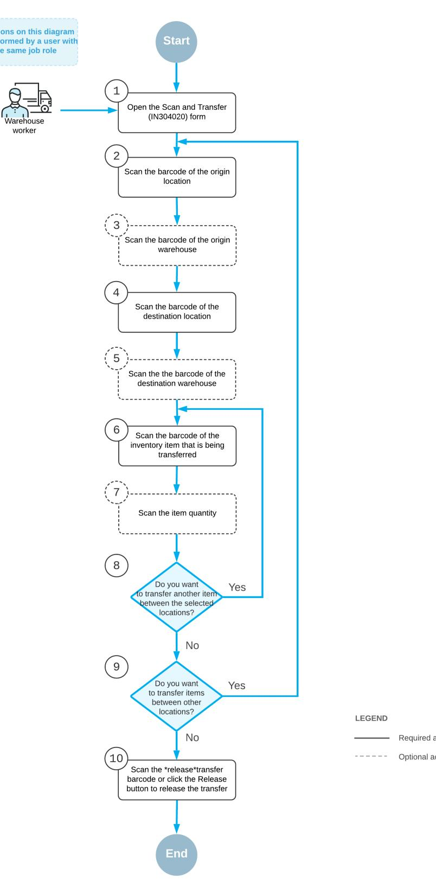

To transfer items (and use Scan and Transfer mode), you perform the following steps:

1. *Open the Scan and [Transfer](https://help-2025r1.acumatica.com/Help?ScreenId=ShowWiki&pageid=a110f8a7-acca-496f-98e9-8f5f84f42279) (IN304020) form*.

You open the *Scan and [Transfer](https://help-2025r1.acumatica.com/Help?ScreenId=ShowWiki&pageid=a110f8a7-acca-496f-98e9-8f5f84f42279)* form (or the corresponding screen in the Acumatica mobile app) to start processing a transfer.

2. *Scan the origin location barcode*.

You scan the barcode of the origin location (that is, the location where the item to be transferred is currently being stored).

3. Optional: *Scan the origin warehouse barcode*.

If the location whose identifier you scanned in the previous step is assigned to multiple warehouses, you scan the origin warehouse barcode. The system inserts the warehouse ID in the **Warehouse** box.

4. *Scan the destination location barcode*.

You scan the barcode of the destination location (that is, the location to which you are transferring items).

5. Optional: *Scan the destination warehouse barcode*.

If the location whose identifier you scanned in the previous step is assigned to multiple warehouses, you scan the destination warehouse barcode. The system inserts the warehouse ID in the**To Warehouse** box.

If the destination warehouse differs from the origin warehouse and the warehouses are assigned to different buildings (or the building is not specified in the settings of either of the warehouses), the system displays an error message, and the transfer cannot be performed.

6. *Scan the item barcode*.

You scan the barcode of the item to be transferred.

7. Optional: *Scan the item quantity*.

To change the transferred quantity in the line that is currently being processed, you switch to Quantity Editing mode by scanning or entering the \*qty barcode or by clicking**Set Qty** on the form toolbar; you then manually enter the quantity in the base unit of measure.

8. Optional: *Scan the barcode of the next item to be transferred between the selected locations*.

If another item must be transferred between the currently selected locations, you scan the barcode of the next item (return to Step 6) and repeat the process for the next item.

9. Optional: *Scan the barcode of the next origin location*.

If items must be transferred between another locations, you scan the barcode of the next origin location (return to Step 2) and repeat the process.

10.*Release the inventory transfer*.

When you have finished transferring items, you scan the barcode of the \*release command or click **Release** on the form toolbar. The system releases the single-step inventory transfer on the *[Transfers](https://help-2025r1.acumatica.com/Help?ScreenId=ShowWiki&pageid=ea1539b6-fafa-443e-8b49-cd1ced95389f)* (IN304000) form.

## **Processing of Transfers: Implementation Checklist**

This topic provides details you can use to ensure that the system is configured properly for the automated processing of transfers.

The recommendations in this topic are for systems in which lot and serial tracking will not be used —that is, in which the *Lot and Serial Tracking* feature is disabled on the *[Enable/Disable Features](https://help-2025r1.acumatica.com/Help?ScreenId=ShowWiki&pageid=c1555e43-1bc5-4f6f-ba9d-b323f94d8a6b)* (CS100000) form.

#### **Prerequisites**

Before you start automated processing of transfers, you should make sure the needed features have been enabled, settings have been specified, and entities have been created, as summarized in the following table.

| Form                               | Criteria to Check                                                                                                                                                                                                                                                                    |
|------------------------------------|--------------------------------------------------------------------------------------------------------------------------------------------------------------------------------------------------------------------------------------------------------------------------------------|
| Enable/Disable Features (CS100000) | Make sure that the following features are enabled: Multiple Warehouse Locations • Warehouse Management • • Inventory Operations                                                                                                                                    |
| Inventory Preferences (IN101000)   | Make sure that all necessary settings related to inven tory have been specified, as described in Configuration of Order Management: Implementation Activity.                                                                                                                   |
| Warehouses (IN204000)              | Make sure that the following entities have been creat ed: • The required warehouses, as described in Ware houses: Implementation Activity. • The required locations, as described in Warehouse Locations and Single-Step Transfers: Implementation Activity. |
| Stock Items (IN202500)             | Make sure that the required stock items have been cre ated, as described in Stock Items: Implementation Activ ity.                                                                                                                                                             |

### **Recommended Workflow Settings**

We recommend that you specify the following settings, which determine the workflow for the automated processing of transfers. You specify these settings on the *[Inventory Preferences](https://help-2025r1.acumatica.com/Help?ScreenId=ShowWiki&pageid=f2eb4e55-f802-4259-a41f-609965c856f1)* (IN101000) form.

| Element                                 | State    | Description                                                                                                                                                                                                                          |
|-----------------------------------------|----------|--------------------------------------------------------------------------------------------------------------------------------------------------------------------------------------------------------------------------------------|
| Use Default Quantity in Transfers       | Cleared  | With this check box cleared,a user can enter the item quantity for each line after entering an item. By default, the system will add one unit of the item to the line.                                                   |
| Use Default Reason Code in Transfers | Selected | With this check box selected, if a reason code for transfers has been created on the Reason Codes (CS211000) form, the system will copy this reason code to all trans fers created on the Scan and Trans fer form. |

| Element                                        | State    | Description                                                                                                                                                                                                                                          |
|------------------------------------------------|----------|------------------------------------------------------------------------------------------------------------------------------------------------------------------------------------------------------------------------------------------------------|
| Request Location for Each Item in Transfers | Cleared  | With this check box cleared, the system prompts a user to enter the barcodes of the origin and destina tion locations once. Then the user can enter all needed item barcodes to transfer the items between the selected locations. |
| Use Explicit Line Confirmation                 | Cleared  | With this check box cleared, a user confirms all lines after adding all required data for all items to a transfer.                                                                                                                          |
| Use Warehouse from User Profile                | Selected | With this check box selected, the system copies the warehouse to be used in the transfer from the profile of the signed-in user.                                                                                                            |

# **Processing of Transfers: Process Activity**

In the following activity, you will learn how to transfer stock items between locations of the same warehouse in a single step by using the *Scan and [Transfer](https://help-2025r1.acumatica.com/Help?ScreenId=ShowWiki&pageid=a110f8a7-acca-496f-98e9-8f5f84f42279)* (IN304020) form.

This activity is based on the *U100* dataset. If you are using another dataset, or if any system settings have been changed in *U100*, these changes can affect the workflow of the activity and the results of the processing. To avoid any issues, restore the *U100* dataset to its initial state.

### **Story**

Suppose that you, as a warehouse worker of the SweetLife Fruits & Jams company, have a task to transfer all jam jars from one location of the wholesale warehouse to another, which will clear the origin location for a new batch of jam.

You will prepare the single-step transfer to reflect the movement of jam jars between the warehouse locations.

### **Configuration Overview**

In the *U100* dataset, the following tasks have been performed to support this activity:

- On the *[Enable/Disable Features](https://help-2025r1.acumatica.com/Help?ScreenId=ShowWiki&pageid=c1555e43-1bc5-4f6f-ba9d-b323f94d8a6b)* (CS100000) form, the following features have been enabled in the *Inventory and Order Management* group of features:
  - *Multiple Warehouse Locations*
  - *Warehouse Management*
  - *Inventory Operations*
- On the *[Warehouses](https://help-2025r1.acumatica.com/Help?ScreenId=ShowWiki&pageid=264b0ef7-2b6c-40b4-a7d9-f1a5e067939b)* (IN204000) form, the *WHOLESALE* warehouse has been created. On the **Locations** tab, the following warehouse locations have been defined: *L3R3S1*, *L2R3S1*, and *WRITEOFF*.
- On the *[Stock Items](https://help-2025r1.acumatica.com/Help?ScreenId=ShowWiki&pageid=77786a70-1f1e-4d63-ad98-96f98e4fcb0e)* (IN202500) form, the following stock items have been created, and the corresponding alternate IDs with the *Barcode* type have been defined on the **Cross-Reference** tab:

For simplicity, in this activity, the alternate IDs will be further referred to as *barcodes*.

- *APJAM96*, which has the *AJ96* barcode
- *ORJAM96*, which has the *OJ96* barcode
- *LEMJAM96*, which has the *LJ96* barcode

#### **Process Overview**

In this activity, acting as a warehouse worker, you will do the following:

- 1. Open the *[Storage Summary](https://help-2025r1.acumatica.com/Help?ScreenId=ShowWiki&pageid=ff039591-b8d1-4313-9578-6e198a26e195)* (IN409010) form and review the quantities of the items to be transferred from the *L3R3S1* location. Then you will open the *Scan and [Transfer](https://help-2025r1.acumatica.com/Help?ScreenId=ShowWiki&pageid=a110f8a7-acca-496f-98e9-8f5f84f42279)* (IN304020) form and enter the settings of a transfer document.
- 2. On the *Scan and [Transfer](https://help-2025r1.acumatica.com/Help?ScreenId=ShowWiki&pageid=a110f8a7-acca-496f-98e9-8f5f84f42279)* form, remove a partial quantity of an item from the document.
- 3. On the same form, add a line with other origin and destination locations to the same document, and enter an item and its quantity to be moved between these locations.
- 4. Review and release the transfer document. Then you will open the *[Storage Summary](https://help-2025r1.acumatica.com/Help?ScreenId=ShowWiki&pageid=ff039591-b8d1-4313-9578-6e198a26e195)* form again and review the quantities of items in the *L3R3S1* location.

In any working mode, you enter a command or barcode by typing it in the**Scan** box and pressing Enter. In production systems, you will scan the appropriate barcodes rather than manually entering them.

#### **System Preparation**

Before you start processing transfers between warehouse locations, you need to sign in to a company with the *U100* dataset preloaded. You should sign in as a warehouse worker with the *perkins* username and the *123* password.

#### **Step 1: Creating a Transfer**

Suppose that the *L3R3S1* location contains one 96-ounce jar of apple jam, one 96-ounce jar of lemon jam, and two 96-ounce jars of orange jam. To create a single-step transfer that will register the movement of these items from the *L3R3S1* location to the *L2R3S1* location of the *WHOLESALE* warehouse, do the following:

- 1. On the *[Storage Summary](https://help-2025r1.acumatica.com/Help?ScreenId=ShowWiki&pageid=ff039591-b8d1-4313-9578-6e198a26e195)* (IN409010) form, specify *WHOLESALE* as the **Warehouse** and *L3R3S1* as the **Location**. In the table, notice that the location contains one jar of *APJAM96*, one jar of *LEMJAM96*, and two jars of *ORJAM96*.
- 2. Open the *Scan and [Transfer](https://help-2025r1.acumatica.com/Help?ScreenId=ShowWiki&pageid=a110f8a7-acca-496f-98e9-8f5f84f42279)* (IN304020) form.
- 3. In the **Scan** box, type L3R3S1 as the origin location and press Enter.
- 4. Enter L2R3S1 as the destination location.
- 5. Enter AJ96 as the first item to be transferred. The system adds a line with one unit of the item to the table on the **Transfer** tab.
- 6. Enter LJ96 as the next item to be transferred. The system adds a line with one unit of the item to the table on the **Transfer** tab.
- 7. Enter OJ96 as the last item to be transferred. The system adds a line with one unit of the item to the table on the **Transfer** tab.
- 8. Set the quantity of the last entered item to 2 as follows:
  - a. On the form toolbar, click**Set Qty**. The system prompts you to enter the item quantity.

- b. In the **Scan** box, enter 2.
- 9. On the form toolbar, click**Save**. The system creates the transfer with the data you have entered. Notice that it has inserted the transfer number in the **Reference Nbr.** box of the Summary area.

You have created the inventory transfer for moving *APJAM96*, *LEMJAM96*, and *ORJAM96* between the *L3R3S1* and *L2R3S1* locations.

#### **Step 2: Removing Items from the Transfer**

Suppose that while you were moving jars of *ORJAM96* between the locations, you noticed that the lid of one of the jars had been dented. The warehouse manager asked you to move this jar to the warehouse location for items to be written off. The location is indicated as *WRITEOFF* in the system. To remove one jar of orange jam from the inventory transfer, do the following:

- 1. While you are still viewing the transfer on the *Scan and [Transfer](https://help-2025r1.acumatica.com/Help?ScreenId=ShowWiki&pageid=a110f8a7-acca-496f-98e9-8f5f84f42279)* (IN304020) form, on the form toolbar, click **Remove** to switch to Remove mode.
- 2. In the **Scan** box, enter L3R3S1 as the origin location.
- 3. Enter L2R3S1 as the destination location.
- 4. Enter OJ96 as the item to be removed from the transfer. On the**Transfer** tab, the system decreases the value of the **Quantity** column in the line with the *ORJAM96* item by 1.

You have removed one unit of the *ORJAM96* item from the transfer. Now you need to add another line to the transfer to reflect the movement of the jar to the *WRITEOFF* location.

#### **Step 3: Adding Items to Be Transferred Between Other Locations**

To add to the same transfer the line that reflects the movement of one jar of *ORJAM96* from the *L3R3S1* location to the *WRITEOFF* location, do the following:

- 1. While you are still viewing the transfer on the *Scan and [Transfer](https://help-2025r1.acumatica.com/Help?ScreenId=ShowWiki&pageid=a110f8a7-acca-496f-98e9-8f5f84f42279)* (IN304020) form, in the**Scan** box, enter L3R3S1 as the origin location.
- 2. Enter WRITEOFF as the destination location.
- 3. Enter OJ96 to indicate the item to be transferred. The system adds the line with one unit of the item to the table on the**Transfer** tab.

You have added another line to the transfer.

#### **Step 4: Reviewing and Releasing the Transfer**

Now that you have added all required items to the transfer, you can release the it. Do the following:

1. While you are still viewing the transfer on the *Scan and [Transfer](https://help-2025r1.acumatica.com/Help?ScreenId=ShowWiki&pageid=a110f8a7-acca-496f-98e9-8f5f84f42279)* (IN304020) form, review the lines that have been added to the table on the**Transfer** tab. They should have the settings indicated in the following table.

| Inventory ID | Location | To Location | Quantity |
|--------------|----------|-------------|----------|
| APJAM96      | L3R3S1   | L2R3S1      | 1        |
| LEMJAM96     | L3R3S1   | L2R3S1      | 1        |
| ORJAM96      | L3R3S1   | L2R3S1      | 1        |
| ORJAM96      | L3R3S1   | WRITEOFF    | 1        |

- 2. On the form toolbar, click **Release**. The system releases the transfer.
- 3. Click the Edit button next to the **Reference Nbr.** box.
- 4. On the *[Transfers](https://help-2025r1.acumatica.com/Help?ScreenId=ShowWiki&pageid=ea1539b6-fafa-443e-8b49-cd1ced95389f)* (IN304000) form, which opens, review the inventory transfer transaction. Make sure it includes the needed lines and is assigned the *Released* status, as shown in the following screenshot.

|            | <b>Transfers</b> 000109                                                                                               |        |                           |                                               |                                               |                                               |                                        |            |                           |                     |              | <b>PINOTES</b> | <b>ACTIVITIES</b>           | <b>FILES</b> | TOOLS $\sim$        |
|------------|--------------------------------------------------------------------------------------------------------------------------|--------|---------------------------|-----------------------------------------------|-----------------------------------------------|-----------------------------------------------|----------------------------------------|------------|---------------------------|---------------------|--------------|----------------|-----------------------------|--------------|---------------------|
|            | 뭐                                                                                                                        | $\Box$ | 面 $+$ $\Omega$      | O. $\overline{\mathsf{K}}$ $\checkmark$ | $\left\langle \right\rangle$ $\rightarrow$ | $\geq$ $\cdots$                            |                                        |            |                           |                     |              |                |                             |              |                     |
|            |                                                                                                                          |        | Reference Nbr.: 000109 | $\varphi$ Warehouse ID:                    |                                               | WHOLESALE - Wholesale Warehouse               |                                        |            | Total Qty.:               | 4.00                |              |                |                             |              | $\hat{\phantom{a}}$ |
|            | Status:                                                                                                                  |        | Released                  |                                               |                                               | To Warehouse  WHOLESALE - Wholesale Warehouse |                                        |            |                           |                     |              |                |                             |              |                     |
|            |                                                                                                                          |        | Transfer Type: 1-Step  | External Ref.:                                |                                               |                                               |                                        |            |                           |                     |              |                |                             |              |                     |
|            | Date:                                                                                                                    |        | 1/30/2025                 | Description:                                  |                                               |                                               |                                        |            |                           |                     |              |                |                             |              |                     |
|            | Post Period:                                                                                                             |        | 01-2025                   |                                               |                                               |                                               |                                        |            |                           |                     |              |                |                             |              |                     |
|            |                                                                                                                          |        |                           |                                               |                                               |                                               |                                        |            |                           |                     |              |                |                             |              |                     |
|            | <b>DETAILS</b>                                                                                                           |        | <b>FINANCIAL</b>          |                                               |                                               |                                               |                                        |            |                           |                     |              |                |                             |              |                     |
|            | <b>LINE DETAILS</b> $\mathbf x$ Ò <b>ADD ITEMS</b> <b>INVENTORY SUMMARY</b> н 土 $\!+\!$ $\times$ |        |                           |                                               |                                               |                                               |                                        |            |                           |                     |              |                |                             |              |                     |
| <b>B</b> 0 |                                                                                                                          | D      | <b>Inventory ID</b>       | Location                                      | Cost Layer <b>Type</b>                  | <b>To Location ID</b>                         | <b>To Cost</b> Layer <b>Type</b> | <b>UOM</b> | Project                   | <b>Project Task</b> | Cost Code |                | <b>Quantity Description</b> |              |                     |
|            | $\omega$                                                                                                                 | מ      | APJAM96                   | <b>L3R3S1</b>                                 | Normal                                        | <b>L2R3S1</b>                                 | Normal                                 | PIECE      | $\boldsymbol{\mathsf{x}}$ |                     |              | 1.00           | Apple jam 96 oz             |              |                     |
|            | 0                                                                                                                        |        | LEMJAM96                  | <b>L3R3S1</b>                                 | Normal                                        | <b>L2R3S1</b>                                 | Normal                                 | PIECE      | $\pmb{\times}$            |                     |              | 1.00           | Lemon jam 96 oz             |              |                     |
|            | 0                                                                                                                        | ٦      | ORJAM96                   | <b>L3R3S1</b>                                 | Normal                                        | <b>L2R3S1</b>                                 | Normal                                 | PIECE      | $\mathsf{x}$              |                     |              | 1.00           | Orange jam 96 oz            |              |                     |
|            | 0                                                                                                                        | ר      | ORJAM96                   | <b>L3R3S1</b>                                 | Normal                                        | <b>WRITEOFF</b>                               | Normal                                 | PIECE      | $\mathsf{x}$              |                     |              | 1.00           | Orange jam 96 oz            |              |                     |
|            |                                                                                                                          |        |                           |                                               |                                               |                                               |                                        |            |                           |                     |              |                |                             |              |                     |

#### *Figure: Inventory transfer transaction*

- 5. On the *[Storage Summary](https://help-2025r1.acumatica.com/Help?ScreenId=ShowWiki&pageid=ff039591-b8d1-4313-9578-6e198a26e195)* (IN409010) form, do the following:
  - a. **Warehouse**: *WHOLESALE*
  - b. **Location**: *L3R3S1*
  - c. Review the table. It must contain no lines, which indicates that you have successfully moved all items from the location.

You have successfully processed the transfer for moving jam jars between warehouse locations.

# **Automated Processing of Physical Inventory**

In Acumatica ERP, you can process physical inventory in an automated mode by using barcode scanners or mobile devices with a scanning option on the *[Scan and Count](https://help-2025r1.acumatica.com/Help?ScreenId=ShowWiki&pageid=9ce6eb18-6c13-4767-9304-b1abb96296dd)* (IN305020) form or the Scan and Count screen in the Acumatica mobile app. This functionality becomes available when the *Inventory Operations* feature is enabled on the *[Enable/Disable Features](https://help-2025r1.acumatica.com/Help?ScreenId=ShowWiki&pageid=c1555e43-1bc5-4f6f-ba9d-b323f94d8a6b)* (CS100000) form.

The topics of this chapter describe the workflow that you can configure, depending on the business requirements of your company, to support the automated processing of physical inventory.

# **Counting in Physical Inventory: General Information**

If the *Inventory Operations* feature is enabled on the *[Enable/Disable Features](https://help-2025r1.acumatica.com/Help?ScreenId=ShowWiki&pageid=c1555e43-1bc5-4f6f-ba9d-b323f94d8a6b)* (CS100000) form, you can perform automated counting of items during physical inventory by using a barcode scanner or a mobile device with a scanning option.

In this topic, you will read about the workflow for the automated physical inventory in Acumatica ERP. The workflow in this topic is based on the assumption that your system has the recommended configuration described in *[Counting in Physical Inventory: Implementation Checklist](#page-17-1)*.

#### **Learning Objectives**

In this chapter, you will do the following:

- Enable the needed system features
- Learn the recommended settings that you can specify to make the system fit your business requirements
- Process counting of stock items during physical inventory in automated mode

#### **Applicable Scenario**

You can use automated counting during physical inventory if your organization uses barcode scanners or mobile devices with a scanning option and all stock items and locations in warehouses are barcoded.

#### **Workflow for the Automated Scanning and Counting of Items**

The automated counting inventory items involves the steps shown in the following diagram.

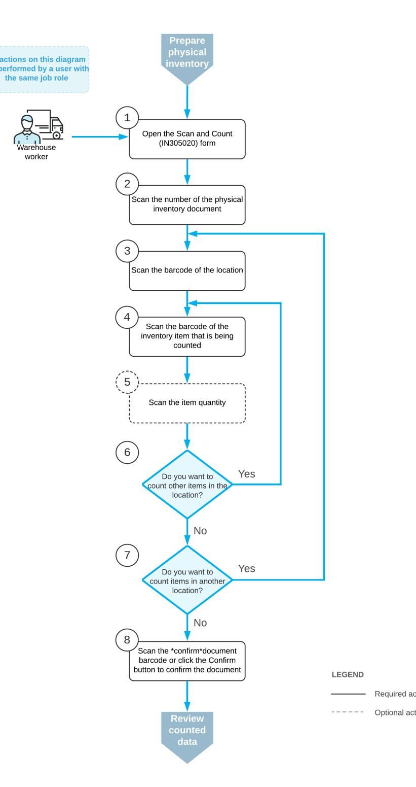

To count inventory items (and use Scan and Count mode), you perform the following steps:

1. *Open the [Scan and Count](https://help-2025r1.acumatica.com/Help?ScreenId=ShowWiki&pageid=9ce6eb18-6c13-4767-9304-b1abb96296dd) (IN305020) form*.

You open the *[Scan and Count](https://help-2025r1.acumatica.com/Help?ScreenId=ShowWiki&pageid=9ce6eb18-6c13-4767-9304-b1abb96296dd)* form (or the corresponding screen in the Acumatica mobile app) to start the counting process.

2. *Scan the document number*.

To start the automated counting, you scan the reference number of the physical inventory document. The lines of the scanned document are shown in the table. The reference number of the document selected for processing is displayed in the **Reference Nbr.** box.

3. *Scan the location barcode*.

You scan the barcode of the location where the items to be counted are stored. All items that you scan aer scanning the location barcode will be assigned to this location.

4. *Scan the item barcode*.

When you scan the barcode of the item, the system changes the status of the line for this item to *Entered*.

5. Optional: *Scan the item quantity*.

To change the counted quantity in the line that is currently being processed, you switch to Quantity Editing mode by scanning or entering the \*qty barcode or by clicking**Set Qty** on the form toolbar; you then manually enter the quantity in the UOM coded in the scanned item barcode.

6. Optional: *Scan the barcode of the next item in the same location*.

If you have more items to count in the same location, you scan the barcode of the next item (return to Step 4) and repeat the process for the item.

7. Optional: *Scan the barcode of the next location*.

If items in another location must be counted, you return to scanning the warehouse location (return to Step 3) and repeat the process for the items in this location.

8. *Confirm the counted quantities*.

When you have finished counting items, you scan the \*confirm command or click **Confirm** on the form toolbar. The system saves your changes to the physical inventory document on the *[Physical Inventory Count](https://help-2025r1.acumatica.com/Help?ScreenId=ShowWiki&pageid=6982851e-9f5f-44f2-afa2-490b1cf23c11)* (IN305010) form.

## **Counting in Physical Inventory: Implementation Checklist**

This topic provides details you can use to ensure that the system is configured properly for the automated counting of items during physical inventory.

The recommendations in this topic are for systems in which lot and serial tracking will not be used —that is, in which the *Lot and Serial Tracking* feature is disabled on the *[Enable/Disable Features](https://help-2025r1.acumatica.com/Help?ScreenId=ShowWiki&pageid=c1555e43-1bc5-4f6f-ba9d-b323f94d8a6b)* (CS100000) form.

#### **Prerequisites**

Before you start automated counting items during physical inventory, you should make sure the needed features have been enabled, settings have been specified, and entities have been created, as summarized in the following table.

| Form                               | Criteria to Check                                      |  |
|------------------------------------|--------------------------------------------------------|--|
| Enable/Disable Features (CS100000) | Make sure that the following features are enabled:     |  |
|                                    | • Multiple Warehouse Locations                      |  |
|                                    | • Warehouse Management • Inventory Operations |  |

| Form                                | Criteria to Check                                                                                                                                                  |
|-------------------------------------|--------------------------------------------------------------------------------------------------------------------------------------------------------------------|
| Inventory Preferences (IN101000)    | Make sure that all necessary settings related to inven tory have been specified, as described in Configuration of Order Management: Implementation Activity. |
| Warehouses (IN204000)               | Make sure that the following entities have been creat ed:                                                                                                       |
|                                     | • The required warehouses, as described in Ware houses: Implementation Activity.                                                                             |
|                                     | • The required locations, as described in Warehouse Locations and Single-Step Transfers: Implementation Activity.                                         |
| Stock Items (IN202500)              | Make sure that the required stock items have been cre ated, as described in Stock Items: Implementation Activ ity.                                           |
| Physical Inventory Types (IN208900) | Make sure that the required inventory types have been created, as described in Types of Physical Inventory.                                                     |
| Prepare Physical Count (IN504000)   | Make sure that the physical inventory document has been prepared properly, as described in Preparation for Physical Count.                                   |

#### **Recommended Workflow Settings**

We recommend that you configure the workflow for the automated counting of physical inventory by specifying the following setting on the *[Inventory Preferences](https://help-2025r1.acumatica.com/Help?ScreenId=ShowWiki&pageid=f2eb4e55-f802-4259-a41f-609965c856f1)* (IN101000) form.

| Element                           | State   | Description                                                                                                        |
|-----------------------------------|---------|--------------------------------------------------------------------------------------------------------------------|
| Use Default Quantity in PI Counts | Cleared | With this check box cleared, the system will prompt a user to en ter the item quantity for each new item. |

# **Counting in Physical Inventory: Process Activity**

In this activity, you will learn how to perform automated counting during physical inventory on the *[Scan and Count](https://help-2025r1.acumatica.com/Help?ScreenId=ShowWiki&pageid=9ce6eb18-6c13-4767-9304-b1abb96296dd)* (IN305020) form.

This activity is based on the *U100* dataset. If you are using another dataset, or if any system settings have been changed in *U100*, these changes can affect the workflow of the activity and the results of the processing. To avoid any issues, restore the *U100* dataset to its initial state.

#### **Story**

Suppose that you, as a warehouse worker of the SweetLife Fruits & Jams company, are assigned to perform a physical inventory count by entering barcodes of the stock items and locations. You will count the quantities of orange jam in particular warehouse locations added to the physical inventory document, which your manager has provided to you.

#### **Configuration Overview**

In the *U100* dataset, the following tasks have been performed to support this activity:

- On the *[Enable/Disable Features](https://help-2025r1.acumatica.com/Help?ScreenId=ShowWiki&pageid=c1555e43-1bc5-4f6f-ba9d-b323f94d8a6b)* (CS100000) form, the following features have been enabled in the *Inventory and Order Management* group of features:
  - *Multiple Warehouse Locations*
  - *Advanced Physical Count*
  - *Warehouse Management*
  - *Inventory Operations*
- On the *[Warehouses](https://help-2025r1.acumatica.com/Help?ScreenId=ShowWiki&pageid=264b0ef7-2b6c-40b4-a7d9-f1a5e067939b)* (IN204000) form, the *WHOLESALE* warehouse has been created. On the **Locations** tab, the following warehouse locations have been defined: *L1R3S1*, *L1R3S2*, and *L1R3S3*.
- On the *[Stock Items](https://help-2025r1.acumatica.com/Help?ScreenId=ShowWiki&pageid=77786a70-1f1e-4d63-ad98-96f98e4fcb0e)* (IN202500) form, the following stock items have been created, and the corresponding barcodes have been defined:
  - *ORJAM08*, which has the *OJ08* and *OJ08B* barcodes
  - *ORJAM32*, which has the *OJ32B* barcode
  - *ORJAM96*, which has the *OJ96B* barcode
- On the *Physical [Inventory](https://help-2025r1.acumatica.com/Help?ScreenId=ShowWiki&pageid=b83fc037-f166-499e-8a32-cbb560e91ee5) Types* (IN208900) form, the *ORJCNT* physical inventory type has been created.
- On the *[Prepare Physical Count](https://help-2025r1.acumatica.com/Help?ScreenId=ShowWiki&pageid=cbdb2f15-9394-4d09-b1fb-d54a9920938b)* (IN504000) form, the *000001* physical inventory document has been created, and it has the *Counting in Progress* status.

#### **Process Overview**

In this activity, as you count stock items during a physical inventory count, you will do the following using the *[Scan](https://help-2025r1.acumatica.com/Help?ScreenId=ShowWiki&pageid=9ce6eb18-6c13-4767-9304-b1abb96296dd) [and Count](https://help-2025r1.acumatica.com/Help?ScreenId=ShowWiki&pageid=9ce6eb18-6c13-4767-9304-b1abb96296dd)* (IN305020) form:

- 1. Scan the barcode of the physical inventory document and then scan a location barcode and the barcodes of each item you find in this location.
- 2. Correct the quantities of items that you find in the location.
- 3. Add extra lines for items that you find in the location.
- 4. When you have counted all items in all locations added to the physical inventory document, confirm the document.

In any working mode, you enter a command or barcode by typing it in the**Scan** box and pressing Enter. In production systems, you will scan the appropriate barcodes rather than manually entering them.

#### **System Preparation**

Before you start counting stock items, do the following:

- 1. Launch the Acumatica ERP website, and sign in to a company with the *U100* dataset preloaded. You should sign in as a warehouse worker with the *perkins* username and the *123* password.
- 2. In the info area, in the upper-right corner of the top pane of the Acumatica ERP screen, make sure that the business date in your system is set to *1/30/2025*. If a different date is displayed, click the Business Date menu button and select *1/30/2025* on the calendar. For simplicity, in this activity, you will create and process all documents in the system on this business date.

#### **Step 1: Entering the Counted Quantities of Items**

Suppose that you are starting to count orange jam in the locations listed in the physical inventory document. To enter the counted quantities in the system, do the following:

- 1. Open the *[Scan and Count](https://help-2025r1.acumatica.com/Help?ScreenId=ShowWiki&pageid=9ce6eb18-6c13-4767-9304-b1abb96296dd)* (IN305020) form.
- 2. In the **Scan** box, type 000001 (which is the reference number of the physical inventory count) and press Enter. Notice that the list of items that you will count is displayed on the **Count** tab.
- 3. Enter L1R3S1 as the first location in which you are performing counting.

Suppose that in this location, you find two boxes of orange jam in 8-ounce jars.

- 4. Enter OJ08B, which is the barcode for a box of 10 jars of orange jam in 8-ounce jars. The system adds 10 units of the *ORJAM08* item to the row that corresponds to this item.
- 5. Enter OJ08B again to add the second box. The system adds another 10 units to the first line, so the quantity is *20*.

You have finished counting items in the *L1R3S1* location and can start counting items in the next location.

6. Enter L1R3S2.

Suppose that in this location, you find three boxes of orange jam in 32-ounce jars.

- 7. Enter OJ32B, which is the barcode for a box of 10 jars of orange jam in 32-ounce jars. The system adds 10 units of the *ORJAM32* item to the row that corresponds to this item.
- 8. To enter two more boxes, do the following:
  - a. On the form toolbar, click**Set Qty**.
  - b. In the **Scan** box, enter 3.

On the **Count** tab, the system changes the quantity of the *ORJAM32* item in the second line to *30*.

You have finished counting items in the *L1R3S2* location and can start counting items in the next location.

9. Enter L1R3S3.

Suppose that in this location, you find one box of orange jam in 96-ounce jars.

10.Enter OJ96B, which is the barcode for a box of 10 jars of orange jam in 96-ounce jars. The system adds 10 units of the *ORJAM96* item to the row that corresponds to this item.

You have finished counting items in the *L1R3S3* location, which was the last location in your physical inventory document.

#### **Step 2: Correcting Quantities in the Physical Inventory Document**

Suppose that you have entered an extra box of *ORJAM32* item in the *L1R3S2* location by mistake (suppose, for instance, that you had intended to set the quantity of the boxes to 2 instead of 3), and now you need to correct the quantity in the document. Do the following:

- 1. While you are still viewing the *[Scan and Count](https://help-2025r1.acumatica.com/Help?ScreenId=ShowWiki&pageid=9ce6eb18-6c13-4767-9304-b1abb96296dd)* (IN305020) form with the *000001* physical inventory document opened, on the form toolbar, click **Remove** to switch to Remove mode.
- 2. In the **Scan** box, enter L1R3S2.
- 3. Enter OJ32B. The system removes 10 units of the *ORJAM32* item from the row that corresponds to the item. In the **Physical Quantity** box, you can see 20 units.

You have corrected the quantity of the *ORJAM32* item in the *L1R3S2* location.

#### **Step 3: Adding Extra Lines to the Physical Inventory Document**

Suppose that in the *L1R3S3* location, you have found one jar of the *ORJAM08* item, which is not in the physical inventory document. To add this item to the document, do the following:

- 1. While you are still viewing the *[Scan and Count](https://help-2025r1.acumatica.com/Help?ScreenId=ShowWiki&pageid=9ce6eb18-6c13-4767-9304-b1abb96296dd)* (IN305020) form with the *000001* physical inventory document opened, enter L1R3S3.
- 2. Enter OJ08, which is the barcode of one 8-ounce jar of orange jam. The system shows the warning, asking you to confirm the addition of the new row to the document.
- 3. Enter \*ok to confirm the addition of a new row. The system adds the new row to the table with the *L1R3S3* location and one unit of the *ORJAM08* item.

You have added the extra item to the physical inventory document. Now you will review the counted quantities and confirm the entered data.

#### **Step 4: Reviewing the Quantities and Confirming the Entered Data**

To review the quantities and confirm the entered data, do the following:

1. While you are still viewing the *000001* physical inventory document on the *[Scan and Count](https://help-2025r1.acumatica.com/Help?ScreenId=ShowWiki&pageid=9ce6eb18-6c13-4767-9304-b1abb96296dd)* (IN305020) form, review the lines in the table on the **Count** tab. They should have the settings indicated in the following table.

| Line Nbr. | Location | Inventory ID | Physical Quantity |
|-----------|----------|--------------|-------------------|
| 1         | L1R3S1   | ORJAM08      | 20                |
| 2         | L1R3S2   | ORJAM32      | 20                |
| 3         | L1R3S3   | ORJAM96      | 10                |
| 4         | L1R3S3   | ORJAM08      | 1                 |

- 2. On the form toolbar, click **Confirm** to confirm the entered data. The system confirms the data and clears the physical inventory document number. The form is ready for a new count.
- 3. On the *[Physical Inventory Count](https://help-2025r1.acumatica.com/Help?ScreenId=ShowWiki&pageid=6982851e-9f5f-44f2-afa2-490b1cf23c11)* (IN305010) form, select *000001* in the **Reference Nbr.** box to open the physical inventory document for which you have performed count. In the **Physical Quantity** column, make sure all counted quantities are shown (see the following screenshot).

|              | <b>Physical Inventory Count</b> |                   |                                   |                                        |      |                               | <b>TH NOTES</b>    | <b>ACTIVITIES</b> | <b>FILES</b> | TOOLS $\rightarrow$ |                     |  |                      |
|--------------|---------------------------------|-------------------|-----------------------------------|----------------------------------------|------|-------------------------------|--------------------|-------------------|--------------|---------------------|---------------------|--|----------------------|
| H            |                                 | $\Omega$ K     | ≺ $\rightarrow$                | $\geq$                                 |      |                               |                    |                   |              |                     |                     |  |                      |
|              |                                 | * Reference Nbr.: | 000001                            |                                        |      | $\varphi$ Freeze Date:     |                    | 1/29/2025         |              |                     |                     |  | ㅅ                    |
| Warehouse:   |                                 |                   |                                   | <b>WHOLESALE - Wholesale Warehouse</b> |      |                               | Number Of Lin      | 4                 |              |                     |                     |  |                      |
| Location:    |                                 |                   |                                   |                                        |      | $\varphi$ Start Line Nbr.: |                    |                   |              |                     |                     |  |                      |
|              | Inventory ID:                   |                   |                                   |                                        |      | $\varphi$ End Line Nbr.:   |                    |                   |              |                     |                     |  |                      |
| Description: |                                 |                   | Physical inventory for orange jam |                                        |      |                               |                    |                   |              |                     |                     |  |                      |
| Ò            |                                 | ADD $\vdash$   | $\mathbf{N}$                      |                                        |      |                               |                    |                   |              |                     |                     |  |                      |
| <b>B</b> 0   | $\Box$                          | <b>Status</b>     |                                   | Line Nbr.                           | Nbr. | Tag Inventory ID              | <b>Description</b> |                   |              | Location            | <b>Base</b> Unit |  | Physical Quantity |
|              | 0 D                          | Entered           |                                   |                                        |      | ORJAM08                       |                    | Orange jam 8 oz.  |              | <b>L1R3S1</b>       | <b>PIECE</b>        |  | 20.00                |
|              | 0 D                          | Entered           |                                   | $\overline{2}$                         |      | ORJAM32                       |                    | Orange jam 32 oz  |              | <b>L1R3S2</b>       | <b>PIECE</b>        |  | 20.00                |
|              | 0                               | Entered           |                                   | 3                                      |      | ORJAM96                       |                    | Orange jam 96 oz  |              | <b>L1R3S3</b>       | <b>PIECE</b>        |  | 10.00                |
|              | 0                               | Entered           |                                   | 4                                      |      | ORJAM08                       |                    | Orange jam 8 oz.  |              | <b>L1R3S3</b>       | PIECE               |  | 1.00                 |
|              |                                 |                   |                                   |                                        |      |                               |                    |                   |              |                     |                     |  |                      |

*Figure: Counted items in the physical inventory document*

You have successfully counted orange jam in the warehouse locations and entered data in the system.

# **Counting in Physical Inventory: Process Activity (Mobile)**

In this activity, you will learn how to perform automated counting during physical inventory on the Scan and Count screen of the Acumatica mobile app, which corresponds to the *[Scan and Count](https://help-2025r1.acumatica.com/Help?ScreenId=ShowWiki&pageid=9ce6eb18-6c13-4767-9304-b1abb96296dd)* (IN305020) form in Acumatica ERP, by using your mobile device.

In this activity, we use the Acumatica mobile app for Android devices. The appearance and functionality of the mobile app for iOS devices may differ somewhat.

This activity is based on the *U100* dataset. If you are using another dataset, or if any system settings have been changed in *U100*, these changes can affect the workflow of the activity and the results of the processing. To avoid any issues, restore the *U100* dataset to its initial state.

#### **Story**

Suppose that you are a warehouse worker in the SweetLife Fruits & Jams company, and you are assigned to perform a physical inventory count by scanning the barcodes of stock items and locations with your mobile device, by using the Acumatica mobile app. You will count the quantities of orange jam in particular warehouse locations added to the physical inventory document, which your manager has provided to you.

#### **Configuration Overview**

In the *U100* dataset, the following tasks have been performed to support this activity:

- On the *[Enable/Disable Features](https://help-2025r1.acumatica.com/Help?ScreenId=ShowWiki&pageid=c1555e43-1bc5-4f6f-ba9d-b323f94d8a6b)* (CS100000) form, the following features have been enabled in the *Inventory and Order Management* group of features:
  - *Multiple Warehouse Locations*
  - *Advanced Physical Count*
  - *Warehouse Management*
  - *Inventory Operations*

- On the *[Warehouses](https://help-2025r1.acumatica.com/Help?ScreenId=ShowWiki&pageid=264b0ef7-2b6c-40b4-a7d9-f1a5e067939b)* (IN204000) form, the *WHOLESALE* warehouse has been created. For this warehouse, on the **Locations** tab, the *L2R2S1* and *L2R2S2* warehouse locations have been added.
- On the *[Stock Items](https://help-2025r1.acumatica.com/Help?ScreenId=ShowWiki&pageid=77786a70-1f1e-4d63-ad98-96f98e4fcb0e)* (IN202500) form, the *ORJAM08* and *ORJAM96* stock items have been created. For each stock item, barcodes have been specified on the **Cross-Reference** tab of the form.
- On the *Physical [Inventory](https://help-2025r1.acumatica.com/Help?ScreenId=ShowWiki&pageid=b83fc037-f166-499e-8a32-cbb560e91ee5) Types* (IN208900) form, the *ORJCNT2* physical inventory type has been created.
- On the *[Prepare Physical Count](https://help-2025r1.acumatica.com/Help?ScreenId=ShowWiki&pageid=cbdb2f15-9394-4d09-b1fb-d54a9920938b)* (IN504000) form, the physical inventory document that has the *ORJAM08* and *ORJAM96* items and the *Counting in Progress* status has been created.

#### **Process Overview**

In this activity, as you count stock items within physical inventory by using the Scan and Count screen of the Acumatica mobile app, you will scan the barcode of the physical inventory document and then scan the location barcode and the barcodes of each item you find in this location. You will correct the quantities of items and add extra lines for items that you find in a location. When you have counted all items in all locations added to the physical inventory document, you will confirm the document.

In any working mode, you enter a command or barcode by typing it in the Scan box and tapping Enter. In production systems, you will scan the appropriate barcodes rather than manually entering them.

#### **System Preparation**

Before you start counting stock items, you need to perform the following instructions:

- 1. Make sure that you have installed the Acumatica mobile app on your mobile device.
- 2. Launch the app.
- 3. Enter the URL and optional name of the Acumatica ERP instance with the *U100* dataset preloaded (for example, *https://your.acumatica.site.com*), and tap **Next**.
- 4. Enter the credentials of the user account you will use in this activity: the *perkins* username and the *123* password.
- 5. Tap**Sign In** to enter the site.

The instructions in the activity steps below may slightly differ in the Acumatica mobile app depending on whether the device is running iOS or Android.

#### **Step 1: Entering the Counted Quantities of Items**

Suppose that you are starting to count orange jam in the locations listed in the physical inventory document. In the Acumatica mobile app on your mobile device, do the following to enter the counted quantities in the system:

- 1. On the main menu of the mobile app, tap the **Warehouse Management > Scan and Count** tile to view the Scan and Count screen.
- 2. Scan the 000003 barcode (which is the reference number of the physical inventory document). Notice that the number is displayed in the **Reference Nbr.** box on the top pane of the screen.
- 3. At the bottom of the screen, tap **Review** to view the list of items that you should count: They are orange jam in 8-ounce jars (*ORJAM08*) and orange jam in 96-ounce jars (*ORJAM96*).
- 4. Go back to the previous screen.
- 5. Scan the L2R2S1 location barcode.

Suppose that in this physical location, you find three boxes of orange jam in 8-ounce jars.

6. Scan the OJ08B item barcode.

- 7. Set the quantity of the item to 3 as follows:
  - a. At the bottom of the screen, tap**Set Qty** to change the quantity of the current line.
  - b. Enter 3. The system adds three boxes of the *ORJAM08* item to the document.

You have completed the entry of item quantities in the *L2R2S1* location and can start entering quantities in the next location.

8. Scan the L2R2S2 location barcode.

Suppose that in this location, you find one box of orange jam in 96-ounce jars.

9. Scan the OJ96B item barcode to add one box of the *ORJAM96* item to the document.

You have finished entering item quantities in the *L2R2S2* location, which was the last location in your physical inventory document.

#### **Step 2: Correcting the Quantities in the Physical Inventory Document**

Suppose that you have realized that you scanned one box of the *ORJAM08* item in the *L2R2S1* location three times by mistake, because in fact you have two boxes. Now you need to correct the quantity in the document. Do the following in the mobile app:

- 1. While you are still viewing the Scan and Count screen with the *000003* physical inventory document opened, scan the L2R2S1 location barcode.
- 2. At the bottom of the screen, tap **Remove** to switch to Remove mode.
- 3. Scan the OJ08B item barcode. The system removes one box of the *ORJAM08* item from the document.

You have corrected the quantity of the *ORJAM08* item in the *L2R2S1* location.

#### **Step 3: Adding an Extra Line to the Physical Inventory Document**

Suppose that in the *L2R2S2* location, you have found one jar of the *ORJAM08* item, which is not in the physical inventory document. To add this item to the document, do the following in the Acumatica mobile app:

- 1. While you are still viewing the Scan and Count screen with the *000003* physical inventory document opened, scan the L2R2S2 location barcode.
- 2. Scan the OJ08 item barcode. The system shows the warning, asking you to confirm the addition of the new row to the document.
- 3. In the Scan box, enter \*ok. The system adds a new row for the *L2R2S2* location and the *ORJAM08* item to the document.

You have added the extra item to the physical inventory document.

### **Step 4: Reviewing the Quantities and Confirming the Entered Data**

Now that you have entered the quantities of the counted items in the physical inventory document, you will review the quantities and confirm the entered data. Do the following in the Acumatica mobile app:

1. While you are still viewing the *000003* physical inventory document on the Scan and Count screen, tap **Review**, and make sure that the settings shown on the screen correspond to the settings in the following table.

| Location                         | Inventory ID | Physical Quantity |
|----------------------------------|--------------|-------------------|
| Line 2, Rack 2, Shelf 1 (L2R2S1) | ORJAM08      | 20                |
| Line 2, Rack 2, Shelf 2 (L2R2S2) | ORJAM96      | 10                |

| Location                         | Inventory ID | Physical Quantity |
|----------------------------------|--------------|-------------------|
| Line 2, Rack 2, Shelf 2 (L2R2S2) | ORJAM08      | 1                 |

- 2. Go back to the previous screen.
- 3. In the top right corner of the screen, tap **More > Confirm** to confirm the entered data. The system confirms the data and clears the physical inventory document number. The form is ready for a new count.

You have successfully counted orange jam in the warehouse locations and entered data in the system.

# **Automated Processing of Inventory Issues**

In Acumatica ERP, you can process inventory issues in an automated mode by using barcode scanners or mobile devices with a scanning option on the *[Scan and Issue](https://help-2025r1.acumatica.com/Help?ScreenId=ShowWiki&pageid=589455a2-a6bd-4d0e-ac5a-1a4f5a0d9dee)* (IN305020) form (IN304020) form or the Scan and Issue screen in the Acumatica mobile app. This functionality becomes available when the *Inventory Operations* feature is enabled on the *[Enable/Disable Features](https://help-2025r1.acumatica.com/Help?ScreenId=ShowWiki&pageid=c1555e43-1bc5-4f6f-ba9d-b323f94d8a6b)* (CS100000) form.

The topics of this chapter describe the workflow that you can configure, depending on the business requirements of your company, to support the automated processing of inventory issues.

# **Processing of Inventory Issues: General Information**

If the *Inventory Operations* feature is enabled on the *[Enable/Disable Features](https://help-2025r1.acumatica.com/Help?ScreenId=ShowWiki&pageid=c1555e43-1bc5-4f6f-ba9d-b323f94d8a6b)* (CS100000) form, you can perform the automated issue of inventory items from a particular warehouse location by using a barcode scanner or a mobile device with a scanning option.

In this topic, you will read about the workflow for the automated issue of inventory items in Acumatica ERP. The workflow in this topic is based on the assumption that your system has the recommended configuration described in *[Processing of Inventory Issues: Implementation Checklist](#page-28-1)*.

#### **Learning Objectives**

In this chapter, you will do the following:

- Enable the needed system features
- Learn the recommended settings that you can specify to make the system fit your business requirements
- Process an issue of stock items from a warehouse location in automated mode

#### **Applicable Scenario**

You can use automated processing of inventory issues when you need to remove items from a warehouse location, for example, expired items that must be removed from warehouse locations and, in your organization, all items and locations have barcodes and warehouse workers are equipped with barcode scanners or mobile devices with a scanning option.

#### **Workflow for the Automated Issuing of Items**

The automated processing of issuing inventory items involves the actions shown in the following diagram.

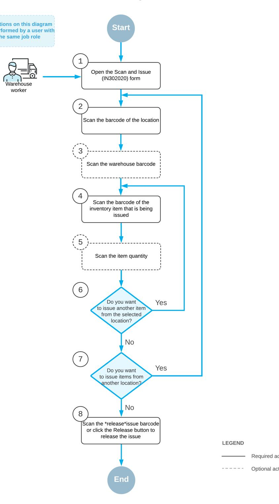

To issue items by using a barcode scanner or a mobile device with a scanning option, you perform the following steps:

1. *Open the [Scan and Issue](https://help-2025r1.acumatica.com/Help?ScreenId=ShowWiki&pageid=589455a2-a6bd-4d0e-ac5a-1a4f5a0d9dee) (IN302020) form*.

You open the *[Scan and Issue](https://help-2025r1.acumatica.com/Help?ScreenId=ShowWiki&pageid=589455a2-a6bd-4d0e-ac5a-1a4f5a0d9dee)* form (or the corresponding screen in the Acumatica mobile app).

2. *Scan the location barcode*.

You scan the barcode of the warehouse location where the items to be issued are stored.

3. Optional: *Scan the warehouse barcode*.

If the location whose identifier you scanned in the previous step is assigned to multiple warehouses, you scan the warehouse barcode. The system inserts the warehouse ID in the **Warehouse** box.

4. *Scan the item barcode*.

You scan the barcode of the item that must be issued from the selected location.

5. Optional: *Scan the item quantity*.

To change the issued quantity in the line that is currently being processed, you switch to Quantity Editing mode by scanning or entering the \*qty barcode or by clicking**Set Qty** on the form toolbar; you then manually enter the quantity in the UOM coded in the scanned item barcode.

6. Optional: *Scan the barcode of the next item to be issued from the selected location*.

If another item must be issued from the currently selected location, you scan the barcode of the next item (that is, return to Step 4) and repeat the process for this item.

7. Optional: *Scan the barcode of the next location*.

If items must be issued from another warehouse location, you scan the barcode of this location (that is, return to Step 2) and repeat the process for this location.

8. *Release the inventory issue*.

When you have added all items to be issued, you scan the \*release command or click **Release** on the form toolbar. The system releases the inventory issue on the *[Issues](https://help-2025r1.acumatica.com/Help?ScreenId=ShowWiki&pageid=17b051f6-027d-4459-b542-65c1c1f9d0ea)* (IN302000) form.

## **Processing of Inventory Issues: Implementation Checklist**

This topic provides details you can use to ensure that the system is configured properly for the automated processing of inventory issues.

The recommendations in this topic are for systems in which lot and serial tracking will not be used —that is, in which the *Lot and Serial Tracking* feature is disabled on the *[Enable/Disable Features](https://help-2025r1.acumatica.com/Help?ScreenId=ShowWiki&pageid=c1555e43-1bc5-4f6f-ba9d-b323f94d8a6b)* (CS100000) form.

#### **Prerequisites**

Before you start automated processing issues, you should make sure the needed features have been enabled, settings have been specified, and entities have been created, as summarized in the following table.

| Form                               | Criteria to Check                                                                                                                                                  |
|------------------------------------|--------------------------------------------------------------------------------------------------------------------------------------------------------------------|
| Enable/Disable Features (CS100000) | Make sure that the following features are enabled: • Multiple Warehouse Locations Warehouse Management • Inventory Operations •                  |
| Inventory Preferences (IN101000)   | Make sure that all necessary settings related to inven tory have been specified, as described in Configuration of Order Management: Implementation Activity. |

| Form                   | Criteria to Check                                                                                                          |  |
|------------------------|----------------------------------------------------------------------------------------------------------------------------|--|
| Warehouses (IN204000)  | Make sure that the following entities have been creat ed:                                                               |  |
|                        | • The required warehouses, as described in Ware houses: Implementation Activity.                                     |  |
|                        | • The required locations, as described in Warehouse Locations and Single-Step Transfers: Implementation Activity. |  |
| Stock Items (IN202500) | Make sure that the required stock items have been cre ated, as described in Stock Items: Implementation Activ ity.   |  |

### **Recommended Workflow Settings**

We recommend that you configure the workflow for the automated processing of issues by specifying the following settings on the *[Inventory Preferences](https://help-2025r1.acumatica.com/Help?ScreenId=ShowWiki&pageid=f2eb4e55-f802-4259-a41f-609965c856f1)* (IN101000) form.

| Element                                     | State    | Description                                                                                                                                                                                                                                                                                                                       |
|---------------------------------------------|----------|-----------------------------------------------------------------------------------------------------------------------------------------------------------------------------------------------------------------------------------------------------------------------------------------------------------------------------------|
| Use Default Quantity in Issues              | Cleared  | With this check box cleared,a user can enter the item quantity for each line after entering an item. By default, the system will add one unit of the item to the line.                                                                                                                                                |
| Use Default Reason Code in Is sues       | Selected | With this check box selected, if a reason code for issues has been created on the Reason Codes (CS211000) form and specified in the Issue/Return Reason Code box on the Inventory Preferences (IN101000) form, the system will copy this reason code to all issues created on the Scan and Issue form. |
| Request Location for Each Item in Issues | Cleared  | With this check box cleared, the system prompts a user to enter the barcode of a location once. Then the user can enter all needed item barcodes to issue the items from the selected location.                                                                                                                    |
| Use Explicit Line Confirmation              | Cleared  | With this check box cleared, a user confirms all lines after adding all required data for all items to an is sue.                                                                                                                                                                                                        |

| Element                         | State    | Description                                                                                                                            |
|---------------------------------|----------|----------------------------------------------------------------------------------------------------------------------------------------|
| Use Warehouse from User Profile | Selected | With this check box selected, the system copies the warehouse to be used in the issue from the profile of the signed-in user. |

# **Processing of Inventory Issues: Process Activity**

In the following activity, you will learn how to issue stock items by using the *[Scan and Issue](https://help-2025r1.acumatica.com/Help?ScreenId=ShowWiki&pageid=589455a2-a6bd-4d0e-ac5a-1a4f5a0d9dee)* (IN302020) form.

This activity is based on the *U100* dataset. If you are using another dataset, or if any system settings have been changed in *U100*, these changes can affect the workflow of the activity and the results of the processing. To avoid any issues, restore the *U100* dataset to its initial state.

#### **Story**

Suppose that you, as a warehouse worker of the SweetLife Fruits & Jams company, have a task to inspect the jars of apple jam to find out if they are of appropriate quantity and to write off jars with any defects. If you find any jars with defects, you need to remove them from the location and process an inventory issue to record this removal in the system.

### **Configuration Overview**

In the *U100* dataset, the following tasks have been performed to support this activity:

- On the *[Enable/Disable Features](https://help-2025r1.acumatica.com/Help?ScreenId=ShowWiki&pageid=c1555e43-1bc5-4f6f-ba9d-b323f94d8a6b)* (CS100000) form, the following features have been enabled in the *Inventory and Order Management* group of features:
  - *Multiple Warehouse Locations*
  - *Warehouse Management*
  - *Inventory Operations*
- On the *[Warehouses](https://help-2025r1.acumatica.com/Help?ScreenId=ShowWiki&pageid=264b0ef7-2b6c-40b4-a7d9-f1a5e067939b)* (IN204000) form, the *WHOLESALE* warehouse has been created. On the **Locations** tab, the following warehouse locations have been defined: *L2R3S1*, *L2R3S3*, and *L3R3S3*.
- On the *[Stock Items](https://help-2025r1.acumatica.com/Help?ScreenId=ShowWiki&pageid=77786a70-1f1e-4d63-ad98-96f98e4fcb0e)* (IN202500) form, the following stock items have been created, and the corresponding alternate IDs with the *Barcode* type have been defined on the **Cross-Reference** tab:

For simplicity, in this activity, the alternate IDs will be further referred to as *barcodes*.

- *APJAM08*, which has the *AJ08* barcode
- *APJAM96*, which has the *AJ96* barcode

#### **Process Overview**

In this activity, acting as a warehouse worker, you will do the following:

- 1. Open the *[Scan and Issue](https://help-2025r1.acumatica.com/Help?ScreenId=ShowWiki&pageid=589455a2-a6bd-4d0e-ac5a-1a4f5a0d9dee)* (IN302020) form and scan the barcode of the location where the items are stored and then scan the barcode of each item to be issued.
- 2. On the same form, review and release the issue.

In any working mode, you enter a command or barcode by typing it in the**Scan** box and pressing Enter. In production systems, you will scan the appropriate barcodes rather than manually entering them.

#### **System Preparation**

Before you start issuing stock items, you need to sign in to a company with the *U100* dataset preloaded. You should sign in as a warehouse worker with the *perkins* username and the *123* password.

#### **Step 1: Creating an Inventory Issue**

Suppose that you have found the following damaged jars of apple jam while inspecting them: three units of apple jam in 8-ounce jars in the *L2R3S1* location, four units of apple jam in 96-ounce jars in the *L2R3S3* location, and two units of apple jam in 96-ounce jars in the *L3R3S3* location. To create an issue with these items, do the following:

- 1. Open the *[Scan and Issue](https://help-2025r1.acumatica.com/Help?ScreenId=ShowWiki&pageid=589455a2-a6bd-4d0e-ac5a-1a4f5a0d9dee)* (IN302020) form.
- 2. In the **Scan** box, type L2R3S1, which is the barcode of the location where you have found the damaged apple jam in 8-ounce jars. Press Enter.
- 3. Enter AJ08, which is the barcode that corresponds to one unit of apple jam in an 8-ounce jar. The system adds 1 unit of the *APJAM08* item to the table on the **Issue** tab.
- 4. Set the quantity of the item to 3, the number of damaged 8-ounce jars you found, as follows:
  - a. On the form toolbar, click**Set Qty**. The system prompts you to enter the item quantity.
  - b. In the **Scan** box, enter 3.
- 5. Enter L2R3S3, which is the barcode of the location where the damaged apple jam in 96-ounce jars is stored.
- 6. Enter AJ96, which is the barcode that corresponds to one unit of apple jam in a 96-ounce jar. The system adds 1 unit of the *APJAM96* item to the table on the **Issue** tab.
- 7. Set the quantity of the item to 4, the number of damaged 96-ounce jars you found.
- 8. Enter L3R3S3, which is the barcode of the location where the damaged apple jam in 96-ounce jars is stored.
- 9. Enter AJ96, which is the barcode that corresponds to one unit of apple jam in a 96-ounce jar. The system adds 1 unit of the *APJAM96* item to the table on the **Issue** tab.
- 10.Set the quantity of the item to 2, the number of damaged 96-ounce jars you found.
- 11.On the form toolbar, click**Save**. The system saves your changes and creates the inventory issue, whose reference number you can view in the **Reference Nbr.** box of the Summary area.

You have added the required items to the issue. Now you will review the issue and release it.

#### **Step 2: Reviewing and Releasing the Issue**

To review and release the issue, do the following:

1. While you are still viewing the inventory issue on the *[Scan and Issue](https://help-2025r1.acumatica.com/Help?ScreenId=ShowWiki&pageid=589455a2-a6bd-4d0e-ac5a-1a4f5a0d9dee)* (IN302020) form, review the lines that have been added to the table on the **Issue** tab. They should have the settings indicated in the following table.

| Inventory ID | Location | Quantity | UOM   |
|--------------|----------|----------|-------|
| APJAM08      | L2R3S1   | 3        | PIECE |

| Inventory ID | Location | Quantity | UOM   |
|--------------|----------|----------|-------|
| APJAM96      | L2R3S3   | 4        | PIECE |
| APJAM96      | L3R3S3   | 2        | PIECE |

- 2. On the form toolbar, click **Release** to release the inventory issue.
- 3. Click the Edit button next to the **Reference Nbr.** box, and on the *[Issues](https://help-2025r1.acumatica.com/Help?ScreenId=ShowWiki&pageid=17b051f6-027d-4459-b542-65c1c1f9d0ea)* (IN302000) form, which opens, review the inventory issue. Make sure that it includes the needed lines and is assigned the *Released* status, as shown in the following screenshot.

| <b>Issues</b> 000067 |                  |                                  |                                                     |                                                              |                          |               |                      |              |                   | $\Box$ NOTES      | <b>ACTIVITIES</b> <b>FILES</b> | TOOLS $\sim$ |
|-------------------------|------------------|----------------------------------|-----------------------------------------------------|--------------------------------------------------------------|--------------------------|---------------|----------------------|--------------|-------------------|-------------------|-----------------------------------|--------------|
| 高                       |                  | $\boxdot$                        | $\overline{\mathbb{H}}$ $\Omega$ $+$          | Û $\overline{\mathbf{K}}$ $\sim$ $\sim$ $\check{~}$ | $\rightarrow$ $\geq$  | $\cdots$      |                      |              |                   |                   |                                   |              |
|                         |                  |                                  | Reference Nbr.: 000067                           | $\varphi$ External Ref.:                                  |                          |               | Total Qty.:          |              | 9.00              |                   |                                   | $\sim$       |
|                         | Status:          |                                  | Released                                            |                                                              |                          |               | <b>Total Amount:</b> |              | 283.35            |                   |                                   |              |
|                         | Date:            |                                  | 1/30/2025                                           |                                                              |                          |               | <b>Total Cost:</b>   |              | 40.63             |                   |                                   |              |
|                         |                  | Post Period:                     | 01-2025                                             | Description:                                                 |                          |               |                      |              |                   |                   |                                   |              |
| Ò                       |                  | <b>DETAILS</b> $\overline{+}$ | <b>FINANCIAL</b> <b>LINE DETAILS</b> $\times$ | <b>ADD ITEMS</b>                                             | <b>INVENTORY SUMMARY</b> | н             | $\mathbf{x}$ 土    |              |                   |                   |                                   |              |
| € $\omega$           |                  |                                  | $\Box$ Tran. Type                                   | <b>Inventory ID</b>                                          | Warehouse                | Location      | Quantity UOM         |              | <b>Unit Price</b> | <b>Ext. Price</b> | <b>Unit Cost</b>                  | Ext. Cost    |
|                         | $\mathbf{0}$     | $\Box$                           | <b>Issue</b>                                        | APJAM08                                                      | <b>WHOLESALE</b>         | <b>L2R3S1</b> | 3.00                 | PIECE        | 4.1500            | 12.45             | 0.0000                            | 0.00         |
|                         | $\boldsymbol{0}$ | D                                | <b>Issue</b>                                        | APJAM96                                                      | <b>WHOLESALE</b>         | <b>L2R3S3</b> | 4.00                 | <b>PIECE</b> | 45.1500           | 180.60            | 6.7717                            | 27.09        |
|                         | 0                | וח                               | <b>Issue</b>                                        | APJAM96                                                      | <b>WHOLESALE</b>         | L3R3S3        |                      | 2.00 PIECE   | 45.1500           | 90.30             | 6.7717                            | 13.54        |

#### *Figure: The released inventory issue*

You have successfully created and released the inventory issue to record the removal of the damaged jars of apple jam from the warehouse locations.

# **Automated Processing of Inventory Receipts**

In Acumatica ERP, you can process inventory receipts in an automated mode by using barcode scanners or mobile devices with a scanning option on the *[Scan and Receive](https://help-2025r1.acumatica.com/Help?ScreenId=ShowWiki&pageid=19a4f613-fe30-4649-b025-234071490c60)* (IN301020) form or the Scan and Receive screen in the Acumatica mobile app. This functionality becomes available when the *Inventory Operations* feature is enabled on the *[Enable/Disable Features](https://help-2025r1.acumatica.com/Help?ScreenId=ShowWiki&pageid=c1555e43-1bc5-4f6f-ba9d-b323f94d8a6b)* (CS100000) form.

The topics of this chapter describe the workflow that you can configure, depending on the business requirements of your company, to support the automated processing of inventory receipts.

# **Processing of Inventory Receipts: General Information**

If the *Inventory Operations* feature is enabled on the *[Enable/Disable Features](https://help-2025r1.acumatica.com/Help?ScreenId=ShowWiki&pageid=c1555e43-1bc5-4f6f-ba9d-b323f94d8a6b)* (CS100000) form, you can perform the automated receipt of inventory items to a particular warehouse location by using a barcode scanner or a mobile device with a scanning option.

In this topic, you will read about the workflow for the automated receipt of inventory items in Acumatica ERP. The workflow in this topic is based on the assumption that your system has the recommended configuration described in *[Processing of Inventory Receipts: Implementation Checklist](#page-35-1)*.

#### **Learning Objectives**

In this chapter, you will do the following:

- Enable the needed system features
- Learn the recommended settings that you can specify to make the system fit your business requirements
- Process a receipt of items to a warehouse in automated mode

#### **Applicable Scenario**

You can use automated processing of inventory receipts when you need to move items to a warehouse location and, in your organization, all items and locations have barcodes and warehouse workers are equipped with barcode scanners or mobile devices with a scanning option.

#### **Workflow for the Automated Receiving of Items**

The automated processing of receiving inventory items involves the actions shown in the following diagram.

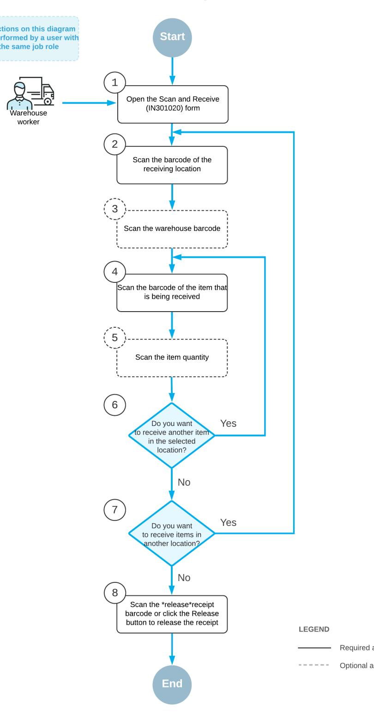

To receive items by using a barcode scanner or a mobile device with a scanning option, you perform the following steps:

1. *Open the [Scan and Receive](https://help-2025r1.acumatica.com/Help?ScreenId=ShowWiki&pageid=19a4f613-fe30-4649-b025-234071490c60) (IN301020) form*.

You open the *[Scan and Receive](https://help-2025r1.acumatica.com/Help?ScreenId=ShowWiki&pageid=19a4f613-fe30-4649-b025-234071490c60)* form (or the corresponding screen in the Acumatica mobile app).

2. *Scan the location barcode*.

You scan the barcode of the warehouse location, where the items are to be received.

3. Optional: *Scan the warehouse barcode*.

If the location whose identifier you scanned in the previous step is assigned to multiple warehouses, you scan the warehouse barcode. The system inserts the warehouse ID in the **Warehouse** box.

4. *Scan the item barcode*.

You scan the barcode of the item being received.

5. Optional: *Scan the item quantity*.

To change the received quantity in the line that is currently being processed, you switch to Quantity Editing mode by scanning or entering the \*qty barcode or by clicking**Set Qty** on the form toolbar; you then manually enter the quantity in the UOM coded in the scanned item barcode.

6. Optional: *Scan the barcode of the next item to be received*.

If more items need to be received in the currently selected location, you scan the barcode of the next item barcode (that is, return to Step 4), and repeat the process for the item.

7. Optional: *Scan the barcode of the next location*.

If items must be received in another warehouse location, you scan the barcode of this location (that is, return to Step 2) and repeat the process for this location.

8. *Release the inventory receipt*.

When you have finished receiving items, you scan the \*release command or click **Release** on the form toolbar. The system releases the inventory receipt on the *[Receipts](https://help-2025r1.acumatica.com/Help?ScreenId=ShowWiki&pageid=d6ecad5b-155f-44bf-baba-9ed006d298b5)* (IN301000) form.

## **Processing of Inventory Receipts: Implementation Checklist**

This topic provides details you can use to ensure that the system is configured properly for the automated processing of inventory receipts.

The recommendations in this topic are for systems in which lot and serial tracking will not be used —that is, in which the *Lot and Serial Tracking* feature is disabled on the *[Enable/Disable Features](https://help-2025r1.acumatica.com/Help?ScreenId=ShowWiki&pageid=c1555e43-1bc5-4f6f-ba9d-b323f94d8a6b)* (CS100000) form.

#### **Prerequisites**

Before you start automated processing receipts, you should make sure the needed features have been enabled, settings have been specified, and entities have been created, as summarized in the following table.

| Form                               | Criteria to Check                                                                                                                                                  |
|------------------------------------|--------------------------------------------------------------------------------------------------------------------------------------------------------------------|
| Enable/Disable Features (CS100000) | Make sure that the following features are enabled: • Multiple Warehouse Locations • Warehouse Management • Inventory Operations                  |
| Inventory Preferences (IN101000)   | Make sure that all necessary settings related to inven tory have been specified, as described in Configuration of Order Management: Implementation Activity. |

| Form                   | Criteria to Check                                                                                                          |
|------------------------|----------------------------------------------------------------------------------------------------------------------------|
| Warehouses (IN204000)  | Make sure that the following entities have been creat ed:                                                               |
|                        | • The required warehouses, as described in Ware houses: Implementation Activity.                                     |
|                        | • The required locations, as described in Warehouse Locations and Single-Step Transfers: Implementation Activity. |
| Stock Items (IN202500) | Make sure that the required stock items have been cre ated, as described in Stock Items: Implementation Activ ity.   |

#### **Recommended Workflow Settings**

We recommend that you configure the workflow for the automated processing of receipts by specifying the following settings on the *[Inventory Preferences](https://help-2025r1.acumatica.com/Help?ScreenId=ShowWiki&pageid=f2eb4e55-f802-4259-a41f-609965c856f1)* (IN101000) form.

| Element                                       | State    | Description                                                                                                                                                                                                                                                                                                                        |  |  |  |
|-----------------------------------------------|----------|------------------------------------------------------------------------------------------------------------------------------------------------------------------------------------------------------------------------------------------------------------------------------------------------------------------------------------|--|--|--|
| Use Default Quantity in Receipts              | Cleared  | With this check box cleared,a user can enter the item quantity for each line after entering an item. By default, the system will add one unit of the item to the line.                                                                                                                                                 |  |  |  |
| Use Default Reason Code in Re ceipts       | Selected | With this check box selected, if a reason code for receipts has been created on the Reason Codes (CS211000) form and specified in the Receipt Reason Code box on the Inventory Preferences (IN101000) form, the system will copy this reason code to all receipts created on the Scan and Receive form. |  |  |  |
| Request Location for Each Item in Receipts | Cleared  | With this check box cleared, the system prompts a user to enter the barcode of a location once. Then the user can enter all needed item barcodes to receive the items from the selected location.                                                                                                                   |  |  |  |
| Use Explicit Line Confirmation                | Cleared  | With this check box cleared, a user confirms all lines after adding all required data for all items to a re ceipt.                                                                                                                                                                                                        |  |  |  |

| Element                                | State    | Description                                                                                                                           |
|----------------------------------------|----------|---------------------------------------------------------------------------------------------------------------------------------------|
| Default Warehouse from User Profile | Selected | With this check box selected, the system copies the warehouse to be used in receipts from the profile of the signed-in user. |

# **Processing of Inventory Receipts: Process Activity**

In the following activity, you will learn how to receive stock items by using the *[Scan and Receive](https://help-2025r1.acumatica.com/Help?ScreenId=ShowWiki&pageid=19a4f613-fe30-4649-b025-234071490c60)* (IN301020) form.

This activity is based on the *U100* dataset. If you are using another dataset, or if any system settings have been changed in *U100*, these changes can affect the workflow of the activity and the results of the processing. To avoid any issues, restore the *U100* dataset to its initial state.

#### **Story**

Suppose that you, as a warehouse worker of the SweetLife Fruits & Jams company, have a task to put apple, orange, and lemon jam, which you recently have received from production, to appropriate warehouse locations and process an inventory receipt to register this operation in the system.

Suppose that you have received the following jam, which you will move to appropriate locations: three boxes of apple jam in 8-ounce jars and four boxes of orange jam in 8-ounce jars (you will put these boxes to the *L2R3S1* location); two boxes of apple jam in 96-ounce jars, three boxes of orange jam in 96-ounce jars, and one box of lemon jam in 96-ounce jars (you will put these boxes to the *L2R3S3* location).

### **Configuration Overview**

In the *U100* dataset, the following tasks have been performed to support this activity:

- On the *[Enable/Disable Features](https://help-2025r1.acumatica.com/Help?ScreenId=ShowWiki&pageid=c1555e43-1bc5-4f6f-ba9d-b323f94d8a6b)* (CS100000) form, the following features have been enabled in the *Inventory and Order Management* group of features:
  - *Multiple Warehouse Locations*
  - *Warehouse Management*
  - *Inventory Operations*
- On the *[Warehouses](https://help-2025r1.acumatica.com/Help?ScreenId=ShowWiki&pageid=264b0ef7-2b6c-40b4-a7d9-f1a5e067939b)* (IN204000) form, the *WHOLESALE* warehouse has been created. On the **Locations** tab, the following warehouse locations have been defined: *L2R3S1* and *L2R3S3*.
- On the *[Stock Items](https://help-2025r1.acumatica.com/Help?ScreenId=ShowWiki&pageid=77786a70-1f1e-4d63-ad98-96f98e4fcb0e)* (IN202500) form, the following stock items have been created, and the corresponding alternate IDs with the *Barcode* type have been defined on the **Cross-Reference** tab:

For simplicity, in this activity, the alternate IDs will be further referred to as *barcodes*.

- *APJAM08*, which has the *AJ08B* barcode
- *ORJAM08*, which has the *OJ08B* barcode
- *APJAM96*, which has the *AJ96B* barcode
- *ORJAM96*, which has the *OJ96B* barcode
- *LEMJAM96*, which has the *LJ96B* barcode

#### **Process Overview**

In this activity, acting as a warehouse worker, you will do the following:

- 1. Open the *[Scan and Receive](https://help-2025r1.acumatica.com/Help?ScreenId=ShowWiki&pageid=19a4f613-fe30-4649-b025-234071490c60)* (IN301020) form and scan the barcode of the location where the items must be stored and then scan the barcode of each item to be received.
- 2. Release the inventory receipt and review the created document.

In any working mode, you enter a command or barcode by typing it in the**Scan** box and pressing Enter. In production systems, you will scan the appropriate barcodes rather than manually entering them.

#### **System Preparation**

Before you start receiving stock items, you need to sign in to a company with the U100 dataset preloaded as a warehouse worker with the *perkins* username and the *123* password.

#### **Step 1: Creating an Inventory Receipt**

To create an inventory receipt with the received jam, do the following:

- 1. Open the *[Scan and Receive](https://help-2025r1.acumatica.com/Help?ScreenId=ShowWiki&pageid=19a4f613-fe30-4649-b025-234071490c60)* (IN301020) form.
- 2. In the **Scan** box, type L2R3S1, which is the barcode of the location where you put apple and orange jam in 8-ounce jars. Press Enter.
- 3. Enter AJ08B, which is the barcode that corresponds to one box of ten 8-ounce jars of apple jam. The system adds 1 box of the *APJAM08* item to the table on the **Receive** tab.
- 4. Set the quantity of the item to 3, the number of received boxes of apple jam in 8-ounce jars, as follows:
  - a. On the form toolbar, click**Set Qty**. The system prompts you to enter the item quantity.
  - b. In the **Scan** box, enter 3.
- 5. Enter OJ08B, which is the barcode that corresponds to one box of ten 8-ounce jars of orange jam. The system adds 1 box of the *ORJAM08* item to the table on the **Receive** tab.
- 6. Set the quantity of the item to 4.
- 7. Enter L2R3S3, which is the barcode of the location where you put apple, orange, and lemon jam in 96 ounce jars.
- 8. Enter AJ96B, which is the barcode that corresponds to one box of ten 96-ounce jars of apple jam. The system adds 1 box of the *APJAM96* item to the table on the **Receive** tab.
- 9. Enter AJ96B one more time to add second unit to the current line.
- 10.Enter OJ96B, which is the barcode that corresponds to one box of ten 96-ounce jars of orange jam. The system adds 1 box of the *ORJAM96* item to the table on the **Receive** tab.
- 11.Set the quantity of the item to 3.
- 12.Enter LJ96B, which is the barcode that corresponds to one box of ten 96-ounce jars of lemon jam. The system adds 1 box of the *LEMJAM96* item to the table on the **Receive** tab.
- 13.On the form toolbar, click**Save**. The system saves your changes and creates the inventory receipt, whose reference number you can view in the **Reference Nbr.** box of the Summary area.

You have added the required items to the receipt. Now you will review the receipt and release it.

#### **Step 2: Releasing and Reviewing the Receipt**

To release and review the receipt, do the following:

1. While you are still viewing the inventory receipt on the *[Scan and Receive](https://help-2025r1.acumatica.com/Help?ScreenId=ShowWiki&pageid=19a4f613-fe30-4649-b025-234071490c60)* (IN301020) form, review the lines that have been added to the table on the **Receive** tab. They should have the settings indicated in the following table.

| Inventory ID | Location | Quantity | UOM  |
|--------------|----------|----------|------|
| APJAM08      | L2R3S1   | 3        | JBOX |
| ORJAM08      | L2R3S1   | 4        | JBOX |
| APJAM96      | L2R3S3   | 2        | JBOX |
| ORJAM96      | L2R3S3   | 3        | JBOX |
| LEMJAM96     | L2R3S3   | 1        | JBOX |

- 2. On the form toolbar, click **Release** to release the inventory receipt.
- 3. Click the Edit button next to the **Reference Nbr.** box, and on the *[Receipts](https://help-2025r1.acumatica.com/Help?ScreenId=ShowWiki&pageid=d6ecad5b-155f-44bf-baba-9ed006d298b5)* (IN301000) form, which opens, review the inventory receipt document. Make sure it includes the needed lines and is assigned the *Released* status, as shown in the following screenshot.

| Receipts 뭐 | 000110                         | $\boxdot$ 间 $+$ $\Omega$      | !!!!!!!!!!!!!!!!!!!!!!!!!!!!!!!!!!!!!!!! $\overline{\mathsf{K}}$ $\check{~}$ | $\left\langle \right\rangle$ $\rightarrow$ | $\geq$       | $\cdots$     |             |                   |        |                       |                       |              | <b>TH NOTES</b>     | <b>ACTIVITIES</b> | <b>FILES</b>       | TOOLS $\star$    |
|---------------|--------------------------------|----------------------------------------|------------------------------------------------------------------------------------|-----------------------------------------------|--------------|--------------|-------------|-------------------|--------|-----------------------|-----------------------|--------------|---------------------|-------------------|--------------------|------------------|
|               |                                | Reference Nbr. 000110               | Q Transfer Nbr.:                                                                |                                               |              |              |             | Total Qty.:       | 13.00  |                       |                       |              |                     |                   |                    | $\sim$           |
|               | Status:                        | Released                               | External Ref.:                                                                     |                                               |              |              |             | <b>Total Cost</b> | 258.05 |                       |                       |              |                     |                   |                    |                  |
|               | Date:                          | 1/30/2025                              | Description:                                                                       |                                               |              |              |             |                   |        |                       |                       |              |                     |                   |                    |                  |
|               | Post Period: <b>DETAILS</b> | 01-2025 <b>FINANCIAL</b>            |                                                                                    |                                               |              |              |             |                   |        |                       |                       |              |                     |                   |                    |                  |
| Ò             |                                | <b>LINE DETAILS</b> $+$ $\times$ | ADD ITEMS                                                                          | $\mathbb{H}$                                  | $\mathbf{x}$ | 土            |             |                   |        |                       |                       |              |                     |                   |                    |                  |
|               |                                | <b>B D</b> Inventory ID                | Warehouse                                                                          | Location                                      |              | Quantity UOM |             | <b>Unit Cost</b>  |        | Ext. Cost Reason Code | Cost Layer Type | Project      | <b>Project Task</b> | Cost Code      | <b>Description</b> |                  |
| У             | $\bullet$ D                 | APJAM08                                | WHOLESALE                                                                          | <b>L2R3S1</b>                                 |              |              | 3.00 JBOX   | 0.0000            | 0.00   | <b>INRECEIPT</b>      | Normal                | $\mathsf{x}$ |                     |                   | Apple jam 8 oz.    |                  |
|               | $0$ D                          | ORJAM08                                | <b>WHOLESALE</b>                                                                   | <b>L2R3S1</b>                                 |              | 4.00         | <b>JBOX</b> | 12.1177           | 48.47  | <b>INRECEIPT</b>      | Normal                | x            |                     |                   |                    | Orange jam 8 oz. |
|               | $0$ D                          | APJAM96                                | WHOLESALE                                                                          | <b>L2R3S3</b>                                 |              | 2.00         | <b>JBOX</b> | 67.7170           |        | 135.43 INRECEIPT      | Normal                | x            |                     |                   | Apple jam 96 oz    |                  |
|               | $0$ D                          | ORJAM96                                | WHOLESALE                                                                          | <b>L2R3S3</b>                                 |              | 3.00         | <b>JBOX</b> | 22.8355           |        | 68.51 INRECEIPT       | Normal                | $\mathbf{x}$ |                     |                   |                    | Orange jam 96 oz |
|               | $0$ D                          | LEMJAM96                               | WHOLESALE                                                                          | <b>L2R3S3</b>                                 |              | 1.00         | <b>JBOX</b> | 5.6423            |        | 5.64 INRECEIPT        | Normal                | x            |                     |                   |                    | Lemon jam 96 oz  |

#### *Figure: The released inventory receipt*

You have successfully created and released the inventory receipt to record the addition or received jam to the warehouse locations.

# **Automated Item and Storage Lookup**

In Acumatica ERP, you can look up stock items in an automated mode by scanning item and location barcodes with barcode scanners or mobile devices with a scanning option on the *[Item Lookup](https://help-2025r1.acumatica.com/Help?ScreenId=ShowWiki&pageid=fb6bf977-22e7-4f00-b88d-f49a6f89f649)* (IN202520) or *[Storage Lookup](https://help-2025r1.acumatica.com/Help?ScreenId=ShowWiki&pageid=680181c6-48d1-4aa4-a5e2-a645b54805df)* (IN409020) forms, or the corresponding screens in the Acumatica mobile app. This functionality becomes available when the *Inventory Operations* feature is enabled on the *[Enable/Disable Features](https://help-2025r1.acumatica.com/Help?ScreenId=ShowWiki&pageid=c1555e43-1bc5-4f6f-ba9d-b323f94d8a6b)* (CS100000) form.

The topics of this chapter describe how you can perform automated lookup of stock items and locations.

# **Item and Storage Lookup: General Information**

In everyday work of warehouse workers, there could be a need to find some items in the system or get information about items stored in a particular location (storage). If the *Inventory Operations* feature is enabled on the *[Enable/](https://help-2025r1.acumatica.com/Help?ScreenId=ShowWiki&pageid=c1555e43-1bc5-4f6f-ba9d-b323f94d8a6b) [Disable Features](https://help-2025r1.acumatica.com/Help?ScreenId=ShowWiki&pageid=c1555e43-1bc5-4f6f-ba9d-b323f94d8a6b)* (CS100000) form, in Acumatica ERP, you can search for items by scanning barcodes of items and locations by using a barcode scanner or a mobile device with a scanning option, as described in this topic.

#### **Learning Objectives**

In this chapter, you will do the following:

- Search for information about stock items by scanning an item barcode with a barcode scanner or a mobile device with a scanning option
- Search for the list of items stored in a particular location by scanning a location barcode with a barcode scanner or a mobile device with a scanning option

#### **Applicable Scenarios**

You can use automated lookup if your organization uses barcode scanners or mobile devices with a scanning option to perform warehouse operations and all stock items and locations in warehouses are barcoded. You can look up for items and locations in either of the following cases:

- In a warehouse, you find a stock item that is not in a location and you would like to find an appropriate location for the item.
- You would like to view the list of stock items stored in a particular warehouse location as it is registered in the system.

#### **Item Lookup**

As you perform any of the warehouse operations, you may need to search for items. For example, you might find a box that is not in a location and want to find out what is in the box and where the box should be placed. To get information about a particular item by scanning the item barcode, you use the *[Item Lookup](https://help-2025r1.acumatica.com/Help?ScreenId=ShowWiki&pageid=fb6bf977-22e7-4f00-b88d-f49a6f89f649)* (IN202520) form.

On this form, you can find information about the location where the item is stored, the quantity of items in the location or locations, and other information about the item (such as item class and base units of measure).

The general process of item lookup is shown in the following diagram.

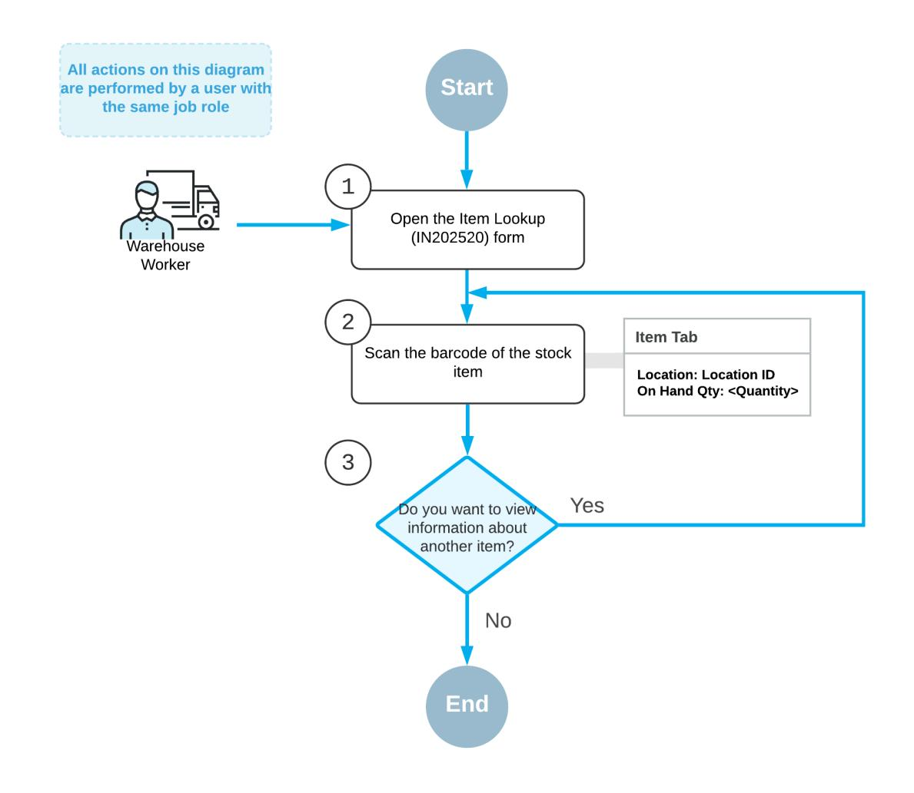

#### **Location Lookup**

If you want to view the list of items in a specific location, you can scan the barcode of the location when the *[Storage](https://help-2025r1.acumatica.com/Help?ScreenId=ShowWiki&pageid=680181c6-48d1-4aa4-a5e2-a645b54805df) [Lookup](https://help-2025r1.acumatica.com/Help?ScreenId=ShowWiki&pageid=680181c6-48d1-4aa4-a5e2-a645b54805df)* (IN409020) form is opened on your mobile device. On this form, you can see the list of items and their quantities stored in the location.

The general process of the lookup by location is shown in the following diagram.

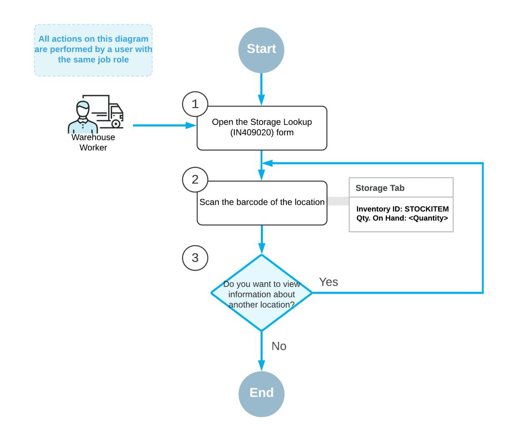

# **Item and Storage Lookup: Implementation Checklist**

This topic provides details you can use to ensure that the system is configured properly for the automated lookup of items by scanning or entering a barcode of an item or location.

### **Prerequisites**

Before you can start using automated lookup of items, you should make sure the needed features have been enabled, settings have been specified, and entities have been created, as summarized in the following table.

| Form                               | Criteria to Check                                  |
|------------------------------------|----------------------------------------------------|
| Enable/Disable Features (CS100000) | Make sure that the following features are enabled: |
|                                    | • Multiple Warehouse Locations                  |
|                                    | • Warehouse Management                          |
|                                    | • Inventory Operations                          |

| Form                             | Criteria to Check                                                                                                                                                  |
|----------------------------------|--------------------------------------------------------------------------------------------------------------------------------------------------------------------|
| Inventory Preferences (IN101000) | Make sure that all necessary settings related to inven tory have been specified, as described in Configuration of Order Management: Implementation Activity. |
| Warehouses (IN204000)            | Make sure that the following entities have been creat ed:                                                                                                       |
|                                  | • Required warehouses, as described in Warehouses: Implementation Activity.                                                                                  |
|                                  | • Required locations, as described in Warehouse Lo cations and Single-Step Transfers: Implementation Activity.                                            |
| Stock Items (IN202500)           | Make sure that the required stock items have been cre ated, as described in Stock Items: Implementation Activ ity.                                           |

# **Item and Storage Lookup: Process Activity**

In this activity, you will learn how to search for information about stock items by using the *[Item Lookup](https://help-2025r1.acumatica.com/Help?ScreenId=ShowWiki&pageid=fb6bf977-22e7-4f00-b88d-f49a6f89f649)* (IN202520) form and for information about items stored in a particular location by using the *[Storage Lookup](https://help-2025r1.acumatica.com/Help?ScreenId=ShowWiki&pageid=680181c6-48d1-4aa4-a5e2-a645b54805df)* (IN409020) form.

This activity is based on the *U100* dataset. If you are using another dataset, or if any system settings have been changed in *U100*, these changes can affect the workflow of the activity and the results of the processing. To avoid any issues, restore the *U100* dataset to its initial state.

#### **Story**

Suppose that you are a warehouse worker in the Wholesale warehouse of the SweetLife Fruits & Jams company. When you walk around the warehouse you find items and boxes that have been inappropriately placed on the floor or on tables. Your work task is to find out what these items are and where they should be stored, so that you can move the items to the appropriate storage.

## **Configuration Overview**

In the *U100* dataset, the following tasks have been performed to support this activity:

- On the *[Enable/Disable Features](https://help-2025r1.acumatica.com/Help?ScreenId=ShowWiki&pageid=c1555e43-1bc5-4f6f-ba9d-b323f94d8a6b)* (CS100000) form, the following features have been enabled in the *Inventory and Order Management* group of features:
  - *Multiple Warehouse Locations*
  - *Warehouse Management*
  - *Inventory Operations*
- On the *[Warehouses](https://help-2025r1.acumatica.com/Help?ScreenId=ShowWiki&pageid=264b0ef7-2b6c-40b4-a7d9-f1a5e067939b)* (IN204000) form, the *WHOLESALE* warehouse has been created. On the **Locations** tab, the following warehouse locations have been defined: *MAIN*, *L1R3S2*, *L2R3S2*, and *L3R3S2*.
- On the *[Stock Items](https://help-2025r1.acumatica.com/Help?ScreenId=ShowWiki&pageid=77786a70-1f1e-4d63-ad98-96f98e4fcb0e)* (IN202500) form, the *APJAM32* stock item, which has the *AJ32B* alternate ID with the *Barcode* type defined on the **Cross-Reference** tab, has been created.

For simplicity, in this activity, the alternate ID will be further referred to as *barcode*.

#### **Process Overview**

In this activity, acting as a warehouse worker, you will do the following:

- 1. Look up an item by scanning the item barcode on the *[Item Lookup](https://help-2025r1.acumatica.com/Help?ScreenId=ShowWiki&pageid=fb6bf977-22e7-4f00-b88d-f49a6f89f649)* (IN409020) form and review information about the item, such as the location and availability.
- 2. Search for a list of the items stored in a particular location by using the *[Storage Lookup](https://help-2025r1.acumatica.com/Help?ScreenId=ShowWiki&pageid=680181c6-48d1-4aa4-a5e2-a645b54805df)* (IN409020) form.

In any working mode, you enter a command or barcode by typing it in the**Scan** box and pressing Enter. In production systems, you will scan the appropriate barcodes rather than manually entering them.

#### **System Preparation**

Before you start looking up items, sign in to a company with the *U100* dataset preloaded as a warehouse worker with the *perkins* username and the *123* password.

#### **Step 1: Looking Up an Item by Scanning the Item Barcode**

Suppose that as you are walking through the warehouse, you notice a box on the floor near some shelves; the box has 10 apple jars, each 32 ounces. You do not see other warehouse workers nearby, so you decide to find out what this box contains and where it should be placed. Do the following:

- 1. Open the *[Item Lookup](https://help-2025r1.acumatica.com/Help?ScreenId=ShowWiki&pageid=fb6bf977-22e7-4f00-b88d-f49a6f89f649)* (IN202520) form.
- 2. In the **Scan** box, type AJ32B, which is the barcode affixed to the box you found, and press Enter. Notice that *APJAM32* item (for which this barcode is specified in the item settings) is shown in the **Inventory ID** box.
- 3. In the table on the **Item** tab, notice that the item is stored in the following locations: *MAIN*, *L1R3S2*, *L2R3S2*, and *L3R3S2*, as shown in the following screenshot.

|        | Item Lookup                          |  |                                                              |                                            |                               |                  |                                                                                                  |              |                   | <b>FILES</b> | TOOLS $\star$ |
|--------|--------------------------------------|--|--------------------------------------------------------------|--------------------------------------------|-------------------------------|------------------|--------------------------------------------------------------------------------------------------|--------------|-------------------|--------------|---------------|
|        | Ò $\Box$ ↶                     |  | <b>RESET</b> $\left  \rightarrow \right $                 | $\mathbf{\overline{N}}$ $\triangledown$ |                               |                  |                                                                                                  |              |                   |              | Q             |
|        | Scan: Warehouse: Inventory ID: |  | WHOLESALE - Wholesale Warehouse APJAM32 - Apple jam 32 oz |                                            |                               | 0 0           | The Item Lookup mode is in use. The APJAM32 item is selected Scan the barcode of the item. |              |                   |              | ᄉ             |
|        | <b>ITEM</b> <b>SCAN LOG</b>       |  |                                                              |                                            |                               |                  |                                                                                                  |              |                   |              | ᄉ             |
|        | Item Class: $JAM - Jam$           |  |                                                              |                                            | Product Workgroup:            |                  |                                                                                                  |              |                   |              |               |
| Type:  |                                      |  | <b>Finished Good</b>                                         |                                            |                               | Product Manager: |                                                                                                  |              |                   |              |               |
|        |                                      |  | $\Box$ Is a Kit                                              |                                            |                               | * Base Unit:     |                                                                                                  | <b>PIECE</b> |                   |              |               |
|        | Valuation Method:                    |  | Average                                                      |                                            |                               | * Sales Unit:    |                                                                                                  | <b>BOX</b>   |                   |              |               |
|        | Lot/Serial Class:                    |  | <b>DEFAULT</b>                                               |                                            |                               | * Purchase Unit: |                                                                                                  | PIECE        |                   |              |               |
|        | <b>B</b> Location                    |  |                                                              | Available                                  | <b>Available for Shipment</b> |                  | <b>Expired</b>                                                                                   |              | On Hand Base Unit |              |               |
| $\geq$ | <b>L1R3S2</b>                        |  |                                                              | 13.00                                      |                               | 13.00            |                                                                                                  | 0.00         | 13.00             | PIECE        |               |
|        | <b>L2R3S2</b>                        |  |                                                              | 8.00                                       |                               | 8.00             |                                                                                                  | 0.00         | 8.00              | PIECE        |               |
|        | <b>L3R3S2</b>                        |  |                                                              | 26.00                                      |                               | 26.00            |                                                                                                  | 0.00         | 26.00             | <b>PIECE</b> |               |
|        | <b>MAIN</b>                          |  |                                                              | 100.00                                     |                               | 100.00           |                                                                                                  | 0.00         | 100.00            | <b>PIECE</b> |               |
|        | Total:                               |  |                                                              | 147.00                                     |                               | 147.00           |                                                                                                  | 0.00         | 147.00 PIECE      |              |               |

#### *Figure: Reviewing the locations with apple jam*

You know the box did not come from the *MAIN* location because it is a receiving location, and you first need to make sure that the box was not taken from any of the racks with sorted items. Because you know that the box you found contains 10 jars, this box could have been taken from the *L1R3S2* or *L3R3S2* locations, as shown in the previous screenshot. (The *L2R3S2* location contains only 8 jars of this item, so the box definitely is not from this shelf.)

Now you need to find out if the *L1R3S2* or *L3R3S2* locations contain less jam than the quantity that is recorded in the system.

#### **Step 2: Looking Up Items Stored in a Location**

Suppose that you have counted the quantities of boxes and jars of the *APJ32B* item on the *L1R3S2* and *L3R3S2* shelves. You have found out that the *L1R3S2* shelf contains one box of 10 jars and 3 single jars; the *L3R3S2* contains one box of 10 jars and 6 single jars. To find out if the *L1R3S2* or *L3R3S2* location contain less jam than the quantity that is recorded in the system, do the following:

- 1. Open the *[Storage Lookup](https://help-2025r1.acumatica.com/Help?ScreenId=ShowWiki&pageid=680181c6-48d1-4aa4-a5e2-a645b54805df)* (IN409020) form.
- 2. In the **Scan** box, enter L1R3S2.
- 3. In the table on the**Storage** tab, you can see that the on-hand quantity of the *APJAM32* item is *13*, which corresponds to one box of 10 jars and 3 separate jars. All the specified items are on the shelf, so the box you have found is not from this shelf.
- 4. In the **Scan** box, enter L3R3S2.
- 5. In the table on the**Storage** tab, you can see that the on-hand quantity of the *APJAM32* item is *26*, which corresponds to two boxes of 10 jars each and 6 separate jars. You have found only one box on this shelf, so the box you have found on the floor should be placed on this shelf.

# **Item and Storage Lookup: Process Activity (Mobile)**

In the following activity, by using the Acumatica mobile app, you will learn how to search for information about stock items on the Item Lookup screen, which corresponds to the *[Item Lookup](https://help-2025r1.acumatica.com/Help?ScreenId=ShowWiki&pageid=fb6bf977-22e7-4f00-b88d-f49a6f89f649)* (IN202520) form of Acumatica ERP, and for information about items stored in a particular location on the Storage Lookup screen, which corresponds to the *[Storage Lookup](https://help-2025r1.acumatica.com/Help?ScreenId=ShowWiki&pageid=680181c6-48d1-4aa4-a5e2-a645b54805df)* (IN409020) form of Acumatica ERP.

In this activity, we use the Acumatica mobile app for Android devices. The appearance and functionality of the mobile app for iOS devices may differ somewhat.

This activity is based on the *U100* dataset. If you are using another dataset, or if any system settings have been changed in *U100*, these changes can affect the workflow of the activity and the results of the processing. To avoid any issues, restore the *U100* dataset to its initial state.

#### **Story**

Suppose that you are a warehouse worker in the wholesale warehouse of the SweetLife Fruits & Jams company. When you walk around the warehouse you find items and boxes that have been inappropriately placed on the floor or on tables. One of your work tasks is to find out what are these items and where they should be stored in the Acumatica mobile app, so that you can move the items to the appropriate storage.

### **Configuration Overview**

In the *U100* dataset, the following tasks have been performed to support this activity:

- On the *[Enable/Disable Features](https://help-2025r1.acumatica.com/Help?ScreenId=ShowWiki&pageid=c1555e43-1bc5-4f6f-ba9d-b323f94d8a6b)* (CS100000) form, the following features have been enabled in the *Inventory and Order Management* group of features:
  - *Multiple Warehouse Locations*
  - *Warehouse Management*
  - *Inventory Operations*
- On the *[Warehouses](https://help-2025r1.acumatica.com/Help?ScreenId=ShowWiki&pageid=264b0ef7-2b6c-40b4-a7d9-f1a5e067939b)* (IN204000) form, the *WHOLESALE* warehouse has been created. For this warehouse, on the **Locations** tab, the following warehouse locations have been added: *MAIN*, *L1R3S2*, *L2R3S2*, and *L3R3S2*.
- On the *[Stock Items](https://help-2025r1.acumatica.com/Help?ScreenId=ShowWiki&pageid=77786a70-1f1e-4d63-ad98-96f98e4fcb0e)* (IN202500) form, the *APJAM32* stock item has been created. For this stock item, barcodes have been specified on the **Cross-Reference** tab of the form.

#### **Process Overview**

In this activity, you will look up an item by scanning the item barcode on the Item Lookup screen of the Acumatica mobile app. You will scan the item barcode and view information about the item, such as the location and availability.

You will also search for a list of the items stored in a particular location by using the Storage Lookup screen, where you will scan the location barcode and view the list of items, with the on-hand quantity for each item.

In any working mode, you enter a command or barcode by typing it in the Scan box and tapping Enter. In production systems, you will scan the appropriate barcodes rather than manually entering them.

#### **System Preparation**

Before you start looking up items, do the following:

- 1. Make sure that you have installed the Acumatica mobile app on your mobile device.
- 2. Launch the app.
- 3. Enter the URL and optional name of the Acumatica ERP instance with the *U100* dataset preloaded (for example, *https://your.acumatica.site.com*), and tap **Next**.
- 4. Enter the credentials of the user account you will use in this activity: the *perkins* username and the *123* password.
- 5. Tap**Sign In** to enter the site.

The instructions in the activity steps below may slightly differ in the Acumatica mobile app depending on whether the device is running iOS or Android.

#### **Step 1: Looking Up an Item by Scanning the Item Barcode**

Suppose that as you are walking through the warehouse, you notice a box standing on the floor near some racks; the box has 10 apple jars, each 32 ounces. You do not see other warehouse workers nearby, so you decide to find out what this box contains and where it should be placed. In the Acumatica mobile app on your mobile device, do the following:

- 1. On the main menu of the mobile app, tap the **Warehouse Management > Item Lookup** tile to view the Item Lookup screen.
- 2. Scan the AJ32B item barcode (which is the barcode affixed to the box).
- 3. At the bottom of the screen, tap **Review**. The Inventory Summary screen is opened. (This screen corresponds to the *[Inventory Summary](https://help-2025r1.acumatica.com/Help?ScreenId=ShowWiki&pageid=2fd70552-e564-4e71-be30-e63b9415baa2)* (IN401000) form in Acumatica ERP.)

On this screen, you can see that the item is stored in the following locations: *MAIN*, *L1R3S2*, *L2R3S2*, and *L3R3S2*. The *MAIN* location is the receiving location far from the place where you found the box. Most likely, the box was taken from the racks with sorted items. You know that the box contains 10 jars, so this box can be stored in either the *L1R3S2* location or the *L3R3S2* location. As you can see on the screen, the *L2R3S2* location contains only 8 jars of this item, so the box definitely is not from this location.

Now you need to find out which of the locations (*L1R3S2* or *L3R3S2*) contains less jam than the quantity that is recorded in the system.

#### **Step 2: Looking Up Items Stored in a Location**

Suppose that you have counted the quantities of boxes and jars of the *APJAM32* item in the *L1R3S2* and *L3R3S2* locations and found out that the *L1R3S2* shelf contains one box of 10 jars and 3 single jars; the *L3R3S2* contains one box of 10 jars and 6 single jars. To find out if the *L1R3S2* or *L3R3S2* location contains less jam than the quantity that is recorded in the system, do the following in the Acumatica mobile app:

- 1. On the main menu of the mobile app, tap the **Warehouse Management > Storage Lookup** tile to view the Storage Lookup screen.
- 2. Scan the L1R3S2 location barcode.
- 3. At the bottom of the screen, tap **Review**. The Storage Summary screen is opened, where you can see that the on-hand quantity of the *APJAM32* item is *13*, which corresponds to one box of 10 jars and 3 separate jars. So the box you have found is not from this location.
- 4. Go back to the previous screen.
- 5. Scan the L3R3S2 location barcode.
- 6. At the bottom of the screen, tap **Review**. On the Storage Summary screen, you can see that the on-hand quantity of the *APJAM32* item is 26, which corresponds to two boxes of 10 jars each and 6 separate jars. You see only one box in this location, so the box you have found should be placed in this location.

# **Automated Picking and Packing Operations**

In Acumatica ERP, you can process the picking and packing of items for shipment in an automated mode by using barcode scanners or mobile devices with a scanning option on the *[Pick, Pack, and Ship](https://help-2025r1.acumatica.com/Help?ScreenId=ShowWiki&pageid=0d7f07e0-56a3-40a9-8cff-45bed542ae94)* (SO302020) form or the Pick, Pack, and Ship screen in the Acumatica mobile app. This functionality becomes available when the *Fulfillment* feature is enabled on the *[Enable/Disable Features](https://help-2025r1.acumatica.com/Help?ScreenId=ShowWiki&pageid=c1555e43-1bc5-4f6f-ba9d-b323f94d8a6b)* (CS100000) form.

The topics of this chapter describe the workflow that you can configure to support the automated processing of shipments with the automated picking of items and then the automated packing of these items for shipment.

# **Picking and Packing Operations: General Information**

If the *Warehouse Management* and *Fulfillment* features are enabled on the *[Enable/Disable Features](https://help-2025r1.acumatica.com/Help?ScreenId=ShowWiki&pageid=c1555e43-1bc5-4f6f-ba9d-b323f94d8a6b)* (CS100000) form, you can perform the automated picking and packing of inventory items for shipping by using a barcode scanner or a mobile device with a scanning option.

You can perform automated picking of items for open shipments prepared for sales orders, transfer orders, and return orders—that is, the shipments of the *Shipment*, *Transfer*, and *Receipt* operation type specified on the *[Shipments](https://help-2025r1.acumatica.com/Help?ScreenId=ShowWiki&pageid=f47cffcc-543e-469c-a204-a9c1e3da346d)* (SO302000) form, respectively. You can perform automated packing for open shipments prepared for sales orders and transfer orders with at least one picked item.

In this topic, you will read about the workflow for the automated picking and packing of inventory items in Acumatica ERP. The workflow in this topic is based on the assumption that your system has the recommended configuration described in *[Picking and Packing Operations: Implementation Checklist](#page-53-1)*.

#### **Learning Objectives**

In this chapter, you will do the following:

- Enable the needed system features
- Specify the minimum required configuration for the automated picking and packing workflow
- Learn the recommended settings that you can specify to make the system fit your business requirements
- Pick the items for a shipment in an automated mode
- Pack the items into a box in an automated mode
- Confirm a shipment aer picking and packing items

#### **Applicable Scenario**

In your company's warehouses, picking processes and packing processes are completed by different warehouse workers. Each warehouse worker acting as a picker goes through the warehouse with a printed pick list, picks the items from the warehouse locations specified in the pick list, and transfers them to a packing line. A packer that works at the packing line selects the box for packing the shipment and packs the items; aer the shipment is completely packed, the packer confirms the shipment. To track the operations as they are being performed, both pickers and packers scan the appropriate barcodes by using a barcode scanner or mobile device.

#### **Workflow for the Automated Picking of Items**

The automated processing of picking items to be packed involves the actions shown in the following diagram.

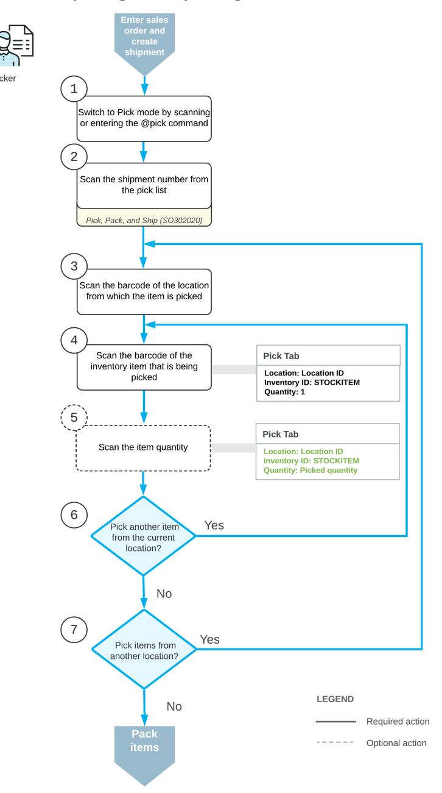

To process the picking of items by using Pick mode, you perform the following steps:

1. *Switch to Pick mode*.

You open the *[Pick, Pack, and Ship](https://help-2025r1.acumatica.com/Help?ScreenId=ShowWiki&pageid=0d7f07e0-56a3-40a9-8cff-45bed542ae94)* (SO302020) form (or the corresponding screen in the Acumatica mobile app) and switch to Pick mode by scanning or entering the *@pick* barcode.

2. *Scan the shipment number*.

To start the automated processing, you scan the reference number of the shipment to be processed. The system displays the lines of the scanned document in the table and inserts the reference number of the document that is currently selected for processing in the**Shipment Nbr.** box.

3. *Scan the location barcode*.

When you scan the barcode of the location from which the item is picked, the system searches for the location in the lines of the document that is currently selected.

4. *Scan the item barcode*.

When you scan the barcode of the picked item, the system searches for the item in the lines of the currently selected document. If the UOM defined by the barcode of the scanned item is specified for a non-base unit of measure (UOM), the system converts the item quantity defined by this barcode to the picked quantity in the base unit of measure for this item. The system displays the picked quantity in the **Picked Quantity** column and highlights the line (in bold if the line has been picked partially, or in green if the line has been picked in full).

5. Optional: *Scan the item quantity*.

To change the picked quantity in the line that is currently being processed, you switch to Quantity Editing mode by scanning or entering the \*qty barcode, and manually enter the quantity in the UOM of defined by the barcode of the scanned item.

If the shipment contains lines of multiple sales orders with the same item and location, you can enter the consolidated quantity of these lines. The system will automatically distribute the entered quantity among the lines with this item.

6. *Pick another line*.

If another item needs to be picked for the currently selected location, you scan the item barcode (return to Step 4) and repeat the process for the item.

7. *Pick items from another location*.

If you need to pick items from another location, you scan the location barcode (return to Step 3), and repeat the process for the location.

If you have finished the picking operation, to proceed with packaging, you scan the @pack barcode to switch to Pack mode.

#### **Workflow for the Automated Packing of Items**

The automated processing of packing items that have been picked involves the actions shown in the following diagram.

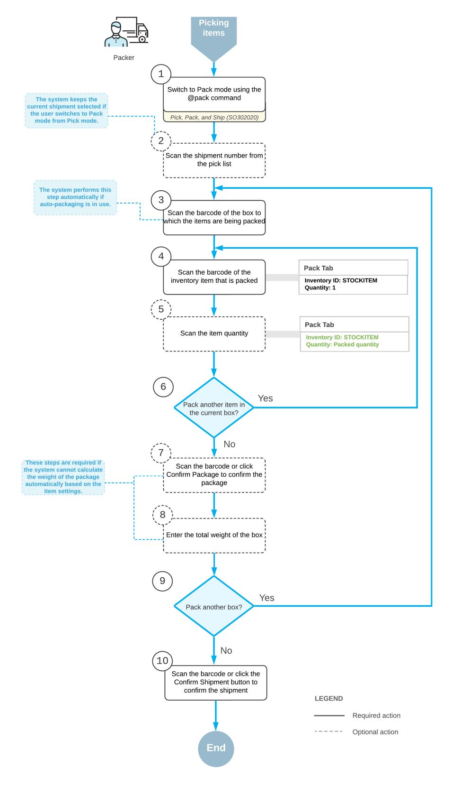

To process the packing of items (and use Pack mode) aer picking them, you perform the following steps:

1. *Switch to Pack mode*.

You open the *[Pick, Pack, and Ship](https://help-2025r1.acumatica.com/Help?ScreenId=ShowWiki&pageid=0d7f07e0-56a3-40a9-8cff-45bed542ae94)* (SO302020) form (or the corresponding screen in the Acumatica mobile app) and switch to Pack mode by scanning or entering *@pack* barcode.

2. Optional: *Scan the document number*.

To start automated processing, you scan the reference number of the shipment to be processed. (If you have switched to Pack mode from Pick mode with the document selected, the document is selected automatically.) The system shows the lines of the document in the table and inserts the reference number of the document that is currently selected for processing in the**Shipment Nbr.** box.

3. *Scan the barcode of the box*.

You scan the barcode of the box into which the items will be packed.

If the *Automatic Packaging* feature is enabled on the *[Enable/Disable Features](https://help-2025r1.acumatica.com/Help?ScreenId=ShowWiki&pageid=c1555e43-1bc5-4f6f-ba9d-b323f94d8a6b)* (CS101000) form, this step is performed automatically.

4. *Scan the item barcode*.

When you scan the barcode of the packed item, the system searches for the item in the lines of the document that is currently selected. If the UOM defined by the barcode of the scanned item corresponds to a non-base unit of measure, the system converts the item quantity defined by this barcode to the packed quantity in the base unit of measure for this item. The system also shows the packed quantity in the **Packed Quantity** column, and highlights the line (in bold if the line has been processed partially, or in green if the line has been processed in full).

5. Optional: *Scan the item quantity*.

To change the quantity of packed items in the line that is currently being processed, you switch to Quantity Editing mode by scanning or entering the \*qty barcode, and manually enter the quantity in the UOM defined by the barcode of the scanned item.

6. *Pack another line*.

If another item needs to be packed in the current box, you return to scanning the item barcode (return to Step 4) and repeat the process for the item.

7. Optional: *Confirm the box*.

If all items are packed in a single box, you confirm the box by scanning the \*package\*confirm barcode or by clicking the **Confirm Package** button. If the items are packed in multiple boxes, the system automatically confirms the current box when you scan the barcode of the next box to be packed for the current shipment.

If the *Automatic Packaging* feature is enabled on the *[Enable/Disable Features](https://help-2025r1.acumatica.com/Help?ScreenId=ShowWiki&pageid=c1555e43-1bc5-4f6f-ba9d-b323f94d8a6b)* form, this step is performed automatically for the shipments that are being packed to a single box that the system has suggested automatically.

8. Optional: *Enter the box weight*.

If the **Confirm Weight for Each Package** check box is selected on the **Warehouse Management** tab of the *[Sales Orders Preferences](https://help-2025r1.acumatica.com/Help?ScreenId=ShowWiki&pageid=1817779c-413b-4187-b7fe-38e97845a1cb)* (SO101000) form, the system requires you to confirm the weight of each box aer you confirm the package.

If you want to accept the automatically calculated weight of the box, you can do that by clicking **OK** on the form toolbar or by scanning the \*ok command. If you want to change the calculated weight of the box, you must enter the new value to continue to the next step.

9. Optional: *Enter the new package dimensions*.

If the **Confirm Dimensions for Packages with Editable Dimensions** check box is selected on the **Warehouse Management** tab of the *[Sales Orders Preferences](https://help-2025r1.acumatica.com/Help?ScreenId=ShowWiki&pageid=1817779c-413b-4187-b7fe-38e97845a1cb)* form and you confirm a package that includes a box with the **Editable Dimensions** check box selected on the *[Boxes](https://help-2025r1.acumatica.com/Help?ScreenId=ShowWiki&pageid=ff38094d-bc30-4cf1-9008-0f1070ada514)* (CS207600) form, the system requires you to confirm the existing dimensions or enter different dimensions for the box.

If you want to accept the default dimensions of the box, you can do that by clicking **OK** on the form toolbar or by scanning the \*ok command. If you want to change the dimensions of the box, you must enter the length, width, and height (in this order) in one string with a space as a separator to continue to the next step.

The following example shows the entry of dimensions: 20 15 40.

10.*Pack another box*.

If more items need to be packed to another box for the current shipment, you return to scanning the barcode of the box barcode (return to Step 3) and repeat the process for another box.

11.*Complete the packing process*.

If you have finished the packing operation and you do not need to specify shipping options, you scan the \*confirm\*shipment barcode or click the **Confirm Shipment** button on the form toolbar. The system confirms the shipment on the *[Shipments](https://help-2025r1.acumatica.com/Help?ScreenId=ShowWiki&pageid=f47cffcc-543e-469c-a204-a9c1e3da346d)* (SO302000) form.

## **Picking and Packing Operations: Implementation Checklist**

This topic provides details you can use to ensure that the system is configured properly for the automated picking and packing of items.

#### **Prerequisites**

Before you start configuring the workflow for automated processing of shipments, you should make sure that the needed features have been enabled, settings have been specified, and entities have been created, as summarized in the following checklist.

| Form                                                                    | Criteria to Check                                                                                                                                                                                                                                                                    |
|-------------------------------------------------------------------------|--------------------------------------------------------------------------------------------------------------------------------------------------------------------------------------------------------------------------------------------------------------------------------------|
| Sales Orders Preferences (SO101000) Inventory Preferences (IN101000) | Make sure that all necessary settings related to inven tory and order management have been specified, as described in Configuration of Order Management: Gen eral Information.                                                                                              |
| Warehouses (IN204000)                                                   | Make sure that the following entities have been creat ed: • The required warehouses, as described in Ware houses: Implementation Activity. • The required locations, as described in Warehouse Locations and Single-Step Transfers: Implementation Activity. |
| Stock Items (IN202500)                                                  | Make sure that the required stock items have been cre ated, as described in Stock Items: Implementation Activ ity.                                                                                                                                                             |

#### **Minimum Workflow Settings**

Before you start picking and packing items for shipments by using a barcode scanner or other device, you should make sure the needed features have been enabled, settings have been specified, and entities have been created, as summarized in the following table.

| Form                                                                            | Criteria to Check                                                                                                                                                                                                                                                                                                              |
|---------------------------------------------------------------------------------|--------------------------------------------------------------------------------------------------------------------------------------------------------------------------------------------------------------------------------------------------------------------------------------------------------------------------------|
| Enable/Disable Features (CS100000)                                              | Make sure that the following features are enabled: • Multiple Warehouse Locations • Warehouse Management • Fulfillment                                                                                                                                                                                       |
| The Warehouse Management tab of the Sales Orders Preferences (SO101000) form | Make sure the following check boxes are selected: • Display the PickTab: If this check box is selected, a user starts the processing of a shipment with pick ing the items. • Display the PackTab: If this check box is selected, a user packs the items into the boxes before con firming a shipment. |
| The Cross-Reference tab of the Stock Items (IN202500) form                   | Make sure that the barcodes have been specified for each item.                                                                                                                                                                                                                                                              |

### **Recommended Workflow Settings**

We recommend that you configure the workflow for the automated picking and packing by specifying the following settings on the **Warehouse Management** tab of the *[Sales Orders Preferences](https://help-2025r1.acumatica.com/Help?ScreenId=ShowWiki&pageid=1817779c-413b-4187-b7fe-38e97845a1cb)* (SO101000) form.

| Element                         | State    | Description                                                                                                                                                                                                                                     |
|---------------------------------|----------|-------------------------------------------------------------------------------------------------------------------------------------------------------------------------------------------------------------------------------------------------|
| Display theScan LogTab          | Selected | With this check box selected, the system will display the Scan Log tab on the Pick, Pack, and Ship (SO302020) form; on this tab, a user can review the list of operations that have been performed during the past two weeks. |
| Short Shipment Confirmation     | Forbid   | With the Forbid value selected, a user cannot confirm the picking of the shipment if not all items have been picked.                                                                                                                   |
| Explicit Line Confirmation      | Cleared  | With this check box cleared, the system does not request user con firmation for each line when the user is performing automated op erations in Pick mode and Pack mode.                                                          |
| Confirm Weight for Each Package | Cleared  | With this check box cleared, the user confirms a package, and the system calculates the package weight automatically.                                                                                                                  |

#### **Printing Settings**

If the *DeviceHub* feature is enabled on the *[Enable/Disable Features](https://help-2025r1.acumatica.com/Help?ScreenId=ShowWiki&pageid=c1555e43-1bc5-4f6f-ba9d-b323f94d8a6b)* (CS100000) form, you can configure the printing of documents by using the following settings on the **Warehouse Management** tab of the *[Sales Orders Preferences](https://help-2025r1.acumatica.com/Help?ScreenId=ShowWiki&pageid=1817779c-413b-4187-b7fe-38e97845a1cb)* (SO101000) form.

| Element                                       | State    | Description                                                                                                                                                   |
|-----------------------------------------------|----------|---------------------------------------------------------------------------------------------------------------------------------------------------------------|
| Print Shipment Confirmation Au tomatically | Selected | With this check box selected, the system prints the shipment confir mation automatically when a user confirms a shipment.                            |
| Print Shipment Labels Automati cally       | Selected | With this check box selected, the system prints the shipment labels for the packages included in a ship ment when the user confirms the shipment. |

#### **Other Settings That Affect the Workflow**

You can affect the workflow for the automated picking and packing of items by specifying additional settings on the *[Sales Orders Preferences](https://help-2025r1.acumatica.com/Help?ScreenId=ShowWiki&pageid=1817779c-413b-4187-b7fe-38e97845a1cb)* (SO101000) form:

- To speed up the entry of quantities in the lines being processed, select the **Use Default Quantity** check box. When this check box is selected, the**Set Qty** button on the form toolbar of the *[Pick, Pack, and Ship](https://help-2025r1.acumatica.com/Help?ScreenId=ShowWiki&pageid=0d7f07e0-56a3-40a9-8cff-45bed542ae94)* (SO302020) form becomes available before you scan the barcode of an item. You click this button to specify the default quantity of the item. Aer the default quantity is specified, the system inserts it in the **Picked Qty.** or **Packed Qty.** column each time you scan the barcode of the item.
- To allow users to confirm partially picked and packed shipments, select *Allow with Warning* in the **Short Shipment Configuration** box.

#### **Known Process Limitations**

If the *Automatic Packaging* feature is enabled on the *[Enable/Disable Features](https://help-2025r1.acumatica.com/Help?ScreenId=ShowWiki&pageid=c1555e43-1bc5-4f6f-ba9d-b323f94d8a6b)* (CS100000) form, a user can process in Pack mode only shipments packed to a single box. Processing of shipments packed to two or more boxes in Pack mode is currently not supported.

# **Picking and Packing Operations: Process Activity**

In the following activity, you will learn how to perform the picking and packing of items for a shipment by using the *[Pick, Pack, and Ship](https://help-2025r1.acumatica.com/Help?ScreenId=ShowWiki&pageid=0d7f07e0-56a3-40a9-8cff-45bed542ae94)* (SO302020) form.

This activity is based on the *U100* dataset. If you are using another dataset, or if any system settings have been changed in *U100*, these changes can affect the workflow of the activity and the results of the processing. To avoid any issues, restore the *U100* dataset to its initial state.

#### **Story**

Suppose that you are a warehouse worker of the wholesale warehouse of the SweetLife Fruits & Jams company. Your warehouse manager gives you a task to prepare a shipment. In your organization, the pick and pack workflow is used, which means that you go through the warehouse locations and pick the items listed in the shipment pick list. Then you go to the packing line and pack the picked items into boxes.

#### **Configuration Overview**

In the *U100* dataset, the following tasks have been performed to support this activity:

- On the *[Enable/Disable Features](https://help-2025r1.acumatica.com/Help?ScreenId=ShowWiki&pageid=c1555e43-1bc5-4f6f-ba9d-b323f94d8a6b)* (CS100000) form, the following features have been enabled in the *Inventory and Order Management* group of features:
  - *Multiple Warehouse Locations*
  - *Warehouse Management*
  - *Fulfillment*
- On the **Warehouse Management** tab of the *[Sales Orders Preferences](https://help-2025r1.acumatica.com/Help?ScreenId=ShowWiki&pageid=1817779c-413b-4187-b7fe-38e97845a1cb)* (SO101000) form, the **Display the Pick Tab** and the **Display the PackTab** check boxes are selected.
- On the *[Warehouses](https://help-2025r1.acumatica.com/Help?ScreenId=ShowWiki&pageid=264b0ef7-2b6c-40b4-a7d9-f1a5e067939b)* (IN204000) form, the *WHOLESALE* warehouse has been created. On the **Locations** tab, the following warehouse locations have been defined: *L3R2S1* and *L2R1S3*.
- On the *[Stock Items](https://help-2025r1.acumatica.com/Help?ScreenId=ShowWiki&pageid=77786a70-1f1e-4d63-ad98-96f98e4fcb0e)* (IN202500) form, the following stock items have been created, and the corresponding alternate IDs with the *Barcode* type have been defined on the **Cross-Reference** tab:

For simplicity, in this activity, the alternate IDs will be further referred to as *barcodes*.

- *APJAM08*, which has the *AJ08* barcode
- *ORJAM32*, which has the *OJ32* barcode
- On the *[Boxes](https://help-2025r1.acumatica.com/Help?ScreenId=ShowWiki&pageid=ff38094d-bc30-4cf1-9008-0f1070ada514)* (CS207600) form, the *MEDIUM* box has been defined.
- On the *[Sales Orders](https://help-2025r1.acumatica.com/Help?ScreenId=ShowWiki&pageid=19e4021c-1b84-49fd-be12-0320c5f1c7e5)* (SO301000) form, the *000030* sales order for the *COFFEESHOP* customer has been created.
- On the *[Shipments](https://help-2025r1.acumatica.com/Help?ScreenId=ShowWiki&pageid=f47cffcc-543e-469c-a204-a9c1e3da346d)* (SO302000) form, the *000029* shipment has been created for this sales order.

#### **Process Overview**

In this activity, you will do the following:

- 1. Acting as a picker, you will open the *[Pick, Pack, and Ship](https://help-2025r1.acumatica.com/Help?ScreenId=ShowWiki&pageid=0d7f07e0-56a3-40a9-8cff-45bed542ae94)* (SO302020) form, and scan the number of the shipment. Then you will pick the items from the warehouse locations and scan their barcodes and quantities.
- 2. Acting as a packer, you will switch to Pack mode on the same form and scan the barcode of the box to which you pack the items. Then you will scan the item barcodes and the quantities of the items being packed into the box, and confirm the shipment.
- 3. Acting as the warehouse manager, you will open the *[Shipments](https://help-2025r1.acumatica.com/Help?ScreenId=ShowWiki&pageid=f47cffcc-543e-469c-a204-a9c1e3da346d)* (SO302000) form and review the shipment.

In any working mode, you enter a command or barcode by typing it in the**Scan** box and pressing Enter. In production systems, you will scan the appropriate barcodes rather than manually entering them.

#### **System Preparation**

Before you start performing the automated picking and packing operations, you need to perform the following instructions:

1. Sign in to a company with the *U100* dataset preloaded. You should sign in as a warehouse worker with the *perkins* username and the *123* password.

2. On the **Warehouse Management** tab of the *[Sales Orders Preferences](https://help-2025r1.acumatica.com/Help?ScreenId=ShowWiki&pageid=1817779c-413b-4187-b7fe-38e97845a1cb)* (SO101000) form, make sure the **Display the PickTab** and **Display the PackTab** check boxes are selected.

#### **Step 1: Picking Items for Shipping**

To record that the items to be added to a shipment have been picked from the warehouse locations, do the following:

- 1. Open the *[Pick, Pack, and Ship](https://help-2025r1.acumatica.com/Help?ScreenId=ShowWiki&pageid=0d7f07e0-56a3-40a9-8cff-45bed542ae94)* (SO302020) form, and make sure the **Pick** tab is opened.
- 2. In the **Scan** box, type 000029, which is the reference number of the shipment for which you are performing picking and packing operations, and press Enter. The system loads the shipment lines to the table on the **Pick** tab, and shows the reference number of the shipment that is currently being processed in the **Shipment Nbr.** box of the Summary area.
- 3. Enter L3R2S1 to select the location from which the item is picked.
- 4. Enter AJ08 to pick the item. (*AJ08* is the barcode for *APJAM08*, the 8-ounce jar of apple jam, which is included in the *000029* shipment.)

The system highlights the first line of the shipment in bold and specifies *1* as the **Picked Quantity**.

- 5. Set the quantity of the item to 10 as follows:
  - a. On the form toolbar, click**Set Qty**. The system prompts you to enter the item quantity.
  - b. In the **Scan** box, enter 10. The system highlights the corresponding line of the shipment in green and specifies *10* as the **Picked Quantity**.
- 6. Enter L2R1S3 to select another location from which the item is picked.
- 7. Enter OJ32 to select the item being picked. (*OJ32* is the barcode for *ORJAM32*, the 32-ounce jar of orange jam, which is included in the *000029* shipment.)

The system highlights the second line of the shipment in bold and specifies *1* as the **Picked Quantity**.

8. Set the quantity of the line to 8. The system highlights in green the second line of the shipment and specifies *8* as the **Picked Quantity**.

You have picked the items for the shipment, and now you can proceed with packing the shipment.

#### **Step 2: Packing Items for Shipping**

To record that the items have been packed into a box, do the following:

- 1. While you are still viewing the *000029* shipment on the *[Pick, Pack, and Ship](https://help-2025r1.acumatica.com/Help?ScreenId=ShowWiki&pageid=0d7f07e0-56a3-40a9-8cff-45bed542ae94)* (SO302020) form, enter @pack in the **Scan** box to switch to Pack mode. Notice that the shipment is still selected and its reference number is shown in the**Shipment Nbr.** box of the Summary area.
- 2. Enter MEDIUM to select the box for packaging the shipment.
- 3. Enter AJ08 to select the item being packed. The system highlights the first line of the shipment in bold and specifies *1* as the **Packed Quantity**.
- 4. Set the quantity of the item to 10 as follows:
  - a. On the form toolbar, click**Set Qty**. The system prompts you to enter the item quantity.
  - b. In the **Scan** box, enter 10. The system highlights the first line of the shipment in green and specifies *10* as the **Packed Quantity**.
- 5. Enter OJ32 to select the item being packed.
- 6. Set the quantity of the item to 8. The shipment is packed in full now.
- 7. On the form toolbar, click **Confirm Package** to confirm the package.

8. On the form toolbar, click **Confirm Shipment**.

#### **Step 3: Reviewing the Shipment**

To review the result and make sure that the shipment has been confirmed, do the following:

- 1. While you are still viewing the *000029* shipment on the *[Pick, Pack, and Ship](https://help-2025r1.acumatica.com/Help?ScreenId=ShowWiki&pageid=0d7f07e0-56a3-40a9-8cff-45bed542ae94)* (SO302020) form, click the Edit button next to the**Shipment Nbr.** box. On the *[Shipments](https://help-2025r1.acumatica.com/Help?ScreenId=ShowWiki&pageid=f47cffcc-543e-469c-a204-a9c1e3da346d)* (SO302000) form, which opens, review the shipment that you have processed earlier. It is now assigned the *Confirmed* status.
- 2. Review the **Packages** tab. Notice that one *MEDIUM* box is shown in the upper table, and the **Contents of Selected Package** table shows the items that you have packed into this box, as shown in the following screenshot.

| Shipments 000029 - FourStar Coffee & Sweets Shop                                                                                                                                                                                                       |                                                         |                                                       |                                                                                                            |                                        |                  |                                                                  | <b>P</b> NOTES                                | <b>ACTIVITIES</b>           | <b>FILES</b>            | TOOLS $\star$          |
|-----------------------------------------------------------------------------------------------------------------------------------------------------------------------------------------------------------------------------------------------------------|---------------------------------------------------------|-------------------------------------------------------|------------------------------------------------------------------------------------------------------------|----------------------------------------|------------------|------------------------------------------------------------------|-----------------------------------------------|-----------------------------|-------------------------|------------------------|
| 問 $\Xi$ $\Omega$                                                                                                                                                                                                                                    | 血 К $^{+}$                                        | ≺ $\rightarrow$                                    | PREPARE INVOICE >1                                                                                      |                                        | <b>UPDATE IN</b> | $\cdots$                                                         |                                               |                             |                         |                        |
| Shipment Nbr.: 000029 Type: Status: Operation: <b>Issue</b>                                                                                                                                                                                | $\varphi$ Shipment Confirmed                      | Customer: Location: Warehouse ID: Workgroup: | COFFEESHOP - FourStar Coffee & Swee 2 <b>MAIN - Primary Location</b> WHOLESALE - Wholesale Warehouse |                                        |                  | Shipped Quant Shipped Weight: Shipped Volume: Packages: | 18.00 3.100000 3.100000 $\mathbf{1}$ |                             |                         | $\hat{\phantom{a}}$    |
| <b>Shipment Date:</b> Owner: Package Weight: 1/30/2025 0.030000 Description: <b>PACKAGES</b> <b>DETAILS</b> <b>ORDERS</b> <b>SHIPPING</b> <b>ADDRESSES</b> $\left  \rightarrow \right $ $\mathbf{x}$ Ò $\times$ |                                                         |                                                       |                                                                                                            |                                        |                  |                                                                  |                                               |                             |                         |                        |
| $\Box$ Confirmed B 0 $\mathbb O$ ☑ ≻∣ $\Box$                                                                                                                                                                                               | *Box ID <b>MEDIUM</b>                                | Type Manual                                        | <b>Description</b>                                                                                         | Editable <b>Dimension</b> $\Box$ |                  | Width Length 11.00 8.00                                 | 5.00                                          | Height Linear <b>UOM</b> | Weight UOM 0.0300 KG |                        |
| $\blacksquare$                                                                                                                                                                                                                                            |                                                         |                                                       |                                                                                                            |                                        |                  |                                                                  |                                               |                             |                         |                        |
| <b>Contents of Selected Package</b> Ò $^{+}$ $\times$                                                                                                                                                                                            | $\mathbf{\overline{N}}$ $\left  \rightarrow \right $ |                                                       |                                                                                                            |                                        |                  |                                                                  |                                               |                             | $\mid <$ $\,<\,$     | $>$   $\rightarrow$ |
| 8 Shipmer Inventory ID Split Line Nbr.                                                                                                                                                                                                        | <b>UOM</b>                                              |                                                       | Quantity                                                                                                   |                                        |                  |                                                                  |                                               |                             |                         |                        |
| 9 APJAM08                                                                                                                                                                                                                                                 |                                                         | <b>PIECE</b>                                          | 10.00                                                                                                      |                                        |                  |                                                                  |                                               |                             |                         |                        |
| ORJAM32 16                                                                                                                                                                                                                                             |                                                         | <b>PIECE</b>                                          | 8.00                                                                                                       |                                        |                  |                                                                  |                                               |                             |                         |                        |

#### *Figure: Confirmed shipment*

The shipment processing is completed.

## **Picking and Packing Operations: Process Activity (Mobile)**

In the following activity, you will learn how to perform the picking and packing of items for a shipment by using the Pick, Pack, and Ship screen of the Acumatica mobile app, which corresponds to the *[Pick, Pack, and Ship](https://help-2025r1.acumatica.com/Help?ScreenId=ShowWiki&pageid=0d7f07e0-56a3-40a9-8cff-45bed542ae94)* (SO302020) form of Acumatica ERP.

In this activity, we use the Acumatica mobile app for Android devices. The appearance and functionality of the mobile app for iOS devices may differ somewhat.

#### **Story**

Suppose that you are a warehouse worker of the wholesale warehouse of the SweetLife Fruits & Jams company. Your warehouse manager gives you a task to prepare a shipment with the help of the Acumatica mobile app. In your organization, the pick and pack workflow is used, which means that you go through the warehouse locations and pick the items listed in the shipment pick list. Then you go to the packing line and pack the picked items into boxes.

### **Configuration Overview**

In the *U100* dataset, the following tasks have been performed to support this activity:

- On the *[Enable/Disable Features](https://help-2025r1.acumatica.com/Help?ScreenId=ShowWiki&pageid=c1555e43-1bc5-4f6f-ba9d-b323f94d8a6b)* (CS100000) form, the following features have been enabled in the *Inventory and Order Management* group of features:
  - *Multiple Warehouse Locations*
  - *Warehouse Management*
  - *Fulfillment*
- On the **Warehouse Management** tab of the *[Sales Orders Preferences](https://help-2025r1.acumatica.com/Help?ScreenId=ShowWiki&pageid=1817779c-413b-4187-b7fe-38e97845a1cb)* (SO101000) form, the **Display the Pick Tab** and the **Display the PackTab** check boxes are selected.
- On the *[Warehouses](https://help-2025r1.acumatica.com/Help?ScreenId=ShowWiki&pageid=264b0ef7-2b6c-40b4-a7d9-f1a5e067939b)* (IN204000) form, the *WHOLESALE* warehouse has been created. On the **Locations** tab of the form, multiple warehouse locations are configured.
- On the *[Stock Items](https://help-2025r1.acumatica.com/Help?ScreenId=ShowWiki&pageid=77786a70-1f1e-4d63-ad98-96f98e4fcb0e)* (IN202500) form, the following stock items have been created: *APJAM96*, *ORJAM96*, and *LEMJAM96*. For each stock item, barcodes have been specified on the **Cross-Reference** tab of the form.
- On the *[Sales Orders](https://help-2025r1.acumatica.com/Help?ScreenId=ShowWiki&pageid=19e4021c-1b84-49fd-be12-0320c5f1c7e5)* (SO301000) form, a sales order for the *COFFEESHOP* customer has been created.
- On the *[Shipments](https://help-2025r1.acumatica.com/Help?ScreenId=ShowWiki&pageid=f47cffcc-543e-469c-a204-a9c1e3da346d)* (SO302000) form, a shipment has been prepared for this sales order.

#### **Process Overview**

In this activity, in the Acumatica mobile app, you will open the Pick, Pack, and Ship screen (which corresponds to the *[Pick, Pack, and Ship](https://help-2025r1.acumatica.com/Help?ScreenId=ShowWiki&pageid=0d7f07e0-56a3-40a9-8cff-45bed542ae94)* (SO302020) form in Acumatica ERP), switch to Pick mode and scan the number of the shipment from the pick list. Then you will pick the items and scan their barcodes and quantities. Aer you finish picking items, you will switch to Pack mode on the same screen and scan the barcode of the box to which you pack the items. Then you will scan the item barcode and quantity of the items being packed into the box. Aer you finish packing the items, you will confirm the shipment.

In any working mode, you enter a command or barcode by typing it in the Scan box and tapping Enter. In production systems, you will scan the appropriate barcodes rather than manually entering them.

#### **System Preparation**

Before you start performing the automated picking and packing operations, do the following:

- 1. Make sure that you have installed the Acumatica mobile app on your mobile device.
- 2. Launch the app.
- 3. Enter the URL and optional name of the Acumatica ERP instance with the *U100* dataset preloaded (for example, *https://your.acumatica.site.com*), and tap **Next**.

- 4. Enter the credentials of the user account you will use in this activity: the *perkins* username and the *123* password.
- 5. Tap**Sign In** to enter the site.

The instructions in the activity steps below may slightly differ in the Acumatica mobile app depending on whether the device is running iOS or Android.

#### **Step 1: Picking Items for Shipping**

To pick items for shipping, do the following in the Acumatica mobile app on your mobile device:

- 1. On the main menu of the mobile app, tap the **Warehouse Management > Pick, Pack, and Ship** tile to view the Pick, Pack, and Ship screen.
- 2. In the top pane, make sure that Pick mode is in use.
- 3. Scan the 000030 barcode, which is the reference number of the shipment for which you are picking items. The system loads the shipment lines and shows the reference number of the shipment in the top pane of the screen.
- 4. At the bottom of the screen, tap **Review** to review the shipment lines.
- 5. Go back to the previous screen.
- 6. Scan the L3R2S2 barcode to select the location from which the item is picked.
- 7. Scan the AJ08 barcode to select the item being picked.
- 8. Set the quantity of the item to 12 as follows:
  - a. At the bottom of the screen, tap**Set Qty** to change the quantity of the current line.
  - b. Enter 12. The system specifies *12* as the **Picked Quantity**. To review the entered quantity, tap **Review**, and then tap the document line with the *Apple jam 8 oz.* item.

In this activity, you are specifying the quantity in Quantity Editing mode to save time. In a production environment, warehouse workers would instead scan the barcode of each item included in the document.

- 9. Go back to the previous screen.
- 10.Scan the L2R1S3 barcode to select the location from which the item is picked.
- 11.Scan the OJ32 barcode to select the item being picked.
- 12.Set the quantity of the item to 6. The system specifies *6* as the **Picked Quantity** and displays a message in the notification area indicating that the shipment has been picked.
- 13.Tap **Review** to review the picked quantities.
- 14.Go back to the previous screen.

You have picked the items for the shipment, and now you can proceed with packing the items.

#### **Step 2: Packing Items for Shipping**

To pack items, do the following in the Acumatica mobile app:

- 1. While the Pick, Pack, and Ship screen is still opened on your mobile device, at the bottom of the screen, tap **Change Mode > Pack** to switch to Pack mode. Notice that the shipment is still selected and its reference number is shown in the top pane.
- 2. Scan the MEDIUM barcode to select the box for packaging the shipment.

- 3. Scan the AJ08 barcode to select the item being packed.
- 4. Set the quantity of the item to 12 as follows:
  - a. At the bottom of the screen, tap**Set Qty** to change the quantity of the current line.
  - b. Enter 12. The system specifies *12* as the **Picked Quantity**.
  - c. To review the entered quantity, tap **Review**, tap *MEDIUM*, and then tap the document line with the *Apple jam 8 oz.* item.
- 5. Go back to the Pick, Pack, and Ship screen.
- 6. Scan the OJ32 barcode to select the item being picked.
- 7. Set the quantity of the item to 6. The system specifies *6* as the **Packed Quantity** and displays a message in the notification area indicating that the shipment is packed in full.
- 8. To review the packed quantities of items, do the following:
  - a. Tap **Review**.
  - b. Tap *MEDIUM*.
  - c. Tap the document line with the *Apple jam 8 oz.* item, review the document, and close the Package Content screen.
  - d. Tap the document line with the *Orange jam 8 oz.* item, review the document, and close the Package Content screen.
- 9. Go back to the Pick, Pack, and Ship screen.

10.In the top right corner of the screen, tap **More > Confirm Package** to confirm the package.

11.In the top right corner of the screen, tap **More > Confirm Shipment** to confirm the shipment.

You have successfully picked and packed the items of the shipment.

# **Picking and Packing Operations: Efficiency of Warehouse Workers**

To build a seamless fulfillment process with swi deliveries, a company needs the ability to assess the productivity of warehouse workers. In Acumatica ERP, the *[Efficiency of Picking and Packing](https://help-2025r1.acumatica.com/Help?ScreenId=ShowWiki&pageid=b293e563-5b76-4340-9a5e-ca928caa7ecf)* (SO402020) inquiry form provides picking and packing statistics that can help warehouse managers build a well-coordinated process of picking and packing.

#### **Picking and Packing Statistics**

On the *[Efficiency of Picking and Packing](https://help-2025r1.acumatica.com/Help?ScreenId=ShowWiki&pageid=b293e563-5b76-4340-9a5e-ca928caa7ecf)* (SO402020) form, you can view the following statistics of picking and packing operations for a selected warehouse and period:

- The total time spent on the picking or packing operations.
- The number of processed shipments, lines, and packages.
- The total quantity of picked or packed items.
- The number of useful operations.
- The number of all the picking and packing operations.
- The number of operations per pick list that have resulted in an error.
- The actual time spent on the picking or packing operations.
- The links to the following documents:
  - The shipment for a single-shipment pick list
  - The picking worksheet for a wave pick list
  - The picking worksheet for a batch pick list

• The overall efficiency in Pick and Pack modes or in Pack-only mode of shipment processing on the *[Pick,](https://help-2025r1.acumatica.com/Help?ScreenId=ShowWiki&pageid=0d7f07e0-56a3-40a9-8cff-45bed542ae94) [Pack, and Ship](https://help-2025r1.acumatica.com/Help?ScreenId=ShowWiki&pageid=0d7f07e0-56a3-40a9-8cff-45bed542ae94)* (SO302020) form.

The overall efficiency is calculated as the number of useful operations divided by the number of minutes of the actual time.

To review the picking and packing statistics, you need to specify at least the first date of the period for which the statistics are required in the**Start Date** box of the Selection area. By default, the inquiry shows combined information on picking and packing operations in separate lines. You can view the statistics for all warehouses or narrow the inquiry results to a specific warehouse by selecting it in the **Warehouse** box in the Selection area.

You can expand the inquiry data by selecting any of the following check boxes in the Selection area of the form:

- **Expand by User**: If this check box is selected, the table displays a separate row for each user within the specified period. When this check box is selected, you can also narrow the inquiry results to a single user by specifying a username in the **User** box.
- **Expand by Pick List**: If this check box is selected, the table shows a separate row for each pick list within the specified period. When this check box is selected, you can also narrow the inquiry results as follows:
  - To view the statistics for a single-shipment pick list, specify the shipment number in the**Shipment Nbr.** box.
  - To view the statistics for the pick lists of a picking worksheet, specify the worksheet number in the **Worksheet Nbr.** box.
- **Expand by Day**: With this check box selected, the table shows a separate row for each day within the specified period.

The inquiry form tracks both paper-based and paperless picking and packing.

#### **Known Limitations**

The picking and packing process has the following limitations:

- For wave and batch pick lists, the inquiry form does not show the picking time; only the packing time is shown.
- If the **Shipment Nbr.** option button is selected on the *[Efficiency of Picking and Packing](https://help-2025r1.acumatica.com/Help?ScreenId=ShowWiki&pageid=b293e563-5b76-4340-9a5e-ca928caa7ecf)* (SO402020) form, the lookup table for the box shows only shipments for single-shipment pick lists. The following shipments are not shown:
  - For a wave pick list, shipments included in the wave
  - For a batch pick list, shipments included in the batch

# **Automated Packing Operations**

In Acumatica ERP, you can process the packing of items for shipment in an automated mode by using barcode scanners or mobile devices with a scanning option on the *[Pick, Pack, and Ship](https://help-2025r1.acumatica.com/Help?ScreenId=ShowWiki&pageid=0d7f07e0-56a3-40a9-8cff-45bed542ae94)* (SO302020) form or the Pick, Pack, and Ship screen in the Acumatica mobile app. This functionality becomes available when the *Fulfillment* feature is enabled on the *[Enable/Disable Features](https://help-2025r1.acumatica.com/Help?ScreenId=ShowWiki&pageid=c1555e43-1bc5-4f6f-ba9d-b323f94d8a6b)* (CS100000) form.

The topics of this chapter describe the workflow that you can configure to support the automated processing of shipments with the automated packing of items for shipment.

# **Packing Operations: General Information**

If the *Warehouse Management* and *Fulfillment* features are enabled on the *[Enable/Disable Features](https://help-2025r1.acumatica.com/Help?ScreenId=ShowWiki&pageid=c1555e43-1bc5-4f6f-ba9d-b323f94d8a6b)* (CS100000) form, you can perform the automated packing of inventory items for shipping by using a barcode scanner or a mobile device with a scanning option. You can perform automated packing for open shipments prepared for sales orders and transfer orders—that is, the shipments of the *Shipment* and *Transfer* operation type specified on the *[Shipments](https://help-2025r1.acumatica.com/Help?ScreenId=ShowWiki&pageid=f47cffcc-543e-469c-a204-a9c1e3da346d)* (SO302000) form, respectively.

In this topic, you will read about the workflow for the automated packing of inventory items in Acumatica ERP. The workflow in this topic is based on the assumption that your system has the recommended configuration described in *[Packing Operations: Implementation Checklist](#page-66-1)*.

#### **Learning Objectives**

In this chapter, you will do the following:

- Enable the needed system features
- Specify the minimum required configuration for the automated packing workflow
- Learn the recommended settings that you can specify to make the system fit your business requirements
- Pack items for a shipment in an automated mode
- Confirm a shipment aer packing the items

#### **Applicable Scenario**

In your company's warehouses, there is no separate packing line, so each warehouse worker goes through the warehouse with a printed pick list, picks the items from the warehouse locations specified in the pick list, and immediately packs the items into a box for shipping. The warehouse worker then confirms the shipment. To track the performed operations, the warehouse worker scans the appropriate barcodes by using a barcode scanner or mobile device.

#### **Workflow for the Automated Packing of Items**

The automated processing of packing items involves the actions shown in the following diagram.

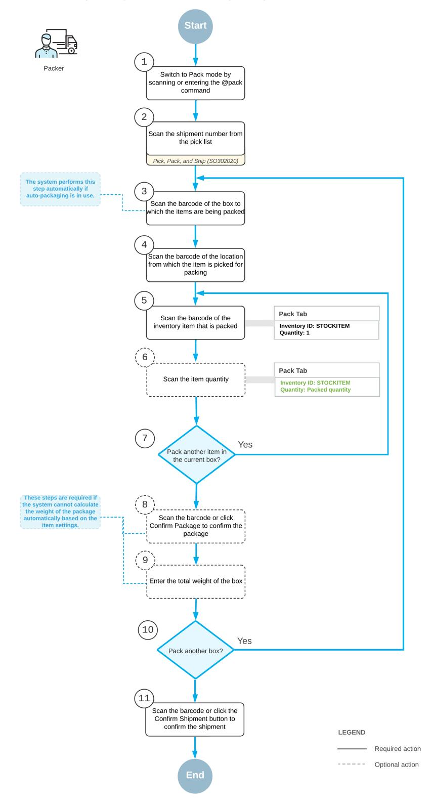

To process the packing of items (and use Pack mode) without picking them, you perform the following steps:

1. *Switch to Pack mode*.

You open the *[Pick, Pack, and Ship](https://help-2025r1.acumatica.com/Help?ScreenId=ShowWiki&pageid=0d7f07e0-56a3-40a9-8cff-45bed542ae94)* (SO302020) form (or the corresponding screen in the Acumatica mobile app) and switch to Pack mode by scanning or entering *@pack* barcode.

2. *Scan the document number*.

To start the automated processing, you scan the reference number of the shipment to be processed. The system shows the lines of the scanned document in the table and inserts the reference number of the document that is currently selected for processing in the**Shipment Nbr.** box.

3. *Scan the barcode of the box*.

You scan the barcode of the box to which the items will be packed.

4. *Scan the location barcode*.

When you scan the barcode of the location from which the item is being taken for packing, the system searches for the location in the lines of the document that is currently selected.

5. *Scan the item barcode*.

When you scan the item barcode of the packed item, the system searches for the item in the lines of the document that is currently selected. If the UOM defined by the barcode of the scanned item corresponds to a non-base unit of measure, the system converts the item quantity defined by this barcode to the packed quantity in the base unit of measure for this item; the system also displays the packed quantity in the **Packed Quantity** column, and highlights the line (in bold if the line is processed partially, or in green if the line is processed in full).

6. Optional: *Scan the item quantity*.

To change the packed quantity in the line that is currently being processed, you switch to Quantity Editing mode by scanning or entering the \*qty barcode, and manually enter the quantity in the UOM defined by the barcode of the scanned item.

7. *Pack another line*.

If another item needs to be packed in the current box, you return to scanning the item barcode (that is, return to Step 4) and repeat the process for the item.

8. Optional: *Confirm the package*.

If all items are packed in a single box, you confirm the box by scanning the \*ok barcode or by clicking the **Confirm Package** button. If the items are packed in multiple boxes, the system automatically confirms the current box when you scan the barcode of the next box to be packed for the current shipment.

9. Optional: *Enter the box weight*.

If the **Confirm Weight for Each Package** check box is selected on the **Warehouse Management** tab of the *[Sales Orders Preferences](https://help-2025r1.acumatica.com/Help?ScreenId=ShowWiki&pageid=1817779c-413b-4187-b7fe-38e97845a1cb)* (SO101000) form, the system requires you to confirm the weight of each box aer you confirm the package.

If you want to accept the automatically calculated weight of the box, you can do that by clicking **OK** on the form toolbar or by scanning the \*ok command. If you want to change the calculated weight of the box, you must enter the new value to continue to the next step.

#### 10.Optional: *Enter the new package dimensions*.

If the **Confirm Dimensions for Packages with Editable Dimensions** check box is selected on the **Warehouse Management** tab of the *[Sales Orders Preferences](https://help-2025r1.acumatica.com/Help?ScreenId=ShowWiki&pageid=1817779c-413b-4187-b7fe-38e97845a1cb)* form and you confirm a package that includes a box with the **Editable Dimensions** check box selected on the *[Boxes](https://help-2025r1.acumatica.com/Help?ScreenId=ShowWiki&pageid=ff38094d-bc30-4cf1-9008-0f1070ada514)* (CS207600) form, the system requires you to confirm the existing dimensions or enter different dimensions for the box.

If you want to accept the default dimensions of the box, you can do that by clicking **OK** on the form toolbar or by scanning the \*ok command. If you want to change the dimensions of the box, you must enter the length, width, and height (in this order) in one string with a space as a separator to continue to the next step.

The following example shows the entry of dimensions: 20 15 40.

11.*Pack another box*.

If at least one other item needs to be packed for the current shipment, you return to scanning the barcode of the box (that is, return to Step 3) and repeat the process for another box.

12.*Complete the packing process*.

If you have finished the packing operation and you do not need to specify shipping options, you scan the \*confirm\*shipment barcode or click the **Confirm Shipment** button on the form toolbar. The system confirms the shipment that is currently being processed on the *[Shipments](https://help-2025r1.acumatica.com/Help?ScreenId=ShowWiki&pageid=f47cffcc-543e-469c-a204-a9c1e3da346d)* (SO302000) form.

# **Packing Operations: Implementation Checklist**

This topic provides details you can use to ensure that the system is configured properly for the automated packing of items.

#### **Prerequisites**

Before you start configuring the workflow for automated processing of shipments, you should make sure that the needed features have been enabled, settings have been specified, and entities have been created, as summarized in the following checklist.

| Form                                                                    | Criteria to Check                                                                                                                                                                                                                                                                    |
|-------------------------------------------------------------------------|--------------------------------------------------------------------------------------------------------------------------------------------------------------------------------------------------------------------------------------------------------------------------------------|
| Sales Orders Preferences (SO101000) Inventory Preferences (IN101000) | Make sure that all necessary settings related to inven tory and order management have been specified, as described in Configuration of Order Management: Imple mentation Checklist.                                                                                         |
| Warehouses (IN204000)                                                   | Make sure that the following entities have been creat ed: • The required warehouses, as described in Ware houses: Implementation Activity. • The required locations, as described in Warehouse Locations and Single-Step Transfers: Implementation Activity. |
| Stock Items (IN202500)                                                  | Make sure that the required stock items have been cre ated, as described in Stock Items: Implementation Activ ity.                                                                                                                                                             |

#### **Minimum Workflow Settings**

Before you start packing items for shipments by using a barcode scanner or other device, you should make sure the needed features have been enabled, settings have been specified, and entities have been created, as summarized in the following table.

| Form                               | Criteria to Check                                                                  |
|------------------------------------|------------------------------------------------------------------------------------|
| Enable/Disable Features (CS100000) | Make sure that the following features are enabled:                                 |
|                                    | • Multiple Warehouse Locations • Warehouse Management • Fulfillment |

| Form                                                                            | Criteria to Check                                                                                                                                                                                                                                            |
|---------------------------------------------------------------------------------|--------------------------------------------------------------------------------------------------------------------------------------------------------------------------------------------------------------------------------------------------------------|
| The Warehouse Management tab of the Sales Orders Preferences (SO101000) form | Make sure the Display the PickTab check box is cleared and the Display the PackTab check box is se lected. With these settings, a user processes the pack ing of items in Pack mode (without first picking them) and then confirms the shipment. |
| The Cross-Reference tab of the Stock Items (IN202500) form                   | Make sure that the barcodes have been specified for each item.                                                                                                                                                                                            |

### **Recommended Workflow Settings**

We recommend that you configure the workflow for the automated packing by specifying the following settings on the **Warehouse Management** tab of the *[Sales Orders Preferences](https://help-2025r1.acumatica.com/Help?ScreenId=ShowWiki&pageid=1817779c-413b-4187-b7fe-38e97845a1cb)* (SO101000) form.

| Element                         | State    | Description                                                                                                                                                                                                                                     |  |  |  |
|---------------------------------|----------|-------------------------------------------------------------------------------------------------------------------------------------------------------------------------------------------------------------------------------------------------|--|--|--|
| Display theScan LogTab          | Selected | With this check box selected, the system will display the Scan Log tab on the Pick, Pack, and Ship (SO302020) form; on this tab, a user can review the list of operations that have been performed during the past two weeks. |  |  |  |
| Short Shipment Configuration    | Forbid   | With the Forbid value selected, the system does not allow a user to confirm a shipment that is not packed in full.                                                                                                                     |  |  |  |
| Explicit Line Confirmation      | Cleared  | With this check box cleared, the system does not request user con firmation for each line when the user is performing automated op erations in Pack mode.                                                                           |  |  |  |
| Confirm Weight for Each Package | Cleared  | With this check box cleared, the user confirms a package, and the system calculates the package weight automatically.                                                                                                                  |  |  |  |

#### **Printing Settings**

If the *DeviceHub* feature is enabled on the *[Enable/Disable Features](https://help-2025r1.acumatica.com/Help?ScreenId=ShowWiki&pageid=c1555e43-1bc5-4f6f-ba9d-b323f94d8a6b)* (CS100000) form, you can configure the printing of documents by using the following settings on the **Warehouse Management** tab of the *[Sales Orders Preferences](https://help-2025r1.acumatica.com/Help?ScreenId=ShowWiki&pageid=1817779c-413b-4187-b7fe-38e97845a1cb)* (SO101000) form.

| Element                                       | State    | Description                                                                                                                                                   |  |  |  |
|-----------------------------------------------|----------|---------------------------------------------------------------------------------------------------------------------------------------------------------------|--|--|--|
| Print Shipment Confirmation Au tomatically | Selected | With this check box selected, the system prints the shipment confir mation automatically when a user confirms a shipment.                            |  |  |  |
| Print Shipment Labels Automati cally       | Selected | With this check box selected, the system prints the shipment labels for the packages included in a ship ment when the user confirms the shipment. |  |  |  |

### **Other Settings That Affect the Workflow**

You can affect the workflow for automated packing by specifying additional settings on the *[Sales Orders](https://help-2025r1.acumatica.com/Help?ScreenId=ShowWiki&pageid=1817779c-413b-4187-b7fe-38e97845a1cb) [Preferences](https://help-2025r1.acumatica.com/Help?ScreenId=ShowWiki&pageid=1817779c-413b-4187-b7fe-38e97845a1cb)* (SO101000) form:

- To speed up the entry of quantities in the lines being processed, select the **Use Default Quantity** check box. When this check box is selected, the**Set Qty** button on the form toolbar of the *[Pick, Pack, and Ship](https://help-2025r1.acumatica.com/Help?ScreenId=ShowWiki&pageid=0d7f07e0-56a3-40a9-8cff-45bed542ae94)* (SO302020) form becomes available before you scan the barcode of an item. You click this button to specify the default quantity of the item. Aer the default quantity is specified, the system inserts it in the **Packed Qty.** column each time you scan the barcode of the item.
- To allow users to confirm partially packed shipments, select *Allow with Warning* in the **Short Shipment Configuration** box.

#### **Known Process Limitations**

If the *Automatic Packaging* feature is enabled on the *[Enable/Disable Features](https://help-2025r1.acumatica.com/Help?ScreenId=ShowWiki&pageid=c1555e43-1bc5-4f6f-ba9d-b323f94d8a6b)* (CS100000) form, a user can process in Pack mode only shipments packed to a single box. The processing of shipments packed in two or more boxes in Pack mode is currently not supported.

# **Packing Operations: Process Activity**

In the following activity, you will learn how to perform the packing of items for a shipment by using the *[Pick, Pack,](https://help-2025r1.acumatica.com/Help?ScreenId=ShowWiki&pageid=0d7f07e0-56a3-40a9-8cff-45bed542ae94) [and Ship](https://help-2025r1.acumatica.com/Help?ScreenId=ShowWiki&pageid=0d7f07e0-56a3-40a9-8cff-45bed542ae94)* (SO302020) form.

This activity is based on the *U100* dataset. If you are using another dataset, or if any system settings have been changed in *U100*, these changes can affect the workflow of the activity and the results of the processing. To avoid any issues, restore the *U100* dataset to its initial state.

#### **Story**

Suppose that you are a warehouse worker of the wholesale warehouse of the SweetLife Fruits & Jams company. Your warehouse manager gives you a task to pack a shipment. In your organization, the pack workflow is used, which means that you go through the warehouse locations, take the items, and pack the items into boxes for shipping.

## **Configuration Overview**

In the *U100* dataset, the following tasks have been performed to support this activity:

- On the *[Enable/Disable Features](https://help-2025r1.acumatica.com/Help?ScreenId=ShowWiki&pageid=c1555e43-1bc5-4f6f-ba9d-b323f94d8a6b)* (CS100000) form, the following features have been enabled in the *Inventory and Order Management* group of features:
  - *Multiple Warehouse Locations*
  - *Warehouse Management*
  - *Fulfillment*
- On the *[Warehouses](https://help-2025r1.acumatica.com/Help?ScreenId=ShowWiki&pageid=264b0ef7-2b6c-40b4-a7d9-f1a5e067939b)* (IN204000) form, the *WHOLESALE* warehouse has been created. On the **Locations** tab, the following warehouse locations have been defined: *L3R2S2* and *L2R1S3*.
- On the *[Stock Items](https://help-2025r1.acumatica.com/Help?ScreenId=ShowWiki&pageid=77786a70-1f1e-4d63-ad98-96f98e4fcb0e)* (IN202500) form, the following stock items have been created, and the corresponding alternate IDs with the *Barcode* type have been defined on the **Cross-Reference** tab:

For simplicity, in this activity, the alternate IDs will be further referred to as *barcodes*.

- *APJAM08*, which has the *AJ08* barcode
- *ORJAM32*, which has the *OJ32* barcode
- On the *[Boxes](https://help-2025r1.acumatica.com/Help?ScreenId=ShowWiki&pageid=ff38094d-bc30-4cf1-9008-0f1070ada514)* (CS207600) form, the *MEDIUM* box has been defined.
- On the *[Sales Orders](https://help-2025r1.acumatica.com/Help?ScreenId=ShowWiki&pageid=19e4021c-1b84-49fd-be12-0320c5f1c7e5)* (SO301000) form, the *000032* sales order for the *COFFEESHOP* customer has been created.
- On the *[Shipments](https://help-2025r1.acumatica.com/Help?ScreenId=ShowWiki&pageid=f47cffcc-543e-469c-a204-a9c1e3da346d)* (SO302000) form, the *000031* shipment has been created for this sales order.

#### **Process Overview**

In this activity, acting as a packer, you will do the following:

- 1. Open the *[Pick, Pack, and Ship](https://help-2025r1.acumatica.com/Help?ScreenId=ShowWiki&pageid=0d7f07e0-56a3-40a9-8cff-45bed542ae94)* (SO302020) form and scan the number of the shipment. Then you will scan the following barcodes required for the shipment packing:
  - a. The box to which you pack the items
  - b. The location from which you take the items
  - c. The packed items
  - d. The quantities of the packed items.

When the packing is finished, you will confirm the shipment.

2. Review the shipment.

In any working mode, you enter a command or barcode by typing it in the**Scan** box and pressing Enter. In production systems, you will scan the appropriate barcodes rather than manually entering them.

#### **System Preparation**

Before you start the automated packing operations, you need to perform the following instructions:

- 1. Sign in to a company with the U100 dataset preloaded as a warehouse worker with the *perkins* username and the *123* password.
- 2. On the **Warehouse Management** tab of the *[Sales Orders Preferences](https://help-2025r1.acumatica.com/Help?ScreenId=ShowWiki&pageid=1817779c-413b-4187-b7fe-38e97845a1cb)* (SO101000) form, do the following:
  - a. Clear the **Display the PickTab** check box.

- b. Make sure that the **Display the PackTab** check box is selected.
- c. On the form toolbar, click**Save**.

#### **Step 1: Packing Items for Shipping**

To record that items to be added to a shipment have been picked from the warehouse locations and packed into boxes, do the following:

1. Open the *[Pick, Pack, and Ship](https://help-2025r1.acumatica.com/Help?ScreenId=ShowWiki&pageid=0d7f07e0-56a3-40a9-8cff-45bed542ae94)* (SO302020) form, and make sure the **Pack** tab is opened.

If the **Pack** tab does not appear by default, you can type @pack in the **Scan** box and press Enter to switch to Pack mode.

- 2. In the **Scan** box, enter 000031, which is the reference number of the shipment for which you are performing picking and packing operations. The system loads the shipment lines to the table on the **Pack** tab, and shows the reference number of the shipment that is currently being processed in the**Shipment Nbr.** box of the Summary area.
- 3. Enter MEDIUM to select the box to which the items are packed.
- 4. Enter L3R2S2 to specify the first location from which the items are taken.
- 5. Enter AJ08 to pack the item. (*AJ08* is the barcode for *APJAM08*, the 8-ounce jar of apple jam, which is included in the *000031* shipment.)

The system highlights the first line of the shipment in bold and specifies *1* as the **Picked Quantity** and **Packed Quantity**.

- 6. Set the quantity of the current line to 10 as follows:
  - a. On the form toolbar, click**Set Qty**. The system prompts you to enter the item quantity.
  - b. In the **Scan** box, type 10. The system highlights the first line of the shipment in green and specifies *10* as the **Picked Quantity** and **Packed Quantity**.
- 7. Enter L2R1S3 to specify the next location from which the items are taken.
- 8. Enter OJ32 to pack the item. (*OJ32* is the barcode for *ORJAM32*, the 32-ounce jar of orange jam, which is included in the *000031* shipment.)
- 9. Set the quantity of the item to 7.
- 10.On the form toolbar, click **Confirm Package** to confirm the package.
- 11.On the form toolbar, click **Confirm Shipment** to confirm the shipment document, which is assigned the *Confirmed* status.

#### **Step 2: Reviewing the Shipment**

To review the result and make sure that the shipment has been confirmed, do the following:

- 1. While you are still viewing the shipment on the *[Pick, Pack, and Ship](https://help-2025r1.acumatica.com/Help?ScreenId=ShowWiki&pageid=0d7f07e0-56a3-40a9-8cff-45bed542ae94)* (SO302020) form, click the Edit button next to the**Shipment Nbr.** box. On the *[Shipments](https://help-2025r1.acumatica.com/Help?ScreenId=ShowWiki&pageid=f47cffcc-543e-469c-a204-a9c1e3da346d)* (SO302000) form, which opens, review the shipment that you have processed in the previous step. It is now assigned the *Confirmed* status.
- 2. Review the **Packages** tab. Notice that one *MEDIUM* box is shown in the upper table, and the **Contents of Selected Package** table shows the items that you have packed into this box, as shown in the following screenshot.

| <b>Shipments</b> 000031 - FourStar Coffee & Sweets Shop                                                                                                                   |                                                                                                                                      |                                       |                                                                                     | P NOTES                                                   | <b>ACTIVITIES</b> | <b>FILES</b>                                             | TOOLS $\sim$           |
|------------------------------------------------------------------------------------------------------------------------------------------------------------------------------|--------------------------------------------------------------------------------------------------------------------------------------|---------------------------------------|-------------------------------------------------------------------------------------|-----------------------------------------------------------|-------------------|----------------------------------------------------------|------------------------|
| $\Box$ 뭐 间 $\mathsf{K}$ $\Omega$ $^{+}$                                                                                                                       | PREPARE INVOICE $\lambda$ $\checkmark$ $\rightarrow$                                                                        | <b>UPDATE IN</b>                      | $\cdots$                                                                            |                                                           |                   |                                                          |                        |
| Shipment Nbr.: $\varphi$ 000031 Shipment Type: Status: Confirmed Operation: Issue <b>Shipment Date:</b> 1/30/2025                              | Customer: Location: <b>MAIN - Primary Location</b> Warehouse ID: WHOLESALE - Wholesale Warehouse Workgroup: Owner: | COFFEESHOP - FourStar Coffee & Swee 2 | Shipped Quant Shipped Weight: Shipped Volume: Packages: Package Weight: | 17.00 3.100000 3.100000 $\mathbf{1}$ 0.030000 |                   |                                                          | $\hat{\phantom{a}}$    |
| Description: <b>SHIPPING</b> <b>DETAILS</b> <b>ORDERS</b> Ò $\vdash$ $\mathbf{x}$ $\hspace{0.1mm} +$ $\times$ *Box ID 0 ם Confirmed в | <b>PACKAGES</b> <b>ADDRESSES</b> Type <b>Description</b>                                                                    | Editable <b>Dimension</b>          | Width Length                                                                     | Height Linear                                             | <b>UOM</b>        | Weight UOM                                               |                        |
| $^{\circ}$ ☑ <b>MEDIUM</b> $\rightarrow$ $\Box$                                                                                                                  | Manual                                                                                                                               | $\Box$                                | 11.00 8.00                                                                       | 5.00                                                      |                   | 0.0300 KG                                                |                        |
| <b>Contents of Selected Package</b>                                                                                                                                          |                                                                                                                                      |                                       |                                                                                     |                                                           |                   | $\mathbb{R}$ $\overline{\left\langle \right\rangle }$ | $>$   $\rightarrow$ |
| Ò $\mathbf{\overline{X}}$ $\mapsto$ $\!+\!$ $\times$                                                                                                             |                                                                                                                                      |                                       |                                                                                     |                                                           |                   |                                                          |                        |
| B Shipmer Inventory ID <b>UOM</b> <b>Split</b> Line Nbr.                                                                                                      | Quantity                                                                                                                             |                                       |                                                                                     |                                                           |                   |                                                          |                        |
| $\,$ 5 APJAM08 PIECE                                                                                                                                                | 10.00                                                                                                                                |                                       |                                                                                     |                                                           |                   |                                                          |                        |
| ORJAM32 PIECE 6                                                                                                                                                        | 7.00                                                                                                                                 |                                       |                                                                                     |                                                           |                   |                                                          |                        |

*Figure: Confirmed shipment*

#### **Step 3: Resuming the Picking of Items for Shipment on the Pick Tab**

Suppose that you need to process the shipment for which you are performing picking and packing operations. To cause the system to show the **Pick** tab on the *[Pick, Pack, and Ship](https://help-2025r1.acumatica.com/Help?ScreenId=ShowWiki&pageid=0d7f07e0-56a3-40a9-8cff-45bed542ae94)* (SO302020) form, do the following:

- 1. On the **Warehouse Management** tab of the *[Sales Orders Preferences](https://help-2025r1.acumatica.com/Help?ScreenId=ShowWiki&pageid=1817779c-413b-4187-b7fe-38e97845a1cb)* (SO101000) form, select the **Display the PickTab** check box.
- 2. On the form toolbar, click**Save**.

# **Automated Shipping Operations**

In Acumatica ERP, you can specify shipping options for a shipment in an automated mode by using barcode scanners or mobile devices with a scanning option on the *[Pick, Pack, and Ship](https://help-2025r1.acumatica.com/Help?ScreenId=ShowWiki&pageid=0d7f07e0-56a3-40a9-8cff-45bed542ae94)* (SO302020) form or the Pick, Pack, and Ship screen in the Acumatica mobile app. This functionality becomes available when the *Fulfillment* feature is enabled on the *[Enable/Disable Features](https://help-2025r1.acumatica.com/Help?ScreenId=ShowWiki&pageid=c1555e43-1bc5-4f6f-ba9d-b323f94d8a6b)* (CS100000) form.

The topic of this chapter describes the automated shipping workflow.

# **Automated Shipping Operations: General Information**

Aer you have picked and packed items, or packed items without picking, you may need to specify shipping options before you confirm the applicable shipment. This workflow is illustrated in the following diagram.

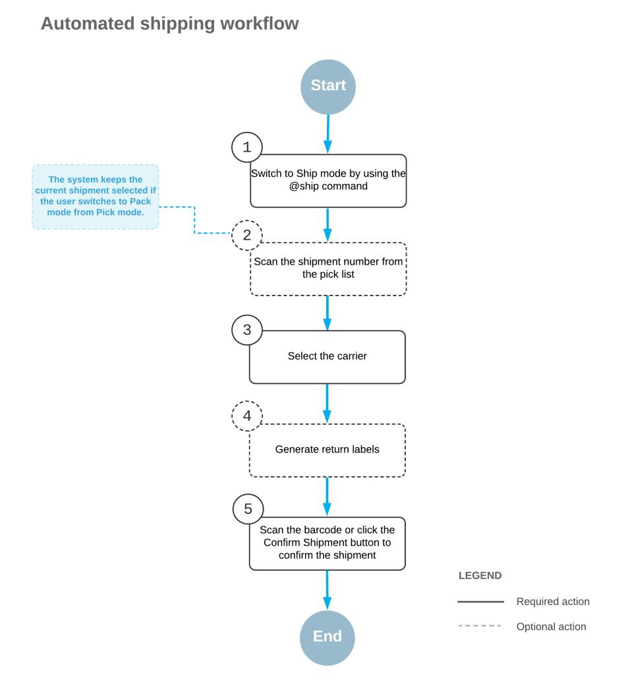

To specify shipping options for the shipment that is currently being processed, you perform the following steps:

1. *Switch to Ship mode*.

You open the *[Pick, Pack, and Ship](https://help-2025r1.acumatica.com/Help?ScreenId=ShowWiki&pageid=0d7f07e0-56a3-40a9-8cff-45bed542ae94)* (SO302020) form and switch to Ship mode by scanning or entering *@ship* barcode.

Ship mode is not available in the Acumatica mobile app.

2. *Scan the shipment number*.

To start automated processing, you scan the reference number of the shipment to be processed. In the **Shipment Nbr.** box, the system inserts the reference number of the document that is currently selected for processing. (If you have switched to Ship mode from Pick mode or Pack mode with a document selected, the document is selected automatically.)

The boxes for the shipment are shown in the **Packages** table.

3. *Select the carrier rate*.

In the **Carrier Rates** table, you select the unlabeled check box in the row of the carrier rate to be used for shipping.

4. Optional: *Generate return labels*.

On the table toolbar of the **Carrier Rates** table, click **Get Return Labels** to generate return labels for the shipment.

5. *Confirm the shipment*.

To confirm the processed shipment, you scan the \*confirm\*shipment barcode, or click **Confirm Shipment** on the form toolbar.

# **Automated Receiving and Putting Away Operations**

In Acumatica ERP, you can process the receiving and putting away of items in an automated mode by using barcode scanners or mobile devices with a scanning option on the *[Receive](https://help-2025r1.acumatica.com/Help?ScreenId=ShowWiki&pageid=fd850b21-96b8-4c2c-8c4a-f79272d8cacc) and Put Away* (PO302020) form or the Receive and Put Away screen in the Acumatica mobile app. This functionality becomes available when the *Receiving* feature is enabled on the *[Enable/Disable Features](https://help-2025r1.acumatica.com/Help?ScreenId=ShowWiki&pageid=c1555e43-1bc5-4f6f-ba9d-b323f94d8a6b)* (CS100000) form.

The topics of this chapter describe the workflow that you can configure to support the automated receiving of items to the receiving location and then the items being put away in storage locations.

# **Receiving and Putting Away Operations: General Information**

If the *Receiving* feature is enabled on the *[Enable/Disable Features](https://help-2025r1.acumatica.com/Help?ScreenId=ShowWiki&pageid=c1555e43-1bc5-4f6f-ba9d-b323f94d8a6b)* (CS100000) form, you can perform the automated receiving and putting away of inventory items by using a barcode scanner or a mobile device with a scanning option.

In this topic, you will read about the workflow for the automated receiving and putting away of inventory items in Acumatica ERP. The workflow in this topic is based on the assumption that your system has the recommended configuration described in *Receiving and Putting Away Operations: [Implementation](#page-79-1) Checklist*.

#### **Learning Objectives**

In this chapter, you will do the following:

- Enable the needed system features
- Specify the minimum required configuration for the automated receiving and putting away workflow
- Learn the recommended settings that you can specify to make the system fit your business requirements
- Learn about the automated receiving and putting away, purchase return, and receipt verification workflows
- Receive items to a receiving location of a warehouse in an automated mode and verify the received items and item quantities
- Put away items in their storage locations in an automated mode

#### **Applicable Scenario**

You can perform the automated receiving and putting away of inventory items if in your company's warehouses, all purchased items are received to a dedicated location. A warehouse worker receives items from a purchase receipt to this location. Then the warehouse worker puts away the received items in the locations where the items will be stored. To track the operations as they are being performed, the worker scans the appropriate barcodes by using a barcode scanner or mobile device.

You can perform automated receiving of items for purchase orders with the *Open* status, and purchase receipts with the *Balanced* status. You can perform the automated putting away of items for purchase receipts with the *Released* status.

#### **Receipt of Extra Quantity**

If the actual quantity of received items is more than the quantity specified in the processed purchase document, you can process the receipt of these items as an automated operation as well. If you scan a quantity that exceeds the quantity in the line that is currently being processed, the system requests confirmation for adding this quantity. If you confirm this addition with the \*ok barcode or the **OK** button, the system adds a new line with the extra quantity to the processed purchase receipt, and shows this line in the table on the **Receive** tab of the *[Receive](https://help-2025r1.acumatica.com/Help?ScreenId=ShowWiki&pageid=fd850b21-96b8-4c2c-8c4a-f79272d8cacc)*

*and Put [Away](https://help-2025r1.acumatica.com/Help?ScreenId=ShowWiki&pageid=fd850b21-96b8-4c2c-8c4a-f79272d8cacc)* (PO302020) form. The line with the extra quantity is not linked to the purchase order for which the purchase receipt was prepared.

#### **Workflow for the Automated Receipt of Items**

The automated processing of receiving items involves the actions shown in the following diagram.

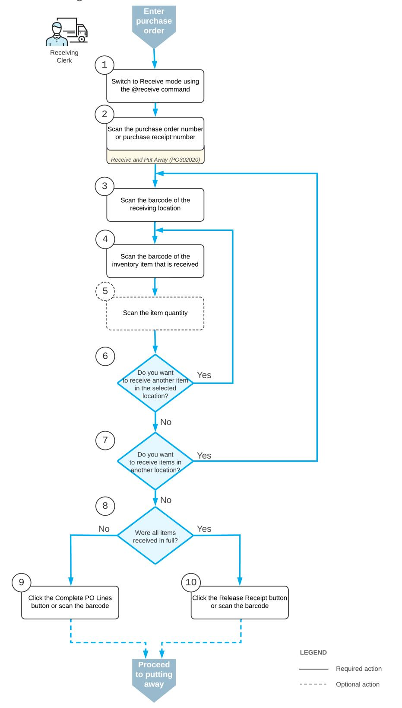

To process the receipt of items (and to use Receive mode), you perform the following steps:

1. *Switch to Receive mode*.

You can switch to Receive mode by scanning the @receive barcode.

2. *Scan the document number*.

To start the automated processing, you scan the reference number of the purchase order or purchase receipt to be processed. The system displays the lines of the scanned document in the table of the *[Receive](https://help-2025r1.acumatica.com/Help?ScreenId=ShowWiki&pageid=fd850b21-96b8-4c2c-8c4a-f79272d8cacc) and Put [Away](https://help-2025r1.acumatica.com/Help?ScreenId=ShowWiki&pageid=fd850b21-96b8-4c2c-8c4a-f79272d8cacc)* (PO302020) form. If you have scanned the purchase order number, the system creates and saves the related purchase receipt automatically. In the **Receipt Nbr.** box, the system inserts the reference number of the receipt that is currently selected for processing.

If the purchase order has 15 or fewer lines, the system creates a related purchase receipt and adds the lines of the order to the receipt automatically. If the purchase order has more than 15 lines, the created purchase receipt does not have any lines. The receipt lines are added when you scan the barcodes of the items of the purchase order.

3. *Scan the barcode of the receiving location*.

You scan the barcode of the warehouse location where the items are being received.

4. *Scan the item barcode*.

When you scan the barcode of the received item, the system searches for the item in the lines of the document that is currently selected. If the item is found, the system highlights the line in bold.

5. Optional: *Scan the item quantity*.

To change the received quantity in the line that is currently being processed, you switch on Quantity Editing mode by scanning or entering the \*qty barcode, and manually enter the quantity in the UOM defined by the barcode of the scanned item.

The system updates the quantity of the item in the purchase receipt on the *[Purchase Receipts](https://help-2025r1.acumatica.com/Help?ScreenId=ShowWiki&pageid=d9901c8d-486d-45ed-8088-ea3d8ee3af19)* (PO302000) form only aer you release this purchase receipt on the *[Receive](https://help-2025r1.acumatica.com/Help?ScreenId=ShowWiki&pageid=fd850b21-96b8-4c2c-8c4a-f79272d8cacc) and Put Away* form. If the received quantity of the item on the *[Receive](https://help-2025r1.acumatica.com/Help?ScreenId=ShowWiki&pageid=fd850b21-96b8-4c2c-8c4a-f79272d8cacc) and Put Away* form differs from the quantity of the item on the *[Purchase Receipts](https://help-2025r1.acumatica.com/Help?ScreenId=ShowWiki&pageid=d9901c8d-486d-45ed-8088-ea3d8ee3af19)* form, you need to verify if the purchase receipt is released on the *[Receive](https://help-2025r1.acumatica.com/Help?ScreenId=ShowWiki&pageid=fd850b21-96b8-4c2c-8c4a-f79272d8cacc) and Put Away* form.

6. *Receive another item*.

If you need to receive at least one other item for the document currently being processed, you return to scanning the item barcode (that is, return to Step 4) and repeat the process for the item.

7. *Receive items in another location*.

If items must be received in another warehouse location, you scan the barcode of this location (return to Step 3) and repeat the process for the next location.

8. *Complete the receiving process*.

If you have finished the receiving operation but not all items have been received for the purchase receipt (and they will not be received in the future), you scan the \*complete\*polines barcode, or click the **Complete PO Lines** button. The system marks all purchase receipt lines as completed and releases the purchase receipt.

If you have finished the receiving operation and all items have been received for the purchase receipt (or the items were received partially and more items will be received in the future), you scan the \*release barcode or click the **Release Receipt** button. The system does not mark partially received lines as completed and releases the purchase receipt on the *[Purchase Receipts](https://help-2025r1.acumatica.com/Help?ScreenId=ShowWiki&pageid=d9901c8d-486d-45ed-8088-ea3d8ee3af19)* form.

#### **Workflow for the Automated Putting Away of Items**

The automated processing of putting away items involves the actions shown in the following diagram.

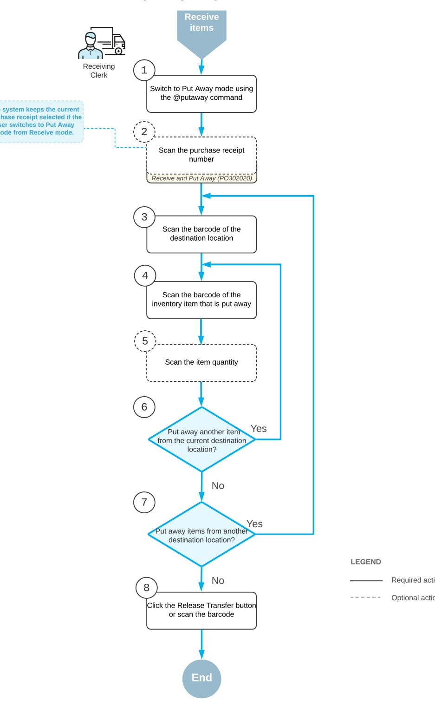

To process the putting away of items by using Put Away mode, you perform the following steps:

1. *Switch to Put Away mode*.

You can switch to Put Away mode by scanning the @putaway barcode.

2. *Scan the document number*.

To start the automated processing, you scan the reference number of the released purchase receipt to be processed. (If you switch to Put Away mode from Receive mode with a document selected, the system selects the document automatically.) The system displays the lines of the scanned document in the table of the *[Receive](https://help-2025r1.acumatica.com/Help?ScreenId=ShowWiki&pageid=fd850b21-96b8-4c2c-8c4a-f79272d8cacc) and Put Away* (PO302020) form. In the **Receipt Nbr.** box, the system inserts the reference number of the document that is currently selected for processing.

3. *Scan the barcode of the destination location*.

You scan the barcode of the destination location in which you are putting away items. If the items of a particular line are put away in multiple locations, the system creates line splits for the line. You can review the IDs of the locations to which the items are put away by clicking**Transfer Allocations** on the table toolbar of the **Put Away** tab.

Once you have specified the destination location, the system automatically creates a single-step inventory transfer document that reflects the movement of the items from the receiving location to the storage location.

4. *Scan the barcode of the item*.

When you scan the barcode of the received item, the system searches for the item in the lines of the document that is currently selected. To indicate the line or lines with the scanned barcode, the system selects the **Matched** check box in these lines. The system highlights the lines in bold if they are processed partially, and in green if they are processed in full.

5. Optional: *Scan the item quantity*.

To change the quantity being put away in the line that is currently being processed, you switch to Quantity Editing mode by scanning or entering the \*qty barcode, and manually enter the quantity in the UOM defined by the barcode of the scanned item.

6. *Scan another item*.

If at least one other item needs to be put away, you return to scanning the barcode of the item (that is, return to Step 4) and repeat the process for the item.

7. *Scan another destination location*.

If items must be transferred to another destination location, you scan the barcode of this location (return to Step 3) and repeat the process.

8. *Complete the process of putting items away*.

When you have finished the operation of putting away items, you scan the \*release barcode or click the **ReleaseTransfer** button. The system releases the inventory transfer document that was prepared during the automated operation; the items are moved to the destination locations.

# **Receiving and Putting Away Operations: Implementation Checklist**

This topic provides details you can use to ensure that the system is configured properly for the automated receiving and putting away of items.

#### **Prerequisites**

Before you start configuring automated warehouse operations, you should make sure that the needed features have been enabled, settings have been specified, and entities have been created, as summarized in the following checklist.

| Form                                                                       | Criteria to Check                                                                                                                                                                                                                                                                    |
|----------------------------------------------------------------------------|--------------------------------------------------------------------------------------------------------------------------------------------------------------------------------------------------------------------------------------------------------------------------------------|
| Purchase Orders Preferences (PO101000) Inventory Preferences (IN101000) | Make sure that all necessary settings related to inven tory and order management have been specified, as described in Configuration of Order Management: Gen eral Information.                                                                                              |
| Warehouses (IN204000)                                                      | Make sure that the following entities have been creat ed: • The required warehouses, as described in Ware houses: Implementation Activity. • The required locations, as described in Warehouse Locations and Single-Step Transfers: Implementation Activity. |
| Stock Items (IN202500)                                                     | Make sure that the required stock items have been cre ated, as described in Stock Items: Implementation Activ ity.                                                                                                                                                             |

#### **Minimum Workflow Settings**

Before you start receiving and putting away items for shipments by using a barcode scanner or other device, you should make sure the needed features have been enabled, settings have been specified, and entities have been created, as summarized in the following table.

| Form                                                                                | Criteria to Check                                                                                                                                                     |
|-------------------------------------------------------------------------------------|-----------------------------------------------------------------------------------------------------------------------------------------------------------------------|
| Enable/Disable Features (CS100000)                                                  | Make sure that the following features are enabled: • Multiple Warehouse Locations • Warehouse Management                                                  |
|                                                                                     | • Receiving                                                                                                                                                        |
| The General tab of the Purchase Orders Preferences (PO101000) form               | Make sure that Open Quantity is selected in the De fault Receipt Quantity box in the Other section.                                                                |
| The Warehouse Management tab of the Purchase Or ders Preferences (PO101000) form | Make sure that the Display the ReceiveTab check box is selected in the Receiving Workflow section.                                                                 |
|                                                                                     | With this check box selected, the receiving workflow is configured so that a user processes the receipt of the items to the receiving location in Receive mode. |
| The Cross-Reference tab of the Stock Items (IN202500) form                       | Make sure that the barcodes have been specified for each item.                                                                                                     |

#### **Recommended Workflow Settings**

We recommend that you configure the workflow for the automated receiving and putting away items by specifying the following settings on the **Warehouse Management** tab of the *[Purchase Orders Preferences](https://help-2025r1.acumatica.com/Help?ScreenId=ShowWiki&pageid=13d09c43-8696-4f92-ad9b-3d0209ee3d9b)* (PO101000) form.

| Element                        | State    | Description                                                                                                                                                                                                                               |
|--------------------------------|----------|-------------------------------------------------------------------------------------------------------------------------------------------------------------------------------------------------------------------------------------------|
| Display the Put AwayTab        | Selected | With this check box selected, the user processes the putting away of items from the receiving location to the locations where the items will be stored in Put Away mode.                                                         |
| Display the Return Tab         | Selected | With this check box selected, the user processes the returning of items from the re ceiving location to the vendor when they are working in Return mode.                                                                         |
| Display the ReceiveTransferTab | Selected | With this check box selected, the user processes in the receiving of items to the re ceiving location when they are working in Re ceive Transfer mode.                                                                           |
| Display theScan LogTab         | Selected | With this check box selected, the system will display the Scan Log tab on the Receive and Put Away (PO302020) form; on this tab, a user can review the list of operations that have been performed during the past two weeks. |
| Explicit Line Confirmation     | Cleared  | With this check box cleared, the system does not request user confirmation for each line when the user is performing automated oper ations in Receive mode and Put Away mode.                                                    |
| UseSingle Receiving Location   | Selected | With this check box selected, the system asks for the receiving location only once for each purchase receipt being processed; all items of this purchase receipt are received to this loca tion.                              |

### **Printing Settings**

If the *DeviceHub* feature is enabled on the *[Enable/Disable Features](https://help-2025r1.acumatica.com/Help?ScreenId=ShowWiki&pageid=c1555e43-1bc5-4f6f-ba9d-b323f94d8a6b)* (CS100000) form, you can configure the printing of documents by using the following settings on the **Warehouse Management** tab of the *[Purchase Orders](https://help-2025r1.acumatica.com/Help?ScreenId=ShowWiki&pageid=13d09c43-8696-4f92-ad9b-3d0209ee3d9b) [Preferences](https://help-2025r1.acumatica.com/Help?ScreenId=ShowWiki&pageid=13d09c43-8696-4f92-ad9b-3d0209ee3d9b)* (PO101000) form.

| Element                                   | State    | Description                                                                                                                        |
|-------------------------------------------|----------|------------------------------------------------------------------------------------------------------------------------------------|
| Print Inventory Labels Automati cally  | Selected | With this check box selected, the system au tomatically prints the inventory label for the purchase receipt being processed. |
| Print Purchase Receipts Auto matically | Selected | With this check box selected, the system au tomatically prints the processed purchase re ceipts.                             |

#### **Other Settings That Affect the Workflow**

You can affect the workflow for the automated receiving and putting away of items by specifying additional settings on the *[Purchase Orders Preferences](https://help-2025r1.acumatica.com/Help?ScreenId=ShowWiki&pageid=13d09c43-8696-4f92-ad9b-3d0209ee3d9b)* (PO101000) form:

- To speed up the entry of quantities in the lines being processed, select the **Use Default Quantity** check box. When this check box is selected, the**Set Qty** button on the form toolbar of the *[Receive](https://help-2025r1.acumatica.com/Help?ScreenId=ShowWiki&pageid=fd850b21-96b8-4c2c-8c4a-f79272d8cacc) and Put Away* (PO302020) form becomes available before you scan the barcode of an item. You click this button to specify the default quantity of the item. Aer the default quantity is specified, the system inserts it in the **Received Qty.** or **Put Away Qty.** column each time you scan the barcode of the item.
- To make the system automatically specify the default receiving location of a warehouse for all receipt documents being processed, select the **Default Receiving Location** check box.
- To make the system request the receiving location for each item being processed in Receive mode, clear the **UseSingle Receiving Location** check box, and select the **Request Location for Each Item on Receiving** check box.

To make the system request the location to which each item must be put away in Put Away mode, clear the **UseSingle Receiving Location** check box, and select the **Request Location for Each Item on Putting Away** check box.

• To give users the ability to perform additional verification of a purchase receipt to ensure the correctness of its item quantities, select the**Verify Receipts Before Release** check box. When this check box is selected, a user can confirm a purchase receipt on the *[Receive](https://help-2025r1.acumatica.com/Help?ScreenId=ShowWiki&pageid=fd850b21-96b8-4c2c-8c4a-f79272d8cacc) and Put Away* form but cannot release it. A user can release the receipt on the *[Purchase Receipts](https://help-2025r1.acumatica.com/Help?ScreenId=ShowWiki&pageid=d9901c8d-486d-45ed-8088-ea3d8ee3af19)* (PO302000) form.

When the **Verify Receipts Before Release** check box is selected, the **Keep Zero Lines on Receipt Confirmation** check box becomes available for selection. With this check box selected, the system will keep lines with a receipt quantity of 0 in a purchase receipt on the *[Purchase Receipts](https://help-2025r1.acumatica.com/Help?ScreenId=ShowWiki&pageid=d9901c8d-486d-45ed-8088-ea3d8ee3af19)* form aer a user has confirmed the receipt of items.

#### **Known Process Limitations**

The following limitations apply to the automated receiving and putting away of items:

- Non-stock items cannot be processed on the *[Receive](https://help-2025r1.acumatica.com/Help?ScreenId=ShowWiki&pageid=fd850b21-96b8-4c2c-8c4a-f79272d8cacc) and Put Away* (PO302020) form. If you need to receive a non-stock item, you create and process a separate receipt for this item on the *[Purchase Receipts](https://help-2025r1.acumatica.com/Help?ScreenId=ShowWiki&pageid=d9901c8d-486d-45ed-8088-ea3d8ee3af19)* (PO302000) form.
- Multiple users cannot simultaneously process unreleased transfer receipts with partial item quantities on the *[Receive](https://help-2025r1.acumatica.com/Help?ScreenId=ShowWiki&pageid=fd850b21-96b8-4c2c-8c4a-f79272d8cacc) and Put Away* form. However, if you have created and released a transfer receipt with a partial item quantity, the remaining quantity can be received in another transfer receipt.

# **Receiving and Putting Away Operations: To Receive and Put Away Items**

In the following activity, you will learn how to perform the receiving and putting away of items by using the *[Receive](https://help-2025r1.acumatica.com/Help?ScreenId=ShowWiki&pageid=fd850b21-96b8-4c2c-8c4a-f79272d8cacc) and Put [Away](https://help-2025r1.acumatica.com/Help?ScreenId=ShowWiki&pageid=fd850b21-96b8-4c2c-8c4a-f79272d8cacc)* (PO302020) form.

This activity is based on the *U100* dataset. If you are using another dataset, or if any system settings have been changed in *U100*, these changes can affect the workflow of the activity and the results of the processing. To avoid any issues, restore the *U100* dataset to its initial state.

#### **Story**

Suppose that you are a warehouse worker in the wholesale warehouse of the SweetLife Fruits & Jams company. Your warehouse manager gives you a task to receive the purchased fruits (80 pounds of apples and 60 pounds of oranges) in the warehouse. In your organization, the receive and put away workflow is used, which means that you receive the purchased items at a receiving location of the warehouse, and then go through the warehouse locations and put away the items in the locations where the fruits are stored. Also suppose that you are putting away the apples and part of the oranges in one fruit location, and the rest of the oranges in another fruit location.

#### **Configuration Overview**

In the *U100* dataset, the following tasks have been performed to support this activity:

- On the *[Enable/Disable Features](https://help-2025r1.acumatica.com/Help?ScreenId=ShowWiki&pageid=c1555e43-1bc5-4f6f-ba9d-b323f94d8a6b)* (CS100000) form, the following features have been enabled in the *Inventory and Order Management* group of features:
  - *Multiple Warehouse Locations*
  - *Warehouse Management*
  - *Receiving*
- On the **Warehouse Management** tab of the *[Purchase Orders Preferences](https://help-2025r1.acumatica.com/Help?ScreenId=ShowWiki&pageid=13d09c43-8696-4f92-ad9b-3d0209ee3d9b)* (PO101000) form, the **Display the ReceiveTab** and **Display the Put AwayTab** check boxes have been selected.
- On the *[Warehouses](https://help-2025r1.acumatica.com/Help?ScreenId=ShowWiki&pageid=264b0ef7-2b6c-40b4-a7d9-f1a5e067939b)* (IN204000) form, the *WHOLESALE* warehouse has been created. On the **Locations** tab, the following warehouse locations have been defined: *MAIN*, *F1S2*, and *F2S2*.
- On the *[Stock Items](https://help-2025r1.acumatica.com/Help?ScreenId=ShowWiki&pageid=77786a70-1f1e-4d63-ad98-96f98e4fcb0e)* (IN202500) form, the following stock items have been created, and the corresponding alternate IDs with the *Barcode* type have been defined on the **Cross-Reference** tab:

For simplicity, in this activity, the alternate IDs will be further referred to as *barcodes*.

- *APPLES*, which has the *AP1LB* barcode
- *ORANGES*, which has the *OR1LB* barcode
- On the *[Purchase Orders](https://help-2025r1.acumatica.com/Help?ScreenId=ShowWiki&pageid=5565686c-96c4-4bfa-a51d-9a2566baa808)* (PO301000) form, the *000022* purchase order to the *ALLFRUITS* vendor has been created.
- On the *[Purchase Receipts](https://help-2025r1.acumatica.com/Help?ScreenId=ShowWiki&pageid=d9901c8d-486d-45ed-8088-ea3d8ee3af19)* (PO302000) form, the *000018* purchase receipt has been prepared for this purchase order.

#### **Process Overview**

In this activity, acting as a warehouse worker, you will do the following:

- 1. Open the *[Receive](https://help-2025r1.acumatica.com/Help?ScreenId=ShowWiki&pageid=fd850b21-96b8-4c2c-8c4a-f79272d8cacc) and Put Away* (PO302020) form, switch to Receive mode, and scan the number of the purchase receipt. Then you will receive the items and scan their barcodes and quantities. Aer you finish receiving items, you will release the purchase receipt.
- 2. On the same form, switch to Put Away mode and scan the barcodes of the warehouse locations to which the items are being put away, and scan the item barcodes and quantities. Aer you finish putting away items, you will release the transfer receipt.
- 3. Open the *[Transfers](https://help-2025r1.acumatica.com/Help?ScreenId=ShowWiki&pageid=ea1539b6-fafa-443e-8b49-cd1ced95389f)* (IN304000) form and review the generated transfer document.

In any working mode, you enter a command or barcode by typing it in the**Scan** box and pressing Enter. In production systems, you will scan the appropriate barcodes rather than manually entering them.

#### **System Preparation**

Before you start the automated receiving and putting away operations, you need to perform the following instructions:

- 1. Sign in to a company with the *U100* dataset preloaded as a warehouse worker with the *perkins* username and the *123* password.
- 2. On the **Warehouse Management** tab of the *[Purchase Orders Preferences](https://help-2025r1.acumatica.com/Help?ScreenId=ShowWiki&pageid=13d09c43-8696-4f92-ad9b-3d0209ee3d9b)* (PO101000) form, make sure that the **Verify Receipts Before Release** check box is cleared.

#### **Step 1: Receiving Items in the Receiving Location**

To record that items have been received in the receiving location of the warehouse, do the following:

- 1. Open the *[Receive](https://help-2025r1.acumatica.com/Help?ScreenId=ShowWiki&pageid=fd850b21-96b8-4c2c-8c4a-f79272d8cacc) and Put Away* (PO302020) form and make sure the **Receive** tab is opened.
- 2. In the **Scan** box, enter 000018, which is the reference number of the purchase receipt for which you are receiving and putting away items. Press Enter. The system loads the purchase receipt lines to the table, and shows the reference number of the purchase receipt that is currently being processed in the **Receipt Nbr.** box of the Summary area.
- 3. Enter MAIN to select the location in which you are receiving the items.
- 4. Enter AP1LB to select the item being received. (*AP1LB* is the barcode for *APPLES*, one pound of apples, which is included in the *000018* receipt.)

The system highlights the first line of the purchase receipt in bold and sets the **Received Qty.** to *1*.

- 5. Set the quantity of the item to 80 as follows:
  - a. On the form toolbar, click**Set Qty**. The system prompts you to enter the item quantity.
  - b. In the **Scan** box, enter 80. The system highlights the first line of the purchase receipt in green sets the **Received Qty.** to *80*.
- 6. Enter OR1LB to select the item being received. (*OR1LB* is the barcode for *ORANGES*, one pound of oranges, which is included in the *000018* receipt.)

The system highlights the second line of the purchase receipt in bold and sets the **Received Qty.** to *1*.

- 7. Set the quantity of the current line to 60.
- 8. On the form toolbar, click **Release Receipt** to release the purchase receipt. The system releases the purchase receipt and generates the inventory receipt transaction to record the receipt of items in the *MAIN* location of the warehouse.

You have received the items for the purchase receipt, and now you can proceed with putting away the received items in the storage locations.

#### **Step 2: Putting Away the Received Items in the Storage Locations**

To record that items are being put away from the receiving location of the warehouse in the locations where these items will be stored, do the following:

- 1. While you are still on the *[Receive](https://help-2025r1.acumatica.com/Help?ScreenId=ShowWiki&pageid=fd850b21-96b8-4c2c-8c4a-f79272d8cacc) and Put Away* (PO302020) form with the *000018* purchase receipt selected, in the **Scan** box, enter @putaway to switch to Put Away mode.
- 2. Enter F1S2 to select the location to which the items are being put away.
- 3. Enter AP1LB to select the item to be put away in this location. The system highlights the first line of the purchase receipt in bold and specifies *1* as the **Put Away Qty.** In the Summary area, the**Transfer Ref. Nbr.** box shows the reference number of the inventory transfer transaction that the system automatically creates to record the movement of items from the receiving location to the storage locations.
- 4. Set the quantity of the item to 80 as follows:
  - a. On the form toolbar, click**Set Qty**. The system prompts you to enter the item quantity.
  - b. In the **Scan** box, enter 80.

The system highlights the first line of the purchase receipt in green and specifies *80* as the **Put Away Qty.**, indicating that 80 pounds of apples have been put away on the second shelf of the first refrigerator location.

- 5. Enter OR1LB to select the item being put away.
- 6. Set the quantity of the line to 40, indicating that 40 pounds of oranges have been put away on the second shelf of the first refrigerator location.
- 7. Enter F2S2 to select another location to which the rest of the oranges is being put away.
- 8. Enter OR1LB to select the item being put away.

The system shows *<SPLIT>* in the **To Location ID** column, indicating that the received quantity of the item has been distributed over multiple locations during the put-away process.

- 9. Set the quantity to 20, indicating that 20 pounds of oranges have been put away on the second shelf of the second refrigerator location. Now all items from the purchase receipt have been put away in the appropriate storage locations, and these actions have been reflected in the system.
- 10.On the form toolbar, click **ReleaseTransfer**.

#### **Step 3: Reviewing the Inventory Transfer**

To review the results of the receiving and putting away operations and make sure that the transfer of the items has been recorded in the system, do the following:

- 1. On the **Transfers** tab of the *[Receive](https://help-2025r1.acumatica.com/Help?ScreenId=ShowWiki&pageid=fd850b21-96b8-4c2c-8c4a-f79272d8cacc) and Put Away* (PO302020) form, click the number of the transfer that has been generated as the result of the previous step in the **Reference Nbr.** column.
- 2. On the *[Transfers](https://help-2025r1.acumatica.com/Help?ScreenId=ShowWiki&pageid=ea1539b6-fafa-443e-8b49-cd1ced95389f)* (IN304000) form, which opens, review the details of the inventory transfer. Make sure that the document has been released.

|                                                                                                                                                                                                                                                                                                                         | <b>Transfers</b> 뭐 | 000108 $\boxdot$ | 面 $+$ $\Omega$            | n. $\overline{\mathbf{K}}$ $\checkmark$ | $\sim$ $\sim$ $\sim$ $\rightarrow$ | $\geq$ $\cdots$       |                                 |            |              |                     |              | P NOTES             | <b>ACTIVITIES</b> <b>FILES</b> | TOOLS $\star$ |
|-------------------------------------------------------------------------------------------------------------------------------------------------------------------------------------------------------------------------------------------------------------------------------------------------------------------------|-----------------------|---------------------|---------------------------------|-----------------------------------------------|---------------------------------------|--------------------------|---------------------------------|------------|--------------|---------------------|--------------|---------------------|-----------------------------------|---------------|
| Reference Nbr.: $\varphi$ 000108 Warehouse ID: WHOLESALE - Wholesale Warehouse Status: Released To Warehouse  WHOLESALE - Wholesale Warehouse 1-Step Transfer Type: External Ref.: Date: 1/30/2025 Description: Post Period: 01-2025 <b>DETAILS</b> <b>FINANCIAL</b> |                       |                     |                                 |                                               |                                       |                          | Total Qty.:                     | 140.00     |              |                     |              | $\hat{\phantom{a}}$ |                                   |               |
|                                                                                                                                                                                                                                                                                                                         | Ò                     | $\div$              | <b>LINE DETAILS</b> $\times$ | ADD ITEMS                                     |                                       | <b>INVENTORY SUMMARY</b> | $\mathbf{x}$ $\vdash$        | 土          |              |                     |              |                     |                                   |               |
|                                                                                                                                                                                                                                                                                                                         | B 0                   |                     | $\Box$ Inventory ID             | Location                                      | Cost Laver Type                 | To Location ID           | To Cost Layer <b>Type</b> | <b>UOM</b> | Project      | <b>Project Task</b> | Cost Code |                     | <b>Quantity Description</b>       |               |
|                                                                                                                                                                                                                                                                                                                         | $\mathbf{0}$          |                     | <b>APPLES</b>                   | <b>MAIN</b>                                   | Normal                                | <b>F1S2</b>              | Normal                          | LB         | $\mathsf{x}$ |                     |              | 80.00               | Fresh apples 1 lb                 |               |
|                                                                                                                                                                                                                                                                                                                         | 0                     | D                   | <b>ORANGES</b>                  | <b>MAIN</b>                                   | Normal                                | <b>F1S2</b>              | Normal                          | LB         | x            |                     |              | 40.00               | Fresh oranges 1 lb                |               |
| 0 <b>ORANGES</b> D                                                                                                                                                                                                                                                                                                |                       |                     |                                 | <b>MAIN</b>                                   | Normal                                | <b>F2S2</b>              | Normal                          | LB         | $\mathsf{x}$ |                     |              | 20.00               | Fresh oranges 1 lb                |               |

*Figure: The released inventory transfer*

## **Receiving and Putting Away Operations: To Receive and Put Away Items (Mobile)**

In the following activity, you will learn how to perform the receiving and putting away of items on the Receive and Put Away screen of the Acumatica mobile app, which corresponds to the *[Receive](https://help-2025r1.acumatica.com/Help?ScreenId=ShowWiki&pageid=fd850b21-96b8-4c2c-8c4a-f79272d8cacc) and Put Away* (PO302020) form in Acumatica ERP.

In this activity, we use the Acumatica mobile app for Android devices. The appearance and functionality of the mobile app for iOS devices may differ somewhat.

This activity is based on the *U100* dataset. If you are using another dataset, or if any system settings have been changed in *U100*, these changes can affect the workflow of the activity and the results of the processing. To avoid any issues, restore the *U100* dataset to its initial state.

#### **Story**

Suppose that you are a warehouse worker in the wholesale warehouse of the SweetLife Fruits & Jams company. Your warehouse manager gives you a task to receive the purchased fruits (70 pounds of apples and 50 pounds of oranges) in the warehouse with the help of the Acumatica mobile app. In your organization, the receive and put away workflow is used, which means that you receive the purchased items at a receiving location of the warehouse, and then go through the warehouse locations and put away the items in the locations where the fruits are stored. Also suppose that you put away the apples and part of the oranges in one fruit location, and the rest of the oranges in another fruit location.

## **Configuration Overview**

In the *U100* dataset, the following tasks have been performed to support this activity:

- On the *[Enable/Disable Features](https://help-2025r1.acumatica.com/Help?ScreenId=ShowWiki&pageid=c1555e43-1bc5-4f6f-ba9d-b323f94d8a6b)* (CS100000) form, the following features have been enabled in the *Inventory and Order Management* group of features:
  - *Multiple Warehouse Locations*
  - *Warehouse Management*
  - *Receiving*
- On the **Warehouse Management** tab of the *[Purchase Orders Preferences](https://help-2025r1.acumatica.com/Help?ScreenId=ShowWiki&pageid=13d09c43-8696-4f92-ad9b-3d0209ee3d9b)* (PO101000) form, the **Display the ReceiveTab** and **Display the Put AwayTab** check boxes have been selected.
- On the *[Warehouses](https://help-2025r1.acumatica.com/Help?ScreenId=ShowWiki&pageid=264b0ef7-2b6c-40b4-a7d9-f1a5e067939b)* (IN204000) form, the *WHOLESALE* warehouse has been created. On the **Locations** tab of the form, multiple warehouse locations reflecting the warehouse structure have been configured.
- On the *[Stock Items](https://help-2025r1.acumatica.com/Help?ScreenId=ShowWiki&pageid=77786a70-1f1e-4d63-ad98-96f98e4fcb0e)* (IN202500) form, the *APPLES* and *ORANGES* stock items have been created. For each stock item, barcodes have been specified on the **Cross-Reference** tab of the form.
- On the *[Purchase Orders](https://help-2025r1.acumatica.com/Help?ScreenId=ShowWiki&pageid=5565686c-96c4-4bfa-a51d-9a2566baa808)* (PO301000) form, a purchase order to the *ALLFRUITS* vendor has been created.
- On the *[Purchase Receipts](https://help-2025r1.acumatica.com/Help?ScreenId=ShowWiki&pageid=d9901c8d-486d-45ed-8088-ea3d8ee3af19)* (PO302000) form, a purchase receipt has been created for this purchase order.

#### **Process Overview**

In this activity, you will open the Receive and Put Away screen in the Acumatica mobile app, switch to Receive mode, and scan the number of the purchase order. Then you will receive the items and scan their barcodes and quantities. Aer you finish receiving the items, you will switch to Put Away mode on the same form, scan the barcodes of the warehouse locations to which the items are being put away, scan the item barcodes, and correct the quantities. Aer you finish putting away items, you will release the transfer receipt.

In any working mode, you enter a command or barcode by typing it in the Scan box and tapping Enter. In production systems, you will scan the appropriate barcodes rather than manually entering them.

#### **System Preparation**

Before you start performing the automated receiving and putting away operations, do the following:

- 1. On the **Warehouse Management** tab of the *[Purchase Orders Preferences](https://help-2025r1.acumatica.com/Help?ScreenId=ShowWiki&pageid=13d09c43-8696-4f92-ad9b-3d0209ee3d9b)* (PO101000) form, make sure that the **Verify Receipts Before Release** check box is cleared.
- 2. Make sure that you have installed the Acumatica mobile app on your mobile device.
- 3. Launch the app.

- 4. Enter the URL and optional name of the Acumatica ERP instance with the *U100* dataset preloaded (for example, *https://your.acumatica.site.com*), and tap **Next**.
- 5. Enter the credentials of the user account you will use in this activity: the *perkins* username and the *123* password.
- 6. Tap**Sign In** to enter the site.

The instructions in the activity steps below may slightly differ in the Acumatica mobile app depending on whether the device is running iOS or Android.

#### **Step 1: Receiving Items in the Receiving Location**

To record the receipt of items in the warehouse, do the following in the Acumatica mobile app on your mobile device:

- 1. On the main menu of the mobile app, tap the **Warehouse Management > Receive and Put Away** tile to view the Receive and Put Away screen.
- 2. In the top pane, make sure Receive mode is in use.
- 3. Scan the 000019 barcode, which is the reference number of the purchase receipt for which you are receiving items. The system loads the purchase receipt lines and shows the reference number of the purchase receipt in the top pane.
- 4. Scan the MAIN barcode to select the location to which you are receiving the items.
- 5. Scan the AP1LB barcode to select the item being received.
- 6. Set the quantity of the item to 70 as follows:
  - a. At the bottom of the screen, tap**Set Qty** to change the quantity of the current line.
  - b. Enter 70. The system specifies *70* as the received quantity.

In this activity, you are specifying the quantity in Quantity Editing mode to save time. In a production environment, warehouse workers would instead scan the barcode of each item included in the document.

- 7. Scan the OR1LB barcode to select the next item being received.
- 8. Set the quantity of the item to 50. The system inserts *50* as the received quantity.
- 9. At the bottom of the screen, tap **Review** to view the items that have been added to the receipt.
- 10.Go back to the previous screen.
- 11.In the top right corner of the screen, tap **More > Release Receipt**. The system releases the purchase receipt and generates the inventory receipt transaction to record the receipt of items to the *MAIN* location of the warehouse.

You have received the items for the purchase receipt, and now you can proceed with putting away the received items in the storage locations.

#### **Step 2: Putting Away the Received Items in the Storage Locations**

To record that the received items are being put away in the appropriate locations, do the following in the Acumatica mobile app:

- 1. While you are still viewing the Receive and Put Away screen on your mobile device, at the bottom of the screen, tap **Change Mode > Put Away** to switch to Put Away mode.
- 2. Scan the F1S2 barcode to select the location to which the items are being put away.

- 3. Scan the AP1LB barcode to select the item to be put away in this location. The system specifies *1* as the put away quantity. On the top pane, the**Transfer Nbr.** box shows the reference number of the inventory transfer transaction that the system automatically created to record the movement of items from the receiving location to the storage locations.
- 4. Set the quantity of the item to 70 as follows:
  - a. At the bottom of the screen, tap**Set Qty** to change the quantity of the current line.
  - b. Enter 70. The system specifies *70* as the put away quantity, indicating that 70 pounds of apples have been put away on the second shelf of the first fruit location.
- 5. Scan the OR1LB barcode to select the item being put away.
- 6. Set the quantity of the item to 30. The system inserts *30* as the put away quantity, indicating that 30 pounds of oranges have been put away on the second shelf of the first fruit location.
- 7. Enter F2S2 to select another location to which the rest of the oranges will be put away.
- 8. Enter OR1LB to select the item being put away.
- 9. Set the quantity of the item to 20. The system specifies *20* as the put away quantity, indicating that 20 pounds of oranges have been put away on the second shelf of the second fruit location. Now all items from the purchase receipt have been put away in the appropriate storage locations.
- 10.At the bottom of the screen, tap **Review** to view the list of items in the transfer. For the *ORANGES* item, notice that the system shows *<SPLIT>* as the destination location, indicating that the items have been put away in multiple locations.
- 11.Go back to the previous screen.
- 12.In the top right corner of the screen, tap **More > ReleaseTransfer** to release the transfer.

You have successfully received the items to the receiving location and put away the items in the appropriate locations.

# **Receiving and Putting Away Operations: Receipt Verification**

If the *Receiving* feature is enabled on the *[Enable/Disable Features](https://help-2025r1.acumatica.com/Help?ScreenId=ShowWiki&pageid=c1555e43-1bc5-4f6f-ba9d-b323f94d8a6b)* (CS100000) form, during the automated receiving of inventory items, you can perform additional verification of a purchase receipt to ensure the correctness of its items and item quantities. When the**Verify Receipts Before Release** check box is selected on the *[Purchase Orders](https://help-2025r1.acumatica.com/Help?ScreenId=ShowWiki&pageid=13d09c43-8696-4f92-ad9b-3d0209ee3d9b) [Preferences](https://help-2025r1.acumatica.com/Help?ScreenId=ShowWiki&pageid=13d09c43-8696-4f92-ad9b-3d0209ee3d9b)* (PO101000) form, a warehouse worker can no longer release a purchase receipt on the *[Receive and Put](https://help-2025r1.acumatica.com/Help?ScreenId=ShowWiki&pageid=fd850b21-96b8-4c2c-8c4a-f79272d8cacc) [Away](https://help-2025r1.acumatica.com/Help?ScreenId=ShowWiki&pageid=fd850b21-96b8-4c2c-8c4a-f79272d8cacc)* (PO302020) form. Instead, the warehouse worker confirms the received quantities, which causes the receipt to be assigned the *Received* status. Then the warehouse manager (or another user responsible for the verification) verifies and releases the purchase receipt on the *[Purchase Receipts](https://help-2025r1.acumatica.com/Help?ScreenId=ShowWiki&pageid=d9901c8d-486d-45ed-8088-ea3d8ee3af19)* (PO302000) form.

If the **Keep Zero Lines on Receipt Confirmation** check box is selected on the *[Purchase Orders](https://help-2025r1.acumatica.com/Help?ScreenId=ShowWiki&pageid=13d09c43-8696-4f92-ad9b-3d0209ee3d9b) [Preferences](https://help-2025r1.acumatica.com/Help?ScreenId=ShowWiki&pageid=13d09c43-8696-4f92-ad9b-3d0209ee3d9b)* form and the received quantity of an item is 0, the receipt on the *[Purchase Receipts](https://help-2025r1.acumatica.com/Help?ScreenId=ShowWiki&pageid=d9901c8d-486d-45ed-8088-ea3d8ee3af19)* form will contain this line. When the warehouse manager verifies the purchase receipt, they will need to manually delete the lines with a quantity of 0 upon verification or adjust the quantity; the purchase receipt cannot be released if it contains any lines with a quantity of 0.

In this topic, you will read about the workflow for the automated receiving of inventory items with the additional step of purchase receipt verification in Acumatica ERP. The workflow in this topic is based on the assumption that your system has the recommended configuration described in *Receiving and Putting Away [Operations:](#page-79-1) [Implementation Checklist](#page-79-1)*.

#### **Workflow for the Automated Receipt of Items with Receipt Verification**

The automated processing of receiving items with receipt verification involves the actions shown in the following diagram.

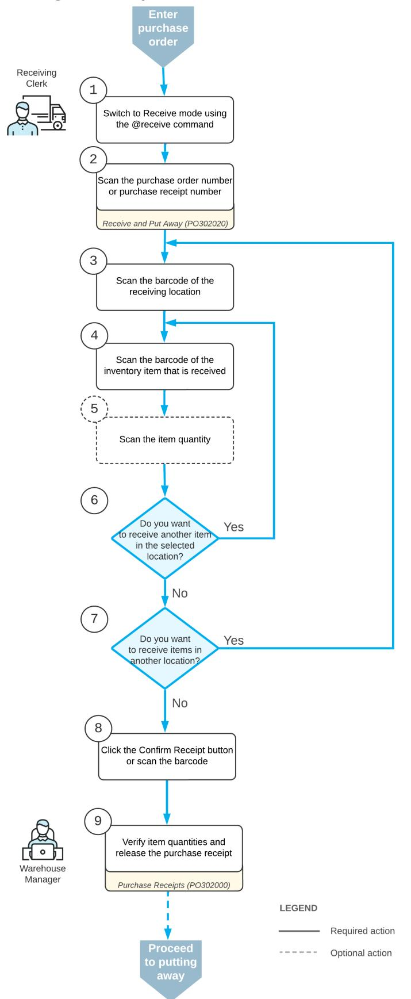

To process the receipt of items (and to use Receive mode), the warehouse employees perform the following steps:

1. Warehouse worker: *Switches to Receive mode*.

They can switch to Receive mode by scanning the @receive barcode.

2. Warehouse worker: *Scans the document number*.

To start the automated processing, they scan the reference number of the purchase order, purchase receipt, or purchase return document to be processed. (They use Return mode to process a purchase return.) The system displays the lines of the scanned document in the table of the *[Receive](https://help-2025r1.acumatica.com/Help?ScreenId=ShowWiki&pageid=fd850b21-96b8-4c2c-8c4a-f79272d8cacc) and Put Away* (PO302020) form. If they have scanned the purchase order number, the system creates and saves the related purchase receipt automatically. In the **Receipt Nbr.** box, the system inserts the reference number of the receipt or return that is currently selected for processing.

If the purchase order has 15 or fewer lines, the system creates the related purchase receipt and adds the lines of the order to the receipt automatically. If the purchase order has more than 15 lines, the created purchase receipt does not have any lines. The receipt lines are added when they scan the barcodes of the items of the purchase order.

3. Warehouse worker: *Scans the barcode of the receiving location*.

They scan the barcode of the warehouse location where the items are being received.

4. Warehouse worker: *Scans the item barcode*.

When they scan the barcode of the received item, the system searches for the item in the lines of the document that is currently selected. If the item is found, the system highlights the line in bold.

5. Warehouse worker: *Scans the item quantity* (optional).

To change the received quantity in the line that is currently being processed, they switch on Quantity Editing mode by scanning or entering the \*qty barcode, and manually enter the quantity in the UOM defined by the barcode of the scanned item.

The system updates the quantity of the item in the purchase receipt on the *[Purchase Receipts](https://help-2025r1.acumatica.com/Help?ScreenId=ShowWiki&pageid=d9901c8d-486d-45ed-8088-ea3d8ee3af19)* (PO302000) form only aer they release this purchase receipt on the *[Receive](https://help-2025r1.acumatica.com/Help?ScreenId=ShowWiki&pageid=fd850b21-96b8-4c2c-8c4a-f79272d8cacc) and Put Away* form. If the received quantity of the item on the *[Receive](https://help-2025r1.acumatica.com/Help?ScreenId=ShowWiki&pageid=fd850b21-96b8-4c2c-8c4a-f79272d8cacc) and Put Away* form differs from the quantity of the item on the *[Purchase Receipts](https://help-2025r1.acumatica.com/Help?ScreenId=ShowWiki&pageid=d9901c8d-486d-45ed-8088-ea3d8ee3af19)* form, they need to verify if the purchase receipt is released on the *[Receive](https://help-2025r1.acumatica.com/Help?ScreenId=ShowWiki&pageid=fd850b21-96b8-4c2c-8c4a-f79272d8cacc) and Put Away* form.

6. Warehouse worker: *Receives another item*.

If they need to receive at least one other item for the document currently being processed, they return to scanning the item barcode (that is, return to Step 4) and repeat the process for the item.

7. Warehouse worker: *Receives items in another location*.

If items must be received in another warehouse location, they scan the barcode of this location (return to Step 3) and repeat the process for the next location.

8. Warehouse worker: *Completes the receiving process*.

If they have finished the receiving operation and all items have been received for the purchase receipt, they scan the \*confirm\*receipt barcode or click the **Confirm Receipt** button. The system does not mark partially received lines as completed and assigns the *Received* status to the purchase receipt on the *[Purchase Receipts](https://help-2025r1.acumatica.com/Help?ScreenId=ShowWiki&pageid=d9901c8d-486d-45ed-8088-ea3d8ee3af19)* form.

9. Warehouse manager: *Verifies the receipt*.

They open the receipt on the *[Purchase Receipts](https://help-2025r1.acumatica.com/Help?ScreenId=ShowWiki&pageid=d9901c8d-486d-45ed-8088-ea3d8ee3af19)* form, check items and item quantities, correct any mistakes, and release the receipt.

# **Receiving and Putting Away Operations: To Receive Items and Verify the Receipt**

In the following activity, you will learn how to perform the receiving of items by using the *[Receive](https://help-2025r1.acumatica.com/Help?ScreenId=ShowWiki&pageid=fd850b21-96b8-4c2c-8c4a-f79272d8cacc) and Put Away* (PO302020) form and verify the receipt by using the *[Purchase Receipts](https://help-2025r1.acumatica.com/Help?ScreenId=ShowWiki&pageid=d9901c8d-486d-45ed-8088-ea3d8ee3af19)* (PO302000) form.

This activity is based on the *U100* dataset. If you are using another dataset, or if any system settings have been changed in *U100*, these changes can affect the workflow of the activity and the results of the processing. To avoid any issues, restore the *U100* dataset to its initial state.

#### **Story**

Suppose that in the wholesale warehouse of the SweetLife Fruits & Jams company, a warehouse manager sets up the receiving workflow with receipt verification. The warehouse manager gives a warehouse worker a task to receive the purchased jams (25 jars of mango jam, 50 jars of strawberry jam, and 10 jars of kiwi jam) in the warehouse.

Further suppose that the warehouse worker has received the purchased mango and strawberry jams at the receiving location of the warehouse, but no kiwi jam has been delivered. The worker leaves its quantity as *0* and confirms the receipt of the items. The warehouse manager verifies the correctness of item quantities, corrects some mistakes, and releases the receipt.

You will perform all the steps of this scenario, acting as the warehouse manager and worker.

### **Configuration Overview**

In the *U100* dataset, the following tasks have been performed to support this activity:

- On the *[Enable/Disable Features](https://help-2025r1.acumatica.com/Help?ScreenId=ShowWiki&pageid=c1555e43-1bc5-4f6f-ba9d-b323f94d8a6b)* (CS100000) form, the following features have been enabled in the *Inventory and Order Management* group of features:
  - *Multiple Warehouse Locations*
  - *Warehouse Management*
  - *Receiving*
- On the **Warehouse Management** tab of the *[Purchase Orders Preferences](https://help-2025r1.acumatica.com/Help?ScreenId=ShowWiki&pageid=13d09c43-8696-4f92-ad9b-3d0209ee3d9b)* (PO101000) form, the following check boxes have been selected:
  - **Display the ReceiveTab**
  - **Display the Put AwayTab**
- On the *[Warehouses](https://help-2025r1.acumatica.com/Help?ScreenId=ShowWiki&pageid=264b0ef7-2b6c-40b4-a7d9-f1a5e067939b)* (IN204000) form, the *WHOLESALE* warehouse has been created. On the **Locations** tab, the *MAIN* warehouse location has been defined.
- On the *[Stock Items](https://help-2025r1.acumatica.com/Help?ScreenId=ShowWiki&pageid=77786a70-1f1e-4d63-ad98-96f98e4fcb0e)* (IN202500) form, the following stock items have been created, and the corresponding alternate IDs with the *Barcode* type have been defined on the **Cross-Reference** tab:

For simplicity, the alternate IDs will be further referred to as *barcodes*.

- *MANJAM08*, which has the *MJ08* barcode
- *STRAWJAM08*, which has the *STJ08* barcode
- *KIWIJAM08*, which has the *KWJ08* barcode
- On the *[Purchase Orders](https://help-2025r1.acumatica.com/Help?ScreenId=ShowWiki&pageid=5565686c-96c4-4bfa-a51d-9a2566baa808)* (PO301000) form, the *000051* purchase order to the *ALLFRUITS* vendor has been created. (The order is dated 1/29/2025 and has 25 units of the *MANJAM08* stock item, 50 units of the *STRAWJAM08* stock item, and 10 units of the *KIWIJAM08* stock item.)

• On the *[Purchase Receipts](https://help-2025r1.acumatica.com/Help?ScreenId=ShowWiki&pageid=d9901c8d-486d-45ed-8088-ea3d8ee3af19)* (PO302000) form, the *000043* purchase receipt has been prepared for this purchase order. The purchase receipt has 25 units of the *MANJAM08* stock item, 50 units of the *STRAWJAM08* stock item, and 10 units of the *KIWIJAM08* stock item.

#### **Process Overview**

In this activity, you will do the following:

- 1. You will configure the receipt verification workflow on the *[Purchase Orders Preferences](https://help-2025r1.acumatica.com/Help?ScreenId=ShowWiki&pageid=13d09c43-8696-4f92-ad9b-3d0209ee3d9b)* (PO101000) form.
- 2. You will open the *[Receive](https://help-2025r1.acumatica.com/Help?ScreenId=ShowWiki&pageid=fd850b21-96b8-4c2c-8c4a-f79272d8cacc) and Put Away* (PO302020) form, switch to Receive mode, and scan the number of the purchase receipt. Then you will receive the items and scan their barcodes and quantities. Aer you finish receiving items, you will confirm the purchase receipt.
- 3. You will open the *[Purchase Receipts](https://help-2025r1.acumatica.com/Help?ScreenId=ShowWiki&pageid=d9901c8d-486d-45ed-8088-ea3d8ee3af19)* (PO302000) form, review and correct the quantities of the received items, and release the purchase receipt.

#### **System Preparation**

Before you start performing the automated receiving operation and verification of a purchase receipt, you should launch the Acumatica ERP website and sign in to a company with the *U100* dataset preloaded. You should sign in as a warehouse worker with the *angelo* username and the *123* password.

#### **Step 1: Setting Up Receipt Verification**

To set up receipt verification while acting in the role of a warehouse manager, do the following:

- 1. Open the *[Purchase Orders Preferences](https://help-2025r1.acumatica.com/Help?ScreenId=ShowWiki&pageid=13d09c43-8696-4f92-ad9b-3d0209ee3d9b)* (PO101000) form.
- 2. On the **Warehouse Management** tab, select the following check boxes:
  - **Verify Receipts Before Release**
  - **Keep Zero Lines on Receipt Confirmation**
- 3. On the form toolbar, click**Save**.
- 4. Sign out of the system.

#### **Step 2: Receiving Items in the Receiving Location and Confirming the Receipt**

Acting as a warehouse worker, you will record that items have been received in the receiving location of the warehouse and confirm the receipt. Do the following:

- 1. Sign in to the system as the warehouse worker by using the *perkins* username and the *123* password.
- 2. Open the *[Receive](https://help-2025r1.acumatica.com/Help?ScreenId=ShowWiki&pageid=fd850b21-96b8-4c2c-8c4a-f79272d8cacc) and Put Away* (PO302020) form, and make sure the **Receive** tab is opened.
- 3. In the **Scan** box, enter 000051. This is the reference number of the purchase order for which you are receiving and putting away items. Press Enter. The system loads the purchase receipt lines to the table. It shows the reference number of the purchase receipt that is being processed (*000043*) in the **Receipt Nbr.** box of the Summary area.
- 4. Enter MAIN to select the location in which you are receiving the items.
- 5. Enter MJ08 to select the item being received. (*MJ08* is the barcode for *MANJAM08*, one small jar of mango jam, which is included in the *000043* receipt.)

The system highlights the first line of the purchase receipt in bold and specifies *1* as the **Received Quantity**.

- 6. Set the quantity of the item to *25* as follows:
  - a. On the form toolbar, click**Set Qty**. The system prompts you to enter the item quantity.

- b. In the **Scan** box, enter 25. The system highlights the first line of the purchase receipt in green and sets the **Received Qty.** to *25*.
- 7. Enter STJ08 to select the item being received. (*STJ08* is the barcode for *STRAWJAM08*, one small jar of strawberry jam, which is included in the *000043* receipt.)

The system highlights the second line of the purchase receipt in bold and sets the **Received Qty.** to *1*.

- 8. Set the quantity of the current line to 50.
- 9. Suppose that no jars of kiwi jam have been delivered. On the form toolbar, click **Confirm Receipt**. The system confirms the purchase receipt.

As the warehouse worker, you have finished receiving the items.

10.Sign out of the system.

#### **Step 3: Verifying and Releasing the Receipt**

Acting as the warehouse manager, you will verify and release the receipt whose items have been received in the warehouse. Do the following:

- 1. Sign in to the system as the warehouse manager by using the *angelo* username and the *123* password.
- 2. Open the **Dashboards** workspace.

If the **Dashboards** menu item is not on the main menu, click the **More Items** menu item and then click the **Dashboards** tile.

- 3. In the **Dashboard: Inventory** category, click *Receiving Clerk*. The *Receiving Clerk* dashboard opens.
- 4. Click the **Receipts toVerify** widget, which shows the number of purchase receipts with the *Received* status. The Purchase Receipts for Last 12 Months (PO3020BI) inquiry form opens.
- 5. In the **Receipt Nbr.** column, click *000043* to open the purchase receipt on the *[Purchase Receipts](https://help-2025r1.acumatica.com/Help?ScreenId=ShowWiki&pageid=d9901c8d-486d-45ed-8088-ea3d8ee3af19)* (PO302000) form. Notice that the receipt has the *Received* status. Review the items and item quantities (see the following screenshot).

| <b>Purchase Receipts</b> <b>P</b> NOTES <b>ACTIVITIES</b> <b>FILES</b> TOOLS $\star$ Receipt 000043 - All Fruits Mall                                  |                                          |                     |            |  |                                |                 |                     |  |                                    |                           |                |             |              |              |           |              |                            |
|-----------------------------------------------------------------------------------------------------------------------------------------------------------------------|------------------------------------------|---------------------|------------|--|--------------------------------|-----------------|---------------------|--|------------------------------------|---------------------------|----------------|-------------|--------------|--------------|-----------|--------------|----------------------------|
| Ô 圓 $\Box$ <b>RELEASE</b> 甸 $\overline{\mathsf{K}}$ $+$ ≺ $\rightarrow$ >1 $\curvearrowleft$ $\leftarrow$ $\check{ }$ $\cdots$ |                                          |                     |            |  |                                |                 |                     |  |                                    |                           |                |             |              |              |           |              |                            |
| Receipt Vendor: Type: $\checkmark$                                                                                                                           |                                          |                     |            |  |                                |                 |                     |  | <b>ALLFRUITS - All Fruits Mall</b> |                           | $\mathscr{O}$  | Total Qtv.: |              | 75.00        |           |              | $\hat{\phantom{a}}$        |
| Q 000043 Receipt Nbr.: * Location:                                                                                                                           |                                          |                     |            |  | <b>MAIN - Primary Location</b> |                 |                     |  | $\varphi$                          |                           | Unbilled Quant | 75.00       |              |              |           |              |                            |
| Status: Received                                                                                                                                                   |                                          |                     |            |  |                                | □ Create Bill   |                     |  |                                    |                           |                |             |              |              |           |              |                            |
| Ä Vendor Ref.: * Date: 1/29/2024                                                                                                                             |                                          |                     |            |  |                                |                 |                     |  |                                    |                           |                |             |              |              |           |              |                            |
| Workgroup: 01-2024 Q * Post Period:                                                                                                                          |                                          |                     |            |  | ₽                              |                 |                     |  |                                    |                           |                |             |              |              |           |              |                            |
|                                                                                                                                                                       |                                          |                     |            |  | Owner:                         |                 | $\varphi$           |  |                                    |                           |                |             |              |              |           |              |                            |
| <b>DETAILS</b> <b>ORDERS</b> <b>PUT AWAY</b> <b>HISTORY</b>                                                                                                  |                                          |                     |            |  | <b>BILLING</b>                 |                 | <b>LANDED COSTS</b> |  | <b>OTHER</b>                       |                           |                |             |              |              |           |              |                            |
| Ò                                                                                                                                                                     | $^+$                                     | P                   | $\times$   |  | <b>LINE DETAILS</b>            | <b>ADD LINE</b> | ADD PO              |  | ADD PO LINE                        |                           | <b>VIEW PO</b> | $\vdash$    | $\mathbf{x}$ |              |           |              |                            |
| B 0                                                                                                                                                                   | - Dir                                    | <b>Inventory ID</b> |            |  | Line Type                      |                 | Warehouse           |  | Location                           | <b>Transaction Descr.</b> |                |             | <b>UOM</b>   | Ordered Qtv. | Open Qty. | Receipt Qty. | <b>Received to</b> Date |
| $\boldsymbol{\omega}$                                                                                                                                                 | $\Box$                                   | MANJAM08            |            |  | Goods for IN                   |                 | <b>WHOLESALE</b>    |  | <b>MAIN</b>                        | Mango jam 8 oz.           |                |             | PIECE        | 25.00        | 0.00      | 25.00        | 25.00                      |
| 0                                                                                                                                                                     | D                                        |                     | STRAWJAM08 |  | Goods for IN                   |                 | <b>WHOLESALE</b>    |  | <b>MAIN</b>                        | Strawberry jam 8 oz.      |                |             | PIECE        | 50.00        | 0.00      | 50.00        | 50.00                      |
| $\mathbf{0}$                                                                                                                                                          | !!!!!!!!!!!!!!!!!!!!!!!!!!!!!!!!!!!!!!!! | KIWIJAM08           |            |  | Goods for IN                   |                 | <b>WHOLESALE</b>    |  | <b>MAIN</b>                        | Kiwi jam 8 oz.            |                |             | PIECE        | 10.00        | 10.00     | 0.00         | 0.00                       |

#### *Figure: The purchase receipt with the Received status*

6. Notice that for the *STRAWJAM08* item, the **Receipt Qty.** is *50*. Suppose that you have verified that its actual quantity is 48 and that two jars have not been delivered to the warehouse. Change the **Receipt Qty.** in the line to 48.

- 7. Review the quantity of the *KIWIJAM08* item. Suppose that you have verified that no kiwi jam has been delivered. Remove the row with the *KIWIJAM08* item so that you will be able to release the purchase receipt.
- 8. On the form toolbar, click**Save**.
- 9. On the form toolbar, click **Release**. The system releases the purchase receipt and generates the inventory receipt transaction to record the receipt of items in the *MAIN* location of the warehouse.

As the warehouse manager, you have checked which items have actually been received, corrected the mistakes, and released the receipt. Now the warehouse worker can proceed with putting the items away.

## **Receiving and Putting Away Operations: Transfer Receipt Processing**

During the automated receiving of inventory items, you can create a transfer receipt based on a transfer shipment or transfer order by using the mobile app or the *[Receive](https://help-2025r1.acumatica.com/Help?ScreenId=ShowWiki&pageid=fd850b21-96b8-4c2c-8c4a-f79272d8cacc) and Put Away* (PO302020) form if both of the following are true:

- The *Receiving* feature is enabled on the *[Enable/Disable Features](https://help-2025r1.acumatica.com/Help?ScreenId=ShowWiki&pageid=c1555e43-1bc5-4f6f-ba9d-b323f94d8a6b)* (CS100000) form.
- The **Display the ReceiveTransferTab** check box is selected on the **Warehouse Management** tab of the *[Purchase Orders Preferences](https://help-2025r1.acumatica.com/Help?ScreenId=ShowWiki&pageid=13d09c43-8696-4f92-ad9b-3d0209ee3d9b)* (PO101000) form.

You can receive a transfer receipt for a transfer shipment and put away the items. Other warehouse workers can also receive separate transfer receipts for the same shipment and put away their items.

#### **Applicable Scenario**

A variety of scenarios can involve multiple warehouse workers simultaneously receiving transfer receipts for a transfer shipment and putting away items from these transfer receipts, including the following.

Suppose that goods should be transferred from a source warehouse to a destination warehouse. A user creates a transfer order on the *[Sales Orders](https://help-2025r1.acumatica.com/Help?ScreenId=ShowWiki&pageid=19e4021c-1b84-49fd-be12-0320c5f1c7e5)* (SO301000) form, adds two items (10 units of each), and processes the related transfer shipment on the *[Shipments](https://help-2025r1.acumatica.com/Help?ScreenId=ShowWiki&pageid=f47cffcc-543e-469c-a204-a9c1e3da346d)* (SO302000) form. The system generates and releases the inventory transfer that issues the items from the source warehouse. The transfer shipment has the *Completed* status on the *[Shipments](https://help-2025r1.acumatica.com/Help?ScreenId=ShowWiki&pageid=f47cffcc-543e-469c-a204-a9c1e3da346d)* form.

Further suppose that two warehouse workers have copies of the same shipment confirmation report; one of these workers is responsible for receiving one item, and another worker is responsible for receiving another item. Each worker needs to receive the transferred items in the destination warehouse.

#### **Workflow for the Automated Processing of a Transfer Receipt**

The automated processing of a transfer receipt involves the actions shown in the following diagram.

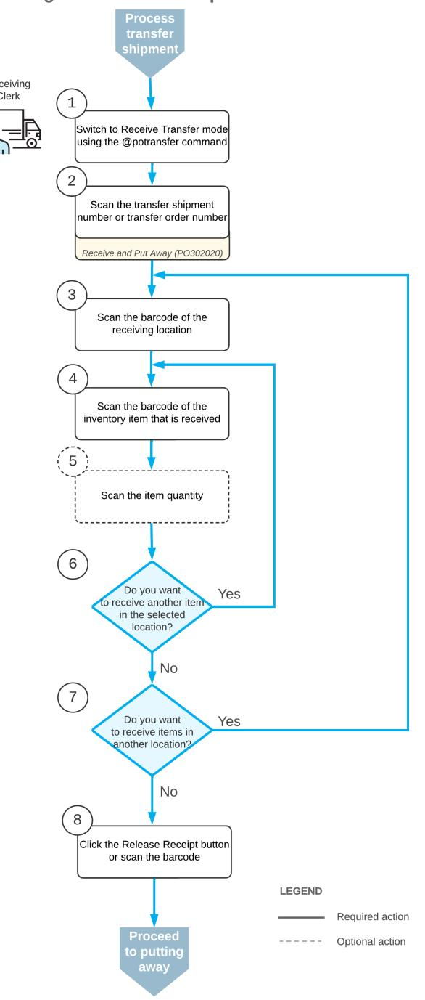

To receive transferred items in Receive Transfer mode, you perform the following steps:

1. *Switch to Receive Transfer mode*.

You can switch to Receive Transfer mode by scanning the @potransfer barcode.

2. *Scan the document number*.

To start the automated processing, you scan the reference number of the transfer shipment. (You can scan the number of the transfer order instead.) The system creates and saves a transfer receipt—that is, a purchase receipt of the *Transfer Receipt* type on the *[Purchase Receipts](https://help-2025r1.acumatica.com/Help?ScreenId=ShowWiki&pageid=d9901c8d-486d-45ed-8088-ea3d8ee3af19)* (PO302000) form. The newly created transfer receipt has no lines. In the **Receipt Nbr.** box, the system inserts the reference number of the transfer receipt.

3. *Scan the barcode of the receiving location*.

You scan the barcode of the warehouse location where the items are being received.

4. *Scan the item's barcode*.

When you scan the barcode of the received item, the system searches for the item in the lines of the document that is currently selected. If the item is found, the system highlights the line in bold.

- 5. Optional: *Scan the item quantity*.
- 6. *Complete the receiving process*.

If you have finished the receiving operation and all items have been received for the transfer receipt, you scan the \*release barcode or click the **Release Receipt** button. The system releases the transfer receipt on the *[Purchase Receipts](https://help-2025r1.acumatica.com/Help?ScreenId=ShowWiki&pageid=d9901c8d-486d-45ed-8088-ea3d8ee3af19)* form.

When the transfer receipt has been released, you can put away the items.

#### **Duplicate Identifiers in Transfer Receipt Processing**

In Receive Transfer mode on the *[Receive](https://help-2025r1.acumatica.com/Help?ScreenId=ShowWiki&pageid=fd850b21-96b8-4c2c-8c4a-f79272d8cacc) and Put Away* (PO302020) form, you can scan the identifiers (that is, reference numbers) of such documents as transfer shipments, transfer receipts, or transfer orders. Although documents of a particular type (such as transfer receipts) have unique identifiers, documents of different types (such as a transfer receipt and a transfer order) can share the same identifier. When an identifier is scanned, the system searches in the following order until it finds a document with the identifier:

- 1. Transfer receipts on the *[Purchase Receipts](https://help-2025r1.acumatica.com/Help?ScreenId=ShowWiki&pageid=d9901c8d-486d-45ed-8088-ea3d8ee3af19)* (PO302000) form
- 2. Transfer shipments on the *[Shipments](https://help-2025r1.acumatica.com/Help?ScreenId=ShowWiki&pageid=f47cffcc-543e-469c-a204-a9c1e3da346d)* (SO302000) form
- 3. Transfer orders on the *[Sales Orders](https://help-2025r1.acumatica.com/Help?ScreenId=ShowWiki&pageid=19e4021c-1b84-49fd-be12-0320c5f1c7e5)* (SO301000) form

Suppose that the system has two documents with identical identifiers: a transfer receipt and a transfer shipment. If you enter an identifier matching a released transfer receipt on the *[Receive](https://help-2025r1.acumatica.com/Help?ScreenId=ShowWiki&pageid=fd850b21-96b8-4c2c-8c4a-f79272d8cacc) and Put Away* form, the system displays an error message indicating that the transfer receipt has already been released. This prevents further processing of the shipment with the same identifier.

To ensure that identifiers are unique and avoid issues with duplicates, we strongly recommend creating a separate numbering sequence with a unique prefix on the *[Numbering Sequences](https://help-2025r1.acumatica.com/Help?ScreenId=ShowWiki&pageid=a8d11c23-21f2-42a3-b17d-9637c9cf8031)* (CS201010) form for each type of document. This will cause identifiers to be unique across documents of different types.

# **Receiving and Putting Away Operations: Purchase Return Processing**

If the *Receiving* feature is enabled on the *[Enable/Disable Features](https://help-2025r1.acumatica.com/Help?ScreenId=ShowWiki&pageid=c1555e43-1bc5-4f6f-ba9d-b323f94d8a6b)* (CS100000) form, you can process the automated purchase return of inventory items to the vendor by using a barcode scanner or a mobile device with a scanning option. A purchase return is a purchase receipt of the *Return* type created on the *[Purchase Receipts](https://help-2025r1.acumatica.com/Help?ScreenId=ShowWiki&pageid=d9901c8d-486d-45ed-8088-ea3d8ee3af19)* (PO302000) form.

In this topic, you will read about the workflow for the automated purchase returns of inventory items in Acumatica ERP. The workflow in this topic is based on the assumption that your system has the recommended configuration described in *Receiving and Putting Away Operations: [Implementation](#page-79-1) Checklist*.

#### **Applicable Scenario**

You can perform the automated processing of purchase returns of inventory items to the vendor if in your company's warehouses, all purchased items are received to a dedicated location. You issue items from this location while processing a purchase return. To track the operations as they are being performed, you scan the appropriate barcodes by using a barcode scanner or mobile device.

You can perform automated returning of items for purchase returns with the *Balanced* status.

#### **Workflow for the Automated Purchase Return of Items**

The automated processing of a purchase return of items involves the actions shown in the following diagram.

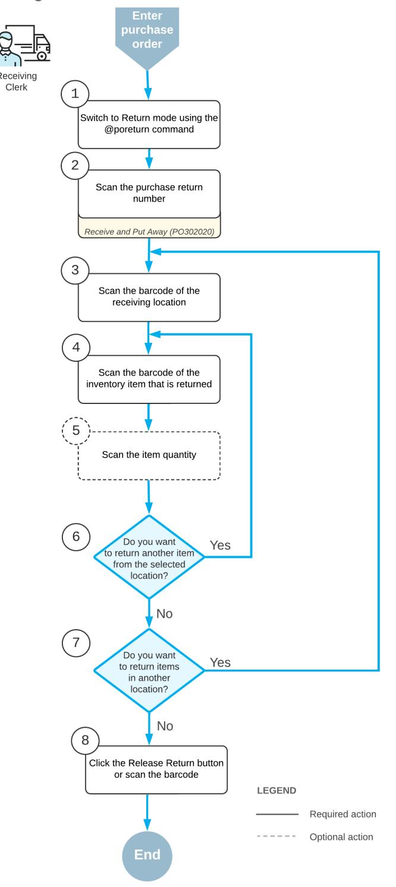

To process the return of items in Return mode, you perform the following steps:

1. *Switch to Return mode*.

You can switch to Return mode by scanning the @poreturn barcode.

2. *Scan the document number*.

To start the automated processing, you scan the reference number of the purchase return to be processed. The system displays the lines of the scanned document in the table of the *[Receive](https://help-2025r1.acumatica.com/Help?ScreenId=ShowWiki&pageid=fd850b21-96b8-4c2c-8c4a-f79272d8cacc) and Put Away* (PO302020) form. In the **Receipt Nbr.** box, the system inserts the reference number of the purchase return that is currently selected for processing.

3. *Scan the barcode of the location*.

You scan the barcode of the warehouse location from which the items are being issued.

4. *Scan the item barcode*.

When you scan the barcode of the item, the system searches for the item in the lines of the purchase return that is currently selected. If the item is found, the system highlights the line in bold.

5. Optional: *Scan the item quantity*.

To change the received quantity in the line that is currently being processed, you switch on Quantity Editing mode by scanning or entering the \*qty barcode, and manually enter the quantity in the UOM defined by the barcode of the scanned item.

The system updates the quantity of the item in the purchase return on the *[Purchase Receipts](https://help-2025r1.acumatica.com/Help?ScreenId=ShowWiki&pageid=d9901c8d-486d-45ed-8088-ea3d8ee3af19)* (PO302000) form only aer you release this purchase return on the *[Receive](https://help-2025r1.acumatica.com/Help?ScreenId=ShowWiki&pageid=fd850b21-96b8-4c2c-8c4a-f79272d8cacc) and Put Away* form. If the issued quantity of the item on the *[Receive](https://help-2025r1.acumatica.com/Help?ScreenId=ShowWiki&pageid=fd850b21-96b8-4c2c-8c4a-f79272d8cacc) and Put Away* form differs from the quantity of the item on the *[Purchase Receipts](https://help-2025r1.acumatica.com/Help?ScreenId=ShowWiki&pageid=d9901c8d-486d-45ed-8088-ea3d8ee3af19)* form, you need to verify if the purchase receipt is released on the *[Receive](https://help-2025r1.acumatica.com/Help?ScreenId=ShowWiki&pageid=fd850b21-96b8-4c2c-8c4a-f79272d8cacc) and Put Away* form.

6. *Return another item*.

If you need to return at least one other item for the purchase return currently being processed, you scan the item barcode (that is, return to Step 4) and repeat the process for the item.

7. *Complete the returning process*.

If you have finished the returning operation and all items have been issued for the purchase return (or the items were issued partially and more items will be issued in the future), you scan the \*release barcode or click the **Release Return** button. The system clears the **Completed** and **Closed** check boxes for the purchase order lines with the returned items on the *[Purchase Orders](https://help-2025r1.acumatica.com/Help?ScreenId=ShowWiki&pageid=5565686c-96c4-4bfa-a51d-9a2566baa808)* (PO301000) form and releases the purchase return on the *[Purchase Receipts](https://help-2025r1.acumatica.com/Help?ScreenId=ShowWiki&pageid=d9901c8d-486d-45ed-8088-ea3d8ee3af19)* form.

# **Automated Fulfillment of Orders with Wave Picking**

In Acumatica ERP, you can perform picking and packing of items for shipment in an automated mode by using barcode scanners or mobile devices with a scanning option on the *[Pick, Pack, and Ship](https://help-2025r1.acumatica.com/Help?ScreenId=ShowWiki&pageid=0d7f07e0-56a3-40a9-8cff-45bed542ae94)* (SO302020) form or the Pick, Pack, and Ship screen in the Acumatica mobile app. If the *Advanced Picking* feature is enabled on the *[Enable/](https://help-2025r1.acumatica.com/Help?ScreenId=ShowWiki&pageid=c1555e43-1bc5-4f6f-ba9d-b323f94d8a6b) [Disable Features](https://help-2025r1.acumatica.com/Help?ScreenId=ShowWiki&pageid=c1555e43-1bc5-4f6f-ba9d-b323f94d8a6b)* (CS100000) form, you can speed up these processes by picking items in a wave.

The topics of this chapter describe the processing of shipments in a wave.

# **Wave Picking: General Information**

If the *Advanced Picking* feature is enabled on the *[Enable/Disable Features](https://help-2025r1.acumatica.com/Help?ScreenId=ShowWiki&pageid=c1555e43-1bc5-4f6f-ba9d-b323f94d8a6b)* (CS100000) form, you can optimize and speed up the warehouse operations needed for fulfilling the order by using the wave picking workflow.

In this topic, you will read about the wave picking workflow in Acumatica ERP. The workflow in this topic is based on the assumption that your system has the recommended configuration described in *Wave [Picking:](#page-110-1) [Implementation Checklist](#page-110-1)*.

#### **Learning Objectives**

In this chapter, you will do the following:

- Enable the needed system features
- Specify the minimum required configuration for the wave picking workflow
- Learn the recommended settings that you can specify to make the system fit your business requirements
- Prepare a wave picking worksheet
- Pick and pack items in a wave
- Confirm a shipment aer packing the items

#### **Applicable Scenario**

You use wave picking if you need to optimize the processes of picking and packing items for a group of orders to be shipped. With a wave picking flow, the warehouse manager prepares a series of pick lists for a group of orders to be shipped (also called a *wave*). Each picker receives a consolidated pick list that includes multiple shipments for which the picker can pick all the listed items in one pass through the warehouse. The pickers collect the items and organize them in the individual totes assigned to each of the shipments. When the items are brought to the packing location, the packer takes the items from each of the totes, verifies that the shipment is collected correctly, and packs the items into boxes.

#### **General Process of Wave Picking**

The workflow of fulfilling orders with the wave picking workflow is shown in the following diagram.

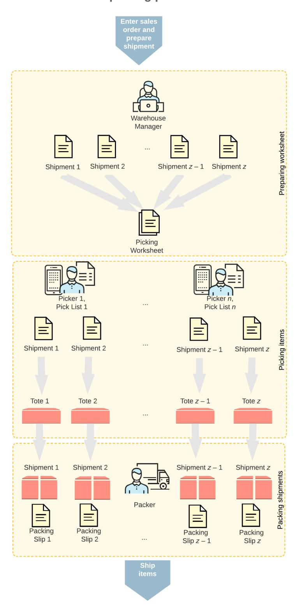

Processing a wave includes the following processes performed by the following persons:

- 1. A warehouse manager opens the *[Create Pick Lists](https://help-2025r1.acumatica.com/Help?ScreenId=ShowWiki&pageid=22649926-ac34-4b4d-8790-b019e873fa8c)* (SO503050) form, selects the shipments to be processed in a wave, specifies the maximum number of pickers, creates a picking worksheet, and prints the wave pick lists.
- 2. Each warehouse worker acting as a picker opens the *[Pick, Pack, and Ship](https://help-2025r1.acumatica.com/Help?ScreenId=ShowWiki&pageid=0d7f07e0-56a3-40a9-8cff-45bed542ae94)* (SO302020) form (or the corresponding screen in the Acumatica mobile app), switches to Pick mode, and scans the reference

number of the wave pick list. Then the picker scans the barcodes of the totes that will be used for picking items for particular shipments. The picker goes through the warehouse, picks the items from the locations, scans locations' barcodes, and items' barcodes and quantities, and puts the items in the totes.

3. A warehouse worker acting as a packer opens the *[Pick, Pack, and Ship](https://help-2025r1.acumatica.com/Help?ScreenId=ShowWiki&pageid=0d7f07e0-56a3-40a9-8cff-45bed542ae94)* form (or the corresponding screen in the Acumatica mobile app), switches to Pack mode and scans the reference number of the wave pick list. Then the packer scans the barcode of the box to which the items are being packed, takes the items from the totes, scans the barcodes and the quantity of items being packed, and puts items in boxes. Aer all the items are packed, the packer confirms the shipment.

The following sections illustrate and describe the workflow for a warehouse manager, a picker, and a packer. By understanding the workflow for each of these employees, you can better understand the wave picking workflow as a whole in a warehouse.

#### **Workflow for a Warehouse Manager**

The workflow of a warehouse manager involves the actions shown in the following diagram.

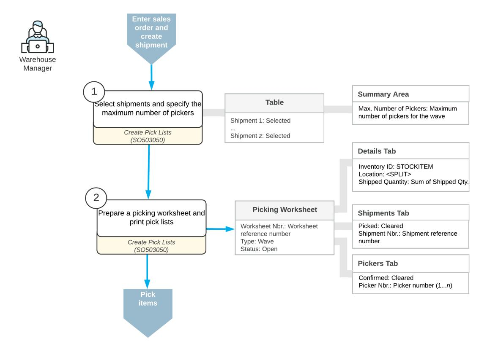

To prepare a wave picking worksheet, the warehouse manager performs the following steps:

1. *Selects the type of picking worksheet to be prepared.*

The warehouse manager opens the *[Create Pick Lists](https://help-2025r1.acumatica.com/Help?ScreenId=ShowWiki&pageid=22649926-ac34-4b4d-8790-b019e873fa8c)* (SO503050) form and selects the *Create Wave Pick List* action.

2. *Specifies the number of pickers.*

To specify the maximum number of pickers who are currently available to be assigned to a wave, the manager enters the value in the **Max. Number of Pickers** box.

3. Optional: *Defines the number of totes for each picker.*

To define the number of totes used by each picker assigned to a wave, the manager enters the value in the **Max Nbr. ofTotes per Picker** box.

4. *Selects the shipments.*

In the table, the manager selects the unlabeled check boxes in the lines with the shipments to be included in the picking worksheet.

5. *Creates a picking worksheet and selects the pickers.*

On the form toolbar, the manager clicks **Process** to create the picking worksheet for the selected shipments and to print wave pick lists (in which the items are grouped by the wave) and standard pick lists for each shipment to be picked. Then the manager gives these pick lists to the pickers (that is, the warehouse workers who will perform the picking).

If the **Print PackingSlips with Pick Lists** check box is selected on the *[Sales Orders](https://help-2025r1.acumatica.com/Help?ScreenId=ShowWiki&pageid=1817779c-413b-4187-b7fe-38e97845a1cb) [Preferences](https://help-2025r1.acumatica.com/Help?ScreenId=ShowWiki&pageid=1817779c-413b-4187-b7fe-38e97845a1cb)* (SO101000) form, the system also prints packing slips with the pick lists.

#### **Cancellation of a Picking Worksheet**

If a wave picking worksheet has the *Picking* status on the *[Picking Worksheets](https://help-2025r1.acumatica.com/Help?ScreenId=ShowWiki&pageid=7692237d-e46d-48a3-9e19-60b551f261f8)* (SO302500) form, the warehouse manager can click **Cancel Worksheet** on the More menu to cancel this worksheet.

When a picking worksheet is canceled, the system assigns the *Canceled* status to it, cancels all the created pick lists, and removes all the related shipments from the picking worksheet. For all rows on the **Details** tab, the **Picked Qty.** becomes *0*.

Aer cancellation, the shipments from the canceled worksheet are no longer associated with this worksheet and can be added to another worksheet. These shipments can still be reviewed on the**Shipments** tab of the *[Picking](https://help-2025r1.acumatica.com/Help?ScreenId=ShowWiki&pageid=7692237d-e46d-48a3-9e19-60b551f261f8) [Worksheets](https://help-2025r1.acumatica.com/Help?ScreenId=ShowWiki&pageid=7692237d-e46d-48a3-9e19-60b551f261f8)* form; the **Unlinked** check box is selected for each shipment on the tab.

The process of physically distributing already-picked goods back to their storage locations is not covered by the picking workflow; this should be done manually according to the pick lists of the canceled worksheet.

#### **Workflow for a Picker**

The workflow of a picker involves the actions shown in the following diagram.

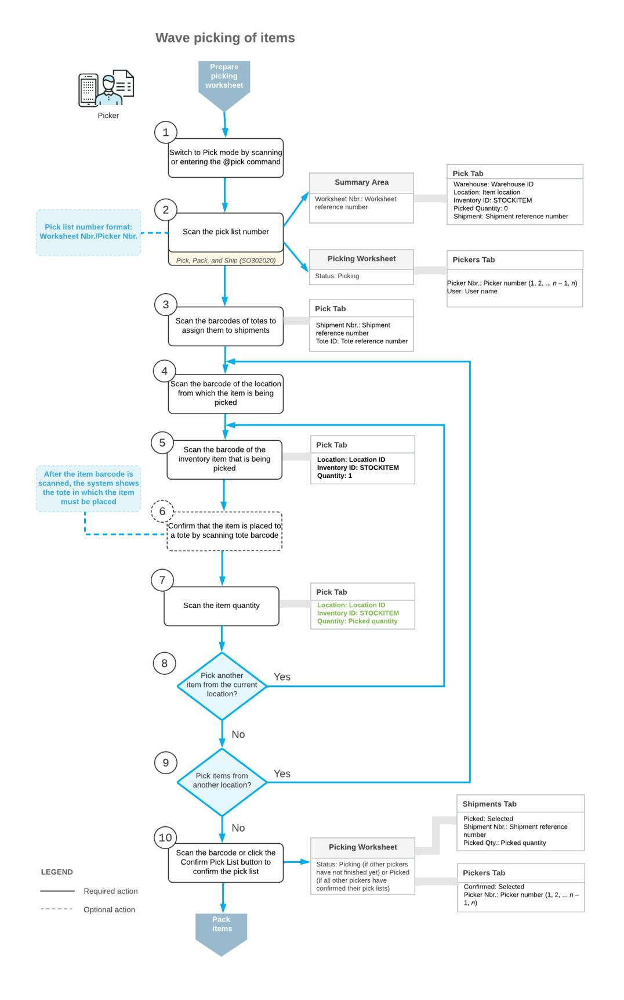

To pick the items for a wave pick list, the picker performs the following steps:

1. *Switches to Pick mode*.

The picker opens the *[Pick, Pack, and Ship](https://help-2025r1.acumatica.com/Help?ScreenId=ShowWiki&pageid=0d7f07e0-56a3-40a9-8cff-45bed542ae94)* (SO302020) form (or the corresponding screen in the Acumatica mobile app) and switches to Pick mode by scanning or entering *@pick* barcode.

2. *Scans the number of the wave pick list*.

To start the automated processing, the picker scans the reference number of the wave pick list. This reference number has the *Worksheet Nbr./Picker Nbr.* format, where *Worksheet Nbr.* is the reference number of the related picking worksheet, and the *Picker Nbr.* is the reference number of the picker assigned to this worksheet (for example, *000001/1*). The system displays the pick list lines in the table and inserts the reference number of the picking worksheet that is currently selected for processing in the**Shipment Nbr.** box.

3. *Scans the barcodes of the totes to be assigned to the shipments.*

The picker scans the barcodes of all totes that will be used for picking the wave. Each tote is assigned to a particular shipment. The picker also places into each tote the pick list (or the packing slip) of the related shipment.

- 4. *In each location from the wave pick list, picks the items as follows:*
  - a. *Scans the location barcode*.

When the picker scans the barcode of the location from which the item is picked, the system searches for the location in the lines of the picking worksheet that is currently selected.

b. *Scans the item barcode*.

When the picker scans the item barcode of the picked item, the system searches for the item in the lines of the currently selected document. The system displays the picked quantity in the **Picked Quantity** column and highlights the line (in bold if the line has been picked partially, or in green if the line has been picked in full). If the UOM defined by the barcode of the scanned item corresponds to a non-base unit of measure, the system converts the item quantity defined by this barcode to the picked quantity in the base unit of measure for this item.

c. *Scans the tote barcode*.

The system notifies the picker in which tote the items must be placed. The picker scans the tote to confirm that the picked item is placed in the right tote (that is, in the one assigned to the shipment).

d. Optional: *Scans the item quantity*.

To change the picked quantity in the line that is currently being processed, the picker switches to Quantity Editing mode by clicking the**Set Qty** button on the form toolbar (or by scanning or entering the \*qty barcode) and manually enters the quantity in the UOM defined by the barcode of the scanned item.

If the pick list contains lines of multiple sales orders with the same item and location, the picker can enter the consolidated quantity of these lines. The system will automatically distribute the entered quantity among the lines with this item.

e. *Picks another item*.

If another item needs to be picked from the currently selected location, the picker scans the item barcode (returns to the second substep of this step) and repeats the process for the item.

f. *Picks items from another location*.

If the picker needs to pick items from another location, the picker scans the location barcode (returns to the first substep of this step), and repeats the process for the location.

5. *Completes the picking process*.

If the picker has finished picking items from his or her part of the wave, the picker scans the \*confirm\*pick barcode or clicks the **Confirm Picking** button on the form toolbar to confirm that the picking process is finished.

Confirming the picking of a wave does not confirm the picked shipments.

Aer finishing the wave picking, the picker brings the totes with items to the packing location.

#### **Workflow for a Packer**

The workflow of a packer involves the actions shown in the following diagram.

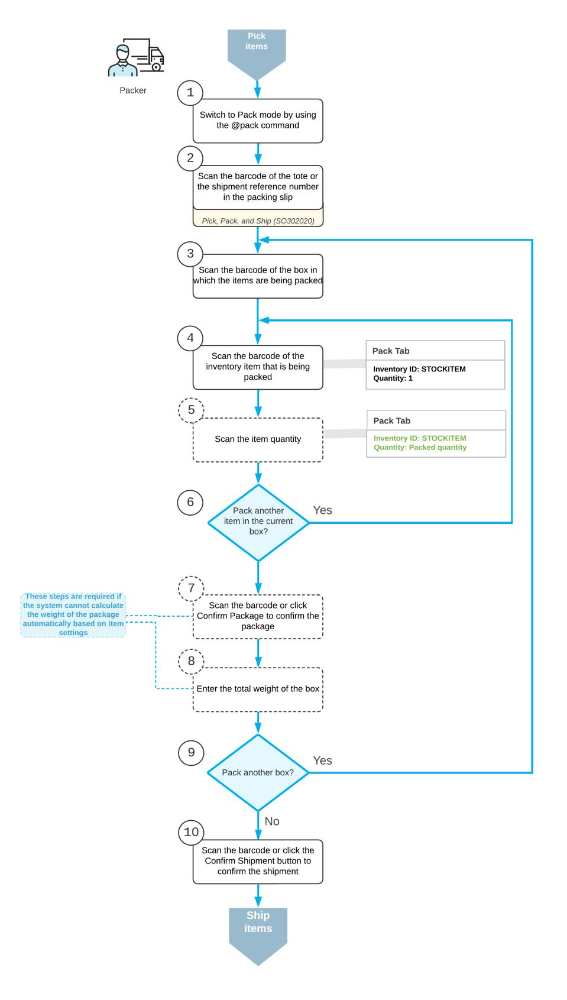

To pack the items for a shipment, the packer performs the following steps:

1. *Switches to Pack mode*.

The packer opens the *[Pick, Pack, and Ship](https://help-2025r1.acumatica.com/Help?ScreenId=ShowWiki&pageid=0d7f07e0-56a3-40a9-8cff-45bed542ae94)* (SO302020) form (or the corresponding screen in the Acumatica mobile app) and switches to Pack mode by scanning or entering the *@pack* barcode.

2. *Scans the tote barcode or the shipment number*.

The packer scans the barcode of the tote or the shipment number from the packing slip to start packing the items from this tote for shipping.

- 3. For each box being packed for the selected shipment, the packer does the following:
  - a. *Scans the barcode of the box*.

The packer scans the barcode of the box into which the items will be packed.

b. *Scans the item barcode*.

When the packer scans the barcode of the packed item, the system searches for the item in the lines of the shipment that is currently selected. If the UOM defined by the barcode of the scanned item corresponds to a non-base unit of measure, the system converts the item quantity defined by this barcode to the packed quantity in the base unit of measure for this item. The system shows the packed quantity in the **Packed Quantity** column and highlights the line (in bold if the line has been processed partially, or in green if the line has been processed in full).

c. Optional: *Scans the item quantity*.

To change the packed quantity in the line that is currently being processed, the packer switches to Quantity Editing mode by scanning or entering the \*qty barcode, and manually enters the quantity in the UOM defined by the barcode of the scanned item.

d. *Packs another item*.

If another item needs to be packed in the current box, the packer returns to scanning the item barcode (that is, returns to the second substep of this step) and repeats the process for the item, or proceeds to the next step if all items have been packed in the box.

e. *Confirms the box*.

If all items have been packed in the box, the packer confirms the current box by scanning the \*ok barcode or by clicking the **OK** button.

f. Optional: *Enters the box weight*.

If the **Confirm Weight for Each Package** check box is selected on the **Warehouse Management** tab of the *[Sales Orders Preferences](https://help-2025r1.acumatica.com/Help?ScreenId=ShowWiki&pageid=1817779c-413b-4187-b7fe-38e97845a1cb)* (SO101000) form, the system requires the packer to confirm the weight of each box aer the package is confirmed.

If the packer wants to accept the automatically calculated weight of the box, they can do that by clicking **OK** on the form toolbar or by scanning the \*ok command. If the packer wants to change the calculated weight of the box, they must enter the new value to continue to the next step.

g. Optional: *Enters the new package dimensions*.

If the **Confirm Dimensions for Packages with Editable Dimensions** check box is selected on the **Warehouse Management** tab of the *[Sales Orders Preferences](https://help-2025r1.acumatica.com/Help?ScreenId=ShowWiki&pageid=1817779c-413b-4187-b7fe-38e97845a1cb)* (SO101000) form and the packer confirms a package that includes a box with the **Editable Dimensions** check box selected on the *[Boxes](https://help-2025r1.acumatica.com/Help?ScreenId=ShowWiki&pageid=ff38094d-bc30-4cf1-9008-0f1070ada514)* (CS207600) form, the system requires the packer to confirm the existing dimensions or enter different dimensions for the box.

If the packer wants to accept the default dimensions of the box, they can do that by clicking **OK** on the form toolbar or by scanning the \*ok command. If the packer wants to change the dimensions of the box, they must enter the length, width, and height (in this order) in one string with a space as a separator to continue to the next step.

The following example shows the entry of dimensions: 20 15 40.

h. *Packs another box*.

If more items need to be packed for the current shipment, the packer returns to scanning the barcode of the box (returns to the first substep of this step) and repeats the process for another box.

4. *Completes the packing process*.

If the packer has finished the packing operation and specifying shipping options is not needed, the packer scans the \*confirm\*shipment barcode or clicks the **Confirm Shipment** button on the form toolbar. The system confirms the shipment that is currently being processed, and prints labels for the packed boxes.

# **Wave Picking: Implementation Checklist**

This topic provides details you can use to ensure that the system is configured properly for picking and packing items in a wave.

#### **Prerequisites**

Before you begin processing shipments in a wave, you should make sure the needed features have been enabled, settings have been specified, and entities have been created, as summarized in the following checklist.

| Form                                                                    | Criteria to Check                                                                                                                                                                                                                                          |
|-------------------------------------------------------------------------|------------------------------------------------------------------------------------------------------------------------------------------------------------------------------------------------------------------------------------------------------------|
| Sales Orders Preferences (SO101000) Inventory Preferences (IN101000) | Make sure that all necessary settings related to inven tory and order management have been specified, as described in Configuration of Order Management: Gen eral Information.                                                                    |
| Enable/Disable Features (CS100000)                                      | Make sure that the following features are enabled: Warehouse Management • • Fulfillment • Advanced Picking                                                                                                                               |
| Stock Items (IN202500)                                                  | Make sure that the required stock items have been cre ated, as described in Stock Items: Implementation Activ ity.                                                                                                                                   |
| Sales Orders Preferences (SO101000)                                     | Make sure that the automated picking workflow is configured to fit the workflow established in your or ganization, as described in Picking and Packing Opera tions: Implementation Checklist and Packing Operations: Implementation Checklist. |

#### **Printing Settings**

If the *DeviceHub* feature is enabled on the *[Enable/Disable Features](https://help-2025r1.acumatica.com/Help?ScreenId=ShowWiki&pageid=c1555e43-1bc5-4f6f-ba9d-b323f94d8a6b)* (CS100000) form, you can configure the printing of documents by using the following settings on the **Warehouse Management** tab of the *[Sales Orders Preferences](https://help-2025r1.acumatica.com/Help?ScreenId=ShowWiki&pageid=1817779c-413b-4187-b7fe-38e97845a1cb)* (SO101000) form.

| Element                                       | State    | Description                                                                                                                                                   |
|-----------------------------------------------|----------|---------------------------------------------------------------------------------------------------------------------------------------------------------------|
| Print Shipment Confirmation Au tomatically | Selected | With this check box selected, the system prints the shipment confir mation automatically when a user confirms a shipment.                            |
| Print Shipment Labels Automati cally       | Selected | With this check box selected, the system prints the shipment labels for the packages included in a ship ment when the user confirms the shipment. |

### **Other Settings That Affect the Workflow**

You can affect the workflow for wave picking by specifying additional settings on the *[Sales Orders Preferences](https://help-2025r1.acumatica.com/Help?ScreenId=ShowWiki&pageid=1817779c-413b-4187-b7fe-38e97845a1cb)* (SO101000) form:

- To make the user confirm that the items have been placed in the tote assigned to the shipment for which the items are being picked, select the **Confirm ToteSelection on Wave Picking**.
- To make the system print both packing slips and pick lists for a picking worksheet, select the **Print Packing Slips with Pick Lists** check box on the **Warehouse Management** tab.

#### **Known Process Limitations**

If the *Automatic Packaging* feature is enabled on the *[Enable/Disable Features](https://help-2025r1.acumatica.com/Help?ScreenId=ShowWiki&pageid=c1555e43-1bc5-4f6f-ba9d-b323f94d8a6b)* (CS100000) form, a user can process in Pack mode only shipments packed to a single box. The processing of shipments packed in two or more boxes in Pack mode is currently not supported.

# **Wave Picking: Process Activity**

In the following activity, you will learn how to process shipments in a wave by using the *[Pick, Pack, and Ship](https://help-2025r1.acumatica.com/Help?ScreenId=ShowWiki&pageid=0d7f07e0-56a3-40a9-8cff-45bed542ae94)* (SO302020) form.

This activity is based on the *U100* dataset. If you are using another dataset, or if any system settings have been changed in *U100*, these changes can affect the workflow of the activity and the results of the processing. To avoid any issues, restore the *U100* dataset to its initial state.

#### **Story**

Suppose that the wholesale warehouse of SweetLife was temporarily closed because of inventory counting. During this time, multiple orders have been entered into the system, and they now require shipping. The warehouse manager wants to speed up the process of picking and packing items by creating a wave picking worksheet and assigning this work to multiple pickers. Aer the warehouse workers pick the items in a wave, a warehouse worker acting as the packer needs to pack the items and confirm the shipments. You will perform these actions, acting as all of these employees.

#### **Configuration Overview**

In the *U100* dataset, the following tasks have been performed to support this activity:

- On the *[Enable/Disable Features](https://help-2025r1.acumatica.com/Help?ScreenId=ShowWiki&pageid=c1555e43-1bc5-4f6f-ba9d-b323f94d8a6b)* (CS100000) form, the following features have been enabled in the *Inventory and Order Management* group of features:
  - *Warehouse Management*
  - *Fulfillment*
  - *Advanced Picking*
- The **Print PackingSlips with Pick Lists** check box has been selected on the **Warehouse Management** tab of the *[Sales Orders Preferences](https://help-2025r1.acumatica.com/Help?ScreenId=ShowWiki&pageid=1817779c-413b-4187-b7fe-38e97845a1cb)* (SO101000) form; with this check box selected, when a user prints worksheet pick lists, the packing slips are also printed.
- On the *[Warehouses](https://help-2025r1.acumatica.com/Help?ScreenId=ShowWiki&pageid=264b0ef7-2b6c-40b4-a7d9-f1a5e067939b)* (IN204000) form, the *WHOLESALE* warehouse has been created. On the **Locations** tab, the following warehouse locations have been defined: *L1R1S1*, *L1R1S2*, *L1R2S1*, *L1R2S2*, and *L2R2S1*. On the **Totes** tab, the following totes have been defined: *T1*, *T2*, *T3*, *T4*, *T5*, *T6*, *T7*, *T8*, *T9*, *T10*, *T11*, and *T12*.
- On the *[Stock Items](https://help-2025r1.acumatica.com/Help?ScreenId=ShowWiki&pageid=77786a70-1f1e-4d63-ad98-96f98e4fcb0e)* (IN202500) form, the following stock items have been created, and the corresponding alternate IDs with the *Barcode* type have been defined on the **Cross-Reference** tab:

For simplicity, in this activity, the alternate IDs will be further referred to as *barcodes*.

- *APJAM08*, which has the *AJ08* barcode
- *ORJAM32*, which has the *OJ32* barcode
- *LEMJAM96*, which has the *LJ96* barcode
- On the *[Boxes](https://help-2025r1.acumatica.com/Help?ScreenId=ShowWiki&pageid=ff38094d-bc30-4cf1-9008-0f1070ada514)* (CS207600) form, the *LARGE* box has been defined.
- On the *[Sales Orders](https://help-2025r1.acumatica.com/Help?ScreenId=ShowWiki&pageid=19e4021c-1b84-49fd-be12-0320c5f1c7e5)* (SO301000) form, the following sales orders have been created for multiple customers: *000035*, *000036*, *000037*, *000038*, *000039*, *000040*, *000041*, *000042*, *000043*, *000044*, and *000046*.
- On the *[Shipments](https://help-2025r1.acumatica.com/Help?ScreenId=ShowWiki&pageid=f47cffcc-543e-469c-a204-a9c1e3da346d)* (SO302000) form, the following shipment documents have been created for these sales orders: *000034*, *000035*, *000036*, *000037*, *000038*, *000039*, *000040*, *000041*, *000042*, *000043*, *000044*, and *000045*.

#### **Process Overview**

In this activity, you will do the following:

- 1. Acting as a warehouse manager, you will open the *[Create Pick Lists](https://help-2025r1.acumatica.com/Help?ScreenId=ShowWiki&pageid=22649926-ac34-4b4d-8790-b019e873fa8c)* (SO503050) form, select the shipments to be processed in a wave, specify the maximum number of pickers, create a picking worksheet, and print the wave pick lists.
- 2. You will do the following:
  - a. Acting as a warehouse worker, open the *[Pick, Pack, and Ship](https://help-2025r1.acumatica.com/Help?ScreenId=ShowWiki&pageid=0d7f07e0-56a3-40a9-8cff-45bed542ae94)* (SO302020) form, switch to Pick mode, and scan the reference number of the wave pick list. Then you will scan the barcodes of the totes that will be used for picking items for particular shipments. Aer that you will scan locations' barcodes, and barcodes and quantities of items being picked from these locations.
  - b. Acting as the second warehouse worker, do the same on the *[Pick, Pack, and Ship](https://help-2025r1.acumatica.com/Help?ScreenId=ShowWiki&pageid=0d7f07e0-56a3-40a9-8cff-45bed542ae94)* form.
  - c. Acting as the third warehouse worker, do the same on the *[Pick, Pack, and Ship](https://help-2025r1.acumatica.com/Help?ScreenId=ShowWiki&pageid=0d7f07e0-56a3-40a9-8cff-45bed542ae94)* form.
- 3. Acting as a pack line operator, you will review the progress of three pickers who picked the items
- 4. Acting as a warehouse worker, you will open the *[Pick, Pack, and Ship](https://help-2025r1.acumatica.com/Help?ScreenId=ShowWiki&pageid=0d7f07e0-56a3-40a9-8cff-45bed542ae94)* form, switch to Pack mode, and scan the reference number of the wave pick list. Then you will scan the barcode of the box to which the items will be packed, take the items from the totes, and scan the barcodes and the quantity of items being packed. Aer all the items will be packed, you will confirm the shipment.

In any working mode, you enter a command or barcode by typing it in the**Scan** box and pressing Enter. In production systems, you will scan the appropriate barcodes rather than manually entering them.

#### **System Preparation**

Before you start performing the automated picking and packing operations, do the following:

- 1. Launch the Acumatica ERP website, and sign in to a company with the *U100* dataset preloaded using the *angelo* username and the *123* password. You are initially signing in as the warehouse manager to prepare the wave picking worksheet.
- 2. In the info area, in the upper-right corner of the top pane of the Acumatica ERP screen, make sure that the business date in your system is set to *1/30/2025*. If a different date is displayed, click the Business Date menu button and select *1/30/2025* on the calendar. For simplicity, in this activity, you will create and process all documents in the system on this business date.
- 3. On the **Warehouse Management** tab of the *[Sales Orders Preferences](https://help-2025r1.acumatica.com/Help?ScreenId=ShowWiki&pageid=1817779c-413b-4187-b7fe-38e97845a1cb)* (SO101000) form, make sure that the **Display the PickTab** and **Display the PackTab** check boxes are selected.

### **Step 1: Preparing the Wave Picking Worksheet**

To prepare the wave picking worksheet, acting as the warehouse manager, do the following:

- 1. Open the *[Create Pick Lists](https://help-2025r1.acumatica.com/Help?ScreenId=ShowWiki&pageid=22649926-ac34-4b4d-8790-b019e873fa8c)* (SO503050) form, and in the **Action** box, select *Create Wave Pick Lists*.
- 2. In the **Warehouse ID** box, select *WHOLESALE*.
- 3. In the **End Date** box, make sure *1/30/2025* is specified.
- 4. Specify 4 as the **Max. Number of Pickers**.
- 5. Specify 4 as **Max. Number ofTotes per Picker**.
- 6. In the table, select the unlabeled check boxes next to the shipments with reference numbers from *000034* through *000045*.
- 7. On the form toolbar, click **Process**. Close the **Processing** dialog box aer processing completes.
- 8. On the *[Picking Worksheets](https://help-2025r1.acumatica.com/Help?ScreenId=ShowWiki&pageid=7692237d-e46d-48a3-9e19-60b551f261f8)* (SO302500) form, open the created worksheet of the *Wave* type, and review its details. The **Details** tab lists all the items that have to be packed in a wave (as shown in the following screenshot). Notice that *<SPLIT>* is shown in the **Location** column for two of the lines, indicating that these items have to be picked from multiple locations.
- 9. Click the first line in the table, and on the table toolbar, click **Line Details**. In the **Line Details** dialog box, which opens, review the locations in which the items are allocated for the wave (see the following screenshot) and close the dialog box.

| <b>Picking Worksheets</b> 000001 - Wholesale Warehouse |                     |                                                                          |        |                     |                                        |               | $\Box$ NOTES             | <b>FILES</b>                            | TOOLS $\star$                 |
|-----------------------------------------------------------|---------------------|--------------------------------------------------------------------------|--------|---------------------|----------------------------------------|---------------|--------------------------|-----------------------------------------|-------------------------------|
| 周 $\Box$ $\leftarrow$                               | 侕 $\Omega$       | $\overline{\mathsf{K}}$ $\mathcal{P}$ $\left\langle \right\rangle$ | $\geq$ | <b>HOLD</b>         | <b>PRINT PICK LISTS</b>                |               | PRINT PACKING SLIPS      | .                                       |                               |
| Worksheet Nbr.:                                           | $\circ$ 000001   | Warehouse ID:                                                            |        |                     | WHOLESALE - Wholesale Warehouse        |               | <b>Shipped Quantity:</b> |                                         | $\hat{\phantom{a}}$ 136.00 |
| Type:                                                     | Wave                | Picking Started On:                                                      |        |                     |                                        |               | Shipped Weight:          | 22.720000                               |                               |
| Status:                                                   | Open                | Picking Finished On:                                                     |        |                     |                                        |               | Shipped Volume:          | 22.720000                               |                               |
| Date:                                                     | 1/30/2025           |                                                                          |        |                     |                                        |               |                          |                                         |                               |
| <b>DETAILS</b>                                            | <b>SHIPMENTS</b>    | <b>PICKERS</b>                                                           |        | <b>Line Details</b> |                                        |               |                          |                                         | $\times$                      |
| Ò $\pm$ $\times$                                    | <b>LINE DETAILS</b> | $\boxed{\mathbf{X}}$ $\left  \rightarrow \right $                     |        | Ò                   | $\mathbf{\overline{N}}$ $\mathbb H$ |               |                          |                                         |                               |
| <b>B</b> Warehouse                                        | Location            | <b>Inventory ID</b>                                                      |        | <b>Inventory ID</b> |                                        | Location      | Picked Quantity       | Quantity UOM                            |                               |
| <b>WHOLESALE</b>                                          | <split></split>     | APJAM08                                                                  |        | APJAM08             |                                        | <b>L1R1S1</b> | 0.00                     | 22.00                                   | <b>PIECE</b>                  |
| <b>WHOLESALE</b>                                          | <split></split>     | ORJAM32                                                                  |        | APJAM08             |                                        | <b>L1R1S2</b> | 0.00                     | 6.00                                    | <b>PIECE</b>                  |
| <b>WHOLESALE</b>                                          | <b>L1R2S2</b>       | LEMJAM96                                                                 |        | APJAM08             |                                        | <b>L1R2S1</b> | 0.00                     | 21.00                                   | <b>PIECE</b>                  |
|                                                           |                     |                                                                          |        | APJAM08             |                                        | <b>L1R2S2</b> | 0.00                     | 5.00                                    | PIECE                         |
|                                                           |                     |                                                                          |        | APJAM08             |                                        | <b>L2R2S1</b> | 0.00                     | 11.00                                   | PIECE                         |
|                                                           |                     |                                                                          |        |                     |                                        |               |                          |                                         |                               |
|                                                           |                     |                                                                          |        |                     |                                        |               |                          | $\mathbb{R}$ $\langle \quad \rangle$ | >1                            |
|                                                           |                     |                                                                          |        |                     |                                        |               |                          |                                         |                               |

*Figure: Locations in which the items are allocated*

- 10.Open the **Pickers** tab, and notice that the wave will be picked by three pickers. (Although you have entered *4* as the maximum number of pickers, the system has found the optimal workflow and determined that three pickers are enough for picking the wave.)
- 11.Click the first line in the table (which corresponds to the first picker), and on the table toolbar, click**View Shipments**. In the **Assigned Shipments** dialog box, which opens, review the shipments assigned to the first picker and the items that the picker will pick for these shipments (see the following screenshot).

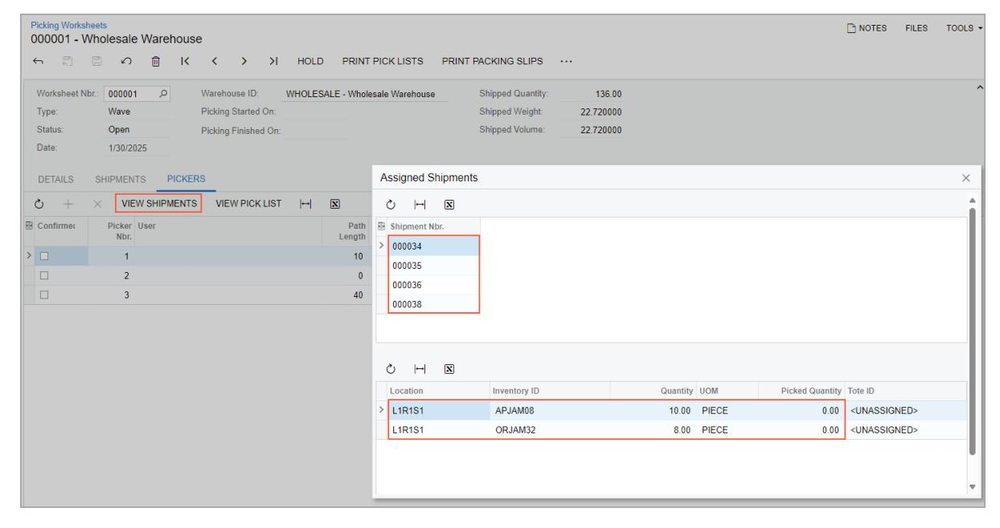

*Figure: Shipments assigned to the picker*

12.Close the **Assigned Shipments** dialog box.

13.On the form toolbar, click **Print Pick Lists**. The system opens the *[Worksheet Pick List](https://help-2025r1.acumatica.com/Help?ScreenId=ShowWiki&pageid=add647d5-ecbf-4daa-ac2e-9de894325f28)* (SO644006) report with generated printable pick lists and packing slips. For each pick list, notice the **Pick List Nbr.** number; you will load the pick lists for processing by using these numbers.

In the production system, you would print the pick lists and packing slips and distribute them to the three pickers. Each picker would put pick lists and packing slips to totes assigned to shipments.

14.Sign out of the system.

#### **Step 2a: Picking Items in a Wave (Picker 1)**

Acting as the first picker selected in the picking worksheet, you will assign totes to the shipments assigned to you and then pick the items, placing them in the appropriate totes. Do the following:

- 1. Sign in to the system as the first picker by using the *perkins* username and the *123* password.
- 2. Open the *[Pick, Pack, and Ship](https://help-2025r1.acumatica.com/Help?ScreenId=ShowWiki&pageid=0d7f07e0-56a3-40a9-8cff-45bed542ae94)* (SO302020) form, and make sure the **Pick** tab is opened.
- 3. In the **Scan** box, type 000001/1, which is the reference number of the pick list for the first picker. Press Enter. The system loads the shipment lines to the table on the **Pick** tab, and shows the reference number of the picking worksheet that is currently being processed in the **Worksheet Nbr.** box of the Summary area.
- 4. Assign totes to the shipments you will be picking by doing the following:
  - a. Enter T1. The system assigns the tote to the shipment *000034*, and shows the tote ID in the**Tote ID** column of all lines of this shipment.
  - b. Enter T2. The system assigns the tote to the shipment *000035*.
  - c. Enter T3. The system assigns the tote to the shipment *000036*.
  - d. Enter T4. The system assigns the tote to the shipment *000038*.

Now you have assigned the totes to shipments, and you can start picking items.

- 5. Pick the items from the first location by doing the following:
  - a. Enter L1R1S1 to select the location from which you are currently picking items.
  - b. Enter OJ32 to pick the item. (*OJ32* is the barcode for *ORJAM32*, the 32-ounce jar of orange jam.)

The system highlights the line in bold and specifies *1* as the **Picked Quantity**.

- c. Set the quantity of the item to 11 as follows:
  - a. On the form toolbar, click**Set Qty**. The system prompts you to enter the item quantity.
  - b. In the **Scan** box, enter 11. This indicates that eleven 32-ounce jars of orange jam have been picked from the location and placed in the *T3* tote.

You are continuing to pick items for different shipments from the same location, so you do not need to scan the location barcode again.

- d. Enter AJ08 to pick the item. (*AJ08* is the barcode for *APJAM08*, the 8-ounce jar of apple jam.)
- e. Set the quantity to 12.
- f. Enter AJ08 to pick the item.
- g. Set the quantity to 10.
- h. Enter OJ32 to pick the item.
- j. Set the quantity to 8.
- k. Enter OJ32 to pick the item.
- l. Set the quantity to 3.

You have finished picking items from this location, so you will proceed to picking items from another location.

- 6. Pick the items from the second location by doing the following:
  - a. Enter L1R1S2 to select the location from which you are currently picking items.
  - b. Enter AJ08 to pick the item.
  - c. Set the quantity to 6.

You have finished picking items from this location, so you proceed to picking items from another location.

- 7. Pick the items from the third location by doing the following:
  - a. Enter L1R2S1 to select the location from which you are currently picking items.
  - b. Enter AJ08 to pick the item.
  - c. Set the quantity to 4.

You are continuing to pick items for different shipments from the same location, so you do not need to scan the location barcode again.

- d. Enter AJ08 to pick the item.
- e. Set the quantity to 4.
- 8. Pick the items from the last location by doing the following:
  - a. Enter L1R2S2 to select the location from which you are currently picking items.
  - b. Enter LJ96 to pick the item. (*LJ96* is the barcode for *LEMJAM96*, the 96-ounce jar of lemon jam.)
  - c. Set the quantity to 3.
- 9. On the form toolbar, click **Confirm Pick List** to confirm that picking is finished.

As the first picker, you have finished picking the items.

10.Sign out of the system.

#### **Step 2b: Picking Items in a Wave (Picker 2)**

Acting as the second picker selected in the picking worksheet, you will assign totes to the shipments assigned to you and then pick the items, placing them in the appropriate totes. Do the following:

- 1. Sign in to the system as the second picker by using the *rollins* username and the *123* password.
- 2. Open the *[Pick, Pack, and Ship](https://help-2025r1.acumatica.com/Help?ScreenId=ShowWiki&pageid=0d7f07e0-56a3-40a9-8cff-45bed542ae94)* (SO302020) form, and make sure the **Pick** tab is opened.
- 3. In the **Scan** box, enter 000001/2. The system loads the shipment lines to the table on the **Pick** tab, and shows the reference number of the picking worksheet that is currently being processed in the **Worksheet Nbr.** box of the Summary area.
- 4. Assign totes to the shipments you will be picking by doing the following:
  - a. Enter T5. The system assigns the tote to the *000037* shipment, and shows the tote ID in the**Tote ID** column of all lines of this shipment.
  - b. Enter T6. The system assigns the tote to the *000041* shipment.
  - c. Enter T7. The system assigns the tote to the *000044* shipment.
  - d. Enter T8. The system assigns the tote to the *000045* shipment.
  - Now you have assigned the totes to shipments, and you can start picking items.
- 5. Pick the items from the first location by doing the following:
  - a. Enter L1R2S1 to select the location from which you are currently picking items.
  - b. Enter AJ08 to pick the item.

The system highlights the line in bold and specifies *1* as the **Picked Quantity**.

- c. Set the quantity of the item to 11 as follows:
  - a. On the form toolbar, click**Set Qty**. The system prompts you to enter the item quantity.
  - b. In the **Scan** box, enter 11. This indicates that eleven 8-ounce jars of apple jam have been picked from the location and placed in the *T5* tote.

You are continuing to pick items for different shipments from the same location, so you do not need to scan the location barcode again.

- d. Enter OJ32 to pick the item.
- e. Set the quantity of the item to 14.
- f. Enter OJ32 to pick the item.
- g. Set the quantity of the item to 4.

You have finished picking items from this location, so you will proceed to picking items from another location.

- 6. Pick the items from the second location by doing the following:
  - a. Enter L1R2S2 to select the location from which you are currently picking items.
  - b. Enter LJ96 to pick the item.
  - c. Enter LJ96 one more time to add second unit of the item to the current line.
- 7. On the form toolbar, click **Confirm Pick List** to confirm that picking is finished.

As the second picker, you have finished picking the items.

8. Sign out of the system.

#### **Step 2c: Picking Items in a Wave (Picker 3)**

Acting as the third picker selected in the picking worksheet, you will assign totes to the shipments assigned to you and then pick the items, placing them in the appropriate totes. Do the following:

- 1. Sign in to the system as the third picker by using the *hardin* username and the *123* password.
- 2. Open the *[Pick, Pack, and Ship](https://help-2025r1.acumatica.com/Help?ScreenId=ShowWiki&pageid=0d7f07e0-56a3-40a9-8cff-45bed542ae94)* (SO302020) form, and make sure the **Pick** tab is opened.
- 3. In the **Scan** box, enter 000001/3. The system loads the shipment lines to the table on the **Pick** tab, and shows the reference number of the picking worksheet that is currently being processed in the **Worksheet Nbr.** box of the Summary area.
- 4. Assign totes to the shipments you will be picking by doing the following:
  - a. Enter T9. The system assign the tote to the shipment *000039*, and shows the tote ID in the**Tote ID** column of all lines of this shipment.
  - b. Enter T10. The system assigns the tote to the shipment *000040*.
  - c. Enter T11. The system assigns the tote to the shipment *000042*.
  - d. Enter T12. The system assigns the tote to the shipment *000043*.

You have assigned the totes to the shipments, and you can start picking items.

- 5. Pick the items from the first location by doing the following:
  - a. Enter L1R1S1 to select the location from which you are currently picking items.
  - b. Enter OJ32 to pick the item.

The system highlights the line in bold and specifies *1* as the **Picked Quantity**.

- c. Set the quantity of the item to 5 as follows:
  - a. On the form toolbar, click**Set Qty**. The system prompts you to enter the item quantity.

b. In the **Scan** box, enter 5. This indicates that five 32-ounce jars of orange jam have been picked from the location and placed in the *T9* tote.

You are continuing to pick items for different shipments from the same location, so you do not need to scan the location barcode again.

d. Enter OJ32 to pick the item from the same location for one more line.

You have finished picking of items in the location, so you proceed to picking of items from another location.

- 6. Pick the items from the second location by doing the following:
  - a. Enter L1R1S2 to select the location from which you are currently picking items.
  - b. Enter OJ32 to pick the item.
  - c. Set the quantity of the item to 5.
- 7. Pick the items from the third location by doing the following:
  - a. Enter L1R2S1 to select the location from which you are currently picking items.
  - b. Enter OJ32 to pick this item.
  - c. Set the quantity of the item to 10.
  - d. Enter AJ08 to pick the item.
  - e. Enter AJ08 one more time to add second unit to the current line.
  - f. Enter OJ32 to pick the item.
  - g. Enter OJ32 one more time to add second unit to the current line.
- 8. Pick the items from the fourth location by doing the following:
  - a. Enter L1R2S2 to select the location from which you are currently picking items.
  - b. Enter LJ96 to pick this item.
  - c. Set the quantity of the item to 3.
  - d. Enter AJ08 to pick the item.
  - e. Set the quantity of the item to 5.
- 9. Pick the items from the last location by doing the following:
  - a. Enter L2R2S1 to select the location from which you are currently picking items.
  - b. Enter AJ08 to pick this item.
  - c. Set the quantity of this item to 6.
  - d. Enter AJ08 to pick this item.
  - e. Set the quantity of the item to 3.
  - f. Enter AJ08 to pick the item.
  - g. Enter AJ08 one more time to add second unit to the current line.
- 10.On the form toolbar, click **Confirm Pick List** to confirm that picking is finished.

As the third picker, you have finished picking the items.

11.Sign out of the system.

#### **Step 3: Reviewing the Worksheet Status**

As the pack line operator, you will review the progress of three pickers who picked the items. Do the following:

1. Sign in to the system as the pack line operator by using the *rueb* username and the *123* password.

2. On the *[Picking Worksheets](https://help-2025r1.acumatica.com/Help?ScreenId=ShowWiki&pageid=7692237d-e46d-48a3-9e19-60b551f261f8)* (SO302500) form, open the wave picking worksheet, and review the **Pickers** tab (see the following screenshot). The usernames of the workers who performed the picking operations are shown in the **User** column; the selected check boxes in each line of the **Confirmed** column indicate that each picker has confirmed the completion of the picking.

|                                   | <b>Picking Worksheets</b> |          | 000001 - Wholesale Warehouse |                       |                |                       |        |                                     |                                 |              |          | $\bigcap$ NOTES   | <b>FILES</b> | TOOLS $\sim$ |                     |
|-----------------------------------|---------------------------|----------|------------------------------|-----------------------|----------------|-----------------------|--------|-------------------------------------|---------------------------------|--------------|----------|-------------------|--------------|--------------|---------------------|
| $\leftarrow$                      | 뭐                         | F)       | ↶                            | 面                     | ドーく            | $\rightarrow$         | $\geq$ |                                     | <b>PRINT PACKING SLIPS</b>      |              | $\cdots$ |                   |              |              |                     |
|                                   | Worksheet Nbr.:           |          | 000001                       | Q                     |                | Warehouse ID:         |        |                                     | WHOLESALE - Wholesale Warehouse |              |          | Shipped Quantity: |              | 136.00       | $\hat{\phantom{a}}$ |
| Type:                             |                           |          | Wave                         |                       |                |                       |        | Picking Started On: 10/1/2024 10:4  |                                 |              |          | Shipped Weight:   |              | 22.720000    |                     |
| Status:                           |                           |          | Picked                       |                       |                |                       |        |                                     |                                 |              |          |                   |              | 22.720000    |                     |
|                                   |                           |          |                              |                       |                |                       |        | Picking Finished On: 10/1/2024 10:4 |                                 |              |          | Shipped Volume:   |              |              |                     |
| Date:                             |                           |          | 1/30/2025                    |                       | <b>PICKERS</b> |                       |        |                                     |                                 |              |          |                   |              |              |                     |
| Ò                                 | <b>DETAILS</b> $^{+}$  | $\times$ | <b>SHIPMENTS</b>             | <b>VIEW SHIPMENTS</b> |                | <b>VIEW PICK LIST</b> |        | $\vdash$                            | $\mathbf{\overline{N}}$         |              |          |                   |              |              |                     |
|                                   |                           |          | Picker User Nbr.          |                       |                |                       |        |                                     | Length                          | Path Cart ID |          |                   |              |              |                     |
| $\color{red} \blacktriangleright$ |                           |          | 1                            | perkins               |                |                       |        |                                     | 10 1                 |              |          |                   |              |              |                     |
| <b>B</b> Confirmed ☑           |                           |          | $\overline{2}$               | rollins               |                |                       |        |                                     | 0                               |              |          |                   |              |              |                     |

#### *Figure: The users who confirmed the picking of the wave*

3. Review the**Shipments** tab, as shown in the following screenshot. All shipments have been picked, as the selected check boxes in the **Picked** column indicate; the picking worksheet now is assigned the *Picked* status.

| <b>Picking Worksheets</b> | 000001 - Wholesale Warehouse       |                                           |                                     |                                 |                          |      | <b>P</b> NOTES           | <b>FILES</b>    | <b>TOOLS</b> |
|---------------------------|------------------------------------|-------------------------------------------|-------------------------------------|---------------------------------|--------------------------|------|--------------------------|-----------------|--------------|
| 뭐 $\leftarrow$         | 日 m $\mathsf{K}$ ↶        | $\overline{\phantom{0}}$ $\rightarrow$ | $\geq$                              | PRINT PACKING SLIPS             | .                        |      |                          |                 |              |
| Worksheet Nbr.:           | $\varphi$ 000001                | Warehouse ID:                             |                                     | WHOLESALE - Wholesale Warehouse |                          |      | <b>Shipped Quantity:</b> |                 | 136.00       |
| Type:                     | Wave                               |                                           | Picking Started On: 10/1/2024 10:4  |                                 |                          |      | Shipped Weight:          |                 | 22.720000    |
| Status:                   | Picked                             |                                           | Picking Finished On: 10/1/2024 10:4 |                                 |                          |      | Shipped Volume:          |                 | 22.720000    |
| Date:                     | 1/30/2025                          |                                           |                                     |                                 |                          |      |                          |                 |              |
| <b>DETAILS</b>            | <b>SHIPMENTS</b> <b>PICKERS</b> |                                           |                                     |                                 |                          |      |                          |                 |              |
| Ò $\!+\!$              | <b>VIEW PICKERS</b> ×           | $\leftrightarrow$ $\mathbf{x}$         |                                     |                                 |                          |      |                          |                 |              |
| <b>目 Picked</b>           | Shipment Nbr.                      | Picked Qty.                               | Shipped Quantity                 | Shipped Weight               | Shipped Status Volume |      |                          | <b>Unlinked</b> |              |
| ☑                         | 000034                             | 18.00                                     | 18.00                               | 0.000000                        | 0.000000                 | Open |                          | $\Box$          |              |
| $\overline{\mathsf{S}}$   | 000035                             | 25.00                                     | 25.00                               | 8.520000                        | 8.520000                 | Open |                          | П               |              |
| ☑                         | 000036                             | 11.00                                     | 11.00                               | 0.000000                        | 0.000000                 | Open |                          | □               |              |
| ☑                         | 000037                             | 11.00                                     | 11.00                               | 0.000000                        | 0.000000                 | Open |                          | $\Box$          |              |
| ☑                         | 000038                             | 7.00                                      | 7.00                                | 0.000000                        | 0.000000                 | Open |                          | $\Box$          |              |
| ☑                         | 000039                             | 18.00                                     | 18.00                               | 0.000000                        | 0.000000                 | Open |                          | $\Box$          |              |
| ☑                         | 000040                             | 8.00                                      | 8.00                                | 0.000000                        | 0.000000                 | Open |                          | $\Box$          |              |
| ☑                         | 000041                             | 4.00                                      | 4.00                                | 0.000000                        | 0.000000                 | Open |                          | $\Box$          |              |
| ☑                         | 000042                             | 12.00                                     | 12.00                               | 0.000000                        | 0.000000                 | Open |                          | $\Box$          |              |
| ☑                         | 000043                             | 6.00                                      | 6.00                                | 8.520000                        | 8.520000                 | Open |                          | $\Box$          |              |
| ☑                         | 000044                             | 14.00                                     | 14.00                               | 0.000000                        | 0.000000                 | Open |                          | $\Box$          |              |
| ☑                         | 000045                             | 2.00                                      | 2.00                                | 5.680000                        | 5.680000                 | Open |                          | $\Box$          |              |

#### *Figure: Shipments ready for packing*

4. Sign out of the system.

#### **Step 4: Packing a Shipment for the Wave**

At this point in the wave picking, all of the shipments from the wave can be packed. For the purposes of this activity, you will pack just one of the shipments, acting as a warehouse worker who handles packing. To pack one of the shipments from a wave, do the following:

- 1. Sign in to the system as a warehouse worker who will perform packing operations by using the *sauer* username and the *123* password.
- 2. Open the *[Pick, Pack, and Ship](https://help-2025r1.acumatica.com/Help?ScreenId=ShowWiki&pageid=0d7f07e0-56a3-40a9-8cff-45bed542ae94)* (SO302020) form and make sure the Pack mode is active.
- 3. Enter 000034, which is the reference number of one of the shipments ready for packing.
- 4. Enter T1, which is the reference number of the tote ready for packing.
- 5. Enter LARGE to select the box in which you are packing the items.
- 6. Enter AJ08 to select the item being packed. The system highlights the first line of the shipment in bold and specifies *1* as the **Packed Quantity**, and shows this item in the **Package Content** tab.
- 7. Set the quantity of the item to 10 as follows:
  - a. On the form toolbar, click**Set Qty**. The system prompts you to enter the item quantity.
  - b. In the **Scan** box, enter 10. The system highlights the first line of the shipment in green and specifies *10* as the **Packed Quantity**.

- 8. Enter OJ32 to select the next item being packed in the same box.
- 9. Set the quantity of this item to 8.
- 10.On the form toolbar, click **Confirm Package** to confirm the package.
- 11.On the form toolbar, click **Confirm Shipment**.
- 12.Sign out of the system, and sign in again as a warehouse manager by using the *angelo* username and the *123* password.
- 13.On the *[Shipments](https://help-2025r1.acumatica.com/Help?ScreenId=ShowWiki&pageid=f47cffcc-543e-469c-a204-a9c1e3da346d)* (SO302000) form, open the shipment with the *000034* reference number that you have packed, which is now assigned the *Confirmed* status. On the **Packages** tab, the box in which the items were packed is listed, and the items packed into this box are listed in the **Contents ofSelected Package** table, as shown in the following screenshot.

|               | Shipments                |                                | 000034 - FourStar Coffee & Sweets Shop |                         |              |               |                        |               |                 |                                |                                       |                  |        |                 |       |          | <b>P</b> NOTES |               | <b>ACTIVITIES</b> | <b>FILES</b> |                                          | TOOLS $\star$       |
|---------------|--------------------------|--------------------------------|----------------------------------------|-------------------------|--------------|---------------|------------------------|---------------|-----------------|--------------------------------|---------------------------------------|------------------|--------|-----------------|-------|----------|----------------|---------------|-------------------|--------------|------------------------------------------|---------------------|
|               | $\overline{\phantom{0}}$ | 뭐 $\Box$                    | $\Omega$                               | $^+$                    | Ŵ            | $\mathsf{K}$  | ≺                      | $\rightarrow$ | $\geq$          |                                | PREPARE INVOICE                       | <b>UPDATE IN</b> |        | $\cdots$        |       |          |                |               |                   |              |                                          |                     |
|               |                          |                                |                                        |                         |              |               |                        |               |                 |                                |                                       |                  |        |                 |       |          |                |               |                   |              |                                          |                     |
|               |                          | Shipment Nbr.:                 | 000034                                 | $\varphi$               |              | Customer:     |                        |               |                 |                                | COFFEESHOP - FourStar Coffee & Swee 2 |                  |        | Shipped Quant   |       | 18.00    |                |               |                   |              |                                          | $\hat{\phantom{a}}$ |
|               | Type:                    |                                | Shipment                               |                         |              | Location:     |                        |               |                 | <b>MAIN - Primary Location</b> |                                       |                  |        | Shipped Weight: |       | 0.000000 |                |               |                   |              |                                          |                     |
|               | Status:                  |                                | Confirmed                              |                         |              | Warehouse ID: |                        |               |                 |                                | WHOLESALE - Wholesale Warehouse       |                  |        | Shipped Volume: |       | 0.000000 |                |               |                   |              |                                          |                     |
|               | Operation:               |                                | <b>Issue</b>                           |                         |              | Workgroup:    |                        |               |                 |                                |                                       |                  |        | Packages:       |       |          | $\mathbf{1}$   |               |                   |              |                                          |                     |
|               |                          | Shipment Date:                 | 1/30/2025                              |                         |              | Owner:        |                        |               |                 |                                |                                       |                  |        | Package Weight: |       | 0.050000 |                |               |                   |              |                                          |                     |
|               |                          |                                |                                        |                         |              |               | Worksheet Nbr.: 000001 |               |                 |                                |                                       | $\mathscr{Q}$    |        |                 |       |          |                |               |                   |              |                                          |                     |
|               | Description:             |                                |                                        |                         |              |               |                        |               |                 |                                |                                       |                  |        |                 |       |          |                |               |                   |              |                                          |                     |
|               | <b>DETAILS</b>           |                                | <b>ORDERS</b>                          | <b>SHIPPING</b>         |              |               | <b>ADDRESSES</b>       |               | <b>PACKAGES</b> |                                |                                       |                  |        |                 |       |          |                |               |                   |              |                                          |                     |
|               |                          |                                |                                        |                         |              |               |                        |               |                 |                                |                                       |                  |        |                 |       |          |                |               |                   |              |                                          |                     |
|               | ↻                        | $\hspace{0.1mm} +$ $\times$ | $\left  \rightarrow \right $           | $\mathbf{x}$            |              |               |                        |               |                 |                                |                                       |                  |        |                 |       |          |                |               |                   |              |                                          |                     |
| 탐             | $\Omega$                 | $\Box$ Confirmed               | *Box ID                                |                         |              | Type          |                        | Description   |                 |                                | Editable                              |                  | Length |                 | Width |          |                | Height Linear |                   | Weight UOM   |                                          |                     |
|               |                          |                                |                                        |                         |              |               |                        |               |                 |                                | <b>Dimension</b>                      |                  |        |                 |       |          |                | <b>UOM</b>    |                   |              |                                          |                     |
|               | $\mathbf{0}$ D        | ☑                              | LARGE                                  |                         |              | Manual        |                        |               |                 |                                | $\Box$                                |                  | 12.00  |                 | 12.00 |          | 6.00           |               |                   | 0.0500       | KG                                       |                     |
|               |                          |                                |                                        |                         |              |               |                        |               |                 |                                |                                       |                  |        |                 |       |          |                |               |                   |              |                                          |                     |
|               |                          |                                |                                        |                         |              |               |                        |               |                 |                                |                                       |                  |        |                 |       |          |                |               |                   |              |                                          |                     |
|               |                          |                                |                                        |                         |              |               |                        |               |                 |                                |                                       |                  |        |                 |       |          |                |               |                   |              |                                          |                     |
|               |                          |                                |                                        |                         |              |               |                        |               |                 |                                |                                       |                  |        |                 |       |          |                |               |                   |              |                                          |                     |
|               |                          |                                |                                        |                         |              |               |                        |               |                 |                                |                                       |                  |        |                 |       |          |                |               | $\mathbb{R}$      | $\,<\,$      | !!!!!!!!!!!!!!!!!!!!!!!!!!!!!!!!!!!!!!!! | $\geq$              |
|               |                          |                                | <b>Contents of Selected Package</b>    |                         |              |               |                        |               |                 |                                |                                       |                  |        |                 |       |          |                |               |                   |              |                                          |                     |
|               | Ò                        | $\! +$ $\times$             | $\vdash$                               | $\mathbf{\overline{x}}$ |              |               |                        |               |                 |                                |                                       |                  |        |                 |       |          |                |               |                   |              |                                          |                     |
| B             |                          | Shipmer Inventory ID           |                                        |                         | <b>UOM</b>   |               |                        | Quantity      |                 |                                |                                       |                  |        |                 |       |          |                |               |                   |              |                                          |                     |
|               |                          | Split Line                  |                                        |                         |              |               |                        |               |                 |                                |                                       |                  |        |                 |       |          |                |               |                   |              |                                          |                     |
|               |                          | Nbr.                           |                                        |                         |              |               |                        |               |                 |                                |                                       |                  |        |                 |       |          |                |               |                   |              |                                          |                     |
| $\rightarrow$ |                          | $\overline{2}$                 | APJAM08                                |                         | <b>PIECE</b> |               |                        | 10.00         |                 |                                |                                       |                  |        |                 |       |          |                |               |                   |              |                                          |                     |

*Figure: Packing details for the shipment*

# **Automated Fulfillment of Orders with Batch Picking**

In Acumatica ERP, you can perform picking and packing of items for shipment in an automated mode by using barcode scanners or mobile devices with a scanning option on the *[Pick, Pack, and Ship](https://help-2025r1.acumatica.com/Help?ScreenId=ShowWiki&pageid=0d7f07e0-56a3-40a9-8cff-45bed542ae94)* (SO302020) form or the Pick, Pack, and Ship screen in the Acumatica mobile app. If the *Advanced Picking* feature is enabled on the *[Enable/](https://help-2025r1.acumatica.com/Help?ScreenId=ShowWiki&pageid=c1555e43-1bc5-4f6f-ba9d-b323f94d8a6b) [Disable Features](https://help-2025r1.acumatica.com/Help?ScreenId=ShowWiki&pageid=c1555e43-1bc5-4f6f-ba9d-b323f94d8a6b)* (CS100000) form, you can speed up these processes by picking items in a batch.

The topics of this chapter describe the processing of shipments in a batch.

# **Batch Picking: General Information**

If the *Advanced Picking* feature is enabled on the *[Enable/Disable Features](https://help-2025r1.acumatica.com/Help?ScreenId=ShowWiki&pageid=c1555e43-1bc5-4f6f-ba9d-b323f94d8a6b)* (CS100000) form, you can optimize and speed up the warehouse operations needed for fulfilling the order by using the batch picking workflow.

In this topic, you will read about the batch picking workflow in Acumatica ERP. The workflow in this topic is based on the assumption that your system has the recommended configuration described in *[Batch Picking:](#page-132-1) [Implementation Checklist](#page-132-1)*.

#### **Learning Objectives**

In this chapter, you will do the following:

- Enable the needed system features
- Specify the minimum required configuration for the batch picking workflow
- Learn the recommended settings that you can specify to make the system fit your business requirements
- Prepare a batch picking worksheet
- Pick and pack items in a batch
- Confirm a shipment aer packing the items

### **Applicable Scenario**

You use batch picking if you need to optimize the processes of picking and packing items for a group of orders to be shipped. With a batch picking flow, the warehouse manager prepares a batch picking worksheet with a batch of orders to be shipped, prints the related pick lists, and gives the pick lists to the pickers who will perform this work. In batch picking, each pick list generally includes items from multiple sales orders. The pickers collect the items listed in the pick lists from the specified warehouse locations and bring these items to the sorting location. A pack line operator prints packing slips for the shipments ready for packing and give these packing slips to a packer. The packer sorts the picked items by shipments and packs them into boxes.

#### **General Process of Batch Picking**

The workflow of fulfilling orders with batch picking is shown in the following diagram.

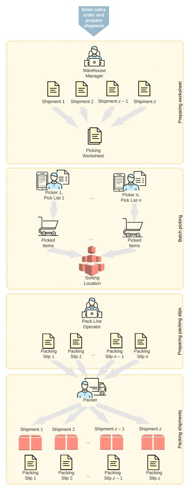

Processing a batch includes the following processes performed by the following persons:

- 1. A warehouse manager opens the *[Create Pick Lists](https://help-2025r1.acumatica.com/Help?ScreenId=ShowWiki&pageid=22649926-ac34-4b4d-8790-b019e873fa8c)* (SO503050) form, selects the shipments to be processed in a batch, specifies the maximum number of pickers, creates a picking worksheet, and prints the batch pick lists.
- 2. Each warehouse worker acting as a picker opens the *[Pick, Pack, and Ship](https://help-2025r1.acumatica.com/Help?ScreenId=ShowWiki&pageid=0d7f07e0-56a3-40a9-8cff-45bed542ae94)* (SO302020) form (or the corresponding screen in the Acumatica mobile app), switches to Pick mode, and scans the reference number of the batch pick list. Then the picker goes through the warehouse, picks the items from the needed locations, and scans their barcodes and quantities. Then the picker transfers the items to the sorting location and confirms the pick list.
- 3. A pack line operator verifies that batch is picked and prints the packing slips on the *[Picking Worksheets](https://help-2025r1.acumatica.com/Help?ScreenId=ShowWiki&pageid=7692237d-e46d-48a3-9e19-60b551f261f8)* (SO302500) form.
- 4. A warehouse worker acting as a packer opens the *[Pick, Pack, and Ship](https://help-2025r1.acumatica.com/Help?ScreenId=ShowWiki&pageid=0d7f07e0-56a3-40a9-8cff-45bed542ae94)* form (or the corresponding screen in the Acumatica mobile app), switches to Pack mode, and scans the reference number of the batch pick list. Then the packer scans the barcode of the box to which the items are being packed, and scans the barcodes and the quantity of items being packed. Aer all the items are packed, the packer confirms the shipment.

The following sections describe the workflow for a warehouse manager, a picker, a pack line operator, and a packer. By understanding the workflow for each of these employees, you can better understand the batch picking workflow as a whole in a warehouse.

#### **Workflow for a Warehouse Manager**

The workflow of a warehouse manager involves the actions shown in the following diagram.

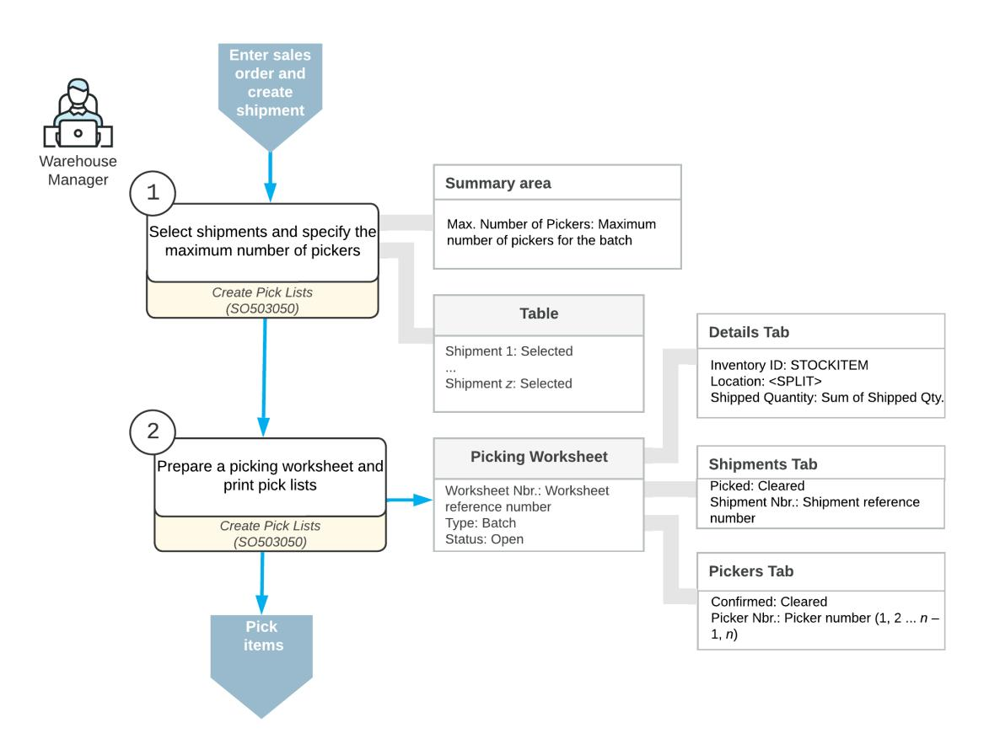

To prepare a batch picking worksheet, the warehouse manager performs the following steps:

1. *Selects the type of picking worksheet to be prepared.*

The warehouse manager opens the *[Create Pick Lists](https://help-2025r1.acumatica.com/Help?ScreenId=ShowWiki&pageid=22649926-ac34-4b4d-8790-b019e873fa8c)* (SO503050) form and selects the *Create Batch Pick Lists* action.

2. *Specifies the number of pickers.*

To specify the maximum number of pickers who are currently available to be assigned to a batch, the manager enters the value in the **Max. Number of Pickers** box.

3. *Selects the shipments.*

In the table, the manager selects the unlabeled check boxes in the lines with the shipments to be included in the picking worksheet.

4. *Creates a picking worksheet and selects the pickers.*

On the form toolbar, the manager clicks **Process** to create the picking worksheet for the selected shipments and to print the pick lists for the batch. Then the manager gives these pick lists to the pickers (that is, the warehouse workers who will perform the picking).

# **Cancellation of a Picking Worksheet**

If a batch picking worksheet has the *Picking* status on the *[Picking Worksheets](https://help-2025r1.acumatica.com/Help?ScreenId=ShowWiki&pageid=7692237d-e46d-48a3-9e19-60b551f261f8)* (SO302500) form and none of its shipments have been completely picked yet, the warehouse manager can click **Cancel Worksheet** on the More menu to cancel this worksheet.

When no shipments have been completely picked yet, the **Picked** check box is cleared for all the shipments included in the batch worksheet on the**Shipments** tab of the *[Picking Worksheets](https://help-2025r1.acumatica.com/Help?ScreenId=ShowWiki&pageid=7692237d-e46d-48a3-9e19-60b551f261f8)* form.

When a picking worksheet is canceled, the system assigns the *Canceled* status to it, cancels all the created pick lists, and removes all the related shipments from the picking worksheet. For all rows on the **Details** tab, the **Picked Qty.** becomes *0*.

Aer cancellation, the shipments from the canceled worksheet are no longer associated with this worksheet and can be added to another worksheet. These shipments can still be reviewed on the**Shipments** tab of the *[Picking](https://help-2025r1.acumatica.com/Help?ScreenId=ShowWiki&pageid=7692237d-e46d-48a3-9e19-60b551f261f8) [Worksheets](https://help-2025r1.acumatica.com/Help?ScreenId=ShowWiki&pageid=7692237d-e46d-48a3-9e19-60b551f261f8)* form; the **Unlinked** check box is selected for each shipment on the tab.

The process of physically distributing already-picked goods back to their storage locations is not covered by the picking workflow; this should be done manually according to the pick lists of the canceled worksheet.

#### **Workflow for a Picker**

The workflow for a picker involves the actions shown in the following diagram.

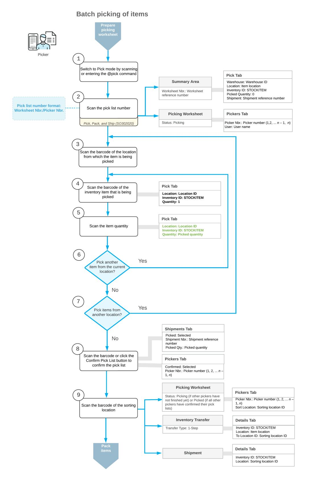

To pick the items for a batch pick list, the picker performs the following steps:

1. *Switches to Pick mode*.

The picker opens the *[Pick, Pack, and Ship](https://help-2025r1.acumatica.com/Help?ScreenId=ShowWiki&pageid=0d7f07e0-56a3-40a9-8cff-45bed542ae94)* (SO302020) form (or the corresponding screen in the Acumatica mobile app) and switches to Pick mode by scanning or entering *@pick* barcode.

2. *Scans the number of the batch pick list*.

To start the automated processing, the picker scans the reference number of the batch pick list. This reference number has the *Worksheet Nbr./Picker Nbr.* format, where *Worksheet Nbr.* is the reference number of the related picking worksheet, and the *Picker Nbr.* is the reference number of the picker assigned to this worksheet (for example, *000001/1*). The system displays the lines of the scanned document in the table and inserts the reference number of the picking worksheet that is currently selected for processing in the **Shipment Nbr.** box.

- 3. *In each location from the pick list, picks the items as follows:*
  - a. *Scans the location barcode*.

When the picker scans the barcode of the location from which the item is picked, the system searches for the location in the lines of the picking worksheet that is currently selected.

b. *Scans the item barcode*.

When the picker scans the item barcode of the picked item, the system searches for the item in the lines of the currently selected document. The system displays the picked quantity in the **Picked Quantity** column and highlights the line (in bold if the line has been picked partially, or in green if the line has been picked in full). If the UOM defined by the barcode of the scanned item corresponds to a non-base unit of measure, the system converts the item quantity defined by this barcode to the picked quantity in the base unit of measure for this item.

c. Optional: *Scans the item quantity*.

To change the picked quantity in the line that is currently being processed, the picker switches to Quantity Editing mode by clicking the**Set Qty** button on the form toolbar (or by scanning or entering the \*qty barcode) and manually entering the quantity in the UOM defined by the barcode of the scanned item.

If the pick list contains lines of multiple sales orders with the same item and location, the picker can enter the consolidated quantity of these lines. The system will automatically distribute the entered quantity among the lines with this item.

d. *Picks another item*.

If another item needs to be picked from the currently selected location, the picker scans the item barcode (returns to the second substep of this step) and repeats the process for the item.

e. *Picks items from another location*.

If the picker needs to pick items from another location, the picker scans the location barcode (returns to the first substep of this step) and repeats the process for the location.

4. *Completes the picking process*.

If the picker has finished picking all items in the pick list, the picker scans the \*confirm\*pick barcode or clicks the **Confirm Pick List** button on the form toolbar.

5. *Scans the barcode of the sorting location*.

When the picker brings the picked items to the sorting location, the picker scans the barcode of this location. The system creates and releases an inventory transfer transaction with the lines with the picked items to record the movement of items within the warehouse. In the transaction lines, the location from which the items were picked is specified as the source location, and the sorting location is specified as the destination location. On release of the inventory transfer, the system updates the picked quantity and in the lines of shipments for which the items have been picked, changes the initial location to the sorting location.

Aer the picker finishes the batch picking and brings the items to the sorting location, the picker gives the batch pick list to a pack line operator.

#### **Workflow for a Pack Line Operator**

To start the packing of the batch, the pack line operator performs the following steps:

1. *Verifies that all pickers have completed the picking for the batch.*

The pack line operator opens the batch picking worksheet on the *[Picking Worksheets](https://help-2025r1.acumatica.com/Help?ScreenId=ShowWiki&pageid=7692237d-e46d-48a3-9e19-60b551f261f8)* (SO302500) form, and on the **Shipments** tab, makes sure that all shipments included in the batch have been picked (which is indicated by the **Picked** check box being selected in each line).

2. *Prints the packing slips*.

The pack line operator prints packing slips for the shipments of the batch by opening the picking worksheet on the *[Picking Worksheets](https://help-2025r1.acumatica.com/Help?ScreenId=ShowWiki&pageid=7692237d-e46d-48a3-9e19-60b551f261f8)* form and clicking **Print PackingSlips** on the form toolbar.

Aer the pack line operator prints the packing slips, this employee gives them to a packer working at the sorting location.

### **Workflow for a Packer**

The workflow of a packer involves the actions shown in the following diagram.

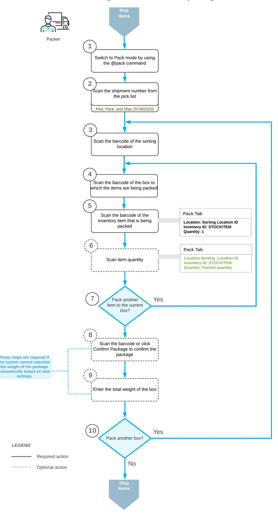

To pack the items for shipping, the packer performs the following steps:

1. *Switches to Pack mode*.

The packer opens the *[Pick, Pack, and Ship](https://help-2025r1.acumatica.com/Help?ScreenId=ShowWiki&pageid=0d7f07e0-56a3-40a9-8cff-45bed542ae94)* (SO302020) form (or the corresponding screen in the Acumatica mobile app) and switches to Pack mode by scanning or entering the *@pack* barcode.

2. *Scans the shipment number*.

To start the automated processing, the packer scans the reference number of the shipment in the packing slip. The system shows the shipment lines in the table and inserts the reference number of the document in the **Shipment Nbr.** box.

- 3. *For each box being packed for the selected shipment, does the following:*
  - a. *Scans the barcode of the box*.

The packer scans the barcode of the box into which the items will be packed.

b. *Scans the item barcode*.

When the packer scans the barcode of the packed item, the system searches for the item in the lines of the shipment that is currently selected. If the UOM defined by the barcode of the scanned item corresponds to a non-base unit of measure, the system converts the item quantity defined by this barcode to the packed quantity in the base unit of measure for this item. The system shows the packed quantity in the **Packed Quantity** column, and highlights the line (in bold if the line has been processed partially, or in green if the line has been processed in full).

c. Optional: *Scans the item quantity*.

To change the packed quantity in the line that is currently being processed, the packer switches to Quantity Editing mode by scanning or entering the \*qty barcode, and manually enters the quantity in the UOM defined by the barcode of the scanned item.

d. *Packs another item*.

If another item needs to be packed in the current box, the packer returns to scanning the item barcode (returns to the second substep of this step) and repeats the process for the item, or proceeds to the next step if all items have been packed in the box.

e. *Confirms the box*.

If all items have been packed in the box, the packer confirms the current box by scanning the \*ok barcode or by clicking the **OK** button.

f. Optional: *Enters the box weight*.

If the **Confirm Weight for Each Package** check box is selected on the **Warehouse Management** tab of the *[Sales Orders Preferences](https://help-2025r1.acumatica.com/Help?ScreenId=ShowWiki&pageid=1817779c-413b-4187-b7fe-38e97845a1cb)* (SO101000) form, the system requires the packer to confirm the weight of each box aer the package is confirmed.

If the packer wants to accept the automatically calculated weight of the box, they can do that by clicking **OK** on the form toolbar or by scanning the \*ok command. If the packer wants to change the calculated weight of the box, they must enter the new value to continue to the next step.

g. Optional: *Enters the new package dimensions*.

If the **Confirm Dimensions for Packages with Editable Dimensions** check box is selected on the **Warehouse Management** tab of the *[Sales Orders Preferences](https://help-2025r1.acumatica.com/Help?ScreenId=ShowWiki&pageid=1817779c-413b-4187-b7fe-38e97845a1cb)* (SO101000) form and the packer confirms a package that includes a box with the **Editable Dimensions** check box selected on the *[Boxes](https://help-2025r1.acumatica.com/Help?ScreenId=ShowWiki&pageid=ff38094d-bc30-4cf1-9008-0f1070ada514)* (CS207600) form, the system requires the packer to confirm the existing dimensions or enter different dimensions for the box.

If the packer wants to accept the default dimensions of the box, they can do that by clicking **OK** on the form toolbar or by scanning the \*ok command. If the packer wants to change the dimensions of the box, they must enter the length, width, and height (in this order) in one string with a space as a separator to continue to the next step.

The following example shows the entry of dimensions: 20 15 40.

h. *Packs another box*.

If more items need to be packed for the current shipment, the packer returns to scanning the barcode of the box barcode (returns to the first substep of this step) and repeats the process for another box.

4. *Completes the packing process*.

If the packer has finished the packing operation and shipping options do not need to be specified, the packer scans the \*confirm\*shipment barcode or clicks the **Confirm Shipment** button on the form toolbar. The system confirms the shipment that is currently being processed, and prints labels for the packed boxes.

## **Batch Picking: Implementation Checklist**

This topic provides details you can use to ensure that the system is configured properly for picking and packing items in a batch.

#### **Prerequisites**

Before you begin processing shipments in a batch, you should make sure the needed features have been enabled, settings have been specified, and entities have been created, as summarized in the following checklist.

| Form                                                                    | Criteria to Check                                                                                                                                                                                                                                         |
|-------------------------------------------------------------------------|-----------------------------------------------------------------------------------------------------------------------------------------------------------------------------------------------------------------------------------------------------------|
| Sales Orders Preferences (SO101000) Inventory Preferences (IN101000) | Make sure that all necessary settings related to inven tory and order management have been specified, as described in Configuration of Order Management: Gen eral Information.                                                                   |
| Enable/Disable Features (CS100000)                                      | Make sure that the following features are enabled: • Warehouse Management • Fulfillment • Advanced Picking                                                                                                                              |
| Stock Items (IN202500)                                                  | Make sure that the required stock items have been cre ated, as described in Stock Items: Implementation Activ ity.                                                                                                                                  |
| Sales Orders Preferences (SO101000)                                     | Make sure that the automated picking workflow is configured to fit the workflow established in your or ganization, as described in Picking and Packing Opera tions: Implementation Checklist or Packing Operations: Implementation Checklist. |

#### **Printing Settings**

If the *DeviceHub* feature is enabled on the *[Enable/Disable Features](https://help-2025r1.acumatica.com/Help?ScreenId=ShowWiki&pageid=c1555e43-1bc5-4f6f-ba9d-b323f94d8a6b)* (CS100000) form, you can configure the printing of documents by using the following settings on the **Warehouse Management** tab of the *[Sales Orders Preferences](https://help-2025r1.acumatica.com/Help?ScreenId=ShowWiki&pageid=1817779c-413b-4187-b7fe-38e97845a1cb)* (SO101000) form.

| Element                                       | State    | Description                                                                                                                                                   |
|-----------------------------------------------|----------|---------------------------------------------------------------------------------------------------------------------------------------------------------------|
| Print Shipment Confirmation Au tomatically | Selected | With this check box selected, the system prints the shipment confir mation automatically when a user confirms a shipment.                            |
| Print Shipment Labels Automati cally       | Selected | With this check box selected, the system prints the shipment labels for the packages included in a ship ment when the user confirms the shipment. |

#### **Known Process Limitations**

- Shipments which include non-stock items of any type cannot be processed in batch pick lists. Such shipments can be processed as separate shipments or in wave pick lists.
- If the *Automatic Packaging* feature is enabled on the *[Enable/Disable Features](https://help-2025r1.acumatica.com/Help?ScreenId=ShowWiki&pageid=c1555e43-1bc5-4f6f-ba9d-b323f94d8a6b)* (CS100000) form, a user can process in Pack mode only shipments packed to a single box. The processing of shipments packed in two or more boxes in Pack mode is currently not supported.

# **Batch Picking: Process Activity**

In the following activity, you will learn how to process shipments in a batch by using the *[Pick, Pack, and Ship](https://help-2025r1.acumatica.com/Help?ScreenId=ShowWiki&pageid=0d7f07e0-56a3-40a9-8cff-45bed542ae94)* (SO302020) form.

This activity is based on the *U100* dataset. If you are using another dataset, or if any system settings have been changed in *U100*, these changes can affect the workflow of the activity and the results of the processing. To avoid any issues, restore the *U100* dataset to its initial state.

#### **Story**

Suppose that the Wholesale warehouse of SweetLife was temporarily closed because of inventory counting. During this time, multiple orders have been entered into the system, and they now require shipping. The warehouse manager wants to speed up the process of picking and packing items by creating a batch picking worksheet and assigning this work to multiple pickers. Aer the warehouse workers pick the items and transfer them to a sorting location, a warehouse worker acting as the packer needs to pack the items and confirm the shipments.

You will perform these actions, acting as all of these employees.

#### **Configuration Overview**

In the *U100* dataset, the following tasks have been performed to support this activity:

- On the *[Enable/Disable Features](https://help-2025r1.acumatica.com/Help?ScreenId=ShowWiki&pageid=c1555e43-1bc5-4f6f-ba9d-b323f94d8a6b)* (CS100000) form, the following features have been enabled in the *Inventory and Order Management* group of features:
  - *Warehouse Management*
  - *Fulfillment*
  - *Advanced Picking*

- On the *[Warehouses](https://help-2025r1.acumatica.com/Help?ScreenId=ShowWiki&pageid=264b0ef7-2b6c-40b4-a7d9-f1a5e067939b)* (IN204000) form, the *WHOLESALE* warehouse has been created. On the **Locations** tab, the following warehouse locations have been defined: *L1R2S1*, *L1R2S2*, *L1R2S3*, *L2R1S1*, *L2R1S3*, *L2R2S1*, *L2R2S3*, *L3R1S1*, *L3R1S2*, *L3R2S1*, *L3R2S2*, and *SORT*.
- On the *[Stock Items](https://help-2025r1.acumatica.com/Help?ScreenId=ShowWiki&pageid=77786a70-1f1e-4d63-ad98-96f98e4fcb0e)* (IN202500) form, the following stock items have been created, and the corresponding barcodes have been defined:
  - *ORJAM32*, which has the *OJ32* barcode
  - *LEMJAM96*, which has the *LJ96* barcode
  - *APJAM08*, which has the *AJ08* barcode
- On the *[Boxes](https://help-2025r1.acumatica.com/Help?ScreenId=ShowWiki&pageid=ff38094d-bc30-4cf1-9008-0f1070ada514)* (CS207600) form, the *MEDIUM* box has been defined.
- On the *[Sales Orders](https://help-2025r1.acumatica.com/Help?ScreenId=ShowWiki&pageid=19e4021c-1b84-49fd-be12-0320c5f1c7e5)* (SO301000) form, the following sales orders have been created for multiple customers: *000047*, *000048*, *000049*, *000050*, *000051*, *000052*, *000053*, *000054*, *000055*, *000056*, *000057*, *000058*, and *000059*.
- On the *[Shipments](https://help-2025r1.acumatica.com/Help?ScreenId=ShowWiki&pageid=f47cffcc-543e-469c-a204-a9c1e3da346d)* (SO302000) form, the following shipment documents have been created for these sales orders: *000046*, *000047*, *000048*, *000049*, *000050*, *000051*, *000052*, *000053*, *000054*, *000055*, *000056*, *000057*, and *000058*.

#### **Process Overview**

In this activity, you will do the following:

- 1. Acting as a warehouse manager, open the *[Create Pick Lists](https://help-2025r1.acumatica.com/Help?ScreenId=ShowWiki&pageid=22649926-ac34-4b4d-8790-b019e873fa8c)* (SO503050) form, select the shipments to be processed in a batch, specify the maximum number of pickers, and create a picking worksheet.
- 2. You will do the following:
  - a. Acting as a picker, open the *[Pick, Pack, and Ship](https://help-2025r1.acumatica.com/Help?ScreenId=ShowWiki&pageid=0d7f07e0-56a3-40a9-8cff-45bed542ae94)* (SO302020) form, switch to Pick mode, and scan the reference number of the batch pick list. Then you will scan the barcodes and quantities of the items being picked. Aer you finish picking, you will scan the barcode of the sorting location and confirm the pick list.
  - b. Acting as the second picker, do the same on the *[Pick, Pack, and Ship](https://help-2025r1.acumatica.com/Help?ScreenId=ShowWiki&pageid=0d7f07e0-56a3-40a9-8cff-45bed542ae94)* form.
  - c. Acting as the third picker, do the same on the *[Pick, Pack, and Ship](https://help-2025r1.acumatica.com/Help?ScreenId=ShowWiki&pageid=0d7f07e0-56a3-40a9-8cff-45bed542ae94)* form.
- 3. Acting as a pack line operator, verify that batch is picked and prepare the printable packing slips on the *[Picking Worksheets](https://help-2025r1.acumatica.com/Help?ScreenId=ShowWiki&pageid=7692237d-e46d-48a3-9e19-60b551f261f8)* (SO302500) form.
- 4. Acting as a packer, open the *[Pick, Pack, and Ship](https://help-2025r1.acumatica.com/Help?ScreenId=ShowWiki&pageid=0d7f07e0-56a3-40a9-8cff-45bed542ae94)* form, switch to Pack mode, and scan the reference number of the batch pick list. Then you will scan the barcode of the box to which the items will be packed, and scan the barcodes and the quantity of items being packed. Aer all the items are packed, you will confirm the shipment.

In any working mode, you enter a command or barcode by typing it in the**Scan** box and pressing Enter. In production systems, you will scan the appropriate barcodes rather than manually entering them.

#### **System Preparation**

Before you start the automated picking and packing operations, you need to perform the following instructions:

- 1. Launch the Acumatica ERP website, and sign in to a company with the *U100* dataset preloaded. You should sign in as a warehouse manager with the *angelo* username and *123* password.
- 2. In the info area, in the upper-right corner of the top pane of the Acumatica ERP screen, make sure that the business date in your system is set to *1/30/2025*. If a different date is displayed, click the Business Date menu button and select *1/30/2025* on the calendar. For simplicity, in this activity, you will create and process all documents in the system on this business date.

3. On the **Warehouse Management** tab of the *[Sales Orders Preferences](https://help-2025r1.acumatica.com/Help?ScreenId=ShowWiki&pageid=1817779c-413b-4187-b7fe-38e97845a1cb)* (SO101000) form, make sure that the **Display the PickTab** and the **Display the PackTab** check boxes are selected.

#### **Step 1: Preparing the Batch Picking Worksheet**

As the warehouse manager, prepare the batch picking worksheet as follows:

- 1. Open the *[Create Pick Lists](https://help-2025r1.acumatica.com/Help?ScreenId=ShowWiki&pageid=22649926-ac34-4b4d-8790-b019e873fa8c)* (SO503050) form, and in the **Action** box, select *Create Batch Pick Lists*.
- 2. In the **Warehouse ID**, select *WHOLESALE*.
- 3. In the **End Date** box, make sure *1/30/2025* is specified.
- 4. In the **Max. Number of Pickers** box, type 4.
- 5. In the table, select the unlabeled check box in the rows of the shipments with reference numbers from *000046* through *000058*.
- 6. On the form toolbar, click **Process**. The system processes the shipments. Close the **Processing** dialog box aer the processing has completed.
- 7. On the *[Picking Worksheets](https://help-2025r1.acumatica.com/Help?ScreenId=ShowWiki&pageid=7692237d-e46d-48a3-9e19-60b551f261f8)* (SO302500) form, review the details of the created worksheet of the *Batch* type with the *Open* status (see the following screenshot). The **Details** tab lists all the items that have to be packed in the batch. Notice that *<SPLIT>* is shown in the **Location** column for all lines, indicating that each item has to be picked from multiple locations. You can select any line and then click **Line Details** on the table toolbar to review the list of locations from which the items will be picked.

| <b>Picking Worksheets</b> !!!!!!!!!!!!!!!!!!!!!!!!!!!!!!!!!!!!!!!! | $\Box$ NOTES                       | <b>FILES</b> TOOLS $\sim$                   |             |                                 |              |                          |                         |                     |
|-----------------------------------------------------------------------|------------------------------------|------------------------------------------------|-------------|---------------------------------|--------------|--------------------------|-------------------------|---------------------|
| 뭐 H $\leftarrow$                                                | 血 $\mathsf{K}$ $\Omega$      | Ы ≺ $\rightarrow$                        | <b>HOLD</b> | <b>PRINT PICK LISTS</b>         | $\cdots$     |                          |                         |                     |
| Worksheet Nbr.:                                                       | Q 000002                        | Warehouse ID:                                  |             | WHOLESALE - Wholesale Warehouse |              | <b>Shipped Quantity:</b> |                         | $\lambda$ 125.00 |
| Type:                                                                 | <b>Batch</b>                       | Picking Started On:                            |             |                                 |              | Shipped Weight:          | 42.600000               |                     |
| Status:                                                               | Open                               | Picking Finished On:                           |             |                                 |              | Shipped Volume:          | 42.600000               |                     |
| Date:                                                                 | 1/30/2025                          |                                                |             |                                 |              |                          |                         |                     |
| <b>DETAILS</b>                                                        | <b>SHIPMENTS</b> <b>PICKERS</b> |                                                |             |                                 |              |                          |                         |                     |
| Ò $\times$ $\div$                                               | <b>LINE DETAILS</b>                | $ \mathbf{x} $ $\left  \rightarrow \right $ |             |                                 |              |                          |                         |                     |
| <b>B</b> Warehouse                                                    | Location                           | <b>Inventory ID</b>                            | <b>UOM</b>  | Shipped Qty.                    | Ordered Qty. | Open Qty.                | Picked Qty. Description |                     |
| ⋋ WHOLESALE                                                        | $<$ SPLIT $>$                      | APJAM08                                        | PIECE       | 56.00                           | 0.00         | 0.00                     | 0.00                    |                     |
| <b>WHOLESALE</b>                                                      | $<$ SPLIT $>$                      | LEMJAM96                                       | PIECE       | 15.00                           | 0.00         | 0.00                     | 0.00                    |                     |
| <b>WHOLESALE</b>                                                      | <split></split>                    | ORJAM32                                        | PIECE       | 54.00                           | 0.00         | 0.00                     | 0.00                    |                     |

#### *Figure: Items to be picked for all the shipments included in the worksheet*

- 8. Review the **Pickers** tab. The system has calculated the optimal path and determined that the appropriate number of pickers is four (see the following screenshot).
- 9. Click the first line in the table, and click**View Pick List** on the table toolbar to review the items included in the pick list for the first picker.

| <b>Picking Worksheets</b>         | 000002 - Wholesale Warehouse      |                |                              |                      |                         |                                 |                                     |                           | $\bigcap$ NOTES          | <b>FILES</b> | TOOLS $\star$       |
|-----------------------------------|-----------------------------------|----------------|------------------------------|----------------------|-------------------------|---------------------------------|-------------------------------------|---------------------------|--------------------------|--------------|---------------------|
| $\overline{\Box}$ $\leftarrow$ | $\boxdot$ 圎 $\Omega$        | $\mathsf{K}$   | $\left\langle \right\rangle$ | $\sum_{i=1}^{n}$     | $\geq$                  | <b>HOLD</b>                     | <b>PRINT PICK LISTS</b> $\cdots$ |                           |                          |              |                     |
| Worksheet Nbr.:                   | 000002                            | $\varphi$      |                              | Warehouse ID:        |                         | WHOLESALE - Wholesale Warehouse |                                     |                           | <b>Shipped Quantity:</b> | 125.00       | $\hat{\phantom{a}}$ |
| Type:                             | <b>Batch</b>                      |                |                              | Picking Started On:  |                         |                                 |                                     |                           | Shipped Weight:          | 42.600000    |                     |
| Status:                           | Open                              |                |                              | Picking Finished On: |                         |                                 |                                     |                           | Shipped Volume:          | 42.600000    |                     |
| Date:                             | 1/30/2025                         |                |                              |                      |                         |                                 |                                     |                           |                          |              |                     |
| <b>DETAILS</b>                    | <b>SHIPMENTS</b>                  | <b>PICKERS</b> |                              |                      |                         |                                 |                                     |                           |                          |              |                     |
| $^{+}$ Ò                       | <b>VIEW PICK LIST</b> $\times$ |                | $\vdash$                     | $\boxed{\mathbf{x}}$ |                         |                                 |                                     |                           |                          |              |                     |
| <b>B</b> Confirmed                | Picker User Nbr.               |                |                              | <b>Pick List</b>     |                         |                                 |                                     |                           | $\times$                 |              |                     |
| $\Box$ $\rightarrow$           |                                   |                |                              | Ò $\vdash$        | $\mathbf{\overline{X}}$ |                                 |                                     |                           |                          |              |                     |
| $\Box$                            | $\overline{2}$                    |                |                              | Location             |                         | <b>Inventory ID</b>             | Quantity UOM                        |                           | Picked Quantity       |              |                     |
| $\Box$                            | 3 1                    |                | $\rightarrow$                | <b>L1R2S1</b>        |                         | ORJAM32                         |                                     | 5.00 PIECE                | 0.00                     |              |                     |
| $\Box$                            | 4                                 |                |                              | <b>L1R2S2</b>        |                         | LEMJAM96                        | 9.00                                | <b>PIECE</b>              | 0.00                     |              |                     |
|                                   |                                   |                |                              | <b>L1R2S3</b>        |                         | LEMJAM96                        |                                     | 4.00 PIECE                | 0.00                     |              |                     |
|                                   |                                   |                |                              |                      |                         |                                 |                                     |                           |                          |              |                     |
|                                   |                                   |                |                              |                      |                         |                                 |                                     |                           |                          |              |                     |
|                                   |                                   |                |                              |                      |                         |                                 |                                     |                           |                          |              |                     |
|                                   |                                   |                |                              |                      |                         |                                 |                                     | $\mathbb{R}$ $\langle$ | $\rightarrow$ $>$     |              |                     |
|                                   |                                   |                |                              |                      |                         |                                 |                                     |                           |                          |              |                     |

*Figure: List of pickers of the shipments*

10.Sign out of the system.

#### **Step 2a: Picking the Items in a Batch (Picker 1)**

Acting as the first picker in the picking worksheet, you will do the following:

- 1. Sign in to the system as the first picker by using the *rollins* username and the *123* password.
- 2. Open the *[Pick, Pack, and Ship](https://help-2025r1.acumatica.com/Help?ScreenId=ShowWiki&pageid=0d7f07e0-56a3-40a9-8cff-45bed542ae94)* (SO302020) form, and make sure the **Pick** tab is opened.
- 3. In the **Scan** box, enter 000001/1, which is the reference number of the pick list for the first picker.
- 4. Pick the first line by doing the following:
  - a. Enter L1R2S1 to select the location from which you are picking items.
  - b. Enter OJ32 to pick the item. (*OJ32* is the barcode for *ORJAM32*, the 32-ounce jar of orange jam.) The system highlights the line in bold and specifies *1* as the **Picked Quantity**.
  - c. Set the quantity of the item to 5 as follows:
    - a. On the form toolbar, click**Set Qty**. The system prompts you to enter the item quantity.
    - b. In the **Scan** box, enter 5.
- 5. Pick the second line by doing the following:
  - a. Enter L1R2S2 to select the location from which you are picking items.
  - b. Enter LJ96 to pick the item. (*LJ96* is the barcode for *LEMJAM96*, the 96-ounce jar of lemon jam.)
  - c. Set the quantity of the item to 9.
- 6. Pick the third line by doing the following:

- a. Enter L1R2S3 to select the location from which you are picking items.
- b. Enter LJ96 to pick the item.
- c. Set the quantity to 4.
- 7. On the form toolbar, click **Confirm Pick List**.
- 8. In the **Scan** box, enter SORT to specify the sorting location to which you have transferred the picked items. As the first picker, you have finished picking the items.
- 9. Sign out of the system.

#### **Step 2b: Picking the Items in a Batch (Picker 2)**

Acting as the second picker in the picking worksheet, you will do the following:

- 1. Sign in to the system as the second picker by using the *perkins* username and the *123* password.
- 2. Open the *[Pick, Pack, and Ship](https://help-2025r1.acumatica.com/Help?ScreenId=ShowWiki&pageid=0d7f07e0-56a3-40a9-8cff-45bed542ae94)* (SO302020) form, and make sure the **Pick** tab is opened.
- 3. In the **Scan** box, enter 000001/2, which is the reference number of the pick list for the second picker. The system loads the shipment lines to the table on the **Pick** tab, and shows the reference number of the picking worksheet that is currently being processed in the **Worksheet Nbr.** box of the Summary area.
- 4. Pick the first line by doing the following:
  - a. Enter L2R1S1 to select the location from which you are picking items.
  - b. Enter OJ32 to pick the item.

The system highlights the line in bold and specifies *1* as the **Picked Quantity**.

- c. Set the quantity of the item to 24 as follows:
  - a. On the form toolbar, click**Set Qty**. The system prompts you to enter the item quantity.
  - b. In the **Scan** box, enter 24. The system highlights the line in green and inserts *8* as the **Picked Quantity**.
- 5. Pick the second line by doing the following:
  - a. Enter L2R1S3 to select the location from which you are picking items.
  - b. Enter OJ32 to pick the item.
  - c. Set the quantity of this item to 13.
- 6. On the form toolbar, click **Confirm Pick List**.
- 7. In the **Scan** box, enter SORT to specify the sorting location to which you have transferred the picked items. As the second picker, you have finished picking the items.
- 8. Sign out of the system.

#### **Step 2c: Picking the Items in a Batch (Picker 3)**

Acting as the third picker in the picking worksheet, you will do the following:

- 1. Sign in to the system as the third picker by using the *hardin* username and the *123* password.
- 2. Open the *[Pick, Pack, and Ship](https://help-2025r1.acumatica.com/Help?ScreenId=ShowWiki&pageid=0d7f07e0-56a3-40a9-8cff-45bed542ae94)* (SO302020) form, and make sure the **Pick** tab is opened.
- 3. In the **Scan** box, enter 000001/3, which is the reference number of the pick list for the third picker.
- 4. Pick the first line by doing the following:
  - a. Enter L2R2S1 to select the location from which you are picking items.
  - b. Enter AJ08 to pick the item. (*AJ08* is the barcode for *APJAM08*, the 8-ounce jar of apple jam.)

The system highlights the line in bold and specifies *1* as the **Picked Quantity**.

- c. Set the quantity of the item to 16 as follows:
  - On the form toolbar, click**Set Qty**. The system prompts you to enter the item quantity.
  - In the **Scan** box, enter 16. The system highlights the line in green and inserts *24* as the **Picked Quantity**.
- 5. Pick the second line by doing the following:
  - a. Enter L2R2S3 to select the location from which you are picking items.
  - b. Enter AJ08 to pick the item.
  - c. Set the quantity of the item to 13.
- 6. Pick the last line by doing the following:
  - a. Enter L2R2S3 to select the location from which you are picking items.
  - b. Enter LJ96 to pick the item.
  - c. Enter LJ96 again to add second unit to the current line.
- 7. On the form toolbar, click **Confirm Pick List**.
- 8. In the **Scan** box, enter SORT to specify the sorting location to which you have transferred the picked items. As the third picker, you have finished picking the items.
- 9. Sign out of the system.

#### **Step 2d: Picking the Items in a Batch (Picker 4)**

Acting as the fourth picker in the picking worksheet, you will do the following:

- 1. Sign in to the system as the fourth warehouse worker by using the *barber* username and the *123* password.
- 2. Open the *[Pick, Pack, and Ship](https://help-2025r1.acumatica.com/Help?ScreenId=ShowWiki&pageid=0d7f07e0-56a3-40a9-8cff-45bed542ae94)* (SO302020) form, and make sure the **Pick** tab is opened.
- 3. In the **Scan** box, enter 000001/4, which is the reference number of the pick list for a fourth picker.
- 4. Pick the first line by doing the following:
  - a. Enter L3R1S1 to select the location from which you are picking items.
  - b. Enter AJ08 to pick the item.

The system highlights the line in bold and inserts *1* as the **Picked Quantity**.

- c. Set the quantity of the item to 10 as follows:
  - On the form toolbar, click**Set Qty**. The system prompts you to enter the item quantity.
  - In the **Scan** box, enter 10. The system highlights the line in green and inserts *10* as the **Picked Quantity**.
- 5. Pick the second line by doing the following:
  - a. Enter L3R1S2 to select the location from which you are picking items.
  - b. Enter AJ08 to pick the item.
  - c. Set the quantity of this item to 13.
- 6. Pick the third line by doing the following:
  - a. Enter L3R2S1 to select the location from which you are picking items.
  - b. Enter OJ32 to pick the item.
  - c. Set the quantity of this item to 12.
- 7. Pick the last line by doing the following:

- a. Enter L3R2S2 to select the location from which you are picking items.
- b. Enter AJ08 to pick the item.
- c. Set the quantity of this item to 4.
- 8. On the form toolbar, click **Confirm Pick List**.
- 9. In the **Scan** box, enter SORT to specify the sorting location to which you have transferred the picked items. As the fourth picker, you have finished picking the items.

10.Sign out of the system.

You have picked all the items for the picking worksheet, and now you can proceed with packing the shipments.

#### **Step 3: Preparing the Packing Slips**

You will now act as the pack line operator who prepares packing slips for the processed shipments. Do the following:

- 1. Sign in to the system as a pack line operator by using the *rueb* username and the *123* password.
- 2. On the *[Picking Worksheets](https://help-2025r1.acumatica.com/Help?ScreenId=ShowWiki&pageid=7692237d-e46d-48a3-9e19-60b551f261f8)* (SO302500) form, open the batch picking worksheet, and review the **Pickers** tab (see the following screenshot). The usernames of the workers who performed the picking operations are shown in the **User** column; the selected check boxes in each line of the **Confirmed** column indicate that each picker has confirmed the completion of the picking. The values in the**Sorting Location** column indicate that the pickers have finished the picking and taken the picked items to the sorting location.

|                       |                                                                     |                                            |                                                                  |                                                  |                                                |  |                                |              |                                                                                     |                                                                        |           |                                                             | TOOLS $\star$             |  |
|-----------------------|---------------------------------------------------------------------|--------------------------------------------|------------------------------------------------------------------|--------------------------------------------------|------------------------------------------------|--|--------------------------------|--------------|-------------------------------------------------------------------------------------|------------------------------------------------------------------------|-----------|-------------------------------------------------------------|---------------------------|--|
|                       | ↶                                                                   | 面                                          |                                                                  | ≺                                                |                                                |  |                                |              | $\cdots$                                                                            |                                                                        |           |                                                             |                           |  |
|                       |                                                                     | Q                                          |                                                                  |                                                  |                                                |  |                                |              |                                                                                     |                                                                        |           | 125.00                                                      | $\hat{\phantom{a}}$       |  |
| <b>Batch</b> Type: |                                                                     |                                            |                                                                  |                                                  |                                                |  |                                |              |                                                                                     | Shipped Weight:                                                        | 42.600000 |                                                             |                           |  |
|                       |                                                                     |                                            |                                                                  |                                                  |                                                |  |                                |              |                                                                                     |                                                                        |           |                                                             |                           |  |
|                       |                                                                     |                                            |                                                                  |                                                  |                                                |  |                                |              |                                                                                     |                                                                        |           |                                                             |                           |  |
|                       |                                                                     |                                            |                                                                  | $\mapsto$                                        | $\mathbf{\overline{N}}$                        |  |                                |              |                                                                                     |                                                                        |           |                                                             |                           |  |
|                       | Nbr.                                                                |                                            |                                                                  |                                                  |                                                |  |                                |              |                                                                                     | <b>Sorting Location</b>                                                |           |                                                             |                           |  |
|                       | 1                                                                   | rollins                                    |                                                                  |                                                  |                                                |  |                                | $\mathbf{0}$ |                                                                                     | <b>SORT</b>                                                            |           |                                                             |                           |  |
|                       | 2                                                                   | perkins                                    |                                                                  |                                                  |                                                |  |                                | 0            |                                                                                     | <b>SORT</b>                                                            |           |                                                             |                           |  |
|                       | 3                                                                   | hardin                                     |                                                                  |                                                  |                                                |  |                                | 0            | <b>SORT</b>                                                                         |                                                                        |           |                                                             |                           |  |
|                       | 4                                                                   | barber                                     |                                                                  |                                                  |                                                |  |                                | 10           |                                                                                     | <b>SORT</b>                                                            |           |                                                             |                           |  |
|                       | 뭐 Worksheet Nbr.: <b>DETAILS</b> $+$ <b>B</b> Confirmed | <b>Picking Worksheets</b> H $\times$ | 000002 Picked 1/30/2025 <b>SHIPMENTS</b> Picker User | $\overline{\mathsf{K}}$ <b>VIEW PICK LIST</b> | 000002 - Wholesale Warehouse <b>PICKERS</b> |  | $\rightarrow$ Warehouse ID: | >1           | Picking Started On: 10/1/2024 11:2 Picking Finished On: 10/1/2024 11:3 Length | PRINT PACKING SLIPS WHOLESALE - Wholesale Warehouse Path Cart ID |           | $\Box$ NOTES <b>Shipped Quantity:</b> Shipped Volume: | <b>FILES</b> 42.600000 |  |

*Figure: The users who confirmed the picking of the batch*

3. Review the**Shipments** tab, as shown in the following screenshot. All shipments have been picked, as the selected check boxes in the **Picked** column indicate; the picking worksheet now is assigned the *Picked* status.

| <b>Picking Worksheets</b> | 000002 - Wholesale Warehouse |                     |                |                                  |               |                                     |       |                                 |                          |                              |                          | <b>PINOTES</b>  | <b>FILES</b> | TOOLS $\star$        |
|---------------------------|------------------------------|---------------------|----------------|----------------------------------|---------------|-------------------------------------|-------|---------------------------------|--------------------------|------------------------------|--------------------------|-----------------|--------------|----------------------|
| 뭐 $\leftarrow$         | 昌 $\Omega$                | 血                   | $\mathsf{K}$   | ≺                                | $\rightarrow$ | >1                                  |       | PRINT PACKING SLIPS             | .                        |                              |                          |                 |              |                      |
| Worksheet Nbr.:           | 000002                       | Q                   |                | Warehouse ID:                    |               |                                     |       | WHOLESALE - Wholesale Warehouse |                          |                              | <b>Shipped Quantity:</b> |                 | 125.00       | $\ddot{\phantom{1}}$ |
| Type:                     | <b>Batch</b>                 |                     |                |                                  |               | Picking Started On: 10/1/2024 11:2  |       |                                 |                          |                              | Shipped Weight:          |                 | 42.600000    |                      |
| Status:                   | Picked                       |                     |                |                                  |               | Picking Finished On: 10/1/2024 11:3 |       |                                 |                          | Shipped Volume: 42.600000 |                          |                 |              |                      |
| Date:                     | 1/30/2025                    |                     |                |                                  |               |                                     |       |                                 |                          |                              |                          |                 |              |                      |
| <b>DETAILS</b>            | <b>SHIPMENTS</b>             |                     | <b>PICKERS</b> |                                  |               |                                     |       |                                 |                          |                              |                          |                 |              |                      |
| Ò $\hspace{0.1mm} +$   | ×                            | <b>VIEW PICKERS</b> |                | $\left  \leftrightarrow \right $ | $\mathbf{x}$  |                                     |       |                                 |                          |                              |                          |                 |              |                      |
| <b>B</b> Picked           | Shipment Nbr.                |                     |                | Picked Qty.                      |               | Shipped Quantity                 |       | Shipped Weight               | Shipped Status Volume |                              |                          | <b>Unlinked</b> |              |                      |
| ☑                         | 000046                       |                     |                |                                  | 6.00          |                                     | 6.00  | 5.680000                        | 5.680000                 | Open                         |                          | □               |              |                      |
| $\overline{\mathsf{S}}$   | 000047                       |                     |                |                                  | 9.00          |                                     | 9.00  | 5.680000                        | 5.680000                 | Open                         |                          | $\Box$          |              |                      |
| $\overline{\mathsf{S}}$   | 000048                       |                     |                |                                  | 4.00          |                                     | 4.00  | 0.000000                        | 0.000000                 | Open                         |                          | $\Box$          |              |                      |
| ☑                         | 000049                       |                     |                |                                  | 8.00          |                                     | 8.00  | 0.000000                        | 0.000000                 | Open                         |                          | $\Box$          |              |                      |
| ☑                         | 000050                       |                     |                | 13.00                            |               |                                     | 13.00 | 11.360000                       | 11.360000                | Open                         |                          | $\Box$          |              |                      |
| ☑                         | 000051                       |                     |                | 12.00                            |               |                                     | 12.00 | 8.520000                        | 8.520000                 | Open                         |                          | $\Box$          |              |                      |
| ⊻                         | 000052                       |                     |                |                                  | 7.00          |                                     | 7.00  | 0.000000                        | 0.000000                 | Open                         |                          | $\Box$          |              |                      |
| ☑                         | 000053                       |                     |                | 15.00                            |               |                                     | 15.00 | 0.000000                        | 0.000000                 | Open                         |                          | $\Box$          |              |                      |
| ⊻                         | 000054                       |                     |                |                                  | 9.00          |                                     | 9.00  | 5.680000                        | 5.680000                 | Open                         |                          | $\Box$          |              |                      |
| ☑                         | 000055                       |                     |                | 24.00                            |               |                                     | 24.00 | 0.000000                        | 0.000000                 | Open                         |                          | $\Box$          |              |                      |
| ☑                         | 000056                       |                     |                | 12.00                            |               |                                     | 12.00 | 0.000000                        | 0.000000                 | Open                         |                          | $\Box$          |              |                      |
| ☑                         | 000057                       |                     |                |                                  | 2.00          |                                     | 2.00  | 5.680000                        | 5.680000                 | Open                         |                          | $\Box$          |              |                      |
| ☑                         | 000058                       |                     |                |                                  | 4.00          |                                     | 4.00  | 0.000000                        | 0.000000                 | Open                         |                          | $\Box$          |              |                      |

#### *Figure: Shipments ready for packing*

- 4. On the form toolbar, click **Print PackingSlips**. The system opens the printable packing slips on the *[Batch](https://help-2025r1.acumatica.com/Help?ScreenId=ShowWiki&pageid=6a0f1680-88de-4a6e-9495-c31949fd70e3) [Packing Slip](https://help-2025r1.acumatica.com/Help?ScreenId=ShowWiki&pageid=6a0f1680-88de-4a6e-9495-c31949fd70e3)* (SO644005) report form. In the production system, you would print the packing slips and give them to a warehouse worker who will perform packing of shipments.
- 5. Sign out of the system.

#### **Step 4: Packing Items for a Shipment in the Batch**

At this point in the batch picking, all of the shipments from the batch can be packed. For the purposes of this activity, you will pack just one of the shipments, acting as a warehouse worker who handles packing.

To pack this shipment, do the following:

- 1. Sign in to the system as a warehouse worker who will perform packing operations by using the *sauer* username and the *123* password.
- 2. Open the *[Pick, Pack, and Ship](https://help-2025r1.acumatica.com/Help?ScreenId=ShowWiki&pageid=0d7f07e0-56a3-40a9-8cff-45bed542ae94)* (SO302020) form and make sure that Pack mode is active.
- 3. In the **Scan** box of the Summary area, enter 000046, which is the reference number of a shipment ready for packing.
- 4. Enter MEDIUM to select the box into which you are packing the items.
- 5. Enter AJ08 to select the item being packed. The system highlights the first line of the shipment in bold and specifies *1* as the **Packed Quantity**.
- 6. Set the quantity of this item to 4 as follows:
  - a. On the form toolbar, click**Set Qty**. The system prompts you to enter the item quantity.

- b. In the **Scan** box, enter 4. The system highlights the first line of the shipment in green and inserts 4 as the **Packed Quantity**, indicating that four 8-ounce jars of apple jam have been packed into the selected box.
- 7. Enter LJ96 to select another item being packed to the current box
- 8. Enter LJ96 again to pack one more unit of this item.
- 9. On the form toolbar, click **Confirm Shipment**.

# **Paperless Fulfillment of Orders**

In Acumatica ERP, you can perform picking and packing of items for shipment in an automated mode by using barcode scanners or mobile devices with a scanning option on the *[Pick, Pack, and Ship](https://help-2025r1.acumatica.com/Help?ScreenId=ShowWiki&pageid=0d7f07e0-56a3-40a9-8cff-45bed542ae94)* (SO302020) form or the Pick, Pack, and Ship screen in the Acumatica mobile app. If the *Paperless Picking* feature is enabled on the *[Enable/](https://help-2025r1.acumatica.com/Help?ScreenId=ShowWiki&pageid=c1555e43-1bc5-4f6f-ba9d-b323f94d8a6b) [Disable Features](https://help-2025r1.acumatica.com/Help?ScreenId=ShowWiki&pageid=c1555e43-1bc5-4f6f-ba9d-b323f94d8a6b)* (CS100000) form, you can perform this processes without printing .

The topics of this chapter describe the processing of shipments in a batch.

# **Paperless Picking: General Information**

In this topic, you will read about the paperless picking workflow in Acumatica ERP. If the *Paperless Picking* feature is enabled on the *[Enable/Disable Features](https://help-2025r1.acumatica.com/Help?ScreenId=ShowWiki&pageid=c1555e43-1bc5-4f6f-ba9d-b323f94d8a6b)* (CS100000) form, you can organize the warehouse picking jobs without printing paper pick lists. The process of picking must be prepared by a warehouse manager for the system to manage the picking queue, priorities, and direct assignments of the pick lists.

For simplicity, this topic will illustrate the workflow of paperless picking only for single-shipment pick lists. The paperless picking supports wave and batch pick lists too.

#### **Learning Objectives**

In this chapter, you will do the following:

- Create pick lists
- Change the priority of pick lists
- Assign pick lists to pickers
- Pick and pack items without printing a pick list
- Confirm the shipment aer packing the items

#### **Applicable Scenario**

You can use the paperless picking flow for processing daily picking jobs in your warehouse when you organization wants to save on paper. With a paperless picking flow, the warehouse manager prepares pick lists for orders to be shipped and does not print the pick lists. Pickers accept a pick list, collect the items, and organize them in the individual totes assigned to each pick list. When the items are brought to the packing location, the packer takes the items from each of the totes, verifies that the shipment is collected correctly, and packs the items into boxes.

#### **General Process of Paperless Picking**

The workflow of fulfilling orders with the paperless picking workflow is shown in the following diagram.

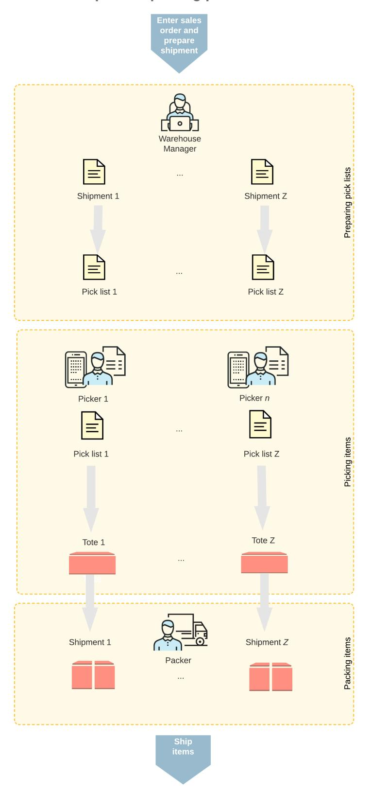

The paperless picking workflow includes the following processes performed by the following persons:

1. A warehouse manager opens the *[Create Pick Lists](https://help-2025r1.acumatica.com/Help?ScreenId=ShowWiki&pageid=22649926-ac34-4b4d-8790-b019e873fa8c)* (SO503050) form, selects the type of pick lists to be created and the shipments to be processed, specifies the process parameters, and creates the pick lists. Then on the *[Manage Picking Queue](https://help-2025r1.acumatica.com/Help?ScreenId=ShowWiki&pageid=1b28adc2-9f8c-4c74-8a8c-576735489701)* (SO503075) form, the warehouse manager assigns pickers and changes the pick list priority if required, and then sends the pick lists to the picking queue. Aer that, the warehouse manager opens the *[Picking Queue](https://help-2025r1.acumatica.com/Help?ScreenId=ShowWiki&pageid=6b99dd9a-25b5-4e8e-9c45-da29958ca8c2)* (SO503080) form and manages the process of picking and packing in live mode.

- 2. A warehouse worker acting as a picker opens the *[Pick, Pack, and Ship](https://help-2025r1.acumatica.com/Help?ScreenId=ShowWiki&pageid=0d7f07e0-56a3-40a9-8cff-45bed542ae94)* (SO302020) form (or the corresponding screen in the Acumatica mobile app), switches to Pick mode, and scans the reference number of a pick list or clicks **Next List** on the form toolbar to accept a pick list from the picking queue. The picker scans the location, then the barcode of the tote that will be used for picking items for a particular pick list. Aer the picker scans the tote, the system assigns the tote to the pick list. Then the picker goes through the warehouse, picks the items, scans items' barcodes and quantities, and puts the items in the tote.
- 3. A warehouse worker acting as a packer opens the *[Pick, Pack, and Ship](https://help-2025r1.acumatica.com/Help?ScreenId=ShowWiki&pageid=0d7f07e0-56a3-40a9-8cff-45bed542ae94)* form (or the corresponding screen in the Acumatica mobile app), switches to Pack mode and scans the reference number of the tote. Then the packer scans the barcode of the box to which the items are being packed, takes the items from the totes, scans the barcodes and the quantity of items being packed, and puts items in boxes. When all the items are packed, the packer confirms the shipment.

The following sections illustrate and describe the workflows for a warehouse manager, a picker, and a packer in detail. By understanding the workflow for each of these employees, you can better understand the paperless picking workflow in a warehouse.

#### **Workflow for a Warehouse Manager**

The workflow of a warehouse manager involves the actions shown in the following diagram.

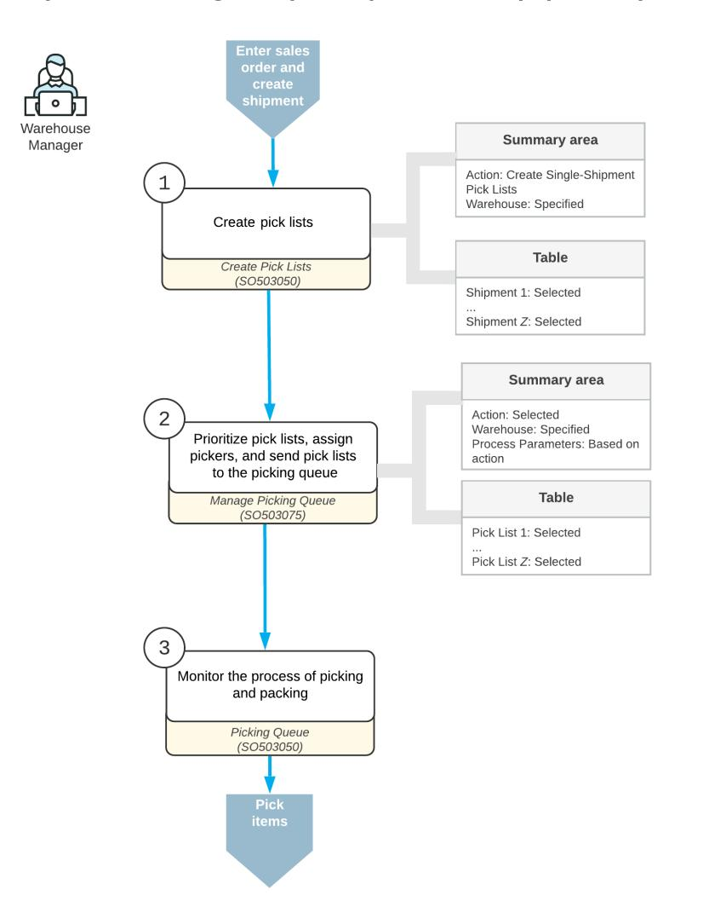

To prepare pick lists in a paperless picking flow, the warehouse manager performs the following steps:

1. *Selects the type of pick lists to be prepared*.

The warehouse manager opens the *[Create Pick Lists](https://help-2025r1.acumatica.com/Help?ScreenId=ShowWiki&pageid=22649926-ac34-4b4d-8790-b019e873fa8c)* (SO503050) form and selects the *Create Single-Shipment Pick Lists* action.

2. Optional: *Specifies whether the pick lists will be printed*.

In the Selection area of the *[Create Pick Lists](https://help-2025r1.acumatica.com/Help?ScreenId=ShowWiki&pageid=22649926-ac34-4b4d-8790-b019e873fa8c)* form, the manager selects the **Print Pick Lists** check box to specify that a printing version should be prepared for the pick list aer the list is created.

3. Optional: *Specifies whether the pick list will be added to the picking queue aer creation*.

In the Selection area of the *[Create Pick Lists](https://help-2025r1.acumatica.com/Help?ScreenId=ShowWiki&pageid=22649926-ac34-4b4d-8790-b019e873fa8c)* form, the manager selects the**Send to Picking Queue** check box to specify that the pick list should be added to the picking queue immediately aer the list is created. With the check box selected, the system will assign the *Added to Queue* status to the list.

4. Optional: *Specifies whether the shipment will be confirmed when the related pick list is confirmed*.

In the Selection area of the *[Create Pick Lists](https://help-2025r1.acumatica.com/Help?ScreenId=ShowWiki&pageid=22649926-ac34-4b4d-8790-b019e873fa8c)* form, the manager selects the **Confirm Shipment on Pick List Confirmation** check box to specify that the system must confirm the shipment as soon as the pick list is confirmed.

5. *Selects shipments.*

In the table, the manager selects the unlabeled check boxes in the lines with the shipments, for which pick lists will be created.

6. *Creates pick lists*.

On the form toolbar of the *[Create Pick Lists](https://help-2025r1.acumatica.com/Help?ScreenId=ShowWiki&pageid=22649926-ac34-4b4d-8790-b019e873fa8c)* form, the manager clicks **Process** to create the pick lists for the selected shipments. By default, the system creates the pick lists with the *On Hold* status.

7. Optional: *Changes the priority of the pick lists*.

On the *[Manage Picking Queue](https://help-2025r1.acumatica.com/Help?ScreenId=ShowWiki&pageid=1b28adc2-9f8c-4c74-8a8c-576735489701)* (SO503075) form, the manager selects the *Change Picking Priority* action, selects an option in the**Set Picking Priority to** box in the Selection area, selects the unlabeled check boxes in the lines with the pick lists, and clicks **Process** on the form toolbar. By default, the system creates all pick lists with the *Medium* priority.

8. Optional: *Assigns pickers to pick lists*.

On the *[Manage Picking Queue](https://help-2025r1.acumatica.com/Help?ScreenId=ShowWiki&pageid=1b28adc2-9f8c-4c74-8a8c-576735489701)* form, the manager selects the *Assign Pick List* action, selects a picker in the **Assign to Picker** box in the Selection area, selects the unlabeled check boxes in the lines with the pick lists, and clicks **Process** on the form toolbar.

9. *Sends pick lists to the picking queue*.

On the *[Manage Picking Queue](https://help-2025r1.acumatica.com/Help?ScreenId=ShowWiki&pageid=1b28adc2-9f8c-4c74-8a8c-576735489701)* form, the manager selects the *Send to Picking Queue* action, selects the unlabeled check boxes in the lines with the pick lists, and clicks **Process** on the form toolbar. The system assigns the *Added to Queue* status to the pick lists, and they appear on the *[Picking Queue](https://help-2025r1.acumatica.com/Help?ScreenId=ShowWiki&pageid=6b99dd9a-25b5-4e8e-9c45-da29958ca8c2)* (SO503080) form.

10.Optional: *Monitors the picking and packing process*.

On the form toolbar of the *[Picking Queue](https://help-2025r1.acumatica.com/Help?ScreenId=ShowWiki&pageid=6b99dd9a-25b5-4e8e-9c45-da29958ca8c2)* form, the manager clicks**Start Watching** to make the system refresh the data in the table every 3-5 seconds.

11.Optional: *Changes the priority and assignees of pick lists*.

In the table of the *[Picking Queue](https://help-2025r1.acumatica.com/Help?ScreenId=ShowWiki&pageid=6b99dd9a-25b5-4e8e-9c45-da29958ca8c2)* form, the manager changes the priority or assignee of a pick list by selecting another value in the **Priority** or **Assigned Picker** columns for the line with the pick list. To change the priority or assignee of a pick list, the monitoring of the picking queue must be disabled by clicking **Cancel** in the **Executing** dialog box in the upper right of the form title bar.

#### **Workflow for a Picker**

The workflow of a picker involves the actions shown in the following diagram.

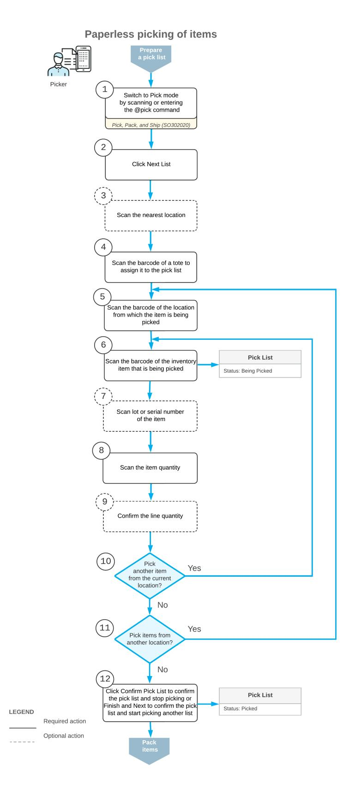

To pick the items from a pick list, the picker performs the following steps:

1. *Switches to Pick mode*.

The picker opens the *[Pick, Pack, and Ship](https://help-2025r1.acumatica.com/Help?ScreenId=ShowWiki&pageid=0d7f07e0-56a3-40a9-8cff-45bed542ae94)* (SO302020) form (or the corresponding screen in the Acumatica mobile app) and switches to Pick mode by scanning or entering *@pick* barcode.

2. *Clicks Next List*.

To start the automated processing, the picker clicks **Next List** on the form toolbar, and the system prompts the picker to enter the barcode of the current location of the picker. When the picker enters the location, the system suggests the pick list to the picker by using the following priority:

- a. A pick list that has been assigned directly to the particular picker by the manager; if multiple pick lists assigned to this picker by the manager exist, the system suggests the pick list that has the highest priority and nearest location.
- b. A pick list that is not assigned directly to the particular picker by the manager, but has the highest priority and the nearest location between those that are not assigned by the manager.
- 3. *Scans the barcode of the tote to be assigned to the pick list*.

The picker scans the barcode of a tote that will be used for picking the pick list. The tote number is mandatory in the paperless picking workflow because the tote is required to identify the pick list when a packer receives the picked items. The picker does not have a printed version of the pick list anymore, and the packer will not be able to identify the shipment to which the items belong without the tote number.

If totes are not used in your warehouse, and you want to continue printing paper pick lists, you can pick items in shipments without creating a pick list on the *[Create Pick Lists](https://help-2025r1.acumatica.com/Help?ScreenId=ShowWiki&pageid=22649926-ac34-4b4d-8790-b019e873fa8c)* (SO503050) form, or disable the *Paperless Picking* feature on the *[Enable/Disable Features](https://help-2025r1.acumatica.com/Help?ScreenId=ShowWiki&pageid=c1555e43-1bc5-4f6f-ba9d-b323f94d8a6b)* (CS1000000) form.

- 4. *In each location from the pick list, picks the items as follows:*
  - a. *Scans the location barcode*.

The system suggests the nearest location in the lines of the pick list that is currently selected. The picker goes to this location and scans its barcode.

b. *Scans the item barcode*.

The system shows the first item to be scanned in the current location. The system displays the picked quantity in the **Picked Quantity** column and highlights the line (in bold if the line has been picked partially, or in green if the line has been picked in full). If the UOM defined by the barcode of the scanned item corresponds to a non-base unit of measure, the system converts the item quantity defined by this barcode to the picked quantity in the base unit of measure for this item.

c. Optional: *Scans the lot or serial number of the item*.

If the item has a lot or serial number, the system shows the barcode of this lot or serial number to be scanned. The picker scans the lot or serial number of the item.

d. Optional: *Scans the item quantity*.

To change the picked quantity in the line that is currently being processed, the picker switches to Quantity Editing mode by clicking the**Set Qty** button on the form toolbar (or by scanning or entering the \*qty barcode) and manually enters the quantity in the UOM defined by the barcode of the scanned item.

If the pick list contains lines of multiple sales orders with the same item and location, the picker can enter the consolidated quantity of these lines. The system will automatically distribute the entered quantity among the lines with this item.

e. Optional: *Scans another tote*

If the items to be picked do not fit the tote or totes assigned to a pick list of the *Single-Shipment* or *Wave* type, the picker can click the **Add Tote** button on the form toolbar. The button becomes available if one of the following conditions is met:

- At least one item has been picked to a tote assigned to the single-shipment pick list.
- At least one item has been picked in each tote assigned to a wave pick list.

If the picker scans an additional tote for the pick list, the system asks to scan the tote to which the items will be picked before picking each new item in the pick list.

f. Optional: *Confirms the line quantity*.

If there are not enough units of the item, the picker can click the **Confirm Line Quantity** button with a short quantity. Depending on the**Short Shipment Confirmation** setting on the **Warehouse Management** tab of the *[Sales Orders Preferences](https://help-2025r1.acumatica.com/Help?ScreenId=ShowWiki&pageid=1817779c-413b-4187-b7fe-38e97845a1cb)* (SO101000) form, the picker may confirm the short shipment or return to the picking of the short line aerwards by selecting this line and clicking **Proceed Picking**.

g. *Picks another item*.

If another item must be picked from the currently selected location, the system shows the barcode of this item. The picker repeats the process starting from the second substep of this step.

h. *Picks items from another location*.

If items from another location must be picked according to the pick list, the system suggests scanning the barcode of the needed location. The picker repeats the process starting from the first substep of this step.

5. *Completes the picking process*.

When all items from the pick list are picked, the picker performs one of the following actions:

• The picker scans the \*confirm\*pick barcode or clicks the **Confirm Picking** button on the form toolbar to confirm that the picking process is finished.

The system confirms the pick list—that is, it assigns the *Picked* status to the pick list and displays it on the **Pack** tab on the *[Picking Queue](https://help-2025r1.acumatica.com/Help?ScreenId=ShowWiki&pageid=6b99dd9a-25b5-4e8e-9c45-da29958ca8c2)* (SO503080) form—and the system does not suggest the next pick list to pick.

• The picker scans the \*confirm\*pick\*and\*next barcode or clicks the **Finish and Next** button on the form toolbar to confirm that the picking process is finished.

The system confirms the pick list and suggests the next pick list to be picked. The system uses the last scanned location as the current location of the picker to suggest the nearest pick list.

Aer finishing the picking, the picker brings the totes with the items to the packing location.

#### **Workflow for a Packer**

The workflow of a packer involves the actions shown in the following diagram.

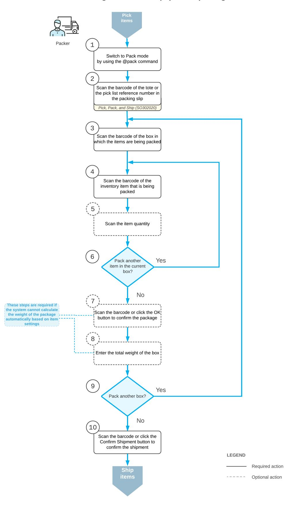

To pack the items for a shipment, the packer performs the following steps:

1. *Switches to Pack mode*.

The packer opens the *[Pick, Pack, and Ship](https://help-2025r1.acumatica.com/Help?ScreenId=ShowWiki&pageid=0d7f07e0-56a3-40a9-8cff-45bed542ae94)* (SO302020) form (or the corresponding screen in the Acumatica mobile app) and switches to Pack mode by scanning or entering *@pack* barcode.

2. *Scans the pick list number or barcode of the tote or totes*.

The packer scans the pick list number or the barcode of the tote or totes to start packing the items for shipping.

- 3. For each box being packed for the selected pick list, the packer does the following:
  - a. *Scans the barcode of the box*.

The packer scans the barcode of the box into which the items will be packed.

b. *Scans the item barcode*.

When the packer scans the barcode of the packed item, the system searches for the item in the lines of the pick list that is currently selected. If the UOM defined by the barcode of the scanned item corresponds to a non-base unit of measure, the system converts the item quantity defined by this barcode to the packed quantity in the base unit of measure for this item. The system shows the packed quantity in the **Packed Quantity** column and highlights the line (in bold if the line has been processed partially, or in green if the line has been processed in full).

c. Optional: *Scans the item quantity*.

To change the packed quantity in the line that is currently being processed, the packer switches to Quantity Editing mode by scanning or entering the \*qty barcode, and manually enters the quantity in the UOM defined by the barcode of the scanned item.

d. *Packs another item*.

If another item needs to be packed in the current box, the packer returns to scanning the item barcode (that is, returns to the second substep of this step) and repeats the process for the item, or proceeds to the next step if all items have been packed in the box.

e. *Confirms the box*.

If all items have been packed in the box, the packer confirms the current box by scanning the \*ok barcode or by clicking the **OK** button.

f. Optional: *Enters the box weight*.

If the **Confirm Weight for Each Package** check box is selected on the **Warehouse Management** tab of the *[Sales Orders Preferences](https://help-2025r1.acumatica.com/Help?ScreenId=ShowWiki&pageid=1817779c-413b-4187-b7fe-38e97845a1cb)* (SO101000) form, the system requires the packer to confirm the weight of each box aer the package is confirmed.

If the packer wants to accept the automatically calculated weight of the box, they can do that by clicking **OK** on the form toolbar or by scanning the \*ok command. If the packer wants to change the calculated weight of the box, they must enter the new value to continue to the next step.

g. Optional: *Enters the new package dimensions*.

If the **Confirm Dimensions for Packages with Editable Dimensions** check box is selected on the **Warehouse Management** tab of the *[Sales Orders Preferences](https://help-2025r1.acumatica.com/Help?ScreenId=ShowWiki&pageid=1817779c-413b-4187-b7fe-38e97845a1cb)* (SO101000) form and the packer confirms a package that includes a box with the **Editable Dimensions** check box selected on the *[Boxes](https://help-2025r1.acumatica.com/Help?ScreenId=ShowWiki&pageid=ff38094d-bc30-4cf1-9008-0f1070ada514)* (CS207600) form, the system requires the packer to confirm the existing dimensions or enter different dimensions for the box.

If the packer wants to accept the default dimensions of the box, they can do that by clicking **OK** on the form toolbar or by scanning the \*ok command. If the packer wants to change the dimensions of the box, they must enter the length, width, and height (in this order) in one string with a space as a separator to continue to the next step.

The following example shows the entry of dimensions: 20 15 40.

h. *Packs another box*.

If more items need to be packed for the current shipment, the packer returns to scanning the barcode of the box (returns to the first substep of this step) and repeats the process for another box.

4. *Completes the packing process*.

If the packer has finished the packing operation and specifying shipping options is not needed, the packer scans the \*confirm\*shipment barcode or clicks the **Confirm Shipment** button on the form toolbar. The system confirms the shipment that is currently being processed, and prints labels for the packed boxes.

## **Paperless Picking: Implementation Checklist**

This topic provides details you can use to ensure that the system is configured properly for paperless picking and packing items.

#### **Implementation Checklist**

Before you begin paperless picking and packing items, you should make sure the needed features have been enabled, settings have been specified, and entities have been created, as summarized in the following checklist.

| Form                                                                    | Criteria to Check                                                                                                                                                                                                                                         |
|-------------------------------------------------------------------------|-----------------------------------------------------------------------------------------------------------------------------------------------------------------------------------------------------------------------------------------------------------|
| Sales Orders Preferences (SO101000) Inventory Preferences (IN101000) | Make sure that all necessary settings related to inven tory and order management have been specified, as described in Configuration of Order Management: Gen eral Information.                                                                   |
| Enable/Disable Features (CS100000)                                      | Make sure that the following features are enabled: • Warehouse Management • Fulfillment • Paperless Picking                                                                                                                             |
| Stock Items (IN202500)                                                  | Make sure that the required stock items have been cre ated, as described in Stock Items: Implementation Activ ity.                                                                                                                                  |
| Sales Orders Preferences (SO101000)                                     | Make sure that the automated picking workflow is configured to fit the workflow established in your or ganization, as described in Picking and Packing Opera tions: Implementation Checklist or Packing Operations: Implementation Checklist. |

#### **Printing Settings**

If the *DeviceHub* feature is enabled on the *[Enable/Disable Features](https://help-2025r1.acumatica.com/Help?ScreenId=ShowWiki&pageid=c1555e43-1bc5-4f6f-ba9d-b323f94d8a6b)* (CS100000) form, you can configure the printing of documents by using the following settings on the **Warehouse Management** tab of the *[Sales Orders Preferences](https://help-2025r1.acumatica.com/Help?ScreenId=ShowWiki&pageid=1817779c-413b-4187-b7fe-38e97845a1cb)* (SO101000) form.

| Element                                       | State    | Description                                                                                                                                                   |
|-----------------------------------------------|----------|---------------------------------------------------------------------------------------------------------------------------------------------------------------|
| Print Shipment Confirmation Au tomatically | Selected | With this check box selected, the system prints the shipment confir mation automatically when a user confirms a shipment.                            |
| Print Shipment Labels Automati cally       | Selected | With this check box selected, the system prints the shipment labels for the packages included in a ship ment when the user confirms the shipment. |

#### **Other Settings That Affect the Workflow**

You can affect the workflow of paperless picking and packing by specifying additional settings as follows:

• To cause the system to arrange warehouse locations of pick lists only in ascending order of the **Path** value specified on the *[Warehouses](https://help-2025r1.acumatica.com/Help?ScreenId=ShowWiki&pageid=264b0ef7-2b6c-40b4-a7d9-f1a5e067939b)* (IN204000) form for these locations, clear the **Allow Bidirectional Pick Lists** check box on the **Warehouse Management** tab of the *[Sales Orders Preferences](https://help-2025r1.acumatica.com/Help?ScreenId=ShowWiki&pageid=1817779c-413b-4187-b7fe-38e97845a1cb)* (SO101000) form.

This setting affects the algorithm that the system uses for paperless pick list creation and prompts.

• To to make it possible for users to assign multiple totes to a shipment in a pick list of the *Single-Shipment* or *Wave* type, select the **Add Totes toShipments on the Fly** check box on the **Warehouse Management** tab of the *[Sales Orders Preferences](https://help-2025r1.acumatica.com/Help?ScreenId=ShowWiki&pageid=1817779c-413b-4187-b7fe-38e97845a1cb)* (SO101000) form.

# **Paperless Picking: Implementation Activity**

In the following implementation activity, you will learn how to enable the *Paperless Picking* feature.

This activity is based on the *U100* dataset. If you are using another dataset, or if any system settings have been changed in *U100*, these changes can affect the workflow of the activity and the results of the processing. To avoid any issues, restore the *U100* dataset to its initial state.

#### **Story**

Suppose that the SweetLife Fruits & Jams company has decided to switch to a paperless picking workflow in order to reduce the costs in the picking and packing process.

Acting as the implementation manager, you need to enable the needed feature.

#### **Process Overview**

In this activity, you will enable the needed feature on the *[Enable/Disable Features](https://help-2025r1.acumatica.com/Help?ScreenId=ShowWiki&pageid=c1555e43-1bc5-4f6f-ba9d-b323f94d8a6b)* (CS100000) form.

### **System Preparation**

Before you enable the *Paperless Picking* feature, launch the Acumatica ERP website, and sign in to a company with the *U100* dataset preloaded. You should sign in as the implementation manager with the *gibbs* username and the *123* password.

#### **Step: Enabling the Needed Feature**

To give users the ability to process automated picking and packing operations without printing paper pick lists , do the following to enable the *Paperless Picking* feature:

- 1. Open the *[Enable/Disable Features](https://help-2025r1.acumatica.com/Help?ScreenId=ShowWiki&pageid=c1555e43-1bc5-4f6f-ba9d-b323f94d8a6b)* (CS100000) form.
- 2. On the form toolbar, click **Modify**.
- 3. Select the **Paperless Picking** check box.
- 4. On the form toolbar, click **Enable**.

# **Paperless Picking: To Process Single-Shipment Pick Lists**

In the following activity, you will learn how to process a single-shipment pick list. That is, you will prepare, pick, and pack a pick list of the *Single-Shipment* type in the paperless picking workflow.

This activity is based on the *U100* dataset. If you are using another dataset, or if any system settings have been changed in *U100*, these changes can affect the workflow of the activity and the results of the processing. To avoid any issues, restore the *U100* dataset to its initial state.

#### **Story**

Suppose that in the Wholesale warehouse of SweetLife three shipments require shipping. Two of the shipments are the urgent ones, and the warehouse manager wants to assign picking of these shipments to a picker who picks items faster than any other picker in the warehouse. The third shipment can be picked by any warehouse worker.

#### **Configuration Overview**

In the *U100* dataset, the following tasks have been performed to support this activity:

- On the *[Enable/Disable Features](https://help-2025r1.acumatica.com/Help?ScreenId=ShowWiki&pageid=c1555e43-1bc5-4f6f-ba9d-b323f94d8a6b)* (CS100000) form, the following features have been enabled in the *Inventory and Order Management* group of features:
  - *Warehouse Management*
  - *Fulfillment*
- On the *[Warehouses](https://help-2025r1.acumatica.com/Help?ScreenId=ShowWiki&pageid=264b0ef7-2b6c-40b4-a7d9-f1a5e067939b)* (IN204000) form, the *WHOLESALE* warehouse has been created. On the **Locations** tab, the following warehouse locations have been defined: *L3R1S2*, *L3R2S2*, and *L3R3S2*. On the **Totes** tab, the following totes have been defined: *T14* and *T15*.
- On the *[Stock Items](https://help-2025r1.acumatica.com/Help?ScreenId=ShowWiki&pageid=77786a70-1f1e-4d63-ad98-96f98e4fcb0e)* (IN202500) form, the following stock items have been created, and the corresponding barcodes have been defined:
  - *ORJAM96*, which has the *OJ96* barcode
  - *LEMJAM96*, which has the *LJ96* barcode
  - *APJAM96*, which has the *AJ96* barcode
- On the *[Boxes](https://help-2025r1.acumatica.com/Help?ScreenId=ShowWiki&pageid=ff38094d-bc30-4cf1-9008-0f1070ada514)* (CS207600) form, the *LARGE* box has been defined.
- On the *[Sales Orders](https://help-2025r1.acumatica.com/Help?ScreenId=ShowWiki&pageid=19e4021c-1b84-49fd-be12-0320c5f1c7e5)* (SO301000) form, the following sales orders have been created for the *COFFEESHOP* customer: *000063*, *000063*, and *000065*.
- On the *[Shipments](https://help-2025r1.acumatica.com/Help?ScreenId=ShowWiki&pageid=f47cffcc-543e-469c-a204-a9c1e3da346d)* (SO302000) form, the following shipment documents have been created for these sales orders: *000059*, *000060*, and *000061*.

#### **Process Overview**

- 1. Acting as a warehouse manager, you will open the *[Create Pick Lists](https://help-2025r1.acumatica.com/Help?ScreenId=ShowWiki&pageid=22649926-ac34-4b4d-8790-b019e873fa8c)* (SO503050) form, select the shipments to be processed, and create single-shipment pick lists.
- 2. You will open the *[Manage Picking Queue](https://help-2025r1.acumatica.com/Help?ScreenId=ShowWiki&pageid=1b28adc2-9f8c-4c74-8a8c-576735489701)* (SO503075) form, raise the priority of two pick lists out of three.
- 3. On the same form, you will assign these two pick lists to a selected picker.
- 4. On the same form, you will send all created pick lists to the picking queue.
- 5. Acting as a picker, you will pick items in the first urgent pick list by using the *[Pick, Pack, and Ship](https://help-2025r1.acumatica.com/Help?ScreenId=ShowWiki&pageid=0d7f07e0-56a3-40a9-8cff-45bed542ae94)* (SO302020) form.
- 6. On the same form, you will pick items in the second urgent pick list.
- 7. Acting as a packer, you will pack one of the shipments of the wave by using the *[Pick, Pack, and Ship](https://help-2025r1.acumatica.com/Help?ScreenId=ShowWiki&pageid=0d7f07e0-56a3-40a9-8cff-45bed542ae94)* form and review the confirmed shipment on the *[Shipments](https://help-2025r1.acumatica.com/Help?ScreenId=ShowWiki&pageid=f47cffcc-543e-469c-a204-a9c1e3da346d)* (SO302000) form.

In any working mode, you enter a command or barcode by typing it in the**Scan** box and pressing Enter. In production systems, you will scan the appropriate barcodes rather than manually entering them.

#### **System Preparation**

Before you start performing paperless picking, do the following:

- 1. Launch the Acumatica ERP website, and sign in to a company with the *U100* dataset preloaded. You should sign in as the warehouse manager by using the *angelo* username and the *123* password.
- 2. In the info area, in the upper-right corner of the top pane of the Acumatica ERP screen, make sure that the business date in your system is set to *1/30/2025*. If a different date is displayed, click the Business Date menu button and select *1/30/2025* on the calendar. For simplicity, in this activity, you will create and process all documents in the system on this business date.
- 3. On the **Warehouse Management** tab of the *[Sales Orders Preferences](https://help-2025r1.acumatica.com/Help?ScreenId=ShowWiki&pageid=1817779c-413b-4187-b7fe-38e97845a1cb)* (SO101000) form, make sure that the **Display the PickTab** and **Display the PackTab** check boxes are selected.

#### **Step 1: Creating Pick Lists**

To create pick lists, acting as the warehouse manager, do the following:

- 1. Open the *[Create Pick Lists](https://help-2025r1.acumatica.com/Help?ScreenId=ShowWiki&pageid=22649926-ac34-4b4d-8790-b019e873fa8c)* (SO503050) form.
- 2. In the **Action** box, select *Create Single-Shipment Pick Lists*.
- 3. In the **Warehouse** box, select *WHOLESALE*.
- 4. In the **End Date** box, make sure *1/30/2025* is specified.
- 5. In the table, select the unlabeled check boxes next to the shipments with reference numbers from *000059* through *000061*.
- 6. On the form toolbar, click **Process**. Close the **Processing** dialog box aer processing completes.

#### **Step 2: Changing the Priority of Pick Lists**

To change the picking priority of the created pick lists, do the following:

- 1. Open the *[Manage Picking Queue](https://help-2025r1.acumatica.com/Help?ScreenId=ShowWiki&pageid=1b28adc2-9f8c-4c74-8a8c-576735489701)* (SO503075) form.
- 2. In the **Action** box, select *Change Picking Priority*.

- 3. In the **Warehouse** box, select *WHOLESALE*.
- 4. In the table, select the unlabeled check boxes next to the pick lists with the *000059* and *000060* reference numbers.
- 5. In the Selection area, select *Urgent* in the **Set Picking Priority to** box.
- 6. On the form toolbar, click **Process**. Close the **Processing** dialog box aer processing completes.

Notice that the value in the **Priority** column for the pick lists with reference numbers *000059* and *000060* has been changed to *Urgent*.

#### **Step 3: Assigning Pick Lists to a Picker**

To assign the pick lists with the *Urgent* priority to a picker, do the following:

- 1. While you are still viewing the pick lists on the *[Manage Picking Queue](https://help-2025r1.acumatica.com/Help?ScreenId=ShowWiki&pageid=1b28adc2-9f8c-4c74-8a8c-576735489701)* (SO503075) form, in the **Action** box, select *Assign Pick Lists*.
- 2. In the **Warehouse** box, make sure that *WHOLESALE* is selected.
- 3. In the **End Date** box, make sure that *1/30/2025* is specified.
- 4. In the table, select the unlabeled check boxes next to the shipments with the *000059* and *000060* reference numbers.
- 5. In the Selection area, select *hardin* in the **Assign to Picker** box.
- 6. On the form toolbar, click **Process**. Close the **Processing** dialog box aer processing completes.

Notice that the **Assigned Picker** column for the pick lists with reference numbers *000059* and *000060* has the *hardin* value.

#### **Step 4: Sending the Pick Lists to the Picking Queue**

To send the pick lists to the picking queue, do the following:

- 1. While you are still viewing the pick lists on the *[Manage Picking Queue](https://help-2025r1.acumatica.com/Help?ScreenId=ShowWiki&pageid=1b28adc2-9f8c-4c74-8a8c-576735489701)* (SO503075) form, in the **Action** box, select *Send to Picking Queue*.
- 2. In the **Warehouse** box, make sure that *WHOLESALE* is selected.
- 3. On the form toolbar, click **Process All**. Close the **Processing** dialog box aer processing completes.
- 4. Sign out of the system.

#### **Step 5: Picking Items in the First Urgent Pick List**

Acting as Steven Hardin, the picker, you will accept a pick list, assign a tote to the pick list, and then pick the items, placing them in the selected tote. Do the following:

- 1. Sign in to the system as a picker by using the *hardin* username and the *123* password.
- 2. Open the *[Pick, Pack, and Ship](https://help-2025r1.acumatica.com/Help?ScreenId=ShowWiki&pageid=0d7f07e0-56a3-40a9-8cff-45bed542ae94)* (SO302020) form, and make sure the **Pick** tab is opened.
- 3. On the form toolbar, click **Next List**.

In the Summary area, the system prompts you to enter the nearest location.

- 4. In the **Scan** box, enter L3R3S1. The system loads the *000060* pick list which is assigned to you and has the closest location.
- 5. Enter T14 to assign a tote to the pick list you will be picking.

The system assigns the tote to the *000060* pick list and shows the tote ID in the**Tote ID** column for the only line of the pick list.

You have assigned the tote to the pick list, and you can start picking the items.

- 6. Follow the instructions of the system to pick the items:
  - a. Enter L3R3S2 to select the location from which you are currently picking items.
  - b. Enter OJ96 to pick the item. (*OJ96* is the barcode for *ORJAM96*, the 96-ounce jar of orange jam, which is included in the *000060* shipment.)

The system highlights the line in bold and specifies *1* as the **Picked Quantity**.

- c. Set the quantity of the item to 5 as follows:
  - a. On the form toolbar, click**Set Qty**. The system prompts you to enter the item quantity.
  - b. In the **Scan** box, enter 5. This indicates that five 96-ounce jars of orange jam have been picked from the location and placed in the *T14* tote.

The system indicates that you have finished picking items in the first urgent pick list. In the next step, you will learn how to start picking another pick list.

#### **Step 6: Picking Items in the Second Urgent Pick List**

Acting as Steven Hardin, the picker, you will accept the second pick list, assign a tote to the pick list, and then pick the items, placing them in the selected tote. Do the following:

- 1. On the form toolbar of the *[Pick, Pack, and Ship](https://help-2025r1.acumatica.com/Help?ScreenId=ShowWiki&pageid=0d7f07e0-56a3-40a9-8cff-45bed542ae94)* (SO302020) form, click **Finish and Next** to confirm that picking of the first pick list is finished and you are ready to pick another. The system loads the *000059* pick list, which is assigned to you.
- 2. In the **Scan** box, enter T15 to assign a tote to the pick list you will be picking.

The system assigns the tote to the *000059* pick list, and shows the tote ID in the**Tote ID** column for all lines of the pick list.

Now you have assigned the tote to the pick list, and you can start picking items.

- 3. Follow the instructions of the system to pick the items:
  - a. Enter L3R2S2 to select the location from which you are currently picking items.
  - b. Enter LJ96 to pick the item. (*LJ96* is the barcode for *LEMJAM96*, the 96-ounce jar of lemon jam, which is included in the *000059* shipment.)

The system highlights the line in bold and specifies *1* as the **Picked Quantity**.

- c. Set the quantity of the item to 3 as follows:
  - a. On the form toolbar, click**Set Qty**. The system prompts you to enter the item quantity.
  - b. In the **Scan** box, type 3. This indicates that three 96-ounce jars of lemon jam have been picked from the location and placed in the *T15* tote.

You have finished picking items from this location, so you will proceed to picking items from another location.

- 4. Follow the instructions of the system to go to the second location and pick the items:
  - a. Enter L3R1S2 to select the location from which you are currently picking items.
  - b. Enter AJ96 to pick the item. (*AJ96* is the barcode for *APJAM96*, the 96-ounce jar of apple jam, which is included in the *000059* shipment.)
  - c. Set the quantity of the item to 5.

The system indicates that you have finished picking items in the *000059* pick list.

- 5. On the form toolbar, click **Confirm Pick List** to confirm that picking has been finished and you are not going to pick items from other pick lists.
- 6. Sign out of the system.

#### **Step 7: Packing Items for a Shipment**

For the purposes of this activity, you will pack just one of the shipments for a pick list with the picked items, acting as a warehouse worker who handles packing. To pack one of the shipments, do the following:

- 1. Sign in to the system as a warehouse worker who will perform packing operations by using the *sauer* username and the *123* password.
- 2. Open the *[Pick, Pack, and Ship](https://help-2025r1.acumatica.com/Help?ScreenId=ShowWiki&pageid=0d7f07e0-56a3-40a9-8cff-45bed542ae94)* (SO302020) form.
- 3. Enter T14, which is the reference number of the tote ready for packing.
- 4. Enter LARGE to select the box in which you are packing the items.
- 5. Enter OJ96 to select the item being packed. The system highlights the first line of the shipment in bold and specifies *1* as the **Packed Quantity**, and shows this item in the **Package Content** tab.
- 6. Set the quantity of the item to 5 as follows:
  - a. On the form toolbar, click**Set Qty**. The system prompts you to enter the item quantity.
  - b. In the **Scan** box, enter 5. The system highlights the first line of the shipment in green and specifies *5* as the **Packed Quantity**.
- 7. On the form toolbar, click **Confirm Package** to confirm the package.
- 8. On the form toolbar, click **Confirm Shipment**.
- 9. Sign out of the system.
- 10.Sign in again as a warehouse manager by using the *angelo* username and the *123* password.
- 11.On the *[Shipments](https://help-2025r1.acumatica.com/Help?ScreenId=ShowWiki&pageid=f47cffcc-543e-469c-a204-a9c1e3da346d)* (SO302000) form, open the shipment with the *000060* reference number that you have packed, which is now assigned the *Confirmed* status. On the **Packages** tab (see the following screenshot), the box in which the items were packed is listed, and the items packed into this box are listed in the **Contents of theSelected Package** table.

|               |                                | <b>Shipments</b>        |                       |                                        |                         |                                |               |                  |                    |           |                 |                                       |                  |                 | <b>TH NOTES</b> | <b>ACTIVITIES</b>                  |                    |                            | TOOLS $\star$ |                     |
|---------------|--------------------------------|-------------------------|-----------------------|----------------------------------------|-------------------------|--------------------------------|---------------|------------------|--------------------|-----------|-----------------|---------------------------------------|------------------|-----------------|-----------------|------------------------------------|--------------------|----------------------------|---------------|---------------------|
|               |                                |                         |                       | 000060 - FourStar Coffee & Sweets Shop |                         |                                |               |                  |                    |           |                 |                                       |                  |                 |                 |                                    |                    | <b>FILES</b>               |               |                     |
| $\leftarrow$  |                                | $\overline{\mathbb{G}}$ | $\Box$                | $\Omega$                               | $+$                     | 间                              | $\mathsf{K}$  | $\sim$ $\sim$    | $\rightarrow$      | >1        |                 | PREPARE INVOICE                       | <b>UPDATE IN</b> | $\cdots$        |                 |                                    |                    |                            |               |                     |
|               |                                |                         | Shipment Nbr.:        | 000060                                 | $\varphi$               |                                | Customer:     |                  |                    |           |                 | COFFEESHOP - FourStar Coffee & Swee 2 |                  | Shipped Quant   | 5.00            |                                    |                    |                            |               | $\hat{\phantom{a}}$ |
|               | Shipment Location: Type: |                         |                       |                                        |                         | <b>MAIN - Primary Location</b> |               |                  | Shipped Weight:    | 14.200000 |                 |                                       |                  |                 |                 |                                    |                    |                            |               |                     |
|               | Status:                        |                         |                       | Confirmed                              |                         |                                | Warehouse ID: |                  |                    |           |                 | WHOLESALE - Wholesale Warehouse       |                  | Shipped Volume: | 14.200000       |                                    |                    |                            |               |                     |
|               |                                | Operation:              |                       | <b>Issue</b>                           |                         |                                | Workgroup:    |                  |                    |           |                 |                                       |                  | Packages:       | $\mathbf{1}$    |                                    |                    |                            |               |                     |
|               |                                |                         | <b>Shipment Date:</b> | 1/30/2025                              |                         |                                | Owner:        |                  |                    |           |                 |                                       |                  | Package Weight: | 14.250000       |                                    |                    |                            |               |                     |
|               |                                | Description:            |                       |                                        |                         |                                |               |                  |                    |           |                 |                                       |                  |                 |                 |                                    |                    |                            |               |                     |
|               |                                | <b>DETAILS</b>          |                       | ORDERS                                 |                         | <b>SHIPPING</b>                |               | <b>ADDRESSES</b> |                    |           | <b>PACKAGES</b> |                                       |                  |                 |                 |                                    |                    |                            |               |                     |
|               |                                |                         |                       |                                        |                         |                                |               |                  |                    |           |                 |                                       |                  |                 |                 |                                    |                    |                            |               |                     |
| Ò             |                                | $^{+}$                  | $\times$              | $\vdash$                               | $\mathbf{x}$            |                                |               |                  |                    |           |                 |                                       |                  |                 |                 |                                    |                    |                            |               |                     |
| 8.            | $\omega$                       |                         | $\Box$ Confirmed      | *Box ID                                |                         |                                | <b>Type</b>   |                  | <b>Description</b> |           |                 | <b>Editable</b> <b>Dimension</b>   | Length           | Width           |                 | <b>Height Linear</b> <b>UOM</b> |                    | Weight UOM                 |               |                     |
| $\mathcal{P}$ | $\mathbb{O}$                   | $\Box$                  | $\triangleright$      |                                        | LARGE                   |                                |               | Manual           |                    |           |                 | $\Box$                                | 12.00            | 12.00           | 6.00            |                                    |                    | 14.2500                    | KG            |                     |
|               |                                |                         |                       |                                        |                         |                                |               |                  |                    |           |                 |                                       |                  |                 |                 |                                    |                    |                            |               |                     |
|               |                                |                         |                       |                                        |                         |                                |               |                  |                    |           |                 |                                       |                  |                 |                 |                                    |                    |                            |               |                     |
|               |                                |                         |                       |                                        |                         |                                |               |                  |                    |           |                 |                                       |                  |                 |                 |                                    |                    |                            |               |                     |
|               |                                |                         |                       |                                        |                         |                                |               |                  |                    |           |                 |                                       |                  |                 |                 |                                    |                    |                            |               |                     |
|               |                                |                         |                       |                                        |                         |                                |               |                  |                    |           |                 |                                       |                  |                 |                 |                                    | $\vert\!\!\langle$ | $\langle$ $\rightarrow$ |               | >1                  |
|               |                                |                         |                       | <b>Contents of Selected Package</b>    |                         |                                |               |                  |                    |           |                 |                                       |                  |                 |                 |                                    |                    |                            |               |                     |
| Ò             |                                | $^{+}$                  | $\times$              | $\left  \rightarrow \right $           | $\mathbf{\overline{x}}$ |                                |               |                  |                    |           |                 |                                       |                  |                 |                 |                                    |                    |                            |               |                     |
| 冒             |                                |                         |                       | Shipmer Inventory ID                   |                         | <b>UOM</b>                     |               |                  | Quantity           |           |                 |                                       |                  |                 |                 |                                    |                    |                            |               |                     |
|               |                                | <b>Split</b> Line    |                       |                                        |                         |                                |               |                  |                    |           |                 |                                       |                  |                 |                 |                                    |                    |                            |               |                     |
|               |                                | Nbr.                    |                       |                                        |                         |                                |               |                  |                    |           |                 |                                       |                  |                 |                 |                                    |                    |                            |               |                     |
|               |                                |                         | 3 ORJAM96             |                                        |                         | <b>PIECE</b>                   |               |                  | 5.00               |           |                 |                                       |                  |                 |                 |                                    |                    |                            |               |                     |

*Figure: Packing details for the shipment*

# **Paperless Picking: To Process Wave Pick Lists**

In the following activity, you will learn how to process a wave pick list. That is, you will prepare, pick, and pack a pick list of the *Wave* type in the paperless picking workflow.

This activity is based on the *U100* dataset. If you are using another dataset, or if any system settings have been changed in *U100*, these changes can affect the workflow of the activity and the results of the processing. To avoid any issues, restore the *U100* dataset to its initial state.

#### **Story**

Suppose that the FourStar Coffee & Sweets customer of SweetLife has ordered items in four sales orders. Those orders have been entered into the system, and they now need to be picked, packed, and shipped.

The warehouse manager wants to speed up the process of picking and packing items by creating wave pick lists and assigning this work to multiple pickers. Aer the warehouse workers pick the items in a wave, a warehouse worker acting as the packer needs to pack the items and confirm the shipments. You will perform these actions, acting as all of these employees.

#### **Configuration Overview**

In the *U100* dataset, the following tasks have been performed to support this activity:

- On the *[Enable/Disable Features](https://help-2025r1.acumatica.com/Help?ScreenId=ShowWiki&pageid=c1555e43-1bc5-4f6f-ba9d-b323f94d8a6b)* (CS100000) form, the following features have been enabled in the *Inventory and Order Management* group of features:
  - *Warehouse Management*

- *Fulfillment*
- *Advanced Picking*
- *Paperless Picking*
- On the *[Warehouses](https://help-2025r1.acumatica.com/Help?ScreenId=ShowWiki&pageid=264b0ef7-2b6c-40b4-a7d9-f1a5e067939b)* (IN204000) form, the *WHOLESALE* warehouse has been created. On the **Locations** tab, the following warehouse locations have been defined: *L1R1S1*, *L2R1S1*, *L2R2S1*, *L3R1S3*, *L3R3S2*. On the **Totes** tab, the following totes have been defined: *T16*, *T17*, *T18*, *T19*, and *T20*.
- On the *[Stock Items](https://help-2025r1.acumatica.com/Help?ScreenId=ShowWiki&pageid=77786a70-1f1e-4d63-ad98-96f98e4fcb0e)* (IN202500) form, the following stock items have been created, and the corresponding barcodes have been defined:
  - *APJAM96*, which has the *AJ96* barcode
  - *PLUMJAM32*, which has the *PJ32* barcode
  - *LEMJAM96*, which has the *LJ96* barcode
  - *LEMJAM08*, which has the *LJ08* barcode
  - *KIWIJAM32*, which has the *KJ32* barcode
  - *LEMJAM32*, which has the *LJ32* barcode
- On the *[Sales Orders](https://help-2025r1.acumatica.com/Help?ScreenId=ShowWiki&pageid=19e4021c-1b84-49fd-be12-0320c5f1c7e5)* (SO301000) form, the following sales orders have been created for the *COFFEESHOP* customer: *000067*, *000068*, *000069*, and *000070*.
- On the *[Shipments](https://help-2025r1.acumatica.com/Help?ScreenId=ShowWiki&pageid=f47cffcc-543e-469c-a204-a9c1e3da346d)* (SO302000) form, the following shipment documents have been created for these sales orders: *000062*, *000063*, *000064*, and *000065*.

### **Process Overview**

In this activity, you will do the following:

- 1. Acting as the warehouse manager, you will create wave pick lists and send them to the picking queue by using the *[Create Pick Lists](https://help-2025r1.acumatica.com/Help?ScreenId=ShowWiki&pageid=22649926-ac34-4b4d-8790-b019e873fa8c)* (SO503050) form. Then you will review the created pick lists on the *[Picking Queue](https://help-2025r1.acumatica.com/Help?ScreenId=ShowWiki&pageid=6b99dd9a-25b5-4e8e-9c45-da29958ca8c2)* (SO503080) form.
- 2. Acting as pickers, you will do the following by using the *[Pick, Pack, and Ship](https://help-2025r1.acumatica.com/Help?ScreenId=ShowWiki&pageid=0d7f07e0-56a3-40a9-8cff-45bed542ae94)* (SO302020) form:
  - a. Pick items in a wave pick list
  - b. Pick items in another wave pick list
- 3. Acting as a packer, you will pack one of the shipments of the wave by using the *[Pick, Pack, and Ship](https://help-2025r1.acumatica.com/Help?ScreenId=ShowWiki&pageid=0d7f07e0-56a3-40a9-8cff-45bed542ae94)* form.

In any working mode, you enter a command or barcode by typing it in the**Scan** box and pressing Enter. In production systems, you will scan the appropriate barcodes rather than manually entering them.

#### **System Preparation**

Before performing the steps of this activity, do the following:

- 1. Launch the Acumatica ERP website, and sign in to a company with the *U100* dataset preloaded. You should sign in as the warehouse manager by using the *angelo* username and the *123* password.
- 2. In the info area, in the upper-right corner of the top pane of the Acumatica ERP screen, make sure that the business date in your system is set to *1/30/2025*. If a different date is displayed, click the Business Date menu button and select *1/30/2025* on the calendar. For simplicity, in this activity, you will create and process all documents in the system on this business date.
- 3. As a prerequisite, perform *[Paperless Picking: Implementation Activity](#page-153-1)* to enable the *Paperless Picking* feature.

4. On the **Warehouse Management** tab of the *[Sales Orders Preferences](https://help-2025r1.acumatica.com/Help?ScreenId=ShowWiki&pageid=1817779c-413b-4187-b7fe-38e97845a1cb)* (SO101000) form, make sure that the **Display the PickTab**, **Display the PackTab**, and **Add Totes toShipments on the Fly** check boxes are selected.

#### **Step 1: Creating Wave Pick Lists**

To create wave pick lists, acting as the warehouse manager, do the following:

- 1. Open the *[Create Pick Lists](https://help-2025r1.acumatica.com/Help?ScreenId=ShowWiki&pageid=22649926-ac34-4b4d-8790-b019e873fa8c)* (SO503050) form.
- 2. In the **Action** box, select *Create Wave Pick Lists*.
- 3. In the **Warehouse** box, select *WHOLESALE*.
- 4. In the **End Date** box, make sure that *1/30/2025* is specified.
- 5. Enter 3 as the **Max. Number of Pickers**.
- 6. Enter 2 as the **Max. Number ofTotes per Picker**.
- 7. Select the**Send to Picking Queue** check box.
- 8. In the table, select the unlabeled check boxes in the rows of the shipments with reference numbers from *000062* through *000065*.
- 9. On the form toolbar, click **Process**. Close the **Processing** dialog box aer the processing is completed.

The system has created the wave pick lists and sent them to the picking queue.

10.Open the *[Picking Queue](https://help-2025r1.acumatica.com/Help?ScreenId=ShowWiki&pageid=6b99dd9a-25b5-4e8e-9c45-da29958ca8c2)* (SO503080) form.

11.In the **Warehouse** box, select *WHOLESALE*.

The system shows the wave pick lists that you created in the table on the **Pick** tab. Notice that only two wave pick lists have been created. (Although you have entered *3* as the maximum number of pickers, the system has found the optimal workflow and determined that two pickers are enough for picking the wave.) Both rows with pick lists have the *Added to Queue* status, which means that pickers can start picking the items in these pick lists.

12.Sign out of the system.

#### **Step 2a: Picking Items in a Wave (Picker 1)**

To pick the items in one of the wave pick lists, do the following:

- 1. Sign in to the system as a picker by using the *perkins* username and the *123* password.
- 2. Open the *[Pick, Pack, and Ship](https://help-2025r1.acumatica.com/Help?ScreenId=ShowWiki&pageid=0d7f07e0-56a3-40a9-8cff-45bed542ae94)* (SO302020) form, and make sure that the **Pick** tab is opened.
- 3. On the form toolbar, click **Next List**.

In the Summary area, the system prompts you to enter the nearest location.

- 4. Enter L2R2S1 to select the requested location. The system loads the *000001/2* pick list, whose items are closest to the entered location.
- 5. Assign totes to the shipments that you will be picking by doing the following:
  - a. Enter T16. The system assigns this tote to the *000064* shipment and inserts the tote ID in the**Tote ID** column of all lines of this shipment.
  - b. Enter T17. The system assigns this tote to the *000065* shipment.

You have assigned the totes to shipments, and now you can start picking items.

- 6. Pick the items from the first location by doing the following:
  - a. Enter LJ32 to pick the item. (*LJ32* is the barcode for *LEMJAM32*, the 32-ounce jar of lemon jam, which is included in the *000065* shipment.)

- b. Set the quantity of the item to 15 as follows:
  - a. On the form toolbar, click**Set Qty**. The system prompts you to enter the item quantity.
  - b. Enter 15. You have indicated to the system that fieen 32-ounce jars of lemon jam have been picked from the location and placed in the *T17* tote, which is assigned to the *000065* shipment.
- 7. Start picking the items from the second location by doing the following:
  - a. Enter L2R1S1 to select the location from which you are currently picking items.
  - b. Enter KJ32 to pick the item. (*KJ32* is the barcode for *KIWIJAM32*, the 32-ounce jar of kiwi jam, which is included in the *000064* shipment.)

Suppose that you have started picking items from the second location and realized that *T16* will not be spacious enough to fit the entire quantities of the *KIWIJAM32* and *LEMJAM96* items.

- c. Set the quantity to 15, which is the quantity that will fit in the *T16* tote.
- 8. Click **Add Tote** on the form toolbar to add a tote for the *000064* shipment.
- 9. Enter T18. The system assigns this tote to the *000064* shipment and inserts the tote ID in the**Tote ID** column of all lines of this shipment that have not been picked yet.

10.Continue picking the items from the second location by doing the following:

- a. Enter KJ32 to pick the item.
- b. Enter T18 to select the tote to which you want to pick the remaining items.
- c. Set the quantity to 5.
- 11.Pick the items from the third location by doing the following:
  - a. Enter L1R1S1 to select the location from which you are currently picking items.
  - b. Enter LJ96 to pick the item. (*LJ96* is the barcode for *LEMJAM96,* the 96-ounce jar of lemon jam, which is included in the *000064* shipment.)
  - c. Enter T18 to select the tote to which you want to pick the ten 96-ounce jars of lemon jam.
  - d. Set the quantity to 10.
- 12.On the form toolbar, click **Confirm Pick List** to confirm that picking is finished.

You have finished picking the items for one of the pick lists.

13.Sign out of the system.

#### **Step 2b: Picking Items in a Wave (Picker 2)**

To pick the items in another wave pick list, do the following:

- 1. Sign in to the system as a picker by using the *rollins* username and the *123* password.
- 2. Open the *[Pick, Pack, and Ship](https://help-2025r1.acumatica.com/Help?ScreenId=ShowWiki&pageid=0d7f07e0-56a3-40a9-8cff-45bed542ae94)* (SO302020) form, and make sure that the **Pick** tab is opened.
- 3. On the form toolbar, click **Next List**.

In the Summary area, the system prompts you to enter the nearest location.

- 4. Enter L1R1S1 to select the requested location. The system loads the *000001/1* pick list, whose items are closest to the entered location.
- 5. Assign totes to the shipments that you will be picking by doing the following:
  - a. Enter T19. The system assigns the tote to the *000062* shipment and inserts the tote ID in the**Tote ID** column of all lines of this shipment.
  - b. Enter T20. The system assigns the tote to the *000063* shipment.

You have assigned the totes to shipments, and now you can start picking items.

- 6. Pick the items from the first location by doing the following:
  - a. Enter AJ96 to pick the item. (*AJ96* is the barcode for *APJAM96* the 96-ounce jar of apple jam, which is included in the *000062* shipment.)
  - b. Set the quantity of the item to 10 as follows:
    - a. On the form toolbar, click**Set Qty**. The system prompts you to enter the item quantity.
    - b. Enter 10. You have indicated to the system that ten 96-ounce jars of apple jam have been picked from the location and placed in the *T19* tote, which is assigned to the *000062* shipment.

You are continuing to pick items for different shipments from the same location, so you do not need to scan the location barcode again.

- c. Do the following:
  - a. Enter LJ96 (*LJ96* is the barcode for *LEMJAM96*, the 96-ounce jar of apple jam, which is included in the *000063* shipment.)
  - b. Set the quantity to 10.
- 7. To proceed to picking items from the second location, do the following:
  - a. Enter L3R1S3 to select the location from which you are currently picking items.
  - b. Enter LJ08 to pick the item. *LJ08* is the barcode for *LEMJAM08*, the 8-ounce jar of lemon jam, which is included in the *000063* shipment.
  - c. Set the quantity of the item to 5.
- 8. Pick the items from the third location by doing the following:
  - a. Enter L3R3S2 to select the location from which you are currently picking items.
  - b. Enter PJ32 to pick the item. (*PJ32* is the barcode for *PLUMJAM32*, the 32-ounce jar of plum jam, which is included in the *000062* shipment.)
  - c. Set the quantity of the item to 5.
- 9. On the form toolbar, click **Confirm Pick List** to confirm that picking is finished.

You have finished picking the items in both pick lists.

10.Sign out of the system.

#### **Step 3: Packing a Shipment for the Wave**

At this point in the wave picking, all of the shipments from the wave can be packed. For the purposes of this activity, you will pack just one of the shipments (*000064*) from the wave, acting as a warehouse worker who handles packing. You will create several packages because the quantity of items in the shipment is too large to pack them into one box. To pack the shipment from the wave, do the following:

- 1. Sign in to the system as a warehouse worker who will perform packing operations by using the *sauer* username and the *123* password.
- 2. Open the *[Pick, Pack, and Ship](https://help-2025r1.acumatica.com/Help?ScreenId=ShowWiki&pageid=0d7f07e0-56a3-40a9-8cff-45bed542ae94)* (SO302020) form.
- 3. Enter T16, which is the reference number of the tote whose items are ready for packing.

In the Summary area, the system notifies you that this is one of the two totes scanned for the *000064* shipment.

- 4. Enter T18, which is the reference number of the second tote assigned to the shipment.
- 5. Enter LARGE to select the box in which you are packing the items.
- 6. Enter LJ96 to select the item being packed. The system highlights the first line of the shipment in bold and inserts *1* as the **Packed Quantity**; it also adds a line with this item to the **Package Content** tab.

While packing, you find out that the selected box can hold only seven 96-ounce jars of the jam.

- 7. Set the quantity of the item to 7 as follows:
  - a. On the form toolbar, click**Set Qty**. The system prompts you to enter the item quantity.
  - b. Enter 7. The system inserts *7* as the **Packed Quantity**.
- 8. On the form toolbar, click **Confirm Package** to confirm the package.
- 9. Enter LARGE to select the box in which you are now packing the items.
- 10.Enter LJ96 to select the item being packed.
- 11.Set the quantity of this item to 3. The system highlights the first line of the shipment in green to indicate that all 96-ounce jars of lemon jam have been packed.
- 12.Enter KJ32 to select the next item being packed in the same box.

While packing the second box, you find out that the selected box can hold only three 96-ounce jars of lemon jam and ten 32-ounce jars of kiwi jam.

- 13.Set the quantity of the KJ32 item to 10.
- 14.On the form toolbar, click **Confirm Package** to confirm the package.
- 15.Enter MEDIUM to select the box in which you are packing the rest of the items.
- 16.Enter KJ32 to select the item being packed in the last box.
- 17.Set the quantity of this item to 10.
- 18.On the form toolbar, click **Confirm Package** to confirm the last package for the *000064* shipment.
- 19.On the form toolbar, click **Confirm Shipment**.
- 20.Sign out of the system, and sign in again as a warehouse manager by using the *angelo* username and the *123* password.
- 21.On the *[Shipments](https://help-2025r1.acumatica.com/Help?ScreenId=ShowWiki&pageid=f47cffcc-543e-469c-a204-a9c1e3da346d)* (SO302000) form, open the *000064* shipment, which you packed. Notice that it is now assigned the *Confirmed* status. The **Packages** tab lists each box in which the items were packed. For the box whose row is selected in this table, the items packed into this box are listed in the **Contents ofSelected Package** table.

|                                     | Shipments               |                                | 000064 - FourStar Coffee & Sweets Shop |                         |              |                  |                    |                                |  |                                       |                 |  |                  |                 |               |           | <b>TH NOTES</b> |                                    | <b>ACTIVITIES</b> | <b>FILES</b>                             |               | TOOLS $\star$       |
|-------------------------------------|-------------------------|--------------------------------|----------------------------------------|-------------------------|--------------|------------------|--------------------|--------------------------------|--|---------------------------------------|-----------------|--|------------------|-----------------|---------------|-----------|-----------------|------------------------------------|-------------------|------------------------------------------|---------------|---------------------|
| $\overline{\phantom{0}}$            | $\overline{\mathbb{G}}$ | $\Box$                         | ↶                                      | Ĥ ┿                  | $\mathsf{K}$ | ≺                | $\rightarrow$      | $\geq$                         |  | PREPARE INVOICE                       |                 |  | <b>UPDATE IN</b> | .               |               |           |                 |                                    |                   |                                          |               |                     |
|                                     |                         | Shipment Nbr.:                 | 000064                                 | $\varphi$               | Customer:    |                  |                    |                                |  | COFFEESHOP - FourStar Coffee & Swee 2 |                 |  |                  | Shipped Quant   |               |           | 30.00           |                                    |                   |                                          |               | $\hat{\phantom{a}}$ |
|                                     | Type:                   |                                | Shipment                               |                         | Location:    |                  |                    | <b>MAIN - Primary Location</b> |  |                                       |                 |  | Shipped Weight:  |                 |               | 47.800000 |                 |                                    |                   |                                          |               |                     |
|                                     | Status:                 |                                | Confirmed                              |                         |              | Warehouse ID:    |                    |                                |  | WHOLESALE - Wholesale Warehouse       |                 |  |                  | Shipped Volume: |               | 28.400000 |                 |                                    |                   |                                          |               |                     |
|                                     | Operation:              |                                | Issue                                  |                         |              | Workgroup:       |                    |                                |  |                                       |                 |  |                  | Packages:       |               |           | 3               |                                    |                   |                                          |               |                     |
|                                     |                         | <b>Shipment Date:</b>          | 1/15/2025                              |                         | Owner:       |                  |                    |                                |  |                                       |                 |  |                  | Package Weight: |               | 47.930000 |                 |                                    |                   |                                          |               |                     |
|                                     |                         |                                |                                        |                         |              | Worksheet Nbr.:  | 000006             |                                |  |                                       |                 |  | 0                |                 |               |           |                 |                                    |                   |                                          |               |                     |
|                                     | Description:            |                                | Sales of jam with shipping             |                         |              |                  |                    |                                |  |                                       |                 |  |                  |                 |               |           |                 |                                    |                   |                                          |               |                     |
|                                     | <b>DETAILS</b>          |                                | <b>ORDERS</b>                          | <b>SHIPPING</b>         |              | <b>ADDRESSES</b> |                    | <b>PACKAGES</b>                |  |                                       |                 |  |                  |                 |               |           |                 |                                    |                   |                                          |               |                     |
|                                     |                         |                                |                                        |                         |              |                  |                    |                                |  |                                       |                 |  |                  |                 |               |           |                 |                                    |                   |                                          |               |                     |
| O                                   |                         | $\hspace{0.1mm} +$ $\times$ | $\vdash$                               | $\mathbf{x}$            |              |                  |                    |                                |  |                                       |                 |  |                  |                 |               |           |                 |                                    |                   |                                          |               |                     |
| $\omega$ 8                       |                         | $\Box$ Confirmed               | *Box ID                                |                         |              | <b>Type</b>      | <b>Description</b> |                                |  | Editable <b>Dimension</b>          |                 |  | Length           |                 | Width         |           |                 | <b>Height Linear</b> <b>UOM</b> |                   | Weight UOM                               |               |                     |
| $\pmb{\mathbb{0}}$ $\mathcal{E}$ | D                       | $\boxdot$                      | LARGE                                  |                         |              | <b>Manual</b>    |                    |                                |  | $\Box$                                |                 |  | 12.00            |                 | 12.00         |           | 6.00            |                                    |                   | 19.9300                                  | KG            |                     |
| 0                                   | D                       | ☑                              | LARGE                                  |                         |              | Manual           |                    |                                |  |                                       | $\Box$ 12.00 |  |                  |                 | 12.00 6.00 |           |                 |                                    |                   | 18.2700                                  | KG            |                     |
| $\boldsymbol{0}$                    | D                       | $\overline{\mathbf{v}}$        | <b>MEDIUM</b>                          |                         |              | Manual           |                    |                                |  | $\Box$                                |                 |  | 11.00            |                 | 8.00          |           | 5.00            |                                    |                   | 9.7300                                   | KG            |                     |
|                                     |                         |                                |                                        |                         |              |                  |                    |                                |  |                                       |                 |  |                  |                 |               |           |                 |                                    |                   |                                          |               |                     |
|                                     |                         |                                |                                        |                         |              |                  |                    |                                |  |                                       |                 |  |                  |                 |               |           |                 |                                    |                   |                                          |               |                     |
|                                     |                         |                                |                                        |                         |              |                  |                    |                                |  |                                       |                 |  |                  |                 |               |           |                 |                                    | $\mathbb{R}$      | $\overline{\left\langle \right\rangle }$ | $\rightarrow$ | $\rightarrow$       |
|                                     |                         |                                | <b>Contents of Selected Package</b>    |                         |              |                  |                    |                                |  |                                       |                 |  |                  |                 |               |           |                 |                                    |                   |                                          |               |                     |
| Ò                                   |                         | $\! +$ $\times$             | $\vdash$                               | $\mathbf{\overline{x}}$ |              |                  |                    |                                |  |                                       |                 |  |                  |                 |               |           |                 |                                    |                   |                                          |               |                     |
| B                                   |                         | Shipmer Inventory ID           |                                        | <b>UOM</b>              |              |                  | Quantity           |                                |  |                                       |                 |  |                  |                 |               |           |                 |                                    |                   |                                          |               |                     |
|                                     |                         | Split Line                  |                                        |                         |              |                  |                    |                                |  |                                       |                 |  |                  |                 |               |           |                 |                                    |                   |                                          |               |                     |
|                                     |                         | Nbr.                           |                                        |                         |              |                  |                    |                                |  |                                       |                 |  |                  |                 |               |           |                 |                                    |                   |                                          |               |                     |
| $\rightarrow$                       |                         | $\overline{4}$                 | LEMJAM96                               |                         | PIECE        |                  | 7.00               |                                |  |                                       |                 |  |                  |                 |               |           |                 |                                    |                   |                                          |               |                     |

*Figure: Packing details for the shipment*

# **Automated Operations with Lot- and Serial-Tracked Items**

Lot numbers and serial numbers are used to track certain types of inventory items as they are received, stored, manufactured, and shipped. If the *Lot and Serial Tracking* feature is enabled on the *[Enable/Disable Features](https://help-2025r1.acumatica.com/Help?ScreenId=ShowWiki&pageid=c1555e43-1bc5-4f6f-ba9d-b323f94d8a6b)* (CS100000) form, you can set up the tracking of stock items by lot or serial number, as well as by expiration date.

The topics of this chapter describe how the lot- or serial-tracked items are processed in automated warehouse operations.

# **Automated Operations with Lot- and Serial-Tracked Items: General Information**

Lot numbers and serial numbers are used to track certain types of inventory items and keep accurate records about these items' distribution. If the *Lot and Serial Tracking* feature is enabled on the *[Enable/Disable Features](https://help-2025r1.acumatica.com/Help?ScreenId=ShowWiki&pageid=c1555e43-1bc5-4f6f-ba9d-b323f94d8a6b)* (CS100000) form, you can configure the tracking of stock items by lot or serial number, as well as by expiration date, and process documents with these items in automated mode.

#### **Learning Objectives**

In this chapter, you will do the following:

- Perform automated picking and packing operations with lot- and serial-tracked items
- Perform automated receiving and putting away operations with lot- and serial-tracked items
- Perform automated transfer operations with lot- and serial-tracked items
- Perform automated counting of lot- and serial-tracked items during physical inventory
- Perform automated issuing of lot- and serial-tracked items
- Perform automated receiving of lot- and serial-tracked items by using inventory receipts

#### **Applicable Scenarios**

You may need to track lot or serial numbers for items in any of the following cases:

- Your organization purchases items with serial numbers provided by vendors and you need to track these items by their serial numbers in a warehouse.
- Your organization accepts returns or replacements of serialized items that it has sold.
- Your organization provides services (such as installation or repair) for serialized items that it has sold.
- A vendor from which your organization buys items sells them in lots and provides lot numbers and expiration dates for each lot, which you want to track for the items.
- Your organization sells items in lots and it is important to keep the assigned lot number tracked in the sales documents.
- Your organization sells items with an expiration date and issues items based on this date.

#### **Picking and Packing Lot- and Serial-Tracked Items**

You open the *[Pick, Pack, and Ship](https://help-2025r1.acumatica.com/Help?ScreenId=ShowWiki&pageid=0d7f07e0-56a3-40a9-8cff-45bed542ae94)* (SO302020) form (or the corresponding screen in the Acumatica mobile app), switch to Pick mode, and scan a shipment number, the system loads the shipment lines into the table on the **Pick** tab. To select a line of the shipment for processing, you scan the item barcode and the barcode of the location from which the item is being picked.

For serial-tracked items (with any assignment method), the system shows a separate line for each picked item. For lot-tracked items, the system shows the total quantity to be picked as one line and splits the line by lot.

When you process the packing of items in Pack mode, for each item to be packed in a selected box, you scan the item barcode and lot or serial number; optionally, you also scan the expiration date (which must be the same as the expiration date in the shipment).

#### **Receiving and Putting Away Lot- and Serial-Tracked Items**

You open the *[Receive](https://help-2025r1.acumatica.com/Help?ScreenId=ShowWiki&pageid=fd850b21-96b8-4c2c-8c4a-f79272d8cacc) and Put Away* (PO302020) form (or the corresponding screen in the Acumatica mobile app), switch to Receive mode, and scan or enter the purchase receipt number. The system loads the purchase receipt lines into the table on the **Receive** tab. To select a line for processing, you scan the item barcode and the barcode of the location to which the item is received. The settings of the item being received determine the item settings that you must enter.

For lot-tracked and serial-tracked items with the *When Used* assignment method, specifying the lot or serial number in automated receiving and putting away operations is not applicable.

For lot-tracked items with the *When Received* assignment method, the system requests the lot information as follows:

- You must scan or enter the lot number when you are receiving an item. You receive each lot from a received quantity separately; the system splits the lines by the received lots.
- For items of a lot class with the *User-Enterable* issue method, the auto-generation of lot numbers is mandatory, otherwise these items cannot be processed in an automated mode. For items that belong to a lot class for which the **Auto-Generate Next Number** check box is selected on the *[Lot/Serial Classes](https://help-2025r1.acumatica.com/Help?ScreenId=ShowWiki&pageid=9806d94b-097e-4082-9f01-9ca66d031ab7)* (IN207000) form, the system automatically generates lot numbers and displays them in the **Lot/Serial Nbr.** column. If you then scan a different lot number than the one that was automatically generated by the system, the system replaces the automatically generated number with the one that you have entered.
- For items of a lot class that requires the expiration date to be specified—that is, a class for which the**Track Expiration Date** check box is selected on the *[Lot/Serial Classes](https://help-2025r1.acumatica.com/Help?ScreenId=ShowWiki&pageid=9806d94b-097e-4082-9f01-9ca66d031ab7)* form—you must enter the expiration date.

For serial-tracked items with the *When Received* assignment method, the system requests the serial information as follows:

- You must scan or enter the serial number when you are receiving an item. The system splits the line once you enter a serial number for a received item. If you specify a different serial number than the one that was automatically generated by the system, the system replaces the automatically generated number with the one that you have entered.
- For items of a serial class with the *User-Enterable* issue method, the auto-generation of serial numbers is mandatory, otherwise these items cannot be processed in an automated mode. For items that belong to a serial class for which the **Auto-Generate Next Number** check box is selected on the *[Lot/Serial Classes](https://help-2025r1.acumatica.com/Help?ScreenId=ShowWiki&pageid=9806d94b-097e-4082-9f01-9ca66d031ab7)* form, the system automatically generates serial numbers and displays them in the **Lot/Serial Nbr.** column. If you then scan a different serial number than the one that was automatically generated by the system, the system replaces the automatically generated number with the one that you have entered.

When you process the putting away of the items in Put Away mode, for each item to be put away, you scan the barcode of the receiving location, the item barcode, and then the lot or serial number.

#### **Processing Inventory Transfers with Lot- and Serial-Tracked Items**

On the *Scan and [Transfer](https://help-2025r1.acumatica.com/Help?ScreenId=ShowWiki&pageid=a110f8a7-acca-496f-98e9-8f5f84f42279)* (IN304020) form, when you transfer lot- or serial-tracked items, for each item to be processed, you scan the location barcode, the item barcode, and the barcode of the lot or serial number.

#### **Counting Lot- and Serial-Tracked Items**

On the *[Scan and Count](https://help-2025r1.acumatica.com/Help?ScreenId=ShowWiki&pageid=9ce6eb18-6c13-4767-9304-b1abb96296dd)* (IN305020) form, when, during physical inventory, you enter counted data that contain lotor serial-tracked items, for each item to be processed, you scan the location barcode, the item barcode, and the barcode of the lot or serial number. During the counting of the items, if you find an item with an unregistered serial number, you can add this item to the physical inventory document by scanning the item barcode and the serial number.

#### **Processing Inventory Issues with Lot- and Serial-Tracked Items**

On the *[Scan and Issue](https://help-2025r1.acumatica.com/Help?ScreenId=ShowWiki&pageid=589455a2-a6bd-4d0e-ac5a-1a4f5a0d9dee)* (IN302020) form, you can process inventory issues that contain lot- or serial-tracked items. The system may prompt you to enter the lot or serial number of the item, depending on the lot or serial class settings specified on the *[Lot/Serial Classes](https://help-2025r1.acumatica.com/Help?ScreenId=ShowWiki&pageid=9806d94b-097e-4082-9f01-9ca66d031ab7)* (IN207000) form as follows:

- For the lot or serial class with the *When Received* assignment method and *User-Enterable* issue method, the system prompts you to scan the lot or serial number (which was specified on receiving of items).
- For the lot or serial class with the *When Used* assignment method, the system prompts you to scan the lot or serial number only if the number is not generated automatically and must be entered manually.

#### **Processing Inventory Receipts with Lot- and Serial-Tracked Items**

On the *[Scan and Receive](https://help-2025r1.acumatica.com/Help?ScreenId=ShowWiki&pageid=19a4f613-fe30-4649-b025-234071490c60)* (IN301020) form, you can process inventory receipts that contain lot- or serial-tracked items. The system may prompt you to enter the lot or serial number of the item and an expiration date, depending on the lot or serial class settings specified on the *[Lot/Serial Classes](https://help-2025r1.acumatica.com/Help?ScreenId=ShowWiki&pageid=9806d94b-097e-4082-9f01-9ca66d031ab7)* (IN207000) form as follows:

- For the lot or serial class with the *When Received* assignment method, the system prompts you to scan the lot or serial number only if the number is not generated automatically and must be entered manually.
- For the lot or serial class with the *Expiration* issue method, the system prompts you to enter the expiration date of the item.

# **Automated Operations with Lot- and Serial-Tracked Items: Implementation Checklist**

This topic provides details you can use to ensure that the system is configured properly for processing items with lot and serial numbers.

#### **Prerequisites**

Before you begin performing automated operations with lot- or serial-tracked stock items, you should make sure the needed features have been enabled, settings have been specified, and entities have been created, as described in the following table.

| Form                                                                               | Criteria to Check                                                                                                                                                                            |
|------------------------------------------------------------------------------------|----------------------------------------------------------------------------------------------------------------------------------------------------------------------------------------------|
| Sales Orders Preferences (SO101000) Inventory Preferences (IN101000)            | Make sure that all necessary settings related to inven tory and order management have been specified, as described in Configuration of Order Management: Imple mentation Checklist. |
| Lot/Serial Classes (IN207000) Item Classes (IN201000) Stock Items (IN202500) | Make sure that stock items with lot or serial numbers have been configured, as described in Items with Lot and Serial Numbers: Implementation Checklist.                               |

| Form                                                                                                              | Criteria to Check                                                                                                                                                                                                                                                                                                                                                        |
|-------------------------------------------------------------------------------------------------------------------|--------------------------------------------------------------------------------------------------------------------------------------------------------------------------------------------------------------------------------------------------------------------------------------------------------------------------------------------------------------------------|
| Sales Orders Preferences (SO101000) Purchase Orders Preferences (PO101000) Inventory Preferences (IN101000) | Make sure that the workflows for automated oper ations have been configured to fit your company processes, as described in Picking and Packing Opera tions: Implementation Checklist, Packing Operations: Im plementation Checklist, Processing of Transfers: Imple mentation Checklist, and Counting in Physical Inventory: Implementation Checklist. |

#### **Other Settings That Affect the Workflow**

You can affect the workflow of wave picking by specifying the following additional settings:

- To make the system generate lot or serial numbers for processed serialized items automatically, select the **Default Auto-Generated Lot/Serial Nbr.** check box on the *[Purchase Orders Preferences](https://help-2025r1.acumatica.com/Help?ScreenId=ShowWiki&pageid=13d09c43-8696-4f92-ad9b-3d0209ee3d9b)* (PO101000) form.
- To make the system generate expiration dates for processed serialized items automatically, select the **Default Expiration Date** on the *[Purchase Orders Preferences](https://help-2025r1.acumatica.com/Help?ScreenId=ShowWiki&pageid=13d09c43-8696-4f92-ad9b-3d0209ee3d9b)* form.

#### **Known Process Limitations**

If the *Automatic Packaging* feature is enabled on the *[Enable/Disable Features](https://help-2025r1.acumatica.com/Help?ScreenId=ShowWiki&pageid=c1555e43-1bc5-4f6f-ba9d-b323f94d8a6b)* (CS100000) form, a user can process in Pack mode only shipments packed to a single box. The processing of shipments packed in two or more boxes in Pack mode is currently not supported.

# **Automated Operations with Lot- and Serial-Tracked Items: Picking and Packing Items**

If the *Lot and Serial Tracking* feature is enabled on the *[Enable/Disable Features](https://help-2025r1.acumatica.com/Help?ScreenId=ShowWiki&pageid=c1555e43-1bc5-4f6f-ba9d-b323f94d8a6b)* (CS100000) form and the tracking of stock items by lot or serial number has been configured in the system, when you pick and pack lot- or serial-tracked items by using the *[Pick, Pack, and Ship](https://help-2025r1.acumatica.com/Help?ScreenId=ShowWiki&pageid=0d7f07e0-56a3-40a9-8cff-45bed542ae94)* (SO302020) form or the corresponding screen in the Acumatica mobile app, the system may prompt you to enter the lot or serial number during this process.

In this topic, you will read about the workflow for the automated picking and packing of lot- and serial-tracked inventory items in Acumatica ERP. The workflow in this topic is based on the assumption that your system has the recommended configuration described in *Automated Operations with Lot- and Serial-Tracked Items: [Implementation](#page-168-1) [Checklist](#page-168-1)*.

#### **Workflow for the Automated Picking of Lot- and Serial-Tracked Items**

The automated processing of picking lot- or serial-tracked items involves the actions shown in the following diagram.

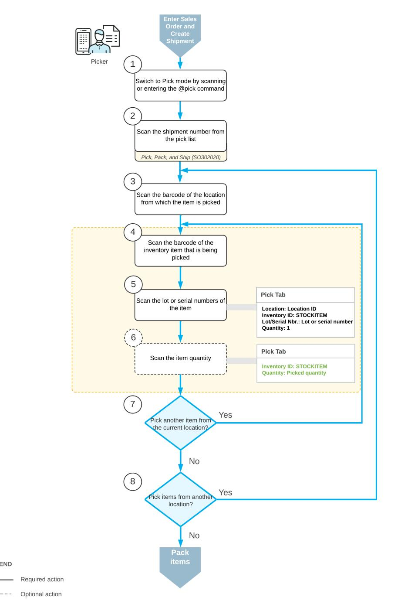

To process the picking of lot- or serial-tracked items in Pick mode, you perform the following steps:

1. *Switch to Pick mode*.

You open the *[Pick, Pack, and Ship](https://help-2025r1.acumatica.com/Help?ScreenId=ShowWiki&pageid=0d7f07e0-56a3-40a9-8cff-45bed542ae94)* (SO302020) form (or the corresponding screen in the Acumatica mobile app) and switch to Pick mode by scanning or entering the @pick barcode.

2. *Scan the shipment number*.

To start the automated processing, you scan the reference number of the shipment to be processed. The system displays the lines of the scanned document in the table and inserts the reference number of the document that is currently selected for processing in the**Shipment Nbr.** box.

3. *Scan the location barcode*.

When you scan the barcode of the location from which the item is picked, the system searches for the location in the lines of the document that is currently selected.

4. *Scan the item barcode*.

When you scan the item barcode of the picked item, the system searches for the item in the lines of the currently selected document.

5. *Scan the lot or serial number of the item*.

You scan the lot or serial number of the item being picked. The system displays the picked quantity in the **Picked Quantity** column and highlights the line (in bold if the line has been picked partially, or in green if the line has been picked in full). If the UOM defined by the barcode of the scanned item corresponds to a non-base unit of measure, the system converts the item quantity defined by this barcode to the picked quantity in the base unit of measure for this item.

You can scan all lot or serial numbers of an item one by one.

If the **Default Auto-Generated Lot/Serial Nbr.** check box is selected on the *[Sales Orders](https://help-2025r1.acumatica.com/Help?ScreenId=ShowWiki&pageid=1817779c-413b-4187-b7fe-38e97845a1cb) [Preferences](https://help-2025r1.acumatica.com/Help?ScreenId=ShowWiki&pageid=1817779c-413b-4187-b7fe-38e97845a1cb)* (SO101000) form, the system specifies the lot or serial number for the item automatically.

6. Optional: *Scan the item quantity*.

To change the picked quantity in the line that is currently being processed, you switch to Quantity Editing mode by scanning or entering the \*qty barcode, and manually enter the quantity in the UOM defined by the barcode of the scanned item.

7. *Pick another line*.

If another item needs to be picked for the currently selected location, you scan the item barcode (return to Step 4) and repeat the process for the item.

8. *Pick items from another location*.

If you need to pick items from another location, you scan the location barcode (return to Step 3) and repeat the process for the location.

9. *Complete the picking process*.

If you have finished the picking operation for the currently selected document, you scan the @pack barcode to switch to Pack mode and proceed with packing.

#### **Workflow for the Automated Packing of Lot- and Serial-Tracked Items**

The automated processing of packing lot- or serial-tracked items that have been picked involves the actions shown in the following diagram.

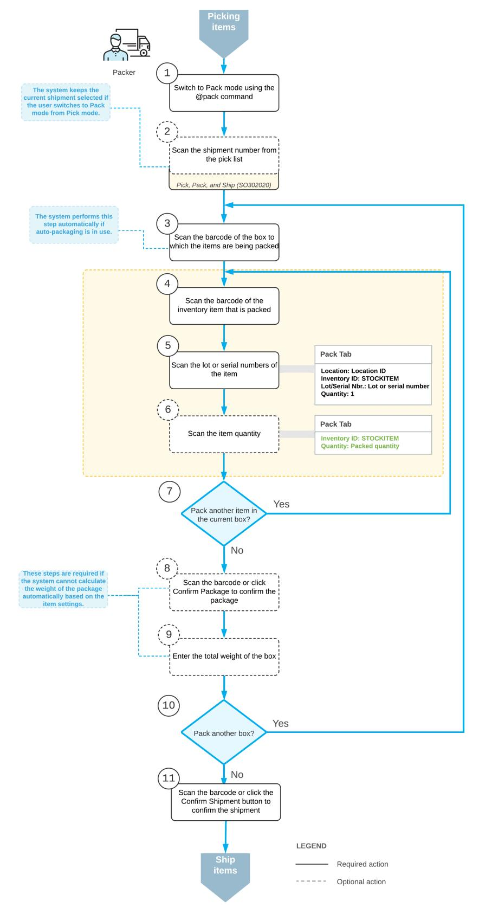

To process the packing of lot- or serial-tracked items in Pack mode, you perform the following steps:

1. *Switch to Pack mode*.

You open the *[Pick, Pack, and Ship](https://help-2025r1.acumatica.com/Help?ScreenId=ShowWiki&pageid=0d7f07e0-56a3-40a9-8cff-45bed542ae94)* (SO302020) form (or the corresponding screen in the Acumatica mobile app) and switch to Pack mode by scanning or entering the @pack barcode.

2. *Scan the document number*.

To start the automated processing, you scan the reference number of shipment to be processed. (If you have switched to Pack mode from Pick mode with the document selected, the document is selected automatically.) The system shows the lines of the scanned document in the table and inserts the reference number of the document that is currently selected for processing in the**Shipment Nbr.** box.

3. *Scan the barcode of the box*.

You scan the barcode of the box into which the items will be packed.

If the *Automatic Packaging* feature is enabled on the *[Enable/Disable Features](https://help-2025r1.acumatica.com/Help?ScreenId=ShowWiki&pageid=c1555e43-1bc5-4f6f-ba9d-b323f94d8a6b)* (CS101000) form, this step is performed automatically.

4. *Scan the item barcode*.

When you scan the barcode of the packed item, the system searches for the item in the lines of the document that is currently selected. If the UOM defined by the barcode of the scanned item corresponds to a non-base unit of measure, the system converts the item quantity defined by this barcode to the packed quantity in the base unit of measure for this item.

5. *Scan the lot or serial number of the item*.

You scan the lot or serial number of the item being packed. If the barcode of the scanned item is specified for a non-base unit of measure, the system converts this quantity to the packed quantity in the base unit of measure for this item; the system also shows the packed quantity in the **Packed Quantity** column, and highlights the line (in bold if the line has been processed partially, or in green if the line has been processed in full).

You can scan all lot or serial numbers of an item one by one.

If the **Default Auto-Generated Lot/Serial Nbr.** check box is selected on the *[Sales Orders](https://help-2025r1.acumatica.com/Help?ScreenId=ShowWiki&pageid=1817779c-413b-4187-b7fe-38e97845a1cb) [Preferences](https://help-2025r1.acumatica.com/Help?ScreenId=ShowWiki&pageid=1817779c-413b-4187-b7fe-38e97845a1cb)* (SO101000) form, the system specifies the lot or serial number for the item automatically.

6. Optional: *Scan the item quantity*.

To change the packed quantity in the line that is currently being processed, you switch to Quantity Editing mode by scanning or entering the \*qty barcode, and manually enter the quantity in the UOM defined by the barcode of the scanned item.

7. *Pack another line*.

If another item needs to be packed in the current box, you return to scanning the item barcode (return to Step 4) and repeat the process for the item.

8. *Confirm the box*.

If all items have been packed in the box, you confirm the current box by scanning the \*ok barcode or by clicking the **OK** button.

This step is performed automatically for the shipments that are being packed in a single box that the system has suggested automatically.

9. *Enter the box weight*.

You enter the total weight of the box.

This step is performed automatically for the shipments that are being packed in a single box that the system has suggested automatically.

#### 10.*Pack another box*.

If more items need to be packed for the current shipment, you return to scanning the barcode of the box barcode (return to Step 3) and repeat the process for another box.

11.*Complete the packing process*.

If you have finished the packing operation and do not need to specify shipping options, you scan the \*confirm\*shipment barcode or click the **Confirm Shipment** button on the form toolbar. The system confirms the shipment that is currently being processed on the *[Shipments](https://help-2025r1.acumatica.com/Help?ScreenId=ShowWiki&pageid=f47cffcc-543e-469c-a204-a9c1e3da346d)* (SO302000) form.

# **Automated Operations with Lot- and Serial-Tracked Items: Receiving and Putting Away Items**

If the *Lot and Serial Tracking* feature is enabled on the *[Enable/Disable Features](https://help-2025r1.acumatica.com/Help?ScreenId=ShowWiki&pageid=c1555e43-1bc5-4f6f-ba9d-b323f94d8a6b)* (CS100000) form and the tracking of stock items by lot or serial number has been configured in the system, when you receive and put away lot- or serialtracked items by using the *[Receive](https://help-2025r1.acumatica.com/Help?ScreenId=ShowWiki&pageid=fd850b21-96b8-4c2c-8c4a-f79272d8cacc) and Put Away* (PO302020) form or the corresponding screen in the Acumatica mobile app, the system may prompt you to enter the lot or serial number during this process.

In this topic, you will read about the workflow for the automated receiving and putting away of lot- and serialtracked inventory items in Acumatica ERP. The workflow in this topic is based on the assumption that your system has the recommended configuration described in *Automated Operations with Lot- and [Serial-Tracked](#page-168-1) Items: [Implementation Checklist](#page-168-1)*.

#### **Workflow for the Automated Receiving of Lot- or Serial-Tracked Items**

The automated processing of receiving items involves the actions shown in the following diagram.

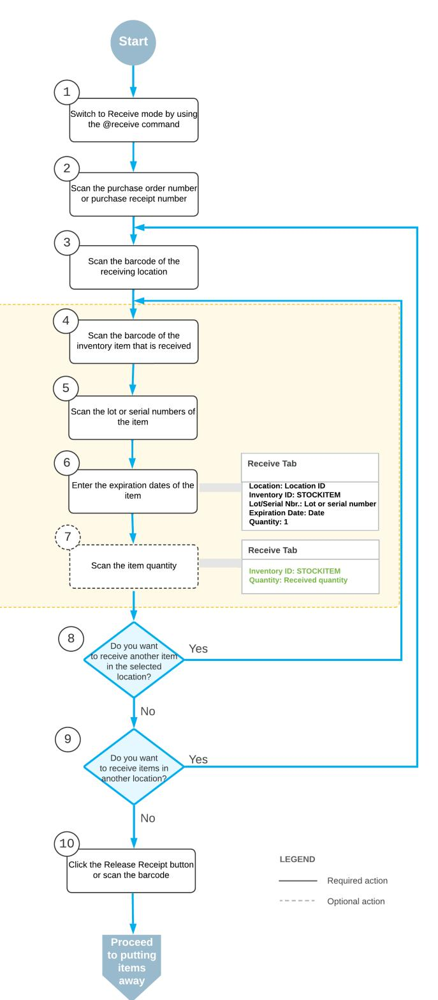

To process the receipt of lot- or serial-tracked items in Receive mode, you perform the following steps:

1. *Switch to Receive mode*.

You open the *[Receive](https://help-2025r1.acumatica.com/Help?ScreenId=ShowWiki&pageid=fd850b21-96b8-4c2c-8c4a-f79272d8cacc) and Put Away* (PO302020) form (or the corresponding screen in the Acumatica mobile app) and switch to Receive mode by scanning or entering the *@receive* barcode.

2. *Scan the document number*.

To start the automated processing, you scan the reference number of the purchase order, purchase receipt, or purchase return document to be processed. The system displays the lines of the scanned document in the table. If you have scanned the purchase order number, the system creates and saves the related purchase receipt automatically. In the **Receipt Nbr.** box, the system inserts the reference number of the receipt or return that is currently selected for processing.

3. *Scan the barcode of the receiving location*.

You scan the barcode of the warehouse location where the items are being received.

4. *Scan the item barcode*.

When you scan the barcode of the received item, the system searches for the item in the lines of the document that is currently selected.

5. *Scan the lot or serial number of the item*.

You scan the lot or serial number of the item being received.

If the **Default Auto-Generated Lot/Serial Nbr.** check box is selected on the *[Purchase Orders](https://help-2025r1.acumatica.com/Help?ScreenId=ShowWiki&pageid=13d09c43-8696-4f92-ad9b-3d0209ee3d9b) [Preferences](https://help-2025r1.acumatica.com/Help?ScreenId=ShowWiki&pageid=13d09c43-8696-4f92-ad9b-3d0209ee3d9b)* (PO101000) form, the system assigns and inserts the lot or serial number for the item automatically.

6. *Scan or enter the expiration date of the item*.

You scan the expiration date of the item being received. The system highlights the processed line in bold. If the UOM defined by the barcode of the scanned item corresponds to a non-base unit of measure, the system converts the item quantity defined by this barcode to the received quantity in the base unit of measure for this item. If the scanned item barcode corresponds to a non-base unit of measure, the system converts this quantity to the received quantity in the base unit of measure for this item.

You can scan all lot or serial numbers of an item one by one.

If the **Default Expiration Date** check box is selected on the *[Purchase Orders Preferences](https://help-2025r1.acumatica.com/Help?ScreenId=ShowWiki&pageid=13d09c43-8696-4f92-ad9b-3d0209ee3d9b)* form, the system fills in the expiration date for the item automatically.

7. Optional: *Scan the item quantity*.

To change the received quantity in the line that is currently being processed, you switch on Quantity Editing mode by scanning or entering the \*qty barcode, and manually enter the quantity in the UOM defined by the barcode of the scanned item.

8. *Receive another line*.

If you need to receive at least one other item for the document currently being processed, you return to scanning the item barcode (that is, return to Step 4) and repeat the process for the item.

9. *Receive items in another location*.

If items must be received in another warehouse location, you scan the barcode of this location (return to Step 3) and repeat the process for the next location.

10.*Complete the receiving process*.

If you have finished the receiving operation and all items have been received for the purchase order (or the items were received partially and more items will be received in the future), you scan the \*release barcode or click the **Release Receipt** button. The system releases the purchase receipt.

#### **Workflow for the Automated Putting Away of Items**

The automated processing of putting away items involves the actions shown in the following diagram.

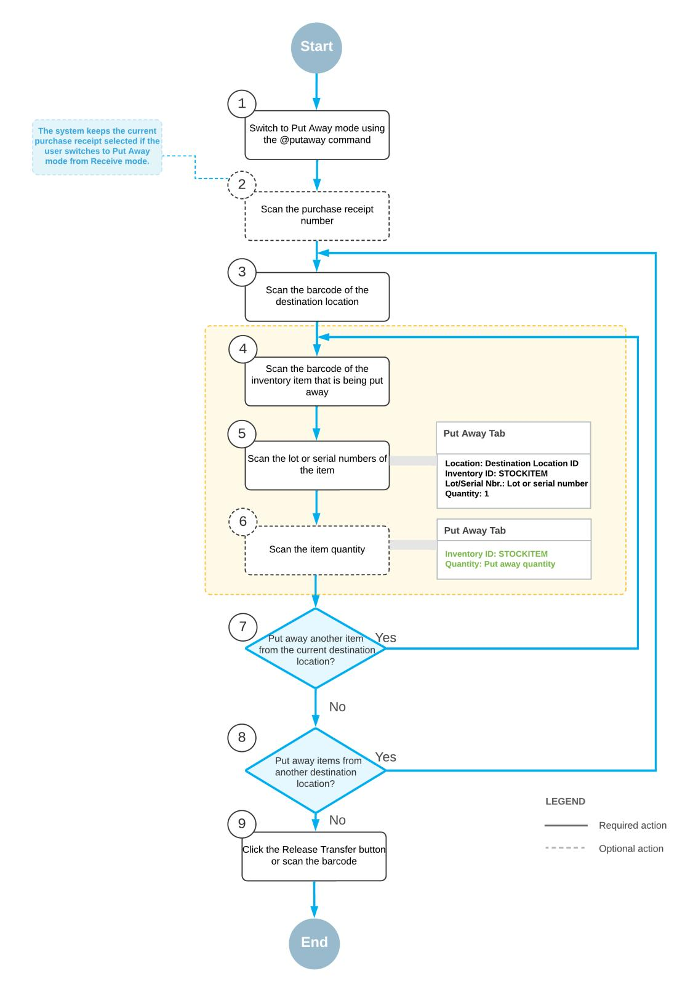

To process the putting away of lot- or serial-tracked items in Put Away mode, you perform the following steps:

1. *Switch to Put Away mode*.

You open the *[Receive](https://help-2025r1.acumatica.com/Help?ScreenId=ShowWiki&pageid=fd850b21-96b8-4c2c-8c4a-f79272d8cacc) and Put Away* (PO302020) form (or the corresponding screen in the Acumatica mobile app) and switch to Put Away mode by scanning or entering *@putaway* barcode.

2. *Scan the document number*.

To start the automated processing, you scan the reference number of the released purchase receipt to be processed. (If you switched to Put Away mode from Receive mode with a document selected, the system selected the document automatically.) The system displays the lines of the scanned document in the table. In the **Receipt Nbr.** box, the system inserts the reference number of the document that is currently selected for processing.

3. *Scan the barcode of the destination location*.

You scan the barcode of the destination location in which you are putting away items. If the items of a particular line are put away in multiple locations, the system splits the line by locations and shows *<SPLIT>* in the **Location** column. You can review the IDs of the locations to which the items are put away by clicking **Transfer Allocations** on the table toolbar of the **Put Away** tab.

Once you have specified the destination location, the system automatically creates a one-step inventory transfer document that reflects the movement of the items from the receiving location to the storage location.

4. *Scan the barcode of the item*.

When you scan the item barcode of the received item, the system searches for the item in the lines of the document that is currently selected. If the UOM defined by the barcode of the scanned item corresponds to a non-base unit of measure, the system converts the item quantity defined by this barcode to the put away quantity in the base unit of measure for this item. To indicate the line or lines with the scanned barcode, the system selects the **Matched** check box in these lines. The system highlights the lines in bold if they are processed partially, and in green if they are processed in full.

5. *Scan the lot or serial number of the item*.

Scan the lot or serial number of the item to be put away. You can scan all lot or serial numbers of an item one by one.

6. Optional: *Scan the item quantity*.

To change the quantity being put away in the line that is currently being processed, you switch to Quantity Editing mode by scanning or entering the \*qty barcode, and manually enter the quantity in the UOM defined by the barcode of the scanned item.

7. *Scan another item*.

If at least one other item needs to be put away, you return to scanning the barcode of the item (that is, return to Step 4) and repeat the process for the item.

8. *Scan another destination location*.

If items must be transferred to another destination location, you scan the barcode of this location (return to Step 3) and repeat the process.

9. *Complete the process of putting items away*.

When you have finished the operation of putting away items, you scan the \*release barcode or click the **ReleaseTransfer** button. The system releases the inventory transfer document that was prepared during the automated operation; the items are moved to the destination locations.

## **Automated Operations with Lot- and Serial-Tracked Items: Transferring Items**

If the *Lot and Serial Tracking* feature is enabled on the *[Enable/Disable Features](https://help-2025r1.acumatica.com/Help?ScreenId=ShowWiki&pageid=c1555e43-1bc5-4f6f-ba9d-b323f94d8a6b)* (CS100000) form and the tracking of stock items by lot or serial number has been configured in the system, when you transfer lot- or serial-tracked items by using the *Scan and [Transfer](https://help-2025r1.acumatica.com/Help?ScreenId=ShowWiki&pageid=a110f8a7-acca-496f-98e9-8f5f84f42279)* (IN304020) form or the corresponding screen in the Acumatica mobile app, the system may prompt you to enter the lot or serial number during this process.

This topic describes the workflow for the automated transfer of items that are tracked by lot or serial numbers. The workflow in this topic is based on the assumption that your system has the recommended configuration described in *Automated Operations with Lot- and Serial-Tracked Items: [Implementation](#page-168-1) Checklist*.

#### **Workflow for the Automated Scanning and Transferring of Lot- and Serial-Tracked Items**

The automated processing of scanning and transferring lot- or serial-tracked items involves the actions shown in the following diagram.

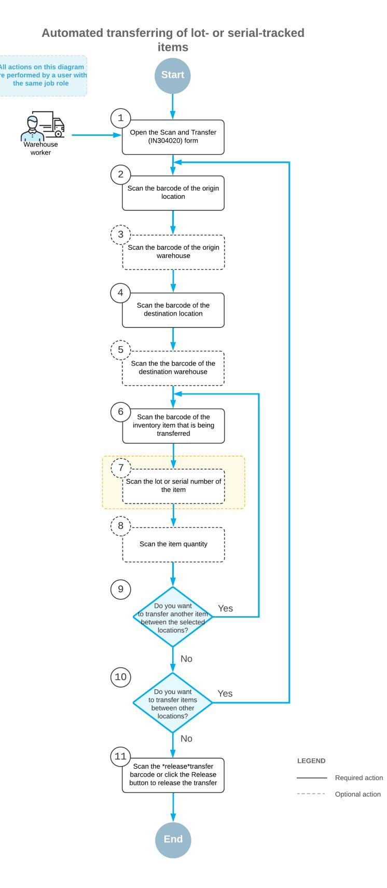

To transfer items by using a barcode scanner or a mobile device with a scanning option, you perform the following steps:

1. *Open the Scan and [Transfer](https://help-2025r1.acumatica.com/Help?ScreenId=ShowWiki&pageid=a110f8a7-acca-496f-98e9-8f5f84f42279) (IN304020) form*.

You open the *Scan and [Transfer](https://help-2025r1.acumatica.com/Help?ScreenId=ShowWiki&pageid=a110f8a7-acca-496f-98e9-8f5f84f42279)* form (or the corresponding screen in the Acumatica mobile app).

2. *Scan the origin location barcode*.

You scan the barcode of the origin location (that is, the location where the item to be transferred is currently being stored).

3. Optional: *Scan the origin warehouse barcode*.

If the location whose identifier you scanned in the previous step is assigned to multiple warehouses, you scan the origin warehouse barcode. The system inserts the warehouse ID in the **Warehouse** box.

4. *Scan the destination location barcode*.

You scan the barcode of the destination location (that is, the location to which you are transferring items).

5. Optional: *Scan the destination warehouse barcode*.

If the location whose identifier you scanned in the previous step is assigned to multiple warehouses, you scan the destination warehouse barcode. The system inserts the warehouse ID in the**To Warehouse** box.

If the destination warehouse differs from the origin warehouse and the warehouses are assigned to different buildings (or the building is not specified in the settings of either of the warehouses), the system displays an error message, and the transfer cannot be performed.

6. *Scan the item barcode*.

You scan the barcode of the item to be transferred.

7. Optional: *Scan the lot or serial number of the item*.

You scan the lot or serial number of the item. You can scan all lot or serial numbers of an item one by one.

8. Optional: *Scan the item quantity*.

To change the transferred quantity in the line that is currently being processed, you switch to Quantity Editing mode by scanning or entering the \*qty barcode or by clicking**Set Qty** on the form toolbar; you then manually enter the quantity in the base unit of measure.

9. Optional: *Scan the barcode of the next item to be transferred between the selected locations*.

If another item must be transferred between the currently selected locations, you scan the barcode of the next item (return to Step 6) and repeat the process for the next item.

10.Optional: *Scan the barcode of the next origin location*.

If items must be transferred between another locations, you scan the barcode of the next origin location (return to Step 2) and repeat the process.

11.*Release the inventory transfer*.

When you have finished transferring items, you scan the \*release command or click **Release** on the form toolbar. The system releases the inventory transfer on the *[Transfers](https://help-2025r1.acumatica.com/Help?ScreenId=ShowWiki&pageid=ea1539b6-fafa-443e-8b49-cd1ced95389f)* (IN304000) form.

# **Automated Operations with Lot- and Serial-Tracked Items: To Process Purchase and Sales Orders, and Transfers**

In the following activity, you will learn how to process purchase and sales orders, and transfers with lot-tracked stock items in automated mode.

This activity is based on the *U100* dataset. If you are using another dataset, or if any system settings have been changed in *U100*, these changes can affect the workflow of the activity and the results of the processing. To avoid any issues, restore the *U100* dataset to its initial state.

#### **Story**

Suppose that on 1/27/2025, the purchasing manager of the wholesale warehouse of the SweetLife Fruits & Jams company entered a purchase order for 30 pounds of pears (three boxes of 10 pounds each, and the boxes can have different expiration dates) from the Glory Fruit Case vendor. The vendor supplies each box with a lot number that must be used for tracking the enclosed items in the Wholesale warehouse. Then, on 1/29/2025, the sales manager entered a sales order for 12 pounds of pears being sold to GoodFood One Restaurant.

As the warehouse worker, you will receive the items in the purchase order and put them away in the fruit locations. Then you will pick and pack the items for the sales order. Finally, at the request of the warehouse manager, you will move the remaining items (those not included in the sales order) from one location to another.

## **Configuration Overview**

In the *U100* dataset, the following tasks have been performed to support this activity:

- On the *[Enable/Disable Features](https://help-2025r1.acumatica.com/Help?ScreenId=ShowWiki&pageid=c1555e43-1bc5-4f6f-ba9d-b323f94d8a6b)* (CS100000) form, the following features have been enabled in the *Inventory and Order Management* group of features:
  - *Inventory*
  - *Lot and Serial Tracking*
  - *Warehouse Management*
  - *Fulfillment*
  - *Receiving*
  - *Inventory Operations*
- On the *[Warehouses](https://help-2025r1.acumatica.com/Help?ScreenId=ShowWiki&pageid=264b0ef7-2b6c-40b4-a7d9-f1a5e067939b)* (IN204000) form, the *WHOLESALE* warehouse has been created. On the **Locations** tab, the following warehouse locations have been defined: *F1S2*, *F2S1*, and *MAIN*.
- On the *[Stock Items](https://help-2025r1.acumatica.com/Help?ScreenId=ShowWiki&pageid=77786a70-1f1e-4d63-ad98-96f98e4fcb0e)* (IN202500) form, the *PEARS* stock item has been created. For this stock item, the *PE1LB* barcode has been specified on the **Cross-Reference** tab of the form, and the *ALTFRT* lot class has been assigned.
- On the *[Lot/Serial Classes](https://help-2025r1.acumatica.com/Help?ScreenId=ShowWiki&pageid=9806d94b-097e-4082-9f01-9ca66d031ab7)* (IN207000) form, the *ALTFRT* lot class has been created. The lot class is defined so that the fruits with the earliest expiration date are issued first. Also, auto-generation of lot numbers is configured for the lot class.
- On the *[Boxes](https://help-2025r1.acumatica.com/Help?ScreenId=ShowWiki&pageid=ff38094d-bc30-4cf1-9008-0f1070ada514)* (CS207600) form, the *MEDIUM* box has been defined.
- On the *[Vendors](https://help-2025r1.acumatica.com/Help?ScreenId=ShowWiki&pageid=a9584be3-f2bd-4d67-80d4-8041d809df56)* (AP303000) form, the *GLORYFRUIT* vendor has been created.
- On the *[Customers](https://help-2025r1.acumatica.com/Help?ScreenId=ShowWiki&pageid=652929bc-9606-4056-aa6e-0c2d1147171b)* (AR303000) form, the *GOODFOOD* customer has been created.
- On the *[Purchase Orders](https://help-2025r1.acumatica.com/Help?ScreenId=ShowWiki&pageid=5565686c-96c4-4bfa-a51d-9a2566baa808)* (PO301000) form, the *000025* purchase order to *GLORYFRUIT* has been created.
- On the *[Sales Orders](https://help-2025r1.acumatica.com/Help?ScreenId=ShowWiki&pageid=19e4021c-1b84-49fd-be12-0320c5f1c7e5)* (SO301000) form, the *000061* sales order to *GOODFOOD* has been created.

#### **Process Overview**

In this process activity, you will act as a warehouse worker in the Wholesale warehouse. You will receive the items for a purchase order in automated mode and specify the lot number and expiration date for each unit of the items, and then put the received items away in the appropriate storage locations. Then you will create a shipment for a sales order on the *[Sales Orders](https://help-2025r1.acumatica.com/Help?ScreenId=ShowWiki&pageid=19e4021c-1b84-49fd-be12-0320c5f1c7e5)* (SO301000) form, and pick and pack the items for this shipment in the automated mode. Finally, you will prepare an inventory transfer to record the movement of the items from one location to another on the *Scan and [Transfer](https://help-2025r1.acumatica.com/Help?ScreenId=ShowWiki&pageid=a110f8a7-acca-496f-98e9-8f5f84f42279)* (IN304020) form.

#### **System Preparation**

Before you start processing purchase and sales documents, and transfer transactions with lot-tracked stock items in automated mode, do the following:

- 1. Launch the Acumatica ERP website, and sign in to a company with the *U100* dataset preloaded. You should sign in as warehouse worker with the *perkins* username and the *123* password.
- 2. In the info area, in the upper-right corner of the top pane of the Acumatica ERP screen, make sure that the business date in your system is set to *1/30/2025*. If a different date is displayed, click the Business Date menu button and select *1/30/2025* on the calendar. For simplicity, in this activity, you will create and process all documents in the system on this business date.
- 3. On the *[Enable/Disable Features](https://help-2025r1.acumatica.com/Help?ScreenId=ShowWiki&pageid=c1555e43-1bc5-4f6f-ba9d-b323f94d8a6b)* (CS100000) form, enable the *Lot and Serial Tracking* feature.

#### **Step 1: Receiving and Putting Away Items**

Suppose that the Glory Fruit Case vendor has delivered the 30 pounds of pears to the Wholesale warehouse: three boxes of 10 pounds each. Two of the boxes (that is, 20 pounds of pears) have one lot number and expiration date, and the third box (that is, 10 pounds of pears) has a different lot number and expiration date. You will prepare the needed documents to reflect the receipt of the pears as follows:

- 1. Open the *[Receive](https://help-2025r1.acumatica.com/Help?ScreenId=ShowWiki&pageid=fd850b21-96b8-4c2c-8c4a-f79272d8cacc) and Put Away* (PO302020) form, and make sure the **Receive** tab is opened.
- 2. In the **Scan** box, type 000025, which is the reference number of the purchase order for which you will perform receiving items and putting them away to storage locations. Press Enter. The system creates the purchase receipt for the purchase order and loads the purchase receipt line to the table on the **Receive** tab. The reference number of the purchase receipt that is currently being processed is displayed in the **Receipt Nbr.** box of the Summary area.
- 3. Enter MAIN to select the location in which you have received the items.
- 4. Enter PE1LB to select the item being received.
- 5. Enter FR000762 to specify the lot number of the first and second boxes of pears. (These boxes have the same lot number.)
- 6. Enter *02/20/2025* to specify the expiration date of these boxes, which have the same expiration date. The system highlights the purchase receipt line in bold, and specifies *1* as the **Received Qty.** The two boxes with the lot number and expiration date you have specified contain 20 pounds, so the quantity of the line should be 20.
- 7. Set the quantity of the current line to 20 as follows:
  - a. On the form toolbar, click**Set Qty**. The system prompts you to enter the item quantity.
  - b. In the **Scan** box, type 20.
- 8. Enter PE1LB to select the item being received. You are now processing the third box of 10 pounds of pears, which has a different lot number and expiration date than the first two boxes had.
- 9. Enter FR000782 to specify the lot number of the third box of pears.
- 10.Enter *02/13/2025* to specify the expiration date of this box. The system splits the line, and specifies 1 as the **Received Quantity** in the newly added line. The box with the lot number and expiration date you just entered contains 10 pounds, so the quantity of the line should be 10.
- 11.Set the quantity of the current line to 10. On the **Receive** tab, the system highlights both lines in green, indicating that these lines have been received in full.
- 12.On the form toolbar, click **Release Receipt**. The system releases the purchase receipt and generates a corresponding inventory receipt transaction to record the receipt of the items to the *MAIN* location of the warehouse.

- 13.Enter @putaway to switch to Put Away mode. Notice that the purchase receipt is still selected and its reference number is shown in the **Receipt Nbr.** box of the Summary area.
- 14.Enter F1S2 to select the location to which the items (the 20 pounds of pears in the first two boxes) are being put away.
- 15.Enter PE1LB to select the item to be put away to this location.
- 16.Enter FR000762 to specify the lot number of the first and second box of pears.
- 17.Set the quantity to 20.
- 18.Enter F2S1 to select the location to which the rest of the items (the remaining 10 pounds of pears, which are in the third box) are being put away.
- 19.Enter PE1LB to select the item to be put away to this location.
- 20.Enter FR000782 to specify the lot number of the third box of pears.
- 21.Set the quantity to 10.
- 22.On the form toolbar, click **ReleaseTransfer**.
- 23.On the **Transfers** tab, click the reference number in the **Reference Nbr.** column.
- 24.On the *[Transfers](https://help-2025r1.acumatica.com/Help?ScreenId=ShowWiki&pageid=ea1539b6-fafa-443e-8b49-cd1ced95389f)* (IN304000) form, which opens in a pop-up window, make sure that the generated transfer has the *Released* status shown in the**Status** box, and make sure that the lot number and expiration date have been assigned to the lines, as shown in the screenshot.

|              | <b>Transfers</b>                                                                                                   | 000100          |              |                  |        |             |                |  |                          |                       |               |  |        |               |                                               | $\Gamma$ NOTES  | <b>ACTIVITIES</b> | <b>FILES</b> | TOOLS $\star$      |
|--------------|--------------------------------------------------------------------------------------------------------------------|-----------------|--------------|------------------|--------|-------------|----------------|--|--------------------------|-----------------------|---------------|--|--------|---------------|-----------------------------------------------|-----------------|-------------------|--------------|--------------------|
| $\leftarrow$ |                                                                                                                    | 뭐               | Ħ            | $\Omega$         | $^{+}$ | 侕           | $\cap$ $\cdot$ |  | $\overline{\phantom{1}}$ | ≺                     | $\rightarrow$ |  | $\geq$ | $\sim$ $\sim$ |                                               |                 |                   |              |                    |
|              |                                                                                                                    | Reference Nbr.: |              | 000100           | Q      |             | Warehouse ID:  |  |                          |                       |               |  |        |               | WHOLESALE - Wholesale Warehouse               |                 | Total Qty.:       |              | $\hat{ }$ 30.00 |
|              | Status:                                                                                                            |                 |              | Released         |        |             |                |  |                          |                       |               |  |        |               | To Warehouse  WHOLESALE - Wholesale Warehouse |                 |                   |              |                    |
|              |                                                                                                                    | Transfer Type:  |              | 1-Step           |        |             | External Ref.: |  |                          |                       |               |  |        |               |                                               |                 |                   |              |                    |
|              | Date:                                                                                                              |                 |              | 1/30/2023        |        |             | Description:   |  |                          |                       |               |  |        |               |                                               |                 |                   |              |                    |
|              |                                                                                                                    | Post Period:    |              | 01-2023          |        |             |                |  |                          |                       |               |  |        |               |                                               |                 |                   |              |                    |
|              |                                                                                                                    | <b>DETAILS</b>  |              | <b>FINANCIAL</b> |        |             |                |  |                          |                       |               |  |        |               |                                               |                 |                   |              |                    |
|              | Ò <b>LINE DETAILS</b> $\mathbf{N}$ ADD ITEMS <b>INVENTORY SUMMARY</b> $\times$ ℍ Ĵ. $^{+}$ |                 |              |                  |        |             |                |  |                          |                       |               |  |        |               |                                               |                 |                   |              |                    |
| 冒            | 0                                                                                                                  | D               | Inventory ID |                  |        | Location    |                |  |                          | <b>To Location ID</b> |               |  |        | Quantity UOM  |                                               | Lot/Serial Nbr. |                   |              | Expiration Date |
| I>           | 0                                                                                                                  | $\Box$          | <b>PEARS</b> |                  |        | <b>MAIN</b> |                |  | <b>F1S2</b>              |                       |               |  |        | 20.00         | LB                                            | FR000762        |                   |              | 2/20/2023          |
|              | 0                                                                                                                  | D               | <b>PEARS</b> |                  |        | <b>MAIN</b> |                |  | <b>F2S1</b>              |                       |               |  |        | 10.00         | LB.                                           | FR000782        |                   |              | 2/13/2023          |
|              |                                                                                                                    |                 |              |                  |        |             |                |  |                          |                       |               |  |        |               |                                               |                 |                   |              |                    |

*Figure: Lot-tracked items moved to storage locations*

#### **Step 2: Creating a Shipment**

To create a shipment for some of the pears that have been received and put away, do the following:

- 1. On the *[Sales Orders](https://help-2025r1.acumatica.com/Help?ScreenId=ShowWiki&pageid=19e4021c-1b84-49fd-be12-0320c5f1c7e5)* (SO301000) form, open a sales order to *GOODFOOD* dated 1/29/2025, and make sure it has a line with the *PEARS* item and quantity *12*.
- 2. On the form toolbar, click **CreateShipment** to prepare a shipment.
- 3. In the **SpecifyShipment Parameters** dialog box, which opens, make sure that the *1/30/2025* date and the *WHOLESALE* warehouse are selected, and click **OK**. The system creates a shipment and opens it on the

*[Shipments](https://help-2025r1.acumatica.com/Help?ScreenId=ShowWiki&pageid=f47cffcc-543e-469c-a204-a9c1e3da346d)* (SO302000) form. In the**Shipment Nbr.**, box, notice the reference number of the shipment; you will need it in the next step.

#### **Step 3: Picking and Packing Items for the Shipment**

To perform automated picking and packing of the ordered items, do the following:

- 1. Open the *[Pick, Pack, and Ship](https://help-2025r1.acumatica.com/Help?ScreenId=ShowWiki&pageid=0d7f07e0-56a3-40a9-8cff-45bed542ae94)* (SO302020) form, and make sure that the **Pick** tab is opened.
- 2. In the **Scan** box, type the reference number of the shipment that you have prepared earlier in this activity. The system loads the shipment lines to the **Pick** tab, and in the**Shipment Nbr.** box of the Summary area, shows the reference number of the shipment that is currently being processed. Notice that the system has split the line so that 10 units for the shipment are taken from the box with the earlier expiration date, and the rest of the shipment (2 units) are taken from another box.
- 3. Enter F2S1 to select the location from which the item is picked.
- 4. Enter PE1LB to select the item that is being picked from the selected location.
- 5. Enter FR000782 to specify the lot number. The system highlights the second line of the shipment in bold and specifies *1* as the **Picked Quantity**.
- 6. Set the quantity to 10 as follows:
  - a. On the form toolbar, click**Set Qty**. The system prompts you to enter the quantity.
  - b. In the **Scan** box, type 10. The system highlights the first line of the shipment in green and specifies *10* as the **Picked Quantity**.
- 7. Enter F1S2 to select the location from which the item is picked for the remainder of the order.
- 8. Enter PE1LB to select the item being picked from the selected location.
- 9. Enter FR000762 to specify the lot number.
- 10.Set the quantity to 2. You have picked items for both lines, and now can processed with packing them in the box.
- 11.Enter @pack to switch to Pack mode. Notice that the shipment is still selected and its reference number is shown in the**Shipment Nbr.** box of the Summary area.
- 12.Enter MEDIUM to select the box for packaging the shipment.
- 13.Enter PE1LB to select the item to be packed to the selected box.
- 14.Enter FR000782 to specify the lot number.
- 15.Set the quantity to 10.
- 16.Enter PE1LB to select the item to be packed to the selected box.
- 17.Enter FR000762 to specify the lot number.
- 18.Set the quantity to 2. All items are packed in the box, so you can confirm the package.
- 19.On the form toolbar, click **OK** to confirm the package.
- 20.On the form toolbar, click **Confirm Shipment**.

#### **Step 4: Reviewing the Shipment**

Review the shipment in the system as follows:

1. On the *[Shipments](https://help-2025r1.acumatica.com/Help?ScreenId=ShowWiki&pageid=f47cffcc-543e-469c-a204-a9c1e3da346d)* (SO302000) form, open the shipment that you have processed earlier in this activity. Notice that it is assigned the *Confirmed* status.

2. Review the **Packages** tab. Notice that one box with the *MEDIUM* identifier is shown in the upper table, and the **Contents ofSelected Package** table shows the items that have been packed into this box, as shown in the following screenshot.

|               | <b>Shipments</b> |                              |                      | 000062 - GoodFood One Restaurant    |                         |                 |                 |                          |                    |    |                                |                                          |          |       | <b>P NOTES</b>   | <b>ACTIVITIES</b>           |              | <b>FILES</b>                             |               | TOOLS $\star$ |
|---------------|------------------|------------------------------|----------------------|-------------------------------------|-------------------------|-----------------|-----------------|--------------------------|--------------------|----|--------------------------------|------------------------------------------|----------|-------|------------------|-----------------------------|--------------|------------------------------------------|---------------|---------------|
|               | $\leftarrow$     | 뭐                            | $\boxdot$            | $\Omega$                            | $^+$                    | 间               | К               | $\overline{\phantom{0}}$ | $\mathcal{P}$      | >1 |                                | PREPARE INVOICE                          |          |       | <b>UPDATE IN</b> | .                           |              |                                          |               |               |
|               |                  | Shipment Nbr.:               |                      | 000062                              | $\varphi$               |                 | Customer:       |                          |                    |    |                                | !!!!!!!!!!!!!!!!!!!!!!!!!!!!!!!!!!!!!!!! |          |       |                  | Shipped Quant               |              | 12.00                                    |               | ∼             |
|               | Type:            |                              |                      | Shipment                            |                         |                 | Location:       |                          |                    |    | <b>MAIN - Primary Location</b> |                                          |          |       |                  | Control Quantity:           |              | 12.00                                    |               |               |
|               | Status:          |                              |                      | Confirmed                           |                         |                 |                 | Warehouse ID:            |                    |    |                                | WHOLESALE - Wholesale Warehouse          |          |       |                  | Shipped Weight:             | 0.000000     |                                          |               |               |
|               |                  | Operation:                   |                      | <b>Issue</b>                        |                         |                 | Workgroup:      |                          |                    |    |                                |                                          |          |       |                  | Shipped Volume:             | 0.000000     |                                          |               |               |
|               |                  | <b>Shipment Date:</b>        |                      | 1/30/2023                           |                         |                 | Owner:          |                          |                    |    |                                |                                          |          |       | Packages:        |                             |              | 1                                        |               |               |
|               |                  |                              |                      |                                     |                         |                 |                 |                          |                    |    |                                |                                          |          |       |                  | Package Weight:             | 0.030000     |                                          |               |               |
|               |                  | Description:                 |                      |                                     |                         |                 |                 |                          |                    |    |                                |                                          |          |       |                  |                             |              |                                          |               |               |
|               |                  | <b>DETAILS</b>               |                      | <b>ORDERS</b>                       |                         | <b>SHIPPING</b> |                 | <b>PACKAGES</b>          |                    |    |                                |                                          |          |       |                  |                             |              |                                          |               |               |
|               |                  |                              |                      |                                     |                         |                 |                 |                          |                    |    |                                |                                          |          |       |                  |                             |              |                                          |               |               |
|               | Ò                | $^{+}$                       | $\times$             | $\left  \rightarrow \right $        | $\overline{\mathbf{x}}$ |                 |                 |                          |                    |    |                                |                                          |          |       |                  |                             |              |                                          |               |               |
| 目             | 0                |                              | $\Box$ Confirmed     | *Box ID                             |                         |                 |                 | <b>Type</b>              | <b>Description</b> |    |                                | Length                                   |          | Width |                  | Height Linear <b>UOM</b> |              | Weight UOM                               |               |               |
| $\geq$        | $\mathbf 0$      | $\Box$                       | ☑                    |                                     | <b>MEDIUM</b>           |                 |                 | Manual                   |                    |    |                                | 11                                       |          | 8     | 5                |                             |              | 0.0300                                   | KG            |               |
|               |                  |                              |                      |                                     |                         |                 |                 |                          |                    |    |                                |                                          |          |       |                  |                             |              |                                          |               |               |
|               |                  |                              |                      |                                     |                         |                 |                 |                          |                    |    |                                |                                          |          |       |                  |                             |              |                                          |               |               |
|               |                  |                              |                      |                                     |                         |                 |                 |                          |                    |    |                                |                                          |          |       |                  |                             |              |                                          |               |               |
| 4 L           |                  |                              |                      |                                     |                         |                 |                 |                          |                    |    |                                |                                          |          |       |                  |                             |              |                                          |               |               |
|               |                  |                              |                      |                                     |                         |                 |                 |                          |                    |    |                                |                                          |          |       |                  |                             | $\mathbf{K}$ | $\overline{\left\langle \right\rangle }$ | $\rightarrow$ | >1            |
|               |                  |                              |                      | <b>Contents of Selected Package</b> |                         |                 |                 |                          |                    |    |                                |                                          |          |       |                  |                             |              |                                          |               |               |
|               | Ò                | $\!+\!$                      | $\times$             | $\mapsto$                           | $\mathbf{x}$            |                 |                 |                          |                    |    |                                |                                          |          |       |                  |                             |              |                                          |               |               |
| 皀             |                  | <b>Split</b> Line Nbr. | Shipmer Inventory ID |                                     |                         |                 | Lot/Serial Nbr. |                          |                    |    | <b>UOM</b>                     |                                          | Quantity |       |                  |                             |              |                                          |               |               |
| $\rightarrow$ |                  | $\overline{2}$               | <b>PEARS</b>         |                                     |                         |                 | FR000782        |                          |                    |    | LB                             |                                          | 10.00    |       |                  |                             |              |                                          |               |               |
|               |                  | 3.                           | <b>PEARS</b>         |                                     |                         |                 | FR000762        |                          |                    |    | LB                             |                                          | 2.00     |       |                  |                             |              |                                          |               |               |

*Figure: Confirmed shipment*

#### **Step 5: Transferring Items**

Suppose that the warehouse manager has decided to clean the *F1S2* location and asked you to move all items from this location to the *F2S1* location, which has already been cleaned. In the *F1S2* location, you found 18 pounds of pears and moved them to the *F2S1* location. Now you acting as a warehouse worker need to record this movement in the system by creating an inventory transfer. Do the following:

- 1. Open the *Scan and [Transfer](https://help-2025r1.acumatica.com/Help?ScreenId=ShowWiki&pageid=a110f8a7-acca-496f-98e9-8f5f84f42279)* (IN304020) form.
- 2. In the **Scan** box, enter F1S2 as the origin location.
- 3. Enter F2S1 as the destination location.
- 4. Enter PE1LB as the item to be transferred.
- 5. Enter FR000762 to specify the lot number. The system adds a line with one unit of the item to the table on the **Transfer** tab.
- 6. Set the quantity of the line to 18 as follows:
  - a. On the form toolbar, click**Set Qty**. The system prompts you to enter the quantity.

- b. In the **Scan** box, enter 18.
- 7. On the form toolbar, click**Save**. The system creates the transfer with the data you have entered. You can view the transfer number in the **Reference Nbr.** box of the Summary area.
- 8. On the form toolbar, click **Release**. The system releases the transfer.
- 9. Click the Edit button next to the **Reference Nbr.** box, and on the *[Transfers](https://help-2025r1.acumatica.com/Help?ScreenId=ShowWiki&pageid=ea1539b6-fafa-443e-8b49-cd1ced95389f)* (IN304000) form, which opens in a pop-up window, review the inventory transfer transaction. Make sure that it includes the needed line and is assigned the *Released* status, as shown in the following screenshot.

| <b>Transfers</b> 000101                                                                                                                                                             | $\sim$ $\sim$ $\cdots$                                                                                                            |                                                | <b>P NOTES</b>       | <b>FILES</b> TOOLS $\sim$ <b>ACTIVITIES</b> |
|----------------------------------------------------------------------------------------------------------------------------------------------------------------------------------------|--------------------------------------------------------------------------------------------------------------------------------------|------------------------------------------------|----------------------|---------------------------------------------------|
| $\boxdot$ 血 도 $\Omega$ $^{+}$ Reference Nbr.: Q 000101 Status: Released <b>Transfer Type:</b> 1-Step Date: 1/30/2023 Post Period: 01-2023 | n - K $\rightarrow$ $\geq$ Warehouse ID: To Warehouse  WHOLESALE - Wholesale Warehouse External Ref.: Description: | Total Qty.: WHOLESALE - Wholesale Warehouse | 18.00                | $\sim$                                            |
| <b>DETAILS</b> <b>FINANCIAL</b>                                                                                                                                                     |                                                                                                                                      |                                                |                      |                                                   |
| Ò <b>LINE DETAILS</b> X                                                                                                                                                          | <b>INVENTORY SUMMARY</b> <b>ADD ITEMS</b>                                                                                         | $\mathbf{x}$ н 土                         |                      |                                                   |
| D 0 目 <b>Inventory ID</b> <b>Description</b>                                                                                                                               | Location                                                                                                                             | <b>To Location ID</b> Quantity UOM          | Lot/Serial Nbr.      | Expiration Date                                |
| > 0 $\Box$ PEARS                                                                                                                                                                 | Fresh pears 1 lb <b>F1S2</b>                                                                                                      | <b>F2S1</b>                                    | 18.00 LB FR000762 | 2/20/2023                                         |
|                                                                                                                                                                                        |                                                                                                                                      |                                                |                      |                                                   |

#### *Figure: Lot-tracked items transferred to another location*

You have successfully moved pears between the locations.

# **Automated Operations with Lot- and Serial-Tracked Items: Counting Items in Physical Inventory**

If the *Lot and Serial Tracking* feature is enabled on the *[Enable/Disable Features](https://help-2025r1.acumatica.com/Help?ScreenId=ShowWiki&pageid=c1555e43-1bc5-4f6f-ba9d-b323f94d8a6b)* (CS100000) form and the tracking of stock items by lot or serial number has been configured in the system, when you count lot- or serial-tracked items by using the *[Scan and Count](https://help-2025r1.acumatica.com/Help?ScreenId=ShowWiki&pageid=9ce6eb18-6c13-4767-9304-b1abb96296dd)* (IN305020) form or the corresponding screen in the Acumatica mobile app, the system prompts you to enter the lot or serial number during this process.

This topic describes the workflow for the automated counting of lot- or serial-tracked items during physical inventory. The workflow in this topic is based on the assumption that your system has the recommended configuration described in *Automated Operations with Lot- and Serial-Tracked Items: [Implementation](#page-168-1) Checklist*.

#### **Workflow for the Automated Scanning and Counting of Lot- and Serial-Tracked Items**

The automated processing of scanning and counting lot- or serial-tracked items involves the actions shown in the following diagram.

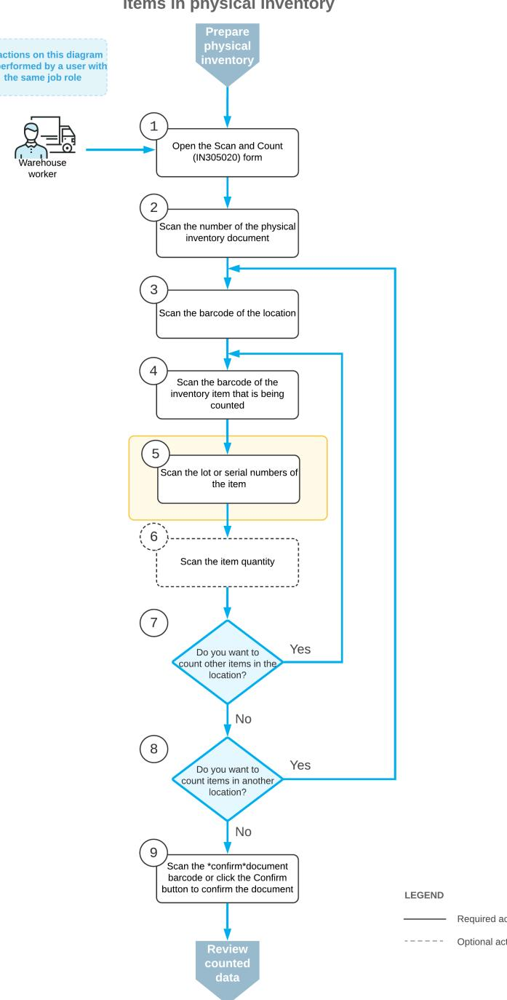

To count inventory items (and use Scan and Count mode), you perform the following steps:

1. *Open the [Scan and Count](https://help-2025r1.acumatica.com/Help?ScreenId=ShowWiki&pageid=9ce6eb18-6c13-4767-9304-b1abb96296dd) (IN305020) form*.

You open the *[Scan and Count](https://help-2025r1.acumatica.com/Help?ScreenId=ShowWiki&pageid=9ce6eb18-6c13-4767-9304-b1abb96296dd)* form (or the corresponding screen in the Acumatica mobile app) to start the counting process.

2. *Scan the document number*.

To start the automated counting, you scan the reference number of the physical inventory document. The lines of the scanned document are shown in the table. The reference number of the document selected for processing is displayed in the **Reference Nbr.** box.

3. *Scan the location barcode*.

You scan the barcode of the location where the items to be counted are stored. All items that you scan aer scanning the location barcode will be assigned to this location.

4. *Scan the item barcode*.

You scan the barcode of the item that is stored in the selected location.

5. *Scan the lot or serial number of the item*.

You scan the lot or serial number of the item. The system changes the status of the line for this item to *Entered*. You can scan all lot or serial numbers of an item one by one.

6. Optional: *Scan the item quantity*.

To change the counted quantity in the line that is currently being processed, you switch to Quantity Editing mode by scanning or entering the \*qty barcode or by clicking**Set Qty** on the form toolbar; you then manually enter the quantity in the base unit of measure.

7. Optional: *Scan the barcode of the next item in the same location*.

If you have more items to count in the same location, you scan the barcode of the next item (return to Step 4) and repeat the process for the item.

8. Optional: *Scan the barcode of the next location*.

If items in another location must be counted, you return to scanning the warehouse location (return to Step 3) and repeat the process for the items in this location.

9. *Confirm the physical inventory count*.

When you have finished counting items, you scan the \*confirm command or click **Confirm** on the form toolbar. The system saves your changes to the physical inventory document.

# **Automated Operations with Lot- and Serial-Tracked Items: To Count Items in Physical Inventory**

In this activity, you will learn how to perform automated counting of lot-tracked items during a physical inventory.

This activity is based on the *U100* dataset. If you are using another dataset, or if any system settings have been changed in *U100*, these changes can affect the workflow of the activity and the results of the processing. To avoid any issues, restore the *U100* dataset to its initial state.

#### **Story**

Suppose that you are a warehouse worker in the SweetLife Fruits & Jams company, and you have been assigned to perform a physical inventory count by entering the barcodes of stock items and locations. You will count the quantities of coconuts in particular warehouse locations added to the physical inventory document, which your manager has provided to you.

#### **Configuration Overview**

In the *U100* dataset, the following tasks have been performed to support this activity:

- On the *[Enable/Disable Features](https://help-2025r1.acumatica.com/Help?ScreenId=ShowWiki&pageid=c1555e43-1bc5-4f6f-ba9d-b323f94d8a6b)* (CS100000) form, the following features have been enabled in the *Inventory and Order Management* group of features:
  - *Multiple Warehouse Locations*
  - *Lot and Serial Tracking*

- *Advanced Physical Count*
- *Warehouse Management*
- *Inventory Operations*
- On the *[Warehouses](https://help-2025r1.acumatica.com/Help?ScreenId=ShowWiki&pageid=264b0ef7-2b6c-40b4-a7d9-f1a5e067939b)* (IN204000) form, the *WHOLESALE* warehouse has been created. For this warehouse, on the **Locations** tab, the *F3S1* and *F3S2* warehouse locations have been added.
- On the *[Stock Items](https://help-2025r1.acumatica.com/Help?ScreenId=ShowWiki&pageid=77786a70-1f1e-4d63-ad98-96f98e4fcb0e)* (IN202500) form, the *COCONUTS* stock item has been created. For this stock item, the *CNBOX* barcode has been specified on the **Cross-Reference** tab of the form.
- On the *Physical [Inventory](https://help-2025r1.acumatica.com/Help?ScreenId=ShowWiki&pageid=b83fc037-f166-499e-8a32-cbb560e91ee5) Types* (IN208900) form, the *CNCNT* inventory type has been created.
- On the *[Prepare Physical Count](https://help-2025r1.acumatica.com/Help?ScreenId=ShowWiki&pageid=cbdb2f15-9394-4d09-b1fb-d54a9920938b)* (IN504000) form, the *000002* physical inventory document has been created, and it has the *Counting in Progress* status.

#### **Process Overview**

As you count lot-tracked items within a physical inventory in this activity, you will scan the barcode of the physical inventory document; you will then scan the location barcode, the barcode of each item you find in this location, and the barcodes of the lot numbers that correspond to each item. When you have counted all items in all locations added to the physical inventory document, you will confirm the document.

In any working mode, you enter a command or barcode by typing it in the**Scan** box and pressing Enter. In production systems, you will scan the appropriate barcodes rather than manually entering them.

#### **System Preparation**

Before you start performing the activity, do the following:

- 1. Sign in to a company with the U100 dataset preloaded as a warehouse worker with the *perkins* username and the *123* password.
- 2. On the *[Enable/Disable Features](https://help-2025r1.acumatica.com/Help?ScreenId=ShowWiki&pageid=c1555e43-1bc5-4f6f-ba9d-b323f94d8a6b)* (CS100000) form, make sure that the *Lot and Serial Tracking* feature is enabled.

#### **Step 1: Entering the Counted Quantities of Items**

Suppose that you have started counting coconuts. Do the following to enter the counted quantities into the system:

- 1. Open the *[Scan and Count](https://help-2025r1.acumatica.com/Help?ScreenId=ShowWiki&pageid=9ce6eb18-6c13-4767-9304-b1abb96296dd)* (IN305020) form.
- 2. In the **Scan** box, type 000002 (which is the reference number of the physical inventory count). Press Enter. The list of items that you should count is displayed on the **Count** tab.
- 3. Enter F3S1, which is the barcode of the first location.

Suppose that in this location, you find two boxes of coconuts with different lot numbers.

- 4. Enter CNBOX, which is the barcode that corresponds to a box of 5 pounds of coconuts.
- 5. Enter FR100895 to specify the lot number of the coconuts. The system adds 5 units of the *COCONUTS* item to the corresponding table row.
- 6. Enter CNBOX to add another box of coconuts with a different lot number.
- 7. Enter FR100751 to specify the lot number of the coconuts. The system adds 5 units of the *COCONUTS* item to the corresponding table row.

You have finished counting items in the *F3S1* location and can start counting items in the next location.

8. Enter F3S2, which is the barcode of the second location.

Suppose that in this location, you find one box of coconuts.

- 9. Enter CNBOX to add the box of coconuts.
- 10.Enter FR100598 to specify the lot number of the coconuts. The system adds 5 units of the *COCONUTS* item to the corresponding table row.

You have finished counting items in the *F3S2* location and need to confirm the counted data.

#### **Step 2: Reviewing the Quantities and Confirming the Entered Data**

Aer you have entered the quantities of all items in the physical inventory document, you need to review the quantities and confirm the entered data. Do the following:

1. While you are still viewing the *000002* physical inventory document on the *[Scan and Count](https://help-2025r1.acumatica.com/Help?ScreenId=ShowWiki&pageid=9ce6eb18-6c13-4767-9304-b1abb96296dd)* (IN305020) form, review the lines of the table on the **Count** tab. They should have the settings indicated in the following table.

| Line Nbr. | Location | Inventory ID | Lot/Serial Number | Physical Quantity |
|-----------|----------|--------------|----------------------|----------------------|
| 1         | F3S1     | COCONUTS     | FR100751             | 5                    |
| 2         | F3S1     | COCONUTS     | FR100895             | 5                    |
| 3         | F3S2     | COCONUTS     | FR100598             | 5                    |

- 2. On the form toolbar, click **Confirm** to confirm the entered data. The system confirms the data and clears the physical inventory document number. The form is ready for a new count.
- 3. On the *[Physical Inventory Count](https://help-2025r1.acumatica.com/Help?ScreenId=ShowWiki&pageid=6982851e-9f5f-44f2-afa2-490b1cf23c11)* (IN305010) form, open the *000002* physical inventory document for which you have performed count. In the **Physical Quantity** column, make sure all counted quantities are shown (see the screenshot below).

| <b>Physical Inventory Count</b>                    |                                        |        |                                          |                    |           |             | புகை                     | 101111120 .      | 10000                |
|----------------------------------------------------|----------------------------------------|--------|------------------------------------------|--------------------|-----------|-------------|--------------------------|---------------------|----------------------|
| B $\Omega$ K                                 | ≺ $\rightarrow$                     | $\geq$ |                                          |                    |           |             |                          |                     |                      |
| * Reference Nbr.:                                  | 000002                                 |        | ρ                                        | Freeze Date:       | 1/29/2023 |             |                          |                     | $\hat{\phantom{a}}$  |
| Warehouse:                                         | <b>WHOLESALE - Wholesale Warehouse</b> |        |                                          |                    | 3         |             |                          |                     |                      |
| Location:                                          | Q                                      |        |                                          |                    |           |             |                          |                     |                      |
| Inventory ID:                                      |                                        |        | Q                                        | End Line Nbr.:     |           |             |                          |                     |                      |
| Lot/Serial Nbr.:                                   |                                        |        |                                          |                    |           |             |                          |                     |                      |
| Description:                                       | Physical inventory for coconuts        |        |                                          |                    |           |             |                          |                     |                      |
| Õ <b>ADD</b> ℍ                               | $\boxtimes$                            |        |                                          |                    |           |             |                          |                     |                      |
| 0 B D <b>Status</b>                       | Line Nbr.                           | Nbr.   | Tag Inventory ID                         | <b>Description</b> |           | Location    | <b>Lot/Serial Number</b> | <b>Base</b> Unit | Physical Quantity |
| $\omega$ D $\left  \right\rangle$ Entered | $\mathbf{1}$                           |        | <b>COCONUTS</b>                          | Coconuts 1 lb      |           | <b>F3S1</b> | FR100751                 | LB                  | 5.00                 |
| Entered 0 D                                  | $\overline{2}$                         |        | !!!!!!!!!!!!!!!!!!!!!!!!!!!!!!!!!!!!!!!! | Coconuts 1 lb      |           | <b>F3S1</b> | FR100895                 | LB                  | 5.00                 |
| 0 Entered D                                  | 3                                      |        | <b>COCONUTS</b>                          | Coconuts 1 lb      |           | <b>F3S2</b> | FR100598                 | LB                  | 5.00                 |

#### *Figure: Physical inventory count*

You have successfully counted coconuts in the warehouse locations and entered data into the system.

# **Automated Operations with Lot- and Serial-Tracked Items: Issuing Items**

If the *Lot and Serial Tracking* feature is enabled on the *[Enable/Disable Features](https://help-2025r1.acumatica.com/Help?ScreenId=ShowWiki&pageid=c1555e43-1bc5-4f6f-ba9d-b323f94d8a6b)* (CS100000) form and the tracking of stock items by lot or serial number has been configured in the system, when you issue lot- or serial-tracked items by using the *[Scan and Issue](https://help-2025r1.acumatica.com/Help?ScreenId=ShowWiki&pageid=589455a2-a6bd-4d0e-ac5a-1a4f5a0d9dee)* (IN302020) form or the corresponding screen in the Acumatica mobile app, the system prompts you to enter the lot or serial number during this process.

This topic describes the workflow for the automated issuing of lot- or serial-tracked items. The workflow in this topic is based on the assumption that your system has the recommended configuration described in *[Automated](#page-168-1) Operations with Lot- and Serial-Tracked Items: [Implementation](#page-168-1) Checklist*.

### **Workflow for the Automated Issuing of Lot- and Serial-Tracked Items**

The automated processing of issuing lot- or serial-tracked items involves the actions shown in the following diagram.

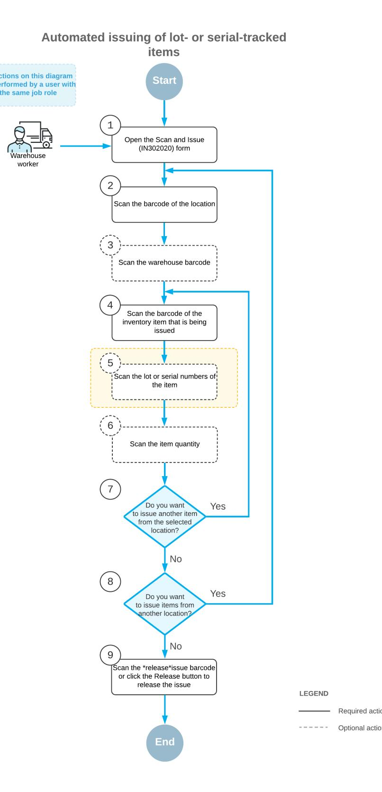

To issue items by using a barcode scanner or a mobile device with a scanning option, you perform the following steps:

1. *Open the [Scan and Issue](https://help-2025r1.acumatica.com/Help?ScreenId=ShowWiki&pageid=589455a2-a6bd-4d0e-ac5a-1a4f5a0d9dee) (IN302020) form*.

You open the *[Scan and Issue](https://help-2025r1.acumatica.com/Help?ScreenId=ShowWiki&pageid=589455a2-a6bd-4d0e-ac5a-1a4f5a0d9dee)* form (or the corresponding screen in the Acumatica mobile app).

#### 2. *Scan the location barcode*.

You scan the barcode of the warehouse location where the items to be issued are stored.

3. Optional: *Scan the warehouse barcode*.

If the location whose identifier you scanned in the previous step is assigned to multiple warehouses, you scan the warehouse barcode. The system inserts the warehouse ID in the **Warehouse** box.

4. *Scan the item barcode*.

You scan the barcode of the item that must be issued from the selected location.

5. Optional: *Scan the lot or serial number of the item*.

The system may prompt you to enter the lot or serial number of the item, depending on the lot or serial class settings specified on the *[Lot/Serial Classes](https://help-2025r1.acumatica.com/Help?ScreenId=ShowWiki&pageid=9806d94b-097e-4082-9f01-9ca66d031ab7)* (IN207000) form.

If the assignment method of the lot or serial class dictates that the lot or serial number be specified on receipt of the item and the issue method dictates that the lot or serial number must be entered by a user, the system prompts you to scan the lot or serial number.

If the assignment method of the lot or serial class dictates that the lot or serial number be specified on issue of the item, the system prompts you to scan the lot or serial number only if the number is not generated automatically and must be entered manually.

You can scan all lot or serial numbers of an item one by one.

6. Optional: *Scan the item quantity*.

To change the issued quantity in the line that is currently being processed, you switch to Quantity Editing mode by scanning or entering the \*qty barcode or by clicking**Set Qty** on the form toolbar; you then manually enter the quantity in the base unit of measure.

7. Optional: *Scan the barcode of the next item to be issued from the selected location*.

If another item must be issued from the currently selected location, you scan the barcode of the next item (return to Step 4) and repeat the process for this item.

8. Optional: *Scan the barcode of the next location*.

If items must be issued from another warehouse location, you scan the barcode of this location (return to Step 2) and repeat the process for this location.

9. *Release the inventory issue*.

When you have finished issuing items, you scan the \*release command or click **Release** on the form toolbar. The system releases the inventory issue on the *[Issues](https://help-2025r1.acumatica.com/Help?ScreenId=ShowWiki&pageid=17b051f6-027d-4459-b542-65c1c1f9d0ea)* (IN302000) form.

# **Automated Operations with Lot- and Serial-Tracked Items: To Issue Items**

In this activity, you will learn how to perform automated issuing of lot-tracked items.

This activity is based on the *U100* dataset. If you are using another dataset, or if any system settings have been changed in *U100*, these changes can affect the workflow of the activity and the results of the processing. To avoid any issues, restore the *U100* dataset to its initial state.

#### **Story**

Suppose that you, as a warehouse worker of the SweetLife Fruits & Jams company, have a task to check the boxes of bananas in refrigerators in order to find rotten bananas and write them off. To record writing off boxes with rotten bananas in the system, you will create and process an inventory issue.

### **Configuration Overview**

In the *U100* dataset, the following tasks have been performed to support this activity:

- On the *[Enable/Disable Features](https://help-2025r1.acumatica.com/Help?ScreenId=ShowWiki&pageid=c1555e43-1bc5-4f6f-ba9d-b323f94d8a6b)* (CS100000) form, the following features have been enabled in the *Inventory and Order Management* group of features:
  - *Multiple Warehouse Locations*
  - *Lot and Serial Tracking*
  - *Warehouse Management*
  - *Inventory Operations*
- On the *[Warehouses](https://help-2025r1.acumatica.com/Help?ScreenId=ShowWiki&pageid=264b0ef7-2b6c-40b4-a7d9-f1a5e067939b)* (IN204000) form, the *WHOLESALE* warehouse has been created. For this warehouse, on the **Locations** tab, the *F2S2* and *F3S2* warehouse locations have been added.
- On the *[Stock Items](https://help-2025r1.acumatica.com/Help?ScreenId=ShowWiki&pageid=77786a70-1f1e-4d63-ad98-96f98e4fcb0e)* (IN202500) form, the *BANANAS* stock item has been created. For this stock item, the *BBOX* unit of measure has been defined on the **General** tab and the *BNBOX* barcode has been defined on the **Cross-Reference** tab of the form.

#### **Process Overview**

When you issue lot-tracked items in this activity, you will scan the barcode of the location where the items are stored; you then scan a barcode of each item to be issued and the barcodes of the lot numbers that correspond to each item. When you have added all items in all locations to the issue, you will release the issue.

In any working mode, you enter a command or barcode by typing it in the**Scan** box and pressing Enter. In production systems, you will scan the appropriate barcodes rather than manually entering them.

#### **System Preparation**

Before you start issuing lot-tracked items, do the following:

- 1. Sign in to a company with the *U100* dataset preloaded. You should sign in as warehouse worker with the *perkins* username and the *123* password.
- 2. On the *[Enable/Disable Features](https://help-2025r1.acumatica.com/Help?ScreenId=ShowWiki&pageid=c1555e43-1bc5-4f6f-ba9d-b323f94d8a6b)* (CS100000) form, enable the *Lot and Serial Tracking* feature.

#### **Step 1: Processing the Issue of Items**

Suppose that when you were checking the boxes with bananas in the refrigerator locations, as instructed by your manager, you have found four boxes with rotten bananas: two boxes with different lot numbers in the *F2S2* location, and two boxes with the same lot number in the *F3S2* location. To process the issue transaction in the system, do the following:

- 1. Open the *[Scan and Issue](https://help-2025r1.acumatica.com/Help?ScreenId=ShowWiki&pageid=589455a2-a6bd-4d0e-ac5a-1a4f5a0d9dee)* (IN302020) form.
- 2. In the **Scan** box, type F2S2, which is the barcode of the location where the first box of bananas is stored. Press Enter.
- 3. Enter BNBOX, which is the barcode that corresponds to a box of 10 pounds of bananas.
- 4. Enter FR200384 to specify the lot number of the box. The system adds 1 unit of the *BANANAS* item in the *BBOX* unit of measure to the table on the **Issue** tab.
- 5. Enter BNBOX for the second box of bananas.
- 6. Enter FR200401 to specify the lot number of the box. The system adds 1 unit of the *BANANAS* item in the *BBOX* unit of measure to the table on the **Issue** tab.

- 7. Enter F3S2, which is the barcode of the location where the second box of bananas is stored.
- 8. Enter BNBOX to add the box of bananas.
- 9. Enter FR200335 to specify the lot number of the box. The system adds 1 unit of the *BANANAS* item in the *BNBOX* unit of measure to the table on the **Issue** tab.
- 10.Set the quantity to 2 as follows:
  - a. On the form toolbar, click**Set Qty**. The system prompts you to enter the quantity.
  - b. In the **Scan** box, enter 2. The system changes the quantity of the *BANANAS* item with the *FR200335* lot number to *2*.
- 11.On the form toolbar, click**Save**. The system saves your changes and creates the inventory issue, whose identifier you can view in the **Reference Nbr.** box of the Summary area.

You have added four boxes of bananas to the issue. Now you will review the inventory issue and release the issue.

#### **Step 2: Releasing and Reviewing the Issue**

To release and review the issue, do the following:

1. While you are still viewing the inventory issue on the **Issue** tab of the *[Scan and Issue](https://help-2025r1.acumatica.com/Help?ScreenId=ShowWiki&pageid=589455a2-a6bd-4d0e-ac5a-1a4f5a0d9dee)* (IN302020) form, make sure that the settings of the rows you have entered correspond to the settings in the following table.

| Inventory ID | Lot/Serial Nbr. | Expiration Date | Location | Quantity | UOM  |
|--------------|-----------------|--------------------|----------|----------|------|
| BANANAS      | FR200384        | 2/3/2025           | F2S2     | 1        | BBOX |
| BANANAS      | FR200401        | 2/6/2025           | F2S2     | 1        | BBOX |
| BANANAS      | FR200335        | 2/4/2025           | F3S2     | 2        | BBOX |

- 2. On the form toolbar, click **Release** to release the inventory issue.
- 3. Click the Edit button next to the **Reference Nbr.** box, and on the *[Issues](https://help-2025r1.acumatica.com/Help?ScreenId=ShowWiki&pageid=17b051f6-027d-4459-b542-65c1c1f9d0ea)* (IN302000) form, which opens in a pop-up window, review the inventory issue transaction. Make sure that it includes the needed lines and is assigned the *Released* status, as shown in the screenshot below.

| <b>Issues</b> 000067 뭐 Ħ $\sqrt{11}$ $\Omega$ $+$                                                                                            | $\Box$ $\mathsf{K} \leq \mathsf{K}$ | $\rightarrow$ >1 | $\cdots$    |                      |             |                 |
|----------------------------------------------------------------------------------------------------------------------------------------------------------------|----------------------------------------|---------------------|-------------|----------------------|-------------|-----------------|
| Q Reference Nbr.: 000067                                                                                                                                 | External Ref.:                         |                     |             | Total Qty.:          |             | 4.00            |
| Released Status:                                                                                                                                            |                                        |                     |             | <b>Total Amount:</b> |             | 0.00            |
| Date: 9/28/2023                                                                                                                                             |                                        |                     |             | <b>Total Cost:</b>   |             | 20.00           |
| Post Period: 09-2023                                                                                                                                        | Description:                           |                     |             |                      |             |                 |
| <b>DETAILS</b> <b>FINANCIAL</b> Ò <b>LINE DETAILS</b> 土 $^{+}$ ADD ITEMS <b>INVENTORY SUMMARY</b> $\vdash$ $\mathbf{x}$ $\times$ |                                        |                     |             |                      |             |                 |
| 髙 0 D. Tran. Type                                                                                                                                     | <b>Inventory ID</b>                    | Warehouse           | Location    | Quantity UOM         |             | Lot/Serial Nbr. |
| 0 D <b>Issue</b>                                                                                                                                         | <b>BANANAS</b>                         | WHOLESALE           | <b>F2S2</b> | 1.00                 | <b>BBOX</b> | FR200384        |
| 0 D <b>Issue</b>                                                                                                                                         | <b>BANANAS</b>                         | <b>WHOLESALE</b>    | <b>F2S2</b> | 1.00                 | <b>BBOX</b> | FR200401        |
| 0 D <b>Issue</b>                                                                                                                                         | <b>BANANAS</b>                         | <b>WHOLESALE</b>    | <b>F3S2</b> | 2.00                 | <b>BBOX</b> | FR200335        |

#### *Figure: Inventory issue transaction*

You have successfully created and released the inventory issue to record the removal of four boxes of bananas from their warehouse locations.

# **Automated Operations with Lot- and Serial-Tracked Items: Receiving Items**

If the *Lot and Serial Tracking* feature is enabled on the *[Enable/Disable Features](https://help-2025r1.acumatica.com/Help?ScreenId=ShowWiki&pageid=c1555e43-1bc5-4f6f-ba9d-b323f94d8a6b)* (CS100000) form and the tracking of stock items by lot or serial number has been configured in the system, when you receive lot- or serial-tracked items by using the *[Scan and Receive](https://help-2025r1.acumatica.com/Help?ScreenId=ShowWiki&pageid=19a4f613-fe30-4649-b025-234071490c60)* (IN301020) form or the corresponding screen in the Acumatica mobile app, the system prompts the user to enter the lot or serial number during this process.

This topic describes the workflow for the automated receiving of lot- or serial-tracked items. The workflow in this topic is based on the assumption that your system has the recommended configuration described in *[Automated](#page-168-1) Operations with Lot- and Serial-Tracked Items: [Implementation](#page-168-1) Checklist*.

#### **Workflow for the Automated Receiving of Lot- and Serial-Tracked Items**

The automated processing of receiving lot- or serial-tracked items involves the actions shown in the following diagram.

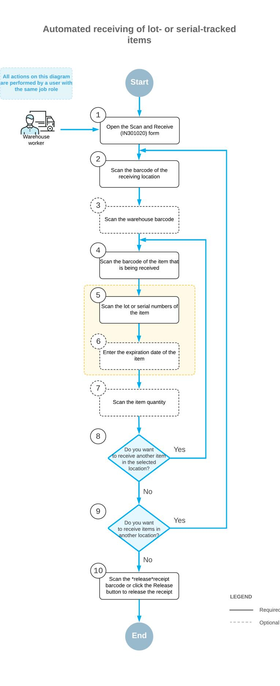

To receive items by using a barcode scanner or a mobile device with a scanning option, you perform the following steps:

1. *Open the [Scan and Receive](https://help-2025r1.acumatica.com/Help?ScreenId=ShowWiki&pageid=19a4f613-fe30-4649-b025-234071490c60) (IN301020) form*.

You open the *[Scan and Receive](https://help-2025r1.acumatica.com/Help?ScreenId=ShowWiki&pageid=19a4f613-fe30-4649-b025-234071490c60)* form (or the corresponding screen in the Acumatica mobile app).

2. *Scan the location barcode*.

You scan the barcode of the warehouse location, where the items are to be received.

3. Optional: *Scan the warehouse barcode*.

If the location whose identifier you scanned in the previous step is assigned to multiple warehouses, you scan the warehouse barcode. The system inserts the warehouse ID in the **Warehouse** box.

4. *Scan the item barcode*.

You scan the barcode of the item being received.

5. Optional: *Scan the lot or serial number of the item*.

If the lot or serial class with the *When Received* assignment method specified on the *[Lot/Serial Classes](https://help-2025r1.acumatica.com/Help?ScreenId=ShowWiki&pageid=9806d94b-097e-4082-9f01-9ca66d031ab7)* (IN207000) form is assigned to the item, the system prompts you to enter the lot or serial number of the item only if the number is not generated automatically and must be entered manually. You can scan all lot or serial numbers of an item one by one.

6. Optional: *Scan the expiration date of the item*.

If, on the previous step, you have entered the lot class with the *When Received* assignment method and the *Expiration* issue method specified on the *[Lot/Serial Classes](https://help-2025r1.acumatica.com/Help?ScreenId=ShowWiki&pageid=9806d94b-097e-4082-9f01-9ca66d031ab7)* form, the system prompts you to enter the expiration date of the item.

7. Optional: *Scan the item quantity*.

To change the received quantity in the line that is currently being processed, you switch to Quantity Editing mode by scanning or entering the \*qty barcode or by clicking**Set Qty** on the form toolbar; you then manually enter the quantity in the UOM coded in the scanned item barcode.

8. Optional: *Scan the barcode of the next item to be received*.

If more items need to be received in the currently selected location, you scan the barcode of the next item barcode (that is, return to Step 4), and repeat the process for the item.

9. Optional: *Scan the barcode of the next location*.

If items must be received in another warehouse location, you scan the barcode of this location (that is, return to Step 2) and repeat the process for this location.

10.*Release the inventory receipt*.

When you have finished receiving items, you scan the \*release command or click **Release** on the form toolbar. The system releases the inventory receipt.

# **Cart Tracking in Warehouse Operations**

If the *Cart Tracking* feature is enabled on the *[Enable/Disable Features](https://help-2025r1.acumatica.com/Help?ScreenId=ShowWiki&pageid=c1555e43-1bc5-4f6f-ba9d-b323f94d8a6b)* (CS100000) form, you can configure cart entities, which represent the physical carts used for moving inventory items within a warehouse, and track item movements between warehouse locations.

#### **Configuring Carts**

When the *Cart Tracking* feature is enabled, you can configure carts on the **Carts** tab of the *[Warehouses](https://help-2025r1.acumatica.com/Help?ScreenId=ShowWiki&pageid=264b0ef7-2b6c-40b4-a7d9-f1a5e067939b)* (IN204000) form. For a warehouse, you can create any number of carts. For each cart, you specify the ID and a short description, and you select the **Active** check box to indicate that the cart can be used for moving items.

#### **Viewing Items in Carts**

When you use carts in automated warehouse operations, you can quickly view the list of items in a particular cart by using the *[Storage Lookup](https://help-2025r1.acumatica.com/Help?ScreenId=ShowWiki&pageid=680181c6-48d1-4aa4-a5e2-a645b54805df)* (IN409020) form or the corresponding screen in the Acumatica mobile app. You scan the barcode of a cart in a particular warehouse, and the system displays the list of items in the cart and their quantities.

#### **Tracking Carts in Picking Operations**

If the **Use Carts for Picking** check box is selected on the *[Sales Orders Preferences](https://help-2025r1.acumatica.com/Help?ScreenId=ShowWiki&pageid=1817779c-413b-4187-b7fe-38e97845a1cb)* (SO101000) form, the specification of a cart is a required step of the workflow of picking items. This configuration is used to track item movements when a warehouse worker first places the items in a cart, and then picks them from the cart and packs them for shipping. Thus, a cart represents a temporary location from which the items are picked for processing.

When you are using the *[Pick, Pack, and Ship](https://help-2025r1.acumatica.com/Help?ScreenId=ShowWiki&pageid=0d7f07e0-56a3-40a9-8cff-45bed542ae94)* (SO302020) form or the corresponding screen in the Acumatica mobile app, before scanning a shipment number in Pick mode, you scan the barcode of the cart that you are going to use for picking items. The system shows the ID of the currently selected cart in the **Cart ID** box. Then you scan the location barcode and the item barcode and specify the quantity of items that you are placing in the cart; the system shows this quantity in the **Cart Qty.** column for each line, thus indicating the items that have been placed in the currently selected cart. To indicate the picking of items from the cart, you use the \*cart\*out command to enter Cart Unloading mode, and you scan the item barcode and quantity; the system reduces the **Cart Qty.** and adds this quantity to the **Picked Quantity**. Aer the items are picked from the cart, you pack and ship the items, or you confirm the shipment without packing, depending on the workflow set up in your company. For more information about picking and packing workflows, see *Cart Tracking in [Warehouse](#page-201-0) Operations*.

#### **Tracking Carts in Wave Picking Operations**

If the *Advanced Picking* check box is selected on the *[Enable/Disable Features](https://help-2025r1.acumatica.com/Help?ScreenId=ShowWiki&pageid=c1555e43-1bc5-4f6f-ba9d-b323f94d8a6b)* (CS100000) form, you can assign totes to carts on the *[Warehouses](https://help-2025r1.acumatica.com/Help?ScreenId=ShowWiki&pageid=264b0ef7-2b6c-40b4-a7d9-f1a5e067939b)* (IN204000) form. With this configuration, when a picker starts to pick a wave, instead of scanning totes one by one, the picker can scan the barcode of a cart. In this case, the system will automatically assign the totes of this cart to the shipments being picked.

#### **Tracking Carts in Putting Away Operations**

If the **Use Carts for Putting Away** check box is selected on the *[Purchase Orders Preferences](https://help-2025r1.acumatica.com/Help?ScreenId=ShowWiki&pageid=13d09c43-8696-4f92-ad9b-3d0209ee3d9b)* (PO101000) form, the specification of a cart is a required step of the workflow of putting away items. This configuration is used to track item movements when a warehouse worker first places items in the cart from the receiving location, and then puts them away (moves them from the cart to the place of storage). Thus, a cart represents a temporary location from which the items are taken for processing.

When you are using the *[Receive](https://help-2025r1.acumatica.com/Help?ScreenId=ShowWiki&pageid=fd850b21-96b8-4c2c-8c4a-f79272d8cacc) and Put Away* (PO302020) form, before scanning a receipt number in Put Away mode, you scan the barcode of the cart that you are going to use for putting away items. The system shows the ID of the currently selected cart in the **Cart ID** box. Then you scan the item barcode and specify the quantity of

items that you are placing in the cart; the system shows this quantity in the **Cart Qty.** column for each line, thus indicating items that have been placed in the currently selected cart. To indicate the putting away of each item from the cart, you use the \*cart\*out command to enter Cart Unloading mode, and scan the item barcode, the location barcode, and the quantity; the system reduces the **Cart Qty.** to indicate the quantity of the item being put away. Aer all the items for the current document are put away from the cart, you release the transfer document, and the processing is completed. For more information about the workflows associated with receiving items and putting them away, see *Automated Receiving and Putting Away [Operations](#page-74-2)*.

#### **Related Links**

- *[Sales Orders Preferences](https://help-2025r1.acumatica.com/Help?ScreenId=ShowWiki&pageid=1817779c-413b-4187-b7fe-38e97845a1cb)*
- *[Purchase Orders Preferences](https://help-2025r1.acumatica.com/Help?ScreenId=ShowWiki&pageid=13d09c43-8696-4f92-ad9b-3d0209ee3d9b)*

# **Working Modes and Supported Commands**

This topic lists the commands that can be used to quickly switch to another mode or to perform an action in the current mode.

The listed commands can be used on the following forms:

- *[Item Lookup](https://help-2025r1.acumatica.com/Help?ScreenId=ShowWiki&pageid=fb6bf977-22e7-4f00-b88d-f49a6f89f649)* (IN202520)
- *[Pick, Pack, and Ship](https://help-2025r1.acumatica.com/Help?ScreenId=ShowWiki&pageid=0d7f07e0-56a3-40a9-8cff-45bed542ae94)* (SO302020)
- *[Receive](https://help-2025r1.acumatica.com/Help?ScreenId=ShowWiki&pageid=fd850b21-96b8-4c2c-8c4a-f79272d8cacc) and Put Away* (PO302020)
- *[Scan and Count](https://help-2025r1.acumatica.com/Help?ScreenId=ShowWiki&pageid=9ce6eb18-6c13-4767-9304-b1abb96296dd)* (IN305020)
- *[Scan and Issue](https://help-2025r1.acumatica.com/Help?ScreenId=ShowWiki&pageid=589455a2-a6bd-4d0e-ac5a-1a4f5a0d9dee)* (IN302020)
- *[Scan and Receive](https://help-2025r1.acumatica.com/Help?ScreenId=ShowWiki&pageid=19a4f613-fe30-4649-b025-234071490c60)* (IN301020)
- *Scan and [Transfer](https://help-2025r1.acumatica.com/Help?ScreenId=ShowWiki&pageid=a110f8a7-acca-496f-98e9-8f5f84f42279)* (IN304020)
- *[Storage Lookup](https://help-2025r1.acumatica.com/Help?ScreenId=ShowWiki&pageid=680181c6-48d1-4aa4-a5e2-a645b54805df)* (IN409020)

Some commands can be used on any form, while other commands are restricted to a specific form. The applicable forms are specified in the description of each table.

In any working mode, you enter a command or barcode by typing it in the**Scan** box and pressing Enter. In production systems, you will scan the appropriate barcodes rather than manually entering them.

#### *Table: Commands for Switching Working Modes*

These commands, which can be used in any mode and on any form listed in the topic, give you the ability to switch to different working modes. When you switch to another working mode, the system automatically opens the relevant form.

In the Acumatica mobile app, the use of these commands is restricted to switching modes within one screen. Navigation between screens is not supported.

| Command  | Description of Performed Operation                                                                                                                                                                        |
|----------|-----------------------------------------------------------------------------------------------------------------------------------------------------------------------------------------------------------|
| @receive | Opens the Receive and Put Away (PO302020) form and switches to Receive mode.                                                                                                                           |
|          | This command cannot be used if the Display the Re ceiveTab check box is cleared on the Warehouse Management tab (Receiving Workflow section) of the Purchase Orders Preferences (PO101000) form. |
| @putaway | Opens the Receive and Put Away form and switches to Put Away mode.                                                                                                                                     |
|          | This command cannot be used if the Display the Put AwayTab check box is cleared on the Warehouse Management tab (Receiving Workflow section) of the Purchase Orders Preferences form.            |

| Command     | Description of Performed Operation                                                                                                                                                                     |
|-------------|--------------------------------------------------------------------------------------------------------------------------------------------------------------------------------------------------------|
| @pick       | Opens the Pick, Pack, and Ship (PO302020) form and switches to Pick mode.                                                                                                                           |
|             | This command cannot be used if the Display the Pick Tab check box is cleared on the Warehouse Manage ment tab (Fulfillment Workflow section) of the Sales Orders Preferences (SO101000) form. |
| @pack       | Opens the Pick, Pack, and Ship form and switches to Pack mode.                                                                                                                                      |
|             | This command cannot be used if the Display the Pack Tab check box is cleared on the Warehouse Manage ment tab (Fulfillment Workflow section) of the Sales Orders Preferences form.            |
| @ship       | Opens the Pick, Pack, and Ship form and switches to Ship mode. This mode is not available in the Acumati ca mobile app.                                                                          |
|             | This command cannot be used if the Display the Ship Tab check box is cleared on the Warehouse Manage ment tab (Fulfillment Workflow section) of the Sales Orders Preferences form.            |
| @inissue    | Opens the Scan and Issue (IN302020) form and switch es to Scan and Issue mode.                                                                                                                      |
| @inreceive  | Opens the Scan and Receive (IN301020) form and switches to Scan and Receive mode.                                                                                                                   |
| @intransfer | Opens the Scan and Transfer (IN304020) form and switches to Scan and Transfer mode.                                                                                                                 |
| @count      | Opens the Scan and Count (IN305020) form and switches to Scan and Count mode.                                                                                                                       |
| @item       | Opens the Item Lookup (IN202520) form and switches to Item Lookup mode.                                                                                                                             |
| @storage    | Opens the Storage Lookup (IN202520) form and switch es to Storage Lookup mode.                                                                                                                      |

#### *Table: Common Commands*

These commands, which can be used in any mode and on any form listed in the topic, give you the ability to perform processing actions.

| Command | Description of Performed Operation                                                                                                   |
|---------|--------------------------------------------------------------------------------------------------------------------------------------|
| *cancel | Clears the unconfirmed lines and returns to the initial step of the mode (such as scanning a document num ber or a warehouse). |

| Command | Description of Performed Operation                                                                                    |
|---------|-----------------------------------------------------------------------------------------------------------------------|
| *ok     | Confirms the line that is currently being processed or confirms your selections in a dialog box.                   |
| *qty    | Enables Quantity Editing mode for a confirmed line.                                                                   |
| *remove | Activates Remove mode, in which the user removes items.                                                            |
| *reset  | Clears the unconfirmed lines and returns to the first step in the mode, keeping the current document se lected. |
| *save   | Saves your progress on the current operation.                                                                         |

#### *Table: Receive Mode Commands*

These commands, which can be used in Receive mode, give you the ability to perform actions specific to receiving on the *[Receive](https://help-2025r1.acumatica.com/Help?ScreenId=ShowWiki&pageid=fd850b21-96b8-4c2c-8c4a-f79272d8cacc) and Put Away* (PO302020) form.

| Command           | Description of Performed Operation                                                                                                          |
|-------------------|---------------------------------------------------------------------------------------------------------------------------------------------|
| *release          | Releases the currently processed purchase receipt.                                                                                          |
| *complete*polines | Releases the purchased receipt that is being processed and completes all its lines, regardless of whether they were received in full. |

#### *Table: Put Away Mode Commands*

This command, which can be used in Put Away mode, gives you the ability to release an inventory transfer on the *[Receive](https://help-2025r1.acumatica.com/Help?ScreenId=ShowWiki&pageid=fd850b21-96b8-4c2c-8c4a-f79272d8cacc) and Put Away* (PO302020) form.

| Command  | Description of Performed Operation                                                                  |
|----------|-----------------------------------------------------------------------------------------------------|
| *release | Releases the inventory transfer that has been pre pared for the operation of putting away items. |

#### *Table: Commands Specific to Pick and Pack Mode*

These commands, which can be used in Pick and Pack mode, give you the ability to perform actions specific to picking and packing on the *[Pick, Pack, and Ship](https://help-2025r1.acumatica.com/Help?ScreenId=ShowWiki&pageid=0d7f07e0-56a3-40a9-8cff-45bed542ae94)* (SO302020) form.

| Mode                                       | Command       | Description of Performed Operation                                  |
|--------------------------------------------|---------------|---------------------------------------------------------------------|
| Pick Automated picking                  | *confirm*pick | Marks as picked the shipment which is currently being processed. |
| Pick Wave, batch, paperless pick ing | *confirm*pick | Confirms the pick list which is currently being processed.       |

| Mode                                                | Command                | Description of Performed Operation                                                                                                                                                              |
|-----------------------------------------------------|------------------------|-------------------------------------------------------------------------------------------------------------------------------------------------------------------------------------------------|
| Pick and Pack Wave, batch, paperless pick ing | *confirm*shipment      | Confirms the shipment which is cur rently being processed.                                                                                                                                   |
| Pick Paperless picking                           | *next*picklist         | Suggests another pick list. The system uses the last scanned loca tion as the current location of the pick er to suggest the nearest pick list.                                        |
| Pick Paperless picking                           | *confirm*pick*and*next | Confirms the current pick list and sug gests another pick list. The system uses the last scanned loca tion as the current location of the pick er to suggest the nearest pick list. |
| Pick Paperless picking                           | *confirm*line*qty      | The system confirms the line with an incomplete quantity. You can return to this line later to pick the remaining quantity.                                                            |
| Pack Wave, batch, paperless pack ing          | *package*confirm       | Confirms the package. This command is equal to the *ok command.                                                                                                                              |
| Pack Wave, batch, paperless pack ing          | *pack*all*into*box     | Moves all items that are not packed yet to the current box.                                                                                                                                  |
| Pack-only Paperless packing                      | *confirm*pack          | Confirms the package in the paperless pack-only workflow.                                                                                                                                    |
| Pack-only Paperless packing                      | *confirm*pack*and*next | Confirms the package in the paperless pack-only workflow and suggests the next pick list.                                                                                                 |

#### *Table: Commands Specific to Ship Mode*

These commands, which can be used in Ship mode, give you the ability to perform actions specific to shipping on the *[Pick, Pack, and Ship](https://help-2025r1.acumatica.com/Help?ScreenId=ShowWiki&pageid=0d7f07e0-56a3-40a9-8cff-45bed542ae94)* (SO302020) form.

| Command        | Description of Performed Operation |
|----------------|------------------------------------|
| *get*labels    | Gets the return labels.            |
| *refresh*rates | Refreshes rates of carriers.       |

#### *Table: Cart Tracking Commands*

These commands, which can be used in any mode, give you the ability to perform actions specific to cart tracking on the *[Pick, Pack, and Ship](https://help-2025r1.acumatica.com/Help?ScreenId=ShowWiki&pageid=0d7f07e0-56a3-40a9-8cff-45bed542ae94)* (SO302020) and *[Receive](https://help-2025r1.acumatica.com/Help?ScreenId=ShowWiki&pageid=fd850b21-96b8-4c2c-8c4a-f79272d8cacc) and Put Away* (PO302020) forms.

| Command   | Description of Performed Operation |
|-----------|------------------------------------|
| *cart*in  | Enables Cart Loading mode.         |
| *cart*out | Enables Cart Unloading mode.       |

#### *Table: Command Specific to Scan and Issue Mode*

This command, which can be used in Scan and Issue mode, gives you the ability to release the inventory issue on the *[Scan and Issue](https://help-2025r1.acumatica.com/Help?ScreenId=ShowWiki&pageid=589455a2-a6bd-4d0e-ac5a-1a4f5a0d9dee)* (IN302020) form.

| Command  | Description of Performed Operation                                                                         |
|----------|------------------------------------------------------------------------------------------------------------|
| *release | Releases the inventory issue document that has been prepared for the operation that has been performed. |

#### *Table: Command Specific to Scan and Receive Mode*

This command, which can be used in Scan and Receive mode, gives you the ability to release the inventory receipt document on the *[Scan and Receive](https://help-2025r1.acumatica.com/Help?ScreenId=ShowWiki&pageid=19a4f613-fe30-4649-b025-234071490c60)* (IN301020) form.

| Command  | Description of Performed Operation                                                                               |
|----------|------------------------------------------------------------------------------------------------------------------|
| *release | Releases the inventory receipt document that has been prepared for the operation that has been per formed. |

#### *Table: Command Specific to Scan and Transfer Mode*

This command, which can be used in Scan and Transfer mode, gives you the ability to release the inventory transfer document on the *Scan and [Transfer](https://help-2025r1.acumatica.com/Help?ScreenId=ShowWiki&pageid=a110f8a7-acca-496f-98e9-8f5f84f42279)* (IN304020) form.

| Command  | Description of Performed Operation                                                                                |
|----------|-------------------------------------------------------------------------------------------------------------------|
| *release | Releases the inventory transfer document that has been prepared for the operation that has been per formed. |

#### *Table: Command Specific to Scan and Count Mode*

This command, which can be used in Scan and Count mode, gives you the ability to confirm the physical inventory document on the *[Scan and Count](https://help-2025r1.acumatica.com/Help?ScreenId=ShowWiki&pageid=9ce6eb18-6c13-4767-9304-b1abb96296dd)* (IN305020) form.

| Command  | Description of Performed Operation                                                      |
|----------|-----------------------------------------------------------------------------------------|
| *confirm | Confirms the physical inventory document prepared for the operation being performed. |

# **Supported Barcode Types and Mobile Devices**

This topic lists the barcode types supported by Acumatica ERP and mobile devices that you can use to scan the barcodes.

*Table: Supported Barcode Types for Android Devices*

| Format | Barcode Type      |
|--------|-------------------|
| Linear | Codabar           |
|        | Code 39           |
|        | Code 93           |
|        | Code 128          |
|        | EAN-8             |
|        | EAN-13            |
|        | ITF               |
|        | UPC-A             |
|        | UPC-E             |
| 2D     | Aztec             |
|        | Data Matrix       |
|        | PDF417            |
|        | QR Code           |
| GS1    | Linear GS1-128    |
|        | 2D GS1 DataMatrix |

#### *Table: Supported Barcode Types for iOS Devices*

| Format | Barcode Type             |
|--------|--------------------------|
| Linear | Code 39                  |
|        | Code 39 mod 43           |
|        | Code 93                  |
|        | Code 128                 |
|        | EAN-8                    |
|        | EAN-13 (including UPC-A) |

| Format | Barcode Type       |
|--------|--------------------|
|        | Interleaved 2 of 5 |
|        | ITF14              |
|        | UPC-E              |
| 2D     | Aztec              |
|        | DataMatrix         |
|        | PDF417             |
|        | QR                 |

#### **Supported devices**

You can use the following types of devices:

- Devices with Android 4.1 or later versions, with installed Google Play services.
- iPhone with iOS 12 or later versions.

# **GS1 Barcodes in Acumatica ERP**

The barcodes of the GS1 family are widely used to handle the general distribution and logistics throughout the supply chain of companies. In Acumatica ERP, the GS1-128 (previously known as UCC-128 and EAN-128) and 2D GS1 DataMatrix barcodes from the GS1 family are supported.

#### **The Structure of the GS1-128 Barcode**

A GS1-128 barcode is composed of the following elements, from le to right and shown in the following graphic:

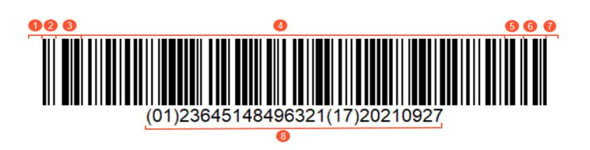

- 1. **Le Quiet Zone**: A blank space that precedes the start character of a barcode. Barcode scanners use this space to understand where the barcode begins so the code can be read as intended.
- 2. **A start character (A, B, or C)**: The characters that define the corresponding code set to be used in the data.
- 3. **The Function 1Symbol Character (FNC1)**: A separator character. It is also used to indicate the end of the item-specific information for Application Identifiers (AI) with a variable character length.
- 4. **Data**: The information about the item, which consists of one or more GS1 AIs represented in character set A, B, or C, and the item-specific information for each AI. For more information on AIs, see the *[Application](#page-210-1) [Identifiers](#page-210-1)* section.
- 5. **A symbol check character**: The character that is used to verify the barcode's data accuracy.
- 6. **The stop character**: The character that is used to indicate the end of the readable data.
- 7. **Right Quiet Zone**: A blank space that follows the stop character of a barcode. Barcode scanners use this space to define where the barcode ends so the code can be read as intended.
- 8. **Human Readable Interpretation (HRI) characters**: The characters that ensure that the information encoded in the barcode can be read by humans. HRI characters can be useful if part of the barcode is missing or illegible so the barcode scanner cannot read the encoded data.

### **Application Identifiers**

The GS1 standard provides a method of defining the data meaning and format by using the list of AIs. In HRI characters, the AIs are numeric prefixes—for example, 01, which stands for Global Trade Item Number (GTIN). Each AI is succeeded by the item-specific data of a predefined character length and format. For example, the GTIN AI must contain 14 digits and does not require the FNC1 character. It may look as follows: *(01)12345678912345*.

A GS1 barcode can contain multiple AIs encoded in the data part. If the AI's character length varies, the FNC1 character is needed to indicate where the AI ends so that a barcode scanner can identify where another AI starts.

In Acumatica ERP, you can use AIs related to GTIN, lot/serial numbering, best-before date, or expiration date that are listed in the following table.

| AI | Data Content                                               | Format                             | FNC1 Required |
|----|------------------------------------------------------------|------------------------------------|---------------|
| 01 | Global Trade Item Num ber                               | 14 digits                          | No            |
| 02 | GTIN of the trade items contained in a logistic unit | 14 digits                          | No            |
| 10 | Batch or lot number                                        | From 2 to 20 digits or let ters | Yes           |
| 21 | Serial number                                              | From 2 to 20 digits or let ters | Yes           |
| 15 | Best before date (YYM MDD)                              | 6 digits                           | No            |
| 17 | Expiration date (YYMMDD)                                   | 6 digits                           | No            |

#### *Table: AIs Effective in Acumatica ERP*

You can also use the following AIs that are listed in the *GS1 Application Identifiers in numerical order* section of the *[GS1 General Specifications](https://www.gs1.org/docs/barcodes/GS1_General_Specifications.pdf)*:

- 30 and 37 applications identifiers for quantities without specifying a UOM
- Application identifiers from 310 to 369, which are dimension-, area-, volume-, and weight-related identifiers containing UOMs

Unlike other barcode types, a GS1 barcode can provide multiple item data at once when you scan a GS1 barcode on the automated warehouse operations forms. For example, if you need to scan a lot-tracked item with an expiration date and a particular quantity to process a receipt of this item on the *[Scan and Receive](https://help-2025r1.acumatica.com/Help?ScreenId=ShowWiki&pageid=19a4f613-fe30-4649-b025-234071490c60)* (IN301020) form and you have a GS1 barcode that contains all AIs with this information, you scan once to specify the values of the **Inventory ID**, **Lot/Serial Nbr.**, **Expiration Date**, and **Quantity** columns simultaneously. With other barcodes, you would need to scan each value separately.

#### **Requirements for Scanning a GS1 Barcode**

To scan a GS1 barcode, you need a barcode scanner that supports the Acumatica mobile application and the GS1 standard. For additional information about barcode scanners, see the *[Acumatica ERP Knowledge Base](https://community.acumatica.com/inventory-and-order-management-124/warehouse-management-faqs-scanners-462)*.

#### **Manual Input of GS1 Barcodes**

If you need to scan a GS1 barcode that is damaged and cannot be scanned, you can manually enter its HRI characters. To do this, enter these characters in the**Scan** box on any form related to automated warehouse management. You must enter the characters with all parentheses as they are shown in the barcode—for example, (01)23645148496321(17)20210927.

For the list of forms related to automated warehouse management, see *[Working Modes and Supported Commands](#page-203-0)*.

#### **UOM Mapping**

If you are going to use GS1 barcodes that contain UOMs, on the **GS1 Units** tab of the *[Inventory Preferences](https://help-2025r1.acumatica.com/Help?ScreenId=ShowWiki&pageid=f2eb4e55-f802-4259-a41f-609965c856f1)* (IN101000), you need to map the units of measure coded in the GS1 barcode to the units of measure specified on the *[Units of Measure](https://help-2025r1.acumatica.com/Help?ScreenId=ShowWiki&pageid=c25c9971-01e2-4021-aa3b-8809f8045e58)* (CS203500) form. When mapping is configured for a particular unit of measure and you scan a GS1 barcode that contains document lines with quantities in this unit of measure, the system converts the scanned value to the quantity and unit of measure specified on the *[Units of Measure](https://help-2025r1.acumatica.com/Help?ScreenId=ShowWiki&pageid=c25c9971-01e2-4021-aa3b-8809f8045e58)* form.

#### **Use of GS1 Barcodes for Particular Stock Items**

If you are going to use GS1 barcodes in automated warehouse operations in Acumatica ERP, you need to specify those barcodes as alternate IDs for stock items on the **Cross-References** tab of the *[Stock Items](https://help-2025r1.acumatica.com/Help?ScreenId=ShowWiki&pageid=77786a70-1f1e-4d63-ad98-96f98e4fcb0e)* (IN202500) form. Any number of alternate IDs can be entered for the stock item, each in a separate row of this tab. For each alternate ID of a stock item, you need to select the *Barcode* or *GTIN/EAN/UPC/ISBN* alternate type in the **AlternateType** column, and in the **Alternate ID** column, specify the item-specific information part for the (01) or (02) AI coded in the barcode.

Note that the item-specific information part of the (01) or (02) AI should be numeric. That is, the alternate ID should contain only digits.

Suppose that you want to use a barcode with the (01)11111111111111(10)LREX15(17)231215 combination of AIs for a stock item. In the **Alternate ID** column, you need to enter the following value: 11111111111111.

In the row, you should also specify the appropriate UOM, lot/serial class, and unit conversion, if required.

# **Appendix**

The appendix provides some reference information relevant for this document. The additional information in this section is a useful source for readers who need some reference material that is related to system forms and tables, as well as running reports.

#### **In this section:**

- *[Reports](#page-213-3)*
- *Form [Toolbar](#page-220-1) and More Menu*
- *Table [Toolbar](#page-227-1)*
- *[Glossary](https://help-2025r1.acumatica.com/Help?ScreenId=ShowWiki&pageid=a2c92852-5ae8-4f4b-bf82-7f70cca0fdfa)*

## **Reports**

In addition to offering a comprehensive collection of reports, Acumatica ERP gives you a high degree of control over each report.

On a typical report form, described in *[Report Form](#page-213-4)*, you can adjust the report settings to meet your specific informational needs. You can specify sorting and filtering options and select the data by using report-specific settings—such as financial period, ledger, and account—and configure additional processing settings for each report. The settings can be saved as a report template for later use. For details, see *To Run a [Report](https://help-2025r1.acumatica.com/Help?ScreenId=ShowWiki&pageid=d0531b2f-178f-4d70-8c4c-6bc897cd6c0a)* and *To [Create](https://help-2025r1.acumatica.com/Help?ScreenId=ShowWiki&pageid=5adbb4bd-4347-4f81-a1ff-4d4d47d1fb1b) a Report [Template](https://help-2025r1.acumatica.com/Help?ScreenId=ShowWiki&pageid=5adbb4bd-4347-4f81-a1ff-4d4d47d1fb1b)*.

Aer you run a report, the prepared report appears on your screen. You can print the report, export the report to a file, or send the report by email.

This chapter describes a typical report form and the main tasks related to using reports.

#### **In This Chapter**

- *[Report Form](#page-213-4)*
- *To Run a [Report](https://help-2025r1.acumatica.com/Help?ScreenId=ShowWiki&pageid=d0531b2f-178f-4d70-8c4c-6bc897cd6c0a)*
- *To Modify a Filter on a [Report](https://help-2025r1.acumatica.com/Help?ScreenId=ShowWiki&pageid=2513e10e-abb1-432e-85e0-a5e3f6cabf9c) Form*
- *To Create a Report [Template](https://help-2025r1.acumatica.com/Help?ScreenId=ShowWiki&pageid=5adbb4bd-4347-4f81-a1ff-4d4d47d1fb1b)*

### **Report Form**

Before you run a report, you specify the needed parameters on the report form. You can select a template and manually make selections that affect the information collected. Also, you can specify appropriate settings to print or email the finished report.

The following screenshot shows a typical report form.

| TOOLS $\star$ <b>Daily Sales Profitability</b> |                                                                                       |                        |  |
|---------------------------------------------------|---------------------------------------------------------------------------------------|------------------------|--|
| ↶ <b>RUN REPORT</b>                            | REMOVE TEMPLATE <b>SAVE TEMPLATE</b> -11                                        |                        |  |
| Template                                          | $\times$ $\scriptstyle\rm\sim$ 2 □ Default □ Shared                             |                        |  |
| <b>REPORT PARAMETERS</b>                          | <b>EMAIL NOTIFICATIONS</b> ADDITIONAL SORT AND FILTERS PRINT AND EMAIL SETTINGS |                        |  |
| <b>Report Format</b>                              | <b>Detailed</b> $\checkmark$                                                       |                        |  |
| Company/Branch:                                   | HEADOFFICE - SweetLife Head Offi v                                                    |                        |  |
| <b>From Date</b>                                  | 2/1/2025 户                                                                         |                        |  |
| <b>To Date</b>                                    | 2/20/2025 Ä                                                                        |                        |  |
| <b>Document Type</b>                              | $\checkmark$                                                                          | $\left 3\right\rangle$ |  |
| Warehouse:                                        | Q                                                                                     |                        |  |
| Customer:                                         | Q                                                                                     |                        |  |
| Inventory:                                        | Q                                                                                     |                        |  |
|                                                   | Released Transactions Only                                                            |                        |  |
|                                                   | □ Completed Transactions Only                                                         |                        |  |

#### *Figure: Report form*

- 1. Report form toolbar
- 2. Selection area
- 3. Details area

#### **Report Form Toolbar**

The following table lists the buttons of the report form toolbar, which appears on the report form when you are configuring a report.

| Button              | Description                                                                                                              |
|---------------------|--------------------------------------------------------------------------------------------------------------------------|
| Cancel              | Clears any changes you have made on the report form and restores the default settings.                                   |
| Run Report          | Initiates data collection for the report and displays the generated report.                                              |
| SaveTemplate        | Gives you the ability to save the currently selected report as a template with all the select ed settings.            |
| Remove Tem plate | Removes the previously saved template. This button is available only when a template is specified on the report form. |

#### **Report Toolbar**

The following table lists the buttons of the report toolbar, which is shown on the generated report that you have run.

| Buttons    | Icon | Description                                                                |
|------------|------|----------------------------------------------------------------------------|
| Parameters |      | Navigates back to the report form to let you change the report parameters. |

| Buttons                 | Icon | Description                                                                                                                                                                                                    |
|-------------------------|------|----------------------------------------------------------------------------------------------------------------------------------------------------------------------------------------------------------------|
| Refresh                 |      | Refreshes the information displayed in the report (if any data changes were made).                                                                                                                             |
| Groups                  |      | Adds to the report a le pane where the report structure is shown. Click a report node to highlight the pertinent data in the right pane.                                                                   |
| View PDF / View HTML | /    | Displays the report as a PDF, or displays the report in HTML format. The available but ton depends on the current report view; if you're viewing a PDF, for instance, you will see the View HTML button. |
| First                   |      | Displays the first page of the report.                                                                                                                                                                         |
| Previous                |      | Displays the previous page.                                                                                                                                                                                    |
| Next                    |      | Displays the next page.                                                                                                                                                                                        |
| Last                    |      | Displays the last page of the report.                                                                                                                                                                          |
| Print                   |      | Opens the browser dialog box so you can print the report.                                                                                                                                                      |
| Send                    |      | Opens the Email Activity dialog box, which you use to send the report file (in the se lected format) to the specified email address.                                                                        |
| Export                  |      | Enables you to export the data in the selected format (Excel or PDF).                                                                                                                                          |

#### **Selection Area**

You use the elements in this area to select an existing template, which you can share with other users or use as your default report settings. You can also select the locale and the localization.

The elements of this area, which are available for all reports, are described in the following table.

| Element  | Description                                                                                                                                            |
|----------|--------------------------------------------------------------------------------------------------------------------------------------------------------|
| Template | The template to be used for the report. If any templates have been created and saved, you can select a template to use its settings for the report. |
| Default  | A check box that indicates (if selected) that the selected template is marked as the default one for you. A default template cannot be shared.      |

| Element      | Description                                                                                                                                                                                                                                                                                                            |
|--------------|------------------------------------------------------------------------------------------------------------------------------------------------------------------------------------------------------------------------------------------------------------------------------------------------------------------------|
| Shared       | A check box that indicates (if selected) that the selected template is shared with other users. A shared template cannot be marked as the default.                                                                                                                                                                  |
| Locale       | A locale that you select to indicate to the system that the report should be prepared with the data translated to the language associated with this locale. This box is displayed if there are multiple active locales in the system. For details, see Locales and Languages.                                    |
| Localization | The localization that is used for the report.                                                                                                                                                                                                                                                                          |
|              | This box appears on the form if the following conditions are met:                                                                                                                                                                                                                                                      |
|              | • The Canadian Localization or UK Localization feature is enabled on the Enable/Disable Features (CS100000) form.                                                                                                                                                                                                |
|              | • A localized version of the report exists in the system.                                                                                                                                                                                                                                                           |
|              | One of the following options can be selected in the box:                                                                                                                                                                                                                                                               |
|              | • None (default): Even though the report has a localized version, the report will be printed without any localization applied.                                                                                                                                                                                   |
|              | • Canada: The Canadian version of the report will be printed. If the company in which you are signed in has Canada selected in the Localization box on the Company Details tab (Configuration Settings section) on the Companies (CS101500) form, this setting is se lected by default in the current box. |
|              | To determine if a localized version of a report exists, the system checks the Site\ReportsDefault directory, the database, the ReportsCus tomized folder, and the ReportsDefault folder.                                                                                                                         |

#### **Report Parameters Tab**

The **Report Parameters** tab has sections where you can specify the contents of the report depending on the current report and vary in the following regards:

- Which elements are available on a particular report
- Whether elements contain default values
- Whether specific elements require values to be selected
- Whether elements may be le blank to let you display a broader range of data

#### **Additional Sort and Filters Tab**

The **AdditionalSort and Filter** tab contains additional sorting and filtering conditions:

- **Additional sorting conditions**: Defines the sorting order. You can add a line, select one of the reportspecific properties, and select the *Descending* or *Ascending* sort order for the column.
- **Additional filtering conditions**: Defines the report filter. You can add a line, select one of the reportspecific properties, and define a condition and its value. The list of conditions include one-operand and two-operand conditions. To create a more complicated logical expression, you can use brackets and logical operations between brackets. For more information on creating filters, see *[Managing Advanced Filters](https://help-2025r1.acumatica.com/Help?ScreenId=ShowWiki&pageid=c621d79a-274d-4b72-a699-0e92d78a7b23)*. For detailed procedures on using ad hoc filters, see *[Reports: Process Activity](https://help-2025r1.acumatica.com/Help?ScreenId=ShowWiki&pageid=2b4d7aa8-25dc-4777-880a-fee2274990c7)*.

### **Print and Email Settings Tab**

If you plan to print the report or save the report as a PDF, select the appropriate settings in the **PrintSettings** area.

#### *Table: Print Settings Section*

| Element                 | Description                                                          |
|-------------------------|----------------------------------------------------------------------|
| Deleted Records         | Selects the visibility of the data deleted from the database.        |
| Print All Pages         | Causes all pages of the report to be printed.                        |
| Print in PDF format     | Displays the report in PDF format.                                   |
| Compress PDF file       | Indicates that the system will generate a compressed PDF.            |
| Embed fonts in PDF file | Indicates that the system will generate the PDF with fonts embedded. |

If you plan to send the report as an email, in the **EmailSettings** area, specify the format in which the report will be sent, as well as the email subject, the recipients of copies of the report, and the email account of the recipient.

#### *Table: Email Settings Section*

| Field         | Description                                                                                                                                                                                                                 |
|---------------|-----------------------------------------------------------------------------------------------------------------------------------------------------------------------------------------------------------------------------|
| Format        | The format (HTML, PDF, or Excel) in which the report will be emailed.                                                                                                                                                       |
|               | Merge function for reports in Excel format is not supported. If you want to merge a report with other reports and send an aggregated report by email, you should select either the HTML or PDF format for the report. |
| Email Account | The email address of the recipient.                                                                                                                                                                                         |
| CC            | An additional addressee to receive a carbon copy (CC) of the email.                                                                                                                                                         |
| BCC           | The email address of a person to receive a blind carbon copy (BCC) of the email; an address entered in this box will be hidden from other recipients.                                                                    |
| Subject       | The subject of the email.                                                                                                                                                                                                   |

#### **Report Versions Tab**

If the report has multiple versions, you can select one of them.

This tab displays the data only to users assigned with report designer user role.

Report versions are designed in the Report Designer. To activate editing report versions, give the user report designer role.

*Table: Report Versions Tab Toolbar*

| Button  | Description                            |
|---------|----------------------------------------|
| Refresh | Refreshes the list of report versions. |

| Button | Description                                        |
|--------|----------------------------------------------------|
| Select | Temporarily activates the selected report version. |

#### **Email Notifications Tab**

The **Email Notifications** tab lists the email templates used to send the report.

#### *Table: Table Toolbar*

The table toolbar includes standard buttons and buttons that are specific to this table. For the list of standard buttons, see *Table [Toolbar](#page-227-1)*. The table-specific buttons are listed below.

| Button          | Description                                                                                                                                                                     |
|-----------------|---------------------------------------------------------------------------------------------------------------------------------------------------------------------------------|
| Schedule Report | Opens the Email Templates (SM204003) form, where you can select or create a new email template that can be used to send the report and specify a schedule for notifications. |
|                 | The button appears only if the user account to which you are signed in has at least the Insert level of access rights to the Email Templates (SM204003) form.                |

#### *Table: Table Columns*

| Column                   | Description                                                                                                     |
|--------------------------|-----------------------------------------------------------------------------------------------------------------|
| Email Template           | The email template to be used to generate the body of the email notification.                                   |
| Screen ID                | The identifier of the form whose elements are used as the source of specific placeholders for this template. |
| Recipients               | The email addresses of the people to receive the email. Use semicolons as separators be tween addresses.     |
| Report Template          | The template configured for the report.                                                                         |
| Report Template Owner | The name of the user who created the template.                                                                  |

#### **Related Links**

- *To Run a [Report](https://help-2025r1.acumatica.com/Help?ScreenId=ShowWiki&pageid=d0531b2f-178f-4d70-8c4c-6bc897cd6c0a)*
- *To Create a Report [Template](https://help-2025r1.acumatica.com/Help?ScreenId=ShowWiki&pageid=5adbb4bd-4347-4f81-a1ff-4d4d47d1fb1b)*
- *Types of [Filters](https://help-2025r1.acumatica.com/Help?ScreenId=ShowWiki&pageid=9371f240-f73a-4b7a-8f16-72add7be7b62)*
- *[Automation Schedule Statuses](https://help-2025r1.acumatica.com/Help?ScreenId=ShowWiki&pageid=97fb65d2-2303-4993-9351-b6fbe112c37d)*

## **Report**

Once you click **Run Report**, the prepared report appears on your screen. You can print the report, export the report to a file, or send the report by email.

The prepared report is displayed in the report view of the report form. For more information about setting up the report parameters and the parameters view of the report form, see *[Report Form](#page-213-4)*.

### **Report Toolbar**

The following table lists report toolbar buttons.

| Buttons                 | Icon | Description                                                                                                                                                                                                    |
|-------------------------|------|----------------------------------------------------------------------------------------------------------------------------------------------------------------------------------------------------------------|
| Parameters              |      | Navigates back to the report form to let you change the report parameters.                                                                                                                                     |
| Refresh                 |      | Refreshes the information displayed in the report (if any data changes were made).                                                                                                                             |
| Groups                  |      | Adds to the report a le pane where the report structure is shown. Click a report node to highlight the pertinent data in the right pane.                                                                   |
| View PDF / View HTML | /    | Displays the report as a PDF, or displays the report in HTML format. The available but ton depends on the current report view; if you're viewing a PDF, for instance, you will see the View HTML button. |
| First                   |      | Displays the first page of the report.                                                                                                                                                                         |
| Previous                |      | Displays the previous page.                                                                                                                                                                                    |
| Next                    |      | Displays the next page.                                                                                                                                                                                        |
| Last                    |      | Displays the last page of the report.                                                                                                                                                                          |
| Print                   |      | Opens the browser dialog box so you can print the report.                                                                                                                                                      |
| Send                    |      | Opens the Email Activity dialog box, which you use to send the report file (in the cho sen format) to the specified email address.                                                                          |
| Export                  |      | Enables you to export the data in the chosen format (Excel or PDF).                                                                                                                                            |

#### **Related Links**

- *[Filters](https://help-2025r1.acumatica.com/Help?ScreenId=ShowWiki&pageid=fad0b170-9d7c-4851-8f73-4b841f977c0f)*
- *[Report](#page-218-1)*

# **Form Toolbar and More Menu**

The form toolbar, which is available on most forms, is located near the top of the form, under the form name (and record title, if the form has one), as shown in the following screenshot.

The form toolbar includes the following:

- Standard buttons (see Item 1 in the following screenshot), with the particular set of buttons depending on the specific form
- On some forms, form-specific buttons (Item 2)
- On some form, the More button (Item 3); clicking this button opens the More menu (Item 4), which contains additional form-specific commands

| Opportunities <b>PINOTES</b> <b>FILES</b> <b>CUSTOMIZATION</b> 000004 - A juicer with the installation and training for Lake Cafe 3                                                                                                     |                                                                                                                             |  |                |  |   |                         |                                                             | TOOLS $\blacktriangleright$     |                                                              |                       |  |                                                                                                                                |  |          |  |  |  |  |        |  |  |  |  |  |
|--------------------------------------------------------------------------------------------------------------------------------------------------------------------------------------------------------------------------------------------------------|-----------------------------------------------------------------------------------------------------------------------------|--|----------------|--|---|-------------------------|-------------------------------------------------------------|---------------------------------|--------------------------------------------------------------|-----------------------|--|--------------------------------------------------------------------------------------------------------------------------------|--|----------|--|--|--|--|--------|--|--|--|--|--|
| $\Box$ $\Omega$ $\leftarrow$                                                                                                                                                                                                                     | $+$                                                                                                                         |  | $\mathbb{O}$ . |  | 面 | $\overline{\mathsf{K}}$ | ◟                                                           |                                 |                                                              | <b>OPEN</b> $\geq$ |  | <b>CREATE QUOTE</b>                                                                                                            |  | $\cdots$ |  |  |  |  |        |  |  |  |  |  |
| Opportunity ID: Status: * Class ID: Stage:                                                                                                                                                                                                    | 000004 $\circ$ <b>New</b> $\circ$ $\sqrt{2}$ PROJECT - Project Sales Prospect $\overline{\phantom{a}}$ |  |                |  |   |                         | <b>Business Account:</b> Location: Contact: Owner: | 2 LAKECAFE - MAIN - Prima |                                                              |                       |  | Processing <b>Activities</b> Open $\bullet$ <b>Create Task</b> Close as Won <b>Create Note</b> Close as Lost |  |          |  |  |  |  | $\sim$ |  |  |  |  |  |
| * Estimated Close Date: * Subject:                                                                                                                                                                                                                  | 1/4/2021 $\overline{\phantom{a}}$ A juicer with the installation and training for Lake Cafe                           |  |                |  |   |                         |                                                             |                                 | Other <b>Record Creation</b> <b>Recalculate Prices</b> |                       |  |                                                                                                                                |  |          |  |  |  |  |        |  |  |  |  |  |
| <b>Validate Addresses</b> <b>Create Quote</b> <b>Create Sales Order</b> <b>ACTIVITIES</b> <b>DETAILS</b> <b>QUOTES</b> <b>FINANCIAL</b> <b>SHIPPING</b> CONTACT <b>CRM INFO</b> AT 1 <b>Create Account</b> |                                                                                                                             |  |                |  |   |                         |                                                             |                                 |                                                              |                       |  |                                                                                                                                |  |          |  |  |  |  |        |  |  |  |  |  |
| <b>CREATE TASK</b> <b>CREATE EVENT</b> <b>CREATE EMAIL</b> CREATE ACTIVITY + PIN/UNPIN $\mathbb{H}$ $\mathcal{C}$ <b>Create Contact</b>                                                                                           |                                                                                                                             |  |                |  |   |                         |                                                             |                                 | $\triangledown$                                              |                       |  |                                                                                                                                |  |          |  |  |  |  |        |  |  |  |  |  |
| $\uparrow \qquad \qquad \uparrow$ $\uparrow$ $\uparrow$ $\uparrow$ D. 图 0 Type * Summary <b>Status</b> $\overline{\mathbf{k}}$                                                                                                       |                                                                                                                             |  |                |  |   | Start                   |                                                             | <b>Create Invoice</b>           |                                                              |                       |  |                                                                                                                                |  |          |  |  |  |  |        |  |  |  |  |  |
|                                                                                                                                                                                                                                                        |                                                                                                                             |  |                |  |   |                         |                                                             |                                 |                                                              |                       |  |                                                                                                                                |  |          |  |  |  |  |        |  |  |  |  |  |
|                                                                                                                                                                                                                                                        |                                                                                                                             |  |                |  |   |                         |                                                             |                                 |                                                              |                       |  |                                                                                                                                |  |          |  |  |  |  |        |  |  |  |  |  |

#### *Figure: The form toolbar and the More menu*

You use the standard buttons on the form toolbar to navigate through entities that were created by using the current form, insert or delete an entity, use the clipboard, save the data you have entered, or cancel your work on the form.

A form toolbar on a particular form may include form-specific buttons in addition to standard buttons; it may also (or instead) include commands on the More menu. By using these form-specific buttons and commands, users can navigate to related records and forms, initiate specific actions, and perform modifications or processing related to the functionality of the form.

#### **Standard Form Toolbar Buttons**

The following table lists the standard buttons of the form toolbar. A form toolbar may include some or all of these buttons.

#### *Table: Standard Form Toolbar Buttons*

| Button                       | Icon | Description                                                                                                                                                                                                                                                                                                                                                                                            |
|------------------------------|------|--------------------------------------------------------------------------------------------------------------------------------------------------------------------------------------------------------------------------------------------------------------------------------------------------------------------------------------------------------------------------------------------------------|
| Discard Changes and Close |      | Discards any unsaved changes made to the entity, and navigates to the list of records that is related to the current form.                                                                                                                                                                                                                                                                          |
|                              |      | If the system opened the current form in a pop-up window (from a different form), this button is not displayed. To return to the original form, click Close.                                                                                                                                                                                                                                     |
| Save & Close                 |      | Saves the changes made to the entity, and navigates to the list of records that is related to the current form.                                                                                                                                                                                                                                                                                     |
| Save                         |      | Saves the changes made to the entity.                                                                                                                                                                                                                                                                                                                                                                  |
| Cancel                       |      | Depending on the context, does one of the following:                                                                                                                                                                                                                                                                                                                                                   |
|                              |      | • Discards any unsaved changes you have made to entities and retrieves the last saved version.                                                                                                                                                                                                                                                                                                   |
|                              |      | • Clears all changes and restores the default settings.                                                                                                                                                                                                                                                                                                                                             |
| Add New Record               |      | Clears any values you've specified on the form, restores any default values, and initiates the creation of a new entity.                                                                                                                                                                                                                                                                            |
| Delete                       |      | Deletes the currently selected entity, clears any values you have specified on the form, and populates elements with the default values that the system in serts when a new entity is created.                                                                                                                                                                                                   |
|                              |      | You can delete an entity only if it is not linked with another enti ty.                                                                                                                                                                                                                                                                                                                             |
| Archive                      |      | Archives the document that is opened on the form. This button is available if archival is set up on the Archival Policy (SM200400) form for the type of the document open on the form and if the document meets the archival crite ria—that is, if the document is older than the retention period specified on the Archival Policy form and has been processed to completion or canceled. |
|                              |      | For more information on archiving the documents, see Archiving Old Docu ments in the Acumatica ERP System Administration guide.                                                                                                                                                                                                                                                                     |
| Extract                      |      | Extracts the archived document from the archive and makes the system use this document in day-to-day operations. This button is available if archival is set up on the Archival Policy (SM200400) form for the type of the document opened on the form is archived. For more information on archiving the documents, see Archiving Old Docu                                                |
|                              |      | ments in the Acumatica ERP System Administration guide.                                                                                                                                                                                                                                                                                                                                                |

#### Appendix | **223**

| Button                   | Icon | Description                                                                                                                                                                                                                                                                                                                                                                                                                                                                                                                                                                                                                                                           |
|--------------------------|------|-----------------------------------------------------------------------------------------------------------------------------------------------------------------------------------------------------------------------------------------------------------------------------------------------------------------------------------------------------------------------------------------------------------------------------------------------------------------------------------------------------------------------------------------------------------------------------------------------------------------------------------------------------------------------|
| Clipboard                |      | Provides menu commands you can use to do the following: • Copy: Copy the selected entity to the clipboard. • Paste: Paste an entity or template from the clipboard. • Save asTemplate: Create a template based on the selected entity. • Import from XML: Import an entity or a template from an .xml file. • Export to XML: Export the selected entity to an .xml file. For more information on templates and copy-and-paste operations in Acumatica ERP, see Using Forms. For more information on importing and ex porting .xml files, see Importing and Exporting Data to Excel and XML in the Acumatica ERP User Guide. |
| Go to First Record       |      | Displays the first entity (in the list of entities of the specific type) and its de tails.                                                                                                                                                                                                                                                                                                                                                                                                                                                                                                                                                                         |
| Go to Previous Record |      | Displays the previous entity and its details.                                                                                                                                                                                                                                                                                                                                                                                                                                                                                                                                                                                                                         |
| Go to Next Record        |      | Displays the next entity and its details.                                                                                                                                                                                                                                                                                                                                                                                                                                                                                                                                                                                                                             |
| Go to Last Record        |      | Displays the last entity (in the list of entities of the specific type) and its de tails.                                                                                                                                                                                                                                                                                                                                                                                                                                                                                                                                                                          |
| View Schedule            |      | Gives you the ability to schedule the processing. For more information, see Automated Processing: General Information.                                                                                                                                                                                                                                                                                                                                                                                                                                                                                                                                             |

#### **Inquiry Form Toolbar Buttons**

Acumatica ERP inquiry forms present data in a tabular format; they may also have selection criteria you can use to filter the data in the table. Predefined inquiry forms are provided as part of Acumatica ERP out of the box, and inquiry forms can be designed by a user with the appropriate access rights by using the Generic Inquiry tool (for details, see *[Managing Generic Inquiries](https://help-2025r1.acumatica.com/Help?ScreenId=ShowWiki&pageid=5737bca9-aebb-446d-9e1a-bc5fcfad6797)* in the Acumatica ERP Reporting Tools Guide). A form toolbar of an inquiry form contains both the standard form toolbar buttons (described in the table above) and the additional buttons described below.

| Button  | Icon | Description                                                                                                                                                    |
|---------|------|----------------------------------------------------------------------------------------------------------------------------------------------------------------|
| Refresh |      | Refreshes the inquiry data in the table.                                                                                                                       |
| Cancel  |      | Clears all changes (including selection criteria that has been specified, if the generic inquiry form has this criteria) and restores the default settings. |

| Button          | Icon | Description                                                                                                                                                                                                                       |
|-----------------|------|-----------------------------------------------------------------------------------------------------------------------------------------------------------------------------------------------------------------------------------|
| Add New Record  |      | Initiates the creation of a new entity.                                                                                                                                                                                           |
| Edit            |      | Opens the applicable data entry form with the selected record.                                                                                                                                                                    |
| Fit toScreen    |      | Expands the form to fit on the screen and adjusts the column widths propor tionally.                                                                                                                                           |
| Export to Excel |      | Exports the data to an Excel file. For more information, see Integration with Ex cel in the Acumatica ERP Getting Started Guide.                                                                                               |
| Filter Settings |      | Opens the Filter Settings dialog box, which you can use to define a new filter. After the filter has been created and saved, the corresponding tab appears on the table. For more information about filtering, see Filters. |

#### **The More Menu and Form-Specific Buttons**

If there are multiple form-specific commands on the form toolbar, they are displayed on a single menu—the More menu—and listed under descriptive categories, which makes it easier to find the needed menu command. On the More menu, you can easily define your favorite menu commands, which eases access to them.

On some forms, the system places a button (which is highlighted in green) on the form toolbar for the expected next command, which represents the likely next step to be performed on the selected record. The following screenshot, which shows the *Cash [Transactions](https://help-2025r1.acumatica.com/Help?ScreenId=ShowWiki&pageid=1e55821c-556b-4c3e-829c-95383eb2c8e2)* (CA304000) form, illustrates an example of the form toolbar and the More menu, which contains categories and menu commands.

|              | <b>Transactions</b> |                     | Cash Entry 000228 - 10200 Company Checking Account |          |                      |        |                          |   |                |                 |                         |               | $\overline{2}$ | $\lceil 3 \rceil$             | <b>PINOTES</b> | <b>ACTIVITIES</b> | <b>FILES</b>   | <b>CUSTOMIZATION</b> | TOOLS $\sim$           |
|--------------|---------------------|---------------------|----------------------------------------------------|----------|----------------------|--------|--------------------------|---|----------------|-----------------|-------------------------|---------------|----------------|-------------------------------|----------------|-------------------|----------------|----------------------|------------------------|
| $\leftarrow$ | 周                   | $\Box$              | $\Omega$                                           |          | 顶                    | n ٠ | $\overline{\mathsf{K}}$  | ∢ | ⋗              | $\geq$          | <b>RELEASE</b>          |               | <b>HOLD</b>    | $\cdots$                      |                |                   | 4              |                      |                        |
|              | Tran. Type:         |                     | <b>Cash Entry</b>                                  |          |                      |        |                          |   | * Tran. Date:  |                 | 5/26/2021               |               |                | Reports                       |                |                   | Corrections    |                      |                        |
|              | Reference Nbr.      |                     | 000228                                             | Q        |                      |        |                          |   | * Fin. Period: |                 | 05-2021                 | $\mathcal{L}$ |                | $\hat{\mathbf{x}}$ Activities |                |                   | Reverse        |                      |                        |
|              | Cash Account:       |                     | 10200 - Company Checking Account                   |          |                      |        |                          |   |                | Entry Type:     | <b>INTEREST - In</b>    |               |                |                               |                |                   |                |                      |                        |
|              | Currency:           |                     | <b>USD</b>                                         | 1.00     |                      |        | - VIEW BASE              |   |                | Disbursement/.  | Receipt                 |               |                | Processing                    |                |                   |                |                      |                        |
| Status:      |                     |                     | Balanced                                           |          |                      |        |                          |   |                | * Document Ref. | <b>INT-145</b>          |               |                | Hold                          |                |                   |                |                      |                        |
|              |                     |                     |                                                    |          |                      |        |                          |   | Owner:         |                 | EP00000002-             |               |                | Remove Hold                   | $6^{\circ}$    |                   |                |                      |                        |
|              | Description:        |                     |                                                    |          |                      |        |                          |   |                |                 |                         |               |                | Release ®          |                |                   |                |                      |                        |
|              |                     |                     | <b>TRANSACTION DETAILS</b>                         |          | <b>TAX DETAILS</b>   |        | <b>FINANCIAL DETAILS</b> |   |                |                 | <b>APPROVAL DETAILS</b> |               |                |                               |                |                   |                |                      |                        |
|              |                     | 1                   | $\times$                                           | $\vdash$ | $\boxed{\mathbf{x}}$ | 工      |                          |   |                |                 |                         |               |                |                               |                |                   |                |                      |                        |
| B 0          | D.                  | * Branch |                                                    | Item ID  |                      |        | <b>Description</b>       |   |                |                 |                         |               |                | Quantity                      | <b>UOM</b>     | Price             | Amount *Offset | Account              | <b>Account Descrip</b> |
| $\Omega$     | $\Box$              | PRODWHOLF           |                                                    |          |                      |        | Interest                 |   |                |                 |                         |               |                | 100                           |                | 20.00             | 20.00          | 49300                | Other Income: In       |

*Figure: The form toolbar of the Transactions form*

The numbered items in the screenshot indicate the following:

- 1. A highlighted button for the expected next command, which represents the next logical step to be performed on the record selected on the form
- 2. Another button for a command that is commonly performed on the form
- 3. The More button, which you click to open the More menu

- 4. The More menu with most form-specific menu commands and descriptive categories on it
- 5. The star icon, which is used to mark the individual user's favorite commands on the form
- 6. An unavailable command

#### **Favorite Commands**

Based on your role in the company and your job duties, you may use some commands more oen than others. On the form toolbar, you can specify these commands as favorites. This will cause the system to duplicate the commands as form toolbar buttons, easing access to them.

To add a command to the form toolbar as a button, you open the More menu, hover over the needed command, and click the star icon when it appears. The yellow color of the star indicates that the command has been added to your favorites, and a button for the command appears on the form toolbar immediately. The following example shows two commands that have been added to the user's favorites on the *[Invoices and Memos](https://help-2025r1.acumatica.com/Help?ScreenId=ShowWiki&pageid=5e6f3b27-b7af-412f-a40a-1d4f4be70cba)* (AR301000) form and thus added as buttons on the form toolbar.

| <b>Invoices and Memos</b> <b>T</b> NOTES <b>ACTIVITIES</b> <b>FILES</b> <b>CUSTOMIZATION</b> TOOLS $\blacktriangleright$ Invoice AR009654 - Alphabetland School Center |                                                                            |                                                            |                                                                            |  |  |  |  |  |  |  |
|------------------------------------------------------------------------------------------------------------------------------------------------------------------------------------------|----------------------------------------------------------------------------|------------------------------------------------------------|----------------------------------------------------------------------------|--|--|--|--|--|--|--|
| 周 $\Box$ 顶 $^+$ $\curvearrowleft$ $\leftarrow$                                                                                                                            | $\bigcirc$ - $\lambda$ $\overline{\mathsf{K}}$ $\rightarrow$ ≺ | <b>HOLD</b> <b>RELEASE</b> <b>CUSTOMER DETAILS</b>   | $\cdots$                                                                   |  |  |  |  |  |  |  |
| Type: Invoice $\overline{\phantom{a}}$ AR009654 Q Reference Nbr.: <b>Balanced</b> Status: 5/27/2021 * Date: $\overline{\phantom{a}}$                          | Processing <b>Remove Hold</b> $\star$ Hold                           | Intercompany <b>Generate AP Document</b> Approval    | <b>Related Documents</b> SO Invoice Pro Forma                        |  |  |  |  |  |  |  |
| 05-2021 * Post Period: $\mathcal{Q}$ Customer Ord                                                                                                                               | Release O Pay Release Retainage                           | <b>Remove Credit Hold</b> <b>Credit Hold</b> $\star$ | <b>Inquiries</b> <b>Customer Details</b> <b>Project Transactions</b> |  |  |  |  |  |  |  |
| Weekly Description: <b>DETAILS</b> <b>ADDRES</b>                                                                                                                                | Corrections Reverse Reverse and Apply to Memo                        | <b>Printing and Emailing</b> Print Email             | Reports <b>AR Edit Detailed</b>                                         |  |  |  |  |  |  |  |
| <b>FINANCIAL</b> $\mathcal{C}_{1}$ $\times$ P <b>VIEW DEFE</b> ョ <b>Inventory ID</b> *Branch                                                                        | Write Off Reclassify GL Batch                                           | Mark as Do not Email Other <b>Add to Schedule</b>    | <b>AR Register Detailed</b>                                                |  |  |  |  |  |  |  |
| <b>PRODWHOLE</b> <b>SUPP OFF</b> $\mathbf{0}$ n                                                                                                                                 |                                                                            | <b>Recalculate Prices</b> <b>Send Email</b>             |                                                                            |  |  |  |  |  |  |  |

#### *Figure: Favorite commands on the More menu and the corresponding toolbar buttons*

Favorites are individual to each user account, specific to a particular form, and preserved across user sessions.

#### **Highlighted Buttons and Commands**

On some forms, the system applies predefined logic to commands for specific records. Based on this logic, the system may place a button on the form toolbar, highlight it using some color, or do both of these things.

If a command is the expected next command (that is, the command that is most likely to be clicked for a record with the current status), it is shown both on the form toolbar and on the More menu. The primary command on the form toolbar is highlighted in green (see Item 1 in the following screenshot), and on the More menu, it is marked with a green dot (Item 2). Below is an example of a cash transaction on the *Cash [Transactions](https://help-2025r1.acumatica.com/Help?ScreenId=ShowWiki&pageid=1e55821c-556b-4c3e-829c-95383eb2c8e2)* (CA304000) form that has the *On Hold* status (Item 3). Before you can process it, you need to remove it from hold. Because **Remove Hold** is the next logical command, it is displayed as a button on the form toolbar and highlighted in green.

| <b>Transactions</b> Cash Entry 000228 - 10200 Company Checking Account $\begin{array}{c} \square \\ \square \end{array}$ $\Box$ 血 $\curvearrowleft$ $\leftarrow$ $\pm$                          | Õ $\mathsf{K}$ $\geq$ ≺ $\mathcal{P}$ $\overline{\phantom{a}}$                                                    | <b>P</b> NOTES <b>REMOVE HOLD</b> $\cdots$                                                 | <b>ACTIVITIES</b> <b>FILES</b> | TOOLS $\blacktriangledown$ <b>CUSTOMIZATION</b> |  |  |  |  |  |  |
|----------------------------------------------------------------------------------------------------------------------------------------------------------------------------------------------------------------------|----------------------------------------------------------------------------------------------------------------------------------|--------------------------------------------------------------------------------------------------|-----------------------------------|----------------------------------------------------|--|--|--|--|--|--|
| Tran. Type: <b>Cash Entry</b> Reference Nbr.: 000228 $\mathcal{Q}$ Cash Account: 10200 - Company Checking Account 1.00 <b>USD</b> Currency: Status: On Hold l 3. Description: | * Tran. Date: * Fin. Period: Entry Type: $\blacktriangleright$ VIEW BASE Disbursement/ * Document Ref.: Owner: | Reports <b>Activities</b> Processing Hold $\mathfrak{p}$ Remove Hold ● Release | Corrections Reverse            |                                                    |  |  |  |  |  |  |
| <b>TRANSACTION DETAILS</b> <b>TAX DETAILS</b> <b>FINANCIAL DETAILS</b> <b>APPROVAL DETAILS</b>                                                                                                              |                                                                                                                                  |                                                                                                  |                                   |                                                    |  |  |  |  |  |  |
| $\mathbf{\overline{X}}$ رم $\vdash$ $\times$ $\mathscr{D}$ 90 n. *Branch <b>Item ID</b>                                                                                                      | 土 <b>Description</b>                                                                                                          | Quantity                                                                                         | <b>UOM</b> Price               | Amount * Offset <b>Account</b>                  |  |  |  |  |  |  |
| <b>PRODWHOLE</b> $\omega$ D                                                                                                                                                                                    | Interest                                                                                                                         | 1.00                                                                                             | 20.00                             | 20.00 49300                                     |  |  |  |  |  |  |

*Figure: The highlighted command and the corresponding status*

#### **Unavailable Commands on the More Menu**

By default, on the More menu, the system displays all commands that could be available for the form, based on the system configuration. Some of these commands may be unavailable (that is, they are listed but cannot be clicked). These are the commands that are not applicable to the record based on its current status or other factors.

#### **The Responsive Form Toolbar and More Menu**

The form toolbar and the More menu have a responsive layout, meaning that they dynamically adjust to different screen sizes. When there is enough space, buttons for highlighted and favorite commands are displayed on the form toolbar. When the screen size decreases, the system moves the commands off the form toolbar one by one but keeps them on the More menu.

If there are multiple categories on the More menu, the categories and menu commands can be displayed in multiple columns on the More menu, depending on the screen size and the number of categories. When the screen size decreases, the system moves some categories and menu commands to the le to decrease the number of columns, and in the screens of the smallest size, all categories are displayed in one column. Below are two examples of the same menu in different screen sizes for a record on the *[Bills and Adjustments](https://help-2025r1.acumatica.com/Help?ScreenId=ShowWiki&pageid=956b4e51-3078-4d2d-85b3-65c080d95234)* (AP301000) form.

| <b>Bills and Adjustments</b> <b>P</b> NOTES <b>ACTIVITIES</b> TOOLS $\blacktriangleright$ <b>FILES</b> <b>CUSTOMIZATION</b> Bill 002862 - Empire BlueCross BlueShield |                                                                                                                                           |                                                                                                               |                                                                                                                     |                          |                                                                                          |  |                       |                                           |                                                                       |          |  |
|-----------------------------------------------------------------------------------------------------------------------------------------------------------------------------------------|-------------------------------------------------------------------------------------------------------------------------------------------|---------------------------------------------------------------------------------------------------------------|---------------------------------------------------------------------------------------------------------------------|--------------------------|------------------------------------------------------------------------------------------|--|-----------------------|-------------------------------------------|-----------------------------------------------------------------------|----------|--|
| 周 $\mathbb{R}$ $\leftarrow$                                                                                                                                                       | ↶                                                                                                                                         | O 侕 $\overline{\phantom{a}}$                                                                            | <b>REMOVE HOLD</b>                                                                                                  |                          | <b>RECALCULATE PRICES</b>                                                                |  | <b>VENDOR DETAILS</b> |                                           | AP EDIT DETAILED                                                      | $\cdots$ |  |
| Type: Reference Nbr.: Status: $\star$ Date: * Post Period: * Vendor Ref.:                                                                                                | <b>Bill</b> $\mathbf{v}$ 002862 $\mathcal{Q}$ On Hold 5/27/2021 $\overline{\mathbf{v}}$ 05-2021 <b>REG 000472</b> | Vendor: * Location: Currency: * Terms: * Due Date: $\circ$ * Cash Discount 6/26/2021        | <b>EBLUECROSS - Empire</b> <b>MAIN - Primary Location</b> $USD \quad \rho$ 1.00 30D - 30 Days 6/26/2021 | $\Box$ App $\Box$ Pay | Processing Remove Hold O Hold Pre-release Release                 |  |                       | Other ÷ <b>Inquiries</b> $\star$ | Add to Schedule <b>Recalculate Prices</b> <b>Vendor Details</b> |          |  |
| Description: <b>DETAILS</b> $\circ$ $\mathscr{O}$ 哥 *Branch n                                                                                                         | <b>Payroll Liabilities</b> <b>FINANCIAL</b> $\times$                                                                                | <b>TAXES</b> <b>APPROVALS</b> <b>VIEW DEFERRALS</b> <b>Transaction Descr.</b> <b>Inventory ID</b> | <b>DISCOUNTS</b> ADD PO RECEIPT                                                                                  | AP <b>ADD PC</b>      | Pay Release Retainage Corrections Reverse Void <b>Reclassify GL Batch</b> |  |                       | Reports $\star$                        | <b>AP Edit Detailed</b> <b>AP Register Detailed</b>                |          |  |

*Figure: The form toolbar and More menu on a wide screen*

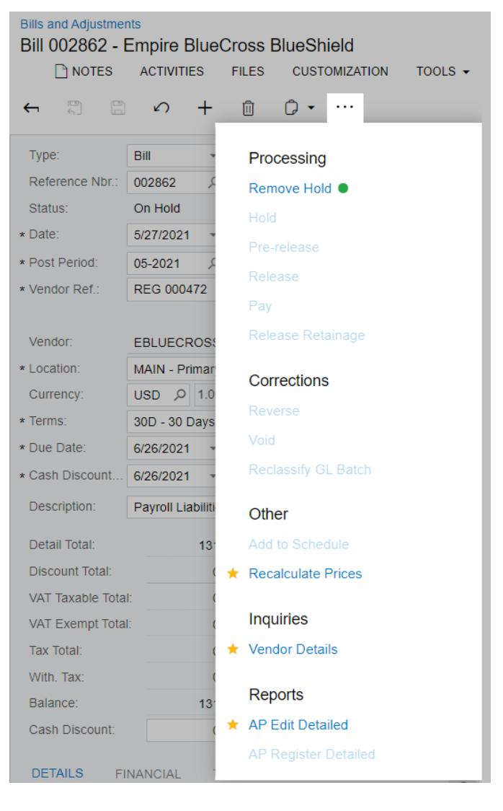

*Figure: The form toolbar and More menu on a narrow screen*

#### **Related Links**

- *[Integration with Excel](https://help-2025r1.acumatica.com/Help?ScreenId=ShowWiki&pageid=d4e757d5-bdf6-4d82-92e3-f26563d48ad4)*
- *To Copy a [Document](https://help-2025r1.acumatica.com/Help?ScreenId=ShowWiki&pageid=aa2b9a0f-794d-4dc7-80b4-14ed0702aea3) Contents to a New Document*
- *To Create a [Document](https://help-2025r1.acumatica.com/Help?ScreenId=ShowWiki&pageid=480487bd-b225-4065-9d82-97a3b68d7994) with a Template*

# **Table Toolbar**

Each table on an Acumatica ERP form, tab, dialog box, or page has a table toolbar, which contains the buttons you can use to work with the details or objects of the table. A toolbar, shown in the following screenshot, includes buttons that are specific to the table, standard buttons that most table toolbars have, and the search box (for some tables; for others, the search box is displayed in the filtering area).

|               | $\mathbf{x}$ с ∣⇔∣ ∽ |   |                                             |                                   |                          |           |                       |               |                 |               |               |  |  |
|---------------|-------------------------------|---|---------------------------------------------|-----------------------------------|--------------------------|-----------|-----------------------|---------------|-----------------|---------------|---------------|--|--|
|               | ALL RECORDS <b>ACTIVE</b>  |   |                                             |                                   |                          |           |                       |               |                 |               |               |  |  |
|               |                               |   | Drag column header here to configure filter | R                              |                          | ρ         |                       |               |                 |               |               |  |  |
| 髙             | O,                            | n | <b>Customer ID</b>                          | <b>Customer Name</b>              | Customer <b>Class</b> | Country   | City                  | Currenc ID | <b>Terms</b>    | <b>Status</b> |               |  |  |
| $\rightarrow$ | ा                             | n | <b>ABARTENDE</b>                            | <b>USA Bartending School</b>      | <b>KEY</b>               | <b>US</b> | <b>Little Falls</b>   | USD.          | 30 D | Active        |               |  |  |
|               | O                             |   | <b>ABCHOLDING</b>                           | <b>ABC Holdings Inc.</b>          | <b>KEY</b>               | <b>US</b> | New York              | <b>USD</b>    | 30 D | Active        |               |  |  |
|               | û,                            |   | !!!!!!!!!!!!!!!!!!!!!!!!!!!!!!!!!!!!!!!!    | <b>ABC Studios Inc.</b>           | <b>KEY</b>               | <b>US</b> | New York              | <b>USD</b>    | 30 D | Active        |               |  |  |
|               | Û                             |   | <b>ABCVENTURE</b>                           | <b>ABC Capital Ventures</b>       | <b>KEY</b>               | <b>US</b> | Philadelphia          | <b>USD</b>    | 30 D | Active        |               |  |  |
|               | Û                             |   | <b>ACTIVESTAF</b>                           | <b>Active Staffing Service</b>    | <b>LOCAL</b>             | <b>US</b> | <b>New York</b>       | <b>USD</b>    | 30 D | Active        |               |  |  |
|               | Û                             |   | ALPHABETLD                                  | <b>Alphabetland School Center</b> | LOCAL                    | <b>US</b> | <b>North Bellmore</b> | <b>USD</b>    | 30 D | Active        |               |  |  |
|               |                               |   |                                             |                                   |                          |           |                       |               |                 |               |               |  |  |
|               |                               |   | 1-6 of 103 records                          |                                   |                          |           |                       | К             | 1.              | of 18 pages   | $\rightarrow$ |  |  |

#### *Figure: Table toolbar*

#### **Standard Table Toolbar Buttons**

The following table describes the standard table toolbar buttons. A table toolbar may include some or all of those buttons. If a table toolbar includes table-specific buttons, they are described in the reference help topic.

| Button                          | Icon | Description                                                                                                                                                                                           |
|---------------------------------|------|-------------------------------------------------------------------------------------------------------------------------------------------------------------------------------------------------------|
| Refresh                         |      | Refreshes the data in the table.                                                                                                                                                                      |
| Switch Between Grid and Form |      | Controls how the elements are displayed: in a table (grid) with rows and columns; or as separately arranged elements for one table row, with navigation tools you use to move between row data. |
| Add Row                         |      | Appends a new row to the table so you can define a new detail or object. The new row may contain some default values.                                                                              |
| Delete Row                      |      | Deletes the selected row or rows.                                                                                                                                                                     |

| Button                    | Icon | Description                                                                                                                                                                                                                                                                                                               |
|---------------------------|------|---------------------------------------------------------------------------------------------------------------------------------------------------------------------------------------------------------------------------------------------------------------------------------------------------------------------------|
| Move Row Up               |      | Moves the selected row one position up.                                                                                                                                                                                                                                                                                   |
| Move Row Down             |      | Moves the selected row one position down.                                                                                                                                                                                                                                                                                 |
| Fit toScreen              |      | Adjusts the table to the screen width and makes the column width proportional.                                                                                                                                                                                                                                            |
| Export to Excel           |      | Exports the data in the table to an Excel file. For more information, see Integration with Excel in the Acumatica ERP Getting Started Guide.                                                                                                                                                                           |
| Filter Settings           |      | Opens the Filter Settings dialog box, which you can use to define a new advanced filter. After you create and save the filter, the corresponding tab appears on the ta ble. For more information about filtering, see Filters. For details on the Filter Settings dialog box, see Filter Settings Dialog Box. |
| Load Records from File |      | Opens the File Upload dialog box, described in detail below, so you can locate and upload a local file for import. You can use this option to import data from an Excel spreadsheet (.xlsx) or .csv file. For the detailed procedure, see To Import Data from a Local File to a Table.                           |
| Search                    |      | A box in which you can type a word, part of a word, or multiple words. As you type, the system filters the contents of the table to display only rows that contain the string you have typed in any column.                                                                                                         |
| Download                  |      | Downloads the selected file.                                                                                                                                                                                                                                                                                              |

### **File Upload Dialog Box**

With the **File Upload** dialog box, you select a file of one of the supported formats (.csv or .xlsx) to import data from the file.

| Element                                  | Description                                                                                                                         |  |
|------------------------------------------|-------------------------------------------------------------------------------------------------------------------------------------|--|
| File Path                                | The path to the file you want to upload. To select the file, click Browse, and then find and select the file you want to upload. |  |
| The dialog box has the following button. |                                                                                                                                     |  |
| Upload                                   | Closes the dialog box and opens the Common Settings dialog box, where you specify the import settings.                           |  |

#### **Common Settings Dialog Box**

In the **Common Settings** dialog box, which opens if you click **Upload** in the **File Upload** dialog box, you specify the import settings for a file that you has selected in the **File Upload** dialog box.

| Element                                   | Description                                                                                                                                                                    |  |  |
|-------------------------------------------|--------------------------------------------------------------------------------------------------------------------------------------------------------------------------------|--|--|
| Separator Chars                           | The character that is used as the separator in the imported file.                                                                                                              |  |  |
|                                           | By default, the comma is used as the separator. You specify the separator character if the imported file uses any other separator.                                          |  |  |
|                                           | This box appears only if you import data from a .csv file.                                                                                                                     |  |  |
| Null Value                                | Optional. The value that is used to mark an empty column in the imported file. You speci fy the null value if the value in the imported file differs from the empty string. |  |  |
| Encoding                                  | The encoding that is used in the imported file.                                                                                                                                |  |  |
|                                           | This box appears only if you import data from a .csv file.                                                                                                                     |  |  |
| Culture                                   | The regional format that has been used to display the time, currency, and other measure ments in the imported file.                                                         |  |  |
| Mode                                      | The mode that determines which rows of the uploaded file will be imported into the ta ble. The following options are available:                                             |  |  |
|                                           | • Update Existing: The rows already present in the table will be updated, and the rows not present in the table will be added.                                           |  |  |
|                                           | • Bypass Existing: Only the new rows that are not present in the table will be imported. The rows that are already present in the table will not be updated.             |  |  |
|                                           | • Insert All Records: All the rows from the file will be imported into the table.                                                                                           |  |  |
|                                           | If you select this option, you may get duplicated rows because the sys tem does not check for duplicates when importing rows from the file.                                 |  |  |
| The dialog box has the following buttons. |                                                                                                                                                                                |  |  |
| OK                                        | Closes the dialog box and opens the Columns dialog box.                                                                                                                        |  |  |
| Cancel                                    | Closes the dialog box without importing the data from the file.                                                                                                                |  |  |

#### **Columns Dialog Box**

In the **Columns** dialog box, which opens if you click **OK** in the **Common Settings** dialog box, you match the columns in the imported file that you have selected in the **File Upload** dialog box to the columns in the Acumatica ERP table to which you are importing data.

| Element       | Description                                                         |
|---------------|---------------------------------------------------------------------|
| Column Name   | The name of the column in the uploaded file.                        |
| Property Name | The name of the corresponding column in the table in Acumatica ERP. |

| Element                                   | Description                                                     |  |
|-------------------------------------------|-----------------------------------------------------------------|--|
| The dialog box has the following buttons. |                                                                 |  |
| OK                                        | Closes the dialog box and imports the selected file.            |  |
| Cancel                                    | Closes the dialog box without importing the data from the file. |  |

#### **Related Links**

- *[Tables](https://help-2025r1.acumatica.com/Help?ScreenId=ShowWiki&pageid=87a128a5-1230-4584-8c7a-ad05bcd08b75)*
- *[Integration with Excel](https://help-2025r1.acumatica.com/Help?ScreenId=ShowWiki&pageid=d4e757d5-bdf6-4d82-92e3-f26563d48ad4)*
- *To [Import](https://help-2025r1.acumatica.com/Help?ScreenId=ShowWiki&pageid=96773e07-5811-474d-a088-243f76f48f61) Data from a Local File to a Table*