

# **Accounts Payable 2025 R1**

| Copyright8                                                      |  |
|-----------------------------------------------------------------|--|
| Overview of Accounts Payable Processes9                         |  |
| Creating a Vendor12                                             |  |
| Vendors: General Information12                                  |  |
| Vendors: Vendor-Related Planning13                              |  |
| Vendors: Vendor Defaults and Overrides 14                       |  |
| Vendors: Vendor Locations 15                                    |  |
| Vendors: Security Configuration17                               |  |
| Vendors: Configuration Prerequisites18                          |  |
| Vendors: Implementation Activity 19                             |  |
| Vendors: Related Reports and Inquiries20                        |  |
| To Run AP Aging Reports21                                       |  |
| To View Vendor Balances 24                                      |  |
| Configuring Predefined Mailings for Vendors 26                  |  |
| Mailings for Vendors: General Information 26                    |  |
| Mailings for Vendors: Implementation Checklist28                |  |
| Mailings for Vendors: To Set Up a Mailing for a Vendor Class 28 |  |
| Mailings for Vendors: To Set Up a Mailing for a Vendor31        |  |
| Configuring Reclassification of Expenses34                      |  |
| Reclassification of Expenses: General Information34             |  |
| Reclassification of Expenses: Implementation Checklist 36       |  |
| Reclassification of Expenses: Generated Transactions37          |  |
| Reclassification of Expenses: Process Activity 38               |  |
| Managing Vendor Relations 42                                    |  |
| Vendor Relations: General Information42                         |  |
| Vendor Relations: Application in AP Documents44                 |  |
| Vendor Relations: Implementation Checklist 45                   |  |
| Vendor Relations: Process Activity 46                           |  |
| Vendor Relations: Generated Transactions49                      |  |
| Rounding of AP Document Amounts51                               |  |
| Rounding of AP Document Amounts: General Information 51         |  |
| Rounding of AP Document Amounts: Implementation Checklist52     |  |
| Rounding of AP Document Amounts: Process Activity54             |  |
| Rounding of AP Document Amounts: Generated Transactions 56      |  |

| Creating Recurring AP Documents 58                                                  |  |
|-------------------------------------------------------------------------------------|--|
| Recurring AP Documents: General Information58                                       |  |
| Recurring AP Documents: Implementation Checklist 60                                 |  |
| Recurring AP Documents: Process Activity 61                                         |  |
| Approving Accounts Payable Documents 64                                             |  |
| Bill Approval for Payment 66                                                        |  |
| To Approve Bills for Payment67                                                      |  |
| To Apply Cash Discounts 68                                                          |  |
| Processing AP Bills70                                                               |  |
| AP Bills: General Information70                                                     |  |
| AP Bills: Implementation Checklist 73                                               |  |
| AP Bills: Generated Transactions 74                                                 |  |
| AP Bills: Process Activity74                                                        |  |
| AP Bills: Mass Processing and Document Consolidation 77                             |  |
| AP Bills: Related Reports and Inquiries77                                           |  |
| To Enter a Bill in the Base Currency (with the Items' Quantity and Unit Cost) 78    |  |
| To Enter a Bill in the Base Currency (with Line Totals)79                           |  |
| To Enter a Bill Based on Purchase Receipts80                                        |  |
| To Enter a Bill Based on Purchase Orders82                                          |  |
| To Find a Particular Bill 83                                                        |  |
| To Enter a Bill with Landed Costs84                                                 |  |
| To Reverse a Bill85                                                                 |  |
| Processing AP Bills with Combined Subaccounts 86                                    |  |
| Bill with Combined Subaccounts: General Information86                               |  |
| Bill with Combined Subaccounts: Implementation Checklist86                          |  |
| Bill with Combined Subaccounts: Generated Transactions 88                           |  |
| Bill with Combined Subaccounts: Process Activity88                                  |  |
| Processing Debit and Credit Adjustments 92                                          |  |
| Debit and Credit Adjustments: General Information92                                 |  |
| Debit and Credit Adjustments: Debit Adjustments with Cash Discounts 95              |  |
| Debit and Credit Adjustments: Refunds 96                                            |  |
| Debit and Credit Adjustments: Implementation Checklist97                            |  |
| Debit and Credit Adjustments: Generated Transactions 98                             |  |
| Debit and Credit Adjustments: Mass Processing 100                                   |  |
| Debit and Credit Adjustments: To Process a Debit Adjustment100                      |  |
| Debit and Credit Adjustments: To Process a Debit Adjustment with a Cash Discount102 |  |

| Debit and Credit Adjustments: To Process a Credit Adjustment104 |  |
|-----------------------------------------------------------------|--|
| Debit and Credit Adjustments: Related Reports and Inquiries 106 |  |
| Paying AP Bills107                                              |  |
| AP Bill Payments: General Information 107                       |  |
| AP Bill Payments: Implementation Checklist111                   |  |
| AP Bill Payments: Generated Transactions 112                    |  |
| AP Bill Payments: Process Activity112                           |  |
| AP Bill Payments: Mass Processing of Documents 115              |  |
| AP Bill Payments: Related Reports and Inquiries 115             |  |
| To Print Checks 116                                             |  |
| To Check Funds for Payments117                                  |  |
| To Track Payments to Vendors118                                 |  |
| Check Correction and Reprinting 120                             |  |
| Check Reprinting: General Information120                        |  |
| Check Reprinting: Implementation Checklist 120                  |  |
| Check Reprinting: Process Activity 121                          |  |
| Check Reprinting: Related Report and Inquiry Forms125           |  |
| Voiding Payments 126                                            |  |
| Voiding Payments: General Information 126                       |  |
| Voiding Payments: Implementation Checklist 127                  |  |
| Voiding Payments: Generated Transactions128                     |  |
| Voiding Payments: Process Activity 129                          |  |
| Voiding Payments: Related Inquiry Forms 130                     |  |
| Processing Partial Payments132                                  |  |
| Partial Payments: General Information 132                       |  |
| Partial Payments: Generated Transactions 134                    |  |
| Partial Payments: Implementation Checklist134                   |  |
| Partial Payments: Process Activity135                           |  |
| Partial Payments: Related Report and Inquiry Forms 138          |  |
| Processing Cash Purchases 139                                   |  |
| Cash Purchases: General Information 139                         |  |
| Cash Purchases: Generated Transactions 142                      |  |
| To Create a Cash Purchase142                                    |  |
| Paying Multiple AP Bills144                                     |  |
| Multiple Bill Payments: General Information144                  |  |
| Multiple Bill Payments: Implementation Checklist146             |  |
|                                                                 |  |

#### Contents | **5**

| Multiple Bill Payments: Generated Transactions 147                                   |  |
|--------------------------------------------------------------------------------------|--|
| Multiple Bill Payments: Process Activity148                                          |  |
| Multiple Bill Payments: Related Reports and Inquiries 151                            |  |
| Processing Payments with a Corporate Card 152                                        |  |
| Payments with a Corporate Card: General Information 152                              |  |
| Payments with a Corporate Card: Implementation Checklist153                          |  |
| Payments with a Corporate Card: To Process a Credit Card Bill 154                    |  |
| Payments with a Corporate Card: To Reconcile a Bank Statement 157                    |  |
| Payments with a Corporate Card: Generated Transactions 160                           |  |
| Payments with a Corporate Card: Related Report and Inquiry Forms 162                 |  |
| Applying Payments to Particular Lines of AP Documents164                             |  |
| Applying Payments to Particular Lines: General Information 164                       |  |
| Applying Payments to Particular Lines: Support of Taxes167                           |  |
| Applying Payments to Particular Lines: Implementation Checklist167                   |  |
| Applying Payments to Particular Lines: Generated Transactions 169                    |  |
| Applying Payments to Particular Lines: Process Activity170                           |  |
| Applying Payments to Particular Lines: Mass Processing172                            |  |
| Applying Payments to Particular Lines: Related Reports 173                           |  |
| To Enter a Debit Adjustment That Can Be Applied by Line173                           |  |
| Processing AP Documents with Retainage175                                            |  |
| Configuration of the Default Retainage Settings in Accounts Payable 175              |  |
| Processing Flow of AP Documents with Retainage178                                    |  |
| Correction of a Bill with Retainage181                                               |  |
| Examples of Processing Bills with Retainage182                                       |  |
| AP Retainage Adjustment Cases 185                                                    |  |
| To Enter a Bill with Retainage (with Items' Quantities and Unit Costs)189            |  |
| To Enter a Bill with Retainage (with Line Totals) 191                                |  |
| To Enter a Bill with Retainage Paid by Line193                                       |  |
| To Enter a Debit Adjustment with Retainage 194                                       |  |
| To Create a Retainage Document (Release Retainage)195                                |  |
| To Create Multiple Retainage Documents (Release Retainage for Multiple Documents)196 |  |
| Processing Interbranch Bills Without Balancing 197                                   |  |
| Interbranch Bills Without Balancing: General Information197                          |  |
| Interbranch Bills Without Balancing: Implementation Checklist197                     |  |
| Interbranch Bills Without Balancing: Generated Transactions 199                      |  |
| Interbranch Bills Without Balancing: Process Activity199                             |  |

| Interbranch Bills Without Balancing: Reports and Inquiries203 |  |
|---------------------------------------------------------------|--|
| Processing Interbranch Bills With Balancing 205               |  |
| Interbranch Bills with Balancing: General Information205      |  |
| Interbranch Bills with Balancing: Implementation Checklist205 |  |
| Interbranch Bills with Balancing: Generated Transactions 207  |  |
| Interbranch Bills with Balancing: Process Activity208         |  |
| Interbranch Bills with Balancing: Reports and Inquiries211    |  |
| Processing Payments for a Shared Vendor 213                   |  |
| Payments for a Shared Vendor: General Information213          |  |
| Payments for a Shared Vendor: Implementation Checklist 213    |  |
| Payments for a Shared Vendor: Process Activity 215            |  |
| Payments for a Shared Vendor: Reports and Inquiries 218       |  |
| Processing Prepayments for a Bill 220                         |  |
| Bill Prepayments: General Information220                      |  |
| Bill Prepayments: Implementation Checklist223                 |  |
| Bill Prepayments: Generated Transactions 225                  |  |
| Bill Prepayments: To Process a Prepayment 225                 |  |
| Bill Prepayments: To Refund a Prepayment 229                  |  |
| Bill Prepayments: Mass Processing of Documents 231            |  |
| Bill Prepayments: Related Report and Inquiries231             |  |
| To Enter a Prepayment in the Simplified Way 232               |  |
| To Unapply a Prepayment Applied Mistakenly 233                |  |
| To Track Prepayments to Vendors234                            |  |
| To Void a Prepayment Request235                               |  |
| To Void a Prepayment 235                                      |  |
| To Void a Refund236                                           |  |
| Processing ACH Payments237                                    |  |
| To Prepare ACH Payments240                                    |  |
| To Quickly Prepare a Batch of Payments 241                    |  |
| To Export a Batch of ACH Payments242                          |  |
| To Correct a Batch of ACH Payments 242                        |  |
| Processing BACS Payments 244                                  |  |
| To Prepare BACS Payments245                                   |  |
| To Export BACS Payments 246                                   |  |
| Processing Canadian EFT Payments 248                          |  |
| To Prepare Canadian EFT Payments249                           |  |

| To Export Canadian EFT Payments250                                      |  |
|-------------------------------------------------------------------------|--|
| Recognizing AP Documents from PDFs251                                   |  |
| AP Documents from PDFs: General Information251                          |  |
| AP Documents from PDFs: Recognition of Purchase Orders in Bill Lines255 |  |
| AP Documents from PDFs: Recognition of Project-Related Data257          |  |
| AP Documents from PDFs: Detail Mapping 259                              |  |
| AP Documents from PDFs: Search for a Vendor by Email Address 265        |  |
| AP Documents from PDFs: Implementation Checklist 269                    |  |
| AP Documents from PDFs: Process Activity 270                            |  |
| Performing Period-End Procedures 273                                    |  |
| Period-End Procedures: General Information273                           |  |
| Period-End Procedures: To Perform Account Reconciliation273             |  |
| Period-End Procedures: To Close a Period in AP 276                      |  |
| To Reopen a Financial Period in Accounts Payable 278                    |  |
| Filing Out the 1099 Forms 279                                           |  |
| Configuring 1099 Reporting 279                                          |  |
| To Modify a Company's Configuration for 1099 Reports282                 |  |
| To Modify a Branch's Configuration for 1099 Reports283                  |  |
| Maintaining and Filing the 1099 Forms 284                               |  |
| Filing the 1099 Forms Electronically285                                 |  |
| End-of-Year Actions288                                                  |  |
| To Correct 1099 Amounts and Boxes289                                    |  |
| To Reopen a 1099 Year 290                                               |  |
| Filing CRA Forms291                                                     |  |
| Configuring CRA Reporting 291                                           |  |
| Filing the T5018 Form Electronically 294                                |  |
| Filing the T4A Form Electronically296                                   |  |
| To Generate the Original CRA Reporting Forms297                         |  |
| To Generate an Amendment to CRA Reporting Forms 299                     |  |
| Appendix301                                                             |  |
| Reports 301                                                             |  |
| Report Form301                                                          |  |
| Report306                                                               |  |
| Form Toolbar and More Menu308                                           |  |
| Table Toolbar 315                                                       |  |

# **Copyright**

#### **© 2025 Acumatica, Inc.**

#### **ALL RIGHTS RESERVED.**

No part of this document may be reproduced, copied, or transmitted without the express prior consent of Acumatica, Inc.

3075 112th Avenue NE, Suite 200, Bellevue, WA 98004, USA

# **Restricted Rights**

The product is provided with restricted rights. Use, duplication, or disclosure by the United States Government is subject to restrictions as set forth in the applicable License and Services Agreement and in subparagraph (c)(1)(ii) of the Rights in Technical Data and Computer Soware clause at DFARS 252.227-7013 or subparagraphs (c)(1) and (c)(2) of the Commercial Computer Soware-Restricted Rights at 48 CFR 52.227-19, as applicable.

# **Disclaimer**

Acumatica, Inc. makes no representations or warranties with respect to the contents or use of this document, and specifically disclaims any express or implied warranties of merchantability or fitness for any particular purpose. Further, Acumatica, Inc. reserves the right to revise this document and make changes in its content at any time, without obligation to notify any person or entity of such revisions or changes.

# **Trademarks**

Acumatica is a registered trademark of Acumatica, Inc. HubSpot is a registered trademark of HubSpot, Inc. Microso Exchange and Microso Exchange Server are registered trademarks of Microso Corporation. All other product names and services herein are trademarks or service marks of their respective companies.

Soware Version: 2025 R1 Last Updated: 06/01/2025

# **Overview of Accounts Payable Processes**

By using the accounts payable subledger, you can maintain complete, structured information about an unlimited number of vendors. You can enter vendor documents, bills, and adjustments, as well as track earlier payment discounts, apply payments to bills, and print checks. The primary features of the accounts payable subledger are described briefly below and extensively in other topics in this section.

# **Migration of Accounts Payable Documents**

In Acumatica ERP, you can enter fully or partially settled Accounts Payable documents into the system without affecting the General Ledger. To do it, you have to activate migration mode. For details on activating migration mode and adding documents, see *[Migrating Documents to Acumatica ERP](https://help-2025r1.acumatica.com/Help?ScreenId=ShowWiki&pageid=3e631d3c-e29b-4abf-a130-3a4f0d26e72e)*.

# **Multicurrency Support**

If you have activated the multicurrency support in Acumatica ERP, you can assign a default foreign currency to each vendor account. The currency and its rate may be overridden on individual transactions if the settings of the vendor account allow currency overriding. The system automatically computes realized gains or losses upon payment of vendor bills in foreign currencies. Outstanding foreign currency bills can be revalued in the base currency as oen as needed.

# **Vendor Defaults and Overrides**

You can establish vendor classes that provide default values for creating other vendors. If you set up a default vendor class that holds settings common to most vendors, vendors can be created more quickly. You can also divide vendors into classes based on the types of goods or services you purchase from them. You can create one vendor class for tax agencies and another for 1099 vendors. On document entry, a user specifies a vendor, and most of the elements are populated with the vendor's default values. This makes input of documents much easier and saves time. For more details, see *Vendors: Vendor Defaults and [Overrides](#page-13-1)* and *Vendors: Vendor [Locations](#page-14-1)*.

You can control which users can see which vendors on the forms by using restriction groups. You can specify a default restriction group for a vendor class, and the system will automatically include all newly added vendors in this group. For more information, see *Vendors: Security [Configuration](#page-16-1)*.

# **Flexible Workflow Options**

In Acumatica ERP, you can configure the document processing workflow to match your organization's payment and approval processes. You can use multiple options that control processing and choose from multiple processing forms. When users create and save documents, the documents can either be ready for release or placed on hold. You can configure approval to be required for bills before they can be paid. Also, you can set up the documents to be automatically posted on release, or you can make posting them a separate operation that requires additional rights.

# **Multiple Document Types**

The Accounts Payable module supports the following types of Accounts Payable documents: *Bills*, *Debit adjustments*, *Credit adjustments*, and *Prepayments*. It also supports these types of payment documents: *Checks*, *Debit adjustments*, *Vendor refunds*, *Prepayments*, and *Voided Checks*. For more information on how documents of different types are processed in the system, see the following topics:

- *[Processing AP Bills](#page-69-2)*
- *[Processing Debit and Credit Adjustments](#page-91-2)*
- *[Paying AP Bills](#page-106-2)*

- *[Applying Payments to Particular Lines of AP Documents](#page-163-2)*
- *[Processing Prepayments for a Bill](#page-219-2)*
- *[Cash Purchases: General Information](#page-138-2)*

#### **Rounding of Bill Totals**

If the *Invoice Rounding* feature is activated in your system, which provides rounding of document amounts, you can set up the rules and the precision to be used to automatically round the amounts of the bills that you enter or generate in the system. Notice that the rounding rules and the rounding precision that you specify for bills are the same for all currencies. For more information, see the following topics:

- *[Rounding of AP Document Amounts: General Information](#page-50-2)*
- *[Rounding of AP Document Amounts: Process Activity](#page-53-1)*

#### **Expense Reclassification**

If expense reclassification is performed as a separate stage of document processing in your organization, you can configure support for expense reclassification for bills and cash purchases. For more information, see *[Reclassification of Expenses: General Information](#page-33-2)*.

#### **Configurable Approval of Bills**

By using Acumatica ERP, you can configure approval to match the approval procedures used in your company. You can set up automatic preapproval of all bills and allow access to the *[Prepare Payments](https://help-2025r1.acumatica.com/Help?ScreenId=ShowWiki&pageid=e3b526e3-8b12-4fa9-a5b2-2955e763f238)* (AP503000) form only to employees who are authorized to approve bills and create payments. Alternatively, you can configure the system in such way that the bills can be approved only by using the *[Approve Bills for Payment](https://help-2025r1.acumatica.com/Help?ScreenId=ShowWiki&pageid=76c4ad15-d7b5-477b-a514-f7dc93faf2be)* (AP502000) form. For details, see *[Bill Approval for Payment](#page-65-1)*.

### **Support for Recurring Bills**

If you frequently have to create vendor bills that contain the same information, you can assign such bills to a schedule, so that the system will generate the documents at the frequency you specify: once per financial period, on a specified day of each calendar month, on a specified day each week (or a user-specified number of weeks), or on a user-specified number of days (such as daily or every other day). For more details, see *[Recurring AP](#page-57-2) [Documents: General Information](#page-57-2)*.

#### **ACH Payment Support**

In Acumatica ERP, you can pay to vendors through the ACH network in the United States. To set up ACH payments, assign a previously configured payment method to appropriate vendors; then, payments to be made by this method can be grouped into batches and exported to a file for further processing within the ACH payment system. For more details, see *[Processing ACH Payments](#page-236-1)*.

#### **Accounts Payable Inquiries**

Inquiries of the Accounts Payable module (located in the Explore node of the Work Area tab of the module) present vendors' account information in a variety of ways. You can view the total outstanding balances for a vendor or vendors by a period and by a currency by using the *Vendor [Summary](https://help-2025r1.acumatica.com/Help?ScreenId=ShowWiki&pageid=621040cc-666f-4bde-9480-50516e8a95a4)* (AP401000) inquiry form. You can view all documents that are past due for a specific vendor, as well as the cash discount amounts taken or lost, on the *[Vendor](https://help-2025r1.acumatica.com/Help?ScreenId=ShowWiki&pageid=22c03d80-cbb0-449d-9325-c12f623aaefd) Details* (AP402000) inquiry form. You can use extensive drill-down capabilities to quickly find any specific detail.

# **Support for United States 1099-MISC Form**

In Acumatica ERP, you can track 1099-MISC payments paid to contractors set as 1099 vendors, to ease the process of filling out these forms. For more details, see *[Filing Out the 1099 Forms](#page-278-2)*.

# **Accounts Payable Security Options**

Acumatica ERP implements a role-based, task-oriented approach to security. Users belong to roles, which are given appropriate rights to access only the resources the users need to perform their routine tasks. To restrict user access to some vendor accounts, you can include the vendor accounts and users authorized to work with them in restriction groups, which restrict other users' access to these sensitive vendor accounts. For more details, see *Vendors: Security [Configuration](#page-16-1)*.

# **Sending Documents Electronically**

With Acumatica ERP, you can define mailing settings for customers and vendors to send documents to them electronically, by email. (You can continue to print documents for sending documents via postal services to customers and vendors who do not want to receive documents electronically.) Also, you can configure sending such emails to employees who work with specific vendors or customers. For more information, see *[Mailings for](#page-25-2) Vendors: General [Information](#page-25-2)*.

# **Audit Trail**

Acumatica ERP generates unique document IDs in accordance with the numbering sequences you have assigned. These IDs, coupled with the vendors' document reference numbers, prevent duplicate entries and provide an easyto-follow audit trail. Reports provide information about the users who created and updated the documents.

# **Other Features and Options**

Depending on the chosen settings, you can perform various tasks related to vendor accounts, bills, and payments:

- Store any number of additional locations and contacts for each vendor
- Attach scanned images or electronic versions of vendor documents to bills, adjustments, and prepayments or to lines of the documents
- Define three aging periods for outstanding bills
- Pay each vendor's bills by printing one check or separate checks
- Process bills with retainage
- Process bills between company branches that require or do not require balancing
- Process payments for a shared vendor
- Automatically calculate realized and unrealized gains and losses on foreign currency transactions
- Process prepayments and multiple installments
- Apply payments to particular bill lines
- Void checks and payments
- Track available and missed discounts
- Perform period-end procedures in the accounts payable subledger separately from the general ledger

# **Creating a Vendor**

The topics of this chapter describe how to create a new vendor.

# **Vendors: General Information**

Acumatica ERP provides you with different tools that ease the process of entering vendor data and help you to organize this data in reports. You use the *[Vendors](https://help-2025r1.acumatica.com/Help?ScreenId=ShowWiki&pageid=a9584be3-f2bd-4d67-80d4-8041d809df56)* (AP303000) form to create vendors in Acumatica ERP.

# **Learning Objectives**

In this chapter, you will do the following:

- Create a new vendor based on the default vendor class
- Review the default settings that the system has inserted from the vendor class

# **Applicable Scenarios**

You add vendor accounts in the following cases:

- When you initially configure Acumatica ERP and enter the vendor base into the system
- When you need to create an account for a new vendor of the company

# **Entities Needed for Vendor Account Setup**

Before you start setting up vendor accounts in Acumatica ERP, you need to configure the entities that will ease the processes of vendor account creation and maintenance.

The needed entities in Acumatica ERP may include the following:

- Vendor classes (required): You should ensure that at least one vendor class has been set up on the *[Vendor](https://help-2025r1.acumatica.com/Help?ScreenId=ShowWiki&pageid=20dc8b93-d83a-49cf-8cfb-d2ffd2f0db87) [Classes](https://help-2025r1.acumatica.com/Help?ScreenId=ShowWiki&pageid=20dc8b93-d83a-49cf-8cfb-d2ffd2f0db87)* (AP201000) form. Vendor classes provide default values for individual vendor accounts, so users can create vendor accounts more easily. Besides the class ID, which is the required setting of a vendor class, it can contain additional elements such as the description, credit terms, currency, rate type, country, tax zone, and specific general ledger accounts. You can also enter a default cash account and payment method for the class. For details, see *[Accounts](https://help-2025r1.acumatica.com/Help?ScreenId=ShowWiki&pageid=90a53490-44c9-42c8-8b4d-b3e036551c41) Payable: To Create a Vendor Class*.
- Vendor identifiers (optional): You should make sure that the segmented key used as a template for identifiers of vendor accounts suits your needs, and adjust the *BIZACCT* segmented key (or the *VENDOR* segmented key) on the *[Segmented Keys](https://help-2025r1.acumatica.com/Help?ScreenId=ShowWiki&pageid=78bd7bd1-6bf6-409e-a8a5-8b18e8b80722)* (CS202000) form if needed. For details, see *[Managing Segmented](https://help-2025r1.acumatica.com/Help?ScreenId=ShowWiki&pageid=f56166d3-7509-4572-b83c-1a7ca3b3f6d0) [Keys](https://help-2025r1.acumatica.com/Help?ScreenId=ShowWiki&pageid=f56166d3-7509-4572-b83c-1a7ca3b3f6d0)*.
- General ledger accounts (required): On the *[Chart of Accounts](https://help-2025r1.acumatica.com/Help?ScreenId=ShowWiki&pageid=85557f41-a4af-47a8-b198-2a01461ce9c3)* (GL202500) form, you need to create the general ledger accounts to be used to record purchases and cash discounts, unless you plan to use the accounts that already exist. You will need to select these accounts when you create vendor accounts. For details, see *To Add an Account to the Chart of [Accounts](https://help-2025r1.acumatica.com/Help?ScreenId=ShowWiki&pageid=b78e9d89-6225-498a-a119-bc7fb42f597a)*
- Payment methods (required): You need to ensure that at least one payment method to be used for payments to vendors has been defined on the *[Payment Methods](https://help-2025r1.acumatica.com/Help?ScreenId=ShowWiki&pageid=509285d1-cfae-4e87-95c3-a968451952e6)* (CA204000) form. For details, see *[Managing](https://help-2025r1.acumatica.com/Help?ScreenId=ShowWiki&pageid=86d33c8b-008d-4c8b-80d8-6479f75788ed) [Payment Methods](https://help-2025r1.acumatica.com/Help?ScreenId=ShowWiki&pageid=86d33c8b-008d-4c8b-80d8-6479f75788ed)*.
- Credit terms: You should ensure that each needed set of credit terms that will define the due dates of documents has been set up on the *Credit [Terms](https://help-2025r1.acumatica.com/Help?ScreenId=ShowWiki&pageid=c39f7b9f-4ab2-4b67-b449-667802d58a57)* (CS206500) form. When you set up vendor classes, you can assign the appropriate credit terms to classes, which in turn will cause the credit terms to be assigned by default to all new vendors of this class. For details, see *Setup of Credit [Terms](https://help-2025r1.acumatica.com/Help?ScreenId=ShowWiki&pageid=bb0d243d-508c-4bf5-85b4-7b4fcc3d5fac)*.

- Mailings (optional): You can set up multiple mailings to notify vendors about their balances, bills, purchase orders, and other information you want to send to vendors on a regular basis. For details, see *[Mailings for](#page-25-2) Vendors: General [Information](#page-25-2)*.
- Vendor price lists (optional): You can set up vendor price lists on the *[Vendor](https://help-2025r1.acumatica.com/Help?ScreenId=ShowWiki&pageid=d14478b3-0718-4632-9fe2-a563f79aa038) Prices* (AP202000) form to maintain item prices that are specific for vendors, so that you can later use promotional prices and volumebased offers when planning your purchases. For details, see *Vendor Prices: General [Information](https://help-2025r1.acumatica.com/Help?ScreenId=ShowWiki&pageid=b8a92f04-1346-443b-aba0-9809a9d996e0)*.
- Vendor discounts (optional): On the *Vendor [Discounts](https://help-2025r1.acumatica.com/Help?ScreenId=ShowWiki&pageid=f8d73f7b-49f1-48d7-9097-1ac62b7d6c2d)* (AP205000) form, you can set up and maintain vendor discounts based on information received from each vendor. For details, see *[Configuring](https://help-2025r1.acumatica.com/Help?ScreenId=ShowWiki&pageid=a825769f-5377-42e2-8b50-7d21128dcfd8) Vendor Discounts*.
- Tax zones (optional): On the *Tax [Zones](https://help-2025r1.acumatica.com/Help?ScreenId=ShowWiki&pageid=361e36b3-a660-4fcb-a0cf-377b5bdb7aec)* (TX206000) form, you can set up various tax zones that combine a group of taxes for a particular location, which you assign to vendors and which are used by the system for calculation of taxes when you enter vendor documents. For details, see *Tax Zones and [Categories:](https://help-2025r1.acumatica.com/Help?ScreenId=ShowWiki&pageid=1271ca60-4b5d-41fe-ade3-bd05ded62026) General [Information](https://help-2025r1.acumatica.com/Help?ScreenId=ShowWiki&pageid=1271ca60-4b5d-41fe-ade3-bd05ded62026)*.

# **Vendors: Vendor-Related Planning**

As a first step, you need to gather information and make decisions that you will use when you set up vendor accounts and their supporting entities in Acumatica ERP.

# **Vendor-Related Planning Steps**

You need to perform the following planning tasks before you set up vendor accounts:

- Decide whether you need to expand your chart of accounts with the accounts you will use to record your operations with vendors. For details, see *[Chart of Accounts](https://help-2025r1.acumatica.com/Help?ScreenId=ShowWiki&pageid=4447f3b0-9ad5-45ea-953a-25305b9b1758)*.
- Consider your actual and potential vendors, and identify the characteristics you can use to group vendors, such as the types of goods or services they provide, their currency, and the payment methods they use to accept payments. Based on these characteristics, plan the vendor classes that will be used to provide default values for new vendor accounts, so that users can create vendor accounts more easily. Also, look at the common characteristics of all the planned classes so that you can plan the default vendor class, which will be defined first and used to set up the other vendor classes.
- Consider your actual and potential vendors with regard to the hierarchy of their companies and decide whether you need to build parent-child relations between accounts. These relations can help you meet your company's accounting and auditing requirements when you work with companies that have subsidiaries. For details, see *Vendor Relations: General [Information](#page-41-2)*.

The functionality is available if the *Vendor Relations* feature is enabled on the *[Enable/Disable](https://help-2025r1.acumatica.com/Help?ScreenId=ShowWiki&pageid=c1555e43-1bc5-4f6f-ba9d-b323f94d8a6b) [Features](https://help-2025r1.acumatica.com/Help?ScreenId=ShowWiki&pageid=c1555e43-1bc5-4f6f-ba9d-b323f94d8a6b)* (CS100000) form.

- Plan the structure of the identifiers to be used for vendor accounts, if this was not done during system implementation. In Acumatica ERP, the identifiers of vendor accounts are defined by the *BIZACCT* segmented key, whose structure is defined during system implementation. You can also configure the *VENDOR* segmented key (which is based on the *BIZACCT* key) if you want to make the structure of vendor identifiers a bit different (for example, with a different prefix) from the structure of identifiers for customer and employee accounts. For more information, see *[Business Account Identifiers](https://help-2025r1.acumatica.com/Help?ScreenId=ShowWiki&pageid=9a495cd5-4cdf-4145-acea-52a620db1426)*.
- Set up numbering sequences to be used when automatically generating IDs for Accounts Payable documents. You can set up a range of numbers, specify a separate prefix for Accounts Payable documents, and define subsequences intended for a specific branch or for a specific date. For more information, see *[Use](https://help-2025r1.acumatica.com/Help?ScreenId=ShowWiki&pageid=71c26175-c78f-4e70-8518-2115f5bfaf2f) [of Numbering Sequences](https://help-2025r1.acumatica.com/Help?ScreenId=ShowWiki&pageid=71c26175-c78f-4e70-8518-2115f5bfaf2f)*.
- Collect information about the ways you pay your vendors for services, and consider whether you are going to use Acumatica ERP for payment processing. You will use this information to plan the payment methods and cash accounts to be used to process payments to vendors. If you are going to use ACH payments, you have to configure the required payment method. For details, see *[Processing ACH Payments](#page-236-1)*.

- Examine the credit management policies used by your company—for example, the credit terms offered to your company by vendors, cash discounts permitted for purchases made on credit, or automatic assignment of credit terms to vendor documents. By using this information, you can plan the implementation of company credit policy in Acumatica ERP, which is described in *Setup of Credit [Terms](https://help-2025r1.acumatica.com/Help?ScreenId=ShowWiki&pageid=bb0d243d-508c-4bf5-85b4-7b4fcc3d5fac)*.
- Collect information about the location or locations of each vendor and the applicable taxes. You will use this information to plan the tax zones and taxes the system will apply to purchases. For details, see *[Vendors:](#page-14-1) Vendor [Locations](#page-14-1)* and *Tax Zones and [Categories:](https://help-2025r1.acumatica.com/Help?ScreenId=ShowWiki&pageid=1271ca60-4b5d-41fe-ade3-bd05ded62026) General Information*.
- Plan how your organization will send documents to vendors: electronically or through postal mail. In the latter case, printing of the documents should be required before they can be released. You can define these settings for a group of vendors by vendor class, and then adjust the settings individually for each vendor account. For details, see *Mailings for Vendors: General [Information](#page-25-2)*.
- If subaccounts are activated in your system, plan the rule for selecting the appropriate subaccount or for combining it from multiple involved subaccounts, by using the combined subaccount functionality provided by Acumatica ERP. For details on this functionality, see *[Combined Subaccounts: General Information](https://help-2025r1.acumatica.com/Help?ScreenId=ShowWiki&pageid=f9429f96-d2fb-45fe-bc49-d15b996f1f7f)*.

# **Vendors: Vendor Defaults and Overrides**

A vendor class groups vendors that have similar characteristics. You can divide vendors into classes based on the types of goods or services you purchase from them or on other properties, such as the vendors' currency and payment methods. For instance, you might find it useful to create one vendor class for tax agencies and another for 1099 vendors. You define vendor classes and their settings on the *Vendor [Classes](https://help-2025r1.acumatica.com/Help?ScreenId=ShowWiki&pageid=20dc8b93-d83a-49cf-8cfb-d2ffd2f0db87)* (AP201000) form. You can then select the appropriate vendor class when you are creating a vendor account, which causes the system to fill in the values of the class for the vendor. Any of these default values can be overridden.

Generally, any existing vendor class can be defined as the default vendor class. Aer you specify the default vendor class, when you create another vendor class, the system automatically inserts the values of the default vendor class, but any of them can be overridden. When you create a new vendor account, the default vendor class is initially specified as the vendor class, but you can change it to any other class.

# **Default Vendor Class**

We recommend that you first create the vendor class that will contain the largest number of vendors (and thus the most common values) and specify it as the default vendor class on the **General** tab (the **Data EntrySettings** section) of the *[Accounts Payable Preferences](https://help-2025r1.acumatica.com/Help?ScreenId=ShowWiki&pageid=c3f9353e-95e6-448d-bb3f-e20643879ec7)* (AP101000) form. Performing these steps will save you time when you create each additional vendor class, because the elements of the new class will be automatically populated with the values from the default vendor class, so that you have fewer values to enter.

Also, when you create a new vendor account, by default, it will be assigned to the *Default* vendor class, so that in most cases, you won't need to select another vendor class.

# **Other Vendor Classes**

You also create non-default vendor classes by using the *Vendor [Classes](https://help-2025r1.acumatica.com/Help?ScreenId=ShowWiki&pageid=20dc8b93-d83a-49cf-8cfb-d2ffd2f0db87)* (AP201000) form. As mentioned above, when you create a vendor class, the system initially populates it with the values of the default vendor class, any of which can be overridden.

You can create a new vendor class based on any existing vendor class by using commands from the **Edit** menu on the form toolbar of the *Vendor [Classes](https://help-2025r1.acumatica.com/Help?ScreenId=ShowWiki&pageid=20dc8b93-d83a-49cf-8cfb-d2ffd2f0db87)* form. You can copy the settings of a particular vendor class and paste them to create another class, or you can create a template that you can use for multiple similar vendor classes. For details, see *[Copy-and-Paste](https://help-2025r1.acumatica.com/Help?ScreenId=ShowWiki&pageid=fcb022ae-7e19-4d22-acb6-4adcd84868c0) Options and Record Templates*.

# **Default Values Provided by a Vendor Class**

A vendor class has only two required settings: class ID and description. For each class, you can decide which additional elements to use. You can select the credit terms, currency, rate type, country, tax zone, and specific general ledger accounts and subaccounts. You can also enter a default cash account and payment method for the class.

When you create a new vendor account on the *[Vendors](https://help-2025r1.acumatica.com/Help?ScreenId=ShowWiki&pageid=a9584be3-f2bd-4d67-80d4-8041d809df56)* (AP303000) form, by default, the elements have the values that were specified for the default vendor class. If the new vendor should be assigned to a more specific class, select this class, which changes the default values. You can override any value, making it specific to the vendor. If you have to override many values similarly for multiple vendors, consider creating a new vendor class.

# **Default Currency Settings**

For a vendor class, you can specify the default currency and the default currency rate to be used for vendor accounts. We recommend that you select a foreign currency for a vendor class only if most or all vendors of the class use this currency. If you want to allow override of the currency and the rate by default for all vendors of the class, select these check boxes for the vendor class on the *Vendor [Classes](https://help-2025r1.acumatica.com/Help?ScreenId=ShowWiki&pageid=20dc8b93-d83a-49cf-8cfb-d2ffd2f0db87)* (AP201000) form: **Enable Currency Override** and **Enable Rate Override** in the **Default FinancialSettings** section of the **General** tab.

If all vendors of the class use the same currency, you can prohibit users from overriding the currency on vendor documents, thus reducing the chance of input errors related to the currency choice. If you may use a non-default currency and non-default rate type on individual documents for some vendors, you can allow currency and rate overriding for those vendors by selecting the **Enable Currency Override** and **Enable Rate Override** check boxes, respectively, on the *[Vendors](https://help-2025r1.acumatica.com/Help?ScreenId=ShowWiki&pageid=a9584be3-f2bd-4d67-80d4-8041d809df56)* (AP303000) form (in the **FinancialSettings** section of the **Financial** tab).

#### **Default Printing and Emailing Settings**

A vendor class can provide the default settings that determine whether the documents of vendors of the class should be printed on release or emailed on release. The settings that control the default printing and emailing preferences of vendors of a class are located in the **Default Print and EmailSettings** section on the **General** tab of the *Vendor [Classes](https://help-2025r1.acumatica.com/Help?ScreenId=ShowWiki&pageid=20dc8b93-d83a-49cf-8cfb-d2ffd2f0db87)* (AP201000) form. These settings are the **Print Orders** and **Send Orders by Email** check boxes for the vendor class. Selecting these check boxes makes the documents of the vendors of the class available for mass-printing and mass-emailing, respectively, by default.

You can override this setting for individual vendors of the class, if needed. For details, see *Mailings for [Vendors:](#page-27-2) To Set Up a Mailing for a [Vendor](#page-27-2) Class*.

#### **Rule for Generating Expense Subaccounts**

To gather more detailed accounting information, you can specify a rule to generate subaccounts for use on Accounts Payable documents as the expense subaccounts for transactions. A default expense subaccount can be a combination of multiple expense subaccounts, where for different segments, values may be taken from different expense subaccounts related to the document. For each segment of the resulting expense subaccount, you can specify from which subaccount—such as the company's branch, the vendor location, the inventory item, or the employee account—the segment value should be copied. For details, see *Combined [Subaccounts:](https://help-2025r1.acumatica.com/Help?ScreenId=ShowWiki&pageid=1538f8a0-0e2e-4b84-afc5-b5d5e97a2fd8) To Define a [Subaccount Mask for AP Documents](https://help-2025r1.acumatica.com/Help?ScreenId=ShowWiki&pageid=1538f8a0-0e2e-4b84-afc5-b5d5e97a2fd8)*.

# **Vendors: Vendor Locations**

In this topic, you will read about the main location and the default location of a vendor, as well as the values provided by vendor locations for purchase orders and payments.

In Acumatica ERP, you can reflect whether a particular vendor has one location or multiple locations, each with specific settings. You can use the *Vendor [Locations](https://help-2025r1.acumatica.com/Help?ScreenId=ShowWiki&pageid=aeeccc5c-465f-4bca-9cd7-a3c792da38e1)* (AP303010) form to add, edit, and view locations, as well as set default locations. On this form, you can also provide the following information about the vendor location, which is used by default for purchase orders and for payments to vendors:

- Accounts payable and expense accounts and the corresponding subaccounts
- Payment settings and remittance information
- Purchasing and shipping-related information
- Tax-related information

The main location is created automatically when you fill in the vendor's main address and contact information on the *[Vendors](https://help-2025r1.acumatica.com/Help?ScreenId=ShowWiki&pageid=a9584be3-f2bd-4d67-80d4-8041d809df56)* (AP303000) form. The main location always has *MAIN* as its ID, and the *Active* status, both of which cannot be changed.

You can define multiple vendor locations only if the *Business Account Locations* feature is enabled on the *[Enable/Disable Features](https://help-2025r1.acumatica.com/Help?ScreenId=ShowWiki&pageid=c1555e43-1bc5-4f6f-ba9d-b323f94d8a6b)* (CS100000) form.

Once the main location is created, it is automatically listed and marked as the default location on the **Locations** tab of the *[Vendors](https://help-2025r1.acumatica.com/Help?ScreenId=ShowWiki&pageid=a9584be3-f2bd-4d67-80d4-8041d809df56)* form and in the Summary area of the *Vendor [Locations](https://help-2025r1.acumatica.com/Help?ScreenId=ShowWiki&pageid=aeeccc5c-465f-4bca-9cd7-a3c792da38e1)* form. If additional locations have been added for the vendor account, you can make another location the default location. On the **Locations** tab of the *[Vendors](https://help-2025r1.acumatica.com/Help?ScreenId=ShowWiki&pageid=a9584be3-f2bd-4d67-80d4-8041d809df56)* form , you click the row with the location and click**Set as Default** on the table toolbar of the **Locations** tab. Alternatively, you can select the **Default** check box in the Summary area of the *Vendor [Locations](https://help-2025r1.acumatica.com/Help?ScreenId=ShowWiki&pageid=aeeccc5c-465f-4bca-9cd7-a3c792da38e1)* form.

The purchase and payment settings specified for the default vendor location are also displayed, respectively, on the **PurchaseSettings** and **Payment** tabs of the *[Vendors](https://help-2025r1.acumatica.com/Help?ScreenId=ShowWiki&pageid=a9584be3-f2bd-4d67-80d4-8041d809df56)* form. If you update the elements on those tabs, the system also updates the corresponding elements for the default location on the *Vendor [Locations](https://help-2025r1.acumatica.com/Help?ScreenId=ShowWiki&pageid=aeeccc5c-465f-4bca-9cd7-a3c792da38e1)* form.

The default location's settings are also used to populate elements when you create a new location. If needed, you can override these default settings, which include the address, contact information, purchase settings, payment settings, and general ledger accounts.

If you change the vendor class for an existing vendor, the following values will not be overridden for the main and additional locations:

- The country specified in the **Country** box on the **General** tab of the *Vendor [Locations](https://help-2025r1.acumatica.com/Help?ScreenId=ShowWiki&pageid=aeeccc5c-465f-4bca-9cd7-a3c792da38e1)* form
- The tax zone specified in the**Tax Zone** box on the **PurchaseSettings** tab of the *Vendor [Locations](https://help-2025r1.acumatica.com/Help?ScreenId=ShowWiki&pageid=aeeccc5c-465f-4bca-9cd7-a3c792da38e1)* form

# **Use of Location Default Settings**

When you enter a new purchase order, bill, payment, or quick check, the first value you must specify is the vendor. When the vendor is selected, relevant elements on the form are automatically filled in with the vendor's default values, including the default location and its associated purchase or payment settings. The settings of a vendor location include such information as the payment method, the cash account, the tax zone, the tax registration, the shipping settings, and the accounts payable and expense accounts with the corresponding subaccounts (if applicable). If you select a vendor location that is different from the default one, the values change to those associated with the selected location; if needed, you can override any of the default values.

As a result of these default settings being used to populate elements, data entry is faster and more efficient.

#### **Related Links**

- *[Accounts Payable Preferences](https://help-2025r1.acumatica.com/Help?ScreenId=ShowWiki&pageid=c3f9353e-95e6-448d-bb3f-e20643879ec7)*
- *Vendor [Classes](https://help-2025r1.acumatica.com/Help?ScreenId=ShowWiki&pageid=20dc8b93-d83a-49cf-8cfb-d2ffd2f0db87)*
- *[Vendors](https://help-2025r1.acumatica.com/Help?ScreenId=ShowWiki&pageid=a9584be3-f2bd-4d67-80d4-8041d809df56)*
- *Vendor [Locations](https://help-2025r1.acumatica.com/Help?ScreenId=ShowWiki&pageid=aeeccc5c-465f-4bca-9cd7-a3c792da38e1)*
- *Credit [Terms](https://help-2025r1.acumatica.com/Help?ScreenId=ShowWiki&pageid=c39f7b9f-4ab2-4b67-b449-667802d58a57)*
- *Tax [Zones](https://help-2025r1.acumatica.com/Help?ScreenId=ShowWiki&pageid=361e36b3-a660-4fcb-a0cf-377b5bdb7aec)*

# **Vendors: Security Configuration**

As your organization buys goods and services from external organizations, your accountants manage vendors' information and process documents. If your organization works with more than 10 vendors, accountants may work with particular vendors only. In this case, the accountants who do not work with particular vendors should not see them in the system for security reasons and to avoid entry errors. You can use restriction groups to make vendors visible to only the accountants who work with these vendors in the system, as described in this topic.

In Acumatica ERP, you can configure groups with direct and inverse restriction. In this topic, for simplicity, groups with direct restriction are used in examples. You can use inverse restriction groups in the same way as you use direct restriction groups. For details on the types of restriction groups, see *Types of [Restriction](https://help-2025r1.acumatica.com/Help?ScreenId=ShowWiki&pageid=a72c11e3-e181-4412-a462-ce333721a1e9) Groups*.

# **Visibility of Vendors by User**

You can use restriction groups to configure and manage the visibility of vendors to users in the system. If each accountant in your organization works with specific vendors, you can hide these vendors from other users. For details about restriction groups, see *[Restriction Groups in Acumatica ERP](https://help-2025r1.acumatica.com/Help?ScreenId=ShowWiki&pageid=ad9a42c1-ff5d-4298-86d9-683039c18512)*.

For example, suppose that ABComputers is your vendor of computers and office equipment, and only the senior accountant is allowed to process documents from this vendor. To configure the visibility of this vendor, you do the following on the *[Vendor](https://help-2025r1.acumatica.com/Help?ScreenId=ShowWiki&pageid=ce7b6b2c-ef5b-42d0-b6be-39040697b26f) Access* (AP102000) form:

- 1. You create a restriction group with direct restriction (for example, *Group for ABComputers*).
- 2. You add to the group the user account of the senior accountant.
- 3. You add to the group the ABComputers vendor.

If you have configured vendor classes, you can specify a default restriction group for a vendor class. With this setting, all new vendors of the class will be automatically added to the restriction group.

# **Setting Up Default Restriction Groups for Vendor Classes**

To ease the addition of new vendors to restriction groups, you can specify a default restriction group for a vendor class, so that vendors of the selected class will be included in the restriction group automatically.

You specify a default restriction group for a vendor class by using the *Vendor [Classes](https://help-2025r1.acumatica.com/Help?ScreenId=ShowWiki&pageid=20dc8b93-d83a-49cf-8cfb-d2ffd2f0db87)* (AP201000) form. You perform the following steps to specify a default restriction group for a vendor class:

- 1. In the **Class ID** box, you select the vendor class for which you want to specify the default restriction group.
- 2. In the **Default Restriction Group** box of the **Default GeneralSettings** section on the **General** tab, you select the default restriction group that will be used for the selected vendor class.
- 3. On the form toolbar, you click **IncludeVendors in Restriction Group** to include all entities of the class in the default restriction group.
- 4. You save your changes.

# **Removing Class Entities from a Default Restriction Group**

If you want to cancel the visibility restriction for entities of a vendor class, you can remove all class entities from a default restriction group as follows:

1. You open the *Vendor [Classes](https://help-2025r1.acumatica.com/Help?ScreenId=ShowWiki&pageid=20dc8b93-d83a-49cf-8cfb-d2ffd2f0db87)* (AP201000) form.

- 2. In the **Default GeneralSettings** section on the **General** tab, you clear the value in the **Default Restriction Group** box
- 3. On the form toolbar, you click **IncludeVendors in Restriction Group**.
- 4. You save your changes.

# **Forms for Vendor Security**

In the following table, you can find the list of the forms that you can use to manage restriction groups with vendors and the tasks that you can resolve by using each form.

#### *Table: Forms for Vendor Security*

| Task                                                                            | Form                                    |
|---------------------------------------------------------------------------------|-----------------------------------------|
| To initially configure the visibility of a vendor to users                      | Vendor Access (AP102000)                |
| To change the visibility of a vendor in multiple restric tion groups         | Restriction Groups by Vendor (AP102010) |
| To change the visibility of vendors to a user in multiple restriction groups | Restriction Groups by User (SM201035)   |

For information about how to add or remove objects from a restriction group, see *[Operations with Restriction](https://help-2025r1.acumatica.com/Help?ScreenId=ShowWiki&pageid=af4b07a9-476a-4475-8183-8bffc9eb6947) [Groups](https://help-2025r1.acumatica.com/Help?ScreenId=ShowWiki&pageid=af4b07a9-476a-4475-8183-8bffc9eb6947)*.

#### **Related Links**

- *[Operations with Restriction Groups](https://help-2025r1.acumatica.com/Help?ScreenId=ShowWiki&pageid=af4b07a9-476a-4475-8183-8bffc9eb6947)*
- *[Restriction Groups in Acumatica ERP](https://help-2025r1.acumatica.com/Help?ScreenId=ShowWiki&pageid=ad9a42c1-ff5d-4298-86d9-683039c18512)*
- *Types of [Restriction](https://help-2025r1.acumatica.com/Help?ScreenId=ShowWiki&pageid=a72c11e3-e181-4412-a462-ce333721a1e9) Groups*
- *[Restriction Groups by User](https://help-2025r1.acumatica.com/Help?ScreenId=ShowWiki&pageid=a54bfd6b-d6c1-4eaa-86c6-21394a6099c8)*
- *[Restriction](https://help-2025r1.acumatica.com/Help?ScreenId=ShowWiki&pageid=a3e243e0-09c5-4562-a46d-ab4148b2d913) Groups by Vendor*
- *Vendor [Access](https://help-2025r1.acumatica.com/Help?ScreenId=ShowWiki&pageid=ce7b6b2c-ef5b-42d0-b6be-39040697b26f)*

# **Vendors: Configuration Prerequisites**

Before you start setting up a vendor account, you need to configure the entities that will ease the processes of vendor account creation and maintenance.

# **Settings Required to be Configured**

- You need to perform the task of minimum system configuration. For details, see *Company Without [Branches:](https://help-2025r1.acumatica.com/Help?ScreenId=ShowWiki&pageid=5bc4e520-2681-45af-8767-e22b3f80df94) [General Information](https://help-2025r1.acumatica.com/Help?ScreenId=ShowWiki&pageid=5bc4e520-2681-45af-8767-e22b3f80df94)*, *[Company with Branches that Do Not Require Balancing: General Information](https://help-2025r1.acumatica.com/Help?ScreenId=ShowWiki&pageid=a718a27b-3683-4d86-a26e-4b8fb7981f1c)*, and *[Company with Branches that Require Balancing: General Information](https://help-2025r1.acumatica.com/Help?ScreenId=ShowWiki&pageid=a618a27b-3683-4d86-a26e-4b8fb7981f1c)*
- Make sure that credit terms to be assigned to a new vendor have been defined on the *Credit [Terms](https://help-2025r1.acumatica.com/Help?ScreenId=ShowWiki&pageid=c39f7b9f-4ab2-4b67-b449-667802d58a57)* (CS206500) form.
- Make sure that the vendor payment method has been configured and activated on the *[Payment Methods](https://help-2025r1.acumatica.com/Help?ScreenId=ShowWiki&pageid=509285d1-cfae-4e87-95c3-a968451952e6)* (CA204000) form.

# **Vendors: Implementation Activity**

The following activity will walk you through the process of creating a new vendor.

This activity is based on the *U100* dataset. If you are using another dataset, or if any system settings have been changed in *U100*, these changes can affect the workflow of the activity and the results of the processing. To avoid any issues, restore the *U100* dataset to its initial state.

# **Video Tutorial**

This video shows you the common process but may contain less detail than the activity has. If you want to repeat the activity on your own or you are preparing to take the certification exam, we recommend that you follow the instructions in the steps of the activity.

#### *[FEEDBACK](https://www.surveymonkey.com/r/BLBL7RJ?Video=Configuring%20Vendors&Source=Open%20Uni&Course=F100)*

# **Story**

Suppose that SweetLife Fruits & Jams company has found a vendor, the CleanUp company that provides cleaning services and that agreed to sell its services on credit, with payments due in 30 days and a 3% discount if the services are paid within 10 days.

Acting as a SweetLife administrator, you need to create the new vendor in the system.

# **Process Overview**

In this activity, you will create a new vendor on the *[Vendors](https://help-2025r1.acumatica.com/Help?ScreenId=ShowWiki&pageid=a9584be3-f2bd-4d67-80d4-8041d809df56)* (AP303000) form. On the tabs of this form, you will specify the vendor's address and contact information. You will then review the default settings, which the system inserts to the vendor account when creating the vendor, and then specify the payment settings for the vendor.

# **System Preparation**

Before you start creating a vendor, make sure that the following tasks have been performed in the system:

- 1. The company has been created and its actual ledger has been specified; *Company Without [Branches:](https://help-2025r1.acumatica.com/Help?ScreenId=ShowWiki&pageid=082a5d06-0e65-44c0-8049-4df32ebf59d3) To [Configure](https://help-2025r1.acumatica.com/Help?ScreenId=ShowWiki&pageid=082a5d06-0e65-44c0-8049-4df32ebf59d3) a Company Without Branches* and *[General](https://help-2025r1.acumatica.com/Help?ScreenId=ShowWiki&pageid=fda48dc3-65e6-4ef1-8196-b4b1f9751e91) Ledger: To Create an Actual Ledger*.
- 2. The credit terms that are used by vendors have been created, as described in *Credit [Terms:](https://help-2025r1.acumatica.com/Help?ScreenId=ShowWiki&pageid=428940dc-5fc4-4927-b2c6-c2d42d23a063) To Define Credit Terms with a Cash [Discount](https://help-2025r1.acumatica.com/Help?ScreenId=ShowWiki&pageid=428940dc-5fc4-4927-b2c6-c2d42d23a063)*.
- 3. The default vendor class has been created, as described in *[Accounts](https://help-2025r1.acumatica.com/Help?ScreenId=ShowWiki&pageid=90a53490-44c9-42c8-8b4d-b3e036551c41) Payable: To Create a Vendor Class*.

# **Step 1: Creating a Vendor Account**

To create a vendor account, do the following:

- 1. Sign in to the company you have prepared with the *admin* username.
- 2. On the *[Vendors](https://help-2025r1.acumatica.com/Help?ScreenId=ShowWiki&pageid=a9584be3-f2bd-4d67-80d4-8041d809df56)* (AP303000) form, add a new record.
- 3. In the Summary area, specify the following settings:
  - **Vendor ID**: CLEANUP
  - **VendorStatus**: *Active* (inserted automatically)
  - **Vendor Class**: *DEFAULT* (inserted automatically)

4. On the **General** tab, in the **Account Name** box, specify CleanUp Co.

The **Legal Name** box is filled in by default with the same value.

5. On the form toolbar, click**Save** to save your changes.

# **Step 2: Specifying Contact Information and Address**

To specify the vendor's contact information and address, do the following:

- 1. On the **General** tab, specify the following settings in the **Primary Contact** section:
  - **Name**: Loretta W Glenn
  - **Job Title**: General manager
  - **Email**: lglenn@cleanup.example.com
  - **Business 1**: 315-719-5308
- 2. In the **Account Address** section of the **General** tab, specify the following main address for the vendor:
  - **Address Line 1**: 893 Confederate Drive
  - **City**: Geneva
  - **State**: *NY - New York*
  - **Postal Code**: 14456

# **Step 3: Specifying Financial and Payment Settings**

To specify the financial and payment settings for the vendor, do the following:

1. On the **Financial** tab, in the**Terms** box, make sure that *310N30* is selected.

This setting is inserted by default from the vendor class settings. The setting means that you will pay the net amount within 30 days or will take a 3% discount if you choose to pay within 10 days.

- 2. On the **Payment** tab, in the **Default PaymentSettings** section, make sure that *CHECK* is selected in the **Payment Method** box and *10200 - Checking Account* is selected in the **Cash Account** box.
- 3. In the **Default PaymentSettings** section, specify the following settings:
  - **Payment By**: *Discount Date*
  - **Payment Lead Time (Days)**: 3
  - **PaySeparately**: Cleared
- 4. On the form toolbar, click**Save** to save your changes.

#### **Step 4: Reviewing the Default GL Accounts**

To review the default GL accounts of the vendor, do the following:

- 1. Open the **GL Accounts** tab.
- 2. In the boxes on this tab, review the GL accounts to be used for settlements with this vendor.

# **Vendors: Related Reports and Inquiries**

This topic describes the reports, inquiries, and forms you may review to gather information about vendors.

If you do not see a report or inquiry, this could mean that you have signed in to the system with a user account that does not have access rights to the form. Sign in as the *admin* user, or contact your system administrator.

#### **Reviewing Vendor Documents**

You can review the vendor's documents at any time on the *[Vendor](https://help-2025r1.acumatica.com/Help?ScreenId=ShowWiki&pageid=22c03d80-cbb0-449d-9325-c12f623aaefd) Details* (AP402000) form. The form shows the selected vendor's documents and the balance calculated based on the documents. By default, the form shows all the vendor's open documents. You can also run this inquiry by clicking**Vendor Details** (under **Inquiries**) on the More menu of the *[Vendors](https://help-2025r1.acumatica.com/Help?ScreenId=ShowWiki&pageid=a9584be3-f2bd-4d67-80d4-8041d809df56)* (AP303000) form.

# **Reviewing Vendor Documents and Balance**

You can review the open documents, applications, and vendor balances at the end of a period, grouped by vendor and AP account, by running the *AP [Balance](https://help-2025r1.acumatica.com/Help?ScreenId=ShowWiki&pageid=0d1c7f3f-90d6-4d12-894f-05fadf489921) by Vendor* (AP632500) report.

#### **Reviewing Vendor Balance**

You can review the vendor balance, which you can further reconcile with the balance of the accounts payable GL account, by running the *[AP Balance by GL Account](https://help-2025r1.acumatica.com/Help?ScreenId=ShowWiki&pageid=92545582-aa05-4b36-9aed-1c894ebfe0d2)* (AP632000) report. To reconcile the GL balance of the AP account with the vendor balance, you compare the balance obtained in this report with the trial balance for the same period.

#### **Reviewing Vendor Balance History**

You can review the history of the vendor's balance over a specified date range by running the *[Vendor](https://help-2025r1.acumatica.com/Help?ScreenId=ShowWiki&pageid=b5d5477b-005c-4990-b5f1-53555d76ba71) History* (AP652000) report.

# **Reviewing Vendor Documents in AP Register**

To review the vendor documents that have been released (documents with the *Open*, *Closed*, and *Reserved* statuses), you run the *[AP Register](https://help-2025r1.acumatica.com/Help?ScreenId=ShowWiki&pageid=ee113a56-f6d6-4555-85e2-9dcac30a2639)* (AP621500) report.

#### **Reviewing Vendor Profile**

To review the database information for a particular vendor, you run the *Vendor [Profiles](https://help-2025r1.acumatica.com/Help?ScreenId=ShowWiki&pageid=b0af5d32-8f95-4747-9326-2e6eb22b3850)* (AP655500) report. You can also run this report by clicking**Vendor Profile** (under **Reports**) on the More menu of the *[Vendors](https://help-2025r1.acumatica.com/Help?ScreenId=ShowWiki&pageid=a9584be3-f2bd-4d67-80d4-8041d809df56)* (AP303000) form.

#### **Reviewing Vendor Balances**

To review a particular vendor with the balances, default currency, credit terms, tax zone, and other basic information, you run the *Vendor [Summary](https://help-2025r1.acumatica.com/Help?ScreenId=ShowWiki&pageid=b61831e2-2f54-45d0-af17-b07fa1595890)* (AP655000) report. To review the vendor's outstanding balances, you use the *Vendor [Summary](https://help-2025r1.acumatica.com/Help?ScreenId=ShowWiki&pageid=621040cc-666f-4bde-9480-50516e8a95a4)* (AP401000) inquiry.

# **To Run AP Aging Reports**

You can use multiple AP aging reports, depending on such factors as which currency you would like to view outstanding and past due balances in, and whether balances will be broken down by days outstanding or days past due. This topic provides instructions for using the following reports:

• *[AP Aging](https://help-2025r1.acumatica.com/Help?ScreenId=ShowWiki&pageid=c67e52ca-30b6-4b94-90b0-0aa21fd4c473)* (AP631000)

- *[AP Aging MC](https://help-2025r1.acumatica.com/Help?ScreenId=ShowWiki&pageid=ae4a659b-152a-4cfa-a7e6-fc4b34846e9f)* (AP631100)
- *[AP Coming Due](https://help-2025r1.acumatica.com/Help?ScreenId=ShowWiki&pageid=be63f44c-0ba2-44b4-b734-2044a2d00aee)* (AP631500)
- *[AP Coming Due MC](https://help-2025r1.acumatica.com/Help?ScreenId=ShowWiki&pageid=58c82755-2b54-4be5-8f6f-4e1e2db2c8ec)* (AP631600)
- *[AP Aged Period-Sensitive](https://help-2025r1.acumatica.com/Help?ScreenId=ShowWiki&pageid=c4e94668-7022-48a8-9fd3-f6c63874abac)* (AP630500)

# **To Run the AP Aging Report in the Base Currency**

- 1. Open the *[AP Aging](https://help-2025r1.acumatica.com/Help?ScreenId=ShowWiki&pageid=c67e52ca-30b6-4b94-90b0-0aa21fd4c473)* (AP631000) report.
- 2. On the **Report Parameters** tab, do the following:
  - a. In the **Report Format** box, select one of the following options:
    - *Summary*: To view the past due balances on the selected aging date.
    - *Detailed*: To view the past due documents on the selected aging date.
    - *Detailed with Retainage*: To view past due documents and their unreleased retainage on the selected aging date.
  - b. In the **Company/Branch** box, select the company or branch for which you want to view information, or leave this box empty to view information on all branches.
  - c. In the **Vendor Class** box, select the vendor class for which you want to view information, or leave this box empty to view information on all vendor classes.
  - d. In the **Vendor** box, select the vendor you want to view information for, or leave this box empty to view information on all vendors.
  - e. In the **Age as of Date** box, select the date the system will use to calculate the aging categories for documents.
- 3. On the form toolbar, click **Run Report**.

The report displays the list of vendors with past-due balances. Balances are broken down by days past due on the specified date, and all amounts are displayed in the base currency.

# **To Run the Multicurrency AP Aging MC Report**

- 1. Open the *[AP Aging MC](https://help-2025r1.acumatica.com/Help?ScreenId=ShowWiki&pageid=ae4a659b-152a-4cfa-a7e6-fc4b34846e9f)* (AP631100) report.
- 2. On the **Report Parameters** tab, do the following:
  - a. In the **Report Format** box, select one of the following options:
    - *Detailed*: To view the past due documents on the selected aging date.
    - *Summary*: To view the past due balances on the selected aging date.
  - b. In the **Company/Branch** box, select the company or branch for which you want to view information, or leave this box empty to view information on all branches.
  - c. In the **Vendor Class** box, select the vendor class for which you want to view information, or leave this box empty to view information on all vendor classes.
  - d. In the **Vendor** box, select the vendor to view information for, or leave this box empty to view information on all vendors.
  - e. In the **Age as of Date** box, select the date the system will use to calculate the aging categories for documents.
- 3. On the form toolbar, click **Run Report**.

The report displays the list of the vendors with past-due balances, which are broken down by days past due on the specified aging date. The amounts are displayed in the documents' currencies and in the base currency.

# **To Run the AP Coming Due Report in the Base Currency**

- 1. Open the *[AP Coming Due](https://help-2025r1.acumatica.com/Help?ScreenId=ShowWiki&pageid=be63f44c-0ba2-44b4-b734-2044a2d00aee)* (AP631500) report.
- 2. On the **Report Parameters** tab, do the following:
  - a. In the **Report Format** box, select one of the following options:
    - *Detailed*: To view outstanding documents on the selected aging date.
    - *Summary*: To view outstanding balances on the selected aging date.
  - b. In the **Company/Branch** box, select the company or branch for which you want to view information, or leave this box empty to view information on all branches.
  - c. In the **Vendor Class** box, select the vendor class for which you want to view information, or leave this box empty to view information on all vendor classes.
  - d. In the **Vendor** box, select the vendor to view information for, or leave this box empty to view information on all vendors.
  - e. In the **Date** box, select the date the system will use to calculate the aging categories for documents.
- 3. On the form toolbar, click **Run Report**.

The report displays the list of the vendors with outstanding balances, which are broken down by days outstanding with respect to the specified aging date. The amounts are displayed in the base currency.

# **To Run the Multicurrency AP Coming Due Report**

- 1. Open the *[AP Coming Due MC](https://help-2025r1.acumatica.com/Help?ScreenId=ShowWiki&pageid=58c82755-2b54-4be5-8f6f-4e1e2db2c8ec)* (AP631600) report.
- 2. On the **Report Parameters** tab, do the following:
  - a. In the **Report Format** box, select one of the following options:
    - *Detailed*: To view outstanding documents on the selected aging date.
    - *Summary*: To view outstanding balances on the selected aging date.
  - b. In the **Company/Branch** box, select the company or branch for which you want to view information, or leave this box empty to view information on all branches.
  - c. In the **Vendor Class** box, select the vendor class for which you want to view information, or leave this box empty to view information on all vendor classes.
  - d. In the **Vendor** box, select the vendor to view information for, or leave this box empty to view information on all vendors.
  - e. In the **Date** box, select the date the system will use to calculate the aging categories for documents.
- 3. On the form toolbar, click **Run Report**.

The report displays the list of the vendors with outstanding balances, which are broken down by days outstanding with respect to the specified aging date. The amounts are displayed in the documents' currencies and in the base currency.

# **To Run the AP Aged Period Sensitive Report**

- 1. Open the *[AP Aged Period-Sensitive](https://help-2025r1.acumatica.com/Help?ScreenId=ShowWiki&pageid=c4e94668-7022-48a8-9fd3-f6c63874abac)* (AP630500) report.
- 2. In the **Financial Period** box, select a financial period. The system uses the selected period to calculate the aging categories for the documents.
- 3. In the **Report Format** box, select one of the following options:
  - *Detailed*: To view past due documents on the last day of the selected financial period

- *Summary*: To view past due balances on the last day of the selected financial period
- 4. Select the vendor class for which you want to view information, or leave the**Vendor Class** box blank to view information on all the classes.
- 5. Click **Run Report**.

The report lists the vendors with past due balances, which are arranged by days past due on the last day of the specified period. All the amounts are displayed in the base currency.

# **To View Vendor Balances**

You can use multiple reports to view vendor balances. This topic describes how to use the following reports and forms:

- *Vendor [Summary](https://help-2025r1.acumatica.com/Help?ScreenId=ShowWiki&pageid=b61831e2-2f54-45d0-af17-b07fa1595890)* (AP655000) report
- *AP [Balance](https://help-2025r1.acumatica.com/Help?ScreenId=ShowWiki&pageid=0d1c7f3f-90d6-4d12-894f-05fadf489921) by Vendor* (AP632500) report
- *AP [Balance](https://help-2025r1.acumatica.com/Help?ScreenId=ShowWiki&pageid=fd57f96a-5096-4ec0-bc4d-c28a5d1f37b0) by Vendor MC* (AP633000) report
- *Vendor [Summary](https://help-2025r1.acumatica.com/Help?ScreenId=ShowWiki&pageid=621040cc-666f-4bde-9480-50516e8a95a4)* (AP401000) form

#### **To Run the Vendor Summary Report**

- 1. Open the *Vendor [Summary](https://help-2025r1.acumatica.com/Help?ScreenId=ShowWiki&pageid=b61831e2-2f54-45d0-af17-b07fa1595890)* (AP655000) report.
- 2. On the report toolbar, click **Run Report**.

The report lists all vendors, with each vendor's status, class, credit terms, default currency, tax zone, phone number, fax number, and current balance.

# **To Run the AP Balance by Vendor Report**

- 1. Open the *AP [Balance](https://help-2025r1.acumatica.com/Help?ScreenId=ShowWiki&pageid=0d1c7f3f-90d6-4d12-894f-05fadf489921) by Vendor* (AP632500) report.
- 2. On the **Report Parameters** tab, do the following:
  - a. In the **Report Format** box, select one of the following options:
    - *Account Summary*: To view the total of all documents that are open at the end of the reporting period.
    - *Open Documents*: To view all documents with the *Open* status.
    - *Open + Current Period*: To view all documents with the *Open* status, as well as documents of the current period, regardless of their status.
    - *All Documents (Vendor Required)*: To view all of a specific vendor's documents. If you select this option, you must specify a vendor.
  - b. In the **Company/Branch** box, select the company or branch for which you want to view vendor balances, or leave this box empty to view information on all branches.
  - c. In the **Financial Period** box, select the financial period whose information you want to view.
  - d. In the **Vendor** box, select the vendor whose information will be included in the report, or leave this box empty to view information about all vendors. Note that for the *All Documents (Vendor Required)* report format, you must select a vendor.
  - e. To also view applied documents, select the **Include Applications** check box.
- 3. On the form toolbar, click **Run Report**.

The report lists the vendor balance for each account related to the vendor. All the amounts are displayed in the base currency.

## **To Run the AP Balance by Vendor MC Report**

- 1. Open the *AP [Balance](https://help-2025r1.acumatica.com/Help?ScreenId=ShowWiki&pageid=0d1c7f3f-90d6-4d12-894f-05fadf489921) by Vendor* (AP632500) report.
- 2. On the **Report Parameters** tab, do the following:
  - a. In the **Report Format** box, select one of the following options:
    - *Account Summary*: To view the total of all documents that are open at the end of the reporting period.
    - *Open Documents*: To view all documents with the *Open* status.
    - *Open + Current Period*: To view all documents with the *Open* status, as well as documents of the current period, regardless of their status.
    - *All Documents (Vendor Required)*: To view all of a specific vendor's documents. If you select this option, you must specify a vendor.
  - b. In the **Company/Branch** box, select the company or branch for which you want to view vendor balances, or leave this box empty to view information on all branches.
  - c. In the **Financial Period** box, select the financial period whose information you want to view.
  - d. In the **Vendor** box, select the vendor whose information will be included in the report, or leave this box empty to view information about all vendors. Note that for the *All Documents (Vendor Required)* report format, you must select a vendor.
  - e. To also view applied documents, select the **Include Applications** check box.
- 3. On the form toolbar, click **Run Report**.

The report lists the vendor balance for each account related to the vendor. All the amounts are displayed in the base currency.

## **To View Vendors' Balances Summary Information**

- 1. Open the *Vendor [Summary](https://help-2025r1.acumatica.com/Help?ScreenId=ShowWiki&pageid=b61831e2-2f54-45d0-af17-b07fa1595890)* (AP401000) form.
- 2. In the **Company/Branch** box, select the company or branch for which you want to view the data.
- 3. In the **Period** box, select the financial period for which you want to view information, or leave this box empty so that information about all open periods will be displayed in the table.
- 4. In the **Vendor Class** box, select the vendor class for which you want to view information, or leave this box empty so that information about vendors of all classes will be displayed in the table.
- 5. In the **AP Account** box, select the AP account for which you want to view information, or leave this box empty so that information on all accounts will be displayed.
- 6. In the **AP Subaccount** box (if this box appears), select a subaccount for the accounts payable account.
- 7. In the **Currency** box, select the currency for which you want to view information, or leave this box empty so that the data in the table will be displayed for all currencies.
- 8. If needed, select the**Split by Currency** check box if you want to view balances in each currency separately (if you le the **Currency** box empty).
- 9. Select the**Vendors with Balance Only** check box to view vendors with non-zero balances, or clear the check box to view all vendors.

In the table, you can view vendors' outstanding balances and other information that matches the criteria you specified.

# **Configuring Predefined Mailings for Vendors**

The functionality enabling you to send documents of a specific type by email is referred to as a *mailing*. Acumatica ERP provides predefined mailings that you can configure for vendors in the accounts payable, purchase orders, and purchase requisitions subledgers.

This article describes the mailings available for vendors and the use of mailings for sending and printing documents.

# **Mailings for Vendors: General Information**

Efficient processing of electronic documents can help organizations reduce costs and optimize investments, so they can stay competitive in today's dynamically changing economy. In Acumatica ERP, for each particular vendor, you can specify how your organization sends documents to the vendor's business: electronically or through postal mail (on paper).

For businesses that want to receive electronic documents, you can easily set up the sending of documents by email, such as sending purchase orders to vendors. You can configure the system to simultaneously send emails to employees of your organization who oversee operations with particular vendors.

# **Learning Objectives**

In this chapter, you will learn how to do the following:

- Set up a mailing for a vendor class
- Set up a mailing for a particular vendor

# **Applicable Scenarios**

You set up mailings for vendors in the following cases:

- You want to facilitate the process of setting up the sending of electronic purchase orders to vendors by using the mailing settings of vendor classes as the default settings for vendors of the respective classes. If vendors of the class are shared among multiple branches of your company, you can set up the mailing of orders differently for different branches. Also, you can configure emails to be sent to authorized employees of your company branches about orders of particular vendor classes.
- You want to set up the of sending specific documents by email to particular vendors and employees who work with these vendors.

# **Mailings Available for Vendors**

Acumatica ERP provides the following predefined mailings for vendors on the **Mailing & Printing** tab of the *[Accounts Payable Preferences](https://help-2025r1.acumatica.com/Help?ScreenId=ShowWiki&pageid=c3f9353e-95e6-448d-bb3f-e20643879ec7)* (AP101000) form. For details on configuring these mailings for vendors, see *[Mailings](#page-27-2) for [Vendors:](#page-27-2) To Set Up a Mailing for a Vendor Class* and *Mailings for [Vendors:](#page-30-1) To Set Up a Mailing for a Vendor*.

| Mailing            | Purpose                                              | Usage                                                                                                                                                                                                           |
|--------------------|------------------------------------------------------|-----------------------------------------------------------------------------------------------------------------------------------------------------------------------------------------------------------------|
| PURCHASE OR DER | To send purchase orders to vendors electronically | To generate an email for a particular purchase order, use the Purchase Orders (PO301000) form. To gener ate emails for multiple purchase orders, use the Print/ Email Purchase Orders (PO503000) form. |

| Mailing    | Purpose                                                 | Usage                                                                                            |
|------------|---------------------------------------------------------|--------------------------------------------------------------------------------------------------|
| RQPROPOSAL | To send proposal requests to ven dors on requisition | To generate an email for a particular proposal request, use the Requisitions (RQ302000) form. |

# **Order of Applying Mailings**

If you attempt to send a document to a vendor by email, the system checks for the presence of mailings for this type of document in the following order and applies the first one it finds:

- 1. A branch-specific mailing that is specified for the vendor on the *[Vendors](https://help-2025r1.acumatica.com/Help?ScreenId=ShowWiki&pageid=a9584be3-f2bd-4d67-80d4-8041d809df56)* (AP303000) form in the vendor settings
- 2. A mailing without a branch selected that is specified for the vendor on the *[Vendors](https://help-2025r1.acumatica.com/Help?ScreenId=ShowWiki&pageid=a9584be3-f2bd-4d67-80d4-8041d809df56)* form
- 3. A branch-specific mailing that is specified for the vendor class on the *Vendor [Classes](https://help-2025r1.acumatica.com/Help?ScreenId=ShowWiki&pageid=20dc8b93-d83a-49cf-8cfb-d2ffd2f0db87)* (AP201000) form
- 4. A mailing without a branch selected that is specified for the vendor class on the *Vendor [Classes](https://help-2025r1.acumatica.com/Help?ScreenId=ShowWiki&pageid=20dc8b93-d83a-49cf-8cfb-d2ffd2f0db87)* form

If the system does not find a mailing for this type of document, it shows an error and does not send the document by email.

# **Email Options**

In Acumatica ERP, mailings are implemented with the functionality of workflow actions. The system generates emails for active mailings when a user clicks the button that initiates email generation.

The body of the email can be configured as one of the following:

- Text—personalized at the moment the email is generated—based on a notification (email) template. Placeholders used in the template will be replaced with information from the vendor record.
- An Acumatica ERP report, such as the report to generate a printable purchase order. On the form where you set up a mailing—*[Purchase Orders Preferences](https://help-2025r1.acumatica.com/Help?ScreenId=ShowWiki&pageid=13d09c43-8696-4f92-ad9b-3d0209ee3d9b)* (PO101000) or *[Purchase Requisitions Preferences](https://help-2025r1.acumatica.com/Help?ScreenId=ShowWiki&pageid=d0a79e78-7dc8-4b65-98ea-f92478bb0a56)* (RQ101000)—you can select the format for report-based documents: *Text*, *HTML*, *Excel*, or *PDF*. If a recipient has preferences about the document format, the documents will be sent in the recipient's preferred format. If you select *PDF*, the document will be sent as an email attachment.

If needed, you can customize each report used in the mailings by using the Acumatica Report Designer. You can provide settings specifying who will receive the report-based email and which format should be used, as well as possibly a specific template to be used as the email body (for email personalization). If these custom settings are added to the report, they will be used instead of the similar settings on the **Mailing & Printing** tab of the *[Vendors](https://help-2025r1.acumatica.com/Help?ScreenId=ShowWiki&pageid=a9584be3-f2bd-4d67-80d4-8041d809df56)* (AP303000) form. For details on modifying reports, see the *[Acumatica Report Designer Guide](https://help-2025r1.acumatica.com/Help?ScreenId=ShowWiki&pageid=24b77bbe-0eb3-4d37-9350-071ae5743571)*.

Additionally, you can attach multiple reports in the same or different formats to one mailing. For details, see *[Workflow API Guide](https://help-2025r1.acumatica.com/Help?ScreenId=ShowWiki&pageid=d739b4ca-7b1a-4871-904f-b29e677ea9c6)* and *[Workflow UI Guide](https://help-2025r1.acumatica.com/Help?ScreenId=ShowWiki&pageid=8ce8c907-9854-4bbd-b8f2-557703b9812f)*.

# **Use of Mailings for Printing Documents**

Your organization's policies might require users to print documents of specific types, either for internal use or for sending them by postal mail to vendors that prefer not to receive the documents through email.

You can also use mailings for printing documents of particular types. Users print documents based on the default reports provided for these types of documents or custom reports developed with the help of the Acumatica Report Designer.

If you want to avoid printing a specific purchase order, you should select the **Do Not Print** check box on the **Other** tab of the *[Purchase Orders](https://help-2025r1.acumatica.com/Help?ScreenId=ShowWiki&pageid=5565686c-96c4-4bfa-a51d-9a2566baa808)* (PO301000) form.

# **Mailings for Vendors: Implementation Checklist**

The following sections provide details you can use to ensure that the system is configured properly for setting up predefined mailings for vendors, and to understand (and change, if needed) the settings that affect the processing workflow.

# **Implementation Checklist**

We recommend that before you initially set up mailings, you make sure that the needed features have been enabled, settings have been specified, and entities have been created, as summarized in the following checklist.

| Form                                            | Criteria to Check                                                                                                                                                                                                                                                                 |
|-------------------------------------------------|-----------------------------------------------------------------------------------------------------------------------------------------------------------------------------------------------------------------------------------------------------------------------------------|
| Enable/Disable Features (CS100000)           | Make sure the minimum set of features has been enabled, as described in Company Without Branches: General Information, Company with Branch es that Do Not Require Balancing: General Information, and Company with Branches that Require Balancing: General Information. |
|                                                 | Also, make sure that the Inventory and Order Management and Purchase Requisitions features have been enabled.                                                                                                                                                                  |
| Purchase Orders Preferences (PO101000)       | On the Mailing & Printing tab of this form, in the DefaultSources table, select the Active check box for the PURCHASE ORDER mailing.                                                                                                                                           |
| Purchase Requisitions Preferences (RQ101000) | On the Mailing & Printing tab of this form, in the DefaultSources table, select the Active check box for the RQPROPOSAL mailing.                                                                                                                                               |
| Vendor Classes(AP201000)                        | Verify the existence of the vendor classes for which you will define mail ings. For details, see Accounts Payable: To Create a Vendor Class.                                                                                                                                   |
| Vendors (AP303000)                              | Verify the existence of the vendor accounts for the vendors for which you will set up mailings. For details, see Vendors: Implementation Activity.                                                                                                                             |

# **Validation of Configuration**

To make sure that all configuration has been performed correctly, we recommend that in your system, you perform instructions similar to those described in *Mailings for [Vendors:](#page-27-2) To Set Up a Mailing for a Vendor Class* and *[Mailings](#page-30-1) for [Vendors:](#page-30-1) To Set Up a Mailing for a Vendor*.

# **Mailings for Vendors: To Set Up a Mailing for a Vendor Class**

The following activity will walk you through the process of setting up a mailing for a vendor class.

This activity is based on the *U100* dataset. If you are using another dataset, or if any system settings have been changed in *U100*, these changes can affect the workflow of the activity and the results of the processing. To avoid any issues, restore the *U100* dataset to its initial state.

# **Story**

Suppose that the Canadian vendors of SweetLife Fruits & Jams prefer receiving purchase orders from all branches of the company by email. These emails should be based on a predefined email template. Additionally, Nenad Pasic, an accountant, should receive the emails that will be sent to vendors of this class.

Acting as an implementation consultant, you need set up a predefined mailing of purchase orders for all the vendors of this vendor class.

# **Configuration Overview**

In the *U100* dataset, the following tasks have been performed to support this activity:

- On the *[Enable/Disable Features](https://help-2025r1.acumatica.com/Help?ScreenId=ShowWiki&pageid=c1555e43-1bc5-4f6f-ba9d-b323f94d8a6b)* (CS100000) form, the *Inventory and Order Management* and *Purchase Requisitions* features have been enabled.
- On the *Vendor [Classes](https://help-2025r1.acumatica.com/Help?ScreenId=ShowWiki&pageid=20dc8b93-d83a-49cf-8cfb-d2ffd2f0db87)*(AP201000) form, the *INTLCA* vendor class has been created.
- On the *[Vendors](https://help-2025r1.acumatica.com/Help?ScreenId=ShowWiki&pageid=a9584be3-f2bd-4d67-80d4-8041d809df56)* (AP201000) form, the *GREENTRUCK* vendor has been created and the *INTLCA* vendor class has been assigned to it.

# **Process Overview**

In this activity, you will first review the settings on the **Mailing & Printing** tab of the *[Purchase Orders Preferences](https://help-2025r1.acumatica.com/Help?ScreenId=ShowWiki&pageid=13d09c43-8696-4f92-ad9b-3d0209ee3d9b)* (PO101000) form. On the *Vendor [Classes](https://help-2025r1.acumatica.com/Help?ScreenId=ShowWiki&pageid=20dc8b93-d83a-49cf-8cfb-d2ffd2f0db87)* (AP201000) form, you will set up a mailing for vendors of a particular vendor class. On the *[Purchase Orders](https://help-2025r1.acumatica.com/Help?ScreenId=ShowWiki&pageid=5565686c-96c4-4bfa-a51d-9a2566baa808)* (PO301000) form, you will create and email a purchase order. Finally, on the *[Email Activity](https://help-2025r1.acumatica.com/Help?ScreenId=ShowWiki&pageid=5f2ec363-ec67-4dce-ae28-1158b6dd8ef3)* (CR306016) form, you will review the email that was automatically generated by the system based on the specified mailing settings.

# **System Preparation**

Before you begin setting up a mailing, do the following:

- 1. Launch the Acumatica ERP website with the *U100* dataset preloaded, and sign in as Kimberly Gibbs by using the *gibbs* username and the *123* password.
- 2. In the info area, in the upper-right corner of the top pane of the Acumatica ERP screen, make sure that the business date in your system is set to today's date. For simplicity, in this activity, you will create and process all documents in the system on this business date.
- 3. On the Company and Branch Selection menu on the top pane of the Acumatica ERP screen, select the *SweetLife Head Office and Wholesale Center* branch.

# **Step 1: Verifying the Purchase Order Preferences**

To make sure that the needed mailing has been activated, do the following:

- 1. Open the *[Purchase Orders Preferences](https://help-2025r1.acumatica.com/Help?ScreenId=ShowWiki&pageid=13d09c43-8696-4f92-ad9b-3d0209ee3d9b)* (PO101000) form.
- 2. On the **Mailing & Printing** tab, make sure that the **Active** check box is selected for the *PURCHASE ORDER* mailing ID.

This indicates that emails can be sent for the mailing.

### **Step 2: Setting Up a Mailing for a Vendor Class**

The mailing settings for a vendor class serve as the default settings for vendors of the class but can be overridden by the settings for particular vendors. To set up a mailing for a vendor class, do the following:

- 1. Open the *Vendor [Classes](https://help-2025r1.acumatica.com/Help?ScreenId=ShowWiki&pageid=20dc8b93-d83a-49cf-8cfb-d2ffd2f0db87)* (AP201000) form.
- 2. In the **Class ID** box, select *INTLCA*.
- 3. On the **General** tab, select the**Send Orders by Email** check box.
- 4. Go to the **Mailing & Printing** tab.
- 5. In the **Mailings** table, specify the following settings in the row with the *PURCHASE ORDER* mailing:
  - **Active**: Selected.
  - **Branch**: Empty.

This means that the mailing will be used for all branches.

The **Branch** column is read-only. If a branch was selected for the mailing on the *[Purchase](https://help-2025r1.acumatica.com/Help?ScreenId=ShowWiki&pageid=13d09c43-8696-4f92-ad9b-3d0209ee3d9b) [Orders Preferences](https://help-2025r1.acumatica.com/Help?ScreenId=ShowWiki&pageid=13d09c43-8696-4f92-ad9b-3d0209ee3d9b)* (PO101000) form, this branch is associated with the mailing for this vendor class. In this case, the mailing would be set up for the specified branch.

- **Report**: *PO.64.10.00* (inserted by default). In this column, you can also select a custom report.
- **EmailTemplate**: *PurchaseOrderNotification*.
- **Format**: *PDF* (inserted by default).
- 6. In the **Recipients** table, click **Add Row** on the table toolbar and specify the following settings for the added row:
  - **Active**: Selected
  - **ContactType**: *Account Email*
  - **Format**: *PDF* (inserted by default)
  - **Add To**: *To* (inserted by default)
- 7. Click **Add Row** again and specify the following settings for the new row:
  - **Active**: Selected
  - **ContactType**: *Employee*
  - **Contact ID**: *Nenad Pasic*
  - **Format**: *PDF* (inserted by default)
  - **Add To**: *To* (inserted by default)
- 8. On the form toolbar, click**Save**.

# **Step 3: Creating a Purchase Order**

To create and email a purchase order, do the following:

- 1. On the *[Purchase Orders](https://help-2025r1.acumatica.com/Help?ScreenId=ShowWiki&pageid=5565686c-96c4-4bfa-a51d-9a2566baa808)* (PO301000) form, create a new record.
- 2. In the Summary area, specify the following settings:
  - **Type**: *Normal*.
  - **Vendor**: *GREENTRUCK*.

This vendor has the *INTLCA* vendor class assigned to it.

- **Description**: *Services*.
- 3. On the **Details** tab, click **Add Row** and specify the following settings for the added row:
  - **LineType**: *Service*
  - **UOM**: *EA*
  - **Quantity**: 10
  - **Unit Cost**: 150

- **Ext. Cost**: *1,500* (calculated automatically)
- 4. On the **Other** tab, clear the **Do Not Email** check box.
- 5. On the form toolbar, click**Save**.
- 6. On the form toolbar, click **Remove Hold** and notice that the order is assigned the *Pending Email* status.
- 7. On the form toolbar, click **Email Purchase Order** to send an email to the vendor and to the assigned employee of SweetLife.

On the **Other** tab, the **Emailed** check box is now selected. This means that the emails have been sent and the purchase order now has the *Open* status.

You do not need to further process this purchase order.

# **Step 4: Reviewing the Email Generated by the System**

To review the email that has been generated by the system for the purchase order, do the following:

- 1. While you are still on the *[Purchase Orders](https://help-2025r1.acumatica.com/Help?ScreenId=ShowWiki&pageid=5565686c-96c4-4bfa-a51d-9a2566baa808)* (PO301000) form with the order opened, click **Activities** on the form title bar.
- 2. In the **Tasks & Activities** dialog box, which is opened, click the email link in the only row. The email is opened on the *[Email Activity](https://help-2025r1.acumatica.com/Help?ScreenId=ShowWiki&pageid=5f2ec363-ec67-4dce-ae28-1158b6dd8ef3)* (CR306016) form.
- 3. Review the email that has been generated based on the *PurchaseOrderNotification* template, which you selected for the vendor class in Step 2.

In a production environment, to process the email, you would select **Process** on the More menu of the *[Email Activity](https://help-2025r1.acumatica.com/Help?ScreenId=ShowWiki&pageid=5f2ec363-ec67-4dce-ae28-1158b6dd8ef3)* form and then click**Send**.

# **Mailings for Vendors: To Set Up a Mailing for a Vendor**

The following activity will walk you through the process of setting up a mailing for a particular vendor.

This activity is based on the *U100* dataset. If you are using another dataset, or if any system settings have been changed in *U100*, these changes can affect the workflow of the activity and the results of the processing. To avoid any issues, restore the *U100* dataset to its initial state.

### **Story**

Suppose that the Compulink and Co. vendor needs to receive electronic purchase requisitions in Excel from SweetLife Fruits & Jams. Anna Johnson, the chief accountant at SweetLife, must also receive these purchase requisitions by email.

Acting as an implementation consultant, you need set up a predefined mailing of purchase requisitions for this vendor.

# **Configuration Overview**

In the *U100* dataset, the following tasks have been performed to support this activity:

• On the *[Enable/Disable Features](https://help-2025r1.acumatica.com/Help?ScreenId=ShowWiki&pageid=c1555e43-1bc5-4f6f-ba9d-b323f94d8a6b)* (CS100000) form, the *Inventory and Order Management* and *Purchase Requisitions* features have been enabled.

• On the *[Vendors](https://help-2025r1.acumatica.com/Help?ScreenId=ShowWiki&pageid=a9584be3-f2bd-4d67-80d4-8041d809df56)* (AP303000) form, the *COMPULINK* vendor has been created.

# **Process Overview**

In this activity, on the *[Purchase Requisitions Preferences](https://help-2025r1.acumatica.com/Help?ScreenId=ShowWiki&pageid=d0a79e78-7dc8-4b65-98ea-f92478bb0a56)* (RQ101000) form, you will review the settings on the **Mailing & Printing** tab. On the *[Vendors](https://help-2025r1.acumatica.com/Help?ScreenId=ShowWiki&pageid=a9584be3-f2bd-4d67-80d4-8041d809df56)* (AP303000) form, you will set up a mailing for a particular vendor.

# **System Preparation**

Before you begin setting up a mailing, do the following:

- 1. Launch the Acumatica ERP website with the *U100* dataset preloaded, and sign in as Kimberly Gibbs by using the *gibbs* username and the *123* password.
- 2. In the info area, in the upper-right corner of the top pane of the Acumatica ERP screen, make sure that the business date in your system is set to today's date. For simplicity, in this activity, you will create and process all documents in the system on this business date.
- 3. On the Company and Branch Selection menu on the top pane of the Acumatica ERP screen, select the *SweetLife Head Office and Wholesale Center* branch.

# **Step 1: Verifying the Purchase Requisition Preferences**

To make sure that the needed mailing has been activated, do the following:

- 1. Open the *[Purchase Requisitions Preferences](https://help-2025r1.acumatica.com/Help?ScreenId=ShowWiki&pageid=d0a79e78-7dc8-4b65-98ea-f92478bb0a56)* (RQ101000) form.
- 2. On the **Mailing & Printing** tab, make sure that the **Active** check box is selected for the *RQPROPOSAL* mailing ID. This indicates that emails can be sent for the mailing.

# **Step 2: Setting Up a Mailing for a Vendor**

To set up a mailing for the *COMPULINK* vendor, do the following:

- 1. Open the *[Vendors](https://help-2025r1.acumatica.com/Help?ScreenId=ShowWiki&pageid=a9584be3-f2bd-4d67-80d4-8041d809df56)* (AP303000) form.
- 2. In the **Vendor ID** box, select *COMPULINK*.
- 3. On the **PurchaseSettings** tab, select the **Email Order** check box.
- 4. Go to the **Mailing & Printing** tab.
- 5. In the **Mailings** table, specify the following settings in the row with the *RQPROPOSAL* mailing:
  - **Active**: Selected.
  - **Branch**: Empty.

This means that the mailing will be used for all branches.

• **Report**: *RQ.61.10.00* (inserted by default).

In this column, you can also select a custom report.

- **Format**: *Excel*.
- 6. In the **Recipients** table, click **Add Row** on the table toolbar and specify the following settings for the added row:
  - **Active**: Selected
  - **ContactType**: *Employee*
  - **Contact ID**: *Anna Johnson*
  - **Format**: *Excel*
  - **Add To**: *To*

7. On the form toolbar, click**Save**.

# **Configuring Reclassification of Expenses**

Correct classification of expenses affects the accuracy of reporting. In many organizations, authorized accountants later review the entered documents for approval and reclassification of expenses. This chapter describes the reclassification of expenses.

# **Reclassification of Expenses: General Information**

Acumatica ERP provides support for expense reclassification, which you can configure if in your company, an authorized accountant reclassifies expenses before releasing entered documents. With this functionality set up, the releasing of bills and cash purchases can be performed in two stages:

In some companies, the pre-release stage is skipped, as described in the Possible Workflows section.

- 1. **Pre-release**: A data entry worker enters an AP bill on the *[Bills and Adjustments](https://help-2025r1.acumatica.com/Help?ScreenId=ShowWiki&pageid=956b4e51-3078-4d2d-85b3-65c080d95234)* (AP301000) form or a cash purchase on the *[Cash Purchases](https://help-2025r1.acumatica.com/Help?ScreenId=ShowWiki&pageid=346e1395-7d30-4c25-b28b-7bcd824dcffd)* (AP304000) form and pre-releases it. All the expenses specified in the document are temporarily recorded to the reclassification account, and the document has the *Pre-released* status—that is, it is pending recalculation.
- 2. **Reclassify and release**: An authorized accountant reviews the pre-released document, specifies the correct expense accounts and subaccounts, and releases the document (which assigns it the *Released* status).

# **Learning Objectives**

In this chapter, you will learn how to do the following:

- Create a cash purchase with the default expense account
- Reclassify the expense account in the cash purchase

### **Applicable Scenarios**

You perform reclassification of expenses if you want to ensure that all the expenses entered by AP clerks are posted to the correct accounts.

Pending expense reclassification is allowed for cash purchases and bills entered manually. It is not supported for bills based on purchase receipts or the lines of purchase orders, or for bills automatically generated from purchase orders.

# **Configuration of Support for Expense Reclassification**

The *Expense Reclassification* feature must be enabled in the system before you can use the related functionality. You can check whether the feature is enabled in your system by using the *[Enable/Disable Features](https://help-2025r1.acumatica.com/Help?ScreenId=ShowWiki&pageid=c1555e43-1bc5-4f6f-ba9d-b323f94d8a6b)* (CS100000) form.

If the feature is enabled, you can specify the account and subaccount to be used to temporarily record nonclassified expenses for each existing vendor on the *[Vendors](https://help-2025r1.acumatica.com/Help?ScreenId=ShowWiki&pageid=a9584be3-f2bd-4d67-80d4-8041d809df56)* (AP303000) form. To facilitate the assigning of these accounts to new vendors, you can select the default account and subaccount for expenses that are pending reclassification for each vendor class on the **GL Accounts** tab of the *Vendor [Classes](https://help-2025r1.acumatica.com/Help?ScreenId=ShowWiki&pageid=20dc8b93-d83a-49cf-8cfb-d2ffd2f0db87)* (AP201000) form. Once you do this, each new vendor assigned to the class will have the reassignment account and subaccount specified for the class.

If for any reason, your organization decides to disable the *Expense Reclassification* feature, you should first perform expense reclassification for all documents with the *Pre-released* status and then release them.

# **Possible Workflows**

Once the *Expense Reclassification* feature has been enabled, your company can use one of the following scenarios:

- *Standard scenario:* With this scenario, a data entry worker enters a document and releases it without prereleasing it first. Your company might use this scenario if the users who enter bills and cash purchases know the correct expense accounts and subaccounts for these documents.
- *Two-stage scenario:* With this scenario (described earlier in this topic), a document is pre-released before reclassification and release occur. Your company might use this approach when data entry workers are not sure which expense accounts to select or you would prefer that an experienced accountant assign these accounts.

During data entry, the user does not change any of the expense accounts and subaccounts that are inserted as the default accounts and subaccounts in the document lines; the user pre-releases the document by clicking **Pre-Release** on the toolbar of the *[Bills and Adjustments](https://help-2025r1.acumatica.com/Help?ScreenId=ShowWiki&pageid=956b4e51-3078-4d2d-85b3-65c080d95234)* (AP301000) or *[Cash Purchases](https://help-2025r1.acumatica.com/Help?ScreenId=ShowWiki&pageid=346e1395-7d30-4c25-b28b-7bcd824dcffd)* (AP304000) form. Later, the document will be reviewed by an authorized accountant who will assign the correct expense account and subaccount to each line and release the document.

# **Reclassification of Expenses**

An authorized accountant can reclassify the expenses for each document pending reclassification by using the *[Bills](https://help-2025r1.acumatica.com/Help?ScreenId=ShowWiki&pageid=956b4e51-3078-4d2d-85b3-65c080d95234) [and Adjustments](https://help-2025r1.acumatica.com/Help?ScreenId=ShowWiki&pageid=956b4e51-3078-4d2d-85b3-65c080d95234)* (AP301000) form for each bill and the *[Cash Purchases](https://help-2025r1.acumatica.com/Help?ScreenId=ShowWiki&pageid=346e1395-7d30-4c25-b28b-7bcd824dcffd)* (AP304000) form for each cash purchase. On either form, the accountant selects each document with the *Pre-Released* status, reviews it, and assigns a specific expense account and subaccount to each document line, according to the classification of expenses used in your organization. (The accountant leaves the expense accounts and subaccounts that were inserted by default, if they are correct.) The accountant then releases the document.

For a document with the *Pre-Released* status, only the branch, expense account, and expense subaccount may be changed. The document totals and tax amounts cannot be changed.

# **Approval of Bills Pending Reclassification**

If the approval of bills for payment is required in your system, the pre-released bills also require approval before they can be paid. The bills with the *Pre-released* status can be paid at any time before or aer their final release.

# **Visibility of Pre-Released Documents**

The pre-released bills and cash purchases appear on AP reports and inquiry forms as documents with the *Pre-Released* status. Also, by using the *[Bills and Adjustments](https://help-2025r1.acumatica.com/Help?ScreenId=ShowWiki&pageid=956b4e51-3078-4d2d-85b3-65c080d95234)* (AP301000) form, users can view the pre-released bills, and by using the *[Cash Purchases](https://help-2025r1.acumatica.com/Help?ScreenId=ShowWiki&pageid=346e1395-7d30-4c25-b28b-7bcd824dcffd)* (AP304000) form, they can view the pre-released cash purchases.

# **Voiding of Pre-Released Documents**

A bill with the *Pre-Released* status can be voided if no payment has been applied to the bill. If a payment has been created for a pre-released bill that you want to void, you first void the payment and then void the bill. Cash purchases can be voided while they have the *Pre-Released* status.

# **Reclassification of Expenses: Implementation Checklist**

The following sections provide details that you can use to ensure that the system is configured properly for performing the reclassification of expenses, and to understand (and change, if needed) the settings that affect the processing workflow.

# **Implementation Checklist**

We recommend that before you initially reclassify expenses, you make sure that the needed features have been enabled, settings have been specified, and entities have been created, as summarized in the following checklist.

| Form                               | Criteria to Check                                                                                                                                                                                                                                                                 |
|------------------------------------|-----------------------------------------------------------------------------------------------------------------------------------------------------------------------------------------------------------------------------------------------------------------------------------|
| Enable/Disable Features (CS100000) | Make sure the minimum set of features has been enabled, as de scribed in Company Without Branches: General Information, Company with Branches that Do Not Require Balancing: General Information, and Company with Branches that Require Balancing: General Information. |
| Vendors (AP303000)                 | Verify the existence of the vendor accounts for the vendors for which you want to reclassify bills. For details, see Vendors: Implementation Activity.                                                                                                                      |
| Chart of Accounts (GL202500)       | Make sure that a reclassification account with the Expense type has been created. The system will use this account when you post a pre released document.                                                                                                                   |

# **Other Settings That Affect the Workflow**

You can affect the workflow of reclassifying expenses in AP bills and cash purchases by specifying additional settings as follows:

- To cause GL batches to be immediately posted aer they are released, on the **PostingSettings** tab of the *[General Ledger Preferences](https://help-2025r1.acumatica.com/Help?ScreenId=ShowWiki&pageid=e4913d06-c511-4258-a0f9-f36c1b854e6b)* (GL102000) form, make sure that the **Automatically Post on Release** check box is selected.
- To cause every AP transaction you enter to be posted as an individual batch to the general ledger, clear the **Generate Consolidated Batches** check box on the **PostingSettings** tab of the *[General Ledger Preferences](https://help-2025r1.acumatica.com/Help?ScreenId=ShowWiki&pageid=e4913d06-c511-4258-a0f9-f36c1b854e6b)* form. When this check box is selected, the system consolidates into a single batch all transactions in the same currency posted to the same period for all documents being released.
- On the **General** tab of the *[Accounts Payable Preferences](https://help-2025r1.acumatica.com/Help?ScreenId=ShowWiki&pageid=c3f9353e-95e6-448d-bb3f-e20643879ec7)* (AP101000) form, do the following to specify accounts payable settings:
  - Select the **Hold Documents on Entry** check box in the **Data EntrySettings** section. This causes created AP documents to be assigned the *On Hold* status.
  - Clear the **RequireVendor Reference** check box in the **Data EntrySettings** section. This setting means that users do not have to enter a vendor reference number in the**Vendor Ref.** box when creating an AP bill on the *[Bills and Adjustments](https://help-2025r1.acumatica.com/Help?ScreenId=ShowWiki&pageid=956b4e51-3078-4d2d-85b3-65c080d95234)* (AP301000) form or a cash purchase on the *[Cash Purchases](https://help-2025r1.acumatica.com/Help?ScreenId=ShowWiki&pageid=346e1395-7d30-4c25-b28b-7bcd824dcffd)* (AP304000) form.
  - Make sure that the **Automatically Post on Release** check box is selected in the **PostingSettings** section. This setting indicates that AP documents will be automatically posted to the general ledger once they are released.

# **Validation of Configuration**

To make sure that all configuration has been performed correctly, we recommend that in your system, you reclassify expenses by performing instructions similar to those described in *[Reclassification of Expenses: Process](#page-37-1) [Activity](#page-37-1)*.

# **Known Process Limitations**

Pending expense reclassification is not supported for the following types of bills:

- Bills based on purchase receipts
- Bills based on lines of purchase orders
- Bills generated automatically from purchase orders

# **Reclassification of Expenses: Generated Transactions**

As you perform the reclassification of expenses, you create and process AP bills or cash purchases. To update vendor balances and balances of the appropriate accounts and subaccounts, the system generates GL transactions on the *Journal [Transactions](https://help-2025r1.acumatica.com/Help?ScreenId=ShowWiki&pageid=dda046bc-5946-407f-88f7-1c0c966fbe72)* (GL301000) form. For the two-stage scenario of expense reclassification, the system generates two batches of transactions, which are described in the following sections.

# **Transactions Generated for the Pre-Release Stage**

During the first stage of the scenario, once the bill has been pre-released, the system generates a pre-releasing batch that includes the following entries.

| Account                      | Source of Account                                                                                                    | Debit  | Credit |
|------------------------------|----------------------------------------------------------------------------------------------------------------------|--------|--------|
| Accounts Payable ac count | The vendor's setting specified in the AP Ac count box on the GL Accounts tab of the Ven dors (AP303000) form   | 0.00   | Amount |
| Reclassification ac count | The vendor's setting specified in the Reclassifi cation Account box on the GL Accounts tab of the Vendors form | Amount | 0.00   |

You can view the reference number of this batch in the **Pre-releasing Batch Nbr.** box on the **Financial** tab of the *[Bills and Adjustments](https://help-2025r1.acumatica.com/Help?ScreenId=ShowWiki&pageid=956b4e51-3078-4d2d-85b3-65c080d95234)* (AP301000) form.

Although the expenses related to a bill are actually recorded to the reclassification account (as shown in the pre-releasing batch), note that the document lines keep the default expense accounts and subaccounts that were associated with the vendor specified in the document or the inventory item specified in the line.

Once a cash purchase has been pre-released, the system generates a pre-releasing batch that includes the following entries.

| Account                      | Source of Account                                                                                                    | Debit  | Credit |
|------------------------------|----------------------------------------------------------------------------------------------------------------------|--------|--------|
| Reclassification ac count | The vendor's setting specified in the Reclassifi cation Account box on the GL Accounts tab of the Vendors form | Amount | 0.00   |
| Company Checking account  | The account specified in the Cash Account box in the Summary area of the Cash Purchas es(AP304000) form        | 0.00   | Amount |

You can view the reference number of this batch in the **Pre-releasing Batch Nbr.** box on the **Financial** tab of the *[Cash Purchases](https://help-2025r1.acumatica.com/Help?ScreenId=ShowWiki&pageid=346e1395-7d30-4c25-b28b-7bcd824dcffd)* (AP304000) form.

# **Transaction Generated for the Release Stage**

During the second stage of the scenario, once an accountant replaces the reclassification account with a specific expense account and releases the bill or cash purchase, the system generates the following transaction.

| Account                      | Source of Account                                                                                                                                                                        | Debit  | Credit |
|------------------------------|------------------------------------------------------------------------------------------------------------------------------------------------------------------------------------------|--------|--------|
| Expense account              | The updated expense account specified in the Account column on the Details tab for each document line of the Bills and Adjustments (AP301000) or Cash Purchases (AP304000) form | Amount | 0.00   |
| Reclassification ac count | The vendor's setting specified in the Reclassifi cation Account box on the GL Accounts tab of the Vendors (AP303000) form                                                          | 0.00   | Amount |

You can view the reference number of this batch in the **Batch Nbr.** box on the **Financial** tab of the *[Cash Purchases](https://help-2025r1.acumatica.com/Help?ScreenId=ShowWiki&pageid=346e1395-7d30-4c25-b28b-7bcd824dcffd)* (AP304000) or *[Bills and Adjustments](https://help-2025r1.acumatica.com/Help?ScreenId=ShowWiki&pageid=956b4e51-3078-4d2d-85b3-65c080d95234)* (AP301000) form.

Depending on the policies established in your organization, you can configure the system so that users with a data entry role will not be able to release the entered documents and instead must prerelease them. For more information on roles, see *[User Roles: General Information](https://help-2025r1.acumatica.com/Help?ScreenId=ShowWiki&pageid=6aca93da-a187-4117-ae0a-bc7bbd39b2ce)*.

# **Reclassification of Expenses: Process Activity**

This activity will walk you through the process of reclassifying expenses.

This activity is based on the *U100* dataset. If you are using another dataset, or if any system settings have been changed in *U100*, these changes can affect the workflow of the activity and the results of the processing. To avoid any issues, restore the *U100* dataset to its initial state.

# **Story**

Suppose that SweetLife Fruits & Jams has decided to start using the expense reclassification functionality. On January 30, 2025, Pat Farrell (an AP clerk at SweetLife) entered a \$135 cash purchase of a bouquet of flowers in the system. On the same day, Anna Johnson (the chief accountant) reviewed this cash purchase and updated the default expense account to accurately reflect this purchase as related to advertising expenses.

Acting as Pat Farrell, you will enable the *Expense Reclassification* feature in the system, update the vendor's settings, create a cash purchase with the default expense account, and pre-release it. (Normally, a system administrator would enable all needed features, and an AP clerk would not be able to do this. For simplicity, you will do this while signed in as Pat Farrell.) Acting as Anna Johnson, you will reclassify the expense account in the pre-released cash purchase and release the document.

# **Configuration Overview**

In the *U100* dataset, the following tasks have been performed to support this activity:

- On the *[Enable/Disable Features](https://help-2025r1.acumatica.com/Help?ScreenId=ShowWiki&pageid=c1555e43-1bc5-4f6f-ba9d-b323f94d8a6b)* (CS100000) form, the following features have been enabled:
  - *Standard Financials*, which provides the standard financial functionality
  - *Multibranch Support*, which supports multiple branches in your instance of Acumatica ERP
  - *Multicompany Support*, which supports multiple companies within one tenant.
- On the *[Accounts Payable Preferences](https://help-2025r1.acumatica.com/Help?ScreenId=ShowWiki&pageid=c3f9353e-95e6-448d-bb3f-e20643879ec7)* (AP101000) form, the **Hold Documents on Entry** check box has been selected in the **Data EntrySettings** section.
- On the *[Vendors](https://help-2025r1.acumatica.com/Help?ScreenId=ShowWiki&pageid=a9584be3-f2bd-4d67-80d4-8041d809df56)* (AP303000) form, the *GLORYFRUIT (Glory Fruit Case)* vendor has been defined.

#### **Process Overview**

In this activity, you will first enable the *Expense Reclassification* feature on the *[Enable/Disable Features](https://help-2025r1.acumatica.com/Help?ScreenId=ShowWiki&pageid=c1555e43-1bc5-4f6f-ba9d-b323f94d8a6b)* (CS100000) form. On the *[Vendors](https://help-2025r1.acumatica.com/Help?ScreenId=ShowWiki&pageid=a9584be3-f2bd-4d67-80d4-8041d809df56)* (AP303000) form, you will update the settings of the needed vendor to specify its reclassification account. On the *[Cash Purchases](https://help-2025r1.acumatica.com/Help?ScreenId=ShowWiki&pageid=346e1395-7d30-4c25-b28b-7bcd824dcffd)* (AP304000) form, you will create a cash purchase and pre-release it. You will then review the generated GL batch on the *Journal [Transactions](https://help-2025r1.acumatica.com/Help?ScreenId=ShowWiki&pageid=dda046bc-5946-407f-88f7-1c0c966fbe72)* (GL301000) form.

Finally, on the *[Cash Purchases](https://help-2025r1.acumatica.com/Help?ScreenId=ShowWiki&pageid=346e1395-7d30-4c25-b28b-7bcd824dcffd)* form, you will update the expense account in the document and release the cash purchase. You will again review the generated GL batch on the *Journal [Transactions](https://help-2025r1.acumatica.com/Help?ScreenId=ShowWiki&pageid=dda046bc-5946-407f-88f7-1c0c966fbe72)* form.

# **System Preparation**

Before you begin performing the steps of this activity, do the following:

- 1. Launch the Acumatica ERP website with the *U100* dataset preloaded, and sign in as Pat Farrell by using the *farrell* username and the *123* password.
- 2. In the info area, in the upper-right corner of the top pane of the Acumatica ERP screen, make sure that the business date in your system is set to *1/30/2025*. If a different date is displayed, click the Business Date menu button and select *1/30/2025* on the calendar. For simplicity, in this activity, you will create and process all documents in the system on this business date.
- 3. On the Company and Branch Selection menu on the top pane of the Acumatica ERP screen, select the *SweetLife Head Office and Wholesale Center* branch.

# **Step 1: Enabling the Needed Feature**

In a production system, an administrator would have enabled the needed feature in advance of its use. To simplify the activity, you will do this while signed in as the AP clerk. To enable the *Expense Reclassification* feature, do the following:

- 1. Open the *[Enable/Disable Features](https://help-2025r1.acumatica.com/Help?ScreenId=ShowWiki&pageid=c1555e43-1bc5-4f6f-ba9d-b323f94d8a6b)* (CS100000) form.
- 2. On the form toolbar, click **Modify**.
- 3. Select the **Expense Reclassification** check box under the *Standard Financials* group of features.

4. On the form toolbar, click **Enable** to enable the feature.

# **Step 2: Updating the Vendor's Settings**

Typically, an accountant would update the vendor's settings to specify the reclassification account. To streamline the activity, this step, too, is being performed by the AP clerk. To specify the reclassification account for the vendor, do the following:

- 1. On the *[Vendors](https://help-2025r1.acumatica.com/Help?ScreenId=ShowWiki&pageid=a9584be3-f2bd-4d67-80d4-8041d809df56)* (AP303000) form, open the *GLORYFRUIT* vendor record.
- 2. Go to the **GL Accounts** tab.
- 3. In the **Reclassification Account** box, select *81020 - Reclassification Account*.
- 4. On the form toolbar, click**Save** to save your changes.

# **Step 3: Creating a Cash Purchase**

To create a cash purchase, do the following:

- 1. On the *[Cash Purchases](https://help-2025r1.acumatica.com/Help?ScreenId=ShowWiki&pageid=346e1395-7d30-4c25-b28b-7bcd824dcffd)* (AP304000) form, create a new record.
- 2. In the Summary area, specify the following settings:
  - **Type**: *Cash Purchase*
  - **Date**: *1/30/2025*
  - **Vendor**: *GLORYFRUIT*
  - **Payment Method**: *WIRE*
  - **Cash Account**: *10200WH*
  - **Description**: Purchase of flowers
- 3. On the **Details** tab, click **Add Row** on the table toolbar and specify the following settings for the added row:
  - **Branch**: *HEADOFFICE*
  - **Transaction Description**: Flowers
  - **Ext. Cost**: 135
  - **Account**: *81000 Other Expenses* (inserted by default)
- 4. On the **Financial** tab, make sure that *81020* is specified in the **Reclassification Account** box.
- 5. On the form toolbar, click **Remove Hold** to assign the purchase the *Balanced* status.
- 6. On the form toolbar, click **Pre-Release**. The cash purchase is assigned the *Pre-Released* status.
- 7. On the **Financial** tab, click the link in the **Pre-releasing Batch Nbr.** box.
- 8. On the *Journal [Transactions](https://help-2025r1.acumatica.com/Help?ScreenId=ShowWiki&pageid=dda046bc-5946-407f-88f7-1c0c966fbe72)* (GL301000) form, review the generated transaction.

When you released the cash purchase, the system generated and released this batch in the general ledger. The reclassification account has been debited in the amount of the cash purchase. Notice that the transaction description for this entry is marked as *Preliminary AP Expense Booking*. The company checking account has been credited in the same amount.

# **Step 4: Reclassifying Expenses in the Cash Purchase**

To reclassify the expenses in the cash purchase, do the following:

- 1. Sign in as Anna Johnson by using the *johnson* username and the *123* password.
- 2. On the *[Cash Purchases](https://help-2025r1.acumatica.com/Help?ScreenId=ShowWiki&pageid=346e1395-7d30-4c25-b28b-7bcd824dcffd)* (AP304000) form, open the cash purchase that you created in Step 3.
- 3. On the **Details** tab, in the **Account** column of the document line, select *61000 - Advertising Expense*.

- 4. On the form toolbar, click**Save**.
- 5. On the form toolbar, click **Release** to release the cash purchase.
- 6. Go to the **Financial** tab. Notice that the **GL Link** section now includes two links: in the **Batch Nbr.** box, a link to the released batch; and in the **Pre-releasing Batch Nbr.** box, a link to the pre-released batch.
- 7. Click the link in the **Batch Nbr.** box.
- 8. Review the GL transaction that is opened on the *Journal [Transactions](https://help-2025r1.acumatica.com/Help?ScreenId=ShowWiki&pageid=dda046bc-5946-407f-88f7-1c0c966fbe72)* (GL301000) form.

The expense account updated in the cash purchase is now debited in the purchase amount and the reclassification account is credited in the same amount.

# **Managing Vendor Relations**

The processes of purchasing goods or services and paying for them may vary depending on the requirements of the companies involved. In some companies, payments for goods or services are made to a different vendor than the vendor that supplied those goods or services. These vendors are typically related in some way; they may be part of the same organization or may have a temporary partnership for the procurement of goods or services.

In Acumatica ERP, you can set up the system to automatically handle vendor relations in documents (such as purchase orders and AP bills) to ensure that the vendors being paid are the ones that should be receiving and processing payments. In this chapter, the process of setting up and managing vendor relations is described in detail.

# **Vendor Relations: General Information**

In Acumatica ERP, you can track the vendor that receives payment and the vendor that supplies the needed items if these vendors are different. You can specify these vendor relations on the *[Vendors](https://help-2025r1.acumatica.com/Help?ScreenId=ShowWiki&pageid=a9584be3-f2bd-4d67-80d4-8041d809df56)* (AP303000) form so that the system will handle the relations in documents (such as purchase orders, purchase receipts, and AP bills and debit adjustments).

This functionality is available in the system if the *Vendor Relations* feature is enabled on the *[Enable/](https://help-2025r1.acumatica.com/Help?ScreenId=ShowWiki&pageid=c1555e43-1bc5-4f6f-ba9d-b323f94d8a6b) [Disable Features](https://help-2025r1.acumatica.com/Help?ScreenId=ShowWiki&pageid=c1555e43-1bc5-4f6f-ba9d-b323f94d8a6b)* (CS100000) form. If your business uses purchase orders, the *Inventory and Order Management* group of features must be enabled.

# **Learning Objectives**

In this chapter, you will learn how to do the following:

- Set up the vendor relations functionality
- Process a purchase from one vendor and the payment for this purchase to a different vendor

# **Applicable Scenarios**

You set up vendor relations in the system if the vendor that receives payments and the vendor that supplies goods or services are different and you need the system to automatically handle these relations in AP documents.

# **Setup of Vendor Relations**

In Acumatica ERP, you can define the appropriate vendor settings to set up vendor relations. With this configuration, once you use a particular vendor in a purchase order or purchase receipt (the supplied-by vendor), the system will insert the appropriate vendor account in the AP document based on that purchase order (the pay-to vendor).

To establish vendor relations, a particular vendor account can be defined as the following on the *[Vendors](https://help-2025r1.acumatica.com/Help?ScreenId=ShowWiki&pageid=a9584be3-f2bd-4d67-80d4-8041d809df56)* (AP303000) form:

- The *supplied-by vendor*: A vendor that the system indicates in documents and reports as a supplier of goods or services that are paid for.
- The *pay-to vendor*: A vendor that the system uses by default in documents (such as AP bills) as the recipient of payments when one of this vendor's supplied-by vendors provides billed goods or services.

# **Setup of a Pay-to Vendor**

For each vendor that supplies (but does not directly receive payment for) goods or services and that should be involved in the vendor relations, you specify this vendor's pay-to vendor on the **Payment** tab of the *[Vendors](https://help-2025r1.acumatica.com/Help?ScreenId=ShowWiki&pageid=a9584be3-f2bd-4d67-80d4-8041d809df56)* (AP303000) form. In the **Pay-toVendor** box, you select the vendor to which the payment should be made for the goods or services supplied by the vendor currently selected on the form.

With this setting specified, when an accounts payable bill or debit adjustment is created based on a purchase order or purchase receipt, the system populates the**Vendor** box of the *[Bills and Adjustments](https://help-2025r1.acumatica.com/Help?ScreenId=ShowWiki&pageid=956b4e51-3078-4d2d-85b3-65c080d95234)* (AP301000) form with this vendor by default.

A pay-to vendor can be overridden directly in a particular document (such as purchase order, purchase receipt, AP bill, or debit adjustment).

# **Pay-to Vendor Restrictions**

When you attempt to select a vendor account in the **Pay-toVendor** box of the *[Vendors](https://help-2025r1.acumatica.com/Help?ScreenId=ShowWiki&pageid=a9584be3-f2bd-4d67-80d4-8041d809df56)* form, the following vendor accounts are not available in this list:

- The vendor account currently selected on the form.
- Vendor accounts for which a pay-to vendor has already been defined (that is, a vendor that is already defined as a supplied-by vendor). A vendor cannot be both a paid-to vendor and a supplied-by vendor.
- Vendor accounts with the statuses of *On Hold* and *Inactive*.
- Tax agencies, labor unions, and 1099 vendors. That is, a vendor is not listed if any of the following check boxes is selected in the vendor's settings on the **General** tab of the *[Vendors](https://help-2025r1.acumatica.com/Help?ScreenId=ShowWiki&pageid=a9584be3-f2bd-4d67-80d4-8041d809df56)* form:**Vendor IsTax Agency**, **Vendor Is Labor Union**, and **1099Vendor**.

# **Supplied-by Vendors List**

On the *[Vendors](https://help-2025r1.acumatica.com/Help?ScreenId=ShowWiki&pageid=a9584be3-f2bd-4d67-80d4-8041d809df56)* form, if you open an account of a pay-to vendor, the**Supplied-byVendors** tab appears on the form. On this tab, you can see the list of vendors for which the selected vendor has been specified as a pay-to vendor. Note that this list cannot be edited.

The system automatically adds a vendor to the list on the**Supplied-byVendors** tab for the pay-to vendor once you specify a pay-to vendor in the settings of supplied-by vendor.

# **Example of Vendor Relations**

Suppose that two small companies (Company 1 and Company 2) want to order office supplies from a big vendor (Office Supplies Co.). If they collectively order supplies, they can get a discount for a large number of items in this joint purchase. The companies organize into an alliance to place their orders with the vendor, with a bigger company (Good Hardware Corp.) making payments to this vendor. The flow of documents between these vendors consists of the following general steps, whose numbers correspond to the numbers in the screenshot below:

- 1. The companies send their purchase orders to Office Supplies Co. (see Item 1 in the diagram below).
- 2. The supplied-by vendor (Office Supplies Co.) issues a bill to Good Hardware Corp. (Item 2).
- 3. The pay-to vendor (Good Hardware Corp.) pays that bill (Item 3).
- 4. Good Hardware Corp. issues bills for Company 1 and Company 2 (Item 4).
- 5. Company 1 and Company 2 each pay the bill for the supplied goods to Good Hardware Corp.(which is specified in Acumatica ERP as the vendor in the bill), even though those companies have ordered the goods from another vendor.

The following diagram illustrates the flow of documents between the companies and the vendors in this vendor relations workflow.

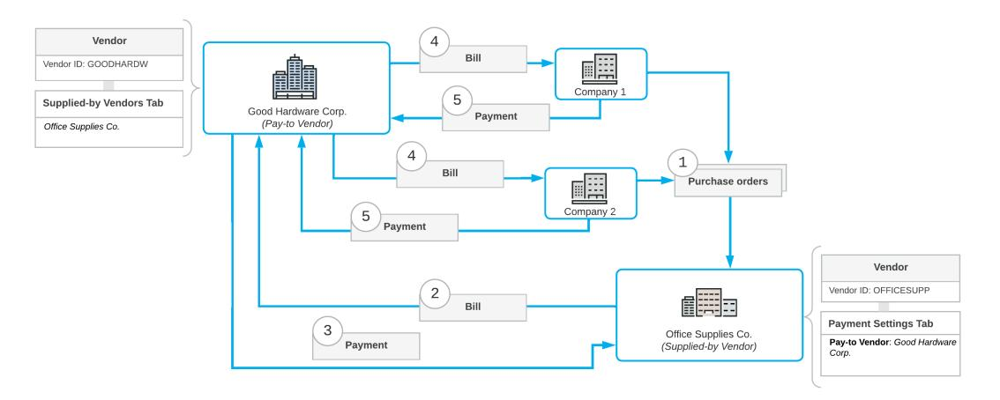

*Figure: Document flow with vendor relations*

# **Vendor Relations: Application in AP Documents**

The vendor relations functionality may affect the AP (Accounts Payable) bills and debit adjustments that can be created manually or automatically based on purchase orders or purchase receipts. This topic describes AP documents with vendor relations set up—that is, with a selected vendor that is a supplied-by vendor or a pay-to vendor.

This functionality is available only if the *Vendor Relations* feature is enabled on the *[Enable/Disable](https://help-2025r1.acumatica.com/Help?ScreenId=ShowWiki&pageid=c1555e43-1bc5-4f6f-ba9d-b323f94d8a6b) [Features](https://help-2025r1.acumatica.com/Help?ScreenId=ShowWiki&pageid=c1555e43-1bc5-4f6f-ba9d-b323f94d8a6b)* (CS100000) form.

# **AP Documents Based on Purchase Orders or Purchase Receipts**

If a user initiates the creation of an AP bill or debit adjustment from a purchase order or purchase receipt with a supplied-to vendor specified, the system inserts in the AP document the vendor and vendor location on the *[Bills](https://help-2025r1.acumatica.com/Help?ScreenId=ShowWiki&pageid=956b4e51-3078-4d2d-85b3-65c080d95234) [and Adjustments](https://help-2025r1.acumatica.com/Help?ScreenId=ShowWiki&pageid=956b4e51-3078-4d2d-85b3-65c080d95234)* (AP301000) form. It copies the vendor and vendor location specified in the **Pay-toVendor** and **Pay-toVendor Location** boxes, respectively on the *[Purchase Orders](https://help-2025r1.acumatica.com/Help?ScreenId=ShowWiki&pageid=5565686c-96c4-4bfa-a51d-9a2566baa808)* (PO301000) form or the *[Purchase Receipts](https://help-2025r1.acumatica.com/Help?ScreenId=ShowWiki&pageid=d9901c8d-486d-45ed-8088-ea3d8ee3af19)* (PO302000) form. For details, see *Vendor Relations in Purchase [Documents](https://help-2025r1.acumatica.com/Help?ScreenId=ShowWiki&pageid=0cd41c6a-289a-468f-b5ad-939a8ee49131)*.

# **AP Documents Created Manually**

If you create an AP document manually by using the *[Bills and Adjustments](https://help-2025r1.acumatica.com/Help?ScreenId=ShowWiki&pageid=956b4e51-3078-4d2d-85b3-65c080d95234)* (AP301000) form, the system populates the **Supplied-byVendor** and **Supplied-byVendor Location** boxes on the **Financial** tab (**Receipt Info** section), depending on whether vendor relations are set up for the selected vendor as follows:

- Vendor relations are not set up (that is, the selected vendor is neither a supplied-by vendor nor a pay-to vendor): The system populates the**Supplied-byVendor** and **Supplied-byVendor Location** boxes with the vendor selected in the Summary area and its location, and makes these boxes unavailable for editing.
- The selected vendor is a supplied-by vendor: The system populates the**Supplied-byVendor** and **SuppliedbyVendor Location** boxes with the vendor selected in the Summary area and its location, and makes these boxes unavailable for editing.
- The selected vendor is a pay-to vendor: The system inserts the current vendor in the**Supplied-byVendor** box and makes this box available for editing. You can override the value in this box with any supplied-by vendor account and change the**Supplied-byVendor Location** value, if needed.

If you select a pay-to vendor in the bill or adjustment, you can add to the AP document a purchase order or purchase receipt assigned to the supplied-by vendor (which you select in the**Supplied-byVendor** box) by using the **Add PO**, **Add PO Receipt**, and **Add PO Receipt Line** buttons on the table toolbar of the **Details** tab.

The list of documents varies depending on the selected supplied-by vendor and its location.

# **Discount Calculation in AP Documents with Vendor Relations Set Up**

For a bill or adjustment on the *[Bills and Adjustments](https://help-2025r1.acumatica.com/Help?ScreenId=ShowWiki&pageid=956b4e51-3078-4d2d-85b3-65c080d95234)* (AP301000) form, if the supplied-by vendor (specified in the **Supplied-byVendor** box of the **Financial** tab) differs from the vendor specified in the**Vendor** box of the Summary area, the system applies the discounts of the supplied-by vendor.

# **Tax Calculation in AP Documents with Vendor Relations Set Up**

For a bill or adjustment on the *[Bills and Adjustments](https://help-2025r1.acumatica.com/Help?ScreenId=ShowWiki&pageid=956b4e51-3078-4d2d-85b3-65c080d95234)* (AP301000) form with vendor relations set up, the system updates the**VendorTax Zone** box on the **Financial** tab with the tax zone of the vendor selected in the**SuppliedbyVendor** box on this tab. The system calculates the tax and taxable amounts in this AP document by using this tax zone.

# **Vendor Relations: Implementation Checklist**

The following sections provide details you can use to ensure that the system is configured properly for setting up and using vendor relations in AP documents, and to understand (and change, if needed) the settings that affect the processing workflow.

# **Implementation Checklist**

We recommend that before you initially set up vendor relations, you make sure that the needed features have been enabled, settings have been specified, and entities have been created, as summarized in the following checklist.

| Form                                      | Criteria to Check                                                                                                                                                                                                                                                                                                                                                                                                          |
|-------------------------------------------|----------------------------------------------------------------------------------------------------------------------------------------------------------------------------------------------------------------------------------------------------------------------------------------------------------------------------------------------------------------------------------------------------------------------------|
| Enable/Disable Features (CS100000)     | Make sure the minimum set of features has been enabled, as described in Company Without Branches: General Information, Company with Branch es that Do Not Require Balancing: General Information, and Company with Branches that Require Balancing: General Information. If you are going to use vendor relations in purchase orders, the Inventory and Order Management group of features must be enabled. |
| Purchase Orders Preferences (PO101000) | Make sure that all necessary settings related to purchase order manage ment have been specified, as described in Configuration of Order Manage ment: General Information.                                                                                                                                                                                                                                            |
| Vendors (AP30300)                         | Make sure that needed vendors have been defined, as described in Vendors: General Information.                                                                                                                                                                                                                                                                                                                          |
| Stock Items (IN202500)                    | Make sure that all stock items have been configured, as described in Stock Items: General Information.                                                                                                                                                                                                                                                                                                                  |

# **Other Settings That Affect the Workflow**

You can affect the workflow of purchases by specifying additional settings:

- To reduce input errors when users enter orders, set up the validation of order totals by selecting the **For Normal and Standard Orders** check box on the *[Purchase Orders Preferences](https://help-2025r1.acumatica.com/Help?ScreenId=ShowWiki&pageid=13d09c43-8696-4f92-ad9b-3d0209ee3d9b)* (PO101000) form. If this check box is selected, when a user creates a new purchase order on the *[Purchase Orders](https://help-2025r1.acumatica.com/Help?ScreenId=ShowWiki&pageid=5565686c-96c4-4bfa-a51d-9a2566baa808)* (PO301000) form, to take the order off hold, the user must enter the order total in the **ControlTotal** box aer verifying the order's details.
- To cause the system to automatically release accounts payable bills generated on release of purchase receipts, select the **Release AP Documents Automatically** check box on the *[Purchase Orders Preferences](https://help-2025r1.acumatica.com/Help?ScreenId=ShowWiki&pageid=13d09c43-8696-4f92-ad9b-3d0209ee3d9b)* form. For information on processing bills, see *[AP Bills: General Information](#page-69-3)*.
- To cause purchase receipts to be created with the *On Hold* status (so that users can verify them before processing them further), select the **Hold Receipts on Entry** check box on the *[Purchase Orders Preferences](https://help-2025r1.acumatica.com/Help?ScreenId=ShowWiki&pageid=13d09c43-8696-4f92-ad9b-3d0209ee3d9b)* form.
- To cause the system to automatically release inventory receipts generated on release of purchase receipts, select the **Release IN Documents Automatically** check box on the *[Purchase Orders Preferences](https://help-2025r1.acumatica.com/Help?ScreenId=ShowWiki&pageid=13d09c43-8696-4f92-ad9b-3d0209ee3d9b)* form.
- To cause the system to automatically post general ledger batches generated during the processing of purchase documents, select the **Automatically Post on Release** check box on the *[General Ledger](https://help-2025r1.acumatica.com/Help?ScreenId=ShowWiki&pageid=e4913d06-c511-4258-a0f9-f36c1b854e6b) [Preferences](https://help-2025r1.acumatica.com/Help?ScreenId=ShowWiki&pageid=e4913d06-c511-4258-a0f9-f36c1b854e6b)* (GL102000) form. For information on processing general ledger batches, see *GL [Transactions:](https://help-2025r1.acumatica.com/Help?ScreenId=ShowWiki&pageid=35393020-6269-466d-8a08-df558cd43367) [General Information](https://help-2025r1.acumatica.com/Help?ScreenId=ShowWiki&pageid=35393020-6269-466d-8a08-df558cd43367)*.

# **Validation of Configuration**

To make sure that all configuration has been performed correctly, we recommend that in your system, you process documents for pay-to vendors and supplied-by vendors by performing instructions similar to those described in *Vendor [Relations:](#page-45-1) Process Activity*.

# **Vendor Relations: Process Activity**

This activity will walk you through the process of setting up and using vendor relations in purchase documents.

This activity is based on the *U100* dataset. If you are using another dataset, or if any system settings have been changed in *U100*, these changes can affect the workflow of the activity and the results of the processing. To avoid any issues, restore the *U100* dataset to its initial state.

# **Story**

Suppose that SweetLife Fruits & Jams wants to buy fruit from a big vendor (All Fruits Mall). SweetLife pays this vendor, but the goods are supplied by a child company of this vendor (Glory Fruit Case). On 1/30/2025, SweetLife sent its purchase order to Glory Fruit Case. The Glory Fruit Case vendor issued a bill to SweetLife, and SweetLife paid this bill to All Fruits Mall even though it ordered fruit from Glory Fruit Case.

Acting as an accountant of SweetLife, you need to set up the vendor relations in the system, and create and process documents for both companies.

# **Configuration Overview**

In the *U100* dataset, the following tasks have been performed to support this activity:

• On the *[Enable/Disable Features](https://help-2025r1.acumatica.com/Help?ScreenId=ShowWiki&pageid=c1555e43-1bc5-4f6f-ba9d-b323f94d8a6b)* (CS100000) form, the following features have been enabled:

- *Standard Financials*, which provides the standard financial functionality
- *Multibranch Support*, which supports multiple branches in your instance of Acumatica ERP
- *Multicompany Support*, which supports multiple companies within one tenant
- *Inventory and Order Management* and *Inventory*, which supports the creation of purchase orders with stock items selected in the lines of these orders
- On the *[Accounts Payable Preferences](https://help-2025r1.acumatica.com/Help?ScreenId=ShowWiki&pageid=c3f9353e-95e6-448d-bb3f-e20643879ec7)* (AP101000) form, the **Hold Documents on Entry** check box has been selected in the **Data EntrySettings** section.
- On the *[Vendors](https://help-2025r1.acumatica.com/Help?ScreenId=ShowWiki&pageid=a9584be3-f2bd-4d67-80d4-8041d809df56)* (AP303000) form, the *ALLFRUITS (All Fruits Mall)* and *GLORYFRUIT ( Glory Fruit Case)* vendors have been configured.
- On the *[Stock Items](https://help-2025r1.acumatica.com/Help?ScreenId=ShowWiki&pageid=77786a70-1f1e-4d63-ad98-96f98e4fcb0e)* (IN202500) form, the *GRAPEFRUIT* stock item has been created and is available in the *WHOLESALE* warehouse.

# **Process Overview**

In this activity, you will enable the *Vendor Relations* feature on the *[Enable/Disable Features](https://help-2025r1.acumatica.com/Help?ScreenId=ShowWiki&pageid=c1555e43-1bc5-4f6f-ba9d-b323f94d8a6b)* (CS100000) form and set up the vendor relations on the *[Vendors](https://help-2025r1.acumatica.com/Help?ScreenId=ShowWiki&pageid=a9584be3-f2bd-4d67-80d4-8041d809df56)* (AP303000) form. On the *[Purchase Orders](https://help-2025r1.acumatica.com/Help?ScreenId=ShowWiki&pageid=5565686c-96c4-4bfa-a51d-9a2566baa808)* (PO301000) form, you will create an order for the supplied-by vendor. On the *[Purchase Receipts](https://help-2025r1.acumatica.com/Help?ScreenId=ShowWiki&pageid=d9901c8d-486d-45ed-8088-ea3d8ee3af19)* (PO302000) form, you will process a purchase receipt for the order and generate an AP bill. On the *[Bills and Adjustments](https://help-2025r1.acumatica.com/Help?ScreenId=ShowWiki&pageid=956b4e51-3078-4d2d-85b3-65c080d95234)* (AP301000) form, you will review the bill for the pay-to vendor and pay the bill on the *[Checks and Payments](https://help-2025r1.acumatica.com/Help?ScreenId=ShowWiki&pageid=81659f97-cb14-4a27-bc3e-0f67b3945613)* (AP302000) form.

# **System Preparation**

Before you begin performing the steps of this activity, do the following:

- 1. Launch the Acumatica ERP website with the *U100* dataset preloaded, and sign in as Anna Johnson by using the *johnson* username and the *123* password.
- 2. In the info area, in the upper-right corner of the top pane of the Acumatica ERP screen, make sure that the business date in your system is set to *1/30/2025*. If a different date is displayed, click the Business Date menu button and select *1/30/2025* on the calendar. For simplicity, in this activity, you will create and process all documents in the system on this business date.
- 3. On the Company and Branch Selection menu on the top pane of the Acumatica ERP screen, select the *SweetLife Head Office and Wholesale Center* branch.

# **Step 1: Enabling the Needed Feature**

To enable the *Vendor Relations* feature, do the following:

- 1. Open the *[Enable/Disable Features](https://help-2025r1.acumatica.com/Help?ScreenId=ShowWiki&pageid=c1555e43-1bc5-4f6f-ba9d-b323f94d8a6b)* (CS100000) form.
- 2. On the form toolbar, click **Modify**.
- 3. Select the**Vendor Relations** check box in the **Inventory and Order Management** group of features.
- 4. On the form toolbar, click **Enable** to enable the feature.

# **Step 2: Specifying a Pay-To Vendor for the Supplied-By Vendor**

To specify the pay-to vendor (All Fruits Mall) for the supplied-by vendor (Glory Fruit Case), do the following:

- 1. Open the *[Vendors](https://help-2025r1.acumatica.com/Help?ScreenId=ShowWiki&pageid=a9584be3-f2bd-4d67-80d4-8041d809df56)* (AP303000) form.
- 2. In the **Vendor ID** box, select *GLORYFRUIT* (the vendor that will be a supplied-by vendor).
- 3. On the **Payment** tab, in the **Pay-toVendor** box of the **Default PaymentSettings** section, select *ALLFRUITS*.

This is the vendor that the system will use by default in bills and debit adjustments when the vendor selected on the form is selected in purchase orders or purchase receipts.

4. On the form toolbar, click**Save** to save your changes.

# **Step 3: Reviewing the Pay-To Vendor of the Supplied-By Vendor**

To review the settings of the *ALLFRUITS* vendor (that is, the pay-to vendor) and make sure the supplied-by vendor is specified correctly, do the following:

1. While you are still on the *[Vendors](https://help-2025r1.acumatica.com/Help?ScreenId=ShowWiki&pageid=a9584be3-f2bd-4d67-80d4-8041d809df56)* (AP303000) form, in the**Vendor ID** box, select *ALLFRUITS*.

This is the vendor that has been specified in the **Pay-toVendor** box for the *GLORYFRUIT* vendor.

2. On the **Supplied-byVendors** tab (which appears for only a pay-to vendor), make sure the *GLORYFRUIT* vendor is listed in the table; it is listed because in its settings, you specified the *ALLFRUITS* vendor as their pay-to vendor.

# **Step 4: Creating a Purchase Order**

To create a purchase order for the *GLORYFRUIT* vendor, do the following:

- 1. On the *[Purchase Orders](https://help-2025r1.acumatica.com/Help?ScreenId=ShowWiki&pageid=5565686c-96c4-4bfa-a51d-9a2566baa808)* (PO301000) form, add a new record.
- 2. In the Summary area, specify the following settings:
  - **Type**: *Normal*
  - **Vendor**: *GLORYFRUIT*
  - **Date**: *1/30/2025* (inserted automatically)
  - **Promised On**: *1/30/2025* (inserted automatically)
  - **Description**: Purchase of grapefruit
- 3. On the **Details** tab, click **Add Row** on the table toolbar and specify the following settings in the added row:
  - **Branch**: *HEADOFFICE*
  - **Inventory ID**: *GRAPEFRUIT*
  - **Warehouse**: *WHOLESALE*
  - **Order Qty.**: 100
  - **Unit Cost**: 15
- 4. On the form toolbar, click**Save**.
- 5. Go to the**Vendor Info** tab.

Notice that the **Pay-toVendor** box contains *ALLFRUITS* as the pay-to vendor of *GLORYFRUIT*. It was inserted because you specified this setting in Step 2.

6. On the form toolbar, click **Remove Hold** and then click **Release** to release the purchase order.

#### **Step 5: Processing the Purchase Receipt**

To create a purchase receipt for the purchase order and generate an AP bill, do the following:

1. While you are still viewing the *Purchase of grapefruit* order on the *[Purchase Orders](https://help-2025r1.acumatica.com/Help?ScreenId=ShowWiki&pageid=5565686c-96c4-4bfa-a51d-9a2566baa808)* (PO301000) form, on the form toolbar, click **Enter PO Receipt**.

The system prepares the purchase receipt for the selected purchase order and opens it on the *[Purchase](https://help-2025r1.acumatica.com/Help?ScreenId=ShowWiki&pageid=d9901c8d-486d-45ed-8088-ea3d8ee3af19) [Receipts](https://help-2025r1.acumatica.com/Help?ScreenId=ShowWiki&pageid=d9901c8d-486d-45ed-8088-ea3d8ee3af19)* (PO302000) form.

- 2. On the form toolbar, click**Save**.
- 3. Review the settings of the prepared purchase receipt.

- 4. Select the **Create Bill** check box in the Summary area.
- 5. On the form toolbar, click **Release**. Wait for the system to complete the operation.
- 6. Go to the **Orders** tab and review the value in the **Pay-toVendor** column for the only row.

This column displays *ALLFRUITS* because the payment for the bill will be automatically generated for this vendor.

### **Step 6: Reviewing the AP Bill**

The system automatically generated an AP bill for the purchase order when you released the purchase receipt. To review this bill, do the following:

- 1. While you are still viewing the purchase receipt on the *[Purchase Receipts](https://help-2025r1.acumatica.com/Help?ScreenId=ShowWiki&pageid=d9901c8d-486d-45ed-8088-ea3d8ee3af19)* (PO302000) form, go to the **Billing** tab and click the link in the **Reference Nbr.** column.
- 2. On the *[Bills and Adjustments](https://help-2025r1.acumatica.com/Help?ScreenId=ShowWiki&pageid=956b4e51-3078-4d2d-85b3-65c080d95234)* (AP301000) form, which the system has opened, review the AP bill. Notice that the vendor specified in the**Vendor** box of the Summary area is *ALLFRUITS*.
- 3. Go to the **Financial** tab and review the information in the **Receipt Info** section.

The **Supplied-byVendor** box contains *GLORYFRUIT* because it is the vendor that received the purchase order and supplied the goods.

# **Step 7: Paying the AP Bill**

To pay the AP bill for the purchase order, do the following:

1. While you are still viewing the AP bill on the *[Bills and Adjustments](https://help-2025r1.acumatica.com/Help?ScreenId=ShowWiki&pageid=956b4e51-3078-4d2d-85b3-65c080d95234)* (AP301000) form, on the form toolbar, click **Pay**.

The system creates a payment and opens it on the *[Checks and Payments](https://help-2025r1.acumatica.com/Help?ScreenId=ShowWiki&pageid=81659f97-cb14-4a27-bc3e-0f67b3945613)* (AP302000) form.

- 2. On the **Documents to Apply** tab, review the bill's settings. Notice that the**Supplied-byVendor** column shows *GLORYFRUIT* even though the vendor selected in the**Vendor** box is *ALLFRUITS*.
- 3. On the form toolbar, click **Remove Hold**.
- 4. On the form toolbar, click **Print/Process** to print the check.
- 5. On the *[Process Payments / Print Checks](https://help-2025r1.acumatica.com/Help?ScreenId=ShowWiki&pageid=e632860a-8905-424a-8e27-ad66cf9f64c7)* (AP505000) form, which is opened, click **Process**.

The system opens a report with the printed version of the check.

6. Close the page with the printed version of the check; on the *[Release Payments](https://help-2025r1.acumatica.com/Help?ScreenId=ShowWiki&pageid=0a981976-131b-4150-81d0-19b54a46e510)* (AP505200) form, which is opened, click **Process**.

The system releases the payment to the vendor.

# **Vendor Relations: Generated Transactions**

As you process a purchase, you create and process a purchase order, a purchase receipt, an inventory receipt, an AP bill, and a payment for this bill. To update the balance of the pay-to vendor when vendor relations are set up, the system generates the GL transactions described in the following sections.

# **Transaction Generated on Release of an Inventory Receipt**

When you create and release an inventory receipt generated from a purchase receipt with vendor relations set up, the system generates the following general ledger transaction.

| Account                               | Source of Account                                                                                                                | Debit  | Credit |
|---------------------------------------|----------------------------------------------------------------------------------------------------------------------------------|--------|--------|
| Inventory account                     | The account specified for the item in the Inventory Ac count box on the GL Accounts tab of the Stock Items (IN202500) form | Amount | 0.00   |
| Inventory Purchase Accrual account | The account specified for the item in the PO Accrual Account box on the GL Accounts tab of the Stock Items form            | 0.00   | Amount |

You can view the reference number of the GL batch generated for a particular inventory receipt in the **Batch Nbr.** box on the **Financial** tab of the *[Receipts](https://help-2025r1.acumatica.com/Help?ScreenId=ShowWiki&pageid=d6ecad5b-155f-44bf-baba-9ed006d298b5)* (IN301000) form. You can click the link in this box to view the details of the batch on the *Journal [Transactions](https://help-2025r1.acumatica.com/Help?ScreenId=ShowWiki&pageid=dda046bc-5946-407f-88f7-1c0c966fbe72)* (GL301000) form.

# **Transaction Generated on Release of an AP Bill**

On release of an AP bill prepared for the purchase receipt with vendor relations, the system generates the following general ledger transaction.

| Account                               | Source of Account                                                                                                                | Debit  | Credit |
|---------------------------------------|----------------------------------------------------------------------------------------------------------------------------------|--------|--------|
| Accounts Payable ac count          | The account specified for the pay-to vendor in the AP Account box on the GL Accounts tab of the Vendors (AP303000) form    | 0.00   | Amount |
| Inventory Purchase Accrual account | The account specified for the item in the PO Accrual Account box on the GL Accounts tab of the Stock Items (IN202500) form | Amount | 0.00   |

You can view the reference number of the GL batch generated for a particular AP bill in the **Batch Nbr.** box on the **Financial** tab of the *[Bills and Adjustments](https://help-2025r1.acumatica.com/Help?ScreenId=ShowWiki&pageid=956b4e51-3078-4d2d-85b3-65c080d95234)* (AP301000) form. You can click the link in this box to view the details of the batch on the *Journal [Transactions](https://help-2025r1.acumatica.com/Help?ScreenId=ShowWiki&pageid=dda046bc-5946-407f-88f7-1c0c966fbe72)* (GL301000) form.

# **Transaction Generated on Release of a Payment**

On release of a payment for the AP bill with vendor relations set up, the system generates the following general ledger transaction.

| Account                      | Source of Account                                                                                                                                                                           | Debit  | Credit |
|------------------------------|---------------------------------------------------------------------------------------------------------------------------------------------------------------------------------------------|--------|--------|
| Checking account             | The GL account specified in the Account box on the Cash Accounts (CA202000) form for the cash account that is selected for the document on the Checks and Payments (AP302000) form | 0.00   | Amount |
| Accounts Payable ac count | The account specified for the pay-to vendor in the AP Account box on the GL Accounts tab of the Vendors (AP303000) form                                                               | Amount | 0.00   |

You can view the reference number of the GL batch generated for a particular payment in the **Batch Nbr.** box on the **Financial** tab of the *[Checks and Payments](https://help-2025r1.acumatica.com/Help?ScreenId=ShowWiki&pageid=81659f97-cb14-4a27-bc3e-0f67b3945613)* form. You can click the link in this box to view the details of the batch on the *Journal [Transactions](https://help-2025r1.acumatica.com/Help?ScreenId=ShowWiki&pageid=dda046bc-5946-407f-88f7-1c0c966fbe72)* (GL301000) form.

# **Rounding of AP Document Amounts**

Your company may need to round the total amounts of AP documents to comply with external or internal requirements. In Acumatica ERP, you can set up this rounding to fit the specific rules the company uses.

In this chapter, you will read about the steps you need to perform to set up rounding and details about how the rounding rules are applied.

# **Rounding of AP Document Amounts: General Information**

Your company policy or local regulations may require the total amounts in AP documents to be rounded. To set up amount rounding in AP documents, you first enable the *Invoice Rounding* feature on the *[Enable/Disable Features](https://help-2025r1.acumatica.com/Help?ScreenId=ShowWiki&pageid=c1555e43-1bc5-4f6f-ba9d-b323f94d8a6b)* (CS100000) form. You then specify the settings the system will use to round these totals.

The line total, tax total, and other subtotals of a document are not rounded.

# **Learning Objectives**

In this chapter, you will learn how to do the following:

- Set up the of rounding the amounts of AP documents
- Process an AP bill with a rounded amount and review the generated GL transaction

# **Applicable Scenarios**

You set up the rounding of AP document amounts if your company's policy or external regulations require that you round the amounts in invoices and bills.

# **Rounding Setup**

In Acumatica ERP, the system rounds AP document totals based on the rounding rule, rounding precision, and rounding limit. You use the following forms to specify the applicable settings:

- *[Accounts Payable Preferences](https://help-2025r1.acumatica.com/Help?ScreenId=ShowWiki&pageid=c3f9353e-95e6-448d-bb3f-e20643879ec7)* (AP101000): You use this form to specify the rounding rule and the precision that apply to AP documents. You can specify a separate rule and precision for each of the following types: *Bill*, *Credit Adj.*, *Debit Adj.*, *Prepayment*, and *Cash Purchase*.
- *[Currencies](https://help-2025r1.acumatica.com/Help?ScreenId=ShowWiki&pageid=533be28d-b9e1-4d77-9b62-b06bb90a8b3b)* (CM202000): You use this form to specify the system-wide rounding limit for the base currency. This limit is the maximum rounding difference between the rounded amount and the original document amount.

The system applies rounding rules to documents in all currencies (base and foreign). You specify the rounding limit for only the base currency, but it is applied to documents in foreign currencies as well. The system always recalculates the amounts of a document in a foreign currency to amounts in the base currency of your system, including the rounding difference. The system compares the recalculated rounding difference to the base currency with the rounding limit and issues a warning if the limit is exceeded.

The rounding difference should be recorded to specific rounding gain and loss accounts. Depending on the policies established in your company, you can use a single gain account and a single loss account (and the corresponding subaccounts, if applicable) for all currencies, or you can use different gain and loss accounts (and the corresponding subaccounts) for each currency used by your company.

You use the *[Currencies](https://help-2025r1.acumatica.com/Help?ScreenId=ShowWiki&pageid=533be28d-b9e1-4d77-9b62-b06bb90a8b3b)* form to specify the following:

- The rounding gain and loss accounts (and subaccounts, if they are used in your system) for the base currency
- The gain and loss accounts and subaccounts for each of the foreign currencies used by your vendors

# **Rounding Rule**

To set up rounding for documents, you select the rounding rule and precision in the **Data EntrySettings** section on the **General** tab of the *[Accounts Payable Preferences](https://help-2025r1.acumatica.com/Help?ScreenId=ShowWiki&pageid=c3f9353e-95e6-448d-bb3f-e20643879ec7)* (AP101000) form. The following rounding rules are available in the **Rounding Rule for Bills** box:

- *Nearest*: To round each total amount to the nearest multiple of the smallest unit.
- *Up*: To round each total amount up to the next multiple of the smallest unit.
- *Down*: To round each total down to the previous multiple of the smallest unit.
- *Use the Currency Precision*: To temporarily not use rounding if it is activated in your system. If this option is selected, for each document, the system will round the document total according to the precision specified for the document currency. The precision of the base currency is specified on the *[Branches](https://help-2025r1.acumatica.com/Help?ScreenId=ShowWiki&pageid=b97ab72d-4ab4-4f02-b69c-f7f61b316ced)* (CS201000) form, and the precision of foreign currencies is defined on the *[Currencies](https://help-2025r1.acumatica.com/Help?ScreenId=ShowWiki&pageid=533be28d-b9e1-4d77-9b62-b06bb90a8b3b)* (CM202000) form.

In the **Rounding Precision** box of the same section of the form, you select the rounding precision—that is, the smallest unit to be used for document amounts. The following options are available:

- *0.1*: To round the totals to multiples of 0.10
- *0.5*: To round the totals to multiples of 0.5
- *1.0*: To round the totals to integers
- *10.0*: To round the totals to multiples of 10
- *100.0*: To round the totals to multiples of 100

The following table illustrates the results of rounding with different rules and precisions applied to the sample value of \$1,734.57.

| Rounding Rule/ Precision | 0.1        | .05        | 1.0     | 10      | 100     |
|-----------------------------|------------|------------|---------|---------|---------|
| Nearest                     | \$1,734.60 | \$1,734.50 | \$1,735 | \$1,740 | \$1,700 |
| Up                          | \$1,734.60 | \$1,735.00 | \$1,735 | \$1,740 | \$1,800 |
| Down                        | \$1,734.50 | \$1,734.50 | \$1,734 | \$1,730 | \$1,700 |

The system will use the same rounding precision for all currencies. You can override the rounding settings specified on the *[Accounts Payable Preferences](https://help-2025r1.acumatica.com/Help?ScreenId=ShowWiki&pageid=c3f9353e-95e6-448d-bb3f-e20643879ec7)* form for a particular currency by using the *[Currencies](https://help-2025r1.acumatica.com/Help?ScreenId=ShowWiki&pageid=533be28d-b9e1-4d77-9b62-b06bb90a8b3b)* form.

To do this, on the **RoundingSettings** tab of this form, you clear the **Use AP PreferencesSettings** check box and specify the rounding precision.

# **Rounding of AP Document Amounts: Implementation Checklist**

The following sections provide details that you can use to ensure that the system is configured properly for the rounding of amounts in AP documents, and to understand (and change, if needed) the settings that affect the processing workflow.

# **Implementation Checklist**

We recommend that before you initially set up the functionality of document amount rounding, you make sure that the needed features have been enabled, settings have been specified, and entities have been created, as summarized in the following checklist.

| Form                                  | Criteria to Check                                                                                                                                                                                                                                                                 |
|---------------------------------------|-----------------------------------------------------------------------------------------------------------------------------------------------------------------------------------------------------------------------------------------------------------------------------------|
| Enable/Disable Features (CS100000) | Make sure the minimum set of features has been enabled, as described in Company Without Branches: General Information, Company with Branch es that Do Not Require Balancing: General Information, and Company with Branches that Require Balancing: General Information. |
| Chart of Accounts (GL202500)          | The accounts (or one account) exist that will be specified for the base cur rency in the Rounding Gain Account and Rounding Loss Account boxes on the GL Accounts tab of the Currencies (CM202000) form.                                                                    |
| Vendors (AP303000)                    | Make sure that needed vendor has been created, as described in Vendors: General Information.                                                                                                                                                                                   |

# **Other Settings That Affect the Workflow**

You can affect the workflow of purchases by specifying additional settings:

- The following general ledger settings should be specified on the **PostingSettings** tab of the *[General Ledger](https://help-2025r1.acumatica.com/Help?ScreenId=ShowWiki&pageid=e4913d06-c511-4258-a0f9-f36c1b854e6b) [Preferences](https://help-2025r1.acumatica.com/Help?ScreenId=ShowWiki&pageid=e4913d06-c511-4258-a0f9-f36c1b854e6b)* (GL102000) form:
  - The **Automatically Post on Release** check box is selected. This setting causes GL batches to be immediately posted aer they are released.
  - The **Generate Consolidated Batches** check box is cleared to cause every AP transaction you enter to be posted as an individual batch to the general ledger. (When this check box is selected, the system consolidates into a single batch all transactions in the same currency posted to the same period for all documents being released.)
- The following accounts payable settings should be specified on the **General** tab of the *[Accounts Payable](https://help-2025r1.acumatica.com/Help?ScreenId=ShowWiki&pageid=c3f9353e-95e6-448d-bb3f-e20643879ec7) [Preferences](https://help-2025r1.acumatica.com/Help?ScreenId=ShowWiki&pageid=c3f9353e-95e6-448d-bb3f-e20643879ec7)* (AP101000) form:
  - The **Hold Documents on Entry** check box is selected in the **Data EntrySettings** section. This setting gives the created AP bills the *On Hold* status.
  - The **RequireVendor Reference** check box is cleared in the **Data EntrySettings** section. This setting means that you do not have to enter a vendor reference number in the**Vendor Ref.** box when creating an AP bill on the *[Bills and Adjustments](https://help-2025r1.acumatica.com/Help?ScreenId=ShowWiki&pageid=956b4e51-3078-4d2d-85b3-65c080d95234)* (AP301000) form.
  - Make sure that the **Automatically Post on Release** check box is selected in the **PostingSettings** section. This setting indicates that AP bills will be automatically posted to the general ledger once they are released.

# **Validation of Configuration**

To make sure that all configuration has been performed correctly, we recommend that in your system, you process AP documents with amount rounding by performing instructions similar to those described in *[Rounding of AP](#page-53-1) [Document Amounts: Process Activity](#page-53-1)*.

# **Known Process Limitations**

If the *Retainage Support* or *Payment Application by Line* feature is enabled (or both features are enabled) on the *[Enable/Disable Features](https://help-2025r1.acumatica.com/Help?ScreenId=ShowWiki&pageid=c1555e43-1bc5-4f6f-ba9d-b323f94d8a6b)* (CS100000) form, the functionality of the *Invoice Rounding* feature is limited: Amounts in documents with retainage and documents paid by line cannot be rounded, while amounts in documents without retainage and not paid by line will be rounded.

# **Rounding of AP Document Amounts: Process Activity**

The following activity will walk you through the process of setting up and using the rounding of document amounts in AP documents.

This activity is based on the *U100* dataset. If you are using another dataset, or if any system settings have been changed in *U100*, these changes can affect the workflow of the activity and the results of the processing. To avoid any issues, restore the *U100* dataset to its initial state.

# **Story**

Suppose that the management of SweetLife Fruits & Jams has decided to change the company's policy in settlements with vendors and start rounding the amounts of AP documents. Total document amounts should be rounded up to the next multiple of the smallest unit. The rounding precision should be *0.50*.

Acting as an accountant of SweetLife Fruits & Jams, you need to enable the *Invoice Rounding* feature, set up the functionality, and test how it works by creating and releasing an AP bill and reviewing the generated GL transaction.

# **Configuration Overview**

In the *U100* dataset, the following tasks have been performed to support this activity:

- On the *[Enable/Disable Features](https://help-2025r1.acumatica.com/Help?ScreenId=ShowWiki&pageid=c1555e43-1bc5-4f6f-ba9d-b323f94d8a6b)* (CS100000) form, the following features have been enabled:
  - *Standard Financials*, which provides the standard financial functionality
  - *Multibranch Support*, which supports multiple branches in your instance of Acumatica ERP
  - *Multicompany Support*, which supports multiple companies within one tenant
- On the *[Accounts Payable Preferences](https://help-2025r1.acumatica.com/Help?ScreenId=ShowWiki&pageid=c3f9353e-95e6-448d-bb3f-e20643879ec7)* (AP101000) form, the **Hold Documents on Entry** check box has been selected in the **Data EntrySettings** section.
- On the *[Chart of Accounts](https://help-2025r1.acumatica.com/Help?ScreenId=ShowWiki&pageid=85557f41-a4af-47a8-b198-2a01461ce9c3)* (GL202500) form, the *83100 (Rounding Gain/Loss)* account has been created.
- On the *[Vendors](https://help-2025r1.acumatica.com/Help?ScreenId=ShowWiki&pageid=a9584be3-f2bd-4d67-80d4-8041d809df56)* (AP303000) form, the *ALLFRUITS (All Fruits Mall)* vendor has been created.

# **Process Overview**

In this activity, you will enable the *Invoice Rounding* feature on the *[Enable/Disable Features](https://help-2025r1.acumatica.com/Help?ScreenId=ShowWiki&pageid=c1555e43-1bc5-4f6f-ba9d-b323f94d8a6b)* (CS100000) form and set up the rounding functionality on the *[Accounts Payable Preferences](https://help-2025r1.acumatica.com/Help?ScreenId=ShowWiki&pageid=c3f9353e-95e6-448d-bb3f-e20643879ec7)* (AP101000) and *[Currencies](https://help-2025r1.acumatica.com/Help?ScreenId=ShowWiki&pageid=533be28d-b9e1-4d77-9b62-b06bb90a8b3b)* (CM202000) forms. On the *[Bills and Adjustments](https://help-2025r1.acumatica.com/Help?ScreenId=ShowWiki&pageid=956b4e51-3078-4d2d-85b3-65c080d95234)* (AP301000) form, you will create and release a bill in which the system will round the total amount. Finally, on the *Journal [Transactions](https://help-2025r1.acumatica.com/Help?ScreenId=ShowWiki&pageid=dda046bc-5946-407f-88f7-1c0c966fbe72)* (GL301000) form, you will review the GL transaction generated on release of the bill.

# **System Preparation**

Before you begin performing the steps of this activity, do the following:

- 1. Launch the Acumatica ERP website with the *U100* dataset preloaded, and sign in as Anna Johnson by using the *johnson* username and the *123* password.
- 2. In the info area, in the upper-right corner of the top pane of the Acumatica ERP screen, make sure that the business date in your system is set to *1/30/2025*. If a different date is displayed, click the Business Date menu button and select *1/30/2025* on the calendar. For simplicity, in this activity, you will create and process all documents in the system on this business date.
- 3. On the Company and Branch Selection menu on the top pane of the Acumatica ERP screen, select the *SweetLife Head Office and Wholesale Center* branch.

# **Step 1: Enabling the Needed Feature**

To enable the *Invoice Rounding* feature, do the following:

- 1. Open the *[Enable/Disable Features](https://help-2025r1.acumatica.com/Help?ScreenId=ShowWiki&pageid=c1555e43-1bc5-4f6f-ba9d-b323f94d8a6b)* (CS100000) form.
- 2. On the form toolbar, click **Modify**.
- 3. Select the **Invoice Rounding** check box in the**Standard Financials** group of features.
- 4. On the form toolbar, click **Enable** to enable the feature.

# **Step 2: Updating the Accounts Payable Preferences**

To specify the rounding rules and precision for AP documents, do the following:

- 1. Open the *[Accounts Payable Preferences](https://help-2025r1.acumatica.com/Help?ScreenId=ShowWiki&pageid=c3f9353e-95e6-448d-bb3f-e20643879ec7)* (AP101000) form.
- 2. On the **General** tab (**Data EntrySettings** section), specify the following settings:
  - **Rounding Rule for Bills**: *Up*
  - **Rounding Precision**: *0.50*
- 3. On the form toolbar, click**Save** to save your changes.

# **Step 3: Specifying the Rounding Gain and Loss Accounts**

To specify the rounding gain account and rounding loss account for the base currency (in US dollars), do the following:

1. On the *[Currencies](https://help-2025r1.acumatica.com/Help?ScreenId=ShowWiki&pageid=533be28d-b9e1-4d77-9b62-b06bb90a8b3b)* (CM202000) form, open the *USD* currency.

Notice that the **Active** check box for this currency is selected and unavailable, which means that this is the base currency.

- 2. On the **GL Accounts** tab, specify the following settings:
  - **Rounding Gain Account**: *83100 - Rounding Gain/Loss*
  - **Rounding Loss Account**: *83100 - Rounding Gain/Loss*
- 3. On the form toolbar, click**Save** to save your changes.

# **Step 4: Creating an AP Bill with Amount Rounding**

To create and release an AP bill in which amounts will be rounded, do the following:

- 1. On the *[Bills and Adjustments](https://help-2025r1.acumatica.com/Help?ScreenId=ShowWiki&pageid=956b4e51-3078-4d2d-85b3-65c080d95234)* (AP301000) form, create a new record.
- 2. In the Summary area, specify the following settings:
  - **Type**: *Bill*
  - **Date**: *1/30/2025* (inserted automatically)

- **Vendor**: *ALLFRUITS*
- **Description**: Purchase of services
- 3. On the **Details** tab, click **Add Row** and specify the following settings in the added row:
  - **Branch**: *HEADOFFICE*
  - **Ext. Cost**: 435.79
- 4. On the form toolbar click**Save** to save your changes.

In the Summary area, notice that the **DetailTotal** of the document is the same as in the document line (*435.79*). The **Balance** box shows a rounded amount (*436.00*) and the **Rounding Diff.** box shows the rounding gain of *0.21*.

- 5. On the form toolbar, click **Remove Hold** and then click **Release** to release the document.
- 6. On the **Financial** tab, click the link in the **Batch Nbr.** box and review the generated GL transaction on the *Journal [Transactions](https://help-2025r1.acumatica.com/Help?ScreenId=ShowWiki&pageid=dda046bc-5946-407f-88f7-1c0c966fbe72)* (GL301000) form.

The *20000 (Accounts Payable)* account has been credited with \$436 (the total amount of the bill), the *81000 (Other Expenses)* account has been debited in \$435.79 (the amount of the document line), and the *83100 (Rounding Gain/Loss)* account has been debited with \$0.21 (the rounding difference).

# **Rounding of AP Document Amounts: Generated Transactions**

As you create and release AP documents with rounded amounts, the system generates the GL transactions described in the following sections.

# **Transaction Generated for an AP Bill and Credit Adjustment**

When you create and release an AP bill or credit adjustment, the system generates the following general ledger transaction.

| Account                       | Source of Account                                                                                                                  | Debit                                                      | Credit                       |
|-------------------------------|------------------------------------------------------------------------------------------------------------------------------------|------------------------------------------------------------|------------------------------|
| Accounts Payable ac count  | The account specified for the vendor in the AP Account box on the GL Accounts tab of the Vendors (AP303000) form             | 0.00                                                       | Document amount (rounded) |
| Expense account               | The account specified for the document in the Account column on the Details tab of the Bills and Adjustments (AP301000) form | The sum of the document line amounts (unround ed) | 0.00                         |
| Rounding Gain/Loss account | One of the accounts specified for the base currency on the GL Accounts tab of the Currencies (CM202000) form                 | Rounding loss amount                                    | Rounding gain amount      |

On the **Financial** tab of the *[Bills and Adjustments](https://help-2025r1.acumatica.com/Help?ScreenId=ShowWiki&pageid=956b4e51-3078-4d2d-85b3-65c080d95234)* form, the **Batch Nbr.** box shows the reference number of the GL batch. You can click this link to view the GL batch on the *Journal [Transactions](https://help-2025r1.acumatica.com/Help?ScreenId=ShowWiki&pageid=dda046bc-5946-407f-88f7-1c0c966fbe72)* (GL301000) form.

# **Transaction Generated for a Debit Adjustment**

When you create and release a debit adjustment, the system generates the following general ledger transaction.

| Account                       | Source of Account                                                                                                                  | Debit                        | Credit                                                     |
|-------------------------------|------------------------------------------------------------------------------------------------------------------------------------|------------------------------|------------------------------------------------------------|
| Accounts Payable ac count  | The account specified for the vendor in the AP Account box on the GL Accounts tab of the Vendors (AP303000) form             | Document amount (rounded) | 0.00                                                       |
| Expense account               | The account specified for the document in the Account column on the Details tab of the Bills and Adjustments (AP301000) form | 0.00                         | The sum of the document line amounts (unround ed) |
| Rounding Gain/Loss account | One of the accounts specified for the base currency on the GL Accounts tab of the Currencies (CM202000) form                 | Rounding loss amount      | Rounding gain amount                                    |

On the **Financial** tab of the *[Bills and Adjustments](https://help-2025r1.acumatica.com/Help?ScreenId=ShowWiki&pageid=956b4e51-3078-4d2d-85b3-65c080d95234)* form, the **Batch Nbr.** box shows the reference number of the GL batch. You can click this link to view the GL batch on the *Journal [Transactions](https://help-2025r1.acumatica.com/Help?ScreenId=ShowWiki&pageid=dda046bc-5946-407f-88f7-1c0c966fbe72)* (GL301000) form.

# **Transaction Generated for a Cash Purchase**

When you create and release a cash purchase, the system generates the following general ledger transaction.

| Account                       | Source of Account                                                                                                                                                           | Debit                                                      | Credit                       |
|-------------------------------|-----------------------------------------------------------------------------------------------------------------------------------------------------------------------------|------------------------------------------------------------|------------------------------|
| Expense account               | The account specified for the document in the Account column on the Details tab of the Cash Purchases (AP304000) form                                                 | The sum of the document line amounts (unround ed) | 0.00                         |
| Rounding Gain/Loss account | One of the accounts specified for the base currency on the GL Accounts tab of the Currencies (CM202000) form                                                          | Rounding loss amount                                    | Rounding gain amount      |
| Checking account              | The GL account specified in the Account box on the Cash Accounts (CA202000) form for the cash account that is selected for the document on the Cash Purchases form | 0.00                                                       | Document amount (rounded) |

On the **Financial** tab of the *[Cash Purchases](https://help-2025r1.acumatica.com/Help?ScreenId=ShowWiki&pageid=346e1395-7d30-4c25-b28b-7bcd824dcffd)* form, the **Batch Nbr.** box shows the reference number of the GL batch. You can click this link to view the GL batch on the *Journal [Transactions](https://help-2025r1.acumatica.com/Help?ScreenId=ShowWiki&pageid=dda046bc-5946-407f-88f7-1c0c966fbe72)* (GL301000) form.

# **Creating Recurring AP Documents**

Some accounts payable documents repeat regularly, such as monthly rent bills or quarterly or annual insurance bills. That is, at regular intervals, documents with the same amount and most of the same settings need to be entered. To automate the process of adding these recurring documents to Acumatica ERP, you can create schedules for them.

In this chapter, you will read about the steps you need to perform to schedule document generation, to run a schedule, and to process the generated documents.

# **Recurring AP Documents: General Information**

In Acumatica ERP, you can create schedules to generate the following types of accounts payable documents on the *[Bills and Adjustments](https://help-2025r1.acumatica.com/Help?ScreenId=ShowWiki&pageid=956b4e51-3078-4d2d-85b3-65c080d95234)* (AP301000) form: *Bill*, *Credit Adjustment*, *Debit Adjustment*, and *Prepayment*.

Only AP documents originating in the accounts payable subledger can be added to the schedule.

# **Learning Objectives**

In this chapter, you will learn how to do the following:

- Schedule the generation of AP documents
- Run the schedule and process the generated documents

# **Applicable Scenarios**

You create schedules for AP documents if these documents are recurring—that is, if they repeat regularly and have the same amounts and settings.

# **Scheduling of AP Document Generation**

You can automate the process of creating the recurring documents by doing either of the following:

- Adding a particular document to an existing schedule on the *[Bills and Adjustments](https://help-2025r1.acumatica.com/Help?ScreenId=ShowWiki&pageid=956b4e51-3078-4d2d-85b3-65c080d95234)* (AP301000) form. On this form, open the document to be scheduled and click **Add toSchedule** on the form toolbar. The system opens the *Recurring [Transactions](https://help-2025r1.acumatica.com/Help?ScreenId=ShowWiki&pageid=9c56c715-ddc5-4d3b-aaa1-1ac293648482)* (AP203500) form, where you can assign the document to a schedule.
- Creating a specific schedule and assigning one document or multiple documents to that schedule on the *Recurring [Transactions](https://help-2025r1.acumatica.com/Help?ScreenId=ShowWiki&pageid=9c56c715-ddc5-4d3b-aaa1-1ac293648482)* form.

Only documents with the *Balanced* status can be scheduled.

A schedule defines how many times and how oen specific documents should be generated. To indicate how many times a schedule can be executed, on the *Recurring [Transactions](https://help-2025r1.acumatica.com/Help?ScreenId=ShowWiki&pageid=9c56c715-ddc5-4d3b-aaa1-1ac293648482)* form, you can do one of the following:

- Permit unlimited schedule executions by selecting the **No Limit** check box
- Specify a fixed number of times the schedule should be repeated by specifying a required number in the **Execution Limit (Times)** box

You also define the frequency of the schedule executions by selecting one of the following option buttons on the form and specifying the number of units of time (*x* in the descriptions below):

• **Daily**: The documents should be generated daily or every *x* days.

- **Weekly**: The documents should be generated once a week or once every *x* weeks.
- **Monthly**: The documents should be generated once per month or once every *x* months.
- **By Financial Period**: The documents should be generated once per financial period or once per *x* financial periods.

Once a document is assigned to a schedule, its status changes to *Scheduled* and it becomes the *template document* for the schedule. The system uses this document when it generates additional documents for the schedule.

If you want to use a closed document as a template, you need to copy and paste its details to a new document; then save this document with the *Balanced* status but do not release it.

# **Attachment of Relevant Documents to Schedules**

To make the tracking of documents easier for users and to facilitate auditing, you can attach to each schedule the scanned documents or electronic versions of the documents that are the basis for the schedule you have created. To attach a file to the schedule, on the *Recurring [Transactions](https://help-2025r1.acumatica.com/Help?ScreenId=ShowWiki&pageid=9c56c715-ddc5-4d3b-aaa1-1ac293648482)* (AP203500) form, you perform the following steps:

- 1. In the **Schedule ID** box, you select the schedule by its ID.
- 2. On the form title bar, you click **Files**. This opens the **Files** dialog box.
- 3. In the dialog box, you click **Add File** on the table title bar. This brings up the **Upload File** dialog box.
- 4. In the **Upload File** dialog box, you click **Browse** to locate the file, and then click **Upload** to import the file and close the dialog box.

If multiple unrelated documents are assigned to the same schedule, on the **Document List** tab of the form, for each document in the table, you can click the staple (at the beginning of the row) to attach a file or multiple files explaining why this document is generated periodically.

# **Running of a Schedule**

To generate AP documents in accordance with the schedule you have created, you run the schedule periodically by using the *Generate Recurring [Transactions](https://help-2025r1.acumatica.com/Help?ScreenId=ShowWiki&pageid=cc1d25e8-c435-44ef-ab7a-1522389f9690)* (AP504000) form.

When you run a schedule, the system uses the original document as a template to generate similar documents. The documents generated by the schedule differ from the template document as follows:

- Date: The date of each document is determined by the schedule you have configured.
- Reference number: The system generates a new reference number for each document in accordance with the numbering sequence specified on the *[Accounts Payable Preferences](https://help-2025r1.acumatica.com/Help?ScreenId=ShowWiki&pageid=c3f9353e-95e6-448d-bb3f-e20643879ec7)* (AP101000) form.
- Tax rate: If any taxes are applied to a template document, the system calculates the tax and taxable amounts in each generated document by using the tax rates effective on the date of the document's creation. Thus, in different documents generated based on the same schedule, the tax amounts can differ. You can find the tax rate used by the system in each generated document on the**Taxes** tab of the *[Bills and](https://help-2025r1.acumatica.com/Help?ScreenId=ShowWiki&pageid=956b4e51-3078-4d2d-85b3-65c080d95234) [Adjustments](https://help-2025r1.acumatica.com/Help?ScreenId=ShowWiki&pageid=956b4e51-3078-4d2d-85b3-65c080d95234)* (AP301000) form.
- Currency rate: If the currency of a document differs from the base currency in the system, the system uses for conversion the currency exchange rate that is effective on the date of the document's creation.

No matter how many times you run the schedule, documents will be generated only as required by the schedule. When you run the schedule, the system determines whether it should generate documents based on the current date, the schedule's start and expiration dates, the schedule type, and the date when the documents were last generated. If any needed documents have been generated, the system updates the **Last Executed On** date on the *Recurring [Transactions](https://help-2025r1.acumatica.com/Help?ScreenId=ShowWiki&pageid=9c56c715-ddc5-4d3b-aaa1-1ac293648482)* form. Thus, no documents will be generated ahead of time, but you can generate missing documents for previous due dates by running the schedule once for each missed due date.

For example, imagine that you have scheduled a document to be generated weekly on each Tuesday for an unlimited number of times. If you run the schedule every week on Wednesday, one document will be generated each time. If you run this schedule every day, the documents will be created only on Tuesdays. If you want to run this schedule only on the last Wednesday of each month, you must run it four times to generate one document each time.

The documents generated by the schedule have the *Balanced* status; they can be released or posted, as any other documents can. Also, you can change the documents' amounts, if needed. To view and edit a particular document, use the *[Bills and Adjustments](https://help-2025r1.acumatica.com/Help?ScreenId=ShowWiki&pageid=956b4e51-3078-4d2d-85b3-65c080d95234)* form. If you make any corrections, the document can be released only if its status remains *Balanced*. You release the document or approve it for payment as you do for any other document.

# **Editing of a Template Document**

You can edit the template document (that is, the document with the *Scheduled* status) any time you need to. On the next schedule run, the system will use the modified version of the document for generating documents.

Also, you can remove a scheduled template document from the table on the **Document List** tab of the *[Recurring](https://help-2025r1.acumatica.com/Help?ScreenId=ShowWiki&pageid=9c56c715-ddc5-4d3b-aaa1-1ac293648482) [Transactions](https://help-2025r1.acumatica.com/Help?ScreenId=ShowWiki&pageid=9c56c715-ddc5-4d3b-aaa1-1ac293648482)* form by clicking the row with the document and then clicking **Delete Row** on the table toolbar. The system changes the status of the document to *Voided* and does not use the document anymore for generating documents.

# **Recurring AP Documents: Implementation Checklist**

To ensure that the system is configured properly for configuring schedules for recurring documents, make sure that the features and settings listed in the table are configured as described in the following table.

| Form                                          | Settings to Check                                                                                                                                         | Notes                                                                                            |
|-----------------------------------------------|-----------------------------------------------------------------------------------------------------------------------------------------------------------|--------------------------------------------------------------------------------------------------|
| Enable/Disable Features (CS100000) form    | Make sure the Standard Financials feature has been enabled.                                                                                            |                                                                                                  |
| Multiple forms                                | Make sure that the minimum con figuration of the company has been performed, as described in Compa ny Without Branches: General Infor mation. |                                                                                                  |
| Chart of Accounts (GL202500) form             | Check whether the necessary ac counts have been created.                                                                                               |                                                                                                  |
| Company Financial Calendar (GL201100) form | Be sure that the financial periods for which transactions will be creat ed have a status of Open.                                                   | You can generate the necessary pe riods on the Master Financial Calen dar (GL201000) form. |

# **Other Settings That Affect the Workflow**

To accommodate the workflow of automatic generation of AP documents, you need to specify additional settings as follows:

- Do the following on the **PostingSettings** tab of the *[General Ledger Preferences](https://help-2025r1.acumatica.com/Help?ScreenId=ShowWiki&pageid=e4913d06-c511-4258-a0f9-f36c1b854e6b)* (GL102000) form:
  - Make sure that the **Automatically Post on Release** check box is selected. This causes GL batches to be immediately posted aer they are released.
  - Clear the **Generate Consolidated Batches** check box to cause every AP transaction you enter to be posted as an individual batch to the general ledger. (When this check box is selected, the system consolidates into a single batch all transactions in the same currency posted to the same period for all documents being released.)

- Do the following on the **General** tab of the *[Accounts Payable Preferences](https://help-2025r1.acumatica.com/Help?ScreenId=ShowWiki&pageid=c3f9353e-95e6-448d-bb3f-e20643879ec7)* (AP101000) form:
  - Select the **Hold Documents on Entry** check box in the **Data EntrySettings** section. This setting gives the created AP documents the *On Hold* status.
  - Clear the **RequireVendor Reference** check box in the **Data EntrySettings** section. This setting means that a vendor reference number doesn't need to be entered in the**Vendor Ref.** box when an AP document is created on the *[Bills and Adjustments](https://help-2025r1.acumatica.com/Help?ScreenId=ShowWiki&pageid=956b4e51-3078-4d2d-85b3-65c080d95234)* (AP301000) form.
  - Make sure that the **Automatically Post on Release** check box is selected in the **PostingSettings** section. This setting indicates that AP documents will be automatically posted to the general ledger once they are released.

# **Validation of Configuration**

To make sure that all configuration has been performed correctly, we recommend that in your system, you create AP bills based on a schedule by performing instructions similar to those described in *[Recurring AP Documents:](#page-60-1) [Process Activity](#page-60-1)*.

# **Recurring AP Documents: Process Activity**

The following activity will walk you through the processes of setting up and running schedules for recurring AP documents.

This activity is based on the *U100* dataset. If you are using another dataset, or if any system settings have been changed in *U100*, these changes can affect the workflow of the activity and the results of the processing. To avoid any issues, restore the *U100* dataset to its initial state.

### **Story**

Suppose that SweetLife Fruits & Jams has insured its warehouses through Arc Insurance for 2025. The insurance should be paid monthly in equal amounts of \$290. Acting as a SweetLife accountant, you need to create a recurring AP bill to be used as a template, create a schedule for the bill, and run the schedule to generate a document for January 2025.

# **Configuration Overview**

In the *U100* dataset, the following tasks have been performed to support this activity:

- On the *[Enable/Disable Features](https://help-2025r1.acumatica.com/Help?ScreenId=ShowWiki&pageid=c1555e43-1bc5-4f6f-ba9d-b323f94d8a6b)* (CS100000) form, the following features have been enabled:
  - *Standard Financials*, which provides the standard financial functionality
  - *Multibranch Support*, which supports multiple branches in your instance of Acumatica ERP
  - *Multicompany Support*, which supports multiple companies within one tenant
- On the *[Accounts Payable Preferences](https://help-2025r1.acumatica.com/Help?ScreenId=ShowWiki&pageid=c3f9353e-95e6-448d-bb3f-e20643879ec7)* (AP101000) form, the **Hold Documents on Entry** check box has been selected in the **Data EntrySettings** section.
- On the *[Vendors](https://help-2025r1.acumatica.com/Help?ScreenId=ShowWiki&pageid=a9584be3-f2bd-4d67-80d4-8041d809df56)* (AP303000) form, the *ARCINS (Arc Insurance)* vendor has been configured.

#### **Process Overview**

In this activity, you will create a bill to be used as a template on the *[Bills and Adjustments](https://help-2025r1.acumatica.com/Help?ScreenId=ShowWiki&pageid=956b4e51-3078-4d2d-85b3-65c080d95234)* (AP301000) form. On the *Recurring [Transactions](https://help-2025r1.acumatica.com/Help?ScreenId=ShowWiki&pageid=9c56c715-ddc5-4d3b-aaa1-1ac293648482)* (AP203500) form, you will create a schedule for this bill. On the *[Generate Recurring](https://help-2025r1.acumatica.com/Help?ScreenId=ShowWiki&pageid=cc1d25e8-c435-44ef-ab7a-1522389f9690) [Transactions](https://help-2025r1.acumatica.com/Help?ScreenId=ShowWiki&pageid=cc1d25e8-c435-44ef-ab7a-1522389f9690)* (AP504000) form, you will run this schedule. On the *[Release AP Documents](https://help-2025r1.acumatica.com/Help?ScreenId=ShowWiki&pageid=b0977bf2-a93e-408f-8fb1-fbbbb812df0a)* (AP501000) form, you will release the generated bill. Finally, on the *[Bills and Adjustments](https://help-2025r1.acumatica.com/Help?ScreenId=ShowWiki&pageid=956b4e51-3078-4d2d-85b3-65c080d95234)* form, you will review this bill and the original bill that was used as a template.

### **System Preparation**

Before you begin creating a schedule for recurring documents, do the following:

- 1. Launch the Acumatica ERP website with the *U100* dataset preloaded, and sign in as Anna Johnson by using the *johnson* username and the *123* password.
- 2. In the info area, in the upper-right corner of the top pane of the Acumatica ERP screen, make sure that the business date in your system is set to *1/30/2025*. If a different date is displayed, click the Business Date menu button and select *1/30/2025* on the calendar. For simplicity, in this activity, you will create and process all documents in the system on this business date.
- 3. On the Company and Branch Selection menu on the top pane of the Acumatica ERP screen, select the *SweetLife Head Office and Wholesale Center* branch.

# **Step 1: Creating a Bill to Be Used as a Template**

To create a recurring bill with the *Balanced* status to be used as a template, do the following:

- 1. On the *[Bills and Adjustments](https://help-2025r1.acumatica.com/Help?ScreenId=ShowWiki&pageid=956b4e51-3078-4d2d-85b3-65c080d95234)* (AP301000) form, add a new record.
- 2. In the Summary area, specify the following settings:
  - **Type**: *Bill*
  - **Date**: *1/30/2025*
  - **Vendor**: *ARCINS*
  - **Description**: Insurance
- 3. On the **Details** tab, click **Add Row** and specify the following settings for the added row:
  - **Branch**: *HEADOFFICE*
  - **Transaction Descr.**: Insurance
  - **Ext. Cost**: 290
- 4. On the form toolbar, click **Remove Hold** to give the bill the *Balanced* status.
- 5. Click **Save** to save the changes.

#### **Step 2: Creating a Schedule for the Bill**

To create a schedule for the bill, do the following:

1. While you are still viewing the bill that you have created and saved on the *[Bills and Adjustments](https://help-2025r1.acumatica.com/Help?ScreenId=ShowWiki&pageid=956b4e51-3078-4d2d-85b3-65c080d95234)* (AP301000) form, click **Add toSchedule** on the form toolbar.

The *Recurring [Transactions](https://help-2025r1.acumatica.com/Help?ScreenId=ShowWiki&pageid=9c56c715-ddc5-4d3b-aaa1-1ac293648482)* (AP203500) form is opened.

- 2. Configure a schedule to repeat the bill 12 times, on the last day of each month, by specifying the following settings:
  - **Start Date**: *1/30/2025*
  - **Execution Limit (Times)**: 12
  - **Description**: Insurance bill
  - **Frequency**: *Monthly*
  - **Every**: *1* month(s)
  - **Recurrence**: *Fixed Day of Month 30*

3. On the form toolbar, click**Save** to save the changes.

# **Step 3: Running the Schedule and Generating a Bill**

To run the schedule and generate a bill, do the following:

- 1. Open the *Generate Recurring [Transactions](https://help-2025r1.acumatica.com/Help?ScreenId=ShowWiki&pageid=cc1d25e8-c435-44ef-ab7a-1522389f9690)* (AP504000) form.
- 2. In the Summary area, specify the following settings:
  - **Execution Date**: *1/30/2025*
  - **Stop Aer Number of Executions**: Selected, 1
- 3. In the table that displays recurring transaction schedules, select the unlabeled check box in the row of the only schedule, and click **Run** on the form toolbar to generate the bill according to the schedule.
- 4. In the **Processing** dialog box, which opens, go to the **Processed** tab and click the link in the**Schedule ID** column to open the schedule in a separate window on the *Recurring [Transactions](https://help-2025r1.acumatica.com/Help?ScreenId=ShowWiki&pageid=9c56c715-ddc5-4d3b-aaa1-1ac293648482)* (AP203500) form.
- 5. On the **Generated Documents** tab of this form, verify that the system has generated a bill by using the template.

Only one bill has been generated because the schedule determines the dates on or aer which each document can be generated; no documents can be generated ahead of time. The generated document has the same details as the scheduled document, but its transaction date is the date specified in the schedule.

# **Step 4: Releasing the Generated Bill**

To release the generated bill, do the following:

- 1. Open the *[Release AP Documents](https://help-2025r1.acumatica.com/Help?ScreenId=ShowWiki&pageid=b0977bf2-a93e-408f-8fb1-fbbbb812df0a)* (AP501000) form.
- 2. In the table, select the unlabeled check box for the \$290 bill to *ARCINS*.
- 3. Click **Release** on the form toolbar.
- 4. On the *[Bills and Adjustments](https://help-2025r1.acumatica.com/Help?ScreenId=ShowWiki&pageid=956b4e51-3078-4d2d-85b3-65c080d95234)* (AP301000) form, open the released bill and go to the **Financial** tab.
- 5. Click the link in the **Original Document** box.

The bill that has been used as a template is opened in a new browser tab. Notice that the status of the original bill is now *Scheduled*.

# **Approving Accounts Payable Documents**

In most companies, approval of vendor bills and payments to vendors by the designated employees is required before the documents are processed in the accounting systems and paid. Approvals are used, for example, to prevent double-payments of bills or payments for inaccurate or fraudulent bills.

In Acumatica ERP you can configure an approval workflow for the following types of AP documents: bills, credit adjustments, debit adjustments, payments, cash purchases, prepayment requests, and prepayments.

The process of approving a vendor document can be performed by one person only or by multiple persons, depending on the company policy. When multiple persons are designated to approve a document, they can approve it either in parallel (the documents are reviewed by multiple approvers at the same time) or in multiple successive stages (that is, once one employee has approved the document, it becomes available for approval by the next employee).

In this topic, you will read about setting up approval workflow for AP documents and processing documents with approval required.

The functionality is available only if the *Approval Workflow* feature is enabled on the *[Enable/Disable](https://help-2025r1.acumatica.com/Help?ScreenId=ShowWiki&pageid=c1555e43-1bc5-4f6f-ba9d-b323f94d8a6b) [Features](https://help-2025r1.acumatica.com/Help?ScreenId=ShowWiki&pageid=c1555e43-1bc5-4f6f-ba9d-b323f94d8a6b)* (CS100000) form.

# **Approval Workflow**

In some companies, authorized employees approve AP bills for payment before other users can pay these bills. With this capability set up, all released bills are available for payment only aer they are approved by an authorized person. The approval is performed by using a specific form to which you should restrict access for all other employees except the authorized ones. For details, see *[Bill Approval for Payment](#page-65-1)*.

Acumatica ERP offers easy-to-use, system-wide capabilities for configuring an approval workflow for multiple types of documents. To make it possible to use the capability, you enable the *Approval Workflow* feature on the *[Enable/](https://help-2025r1.acumatica.com/Help?ScreenId=ShowWiki&pageid=c1555e43-1bc5-4f6f-ba9d-b323f94d8a6b) [Disable Features](https://help-2025r1.acumatica.com/Help?ScreenId=ShowWiki&pageid=c1555e43-1bc5-4f6f-ba9d-b323f94d8a6b)* (CS100000) form.

With the feature enabled, you can configure an approval workflow with the needed complexity, which can be any of the following:

- Single-stage approval: One authorized employee approves documents for payment or release.
- Multistage approval: Multiple employees approve documents in a fixed order (the next approver receives a document only when the previous one has approved it).
- Parallel approval: Multiple employees approve documents in any order or simultaneously.

By using the *Approval Workflow* feature, you can configure an approval workflow for the following documents as described in the noted topics.

| Document Type                 | Topic with Details                         |
|-------------------------------|--------------------------------------------|
| Expense receipts              | Expense Receipts: Expense Receipt Approval |
| Expense claims                | Expense Claims: Expense Claim Approval     |
| Cash transactions             | Cash Transaction Approval                  |
| Accounts payable documents    | Approving Accounts Payable Documents       |
| Accounts receivable documents | Approval of Accounts Receivable Documents  |

| Document Type                      | Topic with Details                    |
|------------------------------------|---------------------------------------|
| Sales orders                       | Specific Approvals: Sales Orders      |
| Purchase orders                    | Specific Approvals: Purchase Orders   |
| Purchase requests and requisitions | Approval Configuration: Approval Maps |

# **Configuration of the Approval Workflow**

For general information about the configuration of approvals in the system, see *[Approval Configuration: General](https://help-2025r1.acumatica.com/Help?ScreenId=ShowWiki&pageid=ec768874-a269-45c3-89b6-ed447c48cece) [Information](https://help-2025r1.acumatica.com/Help?ScreenId=ShowWiki&pageid=ec768874-a269-45c3-89b6-ed447c48cece)*.

For information about configuration of the approval workflow of AP documents, see *[Specific Approvals: Accounts](https://help-2025r1.acumatica.com/Help?ScreenId=ShowWiki&pageid=adbe9b41-f6c9-417c-a365-e8e3009dbabf) [Payable Documents](https://help-2025r1.acumatica.com/Help?ScreenId=ShowWiki&pageid=adbe9b41-f6c9-417c-a365-e8e3009dbabf)*

# **Processing of AP Documents with Approvals Set Up**

With approvals set up, when an AP document that is subject to approval is created, saved, and taken off hold, it gets the *Pending Approval* status. The responsible approver receives an email notification (if an email notification template is specified for this approval process) about the document pending his or her approval. On the *[Approvals](https://help-2025r1.acumatica.com/Help?ScreenId=ShowWiki&pageid=1fe1afcc-e676-466e-8c3f-cbf64857e32a)* (EP503010) form, an approver can review the list of documents pending approval, and can select one record or multiple records in the list and approve them.

To reject a document, the approver needs to open it on the corresponding data entry form by clicking the document reference number in the list. The approver can also approve or reject the document directly on the corresponding data entry form, if needed. For example, individual vendor bills can be approved or rejected by an authorized person on the *[Bills and Adjustments](https://help-2025r1.acumatica.com/Help?ScreenId=ShowWiki&pageid=956b4e51-3078-4d2d-85b3-65c080d95234)* (AP301000) form.

If entry of an approval or rejection reason has been set up, the approver enters a reason in the **Enter Reason** dialog box, which is opened on the *[Bills and Adjustments](https://help-2025r1.acumatica.com/Help?ScreenId=ShowWiki&pageid=956b4e51-3078-4d2d-85b3-65c080d95234)* form.

When the document is approved by all needed reviewers, it gets the next processing status according to workflow configured. For example, if printing check before release is required, an approved check gets the *Pending Print* status, otherwise, it gets the *Balanced* status and can be released. If one approver rejects a document, it gets the *Rejected* status and is no longer listed on the *[Approvals](https://help-2025r1.acumatica.com/Help?ScreenId=ShowWiki&pageid=1fe1afcc-e676-466e-8c3f-cbf64857e32a)* form. A rejected document is kept in the system with the history of approvals.

A document keeps the *Pending Approval* status until it has been approved by all the employees assigned according to the approval map or it has been rejected by at least one employee.

You can edit or delete an AP document with approval set up (such as an approved document, a rejected document, or a document that was not approved because of the specific conditions defined in the approval map). To do this, you need to put this document on hold. If you edit the document, the process of approval starts again once you take it off hold.

You can view the detailed approval information for each particular AP document on the **Approvals** tab of the corresponding data entry form. On this tab, you can view to whom the document was assigned, who actually approved the bill, and when approval was granted.

The system automatically releases the AP bills and cash purchases generated as a result of the release of expense claims if the **Automatically Release AP Documents** check box is selected on the *[Time](https://help-2025r1.acumatica.com/Help?ScreenId=ShowWiki&pageid=e9f4a914-c4ce-4c4f-95d9-f385451e5856) and [Expenses Preferences](https://help-2025r1.acumatica.com/Help?ScreenId=ShowWiki&pageid=e9f4a914-c4ce-4c4f-95d9-f385451e5856)* (EP101000) form even if the approval workflow functionality is activated for AP documents on the *[Accounts Payable Preferences](https://help-2025r1.acumatica.com/Help?ScreenId=ShowWiki&pageid=c3f9353e-95e6-448d-bb3f-e20643879ec7)* (AP101000) form. The bills generated on release of these expense claims are not assigned for approval as the system considers these bills to be approved because the expense claims for which these bills were generated have already been approved.

#### **Related Links**

- *[Accounts Payable Preferences](https://help-2025r1.acumatica.com/Help?ScreenId=ShowWiki&pageid=c3f9353e-95e6-448d-bb3f-e20643879ec7)*
- *[Assignment and Approval Maps](https://help-2025r1.acumatica.com/Help?ScreenId=ShowWiki&pageid=54d9618b-c27b-47d5-9748-24441084e99e)*
- *[Company](https://help-2025r1.acumatica.com/Help?ScreenId=ShowWiki&pageid=d6da67ae-145d-4eec-8732-74290afc7e74) Tree*
- *Email [Templates](https://help-2025r1.acumatica.com/Help?ScreenId=ShowWiki&pageid=ebcda76a-433f-4bde-8aed-efc69474fd03)*

# **Bill Approval for Payment**

In some companies, to keep control on cash, authorized employees approve bills for payment before other users can pay these bills. In smaller companies, approval of bills may not be required. With Acumatica ERP, you can configure the approval of bills to match the approval procedure established in your company.

# **Approval Configuration**

In a small company, the process of approving bills for payment can be very simple: A person authorized to approve bills pays them. In this case, make sure that the **Require Approval of Bills Prior to Payment** check box on the *[Accounts Payable Preferences](https://help-2025r1.acumatica.com/Help?ScreenId=ShowWiki&pageid=c3f9353e-95e6-448d-bb3f-e20643879ec7)* (AP101000) form is cleared. Then, upon release of bills, the system calculates the appropriate pay date for each bill. All *Open* bills appear on the *[Prepare Payments](https://help-2025r1.acumatica.com/Help?ScreenId=ShowWiki&pageid=e3b526e3-8b12-4fa9-a5b2-2955e763f238)* (AP503000) form (to which only the person authorized to approve bills has access) and will be paid if approved. The *[Approve Bills for Payment](https://help-2025r1.acumatica.com/Help?ScreenId=ShowWiki&pageid=76c4ad15-d7b5-477b-a514-f7dc93faf2be)* (AP502000) form can be removed from the site map or used as an inquiry showing totals for documents selected using various criteria.

If bills should be approved directly in your system as a separate stage before they may be paid, make sure the **Require Approval of Bills Prior to Payment** check box is selected on the *[Accounts Payable Preferences](https://help-2025r1.acumatica.com/Help?ScreenId=ShowWiki&pageid=c3f9353e-95e6-448d-bb3f-e20643879ec7)* form. Then unapproved bills appear on the *[Approve Bills for Payment](https://help-2025r1.acumatica.com/Help?ScreenId=ShowWiki&pageid=76c4ad15-d7b5-477b-a514-f7dc93faf2be)* (AP502000) form and can be approved on this form. You can configure the system so that only employees authorized to approve bills will have access to this form. Only approved bills appear on the *[Prepare Payments](https://help-2025r1.acumatica.com/Help?ScreenId=ShowWiki&pageid=e3b526e3-8b12-4fa9-a5b2-2955e763f238)* form and can be paid on their pay date.

Even if the **Require Approval of Bills Prior to Payment** check box is selected on the *[Accounts Payable](https://help-2025r1.acumatica.com/Help?ScreenId=ShowWiki&pageid=c3f9353e-95e6-448d-bb3f-e20643879ec7) [Preferences](https://help-2025r1.acumatica.com/Help?ScreenId=ShowWiki&pageid=c3f9353e-95e6-448d-bb3f-e20643879ec7)* form (that is, bills require approval for payment), users can still pay bills on the *[Checks](https://help-2025r1.acumatica.com/Help?ScreenId=ShowWiki&pageid=81659f97-cb14-4a27-bc3e-0f67b3945613) [and Payments](https://help-2025r1.acumatica.com/Help?ScreenId=ShowWiki&pageid=81659f97-cb14-4a27-bc3e-0f67b3945613)* (AP302000) form.

For general information about the configuration of approvals in the system, see *[Approval Configuration: General](https://help-2025r1.acumatica.com/Help?ScreenId=ShowWiki&pageid=ec768874-a269-45c3-89b6-ed447c48cece) [Information](https://help-2025r1.acumatica.com/Help?ScreenId=ShowWiki&pageid=ec768874-a269-45c3-89b6-ed447c48cece)*.

# **Pay Date Calculation**

On release of a bill, the system assigns it a pay date according to the option selected for the vendor. Bills of the vendor can be paid by their due dates or by their cash discount dates, as the vendor prefers; this option can be selected in the **Payment By** list on the **PaymentSettings** tab of the *[Vendors](https://help-2025r1.acumatica.com/Help?ScreenId=ShowWiki&pageid=a9584be3-f2bd-4d67-80d4-8041d809df56)* (AP303000) form.

Generally, the pay dates are calculated in accordance with credit terms assigned to the vendor. If for the vendor, the number of payment lead days is specified on the **PaymentSettings** tab of this form, the pay date for the vendor bills is calculated as the due date (or cash discount date) minus the number of lead days. The pay dates for the bills automatically generated in the Purchase Orders module are calculated in the same way.

# **Approval of Bills for Payment**

For approval of bills, the *[Approve Bills for Payment](https://help-2025r1.acumatica.com/Help?ScreenId=ShowWiki&pageid=76c4ad15-d7b5-477b-a514-f7dc93faf2be)* (AP502000) form is used. By using the elements on the form, a user can select bills by their pay date due date or cash discount date; the user can instead select overdue bills, bills with a cash discount still available, or bills with due dates in the near future. The user can also view bills already approved or bills requiring approval.

When approving bills, the user should take into account the payment lead time and use the pay date to select bills so that payments can reach the vendors before the bills' due dates or cash discount dates.

The users can approve particular bills by selecting the unlabeled check boxes at the beginning of the respective rows in the **Pending Documents** table, or they can apply a filter to display only specific bills and approve all listed on the page by clicking the unlabeled check box used as the column heading.

As the user approves bills, he or she can notice as the total amount of approved bills (shown as the **Approved for Payment** value) increases. If there is only a certain amount in a cash account intended for payments, the user can stop approval when the total exceeds the amount available for payments. Once the user clicks**Save**, the selected bills will be marked as approved and will be available for paying.

Individual AP documents can be approved or rejected directly on the *[Bills and Adjustments](https://help-2025r1.acumatica.com/Help?ScreenId=ShowWiki&pageid=956b4e51-3078-4d2d-85b3-65c080d95234)* (AP301000) form. If the entry of an approval or rejection reason has been set up, the approver enters a reason in the **Enter Reason** dialog box, which is opened on the *[Bills and Adjustments](https://help-2025r1.acumatica.com/Help?ScreenId=ShowWiki&pageid=956b4e51-3078-4d2d-85b3-65c080d95234)* form.

# **Payment of Approved Bills**

To pay approved bills (with the *Released* status), an authorized user can use the *[Prepare Payments](https://help-2025r1.acumatica.com/Help?ScreenId=ShowWiki&pageid=e3b526e3-8b12-4fa9-a5b2-2955e763f238)* (AP503000) form and this can be another stage of approval if the user pays only bills he or she approves.

The user can select bills by using the specific cash account and the specific payment method associated with the cash account; all approved bills are displayed automatically. Optionally, the user can select bills with a cash discount available or with pay dates in the future to be sure that payments will reach the vendors in time.

#### **Related Links**

- *[Accounts Payable Preferences](https://help-2025r1.acumatica.com/Help?ScreenId=ShowWiki&pageid=c3f9353e-95e6-448d-bb3f-e20643879ec7)*
- *[Approve Bills for Payment](https://help-2025r1.acumatica.com/Help?ScreenId=ShowWiki&pageid=76c4ad15-d7b5-477b-a514-f7dc93faf2be)*
- *[Vendors](https://help-2025r1.acumatica.com/Help?ScreenId=ShowWiki&pageid=a9584be3-f2bd-4d67-80d4-8041d809df56)*
- *[Prepare Statements](https://help-2025r1.acumatica.com/Help?ScreenId=ShowWiki&pageid=9056278a-944c-4d4f-83a3-1496b2e1c90d)*

# **To Approve Bills for Payment**

You can approve multiple bills by using the *[Approve Bills for Payment](https://help-2025r1.acumatica.com/Help?ScreenId=ShowWiki&pageid=76c4ad15-d7b5-477b-a514-f7dc93faf2be)* (AP502000) form if approval of bills is required in your system. Bills can be paid without approval if the **Require Approval of Bills Prior to Payment** check box is cleared on the *[Accounts Payable Preferences](https://help-2025r1.acumatica.com/Help?ScreenId=ShowWiki&pageid=c3f9353e-95e6-448d-bb3f-e20643879ec7)* (AP101000) form.

You can search for a form by its name or its form ID. For more information about search capabilities, see *[Search](https://help-2025r1.acumatica.com/Help?ScreenId=ShowWiki&pageid=09ed14e6-3600-4d60-8267-66531025f5c3)*.

# **To Approve Bills For Payment**

- 1. Open the *[Approve Bills for Payment](https://help-2025r1.acumatica.com/Help?ScreenId=ShowWiki&pageid=76c4ad15-d7b5-477b-a514-f7dc93faf2be)* (AP502000) form.
- 2. In the Selection area, clear the**Show Approved for Payment** check box.
- 3. Specify the criteria to select the bills you want to approve. Indicate whether you want to take cash discounts, pay for overdue bills, or to pay bills before their due dates as follows:

- To select the bills with cash discounts available, select the **Cash Discount Expires Within** check box and specify the maximum number of days in the adjacent box. See *To Apply Cash [Discounts](#page-67-1)* for step-by-step instructions.
- To display overdue bills, select the **Due Date Within** check box, type *0* in the adjacent box, select the **Pay Date Within** check box, and type *0* in the adjacent box.
- 4. In the table, review the list of documents that meet the criteria you have specified.

On the table toolbar, you can use filtering options to display only documents with specific properties. For details, see *[Saving of Filters for Future Use](https://help-2025r1.acumatica.com/Help?ScreenId=ShowWiki&pageid=c5d6bff8-2f29-49af-bb5a-fe876efe07fd)*.

- 5. To approve all listed bills, on each page, select the unlabeled check box used as a column heading.
- 6. To approve only some of the bills, select the appropriate unlabeled check boxes in the rows of the bills you want to approve.
- 7. Optional: If a bill should be paid individually, select the **PaySeparately** check box in the row for it.
- 8. In the **Approved for Payment** box of the Selection area, review the total amount of the bills that you have selected for approval.

If you change the filter criteria, all unsaved changes will be discarded and the system will display a message asking you to confirm that you want to discard all unsaved changes.

9. Click **Save**.

# **To Apply Cash Discounts**

Some vendors may offer you cash discounts if you pay bills promptly or ahead of schedule. In Acumatica ERP, the details of these discounts are specified in each vendor's credit terms, which are defined on the *Credit [Terms](https://help-2025r1.acumatica.com/Help?ScreenId=ShowWiki&pageid=c39f7b9f-4ab2-4b67-b449-667802d58a57)* (CS206500) form, and specified for the vendor on the *[Vendors](https://help-2025r1.acumatica.com/Help?ScreenId=ShowWiki&pageid=a9584be3-f2bd-4d67-80d4-8041d809df56)* (AP303000) form (where you also specify the lead time—the number of days needed for the payment to reach the vendor). The system calculates due dates and available cash discounts automatically, based on the vendor's credit terms.

On the *[Approve Bills for Payment](https://help-2025r1.acumatica.com/Help?ScreenId=ShowWiki&pageid=76c4ad15-d7b5-477b-a514-f7dc93faf2be)* (AP502000) form, you can select multiple bills with available discounts and approve them for payment.

# **To Apply Cash Discounts**

- 1. Open the *[Approve Bills for Payment](https://help-2025r1.acumatica.com/Help?ScreenId=ShowWiki&pageid=76c4ad15-d7b5-477b-a514-f7dc93faf2be)* (AP502000) form.
- 2. In the **Selection Date** box, select the date of approval, which will also be used as the pay date.
- 3. In the Selection area, select the **Cash Discount Expires in LessThan** check box and specify a number of days, to view only the documents with discounts expiring within the specified number of days. When you specify this number, remember to add the lead time to make sure the bill will be paid on time.
- 4. Ensure that the**Show Approved For Payment** check box is cleared.
- 5. Select the**Show Not Approved For Payment** check box to include in the list the documents that are not yet approved for payment.
- 6. Optional: In the **Currency** box, select a currency to view only documents denominated in this currency.
- 7. Optional: If vendors are assigned to classes based on the payment lead time or vendor size, select the applicable vendor class to first pay major vendors and get the largest discounts.
- 8. By using the check boxes in the unlabeled column, select the documents with a cash discount available, to approve these documents for payment.

#### 9. Click **Save**.

Aer you approve the bills with discounts for payments, you need to promptly pay those bills. For details, see *[AP](#page-111-2) [Bill Payments: Process Activity](#page-111-2)*.

# **Notes About the Procedure**

The notes in this section describe the nuances of the UI elements available on the form, such as when an element is required and when it is not, and when the system fills in settings by default. This section can include other notes.

Note the following about the table elements:

• In the table, you can use filtering to display the documents you want to view on this form. For more information, see *[Saving of Filters for Future Use](https://help-2025r1.acumatica.com/Help?ScreenId=ShowWiki&pageid=c5d6bff8-2f29-49af-bb5a-fe876efe07fd)*.

# **Processing AP Bills**

In this chapter, you will find general information on how to create and release AP bills, a checklist for system implementation, an activity that describes how to process an AP bill, and report and inquiries that can be useful to find and view created transactions.

# **AP Bills: General Information**

In Acumatica ERP, you create an accounts payable bill for each incoming invoice from a vendor.

# **Learning Objectives**

In this chapter, you will learn how to do the following:

- Create an AP bill
- Release the AP bill
- Review the GL batch that the system generates as a result

# **Applicable Scenarios**

You create an AP bill manually when you receive an invoice from a vendor.

# **Entry of Bills**

You enter a bill by using the *[Bills and Adjustments](https://help-2025r1.acumatica.com/Help?ScreenId=ShowWiki&pageid=956b4e51-3078-4d2d-85b3-65c080d95234)* (AP301000) form. The summary of a bill includes information about the vendor, the vendor location, payment terms, amount, the currency used for the transaction, and other information.

A bill should contain at least one detail line. The bill can have multiple detail lines or it can have a single line that summarizes all purchases.

If the *Inventory* feature is disabled on the *[Enable/Disable Features](https://help-2025r1.acumatica.com/Help?ScreenId=ShowWiki&pageid=c1555e43-1bc5-4f6f-ba9d-b323f94d8a6b)* (CS100000) form, you can enter a bill with only non-stock items. If the *Inventory* feature is enabled, a bill may include lines with stock items and non-stock items. Each line with a stock item must be linked to the appropriate line of a purchase order or purchase receipt. When creating a bill, you can use the **Add PO Receipt**, **Add PO Receipt Line**, and **Add PO** buttons on the table toolbar (the **Details** tab of the *[Bills and Adjustments](https://help-2025r1.acumatica.com/Help?ScreenId=ShowWiki&pageid=956b4e51-3078-4d2d-85b3-65c080d95234)* form) to add lines from purchase receipts and purchase orders directly to a bill. If you have added a bill line with a stock item manually, you must link it to the corresponding line of a purchase document by using the **Link Line** button on the table toolbar of the **Details** tab.

When it is first saved, a bill is automatically assigned a unique identifier that lets you track the bill through the system. The system generates this identifier based on the numbering sequence assigned to bills on the *[Accounts](https://help-2025r1.acumatica.com/Help?ScreenId=ShowWiki&pageid=c3f9353e-95e6-448d-bb3f-e20643879ec7) [Payable Preferences](https://help-2025r1.acumatica.com/Help?ScreenId=ShowWiki&pageid=c3f9353e-95e6-448d-bb3f-e20643879ec7)* (AP101000) form.

Due dates and cash discount dates for each bill are calculated by the system automatically, based on the vendor credit terms specified for the vendor on the *[Vendors](https://help-2025r1.acumatica.com/Help?ScreenId=ShowWiki&pageid=a9584be3-f2bd-4d67-80d4-8041d809df56)* (AP303000) form.

If the automatic calculation of taxes is configured in your system, the system calculates the applicable taxes for each bill and records the tax amounts to the document. If your system is integrated with the AvaTax service of Avalara or other specialized third-party soware, the applicable taxes are calculated by this service or soware and recorded to the document when you save it. For an overview of this integration, see *[Setup of Online Integration with](https://help-2025r1.acumatica.com/Help?ScreenId=ShowWiki&pageid=8a0eea54-8340-458b-973d-28a29f09b24a) [Avalara](https://help-2025r1.acumatica.com/Help?ScreenId=ShowWiki&pageid=8a0eea54-8340-458b-973d-28a29f09b24a) AvaTax* or *Online Integration with Vertex Tax [Calculation](https://help-2025r1.acumatica.com/Help?ScreenId=ShowWiki&pageid=4b2baf3e-867a-49cd-9d9b-9a658bf44025)*.

To facilitate auditing and user reference, you can attach to each bill an electronic version or a scanned image of the original vendor document. Also, you can attach a related document to each line of the document.

If bills contain the vendor's original document numbers, users can more easily match any AP document against the vendor document and avoid document duplication. You can require this reference number by selecting the **RequireVendor Reference** check box on the *[Accounts Payable Preferences](https://help-2025r1.acumatica.com/Help?ScreenId=ShowWiki&pageid=c3f9353e-95e6-448d-bb3f-e20643879ec7)* form. To prevent users from entering duplicate documents (that is, entering the same document twice), you select the **Raise an Error On Duplicate Vendor Reference Number** check box on this form, and the system will display an error message each time a user attempts to enter a vendor reference number that is already available in the system.

# **Bill Statuses**

During processing, a bill can have the following statuses:

- *On Hold*: The bill is being edited and cannot be released. The system assigns this status to each created bill by default if the **Hold Documents on Entry** check box is selected on the *[Accounts Payable Preferences](https://help-2025r1.acumatica.com/Help?ScreenId=ShowWiki&pageid=c3f9353e-95e6-448d-bb3f-e20643879ec7)* (AP101000) form by default or if approvals have been configured for bills.
- *Pending Approval*: The bill needs to be approved for release by the responsible person or persons. The system assigns this status when the bill for which the approval is needed is removed from hold. This status can be assigned to the bill only if the *Approval Workflow* feature is enabled on the *[Enable/Disable Features](https://help-2025r1.acumatica.com/Help?ScreenId=ShowWiki&pageid=c1555e43-1bc5-4f6f-ba9d-b323f94d8a6b)* (CS100000) form.
- *Rejected*: The bill was rejected by the responsible person. This status can be assigned to the bill only if the *Approval Workflow* feature is enabled on the *[Enable/Disable Features](https://help-2025r1.acumatica.com/Help?ScreenId=ShowWiki&pageid=c1555e43-1bc5-4f6f-ba9d-b323f94d8a6b)* form.
- *Balanced*: The bill is ready and can be released or scheduled.
- *Open*: The bill has been released. A bill with this status has a nonzero outstanding balance to be paid. If a bill is partially paid, it retains the *Open* status until the full amount is paid.
- *Closed*: The bill has been paid in the full amount; the document balance is zero.
- *Scheduled*: The bill is a template for generating recurring bills according to a schedule. Based on the template, the system generates recurring bills, which can be edited and then released. (The scheduled bill itself cannot be released and can be edited as a template.)
- *Pre-Released*: The bill has been released and requires expense reclassification. This status can be assigned to the bill only if the *Expense Reclassification* feature is enabled on the *[Enable/Disable Features](https://help-2025r1.acumatica.com/Help?ScreenId=ShowWiki&pageid=c1555e43-1bc5-4f6f-ba9d-b323f94d8a6b)* form.
- *Voided*: The bill, which was previously scheduled, has been voided and is no longer used as a template for generating recurring bills.

# **Bill Processing Workflow**

When you enter a bill on the *[Bills and Adjustments](https://help-2025r1.acumatica.com/Help?ScreenId=ShowWiki&pageid=956b4e51-3078-4d2d-85b3-65c080d95234)* (AP301000) form (1 in the diagram below), by default, the new bill has the *On Hold* status if the **Hold Documents on Entry** check box is selected on the *[Accounts Payable Preferences](https://help-2025r1.acumatica.com/Help?ScreenId=ShowWiki&pageid=c3f9353e-95e6-448d-bb3f-e20643879ec7)* (AP101000) form. If this is the case, you need to click **Remove Hold** on the form toolbar (2) to be able to release the bill. If the *Approval Workflow* feature is enabled on the *[Enable/Disable Features](https://help-2025r1.acumatica.com/Help?ScreenId=ShowWiki&pageid=c1555e43-1bc5-4f6f-ba9d-b323f94d8a6b)* (CS100000) form and the approval process for AP documents has been set up, the bill must be approved for release by the responsible person (3). Aer that, the bill is assigned the *Balanced* status.

When you release the bill (4), the system assigns the bill the *Open* status and generates the batch to credit the AP account and debit the expense accounts in the general ledger. The system also updates the vendor balance in the amount of the bill. You cannot edit the amount of the bill once it is open. If the balance of the bill needs to be corrected, you can make a debit or credit adjustment (5). Once it has been released, the bill needs to be paid. A payment document should be entered into the system, processed, and applied to the bill (6). Aer the bill is paid in full, it is assigned the *Closed* status.

The following diagram illustrates the bill processing workflow.

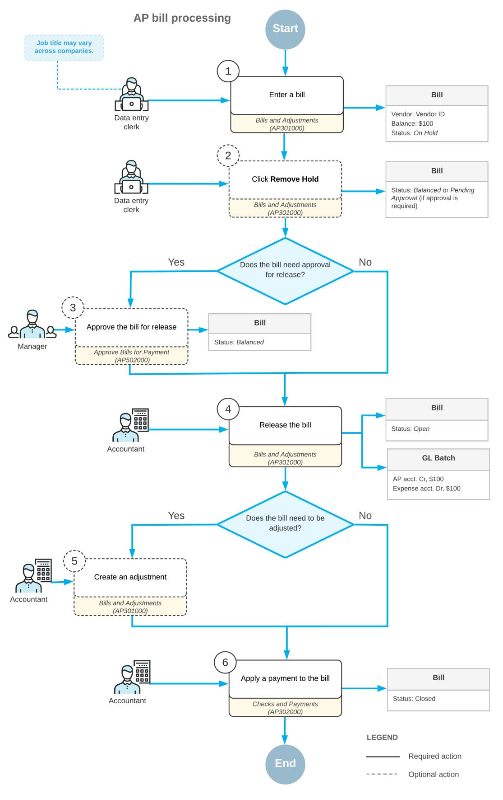

# **AP Bills: Implementation Checklist**

To ensure that the system is configured properly for processing AP bills, make sure that the criteria listed in the table have been met in the system as described.

| Form                               | Criteria to Check                                                                                                                                                                                                                                                                   |
|------------------------------------|-------------------------------------------------------------------------------------------------------------------------------------------------------------------------------------------------------------------------------------------------------------------------------------|
| Enable/Disable Features (CS100000) | Make sure the minimum set of features has been enabled as described in Company Without Branches: General Information, Company with Branches that Do Not Require Balancing: Gen eral Information, and Company with Branches that Require Bal ancing: General Information |
| Vendors (AP303000)                 | Verify the existence of the vendor accounts for the vendors for which you will create AP bills. For details, see Vendors: Im plementation Activity.                                                                                                                           |
| Non-Stock Items (IN202000)         | Verify the existence of non-stock items that can be used when creating AP bills. For details, see Non-Stock Item: Implementa tion Activity.                                                                                                                                   |

# **Settings That Affect the Workflow**

You use accounts payable forms to record purchases you make on credit. The following settings and entities should be specified and defined, respectively:

- The following general ledger settings should be specified on the **PostingSettings** tab of the *[General Ledger](https://help-2025r1.acumatica.com/Help?ScreenId=ShowWiki&pageid=e4913d06-c511-4258-a0f9-f36c1b854e6b) [Preferences](https://help-2025r1.acumatica.com/Help?ScreenId=ShowWiki&pageid=e4913d06-c511-4258-a0f9-f36c1b854e6b)* (GL102000) form:
  - Make sure that the **Automatically Post on Release** check box is selected. This setting causes GL batches to be immediately posted aer they are released.
  - Clear the **Generate Consolidated Batches** check box to cause every AP transaction you enter to be posted as an individual batch to the general ledger. (When this check box is selected, the system consolidates into a single batch all transactions in the same currency posted to the same period for all documents being released.)
- The following accounts payable settings should be specified on the **General** tab of the *[Accounts Payable](https://help-2025r1.acumatica.com/Help?ScreenId=ShowWiki&pageid=c3f9353e-95e6-448d-bb3f-e20643879ec7) [Preferences](https://help-2025r1.acumatica.com/Help?ScreenId=ShowWiki&pageid=c3f9353e-95e6-448d-bb3f-e20643879ec7)* (AP101000) form:
  - Select the **Hold Documents on Entry** check box in the **Data EntrySettings** section. This setting gives the created AP bills the *On Hold* status.
  - Clear the **RequireVendor Reference** check box in the **Data EntrySettings** section. This setting means that you do not have to enter a vendor reference number in the**Vendor Ref.** box when creating an AP bill on the *[Bills and Adjustments](https://help-2025r1.acumatica.com/Help?ScreenId=ShowWiki&pageid=956b4e51-3078-4d2d-85b3-65c080d95234)* (AP301000) form.
  - Make sure that the **Automatically Post on Release** check box is selected in the **PostingSettings** section. This setting indicates that AP bills will be automatically posted to the general ledger once they are released.

With these settings specified and entities defined, users in your company can record and process documents in Acumatica ERP quickly and accurately, with a minimum of manual actions.

# **AP Bills: Generated Transactions**

When you release an AP bill, the system generates a batch of transactions to record the liability to the general ledger. The AP bill includes all the information the system needs to generate the batch.

The following accounts are usually involved:

- The liability account specified in the **AP Account** box on the **Details** tab
- The expense account specified for each line in the **Account** column on the **Details** tab

You can view the details of the batch associated with the bill by clicking the link in the **Batch Nbr.** box on the **Financial** tab of the *[Bills and Adjustments](https://help-2025r1.acumatica.com/Help?ScreenId=ShowWiki&pageid=956b4e51-3078-4d2d-85b3-65c080d95234)* (AP301000) form.

For a one-line bill, the following transactions will be recorded to the general ledger when the bill is released.

| Account                  | Debit  | Credit |  |  |
|--------------------------|--------|--------|--|--|
| Accounts Payable account | 0.00   | Amount |  |  |
| Expense account          | Amount | 0.00   |  |  |

If the *Invoice Rounding* feature is enabled on the *[Enable/Disable Features](https://help-2025r1.acumatica.com/Help?ScreenId=ShowWiki&pageid=c1555e43-1bc5-4f6f-ba9d-b323f94d8a6b)* (CS100000) form, the batch may contain an entry that records to the gain or loss rounding account the difference between the sum of the details and the document total.

# **AP Bills: Process Activity**

The following activity will walk you through the process of creating and releasing an AP bill.

This activity is based on the *U100* dataset. If you are using another dataset, or if any system settings have been changed in *U100*, these changes can affect the workflow of the activity and the results of the processing. To avoid any issues, restore the *U100* dataset to its initial state.

# **Video Tutorial**

This video shows you the common process but may contain less detail than the activity has. If you want to repeat the activity on your own or you are preparing to take the certification exam, we recommend that you follow the instructions in the steps of the activity.

*[FEEDBACK](https://www.surveymonkey.com/r/BLBL7RJ?Video=Processing%20AP%20Bills&Source=Open%20Uni&Course=F100)*

#### **Story**

Suppose that on February 2, 2025, SweetLife Fruits & Jams company purchased office supplies on credit from the Spectra Stationery Office vendor for \$790. The vendor sent invoice SW00063 to SweetLife.

Acting as a SweetLife accountant, you need to create an AP bill for the vendor, release it, and then review the GL batch generated by the system.

# **Configuration Overview**

For the purposes of this activity, the following features have been enabled on the *[Enable/Disable Features](https://help-2025r1.acumatica.com/Help?ScreenId=ShowWiki&pageid=c1555e43-1bc5-4f6f-ba9d-b323f94d8a6b)* (CS100000) form:

- *Standard Financials*, which provides the standard financial functionality
- *Multibranch Support*, which supports multiple branches in your instance of Acumatica ERP
- *Multicompany Support*, which supports multiple companies within one tenant.

On the *[Accounts Payable Preferences](https://help-2025r1.acumatica.com/Help?ScreenId=ShowWiki&pageid=c3f9353e-95e6-448d-bb3f-e20643879ec7)* (AP101000) form, the **Hold Documents on Entry** check box has been selected in the **Data EntrySettings** section.

On the *[Vendors](https://help-2025r1.acumatica.com/Help?ScreenId=ShowWiki&pageid=a9584be3-f2bd-4d67-80d4-8041d809df56)* (AP303000) form, the *STATOFFICE (Spectra Stationery Office)* vendor has been configured.

# **Process Overview**

In this activity, you will create an AP bill on the *[Bills and Adjustments](https://help-2025r1.acumatica.com/Help?ScreenId=ShowWiki&pageid=956b4e51-3078-4d2d-85b3-65c080d95234)* (AP301000) form. In the bill, you will specify the vendor in the**Vendor** box of the Summary area and the document details on the **Details** tab. When the bill is ready, you will release the document by clicking **Release** on the form toolbar.

# **System Preparation**

To prepare the system, do the following:

- 1. Launch the Acumatica ERP website, and sign in to a company with the *U100* dataset preloaded. To sign in as an accountant, use the following credentials:
  - Username: *johnson*
  - Password: *123*
- 2. In the info area, in the upper-right corner of the top pane of the Acumatica ERP screen, click the Business Date menu button and select *2/7/2025*. For simplicity, in this activity, you will create and process all documents in the system on this business date.
- 3. On the Company and Branch Selection menu, also on the top pane of the Acumatica ERP screen, make sure that the *SweetLife Head Office and Wholesale Center* branch is selected. If it is not selected, click the Company and Branch Selection menu to view the list of branches that you have access to, and then click *SweetLife Head Office and Wholesale Center*.

# **Step 1: Creating an AP Bill**

To create an AP bill, do the following:

1. Open the *[Bills and Adjustments](https://help-2025r1.acumatica.com/Help?ScreenId=ShowWiki&pageid=956b4e51-3078-4d2d-85b3-65c080d95234)* (AP301000) form.

To open the form for creating a new record, type the form ID in the Search box, and on the Search form, point at the form title and click **New** right of the title.

- 2. Click **Add New Record** on the form toolbar, and specify the following settings in the Summary area:
  - **Type**: *Bill*
  - **Vendor**: *STATOFFICE*
  - **Date**: *2/7/2025* (the current business date, which is inserted by default)
  - **Post Period**: *02-2025* (inserted by default based on the selected date)
  - **Vendor Ref.**: SW00063 (the reference number of the document sent by the vendor)
  - **Description**: Office supplies

- 3. On the **Details** tab, click **Add Row** and specify the following settings for the added row:
  - **Branch**: *HEADOFFICE* (inserted by default)
  - **Transaction Descr.**: Office supplies
  - **Ext. Cost**: 790
- 4. On the form toolbar, click**Save**.

### **Step 2: Releasing the AP Bill**

To release the AP bill, do the following:

- 1. While you are still on the *[Bills and Adjustments](https://help-2025r1.acumatica.com/Help?ScreenId=ShowWiki&pageid=956b4e51-3078-4d2d-85b3-65c080d95234)* (AP301000) form, click **Remove Hold** on the form toolbar. This gives the bill the *Balanced* status. You can release a bill only if it has this status.
- 2. On the form toolbar, click **Release**.

This gives the bill the *Open* status. The released AP bill is shown in the following screenshot.

| <b>Bills and Adjustments</b> Bill 000166 - Spectra Stationery Office                 |                      |                                       |                                |                                        |          |                         |             |                           | <b>P</b> NOTES | <b>ACTIVITIES</b> | <b>FILES</b>       | TOOLS $\sim$        |
|-----------------------------------------------------------------------------------------|----------------------|---------------------------------------|--------------------------------|----------------------------------------|----------|-------------------------|-------------|---------------------------|----------------|-------------------|--------------------|---------------------|
| 团 日 $\leftarrow$                                                                  | $\Omega$ $\pm$    | n $\mathsf{K}$ 顶 $\check{~}$ | $\rightarrow$ ≺             | $\geq$ <b>PAY</b>                   | $\cdots$ |                         |             |                           |                |                   |                    |                     |
| Type:                                                                                   | Bill $\checkmark$ | Vendor:                               |                                | STATOFFICE - Spectra Stationery Office | 0        | Detail Total:           |             | 790.00                    |                |                   |                    | $\hat{\phantom{a}}$ |
| Reference Nbr.                                                                          | Q 000166          | Location:                             | <b>MAIN - Primary Location</b> |                                        |          | Line Discounts:         |             | 0.00                      |                |                   |                    |                     |
| Status:                                                                                 | Open                 | Terms:                                | 30D - 30 Days                  |                                        |          | Document Discou         |             | 0.00                      |                |                   |                    |                     |
| Date:                                                                                   | 2/7/2025             | * Due Date:                           | 3/9/2025 自                  |                                        |          | <b>Retained Amount:</b> |             | 0.00                      |                |                   |                    |                     |
| Post Period:                                                                            | 02-2025              | * Cash Discount.                      | 3/9/2025 户                  | Pay by Line                            |          | <b>Tax Total:</b>       |             | 0.00                      |                |                   |                    |                     |
| Vendor Ref.:                                                                            | SW00063              |                                       | Joint Payees                   |                                        |          | With. Tax:              |             | 0.00                      |                |                   |                    |                     |
| Description:                                                                            | Office supplies      |                                       |                                |                                        |          | Amount:                 |             | 790.00                    |                |                   |                    |                     |
|                                                                                         |                      |                                       |                                |                                        |          | Balance:                |             | 790.00                    |                |                   |                    |                     |
|                                                                                         |                      |                                       |                                |                                        |          | Cash Discount:          |             | 0.00                      |                |                   |                    |                     |
| <b>DETAILS</b> <b>FINANCIAL</b> <b>TAXES</b> <b>APPLICATIONS</b> COMPLIANCE |                      |                                       |                                |                                        |          |                         |             |                           |                |                   |                    |                     |
| Ò D                                                                                  | $\times$             | ADD PO RECEIPT                        | ADD PO RECEIPT LINE            | ADD PO                                 |          | <b>ADD SUBCONTRACT</b>  | ADD PO LINE | ADD SUBCONTRACT LINE      |                | ADD LC            | LINK LINE          | ≫                   |
| <b>B</b> 0 D *Branch                                                              |                      | <b>Inventory ID</b>                   | <b>Transaction Descr.</b>      | Quantity UOM                           |          | <b>Unit Cost</b>        | Ext. Cost   | <b>Discount</b> Amount |                | Amount *Account   | <b>Description</b> |                     |
| $\omega$ <b>HEADOFFICE</b>                                                           |                      |                                       | Office supplies                | 0.00                                   |          | 0.0000                  | 790.00      | 0.00                      | 790.00         | 62400             | Office Expense     |                     |

*Figure: The released AP bill*

# **Step 3: Reviewing the GL Batch Generated on Release of the Bill**

To review the generated GL batch, do the following:

1. Open the **Financial** tab, and click the number in the **Batch Nbr.** box.

When you released the bill, the system generated and released this batch in the general ledger. The batch is assigned the first number in the sequence specified in the **GL Batch NumberingSequence** box on the *[Accounts Payable Preferences](https://help-2025r1.acumatica.com/Help?ScreenId=ShowWiki&pageid=c3f9353e-95e6-448d-bb3f-e20643879ec7)* (AP101000) form, which determines the numbers assigned to batches generated from the accounts payable subledger.

2. On the *Journal [Transactions](https://help-2025r1.acumatica.com/Help?ScreenId=ShowWiki&pageid=dda046bc-5946-407f-88f7-1c0c966fbe72)* (GL301000) form, which is opened, review the transaction that has been generated on the release of the bill.

The *20000 (Accounts Payable)* AP account has been credited with \$790, while the *62400 (Office Expense)* expense account has been debited for the same amount.

# **AP Bills: Mass Processing and Document Consolidation**

This topic explains how to release multiple AP bills and the rules that the system uses to group the prepared documents.

# **Mass Release of AP Bills**

Multiple bills can be released at the same time on the *[Release AP Documents](https://help-2025r1.acumatica.com/Help?ScreenId=ShowWiki&pageid=b0977bf2-a93e-408f-8fb1-fbbbb812df0a)* (AP501000) form. On this form, you select the unlabeled check boxes next to the documents to be processed and click **Release** on the form toolbar to release the selected bills or click **Release All** to release all the bills shown in the table.

The system creates a consolidated GL batch for all the released bills if the **Generate Consolidated Batches** check box is selected on the *[General Ledger Preferences](https://help-2025r1.acumatica.com/Help?ScreenId=ShowWiki&pageid=e4913d06-c511-4258-a0f9-f36c1b854e6b)* (GL102000) form.

# **AP Bills: Related Reports and Inquiries**

This topic describes the reports, inquiries, and forms you may review to gather information about AP bills.

If you do not see a report or inquiry, this could mean that you have signed in to the system with a user account that does not have access rights to the form. In this case, sign in as the *admin* user, or contact your system administrator.

# **Reviewing the Details of an Unreleased Bill**

If a bill has not yet been released, you can review the details of the bill by running the *[AP Edit Detailed](https://help-2025r1.acumatica.com/Help?ScreenId=ShowWiki&pageid=ffdb945e-716a-47b3-95aa-3f6babaafd44)* (AP610500) report. When you run this report from the *[Bills and Adjustments](https://help-2025r1.acumatica.com/Help?ScreenId=ShowWiki&pageid=956b4e51-3078-4d2d-85b3-65c080d95234)* (AP301000) form by clicking **AP Edit Detailed** (under **Reports**) on the More menu, the report shows the details of the bill opened on this form. You can review what GL batch the system will create when you release the bill, which accounts will be updated by the transaction, and how the vendor's balance will be affected.

# **Reviewing the Details of a Released Bill**

Once you have released a bill, you can review the details of the bill by running a report on the *[AP Register Detailed](https://help-2025r1.acumatica.com/Help?ScreenId=ShowWiki&pageid=537818a3-d97b-4ae0-a0d6-3e83684e3a01)* (AP622000) form. When you run this report from the *[Bills and Adjustments](https://help-2025r1.acumatica.com/Help?ScreenId=ShowWiki&pageid=956b4e51-3078-4d2d-85b3-65c080d95234)* (AP301000) form by clicking **AP Register Detailed** (under **Reports**) on the More menu, the report shows the details of the bill opened on this form. You can review the GL batch the system created when releasing the bill and the accounts that have been updated by the transaction.

# **Reviewing Vendor Information**

You can review the balances of a specific vendor on the *[Vendor](https://help-2025r1.acumatica.com/Help?ScreenId=ShowWiki&pageid=22c03d80-cbb0-449d-9325-c12f623aaefd) Details* (AP402000) form. When you open this inquiry from the *[Bills and Adjustments](https://help-2025r1.acumatica.com/Help?ScreenId=ShowWiki&pageid=956b4e51-3078-4d2d-85b3-65c080d95234)* (AP301000) form by clicking**Vendor Details** (under **Inquiries**) on the More menu, the *[Vendor](https://help-2025r1.acumatica.com/Help?ScreenId=ShowWiki&pageid=22c03d80-cbb0-449d-9325-c12f623aaefd) Details* form is opened, showing the outstanding balances of the selected vendor and a list of documents of this vendor that have the *Open* status. You can select the**Show All Documents** and **Include Unreleased Documents** check boxes in the Selection area of the form to include all documents and unreleased documents, respectively, in the inquiry.

# **Reviewing the Vendor's Balance**

Aer a bill has been released, you can review the vendor's balance on the *AP [Balance](https://help-2025r1.acumatica.com/Help?ScreenId=ShowWiki&pageid=0d1c7f3f-90d6-4d12-894f-05fadf489921) by Vendor* (AP632500) form. On this form, you select *Open Documents* in the **Report Format** box and specify the needed financial period.

In the report, you can review open documents and vendor balances at the end of the period, grouped by vendor and by AP account. When you release a bill or an adjustment, the system updates the vendor balance.**Vendor DocumentsTotal** is the total amount of all open documents of the vendor.

# **To Enter a Bill in the Base Currency (with the Items' Quantity and Unit Cost)**

You enter a vendor bill by using the *[Bills and Adjustments](https://help-2025r1.acumatica.com/Help?ScreenId=ShowWiki&pageid=956b4e51-3078-4d2d-85b3-65c080d95234)* (AP301000) form. You use this procedure if the items' quantity and unit costs are specified in the detail lines of your document. If the line total amounts are instead specified in the detail lines, use *To Enter a Bill in the Base [Currency](#page-78-1) (with Line Totals)*.

# **To Enter a Bill in the Base Currency (with the Item Quantity and Unit Cost in Detail Lines)**

1. Open the *[Bills and Adjustments](https://help-2025r1.acumatica.com/Help?ScreenId=ShowWiki&pageid=956b4e51-3078-4d2d-85b3-65c080d95234)* (AP301000) form.

To open the form for creating a new record, type the form ID in the Search box, and on the Search form, point at the form title and click **New** right of the title.

- 2. On the form toolbar, click **Add New Record**.
- 3. In the **Type** box of the Summary area, select *Bill*.
- 4. In the **Date** box, enter the date of the vendor document the bill is based on.
- 5. If needed, in the **Vendor Ref.** box, enter the reference number of the vendor document.
- 6. In the **Vendor** box, select the vendor the document is from.

The system fills in the following boxes automatically with the default settings of the selected vendor: **Location**, **Terms**, **Due Date**, and **Cash Discount Date**. Review these settings, and make any needed changes.

- 7. In the **Currency** box, make sure the base currency is shown correctly.
- 8. On the **Details** tab, for each detail line of the bill, click **Add Row** on the table toolbar, and do the following:
  - a. In the **Branch** column (if it appears), make sure that the system has specified the correct branch.
  - b. In the **Inventory ID** column, select the required item.
  - c. In the **Quantity** column, enter the quantity of the line item purchased from the vendor.
  - d. In the **Unit Cost** column, enter the cost of each specified unit.
  - e. In the **Account** column, make sure that the specified account is correct.
  - f. If needed, in the **Subaccount** column, specify the subaccount.
- 9. On the form toolbar, click**Save** to save the bill.

#### **Notes About the Procedure**

The notes in this section describe the nuances of the UI elements available on the form, such as when an element is required and when it is not, and when the system fills in settings by default. This section can include other notes.

Note the following about the Summary area of the form:

- The system fills in the **Post Period** box automatically, based on the specified document date.
- The **Vendor Ref.** setting is required only if the **RequireVendor Reference** check box is selected on the *[Accounts Payable Preferences](https://help-2025r1.acumatica.com/Help?ScreenId=ShowWiki&pageid=c3f9353e-95e6-448d-bb3f-e20643879ec7)* (AP101000) form; otherwise, the setting is optional.

Note the following about the **Details** tab:

- In the **Inventory ID** column, you can select only a non-stock item or service.
- The system automatically calculates and inserts the value in the **Ext. Cost** column based on the values that you have specified in the **Quantity** and **Unit Cost** columns.
- In the **Ext. Cost** column, the system has automatically calculated and entered the total amount for the line.
- In the **Account** column, the system specifies the expense account associated with the vendor location if the **Inventory ID** column is empty. If you have specified an inventory item in the **Inventory ID** column, the system enters the expense account specified in the settings for the inventory item.
- In the **Subaccount** column, the system inserts the subaccount generated in accordance with the rule in the **Combine ExpenseSub. from** box on the *[Accounts Payable Preferences](https://help-2025r1.acumatica.com/Help?ScreenId=ShowWiki&pageid=c3f9353e-95e6-448d-bb3f-e20643879ec7)* (AP101000) form. You can manually change the subaccount if necessary.
- The **Project** column appears only if the projects subledger has been enabled in your system and integrated with the accounts payable subledger.

For details on attaching scanned images of the supporting documents, see *To Attach a File to a [Record](https://help-2025r1.acumatica.com/Help?ScreenId=ShowWiki&pageid=286cb1ea-a5df-48c8-a093-3ace3414b842)*.

# **To Enter a Bill in the Base Currency (with Line Totals)**

You enter a vendor bill by using the *[Bills and Adjustments](https://help-2025r1.acumatica.com/Help?ScreenId=ShowWiki&pageid=956b4e51-3078-4d2d-85b3-65c080d95234)* (AP301000) form. You use this procedure if line totals are specified in the detail lines of your document. If the items' quantity and unit costs are instead specified in detail lines, use *To Enter a Bill in the Base [Currency](#page-77-1) (with the Items' Quantity and Unit Cost)*.

# **To Enter a Bill in the Base Currency (with Line Totals)**

1. Open the *[Bills and Adjustments](https://help-2025r1.acumatica.com/Help?ScreenId=ShowWiki&pageid=956b4e51-3078-4d2d-85b3-65c080d95234)* (AP301000) form.

To open the form for creating a new record, type the form ID in the Search box, and on the Search form, point at the form title and click **New** right of the title.

- 2. On the form toolbar, click **Add New Record**.
- 3. In the **Type** box of the Summary area, select *Bill*.
- 4. In the **Date** box, enter the date of the vendor document the bill is based on.
- 5. If needed, in the **Vendor Ref.** box, enter the reference number of the vendor document.
- 6. In the **Vendor** box, select the vendor the document is from.

The system fills in the following boxes automatically with the default settings of the selected vendor: **Location**, **Terms**, **Due Date**, and **Cash Discount Date**. Review these settings and make any needed changes.

- 7. In the **Currency** box, make sure the base currency is selected.
- 8. On the **Details** tab, for each detail line of the bill, click **Add Row** on the table toolbar, and do the following:
  - a. In the **Branch** column (if it appears), make sure that the system has specified the correct branch.
  - b. In the **Ext. Cost** column, enter the total amount for the line.
  - c. In the **Account** column, make sure that specified account is correct.
  - d. If needed, in the **Subaccount** column, specify the subaccount.
- 9. On the form toolbar, click**Save** to save the bill.

# **Notes About the Procedure**

The notes in this section describe the nuances of the UI elements available on the form, such as when an element is required and when it is not, and when the system fills in settings by default. This section can include other notes.

Note the following about the Summary area of the form:

- The system fills in the **Post Period** box automatically, based on the specified document date.
- The **Vendor Ref.** parameter is required only if the **RequireVendor Reference** check box is selected on the *[Accounts Payable Preferences](https://help-2025r1.acumatica.com/Help?ScreenId=ShowWiki&pageid=c3f9353e-95e6-448d-bb3f-e20643879ec7)* (AP101000) form; otherwise, it is optional.

Note the following about the **Details** tab:

- In the **Inventory ID** column, you can select only a non-stock item or service.
- The system automatically calculates and inserts the value in the **Ext. Cost** column based on the values that you have specified in the **Quantity** and **Unit Cost** columns.
- In the **Account** column, the system enters the expense account associated with the vendor location if the **Inventory ID** column is empty. If you have specified an inventory item in the **Inventory ID** column, the system enters the expense account specified in the inventory item settings.
- In the **Subaccount** column, the system enters the subaccount generated in accordance with the rule in the **Combine ExpenseSub. from** box on the *[Accounts Payable Preferences](https://help-2025r1.acumatica.com/Help?ScreenId=ShowWiki&pageid=c3f9353e-95e6-448d-bb3f-e20643879ec7)* (AP101000) form. You can manually change the subaccount if necessary.
- The **Project** column appears only if the *Project Accounting* feature has been enabled on the *[Enable/Disable](https://help-2025r1.acumatica.com/Help?ScreenId=ShowWiki&pageid=c1555e43-1bc5-4f6f-ba9d-b323f94d8a6b) [Features](https://help-2025r1.acumatica.com/Help?ScreenId=ShowWiki&pageid=c1555e43-1bc5-4f6f-ba9d-b323f94d8a6b)* (CS100000) form.

For details on attaching scanned images of the supporting documents, see *To Attach a File to a [Record](https://help-2025r1.acumatica.com/Help?ScreenId=ShowWiki&pageid=286cb1ea-a5df-48c8-a093-3ace3414b842)*.

# **To Enter a Bill Based on Purchase Receipts**

In Acumatica ERP, you can enter a bill based on purchase receipts or particular lines of purchase orders. To manually enter a bill based on purchase receipts, you use the *[Bills and Adjustments](https://help-2025r1.acumatica.com/Help?ScreenId=ShowWiki&pageid=956b4e51-3078-4d2d-85b3-65c080d95234)* (AP301000) form.

# **I. To Enter a Bill Based on Purchase Receipts**

1. Open the *[Bills and Adjustments](https://help-2025r1.acumatica.com/Help?ScreenId=ShowWiki&pageid=956b4e51-3078-4d2d-85b3-65c080d95234)* (AP301000) form.

To open the form for creating a new record, type the form ID in the Search box, and on the Search form, point at the form title and click **New** right of the title.

- 2. On the form toolbar, click **Add New Record**.
- 3. In the **Type** box of the Summary area, select *Bill*.
- 4. In the **Date** box, enter the date of the bill.
- 5. If needed, in the **Vendor Ref.** box, enter the reference number of the document this bill is based on.
- 6. In the **Vendor** box, select the applicable vendor.

The system fills in the following boxes automatically with the default settings of the selected vendor: **Location**, **Terms**, **Due Date**, and **Cash Discount Date**. Review these settings, and make any needed changes.

- 7. In the **Currency** box, make sure that the document currency is correct. If it is not, select another currency.
- 8. If needed, click **Exchange Rate** box (right of the **Currency** box) to open the **RateSelection** dialog box and view the effective exchange rate for the currency. Override the default exchange rate type.

- 9. On the **Details** tab, do the following:
  - a. On the table toolbar, click **Add PO Receipt**.

The system opens the **Add PO Receipt** dialog box, which displays the list of the released receipts of the selected vendor that have not been fully billed.

- b. Select the unlabeled check boxes of the purchase receipts you want to add to the bill.
- c. Click **Add & Close** to close the dialog box.
- d. In the table on the **Details** tab (where the lines have been filled with the lines of the selected purchase receipts), check the items' quantities and costs.

10.On the form toolbar, click**Save**.

# **II. To Add Particular Purchase Receipt Lines to the Bill**

- 1. Perform steps 1–3 of the previous procedure.
- 2. On the **Details** tab, do the following:
  - a. On the toolbar, click **Add PO Receipt Line**. The system opens the **Add Receipt Line** dialog box.
  - b. Select check boxes next to the receipt lines to be added to the bill.
  - c. Click **Add & Close**.

The detail lines of the bill have been filled in automatically. Check the items' quantity and cost, and correct them, if needed.

3. On the form toolbar, click**Save**.

#### **Notes About the Procedure**

The notes in this section describe the nuances of the UI elements available on the form, such as when an element is required and when it is not, and when the system fills in settings by default. This section can include other notes.

Note the following about the Summary area of the form:

- In the **Date** box, the current date is selected by default. You can override this date, if needed.
- The system fills in the **Post Period** box automatically, based on the date that you specified.
- The **Vendor Ref.** parameter is required only if the **RequireVendor Reference** check box is selected on the *[Accounts Payable Preferences](https://help-2025r1.acumatica.com/Help?ScreenId=ShowWiki&pageid=c3f9353e-95e6-448d-bb3f-e20643879ec7)* (AP101000) form; otherwise, it is optional.
- In the **Currency** box, you can override the currency only if the **Allow Currency Override** check box is selected for the selected vendor on the *[Vendors](https://help-2025r1.acumatica.com/Help?ScreenId=ShowWiki&pageid=a9584be3-f2bd-4d67-80d4-8041d809df56)* (AP303000) form.

Note the following about the **Details** tab:

- In the **Inventory ID** column, you can select only a non-stock item or service.
- The system automatically calculates and inserts the value in the **Ext. Cost** column based on the values specified in the **Quantity** and **Unit Cost** columns.
- In the **Account** column, the system enters the expense account associated with the vendor location if the **Inventory ID** column is empty. If an inventory item is specified in the **Inventory ID** column, the system enters the expense account specified in the inventory ID settings.
- In the **Subaccount** column, the system inserts the subaccount generated in accordance with the rule in the **Combine ExpenseSub. from** box on the *[Accounts Payable Preferences](https://help-2025r1.acumatica.com/Help?ScreenId=ShowWiki&pageid=c3f9353e-95e6-448d-bb3f-e20643879ec7)* (AP101000) form. You can manually change the subaccount if necessary.
- The **Project** column appears only if the *Project Accounting* feature has been enabled on the *[Enable/Disable](https://help-2025r1.acumatica.com/Help?ScreenId=ShowWiki&pageid=c1555e43-1bc5-4f6f-ba9d-b323f94d8a6b) [Features](https://help-2025r1.acumatica.com/Help?ScreenId=ShowWiki&pageid=c1555e43-1bc5-4f6f-ba9d-b323f94d8a6b)* (CS100000) form.

- In the **Add PO Receipt** dialog box (which is brought up when you click **Add PO Receipt** on the table toolbar), you can enter an identifier of a purchase order in the **Order Nbr.** box to narrow the selection of receipts associated with this order.
- If the unit cost specified in the bill differs from the unit cost in the receipt, the system posts the discrepancy to the Purchase Price Variance Account associated with the item on the **GL Accounts** tab of the *[Non-Stock](https://help-2025r1.acumatica.com/Help?ScreenId=ShowWiki&pageid=bf68dd4f-63d4-460d-8dc0-9152f2bd6bf1) [Items](https://help-2025r1.acumatica.com/Help?ScreenId=ShowWiki&pageid=bf68dd4f-63d4-460d-8dc0-9152f2bd6bf1)* (IN202000) form.

For details on attaching scanned images of the supporting documents, see *To Attach a File to a [Record](https://help-2025r1.acumatica.com/Help?ScreenId=ShowWiki&pageid=286cb1ea-a5df-48c8-a093-3ace3414b842)*.

# **To Enter a Bill Based on Purchase Orders**

In Acumatica ERP, you can enter a bill for non-stock items or services based on purchase orders. Also, you can add stock item lines from the purchase orders for which billing before receipt is allowed. To manually enter a bill based on purchase order, you use the *[Bills and Adjustments](https://help-2025r1.acumatica.com/Help?ScreenId=ShowWiki&pageid=956b4e51-3078-4d2d-85b3-65c080d95234)* (AP301000) form.

# **To Enter a Bill Based on Purchase Orders**

1. Open the *[Bills and Adjustments](https://help-2025r1.acumatica.com/Help?ScreenId=ShowWiki&pageid=956b4e51-3078-4d2d-85b3-65c080d95234)* (AP301000) form.

To open the form for creating a new record, type the form ID in the Search box, and on the Search form, point at the form title and click **New** right of the title.

- 2. On the form toolbar, click **Add New Record**.
- 3. In the **Type** box of the Summary area, select *Bill*.
- 4. In the **Date** box, enter the date of the bill.
- 5. If needed, in the **Vendor Ref.** box, enter the reference number of the document this bill is based on.
- 6. In the **Vendor** box, select the applicable vendor.

The system fills in the following boxes automatically with the default settings of the selected vendor: **Location**, **Terms**, **Due Date**, and **Cash Discount Date**. Review these settings, and make any needed changes.

- 7. In the **Currency** box, make sure that the document currency is correct. If it is not, select another currency.
- 8. If needed, click **Exchange Rate** box (right of the **Currency** box) to open the **RateSelection** dialog box and view the effective exchange rate for the currency. Override the default exchange rate type.
- 9. On the **Details** tab, do the following:
  - a. On the table toolbar, click **Add PO**.

The system opens the **Add PO Order** dialog box, which displays the list of the purchase orders of the selected vendor.

- b. Select the unlabeled check boxes for the purchase orders to be added.
- c. Click **Add & Close** to close the dialog box.
- d. In the table on the **Details** tab (where the lines have been filled with the lines of the selected purchase receipts), check the items' quantities and costs.

10.On the form toolbar, click**Save**.

# **Notes About the Procedure**

The notes in this section describe the nuances of the UI elements available on the form, such as when an element is required and when it is not, and when the system fills in settings by default. This section can include other notes.

Note the following about the Summary area of the form:

• The system fills in the **Post Period** box automatically, based on the date that you specified.

# **To Find a Particular Bill**

You can use multiple forms to find a bill that has been created with Acumatica ERP, depending on the bill's status and other parameters:

- *[Bills and Adjustments](https://help-2025r1.acumatica.com/Help?ScreenId=ShowWiki&pageid=956b4e51-3078-4d2d-85b3-65c080d95234)* (AP301000) form: Use this form to find any bill in the system, as described in the *[To](#page-82-1) [Find a Bill on the Bills and Adjustments Form](#page-82-1)* section of this topic.
- *[Approve Bills for Payment](https://help-2025r1.acumatica.com/Help?ScreenId=ShowWiki&pageid=76c4ad15-d7b5-477b-a514-f7dc93faf2be)* (AP502000) form: If approval of bills is required in your system, use this form to find bills with the *Open* status that require approval or have been approved; see the *To [Find](#page-82-2) a Bill on the [Approve Bills for Payment Form](#page-82-2)* section.
- *[Prepare Payments](https://help-2025r1.acumatica.com/Help?ScreenId=ShowWiki&pageid=e3b526e3-8b12-4fa9-a5b2-2955e763f238)* (AP503000) form: Use this form to find outstanding bills with the *Open* status. For instructions, see the *To Find a Bill on the Pay Bills [Form](#page-82-3)* section.

# **To Find a Bill on the Bills and Adjustments Form**

- 1. Open the *[Bills and Adjustments](https://help-2025r1.acumatica.com/Help?ScreenId=ShowWiki&pageid=956b4e51-3078-4d2d-85b3-65c080d95234)* (AP301000) form.
- 2. In the **Type** box of the Summary area, select *Bill*.
- 3. Select a specific bill in one of the following ways:
  - Click the navigation buttons on the form toolbar until you see the bill.
  - Click the selector button in the **Reference Nbr.** box of the Summary area, and do the following:
    - a. Select the column you want to search by clicking its header.
    - b. Type a text string in the**Search** box in the lower-le corner, and press Enter. The system highlights items in the column that contain the text.
    - c. Double-click the needed bill to display its details on the form.

# **To Find a Bill on the Approve Bills for Payment Form**

- 1. Open the *[Approve Bills for Payment](https://help-2025r1.acumatica.com/Help?ScreenId=ShowWiki&pageid=76c4ad15-d7b5-477b-a514-f7dc93faf2be)* (AP502000) form.
- 2. In the Selection area, make selections that match the known properties of the bill you're seeking. In the table, the system displays the documents that meet the criteria you have specified.
- 3. To display the bill you're looking for on the *[Bills and Adjustments](https://help-2025r1.acumatica.com/Help?ScreenId=ShowWiki&pageid=956b4e51-3078-4d2d-85b3-65c080d95234)* (AP301000) form, click the row with the bill, and click **View Document** on the table toolbar.

# **To Find a Bill on the Prepare Payments Form**

- 1. Open the *[Prepare Payments](https://help-2025r1.acumatica.com/Help?ScreenId=ShowWiki&pageid=e3b526e3-8b12-4fa9-a5b2-2955e763f238)* (AP503000) form.
- 2. In the **Cash Account** box of the Selection area, select the cash account to be used to pay the particular bill.
- 3. In the **Payment Method** box, select the needed method of payment associated with the cash account.

The selected documents are displayed in the table; you can create a filter to further narrow the list of documents or use a shared filter, if applicable.

4. Click the line with the bill, and click **View Document** to display the bill on the *[Bills and Adjustments](https://help-2025r1.acumatica.com/Help?ScreenId=ShowWiki&pageid=956b4e51-3078-4d2d-85b3-65c080d95234)* (AP301000) form.

# **To Enter a Bill with Landed Costs**

An accounts payable bill to a landed cost vendor is usually created automatically on release of a landed cost document. If you have specified the appropriate settings to not create a bill automatically (for example, because you haven't received an invoice from the landed cost vendor yet), you need to create this bill manually on the *[Bills](https://help-2025r1.acumatica.com/Help?ScreenId=ShowWiki&pageid=956b4e51-3078-4d2d-85b3-65c080d95234) [and Adjustments](https://help-2025r1.acumatica.com/Help?ScreenId=ShowWiki&pageid=956b4e51-3078-4d2d-85b3-65c080d95234)* (AP301000) form and add the line or lines of the landed cost document to this bill.

# **Before You Proceed**

In accordance with your company's policies, in a particular landed cost code on the *[Landed Cost Codes](https://help-2025r1.acumatica.com/Help?ScreenId=ShowWiki&pageid=38b79074-9243-4682-8ff9-5d870d829b9e)* (PO202000) form, you must specify how the landed cost amounts should be allocated among the items in a purchase receipt.

# **To Create a Bill with Landed Costs**

- 1. Open the *[Bills and Adjustments](https://help-2025r1.acumatica.com/Help?ScreenId=ShowWiki&pageid=956b4e51-3078-4d2d-85b3-65c080d95234)* (AP301000) form.
- 2. Click **Add New Record**.
- 3. In the **Type** box of the Summary area, select *Bill.*
- 4. In the **Date** box, enter the date from the vendor invoice.
- 5. Select the landed cost vendor in the**Vendor** box.

The system fills in the following boxes automatically with the default settings of the selected vendor: **Location**, **Terms**, **Due Date**, and **Cash Discount Date**. Review these settings, and make any needed changes.

- 6. If required, in the**Vendor Ref.** box, enter the reference number of the vendor document.
- 7. In the **Currency** box, make sure the base currency is shown correctly.
- 8. Specify a brief description for the bill.
- 9. On the table toolbar of the **Details** tab, click **Add LC**. In the **Add LC** dialog box, which opens, add landed costs to the bill as follows:
  - a. Optional: Filter the lines in the table by selecting the identifier of the particular landed cost document in the **LC Nbr.** box, the particular landed cost code in the **LC Code** box, or the particular receipt in the **Receipt Nbr.** box.
  - b. In the table, select the unlabeled check boxes in the line or lines with the landed costs to be added to the bill.
  - c. Click **Add & Close** to close the dialog box and add the selected lines.
- 10.Review the information in the added lines, and correct the landed cost amounts, if needed.
- 11.On the form toolbar, click **Remove Hold**.
- 12.On the form toolbar, click**Save**.

#### **Notes About the Procedure**

The notes in this section describe the nuances of the UI elements available on the form, such as when an element is required and when it is not, and when the system fills in settings by default. This section can include other notes.

Note the following about the Summary area of the form:

• The system fills in the **Post Period** box automatically, based on the specified document date.

- The **Vendor Ref.** parameter is required only if the **RequireVendor Reference** check box is selected on the *[Accounts Payable Preferences](https://help-2025r1.acumatica.com/Help?ScreenId=ShowWiki&pageid=c3f9353e-95e6-448d-bb3f-e20643879ec7)* (AP101000) form; otherwise, it is optional.
- Only vendors with the **Landed CostVendor** check box selected on the *[Vendors](https://help-2025r1.acumatica.com/Help?ScreenId=ShowWiki&pageid=a9584be3-f2bd-4d67-80d4-8041d809df56)* (AP303000) form can be associated with a landed cost code; make sure the vendor you plan to specify has this setting.

# **To Reverse a Bill**

In Acumatica ERP, a bill cannot be deleted once it has been released; it only can be reversed.

You reverse a released bill that has a status of *Open* or *Closed* by using the *[Bills and Adjustments](https://help-2025r1.acumatica.com/Help?ScreenId=ShowWiki&pageid=956b4e51-3078-4d2d-85b3-65c080d95234)* (AP301000) form.

When you reverse a bill that refers to a purchase receipt, this affects the vendor's Accounts Payable account rather than the related expense account. When the debit adjustment resulting from the reversal of the bill is released, the status of the purchase receipt changes to *Open*.

# **To Reverse a Bill**

- 1. Open the *[Bills and Adjustments](https://help-2025r1.acumatica.com/Help?ScreenId=ShowWiki&pageid=956b4e51-3078-4d2d-85b3-65c080d95234)* (AP301000) form.
- 2. Open the bill to be reversed, which must have the *Open* or *Closed* status.
- 3. On the More menu (under **Corrections**), click **Reverse**.

The system then displays the debit adjustment created by this process, which has the same details as the bill and a status of *Balanced*.

- 4. Make sure that all the settings of the newly created adjustment are correct—for example, that the total amount of the debit adjustment is the same as the total amount of the bill.
- 5. If needed, in the **Vendor Ref.** box, change the reference to the vendor document.
- 6. On the form toolbar, click **Release** to release the debit adjustment.

# **Notes About the Procedure**

The notes in this section describe the nuances of the UI elements available on the form, such as when an element is required and when it is not, and when the system fills in settings by default. This section can include other notes.

For the created debit adjustment you can view the reference number of the reversed bill in the **Original Document** box on the **Financial** tab of the *[Bills and Adjustments](https://help-2025r1.acumatica.com/Help?ScreenId=ShowWiki&pageid=956b4e51-3078-4d2d-85b3-65c080d95234)* form.

# **Processing AP Bills with Combined Subaccounts**

The topics of this chapter describe how to process AP bills with combined subaccounts, if subaccounts are used in your system.

# **Bill with Combined Subaccounts: General Information**

If the *Subaccounts* feature is enabled on the *[Enable/Disable Features](https://help-2025r1.acumatica.com/Help?ScreenId=ShowWiki&pageid=c1555e43-1bc5-4f6f-ba9d-b323f94d8a6b)* (CS100000) form and subaccounts have been configured, you can enter and process AP bills in which lines are classified by different subaccounts. To speed up the creation of these bills, you can set up a subaccount mask that determines how subaccounts are combined in accounts payable documents, as described in *[Combined Subaccounts: General Information](https://help-2025r1.acumatica.com/Help?ScreenId=ShowWiki&pageid=f9429f96-d2fb-45fe-bc49-d15b996f1f7f)*.

# **Learning Objectives**

In this chapter, you will learn how to do the following:

- Process an AP bill when combined subaccounts have been configured for AP documents
- Review a report that is broken down by subaccounts

# **Applicable Scenarios**

You create an AP bill manually when you receive an invoice from a vendor. You then release the bill that you have created and complete its processing in the system.

If subaccounts have been configured in your system, these bills have to contain subaccounts in their lines. If a subaccount mask has been specified for AP documents, the system inserts these subaccounts automatically.

# **Processing of Bills with Combined Subaccounts**

In an AP document that is entered in the system, multiple subaccounts can be involved, such as the following:

- A subaccount associated with the item (if applicable) specified in the bill line
- A subaccount associated with the owner of the document
- A subaccount associated with the vendor specified in the bill

With the combined subaccount functionality, the system inserts into each line a particular subaccount that is a combination of the segment values specified in the mask—that is, the system uses the subaccount mask to compose a new subaccount identifier consisting of the segment values of each of the specified subaccounts. When the AP bill is released, the system tracks each line's extended price in the subaccount specified for the line.

With combined subaccounts configured, when you enter an AP bill on the *[Bills and Adjustments](https://help-2025r1.acumatica.com/Help?ScreenId=ShowWiki&pageid=956b4e51-3078-4d2d-85b3-65c080d95234)* (AP301000) form, you perform the same steps as you do when you create an AP bill that does not involve subaccounts. The system inserts the default subaccount for each line of the document according to the mask that is specified on the *[Accounts Payable Preferences](https://help-2025r1.acumatica.com/Help?ScreenId=ShowWiki&pageid=c3f9353e-95e6-448d-bb3f-e20643879ec7)* (AP101000) form. These subaccounts can be overridden. For details on processing an AP bill, see *[AP Bills: General Information](#page-69-3)*.

# **Bill with Combined Subaccounts: Implementation Checklist**

The following sections provide details you can use to ensure that the system is configured properly for processing AP bills with combined subaccounts, and to understand (and change, if needed) the settings that affect the processing workflow.

# **Implementation Checklist**

We recommend that before you initially process bills with combined subaccounts, you make sure the needed features have been enabled, settings have been specified, and entities have been created, as summarized in the following checklist.

| Form                                    | Criteria to Check                                                                                                                                                                                                                                                                                                                            |
|-----------------------------------------|----------------------------------------------------------------------------------------------------------------------------------------------------------------------------------------------------------------------------------------------------------------------------------------------------------------------------------------------|
| Enable/Disable Features (CS100000)      | Make sure that the minimal features have been enabled as de scribed in Company Without Branches: General Information, Com pany with Branches that Do Not Require Balancing: General Infor mation, and Company with Branches that Require Balancing: Gen eral Information Make sure that Subaccounts feature has been enabled. |
| Segmented Keys (CS202000)               | The SUBACCOUNT segmented key has been properly configured. For details, see Subaccounts: Implementation Activity.                                                                                                                                                                                                                         |
| Segment Values (CS203000)               | The segment values for the SUBACCOUNT segmented key have been defined as described in Subaccounts: Implementation Activi ty.                                                                                                                                                                                                           |
| Accounts Payable Preferences (AP101000) | The subaccount mask to be used in AP documents has been de fined, and subaccounts for non-stock items and an employee have been specified. For details, see Combined Subaccounts: To Define a Subaccount Mask for AP Documents.                                                                                                     |
| Vendors (AP303000)                      | Verify the existence of the vendor accounts for the vendors for which you will create AP bills. For details, see Vendors: Implemen tation Activity.                                                                                                                                                                                    |
| Non-Stock Items (IN202000)              | Verify the existence of non-stock items that can be used when creating AP bills. For details, see Non-Stock Item: Implementation Activity.                                                                                                                                                                                             |

# **Other Settings That Affect the Workflow**

You can affect the workflow of processing AP bills with combined subaccounts by specifying additional settings as follows:

- To cause GL batches to be immediately posted aer they are released, on the **PostingSettings** tab of the *[General Ledger Preferences](https://help-2025r1.acumatica.com/Help?ScreenId=ShowWiki&pageid=e4913d06-c511-4258-a0f9-f36c1b854e6b)* (GL102000) form, make sure that the **Automatically Post on Release** check box is selected.
- To cause every AP transaction you enter to be posted as an individual batch to the general ledger, clear the **Generate Consolidated Batches** check box on the **PostingSettings** tab of the *[General Ledger Preferences](https://help-2025r1.acumatica.com/Help?ScreenId=ShowWiki&pageid=e4913d06-c511-4258-a0f9-f36c1b854e6b)* form. When this check box is selected, the system consolidates into a single batch all transactions in the same currency posted to the same period for all documents being released.
- The following accounts payable settings should be specified on the **General** tab of the *[Accounts Payable](https://help-2025r1.acumatica.com/Help?ScreenId=ShowWiki&pageid=c3f9353e-95e6-448d-bb3f-e20643879ec7) [Preferences](https://help-2025r1.acumatica.com/Help?ScreenId=ShowWiki&pageid=c3f9353e-95e6-448d-bb3f-e20643879ec7)* (AP101000) form:
  - Select the **Hold Documents on Entry** check box in the **Data EntrySettings** section. This setting gives the created AP bills the *On Hold* status.

- Clear the **RequireVendor Reference** check box in the **Data EntrySettings** section. This setting means that you do not have to enter a vendor reference number in the**Vendor Ref.** box when creating an AP bill on the *[Bills and Adjustments](https://help-2025r1.acumatica.com/Help?ScreenId=ShowWiki&pageid=956b4e51-3078-4d2d-85b3-65c080d95234)* (AP301000) form.
- Make sure that the **Automatically Post on Release** check box is selected in the **PostingSettings** section. This setting indicates that AP bills will be automatically posted to the general ledger once they are released.

# **Validation of Configuration**

To make sure that all configuration has been performed correctly, we recommend that in your system, you process AP bills with combined subaccounts by performing instructions similar to those described in *[Bill with Combined](#page-87-2) [Subaccounts: Process Activity](#page-87-2)*.

# **Bill with Combined Subaccounts: Generated Transactions**

When you release an AP bill, the system generates a transaction to record the liability to the general ledger. The AP bill includes all the information the system needs to generate the transaction.

You can view the details of the transaction associated with the bill by clicking the link in the **Batch Nbr.** box on the **Financial** tab of the *[Bills and Adjustments](https://help-2025r1.acumatica.com/Help?ScreenId=ShowWiki&pageid=956b4e51-3078-4d2d-85b3-65c080d95234)* (AP301000) form.

The following accounts are usually involved:

- The liability account specified in the **AP Account** box on the **Financial** tab
- The expense account specified for each line in the **Account** column on the **Details** tab

The subaccounts, which are combined according to the mask specified in the **Combine ExpenseSub. From** box on the *[Accounts Payable Preferences](https://help-2025r1.acumatica.com/Help?ScreenId=ShowWiki&pageid=c3f9353e-95e6-448d-bb3f-e20643879ec7)* (AP101000) form, are specified for the lines with the expense account.

For a one-line bill, the following transactions are recorded to the general ledger when the bill is released.

| Account                  | Subaccount | Debit  | Credit |
|--------------------------|------------|--------|--------|
| Accounts Payable account | 000-000    | 0.00   | 500.00 |
| Expense account          | NSS-MKT    | 500.00 | 0.00   |

# **Bill with Combined Subaccounts: Process Activity**

The following activity will walk you through the process of creating and releasing an AP bill that contains combined subaccounts.

# **Story**

Suppose that the SweetLife Fruits & Jams company purchased billboard advertising from the Blueline Advertisement company and additional printed booklets that are not tracked in the system as non-stock items.

Acting as a SweetLife accountant, you need to create an AP bill on behalf of Bill Owen, who works in the Marketing department. You then need to release the bill and then review the balances of the involved accounts, which are broken down by subaccounts.

# **Configuration Overview**

In the *U100* dataset, the following tasks have been performed for the purposes of this activity:

- On the *[Companies](https://help-2025r1.acumatica.com/Help?ScreenId=ShowWiki&pageid=fedad435-8496-4397-b8a3-50a473629f76)* (CS101500) form, the *SWEETLIFE* company has been defined.
- On the *[Branches](https://help-2025r1.acumatica.com/Help?ScreenId=ShowWiki&pageid=b97ab72d-4ab4-4f02-b69c-f7f61b316ced)* (CS102000) form, the *HEADOFFICE* branch of the *SWEETLIFE* company has been created.
- On the *Credit [Terms](https://help-2025r1.acumatica.com/Help?ScreenId=ShowWiki&pageid=c39f7b9f-4ab2-4b67-b449-667802d58a57)* (CS206500) form, the *30D 30 Days* credit terms have been defined.
- On the *[Chart of Accounts](https://help-2025r1.acumatica.com/Help?ScreenId=ShowWiki&pageid=85557f41-a4af-47a8-b198-2a01461ce9c3)* form, the *61000 - Advertising Expense* account has been created.
- On the *[Ledgers](https://help-2025r1.acumatica.com/Help?ScreenId=ShowWiki&pageid=a5c9f3f5-7dc4-4b1b-a50c-396729a12e4e)* (GL201500) form, the *ACTUAL* ledger has been defined.
- On the *[Vendors](https://help-2025r1.acumatica.com/Help?ScreenId=ShowWiki&pageid=a9584be3-f2bd-4d67-80d4-8041d809df56)* (AP303000) form, the *BLUELINE* vendor has been defined.
- On the *[Employees](https://help-2025r1.acumatica.com/Help?ScreenId=ShowWiki&pageid=dae5144b-49b3-43a4-bce0-93f31b3f2321)* (EP203000) form, the *EP00000015* employee (*Bill Owen*) has been created.
- On the *[Non-Stock Items](https://help-2025r1.acumatica.com/Help?ScreenId=ShowWiki&pageid=bf68dd4f-63d4-460d-8dc0-9152f2bd6bf1)* (IN202000) form, the *ADVERT* and *CONSULT* non-stock items have been defined.
- On the *[Segmented Keys](https://help-2025r1.acumatica.com/Help?ScreenId=ShowWiki&pageid=78bd7bd1-6bf6-409e-a8a5-8b18e8b80722)* (CS202000) form, the *SUBACCOUNT* segmented key has been defined.
- On the *[Accounts Payable Preferences](https://help-2025r1.acumatica.com/Help?ScreenId=ShowWiki&pageid=c3f9353e-95e6-448d-bb3f-e20643879ec7)* (AP101000) form, the subaccount mask to be used in AP documents has been defined.

# **Process Overview**

In this activity, you will create an AP bill on the *[Bills and Adjustments](https://help-2025r1.acumatica.com/Help?ScreenId=ShowWiki&pageid=956b4e51-3078-4d2d-85b3-65c080d95234)* (AP301000) form. In the bill, you will specify the vendor, the document details, and the owner. When the bill is ready, you will release the document. Finally, on the *Trial Balance [Detailed](https://help-2025r1.acumatica.com/Help?ScreenId=ShowWiki&pageid=0231cb61-a732-4527-bfae-c42642dd8983)* (GL632500) form, you will run a report to review the balance of the *61000* account.

# **System Preparation**

Before you begin performing the steps of this activity, do the following:

- 1. Launch the Acumatica ERP website with the *U100* dataset preloaded, and sign in as an accountant Nenad Pasic by using the *pasic* username and the *123* password.
- 2. In the info area, in the upper-right corner of the top pane of the Acumatica ERP screen, make sure that the business date in your system is set to *1/30/2025*. If a different date is displayed, click the Business Date menu button and select *1/30/2025*. For simplicity, in this process activity, you will create and process all documents in the system on this business date.
- 3. On the Company and Branch Selection menu on the top pane of the Acumatica ERP screen, make sure that the *SweetLife Head Office and Wholesale Center* branch is selected. If it is not selected, click the selection menu to view the list of branches that you have access to, and then click *SweetLife Head Office and Wholesale Center*.
- 4. Make sure that the *SUBACCOUNT* segmented key has been modified, as described in *[Subaccounts:](https://help-2025r1.acumatica.com/Help?ScreenId=ShowWiki&pageid=64736a3d-89c3-41ca-b0a4-0af7bcb11372) [Implementation Activity](https://help-2025r1.acumatica.com/Help?ScreenId=ShowWiki&pageid=64736a3d-89c3-41ca-b0a4-0af7bcb11372)*.
- 5. Make sure that you have performed the *Combined [Subaccounts:](https://help-2025r1.acumatica.com/Help?ScreenId=ShowWiki&pageid=1538f8a0-0e2e-4b84-afc5-b5d5e97a2fd8) To Define a Subaccount Mask for AP [Documents](https://help-2025r1.acumatica.com/Help?ScreenId=ShowWiki&pageid=1538f8a0-0e2e-4b84-afc5-b5d5e97a2fd8)* prerequisite activity.

# **Step 1: Creating an AP Bill**

To create an AP bill to see how the combined subaccount functionality works, do the following:

- 1. On the *[Bills and Adjustments](https://help-2025r1.acumatica.com/Help?ScreenId=ShowWiki&pageid=956b4e51-3078-4d2d-85b3-65c080d95234)* (AP301000) form, add a new record.
- 2. In the Summary area, specify the following settings:
  - **Type**: *Bill*
  - **Vendor**: *BLUELINE*

- **Terms**: *30D* (inserted by default based on the selected vendor)
- **Date**: *1/30/2025* (the current business date, which is inserted by default)
- **Post Period**: *01-2025* (inserted by default based on the selected date)
- **Description**: Advertising services
- 3. On the **Financial** tab, in the **Owner** box, select *Bill Owen*.
- 4. On the **Details** tab, click **Add Row**, and specify the following settings for the added row:
  - **Branch**: *HEADOFFICE*
  - **Inventory ID**: *ADVERT*
  - **Quantity**: 1.00
  - **Unit Cost**: 500

Notice that the system has inserted the *61000 - Advertising Expense* account, which is the expense account of the item, in the **Account** column for the line.

Also, notice that the system has inserted the *NSS-MKT* subaccount in the**Subaccount** column for this row. The system has composed this expense subaccount based on the subaccount mask specified on the *[Accounts Payable Preferences](https://help-2025r1.acumatica.com/Help?ScreenId=ShowWiki&pageid=c3f9353e-95e6-448d-bb3f-e20643879ec7)* (AP101000) form, which is *III-EEE*. The first segment of the combined subaccount was copied from the non-stock item of the line (as indicated by *III* in the mask). The second segment was copied from the employee account (as indicated by *EEE* in the mask), which is *MKT* for Bill Owen, the document's owner, indicating that he works in the Marketing department.

- 5. On the **Details** tab, click **Add Row** again, and specify the following settings in the added row:
  - **Branch**: *HEADOFFICE*
  - **Transaction Description**: Printed booklets
  - **Ext. Cost**: 250.00

Notice the *000-MKT* subaccount inserted in the**Subaccount** column for this row. Because no item has been specified for this row, the system inserted *000* as the first segment of the combined subaccount. The second segment, *MKT*, was again copied from the employee account of the document's owner.

6. On the form toolbar, click**Save**.

# **Step 2: Releasing the AP Bill**

To release the bill, do the following while you are still viewing the bill on the *[Bills and Adjustments](https://help-2025r1.acumatica.com/Help?ScreenId=ShowWiki&pageid=956b4e51-3078-4d2d-85b3-65c080d95234)* (AP301000) form:

- 1. On the form toolbar, click **Remove Hold**.
- 2. On the form toolbar, click **Release** to release the bill.

The system changes the status of the bill to *Open*.

# **Step 3: Reviewing the Expense Account**

To review the balance of the *61000* account, which was used as the expense account, and check the amounts the system tracked for each subaccount, do the following:

- 1. Open the *Trial Balance [Detailed](https://help-2025r1.acumatica.com/Help?ScreenId=ShowWiki&pageid=0231cb61-a732-4527-bfae-c42642dd8983)* (GL632500) report form.
- 2. On the **Report Parameters** tab, make sure that the following settings are specified:
  - **Company/Branch**: *HEADOFFICE - SweetLife Head Office and Wholesale Center*
  - **Ledger**: *ACTUAL*
  - **From Period**: *01-2025*
  - **To Period**: *01-2025*
  - **Suppress Zero Balances**: Cleared

- 3. On the form toolbar, click **Run Report**.
- 4. In the generated report, on the report toolbar, click the **Go to Next Page** arrow button, and review the balances of the *61000* account. Notice the amount in the **Debit** column for the *000-MKT* and *NSS-MKT* subaccounts of this account (\$250 and \$500, respectively), as shown in the following screenshot.

| <b>Trial Balance Detailed</b> Company/Branch: Ledger: | <b>HEADOFFICE</b> <b>ACTUAL</b>       |             |                   | <b>From Period:</b> To Period: | 01-2025 01-2025               |                          |              | Page: Date: User: | $2$ of $2$ 10/3/2024 3:24 PM <b>Nenad Pasic</b> |
|-------------------------------------------------------------|------------------------------------------|-------------|-------------------|-----------------------------------|----------------------------------|--------------------------|--------------|-------------------------|-------------------------------------------------------|
| <b>Branch</b>                                               | <b>Account</b>                           | <b>Type</b> | <b>Subaccount</b> |                                   | <b>Description</b>               | <b>Beginning Balance</b> | <b>Debit</b> | Credit                  | <b>Ending Balance</b>                                 |
| <b>HEADOFFICE</b>                                           | 33000                                    | Liability   | <b>NSS-MKT</b>    |                                   | Net Income                       | 0.00                     | 500.00       | 0.00                    | $-500.00$                                             |
|                                                             |                                          |             |                   |                                   | <b>Liability Total</b>           | 1,705,173.22             | 278,795.41   | 203,408.05              | 1,629,785.86                                          |
| <b>HEADOFFICE</b>                                           | 40000                                    | Income      | 000-000           |                                   | <b>Sales Revenue</b>             | 0.00                     | 213.00       | 15.070.68               | 14,857.68                                             |
| <b>HEADOFFICE</b>                                           | 40010                                    | Income      | 000-000           |                                   | Sales - Freight                  | 0.00                     | 0.00         | 11.00                   | 11.00                                                 |
|                                                             |                                          |             |                   |                                   | <b>Income Total</b>              | 0.00                     | 213.00       | 15,081.68               | 14,868.68                                             |
| <b>HEADOFFICE</b>                                           | 50000                                    | Expense     | 000-000           |                                   | COGS - Inventory                 | 0.00                     | 5,076.95     | 0.00                    | 5,076.95                                              |
| <b>HEADOFFICE</b>                                           | 52100                                    | Expense     | 000-000           |                                   | <b>Standard Cost Adjustments</b> | 0.00                     | 0.00         | 67.50                   | $-67.50$                                              |
| <b>HEADOFFICE</b>                                           | 52600                                    | Expense     | 000-000           |                                   | <b>Cash Discount</b>             | 0.00                     | 15.00        | 84.62                   | $-69.62$                                              |
| <b>HEADOFFICE</b>                                           | 61000                                    | Expense     | 000-000           |                                   | <b>Advertising Expense</b>       | 0.00                     | 520.00       | 0.00                    | 520.00                                                |
| <b>HEADOFFICE</b>                                           | 61000                                    | Expense     | 000-MKT           |                                   | <b>Advertising Expense</b>       | 0.00                     | 250.00       | 0.00                    | 250.00                                                |
| <b>HEADOFFICE</b>                                           | 61000                                    | Expense     | <b>NSS-MKT</b>    |                                   | <b>Advertising Expense</b>       | 0.00                     | 500.00       | 0.00                    | 500.00                                                |
| <b>HEADOFFICE</b>                                           | 62400                                    | Expense     | 000-000           |                                   | Office Expense                   | 0.00                     | 2.321.00     | 645.00                  | 1.676.00                                              |
| <b>HEADOFFICE</b>                                           | 62400                                    |             | Expense 000-ENG   |                                   | Office Expense                   | 0.00                     | 122.00       | 0.00                    | 122.00                                                |
| <b>HEADOFFICE</b>                                           | 62400                                    | Expense     | 000-FIN           |                                   | Office Expense                   | 0.00                     | 150.00       | 0.00                    | 150.00                                                |
| <b>HEADOFFICE</b>                                           | 62400                                    | Expense     | 000-MKT           |                                   | Office Expense                   | 0.00                     | 74.00        | 0.00                    | 74.00                                                 |
| <b>HEADOFFICE</b>                                           | 62400                                    | Expense     | 000-OPS           |                                   | Office Expense                   | 0.00                     | 89.00        | 0.00                    | 89.00                                                 |
| <b>HEADOFFICE</b>                                           | 62400                                    | Expense     | 000-SLS           |                                   | Office Expense                   | 0.00                     | 185.00       | 0.00                    | 185.00                                                |
| <b>HEADOFFICE</b>                                           | 62900                                    | Expense     | 000-000           |                                   | Rent or Lease Expense            | 0.00                     | 1.200.00     | 0.00                    | 1.200.00                                              |
| <b>HEADOFFICE</b>                                           | 65100                                    | Expense     | 000-000           |                                   | Other Tax Expenses               | 0.00                     | 11.338.38    | 0.00                    | 11.338.38                                             |
| <b>HEADOFFICE</b>                                           | 69500                                    |             | Expense 000-000   |                                   | Salaries and Wages               | 0.00                     | 20,100.00    | 0.00                    | 20,100.00                                             |
| <b>HEADOFFICE</b>                                           | !!!!!!!!!!!!!!!!!!!!!!!!!!!!!!!!!!!!!!!! | Expense     | 000-FIN           |                                   | Salaries and Wages               | 0.00                     | 16.200.00    | 0.00                    | 16,200.00                                             |
| <b>HEADOFFICE</b>                                           | 69500                                    | Expense     | 000-MKT           |                                   | <b>Salaries and Wages</b>        | 0.00                     | 6,000.00     | 0.00                    | 6,000.00                                              |
| <b>HEADOFFICE</b>                                           | 69500                                    | Expense     | 000-OPS           |                                   | Salaries and Wages               | 0.00                     | 15,400.00    | 0.00                    | 15,400.00                                             |
| <b>HEADOFFICE</b>                                           | 69500                                    | Expense     | 000-SLS           |                                   | <b>Salaries and Wages</b>        | 0.00                     | 39,000.00    | 0.00                    | 39,000.00                                             |
| <b>HEADOFFICE</b>                                           | 69600                                    | Expense     | 000-000           |                                   | <b>Benefit Expenses</b>          | 0.00                     | 1.646.95     | 0.00                    | 1.646.95                                              |
| <b>HEADOFFICE</b>                                           | 81000                                    |             | Expense 000-000   |                                   | <b>Other Expenses</b>            | 0.00                     | 14,804.00    | 520.00                  | 14.284.00                                             |
|                                                             |                                          |             |                   |                                   | <b>Expense Total</b>             | 0.00                     | 134.992.28   | 1,317.12                | 133,675.16                                            |
|                                                             |                                          |             |                   |                                   |                                  |                          |              |                         |                                                       |

*Figure: Balances of the account*

# **Processing Debit and Credit Adjustments**

Once it has been released, an accounts payable document cannot be edited or deleted; to correct it, you can issue an adjustment. Debit adjustments decrease the accounts payable balance, and credit adjustments increase the accounts payable balance (that is, they increase your company's liabilities).

In this chapter, you will learn how to create debit adjustments and credit adjustments.

# **Debit and Credit Adjustments: General Information**

To correct released AP documents, you create debit adjustments and credit adjustments on the *[Bills and](https://help-2025r1.acumatica.com/Help?ScreenId=ShowWiki&pageid=956b4e51-3078-4d2d-85b3-65c080d95234) [Adjustments](https://help-2025r1.acumatica.com/Help?ScreenId=ShowWiki&pageid=956b4e51-3078-4d2d-85b3-65c080d95234)* (AP301000) form.

An open accounts payable bill can be reversed. When you reverse a bill, the system automatically creates a debit adjustment with the same details. Before you save the adjustment, you should type another**Vendor Reference** value if the **Raise an Error On DuplicateVendor Reference Number** check box is selected on the *[Accounts Payable](https://help-2025r1.acumatica.com/Help?ScreenId=ShowWiki&pageid=c3f9353e-95e6-448d-bb3f-e20643879ec7) [Preferences](https://help-2025r1.acumatica.com/Help?ScreenId=ShowWiki&pageid=c3f9353e-95e6-448d-bb3f-e20643879ec7)* (AP101000) form.

# **Learning Objectives**

In this chapter, you will learn how to do the following:

- Create and release a debit adjustment
- Apply the debit adjustment to an open AP bill
- Create and release a credit adjustment for a released AP bill

# **Applicable Scenarios**

You create a debit adjustment to decrease the amount you owe to a vendor. You create a credit adjustment to increase the amount you owe to a vendor.

### **Debit Adjustment Processing**

You can create a debit adjustment to account for a vendor's credit memo, or you can use it as a clearing document to correct errors on an existing bill or credit adjustment. A debit adjustment may be created as a request for a refund (for example, for damaged items or an overpaid bill) or it can be directly applied against bills or credit adjustments.

You can enter a debit adjustment by using the *[Bills and Adjustments](https://help-2025r1.acumatica.com/Help?ScreenId=ShowWiki&pageid=956b4e51-3078-4d2d-85b3-65c080d95234)* (AP301000) form. The summary of a debit adjustment includes information about the vendor, the vendor location, and the currency used for the transaction.

A debit adjustment should contain at least one line. The adjustment can have a summary line or any number of detail lines.

We recommend that when you enter a document, you include all the details available in the original vendor document.

When it is first saved, a debit adjustment is automatically assigned a unique identifier that makes it possible to track the debit adjustment through the system. The system generates this identifier according to the numbering sequence assigned to debit adjustments on the *[Accounts Payable Preferences](https://help-2025r1.acumatica.com/Help?ScreenId=ShowWiki&pageid=c3f9353e-95e6-448d-bb3f-e20643879ec7)* (AP101000) form.

To facilitate auditing and user reference, you can attach to each debit adjustment an electronic version or a scanned image of the original vendor document or internal document. Also, you can attach a related document to each line of the document.

Generally, a debit adjustment is not linked to a bill or other document that it is related to. You may include a reference to the original document (bill or prepayment) in the description of the adjustment and a reference to the related vendor document in the**Vendor Reference** box. If the **Raise an Error on DuplicateVendor Reference Number** check box is cleared on the *[Accounts Payable Preferences](https://help-2025r1.acumatica.com/Help?ScreenId=ShowWiki&pageid=c3f9353e-95e6-448d-bb3f-e20643879ec7)* (AP101000) form, then you can use the same reference number (of the original vendor document) on both the bill and the related debit adjustment; this will make it easier to find both the bill and the adjustment.

Each adjustment has one of the following statuses, which tells you its stage in processing:

- *On Hold*: Generally, this status is used for an adjustment that is a dra. This is the default status for new documents if the **Hold Documents on Entry** check box is selected on the *[Accounts Payable Preferences](https://help-2025r1.acumatica.com/Help?ScreenId=ShowWiki&pageid=c3f9353e-95e6-448d-bb3f-e20643879ec7)* (AP101000) form or if approvals have been configured for debit adjustments. A debit adjustment with the *On Hold* status can be edited.
- *Balanced*: Aer editing is completed, a *Balanced* adjustment may be saved only if it remains balanced. If the **Validate DocumentTotals on Entry** check box is selected on the *[Accounts Payable Preferences](https://help-2025r1.acumatica.com/Help?ScreenId=ShowWiki&pageid=c3f9353e-95e6-448d-bb3f-e20643879ec7)* form, you can take an adjustment off hold only if you correctly type the document control total.
- *Pending Approval*: If approvals are enabled in your system, aer an adjustment (that is subject to approval) is created, saved, and taken off hold, the system assigns this status to the adjustment. The adjustment needs to be approved by responsible approvers assigned according to the approval map specified on the **Approval** tab of the *[Accounts Payable Preferences](https://help-2025r1.acumatica.com/Help?ScreenId=ShowWiki&pageid=c3f9353e-95e6-448d-bb3f-e20643879ec7)* form.
- *Rejected*: If approvals are enabled in your system and at least one approver rejects an adjustment, the system assigns this status to the adjustment. You can delete a document with this status or click **Hold** on the form toolbar, edit the document, and submit it for the approval.
- *Open*: This status reflects that the document has been released and may be applied against bills and credit adjustments. The status remains *Open* until the unapplied balance becomes zero.
- *Closed*: This status means that the unapplied balance of the document is zero.
- *Reserved*: This status means that an open debit adjustment was put on hold by clicking **Hold** on the form toolbar. By using this status, you can temporarily suspend the document's processing.

Released debit adjustments may be matched against any bills and credit adjustments of the same vendor or may be used to offset a vendor's refunds. Released debit adjustments appear on the *[Checks and Payments](https://help-2025r1.acumatica.com/Help?ScreenId=ShowWiki&pageid=81659f97-cb14-4a27-bc3e-0f67b3945613)* (AP302000) form and can be applied against credit adjustments and bills.

Debit adjustments are always applied to the balance of the main vendor of a bill, which is the same vendor as specified in this debit adjustment. That is, if a debit adjustment is prepared for the AP bill that has joint payee balances specified, the **Amount Paid** that you specify on the **Documents to Apply** tab of the *[Checks and Payments](https://help-2025r1.acumatica.com/Help?ScreenId=ShowWiki&pageid=81659f97-cb14-4a27-bc3e-0f67b3945613)* cannot exceed the amount of the bill minus joint payee amounts.

When you create an AP payment and load the documents to be paid, the debit adjustments appear at the top of the list so that you do not forget to apply them.

# **Reversal of Debit Adjustments**

You can reverse original debit adjustments with the *Open* and *Closed* status by clicking **Reverse** on the More menu of the *[Bills and Adjustments](https://help-2025r1.acumatica.com/Help?ScreenId=ShowWiki&pageid=956b4e51-3078-4d2d-85b3-65c080d95234)* (AP301000) form. The **Reverse** command is not available for original debit adjustments created automatically on reverse of an original bill.

If you reverse a debit adjustment, the system performs the following actions on the *[Bills and Adjustments](https://help-2025r1.acumatica.com/Help?ScreenId=ShowWiki&pageid=956b4e51-3078-4d2d-85b3-65c080d95234)* form:

1. Creates a credit adjustment with the *On Hold* or *Balanced* status, depending on whether the **Hold Documents on Entry** check box is selected on the *[Accounts Payable Preferences](https://help-2025r1.acumatica.com/Help?ScreenId=ShowWiki&pageid=c3f9353e-95e6-448d-bb3f-e20643879ec7)* (AP101000) form.

- 2. For the credit adjustment, fills in the **Original Document** box on the **Financial** tab with the **Ref. Nbr.** of the debit adjustment being reversed.
- 3. On release of the credit adjustment, creates a GL transaction by using the same rules as for manually created credit adjustments.

On reversal of a debit adjustment created for a tax agency in a foreign currency, the system will not use the document rate to convert the amount to the base currency amount. The same rule is applied when you are reversing a tax bill in a foreign currency.

An original debit adjustment cannot be reversed if it has open retainage debit adjustments or applications that have not been reversed.

# **Credit Adjustment Processing**

An accounts payable credit adjustment may be used to correct errors in an existing bill or to account for a vendor's debit memo. Posting a credit adjustment increases the balance of accounts payable.

You can enter a credit adjustment by using the *[Bills and Adjustments](https://help-2025r1.acumatica.com/Help?ScreenId=ShowWiki&pageid=956b4e51-3078-4d2d-85b3-65c080d95234)* (AP301000) form. The summary of a credit adjustment includes information about the vendor, the vendor location, and the currency used for the transaction.

A credit adjustment should contain at least one line. The adjustment can have a summary line or any number of detail lines.

We recommend that when you enter a document, you include all the details available in the original vendor document.

To facilitate auditing and user reference, you can attach to each adjustment an electronic version or a scanned image of the original vendor document. Also, you can attach a related document to each line of the document.

When it is first saved, a credit adjustment is automatically assigned a unique identifier that lets you track the credit adjustment through the system. The system generates this identifier according to the numbering sequence assigned to credit adjustments on the *[Accounts Payable Preferences](https://help-2025r1.acumatica.com/Help?ScreenId=ShowWiki&pageid=c3f9353e-95e6-448d-bb3f-e20643879ec7)* (AP101000) form.

If automatic calculation of taxes is configured in your system, the system calculates the applicable taxes for each credit adjustment and records the tax amounts to the document. If your system is integrated with the AvaTax service of Avalara or other specialized third-party soware, the applicable taxes are calculated by this service or soware and recorded to the document when you save it. For an overview of this integration, see *[Setup of Online](https://help-2025r1.acumatica.com/Help?ScreenId=ShowWiki&pageid=8a0eea54-8340-458b-973d-28a29f09b24a) [Integration](https://help-2025r1.acumatica.com/Help?ScreenId=ShowWiki&pageid=8a0eea54-8340-458b-973d-28a29f09b24a) with Avalara AvaTax*.

A credit adjustment has no reference to a bill that it is related to. You may include a reference to the original document (bill or prepayment) in the description of the adjustment and a reference to the related vendor document in the **Vendor Reference** box. If the **Raise Error On Invoice Number Duplicates** option is not selected on the *[Accounts Payable Preferences](https://help-2025r1.acumatica.com/Help?ScreenId=ShowWiki&pageid=c3f9353e-95e6-448d-bb3f-e20643879ec7)* (AP101000) form, then you can use the reference number of the original vendor document on both the bill and the related credit adjustment; this will make it easier to find both the bill and the adjustment.

Each adjustment has one of the following statuses, which tells you its stage in processing:

- *On Hold*: The credit adjustment is being edited and cannot be released. The system assigns this status to each created credit adjustment by default because the **Hold Documents on Entry** check box is selected on the *[Accounts Payable Preferences](https://help-2025r1.acumatica.com/Help?ScreenId=ShowWiki&pageid=c3f9353e-95e6-448d-bb3f-e20643879ec7)* form or if approvals have been configured for credit adjustments.
- *Pending Approval*: The credit adjustment needs to be approved for release by the responsible person or persons. The system assigns this status when the credit adjustment for which the approval is needed is removed from hold. This status could be assigned to the document only if the *Approval Workflow* feature is enabled on the *[Enable/Disable Features](https://help-2025r1.acumatica.com/Help?ScreenId=ShowWiki&pageid=c1555e43-1bc5-4f6f-ba9d-b323f94d8a6b)* (CS100000) form.
- *Rejected*: The credit adjustment was rejected by the responsible person. This status could be assigned to the document only if the *Approval Workflow* feature is enabled on the *[Enable/Disable Features](https://help-2025r1.acumatica.com/Help?ScreenId=ShowWiki&pageid=c1555e43-1bc5-4f6f-ba9d-b323f94d8a6b)* form.

- *Balanced*: The credit adjustment is ready and can be released or scheduled.
- *Open*: The credit adjustment has been released.
- *Closed*: The credit adjustment has been applied.
- *Scheduled*: The credit adjustment is a template for generating recurring documents according to a schedule. Based on the template, the system generates recurring documents that can be edited and then released. (The scheduled document itself cannot be released and can be edited as a template.)
- *Pre-Released*: The credit adjustment has been released and requires expense reclassification. This status can be assigned to the credit adjustment only if the *Expense Reclassification* feature is enabled on the *[Enable/Disable Features](https://help-2025r1.acumatica.com/Help?ScreenId=ShowWiki&pageid=c1555e43-1bc5-4f6f-ba9d-b323f94d8a6b)* form.
- *Voided*: The previously scheduled credit adjustment was voided and is no longer used as a template for generating recurring documents.

Once it has been released, a credit adjustment cannot be edited or deleted; you only can reverse it. If you reverse the adjustment, the system generates a debit adjustment with the same details. Before you save the debit adjustment, you should type another**Vendor Reference** value if the **Raise an Error on DuplicateVendor Reference Number** option is selected on the *[Accounts Payable Preferences](https://help-2025r1.acumatica.com/Help?ScreenId=ShowWiki&pageid=c3f9353e-95e6-448d-bb3f-e20643879ec7)* (AP101000) form.

You can pay adjustments individually by using the *[Bills and Adjustments](https://help-2025r1.acumatica.com/Help?ScreenId=ShowWiki&pageid=956b4e51-3078-4d2d-85b3-65c080d95234)* (AP302000) form. Also, adjustments can be paid in bulk along with the bills on the *[Prepare Payments](https://help-2025r1.acumatica.com/Help?ScreenId=ShowWiki&pageid=e3b526e3-8b12-4fa9-a5b2-2955e763f238)* (AP503000) form. For details on payments, see *[Paying](#page-143-2) [Multiple AP Bills](#page-143-2)*.

# **Debit and Credit Adjustments: Debit Adjustments with Cash Discounts**

Debit adjustments that you create in Acumatica ERP can have credit terms specified. As a result, these documents can include a cash discount.

# **Ability to Apply Cash Discounts to Debit Adjustments**

To turn on the application of cash discounts in debit adjustments, on the *[Accounts Payable Preferences](https://help-2025r1.acumatica.com/Help?ScreenId=ShowWiki&pageid=c3f9353e-95e6-448d-bb3f-e20643879ec7)* (AP101000) form, you select the **Use CreditTerms in Debit Adjustments** check box in the **Data EntrySettings** section.

You create debit adjustments with a cash discount on the *[Bills and Adjustments](https://help-2025r1.acumatica.com/Help?ScreenId=ShowWiki&pageid=956b4e51-3078-4d2d-85b3-65c080d95234)* (AP301000) form by specifying the needed credit terms in the**Terms** box. The following table shows the availability of the**Terms**, **Cash Discounts Date**, **Due Date**, and **Cash Discount** boxes (that is, whether these settings can be edited), which depends on the status of the selected debit adjustment.

| Debit Adjustment Status                          | Terms       | Due Date    | Cash Discount Date | Cash Discount |
|--------------------------------------------------|-------------|-------------|-----------------------|---------------|
| Unreleased (On Hold, Bal anced, or Scheduled) | Available   | Available   | Available             | Available     |
| Released (Open)                                  | Unavailable | Available   | Available             | Unavailable   |
| Closed (Closed or Voided)                        | Unavailable | Unavailable | Unavailable           | Unavailable   |

# **Cash Discount Settings in Debit Adjustments**

When you create a debit adjustment on the *[Bills and Adjustments](https://help-2025r1.acumatica.com/Help?ScreenId=ShowWiki&pageid=956b4e51-3078-4d2d-85b3-65c080d95234)* (AP301000) form by copying an existing one, the system inserts the settings as follows:

- If the original debit adjustment has credit terms specified, the**Terms**, **Cash Discount Date**, **Due Date**, and **Cash Discount** settings are copied from the original document to the new document, and these boxes are available.
- If the original debit adjustment has no credit terms specified, the vendor's settings are copied from the *[Vendors](https://help-2025r1.acumatica.com/Help?ScreenId=ShowWiki&pageid=a9584be3-f2bd-4d67-80d4-8041d809df56)* (AP303000) form to the**Terms**, **Cash Discount Date**, **Due Date**, and **Cash Discount** boxes, and the boxes are unavailable. If the **Use CreditTerms in Debit Adjustments** check box is selected on the *[Accounts](https://help-2025r1.acumatica.com/Help?ScreenId=ShowWiki&pageid=c3f9353e-95e6-448d-bb3f-e20643879ec7) [Payable Preferences](https://help-2025r1.acumatica.com/Help?ScreenId=ShowWiki&pageid=c3f9353e-95e6-448d-bb3f-e20643879ec7)* (AP101000) form, the**Terms** is copied from the vendor's settings and the values in the **Cash Discount Date**, **Due Date**, and **Cash Discount** boxes are calculated based on these terms.

When you create a debit adjustment by reversing a bill or a credit adjustment, the system inserts the settings as follows:

- If the **Use CreditTerms in Debit Adjustments** check box is selected on the *[Accounts Payable Preferences](https://help-2025r1.acumatica.com/Help?ScreenId=ShowWiki&pageid=c3f9353e-95e6-448d-bb3f-e20643879ec7)* (AP101000) form, the**Terms**, **Cash Discount Date**, **Due Date**, and **Cash Discount** settings are copied from the original document, and these boxes are available.
- If the **Use CreditTerms in Debit Adjustments** check box is cleared on the *[Accounts Payable Preferences](https://help-2025r1.acumatica.com/Help?ScreenId=ShowWiki&pageid=c3f9353e-95e6-448d-bb3f-e20643879ec7)* form, the**Terms**, **Cash Discount Date**, and **Due Date** boxes are empty, and the **Cash Discount** is *0.00*. All these boxes are unavailable.

When you create a credit adjustment by reversing a debit adjustment, the system inserts the settings as follows:

- If the debit adjustment has credit terms specified, its**Terms**, **Cash Discount Date**, **Due Date**, and **Cash Discount** settings are copied from the debit adjustment to the credit adjustment.
- If the debit adjustment has no credit terms specified, the**Terms** are copied from the vendor settings on the *[Vendors](https://help-2025r1.acumatica.com/Help?ScreenId=ShowWiki&pageid=a9584be3-f2bd-4d67-80d4-8041d809df56)* (AP303000) form, and the **Cash Discount Date**, **Due Date**, and **Cash Discount** settings are calculated based on these terms.

If a debit adjustment created on the *[Bills and Adjustments](https://help-2025r1.acumatica.com/Help?ScreenId=ShowWiki&pageid=956b4e51-3078-4d2d-85b3-65c080d95234)* form has credit terms specified in the**Terms** box and the **Pay by Line** check box is selected, the system distributes the amount in the **Cash Discount** box among all the document lines.

If a debit adjustment created on the *[Bills and Adjustments](https://help-2025r1.acumatica.com/Help?ScreenId=ShowWiki&pageid=956b4e51-3078-4d2d-85b3-65c080d95234)* form has credit terms of the *Multiple* installment type, cash discounts are not supported. In other words, the **Cash Discount** is set to *0.00* and unavailable for editing. If you change the credit terms in the**Terms** box, the system will recalculate the **Cash Discount** value depending on the selected credit terms.

For debit adjustments that are created by the system on the *[Expense Claim](https://help-2025r1.acumatica.com/Help?ScreenId=ShowWiki&pageid=19413b5d-8c8c-415a-a39c-8a773123364f)* (EP301000) and *[Purchase Receipts](https://help-2025r1.acumatica.com/Help?ScreenId=ShowWiki&pageid=d9901c8d-486d-45ed-8088-ea3d8ee3af19)* (PO302000) forms, imported via an import scenario, or imported via the API, the system fills in the**Terms**, **Cash Discount Date**, **Due Date**, and **Cash Discount** boxes as follows:

- If the **Use CreditTerms in Debit Adjustments** check box is selected on the *[Accounts Payable Preferences](https://help-2025r1.acumatica.com/Help?ScreenId=ShowWiki&pageid=c3f9353e-95e6-448d-bb3f-e20643879ec7)* form; the system copies the**Terms** from the vendor's settings, and the other settings are calculated based on these terms.
- If the **Use CreditTerms in Debit Adjustments** check box is cleared on the *[Accounts Payable Preferences](https://help-2025r1.acumatica.com/Help?ScreenId=ShowWiki&pageid=c3f9353e-95e6-448d-bb3f-e20643879ec7)* form, these boxes are empty and unavailable.

# **Debit and Credit Adjustments: Refunds**

A refund serves as a payment for a debit adjustment. When you receive a refund from a vendor and enter it into the system, you should create a debit adjustment in the same amount for the same vendor and pay for this adjustment by using the refund. Once the refund is applied against the debit adjustment and released, both documents become closed.

Releasing a refund creates the following transaction.

| Account                  | Debit  | Credit |
|--------------------------|--------|--------|
| Cash account             | Amount | 0.00   |
| Accounts payable account | 0.00   | Amount |

If a refund is paid in a foreign currency, the realized gain or loss account may also be updated by the amount resulting from the differences in exchange rates for the original debit adjustment and the refund.

# **Correction of a Refund**

You can correct a released refund by voiding it and recording the correct refund. For step-by-step instructions, see *To Void a [Refund](#page-235-1)*.

You void the refund on the *[Checks and Payments](https://help-2025r1.acumatica.com/Help?ScreenId=ShowWiki&pageid=81659f97-cb14-4a27-bc3e-0f67b3945613)* (AP302000) form by selecting the needed document of the *Refund* type and then clicking **Void** on the form toolbar. The system creates a document of the *Voided Refund* type with the same reference number as the refund has, and reverses the original refund.

Before you release the voided refund, you can change the date of the voided refund in the **Application Date** box in the Summary area of the form. The date specified in this box should be the date when the voided refund is released (**Payment Date**) and when the related batch was created (**Transaction Date**). You can also enter a description of the voided refund in the **Description** box in the Summary area of the *[Checks and Payments](https://help-2025r1.acumatica.com/Help?ScreenId=ShowWiki&pageid=81659f97-cb14-4a27-bc3e-0f67b3945613)* form.

On release of the voided refund, the system changes the status of the refund to *Voided* and the status of the voided refund to *Closed*. On the **Application History** tab, you can see the original document for which the refund has been applied with a negative amount. The following reversing transaction for the voided refund is recorded to the general ledger when the voided refund is released.

| Account                  | Debit  | Credit |
|--------------------------|--------|--------|
| Cash account             | 0.00   | Amount |
| Accounts Payable account | Amount | 0.00   |

If the original document for which the refund has been applied has the *Closed* status, when the refund is voided, the system changes the document's status to *Open*. You can again apply documents to the original document.

# **Debit and Credit Adjustments: Implementation Checklist**

To ensure that the system is configured properly for processing debit and credit adjustments, make sure that the criteria listed in the table have been met in the system as described.

| Form                               | Criteria to Check                                                                                                                                                                                                                                                                | Notes |
|------------------------------------|----------------------------------------------------------------------------------------------------------------------------------------------------------------------------------------------------------------------------------------------------------------------------------|-------|
| Enable/Disable Features (CS100000) | Make sure the minimal features have been enabled as described in Company Without Branches: General Information, Company with Branches that Do Not Require Balancing: Gen eral Information, and Company with Branches that Require Balancing: General Information. |       |

| Form               | Criteria to Check                                                                                                                                                                | Notes |
|--------------------|----------------------------------------------------------------------------------------------------------------------------------------------------------------------------------|-------|
| Vendors (AP303000) | Verify the existence of the vendor accounts for the vendors for which you will create debit and credit adjustments. For details, see Ven dors: Implementation Activity. |       |

# **Settings That Affect the Workflow**

The following settings and entities should be specified and defined, respectively:

- The following general ledger settings should be specified on the **PostingSettings** tab of the *[General Ledger](https://help-2025r1.acumatica.com/Help?ScreenId=ShowWiki&pageid=e4913d06-c511-4258-a0f9-f36c1b854e6b) [Preferences](https://help-2025r1.acumatica.com/Help?ScreenId=ShowWiki&pageid=e4913d06-c511-4258-a0f9-f36c1b854e6b)* (GL102000) form:
  - Make sure that the **Automatically Post on Release** check box is selected. This setting causes GL batches to be immediately posted aer they are released.
  - Clear the **Generate Consolidated Batches** check box to cause every AP transaction you enter to be posted as an individual batch to the general ledger. (When this check box is selected, the system consolidates into a single batch all transactions in the same currency posted to the same period for all documents being released.)
- The following accounts payable settings should be specified on the **General** tab of the *[Accounts Payable](https://help-2025r1.acumatica.com/Help?ScreenId=ShowWiki&pageid=c3f9353e-95e6-448d-bb3f-e20643879ec7) [Preferences](https://help-2025r1.acumatica.com/Help?ScreenId=ShowWiki&pageid=c3f9353e-95e6-448d-bb3f-e20643879ec7)* (AP101000) form:
  - Select the **Hold Documents on Entry** check box in the **Data EntrySettings** section. This setting gives the created debit and credit adjustments the *On Hold* status.
  - Clear the **RequireVendor Reference** check box in the **Data EntrySettings** section. This setting means that you do not have to enter a vendor reference number in the**Vendor Ref.** box when creating a debit or credit adjustment on the *[Bills and Adjustments](https://help-2025r1.acumatica.com/Help?ScreenId=ShowWiki&pageid=956b4e51-3078-4d2d-85b3-65c080d95234)* (AP301000) form.
  - Make sure that the **Automatically Post on Release** check box is selected in the **PostingSettings** section. This setting indicates that debit and credit adjustments will be automatically posted to the general ledger once they are released.

With these settings specified and entities defined, users in your company can record and process documents in Acumatica ERP quickly and accurately, with a minimum of manual actions.

# **Debit and Credit Adjustments: Generated Transactions**

When you release a debit or credit adjustment, the system generates a batch of transactions to record a decrease or increase of liability.

A batch created upon release of the debit or credit adjustment is numbered in accordance with the numbering sequence assigned in the **Batch NumberingSequence** box on the *[Accounts Payable Preferences](https://help-2025r1.acumatica.com/Help?ScreenId=ShowWiki&pageid=c3f9353e-95e6-448d-bb3f-e20643879ec7)* (AP101000) form. The batch number is specified on the **Financial** tab of the *[Bills and Adjustments](https://help-2025r1.acumatica.com/Help?ScreenId=ShowWiki&pageid=956b4e51-3078-4d2d-85b3-65c080d95234)* (AP301000) form.

# **Transaction Generated for a Debit Adjustment**

On release of a debit adjustment, a batch of the following transactions is generated for a one-line adjustment.

| Account                      | Source of Account                                                                                   | Debit  | Credit |  |
|------------------------------|-----------------------------------------------------------------------------------------------------|--------|--------|--|
| Accounts Payable ac count | The AP account specified for the vendor on the GL Accounts tab of the Vendors (AP303000) form | Amount | 0.00   |  |

| Account         | Source of Account                                                                                                                                    | Debit | Credit |
|-----------------|------------------------------------------------------------------------------------------------------------------------------------------------------|-------|--------|
| Expense account | The expense account specified for the docu ment line in the Account column on the De tails tab of the Bills and Adjustments (AP301000) form | 0.00  | Amount |

The same transaction is generated for a debit adjustment for which credit terms are specified.

You can view the reference number of the GL batch on the **Financial** tab of the *[Bills and Adjustments](https://help-2025r1.acumatica.com/Help?ScreenId=ShowWiki&pageid=956b4e51-3078-4d2d-85b3-65c080d95234)* form.

# **Transaction Generated for a Credit Adjustment**

When a one-line credit adjustment is released, a batch of the following transactions is generated.

| Account                      | Source of Account                                                                                                                               | Debit  | Credit |  |
|------------------------------|-------------------------------------------------------------------------------------------------------------------------------------------------|--------|--------|--|
| Accounts Payable ac count | The AP account specified for the vendor on the GL Accounts tab of the Vendors (AP303000) form                                                | 0.00   | Amount |  |
| Expense account              | The expense account specified for the document line in the Account column on the Details tab of the Bills and Adjustments (AP301000) form | Amount | 0.00   |  |

A cash discount can be applied to a credit adjustment in accordance with the credit terms. As the credit adjustment is released and posted, the system adjusts the vendor Accounts Payable account and the specified expense account.

You can view the reference number of the GL batch on the **Financial** tab of the *[Bills and Adjustments](https://help-2025r1.acumatica.com/Help?ScreenId=ShowWiki&pageid=956b4e51-3078-4d2d-85b3-65c080d95234)* form.

# **Transaction Generated for Refund Applied to a Debit Adjustment with a Cash Discount**

On release of a refund that has been applied to a debit adjustment with a cash discount, a batch of the following transactions is generated for a one-line adjustment.

| Account                      | Source of Account                                                                                                                    | Debit                   | Credit                           |  |  |
|------------------------------|--------------------------------------------------------------------------------------------------------------------------------------|-------------------------|----------------------------------|--|--|
| Cash account                 | The GL account linked to the cash ac count of the specified branch                                                                | Amount                  | 0.00                             |  |  |
| Cash Discount account        | The account specified for the vendor in the Cash Discount Account box on the GL Accounts tab of the Vendors (AP303000) form | Cash discount amount | 0.00                             |  |  |
| Accounts Payable ac count | The AP account specified for the vendor on the GL Accounts tab of the Vendors form                                             | 0.00                    | Amount + cash discount amount |  |  |

You can view the reference number of the GL batch on the **Financial** tab of the *[Checks and Payments](https://help-2025r1.acumatica.com/Help?ScreenId=ShowWiki&pageid=81659f97-cb14-4a27-bc3e-0f67b3945613)* (AP302000) form.

# **Debit and Credit Adjustments: Mass Processing**

This topic explains how to release multiple AP debit and credit adjustments and the rules that the system uses to group the prepared documents.

You can release debit and credit adjustments in bulk by using the *[Release AP Documents](https://help-2025r1.acumatica.com/Help?ScreenId=ShowWiki&pageid=b0977bf2-a93e-408f-8fb1-fbbbb812df0a)* (AP501000) form.

# **Debit and Credit Adjustments: To Process a Debit Adjustment**

The following activity will walk you through the process of creating and releasing a debit adjustment and applying it to a bill.

This activity is based on the *U100* dataset. If you are using another dataset, or if any system settings have been changed in *U100*, these changes can affect the workflow of the activity and the results of the processing. To avoid any issues, restore the *U100* dataset to its initial state.

# **Video Tutorial**

This video shows you the common process but may contain less detail than the activity has. If you want to repeat the activity on your own or you are preparing to take the certification exam, we recommend that you follow the instructions in the steps of the activity.

#### *[FEEDBACK](https://www.surveymonkey.com/r/BLBL7RJ?Video=Correcting%20AP%20Bills&Source=Open%20Uni&Course=F100)*

### **Story**

Suppose that on February 11, 2025, SweetLife Fruits & Jams received a credit memo from Spectra Stationery Office, which gave them a \$5 discount for the bill of \$100.

Acting as a SweetLife accountant, you will need to process the vendor's credit memo as a debit adjustment that reduces the outstanding balance of the bill.

#### **Process Overview**

In this activity, you will create a debit adjustment on the *[Bills and Adjustments](https://help-2025r1.acumatica.com/Help?ScreenId=ShowWiki&pageid=956b4e51-3078-4d2d-85b3-65c080d95234)* (AP301000) form. You will then release the debit adjustment and apply it to the needed bill on the *[Checks and Payments](https://help-2025r1.acumatica.com/Help?ScreenId=ShowWiki&pageid=81659f97-cb14-4a27-bc3e-0f67b3945613)* (AP302000) form.

# **System Preparation**

To prepare the system, do the following:

- 1. Launch the Acumatica ERP website, and sign in to a company with the *U100* dataset preloaded. To sign in as an accountant, use the following credentials:
  - Username: *johnson*
  - Password: *123*
- 2. In the info area, in the upper-right corner of the top pane of the Acumatica ERP screen, click the Business Date menu button and select *2/11/2025*. For simplicity, in this activity, you will create and process all documents in the system on this business date.
- 3. On the Company and Branch Selection menu, also on the top pane of the Acumatica ERP screen, make sure that the *SweetLife Head Office and Wholesale Center* branch is selected. If it is not selected, click the

Company and Branch Selection menu to view the list of branches that you have access to, and then click *SweetLife Head Office and Wholesale Center*.

# **Step 1: Creating a Debit Adjustment**

To create a debit adjustment, do the following:

- 1. Open the *[Bills and Adjustments](https://help-2025r1.acumatica.com/Help?ScreenId=ShowWiki&pageid=956b4e51-3078-4d2d-85b3-65c080d95234)* (AP301000) form.
- 2. Click **Add New Record** on the form toolbar, and specify the following settings in the Summary area:
  - **Type**: *Debit Adj.*
  - **Vendor**: *STATOFFICE*
  - **Date**: *2/11/2025*
  - **Description**: Discount from vendor
- 3. On the **Details** tab, click **Add Row** and specify the following settings for the added row:
  - **Branch**: *HEADOFFICE* (inserted by default)
  - **Transaction Descr.**: Discount from vendor
  - **Ext. Cost**: 5.00
- 4. On the form toolbar, click**Save**.

# **Step 2: Releasing the Debit Adjustment**

To release the debit adjustment, do the following:

1. While you are still on the *[Bills and Adjustments](https://help-2025r1.acumatica.com/Help?ScreenId=ShowWiki&pageid=956b4e51-3078-4d2d-85b3-65c080d95234)* (AP301000) form, click **Remove Hold** on the form toolbar.

This gives the debit adjustment the *Balanced* status. You can release only documents that have this status.

2. On the form toolbar, click **Release**.

This gives the debit adjustment the *Open* status.

3. On the **Financial** tab, click the batch number to review the batch that the system has generated. Notice that the debit journal entry reduces the balance of the *20000 (Accounts Payable)* account by \$5.

# **Step 3: Applying the Debit Adjustment to the Bill**

To apply the debit adjustment to the bill, do the following:

- 1. While you are still on the *[Bills and Adjustments](https://help-2025r1.acumatica.com/Help?ScreenId=ShowWiki&pageid=956b4e51-3078-4d2d-85b3-65c080d95234)* (AP301000) form, on the form toolbar, click **Apply**. The system opens the *[Checks and Payments](https://help-2025r1.acumatica.com/Help?ScreenId=ShowWiki&pageid=81659f97-cb14-4a27-bc3e-0f67b3945613)* (AP302000) form.
- 2. On the *[Checks and Payments](https://help-2025r1.acumatica.com/Help?ScreenId=ShowWiki&pageid=81659f97-cb14-4a27-bc3e-0f67b3945613)* form, in the **Application Date** box, make sure *2/11/2025* is selected.
- 3. On the table toolbar of the **Documents to Apply** tab, click **Add Row** and in the **Reference Nbr.** column, select the \$100 bill.

By default, the system applies the full amount of the debit adjustment (\$5) to the bill. Aer you apply the debit adjustment, \$95 (\$100 – \$5) remains on the balance of the bill, which is displayed in the **Balance** column. The debit adjustment applied to the bill is shown in the following screenshot.

|    |                                                                                                                                                             | <b>Checks and Payments</b> |        |                         |                                                                   |                  |                   |                            |                         |                |          |          |                         | <b>PINOTES</b>    | <b>ACTIVITIES</b> <b>FILES</b> | TOOLS $\div$            |
|----|-------------------------------------------------------------------------------------------------------------------------------------------------------------|----------------------------|--------|-------------------------|-------------------------------------------------------------------|------------------|-------------------|----------------------------|-------------------------|----------------|----------|----------|-------------------------|-------------------|-----------------------------------|-------------------------|
|    | Debit Adj. 000167 - Spectra Stationery Office                                                                                                               |                            |        |                         |                                                                   |                  |                   |                            |                         |                |          |          |                         |                   |                                   |                         |
|    | 周 n 而 n <b>RELEASE</b> $\overline{\mathbf{K}}$ $\Omega$ $\geq$ ÷. $\leftarrow$ $\checkmark$ $\rightarrow$ ≺ $\cdots$ |                            |        |                         |                                                                   |                  |                   |                            |                         |                |          |          |                         |                   |                                   |                         |
|    |                                                                                                                                                             |                            |        |                         |                                                                   |                  |                   |                            |                         |                |          |          |                         |                   |                                   |                         |
|    | Debit Adj. Type: Vendor: Payment Amount: 5.00 STATOFFICE - Spectra Stationery Office 2 $\checkmark$                                       |                            |        |                         |                                                                   |                  |                   |                            |                         |                |          | $\sim$   |                         |                   |                                   |                         |
|    |                                                                                                                                                             | Reference Nbr.:            | 000167 | Q                       | Unapplied Balance: Location: <b>MAIN - Primary Location</b> |                  |                   |                            |                         | 0.00           |          |          |                         |                   |                                   |                         |
|    | Status:                                                                                                                                                     |                            | Open   |                         | Joint Payee N                                                     |                  |                   | <b>Application Amount:</b> |                         |                | 5.00     |          |                         |                   |                                   |                         |
|    | * Application Date: 2/11/2025 A <b>Finance Charges:</b>                                                                                            |                            |        |                         |                                                                   | 0.00             |                   |                            |                         |                |          |          |                         |                   |                                   |                         |
|    | * Application Pe 02-2025 Q Description: <b>Discount from vendor</b>                                                                             |                            |        |                         |                                                                   |                  |                   |                            |                         |                |          |          |                         |                   |                                   |                         |
|    |                                                                                                                                                             |                            |        |                         |                                                                   |                  |                   |                            |                         |                |          |          |                         |                   |                                   |                         |
|    |                                                                                                                                                             | <b>DOCUMENTS TO APPLY</b>  |        |                         | <b>APPLICATION HISTORY</b>                                        | <b>FINANCIAL</b> | REMITTANCE        | <b>CHARGES</b>             | <b>COMPLIANCE</b>       |                |          |          |                         |                   |                                   |                         |
|    |                                                                                                                                                             |                            |        |                         |                                                                   |                  |                   |                            |                         |                |          |          |                         |                   |                                   |                         |
|    | $\boxtimes$ <b>LOAD DOCUMENTS</b> ADD JOINT PAYEE $\vdash$ Ò $\times$ $+$                                                                 |                            |        |                         |                                                                   |                  |                   |                            |                         |                |          |          |                         |                   |                                   |                         |
| 80 | !!!!!!!!!!!!!!!!!!!!!!!!!!!!!!!!!!!!!!!!                                                                                                                    | <b>Branch</b>              |        | <b>Document</b> Type | *Reference Nbr.                                                | Nbr.             | Line Inventory ID | <b>Amount Paid</b>         | Cash <b>Discount</b> | With. Tax Date |          | Due Date | Cash <b>Discount</b> | <b>Cross Rate</b> | <b>Balance</b>                    | Cash <b>Discount</b> |
|    |                                                                                                                                                             |                            |        |                         |                                                                   |                  |                   |                            | Taken                   |                |          |          | Date                    |                   |                                   | Balance                 |
|    | $0$ D                                                                                                                                                       | <b>HEADOFFICE</b>          |        | Bill                    | 000038                                                            | $\mathbf{0}$     |                   | 5.00                       | 0.00                    | 0.00           | 2/1/2025 | 3/3/2025 | 3/3/2025                | 1.00000000        | 95.00                             | 0.00                    |

#### *Figure: The application of the debit adjustment before release*

4. On the form toolbar, click **Release** to release the application.

The debit adjustment gets the *Closed* status because the full balance of the debit adjustment has been applied.

# **Debit and Credit Adjustments: To Process a Debit Adjustment with a Cash Discount**

The following activity will walk you through the process of processing a debit adjustment with a cash discount.

This activity is based on the *U100* dataset. If you are using another dataset, or if any system settings have been changed in *U100*, these changes can affect the workflow of the activity and the results of the processing. To avoid any issues, restore the *U100* dataset to its initial state.

# **Story**

Suppose that on January 30, 2025, SweetLife Fruits & Jams received a credit memo from Compulink and Co. in the amount of \$160 to decrease the accounts payable balance of the vendor. Also, the vendor wants to take a 3% cash discount by paying this document within the cash discount period, which is 10 days.

Acting as a SweetLife accountant, you need to configure the system to turn on the creation of debit adjustments with cash discounts. You then need to process the vendor's credit memo as a debit adjustment and create a vendor refund for it within the cash discount period.

#### **Process Overview**

In this activity, on the *[Accounts Payable Preferences](https://help-2025r1.acumatica.com/Help?ScreenId=ShowWiki&pageid=c3f9353e-95e6-448d-bb3f-e20643879ec7)* (AP101000) form, you will select the **Use CreditTerms in Debit Adjustments** check box. On the *[Bills and Adjustments](https://help-2025r1.acumatica.com/Help?ScreenId=ShowWiki&pageid=956b4e51-3078-4d2d-85b3-65c080d95234)* (AP301000) form, you will create a debit adjustment and select the credit terms with a cash discount for it. On the *[Checks and Payments](https://help-2025r1.acumatica.com/Help?ScreenId=ShowWiki&pageid=81659f97-cb14-4a27-bc3e-0f67b3945613)* (AP302000) form, you will create a refund and apply the debit adjustment to it. You will also review the amount paid and the cash discount for the refund to make sure that the cash discount has been applied.

# **System Preparation**

Before you begin processing a debit memo with a cash discount, do the following:

- 1. Launch the Acumatica ERP website with the *U100* dataset preloaded, and sign in as Anna Johnson by using the *johnson* username and the *123* password.
- 2. In the info area, in the upper-right corner of the top pane of the Acumatica ERP screen, make sure that the business date in your system is set to *1/30/2025*. If a different date is displayed, click the Business Date menu

button and select *1/30/2025* on the calendar. For simplicity, in this activity, you will create and process all documents in the system on this business date.

3. On the Company and Branch Selection menu on the top pane of the Acumatica ERP screen, select the *SweetLife Head Office and Wholesale Center* branch.

# **Step 1: Updating the Accounts Payable Settings**

To turn on the use of credit terms and cash discounts in debit adjustments, do the following:

- 1. Open the *[Accounts Payable Preferences](https://help-2025r1.acumatica.com/Help?ScreenId=ShowWiki&pageid=c3f9353e-95e6-448d-bb3f-e20643879ec7)* (AP101000) form.
- 2. On the **General** tab (**Data EntrySettings** section), select the **Use CreditTerms in Debit Adjustments** check box.
- 3. On the form toolbar, click**Save** to save the changes.

# **Step 2: Creating a Debit Adjustment**

To create a debit adjustment with credit terms specified, do the following:

- 1. On the *[Bills and Adjustments](https://help-2025r1.acumatica.com/Help?ScreenId=ShowWiki&pageid=956b4e51-3078-4d2d-85b3-65c080d95234)* (AP301000) form, create a new record.
- 2. In the Summary area, specify the following settings:
  - **Type**: *Debit Adj.*
  - **Vendor**: *COMPULINK*
  - **Date**: *1/30/2025* (inserted automatically)
  - **Terms**: *310N30*

According to these credit terms, the vendor gives a 3% cash discount if the document is paid within 10 days and no cash discount is the document is paid within 30 days.

• **Due Date**: *3/1/2025* (calculated automatically based on the selected credit terms)

• **Cash Discount Date**: *2/9/2025* (calculated automatically based on the selected credit terms) To take a 3% cash discount, SweetLife needs to pay the debit adjustment (that is, create a refund) before this date.

- **Description**: Credit memo from Compulink
- 3. On the **Details** tab, click **Add Row** on the table toolbar, and specify the following settings in the added row:
  - **Branch**: *HEADOFFICE* (inserted by default)
  - **Transaction Descr.**: Credit memo from Compulink
  - **Ext. Cost**: 160

Notice that in the Summary area, the **Cash Discount** box shows *4.80*.

4. On the form toolbar, click **Remove Hold**, and then click **Release** to release the debit adjustment.

### **Step 3: Creating a Refund to Apply to the Debit Adjustment**

To create a refund for the vendor, which applies the debit adjustment to it, do the following:

- 1. Click the Business Date menu button, and select *2/7/2025* on the calendar.
- 2. On the *[Checks and Payments](https://help-2025r1.acumatica.com/Help?ScreenId=ShowWiki&pageid=81659f97-cb14-4a27-bc3e-0f67b3945613)* (AP302000) form, create a new record.
- 3. In the Summary area, specify the following settings:
  - **Type**: *Refund*
  - **Application Date**: *2/7/2025*

- **Vendor**: *COMPULINK*
- **Payment Ref.**: COMP0003
- 4. On the **Documents to Apply** tab, click **Add Row** on the table toolbar, and specify and review the following settings in the added row:
  - **DocumentType**: *Debit Adj.*
  - **Reference Nbr.**: The reference number of the debit adjustment that you created in Step 2
  - **Amount Paid**: *155.20* (calculated automatically because the application date is within the cash discount period)
  - **Cash DiscountTaken**: *4.80* (calculated automatically based on the vendor's credit terms)
- 5. On the form toolbar, click**Save** to save the changes.
- 6. On the form toolbar, click **Remove Hold**, and click **Release** to release the refund.

# **Debit and Credit Adjustments: To Process a Credit Adjustment**

The following activity will walk you through the process of creating and releasing a credit adjustment.

This activity is based on the *U100* dataset. If you are using another dataset, or if any system settings have been changed in *U100*, these changes can affect the workflow of the activity and the results of the processing. To avoid any issues, restore the *U100* dataset to its initial state.

# **Video Tutorial**

This video shows you the common process but may contain less detail than the activity has. If you want to repeat the activity on your own or you are preparing to take the certification exam, we recommend that you follow the instructions in the steps of the activity.

#### *[FEEDBACK](https://www.surveymonkey.com/r/BLBL7RJ?Video=Correcting%20AP%20Bills&Source=Open%20Uni&Course=F100)*

# **Story**

Suppose that on February 11, 2025, SweetLife Fruits & Jams received a debit memo from Wingman Printing Company. The document charges SweetLife an additional \$20 for the delayed payment of a bill.

Acting as a SweetLife accountant, you need to process the vendor's debit memo by creating a credit adjustment in the system.

# **Process Overview**

In this activity, you will create and release a credit adjustment on the *[Bills and Adjustments](https://help-2025r1.acumatica.com/Help?ScreenId=ShowWiki&pageid=956b4e51-3078-4d2d-85b3-65c080d95234)* (AP301000) form.

# **System Preparation**

To prepare the system, do the following:

- 1. Launch the Acumatica ERP website, and sign in to a company with the *U100* dataset preloaded. To sign in as an accountant, use the following credentials:
  - Username: *johnson*
  - Password: *123*
- 2. In the info area, in the upper-right corner of the top pane of the Acumatica ERP screen, make sure that the business date in your system is set to *2/11/2025*. If a different date is displayed, click the Business Date menu

button and select *2/11/2025*. For simplicity, in this exercise, you will create and process all documents in the system on this business date.

3. On the Company and Branch Selection menu, also on the top pane of the Acumatica ERP screen, make sure that the *SweetLife Head Office and Wholesale Center* branch is selected. If it is not selected, click the Company and Branch Selection menu to view the list of branches that you have access to, and then click *SweetLife Head Office and Wholesale Center*.

# **Step 1: Creating a Credit Adjustment**

To create a credit adjustment, do the following:

- 1. Open the *[Bills and Adjustments](https://help-2025r1.acumatica.com/Help?ScreenId=ShowWiki&pageid=956b4e51-3078-4d2d-85b3-65c080d95234)* (AP301000) form.
- 2. Click **Add New Record** on the form toolbar, and specify the following settings in the Summary area:
  - **Type**: *Credit Adj.*
  - **Vendor**: *PRINTICO*
  - **Date**: *2/11/2025* (the current business date, which is inserted by default)
  - **Description**: Charge for delayed payment
- 3. On the **Details** tab, click **Add Row** and specify the following settings for the added row:
  - **Branch**: *HEADOFFICE* (inserted by default)
  - **Transaction Descr.**: Charge for delayed payment
  - **Ext. Cost**: 20.00
- 4. On the form toolbar, click**Save**.

## **Step 2: Releasing the Credit Adjustment**

To release the credit adjustment, do the following:

1. While you are still on the *[Bills and Adjustments](https://help-2025r1.acumatica.com/Help?ScreenId=ShowWiki&pageid=956b4e51-3078-4d2d-85b3-65c080d95234)* (AP301000) form, click **Remove Hold** on the form toolbar.

This gives the credit adjustment the *Balanced* status. You can release only documents that have this status.

2. On the form toolbar, click **Release**.

This gives the credit adjustment the *Open* status. The released credit adjustment is shown in the following screenshot.

| <b>Bills and Adjustments</b> 픵 □ $\leftarrow$             | $\Omega$ $^+$                 | Credit Adj. 000168 - Wingman Printing Company 血 n $\mathsf{K}$ $\check{~}$ | ≺ ≻                                | PAY $\geq$       | $\cdots$ |                         |           |                           |       | $\Gamma$ NOTES  | <b>ACTIVITIES</b> | <b>FILES</b> | TOOLS $\div$ |
|--------------------------------------------------------------------|----------------------------------|----------------------------------------------------------------------------------------|---------------------------------------|---------------------|----------|-------------------------|-----------|---------------------------|-------|-----------------|-------------------|--------------|--------------|
| Type:                                                              | Credit Adj. $\sim$            | Vendor:                                                                                | PRINTICO - Wingman Printing Company 2 |                     |          | Detail Total:           |           | 20.00                     |       |                 |                   |              | $\sim$       |
| Reference Nbr.                                                     | Q 000168                      | Location:                                                                              | <b>MAIN - Primary Location</b>        |                     |          | Line Discounts:         |           | 0.00                      |       |                 |                   |              |              |
| Status:                                                            | Open                             | Terms:                                                                                 | 30D - 30 Days                         |                     |          | Document Discou         |           | 0.00                      |       |                 |                   |              |              |
| Date:                                                              | 2/11/2025                        | * Due Date:                                                                            | 3/13/2025 门                           |                     |          | <b>Retained Amount:</b> |           | 0.00                      |       |                 |                   |              |              |
| Post Period:                                                       | 02-2025                          | * Cash Discount                                                                        | 3/13/2025 户                        | Pay by Line         |          | <b>Tax Total:</b>       |           | 0.00                      |       |                 |                   |              |              |
| Vendor Ref.:                                                       |                                  | With. Tax:                                                                             |                                       | 0.00                |          |                         |           |                           |       |                 |                   |              |              |
| Description:                                                       |                                  | Amount:                                                                                |                                       | 20.00               |          |                         |           |                           |       |                 |                   |              |              |
| Charge for delayed payment                                         |                                  |                                                                                        |                                       |                     |          | Balance:                |           | 20.00                     |       |                 |                   |              |              |
|                                                                    |                                  |                                                                                        |                                       |                     |          | Cash Discount:          |           | 0.00                      |       |                 |                   |              |              |
| <b>DETAILS</b>                                                     | <b>FINANCIAL</b> <b>TAXES</b> | <b>APPLICATIONS</b>                                                                    | <b>COMPLIANCE</b>                     |                     |          |                         |           |                           |       |                 |                   |              |              |
| Ò D $\div$                                                   | $\vdash$ $\times$             | $\mathbf{\Sigma}$ 土                                                                 |                                       |                     |          |                         |           |                           |       |                 |                   |              |              |
| D <b>O</b> *Branch я                                      | <b>Inventory ID</b>              | <b>Transaction Descr.</b>                                                              |                                       | Quantity <b>UOM</b> |          | <b>Unit Cost</b>        | Ext. Cost | <b>Discount</b> Amount |       | Amount *Account | Description       | * Project    |              |
| <b>HEADOFFICE</b> 0 !!!!!!!!!!!!!!!!!!!!!!!!!!!!!!!!!!!!!!!! |                                  |                                                                                        | Charge for delayed payment            | 0.00                |          | 0.0000                  | 20.00     | 0.00                      | 20.00 | 81000           | Other Expenses    | X            |              |

*Figure: The released credit adjustment*

3. On the **Financial** tab, click the number of the batch that was generated on release of the credit adjustment and review the batch on the *Journal [Transactions](https://help-2025r1.acumatica.com/Help?ScreenId=ShowWiki&pageid=dda046bc-5946-407f-88f7-1c0c966fbe72)* (GL301000) form, which is opened.

# **Debit and Credit Adjustments: Related Reports and Inquiries**

This topic describes the reports, inquiries, and forms you may review to gather information about debit and credit adjustments and how they affect vendor balances.

If you do not see a report or inquiry, this could mean that you have signed in to the system with a user account that does not have access rights to the form. Sign in as the *admin* user, or contact your system administrator.

# **Reviewing the Vendor's Outstanding Balance**

You use the *[Vendor](https://help-2025r1.acumatica.com/Help?ScreenId=ShowWiki&pageid=22c03d80-cbb0-449d-9325-c12f623aaefd) Details* (AP402000) form to review the outstanding balance of a particular vendor. The debit adjustments you create in the system decrease the outstanding balance of the vendor, and the credit adjustments increase the outstanding balance.

# **Reviewing the Vendor's Balance and Documents**

You run the *AP [Balance](https://help-2025r1.acumatica.com/Help?ScreenId=ShowWiki&pageid=0d1c7f3f-90d6-4d12-894f-05fadf489921) by Vendor* (AP632500) report to review the balance and documents of a particular vendor for a particular period.

# **Reviewing Debit Adjustments with Cash Discounts on AP Aging Reports**

You can review debit adjustments with credit terms specified in the following AP aging reports:

- *[AP Aging](https://help-2025r1.acumatica.com/Help?ScreenId=ShowWiki&pageid=c67e52ca-30b6-4b94-90b0-0aa21fd4c473)* (AP631000) and *[AP Aging MC](https://help-2025r1.acumatica.com/Help?ScreenId=ShowWiki&pageid=ae4a659b-152a-4cfa-a7e6-fc4b34846e9f)* (AP631100): Based on the **Due Date** of the debit adjustment, the system shows the document amount either in the **Current** column or in one of the **Past Due** columns.
- *[AP Coming Due](https://help-2025r1.acumatica.com/Help?ScreenId=ShowWiki&pageid=be63f44c-0ba2-44b4-b734-2044a2d00aee)* (AP631500) and *[AP Coming Due MC](https://help-2025r1.acumatica.com/Help?ScreenId=ShowWiki&pageid=58c82755-2b54-4be5-8f6f-4e1e2db2c8ec)* (AP631600): Based on the **Due Date** of the debit adjustment, the system shows the document amount either in the **Past Due** column or in one of the **Coming Due** columns.
- *[AP Aged Period-Sensitive](https://help-2025r1.acumatica.com/Help?ScreenId=ShowWiki&pageid=c4e94668-7022-48a8-9fd3-f6c63874abac)* (AP630500): Based on the **Due Date** of the debit adjustment, the system shows the document amount either in the **Current** column or in one of the **Past Due** columns.

# **Paying AP Bills**

In this chapter, you will find general information on how to pay individual and multiple AP bills, a checklist for system implementation, an activity that describes how to process a payment, and report and inquiries that can be useful to find and view created transactions.

# **AP Bill Payments: General Information**

To pay an AP bill in Acumatica ERP, you have to create a payment: a document that represents the payment in the system. You can create the payment manually by using the *[Checks and Payments](https://help-2025r1.acumatica.com/Help?ScreenId=ShowWiki&pageid=81659f97-cb14-4a27-bc3e-0f67b3945613)* (AP302000) form.

In the payment, you specify the vendor, the payment method, the cash account, and the amount to be paid. For each bill, you can pay the full balance or a partial one. One of the payment methods you can specify on this form for a payment is a check—an internal payment document you create to pay vendors.

# **Learning Objectives**

In this chapter, you will learn how to do the following:

- Manually create a payment (a printed check)
- Process the payment by printing the check and releasing the payment

# **Applicable Scenarios**

You create a payment in the system in each of the following cases:

- To pay an AP bill of a particular vendor
- To generate a payment from one bill or multiple bills of the same vendor

# **Use of Payment Methods Based on Checks**

AP payments for different vendors are paid by using different payment methods depending on how the vendor wants to be paid. Although usage of checks (which allow a specified payee to order a payment of money from your company bank account) has recently declined significantly, you can configure payment methods that require the printing of checks. If AP payments are created by using a payment method that requires check printing, the accounts payable checks may be taken off hold and released only aer the checks for them have been printed.

You can configure the system to track check numbers for each payment method based on checks on the **Allowed Cash Accounts** tab of the *[Payment Methods](https://help-2025r1.acumatica.com/Help?ScreenId=ShowWiki&pageid=509285d1-cfae-4e87-95c3-a968451952e6)* (CA204000) form by selecting the **AP -Suggest Next Number** check box and specifying in the **AP Last Reference Number** column the number of the first check in the check book minus 1. Then when a user wants to print a check for a particular AP payment by using the *[Process Payments / Print Checks](https://help-2025r1.acumatica.com/Help?ScreenId=ShowWiki&pageid=e632860a-8905-424a-8e27-ad66cf9f64c7)* (AP505000) form, the system generates the check number based on how many checks had been generated for this payment method. If a check has been damaged during printing, the user can manually enter the next check number in the **Next Check Number** box and print another check for the same AP payment.

For details on printing checks, including MICR-encoded checks, see *To Print [Checks](#page-115-1)*.

#### **AP Payment Statuses**

During processing, an AP payment can have the following statuses:

- *On Hold*: The payment is being edited and cannot be released. The system assigns this status to each created payment by default if the **Hold Documents on Entry** check box is selected on the *[Accounts Payable](https://help-2025r1.acumatica.com/Help?ScreenId=ShowWiki&pageid=c3f9353e-95e6-448d-bb3f-e20643879ec7) [Preferences](https://help-2025r1.acumatica.com/Help?ScreenId=ShowWiki&pageid=c3f9353e-95e6-448d-bb3f-e20643879ec7)* (AP101000) form by default.
- *Pending Approval*: The payment needs to be approved before it is processed by the responsible person or persons. The system assigns this status to a payment to be approved once it is removed from hold. This status can be assigned to the payment only if the *Approval Workflow* feature is enabled on the *[Enable/](https://help-2025r1.acumatica.com/Help?ScreenId=ShowWiki&pageid=c1555e43-1bc5-4f6f-ba9d-b323f94d8a6b) [Disable Features](https://help-2025r1.acumatica.com/Help?ScreenId=ShowWiki&pageid=c1555e43-1bc5-4f6f-ba9d-b323f94d8a6b)* (CS100000) form.
- *Rejected*: The payment has been rejected by at least one assigned approver.
- *Pending Print*: The payment must be printed or processed before it can be released.
- *Printed*: The payment is ready and can be released. The system assigns this status to payments that have been processed (if the payment method requires that payments undergo additional processing).
- *Balanced*: The payment is ready to be released. The system assigns this status to payments whose payment method does not require the payments to undergo additional processing. (An approved payment is assigned this status if its payment method does not require the payment to undergo additional processing.)
- *Open*: The payment has been released and still has an unapplied balance (meaning that the application amount is less than the payment amount).
- *Reserved*: The payment has been released and then put on hold to be excluded from the automatic application process.
- *Closed*: The payment has been released and fully applied to the appropriate bill or bills.
- *Voided*: The payment has been voided.

# **Manual Creation of AP Payments**

You can create an AP payment by using the *[Checks and Payments](https://help-2025r1.acumatica.com/Help?ScreenId=ShowWiki&pageid=81659f97-cb14-4a27-bc3e-0f67b3945613)* (AP302000) form. On this form, you specify the date, the vendor, and the vendor location, and you select a payment method available for this vendor. On the **Documents to Apply** tab, you can add bills and adjustments from this vendor to be paid by this payment. Alternatively, you can automatically load the open bills and adjustments of the vendor, including open debit adjustments, and select which of the documents will be paid by this payment.

The **Unapplied Balance** box in the Summary area displays the current unapplied balance as you add bills or adjustments to the **Documents to Apply** list for the payment. You can take the payment off hold only if it has an unapplied balance of zero (that is, if the **Payment Amount** is equal to the **Application Amount**). If the **Set Zero Payment Amount to Application Amount** check box is selected on the *[Accounts Payable Preferences](https://help-2025r1.acumatica.com/Help?ScreenId=ShowWiki&pageid=c3f9353e-95e6-448d-bb3f-e20643879ec7)* (AP101000) form, the system automatically specifies a **Payment Amount** that is equal to the **Application Amount** when a user saves a payment in which the payment amount has not been specified.

If you want to be able to create AP payments for bills posted to future periods and dates, you can select the **Enable Early Payments** check box (the **Data EntrySettings** section) on the *[Accounts Payable Preferences](https://help-2025r1.acumatica.com/Help?ScreenId=ShowWiki&pageid=c3f9353e-95e6-448d-bb3f-e20643879ec7)* form.

If the payments of the selected payment method will be processed by a bank, the bank may apply finance charges. On the **Charges** tab, you can add these charges and specify their particular amounts for the payment. For an overview of this functionality, see *[Registration of Finance Charges](https://help-2025r1.acumatica.com/Help?ScreenId=ShowWiki&pageid=ef935e3a-04a2-47a4-b999-c97eeedd8730)*.

#### **AP Check Statuses**

Each AP check has one of the following statuses to indicate its stage in processing:

- *On Hold*: Generally, this status is used for a check that is a dra. This is the default status for new checks if the **Hold Documents on Entry** check box is selected on the *[Accounts Payable Preferences](https://help-2025r1.acumatica.com/Help?ScreenId=ShowWiki&pageid=c3f9353e-95e6-448d-bb3f-e20643879ec7)* (AP101000) form or if approvals have been configured for checks. You cannot apply a payment with the *On Hold* status to bills or adjustments.
- *Pending Approval*: If approvals have been configured for checks, the check is assigned this status aer you take it off hold; it needs to be approved by responsible approvers, which are assigned according to the approval map specified on the **Approval** tab of the *[Accounts Payable Preferences](https://help-2025r1.acumatica.com/Help?ScreenId=ShowWiki&pageid=c3f9353e-95e6-448d-bb3f-e20643879ec7)* form.

- *Rejected*: If approvals have been configured for checks, this status indicates that the check has been rejected by at least one assigned approver. You can delete a document with this status or click **Hold** on the form toolbar, edit the document, and again submit it for approval.
- *Pending Print*: If printing is required, the system assigns this status to an AP check aer it has been taken off hold or approved (if required); the status indicates that the check has not been printed yet. You can print it on the *[Process Payments / Print Checks](https://help-2025r1.acumatica.com/Help?ScreenId=ShowWiki&pageid=e632860a-8905-424a-8e27-ad66cf9f64c7)* (AP505000) form, which you open by clicking **Print/Process** (under **Processing**) on the More menu.
- *Printed*: If printing is required, aer the payment is taken off hold and a check has been printed, the system changes the status of the payment to *Printed*. A payment with this status can be released.
- *Balanced*: If no additional processing is required (approval or printing), the system assigns this status to the payment when it is taken off hold. If approval is required and printing is not required, the system assigns this status to the payment when it is approved by the responsible approvers. A payment with this status can be released.
- *Closed*: This status indicates that the payment has been released.
- *Voided*: This status indicates that the payment has been voided.

### **Printing of AP Checks**

You print physical checks for AP payments by using the *[Process Payments / Print Checks](https://help-2025r1.acumatica.com/Help?ScreenId=ShowWiki&pageid=e632860a-8905-424a-8e27-ad66cf9f64c7)* (AP505000) form.

Check printing is required for payments if their payment methods have the **Print Checks** check box selected on the *[Payment Methods](https://help-2025r1.acumatica.com/Help?ScreenId=ShowWiki&pageid=509285d1-cfae-4e87-95c3-a968451952e6)* (CA204000) form.

# **Voiding of AP Payments**

You can void a payment on the *[Checks and Payments](https://help-2025r1.acumatica.com/Help?ScreenId=ShowWiki&pageid=81659f97-cb14-4a27-bc3e-0f67b3945613)* (AP302000) form by clicking**Void** on the form toolbar. The system creates a new document of the *Voided Payment* type, which has a negative amount in the **Payment Amount** box to reverse the original transactions on all accounts involved. When this document is posted, all original entries to the general ledger are also reversed.

For more details on voiding payments, see *Voiding Payments: General [Information](#page-125-2)*.

# **Process Diagram**

The following diagram illustrates the workflow of processing AP payments without approvals.

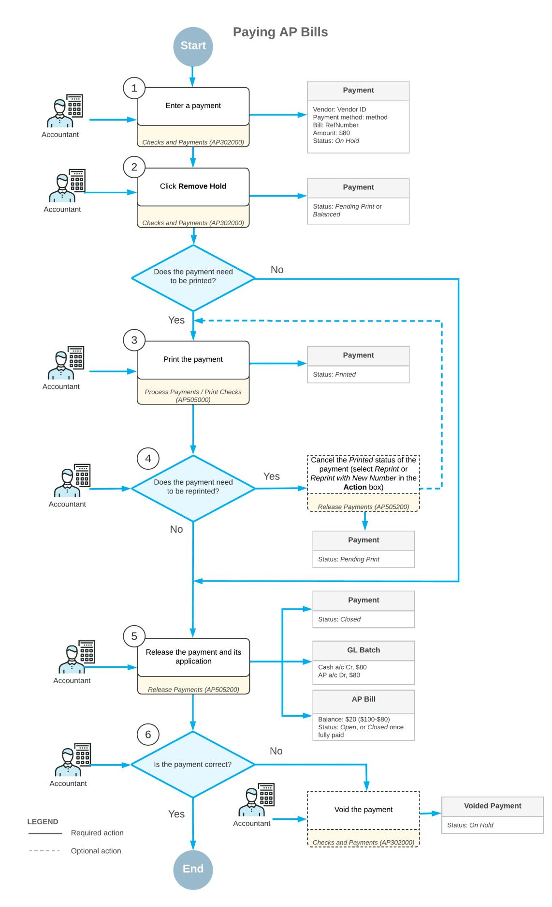

*Figure: Paying AP bills*

# **AP Bill Payments: Implementation Checklist**

To ensure that the system is configured properly for paying AP bills, make sure that the criteria listed in the table have been met in the system as described.

| Form                               | Criteria to Check                                                                                                                                                                                                                                                               | Notes |  |  |
|------------------------------------|---------------------------------------------------------------------------------------------------------------------------------------------------------------------------------------------------------------------------------------------------------------------------------|-------|--|--|
| Enable/Disable Features (CS100000) | Make sure the minimal features have been enabled as described in Company Without Branches: General Information, Company with Branches that Do Not Require Balancing: Gen eral Information, or Company with Branches that Require Balancing: General Information. |       |  |  |
| Vendors (AR303000)                 | Verify the existence of the vendor accounts for the vendors whose bills you will pay. For details, see Vendors: Implementation Activity.                                                                                                                                  |       |  |  |
| Payment Methods (CA204000)         | Make sure that the CHECK payment method has been specified when creating a payment.                                                                                                                                                                                          |       |  |  |

# **Settings That Affect the Workflow**

The following settings and entities should be specified and defined, respectively:

- The following general ledger settings should be specified on the **PostingSettings** tab of the *[General Ledger](https://help-2025r1.acumatica.com/Help?ScreenId=ShowWiki&pageid=e4913d06-c511-4258-a0f9-f36c1b854e6b) [Preferences](https://help-2025r1.acumatica.com/Help?ScreenId=ShowWiki&pageid=e4913d06-c511-4258-a0f9-f36c1b854e6b)* (GL102000) form:
  - Make sure that the **Automatically Post on Release** check box is selected. This setting causes GL batches to be immediately posted aer they are released.
  - Clear the **Generate Consolidated Batches** check box to cause every AP transaction you enter to be posted as an individual batch to the general ledger. (When this check box is selected, the system consolidates into a single batch all transactions in the same currency posted to the same period for all documents being released.)
- The following accounts payable settings should be specified on the **General** tab of the *[Accounts Payable](https://help-2025r1.acumatica.com/Help?ScreenId=ShowWiki&pageid=c3f9353e-95e6-448d-bb3f-e20643879ec7) [Preferences](https://help-2025r1.acumatica.com/Help?ScreenId=ShowWiki&pageid=c3f9353e-95e6-448d-bb3f-e20643879ec7)* (AP101000) form:
  - Select the **Hold Documents on Entry** check box in the **Data EntrySettings** section. This setting gives the created checks the *On Hold* status.
  - Make sure that the **Automatically Post on Release** check box is selected in the **PostingSettings** section. This setting indicates that checks will be automatically posted to the general ledger once they are released.
- The following payment method settings should be specified for the payment method on the *[Payment](https://help-2025r1.acumatica.com/Help?ScreenId=ShowWiki&pageid=509285d1-cfae-4e87-95c3-a968451952e6) [Methods](https://help-2025r1.acumatica.com/Help?ScreenId=ShowWiki&pageid=509285d1-cfae-4e87-95c3-a968451952e6)* (CA204000) form:
  - Select the **Print Checks** option in the **Additional Processing** section on the**Settings for Use in AP** tab.

With these settings specified and entities defined, users in your company can record and process documents in Acumatica ERP quickly and accurately, with a minimum of manual actions.

# **AP Bill Payments: Generated Transactions**

When a payment is released, a batch is created with transactions reducing the balances of the cash account and the vendor's accounts payable account.

Releasing an AP payment creates the following GL transaction.

| Account                  | Debit  | Credit |  |  |
|--------------------------|--------|--------|--|--|
| Cash account             | 0.00   | Amount |  |  |
| Accounts Payable account | Amount | 0.00   |  |  |

AP payments that do not require the printing of checks (for example, those to be paid by a wire transfer) can be released regardless of when they are actually paid.

When a payment is released, a batch is created with transactions that reduce the balances of the cash account and the vendor's AP account. If the payment is released before the cash discount date, a cash discount can be used (and deducted from the payment amount).

Releasing a payment creates a batch of the following accounting transactions.

| Account                  | Debit  | Credit                     |
|--------------------------|--------|----------------------------|
| Cash account             | 0.00   | Amount – cash dis count |
| Accounts Payable account | Amount | 0.00                       |
| Cash discount account    | 0.00   | Cash discount              |

If a payment is created in a foreign currency, the following additional accounts may be involved:

- *Realized Gain Account* or *Realized Loss Account*: The balance of one of these accounts is updated by the amount resulting from different currency exchange rates on the date of the bill and the date when the bill has been paid.
- *Rounding Gain Account* or *Rounding Loss Account*: The balance of one of these accounts is updated by the amount resulting from rounding the sum of the document details to the document total.

# **AP Bill Payments: Process Activity**

The following activity will walk you through the process of creating a payment of an AP bill.

This activity is based on the *U100* dataset. If you are using another dataset, or if any system settings have been changed in *U100*, these changes can affect the workflow of the activity and the results of the processing. To avoid any issues, restore the *U100* dataset to its initial state.

# **Video Tutorial**

This video shows you the common process but may contain less detail than the activity has. If you want to repeat the activity on your own or you are preparing to take the certification exam, we recommend that you follow the instructions in the steps of the activity.

#### *[FEEDBACK](https://www.surveymonkey.com/r/BLBL7RJ?Video=Paying%20AP%20Bills&Source=Open%20Uni&Course=F100)*

# **Story**

Suppose that on 1/30/2025, the SweetLife Fruits & Jams company has to pay an AP bill in the amount of \$177 for the purchase of office supplies from Spectra Stationery Office. The company usually pays such bills by check and sends the check to the vendor.

Acting as a SweetLife accountant, you need to create a payment in the system, release it, and print the check to be sent to the vendor.

# **Configuration Overview**

For the purposes of this activity, the following features have been enabled on the *[Enable/Disable Features](https://help-2025r1.acumatica.com/Help?ScreenId=ShowWiki&pageid=c1555e43-1bc5-4f6f-ba9d-b323f94d8a6b)* (CS100000) form:

- *Standard Financials*, which provides the standard financial functionality
- *Multibranch Support*, which supports multiple branches in your instance of Acumatica ERP
- *Multicompany Support*, which supports multiple companies within one tenant.

On the *[Accounts Payable Preferences](https://help-2025r1.acumatica.com/Help?ScreenId=ShowWiki&pageid=c3f9353e-95e6-448d-bb3f-e20643879ec7)* (AP101000) form, the **Hold Documents on Entry** check box has been selected in the **Data EntrySettings** section.

On the *[Vendors](https://help-2025r1.acumatica.com/Help?ScreenId=ShowWiki&pageid=a9584be3-f2bd-4d67-80d4-8041d809df56)* (AP303000) form, the *STATOFFICE (Spectra Stationery Office)* vendor has been configured. This vendor has the *CHECK* payment method specified as the default one.

# **Process Overview**

In this activity, you will create a payment on the *[Checks and Payments](https://help-2025r1.acumatica.com/Help?ScreenId=ShowWiki&pageid=81659f97-cb14-4a27-bc3e-0f67b3945613)* (AP302000) form. You will then print the payment on the *[Process Payments / Print Checks](https://help-2025r1.acumatica.com/Help?ScreenId=ShowWiki&pageid=e632860a-8905-424a-8e27-ad66cf9f64c7)* (AP505000) form and release the payment on the *[Release](https://help-2025r1.acumatica.com/Help?ScreenId=ShowWiki&pageid=0a981976-131b-4150-81d0-19b54a46e510) [Payments](https://help-2025r1.acumatica.com/Help?ScreenId=ShowWiki&pageid=0a981976-131b-4150-81d0-19b54a46e510)* (AP505200) form.

#### **System Preparation**

To prepare the system, do the following:

- 1. Launch the Acumatica ERP website, and sign in to a company with the *U100* dataset preloaded. To sign in as an accountant, use the following credentials:
  - Username: *johnson*
  - Password: *123*
- 2. In the info area, in the upper-right corner of the top pane of the Acumatica ERP screen, make sure that the business date in your system is set to *1/30/2025*. If a different date is displayed, click the Business Date menu button and select *1/30/2025*. For simplicity, in this process activity, you will create and process all documents in the system on this business date.
- 3. On the Company and Branch Selection menu, also on the top pane of the Acumatica ERP screen, make sure that the *SweetLife Head Office and Wholesale Center* branch is selected. If it is not selected, click the Company and Branch Selection menu to view the list of branches that you have access to, and then click *SweetLife Head Office and Wholesale Center*.

#### **Step 1: Creating a Payment**

To create a payment, do the following:

1. Open the *[Checks and Payments](https://help-2025r1.acumatica.com/Help?ScreenId=ShowWiki&pageid=81659f97-cb14-4a27-bc3e-0f67b3945613)* (AP302000) form.

To open the form for creating a new record, type the form ID in the Search box, and on the Search form, point at the form title and click **New** right of the title.

- 2. Click **Add New Record** on the form toolbar, and specify the following settings in the Summary area:
  - **Type**: *Payment* (inserted by default)
  - **Vendor**: *STATOFFICE*
  - **Payment Method**: *CHECK* (inserted automatically based on the selected vendor)
  - **Payment Amount**: 177
  - **Application Date**: *1/30/2025* (inserted by default)
  - **Description**: Office supplies
- 3. On the **Documents to Apply** tab, click **Add Row** on the table toolbar, and in the **Reference Nbr.** column for the added row, select the bill with the amount of \$177.
- 4. On the form toolbar, click **Remove Hold**.

The status of the payment has changed to *Pending Print*, as shown in the following screenshot.

| <b>Checks and Payments</b> Payment - Spectra Stationery Office                                                                       |                                       |                                |                    |                                |                                        |                      |                                         |                |           | <b>P</b> NOTES | <b>FILES</b> <b>ACTIVITIES</b> | TOOLS $\sim$        |
|-----------------------------------------------------------------------------------------------------------------------------------------|---------------------------------------|--------------------------------|--------------------|--------------------------------|----------------------------------------|----------------------|-----------------------------------------|----------------|-----------|----------------|-----------------------------------|---------------------|
| 周 m $\leftarrow$                                                                                                                  | $\sim$                                | n 侕 +                    | K $\checkmark$  | $\rightarrow$ ≺             | $\geq$ <b>HOLD</b>                  | <b>PRINT/PROCESS</b> | $\cdots$                                |                |           |                |                                   |                     |
| Type:                                                                                                                                   | Payment                               | $\checkmark$                   | Vendor:            |                                | STATOFFICE - Spectra Stationery Office | 0                    | Payment Amount:                         |                | 177.00    |                |                                   | $\hat{\phantom{1}}$ |
| Reference Nbr.:                                                                                                                         | <new></new>                           | Q * Location:               |                    | <b>MAIN - Primary Location</b> |                                        | ام                   | <b>Unapplied Balance:</b>               |                | 0.00      |                |                                   |                     |
| Status:                                                                                                                                 | <b>Pending Print</b> Joint Payee N |                                |                    |                                |                                        |                      | <b>Application Amount:</b>              |                | 177.00    |                |                                   |                     |
| * Application Date:                                                                                                                     | 1/30/2025                             |                                | * Payment Meth     | <b>CHECK</b>                   |                                        |                      | Finance Charges:                        |                | 0.00      |                |                                   |                     |
| * Application Pe 01-2025                                                                                                                |                                       | Q                              | * Cash Account:    |                                | 10200WH - Wholesale Checking           | ۹                    |                                         |                |           |                |                                   |                     |
| Payment Ref.: Description:                                                                                                           |                                       |                                | Office supplies    |                                |                                        |                      |                                         |                |           |                |                                   |                     |
| <b>DOCUMENTS TO APPLY</b> <b>APPLICATION HISTORY</b> <b>FINANCIAL</b> <b>REMITTANCE</b> <b>CHARGES</b> <b>COMPLIANCE</b> |                                       |                                |                    |                                |                                        |                      |                                         |                |           |                |                                   |                     |
| $\mathbf{x}$ Ò <b>LOAD DOCUMENTS</b> <b>ADD JOINT PAYEE</b> $\vdash$ $\times$ +                                       |                                       |                                |                    |                                |                                        |                      |                                         |                |           |                |                                   |                     |
| $\Box$ 图 0 <b>Branch</b>                                                                                                          |                                       | <b>Document</b> <b>Type</b> | *Reference Nbr. | Nbr.                           | Line Inventory ID                      | <b>Amount Paid</b>   | Cash <b>Discount</b> <b>Taken</b> | With, Tax Date |           | Due Date       | Cash <b>Discount</b> Date   | <b>Cross Rate</b>   |
| > 0 <b>HEADOFFICE</b> n                                                                                                           |                                       | Bill                           | 000039             | $\bf{0}$                       |                                        | 177.00               | 0.00                                    | 0.00           | 1/10/2025 | 2/9/2025       | 2/9/2025                          | 1.00000000          |

*Figure: The payment ready for printing*

# **Step 2: Printing the Payment**

To print the payment, do the following:

- 1. While you are still on the *[Checks and Payments](https://help-2025r1.acumatica.com/Help?ScreenId=ShowWiki&pageid=81659f97-cb14-4a27-bc3e-0f67b3945613)* (AP302000) form, on the form toolbar, click **Print/Process**. The system opens the *[Process Payments / Print Checks](https://help-2025r1.acumatica.com/Help?ScreenId=ShowWiki&pageid=e632860a-8905-424a-8e27-ad66cf9f64c7)* (AP505000) form.
- 2. Review the details of the payment selected in the row with the unlabeled check box selected for it.
- 3. On the form toolbar, click **Process**.

A separate browser tab is opened showing the printable version of the check.

4. Review the printable version of the check and close the browser tab. (For the purposes of this activity, you do not need to actually print the check.)

In a production setting, you would click **Print** on the form toolbar to print the check before closing the browser tab.

# **Step 3: Releasing the Payment**

To release the payment, do the following:

- 1. On the *[Release Payments](https://help-2025r1.acumatica.com/Help?ScreenId=ShowWiki&pageid=0a981976-131b-4150-81d0-19b54a46e510)* (AP505200) form, which the system has opened, review the details of the payment you are going to release.
- 2. On the form toolbar, click **Process**.
- 3. Open the Checks and Payments (AP3020PL) list of records.
- 4. Open the payment you have just released. (It should be the top record in the table and have the *Closed* status.)
- 5. On the **Application History** tab, click the link in the **Batch Number** column to review the transaction generated by the system.
- 6. On the *Journal [Transactions](https://help-2025r1.acumatica.com/Help?ScreenId=ShowWiki&pageid=dda046bc-5946-407f-88f7-1c0c966fbe72)* (GL301000) form, which the system opens, review the details of the transaction.

# **AP Bill Payments: Mass Processing of Documents**

This chapter explains how to release and print multiple payments and the rules that the system uses to group the prepared documents.

# **Mass Printing of Payments**

To print payments or checks in bulk, you use the *[Process Payments / Print Checks](https://help-2025r1.acumatica.com/Help?ScreenId=ShowWiki&pageid=e632860a-8905-424a-8e27-ad66cf9f64c7)* (AP505000) form. To print multiple payments, you select check boxes next to the needed payments in the table and click **Process** on the form toolbar or click **Process All** to print all the payments listed in the table.

### **Mass Processing of Checks**

To pay multiple vendor bills, you use the *[Prepare Payments](https://help-2025r1.acumatica.com/Help?ScreenId=ShowWiki&pageid=e3b526e3-8b12-4fa9-a5b2-2955e763f238)* (AP503000) form where you specify the *CHECK* payment method and select documents for payment by vendor, pay date, due date, and cash discount date.

When you click **Process** or **Process All** on the form toolbar, the system prints the selected payments, grouping the documents into a single payment for each vendor unless the **PaySeparately** option is selected for the vendor; for such vendors, a separate payment will be generated for each document.

# **Mass Release of Payments**

You release multiple payments that have already been printed on the *[Release Payments](https://help-2025r1.acumatica.com/Help?ScreenId=ShowWiki&pageid=0a981976-131b-4150-81d0-19b54a46e510)* (AP505200) form. To release multiple payments, you select check boxes next to the needed payments in the table and click **Process** on the form toolbar or click **Process All** to release all the payments listed in the table.

# **AP Bill Payments: Related Reports and Inquiries**

This topic describes the reports and inquiry forms you may review to gather information about AP payments.

If you do not see a report or inquiry form, this could mean that you have signed in to the system with a user account that does not have access rights to the form. Sign in as the *admin* user, or contact your system administrator.

# **Reviewing Checks that Are Pending Printing**

You can use the *[Checks Pending Printing](https://help-2025r1.acumatica.com/Help?ScreenId=ShowWiki&pageid=224cfe60-e947-4ff8-a79b-e6088573d4d5)* (AP404000) form to review which checks have not been printed yet as of a specified pay date. You can initiate check printing on this form by clicking **Print Checks** on the form toolbar. The system navigates to the *[Process Payments / Print Checks](https://help-2025r1.acumatica.com/Help?ScreenId=ShowWiki&pageid=e632860a-8905-424a-8e27-ad66cf9f64c7)* (AP505000) form, where you can print checks.

# **Running a Report of Checks that Are Pending Printing**

You can use the *[Checks Pending Printing](https://help-2025r1.acumatica.com/Help?ScreenId=ShowWiki&pageid=aa3f00fe-694d-4309-9961-61dcde793f5d)* (AP612500) form to review a report on checks that have not yet been printed.

# **Reviewing Vendor Documents**

You use the *[Vendor](https://help-2025r1.acumatica.com/Help?ScreenId=ShowWiki&pageid=22c03d80-cbb0-449d-9325-c12f623aaefd) Details* (AP402000) form to review the accounts payable documents (bills, debit adjustments, credit adjustments, and payments) for a particular vendor.

By default, the form displays the list of open vendor documents (that is, those with the *Open* status), but you can add to the list closed documents and unreleased documents by selecting the**Show All Documents** and **Include Unreleased Documents** check boxes, respectively.

# **Running the Check Register Inquiry**

You use the *[Check Register](https://help-2025r1.acumatica.com/Help?ScreenId=ShowWiki&pageid=260298f9-0fbc-4799-a48e-0aa324b2a91b)* (AP404500) form to review the details of the checks that have been generated in the system. By using this inquiry form, you can find out whether a particular check number has been used and, if it has, for which AP check.

If you have reprinted a check with a new number or voided a check, the system does not allow this number to be reused. The inquiry displays the check numbers of all checks, including those have been reprinted or voided.

# **To Print Checks**

You print the physical checks for AP payments by using the *[Process Payments / Print Checks](https://help-2025r1.acumatica.com/Help?ScreenId=ShowWiki&pageid=e632860a-8905-424a-8e27-ad66cf9f64c7)* (AP505000) form.

Check printing is required for AP payments if their payment methods have the **Print Checks** check box selected on the *[Payment Methods](https://help-2025r1.acumatica.com/Help?ScreenId=ShowWiki&pageid=509285d1-cfae-4e87-95c3-a968451952e6)* (CA204000) form.

#### **Before You Proceed**

To prevent damage to or wasting of checks during printing, do the following:

- 1. Make sure the printer is connected to your computer and ready for printing checks.
- 2. Print a test page to check which side of the paper is printed on and whether there is enough toner in the printer.
- 3. If your checks include MICR characters, prepare the system for printing these characters. For details, see the *To Prepare for Printing Checks with MICR [Characters](#page-116-1)* section of this topic.

# **To Print Checks**

- 1. Open the *[Process Payments / Print Checks](https://help-2025r1.acumatica.com/Help?ScreenId=ShowWiki&pageid=e632860a-8905-424a-8e27-ad66cf9f64c7)* (AP505000) form.
- 2. In the **Payment Method** box, select *Check* (or another value that in your system designates a payment method that involves printing checks).
- 3. In the **Cash Account** box, select the bank account (a checking account) from which the check should be drawn.
- 4. In the **Next Check Number** box, enter the number (if the box is blank) or make sure the check number suggested by the system matches the first check number of the checks you plan to print.
- 5. In the table, select the unlabeled check box for each payment document for which you intend to print a check.
- 6. On the form toolbar, click **Process**.

For each of the selected documents, a check appears in a new browser tab.

- 7. Click **Print** on the form toolbar to start the printing process for each check. The browser opens the **Print** page.
- 8. Select appropriate options, and then click **OK**. The checks for the selected documents are printed.
- 9. Close the browser tabs that contain the printable versions of the checks.

The system displays the *[Release Payments](https://help-2025r1.acumatica.com/Help?ScreenId=ShowWiki&pageid=0a981976-131b-4150-81d0-19b54a46e510)* (AP505200) form, which lists the AP payments for which you have printed checks.

10.Review the printed checks and proceed as follows:

- If all checks have printed successfully, release the respective documents (which now have the *Printed* status).
- If at least one check requires reprinting, proceed as described in *[Check Reprinting: Process Activity](#page-120-1)*.

# **To Prepare for Printing Checks with MICR Characters**

- 1. Download a ZIP file with the MICR Encoding font at *[http://www.fontspace.com/digital-graphics-labs/micr](http://www.fontspace.com/digital-graphics-labs/micr-encoding)[encoding](http://www.fontspace.com/digital-graphics-labs/micr-encoding)*.
- 2. Extract the contents of the ZIP file into a temporary folder.
- 3. Install the MICR Encoding font on the computer running the instance of the Acumatica ERP site you want to use for printing.
- 4. Install the MICR Encoding font on the client computer you plan to use for printing.

For detailed instructions about how to install a font on a computer, see the Help for the operating system the computer runs.

# **To Check Funds for Payments**

Before issuing one or more payments or printing any checks for specific vendor account, you might need to check whether you have sufficient funds in the account. You can check funds for payments by using the *[Batch Payments](https://help-2025r1.acumatica.com/Help?ScreenId=ShowWiki&pageid=765f801c-0b3a-4d5b-8f01-3a1a496934e8)* (AP305000) form.

# **To Check Funds Available for Payments**

1. Open the *[Prepare Payments](https://help-2025r1.acumatica.com/Help?ScreenId=ShowWiki&pageid=e3b526e3-8b12-4fa9-a5b2-2955e763f238)* (AP503000) form.

- 2. In the **Cash Account** box of the Selection area, select the cash account to be used as the source for paying bills.
- 3. In the **Payment Method** box, select the payment method associated with the cash account.
- 4. Optional: If you want to pay documents with due dates approaching, select the **Due Date in LessThan** check box, and then in the box on the right, specify the maximum number of days before the due date.
- 5. Optional: To select for payment only the documents whose cash discounts expire in the coming days, select the **Cash Discount Expires in LessThan** check box and use the corresponding box to specify the number of the days.
- 6. Optional: Select the vendor for which you want to view outstanding documents.

You can apply one of available shared filters by using the table toolbar or create a new filter to display only relevant documents in the table. For more information, see *[Saving of Filters for](https://help-2025r1.acumatica.com/Help?ScreenId=ShowWiki&pageid=c5d6bff8-2f29-49af-bb5a-fe876efe07fd) [Future Use](https://help-2025r1.acumatica.com/Help?ScreenId=ShowWiki&pageid=c5d6bff8-2f29-49af-bb5a-fe876efe07fd)*.

- 7. Select the documents to pay by using the check boxes in the Selection column.
- 8. Make sure the amount to be paid for the selected documents (in the**Selection Total** box in the Selection area) is within the balance of the cash account (in the **Available Balance** box).
- 9. If required, return to Step 4 to narrow or to extend the selection of documents to pay by using the selected cash account.

Aer you analyze funds for payments, you can transfer funds from one cash account to another by using the *Funds [Transfers](https://help-2025r1.acumatica.com/Help?ScreenId=ShowWiki&pageid=814c5c8d-45bc-4e4d-98df-1b6785defc6c)* (CA301000) form, if needed.

# **To Track Payments to Vendors**

To quickly check the history of payments to a vendor, you use the following forms, as described in the sections of this topic:

- *[Bills and Adjustments](https://help-2025r1.acumatica.com/Help?ScreenId=ShowWiki&pageid=956b4e51-3078-4d2d-85b3-65c080d95234)* (AP301000): To check whether the bill has been paid and view the documents used to pay the bill
- *[Vendor](https://help-2025r1.acumatica.com/Help?ScreenId=ShowWiki&pageid=22c03d80-cbb0-449d-9325-c12f623aaefd) Details* (AP402000): To view all payments to the vendor
- *[Approve Bills for Payment](https://help-2025r1.acumatica.com/Help?ScreenId=ShowWiki&pageid=76c4ad15-d7b5-477b-a514-f7dc93faf2be)* (AP502000): To see whether a bill has been approved for payment

# **To Check Whether a Bill Has Been Paid**

- 1. Open the *[Bills and Adjustments](https://help-2025r1.acumatica.com/Help?ScreenId=ShowWiki&pageid=956b4e51-3078-4d2d-85b3-65c080d95234)* (AP301000) form.
- 2. In the **Type** box of the Summary area, select *Bill*.
- 3. In the **Reference Nbr.** box, select the number of the bill whose payments you want to check.
- 4. Check whether the bill has been paid as follows:
  - In the **Balance** box, check the amount to be paid for the bill. If the amount is zero, the bill has been paid in full.
  - On the **Applications** tab, view all payments that have been applied to the bill.

# **To View All Payments to a Vendor**

- 1. Open the *[Vendor](https://help-2025r1.acumatica.com/Help?ScreenId=ShowWiki&pageid=22c03d80-cbb0-449d-9325-c12f623aaefd) Details* (AP402000) form.
- 2. In the **Branch** box of the Selection area, select the branch for which you want to view prepayments.

- 3. In the **Vendor** box, select the vendor.
- 4. In the **Period** box, select the financial period for which the payments will be displayed, or leave the box blank to view payments of all financial periods.
- 5. Optional: Select the **Include Unreleased Documents** check box to include unreleased documents among those listed.
- 6. Check the payments to the vendor as follows:
  - In the table, view the list of payments that match the selected criteria.
  - In the **Balance by Documents** box of the Selection area, notice the total amount of the listed payments to the vendor. This balance is based on the criteria you have selected.
  - In the **Current Balance** box, notice the total amount of payments to the vendor, as retrieved from the Accounts Payable account history records stored in the database.

#### **To See Whether a Bill Has Been Approved For Payment**

- 1. Open the *[Approve Bills for Payment](https://help-2025r1.acumatica.com/Help?ScreenId=ShowWiki&pageid=76c4ad15-d7b5-477b-a514-f7dc93faf2be)* (AP502000) form.
- 2. In the **Selection Date** box of the Selection area, select the date of the document approval.
- 3. Select the vendor whose bills you want to check.
- 4. Optional: In the Selection area, specify other filtering criteria to narrow the search results.
- 5. In the table, the bills with the *Open* status that meet your selected criteria are listed; if the bill in a row is approved for payment, the check box in the unlabeled column of that row is selected and you can see the pay date of the Accounts Payable document in the **Pay Date** column.

# **Check Correction and Reprinting**

In this chapter, you will find general information on how reprint checks, a checklist for system implementation, an activity that describes how to correct a check and reprint it with a new number, and report and inquiries that can be useful to find and view created transactions.

# **Check Reprinting: General Information**

In some cases, you need to correct a printed check and reprint it with the same number or with a new number.

# **Learning Objectives**

In this chapter, you will learn how to do the following:

- Correct a check by removing a bill from it
- Reprint the check with a new number

# **Applicable Scenarios**

You usually reprint checks in the following cases:

- You reprint a check with the same number if you have discovered that the check contains incorrect details or there were no check blanks in the printer.
- You reprint a check with a new number if the blank with the old number has been spoiled.

# **Reprinting of AP Checks**

To be able to print a check again, you first need to change the *Printed* status for this check on the *[Release Payments](https://help-2025r1.acumatica.com/Help?ScreenId=ShowWiki&pageid=0a981976-131b-4150-81d0-19b54a46e510)* (AP505200) form. You can reprint a check by using one of the following numbers:

• The same check number:

To reprint a check with the same check number, you select the *Reprint* command in the **Action** box. When you invoke processing, for the checks included in processing, the system changes the check status from *Printed* to *Pending Print* and allows you to print the check again with the same number.

• A new check number:

To reprint a check with a new check number, you select the *Reprint with New Number* command in the **Action** box. When you invoke processing, for the checks included in processing, the system changes the check status from *Printed* to *Pending Print* and voids the payment number so that you can print the check with a new number.

# **Check Reprinting: Implementation Checklist**

The following sections provide details you can use to ensure that the system is configured properly for performing check reprinting, and to understand (and change, if needed) the settings that affect the processing workflow.

# **Implementation Checklist**

We recommend that before you initially print and reprint checks, you make sure the settings have been specified and entities created, as summarized in the following checklist.

| Form                               | Criteria to Check                                                                                                                                                                                                                                                             |
|------------------------------------|-------------------------------------------------------------------------------------------------------------------------------------------------------------------------------------------------------------------------------------------------------------------------------|
| Enable/Disable Features (CS100000) | Make sure the minimal features have been enabled as described in Company Without Branches: General Information, Company with Branches that Do Not Re quire Balancing: General Information, and Company with Branches that Require Balancing: General Information. |
| Payment Methods (CA204000)         | Make sure that the CHECK payment method has been specified when creating a payment.                                                                                                                                                                                        |

# **Settings That Affect the Workflow**

You can affect the workflow of reprinting checks by specifying additional settings as follows:

- The following general ledger settings should be specified on the **PostingSettings** tab of the *[General Ledger](https://help-2025r1.acumatica.com/Help?ScreenId=ShowWiki&pageid=e4913d06-c511-4258-a0f9-f36c1b854e6b) [Preferences](https://help-2025r1.acumatica.com/Help?ScreenId=ShowWiki&pageid=e4913d06-c511-4258-a0f9-f36c1b854e6b)* (GL102000) form:
  - Make sure that the **Automatically Post on Release** check box is selected. This setting causes GL batches to be immediately posted aer they are released.
  - Clear the **Generate Consolidated Batches** check box to cause every AP transaction you enter to be posted as an individual batch to the general ledger. (When this check box is selected, the system consolidates into a single batch all transactions in the same currency posted to the same period for all documents being released.)
- The following accounts payable settings should be specified on the **General** tab of the *[Accounts Payable](https://help-2025r1.acumatica.com/Help?ScreenId=ShowWiki&pageid=c3f9353e-95e6-448d-bb3f-e20643879ec7) [Preferences](https://help-2025r1.acumatica.com/Help?ScreenId=ShowWiki&pageid=c3f9353e-95e6-448d-bb3f-e20643879ec7)* (AP101000) form:
  - Select the **Hold Documents on Entry** check box in the **Data EntrySettings** section. This setting gives the created checks the *On Hold* status.
  - Make sure that the **Automatically Post on Release** check box is selected in the **PostingSettings** section. This setting indicates that checks will be automatically posted to the general ledger once they are released.
- The following payment method settings should be specified for the payment method on the *[Payment](https://help-2025r1.acumatica.com/Help?ScreenId=ShowWiki&pageid=509285d1-cfae-4e87-95c3-a968451952e6) [Methods](https://help-2025r1.acumatica.com/Help?ScreenId=ShowWiki&pageid=509285d1-cfae-4e87-95c3-a968451952e6)* (CA204000) form:
  - Select the **Print Checks** option in the **Additional Processing** section on the**Settings for Use in AP** tab.

# **Testing of Settings**

To make sure that all settings are configured correctly, we recommend that you reprint checks as described in *[Check Reprinting: Process Activity](#page-120-1)*.

# **Check Reprinting: Process Activity**

The following activity will walk you through the process of printing, correcting, and reprinting a check.

This activity is based on the *U100* dataset. If you are using another dataset, or if any system settings have been changed in *U100*, these changes can affect the workflow of the activity and the results of the processing. To avoid any issues, restore the *U100* dataset to its initial state.

# **Story**

Suppose that in November 2024, the SweetLife Fruits & Jams company bought glass jars and lids from Jar Co. in the amount of \$410, and a check was entered in the system.

Acting as a SweetLife accountant, you have to print the check to prepare it for further processing. Further suppose that aer printing the check, you find out that the items in one of the two bills included in this check (with an amount of \$50) have not been delivered. You have to exclude this bill from the check, reprint the check, and release the check.

# **Configuration Overview**

For the purposes of this activity, on the *[Accounts Payable Preferences](https://help-2025r1.acumatica.com/Help?ScreenId=ShowWiki&pageid=c3f9353e-95e6-448d-bb3f-e20643879ec7)* (AP101000) form, the **Hold Documents on Entry** check box has been selected in the **Data EntrySettings** section.

# **Process Overview**

You will initially print a check on the *[Checks and Payments](https://help-2025r1.acumatica.com/Help?ScreenId=ShowWiki&pageid=81659f97-cb14-4a27-bc3e-0f67b3945613)* (AP302000) form. When you discover that the check you printed was in error, on the *[Process Payments / Print Checks](https://help-2025r1.acumatica.com/Help?ScreenId=ShowWiki&pageid=e632860a-8905-424a-8e27-ad66cf9f64c7)* (AP505000) form, you will select the *Reprint* action for the check to change its status from *Printed* to *Pending Print*; this makes it possible to put the check on hold (assign the *On Hold* status to it) so that it can be edited. On the *[Checks and Payments](https://help-2025r1.acumatica.com/Help?ScreenId=ShowWiki&pageid=81659f97-cb14-4a27-bc3e-0f67b3945613)* form, you will make necessary edits to the check. Then on the *[Process Payments / Print Checks](https://help-2025r1.acumatica.com/Help?ScreenId=ShowWiki&pageid=e632860a-8905-424a-8e27-ad66cf9f64c7)* form, you will reprint the check on a new blank check with a new number. Finally, you will release the updated and reprinted check on the *[Release Payments](https://help-2025r1.acumatica.com/Help?ScreenId=ShowWiki&pageid=0a981976-131b-4150-81d0-19b54a46e510)* (AP505200) form.

# **System Preparation**

To prepare the system, do the following:

- 1. Launch the Acumatica ERP website, and sign in as an accountant by using the following credentials:
  - Username: *johnson*
  - Password: *123*
- 2. In the info area, in the upper-right corner of the top pane of the Acumatica ERP screen, make sure that the business date in your system is set to *1/30/2025*. If a different date is displayed, click the Business Date menu button and select *1/30/2025*. For simplicity, in this activity, you will create and process all documents in the system on this business date.
- 3. On the Company and Branch Selection menu, also on the top pane of the Acumatica ERP screen, make sure that the *SweetLife Head Office and Wholesale Center* branch is selected. If it is not selected, click the Company and Branch Selection menu to view the list of branches that you have access to, and then click *SweetLife Head Office and Wholesale Center*.

# **Step 1: Finding and Printing a Check**

To find a check and print it, do the following:

- 1. Open the Checks and Payments (AP3020PL) list of records.
- 2. Find a check with the *On Hold* status and an amount of \$410 as follows:
  - a. In the filtering area, click the **FilterSettings** button.

- b. In the **FilterSettings** dialog box, which opens, click **Add Row**, and specify the following settings:
  - **Property**: *Status*
  - **Condition**: *Equals*
  - **Value**: *On Hold*
- c. Click **Apply** to close the dialog box.
- 3. In the table, find a check with the payment amount of \$410.
- 4. Click the link in the **Reference Nbr.** column.
- 5. On the *[Checks and Payments](https://help-2025r1.acumatica.com/Help?ScreenId=ShowWiki&pageid=81659f97-cb14-4a27-bc3e-0f67b3945613)* (AP302000) form, which opens for the check you want to print, click **Remove Hold** on the form toolbar, and save the check.

Notice that the payment's status has changed to *Pending Print*.

- 6. On the form toolbar, click **Print/Process**.
- 7. On the *[Process Payments / Print Checks](https://help-2025r1.acumatica.com/Help?ScreenId=ShowWiki&pageid=e632860a-8905-424a-8e27-ad66cf9f64c7)* (AP505000) form, which is opened with the payment listed in the table and the unlabeled check box selected for the row, review the details of the payment (**Vendor ID** and **Payment Amount**) and click **Process**.

A separate browser tab is opened showing the printable version of the check.

8. Review the printable version of the check, note the check number, and close the browser tab. (For the purposes of this activity, you do not need to actually print the check. In a production setting, you would click **Print** on the form toolbar to print the check before closing the browser tab.)

The system opens the *[Release Payments](https://help-2025r1.acumatica.com/Help?ScreenId=ShowWiki&pageid=0a981976-131b-4150-81d0-19b54a46e510)* (AP505200) form with the payment ready for release. Do not release the payment yet.

# **Step 2: Removing a Bill from the Check**

To remove the \$50 bill, which contains the items not delivered, from the check, do the following:

- 1. Open the Checks and Payments (AP3020PL) list of records.
- 2. If you applied any filters before on this form, click the **FilterSettings** button in the filtering area.
- 3. In the **FilterSettings** dialog box, which opens, click **Delete Row**, and then click **Apply** to close the dialog box.
- 4. In the table, find the check you opened in Step 1 as follows:
  - a. In the filtering area, click the **FilterSettings** button.
  - b. In the **FilterSettings** dialog box, which opens, click **Add Row**, and specify the following settings:
    - **Property**: *Status*
    - **Condition**: *Equals*
    - **Value**: *Printed*
  - c. Click **Apply** to close the dialog box.
- 5. In the table, review the payment. Notice its status and payment amount.
- 6. Open the *[Release Payments](https://help-2025r1.acumatica.com/Help?ScreenId=ShowWiki&pageid=0a981976-131b-4150-81d0-19b54a46e510)* (AP505200) form.
- 7. In the **Action** box, select *Reprint with New Number*.

With this action selected, for all checks you select and then process, the system will change the status from *Printed* to *Pending Print*. The number of this check will be kept in the system, and it will not be possible to reuse it for another check.

- 8. In the table, select the unlabeled check box for the payment you have been working with, and on the form toolbar, click **Process**.
- 9. In the **Processing** pop-up window, which is opened, click the **Processed** tab.

- 10.Click the link in the **Reference Nbr.** column to again open the payment on the *[Checks and Payments](https://help-2025r1.acumatica.com/Help?ScreenId=ShowWiki&pageid=81659f97-cb14-4a27-bc3e-0f67b3945613)* form.
- 11.On the form toolbar, click **Hold** to change the payment's status to *On Hold*.
  - Now you can edit the payment to remove the bill of \$50, whose products have not yet been delivered.
- 12.On the **Documents to Apply** tab, click the bill in the amount of \$50, and click **Delete Row** on the table toolbar.
- 13.In the Summary area, enter 360 in the **Payment Amount** box.
- 14.In the **Description** box, enter Glass jars.
- 15.Save the payment, and on the form toolbar, click **Remove Hold**.

The payment's status has changed again to *Pending Print*.

#### **Step 3: Reprinting the Check**

To reprint the already-printed check with a new number, because the blank with the old number cannot be used, do the following:

- 1. While you are still viewing the payment on the *[Checks and Payments](https://help-2025r1.acumatica.com/Help?ScreenId=ShowWiki&pageid=81659f97-cb14-4a27-bc3e-0f67b3945613)* (AP302000) form, on the form toolbar, click **Print/Process**.
- 2. On the *[Process Payments / Print Checks](https://help-2025r1.acumatica.com/Help?ScreenId=ShowWiki&pageid=e632860a-8905-424a-8e27-ad66cf9f64c7)* (AP505000) form, which is opened with the payment listed in the table and the unlabeled check box selected for the row, click **Process** on the form toolbar.

A separate browser tab is opened showing the printable version of the check, which has a new check number but the updated amount of \$360. You have not yet sent the check, but you have printed it on a blank. So you should reprint it with the new number on a new blank.

#### **Step 4: Releasing the Check**

To release the updated check, do the following:

1. On the *[Release Payments](https://help-2025r1.acumatica.com/Help?ScreenId=ShowWiki&pageid=0a981976-131b-4150-81d0-19b54a46e510)* (AP505200) form, which opened aer you printed the check, click the link in the **Reference Nbr.** column to open the payment on the *[Checks and Payments](https://help-2025r1.acumatica.com/Help?ScreenId=ShowWiki&pageid=81659f97-cb14-4a27-bc3e-0f67b3945613)* (AP302000) form.

Notice that the payment's status has changed again to *Printed*.

- 2. On the form toolbar, click **Release** to release the payment.
- 3. Click the **Application History** tab, and make sure that the payment was applied to one bill in the amount of \$360, as shown in the following screenshot.

| <b>Checks and Payments</b> Payment 000002 - Jar Co.                            |                                                       |                                                        |                                 |                             |          | <b>PINOTES</b>                             | <b>ACTIVITIES</b>          | <b>FILES</b> $TOOLS$ $\star$ |
|-----------------------------------------------------------------------------------|-------------------------------------------------------|--------------------------------------------------------|---------------------------------|-----------------------------|----------|--------------------------------------------|----------------------------|---------------------------------|
| E 间 짜 $+$ $\Omega$ ο $\mathsf{K}$ $\epsilon$ $\checkmark$ | <b>VOID</b> $\lambda$ $\rightarrow$ $\cdots$ |                                                        |                                 |                             |          |                                            |                            |                                 |
| Payment Vendor: Type: $\sim$                                             | JARCO - Jar Co.                                       | Payment Amount: D                                   | 360.00                          |                             |          |                                            |                            | $\hat{ }$                       |
| Reference Nbr.: 000002 Q Location:                                       | <b>MAIN - Primary Location</b>                        | <b>Unapplied Balance:</b>                              | 0.00                            |                             |          |                                            |                            |                                 |
| <b>Closed</b> Joint Payee N Status:                                         |                                                       | <b>Application Amount:</b>                             | 0.00                            |                             |          |                                            |                            |                                 |
| Application Date: 11/30/2024 Payment Meth                                      | <b>CHECK</b>                                          | Finance Charges:                                       | 0.00                            |                             |          |                                            |                            |                                 |
| Cash Account: Application Pe 11-2024                                           | 10200WH - Wholesale Checking                          |                                                        |                                 |                             |          |                                            |                            |                                 |
| Payment Ref.: !!!!!!!!!!!!!!!!!!!!!!!!!!!!!!!!!!!!!!!! Description:         | Glass jars                                            |                                                        |                                 |                             |          |                                            |                            |                                 |
| <b>APPLICATION HISTORY</b> DOCUMENTS TO APPLY                                  | <b>FINANCIAL</b> <b>REMITTANCE</b>                 | <b>CHARGES</b> COMPLIANCE                           |                                 |                             |          |                                            |                            |                                 |
| $\mathbf{x}$ <b>REVERSE APPLICATION</b> $\blacksquare$ Õ                 |                                                       |                                                        |                                 |                             |          |                                            |                            |                                 |
| <b>B</b> 0 D Branch Doc. Type Batch Number                               | Reference <b>Inventory ID</b> Nbr.              | Cash <b>Amount Paid</b> <b>Discount</b> Taken | With. Tax Application Period | Application Date Date | Due Date | Cash Balance <b>Discount</b> Date | <b>Discount</b> Balance | Cash Description                |
| Bill $> 0$ D <b>HEADOFFICE</b>                                              | 000008                                                | 360.00 0.00                                         | 01-2025 0.00                 | 1/8/2025 1/8/2025        | 2/7/2025 | 2/7/2025 0.00                           |                            | 0.00 Glass jars                 |

*Figure: The released payment applied to the bill*

# **Check Reprinting: Related Report and Inquiry Forms**

In the following sections, you can find details about the report and inquiry forms you may want to review to gather information about checks.

If you do not see a report or inquiry, this could mean that you have signed in to the system with a user account that does not have access rights to a form. Sign in as the *admin* user, or contact your system administrator.

# **Reviewing Checks that Are Pending Printing**

You can use the *[Checks Pending Printing](https://help-2025r1.acumatica.com/Help?ScreenId=ShowWiki&pageid=224cfe60-e947-4ff8-a79b-e6088573d4d5)* (AP404000) form to review which checks have not been printed yet as of a specified pay date. You can initiate check printing on this form by clicking **Print Checks** on the form toolbar. The system navigates to the *[Process Payments / Print Checks](https://help-2025r1.acumatica.com/Help?ScreenId=ShowWiki&pageid=e632860a-8905-424a-8e27-ad66cf9f64c7)* (AP505000) form, where you can print checks.

# **Running a Report of Checks that Are Pending Printing**

You can use the *[Checks Pending Printing](https://help-2025r1.acumatica.com/Help?ScreenId=ShowWiki&pageid=aa3f00fe-694d-4309-9961-61dcde793f5d)* (AP612500) form to review a report on checks that have not yet been printed.

# **Running the Check Register Inquiry**

You use the *[Check Register](https://help-2025r1.acumatica.com/Help?ScreenId=ShowWiki&pageid=260298f9-0fbc-4799-a48e-0aa324b2a91b)* (AP404500) form to review the details of the checks that have been generated in the system. By using this inquiry form, you can find out whether a particular check number has been used and, if it has, for which AP check.

If you have reprinted a check with a new number or voided a check, the system does not allow this number to be reused. The inquiry displays the check numbers of all checks, including those have been reprinted or voided.

# **Voiding Payments**

In this chapter, you will find general information on how to void AP payments, a checklist for system implementation, an activity that describes how to void a released payment, and inquiries that can be useful to find and view created transactions.

# **Voiding Payments: General Information**

You can void an AP payment that was previously released in the accounts payable subledger.

# **Learning Objectives**

In this chapter, you will learn how to void a released payment.

# **Applicable Scenarios**

You void payments when a payment with an error has been already released.

# **Process Description**

You can void a payment on the *[Checks and Payments](https://help-2025r1.acumatica.com/Help?ScreenId=ShowWiki&pageid=81659f97-cb14-4a27-bc3e-0f67b3945613)* (AP302000) form by clicking**Void** on the form toolbar. The system creates a new document of the *Voided Payment* type, which has a negative amount in the **Payment Amount** box to reverse the original transactions on all accounts involved. When this document is posted, all original entries to the general ledger are also reversed.

# **Workflow of Payment Voiding**

The following diagram illustrates the workflow of payment voiding, which is a part of the AP payment processing workflow.

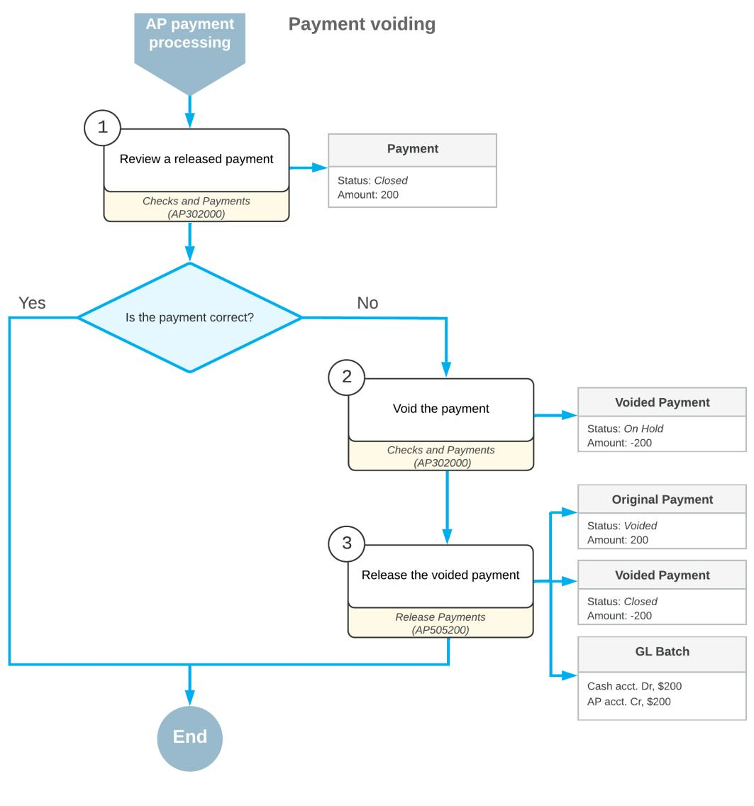

*Figure: Payment voiding*

# **Voiding Payments: Implementation Checklist**

The following sections provide details you can use to ensure that the system is configured properly for voiding payments, and to understand (and change, if needed) the settings that affect the processing workflow.

# **Implementation Checklist**

We recommend that before you void payments, you make sure the needed features have been enabled, settings have been specified, and entities have been created, as summarized in the following checklist.

| Form                               | Criteria to Check                                                                                                                                                                                                                                                               |
|------------------------------------|---------------------------------------------------------------------------------------------------------------------------------------------------------------------------------------------------------------------------------------------------------------------------------|
| Enable/Disable Features (CS100000) | Make sure the minimal features have been enabled as de scribed in Company Without Branches: General Information, Company with Branches that Do Not Require Balancing: Gen eral Information, and Company with Branches that Require Bal ancing: General Information. |

| Form                       | Criteria to Check                                                                                                                                     |  |  |  |  |  |
|----------------------------|-------------------------------------------------------------------------------------------------------------------------------------------------------|--|--|--|--|--|
| Vendors (AR303000)         | Verify the existence of the vendor accounts for the vendors whose payments you want to void. For details, see Vendors: Implementation Activity. |  |  |  |  |  |
| Payment Methods (CA204000) | Make sure that the CHECK payment method has been speci fied when creating a payment.                                                               |  |  |  |  |  |

# **Other Settings That Affect the Workflow**

You can affect the workflow of payment voiding by specifying additional settings as follows:

- To cause GL batches to be immediately posted aer they are released, select the **Automatically Post on Release** check box on the *[General Ledger Preferences](https://help-2025r1.acumatica.com/Help?ScreenId=ShowWiki&pageid=e4913d06-c511-4258-a0f9-f36c1b854e6b)* (GL102000) form.
- To cause every AP transaction you enter to be posted as an individual batch to the general ledger, clear the **Generate Consolidated Batches** check box on the *[General Ledger Preferences](https://help-2025r1.acumatica.com/Help?ScreenId=ShowWiki&pageid=e4913d06-c511-4258-a0f9-f36c1b854e6b)* form. (When this check box is selected, the system consolidates into a single batch all transactions in the same currency posted to the same period for all documents being released.)
- To give the created payments the *On Hold* status, select the **Hold Documents on Entry** check box in the **Data EntrySettings** section on the *[Accounts Payable Preferences](https://help-2025r1.acumatica.com/Help?ScreenId=ShowWiki&pageid=c3f9353e-95e6-448d-bb3f-e20643879ec7)* (AP101000) form.
- Make sure that the **Automatically Post on Release** check box is selected in the **PostingSettings** section on the *[Accounts Payable Preferences](https://help-2025r1.acumatica.com/Help?ScreenId=ShowWiki&pageid=c3f9353e-95e6-448d-bb3f-e20643879ec7)* form. This setting indicates that payments will be automatically posted to the general ledger once they are released.

# **Testing of Settings**

To make sure that all settings are configured correctly, we recommend that you void a payment as described in *Voiding [Payments:](#page-128-1) Process Activity*.

# **Voiding Payments: Generated Transactions**

To update vendor balances and reverse the original transaction, the system generates the GL transaction described in the following section.

# **Transaction Generated for a Voided Payment**

When you create and release a payment of the *Voided Payment* type, the system generates the following general ledger transaction.

| Account          | Debit  | Credit |  |  |
|------------------|--------|--------|--|--|
| Cash account     | Amount | 0.00   |  |  |
| Accounts Payable | 0.00   | Amount |  |  |

You can view the reference number of the GL batch on the **Application History** tab of the *[Checks and Payments](https://help-2025r1.acumatica.com/Help?ScreenId=ShowWiki&pageid=81659f97-cb14-4a27-bc3e-0f67b3945613)* (AP302000) form.

# **Voiding Payments: Process Activity**

The following activity will walk you through the process of voiding a payment.

This activity is based on the *U100* dataset. If you are using another dataset, or if any system settings have been changed in *U100*, these changes can affect the workflow of the activity and the results of the processing. To avoid any issues, restore the *U100* dataset to its initial state.

### **Story**

Suppose that an AP clerk of the SweetLife Fruits & Jams company made a mistake when entering a payment in the amount of \$200 to Wingman Printing Company (*PRINTICO*).

Acting as a SweetLife accountant, you have to void the payment to the *PRINTICO* vendor for consulting services.

# **Configuration Overview**

For the purposes of this activity, the following features have been enabled on the *[Enable/Disable Features](https://help-2025r1.acumatica.com/Help?ScreenId=ShowWiki&pageid=c1555e43-1bc5-4f6f-ba9d-b323f94d8a6b)* (CS100000) form:

- *Standard Financials*, which provides the standard financial functionality
- *Multibranch Support*, which supports multiple branches in your instance of Acumatica ERP
- *Multicompany Support*, which supports multiple companies within one tenant.

On the *[Accounts Payable Preferences](https://help-2025r1.acumatica.com/Help?ScreenId=ShowWiki&pageid=c3f9353e-95e6-448d-bb3f-e20643879ec7)* (AP101000) form, the **Hold Documents on Entry** check box has been selected in the **Data EntrySettings** section.

On the *[Vendors](https://help-2025r1.acumatica.com/Help?ScreenId=ShowWiki&pageid=a9584be3-f2bd-4d67-80d4-8041d809df56)* (AP303000) form, the *PRINTICO (Wingman Printing Company)* vendor has been defined. This vendor has the *CHECK* payment method specified as the default one.

# **Process Overview**

To void a payment, you will use the *[Checks and Payments](https://help-2025r1.acumatica.com/Help?ScreenId=ShowWiki&pageid=81659f97-cb14-4a27-bc3e-0f67b3945613)* (AP302000) form to find the payment, and then void it.

# **System Preparation**

To prepare the system, do the following:

- 1. Launch the Acumatica ERP website, and sign in as an accountant by using the following credentials:
  - Username: *johnson*
  - Password: *123*
- 2. In the info area, in the upper-right corner of the top pane of the Acumatica ERP screen, make sure that the business date in your system is set to *1/30/2025*. If a different date is displayed, click the Business Date menu button and select *1/30/2025*. For simplicity, in this activity, you will create and process all documents in the system on this business date.
- 3. On the Company and Branch Selection menu, also on the top pane of the Acumatica ERP screen, make sure that the *SweetLife Head Office and Wholesale Center* branch is selected. If it is not selected, click the Company and Branch Selection menu to view the list of branches that you have access to, and then click *SweetLife Head Office and Wholesale Center*.

# **Step: Voiding a Payment**

To find and void a payment, do the following:

- 1. Open the Checks and Payments (AP3020PL) list of records.
- 2. If you applied any filters before on this form, click the **FilterSettings** button in the filtering area.
- 3. In the **FilterSettings** dialog box, which opens, click **Delete Row**, and then click **Apply** to close the dialog box.
- 4. Find the payment dated *1/10/2025* in the amount of \$200 as follows:
  - a. Click the **Payment Date** column header, and in the dialog box that opens, specify the following settings:
    - **Equals**: Selected
    - **Value**: *01/10/2025*

Click **OK** to close the dialog box.

- 5. Click the link in the **Reference Nbr.** column to open the payment on the *[Checks and Payments](https://help-2025r1.acumatica.com/Help?ScreenId=ShowWiki&pageid=81659f97-cb14-4a27-bc3e-0f67b3945613)* (AP302000) form.
- 6. On the form toolbar, click**Void**.

Also on the *[Checks and Payments](https://help-2025r1.acumatica.com/Help?ScreenId=ShowWiki&pageid=81659f97-cb14-4a27-bc3e-0f67b3945613)* form, the system has created a new document of the *Voided Payment* type that has the *On Hold* status and the *-200* value in the **Payment Amount** box. The voided payment is shown in the following screenshot.

|     | <b>Checks and Payments</b> Voided Payment 000003 - Wingman Printing Company                                                                                                                                                              |                   |                               |                 |                        |                                    |                                            |                          | <b>PINOTES</b>             | <b>ACTIVITIES</b> | <b>FILES</b> | TOOLS $\sim$            |                   |         |                            |         |                                    |                     |
|-----|---------------------------------------------------------------------------------------------------------------------------------------------------------------------------------------------------------------------------------------------|-------------------|-------------------------------|-----------------|------------------------|------------------------------------|--------------------------------------------|--------------------------|----------------------------|-------------------|--------------|-------------------------|-------------------|---------|----------------------------|---------|------------------------------------|---------------------|
|     | $\leftarrow$                                                                                                                                                                                                                                | 霜 B            | $\Omega$                      | 侕 ÷          | n к $\checkmark$ |                                    | <b>REMOVE HOLD</b> Я                    | $\cdots$                 |                            |                   |              |                         |                   |         |                            |         |                                    |                     |
|     | Type:                                                                                                                                                                                                                                       |                   | Voided Pa $\sim$              |                 | Vendor:                |                                    | <b>PRINTICO - Wingman Printing Company</b> | 0                        | Payment Amount:            |                   |              | $-200.00$               |                   |         |                            |         |                                    | $\hat{\phantom{a}}$ |
|     |                                                                                                                                                                                                                                             | Reference Nbr.:   | 000003                        | $\circ$         | Location:              | <b>MAIN - Primary Location</b>     |                                            |                          | <b>Unapplied Balance:</b>  |                   |              | 0.00                    |                   |         |                            |         |                                    |                     |
|     | Status:                                                                                                                                                                                                                                     |                   | On Hold                       |                 | Joint Payee N          |                                    |                                            |                          | <b>Application Amount:</b> |                   |              | $-200.00$               |                   |         |                            |         |                                    |                     |
|     |                                                                                                                                                                                                                                             |                   | * Application Date: 1/10/2025 |                 | Payment Meth CHECK     |                                    |                                            |                          | <b>Finance Charges:</b>    |                   |              | 0.00                    |                   |         |                            |         |                                    |                     |
|     |                                                                                                                                                                                                                                             | * Application Pe  | 01-2025                       | $\circ$         | Cash Account:          | 10200WH - Wholesale Checking       |                                            |                          |                            |                   |              |                         |                   |         |                            |         |                                    |                     |
|     |                                                                                                                                                                                                                                             | Payment Ref.:     | 0002                          |                 | Description:           | <b>Consulting services 2 hours</b> |                                            |                          |                            |                   |              |                         |                   |         |                            |         |                                    |                     |
|     | <b>DOCUMENTS TO APPLY</b> <b>ORDERS</b> <b>CHARGES</b> <b>APPLICATION HISTORY</b> <b>FINANCIAL</b> <b>REMITTANCE</b> <b>COMPLIANCE</b> $\boxed{\mathbf{x}}$ <b>LOAD DOCUMENTS</b> ADD JOINT PAYEE O H ᆠ |                   |                               |                 |                        |                                    |                                            |                          |                            |                   |              |                         |                   |         |                            |         |                                    |                     |
| 图 0 | !!!!!!!!!!!!!!!!!!!!!!!!!!!!!!!!!!!!!!!!                                                                                                                                                                                                    | <b>Branch</b>     |                               | <b>Document</b> | *Reference             |                                    | <b>Amount Paid</b>                         | Cash                     | With. Tax Date             |                   | Due Date     | Cash                    | <b>Cross Rate</b> | Balance | Cash                       |         | With. Tax Description              |                     |
|     |                                                                                                                                                                                                                                             |                   |                               | Type            | Nbr.                   | Inventory ID                    |                                            | <b>Discount</b> Taken |                            |                   |              | <b>Discount</b> Date |                   |         | <b>Discount</b> Balance | Balance |                                    |                     |
|     | <b>D</b> в.                                                                                                                                                                                                                              | <b>HEADOFFICE</b> |                               | Bill            | 000010                 |                                    | $-200.00$                                  | 0.00                     | 0.00                       | 1/9/2025          | 2/8/2025     | 2/8/2025                | 1.00000000        | 200.00  | 0.00                       | 0.00    | <b>Consulting services 2 hours</b> |                     |

*Figure: The voided payment created to void the original payment*

- 7. On the form toolbar, click **Remove Hold**, and then click **Release** to release the voided payment.
- 8. Again open the payment dated 1/10/2025 in the amount of \$200.

Notice that the status is now *Voided*. When a document of the *Voided Payment* type is released, the original payment is assigned the *Voided* status.

# **Voiding Payments: Related Inquiry Forms**

In the following sections, you can find details about the inquiry forms you may want to review to gather information about payments.

If you do not see an inquiry, this could mean that you have signed in to the system with a user account that does not have access rights to a form. Sign in as the *admin* user, or contact your system administrator.

# **Reviewing Checks that Are Pending Printing**

You can use the *[Checks Pending Printing](https://help-2025r1.acumatica.com/Help?ScreenId=ShowWiki&pageid=224cfe60-e947-4ff8-a79b-e6088573d4d5)* (AP404000) form to review which checks have not been printed yet as of a specified pay date. You can initiate check printing on this form by clicking **Print Checks** on the form toolbar. The system navigates to the *[Process Payments / Print Checks](https://help-2025r1.acumatica.com/Help?ScreenId=ShowWiki&pageid=e632860a-8905-424a-8e27-ad66cf9f64c7)* (AP505000) form, where you can print checks.

# **Running the Check Register Inquiry**

You use the *[Check Register](https://help-2025r1.acumatica.com/Help?ScreenId=ShowWiki&pageid=260298f9-0fbc-4799-a48e-0aa324b2a91b)* (AP404500) form to review the details of the checks that have been generated in the system. By using this inquiry form, you can find out whether a particular check number has been used and, if it has, for which AP check.

If you have reprinted a check with a new number or voided a check, the system does not allow this number to be reused. The inquiry displays the check numbers of all checks, including those have been reprinted or voided.

# **Processing Partial Payments**

In this chapter, you will find general information on how to process partial payments, a checklist for system implementation, an activity that describes how to create a payment and apply it to a bill to partially pay the bill, and report and inquiries that can be useful to find and view created transactions.

# **Partial Payments: General Information**

To partially pay an AP bill in Acumatica ERP, you have to create a payment: a document that represents the payment in the system. You can create the payment manually by using the *[Checks and Payments](https://help-2025r1.acumatica.com/Help?ScreenId=ShowWiki&pageid=81659f97-cb14-4a27-bc3e-0f67b3945613)* (AP302000) form.

# **Learning Objectives**

In this chapter, you will learn how to do the following:

- Create a payment
- Apply it to an AP bill to partially pay the bill
- Release the payment and its application

# **Applicable Scenarios**

You create partial payments of bills in the following cases:

- You want to decrease your company's AP balance
- You want to pay a bill with a large amount, but your company's checking account does not have sufficient funds

# **Process Overview**

To partially pay a bill, you complete the following general steps.

1. On the *[Checks and Payments](https://help-2025r1.acumatica.com/Help?ScreenId=ShowWiki&pageid=81659f97-cb14-4a27-bc3e-0f67b3945613)* (AP302000) form, you manually create a payment document, and on the **Documents to Apply** tab, you select the needed bill.

In the **Payment Amount** box in the Summary area of the form, you specify the amount you are going to pay, making sure that the **Payment Amount** and **Application Amount** boxes display the same amount.

- 2. You click **Remove Hold** on the form toolbar for the payment, and then click **Print/Process** to print the payment.
- 3. On the *[Process Payments / Print Checks](https://help-2025r1.acumatica.com/Help?ScreenId=ShowWiki&pageid=e632860a-8905-424a-8e27-ad66cf9f64c7)* (AP505000) form, you print the payment and review the printed payment.
- 4. On the *[Release Payments](https://help-2025r1.acumatica.com/Help?ScreenId=ShowWiki&pageid=0a981976-131b-4150-81d0-19b54a46e510)* (AP505200) form, you release the payment and its application to the AP bill.

# **Workflow of Processing Partial Payments**

The following diagram describes how a partial payment of a bill is processed in Acumatica ERP.

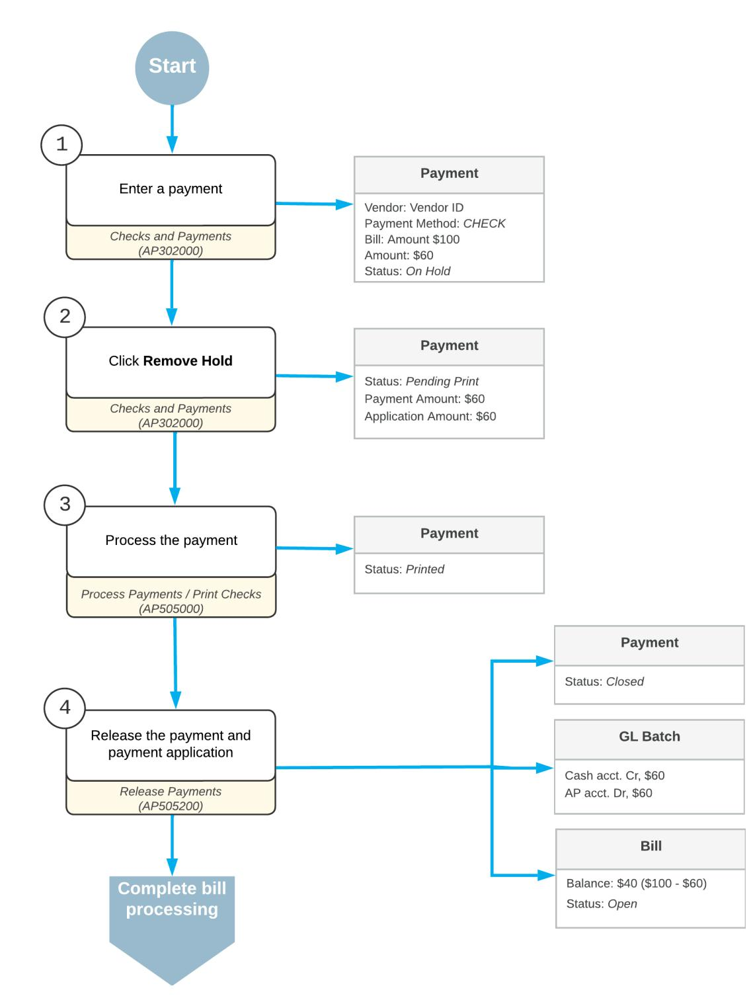

*Figure: Processing partial payments*

# **Partial Payments: Generated Transactions**

To be able to partially pay bills, you create and process payment documents. To update vendor balances, the system generates the GL transaction described in the following section.

# **Transaction Generated for a Partial Payment**

When you create and release a payment, the system generates the following GL transaction.

| Account          | Debit  | Credit |  |  |
|------------------|--------|--------|--|--|
| Cash account     | 0.00   | Amount |  |  |
| Accounts Payable | Amount | 0.00   |  |  |

You can view the reference number of the GL batch on the **Financial** tab of the *[Checks and Payments](https://help-2025r1.acumatica.com/Help?ScreenId=ShowWiki&pageid=81659f97-cb14-4a27-bc3e-0f67b3945613)* (AP302000) form.

# **Partial Payments: Implementation Checklist**

To ensure that the system is configured properly for paying AP bills, make sure that the criteria listed in the table have been met in the system as described.

| Form                               | Criteria to Check                                                                                                                                                                                                                                                               | Notes |
|------------------------------------|---------------------------------------------------------------------------------------------------------------------------------------------------------------------------------------------------------------------------------------------------------------------------------|-------|
| Enable/Disable Features (CS100000) | Make sure the minimal features have been enabled as described in Company Without Branches: General Information, Company with Branches that Do Not Require Balancing: Gen eral Information, or Company with Branches that Require Balancing: General Information. |       |
| Vendors (AR303000)                 | Verify the existence of the vendor accounts for the vendors whose bills you will pay. For details, see Vendors: Implementation Activity.                                                                                                                                  |       |
| Payment Methods (CA204000)         | Make sure that the CHECK payment method has been specified when creating a payment.                                                                                                                                                                                          |       |

# **Settings That Affect the Workflow**

The following settings and entities should be specified and defined, respectively:

- The following general ledger settings should be specified on the **PostingSettings** tab of the *[General Ledger](https://help-2025r1.acumatica.com/Help?ScreenId=ShowWiki&pageid=e4913d06-c511-4258-a0f9-f36c1b854e6b) [Preferences](https://help-2025r1.acumatica.com/Help?ScreenId=ShowWiki&pageid=e4913d06-c511-4258-a0f9-f36c1b854e6b)* (GL102000) form:
  - Make sure that the **Automatically Post on Release** check box is selected. This setting causes GL batches to be immediately posted aer they are released.
  - Clear the **Generate Consolidated Batches** check box to cause every AP transaction you enter to be posted as an individual batch to the general ledger. (When this check box is selected, the system

consolidates into a single batch all transactions in the same currency posted to the same period for all documents being released.)

- The following accounts payable settings should be specified on the **General** tab of the *[Accounts Payable](https://help-2025r1.acumatica.com/Help?ScreenId=ShowWiki&pageid=c3f9353e-95e6-448d-bb3f-e20643879ec7) [Preferences](https://help-2025r1.acumatica.com/Help?ScreenId=ShowWiki&pageid=c3f9353e-95e6-448d-bb3f-e20643879ec7)* (AP101000) form:
  - Select the **Hold Documents on Entry** check box in the **Data EntrySettings** section. This setting gives the created checks the *On Hold* status.
  - Make sure that the **Automatically Post on Release** check box is selected in the **PostingSettings** section. This setting indicates that checks will be automatically posted to the general ledger once they are released.
- The following payment method settings should be specified for the payment method on the *[Payment](https://help-2025r1.acumatica.com/Help?ScreenId=ShowWiki&pageid=509285d1-cfae-4e87-95c3-a968451952e6) [Methods](https://help-2025r1.acumatica.com/Help?ScreenId=ShowWiki&pageid=509285d1-cfae-4e87-95c3-a968451952e6)* (CA204000) form:
  - Select the **Print Checks** option in the **Additional Processing** section on the**Settings for Use in AP** tab.

With these settings specified and entities defined, users in your company can record and process documents in Acumatica ERP quickly and accurately, with a minimum of manual actions.

# **Partial Payments: Process Activity**

The following activity will walk you through the process of creating and releasing a partial payment of an AP bill.

This activity is based on the *U100* dataset. If you are using another dataset, or if any system settings have been changed in *U100*, these changes can affect the workflow of the activity and the results of the processing. To avoid any issues, restore the *U100* dataset to its initial state.

# **Story**

Suppose that in January 2025, Blueline Advertisement provided advertising services to the SweetLife Fruits & Jams company in the amount of \$5,500 and an AP bill was entered in the system. On January 30, 2025 the company wants to partially pay this bill.

Acting as a SweetLife accountant, you need to register a partial payment of \$1,100 for the advertising services.

# **Configuration Overview**

For the purposes of this activity, the following features have been enabled on the *[Enable/Disable Features](https://help-2025r1.acumatica.com/Help?ScreenId=ShowWiki&pageid=c1555e43-1bc5-4f6f-ba9d-b323f94d8a6b)* (CS100000) form:

- *Standard Financials*, which provides the standard financial functionality
- *Multibranch Support*, which supports multiple branches in your instance of Acumatica ERP
- *Multicompany Support*, which supports multiple companies within one tenant.

On the *[Accounts Payable Preferences](https://help-2025r1.acumatica.com/Help?ScreenId=ShowWiki&pageid=c3f9353e-95e6-448d-bb3f-e20643879ec7)* (AP101000) form, the **Hold Documents on Entry** check box has been selected in the **Data EntrySettings** section.

On the *[Vendors](https://help-2025r1.acumatica.com/Help?ScreenId=ShowWiki&pageid=a9584be3-f2bd-4d67-80d4-8041d809df56)* (AP303000) form, the *BLUELINE (Blueline Advertisement)* vendor has been defined. This vendor has the *CHECK* payment method specified as the default one.

# **Process Overview**

To register a partial payment in the system, you will manually create the partial payment on the *[Checks and](https://help-2025r1.acumatica.com/Help?ScreenId=ShowWiki&pageid=81659f97-cb14-4a27-bc3e-0f67b3945613) [Payments](https://help-2025r1.acumatica.com/Help?ScreenId=ShowWiki&pageid=81659f97-cb14-4a27-bc3e-0f67b3945613)* (AP302000) form, apply the payment to a bill, and then release the payment and its application. On the *Journal [Transactions](https://help-2025r1.acumatica.com/Help?ScreenId=ShowWiki&pageid=dda046bc-5946-407f-88f7-1c0c966fbe72)* (GL301000) form, you will review the generated GL transaction, and on the *[Checks and](https://help-2025r1.acumatica.com/Help?ScreenId=ShowWiki&pageid=81659f97-cb14-4a27-bc3e-0f67b3945613) [Payments](https://help-2025r1.acumatica.com/Help?ScreenId=ShowWiki&pageid=81659f97-cb14-4a27-bc3e-0f67b3945613)* form, you review the application history of the payment.

# **System Preparation**

To prepare the system, do the following:

- 1. Launch the Acumatica ERP website, and sign in as an accountant by using the following credentials:
  - Username: *johnson*
  - Password: *123*
- 2. In the info area, in the upper-right corner of the top pane of the Acumatica ERP screen, make sure that the business date in your system is set to *1/30/2025*. If a different date is displayed, click the Business Date menu button, and select *1/30/2025* from the calendar. For simplicity, in this activity, you will create and process all documents in the system during this business date.
- 3. On the Company and Branch Selection menu, also on the top pane of the Acumatica ERP screen, make sure that the *SweetLife Head Office and Wholesale Center* branch is selected. If it is not selected, click the Company and Branch Selection menu to view the list of branches that you have access to, and then click *SweetLife Head Office and Wholesale Center*.

# **Step 1: Creating a Partial Payment and Applying it to a Bill**

To create a partial payment and apply it to a bill, do the following:

1. Open the *[Checks and Payments](https://help-2025r1.acumatica.com/Help?ScreenId=ShowWiki&pageid=81659f97-cb14-4a27-bc3e-0f67b3945613)* (AP302000) form.

To open the form for creating a new record, type the form ID in the Search box, and on the Search form, point at the form title and click **New** right of the title.

- 2. On the form toolbar, click **Add New Record**, and in the Summary area, specify the following settings:
  - **Type**: *Payment*
  - **Vendor**: *BLUELINE*
  - **Application Date**: *1/30/2025* (inserted by default)
  - **Application Period**: *01-2025* (inserted by default)
  - **Payment Amount**: 1100
  - **Description**: Partial payment for advertising services
- 3. To select the bill to which the payment will be applied, on the **Documents to Apply** tab, click **Add Row**, and in the row, select the following settings:
  - **DocumentType**: *Bill*
  - **Reference Number**: The bill with *Advertising services* in the description and the amount of \$5,500
- 4. On the form toolbar, click**Save** to save the payment. Notice that the balance of the bill applied to this payment is now \$4,400, as shown in the following screenshot.

| <b>Checks and Payments</b> <b>P</b> NOTES TOOLS $\star$ <b>ACTIVITIES</b> <b>FILES</b> Payment 000030 - Blueline Advertisement 日 日 n <b>REMOVE HOLD</b> 冊 $\mathsf{R}$ $\Omega$ $\geq$ $\leftarrow$ ∢ $\rightarrow$ $\mathrm{+}$ $\check{~}$ $\cdots$ |                   |                         |                        |                                                                            |                                        |                    |                                       |                |           |          |                                 |                   |                |                                    |
|----------------------------------------------------------------------------------------------------------------------------------------------------------------------------------------------------------------------------------------------------------------------------------------------------------------|-------------------|-------------------------|------------------------|----------------------------------------------------------------------------|----------------------------------------|--------------------|---------------------------------------|----------------|-----------|----------|---------------------------------|-------------------|----------------|------------------------------------|
| Type: Reference Nbr.:                                                                                                                                                                                                                                                                                       | Payment 000030 | $\checkmark$ ۹       | Vendor: * Location: | <b>BLUELINE - Blueline Advertisement</b> <b>MAIN - Primary Location</b> |                                        | $\mathscr{D}$ Q | Payment Amount: Unapplied Balance: |                | 1,100.00  | 0.00     |                                 |                   |                | $\hat{~}$                          |
| Status:                                                                                                                                                                                                                                                                                                        | On Hold           |                         | Joint Payee N          |                                                                            | <b>Application Amount:</b> 1,100.00 |                    |                                       |                |           |          |                                 |                   |                |                                    |
| * Application Date:                                                                                                                                                                                                                                                                                            | 1/30/2025         | A                       | * Payment Meth         | <b>CHECK</b>                                                               |                                        | Q                  | Finance Charges:                      |                |           | 0.00     |                                 |                   |                |                                    |
| * Application Pe 01-2025                                                                                                                                                                                                                                                                                       |                   | Q                       | * Cash Account:        |                                                                            | 10200WH - Wholesale Checking           | م                  |                                       |                |           |          |                                 |                   |                |                                    |
| Payment Ref.:                                                                                                                                                                                                                                                                                                  |                   |                         | Description:           | Partial payment for advertising services                                   |                                        |                    |                                       |                |           |          |                                 |                   |                |                                    |
| <b>DOCUMENTS TO APPLY</b> <b>APPLICATION HISTORY</b> <b>FINANCIAL</b> <b>REMITTANCE</b> COMPLIANCE <b>CHARGES</b> $\mathbf{x}$ <b>LOAD DOCUMENTS</b> ADD JOINT PAYEE $\times$ $\vdash$ $\pm$                                                                                  |                   |                         |                        |                                                                            |                                        |                    |                                       |                |           |          |                                 |                   |                |                                    |
| D <b>B</b> 0 <b>Branch</b>                                                                                                                                                                                                                                                                               |                   | <b>Document</b> Type | *Reference Nbr.     | Nbr. ID                                                                    | Line Inventory                         | <b>Amount Paid</b> | Cash <b>Discount</b> Taken      | With, Tax Date |           | Due Date | Cash <b>Discount</b> Date | <b>Cross Rate</b> | <b>Balance</b> | Cash <b>Discount</b> Balance |
| $\Box$ <b>HEADOFFICE</b> $\mathbf{a}$                                                                                                                                                                                                                                                                    |                   | Bill                    | 000003                 | $\mathbf{0}$                                                               |                                        | 1,100.00           | 0.00                                  | 0.00           | 1/10/2025 | 2/9/2025 | 2/9/2025                        | 1.00000000        | 4.400.00       | 0.00                               |

*Figure: A payment with a bill applied to it*

# **Step 2: Releasing the Payment**

To print the and release the payment, do the following:

1. While you are still on the *[Checks and Payments](https://help-2025r1.acumatica.com/Help?ScreenId=ShowWiki&pageid=81659f97-cb14-4a27-bc3e-0f67b3945613)* (AP302000) form, on the form toolbar, click **Remove Hold**.

Notice that the status of the payment has changed to *Pending Print*.

- 2. On the form toolbar, click **Print/Process**.
- 3. On the *[Process Payments / Print Checks](https://help-2025r1.acumatica.com/Help?ScreenId=ShowWiki&pageid=e632860a-8905-424a-8e27-ad66cf9f64c7)* (AP505000) form, which is opened, notice that the system has added a row with the payment and selected the unlabeled check box for it. On the form toolbar, click **Process**.

A separate browser tab is opened showing a printable version of the selected payment.

In a production setting in which you are printing actual checks, you should validate the value in the **Next Check Number** box. This number should match the number on the blank check you are going to use for printing the checks.

- 4. Review the printable version of the payment, and close the browser tab. (For the purposes of this activity, you do not need to actually print the check. In a production setting, you would click **Print** on the form toolbar to print the check before closing the browser tab.)
- 5. On the *[Release Payments](https://help-2025r1.acumatica.com/Help?ScreenId=ShowWiki&pageid=0a981976-131b-4150-81d0-19b54a46e510)* (AP505200) form, which is opened, notice that the system has added a row with the payment and selected the unlabeled check box for it. On the form toolbar, click **Process**.
- 6. In the **Processing** pop-up window, which is opened, click the **Processed** tab.
- 7. Click the link in the **Reference Nbr.** column to open the released payment on the *[Checks and Payments](https://help-2025r1.acumatica.com/Help?ScreenId=ShowWiki&pageid=81659f97-cb14-4a27-bc3e-0f67b3945613)* form.

# **Step 3: Reviewing the Generated GL Transaction and Payment Application**

To review the GL transaction generated by the system and the application history of the payment, do the following:

- 1. On the **Financial** tab of the *[Checks and Payments](https://help-2025r1.acumatica.com/Help?ScreenId=ShowWiki&pageid=81659f97-cb14-4a27-bc3e-0f67b3945613)* (AP302000) form, which is opened, click the link in the **Batch Nbr.** box, and review the created GL batch on the *Journal [Transactions](https://help-2025r1.acumatica.com/Help?ScreenId=ShowWiki&pageid=dda046bc-5946-407f-88f7-1c0c966fbe72)* (GL301000) form, which the system opens.
- 2. On the **Application History** tab of the *[Checks and Payments](https://help-2025r1.acumatica.com/Help?ScreenId=ShowWiki&pageid=81659f97-cb14-4a27-bc3e-0f67b3945613)* form, click the link in the **Reference Nbr.** column and review the bill balance on the *[Bills and Adjustments](https://help-2025r1.acumatica.com/Help?ScreenId=ShowWiki&pageid=956b4e51-3078-4d2d-85b3-65c080d95234)* (AP301000) form that opens.

Notice that the bill retains the *Open* status because it has not been paid in full.

# **Partial Payments: Related Report and Inquiry Forms**

In the following sections, you can find details about the reports and inquiry forms you may want to review to gather information about AP payments.

If you do not see a report or inquiry, this could mean that you have signed in to the system with a user account that does not have access rights to a form. In that case, sign in as the *admin* user, or contact your system administrator.

# **Reviewing Checks that Are Pending Printing**

You can use the *[Checks Pending Printing](https://help-2025r1.acumatica.com/Help?ScreenId=ShowWiki&pageid=224cfe60-e947-4ff8-a79b-e6088573d4d5)* (AP404000) form to review which checks have not been printed yet as of a specified pay date. You can initiate check printing on this form by clicking **Print Checks** on the form toolbar. The system navigates to the *[Process Payments / Print Checks](https://help-2025r1.acumatica.com/Help?ScreenId=ShowWiki&pageid=e632860a-8905-424a-8e27-ad66cf9f64c7)* (AP505000) form, where you can print checks.

# **Running a Report of Checks that Are Pending Printing**

You can use the *[Checks Pending Printing](https://help-2025r1.acumatica.com/Help?ScreenId=ShowWiki&pageid=aa3f00fe-694d-4309-9961-61dcde793f5d)* (AP612500) form to review a report on checks that have not yet been printed.

# **Reviewing Vendor Documents**

You use the *[Vendor](https://help-2025r1.acumatica.com/Help?ScreenId=ShowWiki&pageid=22c03d80-cbb0-449d-9325-c12f623aaefd) Details* (AP402000) form to review the accounts payable documents (bills, debit adjustments, credit adjustments, and payments) for a particular vendor.

By default, the form displays the list of open vendor documents (that is, those with the *Open* status), but you can add to the list closed documents and unreleased documents by selecting the**Show All Documents** and **Include Unreleased Documents** check boxes, respectively.

# **Processing Cash Purchases**

In this chapter, you will find general information on how to create and release cash purchases, and how to create a cash return if a full or partial refund needs to be recorded for a cash purchase.

# **Cash Purchases: General Information**

In Acumatica ERP, a cash purchase is a document of the *Cash Purchase* type, which you create on the *[Cash](https://help-2025r1.acumatica.com/Help?ScreenId=ShowWiki&pageid=346e1395-7d30-4c25-b28b-7bcd824dcffd) [Purchases](https://help-2025r1.acumatica.com/Help?ScreenId=ShowWiki&pageid=346e1395-7d30-4c25-b28b-7bcd824dcffd)* (AP304000) form to record a purchase for which the payment was made at the time of the purchase that is, without incurring any liabilities.

On the *[Cash Purchases](https://help-2025r1.acumatica.com/Help?ScreenId=ShowWiki&pageid=346e1395-7d30-4c25-b28b-7bcd824dcffd)* form, you can also record a full or partial refund for the items paid immediately by creating a document of the *Cash Return* type or reversing a cash purchase recorded before.

# **Learning Objectives**

In this chapter, you will learn how to create and process a cash purchase document in Acumatica ERP.

# **Applicable Scenarios**

You create and process a cash purchase document when you want to record a purchase of non-stock goods or services paid immediately.

# **Workflow of the Cash Purchase Processing**

The processing of a *Cash Purchase* document involves the actions shown in the following diagram.

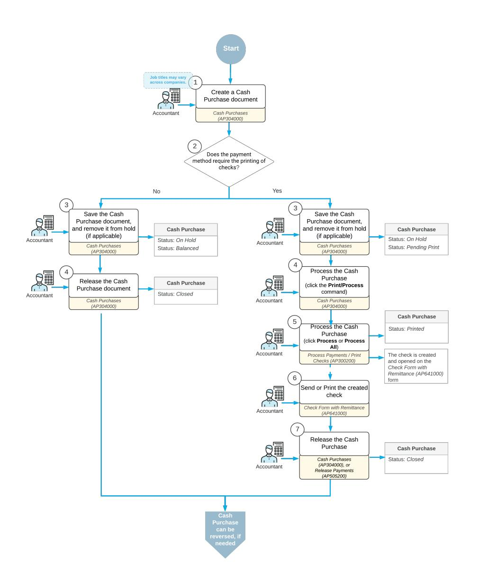

*Figure: Processing a Cash Purchase document*

### **Cash Purchase Entry**

You create cash purchases by using the *[Cash Purchases](https://help-2025r1.acumatica.com/Help?ScreenId=ShowWiki&pageid=346e1395-7d30-4c25-b28b-7bcd824dcffd)* (AP304000) form. On this form, you specify details of a cash purchase document, such as date, vendor, location, payment method and cash account (if applicable). On the **Details** tab, you enter one detail line or any number of detail lines. For each detail line, you can specify a particular non-stock item or service.

If the payments of the selected payment method will be processed by a bank, the bank may apply finance charges. On the **Charges** tab, you can add these charges and specify their particular amounts for the payment.

# **Cash Purchase Processing**

Depending on the payment method specified in the created cash purchase document, the processing workflow may vary.

If the payment method requires printing checks (the **Print Checks** option button is selected on the**Settings for Use in AP** tab on the *[Payment Methods](https://help-2025r1.acumatica.com/Help?ScreenId=ShowWiki&pageid=509285d1-cfae-4e87-95c3-a968451952e6)* (CA204000) form), when you save a cash purchase document and remove it from hold, the system assigns the *Pending Print* status to it.

To proceed with the document, you click **Print/Process** on the form toolbar. The *[Process Payments / Print Checks](https://help-2025r1.acumatica.com/Help?ScreenId=ShowWiki&pageid=e632860a-8905-424a-8e27-ad66cf9f64c7)* (AP505000) form opens on the same tab. On this form, you select the unlabeled check box in the table next to the cash purchase document to be processed, and click **Process** on the form toolbar. Upon clicking, the system generates a check for the selected document, and displays it on the *[Check Form with Remittance](https://help-2025r1.acumatica.com/Help?ScreenId=ShowWiki&pageid=e10d1a22-f5e5-48f1-9e7d-67d8dd1e6c68)* (AP641000) form. At that moment, the *Cash Purchase* document is assigned with the *Printed* status. Now the cash purchase can be released on either the *[Cash Purchases](https://help-2025r1.acumatica.com/Help?ScreenId=ShowWiki&pageid=346e1395-7d30-4c25-b28b-7bcd824dcffd)* (AP304000) or the *[Release Payments](https://help-2025r1.acumatica.com/Help?ScreenId=ShowWiki&pageid=0a981976-131b-4150-81d0-19b54a46e510)* (AP505200) form.

If the payment method does not require printing checks, once you saved a cash purchase document and removed it from hold, it is assigned with the *Balanced* status. You can release it immediately.

For details on printing checks, including MICR (Magnetic Ink Character Recognition)–encoded checks, see *To [Print](#page-115-1) [Checks](#page-115-1)*.

# **Expense Reclassification**

If expense reclassification is performed as a separate stage of document processing in your system, you can set up the workflow so that the users who enter cash purchases into the system will pre-release them, and later the authorized accountants will perform expense reclassification—that is, assign correct expense accounts (and subaccounts) and finally release them. For more information, see *[Reclassification of Expenses: General Information](#page-33-2)*.

# **Reversal of a Cash Purchase**

If for a cash purchase, a full or partial refund must be recorded, on the *[Cash Purchases](https://help-2025r1.acumatica.com/Help?ScreenId=ShowWiki&pageid=346e1395-7d30-4c25-b28b-7bcd824dcffd)* (AP304000) form, you can either reverse a cash purchase document, or manually create a cash return document, that is, a document of the *Cash Return* type.

You can reverse a cash purchase document of the *Closed* status. On the *[Cash Purchases](https://help-2025r1.acumatica.com/Help?ScreenId=ShowWiki&pageid=346e1395-7d30-4c25-b28b-7bcd824dcffd)* form, you open the document, and on the More menu, click the **Return** command. Once the command is clicked, the system creates the document of the *Cash Return* type and opens it on the current form. The system copies details of the **Details**, **Financial**, **Taxes** and **Remittance** tabs of the *[Cash Purchases](https://help-2025r1.acumatica.com/Help?ScreenId=ShowWiki&pageid=346e1395-7d30-4c25-b28b-7bcd824dcffd)* form from the original *Cash Purchase* document to the *Cash Return* document. On the **Financial** tab, the system inserts the reference number of the original cash purchase document in the **Orig. Ref. Nbr** box. On the **Details**, you can edit the details of the purchased items depending on whether they are recording a partial refund or a full refund. The system does not copy the settings on the **Approvals** tab and the **Charges** tab. However, in the *Cash Return* document, on the **Charges** tab, you can manually add a charge, either positive or negative.

You can also manually create a cash return document. On the *[Cash Purchases](https://help-2025r1.acumatica.com/Help?ScreenId=ShowWiki&pageid=346e1395-7d30-4c25-b28b-7bcd824dcffd)* form, you add a new document. In the Summary area of the form, in the**Type** box, select *Cash Return*, fill in all required details in the Summary area and on the **Details** tab of the form, and save the document.

# **Application of Direct-Entry Taxes to Cash Purchases**

On the *[Cash Purchases](https://help-2025r1.acumatica.com/Help?ScreenId=ShowWiki&pageid=346e1395-7d30-4c25-b28b-7bcd824dcffd)* (AP304000) form, a direct-entry tax is applied to a document if both of the following conditions are met:

- The vendor's tax zone includes the direct-entry.
- The tax category selected in the document line contains the direct-entry tax and has the **Exclude Listed Taxes** check box cleared on the *Tax [Categories](https://help-2025r1.acumatica.com/Help?ScreenId=ShowWiki&pageid=db5e7fad-054d-467d-877e-2db4ee180ead)* (TX205500) form.

For a direct-entry tax, the following columns cannot be edited on the**Taxes** tab of the *[Cash Purchases](https://help-2025r1.acumatica.com/Help?ScreenId=ShowWiki&pageid=346e1395-7d30-4c25-b28b-7bcd824dcffd)* form: **Taxable Amount**, **Tax Amount**, **Tax Rate**, and **Expense Amount**; also, the **Deferral Code** column on the **Details** tab cannot be edited.

You cannot manually delete a direct-entry tax from the**Taxes** tab by selecting the row with the tax and clicking **Delete Row** on the table toolbar. To delete a direct-entry tax, on the **Details** tab, you should change the tax category for the document line or delete the document line with the tax.

If a cash purchase with a direct-entry tax line is voided, the voided cash purchase is created with the same directentry tax line and tax amount.

If the *Net/Gross Entry Mode* feature is enabled on the *[Enable/Disable Features](https://help-2025r1.acumatica.com/Help?ScreenId=ShowWiki&pageid=c1555e43-1bc5-4f6f-ba9d-b323f94d8a6b)* (CS100000) form, the tax calculation mode selected for the cash purchase on the **Financial** tab (**Tax and Terms** section) of the *[Cash Purchases](https://help-2025r1.acumatica.com/Help?ScreenId=ShowWiki&pageid=346e1395-7d30-4c25-b28b-7bcd824dcffd)* form does not affect the tax calculated for the line with a direct-entry tax.

For details on direct-entry taxes, see *Direct Tax Payment: General [Information](https://help-2025r1.acumatica.com/Help?ScreenId=ShowWiki&pageid=7e82806b-e9bd-439b-a468-702f0b76b207)*.

# **Cash Purchases: Generated Transactions**

As you process cash purchases, the system generates the GL transactions described in the following sections.

# **Transactions Generated for a Cash Purchase**

When you release a cash purchase, the system generates the following general ledger transactions:

| Account               | Debit  | Credit                        |
|-----------------------|--------|-------------------------------|
| Cash account          | 0.00   | Amount - Cash discount amount |
| Expense account       | Amount | 0.00                          |
| Cash discount account | 0.00   | Cash discount amount          |

You can view the reference number of the GL batch on the **Financial** tab of the *[Cash Purchases](https://help-2025r1.acumatica.com/Help?ScreenId=ShowWiki&pageid=346e1395-7d30-4c25-b28b-7bcd824dcffd)* (AP304000) form.

# **To Create a Cash Purchase**

You create can a cash purchase on the *[Cash Purchases](https://help-2025r1.acumatica.com/Help?ScreenId=ShowWiki&pageid=346e1395-7d30-4c25-b28b-7bcd824dcffd)* (AP304000) form.

# **To Create a Cash Purchase**

- 1. Open the *[Cash Purchases](https://help-2025r1.acumatica.com/Help?ScreenId=ShowWiki&pageid=346e1395-7d30-4c25-b28b-7bcd824dcffd)* (AP304000) form.
- 2. On the form toolbar, click **Add New Record**.
- 3. In the **Type** box of the Summary area, select *Cash Purchase*.
- 4. In the **Date** box, enter the document date.
- 5. In the **Vendor** box, select the vendor to receive the payment.
- 6. In the **Payment Method** box, make sure that the payment method is specified correctly.
- 7. In the **Cash Account** box, make sure that the selected cash account is the one you need.
- 8. If needed, in the **Payment Ref.** box, type the document reference number (such as the wire transfer number or bank check number).
- 9. On the **Details** tab, enter the details of the cash purchase as follows:
  - a. On the table toolbar, click **Add Row**.
  - b. In the **Branch** column (if it appears), make sure that the system has specified the correct branch. If needed, specify another branch.
  - c. In the **Inventory ID** column, select the inventory ID of the non-stock item received from the vendor or the service delivered by the vendor.
  - d. If needed, in the **Quantity** column, enter the quantity of the item or service delivered by the vendor.

- e. If needed, in the **Unit Cost** column, specify the cost per unit.
- f. In the **Account** column, make sure that the correct account is specified.
- g. In the **Subaccount** column (if it appears), make sure that the correct subaccount is specified.
- 10.In the **Payment Amount** box of the Summary area, enter the total amount of the cash purchase.

11.On the form toolbar, click**Save** to save the document.

# **Notes About the Procedure**

The notes in this section describe the nuances of the UI elements available on the form, such as when an element is required and when it is not, and when the system fills in settings by default. This section can include other notes.

Note that in the Summary area the system fills in the **Post Period** box automatically, based on the specified document date.

Note the following about the **Details** tab:

- In the **Account** column, the system enters the expense account associated with the vendor location.
- In the **Subaccount** column, the system enters a subaccount in accordance with the rule in the **Combine ExpenseSub. from** box of the *[Accounts Payable Preferences](https://help-2025r1.acumatica.com/Help?ScreenId=ShowWiki&pageid=c3f9353e-95e6-448d-bb3f-e20643879ec7)* (AP101000) form.

# **Paying Multiple AP Bills**

In this chapter, you will find general information on how to pay multiple bills, a checklist for system implementation, an activity that describes how to pay multiple AP bills with one payment, and reports and inquiries that can be useful to find and view created transactions.

# **Multiple Bill Payments: General Information**

You can initiate the process of paying multiple bills automatically on the *[Prepare Payments](https://help-2025r1.acumatica.com/Help?ScreenId=ShowWiki&pageid=e3b526e3-8b12-4fa9-a5b2-2955e763f238)* (AP503000) form. You can select bills for payment by payment date, cash account, payment method, vendor, and discount availability. AP payments will be created for the selected bills and grouped by vendor. For a specific bill, you may require a separate payment if the **PaySeparately** option was selected for this bill. Also, if the **PaySeparately** option is selected for the vendor on the *[Vendors](https://help-2025r1.acumatica.com/Help?ScreenId=ShowWiki&pageid=a9584be3-f2bd-4d67-80d4-8041d809df56)* (AP303000) form, each bill or credit adjustment of the vendor will be paid by a separate AP payment.

# **Learning Objectives**

In this chapter, you will learn how to do the following:

- Select the bills to be paid
- Prepare and release payments for multiple bills

# **Applicable Scenarios**

You prepare a payment to pay multiple bills when you have multiple bills from the same vendor that are due.

# **Payment Processing**

To pay multiple bills, you have to create a payment: a document that represents the payment in the system. You use the *[Prepare Payments](https://help-2025r1.acumatica.com/Help?ScreenId=ShowWiki&pageid=e3b526e3-8b12-4fa9-a5b2-2955e763f238)* (AP503000) form to generate a payment for multiple bills of the same vendor.

During processing, a payment can have the following statuses.

|  | Table: AP payment statuses |  |
|--|----------------------------|--|
|--|----------------------------|--|

| Status           | Description                                                                                                                                                                                                                                                                                                                                                                                                                                                                         |
|------------------|-------------------------------------------------------------------------------------------------------------------------------------------------------------------------------------------------------------------------------------------------------------------------------------------------------------------------------------------------------------------------------------------------------------------------------------------------------------------------------------|
| On Hold          | The payment is being edited and cannot be released. The system assigns this status to each created payment by default if the Hold Documents on Entry check box is se lected on the Accounts Payable Preferences (AP101000) form or if approvals have been configured for payments.                                                                                                                                                                                         |
| Pending Approval | The payment needs to be approved before it is processed by the responsible person or persons. The system can assign this status to a payment to be approved once it is removed from hold, or when the payment is created if the Hold Documents on En try check box is cleared on the Accounts Payable Preferences form. This status can be assigned to the payment only if the Approval Workflow feature is enabled on the En able/Disable Features (CS100000) form. |
| Rejected         | The payment has been rejected by at least one assigned approver. The system can as sign this status to the document only if the Approval Workflow feature is enabled on the Enable/Disable Features form.                                                                                                                                                                                                                                                                     |

| Status        | Description                                                                                                                                                                                                                                                                                                       |
|---------------|-------------------------------------------------------------------------------------------------------------------------------------------------------------------------------------------------------------------------------------------------------------------------------------------------------------------|
| Pending Print | The payment must be printed or processed before it can be released.                                                                                                                                                                                                                                               |
| Printed       | The payment is ready and can be released. The system assigns this status to payments that have been processed (if the payment method requires that payments undergo ad ditional processing).                                                                                                                |
| Balanced      | The payment is ready to be released. The system assigns this status to payments whose payment method does not require the payments to undergo additional pro cessing. (An approved payment is assigned this status if its payment method does not require the payment to undergo additional processing.) |
| Open          | The payment has been released and still has an unapplied balance (meaning that the application amount is less than the payment amount).                                                                                                                                                                        |
| Reserved      | The payment has been released and then put on hold to be excluded from the auto matic application process.                                                                                                                                                                                                     |
| Closed        | The payment has been released and fully applied to the appropriate bill or bills.                                                                                                                                                                                                                                 |
| Voided        | The payment has been voided.                                                                                                                                                                                                                                                                                      |

# **Process Diagram**

The following diagram illustrates the workflow of processing multiple bill payments without approval.

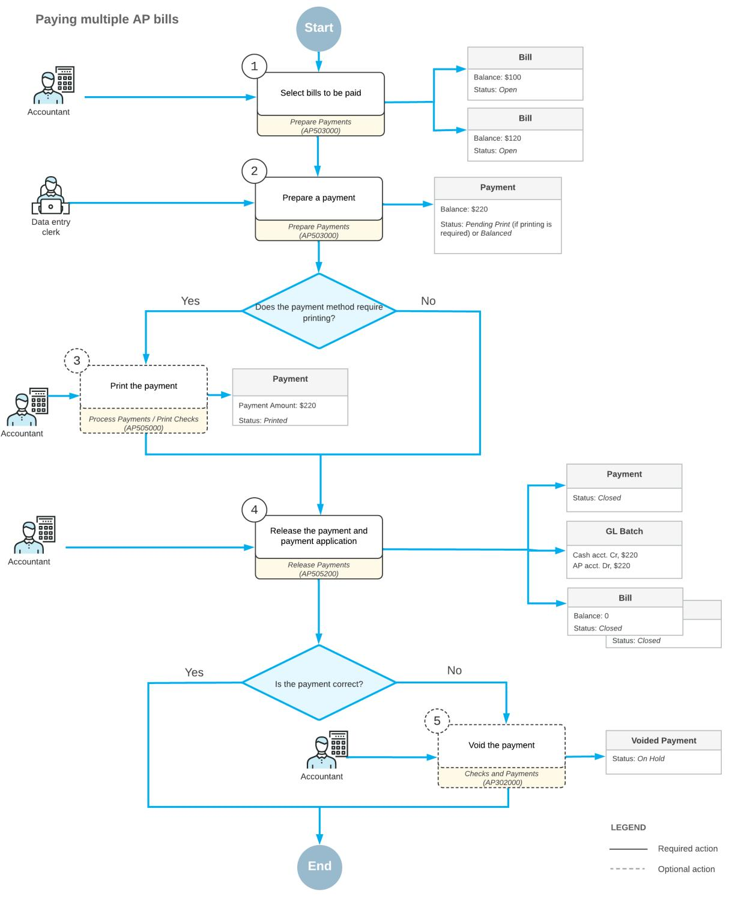

*Figure: Paying multiple AP bills*

# **Multiple Bill Payments: Implementation Checklist**

To ensure that the system is configured properly for processing a payment of multiple bills, make sure that the criteria listed in the table have been met in the system as described.

| Form                               | Criteria to Check                                                                                                                                                                                                                                                                | Notes |
|------------------------------------|----------------------------------------------------------------------------------------------------------------------------------------------------------------------------------------------------------------------------------------------------------------------------------|-------|
| Enable/Disable Features (CS100000) | Make sure the minimal features have been enabled as described in Company Without Branches: General Information, Company with Branches that Do Not Require Balancing: Gen eral Information, and Company with Branches that Require Balancing: General Information. |       |
| Vendors (AP303000)                 | Verify the existence of the vendor accounts for the vendors whose bills you want to pay with one payment. For details, see Vendors: Implementation Activity.                                                                                                            |       |
| Payment Methods (CA204000)         | Make sure the CHECK payment method has been selected when creating a payment.                                                                                                                                                                                                 |       |

# **Settings That Affect the Workflow**

The following settings and entities should be specified and defined, respectively:

- The following general ledger settings should be specified on the **PostingSettings** tab of the *[General Ledger](https://help-2025r1.acumatica.com/Help?ScreenId=ShowWiki&pageid=e4913d06-c511-4258-a0f9-f36c1b854e6b) [Preferences](https://help-2025r1.acumatica.com/Help?ScreenId=ShowWiki&pageid=e4913d06-c511-4258-a0f9-f36c1b854e6b)* (GL102000) form:
  - Make sure that the **Automatically Post on Release** check box is selected. This setting causes GL batches to be immediately posted aer they are released.
  - Clear the **Generate Consolidated Batches** check box to cause every AP transaction you enter to be posted as an individual batch to the general ledger. (When this check box is selected, the system consolidates into a single batch all transactions in the same currency posted to the same period for all documents being released.)
- The following accounts payable settings should be specified on the **General** tab of the *[Accounts Payable](https://help-2025r1.acumatica.com/Help?ScreenId=ShowWiki&pageid=c3f9353e-95e6-448d-bb3f-e20643879ec7) [Preferences](https://help-2025r1.acumatica.com/Help?ScreenId=ShowWiki&pageid=c3f9353e-95e6-448d-bb3f-e20643879ec7)* (AP101000) form:
  - Select the **Hold Documents on Entry** check box in the **Data EntrySettings** section. This setting gives the created payments the *On Hold* status.
  - Make sure that the **Automatically Post on Release** check box is selected in the **PostingSettings** section. This setting indicates that payments will be automatically posted to the general ledger once they are released.
- The following payment method settings should be specified for the payment method on the *[Payment](https://help-2025r1.acumatica.com/Help?ScreenId=ShowWiki&pageid=509285d1-cfae-4e87-95c3-a968451952e6) [Methods](https://help-2025r1.acumatica.com/Help?ScreenId=ShowWiki&pageid=509285d1-cfae-4e87-95c3-a968451952e6)* (CA204000) form:
  - Select the **Print Checks** option in the **Additional Processing** section on the**Settings for Use in AP** tab.
- The following vendor settings should be specified on the *[Vendors](https://help-2025r1.acumatica.com/Help?ScreenId=ShowWiki&pageid=a9584be3-f2bd-4d67-80d4-8041d809df56)* (AP303000) form:
  - For the vendor whose bills should be paid by separate payments, select the **PaySeparately** check box in the **Default PaymentSettings** section of the **Payment** tab.

With these settings specified and entities defined, users in your company can record and process documents in Acumatica ERP quickly and accurately, with a minimum of manual actions.

# **Multiple Bill Payments: Generated Transactions**

When a payment is released, a batch is created with transactions reducing the balances of the cash account and the vendor's accounts payable account.

If the payment is released at the proper time, before the cash discount date, a cash discount can be applied (and deducted from the payment amount). This business process does not cover cash discounts.

Releasing an AP payment creates the following GL transaction.

| Account                  | Debit  | Credit |
|--------------------------|--------|--------|
| Cash account             | 0.00   | Amount |
| Accounts Payable account | Amount | 0.00   |

# **Multiple Bill Payments: Process Activity**

The following activity will walk you through the process of creating and releasing a payment of multiple bills.

This activity is based on the *U100* dataset. If you are using another dataset, or if any system settings have been changed in *U100*, these changes can affect the workflow of the activity and the results of the processing. To avoid any issues, restore the *U100* dataset to its initial state.

# **Video Tutorial**

This video shows you the common process but may contain less detail than the activity has. If you want to repeat the activity on your own or you are preparing to take the certification exam, we recommend that you follow the instructions in the steps of the activity.

#### *[FEEDBACK](https://www.surveymonkey.com/r/BLBL7RJ?Video=Paying%20Multiple%20Bills&Source=Open%20Uni&Course=F100)*

# **Story**

Suppose that the SweetLife Fruits & Jams company occasionally buys glass jars and packaging for its products from the Jar Co. company (*JARCO*). Several bills for Jar Co. were entered in the system and the company wants to pay all of them with one payment. Also, another vendor, Frontsource Ltd. (*FRONTSRC*), has asked SweetLife to pay its bills in separate payments, and there are two bills in the amount of \$153 and \$62 that should be paid along with the Jar Co. bills.

Acting as a SweetLife accountant, you need to prepare a payment to pay bills in the amount of \$45.50, \$207, and \$173.50 for the *JARCO* vendor and the two \$153 and \$62 bills for the *FRONTSRC* vendor.

# **Configuration Overview**

For the purposes of this activity, the following features have been enabled on the *[Enable/Disable Features](https://help-2025r1.acumatica.com/Help?ScreenId=ShowWiki&pageid=c1555e43-1bc5-4f6f-ba9d-b323f94d8a6b)* (CS100000) form:

- *Standard Financials*, which provides the standard financial functionality
- *Multibranch Support*, which supports multiple branches in your instance of Acumatica ERP
- *Multicompany Support*, which supports multiple companies within one tenant.

On the *[Accounts Payable Preferences](https://help-2025r1.acumatica.com/Help?ScreenId=ShowWiki&pageid=c3f9353e-95e6-448d-bb3f-e20643879ec7)* (AP101000) form, the **Hold Documents on Entry** check box has been selected in the **Data EntrySettings** section.

On the *[Vendors](https://help-2025r1.acumatica.com/Help?ScreenId=ShowWiki&pageid=a9584be3-f2bd-4d67-80d4-8041d809df56)* (AP303000) form, the *JARCO (Jar Co.)* and *FRONTSRC (Frontsource Ltd.)* vendors have been defined. These vendors have the *CHECK* payment method specified as the default one.

#### **Process Overview**

In this activity, you will use the *[Prepare Payments](https://help-2025r1.acumatica.com/Help?ScreenId=ShowWiki&pageid=e3b526e3-8b12-4fa9-a5b2-2955e763f238)* (AP503000) form to prepare one payment for multiple bills for each vendor, and review the available balance of the bank account. You will then print the payments on the *[Process](https://help-2025r1.acumatica.com/Help?ScreenId=ShowWiki&pageid=e632860a-8905-424a-8e27-ad66cf9f64c7) [Payments / Print Checks](https://help-2025r1.acumatica.com/Help?ScreenId=ShowWiki&pageid=e632860a-8905-424a-8e27-ad66cf9f64c7)* (AP505000) form and release the payments on the *[Release Payments](https://help-2025r1.acumatica.com/Help?ScreenId=ShowWiki&pageid=0a981976-131b-4150-81d0-19b54a46e510)* (AP505200) form.

#### **System Preparation**

To prepare the system, do the following:

- 1. Launch the Acumatica ERP website, and sign in to a company with the *U100* dataset preloaded. To sign in as an accountant, use the following credentials:
  - Username: *johnson*
  - Password: *123*
- 2. In the info area, in the upper-right corner of the top pane of the Acumatica ERP screen, click the Business Date menu button and select *2/1/2025*. For simplicity, in this process activity, you will create and process all documents in the system on this business date.
- 3. On the Company and Branch Selection menu, also on the top pane of the Acumatica ERP screen, make sure that the *SweetLife Head Office and Wholesale Center* branch is selected. If it is not selected, click the Company and Branch Selection menu to view the list of branches that you have access to, and then click *SweetLife Head Office and Wholesale Center*.

# **Step 1: Selecting the Bills to be Paid**

To select the bills to be paid, do the following:

- 1. Open the *[Prepare Payments](https://help-2025r1.acumatica.com/Help?ScreenId=ShowWiki&pageid=e3b526e3-8b12-4fa9-a5b2-2955e763f238)* (AP503000) form.
- 2. In the Summary area of the form, specify the following selection criteria to filter the data shown in the table:
  - **Branch**: *HEADOFFICE* (inserted by default based on the selected branch)
  - **Payment Method**: *CHECK*
  - **Cash Account**: *10200WH Wholesale Checking*
  - **Payment Date**: *2/1/2025* (the current business date, which is inserted by default)
  - **Vendor**: Empty
  - **Pay Date Within**: Cleared
- 3. In the table, review the three AP bills of the *JARCO* vendor in the amounts of \$45.50, \$207, and \$173.50, as well as the two bills for the *FRONTSRC* vendor in the amounts of \$153 and \$62. Notice that the two bills for *FRONTSRC* have the check box selected in the **PaySeparately** column.
- 4. Click the unlabeled check box in the row of each of the bills, and review the informational**Selection Total** and **Number of RowsSelected** boxes in the Summary area. These values show that there are 5 rows selected to be paid in the total amount of \$641, as shown in the following screenshot.

| <b>Prepare Payments</b> |                                                      |                                      |                   |                                  |                              |                |                   |                       |                      |                         |            | TOOLS $\sim$            |           |                    |                         |                        |
|-------------------------|------------------------------------------------------|--------------------------------------|-------------------|----------------------------------|------------------------------|----------------|-------------------|-----------------------|----------------------|-------------------------|------------|-------------------------|-----------|--------------------|-------------------------|------------------------|
|                         |                                                      |                                      |                   |                                  |                              |                |                   |                       |                      |                         |            |                         |           |                    |                         |                        |
|                         | PROCESS ALL $\circ$ $\sim$ <b>PROCESS</b> ↶ |                                      |                   |                                  |                              |                |                   |                       |                      |                         |            |                         |           |                    |                         |                        |
|                         |                                                      |                                      |                   |                                  |                              |                |                   |                       |                      | <b>GL Balance:</b>      |            |                         |           |                    |                         | $\sim$                 |
|                         | * Branch:                                            | HEADOFFICE - SweetLife Head Office O |                   |                                  | Vendor Class:                |                |                   | م                     |                      |                         | 804.169.13 |                         |           |                    |                         |                        |
|                         | * Payment Meth                                       | <b>CHECK</b>                         |                   | ٩ Vendor:                     |                              |                | م                 |                       |                      | Available Bala.         |            | 802.278.13              |           |                    |                         |                        |
|                         | * Cash Account:                                      | 10200WH - Wholesale Checking         |                   | <b>Q</b> Project:             |                              |                | ۹                 |                       |                      | <b>Selection Total:</b> | 641.00     |                         |           |                    |                         |                        |
|                         | Payment Date:                                        | e 2/1/2025                        |                   | Pay Date Within                  |                              | $\mathbf{7}$   | Days              |                       |                      | Number of Ro            | 5          |                         |           |                    |                         |                        |
|                         | * Post Period:                                       | 02-2025                              |                   | □ Due Date Within Q           |                              | $\overline{7}$ | Days              |                       |                      |                         |            |                         |           |                    |                         |                        |
|                         |                                                      |                                      |                   |                                  | Cash Discount Expires Within | 7 1 | Days              |                       |                      |                         |            |                         |           |                    |                         |                        |
|                         |                                                      |                                      |                   |                                  | Always Take Cash Discount    |                |                   |                       |                      |                         |            |                         |           |                    |                         |                        |
|                         |                                                      |                                      |                   |                                  |                              |                |                   |                       |                      |                         |            |                         |           |                    |                         |                        |
|                         | <b>DOCUMENTS TO PAY</b>                              | <b>EXCEPTIONS</b>                    |                   |                                  |                              |                |                   |                       |                      |                         |            |                         |           |                    |                         |                        |
| O                       | $+$ $\times$                                      | $\mathbf{x}$ $\vdash$             |                   |                                  |                              |                |                   |                       |                      |                         |            |                         |           | All Records        |                         | $\triangledown$ . . |
| B.                      | п <b>Document</b> Type                         | *Reference Nbr.                   | Vendor ID         | <b>Vendor Name</b>               | <b>Inventory ID</b>          | Location       | Pay Separately | Retainage Document | Original Document | Pay Date                | Due Date   | Cash <b>Discount</b> | Date      | <b>Amount Paid</b> | Cash <b>Discount</b> | Balance                |
|                         |                                                      |                                      |                   |                                  |                              |                |                   |                       |                      |                         |            | Date                    |           |                    | Taken                   |                        |
|                         | $\Box$ Bill                                       | 000015                               | <b>STATOFFICE</b> | <b>Spectra Stationery Office</b> |                              | <b>MAIN</b>    | $\Box$            | $\Box$                |                      | 2/28/2025               | 2/28/2025  | 2/28/2025               | 1/29/2025 | 342.00             | 0.00                    | 0.00                   |
|                         | Bill                                                 | 000038                               | <b>STATOFFICE</b> | <b>Spectra Stationery Office</b> |                              | <b>MAIN</b>    | $\Box$            | $\Box$                |                      | 3/3/2025                | 3/3/2025   | 3/3/2025                | 2/1/2025  | 95.00              | 0.00                    | 0.00                   |
|                         | Bill $\Box$                                       | 000040                               | <b>PRINTICO</b>   | Wingman Printing Com             |                              | <b>MAIN</b>    | $\Box$            | $\Box$                |                      | 2/22/2025               | 2/22/2025  | 2/22/2025               | 1/23/2025 | 425.00             | 0.00                    | 0.00                   |
|                         | N Bill                                            | 000042                               | <b>FRONTSRC</b>   | Frontsource Ltd.                 |                              | <b>MAIN</b>    | $\blacksquare$    | $\Box$                |                      | 2/1/2025                | 2/1/2025   | 2/1/2025                | 1/2/2025  | 153.00             | 0.00                    | 0.00                   |
|                         | ☑ Bill                                            | 000043                               | <b>FRONTSRC</b>   | Frontsource Ltd.                 |                              | <b>MAIN</b>    | $\blacksquare$    | $\Box$                |                      | 2/2/2025                | 2/2/2025   | 2/2/2025                | 1/3/2025  | 62.00              | 0.00                    | 0.00                   |
|                         | ☑ Bill                                            | 000044                               | <b>JARCO</b>      | Jar Co.                          |                              | <b>MAIN</b>    | $\Box$            | $\Box$                |                      | 2/2/2025                | 2/2/2025   | 2/2/2025                | 1/3/2025  | 45.50              | 0.00                    | 0.00                   |
|                         | ☑ Bill                                            | 000045                               | <b>JARCO</b>      | Jar Co.                          |                              | <b>MAIN</b>    | $\Box$            | $\Box$                |                      | 2/3/2025                | 2/3/2025   | 2/3/2025                | 1/4/2025  | 207.00             | 0.00                    | 0.00                   |
|                         | ⊡ Bill                                            | 000046                               | <b>JARCO</b>      | Jar Co.                          |                              | <b>MAIN</b>    | n.                | $\Box$                |                      | 2/9/2025                | 2/9/2025   | 2/9/2025                | 1/10/2025 | 173.50             | 0.00                    | 0.00                   |
|                         | Bill α.                                           | 000048                               | <b>NYTAXDEP</b>   | NY State Department o            |                              | <b>MAIN</b>    | $\Box$            | $\Box$                |                      | 3/2/2025                | 3/2/2025   | 3/2/2025                | 1/31/2025 | 446.05             | 0.00                    | 0.00                   |
|                         | Bill π.                                           | 000049                               | <b>ALLFRUITS</b>  | <b>All Fruits Mall</b>           |                              | <b>MAIN</b>    | $\Box$            | $\Box$                |                      | 3/21/2025               | 3/21/2025  | 3/21/2025               | 2/20/2025 | 1.139.10           | 0.00                    | 0.00                   |
|                         |                                                      |                                      |                   |                                  |                              |                |                   |                       |                      |                         |            |                         |           |                    |                         |                        |

*Figure: The payment for multiple bills*

# **Step 2: Preparing the Payments**

To prepare the payments, do the following:

- 1. While you are still on the *[Prepare Payments](https://help-2025r1.acumatica.com/Help?ScreenId=ShowWiki&pageid=e3b526e3-8b12-4fa9-a5b2-2955e763f238)* (AP503000) form, click **Process** on the form toolbar.
- 2. On the *[Process Payments / Print Checks](https://help-2025r1.acumatica.com/Help?ScreenId=ShowWiki&pageid=e632860a-8905-424a-8e27-ad66cf9f64c7)* (AP505000) form, which is opened with the payments listed in the table and selected, click **Process**.

A separate browser tab is opened showing the printable version of the checks. Notice that the *JARCO* bills are paid with one payment and the bills for *FRONTSRC* are paid by two separate payments.

3. Review the printable version of the checks, and close the browser tab. (For the purposes of this process activity, you do not need to actually print the checks.)

In a production setting, you would click **Print** on the form toolbar to print the checks before closing the browser tab.

# **Step 3: Releasing the Payments and Reviewing the GL Batches**

To release the payments and review the GL batches, do the following:

- 1. On the *[Release Payments](https://help-2025r1.acumatica.com/Help?ScreenId=ShowWiki&pageid=0a981976-131b-4150-81d0-19b54a46e510)* (AP505200) form, which the system has opened, notice that the system has added rows with the payments and selected the unlabeled check boxes for them. On the form toolbar, click **Process**.
- 2. In the **Processing** pop-up window, which is opened, click the **Processed** tab, and click the link in the **Reference Nbr.** column for the *JARCO* payment to open the payment on the *[Checks and Payments](https://help-2025r1.acumatica.com/Help?ScreenId=ShowWiki&pageid=81659f97-cb14-4a27-bc3e-0f67b3945613)* (AP302000) form.
- 3. On the **Application History** tab of the *[Checks and Payments](https://help-2025r1.acumatica.com/Help?ScreenId=ShowWiki&pageid=81659f97-cb14-4a27-bc3e-0f67b3945613)* form, make sure the three bills to which the payment has been applied are listed in the table.
- 4. On the **Financial** tab, click the link in the **Batch Nbr.** box to review the consolidated batch generated by the system, which is opened on the *Journal [Transactions](https://help-2025r1.acumatica.com/Help?ScreenId=ShowWiki&pageid=dda046bc-5946-407f-88f7-1c0c966fbe72)* (GL301000) form.
- 5. In the **Processing** pop-up window, click the link in the **Reference Nbr.** column for one of the *FRONTSRC* payments.

6. On the **Application History** tab of the *[Checks and Payments](https://help-2025r1.acumatica.com/Help?ScreenId=ShowWiki&pageid=81659f97-cb14-4a27-bc3e-0f67b3945613)* form, notice that the payment has been applied to one bill.

# **Multiple Bill Payments: Related Reports and Inquiries**

This topic describes the reports, inquiries, and forms you may review to gather information about vendor documents.

If you do not see a report or inquiry, this could mean that you have signed in to the system with a user account that does not have access rights to the form. Sign in as the *admin* user, or contact your system administrator.

# **Reviewing Checks that Are Pending Printing**

You can use the *[Checks Pending Printing](https://help-2025r1.acumatica.com/Help?ScreenId=ShowWiki&pageid=224cfe60-e947-4ff8-a79b-e6088573d4d5)* (AP404000) form to review which checks have not been printed yet as of a specified pay date. You can initiate check printing on this form by clicking **Print Checks** on the form toolbar. The system navigates to the *[Process Payments / Print Checks](https://help-2025r1.acumatica.com/Help?ScreenId=ShowWiki&pageid=e632860a-8905-424a-8e27-ad66cf9f64c7)* (AP505000) form, where you can print checks.

# **Reviewing Vendor Documents**

You use the *[Vendor](https://help-2025r1.acumatica.com/Help?ScreenId=ShowWiki&pageid=22c03d80-cbb0-449d-9325-c12f623aaefd) Details* (AP402000) form to review the accounts payable documents (bills, debit and credit adjustments, and payments) for a particular vendor.

By default, the form displays the list of open vendor documents (that is, those with the *Open* status), but you can add to the list closed documents and unreleased documents by selecting the**Show All Documents** and **Include Unreleased Documents** check boxes, respectively.

## **Reviewing Vendor Balances**

You use the *Vendor [Summary](https://help-2025r1.acumatica.com/Help?ScreenId=ShowWiki&pageid=621040cc-666f-4bde-9480-50516e8a95a4)* (AP401000) form to review the balances of all vendors for a specified financial period and the total balance that is due to vendors.

# **Processing Payments with a Corporate Card**

Acumatica ERP supports the use of corporate credit cards to pay expenses. In this chapter, you will learn how to set up this support in the system, process payments from a corporate credit card, and reconcile the credit card balance in the system.

# **Payments with a Corporate Card: General Information**

By using Acumatica ERP, you can track payments to vendors, which your company made by using a corporate credit card.

# **Learning Objectives**

In this chapter, you will learn how to do the following:

- Process a bill paid with the credit card
- Pay the credit card bill
- Reconcile the balance of the corporate credit card in the system

# **Applicable Scenarios**

You process expenses paid by a corporate credit card if you want to track payments to vendors.

# **Payments with Corporate Cards**

To process a payment by using a corporate credit card for a bill, on the *[Bills and Adjustments](https://help-2025r1.acumatica.com/Help?ScreenId=ShowWiki&pageid=956b4e51-3078-4d2d-85b3-65c080d95234)* (AP301000) form, you process a bill for the vendor that represents the card issuer, and then enter a payment for this bill on the *[Checks](https://help-2025r1.acumatica.com/Help?ScreenId=ShowWiki&pageid=81659f97-cb14-4a27-bc3e-0f67b3945613) [and Payments](https://help-2025r1.acumatica.com/Help?ScreenId=ShowWiki&pageid=81659f97-cb14-4a27-bc3e-0f67b3945613)* (AP302000) form, specifying the credit card cash account for the payment.

At the end of the financial period, you receive a statement for the corporate credit card from the bank. On the *[Bills](https://help-2025r1.acumatica.com/Help?ScreenId=ShowWiki&pageid=956b4e51-3078-4d2d-85b3-65c080d95234) [and Adjustments](https://help-2025r1.acumatica.com/Help?ScreenId=ShowWiki&pageid=956b4e51-3078-4d2d-85b3-65c080d95234)* form, you create an AP bill in the amount of the statement and specify the accrued liability account as the expense account of the bill.

You pay the credit card bill by processing an AP payment for the credit card bill from the cash account your company uses to pay for the credit card, such as a checking account.

You can reconcile the balance of the credit card (that is, the balance of the accrued liability cash account) with the credit card statement in the same way as you reconcile balanced for regular cash accounts. For more details on bank account reconciliation, see *[Bank Reconciliation: General Information](https://help-2025r1.acumatica.com/Help?ScreenId=ShowWiki&pageid=04f2d20d-6cd4-4368-996d-d0618748b2d9)*.

# **Workflow of the Processing of Payments with a Corporate Credit Card**

For processing of expenses paid with a corporate credit card, the typical process involves the actions and generated documents shown in the following diagram.

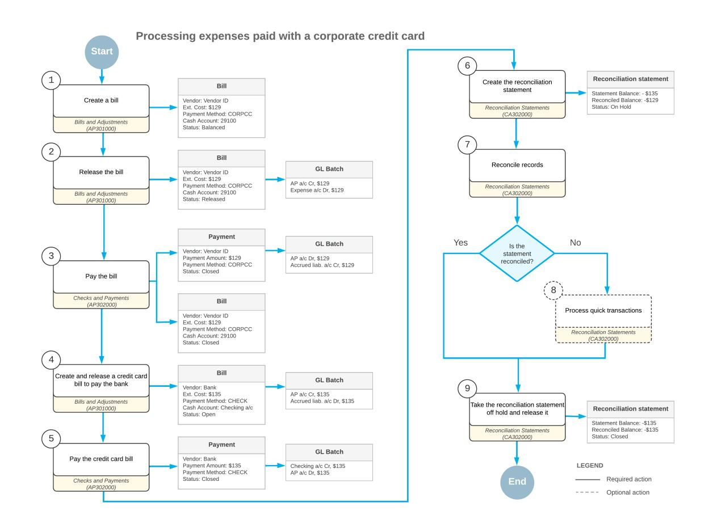

*Figure: Processing expenses paid with a corporate credit card*

# **Payments with a Corporate Card: Implementation Checklist**

The following sections provide details you can use to ensure that the system is configured properly for processing expenses with corporate cards, and to understand (and change, if needed) the settings that affect the processing workflow.

# **Implementation Checklist**

We recommend that before you initially process expenses with the corporate cards, you make sure the needed features have been enabled, settings have been specified, and entities have been created, as summarized in the following checklist.

| Form                       | Criteria to Check                                                                                                                                                                                 |
|----------------------------|---------------------------------------------------------------------------------------------------------------------------------------------------------------------------------------------------|
| Corporate Cards (CA202500) | Make sure that the corporate card has been config ured. For more information, see Corporate Cards: Gen eral Information.                                                                    |
| Vendors (AP303000)         | Make sure that a vendor that represents the bank that issued the corporate credit card have been created. For this vendor, specify the accrued liability account as the Expense Account. |

# **Other Settings That Affect the Workflow**

You can affect the workflow of processing expenses with corporate credit cards by specifying additional settings as follows:

- The following general ledger settings should be specified on the **PostingSettings** tab of the *[General Ledger](https://help-2025r1.acumatica.com/Help?ScreenId=ShowWiki&pageid=e4913d06-c511-4258-a0f9-f36c1b854e6b) [Preferences](https://help-2025r1.acumatica.com/Help?ScreenId=ShowWiki&pageid=e4913d06-c511-4258-a0f9-f36c1b854e6b)* (GL102000) form:
  - Make sure that the **Automatically Post on Release** check box is selected. This setting causes GL batches to be immediately posted aer they are released.
  - Clear the **Generate Consolidated Batches** check box to cause every AP transaction you enter to be posted as an individual batch to the general ledger. (When this check box is selected, the system consolidates into a single batch all transactions in the same currency posted to the same period for all documents being released.)
- The following accounts payable settings should be specified on the **General** tab of the *[Accounts Payable](https://help-2025r1.acumatica.com/Help?ScreenId=ShowWiki&pageid=c3f9353e-95e6-448d-bb3f-e20643879ec7) [Preferences](https://help-2025r1.acumatica.com/Help?ScreenId=ShowWiki&pageid=c3f9353e-95e6-448d-bb3f-e20643879ec7)* (AP101000) form:
  - Select the **Hold Documents on Entry** check box in the **Data EntrySettings** section. This setting gives the created payments the *On Hold* status.
  - Make sure that the **Automatically Post on Release** check box is selected in the **PostingSettings** section. This setting indicates that payments will be automatically posted to the general ledger once they are released.

# **Payments with a Corporate Card: To Process a Credit Card Bill**

The following activity will walk you through the process of processing a bill paid with the corporate credit card.

# **Story**

Suppose that on February 10, an employee of SweetLife Fruits & Jams purchased books on consulting for the office library and paid \$129.00 with the corporate credit card issued by Key Bank. Further suppose that on February 28, SweetLife received a statement for the corporate credit card. The statement balance was \$135.

The accountant decided to pay the credit card payment to the bank by issuing a payment from the *10200WH* checking account.

Acting as the SweetLife accountant, you need to create and release a bill for the purchase of books, pay the bill, and issue a payment for the bank.

# **Configuration Overview**

In the *U100* dataset, the following tasks have been performed to support this activity:

- On the *[Chart of Accounts](https://help-2025r1.acumatica.com/Help?ScreenId=ShowWiki&pageid=85557f41-a4af-47a8-b198-2a01461ce9c3)* (GL202500) form, the *29100* GL account for the corporate credit card has been created.
- On the *[Payment Methods](https://help-2025r1.acumatica.com/Help?ScreenId=ShowWiki&pageid=509285d1-cfae-4e87-95c3-a968451952e6)* (CA204000) form, the *CORPCC* payment method for corporate credit cards has been configured.
- On the *[Cash Accounts](https://help-2025r1.acumatica.com/Help?ScreenId=ShowWiki&pageid=10f71454-88f9-4d6c-8d09-32856d8c6741)* (CA202000) form, the *29100 (Corporate Credit Card Key Bank Visa)* cash account for the corporate credit card has been created and the *CORPCC* payment method has been specified for it.
- On the *[Vendors](https://help-2025r1.acumatica.com/Help?ScreenId=ShowWiki&pageid=a9584be3-f2bd-4d67-80d4-8041d809df56)* (AP303000) form, the *PRINTICO* and *KEYBANK* vendors have been created.

# **Process Overview**

In this activity, on the *[Bills and Adjustments](https://help-2025r1.acumatica.com/Help?ScreenId=ShowWiki&pageid=956b4e51-3078-4d2d-85b3-65c080d95234)* (AP301000) form, you will create and release a bill paid by the credit card. On the *[Checks and Payments](https://help-2025r1.acumatica.com/Help?ScreenId=ShowWiki&pageid=81659f97-cb14-4a27-bc3e-0f67b3945613)* (AP302000) form, you will pay this bill and review the generated GL transaction on the *Journal [Transactions](https://help-2025r1.acumatica.com/Help?ScreenId=ShowWiki&pageid=dda046bc-5946-407f-88f7-1c0c966fbe72)* (GL301000) form.

On the *[Bills and Adjustments](https://help-2025r1.acumatica.com/Help?ScreenId=ShowWiki&pageid=956b4e51-3078-4d2d-85b3-65c080d95234)* form, you will create a bill for the month's credit card use and pay it on the *[Checks and](https://help-2025r1.acumatica.com/Help?ScreenId=ShowWiki&pageid=81659f97-cb14-4a27-bc3e-0f67b3945613) [Payments](https://help-2025r1.acumatica.com/Help?ScreenId=ShowWiki&pageid=81659f97-cb14-4a27-bc3e-0f67b3945613)* form by issuing a payment.

# **System Preparation**

To prepare the system, do the following:

- 1. As a prerequisite activity, in the company to which you are signed in, be sure you have configured the card issuer as a vendor, as described in *[Corporate](https://help-2025r1.acumatica.com/Help?ScreenId=ShowWiki&pageid=8f50f603-63b1-4cff-a44a-8837e4a6b8fd) Cards: To Configure a Vendor for a Corporate Card*.
- 2. Launch the Acumatica ERP website, and sign in to a company with the *U100* dataset preloaded. You should sign in Anna Johnson by using the *johnson* username and the *123* password.
- 3. In the info area, in the upper-right corner of the top pane of the Acumatica ERP screen, make sure that the business date in your system is set to *2/10/2025*. If a different date is displayed, click the Business Date menu button, and select *2/10/2025* on the calendar. For simplicity, in this activity, you will create and process all documents in the system on this business date.
- 4. On the Company and Branch Selection menu, on the top pane of the Acumatica ERP screen, select the *SweetLife Head Office and Wholesale Center* branch.

# **Step 1: Creating a Bill Paid with the Corporate Credit Card**

To create and release a bill paid by the credit card, do the following:

- 1. Open the *[Bills and Adjustments](https://help-2025r1.acumatica.com/Help?ScreenId=ShowWiki&pageid=956b4e51-3078-4d2d-85b3-65c080d95234)* (AP301000) form.
- 2. On the form toolbar, click **Add New Record**.
- 3. In the Summary area, specify the following settings for the new bill:
  - **Type**: *Bill*
  - **Vendor**: *PRINTICO*
  - **Date**: *2/10/2025* (inserted automatically based on the selected business date)
  - **Post Period**: *02-2025* (inserted automatically)
  - **Description**: Books on consulting
- 4. On the **Details** tab, click **Add Row** on the table toolbar and specify the following settings for the added row:
  - **Branch**: *HEADOFFICE* (inserted by default)
  - **Ext. Cost**: 129.00
  - **Account**: *81000 (Other Expenses)*
- 5. On the **Financial** tab, in the **Default Payment Info** section, specify the following settings:
  - **Payment Method**: *CORPCC - Corporate Credit Card*
  - **Cash Account**: *29100 - Corporate Credit Card Key Bank*
- 6. On the form toolbar, click**Save**.
- 7. On the form toolbar, click **Remove Hold** to give the bill the *Balanced* status.
- 8. On the form toolbar, click **Release** to release the bill.

# **Step 2: Paying the Bill**

To pay the bill, do the following:

- 1. While you are still on the *[Bills and Adjustments](https://help-2025r1.acumatica.com/Help?ScreenId=ShowWiki&pageid=956b4e51-3078-4d2d-85b3-65c080d95234)* (AP301000) form with the bill opened, click **Pay** on the form toolbar.
- 2. On the *[Checks and Payments](https://help-2025r1.acumatica.com/Help?ScreenId=ShowWiki&pageid=81659f97-cb14-4a27-bc3e-0f67b3945613)* (AP302000) form, which opens, review the payment settings in the Summary area.
- 3. On the form toolbar, click **Remove Hold**.
- 4. On the form toolbar, click **Release** to release the payment.

The following screenshot illustrates a released payment with the bill paid with a corporate credit card applied to it.

|                                                        | <b>Checks and Payments</b> <b>PINOTES</b> TOOLS $\star$ <b>ACTIVITIES</b> <b>FILES</b> CUSTOMIZATION Payment 000035 - Wingman Printing Company |         |                     |                            |                                        |                |                   |                      |                     |              |         |                    |                           |       |                                 |
|--------------------------------------------------------|------------------------------------------------------------------------------------------------------------------------------------------------------------------|---------|---------------------|----------------------------|----------------------------------------|----------------|-------------------|----------------------|---------------------|--------------|---------|--------------------|---------------------------|-------|---------------------------------|
| 뭐 $\leftarrow$                                      | 日                                                                                                                                                                | ∽       | m $\pm$          | Ω К $\check{~}$      | ≺ ↘                                 | VOID $\geq$ | $\cdots$          |                      |                     |              |         |                    |                           |       |                                 |
| Туре:                                                  |                                                                                                                                                                  | Payment | $\checkmark$        | Vendor:                    | PRINTICO - Wingman Printing Company    |                |                   | Payment Amount: 1 |                     |              | 129.00  |                    |                           |       | $\lambda$                       |
| Reference Nbr.:                                        |                                                                                                                                                                  | 000035  | ρ                   | Location:                  | MAIN - Primary Location                |                |                   |                      | Unapplied Balance:  |              | 0.00    |                    |                           |       |                                 |
| Status:                                                |                                                                                                                                                                  | Closed  |                     | Joint Payee N              |                                        |                |                   |                      | Application Amount: |              | 0.00    |                    |                           |       |                                 |
|                                                        | Application Date: 2/10/2025                                                                                                                                      |         |                     | Payment Meth CORPCC        |                                        |                |                   | Finance Charges:     |                     |              | 0.00    |                    |                           |       |                                 |
|                                                        | Application Pe 02-2025                                                                                                                                           |         |                     | Cash Account:              | 29100 - Corporate Credit Card Key Bank |                |                   |                      |                     |              |         |                    |                           |       |                                 |
| Payment Ref.:                                          |                                                                                                                                                                  |         |                     | Description:               | Books on consulting                    |                |                   |                      |                     |              |         |                    |                           |       |                                 |
|                                                        | DOCUMENTS TO APPLY                                                                                                                                               |         |                     | <b>APPLICATION HISTORY</b> | <b>FINANCIAL</b>                       | REMITTANCE     | CHARGES           |                      | COMPLIANCE          |              |         |                    |                           |       |                                 |
| !!!!!!!!!!!!!!!!!!!!!!!!!!!!!!!!!!!!!!!!               | REVERSE APPLICATION                                                                                                                                              |         | $\vdash$            | $\boxed{\mathbf{X}}$       |                                        |                |                   |                      |                     |              |         |                    |                           |       |                                 |
| !!!!!!!!!!!!!!!!!!!!!!!!!!!!!!!!!!!!!!!! <b>B</b> 0 | Branch                                                                                                                                                           |         | <b>Batch Number</b> | Doc. Type                  | Reference Nbr.                      | Nbr.           | Line Inventory ID | Project              | <b>Project Task</b> | Cost Code | Account | <b>Amount Paid</b> | Cash Discount Taken |       | With. Tax Application Period |
| !!!!!!!!!!!!!!!!!!!!!!!!!!!!!!!!!!!!!!!! 0          | <b>HEADOFFICE</b>                                                                                                                                                |         | AP000183            | Bill                       | 000165                                 | $\mathbf 0$    |                   | X                    |                     |              |         | 129.00             | 0.00                      | 0.00. | 02-2025                         |

#### *Figure: A released payment of the bill paid with the corporate credit card*

5. On the **Financial** tab, click the link in the **Batch Nbr.** box and on the *Journal [Transactions](https://help-2025r1.acumatica.com/Help?ScreenId=ShowWiki&pageid=dda046bc-5946-407f-88f7-1c0c966fbe72)* (GL301000) form, review the GL transaction generated by the system.

The amount of the AP payment made through the corporate credit card has been credited to the accrued liability account (*29100*).

# **Step 3: Paying the Credit Card Bill**

To process the payment for the month's credit card use, do the following:

- 1. Open the *[Bills and Adjustments](https://help-2025r1.acumatica.com/Help?ScreenId=ShowWiki&pageid=956b4e51-3078-4d2d-85b3-65c080d95234)* (AP301000) form.
- 2. On the form toolbar, click **Add New Record**.
- 3. In the Summary area, specify the following settings:
  - **Type**: *Bill*
  - **Vendor**: *KEYBANK*
  - **Date**: *2/28/2025*
  - **Post Period**: *02-2025*
  - **Description**: Payment for the corp. credit card as of 2/28 statement
- 4. On the **Details** tab, click **Add Row** and specify the following settings for the added row:
  - **Branch**: *HEADOFFICE* (inserted by default)
  - **Transaction Descr.**: Payment for the corp. credit card as of 2/28 statement
  - **Ext. Cost**: 135
  - **Account**: *29100 (Corporate Credit Card)* (inserted automatically)

- 5. On the form toolbar, click **Remove Hold**.
- 6. On the form toolbar, click **Release**.
- 7. On the **Financial** tab, click the link in the **Batch Nbr.** box and on the *Journal [Transactions](https://help-2025r1.acumatica.com/Help?ScreenId=ShowWiki&pageid=dda046bc-5946-407f-88f7-1c0c966fbe72)* (GL301000) form, review the GL transaction generated by the system.

The amount to be paid for the corporate credit card to the bank has been debited to the accrued liability account (*29100*).

- 8. On the **Financial** tab, make sure that the following settings have been specified for the bill:
  - **Payment Method**: *CHECK*
  - **Cash Account**: *10200WH Wholesale Checking*
- 9. On the form toolbar, click **Pay**.
- 10.On the *[Checks and Payments](https://help-2025r1.acumatica.com/Help?ScreenId=ShowWiki&pageid=81659f97-cb14-4a27-bc3e-0f67b3945613)* (AP302000) form, which opens, click **Remove Hold** to give the payment the *Pending Print* status.
- 11.On the form toolbar, click **Print/Process**.
- 12.On the *[Process Payments / Print Checks](https://help-2025r1.acumatica.com/Help?ScreenId=ShowWiki&pageid=e632860a-8905-424a-8e27-ad66cf9f64c7)* (AP505000) form, which opens, review the payment details and click **Process** on the form toolbar to print the payment.

A separate browser tab is opened showing the printable version of the payment.

13.Review the printable version of the payment and close the browser tab. (For the purposes of this activity, you do not need to actually print the check.)

In a production setting, you would click **Print** on the form toolbar to print the check before closing the browser tab.

14.On the *[Release Payments](https://help-2025r1.acumatica.com/Help?ScreenId=ShowWiki&pageid=0a981976-131b-4150-81d0-19b54a46e510)* (AP505200) form, which opens, review the payment details and click **Process** to release the payment.

You have processed the payment for the corporate credit card in the system.

# **Payments with a Corporate Card: To Reconcile a Bank Statement**

The following activity will walk you through the process of reconciling the balance of the credit card issuer in the system with the balance of a bank statement.

### **Story**

Suppose that on February 28, SweetLife received a statement for the corporate credit card. The statement balance was \$135, which the company owed to the bank, and the statement included the following transactions.

| Card Num ber | Transaction Date | Transaction Description                | Amount    |
|-----------------|------------------|----------------------------------------|-----------|
| VISA XXXX       | 2/10/2025        | Wingman Printing Company               | –\$129.00 |
|                 | 2/28/2025        | Key Bank service charges February 2025 | –\$10.00  |
|                 | 2/28/2025        | Key Bank cash back February 2025       | \$4.00    |
|                 |                  | Statement Balance:                     | –\$135.00 |

*Table: The 2/28/2025 bank statement for the corporate credit card*

Acting as the SweetLife accountant, you need to perform the reconciliation of the corporate credit card balance with the bank statement balance.

# **Configuration Overview**

In the *U100* dataset, the following tasks have been performed to support this activity:

- On the *[Chart of Accounts](https://help-2025r1.acumatica.com/Help?ScreenId=ShowWiki&pageid=85557f41-a4af-47a8-b198-2a01461ce9c3)* (GL202500) form, the *29100* GL account for the corporate credit card has been created.
- On the *[Payment Methods](https://help-2025r1.acumatica.com/Help?ScreenId=ShowWiki&pageid=509285d1-cfae-4e87-95c3-a968451952e6)* (CA204000) form, the *CORPCC* payment method for corporate credit cards has been configured.
- On the *[Cash Accounts](https://help-2025r1.acumatica.com/Help?ScreenId=ShowWiki&pageid=10f71454-88f9-4d6c-8d09-32856d8c6741)* (CA202000) form, the *29100 (Corporate Credit Card Key Bank Visa)* cash account for the corporate credit card has been created and the *CORPCC* payment method has been specified for it.
- On the *Entry [Types](https://help-2025r1.acumatica.com/Help?ScreenId=ShowWiki&pageid=0253dfdd-b06b-4274-b44e-9c7a584b15f2)* (CA203000) form, the *BANKFEE* and *INTEREST* entry types have been created.
- On the *[Vendors](https://help-2025r1.acumatica.com/Help?ScreenId=ShowWiki&pageid=a9584be3-f2bd-4d67-80d4-8041d809df56)* (AP303000) form, the *KEYBANK* vendor that represents the issuer of a corporate card has been created.

# **Process Overview**

In this activity, on the *[Reconciliation Statements](https://help-2025r1.acumatica.com/Help?ScreenId=ShowWiki&pageid=4a3afa05-00a5-422f-be1c-d14827366139)* (CA302000) form, you will create a reconciliation statement for the 29100 cash account. You will then create two quick transactions on the same form and reconcile them too. Finally, you will release the reconciliation statement.

# **System Preparation**

To prepare the system, do the following:

- 1. As a prerequisite activity, in the company to which you are signed in, be sure you have processed a bill paid with the credit card and issued a payment to the bank as described in *Payments with a [Corporate](#page-153-1) Card: To [Process a Credit Card Bill](#page-153-1)*.
- 2. Launch the Acumatica ERP website, and sign in to a company with the *U100* dataset preloaded. You should sign in as Anna Johnson by using the *johnson* username and the *123* password.
- 3. In the info area, in the upper-right corner of the top pane of the Acumatica ERP screen, make sure that the business date in your system is set to *2/28/2025*. If a different date is displayed, click the Business Date menu button, and select *2/28/2025* on the calendar. For simplicity, in this activity, you will create and process all documents in the system on this business date.
- 4. On the Company and Branch Selection menu, on the top pane of the Acumatica ERP screen, select the *SweetLife Head Office and Wholesale Center* branch.

# **Step 1: Creating a Reconciliation Statement**

To create a reconciliation statement to reconcile the balance of the corporate credit card with the bank statement balance, do the following:

1. Open the *[Reconciliation Statements](https://help-2025r1.acumatica.com/Help?ScreenId=ShowWiki&pageid=4a3afa05-00a5-422f-be1c-d14827366139)* (CA302000) form.

To open the form for creating a new record, type the form ID in the Search box, and on the Search form, point at the form title and click **New** right of the title.

- 2. On the form toolbar, click **Add New Record**.
- 3. In the **Cash Account** box, select *29100 - Corporate Credit Card Key Bank Visa*.
- 4. In the Summary area, specify the following settings:

- **Reconciliation Date**: *2/28/2025* (inserted automatically based on the selected business date)
- **Statement Balance**: –135
- 5. In the table, select the **Reconciled** check box for the row with the \$129 payment, as shown in the screenshot below.

The credit card cash account still has a shortfall of \$6, which is displayed in the **Difference** box (also shown in the following screenshot). This is the total amount of transactions that have appeared in the bank statement but have not yet been processed in the system.

| <b>Reconciliation Statements</b> PI NOTES TOOLS $\star$ <b>ACTIVITIES</b> CUSTOMIZATION <b>FILES</b> 29100 Corporate Credit Card Key Bank Visa                                    |                                          |                            |                      |                    |               |                       |                            |                              |  |                                             |           |
|-----------------------------------------------------------------------------------------------------------------------------------------------------------------------------------------------------|------------------------------------------|----------------------------|----------------------|--------------------|---------------|-----------------------|----------------------------|------------------------------|--|---------------------------------------------|-----------|
| 罰 B REMOVE HOLD 侕 $\curvearrowleft$ $\mathbb{R}$ $\leftarrow$ $^+$ >1 $\cdots$                                                                                           |                                          |                            |                      |                    |               |                       |                            |                              |  |                                             |           |
| * Cash Account:                                                                                                                                                                                     | 29100 - Corporate Credit Card Key Ba , O | Beginning Balance:         | 0.00                 | Document Count:    |               |                       |                            |                              |  |                                             | $\lambda$ |
| * Ref. Number:                                                                                                                                                                                      | <new> P</new>                            | Reconciled Receipts:       | 0.00                 | $\theta$           |               |                       |                            |                              |  |                                             |           |
| Status:                                                                                                                                                                                             | On Hold                                  | Reconciled Disb.:          | 129.00               |                    |               |                       |                            |                              |  |                                             |           |
| Last Reconciliation Date:                                                                                                                                                                           |                                          | Reconciled Balance:        | $-129.00$            |                    |               |                       |                            |                              |  |                                             |           |
| * Reconciliation Date:                                                                                                                                                                              | 2/28/2025 日                              | Statement Balance:         | $-135.00$            |                    |               |                       |                            |                              |  |                                             |           |
| 2/28/2025 一 Load Documents Up To:                                                                                                                                                                |                                          | Difference:                | $-6.00$              |                    |               |                       |                            |                              |  |                                             |           |
| <b>DETAILS</b>                                                                                                                                                                                      | <b>APPROVALS</b>                         |                            |                      |                    |               |                       |                            |                              |  |                                             |           |
| TOGGLE RECONCILED TOGGLE CLEARED RECONCILE PROCESSED $\boxed{\mathbf{x}}$ All Records CREATE ADJUSTMENT $\mathbf{H}$ !!!!!!!!!!!!!!!!!!!!!!!!!!!!!!!!!!!!!!!! $\mathscr{Q}$ |                                          |                            |                      |                    |               | $\mathbf{v} = \nabla$ |                            |                              |  |                                             |           |
| <b>E</b> Reconciled Cleared                                                                                                                                                                      | Clear Date Receipt                    | Disbursement Document Ref. | Module Tran. Type | *Orig. Doc. Number | <b>Status</b> | *Doc. Date            | <b>Business</b> Account | <b>Business Account Name</b> |  | Description                                 |           |
| ☑ ☑                                                                                                                                                                                              | 2/28/2025 0.00.                       | 129.00                     | AP Payment        | 000035             | Posted        | 2/10/2025             | PRINTICO                   | Wingman Printing Company     |  | Books on consulting                         |           |
| o $\Box$                                                                                                                                                                                         | 135.00                                   | $0.00 -$ 000166         | AP GL Entry       | AP000184           | Posted        | 2/28/2025             | <b>KEYBANK</b>             | Key Bank                     |  | Payment for the corp. credit card as of 2/2 |           |

#### *Figure: The reconciliation statement created for the 29100 cash account*

The credit card statement includes two more transactions: one for the \$10 bank charge, and one for the \$4 cash back on the credit card cash account. You can process them as quick transactions.

6. On the form toolbar, click**Save**.

#### **Step 2: Processing Quick Transactions**

To process quick transactions in the system, do the following:

- 1. While you are still on the *[Reconciliation Statements](https://help-2025r1.acumatica.com/Help?ScreenId=ShowWiki&pageid=4a3afa05-00a5-422f-be1c-d14827366139)* (CA302000) form with the reconciliation statement opened, click **Create Adjustment** on the table toolbar.
- 2. In the **QuickTransaction** dialog box, which opens, specify the following settings to create a transaction for the \$10 bank charge:
  - **EntryType**: *BANKFEE*
  - **Doc. Date**: *2/28/2025* (inserted automatically)
  - **Fin. Period**: *02-2025* (inserted automatically)
  - **Amount**: 10
  - **Hold**: Cleared
- 3. Click the **Release** button to release the transaction.
- 4. On the *[Reconciliation Statements](https://help-2025r1.acumatica.com/Help?ScreenId=ShowWiki&pageid=4a3afa05-00a5-422f-be1c-d14827366139)* form, click **Create Adjustment** on the table toolbar.
- 5. In the **QuickTransaction** dialog box, which opens, specify the following settings to create a transaction for the \$4 cash back:
  - **EntryType**: *INTEREST*
  - **Doc. Date**: *2/28/2025* (inserted automatically)
  - **Fin. Period**: *02-2025* (inserted automatically)
  - **Amount**: 4
  - **Hold**: Cleared
- 6. Click the **Release** button to release the transaction.

Both transactions have appeared in the table on the *[Reconciliation Statements](https://help-2025r1.acumatica.com/Help?ScreenId=ShowWiki&pageid=4a3afa05-00a5-422f-be1c-d14827366139)* form.

7. In the table, click the **Reconciled** check box for each transaction and click**Save**.

Notice that the **Reconciled Balance** is –\$135.00 and the **Difference** is \$0.00, as shown in the screenshot below. The reconciliation is complete. In the reconciliation statement, you have selected all transactions that have appeared in the credit card statement. For the selected transactions, the **Reconciled Balance** is equal to the**Statement Balance**. Therefore, the credit card balance has been reconciled with the bank statement.

You do not select the \$135 payment that you made to the bank in the reconciliation statement. It will appear in the next bank statement for the credit card and you will reconcile the payment next time.

|                                                                                                                                                                                         | <b>Reconciliation Statements</b>                                                                         |           |                          |         |                            |                      |        |                 |                    |               |            |                            | IN NOTES                     | <b>ACTIVITIES</b> | <b>FILES</b>        | <b>CUSTOMIZATION</b>                        | TOOLS - |
|-----------------------------------------------------------------------------------------------------------------------------------------------------------------------------------------|----------------------------------------------------------------------------------------------------------|-----------|--------------------------|---------|----------------------------|----------------------|--------|-----------------|--------------------|---------------|------------|----------------------------|------------------------------|-------------------|---------------------|---------------------------------------------|---------|
|                                                                                                                                                                                         | 000001 - 29100 Corporate Credit Card Key Bank Visa: 2/28/2025                                            |           |                          |         |                            |                      |        |                 |                    |               |            |                            |                              |                   |                     |                                             |         |
|                                                                                                                                                                                         | 霜 ₿ 侕 REMOVE HOLD ∽ $\prec$ $\leftarrow$ ÷ $\cdots$                              |           |                          |         |                            |                      |        |                 |                    |               |            |                            |                              |                   |                     |                                             |         |
|                                                                                                                                                                                         | Document Count: 0.00 29100 - Corporate Credit Card Key Ba Beginning Balance: * Cash Account: |           |                          |         |                            |                      |        |                 |                    |               |            |                            | $\lambda$                    |                   |                     |                                             |         |
|                                                                                                                                                                                         | * Ref. Number:                                                                                           |           | $\mathfrak{a}$ 000001 |         |                            | Reconciled Receipts: |        | 4.00            |                    |               |            |                            |                              |                   |                     |                                             |         |
|                                                                                                                                                                                         | Status:                                                                                                  |           | On Hold                  |         |                            | Reconciled Disb.:    |        | 139.00          | $\overline{2}$     |               |            |                            |                              |                   |                     |                                             |         |
|                                                                                                                                                                                         |                                                                                                          |           |                          |         |                            |                      |        |                 |                    |               |            |                            |                              |                   |                     |                                             |         |
|                                                                                                                                                                                         | Last Reconciliation Date:                                                                                |           |                          |         |                            | Reconciled Balance:  |        | $-135.00$       |                    |               |            |                            |                              |                   |                     |                                             |         |
|                                                                                                                                                                                         | * Reconciliation Date:                                                                                   |           | 2/28/2025 A           |         |                            | Statement Balance:   |        | $-135.00$       |                    |               |            |                            |                              |                   |                     |                                             |         |
|                                                                                                                                                                                         | Load Documents Up To:                                                                                    |           | 2/28/2025 自           |         |                            | Difference:          |        | 0.00            |                    |               |            |                            |                              |                   |                     |                                             |         |
|                                                                                                                                                                                         |                                                                                                          |           |                          |         |                            |                      |        |                 |                    |               |            |                            |                              |                   |                     |                                             |         |
|                                                                                                                                                                                         | <b>DETAILS</b>                                                                                           | APPROVALS |                          |         |                            |                      |        |                 |                    |               |            |                            |                              |                   |                     |                                             |         |
| $\boxed{\mathbf{x}}$ TOGGLE RECONCILED $\left  \rightarrow \right $ All Records TOGGLE CLEARED RECONCILE PROCESSED CREATE ADJUSTMENT $\star$ Ò $\mathscr{Q}$ |                                                                                                          |           |                          |         |                            |                      |        | $\sqrt{ }$      |                    |               |            |                            |                              |                   |                     |                                             |         |
|                                                                                                                                                                                         | <b>Reconciled</b>                                                                                        | Cleared   | Clear Date               | Receipt | Disbursement Document Ref. |                      | Module | Tran. Type      | *Orig. Doc. Number | <b>Status</b> | *Doc. Date | <b>Business</b> Account | <b>Business Account Name</b> |                   | Description         |                                             |         |
|                                                                                                                                                                                         | ⊠                                                                                                        | ☑         | 2/28/2025                | 0.00    | 129.00                     |                      | AP     | Payment         | 000035             | Posted        | 2/10/2025  | PRINTICO                   | Wingman Printing Company     |                   | Books on consulting |                                             |         |
|                                                                                                                                                                                         | $\Box$                                                                                                   | $\Box$    |                          | 135.00  | $0.00 -$                   | 000166               | AP     | <b>GL Entry</b> | AP000184           | Posted        | 2/28/2025  | KEYBANK                    | Key Bank                     |                   |                     | Payment for the corp. credit card as of 2/2 |         |
|                                                                                                                                                                                         | ☑                                                                                                        | ☑         | 2/28/2025                | 0.00    | 10.00                      |                      | CA     | Cash Entry      | 000001             | Posted        | 2/28/2025  |                            |                              |                   | <b>Bank Fees</b>    |                                             |         |
|                                                                                                                                                                                         | ☑                                                                                                        | ☑         | 2/28/2025                | 4.00    | 0.00                       |                      | CA     | Cash Entry      | 000002             | Posted        | 2/28/2025  |                            |                              |                   | Interest            |                                             |         |
|                                                                                                                                                                                         |                                                                                                          |           |                          |         |                            |                      |        |                 |                    |               |            |                            |                              |                   |                     |                                             |         |

*Figure: The reconciled transactions on the reconciliation statement*

# **Step 3: Releasing the Reconciliation Statement**

To release the reconciliation statement, do the following:

- 1. While you are still on the *[Reconciliation Statements](https://help-2025r1.acumatica.com/Help?ScreenId=ShowWiki&pageid=4a3afa05-00a5-422f-be1c-d14827366139)* (CA302000) form with the reconciliation statement opened, click **Remove Hold** on the form toolbar.
- 2. On the form toolbar, click **Release**.

You have reconciled the balance of the card issuer with the balance of the statement received from Key Bank.

# **Payments with a Corporate Card: Generated Transactions**

As you process expenses paid with a corporate credit card, you create and process bills and payments. To update vendor balances, the system generates the GL transactions described in the following sections.

# **Transaction Generated for a Bill Paid with a Corporate Credit Card**

To process a bill paid with a corporate credit card, you process the bill as usual. The system generates the following general ledger transaction:

| Account          | Source of Account                                                     | Debit | Credit |
|------------------|-----------------------------------------------------------------------|-------|--------|
| Accounts Payable | AP Account specified for the vendor on the Vendors (AP303000) form | 0.00  | Amount |

| Account         | Source of Account                                                                                                                    | Debit  | Credit |
|-----------------|--------------------------------------------------------------------------------------------------------------------------------------|--------|--------|
| Expense account | Account specified in the Account column for the docu ment line on the Details tab of the Bills and Adjustments (AP301000) form | Amount | 0.00   |

You can view the reference number of the GL batch on the **Financial** tab of the *[Bills and Adjustments](https://help-2025r1.acumatica.com/Help?ScreenId=ShowWiki&pageid=956b4e51-3078-4d2d-85b3-65c080d95234)* form.

# **Transaction Generated for the Bill Payment**

When you process the payment that uses the corporate credit card, the system generates the following general ledger transaction:

| Account                       | Source of Account                                                                                                                                                                                   | Debit  | Credit |
|-------------------------------|-----------------------------------------------------------------------------------------------------------------------------------------------------------------------------------------------------|--------|--------|
| Accrued liability ac count | GL account linked to the cash account that represents the corporate credit card account in the system and which is specified in the Cash Account box on the Checks and Payments (AP302000) | 0.00   | Amount |
| Accounts Payable              | AP Account specified for the vendor on the Vendors (AP303000) form                                                                                                                               | Amount | 0.00   |

You can view the reference number of the GL batch on the **Financial** tab of the *[Checks and Payments](https://help-2025r1.acumatica.com/Help?ScreenId=ShowWiki&pageid=81659f97-cb14-4a27-bc3e-0f67b3945613)* form.

# **Transaction Generated for the Bill to Pay the Bank**

When you receive a bank statement for the corporate credit card, you create an AP bill in the amount of the statement and specify the accrued liability account as the expense account in the bill. When you process the credit card bill, the system generates the following general ledger transaction:

| Account                       | Source of Account                                                                                                       | Debit               | Credit              |
|-------------------------------|-------------------------------------------------------------------------------------------------------------------------|---------------------|---------------------|
| Accounts Payable              | AP Account specified for the vendor on the Vendors (AP303000) form                                                   | 0.00                | Statement amount |
| Accrued liability ac count | Expense account specified for the vendor that rep resents the bank in the Expense Account box on the Vendors form | Statement amount | 0.00                |

You can view the reference number of the GL batch on the **Financial** tab of the *[Bills and Adjustments](https://help-2025r1.acumatica.com/Help?ScreenId=ShowWiki&pageid=956b4e51-3078-4d2d-85b3-65c080d95234)* (AP301000) form.

# **Transaction Generated for Payment of the Credit Card Bill**

When you pay the credit card bill, you process an AP payment for the credit card bill from the cash account you use to pay for the credit card (such as a checking account). When you process the payment, the system generates the following general ledger transaction:

| Account          | Source of Account                                                                                                   | Debit               | Credit              |
|------------------|---------------------------------------------------------------------------------------------------------------------|---------------------|---------------------|
| Checking account | GL account linked to the cash account specified in the Cash Account box on the Checks and Payments (AP302000) | 0.00                | Statement amount |
| Accounts Payable | AP Account specified for the vendor that represents the bank on the Vendors (AP303000) form                      | Statement amount | 0.00                |

You can view the reference number of the GL batch on the **Financial** tab of the *[Checks and Payments](https://help-2025r1.acumatica.com/Help?ScreenId=ShowWiki&pageid=81659f97-cb14-4a27-bc3e-0f67b3945613)* form.

# **Payments with a Corporate Card: Related Report and Inquiry Forms**

In the following sections, you can find details about the reports and inquiry forms you may want to review to gather information about the bills, vendor information, and reconciliation statements.

If you do not see a particular report or form that is described, you may have signed in to the system with a user account that does not have access rights to the report or form. Contact your system administrator to obtain access to any needed reports or forms.

# **Reviewing the Details of a Released Bill**

Once you have released a bill, you can review the details of the bill by running a report on the *[AP Register Detailed](https://help-2025r1.acumatica.com/Help?ScreenId=ShowWiki&pageid=537818a3-d97b-4ae0-a0d6-3e83684e3a01)* (AP622000) form. When you run this report from the *[Bills and Adjustments](https://help-2025r1.acumatica.com/Help?ScreenId=ShowWiki&pageid=956b4e51-3078-4d2d-85b3-65c080d95234)* (AP301000) form by clicking **AP Register Detailed** (under **Reports**) on the More menu, the report shows the details of the bill opened on this form. You can review the GL batch the system created when releasing the bill and the accounts that have been updated by the transaction.

# **Reviewing Vendor Documents**

You use the *[Vendor](https://help-2025r1.acumatica.com/Help?ScreenId=ShowWiki&pageid=22c03d80-cbb0-449d-9325-c12f623aaefd) Details* (AP402000) form to review the accounts payable documents (bills, debit adjustments, credit adjustments, and payments) for a particular vendor.

By default, the form displays the list of open vendor documents (that is, those with the *Open* status), but you can add to the list closed documents and unreleased documents by selecting the**Show All Documents** and **Include Unreleased Documents** check boxes, respectively.

# **Reviewing the Vendor's Balance**

Aer a bill has been released, you can review the vendor's balance on the *AP [Balance](https://help-2025r1.acumatica.com/Help?ScreenId=ShowWiki&pageid=0d1c7f3f-90d6-4d12-894f-05fadf489921) by Vendor* (AP632500) form. On this form, you select *Open Documents* in the **Report Format** box and specify the needed financial period.

In the report, you can review open documents and vendor balances at the end of the period, grouped by vendor and by AP account. When you release a bill or an adjustment, the system updates the vendor balance.**Vendor DocumentsTotal** is the total amount of all open documents of the vendor.

# **Reviewing a Reconciliation Statement**

You can review a reconciliation statement for a particular cash account by running the reconciliation statement report on the *[Reconciliation Statement](https://help-2025r1.acumatica.com/Help?ScreenId=ShowWiki&pageid=7e76dfb0-e559-4906-922d-5bccfc8a43bf)* (CA627000) form. You can also run this report by clicking **Reconciliation Statement Report** (under **Reports**) on the More menu of the *[Reconciliation Statements](https://help-2025r1.acumatica.com/Help?ScreenId=ShowWiki&pageid=4a3afa05-00a5-422f-be1c-d14827366139)* (CA302000) form with a

reconciliation statement selected. The report shows reconciled and unreconciled disbursements and receipts, the beginning balance of the bank statement, and the cash account balance as of the statement date.

#### **Reviewing a Summary and Details of Reconciliations**

On the *[Reconciliation Register](https://help-2025r1.acumatica.com/Help?ScreenId=ShowWiki&pageid=4dc6d727-080e-41b2-aa22-c461a264be1d)* (CA623500) and *[Reconciliation Register Details](https://help-2025r1.acumatica.com/Help?ScreenId=ShowWiki&pageid=6c4514b9-6535-424d-9b01-276c24f9ec7c)* (CA624000) forms, you can review the summary and detailed information about bank reconciliations for a selected cash account within the specified range of dates.

# **Applying Payments to Particular Lines of AP Documents**

In many industries, organizations need to manage expenses and payments at a granular level—that is, down to the individual lines of accounts payable bills.

Acumatica ERP provides the ability to pay accounts payable documents by individual lines. Users can now choose how they want to apply payments: fully (to the entire document), partially, or to individual document lines.

# **Applying Payments to Particular Lines: General Information**

Some industries track the expenses and cash flows of particular projects with a high degree of granularity. Project expenses are recorded in the lines of a bill, with each line corresponding to a specific combination of a project, project task, and cost code (if applicable). In Acumatica ERP, you can create a payment that pays particular lines (or one line) of any number of AP bills.

You can use this functionality if the *Payment Application by Line* feature is enabled on the *[Enable/Disable Features](https://help-2025r1.acumatica.com/Help?ScreenId=ShowWiki&pageid=c1555e43-1bc5-4f6f-ba9d-b323f94d8a6b)* (CS100000) form.

# **Learning Objectives**

In this chapter, you will learn how to do the following:

- Set up the functionality of paying AP documents by line
- Process an AP bill that can be paid by line
- Enter a payment for particular lines of the AP bill

# **Applicable Scenarios**

You create AP documents that can be paid by line if you want the ability to see which lines of a particular bill were covered by a partial payment or to pay bills in that way.

### **Configuration of Payment by Line**

For it to be possible to apply payments to individual lines, the needed configuration steps must be performed in Acumatica ERP as follows:

• The *Payment Application by Line* feature must be enabled on the *[Enable/Disable Features](https://help-2025r1.acumatica.com/Help?ScreenId=ShowWiki&pageid=c1555e43-1bc5-4f6f-ba9d-b323f94d8a6b)* (CS100000) form. If you also want to give users the ability to track retainage by individual document lines, the *Retainage Support* feature should also be enabled. For details, see *To Enter a Bill with [Retainage](#page-192-1) Paid by Line*.

Additionally, for each line to correspond to a particular cost code (as well as project and project task), the *Cost Code* feature must be enabled.

- Optional: In the settings of any vendor class, you select the **Pay by Line** check box on the **General** tab (**Default FinancialSettings** section) of the *Vendor [Classes](https://help-2025r1.acumatica.com/Help?ScreenId=ShowWiki&pageid=20dc8b93-d83a-49cf-8cfb-d2ffd2f0db87)* (AP201000) form. With this setting, the ability to apply payments to individual lines of AP documents is turned on by default for newly created vendors of the vendor class. If this check box is selected for a class, when you create a vendor and assign it to the class, the **Pay by Line** check box on the **Payment** tab of the *[Vendors](https://help-2025r1.acumatica.com/Help?ScreenId=ShowWiki&pageid=a9584be3-f2bd-4d67-80d4-8041d809df56)* form is selected by default. It can be cleared for a particular vendor, if needed. (The vendor setting is then used as the default setting for the AP document.)
- Optional: In the settings of any vendor, you select the **Pay by Line** check box on the **Payment** tab (**Default FinancialSettings** section) of the *[Vendors](https://help-2025r1.acumatica.com/Help?ScreenId=ShowWiki&pageid=a9584be3-f2bd-4d67-80d4-8041d809df56)* (AP303000) form. This gives users the ability to apply payments to individual lines of the AP documents of this vendor. If a vendor with this check box selected is specified for a bill, the **Pay by Line** check box is selected by default on the following forms:

- *[Bills and Adjustments](https://help-2025r1.acumatica.com/Help?ScreenId=ShowWiki&pageid=956b4e51-3078-4d2d-85b3-65c080d95234)* (AP301000)
- *Tax Bills and [Adjustments](https://help-2025r1.acumatica.com/Help?ScreenId=ShowWiki&pageid=828caa1a-1ef7-4096-8888-500f8262ce6b)* (TX303000) form if the vendor is a tax agency

You can turn on the ability to pay documents by line for any vendor class and any vendor both during initial configuration and at any time thereaer. You can also turn off this capability for any class or vendor, if needed.

# **Entry of Documents That Can Be Paid by Line**

When you are entering an AP document that can be paid by line, you make sure the **Pay by Line** check box is selected for the document in the Summary area of the *[Bills and Adjustments](https://help-2025r1.acumatica.com/Help?ScreenId=ShowWiki&pageid=956b4e51-3078-4d2d-85b3-65c080d95234)*(AP301000) form or the *Tax [Bills](https://help-2025r1.acumatica.com/Help?ScreenId=ShowWiki&pageid=828caa1a-1ef7-4096-8888-500f8262ce6b) and [Adjustments](https://help-2025r1.acumatica.com/Help?ScreenId=ShowWiki&pageid=828caa1a-1ef7-4096-8888-500f8262ce6b)* (TX303000) form if the vendor is a tax agency.

Then you add lines to the AP document on the **Details** tab, specifying the inventory ID, project, project task, and cost code (if applicable) for each line. The system assigns the line number to each line and displays it in the **Line Nbr.** column, which appears in the table when the **Pay by Line** check box is selected for a document.

When preparing payments for these documents on the *[Prepare Payments](https://help-2025r1.acumatica.com/Help?ScreenId=ShowWiki&pageid=e3b526e3-8b12-4fa9-a5b2-2955e763f238)* (AP503000) form, you select separate document lines in the table on the **Documents to Pay** tab. When a payment is applied to a selected line, the system updates the line balance to show the open balance of the line aer a payment is applied. Aer you release the payment, you can view the unpaid balance of the original document in the Summary area of the *[Bills and](https://help-2025r1.acumatica.com/Help?ScreenId=ShowWiki&pageid=956b4e51-3078-4d2d-85b3-65c080d95234) [Adjustments](https://help-2025r1.acumatica.com/Help?ScreenId=ShowWiki&pageid=956b4e51-3078-4d2d-85b3-65c080d95234)* or *Tax Bills and [Adjustments](https://help-2025r1.acumatica.com/Help?ScreenId=ShowWiki&pageid=828caa1a-1ef7-4096-8888-500f8262ce6b)* form.

If the *Invoice Rounding* feature is enabled on the *[Enable/Disable Features](https://help-2025r1.acumatica.com/Help?ScreenId=ShowWiki&pageid=c1555e43-1bc5-4f6f-ba9d-b323f94d8a6b)* (CS100000) form, the functionality of this feature is not applicable to documents that can be paid by line. That is, the amounts in these documents cannot be rounded, while the amounts in other documents can be rounded.

This functionality is not supported for taxable documents that have a tax zone of external tax providers selected for them in the**VendorTax Zone** box on the **Financial** tab of the *[Bills and](https://help-2025r1.acumatica.com/Help?ScreenId=ShowWiki&pageid=956b4e51-3078-4d2d-85b3-65c080d95234) [Adjustments](https://help-2025r1.acumatica.com/Help?ScreenId=ShowWiki&pageid=956b4e51-3078-4d2d-85b3-65c080d95234)* form.

# **Processing of Cash Discounts**

If a cash discount for early payment applies to an AP document for which individual lines can be paid, the cash discount is distributed proportionally among the lines of the document. The discount amounts for each line are displayed in the **Cash Discount Balance** column on the *[Bills and Adjustments](https://help-2025r1.acumatica.com/Help?ScreenId=ShowWiki&pageid=956b4e51-3078-4d2d-85b3-65c080d95234)* (AP301000) form. The rounding difference in the calculated cash discount is included in the line with the highest amount.

If a document that has been paid by individual lines includes a cash discount for early payment, this cash discount is distributed proportionally among the lines of the document. These discount amounts are shown in the **Cash DiscountTaken** column on the **Documents to Apply** tab of the *[Checks and Payments](https://help-2025r1.acumatica.com/Help?ScreenId=ShowWiki&pageid=81659f97-cb14-4a27-bc3e-0f67b3945613)* (AP302000) form. In this column, you can edit the cash discount taken for a particular line. The original bill displays the difference between the calculated cash discount and the cash discount taken in the **Cash Discount Balance** column for a particular line.

# **Processing of Debit Adjustments**

If debit adjustments have been created in the system automatically when a user reversed a document, these debit adjustments cannot be applied by line. That is, for debit adjustments created automatically, on the *[Bills](https://help-2025r1.acumatica.com/Help?ScreenId=ShowWiki&pageid=956b4e51-3078-4d2d-85b3-65c080d95234) [and Adjustments](https://help-2025r1.acumatica.com/Help?ScreenId=ShowWiki&pageid=956b4e51-3078-4d2d-85b3-65c080d95234)* (AP301000) form, the **Pay by Line** check box in the Summary area will always be cleared and unavailable for editing.

Debit adjustments created manually on the *[Bills and Adjustments](https://help-2025r1.acumatica.com/Help?ScreenId=ShowWiki&pageid=956b4e51-3078-4d2d-85b3-65c080d95234)* form can be applied by line. For these debit adjustments, the **Pay by Line** check box in the Summary area can be selected. For details, see *To [Enter](#page-172-2) a Debit [Adjustment That Can Be Applied by Line](#page-172-2)*.

# **Lines with Negative Amounts in AP Documents Paid by Line**

On the *[Bills and Adjustments](https://help-2025r1.acumatica.com/Help?ScreenId=ShowWiki&pageid=956b4e51-3078-4d2d-85b3-65c080d95234)* (AP301000) form, AP documents with the **Pay by Line** check box selected can have lines with a negative amount in any of the following columns on the **Details** tab: **Ext. Cost**, **Retainage Amount**, and **Amount**.

These documents can be released if their balance is greater than or equal to *0.00*.

The system does not allow users to add lines with negative amounts to documents with both the **Pay by Line** and **Joint Payees** check boxes selected.

On reversal of an AP document with a negative amount in a line, a related document is created with the same signs as the amounts in the document lines.

When releasing retainage for documents with retainage and paid by line, depending on the sign of the total retainage to release for each original document, the system will generate one of the following:

- A retainage bill if the retainage to release is greater or equal to *0.00*
- A retainage debit adjustment if the retainage to release is less than *0.00*

For bills and debit adjustments that have lines with negative amounts, the cash discount amount will also be negative. The cash discount is specified for a document line in the **Cash Discount Balance** column on the **Details** tab of the *[Bills and Adjustments](https://help-2025r1.acumatica.com/Help?ScreenId=ShowWiki&pageid=956b4e51-3078-4d2d-85b3-65c080d95234)* form.

A document with a cash discount can be released only if the total cash discount shown in the **Cash Discount** box in the Summary area is greater than or equal to *0.00*. When such a document is applied to a payment on the *[Checks](https://help-2025r1.acumatica.com/Help?ScreenId=ShowWiki&pageid=81659f97-cb14-4a27-bc3e-0f67b3945613) [and Payments](https://help-2025r1.acumatica.com/Help?ScreenId=ShowWiki&pageid=81659f97-cb14-4a27-bc3e-0f67b3945613)* (AP302000) form, the amount in the **Cash DiscountTaken** column for a line with a negative amount can be less than or equal to *0.00*.

# **Overview of Payment by Line**

When you create a payment for particular lines of a bill, the process unfolds as follows:

- 1. On the *[Bills and Adjustments](https://help-2025r1.acumatica.com/Help?ScreenId=ShowWiki&pageid=956b4e51-3078-4d2d-85b3-65c080d95234)* (AP301000) form, you create a bill, select the **Pay by Line** check box in the Summary area, and then add multiple lines to this bill. You then release the bill.
- 2. Optional: On the *[Bills and Adjustments](https://help-2025r1.acumatica.com/Help?ScreenId=ShowWiki&pageid=956b4e51-3078-4d2d-85b3-65c080d95234)* form, you create a debit adjustment with multiple lines. For details, see *To Enter a Debit [Adjustment](#page-172-2) That Can Be Applied by Line*.
- 3. You can create a payment on the *[Checks and Payments](https://help-2025r1.acumatica.com/Help?ScreenId=ShowWiki&pageid=81659f97-cb14-4a27-bc3e-0f67b3945613)* (AP302000) form. When you need to pay multiple documents, you instead use the *[Prepare Payments](https://help-2025r1.acumatica.com/Help?ScreenId=ShowWiki&pageid=e3b526e3-8b12-4fa9-a5b2-2955e763f238)* (AP503000) form. On either of these forms, you select lines of the bill and pay them in full or partially. If a line of the bill is selected for payment but the payment has not yet been released, this line cannot be selected in a different payment.
- 4. Optional: On the *[Checks and Payments](https://help-2025r1.acumatica.com/Help?ScreenId=ShowWiki&pageid=81659f97-cb14-4a27-bc3e-0f67b3945613)* or *[Prepare Payments](https://help-2025r1.acumatica.com/Help?ScreenId=ShowWiki&pageid=e3b526e3-8b12-4fa9-a5b2-2955e763f238)* form, you can also apply a debit adjustment to the payment to reduce the amount of the payment. On either of these forms, you select lines of the debit adjustment and pay them in full or partially. If a line of the debit adjustment is selected for payment but the payment has not yet been released, this line cannot be selected in a different payment.
- 5. Aer you release the payment, the system assigns the original AP document the *Closed* status if it has been paid in full (or the document retains the *Open* balance if has been paid partially). The system updates the amounts paid in the payment on the *[Checks and Payments](https://help-2025r1.acumatica.com/Help?ScreenId=ShowWiki&pageid=81659f97-cb14-4a27-bc3e-0f67b3945613)* form and the balances of all the lines of the AP document on the *[Bills and Adjustments](https://help-2025r1.acumatica.com/Help?ScreenId=ShowWiki&pageid=956b4e51-3078-4d2d-85b3-65c080d95234)* form.

# **Applying Payments to Particular Lines: Support of Taxes**

Acumatica ERP supports the ability to enter and release an AP document with automatically calculated taxes if the document can be paid by line. These taxes may include value-added taxes (VATs), sales taxes, and use taxes. For taxes at both the line level and the document level, the document tax amount is split proportionally between document lines and is included in the line balance on document release. These tax amounts are shown in the**Tax Amount** column, which appears on the **Details** tab of the *[Bills and Adjustments](https://help-2025r1.acumatica.com/Help?ScreenId=ShowWiki&pageid=956b4e51-3078-4d2d-85b3-65c080d95234)* form aer the document has been released.

The following table shows how the system treats taxes of each tax type. For each type, you can see whether taxes of the type are included in the line balance (in this case, the **Balance** column contains the sum of the taxable amount and the tax amount) and whether these taxes are included in the**Tax Amount** column.

| Tax Type                 | Included in the Line Balance | Shown in the Tax Amount Column |
|--------------------------|------------------------------|--------------------------------|
| VAT                      | Yes                          | Yes                            |
| Partially Deductible VAT | Yes                          | Yes                            |
| Reversed VAT             | Yes, with the opposite sign  | Yes, with the opposite sign    |
| Sales Tax                | Yes                          | Yes                            |
| Use Tax                  | No                           | No                             |

When an AP document is posted to the general ledger, the **UseTax Expense Account** check box on the **GL Accounts** tab of the *[Taxes](https://help-2025r1.acumatica.com/Help?ScreenId=ShowWiki&pageid=692e30c9-e0af-4aa3-b0f6-f3ba190d257a)* (TX205000) form is selected for all use and sales taxes included in the AP document. The system inserts the project, project task, cost code, inventory ID, and account values for each line's tax amount posted to the tax expense account specified for the tax ID if the tax expense account is included in an account group.

For details on configuring a sales tax used in AP, see *Sales Taxes: To [Configure](https://help-2025r1.acumatica.com/Help?ScreenId=ShowWiki&pageid=90e34a12-31c5-4acf-80eb-9b8e6a006eb5) a Sales Tax for Use in AP*.

# **Applying Payments to Particular Lines: Implementation Checklist**

The following sections provide details you can use to ensure that the system is configured properly for processing AP documents that can be paid by line, and to understand (and change, if needed) the settings that affect the processing workflow.

# **Implementation Checklist**

We recommend that before you initially apply payments to particular lines of AP documents, you make sure that the needed features have been enabled, settings have been specified, and entities have been created, as summarized in the following checklist.

| Form                                  | Criteria to Check                                                                                                                                                                                                                                                                                                                                                     |
|---------------------------------------|-----------------------------------------------------------------------------------------------------------------------------------------------------------------------------------------------------------------------------------------------------------------------------------------------------------------------------------------------------------------------|
| Enable/Disable Features (CS100000) | Make sure that the minimal features have been enabled, as described in Company Without Branches: General Information, Company with Branch es that Do Not Require Balancing: General Information, or Company with Branches that Require Balancing: General Information. Also, make sure that the Payment Application by Line feature has been en abled. |
| Vendors (AP303000)                    | Verify the existence of the vendor accounts for the vendors whose bills you will pay. For details, see Vendors: Implementation Activity.                                                                                                                                                                                                                           |
| Payment Methods (CA204000)            | Make sure that a payment method with the Cash/Check means of payment has been created.                                                                                                                                                                                                                                                                             |

# **Other Settings That Affect the Workflow**

You can affect the workflow of paying AP documents by line by specifying additional settings as follows:

- Do the following on the **PostingSettings** tab of the *[General Ledger Preferences](https://help-2025r1.acumatica.com/Help?ScreenId=ShowWiki&pageid=e4913d06-c511-4258-a0f9-f36c1b854e6b)* (GL102000) form:
  - Make sure that the **Automatically Post on Release** check box is selected. This setting causes GL batches to be immediately posted aer they are released.
  - Clear the **Generate Consolidated Batches** check box to cause every AP transaction you enter to be posted as an individual batch to the general ledger. (When this check box is selected, the system consolidates into a single batch all transactions in the same currency posted to the same period for all documents being released.)
- Do the following on the **General** tab of the *[Accounts Payable Preferences](https://help-2025r1.acumatica.com/Help?ScreenId=ShowWiki&pageid=c3f9353e-95e6-448d-bb3f-e20643879ec7)* (AP101000) form:
  - Select the **Hold Documents on Entry** check box in the **Data EntrySettings** section. This setting gives the created AP documents the *On Hold* status.
  - Make sure that the **Automatically Post on Release** check box is selected in the **PostingSettings** section. This setting indicates that AP documents will be automatically posted to the general ledger once they are released.
- On the *[Payment Methods](https://help-2025r1.acumatica.com/Help?ScreenId=ShowWiki&pageid=509285d1-cfae-4e87-95c3-a968451952e6)* (CA204000) form, select the **Print Checks** option button in the **Additional Processing** section on the**Settings for Use in AP** tab.

# **Validation of Configuration**

To make sure that all configuration has been performed correctly, we recommend that in your system, you process documents paid by line by performing instructions similar to those described in *[Applying Payments to Particular](#page-169-1) [Lines: Process Activity](#page-169-1)*.

# **Known Process Limitations**

The following limitations apply to the functionality of applying payments to particular lines:

- In Acumatica ERP, users currently cannot apply VAT recalculated on cash discounts to AP documents for which the **Pay by Line** check box is selected on the *[Bills and Adjustments](https://help-2025r1.acumatica.com/Help?ScreenId=ShowWiki&pageid=956b4e51-3078-4d2d-85b3-65c080d95234)* (AP301000) form.
- Group and document discounts are not supported for AP documents that have the **Pay by Line** check box selected on the *[Bills and Adjustments](https://help-2025r1.acumatica.com/Help?ScreenId=ShowWiki&pageid=956b4e51-3078-4d2d-85b3-65c080d95234)* form.

- A bill with the **Pay by Line** check box selected cannot be applied to a debit adjustment on the **Applications** tab of the *[Bills and Adjustments](https://help-2025r1.acumatica.com/Help?ScreenId=ShowWiki&pageid=956b4e51-3078-4d2d-85b3-65c080d95234)* form. You should apply this debit adjustment to document lines on the **Documents to Apply** tab of the *[Checks and Payments](https://help-2025r1.acumatica.com/Help?ScreenId=ShowWiki&pageid=81659f97-cb14-4a27-bc3e-0f67b3945613)* (AP302000) form instead.
- The ability to turn on payment by line is not compatible with migration mode. If the **Activate Migration Mode** check box is selected in the **PostingSettings** section on the **General** tab of the *[Accounts Payable](https://help-2025r1.acumatica.com/Help?ScreenId=ShowWiki&pageid=c3f9353e-95e6-448d-bb3f-e20643879ec7) [Preferences](https://help-2025r1.acumatica.com/Help?ScreenId=ShowWiki&pageid=c3f9353e-95e6-448d-bb3f-e20643879ec7)* (AP101000) form, the **Pay by Line** check box on the *[Bills and Adjustments](https://help-2025r1.acumatica.com/Help?ScreenId=ShowWiki&pageid=956b4e51-3078-4d2d-85b3-65c080d95234)* form is cleared and unavailable for editing.
- If the *Invoice Rounding* feature is enabled on the *[Enable/Disable Features](https://help-2025r1.acumatica.com/Help?ScreenId=ShowWiki&pageid=c1555e43-1bc5-4f6f-ba9d-b323f94d8a6b)* (CS100000) form, the functionality of this feature is not applicable to documents that can be paid by line. That is, amounts in these documents cannot be rounded.
- The calculation of taxes in Avalara is not supported for documents that are paid by line.

# **Applying Payments to Particular Lines: Generated Transactions**

As you apply payments to particular lines of AP documents, you create and process payments. To update vendor balances, the system generates the GL transactions described in the following sections.

# **Transaction Generated for an AP Bill**

When you create and release an AP bill paid by line, the system generates the following general ledger transaction.

| Account                  | Source of Account                                                                                                  | Debit  | Credit |
|--------------------------|--------------------------------------------------------------------------------------------------------------------|--------|--------|
| Accounts Payable account | The vendor's setting specified in the AP Ac count box on the GL Accounts tab of the Ven dors (AP303000) form | 0.00   | Amount |
| Expense account          | The vendor's setting specified in the Expense Account box on the GL Accounts tab of the Ven dors form        | Amount | 0.00   |

On the **Financial** tab of the *[Bills and Adjustments](https://help-2025r1.acumatica.com/Help?ScreenId=ShowWiki&pageid=956b4e51-3078-4d2d-85b3-65c080d95234)* form, the **Batch Nbr.** box shows the reference number of the GL batch. You can click this link to view the GL batch on the *Journal [Transactions](https://help-2025r1.acumatica.com/Help?ScreenId=ShowWiki&pageid=dda046bc-5946-407f-88f7-1c0c966fbe72)* (GL301000) form.

# **Transaction Generated for a Payment**

When you create and release a payment that pays a bill partially or in full, the system generates the following general ledger transaction.

| Account                  | Source of Account                                                                                                                                                  | Debit  | Credit |
|--------------------------|--------------------------------------------------------------------------------------------------------------------------------------------------------------------|--------|--------|
| Checking account         | The GL account related to the checking account specified for the payment method on the Al lowed Cash Accounts tab of the Payment Meth ods (CA204000) form | 0.00   | Amount |
| Accounts Payable account | The vendor's setting specified in the AP Ac count box on the GL Accounts tab of the Ven dors (AP303000) form                                                 | Amount | 0.00   |

On the **Financial** tab of the *[Checks and Payments](https://help-2025r1.acumatica.com/Help?ScreenId=ShowWiki&pageid=81659f97-cb14-4a27-bc3e-0f67b3945613)* (AP302000) form, the **Batch Nbr.** box shows the reference number of the GL batch. You can click this link to view the GL batch on the *Journal [Transactions](https://help-2025r1.acumatica.com/Help?ScreenId=ShowWiki&pageid=dda046bc-5946-407f-88f7-1c0c966fbe72)* (GL301000) form.

# **Applying Payments to Particular Lines: Process Activity**

The following activity will walk you through the process of creating an AP bill to be paid by line and partially paying some of its lines.

This activity is based on the *U100* dataset. If you are using another dataset, or if any system settings have been changed in *U100*, these changes can affect the workflow of the activity and the results of the processing. To avoid any issues, restore the *U100* dataset to its initial state.

### **Story**

Suppose that on 1/30/2025, the SweetLife Fruits & Jams company ordered billboards from Blueline Advertisement for \$6,649. The vendor wants SweetLife to pay \$2,300 for billboard design first. The other bill lines can be paid later. On 2/5/2025, SweetLife partially paid the bill in the amount of \$2,300.

Acting as a SweetLife accountant, you need to create the AP bill and create a partial payment for one of its lines.

# **Configuration Overview**

In the *U100* dataset, the following tasks have been performed to support this activity:

- The following features have been enabled on the *[Enable/Disable Features](https://help-2025r1.acumatica.com/Help?ScreenId=ShowWiki&pageid=c1555e43-1bc5-4f6f-ba9d-b323f94d8a6b)* (CS100000) form:
  - *Standard Financials*, which provides the standard financial functionality
  - *Multibranch Support*, which supports multiple branches in your instance of Acumatica ERP
  - *Multicompany Support*, which supports multiple companies within one tenant
  - *Payment Application by Line*, which enables the functionality of paying specific lines of AP documents

On the *[Accounts Payable Preferences](https://help-2025r1.acumatica.com/Help?ScreenId=ShowWiki&pageid=c3f9353e-95e6-448d-bb3f-e20643879ec7)* (AP101000) form, the **Hold Documents on Entry** check box has been selected in the **Data EntrySettings** section.

On the *[Vendors](https://help-2025r1.acumatica.com/Help?ScreenId=ShowWiki&pageid=a9584be3-f2bd-4d67-80d4-8041d809df56)* (AP303000) form, the *BLUELINE (Blueline Advertisement)* vendor has been configured. This vendor has the *CHECK* payment method specified as the default one.

# **Process Overview**

In this activity, you will first create a bill with three lines on the *[Bills and Adjustments](https://help-2025r1.acumatica.com/Help?ScreenId=ShowWiki&pageid=956b4e51-3078-4d2d-85b3-65c080d95234)* (AP301000) form. The bill will have the **Pay by Line** check box selected, indicating that payments can be applied to separate lines of the bill. On the *[Checks and Payments](https://help-2025r1.acumatica.com/Help?ScreenId=ShowWiki&pageid=81659f97-cb14-4a27-bc3e-0f67b3945613)* (AP302000) form, you will pay one line of the bill. Finally, you will review the original bill on the *[Bills and Adjustments](https://help-2025r1.acumatica.com/Help?ScreenId=ShowWiki&pageid=956b4e51-3078-4d2d-85b3-65c080d95234)* form and its application to the payment on the *[Checks and Payments](https://help-2025r1.acumatica.com/Help?ScreenId=ShowWiki&pageid=81659f97-cb14-4a27-bc3e-0f67b3945613)* form.

# **System Preparation**

Before you begin processing documents that are paid by line, do the following:

- 1. Launch the Acumatica ERP website with the *U100* dataset preloaded, and sign in as Anna Johnson by using the *johnson* username and the *123* password.
- 2. In the info area, in the upper-right corner of the top pane of the Acumatica ERP screen, make sure that the business date in your system is set to *1/30/2025*. If a different date is displayed, click the Business Date menu button and select *1/30/2025* on the calendar. For simplicity, in this activity, you will create and process all documents in the system on this business date.

3. On the Company and Branch Selection menu on the top pane of the Acumatica ERP screen, select the *SweetLife Head Office and Wholesale Center* branch.

# **Step 1: Creating an AP Bill**

To create an AP bill that can be paid by line, do the following:

- 1. On the *[Bills and Adjustments](https://help-2025r1.acumatica.com/Help?ScreenId=ShowWiki&pageid=956b4e51-3078-4d2d-85b3-65c080d95234)* (AP301000) form, add a new record.
- 2. In the Summary area, specify the following settings:
  - **Type**: *Bill*
  - **Vendor**: *BLUELINE*
  - **Date**: *1/30/2025* (inserted automatically)
  - **Post Period**: *01-2025*
  - **Pay by Line**: Selected
  - **Description**: Billboards
- 3. On the table toolbar of the **Details** tab, click **Add Row**; specify the following settings in the added row:
  - **Branch**: *HEADOFFICE* (inserted by default)
  - **Line Nbr.**: *1* (inserted automatically)
  - **Inventory ID**: *BILLBDESIG*
  - **Quantity**: 2
  - **Unit Cost**: 1150
  - **Ext. Cost**: *2,300* (calculated automatically)
  - **Account**: *61000 - Advertising Expense* (inserted automatically)
- 4. Click **Add Row** again and specify the following settings for the second row:
  - **Branch**: *HEADOFFICE* (inserted by default)
  - **Line Nbr.**: *2* (inserted automatically)
  - **Inventory ID**: *BILLBPROD*
  - **Quantity**: 2
  - **Unit Cost**: 2000
  - **Ext. Cost**: *4,000* (calculated automatically)
  - **Account**: *61000 - Advertising Expense* (inserted automatically)
- 5. Click **Add Row** again and specify the following settings for the third row:
  - **Branch**: *HEADOFFICE* (inserted by default)
  - **Line Nbr.**: *3* (inserted automatically)
  - **Transaction Descr.**: Consulting
  - **Ext. Cost**: 349
  - **Account**: *81000 Other Expenses*
- 6. On the form toolbar, click**Save**.
- 7. On the form toolbar, click **Remove Hold** and then click **Release** to release the bill.

# **Step 2: Paying One Line of the Bill**

To pay one line of the AP bill, do the following:

- 1. On the *[Checks and Payments](https://help-2025r1.acumatica.com/Help?ScreenId=ShowWiki&pageid=81659f97-cb14-4a27-bc3e-0f67b3945613)* (AP302000) form, add a new record.
- 2. In the Summary area, specify the following settings:

- **Type**: *Payment*
- **Vendor**: *BLUELINE*
- **Application Date**: *2/5/2025*
- **Application Period**: *02-2025* (inserted automatically)
- **Payment Method**: *CHECK* (inserted automatically)
- **Description**: Billboard design
- 3. On the **Documents to Apply** tab, click **Load Documents**.

The system loads the documents and document lines for the *BLUELINE* vendor.

- 4. In the table, select line 1 of the bill that you created in Step 1. The line has an amount of \$2,300.
- 5. In the **Payment Amount** box of the Summary area, enter 2300.
- 6. Remove the other documents and document lines from the table.
- 7. Click **Save** to save your changes.
- 8. On the form toolbar, click **Remove Hold** and then click **Print/Process** to print the check.
- 9. On the *[Process Payments / Print Checks](https://help-2025r1.acumatica.com/Help?ScreenId=ShowWiki&pageid=e632860a-8905-424a-8e27-ad66cf9f64c7)* (AP505000) form, which opens, review the payment settings, and click **Process** on the form toolbar.

10.Review the printed form of the check, which opens in a separate browser tab.

If you are paying multiple lines of a bill, the payment contains one line with the total payment amount and shows the original bill amount and the balance currently due.

11.On the *[Release Payments](https://help-2025r1.acumatica.com/Help?ScreenId=ShowWiki&pageid=0a981976-131b-4150-81d0-19b54a46e510)* (AP505200) form, make sure that the needed payment is selected in the table, and click **Process** on the form toolbar.

The system assigns the payment the *Closed* status. If the original bill still has unpaid lines, it retains the *Open* status, and the **Balance** box in the Summary area of the *[Bills and Adjustments](https://help-2025r1.acumatica.com/Help?ScreenId=ShowWiki&pageid=956b4e51-3078-4d2d-85b3-65c080d95234)* (AP301000) form displays the balance still owed to the vendor.

# **Step 3: Reviewing the Original Bill and Its Applications**

To review the original bill, which has been partially paid, do the following:

1. On the *[Bills and Adjustments](https://help-2025r1.acumatica.com/Help?ScreenId=ShowWiki&pageid=956b4e51-3078-4d2d-85b3-65c080d95234)* (AP301000) form, open the bill that you created in Step 1.

The bill retains the *Open* status because it still has unpaid lines. The **Balance** box in the Summary area displays the balance still owed to the vendor (\$4,349).

2. Go to the **Applications** tab.

The payment that has been applied to one bill line is listed on the tab.

- 3. Click the link in the **Reference Nbr.** column to open the payment on the *[Checks and Payments](https://help-2025r1.acumatica.com/Help?ScreenId=ShowWiki&pageid=81659f97-cb14-4a27-bc3e-0f67b3945613)* (AP302000) form.
- 4. On the **Application History** tab, notice that line 1 of the bill has been applied to the payment.

# **Applying Payments to Particular Lines: Mass Processing**

You use the *[Prepare Payments](https://help-2025r1.acumatica.com/Help?ScreenId=ShowWiki&pageid=e3b526e3-8b12-4fa9-a5b2-2955e763f238)* (AP503000) form to pay multiple lines of different bills of the same vendor (or a single bill).

On this form, you specify any of these criteria: the payment method, cash account, payment date, and vendor. The table on the **Documents to Pay** tab lists the document lines and documents that meet the criteria you have specified. You then select the check boxes in the unlabeled column for the bill lines you want to pay.

If this vendor has any bills for which the **Pay by Line** check box is cleared on the **Details** tab of the *[Bills and Adjustments](https://help-2025r1.acumatica.com/Help?ScreenId=ShowWiki&pageid=956b4e51-3078-4d2d-85b3-65c080d95234)* (AP301000) form, for each of these bills, one line corresponding to the whole bill is listed in the table, and the **Line Nbr.** column displays *0*.

# **Applying Payments to Particular Lines: Related Reports**

In the following sections, you can find details about the reports you may want to review to gather information about the application of payments to particular lines of AP documents.

If you do not see a particular report or form that is described, you may have signed in to the system with a user account that does not have access rights to the report or form. Contact your system administrator to obtain access to any needed reports or forms.

# **Printing Reports and Documents**

To prepare a printable form of the payment that is being processed, you use the *[Check Form](https://help-2025r1.acumatica.com/Help?ScreenId=ShowWiki&pageid=5a90910d-a636-4c17-820f-27abdc5de4a1)* (AP641000), *[Check](https://help-2025r1.acumatica.com/Help?ScreenId=ShowWiki&pageid=e10d1a22-f5e5-48f1-9e7d-67d8dd1e6c68) [Form with Remittance](https://help-2025r1.acumatica.com/Help?ScreenId=ShowWiki&pageid=e10d1a22-f5e5-48f1-9e7d-67d8dd1e6c68)* (AP640500), and *[Additional Remittance Form](https://help-2025r1.acumatica.com/Help?ScreenId=ShowWiki&pageid=9fb5aa26-3118-4385-a6d6-a8039b844a19)* (AP642000) reports. In all these reports, a payment of multiple document lines is presented in one line.

# **To Enter a Debit Adjustment That Can Be Applied by Line**

You enter a debit adjustment that can be applied by line on the *[Bills and Adjustments](https://help-2025r1.acumatica.com/Help?ScreenId=ShowWiki&pageid=956b4e51-3078-4d2d-85b3-65c080d95234)* (AP301000) form. You use this procedure if you are specifying line totals in the detail lines of the debit adjustment.

You can enter a debit adjustment to be applied by line only if the *Payment Application by Line* feature is enabled on the *[Enable/Disable Features](https://help-2025r1.acumatica.com/Help?ScreenId=ShowWiki&pageid=c1555e43-1bc5-4f6f-ba9d-b323f94d8a6b)* (CS100000) form.

# **To Enter a Debit Adjustment that Can Be Applied by Line**

- 1. Open the *[Bills and Adjustments](https://help-2025r1.acumatica.com/Help?ScreenId=ShowWiki&pageid=956b4e51-3078-4d2d-85b3-65c080d95234)* (AP301000) form.
- 2. On the form toolbar, click **Add New Record**.
- 3. In the **Type** box of the Summary area, select *Debit Adj.*.
- 4. In the **Date** box, enter the date of the vendor document the debit adjustment is based on.
- 5. In the **Vendor** box, select the vendor from which the document originated.

The system fills in the following boxes of the Summary area automatically with the default settings of the selected vendor: **Location**, **Apply Retainage**, and **Pay by Line**.

6. Make sure that the **Pay by Line** check box is selected. By default, this check box is selected if it has been selected for the vendor on the *[Vendors](https://help-2025r1.acumatica.com/Help?ScreenId=ShowWiki&pageid=a9584be3-f2bd-4d67-80d4-8041d809df56)* (AP303000) form.

You can change the state of the **Pay by Line** check box if no lines have been added on the **Details** tab; otherwise, the check box is unavailable.

7. Optional: In the **Description** box, add a brief description of the debit adjustment.

- 8. On the **Details** tab, for each detail line of the debit adjustment, click **Add Row** on the table toolbar and do the following:
  - a. In the **Branch** column (if it appears), ensure that the system has inserted the correct branch. Specify another branch, if needed.
  - b. In the **Ext. Cost** column, enter the amount of the line.
  - c. In the **Account** column, ensure that the specified account is correct.
  - d. In the **Subaccount** column (if it appears), ensure that the specified subaccount is correct.
  - e. In the **Project** column, make sure that the non-project code is selected.
  - f. Check the **Amount** column for each line and change the value in it if necessary.
- 9. If you want to save the document with the *Balanced* status, click **Remove Hold** on the form toolbar.

10.On the form toolbar, click**Save**.

# **Processing AP Documents with Retainage**

In some industries, such as construction, it is necessary to withhold a portion of the contract amount until the work has been completed to ensure that the vendor will satisfy its obligations and complete a particular project. In Acumatica ERP, if the *Retainage Support* feature is enabled on the *[Enable/Disable Features](https://help-2025r1.acumatica.com/Help?ScreenId=ShowWiki&pageid=c1555e43-1bc5-4f6f-ba9d-b323f94d8a6b)* (CS100000) form, you can process bills and debit adjustments with retained amounts and track retainage by document line.

In this chapter, you will read about the configuration necessary for the processing of retainage, the processing flow of documents with retainage, and examples of the processing of bills and debit adjustments with retainage. You will also find the procedures related to documents with retainage.

# **Configuration of the Default Retainage Settings in Accounts Payable**

In this topic, you will read about how to set the preference settings related to retainage, configure classes for vendors who retain amounts on bills and debit adjustments, and configure particular vendors (and vendor locations) that retain amounts on AP documents.

# **General Retainage Settings**

In the **RetainageSettings** section on the **General** tab of the *[Accounts Payable Preferences](https://help-2025r1.acumatica.com/Help?ScreenId=ShowWiki&pageid=c3f9353e-95e6-448d-bb3f-e20643879ec7)* (AP101000) form, you can do the following:

• To retain taxes calculated on the retained amount, you select the **Retain Taxes** check box. The system calculates and reports the taxes of the documents with retainage and retainage documents separately. You then need to specify the tax accounts to be debited by the amounts of retained taxes, as described in the *[Configuration](#page-176-0) of Taxes* section.

If this check box is cleared, the full tax amount is paid on the document with retainage.

- To direct the system to automatically release retainage documents that you create on the *[Release AP](https://help-2025r1.acumatica.com/Help?ScreenId=ShowWiki&pageid=edc6b346-4f7e-4a54-b3f6-bc45dda2de79) [Retainage](https://help-2025r1.acumatica.com/Help?ScreenId=ShowWiki&pageid=edc6b346-4f7e-4a54-b3f6-bc45dda2de79)* (AP510000) form, you select the **Automatically Release Retainage Documents** check box.
- To be able to track retainage by document lines, you enable the *Payment Application by Line* feature on the *[Enable/Disable Features](https://help-2025r1.acumatica.com/Help?ScreenId=ShowWiki&pageid=c1555e43-1bc5-4f6f-ba9d-b323f94d8a6b)* form.

To affect the generation of retainage documents on the *[Release AP Retainage](https://help-2025r1.acumatica.com/Help?ScreenId=ShowWiki&pageid=edc6b346-4f7e-4a54-b3f6-bc45dda2de79)* (AP510000) form, in the **Data Entry Settings** section on the **General** tab, you can specify the following setting:

- Clear the **Hold Documents on Entry** check box to direct the system to automatically remove retainage documents from hold as soon as they are created. With this check box cleared, retainage documents will get the *Pending Approval* status if approvals are set up in your system for the *Bill* or *Debit Adjustment* document type, or the *Balanced* status if approvals are not used.
- Select the **Hold Documents on Entry** check box to direct the system to generate retainage documents with the *On Hold* status, regardless of whether approvals are set up.

# **Configuration of Vendor Classes**

If your company works with documents with retainage, you can specify for a vendor class the default retainage payable account and subaccount (if applicable) to record the money that you withheld from the documents associated with the vendors of this class. You specify the account and subaccount in the **Retainage Payable Account** and **Retainage PayableSub.** boxes, respectively, on the **GL Accounts** tab of the *Vendor [Classes](https://help-2025r1.acumatica.com/Help?ScreenId=ShowWiki&pageid=20dc8b93-d83a-49cf-8cfb-d2ffd2f0db87)* (AP201000) form.

If you have specified the default account and subaccount for a vendor class, for vendors of the class, the system inserts these values into the **Retainage Payable Account** and **Retainage PayableSub.** boxes, respectively, on the **GL Accounts** tab of the *[Vendors](https://help-2025r1.acumatica.com/Help?ScreenId=ShowWiki&pageid=a9584be3-f2bd-4d67-80d4-8041d809df56)* (AP303000) form for newly added vendors.

To apply retainage to all documents of vendors created and assigned to a particular vendor class, you select the **Apply Retainage** check box in the **Default FinancialSettings** section on the **General** tab of the *Vendor [Classes](https://help-2025r1.acumatica.com/Help?ScreenId=ShowWiki&pageid=20dc8b93-d83a-49cf-8cfb-d2ffd2f0db87)* form. That is, the **Apply Retainage** check box will be selected for such vendors on the *[Vendors](https://help-2025r1.acumatica.com/Help?ScreenId=ShowWiki&pageid=a9584be3-f2bd-4d67-80d4-8041d809df56)* (AP303000) form.

To apply payments to individual lines of AP bills and debit adjustments with retainage for vendors belonging to a particular vendor class, you can select the **Pay by Line** check box in the **Default FinancialSettings** section on the **General** tab of the *Vendor [Classes](https://help-2025r1.acumatica.com/Help?ScreenId=ShowWiki&pageid=20dc8b93-d83a-49cf-8cfb-d2ffd2f0db87)* form. If a vendor assigned to this class is selected on the *[Bills and Adjustments](https://help-2025r1.acumatica.com/Help?ScreenId=ShowWiki&pageid=956b4e51-3078-4d2d-85b3-65c080d95234)* (AP301000) form, the **Pay by Line** check box in the **Default Payment Info** section on the **Financial** tab of this form is selected by default.

# **Configuration of Particular Vendors**

For each particular vendor for which your company needs to retain a certain amount of each document total, you can specify default settings as follows on the **General** tab of the *[Vendors](https://help-2025r1.acumatica.com/Help?ScreenId=ShowWiki&pageid=a9584be3-f2bd-4d67-80d4-8041d809df56)* (AP303000) form:

- If your company usually retains an amount on documents, you select the **Apply Retainage** check box in the **RetainageSettings** section of the **Financial** tab. If this check box is selected, the **Apply Retainage** check box is selected by default for the documents of the vendor on the *[Bills and Adjustments](https://help-2025r1.acumatica.com/Help?ScreenId=ShowWiki&pageid=956b4e51-3078-4d2d-85b3-65c080d95234)* (AP301000) form. If this check box is cleared for the vendor, the **Apply Retainage** check box is cleared for the documents of the vendor on the *[Bills and Adjustments](https://help-2025r1.acumatica.com/Help?ScreenId=ShowWiki&pageid=956b4e51-3078-4d2d-85b3-65c080d95234)* form.
- If the **Apply Retainage** check box is selected, to specify the default percent to be retained from the amount of the document lines, you specify the percent in the **Retainage Percent** box in the same section. The system enters this percent for documents of the vendor in the **Default Retainage Percent** box on the **Retainage** tab on the *[Bills and Adjustments](https://help-2025r1.acumatica.com/Help?ScreenId=ShowWiki&pageid=956b4e51-3078-4d2d-85b3-65c080d95234)* form, and this percent is automatically applied to all lines on the **Details** tab.
- If you want to apply payments to individual lines of AP documents with retainage for a particular vendor, you can select the **Pay by Line** check box in the **Default PaymentSettings** section on the **Payment** tab of the *[Vendors](https://help-2025r1.acumatica.com/Help?ScreenId=ShowWiki&pageid=a9584be3-f2bd-4d67-80d4-8041d809df56)* form. If the vendor is selected on the *[Bills and Adjustments](https://help-2025r1.acumatica.com/Help?ScreenId=ShowWiki&pageid=956b4e51-3078-4d2d-85b3-65c080d95234)* form, the **Pay by Line** check box in the **Default Payment Info** section on the **Financial** tab of this form is selected by default.

If no Retainage Payable account and subaccount (if subaccounts are used in your system) are specified for the class to which the vendor is assigned, you can specify the account and subaccount in the **Retainage Payable Account** and **Retainage PayableSub.** boxes, respectively, on the **GL Accounts** tab of the *[Vendors](https://help-2025r1.acumatica.com/Help?ScreenId=ShowWiki&pageid=a9584be3-f2bd-4d67-80d4-8041d809df56)* form. This account and subaccount you specify will be used to record the amount that your company retains from the vendor documents.

If the system has inserted the Retainage Payable account and subaccount (if applicable) specified for the vendor class to which the vendor is assigned, you can override the default account and subaccount of the class in the **Retainage Payable Account** and **Retainage PayableSub.** boxes, respectively.

The default values provided for the vendor can be overridden for a particular document.

# **Configuration of a Particular Vendor Location**

You can create and configure multiple vendor locations only if the *Business Account Locations* feature is enabled on the *[Enable/Disable Features](https://help-2025r1.acumatica.com/Help?ScreenId=ShowWiki&pageid=c1555e43-1bc5-4f6f-ba9d-b323f94d8a6b)* (CS100000) form.

For the default location, the Retainage Payable account and subaccount (if applicable) are those you have specified for the vendor. If a vendor has multiple locations, each non-default location has the same the Retainage Payable account and subaccount that were specified for the default location if the**Same As Default Location's** check box is selected on the **GL Accounts** tab of the *Vendor [Locations](https://help-2025r1.acumatica.com/Help?ScreenId=ShowWiki&pageid=aeeccc5c-465f-4bca-9cd7-a3c792da38e1)* (AP303020) form. If you need to override the account and subaccount of a particular non-default location, clear the**Same As Default Location's** check box.

The accounts specified for the vendor location selected in a document will be used by default to post retainage entries. The default values provided for the vendor location can be overridden for a particular document.

# **Configuration of Taxes**

If the taxes calculated on the retained amount are also retained—that is, if the **Retain Taxes** check box is selected on the *[Accounts Payable Preferences](https://help-2025r1.acumatica.com/Help?ScreenId=ShowWiki&pageid=c3f9353e-95e6-448d-bb3f-e20643879ec7)* (AP101000) form,—you have to specify the accounts for retained taxes. To do so, on the **GL Accounts** tab of the *[Taxes](https://help-2025r1.acumatica.com/Help?ScreenId=ShowWiki&pageid=692e30c9-e0af-4aa3-b0f6-f3ba190d257a)* (TX205000) form, you specify the tax claimable account and subaccount in the **RetainageTax Claimable Account** and **RetainageTax ClaimableSubaccount** boxes, respectively. This account and subaccount will be debited by the tax applied to the retained amount.

The taxes from retainage documents are posted to tax accounts under the non-project code (*X* by default).

### **Posting of Retained SalesTaxes**

When a sales tax is applied to an AP document with retainage and tax retainage is set up, on release of original and retainage documents, sales tax amounts are posted to the general ledger accounts as follows:

On release of the original bill:

- The total sales tax amount for a bill line is debited to the tax expense account (specified for the tax in the **Tax Expense Account** box of the **GL Accounts** tab of the *[Taxes](https://help-2025r1.acumatica.com/Help?ScreenId=ShowWiki&pageid=692e30c9-e0af-4aa3-b0f6-f3ba190d257a)* (TX205000) form).
- The retained tax amount is credited to the retainage payable account (specified for the vendor in the **Retainage Payable Account** box on the **GL Accounts** tab of the *[Vendors](https://help-2025r1.acumatica.com/Help?ScreenId=ShowWiki&pageid=a9584be3-f2bd-4d67-80d4-8041d809df56)* (AP303000) form).

On release of the retainage bill: The retained sales tax amount is debited to the retainage payable account and credited to the accounts payable account (specified in the **AP Account** box on the **Financial** tab on the *[Bills and](https://help-2025r1.acumatica.com/Help?ScreenId=ShowWiki&pageid=956b4e51-3078-4d2d-85b3-65c080d95234) [Adjustments](https://help-2025r1.acumatica.com/Help?ScreenId=ShowWiki&pageid=956b4e51-3078-4d2d-85b3-65c080d95234)* (AP301000) form).

On release of the original debit adjustment:

- The total sales tax amount for a debit adjustment line is credited to the tax expense account (specified for the tax in the**Tax Expense Account** box of the **GL Accounts** tab of the *[Taxes](https://help-2025r1.acumatica.com/Help?ScreenId=ShowWiki&pageid=692e30c9-e0af-4aa3-b0f6-f3ba190d257a)* form).
- The retained tax amount is debited to the retainage payable account (specified for the vendor in the **Retainage Payable Account** box on the **GL Accounts** tab on the *[Vendors](https://help-2025r1.acumatica.com/Help?ScreenId=ShowWiki&pageid=a9584be3-f2bd-4d67-80d4-8041d809df56)* form).

On release of the retainage debit adjustment: The retained sales tax amount is credited to the retainage payable account and debited to the accounts payable account (specified in the **AP Account** box on the **Financial** tab on the *[Bills and Adjustments](https://help-2025r1.acumatica.com/Help?ScreenId=ShowWiki&pageid=956b4e51-3078-4d2d-85b3-65c080d95234)* (AP301000) form).

#### **Posting of Retained UseTaxes**

When a use tax is applied to an accounts payable document with retainage and tax retainage is set up, on release of original and retainage documents, use tax amounts are posted to the general ledger accounts as follows:

On release of the original bill:

- The total use tax amount for a line is debited to the tax expense account (specified for the tax in the**Tax Expense Account** box on the **GL Accounts** tab of the *[Taxes](https://help-2025r1.acumatica.com/Help?ScreenId=ShowWiki&pageid=692e30c9-e0af-4aa3-b0f6-f3ba190d257a)* (TX205000) form).
- The use tax amount that is not retained is credited to the tax payable account (specified for the tax in the **Tax Payable Account** box on the **GL Accounts** tab of the *[Taxes](https://help-2025r1.acumatica.com/Help?ScreenId=ShowWiki&pageid=692e30c9-e0af-4aa3-b0f6-f3ba190d257a)* form).
- The retained use tax amount is credited to the retainage tax payable account (specified for the tax in the **RetainageTax Payable Account** box on the **GL Accounts** tab of the *[Taxes](https://help-2025r1.acumatica.com/Help?ScreenId=ShowWiki&pageid=692e30c9-e0af-4aa3-b0f6-f3ba190d257a)* form).

On release of the retainage bill: The retained use tax amount is debited to the retainage tax payable account and credited to the tax payable account.

On release of the original debit adjustment:

- The total use tax amount for a line is credited to the tax expense account (specified for the tax in the**Tax Expense Account** box on the **GL Accounts** tab of the *[Taxes](https://help-2025r1.acumatica.com/Help?ScreenId=ShowWiki&pageid=692e30c9-e0af-4aa3-b0f6-f3ba190d257a)* form).
- The use tax amount that is not retained is debited to the tax payable account (specified for the tax in the**Tax Payable Account** box on the **GL Accounts** tab of the *[Taxes](https://help-2025r1.acumatica.com/Help?ScreenId=ShowWiki&pageid=692e30c9-e0af-4aa3-b0f6-f3ba190d257a)* form).

• The retained use tax amount is debited to the retainage tax payable account (specified for the tax in the **RetainageTax Payable Account** box on the **GL Accounts** tab of the *[Taxes](https://help-2025r1.acumatica.com/Help?ScreenId=ShowWiki&pageid=692e30c9-e0af-4aa3-b0f6-f3ba190d257a)* form).

On release of the retainage debit adjustment: The retained use tax amount is credited to the retainage tax payable account and debited to the tax payable account.

#### **Related Links**

- *[Accounts Payable Preferences](https://help-2025r1.acumatica.com/Help?ScreenId=ShowWiki&pageid=c3f9353e-95e6-448d-bb3f-e20643879ec7)*
- *[Bills and Adjustments](https://help-2025r1.acumatica.com/Help?ScreenId=ShowWiki&pageid=956b4e51-3078-4d2d-85b3-65c080d95234)*
- *[Enable/Disable Features](https://help-2025r1.acumatica.com/Help?ScreenId=ShowWiki&pageid=c1555e43-1bc5-4f6f-ba9d-b323f94d8a6b)*
- *Vendor [Classes](https://help-2025r1.acumatica.com/Help?ScreenId=ShowWiki&pageid=20dc8b93-d83a-49cf-8cfb-d2ffd2f0db87)*
- *[Vendors](https://help-2025r1.acumatica.com/Help?ScreenId=ShowWiki&pageid=a9584be3-f2bd-4d67-80d4-8041d809df56)*

# **Processing Flow of AP Documents with Retainage**

If your company retains a part of the amount of a bill, to process the total amount of the bill, at least two bills are created in Acumatica ERP: the bill with retainage (that is, the bill for which part of the amount is retained) and the *retainage bill* (that is, the bill that contains the retained amount or the part of the retained amount to be paid). The bill with retainage is paid during the period of time agreed upon between your company and the vendor. The retainage bill is paid aer the contractual work is finished. Multiple retainage bills can be created for one bill with retainage.

Similarly, debit adjustments with retainage can be created manually on the *[Bills and Adjustments](https://help-2025r1.acumatica.com/Help?ScreenId=ShowWiki&pageid=956b4e51-3078-4d2d-85b3-65c080d95234)* (AP301000) form. For these debit adjustments, the system calculates all retainage-related information (total retainage, unreleased retainage, and retained taxes) and creates a *retainage debit adjustment*.

Retainage is not supported for AP documents created in a foreign currency.

In this topic, you will read about the general processing workflow of a document with retainage in Acumatica ERP (without taxes applied).

# **The Processing Workflow of a Bill with Retainage**

Typically, an AP bill with retainage goes through the following states during its life cycle:

- 1. Entering the bill with retainage and preparing the bill for release: A data entry person creates the bill with retainage in the system on the *[Bills and Adjustments](https://help-2025r1.acumatica.com/Help?ScreenId=ShowWiki&pageid=956b4e51-3078-4d2d-85b3-65c080d95234)* (AP301000) form. The balance of this bill equals the sum of the extended costs minus line discounts of the lines of the bill reduced by the retainage amount. The total amount of the bill (which is shown on the **Retainage** tab) is the detail total amount plus the retained amount. For instructions, see *To Enter a Bill with [Retainage](#page-188-1) (with Items' Quantities and Unit Costs)* or *To [Enter](#page-190-1) a Bill with [Retainage](#page-190-1) (with Line Totals)*.
- 2. Releasing the bill with retainage: An accountant releases the prepared bill with retainage. The released bill is assigned the *Open* status, affects the balances of the selected vendor and the GL accounts.
- 3. Paying the bill with retainage: The accountant creates a payment in the system to pay the bill with retainage. He or she processes and releases the payment. The system reduces the balance of the bill with retainage by the amount paid. When the payment is released, the balance of the vendor is reduced by the paid amount and the GL accounts are updated. The bill with retainage still has the *Open* status. For instructions, see *[AP](#page-111-2) [Bill Payments: Process Activity](#page-111-2)*.
- 4. Releasing a retainage: Once the work has been completed, the accountant releases the retainage for the original bill. He or she can release a part of the retained amount or the full retained amount. When the retainage is released, a retainage bill with the *Open* status is created in the system. When the retainage bill is released, the system updates the balances of the vendor, the related GL accounts, and the unreleased retainage amount of the bill with retainage. For details, see *To Create Multiple Retainage [Documents](#page-195-1) (Release [Retainage for Multiple Documents\)](#page-195-1)*.

5. Paying the retainage bill: The accountant creates a payment in the system to pay the retainage bill. He or she processes and releases the payment. The system reduces the balance of the retainage bill by the amount paid. The balance of the vendor is reduced by the paid amount and the GL accounts are updated.

If the full retained amount has been released and paid, the bill with retainage is assigned the *Closed* status, and its unreleased and unpaid retainage amounts equal zero.

If a part of the retained amount has been released and paid, the bill with retainage keeps the *Open* status. The system reduces the bill unreleased and unpaid retainage amounts by the retainage released and the retainage paid, respectively.

For documents with retainage, the invoice rounding functionality (when the *Invoice Rounding* feature is enabled on the *[Enable/Disable Features](https://help-2025r1.acumatica.com/Help?ScreenId=ShowWiki&pageid=c1555e43-1bc5-4f6f-ba9d-b323f94d8a6b)* (CS100000) form) is not supported, that is amounts in documents with retainage cannot be rounded.

The accountant can reconcile the balance of unreleased retainage of the Retainage Payable account with the general ledger by running the *[AP Retained Balance](https://help-2025r1.acumatica.com/Help?ScreenId=ShowWiki&pageid=a5661a33-5209-4f9f-bd48-4504249b63ac)* (AP635000) report for a specific financial period.

# **The Processing Workflow of a Debit Adjustment with Retainage**

Typically, a debit adjustment with retainage goes through the following states during its life cycle:

- 1. Entering a debit adjustment with retainage: A data entry person creates the debit adjustment with retainage manually on the *[Bills and Adjustments](https://help-2025r1.acumatica.com/Help?ScreenId=ShowWiki&pageid=956b4e51-3078-4d2d-85b3-65c080d95234)* (AP301000) form. The balance of this debit adjustment equals the sum of the extended costs of the debit adjustment lines minus line discounts of the lines reduced by the retainage amount. The total amount of the debit adjustment (which is shown on the **Retainage** tab) is the detail total amount plus the retained amount. For instructions, see *To Enter a Debit [Adjustment](#page-193-1) with [Retainage](#page-193-1)*.
- 2. Releasing the debit adjustment with retainage: An accountant releases the prepared debit adjustment with retainage. The released debit adjustment is assigned the *Open* status, affects the balances of the selected vendor and the GL accounts, and requires further processing.
- 3. Applying the debit adjustment or its lines to a document with the *Bill* or *Credit Adjustment* type (if the debit adjustment is paid on the document level): An accountant applies the debit adjustment to one of these documents on the *[Checks and Payments](https://help-2025r1.acumatica.com/Help?ScreenId=ShowWiki&pageid=81659f97-cb14-4a27-bc3e-0f67b3945613)* (AP302000) form.

If the debit adjustment is paid by line, to apply its lines to a bill, the accountant creates a payment on the *[Checks and Payments](https://help-2025r1.acumatica.com/Help?ScreenId=ShowWiki&pageid=81659f97-cb14-4a27-bc3e-0f67b3945613)* form and applies the bill and the debit adjustment lines to it.

4. Releasing a retainage: The accountant releases the retainage for the original debit adjustment. A part of the retained amount or the full retained amount can be released. When the retainage is released, a retainage debit adjustment with the *Balanced* status is created in the system; the status is *On Hold* if the **Hold Documents on Entry** check box is selected on the *[Accounts Payable Preferences](https://help-2025r1.acumatica.com/Help?ScreenId=ShowWiki&pageid=c3f9353e-95e6-448d-bb3f-e20643879ec7)* (AP101000) form.

### **Reversal of Debit Adjustments with Retainage and Retainage Debit Adjustments**

Original debit adjustments with retainage and retainage debit adjustments with the *Open* and *Closed* status can be reversed by clicking **Reverse** on the More menu of the *[Bills and Adjustments](https://help-2025r1.acumatica.com/Help?ScreenId=ShowWiki&pageid=956b4e51-3078-4d2d-85b3-65c080d95234)* (AP301000) form.

The **Reverse** command is not available for original and retainage debit adjustments created automatically on reverse of an original bill or a retainage bill.

If you reverse a debit adjustment, the system performs the following actions on the *[Bills and Adjustments](https://help-2025r1.acumatica.com/Help?ScreenId=ShowWiki&pageid=956b4e51-3078-4d2d-85b3-65c080d95234)* form:

- 1. Creates a credit adjustment with the *On Hold* or *Balanced* status, depending on whether the **Hold Documents on Entry** check box is selected on the *[Accounts Payable Preferences](https://help-2025r1.acumatica.com/Help?ScreenId=ShowWiki&pageid=c3f9353e-95e6-448d-bb3f-e20643879ec7)* (AP101000) form.
- 2. For the credit adjustment, fills in the **Original Document** box on the **Financial** tab with the **Ref. Nbr.** of the debit adjustment being reversed.
- 3. On release of the credit adjustment, creates a GL transaction by using the same rules as for manually created credit adjustments.

On reverse of a debit adjustment created for a tax agency in a foreign currency, the system will not use the document rate to convert the amount to the base currency amount. The same rule is applied when you are reversing a tax bill in a foreign currency.

An original debit adjustment cannot be reversed if it has open retainage debit adjustments or unreversed applications.

# **Processing Bills with Retainage with Payment Application by Line**

If the *Payment Application by Line* feature has been enabled on the *[Enable/Disable Features](https://help-2025r1.acumatica.com/Help?ScreenId=ShowWiki&pageid=c1555e43-1bc5-4f6f-ba9d-b323f94d8a6b)* (CS100000) form, retainage bills are released according to the following rules:

- For retainage released from particular lines of an AP bill, the resulting lines of the retainage bill contain the components copied from the original bill—the values in the **Project**, **ProjectTask**, **Cost Code**, and **Inventory ID** columns on the **Details** tab of the *[Bills and Adjustments](https://help-2025r1.acumatica.com/Help?ScreenId=ShowWiki&pageid=956b4e51-3078-4d2d-85b3-65c080d95234)* (AP301000) form.
- When the AP retainage bill is posted to the general ledger, all entries are posted under the non-project code (*X* by default), even if specific projects are specified in the document lines. That is, the non-project code is inserted in the **Project** column on the **Details** tab of the *[Bills and Adjustments](https://help-2025r1.acumatica.com/Help?ScreenId=ShowWiki&pageid=956b4e51-3078-4d2d-85b3-65c080d95234)* form.

# **Migrating AP Bills or Debit Adjustments with Retainage**

In Acumatica ERP, you can enter and process fully or partially settled AP bills or debit adjustments with retainage without affecting the general ledger. To do this, you add and process them in migration mode.

To turn on migration mode for the accounts payable subledger, on the **General** tab (**PostingSettings** section) of the *[Accounts Payable Preferences](https://help-2025r1.acumatica.com/Help?ScreenId=ShowWiki&pageid=c3f9353e-95e6-448d-bb3f-e20643879ec7)* (AP101000) form, an administrative user has to select the **Activate Migration Mode** check box and save this change.

The process of migrating and processing an AP bill or debit adjustment with retainage includes the following general steps:

- 1. Adding a bill or a debit adjustment with retainage: A data entry person creates a document of the *Bill* or *Debit Adjustment* type with retainage on the *[Bills and Adjustments](https://help-2025r1.acumatica.com/Help?ScreenId=ShowWiki&pageid=956b4e51-3078-4d2d-85b3-65c080d95234)* (AP301000) form. In the Summary of the form, the **Apply Retainage** check box should be selected. On the **Details** tab of the form, for each detail line, the data entry person enters an amount in the **Ext. Cost** column and a retainage percent or a retainage amount in the **Retainage Percent** or **Retainage Amount** column, and saves the document.
- 2. Releasing a document with retainage: An accountant releases the migrated bill or debit adjustment with retainage. The released document is assigned the *Open* status. In the **Amount** box of the Summary area, the system inserts the amount, which it calculates as the detail total minus the retainage total. The retained amount is specified in the **RetainageTotal** box of the Summary area. Releasing the document does not affect the balances of the GL accounts.
- 3. Releasing the retainage: The accountant releases the retainage for the bill or debit adjustment on the *[Release AP Retainage](https://help-2025r1.acumatica.com/Help?ScreenId=ShowWiki&pageid=edc6b346-4f7e-4a54-b3f6-bc45dda2de79)* (AP510000) form. When the retainage is released, a retainage bill or debit adjustment with the *Balanced* status is created on the *[Bills and Adjustments](https://help-2025r1.acumatica.com/Help?ScreenId=ShowWiki&pageid=956b4e51-3078-4d2d-85b3-65c080d95234)* form; alternatively, the document's status can be *On Hold* if the **Hold Documents on Entry** check box is selected on the *[Accounts Payable Preferences](https://help-2025r1.acumatica.com/Help?ScreenId=ShowWiki&pageid=c3f9353e-95e6-448d-bb3f-e20643879ec7)* (AP101000) form.

4. Releasing the retainage bill or debit adjustment: In the retainage document, an accountant can correct the amount in the **Balance** box of the Summary area on the *[Bills and Adjustments](https://help-2025r1.acumatica.com/Help?ScreenId=ShowWiki&pageid=956b4e51-3078-4d2d-85b3-65c080d95234)* form before releasing the retainage document.

The retainage document is not released automatically when the system is in migration mode, even if the **Automatically Release Retainage Documents** check box is selected on the *[Accounts Payable Preferences](https://help-2025r1.acumatica.com/Help?ScreenId=ShowWiki&pageid=c3f9353e-95e6-448d-bb3f-e20643879ec7)* form.

When the retainage document is released, the system updates the AP balance of the vendor with the retained amount. The system adds the amount if it is an AP bill and subtracts it if it is a debit adjustment. You can check it in the *AP [Balance](https://help-2025r1.acumatica.com/Help?ScreenId=ShowWiki&pageid=0d1c7f3f-90d6-4d12-894f-05fadf489921) by Vendor* (AP632500) report.

# **Correction of a Bill with Retainage**

In Acumatica ERP, the details of the bill can be changed only if the bill has the *On Hold* or *Balanced* status. If the bill has *Open* status, you can edit only the cash discount date and the due date until the document is settled. The closed bill cannot be edited at all.

Thus, the correction of an open bill can be performed only by issuing an additional document (credit or debit adjustment) that affects the vendor's balance.

In this topic, you will read about the ways to correct a released bill with retainage.

# **Reversing a Bill with Retainage**

You cannot reverse an original bill with retainage if:

- The bill has a payment applied.
- The retainage has been released and the related retainage bill or bills have not been reversed.

When you reverse a released invoice, its status and outstanding amount do not change. You can reverse an invoice on the *[Invoices and Memos](https://help-2025r1.acumatica.com/Help?ScreenId=ShowWiki&pageid=5e6f3b27-b7af-412f-a40a-1d4f4be70cba)* form in one of the following ways:

- By clicking **Reverse** (under **Corrections**) on the More menu for the invoice. The system automatically generates a credit memo with details similar to those of the invoice; you then need to release and apply the credit memo to the original invoice. You can change the document amount, if needed, before releasing the credit memo.
- By clicking **Reverse and Apply to Memo** (under **Corrections**) on the More menu for the invoice. The system automatically generates a credit memo with details similar to those of the invoice and creates respective application; you then need to release the credit memo. You can change the document amount and application amount, if needed, before releasing the credit memo.

If you do not release the credit memo immediately and instead only save it, you cannot apply any other document to the reversed invoice (for example, in case of partial reversal) until you release the credit memo and its application.

• By manually creating a credit memo for the full balance of the invoice and then applying the credit memo to the invoice.

If you are reversing a closed invoice, before applying a credit memo, you need to reverse the application of the document used to close this invoice, thus causing the invoice to again be assigned the *Open* status.

If you use an action on the *[Invoices and Memos](https://help-2025r1.acumatica.com/Help?ScreenId=ShowWiki&pageid=5e6f3b27-b7af-412f-a40a-1d4f4be70cba)* form to automatically reverse an invoice, the system will display the invoice number for the created credit memo in the **Original Document** box on the **Financial** tab of the form.

# **Examples of Processing Bills with Retainage**

In this topic, you will find some examples of bills with retainage being processed in the system.

# **Processing a Bill with Retainage and Without Taxes**

Suppose that your company has hired a construction company to build a new building. On June 5, 2017, the construction company sends you an invoice with a total amount of \$50,000. By contract, it has been agreed upon that 20% of the total amount (\$10,000) is withheld by your company until the contractual work is finished and the other part (\$40,000) is paid within 15 days. The responsible persons of your company enter and process the needed documents in the system, and the related General Ledger batches are created in the system.

The following table shows the journal entries of the General Ledger batch generated when the Accounts Payable bill is released.

| Account                   | Debit     | Credit    |
|---------------------------|-----------|-----------|
| Accounts Payable account  | 00.00     | 40,000.00 |
| Retainage Payable account | 00.00     | 10,000.00 |
| Work in Progress account  | 50,000.00 | 00.00     |

On June 12, 2017, your company pays \$40,000 for the bill with retainage. A batch with the following journal entries is created for the payment.

| Account                  | Debit     | Credit    |
|--------------------------|-----------|-----------|
| Accounts Payable account | 40,000.00 | 00.00     |
| Cash account             | 00.00     | 40,000.00 |

On December 4, 2017, the construction work has been completed. The accountant then releases the retainage that is, creates a retainage bill in the system. When the retainage bill is released, a batch with the following journal entries is created.

| Account                   | Debit     | Credit    |
|---------------------------|-----------|-----------|
| Retainage Payable account | 10,000.00 | 00.00     |
| Accounts Payable account  | 00.00     | 10,000.00 |

On December 15, 2017, your company makes the final payment to the construction company. The following table shows the journal entries of the batch created for the payment.

| Account                  | Debit     | Credit |
|--------------------------|-----------|--------|
| Accounts Payable account | 10,000.00 | 00.00  |

| Account      | Debit | Credit    |
|--------------|-------|-----------|
| Cash account | 00.00 | 10,000.00 |

# **Processing a Taxable Bill with Retainage and if Taxes Are Not Retained**

Suppose that your company has hired a construction company to build a new building. Taxes at the rate of 5% are applied to the bill and should be calculated and reported for the bill with retainage (that is, taxes calculated on retained amount). On June 5, 2017, the construction company sends you an invoice with a total amount before taxes of \$50,000. By contract, it has been agreed that 20% of the this amount (\$10,000) is withheld by your company until the contractual work is finished and the other part (\$40,000) along with full tax amount (\$2500) is paid within 15 days. The responsible persons of your company enter and process the needed documents in the system, and the related General Ledger batches are created in the system.

The following table shows the journal entries of the General Ledger batch generated when the Accounts Payable bill is released.

| Account                   | Debit     | Credit    |
|---------------------------|-----------|-----------|
| Accounts Payable account  | 00.00     | 42,500.00 |
| Retainage Payable account | 00.00     | 10,000.00 |
| Work in Progress account  | 50,000.00 | 00.00     |
| Tax Claimable account     | 2,500.00  | 00.00     |

On June 12, 2017, your company pays the bill with retainage. A batch with the following journal entries is created for the payment.

| Account                  | Debit     | Credit    |
|--------------------------|-----------|-----------|
| Accounts Payable account | 42,500.00 | 00.00     |
| Cash account             | 00.00     | 42,500.00 |

On December 4, 2017, the construction work has been completed. The accountant then releases the retainage that is, creates a retainage bill in the system. When the retainage bill is released, a batch with the following journal entries are created.

| Account                   | Debit     | Credit    |
|---------------------------|-----------|-----------|
| Accounts Payable account  | 00.00     | 10,000.00 |
| Retainage Payable account | 10,000.00 | 00.00     |

On December 11, 2017, your company makes the final payment to the construction company. The following table shows the journal entries of the batch created for the payment.

| Account                  | Debit     | Credit |
|--------------------------|-----------|--------|
| Accounts Payable account | 10,000.00 | 00.00  |

| Account      | Debit | Credit    |
|--------------|-------|-----------|
| Cash account | 00.00 | 10,000.00 |

# **Processing a Taxable Bill with Retainage if Taxes Are Retained**

Suppose that your company has hired a construction company to build a new building. Taxes at the rate of 5% are applied to the bill and should be calculated and reported separately for the bill with retainage and the retainage bill. On June 5, 2017, the construction company sends you an invoice with a total amount before taxes of \$50,000. By contract, it has been agreed upon that 20% of the total amount (\$10,000) is withheld by your company until the contractual work is finished, and the other part (\$40,000) is paid within 15 days. The responsible persons of your company enter and process the needed documents in the system, and the related General Ledger batches are created in the system.

The following table shows the journal entries of the General Ledger batch generated when the Accounts Payable bill is released.

| Account                         | Debit     | Credit    |
|---------------------------------|-----------|-----------|
| Accounts Payable account        | 00.00     | 42,000.00 |
| Retainage Payable account       | 00.00     | 10,500.00 |
| Work in Progress account        | 50,000.00 | 00.00     |
| Tax Claimable account           | 2,000.00  | 00.00     |
| Retainage Tax Claimable account | 500.00    | 00.00     |

On June 12, 2017, your company pays \$42,000 for the bill with retainage. A batch with the following journal entries is created for the payment.

| Account                  | Debit     | Credit    |
|--------------------------|-----------|-----------|
| Accounts Payable account | 42,000.00 | 00.00     |
| Cash account             | 00.00     | 42,000.00 |

On December 4, 2017, the construction work has been completed. The accountant then releases the retainage that is, creates a retainage bill in the system. When the retainage bill is released, a batch with the following journal entries is created.

| Account                         | Debit     | Credit    |
|---------------------------------|-----------|-----------|
| Accounts Payable account        | 00.00     | 10,500.00 |
| Retainage Payable account       | 10,500.00 | 00.00     |
| Tax Claimable account           | 500.00    | 00.00     |
| Retainage Tax Claimable account | 00.00     | 500.00    |

On December 11, 2017, your company makes the final payment to the construction company. The following table shows the journal entries of the batch created for the payment.

| Account                  | Debit     | Credit    |  |  |
|--------------------------|-----------|-----------|--|--|
| Accounts Payable account | 10,500.00 | 00.00     |  |  |
| Cash account             | 00.00     | 10,500.00 |  |  |

# **AP Retainage Adjustment Cases**

In this topic, you will read about the cases when you may need to adjust retainage amounts, correct released retainage, and revert incorrect retainage documents. The following sections describe each case, the actions that should be taken, and the resulting documents that will be generated in the system.

# **1. Retainage Amount Should be Increased**

Suppose that a \$1,000 AP bill (original bill) has been released. The retained amount is \$100 and the bill amount is \$900. The retainage has not been released, that is, no retainage document has been created. This bill should be corrected as follows: the bill amount should be decreased to \$850, the retainage amount should be increased to \$150, and the total amount is the same (\$1,000).

#### **Actions to BeTaken**

To increase the retainage amount, you perform the following general instructions:

- 1. On the *[Bills and Adjustments](https://help-2025r1.acumatica.com/Help?ScreenId=ShowWiki&pageid=956b4e51-3078-4d2d-85b3-65c080d95234)* (AP301000) form, you reverse the original bill by clicking **Reverse** on the More menu. For details, see *To [Reverse](#page-84-1) a Bill*.
- 2. On the same form, you create a new bill specifying the correct retainage amount (\$150). For details, see *[To](#page-188-1) [Enter a Bill with Retainage \(with Items' Quantities and Unit Costs\)](#page-188-1)* and *To Enter a Bill with [Retainage](#page-190-1) (with Line [Totals\)](#page-190-1)*.

#### **Result**

Aer you have performed the instructions, the system will generate the following documents:

- A debit adjustment that reverses the original bill. This document has the following settings on the *[Bills and](https://help-2025r1.acumatica.com/Help?ScreenId=ShowWiki&pageid=956b4e51-3078-4d2d-85b3-65c080d95234) [Adjustments](https://help-2025r1.acumatica.com/Help?ScreenId=ShowWiki&pageid=956b4e51-3078-4d2d-85b3-65c080d95234)* form:
  - **Apply Retainage**: Selected
  - **DetailTotal**: *1,000*
  - **Amount**: *900*
  - **Balance**: *900*
  - **Original Document** (**Financial** tab): The reference number of the original bill
  - **Applications** tab: Empty
- A bill with the increased retainage amount. This document has the following settings on the *[Bills and](https://help-2025r1.acumatica.com/Help?ScreenId=ShowWiki&pageid=956b4e51-3078-4d2d-85b3-65c080d95234) [Adjustments](https://help-2025r1.acumatica.com/Help?ScreenId=ShowWiki&pageid=956b4e51-3078-4d2d-85b3-65c080d95234)* form:
  - **Apply Retainage**: Selected
  - **Amount**: *850*
  - **Balance**: *850*
  - **Original Retainage** (**Retainage** tab): *150*
  - **Unpaid Retainage**: (**Retainage** tab): *150*

# **2. Retainage Amount Should be Decreased**

Suppose that a \$1,000 AP bill (original bill) has been released. The retained amount is \$100 and the bill amount is \$900. The retainage has not been released, that is, no retainage document has been created. This bill should be corrected as follows: the bill amount should be increased to \$950, the retainage amount should be decreased to \$50, and the total amount is the same (\$1,000).

#### **Actions to BeTaken**

To decrease the retainage amount, you perform the following general instructions:

- 1. On the *[Bills and Adjustments](https://help-2025r1.acumatica.com/Help?ScreenId=ShowWiki&pageid=956b4e51-3078-4d2d-85b3-65c080d95234)* (AP301000) form, you reverse the original bill by clicking **Reverse** on the More menu. For details, see *To [Reverse](#page-84-1) a Bill*.
- 2. On the same form, you create a new bill specifying the correct retainage amount (\$50). For details, see *[To](#page-188-1) [Enter a Bill with Retainage \(with Items' Quantities and Unit Costs\)](#page-188-1)* and *To Enter a Bill with [Retainage](#page-190-1) (with Line [Totals\)](#page-190-1)*.

#### **Result**

Aer you have performed the instructions, the system will generate the following documents:

- A debit adjustment that reverses the original bill. This document has the following settings on the *[Bills and](https://help-2025r1.acumatica.com/Help?ScreenId=ShowWiki&pageid=956b4e51-3078-4d2d-85b3-65c080d95234) [Adjustments](https://help-2025r1.acumatica.com/Help?ScreenId=ShowWiki&pageid=956b4e51-3078-4d2d-85b3-65c080d95234)* form:
  - **Apply Retainage**: Selected
  - **DetailTotal**: *1,000*
  - **Amount**: *900*
  - **Balance**: *900*
  - **Original Document** (**Financial** tab): The reference number of the original bill
  - **Applications** tab: Empty
- A bill with the decreased retainage amount. This document has the following settings on the *[Bills and](https://help-2025r1.acumatica.com/Help?ScreenId=ShowWiki&pageid=956b4e51-3078-4d2d-85b3-65c080d95234) [Adjustments](https://help-2025r1.acumatica.com/Help?ScreenId=ShowWiki&pageid=956b4e51-3078-4d2d-85b3-65c080d95234)* form:
  - **Apply Retainage**: Selected
  - **Amount**: *950*
  - **Balance**: *950*
  - **Original Retainage** (**Retainage** tab): *50*
  - **Unpaid Retainage**: (**Retainage** tab): *50*

# **3. Retainage Amount Should be Adjusted for an Unreleased Retainage Bill**

Suppose that an original bill has been created correctly but you have released a greater or lower retainage amount. In other words, you released the retainage on the *[Release AP Retainage](https://help-2025r1.acumatica.com/Help?ScreenId=ShowWiki&pageid=edc6b346-4f7e-4a54-b3f6-bc45dda2de79)* (AP510000) form and the system created a retainage document on the *[Bills and Adjustments](https://help-2025r1.acumatica.com/Help?ScreenId=ShowWiki&pageid=956b4e51-3078-4d2d-85b3-65c080d95234)* (AP301000) form. This retainage document has an incorrect amount, but it has not yet been released.

#### **Actions to BeTaken**

To adjust the retainage amount, you perform the following general instructions:

- 1. On the *[Bills and Adjustments](https://help-2025r1.acumatica.com/Help?ScreenId=ShowWiki&pageid=956b4e51-3078-4d2d-85b3-65c080d95234)* form, you find the retainage document with the incorrect amount.
- 2. You delete the document by clicking **Delete** on the form toolbar and clicking **OK** in the displayed dialog box.

#### **Result**

Because the retainage document has not been released yet, the **Unreleased Retainage** box on the **Retainage** tab of the *[Bills and Adjustments](https://help-2025r1.acumatica.com/Help?ScreenId=ShowWiki&pageid=956b4e51-3078-4d2d-85b3-65c080d95234)* form remains unchanged for the original bill.

# **4. Retainage Amount Should be Increased for a Released Retainage Bill**

Suppose that a \$1,000 AP bill (original bill) has been released. The retained amount is \$100 and the bill amount is \$900. The retainage document has been released but its amount is \$90.

#### **Actions to BeTaken**

To release the correct retainage amount, you perform the following general instructions (scenario 1):

- 1. On the *[Bills and Adjustments](https://help-2025r1.acumatica.com/Help?ScreenId=ShowWiki&pageid=956b4e51-3078-4d2d-85b3-65c080d95234)* (AP301000) form, you reverse the incorrect retainage document of \$90 by clicking **Reverse** on the More menu. For details, see *To [Reverse](#page-84-1) a Bill*.
- 2. On the *[Release AP Retainage](https://help-2025r1.acumatica.com/Help?ScreenId=ShowWiki&pageid=edc6b346-4f7e-4a54-b3f6-bc45dda2de79)* (AP510000) form, you release the correct retainage amount of \$100. For details, see *To Create a Retainage Document (Release [Retainage\)](#page-194-1)*.

Alternatively, you can perform the following steps (scenario 2):

- 1. On the *[Release AP Retainage](https://help-2025r1.acumatica.com/Help?ScreenId=ShowWiki&pageid=edc6b346-4f7e-4a54-b3f6-bc45dda2de79)* form, you find the original bill with the unreleased retainage of \$10.
- 2. You release this retainage by selecting the line for the document and clicking **Process** on the form toolbar. For details, see *To Create a Retainage Document (Release [Retainage\)](#page-194-1)*.

#### **Result**

If you have performed scenario 1, the system will generate the following documents:

- A debit adjustment of \$90 that reverses the original retainage bill. This document has the following settings on the *[Bills and Adjustments](https://help-2025r1.acumatica.com/Help?ScreenId=ShowWiki&pageid=956b4e51-3078-4d2d-85b3-65c080d95234)* form:
  - **Retainage Document**: Selected
  - **DetailTotal**: *90*
  - **Amount**: *90*
  - **Balance**: *90*
  - **Original Document** (**Financial** tab): The reference number of the original retainage bill
- A retainage bill with the correct retainage amount of \$100. This document has the following settings on the *[Bills and Adjustments](https://help-2025r1.acumatica.com/Help?ScreenId=ShowWiki&pageid=956b4e51-3078-4d2d-85b3-65c080d95234)* form:
  - **Retainage Document**: Selected
  - **DetailTotal**: *100*
  - **Amount**: *100*
  - **Balance**: *100*
  - **Original Document** (**Financial** tab): The reference number of the original bill with retainage

If you have performed scenario 2, the system will generate the following documents:

- A retainage bill with the incorrect retainage amount of \$90. This document remains unchanged in the system. This document has the following settings on the *[Bills and Adjustments](https://help-2025r1.acumatica.com/Help?ScreenId=ShowWiki&pageid=956b4e51-3078-4d2d-85b3-65c080d95234)* form:
  - **Retainage Document**: Selected
  - **DetailTotal**: *90*
  - **Amount**: *90*
  - **Balance**: *90*
  - **Original Document** (**Financial** tab): The reference number of the original bill with retainage
- A retainage bill with the amount of \$10. This document is generated in addition to the \$90 retainage bill. This document has the following settings on the *[Bills and Adjustments](https://help-2025r1.acumatica.com/Help?ScreenId=ShowWiki&pageid=956b4e51-3078-4d2d-85b3-65c080d95234)* form:
  - **Retainage Document**: Selected
  - **DetailTotal**: *10*
  - **Amount**: *10*

- **Balance**: *10*
- **Original Document** (**Financial** tab): The reference number of the original bill with retainage

# **5. Retainage Amount Should be Decreased for a Released Retainage Bill**

Suppose that a \$1,000 AP bill (original bill) has been released. The retained amount is \$100 and the bill amount is \$900. You needed to release \$30 of the retainage, but you released \$60 by mistake. The 60\$ retainage bill has also been released.

#### **Actions to BeTaken**

To correct the released retainage amount, you perform the following general instructions:

- 1. On the *[Bills and Adjustments](https://help-2025r1.acumatica.com/Help?ScreenId=ShowWiki&pageid=956b4e51-3078-4d2d-85b3-65c080d95234)* (AP301000) form, you reverse the incorrect retainage document of \$60 by clicking **Reverse** on the More menu. For details, see *To [Reverse](#page-84-1) a Bill*.
- 2. On the *[Release AP Retainage](https://help-2025r1.acumatica.com/Help?ScreenId=ShowWiki&pageid=edc6b346-4f7e-4a54-b3f6-bc45dda2de79)* (AP510000) form, you release the correct retainage amount of \$30. For details, see *To Create a Retainage Document (Release [Retainage\)](#page-194-1)*.

#### **Result**

Aer you have performed the instructions, the system will generate the following documents:

- A debit adjustment of \$60 that reverses the original retainage bill. This document has the following settings on the *[Bills and Adjustments](https://help-2025r1.acumatica.com/Help?ScreenId=ShowWiki&pageid=956b4e51-3078-4d2d-85b3-65c080d95234)* form:
  - **Retainage Document**: Selected
  - **DetailTotal**: *60*
  - **Amount**: *60*
  - **Balance**: *60*
  - **Original Document** (**Financial** tab): The reference number of the original retainage bill
- A retainage bill with the correct retainage amount of \$30. This document has the following settings on the *[Bills and Adjustments](https://help-2025r1.acumatica.com/Help?ScreenId=ShowWiki&pageid=956b4e51-3078-4d2d-85b3-65c080d95234)* form:
  - **Retainage Document**: Selected
  - **DetailTotal**: *30*
  - **Amount**: *30*
  - **Balance**: *30*
  - **Original Document** (**Financial** tab): The reference number of the original bill with retainage

# **6. The Retainage is Released for the Wrong Bill but the Retainage Document Has Not Been Released**

Suppose that a \$1,200 AP bill (original bill) has been released. The retained amount is \$100 and the bill amount is \$1,100. You released the retained amount of \$100, but the retainage document is still in the *On Hold* status. Aer you generated the retainage document, you realized that you released retainage for the wrong bill.

#### **Actions to BeTaken**

To correct the mistake and release retainage for the correct bill, you perform the following general instructions:

- 1. On the *[Bills and Adjustments](https://help-2025r1.acumatica.com/Help?ScreenId=ShowWiki&pageid=956b4e51-3078-4d2d-85b3-65c080d95234)* (AP301000) form, you find the incorrect retainage document with the *On Hold* status.
- 2. You delete the document by clicking **Delete** on the form toolbar and clicking **OK** in the displayed dialog box.
- 3. On the *[Release AP Retainage](https://help-2025r1.acumatica.com/Help?ScreenId=ShowWiki&pageid=edc6b346-4f7e-4a54-b3f6-bc45dda2de79)* (AP510000) form, you release the retainage for the correct bill. For details, see *To Create a Retainage Document (Release [Retainage\)](#page-194-1)*.

#### **Result**

Because the retainage document has not been released yet, the **Unreleased Retainage** box on the **Retainage** tab of the *[Bills and Adjustments](https://help-2025r1.acumatica.com/Help?ScreenId=ShowWiki&pageid=956b4e51-3078-4d2d-85b3-65c080d95234)* form remains unchanged for the original bill.

# **7. The Retainage is Released for the Wrong Bill and the Retainage Document Has Been Released**

Suppose that a \$1,200 AP bill (original bill) has been released. The retained amount is \$100 and the bill amount is \$1,100. You released the retained amount of \$100 and released the generated \$100 retainage document. Aer you released the retainage document, you realized that you released retainage for the wrong bill.

#### **Actions to BeTaken**

To correct the mistake and release retainage for the correct bill, you perform the following general instructions:

- 1. On the *[Bills and Adjustments](https://help-2025r1.acumatica.com/Help?ScreenId=ShowWiki&pageid=956b4e51-3078-4d2d-85b3-65c080d95234)* (AP301000) form, you reverse the incorrect retainage document of \$100 by clicking **Reverse** on the More menu. For details, see *To [Reverse](#page-84-1) a Bill*.
- 2. On the *[Release AP Retainage](https://help-2025r1.acumatica.com/Help?ScreenId=ShowWiki&pageid=edc6b346-4f7e-4a54-b3f6-bc45dda2de79)* (AP510000) form, you release retainage for the correct bill. For details, see *[To](#page-194-1) [Create a Retainage Document \(Release Retainage\)](#page-194-1)*.

#### **Result**

Aer you have performed the instructions, the system will generate the following documents:

- A debit adjustment of \$100 that reverses the wrong retainage bill. This document has the following settings on the *[Bills and Adjustments](https://help-2025r1.acumatica.com/Help?ScreenId=ShowWiki&pageid=956b4e51-3078-4d2d-85b3-65c080d95234)* form:
  - **Retainage Document**: Selected
  - **DetailTotal**: *100*
  - **Amount**: *100*
  - **Balance**: *100*
  - **Original Document** (**Financial** tab): The reference number of the original retainage bill
- A \$100 retainage bill for the correct original bill. This document has the following settings on the *[Bills and](https://help-2025r1.acumatica.com/Help?ScreenId=ShowWiki&pageid=956b4e51-3078-4d2d-85b3-65c080d95234) [Adjustments](https://help-2025r1.acumatica.com/Help?ScreenId=ShowWiki&pageid=956b4e51-3078-4d2d-85b3-65c080d95234)* form:
  - **Retainage Document**: Selected
  - **DetailTotal**: *100*
  - **Amount**: *100*
  - **Balance**: *100*
  - **Original Document** (**Financial** tab): The reference number of the correct original bill with retainage

# **To Enter a Bill with Retainage (with Items' Quantities and Unit Costs)**

You enter a vendor bill with retainage on the *[Bills and Adjustments](https://help-2025r1.acumatica.com/Help?ScreenId=ShowWiki&pageid=956b4e51-3078-4d2d-85b3-65c080d95234)* (AP301000) form. You use this procedure if you are specifying items' quantities and unit costs in the detail lines of the bill. If you are instead specifying the line total amounts in the detail lines, you should use *To Enter a Bill with [Retainage](#page-190-1) (with Line Totals)*.

You can enter a bill with retainage only if the *Retainage Support* feature is enabled on the *[Enable/Disable Features](https://help-2025r1.acumatica.com/Help?ScreenId=ShowWiki&pageid=c1555e43-1bc5-4f6f-ba9d-b323f94d8a6b)* (CS100000) form.

# **To Enter a Bill with Retainage (with Items' Quantities and Unit Costs)**

1. Open the *[Bills and Adjustments](https://help-2025r1.acumatica.com/Help?ScreenId=ShowWiki&pageid=956b4e51-3078-4d2d-85b3-65c080d95234)* (AP301000) form.

To open the form for creating a new record, type the form ID in the Search box, and on the Search form, point at the form title and click **New** right of the title.

- 2. On the form toolbar, click **Add New Record**.
- 3. In the **Type** box of the Summary area, select *Bill*.
- 4. In the **Date** box, enter the date of the vendor document the bill is based on.
- 5. If needed, in the **Vendor Ref.** box, enter the reference number of the vendor document.
- 6. In the **Vendor** box, select the vendor the document is from.

The system fills in the following boxes automatically with the default settings of the selected vendor: **Location**, **Terms**, **Due Date**, **Cash Discount Date**, **Apply Retainage**, and **Default Retainage Percent** on the **Retainage** tab. Review these settings, and make any needed changes.

- 7. In the **Currency** box, make sure the base currency is selected correctly.
- 8. If needed, in the **Project** box, select the project with which the bill is associated.
- 9. If the **Apply Retainage** check box is not already selected, select it.

10.If needed, in the **Description** box, add a brief description of the bill.

11.On the **Details** tab, for each detail line of the bill, click **Add Row** on the table toolbar, and do the following:

- a. In the **Branch** column (if it appears), make sure that the system has specified the correct branch. .
- b. If an item is involved, in the **Inventory ID** column, select the required item.
- c. In the **Quantity** column, enter the quantity of the line item purchased from the vendor.
- d. In the **Unit Cost** column, enter the cost of each specified unit.
- e. Check the **Retainage Percent** and **Retainage Amount** columns, if needed, change the value in one of the columns. (The system will automatically change the value in the other column based on the value you specify.)
- f. In the **Account** column, make sure that the specified account is correct.
- g. In the **Subaccount** column (if it appears), make sure that the specified subaccount is correct.
- 12.If you want to save the document with the *Balanced* status, perform one of the steps below, and click **Remove Hold** on the form toolbar:
  - If the **Amount** box of the Summary area is available on the form, enter the total amount of the invoice reduced by the retained amount in this box.
  - If the **Amount** box is not available on the form, make sure the total amount of the document is displayed correctly in the **Balance** box.

13.On the form toolbar, click**Save**.

#### **Notes About the Procedure**

The notes in this section describe the nuances of the UI elements available on the form, such as when an element is required and when it is not, and when the system fills in settings by default. This section can include other notes.

Note the following about the Summary area of the form:

- The system fills in the **Post Period** box automatically, based on the specified document date.
- The **Vendor Ref.** value is required only if the **RequireVendor Reference** check box is selected on the *[Accounts Payable Preferences](https://help-2025r1.acumatica.com/Help?ScreenId=ShowWiki&pageid=c3f9353e-95e6-448d-bb3f-e20643879ec7)* (AP101000) form; otherwise, the value is optional.
- The **Location** box appears on the form and required only if the *Business Account Location* feature is enabled on the *[Enable/Disable Features](https://help-2025r1.acumatica.com/Help?ScreenId=ShowWiki&pageid=c1555e43-1bc5-4f6f-ba9d-b323f94d8a6b)* (CS100000) form.

- The **Currency** box appears on the form only if the *Multicurrency Accounting* feature is enabled on the *[Enable/](https://help-2025r1.acumatica.com/Help?ScreenId=ShowWiki&pageid=c1555e43-1bc5-4f6f-ba9d-b323f94d8a6b) [Disable Features](https://help-2025r1.acumatica.com/Help?ScreenId=ShowWiki&pageid=c1555e43-1bc5-4f6f-ba9d-b323f94d8a6b)* form.
- The **Project** box appears on the form only if the *Projects* feature is enabled on the *[Enable/Disable Features](https://help-2025r1.acumatica.com/Help?ScreenId=ShowWiki&pageid=c1555e43-1bc5-4f6f-ba9d-b323f94d8a6b)* (CS100000) form.
- The **Amount** box appears on the form and is required only if the**Validate DocumentTotals on Entry**check box is selected on the *[Accounts Payable Preferences](https://help-2025r1.acumatica.com/Help?ScreenId=ShowWiki&pageid=c3f9353e-95e6-448d-bb3f-e20643879ec7)* form.

Note the following about the **Details** tab:

- The **Branch** column appears only if the *Multibranch Support* feature is enabled on the *[Enable/Disable](https://help-2025r1.acumatica.com/Help?ScreenId=ShowWiki&pageid=c1555e43-1bc5-4f6f-ba9d-b323f94d8a6b) [Features](https://help-2025r1.acumatica.com/Help?ScreenId=ShowWiki&pageid=c1555e43-1bc5-4f6f-ba9d-b323f94d8a6b)* form.
- In the **Inventory ID** column, you can select only a non-stock item or service.
- The system automatically calculates and inserts the value in the **Ext. Cost** column based on the values that you have specified in the **Quantity** and **Unit Cost** columns.
- In the **Account** column, the system specifies the expense account associated with the vendor location if the **Inventory ID** column is empty. If you have specified an inventory item in the **Inventory ID** column, the system enters the expense account specified in the settings for the inventory item.
- In the **Subaccount** column, the system inserts the subaccount generated in accordance with the rule in the **Combine ExpenseSub. from** box on the *[Accounts Payable Preferences](https://help-2025r1.acumatica.com/Help?ScreenId=ShowWiki&pageid=c3f9353e-95e6-448d-bb3f-e20643879ec7)* form. You can manually change the subaccount if necessary.
- The **Project** column appears only if the *Project* feature is enabled on the *[Enable/Disable Features](https://help-2025r1.acumatica.com/Help?ScreenId=ShowWiki&pageid=c1555e43-1bc5-4f6f-ba9d-b323f94d8a6b)* form and the integration of project accounting and accounts payable has been enabled—that is, the **AP** check box is selected in the**VisibilitySettings** section on the *[Projects Preferences](https://help-2025r1.acumatica.com/Help?ScreenId=ShowWiki&pageid=de2ca225-4a0c-4129-b09d-3f3ed05198f9)* (PM101000) form.

For details on attaching scanned images of the supporting documents, see *To Attach a File to a [Record](https://help-2025r1.acumatica.com/Help?ScreenId=ShowWiki&pageid=286cb1ea-a5df-48c8-a093-3ace3414b842)*.

# **To Enter a Bill with Retainage (with Line Totals)**

You enter a vendor bill with retainage on the *[Bills and Adjustments](https://help-2025r1.acumatica.com/Help?ScreenId=ShowWiki&pageid=956b4e51-3078-4d2d-85b3-65c080d95234)* (AP301000) form. You use this procedure if you are specifying line totals in the detail lines of the bill. If you are instead specifying the items' quantities and unit costs in the detail lines, you should use *To Enter a Bill with [Retainage](#page-188-1) (with Items' Quantities and Unit Costs)*.

You can enter a bill with retainage only if the *Retainage Support* feature is enabled on the *[Enable/Disable Features](https://help-2025r1.acumatica.com/Help?ScreenId=ShowWiki&pageid=c1555e43-1bc5-4f6f-ba9d-b323f94d8a6b)* (CS100000) form.

# **To Enter a Bill with Retainage (with Line Totals)**

1. Open the *[Bills and Adjustments](https://help-2025r1.acumatica.com/Help?ScreenId=ShowWiki&pageid=956b4e51-3078-4d2d-85b3-65c080d95234)* (AP301000) form.

To open the form for creating a new record, type the form ID in the Search box, and on the Search form, point at the form title and click **New** right of the title.

- 2. On the form toolbar, click **Add New Record**.
- 3. In the **Type** box of the Summary area, select *Bill*.
- 4. In the **Date** box, enter the date of the vendor document the bill is based on.
- 5. If required, in the**Vendor Ref.** box, enter the reference number of the vendor document.
- 6. In the **Vendor** box, select the vendor the document is from.

The system fills in the following boxes automatically with the default settings of the selected vendor: **Location**, **Terms**, **Due Date**, **Cash Discount Date**, **Apply Retainage**, and **Default Retainage Percent** on the **Retainage** tab. Review these settings, and make any needed changes.

7. In the **Currency** box, make sure the base currency is shown correctly.

- 8. If needed, in the **Project** box, select the project with which the bill is associated.
- 9. If the **Apply Retainage** check box is not already selected, select it.
- 10.On the **Details** tab, for each detail line of the bill, click **Add Row** on the table toolbar, and do the following:
  - a. In the **Branch** column (if it appears), ensure that the system has specified the correct branch.
  - b. In the **Ext. Cost** column, enter the total amount for the line (including retainage, before the line discounts).
  - c. Check the **Retainage Percent** and **Retainage Amount** columns, if needed, change the value in one of the columns. (The system will automatically change the value in the other column based on the value you specify.)
  - d. In the **Account** column, make sure that specified account is correct.
  - e. In the **Subaccount** column (if it appears), make sure that the specified subaccount is correct.
- 11.If you want to save the document with the *Balanced* status, perform one of the steps below, and click **Remove Hold** on the form toolbar:
  - If the **Amount** box of the Summary area is available on the form, enter the total amount of the invoice in this box.
  - If the **Amount** box is not available on the form, make sure the total amount of the document is displayed correctly in the **Balance** box.

12.On the form toolbar, click**Save**.

# **Notes About the Procedure**

The notes in this section describe the nuances of the UI elements available on the form, such as when an element is required and when it is not, and when the system fills in settings by default. This section can include other notes.

Note the following about the Summary area of the form:

- The system fills in the **Post Period** box automatically, based on the specified document date.
- The **Vendor Ref.** value is required only if the **RequireVendor Reference** check box is selected on the *[Accounts Payable Preferences](https://help-2025r1.acumatica.com/Help?ScreenId=ShowWiki&pageid=c3f9353e-95e6-448d-bb3f-e20643879ec7)* (AP101000) form; otherwise, the value is optional.
- The **Location** box appears on the form and required only if the *Business Account Location* feature is enabled on the *[Enable/Disable Features](https://help-2025r1.acumatica.com/Help?ScreenId=ShowWiki&pageid=c1555e43-1bc5-4f6f-ba9d-b323f94d8a6b)* (CS100000) form.
- The **Currency** box appears on the form only if the *Multicurrency Accounting* feature is enabled on the *[Enable/](https://help-2025r1.acumatica.com/Help?ScreenId=ShowWiki&pageid=c1555e43-1bc5-4f6f-ba9d-b323f94d8a6b) [Disable Features](https://help-2025r1.acumatica.com/Help?ScreenId=ShowWiki&pageid=c1555e43-1bc5-4f6f-ba9d-b323f94d8a6b)* form.
- The **Project** box appears on the form only if the *Projects* feature is enabled on the *[Enable/Disable Features](https://help-2025r1.acumatica.com/Help?ScreenId=ShowWiki&pageid=c1555e43-1bc5-4f6f-ba9d-b323f94d8a6b)* (CS100000) form.
- The **Amount** box appears on the form and is required only if the**Validate DocumentTotals on Entry**check box is selected on the *[Accounts Payable Preferences](https://help-2025r1.acumatica.com/Help?ScreenId=ShowWiki&pageid=c3f9353e-95e6-448d-bb3f-e20643879ec7)* form.

By default, on the **Retainage** tab, in the **Default Retainage Percent** box, the system inserts the retainage percent specified for the vendor in the **Retainage Percent** box on the **General** tab of the *[Vendors](https://help-2025r1.acumatica.com/Help?ScreenId=ShowWiki&pageid=a9584be3-f2bd-4d67-80d4-8041d809df56)* form.

Note the following about the **Details** tab:

- The **Branch** column appears only if the *Multibranch Support* feature is enabled on the *[Enable/Disable](https://help-2025r1.acumatica.com/Help?ScreenId=ShowWiki&pageid=c1555e43-1bc5-4f6f-ba9d-b323f94d8a6b) [Features](https://help-2025r1.acumatica.com/Help?ScreenId=ShowWiki&pageid=c1555e43-1bc5-4f6f-ba9d-b323f94d8a6b)* form.
- In the **Account** column, the system enters the expense account associated with the vendor location if the **Inventory ID** column is empty. If you have specified an inventory item in the **Inventory ID** column, the system enters the expense account specified in the inventory item settings.
- In the **Subaccount** column, the system enters the subaccount generated in accordance with the rule in the **Combine ExpenseSub. from** box on the *[Accounts Payable Preferences](https://help-2025r1.acumatica.com/Help?ScreenId=ShowWiki&pageid=c3f9353e-95e6-448d-bb3f-e20643879ec7)* form. You can manually change the subaccount if necessary.

• The **Project** column appears only if the *Project* feature is enabled on the *[Enable/Disable Features](https://help-2025r1.acumatica.com/Help?ScreenId=ShowWiki&pageid=c1555e43-1bc5-4f6f-ba9d-b323f94d8a6b)* form.

For details on attaching scanned images of the supporting documents, see *To Attach a File to a [Record](https://help-2025r1.acumatica.com/Help?ScreenId=ShowWiki&pageid=286cb1ea-a5df-48c8-a093-3ace3414b842)*.

# **To Enter a Bill with Retainage Paid by Line**

You enter a vendor bill with retainage on the *[Bills and Adjustments](https://help-2025r1.acumatica.com/Help?ScreenId=ShowWiki&pageid=956b4e51-3078-4d2d-85b3-65c080d95234)* (AP301000) form. You use this procedure if you want to be able to pay multiple lines of this bill separately and to track the retainage by line.

You can enter a bill with retainage, which can be paid by line only if the *Retainage Support* and *Payment Application by Line* features are enabled on the *[Enable/Disable Features](https://help-2025r1.acumatica.com/Help?ScreenId=ShowWiki&pageid=c1555e43-1bc5-4f6f-ba9d-b323f94d8a6b)* (CS100000) form.

### **Before You Proceed**

Make sure that the vendor for whom you are creating a bill has the **Pay by Line** check box selected in the **Default PaymentSettings** section on the **Payment** tab of the *[Vendors](https://help-2025r1.acumatica.com/Help?ScreenId=ShowWiki&pageid=a9584be3-f2bd-4d67-80d4-8041d809df56)* (AP303000) form.

#### **To Enter a Bill with Retainage To Be Paid by Line**

- 1. Open the *[Bills and Adjustments](https://help-2025r1.acumatica.com/Help?ScreenId=ShowWiki&pageid=956b4e51-3078-4d2d-85b3-65c080d95234)* (AP301000) form.
- 2. On the form toolbar, click **Add New Record**.
- 3. In the **Type** box of the Summary area, select *Bill*.
- 4. In the **Date** box, enter the date of the vendor document the bill is based on.
- 5. If required, in the**Vendor Ref.** box, enter the reference number of the vendor document.
- 6. In the **Vendor** box, select the vendor the document is from.

The system fills in the following boxes automatically with the default settings of the selected vendor: **Location**, **Terms**, **Due Date**, **Cash Discount Date**, **Apply Retainage**, and **Default Retainage Percent** on the **Retainage** tab. Review these settings, and make any needed changes.

- 7. In the **Currency** box, make sure the base currency is selected correctly.
- 8. If the **Apply Retainage** check box is not already selected, select it.
- 9. Optional: In the **Description** box, add a brief description of the bill.
- 10.On the **Financial Details** tab, make sure that the **Pay by Line** check box is selected.
- 11.On the **Details** tab, for each detail line of the bill, click **Add Row** on the table toolbar, and do the following:
  - a. In the **Branch** column (if it appears), ensure that the system has specified the correct branch. Specify another branch, if needed.
  - b. If an item is involved, in the **Inventory ID** column, select the required item.
  - c. In the **Quantity** column, enter the quantity of the line item purchased from the vendor.
  - d. In the **Unit Cost** column, enter the cost of each specified unit.
  - e. Check the **Retainage Percent** and **Retainage Amount** columns, and change the value in one of the columns if necessary. (The system will automatically change the value in the other column based on the value you specify.)
  - f. In the **Account** column, ensure that the specified account is correct.
  - g. In the **Subaccount** column (if it appears), ensure that the specified subaccount is correct.
  - h. In the **Project** column, select a project ID for the bill line.
  - j. In the **ProjectTask** column, select a project task of the project assigned to the bill line.
  - k. In the **Cost Code** column, select a cost code related to the bill line.

- l. Check the **Amount** column for each bill line, and change the value in it if necessary.
- 12.If you want to save the document with the *Balanced* status, perform one of the steps below, and click **Remove Hold** on the form toolbar:
  - If the **Amount** box of the Summary area is available on the form, enter the total amount of the invoice reduced by the retained amount in this box.
  - If the **Amount** box is not available on the form, make sure the total amount of the document is displayed correctly in the **Balance** box.

13.On the form toolbar, click**Save**.

# **To Enter a Debit Adjustment with Retainage**

You create a debit adjustment with retainage by using the *[Bills and Adjustments](https://help-2025r1.acumatica.com/Help?ScreenId=ShowWiki&pageid=956b4e51-3078-4d2d-85b3-65c080d95234)* (AP301000) form.

You can enter a debit adjustment with retainage only if the *Retainage Support* feature is enabled on the *[Enable/Disable Features](https://help-2025r1.acumatica.com/Help?ScreenId=ShowWiki&pageid=c1555e43-1bc5-4f6f-ba9d-b323f94d8a6b)* (CS100000) form.

# **To Enter a Debit Adjustment with Retainage**

To enter a debit adjustment with retainage, do the following:

- 1. Open the *[Bills and Adjustments](https://help-2025r1.acumatica.com/Help?ScreenId=ShowWiki&pageid=956b4e51-3078-4d2d-85b3-65c080d95234)* (AP301000) form.
- 2. On the form toolbar, click **Add New Record**.
- 3. In the **Type** box of the Summary area, select *Debit Adj*.
- 4. In the **Date** box, change the current business date if needed.
- 5. In the **Vendor** box, select the customer associated with the document.

The system fills in the following boxes automatically with the default settings of the selected vendor: **Location**, **Apply Retainage**, and **Pay by Line**.

- 6. If the **Apply Retainage** check box is not already selected, select it.
- 7. If you want to apply the debit adjustment on the line level, select the **Pay by Line** check box.
- 8. Optional: In the **Description** box, add a brief description of the debit adjustment.
- 9. On the **Details** tab, for each detail line of the debit adjustment, click **Add Row** on the table toolbar, and do the following:
  - a. In the **Branch** column (if it appears), ensure that the system has specified the correct branch. Specify another branch, if needed.
  - b. In the **Ext. Cost** column, enter the total amount (including retainage and before the line discounts) for the line.
  - c. Check the **Retainage Percent** and **Retainage Amount** columns, and change the value in one of the columns if necessary. (The system will automatically change the value in the other column based on the value you specify.)
  - d. In the **Account** column, ensure that the specified account is correct.
  - e. In the **Subaccount** column (if it appears), ensure that the specified subaccount is correct.

10.If you want to save the document with the *On Hold* status, click **Hold** on the form toolbar.

11.If you want to save the document with the *Balanced* status, click **Remove Hold** on the form toolbar.

12.On the form toolbar, click**Save**.

13.To release the debit adjustment, click **Release** on the form toolbar.

# **Notes About the Procedure**

The notes in this section describe the nuances of the UI elements available on the form, such as when an element is required and when it is not, and when the system fills in settings by default. This section can include other notes.

Note the following about the Summary area of the form:

- The system fills in the **Post Period** box automatically, based on the specified document date.
- The **Vendor Ref.** value is required only if the **RequireVendor Reference** check box is selected on the *[Accounts Payable Preferences](https://help-2025r1.acumatica.com/Help?ScreenId=ShowWiki&pageid=c3f9353e-95e6-448d-bb3f-e20643879ec7)* (AP101000) form; otherwise, the value is optional.
- The **Location** box appears on the form and required only if the *Business Account Location* feature is enabled on the *[Enable/Disable Features](https://help-2025r1.acumatica.com/Help?ScreenId=ShowWiki&pageid=c1555e43-1bc5-4f6f-ba9d-b323f94d8a6b)* (CS100000) form.
- The **Currency** box appears on the form only if the *Multicurrency Accounting* feature is enabled on the *[Enable/](https://help-2025r1.acumatica.com/Help?ScreenId=ShowWiki&pageid=c1555e43-1bc5-4f6f-ba9d-b323f94d8a6b) [Disable Features](https://help-2025r1.acumatica.com/Help?ScreenId=ShowWiki&pageid=c1555e43-1bc5-4f6f-ba9d-b323f94d8a6b)* form.
- The **Amount** box appears on the form and is required only if the**Validate DocumentTotals on Entry**check box is selected on the *[Accounts Payable Preferences](https://help-2025r1.acumatica.com/Help?ScreenId=ShowWiki&pageid=c3f9353e-95e6-448d-bb3f-e20643879ec7)* form.

By default, on the **Retainage** tab, in the **Default Retainage Percent** box, the system inserts the retainage percent specified for the vendor in the **Retainage Percent** box on the **General** tab of the *[Vendors](https://help-2025r1.acumatica.com/Help?ScreenId=ShowWiki&pageid=a9584be3-f2bd-4d67-80d4-8041d809df56)* form.

Note the following about the **Details** tab:

- The **Branch** column appears only if the *Multibranch Support* feature is enabled on the *[Enable/Disable](https://help-2025r1.acumatica.com/Help?ScreenId=ShowWiki&pageid=c1555e43-1bc5-4f6f-ba9d-b323f94d8a6b) [Features](https://help-2025r1.acumatica.com/Help?ScreenId=ShowWiki&pageid=c1555e43-1bc5-4f6f-ba9d-b323f94d8a6b)* form.
- In the **Account** column, the system enters the expense account associated with the vendor location if the **Inventory ID** column is empty. If you have specified an inventory item in the **Inventory ID** column, the system enters the expense account specified in the inventory item settings.
- In the **Subaccount** column, the system enters the subaccount generated in accordance with the rule in the **Combine ExpenseSub. from** box on the *[Accounts Payable Preferences](https://help-2025r1.acumatica.com/Help?ScreenId=ShowWiki&pageid=c3f9353e-95e6-448d-bb3f-e20643879ec7)* form. You can manually change the subaccount if necessary.
- The **Project** column appears only if the *Project Accounting* feature is enabled on the *[Enable/Disable Features](https://help-2025r1.acumatica.com/Help?ScreenId=ShowWiki&pageid=c1555e43-1bc5-4f6f-ba9d-b323f94d8a6b)* form. For a debit adjustment, the a non-project code must be specified (*X* by default).

# **To Create a Retainage Document (Release Retainage)**

You release retainage for a particular bill or a debit adjustment from which a part of an amount has been retained on the *[Bills and Adjustments](https://help-2025r1.acumatica.com/Help?ScreenId=ShowWiki&pageid=956b4e51-3078-4d2d-85b3-65c080d95234)* (AP301000) form. Once the retainage is released, the system creates a retainage bill with the specified amount and opens it on the same form. For a negative **Retainage to Release** amount, the system creates a retainage debit adjustment.

# **To Create a Retainage Document (Release Retainage)**

- 1. Open the *[Bills and Adjustments](https://help-2025r1.acumatica.com/Help?ScreenId=ShowWiki&pageid=956b4e51-3078-4d2d-85b3-65c080d95234)* (AP301000) form.
- 2. In the **Type** box of the Summary area, select *Bill* if you are releasing retainage for a bill, or *Debit Adj.* if you are releasing retainage for a debit adjustment.
- 3. In the **Reference Nbr.** box, select the reference number of the document with retainage for which you want to release retainage.
- 4. On the More menu (under **Processing**), click **Release Retainage**.

- 5. On the *[Release AP Retainage](https://help-2025r1.acumatica.com/Help?ScreenId=ShowWiki&pageid=edc6b346-4f7e-4a54-b3f6-bc45dda2de79)* (AP510000) form, which opens, check the values in the **Retainage to Release** and **Percent to Release** columns. If necessary, change the value in one of the columns; the system automatically recalculates the value in the other one.
- 6. Select the Included check box for the row (if the document is processed at the document level) or rows (if the document is processed at the line level) and click **Process** on the form toolbar.

The system creates a retainage bill or retainage debit adjustment. Make sure that the **Retainage Document** check box is selected for the document.

7. On the *[Bills and Adjustments](https://help-2025r1.acumatica.com/Help?ScreenId=ShowWiki&pageid=956b4e51-3078-4d2d-85b3-65c080d95234)* form, click **Remove Hold** and **Release** on the form toolbar to release the retainage document.

If the **Automatically Release Retainage Documents** check box is selected on the *[Accounts](https://help-2025r1.acumatica.com/Help?ScreenId=ShowWiki&pageid=c3f9353e-95e6-448d-bb3f-e20643879ec7) [Payable Preferences](https://help-2025r1.acumatica.com/Help?ScreenId=ShowWiki&pageid=c3f9353e-95e6-448d-bb3f-e20643879ec7)* (AP101000) form, the system releases retainage documents automatically as soon as they are created.

# **To Create Multiple Retainage Documents (Release Retainage for Multiple Documents)**

On the *[Release AP Retainage](https://help-2025r1.acumatica.com/Help?ScreenId=ShowWiki&pageid=edc6b346-4f7e-4a54-b3f6-bc45dda2de79)* (AP510000) form, you release retainage for multiple documents (bills or debit adjustments) from which a part of the amount has been retained. When the retainage is released, for each bill with retainage, the system creates a retainage bill with the specified amount for each bill with retainage selected for processing during this procedure. For each debit adjustment with retainage, the system creates a retainage debit adjustment.

The following procedure is applicable for AP documents for which the **Pay by Line** check box is cleared on the *[Bills and Adjustments](https://help-2025r1.acumatica.com/Help?ScreenId=ShowWiki&pageid=956b4e51-3078-4d2d-85b3-65c080d95234)* (AP301000) form.

# **To Create Multiple Retainage Documents**

- 1. Open the *[Release AP Retainage](https://help-2025r1.acumatica.com/Help?ScreenId=ShowWiki&pageid=edc6b346-4f7e-4a54-b3f6-bc45dda2de79)* (AP510000) form.
- 2. In the Selection area, in the **Date** box, select the date for which you want to create the retainage documents.

The system fills in the **Post Period** box with the period of the selected date. You can change it, if necessary.

3. In the **Branch** box, ensure that the system has specified the correct branch. By default, the system fills in the current branch. Specify another branch, or clear the box to view documents with retainage for all branches, if needed.

This box appears on the form only if the *Multibranch Support* feature is enabled on the *[Enable/](https://help-2025r1.acumatica.com/Help?ScreenId=ShowWiki&pageid=c1555e43-1bc5-4f6f-ba9d-b323f94d8a6b) [Disable Features](https://help-2025r1.acumatica.com/Help?ScreenId=ShowWiki&pageid=c1555e43-1bc5-4f6f-ba9d-b323f94d8a6b)* (CS100000) form.

- 4. In the table, for each document for which you want to release retainage, check the **Percent to Release** or **Retainage to Release** column, and change the value in one of the columns, if necessary. The system recalculates the value in the other column.
- 5. Do one of the following:
  - To release retainage for all listed documents, click **Process All** on the form toolbar.
  - To release retainage for particular documents, select the unlabeled check boxes in the rows of the required documents in the list, and click **Process** on the form toolbar.

# **Processing Interbranch Bills Without Balancing**

Multiple branches of a company may be involved in a single bill. If branches do not require balancing, the general process and transactions are similar to those of a single-branch bill.

In the topics of this chapter, you will find general information on bills between branches that do not require balancing, and reports and inquires that might be useful when you process these bills. You will also find an implementation checklist, an activity with instructions on how to process these bills, and details about the generated transactions for the bills.

# **Interbranch Bills Without Balancing: General Information**

If a company consists of multiple branches, it may have bills that involve multiple branches of the company for the purchase of goods or services from the specified vendor. If branches use centralized accounting—that is, the *With Branches Not Requiring Balancing* type is selected on the *[Companies](https://help-2025r1.acumatica.com/Help?ScreenId=ShowWiki&pageid=fedad435-8496-4397-b8a3-50a473629f76)* (CS101500) form—you can enter bills without configuration of additional balancing entries.

When you enter an interbranch bill on the *[Bills and Adjustments](https://help-2025r1.acumatica.com/Help?ScreenId=ShowWiki&pageid=956b4e51-3078-4d2d-85b3-65c080d95234)* (AP301000) form, you perform the same steps as you do when you add a bill that involves only one branch, except that you need to specify the branch that incurs the expenses for each line of the bill in addition to specifying the originating branch for the bill on the **Financial** tab. For details on creating a bill, see *[AP Bills: General Information](#page-69-3)*.

# **Learning Objectives**

In this chapter, you will learn how to do the following:

- Process a bill between branches that do not require balancing
- Review the balances of accounts involved in the transaction

# **Applicable Scenarios**

You create interbranch bills in the following cases:

- If one branch purchases goods for this branch and for other branches of the company
- If one branch purchases services for this branch and for other branches of the company

# **Interbranch Bills Without Balancing: Implementation Checklist**

Before users begin processing AP bills between branches that do not require balancing, you must make sure that the system has been configured properly and that all required entities have been created, as described in the following table

| Form                                          | Settings to Check                                                                                                                                                              | Notes                                                                                            |
|-----------------------------------------------|--------------------------------------------------------------------------------------------------------------------------------------------------------------------------------|--------------------------------------------------------------------------------------------------|
| Enable/Disable Features (CS100000) form    | Make sure that the following fea tures have been enabled: • Standard Financials                                                                                       |                                                                                                  |
|                                               | • Multibranch Support                                                                                                                                                       |                                                                                                  |
|                                               | • Multicompany Support • Advanced Financials                                                                                                                          |                                                                                                  |
|                                               | • Inter-Branch Transactions                                                                                                                                                 |                                                                                                  |
| Multiple forms                                | Make sure that the minimum con figuration of the company has been performed.                                                                                             |                                                                                                  |
| Chart of Accounts (GL202500) form             | Check whether the necessary ac counts have been created.                                                                                                                    |                                                                                                  |
| Company Financial Calendar (GL201100) form | Be sure that the financial periods for which bills will be defined have a status of Open.                                                                                | You can generate the necessary pe riods on the Master Financial Calen dar (GL201000) form. |
| Vendors (AP303000) form                       | Ensure that all needed vendors— that is, all vendors for which AP bills between branches not requir ing balancing may be created— have been defined in the system. |                                                                                                  |

# **Settings That Can Affect the Processing Workflow**

The following settings on the *[Accounts Payable Preferences](https://help-2025r1.acumatica.com/Help?ScreenId=ShowWiki&pageid=c3f9353e-95e6-448d-bb3f-e20643879ec7)* (AP101000) form can affect the processing workflow:

- If the **Automatically Post on Release** check box is selected, the system posts the appropriate transactions to the general ledger when AP documents are released. If this check box is cleared, you have to post the batch aer you release the AP document.
- If the **PostSummary on Updating GL** check box is selected, AP documents are posted to the general ledger with summarized row amounts if particular criteria are met. That is, if multiple lines in an AP document specify the same account and branch, then in the GL batch, these rows are combined into one row (that is, one journal entry) with the summarized amount. If this check box is cleared, the lines of the AP document are not combined into one journal entry in the GL batch.
- If the **Hold Documents on Entry** check box is selected in the **Data EntrySettings** section, when new documents are entered, they are assigned the *On Hold* status. If the **Hold Documents on Entry** check box is cleared, the documents are assigned the *Balanced* status.
- If the **Validate DocumentTotals on Entry** check box is selected, the system adds the **Amount** box to the Summary area of the *[Bills and Adjustments](https://help-2025r1.acumatica.com/Help?ScreenId=ShowWiki&pageid=956b4e51-3078-4d2d-85b3-65c080d95234)* (AP301000) form. To save a document with the *Balanced* status, you must enter the document total in this box aer reviewing the document. If this check box is cleared, the system automatically validates the batch when the status of the batch is *Balanced*.
- If the **RequireVendor Reference** check box is selected, you must fill in the**Vendor Ref.** box on the *[Bills and](https://help-2025r1.acumatica.com/Help?ScreenId=ShowWiki&pageid=956b4e51-3078-4d2d-85b3-65c080d95234) [Adjustments](https://help-2025r1.acumatica.com/Help?ScreenId=ShowWiki&pageid=956b4e51-3078-4d2d-85b3-65c080d95234)* form. If this check box is cleared, you can leave the**Vendor Ref.** box blank.

# **Interbranch Bills Without Balancing: Generated Transactions**

When you release an AP bill between branches that do not require balancing, the system generates a transaction in the general ledger. You can view the details of the batch associated with a bill by clicking the link in the **Batch Nbr.** box on the **Financial** tab of the *[Bills and Adjustments](https://help-2025r1.acumatica.com/Help?ScreenId=ShowWiki&pageid=956b4e51-3078-4d2d-85b3-65c080d95234)* (AP301000) form. The system opens the *Journal [Transactions](https://help-2025r1.acumatica.com/Help?ScreenId=ShowWiki&pageid=dda046bc-5946-407f-88f7-1c0c966fbe72)* (GL301000) form with the batch selected.

If there is a single bill from a vendor for the goods purchased for multiple branches not requiring balancing, the following accounts are involved in the transaction posted to the general ledger when the bill is released:

- The AP account of the originating branch (that is, the branch from which the bill originates and that is purchasing the goods). The system uses the account specified in the **AP Account** box on the **Financial** tab of the *[Bills and Adjustments](https://help-2025r1.acumatica.com/Help?ScreenId=ShowWiki&pageid=956b4e51-3078-4d2d-85b3-65c080d95234)* form. When a bill is created, the system fills in this setting with the AP account specified for the vendor location (if multiple business locations are used in the system) or specified for the vendor (if a single location is used), but you can override this setting for a particular bill.
- The expense account, which is specified for each line of the bill in the **Account** column on the **Details** tab of the *[Bills and Adjustments](https://help-2025r1.acumatica.com/Help?ScreenId=ShowWiki&pageid=956b4e51-3078-4d2d-85b3-65c080d95234)* form. If no non-stock item is selected in a document line, by default, the system inserts into this column the expense account specified for the vendor location (if multiple business locations are used in the system) or specified for the vendor (if a single location is used), but you can override this value.

For a bill that involves two branches not requiring balancing, the following example demonstrates the transaction that is generated. In this example, *HEADOFFICE* is the originating branch that is purchasing goods and *RETAIL* is the destination branch to receive some of the goods. The transaction shown below will be recorded to the general ledger when the bill is released and the related batch is posted.

| Branch                          | Account                  | Debit  | Credit |  |
|---------------------------------|--------------------------|--------|--------|--|
| HEADOFFICE - Originating Branch | 20000 - Accounts Payable | 0.00   | 450.00 |  |
| HEADOFFICE - Originating Branch | 62400 - Office Expense   | 300.00 | 0.00   |  |
| RETAIL - Destination Branch     | 62400 - Office Expense   | 150.00 | 0.00   |  |

If one branch purchases goods for another branch of the company and the branches do not require balancing, the bill reflects goods being ordered by one branch (the originating branch) and completely transferred to another branch (the destination branch). In this example, *HEADOFFICE* is the originating branch that is purchasing goods and *RETAIL* is the destination branch to which the goods are transferred. In this case, the following transaction will be recorded to the general ledger when the bill is released and the related batch is posted.

| Branch                          | Account                  | Debit  | Credit |  |
|---------------------------------|--------------------------|--------|--------|--|
| HEADOFFICE - Originating Branch | 20000 - Accounts Payable | 0.00   | 450.00 |  |
| RETAIL - Destination Branch     | 62400 - Office Expense   | 450.00 | 0.00   |  |

# **Interbranch Bills Without Balancing: Process Activity**

In this activity, you will learn how to process a bill for branches that do not require balancing; you will then review the relevant account balances.

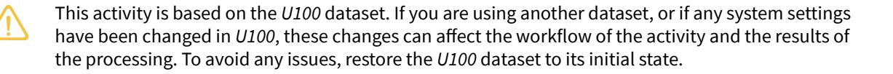

# **Story**

The head office of the SweetLife company needs to process a \$450 bill that it has received from the Spectra Stationery Office vendor on March 1, 2025. The bill is for stationery that was purchased for the head office branch in the amount of \$300 and for the retail store branch in the amount of \$150. (Transactions between these branches do not need to be balanced.)

Acting as a SweetLife accountant, you need to create a bill in the system to reflect the bill received from the vendor, and then release the bill, which causes a batch to be generated for it.

# **Configuration Overview**

In the *U100* dataset, the following tasks have been performed to support this activity:

- On the *[Companies](https://help-2025r1.acumatica.com/Help?ScreenId=ShowWiki&pageid=fedad435-8496-4397-b8a3-50a473629f76)* (CS101500) form, the *SWEETLIFE* company has been defined.
- On the *[Branches](https://help-2025r1.acumatica.com/Help?ScreenId=ShowWiki&pageid=b97ab72d-4ab4-4f02-b69c-f7f61b316ced)* (CS102000) form, the *HEADOFFICE* and *RETAIL* branches of the *SWEETLIFE* company have been created.
- On the *[Chart of Accounts](https://help-2025r1.acumatica.com/Help?ScreenId=ShowWiki&pageid=85557f41-a4af-47a8-b198-2a01461ce9c3)* (GL202500) form, multiple accounts have been created.
- On the *[Ledgers](https://help-2025r1.acumatica.com/Help?ScreenId=ShowWiki&pageid=a5c9f3f5-7dc4-4b1b-a50c-396729a12e4e)* (GL201500) form, the *ACTUAL* ledger has been created.
- On the *[Vendors](https://help-2025r1.acumatica.com/Help?ScreenId=ShowWiki&pageid=a9584be3-f2bd-4d67-80d4-8041d809df56)* (AP303000) form, the *STATOFFICE* vendor has been created.

# **Process Overview**

To process an interbranch bill for branches that do not require balancing, you will create and release the bill on the *[Bills and Adjustments](https://help-2025r1.acumatica.com/Help?ScreenId=ShowWiki&pageid=956b4e51-3078-4d2d-85b3-65c080d95234)* (AP301000) form. You will then review the generated batch on the *Journal [Transactions](https://help-2025r1.acumatica.com/Help?ScreenId=ShowWiki&pageid=dda046bc-5946-407f-88f7-1c0c966fbe72)* (GL301000) form, check the account balances on the *[Account Summary](https://help-2025r1.acumatica.com/Help?ScreenId=ShowWiki&pageid=f54927e5-fec0-400a-bd19-5581de5aae35)* (GL401000) form, and generate the trial balance report by using the *Trial Balance [Summary](https://help-2025r1.acumatica.com/Help?ScreenId=ShowWiki&pageid=12f38bf9-9ab2-4da3-a99f-df0443a33271)* (GL632000) report form.

# **System Preparation**

Before you begin performing the steps of this activity, do the following:

- 1. Launch the Acumatica ERP website with the *U100* dataset preloaded, and sign in as an accountant Nenad Pasic by using the *pasic* username and the *123* password.
- 2. In the info area, in the upper-right corner of the top pane of the Acumatica ERP screen, click the Business Date menu button and select *3/1/2025*.
- 3. On the Company and Branch Selection menu on the top pane of the Acumatica ERP screen, make sure that the *SweetLife Head Office and Wholesale Center* branch is selected. If it is not selected, click the Company and Branch Selection menu to view the list of branches that you have access to, and then click *SweetLife Head Office and Wholesale Center*.

# **Step 1: Reviewing the Account Balances Before Posting a Bill**

To review the account balances for the branches of the SweetLife company in the *03-2025* financial period, do the following:

1. Open the *[Account Summary](https://help-2025r1.acumatica.com/Help?ScreenId=ShowWiki&pageid=f54927e5-fec0-400a-bd19-5581de5aae35)* (GL401000) form.

- 2. To review the account balances in both branches, in the Summary area, make sure the following settings are specified:
  - **Company/Branch**: *SWEETLIFE*
  - **Ledger**: *ACTUAL - Actual Ledger*
  - **Financial Period**: *03-2025*
- 3. In the table, review the account balances.

For the *HEADOFFICE* branch, for the *62400 - Office Expense* account, notice the amount in the **DebitTotal** column is 0.00 and for the *20000 - Accounts Payable* account, the amount in the **CreditTotal** column is 0.00.

For the *RETAIL* branch, for the *20000 - Accounts Payable* account, note that the amount in the **CreditTotal** column is 0.00 and the *62400 - Office Expense* account is not listed, meaning that the account balances are zero for the period.

Now you will create a bill between branches, which involves these accounts.

# **Step 2: Creating and Processing a Bill for Branches Not Requiring Balancing**

To create and process an AP bill for stationery purchased for multiple branches (*HEADOFFICE* and *RETAIL*) that do not require balancing, do the following:

1. Open the *[Bills and Adjustments](https://help-2025r1.acumatica.com/Help?ScreenId=ShowWiki&pageid=956b4e51-3078-4d2d-85b3-65c080d95234)* (AP301000) form.

To open the form for creating a new record, type the form ID in the Search box, and on the Search form, point at the form title and click **New** right of the title.

- 2. Click **Add New Record** on the form toolbar, and specify the following settings in the Summary area:
  - **Type**: *Bill*
  - **Vendor**: *STATOFFICE*
  - **Date**: *3/1/2025* (inserted by default)
  - **Description**: Stationery
- 3. On the **Details** tab, click **Add Row**, and enter the following settings in the row you have added:
  - **Branch**: *HEADOFFICE*
  - **Transaction Descr.**: Stationery
  - **Ext. Cost**: 300
- 4. Add another row with the following settings:
  - **Branch**: *RETAIL*
  - **Transaction Descr.**: Stationery
  - **Ext. Cost**: 150

Notice the *62400 - Office Expense* account specified in the **Account** column for both lines, which is the expense account associated with the vendor.

- 5. On the form toolbar, click**Save** to save the bill.
- 6. On the form toolbar, click **Remove Hold** and click **Release** to release the bill.
- 7. On the **Financial** tab, notice the originating branch of the bill (*HEADOFFICE*), which is specified in the **Branch** box. The system has filled in the **Branch** box automatically with the branch to which you are signed in. Also, notice the AP account (*20000 - Accounts Payable*), which is specified in the **AP Account** box.
- 8. Click the link in the **Batch Nbr.** box, and review the GL batch, which the system has opened on the *[Journal](https://help-2025r1.acumatica.com/Help?ScreenId=ShowWiki&pageid=dda046bc-5946-407f-88f7-1c0c966fbe72) [Transactions](https://help-2025r1.acumatica.com/Help?ScreenId=ShowWiki&pageid=dda046bc-5946-407f-88f7-1c0c966fbe72)* (GL301000) form (see the following screenshot).

|                                                                                                                                |                            | <b>Journal Transactions</b> AP AP000179 - Stationery |              |                                                                         |                                        |                     |                     |  |                 | <b>PINOTES</b> | <b>ACTIVITIES</b>                     | <b>FILES</b> | TOOLS $\sim$                  |
|--------------------------------------------------------------------------------------------------------------------------------|----------------------------|---------------------------------------------------------|--------------|-------------------------------------------------------------------------|----------------------------------------|---------------------|---------------------|--|-----------------|----------------|---------------------------------------|--------------|-------------------------------|
| 뭐                                                                                                                              | $\Box$                     | $\Omega$ $^{+}$                                      | $\circ$ 面 | $\overline{\mathsf{K}}$ $\left\langle \right\rangle$ $\checkmark$ | $\rightarrow$ $\lambda$ $\cdots$ |                     |                     |  |                 |                |                                       |              |                               |
| Module:                                                                                                                        |                            | AP                                                      | $\checkmark$ | Branch:                                                                 | HEADOFFICE - SweetLife Head Office ar  |                     | Type:               |  | Normal          |                |                                       |              | $\hat{\phantom{a}}$           |
| Batch Number:                                                                                                                  |                            | AP000179 Q                                              |              | Ledger:                                                                 | <b>ACTUAL - Actual Ledger</b>          |                     | Orig. Batch Number: |  |                 |                |                                       |              |                               |
| Status:                                                                                                                        |                            | Posted                                                  |              |                                                                         | Auto Reversing                         | Reversing Entry     | <b>Debit Total:</b> |  |                 | 450.00         |                                       |              |                               |
|                                                                                                                                |                            | Transaction D 3/1/2025                               |              |                                                                         |                                        |                     | Credit Total:       |  |                 | 450.00         |                                       |              |                               |
| Post Period: 03-2025                                                                                                        |                            |                                                         |              |                                                                         |                                        |                     |                     |  |                 |                |                                       |              |                               |
|                                                                                                                                |                            |                                                         |              |                                                                         |                                        |                     |                     |  |                 |                |                                       |              |                               |
|                                                                                                                                | Description: Stationery |                                                         |              |                                                                         |                                        |                     |                     |  |                 |                |                                       |              |                               |
| <b>DETAILS</b>                                                                                                                 |                            |                                                         |              |                                                                         |                                        |                     |                     |  |                 |                |                                       |              |                               |
| $\mathbf{x}$ <b>VIEW SOURCE DOCUMENT</b> <b>RECLASSIFICATION HISTORY</b> $\vdash$ 土 Ò D $\times$ $\pm$ |                            |                                                         |              |                                                                         |                                        |                     |                     |  |                 |                |                                       |              |                               |
| 图 0                                                                                                                            | D.                         | *Branch                                                 | * Account    | <b>Description</b>                                                      | Ref. Number                            | Transaction Date | Quantity UOM        |  | Debit Amount | Amount         | <b>Credit Transaction Description</b> |              | <b>Non</b> <b>Billable</b> |
| > 0                                                                                                                            | ם                          | <b>HEADOFFICE</b>                                       | 20000        | <b>Accounts Payable</b>                                                 | 000166                                 | 3/1/2025            | 0.00                |  | 0.00            | 450.00         | Stationery                            |              | ☑                             |
| 0                                                                                                                              | D                          | <b>HEADOFFICE</b>                                       | 62400        | Office Expense                                                          | 000166                                 | 3/1/2025            | 0.00                |  | 300.00          | 0.00           | Stationery                            |              | $\Box$                        |
| 0                                                                                                                              | $\Box$                     | <b>RETAIL</b>                                           | 62400        | Office Expense                                                          | 000166                                 | 3/1/2025            | 0.00                |  | 150.00          | 0.00           | Stationery                            |              | □                             |

#### *Figure: GL transactions posted to different branches*

When you released the bill, the system generated and posted the related GL transaction. The AP account of the originating branch of the bill has been credited with the amount of the bill (\$450) and accounts of the destination branches have been debited with the line amounts (\$300 and \$150).

In the next step, you will check the balances of these accounts.

# **Step 3: Reviewing the Account Balances**

To review the account balances for the branches in the *03-2025* financial period, do the following:

- 1. Open the *[Account Summary](https://help-2025r1.acumatica.com/Help?ScreenId=ShowWiki&pageid=f54927e5-fec0-400a-bd19-5581de5aae35)* (GL401000) form.
- 2. To review the account balances in the *HEADOFFICE* branch, in the Summary area, make sure the following settings are specified:
  - **Company/Branch**: *HEADOFFICE*
  - **Ledger**: *ACTUAL*
  - **Period**: *03-2025*
- 3. In the table, review the account balances. Notice the amount in the **DebitTotal** column for the *62400 - Office Expense* account (\$300).
- 4. In the **Company/Branch** box of the Summary area, select *RETAIL* to review the account balances in the *RETAIL* branch.
- 5. In the table, review the account balances. Notice the amount in the **DebitTotal** column for the *62400 - Office Expense* account (\$150).

Now you will review the balances for the financial period for the company as a whole.

# **Step 4 (Optional): Reviewing the Balances for the Financial Period**

To review the balances for the *03-2025* financial period, do the following:

- 1. Open the *Trial Balance [Summary](https://help-2025r1.acumatica.com/Help?ScreenId=ShowWiki&pageid=12f38bf9-9ab2-4da3-a99f-df0443a33271)* (GL632000) report form.
- 2. On the **Report Parameters** tab, specify the following parameters:
  - **Company/Branch**: *SWEETLIFE*
  - **Ledger**: *ACTUAL*
  - **From Period**: *03-2025*
  - **To Period**: *03-2025*

- **Suppress Zero Balances**: Selected
- 3. On the report form toolbar, click **Run Report**.
- 4. In the generated report, review the account balances. The amount in the **Credit** column for the *20000 - Accounts Payable* account equals the amount in the **Debit** column for the *62400 - Office Expense* account, as shown in the following screenshot.

| <b>Trial Balance Summary</b> <b>SWEETLIFE</b> Company/Branch: |                | From Period: <b>To Period:</b>                     | 03-2025 03-2025            |  |                          | Page: Date: | $1$ of $2$ 10/7/2024 5:50 AM |                       |
|---------------------------------------------------------------------|----------------|-------------------------------------------------------|-------------------------------|--|--------------------------|----------------|---------------------------------|-----------------------|
| Ledger:                                                             | <b>ACTUAL</b>  |                                                       | <b>Suppress Zero Balances</b> |  |                          |                | User:                           | <b>Nenad Pasic</b>    |
| <b>Account</b>                                                      | <b>Type</b>    | <b>Description</b>                                    |                               |  | <b>Beginning Balance</b> | <b>Debit</b>   | <b>Credit</b>                   | <b>Ending Balance</b> |
| 10100                                                               | Asset          | <b>SweetStore Cash Register</b>                       |                               |  | 9,236.71                 | 0.00           | 0.00                            | 9.236.71              |
| 10200                                                               | Asset          | Company Checking Account                              |                               |  | 865.596.13               | 0.00           | 0.00                            | 865.596.13            |
| 10210                                                               | Asset          | Checking Account (KeyBank)                            |                               |  | 5.037.00                 | 0.00           | 0.00                            | 5.037.00              |
| 10300                                                               | Asset          | <b>Company Savings Account</b>                        |                               |  | 498.853.01               | 0.00           | 0.00                            | 498.853.01            |
| 10600                                                               | Asset          | <b>Credit Card Account</b>                            |                               |  | 748.00                   | 0.00           | 0.00                            | 748.00                |
| 11000                                                               | Asset          | <b>Accounts Receivable</b>                            |                               |  | 33.446.91                | 0.00           | 0.00                            | 33.446.91             |
| 11010                                                               | Asset          | <b>AR Accrual Account</b>                             |                               |  | 6.454.18                 | 0.00           | 0.00                            | 6.454.18              |
| 12100                                                               | Asset          | <b>Inventory Asset</b>                                |                               |  | 226.871.42               | 0.00           | 0.00                            | 226,871.42            |
| 13200                                                               | Asset          | <b>Deposit to Vendor</b>                              |                               |  | 190.00                   | 0.00           | 0.00                            | 190.00                |
| 19000                                                               | Asset          | Due from Related Entity                               |                               |  | 70.00                    | 0.00           | 0.00                            | 70.00                 |
|                                                                     |                | <b>Assets Total</b>                                   |                               |  | 1.646.503.36             | 0.00           | 0.00                            | 1.646.503.36          |
| 20000                                                               | Liability      | <b>Accounts Payable</b>                               |                               |  | 32.889.65                | 0.00           | 450.00                          | 33,339.65             |
| 20100                                                               | Liability      | <b>Inventory Purchase Accrual</b>                     |                               |  | 956.14                   | 0.00           | 0.00                            | 956.14                |
| 20110                                                               | Liability      | <b>Inventory Purchase Accrual for Direct Receipts</b> |                               |  | 108.063.66               | 0.00           | 0.00                            | 108.063.66            |
| 20200                                                               | Liability      | <b>Landed Cost Accrual</b>                            |                               |  | 15.00                    | 0.00           | 0.00                            | 15.00                 |
| 20300                                                               | Liability      | <b>Deductions and Benefits</b>                        |                               |  | 3.372.95                 | 0.00           | 0.00                            | 3.372.95              |
| 22100                                                               | Liability      | <b>Customer Deposit</b>                               |                               |  | 4,540.00                 | 0.00           | 0.00                            | 4,540.00              |
| 23015                                                               | Liability      | <b>Accrued Expenses</b>                               |                               |  | 14,400.00                | 0.00           | 0.00                            | 14.400.00             |
| 23200                                                               | Liability      | <b>Accrued Rent</b>                                   |                               |  | 1.200.00                 | 0.00           | 0.00                            | 1.200.00              |
| 24050                                                               | Liability      | <b>Payroll Liabilities: Taxes</b>                     |                               |  | 9.406.76                 | 0.00           | 0.00                            | 9,406.76              |
| 24100                                                               | Liability      | <b>Tax Payable</b>                                    |                               |  | 58.49                    | 0.00           | 0.00                            | 58.49                 |
| 30100                                                               | Liability      | <b>Capital Stock</b>                                  |                               |  | 700.000.00               | 0.00           | 0.00                            | 700.000.00            |
| 32000                                                               | Liability      | <b>Retained Earnings</b>                              |                               |  | 926.762.91               | 0.00           | 0.00                            | 926.762.91            |
| 33000                                                               | Liability      | Net Income                                            |                               |  | $-9.302.67$              | 450.00         | 0.00                            | $-9.752.67$           |
|                                                                     |                | <b>Liability Total</b>                                |                               |  | 1,792,362.89             | 450.00         | 450.00                          | 1,792,362.89          |
| 40000                                                               | Income         | <b>Sales Revenue</b>                                  |                               |  | 52.853.15                | 0.00           | 0.00                            | 52.853.15             |
| 40010                                                               | Income         | Sales - Freight                                       |                               |  | 11.00                    | 0.00           | 0.00                            | 11.00                 |
|                                                                     |                | <b>Income Total</b>                                   |                               |  | 52,864.15                | 0.00           | 0.00                            | 52,864.15             |
| 50000                                                               | <b>Expense</b> | COGS - Inventory                                      |                               |  | 8.061.61                 | 0.00           | 0.00                            | 8.061.61              |
| 52100                                                               | <b>Expense</b> | <b>Standard Cost Adjustments</b>                      |                               |  | $-67.50$                 | 0.00           | 0.00                            | $-67.50$              |
| 52600                                                               | <b>Expense</b> | <b>Cash Discount</b>                                  |                               |  | $-69.62$                 | 0.00           | 0.00                            | $-69.62$              |
| 54100                                                               | <b>Expense</b> | <b>Project Labor Expense</b>                          |                               |  | 1.520.00                 | 0.00           | 0.00                            | 1.520.00              |
| 54200                                                               | <b>Expense</b> | <b>Project Subcontract Expense</b>                    |                               |  | 1.150.00                 | 0.00           | 0.00                            | 1.150.00              |
| 61000                                                               | <b>Expense</b> | <b>Advertising Expense</b>                            |                               |  | 395.00                   | 0.00           | 0.00                            | 395.00                |
| 62400                                                               | <b>Expense</b> | Office Expense                                        |                               |  | 2,396.00                 | 450.00         | 0.00                            | 2.846.00              |
|                                                                     |                |                                                       |                               |  |                          |                |                                 |                       |

#### *Figure: The account balances of SWEETLIFE specified for the financial period*

In this activity, you have created and processed a bill between branches that do not require balancing, and you have learned how to review the relevant account balances.

# **Interbranch Bills Without Balancing: Reports and Inquiries**

In this topic, you can find information about the reports and inquiries related to bills between branches that do not need to be balanced.

# **Reviewing the Details of an Unreleased Bill**

If a bill has not yet been released, you can review the details of the bill by running the *[AP Edit Detailed](https://help-2025r1.acumatica.com/Help?ScreenId=ShowWiki&pageid=ffdb945e-716a-47b3-95aa-3f6babaafd44)* (AP610500) report. When you run this report from the *[Bills and Adjustments](https://help-2025r1.acumatica.com/Help?ScreenId=ShowWiki&pageid=956b4e51-3078-4d2d-85b3-65c080d95234)* (AP301000) form by clicking **AP Edit Detailed** (under **Reports**) on the More menu, the report shows the details of the bill opened on this form. You can review what GL batch the system will create when you release the bill, which accounts will be updated by the transaction, and how the vendor's balance will be affected.

# **Reviewing the Details of a Released Bill**

Once you have released a bill, you can review the details of the bill by running a report on the *[AP Register Detailed](https://help-2025r1.acumatica.com/Help?ScreenId=ShowWiki&pageid=537818a3-d97b-4ae0-a0d6-3e83684e3a01)* (AP622000) form. When you run this report from the *[Bills and Adjustments](https://help-2025r1.acumatica.com/Help?ScreenId=ShowWiki&pageid=956b4e51-3078-4d2d-85b3-65c080d95234)* (AP301000) form by clicking **AP Register Detailed** (under **Reports**) on the More menu, the report shows the details of the bill opened on this form. You can

review the GL batch the system created when releasing the bill and the accounts that have been updated by the transaction.

# **Viewing Bill Summaries**

To view the summary information on bills for a particular financial period, you can use the following reports:

- *[AP Register](https://help-2025r1.acumatica.com/Help?ScreenId=ShowWiki&pageid=ee113a56-f6d6-4555-85e2-9dcac30a2639)* (AP621500): To view the list of released bills
- *[AP Edit](https://help-2025r1.acumatica.com/Help?ScreenId=ShowWiki&pageid=2b988b47-20ec-4806-a04c-fdf531f21af9)* (AP610700): To view the list of bills with the *On Hold* or *Balanced* status

# **Viewing Bills Pending Payment**

You use the *[Bills Pending Payment](https://help-2025r1.acumatica.com/Help?ScreenId=ShowWiki&pageid=3598b774-5b49-4113-89a9-034d0b71af1e)* (AP611500) report to view the list of bills that have not been paid. You can limit the data in the report by any of the following criteria: company, branch, cash account, payment method, vendor, and report date.

# **Reviewing Vendor Information**

You can review the balances of a specific vendor on the *[Vendor](https://help-2025r1.acumatica.com/Help?ScreenId=ShowWiki&pageid=22c03d80-cbb0-449d-9325-c12f623aaefd) Details* (AP402000) form. When you open this inquiry from the *[Bills and Adjustments](https://help-2025r1.acumatica.com/Help?ScreenId=ShowWiki&pageid=956b4e51-3078-4d2d-85b3-65c080d95234)* (AP301000) form by clicking**Vendor Details** (under **Inquiries**) on the More menu, the *[Vendor](https://help-2025r1.acumatica.com/Help?ScreenId=ShowWiki&pageid=22c03d80-cbb0-449d-9325-c12f623aaefd) Details* form is opened, showing the outstanding balances of the selected vendor and a list of documents of this vendor that have the *Open* status. You can select the**Show All Documents** and **Include Unreleased Documents** check boxes in the Selection area of the form to include all documents and unreleased documents, respectively, in the inquiry.

# **Reviewing the Vendor's Balance**

Aer a bill has been released, you can review the vendor's balance on the *AP [Balance](https://help-2025r1.acumatica.com/Help?ScreenId=ShowWiki&pageid=0d1c7f3f-90d6-4d12-894f-05fadf489921) by Vendor* (AP632500) form. On this form, you select *Open Documents* in the **Report Format** box and specify the needed financial period.

In the report, you can review open documents and vendor balances at the end of the period, grouped by vendor and by AP account. When you release a bill or an adjustment, the system updates the vendor balance.**Vendor DocumentsTotal** is the total amount of all open documents of the vendor.

# **Processing Interbranch Bills With Balancing**

Multiple branches of a company may be involved in a single bill. If the branches require balancing, you should set up the proper processing of inter-branch transactions to eliminate the risk of balances being calculated incorrectly.

In the topics of this chapter, you will find general information on bills between branches that require balancing, and reports and inquires that might be useful when you process these bills. You will also find an implementation checklist, an activity with instructions on how to process these bills, and details about the generated transactions for the bills.

# **Interbranch Bills with Balancing: General Information**

If a company consists of multiple branches, it may have bills that involve multiple branches of the company for the purchase of goods or services from the specified vendor. If branches use separate accounting—that is, the *With Branches Requiring Balancing* type is selected on the *[Companies](https://help-2025r1.acumatica.com/Help?ScreenId=ShowWiki&pageid=fedad435-8496-4397-b8a3-50a473629f76)* (CS101500) form—you have to configure the system so that it generates balancing entries for these bills.

When you enter an interbranch bill on the *[Bills and Adjustments](https://help-2025r1.acumatica.com/Help?ScreenId=ShowWiki&pageid=956b4e51-3078-4d2d-85b3-65c080d95234)* (AP301000) form, you perform the same steps as you do when you add a bill that involves only one branch, except that you specify the branch that incurs the expenses for each line of the bill in addition to specifying the originating branch for the bill on the **Financial** tab. For details on creating a bill, see *[AP Bills: General Information](#page-69-3)*.

On posting of an interbranch transaction related to a bill, the system adds balancing entries to the batch according to the account mapping rules that have been specified in the system. For details, see *[Interbranch Account Mapping:](https://help-2025r1.acumatica.com/Help?ScreenId=ShowWiki&pageid=96d6e9bb-8217-432e-80b2-a4cedf883723) [General Information](https://help-2025r1.acumatica.com/Help?ScreenId=ShowWiki&pageid=96d6e9bb-8217-432e-80b2-a4cedf883723)*.

# **Learning Objectives**

In this chapter, you will learn how to do the following:

- Process a bill between branches that require balancing
- Review the balances of accounts involved in the transaction

# **Applicable Scenarios**

You create interbranch bills in the following cases:

- If one branch purchases goods for this branch and for other branches of the company
- If one branch purchases services for this branch and for other branches of the company

# **Interbranch Bills with Balancing: Implementation Checklist**

Before users begin processing AP bills between branches that require balancing, you must make sure that the system has been configured properly and that all required entities have been created, as described in the following table.

| Form                                            | Settings to Check                                                                                                                  | Notes                                                                                            |  |  |  |
|-------------------------------------------------|------------------------------------------------------------------------------------------------------------------------------------|--------------------------------------------------------------------------------------------------|--|--|--|
| Enable/Disable Features (CS100000) form      | Make sure that the following fea tures have been enabled:                                                                       |                                                                                                  |  |  |  |
|                                                 | • Standard Financials                                                                                                           |                                                                                                  |  |  |  |
|                                                 | • Multibranch Support                                                                                                           |                                                                                                  |  |  |  |
|                                                 | • Multicompany Support                                                                                                          |                                                                                                  |  |  |  |
|                                                 | • Advanced Financials                                                                                                           |                                                                                                  |  |  |  |
|                                                 | • Inter-Branch Transactions                                                                                                     |                                                                                                  |  |  |  |
| Multiple forms                                  | Make sure that the minimum con figuration of the company has been performed.                                                 |                                                                                                  |  |  |  |
| Chart of Accounts (GL202500) form               | Check whether the necessary ac counts have been created.                                                                        |                                                                                                  |  |  |  |
| Inter-Branch Account Mapping (GL101010) form | Be sure that the account mapping rules have been specified for the branches.                                                 | For details on defining these rules, see Interbranch Account Mapping: General Information. |  |  |  |
| Company Financial Calendar (GL201100) form   | Be sure that all financial periods for which AP bills for branches requir ing balancing may occur have a sta tus of Open. | You can generate the necessary pe riods on the Master Financial Calen dar (GL201000) form. |  |  |  |
| Vendors (AP303000) form                         | Ensure that all vendors that may be specified in these AP bills are de fined in the system.                                  |                                                                                                  |  |  |  |

# **Settings That Can Affect the Processing Workflow**

The following settings on the *[Accounts Payable Preferences](https://help-2025r1.acumatica.com/Help?ScreenId=ShowWiki&pageid=c3f9353e-95e6-448d-bb3f-e20643879ec7)* (AP101000) form can affect the processing workflow:

- If the **Automatically Post on Release** check box is selected, the system posts the appropriate transactions to the general ledger when AP documents are released. If this check box is cleared, you have to post the batch aer you release the AP document.
- If the **PostSummary on Updating GL** check box is selected, AP documents are posted to the general ledger with summarized row amounts if particular criteria are met. That is, if multiple lines in an AP document specify the same account and branch, then in the GL batch, these rows are combined into one row (that is, one journal entry) with the summarized amount. If this check box is cleared, the lines of the AP document are not combined into one journal entry in the GL batch.
- If the **Hold Documents on Entry** check box is selected in the **Data EntrySettings** section, when new documents are entered, they are assigned the *On Hold* status. If the **Hold Documents on Entry** check box is cleared, the documents are assigned the *Balanced* status.
- If the **Validate DocumentTotals on Entry** check box is selected, the system adds the **Amount** box to the Summary area of the *[Bills and Adjustments](https://help-2025r1.acumatica.com/Help?ScreenId=ShowWiki&pageid=956b4e51-3078-4d2d-85b3-65c080d95234)* (AP301000) form. To save a document with the *Balanced* status, you must enter the document total in this box aer reviewing the document. If this check box is cleared, the system automatically validates the batch when the status of the batch is *Balanced*.
- If the **RequireVendor Reference** check box is selected, you must fill in the**Vendor Ref.** box on the *[Bills and](https://help-2025r1.acumatica.com/Help?ScreenId=ShowWiki&pageid=956b4e51-3078-4d2d-85b3-65c080d95234) [Adjustments](https://help-2025r1.acumatica.com/Help?ScreenId=ShowWiki&pageid=956b4e51-3078-4d2d-85b3-65c080d95234)* form. If this check box is cleared, you can leave the**Vendor Ref.** box blank.

# **Interbranch Bills with Balancing: Generated Transactions**

When you release an AP bill between branches that need to be balanced, the system generates a transaction in the general ledger. When this batch is posted, the system adds a balancing transaction to it. You can view the details of the batch associated with a bill by clicking the link in the **Batch Nbr.** box on the **Financial** tab of the *[Bills and](https://help-2025r1.acumatica.com/Help?ScreenId=ShowWiki&pageid=956b4e51-3078-4d2d-85b3-65c080d95234) [Adjustments](https://help-2025r1.acumatica.com/Help?ScreenId=ShowWiki&pageid=956b4e51-3078-4d2d-85b3-65c080d95234)* (AP301000) form. The system opens the *Journal [Transactions](https://help-2025r1.acumatica.com/Help?ScreenId=ShowWiki&pageid=dda046bc-5946-407f-88f7-1c0c966fbe72)* (GL301000) form with the batch selected.

If there is a single bill from a vendor for the goods purchased for multiple branches requiring balancing, the following accounts are involved in the transaction posted to the general ledger:

- The AP account of the originating branch (that is, the branch from which the bill originates and that is purchasing the goods). The system uses the account specified in the **AP Account** box on the **Financial** tab of the *[Bills and Adjustments](https://help-2025r1.acumatica.com/Help?ScreenId=ShowWiki&pageid=956b4e51-3078-4d2d-85b3-65c080d95234)* form. When a bill is created, the system fills in this setting with the AP account specified for the vendor location (if multiple business locations are used in the system) or specified for the vendor (if a single location is used), but you can override this setting for a particular bill.
- The expense account for the goods purchased, which is specified for each line of the bill in the **Account** column on the **Details** tab of the *[Bills and Adjustments](https://help-2025r1.acumatica.com/Help?ScreenId=ShowWiki&pageid=956b4e51-3078-4d2d-85b3-65c080d95234)* form. If no non-stock item is selected in a line, by default, the system inserts into this column the expense account specified for the vendor location (if multiple business locations are used in the system) or specified for the vendor (if a single location is used), but you can override this value.
- The offset account to which the system will post the balancing entry in the originating branch; this account is specified in the **Offset Account** column on the**Transactions in the Originating Branch** tab of the *[Inter-](https://help-2025r1.acumatica.com/Help?ScreenId=ShowWiki&pageid=858e6eba-172d-46fa-879e-d6f69f5b190c)[Branch Account Mapping](https://help-2025r1.acumatica.com/Help?ScreenId=ShowWiki&pageid=858e6eba-172d-46fa-879e-d6f69f5b190c)* (GL101010) form for the destination branch.
- The offset account to which the system will post the balancing entry in the destination branch; this account is specified in the **Offset Account** column on the**Transactions in the Destination Branch** tab of the *[Inter-](https://help-2025r1.acumatica.com/Help?ScreenId=ShowWiki&pageid=858e6eba-172d-46fa-879e-d6f69f5b190c)[Branch Account Mapping](https://help-2025r1.acumatica.com/Help?ScreenId=ShowWiki&pageid=858e6eba-172d-46fa-879e-d6f69f5b190c)* form for the destination branch.

For a bill that involves two branches requiring balancing, the following example demonstrates the transaction that is generated. In this example, *MHEAD* is the originating branch that is purchasing goods and *MRETAIL* is the destination branch to receive some of the goods. The transaction shown below will be recorded to the general ledger when the bill is released and the related batch is posted.

| Branch                       | Account                         | Debit  | Credit |
|------------------------------|---------------------------------|--------|--------|
| MHEAD - Originating Branch   | 20000 - Accounts Payable        | 0.00   | 350.00 |
| MHEAD - Originating Branch   | 62400 - Office Expense          | 250.00 | 0.00   |
| MRETAIL - Destination Branch | 62400 - Office Expense          | 100.00 | 0.00   |
| MHEAD - Originating Branch   | 19000 - Due from Related Entity | 100.00 | 0.00   |
| MRETAIL - Destination Branch | 26000 - Due to Related Entity   | 0.00   | 100.00 |

With the other applicable scenario for branches requiring balancing, the bill reflects goods being ordered by one branch (the originating branch) and completely transferred to another branch (the destination branch). In this example, *MHEAD* is the originating branch that is purchasing goods and *MRETAIL* is the destination branch to which the goods are transferred. In this case, the following transaction will be recorded to the general ledger when the bill is released and the related batch is posted.

| Branch                     | Account                  | Debit | Credit |  |
|----------------------------|--------------------------|-------|--------|--|
| MHEAD - Originating Branch | 20000 - Accounts Payable | 0.00  | 350.00 |  |

| Branch                       | Account                         | Debit  | Credit |
|------------------------------|---------------------------------|--------|--------|
| MRETAIL - Destination Branch | 62400 - Office Expense          | 350.00 | 0.00   |
| MHEAD - Originating Branch   | 19000 - Due from Related Entity | 350.00 | 0.00   |
| MRETAIL - Destination Branch | 26000 - Due to Related Entity   | 0.00   | 350.00 |

# **Interbranch Bills with Balancing: Process Activity**

In this activity, you will learn how to create and process a bill for branches requiring balancing. You will then review the relevant account balances.

This activity is based on the *U100* dataset. If you are using another dataset, or if any system settings have been changed in *U100*, these changes can affect the workflow of the activity and the results of the processing. To avoid any issues, restore the *U100* dataset to its initial state.

# **Story**

The head office of the Muffins & Cakes company needs to process a \$350 bill that it has received from the Spectra Stationery Office vendor on March 1, 2025. The bill is for stationery that is being purchased for the head office branch in the amount of \$250 and for the retail store branch in the amount of \$100; these entries need to be balanced.

Acting as a Muffins accountant, you need to create a bill in the system to reflect the bill received from the vendor, and then release the bill, which causes a batch to be generated for it.

# **Configuration Overview**

In the *U100* dataset, the following tasks have been performed to support this activity:

- On the *[Companies](https://help-2025r1.acumatica.com/Help?ScreenId=ShowWiki&pageid=fedad435-8496-4397-b8a3-50a473629f76)* (CS101500) form, the *MUFFINS* company has been defined.
- On the *[Branches](https://help-2025r1.acumatica.com/Help?ScreenId=ShowWiki&pageid=b97ab72d-4ab4-4f02-b69c-f7f61b316ced)* (CS102000) form, the *MHEAD* and *MRETAIL* branches of the *MUFFINS* company have been created.
- On the *[Chart of Accounts](https://help-2025r1.acumatica.com/Help?ScreenId=ShowWiki&pageid=85557f41-a4af-47a8-b198-2a01461ce9c3)* (GL202500) form, multiple accounts have been created.
- On the *[Ledgers](https://help-2025r1.acumatica.com/Help?ScreenId=ShowWiki&pageid=a5c9f3f5-7dc4-4b1b-a50c-396729a12e4e)* (GL201500) form, the *MACTUAL* ledger has been created.
- On the *[Vendors](https://help-2025r1.acumatica.com/Help?ScreenId=ShowWiki&pageid=a9584be3-f2bd-4d67-80d4-8041d809df56)* (AP303000) form, the *STATOFFICE* vendor has been created.
- On the *[Inter-Branch Account Mapping](https://help-2025r1.acumatica.com/Help?ScreenId=ShowWiki&pageid=858e6eba-172d-46fa-879e-d6f69f5b190c)* (GL101010) form, the account mapping rules between the Muffins & Cakes head office branch (*MHEAD*) and the Muffins & Cakes retail store branch (*MRETAIL*) have been defined.

# **Process Overview**

To process an interbranch bill between branches requiring balancing, you will create and release the bill on the *[Bills](https://help-2025r1.acumatica.com/Help?ScreenId=ShowWiki&pageid=956b4e51-3078-4d2d-85b3-65c080d95234) [and Adjustments](https://help-2025r1.acumatica.com/Help?ScreenId=ShowWiki&pageid=956b4e51-3078-4d2d-85b3-65c080d95234)* (AP301000) form. You will then review the generated batch on the *Journal [Transactions](https://help-2025r1.acumatica.com/Help?ScreenId=ShowWiki&pageid=dda046bc-5946-407f-88f7-1c0c966fbe72)* (GL301000) form and check the account balances on the *[Account Summary](https://help-2025r1.acumatica.com/Help?ScreenId=ShowWiki&pageid=f54927e5-fec0-400a-bd19-5581de5aae35)* (GL401000) form.

Finally, you will generate the trial balance report by using the *Trial Balance [Summary](https://help-2025r1.acumatica.com/Help?ScreenId=ShowWiki&pageid=12f38bf9-9ab2-4da3-a99f-df0443a33271)* (GL632000) report form.

# **System Preparation**

Before you begin performing the steps of this activity, do the following:

- 1. Launch the Acumatica ERP website with the *U100* dataset preloaded, and sign in as an accountant Nenad Pasic by using the *pasic* username and the *123* password.
- 2. In the info area, in the upper-right corner of the top pane of the Acumatica ERP screen, make sure that the business date in your system is set to *3/1/2025*. If a different date is displayed, click the Business Date menu button and select *3/1/2025*.
- 3. On the Company and Branch Selection menu on the top pane of the Acumatica ERP screen, select the *MHEAD - Muffins Head Office & Wholesale Center* branch.

# **Step 1: Creating and Processing a Bill for Branches Requiring Balancing**

To create and process an AP bill for stationery purchased for multiple branches (*MHEAD* and *MRETAIL*) that require balancing, do the following:

1. Open the *[Bills and Adjustments](https://help-2025r1.acumatica.com/Help?ScreenId=ShowWiki&pageid=956b4e51-3078-4d2d-85b3-65c080d95234)* (AP301000) form.

To open the form for creating a new record, type the form ID in the Search box, and on the Search form, point at the form title and click **New** right of the title.

- 2. Click **Add New Record** on the form toolbar, and specify the following settings in the Summary area:
  - **Type**: *Bill*
  - **Vendor**: *STATOFFICE*
  - **Date**: *3/1/2025* (inserted by default)
  - **Description**: Stationery
- 3. On the **Details** tab, click **Add Row**, and specify the following settings in the row you have added:
  - **Branch**: *MHEAD*
  - **Transaction Descr.**: Stationery
  - **Ext. Cost**: 250
- 4. Add another row with the following settings:
  - **Branch**: *MRETAIL*
  - **Transaction Descr.**: Stationery
  - **Ext. Cost**: 100

Notice that the *62400 - Office Expense* account has been inserted in the **Account** column for both lines automatically because it is the expense account associated with the vendor.

- 5. On the form toolbar, click**Save** to save the bill.
- 6. On the form toolbar, click **Remove Hold** and then click **Release** to release the bill.
- 7. On the **Financial** tab, notice that the originating branch of the bill is *MHEAD*, which is specified in the **Branch** box. The system has filled in the **Branch** box automatically with the branch to which you are signed in. Also, notice *20000 - Accounts Payable* account is specified in the **AP Account** box.
- 8. Click the link in the **Batch Nbr.** box, and review the GL batch, which the system has opened on the *[Journal](https://help-2025r1.acumatica.com/Help?ScreenId=ShowWiki&pageid=dda046bc-5946-407f-88f7-1c0c966fbe72) [Transactions](https://help-2025r1.acumatica.com/Help?ScreenId=ShowWiki&pageid=dda046bc-5946-407f-88f7-1c0c966fbe72)* (GL301000) form.

When you released the bill, the system generated and posted the related GL transaction. The AP account of the originating branch of the bill has been credited and accounts from each document line have been debited in the destination branch specified in detail lines. Notice that the system added the balancing entries to the batch during the posting process (see the following screenshot). The balancing entries have been created based on the mapping rule that has been configured on the *[Inter-Branch Account Mapping](https://help-2025r1.acumatica.com/Help?ScreenId=ShowWiki&pageid=858e6eba-172d-46fa-879e-d6f69f5b190c)* (GL101010) form.

|            |                                                                                                            |                | <b>Journal Transactions</b> AP AP000180 - Stationery |              |                              |                                          |                    |                                      |  |              |        | <b>PINOTES</b> | <b>ACTIVITIES</b>                     | <b>FILES</b> | TOOLS $\sim$    |
|------------|------------------------------------------------------------------------------------------------------------|----------------|---------------------------------------------------------|--------------|------------------------------|------------------------------------------|--------------------|--------------------------------------|--|--------------|--------|----------------|---------------------------------------|--------------|-----------------|
|            | 뭐 誾 面 n $\ddot{}$ K $\Omega$ $\geq$ $\rightarrow$ ≺ $\checkmark$ $\cdots$ |                |                                                         |              |                              |                                          |                    |                                      |  |              |        |                |                                       |              |                 |
|            |                                                                                                            |                |                                                         |              |                              |                                          |                    |                                      |  |              |        |                | $\sim$                                |              |                 |
|            | Module:                                                                                                    |                | AP                                                      | $\checkmark$ | Branch:                      | MHEAD - Muffins Head Office & Wholesa    |                    | Type:                                |  | Normal       |        |                |                                       |              |                 |
|            |                                                                                                            | Batch Number:  | AP000180                                                | $\circ$      | Ledger:                      | MACTUAL - Accrual ledger for the Muffins |                    | Orig. Batch Number:                  |  |              |        |                |                                       |              |                 |
|            | Status:                                                                                                    |                | Posted                                                  |              |                              | Auto Reversing Reversing Entry        |                    | <b>Debit Total:</b>                  |  | 450.00       |        |                |                                       |              |                 |
|            |                                                                                                            | Transaction D  | 3/1/2025                                                |              |                              |                                          |                    | <b>Credit Total:</b>                 |  | 450.00       |        |                |                                       |              |                 |
|            |                                                                                                            | Post Period:   | 03-2025                                                 |              |                              |                                          |                    |                                      |  |              |        |                |                                       |              |                 |
|            |                                                                                                            |                |                                                         |              |                              |                                          |                    |                                      |  |              |        |                |                                       |              |                 |
|            |                                                                                                            | Description:   | Stationery                                              |              |                              |                                          |                    |                                      |  |              |        |                |                                       |              |                 |
|            |                                                                                                            |                |                                                         |              |                              |                                          |                    |                                      |  |              |        |                |                                       |              |                 |
|            |                                                                                                            | <b>DETAILS</b> |                                                         |              |                              |                                          |                    |                                      |  |              |        |                |                                       |              |                 |
| Ò          |                                                                                                            | $^{+}$         | P $\times$                                           |              | <b>VIEW SOURCE DOCUMENT</b>  | <b>RECLASSIFICATION HISTORY</b>          | $\vdash$           | $\mathbf{\overline{x}}$ $\Lambda$ |  |              |        |                |                                       |              |                 |
| <b>B</b> 0 |                                                                                                            | $\Box$         | *Branch                                                 | *Account     | <b>Description</b>           | Ref. Number                              | <b>Transaction</b> | Quantity UOM                         |  | <b>Debit</b> |        |                | <b>Credit Transaction Description</b> |              | <b>Non</b>      |
|            |                                                                                                            |                |                                                         |              |                              |                                          | Date               |                                      |  | Amount       | Amount |                |                                       |              | <b>Billable</b> |
|            | $\mathbf{0}$                                                                                               | D              | <b>MHEAD</b>                                            | 20000        | <b>Accounts Payable</b>      | 000167                                   | 3/1/2025           | 0.00                                 |  | 0.00         | 350.00 | Stationery     |                                       |              | ☑               |
|            | $\mathbf{0}$                                                                                               | D              | <b>MHEAD</b>                                            | 62400        | Office Expense               | 000167                                   | 3/1/2025           | 0.00                                 |  | 250.00       | 0.00   | Stationery     |                                       |              | $\Box$          |
|            | 0                                                                                                          | D              | <b>MRETAIL</b>                                          | 62400        | <b>Office Expense</b>        | 000167                                   | 3/1/2025           | 0.00                                 |  | 100.00       | 0.00   | Stationery     |                                       |              | $\Box$          |
|            | 0                                                                                                          | D              | <b>MHEAD</b>                                            | 19000        | Due from Related Entity      | 000167                                   | 3/1/2025           | 0.00                                 |  | 100.00       | 0.00   |                | Balancing entry for: MHEAD            |              | $\Box$          |
|            | 0                                                                                                          | D              | <b>MRETAIL</b>                                          | 26000        | <b>Due to Related Entity</b> | 000167                                   | 3/1/2025           | 0.00                                 |  | 0.00         | 100.00 |                | <b>Balancing entry for: MRETAIL</b>   |              | $\Box$          |

#### *Figure: The balancing entries added to the batch*

You have added an AP bill that includes items purchased for two branches requiring balancing, and you have released this bill and reviewed the batch created when the bill was released. In the next step, you will check the account balances in each of the branches.

# **Step 2: Reviewing the Account Balances**

To review the account balances for the *MHEAD* and *MRETAIL* branches and the *03-2025* financial period, do the following:

- 1. Open the *[Account Summary](https://help-2025r1.acumatica.com/Help?ScreenId=ShowWiki&pageid=f54927e5-fec0-400a-bd19-5581de5aae35)* (GL401000) form.
- 2. To review the account balances in the *MHEAD* branch, in the Summary area, specify the following settings:
  - **Company/Branch**: *MHEAD*
  - **Ledger**: *MACTUAL*
  - **Period**: *03-2025*
- 3. In the table, review the account balances. Notice that the amount in the **Ending Balance** column for the *20000 - Accounts Payable* account is \$350.00, for the *62400 - Office Expense* account is \$250.00, and for the *19000 - Due from Related Entity* account is \$100.00.
- 4. In the **Company/Branch** box of the Summary area, select *MRETAIL* to review the account balances in the *MRETAIL* branch.
- 5. In the table, review the account balances. Notice the amount in the **Ending Balance** column for the *62400 - Office Expense* account is \$100.00 and for the *26000 - Due to Related Entity* account is \$100.00.

You have reviewed the account balances for the branches for which goods were purchased in the AP bill you created. Now you will review the balances for the financial period for the company as a whole.

#### **Step 3 (Optional): Reviewing the Balances for the Financial Period**

To review the balances for the *03-2025* financial period, do the following:

- 1. Open the *Trial Balance [Summary](https://help-2025r1.acumatica.com/Help?ScreenId=ShowWiki&pageid=12f38bf9-9ab2-4da3-a99f-df0443a33271)* (GL632000) report form.
- 2. To prepare this report for the *MHEAD* branch, on the **Report Parameters** tab, specify the following parameters:
  - **Company/Branch**: *MHEAD*

- **Ledger**: *MACTUAL*
- **From Period**: *03-2025*
- **To Period**: *03-2025*
- **Suppress Zero Balances**: Selected
- 3. On the report form toolbar, click **Run Report**.
- 4. In the generated report, review the account balances. Notice the amount in the **Ending Balance** column for the *20000 - Accounts Payable* account, the *62400 - Office Expense* account, and the *19000 - Due from Related Entity* account.
- 5. Run the same report for the whole company. To do so, in the **Company/Branch** box of the **Report Parameters** tab, select *MUFFINS*.
- 6. In the generated report, review the account balances. Notice the amount in the **Ending Balance** column for the *62400 - Office Expense* account and the *26000 - Due to Related Entity* account, which are shown in the following screenshot.

| <b>Trial Balance Summary</b> Company/Branch: <b>MUFFINS</b> <b>MACTUAL</b> Ledger: |                |                         | <b>From Period:</b> To Period: <b>Suppress Zero Balances</b> | 03-2025 03-2025 |                          |              | Page: Date: User: | $1$ of $1$ 10/7/2024 6:01 AM <b>Nenad Pasic</b> |
|------------------------------------------------------------------------------------------------|----------------|-------------------------|--------------------------------------------------------------------|--------------------|--------------------------|--------------|-------------------------|-------------------------------------------------------|
| <b>Account</b>                                                                                 | <b>Type</b>    | <b>Description</b>      |                                                                    |                    | <b>Beginning Balance</b> | <b>Debit</b> | Credit                  | <b>Ending Balance</b>                                 |
| 19000                                                                                          | Asset          | Due from Related Entity |                                                                    |                    | 0.00                     | 100.00       | 0.00                    | 100.00                                                |
|                                                                                                |                | <b>Assets Total</b>     |                                                                    |                    | 0.00                     | 100.00       | 0.00                    | 100.00                                                |
| 20000                                                                                          | Liability      | <b>Accounts Pavable</b> |                                                                    |                    | 0.00                     | 0.00         | 350.00                  | 350.00                                                |
| 26000                                                                                          | Liability      | Due to Related Entity   |                                                                    |                    | 70.00                    | 0.00         | 100.00                  | 170.00                                                |
| 33000                                                                                          | Liability      | Net Income              |                                                                    |                    | $-70.00$                 | 350.00       | 0.00                    | $-420.00$                                             |
| <b>Liability Total</b>                                                                         |                |                         |                                                                    |                    | 0.00                     | 350.00       | 450.00                  | 100.00                                                |
| 62400                                                                                          | <b>Expense</b> | <b>Office Expense</b>   |                                                                    |                    | 0.00                     | 350.00       | 0.00                    | 350.00                                                |
| 81000                                                                                          | Expense        | <b>Other Expenses</b>   |                                                                    |                    | 70.00                    | 0.00         | 0.00                    | 70.00                                                 |
|                                                                                                |                | <b>Expense Total</b>    |                                                                    |                    | 70.00                    | 350.00       | 0.00                    | 420.00                                                |

# *Figure: The ending balance of the MUFFINS company for the specified financial period*

In this activity, you have created and processed a bill that includes items purchased for branches that require balancing, and you have learned how to review the relevant account balances.

# **Interbranch Bills with Balancing: Reports and Inquiries**

In this topic, you can find information about the reports and inquiries related to bills between branches that need to be balanced.

# **Reviewing the Details of an Unreleased Bill**

If a bill has not yet been released, you can review the details of the bill by running the *[AP Edit Detailed](https://help-2025r1.acumatica.com/Help?ScreenId=ShowWiki&pageid=ffdb945e-716a-47b3-95aa-3f6babaafd44)* (AP610500) report. When you run this report from the *[Bills and Adjustments](https://help-2025r1.acumatica.com/Help?ScreenId=ShowWiki&pageid=956b4e51-3078-4d2d-85b3-65c080d95234)* (AP301000) form by clicking **AP Edit Detailed** (under **Reports**) on the More menu, the report shows the details of the bill opened on this form. You can review what GL batch the system will create when you release the bill, which accounts will be updated by the transaction, and how the vendor's balance will be affected.

# **Reviewing the Details of a Released Bill**

Once you have released a bill, you can review the details of the bill by running a report on the *[AP Register Detailed](https://help-2025r1.acumatica.com/Help?ScreenId=ShowWiki&pageid=537818a3-d97b-4ae0-a0d6-3e83684e3a01)* (AP622000) form. When you run this report from the *[Bills and Adjustments](https://help-2025r1.acumatica.com/Help?ScreenId=ShowWiki&pageid=956b4e51-3078-4d2d-85b3-65c080d95234)* (AP301000) form by clicking **AP Register Detailed** (under **Reports**) on the More menu, the report shows the details of the bill opened on this form. You can review the GL batch the system created when releasing the bill and the accounts that have been updated by the transaction.

# **Viewing Bill Summaries**

To view the summary information on bills for a particular financial period, you can use the following reports:

- *[AP Register](https://help-2025r1.acumatica.com/Help?ScreenId=ShowWiki&pageid=ee113a56-f6d6-4555-85e2-9dcac30a2639)* (AP621500): To view the list of released bills
- *[AP Edit](https://help-2025r1.acumatica.com/Help?ScreenId=ShowWiki&pageid=2b988b47-20ec-4806-a04c-fdf531f21af9)* (AP610700): To view the list of bills with the *On Hold* or *Balanced* status

# **Viewing Bills Pending Payment**

You use the *[Bills Pending Payment](https://help-2025r1.acumatica.com/Help?ScreenId=ShowWiki&pageid=3598b774-5b49-4113-89a9-034d0b71af1e)* (AP611500) report to view the list of bills that have not been paid. You can limit the data in the report by any of the following criteria: company, branch, cash account, payment method, vendor, and report date.

# **Reviewing Vendor Information**

You can review the balances of a specific vendor on the *[Vendor](https://help-2025r1.acumatica.com/Help?ScreenId=ShowWiki&pageid=22c03d80-cbb0-449d-9325-c12f623aaefd) Details* (AP402000) form. When you open this inquiry from the *[Bills and Adjustments](https://help-2025r1.acumatica.com/Help?ScreenId=ShowWiki&pageid=956b4e51-3078-4d2d-85b3-65c080d95234)* (AP301000) form by clicking**Vendor Details** (under **Inquiries**) on the More menu, the *[Vendor](https://help-2025r1.acumatica.com/Help?ScreenId=ShowWiki&pageid=22c03d80-cbb0-449d-9325-c12f623aaefd) Details* form is opened, showing the outstanding balances of the selected vendor and a list of documents of this vendor that have the *Open* status. You can select the**Show All Documents** and **Include Unreleased Documents** check boxes in the Selection area of the form to include all documents and unreleased documents, respectively, in the inquiry.

# **Reviewing the Vendor's Balance**

Aer a bill has been released, you can review the vendor's balance on the *AP [Balance](https://help-2025r1.acumatica.com/Help?ScreenId=ShowWiki&pageid=0d1c7f3f-90d6-4d12-894f-05fadf489921) by Vendor* (AP632500) form. On this form, you select *Open Documents* in the **Report Format** box and specify the needed financial period.

In the report, you can review open documents and vendor balances at the end of the period, grouped by vendor and by AP account. When you release a bill or an adjustment, the system updates the vendor balance.**Vendor DocumentsTotal** is the total amount of all open documents of the vendor.

# **Processing Payments for a Shared Vendor**

In Acumatica ERP, you can process payments for a vendor that is shared by different companies.

In the topics of this chapter, you will find general information on bills and payments for a shared vendor and reports and inquires that might be useful when you process these bills and payments. You will also find an implementation checklist and an activity with instructions on how to process these bills and payments.

# **Payments for a Shared Vendor: General Information**

To process payments for a vendor that is shared by different companies of the same tenant, the vendor and its payment methods should be configured properly. That is, no cash account has to be specified for the vendor on the *[Vendors](https://help-2025r1.acumatica.com/Help?ScreenId=ShowWiki&pageid=a9584be3-f2bd-4d67-80d4-8041d809df56)* (AP303000) form and the necessary cash accounts have to be defined as the default accounts for the branches in the payment method of the vendor on the *[Payment Methods](https://help-2025r1.acumatica.com/Help?ScreenId=ShowWiki&pageid=509285d1-cfae-4e87-95c3-a968451952e6)* (CA204000) form.

Aer the necessary settings have been specified, you create bills in each company on the *[Bills and Adjustments](https://help-2025r1.acumatica.com/Help?ScreenId=ShowWiki&pageid=956b4e51-3078-4d2d-85b3-65c080d95234)* (AP301000) form as you usually create bills. The system will fill in the **Cash Account** box on the **Financial** tab of the form with the cash account that the originating branch uses for the selected payment method when making payments to vendors. For details on how to create bills, see *[AP Bills: General Information](#page-69-3)*.

You then prepare and process payments on the *[Prepare Payments](https://help-2025r1.acumatica.com/Help?ScreenId=ShowWiki&pageid=e3b526e3-8b12-4fa9-a5b2-2955e763f238)* (AP503000) form.

# **Learning Objectives**

In this chapter, you will learn how to do the following:

- Create bills for different companies that share a vendor
- Prepare payments from companies that use different cash accounts

# **Applicable Scenarios**

You process payments for a shared vendor if multiple related companies in your organization purchase goods or services (or both) from the same vendor.

# **Payments for a Shared Vendor: Implementation Checklist**

Before users begin processing payments for a vendor shared between different companies, you must make sure that the system has been configured properly and that all required entities have been created, as described in the following table.

| Form                                       | Settings to Check                                            | Notes |
|--------------------------------------------|--------------------------------------------------------------|-------|
| Enable/Disable Features (CS100000) form | Make sure that the following fea tures have been enabled: |       |
|                                            | • Standard Financials                                     |       |
|                                            | • Multibranch Support • Multicompany Support        |       |
|                                            |                                                              |       |

| Form                                          | Settings to Check                                                                                                                                                                                                                                           | Notes                                                                                            |
|-----------------------------------------------|-------------------------------------------------------------------------------------------------------------------------------------------------------------------------------------------------------------------------------------------------------------|--------------------------------------------------------------------------------------------------|
| Multiple forms                                | Make sure that the minimum con figuration of the companies has been performed.                                                                                                                                                                        |                                                                                                  |
| Chart of Accounts (GL202500) form             | Check whether the necessary ac counts have been created.                                                                                                                                                                                                 |                                                                                                  |
| Company Financial Calendar (GL201100) form | Make sure that all periods for which users may process payments for a shared vendor have a status of Open.                                                                                                                                         | You can generate the necessary pe riods on the Master Financial Calen dar (GL201000) form. |
| Vendors (AP303000) form                       | Ensure that all vendors for which shared payments from different companies may be processed are defined in the system. For these vendors, also be sure that no ac count has been specified in the Cash Account box of the Payment tab. |                                                                                                  |
| Payment Methods (CA204000) form               | Be sure that the necessary cash ac counts have been defined as the default accounts for the branches in the payment methods of the ven dor.                                                                                                     |                                                                                                  |

# **Settings That Can Affect the Processing Workflow**

The following settings on the *[Accounts Payable Preferences](https://help-2025r1.acumatica.com/Help?ScreenId=ShowWiki&pageid=c3f9353e-95e6-448d-bb3f-e20643879ec7)* (AP101000) form can affect the processing workflow:

- If the **Automatically Post on Release** check box is selected, the system posts the appropriate transactions to the general ledger when AP documents are released. If this check box is cleared, you have to post the batch aer you release the AP document.
- If the **PostSummary on Updating GL** check box is selected, AP documents are posted to the general ledger with summarized row amounts if particular criteria are met. That is, if multiple lines in an AP document specify the same account and branch, then in the GL batch, these rows are combined into one row (that is, one journal entry) with the summarized amount. If this check box is cleared, the lines of the AP document are not combined into one journal entry in the GL batch.
- If the **Hold Documents on Entry** check box is selected in the **Data EntrySettings** section, when new documents are entered, they are assigned the *On Hold* status. If the **Hold Documents on Entry** check box is cleared, the documents are assigned the *Balanced* status.
- If the **Validate DocumentTotals on Entry** check box is selected, the system adds the **Amount** box to the Summary area of the *[Bills and Adjustments](https://help-2025r1.acumatica.com/Help?ScreenId=ShowWiki&pageid=956b4e51-3078-4d2d-85b3-65c080d95234)* (AP301000) form. To save a document with the *Balanced* status, you must enter the document total in this box aer reviewing the document. If this check box is cleared, the system automatically validates the batch when the status of the batch is *Balanced*.
- If the **RequireVendor Reference** check box is selected, you must fill in the**Vendor Ref.** box on the *[Bills and](https://help-2025r1.acumatica.com/Help?ScreenId=ShowWiki&pageid=956b4e51-3078-4d2d-85b3-65c080d95234) [Adjustments](https://help-2025r1.acumatica.com/Help?ScreenId=ShowWiki&pageid=956b4e51-3078-4d2d-85b3-65c080d95234)* form. If this check box is cleared, you can leave the**Vendor Ref.** box blank.

# **Payments for a Shared Vendor: Process Activity**

In this activity, you will learn how to process payments for a vendor that is shared by different companies of your organization.

This activity is based on the *U100* dataset. If you are using another dataset, or if any system settings have been changed in *U100*, these changes can affect the workflow of the activity and the results of the processing. To avoid any issues, restore the *U100* dataset to its initial state.

# **Story**

Suppose that the head office of the SweetLife Fruits & Jams company has received a \$2,000 bill from the Blueline Advertisement vendor on January 30, 2025. The head office of the Muffins & Cakes company has also received a bill from this vendor for \$1,500 on the same day. The SweetLife Fruits & Jams company and the Muffins & Cakes company use different cash accounts to pay the bills.

Acting as an accountant, you need to create and release the bills in the system, prepare payments for these bills, and process the payments through their release.

# **Configuration Overview**

In the *U100* dataset, the following tasks have been performed to support this activity:

- On the *[Companies](https://help-2025r1.acumatica.com/Help?ScreenId=ShowWiki&pageid=fedad435-8496-4397-b8a3-50a473629f76)* (CS101500) form, the SweetLife and *MUFFINS* companies have been defined.
- On the *[Branches](https://help-2025r1.acumatica.com/Help?ScreenId=ShowWiki&pageid=b97ab72d-4ab4-4f02-b69c-f7f61b316ced)* (CS102000) form, the *MHEAD* branch of the *MUFFINS* company has been created.
- On the *[Branches](https://help-2025r1.acumatica.com/Help?ScreenId=ShowWiki&pageid=b97ab72d-4ab4-4f02-b69c-f7f61b316ced)* (CS102000) form, the *HEADOFFICE* branch of the SweetLife company has been created.
- On the *[Chart of Accounts](https://help-2025r1.acumatica.com/Help?ScreenId=ShowWiki&pageid=85557f41-a4af-47a8-b198-2a01461ce9c3)* (GL202500) form, multiple accounts have been created.
- On the *[Vendors](https://help-2025r1.acumatica.com/Help?ScreenId=ShowWiki&pageid=a9584be3-f2bd-4d67-80d4-8041d809df56)* (AP303000) form, the *BLUELINE* vendor has been created.
- On the *[Payment Methods](https://help-2025r1.acumatica.com/Help?ScreenId=ShowWiki&pageid=509285d1-cfae-4e87-95c3-a968451952e6)* (CA204000) form, the *CHECK* payment method has been created.

# **Process Overview**

In this activity, you will first review the settings of the shared vendor on the *[Vendors](https://help-2025r1.acumatica.com/Help?ScreenId=ShowWiki&pageid=a9584be3-f2bd-4d67-80d4-8041d809df56)* (AP303000) form and the settings of the vendor's payment method on the *[Payment Methods](https://help-2025r1.acumatica.com/Help?ScreenId=ShowWiki&pageid=509285d1-cfae-4e87-95c3-a968451952e6)* (CA204000) form. To process bills from a shared vendor of two related companies, you will create and release the bills on the *[Bills and Adjustments](https://help-2025r1.acumatica.com/Help?ScreenId=ShowWiki&pageid=956b4e51-3078-4d2d-85b3-65c080d95234)* (AP301000) form. You will then prepare payments for the created bills on the *[Prepare Payments](https://help-2025r1.acumatica.com/Help?ScreenId=ShowWiki&pageid=e3b526e3-8b12-4fa9-a5b2-2955e763f238)* (AP503000) form. From there, you will open the *[Process Payments / Print Checks](https://help-2025r1.acumatica.com/Help?ScreenId=ShowWiki&pageid=e632860a-8905-424a-8e27-ad66cf9f64c7)* (AP505000) form and process the payments through the review of the printable payments. You will then release the payments on the *[Release Payments](https://help-2025r1.acumatica.com/Help?ScreenId=ShowWiki&pageid=0a981976-131b-4150-81d0-19b54a46e510)* (AP505200) form.

# **System Preparation**

Before you begin performing the steps of this activity, do the following:

- 1. Launch the Acumatica ERP website with the *U100* dataset preloaded, and sign in as an accountant Nenad Pasic by using the *pasic* username and the *123* password.
- 2. In the info area, in the upper-right corner of the top pane of the Acumatica ERP screen, click the Business Date menu button and select *1/30/2025*.
- 3. On the Company and Branch Selection menu on the top pane of the Acumatica ERP screen, make sure that the *SweetLife Head Office and Wholesale Center* branch is selected. If it is not selected, click the Company

and Branch Selection menu to view the list of companies and branches that you have access to, and then click *SweetLife Head Office and Wholesale Center*.

# **Step 1: Reviewing the Settings of the Vendor and the Payment Method**

To review the settings of the *BLUELINE* vendor and its payment method, do the following:

- 1. Open the *[Vendors](https://help-2025r1.acumatica.com/Help?ScreenId=ShowWiki&pageid=a9584be3-f2bd-4d67-80d4-8041d809df56)* (AP303000) form.
- 2. In the **Vendor ID** box, select *BLUELINE*.
- 3. On the **Payment** tab, review the settings in the **Default PaymentSettings** section.

The default payment method of this vendor is *CHECK*. The **Cash Account** box is empty, which means that no cash account is associated with the vendor and payments to the vendor can be created from cash accounts of different companies.

- 4. Open the *[Payment Methods](https://help-2025r1.acumatica.com/Help?ScreenId=ShowWiki&pageid=509285d1-cfae-4e87-95c3-a968451952e6)* (CA204000) form.
- 5. In the **Payment Method ID** box, select *CHECK*.
- 6. On the **Allowed Cash Accounts** tab, review the cash accounts associated with this payment method.

Notice that the *10200WH (Wholesale Checking)* account related to the *HEADOFFICE* branch of SweetLife and the *10200MF (Muffins Checking)* account related to the *MHEAD* branch of Muffins & Cakes are both listed. The **AP Default** check box is selected for the cash accounts. It means that in the *HEADOFFICE* branch, the *10200WH* account will be used by default in the AP payments having the *CHECK* payment method, and in the *MHEAD* branch, the *10200MF* account will be used in the AP payments with the *CHECK* payment method.

# **Step 2: Creating and Processing a Bill for the SweetLife Company**

To create and process an AP bill for the SweetLife company, do the following:

1. Open the *[Bills and Adjustments](https://help-2025r1.acumatica.com/Help?ScreenId=ShowWiki&pageid=956b4e51-3078-4d2d-85b3-65c080d95234)* (AP301000) form.

To open the form for creating a new record, type the form ID in the Search box, and on the Search form, point at the form title and click **New** right of the title.

- 2. Click **Add New Record** on the form toolbar, and specify the following settings in the Summary area:
  - **Type**: *Bill*
  - **Vendor**: *BLUELINE*
  - **Date**: *1/30/2025* (inserted by default)
  - **Description**: Advertising services
- 3. On the **Details** tab, click **Add Row**, and specify the following settings in the new row:
  - **Branch**: *HEADOFFICE*
  - **Transaction Descr.**: Advertising services
  - **Ext. Cost**: 2000
- 4. On the form toolbar, click**Save** to save the bill.
- 5. On the form toolbar, click **Remove Hold** and then click **Release** to release the bill.
- 6. In the **Default Payment Info** section of the **Financial** tab, notice that the payment method is set to *CHECK* and the cash account is set to *10200WH*. The system has inserted these settings because the bill has been created for the *HEADOFFICE* branch and the *BLUELINE* vendor.

You have created the bill for the SweetLife company and processed it through its release. You will now perform the same instructions for the bill for the Muffins & Cakes company.

# **Step 3: Creating and Processing a Bill for the Muffins & Cakes Company**

To create and process an AP bill for the Muffins & Cakes company, do the following:

- 1. On the Company and Branch Selection menu, on the top pane of the Acumatica ERP screen, click the selection menu to view the list of branches that you have access to, and then click *Muffins Head Office & Wholesale Center*.
- 2. While you are still on the *[Bills and Adjustments](https://help-2025r1.acumatica.com/Help?ScreenId=ShowWiki&pageid=956b4e51-3078-4d2d-85b3-65c080d95234)* (AP301000) form, click **Add New Record** on the form toolbar, and specify the following settings in the Summary area:
  - **Type**: *Bill*
  - **Vendor**: *BLUELINE*
  - **Date**: *1/30/2025* (inserted by default)
  - **Description**: Advertising services
- 3. On the **Details** tab, click **Add Row**, and specify the following settings in the new row:
  - **Branch**: *MHEAD*
  - **Transaction Descr.**: Advertising services
  - **Ext. Cost**: 1500
- 4. On the form toolbar, click**Save** to save the bill.
- 5. On the form toolbar, click **Remove Hold** and then click **Release** to release the bill.
- 6. In the **Default Payment Info** section of the **Financial** tab, notice that the payment method is set to *CHECK* and the cash account is set to *10200MF*. The system has inserted these settings because the bill has been created for the *MHEAD* branch and the *BLUELINE* vendor.

Now that you have processed both bills of the companies who share the vendor, you will prepare the payments for these bills and process them.

# **Step 4: Preparing the Payments for the Bills**

To prepare the payments for these bills and process these payments through their release, do the following:

- 1. Open the *[Prepare Payments](https://help-2025r1.acumatica.com/Help?ScreenId=ShowWiki&pageid=e3b526e3-8b12-4fa9-a5b2-2955e763f238)* (AP503000) form.
- 2. In the **Branch** box, make sure that *MHEAD* is selected.
- 3. In the **Payment Method** box of the Summary area, select *CHECK*.
- 4. In the **Cash Account** box, make sure *10200MF* is selected.
- 5. In the **Vendor** box, select *BLUELINE*.
- 6. Clear the **Pay Date Within x Days** check box.
- 7. On the **Documents to Pay** tab, select the unlabeled check box in the row of the bill you created in Step 3.
- 8. On the form toolbar, click **Process**.

The system has opened the *[Process Payments / Print Checks](https://help-2025r1.acumatica.com/Help?ScreenId=ShowWiki&pageid=e632860a-8905-424a-8e27-ad66cf9f64c7)* (AP505000) form with the payment created for the bill.

9. On the form toolbar, click **Process**.

The system opens a separate browser tab showing the printable version of the payment.

- 10.Review the printable version of the payment, and close the browser tab. (For the purposes of this activity, you do not need to actually print the check. In a production setting, you would click **Print** on the form toolbar to print the check before closing the browser tab.)
- 11.On the *[Release Payments](https://help-2025r1.acumatica.com/Help?ScreenId=ShowWiki&pageid=0a981976-131b-4150-81d0-19b54a46e510)* (AP505200) form, which the system has opened, notice that the system has added a row with the payment and selected the unlabeled check box for it. On the form toolbar, click **Process**.

- 12.On the Company and Branch Selection menu, on the top pane of the Acumatica ERP screen, click the selection menu to view the list of branches that you have access to, and then click *SweetLife Head Office and Wholesale Center*.
- 13.Open the *[Prepare Payments](https://help-2025r1.acumatica.com/Help?ScreenId=ShowWiki&pageid=e3b526e3-8b12-4fa9-a5b2-2955e763f238)* form again.

14.In the Summary area, specify the following settings:

- **Branch**: *HEADOFFICE*
- **Payment Method**: *CHECK*
- **Cash Account**: *10200WH*
- **Vendor**: *BLUELINE*
- **Pay Date Within x Days**: Cleared
- 15.On the **Documents to Pay** tab, select the unlabeled check box in the row of the bill you created in Step 2 (the bill dated 1/30/2025 for the amount of \$2,000).
- 16.On the form toolbar, click **Process**.

The system has opened the *[Process Payments / Print Checks](https://help-2025r1.acumatica.com/Help?ScreenId=ShowWiki&pageid=e632860a-8905-424a-8e27-ad66cf9f64c7)* (AP505000) form with the payment created for the bill.

17.On the form toolbar, click **Process**.

The system opens a separate browser tab showing the printable version of the payment.

- 18.Review the printable version of the payment, and close the browser tab.
- 19.On the *[Release Payments](https://help-2025r1.acumatica.com/Help?ScreenId=ShowWiki&pageid=0a981976-131b-4150-81d0-19b54a46e510)* form, which the system has opened, notice that the system has added a row with the payment and selected the unlabeled check box for it. On the form toolbar, click **Process**.

You have processed two payments for a vendor that is shared by related companies, from the creation of the bills through the creation and release of the associated payments. The payments have been made from the cash accounts that belong to the originating branches of each bill.

# **Payments for a Shared Vendor: Reports and Inquiries**

In this topic, you can find information about the reports and inquiries related to payments of companies that share a vendor.

# **Viewing Bills Pending Payment**

You use the *[Bills Pending Payment](https://help-2025r1.acumatica.com/Help?ScreenId=ShowWiki&pageid=3598b774-5b49-4113-89a9-034d0b71af1e)* (AP611500) report to view the list of bills that have not been paid. You can limit the data in the report by any of the following criteria: company, branch, cash account, payment method, vendor, and report date.

### **Viewing Payments Pending Processing**

To view the list of payments that need to be processed, you use the *[Payments Pending Processing](https://help-2025r1.acumatica.com/Help?ScreenId=ShowWiki&pageid=b73bf831-af81-483a-afed-ddedc219437e)* (AP651000) report. You can limit the data in the report by cash account, payment method, vendor, and date.

# **Reviewing Checks that Are Pending Printing**

You can use the *[Checks Pending Printing](https://help-2025r1.acumatica.com/Help?ScreenId=ShowWiki&pageid=224cfe60-e947-4ff8-a79b-e6088573d4d5)* (AP404000) form to review which checks have not been printed yet as of a specified pay date. You can initiate check printing on this form by clicking **Print Checks** on the form toolbar. The system navigates to the *[Process Payments / Print Checks](https://help-2025r1.acumatica.com/Help?ScreenId=ShowWiki&pageid=e632860a-8905-424a-8e27-ad66cf9f64c7)* (AP505000) form, where you can print checks.

# **Running a Report of Checks that Are Pending Printing**

You can use the *[Checks Pending Printing](https://help-2025r1.acumatica.com/Help?ScreenId=ShowWiki&pageid=aa3f00fe-694d-4309-9961-61dcde793f5d)* (AP612500) form to review a report on checks that have not yet been printed.

# **Viewing Details of Released Payments**

To see the details of released AP payments for the type and financial period you select on the report form, you use the *[AP Payment Register](https://help-2025r1.acumatica.com/Help?ScreenId=ShowWiki&pageid=6c5672b8-d1bc-4b11-ae73-d8e574bfcf8c)* (AP622500) report. Payment documents are arranged by type, date, and vendor.

# **Processing Prepayments for a Bill**

In this chapter, you will find general information on how to create prepayments, a checklist for system implementation, an activity that describes how to create a prepayment request, release a prepayment, apply the prepayment to a bill, an activity that describes how to process a refund for a prepayment, and report and inquiries that can be useful to find and view created transactions.

# **Bill Prepayments: General Information**

A prepayment is a type of accounts payable document that you create to record advance payments or down payments to vendors. You can create a prepayment in one of the following ways:

- *Standard way*: First, you enter the vendor's prepayment request on the *[Bills and Adjustments](https://help-2025r1.acumatica.com/Help?ScreenId=ShowWiki&pageid=956b4e51-3078-4d2d-85b3-65c080d95234)* (AP301000) form as an internal accounts payable document of the *Prepayment* type. Then you create a payment to pay for this prepayment request on the *[Checks and Payments](https://help-2025r1.acumatica.com/Help?ScreenId=ShowWiki&pageid=81659f97-cb14-4a27-bc3e-0f67b3945613)* (AP302000) form. Aer you release the payment, you can apply the prepayment against bills.
- *Simplified way*: You create and release a prepayment directly by using the *[Checks and Payments](https://help-2025r1.acumatica.com/Help?ScreenId=ShowWiki&pageid=81659f97-cb14-4a27-bc3e-0f67b3945613)* (AP302000) form. This method has some restrictions.

To process a prepayment in the system, you have to first create and release the prepayment request, which denotes the vendor's request for prepayment in the system. A prepayment request is not a financial document; it is an internal document that can be approved (if required in your system) before the prepayment is actually paid to the vendor. The prepayment created through the request can then be applied to outstanding bills and credit adjustments.

# **Learning Objectives**

In this chapter, you will learn how to do the following:

- Process a prepayment in the standard way
- Apply the prepayment to a bill
- Enter a refund for a prepayment

# **Applicable Scenarios**

You create a prepayment in the system when you need to pay a vendor for goods and services before they are provided. You apply a prepayment to a bill or multiple bills of this vendor and if the amount of the prepayment was not used by the vendor, you create a refund for the prepayment.

# **Creation of Prepayments in the Standard Way**

The standard way of creating prepayments involves the following stages:

1. On the *[Bills and Adjustments](https://help-2025r1.acumatica.com/Help?ScreenId=ShowWiki&pageid=956b4e51-3078-4d2d-85b3-65c080d95234)* (AP301000) form, you enter a vendor prepayment request as a document of the *Prepayment* type. You can specify line details (non-stock items or services). If the prepayment is intended for stock items, specify this in the description. When you save the prepayment, the system assigns it a reference number based on the numbering sequence assigned to bills on the *[Accounts Payable Preferences](https://help-2025r1.acumatica.com/Help?ScreenId=ShowWiki&pageid=c3f9353e-95e6-448d-bb3f-e20643879ec7)* (AP101000) form.

A prepayment may have one summary line or any number of detail lines. You cannot apply or withhold taxes on prepayments, but you can add tax amounts to the prepayment amount for easier calculations.

To facilitate auditing and user reference, you can attach an electronic version or a scanned image of the original vendor document to each prepayment. Also, you can attach a related document to each line of the document.

2. You can release the prepayment requests one by one by using the *[Bills and Adjustments](https://help-2025r1.acumatica.com/Help?ScreenId=ShowWiki&pageid=956b4e51-3078-4d2d-85b3-65c080d95234)* form, or along with other accounts payable documents by using the *[Release AP Documents](https://help-2025r1.acumatica.com/Help?ScreenId=ShowWiki&pageid=b0977bf2-a93e-408f-8fb1-fbbbb812df0a)* (AP501000) form.

A prepayment request, when released, does not change the vendor balance and tax obligations because it generates no transactions.

- 3. If approval is required in your system, the prepayment request must be approved on the *[Approve Bills for](https://help-2025r1.acumatica.com/Help?ScreenId=ShowWiki&pageid=76c4ad15-d7b5-477b-a514-f7dc93faf2be) [Payment](https://help-2025r1.acumatica.com/Help?ScreenId=ShowWiki&pageid=76c4ad15-d7b5-477b-a514-f7dc93faf2be)* (AP502000) form before it can be paid.
- 4. You pay the prepayment by creating an AP payment, as you would to pay any other bill, by using the *[Checks and Payments](https://help-2025r1.acumatica.com/Help?ScreenId=ShowWiki&pageid=81659f97-cb14-4a27-bc3e-0f67b3945613)* (AP302000) form. The payment should be in the same currency and amount as the prepayment request.

Cash discounts do not apply to prepayments.

5. You release the AP payment. When you do, the system changes the status of this payment to *Closed* and changes the status of the original prepayment to *Open*, so that you can apply this prepayment to bills and credit adjustments. For details, see *Bill [Prepayments:](#page-224-2) To Process a Prepayment*.

Prepayments created in this way can be paid by any payment method allowed for the particular vendor.

# **Creation of Prepayments in the Simplified Way**

Alternatively, you can create a prepayment more simply by using the *[Checks and Payments](https://help-2025r1.acumatica.com/Help?ScreenId=ShowWiki&pageid=81659f97-cb14-4a27-bc3e-0f67b3945613)* (AP302000) form. This prepayment also may have line details or just one summary line, and you can attach all the related files.

Even if the approval of documents is required in your system, prepayments created in this way are not subject to approval.

Also, prepayments created in this way cannot be paid by a payment method that requires the printing of checks, so when you are deciding how to create a prepayment, make sure at least one payment method can be used for this prepayment.

For details, see *To Enter a [Prepayment](#page-231-1) in the Simplified Way*.

# **Application of the Prepayments**

You can apply the *Open* prepayment to bills and adjustments. A prepayment may have a balance aer it is applied to bills and credit adjustments, and it can be released with a balance. When the prepayment application is released, appropriate journal entries to the general ledger are made automatically, and the links to appropriate batches are displayed on the **Application History** tab of the *[Checks and Payments](https://help-2025r1.acumatica.com/Help?ScreenId=ShowWiki&pageid=81659f97-cb14-4a27-bc3e-0f67b3945613)* (AP302000) form.

If a prepayment was incorrectly applied to bills and adjustments and released, you can reverse the application if needed. To do this, you click the **Reverse Application** button on the **Application History** tab of the *[Checks and](https://help-2025r1.acumatica.com/Help?ScreenId=ShowWiki&pageid=81659f97-cb14-4a27-bc3e-0f67b3945613) [Payments](https://help-2025r1.acumatica.com/Help?ScreenId=ShowWiki&pageid=81659f97-cb14-4a27-bc3e-0f67b3945613)* form. You can then apply the prepayment to other bills and adjustments.

# **Correction of Errors**

The way you can correct errors in a prepayment depends on the way you entered it.

If you need to correct errors in a prepayment that you created in the standard way, you have the following options:

• If the prepayment has not been paid, you can void it at any time by clicking**Void** on the form toolbar of the *[Bills and Adjustments](https://help-2025r1.acumatica.com/Help?ScreenId=ShowWiki&pageid=956b4e51-3078-4d2d-85b3-65c080d95234)* (AP301000) form for the selected prepayment.

- If there were errors detected for a paid prepayment, you should create an adjustment instead of voiding the prepayment.
- If the prepayment has been paid, you void the associated AP payment.

If you need to void a prepayment that you created in the simplified way, you select the prepayment on the *[Checks](https://help-2025r1.acumatica.com/Help?ScreenId=ShowWiki&pageid=81659f97-cb14-4a27-bc3e-0f67b3945613) [and Payments](https://help-2025r1.acumatica.com/Help?ScreenId=ShowWiki&pageid=81659f97-cb14-4a27-bc3e-0f67b3945613)* (AP302000) form and click**Void** on the form toolbar.

If the prepayment to be voided has been applied, first unapply the prepayment, and then void it.

If a vendor did not use the prepayment or used it only partially, you can enter a refund and apply it against the prepayment. For details, see *Bill [Prepayments:](#page-228-1) To Refund a Prepayment*.

#### **Process Diagram**

The following diagram illustrates the workflow of prepayment processing.

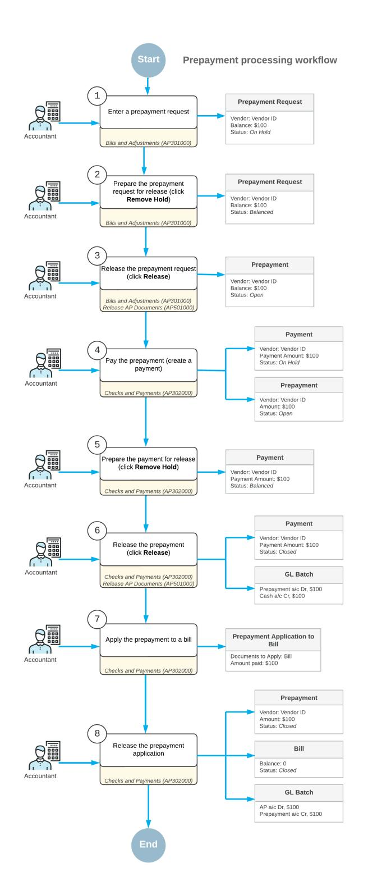

*Figure: Prepayment processing workflow*

# **Bill Prepayments: Implementation Checklist**

To ensure that the system is configured properly for processing prepayments, make sure that the criteria listed in the table have been met in the system as described.

| Form                               | Criteria to Check                                                                                                                                                                                                                                                                | Notes |
|------------------------------------|----------------------------------------------------------------------------------------------------------------------------------------------------------------------------------------------------------------------------------------------------------------------------------|-------|
| Enable/Disable Features (CS100000) | Make sure the minimal features have been enabled as described in Company Without Branches: General Information, Company with Branches that Do Not Require Balancing: Gen eral Information, and Company with Branches that Require Balancing: General Information. |       |
| Vendors (AR303000)                 | Verify the existence of the vendor accounts for the vendors for which you will create and process prepayments. For details, see Ven dors: Implementation Activity.                                                                                                      |       |
| Non-Stock Items (IN202000)         | Verify the existence of non-stock items that can be used when creating prepayment re quests. For details, see Non-Stock Item: Imple mentation Activity.                                                                                                                 |       |
| Payment Methods (CA204000)         | Make sure the CHECK payment method has been selected when paying a prepayment re quest.                                                                                                                                                                                    |       |

# **Implementation Notes**

When deciding how many and which prepayment accounts to use to make it easier to track them in the system, you can select one or any of the following options:

- To use a single prepayment account for all prepayments (to all vendors)
- To specify the prepayment accounts for particular vendor classes
- To specify separate prepayment accounts for specific vendors

If you do not specify a separate account for prepayments, the vendor prepayments will be debited to the vendor AP account.

To assign the prepayment accounts, do the following:

- 1. On the *Vendor [Classes](https://help-2025r1.acumatica.com/Help?ScreenId=ShowWiki&pageid=20dc8b93-d83a-49cf-8cfb-d2ffd2f0db87)* (AP201000) form, specify the prepayment account and subaccount for the default vendor class and for each of the other vendor classes. This will make it easy to create new vendor classes and new vendors with the proper prepayment account specified.
- 2. Use the *[Vendors](https://help-2025r1.acumatica.com/Help?ScreenId=ShowWiki&pageid=a9584be3-f2bd-4d67-80d4-8041d809df56)* (AP303000) form to specify the prepayment account and subaccount for each vendor.

# **Settings That Affect the Workflow**

The following settings and entities should be specified and defined, respectively:

- The following general ledger settings should be specified on the **PostingSettings** tab of the *[General Ledger](https://help-2025r1.acumatica.com/Help?ScreenId=ShowWiki&pageid=e4913d06-c511-4258-a0f9-f36c1b854e6b) [Preferences](https://help-2025r1.acumatica.com/Help?ScreenId=ShowWiki&pageid=e4913d06-c511-4258-a0f9-f36c1b854e6b)* (GL102000) form:
  - Make sure that the **Automatically Post on Release** check box is selected. This setting causes GL batches to be immediately posted aer they are released.
  - Clear the **Generate Consolidated Batches** check box to cause every AP transaction you enter to be posted as an individual batch to the general ledger. (When this check box is selected, the system consolidates into a single batch all transactions in the same currency posted to the same period for all documents being released.)

- The following accounts payable settings should be specified on the **General** tab of the *[Accounts Payable](https://help-2025r1.acumatica.com/Help?ScreenId=ShowWiki&pageid=c3f9353e-95e6-448d-bb3f-e20643879ec7) [Preferences](https://help-2025r1.acumatica.com/Help?ScreenId=ShowWiki&pageid=c3f9353e-95e6-448d-bb3f-e20643879ec7)* (AP101000) form:
  - Select the **Hold Documents on Entry** check box in the **Data EntrySettings** section. This setting gives the created checks the *On Hold* status.
  - Make sure that the **Automatically Post on Release** check box is selected in the **PostingSettings** section. This setting indicates that checks will be automatically posted to the general ledger once they are released.
- The following payment method settings should be specified for the payment method on the *[Payment](https://help-2025r1.acumatica.com/Help?ScreenId=ShowWiki&pageid=509285d1-cfae-4e87-95c3-a968451952e6) [Methods](https://help-2025r1.acumatica.com/Help?ScreenId=ShowWiki&pageid=509285d1-cfae-4e87-95c3-a968451952e6)* (CA204000) form:
  - Select the **Print Checks** option in the **Additional Processing** section on the**Settings for Use in AP** tab.

With these settings specified and entities defined, users in your company can record and process documents in Acumatica ERP quickly and accurately, with a minimum of manual actions.

# **Bill Prepayments: Generated Transactions**

When the prepayment is released, the system generates the following transaction.

| Account                                 | Debit  | Credit |
|-----------------------------------------|--------|--------|
| Cash account                            | 0.00   | Amount |
| Vendor AP account or Prepayment account | Amount | 0.00   |

If you do not specify a separate account for prepayments, the vendor prepayments will be debited to the vendor AP account.

When a prepayment application is released, the system generates the following transaction.

| Account                  | Debit  | Credit |
|--------------------------|--------|--------|
| Prepayment account       | 0.00   | Amount |
| Accounts Payable account | Amount | 0.00   |

When a refund for a prepayment is released, the system generates the following transaction.

| Account                                 | Debit  | Credit |
|-----------------------------------------|--------|--------|
| Cash account                            | Amount | 0.00   |
| Vendor AP account or Prepayment account | 0.00   | Amount |

# **Bill Prepayments: To Process a Prepayment**

The following activity will walk you through the process of creating a prepayment request, making a payment based on the prepayment request, and applying the prepayment to a bill.

This activity is based on the *U100* dataset. If you are using another dataset, or if any system settings have been changed in *U100*, these changes can affect the workflow of the activity and the results of the processing. To avoid any issues, restore the *U100* dataset to its initial state.

# **Video Tutorial**

This video shows you the common process but may contain less detail than the activity has. If you want to repeat the activity on your own or you are preparing to take the certification exam, we recommend that you follow the instructions in the steps of the activity.

#### *[FEEDBACK](https://www.surveymonkey.com/r/BLBL7RJ?Video=Processing%20Prepayments&Source=Open%20Uni&Course=F100)*

### **Story**

Suppose that the SweetLife Fruits & Jams company has ordered a new design for the company's printed labels and paper bags from Wingman Printing Company. They requested an advance payment of \$425 for these services. Further suppose that the prepayment that SweetLife made on January 18, 2025 has to be applied to an AP bill from Wingman Printing Company.

Acting as a SweetLife accountant, you have to record a request for an advance payment of \$425 to the *PRINTICO* vendor. You then need to make a payment for the request, and then apply this prepayment to the bill.

# **Configuration Overview**

For the purposes of this activity, the following features have been enabled on the *[Enable/Disable Features](https://help-2025r1.acumatica.com/Help?ScreenId=ShowWiki&pageid=c1555e43-1bc5-4f6f-ba9d-b323f94d8a6b)* (CS100000) form:

- *Standard Financials*, which provides the standard financial functionality
- *Multibranch Support*, which supports multiple branches in your instance of Acumatica ERP
- *Multicompany Support*, which supports multiple companies within one tenant.

On the *[Accounts Payable Preferences](https://help-2025r1.acumatica.com/Help?ScreenId=ShowWiki&pageid=c3f9353e-95e6-448d-bb3f-e20643879ec7)* (AP101000) form, the **Hold Documents on Entry** check box has been selected in the **Data EntrySettings** section.

On the *[Vendors](https://help-2025r1.acumatica.com/Help?ScreenId=ShowWiki&pageid=a9584be3-f2bd-4d67-80d4-8041d809df56)* (AP303000) form, the *PRINTICO (Wingman Printing Company)* vendor has been defined. This vendor has the *CHECK* payment method specified as the default one.

# **Process Overview**

To create a prepayment request and a payment, you will enter the vendor's prepayment request on the *[Bills and](https://help-2025r1.acumatica.com/Help?ScreenId=ShowWiki&pageid=956b4e51-3078-4d2d-85b3-65c080d95234) [Adjustments](https://help-2025r1.acumatica.com/Help?ScreenId=ShowWiki&pageid=956b4e51-3078-4d2d-85b3-65c080d95234)* (AP301000) form. Then you will create a payment for this prepayment request on the *[Checks and](https://help-2025r1.acumatica.com/Help?ScreenId=ShowWiki&pageid=81659f97-cb14-4a27-bc3e-0f67b3945613) [Payments](https://help-2025r1.acumatica.com/Help?ScreenId=ShowWiki&pageid=81659f97-cb14-4a27-bc3e-0f67b3945613)* (AP302000) form, and release the payment on the *[Release Payments](https://help-2025r1.acumatica.com/Help?ScreenId=ShowWiki&pageid=0a981976-131b-4150-81d0-19b54a46e510)* (AP505200) form. You will apply the prepayment to an AP bill on the *[Checks and Payments](https://help-2025r1.acumatica.com/Help?ScreenId=ShowWiki&pageid=81659f97-cb14-4a27-bc3e-0f67b3945613)* form and release the application.

# **System Preparation**

To prepare the system, do the following:

- 1. Launch the Acumatica ERP website, and sign in to a company with the *U100* dataset preloaded. To sign in as an accountant, use the following credentials:
  - Username: *johnson*
  - Password: *123*
- 2. In the info area, in the upper-right corner of the top pane of the Acumatica ERP screen, click the Business Date menu button and select *1/18/2025*. For simplicity, in Step 1 and Step 2 of this process activity, you will create and process all documents in the system on this business date.

3. On the Company and Branch Selection menu, also on the top pane of the Acumatica ERP screen, make sure that the *SweetLife Head Office and Wholesale Center* branch is selected. If it is not selected, click the Company and Branch Selection menu to view the list of branches that you have access to, and then click *SweetLife Head Office and Wholesale Center*.

# **Step 1: Creating and Releasing a Prepayment Request**

To create and release a prepayment request, do the following:

1. Open the *[Bills and Adjustments](https://help-2025r1.acumatica.com/Help?ScreenId=ShowWiki&pageid=956b4e51-3078-4d2d-85b3-65c080d95234)* (AP301000) form.

To open the form for creating a new record, type the form ID in the Search box, and on the Search form, point at the form title and click **New** right of the title.

- 2. On the form toolbar, click **Add New Record**, and specify the following settings in the Summary area:
  - **Type**: *Prepayment*
  - **Vendor**: *PRINTICO*
  - **Due Date**: *1/18/2025* (the current business date, which is inserted by default)
  - **Post Period**: *01-2025* (inserted by default based on the selected date)
  - **Description**: Prepayment for label design
- 3. On the **Details** tab, click **Add Row** on the table toolbar, and specify the following settings for the added row:
  - **Branch**: *HEADOFFICE* (inserted by default based on the selected branch)
  - **Transaction Descr.**: Label design
  - **Ext. Cost**: 425
  - **Account**: *61000 - Advertising Expense*
- 4. On the form toolbar, click **Remove Hold**.
- 5. On the form toolbar, click **Release** to release the prepayment request.

#### **Step 2: Creating a Payment to Pay for the Prepayment Request**

To create a payment to pay for the prepayment request, do the following:

- 1. While you are still viewing the prepayment request on the *[Bills and Adjustments](https://help-2025r1.acumatica.com/Help?ScreenId=ShowWiki&pageid=956b4e51-3078-4d2d-85b3-65c080d95234)* (AP301000) form, on the form toolbar, click **Pay/Apply**.
- 2. On the *[Checks and Payments](https://help-2025r1.acumatica.com/Help?ScreenId=ShowWiki&pageid=81659f97-cb14-4a27-bc3e-0f67b3945613)* (AP302000) form, which is opened, review the payment, and verify that it has the following settings in the Summary area:
  - **Type**: *Payment*
  - **Vendor**: *PRINTICO*
  - **Payment Method**: *CHECK*
  - **Payment Amount**: 425
  - **Application Date**: *1/18/2025*
  - **Description**: Prepayment for label design
- 3. On the **Documents to Apply** tab, verify that there is only one row with the following settings:
  - **DocumentType**: *Prepayment*
  - **Reference Nbr.**: The reference number of the document you created in Step 1
  - **Amount Paid**: 425
- 4. On the form toolbar, click **Remove Hold**, then click **Save** to save the payment. The following screenshot illustrates the payment prepared to pay the prepayment request.

| <b>Checks and Payments</b> 圖 $\leftarrow$ | $\Box$ $\Omega$                                                                                                                                                                                                                                                                                                                    | 侕 ÷                                | Payment 000035 - Wingman Printing Company 0 к $\checkmark$          |                                                                                                                | <b>HOLD</b> $\geq$        | <b>PRINT/PROCESS</b>                     | $\cdots$                                                                                |           |                       |                                 |                                 |                 | <b>FINOTES</b>                                    | <b>ACTIVITIES</b> | <b>FILES</b>                                              | TOOLS $\star$ |
|-------------------------------------------------|---------------------------------------------------------------------------------------------------------------------------------------------------------------------------------------------------------------------------------------------------------------------------------------------------------------------------------------|---------------------------------------|------------------------------------------------------------------------------|----------------------------------------------------------------------------------------------------------------|------------------------------|------------------------------------------|-----------------------------------------------------------------------------------------|-----------|-----------------------|---------------------------------|---------------------------------|-----------------|---------------------------------------------------|-------------------|-----------------------------------------------------------|---------------|
| Type: Reference Nbr. Status:              | Payment 000035 <b>Pending Print</b> * Application Date: 1/18/2025                                                                                                                                                                                                                                                            | $\sim$ $\circ$ 户 $\circ$     | Vendor: * Location: Joint Payee N * Payment Meth * Cash Account: | PRINTICO - Wingman Printing Company MAIN - Primary Location <b>CHECK</b> 10200WH - Wholesale Checking |                              | $\mathscr{D}$ o o ۹             | Payment Amount: Unapplied Balance: <b>Application Amount:</b> Finance Charges: |           | 425.00 425.00      | 0.00 0.00                    |                                 |                 |                                                   |                   |                                                           | $\sim$        |
| O                                               | * Application Pe 01-2025 Payment Ref.: Description: Prepayment for label design <b>DOCUMENTS TO APPLY</b> COMPLIANCE <b>APPLICATION HISTORY</b> <b>FINANCIAL</b> <b>REMITTANCE</b> <b>CHARGES</b> $\mathbf{\overline{N}}$ <b>LOAD DOCUMENTS</b> ADD JOINT PAYEE $\left  - \right $ $\times$ |                                       |                                                                              |                                                                                                                |                              |                                          |                                                                                         |           |                       |                                 |                                 |                 |                                                   |                   |                                                           |               |
| <b>B</b> 0 □ Branch $0$ D                    | <b>HEADOFFICE</b>                                                                                                                                                                                                                                                                                                                     | <b>Document</b> Type Prepayment | *Reference Nbr. 000169                                                 | Inventory ID                                                                                                | <b>Amount Paid</b> 425.00 | Cash <b>Discount</b> Taken 0.00 | With, Tax Date 0.00                                                                  | 1/18/2025 | Due Date 1/18/2025 | Cash <b>Discount</b> Date | <b>Cross Rate</b> 1.00000000 | Balance 0.00 | Cash <b>Discount</b> <b>Balance</b> 0.00 | Balance           | With, Tax Description 0.00 Prepayment for label design |               |

#### *Figure: The payment prepared to pay the prepayment request*

- 5. On the form toolbar, click **Print/Process**.
- 6. On the *[Process Payments / Print Checks](https://help-2025r1.acumatica.com/Help?ScreenId=ShowWiki&pageid=e632860a-8905-424a-8e27-ad66cf9f64c7)* (AP505000) form, which is opened, notice that the system has added a row with the payment and selected the unlabeled check box for it. On the form toolbar, click **Process**.

A separate browser tab has opened showing a printable version of the selected payment.

7. Review the printable version of the printed payment.

In a production setting, you would click **Print** on the form toolbar to print the check.

- 8. Close the browser tab.
- 9. On the *[Release Payments](https://help-2025r1.acumatica.com/Help?ScreenId=ShowWiki&pageid=0a981976-131b-4150-81d0-19b54a46e510)* (AP505200) form, which is opened, click **Process**. In the **Processing** pop-up window, which is opened, click **Close**.

#### **Step 3: Applying the Prepayment to a Bill**

To apply the prepayment to a bill, do the following:

- 1. In the info area, in the upper-right corner of the top pane of the Acumatica ERP screen, click the Business Date menu button and change the business date in your system to *1/30/2025*.
- 2. Open the Checks and Payments (AP3020PL) list of records.
- 3. Select the prepayment with an amount of \$425 and a date of 1/18/2025 as follows:
  - a. Click the **FilterSettings** button in the filtering area.
  - b. In the **FilterSettings** dialog box, which opens, click **Add Row**, and specify the following settings:
    - **Property**: *Type*
    - **Condition**: *Equals*
    - **Value**: *Prepayment*
  - c. Click **Apply** and close the dialog box.
- 4. Click the link in the **Reference Nbr.** column for the \$425 prepayment to open it on the *[Checks and Payments](https://help-2025r1.acumatica.com/Help?ScreenId=ShowWiki&pageid=81659f97-cb14-4a27-bc3e-0f67b3945613)* (AP302000) form.
- 5. On the **Documents to Apply** tab, click **Add Row**, and specify the following settings in the table:
  - **DocumentType**: *Bill*
  - **Reference Nbr.**: The bill with an amount of \$425 and dated 1/23/2025
  - **Amount Paid**: 425 (filled in automatically)

The following screenshot shows the prepayment that has been applied to a bill, but not yet released.

| <b>Checks and Payments</b>                                       | Prepayment 000169 - Wingman Printing Company               |                                  |                              |                                       |                                         |                                      |            |           |                                 |                   |         | P NOTES                            | <b>ACTIVITIES</b> | $TOOLS$ - <b>FILES</b> |
|------------------------------------------------------------------|------------------------------------------------------------|----------------------------------|------------------------------|---------------------------------------|-----------------------------------------|--------------------------------------|------------|-----------|---------------------------------|-------------------|---------|------------------------------------|-------------------|---------------------------|
| 罚 B $\leftarrow$                                           | 而 $\Omega$ $+$                                       | 0 $\mathsf{K}$ $\check{~}$ | $\geq$ ≺ $\rightarrow$ | <b>RELEASE</b>                        | $\cdots$                                |                                      |            |           |                                 |                   |         |                                    |                   |                           |
| Type:                                                            | Prepayme v                                                 | Vendor:                          |                              | PRINTICO - Wingman Printing Company 2 |                                         | Payment Amount:                      |            |           | 425.00                          |                   |         |                                    |                   | $\sim$                    |
| Reference Nbr.                                                   | Q 000169 Location: <b>MAIN - Primary Location</b> |                                  |                              |                                       |                                         | Applied to Order: 0.00            |            |           |                                 |                   |         |                                    |                   |                           |
| Status:                                                          | Open                                                       | Joint Pavee N                    |                              |                                       |                                         | Unapplied Balance: 0.00           |            |           |                                 |                   |         |                                    |                   |                           |
| * Application Date:                                              | 1/30/2025 自                                             | Payment Meth                     |                              |                                       |                                         | 425.00 <b>Application Amount:</b> |            |           |                                 |                   |         |                                    |                   |                           |
| * Application Pe 01-2025                                         | $\circ$                                                    | Cash Account:                    |                              |                                       |                                         | Finance Charges:                     |            |           | 0.00                            |                   |         |                                    |                   |                           |
| Payment Ref.:                                                    |                                                            | Description:                     | Prepayment for label design  |                                       |                                         |                                      |            |           |                                 |                   |         |                                    |                   |                           |
| <b>DOCUMENTS TO APPLY</b>                                        | ORDERS                                                     | <b>APPLICATION HISTORY</b>       |                              | <b>FINANCIAL</b>                      | <b>REMITTANCE</b>                       | <b>CHARGES</b>                       | COMPLIANCE |           |                                 |                   |         |                                    |                   |                           |
| $+$ $\times$ Ò                                             | <b>LOAD DOCUMENTS</b>                                      | ADD JOINT PAYEE                  | $\mathbb{H}$                 | $\sqrt{N}$                            |                                         |                                      |            |           |                                 |                   |         |                                    |                   |                           |
| !!!!!!!!!!!!!!!!!!!!!!!!!!!!!!!!!!!!!!!! 图 0 <b>Branch</b> | <b>Document</b> Type                                    | *Reference Nbr.               | Inventory ID              | <b>Amount Paid</b>                    | Cash <b>Discount</b> <b>Taken</b> | With, Tax Date                       |            | Due Date  | Cash <b>Discount</b> Date | <b>Cross Rate</b> | Balance | Cash <b>Discount</b> Balance | Balance           | With, Tax Description     |
| D HEADOFFICE > 0                                              | Bill                                                       | 000040                           |                              | 425.00                                | 0.00                                    | 0.00                                 | 1/23/2025  | 2/22/2025 | 2/22/2025                       | 1.00000000        | 0.00    | 0.00                               | 0.00              | Label design              |

#### *Figure: The prepayment applied to the AP bill*

6. On the form toolbar, click **Release** to release the prepayment application to the bill.

# **Bill Prepayments: To Refund a Prepayment**

The following activity will walk you through the process of creating a refund for a prepayment.

This activity is based on the *U100* dataset. If you are using another dataset, or if any system settings have been changed in *U100*, these changes can affect the workflow of the activity and the results of the processing. To avoid any issues, restore the *U100* dataset to its initial state.

#### **Video Tutorial**

This video shows you the common process but may contain less detail than the activity has. If you want to repeat the activity on your own or you are preparing to take the certification exam, we recommend that you follow the instructions in the steps of the activity.

#### *[FEEDBACK](https://www.surveymonkey.com/r/BLBL7RJ?Video=Processing%20Prepayments&Source=Open%20Uni&Course=F100)*

#### **Story**

Suppose that on January 30, 2025, the SweetLife Fruits & Jams company received a refund of \$25 from Compulink and Co. for the unused amount of the \$190 prepayment. Acting as a SweetLife accountant, you need to process this refund in the system.

#### **Configuration Overview**

For the purposes of this activity, the following features have been enabled on the *[Enable/Disable Features](https://help-2025r1.acumatica.com/Help?ScreenId=ShowWiki&pageid=c1555e43-1bc5-4f6f-ba9d-b323f94d8a6b)* (CS100000) form:

- *Standard Financials*, which provides the standard financial functionality
- *Multibranch Support*, which supports multiple branches in your instance of Acumatica ERP
- *Multicompany Support*, which supports multiple companies within one tenant.

On the *[Accounts Payable Preferences](https://help-2025r1.acumatica.com/Help?ScreenId=ShowWiki&pageid=c3f9353e-95e6-448d-bb3f-e20643879ec7)* (AP101000) form, the **Hold Documents on Entry** check box has been selected in the **Data EntrySettings** section.

On the *[Vendors](https://help-2025r1.acumatica.com/Help?ScreenId=ShowWiki&pageid=a9584be3-f2bd-4d67-80d4-8041d809df56)* (AP303000) form, the *COMPULINK (Compulink and Co.)* vendor has been configured. This vendor has the *CHECK* payment method specified as the default one.

# **Process Overview**

In this activity, you will create and release a refund on the *[Checks and Payments](https://help-2025r1.acumatica.com/Help?ScreenId=ShowWiki&pageid=81659f97-cb14-4a27-bc3e-0f67b3945613)* (AP302000) form.

# **System Preparation**

To prepare the system, do the following:

- 1. Launch the Acumatica ERP website, and sign in to a company with the *U100* dataset preloaded. To sign in as an accountant, use the following credentials:
  - Username: *johnson*
  - Password: *123*
- 2. In the info area, in the upper-right corner of the top pane of the Acumatica ERP screen, make sure that the business date in your system is set to *1/30/2025*. If a different date is displayed, click the Business Date menu button and select *1/30/2025*. For simplicity, in this process activity, you will create and process the document in the system on this business date.
- 3. On the Company and Branch Selection menu, also on the top pane of the Acumatica ERP screen, make sure that the *SweetLife Head Office and Wholesale Center* branch is selected. If it is not selected, click the Company and Branch Selection menu to view the list of branches that you have access to, and then click *SweetLife Head Office and Wholesale Center*.

# **Step 1: Creating the Refund for the Prepayment**

To create the refund for the prepayment, do the following:

1. Open the *[Checks and Payments](https://help-2025r1.acumatica.com/Help?ScreenId=ShowWiki&pageid=81659f97-cb14-4a27-bc3e-0f67b3945613)* (AP302000) form.

To open the form for creating a new record, type the form ID in the Search box, and on the Search form, point at the form title and click **New** right of the title.

- 2. On the form toolbar, click **Add New Record**, and specify the following settings in the Summary area:
  - **Type**: *Refund*
  - **Vendor**: *COMPULINK*
  - **Date**: *1/30/2025* (the current business date, which is inserted by default)
  - **Payment Ref.**: 1152025PrepRef
  - **Description**: \$25 refund for unused prepayment
  - **Payment Amount**: 25
- 3. On the **Documents to Apply** tab, click **Add Row** on the table toolbar, and specify the following settings in the added row:
  - **DocumentType**: *Prepayment*
  - **Reference Nbr.**: The number of a prepayment with an amount of \$190 and dated 1/15/2025
  - **Amount Paid**: 25.00 (filled in automatically)
- 4. On the form toolbar, click**Save**.

# **Step 2: Releasing the Refund**

To release the refund, do the following:

1. While you are still on the *[Checks and Payments](https://help-2025r1.acumatica.com/Help?ScreenId=ShowWiki&pageid=81659f97-cb14-4a27-bc3e-0f67b3945613)* (AP302000) form, click **Remove Hold** on the form toolbar to give the refund the *Balanced* status.

2. On the form toolbar, click **Release** to release the refund.

On the **Application History** tab, the released refund applied to the prepayment has appeared (see the following screenshot). The amount of the refund is shown in the **Amount Paid** column whereas the **Balance** column shows the balance of the prepayment.

|              |                                                                | <b>Checks and Payments</b> | Refund 000036 - Compulink and Co |                            |                                  |                                               |                                          |                          |                                    |      |                                 |                     |           | <b>PINOTES</b> | <b>ACTIVITIES</b>               | <b>FILES</b> | $TOOLS$ $\sim$ |
|--------------|----------------------------------------------------------------|----------------------------|----------------------------------|----------------------------|----------------------------------|-----------------------------------------------|------------------------------------------|--------------------------|------------------------------------|------|---------------------------------|---------------------|-----------|----------------|---------------------------------|--------------|----------------|
| $\leftarrow$ | $\mathbb{R}$                                                   | 日                          | $\Omega$ $+$                  | 血                          | o $\mathsf{K}$ $\check{~}$ | $\rightarrow$ $\left\langle \right\rangle$ | $\mathcal{H}$ <b>VOID</b> $\cdots$ |                          |                                    |      |                                 |                     |           |                |                                 |              |                |
|              | Type:                                                          |                            | Refund                           | $\checkmark$               | Vendor:                          | <b>COMPULINK - Compulink and Co</b>           |                                          | $\mathscr{D}$            | <b>Payment Amount:</b>             |      | 25.00                           |                     |           |                |                                 |              | $\sim$         |
|              |                                                                | Reference Nbr.:            | 000036                           | Q                          | Location:                        | MAIN - Primary Location                       |                                          |                          | <b>Unapplied Balance:</b> 0.00  |      |                                 |                     |           |                |                                 |              |                |
|              | Status:                                                        |                            | Closed                           |                            | Joint Payee N                    |                                               |                                          |                          | <b>Application Amount:</b> 0.00 |      |                                 |                     |           |                |                                 |              |                |
|              | Application Date: 1/30/2025 Payment Meth CHECK              |                            |                                  |                            |                                  |                                               |                                          | 0.00 Finance Charges: |                                    |      |                                 |                     |           |                |                                 |              |                |
|              |                                                                | Application Pe             | 01-2025                          |                            | Cash Account:                    | 10200WH - Wholesale Checking                  |                                          |                          |                                    |      |                                 |                     |           |                |                                 |              |                |
|              |                                                                | Payment Ref.:              | 1152025PrepR                     |                            | Description:                     |                                               | \$25 refund for unused prepayment        |                          |                                    |      |                                 |                     |           |                |                                 |              |                |
|              |                                                                | <b>DOCUMENTS TO APPLY</b>  |                                  | <b>APPLICATION HISTORY</b> |                                  | <b>FINANCIAL</b>                              | <b>REMITTANCE</b>                        | <b>CHARGES</b>           | COMPLIANCE                         |      |                                 |                     |           |                |                                 |              |                |
| Ò            | $\boxed{\mathbf{X}}$ <b>REVERSE APPLICATION</b> $\vdash$ |                            |                                  |                            |                                  |                                               |                                          |                          |                                    |      |                                 |                     |           |                |                                 |              |                |
| 80           | !!!!!!!!!!!!!!!!!!!!!!!!!!!!!!!!!!!!!!!!                       | <b>Branch</b>              |                                  | <b>Batch</b> Number     | Doc. Type                        | Reference Nbr.                             | <b>Inventory ID</b>                      | <b>Amount Paid</b>       | Cash <b>Discount</b> Taken   |      | With. Tax Application Period | Application Date | Date      | Due Date       | Cash <b>Discount</b> Date |              | Balance        |
| $> 0$ D      |                                                                | <b>HEADOFFICE</b>          |                                  | AP000189                   | Prepayment                       | 000025                                        |                                          | 25.00                    | 0.00                               | 0.00 | 01-2025                         | 1/30/2025           | 1/15/2025 |                |                                 |              | 165.00         |

*Figure: The Application History tab of the Checks and Payments form*

# **Bill Prepayments: Mass Processing of Documents**

This chapter explains how to release multiple prepayments and the rules that the system uses to group the prepared documents.

# **Mass Printing of Payments**

To print payments in bulk, you use the *[Process Payments / Print Checks](https://help-2025r1.acumatica.com/Help?ScreenId=ShowWiki&pageid=e632860a-8905-424a-8e27-ad66cf9f64c7)* (AP505000) form. To print multiple payments, you select check boxes next to the needed payments in the table, and click **Process** on the form toolbar or click **Process All** to print all the payments listed in the table.

# **Mass Release of Prepayments**

You release multiple prepayments on the *[Release AP Documents](https://help-2025r1.acumatica.com/Help?ScreenId=ShowWiki&pageid=b0977bf2-a93e-408f-8fb1-fbbbb812df0a)* (AP501000) form. To release multiple prepayments, you select check boxes next to the needed payments in the table, and click **Process** on the form toolbar or click **Process All** to release all the payments listed in the table.

# **Bill Prepayments: Related Report and Inquiries**

This topic describes the reports, inquiries, and forms you may review to gather information about prepayments and their balances.

If you do not see a report or inquiry, this could mean that you have signed in to the system with a user account that does not have access rights to the particular form. Sign in as the *admin* user, or contact your system administrator.

### **Reviewing Prepayment Balances**

You use the *Vendor [Summary](https://help-2025r1.acumatica.com/Help?ScreenId=ShowWiki&pageid=621040cc-666f-4bde-9480-50516e8a95a4)* (AP401000) form to review the total prepayment balance of all vendors. The table of this form shows the prepayment balances of the listed vendors.

# **Reviewing a Vendor's Prepayments**

You use the *[Vendor](https://help-2025r1.acumatica.com/Help?ScreenId=ShowWiki&pageid=22c03d80-cbb0-449d-9325-c12f623aaefd) Details* (AP402000) form to review the prepayments and the prepayment balance of a particular vendor.

# **Reviewing All Prepayments**

You run the *[AP Balance by GL Account](https://help-2025r1.acumatica.com/Help?ScreenId=ShowWiki&pageid=92545582-aa05-4b36-9aed-1c894ebfe0d2)* (AP632000) report to view all prepayments collected on the prepayment account. To review the balance of the prepayment account, you select *Account Summary* in the **Report Format** box on the **Report Parameters** tab of the report form.

# **To Enter a Prepayment in the Simplified Way**

In Acumatica ERP, you can enter prepayments to vendors in the following ways, which are described in detail in this topic:

- Standard way: You enter the vendor's prepayment request on the *[Bills and Adjustments](https://help-2025r1.acumatica.com/Help?ScreenId=ShowWiki&pageid=956b4e51-3078-4d2d-85b3-65c080d95234)* (AP301000) form as an Accounts Payable document of the *Prepayment* type. Then you create a payment to pay for this prepayment request on the *[Checks and Payments](https://help-2025r1.acumatica.com/Help?ScreenId=ShowWiki&pageid=81659f97-cb14-4a27-bc3e-0f67b3945613)* (AP302000) form (for details, see *[AP Bill Payments:](#page-111-2) [Process Activity](#page-111-2)*). For details describing the standard way of creating a prepayment, see *Bill [Prepayments:](#page-224-2) To [Process a Prepayment](#page-224-2)*.
- Simplified way: You create a document of the *Prepayment* type directly by using the *[Checks and Payments](https://help-2025r1.acumatica.com/Help?ScreenId=ShowWiki&pageid=81659f97-cb14-4a27-bc3e-0f67b3945613)* form.

# **To Enter a Prepayment: Simplified Way**

1. Open the *[Checks and Payments](https://help-2025r1.acumatica.com/Help?ScreenId=ShowWiki&pageid=81659f97-cb14-4a27-bc3e-0f67b3945613)* (AP302000) form.

To open the form for creating a new record, type the form ID in the Search box, and on the Search form, point at the form title and click **New** right of the title.

- 2. On the form toolbar, click **Add New Record**.
- 3. In the **Type** box of the Summary area, select *Prepayment*.
- 4. In the **Application Date** box, check the date of the document, and change it, if needed.
- 5. In the **Vendor** box, select the vendor to be paid.

The system fills in the following boxes automatically with the default settings of the selected vendor: **Location**, **Payment Method**, and **Cash Account**. Review these settings, and make any needed changes.

- 6. In the **Payment Amount** box (if it appears), specify the total amount of the prepayment.
- 7. On the form toolbar, click**Save** to save the prepayment.

# **Notes About the Procedure**

The notes in this section describe the nuances of the UI elements available on the form, such as when an element is required and when it is not, and when the system fills in settings by default. This section can include other notes.

Note the following about the Summary area of the *[Bills and Adjustments](https://help-2025r1.acumatica.com/Help?ScreenId=ShowWiki&pageid=956b4e51-3078-4d2d-85b3-65c080d95234)* (AP301000) form:

- The system fills in the **Post Period** box automatically, based on the selected document date.
- In the **Currency** box, you can override the currency only if the **Allow Currency Override** check box is selected for the vendor on the *[Vendors](https://help-2025r1.acumatica.com/Help?ScreenId=ShowWiki&pageid=a9584be3-f2bd-4d67-80d4-8041d809df56)* (AP303000) form.

• The **Vendor Ref.** parameter is required only if the **RequireVendor Reference** check box is selected on the *[Accounts Payable Preferences](https://help-2025r1.acumatica.com/Help?ScreenId=ShowWiki&pageid=c3f9353e-95e6-448d-bb3f-e20643879ec7)* (AP101000) form; otherwise, it is optional.

Note the following about the **Details** tab of the *[Bills and Adjustments](https://help-2025r1.acumatica.com/Help?ScreenId=ShowWiki&pageid=956b4e51-3078-4d2d-85b3-65c080d95234)* form:

- In the **Account** column, the system enters the expense account associated with the vendor location if the **Inventory ID** column is empty. If you have specified an inventory item in the **Inventory ID** column, the system enters an expense account specified in the inventory ID settings.
- In the **Subaccount** column is correct; by default, it is generated in accordance with the rule in the **Combine ExpenseSub. from** box on the *[Accounts Payable Preferences](https://help-2025r1.acumatica.com/Help?ScreenId=ShowWiki&pageid=c3f9353e-95e6-448d-bb3f-e20643879ec7)* (AP101000) form. You can manually change it if necessary.

Note the following about the Summary area of the *[Checks and Payments](https://help-2025r1.acumatica.com/Help?ScreenId=ShowWiki&pageid=81659f97-cb14-4a27-bc3e-0f67b3945613)* form:

• The system fills in the **Application Period** box automatically, based on the selected document date.

# **To Unapply a Prepayment Applied Mistakenly**

If you have mistakenly applied a prepayment to the wrong documents (bills or credit adjustments), you can unapply it.

You unapply a prepayment differently depending on whether the prepayment has been released (and has a status of *Open* or *Closed*) or has not been released (and has a status of *Balanced* or *On Hold*). In either case, use the *[Checks](https://help-2025r1.acumatica.com/Help?ScreenId=ShowWiki&pageid=81659f97-cb14-4a27-bc3e-0f67b3945613) [and Payments](https://help-2025r1.acumatica.com/Help?ScreenId=ShowWiki&pageid=81659f97-cb14-4a27-bc3e-0f67b3945613)* (AP302000) form to unapply the prepayment.

# **To Correct a Prepayment Application That Has Not Been Released**

- 1. Open the *[Checks and Payments](https://help-2025r1.acumatica.com/Help?ScreenId=ShowWiki&pageid=81659f97-cb14-4a27-bc3e-0f67b3945613)* (AP302000) form.
- 2. In the **Type** box of the Summary area, select *Prepayment*.
- 3. In the **Reference Nbr.** box, select the prepayment to be corrected.
- 4. On the **Documents to Apply** tab, click the row for each document you don't want to apply the prepayment to, and then click **Delete Row** on the table toolbar.
- 5. On the form toolbar, click**Save**.

# **To Reverse a Prepayment Application That Has Been Released**

- 1. Open the *[Checks and Payments](https://help-2025r1.acumatica.com/Help?ScreenId=ShowWiki&pageid=81659f97-cb14-4a27-bc3e-0f67b3945613)* (AP302000) form.
- 2. In the **Type** box of the Summary area, select *Prepayment*.
- 3. In the **Reference Nbr.** box, select the prepayment whose application to a bill or credit adjustment you want to reverse.
- 4. On the **Application History** tab, click the row of the document whose application you want to reverse, and then click **Reverse Application** on the table toolbar. On the **Documents to Apply** tab, the system adds a reversing row with the opposite amount.
- 5. On the form toolbar, click **Release** to release the application of the reversing entry.

The system creates a batch that reverses the prepayment application to a bill or credit adjustment, and changes the status of the prepayment to *Open*.

# **To Track Prepayments to Vendors**

You use the prepayment account to record prepayments to vendors.

You set up a default prepayment account (and subaccount) on the **GL Accounts** tab of the *[Vendor](https://help-2025r1.acumatica.com/Help?ScreenId=ShowWiki&pageid=20dc8b93-d83a-49cf-8cfb-d2ffd2f0db87) [Classes](https://help-2025r1.acumatica.com/Help?ScreenId=ShowWiki&pageid=20dc8b93-d83a-49cf-8cfb-d2ffd2f0db87)* (AP201000) form. You specify the prepayment account (and subaccount) for each vendor class that might be used when a user creates a new vendor.

You can change the prepayment account (and subaccount) for a particular vendor on the *[Vendors](https://help-2025r1.acumatica.com/Help?ScreenId=ShowWiki&pageid=a9584be3-f2bd-4d67-80d4-8041d809df56)* (AP303000) form.

The system debits the prepayment account by default when a user enters a new prepayment to a vendor.

# **To View Prepayment Balances**

- 1. Open the *Vendor [Summary](https://help-2025r1.acumatica.com/Help?ScreenId=ShowWiki&pageid=621040cc-666f-4bde-9480-50516e8a95a4)* (AP401000) form.
- 2. In the **Branch** box of the Selection area, select the branch for which you want to view prepayments.
- 3. In the **Period** box, select the financial period, or leave the box blank to view all open prepayments.
- 4. In the **AP Account** box, select the prepayment account.

In the table, the list of vendors (those that meet the selected criteria) appears. In the **Prepayments Balance** column, you can view the prepayment balance of each vendor. The**Total Prepayments** box in the Selection area displays the total amount of prepayments for all listed vendors.

# **To View Prepayments by Vendor**

- 1. Open the *[Vendor](https://help-2025r1.acumatica.com/Help?ScreenId=ShowWiki&pageid=22c03d80-cbb0-449d-9325-c12f623aaefd) Details* (AP402000) form.
- 2. In the **Branch** box of the Selection area, select the branch for which you want to view prepayments.
- 3. In the **Vendor** box, select the vendor.
- 4. In the **AP Account** box, select the prepayment account.

In the table, you can view the list of prepayments that match the selected criteria. The **Prepayment Balance** box of the Selection area displays the total amount of prepayments to the vendor, based on the selected criteria.

# **To View All Prepayments**

- 1. Open the *[AP Balance by GL Account](https://help-2025r1.acumatica.com/Help?ScreenId=ShowWiki&pageid=92545582-aa05-4b36-9aed-1c894ebfe0d2)* (AP632000) report.
- 2. On the **Report Parameters** tab, specify the report parameters that fit your needs for information.

If you leave the **Branch** box blank, you'll get information on all branches.

- 3. On the form toolbar, click **Run Report**.
- 4. Find the prepayment account in the report to view all prepayments that fit the specified criteria.

# **To Void a Prepayment Request**

You enter a prepayment in the standard way in two stages. First, you create a document of the *Prepayment* type by using the *[Bills and Adjustments](https://help-2025r1.acumatica.com/Help?ScreenId=ShowWiki&pageid=956b4e51-3078-4d2d-85b3-65c080d95234)* (AP301000) form, and then you create a payment to pay for this prepayment by using the *[Checks and Payments](https://help-2025r1.acumatica.com/Help?ScreenId=ShowWiki&pageid=81659f97-cb14-4a27-bc3e-0f67b3945613)* (AP302000) form. The prepayment is then released.

In some situations, you might want to void a prepayment that was not paid—for instance, if the prepayment document was mistakenly entered into the system. For details, see *[Bill Prepayments: General Information](#page-219-3)*.

This topic describes how to void a prepayment —that is, a document with the *Prepayment* type created on the *[Bills](https://help-2025r1.acumatica.com/Help?ScreenId=ShowWiki&pageid=956b4e51-3078-4d2d-85b3-65c080d95234) [and Adjustments](https://help-2025r1.acumatica.com/Help?ScreenId=ShowWiki&pageid=956b4e51-3078-4d2d-85b3-65c080d95234)* form.

# **To Void a Prepayment**

- 1. Open the *[Bills and Adjustments](https://help-2025r1.acumatica.com/Help?ScreenId=ShowWiki&pageid=956b4e51-3078-4d2d-85b3-65c080d95234)* (AP301000) form.
- 2. In the **Type** box, select *Prepayment*.
- 3. In the **Reference Nbr.** box, select the prepayment to be voided.
- 4. On the More menu (under **Corrections**), click **Void**. The status of the prepayment changes to *Voided*.
- 5. Click **Save**.

When you void a prepayment because no actual prepayment had been made, no batch is created and the voided prepayment may not be applied to an AP payment.

# **To Void a Prepayment**

You can void a prepayment on the *[Checks and Payments](https://help-2025r1.acumatica.com/Help?ScreenId=ShowWiki&pageid=81659f97-cb14-4a27-bc3e-0f67b3945613)* (AP302000) form if it has not been applied to a document (or to multiple documents). This topic describes the two ways of voiding a prepayment. The way you void an unapplied prepayment depends on the way you entered the prepayment:

- If you entered the prepayment in the standard way (that is, if you created a prepayment request on the *[Bills](https://help-2025r1.acumatica.com/Help?ScreenId=ShowWiki&pageid=956b4e51-3078-4d2d-85b3-65c080d95234) [and Adjustments](https://help-2025r1.acumatica.com/Help?ScreenId=ShowWiki&pageid=956b4e51-3078-4d2d-85b3-65c080d95234)* (AP301000) form and paid it), you void the payment.
- If you created the prepayment in the simplified way (that is, you created the prepayment directly on the *[Checks and Payments](https://help-2025r1.acumatica.com/Help?ScreenId=ShowWiki&pageid=81659f97-cb14-4a27-bc3e-0f67b3945613)* form), you void the prepayment.

To cancel an applied prepayment, you first need to unapply the prepayment, as described in *To [Unapply](#page-232-1) a [Prepayment Applied Mistakenly](#page-232-1)*. For details, see *[Bill Prepayments: General Information](#page-219-3)*.

# **To Void a Paid Prepayment**

- 1. Open the *[Checks and Payments](https://help-2025r1.acumatica.com/Help?ScreenId=ShowWiki&pageid=81659f97-cb14-4a27-bc3e-0f67b3945613)* (AP302000) form.
- 2. In the **Type** box of the Summary area, select *Payment*.
- 3. In the **Reference Nbr.** box, select the number of the AP payment to be voided.
- 4. On the form toolbar, click**Void**.

The system creates a document of the *Voided Payment* type with the same reference number as the prepayment.

5. On the form toolbar, click**Save**, and then click **Release** to save and release the voided payment.

# **To Void a Prepayment**

- 1. Open the *[Checks and Payments](https://help-2025r1.acumatica.com/Help?ScreenId=ShowWiki&pageid=81659f97-cb14-4a27-bc3e-0f67b3945613)* (AP302000) form.
- 2. In the **Type** box of the Summary area, select *Prepayment*.
- 3. In the **Reference Nbr.** box, select the prepayment to be voided.
- 4. On the More menu (under **Corrections**), click **Void**.

The system creates a document of the *Voided Payment* type with the same reference number as that of the prepayment used.

5. On the form toolbar, click**Save**, and then click **Release** to save and release the voided payment.

# **To Void a Refund**

Refunds can be voided if errors have been made or the refunds are otherwise invalid. Voiding a refund reverses the original refund transactions. You can use the *[Checks and Payments](https://help-2025r1.acumatica.com/Help?ScreenId=ShowWiki&pageid=81659f97-cb14-4a27-bc3e-0f67b3945613)* (AP302000) form to void a refund that has been applied to a prepayment or debit adjustment.

# **To Void a Refund**

- 1. Open the *[Checks and Payments](https://help-2025r1.acumatica.com/Help?ScreenId=ShowWiki&pageid=81659f97-cb14-4a27-bc3e-0f67b3945613)* (AP302000) form.
- 2. In the **Type** box, select the *Refund* type.
- 3. In the **Reference Nbr.** box, select the document you want to void.
- 4. On the form toolbar, click**Void**. The system does the following:
  - Reverses the refund in full.
  - Changes the status of the refund to *Voided*.
  - Creates a document with the *Voided Refund* type that has the same reference number as the refund has. You use this document in the remaining steps of this procedure.
- 5. Optional: In the **Application Date** box, change the date of the voided refund. The date specified in this box should be the date when the voided refund is released (**Payment Date**) and when the related batch was created (**Transaction Date**).
- 6. On the form toolbar, click**Save** to save the voided refund.
- 7. On the form toolbar, click **Remove Hold**.
- 8. On the form toolbar, click **Release** to release the voided refund.

# **Processing ACH Payments**

ACH payments are electronic payments made through the Automated Clearing House (ACH) network in the United States. With Acumatica ERP, you can automate payments to vendors by making ACH payments. You export a batch of payments to a file that is then processed in the ACH system. For each paid bill, the specified amount is automatically pulled out from a company bank account and transferred to the payment recipient electronically.

The National Automated Clearing House Association (NACHA) has developed rules and standards about ACH transactions. To set up ACH payments, you need an agreement and an account with the financial institution providing ACH services (that is, the ACH operator). Also, you need agreements with your vendors covering ACH transaction authorization and information about their accounts in the ACH network. Accounts are identified by the financial institution routing number and the account number within that institution.

Using ACH payments helps you reduce errors, while eliminating the hassles of check preparation, printing, and emailing. You also can always get available cash discounts for prompt payments and increase the speed of settlements.

For detailed information on how to set up ACH payments, see *[Setting Up ACH Payment Processing](https://help-2025r1.acumatica.com/Help?ScreenId=ShowWiki&pageid=020220b1-0c4f-4064-8d7e-25926da1f041)* or *[Setting Up](https://help-2025r1.acumatica.com/Help?ScreenId=ShowWiki&pageid=abeed91d-e5ca-4efd-87fd-003ecd3480b9) [U.S. and Canada ACH Cross-Border Payment Processing](https://help-2025r1.acumatica.com/Help?ScreenId=ShowWiki&pageid=abeed91d-e5ca-4efd-87fd-003ecd3480b9)*.

# **Configuration of ACH Payments**

Acumatica ERP provides the functionality for setting up ACH payments to your vendors. Acumatica ERP demo data has the *ACH* and *ACHBA* payment methods, which you can modify to meet your specifications. You can configure multiple payment methods for ACH payments by using the *[Payment Methods](https://help-2025r1.acumatica.com/Help?ScreenId=ShowWiki&pageid=509285d1-cfae-4e87-95c3-a968451952e6)* (CA204000) form.

Alternatively, you can use the U.S. ACH plug-in when you are configuring ACH payments. For details, see *[Setting Up](https://help-2025r1.acumatica.com/Help?ScreenId=ShowWiki&pageid=020220b1-0c4f-4064-8d7e-25926da1f041) [ACH Payment Processing](https://help-2025r1.acumatica.com/Help?ScreenId=ShowWiki&pageid=020220b1-0c4f-4064-8d7e-25926da1f041)*.

On the form, make sure that each payment method intended for ACH payments has a list of allowed cash accounts and that the following check boxes are selected for it:

- **Use in AP** (in the Summary area)
- **Require Remittance Information for Cash Account** (in the Summary area)
- **Create Batch Payments** (on the **Settings for Use in AP** tab)

A payment method for ACH payments should have additional user-defined elements to collect the vendor information required for processing of ACH payments. For example, the *ACHBA* payment method provides the following elements:

- **Beneficiary Account No.**: For the vendor's account number with the ACH system.
- **Beneficiary Name**: For the name of the vendor as it is used in the ACH system.
- **Bank Routing Number (ABA)**: For the routing number of the bank where the vendor has an account.
- **Bank Name**: For the name of the bank where the vendor has an account.

These elements will appear on the *[Vendors](https://help-2025r1.acumatica.com/Help?ScreenId=ShowWiki&pageid=a9584be3-f2bd-4d67-80d4-8041d809df56)* (AP303000) form, so that this information can be entered for each vendor.

The export of payments is based on built-in functionality, and is performed in accordance with one of the following:

- A scenario specified for the ACH payment method if the *Export Scenario* option is selected in the **Export Method** box on the**Settings for Use in AP** tab of the *[Payment Methods](https://help-2025r1.acumatica.com/Help?ScreenId=ShowWiki&pageid=509285d1-cfae-4e87-95c3-a968451952e6)* (CA204000) form
- The U.S. ACH plug-in settings specified for the payment method if the *U.S. ACH Plug-In* option is selected in the **Export Method** box on the**Settings for Use in AP** tab of the *[Payment Methods](https://help-2025r1.acumatica.com/Help?ScreenId=ShowWiki&pageid=509285d1-cfae-4e87-95c3-a968451952e6)* form

When you are using the predefined payment method *ACH* or *ACHBA*, the export is performed in accordance with the *Export AP Payments to ACH v2* or *Export AP Payments to ACH Balanced v2* export scenario, respectively. If necessary, these scenarios can be adjusted according to a bank's requirements.

The *Export AP Payments to ACH v2* scenario uses the ACHExportProvider provider.

Do not delete the *ACHExportProvider* provider. If you have accidentally deleted it, you can restore it from the appropriate automation definition.

# **Configuration of Cross-Border ACH Payments**

The ACH094 file format, based on the ACH IAT standard, is accepted by the Royal Bank of Canada (RBC) for crossborder payments. In Acumatica ERP, the RBC ACH094 plug-in is available to configure payment methods to process cross-border payments from a USD account in Canada to a USD account in the United States.

For details, see *[Setting Up U.S. and Canada ACH Cross-Border Payment Processing](https://help-2025r1.acumatica.com/Help?ScreenId=ShowWiki&pageid=abeed91d-e5ca-4efd-87fd-003ecd3480b9)*.

# **Setup of Quick Batch Processing**

You can set up quick processing of batch payments if you need to quickly generate payments to vendors and export them as a payment batch for further bank processing. You set up quick batch processing as follows:

- 1. On the *[Payment Methods](https://help-2025r1.acumatica.com/Help?ScreenId=ShowWiki&pageid=509285d1-cfae-4e87-95c3-a968451952e6)* (CA204000) form, you create a payment method with the **Create Batch Payment** option button selected on the**Settings for Use in AP** tab.
- 2. On the **Allowed Cash Accounts** tab, you add a cash account to the payment method and select the **Quick Batch Generation** check box for this cash account.

When you create and release AP documents (bills, specific lines of a bill, debit and credit adjustments, and prepayments) for which the configured cash account is specified, you can generate AP payments for them on the *[Prepare Payments](https://help-2025r1.acumatica.com/Help?ScreenId=ShowWiki&pageid=e3b526e3-8b12-4fa9-a5b2-2955e763f238)* (AP503000) form, include them in one batch, and export the batch on the *[Batch Payments](https://help-2025r1.acumatica.com/Help?ScreenId=ShowWiki&pageid=765f801c-0b3a-4d5b-8f01-3a1a496934e8)* (AP305000) form. For details, see *To Quickly Prepare a Batch of [Payments](#page-240-1)*.

# **Collecting of Vendor Data**

Once the payment method is defined and configured to export batches of AP payments to an ACH file (through either an export scenario or the ACH plug-in), you assign the payment method intended for ACH payments to each vendor that will accept ACH payments. You also need to collect appropriate ACH-related information from each vendor and enter it into the user-defined elements on the **Payment** tab of the *[Vendors](https://help-2025r1.acumatica.com/Help?ScreenId=ShowWiki&pageid=a9584be3-f2bd-4d67-80d4-8041d809df56)* (AP303000) form.

# **Processing of ACH Payments**

In Acumatica ERP, the processing of ACH payments is built into the payment processing workflow in accounts payable, as described below.

When users create AP payments for vendors that want to receive ACH payments, they should assign the *ACH* payment method (or another payment method that has been configured for ACH payments) to the vendors as the default payment method.

When you click **Remove Hold** on the form toolbar of the *[Checks and Payments](https://help-2025r1.acumatica.com/Help?ScreenId=ShowWiki&pageid=81659f97-cb14-4a27-bc3e-0f67b3945613)* (AP302000) form for an AP payment with the *ACH* payment method, the payment is assigned the *Pending Print* status by the system and appears on the *[Process Payments / Print Checks](https://help-2025r1.acumatica.com/Help?ScreenId=ShowWiki&pageid=e632860a-8905-424a-8e27-ad66cf9f64c7)* (AP505000) form. On this form, you can create a batch of payments for ACH processing as follows:

- 1. Select the payments by the cash account and the payment method that supports ACH payments. (Optionally, you can set up a filter to display only specific payments.)
- 2. Specify a payment reference number in the **Next Payment Ref. Number** box of the Selection area. This number will be used as the **Payment Ref.** number for the batch that is created.
- 3. Initiate batch creation by clicking **Process All** on the form toolbar or by selecting payments using the check boxes in the **Included** column and clicking **Process** on the form toolbar.

This creates a batch of payments for ACH processing. You can view this batch on the *[Batch Payments](https://help-2025r1.acumatica.com/Help?ScreenId=ShowWiki&pageid=765f801c-0b3a-4d5b-8f01-3a1a496934e8)* (AP305000) form. All checks added to the batch are assigned the *Printed* status.

For each payment included in a batch payment, the system adds a link to the batch in the **Batch Payment Nbr.** box (**Print Options** section) on the **Remittance** tab of the *[Checks and Payments](https://help-2025r1.acumatica.com/Help?ScreenId=ShowWiki&pageid=81659f97-cb14-4a27-bc3e-0f67b3945613)* form. You click this link to open the batch on the *[Batch Payments](https://help-2025r1.acumatica.com/Help?ScreenId=ShowWiki&pageid=765f801c-0b3a-4d5b-8f01-3a1a496934e8)* form.

The total number of payments included in the batch is displayed in the **Payment Count** box in the Summary area of the *[Batch Payments](https://help-2025r1.acumatica.com/Help?ScreenId=ShowWiki&pageid=765f801c-0b3a-4d5b-8f01-3a1a496934e8)* form.

Before you have released the batch payment, you can delete or reprint a payment on the *[Release Payments](https://help-2025r1.acumatica.com/Help?ScreenId=ShowWiki&pageid=0a981976-131b-4150-81d0-19b54a46e510)* (AP505200) form. If you reprint the payment on this form by selecting the *Reprint* action, the payment is assigned the *Pending Print* status and is deleted from the batch payment.

# **Export of ACH Payments to a File**

On the *[Batch Payments](https://help-2025r1.acumatica.com/Help?ScreenId=ShowWiki&pageid=765f801c-0b3a-4d5b-8f01-3a1a496934e8)* (AP305000) form, you can view the generated batch of payments and export it to a file (which will be further processed in the ACH payment system) as follows:

1. Locate the batch and release it.

Depending on the state of the **Release Batch Payment Before Export** check box on the *[Payment Methods](https://help-2025r1.acumatica.com/Help?ScreenId=ShowWiki&pageid=509285d1-cfae-4e87-95c3-a968451952e6)* (CA204000) form, a batch of payments can be exported before release.

2. On the form toolbar, click **Export**, which generates a file whose name is based on the payment method, cash account, date of the batch, and date sequence number (for example, ACHP-10200-202502120A.txt).

In the example, the file name consists of the following values:

- *ACHP*, the payment method.
- *10200*, the cash account.
- *20250212*, which is the date in *YYYYMMDD* format.
- *0A*, the date sequence number, which was converted according to the **File ID Modifier** setting. This ACH plug-in setting is specified on the **Plug-In Settings** tab of the *[Payment Methods](https://help-2025r1.acumatica.com/Help?ScreenId=ShowWiki&pageid=509285d1-cfae-4e87-95c3-a968451952e6)* (CA204000) form.

You perform the export either by using the export scenario specified for the payment method (if *Export Scenario* is selected in the **Export Method** box on the**Settings for Use in AP** tab of the *[Payment Methods](https://help-2025r1.acumatica.com/Help?ScreenId=ShowWiki&pageid=509285d1-cfae-4e87-95c3-a968451952e6)* form) or by using the U.S. ACH plug-in (if *U.S. ACH Plug-In* is selected in the **Export Method** box on the**Settings for Use in AP** tab of the *[Payment Methods](https://help-2025r1.acumatica.com/Help?ScreenId=ShowWiki&pageid=509285d1-cfae-4e87-95c3-a968451952e6)* form).

Once the system completes the export, it attaches the export file to the *[Batch Payments](https://help-2025r1.acumatica.com/Help?ScreenId=ShowWiki&pageid=765f801c-0b3a-4d5b-8f01-3a1a496934e8)* (AP305000) form. To view the exported file, you perform the following steps:

- 1. Click the **Files** button to open the list of files attached to the form.
- 2. Select the file by its name and click the **Download** button in the **Files** dialog box.

For each payment, the file contains all required information about payments, vendors, cash account, and remittance settings that are structured according to the ACH format.

The ACH file should be emailed to the ACH operator for further processing.

Depending on the state of the **Release Batch Payments Before Export** check box on the**Settings for Use in AP** tab of the *[Accounts Payable Preferences](https://help-2025r1.acumatica.com/Help?ScreenId=ShowWiki&pageid=c3f9353e-95e6-448d-bb3f-e20643879ec7)* (AP101000) form, a batch of payments can be exported in the following statuses:

- If the **Release Batch Payments Before Export** check box is selected, a batch can be exported aer it is released, that is, the batch must have the *Released* status.
- If the **Release Batch Payments Before Export** check box is cleared (the default value), a batch can be exported before it is released, that is, the batch must have the *Balanced* status. In this case, if a bank rejects a payment or if there is an error in the payment details, you can roll back the batch status to *Balanced* and edit the batch by excluding the payment or updating the details. The batch can then be exported again.

# **Correction of ACH Payment Batches**

On the *[Batch Payments](https://help-2025r1.acumatica.com/Help?ScreenId=ShowWiki&pageid=765f801c-0b3a-4d5b-8f01-3a1a496934e8)* (AP305000) form, you can do the following to correct batches of ACH payments:

- Click **Correct** on the More menu to correct an exported batch. This will roll back the batch status to *Balanced* so that incorrect payments can be excluded from the batch. You can also change the vendors' payment details and reexport the batch.
- Add payments to an existing batch by clicking **Add Payments** on the table toolbar.
- Click **Cancel** on the More menu to cancel a batch and void all released payments in the batch at once.
- Click **Void** on the More menu to void a released batch payment, which causes all the payments in the batch to be voided at once.

For details, see *To Correct a Batch of ACH [Payments](#page-241-2)*.

# **To Prepare ACH Payments**

To pay a vendor through the Automated Clearing House (ACH) network, you perform the following steps:

- 1. Prepare AP payments (and any other payment documents to be paid through ACH) for export by grouping them into a batch. You can create a batch for one ACH payment or for multiple payments. This topic discusses how you prepare ACH payments for export by using the *[Process Payments / Print Checks](https://help-2025r1.acumatica.com/Help?ScreenId=ShowWiki&pageid=e632860a-8905-424a-8e27-ad66cf9f64c7)* (AP505000) form.
- 2. Export the batch into a file, as described in *To Export a Batch of ACH [Payments](#page-241-3)*.
- 3. Email the file to the ACH operator for further processing.

# **Before You Proceed**

Make sure the appropriate payment documents have been created in the system but not yet released. The payment method to be used for ACH payments must be associated with these payments.

Make sure that the payment method to be used for ACH payments has been configured in Acumatica ERP; associate it with each vendor that prefers ACH payments. In addition, the file export functionality must be set up in the system to export batches as a file to be processed within the ACH network. For more information, see *[Processing](#page-236-1) [ACH Payments](#page-236-1)*.

# **To Prepare ACH Payments for Export**

- 1. Open the *[Process Payments / Print Checks](https://help-2025r1.acumatica.com/Help?ScreenId=ShowWiki&pageid=e632860a-8905-424a-8e27-ad66cf9f64c7)* (AP505000) form.
- 2. In the **Payment Method** box of the Selection area, select a payment method used for ACH payments in your system (for example, *ACH*).
- 3. In the **Cash Account** box, select the cash account to be used as the source account for payment.
- 4. If needed, in the **Next Check Number** box, enter the number for the payment.
- 5. In the table, select the unlabeled check box in the row for each payment to be included in the batch for export.

6. On the form toolbar, click **Process**.

The system displays the *[Batch Payments](https://help-2025r1.acumatica.com/Help?ScreenId=ShowWiki&pageid=765f801c-0b3a-4d5b-8f01-3a1a496934e8)* (AP305000) form with the created batch, which has a status of *Balanced*. (This status is assigned to a new batch if the **Hold Documents on Entry** check box is cleared on the *[Accounts Payable Preferences](https://help-2025r1.acumatica.com/Help?ScreenId=ShowWiki&pageid=c3f9353e-95e6-448d-bb3f-e20643879ec7)* (AP101000) form.) When the batch is created, the ACH payments included in the batch are assigned the *Printed* status.

- 7. In the **Description** box of the form, enter the description of the batch.
- 8. On the form toolbar, click**Save**.
- 9. On the form toolbar, click **Release** to release the batch or **Export** to export the batch.

If the **Release Batch Payment Before Export** check box is selected for the payment method on the *[Payment Methods](https://help-2025r1.acumatica.com/Help?ScreenId=ShowWiki&pageid=509285d1-cfae-4e87-95c3-a968451952e6)* (CA204000) form, the batch must be released before it can be exported. If this check box is cleared, the batch can be released aer is has been exported.

# **To Quickly Prepare a Batch of Payments**

You use the *[Prepare Payments](https://help-2025r1.acumatica.com/Help?ScreenId=ShowWiki&pageid=e3b526e3-8b12-4fa9-a5b2-2955e763f238)* (AP503000) form to quickly prepare a batch of AP payments.

#### **Before You Proceed**

- Make sure that a payment method and a cash account for quick batch processing have been set up, as described in *[Setting Up ACH Payment Processing](https://help-2025r1.acumatica.com/Help?ScreenId=ShowWiki&pageid=020220b1-0c4f-4064-8d7e-25926da1f041)*.
- Make sure that appropriate AP documents (bills, bill lines, and debit and credit adjustments, and prepayments) with the *Open* status exist in the system.

# **To Quickly Prepare a Batch of Payments**

- 1. Open the *[Prepare Payments](https://help-2025r1.acumatica.com/Help?ScreenId=ShowWiki&pageid=e3b526e3-8b12-4fa9-a5b2-2955e763f238)* (AP503000) form.
- 2. In the Selection area, specify the following settings:
  - **Payment Method**: The payment method for which quick generation of batches has been set up
  - **Cash Account**: The cash account that associated with the selected payment method
  - **Payment Date**: The payment date for which you want to generate a batch
  - **Vendor**: The vendor for which you want to generate a batch
- 3. Make sure that the **Quick Batch Generation** check box is selected.
- 4. On the **Documents to Pay** tab, the system has listed the vendor documents available in the system. Select the unlabeled check boxes in the rows of the documents that you want to include in the batch.
- 5. On the form toolbar, click **Process**. The system processes the documents and navigates to the *[Batch](https://help-2025r1.acumatica.com/Help?ScreenId=ShowWiki&pageid=765f801c-0b3a-4d5b-8f01-3a1a496934e8) [Payments](https://help-2025r1.acumatica.com/Help?ScreenId=ShowWiki&pageid=765f801c-0b3a-4d5b-8f01-3a1a496934e8)* (AP305000) form.

All payments are generated with the *Pending Print* status and are added to the created batch payment that opens on the *[Batch Payments](https://help-2025r1.acumatica.com/Help?ScreenId=ShowWiki&pageid=765f801c-0b3a-4d5b-8f01-3a1a496934e8)* form. For each payment added to the batch, the system generates a **Payment Ref.** number by incrementing the number specified in the **AP Last Reference Number** column on the *[Payment Methods](https://help-2025r1.acumatica.com/Help?ScreenId=ShowWiki&pageid=509285d1-cfae-4e87-95c3-a968451952e6)* (CA204000) form for the payment method.

- 6. Optional: In the **Description** box, type the description of the batch.
- 7. Review the batch details in the table, and click **Remove Hold** on the form toolbar to give the batch the *Balanced* status.
- 8. On the form toolbar, click **Export** to export the batch.

# **To Export a Batch of ACH Payments**

You export a batch of Automated Clearing House (ACH) payments into a file. Aer the export of the batch, the file contains the required information to be processed in the ACH network.

# **To Export a Batch of ACH Payments**

- 1. Open the *[Batch Payments](https://help-2025r1.acumatica.com/Help?ScreenId=ShowWiki&pageid=765f801c-0b3a-4d5b-8f01-3a1a496934e8)* (AP305000) form.
- 2. In the **Reference Nbr.** box of the Summary area, select the identifier of the batch you want to export.
- 3. In the **Batch Date** box, make sure that the date is correct.

By default, the system inserts the current business date.

- 4. On the form toolbar, click **Export**.
- 5. If needed, in the form title bar, click **Files** to view the name of the file to which the batch was exported.

# **Notes About the Procedure**

Depending on the state of the **Release Batch Payments before Export** check box on the**Settings for Use in AP** tab the *[Payment Methods](https://help-2025r1.acumatica.com/Help?ScreenId=ShowWiki&pageid=509285d1-cfae-4e87-95c3-a968451952e6)* (CA204000) form for the payment method, the ACH batch of payments can have the *Balanced* or *Released* status before export.

If the check box is selected, only released ACH batches of payments can be exported. If the check box is cleared, ACH batches can be exported before they are released. In the latter case, the unreleased payments in the batch remain unreleased.

# **To Correct a Batch of ACH Payments**

On the *[Batch Payments](https://help-2025r1.acumatica.com/Help?ScreenId=ShowWiki&pageid=765f801c-0b3a-4d5b-8f01-3a1a496934e8)* (AP305000) form, you can correct a batch of ACH payments by adding payments to or removing payments from the batch. You can also cancel and void a batch.

# **To Add Payments to a Batch of ACH Payments**

To correct a batch of ACH payments by adding payments to it, do the following:

- 1. Open the *[Batch Payments](https://help-2025r1.acumatica.com/Help?ScreenId=ShowWiki&pageid=765f801c-0b3a-4d5b-8f01-3a1a496934e8)* (AP305000) form.
- 2. In the **Reference Nbr.** box, select a batch that you want to correct. The batch status must be *On Hold* or *Balanced*.
- 3. On the table toolbar, click **Add Payments**.
- 4. In the **Add Payments** dialog box that is opened, specify a payment number in the **Next Payment Ref. Number** box.
- 5. Optional: To narrow down the search for payments, in the**Start Date** and **End Date** boxes, specify the start date and end date of the payments to be added to the batch.

The table in the dialog box displays a list of payment falling within the specified criteria, which have the same cash account and the payment method as those specified in the Summary area of the *[Batch Payments](https://help-2025r1.acumatica.com/Help?ScreenId=ShowWiki&pageid=765f801c-0b3a-4d5b-8f01-3a1a496934e8)* form.

6. In the table, select the unlabeled check box next to each payment that you want to add to the batch and click **Add & Close** to close the dialog box.

- 7. On the form toolbar of the *[Batch Payments](https://help-2025r1.acumatica.com/Help?ScreenId=ShowWiki&pageid=765f801c-0b3a-4d5b-8f01-3a1a496934e8)* form, click**Save** to save your changes.
- 8. If the batch status is *On Hold*, click **Remove Hold** to give the batch the *Balanced* status.

If the **Release Batch Payments Before Export** check box is cleared on the**Settings for Use in AP** tab of the *[Payment Methods](https://help-2025r1.acumatica.com/Help?ScreenId=ShowWiki&pageid=509285d1-cfae-4e87-95c3-a968451952e6)* form, you can export the batch, and then release it.

If the **Release Batch Payments Before Export** check box is selected on the**Settings for Use in AP** tab of the *[Payment Methods](https://help-2025r1.acumatica.com/Help?ScreenId=ShowWiki&pageid=509285d1-cfae-4e87-95c3-a968451952e6)* form, you can release the batch, and then export it.

# **To Correct a Batch of ACH Payments**

To correct a batch of ACH payments, do the following:

- 1. Open the *[Batch Payments](https://help-2025r1.acumatica.com/Help?ScreenId=ShowWiki&pageid=765f801c-0b3a-4d5b-8f01-3a1a496934e8)* (AP305000) form.
- 2. In the **Reference Nbr.** box, select a batch that you want to correct. The batch status must be *Exported*, but the batch must not be released.
- 3. On the More menu (under **Corrections**), click **Correct**. This gives the batch the *Balanced* status.
- 4. In the Summary area, correct the settings in the **Batch Date**, **Document Ref.**, and **Description** boxes.
- 5. Optional: On the table toolbar, click **Add Payments** if you want to add payments to the batch or click **Delete Row** to delete specific payments from the batch.
- 6. On the form toolbar, click**Save** to save your changes.

# **To Cancel a Batch of ACH Payments**

To cancel a batch of ACH payments, do the following:

- 1. Open the *[Batch Payments](https://help-2025r1.acumatica.com/Help?ScreenId=ShowWiki&pageid=765f801c-0b3a-4d5b-8f01-3a1a496934e8)* (AP305000) form.
- 2. In the **Reference Nbr.** box, select a batch that you want to cancel. The batch status must be *Exported*, but the batch must not be released.
- 3. On the More menu (under **Corrections**), click **Cancel**. This gives the batch the *Canceled* status, removes all unreleased payments from the batch, and voids released payments.
- 4. On the form toolbar, click**Save** to save your changes.

#### **To Void a Batch of ACH Payments**

To void a batch of ACH payments, do the following:

- 1. Open the *[Batch Payments](https://help-2025r1.acumatica.com/Help?ScreenId=ShowWiki&pageid=765f801c-0b3a-4d5b-8f01-3a1a496934e8)* (AP305000) form.
- 2. In the **Reference Nbr.** box, select a batch that you want to void. The batch status must be *Released*.
- 3. On the More menu (under **Corrections**), click **Void**.
- 4. In the **Void Batch Payments** dialog box, that opens, select one of the following options:
  - **Original Payment Dates**: To void the payments in the batch as of their payment dates.
  - **Specific Date**: To void payments in the batch as of a specific date that you specify in the**Void Date** box that appears when you select this option.
- 5. In the dialog box, click**Void**. This gives the batch the *Voided* status, voids the released payments in a released batch and the batch itself.

# **Processing BACS Payments**

Bankers Automated Clearing Service (BACS) is used by companies doing business in the United Kingdom. With Acumatica ERP, you can automate payments to vendors by making BACS payments. You export a batch of payments to a file that is then processed in the BACS system. For each paid bill, the specified amount is automatically debited from a company bank account and transferred to the payment recipient electronically.

This functionality is available in the system if the *UK Localization* feature is enabled on the *[Enable/Disable Features](https://help-2025r1.acumatica.com/Help?ScreenId=ShowWiki&pageid=c1555e43-1bc5-4f6f-ba9d-b323f94d8a6b)* (CS100000) form.

# **Support of BACS Standard 18**

To generate a batch of payments in Standard 18 for HSBC or Lloyds bank, you perform the following configuration steps:

- 1. On the *[Payment Methods](https://help-2025r1.acumatica.com/Help?ScreenId=ShowWiki&pageid=509285d1-cfae-4e87-95c3-a968451952e6)* (CA204000) form, you define a payment method with the following settings:
  - **Means of Payment**: *Direct Deposit*
  - **Direct Deposit File Format**: *BACS HSBC Payment* or *BACS Lloyds Payment*
  - **Use in AP** (in the Summary area): Selected
  - **Require Remittance Information for Cash Account** (in the Summary area): Selected
  - **Create Batch Payments** (on the **Settings for Use in AP** tab): Selected
  - **ExportScenario** (on the **Settings for Use in AP** tab): *BACS HSBC Payment* or *BACS Lloyds Payment*

Depending on the option selected in the **Direct Deposit File Format** box, this setting is filled in by the appropriate export scenario by default.

With these settings selected, the table on the **RemittanceSettings** table will be automatically filled in with predefined settings.

Alternatively, you can set up a payment method that uses the BACS HSBC plug-in or BACS Lloyds plugin. To do this, you select *BACS HSBC Plug-In* or *BACS Lloyds Plug-In* in the **Export Method** box on the **Settings for Use in AP** tab. For more details, see *To Add a [Payment](https://help-2025r1.acumatica.com/Help?ScreenId=ShowWiki&pageid=ff5e4907-14d4-4f1a-99e0-59de666036e5) Method for BACS HSBC Plug-In* and *To Add a [Payment](https://help-2025r1.acumatica.com/Help?ScreenId=ShowWiki&pageid=df5ef450-4a4d-4f13-8c19-c4636e68499e) Method for BACS Lloyds Plug-In*.

- 2. On the **Allowed Cash Accounts** tab of the *[Payment Methods](https://help-2025r1.acumatica.com/Help?ScreenId=ShowWiki&pageid=509285d1-cfae-4e87-95c3-a968451952e6)* form, you set up or add a cash account to be used in BACS payments.
- 3. On the *[Cash Accounts](https://help-2025r1.acumatica.com/Help?ScreenId=ShowWiki&pageid=10f71454-88f9-4d6c-8d09-32856d8c6741)* (CA202000) form, for the *Direct Debit* payment method and the cash account that you added on the *[Payment Methods](https://help-2025r1.acumatica.com/Help?ScreenId=ShowWiki&pageid=509285d1-cfae-4e87-95c3-a968451952e6)* form, you define the remittance details on the **RemittanceSettings** tab.

For BACS HSBC payments, these details are: *Originating Sort Code Number*, *Originating Account Number*, *Originating Account Name*, and *Service User Number (SUN)*.

For BACS Lloyds payments, these details are *Originating Sort Code Number* and *Originating Account Number*.

4. On the **Payment** tab of the *[Vendors](https://help-2025r1.acumatica.com/Help?ScreenId=ShowWiki&pageid=a9584be3-f2bd-4d67-80d4-8041d809df56)* (AP303000) form, you assign the payment method intended for BACS payments to each vendor that will accept these payments. In the **Payment Instructions** table, you specify the following details for BACS HSBC payments: *Destination Sort Code Number*, *Destination Account Number*, *Destination Account Name*, and *Destination Payment Ref*.

For BACS Lloyds payments, you specify the following details: *Destination Sort Code Number*, *Destination Account Number*, and *Destination Account Name*.

### **Processing of BACS Payments**

In Acumatica ERP, the processing of BACS payments is built into the payment processing workflow in accounts payable, as described below.

When users create payments for vendors that want to receive BACS payments, they should assign the *Direct Debit* payment method that has been configured for BACS payments to the vendors as the default payment method.

When you click **Remove Hold** on the form toolbar of the *[Checks and Payments](https://help-2025r1.acumatica.com/Help?ScreenId=ShowWiki&pageid=81659f97-cb14-4a27-bc3e-0f67b3945613)* (AP302000) form for an AP payment with the *Direct Debit* payment method, the payment is assigned the *Pending Print* status by the system and appears on the *[Process Payments / Print Checks](https://help-2025r1.acumatica.com/Help?ScreenId=ShowWiki&pageid=e632860a-8905-424a-8e27-ad66cf9f64c7)* (AP505000) form. On this form, you can create a batch of payments for BACS processing as follows:

- 1. Select the payments by the cash account and the payment method that supports BACS payments. (Optionally, you can set up a filter to display only specific payments.)
- 2. Specify a payment reference number in the **Next Check Number** box of the Selection area. This number will be used as the **Payment Ref.** number for the batch that is created.
- 3. Initiate batch creation by clicking **Process All** on the form toolbar or by selecting payments using the check boxes in the **Included** column and clicking **Process** on the form toolbar.

This creates a batch of payments for BACS processing. You can view this batch on the *[Batch Payments](https://help-2025r1.acumatica.com/Help?ScreenId=ShowWiki&pageid=765f801c-0b3a-4d5b-8f01-3a1a496934e8)* (AP305000) form. All checks added to the batch are assigned the *Printed* status.

For each payment included in a batch payment, the system adds a link to the batch in the **Batch Payment Nbr.** box (**Print Options** section) on the **Remittance** tab of the *[Checks and Payments](https://help-2025r1.acumatica.com/Help?ScreenId=ShowWiki&pageid=81659f97-cb14-4a27-bc3e-0f67b3945613)* form. You click this link to open the batch on the *[Batch Payments](https://help-2025r1.acumatica.com/Help?ScreenId=ShowWiki&pageid=765f801c-0b3a-4d5b-8f01-3a1a496934e8)* form.

Before you have released the batch payment, you can delete or reprint a payment on the *[Release Payments](https://help-2025r1.acumatica.com/Help?ScreenId=ShowWiki&pageid=0a981976-131b-4150-81d0-19b54a46e510)* (AP505200) form. If you reprint the payment on this form by selecting the *Reprint* action, the payment is assigned the *Pending Print* status and is deleted from the batch payment.

# **Export of the Payments to a File**

On the *[Batch Payments](https://help-2025r1.acumatica.com/Help?ScreenId=ShowWiki&pageid=765f801c-0b3a-4d5b-8f01-3a1a496934e8)* (AP305000) form, you can view the generated batch of payments and export it to a file (which will be further processed in the BACS payment system) as follows:

- 1. Locate the batch and release it.
- 2. On the form toolbar, click **Export**, which generates a file whose name is based on the payment method, cash account, and the date of the batch. The format of the file name is <Payment Method>-<Cash account number>-<Payment date>.txt.

Export is performed by using the *BACS HSBC Payment*, *BACS Lloyds Payment* scenario, BACS HSBC plug-in, or BACS Lloyds plug-in that exports to the file all vendor information required for BACS payment.

Once the system completes the export, it attaches the export file to the *[Batch Payments](https://help-2025r1.acumatica.com/Help?ScreenId=ShowWiki&pageid=765f801c-0b3a-4d5b-8f01-3a1a496934e8)* form. To view the exported file, perform the following steps:

- 1. Click **Files** to open the list of files attached to the form.
- 2. Select the file by its name (shown as the **File Name**) and double-click it.

For each payment, the file contains the vendor details that you specified on the *[Vendors](https://help-2025r1.acumatica.com/Help?ScreenId=ShowWiki&pageid=a9584be3-f2bd-4d67-80d4-8041d809df56)* (AP303000) form and the originating details that you specified on the *[Cash Accounts](https://help-2025r1.acumatica.com/Help?ScreenId=ShowWiki&pageid=10f71454-88f9-4d6c-8d09-32856d8c6741)* (CA202000) form.

# **To Prepare BACS Payments**

To pay a vendor through Bankers Automated Clearing Service (BACS), you perform the following steps:

- 1. Prepare payments for export by grouping them into a batch. You can create a batch for one BACS payment or for multiple payments. This topic discusses how you prepare BACS payments for export by using the *[Process Payments / Print Checks](https://help-2025r1.acumatica.com/Help?ScreenId=ShowWiki&pageid=e632860a-8905-424a-8e27-ad66cf9f64c7)* (AP505000) form.
- 2. Export the batch into a file, as described in *To Export BACS [Payments](#page-245-1)*.
- 3. Email the file to the BACS operator for further processing.

## **Before You Proceed**

Make sure the appropriate payment documents have been created on the *[Checks and Payments](https://help-2025r1.acumatica.com/Help?ScreenId=ShowWiki&pageid=81659f97-cb14-4a27-bc3e-0f67b3945613)* (AP302000) but not yet released. The payment method to be used for BACS payments must be associated with these payments.

Acumatica ERP provides the *Direct Debit* type for payment methods to be used for BACS payments. You should associate this payment method with each vendor that prefers BACS payments. In addition, the file export functionality must be set up in the system to export batches as a file. For more information, see *[Processing BACS](#page-243-1) [Payments](#page-243-1)*.

# **To Prepare BACS Payments for Export**

To prepare BACS payments for export, do the following:

- 1. Open the *[Process Payments / Print Checks](https://help-2025r1.acumatica.com/Help?ScreenId=ShowWiki&pageid=e632860a-8905-424a-8e27-ad66cf9f64c7)* (AP505000) form.
- 2. In the **Payment Method** box of the Selection area, select a payment method used for BACS payments in your system.
- 3. In the **Cash Account** box, select the cash account to be used as the source account for payment.
- 4. If needed, in the **Next Check Number** box, enter the number for the payment.
- 5. In the table, select the unlabeled check box in the row for each payment to be included in the batch for export.
- 6. On the form toolbar, click **Process**.

The system displays the *[Batch Payments](https://help-2025r1.acumatica.com/Help?ScreenId=ShowWiki&pageid=765f801c-0b3a-4d5b-8f01-3a1a496934e8)* (AP305000) form with the created batch, which has a status of *On Hold* or *Balanced*. When the batch is created, the BACS payments included in the batch are assigned the *Printed* status.

- 7. In the **Description** box of the form, enter the description of the batch.
- 8. In the **Batch Seq. Number** box, enter the batch number.
- 9. On the form toolbar, click**Save**.
- 10.Optional: If the batch status is *On Hold*, click **Remove Hold** on the form toolbar to give the batch the *Balanced* status.
- 11.On the form toolbar, click **Release** to release the batch.

# **To Export BACS Payments**

You export a batch of BACS payments into a file. Aer the export of the batch, the file contains the required information to be processed by BACS.

#### **To Export a Batch of BACS Payments**

- 1. Open the *[Batch Payments](https://help-2025r1.acumatica.com/Help?ScreenId=ShowWiki&pageid=765f801c-0b3a-4d5b-8f01-3a1a496934e8)* (AP305000) form.
- 2. In the **Reference Nbr.** box of the Summary area, select the identifier of the batch you want to export.

- 3. In the **Batch Date** box, make sure that the date is correct.
  - By default, the system inserts the current business date.
- 4. On the form toolbar, click **Export**.
- 5. If needed, in the form title bar, click **Files** to view the name of the file to which the batch was exported.

# **Processing Canadian EFT Payments**

Processing electronic funds transfer (EFT) payments is crucial for businesses in Canada. With Acumatica ERP, you can simplify this process by using a built-in Canadian EFT plug-in or a predefined Canadian EFT export scenario.

For details on the configuration and settings of the plug-in, see *[Setup of Canadian EFT](https://help-2025r1.acumatica.com/Help?ScreenId=ShowWiki&pageid=f78fc488-3326-4211-aa4e-57c566c1986f)*, *[Settings of the Canadian EFT](https://help-2025r1.acumatica.com/Help?ScreenId=ShowWiki&pageid=1e6ea20f-8020-4496-a9c5-f37e3620ba28) [Plug-In](https://help-2025r1.acumatica.com/Help?ScreenId=ShowWiki&pageid=1e6ea20f-8020-4496-a9c5-f37e3620ba28)*, and *To Add a Payment Method for the [Canadian](https://help-2025r1.acumatica.com/Help?ScreenId=ShowWiki&pageid=201fac98-9dee-4cc7-9d30-c15c8df3c4fc) EFT Plug-In*. For details on the configuration and settings of the export scenario, see *[Settings of the Canadian EFT Export Scenario](https://help-2025r1.acumatica.com/Help?ScreenId=ShowWiki&pageid=5a87a4d5-8739-4b52-812a-3ba8b779d3cb)* and *To Add a [Payment](https://help-2025r1.acumatica.com/Help?ScreenId=ShowWiki&pageid=71849e2c-09c4-4e13-8fbc-a0d055b027b5) Method for the [Canadian EFT Export Scenario](https://help-2025r1.acumatica.com/Help?ScreenId=ShowWiki&pageid=71849e2c-09c4-4e13-8fbc-a0d055b027b5)*.

# **Processing of Canadian EFT Payments**

In Acumatica ERP, the processing of Canadian EFT payments is built into the payment processing workflow in accounts payable, as described below.

When you create payments for vendors that want to receive EFT payments, on the *[Vendors](https://help-2025r1.acumatica.com/Help?ScreenId=ShowWiki&pageid=a9584be3-f2bd-4d67-80d4-8041d809df56)* (AP303000) form, you should assign the predefined *Direct Debit* payment method that has been configured for Canadian EFT payments to the vendors as the default payment method.

When you click **Remove Hold** on the form toolbar of the *[Checks and Payments](https://help-2025r1.acumatica.com/Help?ScreenId=ShowWiki&pageid=81659f97-cb14-4a27-bc3e-0f67b3945613)* (AP302000) form for an AP payment with the *Direct Debit* payment method (or another payment method configured for Canadian EFT payments), the payment is assigned the *Pending Print* status by the system and appears on the *[Process Payments / Print Checks](https://help-2025r1.acumatica.com/Help?ScreenId=ShowWiki&pageid=e632860a-8905-424a-8e27-ad66cf9f64c7)* (AP505000) form. On this form, you can create a batch of payments for EFT processing as follows:

- 1. To narrow the list of payments, select the cash account and the payment method that supports Canadian EFT. (Optionally, you can set up a filter to display only specific payments.)
- 2. Specify a payment reference number in the **Next Check Number** box of the Selection area. This number will be used as the **Payment Ref.** number for the batch that is created.
- 3. Initiate batch creation by clicking **Process All** on the form toolbar or by selecting payments by using the check boxes in the **Included** column and clicking **Process** on the form toolbar.

This creates a batch of payments that you can view on the *[Batch Payments](https://help-2025r1.acumatica.com/Help?ScreenId=ShowWiki&pageid=765f801c-0b3a-4d5b-8f01-3a1a496934e8)* (AP305000) form. All checks added to the batch are assigned the *Printed* status.

For each payment included in a batch payment, the system adds a link to the batch in the **Batch Payment Nbr.** box (**Print Options** section) on the **Remittance** tab of the *[Checks and Payments](https://help-2025r1.acumatica.com/Help?ScreenId=ShowWiki&pageid=81659f97-cb14-4a27-bc3e-0f67b3945613)* form. You click this link to open the batch on the *[Batch Payments](https://help-2025r1.acumatica.com/Help?ScreenId=ShowWiki&pageid=765f801c-0b3a-4d5b-8f01-3a1a496934e8)* form.

Before you release the batch payment, you can delete or reprint a payment on the *[Release Payments](https://help-2025r1.acumatica.com/Help?ScreenId=ShowWiki&pageid=0a981976-131b-4150-81d0-19b54a46e510)* (AP505200) form. If you reprint the payment on this form by selecting the *Reprint* action, the payment is assigned the *Pending Print* status and is deleted from the batch payment.

# **Export of Payments to a File**

On the *[Batch Payments](https://help-2025r1.acumatica.com/Help?ScreenId=ShowWiki&pageid=765f801c-0b3a-4d5b-8f01-3a1a496934e8)* (AP305000) form, you can view the generated batch of payments and export it to a CPA005 file as follows:

- 1. Locate the batch and release it.
- 2. On the form toolbar, click **Export**, which generates a file whose name is based on the payment method, cash account, and the date of the batch. The format of the file name is one of the following:
  - EFT production file: {PaymentMethodID}-{CashAccountCD}-{Date:yyyyMMdd}- {BatchSeqNbr:0000}.txt (for example, EFT-10600-20240206-0898.txt)
  - EFT test file: {PaymentMethodID}-{CashAccountCD}-{Date:yyyyMMdd}- {BatchSeqNbr:0000}-Test.txt (for example, EFT-10600-20240206-0898-Test.txt)

The system selects the date it inserts in the file name based on the option selected in the **Creation Date** box on the **Plug-In Settings** tab of the *[Payment Methods](https://help-2025r1.acumatica.com/Help?ScreenId=ShowWiki&pageid=509285d1-cfae-4e87-95c3-a968451952e6)* (CA204000) form for the payment method:

- If *Current Date* is selected, the current business date is inserted.
- If *Batch Date* is selected, the date specified in the **Batch Date** box on the *[Batch Payments](https://help-2025r1.acumatica.com/Help?ScreenId=ShowWiki&pageid=765f801c-0b3a-4d5b-8f01-3a1a496934e8)* form is inserted.

Once the system completes the export, it attaches the export file to the *[Batch Payments](https://help-2025r1.acumatica.com/Help?ScreenId=ShowWiki&pageid=765f801c-0b3a-4d5b-8f01-3a1a496934e8)* form. To view the exported file, perform the following steps:

- 1. Click **Files** on the form title bar to open the list of files attached to the form.
- 2. Select the file by its name (shown as the **File Name**) and double-click it.

For each payment, the file contains the vendor details that you specified on the *[Vendors](https://help-2025r1.acumatica.com/Help?ScreenId=ShowWiki&pageid=a9584be3-f2bd-4d67-80d4-8041d809df56)* (AP303000) form and the originating details that you specified on the *[Cash Accounts](https://help-2025r1.acumatica.com/Help?ScreenId=ShowWiki&pageid=10f71454-88f9-4d6c-8d09-32856d8c6741)* (CA202000) form.

# **To Prepare Canadian EFT Payments**

To pay a vendor through Canadian EFT, you perform the following steps:

- 1. Prepare payments for export by grouping them into a batch. You can create a batch for one EFT or for multiple EFT payments. This topic describes how you prepare EFT payments for export by using the *[Process](https://help-2025r1.acumatica.com/Help?ScreenId=ShowWiki&pageid=e632860a-8905-424a-8e27-ad66cf9f64c7) [Payments / Print Checks](https://help-2025r1.acumatica.com/Help?ScreenId=ShowWiki&pageid=e632860a-8905-424a-8e27-ad66cf9f64c7)* (AP505000) form.
- 2. Export the batch into a file, as described in *To Export Canadian EFT [Payments](#page-249-1)*.

# **Before You Proceed**

Make sure that the appropriate payment documents have been created on the *[Checks and Payments](https://help-2025r1.acumatica.com/Help?ScreenId=ShowWiki&pageid=81659f97-cb14-4a27-bc3e-0f67b3945613)* (AP302000) but not yet released. The payment method to be used for Canadian EFT payments must be selected in the **Payment Method** box for these payments.

Acumatica ERP provides the *Direct Debit* type for payment methods to be used for Canadian EFT payments. You should associate this payment method with each vendor that prefers EFT. In addition, the file export functionality must be set up in the system to export batches as a file. For more information, see *[Processing Canadian EFT](#page-247-1) [Payments](#page-247-1)*.

#### **To Prepare Canadian EFT Payments for Export**

- 1. Open the *[Process Payments / Print Checks](https://help-2025r1.acumatica.com/Help?ScreenId=ShowWiki&pageid=e632860a-8905-424a-8e27-ad66cf9f64c7)* (AP505000) form.
- 2. In the **Payment Method** box of the Selection area, select a payment method that is defined to be used for Canadian EFT payments in your system.
- 3. In the **Cash Account** box, select the cash account to be used as the source account for payment.
- 4. If needed, in the **Next Check Number** box, enter the number for the payment.
- 5. In the table, select the unlabeled check box in the row of each payment to be included in the batch for export.
- 6. On the form toolbar, click **Process**.

The system goes to the *[Batch Payments](https://help-2025r1.acumatica.com/Help?ScreenId=ShowWiki&pageid=765f801c-0b3a-4d5b-8f01-3a1a496934e8)* (AP305000) form with the created batch, which has a status of *On Hold* or *Balanced*. When the batch is created, the Canadian EFT payments included in the batch are assigned the *Printed* status.

- 7. In the **Description** box of the *[Batch Payments](https://help-2025r1.acumatica.com/Help?ScreenId=ShowWiki&pageid=765f801c-0b3a-4d5b-8f01-3a1a496934e8)* form, enter the description of the batch.
- 8. In the **Batch Seq. Number** box, enter the batch number.
- 9. On the form toolbar, click**Save**.
- 10.Optional: If the batch status is *On Hold*, click **Remove Hold** on the form toolbar to give the batch the *Balanced* status.
- 11.On the form toolbar, click **Release** to release the batch.

This instruction is required if the **Release Batch Payment Before Export** check box is selected for the payment method on the**Settings for Use in AP** tab of the *[Payment Methods](https://help-2025r1.acumatica.com/Help?ScreenId=ShowWiki&pageid=509285d1-cfae-4e87-95c3-a968451952e6)* (CA204000) form.

If the **Release Batch Payment Before Export** check box is cleared, you need to export the batch first by clicking **Export** on the form toolbar, and then release the batch.

# **To Export Canadian EFT Payments**

You can export a batch of EFT payments into a file. Aer the export of the batch, the file contains the required information in the CPA005 format.

# **To Generate a Test File**

To export a batch of Canadian EFT payments to an EFT test file, do the following:

- 1. Open the *[Batch Payments](https://help-2025r1.acumatica.com/Help?ScreenId=ShowWiki&pageid=765f801c-0b3a-4d5b-8f01-3a1a496934e8)* (AP305000) form.
- 2. In the **Reference Nbr.** box of the Summary area, select the identifier of the batch you want to export.
- 3. In the **Batch Date** box, make sure that the date is correct.

By default, the system inserts the current business date.

- 4. On the form toolbar, click **GenerateTest File**.
- 5. In the form title bar, click **Files**, and in the **Files** dialog box, which is opened, click the file name of the generated test file to review it.

# **To Export a Batch of Canadian EFT Payments**

To export a batch of Canadian EFT payments to an EFT production file, do the following:

- 1. Open the *[Batch Payments](https://help-2025r1.acumatica.com/Help?ScreenId=ShowWiki&pageid=765f801c-0b3a-4d5b-8f01-3a1a496934e8)* (AP305000) form.
- 2. In the **Reference Nbr.** box of the Summary area, select the identifier of the batch you want to export.
- 3. In the **Batch Date** box, make sure that the date is correct.

By default, the system inserts the current business date.

- 4. On the form toolbar, click **Export**.
- 5. If needed, in the form title bar, click **Files** to view the name of the file to which the batch was exported.

# **Recognizing AP Documents from PDFs**

With the digital document flow in place, your company receives invoices from vendors as PDF files attached to emails, and accountants have to manually enter AP bills based on those invoices into the system. The manual entry of these invoices is a time-consuming operation, and errors could be made during the manual entry.

In Acumatica ERP, you can set up automatic recognition of documents attached to incoming emails so that users can create AP documents from these recognized documents with a single click.

In the topics of this chapter, you will find information about configuring document recognition and the creation of the AP documents from PDF files.

# **AP Documents from PDFs: General Information**

You can configure the system to automatically recognize invoices attached to incoming emails and to give users the ability to manually submit PDF files for recognition. With these capabilities, users can create AP documents from these recognized documents with a single click.

Acumatica ERP uses an external recognition service for this functionality and the number of recognized documents is limited by the applied license.

- The recognition service has the following limitations for the submitted files:
  - The locale of a file should be en-us. For example, the service will recognize invoice dates as *MM/DD/YYYY*.
  - The maximum file size is 10 MB. The limit applies for manual and automatic submission of a PDF file.

# **Learning Objectives**

In this chapter, you will learn how to do the following:

- Configure the system to automatically recognize invoices attached to incoming emails
- Submit an AP document in PDF format for recognition
- Validate a recognized document
- Create an AP document from a recognized PDF file

# **Applicable Scenarios**

You create AP documents from recognized PDF files in the following cases:

- When you receive invoices from vendors attached to emails as PDF files
- When you have a number of AP documents in PDF format that you need to enter into the system

# **Manual PDF Submission for Recognition in Acumatica ERP**

You use the *[Incoming Documents](https://help-2025r1.acumatica.com/Help?ScreenId=ShowWiki&pageid=c5a67fb3-c6f0-4ba0-9950-a68d320866ef)* (AP301100) form to manually submit a PDF file for recognition. You drag the downloaded PDF file into the Preview area (right pane) of the form, and then you click **Recognize** on the form toolbar.

Initially, the uploaded document has the *Pending Recognition* status displayed in the Summary area (le pane) of the form. If an uploaded document exceeds 50 pages, a warning message indicating the potential failure of document recognition will appear next to the**Status** box, as shown in the following screenshot.

| <b>Incoming Documents</b>                                                                                                      |   | .pdf                                                                                                                                                                                                                                                                      |                                                                                                                                                                                                                              |                                                                                                                                                                                                                                              |                                                                                                                                                  |                                                                                                                                                                                                                                  |                                                                                                                                                                                          | <b>PINOTES</b>                                                                                                                                                                                  |                                                                                                                                                                       | FILES (1)                                                                                                                                                                                                                                                              | <b>CUSTOMIZATION</b>                                                                                                                                                                |                                                                               | TOOLS $\star$        |
|--------------------------------------------------------------------------------------------------------------------------------|---|---------------------------------------------------------------------------------------------------------------------------------------------------------------------------------------------------------------------------------------------------------------------------|------------------------------------------------------------------------------------------------------------------------------------------------------------------------------------------------------------------------------|----------------------------------------------------------------------------------------------------------------------------------------------------------------------------------------------------------------------------------------------|--------------------------------------------------------------------------------------------------------------------------------------------------|----------------------------------------------------------------------------------------------------------------------------------------------------------------------------------------------------------------------------------|------------------------------------------------------------------------------------------------------------------------------------------------------------------------------------------|-------------------------------------------------------------------------------------------------------------------------------------------------------------------------------------------------|-----------------------------------------------------------------------------------------------------------------------------------------------------------------------|------------------------------------------------------------------------------------------------------------------------------------------------------------------------------------------------------------------------------------------------------------------------|-------------------------------------------------------------------------------------------------------------------------------------------------------------------------------------|-------------------------------------------------------------------------------|----------------------|
| 甸 <b>RECOGNIZE</b> к Ы > ←                                                                                      |   |                                                                                                                                                                                                                                                                           |                                                                                                                                                                                                                              |                                                                                                                                                                                                                                              |                                                                                                                                                  |                                                                                                                                                                                                                                  |                                                                                                                                                                                          |                                                                                                                                                                                                 |                                                                                                                                                                       |                                                                                                                                                                                                                                                                        |                                                                                                                                                                                     |                                                                               |                      |
| <b>O</b> Status: <b>Pending Recognition</b> The uploaded document has a significant number of pages that may cause an | 0 | $> 1/404$ . $\,<$                                                                                                                                                                                                                                                      | $ + $                                                                                                                                                                                                                        | 94%                                                                                                                                                                                                                                          |                                                                                                                                                  |                                                                                                                                                                                                                                  | ACCOUNT NUMBER                                                                                                                                                                           | STATEMENT PLEASE DIRECT INQUIRIES TO YOUR LOCAL DISTRIBUTION CENTER <b>ITATEMENT DATE</b>                                                                                              |                                                                                                                                                                       | PLEA IE REMIT TO: Page 1 of 404 ACCOUNT NUMBER                                                                                                                                                                                                                   | <b>ITATEMENT DATE</b>                                                                                                                                                               |                                                                               | ▲                    |
| unsuccessful recognition. Location: Branch: HEADOFFICE - Sweetl ife Head Office at Date:                           |   |                                                                                                                                                                                                                                                                           |                                                                                                                                                                                                                              |                                                                                                                                                                                                                                              |                                                                                                                                                  |                                                                                                                                                                                                                                  | 507672 LOCATION NUMBER 1110943 Page 1 of 401                                                                                                                                    | 07/25/2022 <b>DUE DATE</b> 08/10/2022 INTEREST ACCRUES AFTER THIS DATE                                                                                                              |                                                                                                                                                                       | 507672 LOCATION NUMBER 1110843                                                                                                                                                                                                                                   | 07/25/2022 <b>DUE DATE</b> 08/10/2022 <b>ATD</b>                                                                                                                           |                                                                               |                      |
| Due Date: Vendor Ref. Description: Detail Total: 0.00 0.00 <b>Amount:</b>                                    |   | INVOICE NUMBER 801996 S163219386 S163484273 S163830634 F000953951 S164112003 S164112008 S164112095 S164112451 S164114918 S164115196 S164115311 S164115530 S164115678 S164116727 S164116973 S164117213 S164117762 | DATE 11/23/20 02/02/22 02/09/22 02/18/22 02/25/22 02/26/22 02/26/22 02/26/22 02/26/22 02/26/22 02/26/22 02/26/22 02/26/22 02/26/22 02/26/22 02/26/22 02/26/22 02/26/22 | CU STOMER PO R678072126 R291779863 R687783145 R270984735 R984658803 R934047504 R161615822 R545132410 R453140152 R017252837 R558378575 R356549108 R321113482 R214579059 RB49658241 R319602741 | <b>TRANS</b> ABBR DM CHG CHG CHG DM CHG CHG CHG CHG CHG CHG CHG CHG CHG CHG CHG CHG CHG | DUE DATE 12/10/20 03/10/22 03/10/22 03/10/22 03/10/22 04/10/22 04/10/22 04/10/22 04/10/22 04/10/22 04/10/22 04/10/22 04/10/22 04/10/22 04/10/22 04/10/22 04/10/22 04/10/22 | AMOUNT 7214.29 180.46 532.12 1122.60 105.75 309.36 625.08 1482.72 13.00 82.00 82.00 380.48 651.36 52.00 751.32 469.08 82.00 620.40 | INVOICE BALANCE 7214.29 11.03 302.61 31.15 0.08 309.36 625.08 1482.72 13.00 82.00 82.00 380.48 651.36 52.00 751.32 469.08 82.00 620.40 | AGE CODE -5 × $\sim$ $\leq$ 5 $\overline{\phantom{a}}$ $\leq$ $\sim$ $\leq$ 5 $\sim$ $\leq$ 5 $\sim$ $\leq$ $\leq$ | INVOICE NUMBER 801996 S163219386 S163484273 S163830634 F000953951 S164112003 S164112008 S164112095 S164112451 S164114918 S164115196 S164115311 S164115530 S164115678 S164116727 S164116973 S164117213 S164117762 | AMOUNT 7214.29 11.03 302.61 31.15 0.08 309.36 625.08 1482.72 13.00 82.00 82.00 380.48 651.36 52.00 751.32 469.08 82.00 620.40 | AGE CODE ×, ×, 5 5 !!!!!!!!!!!!!!!!!!!!!!!!!!!!!!!!!!!!!!!! | $\blacktriangledown$ |
| Ò $\!+\!$ EX LINK PO LINE MAPPING OPTIONS $\star$ $\times$                                                      |   | $\mathbbm{N}$ $\vdash$                                                                                                                                                                                                                                                 |                                                                                                                                                                                                                              |                                                                                                                                                                                                                                              |                                                                                                                                                  |                                                                                                                                                                                                                                  |                                                                                                                                                                                          |                                                                                                                                                                                                 |                                                                                                                                                                       |                                                                                                                                                                                                                                                                        |                                                                                                                                                                                     |                                                                               |                      |
| Alternate ID <b>Transaction Descr.</b> <b>Inventory ID</b>                                                               |   |                                                                                                                                                                                                                                                                           |                                                                                                                                                                                                                              | Quantity UOM                                                                                                                                                                                                                                 |                                                                                                                                                  | <b>Unit Cost</b>                                                                                                                                                                                                                 |                                                                                                                                                                                          | Ext. Cost                                                                                                                                                                                       |                                                                                                                                                                       | <b>PO</b> Number                                                                                                                                                                                                                                                       |                                                                                                                                                                                     | PO Receipt Nbr.                                                               |                      |

#### *Figure: The warning message about the document recognition*

If the document is successfully recognized, the system fills in the settings in the Summary area and the Details area (bottom) of the form with the recognized values, and changes the status of the document to *Recognized*.

If the recognition process failed or was interrupted (for example, due to an unstable internet connection), the system assigns the uploaded document the *Error* status. You click the **Recognize** button again and the system restarts the recognition process. Additionally, for a document with the *Error* status, you can view the history of the failed recognition attempts in the **History** dialog box and get the information a support engineer may need to investigate the failure. To view this dialog box, you click**View History** on the form toolbar.

# **Automatic PDF Submission for Recognition in Acumatica ERP**

You create a system email account on the *[Email Accounts](https://help-2025r1.acumatica.com/Help?ScreenId=ShowWiki&pageid=77f0cf69-a363-4b12-9241-2ff4dd54d8ae)* (SM204002) form for the mailbox that receives emails with invoices. On the **Incoming Mail Processing** tab, you activate incoming mail processing by selecting the **Incoming Mail Processing** check box and select the**Submit Incoming Documents** check box on the tab.

In this case, all incoming emails in the mailbox are processed and any PDF attachment that is found is automatically submitted for recognition. You can view the recognized documents on the *[Incoming Documents](https://help-2025r1.acumatica.com/Help?ScreenId=ShowWiki&pageid=c5a67fb3-c6f0-4ba0-9950-a68d320866ef)* (AP301100) form.

We recommend that a dedicated mailbox (or a dedicated root folder in a mailbox) be used for storing emails with invoices that need to be automatically processed and recognized.

# **Manual PDF Submission for Recognition with Acumatica Add-In for Outlook**

You open the Acumatica add-in for Outlook for an email that contains a PDF attachment and click **Create AP Document** in the add-in. Aer the document has been recognized, the**View Document** button appears in the addin for the processed email. By clicking this button, the user can open the recognized document on the *[Incoming](https://help-2025r1.acumatica.com/Help?ScreenId=ShowWiki&pageid=c5a67fb3-c6f0-4ba0-9950-a68d320866ef) [Documents](https://help-2025r1.acumatica.com/Help?ScreenId=ShowWiki&pageid=c5a67fb3-c6f0-4ba0-9950-a68d320866ef)* (AP301100) form. For details on using the Acumatica add-in for Outlook, see *[Using the Acumatica Add-In](https://help-2025r1.acumatica.com/Help?ScreenId=ShowWiki&pageid=875b6f76-2820-4ea9-a420-7f7a8bbfb619) [for Outlook](https://help-2025r1.acumatica.com/Help?ScreenId=ShowWiki&pageid=875b6f76-2820-4ea9-a420-7f7a8bbfb619)*.

# **Submission for Recognition of Multiple PDF Files at Once**

By using the *[Incoming Documents](https://help-2025r1.acumatica.com/Help?ScreenId=ShowWiki&pageid=a5d5817e-db15-4182-bb09-d46aaee0961c)* (AP301110) mass-processing form, you can submit for recognition one document or multiple documents at once by dragging the files into the file upload area (shown below). Also, you can click the area and upload the files by following the standard uploading steps (which depend on your browser). You can preview the uploaded document by clicking the**View PDF** icon on the side panel. The system will open the PDF file on the right pane.

#### *Figure: The file upload area on the Incoming Documents form*

|                                     | TOOLS $\sim$ <b>Incoming Documents</b> RECOGNIZE RECOGNIZE ALL O *  -                                   $+$ 面 $\Omega$ !!!!!!!!!!!!!!!!!!!!!!!!!!!!!!!!!!!!!!!! |                                                       |               |               |                     |      |                      |                            |                |          |  |
|-------------------------------------|-----------------------------------------------------------------------------------------------------------------------------------------------------------------------------------|-------------------------------------------------------|---------------|---------------|---------------------|------|----------------------|----------------------------|----------------|----------|--|
| Drag files here or click to upload. |                                                                                                                                                                                   |                                                       |               |               |                     |      |                      |                            |                |          |  |
|                                     |                                                                                                                                                                                   | PENDING PROCESSING ALL RECORDS PROCESSED        |               |               |                     |      |                      |                            |                |          |  |
|                                     |                                                                                                                                                                                   | Drag column header here to configure filter           |               |               |                     |      | $\mathbf{Y}$         | $\Xi$ $\sim$            |                | $\Omega$ |  |
|                                     |                                                                                                                                                                                   | ED Summary                                            | <b>Status</b> | Document Link | <b>Created Date</b> | From | Recognized Vendor | Recognized Owner Amount |                |          |  |
|                                     |                                                                                                                                                                                   | $\triangleright$ $\Box$ <b>All Fruits Invoice pdf</b> | Error         |               | 2/23/2023           |      |                      |                            | Kimberly Gibbs |          |  |
|                                     |                                                                                                                                                                                   | D D All Fruits Invoice.pdf                            | Recognized    |               | 2/23/2023           |      |                      |                            | Anna Johnson   |          |  |
|                                     |                                                                                                                                                                                   |                                                       |               |               |                     |      |                      |                            |                |          |  |
|                                     |                                                                                                                                                                                   |                                                       |               |               |                     |      |                      |                            |                |          |  |

Alternatively, you can submit for recognition multiple documents with the *Pending Recognition* status at once by selecting the unlabeled check boxes for these documents and clicking **Recognize** on the form toolbar, or submit all the documents that are pending processing by clicking **Recognize All** on the form toolbar.

## **Validation of a Recognized Document**

If any setting in the Summary area or any document line in the Details area has not been properly recognized by the document recognition service, you can map the recognized values with the settings in the Summary area, add document lines manually, and map values to the cells in the Details area. If you move focus to a box that is filled in with a recognized value, the system displays a red frame around the mapped value in the Preview area, as shown in the following screenshot.

| <b>Incoming Documents</b>          |                                                                |                                                                          | <b>P</b> NOTES                                             | FILES (1) | TOOLS $\star$ |
|------------------------------------|----------------------------------------------------------------|--------------------------------------------------------------------------|------------------------------------------------------------|-----------|---------------|
| 侕 + $\overline{\phantom{0}}$ | SAVE AND CONTINUE                                              |                                                                          |                                                            |           |               |
| Status:                            | Recognized                                                     | 100% $> 1/1$ . $\leq$ $+$                                       |                                                            |           |               |
| Type:                              | Bill ۰                                                      |                                                                          | <b>INVOICE</b>                                             |           |               |
| * Vendor:                          | ا م $\mathscr{O}$ <b>ALLFRUITS - All Fruits Mall</b>     | -ru                                                                      | Reference Nbr.: AR008287                                |           |               |
| * Location:                        | Q MAIN - Primary Location                                   |                                                                          | 02-Sep-2020 Date: Due Date: <b>SAN WASHINGTON</b> |           |               |
| Currency:                          | <b>VIEW BASE</b> $USD$ $Q$ 1.00 $\overline{\phantom{a}}$ |                                                                          | SWEETLIFE Customer ID: USD Currency:              |           |               |
| Terms:                             | 30D - 30 Days                                                  | All Fruits Mall                                                          |                                                            |           |               |
| * Date:                            | 9/ 2/2020                                                      | 3340 Deans Lane, Arlington New York, NY, 12603 Phone: 206-555-1212 |                                                            |           |               |
| * Post Period:                     | Ω 09-2020                                                   | Web: www.fruitmall.in                                                    |                                                            |           |               |

*Figure: Viewing a mapped value on the recognized PDF*

If you set the focus to the box that needs to be updated and then click the value in the Preview area, the system maps the value to this box, as shown in the following screenshot.

| <b>Incoming Documents</b>  |                                                                |                                                                                                         | <b>P NOTES</b>                                                                                           | TOOLS $\sim$ FILES (1)                                          |
|----------------------------|----------------------------------------------------------------|---------------------------------------------------------------------------------------------------------|----------------------------------------------------------------------------------------------------------|--------------------------------------------------------------------|
| 侕 $\pm$ $\leftarrow$ | SAVE AND CONTINUE                                              |                                                                                                         |                                                                                                          |                                                                    |
| Status:                    | Recognized                                                     | 100%  11 $\overline{1}$ $\ddot{}$ $\vert$ > $\,<$ $\overline{\phantom{a}}$            |                                                                                                          |                                                                    |
| Type:                      | Bill $\overline{\phantom{a}}$                               |                                                                                                         | <b>INVOICE</b>                                                                                           |                                                                    |
| * Vendor:                  | $\varphi$ ALLFRUITS - All Fruits Mall $\mathscr{O}$      | Fruit                                                                                                   | Reference Nbr.: AR008287                                                                              |                                                                    |
| * Location:                | Q MAIN - Primary Location                                   |                                                                                                         | <b>May Sep-2020</b> Date: <b>DUC DOUG</b> <b>UZ OCPZUZU</b> SWEETLIFE <b>Customer ID:</b> |                                                                    |
| Currency:                  | $USD$ $Q$ 1.00 <b>VIEW BASE</b> $\overline{\phantom{a}}$ |                                                                                                         | <b>USD</b> Currency:                                                                                  |                                                                    |
| Terms:                     | Q 30D - 30 Days                                             | All Fruits Mall                                                                                         |                                                                                                          |                                                                    |
| * Date:                    | 9/2/2020 $\checkmark$                                       | 3340 Deans Lane, Arlington New York, NY, 12603                                                       |                                                                                                          |                                                                    |
| * Post Period:             | $\circ$ 09-2020                                             | Phone: 206-555-1212 Web: www.fruitmall.in                                                            |                                                                                                          |                                                                    |
| Vendor Ref.:               |                                                                | <b>BILL TO:</b>                                                                                         | SHIP TO:                                                                                                 |                                                                    |
| Description:               |                                                                | SweetLife Fruits & Jams 3950 Hoffman Avenue, Elmont New York NY 11003 United States of America | SweetLife Fruits & Jams 3950 Hoffman Avenue, Elmont New York NY 11003 United States of America  |                                                                    |
| Detail Total:              | 0.00                                                           |                                                                                                         |                                                                                                          |                                                                    |
| Amount:                    | 810.60                                                         | <b>CUSTOMER REF. NBR.</b> <b>TERMS</b> 30 Days                                                    | CONTACT                                                                                                  |                                                                    |
|                            |                                                                | <b>ITEM</b> NO.                                                                                      | QTY, UOM <b>UNIT PRICE</b> DISC.                                                                   | <b>EXTENDED PRICE</b>                                              |
|                            |                                                                | APPLES: Fresh apples 1 lb ORANGES: Fresh oranges 1 lb $\mathfrak{p}$                              | 123.00 LB 2.50 2.15 234.00 LB                                                                   | O% 307.50 !!!!!!!!!!!!!!!!!!!!!!!!!!!!!!!!!!!!!!!! 503.10 |

*Figure: Mapping a single value to a box*

If you need to add multiple recognized values to one box, you hold the Ctrl key (the Command key for Mac) and click the needed values one by one, as the following screenshot demonstrates.

| <b>Incoming Documents</b>  |                                                                |   |                                                                              | $\Gamma$ notes FILES (1)                                                   | TOOLS $\star$ |
|----------------------------|----------------------------------------------------------------|---|------------------------------------------------------------------------------|-------------------------------------------------------------------------------|---------------|
| 侕 $\pm$ $\leftarrow$ | SAVE AND CONTINUE                                              |   |                                                                              |                                                                               |               |
| Status:                    | Recognized                                                     |   | 100% $\vert$ >   1 / 1 $\vert$ - $\,<$ $\ast$                       |                                                                               |               |
| Type:                      | Bill $\overline{\phantom{a}}$                               |   |                                                                              | <b>INVOICE</b>                                                                |               |
| * Vendor:                  | Q ALLFRUITS - All Fruits Mall                               | 0 |                                                                              | AR008287 Reference Nbr.:                                                   |               |
| * Location:                | Ω MAIN - Primary Location                                   |   |                                                                              | Date: 02-Sep-2020 Due Date: 02-Oct-2020 SWEETLIFE Customer ID: |               |
| Currency:                  | <b>VIEW BASE</b> $USD$ $Q$ 1.00 $\overline{\phantom{a}}$ |   |                                                                              | <b>USD</b> Currency:                                                       |               |
| Terms:                     | Q 30D - 30 Days                                             |   |                                                                              |                                                                               |               |
| * Date:                    | 9/2/2020 $\checkmark$                                       |   | All Truits Mall 33% Deans Mille, Arlington New York, NY, 12603         |                                                                               |               |
| * Post Period:             | Q 09-2020                                                   |   | Phone: 206-555-1212 Web: www.fruitmall.in                                 |                                                                               |               |
| Vendor Ref.:               | AR008287                                                       |   | <b>BILL TO:</b> SweetLife Fruits & Jams                                   | SHIP TO: SweetLife Fruits & Jams                                           |               |
| Description:               | <b>All Fruits</b>                                              |   | 3950 Hoffman Avenue, Elmont New York NY 11003 United States of America | 3950 Hoffman Avenue, Elmont New York NY 11003 United States of America  |               |

*Figure: Mapping multiple values to a box*

Also you can manually edit the values of the boxes in the Summary and Details areas. For more information on detail mapping, see *[AP Documents from PDFs: Detail Mapping](#page-258-1)*.

#### **Creation of the Corresponding AP Document**

When all necessary settings have been specified on the *[Incoming Documents](https://help-2025r1.acumatica.com/Help?ScreenId=ShowWiki&pageid=c5a67fb3-c6f0-4ba0-9950-a68d320866ef)* (AP301100) form, you click**Save and Continue** on the form toolbar to convert the recognized document into an AP document. As a result, the *[Bills and](https://help-2025r1.acumatica.com/Help?ScreenId=ShowWiki&pageid=956b4e51-3078-4d2d-85b3-65c080d95234) [Adjustments](https://help-2025r1.acumatica.com/Help?ScreenId=ShowWiki&pageid=956b4e51-3078-4d2d-85b3-65c080d95234)* (AP301000) form opens with the newly created AP document, which has the *On Hold* status and the rest of the settings filled with the values from the recognized document. The original PDF file is added to the record as a file attachment.

The system always creates an AP document from a recognized document with the *On Hold* status, regardless the state of the **Hold Documents on Entry** check box on the *[Accounts Payable Preferences](https://help-2025r1.acumatica.com/Help?ScreenId=ShowWiki&pageid=c3f9353e-95e6-448d-bb3f-e20643879ec7)* (AP101000) form.

For an incoming document of the *Bill* type, the system also copies the project-related data, purchase order links, and subcontract links, if they were recognized automatically or specified manually in the bill lines. For more information about the recognition of purchase order links, see *[AP Documents from PDFs: Recognition of Purchase](#page-254-1)* *[Orders in Bill Lines](#page-254-1)*. For more information about the recognition of subcontracts and project-related data. see *[AP](#page-256-1) [Documents from PDFs: Recognition of Project-Related Data](#page-256-1)*.

If the vendor bills are based on receipts, the system will not copy the purchase order number if the receipt number is not specified. In this case, you need to link such lines manually on the *[Bills and Adjustments](https://help-2025r1.acumatica.com/Help?ScreenId=ShowWiki&pageid=956b4e51-3078-4d2d-85b3-65c080d95234)* form.

If billing is based on receipts for a vendor, currently, it is possible to link only stock items and nonstock items that require receipt. That is, items can be linked only if the **Require Receipt** check box is selected for them on the *[Non-Stock Items](https://help-2025r1.acumatica.com/Help?ScreenId=ShowWiki&pageid=bf68dd4f-63d4-460d-8dc0-9152f2bd6bf1)* (IN202000) or *[Stock Items](https://help-2025r1.acumatica.com/Help?ScreenId=ShowWiki&pageid=77786a70-1f1e-4d63-ad98-96f98e4fcb0e)* (IN202500) form,.

If you delete the AP document on the *[Bills and Adjustments](https://help-2025r1.acumatica.com/Help?ScreenId=ShowWiki&pageid=956b4e51-3078-4d2d-85b3-65c080d95234)* form, the system deletes the attachment (the PDF file) and the recognition result of the file. To recreate the AP document, you need to submit the PDF file for recognition once again.

# **Cleanup of Recognition Results**

You and your colleagues can use the recognition functionality to speed up the adding of expense receipts, contacts, and AP documents. When you work with receipts and contacts, you submit for recognition images you take with your phone. For AP documents, you submit PDF files for recognition (manually or automatically).

The results of the recognition are saved to the database in a record. This record includes the user who initiated the recognition (and the date and time when this occurred), the recognition status, and the image or file that was submitted as an attachment. When the corresponding entity created based on the recognition result is saved, the system moves the attachment to the entity, but keeps the recognition record. We recommend the regular deletion of outdated recognition results from the system database, to free space.

You use the *[Delete Outdated Recognition Results](https://help-2025r1.acumatica.com/Help?ScreenId=ShowWiki&pageid=09dfb07a-c11d-47f8-8786-9b5a0f97f0e3)* (AP501100) mass processing form to view and remove the recognition results of any type of recognized documents (expense receipts, business cards, and AP documents). On this form, you can process all of the listed records or only those you select for processing in the table.

By default, the system displays on this form only records with the *Processed* status—that is, records for which the corresponding entity (the AP document, expense receipt, or contact) was created in the system—that have been processed before the **Created Before** date specified in the Selection area. For the listed records that you process, the system will delete only the recognition results; a PDF document or an image used for recognition will remain attached to the corresponding linked entity.

To view all the recognition records, including those for which no corresponding entity was created in the system, you can select the**Show Unprocessed Records** check box in the Selection area of the form. With the check box selected, the system will also display records with statuses other than *Processed*. For the listed records that you process, the system will delete both the recognition results and the corresponding PDF documents or images.

# **AP Documents from PDFs: Recognition of Purchase Orders in Bill Lines**

If your organization uses the purchase order functionality in business processes, you may need to establish a link between the lines of the recognized bill and the lines of the respective purchase order in the system.

Aer the successful recognition of the document, the lines of a recognized AP bill can be linked to a corresponding purchase order or purchase order and receipt in dependence on billing configuration of a vendor that is controlled with the **Allow AP Bill Before Receipt** check box on the *[Vendors](https://help-2025r1.acumatica.com/Help?ScreenId=ShowWiki&pageid=a9584be3-f2bd-4d67-80d4-8041d809df56)* (AP303000) form.

The system will automatically link the recognized bill line to a related purchase order line and purchase receipt line (if applicable) in the following cases:

- If the purchase order number has been recognized in the document, the corresponding order exists in the system, and a single corresponding receipt exists in the system if the billing is based on receipts.
- If the purchase order number has not been recognized but only one order or purchase order and receipt pair corresponds to the bill line.

If the system linked the line automatically, it adds the purchase order and receipt number (if applicable) to the **PO Number** and **PO Receipt Nbr.** columns of the table (as shown on the following screenshot).

| <b>Incoming Documents</b> All_Fruits_Invoice_Inv_ID.pdf |                                                     |              |                                                                                                         | $\Gamma$ notes                          | FILES (1)              | <b>CUSTOMIZATION</b>                                                                                     | TOOLS $\blacktriangledown$ |
|------------------------------------------------------------|-----------------------------------------------------|--------------|---------------------------------------------------------------------------------------------------------|-----------------------------------------|------------------------|----------------------------------------------------------------------------------------------------------|----------------------------|
| 侕 $\pm$ ←                                            | SAVE AND CONTINUE                                   |              |                                                                                                         |                                         |                        |                                                                                                          |                            |
| Status:                                                    | Recognized                                          |              | $\, >$ $\prec$                                                                                       | 1/1 $+$ $\overline{\phantom{a}}$  | 65%                    |                                                                                                          |                            |
|                                                            |                                                     |              |                                                                                                         |                                         |                        |                                                                                                          |                            |
| Type: Bill                                              | $\checkmark$                                        |              |                                                                                                         |                                         |                        | <b>INVOICE</b>                                                                                           |                            |
| * Vendor:                                                  | $\mathcal{L}$ <b>ALLFRUITS - All Fruits Mall</b> | $\mathcal O$ |                                                                                                         |                                         |                        | Reference Nbr. AR009100 30-Nov-2020 Dute: Due Date: 30-Dec-2020 Customer (D) SWEET  |                            |
| * Location:                                                | $\mathcal{Q}$ MAIN - Primary Location            |              |                                                                                                         |                                         |                        | usp Currency:                                                                                         |                            |
| * Date:                                                    | 11/30/2020 $\overline{\phantom{a}}$              |              | All Fisiks Mall 3340 Deans Lane, Arlington New York, NY. 12603 Phone: 206-555-1212             |                                         |                        |                                                                                                          |                            |
| Due Date:                                                  | 12/30/2020 ٠                                     |              | Web: www.fruitmail.in BELL TO:                                                                       |                                         | SHIP TO:               |                                                                                                          |                            |
| Vendor Ref.:                                               | AR009100                                            |              | SweetLife Fruits & Jams 3950 Hoffman Avenue, Elmont New York NY 11003 United States of America |                                         |                        | SavestLife Fruits & Jame 3350 Hoffman Avenue, Elmont New York NY 11003 United States of America |                            |
| Description:                                               |                                                     |              | <b>CUSTOMER REF. NER</b>                                                                                | <b>TERMS</b>                            |                        | CONTACT                                                                                                  |                            |
| Detail Total:                                              | 810.60                                              |              | <b>CEM ID</b>                                                                                           | <b>SO Days</b> <b>ITEM</b>           | GTY. UOM               | <b>UNIT PRICE</b> Desc                                                                                | <b>EXTENDED PRICE</b>      |
|                                                            |                                                     |              | APP BOT ORGeat                                                                                       | Fresh apples 1 lb Fresh oranges 1 lb | 123.00 LB 234.00 LB | 2.58 ow 2.15 on.                                                                                | 307.54 \$03.16          |
| Amount:                                                    | !!!!!!!!!!!!!!!!!!!!!!!!!!!!!!!!!!!!!!!!            |              |                                                                                                         |                                         |                        |                                                                                                          |                            |
|                                                            |                                                     |              |                                                                                                         |                                         |                        |                                                                                                          |                            |
| 盼 $+$ Ò $\times$                                  | <b>LINK PO LINE</b> MAPPING OPTIONS Y            | $\vdash$     | $ \mathbf{x} $                                                                                          |                                         |                        |                                                                                                          |                            |
| <b>B</b> Alternate Inventory ID ID                   | <b>Transaction Descr.</b>                           | Quantity UOM |                                                                                                         | Unit Cost                            | Ext. Cost              | PO Number                                                                                                | <b>PO</b> Receipt Nbr.  |
| ゝ APP001 <b>APPLES</b>                               | Fresh apples 1 lb                                   | 123.00       | <b>LB</b>                                                                                               | 2.5000                                  | 307.50                 | 000030                                                                                                   | 000022                     |
| <b>ORG001</b> <b>ORANGES</b>                            | Fresh oranges 1 lb                                  | 234.00       | LB                                                                                                      | 2.1500                                  | 503.10                 | 000030                                                                                                   | 000022                     |

*Figure: The system-added purchase order number for the recognized lines*

If the system did not link the line automatically to a purchase order line (for example, multiple options for linking are available), you can link the line by clicking the **Link PO Line** button on the table toolbar. When the you click this button, the **Link PO Line** dialog box opens with a list of purchase orders (for vendors that bill based on orders) or a list of orders and corresponding receipts (for vendors that bill based on receipts), as the following screenshot demonstrates.

|                                                                |              | <b>Incoming Documents</b> All_Fruits_Invoice_Inv_ID.pdf |                       |                   |                                            |                 |                   |                                      |                                  |                         | <b>P</b> NOTES                  |                     | FILES (1)                               |           | <b>CUSTOMIZATION</b>                                                                              | TOOLS $\blacktriangledown$          |  |
|----------------------------------------------------------------|--------------|------------------------------------------------------------|-----------------------|-------------------|--------------------------------------------|-----------------|-------------------|--------------------------------------|----------------------------------|-------------------------|---------------------------------|---------------------|-----------------------------------------|-----------|---------------------------------------------------------------------------------------------------|-------------------------------------|--|
| $\overline{\mathbf{y}}$                                        | $\pm$        | 侕                                                          |                       |                   | <b>SAVE AND CONTINUE</b>                   |                 |                   |                                      |                                  |                         |                                 |                     |                                         |           |                                                                                                   |                                     |  |
| Status: Type: * Ver $\star$ Lod * Dat Du Ver |              | Link Line Order Nbr.: Inventory ID: UOM:          |                       | <b>Rill</b> LB | Recognized ORANGES - Fresh oranges 1 lb |                 |                   | $\overline{\mathbf{v}}$ $\varphi$ |                                  | $\,$ $\,<$           | 1/1 $\overline{\phantom{a}}$ | $\ddot{}$           | 65%                                     | $\times$  | <b>INVOICE</b> 30-Nov-2020 30-Dec-2020 SWEET iirra us, Elmont                      |                                     |  |
| De: De                                                      | ↻ 圄       | $\vdash$ Selected                                       | $\boxtimes$ Nbr.   | Order             | Order Type                              | Receipt Nbr. | Warel             | Orc Cur                           | Rece Qty.                     | Orde Line            |                                 | Qty. Descr.         | Unbi Transaction                        |           | PRICE $2.50$ $2.15$                                                                         | EXTENDED PRICE 307.54 \$09.16 |  |
| Am                                                             | >            | □                                                          |                       | 000030            | Normal                                     | 000022          | <b>WH</b>         | U                                    |                                  | Amo                     |                                 |                     | 400.00 740.00 400.00 Fresh oranges 1 lb |           |                                                                                                   |                                     |  |
|                                                                |              |                                                            |                       |                   |                                            |                 |                   |                                      |                                  |                         |                                 |                     |                                         |           |                                                                                                   |                                     |  |
|                                                                |              |                                                            |                       |                   | $\varphi$                                  |                 |                   |                                      |                                  |                         | $\mathbf{K}$                    | ✓                   | $\rightarrow$                           | $\geq$    |                                                                                                   |                                     |  |
|                                                                |              |                                                            |                       |                   |                                            |                 |                   |                                      |                                  |                         |                                 | <b>SAVE</b>         | CANCEL                                  |           | Sales Total: <b>Loss Discount</b> <b>Tax Total:</b> Total (USD): <b>Cash Discount</b> | \$10.60 0.06 810.60 0.08   |  |
| $\circlearrowright$                                            | $\mathrm{+}$ | $\times$                                                   | $\mathbb{E}^{\times}$ |                   | LINK PO LINE                               |                 | MAPPING OPTIONS - |                                      | $\left  \leftrightarrow \right $ | $\mathbf{\overline{X}}$ |                                 |                     |                                         |           |                                                                                                   |                                     |  |
| <b>圖</b> Alternate ID                                       |              |                                                            | <b>Inventory ID</b>   |                   | <b>Transaction Descr.</b>                  |                 |                   |                                      | <b>Quantity UOM</b>              |                         |                                 | <b>Unit</b> Cost | Ext. Cost                               |           | <b>PO Number</b>                                                                                  | <b>PO</b> Receipt Nbr.           |  |
| APP001                                                         |              |                                                            | <b>APPLES</b>         |                   | Fresh apples 1 lb                          |                 |                   |                                      | 123.00                           | LB                      |                                 | 2.5000              | 307.50                                  | $\bullet$ |                                                                                                   |                                     |  |
| $\geq$ ORG001                                                  |              |                                                            | <b>ORANGES</b>        |                   | Fresh oranges 1 lb                         |                 |                   |                                      | 234.00                           | <b>LB</b>               |                                 | 2.1500              | 503.10                                  | $\bullet$ |                                                                                                   |                                     |  |

#### *Figure: The Link PO Line dialog box opened for the recognized line*

For information about how the system recognizes project-related data in document lines, see *[AP Documents from](#page-256-1) [PDFs: Recognition of Project-Related Data](#page-256-1)*.

# **AP Documents from PDFs: Recognition of Project-Related Data**

For project-related expenses, your company may receive PDF invoices attached to email. Manually entering the related AP bills may be time-consuming, especially if your company is managing numerous projects at a time.

In Acumatica ERP, you can simplify and automate the management of AP bills for any projects, including construction ones, to increase efficiency and accuracy in tracking project-related expenses. This functionality is available if the *Projects*, *Construction*, and *Recognition of Project-Related Documents* features are included in your license and enabled on the *[Enable/Disable Features](https://help-2025r1.acumatica.com/Help?ScreenId=ShowWiki&pageid=c1555e43-1bc5-4f6f-ba9d-b323f94d8a6b)* (CS100000) form.

#### **Recognition of Direct Bills Related to Projects**

On the *[Incoming Documents](https://help-2025r1.acumatica.com/Help?ScreenId=ShowWiki&pageid=c5a67fb3-c6f0-4ba0-9950-a68d320866ef)* (AP301100) form, you can upload a PDF to recognize a direct bill that is related to a project. Aer the document is recognized, you can manually enter the project budget key in the lines of the recognized AP document, and continue processing the created document. For more information about the recognition process, see *[AP Documents from PDFs: General Information](#page-250-2)*.

# **Recognition of Bills Linked to Project Commitments**

If an AP document that is being recognized relates to a project commitment, the system recognizes the following information in the bill line:

- If a purchase order line with matching information is found, the system specifies the found purchase order number in the recognized line and automatically inserts the project budget key (project, project task, and cost code) based on the corresponding purchase order line. You can also link AP document lines to purchase order lines manually if no exact matching document was found by clicking **Link PO Line** on the table toolbar and selecting the needed purchase order line.
- If a subcontract line with matching information is found, the system specifies the found subcontract number in the recognized line and automatically inserts the project budget key (project, project task, and cost code) based on the corresponding subcontract line. You can also link AP document lines to subcontract lines manually if no exact matching document was found by clicking **LinkSubcontract** on the table toolbar and selecting the needed subcontract line.

The recognized lines that are not linked to any project (that is, that have the non-project code specified in the **Project** column) can also be linked to purchase order lines and subcontract lines.

The following screenshot shows a recognized AP bill that has a line related to a purchase order for a project, a line related to a subcontract for a project, and two lines that are not related to any project.

|              | <b>Incoming Documents</b> AP Invoice Cool Comfort HVAC sc.pdf                                                                                                |                     |                   |                                                                                         |                           |        |                                |                |  |              |                          |                    |                  |                       |                   |                                  |                        |  |                  | <b>P</b> NOTES | FILES (1)                 | <b>CUSTOMIZATION</b> | TOOLS $\star$       |
|--------------|-----------------------------------------------------------------------------------------------------------------------------------------------------------------|---------------------|-------------------|-----------------------------------------------------------------------------------------|---------------------------|--------|--------------------------------|----------------|--|--------------|--------------------------|--------------------|------------------|-----------------------|-------------------|----------------------------------|------------------------|--|------------------|----------------|---------------------------|----------------------|---------------------|
| $\leftarrow$ | $\mathrm{+}$                                                                                                                                                    | 侕                   | K                 | ≺                                                                                       | $\rightarrow$             | $\geq$ | <b>SAVE AND CONTINUE</b>       |                |  |              | <b>SEARCH FOR VENDOR</b> |                    |                  |                       |                   |                                  |                        |  |                  |                |                           |                      |                     |
|              | Status: Type: * Vendor:                                                                                                                                   |                     |                   | Δ Recognized Bill ۰ Q COOL - COOL 0 <b>MAIN - Primary Location</b> |                           |        |                                |                |  |              |                          | $<$ > 1/2 - $+$ | 155%             | Commitment: SC-000037 |                   |                                  |                        |  |                  |                |                           |                      | ۱a                  |
|              | * Location:                                                                                                                                                     |                     |                   |                                                                                         |                           |        |                                | Q              |  |              |                          |                    |                  | Item No.              |                   | Description                      | Quantity               |  | Unit Price       |                | Total                     |                      |                     |
|              | * Branch:                                                                                                                                                       |                     |                   |                                                                                         |                           |        | PRODWHOLE - Products Wholesale | $\mathfrak{O}$ |  |              |                          |                    | 001              |                       |                   | HVAC Split                       | 2                      |  | \$3,500.00       |                | \$7,000.00                |                      |                     |
|              | * Date:                                                                                                                                                         |                     |                   | 9/16/2024                                                                               |                           |        |                                |                |  |              |                          |                    | 002              |                       |                   | System - 5 Ton Ductwork - 100 | 100                    |  | \$15.00          |                | \$1,500.00                |                      |                     |
|              | Due Date:                                                                                                                                                       |                     |                   | 10/16/2024                                                                              |                           |        |                                |                |  |              |                          |                    | ft               |                       |                   |                                  |                        |  |                  |                |                           |                      |                     |
|              | Vendor Ref.                                                                                                                                                     |                     |                   | 20240916                                                                                |                           |        |                                |                |  |              | 003                      |                    |                  |                       | 5 Programmable |                                  | \$250.00 \$1.250.00 |  |                  |                |                           |                      |                     |
|              | Description:                                                                                                                                                    |                     |                   |                                                                                         |                           |        |                                |                |  |              |                          |                    |                  |                       |                   | Thermostat                       |                        |  |                  |                |                           |                      |                     |
|              | <b>Detail Total:</b>                                                                                                                                            |                     |                   |                                                                                         |                           |        |                                | 10.750.00      |  |              |                          |                    | 004              |                       |                   | Installation Labor per Hour   | 20                     |  | \$50.00          |                | \$1,000.00                |                      |                     |
|              | <b>Amount:</b>                                                                                                                                                  |                     |                   |                                                                                         |                           |        |                                | 11.636.88      |  |              |                          |                    |                  |                       |                   |                                  |                        |  |                  |                |                           |                      |                     |
|              | Subtotal: \$10,750.00 $\boxed{\mathbf{X}}$ 略 <b>LINK PO LINE</b> <b>LINK SUBCONTRACT</b> MAPPING OPTIONS - O $\mathrm{+}$ $\times$ н |                     |                   |                                                                                         |                           |        |                                |                |  |              |                          |                    |                  |                       |                   |                                  |                        |  |                  |                |                           |                      |                     |
|              | <b>图 Alternate</b> ID                                                                                                                                        | <b>Inventory ID</b> |                   |                                                                                         | <b>Transaction Descr.</b> |        |                                |                |  | Quantity UOM |                          |                    | <b>Unit Cost</b> | Ext. Cost *Project    |                   | <b>Project Task</b>              | Cost Code           |  | <b>PO Number</b> | PO Line        | <b>PO</b> Receipt Nbr. | Subcontract Nbr.  | Subcontract Line |
| ≻            | 001                                                                                                                                                             |                     | AACOMPUT01        |                                                                                         |                           |        | HVAC Split System - 5 Ton      |                |  | 2.00         |                          |                    | 3.500.00         | 7.000.00              | TMR03             | <b>101 PM</b>                    | 00-010                 |  | PO002513         | $\overline{1}$ |                           |                      |                     |
|              | 002                                                                                                                                                             |                     | <b>ACCOMODATE</b> |                                                                                         | Ductwork - 100 ft         |        |                                |                |  | 100.00       | DAY                      |                    | 15.00            | 1,500.00              | TMR03             | <b>101 PM</b>                    | $00 - 010$             |  |                  |                |                           | SC-000037            | 1                   |
|              | 003                                                                                                                                                             | <b>ADVERT</b>       |                   |                                                                                         |                           |        | <b>Programmable Thermostat</b> |                |  | 5.00         |                          |                    | 250.00           | 1,250.00 X            |                   |                                  |                        |  |                  |                |                           |                      |                     |
|              | 004                                                                                                                                                             |                     |                   |                                                                                         |                           |        | Installation Labor per Hour    |                |  | 20.00        |                          |                    | 50.00            | 1.000.00 X            |                   |                                  |                        |  |                  |                |                           |                      |                     |

#### *Figure: A recognized bill with project information*

When the user clicks **Save and Continue** for the recognized bill, the system creates an AP bill and opens the *[Bills and Adjustments](https://help-2025r1.acumatica.com/Help?ScreenId=ShowWiki&pageid=956b4e51-3078-4d2d-85b3-65c080d95234)* (AP301000) form with the AP bill. The bill lines are added to the **Details** tab and include the following information:

- For the direct AP bills, the system copies the project budget key, along with other line information.
- For the project-related lines linked to purchase order lines, the system also copies the purchase order and receipt numbers to the **PO Number** and **PO Receipt Nbr.** columns, respectively.
- For the project-related lines linked to subcontract lines, the system copies the subcontract number to the **Subcontract Nbr.** box.

The document is created with the *On Hold* status, so you can make any needed corrections before processing it further.

# **AP Documents from PDFs: Detail Mapping**

In most cases, an invoice from a vendor has details—a list of items to be purchased, which is usually printed as a table.

The recognition service may not recognize invoice details at all, or it may recognize them partially or incorrectly. For example, some columns or rows remained empty, and some values were mapped incorrectly or merged into one cell. Also, invoice details may be printed on multiple pages—that is, broken into multiple tables vertically (by columns) or horizontally (by rows).

You can manually enter data in the Details area of the *[Incoming Documents](https://help-2025r1.acumatica.com/Help?ScreenId=ShowWiki&pageid=c5a67fb3-c6f0-4ba0-9950-a68d320866ef)* (AP301100) form or map the values cell by cell. Alternatively, you can use built-in table mapping mechanism to ease document entry.

# **Mapping All Details**

Suppose that the recognition service did not recognize the details of an invoice at all. That is, no columns in the Preview area were mapped to the columns in the Details area of the *[Incoming Documents](https://help-2025r1.acumatica.com/Help?ScreenId=ShowWiki&pageid=c5a67fb3-c6f0-4ba0-9950-a68d320866ef)* (AP301100) form—the table is empty.

To start mapping the details, you add a new empty row to the table by clicking the standard **Add Row** button on the table toolbar. In the Preview area of the form, the system adds a column with light green cleared check boxes to the le of the list with invoice details, as the following screenshot shows.

| <b>Incoming Documents</b> All Fruits Invoice Inv ID.pdf                                                                                                                       |                                                                                 |                                         |                                                                                                                                                                                                                            |                         |                        | <b>PI NOTES</b>                                                                                                            | FILES (1)    | <b>CUSTOMIZATION</b>  | TOOLS $\blacktriangleright$ |  |  |  |  |  |  |
|----------------------------------------------------------------------------------------------------------------------------------------------------------------------------------|---------------------------------------------------------------------------------|-----------------------------------------|----------------------------------------------------------------------------------------------------------------------------------------------------------------------------------------------------------------------------|-------------------------|------------------------|----------------------------------------------------------------------------------------------------------------------------|--------------|-----------------------|-----------------------------|--|--|--|--|--|--|
| 侕 SAVE AND CONTINUE + $\leftarrow$                                                                                                                                      |                                                                                 |                                         |                                                                                                                                                                                                                            |                         |                        |                                                                                                                            |              |                       |                             |  |  |  |  |  |  |
| Status: Recognized Type: Bill * Vendor: ALLFRUITS - All Fruits Mall * Location: MAIN - Primary Location * Date: 11/30/2020 Due Date: 12/30/2020 | $\checkmark$ $\varphi$ 0 Q $\checkmark$ $\overline{\phantom{a}}$ | $>  1/1 $ . $\,<$ <b>BILL TO:</b> | 118% 3340 Deans Lane, Anington New York, NY, 12603 Phone: 206-555-1212 Web: www.fruitmall.in SweetLife Fruits & Jams 3950 Hoffman Avenue, Elmont New York NY 11003 <b>United States of America</b> |                         |                        | <b>SHIP TO:</b> SweetLife Fruits & Jams 3950 Hoffman Avenue, Elmont New York NY 11003 United States of America |              |                       |                             |  |  |  |  |  |  |
| Vendor Ref.: AR009100                                                                                                                                                         |                                                                                 |                                         | <b>CUSTOMER REF. NBR.</b>                                                                                                                                                                                                  | <b>TERMS</b> 30 Days |                        | <b>CONTACT</b>                                                                                                             |              |                       |                             |  |  |  |  |  |  |
| Description:                                                                                                                                                                     |                                                                                 | <b>ITEM ID</b>                          | <b>ITEM</b>                                                                                                                                                                                                                |                         | QTY, UOM               | <b>UNIT PRICE</b>                                                                                                          | DISC.        | <b>EXTENDED PRICE</b> |                             |  |  |  |  |  |  |
| Detail Total:                                                                                                                                                                    | 0.00                                                                            | APP001 ORG001                        | Fresh apples 1 lb Fresh oranges 1 lb                                                                                                                                                                                    |                         | 123.00 LB 234.00 LB |                                                                                                                            | 2.50 2.15 | 0% 0%              | 307.50 503.10            |  |  |  |  |  |  |
| Amount:                                                                                                                                                                          | 810.60                                                                          |                                         |                                                                                                                                                                                                                            |                         |                        |                                                                                                                            |              |                       |                             |  |  |  |  |  |  |
| Ò H X $\times$ LINK PO LINE                                                                                                                                  | MAPPING OPTIONS -                                                               | $\mathbf{x}$ $\mapsto$               |                                                                                                                                                                                                                            |                         |                        |                                                                                                                            |              |                       |                             |  |  |  |  |  |  |
| <b>B</b> Alternate ID <b>Transaction Descr.</b> Inventory ID                                                                                                               |                                                                                 |                                         | Quantity UOM                                                                                                                                                                                                               |                         | <b>Unit Cost</b>       | Ext. Cost                                                                                                                  |              | PO Number             | PO Receipt Nbr.             |  |  |  |  |  |  |
| $*$                                                                                                                                                                              |                                                                                 |                                         | 0.00                                                                                                                                                                                                                       |                         | 0.0000                 | 0.00                                                                                                                       |              |                       |                             |  |  |  |  |  |  |

#### *Figure: Addition of a new empty row to the table*

In the Preview area, you specify the rows that you need to add to the table in the Details area of the form by selecting the corresponding check boxes. (When you have selected at least one check box, the system switches to table mapping mode and displays the **ExitTable Mapping** button on the table toolbar.) The system highlights the selected rows in light green. Then in the tooltip that appears, you click **Next** (see the following screenshot) to proceed to column mapping.

| <b>Incoming Documents</b> All Fruits Invoice Inv ID.pdf |                                                     |                           |                                                 |                                                                                                        |                                                                              |               |                                            | <b>P</b> NOTES                                                               | FILES (1)    | <b>CUSTOMIZATION</b> | TOOLS $\sim$          |
|------------------------------------------------------------|-----------------------------------------------------|---------------------------|-------------------------------------------------|--------------------------------------------------------------------------------------------------------|------------------------------------------------------------------------------|---------------|--------------------------------------------|------------------------------------------------------------------------------|--------------|----------------------|-----------------------|
| 侕 ┿ $\leftarrow$                                     | SAVE AND CONTINUE                                   |                           |                                                 |                                                                                                        |                                                                              |               |                                            |                                                                              |              |                      |                       |
| Status: Type:                                           | Recognized Bill                                  |                           |                                                 | 118% $+$ $>  1/1 $ . $\overline{\phantom{a}}$ Phone: 206-555-1212 Web: www.fruitmall.in |                                                                              |               |                                            |                                                                              |              |                      |                       |
| * Vendor:                                                  |                                                     |                           | <b>BILL TO:</b> 0 SweetLife Fruits & Jams |                                                                                                        |                                                                              |               | <b>SHIP TO:</b> SweetLife Fruits & Jams |                                                                              |              |                      |                       |
| * Location: * Date: Due Date:                        | MAIN - Primary Location 11/30/2020 12/30/2020 |                           |                                                 |                                                                                                        | 3950 Hoffman Avenue, Elmont New York NY 11003 United States of America |               |                                            | 3950 Hoffman Avenue, Elmont New York NY 11003 United States of America |              |                      |                       |
| Vendor Ref.:                                               | AR009100                                            |                           |                                                 | <b>CUSTOMER REF. NBR.</b>                                                                              |                                                                              | <b>TERMS</b>  | <b>CONTACT</b> 30 Days                  |                                                                              |              |                      |                       |
|                                                            |                                                     |                           |                                                 | <b>ITEM ID</b>                                                                                         | <b>ITEM</b>                                                                  |               | QTY, UOM                                   | <b>UNIT PRICE</b>                                                            |              | DISC.                | <b>EXTENDED PRICE</b> |
| Description: Detail Total:                              |                                                     | 0.00                      |                                                 | APP001 أممد ORG001                                                                               | Fresh apples 1 lb Fresh oranges 1 lb                                      |               | 123.00 LB 234.00 LB                     |                                                                              | 2.50 2.15 | 0% 0%             | 307.50 503.10      |
| Amount:                                                    |                                                     | 810.60                    |                                                 | 2 lines selected                                                                                       | <b>NEXT</b>                                                                  |               |                                            |                                                                              |              |                      |                       |
| $+$ $\times$ C)                                      | 略 LINK PO LINE                                   | MAPPING OPTIONS -         |                                                 | <b>EXIT TABLE MAPPING</b>                                                                              | $\left\vert \leftrightarrow\right\vert$                                      | $\mathbbm{N}$ |                                            |                                                                              |              |                      |                       |
| <b>B</b> Alternate ID                                      | Inventory ID                                        | <b>Transaction Descr.</b> |                                                 |                                                                                                        | Quantity UOM                                                                 |               | <b>Unit Cost</b>                           | Ext. Cost                                                                    |              | PO Number            | PO Receipt Nbr.       |
| $\ast$                                                     |                                                     |                           |                                                 |                                                                                                        | 0.00                                                                         |               | 0.0000                                     | 0.00                                                                         |              |                      |                       |

#### *Figure: Selection of two rows with invoice details in the Preview area*

To select multiple sequential check boxes at once, you select the check box for the first row, hold the Shi key, and select the check box for the last needed row.

Aer you have clicked **Next**, in the Preview area, the system hides the check boxes and changes the highlighting of the selected details to blue.

In the Details area, you set focus to the cell in the column that you would like to map (see Item 1 in the following screenshot) and click the corresponding column in the Preview area (Item 2). The system adds values to the column cells in the Details area and clears the highlighting for the mapped columns in the Preview area (Items 3 and 4).

| <b>Incoming Documents</b> All Fruits Invoice Inv ID.pdf                                         |                                                                                                                                                             | <b>PI NOTES</b> FILES (1)                                                                                               | TOOLS $\sim$ <b>CUSTOMIZATION</b>           |
|----------------------------------------------------------------------------------------------------|-------------------------------------------------------------------------------------------------------------------------------------------------------------|----------------------------------------------------------------------------------------------------------------------------|------------------------------------------------|
| 侕 <b>SAVE AND CONTINUE</b> $\mathrm{+}$ $\leftarrow$                                      |                                                                                                                                                             |                                                                                                                            |                                                |
| Status: Recognized Bill Type: 0 * Vendor: * Location: MAIN - Primary Location | $>$ 1/1 -   +   118% $\,<$ <b>BILL TO:</b> SweetLife Fruits & Jams 3950 Hoffman Avenue, Elmont New York NY 11003 United States of America | <b>SHIP TO:</b> SweetLife Fruits & Jams 3950 Hoffman Avenue, Elmont New York NY 11003 United States of America |                                                |
| * Date: 11/30/2020 Due Date: 12/30/2020                                                   | <b>TERMS</b> <b>CUSTOMER REF. NBR.</b> 30 Days <b>ITEM ID</b> <b>ITEM</b> APP001 Fresh apples 1 lb                                        | <b>CONTACT</b> QTY. UOM <b>UNIT PRICE</b> 123.00 LB                                                               | DISC. <b>EXTENDED PRICE</b> 0% 307.50 |
| Vendor Ref.: AR009100 Description: Detail Total: 0.00                                  | Fresh oranges 1 lb $\overline{2}$ ORG001                                                                                                              | 2.50 4 234.00 LB 2.15                                                                                             | 0% 503.10                                   |
| Amount: 810.60                                                                                  |                                                                                                                                                             |                                                                                                                            |                                                |
| $\mathbb{R}^{\times}$ Ò $^{+}$ LINK PO LINE $\times$ MAPPING OPTIONS -              | $\mathbbm{N}$ <b>EXIT TABLE MAPPING</b> $\left\vert \longleftrightarrow\right\vert$                                                                   |                                                                                                                            |                                                |
| <b>B</b> Alternate ID Inventory ID <b>Transaction Descr.</b>                                 | Quantity UOM                                                                                                                                                | Ext. Cost <b>Unit Cost</b>                                                                                              | PO Receipt Nbr. PO Number                   |
| +l APP001                                                                                       | 0.00                                                                                                                                                        | 2.5000 0.00                                                                                                             |                                                |
| +l <b>ORG001</b>                                                                                | 0.00                                                                                                                                                        | 0.00 2.1500                                                                                                             |                                                |

#### *Figure: The process of table mapping*

When you have completed the mapping of the columns, you click **ExitTable Mapping** on the table toolbar to save your changes and exit mapping mode.

If the system has mapped some values incorrectly, you can perform manual adjustments.

If the list of details in an invoice is quite long and spans more than a page, the service may recognize the list as multiple tables. In this case, aer you have mapped the first table, you click **Add Row** on the table toolbar, scroll down the document in the Preview area, and select the rows to map in the next table. You repeat this operation for every table that you need to map.

# **Updating Column Mapping**

Suppose that the service has partially recognized the invoice details. That is, the number of rows added to the Details area is correct, but some columns in the Preview area were not mapped to the columns in the Details area or were mapped incorrectly.

If you are not satisfied with the recognition results at all and it is easier to map all the details from scratch, you can click the **ClearTable** button on the table toolbar to delete all the rows that were added by the recognition process.

To start mapping process, on the table toolbar (in the Details area), you click **Mapping Options > Update Column Mapping**. The **Mapping Options** menu is available if the table has at least one row with some values filled in.

The system switches to mapping mode, highlights the mapped area in the Preview area in blue, and displays the **ExitTable Mapping** button on the table toolbar.

In the Details area, you set focus to a cell in the column for which you want to update or add mapping and click the corresponding column in the Preview area. (This process is the same as the process for adding mapping for the whole table, which was described earlier in the topic.)

# **Adding Column Mapping from Another Table**

Suppose, that the table with invoice details is wider than a page and some columns were printed on the next page. The service has partially recognized the invoice details. That is, the number of rows added to the Details area is correct, but some columns in the Preview area were not mapped to the columns in the Details area.

To start the mapping process, on the table toolbar (in the Details area), you click **Mapping Options > Add Columns**. The menu is available if the table has at least one row with some values filled in.

In the Preview area of the form, the system adds a column with the light green cleared check boxes to the le of the list with invoice details. You may need to scroll down to the next page to find the table with the next columns. In this table, you select the same number of rows that has already been added to the table in the Details area and click **Next** (in the tooltip that appears) to proceed to column mapping.

In the Details area, you set focus to the cell in the column for which you want to update or add mapping and click the corresponding column in the Preview area. This process is the same as the process for adding mapping for the whole table, which was described earlier in the topic.

# **Correcting Mapped Document Details**

During the process of mapping document details, you could mistakenly map data to the wrong column. To easily correct such mistakes on the *[Incoming Documents](https://help-2025r1.acumatica.com/Help?ScreenId=ShowWiki&pageid=c5a67fb3-c6f0-4ba0-9950-a68d320866ef)* (AP301100) form, you can remove or override incorrect mapping for a column.

If data has been mapped to a column incorrectly, you switch to editing mode by clicking **Mapping Options > Update Column Mapping** on the toolbar of the table of the form. In this table, you click a cell in the column with the incorrect data (see Item 1 in the following screenshot). Then in the Preview area, you hover over the column with data that needs to be removed. The system displays a red *X* in the upper right corner of the mapped column (Item 2). When you click the *X*, the system removes data from the column.

| All_Fruits_Invoice_Inv_ID.pdf 侕 $\leftarrow$ $^+$ Status: Bill Type: * Vendor: * Location: * Date: Due Date: Vendor Ref.: Description: Detail Total: | SAVE AND CONTINUE OPEN DUPLICATE DOCUMENT Recognized 11/30/2020 12/30/2020 AR009100 810.60 | $\mathcal O$ | <b>SEARCH VENDOR</b> $\leq$ > 1/1 - + 164% <b>BILL TO:</b> SweetLife Fruits & Jams New York NY 11003 <b>United States of America</b> <b>CUSTOMER REF. NBR.</b> <b>ITEM ID</b> | 3950 Hoffman Avenue, Elmont <b>TERMS</b> 30 Days | <b>SHIP TO:</b>  | SweetLife Fruits & Jams 3950 Hoffman Avenue, Elmont New York NY 11003 <b>United States of America</b> <b>CONTACT</b> |           |                       |
|---------------------------------------------------------------------------------------------------------------------------------------------------------------------------------------------|--------------------------------------------------------------------------------------------------------------|--------------|----------------------------------------------------------------------------------------------------------------------------------------------------------------------------------------------------|--------------------------------------------------------|------------------|----------------------------------------------------------------------------------------------------------------------------------|-----------|-----------------------|
|                                                                                                                                                                                             |                                                                                                              |              |                                                                                                                                                                                                    |                                                        |                  |                                                                                                                                  |           |                       |
|                                                                                                                                                                                             |                                                                                                              |              |                                                                                                                                                                                                    |                                                        |                  |                                                                                                                                  |           |                       |
|                                                                                                                                                                                             |                                                                                                              |              |                                                                                                                                                                                                    |                                                        |                  |                                                                                                                                  |           |                       |
|                                                                                                                                                                                             |                                                                                                              |              |                                                                                                                                                                                                    |                                                        |                  |                                                                                                                                  |           |                       |
|                                                                                                                                                                                             |                                                                                                              |              |                                                                                                                                                                                                    |                                                        |                  |                                                                                                                                  |           |                       |
|                                                                                                                                                                                             |                                                                                                              |              |                                                                                                                                                                                                    |                                                        |                  |                                                                                                                                  |           |                       |
|                                                                                                                                                                                             |                                                                                                              |              |                                                                                                                                                                                                    |                                                        |                  |                                                                                                                                  |           |                       |
|                                                                                                                                                                                             |                                                                                                              |              |                                                                                                                                                                                                    | <b>ITEM</b>                                            | QTY. UOM         | <b>UNIT PRICE</b>                                                                                                                | DISC.     | <b>EXTENDED PRICE</b> |
|                                                                                                                                                                                             | 2                                                                                                            |              | <b>APP001</b>                                                                                                                                                                                      | Fresh apples 1 lb                                      | 123.00 LB        | 2.50                                                                                                                             | 0%        | 307.50                |
| Amount:                                                                                                                                                                                     | 810.60                                                                                                       |              | <b>ORG001</b>                                                                                                                                                                                      | Fresh oranges 1 lb                                     | 234.00 LB        | 2.15                                                                                                                             | 0%        | 503.10                |
| <b>IKK</b> $+$ !!!!!!!!!!!!!!!!!!!!!!!!!!!!!!!!!!!!!!!! $\times$                                                                                                                   | LINK PO LINE MAPPING OPTIONS *                                                                            |              | $\left\vert \longleftrightarrow\right\vert$ <b>EXIT TABLE MAPPING</b>                                                                                                                           | $\boxed{\mathcal{N}}$                                  |                  |                                                                                                                                  |           |                       |
| Alternate ID Inventory ID                                                                                                                                                                | <b>Transaction Descr.</b>                                                                                    |              |                                                                                                                                                                                                    | Quantity UOM                                           | <b>Unit Cost</b> | Ext. Cost                                                                                                                        | PO Number | PO Receipt Nbr.       |
|                                                                                                                                                                                             | ٠, APP001                                                                                                 |              |                                                                                                                                                                                                    | 123.00                                                 | 2.5000           | 307.50                                                                                                                           |           |                       |
| $\ddot{}$                                                                                                                                                                                   | ORG001                                                                                                       |              |                                                                                                                                                                                                    | 234.00                                                 | 2.1500           | 503.10                                                                                                                           |           |                       |

*Figure: The ability to remove incorrect mapping*

Alternatively, you can override the incorrect mapping with the correct data if the data in the correct column has not been mapped yet. While keeping focus on the cell with the incorrect mapping in the table (see Item 1 in the following screenshot), in the Preview area, you click the unmapped column (Item 2), and the system overrides the mapping.

| <b>Incoming Documents</b> All_Fruits_Invoice_Inv_ID.pdf                                                                                                                                        |                   |                           |                                                      |                         |                 | <b>PINOTES</b>                                       | FILES (1) | <b>CUSTOMIZATION</b>  | TOOLS -         |  |  |
|---------------------------------------------------------------------------------------------------------------------------------------------------------------------------------------------------|-------------------|---------------------------|------------------------------------------------------|-------------------------|-----------------|------------------------------------------------------|-----------|-----------------------|-----------------|--|--|
| 侕 $\leftarrow$ $^+$                                                                                                                                                                         | SAVE AND CONTINUE | OPEN DUPLICATE DOCUMENT   | <b>SEARCH VENDOR</b>                                 |                         |                 |                                                      |           |                       |                 |  |  |
| Status:                                                                                                                                                                                           | Recognized        |                           | $\sqrt{2}$ > 1/1 - + 164%                            |                         |                 |                                                      |           |                       |                 |  |  |
|                                                                                                                                                                                                   |                   |                           | <b>BILL TO:</b>                                      |                         | <b>SHIP TO:</b> |                                                      |           |                       |                 |  |  |
| Type:                                                                                                                                                                                             | Bill              |                           | SweetLife Fruits & Jams                              |                         |                 | SweetLife Fruits & Jams                              |           |                       |                 |  |  |
| * Vendor:                                                                                                                                                                                         |                   | 0                         | 3950 Hoffman Avenue, Elmont                          |                         |                 | 3950 Hoffman Avenue, Elmont                          |           |                       |                 |  |  |
| * Location:                                                                                                                                                                                       |                   |                           | New York NY 11003 <b>United States of America</b> |                         |                 | New York NY 11003 <b>United States of America</b> |           |                       |                 |  |  |
| * Date:                                                                                                                                                                                           | 11/30/2020        |                           |                                                      |                         |                 |                                                      |           |                       |                 |  |  |
| Due Date:                                                                                                                                                                                         | 12/30/2020        |                           |                                                      |                         |                 |                                                      |           |                       |                 |  |  |
| Vendor Ref.:                                                                                                                                                                                      | AR009100          |                           | <b>CUSTOMER REF. NBR.</b>                            | <b>CONTACT</b>          |                 |                                                      |           |                       |                 |  |  |
| Description:                                                                                                                                                                                      |                   |                           |                                                      | <b>TERMS</b> 30 Days |                 |                                                      |           |                       |                 |  |  |
| Detail Total:                                                                                                                                                                                     | 810.60            |                           | <b>ITEM ID</b>                                       | <b>ITEM</b>             | QTY. UOM        | <b>UNIT PRICE</b>                                    |           | <b>EXTENDED PRICE</b> |                 |  |  |
|                                                                                                                                                                                                   | <b>APP001</b>     |                           | $\overline{2}$                                       | Fresh apples 1 lb       | 123.00 LB       | 2.50                                                 | 0%        | 307.50                |                 |  |  |
| Amount:                                                                                                                                                                                           |                   | 810.60                    | <b>ORG001</b>                                        | Fresh oranges 1 lb      | 234.00 LB       | 2.15                                                 | $0\%$     | 503.10                |                 |  |  |
| $\mathbb{H}^\times_n$ $+$ $\mathbbm{N}$ $\times$ LINK PO LINE $  \mathbf{ \mapsto }$ !!!!!!!!!!!!!!!!!!!!!!!!!!!!!!!!!!!!!!!! MAPPING OPTIONS + <b>EXIT TABLE MAPPING</b> |                   |                           |                                                      |                         |                 |                                                      |           |                       |                 |  |  |
| Alternate ID                                                                                                                                                                                      | Inventory ID      | <b>Transaction Descr.</b> |                                                      | Quantity UOM            | Unit Cost       | Ext. Cost                                            | PO Number |                       | PO Receipt Nbr. |  |  |
| $\ddot{}$                                                                                                                                                                                         |                   | ۰. APP001              |                                                      | 123.00                  | 2.5000          | 307.50                                               |           |                       |                 |  |  |
| $\ddot{}$                                                                                                                                                                                         | ORG001            |                           |                                                      | 234.00                  | 2.1500          | 503.10                                               |           |                       |                 |  |  |
|                                                                                                                                                                                                   |                   |                           |                                                      |                         |                 |                                                      |           |                       |                 |  |  |

*Figure: The ability to override incorrect mapping*

Also, you can map data from multiple unmapped columns in the Preview area into one column in the table with the details. You set focus on the cell in the table column to which data from multiple columns should be mapped (see Item 1 in the following screenshot). In the Preview area, you click the first column to be mapped to the column selected in the table (Item 2). Then you hold CTRL and click another column (Item 3) and another one (Item 4). For each row, the system merges data from the mapped columns into one cell (Item 1).

| <b>Incoming Documents</b> All_Fruits_Invoice_Inv_ID.pdf                                                                                                                                              |                   |                                    |                                                                                                                |                                                             |                                                                                                                | <b>NOTES</b>                 | FILES (1)                                      | CUSTOMIZATION    | TOOLS -         |  |  |
|---------------------------------------------------------------------------------------------------------------------------------------------------------------------------------------------------------|-------------------|------------------------------------|----------------------------------------------------------------------------------------------------------------|-------------------------------------------------------------|----------------------------------------------------------------------------------------------------------------|------------------------------|------------------------------------------------|------------------|-----------------|--|--|
| 侕 + $\overline{ }$                                                                                                                                                                                | SAVE AND CONTINUE | OPEN DUPLICATE DOCUMENT            | <b>SEARCH VENDOR</b>                                                                                           |                                                             |                                                                                                                |                              |                                                |                  |                 |  |  |
| Status:                                                                                                                                                                                                 | Recognized        |                                    | $\sqrt{2}$ > 1/1 - + 164%                                                                                      |                                                             |                                                                                                                |                              |                                                |                  |                 |  |  |
| Type:                                                                                                                                                                                                   | Bill              |                                    | <b>BILL TO:</b>                                                                                                |                                                             | <b>SHIP TO:</b>                                                                                                |                              |                                                |                  |                 |  |  |
| * Vendor: • Location:                                                                                                                                                                                |                   | 0                                  | SweetLife Fruits & Jams 3950 Hoffman Avenue, Elmont New York NY 11003 <b>United States of America</b> |                                                             | SweetLife Fruits & Jams 3950 Hoffman Avenue, Elmont New York NY 11003 <b>United States of America</b> |                              |                                                |                  |                 |  |  |
| * Date:                                                                                                                                                                                                 | 11/30/2020        |                                    |                                                                                                                |                                                             |                                                                                                                |                              |                                                |                  |                 |  |  |
| Due Date:                                                                                                                                                                                               | 12/30/2020        |                                    |                                                                                                                |                                                             |                                                                                                                |                              |                                                |                  |                 |  |  |
| Vendor Ref.:                                                                                                                                                                                            | AR009100          |                                    |                                                                                                                | <b>CUSTOMER REF. NBR.</b> <b>TERMS</b> <b>CONTACT</b> |                                                                                                                |                              |                                                |                  |                 |  |  |
| Description:                                                                                                                                                                                            |                   |                                    |                                                                                                                | 30 Days                                                     |                                                                                                                |                              |                                                |                  |                 |  |  |
| Detail Total:                                                                                                                                                                                           | 810.60            |                                    | <b>ITEM ID</b>                                                                                                 | <b>ITEM</b>                                                 | QTY. UOM                                                                                                       | <b>UNIT PRICE</b>            | DISC. <b>EXTENDED PRICE</b>                 |                  |                 |  |  |
| Amount:                                                                                                                                                                                                 |                   | $\overline{2}$ 810.60           | <b>APP001</b> $\overline{3}$ <b>ORG001</b>                                                               | Fresh apples 1 lb Fresh oranges 1 lb                     | 123.00 LB 234.00 LB                                                                                         | 2.50 $\mathbf{A}$ 2.15 | !!!!!!!!!!!!!!!!!!!!!!!!!!!!!!!!!!!!!!!! 0% | 307.50 503.10 |                 |  |  |
| EX $\boxed{\mathcal{N}}$ $+$ $\left\vert \leftrightarrow\right\vert$ !!!!!!!!!!!!!!!!!!!!!!!!!!!!!!!!!!!!!!!! $\times$ LINK PO LINE MAPPING OPTIONS * <b>EXIT TABLE MAPPING</b> |                   |                                    |                                                                                                                |                                                             |                                                                                                                |                              |                                                |                  |                 |  |  |
| Alternate ID                                                                                                                                                                                            | Inventory ID      | <b>Transaction Descr.</b>          |                                                                                                                | Quantity UOM                                                | <b>Unit Cost</b>                                                                                               | Ext. Cost                    | PO Number                                      |                  | PO Receipt Nbr. |  |  |
| $\ddot{}$                                                                                                                                                                                               |                   | APP001 Fresh apples 1 lb 0% - 1 |                                                                                                                | 123.00                                                      | 2.5000                                                                                                         | 307.50                       |                                                |                  |                 |  |  |
| $\ddot{}$                                                                                                                                                                                               |                   | ORG001 Fresh oranges 1 lb 0%       |                                                                                                                | 234.00                                                      | 2.1500                                                                                                         | 503.10                       |                                                |                  |                 |  |  |
|                                                                                                                                                                                                         |                   |                                    |                                                                                                                |                                                             |                                                                                                                |                              |                                                |                  |                 |  |  |

*Figure: The ability to merge data*

The **Mapping Options > Update Column Mapping** command is not available if the system or you mapped to the table cells one of the following values:

- A value outside the table with the document details in the Preview area.
- Values from multiple tables with the document details in the Preview area.
- Values from different rows of the table with the document details in the Preview area were mapped into one row.

# **Ability to Search for an Inventory ID by Its Alternate ID**

When you map the vendor's identifier of an inventory item to the **Alternate ID** column, in the Details area, for the corresponding record, the system searches for the inventory item by the alternate ID and adds the item's identifier to the **Inventory ID** column if the item is found. In the following screenshot, the system has added the *APPLES* inventory ID to the **Inventory ID** column for the record with the *APP01* alternate ID maintained by the vendor, because the corresponding cross-reference has been added for the inventory item.

| <b>Incoming Documents</b>                                       |                           |                                                                     |              |                                                    |                                                                          | $\Box$ NOTES FILES (1) | <b>CUSTOMIZATION</b>  | <b>TOOLS</b> |  |
|-----------------------------------------------------------------|---------------------------|---------------------------------------------------------------------|--------------|----------------------------------------------------|--------------------------------------------------------------------------|---------------------------|-----------------------|--------------|--|
| SAVE AND CONTINUE 面 $\pm$ $\overline{\phantom{0}}$     |                           |                                                                     |              |                                                    |                                                                          |                           |                       |              |  |
|                                                                 |                           | $\sqrt{2}$ > 1/1 - + 184%                                           |              |                                                    |                                                                          |                           |                       |              |  |
| Status: Recognized                                           |                           |                                                                     |              | 0.0.0                                              | <b>Stock Items</b>                                                       |                           |                       |              |  |
| Bill Type:                                                   | $\star$                   |                                                                     |              |                                                    |                                                                          |                           | ℡                     |              |  |
| ALLFRUITS - All Fruits Mall * Vendor:                        | $\Omega$                  |                                                                     |              | <b>Stock Items</b>                                 | <b>P NOTES</b> <b>ACTIVITIES</b> <b>FILES</b>                      | CUSTOMIZATION             | TOOLS $\sim$          |              |  |
| MAIN - Primary Location * Location:                          | $\circ$                   |                                                                     |              |                                                    |                                                                          |                           |                       |              |  |
| $USD$ $\circ$ 1.00 Currency:                                 | - VIEW BASE               |                                                                     |              | $\mathbb{Z}^n$ 圖 $\curvearrowleft$ $^{+}$ | n 侕 $\mathsf{K}$ $\rightarrow$ $\overline{\phantom{a}}$ ≺ | >1 ACTIONS +           |                       |              |  |
| Terms: 30D - 30 Days                                         | Q                         |                                                                     |              | INQUIRIES +                                        |                                                                          |                           |                       |              |  |
| 11/30/2020 * Date:                                           | ٠                         |                                                                     |              |                                                    |                                                                          |                           | $\hat{\phantom{a}}$   |              |  |
| * Post Period: 11-2020                                       | Q                         |                                                                     |              | * Inventory ID:                                    | APPLES - Fresh apples 1 lb                                               | $\mathcal{L}$             |                       |              |  |
| Vendor Ref.: AR009100                                        |                           |                                                                     |              | Item Status:                                       | Active ۰                                                              |                           |                       |              |  |
| Description:                                                    |                           |                                                                     |              | Product Workgroup:                                 |                                                                          | $\varphi$                 |                       |              |  |
| Detail Total:                                                   | 810.60                    | All Fruits Mall                                                     |              | Product Manager:                                   |                                                                          | $\mathcal{Q}$             |                       |              |  |
| Amount:                                                         | 810.60                    | 3340 Deans Lane, Arlington                                          |              | Description:                                       | Fresh apples 1 lb                                                        |                           |                       |              |  |
|                                                                 |                           | New York, NY, 12603 Phone: 206-555-1212 Web: www.fruitmall.in |              | <b>GENERAL SETTINGS</b>                            | <b>CROSS-REFERENCE</b> PRICE/COST INFO                                |                           | $\grave{z}$           |              |  |
|                                                                 |                           | <b>BILL TO:</b>                                                     |              | Ò $+$ $\vdash$ $\times$                   | $\overline{\mathbf{x}}$                                                  |                           |                       |              |  |
|                                                                 |                           | SweetLife Fruits & Jams                                             |              | Alternate Type                                     | *Vendor/Customer *Alternate ID                                        | <b>UOM</b>                | Description           |              |  |
|                                                                 |                           | 3950 Hoffman Avenue, Elmont                                         |              | $\angle$ Barcode                                   | AP1LB                                                                    |                           |                       |              |  |
|                                                                 |                           | New York NY 11003 <b>United States of America</b>                |              | Global                                             | APP001                                                                   |                           |                       |              |  |
|                                                                 |                           |                                                                     |              |                                                    |                                                                          |                           |                       |              |  |
|                                                                 |                           | <b>CUSTOMER REF. NBR.</b>                                           | <b>TERMS</b> |                                                    | <b>CONTACT</b>                                                           |                           |                       |              |  |
|                                                                 |                           |                                                                     | 30 Days      |                                                    |                                                                          |                           |                       |              |  |
|                                                                 |                           | <b>ITEM ID</b> <b>ITEM</b> APP001 Fresh apples 1 lb        |              | QTY. UOM 123.00 LB                              | <b>UNIT PRICE</b> 2.50                                                | DISC. 0%               | <b>EXTENDED PRICE</b> | 307.50       |  |
|                                                                 |                           | ORG001 Fresh oranges 1 lb                                        |              | 234.00 LB                                          | 2.15                                                                     | 0%                        |                       | 503.10       |  |
|                                                                 |                           |                                                                     |              |                                                    |                                                                          |                           |                       |              |  |
|                                                                 |                           |                                                                     |              |                                                    |                                                                          |                           |                       |              |  |
| $\overline{\mathbf{x}}$ $\times$ $\mathbb{H}$ Ò $^{+}$ |                           |                                                                     |              |                                                    |                                                                          |                           |                       |              |  |
| <b>R</b> Alternate ID Inventory ID                           | <b>Transaction Descr.</b> |                                                                     |              | Quantity UOM                                       |                                                                          | <b>Unit Cost</b>          | Ext. Cost             | Amount       |  |
| APP001 <b>APPLES</b>                                         | Fresh apples 1 lb         |                                                                     |              | 123.00 LB                                          |                                                                          | 2,5000                    | 307.50                | 307.50       |  |
| <b>ORG001</b> $\rightarrow$                                  | Fresh oranges 1 lb        |                                                                     |              | 234.00 LB                                          |                                                                          | 2.1500                    | 503.10                | 503.10       |  |

*Figure: The system-added inventory ID associated with the alternate ID*

If the system cannot find an inventory ID associated with the specified alternate ID, you can manually select the correct inventory ID for the record. The following screenshot shows an example in which a user has selected the inventory ID that corresponds to the alternate ID, because a cross-reference between these identifiers had not been defined for the item.

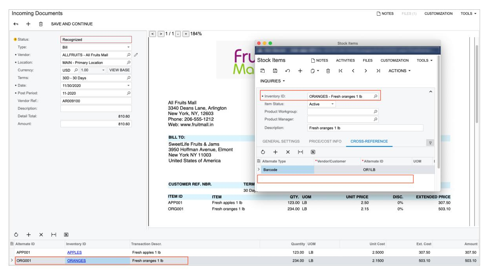

*Figure: Manual selection of the inventory ID for the alternate ID*

In this case, when you save the AP document based on the recognized document on the *[Bills and Adjustments](https://help-2025r1.acumatica.com/Help?ScreenId=ShowWiki&pageid=956b4e51-3078-4d2d-85b3-65c080d95234)* (AP301000) form, the system adds a record for the inventory item about the alternate ID on the **Cross-Reference** tab of the *[Stock Items](https://help-2025r1.acumatica.com/Help?ScreenId=ShowWiki&pageid=77786a70-1f1e-4d63-ad98-96f98e4fcb0e)* (IN202500) or *[Non-Stock Items](https://help-2025r1.acumatica.com/Help?ScreenId=ShowWiki&pageid=bf68dd4f-63d4-460d-8dc0-9152f2bd6bf1)* (IN202000) form. The cross-reference is added with the *Vendor Part Number* type and the corresponding vendor identifier (also shown in the following screenshot).

| <b>Bills and Adjustments</b>      |            |                          |                              |                          |                                               |                             |   |                         |                         |           |                               | <b>P NOTES</b>           |                                 | <b>ACTIVITIES</b> |                        | FILES (1) | <b>CUSTOMIZATION</b> |               |                 | TOOLS $\sim$ |
|-----------------------------------|------------|--------------------------|------------------------------|--------------------------|-----------------------------------------------|-----------------------------|---|-------------------------|-------------------------|-----------|-------------------------------|--------------------------|---------------------------------|-------------------|------------------------|-----------|----------------------|---------------|-----------------|--------------|
| 뭐 日                            | ↶          | 侕 $\pm$               | n $\blacktriangledown$    | $\overline{\phantom{a}}$ | $\left\langle \right\rangle$ $\rightarrow$ | >1 <b>REMOVE HOLD</b>    |   | $\bullet\bullet\bullet$ | ACTIONS -               |           | INQUIRIES -                   |                          | REPORTS + <b>Stock Items</b> |                   |                        |           |                      |               |                 |              |
| Type:                             | Bill       | $\overline{\phantom{a}}$ | Vendor:                      |                          |                                               | ALLFRUITS - All Fruits Mall |   |                         |                         |           |                               |                          |                                 |                   |                        |           |                      |               |                 | $\hat{}$     |
| Reference Nbr.:                   | 000062     | $\varphi$                | * Location:                  |                          | MAIN - Primary Location                       |                             |   |                         | Stock Items             |           |                               | P NOTES                  | <b>ACTIVITIES</b>               |                   | <b>FILES</b>           |           | <b>CUSTOMIZATION</b> | TOOLS $\star$ |                 |              |
| Status:                           | On Hold    |                          | Currency:                    |                          | 1.00 <b>USD</b>                            | - VIEW BA                   |   |                         |                         |           |                               |                          |                                 |                   |                        |           |                      |               |                 |              |
|                                   |            |                          | * Terms:                     |                          | 30D - 30 Days                                 |                             |   | ෆී                      | B $\curvearrowleft$  | $^{+}$    | n $\overline{\phantom{a}}$ | 侕                        | $\mathsf{K}$                    | ≺                 | $\rightarrow$          | >1        | ACTIONS +            |               |                 |              |
| * Date:                           | 11/30/2020 | $\overline{\phantom{a}}$ | * Due Date:                  |                          | 12/30/2020 -                                  | Apply Retainage             |   |                         | INQUIRIES +             |           |                               |                          |                                 |                   |                        |           |                      |               |                 |              |
| * Post Period:                    | 11-2020    | Q                        | * Cash Discount 12/30/2020 * |                          |                                               | Pay by Line                 |   |                         |                         |           |                               |                          |                                 |                   |                        |           |                      |               | $\sim$          |              |
| Vendor Ref.:                      | AR009100   |                          |                              |                          | Joint Payees                                  |                             |   |                         | * Inventory ID:         |           |                               |                          | ORANGES - Fresh oranges 1 lb    |                   |                        | Q         |                      |               |                 |              |
|                                   |            |                          |                              |                          |                                               |                             |   |                         | Item Status:            |           | Active                        | $\overline{\phantom{a}}$ |                                 |                   |                        |           |                      |               |                 |              |
| Description:                      |            |                          |                              |                          |                                               |                             |   |                         | Product Workgroup:      |           |                               |                          |                                 |                   |                        | Q         |                      |               |                 |              |
| <b>ODOCUMENT DETAILS</b>          |            |                          | <b>FINANCIAL DETAILS</b>     |                          | <b>TAX DETAILS</b>                            | <b>APPLICATIONS</b>         |   |                         | Product Manager:        |           |                               |                          |                                 |                   |                        | Q         |                      |               |                 |              |
|                                   |            |                          |                              |                          |                                               |                             |   |                         | Description:            |           |                               | Fresh oranges 1 lb       |                                 |                   |                        |           |                      |               |                 |              |
| $\mathcal{C}$ P                | $\times$   |                          | <b>VIEW DEFERRALS</b>        |                          | ADD PO RECEIPT                                | ADD PO RECEIPT L            |   |                         |                         |           |                               |                          |                                 |                   |                        |           |                      |               |                 |              |
| $\mathbb{O}$ D *Branch 圄 |            | Inventory ID             |                              |                          | <b>Transaction Descr.</b>                     |                             |   |                         | <b>GENERAL SETTINGS</b> |           |                               | PRICE/COST INFO          |                                 |                   | <b>CROSS-REFERENCE</b> |           |                      |               | $\grave{\cdot}$ | ance         |
|                                   |            |                          |                              |                          |                                               |                             |   | Ò                       | $^{+}$ $\times$      | $\mapsto$ | $\boldsymbol{\mathrm{x}}$     |                          |                                 |                   |                        |           |                      |               |                 |              |
| $^{\circ}$ <b>HEADOFFICE</b>   |            | <b>APPLES</b>            | Đ.                           |                          | Fresh apples 1 lb                             |                             | 圓 |                         | Alternate Type          |           |                               | *Vendor/Customer         |                                 |                   | * Alternate ID         |           |                      | <b>UOM</b>    |                 | D.00         |
| <b>HEADOFFICE</b> n. ω.     |            | <b>ORANGES</b>           |                              |                          | Fresh oranges 1 lb                            |                             |   | Barcode                 |                         |           |                               |                          |                                 |                   | OR 1 LB     |           |                      |               |                 | D.00         |
|                                   |            |                          |                              |                          |                                               |                             |   |                         | Vendor Part Number      |           |                               | <b>ALLFRUITS</b>         |                                 |                   | <b>ORG001</b>          |           |                      |               |                 |              |
|                                   |            |                          |                              |                          |                                               |                             |   |                         |                         |           |                               |                          |                                 |                   |                        |           |                      |               |                 |              |
|                                   |            |                          |                              |                          |                                               |                             |   |                         |                         |           |                               |                          |                                 |                   |                        |           |                      |               |                 |              |

*Figure: The system-added cross-reference with the alternate ID for the inventory item*

# **AP Documents from PDFs: Search for a Vendor by Email Address**

If automatic PDF submission for recognition is configured in your system for a system email account on the *[Email Accounts](https://help-2025r1.acumatica.com/Help?ScreenId=ShowWiki&pageid=77f0cf69-a363-4b12-9241-2ff4dd54d8ae)* (SM204002) form, the system processes all incoming emails and submits any PDF attachment for recognition. The recognition results can be then reviewed on the *[Incoming Documents](https://help-2025r1.acumatica.com/Help?ScreenId=ShowWiki&pageid=c5a67fb3-c6f0-4ba0-9950-a68d320866ef)* (AP301100) form.

Also, your company may use the Acumatica add-in for Outlook for processing incoming email, which gives employees the ability to submit PDF attachments for recognition by using the **Create AP Document** button on the add-in form.

In some cases, the vendor may not be properly recognized by the recognition service. In this case, the system performs a search for the vendor by using the email address of the sender.

You can manually initiate the search for a vendor for a recognized document by clicking**Search Vendor** on the toolbar of the *[Incoming Documents](https://help-2025r1.acumatica.com/Help?ScreenId=ShowWiki&pageid=c5a67fb3-c6f0-4ba0-9950-a68d320866ef)* (AP301100) form or for a selected recognized document on the *[Incoming](https://help-2025r1.acumatica.com/Help?ScreenId=ShowWiki&pageid=a5d5817e-db15-4182-bb09-d46aaee0961c) [Documents](https://help-2025r1.acumatica.com/Help?ScreenId=ShowWiki&pageid=a5d5817e-db15-4182-bb09-d46aaee0961c)* (AP301110) mass-processing form.

#### **Search for a Vendor by Email Address**

If the vendor was not recognized by the recognition service, the system uses the email address of the sender of the email with the PDF attachment submitted for the recognition, as shown in the following screenshot.

|              | <b>Email Activity</b>               |        |                |                                             |                                          | $\Box$ NOTES |              | FILES (1) |          | <b>CUSTOMIZATION</b> | TOOLS $\blacktriangleright$ |
|--------------|-------------------------------------|--------|----------------|---------------------------------------------|------------------------------------------|--------------|--------------|-----------|----------|----------------------|-----------------------------|
| $\leftarrow$ | 뭐                                   | $\Box$ | ↶              | 侕                                           | <b>REPLY ALL</b>                         |              | <b>REPLY</b> |           | $\cdots$ |                      |                             |
|              | From:                               |        |                |                                             | "Ryan Carter" < allfruitsmall@gmail.com> |              |              |           |          |                      |                             |
| To:          |                                     |        |                |                                             |                                          |              |              |           |          |                      |                             |
| CC:          |                                     |        |                |                                             |                                          |              |              |           |          |                      |                             |
|              | BCC:                                |        |                |                                             |                                          |              |              |           |          |                      |                             |
|              | Subject:                            |        |                |                                             | All Fruits Mall: Invoice AR009100        |              |              |           |          |                      |                             |
|              | <b>MESSAGE</b>                      |        | <b>DETAILS</b> |                                             |                                          |              |              |           |          |                      |                             |
|              | VISUAL -                            | ↶      | G              | Paragraph                                   | $\blacktriangledown$                     | Β            | $\bm{I}$     |           |          | <u>U</u>             | ≫                           |
|              | Dear Alexandra,                     |        |                | please find the requested invoice attached. |                                          |              |              |           |          |                      |                             |
|              | Best regards, <b>Ryan Carter</b> |        |                |                                             |                                          |              |              |           |          |                      |                             |

#### *Figure: The sender's email address, which is used to search for a vendor*

The system compares the sender's email address with the email addresses specified for vendors on the *[Vendors](https://help-2025r1.acumatica.com/Help?ScreenId=ShowWiki&pageid=a9584be3-f2bd-4d67-80d4-8041d809df56)* (AP303000) form until it finds a matching email address. The vendor email addresses the system uses for comparison are specified in the **Account Email** box on the **General** tab (as shown in the following screenshot). Also, the system compares the sender's email address with the email addresses of all contacts listed for the vendor on the **Contacts** tab of the form. (See the following screenshot.)

| <b>Vendors</b> <b>ALLFRUITS - All Fruits Mall</b> |                                                              |                                                       | <b>TH NOTES</b> <b>FILES</b> <b>CUSTOMIZATION</b> | TOOLS $\blacktriangledown$       |
|------------------------------------------------------|--------------------------------------------------------------|-------------------------------------------------------|---------------------------------------------------------|----------------------------------|
| 목 Ħ ↶ ←                                     | $^+$ <b>ウ・ K 〈</b> $\rightarrow$ 侕                  | >1 $\ddots$                                        |                                                         |                                  |
| * Vendor ID:                                         | Q <b>ALLFRUITS</b>                                        | Balance:                                              | 1,139.10                                                | $\sim$                           |
| Vendor Status:                                       | Active                                                       | Prepayment Balance:                                   | 0.00                                                    |                                  |
| * Vendor Class:                                      | DEFAULT - Default Vendor Class $\circ$                    | Retained Balance:                                     | 0.00                                                    |                                  |
| <b>FINANCIAL</b> <b>GENERAL</b>                   | PAYMENT PURCHASE SETTINGS                                 | <b>ATTRIBUTES</b>                                     | CONTACTS <b>LOCATIONS</b>                            | <b>ACTIVITIES</b> $\grave{ }$ |
| <b>ACCOUNT INFO</b>                                  |                                                              | <b>PRIMARY CONTACT .</b>                              |                                                         |                                  |
| * Account Name:                                      | All Fruits Mall                                              | Name:                                                 | Ryan Carter                                             | Q                                |
| <b>ACCOUNT ADDRESS _</b>                             |                                                              | Job Title:                                            | Accountant                                              |                                  |
|                                                      | <b>VIEW ON MAP</b>                                           | Email:                                                | rc.allfruitsmall@gmail.com                              | ⊠                                |
| Address Line 1:                                      | 3340 Deans Lane, Arlington                                   | <b>Business 1</b>                                     |                                                         |                                  |
| Address Line 2:                                      |                                                              | Cell                                                  |                                                         |                                  |
| City:                                                | New York                                                     | <b>VENDOR PROPERTIES</b>                              |                                                         |                                  |
| State:                                               | ○ NY - NEW YORK                                           |                                                       | !!!!!!!!!!!!!!!!!!!!!!!!!!!!!!!!!!!!!!!!                |                                  |
| Postal Code:                                         | 12603                                                        |                                                       | Vendor is Tax Agency                                    |                                  |
| * Country:                                           | US - United States of America Q                           | PROJECT DEFAULTS ____________________________________ |                                                         |                                  |
|                                                      | ADDITIONAL ACCOUNT INFO ____________________________________ | Cost Code:                                            |                                                         | Q                                |
| <b>Business 1</b> $\overline{\phantom{a}}$        | +1 914 853 4879                                              | Inventory ID:                                         |                                                         | Q                                |
| Cell $\overline{\phantom{a}}$                     |                                                              |                                                       |                                                         |                                  |
| Fax                                                  |                                                              |                                                       |                                                         |                                  |
| <b>Account Email:</b>                                | ⊠ allfruitsmall@gmail.com                                 |                                                       |                                                         |                                  |
| Web:                                                 | Ø                                                            |                                                       |                                                         |                                  |
| Ext Ref Nbr:                                         |                                                              |                                                       |                                                         |                                  |
| Parent Account:                                      | Q                                                            |                                                       |                                                         |                                  |

#### *Figure: An email address specified for a vendor account*

If no matches have been found, the system compares the domain part of the sender's email address with the domain part of the email address specified for each vendor account (in the **Account Email** box of the **General** tab) and the email address specified for each vendor's primary contact (that is, the contact for which the **Primary** check box is selected on the **Contacts** tab).

If a match has been found, the system inserts the value in the**Vendor** box of the *[Incoming Documents](https://help-2025r1.acumatica.com/Help?ScreenId=ShowWiki&pageid=c5a67fb3-c6f0-4ba0-9950-a68d320866ef)* (AP301100) form for the recognized document, along with the applicable vendor-related settings, as the following screenshot shows.

| <b>Incoming Documents</b>                   | All Fruits Mall: Invoice AR009100: All_Fruits_Invoice_Inv_ID.pdf |                          |  | <b>P NOTES</b>                                                                                                             |                                                                   | FILES (1)                              | <b>CUSTOMIZATION</b>                                                                      |                                                  | TOOLS $\blacktriangledown$ |
|---------------------------------------------|------------------------------------------------------------------|--------------------------|--|----------------------------------------------------------------------------------------------------------------------------|-------------------------------------------------------------------|----------------------------------------|-------------------------------------------------------------------------------------------|--------------------------------------------------|----------------------------|
| 侕 ┿ ←                                 | <b>SAVE AND CONTINUE</b>                                         |                          |  |                                                                                                                            |                                                                   |                                        |                                                                                           |                                                  |                            |
|                                             |                                                                  |                          |  | $\,<$ $\, >$                                                                                                            | 1/1 $+$ $\overline{\phantom{a}}$                            | 57%                                    |                                                                                           |                                                  |                            |
| Status:                                     | Recognized                                                       |                          |  |                                                                                                                            |                                                                   |                                        |                                                                                           |                                                  |                            |
| Type:                                       | Bill                                                             |                          |  |                                                                                                                            | <b>INVOICE</b> A POEM 100 <b>Date</b>                       | 30-May 2020                            |                                                                                           |                                                  |                            |
| * Vendor:                                   | Q <b>ALLFRUITS - All Fruits Mall</b> $\mathcal O$          |                          |  |                                                                                                                            |                                                                   |                                        | Due Date 30-Day-2020 Contactor 13 PASSY usp                                   |                                                  |                            |
| * Location:                                 | <b>MAIN - Primary Location</b>                                   | Q                        |  | All Fruits Mall 3340 Deans Lane, Arlington New York, NY, 13803                                                       |                                                                   |                                        |                                                                                           |                                                  |                            |
| Currency:                                   | $\circ$ 1.00 USD $\overline{\phantom{a}}$               | <b>VIEW BASE</b>         |  | Phone: 206-555-1212 Web: www.fruitmal.in                                                                                |                                                                   |                                        |                                                                                           |                                                  |                            |
| Terms:                                      | 30D - 30 Days                                                    | Q                        |  | <b>WILL TO:</b> SweetLife Fruits & Jama 3950 Hoffman Avenue, Elmont New York NY 11003 United States of America |                                                                   | <b>SHP TO</b> New York NY 11008     | SweetLife Fruits & Jame 3950 Hoffman Avenue, Elmont <b>United States of America</b> |                                                  |                            |
| * Date:                                     | 11/30/2020                                                       | $\overline{\phantom{a}}$ |  | <b>CUSTOR</b>                                                                                                              | 121923                                                            | <b>CONTACT</b>                         |                                                                                           |                                                  |                            |
| * Post Period:                              | 11-2020                                                          | Q                        |  | <b>ITEM ID</b> APPOST 093001                                                                                         | 30 Days <b>CLAR</b> Fresh applies 1 & Fresh casegos 1 lb | GTF, LIGHT 123.00 1.98 236.00 LB | UNIT PRICE <b>DOM:</b> 3.80 CTs 2.15 $^{20}$                               | <b>EXTENDED PRICE</b> <b>307 AG</b> 503.10 |                            |
| Due Date:                                   | 12/30/2020                                                       | $\blacktriangledown$     |  |                                                                                                                            |                                                                   |                                        |                                                                                           |                                                  |                            |
| Vendor Ref.:                                | AR009100                                                         |                          |  |                                                                                                                            |                                                                   |                                        |                                                                                           |                                                  |                            |
| Description:                                |                                                                  |                          |  |                                                                                                                            |                                                                   |                                        |                                                                                           |                                                  |                            |
| Detail Total:                               |                                                                  | 810.60                   |  |                                                                                                                            |                                                                   |                                        |                                                                                           |                                                  |                            |
| Amount:                                     |                                                                  | 810.60                   |  |                                                                                                                            |                                                                   |                                        |                                                                                           |                                                  |                            |
|                                             |                                                                  |                          |  |                                                                                                                            |                                                                   |                                        |                                                                                           |                                                  |                            |
| Ò $\mathrm{+}$ $\times$               | $\mathbf{x}$ <b>LINK LINE</b> $\vdash$                     |                          |  |                                                                                                                            |                                                                   |                                        |                                                                                           |                                                  |                            |
| 目 Alternate <b>Inventory ID</b> ID | <b>Transaction Descr.</b>                                        | Quantit UOM              |  | Unit Cost                                                                                                               | Ext. Cost                                                      | Amoun                                  | PO Number                                                                                 |                                                  | <b>PO</b> Receipt Nbr.  |
| ゝ                                           | Fresh apples 1 lb 0%                                             | 123.00                   |  | 2.5000                                                                                                                     | 307.50                                                            | 307.50                                 |                                                                                           |                                                  |                            |
|                                             | Fresh oranges 1 lb 0%                                            | 234.00                   |  | 2.1500                                                                                                                     | 503.10                                                            | 503.10                                 |                                                                                           |                                                  |                            |

#### *Figure: The vendor-related settings filled in for the recognized document*

If multiple matches were found, the system will display a warning message with the list of possible matches next to the**Vendor** box. If multiple matches were found or no match was found, you need to manually select a vendor account in the**Vendor** box of the form.

# **The List of Excluded Domains**

To optimize the search for a vendor account by the domain part of a sender's email address, you use the *[Excluded](https://help-2025r1.acumatica.com/Help?ScreenId=ShowWiki&pageid=33c6bceb-412a-4c0d-9849-2eeeeb8e8746) [Email Domains](https://help-2025r1.acumatica.com/Help?ScreenId=ShowWiki&pageid=33c6bceb-412a-4c0d-9849-2eeeeb8e8746)*(SM209600) form; see the following screenshot. By default, the form lists the most popular domains used for registering an email account. You can modify the list if needed.

| <b>Excluded Email Domains</b>                                                    | TOOLS $\blacktriangledown$ <b>CUSTOMIZATION</b> |
|----------------------------------------------------------------------------------|----------------------------------------------------|
| ↻ $\boxdot$ $^{+}$ $\vdash$ $\mathbf{\overline{x}}$ $\times$ ↶ | $\varphi$                                          |
| <b>B</b> Domain Name                                                             |                                                    |
| ≻ hotmail.be                                                                  |                                                    |
| hotmail.ca                                                                       |                                                    |
| hotmail.co.uk                                                                    |                                                    |
| hotmail.com                                                                      |                                                    |
| hotmail.com.ar                                                                   |                                                    |
| hotmail.com.br                                                                   |                                                    |
| hotmail.com.mx                                                                   |                                                    |
| hotmail.de                                                                       |                                                    |
| hotmail.es                                                                       |                                                    |
| hotmail.fr                                                                       |                                                    |
|                                                                                  | К $\langle$ $\geq$ $\rightarrow$          |

#### *Figure: The list of excluded email domains*

While searching for a vendor account by the domain part of a sender's email address, the system verifies that the domain is not listed on this form and then proceeds with the search. If the domain is listed, the system stops searching for possible matches.

The ability to exclude email domains can be useful in the following circumstances:

- Your company works with multiple small vendors with email addresses registered by using the Gmail or Yahoo providers.
- The email was sent by an employee who forgot to switch from a personal email account to the corporate one.

# **AP Documents from PDFs: Implementation Checklist**

The following sections provide details you can use to ensure that the system is configured properly for recognizing AP documents from PDF files, and to understand (and change, if needed) the settings that affect the processing workflow.

# **Implementation Checklist**

We recommend that before you start recognizing AP documents from PDF files, you make sure the needed features have been enabled, settings have been specified, and entities have been created, as summarized in the following checklist.

| Form                                       | Criteria to Check                                                                                                                                                                                                                            |
|--------------------------------------------|----------------------------------------------------------------------------------------------------------------------------------------------------------------------------------------------------------------------------------------------|
| Enable/Disable Features (CS100000) form | Make sure that the AP Document Recognition Service feature has been enabled. The feature is not available in trial mode and can be en abled only if it is included in the license that is applied to the Acumatica ERP instance. |

| Form                                              | Criteria to Check                                                                                                                                                                           |  |  |
|---------------------------------------------------|---------------------------------------------------------------------------------------------------------------------------------------------------------------------------------------------|--|--|
| Email Accounts (SM204002) form                    | Make sure that a system email account is created with incoming mail processing activated and the Submit to Incoming Documents check box selected on the Incoming Mail Processing tab. |  |  |
|                                                   | This configuration is needed only if you want automatical ly submit PDF attachments of incoming emails for recogni tion.                                                              |  |  |
| Rebuild Full-Text Entity Index (SM209500) form | Rebuild search indexes before you start using the AP Document Recogni tion Service feature. For details, see Building Search Indexes.                                                    |  |  |

# **Project-Related Recognition Checklist**

If you are planning to recognize project-related AP documents from PDF files, you make sure that the following additional configuration steps have been performed, as summarized in the following checklist.

| Form                                                 | Criteria to Check                                                                                                                                                                                                                                                                                      |  |  |  |  |
|------------------------------------------------------|--------------------------------------------------------------------------------------------------------------------------------------------------------------------------------------------------------------------------------------------------------------------------------------------------------|--|--|--|--|
| Enable/Disable Features (CS100000) form           | Make sure that the following features are enabled: Recognition of Project-Related Documents • The feature is not available in trial mode and can be en abled only if it is included in the license that is applied to the Acumatica ERP instance. • Projects Construction • |  |  |  |  |
| Projects Preferences (PM101000) form, General tab | Make sure that the integration of project accounting and accounts payable is enabled—that is, the AP check box is selected in theVisibility Settings section on the Projects Preferences (PM101000) form.                                                                                        |  |  |  |  |
| Projects (PM101000) form,Summary tab              | Make sure that for each project for which you plan to recognize AP docu ments, the AP check box is selected in theVisibility Settings section on the Projects Preferences (PM101000) form.                                                                                                       |  |  |  |  |

# **Validation of Configuration**

To make sure that all configuration has been performed correctly, we recommend that in your system, you perform instructions similar to those described in *[AP Documents from PDFs: Process Activity](#page-269-1)*.

# **AP Documents from PDFs: Process Activity**

The following activity will walk you through the process of creating an AP bill from a PDF file.

The following activity can be completed only if your license includes the *AP Document Recognition Service* feature. You can request your account manager for a demo license for this feature.

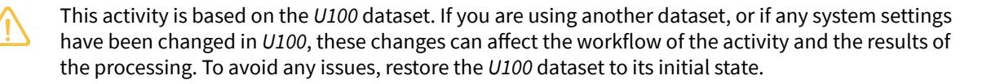

# **Story**

Suppose that the SweetLife Fruits & Jams company regularly buys fruits from the All Fruits Mall vendor (*ALLFRUITS*). As the SweetLife accountant, you regularly receive invoices from the vendor in PDF format and need to enter each of them manually into the system. The company purchased the *AP Document Recognition Service* feature, so now you may submit these invoices for recognition and create AP bills by using the recognized values. You will submit the first PDF file from this vendor for recognition and create the corresponding AP bill.

# **Configuration Overview**

For the purposes of this activity, the *AP Document Recognition Service* feature has been enabled on the *[Enable/](https://help-2025r1.acumatica.com/Help?ScreenId=ShowWiki&pageid=c1555e43-1bc5-4f6f-ba9d-b323f94d8a6b) [Disable Features](https://help-2025r1.acumatica.com/Help?ScreenId=ShowWiki&pageid=c1555e43-1bc5-4f6f-ba9d-b323f94d8a6b)* (CS100000) form.

# **Process Overview**

You will use the *[Incoming Documents](https://help-2025r1.acumatica.com/Help?ScreenId=ShowWiki&pageid=c5a67fb3-c6f0-4ba0-9950-a68d320866ef)* (AP301100) form to manually submit the *[All\\_Friuts\\_Invoice.pdf](#page-0-0)* file for recognition, validate and adjust the recognized document, and create the AP bill for further processing. (The processing of the AP bill is outside of the scope of this activity. For details, see *[Processing AP Bills](#page-69-2)*.)

# **System Preparation**

To prepare the system, do the following:

- 1. Download the *[All\\_Friuts\\_Invoice.pdf](#page-0-0)* file.
- 2. Launch the Acumatica ERP website, and sign in to a company with the *U100* dataset preloaded. To sign in as an accountant, use the following credentials:
  - Username: *johnson*
  - Password: *123*

# **Step 1: Submitting a PDF File for Recognition**

To manually submit a PDF file for recognition, do the following:

- 1. Open the *[Incoming Documents](https://help-2025r1.acumatica.com/Help?ScreenId=ShowWiki&pageid=a5d5817e-db15-4182-bb09-d46aaee0961c)* (AP301110) form.
- 2. Drag the All\_Friuts\_Invoice.pdf file to the Preview area.
- 3. Select the unlabeled check box next to the document in the table, and on the form toolbar, click **Recognize**. The system launches the recognition process, and when the recognition is completed successfully, it changes the status of the document to *Recognized*.
- 4. On the side panel, click**View PDF** and review the attached document.

### **Step 2: Validating the Recognized Document and Creating an AP Document**

To validate a recognized document, while you are still on the *[Incoming Documents](https://help-2025r1.acumatica.com/Help?ScreenId=ShowWiki&pageid=a5d5817e-db15-4182-bb09-d46aaee0961c)* (AP301110) form, do the following:

1. Click the link in the Summary column to open the recognized document on the *[Incoming Documents](https://help-2025r1.acumatica.com/Help?ScreenId=ShowWiki&pageid=c5a67fb3-c6f0-4ba0-9950-a68d320866ef)* (AP301100) form.

- 2. In the Summary area (le pane) of the form, review the values with which the system has filled the boxes during the recognition process, and map any missing values. You can also fill in missing values by typing them directly into the boxes.
- 3. In the Details area (bottom) of the form, review the values with which the system has populated the table during the recognition process. If no document details have been added automatically, you can manually add rows to the table and map the values for each cell or type the missing values directly.
- 4. When all necessary settings have been specified, click**Save and Continue** on the form toolbar to convert the recognized document into an AP document.

The system navigates to the *[Bills and Adjustments](https://help-2025r1.acumatica.com/Help?ScreenId=ShowWiki&pageid=956b4e51-3078-4d2d-85b3-65c080d95234)* (AP301000) form, with a new AP document with the *On Hold* status and the rest of the settings filled in with the values from the recognized document. The original PDF file is added to the record as a file attachment.

# **Performing Period-End Procedures**

In this chapter, you will find general information on how to perform period-end procedures in accounts payable, an activity that describes how to perform account reconciliation, and an activity that describes how to close a financial period in the subledger.

# **Period-End Procedures: General Information**

Although you can close periods in the AP subledger and in the general ledger at the same time, you may decide to close periods in the AP subledger separately in your system. On the *[Manage Financial Periods](https://help-2025r1.acumatica.com/Help?ScreenId=ShowWiki&pageid=eedf2adf-6ddc-4c33-932b-de60275c547f)* (GL503000) form, you can find information about the status of periods.

# **Learning Objectives**

In this chapter, you will learn how to do the following:

- Perform account reconciliation
- Close a financial period in AP

# **Applicable Scenarios**

You perform account reconciliation and close a financial period in the following cases:

- You want to make sure that the AP and GL account balances are the same, which indicates that there are no unposted documents in the period that you want to close
- You want to close a period to prevent users from posting to it

# **Closing of a Period in a Subledger**

Before you close a period in the subledger, you should make sure that there are no unreleased documents that are to be posted to this period. To close periods, you use the *[Close Financial Periods](https://help-2025r1.acumatica.com/Help?ScreenId=ShowWiki&pageid=3230e8df-a7c7-4d51-b6c6-00dff0ae48dd)* (AP506000) form.

When you close a given financial period in the AP subledger, all preceding open periods will be closed in the subledger as well.

You may need to reopen a financial period if it has been closed by mistake or if you need to post any adjustments to this period. For details, see *To Reopen a Financial Period in [Accounts](#page-277-1) Payable*.

# **Period-End Procedures: To Perform Account Reconciliation**

The following activity will walk you through the process of reviewing the accounts payable balance by GL account and reconciling AP and GL accounts.

This activity is based on the *U100* dataset. If you are using another dataset, or if any system settings have been changed in *U100*, these changes can affect the workflow of the activity and the results of the processing. To avoid any issues, restore the *U100* dataset to its initial state.

# **Story**

Suppose that at the end of March 2024, the SweetLife Fruits & Jams company needs to prepare for closing the 03-2024 financial period in the accounts payable subledger.

Acting as a SweetLife accountant, you have to review the accounts payable balance for each GL account and reconcile these balances with the general ledger. This process is required to ensure that there are no discrepancies or inconsistencies in balances. To do this, you will use two Acumatica ERP reports.

# **Configuration Overview**

For the purposes of this activity, the following features have been enabled on the *[Enable/Disable Features](https://help-2025r1.acumatica.com/Help?ScreenId=ShowWiki&pageid=c1555e43-1bc5-4f6f-ba9d-b323f94d8a6b)* (CS100000) form:

- *Standard Financials*, which provides the standard financial functionality
- *Multibranch Support*, which supports multiple branches in your instance of Acumatica ERP
- *Multicompany Support*, which supports multiple companies within one tenant.

# **Process Overview**

To perform the process outlined in this activity, you will run the *[AP Balance by GL Account](https://help-2025r1.acumatica.com/Help?ScreenId=ShowWiki&pageid=92545582-aa05-4b36-9aed-1c894ebfe0d2)* (AP632000) report and review it; you will then run the *Trial Balance [Summary](https://help-2025r1.acumatica.com/Help?ScreenId=ShowWiki&pageid=12f38bf9-9ab2-4da3-a99f-df0443a33271)* (GL632000) report and compare the AP balances in both reports.

# **System Preparation**

To prepare the system, do the following:

- 1. Launch the Acumatica ERP website, and sign in as an accountant by using the following credentials:
  - Username: *johnson*
  - Password: *123*
- 2. In the info area, in the upper-right corner of the top pane of the Acumatica ERP screen, make sure that the business date in your system is set to *3/31/2024*. If a different date is displayed, click the Business Date menu button and select *3/31/2024*. For simplicity, in this activity, you will create and process all documents in the system on this business date.
- 3. On the Company and Branch Selection menu, also on the top pane of the Acumatica ERP screen, make sure that the *SweetLife Head Office and Wholesale Center* branch is selected. If it is not selected, click the Company and Branch Selection menu to view the list of branches that you have access to, and then click *SweetLife Head Office and Wholesale Center*.

# **Step 1: Reviewing the Balance of the AP Account**

To review the balance of the AP account, do the following:

- 1. Open the *[AP Balance by GL Account](https://help-2025r1.acumatica.com/Help?ScreenId=ShowWiki&pageid=92545582-aa05-4b36-9aed-1c894ebfe0d2)* (AP632000) form.
- 2. On the **Report Parameters** tab, specify the following parameters:
  - **Report Format**: *Account Summary*
  - **Company/Branch**: *HEADOFFICE - SweetLife Head Office and Wholesale Center* (inserted by default based on the selected branch)
  - **Financial Period**: *03-2024* (inserted by default)
  - **Include Applications**: Cleared

- 3. On the form toolbar, click **Run Report**.
- 4. Review the generated report. Notice the amount in the **Balance** column for the *20000 - Accounts Payable* account, which is the total balance posted to the account.

# **Step 2: Reviewing the Balances for the Financial Period**

To review the balances for the financial period, do the following:

- 1. Open the *Trial Balance [Summary](https://help-2025r1.acumatica.com/Help?ScreenId=ShowWiki&pageid=12f38bf9-9ab2-4da3-a99f-df0443a33271)* (GL632000) form.
- 2. On the **Report Parameters** tab, verify that the following parameters are displayed:
  - **Company/Branch**: *HEADOFFICE - SweetLife Head Office and Wholesale Center*
  - **Ledger**: *ACTUAL*
  - **From Period**: *03-2024*
  - **To Period**: *03-2024*
  - **Suppress Zero Balances**: Selected
- 3. On the form toolbar, click **Run Report**.
- 4. Review the report. Notice the amount in the **Ending Balance** column for the *20000 - Accounts Payable* account. This amount should be equal to the amount you noticed in the *[AP Balance by GL Account](https://help-2025r1.acumatica.com/Help?ScreenId=ShowWiki&pageid=92545582-aa05-4b36-9aed-1c894ebfe0d2)* report you ran in Step 1.

#### **Step 3: Reconciling the AP and GL Accounts**

To reconcile the AP and GL balances for the *20000 Accounts Payable* account, do the following:

- 1. Compare the two figures you noted from both reports. If these balances are equal, the AP and GL accounts can be considered reconciled.
- 2. If there is a discrepancy between these figures, do the following:
  - a. On the *Post [Transactions](https://help-2025r1.acumatica.com/Help?ScreenId=ShowWiki&pageid=dce8c656-0c7f-4bb9-af68-e9432317964c)* (GL502000) form, verify that all batches have been posted to the general ledger.
  - b. Post any unposted documents you have found.
  - c. To verify that there are no transactions posted to the *20000 - Accounts Payable* account by other modules, open the *[Transactions](https://help-2025r1.acumatica.com/Help?ScreenId=ShowWiki&pageid=a1164a4e-6b2b-4a82-8490-abde5d381be7) for Account* (GL633500) form and specify the following parameters:
    - **Company/Branch**: *HEADOFFICE - SweetLife Head Office and Wholesale Center*
    - **Ledger**: *ACTUAL*
    - **From Period** and **To Period**: *03-2024*
    - **Account**: *20000 - Accounts Payable*
    - **Module**: Empty
    - **AdditionalSort and Filters** tab, **Additional Filtering Conditions**: **Property**: *GL Batch.Module*, **Condition**: *Does Not Equal*, **Value**: *AP*.

The following screenshot illustrates the application of additional filtering conditions for the report.

| Transactions for Account ☆                                                                                               |  |                 |                        |                |           |                     |                 |          |
|--------------------------------------------------------------------------------------------------------------------------|--|-----------------|------------------------|----------------|-----------|---------------------|-----------------|----------|
| $\Omega$ <b>RUN REPORT</b> <b>SAVE TEMPLATE</b> REMOVE TEMPLATE SCHEDULE TEMPLATE 1                       |  |                 |                        |                |           |                     |                 |          |
| Template $x +$ Default Shared                                                                                      |  |                 |                        |                |           |                     |                 |          |
| <b>REPORT PARAMETERS</b> ADDITIONAL SORT AND FILTERS PRINT AND EMAIL SETTINGS                                      |  |                 |                        |                |           |                     |                 |          |
| <b>Additional Filtering Conditions</b> <b>Additional Sorting Conditions</b> $+$ $\mathsf{x}$ $+$ $\times$ |  |                 |                        |                |           |                     |                 |          |
| Condition Property                                                                                                    |  | <b>Brackets</b> | Property               | Condition      | Value     | <b>Second Value</b> | <b>Brackets</b> | Operator |
| <b>GL History by Period Branch</b> Ascending                                                                          |  |                 | <b>GL Batch Module</b> | Does Not Equal | <b>AP</b> |                     |                 |          |
| GL History by Period.Financial Period Ascending                                                                       |  |                 |                        |                |           |                     |                 |          |
| Subaccount.Subaccount Ascending                                                                                       |  |                 |                        |                |           |                     |                 |          |
| <b>GL Transaction. Transaction Date</b> Ascending                                                                     |  |                 |                        |                |           |                     |                 |          |
| <b>GL Transaction Batch Number</b> Ascending                                                                          |  |                 |                        |                |           |                     |                 |          |
| <b>GL Transaction Ref. Number</b> Ascending                                                                           |  |                 |                        |                |           |                     |                 |          |

*Figure: Additional filtering conditions for the Transactions for Account (GL633500) report*

d. Click **Run Report** on the form toolbar of the *[Transactions](https://help-2025r1.acumatica.com/Help?ScreenId=ShowWiki&pageid=a1164a4e-6b2b-4a82-8490-abde5d381be7) for Account* form, and review the report.

# **Period-End Procedures: To Close a Period in AP**

The following activity will walk you through the process of closing a financial period in accounts payable.

This activity is based on the *U100* dataset. If you are using another dataset, or if any system settings have been changed in *U100*, these changes can affect the workflow of the activity and the results of the processing. To avoid any issues, restore the *U100* dataset to its initial state.

# **Story**

Suppose that it is the end of March 2024, all the documents of the SweetLife Fruits & Jams company have been posted, and the financial period has to be closed to prevent system users from posting to this period.

Acting as the SweetLife accountant, you need to close the *03-2024* financial period in the accounts payable subledger.

#### **Configuration Overview**

For the purposes of this activity, the following features have been enabled on the *[Enable/Disable Features](https://help-2025r1.acumatica.com/Help?ScreenId=ShowWiki&pageid=c1555e43-1bc5-4f6f-ba9d-b323f94d8a6b)* (CS100000) form:

- *Standard Financials*, which provides the standard financial functionality
- *Multibranch Support*, which supports multiple branches in your instance of Acumatica ERP
- *Multicompany Support*, which supports multiple companies within one tenant.

# **Process Overview**

To close a period in the accounts payable subledger (and the periods preceding it, if any are open), you will use the *[Close Financial Periods](https://help-2025r1.acumatica.com/Help?ScreenId=ShowWiki&pageid=3230e8df-a7c7-4d51-b6c6-00dff0ae48dd)* (AP506000) form.

#### **System Preparation**

To prepare the system, do the following:

1. Launch the Acumatica ERP website, and sign in as an accountant by using the following credentials:

- Username: *johnson*
- Password: *123*
- 2. On the Company and Branch Selection menu, also on the top pane of the Acumatica ERP screen, make sure that the *SweetLife Head Office and Wholesale Center* branch is selected. If it is not selected, click the Company and Branch Selection menu to view the list of branches that you have access to, and then click *SweetLife Head Office and Wholesale Center*.

# **Step: Closing the Financial Period in the AP Subledger**

To close the *03-2024* financial period in the accounts payable subledger, do the following:

- 1. Open the *[Close Financial Periods](https://help-2025r1.acumatica.com/Help?ScreenId=ShowWiki&pageid=3230e8df-a7c7-4d51-b6c6-00dff0ae48dd)* (AP506000) form.
- 2. In the Summary area, specify the following settings:
  - **Company**: *SWEETLIFE* (inserted by default)
  - **Action**: *Close*
  - **To Year**: *2024*
- 3. In the table, click the unlabeled check box in the row with the *03-2024* period.

The check boxes for all the preceding periods are selected automatically and the periods will be closed as well, as shown in the following screenshot.

|   |   |                                                   |   | <b>Close Financial Periods</b> |                                              |                    |                          |                      |   |   | TOOLS $\star$ |
|---|---|---------------------------------------------------|---|--------------------------------|----------------------------------------------|--------------------|--------------------------|----------------------|---|---|---------------|
|   | Ò | ↶                                                 |   | <b>PROCESS</b>                 | <b>PROCESS ALL</b>                           |                    | ৩ ৵                      | UNRELEASED DOCUMENTS | ℍ | 図 | Υ             |
|   |   | * Company: Action: From Year: * To Year: |   |                                | SWEETLIFE - Sweet O Close 2024 2024 |                    | $\checkmark$ م        |                      |   |   | ㅅ             |
| 冒 | 0 | D                                                 | u | <b>Financial Period ID</b>     |                                              | <b>Description</b> |                          |                      |   |   |               |
|   | 0 | D                                                 | ☑ | 01-2024                        |                                              | January            |                          |                      |   |   |               |
|   | 0 | D                                                 | ☑ | 02-2024                        |                                              | February           |                          |                      |   |   |               |
| ⋗ | 0 | $\Box$                                            | ☑ | 03-2024                        |                                              | March              |                          |                      |   |   |               |
|   | 0 | D                                                 | □ | 04-2024                        |                                              | April              |                          |                      |   |   |               |
|   | 0 | D                                                 | П | 05-2024                        |                                              | May                |                          |                      |   |   |               |
|   | 0 | $\Box$                                            | П | 06-2024                        |                                              | June               |                          |                      |   |   |               |
|   | 0 | $\Box$                                            | П | 07-2024                        |                                              | July               |                          |                      |   |   |               |
|   | 0 | $\Box$                                            | □ | 08-2024                        |                                              | August             |                          |                      |   |   |               |
|   | 0 | $\Box$                                            | П | 09-2024                        |                                              | September          |                          |                      |   |   |               |
|   | 0 | D                                                 | П | 10-2024                        |                                              | October            |                          |                      |   |   |               |
|   | 0 | $\Box$                                            | □ | 11-2024                        |                                              | November           |                          |                      |   |   |               |
|   | 0 | $\Box$                                            |   | 12-2024                        |                                              | <b>December</b>    |                          |                      |   |   |               |
|   | 0 | ם                                                 |   | 13-2024                        |                                              |                    | <b>Adjustment Period</b> |                      |   |   |               |

#### *Figure: The periods selected for closing in AP*

4. On the form toolbar, click **Unreleased Documents** to review if there are any unreleased documents in the selected periods. If unreleased documents exist in the system, the Unreleased AP Documents report is opened in a pop-up window. (If no unreleased documents exist, the system displays an appropriate message.)

- 5. Review the documents in the report (if it has been opened), and release them or reassign them to another financial period.
- 6. Return to the *[Close Financial Periods](https://help-2025r1.acumatica.com/Help?ScreenId=ShowWiki&pageid=3230e8df-a7c7-4d51-b6c6-00dff0ae48dd)* form. On the form toolbar, click **Process**. In the **Processing** pop-up window, which is opened, click **Close**.

The *03-2024* period and all the preceding periods have been closed in the system.

# **To Reopen a Financial Period in Accounts Payable**

You may need to reopen a financial period if it has been closed by mistake or if you need to post any adjustments to this period. To reopen a financial period in the accounts payable subledger, you use the *[Close Financial Periods](https://help-2025r1.acumatica.com/Help?ScreenId=ShowWiki&pageid=3230e8df-a7c7-4d51-b6c6-00dff0ae48dd)* (AP506000) form.

# **To Reopen a Financial Period in Accounts Payable**

- 1. Open the *[Close Financial Periods](https://help-2025r1.acumatica.com/Help?ScreenId=ShowWiki&pageid=3230e8df-a7c7-4d51-b6c6-00dff0ae48dd)* (AP506000) form.
- 2. In the **Company** box of the Selection area, select the company for which you want to reopen a financial period.

This box appears on the form if your organization does not use centralized management of financial periods—that is, if the *Centralized Period Management* feature is disabled on the *[Enable/Disable Features](https://help-2025r1.acumatica.com/Help?ScreenId=ShowWiki&pageid=c1555e43-1bc5-4f6f-ba9d-b323f94d8a6b)* (CS100000) form.

3. In the **Action** box, select *Reopen*.

If the **Restrict Access to Closed Periods** check box is selected on the *[General Ledger](https://help-2025r1.acumatica.com/Help?ScreenId=ShowWiki&pageid=e4913d06-c511-4258-a0f9-f36c1b854e6b) [Preferences](https://help-2025r1.acumatica.com/Help?ScreenId=ShowWiki&pageid=e4913d06-c511-4258-a0f9-f36c1b854e6b)* (GL102000) form, this action is available to only users assigned to the *Financial Supervisor* role.

- 4. In the **From Year** box, select the year in which you want to reopen the financial period.
- 5. In the table, select the unlabeled check box in the row of the earliest period you want to reopen. The periods following this period will be selected automatically.
- 6. Click **Process** on the form toolbar.

# **Filing Out the 1099 Forms**

When companies use *independent contractors*—non-employees who work for them and are compensated for their work—they need to track compensation to these employees and fill out an Internal Revenue Service (IRS) Form 1099-MISC and 1099-NEC (starting in 2020) for each U.S.-based contractor. The 1099-MISC form has boxes that cover non-employee compensation (before 2020), along with other types of payment related to these contractors. The 1099-NEC form has boxes for non-employee compensation. Acumatica ERP gives your organization the ability to track compensation amounts paid to independent contractors during the reporting period.

Independent contractors for whom 1099-MISC and 1099-NEC forms are filled out are defined in the system as *1099 vendors*. We recommend that you review the current 1099 instructions before you set up 1099 vendors, and review IRS rule changes each year thereaer.

To be able to configure 1099 reporting, you need to enable the *1099 Reporting* feature on the *[Enable/](https://help-2025r1.acumatica.com/Help?ScreenId=ShowWiki&pageid=c1555e43-1bc5-4f6f-ba9d-b323f94d8a6b) [Disable Features](https://help-2025r1.acumatica.com/Help?ScreenId=ShowWiki&pageid=c1555e43-1bc5-4f6f-ba9d-b323f94d8a6b)* (CS100000) form.

# **Configuring 1099 Reporting**

Companies in the United States should submit the following to the IRS:

- A Form 1099-MISC for every independent contractor who was paid at least the specified minimum amount for services during a calendar year. The 1099-MISC form has boxes for non-employee compensation (for any year earlier than 2020), rents, royalties, medical and health care payments, and other types of payments.
- Starting in 2020, a Form 1099-NEC for non-employee compensation, which was reported in Box 7 of the 1099-MISC prior to 2020. The 1099-NEC form has a box for non-employee compensation.

# **Enabling the 1099 Reporting Feature**

In Acumatica ERP, you need to enable the *1099 Reporting* feature on the *[Enable/Disable Features](https://help-2025r1.acumatica.com/Help?ScreenId=ShowWiki&pageid=c1555e43-1bc5-4f6f-ba9d-b323f94d8a6b)* (CS100000) form to be able to configure 1099 vendors and boxes (with names similar to those on the boxes on the 1099-MISC form) that correspond to compensations and payments that are subject to 1099 tax. You can also set up automatic recording of payments to those boxes.

You configure the 1099 reporting once. Then over a calendar year, you track and maintain 1099 data by using reports. At the end of the year, you print and send the 1099-MISC and 1099-NEC forms to your contractors and the IRS.

In this topic, you will read about how to configure 1099 reporting.

# **Configuring the 1099 Reporting Year**

No matter what financial year your company uses, 1099 reporting is based on the calendar year (January 1 through December 31). When a user enters the first transaction for a 1099 vendor defined in your system, the system initializes a reporting year for 1099 information, also known as a *1099 year*. The initialized reporting year corresponds to the transaction date. Thus, each time you enter the first transaction dated in a particular calendar year for a 1099 vendor, the system initializes that reporting year as well. Thus, no special steps are needed to configure a 1099 year. Aer the first 1099 year has been initialized, you can view the 1099 information by using the *1099 [Vendor](https://help-2025r1.acumatica.com/Help?ScreenId=ShowWiki&pageid=5a7e71b0-9a86-4a93-b3b5-3bcf4ee05c83) History* (AP405000) form.

# **Configuring the Ability to File the 1099-MISC and 1099-NEC Forms**

With Acumatica ERP, you can provide the IRS with Form 1099-MISC and Form 1099-NEC based on the transactions that occurred during the reporting year. To configure the tracking of this information, do the following:

- Make sure the *1099 Reporting* feature is enabled on the *[Enable/Disable Features](https://help-2025r1.acumatica.com/Help?ScreenId=ShowWiki&pageid=c1555e43-1bc5-4f6f-ba9d-b323f94d8a6b)* (CS100000) form.
- Before you start entering 1099-MISC and 1099-NEC transactions, configure the compensation types subjected to 1099 reporting as 1099 form boxes by using the **1099Settings** tab of the *[Accounts Payable](https://help-2025r1.acumatica.com/Help?ScreenId=ShowWiki&pageid=c3f9353e-95e6-448d-bb3f-e20643879ec7) [Preferences](https://help-2025r1.acumatica.com/Help?ScreenId=ShowWiki&pageid=c3f9353e-95e6-448d-bb3f-e20643879ec7)* (AP101000) form. (The 1099 tax boxes are established by the IRS and are preconfigured in Acumatica ERP; they appear on the form when you enable the *1099 Reporting* feature.) Specify the expense accounts associated with the 1099 boxes used by your company. When a user later specifies one of these expense accounts for a bill detail, the system will update the **1099 Box** with this detail.
- Make sure that the following information is specified for your company, which is a legal entity, on the *[Companies](https://help-2025r1.acumatica.com/Help?ScreenId=ShowWiki&pageid=fedad435-8496-4397-b8a3-50a473629f76)* (CS101500) form: company name, address, phone number, and tax registration identifier (in the **Main Contact**, **Main Address**, and **Tax Registration Info** sections of the form). Also, the **1099-MISC Reporting Entity** check box must be selected. The system uses this information to fill in the payer's details when generating the *[1099-MISC Form](https://help-2025r1.acumatica.com/Help?ScreenId=ShowWiki&pageid=8666d930-4030-402f-8e74-30489e315bae)* (AP653000) and *[1099-NEC Form](https://help-2025r1.acumatica.com/Help?ScreenId=ShowWiki&pageid=0e2a430e-f97f-428f-abd9-350a2d6a3cb1)* (AP653100) reports.
- By using the *[Vendors](https://help-2025r1.acumatica.com/Help?ScreenId=ShowWiki&pageid=a9584be3-f2bd-4d67-80d4-8041d809df56)* (AP303000) form, for each contractor that is defined in the system as a 1099 vendor, do the following:
  - a. If a contractor does not have a vendor account in the system, create a new vendor account, and select the **1099Vendor** check box on the **General** tab. In the **1099 Box** drop-down list, select the 1099 box that is applicable to the contractor by default. If the vendor is a foreign financial institution (in terms of 1099-MISC form reporting), select the **Foreign Entity** check box as well. If the vendor is subject to FATCA reporting, select the **FATCA** check box.
  - b. In the **Legal Name** box of the **Account Info** section, specify the legal name of the vendor as it will be displayed in 1099 reports.
  - c. Whether the vendor is new or existing, on the **GL Accounts** tab, specify the expense account that will be used by default for the vendor. Assign the account used for the vendor's 1099 payments—that is, the account associated with the 1099 box corresponding to the vendor's primary type of compensation. By default, the system will insert this expense account in the **Account** column for a bill detail.
  - d. Whether the vendor is new or existing, on the **PurchaseSettings** tab, in the**Tax Registration ID** box, provide the vendor's Taxpayer Identification Number (TIN) or Social Security Number (SSN), and select the type of tax registration ID in the**Type ofTIN** box.

The system uses the vendor's legal name, address, and Taxpayer Identification Number (TIN) to fill in payee details when the *[1099-MISC Form](https://help-2025r1.acumatica.com/Help?ScreenId=ShowWiki&pageid=8666d930-4030-402f-8e74-30489e315bae)* and *[1099-NEC Form](https://help-2025r1.acumatica.com/Help?ScreenId=ShowWiki&pageid=0e2a430e-f97f-428f-abd9-350a2d6a3cb1)* reports are generated. The TIN can be the Employer Identification Number (EIN), the Social Security Number (SSN), Individual Taxpayer Identification Number (ITIN), or Adoption Taxpayer Identification Number (ATIN).

Once you have configured 1099-MISC and 1099-NEC payment types and set up 1099 vendors, information corresponding to compensation types can be tracked as 1099 vendors are paid.

# **Adjusting Printer Settings for the 1099-NEC Report**

When you print the 1099-NEC report generated on the *[1099-NEC Form](https://help-2025r1.acumatica.com/Help?ScreenId=ShowWiki&pageid=0e2a430e-f97f-428f-abd9-350a2d6a3cb1)* (AP653100) form, the report values on the resulting printed page may not fit into the 1099 form boxes.

To avoid this issue when printing the form from Acumatica ERP, do the following:

- 1. On the *[1099-NEC Form](https://help-2025r1.acumatica.com/Help?ScreenId=ShowWiki&pageid=0e2a430e-f97f-428f-abd9-350a2d6a3cb1)* form, specify the needed settings and click **Run Report** on the form toolbar.
- 2. On the printed report form that is opened in a browser tab, press Ctrl + P.
- 3. In the **Print** dialog box, click **More settings** and make sure that the following settings are specified:
  - **Paper size**: *Letter*
  - **Scale**: *Default*

Depending on the browser you are using, this settings can also be *100%*.

The following screenshot shows the settings that need to be checked.

| 10/4/22, 6:26 PM Search     | $\alpha$                                                                                                    | 1099-NEC Form Revision Two Products Products Wholesale |                                                     | Print              |                                 | 1 page                   |
|--------------------------------|-------------------------------------------------------------------------------------------------------------|--------------------------------------------------------------|-----------------------------------------------------|--------------------|---------------------------------|--------------------------|
| <b>☆ Favorites</b>             | 1099-NEC Form                                                                                               |                                                              | !!!!!!!!!!!!!!!!!!!!!!!!!!!!!!!!!!!!!!!! TOOLS * | <b>Destination</b> | ∍ Save as PDF                | $\overline{\phantom{a}}$ |
| ල <b>Data Views</b>         | Ò <b>SEND</b> EXPORT * 0 Φ                                                                      |                                                              |                                                     | Pages              | All                             | $\blacktriangledown$     |
| 巨 <b>Bills of Material</b>  | PX.ReportViewer.axd $=$                                                                                  | 1 / 2 $-$ 100% + $\Box$ $\Diamond$                           |                                                     | Layout             | Landscape                       | $\overline{\phantom{a}}$ |
| টো <b>Time and Expenses</b> | ÷ ÷.                                                                                                     |                                                              |                                                     | More settings      |                                 | $\widehat{\phantom{a}}$  |
| $\square$ Finance           | m ÷                                                                                                      |                                                              |                                                     |                    |                                 |                          |
| \$ <b>Banking</b>           | $\sim$ $\mathbf{1}$                                                                                      |                                                              |                                                     | Paper size         | Letter                          | $\overline{\phantom{a}}$ |
| ਜੈਨ Construction            | $\frac{1}{2} \frac{1}{2} \frac{1}{2} \frac{1}{2} \frac{1}{2} \frac{1}{2} \frac{1}{2} \frac{1}{2}$ $\sim$ |                                                              |                                                     | Pages per sheet    | $\overline{1}$                  | $\overline{\phantom{a}}$ |
| 同 Compliance                |                                                                                                             |                                                              |                                                     | Margins            | Default                         | $\overline{\phantom{a}}$ |
| Θ Payables                  |                                                                                                             |                                                              |                                                     | Scale              | Default                         | $\overline{\phantom{a}}$ |
| $\bigoplus$ Receivables     | $\overline{2}$                                                                                              |                                                              |                                                     | Options            | <b>Headers and footers</b> ☑ |                          |
| Ø <b>Sales Orders</b>       |                                                                                                             |                                                              |                                                     |                    | <b>Background graphics</b> п |                          |
| ÷ $\checkmark$              |                                                                                                             |                                                              | $^\ast$ 1/1                                      |                    |                                 |                          |
|                                |                                                                                                             |                                                              |                                                     |                    |                                 |                          |
|                                |                                                                                                             |                                                              |                                                     |                    |                                 |                          |
|                                |                                                                                                             |                                                              |                                                     |                    | Save                            | <b>Cancel</b>            |

*Figure: The settings for printing the 1099-NEC form from Acumatica ERP*

4. Click **Save** to save the settings and print the form.

To avoid this issue when printing the form from PDF, do the following:

- 1. On the *[1099-NEC Form](https://help-2025r1.acumatica.com/Help?ScreenId=ShowWiki&pageid=0e2a430e-f97f-428f-abd9-350a2d6a3cb1)* form, specify the needed settings and click **Run Report** on the form toolbar.
- 2. On the printed report form that is opened in a browser tab, click **Print** and select *Save as PDF* in the **Destination** box to save the report in the PDF format.
- 3. Click **Save**, specify the path to the document and the file name and click**Save** again.
- 4. Open the PDF file and click **Print file**.
- 5. In the **Print** dialog box, select *Adobe PDF* in the **Printer** box and select the **Actual size** option button.
- 6. Click the **PageSetup...** button.
- 7. In the **PageSetup** dialog box, select *Letter* in the **Size** box and click **OK**.

The following screenshot shows the settings that need to be adjusted.

| 1099-NEC_Form.pdf - Adobe Acrobat Pro                                                            |                                                         |                                                         | $\times$ $\Box$        |
|--------------------------------------------------------------------------------------------------|---------------------------------------------------------|---------------------------------------------------------|---------------------------|
| File Edit View Window Help                                                                       |                                                         |                                                         | $\boldsymbol{\mathsf{x}}$ |
| € 鸭 $\odot$ 7 Create v                                                               | しゅしゅう                                                   |                                                         | k. Customize v         |
| $\mathbb{H}$ ₩ Œ 1 100% /2 $\blacktriangledown$ $\equiv$ <b>IR</b> 4. | €                                                       | <b>Tools</b>                                            | Sign Comment           |
|                                                                                                  | Print                                                   |                                                         | Α $\times$             |
|                                                                                                  | <b>Adobe PDF</b> Printer:                            | $\smallsmile$ Properties Advanced                 | $\odot$ Help           |
| Products Wholesale                                                                               |                                                         |                                                         |                           |
| O 11235 SE 6th St. Suit                                                                       | $\frac{1}{\sqrt{2}}$ Copies:                         | Print in grayscale (black and white)                    |                           |
| $\mathbb{Z}$                                                                                     | <b>Pages to Print</b>                                   | <b>Comments &amp; Forms</b>                             |                           |
| Bellevue, WA, 98004                                                                              | $\odot$ All ○ Current page                           | Page Setup $\times$                                  | $\smallsetminus$          |
| 206-555-1212                                                                                     | $1 - 2$ $O$ Pages                                    |                                                         |                           |
|                                                                                                  | More Options                                            |                                                         |                           |
|                                                                                                  |                                                         |                                                         |                           |
| 190000060                                                                                        | $\circled{1}$ Page Sizing & Handling                 |                                                         |                           |
|                                                                                                  | <b>Poster</b> $\boxed{\frac{E}{E}}$ Multiple Size |                                                         |                           |
| Project 1099                                                                                     | $\bigcirc$ Fit                                          |                                                         |                           |
|                                                                                                  | Actual size                                             | Paper                                                   |                           |
| 1113 W 18th St                                                                                   | ○ Shrink oversized pages                                | Size: Letter $\checkmark$                         |                           |
|                                                                                                  | 100 ○ Custom Scale: $\%$                          | <b>Automatically Select</b> Source: $\checkmark$  |                           |
| Chicago, IL, 60608                                                                               | Choose paper source by PDF page size                    |                                                         |                           |
|                                                                                                  |                                                         | Orientation Margins (inches)                         |                           |
|                                                                                                  | Orientation: Auto portrait/landscape                 | <b>●</b> Portrait <b>Right:</b> $\vert$ 1 Left |                           |
|                                                                                                  | O Portrait                                              | $\bigcirc$ Landscape Bottom: 1 Top:               |                           |
|                                                                                                  | $O$ Landscape                                           |                                                         |                           |
| PROJVEND1                                                                                        |                                                         | OK Cancel                                            |                           |
|                                                                                                  |                                                         |                                                         |                           |
|                                                                                                  |                                                         | $\prec$                                                 | $\geq$                    |
|                                                                                                  |                                                         | Page 1 of 2                                             |                           |
|                                                                                                  | Page Setup                                              | Print                                                   | Cancel                    |
|                                                                                                  |                                                         |                                                         |                           |

*Figure: The settings for printing the 1099-NEC form from PDF*

8. In the **Print** dialog box, click **Print** to print the 1099-NEC form.

The box sizes on 1099 form blanks may slightly differ from one another and different printers scale pages differently. As a result, when 1099 values are printed on the form, they may be slightly stretched or compressed and may not fit into the form boxes.

To make the 1099 values fit into the proper boxes on the form, you may need to adjust the printer scale as follows:

- For stretched values, you decrease the scale by 0.5%, making it 99.5%.
- For compressed values, you increase the scale by 0.5%, making it 100.5%.

#### **Related Links**

- *[Accounts Payable Preferences](https://help-2025r1.acumatica.com/Help?ScreenId=ShowWiki&pageid=c3f9353e-95e6-448d-bb3f-e20643879ec7)*
- *[Vendors](https://help-2025r1.acumatica.com/Help?ScreenId=ShowWiki&pageid=a9584be3-f2bd-4d67-80d4-8041d809df56)*
- *1099 [Vendor](https://help-2025r1.acumatica.com/Help?ScreenId=ShowWiki&pageid=5a7e71b0-9a86-4a93-b3b5-3bcf4ee05c83) History*
- *[End-of-Year](#page-287-1) Actions*
- *[Close](https://help-2025r1.acumatica.com/Help?ScreenId=ShowWiki&pageid=bb6a4dc9-4366-47ec-b4ce-88e0d58269d7) 1099 Year*

# **To Modify a Company's Configuration for 1099 Reports**

To be able to generate the *[1099-MISC Form](https://help-2025r1.acumatica.com/Help?ScreenId=ShowWiki&pageid=8666d930-4030-402f-8e74-30489e315bae)* (AP653000) report and any other 1099 reports, you should modify the configuration of the company that you will select as a report parameter for all required 1099 reports.

# **Before You Proceed**

Make sure that the *1099 Reporting* feature is enabled on the *[Enable/Disable Features](https://help-2025r1.acumatica.com/Help?ScreenId=ShowWiki&pageid=c1555e43-1bc5-4f6f-ba9d-b323f94d8a6b)* (CS100000) form.

# **To Modify a Company's Configuration for 1099 Reports**

- 1. Open the *[Accounts Payable Preferences](https://help-2025r1.acumatica.com/Help?ScreenId=ShowWiki&pageid=c3f9353e-95e6-448d-bb3f-e20643879ec7)* (AP101000) form by searching for or navigating to it.
- 2. On the **1099Settings** tab, review the tax boxes, and specify minimum report amounts for the applicable boxes in the **Minimum Report Amount** column and the associated accounts in the **Account** column.
- 3. Click **Save**.
- 4. Open the *[Companies](https://help-2025r1.acumatica.com/Help?ScreenId=ShowWiki&pageid=fedad435-8496-4397-b8a3-50a473629f76)* (CS101500) form by searching for or navigating to it.
- 5. In the **Company ID** box, select a company whose configuration you want to modify for 1099 reports.
- 6. On the **Company Details** tab, in the boxes of the **Main Address** section, enter the company address, if these settings have not already been specified.
- 7. In the **Tax Registration Info** section, enter the legal name of the company in the **Legal Name** box, or leave the default value.
- 8. In the **Tax Registration ID** box, enter the company's tax identification number (TIN).
- 9. Select the **1099-MISC Reporting Entity** check box.
- 10.Optional: On the **1099Settings** tab, in the **E-FilingSettings** section, enter the appropriate settings related to the Transmitter Control Code and the contact information.
- 11.Click **Save**.

# **To Modify a Branch's Configuration for 1099 Reports**

If your organization consists of legal entities that are configured as branches requiring balancing and are consolidated under a company, you can prepare 1099-MISC reports by branch. In this case, each branch is a separate reporting entity.

To be able to generate the *[1099-MISC Form](https://help-2025r1.acumatica.com/Help?ScreenId=ShowWiki&pageid=8666d930-4030-402f-8e74-30489e315bae)* (AP653000) report and any other 1099 reports, you should modify the configuration of the branch that you will select as a report parameter for all required 1099 reports.

## **Before You Proceed**

Make sure that the *1099 Reporting* feature is enabled on the *[Enable/Disable Features](https://help-2025r1.acumatica.com/Help?ScreenId=ShowWiki&pageid=c1555e43-1bc5-4f6f-ba9d-b323f94d8a6b)* (CS100000) form.

# **To Modify a Branch's Configuration for 1099 Reports**

- 1. Open the *[Accounts Payable Preferences](https://help-2025r1.acumatica.com/Help?ScreenId=ShowWiki&pageid=c3f9353e-95e6-448d-bb3f-e20643879ec7)* (AP101000) form.
- 2. On the **1099Settings** tab, review the tax boxes, and specify minimum report amounts for the applicable tax boxes in the **Minimum Report Amount** column and the associated accounts in the **Account** column.
- 3. On the form toolbar, click**Save**.
- 4. Open the *[Companies](https://help-2025r1.acumatica.com/Help?ScreenId=ShowWiki&pageid=fedad435-8496-4397-b8a3-50a473629f76)* (CS101500) form.
- 5. Select the company whose branch you want to modify for 1099 reports.
- 6. On the **Company Details** tab, in the**Tax Registration Info** section, select the **File 1099-MISC by Branch** check box.
- 7. On the form toolbar, click**Save**.
- 8. Open the *[Branches](https://help-2025r1.acumatica.com/Help?ScreenId=ShowWiki&pageid=b97ab72d-4ab4-4f02-b69c-f7f61b316ced)* (CS102000) form.
- 9. Select the branch whose configuration you want to modify for 1099 reports.

- 10.On the **Branch Details** tab, in the boxes of the **Main Address** section, enter the branch address, if these settings have not already been specified.
- 11.In the **Tax Registration Info** section, enter the legal name of the branch in the **Legal Name** box or leave the default value.
- 12.In the **Tax Registration ID** box, enter the branch's tax identification number (TIN).

The tax registration ID of this branch will be printed on 1099 reports if the **File 1099-MISC by Branch** check box is selected for the company on the **Company Details** tab of the *[Companies](https://help-2025r1.acumatica.com/Help?ScreenId=ShowWiki&pageid=fedad435-8496-4397-b8a3-50a473629f76)* form.

- 13.Optional: In the**Tax Exemption Type** box, select the tax exemption type for the branch.
- 14.Select the **1099-MISC Reporting Entity** check box.
- 15.Optional: On the **1099Settings** tab, in the **E-FilingSettings** section, enter the appropriate settings related to the Transmitter Control Code and the contact information.

16.On the form toolbar, click**Save**.

# **Maintaining and Filing the 1099 Forms**

In this topic, you will read about how to track 1099 data during the reporting year, and how to close the reporting year.

#### **Maintenance of Information Related to 1099-MISC**

During the reporting year, you enter bills from 1099 vendors and pay them. When you enter a bill from a 1099 vendor, the number of the 1099 box associated with the specified expense account appears on the **Details** tab of the *[Bills and Adjustments](https://help-2025r1.acumatica.com/Help?ScreenId=ShowWiki&pageid=956b4e51-3078-4d2d-85b3-65c080d95234)* (AP301000) form. If needed, you can select a different expense account that corresponds to another 1099 box.

A bill may include compensation of different types. You do not have to specify the 1099 box for every detail line of a bill that you process from a 1099 vendor. You have to specify the 1099 box in only the needed lines; you leave the **1099 Box** column empty for the lines that you don't want to include in Form 1099-MISC on the *[Bills and Adjustments](https://help-2025r1.acumatica.com/Help?ScreenId=ShowWiki&pageid=956b4e51-3078-4d2d-85b3-65c080d95234)* (AP301000) form.

When the payment for the bill is released, the bill amount will be posted to the appropriate expense accounts and recorded to the corresponding 1099 boxes.

#### **Maintenance of Information Related to 1099-NEC**

Prior to 2020, non-employee compensation was reported on Box 7 of the 1099-MISC form. Starting in 2020, the *[1099-NEC Form](https://help-2025r1.acumatica.com/Help?ScreenId=ShowWiki&pageid=0e2a430e-f97f-428f-abd9-350a2d6a3cb1)* (AP653100) report form is used to report non-employee compensation. When you enter a bill from a 1099 vendor, the **1099 Box** column on the **Details** tab of the *[Bills and Adjustments](https://help-2025r1.acumatica.com/Help?ScreenId=ShowWiki&pageid=956b4e51-3078-4d2d-85b3-65c080d95234)* (AP301000) form is filled in with the default 1099 box specified for the vendor. For the 1099-NEC form, the 1099 box is *NEC01 Nonemployee Compensation*.

When the payment for the bill is released, the bill amount is posted to the appropriate expense account specified for the non-employee compensation box on the **1099Settings** tab of the *[Accounts Payable Preferences](https://help-2025r1.acumatica.com/Help?ScreenId=ShowWiki&pageid=c3f9353e-95e6-448d-bb3f-e20643879ec7)* (AP101000) form and recorded to Box 1 of the 1099-NEC form.

#### **Tracking of 1099 Information**

You can track 1099 information in the following ways in Acumatica ERP:

• Use the *1099 [Vendor](https://help-2025r1.acumatica.com/Help?ScreenId=ShowWiki&pageid=5a7e71b0-9a86-4a93-b3b5-3bcf4ee05c83) History* (AP405000) form to view the 1099 information by vendor.

- On the More menu of the *[Close](https://help-2025r1.acumatica.com/Help?ScreenId=ShowWiki&pageid=bb6a4dc9-4366-47ec-b4ce-88e0d58269d7) 1099 Year* (AP507000) form, click **Open 1099 Payments** (under **Reports**) to view the list of open (that is, not applied) payments to 1099 vendors with a date that falls within the year you have specified in the **1099 Year** box on this form.
- Use the *1099 Year [Details](https://help-2025r1.acumatica.com/Help?ScreenId=ShowWiki&pageid=4d18c0bc-a7d1-49ce-be22-f8c741d2e547)* (AP654500) and *1099 Year [Summary](https://help-2025r1.acumatica.com/Help?ScreenId=ShowWiki&pageid=46b4a7fb-f514-47d5-8311-6671cd3e7739)* (AP654000) reports to view various aspects of 1099 information.

#### **Related Links**

• *[End-of-Year](#page-287-1) Actions*

# **Filing the 1099 Forms Electronically**

If your company files 250 or more Form 1099-MISC or Form 1099-NEC forms for any calendar year, the IRS requires that you file the forms electronically. If fewer than 250 forms are filed, you can file them either electronically or by mailing paper documents. If you file the forms electronically, you do not need to file duplicated paper documents.

In Acumatica ERP, you can use the *[Create E-File](https://help-2025r1.acumatica.com/Help?ScreenId=ShowWiki&pageid=3e6a9e84-14dd-4767-821c-48d066c02a27)* (AP507500) form to generate an electronic file that contains information on all 1099 vendors of the companies you select, including the payments that were made to them in the 1099 year you specify. You can generate a file of any of the available file types (for example, a correction file) by specifying the appropriate option on the form.

The boxes in the electronic file correspond to the boxes on the paper Form 1099-MISC or Form 1099-NEC, depending on the value selected in the **File Format** box on the *[Create E-File](https://help-2025r1.acumatica.com/Help?ScreenId=ShowWiki&pageid=3e6a9e84-14dd-4767-821c-48d066c02a27)* form. The format of the electronic file generated in Acumatica ERP matches the file format described by the requirements and specifications for electronic filing under *Publication 1220* released by the IRS on *<http://www.irs.gov>*.

Aer the system generates the file, you need to upload it to the IRS website by using the Filing Information Returns Electronically (FIRE) system.

In this topic, you will read about the steps to configure the e-filing process and the details of the generation of the electronic form.

# **E-File Format for the Combined Federal/State Filer Program**

For vendors based in the states participating in the Combined Federal/State Filer (CF/SF) program, the e-file generated on the *[Create E-File](https://help-2025r1.acumatica.com/Help?ScreenId=ShowWiki&pageid=3e6a9e84-14dd-4767-821c-48d066c02a27)* (AP507500) form has the following format:

- The *A* record of the file has the *1* value in position 6.
- The *B* record of the vendor has a valid state code in positions 747–748.
- The *K* record of the vendor is included.

The following states participate in the Combined Federal/State Filer (CF/SF) program.

| State       | Code |
|-------------|------|
| Alabama     | 01   |
| Arizona     | 04   |
| Arkansas    | 05   |
| California  | 06   |
| Colorado    | 07   |
| Connecticut | 08   |

| State                | Code |
|----------------------|------|
| Delaware             | 10   |
| District of Columbia | 11   |
| Georgia              | 13   |
| Hawaii               | 15   |
| Idaho                | 16   |
| Indiana              | 18   |
| Kansas               | 20   |
| Louisiana            | 22   |
| Maine                | 23   |
| Maryland             | 24   |
| Massachusetts        | 25   |
| Michigan             | 26   |
| Minnesota            | 27   |
| Mississippi          | 28   |
| Missouri             | 29   |
| Montana              | 30   |
| Nebraska             | 31   |
| New Jersey           | 34   |
| New Mexico           | 35   |
| North Carolina       | 37   |
| North Dakota         | 38   |
| Ohio                 | 39   |
| Oklahoma             | 40   |
| Pennsylvania         | 42   |
| Rhode Island         | 44   |
| South Carolina       | 45   |

| State     | Code |
|-----------|------|
| Wisconsin | 55   |

The District of Columbia and Pennsylvania are in the CF/SF program if the e-file's 1099 year is 2023 or later. Rhode Island is in the CF/SF program in the e-file's 1099 year is 2024 or later.

For a 1099 year of 2023 or later, the e-file created on the *[Create E-File](https://help-2025r1.acumatica.com/Help?ScreenId=ShowWiki&pageid=3e6a9e84-14dd-4767-821c-48d066c02a27)* form for the District of Columbia and Pennsylvania has the following format:

- The *A* record of the file has the *1* value in position 6.
- The *B* record of the vendor has a valid state code in positions 747–748 as follows:
  - *11* for the District of Columbia
  - *42* for Pennsylvania
- The *K* record of the vendor is included.

For the e-file to have the listed format, the needed settings should be applied in the system as follows:

- On the **1099Settings** tab of the *[Branches](https://help-2025r1.acumatica.com/Help?ScreenId=ShowWiki&pageid=b97ab72d-4ab4-4f02-b69c-f7f61b316ced)* (CS102000) form, the **Combined Federal/State Filer** check box is selected for the current branch.
- On the **General** tab of the *[Vendors](https://help-2025r1.acumatica.com/Help?ScreenId=ShowWiki&pageid=a9584be3-f2bd-4d67-80d4-8041d809df56)* (AP303000) form, a state participating in the CF/SF program is selected in the **State** box (**Account Address** section) for the vendor.
- If the vendor's state is *District of Columbia* or *Pennsylvania*, on the *[Create E-File](https://help-2025r1.acumatica.com/Help?ScreenId=ShowWiki&pageid=3e6a9e84-14dd-4767-821c-48d066c02a27)* form, *2023* or a later year is selected in the **1099 Year** box.

# **Configuration of the E-Filing Process**

In addition to the configuration steps, which are described in *[Configuring 1099 Reporting](#page-278-3)*, you need to do the following:

- 1. Set up an account with the Internal Revenue Service's FIRE system to upload forms to the IRS website. By using this system, you can upload multiple files for the same type of form (Form 1099-MISC or Form 1099- NEC)—for example, if your organization includes multiple companies that are legal entities and you have to report each company separately. For details, see the following section in this topic.
- 2. For each branch company that is a legal entity, configure additional settings in Acumatica ERP that are required for e-filing of the 1099-MISC or 1099-NEC form. For details, see the *[Configuration of Company](#page-286-0) [Settings](#page-286-0)* section in this topic.

# **Setup of a FIRE System Account**

To transmit files, you must establish an account on the FIRE system and get a Transmitter Control Code (TCC). A representative of your company must use Form 4419 to apply for a TCC at least 45 days before the 1099 due date. The TCC must be included on all 1099-MISC and 1099-NEC electronic forms.

Before submitting the first file, you also need to get approval from the IRS for using the FIRE system. To get this approval, you need to upload a specially coded test file to the FIRE test system. You can generate the test file by using the *[Create E-File](https://help-2025r1.acumatica.com/Help?ScreenId=ShowWiki&pageid=3e6a9e84-14dd-4767-821c-48d066c02a27)* form and selecting the**Test File** check box on the form.

# **Configuration of Company Settings**

Each company that is a legal entity should report its payments to independent contractors. The IRS allows you to submit one electronic form that covers all companies in the tenant. In this case, one of the companies (the *transmitter company*) is used to form the transmitter record in the file, and all companies (including the transmitter company) are used to form the payer records in the file. You can submit an electronic form for a single branch as well. The one TCC received by your company representative can be used for all companies.

On the *[Companies](https://help-2025r1.acumatica.com/Help?ScreenId=ShowWiki&pageid=fedad435-8496-4397-b8a3-50a473629f76)* (CS101500) form, for each company that is a legal entity and reports 1099 vendors, do the following:

- 1. On the **Company Details** tab, select the **1099-MISC Reporting Entity** check box, and make sure that the following information is correct: company name, main address, phone number, and tax registration ID (in the **Main Contact**, **Main Address**, and **Tax Registration Info** sections of the form).
- 2. On the **1099Settings** tab, specify the TCC and contact information of the person who is responsible for efiling.

Once the configuration is done, you can proceed with the generation of the electronic file.

# **Generation of the Electronic File**

You create an electronic file that contains information on 1099 vendors (that is, an electronic version of Form 1099- MISC or Form 1099-NEC) by using the *[Create E-File](https://help-2025r1.acumatica.com/Help?ScreenId=ShowWiki&pageid=3e6a9e84-14dd-4767-821c-48d066c02a27)* (AP507500) form.

You select the company whose details will be used to form the transmitter record in the file, and specify whether the system should include the 1099 data of the transmitter company only or the 1099 data of all companies marked as reporting entities (that is, all companies for which the **1099-MISC Reporting Entity** check box is selected).

The system will display the list of 1099 vendors of the branches that meet the selection criteria to which payments were made in the selected 1099 year, and the amounts that were paid to each 1099 vendor. You review the information and select the vendors whose data will be used to generate payee records in the file.

You can use the**State** column in the table of the *[Create E-File](https://help-2025r1.acumatica.com/Help?ScreenId=ShowWiki&pageid=3e6a9e84-14dd-4767-821c-48d066c02a27)* form to filter 1099 vendors by state and process them in a single file.

To initiate the generation of the electronic file, you click **Process** (to include the records you have selected in the file) or **Process All** (to include all listed records in the file) on the form toolbar. The system generates a text file that is formatted according to the IRS requirements.

The file contains the transmitter record followed by a payer record that precedes the list of payee records for the payer, followed by the next payer record with its payee records and so on. For each payee record, all the possible boxes are listed with the corresponding paid amount. The amount is shown if it is at or above the minimum specified for the 1099 box on the **1099Settings** tab of the *[Accounts Payable Preferences](https://help-2025r1.acumatica.com/Help?ScreenId=ShowWiki&pageid=c3f9353e-95e6-448d-bb3f-e20643879ec7)* (AP101000) form, otherwise zero amount is reported.

#### **Related Links**

- *[Configuring 1099 Reporting](#page-278-3)*
- *[Create E-File](https://help-2025r1.acumatica.com/Help?ScreenId=ShowWiki&pageid=3e6a9e84-14dd-4767-821c-48d066c02a27)*
- *1099 [Vendor](https://help-2025r1.acumatica.com/Help?ScreenId=ShowWiki&pageid=5a7e71b0-9a86-4a93-b3b5-3bcf4ee05c83) History*
- *[Close](https://help-2025r1.acumatica.com/Help?ScreenId=ShowWiki&pageid=bb6a4dc9-4366-47ec-b4ce-88e0d58269d7) 1099 Year*
- *[Vendors](https://help-2025r1.acumatica.com/Help?ScreenId=ShowWiki&pageid=a9584be3-f2bd-4d67-80d4-8041d809df56)*

# **End-of-Year Actions**

At the end of the 1099 reporting year, you print or prepare electronic versions of 1099-MISC and 1099-NEC forms for each 1099 vendor by using the *[1099-MISC Form](https://help-2025r1.acumatica.com/Help?ScreenId=ShowWiki&pageid=8666d930-4030-402f-8e74-30489e315bae)* (AP653000) and *[1099-NEC Form](https://help-2025r1.acumatica.com/Help?ScreenId=ShowWiki&pageid=0e2a430e-f97f-428f-abd9-350a2d6a3cb1)* (AP653100) forms. You then send the appropriate copies of the forms to vendors and the IRS.

If multiple companies in a tenant are configured as 1099 reporting entities, you print 1099-MISC and 1099-NEC forms for the vendors of each company. In the **Company ID** box of the *[1099-MISC Form](https://help-2025r1.acumatica.com/Help?ScreenId=ShowWiki&pageid=8666d930-4030-402f-8e74-30489e315bae)* and *[1099-NEC Form](https://help-2025r1.acumatica.com/Help?ScreenId=ShowWiki&pageid=0e2a430e-f97f-428f-abd9-350a2d6a3cb1)*

reports, you select the company for which you want to print the 1099 forms. In the list of options for this box, the system displays only companies that are 1099 reporting entities.

Once the forms have been filed for a particular 1099 year, you can close the 1099 year on the *[Close](https://help-2025r1.acumatica.com/Help?ScreenId=ShowWiki&pageid=bb6a4dc9-4366-47ec-b4ce-88e0d58269d7) 1099 Year* (AP507000) form to avoid duplicate filing of information. When a user enters the first transactions for a 1099 vendor defined in your system, the system initializes the next reporting year for 1099 information. The system tracks 1099 payments for each calendar year independently from 1099 payments of the previous year; thus, closing a year is not mandatory and you can have multiple open 1099 years.

If on the *[Checks and Payments](https://help-2025r1.acumatica.com/Help?ScreenId=ShowWiki&pageid=81659f97-cb14-4a27-bc3e-0f67b3945613)* (AP302000) form, the date of a payment to a 1099 vendor falls within a closed 1099 year, you cannot process (record, apply, or void) this payment. On the *[Checks and Payments](https://help-2025r1.acumatica.com/Help?ScreenId=ShowWiki&pageid=81659f97-cb14-4a27-bc3e-0f67b3945613)* form, you cannot change the originating branch of a payment to a 1099 vendor to a branch of the company for which the payment date falls within a closed 1099 year. On the *[Cash Purchases](https://help-2025r1.acumatica.com/Help?ScreenId=ShowWiki&pageid=346e1395-7d30-4c25-b28b-7bcd824dcffd)* (AP304000) form, you cannot change the originating branch of a cash purchase from a 1099 vendor to a branch of the company for which the payment date falls within a closed 1099 year.

However, you can generate 1099-related reports, as well as the electronic 1099-MISC and 1099-NEC forms, for the closed 1099 year.

If you discover that a 1099 year has been closed by mistake, you can reopen it on the *[Close](https://help-2025r1.acumatica.com/Help?ScreenId=ShowWiki&pageid=bb6a4dc9-4366-47ec-b4ce-88e0d58269d7) 1099 Year* form. For details, see *To [Reopen](#page-289-1) a 1099 Year*.

#### **Related Links**

• *[Maintaining and Filing the 1099 Forms](#page-283-1)*

# **To Correct 1099 Amounts and Boxes**

You may need to change an amount or 1099 box to be reported on Form 1099-MISC aer a bill from a 1099 vendor has been paid in the following cases:

• You have specified the 1099 box for the wrong line in the bill.

You don't have to specify the 1099 box for every detail line of a bill that you process from a 1099 vendor. You have to specify the 1099 box in only the needed lines; you leave the **1099 Box** column empty for the lines that you don't want to include in the 1099-MISC or 1099-NEC form on the *[Bills and Adjustments](https://help-2025r1.acumatica.com/Help?ScreenId=ShowWiki&pageid=956b4e51-3078-4d2d-85b3-65c080d95234)* (AP301000) form.

- You have specified the incorrect amount in the bill line for which the 1099 box is specified.
- You have specified the incorrect 1099 box (or no 1099 box) for a line in the bill for which a particular 1099 box should have been specified.

You can correct 1099 boxes for released and paid bills if the corresponding 1099 year has not yet been closed.

In this topic, you will find the high-level steps you need to perform to correct a paid bill that has incorrect 1099 related lines.

To open any form, you can navigate to it or search for it (by its name or by its form ID without periods). For more information about search capabilities, see *[Search](https://help-2025r1.acumatica.com/Help?ScreenId=ShowWiki&pageid=09ed14e6-3600-4d60-8267-66531025f5c3)*.

#### **To Correct 1099 Amounts in a Bill**

- 1. Open the *[Bills and Adjustments](https://help-2025r1.acumatica.com/Help?ScreenId=ShowWiki&pageid=956b4e51-3078-4d2d-85b3-65c080d95234)* (AP301000) form.
- 2. Do the following:

a. Reverse the incorrect bill. For step-by-step instructions, see *To [Reverse](#page-84-1) a Bill*.

The system generates a debit adjustment that decreases the vendor's accounts payable balance.

- b. Verify the details of the debit adjustment, which should be generated with the exact lines from the reversed bill, and release the debit adjustment.
- c. Copy the wrong bill to a new bill. For the new bill, correct the needed lines—change the incorrect amount or the **1099 Box** column value for a line—and release the new bill.
- 3. On the *[Checks and Payments](https://help-2025r1.acumatica.com/Help?ScreenId=ShowWiki&pageid=81659f97-cb14-4a27-bc3e-0f67b3945613)* (AP302000) form, do the following:
  - a. Locate the payment used to pay the incorrect bill. On the **Application History** tab of the form, click **Reverse Application** to reverse the application of the payment to the incorrect bill. The system adds a reversing entry to the **Documents to Apply** tab and displays an error that the document is out of balance.
  - b. On the **Documents to Apply** tab, add a row and select the correct bill.
  - c. Release the payment applications (the correct bill application and the reversing entry for the application to the wrong bill) by clicking **Release**.
  - d. Locate the debit adjustment that was created as a result of reversing the incorrect bill, and apply it to the incorrect bill to close the documents.

# **To Correct a 1099 Box in a Released or Paid Bill**

- 1. Open the *[Bills and Adjustments](https://help-2025r1.acumatica.com/Help?ScreenId=ShowWiki&pageid=956b4e51-3078-4d2d-85b3-65c080d95234)* (AP301000) form.
- 2. Open the bill for which you want to correct the 1099 box. (This bill must have the *Open* or *Closed* status.)
- 3. On the **Details** tab, in the **1099 Box** column in the row with the 1099 box you want to change, select a 1099 box from the lookup table, which shows the codes and descriptions of the 1099 boxes.
- 4. On the form toolbar, click**Save**.

# **To Reopen a 1099 Year**

Aer a 1099 year has been closed, you may discover that it was closed by mistake. You can reopen a 1099 year on the *[Close](https://help-2025r1.acumatica.com/Help?ScreenId=ShowWiki&pageid=bb6a4dc9-4366-47ec-b4ce-88e0d58269d7) 1099 Year* (AP507000) form.

#### **Before You Proceed**

Make sure that the user logged in to the system has been assigned to the *Financial Supervisor* role on the *[User Roles](https://help-2025r1.acumatica.com/Help?ScreenId=ShowWiki&pageid=c2879f3c-3739-430a-b02b-c225f5480966)* (SM201005) form.

#### **To Reopen a 1099 Year**

- 1. Open the *[Close](https://help-2025r1.acumatica.com/Help?ScreenId=ShowWiki&pageid=bb6a4dc9-4366-47ec-b4ce-88e0d58269d7) 1099 Year* (AP507000) form.
- 2. In the **Company** box, select a company for which you need to reopen the year.
- 3. In the **1099 Year** box, select the 1099 year you need to reopen.
- 4. On the form toolbar, click **Reopen Year**.

The status of the 1099 year changes to *Open*.

# **Filing CRA Forms**

Acumatica ERP supports the generation of the following forms and their electronic submission to the Canada Revenue Agency (CRA):

#### • **T5018 form**

The Contract Payment Reporting System (CPRS) requires construction businesses to record payments they make to subcontractors for construction services and to report these payments to the CRA.

If your organization files more than 50 T5018 slips for a calendar year, you must file the T5018 return by submitting the file in a format acceptable to the CRA. Acumatica ERP gives your organization the ability to track payments made to vendors and to file the T5018 return electronically.

When filing T5018 payments, you can differentiate payments with the *Services* or *Mixed* type from payments for goods. The latter are not included in the T5018 returns.

#### • **T4A form**

This report is also known as a Statement of Pension, Retirement, Annuity, and Other Income. Using Acumatica ERP, you can generate the T4A XML file and submit is electronically to the CRA.

To be able to configure this functionality, you need to enable the *Canadian Localization* feature on the *[Enable/Disable Features](https://help-2025r1.acumatica.com/Help?ScreenId=ShowWiki&pageid=c1555e43-1bc5-4f6f-ba9d-b323f94d8a6b)* (CS100000) form.

# **Configuring CRA Reporting**

To configure the CRA reporting functionality in your system, you need to perform the tasks described in this chapter.

### **Enabling the Canadian Localization Feature**

In Acumatica ERP, you need to enable the *Canadian Localization* feature on the *[Enable/Disable Features](https://help-2025r1.acumatica.com/Help?ScreenId=ShowWiki&pageid=c1555e43-1bc5-4f6f-ba9d-b323f94d8a6b)* (CS100000) form to be able to configure T5018 and T4A vendors and transmitters.

You configure the CRA reporting once. Then over a calendar year, you record your payments to T5018 vendors and to T4A vendors. At the end of the year (if you are using a calendar-year basis) or at the end of the reporting period, you report payments by generating an electronic file in XML format on the *[Create CRA E-File](https://help-2025r1.acumatica.com/Help?ScreenId=ShowWiki&pageid=cd7b4859-4443-4ae3-a27d-a3a3d866ce87)* (AP507600) form and submit it to the Canada Revenue Agency (CRA).

#### **Specifying the Canadian Localization for Needed Companies**

When the *Canadian Localization* feature is enabled, on the **Company Details** tab of the *[Companies](https://help-2025r1.acumatica.com/Help?ScreenId=ShowWiki&pageid=fedad435-8496-4397-b8a3-50a473629f76)* (CS101500) form, the system administrator must specify *Canada* in the **Localization** box for each company to which the Canadian localization will be applied.

### **Specifying Canadian Tax Reporting Settings**

When the Canadian localization is specified for a company, the system administrator must specify the following settings on the **Canadian Tax Reporting** tab, which appears on the *[Companies](https://help-2025r1.acumatica.com/Help?ScreenId=ShowWiki&pageid=fedad435-8496-4397-b8a3-50a473629f76)* (CS101500) form:

- **T5018 YearType**: The type of year for T5018 reporting—*Calendar Year* or *Fiscal Year*. By default, *Fiscal Year* is selected. You can change the year type if no T5018 file has yet been prepared for the selected company.
- **Information Returns Account Number**: The recipient's program account number that will be used as the *Account Number* in a T5018 submission file in the *T5018 Summary* section or in the T4A file. This value consists of 15 alphanumeric characters.

• **Transmitter Number**: The transmitter number that will be used in a T5018 submission file in the *T619* section or in a T4A file when it is generated on the *[Create CRA E-File](https://help-2025r1.acumatica.com/Help?ScreenId=ShowWiki&pageid=cd7b4859-4443-4ae3-a27d-a3a3d866ce87)* (AP507600) form. This value consists of 8 alphanumeric characters.

On the **Canadian Tax Reporting** tab of the *[Accounts Payable Preferences](https://help-2025r1.acumatica.com/Help?ScreenId=ShowWiki&pageid=c3f9353e-95e6-448d-bb3f-e20643879ec7)* (AP101000) form, the system administrator must specify the threshold amount to be used on the *[Create CRA E-File](https://help-2025r1.acumatica.com/Help?ScreenId=ShowWiki&pageid=cd7b4859-4443-4ae3-a27d-a3a3d866ce87)* (AP507600) form. The default value in the**Threshold Amount** box is 500 for both T5018 and T4A, but it can be overridden depending on the provincial and federal GST or HST rates.

# **Specifying the Tax Registration Number at the Company and Branch Level**

When the Canadian localization is specified for a company, the system administrator must specify a tax registration ID number for the company by filling in the**Tax Registration ID** box on the **Company Details** tab (**Tax Registration Info** section) of the *[Companies](https://help-2025r1.acumatica.com/Help?ScreenId=ShowWiki&pageid=fedad435-8496-4397-b8a3-50a473629f76)* (CS101500) form. This tax registration ID will be used when generating a T5018 file on the *[Create CRA E-File](https://help-2025r1.acumatica.com/Help?ScreenId=ShowWiki&pageid=cd7b4859-4443-4ae3-a27d-a3a3d866ce87)* (AP507600) form.

If your organization files taxes for each company branch—that is, if the company's type is *With Branches Requiring Balancing*—and the **FileTaxes by Branch** check box is selected for the company on the **Company Details** tab of the *[Companies](https://help-2025r1.acumatica.com/Help?ScreenId=ShowWiki&pageid=fedad435-8496-4397-b8a3-50a473629f76)* form, you can specify a tax registration number for each branch on the**Taxes** tab of the *[Branches](https://help-2025r1.acumatica.com/Help?ScreenId=ShowWiki&pageid=b97ab72d-4ab4-4f02-b69c-f7f61b316ced)* (CS102000) form. If no tax registration number is specified for a branch, the number specified at the company level is used.

The tax registration numbers specified on the *[Companies](https://help-2025r1.acumatica.com/Help?ScreenId=ShowWiki&pageid=fedad435-8496-4397-b8a3-50a473629f76)* and *[Branches](https://help-2025r1.acumatica.com/Help?ScreenId=ShowWiki&pageid=b97ab72d-4ab4-4f02-b69c-f7f61b316ced)* forms appear next to the corresponding taxes on the following reports:

- *[Invoice/Memo](https://help-2025r1.acumatica.com/Help?ScreenId=ShowWiki&pageid=3e62d073-5d55-4ddc-8267-498ff184a5ba)* (AR641000)
- ProInvoice/Memo (PM641000)
- *[Quote](https://help-2025r1.acumatica.com/Help?ScreenId=ShowWiki&pageid=2296a92c-994c-468d-a609-3cf390b48ba6)* (SO641000)
- *[Sales Order](https://help-2025r1.acumatica.com/Help?ScreenId=ShowWiki&pageid=5cf7adff-3a33-41f5-8903-997636fe2c8a)* (SO641010)
- *[Matrix Sales Order](https://help-2025r1.acumatica.com/Help?ScreenId=ShowWiki&pageid=b25539e0-9e6a-4474-ad9a-c691e6744fb1)* (SO641020)
- *[Matrix Invoice/Memo](https://help-2025r1.acumatica.com/Help?ScreenId=ShowWiki&pageid=73f792bd-9a8e-4cf8-8862-01769605eaac)* (SO643010)
- *[Invoice & Memo](https://help-2025r1.acumatica.com/Help?ScreenId=ShowWiki&pageid=4ae85fa6-7297-4d4c-b956-77d36e67e13f)* (SO643000)

You can run Canadian versions of multiple reports for which a localized version exists in the system. For a report that has a localized version, the **Localization** box appears on the report form. To run a Canadian version of the report, you select *Canada* in the **Localization** box, specify the report parameters, and click **Run Report** on the report form toolbar.

# **Configuring a Canadian Tax Agency**

You use the *[Vendors](https://help-2025r1.acumatica.com/Help?ScreenId=ShowWiki&pageid=a9584be3-f2bd-4d67-80d4-8041d809df56)* (AP303000) form to create a Canadian tax agency. When creating an agency, you must specify *Canada* in the **Country** box (**General** tab) of the form. For more details about creating a tax agency, see *Tax [Agency:](https://help-2025r1.acumatica.com/Help?ScreenId=ShowWiki&pageid=0aea3ac1-1c92-4c1f-a9ac-5b629923f08d) To Set Up a Tax [Agency](https://help-2025r1.acumatica.com/Help?ScreenId=ShowWiki&pageid=0aea3ac1-1c92-4c1f-a9ac-5b629923f08d) for VAT*.

### **Configuring Printing Parameters for Taxes**

On the **Printing Parameters** tab of the *[Taxes](https://help-2025r1.acumatica.com/Help?ScreenId=ShowWiki&pageid=692e30c9-e0af-4aa3-b0f6-f3ba190d257a)* (TX205000) form, you should specify short and long tax labels to be shown in printable versions of the following reports run from the corresponding processing forms:

- *[Invoice/Memo](https://help-2025r1.acumatica.com/Help?ScreenId=ShowWiki&pageid=3e62d073-5d55-4ddc-8267-498ff184a5ba)* (AR641000)
- *ProInvoice/Memo* (PM641000)
- *[Quote](https://help-2025r1.acumatica.com/Help?ScreenId=ShowWiki&pageid=2296a92c-994c-468d-a609-3cf390b48ba6)* (SO641000)
- *[Sales Order](https://help-2025r1.acumatica.com/Help?ScreenId=ShowWiki&pageid=5cf7adff-3a33-41f5-8903-997636fe2c8a)* (SO641010)
- *[Matrix Sales Order](https://help-2025r1.acumatica.com/Help?ScreenId=ShowWiki&pageid=b25539e0-9e6a-4474-ad9a-c691e6744fb1)* (SO641020)

- *[Invoice & Memo](https://help-2025r1.acumatica.com/Help?ScreenId=ShowWiki&pageid=4ae85fa6-7297-4d4c-b956-77d36e67e13f)* (SO643000)
- *[Matrix Invoice/Memo](https://help-2025r1.acumatica.com/Help?ScreenId=ShowWiki&pageid=73f792bd-9a8e-4cf8-8862-01769605eaac)* (SO643010)

If you want to have the long and short tax labels printed on the listed reports that are run from the site map, you should manually add the needed reports to the site map.

You can run Canadian versions of multiple reports for which a localized version exists in the system. For a report that has a localized version, the **Localization** box appears in the Selection area of the report form. To run a Canadian version of the report, you select *Canada* in the **Localization** box, specify the report parameters, and click **Run Report** on the report form toolbar.

# **Configuring T5018 Vendors**

You use the *[Vendors](https://help-2025r1.acumatica.com/Help?ScreenId=ShowWiki&pageid=a9584be3-f2bd-4d67-80d4-8041d809df56)* (AP303000) form to set up each T5018 contractor (which is defined in the system as a vendor) as follows:

- 1. If a contractor does not have a vendor account in the system, you create a new vendor account and do the following:
  - a. On the **General** tab, you select *T5018* in the **CRA ReportingType** box.
  - b. In the **CRA VendorType** box, you select the type of the vendor: *Corporation*, *Partnership*, or *Individual*.
- 2. Depending on the vendor type you have selected, you specify the contractor's**SIN** (if *Individual* is selected) or **CRA Information Returns Account Number** (if *Corporation* or *Partnership* is selected).
- 3. Whether the vendor is new or existing, on the **PurchaseSettings** tab, in the**Tax Zone** box, you specify the contractor's tax zone.

The system uses the contractor's name, address, and **CRA Information Returns Account Number** or **SIN** to fill in the elements in the electronic XML file when it is generated on the *[Create CRA E-File](https://help-2025r1.acumatica.com/Help?ScreenId=ShowWiki&pageid=cd7b4859-4443-4ae3-a27d-a3a3d866ce87)* (AP507600) form.

# **Configuring T4A Vendors**

You use the *[Vendors](https://help-2025r1.acumatica.com/Help?ScreenId=ShowWiki&pageid=a9584be3-f2bd-4d67-80d4-8041d809df56)* (AP303000) form to set up each T4A vendor as follows:

- 1. If a contractor does not have a vendor account in the system, you create a new vendor account and do the following:
  - a. On the **General** tab, you select *T4A* in the **CRA ReportingType** box.
  - b. In the **T4A Box**, you select the type of payments, which an be one of the following: *Box 20 - Self Employed Commissions*, *Box 28 - Other Income*, or *Box 48 - Fees for Services* (default).
  - c. In the **CRA VendorType** box, you select the type of the vendor: *Corporation*, *Partnership*, or *Individual*.
- 2. Depending on the vendor type you have selected, you specify the contractor's**SIN** (if *Individual* is selected) or **CRA Payroll Account Number** (if *Corporation* or *Partnership* is selected).
- 3. Whether the vendor is new or existing, on the **PurchaseSettings** tab, in the**Tax Zone** box, you specify the contractor's tax zone.

# **Configuring Non-Stock Items and Item Classes**

You use the *[Non-Stock Items](https://help-2025r1.acumatica.com/Help?ScreenId=ShowWiki&pageid=bf68dd4f-63d4-460d-8dc0-9152f2bd6bf1)* (IN202000) form and *[Item Classes](https://help-2025r1.acumatica.com/Help?ScreenId=ShowWiki&pageid=80a3301b-4eb2-4ce2-94c5-0407c786a0f1)* (IN201000) forms to set up specific non-stock items and item classes for CRA reporting.

To configure a non-stock item, you do the following:

- 1. On the *[Non-Stock Items](https://help-2025r1.acumatica.com/Help?ScreenId=ShowWiki&pageid=bf68dd4f-63d4-460d-8dc0-9152f2bd6bf1)* form, you select the needed item.
- 2. On the **General** tab (**Item Defaults** section), you select the**T5018Service** check box and save the changes.

With this setting, when you create a document with this item selected for a line on the *[Bills and Adjustments](https://help-2025r1.acumatica.com/Help?ScreenId=ShowWiki&pageid=956b4e51-3078-4d2d-85b3-65c080d95234)* (AP301000) form, the document amount will be included in the T5018 report.

To configure an item class, you do the following:

- 1. On the *[Item Classes](https://help-2025r1.acumatica.com/Help?ScreenId=ShowWiki&pageid=80a3301b-4eb2-4ce2-94c5-0407c786a0f1)* form, you select the needed item class.
- 2. On the **General** tab (**GeneralSettings** section), you select the**T5018Service** check box and save the changes.

With this setting, when you create a document with an item of this class selected for a line on the *[Bills and](https://help-2025r1.acumatica.com/Help?ScreenId=ShowWiki&pageid=956b4e51-3078-4d2d-85b3-65c080d95234) [Adjustments](https://help-2025r1.acumatica.com/Help?ScreenId=ShowWiki&pageid=956b4e51-3078-4d2d-85b3-65c080d95234)* form, the document amount will be included in the T5018 report.

The state of the**T5018Service** check box of an item class defines the default setting for the items of this class. You can override this setting when creating a document. The system always checks the state of the**T5018Service** check box for a particular non-stock item, not for an item class.

If a document that you create on the *[Bills and Adjustments](https://help-2025r1.acumatica.com/Help?ScreenId=ShowWiki&pageid=956b4e51-3078-4d2d-85b3-65c080d95234)* form does not include non-stock items and you want this document to be included in the T5018 report, you should select the**T5018Service** check box for each needed line on the **Details** tab.

# **Filing the T5018 Form Electronically**

You use the *[Create CRA E-File](https://help-2025r1.acumatica.com/Help?ScreenId=ShowWiki&pageid=cd7b4859-4443-4ae3-a27d-a3a3d866ce87)* (AP507600) form to generate an electronic XML file with T5018 returns, which you will submit to the Canada Revenue Agency (CRA) at the end of the reporting period or at the end of the calendar year.

You file the T5018 form by performing the following actions:

- 1. On the *[Create CRA E-File](https://help-2025r1.acumatica.com/Help?ScreenId=ShowWiki&pageid=cd7b4859-4443-4ae3-a27d-a3a3d866ce87)* form, you select *T5018* in the **Tax Form** box.
- 2. You specify the needed settings in the**Transmitter** and **Year** boxes of the Selection area.
- 3. On the **Summary** tab, you review the information inserted by the system from the settings of the selected company and update it if necessary.
- 4. On the form toolbar, you click **Prepare Report**.

The **Details** tab of the form shows the aggregated payment transactions of T5018 vendors in the selected year that were not previously prepared. When you click **Prepare Report**, the original T5018 file (revision 1) is created for the selected company and year. On the form toolbar, the **Amend Report** button appears and the **View Validation Report** and **Create E-File** buttons become available.

- 5. You preview the T5018 e-file by clicking**View Validation Report** on the form toolbar. The system opens the *[T5018 Preview Report](https://help-2025r1.acumatica.com/Help?ScreenId=ShowWiki&pageid=20020641-6738-4cb3-b6bf-8380d4a41bbf)* (AP607600) with the T5018 information.
- 6. Optional: You review the list of the documents whose amounts are included in the T5018 report by clicking the link in the **Amount to Report** column on the **Details** tab. The system opens the *[T5018 Report Details](https://help-2025r1.acumatica.com/Help?ScreenId=ShowWiki&pageid=63b82fb6-51f9-4fb9-acef-70ad8d6a1c4c)* (AP407600) form. On this form, you can review each document by clicking the link in the **Reference Nbr.** column.
- 7. If the information in the report is correct, on the *[Create CRA E-File](https://help-2025r1.acumatica.com/Help?ScreenId=ShowWiki&pageid=cd7b4859-4443-4ae3-a27d-a3a3d866ce87)* form, you create a T5018 e-file by clicking **Create E-File** on the form toolbar.

The system generates an XML file with information for all vendors displayed on the **Details** tab. The generated file is attached to the form, and you can review it by clicking **Files** on the form title bar.

- 8. Optional: You can activate the audit history for specific records by performing the following instructions:
  - a. On the form title bar of the *[Create CRA E-File](https://help-2025r1.acumatica.com/Help?ScreenId=ShowWiki&pageid=cd7b4859-4443-4ae3-a27d-a3a3d866ce87)* form, you click**Tools > Audit History**.
  - b. In the **Update History** dialog box, which is opened, you click **Enable Field Level Audit**. The system navigates to the *[Audit](https://help-2025r1.acumatica.com/Help?ScreenId=ShowWiki&pageid=195ffb01-c0eb-4b4d-a48f-6b0c04f1a3ca)* (SM205510) form.

c. On this form, you specify the needed settings and then click**Save** on the form toolbar. For details, see *[Field-Level Auditing: General Information](https://help-2025r1.acumatica.com/Help?ScreenId=ShowWiki&pageid=3963c624-94ce-4f5b-b849-caa28e75260b)*.

The T5018 e-files generated on the *[Create CRA E-File](https://help-2025r1.acumatica.com/Help?ScreenId=ShowWiki&pageid=cd7b4859-4443-4ae3-a27d-a3a3d866ce87)* have the following formats of the file name:

- *Original*: T5018-<Transmitter\_Name>-<Tax\_Year>-<Revision>-Original.xml
- *Amended*: T5018-<Transmitter\_Name>-<Tax\_Year>-<Revision>-Amended.xml
- *Canceled*: T5018-<Transmitter\_Name>-<Tax\_Year>-<Revision>-Canceled.xml

In the given file names, <Tax\_Year> is a date in the *MMDDYY* format and <Revision> is the revision number of the report, such as *R1*. For example, an original file can have the following name: T5018-PRODUCTS-021224- R1-Original.xml.

The T5018 XML file has the following structure.

| Node                                    | Description                                                                                                                                                                                                                                                                                            |
|-----------------------------------------|--------------------------------------------------------------------------------------------------------------------------------------------------------------------------------------------------------------------------------------------------------------------------------------------------------|
| T619 Electronic Transmittal De tails | This node contains the submission reference ID, the type of filing (Original or Amendment), the transmitter number, the transmitter type indicator, the number of summary records, the language of the communication indicator, and the transmitter's name, address, and contact information. |
| T5018 Slip                              | The T5018 slip contains the following vendor information: the recipient's name, the corporate partnership's name, the payer's SIN or Tax Registration ID, the recipient's address, and the amount.                                                                                               |
| T5018 Summary                           | The T5018 summary aggregates the amounts of all vendors, the number of vendors included in the XML file, and the payer's (transmitter's) name, ad dress, contact information, and ending day of the period.                                                                                      |

#### *Table: Structure of the T5018 XML file*

# **Generating Amendments to the T5018 Form**

You can prepare amendments to a T5018 report submitted to the Canada Revenue Agency (CRA) whenever a new payment has been added or an existing payment has been voided for a particular subcontractor. You prepare an amendment by clicking **Amend Report** on the form toolbar of the *[Create CRA E-File](https://help-2025r1.acumatica.com/Help?ScreenId=ShowWiki&pageid=cd7b4859-4443-4ae3-a27d-a3a3d866ce87)* form and entering the settings (**Transmitter** and **Year**) for the amended report.

The **Amend Report** button appears on the form aer you prepare the original report (revision 1). You can prepare an amendment by clicking this button aer you submit the original report to the CRA by selecting the **E-File Submitted to CRA** check box and saving the changes on the form. Likewise, you will be able to prepare an amended report (revision 3) aer the previously amended report (revision 2) has been submitted to the CRA.

#### **Canceling Submitted T5018 Reports**

You can cancel a T5018 report already submitted to Canada Revenue Agency (CRA) by generating a T5018 cancellation report in the XML format and electronically submitting it. A T5018 report can be canceled on the *[Create](https://help-2025r1.acumatica.com/Help?ScreenId=ShowWiki&pageid=cd7b4859-4443-4ae3-a27d-a3a3d866ce87) [CRA E-File](https://help-2025r1.acumatica.com/Help?ScreenId=ShowWiki&pageid=cd7b4859-4443-4ae3-a27d-a3a3d866ce87)* (AP507600) form.

To amend or cancel a T5018 report, you should complete the following general steps:

- 1. Create a new document or documents for the needed vendor on the *[Bills and Adjustments](https://help-2025r1.acumatica.com/Help?ScreenId=ShowWiki&pageid=956b4e51-3078-4d2d-85b3-65c080d95234)* (AP301000) form, and select or clear the**T5018Service** check box for the needed lines.
- 2. Pay the document on the *[Checks and Payments](https://help-2025r1.acumatica.com/Help?ScreenId=ShowWiki&pageid=81659f97-cb14-4a27-bc3e-0f67b3945613)* (AP302000) form.
- 3. On the *[Create CRA E-File](https://help-2025r1.acumatica.com/Help?ScreenId=ShowWiki&pageid=cd7b4859-4443-4ae3-a27d-a3a3d866ce87)* form, select the submitted report that needs to be amended. (This report revision must have the **E-FileSubmitted to CRA** check box selected.)

4. On the form toolbar, click **Amend Report**.

The system prepares a new report revision with the *Amendment* filing type if the new **TotalService Amount** is greater than the**Threshold Amount**. The system prepares a new revision with the *Canceled* filing type if the new **TotalService Amount** is less than the **Threshold Amount**.

5. Create a T5018 e-file by clicking **Create E-File** on the form toolbar.

# **Filing the T4A Form Electronically**

You use the *[Create CRA E-File](https://help-2025r1.acumatica.com/Help?ScreenId=ShowWiki&pageid=cd7b4859-4443-4ae3-a27d-a3a3d866ce87)* (AP507600) form to generate an electronic XML file with T4A returns, which you will submit to the Canada Revenue Agency (CRA) at the end of the calendar year.

You file the T4A form by performing the following actions:

- 1. On the *[Create CRA E-File](https://help-2025r1.acumatica.com/Help?ScreenId=ShowWiki&pageid=cd7b4859-4443-4ae3-a27d-a3a3d866ce87)* form, you select *T4A* in the **Tax Form** box.
- 2. You specify the needed settings in the **Payer** and **Year** boxes of the Selection area.
- 3. On the **Summary** tab, you review the information inserted by the system from the settings of the selected company and update it if necessary.
- 4. On the form toolbar, you click **Prepare Report**.

The **Details** tab of the form shows the aggregated payment transactions of T4A vendors in the selected year that were not previously prepared. When you click **Prepare Report**, the original T4A file (revision 1) is created for the selected company and year. On the form toolbar, the **Amend Report** and **Download E-File** buttons appear.

- 5. Optional: You review the list of the documents whose amounts are included in the T4A report by clicking the link in the **Amount to Report** column on the **Details** tab. The system opens the *[T4A Report Details](https://help-2025r1.acumatica.com/Help?ScreenId=ShowWiki&pageid=b426c515-ee90-4d7a-842a-cee5eb7beb5d)* (AP407700) form. On this form, you can review each document by clicking the link in the **Reference Nbr.** column.
- 6. If the information in the report is correct, on the *[Create CRA E-File](https://help-2025r1.acumatica.com/Help?ScreenId=ShowWiki&pageid=cd7b4859-4443-4ae3-a27d-a3a3d866ce87)* form, you create a T4A e-file by clicking **Download E-File** on the form toolbar.

The system generates and downloads an XML file with information for all vendors displayed on the **Details** tab.

- 7. Optional: You can activate the audit history for specific records by performing the following instructions:
  - a. On the form title bar of the *[Create CRA E-File](https://help-2025r1.acumatica.com/Help?ScreenId=ShowWiki&pageid=cd7b4859-4443-4ae3-a27d-a3a3d866ce87)* form, you click**Tools > Audit History**.
  - b. In the **Update History** dialog box, which is opened, you click **Enable Field Level Audit**. The system navigates to the *[Audit](https://help-2025r1.acumatica.com/Help?ScreenId=ShowWiki&pageid=195ffb01-c0eb-4b4d-a48f-6b0c04f1a3ca)* (SM205510) form.
  - c. On this form, you specify the needed settings and then click**Save** on the form toolbar. For details, see *[Field-Level Auditing: General Information](https://help-2025r1.acumatica.com/Help?ScreenId=ShowWiki&pageid=3963c624-94ce-4f5b-b849-caa28e75260b)*.

The following document types are included in the T4A report:

- *Payment*: A document created on the *[Checks and Payments](https://help-2025r1.acumatica.com/Help?ScreenId=ShowWiki&pageid=81659f97-cb14-4a27-bc3e-0f67b3945613)* (AP301000) form. The document amount is added to the T4A amount.
- *Prepayment*: A document created on the *[Checks and Payments](https://help-2025r1.acumatica.com/Help?ScreenId=ShowWiki&pageid=81659f97-cb14-4a27-bc3e-0f67b3945613)* form. The document amount is added to the T4A amount.

Prepayments without applications are included in the T4A report without any adjustments for the possible taxes. Aer prepayment applications are released, there will be enough data for the system to adjust the amounts. This means that you will have to generate a new revision of the T4A report to get correct report amounts.

- *Refund*: A document created on the *[Checks and Payments](https://help-2025r1.acumatica.com/Help?ScreenId=ShowWiki&pageid=81659f97-cb14-4a27-bc3e-0f67b3945613)* form. The document amount is subtracted from the T4A amount.
- *Cash Purchase*: A document created on the *[Cash Purchases](https://help-2025r1.acumatica.com/Help?ScreenId=ShowWiki&pageid=346e1395-7d30-4c25-b28b-7bcd824dcffd)* (AP304000) form. The document amount is added to the T4A amount.
- *Cash Return*: A document created on the *[Cash Purchases](https://help-2025r1.acumatica.com/Help?ScreenId=ShowWiki&pageid=346e1395-7d30-4c25-b28b-7bcd824dcffd)* amount. The document amount is subtracted from the T4A amount.

#### **Generating Amendments to the T4A Form**

You can prepare amendments to a T4A report submitted to the Canada Revenue Agency (CRA) whenever a new payment has been added or an existing payment has been voided for a particular subcontractor. You prepare an amendment by clicking **Amend Report** on the form toolbar of the *[Create CRA E-File](https://help-2025r1.acumatica.com/Help?ScreenId=ShowWiki&pageid=cd7b4859-4443-4ae3-a27d-a3a3d866ce87)* form and entering the settings (**Payer** and **Year**) for the amended report.

The **Amend Report** button appears on the form aer you prepare the original report (revision 1). You can prepare an amendment by clicking this button aer you submit the original report to the CRA by selecting the **E-File Submitted to CRA** check box and saving the changes on the form. Likewise, you will be able to prepare an amended report (revision 3) aer the previously amended report (revision 2) has been submitted to the CRA.

# **Canceling Submitted T4A Reports**

You can cancel a T4A report already submitted to Canada Revenue Agency (CRA) by generating a T4A cancellation report in the XML format and electronically submitting it. A T4A report can be canceled on the *[Create CRA E-File](https://help-2025r1.acumatica.com/Help?ScreenId=ShowWiki&pageid=cd7b4859-4443-4ae3-a27d-a3a3d866ce87)* (AP507600) form.

To amend or cancel a T4A report, you should complete the following general steps:

- 1. Create a new document or documents for the needed vendor on the *[Checks and Payments](https://help-2025r1.acumatica.com/Help?ScreenId=ShowWiki&pageid=81659f97-cb14-4a27-bc3e-0f67b3945613)* (AP302000) form.
- 2. On the *[Create CRA E-File](https://help-2025r1.acumatica.com/Help?ScreenId=ShowWiki&pageid=cd7b4859-4443-4ae3-a27d-a3a3d866ce87)* form, select the submitted report that needs to be amended. (This report revision must have the **E-FileSubmitted to CRA** check box selected.)
- 3. On the form toolbar, click **Amend Report**.

The system prepares a new report revision with the *Amendment* filing type if the new **TotalService Amount** is greater than the**Threshold Amount**. The system prepares a new revision with the *Canceled* filing type if the new **TotalService Amount** is less than the **Threshold Amount**.

4. Create a T4A e-file by clicking **Create E-File** on the form toolbar.

# **To Generate the Original CRA Reporting Forms**

You use the *[Create CRA E-File](https://help-2025r1.acumatica.com/Help?ScreenId=ShowWiki&pageid=cd7b4859-4443-4ae3-a27d-a3a3d866ce87)* (AP507600) form to generate the original T5018 and T4A forms in XML format.

#### **Before You Proceed**

Make sure that you have enabled the *Canadian Localization* feature on the *[Enable/Disable Features](https://help-2025r1.acumatica.com/Help?ScreenId=ShowWiki&pageid=c1555e43-1bc5-4f6f-ba9d-b323f94d8a6b)* (CS100000) form and configured the needed entities, as described in *[Configuring CRA Reporting](#page-290-2)*.

# **To Generate the Original T5018 Electronic File**

- 1. Open the *[Create CRA E-File](https://help-2025r1.acumatica.com/Help?ScreenId=ShowWiki&pageid=cd7b4859-4443-4ae3-a27d-a3a3d866ce87)* (AP507600) form.
- 2. In the **Tax Form** box, select *T5018*.
- 3. In the **Transmitter** box of the Selection area, select the company that will submit the T5018 returns.

- 4. In the **Year** box, select the tax year for which you are going to submit the T5018 returns.
- 5. Optional: In the**Threshold Amount** box, review the amount that the system uses to filter out payment transactions of T5018 vendors that are below this amount.

Note that the **FilingType** read-only box shows the *Original* option, indicating that this is the original e-file.

- 6. On the **Summary** tab, in the **Language** box, select the language in which you want the T5018 file to be generated.
- 7. Review the information in the **Company** and **Contact** sections on the**Summary** tab. Update the information, if necessary.
- 8. On the form toolbar, click **Prepare Report**.
- 9. On the **Details** tab, review the aggregated information for the T5018 vendors.
- 10.On the form toolbar, click**View Validation Report**.

The system opens the *[T5018 Preview Report](https://help-2025r1.acumatica.com/Help?ScreenId=ShowWiki&pageid=20020641-6738-4cb3-b6bf-8380d4a41bbf)* (AP607600) with the T5018 information.

- 11.Optional: Click the link in the **Amount to Report** column to review the list of documents that will be opened on the *[T5018 Report Details](https://help-2025r1.acumatica.com/Help?ScreenId=ShowWiki&pageid=63b82fb6-51f9-4fb9-acef-70ad8d6a1c4c)* (AP407600) form. You can review each document on a data entry form by clicking the link in the **Reference Nbr.** column.
- 12.If the information in the *[T5018 Preview Report](https://help-2025r1.acumatica.com/Help?ScreenId=ShowWiki&pageid=20020641-6738-4cb3-b6bf-8380d4a41bbf)* is correct, click **Create E-File** on the form toolbar.

The system generates an XML file that you can now submit electronically to the Canada Revenue Agency (CRA). The generated file is attached to the form, and you can review it by clicking **Files** on the form title bar.

- 13.On the form toolbar, click**Save**.
- 14.When the original e-file has been submitted to CRA, select the **E-FileSubmitted to CRA** check box and click **Save** to save the changes.

#### **To Generate the Original T4A Electronic File**

- 1. Open the *[Create CRA E-File](https://help-2025r1.acumatica.com/Help?ScreenId=ShowWiki&pageid=cd7b4859-4443-4ae3-a27d-a3a3d866ce87)* (AP507600) form.
- 2. In the **Tax Form** box, select *T4A*.
- 3. In the **Payer** box of the Selection area, select the company that will submit the T4A returns.
- 4. In the **Year** box, select the tax year for which you are going to submit the T4A returns.
- 5. Optional: In the**Threshold Amount** box, review the amount that the system uses to filter out payment transactions of T4A vendors that are below this amount.

Note that the **FilingType** read-only box shows the *Original* option, indicating that this is the original e-file.

- 6. On the **Summary** tab, in the **Language** box, select the language in which you want the T4A file to be generated.
- 7. Review the information in the **Company** and **Contact** sections on the**Summary** tab. Update the information, if necessary.
- 8. On the form toolbar, click **Prepare Report**.
- 9. On the **Details** tab, review the aggregated information for the T4A vendors.
- 10.Optional: Click the link in the **Amount to Report** column to review the list of documents that will be opened on the *[T4A Report Details](https://help-2025r1.acumatica.com/Help?ScreenId=ShowWiki&pageid=b426c515-ee90-4d7a-842a-cee5eb7beb5d)* (AP407700) form. You can review each document on a data entry form by clicking the link in the **Reference Nbr.** column.
- 11.On the form toolbar, click **Download E-File**.

The system generates and downloads an XML file that you can now submit electronically to the Canada Revenue Agency (CRA).

12.On the form toolbar, click**Save**.

13.When the original e-file has been submitted to CRA, select the **E-FileSubmitted to CRA** check box and click **Save** to save the changes.

# **To Generate an Amendment to CRA Reporting Forms**

If you have added or voided any payment to a particular subcontractor and require an amended T5018 or T4A report, you can prepare an amendment for the original report on the *[Create CRA E-File](https://help-2025r1.acumatica.com/Help?ScreenId=ShowWiki&pageid=cd7b4859-4443-4ae3-a27d-a3a3d866ce87)* (AP507600) form.

# **Before You Proceed**

Before you proceed, make sure that the following actions have been performed in the system:

- The original T5018 e-file or T4A e-file has been prepared as described in *To [Generate](#page-296-1) the Original CRA [Reporting Forms](#page-296-1)*.
- The original file has been submitted to CRA and the **E-FileSubmitted to CRA** check box has been selected for the needed revision of the report.
- New documents for T5018 vendors or T4A vendors have been recorded in the system aer the original file was submitted.

#### **To Generate an Amendment to the T5018 E-File**

- 1. Open the *[Create CRA E-File](https://help-2025r1.acumatica.com/Help?ScreenId=ShowWiki&pageid=cd7b4859-4443-4ae3-a27d-a3a3d866ce87)* (AP507600) form.
- 2. In the **Tax Form** box, select *T5018*.
- 3. In the **Transmitter** box, select the needed company.
- 4. In the **Year** box, select the needed T5018 tax year.
- 5. In the **Revision** box, select the revision of the e-file for which you want to generate an amendment.

Note that the **E-FileSubmitted to CRA** check box is selected for the revision.

6. On the form toolbar, click **Amend Report**.

The system prepares the next report revision and displays its settings on the form. Notice that the number in the **Revision** box is incremented by 1 and the **FilingType** box displays the *Amendment* option.

- 7. On the **Details** tab, review the aggregated information for the T5018 vendors.
- 8. Click the link in the **Amount to Report** column to review the *[T5018 Report Details](https://help-2025r1.acumatica.com/Help?ScreenId=ShowWiki&pageid=63b82fb6-51f9-4fb9-acef-70ad8d6a1c4c)* (AP407600) form with a list of documents whose amounts will be included in the report.
- 9. On the form toolbar, click**View Validation Report**.

The system opens the *[T5018 Preview Report](https://help-2025r1.acumatica.com/Help?ScreenId=ShowWiki&pageid=20020641-6738-4cb3-b6bf-8380d4a41bbf)* (AP607600) with the T5018 information.

10.If the information in the *[T5018 Preview Report](https://help-2025r1.acumatica.com/Help?ScreenId=ShowWiki&pageid=20020641-6738-4cb3-b6bf-8380d4a41bbf)* is correct, click **Create E-File** on the form toolbar.

The system generates an XML file of one of the following types:

- *Amended*: The vendor information is included in an amended T5018 report that is prepared aer amendments are made to the vendor payments and their new **TotalService Amount** is still greater than the **Threshold Amount**.
- *Canceled*: The vendor information is included in a canceled T5018 report that is prepared aer amendments are made to the vendor payments and their new **TotalService Amount** is less than the **Threshold Amount**.

You can submit the file electronically to the Canada Revenue Agency (CRA). The generated file is attached to the form, and you can review it by clicking **Files** on the form title bar.

11.On the form toolbar, click**Save**.

12.When the amended e-file has been submitted to CRA, select the **E-FileSubmitted to CRA** check box and click **Save** to save the changes.

## **To Generate an Amendment to the T4A E-File**

- 1. Open the *[Create CRA E-File](https://help-2025r1.acumatica.com/Help?ScreenId=ShowWiki&pageid=cd7b4859-4443-4ae3-a27d-a3a3d866ce87)* (AP507600) form.
- 2. In the **Tax Form** box, select *T4A*.
- 3. In the **Payer** box, select the needed company.
- 4. In the **Year** box, select the needed T4A tax year.
- 5. In the **Revision** box, select the revision of the e-file for which you want to generate an amendment.

Note that the **E-FileSubmitted to CRA** check box is selected for the revision.

6. On the form toolbar, click **Amend Report**.

The system prepares the next report revision and displays its settings on the form. Notice that the number in the **Revision** box is incremented by 1 and the **FilingType** box displays the *Amendment* option.

- 7. On the **Details** tab, review the aggregated information for the T4A vendors.
- 8. Click the link in the **Amount to Report** column to review the *[T4A Report Details](https://help-2025r1.acumatica.com/Help?ScreenId=ShowWiki&pageid=b426c515-ee90-4d7a-842a-cee5eb7beb5d)* (AP407700) form with a list of documents whose amounts will be included in the report.
- 9. On the form toolbar of the *[Create CRA E-File](https://help-2025r1.acumatica.com/Help?ScreenId=ShowWiki&pageid=cd7b4859-4443-4ae3-a27d-a3a3d866ce87)* form, click **Download E-File**.

The system generates and downloads an XML file of one of the following types:

- *Amended*: The vendor information is included in an amended T4A report that is prepared aer amendments are made to the vendor payments and their new **TotalService Amount** is still greater than the **Threshold Amount**.
- *Canceled*: The vendor information is included in a canceled T4A report that is prepared aer amendments are made to the vendor payments and their new **TotalService Amount** is less than the **Threshold Amount**.

You can submit the file electronically to the Canada Revenue Agency (CRA). The generated file is attached to the form, and you can review it by clicking **Files** on the form title bar.

10.On the form toolbar, click**Save**.

11.When the amended e-file has been submitted to CRA, select the **E-FileSubmitted to CRA** check box and click **Save** to save the changes.

# **Appendix**

The appendix provides some reference information relevant for this document. The additional information in this section is a useful source for readers who need some reference material that is related to system forms and tables, as well as running reports.

#### **In this section:**

- *[Reports](#page-300-3)*
- *Form [Toolbar](#page-307-1) and More Menu*
- *Table [Toolbar](#page-314-1)*
- *[Glossary](https://help-2025r1.acumatica.com/Help?ScreenId=ShowWiki&pageid=a2c92852-5ae8-4f4b-bf82-7f70cca0fdfa)*

# **Reports**

In addition to offering a comprehensive collection of reports, Acumatica ERP gives you a high degree of control over each report.

On a typical report form, described in *[Report Form](#page-300-4)*, you can adjust the report settings to meet your specific informational needs. You can specify sorting and filtering options and select the data by using report-specific settings—such as financial period, ledger, and account—and configure additional processing settings for each report. The settings can be saved as a report template for later use. For details, see *To Run a [Report](https://help-2025r1.acumatica.com/Help?ScreenId=ShowWiki&pageid=d0531b2f-178f-4d70-8c4c-6bc897cd6c0a)* and *To [Create](https://help-2025r1.acumatica.com/Help?ScreenId=ShowWiki&pageid=5adbb4bd-4347-4f81-a1ff-4d4d47d1fb1b) a Report [Template](https://help-2025r1.acumatica.com/Help?ScreenId=ShowWiki&pageid=5adbb4bd-4347-4f81-a1ff-4d4d47d1fb1b)*.

Aer you run a report, the prepared report appears on your screen. You can print the report, export the report to a file, or send the report by email.

This chapter describes a typical report form and the main tasks related to using reports.

# **In This Chapter**

- *[Report Form](#page-300-4)*
- *To Run a [Report](https://help-2025r1.acumatica.com/Help?ScreenId=ShowWiki&pageid=d0531b2f-178f-4d70-8c4c-6bc897cd6c0a)*
- *To Modify a Filter on a [Report](https://help-2025r1.acumatica.com/Help?ScreenId=ShowWiki&pageid=2513e10e-abb1-432e-85e0-a5e3f6cabf9c) Form*
- *To Create a Report [Template](https://help-2025r1.acumatica.com/Help?ScreenId=ShowWiki&pageid=5adbb4bd-4347-4f81-a1ff-4d4d47d1fb1b)*

# **Report Form**

Before you run a report, you specify the needed parameters on the report form. You can select a template and manually make selections that affect the information collected. Also, you can specify appropriate settings to print or email the finished report.

The following screenshot shows a typical report form.

| TOOLS $\star$ <b>Daily Sales Profitability</b> |                                                                                       |                        |
|---------------------------------------------------|---------------------------------------------------------------------------------------|------------------------|
| ↶ <b>RUN REPORT</b>                            | REMOVE TEMPLATE <b>SAVE TEMPLATE</b> -11                                        |                        |
| Template                                          | $\times$ $\scriptstyle\rm\sim$ 2 □ Default □ Shared                             |                        |
| <b>REPORT PARAMETERS</b>                          | <b>EMAIL NOTIFICATIONS</b> ADDITIONAL SORT AND FILTERS PRINT AND EMAIL SETTINGS |                        |
| <b>Report Format</b>                              | <b>Detailed</b> $\checkmark$                                                       |                        |
| Company/Branch:                                   | HEADOFFICE - SweetLife Head Offi v                                                    |                        |
| <b>From Date</b>                                  | 2/1/2025 户                                                                         |                        |
| <b>To Date</b>                                    | 2/20/2025 Ä                                                                        |                        |
| <b>Document Type</b>                              | $\checkmark$                                                                          | $\left 3\right\rangle$ |
| Warehouse:                                        | Q                                                                                     |                        |
| Customer:                                         | Q                                                                                     |                        |
| Inventory:                                        | Q                                                                                     |                        |
|                                                   | Released Transactions Only                                                            |                        |
|                                                   | □ Completed Transactions Only                                                         |                        |

#### *Figure: Report form*

- 1. Report form toolbar
- 2. Selection area
- 3. Details area

# **Report Form Toolbar**

The following table lists the buttons of the report form toolbar, which appears on the report form when you are configuring a report.

| Button              | Description                                                                                                              |
|---------------------|--------------------------------------------------------------------------------------------------------------------------|
| Cancel              | Clears any changes you have made on the report form and restores the default settings.                                   |
| Run Report          | Initiates data collection for the report and displays the generated report.                                              |
| SaveTemplate        | Gives you the ability to save the currently selected report as a template with all the select ed settings.            |
| Remove Tem plate | Removes the previously saved template. This button is available only when a template is specified on the report form. |

#### **Report Toolbar**

The following table lists the buttons of the report toolbar, which is shown on the generated report that you have run.

| Buttons    | Icon | Description                                                                |
|------------|------|----------------------------------------------------------------------------|
| Parameters |      | Navigates back to the report form to let you change the report parameters. |

| Buttons                 | Icon | Description                                                                                                                                                                                                    |
|-------------------------|------|----------------------------------------------------------------------------------------------------------------------------------------------------------------------------------------------------------------|
| Refresh                 |      | Refreshes the information displayed in the report (if any data changes were made).                                                                                                                             |
| Groups                  |      | Adds to the report a le pane where the report structure is shown. Click a report node to highlight the pertinent data in the right pane.                                                                   |
| View PDF / View HTML | /    | Displays the report as a PDF, or displays the report in HTML format. The available but ton depends on the current report view; if you're viewing a PDF, for instance, you will see the View HTML button. |
| First                   |      | Displays the first page of the report.                                                                                                                                                                         |
| Previous                |      | Displays the previous page.                                                                                                                                                                                    |
| Next                    |      | Displays the next page.                                                                                                                                                                                        |
| Last                    |      | Displays the last page of the report.                                                                                                                                                                          |
| Print                   |      | Opens the browser dialog box so you can print the report.                                                                                                                                                      |
| Send                    |      | Opens the Email Activity dialog box, which you use to send the report file (in the se lected format) to the specified email address.                                                                        |
| Export                  |      | Enables you to export the data in the selected format (Excel or PDF).                                                                                                                                          |

# **Selection Area**

You use the elements in this area to select an existing template, which you can share with other users or use as your default report settings. You can also select the locale and the localization.

The elements of this area, which are available for all reports, are described in the following table.

| Element  | Description                                                                                                                                            |
|----------|--------------------------------------------------------------------------------------------------------------------------------------------------------|
| Template | The template to be used for the report. If any templates have been created and saved, you can select a template to use its settings for the report. |
| Default  | A check box that indicates (if selected) that the selected template is marked as the default one for you. A default template cannot be shared.      |

| Element      | Description                                                                                                                                                                                                                                                                                                            |
|--------------|------------------------------------------------------------------------------------------------------------------------------------------------------------------------------------------------------------------------------------------------------------------------------------------------------------------------|
| Shared       | A check box that indicates (if selected) that the selected template is shared with other users. A shared template cannot be marked as the default.                                                                                                                                                                  |
| Locale       | A locale that you select to indicate to the system that the report should be prepared with the data translated to the language associated with this locale. This box is displayed if there are multiple active locales in the system. For details, see Locales and Languages.                                    |
| Localization | The localization that is used for the report.                                                                                                                                                                                                                                                                          |
|              | This box appears on the form if the following conditions are met:                                                                                                                                                                                                                                                      |
|              | • The Canadian Localization or UK Localization feature is enabled on the Enable/Disable Features (CS100000) form.                                                                                                                                                                                                |
|              | • A localized version of the report exists in the system.                                                                                                                                                                                                                                                           |
|              | One of the following options can be selected in the box:                                                                                                                                                                                                                                                               |
|              | • None (default): Even though the report has a localized version, the report will be printed without any localization applied.                                                                                                                                                                                   |
|              | • Canada: The Canadian version of the report will be printed. If the company in which you are signed in has Canada selected in the Localization box on the Company Details tab (Configuration Settings section) on the Companies (CS101500) form, this setting is se lected by default in the current box. |
|              | To determine if a localized version of a report exists, the system checks the Site\ReportsDefault directory, the database, the ReportsCus tomized folder, and the ReportsDefault folder.                                                                                                                         |

### **Report Parameters Tab**

The **Report Parameters** tab has sections where you can specify the contents of the report depending on the current report and vary in the following regards:

- Which elements are available on a particular report
- Whether elements contain default values
- Whether specific elements require values to be selected
- Whether elements may be le blank to let you display a broader range of data

# **Additional Sort and Filters Tab**

The **AdditionalSort and Filter** tab contains additional sorting and filtering conditions:

- **Additional sorting conditions**: Defines the sorting order. You can add a line, select one of the reportspecific properties, and select the *Descending* or *Ascending* sort order for the column.
- **Additional filtering conditions**: Defines the report filter. You can add a line, select one of the reportspecific properties, and define a condition and its value. The list of conditions include one-operand and two-operand conditions. To create a more complicated logical expression, you can use brackets and logical operations between brackets. For more information on creating filters, see *[Managing Advanced Filters](https://help-2025r1.acumatica.com/Help?ScreenId=ShowWiki&pageid=c621d79a-274d-4b72-a699-0e92d78a7b23)*. For detailed procedures on using ad hoc filters, see *[Reports: Process Activity](https://help-2025r1.acumatica.com/Help?ScreenId=ShowWiki&pageid=2b4d7aa8-25dc-4777-880a-fee2274990c7)*.

# **Print and Email Settings Tab**

If you plan to print the report or save the report as a PDF, select the appropriate settings in the **PrintSettings** area.

#### *Table: Print Settings Section*

| Element                 | Description                                                          |
|-------------------------|----------------------------------------------------------------------|
| Deleted Records         | Selects the visibility of the data deleted from the database.        |
| Print All Pages         | Causes all pages of the report to be printed.                        |
| Print in PDF format     | Displays the report in PDF format.                                   |
| Compress PDF file       | Indicates that the system will generate a compressed PDF.            |
| Embed fonts in PDF file | Indicates that the system will generate the PDF with fonts embedded. |

If you plan to send the report as an email, in the **EmailSettings** area, specify the format in which the report will be sent, as well as the email subject, the recipients of copies of the report, and the email account of the recipient.

#### *Table: Email Settings Section*

| Field         | Description                                                                                                                                                                                                                 |  |
|---------------|-----------------------------------------------------------------------------------------------------------------------------------------------------------------------------------------------------------------------------|--|
| Format        | The format (HTML, PDF, or Excel) in which the report will be emailed.                                                                                                                                                       |  |
|               | Merge function for reports in Excel format is not supported. If you want to merge a report with other reports and send an aggregated report by email, you should select either the HTML or PDF format for the report. |  |
| Email Account | The email address of the recipient.                                                                                                                                                                                         |  |
| CC            | An additional addressee to receive a carbon copy (CC) of the email.                                                                                                                                                         |  |
| BCC           | The email address of a person to receive a blind carbon copy (BCC) of the email; an address entered in this box will be hidden from other recipients.                                                                    |  |
| Subject       | The subject of the email.                                                                                                                                                                                                   |  |

# **Report Versions Tab**

If the report has multiple versions, you can select one of them.

This tab displays the data only to users assigned with report designer user role.

Report versions are designed in the Report Designer. To activate editing report versions, give the user report designer role.

*Table: Report Versions Tab Toolbar*

| Button  | Description                            |
|---------|----------------------------------------|
| Refresh | Refreshes the list of report versions. |

| Button | Description                                        |
|--------|----------------------------------------------------|
| Select | Temporarily activates the selected report version. |

# **Email Notifications Tab**

The **Email Notifications** tab lists the email templates used to send the report.

#### *Table: Table Toolbar*

The table toolbar includes standard buttons and buttons that are specific to this table. For the list of standard buttons, see *Table [Toolbar](#page-314-1)*. The table-specific buttons are listed below.

| Button          | Description                                                                                                                                                                     |  |  |  |  |  |  |
|-----------------|---------------------------------------------------------------------------------------------------------------------------------------------------------------------------------|--|--|--|--|--|--|
| Schedule Report | Opens the Email Templates (SM204003) form, where you can select or create a new email template that can be used to send the report and specify a schedule for notifications. |  |  |  |  |  |  |
|                 | The button appears only if the user account to which you are signed in has at least the Insert level of access rights to the Email Templates (SM204003) form.                |  |  |  |  |  |  |

#### *Table: Table Columns*

| Column                   | Description                                                                                                     |  |  |  |  |  |  |  |
|--------------------------|-----------------------------------------------------------------------------------------------------------------|--|--|--|--|--|--|--|
| Email Template           | The email template to be used to generate the body of the email notification.                                   |  |  |  |  |  |  |  |
| Screen ID                | The identifier of the form whose elements are used as the source of specific placeholders for this template. |  |  |  |  |  |  |  |
| Recipients               | The email addresses of the people to receive the email. Use semicolons as separators be tween addresses.     |  |  |  |  |  |  |  |
| Report Template          | The template configured for the report.                                                                         |  |  |  |  |  |  |  |
| Report Template Owner | The name of the user who created the template.                                                                  |  |  |  |  |  |  |  |

#### **Related Links**

- *To Run a [Report](https://help-2025r1.acumatica.com/Help?ScreenId=ShowWiki&pageid=d0531b2f-178f-4d70-8c4c-6bc897cd6c0a)*
- *To Create a Report [Template](https://help-2025r1.acumatica.com/Help?ScreenId=ShowWiki&pageid=5adbb4bd-4347-4f81-a1ff-4d4d47d1fb1b)*
- *Types of [Filters](https://help-2025r1.acumatica.com/Help?ScreenId=ShowWiki&pageid=9371f240-f73a-4b7a-8f16-72add7be7b62)*
- *[Automation Schedule Statuses](https://help-2025r1.acumatica.com/Help?ScreenId=ShowWiki&pageid=97fb65d2-2303-4993-9351-b6fbe112c37d)*

# **Report**

Once you click **Run Report**, the prepared report appears on your screen. You can print the report, export the report to a file, or send the report by email.

The prepared report is displayed in the report view of the report form. For more information about setting up the report parameters and the parameters view of the report form, see *[Report Form](#page-300-4)*.

# **Report Toolbar**

The following table lists report toolbar buttons.

| Buttons                 | Icon | Description                                                                                                                                                                                                    |
|-------------------------|------|----------------------------------------------------------------------------------------------------------------------------------------------------------------------------------------------------------------|
| Parameters              |      | Navigates back to the report form to let you change the report parameters.                                                                                                                                     |
| Refresh                 |      | Refreshes the information displayed in the report (if any data changes were made).                                                                                                                             |
| Groups                  |      | Adds to the report a le pane where the report structure is shown. Click a report node to highlight the pertinent data in the right pane.                                                                   |
| View PDF / View HTML | /    | Displays the report as a PDF, or displays the report in HTML format. The available but ton depends on the current report view; if you're viewing a PDF, for instance, you will see the View HTML button. |
| First                   |      | Displays the first page of the report.                                                                                                                                                                         |
| Previous                |      | Displays the previous page.                                                                                                                                                                                    |
| Next                    |      | Displays the next page.                                                                                                                                                                                        |
| Last                    |      | Displays the last page of the report.                                                                                                                                                                          |
| Print                   |      | Opens the browser dialog box so you can print the report.                                                                                                                                                      |
| Send                    |      | Opens the Email Activity dialog box, which you use to send the report file (in the cho sen format) to the specified email address.                                                                          |
| Export                  |      | Enables you to export the data in the chosen format (Excel or PDF).                                                                                                                                            |

#### **Related Links**

- *[Filters](https://help-2025r1.acumatica.com/Help?ScreenId=ShowWiki&pageid=fad0b170-9d7c-4851-8f73-4b841f977c0f)*
- *[Report](#page-305-1)*

# **Form Toolbar and More Menu**

The form toolbar, which is available on most forms, is located near the top of the form, under the form name (and record title, if the form has one), as shown in the following screenshot.

The form toolbar includes the following:

- Standard buttons (see Item 1 in the following screenshot), with the particular set of buttons depending on the specific form
- On some forms, form-specific buttons (Item 2)
- On some form, the More button (Item 3); clicking this button opens the More menu (Item 4), which contains additional form-specific commands

| Opportunities 000004 - A juicer with the installation and training for Lake Cafe                                                                                                                                                                                                                                                                                                                                                       |  |                             |                |  |           |                         |                          |  |                                                                                                                         |               |                                                                                                     |                                       | 3                                                      | <b>PINOTES</b> | <b>FILES</b> | <b>CUSTOMIZATION</b> | TOOLS $\blacktriangleright$ |
|-------------------------------------------------------------------------------------------------------------------------------------------------------------------------------------------------------------------------------------------------------------------------------------------------------------------------------------------------------------------------------------------------------------------------------------------|--|-----------------------------|----------------|--|-----------|-------------------------|--------------------------|--|-------------------------------------------------------------------------------------------------------------------------|---------------|-----------------------------------------------------------------------------------------------------|---------------------------------------|--------------------------------------------------------|----------------|--------------|----------------------|-----------------------------|
| - 5 $\Box$ $\Omega$ $\leftarrow$                                                                                                                                                                                                                                                                                                                                                                                                 |  | $+$                         | $\mathbb{O}$ . |  | 面         | $\overline{\mathsf{K}}$ | $\overline{\phantom{0}}$ |  | <b>OPEN</b> $\geq$                                                                                                   |               | <b>CREATE QUOTE</b>                                                                                 |                                       | $\cdots$                                               |                |              |                      |                             |
| 2 000004 Opportunity ID: $\varphi$ <b>Business Account:</b> LAKECAFE - MAIN - Primal <b>New</b> Status: Location: $\circ$ 10 * Class ID: PROJECT - Project Sales Contact: Stage: Owner: Prospect $\overline{\phantom{a}}$                                                                                                                                                           |  |                             |                |  |           |                         |                          |  | Processing Activities Open $\bullet$ <b>Create Task</b> Close as Won <b>Create Note</b> Close as Lost |               |                                                                                                     |                                       | $\hat{\phantom{a}}$                                    |                |              |                      |                             |
| * Estimated Close Date: 1/4/2021 $\overline{\phantom{a}}$ * Subject: A juicer with the installation and training for Lake Cafe <b>ACTIVITIES</b> <b>DETAILS</b> <b>CRM INFO</b> <b>FINANCIAL</b> <b>SHIPPING</b> <b>QUOTES</b> CONTACT <b>ATT</b>                                                                                                                                                     |  |                             |                |  |           |                         |                          |  |                                                                                                                         |               | <b>Record Creation</b> <b>Create Quote</b> <b>Create Sales Order</b> <b>Create Account</b> | Other                                 | <b>Recalculate Prices</b> <b>Validate Addresses</b> |                |              |                      |                             |
| <b>CREATE TASK</b> $\mathcal{C}$ $\uparrow \qquad \qquad \uparrow$ $\qquad \qquad$ $\uparrow$ $\qquad$ $\qquad$ $\qquad$ $\qquad$ $\qquad$ $\qquad$ $\qquad$ $\qquad$ $\qquad$ $\qquad$ $\qquad$ $\qquad$ $\qquad$ $\qquad$ $\qquad$ $\qquad$ $\qquad$ $\qquad$ $\qquad$ $\qquad$ $\qquad$ $\qquad$ $\qquad$ $\qquad$ $\qquad$ $\qquad$ $\qquad$ $\qquad$ $\qquad$ $\qquad$ $\qquad$ $\qquad$ D. 圓 $\overline{\mathbf{k}}$ |  | <b>CREATE EVENT</b> Type |                |  | * Summary | <b>CREATE EMAIL</b>     |                          |  | CREATE ACTIVITY +                                                                                                       | <b>Status</b> | <b>PIN/UNPIN</b>                                                                                    | $\left  \rightarrow \right $ Start | <b>Create Contact</b> <b>Create Invoice</b>         |                |              |                      | $\triangledown$             |

#### *Figure: The form toolbar and the More menu*

You use the standard buttons on the form toolbar to navigate through entities that were created by using the current form, insert or delete an entity, use the clipboard, save the data you have entered, or cancel your work on the form.

A form toolbar on a particular form may include form-specific buttons in addition to standard buttons; it may also (or instead) include commands on the More menu. By using these form-specific buttons and commands, users can navigate to related records and forms, initiate specific actions, and perform modifications or processing related to the functionality of the form.

#### **Standard Form Toolbar Buttons**

The following table lists the standard buttons of the form toolbar. A form toolbar may include some or all of these buttons.

#### *Table: Standard Form Toolbar Buttons*

| Button                       | Icon | Description                                                                                                                                                                                                                                                                                                                                                                                                        |
|------------------------------|------|--------------------------------------------------------------------------------------------------------------------------------------------------------------------------------------------------------------------------------------------------------------------------------------------------------------------------------------------------------------------------------------------------------------------|
| Discard Changes and Close |      | Discards any unsaved changes made to the entity, and navigates to the list of records that is related to the current form.                                                                                                                                                                                                                                                                                      |
|                              |      | If the system opened the current form in a pop-up window (from a different form), this button is not displayed. To return to the original form, click Close.                                                                                                                                                                                                                                                 |
| Save & Close                 |      | Saves the changes made to the entity, and navigates to the list of records that is related to the current form.                                                                                                                                                                                                                                                                                                 |
| Save                         |      | Saves the changes made to the entity.                                                                                                                                                                                                                                                                                                                                                                              |
| Cancel                       |      | Depending on the context, does one of the following:                                                                                                                                                                                                                                                                                                                                                               |
|                              |      | • Discards any unsaved changes you have made to entities and retrieves the last saved version.                                                                                                                                                                                                                                                                                                               |
|                              |      | • Clears all changes and restores the default settings.                                                                                                                                                                                                                                                                                                                                                         |
| Add New Record               |      | Clears any values you've specified on the form, restores any default values, and initiates the creation of a new entity.                                                                                                                                                                                                                                                                                        |
| Delete                       |      | Deletes the currently selected entity, clears any values you have specified on the form, and populates elements with the default values that the system in serts when a new entity is created.                                                                                                                                                                                                               |
|                              |      | You can delete an entity only if it is not linked with another enti ty.                                                                                                                                                                                                                                                                                                                                         |
| Archive                      |      | Archives the document that is opened on the form. This button is available if archival is set up on the Archival Policy (SM200400) form for the type of the document open on the form and if the document meets the archival crite ria—that is, if the document is older than the retention period specified on the Archival Policy form and has been processed to completion or canceled.             |
|                              |      | For more information on archiving the documents, see Archiving Old Docu ments in the Acumatica ERP System Administration guide.                                                                                                                                                                                                                                                                                 |
| Extract                      |      | Extracts the archived document from the archive and makes the system use this document in day-to-day operations. This button is available if archival is set up on the Archival Policy (SM200400) form for the type of the document opened on the form is archived. For more information on archiving the documents, see Archiving Old Docu ments in the Acumatica ERP System Administration guide. |

#### Appendix | **310**

| Button                   | Icon | Description                                                                                                                                                                                                                                                                                                                                                                                                                                                                                                                                                                                                                                                           |
|--------------------------|------|-----------------------------------------------------------------------------------------------------------------------------------------------------------------------------------------------------------------------------------------------------------------------------------------------------------------------------------------------------------------------------------------------------------------------------------------------------------------------------------------------------------------------------------------------------------------------------------------------------------------------------------------------------------------------|
| Clipboard                |      | Provides menu commands you can use to do the following: • Copy: Copy the selected entity to the clipboard. • Paste: Paste an entity or template from the clipboard. • Save asTemplate: Create a template based on the selected entity. • Import from XML: Import an entity or a template from an .xml file. • Export to XML: Export the selected entity to an .xml file. For more information on templates and copy-and-paste operations in Acumatica ERP, see Using Forms. For more information on importing and ex porting .xml files, see Importing and Exporting Data to Excel and XML in the Acumatica ERP User Guide. |
| Go to First Record       |      | Displays the first entity (in the list of entities of the specific type) and its de tails.                                                                                                                                                                                                                                                                                                                                                                                                                                                                                                                                                                         |
| Go to Previous Record |      | Displays the previous entity and its details.                                                                                                                                                                                                                                                                                                                                                                                                                                                                                                                                                                                                                         |
| Go to Next Record        |      | Displays the next entity and its details.                                                                                                                                                                                                                                                                                                                                                                                                                                                                                                                                                                                                                             |
| Go to Last Record        |      | Displays the last entity (in the list of entities of the specific type) and its de tails.                                                                                                                                                                                                                                                                                                                                                                                                                                                                                                                                                                          |
| View Schedule            |      | Gives you the ability to schedule the processing. For more information, see Automated Processing: General Information.                                                                                                                                                                                                                                                                                                                                                                                                                                                                                                                                             |

# **Inquiry Form Toolbar Buttons**

Acumatica ERP inquiry forms present data in a tabular format; they may also have selection criteria you can use to filter the data in the table. Predefined inquiry forms are provided as part of Acumatica ERP out of the box, and inquiry forms can be designed by a user with the appropriate access rights by using the Generic Inquiry tool (for details, see *[Managing Generic Inquiries](https://help-2025r1.acumatica.com/Help?ScreenId=ShowWiki&pageid=5737bca9-aebb-446d-9e1a-bc5fcfad6797)* in the Acumatica ERP Reporting Tools Guide). A form toolbar of an inquiry form contains both the standard form toolbar buttons (described in the table above) and the additional buttons described below.

| Button  | Icon | Description                                                                                                                                                    |
|---------|------|----------------------------------------------------------------------------------------------------------------------------------------------------------------|
| Refresh |      | Refreshes the inquiry data in the table.                                                                                                                       |
| Cancel  |      | Clears all changes (including selection criteria that has been specified, if the generic inquiry form has this criteria) and restores the default settings. |

| Button          | Icon | Description                                                                                                                                                                                                                       |
|-----------------|------|-----------------------------------------------------------------------------------------------------------------------------------------------------------------------------------------------------------------------------------|
| Add New Record  |      | Initiates the creation of a new entity.                                                                                                                                                                                           |
| Edit            |      | Opens the applicable data entry form with the selected record.                                                                                                                                                                    |
| Fit toScreen    |      | Expands the form to fit on the screen and adjusts the column widths propor tionally.                                                                                                                                           |
| Export to Excel |      | Exports the data to an Excel file. For more information, see Integration with Ex cel in the Acumatica ERP Getting Started Guide.                                                                                               |
| Filter Settings |      | Opens the Filter Settings dialog box, which you can use to define a new filter. After the filter has been created and saved, the corresponding tab appears on the table. For more information about filtering, see Filters. |

# **The More Menu and Form-Specific Buttons**

If there are multiple form-specific commands on the form toolbar, they are displayed on a single menu—the More menu—and listed under descriptive categories, which makes it easier to find the needed menu command. On the More menu, you can easily define your favorite menu commands, which eases access to them.

On some forms, the system places a button (which is highlighted in green) on the form toolbar for the expected next command, which represents the likely next step to be performed on the selected record. The following screenshot, which shows the *Cash [Transactions](https://help-2025r1.acumatica.com/Help?ScreenId=ShowWiki&pageid=1e55821c-556b-4c3e-829c-95383eb2c8e2)* (CA304000) form, illustrates an example of the form toolbar and the More menu, which contains categories and menu commands.

|   |              | <b>Transactions</b> |                                                   | Cash Entry 000228 - 10200 Company Checking Account |               |                      |                               |                         |                          |                      |  |                  |   | 2.          | $\left\lceil 3 \right\rceil$  | <b>PINOTES</b> |             | <b>ACTIVITIES</b> | <b>FILES</b> | <b>CUSTOMIZATION</b>      | TOOLS $\sim$           |
|---|--------------|---------------------|---------------------------------------------------|----------------------------------------------------|---------------|----------------------|-------------------------------|-------------------------|--------------------------|----------------------|--|------------------|---|-------------|-------------------------------|----------------|-------------|-------------------|--------------|---------------------------|------------------------|
|   | $\leftarrow$ | 霜                   | $\Box$                                            | $\Omega$                                           |               | 而                    | n $\overline{\phantom{a}}$ | $\overline{\mathsf{K}}$ | ⋗                        | $\geq$               |  | <b>RELEASE</b>   |   | <b>HOLD</b> | $\cdots$                      |                |             |                   | 4            |                           |                        |
|   |              | Tran. Type:         |                                                   | <b>Cash Entry</b>                                  |               |                      |                               |                         | * Tran. Date:            |                      |  | 5/26/2021        |   |             | Reports                       |                |             |                   | Corrections  |                           |                        |
|   |              | Reference Nbr.      |                                                   | 000228                                             | $\mathcal{Q}$ |                      |                               |                         | * Fin. Period:           |                      |  | 05-2021          | ρ |             | $\hat{\mathbf{x}}$ Activities |                |             |                   | Reverse      |                           |                        |
|   |              |                     | Cash Account: 10200 - Company Checking Account |                                                    |               |                      | Entry Type:                   |                         |                          | <b>INTEREST - In</b> |  |                  |   |             |                               |                |             |                   |              |                           |                        |
|   | Currency:    |                     |                                                   | <b>USD</b>                                         | 1.00          |                      | $\overline{\phantom{0}}$      | <b>VIEW BASE</b>        |                          | Disbursement/.       |  | Receipt          |   |             | Processing                    |                |             |                   |              |                           |                        |
|   | Status:      |                     |                                                   | Balanced                                           |               |                      |                               |                         |                          | * Document Ref.      |  | <b>INT-145</b>   |   |             | Hold                          |                |             |                   |              |                           |                        |
|   |              |                     |                                                   |                                                    |               |                      |                               |                         | Owner:                   |                      |  | EP00000002-      |   |             | Remove Hold                   |                | $6^{\circ}$ |                   |              |                           |                        |
|   |              | Description:        |                                                   |                                                    |               |                      |                               |                         |                          |                      |  |                  |   |             | Release ®          |                |             |                   |              |                           |                        |
|   |              |                     |                                                   | <b>TRANSACTION DETAILS</b>                         |               | <b>TAX DETAILS</b>   |                               |                         | <b>FINANCIAL DETAILS</b> |                      |  | APPROVAL DETAILS |   |             |                               |                |             |                   |              |                           |                        |
|   |              |                     | $\mathscr{Q}$                                     | $\times$                                           | $\vdash$      | $\boxed{\mathbf{x}}$ | 工                             |                         |                          |                      |  |                  |   |             |                               |                |             |                   |              |                           |                        |
| a | <b>D</b>     | n                   | *Branch                                           |                                                    | Item ID       |                      |                               | <b>Description</b>      |                          |                      |  |                  |   |             | Quantity                      | <b>UOM</b>     |             | Price             |              | Amount *Offset Account | <b>Account Descrip</b> |
|   | $\Omega_1$   | $\Box$              | PRODWHOLF                                         |                                                    |               |                      |                               | Interest                |                          |                      |  |                  |   |             | 100                           |                |             | 20.00             | 20.00        | 49300                     | Other Income: In       |

*Figure: The form toolbar of the Transactions form*

The numbered items in the screenshot indicate the following:

- 1. A highlighted button for the expected next command, which represents the next logical step to be performed on the record selected on the form
- 2. Another button for a command that is commonly performed on the form
- 3. The More button, which you click to open the More menu

- 4. The More menu with most form-specific menu commands and descriptive categories on it
- 5. The star icon, which is used to mark the individual user's favorite commands on the form
- 6. An unavailable command

### **Favorite Commands**

Based on your role in the company and your job duties, you may use some commands more oen than others. On the form toolbar, you can specify these commands as favorites. This will cause the system to duplicate the commands as form toolbar buttons, easing access to them.

To add a command to the form toolbar as a button, you open the More menu, hover over the needed command, and click the star icon when it appears. The yellow color of the star indicates that the command has been added to your favorites, and a button for the command appears on the form toolbar immediately. The following example shows two commands that have been added to the user's favorites on the *[Invoices and Memos](https://help-2025r1.acumatica.com/Help?ScreenId=ShowWiki&pageid=5e6f3b27-b7af-412f-a40a-1d4f4be70cba)* (AR301000) form and thus added as buttons on the form toolbar.

| <b>RELEASE</b> $\Box$ $\bigcirc$ - $\geq$ <b>HOLD</b> <b>CUSTOMER DETAILS</b> 周 冊 $\pm$ $\overline{\mathsf{K}}$ $\rightarrow$ $\curvearrowleft$ ᄾ $\leftarrow$ Invoice Type: $\overline{\phantom{a}}$ Processing Intercompany | $\cdots$                                                                                         |
|-------------------------------------------------------------------------------------------------------------------------------------------------------------------------------------------------------------------------------------------------------------------------------------|--------------------------------------------------------------------------------------------------|
|                                                                                                                                                                                                                                                                                     |                                                                                                  |
| AR009654 Q Reference Nbr.: <b>Remove Hold</b> <b>Generate AP Document</b> <b>Balanced</b> Status: $\star$ Hold                                                                                                                                                    | <b>Related Documents</b> SO Invoice Pro Forma                                              |
| Approval 5/27/2021 * Date: $\overline{\phantom{a}}$ Release O 05-2021 * Post Period: <b>Remove Credit Hold</b> $\mathcal{Q}$ Pay Customer Ord <b>Credit Hold</b> $\star$ Release Retainage                                        | <b>Inquiries</b> <b>Customer Details</b>                                                      |
| <b>Printing and Emailing</b> Weekly Description: Corrections Print Reverse Email Reverse and Apply to Memo <b>FINANCIAL</b> <b>DETAILS</b> <b>ADDRES</b> Mark as Do not Email                                                                      | <b>Project Transactions</b> Reports <b>AR Edit Detailed</b> <b>AR Register Detailed</b> |
| Write Off $\mathcal{C}_{1}$ $\times$ P <b>VIEW DEFE</b> Reclassify GL Batch Other ョ <b>Inventory ID</b> *Branch <b>Add to Schedule</b> <b>Recalculate Prices</b> <b>Send Email</b> <b>PRODWHOLE</b> <b>SUPP OFF</b> $\mathbf{0}$ n  |                                                                                                  |

#### *Figure: Favorite commands on the More menu and the corresponding toolbar buttons*

Favorites are individual to each user account, specific to a particular form, and preserved across user sessions.

# **Highlighted Buttons and Commands**

On some forms, the system applies predefined logic to commands for specific records. Based on this logic, the system may place a button on the form toolbar, highlight it using some color, or do both of these things.

If a command is the expected next command (that is, the command that is most likely to be clicked for a record with the current status), it is shown both on the form toolbar and on the More menu. The primary command on the form toolbar is highlighted in green (see Item 1 in the following screenshot), and on the More menu, it is marked with a green dot (Item 2). Below is an example of a cash transaction on the *Cash [Transactions](https://help-2025r1.acumatica.com/Help?ScreenId=ShowWiki&pageid=1e55821c-556b-4c3e-829c-95383eb2c8e2)* (CA304000) form that has the *On Hold* status (Item 3). Before you can process it, you need to remove it from hold. Because **Remove Hold** is the next logical command, it is displayed as a button on the form toolbar and highlighted in green.

| <b>Transactions</b> Cash Entry 000228 - 10200 Company Checking Account $\begin{array}{c} \square \\ \square \end{array}$ $\Box$ 血 $\curvearrowleft$ $\leftarrow$ $\pm$                          | Õ $\mathsf{K}$ $\geq$ ≺ $\mathcal{P}$ $\overline{\phantom{a}}$                                                    | <b>P</b> NOTES <b>REMOVE HOLD</b> $\cdots$                                                 | <b>ACTIVITIES</b> <b>FILES</b> | TOOLS $\blacktriangledown$ <b>CUSTOMIZATION</b> |
|----------------------------------------------------------------------------------------------------------------------------------------------------------------------------------------------------------------------|----------------------------------------------------------------------------------------------------------------------------------|--------------------------------------------------------------------------------------------------|-----------------------------------|----------------------------------------------------|
| Tran. Type: <b>Cash Entry</b> Reference Nbr.: 000228 $\mathcal{Q}$ Cash Account: 10200 - Company Checking Account 1.00 <b>USD</b> Currency: Status: On Hold l 3. Description: | * Tran. Date: * Fin. Period: Entry Type: $\blacktriangleright$ VIEW BASE Disbursement/ * Document Ref.: Owner: | Reports <b>Activities</b> Processing Hold $\mathfrak{p}$ Remove Hold ● Release | Corrections Reverse            |                                                    |
| <b>TRANSACTION DETAILS</b> <b>TAX DETAILS</b>                                                                                                                                                                     | <b>FINANCIAL DETAILS</b>                                                                                                         | <b>APPROVAL DETAILS</b>                                                                          |                                   |                                                    |
| $\mathbf{\overline{X}}$ رم $\vdash$ $\times$ $\mathscr{D}$ 90 n. *Branch <b>Item ID</b>                                                                                                      | 土 <b>Description</b>                                                                                                          | Quantity                                                                                         | <b>UOM</b> Price               | Amount * Offset <b>Account</b>                  |
| <b>PRODWHOLE</b> $\omega$ D                                                                                                                                                                                    | Interest                                                                                                                         | 1.00                                                                                             | 20.00                             | 20.00 49300                                     |

*Figure: The highlighted command and the corresponding status*

# **Unavailable Commands on the More Menu**

By default, on the More menu, the system displays all commands that could be available for the form, based on the system configuration. Some of these commands may be unavailable (that is, they are listed but cannot be clicked). These are the commands that are not applicable to the record based on its current status or other factors.

# **The Responsive Form Toolbar and More Menu**

The form toolbar and the More menu have a responsive layout, meaning that they dynamically adjust to different screen sizes. When there is enough space, buttons for highlighted and favorite commands are displayed on the form toolbar. When the screen size decreases, the system moves the commands off the form toolbar one by one but keeps them on the More menu.

If there are multiple categories on the More menu, the categories and menu commands can be displayed in multiple columns on the More menu, depending on the screen size and the number of categories. When the screen size decreases, the system moves some categories and menu commands to the le to decrease the number of columns, and in the screens of the smallest size, all categories are displayed in one column. Below are two examples of the same menu in different screen sizes for a record on the *[Bills and Adjustments](https://help-2025r1.acumatica.com/Help?ScreenId=ShowWiki&pageid=956b4e51-3078-4d2d-85b3-65c080d95234)* (AP301000) form.

| <b>Bills and Adjustments</b> 周 $\Box$ $\leftarrow$                              | $\curvearrowleft$                                                                                                                                    | Bill 002862 - Empire BlueCross BlueShield O 侕 $\overline{\phantom{a}}$                               | <b>REMOVE HOLD</b>                                                                                                                              | <b>P</b> NOTES <b>ACTIVITIES</b> <b>RECALCULATE PRICES</b> <b>VENDOR DETAILS</b> | <b>FILES</b> <b>CUSTOMIZATION</b> AP EDIT DETAILED $\cdots$                                               | TOOLS $\blacktriangleright$ |
|------------------------------------------------------------------------------------------|------------------------------------------------------------------------------------------------------------------------------------------------------|---------------------------------------------------------------------------------------------------------------|-------------------------------------------------------------------------------------------------------------------------------------------------|-------------------------------------------------------------------------------------------|--------------------------------------------------------------------------------------------------------------------|-----------------------------|
| Type: Reference Nbr.: Status: $\star$ Date: * Post Period: * Vendor Ref.: | <b>Bill</b> $\mathbf{v}$ 002862 $\mathcal{Q}$ On Hold 5/27/2021 $\overline{\mathbf{v}}$ 05-2021 $\circ$ <b>REG 000472</b> | Vendor: * Location: Currency: * Terms: * Due Date: * Cash Discount 6/26/2021                   | <b>EBLUECROSS - Empire</b> <b>MAIN - Primary Location</b> $USD \quad \rho$ 1.00 30D - 30 Days 6/26/2021 $\Box$ App $\Box$ Pay | Processing Remove Hold O Hold Pre-release Release Pay           | Other Add to Schedule <b>Recalculate Prices</b> ÷ <b>Inquiries</b> <b>Vendor Details</b> $\star$ |                             |
| Description: <b>DETAILS</b> Ò $\mathscr{Q}$ 阊 *Branch n                | <b>Payroll Liabilities</b> <b>FINANCIAL</b> $\times$                                                                                           | <b>TAXES</b> <b>APPROVALS</b> <b>VIEW DEFERRALS</b> <b>Transaction Descr.</b> <b>Inventory ID</b> | <b>DISCOUNTS</b> AP <b>ADD PO RECEIPT</b> <b>ADD PC</b>                                                                                | Release Retainage Corrections Reverse Void <b>Reclassify GL Batch</b>         | Reports <b>AP Edit Detailed</b> ÷ <b>AP Register Detailed</b>                                             |                             |

*Figure: The form toolbar and More menu on a wide screen*

*Figure: The form toolbar and More menu on a narrow screen*

#### **Related Links**

- *[Integration with Excel](https://help-2025r1.acumatica.com/Help?ScreenId=ShowWiki&pageid=d4e757d5-bdf6-4d82-92e3-f26563d48ad4)*
- *To Copy a [Document](https://help-2025r1.acumatica.com/Help?ScreenId=ShowWiki&pageid=aa2b9a0f-794d-4dc7-80b4-14ed0702aea3) Contents to a New Document*
- *To Create a [Document](https://help-2025r1.acumatica.com/Help?ScreenId=ShowWiki&pageid=480487bd-b225-4065-9d82-97a3b68d7994) with a Template*

# **Table Toolbar**

Each table on an Acumatica ERP form, tab, dialog box, or page has a table toolbar, which contains the buttons you can use to work with the details or objects of the table. A toolbar, shown in the following screenshot, includes buttons that are specific to the table, standard buttons that most table toolbars have, and the search box (for some tables; for others, the search box is displayed in the filtering area).

|               | с  | ∽  | ⊢                                           | $\mathbf{x}$                      |                          |           |                       |               |                 |               |               |
|---------------|----|----|---------------------------------------------|-----------------------------------|--------------------------|-----------|-----------------------|---------------|-----------------|---------------|---------------|
|               |    |    | ALL RECORDS <b>ACTIVE</b>                |                                   |                          |           |                       |               |                 |               |               |
|               |    |    | Drag column header here to configure filter |                                   |                          |           |                       | a Y        | $\cdots$        |               | ρ             |
| 髙             | O, | D  | <b>Customer ID</b>                          | <b>Customer Name</b>              | Customer <b>Class</b> | Country   | City                  | Currenc ID | <b>Terms</b>    | <b>Status</b> |               |
| $\rightarrow$ | ा  | I٦ | <b>ABARTENDE</b>                            | <b>USA Bartending School</b>      | <b>KEY</b>               | <b>US</b> | <b>Little Falls</b>   | USD.          | 30 D | Active        |               |
|               | O  |    | <b>ABCHOLDING</b>                           | <b>ABC Holdings Inc.</b>          | <b>KEY</b>               | <b>US</b> | New York              | <b>USD</b>    | 30 D | Active        |               |
|               | ū  |    | !!!!!!!!!!!!!!!!!!!!!!!!!!!!!!!!!!!!!!!!    | <b>ABC Studios Inc.</b>           | <b>KEY</b>               | <b>US</b> | <b>New York</b>       | <b>USD</b>    | 30 D | Active        |               |
|               | Ù  |    | <b>ABCVENTURE</b>                           | <b>ABC Capital Ventures</b>       | <b>KEY</b>               | <b>US</b> | Philadelphia          | <b>USD</b>    | 30 D | Active        |               |
|               | Û  |    | <b>ACTIVESTAF</b>                           | <b>Active Staffing Service</b>    | <b>LOCAL</b>             | <b>US</b> | <b>New York</b>       | <b>USD</b>    | 30 D | Active        |               |
|               | Û. |    | ALPHABETLD                                  | <b>Alphabetland School Center</b> | LOCAL                    | <b>US</b> | <b>North Bellmore</b> | <b>USD</b>    | 30 D | Active        |               |
|               |    |    |                                             |                                   |                          |           |                       |               |                 |               |               |
|               |    |    | 1-6 of 103 records                          |                                   |                          |           |                       | K             | 1               | of 18 pages   | $\rightarrow$ |

#### *Figure: Table toolbar*

# **Standard Table Toolbar Buttons**

The following table describes the standard table toolbar buttons. A table toolbar may include some or all of those buttons. If a table toolbar includes table-specific buttons, they are described in the reference help topic.

| Button                          | Icon | Description                                                                                                                                                                                           |
|---------------------------------|------|-------------------------------------------------------------------------------------------------------------------------------------------------------------------------------------------------------|
| Refresh                         |      | Refreshes the data in the table.                                                                                                                                                                      |
| Switch Between Grid and Form |      | Controls how the elements are displayed: in a table (grid) with rows and columns; or as separately arranged elements for one table row, with navigation tools you use to move between row data. |
| Add Row                         |      | Appends a new row to the table so you can define a new detail or object. The new row may contain some default values.                                                                              |
| Delete Row                      |      | Deletes the selected row or rows.                                                                                                                                                                     |

| Button                    | Icon | Description                                                                                                                                                                                                                                                                                                               |
|---------------------------|------|---------------------------------------------------------------------------------------------------------------------------------------------------------------------------------------------------------------------------------------------------------------------------------------------------------------------------|
| Move Row Up               |      | Moves the selected row one position up.                                                                                                                                                                                                                                                                                   |
| Move Row Down             |      | Moves the selected row one position down.                                                                                                                                                                                                                                                                                 |
| Fit toScreen              |      | Adjusts the table to the screen width and makes the column width proportional.                                                                                                                                                                                                                                            |
| Export to Excel           |      | Exports the data in the table to an Excel file. For more information, see Integration with Excel in the Acumatica ERP Getting Started Guide.                                                                                                                                                                           |
| Filter Settings           |      | Opens the Filter Settings dialog box, which you can use to define a new advanced filter. After you create and save the filter, the corresponding tab appears on the ta ble. For more information about filtering, see Filters. For details on the Filter Settings dialog box, see Filter Settings Dialog Box. |
| Load Records from File |      | Opens the File Upload dialog box, described in detail below, so you can locate and upload a local file for import. You can use this option to import data from an Excel spreadsheet (.xlsx) or .csv file. For the detailed procedure, see To Import Data from a Local File to a Table.                           |
| Search                    |      | A box in which you can type a word, part of a word, or multiple words. As you type, the system filters the contents of the table to display only rows that contain the string you have typed in any column.                                                                                                         |
| Download                  |      | Downloads the selected file.                                                                                                                                                                                                                                                                                              |

# **File Upload Dialog Box**

With the **File Upload** dialog box, you select a file of one of the supported formats (.csv or .xlsx) to import data from the file.

| Element                                  | Description                                                                                                                         |  |
|------------------------------------------|-------------------------------------------------------------------------------------------------------------------------------------|--|
| File Path                                | The path to the file you want to upload. To select the file, click Browse, and then find and select the file you want to upload. |  |
| The dialog box has the following button. |                                                                                                                                     |  |
| Upload                                   | Closes the dialog box and opens the Common Settings dialog box, where you specify the import settings.                           |  |

# **Common Settings Dialog Box**

In the **Common Settings** dialog box, which opens if you click **Upload** in the **File Upload** dialog box, you specify the import settings for a file that you has selected in the **File Upload** dialog box.

| Element                                   | Description                                                                                                                                                                    |
|-------------------------------------------|--------------------------------------------------------------------------------------------------------------------------------------------------------------------------------|
| Separator Chars                           | The character that is used as the separator in the imported file.                                                                                                              |
|                                           | By default, the comma is used as the separator. You specify the separator character if the imported file uses any other separator.                                          |
|                                           | This box appears only if you import data from a .csv file.                                                                                                                     |
| Null Value                                | Optional. The value that is used to mark an empty column in the imported file. You speci fy the null value if the value in the imported file differs from the empty string. |
| Encoding                                  | The encoding that is used in the imported file.                                                                                                                                |
|                                           | This box appears only if you import data from a .csv file.                                                                                                                     |
| Culture                                   | The regional format that has been used to display the time, currency, and other measure ments in the imported file.                                                         |
| Mode                                      | The mode that determines which rows of the uploaded file will be imported into the ta ble. The following options are available:                                             |
|                                           | Update Existing: The rows already present in the table will be updated, and the rows • not present in the table will be added.                                           |
|                                           | • Bypass Existing: Only the new rows that are not present in the table will be imported. The rows that are already present in the table will not be updated.             |
|                                           | • Insert All Records: All the rows from the file will be imported into the table.                                                                                           |
|                                           | If you select this option, you may get duplicated rows because the sys tem does not check for duplicates when importing rows from the file.                                 |
| The dialog box has the following buttons. |                                                                                                                                                                                |
| OK                                        | Closes the dialog box and opens the Columns dialog box.                                                                                                                        |
| Cancel                                    | Closes the dialog box without importing the data from the file.                                                                                                                |

# **Columns Dialog Box**

In the **Columns** dialog box, which opens if you click **OK** in the **Common Settings** dialog box, you match the columns in the imported file that you have selected in the **File Upload** dialog box to the columns in the Acumatica ERP table to which you are importing data.

| Element       | Description                                                         |
|---------------|---------------------------------------------------------------------|
| Column Name   | The name of the column in the uploaded file.                        |
| Property Name | The name of the corresponding column in the table in Acumatica ERP. |

| Element                                   | Description                                                     |  |
|-------------------------------------------|-----------------------------------------------------------------|--|
| The dialog box has the following buttons. |                                                                 |  |
| OK                                        | Closes the dialog box and imports the selected file.            |  |
| Cancel                                    | Closes the dialog box without importing the data from the file. |  |

#### **Related Links**

- *[Tables](https://help-2025r1.acumatica.com/Help?ScreenId=ShowWiki&pageid=87a128a5-1230-4584-8c7a-ad05bcd08b75)*
- *[Integration with Excel](https://help-2025r1.acumatica.com/Help?ScreenId=ShowWiki&pageid=d4e757d5-bdf6-4d82-92e3-f26563d48ad4)*
- *To [Import](https://help-2025r1.acumatica.com/Help?ScreenId=ShowWiki&pageid=96773e07-5811-474d-a088-243f76f48f61) Data from a Local File to a Table*