# **Accounts Receivable 2025 R1**

| Copyright8                                              |                                                                    |  |  |
|---------------------------------------------------------|--------------------------------------------------------------------|--|--|
| Overview of Accounts Receivable Features and Processes9 |                                                                    |  |  |
|                                                         | Creating a Customer 13                                             |  |  |
|                                                         | Customers: General Information13                                   |  |  |
|                                                         | Customers: Customer Account Planning14                             |  |  |
|                                                         | Customers: Customer Class Settings 15                              |  |  |
|                                                         | Customers: Customer Locations 16                                   |  |  |
|                                                         | Customers: Security Configuration17                                |  |  |
|                                                         | Customers: Configuration Prerequisites 19                          |  |  |
|                                                         | Customers: Implementation Activity19                               |  |  |
|                                                         | Customers: Related Reports and Inquiries21                         |  |  |
|                                                         | To Track Customer Prepayments22                                    |  |  |
|                                                         | To Reconcile Customer Balances with GL Accounts 24                 |  |  |
|                                                         | Managing Parent-Child Relationships 26                             |  |  |
|                                                         | Parent-Child Relationships: General Information26                  |  |  |
|                                                         | Parent-Child Relationships: Credit Policy Application28            |  |  |
|                                                         | Parent-Child Relationships: Relationship Removal 29                |  |  |
|                                                         | Parent-Child Relationships: Implementation Checklist30             |  |  |
|                                                         | Parent-Child Relationships: Process Activity32                     |  |  |
|                                                         | Parent-Child Relationships: Related Reports 35                     |  |  |
|                                                         | Configuring Predefined Mailings for Customers 36                   |  |  |
|                                                         | Mailings for Customers: General Information 36                     |  |  |
|                                                         | Mailings for Customers: Available Mailings 39                      |  |  |
|                                                         | Mailings for Customers: Implementation Checklist41                 |  |  |
|                                                         | Mailings for Customers: Mass Processing41                          |  |  |
|                                                         | Mailings for Customers: To Set Up a Mailing for a Customer Class42 |  |  |
|                                                         | Mailings for Customers: To Set Up a Mailing for a Customer 44      |  |  |
|                                                         | To Set Up a Mailing About Credit Card Expiration 47                |  |  |
|                                                         | To Notify Customers About Expiring Cards 48                        |  |  |
|                                                         | Configuring Customer Payment Methods49                             |  |  |
|                                                         | To Add a Credit Card Through Acumatica Payments 51                 |  |  |
|                                                         | To Add a Credit Card by Using the Payment Profile ID52             |  |  |
| Creating a Non-Stock Item 53                            |                                                                    |  |  |
|                                                         | Non-Stock Item: General Information 53                             |  |  |

|                                 | Non-Stock Item: Configuration Prerequisites 54                   |  |
|---------------------------------|------------------------------------------------------------------|--|
|                                 | Non-Stock Item: Implementation Activity55                        |  |
|                                 | Non-Stock Item: Related Forms56                                  |  |
|                                 | Processing Cash Sales and Cash Returns 58                        |  |
|                                 | Cash Sales and Cash Returns: General Information 58              |  |
|                                 | Cash Sales and Cash Returns: Payment Receipts 59                 |  |
|                                 | Cash Sales and Cash Returns: Implementation Checklist60          |  |
|                                 | Cash Sales and Cash Returns: Generated Transactions 61           |  |
|                                 | Cash Sales and Cash Returns: Process Activity62                  |  |
|                                 | Rounding of AR Document Amounts65                                |  |
|                                 | Rounding of AR Document Amounts: General Information 65          |  |
|                                 | Rounding of AR Document Amounts: Implementation Checklist66      |  |
|                                 | Rounding of AR Document Amounts: Process Activity68              |  |
|                                 | Rounding of AR Document Amounts: Generated Transactions 70       |  |
|                                 | Creating Recurring AR Documents 72                               |  |
|                                 | Recurring AR Documents: General Information72                    |  |
|                                 | Recurring AR Documents: Implementation Checklist 74              |  |
|                                 | Recurring AR Documents: Process Activity 75                      |  |
| Approving Financial Documents78 |                                                                  |  |
|                                 | Approval of Accounts Receivable Documents78                      |  |
|                                 | To Approve Invoices, Debit Memos, and Credit Memos 80            |  |
|                                 | Processing AR Invoices81                                         |  |
|                                 | AR Invoices: General Information 81                              |  |
|                                 | AR Invoices: Invoice and Memo Processing Flow 85                 |  |
|                                 | AR Invoices: Invoice Recording 87                                |  |
|                                 | AR Invoices: Invoice Releasing 88                                |  |
|                                 | AR Invoices: Tracking AR Documents 91                            |  |
|                                 | AR Invoices: Implementation Checklist92                          |  |
|                                 | AR Invoices: Generated Transactions 93                           |  |
|                                 | AR Invoices: To Create an AR Invoice94                           |  |
|                                 | AR Invoices: To Create an AR Invoice and Apply a Payment to It96 |  |
|                                 | AR Invoices: Mass Processing of Documents 99                     |  |
|                                 | AR Invoices: To Mass-Print Invoices99                            |  |
|                                 | AR Invoices: Related Reports and Inquiry Forms100                |  |
| Correcting AR Invoices 102      |                                                                  |  |
|                                 | AR Invoice Correction: General Information 102                   |  |
|                                 |                                                                  |  |

#### Contents | **4**

| AR Invoice Correction: Support for Credit Terms in Credit Memos105          |  |
|-----------------------------------------------------------------------------|--|
| AR Invoice Correction: Implementation Checklist 106                         |  |
| AR Invoice Correction: Generated Transactions107                            |  |
| AR Invoice Correction: To Create a Credit Memo108                           |  |
| AR Invoice Correction: To Create a Debit Memo and Apply a Payment to It110  |  |
| AR Invoice Correction: To Create a Credit Memo and Apply a Refund to It 112 |  |
| AR Invoice Correction: Mass Processing115                                   |  |
| AR Invoice Correction: Related Reports and Inquiries115                     |  |
| Paying AR Invoices 117                                                      |  |
| Invoice Payments: General Information117                                    |  |
| Invoice Payments: Payment Processing Flow 121                               |  |
| Invoice Payments: Payment Recording 122                                     |  |
| Invoice Payments: Manual Payment Application124                             |  |
| Invoice Payments: Release of Payments 128                                   |  |
| Invoice Payments: Release of Application Records 130                        |  |
| Invoice Payments: Payment Receipts133                                       |  |
| Invoice Payments: Implementation Checklist135                               |  |
| Invoice Payments: Generated Transactions 136                                |  |
| Invoice Payments: To Enter a Payment for a Specific Invoice136              |  |
| Invoice Payments: To Load AR Documents Automatically 138                    |  |
| Invoice Payments: Mass Processing143                                        |  |
| Invoice Payments: Related Reports and Inquiries 145                         |  |
| To Form a List of Applications Manually 146                                 |  |
| To Correct an Application Record147                                         |  |
| To Reapply a Customer Payment to a Different Invoice 148                    |  |
| To Void a Payment148                                                        |  |
| Processing Prepayments 150                                                  |  |
| Invoice Prepayments: General Information 150                                |  |
| Invoice Prepayments: Release of Prepayments152                              |  |
| Invoice Prepayments: Payment Receipts 153                                   |  |
| Invoice Prepayments: Implementation Checklist155                            |  |
| Invoice Prepayments: Generated Transactions 155                             |  |
| Invoice Prepayments: To Process a Prepayment157                             |  |
| Invoice Prepayments: To Reverse an Application160                           |  |
| Invoice Prepayments: Related Report and Inquiry Forms 162                   |  |
| Processing Prepayment Invoices 163                                          |  |

| Prepayment Invoices: Correction of Prepayment Invoices 167 Prepayment Invoices: Generated Transactions 168 Prepayment Invoices: Related Reports and Inquiry Forms170 Processing Refunds 172 Refunds: General Information172 Refunds: Payment Receipts175 Refunds: Implementation Checklist 177 Refunds: Generated Transactions178 Refunds: To Create a Refund and Apply a Credit Memo to It 178 Refunds: To Void a Refund 181 Refunds: To Create and Partially Apply a Refund 182 Refunds: Related Reports and Forms185 Processing Credit Card Refunds 187 Credit Card Refunds: General Information187 Credit Card Refunds: Implementation Checklist 190 Credit Card Refunds: Generated Transactions192 Credit Card Refunds: Process Activity 192 Credit Card Refunds: Related Report and Forms194 Auto-Applying Payments to Documents 196 |  |
|--------------------------------------------------------------------------------------------------------------------------------------------------------------------------------------------------------------------------------------------------------------------------------------------------------------------------------------------------------------------------------------------------------------------------------------------------------------------------------------------------------------------------------------------------------------------------------------------------------------------------------------------------------------------------------------------------------------------------------------------------------------------------------------------------------------------------------------------------------------------------------------------------|--|
|                                                                                                                                                                                                                                                                                                                                                                                                                                                                                                                                                                                                                                                                                                                                                                                                                                                                                                  |  |
|                                                                                                                                                                                                                                                                                                                                                                                                                                                                                                                                                                                                                                                                                                                                                                                                                                                                                                  |  |
|                                                                                                                                                                                                                                                                                                                                                                                                                                                                                                                                                                                                                                                                                                                                                                                                                                                                                                  |  |
|                                                                                                                                                                                                                                                                                                                                                                                                                                                                                                                                                                                                                                                                                                                                                                                                                                                                                                  |  |
|                                                                                                                                                                                                                                                                                                                                                                                                                                                                                                                                                                                                                                                                                                                                                                                                                                                                                                  |  |
|                                                                                                                                                                                                                                                                                                                                                                                                                                                                                                                                                                                                                                                                                                                                                                                                                                                                                                  |  |
|                                                                                                                                                                                                                                                                                                                                                                                                                                                                                                                                                                                                                                                                                                                                                                                                                                                                                                  |  |
|                                                                                                                                                                                                                                                                                                                                                                                                                                                                                                                                                                                                                                                                                                                                                                                                                                                                                                  |  |
|                                                                                                                                                                                                                                                                                                                                                                                                                                                                                                                                                                                                                                                                                                                                                                                                                                                                                                  |  |
|                                                                                                                                                                                                                                                                                                                                                                                                                                                                                                                                                                                                                                                                                                                                                                                                                                                                                                  |  |
|                                                                                                                                                                                                                                                                                                                                                                                                                                                                                                                                                                                                                                                                                                                                                                                                                                                                                                  |  |
|                                                                                                                                                                                                                                                                                                                                                                                                                                                                                                                                                                                                                                                                                                                                                                                                                                                                                                  |  |
|                                                                                                                                                                                                                                                                                                                                                                                                                                                                                                                                                                                                                                                                                                                                                                                                                                                                                                  |  |
|                                                                                                                                                                                                                                                                                                                                                                                                                                                                                                                                                                                                                                                                                                                                                                                                                                                                                                  |  |
|                                                                                                                                                                                                                                                                                                                                                                                                                                                                                                                                                                                                                                                                                                                                                                                                                                                                                                  |  |
|                                                                                                                                                                                                                                                                                                                                                                                                                                                                                                                                                                                                                                                                                                                                                                                                                                                                                                  |  |
|                                                                                                                                                                                                                                                                                                                                                                                                                                                                                                                                                                                                                                                                                                                                                                                                                                                                                                  |  |
|                                                                                                                                                                                                                                                                                                                                                                                                                                                                                                                                                                                                                                                                                                                                                                                                                                                                                                  |  |
|                                                                                                                                                                                                                                                                                                                                                                                                                                                                                                                                                                                                                                                                                                                                                                                                                                                                                                  |  |
| Auto-Applying Payments: General Information 196                                                                                                                                                                                                                                                                                                                                                                                                                                                                                                                                                                                                                                                                                                                                                                                                                                                  |  |
| Auto-Applying Payments: Auto-Application to Documents of Child Accounts198                                                                                                                                                                                                                                                                                                                                                                                                                                                                                                                                                                                                                                                                                                                                                                                                                       |  |
| Auto-Applying Payments: Implementation Checklist198                                                                                                                                                                                                                                                                                                                                                                                                                                                                                                                                                                                                                                                                                                                                                                                                                                              |  |
| Auto-Applying Payments: Process Activity199                                                                                                                                                                                                                                                                                                                                                                                                                                                                                                                                                                                                                                                                                                                                                                                                                                                      |  |
| Processing AR Documents with Retainage203                                                                                                                                                                                                                                                                                                                                                                                                                                                                                                                                                                                                                                                                                                                                                                                                                                                        |  |
| Configuration of the Default Retainage Settings in the Accounts Receivable Subledger203                                                                                                                                                                                                                                                                                                                                                                                                                                                                                                                                                                                                                                                                                                                                                                                                          |  |
| Processing Flow of AR Documents with Retainage205                                                                                                                                                                                                                                                                                                                                                                                                                                                                                                                                                                                                                                                                                                                                                                                                                                                |  |
| Consolidated Retainage Documents 207                                                                                                                                                                                                                                                                                                                                                                                                                                                                                                                                                                                                                                                                                                                                                                                                                                                             |  |
| Examples of Processing Invoices with Retainage 209                                                                                                                                                                                                                                                                                                                                                                                                                                                                                                                                                                                                                                                                                                                                                                                                                                               |  |
|                                                                                                                                                                                                                                                                                                                                                                                                                                                                                                                                                                                                                                                                                                                                                                                                                                                                                                  |  |
| AR Retainage Adjustment Cases 212                                                                                                                                                                                                                                                                                                                                                                                                                                                                                                                                                                                                                                                                                                                                                                                                                                                                |  |
| To Enter an Invoice with Retainage (with Items' Quantities and Unit Costs) 218                                                                                                                                                                                                                                                                                                                                                                                                                                                                                                                                                                                                                                                                                                                                                                                                                   |  |
| To Enter an Invoice with Retainage (with Line Totals)219                                                                                                                                                                                                                                                                                                                                                                                                                                                                                                                                                                                                                                                                                                                                                                                                                                         |  |
| To Enter a Credit Memo with Retainage221                                                                                                                                                                                                                                                                                                                                                                                                                                                                                                                                                                                                                                                                                                                                                                                                                                                         |  |
| To Create a Retainage Document (Release Retainage)222                                                                                                                                                                                                                                                                                                                                                                                                                                                                                                                                                                                                                                                                                                                                                                                                                                            |  |
| To Create Multiple Retainage Documents (Release Retainage for Multiple Documents)223                                                                                                                                                                                                                                                                                                                                                                                                                                                                                                                                                                                                                                                                                                                                                                                                             |  |

| Applying Payments to Particular Lines of AR Documents226               |  |
|------------------------------------------------------------------------|--|
| Applying AR Payments to Particular Lines: General Information226       |  |
| Applying AR Payments to Particular Lines: Implementation Checklist 228 |  |
| Applying AR Payments to Particular Lines: Generated Transactions230    |  |
| Applying AR Payments to Particular Lines: Process Activity 231         |  |
| To Enter an Invoice with Retainage that Can Be Paid by Line234         |  |
| To Apply a Credit Memo Paid by Line to an Invoice 235                  |  |
| Processing Interbranch Invoices Without Balancing237                   |  |
| Interbranch Invoices Without Balancing: General Information 237        |  |
| Interbranch Invoices Without Balancing: Implementation Checklist 237   |  |
| Interbranch Invoices Without Balancing: Generated Transactions239      |  |
| Interbranch Invoices Without Balancing: Process Activity 240           |  |
| Interbranch Invoices Without Balancing: Reports and Inquiries 243      |  |
| Processing Interbranch Invoices with Balancing245                      |  |
| Interbranch Invoices with Balancing: General Information 245           |  |
| Interbranch Invoices with Balancing: Implementation Checklist 245      |  |
| Interbranch Invoices with Balancing: Generated Transactions247         |  |
| Interbranch Invoices with Balancing: Process Activity248               |  |
|                                                                        |  |
| Interbranch Invoices with Balancing: Reports and Inquiries 251         |  |
| Processing an Invoice with Combined Subaccounts 253                    |  |
| Invoice with Combined Subaccounts: General Information 253             |  |
| Invoice with Combined Subaccounts: Implementation Checklist 253        |  |
| Invoice with Combined Subaccounts: Generated Transactions255           |  |
| Invoice with Combined Subaccounts: Process Activity 255                |  |
| Invoice with Combined Subaccounts: Related Reports and Inquiries257    |  |
| Processing Intercompany Sales259                                       |  |
| Intercompany Sales: General Information 259                            |  |
| Intercompany Sales: Implementation Checklist262                        |  |
| Intercompany Sales: Generated Transactions 263                         |  |
| Intercompany Sales: To Process an Intercompany Invoice264              |  |
| Intercompany Sales: To Pay an Intercompany Bill 267                    |  |
| Intercompany Sales: To Pay an Intercompany Invoice269                  |  |
| Intercompany Sales: Mass Processing270                                 |  |
| Processing Credit Card Payments272                                     |  |
| Card Payments272                                                       |  |

|                                      | Credit Card Synchronization with Acumatica Payments280                         |  |
|--------------------------------------|--------------------------------------------------------------------------------|--|
|                                      | Import of Credit Card Refunds281                                               |  |
|                                      | To Charge Customers for Invoices 282                                           |  |
|                                      | To Enter a Payment from a New Credit Card 284                                  |  |
|                                      | To Synchronize Credit Cards from Acumatica Payments to Acumatica ERP284        |  |
|                                      | To Schedule Automatic Loading of Card Data from External Processing Centers285 |  |
|                                      | To Schedule Validation of Card Payments 287                                    |  |
|                                      | To Process a Transaction Held for Review by the Processing Center 289          |  |
|                                      | To Deactivate Expired Credit Cards 289                                         |  |
|                                      | Managing Commissions 291                                                       |  |
|                                      | Managing Commissions: General Information291                                   |  |
|                                      | Managing Commissions: Implementation Checklist 293                             |  |
|                                      | Managing Commissions: Process Activity 294                                     |  |
|                                      | Managing Commissions: Related Inquiry Form 298                                 |  |
| Performing Period-End Procedures 299 |                                                                                |  |
|                                      | Period-End Procedures: General Information299                                  |  |
|                                      | Period-End Procedures: Process Activity 299                                    |  |
|                                      | To Reopen a Financial Period in Accounts Receivable 301                        |  |
|                                      | Appendix303                                                                    |  |
|                                      | Reports 303                                                                    |  |
|                                      | Report Form303                                                                 |  |
|                                      | Report308                                                                      |  |
|                                      | Form Toolbar and More Menu310                                                  |  |
|                                      | Table Toolbar 317                                                              |  |
|                                      |                                                                                |  |

## **Copyright**

#### **© 2025 Acumatica, Inc.**

#### **ALL RIGHTS RESERVED.**

No part of this document may be reproduced, copied, or transmitted without the express prior consent of Acumatica, Inc.

3075 112th Avenue NE, Suite 200, Bellevue, WA 98004, USA

#### **Restricted Rights**

The product is provided with restricted rights. Use, duplication, or disclosure by the United States Government is subject to restrictions as set forth in the applicable License and Services Agreement and in subparagraph (c)(1)(ii) of the Rights in Technical Data and Computer Soware clause at DFARS 252.227-7013 or subparagraphs (c)(1) and (c)(2) of the Commercial Computer Soware-Restricted Rights at 48 CFR 52.227-19, as applicable.

#### **Disclaimer**

Acumatica, Inc. makes no representations or warranties with respect to the contents or use of this document, and specifically disclaims any express or implied warranties of merchantability or fitness for any particular purpose. Further, Acumatica, Inc. reserves the right to revise this document and make changes in its content at any time, without obligation to notify any person or entity of such revisions or changes.

#### **Trademarks**

Acumatica is a registered trademark of Acumatica, Inc. HubSpot is a registered trademark of HubSpot, Inc. Microso Exchange and Microso Exchange Server are registered trademarks of Microso Corporation. All other product names and services herein are trademarks or service marks of their respective companies.

Soware Version: 2025 R1 Last Updated: 06/01/2025

## **Overview of Accounts Receivable Features and Processes**

By using the accounts receivable subledger, you can maintain complete and structured information about customers and salespeople, and track all sales, commissions, and incoming payments from customers. With a variety of time-saving automation features and reporting options, the AR subledger of Acumatica ERP streamlines your entire receivable process and gives you the ability to reduce input error rates.

The primary features and main processes of the AR subledger module are described briefly below and extensively in other topics in this section.

#### **Accounts Receivable Multicurrency Options**

Each customer account has a default currency assigned to it. Invoices will be generated in this customer's default currency unless currency overriding is allowed. The system automatically computes realized gains or losses when payments are received from foreign customers. Users can revalue outstanding foreign currency invoices in the base currency as oen as needed by using the Currency Management module.

### **Customer Defaults and Overrides**

During Acumatica ERP implementation, you can establish customer classes, which provide suitable default values to ease data entry. If you set up a default customer class that holds data common to most customers, users can add new customers more quickly. Also, when users enter documents, they specify a customer and most of the elements will be automatically filled in with the default values of the customer. This makes input of documents much easier and saves time. For additional details, see *[Creating a Customer](#page-12-2)*.

You can control which users can see which customers on the forms by using restriction groups. You can specify a default restriction group for a customer class, and the system will automatically include all newly added customers in this group. For more information, see *[Customers: Security Configuration](#page-16-1)*.

#### **Multiple Document and Payment Types**

With the accounts receivable subledger, your company's personnel can create manually or generate customer invoices for sold goods and services provided. You can correct invoices by using credit and debit memos. Users can account for goods and services paid by cash and returned for cash with *cash sale* and *cash return* documents, respectively. Payments of various types made by different methods and prepayments can be entered and posted as they're received. For more information, see *[Preparation of Deposits](https://help-2025r1.acumatica.com/Help?ScreenId=ShowWiki&pageid=323644f1-ea34-4377-92bc-c1fcb4a86d05)*.

#### **AR Document Processing Flow**

Typically, an AR document goes through the following states during its life cycle:

- 1. Recorded: Documents that have been entered but not released. Recorded documents do not affect the balances of customers and General Ledger accounts. Recorded documents may be processed further or may be just deleted from the system.
- 2. Released: Documents that have been released but not closed. Released documents affect the balances of customers and General Ledger accounts, and require further processing. Released documents cannot simply be deleted from the system. Their effect on balances may be reversed.
- 3. Closed: Documents that have been released and closed. Closed documents had affected balances of customers and General Ledger accounts when they were closed. Closed documents do not require further processing and cannot be deleted from the system. Their effect on balances may be reversed.

The following diagram illustrates the processing of invoices and customer payments in the system, which is described in greater detail in the following chapters of the document.

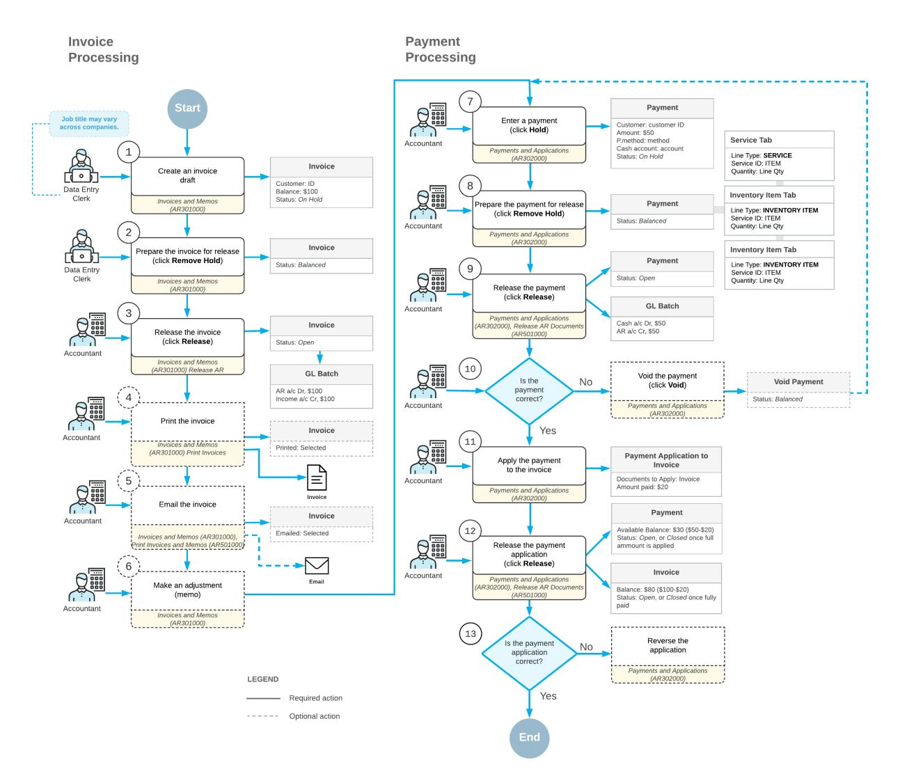

*Figure: Invoice and payment processing*

#### **Payment Application**

When entering a customer payment, you can apply it to open invoices and memos of the customer including credit memos. To reduce the time required to match payments to invoices, Acumatica ERP gives you the ability to automatically apply customer payments and prepayments to the oldest outstanding invoices, memos, or overdue charges. If a payment was applied incorrectly, you can void the application of the payment or the entire payment. For more information, see *[Auto-Applying Payments: General Information](#page-195-2)*.

#### **Rounding of Invoice Totals**

If the feature of rounding of the document amounts is activated in your system, you can set up the rules and the precision to be used to automatically round the amounts of invoices. Notice that the rounding rules and the rounding precision that you specify for invoices are the same for all currencies. For more information, see *[Rounding](#page-64-2) [of AR Document Amounts: General Information](#page-64-2)*.

#### **Workflow Options**

In Acumatica ERP, you can configure the document processing workflow to match the policies established in your organization. You can use multiple options that control processing and multiple processing forms. Newly entered documents can be released immediately or placed on hold and then reviewed by an authorized user before being released. Also, you can configure the workflow in such way that the documents are automatically posted on release, or that posting can be performed only by authorized users.

#### **Sending Documents Electronically**

With Acumatica ERP, you can set up sending released documents, such as invoices or memos, electronically to customers who want to receive documents by email. Also, you can configure sending such emails to employees who work with specific customers. For customers who do not want to receive documents electronically, you can continue to print documents for sending them via postal services. For more information, see *[Mailings for Customers:](#page-35-2) [General Information](#page-35-2)*.

#### **Recurring Invoices**

Schedules can be used to create and maintain recurring invoices, such as invoices for regular jobs or services your company provides for customers. Aer a recurring invoice is entered and assigned to a schedule, you will not need to reenter the entire invoice each time it needs to be generated. For more information, see *[Creating Recurring AR](#page-71-2) [Documents](#page-71-2)*.

#### **Debt Collection**

Whenever customer payments are not immediately bound to the delivery of goods and services, businesses need complete and continuous tracking of outstanding debts. In Acumatica ERP, it's easy to configure statement cycles and print statements, so customers have a detailed record of their balances with a specific branch or the entire organization. Credit verification rules can be defined for each customer class and for each individual customer. Overdue charges can be applied if payments are late. A sequence of dunning letters can be configured to remind customers about unpaid invoices, and a credit hold can be applied to customers once the last letter has been generated. To learn more, see *[Managing Credit Policy](https://help-2025r1.acumatica.com/Help?ScreenId=ShowWiki&pageid=f6f0ebb5-8a46-42c9-98c1-ed700894f0ee)*.

#### **Write-Offs**

Aer a certain period of time, a credit on your books should be written off and considered income. You can write off customer credits and balances that are less than the tolerance limits you have defined for the customers. For more details, see *[Direct Write-Offs: General Information](https://help-2025r1.acumatica.com/Help?ScreenId=ShowWiki&pageid=c5b2deca-e691-48b3-8867-4683be0551b9)* and *[Payments with Write-Offs: General Information](https://help-2025r1.acumatica.com/Help?ScreenId=ShowWiki&pageid=4efa3fc7-ff24-46df-82fc-037408a7f1d6)*.

#### **Salespeople and Commissions**

In Acumatica ERP, you can create accounts for each salesperson and assign default commission percentages. Sales commissions are calculated automatically, based on total sales or payments minus total returns during the sales commission period. See *[Managing Commissions](#page-290-2)* for additional details.

#### **Contracts**

Many businesses use contracts if they provide goods and services to the customers during the specified period of time—for example, to maintain and repair a product during the manufacturer's warranty period or aer it has expired. In Acumatica ERP, you can configure contract templates to provide typical settings for contracts. Contract settings are used for contract renewals (if they're permitted) and for recurring billing in accordance with the contract's billing schedule. For more information, see *[Managing Contracts](https://help-2025r1.acumatica.com/Help?ScreenId=ShowWiki&pageid=6e75cec6-e263-48d4-87f2-80ca68b10e21)*.

#### **Integrated Credit Card Processing**

With the integrated credit card processing functionality of Acumatica ERP, your company can use automated credit card processing to accept customer payments. To collect payments, you can perform mass-processing, by using credit cards to charge for the invoices of customers that prefer to pay this way, and manually initiate card payments for customer invoices. You can easily identify and handle failed transactions, void transactions, and issue refunds. You can maintain up-to-date information about customers' credit cards, deactivate expired cards, and automatically notify customers about expiring credit cards by using personalized emails. For details, see the following topics:

- *[Card Payments](#page-271-2)*
- *[Automatic Payment Collection](#page-276-1)*

#### **Accounts Receivable Security Options**

To restrict users' access to some customer accounts, you can include the customer accounts and the users authorized to work with them in restriction groups. This feature can be used to properly organize the work of salespeople.

#### **Audit Trail**

Invoices have unique IDs that have been generated in accordance with the assigned numbering sequence, along with the customers' document reference numbers. These features provide an easy-to-follow audit trail while preventing duplicate entries and payments.

#### **Other Features and Options**

In addition to the features already discussed, you can use the following capabilities to organize the collection process in the most convenient and effective way for your business:

- Create and maintain an unlimited number of customer accounts.
- Attach scanned images or electronic versions of customer original documents to payments, memos, and prepayments or to lines of the documents
- Organize and store comprehensive customer information, including multiple billing and shipping addresses and associated General Ledger accounts.
- Verify customer addresses at customer account creation by using integration with the AvaTax service of Avalara or other specialized third-party soware.
- Run multiple reports displaying customer balances, aging periods, statements, and transaction registration information.
- Use inquiries, which display current customer information in a variety of ways:
  - Outstanding balances for a customer or customers by period and by currency.
  - Documents that are past due for a specific customer and overdue charge amounts owed by the customers.
  - Commissions payable to salespeople and their details, including sales amounts, return amounts, and total commissions.

## **Creating a Customer**

In Acumatica ERP, each customer account holds all customer-related information that you need to conduct business with this customer. This information includes addresses, locations, contacts, and payment settings, as well as financial, purchase, and mailing settings. In this lesson, you will learn how to create a customer record in the system.

### **Customers: General Information**

In Acumatica ERP, each customer account stores all customer-related information you need to conduct business with your company's customers. This information includes addresses, locations, contacts, and payment methods, as well as financial, billing, delivery, and mailing settings. Acumatica ERP provides you with different tools that ease the process of entering customer data and help you to organize this data on reports.

#### **Learning Objectives**

In this chapter, you will do the following:

- Create a new customer based on the default customer class
- Review the default settings that the system has inserted from the customer class

#### **Applicable Scenarios**

You add customer accounts in the following cases:

- When you initially configure Acumatica ERP and enter the customer base into the system
- When you need to create an account for a new customer of the company

#### **Entities Needed for Customer Account Setup**

Before you start setting up customer accounts in Acumatica ERP, you need to configure the entities that will ease the processes of customer account creation and maintenance.

The needed entities in Acumatica ERP may include the following:

- Customer classes (required): You should ensure that at least one customer class has been set up on the *[Customer Classes](https://help-2025r1.acumatica.com/Help?ScreenId=ShowWiki&pageid=806e39d6-6f89-4e6c-9a24-61c6fb0c9a57)* (AR201000) form. Customer classes provide default values for individual customer accounts, so users can create customer accounts more easily. Besides the class ID and description, which are the required settings of a customer class, it can contain additional elements, such as general settings, delivery elements, credit verification settings, financial settings, print and email details, general ledger accounts, and mailings. For details, see *[Accounts Receivable: Customer Classes](https://help-2025r1.acumatica.com/Help?ScreenId=ShowWiki&pageid=c90069cc-5719-4ebc-997a-a92f831e57da)*.
- Customer identifiers (optional): You should make sure that the segmented key used as a template for identifiers of customer accounts suits your needs, and adjust the *BIZACCT* segmented key (or the *CUSTOMER* key) on the *[Segmented Keys](https://help-2025r1.acumatica.com/Help?ScreenId=ShowWiki&pageid=78bd7bd1-6bf6-409e-a8a5-8b18e8b80722)* (CS202000) form if needed.
- General ledger accounts (required): On the *[Chart of Accounts](https://help-2025r1.acumatica.com/Help?ScreenId=ShowWiki&pageid=85557f41-a4af-47a8-b198-2a01461ce9c3)* (GL202500) form, you need to create the general ledger accounts to be used to record sales and cash discounts, unless you plan to use the accounts that already exist. You will need to select these already-defined accounts when you create customer accounts. For details, see *To Add an Account to the Chart of [Accounts](https://help-2025r1.acumatica.com/Help?ScreenId=ShowWiki&pageid=b78e9d89-6225-498a-a119-bc7fb42f597a)*.
- Statement cycle (required): You need to ensure that at least one statement cycle has been set up on the *[Statement Cycles](https://help-2025r1.acumatica.com/Help?ScreenId=ShowWiki&pageid=1cdb48ab-149c-4304-8268-91c0654e3474)* (AR202800) form, which will be assigned to a customer class (and therefore to all customers that are assigned to this class). For details, see *[Customers: Implementation Activity](#page-18-2)*.

- Payment methods (required): You need to ensure that at least one payment method to be used for customer payments has been defined on the *[Payment Methods](https://help-2025r1.acumatica.com/Help?ScreenId=ShowWiki&pageid=509285d1-cfae-4e87-95c3-a968451952e6)* (CA204000) form. For details, see *[Managing Payment](https://help-2025r1.acumatica.com/Help?ScreenId=ShowWiki&pageid=86d33c8b-008d-4c8b-80d8-6479f75788ed) [Methods](https://help-2025r1.acumatica.com/Help?ScreenId=ShowWiki&pageid=86d33c8b-008d-4c8b-80d8-6479f75788ed)*.
- Credit terms: You should ensure that each needed set of credit terms that will define the due dates of documents has been set up on the *Credit [Terms](https://help-2025r1.acumatica.com/Help?ScreenId=ShowWiki&pageid=c39f7b9f-4ab2-4b67-b449-667802d58a57)* (CS206500) form. When you set up customer classes, you can assign the appropriate credit terms to classes, which in turn will cause the credit terms to be assigned by default to all new customers of this class. For details, see *Setup of Credit [Terms](https://help-2025r1.acumatica.com/Help?ScreenId=ShowWiki&pageid=bb0d243d-508c-4bf5-85b4-7b4fcc3d5fac)*.
- Overdue charges (optional): You can set up overdue charges on the *[Overdue Charges](https://help-2025r1.acumatica.com/Help?ScreenId=ShowWiki&pageid=87af325d-e1a7-4648-bd1f-01e82548f18d)* (AR204500) form, which define additional charges that customers will incur for open documents that are past due and assign the charges to a customer class (which causes them to be assigned by default to all new customers of this class). For details, see *[Overdue Charges: General Information](https://help-2025r1.acumatica.com/Help?ScreenId=ShowWiki&pageid=62b98449-6da7-4e5d-a19f-963c27527f11)*.
- Mailings (optional): You can set up multiple mailings to notify customers about their balances, invoices, sales orders, and other information you want to send to customers on a regular basis. For details, see *[Mailings for Customers: General Information](#page-35-2)*.

### **Customers: Customer Account Planning**

Before you begin preparing to set up customer accounts in Acumatica ERP, you need to gather information and make decisions that you will use when setting up customer accounts and their supporting entities.

In this topic, you will read about the steps you have to perform with regard to customer account setup.

#### **Customer Account Planning Steps**

You need to perform the following planning steps regarding your relations with customers:

- Decide whether you need to expand your chart of accounts with the accounts you will use to record your operations with customers. For details, see *[Chart of Accounts](https://help-2025r1.acumatica.com/Help?ScreenId=ShowWiki&pageid=4447f3b0-9ad5-45ea-953a-25305b9b1758)*.
- Consider your actual and potential customers, and single out the characteristics you can use to group customers, such as the types of goods or services they buy, their currency, and their payment methods. By using these characteristics, plan customer classes that will be used to provide default values for new customer accounts, so that users can create customer accounts more easily. Also, look at the common characteristics of all the planned classes so that you can plan the default customer class, which will be defined first and used to set up the other customer classes. For details, see *[Customers: Customer Class](#page-14-1) [Settings](#page-14-1)*.
- Consider your actual and potential customers with regard to the hierarchy of their companies and decide whether you need to build parent-child relations between accounts. These relations can help you meet the accounting and auditing requirements of your company when you work with companies that have subsidiaries. For details, see *[Managing Parent-Child Relationships](#page-25-2)*.

The functionality is available if the *Parent-Child Customer Relationship* feature is enabled on the *[Enable/Disable Features](https://help-2025r1.acumatica.com/Help?ScreenId=ShowWiki&pageid=c1555e43-1bc5-4f6f-ba9d-b323f94d8a6b)* (CS100000) form.

- Plan the structure of identifiers to be used for customer accounts, if this was not done during system implementation. In Acumatica ERP, the identifier of the customer account is defined by the *BIZACCT* segmented key, whose structure is defined during system implementation. You can also configure the *CUSTOMER* segmented key (which is based on the *BIZACCT* key) if you want to make the structure of customer identifiers a bit different from the structure of identifiers for vendor and employee accounts. For more information, see *[Business Account Identifiers](https://help-2025r1.acumatica.com/Help?ScreenId=ShowWiki&pageid=9a495cd5-4cdf-4145-acea-52a620db1426)*.
- Collect information about the ways your customers pay for services, and consider whether you are going to use Acumatica ERP for payment processing. You will use this information to plan the payment methods and cash accounts to be used to process payments from customers. For details, see *[Managing Payment Methods](https://help-2025r1.acumatica.com/Help?ScreenId=ShowWiki&pageid=86d33c8b-008d-4c8b-80d8-6479f75788ed)*.

- Examine the credit management policies used by your company—for example, the credit terms applied to the documents that are due, the overdue charges for customers who are consistently paying too late, the types of statements, and the frequency of providing customers with information about their balances. By using this information, you can plan the implementation of company credit policy in Acumatica ERP, which is described in *[Managing Credit Policy](https://help-2025r1.acumatica.com/Help?ScreenId=ShowWiki&pageid=f6f0ebb5-8a46-42c9-98c1-ed700894f0ee)*.
- Collect information about the customer locations and applicable taxes. You will use this information to plan the tax zones and taxes the system will apply to customer purchases. For details, see *Tax [Zones](https://help-2025r1.acumatica.com/Help?ScreenId=ShowWiki&pageid=1271ca60-4b5d-41fe-ade3-bd05ded62026) and [Categories: General Information](https://help-2025r1.acumatica.com/Help?ScreenId=ShowWiki&pageid=1271ca60-4b5d-41fe-ade3-bd05ded62026)*.
- Plan how your organization will send documents to customers: electronically or through postal mail. In the latter case, printing of the documents should be required before they can be released. You can define these settings for a group of customers by customer class and then adjust settings individually for each customer account.
- Consider how you want to inform customers about their balances, past-due documents, or expired bank cards. You will use this information when you plan the mailings used to regularly notify customers. For details, see *[Mailings for Customers: General Information](#page-35-2)*.
- If subaccounts are activated in your system, you should plan the rule for selecting the appropriate subaccount or for combining it from multiple involved subaccounts, by using the combined subaccount functionality provided by Acumatica ERP. For details on this functionality, see *[Combined Subaccounts:](https://help-2025r1.acumatica.com/Help?ScreenId=ShowWiki&pageid=f9429f96-d2fb-45fe-bc49-d15b996f1f7f) [General Information](https://help-2025r1.acumatica.com/Help?ScreenId=ShowWiki&pageid=f9429f96-d2fb-45fe-bc49-d15b996f1f7f)*.

### **Customers: Customer Class Settings**

In this topic, you will read about the default currency settings for a customer class, default printing and emailing settings, and preferred locale settings for customer classes.

#### **Default Currency Settings**

A customer class can hold the default currency and the default currency rate to be used for customer accounts. We recommend that you select a foreign currency for a customer class only if most customers of the class use this currency. By default, users may not override the currency on customer documents, to reduce the chance of input errors related to currency choice. If some customers may use a non-default currency and non-default rate type on individual documents, you can allow currency and rate overriding for those customers by selecting the **Enable Currency Override** and **Enable Rate Override** check boxes on the *[Customers](https://help-2025r1.acumatica.com/Help?ScreenId=ShowWiki&pageid=652929bc-9606-4056-aa6e-0c2d1147171b)* (AR303000) form.

If you want to allow override of the currency and the rate by default for all customers of the class, select these check boxes on the *[Customer Classes](https://help-2025r1.acumatica.com/Help?ScreenId=ShowWiki&pageid=806e39d6-6f89-4e6c-9a24-61c6fb0c9a57)* (AR201000) form for the customer class.

#### **Default Printing and Emailing Settings**

A customer class can provide the default settings that permit or deny mass-printing and emailing of invoices, memos, and statements. Settings that control printing and emailing preferences of customers are located under the **Default Print and EmailSettings** section on the **General** tab of the *[Customer Classes](https://help-2025r1.acumatica.com/Help?ScreenId=ShowWiki&pageid=806e39d6-6f89-4e6c-9a24-61c6fb0c9a57)* (AR201000) form. For instance, if you want to be able to print at once the invoices for all customers of a customer class by using the *[Print/](https://help-2025r1.acumatica.com/Help?ScreenId=ShowWiki&pageid=05451253-581e-459d-912e-ff983df762b9) [Email AR Documents](https://help-2025r1.acumatica.com/Help?ScreenId=ShowWiki&pageid=05451253-581e-459d-912e-ff983df762b9)* (AR508000) form, you must select the **Print Invoices** check box for the customer class. This makes the documents of these customers available for mass-printing. You can override this setting for individual customers of the class, if needed.

#### **Preferred Locale Setting**

You can group the customers who prefer the same language to one customer class. For this class, you specify a locale that is associated with the language in the **Locale** box of the *[Customer Classes](https://help-2025r1.acumatica.com/Help?ScreenId=ShowWiki&pageid=806e39d6-6f89-4e6c-9a24-61c6fb0c9a57)* (AR201000) form.

The system will assign the locale to the new customer accounts automatically when you select the customer class for the account on the *[Customers](https://help-2025r1.acumatica.com/Help?ScreenId=ShowWiki&pageid=652929bc-9606-4056-aa6e-0c2d1147171b)* (AR303000) form. For existing customers, you need to manually select the preferred locale for each account.

Assigning a locale to a customer account allows you to print documents for the customer in preferred language. For details, see *Use of User Input [Translations](https://help-2025r1.acumatica.com/Help?ScreenId=ShowWiki&pageid=3a886bbf-f41b-4386-a224-0a9d9bfa32bc)*.

### **Customers: Customer Locations**

If the *Business Account Locations* feature is enabled on the *[Enable/Disable Features](https://help-2025r1.acumatica.com/Help?ScreenId=ShowWiki&pageid=c1555e43-1bc5-4f6f-ba9d-b323f94d8a6b)* (CS100000) form, you can specify more than one location for a customer account, and each location can have specific settings. Locations, which are maintained on the *[Customer Locations](https://help-2025r1.acumatica.com/Help?ScreenId=ShowWiki&pageid=61a8c6de-6a51-434b-8c2d-4304ec982ae0)* (AR303020) form, provide appropriate customer default information for sales orders and invoices.

In this topic, you will read about the main location and the default location, as well as the values provided by locations for sales orders and invoices.

#### **Main and Default Locations**

When you create a customer account on the *[Customers](https://help-2025r1.acumatica.com/Help?ScreenId=ShowWiki&pageid=652929bc-9606-4056-aa6e-0c2d1147171b)* (AR303000) form, the system creates the main location for the customer automatically by using all the settings you have specified on the**Shipping** tab. (This is the case whether or not the *Business Account Locations* feature is enabled.)

The main location has *MAIN* as its ID, and the *Active* status, both of which cannot be modified. You can specify that the identifier of the branch the user is currently signed in to is used by default as the identifier of the customer's main location instead of the *MAIN* location. To do this for all customers of a class, you select the **Default Location ID from Branch** check box on the *[Customer Classes](https://help-2025r1.acumatica.com/Help?ScreenId=ShowWiki&pageid=806e39d6-6f89-4e6c-9a24-61c6fb0c9a57)* (AR201000) form.

Once you create the main location, it is automatically marked as the default location on the **Locations** tab of the *[Customers](https://help-2025r1.acumatica.com/Help?ScreenId=ShowWiki&pageid=652929bc-9606-4056-aa6e-0c2d1147171b)* form and in the Summary area of the *[Customer Locations](https://help-2025r1.acumatica.com/Help?ScreenId=ShowWiki&pageid=61a8c6de-6a51-434b-8c2d-4304ec982ae0)* form. If additional locations have been added to the customer account, you can make another location the default location on either of these forms. On the **Locations** tab of the *[Customers](https://help-2025r1.acumatica.com/Help?ScreenId=ShowWiki&pageid=652929bc-9606-4056-aa6e-0c2d1147171b)* form, you click the location and click**Set as Default** on the table toolbar. On the *[Customer Locations](https://help-2025r1.acumatica.com/Help?ScreenId=ShowWiki&pageid=61a8c6de-6a51-434b-8c2d-4304ec982ae0)* form, you select the **Default** check box in the Summary area.

The settings of the default location are used when you create documents for the customer.

If you change the customer class for an existing customer, the following values will not be overridden for the main and additional locations:

- The country specified in the **Country** box on the **General** tab of the *[Customer Locations](https://help-2025r1.acumatica.com/Help?ScreenId=ShowWiki&pageid=61a8c6de-6a51-434b-8c2d-4304ec982ae0)* (AR303020) form
- The tax zone specified in the**Tax Zone** box on the**Shipping** tab of the *[Customer Locations](https://help-2025r1.acumatica.com/Help?ScreenId=ShowWiki&pageid=61a8c6de-6a51-434b-8c2d-4304ec982ae0)* form

#### **Additional Locations**

If the *Business Account Locations* feature is enabled on the *[Enable/Disable Features](https://help-2025r1.acumatica.com/Help?ScreenId=ShowWiki&pageid=c1555e43-1bc5-4f6f-ba9d-b323f94d8a6b)* (CS100000) form, you can specify more than one location for a customer account, and each location can have specific settings. You can add a new location by using the *[Customer Locations](https://help-2025r1.acumatica.com/Help?ScreenId=ShowWiki&pageid=61a8c6de-6a51-434b-8c2d-4304ec982ae0)* (AR303020) form or by clicking the **Add New Location** button on the **Locations** tab of the *[Customers](https://help-2025r1.acumatica.com/Help?ScreenId=ShowWiki&pageid=652929bc-9606-4056-aa6e-0c2d1147171b)* (AR303000) form.

When you create a new location, the system uses the following default settings copied from the customer account:

- The address and contact information specified on the **General** tab.
- General ledger accounts specified on the **GL Accounts** tab.

You can replace any of these settings for the new location. You select the **Override** check box to change details for location contact and address.

If you change location settings for the main location of a customer on the *[Customer Locations](https://help-2025r1.acumatica.com/Help?ScreenId=ShowWiki&pageid=61a8c6de-6a51-434b-8c2d-4304ec982ae0)* form aer selecting the **Override** check box, the system automatically updates values on the**Shipping** tab for this customer on the *[Customers](https://help-2025r1.acumatica.com/Help?ScreenId=ShowWiki&pageid=652929bc-9606-4056-aa6e-0c2d1147171b)* form and vice versa.

#### **Location and Customer Documents**

When you enter a customer document (that is, an invoice, payment, cash sale, or sales order), you should first select the customer. When you do, certain elements on the form are filled in with the settings associated with the customer's default location. If you select a location other than the default one, the values will change to those associated with the selected location.

The selected location provides default values for the customer's documents: the tax zone, the shipping instructions, and the sales account and corresponding subaccount. Also, for sales orders, the location provides the shipping address and contact information. You can override any of the default values.

For new invoices and sales orders entered into the system, tax settings are by default those in both the tax zone of the customer location and the product category associated with the inventory items specified as the document details. The system creates the resulting list of applicable taxes automatically and shows it on the**Tax Details** tab of *[Invoices and Memos](https://help-2025r1.acumatica.com/Help?ScreenId=ShowWiki&pageid=5e6f3b27-b7af-412f-a40a-1d4f4be70cba)* (AR301000) or *[Sales Orders](https://help-2025r1.acumatica.com/Help?ScreenId=ShowWiki&pageid=19e4021c-1b84-49fd-be12-0320c5f1c7e5)* (SO301000).

#### **Location and Discounts**

Each customer's location can be also associated with a customer price class, which is used as a condition to be met for discount application. You can specify different customer price classes for different locations to make your pricing policy more flexible. For details on configuring discounts, see *[Configuring and Applying Customer Discounts](https://help-2025r1.acumatica.com/Help?ScreenId=ShowWiki&pageid=ef656bd9-688b-4c13-bedc-271d9c07d083)*.

### **Customers: Security Configuration**

If your organization sells goods and provides services to customers, you may have a great deal of customer-related information stored in Acumatica ERP. When the employees of your organization create documents for customers, they have to select the required customer from the full list of customers. If certain employees work with only very important customers, and other employees are not allowed to see these customers in the system for security reasons, you can create restriction groups to manage the visibility of your customers to users of Acumatica ERP, as described in this topic.

In Acumatica ERP, you can configure groups with direct and inverse restriction. In this topic, for simplicity, groups with direct restriction are used in examples. You can use inverse restriction groups in the same way as you use direct restriction groups. For details on the types of restriction groups, see *Types of [Restriction](https://help-2025r1.acumatica.com/Help?ScreenId=ShowWiki&pageid=a72c11e3-e181-4412-a462-ce333721a1e9) Groups*.

#### **Visibility of Customers by User**

By using restriction groups, you can show or hide particular customers on Acumatica ERP forms, depending on the user who is logged in to the system. For example, if some customers are very important to your organization, dedicated employees might be assigned to process documents that contain information about these customers in the system. For details about restriction groups, see *[Restriction Groups in Acumatica ERP](https://help-2025r1.acumatica.com/Help?ScreenId=ShowWiki&pageid=ad9a42c1-ff5d-4298-86d9-683039c18512)*.

For example, suppose that your organization provides cleaning services and Megabank is a very important customer of your organization. Manager M is responsible for all operations in the systems related to Megabank, and other managers should not see Megabank on any forms of the system. To configure the visibility of this customer in the system, you need to do the following on the *[Customer Access](https://help-2025r1.acumatica.com/Help?ScreenId=ShowWiki&pageid=7cf2700a-16c9-4e4a-86cd-cda703aa7941)* (AR102000) form:

1. You create a restriction group (for example, *Group for Megabank*) with direct restriction.

- 2. You add to the group the user account of the Manager M.
- 3. You add to the group the Megabank customer.

If you use customer classes and want to include each new customer of a particular class in a restriction group automatically, you can specify a default restriction group for this class.

### **Setting Up Default Restriction Groups for Customer Classes**

To ease the addition of new customers to restriction groups, you can specify a default restriction group for a customer class, so that customers of the selected class will be included in the restriction group automatically.

You specify a default restriction group for a customer class by using the *[Customer Classes](https://help-2025r1.acumatica.com/Help?ScreenId=ShowWiki&pageid=806e39d6-6f89-4e6c-9a24-61c6fb0c9a57)* (AR201000) form. You perform the following steps to specify a default restriction group for a customer class:

- 1. In the **Class ID** box, you select the customer class for which you want to specify the default restriction group.
- 2. In the **Default Restriction Group** box of the **Default GeneralSettings** section on the **General** tab, you select the default restriction group that will be used for the selected customer class.
- 3. On the form toolbar, you click **Include Customers in Restriction Group** to include all entities of the class in the default restriction group.
- 4. You save your changes.

#### **Removing Class Entities from a Default Restriction Group**

If you want to cancel the visibility restriction for entities of a customer class, you can remove all class entities from a default restriction group as follows:

- 1. You open the *[Customer Classes](https://help-2025r1.acumatica.com/Help?ScreenId=ShowWiki&pageid=806e39d6-6f89-4e6c-9a24-61c6fb0c9a57)* (AR201000) form.
- 2. In the **Default GeneralSettings** section on the **General** tab, you clear the value in the **Default Restriction Group** box
- 3. On the form toolbar, you click **Include Customers in Restriction Group**.
- 4. You save your changes.

#### **Forms for Customer Security**

In the following table, you can find the list of the forms that you can use to manage restriction groups with customers and the tasks that you can resolve by using each form.

#### *Table: Forms for Customer Security*

| Task                                                                               | Form                                      |
|------------------------------------------------------------------------------------|-------------------------------------------|
| To initially configure the visibility of a customer to users                    | Customer Access (AR102000)                |
| To change the visibility of a customer in multiple re striction groups          | Restriction Groups by Customer (AR102010) |
| To change the visibility of customers to a user in multi ple restriction groups | Restriction Groups by User (SM201035)     |

For information about how to add or remove objects from a restriction group, see *[Operations with Restriction](https://help-2025r1.acumatica.com/Help?ScreenId=ShowWiki&pageid=af4b07a9-476a-4475-8183-8bffc9eb6947) [Groups](https://help-2025r1.acumatica.com/Help?ScreenId=ShowWiki&pageid=af4b07a9-476a-4475-8183-8bffc9eb6947)*.

#### **Related Links**

- *[Operations with Restriction Groups](https://help-2025r1.acumatica.com/Help?ScreenId=ShowWiki&pageid=af4b07a9-476a-4475-8183-8bffc9eb6947)*
- *[Restriction Groups in Acumatica ERP](https://help-2025r1.acumatica.com/Help?ScreenId=ShowWiki&pageid=ad9a42c1-ff5d-4298-86d9-683039c18512)*
- *Types of [Restriction](https://help-2025r1.acumatica.com/Help?ScreenId=ShowWiki&pageid=a72c11e3-e181-4412-a462-ce333721a1e9) Groups*
- *[Customer Access](https://help-2025r1.acumatica.com/Help?ScreenId=ShowWiki&pageid=7cf2700a-16c9-4e4a-86cd-cda703aa7941)*
- *[Restriction Groups by Customer](https://help-2025r1.acumatica.com/Help?ScreenId=ShowWiki&pageid=4fc020a4-1e07-4602-b54d-4ed99e17c244)*
- *[Restriction Groups by User](https://help-2025r1.acumatica.com/Help?ScreenId=ShowWiki&pageid=a54bfd6b-d6c1-4eaa-86c6-21394a6099c8)*

### **Customers: Configuration Prerequisites**

Before you start setting up customer accounts in Acumatica ERP, you need to configure the entities that will ease the processes of customer account creation and maintenance. As you configure these entities, you should use the information that you gathered when you planned customer accounts.

In this topic, you will find the list of Acumatica ERP entities you need to configure to ease the processes of customer account creation and maintenance. Some of these entities are required, while others are optional, as indicated in the list.

#### **Settings Required to Be Configured**

The needed entities in Acumatica ERP may include the following:

- Customer identifiers (optional): You should make sure that the segmented key used as a template for identifiers of customer accounts suits your needs, and adjust the *BIZACCT* segmented key (or the *CUSTOMER* key) if needed. For details, see *[Business Account Identifiers](https://help-2025r1.acumatica.com/Help?ScreenId=ShowWiki&pageid=9a495cd5-4cdf-4145-acea-52a620db1426)*.
- General Ledger accounts (required): You need to create the General Ledger accounts and subaccounts (if applicable) to be used to record sales and cash discounts, unless you plan to use accounts and subaccounts that already exist. You will need to select these already-defined accounts when you create customer accounts. For details, see *To Add an Account to the Chart of [Accounts](https://help-2025r1.acumatica.com/Help?ScreenId=ShowWiki&pageid=b78e9d89-6225-498a-a119-bc7fb42f597a)*.
- Statement cycle (required): You need to set up at least one statement cycle that will be assigned to a customer class (and therefore to all customers that are assigned to this class). For details, see *[Customer](https://help-2025r1.acumatica.com/Help?ScreenId=ShowWiki&pageid=eab5652c-c80d-4639-b4f3-39c91de333a6) [Statements: General Information](https://help-2025r1.acumatica.com/Help?ScreenId=ShowWiki&pageid=eab5652c-c80d-4639-b4f3-39c91de333a6)*.
- Payment methods (required): You need to define at least one payment method to be used for customer payments. For details, see *[Managing Payment Methods](https://help-2025r1.acumatica.com/Help?ScreenId=ShowWiki&pageid=86d33c8b-008d-4c8b-80d8-6479f75788ed)*.
- Credit terms (optional): You should set up each needed set of credit terms that will define the due dates of documents. When you set up customer classes, you can assign the appropriate credit terms to classes, which in turn will cause the credit terms to be assigned by default to all new customers of this class. For details, see *Setup of Credit [Terms](https://help-2025r1.acumatica.com/Help?ScreenId=ShowWiki&pageid=bb0d243d-508c-4bf5-85b4-7b4fcc3d5fac)*.
- Overdue charges (optional): You can set up overdue charges, which define additional charges that customers will incur for open documents that are past due and assign the charges to a customer class (which causes them to be assigned by default to all new customers of this class). For details, see *[Overdue](https://help-2025r1.acumatica.com/Help?ScreenId=ShowWiki&pageid=62b98449-6da7-4e5d-a19f-963c27527f11) [Charges: General Information](https://help-2025r1.acumatica.com/Help?ScreenId=ShowWiki&pageid=62b98449-6da7-4e5d-a19f-963c27527f11)*.
- Mailings (optional): You can set up multiple mailings to notify customers about their balances, invoices, sales orders, and other information you want to send to customers on a regular basis. For details, see *[Mailings for Customers: General Information](#page-35-2)*.

### **Customers: Implementation Activity**

The following activity will walk you through the process of creating a new customer.

This activity is based on the *U100* dataset. If you are using another dataset, or if any system settings have been changed in *U100*, these changes can affect the workflow of the activity and the results of the processing. To avoid any issues, restore the *U100* dataset to its initial state.

#### **Video Tutorial**

This video shows you the common process but may contain less detail than the activity has. If you want to repeat the activity on your own or you are preparing to take the certification exam, we recommend that you follow the instructions in the steps of the activity.

#### *[FEEDBACK](https://www.surveymonkey.com/r/BLBL7RJ?Video=Configuring%20Customers&Source=Open%20Uni&Course=F100)*

#### **Story**

Suppose that the SweetLife Fruits & Jams company wants to create a customer account for one of the local cafes, Prime Cafe, to enable them to buy the SweetLife products on credit, with payments due in 30 days.

Acting as a SweetLife administrator, you need to create the needed customer account in the system.

#### **Process Overview**

In this activity, you will create a new customer on the *[Customers](https://help-2025r1.acumatica.com/Help?ScreenId=ShowWiki&pageid=652929bc-9606-4056-aa6e-0c2d1147171b)* (AR303000) form. On the tabs of this form, you will specify the customer's address and contact information. You will then review the default settings, which the system inserted to the customer account when creating the customer, and then review the credit terms for the customer.

#### **System Preparation**

Before you start creating a customer, make sure that the following tasks have been performed in the system:

- 1. The company has been created and its actual ledger has been specified; *Company Without [Branches:](https://help-2025r1.acumatica.com/Help?ScreenId=ShowWiki&pageid=082a5d06-0e65-44c0-8049-4df32ebf59d3) To [Configure](https://help-2025r1.acumatica.com/Help?ScreenId=ShowWiki&pageid=082a5d06-0e65-44c0-8049-4df32ebf59d3) a Company Without Branches* and *[General](https://help-2025r1.acumatica.com/Help?ScreenId=ShowWiki&pageid=fda48dc3-65e6-4ef1-8196-b4b1f9751e91) Ledger: To Create an Actual Ledger*.
- 2. The credit terms that are used by customers have been created, as described in *Credit [Terms:](https://help-2025r1.acumatica.com/Help?ScreenId=ShowWiki&pageid=ecb8dcdd-729d-4f38-9e77-7b3c28f4e052) To Define [Single-Installment](https://help-2025r1.acumatica.com/Help?ScreenId=ShowWiki&pageid=ecb8dcdd-729d-4f38-9e77-7b3c28f4e052) Credit Terms*.
- 3. The default customer class has been created, as described in *Accounts [Receivable:](https://help-2025r1.acumatica.com/Help?ScreenId=ShowWiki&pageid=9c04e7d3-f378-497e-857f-04d6f9ea5125) To Create a Customer [Class](https://help-2025r1.acumatica.com/Help?ScreenId=ShowWiki&pageid=9c04e7d3-f378-497e-857f-04d6f9ea5125)*.

#### **Step 1: Creating a Customer Account**

To create a customer account, do the following:

- 1. On the *[Customers](https://help-2025r1.acumatica.com/Help?ScreenId=ShowWiki&pageid=652929bc-9606-4056-aa6e-0c2d1147171b)* (AR303000) form, add a new record.
- 2. In the Summary area, specify the following settings:
  - **Customer ID**: PRIME
  - **CustomerStatus**: *Active* (selected automatically)
  - **Customer Class**: *DEFAULT* (selected automatically)
- 3. In the **Account Info** section on the **General** tab, specify Prime Cafe in the **Account Name** box.
- 4. On the form toolbar, click**Save**.

#### **Step 2: Specifying Contact Information and Address**

To specify contact information and address for the customer, do the following:

- 1. On the **General** tab, specify the following settings in the **Primary Contact** section:
  - **Name**: Scott L Kennedy
  - **Job Title**: General Manager
  - **Business 1**: 973-345-7083
- 2. In the **Account Address** section of the **General** tab, specify the following main address for the customer:
  - **Address Line 1**: 2720 Jadewood Farms
  - **City**: Paterson
  - **State**: *NJ*
  - **Postal Code**: 07501
- 3. On the form toolbar, click**Save**.

#### **Step 3: Reviewing the Statement Cycle Settings**

To review the customer's statement cycle settings, do the following:

- 1. In the **FinancialSettings** section on the **Financial** tab, in the**Terms** box, make sure that *30D* is selected.
- 2. In the **Statement Cycle ID** box, make sure that *EOM* (End of Month) is selected.
- 3. Click the Edit button next to the**Statement Cycle ID** box. The *[Statement Cycles](https://help-2025r1.acumatica.com/Help?ScreenId=ShowWiki&pageid=1cdb48ab-149c-4304-8268-91c0654e3474)* (AR202800) form opens in a pop-up window.
- 4. Review the statement cycle settings for the customer on the *[Statement Cycles](https://help-2025r1.acumatica.com/Help?ScreenId=ShowWiki&pageid=1cdb48ab-149c-4304-8268-91c0654e3474)* form.
- 5. Close the pop-up window with the *[Statement Cycles](https://help-2025r1.acumatica.com/Help?ScreenId=ShowWiki&pageid=1cdb48ab-149c-4304-8268-91c0654e3474)* form.
- 6. On the *[Customers](https://help-2025r1.acumatica.com/Help?ScreenId=ShowWiki&pageid=652929bc-9606-4056-aa6e-0c2d1147171b)* (AR303000) form, in the **CreditVerification** box (**CreditVerification Rules** section), select *Disabled*.
- 7. On the form toolbar, click**Save**.

#### **Step 4: Reviewing the Default Customer Information**

To review the default customer information, do the following:

1. On the **Billing** tab, review the customer's bill-to address.

Because the **Override** check box is cleared for the bill-to address, the system has inserted the information from the **Account Address** section on the **General** tab.

2. On the **Shipping** tab, review the customer's shipping information.

Because the **Override** check box is cleared for the ship-to address, the system has inserted the information from the **Account Address** section on the **General** tab.

- 3. On the **Payment Methods** tab, review the customer's payment methods and notice that the *CHECK* payment method is the default one for the customer (the check box in the **Is Default** column is selected).
- 4. On the **GL Accounts** tab, review the GL accounts to be used for settlements with this customer.

### **Customers: Related Reports and Inquiries**

This topic describes the reports, inquiries, and forms you may review to gather information about customers.

If you do not see a report or inquiry, this could mean that you have signed in to the system with a user account that does not have access rights to the form. Sign in as the *admin* user, or contact your system administrator.

#### **Reviewing Customer Documents**

You can review the customer's documents at any time on the *[Customer Details](https://help-2025r1.acumatica.com/Help?ScreenId=ShowWiki&pageid=2ed5542b-a76c-4cfd-9ee3-52c2f08a2692)* (AR402000) form. The form shows the detailed balance and the list of documents for the particular customer. By default, the form shows all the customer's open documents.

You can also run this inquiry by clicking **Customer Details** (under **Inquiries**) on the More menu of the *[Customers](https://help-2025r1.acumatica.com/Help?ScreenId=ShowWiki&pageid=652929bc-9606-4056-aa6e-0c2d1147171b)* (AR303000) form.

To review the customer documents that have been released (documents with the *Open*, *Closed*, and *Reserved* statuses), you run the *[AR Register](https://help-2025r1.acumatica.com/Help?ScreenId=ShowWiki&pageid=052d83b2-b676-4ebc-9ec5-6f616a98484c)* (AR621500) report.

#### **Reviewing Customer Profile**

To review the database information for a particular customer, you run the *[Customer Profiles](https://help-2025r1.acumatica.com/Help?ScreenId=ShowWiki&pageid=5ccded3d-8f60-46a3-b1f1-554bfe2b4359)* (AR651000) report. You can also run this report by clicking **Customer Profile** (under **Reports**) on the More menu of the *[Customers](https://help-2025r1.acumatica.com/Help?ScreenId=ShowWiki&pageid=652929bc-9606-4056-aa6e-0c2d1147171b)* (AR303000) form.

#### **Reviewing Customer Documents and Balance**

You can review the open documents, applications, and customer balances at the end of a period, grouped by customer and AR account by running the *[AR Balance by Customer](https://help-2025r1.acumatica.com/Help?ScreenId=ShowWiki&pageid=79f89293-942a-435c-b3fc-3f0ba874a7e9)* (AR632500) report.

#### **Reviewing Customer Balance**

You can review the customer balance, which you can further reconcile with the balance of the accounts receivable GL account, by running the *[AR Balance by GL Account](https://help-2025r1.acumatica.com/Help?ScreenId=ShowWiki&pageid=709cd1e7-4550-42ee-b820-1ba01f2046ac)* (AR632000) report. To reconcile the GL balance of the AR account with the customer balance, you compare the balance obtained in this report with the trial balance for the same period.

#### **Reviewing Customer Balance History**

You can review the history of the customer's balance over a specified date range by running the *[Customer History](https://help-2025r1.acumatica.com/Help?ScreenId=ShowWiki&pageid=3386f547-1cee-4379-ac7d-2a152948bfcf)* (AR652000) report.

#### **Recalculating Customer Balances**

You can use the *[Recalculate Customer Balances](https://help-2025r1.acumatica.com/Help?ScreenId=ShowWiki&pageid=59f0827e-c41f-4140-af09-9c8efa9508fa)* (AR509900) form to recalculate customer balances. Balances are recalculated based on the history records (released AR documents) that are matched to the customer balances stored in the database. Also, you can run this process if there is any discrepancy between the customer balance and the total amount of all the released customer documents.

### **To Track Customer Prepayments**

To track customer prepayments, you use a special liability account, the *prepayment account*, to record prepayments from customers.

If you want to set a default prepayment account to be used for each new customer a user creates, on the *[Customer Classes](https://help-2025r1.acumatica.com/Help?ScreenId=ShowWiki&pageid=806e39d6-6f89-4e6c-9a24-61c6fb0c9a57)* (AR201000) form, specify the prepayment account and subaccount for each of the customer classes that might be used when a user creates a new customer.

You can change the prepayment account and subaccount for a particular customer on the *[Customers](https://help-2025r1.acumatica.com/Help?ScreenId=ShowWiki&pageid=652929bc-9606-4056-aa6e-0c2d1147171b)* (AR303000) form. The system credits this account by default when a user enters a new prepayment from the customer.

To view information about prepayments, you use the following forms:

- *[Customer Summary](https://help-2025r1.acumatica.com/Help?ScreenId=ShowWiki&pageid=4d224cd8-6553-4930-872b-d667ddff891e)* (AR401000): Displays prepayment balances
- *[Customer Details](https://help-2025r1.acumatica.com/Help?ScreenId=ShowWiki&pageid=2ed5542b-a76c-4cfd-9ee3-52c2f08a2692)* (AR402000): Shows prepayments from individual customers
- *[AR Balance by GL Account](https://help-2025r1.acumatica.com/Help?ScreenId=ShowWiki&pageid=709cd1e7-4550-42ee-b820-1ba01f2046ac)* (AR632000): Displays all prepayments collected on the prepayment account

#### **To View Prepayment Balances**

- 1. Open the *[Customer Summary](https://help-2025r1.acumatica.com/Help?ScreenId=ShowWiki&pageid=4d224cd8-6553-4930-872b-d667ddff891e)* (AR401000) form.
- 2. On the Selection area, in the **Company/Branch** box, select the company or branch for which you want to view prepayments.
- 3. In the **Period** box, select the financial period or leave the box blank to view all open prepayments.
- 4. In the **AR Account** box, select the prepayment account.

In the table, you can view the list of customers with the prepayment balances calculated for the selected criteria. The**Total Prepayments** box of the Selection area shows the total amount of customer prepayments calculated based on the selected criteria.

#### **To View Prepayments by Customer**

- 1. Open the *[Customer Details](https://help-2025r1.acumatica.com/Help?ScreenId=ShowWiki&pageid=2ed5542b-a76c-4cfd-9ee3-52c2f08a2692)* (AR402000) form.
- 2. In the **Company/Branch** box of the Selection area, select the company or branch for which you want to view prepayments.
- 3. In the **Customer** box, select the customer whose prepayments you want to view.
- 4. In the **AR Account** box, select the prepayment account.

In the table, you can view the list of prepayments that match the selected criteria. The **Prepayment Balance** box of the Selection area displays the total amount of customer prepayments calculated based on the selected criteria.

#### **To View All Prepayments**

- 1. Open the *[AR Balance by GL Account](https://help-2025r1.acumatica.com/Help?ScreenId=ShowWiki&pageid=709cd1e7-4550-42ee-b820-1ba01f2046ac)* (AR632000) report.
- 2. On the **Report Parameters** tab, specify the report parameters that fit your information needs.

If you leave the **Company/Branch** box blank, you'll get information on all branches.

- 3. On the form toolbar, click **Run Report**.
- 4. Find the prepayment account in the report to view all prepayments that fit the specified criteria.

For more information, see *[Filters](https://help-2025r1.acumatica.com/Help?ScreenId=ShowWiki&pageid=fad0b170-9d7c-4851-8f73-4b841f977c0f)*.

#### **Related Links**

- *[Customer Summary](https://help-2025r1.acumatica.com/Help?ScreenId=ShowWiki&pageid=4d224cd8-6553-4930-872b-d667ddff891e)*
- *[Customer Details](https://help-2025r1.acumatica.com/Help?ScreenId=ShowWiki&pageid=2ed5542b-a76c-4cfd-9ee3-52c2f08a2692)*
- *[Customers](https://help-2025r1.acumatica.com/Help?ScreenId=ShowWiki&pageid=652929bc-9606-4056-aa6e-0c2d1147171b)*
- *[Payments and Applications](https://help-2025r1.acumatica.com/Help?ScreenId=ShowWiki&pageid=ae844bf4-1aef-42cd-9e2f-49b3ee1bc8d7)*
- *[Customer Classes](https://help-2025r1.acumatica.com/Help?ScreenId=ShowWiki&pageid=806e39d6-6f89-4e6c-9a24-61c6fb0c9a57)*
- *To Add an Account to the Chart of [Accounts](https://help-2025r1.acumatica.com/Help?ScreenId=ShowWiki&pageid=b78e9d89-6225-498a-a119-bc7fb42f597a)*
- *[AR Balance by GL Account](https://help-2025r1.acumatica.com/Help?ScreenId=ShowWiki&pageid=709cd1e7-4550-42ee-b820-1ba01f2046ac)*

### **To Reconcile Customer Balances with GL Accounts**

To perform reconciliation, you compare the total balance of open documents with the balance of the AR account used in Accounts Receivable documents according to the transactions posted to the account. The balances must be equal.

#### **To Review and Release Unreleased Accounts Receivable Documents**

- 1. Open the *[AR Edit](https://help-2025r1.acumatica.com/Help?ScreenId=ShowWiki&pageid=5b376528-bcbc-4b88-b055-57aa86da4635)* (AR611000) report.
  - a. On the **Report Parameters** tab, in the **Company/Branch** box, check the company or branch to which the documents are related.
  - b. In the **From Period** box, check the start period of the documents to be included in the report.
  - c. In the **To Period** box, check the end period of the documents to be included in the report.
  - d. In the **Customer** box, specify a customer whose documents you want to include in the report.
  - e. In the **Created By** box, specify a user who created transactions which you need to include in the report.
  - f. Select the **IncludeTransactions on Hold** check box to include transactions that have the *Hold* status (if applicable).
  - g. Click **Run Report**.
- 2. In the report that opens, click the reference numbers of the invoices with the *On Hold* status.
- 3. On the *[Invoices and Memos](https://help-2025r1.acumatica.com/Help?ScreenId=ShowWiki&pageid=5e6f3b27-b7af-412f-a40a-1d4f4be70cba)* (AR301000) form that opens for each invoice, click **Release** on the form toolbar to release the document.

Now all Accounts Receivable documents are released.

#### **To Reconcile the Total of Open Customer Documents With the Balance of GL Account**

- 1. Open the *[AR Balance by GL Account](https://help-2025r1.acumatica.com/Help?ScreenId=ShowWiki&pageid=709cd1e7-4550-42ee-b820-1ba01f2046ac)* (AR632000) form.
- 2. On the **Report Parameters** tab, in the **Report Format** box, select *Open Documents*.
- 3. In the **Company/Branch** box, review the name of the company or branch selected and change it, if needed.
- 4. In the **Financial Period** box, check the period which should be covered by the report and change it, if needed.
- 5. Clear the **Include Applications** check box.
- 6. On the form toolbar, click **Run Report**.

The report shows the AR accounts used in accounts receivable documents, and the list of documents that have been posted to these accounts and that are open by the end of the period.

#### **To Prepare the Trial Balance Summary**

- 1. Open the *Trial Balance [Summary](https://help-2025r1.acumatica.com/Help?ScreenId=ShowWiki&pageid=12f38bf9-9ab2-4da3-a99f-df0443a33271)* (GL632000) form.
- 2. On the **Report Parameters** tab, in the **Company/Branch** box, check the name of the company or branch for which the report should be prepared and change it, if needed.
- 3. In the **Ledger** box, check the ledger whose documents should be included in the report and change it, if needed.
- 4. In the **Financial Period** box, check the period which should be covered by the report and change it, if needed.
- 5. Select the**Suppress Zero Balances** to remove accounts that have all zero values from the report.

The report shows the balance of an account. It is the total amount of the transactions posted to this account in the general ledger by the end of the specified period.

6. Compare the balance of the selected general ledger account according to the *[AR Balance by GL Account](https://help-2025r1.acumatica.com/Help?ScreenId=ShowWiki&pageid=709cd1e7-4550-42ee-b820-1ba01f2046ac)* (AR632000) report and the *Trial Balance [Summary](https://help-2025r1.acumatica.com/Help?ScreenId=ShowWiki&pageid=12f38bf9-9ab2-4da3-a99f-df0443a33271)* (GL632000) report.

## **Managing Parent-Child Relationships**

If your company deals with customers with multiple franchises, branches, or other organizational units, you might want to configure parent-child relationships in Acumatica ERP between the customer accounts that represent these companies.

You can use this functionality if the *Parent-Child Customer Relationship* feature is enabled on the *[Enable/Disable](https://help-2025r1.acumatica.com/Help?ScreenId=ShowWiki&pageid=c1555e43-1bc5-4f6f-ba9d-b323f94d8a6b) [Features](https://help-2025r1.acumatica.com/Help?ScreenId=ShowWiki&pageid=c1555e43-1bc5-4f6f-ba9d-b323f94d8a6b)* (CS100000) form.

In this chapter, you will read about how to set up and maintain parent-child relationships between customer accounts.

## **Parent-Child Relationships: General Information**

In this topic, you will read about how to set up a parent-child relationship between customer accounts in the settings of these accounts.

You can use this functionality if the *Parent-Child Customer Relationship* feature is enabled on the *[Enable/Disable](https://help-2025r1.acumatica.com/Help?ScreenId=ShowWiki&pageid=c1555e43-1bc5-4f6f-ba9d-b323f94d8a6b) [Features](https://help-2025r1.acumatica.com/Help?ScreenId=ShowWiki&pageid=c1555e43-1bc5-4f6f-ba9d-b323f94d8a6b)* (CS100000) form.

#### **Learning Objectives**

In this chapter, you will learn how to do the following:

- Set up a parent-child relationship between customer accounts
- Process documents from the child accounts and from the parent account
- Generate a consolidated report to review the balance of the parent account

#### **Applicable Scenarios**

You set up parent-child relationships for customer accounts in the following cases:

- The parent company has granted franchises to multiple companies and some of these companies are Acumatica ERP customers
- The parent company is an Acumatica ERP customer and has multiple branches (or similar organizational units)

#### **Setup of a Parent-Child Relationship**

You can set up parent-child relationships when you are creating customers in the system or at any time thereaer. On the *[Customers](https://help-2025r1.acumatica.com/Help?ScreenId=ShowWiki&pageid=652929bc-9606-4056-aa6e-0c2d1147171b)* (AR303000) form, you perform the following steps to configure parent-child relations between customer accounts:

- 1. You set up or modify the customer account that represents the parent company (which the organization might refer to as the head office or main branch). In the **Parent Info** section on the **Billing** tab, you specify whether you need the companies to have a consolidated balance, consolidated statements, and a shared credit policy. To do this, you select or clear the **Consolidate Balance**, **ConsolidateStatements**, and **Share Credit Policy** check boxes. The states of these check boxes will provide the default states for the corresponding check boxes of the child customer accounts.
- 2. You set up or modify the customer accounts that represent child companies, which are generally subsidiaries that are controlled by the parent company. For each child company, you specify the parent account in the **Parent Account** box.

In the **Parent Info** section of the **Billing** tab, you change the states of the **Consolidate Balance**, **Consolidate Statements**, and **Share Credit Policy** check boxes, if needed.

Only a two-level hierarchy is supported.

With the exception of the details described above, the setup of parent and child customer accounts does not differ from the setup of independent customer accounts.

For each parent account, you can view the list of its child accounts on the **Child Accounts** tab of the *[Customers](https://help-2025r1.acumatica.com/Help?ScreenId=ShowWiki&pageid=652929bc-9606-4056-aa6e-0c2d1147171b)* form.

#### **Balance Consolidation**

The balances of child customer accounts can be included in the balance of the parent customer account. As mentioned in the previous section, for the child accounts whose open documents can be paid with the payments of their parent, you select the **Consolidate Balance** check box on the *[Customers](https://help-2025r1.acumatica.com/Help?ScreenId=ShowWiki&pageid=652929bc-9606-4056-aa6e-0c2d1147171b)* (AR303000) form. With this check box selected, the system includes the balances of child accounts in the parent balance. For the corresponding parent account, you can view this consolidated balance in the **Consolidated Balance** box in the Summary area of the *[Customers](https://help-2025r1.acumatica.com/Help?ScreenId=ShowWiki&pageid=652929bc-9606-4056-aa6e-0c2d1147171b)* form.

The **Balance**, **Prepayment Balance**, **Retained Balance**, and **Consolidated Balance** boxes will not be shown in the Summary area of the *[Customers](https://help-2025r1.acumatica.com/Help?ScreenId=ShowWiki&pageid=652929bc-9606-4056-aa6e-0c2d1147171b)* form if all of the following conditions are met:

- The *Multiple Base Currencies* feature is enabled on the *[Enable/Disable Features](https://help-2025r1.acumatica.com/Help?ScreenId=ShowWiki&pageid=c1555e43-1bc5-4f6f-ba9d-b323f94d8a6b)* (CS100000) form.
- The selected customer has been extended from a branch of your company.
- A role is assigned to the current user that gives them the ability to access companies with different base currencies.

Instead, the **Balances** tab will appear, which shows customer balances grouped by base currency.

#### **Payment Application**

With the parent-child relationship between customer accounts set up, payments can be applied to documents of child and parent accounts. That is, when you create a payment or a prepayment for the parent account on the *[Payments and Applications](https://help-2025r1.acumatica.com/Help?ScreenId=ShowWiki&pageid=ae844bf4-1aef-42cd-9e2f-49b3ee1bc8d7)* (AR302000) form, you can apply this payment to the open documents of both the child accounts and the parent account. On the **Documents to Apply** tab, you can add rows with the open documents of a child account or click the **Load Documents** button on the table toolbar. When you click the button, the **Load Options** dialog box opens; in the **Include Child Documents** box, you can select the types of documents to be loaded.

If the **Auto-Apply Payments** check box is selected for the parent account on the *[Customers](https://help-2025r1.acumatica.com/Help?ScreenId=ShowWiki&pageid=652929bc-9606-4056-aa6e-0c2d1147171b)* form and no documents for application are specified for the payment on the **Documents to Apply** tab of the *[Payments and Applications](https://help-2025r1.acumatica.com/Help?ScreenId=ShowWiki&pageid=ae844bf4-1aef-42cd-9e2f-49b3ee1bc8d7)* form, the system will automatically apply the payment to the oldest open documents (if any) of the parent account only.

If you want the system to include open documents of child accounts in the process of automatic payment application, you can use the *[Auto-Apply Payments](https://help-2025r1.acumatica.com/Help?ScreenId=ShowWiki&pageid=80e27d28-4aa4-487a-b6c7-075e187319f5)* (AR506000) mass-processing form. On this form, in the **Include Child Documents** box, you can select the types of open documents of child accounts that should be included in automatic payment application. The system will process first the open documents of the child accounts and then the open documents of the parent account.

Also, you can apply open payments, prepayments, and credit memos of the parent account while you are creating an invoice or debit memo for the child account on the *[Invoices and Memos](https://help-2025r1.acumatica.com/Help?ScreenId=ShowWiki&pageid=5e6f3b27-b7af-412f-a40a-1d4f4be70cba)* (AR301000) form.

If you plan to clear the **Consolidate Balance** check box for a child account for which it has been selected on the *[Customers](https://help-2025r1.acumatica.com/Help?ScreenId=ShowWiki&pageid=652929bc-9606-4056-aa6e-0c2d1147171b)* (AR303000) form, first make sure that all applications of a parent payment to a child document are released or reversed (if needed). You cannot save changes in the parent-child relationship if any applications of this type have not been released. However, you can reverse the application of a parent payment to child invoice or memo aer the relationship has been changed or removed. For details, see *[Parent-Child Relationships: Relationship](#page-28-1) [Removal](#page-28-1)*.

### **Parent-Child Relationships: Credit Policy Application**

You can decide whether to apply the parent account's credit policy to the new sales orders and invoices of the child accounts. The credit policy is a combination of the credit management settings specified for a customer account in Acumatica ERP; for details, see *[Managing Credit Policy](https://help-2025r1.acumatica.com/Help?ScreenId=ShowWiki&pageid=f6f0ebb5-8a46-42c9-98c1-ed700894f0ee)*.

In this topic, you will read about managing credit policy for the parent and child customer accounts.

#### **Credit Policy Application**

For a child customer account, if you have selected the **Consolidate Balance** check box on the *[Customers](https://help-2025r1.acumatica.com/Help?ScreenId=ShowWiki&pageid=652929bc-9606-4056-aa6e-0c2d1147171b)* (AR303000) form (on the **BillingSettings** tab), the**Share Credit Policy** check box becomes available for selection on this form. If you select the**Share Credit Policy** check box for the child account, the credit policy configured for its parent account will be applied to the new sales orders and invoices of the child accounts.

With the **Share Credit Policy** check box selected for a child account, the settings under the **CreditVerification Rules** section on the **General Info** tab of the *[Customers](https://help-2025r1.acumatica.com/Help?ScreenId=ShowWiki&pageid=652929bc-9606-4056-aa6e-0c2d1147171b)* form are unavailable and are populated with the corresponding settings specified for the parent account. If you change the credit policy configuration for the parent account, the system will reflect these changed settings in its child accounts that share the credit policy.

If you clear the**Share Credit Policy** check box for a child account, the settings under the **Credit Verification Rules** section of this form become available and remain unchanged, except for **Credit Limit**, which is set to *0*.

#### **Credit Hold Application**

With the **Share Credit Policy** check box selected for a child account on the *[Customers](https://help-2025r1.acumatica.com/Help?ScreenId=ShowWiki&pageid=652929bc-9606-4056-aa6e-0c2d1147171b)* (AR303000) form, you cannot put the child account on credit hold individually. If you change the status of the parent account to *Credit Hold*, the system will put on credit hold all child accounts that share a credit policy with the parent account.

If a child account previously had the *Hold* or *Inactive* status, its status remains unchanged when you put its parent account on credit hold.

Releasing related accounts from credit hold works similarly to putting these accounts on credit hold. If you release a parent account from credit hold, its child accounts that have the**Share Credit Policy** check box selected are released from credit hold as well.

If you use the *[Manage Credit Holds](https://help-2025r1.acumatica.com/Help?ScreenId=ShowWiki&pageid=80041c93-17fa-40b0-a600-d483c2e8b888)* (AR523000) form to put an account on credit hold, the list of accounts on this form will not include child accounts with the**Share Credit Policy** check box selected.

#### **Generation of Consolidated Statements**

Customers that have a multibranch hierarchy may want to receive consolidated statements. To arrange this, for child accounts, you select the **ConsolidateStatements** check box on the *[Customers](https://help-2025r1.acumatica.com/Help?ScreenId=ShowWiki&pageid=652929bc-9606-4056-aa6e-0c2d1147171b)* form (in the **Parent Info** section of the **BillingSettings** tab).

For the child accounts, the customer settings related to sending the statements (in the **Print and EmailSettings** section of the **BillingSettings** tab of the form) are unavailable and are populated with the corresponding settings specified for the parent account.

If you clear the **ConsolidateStatements** check box for a child account, the settings related to sending the statements become available but retain their values.

With this configuration, only the parent account is available for statement generation on the *[Prepare Statements](https://help-2025r1.acumatica.com/Help?ScreenId=ShowWiki&pageid=9056278a-944c-4d4f-83a3-1496b2e1c90d)* (AR503000) form. The system uses the statement cycle assigned to the parent account.

When you are preparing statements for the parent account, the system includes all documents of child accounts in the statement, grouped by customer account. If the type of the statement is *Open Items*, the system will also print the corresponding subtotal balances for each account involved.

When you generate a consolidated statement for the parent customer account and any number of child customer accounts, if the child customer accounts are assigned to a different statement cycle than the parent account is, the system prepares the statement as follows:

- The child accounts that have statements generated on the statement date or later are excluded from the processing, and the consolidated statement generated for the parent account does not contain the documents of these child accounts.
- If a customer account is excluded from the processing, appropriate information is recorded to the trace log. (You can view the trace log by clicking**Tools** > **Trace** on the form title bar.) A warning message is displayed on the *[Prepare Statements](https://help-2025r1.acumatica.com/Help?ScreenId=ShowWiki&pageid=9056278a-944c-4d4f-83a3-1496b2e1c90d)* form informing you that some customers were not processed.

#### **Generation of Consolidated Dunning Letters**

If the *Dunning Letter Management* feature is enabled on the *[Enable/Disable Features](https://help-2025r1.acumatica.com/Help?ScreenId=ShowWiki&pageid=c1555e43-1bc5-4f6f-ba9d-b323f94d8a6b)* (CS100000) form, the system consolidates the overdue documents of a parent account and its child accounts that have the**Share Credit Policy** check box selected on the *[Customers](https://help-2025r1.acumatica.com/Help?ScreenId=ShowWiki&pageid=652929bc-9606-4056-aa6e-0c2d1147171b)* (AR303000) form. The system sends the dunning letters to the contact specified for the parent account.

For the child accounts, the customer settings related to sending the dunning letters (in the **Print and Email Settings** section of the **BillingSettings** tab of the *[Customers](https://help-2025r1.acumatica.com/Help?ScreenId=ShowWiki&pageid=652929bc-9606-4056-aa6e-0c2d1147171b)* form) are unavailable and are populated with the corresponding settings specified for the parent account.

If you clear the**Share Credit Policy** check box for a child account, the settings related to sending the dunning letters become available but retain their values.

With this configuration, only the parent account is available for dunning letter generation on the *[Prepare Dunning](https://help-2025r1.acumatica.com/Help?ScreenId=ShowWiki&pageid=70b377c0-9444-4e75-9c19-45144c53d007) [Letters](https://help-2025r1.acumatica.com/Help?ScreenId=ShowWiki&pageid=70b377c0-9444-4e75-9c19-45144c53d007)* (AR521000) form. The system uses the parent-child group data to generate dunning letters. The documents in the dunning letter are grouped by customer account.

The calculation of overdue charges (if configured) is performed for each customer account individually, regardless of the configuration of parent and child accounts. Separate overdue charge documents are issued to customer accounts.

### **Parent-Child Relationships: Relationship Removal**

The structure of companies may change over time, and these changes need to be reflected in the customer accounts in the system.

In this topic, you will read about how to remove parent-child relationships and how this will affect the accounts and documents of the involved customers.

#### **Deletion of the Relationship**

You can delete the parent-child relationship between customer accounts at any time. For the child customer account for which you want to sever this relationship, you delete the account selected in the **Parent Account** box on the *[Customers](https://help-2025r1.acumatica.com/Help?ScreenId=ShowWiki&pageid=652929bc-9606-4056-aa6e-0c2d1147171b)* (AR303000) form (**Billing** tab) and save your changes; this removes the relationship.

Before you delete the relationship, make sure that all payment applications of any parent payment to a child document are released or reversed. You cannot save changes in the parent-child relationship if any applications of this type are not released. However, you can reverse the application of any parent payment to a child invoice or memo aer the relationship has been changed or removed.

#### **Impact on Accounts Involved**

The deletion of the relationship affects the following aspects of the customer accounts involved:

- *Balance*: The balance of the former child account remains equal to the total of its open documents. The consolidated balance of the parent account is decreased by the amount of the balance of the former child account.
- *Status*: The status of child accounts is not changed. For instance, if the parent account had been placed on credit hold, all its child accounts that shared a credit policy were placed on credit hold as well. Aer the deletion of the relationship, you should make any needed adjustments to the status of each customer account manually.
- *Credit policy*: If the credit policy was shared, the settings in the **CreditVerification Rules** section on the **General** tab of the *[Customers](https://help-2025r1.acumatica.com/Help?ScreenId=ShowWiki&pageid=652929bc-9606-4056-aa6e-0c2d1147171b)* (AR303000) form become available for the child accounts but retain their values, except for **Credit Limit**, which is set to *0*.
- *Statements*: The statements for the future periods are prepared for each account individually according to the statement cycle set for the account.

When it regenerates a statement, the system uses the settings that were current at the moment the statement was first generated. That is, if the parent-child relationships were active when the statement was generated, the system regenerates statements for all related accounts, even if the parent-child relationship was removed.

- *Dunning letters*: The dunning level of the child documents is set to *0*, and when preparing dunning letters, the system treats the child accounts as accounts that have never been processed before. The dunning level of the parent documents is not changed. Documents for which the **Revoked** check box has been selected (of both the parent account and the child accounts) remain revoked.
- *Sending of documents*: The settings under the **Print and EmailSettings** section on the **Billing** tab of the *[Customers](https://help-2025r1.acumatica.com/Help?ScreenId=ShowWiki&pageid=652929bc-9606-4056-aa6e-0c2d1147171b)* form become available for the child accounts but retain their values.

### **Parent-Child Relationships: Implementation Checklist**

The following sections provide details you can use to ensure that the system is configured properly for setting up parent and child customer relationships and processing these customers' documents. You will also learn about the settings that affect the processing workflow.

#### **Implementation Checklist**

We recommend that before you initially set up the parent and child relationship, you make sure that the needed features have been enabled, settings have been specified, and entities have been created, as summarized in the following checklist.

| Form                               | Criteria to Check                                                                                                                                                                                                                                                            |
|------------------------------------|------------------------------------------------------------------------------------------------------------------------------------------------------------------------------------------------------------------------------------------------------------------------------|
| Enable/Disable Features (CS100000) | Make sure the minimal features have been enabled, as described in Com pany Without Branches: General Information, Company with Branches that Do Not Require Balancing: General Information, and Company with Branch es that Require Balancing: General Information. |
| Customers (AR303000)               | Be sure that the customer accounts for the customers for which you will set up parent and child relationships have been defined.                                                                                                                                          |
| Payment Methods (CA204000)         | Verify the existence of the payment method that you will use when creat ing invoices for the customers.                                                                                                                                                                   |
| Statement Cycles (AR202800)        | Verify the existence of the statement cycle that will be used for consoli dated customer statements, if they are needed. For details, see Accounts Receivable: To Create a Statement Cycle.                                                                            |

### **Other Settings That Affect the Workflow**

You can affect the workflow of processing AR documents by specifying additional settings as follows:

- The following general ledger settings should be specified on the **General** tab (**PostingSettings** section) of the *[General Ledger Preferences](https://help-2025r1.acumatica.com/Help?ScreenId=ShowWiki&pageid=e4913d06-c511-4258-a0f9-f36c1b854e6b)* (GL102000) form:
  - Make sure that the **Automatically Post on Release** check box is selected. This setting causes GL batches to be immediately posted aer they are released.
  - Clear the **Generate Consolidated Batches** check box to cause every AR transaction you enter to be posted as an individual batch to the general ledger. (When this check box is selected, the system consolidates into a single batch all transactions in the same currency posted to the same period for all documents being released.)
- The following accounts receivable settings should be specified on the **General** tab of the *[Accounts](https://help-2025r1.acumatica.com/Help?ScreenId=ShowWiki&pageid=f7b52067-5299-45e8-b601-485cd709f58b) [Receivable Preferences](https://help-2025r1.acumatica.com/Help?ScreenId=ShowWiki&pageid=f7b52067-5299-45e8-b601-485cd709f58b)* (AR101000) form:
  - Select the **Hold Documents on Entry** check box in the **Data EntrySettings** section. This setting gives the created documents the *On Hold* status.
  - Make sure that the **Automatically Post on Release** check box is selected in the **PostingSettings** section. This setting causes documents to be automatically posted to the general ledger once they are released.

#### **Validation of Configuration**

To make sure that all configuration has been performed correctly, we recommend that in your system, you set up and use the parent-child relationship by performing instructions similar to those described in *[Parent-Child](#page-31-1) [Relationships: Process Activity](#page-31-1)*.

### **Parent-Child Relationships: Process Activity**

The following activity will walk you through the process of setting up the parent-child relationship between three existing customer accounts.

This activity is based on the *U100* dataset. If you are using another dataset, or if any system settings have been changed in *U100*, these changes can affect the workflow of the activity and the results of the processing. To avoid any issues, restore the *U100* dataset to its initial state.

#### **Story**

Suppose that Food Clever, one of SweetLife customers, has acquired Blue Cafe and Cafe French Bun, which are also SweetLife customers. That is, Food Clever is now the parent company and Blue Cafe and Cafe French Bun are its subsidies. The companies have a consolidated balance and need to receive consolidated customer statements from SweetLife, but they do not share a credit policy.

Further suppose that Blue Cafe and Cafe French Bun bought training courses from SweetLife in January 2025. In February, Food Clever made a payment for both training courses.

Acting as the chief accountant of SweetLife Fruits & Jams, you need to update the settings of the customer accounts in the system, create the invoices for the child accounts, enter a payment from the parent account, and generate a consolidated report.

#### **Configuration Overview**

In the *U100* dataset, the following tasks have been performed to support this activity:

- On the *[Enable/Disable Features](https://help-2025r1.acumatica.com/Help?ScreenId=ShowWiki&pageid=c1555e43-1bc5-4f6f-ba9d-b323f94d8a6b)* (CS100000) form, the following features have been enabled:
  - *Standard Financials*, which provides the standard financial functionality
  - *Multibranch Support*, which supports multiple branches in your instance of Acumatica ERP
  - *Multicompany Support*, which supports multiple companies within one tenant
- On the *[Accounts Receivable Preferences](https://help-2025r1.acumatica.com/Help?ScreenId=ShowWiki&pageid=f7b52067-5299-45e8-b601-485cd709f58b)* (AR101000) form, the **Hold Documents on Entry** check box has been selected in the **Data EntrySettings** section.
- On the *[Customers](https://help-2025r1.acumatica.com/Help?ScreenId=ShowWiki&pageid=652929bc-9606-4056-aa6e-0c2d1147171b)* (AR303000) form, the *FOODCLVR (Food Clever)*, *BLUECAFE (Blue Cafe)*, and *FRBUN (Cafe French Bun)* customers have been created.

#### **Process Overview**

In this activity, you will first enable the *Parent-Child Customer Relationship* feature on the *[Enable/Disable Features](https://help-2025r1.acumatica.com/Help?ScreenId=ShowWiki&pageid=c1555e43-1bc5-4f6f-ba9d-b323f94d8a6b)* (CS100000) form. You will then set up the parent and child relationships between customers by updating their settings on the *[Customers](https://help-2025r1.acumatica.com/Help?ScreenId=ShowWiki&pageid=652929bc-9606-4056-aa6e-0c2d1147171b)* (AR303000) form. You will create two invoices for child accounts on the *[Invoices and](https://help-2025r1.acumatica.com/Help?ScreenId=ShowWiki&pageid=5e6f3b27-b7af-412f-a40a-1d4f4be70cba) [Memos](https://help-2025r1.acumatica.com/Help?ScreenId=ShowWiki&pageid=5e6f3b27-b7af-412f-a40a-1d4f4be70cba)* (AR301000) form. On the *[Payments and Applications](https://help-2025r1.acumatica.com/Help?ScreenId=ShowWiki&pageid=ae844bf4-1aef-42cd-9e2f-49b3ee1bc8d7)* (AR302000) form, you will create the parent customer's payment for these two invoices. Finally, you will review the consolidated balance of the parent account by running the *[AR Balance by Customer](https://help-2025r1.acumatica.com/Help?ScreenId=ShowWiki&pageid=79f89293-942a-435c-b3fc-3f0ba874a7e9)* (AR632500) report.

#### **System Preparation**

Before you begin performing the steps of this activity, do the following:

1. Launch the Acumatica ERP website with the *U100* dataset preloaded, and sign in as Anna Johnson by using the *johnson* username and the *123* password.

- 2. In the info area, in the upper-right corner of the top pane of the Acumatica ERP screen, make sure that the business date in your system is set to *1/30/2025*. If a different date is displayed, click the Business Date menu button and select *1/30/2025* on the calendar. For simplicity, in this activity, you will create and process all documents in the system on this business date.
- 3. On the Company and Branch Selection menu on the top pane of the Acumatica ERP screen, select the *SweetLife Head Office and Wholesale Center* branch.

#### **Step 1: Enabling the Needed Feature**

To enable the *Parent-Child Customer Relationship* feature, do the following:

- 1. Open the *[Enable/Disable Features](https://help-2025r1.acumatica.com/Help?ScreenId=ShowWiki&pageid=c1555e43-1bc5-4f6f-ba9d-b323f94d8a6b)* (CS100000) form.
- 2. On the form toolbar, click **Modify**.
- 3. Select the **Parent-Child Customer Relationship** check box in the **Advanced Financials** group of features.
- 4. On the form toolbar, click **Enable** to enable the feature.

#### **Step 2: Setting Up the Child Accounts**

To update the settings of the customers to be defined as child accounts, do the following:

- 1. On the *[Customers](https://help-2025r1.acumatica.com/Help?ScreenId=ShowWiki&pageid=652929bc-9606-4056-aa6e-0c2d1147171b)* (AR303000) form, open the *BLUECAFE* customer.
- 2. Go to the **Billing** tab.
- 3. In the **Parent Account** box of the **Parent Info** section, select *FOODCLVR*.
- 4. Select the **Consolidate Balance** and **ConsolidateStatements** check boxes.
- 5. On the form toolbar, click**Save** to save your changes.
- 6. In the **Customer ID** box, select *FRBUN*.
- 7. On the **Billing** tab, specify the following settings in the **Parent Info** section:
  - **Parent Account**: *FOODCLVR*
  - **Consolidate Balance**: Selected
  - **ConsolidateStatements**: Selected
- 8. On the form toolbar, click**Save**.

#### **Step 3: Reviewing the Parent Account**

To review the settings of the parent account, do the following:

- 1. On the *[Customers](https://help-2025r1.acumatica.com/Help?ScreenId=ShowWiki&pageid=652929bc-9606-4056-aa6e-0c2d1147171b)* (AR303000) form, open the *FOODCLVR* customer record.
- 2. Go to the **Child Accounts** tab.

The first row displays the settings of the parent account (*FOODCLVR*). The other two rows display the settings of the company's child accounts (*BLUECAFE* and *FRBUN*).

#### **Step 4: Creating Invoices for Child Accounts**

To create invoices for the child accounts, do the following:

- 1. On the *[Invoices and Memos](https://help-2025r1.acumatica.com/Help?ScreenId=ShowWiki&pageid=5e6f3b27-b7af-412f-a40a-1d4f4be70cba)* (AR301000) form, create a new record.
- 2. In the Summary area, specify the following settings:
  - **Type**: *Invoice*

- **Date**: *1/30/2025*
- **Customer**: *BLUECAFE*
- **Description**: Online training
- 3. On the **Details** tab, click **Add Row** on the table toolbar and specify the following settings in the added row:
  - **Branch**: *HEADOFFICE*
  - **Transaction Descr.**: Online training
  - **Ext. Price**: 390
- 4. On the form toolbar, click **Remove Hold** and then click **Release**.
- 5. Create another new record and in the Summary area, specify the following settings:
  - **Type**: *Invoice*
  - **Date**: *1/30/2025*
  - **Customer**: *FRBUN*
  - **Description**: Online training
- 6. On the **Details** tab, click **Add Row** on the table toolbar and specify the following settings in the added row:
  - **Branch**: *HEADOFFICE*
  - **Transaction Descr.**: Online training
  - **Ext. Price**: 210
- 7. On the form toolbar, click **Remove Hold** and then click **Release**.

#### **Step 5: Creating a Payment for the Parent Company**

To create a payment from the parent company for the training course, do the following:

- 1. On the *[Payments and Applications](https://help-2025r1.acumatica.com/Help?ScreenId=ShowWiki&pageid=ae844bf4-1aef-42cd-9e2f-49b3ee1bc8d7)* (AR302000) form, create a new record.
- 2. In the Summary area, specify the following settings:
  - **Type**: *Payment*
  - **Customer**: *FOODCLVR*
  - **Application Date**: *2/13/2025*
  - **Description**: Training courses
  - **Payment Amount**: 600
- 3. On the **Documents to Apply** tab, click **Add Row** on the table toolbar and specify the following settings in the added row:
  - **Doc.Type**: *Invoice*
  - **Reference Nbr.**: The reference number of the \$390 invoice that you created in Step 4
- 4. Click **Add Row** again and specify the following settings in the row:
  - **Doc.Type**: *Invoice*
  - **Reference Nbr.**: The reference number of the \$210 invoice that you created in Step 4
- 5. On the form toolbar, click **Remove Hold** and then click **Release** to release the payment.

#### **Step 6: Reviewing the Balance of the Parent Account**

To review the consolidated balance of the parent account, do the following:

- 1. On the *[AR Balance by Customer](https://help-2025r1.acumatica.com/Help?ScreenId=ShowWiki&pageid=79f89293-942a-435c-b3fc-3f0ba874a7e9)* (AR632500) form, specify the following settings on the **Report Parameters** tab:
  - **Report Format**: *Open Documents*

- **Company/Branch**: *HEADOFFICE*
- **Financial Period**: *01-2025*
- **Customer**: *FOODCLVR*
- **Include Applications**: Selected
- **Consolidate Data by Parent Account**: Selected
- 2. On the form toolbar, click **Run Report**.

The report displays the total balance of the customer's documents and the documents of the customer's child accounts—*BLUECAFE* and *FRBUN*.

### **Parent-Child Relationships: Related Reports**

In the following sections, you can find details about the reports you may want to review to gather information about the balances and documents of parent and child customer accounts.

With the *Parent-Child Customer Relationship* feature enabled on the *[Enable/Disable Features](https://help-2025r1.acumatica.com/Help?ScreenId=ShowWiki&pageid=c1555e43-1bc5-4f6f-ba9d-b323f94d8a6b)* (CS100000) form, you can generate reports that group child accounts (and their documents) under the parent account and show individual account balances along with the consolidated balance of the group.

Only child accounts with the **Consolidate Balance** check box selected on the *[Customers](https://help-2025r1.acumatica.com/Help?ScreenId=ShowWiki&pageid=652929bc-9606-4056-aa6e-0c2d1147171b)* (AR303000) form are grouped under their parent account, and their balances are consolidated with the parent balance.

#### **Generation of Consolidated Reports**

On the **Report Parameters** tab of the following Acumatica ERP report forms, you can select a check box (either **Group By Parent Account** or **Consolidate Data by Parent Account**) to generate reports that show parent-child relations:

- *[AR Balance by GL Account](https://help-2025r1.acumatica.com/Help?ScreenId=ShowWiki&pageid=709cd1e7-4550-42ee-b820-1ba01f2046ac)* (AR632000)
- *[AR Balance by Customer](https://help-2025r1.acumatica.com/Help?ScreenId=ShowWiki&pageid=79f89293-942a-435c-b3fc-3f0ba874a7e9)* (AR632500)
- *[AR Balance by Customer MC](https://help-2025r1.acumatica.com/Help?ScreenId=ShowWiki&pageid=f5acf36e-cd94-4898-8584-10f334d37dd2)* (AR633000)
- *[AR Aging](https://help-2025r1.acumatica.com/Help?ScreenId=ShowWiki&pageid=01596f87-710b-4b01-abad-ab0932c27884)* (AR631000)
- *[AR Aging MC](https://help-2025r1.acumatica.com/Help?ScreenId=ShowWiki&pageid=3fb84a67-cce3-4efb-94a8-6ba37c15a392)* (AR631100)
- *[AR Coming Due](https://help-2025r1.acumatica.com/Help?ScreenId=ShowWiki&pageid=2f1aad5f-f4ba-421f-9bc4-fe260ba464e7)* (AR631500)
- *[AR Coming Due MC](https://help-2025r1.acumatica.com/Help?ScreenId=ShowWiki&pageid=6786ca09-3fb6-4196-8401-d81569b0d71f)* (AR631600)
- *[AR Aged Period-Sensitive](https://help-2025r1.acumatica.com/Help?ScreenId=ShowWiki&pageid=29b0c0da-d891-4f1e-9daa-7e440032682b)* (AR630500)

If you do not see a particular report or form that is described, you may have signed in to the system with a user account that does not have access rights to the report or form. Contact your system administrator to obtain access to any needed reports or forms.

## **Configuring Predefined Mailings for Customers**

The functionality enabling you to send documents of a specific type by email is referred to as a *mailing*. Acumatica ERP provides predefined mailings that you can configure for customers in the sales orders and accounts receivable subledgers.

This article describes the mailings available for customers and the use of mailings for sending and printing documents.

### **Mailings for Customers: General Information**

Efficient processing of electronic documents can help organizations reduce costs and optimize investments, so they can stay competitive in today's dynamically changing economy. In Acumatica ERP, for each customer, you can specify how your organization sends documents to the business: electronically or through postal mail (on paper).

For businesses that want to receive electronic documents, you can easily set up the sending of documents, such as invoices and customer statements by email. You can configure the system to simultaneously send emails to employees of your organization who oversee operations with particular customers.

#### **Learning Objectives**

In this chapter, you will learn how to do the following:

- Set up a mailing for a customer class
- Set up a mailing for a particular customer

#### **Applicable Scenarios**

You set up mailings for customers in the following cases:

- You want to inform your customers of new invoices, their balance, and the expiration of a credit card.
- You want to set up mass processing and send documents to multiple customers.

#### **Mailings Overview**

You can send the customer any of the following types of correspondence:

- *Report-based*: You can use AR reports to send invoices, memos, statements, and dunning letters by using the **Send** action on a report form. For an Acumatica ERP report, you can control the look and feel in addition to the reporting functions. You can use the default look and feel of the report or customize the report by using the Acumatica Report Designer. You can provide settings specifying who will receive the report-based email and which format should be used, as well as possibly a specific template to be used as the email body (for email personalization). For details on modifying reports, see the *[Acumatica Report Designer Guide](https://help-2025r1.acumatica.com/Help?ScreenId=ShowWiki&pageid=24b77bbe-0eb3-4d37-9350-071ae5743571)*.
- *Form-related*: You can send an email regarding a specific invoice or memo by using the**Send Email** command on the form that displays the document. These emails will be listed under the **Activity** menu on the form title bar. For details on managing your activities, see *[Managing Emails and Activities](https://help-2025r1.acumatica.com/Help?ScreenId=ShowWiki&pageid=ea2ee26d-d453-4e48-8569-2e6dca22198b)*.
- *Mailings*: For each customer, you can configure a number of mailings. The mailing body is based on a notification template that may contain placeholders and can be modified easily. You can assign a report that will generate a document to be sent as a mailing attachment. A customer's mailing settings are used for mass processing documents and for emailing a particular invoice or memo. Template-based emails can be used, for example, to notify customer contacts about expiration of their credit cards. When the system generates such emails for multiple customers, it replaces placeholders with the particular customer's

information, such as card type, partial card number, and expiration date. For details on mailings, see *Mailings for [Customers:](#page-38-1) Available Mailings*.

By default, the actual sending of the emails is not performed right away. Emails sent by all the mentioned ways are gathered in a queue on the *[Emails Pending Processing](https://help-2025r1.acumatica.com/Help?ScreenId=ShowWiki&pageid=7eef26bd-6efb-43fe-a70e-912f55942206)* (SM507000) form and can be sent from there. For details on email management, see *[Managing Emails](https://help-2025r1.acumatica.com/Help?ScreenId=ShowWiki&pageid=27039565-c5d2-45da-b23a-453ae56b5d10)*.

#### **Mailing Components**

A mailing is made up of the following:

- *Identifier*: The mailing identifier—**Mailing ID**—is used to configure actions in a mailing workflow. Acumatica ERP provides a default mailing workflow for predefined mailings. For details on managing workflows, see *[Workflow API Guide](https://help-2025r1.acumatica.com/Help?ScreenId=ShowWiki&pageid=d739b4ca-7b1a-4871-904f-b29e677ea9c6)* and *[Workflow UI Guide](https://help-2025r1.acumatica.com/Help?ScreenId=ShowWiki&pageid=8ce8c907-9854-4bbd-b8f2-557703b9812f)*.
- *Body*: A notification template can be assigned to any mailing to serve as the email body. The body consists of text that can be personalized while the email is generated with the help of placeholders used in the template. These placeholders are replaced with information from the customer record. You can modify a notification template to comply with your company policies. For details on managing notification templates, see *Email [Templates](https://help-2025r1.acumatica.com/Help?ScreenId=ShowWiki&pageid=b95a9c38-deb7-4735-8d9a-e47c4702adf1)*.
- *Attachment*: For a mailing, you can select a report that will generate a document to be sent as an attachment. A report holds data from the system constructed in the required format. Acumatica ERP provides default reports to generate invoices, memos, statements and dunning letters. A report may also provide text for the mailing body. You can select the attachment format from the list of supported formats. For details on modifying reports, see *[Acumatica Report Designer Guide](https://help-2025r1.acumatica.com/Help?ScreenId=ShowWiki&pageid=24b77bbe-0eb3-4d37-9350-071ae5743571)*.
  - You need to specify either a notification template or a report for a mailing. If a notification template is not specified, the text for the email body is taken from the report settings.
    - You can attach multiple reports in the same format or different formats to one mailing. For details, see *[Workflow API Guide](https://help-2025r1.acumatica.com/Help?ScreenId=ShowWiki&pageid=d739b4ca-7b1a-4871-904f-b29e677ea9c6)* and *[Workflow UI Guide](https://help-2025r1.acumatica.com/Help?ScreenId=ShowWiki&pageid=8ce8c907-9854-4bbd-b8f2-557703b9812f)*.
    - If the email body contains no specific text and the HTML format is selected in the email settings of the report, the report is inserted in the email body in the HTML format instead of being attached to the email.

#### **Mailing Workflow**

The mailing workflow consists of the following steps:

- 1. *Mailing configuration*: You can set up mailings for a group of customers by using *[Customer Classes](https://help-2025r1.acumatica.com/Help?ScreenId=ShowWiki&pageid=806e39d6-6f89-4e6c-9a24-61c6fb0c9a57)* (AR201000) form or for a specific customer, by using the *[Customers](https://help-2025r1.acumatica.com/Help?ScreenId=ShowWiki&pageid=652929bc-9606-4056-aa6e-0c2d1147171b)* (AR303000) form. You can configure the list of mailings and recipients, as well as notification template and attachment settings. Customer class provides the default settings for the included customers, but these default settings can be overridden to make the mailing configuration more specific. Mailings modified for specific customer (on the *[Customers](https://help-2025r1.acumatica.com/Help?ScreenId=ShowWiki&pageid=652929bc-9606-4056-aa6e-0c2d1147171b)* form) are marked as overridden (the **Overridden** check box is selected). If you change mailings configuration in a customer class, these changes affect mailings of all customers of this class, except those that were modified specifically for a customer (overridden).
- 2. *Mailing mass processing configuration*: You can control whether invoices and statements are available for mass emailing. For details, see *[Mailings for Customers: Mass Processing](#page-40-2)*.
- 3. *Document preparation and preview*: Generally, you prepare the email and the attached document, if any, and then preview them on the *[Emails Pending Processing](https://help-2025r1.acumatica.com/Help?ScreenId=ShowWiki&pageid=7eef26bd-6efb-43fe-a70e-912f55942206)* form. If mass-emailing is being done, the preparation of statements may be a time-consuming process; thus, mass preparation and preview of statements are separated.
- 4. *Email sending*: By default, the system doesn't perform the actual sending of the emails right away. Prepared emails are gathered in the queue shown on the *[Emails Pending Processing](https://help-2025r1.acumatica.com/Help?ScreenId=ShowWiki&pageid=7eef26bd-6efb-43fe-a70e-912f55942206)* form; use this form when you're ready to actually send them. For details on email management, see *[Managing Emails](https://help-2025r1.acumatica.com/Help?ScreenId=ShowWiki&pageid=27039565-c5d2-45da-b23a-453ae56b5d10)*.

This is the default email workflow; consult your system administrator to find out whether it has been modified.

#### **Order of Applying Mailings**

If you attempt to send a document to a customer, the system checks for the presence of mailings for this type of document in the following order and applies the first one it finds:

- 1. A branch-specific mailing that is specified for the customer on the *[Customers](https://help-2025r1.acumatica.com/Help?ScreenId=ShowWiki&pageid=652929bc-9606-4056-aa6e-0c2d1147171b)* (AR303000) form
- 2. A mailing without a branch selected that is specified for the customer on the *[Customers](https://help-2025r1.acumatica.com/Help?ScreenId=ShowWiki&pageid=652929bc-9606-4056-aa6e-0c2d1147171b)* form
- 3. A branch-specific mailing that is specified for the customer class on the *[Customer Classes](https://help-2025r1.acumatica.com/Help?ScreenId=ShowWiki&pageid=806e39d6-6f89-4e6c-9a24-61c6fb0c9a57)* (AR201000) form
- 4. A mailing without a branch selected that is specified for the customer class on the *[Customer Classes](https://help-2025r1.acumatica.com/Help?ScreenId=ShowWiki&pageid=806e39d6-6f89-4e6c-9a24-61c6fb0c9a57)* form

If the system does not find a mailing for this type of document, it shows an error and does not send the document by email.

#### **Email Options**

In Acumatica ERP, mailings are implemented with the functionality of workflow actions. The system generates emails for active mailings when the user clicks the command or button that initiates email generation.

The body of the email can be configured as one of the following:

- Text—personalized at the moment the email is generated—based on a notification (email) template. Placeholders used in the template will be replaced with information from the customer record. For example, template-based emails can be used to notify customer contacts about expiration of their credit cards. When the system generates such emails for multiple customers, placeholders are replaced by the particular customer's information: card type, partial card number, expiration date, and so forth.
- An Acumatica ERP report, such as a report to generate a printable customer statement, invoice, or sales order. On the form where you set up a mailing—*[Accounts Receivable Preferences](https://help-2025r1.acumatica.com/Help?ScreenId=ShowWiki&pageid=f7b52067-5299-45e8-b601-485cd709f58b)* (AR101000) or *[Sales Orders](https://help-2025r1.acumatica.com/Help?ScreenId=ShowWiki&pageid=1817779c-413b-4187-b7fe-38e97845a1cb) [Preferences](https://help-2025r1.acumatica.com/Help?ScreenId=ShowWiki&pageid=1817779c-413b-4187-b7fe-38e97845a1cb)* (SO101000)—you can select the format for report-based documents: *Text*, *HTML*, *Excel*, or *PDF*. If a recipient has preferences about the document format, the documents will be sent in the recipient's preferred format. If you select *PDF*, the document will be sent as an email attachment.

Optionally, you can customize each report used in the mailings by using the Acumatica Report Designer. You can provide settings specifying who will receive the report-based email and which format should be used, as well as possibly a specific template to be used as the email body (for email personalization). If these custom settings are added to the report, they will be used instead of the similar settings on the **Mailing & Printing** tab of the *[Customers](https://help-2025r1.acumatica.com/Help?ScreenId=ShowWiki&pageid=652929bc-9606-4056-aa6e-0c2d1147171b)* (AR303000) form. For details on modifying reports, see the *[Acumatica Report Designer Guide](https://help-2025r1.acumatica.com/Help?ScreenId=ShowWiki&pageid=24b77bbe-0eb3-4d37-9350-071ae5743571)*.

Additionally, you can attach multiple reports in the same or different formats to one mailing. For details, see *[Workflow API Guide](https://help-2025r1.acumatica.com/Help?ScreenId=ShowWiki&pageid=d739b4ca-7b1a-4871-904f-b29e677ea9c6)* and *[Workflow UI Guide](https://help-2025r1.acumatica.com/Help?ScreenId=ShowWiki&pageid=8ce8c907-9854-4bbd-b8f2-557703b9812f)*.

#### **Use of Mailings for Printing Documents**

Your organization's policies might require users to print documents of specific types, either for internal use or for sending them by postal mail to customers that prefer not to receive the documents through email.

You can also use mailings for printing documents of particular types. Users print documents based on the default reports provided for these types of documents or custom reports developed with the help of the Acumatica Report Designer.

If you plan to use the *INVOICE* mailing for printing invoices, consider whether you should make printing a required action. To require it, select the **Require Invoice/Memo Printing Before Release** check box on the **General** tab of the *[Accounts Receivable Preferences](https://help-2025r1.acumatica.com/Help?ScreenId=ShowWiki&pageid=f7b52067-5299-45e8-b601-485cd709f58b)* (AR101000) form. For particular customer classes and particular customers, specify that invoices of these customers should be printed by selecting the **Print Invoices** check box on the **General** tab of the *[Customer Classes](https://help-2025r1.acumatica.com/Help?ScreenId=ShowWiki&pageid=806e39d6-6f89-4e6c-9a24-61c6fb0c9a57)* (AR201000) form or the *[Customers](https://help-2025r1.acumatica.com/Help?ScreenId=ShowWiki&pageid=652929bc-9606-4056-aa6e-0c2d1147171b)* (AR303000) form, respectively.

If you plan to use the *STATEMENT* or *STATEMENTMC* mailing for printing statements for customers of specific classes, select the **PrintStatements** check box on the **General** tab of the *[Customer Classes](https://help-2025r1.acumatica.com/Help?ScreenId=ShowWiki&pageid=806e39d6-6f89-4e6c-9a24-61c6fb0c9a57)* form for the customer classes.

If you want to avoid printing a specific document, you should to the following:

- For customer statements, select the *Mark as Do not Print* option in the **Actions** box on the *[Print Statements](https://help-2025r1.acumatica.com/Help?ScreenId=ShowWiki&pageid=039cf073-685b-47d2-a906-3a0f33882381)* (AR503500) form
- For AR invoices, select the **Don't Print** check box on the **Financial** tab of the *[Invoices and Memos](https://help-2025r1.acumatica.com/Help?ScreenId=ShowWiki&pageid=5e6f3b27-b7af-412f-a40a-1d4f4be70cba)* (AR301000) form

### **Mailings for Customers: Available Mailings**

You can view the list of predefined mailings and add new ones by using the **Mailing & Printing** tab of the *[Accounts](https://help-2025r1.acumatica.com/Help?ScreenId=ShowWiki&pageid=f7b52067-5299-45e8-b601-485cd709f58b) [Receivable Preferences](https://help-2025r1.acumatica.com/Help?ScreenId=ShowWiki&pageid=f7b52067-5299-45e8-b601-485cd709f58b)* (AR101000) form. Here you can configure the basic settings of each mailing, these settings will be used by default when you add a mailing to a customer class or a customer.

When you create a new customer class all mailings (predefined and manually created) are added to new customer class by default. Also, if sales orders are used, the mailings listed on the *[Sales Orders Preferences](https://help-2025r1.acumatica.com/Help?ScreenId=ShowWiki&pageid=1817779c-413b-4187-b7fe-38e97845a1cb)* (SO101000) form are added to a new customer class. You can modify this list, leaving those that you need for customers of this class.

#### *Table: Mailings in Accounts Receivables*

The following mailings are available for configuration on the **Mailing & Printing** tab of the *[Accounts Receivable](https://help-2025r1.acumatica.com/Help?ScreenId=ShowWiki&pageid=f7b52067-5299-45e8-b601-485cd709f58b) [Preferences](https://help-2025r1.acumatica.com/Help?ScreenId=ShowWiki&pageid=f7b52067-5299-45e8-b601-485cd709f58b)* form.

| Mailing       | Purpose                                                                                          | Usage                                                                                                                                                                                                      |
|---------------|--------------------------------------------------------------------------------------------------|------------------------------------------------------------------------------------------------------------------------------------------------------------------------------------------------------------|
| CCEXPIRENOTE  | To inform customers about credit card expiration                                              | To generate emails about multiple expired cards, use the Notify About Expiring Cards (AR512000) form.                                                                                                |
| INVOICE       | To send customer invoices                                                                        | To generate emails about multiple invoic es and memos, use the Print/Email AR Docu ments (AR508000) form. To send a particular in voice or a memo, use the Invoices and Memos (AR301000) form. |
| STATEMENT     | To inform customers about their bal ances with your organization                              | To generate emails for multiple statements or a single statement, use the Print Statements (AR503500) form.                                                                                          |
| STATEMENTMC   | To inform customers about their bal ances (in multicurrency format) with your organization | To generate emails for multiple statements or a single statement in multicurrency format, use the Print Statements form.                                                                             |
| DUNNINGLETTER | To inform customers and your em ployees (users) about past due bal ances of customers      | To generate emails with dunning letters, use the Print/Release Dunning Letters (AR522000) form.                                                                                                      |

| Mailing       | Purpose                                                                      | Usage                                                                                       |
|---------------|------------------------------------------------------------------------------|---------------------------------------------------------------------------------------------|
| PAYMENTNOTICE | To inform vendors after generating electronic funds transfer (EFT) files. | To generate emails for EFT files, use the Ac counts Payable Preferences (AP101000) form. |
| PROFORMA      | To send pro forma invoices.                                                  | To generate emails about pro forma invoices, use the Pro Forma Invoice (PM642000) form.  |

#### *Table: Mailings in Sales Orders*

The following mailings are available for configuration on the **Mailing & Printing** tab of the *[Sales Orders Preferences](https://help-2025r1.acumatica.com/Help?ScreenId=ShowWiki&pageid=1817779c-413b-4187-b7fe-38e97845a1cb)* (SO101000) form.

| Mailing                 | Purpose                                                                                     | Usage                                                                                                                                                                                                                                       |
|-------------------------|---------------------------------------------------------------------------------------------|---------------------------------------------------------------------------------------------------------------------------------------------------------------------------------------------------------------------------------------------|
| BLANKET SO              | To inform customers about their blanket sales orders                                     | For multiple orders, to generate the emails, use the Print/Email Orders (SO502000) form. To generate an email for a specific order, use the Sales Orders Prefer ences (SO101000) form.                                             |
| COMMERCIAL IN VOICE  | To inform customers about com mercial invoices                                           | To generate a commercial invoice as a ready-to-print document, use the Commercial Invoices (SO645010) re port. You can open the report by clicking Print Com mercial Invoice on the More menu of the Shipments (SO302000) form. |
| PICK LIST               | To define different reports for printing pick lists for different cus tomer classes   | To print multiple pick lists, use the Process Shipments (SO503000) form. To print a pick list for a particular or der, use the Shipments form.                                                                                        |
| QUOTE                   | To inform customers about their quotes                                                   | To generate the emails for multiple quotes, use the Print/Email Ordersform. To generate an email for a par ticular quote, use the Sales Orders (SO301000) form.                                                                       |
| SALES ORDER             | To inform customers about open sales orders                                              | To generate the emails for multiple orders, use the Print/Email Orders (SO502000) form. To generate an email for a specific order, use the Sales Orders form.                                                                         |
| SALES ORDER PAY LINK | To send customers an email mes sage with the link that can be used to make a payment. | For multiple orders, to generate the emails, use the Print/Email Orders form. To generate an email for a spe cific order, use the Sales Orders Preferences form.                                                                      |
| SHIPMENT                | To inform customers when their orders ship                                               | To email one or more shipment confirmations, use the Process Shipments form.                                                                                                                                                             |
| SO INVOICE              | To inform customers that their in voices are ready for release                           | To generate the emails for multiple sales invoices, use the Process Invoices and Memos (SO505000) form. To generate an email for a particular invoice or a memo, use the Sales Orders form.                                        |

### **Mailings for Customers: Implementation Checklist**

The following sections provide details you can use to ensure that the system is configured properly for setting up predefined mailings for customers, and to understand (and change, if needed) the settings that affect the processing workflow.

#### **Implementation Checklist**

We recommend that before you initially set up mailings, you make sure that the needed features have been enabled, settings have been specified, and entities have been created, as summarized in the following checklist.

| Form                                          | Criteria to Check                                                                                                                                                                                                                                                                 |
|-----------------------------------------------|-----------------------------------------------------------------------------------------------------------------------------------------------------------------------------------------------------------------------------------------------------------------------------------|
| Enable/Disable Features (CS100000)         | Make sure the minimum set of features has been enabled, as described in Company Without Branches: General Information, Company with Branch es that Do Not Require Balancing: General Information, and Company with Branches that Require Balancing: General Information. |
|                                               | Also, make sure that the Inventory and Order Management feature has been enabled.                                                                                                                                                                                              |
| Accounts Receivable Preferences (AR101000) | On the Mailing & Printing tab of this form, in the DefaultSources table, select the Active check box for the INVOICE mailing.                                                                                                                                                  |
| Sales Orders Preferences (SO101000)        | On the Mailing & Printing tab of this form, in the DefaultSources table, select the Active check box for the SALES ORDER mailing.                                                                                                                                              |
| Customer Classes (AR201000)                   | Verify the existence of the customer classes for which you will define mail ings. For details, see Accounts Receivable: To Create a Customer Class.                                                                                                                            |
| Customers (AR303000)                          | Verify the existence of the customer accounts for the customers for which you will set up mailings. For details, see Customers: Implementation Activi ty.                                                                                                                   |

#### **Validation of Configuration**

To make sure that all configuration has been performed correctly, we recommend that in your system, you perform instructions similar to those described in *Mailings for [Customers:](#page-41-1) To Set Up a Mailing for a Customer Class* and *Mailings for [Customers:](#page-43-1) To Set Up a Mailing for a Customer*.

### **Mailings for Customers: Mass Processing**

You can specify how the customer prefers to receive invoices and statements—printed and sent through postal mail, or sent electronically by email. Customer media type preferences also affect documents' availability for mass processing. By using the *[Customer Classes](https://help-2025r1.acumatica.com/Help?ScreenId=ShowWiki&pageid=806e39d6-6f89-4e6c-9a24-61c6fb0c9a57)* (AR201000) form, you can specify these preferences on the customer class level, which provides default settings for customers of the class, as the following steps describe. (You can override these default settings for each customer individually.)

If a document has already been printed or emailed, it is not listed on the mass processing forms. The system checks the values of the **Printed** and **Emailed** attributes for a document when it builds the list for mass processing, and the document is considered printed or emailed if the corresponding check box is selected. You can view the current

values of these attributes on the **Financial** tab of an invoice, in the **Print and Email Options** area. Attributes are affected only by respective actions performed on the *[Print/Email AR Documents](https://help-2025r1.acumatica.com/Help?ScreenId=ShowWiki&pageid=05451253-581e-459d-912e-ff983df762b9)* (AR508000) form.

You use the *[Print/Email AR Documents](https://help-2025r1.acumatica.com/Help?ScreenId=ShowWiki&pageid=05451253-581e-459d-912e-ff983df762b9)* form to email multiple invoices, memos, and other AR documents at a time. On this form, you select *Email* in the **Action** box, select the dates and other needed settings, and click **Process** or **Process All** on the form toolbar.

### **Mailings for Customers: To Set Up a Mailing for a Customer Class**

The following activity will walk you through the process of setting up a mailing for a customer class.

This activity is based on the *U100* dataset. If you are using another dataset, or if any system settings have been changed in *U100*, these changes can affect the workflow of the activity and the results of the processing. To avoid any issues, restore the *U100* dataset to its initial state.

#### **Story**

Suppose that the Canadian customers of SweetLife Fruits & Jams prefer receiving sales orders from all branches of the company by email. These emails should be based on a predefined email template. Additionally, Nenad Pasic, an accountant, should receive the emails that will be sent to customers of this class.

Acting as an implementation consultant, you need set up a predefined mailing of sales orders for all the customers of this customer class.

#### **Configuration Overview**

In the *U100* dataset, the following tasks have been performed to support this activity:

- On the *[Enable/Disable Features](https://help-2025r1.acumatica.com/Help?ScreenId=ShowWiki&pageid=c1555e43-1bc5-4f6f-ba9d-b323f94d8a6b)* (CS100000) form, the *Inventory and Order Management* feature has been enabled.
- On the *[Customer Classes](https://help-2025r1.acumatica.com/Help?ScreenId=ShowWiki&pageid=806e39d6-6f89-4e6c-9a24-61c6fb0c9a57)* (AR201000) form, the *INTLCA* customer class has been created.
- On the *[Customers](https://help-2025r1.acumatica.com/Help?ScreenId=ShowWiki&pageid=652929bc-9606-4056-aa6e-0c2d1147171b)* (AR201000) form, the *LAKECAFE* customer has been created and the *INTLCA* customer class has been assigned to it.

#### **Process Overview**

In this activity, you will first review the settings on the **Mailing & Printing** tab of the *[Sales Orders Preferences](https://help-2025r1.acumatica.com/Help?ScreenId=ShowWiki&pageid=1817779c-413b-4187-b7fe-38e97845a1cb)* (SO101000) form. On the *[Customer Classes](https://help-2025r1.acumatica.com/Help?ScreenId=ShowWiki&pageid=806e39d6-6f89-4e6c-9a24-61c6fb0c9a57)* (AR201000) form, you will set up a mailing for customers of a particular customer class. On the *[Sales Orders](https://help-2025r1.acumatica.com/Help?ScreenId=ShowWiki&pageid=19e4021c-1b84-49fd-be12-0320c5f1c7e5)* (SO301000) form, you will create and email a sales order. Finally, on the *[Email](https://help-2025r1.acumatica.com/Help?ScreenId=ShowWiki&pageid=5f2ec363-ec67-4dce-ae28-1158b6dd8ef3) [Activity](https://help-2025r1.acumatica.com/Help?ScreenId=ShowWiki&pageid=5f2ec363-ec67-4dce-ae28-1158b6dd8ef3)* (CR306016) form, you will review the email that was automatically generated by the system based on the specified mailing settings.

#### **System Preparation**

Before you begin setting up a mailing, do the following:

- 1. Launch the Acumatica ERP website with the *U100* dataset preloaded, and sign in as Kimberly Gibbs by using the *gibbs* username and the *123* password.
- 2. In the info area, in the upper-right corner of the top pane of the Acumatica ERP screen, make sure that the business date in your system is set to today's date. For simplicity, in this activity, you will create and process all documents in the system on this business date.

3. On the Company and Branch Selection menu on the top pane of the Acumatica ERP screen, select the *SweetLife Head Office and Wholesale Center* branch.

#### **Step 1: Verifying the Sales Order Preferences**

To make sure that the needed mailing has been activated, do the following:

- 1. Open the *[Sales Orders Preferences](https://help-2025r1.acumatica.com/Help?ScreenId=ShowWiki&pageid=1817779c-413b-4187-b7fe-38e97845a1cb)* (SO101000) form.
- 2. On the **Mailing & Printing** tab, make sure that the **Active** check box is selected for the *SALES ORDER* mailing ID.

This indicates that emails can be sent for the mailing.

#### **Step 2: Setting Up a Mailing for a Customer Class**

The mailing settings for a customer class serve as the default settings for customers of the class but can be overridden by the settings for particular customers. To set up a mailing for a customer class, do the following:

- 1. Open the *[Customer Classes](https://help-2025r1.acumatica.com/Help?ScreenId=ShowWiki&pageid=806e39d6-6f89-4e6c-9a24-61c6fb0c9a57)* (AR201000) form.
- 2. In the **Class ID** box, select *INTLCA*.
- 3. On the **General** tab, select the**Send Invoices by Email** check box.
- 4. Go to the **Mailing & Printing** tab.
- 5. In the **Mailings** table, specify the following settings in the row for the *SALES ORDER* mailing:
  - **Active**: Selected.
  - **Branch**: Empty.

This means that the mailing will be used for all branches.

The **Branch** column is read-only. If a branch was selected for the mailing on the *[Sales](https://help-2025r1.acumatica.com/Help?ScreenId=ShowWiki&pageid=1817779c-413b-4187-b7fe-38e97845a1cb) [Orders Preferences](https://help-2025r1.acumatica.com/Help?ScreenId=ShowWiki&pageid=1817779c-413b-4187-b7fe-38e97845a1cb)* (SO101000) form, this branch is associated with the mailing for this customer class. In this case, the mailing would be set up for the specified branch.

• **Report**: *SO.64.10.10* (inserted by default).

In this column, you can also select a custom report.

- **EmailTemplate**: *SalesOrderNotification*.
- **Format**: *PDF* (inserted by default).
- 6. In the **Recipients** table, click **Add Row** on the table toolbar and specify the following settings for the added row:
  - **Active**: Selected
  - **ContactType**: *Account Email*
  - **Format**: *PDF* (inserted by default)
  - **Add To**: *To* (inserted by default)
- 7. Click **Add Row** again and specify the following settings for the new row:
  - **Active**: Selected
  - **ContactType**: *Employee*
  - **Contact ID**: *Nenad Pasic*
  - **Format**: *PDF* (inserted by default)
  - **Add To**: *To* (inserted by default)
- 8. On the form toolbar, click**Save**.

#### **Step 3: Creating a Sales Order**

To create and email a sales order, do the following:

- 1. On the *[Sales Orders](https://help-2025r1.acumatica.com/Help?ScreenId=ShowWiki&pageid=19e4021c-1b84-49fd-be12-0320c5f1c7e5)* (SO301000) form, create a new record.
- 2. In the Summary area, specify the following settings:
  - **OrderType**: *SO*
  - **Customer**: *LAKECAFE*

This customer has the *INTLCA* customer class assigned to it.

- **Description**: *Services*
- 3. On the **Details** tab, click **Add Row** and specify the following settings for the added row:
  - **Branch**: *HEADOFFICE* (inserted by default)
  - **Inventory ID**: *WCLEAN*
  - **UOM**: *HOUR*
  - **Quantity**: 10
  - **Unit Price**: 99
  - **Ext. Price**: *990* (calculated automatically)
- 4. On the form toolbar, click**Save**. This gives the order the *Open* status.
- 5. On the More menu, click **EmailSales Order** to send an email to the customer and to the assigned employee of SweetLife.

On the **Financial** tab, the **Emailed** check box is now selected. It means that the email has been sent for the sales order.

You do not need to further process this sales order.

#### **Step 4: Reviewing the Email Generated by the System**

To review the email that has been generated by the system for the sales order, do the following:

- 1. While you are still on the *[Sales Orders](https://help-2025r1.acumatica.com/Help?ScreenId=ShowWiki&pageid=19e4021c-1b84-49fd-be12-0320c5f1c7e5)* (SO301000) form with the order opened, click **Activities** on the form title bar.
- 2. In the **Tasks & Activities** dialog box, which is opened, click the email link in the only row. The email is opened on the *[Email Activity](https://help-2025r1.acumatica.com/Help?ScreenId=ShowWiki&pageid=5f2ec363-ec67-4dce-ae28-1158b6dd8ef3)* (CR306016) form.
- 3. Review the email that has been generated based on the *SalesOrderNotification* template, which you selected for the customer class in Step 2.

In a production environment, to process the email, you would select **Process** on the More menu of the *[Email Activity](https://help-2025r1.acumatica.com/Help?ScreenId=ShowWiki&pageid=5f2ec363-ec67-4dce-ae28-1158b6dd8ef3)* form and then click**Send**.

### **Mailings for Customers: To Set Up a Mailing for a Customer**

The following activity will walk you through the process of setting up a mailing for a particular customer.

This activity is based on the *U100* dataset. If you are using another dataset, or if any system settings have been changed in *U100*, these changes can affect the workflow of the activity and the results of the processing. To avoid any issues, restore the *U100* dataset to its initial state.

#### **Story**

Suppose that the Cakeado Cafe customer needs to receive electronic AR invoices in Excel from SweetLife Fruits & Jams. Anna Johnson, the chief accountant at SweetLife, must also receive these documents by email.

Acting as an implementation consultant, you need set up a predefined mailing of AR invoices for this customer.

#### **Configuration Overview**

In the *U100* dataset, the following tasks have been performed to support this activity:

- On the *[Enable/Disable Features](https://help-2025r1.acumatica.com/Help?ScreenId=ShowWiki&pageid=c1555e43-1bc5-4f6f-ba9d-b323f94d8a6b)* (CS100000) form, the *Standard Financials* group of features has been enabled.
- On the *[Customers](https://help-2025r1.acumatica.com/Help?ScreenId=ShowWiki&pageid=652929bc-9606-4056-aa6e-0c2d1147171b)* (AR303000) form, the *CAKEADO* customer has been created.

#### **Process Overview**

In this activity, on the *[Accounts Receivable Preferences](https://help-2025r1.acumatica.com/Help?ScreenId=ShowWiki&pageid=f7b52067-5299-45e8-b601-485cd709f58b)* (AR101000) form, you will review the settings on the **Mailing & Printing** tab. On the *[Customers](https://help-2025r1.acumatica.com/Help?ScreenId=ShowWiki&pageid=652929bc-9606-4056-aa6e-0c2d1147171b)* (AR303000) form, you will set up a mailing for a particular customer. On the *[Invoices and Memos](https://help-2025r1.acumatica.com/Help?ScreenId=ShowWiki&pageid=5e6f3b27-b7af-412f-a40a-1d4f4be70cba)* (AR301000) form, you will create an invoice for the customer and generate an email. Finally, on the *[Email Activity](https://help-2025r1.acumatica.com/Help?ScreenId=ShowWiki&pageid=5f2ec363-ec67-4dce-ae28-1158b6dd8ef3)* (CR306016) form, you will review the generated email.

#### **System Preparation**

Before you begin setting up a mailing, do the following:

- 1. Launch the Acumatica ERP website with the *U100* dataset preloaded, and sign in as Kimberly Gibbs by using the *gibbs* username and the *123* password.
- 2. In the info area, in the upper-right corner of the top pane of the Acumatica ERP screen, make sure that the business date in your system is set to today's date. For simplicity, in this activity, you will create and process all documents in the system on this business date.
- 3. On the Company and Branch Selection menu on the top pane of the Acumatica ERP screen, select the *SweetLife Head Office and Wholesale Center* branch.

#### **Step 1: Verifying the Accounts Receivable Preferences**

To make sure that the needed mailing has been activated, do the following:

- 1. Open the *[Accounts Receivable Preferences](https://help-2025r1.acumatica.com/Help?ScreenId=ShowWiki&pageid=f7b52067-5299-45e8-b601-485cd709f58b)* (AR101000) form.
- 2. On the **Mailing & Printing** tab, make sure that the **Active** check box is selected for the *INVOICE* mailing ID. This indicates that emails can be sent for the mailing.

#### **Step 2: Setting Up a Mailing for a Customer**

To set up a mailing for the *CAKEADO* customer, do the following:

- 1. Open the *[Customers](https://help-2025r1.acumatica.com/Help?ScreenId=ShowWiki&pageid=652929bc-9606-4056-aa6e-0c2d1147171b)* (AR303000) form.
- 2. In the **Customer ID** box, select *CAKEADO*.

- 3. On the **Billing** tab, select the**Send Invoices by Email** check box.
- 4. Go to the **Mailing & Printing** tab.
- 5. In the **Mailings** table, specify the following settings for in the row with the *INVOICE* mailing:
  - **Active**: Selected.
  - **Branch**: Empty.
    - This means that the mailing will be used for all branches.
  - **Report**: *AR.64.10.00* (inserted by default).
    - In this column, you can also select a custom report.
  - **Format**: *Excel*.
- 6. In the **Recipients** table, click **Add Row** on the table toolbar and specify the following settings for the added row:
  - **Active**: Selected
  - **ContactType**: *Account Email*
  - **Format**: *Excel*
  - **Add To**: *To*
- 7. Click **Add Row** again and specify the following settings for the added row:
  - **Active**: Selected
  - **ContactType**: *Employee*
  - **Contact ID**: *Anna Johnson*
  - **Format**: *Excel*
  - **Add To**: *To*
- 8. On the form toolbar, click**Save**.

#### **Step 3: Creating an AR Invoice**

To create and email an AR invoice, do the following:

- 1. On the *[Invoices and Memos](https://help-2025r1.acumatica.com/Help?ScreenId=ShowWiki&pageid=5e6f3b27-b7af-412f-a40a-1d4f4be70cba)* (AR301000) form, create a new record.
- 2. In the Summary area, specify the following settings:
  - **Type**: *Invoice*
  - **Customer**: *CAKEADO*
  - **Date**: Today's date (inserted automatically)
  - **Description**: Services
- 3. On the **Details** tab, click **Add Row** and specify the following settings for the added row:
  - **Branch**: *HEADOFFICE* (inserted by default)
  - **Transaction Descr.**: Services
  - **Ext. Price**: 189
- 4. On the form toolbar, click**Save** to save your changes.
- 5. On the form toolbar, click **Remove Hold** and then click **Release** to release the invoice.
- 6. On the More menu (under **Printing and Emailing**), click **Email**.

#### **Step 4: Reviewing the Email Generated by the System**

To review the email that has been generated by the system for the AR invoice, do the following:

- 1. While you are still on the *[Invoices and Memos](https://help-2025r1.acumatica.com/Help?ScreenId=ShowWiki&pageid=5e6f3b27-b7af-412f-a40a-1d4f4be70cba)* (AR301000) form with the invoice opened, click **Activities** on the form title bar.
- 2. In the **Tasks & Activities** dialog box, which is opened, click the email link in the only row. The email is opened on the *[Email Activity](https://help-2025r1.acumatica.com/Help?ScreenId=ShowWiki&pageid=5f2ec363-ec67-4dce-ae28-1158b6dd8ef3)* (CR306016) form.
- 3. Review the email that has been generated based on the mailing ID that you set up in Step 2.

In a production environment, to process the email, you would select **Process** on the More menu of the *[Email Activity](https://help-2025r1.acumatica.com/Help?ScreenId=ShowWiki&pageid=5f2ec363-ec67-4dce-ae28-1158b6dd8ef3)* form and then click**Send**.

### **To Set Up a Mailing About Credit Card Expiration**

You use the default mailing with the *CCEXPIRENOTE* identifier to notify customers about their credit card expiration. You can create or use an existing customer class that groups customers using credit cards as default payment method and configure the mailing by using the *[Customer Classes](https://help-2025r1.acumatica.com/Help?ScreenId=ShowWiki&pageid=806e39d6-6f89-4e6c-9a24-61c6fb0c9a57)* form. In this case, the mailing configuration is copied to each customer account of this customer class, except accounts whose mailing settings have been modified specifically for a customer (overridden).

#### **Before You Proceed**

Make sure that the text of the email template *CCARDEXPIRATION* (used for the *CCEXPIRENOTE* mailing) complies with your corporate policies. To do this, open the template by using the *Email [Templates](https://help-2025r1.acumatica.com/Help?ScreenId=ShowWiki&pageid=ebcda76a-433f-4bde-8aed-efc69474fd03)* (SM204003) form and edit the template if required.

#### **To Configure Notifications About an Expiring Card for a Customer**

- 1. Open the *[Customers](https://help-2025r1.acumatica.com/Help?ScreenId=ShowWiki&pageid=652929bc-9606-4056-aa6e-0c2d1147171b)* (AR303000) form.
- 2. In the **Customer ID** box, select the customer you want to configure the mailing for.
- 3. On the **Mailing & Printing** tab, in the **Mailings** table, do the following:

The table may already have a row for the *CCEXPIRENOTE* mailing with default settings. In this case, check that it is configured the way it is described in the following substeps.

- a. Add a row. In the **Mailing ID** column of the new row, select the *CCEXPIRENOTE* mailing.
- b. Check the value in the **Branch** column of the row to confirm whether you intend to use the mailing for all branches (if the column is empty) or for the specific branch selected in the column.

The **Branch** column is read-only. If a branch was selected for the mailing on the *[Accounts](https://help-2025r1.acumatica.com/Help?ScreenId=ShowWiki&pageid=f7b52067-5299-45e8-b601-485cd709f58b) [Receivable Preferences](https://help-2025r1.acumatica.com/Help?ScreenId=ShowWiki&pageid=f7b52067-5299-45e8-b601-485cd709f58b)* (AR101000) form, this branch is associated with the mailing for this customer.

- c. In the **Email Account** column, select the email account the mailing is to be sent from.
- d. In the **Notification Template** column, select the *CCARDEXPIRATION* notification template, which will be used for mailing body.
- e. Select the **Active** check box for the mailing.
- 4. In the **Recipients** table, add the types of contacts to receive notifications about card expiration. The system automatically loads an actual email address that corresponds to the added contact type. Make sure the contact for mailing is active, and specify whether the contact should receive a blind carbon copy of the emails that will be generated for this mailing.

You are configuring the list of recipients for the currently selected mailing. Check that the respective mailing row is highlighted when you are configuring the list of recipients.

5. On the form toolbar, click**Save**.

Aer you complete these steps, you can send an email to the customer, to notify customer contacts about expiring credit cards, by using the *[Notify About Expiring Cards](https://help-2025r1.acumatica.com/Help?ScreenId=ShowWiki&pageid=c7a2193a-9a8f-46af-9cee-67eb1df55917)* form. For details, see the *To Notify [Customers](#page-47-1) About Expiring [Cards](#page-47-1)*.

### **To Notify Customers About Expiring Cards**

You can monitor how soon customer credit cards will expire and send customers notifications about the coming expiration of the card by using the *[Notify About Expiring Cards](https://help-2025r1.acumatica.com/Help?ScreenId=ShowWiki&pageid=c7a2193a-9a8f-46af-9cee-67eb1df55917)* (AR512000) form.

#### **Before You Proceed**

Before you can notify customers about expiring cards, the notification about expiring cards has to be configured in the system, as described in *To Set Up a Mailing About Credit Card [Expiration](#page-46-1)*.

#### **To Notify On Expiring Cards**

- 1. Open the *[Notify About Expiring Cards](https://help-2025r1.acumatica.com/Help?ScreenId=ShowWiki&pageid=c7a2193a-9a8f-46af-9cee-67eb1df55917)* (AR512000) form.
- 2. In the **Starting** box of the **Expiration Period** section, select the start date of the interval specified in the **Expire in (days)** box.
- 3. Optional: Specify a particular customer class in the **Customer Class** box. To view customers from all classes, leave the box blank.
- 4. Optional: To view information on only active credit cards, select the **Active Only** check box.
- 5. Optional: To view information on expiring cards associated with the default payment method of the customer, select the **Default Payment Method Only** check box. In the Card List area, the system lists information on credit cards that match the criteria you have specified in the Selection area.
- 6. Do one of the following:
  - To notify customers about all listed credit cards, click **Notify All**.
  - To notify customers about only the credit cards you select, select the unlabeled check boxes for those cards and click **Notify**.

If the emails were generated successfully, the system marks them with green check marks. Prepared emails are displayed in a list on the *[Emails Pending Processing](https://help-2025r1.acumatica.com/Help?ScreenId=ShowWiki&pageid=7eef26bd-6efb-43fe-a70e-912f55942206)* (SM507000) form, from which you can review and actually send the emails. For details on email management, see *[Managing Emails](https://help-2025r1.acumatica.com/Help?ScreenId=ShowWiki&pageid=27039565-c5d2-45da-b23a-453ae56b5d10)*.

## **Configuring Customer Payment Methods**

In Acumatica ERP, you can use payment methods configured for use in accounts receivable with any customer account. You can configure multiple payment methods that are available for all customers by default. You can use a payment method that is available by default as a template to create a *customer payment method*, which is an instance of a payment method that has been tailored for use with a specific customer account.

In this topic, you will read about how to create a payment method that is available by default, how to set up a customer payment method, and how to set up a particular payment method to be used by default with a customer account.

#### **Payment Methods for Customers**

A payment method is available by default if it has been configured as follows on the *[Payment Methods](https://help-2025r1.acumatica.com/Help?ScreenId=ShowWiki&pageid=509285d1-cfae-4e87-95c3-a968451952e6)* (CA204000) form:

- The payment method is active—that is, the **Active** check box is selected.
- The payment method is based on the *Cash/Check* means of payment.
- The payment method is marked for use in accounts receivable—that is, the **Use in AR** check box is selected.

When you create a new customer account, the system automatically adds these default payment methods to the account. This is done because these payment methods can be used without any customer-specific details being specified. That is, for these payment methods, you generally do not need to use the *[Customer Payment Methods](https://help-2025r1.acumatica.com/Help?ScreenId=ShowWiki&pageid=4293eea3-63d3-494e-8ee1-3d3f4a245ee1)* (AR303010) form to specify a customer-specific instance of the payment method. You can start recording customer documents by using the available payment methods.

If a payment method has the **Require Card/Account Number** check box cleared on the**Settings for Use in AR** tab of the *[Payment Methods](https://help-2025r1.acumatica.com/Help?ScreenId=ShowWiki&pageid=509285d1-cfae-4e87-95c3-a968451952e6)* form, it is also added to the list of available payment methods. If you select this payment method when creating a payment on the *[Payments and Applications](https://help-2025r1.acumatica.com/Help?ScreenId=ShowWiki&pageid=ae844bf4-1aef-42cd-9e2f-49b3ee1bc8d7)* (AR302000) form, the system will prompt you to enter a card number or account number.

#### **Setup of Customer Payment Methods**

You set up customer payment methods by using the *[Customer Payment Methods](https://help-2025r1.acumatica.com/Help?ScreenId=ShowWiki&pageid=4293eea3-63d3-494e-8ee1-3d3f4a245ee1)* (AR303010) form. You may need to create a customer payment method in the following cases:

- If you want to modify the settings of available by default payment method. For example, you might decide to record a cash payment from a particular customer on another cash account.
- If you configured actual payment processing through the integration with a payment gateway. In this case, you provide credit or debit card details (such as card number and expiration date) for a payment method configured to serve as a template to customer payment methods that represent credit or debit cards. For details, see the following topics:
  - *To Add a Credit Card Through [Acumatica](#page-50-1) Payments*
  - *To Add a Credit Card by Using the [Payment](#page-51-1) Profile ID*

You can see all payment methods used by a customer on the **Payment Methods** tab of the *[Customers](https://help-2025r1.acumatica.com/Help?ScreenId=ShowWiki&pageid=652929bc-9606-4056-aa6e-0c2d1147171b)* (AR303000) form. This tab displays both payment methods that are available by default (for those payment methods, the **Override** check box is cleared) and customer payment methods (for those methods, the **Override** check box is selected).

All active payment methods (those listed on this tab) can be used for payments by this customer. Inactive methods do not appear on the list of the customer's payment methods.

Also, on the **Payment Methods** tab, you can create a new customer payment method by clicking **Add Payment Method**, and view or edit the details of an existing customer payment method by selecting the method and clicking **View Payment Method**.

#### **Default Customer Payment Method**

You can specify the default payment method for the particular customer by selecting the **Is Default** check box for the selected payment method on the **Payment Methods** tab on the *[Customers](https://help-2025r1.acumatica.com/Help?ScreenId=ShowWiki&pageid=652929bc-9606-4056-aa6e-0c2d1147171b)* (AR303000) form.

You can specify a default payment method for a customer class. Then when you create a new customer account and associate it with this customer class, the system does one of the following:

- If the payment method is generic (it is already present in the customer account), the system marks it as the default one.
- If this payment method requires any specific information (the credit card number, for example), you have to provide this information to be able to save the new customer account.

Aer the new customer account is successfully added, the payment method is listed on the **Payment Methods** tab on the *[Customers](https://help-2025r1.acumatica.com/Help?ScreenId=ShowWiki&pageid=652929bc-9606-4056-aa6e-0c2d1147171b)* form for this customer and marked as the default method.

When you enter customer payments in accounts receivable, you should first select the customer. Once you do, certain elements on the form are filled in with the settings associated with the selected customer account and its default location and default payment method.

The default payment method provides the identifier of the cash account. If you select a payment method other than the default one, the identifier of the cash account will change to the one associated with the selected payment method. The default payment method and the cash account associated with it can be overridden on customer payments.

#### **On-the-Fly Creation of a Customer Payment Method**

If the *Inventory and Order Management* group of features is enabled on the *[Enable/Disable Features](https://help-2025r1.acumatica.com/Help?ScreenId=ShowWiki&pageid=c1555e43-1bc5-4f6f-ba9d-b323f94d8a6b)* (CS100000) form—you can create a new customer payment method on the fly as you enter a sales order for the customer. Onthe-fly creation mostly is used for customer payment methods that represents the credit or debit card.

If a customer is paying by a credit card other than its default credit card, you can select the non-default card as the **Payment Method** if it has been entered before, or you can enter the details of the new card on the fly if you select the **New Card** check box.

#### **Deletion of Customer Payment Methods**

You can delete customer payment methods that are no longer needed by clicking the **Delete** button on the toolbar of the *[Customer Payment Methods](https://help-2025r1.acumatica.com/Help?ScreenId=ShowWiki&pageid=4293eea3-63d3-494e-8ee1-3d3f4a245ee1)* (AR303010) form.

A customer payment method that is associated with a processing center can be deleted if it is not referenced in any payment document.

To prevent the usage of a credit card that is used in a document in Acumatica ERP, you perform the following general steps:

- 1. In the processing center account, you delete the credit card.
- 2. On the *[Customer Payment Methods](https://help-2025r1.acumatica.com/Help?ScreenId=ShowWiki&pageid=4293eea3-63d3-494e-8ee1-3d3f4a245ee1)* form, you clear the **Active** check box for this credit card.

### **To Add a Credit Card Through Acumatica Payments**

You use the *[Customer Payment Methods](https://help-2025r1.acumatica.com/Help?ScreenId=ShowWiki&pageid=4293eea3-63d3-494e-8ee1-3d3f4a245ee1)* (AR303010) form to add a payment method that is specific to the particular customer account.

This procedure describes how you add a credit card by using a form hosted by the processing center.

#### **Before You Proceed**

Make sure that you have configured integration with Acumatica Payments, as described in *[Configuring and Using](https://help-2025r1.acumatica.com/Help?ScreenId=ShowWiki&pageid=2a135f6c-cbea-45b0-8da9-2c832347b0a9) [Acumatica Payments](https://help-2025r1.acumatica.com/Help?ScreenId=ShowWiki&pageid=2a135f6c-cbea-45b0-8da9-2c832347b0a9)* and established and tested the connection to the payment gateway.

Review the payment methods you have configured to be used as templates for a customer credit cards and make sure that they are configured as described in *[Configuring Customer Payment Methods](#page-48-1)*.

Finally, collect from your customer the credit card details that are required for creating a card. These details are listed in the **Payment Method Details** table on the**Settings for Use in AR** tab of the *[Payment Methods](https://help-2025r1.acumatica.com/Help?ScreenId=ShowWiki&pageid=509285d1-cfae-4e87-95c3-a968451952e6)* (CA204000) form for each payment method you have configured.

#### **To Add a Credit Card to a Customer Account**

- 1. Open the *[Customer Payment Methods](https://help-2025r1.acumatica.com/Help?ScreenId=ShowWiki&pageid=4293eea3-63d3-494e-8ee1-3d3f4a245ee1)* (AR303010) form.
- 2. In the Summary area, do the following:
  - a. In the **Customer** box, select the customer account for which you want to add a credit card.
  - b. In the **Payment Method** box, select the payment method that you have configured to be used as a template. The system fills in the **Proc. Center ID** box with the identifier of the processing center that is associated with the selected payment method. Also, the system changes the layout and content of the **Payment Method Details** tab based on the configuration of the processing center.

For the selected processing center, saving payment profiles must be allowed—that is, on the *[Processing Centers](https://help-2025r1.acumatica.com/Help?ScreenId=ShowWiki&pageid=e27d8932-6b69-4d7b-9b8e-198f13cc17e3)* (CA205000) form, the **Allow Saving Payment Profiles** check box must be selected.

- c. Optional: In the **Cash Account** box, select the cash account to be used by default with the credit card. If you skip this step, the system will use the default cash account of the selected payment method.
- 3. On the **Payment Method Details** tab, click **Create New** on the table toolbar.
- 4. In the **Add Payment** hosted form, type the required details of the customer's credit card and click**Save**. The data is sent to the processing center for processing.

The processing center returns the following values and the system automatically fills in corresponding boxes on the form:

- **Customer Profile ID**: The identifier that is associated with the customer account
- **Payment Profile ID**: The identifier that is associated with the customer payment method
- **Card/Account Nbr.**: The identifier of a credit card automatically generated by Acumatica ERP that includes the description of the method and a masked card number

### **To Add a Credit Card by Using the Payment Profile ID**

You use the *[Customer Payment Methods](https://help-2025r1.acumatica.com/Help?ScreenId=ShowWiki&pageid=4293eea3-63d3-494e-8ee1-3d3f4a245ee1)* (AR303010) form to add a payment method that is specific to the particular customer account.

This procedure describes how you add a credit card for a customer account by using a payment profile ID obtained in the Acumatica Payments processing center.

#### **Before You Proceed**

Review the customer profile identifier and payment profile identifier you have received by registering a new customer credit card through Acumatica Payments.

Make sure that you have configured integration with Acumatica Payments, as described in *To Configure [Acumatica](https://help-2025r1.acumatica.com/Help?ScreenId=ShowWiki&pageid=7f8613be-52c8-444a-9048-dcaece4aaad3) [Payments](https://help-2025r1.acumatica.com/Help?ScreenId=ShowWiki&pageid=7f8613be-52c8-444a-9048-dcaece4aaad3)* and established and tested the connection to the payment gateway.

Finally, review the payment methods you have configured to be used as templates for a customer credit cards and make sure that they are configured as described in *[Payment Methods for Customers](https://help-2025r1.acumatica.com/Help?ScreenId=ShowWiki&pageid=f490b2b8-d03a-4855-baec-d836f97ecb30)*.

#### **To Add a Credit Card to a Customer Account**

- 1. Open the *[Customer Payment Methods](https://help-2025r1.acumatica.com/Help?ScreenId=ShowWiki&pageid=4293eea3-63d3-494e-8ee1-3d3f4a245ee1)* (AR303010) form.
- 2. In the Summary area, do the following:
  - a. In the **Customer** box, select the customer account for which you want to add a credit card.
  - b. In the **Payment Method** box, select the payment method that you have configured to be used as a template. The system fills in the **Proc. Center ID** box with the identifier of the processing center that is associated with the selected payment method. Also, the system changes the layout and content of the **Payment Method Details** tab based on the configuration of the processing center.

For the selected processing center, saving payment profiles must be allowed—that is, on the *[Processing Centers](https://help-2025r1.acumatica.com/Help?ScreenId=ShowWiki&pageid=e27d8932-6b69-4d7b-9b8e-198f13cc17e3)* (CA205000) form, the **Allow Saving Payment Profiles** check box must be selected.

- c. Optional: In the **Cash Account** box, select the cash account to be used by default with the credit card. If you skip this step, the system will use the default cash account of the selected payment method.
- 3. On the **Payment Method Details** tab, type the payment profile identifier as the**Value** of the *Payment Profile ID* parameter.
- 4. Click **Save**. The data is sent to the processing center for processing.

The processing center returns the **Customer Profile ID**, which is the identifier that is associated with the customer account, and the system automatically fills in the corresponding box on the form.

Acumatica ERP automatically generates an identifier for **Card/Account Nbr.** that includes the description of the method and a masked card number.

## **Creating a Non-Stock Item**

Non-stock items may be products that consist of no physical entity and thus cannot be stocked in warehouses (as with labor, services, or charges) or physical entities for which you do not need to track quantities in a warehouse because very small quantities are required. Many stores sell items that cannot be found on their shelves (for instance, product warranties) or services (such as product assembly, installation, and customization).

In this chapter, you will learn how to create a non-stock item, specify the unit cost for the item, and review the related forms where you can find the item's cost.

### **Non-Stock Item: General Information**

Non-stock items are used for goods that you purchase from vendors or sell to customers but do not want to reflect in your company's inventory. Since non-stock items do not require tracking of quantities, you can maintain only standard costs and base price information for them. For each non-stock item, you can specify and periodically update purchase prices and sales prices. Also, you can specify the standard cost of a non-stock item, which can be used in purchase orders and accounts payable bills if the vendor price is not specified. You can use the same nonstock items in accounts payable, accounts receivable, inventory, purchase orders, service orders, and sales orders.

### **Learning Objectives**

In this chapter, you will learn how to create a new non-stock item of the *Charge* type, with a standard cost.

#### **Applicable Scenarios**

You may need to create a non-stock item in any of the following cases:

- When you initially configure Acumatica ERP with the *Inventory* feature disabled on the *[Enable/Disable](https://help-2025r1.acumatica.com/Help?ScreenId=ShowWiki&pageid=c1555e43-1bc5-4f6f-ba9d-b323f94d8a6b) [Features](https://help-2025r1.acumatica.com/Help?ScreenId=ShowWiki&pageid=c1555e43-1bc5-4f6f-ba9d-b323f94d8a6b)* (CS100000) form
- When you are going to sell or purchase new goods

#### **Types of Non-Stock Items**

Acumatica ERP supports the following types of non-stock items:

- *Non-Stock Item*: A general type of non-stock item generally bought for internal needs or for using in sales but not for selling separately
- *Labor*: A non-stock item mostly used as a source of general ledger accounts for recording sales of labor
- *Service*: A non-stock item to designate service fees
- *Charge*: A non-stock item that represents specific type of charges
- *Expense*: A non-stock item that represents specific type of expense

#### **Settings for Non-Stock Items**

You can maintain information about non-stock items and their properties by using the *[Non-Stock Items](https://help-2025r1.acumatica.com/Help?ScreenId=ShowWiki&pageid=bf68dd4f-63d4-460d-8dc0-9152f2bd6bf1)* (IN202000) form available in accounts receivable and accounts payable. The list below describes some of the settings that you can provide for a non-stock item by using this form:

• **Inventory ID**: Every non-stock item is assigned a unique identifier based on the *INVENTORY* segmented key. You can configure inventory IDs by specifying settings for the *INVENTORY* segmented key on the *[Segmented](https://help-2025r1.acumatica.com/Help?ScreenId=ShowWiki&pageid=78bd7bd1-6bf6-409e-a8a5-8b18e8b80722) [Keys](https://help-2025r1.acumatica.com/Help?ScreenId=ShowWiki&pageid=78bd7bd1-6bf6-409e-a8a5-8b18e8b80722)* (CS202000) form. For the key, you can define how many segments it is to have, what values may be

used, whether these values should be validated, and whether auto-numbering should be used in one of the segments.

If required, you can change the ID for any non-stock item manually by using the *[Non-Stock Items](https://help-2025r1.acumatica.com/Help?ScreenId=ShowWiki&pageid=bf68dd4f-63d4-460d-8dc0-9152f2bd6bf1)* (IN202000) form.

- **Units of measure**: For each non-stock item, you can select the unit of measure (UOM) used as base unit for the item and specify conversion rules for them and for other UOMs used for the item. You can select UOMs from the list of those available for the item class or type new UOMs manually. Note that every conversion rule is specified with respect to the UOM chosen as the item's base unit.
- **General ledger accounts**: The general ledger accounts used for non-stock items are limited to sales accounts and expense accounts.
- **Valuation method**: Only the standard cost method applies to non-stock items.
- **Price information**: For non-stock items of all types, you can specify price classes and assign prices that become effective on specific dates.
- **Attributes**: You can track additional information for non-stock items by using the attributes functionality.

#### **Non-Stock Item Costs**

To make it possible to enter the non-stock item cost and use it in the non-stock item price calculation, Acumatica ERP enables you to maintain standard costs for non-stock items.

The standard costs are determined outside of the system by cost experts, and the values should include some of the indirect and direct costs allocated. You can specify the standard cost for a non-stock item as a pending cost by using the **Price/Cost** tab of the *[Non-Stock Items](https://help-2025r1.acumatica.com/Help?ScreenId=ShowWiki&pageid=bf68dd4f-63d4-460d-8dc0-9152f2bd6bf1)* (IN202000) form. Along with the pending cost, you can specify a date when the cost will become effective. Standard costs are defined with respect to the base unit of the stock item.

If you want to update standard costs for non-stock items, use the **Price/Cost** tab of the *[Non-Stock Items](https://help-2025r1.acumatica.com/Help?ScreenId=ShowWiki&pageid=bf68dd4f-63d4-460d-8dc0-9152f2bd6bf1)* form: Enter a pending cost and the date for the new cost, and on the More menu (under **Other**), click **Update Cost**. The system displays only the last cost and current cost. The historical costs that were effective before the last cost are not stored in the database.

#### **Prices for Non-Stock Items**

The current price of an item is automatically inserted into the lines of sales orders and invoices for which you select the item, which results in quicker and more accurate data entry. If the item price has changed, you can automatically recalculate the document amounts based on the updated price.

You can maintain default prices for non-stock items and specify them for the base units in the base currency. You can enter default prices individually for each non-stock item by using the *[Non-Stock Items](https://help-2025r1.acumatica.com/Help?ScreenId=ShowWiki&pageid=bf68dd4f-63d4-460d-8dc0-9152f2bd6bf1)* (IN202000) form and update them at any time on a per-item basis. Default prices have no expiration dates and cannot be specified as based on item quantity. For more information, see *[Sales Prices: General Information](https://help-2025r1.acumatica.com/Help?ScreenId=ShowWiki&pageid=d63d6b6c-15ee-4576-bf27-8de69f8f5da6)*.

### **Non-Stock Item: Configuration Prerequisites**

Before you start configuring a non-stock item, you need to configure the entities that will ease the processes of non-stock item creation and maintenance.

#### **Settings Required to be Configured**

- You need to perform the task of minimum system configuration. For details, see *[Accounts Receivable:](https://help-2025r1.acumatica.com/Help?ScreenId=ShowWiki&pageid=bdf4f0fb-661f-4a67-80e2-f84139972c05) [General Information](https://help-2025r1.acumatica.com/Help?ScreenId=ShowWiki&pageid=bdf4f0fb-661f-4a67-80e2-f84139972c05)*.
- Make sure that the *Inventory and Order Management* group of features has been enabled on the *[Enable/](https://help-2025r1.acumatica.com/Help?ScreenId=ShowWiki&pageid=c1555e43-1bc5-4f6f-ba9d-b323f94d8a6b) [Disable Features](https://help-2025r1.acumatica.com/Help?ScreenId=ShowWiki&pageid=c1555e43-1bc5-4f6f-ba9d-b323f94d8a6b)* (CS100000) form. Non-stock items can also be created for a system in which the *Inventory and Order Management* features are disabled.

• On the *[Posting Classes](https://help-2025r1.acumatica.com/Help?ScreenId=ShowWiki&pageid=edd4bd77-13f5-4e89-9e47-2861fc66bbb0)* (IN206000) form, make sure that the *NONSTOCK* posting class has been configured. For details on configuring a posting class, see *[Posting Classes: Implementation Activity](https://help-2025r1.acumatica.com/Help?ScreenId=ShowWiki&pageid=b93c743c-462b-48e4-b35f-ee34b97e7ce1)*.

While the U100 dataset you are going to use to configure a non-stock item uses posting classes, in a production environment you can configure a non-stock item without posting classes.

• On the *Tax [Categories](https://help-2025r1.acumatica.com/Help?ScreenId=ShowWiki&pageid=db5e7fad-054d-467d-877e-2db4ee180ead)* (TX205500) form, make sure that the *EXEMPT* tax category has been defined, which you will assign to the new non-stock item to make it tax-exempt. (Accounting for taxes is not part of the current business process.)

### **Non-Stock Item: Implementation Activity**

The following activity will walk you through the process of creating a new non-stock item.

This activity is based on the *U100* dataset. If you are using another dataset, or if any system settings have been changed in *U100*, these changes can affect the workflow of the activity and the results of the processing. To avoid any issues, restore the *U100* dataset to its initial state.

#### **Video Tutorial**

This video shows you the common process but may contain less detail than the activity has. If you want to repeat the activity on your own or you are preparing to take the certification exam, we recommend that you follow the instructions in the steps of the activity.

#### *[FEEDBACK](https://www.surveymonkey.com/r/BLBL7RJ?Video=Configuring%20Non-Stock%20Items&Source=Open%20Uni&Course=F100)*

#### **Story**

Suppose that SweetLife Fruits & Jams company pays rent for its office facilities, which is a fixed amount paid every month. The amount the company pays is \$4,800 a month starting from 1/30/2025. To make creation of documents easier for accountants, a new non-stock item for rent should be available in the system.

Acting as a SweetLife accountant, you need to create the new non-stock item and specify the needed settings.

#### **Process Overview**

In this activity, you will create a non-stock item on the *[Non-Stock Items](https://help-2025r1.acumatica.com/Help?ScreenId=ShowWiki&pageid=bf68dd4f-63d4-460d-8dc0-9152f2bd6bf1)* (IN202000) form. On the tabs of this form, you will specify the item's settings, such as type, posting class, and units of measure. Finally, on the **Price/Cost** tab of the form, you will specify the unit cost for the item.

#### **System Preparation**

To prepare the system, do the following:

- 1. Launch the Acumatica ERP website, and sign in to a company with the *U100* dataset preloaded. To sign in as an accountant, use the johnson *username* and the *123* password.
- 2. On the Company and Branch Selection menu, also on the top pane of the Acumatica ERP screen, make sure that the *SweetLife Head Office and Wholesale Center* branch is selected. If it is not selected, click the Company and Branch Selection menu to view the list of branches that you have access to, and then click *SweetLife Head Office and Wholesale Center*.

#### **Step 1: Creating a Non-Stock Item**

To create a non-stock item, do the following:

- 1. Open the *[Non-Stock Items](https://help-2025r1.acumatica.com/Help?ScreenId=ShowWiki&pageid=bf68dd4f-63d4-460d-8dc0-9152f2bd6bf1)* (IN202000) form.
- 2. On the form toolbar, click **Add New Record** and specify the following settings in the Summary area:
  - **Inventory ID**: RENT
  - **Item Status**: *Active* (selected by default)
  - **Description**: Rent
- 3. On the **General** tab, specify the following settings for the item:
  - **Type**: *Charge*
  - **Posting Class**: *NONSTOCK - Non-Stock Items*
  - **Tax Category**: *EXEMPT*
  - **Require Receipt**: Cleared
  - **RequireShipment**: Cleared
- 4. In the **Unit of Measure** section of the **General** tab, specify the following settings:
  - **Base Unit**: *ITEM*
  - **Sales Unit**: *ITEM*
  - **Purchase Unit**: *ITEM*
- 5. On the **GL Accounts** tab, in the **Expense Account** box, select *62900 - Rent or Lease Expense*.
- 6. On the form toolbar, click**Save**.

#### **Step 2: Specifying the Unit Cost for the Item**

To specify the unit cost for the non-stock item, do the following:

- 1. While you are still on the *[Non-Stock Items](https://help-2025r1.acumatica.com/Help?ScreenId=ShowWiki&pageid=bf68dd4f-63d4-460d-8dc0-9152f2bd6bf1)* (IN202000) form, click the **Price/Cost** tab and specify the following settings in the**Standard Cost** section:
  - **Pending Cost**: 4800
  - **Pending Cost Date**: *1/30/2025*
- 2. On the form toolbar, click**Save**.
- 3. On the More menu (under **Other**), click **Update Cost**.

The cost you have specified is now effective and is displayed in the **Current Cost** box and its effective date has been set to 1/30/2025.

### **Non-Stock Item: Related Forms**

This topic describes the forms you may review to gather information about non-stock items.

If you do not see a particular report or form that is described, you may have signed in to the system with a user account that does not have access rights to the report or form. Contact your system administrator to obtain access to any needed reports or forms.

#### **Reviewing Sales Prices**

You can review the sales prices of a non-stock item by clicking**Sales Prices** (under **Prices**) on the More menu of the *[Non-Stock Items](https://help-2025r1.acumatica.com/Help?ScreenId=ShowWiki&pageid=bf68dd4f-63d4-460d-8dc0-9152f2bd6bf1)* (IN202000) form. The system navigates to the *[Sales Prices](https://help-2025r1.acumatica.com/Help?ScreenId=ShowWiki&pageid=62bfca2c-0893-495b-bb1d-125b64899afc)* (AR202000) form where you can review the sales prices, if any, for the selected non-stock item.

You can also create a new sales price for the non-stock item on this form. For details of managing sales prices, see *[Sales Prices: General Information](https://help-2025r1.acumatica.com/Help?ScreenId=ShowWiki&pageid=d63d6b6c-15ee-4576-bf27-8de69f8f5da6)*.

#### **Reviewing Vendor Prices**

You can review the vendor prices of a non-stock item by clicking**Vendor Prices** (under **Prices**) on the More menu of the *[Non-Stock Items](https://help-2025r1.acumatica.com/Help?ScreenId=ShowWiki&pageid=bf68dd4f-63d4-460d-8dc0-9152f2bd6bf1)* (IN202000) form. The system navigates to the *[Vendor](https://help-2025r1.acumatica.com/Help?ScreenId=ShowWiki&pageid=d14478b3-0718-4632-9fe2-a563f79aa038) Prices* (AP202000) form where you can review the vendor prices, if any, for the selected non-stock items.

You can also create a new vendor price for the non-stock item on this form. For details on managing vendor prices, see *Vendor Prices: General [Information](https://help-2025r1.acumatica.com/Help?ScreenId=ShowWiki&pageid=b8a92f04-1346-443b-aba0-9809a9d996e0)*.

## **Processing Cash Sales and Cash Returns**

In this chapter, you will find general information about the processing of cash sales and cash returns, the transactions generated by the system, and an activity with an example of processing of a cash sale and a cash return.

### **Cash Sales and Cash Returns: General Information**

In Acumatica ERP, a cash sale is a document of the *Cash Sale* type, which you create on the *[Cash Sales](https://help-2025r1.acumatica.com/Help?ScreenId=ShowWiki&pageid=f8e8a35f-4de7-40c0-8030-ebf9f7910119)* (AR304000) form to record a sale for which the payment was made at the time of the purchase—that is, without incurring any liabilities. Cash sales do not affect the customer's balance.

On the *[Cash Sales](https://help-2025r1.acumatica.com/Help?ScreenId=ShowWiki&pageid=f8e8a35f-4de7-40c0-8030-ebf9f7910119)* form, you can also record a full or partial refund for the items paid immediately by creating a document of the *Cash Return* type or reversing a cash sale recorded before.

#### **Learning Objectives**

In this chapter, you will learn how to do the following:

- Process a cash sale
- Process a cash return

#### **Applicable Scenarios**

You process cash sales in the following cases:

- To record a quick sale—a sale for which the services rendered or goods sold are paid immediately by either cash or credit card.
- To record an invoice that is fully paid (by cash or credit card) at the time of its creation.

#### **Entry of a Cash Sale**

You create cash sales by using the *[Cash Sales](https://help-2025r1.acumatica.com/Help?ScreenId=ShowWiki&pageid=f8e8a35f-4de7-40c0-8030-ebf9f7910119)* (AR304000) form. On this form, you specify details of a cash sale document, such as date, customer, location, payment method, and cash account (if applicable). On the **Details** tab, you enter one detail line or any number of detail lines. For each detail line, you can specify a particular non-stock item or service.

If the payments of the selected payment method will be processed by a bank, the bank may apply finance charges. On the **Charges** tab, you can add these charges and specify their particular amounts for the payment.

#### **Cash Returns**

You create a document of the *Cash Return* type to record a return of sold goods, which you refunded immediately by either cash or credit card refund. Also, the system creates a document of this type when you reverse a cash sale. Cash returns do not affect the customer's balance.

You use the *[Cash Sales](https://help-2025r1.acumatica.com/Help?ScreenId=ShowWiki&pageid=f8e8a35f-4de7-40c0-8030-ebf9f7910119)* (AR304000) form to create and process a *Cash Return* document.

To identify cash returns, the system uses the numbering sequence specified in the **Invoice NumberingSequence** box on the **General** tab of the *[Accounts Receivable Preferences](https://help-2025r1.acumatica.com/Help?ScreenId=ShowWiki&pageid=f7b52067-5299-45e8-b601-485cd709f58b)* (AR101000) form.

### **Cash Sales and Cash Returns: Payment Receipts**

Aer a payment for a cash sale or cash return has been processed, you can provide your customer with proof of purchase by generating a payment receipt for the released transaction. On the *[Cash Sales](https://help-2025r1.acumatica.com/Help?ScreenId=ShowWiki&pageid=f8e8a35f-4de7-40c0-8030-ebf9f7910119)* (AR304000) form, you can print the payment receipt or send an email with it.

You can generate payment receipts for documents with the *Cash Sale* and *Cash Return* types.

You can use this functionality if either of the following conditions is met:

- The payment has been created with the *Credit Card*, *POS*, or *EFT* payment method, and has been captured and released.
- The payment has been created with the *Cash*, *Check*, or *Direct Deposit* payment method, and has been released.

The PDF attachment in the generated email includes the cash sale details. You can also print this PDF report.

#### **Functionality Setup**

To set up this functionality, do the following:

1. On the **Settings for Use in AR** tab of the *[Payment Methods](https://help-2025r1.acumatica.com/Help?ScreenId=ShowWiki&pageid=509285d1-cfae-4e87-95c3-a968451952e6)* (CA204000) form, select the**Send Payment Receipts Automatically** check box for each needed payment method.

With this check box selected, payment receipts for the specified payment method will be sent automatically to customers from the *[Cash Sales](https://help-2025r1.acumatica.com/Help?ScreenId=ShowWiki&pageid=f8e8a35f-4de7-40c0-8030-ebf9f7910119)* (AR304000) form. Regardless of the state of this check box, users can also manually send payment receipts from this form.

2. On the **Mailing & Printing** tab of the *[Accounts Receivable Preferences](https://help-2025r1.acumatica.com/Help?ScreenId=ShowWiki&pageid=f7b52067-5299-45e8-b601-485cd709f58b)* (AR101000) form, make sure that the *INVOICE* mailing ID is shown in the **DefaultSources** table. The **Active** check box should be selected for this mailing ID.

This row in the table defines the mapping between the mailing and the email template. If your organization needs to change or update this mapping, a system administrator can do this on the *[Customer Classes](https://help-2025r1.acumatica.com/Help?ScreenId=ShowWiki&pageid=806e39d6-6f89-4e6c-9a24-61c6fb0c9a57)* (AR201000) or *[Customers](https://help-2025r1.acumatica.com/Help?ScreenId=ShowWiki&pageid=652929bc-9606-4056-aa6e-0c2d1147171b)* (AR303000) form.

3. On the same tab, add mailing recipients to the **Default Recipients** table.

#### **Automatic Generation of Receipts**

You use the *[Print/Email AR Documents](https://help-2025r1.acumatica.com/Help?ScreenId=ShowWiki&pageid=05451253-581e-459d-912e-ff983df762b9)* (AR508000) form to mass-process payment receipts and schedule the automatic sending of them. To generate emails with payment receipts for cash sales and cash returns, perform the following steps:

- 1. On the *[Print/Email AR Documents](https://help-2025r1.acumatica.com/Help?ScreenId=ShowWiki&pageid=05451253-581e-459d-912e-ff983df762b9)* form, select *Email Payment Receipts* in the **Action** box.
- 2. In the Selection area, specify the selection criteria for documents.

The system displays documents of the following types: *Cash Sale*, *Cash Return*, *Payment*, *Prepayment*, *Voided Payment*, *Refund*, and *Voided Refund*. For cash sales and cash returns displayed in the table, the **Emailed** check box is cleared on the **Financial** tab of the *[Cash Sales](https://help-2025r1.acumatica.com/Help?ScreenId=ShowWiki&pageid=f8e8a35f-4de7-40c0-8030-ebf9f7910119)* (AR304000) form.

3. Select the Included check box in the row or rows for the needed documents and then click **Process** on the form toolbar. Alternatively, click **Process All** to process all documents.

The system generates an email message and attaches it to the document on the *[Cash Sales](https://help-2025r1.acumatica.com/Help?ScreenId=ShowWiki&pageid=f8e8a35f-4de7-40c0-8030-ebf9f7910119)* form. Once the email has been created, the **Emailed** check box is selected for the document on the **Financial** tab of the *[Cash Sales](https://help-2025r1.acumatica.com/Help?ScreenId=ShowWiki&pageid=f8e8a35f-4de7-40c0-8030-ebf9f7910119)* form.

To schedule the automatic sending of payment receipts, an administrative user should perform the following instructions:

- 1. On the *[Payment Methods](https://help-2025r1.acumatica.com/Help?ScreenId=ShowWiki&pageid=509285d1-cfae-4e87-95c3-a968451952e6)* (CA204000) form, select the**Send Payment Receipts Automatically** check box for the needed payment methods.
- 2. On the *[Print/Email AR Documents](https://help-2025r1.acumatica.com/Help?ScreenId=ShowWiki&pageid=05451253-581e-459d-912e-ff983df762b9)* (AR508000) form, create a schedule. Once the schedule is created, payment receipts will be automatically sent to customers based on this schedule. For more information about schedules, see *[Scheduling Automated Processing](https://help-2025r1.acumatica.com/Help?ScreenId=ShowWiki&pageid=87426450-3fdb-4248-b29c-e9cbf47cef6f)*.

#### **Manual Generation of Receipts**

On the *[Cash Sales](https://help-2025r1.acumatica.com/Help?ScreenId=ShowWiki&pageid=f8e8a35f-4de7-40c0-8030-ebf9f7910119)* (AR304000) form, you generate payment receipts by doing either of the following:

• On the More menu of the form, clicking **Print**.

The system opens the printable document on the *[Invoice/Memo](https://help-2025r1.acumatica.com/Help?ScreenId=ShowWiki&pageid=3e62d073-5d55-4ddc-8267-498ff184a5ba)* (AR641000) report. The **Payment Details** section at the bottom of the report shows the document type, transaction date, payment method, and the total amount paid.

Aer printing the document, the system selects the **Printed** check box for it on the **Financial** tab of the *[Cash](https://help-2025r1.acumatica.com/Help?ScreenId=ShowWiki&pageid=f8e8a35f-4de7-40c0-8030-ebf9f7910119) [Sales](https://help-2025r1.acumatica.com/Help?ScreenId=ShowWiki&pageid=f8e8a35f-4de7-40c0-8030-ebf9f7910119)* form.

• On the More menu of the form, clicking **Email**.

The system generates an email message and attaches it to the form. Once the email has been created, the **Emailed** check box is selected for the document on the **Financial** tab of the *[Cash Sales](https://help-2025r1.acumatica.com/Help?ScreenId=ShowWiki&pageid=f8e8a35f-4de7-40c0-8030-ebf9f7910119)* form.

### **Cash Sales and Cash Returns: Implementation Checklist**

The following sections provide details you can use to ensure that the system is configured properly for performing cash sales and cash returns, and to understand (and change, if needed) the settings that affect the processing workflow.

#### **Implementation Checklist**

We recommend that before you initially perform cash sales and returns, you make sure that the needed features have been enabled, settings have been specified, and entities have been created, as summarized in the following checklist.

| Form                                                  | Criteria to Check                                                                                                                                                                                                                                                          |
|-------------------------------------------------------|----------------------------------------------------------------------------------------------------------------------------------------------------------------------------------------------------------------------------------------------------------------------------|
| Enable/Disable Features (CS100000)                    | Make sure the minimal features have been enabled, as described in Company Without Branches: General Information, Company with Branches that Do Not Require Balancing: General Information, and Company with Branches that Require Balancing: General Information. |
| Customers (AR303000)                                  | Be sure that the customer accounts for the customers for which you will create cash sales and returns have been defined.                                                                                                                                                |
| Payment Methods (CA204000)                            | Verify the existence of the payment method that you will use when creating cash sales and cash returns.                                                                                                                                                                 |
| Non-Stock Items (IN202000), Stock Items (IN202500) | Verify the existence of non-stock items or stock items that can be used when you are creating cash sales and returns. For details, see Non-Stock Item: Implementation Activity.                                                                                      |

#### **Other Settings That Affect the Workflow**

You can affect the workflow of processing cash sales and returns by specifying additional settings as follows:

- The following general ledger settings should be specified on the **General** tab (**PostingSettings** section) of the *[General Ledger Preferences](https://help-2025r1.acumatica.com/Help?ScreenId=ShowWiki&pageid=e4913d06-c511-4258-a0f9-f36c1b854e6b)* (GL102000) form:
  - Make sure that the **Automatically Post on Release** check box is selected. This setting causes GL batches to be immediately posted aer they are released.
  - Clear the **Generate Consolidated Batches** check box to cause every AR transaction you enter to be posted as an individual batch to the general ledger. (When this check box is selected, the system consolidates into a single batch all transactions in the same currency posted to the same period for all documents being released.)
- The following accounts receivable settings should be specified on the **General** tab of the *[Accounts](https://help-2025r1.acumatica.com/Help?ScreenId=ShowWiki&pageid=f7b52067-5299-45e8-b601-485cd709f58b) [Receivable Preferences](https://help-2025r1.acumatica.com/Help?ScreenId=ShowWiki&pageid=f7b52067-5299-45e8-b601-485cd709f58b)* (AR101000) form:
  - Select the **Hold Documents on Entry** check box in the **Data EntrySettings** section. This setting gives the created document the *On Hold* status.
  - Make sure that the **Automatically Post on Release** check box is selected in the **PostingSettings** section. This setting causes documents to be automatically posted to the general ledger once they are released.

### **Validation of Configuration**

To make sure that all configuration has been performed correctly, we recommend that in your system, you process cash sales and cash returns by performing instructions similar to those described in *[Cash Sales and Cash Returns:](#page-61-1) [Process Activity](#page-61-1)*.

### **Cash Sales and Cash Returns: Generated Transactions**

As you process a cash sale, you create and process a document of the *Cash Sales* type. If you process a cash return, you create and process a document of the *Cash Return* type. To record the sale and the return, the system generates the GL transactions described in the following sections.

#### **Transaction Generated for a Cash Sale**

When you create and release a *Cash Sale* document, the system generates the following general ledger transaction:

| Account                   | Source of Account                                                                                                         | Debit  | Credit |
|---------------------------|---------------------------------------------------------------------------------------------------------------------------|--------|--------|
| Cash account              | An account specified for the payment method on the Allowed Cash Accounts tab of the Payment Methods (CA204000) form | Amount | 0.00   |
| Sales Revenue ac count | The sales account specified for the customer on the GL Accounts tab of the Customers (AR303000) form                   | 0.00   | Amount |

You can view the reference number of the GL batch on the **Financial** tab of the *[Cash Sales](https://help-2025r1.acumatica.com/Help?ScreenId=ShowWiki&pageid=f8e8a35f-4de7-40c0-8030-ebf9f7910119)* (AR304000) form.

#### **Transaction Generated for a Cash Return**

When you create and release a *Cash Return* document, the system generates the following general ledger transaction:

| Account                   | Source of Account                                                                                                         | Debit  | Credit |
|---------------------------|---------------------------------------------------------------------------------------------------------------------------|--------|--------|
| Sales Revenue ac count | The sales account specified for the customer on the GL Accounts tab of the Customers (AR303000) form                   | Amount | 0.00   |
| Cash account              | An account specified for the payment method on the Allowed Cash Accounts tab of the Payment Methods (CA204000) form | 0.00   | Amount |

You can view the reference number of the GL batch on the **Financial** tab of the *[Cash Sales](https://help-2025r1.acumatica.com/Help?ScreenId=ShowWiki&pageid=f8e8a35f-4de7-40c0-8030-ebf9f7910119)* (AR304000) form.

## **Cash Sales and Cash Returns: Process Activity**

The following activity will walk you through the process of recording a cash sale and a cash return.

This activity is based on the *U100* dataset. If you are using another dataset, or if any system settings have been changed in *U100*, these changes can affect the workflow of the activity and the results of the processing. To avoid any issues, restore the *U100* dataset to its initial state.

#### **Story**

Suppose that on 1/30/2025, Allen's Bakery decided to buy \$100 gi certificates for its employees from SweetLife Fruits & Jams. The company's representative bought the certificates at the SweetLife store and paid \$ 1,200 by cash. Further suppose that on 2/3/2025, Allen's Bakery returned one gi certificate.

Acting as SweetLife's accountant, you need to record the cash sale in the system, and then record a cash return for one certificate.

#### **Configuration Overview**

In the *U100* dataset, the following tasks have been performed to support this activity:

- On the *[Enable/Disable Features](https://help-2025r1.acumatica.com/Help?ScreenId=ShowWiki&pageid=c1555e43-1bc5-4f6f-ba9d-b323f94d8a6b)* (CS100000) form, the following features have been enabled:
  - *Standard Financials*, which provides the standard financial functionality
  - *Multibranch Support*, which supports multiple branches in your instance of Acumatica ERP
  - *Multicompany Support*, which supports multiple companies within one tenant
- On the *[Customers](https://help-2025r1.acumatica.com/Help?ScreenId=ShowWiki&pageid=652929bc-9606-4056-aa6e-0c2d1147171b)* (AR303000) form, the *ABAKERY (Allen's Bakery)* customer has been configured.
- On the *[Payment Methods](https://help-2025r1.acumatica.com/Help?ScreenId=ShowWiki&pageid=509285d1-cfae-4e87-95c3-a968451952e6)* (CA204000) form, the *CASH* payment method has been configured.
- On the *[Non-Stock Items](https://help-2025r1.acumatica.com/Help?ScreenId=ShowWiki&pageid=bf68dd4f-63d4-460d-8dc0-9152f2bd6bf1)* (IN202000) form, the *GIFTCERT* non-stock item has been configured.
- On the *[Accounts Receivable Preferences](https://help-2025r1.acumatica.com/Help?ScreenId=ShowWiki&pageid=f7b52067-5299-45e8-b601-485cd709f58b)* (AR101000) form, the **Hold Documents on Entry** check box has been selected in the **Data EntrySettings** section.

#### **Process Overview**

In this activity, you will create a cash sale on the *[Cash Sales](https://help-2025r1.acumatica.com/Help?ScreenId=ShowWiki&pageid=f8e8a35f-4de7-40c0-8030-ebf9f7910119)* (AR304000) form. On the same form, you will create a cash return for the same customer.

#### **System Preparation**

Before you begin processing a cash sale and a cash return, do the following:

- 1. Launch the Acumatica ERP website with the *U100* dataset preloaded, and sign in as Ann Johnson by using the *johnson* username and the *123* password.
- 2. In the info area, in the upper-right corner of the top pane of the Acumatica ERP screen, make sure that the business date in your system is set to *1/30/2025*. If a different date is displayed, click the Business Date menu button and select *1/30/2025* on the calendar. For simplicity, in this activity, you will create and process all documents in the system on this business date.
- 3. On the Company and Branch Selection menu on the top pane of the Acumatica ERP screen, select the *SweetLife Store* branch.

### **Step 1: Creating a Cash Sale**

To create a cash sale, do the following:

- 1. On the *[Cash Sales](https://help-2025r1.acumatica.com/Help?ScreenId=ShowWiki&pageid=f8e8a35f-4de7-40c0-8030-ebf9f7910119)* (AR304000) form, add a new record.
- 2. In the Summary area, specify the following settings:
  - **Type**: *Cash Sale*
  - **Date**: *1/30/2025* (inserted automatically)
  - **Customer**: *ABAKERY*
  - **Payment Method**: *CASH*
  - **Cash Account**: *10100ST - SweetStore Petty Cash*
  - **Description**: Gift certificates
- 3. On the table toolbar, click **Add Row**.
- 4. On the **Details** tab, specify the following settings for the row:
  - **Branch**: *RETAIL* (inserted automatically)
  - **Inventory ID**: *GIFTCERT*
  - **Quantity**: 12
  - **Unit Price**: 100
  - **Ext. Price**: *1,200* (calculated automatically)
  - **Account**: *40000 - Sales Revenue*
- 5. On the form toolbar, click**Save**.
- 6. On the form toolbar, click **Remove Hold** and then click **Release** to release the cash sale.

#### **Step 2: Creating a Cash Return**

To create a cash return for \$100, do the following:

- 1. While you are still on the *[Cash Sales](https://help-2025r1.acumatica.com/Help?ScreenId=ShowWiki&pageid=f8e8a35f-4de7-40c0-8030-ebf9f7910119)* (AR304000) form, add a new record.
- 2. In the Summary area, specify the following settings:
  - **Type**: *Cash Return*
  - **Date**: *2/3/2025*
  - **Customer**: *ABAKERY*
  - **Payment Method**: *CASH*
  - **Cash Account**: *10100ST - SweetStore Petty Cash*

- **Description**: Returned one certificate
- 3. On the table toolbar, click **Add Row**.
- 4. On the **Details** tab, specify the following settings for the row:
  - **Branch**: *RETAIL* (inserted automatically)
  - **Inventory ID**: *GIFTCERT*
  - **Quantity**: 1
  - **Unit Price**: 100
  - **Ext. Price**: *100* (calculated automatically)
  - **Account**: *40000 - Sales Revenue*
- 5. On the form toolbar, click**Save**.
- 6. On the form toolbar, click **Remove Hold** and then click **Release** to release the cash return.

## **Rounding of AR Document Amounts**

Your company may need to round the total amounts of AR documents to comply with external or internal requirements. In Acumatica ERP, you can set up this rounding to fit the specific rules the company uses.

In this chapter, you will read about the steps you need to perform to set up rounding and details about how the rounding rules are applied.

### **Rounding of AR Document Amounts: General Information**

Your company policy or local regulations may require the total amounts in AR documents to be rounded. To set up amount rounding in AR documents, you first enable the *Invoice Rounding* feature on the *[Enable/Disable Features](https://help-2025r1.acumatica.com/Help?ScreenId=ShowWiki&pageid=c1555e43-1bc5-4f6f-ba9d-b323f94d8a6b)* (CS100000) form. You then specify the settings the system will use to round these totals.

The line total, tax total, and other subtotals of a document are not rounded.

#### **Learning Objectives**

In this chapter, you will learn how to do the following:

- Set up the of rounding the amounts of AR documents
- Process an AR invoice with a rounded amount and review the generated GL transaction

#### **Applicable Scenarios**

You set up the rounding of AR document amounts if your company's policy or external regulations require that you round the amounts in invoices and bills.

#### **Rounding Setup**

In Acumatica ERP, the system rounds AR document totals based on the rounding rule, rounding precision, and rounding limit. You use the following forms to specify the applicable settings:

- *[Accounts Receivable Preferences](https://help-2025r1.acumatica.com/Help?ScreenId=ShowWiki&pageid=f7b52067-5299-45e8-b601-485cd709f58b)* (AR101000): You use this form to specify the rounding rule and the precision that apply to AR documents. You can specify a separate rule and precision for each of the following types: *Invoice*, *Credit Memo*, *Debit Memo*, *Overdue Charge*, and *Cash Sale*.
- *[Currencies](https://help-2025r1.acumatica.com/Help?ScreenId=ShowWiki&pageid=533be28d-b9e1-4d77-9b62-b06bb90a8b3b)* (CM202000): You use this form to specify the system-wide rounding limit for the base currency. This limit is the maximum rounding difference between the rounded amount and the original document amount.

The system applies rounding rules to documents in all currencies (base and foreign). You specify the rounding limit for only the base currency, but it is applied to documents in foreign currencies as well. The system always recalculates the amounts of a document in a foreign currency to amounts in the base currency of your system, including the rounding difference. The system compares the recalculated rounding difference to the base currency with the rounding limit and issues a warning if the limit is exceeded.

The rounding difference should be recorded to specific rounding gain and loss accounts. Depending on the policies established in your company, you can use a single gain account and a single loss account (and the corresponding subaccounts, if applicable) for all currencies, or you can use different gain and loss accounts (and the corresponding subaccounts) for each currency used by your company.

You use the *[Currencies](https://help-2025r1.acumatica.com/Help?ScreenId=ShowWiki&pageid=533be28d-b9e1-4d77-9b62-b06bb90a8b3b)* form to specify the following:

- The rounding gain and loss accounts (and subaccounts, if they are used in your system) for the base currency
- The gain and loss accounts and subaccounts for each of the foreign currencies used by your customers

#### **Rounding Rule**

To set up rounding for documents, you select the rounding rule and precision in the **Data EntrySettings** section on the **General** tab of the *[Accounts Receivable Preferences](https://help-2025r1.acumatica.com/Help?ScreenId=ShowWiki&pageid=f7b52067-5299-45e8-b601-485cd709f58b)* (AR101000) form. The following rounding rules are available in the **Rounding Rule for Invoices** box:

- *Nearest*: To round each total amount to the nearest multiple of the smallest unit.
- *Up*: To round each total amount up to the next multiple of the smallest unit.
- *Down*: To round each total down to the previous multiple of the smallest unit.
- *Use the Currency Precision*: To temporarily not use rounding if it is activated in your system. If this option is selected, for each document, the system will round the document total according to the precision specified for the document currency. The precision of the base currency is specified on the *[Branches](https://help-2025r1.acumatica.com/Help?ScreenId=ShowWiki&pageid=b97ab72d-4ab4-4f02-b69c-f7f61b316ced)* (CS201000) form, and the precision of foreign currencies is defined on the *[Currencies](https://help-2025r1.acumatica.com/Help?ScreenId=ShowWiki&pageid=533be28d-b9e1-4d77-9b62-b06bb90a8b3b)* (CM202000) form.

In the **Rounding Precision** box of the same section of the form, you select the rounding precision—that is, the smallest unit to be used for document amounts. The following options are available:

- *0.1*: To round the totals to multiples of 0.10
- *0.5*: To round the totals to multiples of 0.5
- *1.0*: To round the totals to integers
- *10.0*: To round the totals to multiples of 10
- *100.0*: To round the totals to multiples of 100

The following table illustrates the results of rounding with different rules and precisions applied to the sample value of \$1,734.57.

| Rounding Rule/ Precision | 0.1        | .05        | 1.0     | 10      | 100     |
|-----------------------------|------------|------------|---------|---------|---------|
| Nearest                     | \$1,734.60 | \$1,734.50 | \$1,735 | \$1,740 | \$1,700 |
| Up                          | \$1,734.60 | \$1,735.00 | \$1,735 | \$1,740 | \$1,800 |
| Down                        | \$1,734.50 | \$1,734.50 | \$1,734 | \$1,730 | \$1,700 |

The system will use the same rounding precision for all currencies. You can override the rounding settings specified on the *[Accounts Receivable Preferences](https://help-2025r1.acumatica.com/Help?ScreenId=ShowWiki&pageid=f7b52067-5299-45e8-b601-485cd709f58b)* form for a particular currency by using the *[Currencies](https://help-2025r1.acumatica.com/Help?ScreenId=ShowWiki&pageid=533be28d-b9e1-4d77-9b62-b06bb90a8b3b)* (CM202000) form.

To do this, you clear the **Use AR PreferencesSettings** check box and specify the rounding precision on the **RoundingSettings** tab of this form.

## **Rounding of AR Document Amounts: Implementation Checklist**

The following sections provide details that you can use to ensure that the system is configured properly for the rounding of amounts in AR documents, and to understand (and change, if needed) the settings that affect the processing workflow.

#### **Implementation Checklist**

We recommend that before you initially set up the functionality of document amount rounding, you make sure that the needed features have been enabled, settings have been specified, and entities have been created, as summarized in the following checklist.

| Form                                  | Criteria to Check                                                                                                                                                                                                                                                                 |
|---------------------------------------|-----------------------------------------------------------------------------------------------------------------------------------------------------------------------------------------------------------------------------------------------------------------------------------|
| Enable/Disable Features (CS100000) | Make sure the minimum set of features has been enabled, as described in Company Without Branches: General Information, Company with Branch es that Do Not Require Balancing: General Information, and Company with Branches that Require Balancing: General Information. |
| Chart of Accounts (GL202500)          | The accounts (or one account) exist that will be specified for the base cur rency in the Rounding Gain Account and Rounding Loss Account boxes on the GL Accounts tab of the Currencies (CM202000) form.                                                                    |
| Customers (AR303000)                  | Make sure that the needed customer has been created, as described in Customers: General Information.                                                                                                                                                                           |

#### **Other Settings That Affect the Workflow**

You can affect the workflow of sales by specifying additional settings:

- The following general ledger settings should be specified on the **PostingSettings** tab of the *[General Ledger](https://help-2025r1.acumatica.com/Help?ScreenId=ShowWiki&pageid=e4913d06-c511-4258-a0f9-f36c1b854e6b) [Preferences](https://help-2025r1.acumatica.com/Help?ScreenId=ShowWiki&pageid=e4913d06-c511-4258-a0f9-f36c1b854e6b)* (GL102000) form:
  - The **Automatically Post on Release** check box is selected. This setting causes GL batches to be immediately posted aer they are released.
  - The **Generate Consolidated Batches** check box is cleared to cause every AR transaction you enter to be posted as an individual batch to the general ledger. (When this check box is selected, the system consolidates into a single batch all transactions in the same currency posted to the same period for all documents being released.)
- The following accounts receivable settings should be specified on the **General** tab of the *[Accounts](https://help-2025r1.acumatica.com/Help?ScreenId=ShowWiki&pageid=f7b52067-5299-45e8-b601-485cd709f58b) [Receivable Preferences](https://help-2025r1.acumatica.com/Help?ScreenId=ShowWiki&pageid=f7b52067-5299-45e8-b601-485cd709f58b)* (AR101000) form:
  - The **Hold Documents on Entry** check box is selected in the **Data EntrySettings** section. This setting gives the created AR invoices the *On Hold* status.
  - Make sure that the **Automatically Post on Release** check box is selected in the **PostingSettings** section. This setting indicates that AR invoices will be automatically posted to the general ledger once they are released.

#### **Validation of Configuration**

To make sure that all configuration has been performed correctly, we recommend that in your system, you process AR documents with amount rounding by performing instructions similar to those described in *[Rounding of AR](#page-67-1) [Document Amounts: Process Activity](#page-67-1)*.

#### **Known Process Limitations**

If the *Retainage Support* or *Payment Application by Line* feature is enabled (or both features are enabled) on the *[Enable/Disable Features](https://help-2025r1.acumatica.com/Help?ScreenId=ShowWiki&pageid=c1555e43-1bc5-4f6f-ba9d-b323f94d8a6b)* (CS100000) form, the functionality of the *Invoice Rounding* feature is limited: Amounts in documents with retainage and documents paid by line cannot be rounded, while amounts in documents without retainage and not paid by line will be rounded.

### **Rounding of AR Document Amounts: Process Activity**

The following activity will walk you through the process of setting up and using the rounding of document amounts in AR documents.

This activity is based on the *U100* dataset. If you are using another dataset, or if any system settings have been changed in *U100*, these changes can affect the workflow of the activity and the results of the processing. To avoid any issues, restore the *U100* dataset to its initial state.

#### **Story**

Suppose that the management of SweetLife Fruits & Jams has decided to change the company's policy in settlements with customers and start rounding the amounts of AR documents. Total document amounts should be rounded up to the next multiple of the smallest unit. The rounding precision should be *0.50*.

Acting as an accountant of SweetLife Fruits & Jams, you need to enable the *Invoice Rounding* feature, set up the functionality, and test how it works by creating and releasing an AR invoice and reviewing the generated GL transaction.

### **Configuration Overview**

In the *U100* dataset, the following tasks have been performed to support this activity:

- On the *[Enable/Disable Features](https://help-2025r1.acumatica.com/Help?ScreenId=ShowWiki&pageid=c1555e43-1bc5-4f6f-ba9d-b323f94d8a6b)* (CS100000) form, the following features have been enabled:
  - *Standard Financials*, which provides the standard financial functionality
  - *Multibranch Support*, which supports multiple branches in your instance of Acumatica ERP
  - *Multicompany Support*, which supports multiple companies within one tenant
- On the *[Accounts Receivable Preferences](https://help-2025r1.acumatica.com/Help?ScreenId=ShowWiki&pageid=f7b52067-5299-45e8-b601-485cd709f58b)* (AR101000) form, the **Hold Documents on Entry** check box has been selected in the **Data EntrySettings** section.
- On the *[Chart of Accounts](https://help-2025r1.acumatica.com/Help?ScreenId=ShowWiki&pageid=85557f41-a4af-47a8-b198-2a01461ce9c3)* (GL202500) form, the *83100 (Rounding Gain/Loss)* account has been created.
- On the *[Customers](https://help-2025r1.acumatica.com/Help?ScreenId=ShowWiki&pageid=652929bc-9606-4056-aa6e-0c2d1147171b)* (AR303000) form, the *COFFEESHOP (FourStar Coffee & Sweets Shop)* customer has been created.

#### **Process Overview**

In this activity, you will enable the *Invoice Rounding* feature on the *[Enable/Disable Features](https://help-2025r1.acumatica.com/Help?ScreenId=ShowWiki&pageid=c1555e43-1bc5-4f6f-ba9d-b323f94d8a6b)* (CS100000) form and set up the rounding functionality on the *[Accounts Receivable Preferences](https://help-2025r1.acumatica.com/Help?ScreenId=ShowWiki&pageid=f7b52067-5299-45e8-b601-485cd709f58b)* (AR101000) and *[Currencies](https://help-2025r1.acumatica.com/Help?ScreenId=ShowWiki&pageid=533be28d-b9e1-4d77-9b62-b06bb90a8b3b)* (CM202000) forms. On the *[Invoices and Memos](https://help-2025r1.acumatica.com/Help?ScreenId=ShowWiki&pageid=5e6f3b27-b7af-412f-a40a-1d4f4be70cba)* (AR301000) form, you will create and release an invoice in which the system will round the total amount. Finally, on the *Journal [Transactions](https://help-2025r1.acumatica.com/Help?ScreenId=ShowWiki&pageid=dda046bc-5946-407f-88f7-1c0c966fbe72)* (GL301000) form, you will review the GL transaction generated on release of the invoice.

#### **System Preparation**

Before you begin performing the steps of this activity, do the following:

- 1. Launch the Acumatica ERP website with the *U100* dataset preloaded, and sign in as Anna Johnson by using the *johnson* username and the *123* password.
- 2. In the info area, in the upper-right corner of the top pane of the Acumatica ERP screen, make sure that the business date in your system is set to *1/30/2025*. If a different date is displayed, click the Business Date menu

button and select *1/30/2025* on the calendar. For simplicity, in this activity, you will create and process all documents in the system on this business date.

3. On the Company and Branch Selection menu on the top pane of the Acumatica ERP screen, select the *SweetLife Head Office and Wholesale Center* branch.

#### **Step 1: Enabling the Needed Feature**

To enable the *Invoice Rounding* feature, do the following:

- 1. Open the *[Enable/Disable Features](https://help-2025r1.acumatica.com/Help?ScreenId=ShowWiki&pageid=c1555e43-1bc5-4f6f-ba9d-b323f94d8a6b)* (CS100000) form.
- 2. On the form toolbar, click **Modify**.
- 3. Select the **Invoice Rounding** check box in the**Standard Financials** group of features.
- 4. On the form toolbar, click **Enable** to enable the feature.

#### **Step 2: Updating the Accounts Receivable Preferences**

To specify the rounding rules and precision for AR documents, do the following:

- 1. Open the *[Accounts Receivable Preferences](https://help-2025r1.acumatica.com/Help?ScreenId=ShowWiki&pageid=f7b52067-5299-45e8-b601-485cd709f58b)* (AR101000) form.
- 2. On the **General** tab (**Data EntrySettings** section), specify the following settings:
  - **Rounding Rule for Invoices**: *Up*
  - **Rounding Precision**: *0.50*
- 3. On the form toolbar, click**Save** to save your changes.

#### **Step 3: Specifying the Rounding Gain and Loss Accounts**

To specify the rounding gain account and rounding loss account for the base currency (in US dollars), do the following:

1. On the *[Currencies](https://help-2025r1.acumatica.com/Help?ScreenId=ShowWiki&pageid=533be28d-b9e1-4d77-9b62-b06bb90a8b3b)* (CM202000) form, open the *USD* currency.

Notice that the **Active** check box for this currency is selected and unavailable, which means that this is the base currency.

- 2. On the **GL Accounts** tab, specify the following settings:
  - **Rounding Gain Account**: *83100 - Rounding Gain/Loss*
  - **Rounding Loss Account**: *83100 - Rounding Gain/Loss*
- 3. On the form toolbar, click**Save** to save your changes.

#### **Step 4: Creating an AR Invoice with Amount Rounding**

To create and release an AR invoice in which amounts will be rounded, do the following:

- 1. On the *[Invoices and Memos](https://help-2025r1.acumatica.com/Help?ScreenId=ShowWiki&pageid=5e6f3b27-b7af-412f-a40a-1d4f4be70cba)* (AR301000) form, create a new record.
- 2. In the Summary area, specify the following settings:
  - **Type**: *Invoice*
  - **Date**: *1/30/2025* (inserted automatically)
  - **Customer**: *COFFEESHOP*
  - **Description**: Training
- 3. On the **Details** tab, click **Add Row** and specify the following settings in the added row:

- **Branch**: *HEADOFFICE*
- **Ext. Price**: 214.68
- 4. On the form toolbar click**Save** to save your changes.

In the Summary area, notice that the **DetailTotal** of the document is the same as in the document line (*214.68*). The **Balance** box shows a rounded amount (*215.00*) and the **Rounding Diff.** box shows the rounding gain of *0.32*.

- 5. On the form toolbar, click **Remove Hold** and then click **Release** to release the document.
- 6. On the **Financial** tab, click the link in the **Batch Nbr.** box and review the generated GL transaction on the *Journal [Transactions](https://help-2025r1.acumatica.com/Help?ScreenId=ShowWiki&pageid=dda046bc-5946-407f-88f7-1c0c966fbe72)* (GL301000) form.

The *11000 (Accounts Receivable)* account has been debited with \$215 (the total amount of the invoice), the *40000 (Sales Revenue)* account has been credited in \$214.68 (the amount of the document line), and the *83100 (Rounding Gain/Loss)* account has been credited with \$0.32 (the rounding difference).

### **Rounding of AR Document Amounts: Generated Transactions**

As you create and release AR documents with rounded amounts, the system generates the GL transactions described in the following sections.

### **Transaction Generated for AR Invoice and Debit Memo**

When you create and release an AR invoice or debit memo, the system generates the following general ledger transaction.

| Account                        | Source of Account                                                                                                                | Debit                           | Credit                                                    |
|--------------------------------|----------------------------------------------------------------------------------------------------------------------------------|---------------------------------|-----------------------------------------------------------|
| Accounts Receivable account | The account specified for the customer in the AR Account box on the GL Accounts tab of the Cus tomers (AR303000) form      | Document amount (rounded) | 0.00                                                      |
| Sales Revenue account          | The account specified for the document in the Ac count column on the Details tab of the Invoices and Memos (AR301000) form | 0.00                            | The sum of the document line amounts (unrounded) |
| Rounding Gain/Loss account  | One of the accounts specified for the base cur rency on the GL Accounts tab of the Currencies (CM202000) form              | Rounding gain amount         | Rounding loss amount                                   |

On the **Financial** tab of the *[Invoices and Memos](https://help-2025r1.acumatica.com/Help?ScreenId=ShowWiki&pageid=5e6f3b27-b7af-412f-a40a-1d4f4be70cba)* form, the **Batch Nbr.** box shows the reference number of the GL batch. You can click this link to view the GL batch on the *Journal [Transactions](https://help-2025r1.acumatica.com/Help?ScreenId=ShowWiki&pageid=dda046bc-5946-407f-88f7-1c0c966fbe72)* (GL301000) form.

#### **Transaction Generated for a Credit Memo**

When you create and release a credit memo, the system generates the following general ledger transaction.

| Account                        | Source of Account                                                                                                           | Debit | Credit                          |
|--------------------------------|-----------------------------------------------------------------------------------------------------------------------------|-------|---------------------------------|
| Accounts Receivable account | The account specified for the customer in the AR Account box on the GL Accounts tab of the Cus tomers (AR303000) form | 0.00  | Document amount (rounded) |

| Account                       | Source of Account                                                                                                                | Debit                                                      | Credit                  |
|-------------------------------|----------------------------------------------------------------------------------------------------------------------------------|------------------------------------------------------------|-------------------------|
| Sales Revenue account         | The account specified for the document in the Ac count column on the Details tab of the Invoices and Memos (AR301000) form | The sum of the document line amounts (un rounded) | 0.00                    |
| Rounding Gain/Loss account | One of the accounts specified for the base cur rency on the GL Accounts tab of the Currencies (CM202000) form              | Rounding loss amount                                    | Rounding gain amount |

On the **Financial** tab of the *[Invoices and Memos](https://help-2025r1.acumatica.com/Help?ScreenId=ShowWiki&pageid=5e6f3b27-b7af-412f-a40a-1d4f4be70cba)* form, the **Batch Nbr.** box shows the reference number of the GL batch. You can click this link to view the GL batch on the *Journal [Transactions](https://help-2025r1.acumatica.com/Help?ScreenId=ShowWiki&pageid=dda046bc-5946-407f-88f7-1c0c966fbe72)* (GL301000) form.

### **Transaction Generated for a Cash Sale**

When you create and release a cash purchase, the system generates the following general ledger transaction.

| Account                       | Source of Account                                                                                                                                                        | Debit                           | Credit                                                    |
|-------------------------------|--------------------------------------------------------------------------------------------------------------------------------------------------------------------------|---------------------------------|-----------------------------------------------------------|
| Sales Revenue account         | The account specified for the document in the Ac count column on the Details tab of the Cash Sales (AR304000) form                                                 |                                 | The sum of the document line amounts (unrounded) |
| Rounding Gain/Loss account | One of the accounts specified for the base cur rency on the GL Accounts tab of the Currencies (CM202000) form                                                      | Rounding loss amount         | Rounding gain amount                                   |
| Checking account              | The GL account specified in the Account box on the Cash Accounts (CA202000) form for the cash ac count that is selected for the document on the Cash Sales form | Document amount (rounded) |                                                           |

On the **Financial** tab of the *[Cash Sales](https://help-2025r1.acumatica.com/Help?ScreenId=ShowWiki&pageid=f8e8a35f-4de7-40c0-8030-ebf9f7910119)* form, the **Batch Nbr.** box shows the reference number of the GL batch. You can click this link to view the GL batch on the *Journal [Transactions](https://help-2025r1.acumatica.com/Help?ScreenId=ShowWiki&pageid=dda046bc-5946-407f-88f7-1c0c966fbe72)* (GL301000) form.

## **Creating Recurring AR Documents**

Some accounts receivable documents repeat regularly, such as lease and rental invoices. That is, at regular intervals, documents with the same amount and most of the same document settings need to be entered. To automate the process of adding the recurring documents to Acumatica ERP, you can create schedules for them.

In this chapter, you will read about the steps you need to perform to schedule document generation, to run a schedule, and to process the generated documents.

### **Recurring AR Documents: General Information**

In Acumatica ERP, you can create schedules for the following types of accounts receivable documents on the *[Invoices and Memos](https://help-2025r1.acumatica.com/Help?ScreenId=ShowWiki&pageid=5e6f3b27-b7af-412f-a40a-1d4f4be70cba)* (AR301000) form: *Invoice*, *Debit Memo*, and *Credit Memo*.

Only AR documents originating in the accounts receivable subledger can be added to the schedule.

#### **Learning Objectives**

In this chapter, you will learn how to do the following:

- Schedule the generation of AR documents
- Run the schedule and process generated documents

#### **Applicable Scenarios**

You create schedules for AR documents if these documents are recurring—that is, if they repeat regularly and have the same amounts and settings.

#### **Scheduling of AR Document Generation**

You can automate the process of creating the recurring documents by doing either of the following:

- Adding a particular document to an existing schedule on the *[Invoices and Memos](https://help-2025r1.acumatica.com/Help?ScreenId=ShowWiki&pageid=5e6f3b27-b7af-412f-a40a-1d4f4be70cba)* (AR301000) form. On this form, open the document to be scheduled and click **Add toSchedule** on the form toolbar. The system opens the *Recurring [Transactions](https://help-2025r1.acumatica.com/Help?ScreenId=ShowWiki&pageid=c06571c7-37b4-4b5d-8a48-621ced913ec4)* (AR203500) form, where you can assign the document to a schedule.
- Creating a specific schedule and assigning one document or multiple documents to that schedule on the *Recurring [Transactions](https://help-2025r1.acumatica.com/Help?ScreenId=ShowWiki&pageid=c06571c7-37b4-4b5d-8a48-621ced913ec4)* form.

Only documents with the *Balanced*, *Pending Print*, and *Pending Email* status can be scheduled.

A schedule defines how many times and how oen specific documents should be generated. To indicate how many times a schedule can be executed, on the *Recurring [Transactions](https://help-2025r1.acumatica.com/Help?ScreenId=ShowWiki&pageid=c06571c7-37b4-4b5d-8a48-621ced913ec4)* form, you can do one of the following:

- Permit unlimited schedule executions by selecting the **No Limit** check box
- Specify a fixed number of times the schedule should be repeated by specifying a required number in the **Execution Limit (Times)** box

You also define the frequency of the schedule executions by selecting one of the following option buttons on the form and specifying the number of units of time (*x* in the descriptions below):

- **Daily**: The documents should be generated daily or every *x* days.
- **Weekly**: The documents should be generated once a week or once every *x* weeks.

- **Monthly**: The documents should be generated once per month or once every *x* months.
- **By Financial Period**: The documents should be generated once per financial period or once per *x* financial periods.

Once a document is assigned to a schedule, its status changes to *Scheduled* and it becomes the *template document* for the schedule. The system uses this document when it generates additional documents for the schedule.

If you want to use a closed document as a template, copy and paste its details to a new document; save this document with the *Balanced* status but do not release it.

#### **Attachment of Relevant Documents to Schedules**

To make the tracking of documents easier for users and to facilitate auditing, you can attach to each schedule the scanned documents or electronic versions of the documents that are the basis for the schedule you have created. To attach a file to the schedule, on the *Recurring [Transactions](https://help-2025r1.acumatica.com/Help?ScreenId=ShowWiki&pageid=c06571c7-37b4-4b5d-8a48-621ced913ec4)* form, you perform the following steps:

- 1. In the **Schedule ID** box, you select the schedule by its ID.
- 2. On the form title bar, you click **Files**. This opens the **Files** dialog box.
- 3. In the dialog box, you click **Add File** on the table title bar. This brings up the **Upload File** dialog box.
- 4. In the **Upload File** dialog box, you click **Browse** to locate the file, and then click **Upload** to import the file and close the dialog box.

If multiple unrelated documents are assigned to the same schedule, on the **Document List** tab of the form, for each document in the table, you can click the staple (at the beginning of the row) to attach a file or multiple files explaining why this document is generated periodically.

#### **Running of a Schedule**

To generate AR documents in accordance with the schedule you have created, you run the schedule periodically by using the *Recurring [Transactions](https://help-2025r1.acumatica.com/Help?ScreenId=ShowWiki&pageid=c06571c7-37b4-4b5d-8a48-621ced913ec4)* (AR504000) form.

When you run a schedule, the system uses the original document as a template to generate similar documents. The documents generated by a schedule differ from the template document as follows:

- Date: The date of each document is determined by the schedule you have configured.
- Reference number: The system generates a new reference number for each document in accordance with the numbering sequence specified on the *[Accounts Receivable Preferences](https://help-2025r1.acumatica.com/Help?ScreenId=ShowWiki&pageid=f7b52067-5299-45e8-b601-485cd709f58b)* (AR101000) form.
- Tax rate: If any taxes are applied to a template document, the system calculates the tax and taxable amounts in each generated document by using the tax rates effective on the date of the document's creation. Thus, in different documents generated based on the same schedule, the tax amounts can differ. You can find the tax rate used by the system in each generated document on the**Taxes** tab of the *[Invoices](https://help-2025r1.acumatica.com/Help?ScreenId=ShowWiki&pageid=5e6f3b27-b7af-412f-a40a-1d4f4be70cba) [and Memos](https://help-2025r1.acumatica.com/Help?ScreenId=ShowWiki&pageid=5e6f3b27-b7af-412f-a40a-1d4f4be70cba)* (AR301000) form.
- Currency rate: If the currency of a document differs from the base currency in the system, the system uses for conversion the currency exchange rate that is effective on the date of the document's creation.

No matter how many times you run the schedule, documents will be generated only as required by the schedule. When you run the schedule, the system determines whether it should generate documents based on the current date, the schedule's start and expiration dates, the schedule type, and the date when the documents were last generated. If any needed documents have been generated, the system updates the **Last Executed On** date on the *Recurring [Transactions](https://help-2025r1.acumatica.com/Help?ScreenId=ShowWiki&pageid=c06571c7-37b4-4b5d-8a48-621ced913ec4)* form. Thus, no documents will be generated ahead of time, but you can generate missing documents for previous due dates by running the schedule once for each missed due date.

For example, imagine that you have scheduled a document to be generated weekly on each Tuesday for an unlimited number of times. If you run the schedule every week on Wednesday, one document will be generated each time. If you run this schedule every day, the documents will be created only on Tuesdays. If you want to run this schedule only on the last Wednesday of each month, you must run it four times to generate one document each time.

The documents generated by the schedule have the *Balanced* status, and can be released or posted, as any other documents can. You can change the transactions' amounts, if needed. To view and edit a particular document, use the *[Invoices and Memos](https://help-2025r1.acumatica.com/Help?ScreenId=ShowWiki&pageid=5e6f3b27-b7af-412f-a40a-1d4f4be70cba)* form. If you make any corrections, the invoice can be released only if its status remains *Balanced*. You release the document or approve it for payment as you do for any other document.

#### **Editing of a Template Document**

You can edit the template document (that is, the document with the *Scheduled* status) any time you need to. On the next schedule run, the system will use the modified version of the document for generating documents.

Also, you can remove a scheduled document from the table on the **Document List** tab of the *Recurring [Transactions](https://help-2025r1.acumatica.com/Help?ScreenId=ShowWiki&pageid=c06571c7-37b4-4b5d-8a48-621ced913ec4)* (AR203500) form by clicking the row with the document and then clicking **Delete Row** on the table toolbar. The system changes the status of the document to *Voided* and does not use the document anymore for generating documents.

### **Recurring AR Documents: Implementation Checklist**

To ensure that the system is configured properly for configuring schedules for recurring documents, make sure that the features and settings listed in the table are configured as described in the following table.

| Form                                          | Settings to Check                                                                                                                                         | Notes                                                                                            |
|-----------------------------------------------|-----------------------------------------------------------------------------------------------------------------------------------------------------------|--------------------------------------------------------------------------------------------------|
| Enable/Disable Features (CS100000) form    | Make sure the Standard Financials feature has been enabled.                                                                                            |                                                                                                  |
| Multiple forms                                | Make sure that the minimum con figuration of the company has been performed, as described in Compa ny Without Branches: General Infor mation. |                                                                                                  |
| Chart of Accounts (GL202500) form             | Check whether the necessary ac counts have been created.                                                                                               |                                                                                                  |
| Company Financial Calendar (GL201100) form | Be sure that the financial periods for which transactions will be creat ed have a status of Open.                                                   | You can generate the necessary pe riods on the Master Financial Calen dar (GL201000) form. |

#### **Other Settings That Affect the Workflow**

To accommodate the workflow of automatic generation of AR documents, you need to specify additional settings as follows:

- Do the following on the **PostingSettings** tab of the *[General Ledger Preferences](https://help-2025r1.acumatica.com/Help?ScreenId=ShowWiki&pageid=e4913d06-c511-4258-a0f9-f36c1b854e6b)* (GL102000) form:
  - Make sure that the **Automatically Post on Release** check box is selected. This setting causes GL batches to be immediately posted aer they are released.
  - Clear the **Generate Consolidated Batches** check box to cause every AR transaction you enter to be posted as an individual batch to the general ledger. (When this check box is selected, the system consolidates into a single batch all transactions in the same currency posted to the same period for all documents being released.)

- Do the following on the **General** tab of the *[Accounts Receivable Preferences](https://help-2025r1.acumatica.com/Help?ScreenId=ShowWiki&pageid=f7b52067-5299-45e8-b601-485cd709f58b)* (AR101000) form:
  - Select the **Hold Documents on Entry** check box in the **Data EntrySettings** section. This setting gives the created invoices the *On Hold* status.
  - Make sure that the **Automatically Post on Release** check box is selected in the **PostingSettings** section. This setting indicates that invoices will be automatically posted to the general ledger once they are released.

#### **Validation of Configuration**

To make sure that all configuration has been performed correctly, we recommend that in your system, you create invoices based on a schedule by performing instructions similar to those described in *[Recurring AR Documents:](#page-74-1) [Process Activity](#page-74-1)*.

### **Recurring AR Documents: Process Activity**

The following activity will walk you through the process of setting up and running schedules for recurring AR documents.

This activity is based on the *U100* dataset. If you are using another dataset, or if any system settings have been changed in *U100*, these changes can affect the workflow of the activity and the results of the processing. To avoid any issues, restore the *U100* dataset to its initial state.

#### **Story**

Suppose that SweetLife Fruits & Jams provides online training courses in the amount of \$1,470 to Cafe French Bun for 2025. The trainings should be paid monthly in equal installments of \$490. Acting a SweetLife accountant, you need to create a recurring AR invoice to be used as a template, create a schedule for the invoice, and run the schedule to generate a document for January 2025.

### **Configuration Overview**

In the *U100* dataset, the following tasks have been performed to support this activity:

- On the *[Enable/Disable Features](https://help-2025r1.acumatica.com/Help?ScreenId=ShowWiki&pageid=c1555e43-1bc5-4f6f-ba9d-b323f94d8a6b)* (CS100000) form, the following features have been enabled:
  - *Standard Financials*, which provides the standard financial functionality
  - *Multibranch Support*, which supports multiple branches in your instance of Acumatica ERP
  - *Multicompany Support*, which supports multiple companies within one tenant.
- On the *[Accounts Receivable Preferences](https://help-2025r1.acumatica.com/Help?ScreenId=ShowWiki&pageid=f7b52067-5299-45e8-b601-485cd709f58b)* (AR101000) form, the **Hold Documents on Entry** check box has been selected in the **Data EntrySettings** section.
- On the *[Customers](https://help-2025r1.acumatica.com/Help?ScreenId=ShowWiki&pageid=652929bc-9606-4056-aa6e-0c2d1147171b)* (AR303000) form, the *FRBUN (Cafe French Bun)* customer has been configured.

#### **Process Overview**

In this activity, you will create an invoice to be used as a template on the *[Invoices and Memos](https://help-2025r1.acumatica.com/Help?ScreenId=ShowWiki&pageid=5e6f3b27-b7af-412f-a40a-1d4f4be70cba)* (AR301000) form. On the *Recurring [Transactions](https://help-2025r1.acumatica.com/Help?ScreenId=ShowWiki&pageid=c06571c7-37b4-4b5d-8a48-621ced913ec4)* (AR203500) form, you will create a schedule for this invoice. On the *[Generate Recurring](https://help-2025r1.acumatica.com/Help?ScreenId=ShowWiki&pageid=b5a7ae55-e8d2-4c53-8a78-63c918b052ce) [Transactions](https://help-2025r1.acumatica.com/Help?ScreenId=ShowWiki&pageid=b5a7ae55-e8d2-4c53-8a78-63c918b052ce)* (AR504000) form, you will run this schedule. On the *[Release AR Documents](https://help-2025r1.acumatica.com/Help?ScreenId=ShowWiki&pageid=78ad2d21-b6a8-46d0-8f2d-98dd0a23f75e)* (AR501000) form, you will release the generated invoice. Finally, on the *[Invoices and Memos](https://help-2025r1.acumatica.com/Help?ScreenId=ShowWiki&pageid=5e6f3b27-b7af-412f-a40a-1d4f4be70cba)* form, you will review this invoice and the original invoice that was used as a template.

#### **System Preparation**

Before you begin creating a schedule for recurring documents, do the following:

- 1. Launch the Acumatica ERP website with the *U100* dataset preloaded, and sign in as Anna Johnson by using the *johnson* username and the *123* password.
- 2. In the info area, in the upper-right corner of the top pane of the Acumatica ERP screen, make sure that the business date in your system is set to *1/30/2025*. If a different date is displayed, click the Business Date menu button and select *1/30/2025* on the calendar. For simplicity, in this activity, you will create and process all documents in the system on this business date.
- 3. On the Company and Branch Selection menu on the top pane of the Acumatica ERP screen, select the *SweetLife Head Office and Wholesale Center* branch.

#### **Step 1: Creating an Invoice to be Used as a Template**

To create a recurring invoice with the *Balanced* status to be used as a template, do the following:

- 1. On the *[Invoices and Memos](https://help-2025r1.acumatica.com/Help?ScreenId=ShowWiki&pageid=5e6f3b27-b7af-412f-a40a-1d4f4be70cba)* (AR301000) form, add a new record.
- 2. In the Summary area, specify the following settings:
  - **Type**: *Invoice*
  - **Date**: *1/30/2025*
  - **Customer**: *FOODCLVR*
  - **Description**: Online training
- 3. On the **Details** tab, click **Add Row** and specify the following settings for the added row:
  - **Branch**: *HEADOFFICE*
  - **Transaction Descr.**: Online training
  - **Ext. Price**: 490
- 4. On the form toolbar, click **Remove Hold** to give the invoice the *Balanced* status.
- 5. Click **Save** to save the changes.

#### **Step 2: Creating a Schedule for the Invoice**

To create a schedule for the invoice, do the following:

1. While you are still viewing the invoice that you have created and saved on the *[Invoices and Memos](https://help-2025r1.acumatica.com/Help?ScreenId=ShowWiki&pageid=5e6f3b27-b7af-412f-a40a-1d4f4be70cba)* (AR301000) form, click **Add toSchedule** on the form toolbar.

The *Recurring [Transactions](https://help-2025r1.acumatica.com/Help?ScreenId=ShowWiki&pageid=c06571c7-37b4-4b5d-8a48-621ced913ec4)* (AR203500) form is opened.

- 2. Configure a schedule to repeat the invoice three times, on the last day of each month starting from January, by specifying the following settings:
  - **Start Date**: *1/30/2025* (or any date that is not aer the first date when you need to execute the schedule)
  - **Execution Limit (Times)**: 3
  - **Description**: Online training invoice
  - **Frequency**: *Monthly*
  - **Every**: *1* month(s)
  - **Recurrence**: *Fixed Day of Month 30*
- 3. On the form toolbar, click**Save** to save the changes.

#### **Step 3: Running a Schedule and Generating an Invoice**

To run the schedule and generate a invoice, do the following:

- 1. Open the *Generate Recurring [Transactions](https://help-2025r1.acumatica.com/Help?ScreenId=ShowWiki&pageid=b5a7ae55-e8d2-4c53-8a78-63c918b052ce)* (AR504000) form.
- 2. In the Summary area, specify the following settings:
  - **Execution Date**: *1/30/2025*
  - **Stop Aer Number of Executions**: Selected, 1
- 3. In the table that displays recurring transaction schedules, select the unlabeled check box in the row of the only schedule, and click **Run** on the form toolbar to generate the invoice according to the schedule.
- 4. In the **Processing** dialog box, which opens, go to the **Processed** tab and click the link in the**Schedule ID** column to open the schedule in a separate window on the *Recurring [Transactions](https://help-2025r1.acumatica.com/Help?ScreenId=ShowWiki&pageid=c06571c7-37b4-4b5d-8a48-621ced913ec4)* (AR203500) form.
- 5. On the **Generated Documents** tab of this form, verify that the system has generated an invoice by using the template.

Only one invoice has been generated because the schedule determines the dates on or aer which each document can be generated; no documents can be generated ahead of time. The generated document has the same details as the scheduled document, but its transaction date is the date specified in the schedule.

- 6. Click the link in the **Reference Nbr.** column to open the invoice on the *[Invoices and Memos](https://help-2025r1.acumatica.com/Help?ScreenId=ShowWiki&pageid=5e6f3b27-b7af-412f-a40a-1d4f4be70cba)* (AR301000) form.
- 7. On the form toolbar, click **Remove Hold** and click **Save** to save the changes.

#### **Step 4: Releasing the Generated Invoice**

To release the generated invoice, do the following:

- 1. Open the *[Release AR Documents](https://help-2025r1.acumatica.com/Help?ScreenId=ShowWiki&pageid=78ad2d21-b6a8-46d0-8f2d-98dd0a23f75e)* (AR501000) form.
- 2. In the table, select the unlabeled check box for the \$490 invoice to *FRBUN*.
- 3. Click **Release** on the form toolbar.
- 4. On the *[Invoices and Memos](https://help-2025r1.acumatica.com/Help?ScreenId=ShowWiki&pageid=5e6f3b27-b7af-412f-a40a-1d4f4be70cba)* (AR301000) form, open the released invoice and go to the **Financial** tab.
- 5. Click the link in the **Original Document** box.

The invoice that has been used as a template is opened in a new browser tab. Notice that the status of the original invoice is now *Scheduled*.

# **Approving Financial Documents**

Most businesses have their own processes of reviewing and approving financial documents. AR documents such as invoices, credit memos, and debit memos should be approved before release by an authorized employee. With Acumatica ERP you can adjust the approval workflows as required by your organization's policies and set up approval for multiple types of documents.

In the following sections, you can read about the mechanisms you can set up in Acumatica ERP to keep control of financial documents.

#### **Invoice Approval for Payment**

In some companies, authorized employees approve AR invoices for payment before other users can enter payments or apply memos to these invoices. With this mechanism enabled, all released invoices are available for payment only aer being approved by an authorized person. This person performs the approval by using a specific form to which you should restrict access for all other employees, but the authorized ones. For details, see *To [Approve](#page-79-1) [Invoices, Debit Memos, and Credit Memos](#page-79-1)*.

### **Approval Workflow**

Acumatica ERP offers an easy-to-use, system-wide mechanism of configuring approval workflow for multiple types of documents. To use the functionality, you enable the *Approval Workflow* feature on the *[Enable/Disable Features](https://help-2025r1.acumatica.com/Help?ScreenId=ShowWiki&pageid=c1555e43-1bc5-4f6f-ba9d-b323f94d8a6b)* (CS100000) form.

With the feature enabled, you can configure approval workflow with the needed complexity:

- Single-stage approval: One authorized employee approves documents for payment or release.
- Multistage approval: Multiple employees approve documents in a fixed order; the next approver receives a document only when the previous one has approved it.
- Parallel approval: Multiple employees approve documents in any order or simultaneously.

### **Approval of Accounts Receivable Documents**

In most companies, approval of accounts receivable documents by the designated employees is required before the documents are processed in the accounting systems and paid. Approvals prevent, for example, invoices that were entered more than once, or payments of inaccurate or fraudulent invoices. Additionally, to maintain effective control over your cash flow, you can implement an approval workflow for cash returns and customer refunds.

The process of approving a customer document can be performed by one employee only or by multiple employees, depending on your company's review policy. When multiple employees are designated to approve a document, they can approve it either in parallel (that is, the documents are reviewed by multiple approvers at the same time), or in multiple successive stages (that is, once one employee has approved the document, it becomes available for approval by the next employee).

In this topic you will read about setting up an approval workflow for AR documents and processing documents with approval required.

The functionality is available only if the *Approval Workflow* feature is enabled on the *[Enable/Disable](https://help-2025r1.acumatica.com/Help?ScreenId=ShowWiki&pageid=c1555e43-1bc5-4f6f-ba9d-b323f94d8a6b) [Features](https://help-2025r1.acumatica.com/Help?ScreenId=ShowWiki&pageid=c1555e43-1bc5-4f6f-ba9d-b323f94d8a6b)* (CS100000) form.

#### **Document Types to be Approved**

In Acumatica ERP, the approval process can be configured for the following accounts receivable documents, which are created or generated on the listed forms:

- Customer refunds created on the *[Payments and Applications](https://help-2025r1.acumatica.com/Help?ScreenId=ShowWiki&pageid=ae844bf4-1aef-42cd-9e2f-49b3ee1bc8d7)* (AR302000) form
- Cash returns created on the *[Cash Sales](https://help-2025r1.acumatica.com/Help?ScreenId=ShowWiki&pageid=f8e8a35f-4de7-40c0-8030-ebf9f7910119)* (AR304000) form
- AR invoices, credit memos, and debit memos created on the *[Invoices and Memos](https://help-2025r1.acumatica.com/Help?ScreenId=ShowWiki&pageid=5e6f3b27-b7af-412f-a40a-1d4f4be70cba)* (AR301000) form
- AR invoices generated from the *Recurring [Transactions](https://help-2025r1.acumatica.com/Help?ScreenId=ShowWiki&pageid=c06571c7-37b4-4b5d-8a48-621ced913ec4)* (AR203500) form
- AR invoices generated from the *[Prepare Dunning Letters](https://help-2025r1.acumatica.com/Help?ScreenId=ShowWiki&pageid=70b377c0-9444-4e75-9c19-45144c53d007)* (AR521000) form
- AR invoices generated from the *[Run Contract Billing](https://help-2025r1.acumatica.com/Help?ScreenId=ShowWiki&pageid=e61936e7-00f6-4cd6-8a63-375867dc1b9d)* (CT501000) form
- AR invoices generated from the *[Bill Expense Claims](https://help-2025r1.acumatica.com/Help?ScreenId=ShowWiki&pageid=4fc11e93-3b55-4e15-996b-5b9e34a7bc56)* (EP502000) form
- Credit memos generated from the *Generate AR Tax [Adjustments](https://help-2025r1.acumatica.com/Help?ScreenId=ShowWiki&pageid=772506cb-a81f-4339-bd25-a1db9df9e6f9)* (AR504500) form
- AR invoices generated from the forms related to field services
- AR invoices generated from the forms related to projects

This approval functionality is not applicable to credit write-offs, overdue charges, or invoices generated from the forms related to sales orders.

#### **Configuration of Approval for Accounts Receivable Documents**

To implement the approval of accounts receivable documents from start to finish, you need to complete the following instructions:

- 1. Make sure that the *Approval Workflow* feature is enabled on the *[Enable/Disable Features](https://help-2025r1.acumatica.com/Help?ScreenId=ShowWiki&pageid=c1555e43-1bc5-4f6f-ba9d-b323f94d8a6b)* (CS100000) form.
- 2. On the *[Assignment and Approval Maps](https://help-2025r1.acumatica.com/Help?ScreenId=ShowWiki&pageid=0e4ad524-7308-4eee-ab47-e9ae2dab8f82)* (EP205000) form, create an approval map (or multiple maps, if needed) for the AR document types for which an approval process will be applied, as described in *[Approval](https://help-2025r1.acumatica.com/Help?ScreenId=ShowWiki&pageid=d2db53f8-d3ed-47fd-b34e-c743a59a4b83) [Configuration: Approval Maps](https://help-2025r1.acumatica.com/Help?ScreenId=ShowWiki&pageid=d2db53f8-d3ed-47fd-b34e-c743a59a4b83)*. For details, see *[Approval Configuration: General Information](https://help-2025r1.acumatica.com/Help?ScreenId=ShowWiki&pageid=ec768874-a269-45c3-89b6-ed447c48cece)*.
- 3. On the **Approval** tab of the *[Accounts Receivable Preferences](https://help-2025r1.acumatica.com/Help?ScreenId=ShowWiki&pageid=f7b52067-5299-45e8-b601-485cd709f58b)* (AR101000) form, add a row to the table for each type of document that requires approval (*Refund*, *Cash Return*, *Invoice*, *Credit Memo*, or *Debit Memo*), and select the relevant approval map. Make sure the **Active** check box is selected for each row you have added.
- 4. Optional: On the *[Notification](https://help-2025r1.acumatica.com/Help?ScreenId=ShowWiki&pageid=ebcda76a-433f-4bde-8aed-efc69474fd03) Templates* (SM204003) form, create a template that the system uses to generate notification emails for employees who are assigned to approve accounts receivable documents. Alternatively, you can select the *AR Invoice* predefined notification template in the **Notification ID** box in the Summary area of this form and update it, if necessary.
- 5. Optional: If you have created a notification template, select it in the **Pending Approval Notification** column on the **Approval** tab of the *[Accounts Receivable Preferences](https://help-2025r1.acumatica.com/Help?ScreenId=ShowWiki&pageid=f7b52067-5299-45e8-b601-485cd709f58b)* form.

Once you have set up the approval process, accounts receivable documents that meet the conditions for approval cannot be released until they are approved by the assigned approvers. For step-by-step instructions, see *To [Set](https://help-2025r1.acumatica.com/Help?ScreenId=ShowWiki&pageid=6018840b-8127-4e37-8aaf-074862c2b26a) Up [the Approval of AR Documents](https://help-2025r1.acumatica.com/Help?ScreenId=ShowWiki&pageid=6018840b-8127-4e37-8aaf-074862c2b26a)*.

#### **Processing AR Documents with Approvals Set Up**

On the *[Invoices and Memos](https://help-2025r1.acumatica.com/Help?ScreenId=ShowWiki&pageid=5e6f3b27-b7af-412f-a40a-1d4f4be70cba)* (AR301000) form, for a document of a document type that requires approval—that is, a document for which a relevant approval map is specified for the document type on the **Approval** tab of the *[Accounts Receivable Preferences](https://help-2025r1.acumatica.com/Help?ScreenId=ShowWiki&pageid=f7b52067-5299-45e8-b601-485cd709f58b)* (AR101000) form—approval of the document proceeds as follows:

1. The document of this type is initially created with the *On Hold* status, even if the **Hold Documents on Entry** check box is cleared on the *[Accounts Receivable Preferences](https://help-2025r1.acumatica.com/Help?ScreenId=ShowWiki&pageid=f7b52067-5299-45e8-b601-485cd709f58b)* form.

2. When you click **Remove Hold** on the form toolbar, if the conditions configured in the approval map are met, the document's status changes to *Pending Approval*. The document maintains this status until all approvers specified in the approval map approve or reject the document. For details, see *To Approve [Invoices,](#page-79-1) Debit [Memos, and Credit Memos](#page-79-1)*.

If a notification template is specified for the applicable document type in the **Pending Approval Notification** column on the **Approval** tab of the *[Accounts Receivable Preferences](https://help-2025r1.acumatica.com/Help?ScreenId=ShowWiki&pageid=f7b52067-5299-45e8-b601-485cd709f58b)* form, a notification is sent to each approver.

- 3. If the document was put on credit hold and has the *Credit Hold* status, you click **Remove Credit Hold** (under **Approval**) on the More menu to remove the credit hold for the document; the document's status returns to *Pending Approval*. For details, see *Automatic Credit [Verification:](https://help-2025r1.acumatica.com/Help?ScreenId=ShowWiki&pageid=be6653db-700a-4453-9738-6ee166974f4b) General Information*.
- 4. Each assigned approver either approves or rejects the document. If the entry of an approval or rejection reason is set up, the approver enters a reason in the **Enter Reason** dialog box, which is opened on the *[Invoices and Memos](https://help-2025r1.acumatica.com/Help?ScreenId=ShowWiki&pageid=5e6f3b27-b7af-412f-a40a-1d4f4be70cba)* (AR301000) form. The processing continues as follows:
  - Approved documents are assigned one of the following statuses depending on the settings specified in the **Data EntrySettings** section on the **General** tab of the *[Accounts Receivable Preferences](https://help-2025r1.acumatica.com/Help?ScreenId=ShowWiki&pageid=f7b52067-5299-45e8-b601-485cd709f58b)* form:
    - *Pending Print*—if the **Require Invoice/Memo Printing Before Release** check box is selected
    - *Pending Email*—if the **Require Invoice/Memo Printing Before Release** check box is cleared and the **Require Invoice/Memo Emailing Before Release** check box is selected
    - *Balanced*—if both the **Require Invoice/Memo Printing Before Release** check box and **Require Invoice/Memo Emailing Before Release** check box are cleared

Then the processing of the document continues as usual according to the workflow described in *[AR](#page-80-2) [Invoices: General Information](#page-80-2)*.

• If a document is rejected, it is assigned the *Rejected* status. Rejected documents can be put on hold for further editing, or they can be deleted or le in the system.

Rejected documents appear in the following reports that show unreleased documents: *[AR Edit](https://help-2025r1.acumatica.com/Help?ScreenId=ShowWiki&pageid=5b376528-bcbc-4b88-b055-57aa86da4635)* (AR611000) and *[AR Edit Detailed](https://help-2025r1.acumatica.com/Help?ScreenId=ShowWiki&pageid=9b517c23-e989-422a-8933-0fdb2a388218)* (AR610500).

### **To Approve Invoices, Debit Memos, and Credit Memos**

You approve AR invoices, credit memos, and debit memos on the *[Invoices and Memos](https://help-2025r1.acumatica.com/Help?ScreenId=ShowWiki&pageid=5e6f3b27-b7af-412f-a40a-1d4f4be70cba)* (AR301000) form.

#### **To Approve an AR Document**

- 1. Open the *[Invoices and Memos](https://help-2025r1.acumatica.com/Help?ScreenId=ShowWiki&pageid=5e6f3b27-b7af-412f-a40a-1d4f4be70cba)* (AR301000) form.
- 2. In the **Reference Nbr.** box, select the number of the document that should be approved.
- 3. On the form toolbar, click **Approve**.

The system changes the status of the document from *Pending Approval* to one of the following statuses: *Pending Print*, *Pending Email*, or *Balanced* depending on the settings specified on the *[Accounts Receivable](https://help-2025r1.acumatica.com/Help?ScreenId=ShowWiki&pageid=f7b52067-5299-45e8-b601-485cd709f58b) [Preferences](https://help-2025r1.acumatica.com/Help?ScreenId=ShowWiki&pageid=f7b52067-5299-45e8-b601-485cd709f58b)* (AR101000) form. If parallel or multistage approvals have been configured and other approvals are required for this document, its status remains *Pending Approval*.

4. Optional: If entry of an approval reason has been set up and the system opens the **Enter Reason** dialog box, enter a reason and click **OK**.

The **Approvals** tab shows the settings of the document reviews for approval: the user ID and name of the approver, the approval date, the status, and the approval reason, if it was entered.

## **Processing AR Invoices**

In this chapter, you will find general information on how to process AR invoices, a checklist for system implementation, an activity that describes how to create and release an AR invoice, an activity that describes how to create an AR invoice, apply a payment to it and release the invoice and its application, and report and inquiries that can be useful to find and view created transactions.

### **AR Invoices: General Information**

An invoice is a request for payment for goods sold or services rendered. In Acumatica ERP, an accounts receivable invoice contains the quantities and costs of the products or services that have been provided by your company, as well as the due date by which the customer should send payment for the goods or services that have been purchased.

In this chapter, you will read about the processes that result in invoice creation, the groups of settings that make up an AR invoice, and the way the system uses the settings of the related entities to automatically fill in settings for the invoice, thus saving you time.

#### **Learning Objectives**

In this chapter, you will learn how to do the following:

- Create an AR invoice
- Release the AR invoice
- Create an AR invoice and apply a payment to it
- Release the AR invoice and the payment application

#### **Applicable Scenarios**

You create an invoice manually when you need to enter an AR invoice for a particular customer into the system; the system can create invoices automatically as a result of other processes as well. You then release the invoice that you have created and complete its processing in the system.

You create an invoice and apply a payment (or another document such as a prepayment or credit memo) to it if a payment or prepayment has been already received from a customer.

#### **Ways an Invoice Can Be Created**

In Acumatica ERP, a user can manually enter an accounts receivable invoice by using the *[Invoices and Memos](https://help-2025r1.acumatica.com/Help?ScreenId=ShowWiki&pageid=5e6f3b27-b7af-412f-a40a-1d4f4be70cba)* (AR301000) form. For step-by-step instructions on recording an invoice manually, see *AR [Invoices:](#page-93-1) To Create an AR [Invoice](#page-93-1)*.

An invoice can also be generated by the system (and is available for editing and processing on the same form) as a result of the following processes:

- Billing of a contract, as described in *[Contract Billing: General Information](https://help-2025r1.acumatica.com/Help?ScreenId=ShowWiki&pageid=6903de70-0d3b-4e9c-a88d-b2a24d65aa7f)*
- Billing of a project, as described in *[Project Billing PreparationBilling with a Direct AR Invoice: General](https://help-2025r1.acumatica.com/Help?ScreenId=ShowWiki&pageid=b10042e7-5e77-4c46-8e71-b15bbdd9cadd) [Information](https://help-2025r1.acumatica.com/Help?ScreenId=ShowWiki&pageid=b10042e7-5e77-4c46-8e71-b15bbdd9cadd)*
- Processing of a sales invoice, as described in *[Processing Sales of Stock Items](https://help-2025r1.acumatica.com/Help?ScreenId=ShowWiki&pageid=0b6162b3-56ae-48e2-b738-801ba7b7bacb)*
- Scheduling of a recurring invoice, as described in *[Recurring AR Documents: Process Activity](#page-74-1)*
- Uploading the details of invoices from an Excel file, as described in *To [Import](https://help-2025r1.acumatica.com/Help?ScreenId=ShowWiki&pageid=96773e07-5811-474d-a088-243f76f48f61) Data from a Local File to a Table*

#### **Settings of an AR Invoice**

On the *[Invoices and Memos](https://help-2025r1.acumatica.com/Help?ScreenId=ShowWiki&pageid=5e6f3b27-b7af-412f-a40a-1d4f4be70cba)* (AR301000) form, most primary settings of an AR invoice fit into the following categories:

- *Summary settings*: The settings in the Summary area of the form define the general information used when the invoice is processed. When you create a new document, the system inserts the current business date and the corresponding post period automatically.
- *Processing settings*: This group of settings, which are found on all tabs of the form except **Details**, define how the invoice is to be processed further and how the taxes and sales commissions are to be calculated. The system fills in the values for these settings automatically when you select a customer account, but most default settings can be overridden before the invoice is released.
- *Document details*: Each product or service that you sell to the customer is specified in a separate line of the **Details** tab. An invoice may have one line or multiple lines. Each line includes settings that define the item to be sold, the sales account used for the transaction, the tax category, and the line discount.

When you add a line, the system uses the values from the customer account to automatically fill in the default sales account, tax category, and salesperson. For each line, you can specify a non-stock item or stock item and the quantity to be sold. If you select an item, the system automatically fills in the unit price of the item and then calculates the total price and the applicable taxes and discounts.

#### **Statuses of AR Invoices During Processing**

During processing, an invoice can have the following statuses:

- *On Hold*: The invoice is being edited and cannot be released. You can apply another document (a payment, prepayment, or credit memo) to the invoice.
- *Credit Hold*: The system has performed credit verification and has placed the document on credit hold because the validation has failed. If the document has this status, the **Remove Credit Hold** action becomes available on the form toolbar.
- *Balanced*: The invoice is ready to be released or scheduled. You can apply another document (a payment, prepayment, or credit memo) to the invoice.
- *Pending Print*: The invoice is ready and must be printed before it can be released. You can schedule an invoice that has the *Pending Print* status, if needed. You should print invoices to send them to the customer before release if the **Require Invoice/Memo Printing Before Release** check box is selected on the *[Accounts](https://help-2025r1.acumatica.com/Help?ScreenId=ShowWiki&pageid=f7b52067-5299-45e8-b601-485cd709f58b) [Receivable Preferences](https://help-2025r1.acumatica.com/Help?ScreenId=ShowWiki&pageid=f7b52067-5299-45e8-b601-485cd709f58b)* (AR101000) form and the settings of the customer require the printing of these documents—that is, the **Print Invoices** check box is selected on the *[Customers](https://help-2025r1.acumatica.com/Help?ScreenId=ShowWiki&pageid=652929bc-9606-4056-aa6e-0c2d1147171b)* (AR303000) form. For customers with this check box selected, each invoice that is created and is not on hold is assigned the *Pending Print* status. Aer you have printed the document, its status is changed to *Balanced*, and you can release it if the invoice should not be emailed.
- *Pending Email*: The invoice is ready and must be sent by email before it can be released. You can schedule an invoice that has the *Pending Email* status, if needed. You should email invoices to the customer before release if the **Require Invoice/Memo Emailing Before Release** check box is selected on the *[Accounts](https://help-2025r1.acumatica.com/Help?ScreenId=ShowWiki&pageid=f7b52067-5299-45e8-b601-485cd709f58b) [Receivable Preferences](https://help-2025r1.acumatica.com/Help?ScreenId=ShowWiki&pageid=f7b52067-5299-45e8-b601-485cd709f58b)* form and the settings of the customer require emailing of these documents—that is, the **Send Invoices by Email** check box is selected on the *[Customers](https://help-2025r1.acumatica.com/Help?ScreenId=ShowWiki&pageid=652929bc-9606-4056-aa6e-0c2d1147171b)* (AR303000) form. For customers with this check box selected, each invoice that is created and is not on hold is assigned the *Pending Email* status. Aer you have emailed the document, its status is changed to *Balanced*, and you can release it.
- *Pending Approval*: The document needs to be approved by the responsible approvers, which are assigned according to the approval map specified on the **Approval** tab of the *[Accounts Receivable Preferences](https://help-2025r1.acumatica.com/Help?ScreenId=ShowWiki&pageid=f7b52067-5299-45e8-b601-485cd709f58b)* form.
- *Rejected*: The document has been rejected by at least one assigned approver. A user can delete a document with this status or click the **Hold** button on the form toolbar, edit the document, and again submit it for approval.

- *Open*: The invoice has been released. This status indicates that the document has an outstanding balance to be paid by the customer. The invoice retains the *Open* status until the customer has paid the full balance of the invoice.
- *Reserved*: The document has been released and then put on hold to be temporarily excluded from processing.
- *Closed*: The full balance of the invoice has been paid, and the document balance is zero.
- *Scheduled*: The invoice is a template for generating recurring invoices according to a schedule. Based on the template, the system generates recurring invoices, which can be edited and then released. The scheduled invoice itself cannot be released; it can be edited as a template.
- *Voided*: The previously scheduled invoice is no longer being used as a template for generating recurring invoices.

#### **Release of an Invoice**

In Acumatica ERP, when you release an invoice, the system does the following:

• Changes the status of the invoice to *Open* if another document has not been fully applied to it, so it appears in the list of the customer's outstanding documents. In an open invoice, you can edit the cash discount date and the due date until the document is settled.

If another document (payment, prepayment, or credit memo) has been applied in full to the invoice, changes the status of the invoice to *Closed*. In this case, the customer's balance is decreased by the amount of the applied payment or prepayment.

- Increases the outstanding balance to be paid by the customer.
- Generates a GL batch of transactions to update the asset and income accounts.

A document with the *Credit Memo* type can be also released manually on the *[Invoices and Memos](https://help-2025r1.acumatica.com/Help?ScreenId=ShowWiki&pageid=5e6f3b27-b7af-412f-a40a-1d4f4be70cba)* (AR301000) form, but the release of a credit memo affects the balances of GL accounts and customers differently. For details, see *[AR Invoice Correction: General Information](#page-101-2)*.

You can release an invoice only if it has the *Balanced* status.

#### **Invoice Processing Overview**

This section provides an overview of the processing of an AR invoice in Acumatica ERP. The diagram below shows the processing actions, the employees who generally perform them, and the involved forms and documents. For details, see *AR [Invoices:](#page-93-1) To Create an AR Invoice*.

When a data entry clerk creates a new invoice (see 1 on the diagram below), the invoice has the *On Hold* status if the **Hold Documents on Entry** check box is selected on the *[Accounts Receivable Preferences](https://help-2025r1.acumatica.com/Help?ScreenId=ShowWiki&pageid=f7b52067-5299-45e8-b601-485cd709f58b)* (AR101000) form or approvals are set up for AR invoices. When the invoice is ready, the clerk has to click the **Remove Hold** button on the form toolbar to give the invoice the *Balanced* status (2 on the diagram) so that it can be released. If the invoice requires approval, an assigned employee approves the invoice (3) and the invoice is ready to be released. When the accountant releases the invoice (4), the system assigns it the *Open* status (pending customer payment) and generates a batch to debit the accounts receivable account and credit the income account in the amount of the invoice. The system also updates the customer balance by this amount. The accountant can print the open document (5) and can send it to the customer by email (6) if the settings in the system require this. The amount of the invoice cannot be edited once the invoice is open. If the accountant needs to correct the balance of the open invoice, this employee can make an adjustment (7) or reverse the invoice.

The following diagram illustrates the processing workflow for invoices.

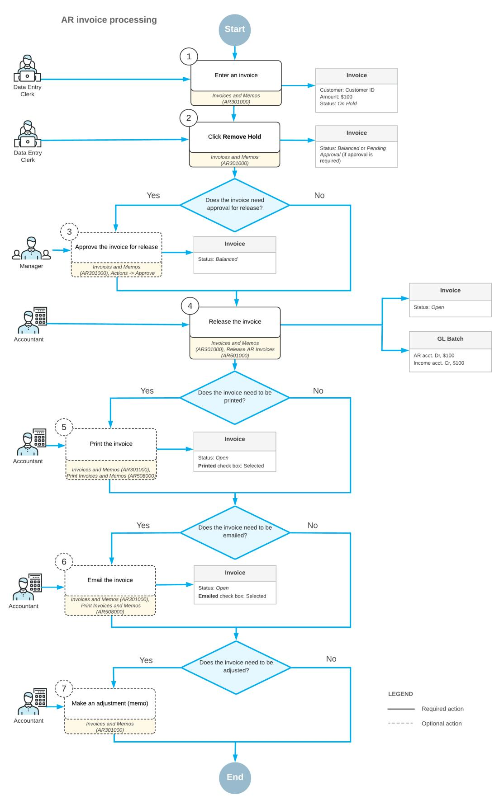

*Figure: AR invoice processing*

The following diagram illustrates the processing of an invoice with a payment applied to it. For details, see *[AR](#page-95-1) Invoices: To Create an AR Invoice and Apply a [Payment](#page-95-1) to It*.

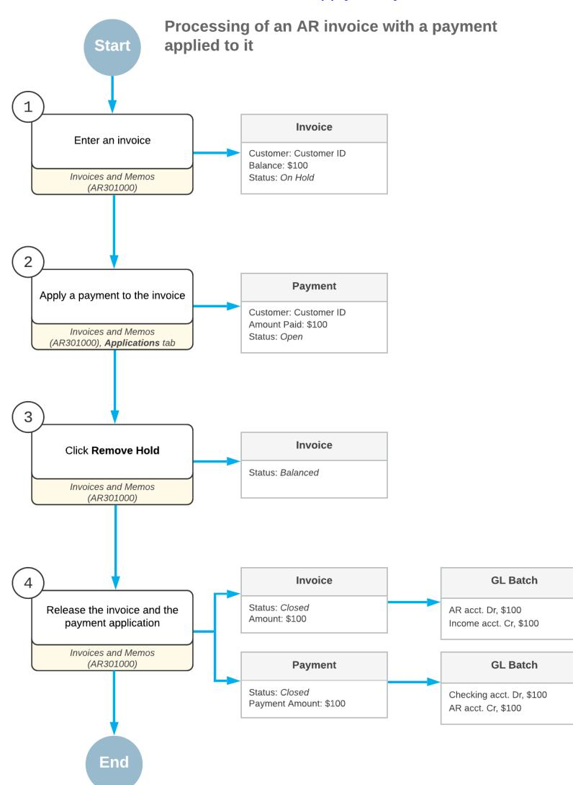

*Figure: Processing of an AR invoice with a payment applied*

### **AR Invoices: Invoice and Memo Processing Flow**

On the *[Invoices and Memos](https://help-2025r1.acumatica.com/Help?ScreenId=ShowWiki&pageid=5e6f3b27-b7af-412f-a40a-1d4f4be70cba)* (AR301000) form, Accounts Receivable documents of the following types can be entered directly: *Invoice*, *Credit Memo*, and *Debit Memo*. A document with the *Overdue Charges* type is generated by the system only, but you can further process it by using this form. The processing flow described below applies to documents of all these types.

Documents with the *Credit WO* type can be only viewed on this form. For details on writing off credits, see *Direct [Write-Offs:](https://help-2025r1.acumatica.com/Help?ScreenId=ShowWiki&pageid=7ea77da9-16f5-4e4e-be57-ada6c6e37989) To Process a Credit Write-Off*.

This topic describes the stages of processing these documents and the statuses that indicate these stages.

#### **Processing Stages**

During all the stages of processing an invoice, Acumatica ERP assigns the document a status that indicates its current state within the processing flow.

The main stages are the following:

1. Recording: In this stage, you create a document—that is, you enter all the necessary information into the system. When you save the document for the first time, the system assigns a unique reference number to it for tracking purposes. By default, the system assigns to the document the *Balanced* status when you initially save it. This status indicates that the user has finished editing the document and is ready to release it. (You still can edit a document with this status, however.) Alternatively, you can click the **Hold** button on the form toolbar to indicate that this document is not ready to be released; this changes the status of the document to *On Hold*. For details, see *[AR Invoices: Invoice Recording](#page-86-1)*.

> This stage does not apply to a document with the *Overdue Charges* type, which is generated only by the system. For details, see *[Overdue Charges: General Information](https://help-2025r1.acumatica.com/Help?ScreenId=ShowWiki&pageid=62b98449-6da7-4e5d-a19f-963c27527f11)*.

- 2. Releasing: You can release a document only if it has the *Balanced* status. When you release the document, the system changes its status to *Open*, updates the customer's balance, and generates a GL batch with the document transactions. This status indicates to users and the system that the document is pending a customer payment. For details, see *[AR Invoices: Invoice Releasing](#page-87-1)*.
- 3. Closing: When the full amount of the document is paid manually or automatically—by one payment for the full amount or by multiple payments—the system changes the status of the document to *Closed* and decreases the balances of the documents involved in the application. The system may change the balance of the customer if documents with different currencies are involved. For details on applying payments and closing invoices, see *[Paying AR Invoices](#page-116-2)*.

In addition to the actions you perform during the main stages, you may need to do the following:

- Print an invoice, memo, or an overdue charge and send it to a customer by postal mail or electronically. For details, see *[Invoice Printing and Emailing](#page-85-0)*.
- Correct an amount of a released document by issuing a credit or debit memo.
- Reverse a released document.

#### **Changes to the Workflow of an Invoice**

As described above, the three primary statuses the system assigns to an invoice are *Balanced*, *Open*, and *Closed*. In Acumatica ERP, you can require a user to perform additional steps during the recording of an invoice; these steps cause the invoice to be assigned additional statuses.

You can use invoice-wide settings, located under the **Data EntrySettings** section on the **General** tab of the *[Accounts Receivable Preferences](https://help-2025r1.acumatica.com/Help?ScreenId=ShowWiki&pageid=f7b52067-5299-45e8-b601-485cd709f58b)* (AR101000) form, to change the processing flow of invoices. For details, see *[Accounts Receivable: Adjustment of AR Preferences](https://help-2025r1.acumatica.com/Help?ScreenId=ShowWiki&pageid=0dd8b5bc-c399-457e-b3cc-26e6d76fd23b)*.

#### **Invoice Printing and Emailing**

Before you release an invoice or memo, your company's internal policies might require you to print it (to send it to the customer by mail), email it (to send it to the customer electronically), or both print it and email it. To implement such policies, you need to perform the following steps:

• Select the **Require Invoice/Memo Printing Before Release** or **Require Invoice/Memo Emailing Before Release** check box (or both) on the **General** tab of the *[Accounts Receivable Preferences](https://help-2025r1.acumatica.com/Help?ScreenId=ShowWiki&pageid=f7b52067-5299-45e8-b601-485cd709f58b)* (AR101000) form.

- Make sure that the printing and emailing preferences of your customers are configured for customer classes, as described in the *Default Printing and Emailing Settings* section of the *[Customers: Customer Class Settings](#page-14-1)* topic.
- Make sure that the corresponding mailings are configured, as described in the *[Configuring Predefined](#page-35-3) [Mailings for Customers](#page-35-3)* chapter.

To print and email AR documents before release, use the *[Invoices and Memos](https://help-2025r1.acumatica.com/Help?ScreenId=ShowWiki&pageid=5e6f3b27-b7af-412f-a40a-1d4f4be70cba)* form or *[Print/Email AR Documents](https://help-2025r1.acumatica.com/Help?ScreenId=ShowWiki&pageid=05451253-581e-459d-912e-ff983df762b9)* mass-processing form. See *AR Invoices: To [Mass-Print](#page-98-2) Invoices* and *[Mailings for Customers: Mass Processing](#page-40-2)* for more information.

When the user prints or emails the invoice or memo (or does both), the system selects the **Printed** or **Emailed** check box (or both) on the document entry form. The document is considered printed or emailed if the corresponding check box is selected. These settings can be viewed on the **Financial** tab of the *[Invoices and Memos](https://help-2025r1.acumatica.com/Help?ScreenId=ShowWiki&pageid=5e6f3b27-b7af-412f-a40a-1d4f4be70cba)* form, in the **Print and Email Options** section. The **Printed** and **Emailed** settings are affected only by the related actions performed on the *[Print/Email AR Documents](https://help-2025r1.acumatica.com/Help?ScreenId=ShowWiki&pageid=05451253-581e-459d-912e-ff983df762b9)* (AR508000) form.

#### **Related Links**

- *AR Invoices: Tracking AR [Documents](#page-90-1)*
- *[AR Invoices: Invoice Recording](#page-86-1)*
- *[AR Invoices: Invoice Releasing](#page-87-1)*
- *[Paying AR Invoices](#page-116-2)*
- *[Accounts Receivable Preferences](https://help-2025r1.acumatica.com/Help?ScreenId=ShowWiki&pageid=f7b52067-5299-45e8-b601-485cd709f58b)*
- *[Invoices and Memos](https://help-2025r1.acumatica.com/Help?ScreenId=ShowWiki&pageid=5e6f3b27-b7af-412f-a40a-1d4f4be70cba)*
- *[Payments and Applications](https://help-2025r1.acumatica.com/Help?ScreenId=ShowWiki&pageid=ae844bf4-1aef-42cd-9e2f-49b3ee1bc8d7)*

### **AR Invoices: Invoice Recording**

An invoice is a request for payment for goods sold or services rendered. In Acumatica ERP, an Accounts Receivable invoice holds the amount and cost of products or services that have been provided by your company, as well as the due date by which the customer should send payment for the goods or services that have been purchased.

In this topic, you will read about the sources of invoice creation, the groups of settings that make up an Accounts Receivable invoice, and the way the system uses the settings of the related entities to automatically fill in settings for the invoice, thus saving you time.

#### **Application of Credit Terms**

The due date of the document is calculated based on the credit terms associated with the customer, as are the days when the cash discount is available. By default, the system associates the document with the credit terms specified for the selected customer account, but you can change the default setting. If you do, the system automatically calculates the new due date and the end of the cash discount period. The system calculates the cash discount amount aer you have added at least one line to the document details. For details on the calculation of the credit period and cash discount period, see *Setup of Credit [Terms](https://help-2025r1.acumatica.com/Help?ScreenId=ShowWiki&pageid=bb0d243d-508c-4bf5-85b4-7b4fcc3d5fac)*.

#### **Tax Application**

If the calculation of taxes is configured in your system, the system calculates the applicable taxes for each invoice and records the tax amounts to the document. For details, see *Sales Taxes: General [Information](https://help-2025r1.acumatica.com/Help?ScreenId=ShowWiki&pageid=fde1a926-8a0f-4b9a-858e-2587345b2111)*, *Use Taxes: [General](https://help-2025r1.acumatica.com/Help?ScreenId=ShowWiki&pageid=326a24c4-1186-4ba4-918f-6d38dfc0bd42) [Information](https://help-2025r1.acumatica.com/Help?ScreenId=ShowWiki&pageid=326a24c4-1186-4ba4-918f-6d38dfc0bd42)*, and *[Value-Added](https://help-2025r1.acumatica.com/Help?ScreenId=ShowWiki&pageid=e5dfdf2f-366a-4582-95ca-e5cd1a120623) Taxes: General Information*.

If a line includes an inventory item, the system fills in the tax category based on the tax category assigned to the item; otherwise, the tax category is the default tax category defined for the tax zone associated with the location of the selected customer. The system uses these settings to define the applicable taxes. You can view the list of the applied taxes on the**Taxes** tab of the form.

If your system is integrated with the AvaTax service of Avalara or another specialized third-party soware, the applicable taxes are calculated by this service or soware and recorded to the document when you save the document. For details on this integration, see *[Integrating](https://help-2025r1.acumatica.com/Help?ScreenId=ShowWiki&pageid=f048ad33-3308-49aa-aac8-fec1a470fc0f) Acumatica ERP with Avalara Avatax*.

#### **Discount Application**

For each line, you can specify a manual discount offered to a customer, which may be a percent of the total amount or a manually entered amount. The system stores the discount details in the document and does not generate a separate transaction to be posted to GL accounts.

If the *Customer Discounts* feature is enabled on the *[Enable/Disable Features](https://help-2025r1.acumatica.com/Help?ScreenId=ShowWiki&pageid=c1555e43-1bc5-4f6f-ba9d-b323f94d8a6b)* (CS100000) form, you can configure various types of discounts that can be applied manually or automatically. The system generates separate transactions for discounts with the *Group-level* or *Document-level* types only. For details, see *[Configuring and](https://help-2025r1.acumatica.com/Help?ScreenId=ShowWiki&pageid=ef656bd9-688b-4c13-bedc-271d9c07d083) [Applying Customer Discounts](https://help-2025r1.acumatica.com/Help?ScreenId=ShowWiki&pageid=ef656bd9-688b-4c13-bedc-271d9c07d083)*.

#### **Payment Application**

When you enter an invoice and the specified customer has open payments, prepayments and credit memos, the system displays these documents on the **Applications** tab of the *[Invoices and Memos](https://help-2025r1.acumatica.com/Help?ScreenId=ShowWiki&pageid=5e6f3b27-b7af-412f-a40a-1d4f4be70cba)* (AR301000) form. By default, the system sorts these documents by their document type (credit memos, payments, and prepayments) and reference number in ascending order.

You can manually specify the paid amount in the **Amount Paid** column for the payment document or credit memo that you select. Alternatively, you can click **Auto-Apply** on the table toolbar. In this case, the system fills in the **Amount Paid** column, starting with the first document in the list, until the invoice balance is fully paid.

You can apply payments to unreleased invoices and debit memos (those that have the *On Hold* or *Balanced* status) and then release the document and its application to a payment at the same time.

When you release the invoice, the system does the following:

- 1. Creates and releases application records for the open payment documents that have a nonzero value specified in the **Amount Paid** column.
- 2. Decreases the balances of the invoice and the applied payments or credit memos.
- 3. If the balances of the invoice and the applied documents are zero, changes the status of these documents to *Closed*; otherwise, the status remains *Open*.

The system excludes payments and prepayments from the list of payment documents that can be applied to the invoice if they meet at least one of the following criteria:

- The open payment is linked to a sales order. That is, the payment has a reservation record or multiple reservation records on the **Orders to Apply** tab of the *[Payments and Applications](https://help-2025r1.acumatica.com/Help?ScreenId=ShowWiki&pageid=ae844bf4-1aef-42cd-9e2f-49b3ee1bc8d7)* (AR302000) form. For details, see *[Reserving Payments for Sales Orders](https://help-2025r1.acumatica.com/Help?ScreenId=ShowWiki&pageid=d0d85b37-8484-4a1d-8ccf-dc02ea6b187c)*.
- The open payment was put on hold. That is, a user clicked **Hold** on the form toolbar of the *[Payments and](https://help-2025r1.acumatica.com/Help?ScreenId=ShowWiki&pageid=ae844bf4-1aef-42cd-9e2f-49b3ee1bc8d7) [Applications](https://help-2025r1.acumatica.com/Help?ScreenId=ShowWiki&pageid=ae844bf4-1aef-42cd-9e2f-49b3ee1bc8d7)* form for the payment with the *Open* status, and the system changed the document status from *Open* to *Reserved*.

To release the payment from hold, click **Remove Hold** on the form toolbar.

### **AR Invoices: Invoice Releasing**

In Acumatica ERP, invoices that can be released manually have the following document types on the *[Invoices](https://help-2025r1.acumatica.com/Help?ScreenId=ShowWiki&pageid=5e6f3b27-b7af-412f-a40a-1d4f4be70cba) [and Memos](https://help-2025r1.acumatica.com/Help?ScreenId=ShowWiki&pageid=5e6f3b27-b7af-412f-a40a-1d4f4be70cba)* (AR301000) form: *Invoice*, *Debit Memo*, and *Overdue Charge*. The information in this topic applies to documents of these types.

When you release an invoice, the system does the following:

- Changes the status of the invoice to *Open*, so it appears in the list of the customer's outstanding documents. In the open invoice, you can edit the cash discount date and the due date until the document is settled
- Increases the customer's balance
- Generates a GL batch of transactions to update the asset and income accounts

An invoice with the *Credit Memo* type can be also released manually on the *[Invoices and Memos](https://help-2025r1.acumatica.com/Help?ScreenId=ShowWiki&pageid=5e6f3b27-b7af-412f-a40a-1d4f4be70cba)* form, but the release of a credit memo affects the balances of General Ledger accounts and customers differently.

This topic describes the forms you may use to release an invoice and the generation of the General Ledger batch.

#### **Releasing an Invoice**

You can release an invoice only if it has the *Balanced* status. In Acumatica ERP, you can release an invoice by using one of the following forms:

- *[Invoices and Memos](https://help-2025r1.acumatica.com/Help?ScreenId=ShowWiki&pageid=5e6f3b27-b7af-412f-a40a-1d4f4be70cba)*: You release an invoice by clicking the **Release** button on the form toolbar. For details, see *AR [Invoices:](#page-93-1) To Create an AR Invoice*.
- *[Release AR Documents](https://help-2025r1.acumatica.com/Help?ScreenId=ShowWiki&pageid=78ad2d21-b6a8-46d0-8f2d-98dd0a23f75e)* (AR501000): You use this mass-processing form to release a particular invoice or multiple invoices at once.

#### **Generating a GL Batch**

When you release an invoice, the system generates a batch of transactions to record the sale to the general ledger. The invoice includes all the information the system needs to generate the batch.

The following two accounts are usually involved:

- The asset account specified in the **AR Account** box on the **Financial** tab
- The income account specified for each line in the **Account** column on the **Details** tab

You can view the details of the batch associated with an invoice by clicking the link in the **Batch Nbr.** box on the **Financial** tab of the *[Invoices and Memos](https://help-2025r1.acumatica.com/Help?ScreenId=ShowWiki&pageid=5e6f3b27-b7af-412f-a40a-1d4f4be70cba)* form.

For a one-line invoice, the following transactions will be recorded to the general ledger when the invoice is released.

| Account                     | Debit  | Credit |
|-----------------------------|--------|--------|
| Accounts Receivable Account | Amount | 0.00   |
| Sales Account               | 0.00   | Amount |

If the calculation of taxes is configured in your system, the system calculates the applicable taxes for each invoice. The system records the tax amount to the liability account specified for each involved tax in the**Tax Payable Account** box on the **GL Accounts** tab of the *[Taxes](https://help-2025r1.acumatica.com/Help?ScreenId=ShowWiki&pageid=692e30c9-e0af-4aa3-b0f6-f3ba190d257a)* (TX205000) form. Thus, for a one-line invoice with a tax, the following transactions will be recorded to the general ledger when the invoice is released.

| Account                     | Debit               | Credit |
|-----------------------------|---------------------|--------|
| Accounts Receivable Account | Amount + Tax Amount | 0.00   |
| Sales Account               | 0.00                | Amount |

| Account             | Debit | Credit     |
|---------------------|-------|------------|
| Tax Payable Account | 0.00  | Tax Amount |

If the *Customer Discounts* feature is enabled on the *[Enable/Disable Features](https://help-2025r1.acumatica.com/Help?ScreenId=ShowWiki&pageid=c1555e43-1bc5-4f6f-ba9d-b323f94d8a6b)* (CS100000) form and you have configured manual or automatic discounts with the *Group-level* or *Document-level* type, the system adds separate transactions for applied discounts to the batch. The amount of the discount applied is recorded to the expense account specified in the **Discount Account** box on the **GL Accounts** tab of the *[Customers](https://help-2025r1.acumatica.com/Help?ScreenId=ShowWiki&pageid=652929bc-9606-4056-aa6e-0c2d1147171b)* (AR303000) form. Thus, for a one-line invoice with a tax and a document-level discount applied, the following transactions will be recorded to the general ledger when the invoice is released.

| Account                     | Debit               | Credit     |
|-----------------------------|---------------------|------------|
| Accounts Receivable Account | Amount + Tax Amount | 0.00       |
| Sales Account               | 0.00                | Amount     |
| Discount Account            | Discount Total      | 0.00       |
| Tax Payable Account         | 0.00                | Tax Amount |

If the *Invoice Rounding* feature is enabled on the *[Enable/Disable Features](https://help-2025r1.acumatica.com/Help?ScreenId=ShowWiki&pageid=c1555e43-1bc5-4f6f-ba9d-b323f94d8a6b)* form, one more account may be involved: the rounding account, which is updated by the amounts resulting from rounding the document total. The small amount resulting from rounding may be posted as a debit or a credit, depending on its sign. If an invoice is in the base currency, the system uses the rounding gain and loss accounts specified in the **RoundingSettings** section of the *[General Ledger Preferences](https://help-2025r1.acumatica.com/Help?ScreenId=ShowWiki&pageid=e4913d06-c511-4258-a0f9-f36c1b854e6b)* (GL102000) form. If an invoice is in a foreign currency, the system uses the accounts specified for this currency on the *[Currencies](https://help-2025r1.acumatica.com/Help?ScreenId=ShowWiki&pageid=533be28d-b9e1-4d77-9b62-b06bb90a8b3b)* form. For details, see *[Rounding of AR Document Amounts: General](#page-64-2) [Information](#page-64-2)*. Thus, for a one-line invoice with a tax and the rounding is set to increase the invoice total, the following transactions will be recorded to the general ledger when the invoice is released.

| Account                      | Debit                       | Credit                     |
|------------------------------|-----------------------------|----------------------------|
| Accounts Receivable Account  | Rounded Amount + Tax Amount | 0.00                       |
| Sales Account                | 0.00                        | Amount                     |
| Tax Payable Account          | 0.00                        | Tax Amount                 |
| Rounding Gain / Loss Account | 0.00                        | Rounding Difference Amount |

If the invoice is in a foreign currency, its details must be recalculated in the base currency of your system. To record the difference resulting from rounding during currency conversion, the system uses the rounding gain and loss accounts specified for the document currency on the *[Currencies](https://help-2025r1.acumatica.com/Help?ScreenId=ShowWiki&pageid=533be28d-b9e1-4d77-9b62-b06bb90a8b3b)* form. The small amount resulting from the currency rounding may be posted as a debit or a credit, depending on its sign. For details, see *[AR Invoices in](https://help-2025r1.acumatica.com/Help?ScreenId=ShowWiki&pageid=ab812c9e-e0df-4c7b-a81b-7b8e5f5c5553) [Foreign Currencies: Process Activity](https://help-2025r1.acumatica.com/Help?ScreenId=ShowWiki&pageid=ab812c9e-e0df-4c7b-a81b-7b8e5f5c5553)*.

Commission amounts are visible for the invoice, but commission-related transactions are not included in the batch. To calculate commissions and generate appropriate transactions, use the *[Calculate Commissions](https://help-2025r1.acumatica.com/Help?ScreenId=ShowWiki&pageid=4ab4a3f8-4c62-4720-a844-9f3f89a82c40)* (AR505500) form.

#### **Related Links**

- *[AR Invoices: Invoice and Memo Processing Flow](#page-84-1)*
- *[AR Invoices: Invoice Recording](#page-86-1)*
- *[Configuring and Applying Customer Discounts](https://help-2025r1.acumatica.com/Help?ScreenId=ShowWiki&pageid=ef656bd9-688b-4c13-bedc-271d9c07d083)*
- *[Invoices and Memos](https://help-2025r1.acumatica.com/Help?ScreenId=ShowWiki&pageid=5e6f3b27-b7af-412f-a40a-1d4f4be70cba)*

- *[General Ledger Preferences](https://help-2025r1.acumatica.com/Help?ScreenId=ShowWiki&pageid=e4913d06-c511-4258-a0f9-f36c1b854e6b)*
- *[Calculate Commissions](https://help-2025r1.acumatica.com/Help?ScreenId=ShowWiki&pageid=4ab4a3f8-4c62-4720-a844-9f3f89a82c40)*
- *[Currencies](https://help-2025r1.acumatica.com/Help?ScreenId=ShowWiki&pageid=533be28d-b9e1-4d77-9b62-b06bb90a8b3b)*

### **AR Invoices: Tracking AR Documents**

An AR document goes through the following states during its life cycle:

- 1. Recorded: Documents that have been entered but not released
- 2. Released: Documents that have been released but not closed
- 3. Closed: Documents that have been released and closed

In Acumatica ERP, you can track information about Accounts Receivable documents in each state by using inquiries and reports in the module.

#### **Tracking Recorded AR Documents**

To track documents that have been entered but not released (and have the *On Hold*, *Pending Print*, *Pending Email*, or *Balanced* status), you can use the following inquiry and reports:

- *[Customer Details](https://help-2025r1.acumatica.com/Help?ScreenId=ShowWiki&pageid=2ed5542b-a76c-4cfd-9ee3-52c2f08a2692)* (AR402000) You select a specific customer and select the **Include Unreleased Documents** check box to view the list of unreleased documents associated with the customer, along with the documents with the other processing stages (which you can filter out by using simple filters).
- *[AR Edit](https://help-2025r1.acumatica.com/Help?ScreenId=ShowWiki&pageid=5b376528-bcbc-4b88-b055-57aa86da4635)* (AR611000): You can view the Accounts Receivable documents that were entered but not released for all customers or select a specific customer and view only the documents for that customer. Documents are listed by document type, financial period, and document date.
- *[AR Edit Detailed](https://help-2025r1.acumatica.com/Help?ScreenId=ShowWiki&pageid=9b517c23-e989-422a-8933-0fdb2a388218)* (AR610500): You can view all the Accounts Receivable documents that were created but not released or select a specific document type and view only documents of that type. Documents are shown with all details and listed by the financial period, the document date, and the customer of the document.

#### **Tracking Released AR Documents**

To track released documents (which have the *Open* status), you can use the following inquiry and reports:

- *[Customer Details](https://help-2025r1.acumatica.com/Help?ScreenId=ShowWiki&pageid=2ed5542b-a76c-4cfd-9ee3-52c2f08a2692)*: You select a specific customer and make sure that the**Show All Documents** and **Include Unreleased Documents** check boxes are cleared to view the list of open documents associated with the customer.
- *[AR Register](https://help-2025r1.acumatica.com/Help?ScreenId=ShowWiki&pageid=052d83b2-b676-4ebc-9ec5-6f616a98484c)* (AR621500): You can view the Accounts Receivable documents for all customers or select a specific customer and view only the documents of that customer. Documents are arranged by type, date, and customer account. Document amounts are shown in the original currency and in the base currency.
- *[AR Register Detailed](https://help-2025r1.acumatica.com/Help?ScreenId=ShowWiki&pageid=3299e1f2-b865-496e-9573-b98d988ddd16)* (AR622000): You can view all the documents released in the specified financial period or select a specific document type and view only the documents of that type. Documents are arranged by type, date, and customer account. The details include the batch number and batch transactions. Document amounts are shown in the original currency and in the base currency.
- *[AR Aging](https://help-2025r1.acumatica.com/Help?ScreenId=ShowWiki&pageid=01596f87-710b-4b01-abad-ab0932c27884)* (AR631000) and *[AR Aging MC](https://help-2025r1.acumatica.com/Help?ScreenId=ShowWiki&pageid=3fb84a67-cce3-4efb-94a8-6ba37c15a392)* (AR631100): You can view the documents for all customers or select a particular customer to view only the documents of that customer. Documents are listed by statement cycle and by customer, broken down by aging periods. You use these reports to determine which documents are overdue for payment and for how long.
- *[AR Aging by Project](https://help-2025r1.acumatica.com/Help?ScreenId=ShowWiki&pageid=19b96a27-ee03-4081-971d-803baea6719c)* (AR631200): You can view the documents for all customers or select a particular customer to view only the documents of that customer. Documents are listed by the project assigned to the AR documents, by the statement cycle, and by the customer, and these documents are broken down by aging periods. You use these reports to determine which documents are overdue for payment and for how long.

- *[AR Coming Due](https://help-2025r1.acumatica.com/Help?ScreenId=ShowWiki&pageid=2f1aad5f-f4ba-421f-9bc4-fe260ba464e7)* (AR631500) and *[AR Coming Due MC](https://help-2025r1.acumatica.com/Help?ScreenId=ShowWiki&pageid=6786ca09-3fb6-4196-8401-d81569b0d71f)* (AR631600): You can view the documents for all customers or select a particular customer to view only the documents of that customer. Documents are listed by statement cycle and by customer, broken down by aging periods. These reports are designed to show when you should expect to get payments for the outstanding documents.
- *[AR Aged Period-Sensitive](https://help-2025r1.acumatica.com/Help?ScreenId=ShowWiki&pageid=29b0c0da-d891-4f1e-9daa-7e440032682b)* (AR630500): You can view the documents (by statement cycle and by customer) that are outstanding at the end of the specified period, broken down by aging periods. The balances are arranged by days past due on the last day of the specified period. All the amounts are shown in the base currency.
- *[AR Aged Period-Sensitive by Project](https://help-2025r1.acumatica.com/Help?ScreenId=ShowWiki&pageid=778c4489-a43c-4d02-afe2-0d67cb88cd40)* (AR630600): You can view the documents (by project, by statement cycle, and by customer) that are outstanding at the end of the specified period. The documents are broken down by aging periods or financial periods, depending on the settings of the statement cycle specified for each customer. The balances are arranged by days past due on the last day of the specified period. All the amounts are shown in the base currency.

#### **Tracking Closed AR Documents**

To track processed documents that have the *Closed* status, you can use the *[Customer Details](https://help-2025r1.acumatica.com/Help?ScreenId=ShowWiki&pageid=2ed5542b-a76c-4cfd-9ee3-52c2f08a2692)* (AR402000) inquiry. You select a specific customer and select the**Show All Documents** check box to view the list of closed documents associated with the customer along with the documents with other processing stages (which can be filtered out by using simple filters).

#### **Related Links**

- *[Preparation of Dunning Letters: Using the AR Aging Report](https://help-2025r1.acumatica.com/Help?ScreenId=ShowWiki&pageid=29ef9c86-8f91-4705-bdfc-a649053c8e22)*
- *To Track Customer [Prepayments](#page-21-1)*

### **AR Invoices: Implementation Checklist**

To ensure that the system has been configured properly for the processing of AR invoices, make sure that the criteria listed in the table have been met in the system as described.

#### **Implementation Checklist**

We recommend that before you initially process AR invoices, you make sure the needed features have been enabled, settings have been specified, and entities have been created, as summarized in the following checklist.

| Form                               | Criteria to Check                                                                                                                                                                                                                                                                 | Notes |
|------------------------------------|-----------------------------------------------------------------------------------------------------------------------------------------------------------------------------------------------------------------------------------------------------------------------------------|-------|
| Enable/Disable Features (CS100000) | Make sure the minimal features have been enabled, as described in Company Without Branches: General Information, Company with Branches that Do Not Require Balancing: Gen eral Information, and Company with Branches that Require Balancing: General Information. |       |
| Customers (AR303000)               | Be sure that the customer accounts for the customers for which you will create AR invoic es have been defined.                                                                                                                                                              |       |

| Form                                                  | Criteria to Check                                                                                                                                                             | Notes |
|-------------------------------------------------------|-------------------------------------------------------------------------------------------------------------------------------------------------------------------------------|-------|
| Non-Stock Items (IN202000), Stock Items (IN202500) | Verify the existence of non-stock items or stock items that can be used when you are creating AR invoices. For details, see Non Stock Item: Implementation Activity. |       |

#### **Settings That Affect the Workflow**

In general, you use accounts receivable forms specifically for sales made on credit. The following settings and entities should be specified and defined, respectively:

- The following general ledger settings should be specified on the **General** tab (**PostingSettings** section) of the *[General Ledger Preferences](https://help-2025r1.acumatica.com/Help?ScreenId=ShowWiki&pageid=e4913d06-c511-4258-a0f9-f36c1b854e6b)* (GL102000) form:
  - Make sure that the **Automatically Post on Release** check box is selected. This setting causes GL batches to be immediately posted aer they are released.
  - Clear the **Generate Consolidated Batches** check box to cause every AR transaction you enter to be posted as an individual batch to the general ledger. (When this check box is selected, the system consolidates into a single batch all transactions in the same currency posted to the same period for all documents being released.)
- The following accounts receivable settings should be specified on the **General** tab of the *[Accounts](https://help-2025r1.acumatica.com/Help?ScreenId=ShowWiki&pageid=f7b52067-5299-45e8-b601-485cd709f58b) [Receivable Preferences](https://help-2025r1.acumatica.com/Help?ScreenId=ShowWiki&pageid=f7b52067-5299-45e8-b601-485cd709f58b)* (AR101000) form:
  - Select the **Hold Documents on Entry** check box in the **Data EntrySettings** section. This setting gives the created AR invoices the *On Hold* status.
  - Clear the **Require Payment Reference on Entry** check box in the **Data EntrySettings** section. This setting means that you do not have to enter a payment reference number in the **Payment Ref.** box when creating a payment on the *[Payments and Applications](https://help-2025r1.acumatica.com/Help?ScreenId=ShowWiki&pageid=ae844bf4-1aef-42cd-9e2f-49b3ee1bc8d7)* (AR302000) form.
  - Make sure that the **Automatically Post on Release** check box is selected in the **PostingSettings** section. This setting causes AR invoices to be automatically posted to the general ledger once they are released.

With these settings specified and entities defined, users in your company can record and process documents in Acumatica ERP quickly and accurately, with a minimum of manual actions.

### **AR Invoices: Generated Transactions**

When you release an invoice, the system generates a batch of transactions to reflect the sale in the general ledger. The invoice includes all the information the system needs to generate the batch.

You can view the details of the batch associated with the release of an invoice by clicking the link in the **Batch Nbr.** box on the **Financial** tab of the *[Invoices and Memos](https://help-2025r1.acumatica.com/Help?ScreenId=ShowWiki&pageid=5e6f3b27-b7af-412f-a40a-1d4f4be70cba)* (AR301000) form.

The following accounts are usually involved:

- The asset account, which is specified in the **AR Account** box on the **Financial** tab
- The income account specified for each line in the **Account** column on the **Details** tab

For a one-line invoice, the following transaction will be recorded to the general ledger when the invoice is released.

| Account                     | Debit  | Credit |
|-----------------------------|--------|--------|
| Accounts Receivable account | Amount | 0.00   |

| Account       | Debit | Credit |
|---------------|-------|--------|
| Sales account | 0.00  | Amount |

### **AR Invoices: To Create an AR Invoice**

The following activity will walk you through the process of creating and releasing an AR invoice.

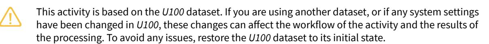

#### **Video Tutorial**

This video shows you the common process but may contain less detail than the activity has. If you want to repeat the activity on your own or you are preparing to take the certification exam, we recommend that you follow the instructions in the steps of the activity.

#### *[FEEDBACK](https://www.surveymonkey.com/r/BLBL7RJ?Video=Working%20with%20AR%20Invoices&Source=Open%20Uni&Course=F100)*

#### **Story**

Suppose that today the GoodFood One Restaurant purchased four hours of on-site training from the SweetLife Fruits & Jams company for the amount of \$248. Acting as a SweetLife accountant, you need to create an AR invoice for the customer and release the invoice.

#### **Configuration Overview**

For the purposes of this activity, the following features have been enabled on the *[Enable/Disable Features](https://help-2025r1.acumatica.com/Help?ScreenId=ShowWiki&pageid=c1555e43-1bc5-4f6f-ba9d-b323f94d8a6b)* (CS100000) form:

- *Standard Financials*, which provides the standard financial functionality
- *Multibranch Support*, which supports multiple branches in your instance of Acumatica ERP
- *Multicompany Support*, which supports multiple companies within one tenant

On the *[Accounts Receivable Preferences](https://help-2025r1.acumatica.com/Help?ScreenId=ShowWiki&pageid=f7b52067-5299-45e8-b601-485cd709f58b)* (AR101000) form, the **Hold Documents on Entry** check box has been selected in the **Data EntrySettings** section.

On the *[Customers](https://help-2025r1.acumatica.com/Help?ScreenId=ShowWiki&pageid=652929bc-9606-4056-aa6e-0c2d1147171b)* (AR303000) form, the *GOODFOOD (GoodFood One Restaurant)* customer has been configured.

#### **Process Overview**

In this activity, you will create an invoice for the customer purchase on the *[Invoices and Memos](https://help-2025r1.acumatica.com/Help?ScreenId=ShowWiki&pageid=5e6f3b27-b7af-412f-a40a-1d4f4be70cba)* (AR301000) form. In the invoice, you will specify all relevant settings, including the customer and the credit terms, and the document details on the **Details** tab. When the invoice is ready, you will release the document.

#### **System Preparation**

To prepare the system, do the following:

1. Launch the Acumatica ERP website, and sign in to a company with the *U100* dataset preloaded. To sign in as an accountant, use the following credentials:

- Username: *johnson*
- Login: *123*
- 2. In the info area, in the upper-right corner of the top pane of the Acumatica ERP screen, make sure that the business date in your system is set to *1/30/2025*. If a different date is displayed, click the Business Date menu button and select *1/30/2025*. For simplicity, in this process activity, you will create and process all documents in the system on this business date.
- 3. On the Company and Branch Selection menu, also on the top pane of the Acumatica ERP screen, make sure that the *SweetLife Head Office and Wholesale Center* branch is selected. If it is not selected, click the Company and Branch Selection menu to view the list of branches that you have access to, and then click *SweetLife Head Office and Wholesale Center*.

#### **Step 1: Creating an AR Invoice**

To create an AR invoice, do the following:

1. Open the *[Invoices and Memos](https://help-2025r1.acumatica.com/Help?ScreenId=ShowWiki&pageid=5e6f3b27-b7af-412f-a40a-1d4f4be70cba)* (AR301000) form.

To open the form for creating a new record, type the form ID in the Search box, and on the Search form, point at the form title and click **New** right of the title.

- 2. Click **Add New Record** on the form toolbar, and specify the following settings in the Summary area:
  - **Type**: *Invoice*
  - **Customer**: *GOODFOOD*
  - **Terms**: *30D* (inserted by default based on the selected customer)
  - **Date**: *1/30/2025* (the current business date, which is inserted by default)
  - **Post Period**: *01-2025* (inserted by default based on the selected date)
  - **Description**: On-site training 4 hours
- 3. On the **Details** tab, click **Add Row**, and specify the following settings for the added row:
  - **Branch**: *HEADOFFICE* (inserted by default)
  - **Transaction Descr.**: On-site training 4 hours
  - **Ext. Price**: 248
- 4. On the form toolbar, click**Save**.

#### **Step 2: Releasing the AR Invoice**

To release the AR invoice, do the following:

1. While you are still on the *[Invoices and Memos](https://help-2025r1.acumatica.com/Help?ScreenId=ShowWiki&pageid=5e6f3b27-b7af-412f-a40a-1d4f4be70cba)* (AR301000) form, click **Remove Hold** on the form toolbar.

The system changes the status of the invoice to *Balanced*. You can release an invoice only if it has this status.

2. On the form toolbar, click **Release**.

The system changes the status of the invoice to *Open*. The released invoice is shown in the following screenshot.

| <b>Invoices and Memos</b>                                         |                                              | Invoice 000119 - GoodFood One Restaurant                      |                          |                                          |                 |                   |            |                            |                           | <b>PINOTES</b> | <b>ACTIVITIES</b> | <b>FILES</b>       | TOOLS $\sim$         |
|-------------------------------------------------------------------|----------------------------------------------|---------------------------------------------------------------|--------------------------|------------------------------------------|-----------------|-------------------|------------|----------------------------|---------------------------|----------------|-------------------|--------------------|----------------------|
| 罰 $\Box$ $\leftarrow$                                       | $\Omega$ $\pm$                            | 0 ागि $\mathsf{K}$ $\check{ }$                       | ≺ $\rightarrow$       | Ы <b>PAY</b>                          | $\cdots$        |                   |            |                            |                           |                |                   |                    |                      |
| Type:                                                             | Invoice $\checkmark$                      | Customer:                                                     |                          | !!!!!!!!!!!!!!!!!!!!!!!!!!!!!!!!!!!!!!!! | $\mathscr{D}$   | Detail Total:     | 248.00     |                            |                           |                |                   |                    | $\sim$               |
| Reference Nbr.:                                                   | 000119 م                                  | Location: <b>MAIN - Primary Location</b>                   |                          |                                          | Line Discounts: |                   | 0.00       |                            |                           |                |                   |                    |                      |
| Status:                                                           | Open                                         | Terms:                                                        | 30D - 30 Days            |                                          |                 | Document Dis      |            | 0.00                       |                           |                |                   |                    |                      |
| Date:                                                             | 1/30/2025                                    | * Due Date:                                                   | 自 3/1/2025            |                                          |                 | Retained Amo      |            | 0.00                       |                           |                |                   |                    |                      |
| Post Period:                                                      | 01-2025                                      | * Cash Discount                                               | 户 3/1/2025            | Pay by Line                              |                 | Tax Total:        |            | 0.00                       |                           |                |                   |                    |                      |
| Customer Ord                                                      |                                              | Project:                                                      | X - Non-Project Code.    |                                          | $\mathscr{Q}$   | <b>Amount:</b>    | 248.00     |                            |                           |                |                   |                    |                      |
|                                                                   |                                              |                                                               |                          |                                          |                 | Balance:          | 248.00     |                            |                           |                |                   |                    |                      |
| Description:                                                      | On-site training 4 hours                     |                                                               |                          |                                          |                 | Cash Discount:    |            | 0.00                       |                           |                |                   |                    |                      |
| <b>DETAILS</b> Ò $+$ P                                   | <b>FINANCIAL</b> $\mathbb{H}$ $\times$ | <b>ADDRESSES</b> <b>TAXES</b> $\mathbf{N}$ $\Lambda$ | <b>APPLICATIONS</b>      | COMPLIANCE                               |                 |                   |            |                            |                           |                |                   |                    |                      |
|                                                                   |                                              |                                                               |                          |                                          |                 |                   |            |                            |                           |                |                   |                    |                      |
| !!!!!!!!!!!!!!!!!!!!!!!!!!!!!!!!!!!!!!!! <b>B</b> 0 *Branch | <b>Inventory ID</b>                          | <b>Transaction Descr.</b>                                     |                          | Quantity UOM                             |                 | <b>Unit Price</b> | Ext. Price | <b>Discount</b> Percent | <b>Discount</b> Amount |                | Amount *Account   | <b>Description</b> |                      |
| $\mathbf{0}$ D HEADOFFICE                                      |                                              |                                                               | On-site training 4 hours | 0.00                                     |                 | 0.0000            | 248.00     | 0.000000                   | 0.00                      | 248.00         | 40000             |                    | <b>Sales Revenue</b> |

*Figure: The released AR invoice*

#### **Step 3: Reviewing the GL Transaction Generated when the Invoice Is Released**

To review the GL transaction generated on invoice release, do the following:

1. On the *[Invoices and Memos](https://help-2025r1.acumatica.com/Help?ScreenId=ShowWiki&pageid=5e6f3b27-b7af-412f-a40a-1d4f4be70cba)* (AR301000) form with the invoice opened, open the **Financial** tab, and click the link in the **Batch Nbr.** box.

When you released the invoice, the system generated and released this batch in the general ledger. The system assigned the batch the next number in the sequence specified in the **GL Batch Numbering Sequence** box on the *[Accounts Receivable Preferences](https://help-2025r1.acumatica.com/Help?ScreenId=ShowWiki&pageid=f7b52067-5299-45e8-b601-485cd709f58b)* (AR101000) form, which determines the numbers assigned to batches generated from the accounts receivable subledger.

2. On the *Journal [Transactions](https://help-2025r1.acumatica.com/Help?ScreenId=ShowWiki&pageid=dda046bc-5946-407f-88f7-1c0c966fbe72)* (GL301000) form, which is opened, review the transaction that has been generated on the release of the invoice.

The *11000 (Accounts Receivable)* AR account specified in the invoice has been debited with \$248, while the *40000 (Sales Revenue)* income account has been credited in the same amount.

### **AR Invoices: To Create an AR Invoice and Apply a Payment to It**

The following activity will walk you through the process of creating an AR invoice, applying a payment to it, and releasing the invoice and its application.

This activity is based on the *U100* dataset. If you are using another dataset, or if any system settings have been changed in *U100*, these changes can affect the workflow of the activity and the results of the processing. To avoid any issues, restore the *U100* dataset to its initial state.

#### **Video Tutorial**

This video shows you the common process but may contain less detail than the activity has. If you want to repeat the activity on your own or you are preparing to take the certification exam, we recommend that you follow the instructions in the steps of the activity.

*[FEEDBACK](https://www.surveymonkey.com/r/BLBL7RJ?Video=Working%20with%20AR%20Invoices&Source=Open%20Uni&Course=F100)*

#### **Story**

Suppose that on January 26, 2025, Cakeado Cafe made a payment of \$429 to SweetLife Fruits & Jams for a training course that its employees were going to take on January 30, 2025. Acting as a SweetLife accountant, you need to create an AR invoice for the customer, apply the payment to it, and release the invoice and the payment application.

#### **Configuration Overview**

In the *U100* dataset, the following configuration tasks have been performed to prepare the system for this activity to be performed:

- On the *[Enable/Disable Features](https://help-2025r1.acumatica.com/Help?ScreenId=ShowWiki&pageid=c1555e43-1bc5-4f6f-ba9d-b323f94d8a6b)* (CS100000) form, the *Standard Financials*, *Multibranch Support*, and *Multicompany Support* features have been enabled.
- On the *[Accounts Receivable Preferences](https://help-2025r1.acumatica.com/Help?ScreenId=ShowWiki&pageid=f7b52067-5299-45e8-b601-485cd709f58b)* (AR101000) form, the **Hold Documents on Entry** check box has been selected in the **Data EntrySettings** section.
- On the *[Customers](https://help-2025r1.acumatica.com/Help?ScreenId=ShowWiki&pageid=652929bc-9606-4056-aa6e-0c2d1147171b)* (AR303000) form, the *CAKEADO (Cakeado Cafe)* customer has been configured.

#### **Process Overview**

In this activity, on the *[Invoices and Memos](https://help-2025r1.acumatica.com/Help?ScreenId=ShowWiki&pageid=5e6f3b27-b7af-412f-a40a-1d4f4be70cba)* (AR301000) form, you will create an AR invoice, and apply a payment to it. You will then release the invoice and the payment application to close both the invoice and the payment. On the *[Payments and Applications](https://help-2025r1.acumatica.com/Help?ScreenId=ShowWiki&pageid=ae844bf4-1aef-42cd-9e2f-49b3ee1bc8d7)* (AR302000) form, you will review the payment to make sure that its status is *Closed*.

#### **System Preparation**

To prepare the system, do the following:

- 1. Launch the Acumatica ERP website, and sign in to a company with the *U100* dataset preloaded. You should sign in as Anna Johnson by using the *johnson* username and the *123* password.
- 2. In the info area, in the upper-right corner of the top pane of the Acumatica ERP screen, make sure that the business date in your system is set to *1/30/2025*. If a different date is displayed, click the Business Date menu button and select *1/30/2025* on the calendar. For simplicity, in this activity, you will create and process all documents in the system on this business date.
- 3. On the Company and Branch Selection menu, on the top pane of the Acumatica ERP screen, select the *SweetLife Head Office and Wholesale Center* branch.

#### **Step 1: Creating an AR Invoice**

To create an AR invoice, do the following:

1. Open the *[Invoices and Memos](https://help-2025r1.acumatica.com/Help?ScreenId=ShowWiki&pageid=5e6f3b27-b7af-412f-a40a-1d4f4be70cba)* (AR301000) form.

To open the form for creating a new record, type the form ID in the Search box, and on the Search form, point at the form title and click **New** right of the title.

- 2. On the form toolbar, click **Add New Record**.
- 3. Specify the following settings in the Summary area:
  - **Type**: *Invoice*
  - **Customer**: *CAKEADO*
  - **Terms**: *30D* (inserted by default based on the selected customer)

- **Date**: *1/30/2025* (the current business date, which is inserted by default)
- **Post Period**: *01-2025* (inserted by default based on the selected date)
- **Description**: On-site training
- 4. On the **Details** tab, click **Add Row** on the table toolbar.
- 5. Specify the following settings for the added row:
  - **Branch**: *HEADOFFICE* (inserted by default)
  - **Transaction Descr.**: On-site training
  - **Ext. Price**: 429
- 6. On the form toolbar, click**Save**.

The invoice has been saved with the *On Hold* status.

#### **Step 2: Applying the Payment to the Invoice**

To apply the payment that has been already created in the system to the invoice, do the following:

- 1. While you are still on the *[Invoices and Memos](https://help-2025r1.acumatica.com/Help?ScreenId=ShowWiki&pageid=5e6f3b27-b7af-412f-a40a-1d4f4be70cba)* (AR301000) form with the invoice opened, on the **Applications** tab, click **Add Row** on the table toolbar.
- 2. In the added row, specify the following settings:
  - **Doc.Type**: *Payment*
  - **Reference Nbr.**: A payment for \$429 dated 1/26/2025
  - **Amount Paid**: 429
- 3. On the form toolbar, click**Save**.

The following screenshot illustrates the unreleased AR invoice to which the payment has been applied.

| <b>Invoices and Memos</b> Invoice 000120 - Cakeado Cafe |                   |                                            |                                          |                                         |                     | <b>PINOTES</b>                        | <b>ACTIVITIES</b> | <b>FILES</b> | TOOLS $\sim$               |                   |  |              |
|------------------------------------------------------------|-------------------|--------------------------------------------|------------------------------------------|-----------------------------------------|---------------------|---------------------------------------|-------------------|--------------|----------------------------|-------------------|--|--------------|
| 周 日 $\leftarrow$                                     | $\pm$ $\Omega$ | 侕 0 к $\check{ }$                 | $\geq$ ≺ $\rightarrow$             | <b>REMOVE HOLD</b>                      | $\cdots$            |                                       |                   |              |                            |                   |  |              |
| Type:                                                      | Invoice           | Customer: $\checkmark$                  | CAKEADO - Cakeado Cafe                   |                                         | Detail Total: D  | 429.00                                |                   |              |                            |                   |  | $\sim$       |
| Reference Nbr.                                             | 000120            | ۹ * Location:                           | <b>MAIN - Primary Location</b>           | ام                                      | Line Discounts:     | 0.00                                  |                   |              |                            |                   |  |              |
| Status:                                                    | On Hold           | * Terms:                                   | 30D - 30 Days                            | α                                       | Document Dis        | 0.00                                  |                   |              |                            |                   |  |              |
| * Date:                                                    | 1/30/2025         | O. * Due Date:                          | 3/1/2025 Ħ                            | Apply Retainage                         | Retained Amo        | 0.00                                  |                   |              |                            |                   |  |              |
| * Post Period:                                             | 01-2025           | * Cash Discount Q                       | 3/1/2025 A.                           | Pay by Line                             | <b>Tax Total:</b>   | 0.00                                  |                   |              |                            |                   |  |              |
| Customer Ord                                               |                   | * Project:                                 | !!!!!!!!!!!!!!!!!!!!!!!!!!!!!!!!!!!!!!!! | 00                                      | Balance:            | 429.00                                |                   |              |                            |                   |  |              |
|                                                            |                   |                                            |                                          |                                         | Cash Discount:      | 0.00                                  |                   |              |                            |                   |  |              |
| Description:                                               | On-site training  |                                            |                                          |                                         |                     |                                       |                   |              |                            |                   |  |              |
|                                                            |                   |                                            |                                          |                                         |                     |                                       |                   |              |                            |                   |  |              |
|                                                            |                   |                                            |                                          |                                         |                     |                                       |                   |              |                            |                   |  |              |
| <b>DETAILS</b>                                             | <b>FINANCIAL</b>  | <b>ADDRESSES</b> <b>TAXES</b>           | <b>APPLICATIONS</b>                      | COMPLIANCE                              |                     |                                       |                   |              |                            |                   |  |              |
| O $\pm$ $\times$                                     |                   | <b>LOAD DOCUMENTS</b> <b>AUTO APPLY</b> | $\mathbf{\overline{N}}$ н             |                                         |                     |                                       |                   |              |                            |                   |  |              |
| !!!!!!!!!!!!!!!!!!!!!!!!!!!!!!!!!!!!!!!! $\Box$ 80   | <b>Branch</b>     | *Reference *Doc. Type Nbr.           | <b>Amount Paid</b>                       | Cash <b>Discount</b> <b>Taken</b> | Write-Off Amount | Write-Off Reason Payment Code Date |                   |              | <b>Balance Description</b> | Payment Period |  | Payment Ref. |
| $0$ D ☑                                                 | <b>HEADOFFICE</b> | 000068 Payment                          | 429.00                                   | 0.0000                                  | 0.00                | <b>BALWOFF</b>                        | 1/26/2025         | 0.00         | On-site training course    | 01-2025           |  | 0024         |

*Figure: The invoice with the payment applied to it*

#### **Step 3: Releasing the Invoice and Payment Application**

To release the invoice and its application to the payment, do the following:

- 1. While you are still on the *[Invoices and Memos](https://help-2025r1.acumatica.com/Help?ScreenId=ShowWiki&pageid=5e6f3b27-b7af-412f-a40a-1d4f4be70cba)* (AR301000) form, click **Remove Hold** on the form toolbar. The system changes the status of the invoice to *Balanced*.
- 2. On the form toolbar, click **Release**. The system changes the status of the invoice to *Closed* because it has been fully applied to the payment.

- 3. On the **Applications** tab, click the link in the **Reference Nbr.** column for the payment. The system opens the payment on the *[Payments and Applications](https://help-2025r1.acumatica.com/Help?ScreenId=ShowWiki&pageid=ae844bf4-1aef-42cd-9e2f-49b3ee1bc8d7)* (AR302000) form.
- 4. Notice that the payment's status is *Closed*, because it has been fully applied to the invoice.

### **AR Invoices: Mass Processing of Documents**

This topic explains how to release multiple AR invoices and what rules the system uses to group the prepared documents.

#### **Mass Release of AR Invoices**

Multiple invoices can be released at the same time on the *[Release AR Documents](https://help-2025r1.acumatica.com/Help?ScreenId=ShowWiki&pageid=78ad2d21-b6a8-46d0-8f2d-98dd0a23f75e)* (AR501000) form. On this form, you select the unlabeled check boxes in the rows of the documents to be processed and click **Release** on the form toolbar to release the selected invoices; alternatively, you can click **Release All** to release all the invoices shown in the table.

The system creates a consolidated GL batch for all the released invoices if the **Generate Consolidated Batches** check box is selected on the *[General Ledger Preferences](https://help-2025r1.acumatica.com/Help?ScreenId=ShowWiki&pageid=e4913d06-c511-4258-a0f9-f36c1b854e6b)* (GL102000) form.

#### **Printing of Invoices**

You can print selected invoices by selecting *Print Invoice/Memo* in the **Action** box on the *[Print/Email AR Documents](https://help-2025r1.acumatica.com/Help?ScreenId=ShowWiki&pageid=05451253-581e-459d-912e-ff983df762b9)* (AR508000) form and clicking **Process** on the form toolbar

### **AR Invoices: To Mass-Print Invoices**

You use the *[Print/Email AR Documents](https://help-2025r1.acumatica.com/Help?ScreenId=ShowWiki&pageid=05451253-581e-459d-912e-ff983df762b9)* (AR508000) form to print AR invoices.

#### **To Print Invoices**

- 1. Make sure the printer is connected to your computer and ready for printing.
- 2. Open the *[Print/Email AR Documents](https://help-2025r1.acumatica.com/Help?ScreenId=ShowWiki&pageid=05451253-581e-459d-912e-ff983df762b9)* (AR508000) form.
- 3. In the **Action** box of the Selection area, select the *Print Invoice/Memo* action.
- 4. Optional: For invoices associated with contract servicing, select the user or the workgroup (in the **Assigned To** or **Workgroup** box) to whom the documents are assigned.

You can set up a reusable filter to show only the assigned user or workgroup each time you open this form. For more information, see *[Saving of Filters for Future Use](https://help-2025r1.acumatica.com/Help?ScreenId=ShowWiki&pageid=c5d6bff8-2f29-49af-bb5a-fe876efe07fd)*.

- 5. In the table, select the unlabeled check boxes in the rows of the documents you intend to print.
- 6. On the form toolbar, click **Process**. Each document will appear in a new browser tab.
- 7. For each document to be printed, do the following:
  - a. On the form toolbar, click **Print**; the browser opens the **Print** dialog box.
  - b. Select the appropriate options, and then click **OK**. The selected pages will be printed.

### **AR Invoices: Related Reports and Inquiry Forms**

This topic describes the reports, inquiries, and forms you may want to review to gather information about AR invoices.

If you do not see a report or inquiry, this could mean that you have signed in to the system with a user account that does not have access rights to the form. Sign in as the *admin* user, or contact your system administrator.

#### **Reviewing the Details of an Unreleased Invoice**

When an invoice has not yet been released, you can review the details of the invoice by running the *[AR Edit Detailed](https://help-2025r1.acumatica.com/Help?ScreenId=ShowWiki&pageid=9b517c23-e989-422a-8933-0fdb2a388218)* (AR610500) report. When you run this report from the *[Invoices and Memos](https://help-2025r1.acumatica.com/Help?ScreenId=ShowWiki&pageid=5e6f3b27-b7af-412f-a40a-1d4f4be70cba)* (AR301000) form by clicking **AR Edit Detailed** on the More menu (under **Reports**), the report shows the details of the invoice you had been viewing. You can review what GL batch the system will create when you release the invoice, which accounts will be updated by the transaction, and how the customer's balance will be affected.

When you run this report directly from the report form, you specify the needed report parameters and can view a list of unreleased invoices based on these parameters.

#### **Reviewing the Details of a Released Invoice**

Once an invoice has been released, you can review the details of the invoice by running the *[AR Register Detailed](https://help-2025r1.acumatica.com/Help?ScreenId=ShowWiki&pageid=3299e1f2-b865-496e-9573-b98d988ddd16)* (AR622000) report. When you run this report from the *[Invoices and Memos](https://help-2025r1.acumatica.com/Help?ScreenId=ShowWiki&pageid=5e6f3b27-b7af-412f-a40a-1d4f4be70cba)* (AR301000) form by clicking **AR Register Detailed** on the More menu (under **Reports**), the report shows the details of the invoice you had been viewing. You can review the GL batch the system created when releasing the invoice and the accounts that have been updated by the transaction.

When you run this report directly from the report form, you specify the needed report parameters and can view a list of released invoices based on these parameters.

#### **Reviewing a Customer's Balance**

Aer an invoice has been released, you can review the customer's balance on the *[AR Balance by Customer](https://help-2025r1.acumatica.com/Help?ScreenId=ShowWiki&pageid=79f89293-942a-435c-b3fc-3f0ba874a7e9)* (AR632500) report. On this report form, you select *Open Documents* in the **Report Format** box and specify the needed financial period.

In the report, you can review the open documents and customer balances at the end of the period, grouped by customer and by AR account. When you release an invoice or credit memo, the system updates the customer balance. **Customer DocumentsTotal** is the total amount over all open documents for the customer.

#### **Reviewing a Customer's Information**

You can review the balances of a specific customer on the *[Customer Details](https://help-2025r1.acumatica.com/Help?ScreenId=ShowWiki&pageid=2ed5542b-a76c-4cfd-9ee3-52c2f08a2692)* (AR402000) form. When you open this inquiry from the *[Invoices and Memos](https://help-2025r1.acumatica.com/Help?ScreenId=ShowWiki&pageid=5e6f3b27-b7af-412f-a40a-1d4f4be70cba)* (AR301000) form by clicking **Customer Details** on the More menu (under **Inquiries**), the *[Customer Details](https://help-2025r1.acumatica.com/Help?ScreenId=ShowWiki&pageid=2ed5542b-a76c-4cfd-9ee3-52c2f08a2692)* form shows the outstanding balances of the selected customer and a list of this customer's documents that have the *Open* status. You can select the**Show All Documents** and **Include Unreleased Documents** check boxes in the Selection area of the form to expand the range of the listed documents.

#### **Printing an Invoice**

You can use the *[Invoice/Memo](https://help-2025r1.acumatica.com/Help?ScreenId=ShowWiki&pageid=3e62d073-5d55-4ddc-8267-498ff184a5ba)* (AR641000) report to generate a ready-to-print version of a particular invoice; you then click **Print** on the report toolbar to print the invoice.

To quickly run this report when you are processing a particular invoice on the *[Invoices and Memos](https://help-2025r1.acumatica.com/Help?ScreenId=ShowWiki&pageid=5e6f3b27-b7af-412f-a40a-1d4f4be70cba)* (AR301000) form, on the More menu (under **Printing and Emailing**), click **Print**.

## **Correcting AR Invoices**

In this chapter, you will find general information on how to correct invoices by issuing credit and debit memos, a checklist for system implementation, an activity that describes how to create a credit memo, an activity that describes how to create a debit memo and apply a payment to it, an activity that describes how to create a credit memo and apply a refund to it, and report and inquiries that can be useful to find and view created transactions.

### **AR Invoice Correction: General Information**

In Acumatica ERP, the amount of a released invoice, which increases a customer's debt, cannot be changed directly in the released document. In an open (released) invoice, you can edit only the cash discount date and the due date until the document is settled. The closed invoice cannot be edited at all.

You may need to decrease the outstanding amount of an invoice when the invoice has overcharged the customer or the customer has reported receiving damaged goods. On the other hand, you may need to increase the amount of an invoice because additional expenses are incurred during the delivery of the goods or services listed in the original invoice. Also, you may need to reverse an invoice.

Thus, the correction of an invoice can be performed only by issuing an additional document (credit or debit memo) that affects the customer's balance (credit or debit).

#### **Learning Objectives**

In this chapter, you will learn how to do the following:

- Create and release a credit memo
- Apply the credit memo to an open invoice
- Create and release a debit memo
- Apply a payment to the debit memo
- Create a credit memo and apply a refund to it

#### **Applicable Scenarios**

You create a credit or debit memo in the following cases:

- You need to adjust the balance of a particular invoice.
- You need to decrease the amount owed to you by a particular customer (credit memo) or to increase the amount owed to you by a particular customer (debit memo).

#### **Decreasing of the Amount of an Invoice**

You issue a credit memo, which will be used to decrease a customer's debt, by using the *[Invoices and Memos](https://help-2025r1.acumatica.com/Help?ScreenId=ShowWiki&pageid=5e6f3b27-b7af-412f-a40a-1d4f4be70cba)* (AR301000) form—the same form you use to create an invoice. The credit memo is independent from the original invoice, with no direct reference to it. The processing of a credit memo includes the application of this credit memo to the applicable invoice, which establishes a link between these two documents. A credit memo may have multiple lines or one summary line. Credit memos do not have due dates and may be numbered differently from invoices, depending on the standards in place in your organization.

The release of a credit memo decreases the customer's balance. The application of a released credit memo against invoices, debit memos, and overdue charges decreases the outstanding amount of these documents by the amount of the credit memo. For details, see *AR Invoice [Correction:](#page-107-1) To Create a Credit Memo*.

#### **Increasing of the Amount of an Invoice**

It is not possible to increase the outstanding amount of an open invoice (which has been released) or the paid amount of a closed one. You instead issue a debit memo by using the *[Invoices and Memos](https://help-2025r1.acumatica.com/Help?ScreenId=ShowWiki&pageid=5e6f3b27-b7af-412f-a40a-1d4f4be70cba)* (AR301000) form. When you release this document, it increases the debt of the customer; the debit memo does not change the balance of any invoice and should be paid as a separate document. The debit memo does not contain a direct reference to any original invoice. The processing of a debit memo includes the application of this debit memo to an invoice, which establishes a link between these two documents, or applying this debit memo to a payment. For details, see *[AR](#page-109-1) Invoice [Correction:](#page-109-1) To Create a Debit Memo and Apply a Payment to It*.

When creating a debit memo on the *[Invoices and Memos](https://help-2025r1.acumatica.com/Help?ScreenId=ShowWiki&pageid=5e6f3b27-b7af-412f-a40a-1d4f4be70cba)* form, you can apply a payment to it while the debit memo has not been released, that is if the debit memo has the *On Hold* or *Balanced* status. You perform the following steps to apply a payment to an unreleased debit memo:

- 1. On the *[Invoices and Memos](https://help-2025r1.acumatica.com/Help?ScreenId=ShowWiki&pageid=5e6f3b27-b7af-412f-a40a-1d4f4be70cba)* form, you create a debit memo with the *On Hold* status.
- 2. On the **Applications** tab, you click the **Add Row** button on the table toolbar and select the needed payment.
- 3. You then click **Remove Hold** and **Release** on the form toolbar to release the debit memo and its application to the payment.

Debit memos may be numbered differently from invoices. For details on the recording and release of a debit memo, see *[AR Invoices: Invoice and Memo Processing Flow](#page-84-1)*.

#### **Application of a Refund to a Credit Memo**

With an unreleased credit memo selected on the *[Invoices and Memos](https://help-2025r1.acumatica.com/Help?ScreenId=ShowWiki&pageid=5e6f3b27-b7af-412f-a40a-1d4f4be70cba)* (AR301000) form, on the **Applications** tab, you select *Refund* in the **Doc.Type** column to apply a refund to the credit memo. In the **Reference Nbr.** column, you select the number of the refund; the numbers of only released and open customer refunds are available for selection. For details about refund processing, see *[Refunds: General Information](#page-171-2)*.

For a credit memo selected on the *[Invoices and Memos](https://help-2025r1.acumatica.com/Help?ScreenId=ShowWiki&pageid=5e6f3b27-b7af-412f-a40a-1d4f4be70cba)* form, a refund with the *Open* status can be applied to the credit memo if the credit memo has not been released—that is, if the credit memo's status is *On Hold* or *Balanced*. Regardless of the status of the credit memo and the customer refunds applied to it, all documents applied to this credit memo are displayed on the **Applications** tab.

For a refund listed on the **Applications** tab of the form, you can edit the application amount in the **Amount Paid** column to partially apply the refund to the credit memo.

For details, see *AR Invoice [Correction:](#page-111-1) To Create a Credit Memo and Apply a Refund to It*.

#### **Reversal of an Invoice**

When you reverse a released invoice, its status and outstanding amount do not change. You can reverse an invoice on the *[Invoices and Memos](https://help-2025r1.acumatica.com/Help?ScreenId=ShowWiki&pageid=5e6f3b27-b7af-412f-a40a-1d4f4be70cba)* (AR301000) form in one of the following ways:

- By clicking **Reverse** (under **Corrections**) on the More menu. The system automatically generates a credit memo with details similar to those of the invoice; you then need to release and apply the credit memo to the original invoice. You can change the document amount, if needed, before releasing the credit memo.
- By clicking **Reverse and Apply to Memo** (under **Corrections**) on the More menu. The system automatically generates a credit memo with details similar to those of the invoice and creates a respective application; you then need to release the credit memo. You can change the document amount and application amount, if needed, before releasing the credit memo.

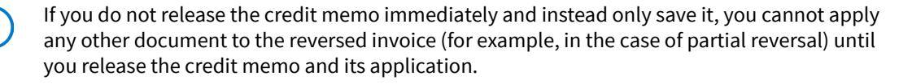

• By manually creating a credit memo for the full balance of the invoice and then applying the credit memo to the invoice.

If you are reversing a closed invoice, before applying a credit memo, you need to reverse the application of the document used to close this invoice, thus causing the invoice to again be assigned the *Open* status.

If you use an action on the *[Invoices and Memos](https://help-2025r1.acumatica.com/Help?ScreenId=ShowWiki&pageid=5e6f3b27-b7af-412f-a40a-1d4f4be70cba)* form to automatically reverse an invoice, the system will display the invoice number for the created credit memo in the **Original Document** box on the **Financial** tab of the form.

#### **Reserving of a Credit Memo for Future Application**

You can reserve an open credit memo for future application. To mark an open credit memo as reserved, on the *[Payments and Applications](https://help-2025r1.acumatica.com/Help?ScreenId=ShowWiki&pageid=ae844bf4-1aef-42cd-9e2f-49b3ee1bc8d7)* (AR302000) form, you click **Hold** on the form toolbar for the credit memo with the *Open* status. The system changes the document status from *Open* to *Reserved*.

Reserved credit memos cannot be applied to outstanding documents and are excluded from the automatic application process. To release the credit memo from hold, click **Remove Hold** on the form toolbar.

#### **Process Diagram**

The following diagram illustrates the invoice correction workflow, which is a part of the invoice processing workflow.

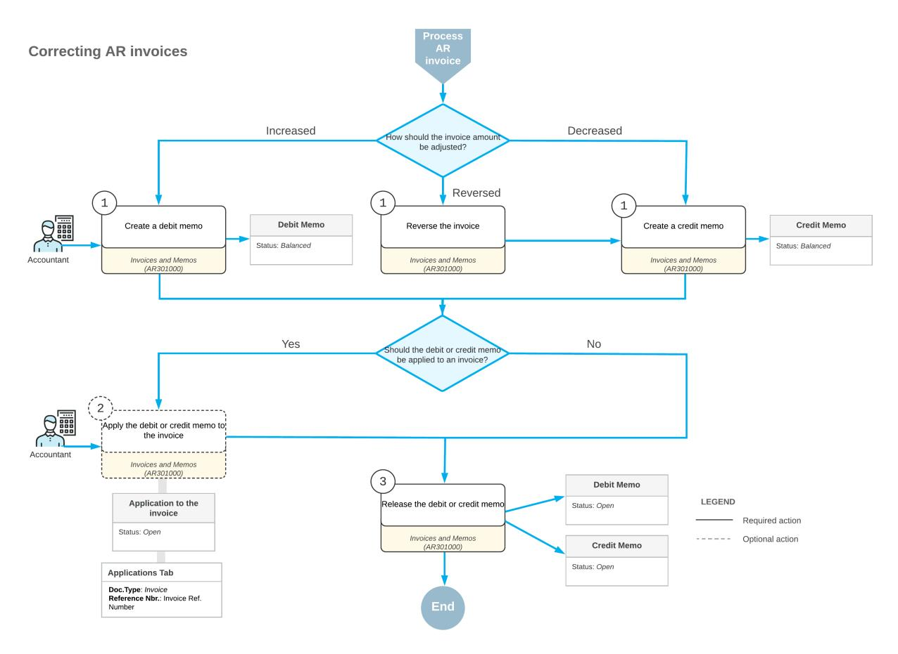

*Figure: Correcting AR invoices*

## **AR Invoice Correction: Support for Credit Terms in Credit Memos**

Credit memos created in Acumatica ERP can have credit terms specified for them; thus, they can have cash discounts. If you reverse an original invoice with a cash discount, the created credit memo will also have this cash discount. Credit memos with discounts can also be used in cash flow forecasting.

To turn on the support for credit terms for credit memos, you select the **Use CreditTerms in Credit Memos** check box on the *[Accounts Receivable Preferences](https://help-2025r1.acumatica.com/Help?ScreenId=ShowWiki&pageid=f7b52067-5299-45e8-b601-485cd709f58b)* (AR101000) form.

#### **Insertion of Credit Memo Settings**

When you create a credit memo on the *[Invoices and Memos](https://help-2025r1.acumatica.com/Help?ScreenId=ShowWiki&pageid=5e6f3b27-b7af-412f-a40a-1d4f4be70cba)* (AR301000) form by copying an existing credit memo, the system inserts the settings as follows, depending on whether the **Use CreditTerms in Credit Memos** check box is selected on the *[Accounts Receivable Preferences](https://help-2025r1.acumatica.com/Help?ScreenId=ShowWiki&pageid=f7b52067-5299-45e8-b601-485cd709f58b)* (AR101000) form:

- If this check box is selected, the**Terms** value on the *[Invoices and Memos](https://help-2025r1.acumatica.com/Help?ScreenId=ShowWiki&pageid=5e6f3b27-b7af-412f-a40a-1d4f4be70cba)* form is copied from the original document, if terms have been specified; otherwise, the**Terms** value is copied from the customer's settings. The values in the **Cash Discount Date**, **Due Date**, and **Cash Discount** boxes are calculated based on these terms. All these boxes are available.
- If the check box is cleared, the system leaves the**Terms**, **Cash Discount Date**, and **Due Date** boxes empty on the *[Invoices and Memos](https://help-2025r1.acumatica.com/Help?ScreenId=ShowWiki&pageid=5e6f3b27-b7af-412f-a40a-1d4f4be70cba)* form, and inserts *0.00* in the **Cash Discount** box. All these boxes are unavailable.

When you create a credit memo by reversing an invoice or debit memo, the system inserts the settings as follows, depending on whether the **Use CreditTerms in Credit Memos** check box is selected on the *[Accounts Receivable](https://help-2025r1.acumatica.com/Help?ScreenId=ShowWiki&pageid=f7b52067-5299-45e8-b601-485cd709f58b) [Preferences](https://help-2025r1.acumatica.com/Help?ScreenId=ShowWiki&pageid=f7b52067-5299-45e8-b601-485cd709f58b)* form:

- If the check box is selected, the**Terms**, **Cash Discount Date**, **Due Date**, and **Cash Discount** settings of the *[Invoices and Memos](https://help-2025r1.acumatica.com/Help?ScreenId=ShowWiki&pageid=5e6f3b27-b7af-412f-a40a-1d4f4be70cba)* form are copied from the original document, and these boxes are available.
- If the check box is cleared, the system leaves the**Terms**, **Cash Discount Date**, and **Due Date** boxes of the *[Invoices and Memos](https://help-2025r1.acumatica.com/Help?ScreenId=ShowWiki&pageid=5e6f3b27-b7af-412f-a40a-1d4f4be70cba)* form empty, and inserts *0.00* in the **Cash Discount** box. All these boxes are unavailable.

If the AR document has credit terms with the *Multiple* installment type, the **Cash Discount** box contains *0* and is unavailable. If you change the setting in the**Terms** box, the system recalculates the **Cash Discount** amount.

### **AR Invoice Correction: Implementation Checklist**

To ensure that the system is configured properly for creating and releasing credit and debit memos, make sure that the criteria listed in the table have been met in the system as described.

| Form                               | Criteria to Check                                                                                                                                                                                                                                                                | Notes |
|------------------------------------|----------------------------------------------------------------------------------------------------------------------------------------------------------------------------------------------------------------------------------------------------------------------------------|-------|
| Enable/Disable Features (CS100000) | Make sure the minimal features have been enabled as described in Company Without Branches: General Information, Company with Branches that Do Not Require Balancing: Gen eral Information, and Company with Branches that Require Balancing: General Information. |       |
| Customers (AR303000)               | Verify the existence of the customer accounts for the customers for which you will correct AR invoices by creating credit and debit mem os. For details, see Customers: Implementation Activity.                                                                     |       |

#### **Settings That Affect the Workflow**

The following settings and entities should be specified and defined, respectively:

- The following general ledger settings should be specified on the **PostingSettings** tab of the *[General Ledger](https://help-2025r1.acumatica.com/Help?ScreenId=ShowWiki&pageid=e4913d06-c511-4258-a0f9-f36c1b854e6b) [Preferences](https://help-2025r1.acumatica.com/Help?ScreenId=ShowWiki&pageid=e4913d06-c511-4258-a0f9-f36c1b854e6b)* (GL102000) form:
  - Make sure that the **Automatically Post on Release** check box is selected. This setting causes GL batches to be immediately posted aer they are released.
  - Clear the **Generate Consolidated Batches** check box to cause every AR transaction you enter to be posted as an individual batch to the general ledger. (When this check box is selected, the system consolidates into a single batch all transactions in the same currency posted to the same period for all documents being released.)
- The following accounts receivable preferences settings should be specified on the **General** tab of the *[Accounts Receivable Preferences](https://help-2025r1.acumatica.com/Help?ScreenId=ShowWiki&pageid=f7b52067-5299-45e8-b601-485cd709f58b)* (AR101000) form:
  - Select the **Hold Documents on Entry** check box in the **Data EntrySettings** section. This setting gives the created AR invoices and credit memos the *On Hold* status.
  - Make sure that the **Automatically Post on Release** check box is selected in the **PostingSettings** section. This setting indicates that AR invoices and credit memos will be automatically posted to the general ledger once they are released.
  - Make sure that the **Use CreditTerms in Credit Memos** check box is cleared in the **Data EntrySettings** section. This setting indicates that credit memos cannot have credit terms and cash discounts applied to them.

With these settings specified and entities defined, users in your company can record and process documents in Acumatica ERP quickly and accurately, with a minimum of manual actions.

### **AR Invoice Correction: Generated Transactions**

When you release a credit memo, the system generates a batch of GL transactions that update the asset and income accounts. For details on the general ledger accounts involved, see *[AR Invoices: Invoice Releasing](#page-87-1)*.

The following transactions will be posted to the general ledger when a one-line credit memo with a tax is released.

| Account                     | Debit      | Credit              |
|-----------------------------|------------|---------------------|
| Accounts Receivable account | 0.00       | Amount + Tax amount |
| Sales account               | Amount     | 0.00                |
| Tax Payable account         | Tax amount | 0.00                |

The following transaction will be posted to the general ledger when a one-line credit memo without a tax is released.

| Account                     | Debit  | Credit |  |  |
|-----------------------------|--------|--------|--|--|
| Accounts Receivable account | 0.00   | Amount |  |  |
| Sales account               | Amount | 0.00   |  |  |

The following transaction will be posted to the general ledger when a one-line debit memo with a tax is released.

| Account                     | Debit               | Credit     |  |  |  |  |
|-----------------------------|---------------------|------------|--|--|--|--|
| Accounts Receivable account | Amount + Tax amount | 0.00       |  |  |  |  |
| Sales account               | 0.00                | Amount     |  |  |  |  |
| Tax Payable account         | 0.00                | Tax amount |  |  |  |  |

The following transactions will be posted to the general ledger when a one-line debit memo without a tax is released.

| Account                     | Debit  | Credit |  |  |  |
|-----------------------------|--------|--------|--|--|--|
| Accounts Receivable account | Amount | 0.00   |  |  |  |
| Sales account               | 0.00   | Amount |  |  |  |

Tax accounting is outside the scope of the current business process, so the transactions generated later will involve only the Accounts Receivable and Sales accounts.

When you release an application of a credit memo to an invoice, the system does not generate a batch. A batch is generated in only the following cases:

- You have written off some balance along with the application. In this case, the system generates a batch to update the asset account specified for the outstanding document in the **AR Account** box on the **Financial** tab of *[Invoices and Memos](https://help-2025r1.acumatica.com/Help?ScreenId=ShowWiki&pageid=5e6f3b27-b7af-412f-a40a-1d4f4be70cba)* and the expense account specified in the **Account** box on the *[Reason Codes](https://help-2025r1.acumatica.com/Help?ScreenId=ShowWiki&pageid=fe53f1bf-3670-465e-8b7c-922d8246f123)* (CS211000) form for the reason code you have used to write off the balance.
- The credit memo or the outstanding document to which you want to apply the credit memo is in a foreign currency. The system generates a batch to update the balance of the realized gain or loss (RGOL) account by the amount resulting from the difference in the exchange rate on the outstanding document date and the credit memo date. The RGOL account is specified for each currency on the *[Currencies](https://help-2025r1.acumatica.com/Help?ScreenId=ShowWiki&pageid=533be28d-b9e1-4d77-9b62-b06bb90a8b3b)* (CM202000) form.

Currency management is outside the scope of the current business process.

### **AR Invoice Correction: To Create a Credit Memo**

The following activity will walk you through the process of creating a credit memo and applying it to an invoice.

This activity is based on the *U100* dataset. If you are using another dataset, or if any system settings have been changed in *U100*, these changes can affect the workflow of the activity and the results of the processing. To avoid any issues, restore the *U100* dataset to its initial state.

#### **Video Tutorial**

This video shows you the common process but may contain less detail than the activity has. If you want to repeat the activity on your own or you are preparing to take the certification exam, we recommend that you follow the instructions in the steps of the activity.

#### *[FEEDBACK](https://www.surveymonkey.com/r/BLBL7RJ?Video=Correcting%20AR%20Invoices&Source=Open%20Uni&Course=F100)*

#### **Story**

Suppose that on January 16, 2025, the SweetLife Fruits & Jams company sold five days of online training to one of its customers, GoodFood One Restaurant, in the amount of \$225. An AR clerk created an invoice for five days of training for GoodFood One Restaurant. The actual number of training days turned out to be four, and now SweetLife needs to reduce the customer balance of GoodFood One Restaurant by \$45.

Acting as a SweetLife accountant, you have to create a credit memo and apply it to the open invoice to reduce the customer balance by \$45.

#### **Configuration Overview**

For the purposes of this activity, the following features have been enabled on the *[Enable/Disable Features](https://help-2025r1.acumatica.com/Help?ScreenId=ShowWiki&pageid=c1555e43-1bc5-4f6f-ba9d-b323f94d8a6b)* (CS100000) form:

- *Standard Financials*, which provides the standard financial functionality
- *Multibranch Support*, which supports multiple branches in your instance of Acumatica ERP
- *Multicompany Support*, which supports multiple companies within one tenant

On the *[Accounts Receivable Preferences](https://help-2025r1.acumatica.com/Help?ScreenId=ShowWiki&pageid=f7b52067-5299-45e8-b601-485cd709f58b)* (AR101000) form, the **Hold Documents on Entry** check box has been selected in the **Data EntrySettings** section.

On the *[Customers](https://help-2025r1.acumatica.com/Help?ScreenId=ShowWiki&pageid=652929bc-9606-4056-aa6e-0c2d1147171b)* (AR303000) form, the *GOODFOOD (GoodFood One Restaurant)* customer has been configured.

#### **Process Overview**

You will create and release a credit memo on the *[Invoices and Memos](https://help-2025r1.acumatica.com/Help?ScreenId=ShowWiki&pageid=5e6f3b27-b7af-412f-a40a-1d4f4be70cba)* (AR301000) form and apply it to an open invoice on the *[Payments and Applications](https://help-2025r1.acumatica.com/Help?ScreenId=ShowWiki&pageid=ae844bf4-1aef-42cd-9e2f-49b3ee1bc8d7)* (AR302000) form.

#### **System Preparation**

To prepare the system, do the following:

- 1. Launch the Acumatica ERP website, and sign in to a company with the *U100* dataset preloaded. To sign in as an accountant, use the following credentials:
  - Username: *johnson*
  - Password: *123*
- 2. In the info area, in the upper-right corner of the top pane of the Acumatica ERP screen, make sure that the business date in your system is set to *1/30/2025*. If a different date is displayed, click the Business Date menu button and select *1/30/2025*. For simplicity, in this activity, you will create and process all documents in the system on this business date.
- 3. On the Company and Branch Selection menu, also on the top pane of the Acumatica ERP screen, make sure that the *SweetLife Head Office and Wholesale Center* branch is selected. If it is not selected, click the Company and Branch Selection menu to view the list of branches that you have access to, and then click *SweetLife Head Office and Wholesale Center*.

#### **Step 1: Creating and Releasing a Credit Memo**

To create and release a credit memo, do the following:

1. Open the *[Invoices and Memos](https://help-2025r1.acumatica.com/Help?ScreenId=ShowWiki&pageid=5e6f3b27-b7af-412f-a40a-1d4f4be70cba)* (AR301000) form.

To open the form for creating a new record, type the form ID in the Search box, and on the Search form, point at the form title and click **New** right of the title.

- 2. Click **Add New Record** on the form toolbar, and specify the following settings in the Summary area:
  - **Type**: *Credit Memo*
  - **Customer**: *GOODFOOD*
  - **Date**: *1/30/2025* (the current business date, which is inserted by default)
  - **Post Period**: *01-2025*
  - **Description**: Service undelivered by invoice 000076
- 3. On the **Details** tab, click **Add Row** and specify the following settings for the added row:
  - **Branch**: *HEADOFFICE* (inserted by default)
  - **Transaction Descr.**: Service undelivered by invoice 000076
  - **Ext. Price**: 45
- 4. Click **Remove Hold** on the form toolbar.
- 5. Click **Release** on the form toolbar to release the credit memo.

#### **Step 2: Applying the Credit Memo to the Invoice**

To apply the credit memo to the invoice, do the following:

1. While you are still on the *[Invoices and Memos](https://help-2025r1.acumatica.com/Help?ScreenId=ShowWiki&pageid=5e6f3b27-b7af-412f-a40a-1d4f4be70cba)* (AR301000) form, on the form toolbar click **Apply**.

The system opens the *[Payments and Applications](https://help-2025r1.acumatica.com/Help?ScreenId=ShowWiki&pageid=ae844bf4-1aef-42cd-9e2f-49b3ee1bc8d7)* (AR302000) form, with a document of the *Credit Memo* type.

- 2. In the **Application Date** box, make sure that *1/30/2025* is displayed, and in the **Application Period** box, make sure that *01-2025* is selected.
- 3. On the **Documents to Apply** tab, click **Add Row**, and in the **Reference Nbr.** column of the row, select *000076*.
- 4. In the **Amount Paid** column, leave the value of *45*.
- 5. On the form toolbar, click **Release** to release the credit memo's application to the invoice.
- 6. On the **Application History** tab, make sure that a row containing the invoice has appeared, as shown in the following screenshot.

| <b>Payments and Applications</b> Credit Memo 000121 - GoodFood One Restaurant                                                   |                                                                   | <b>PINOTES</b>                           | <b>ACTIVITIES</b>  | <b>FILES</b>                     | TOOLS $\sim$ |                       |                              |           |  |           |
|------------------------------------------------------------------------------------------------------------------------------------|-------------------------------------------------------------------|------------------------------------------|--------------------|----------------------------------|--------------|-----------------------|------------------------------|-----------|--|-----------|
| 뭐 n 俞 Õ $\pm$ $\mathsf{K}$ $\Omega$ $\leftarrow$ $\check{~}$                                               | Ы $\left\langle \right\rangle$ $\mathcal{P}$ $\cdots$    |                                          |                    |                                  |              |                       |                              |           |  |           |
| Credit Me ~ Customer: Type:                                                                                                  | 45.00 $\circ$ Payment Amo GOODFOOD - GoodFood One Restaurar |                                          |                    |                                  |              |                       |                              |           |  |           |
| Reference Nbr. Q 000121 Location:                                                                                         | <b>MAIN - Primary Location</b>                                    |                                          | Applied to Doc     | 0.00                             |              |                       |                              |           |  |           |
| Closed Status:                                                                                                                  |                                                                   |                                          | Applied to Ord     | 0.00                             |              |                       |                              |           |  |           |
| Application Date: 1/30/2025                                                                                                        |                                                                   |                                          | Available Bala     | 0.00                             |              |                       |                              |           |  |           |
| Application Pe 01-2025                                                                                                             |                                                                   |                                          | Write-Off Amo      | 0.00                             |              |                       |                              |           |  |           |
|                                                                                                                                    |                                                                   |                                          | Finance Charg      | 0.00                             |              |                       |                              |           |  |           |
|                                                                                                                                    |                                                                   |                                          | Deducted Cha       | 0.00                             |              |                       |                              |           |  |           |
| Description:                                                                                                                       | Service undelivered by invoice 000076                             |                                          |                    |                                  |              |                       |                              |           |  |           |
| <b>APPLICATION HISTORY</b> <b>DOCUMENTS TO APPLY</b> <b>SALES ORDERS</b> <b>FINANCIAL</b> <b>CHARGES</b> COMPLIANCE |                                                                   |                                          |                    |                                  |              |                       |                              |           |  |           |
| $\boxtimes$ <b>REVERSE APPLICATION</b> Ò $\vdash$                                                                         |                                                                   |                                          |                    |                                  |              |                       |                              |           |  |           |
| D <b>B</b> 0 <b>Batch</b> <b>Branch</b> Doc. Type Number                                                            | Reference <b>Inventory ID</b> Nbr.                          | Customer                                 | <b>Amount Paid</b> | Cash <b>Discount</b> Taken | Amount Date  | Write-Off Application | <b>Application</b> Period | Date      |  | Due Date  |
| <b>HEADOFFICE</b> $\geq$ - 100 D Invoice                                                                               | 000076                                                            | !!!!!!!!!!!!!!!!!!!!!!!!!!!!!!!!!!!!!!!! | 45.00              | 0.00                             | 0.00         | 1/30/2025             | 01-2025                      | 1/16/2025 |  | 2/15/2025 |

*Figure: The released credit memo applied to the invoice*

### **AR Invoice Correction: To Create a Debit Memo and Apply a Payment to It**

The following activity will walk you through the process of creating a debit memo and applying a payment to it.

This activity is based on the *U100* dataset. If you are using another dataset, or if any system settings have been changed in *U100*, these changes can affect the workflow of the activity and the results of the processing. To avoid any issues, restore the *U100* dataset to its initial state.

#### **Video Tutorial**

This video shows you the common process but may contain less detail than the activity has. If you want to repeat the activity on your own or you are preparing to take the certification exam, we recommend that you follow the instructions in the steps of the activity.

*[FEEDBACK](https://www.surveymonkey.com/r/BLBL7RJ?Video=Correcting%20AR%20Invoices&Source=Open%20Uni&Course=F100)*

#### **Story**

Suppose that an invoice sent by SweetLife Fruits & Jams company to FourStar Coffee & Sweets Shop for a three-day training in the amount of \$135 undercharged the customer, because the number of trainees was higher than the agreed-on number. The amount to be additionally charged from the customer for this training is \$67.50.

Acting as a SweetLife accountant, you need to create a debit memo in the amount of \$67.50 and process the customer's payment of the debit memo.

#### **Configuration Overview**

For the purposes of this activity, the following features have been enabled on the *[Enable/Disable Features](https://help-2025r1.acumatica.com/Help?ScreenId=ShowWiki&pageid=c1555e43-1bc5-4f6f-ba9d-b323f94d8a6b)* (CS100000) form:

- *Standard Financials*, which provides the standard financial functionality
- *Multibranch Support*, which supports multiple branches in your instance of Acumatica ERP
- *Multicompany Support*, which supports multiple companies within one tenant

On the *[Accounts Receivable Preferences](https://help-2025r1.acumatica.com/Help?ScreenId=ShowWiki&pageid=f7b52067-5299-45e8-b601-485cd709f58b)* (AR101000) form, the **Hold Documents on Entry** check box has been selected in the **Data EntrySettings** section.

On the *[Customers](https://help-2025r1.acumatica.com/Help?ScreenId=ShowWiki&pageid=652929bc-9606-4056-aa6e-0c2d1147171b)* (AR303000) form, the *COFFEESHOP (FourStar Coffee & Sweets Shop)* customer has been configured.

#### **Process Overview**

In this activity, you will create and release a debit memo on the *[Invoices and Memos](https://help-2025r1.acumatica.com/Help?ScreenId=ShowWiki&pageid=5e6f3b27-b7af-412f-a40a-1d4f4be70cba)* (AR301000) form and apply a payment to it on the *[Payments and Applications](https://help-2025r1.acumatica.com/Help?ScreenId=ShowWiki&pageid=ae844bf4-1aef-42cd-9e2f-49b3ee1bc8d7)* (AR302000) form.

#### **System Preparation**

To prepare the system, do the following:

- 1. Launch the Acumatica ERP website, and sign in to a company with the *U100* dataset preloaded. To sign in as an accountant, use the following credentials:
  - Username: *johnson*
  - Password: *123*
- 2. In the info area, in the upper-right corner of the top pane of the Acumatica ERP screen, make sure that the business date in your system is set to *1/30/2025*. If a different date is displayed, click the Business Date menu button and select *1/30/2025*. For simplicity, in this activity, you will create and process all documents in the system on this business date.
- 3. On the Company and Branch Selection menu, also on the top pane of the Acumatica ERP screen, make sure that the *SweetLife Head Office and Wholesale Center* branch is selected. If it is not selected, click the Company and Branch Selection menu to view the list of branches that you have access to, and then click *SweetLife Head Office and Wholesale Center*.

#### **Step 1: Creating and Releasing a Debit Memo**

To create and release a debit memo, do the following:

1. Open the *[Invoices and Memos](https://help-2025r1.acumatica.com/Help?ScreenId=ShowWiki&pageid=5e6f3b27-b7af-412f-a40a-1d4f4be70cba)* (AR301000) form.

To open the form for creating a new record, type the form ID in the Search box, and on the Search form, point at the form title and click **New** right of the title.

- 2. Click **Add New Record** on the form toolbar, and specify the following settings in the Summary area:
  - **Type**: *Debit Memo*
  - **Customer**: *COFFEESHOP*
  - **Date**: *1/30/2025* (the current business date, which is inserted by default)
  - **Post Period**: *01-2025*
  - **Description**: Additional charge for offline training

- 3. On the **Details** tab, click **Add Row**, and specify the following settings in the added row:
  - **Branch**: *HEADOFFICE* (inserted by default)
  - **Transaction Descr.**: Additional charge for offline training
  - **Ext. Price**: 67.50
- 4. Click **Remove Hold** on the form toolbar.
- 5. Click **Release** on the form toolbar to release the debit memo.

#### **Step 2: Applying a Payment to the Debit Memo**

To apply a payment to the debit memo, do the following:

1. While you are still on the *[Invoices and Memos](https://help-2025r1.acumatica.com/Help?ScreenId=ShowWiki&pageid=5e6f3b27-b7af-412f-a40a-1d4f4be70cba)* (AR301000) form, on the form toolbar, click **Pay**.

The system opens the *[Payments and Applications](https://help-2025r1.acumatica.com/Help?ScreenId=ShowWiki&pageid=ae844bf4-1aef-42cd-9e2f-49b3ee1bc8d7)* (AR302000) form, where you create a new payment and apply it to the debit memo.

- 2. In the **Application Date** box, make sure that *1/30/2025* is displayed, and in the **Application Period** box, make sure that *01-2025* is selected.
- 3. In the Summary area, review the value in the **Payment Method** box and make sure that the **Payment Amount** is *67.50*.
- 4. On the **Documents to Apply** tab, make sure that the debit memo you have created is shown. The payment with the debit memo applied to it is shown in the following screenshot.

|                                                 | <b>Payments and Applications</b> Payment - FourStar Coffee & Sweets Shop |                       |                    |                                        |                                   |                 |                      |                                           |           |          | <b>PINOTES</b>                  | <b>ACTIVITIES</b> | <b>FILES</b> | $TOOLS$ $\sim$ |
|-------------------------------------------------|-----------------------------------------------------------------------------|-----------------------|--------------------|----------------------------------------|-----------------------------------|-----------------|----------------------|-------------------------------------------|-----------|----------|---------------------------------|-------------------|--------------|----------------|
|                                                 |                                                                             |                       |                    |                                        |                                   |                 |                      |                                           |           |          |                                 |                   |              |                |
| 罰 B $\leftarrow$                          | $\Omega$                                                                    | n 侕 ÷           | K $\check{~}$   | $\geq$ $\rightarrow$ ≺           | <b>REMOVE HOLD</b>                | $\cdots$        |                      |                                           |           |          |                                 |                   |              |                |
|                                                 |                                                                             |                       |                    |                                        |                                   |                 |                      |                                           |           |          |                                 |                   |              | $\sim$         |
| Type:                                           | Payment                                                                     | $\checkmark$          | Customer:          | COFFEESHOP - FourStar Coffee & Swee 2  |                                   |                 | Payment Amo          | 67.50 ①                                   |           |          |                                 |                   |              |                |
| Reference Nbr.                                  | $<\!\!N\!\!E W\!\!>$                                                        | Q * Location:      |                    | <b>MAIN - Primary Location</b>         |                                   | Q               | Applied to Doc       | 67.50                                     |           |          |                                 |                   |              |                |
| Status:                                         | On Hold                                                                     |                       | Payment Meth       | <b>CHECK - Check Payment</b>           |                                   | ٩               | Applied to Ord       | 0.00                                      |           |          |                                 |                   |              |                |
| * Application Date:                             | 1/30/2025                                                                   | Ä                     | Card/Account       |                                        |                                   |                 | Available Bala       | 0.00                                      |           |          |                                 |                   |              |                |
| * Application Pe                                | 01-2025                                                                     | Q                     | * Cash Account:    |                                        | ۹ 10200WH - Wholesale Checking |                 |                      | Write-Off Amo 0.00                     |           |          |                                 |                   |              |                |
| Payment Ref.:                                   | 0098                                                                        |                       |                    |                                        |                                   |                 | Finance Charg        | 0.00                                      |           |          |                                 |                   |              |                |
|                                                 |                                                                             |                       |                    |                                        |                                   |                 | Deducted Cha         | 0.00                                      |           |          |                                 |                   |              |                |
|                                                 |                                                                             |                       | Description:       | Additional charge for offline training |                                   |                 |                      |                                           |           |          |                                 |                   |              |                |
|                                                 |                                                                             |                       |                    |                                        |                                   |                 |                      |                                           |           |          |                                 |                   |              |                |
| <b>DOCUMENTS TO APPLY</b>                       |                                                                             | <b>SALES ORDERS</b>   |                    | <b>APPLICATION HISTORY</b>             | <b>FINANCIAL</b>                  | <b>CHARGES</b>  | <b>COMPLIANCE</b>    |                                           |           |          |                                 |                   |              |                |
| Ò $^{+}$ $\times$                         |                                                                             | <b>LOAD DOCUMENTS</b> | <b>AUTO APPLY</b>  | $\boxed{\mathbf{N}}$ $\mathbf{H}$   |                                   |                 |                      |                                           |           |          |                                 |                   |              |                |
|                                                 |                                                                             |                       |                    |                                        |                                   |                 |                      |                                           |           |          |                                 |                   |              |                |
| $\Box$ $\Box$ <b>B</b> 0 <b>Branch</b> |                                                                             | Doc. Type             | *Reference Nbr. | <b>Inventory ID</b>                    | <b>Amount Paid</b>                | <b>Discount</b> | Cash <b>Taken</b> | Write-Off Write-Off Amount Reason Code | Date      | Due Date | Cash <b>Discount</b> Date | <b>Cross Rate</b> |              | Balance        |
| 0 D ⊠                                     | <b>HEADOFFICE</b>                                                           | Debit Memo            | 000122             |                                        | 67.50                             |                 | 0.00 0.00         | <b>BALWOFF</b>                            | 1/30/2025 | 3/1/2025 | 3/1/2025                        | 1.00000000        |              | 0.00           |

#### *Figure: The payment with the debit memo applied to it*

- 5. On the form toolbar, click **Remove Hold**.
- 6. On the form toolbar, click **Release** to release the payment.
- 7. On the **Financial** tab, click the **Batch Nbr.** link to review the transaction that the system has posted when the payment was released.

### **AR Invoice Correction: To Create a Credit Memo and Apply a Refund to It**

The following activity will walk you through the process of creating a credit memo and applying an open refund to it.

This activity is based on the *U100* dataset. If you are using another dataset, or if any system settings have been changed in *U100*, these changes can affect the workflow of the activity and the results of the processing. To avoid any issues, restore the *U100* dataset to its initial state.

#### **Story**

Suppose that SweetLife Fruits & Jams overbilled one of the customers, Morning Cafe, and received a payment in the amount of \$35. An AR clerk has already created a refund for the needed amount. Acting as a SweetLife accountant, you need to decrease the customer's balance by creating a credit memo and applying the \$35 refund to it.

#### **Configuration Overview**

For the purposes of this activity, on the *[Accounts Receivable Preferences](https://help-2025r1.acumatica.com/Help?ScreenId=ShowWiki&pageid=f7b52067-5299-45e8-b601-485cd709f58b)* (AR101000) form, the **Hold Documents on Entry** check box has been selected in the **Data EntrySettings** section.

On the *[Customers](https://help-2025r1.acumatica.com/Help?ScreenId=ShowWiki&pageid=652929bc-9606-4056-aa6e-0c2d1147171b)* (AR303000) form, the *MORNINGCAF (Morning Cafe)* customer has been defined.

On the *[Payments and Applications](https://help-2025r1.acumatica.com/Help?ScreenId=ShowWiki&pageid=ae844bf4-1aef-42cd-9e2f-49b3ee1bc8d7)* (AR302000) form, a \$35 refund for the Morning Cafe customer has been created.

#### **Process Overview**

In this activity, on the *[Invoices and Memos](https://help-2025r1.acumatica.com/Help?ScreenId=ShowWiki&pageid=5e6f3b27-b7af-412f-a40a-1d4f4be70cba)* (AR301000) form, you will create a credit memo and apply a refund to it on the **Applications** tab. You will then release the credit memo and its application.

#### **System Preparation**

To prepare the system, do the following:

- 1. Launch the Acumatica ERP website, and sign in to a company with the *U100* dataset preloaded. You should sign in as an accountant by using the *johnson* username and the *123* password.
- 2. In the info area, in the upper-right corner of the top pane of the Acumatica ERP screen, make sure that the business date in your system is set to *1/30/2025*. If a different date is displayed, click the Business Date menu button and select *1/30/2025* on the calendar. For simplicity, in this activity, you will create and process all documents in the system on this business date.
- 3. On the Company and Branch Selection menu, on the top pane of the Acumatica ERP screen, select the *SweetLife Head Office and Wholesale Center* branch.

#### **Step 1: Creating a Credit Memo**

To create a credit memo, do the following:

1. On the *[Invoices and Memos](https://help-2025r1.acumatica.com/Help?ScreenId=ShowWiki&pageid=5e6f3b27-b7af-412f-a40a-1d4f4be70cba)* (AR301000) form, add a new record.

To open the form for creating a new record, type the form ID in the Search box, and on the Search form, point at the form title and click **New** right of the title.

- 2. In the Summary area, specify the following settings:
  - **Type**: *Credit Memo*
  - **Customer**: *MORNINGCAF*
  - **Date**: *1/30/2025* (the current business date, which is inserted by default)
  - **Post Period**: *01-2025*

- **Description**: Overbilled amount
- 3. On the **Details** tab, click **Add Row**, and specify the following settings for the added row:
  - **Branch**: *HEADOFFICE* (inserted by default)
  - **Transaction Descr.**: Overbilled amount
  - **Ext. Price**: 35
- 4. On the form toolbar, click**Save**.

#### **Step 2: Applying a Refund to the Credit Memo**

To apply a refund to the credit memo you created in the previous step, do the following:

- 1. While you are still on the *[Invoices and Memos](https://help-2025r1.acumatica.com/Help?ScreenId=ShowWiki&pageid=5e6f3b27-b7af-412f-a40a-1d4f4be70cba)* (AR301000) form with the credit memo opened, open the **Applications** tab.
- 2. On the table toolbar, click **Add Row**, and specify the following settings for the added row:
  - **Doc.Type**: *Refund*
  - **Reference Nbr.**: The number of the refund for Morning Cafe in the amount of \$35
  - **Amount Paid**: 35.00

If you are working in a production environment, you can specify any amount less than the amount of the refund to partially apply the selected refund to the credit memo.

3. On the form toolbar, click**Save**.

The following screenshot illustrates an unreleased credit memo to which a refund has been applied in full.

| <b>Invoices and Memos</b> Credit Memo 000117 - Morning Cafe    |                   |                         |                        |                 |                                           |                     |                 |                         | <b>PINOTES</b> | <b>ACTIVITIES</b>      | <b>FILES</b> | TOOLS $\sim$               |            |                |                               |  |                     |
|-------------------------------------------------------------------|-------------------|-------------------------|------------------------|-----------------|-------------------------------------------|---------------------|-----------------|-------------------------|----------------|------------------------|--------------|----------------------------|------------|----------------|-------------------------------|--|---------------------|
| 뭐 $\boxdot$ $\leftarrow$                                    | $\Omega$          | $^+$                    | Ô û ۰            | ТK              | ≺ $\rightarrow$                        | $\geq$              |                 | <b>REMOVE HOLD</b>      | $\cdots$       |                        |              |                            |            |                |                               |  |                     |
| Type:                                                             | Credit Me *       |                         | Customer:              |                 | MORNINGCAF - Morning Cafe                 |                     |                 |                         | 0              | Detail Total:          |              | 35.00                      |            |                |                               |  | $\hat{\phantom{a}}$ |
| Reference Nbr.:                                                   | 000117            | ρ                       | * Location:            |                 | <b>MAIN - Primary Location</b>            |                     |                 | $\varphi$               |                | <b>Discount Total:</b> |              | 0.00                       |            |                |                               |  |                     |
| Status:                                                           | On Hold           |                         | Terms:                 |                 |                                           |                     |                 |                         |                | <b>Tax Total:</b>      |              | 0.00                       |            |                |                               |  |                     |
| * Date:                                                           | 1/30/2023         | $\mathbf{v}$            | Due Date:              |                 |                                           |                     | Apply Retainage |                         |                | Balance:               |              | 35.00                      |            |                |                               |  |                     |
| * Post Period:                                                    | 01-2023           | Q                       |                        | Cash Discount   |                                           |                     | Pay by Line     |                         |                | Cash Discount:         |              | 0.00                       |            |                |                               |  |                     |
| Customer Ord                                                      |                   |                         |                        |                 | * Project/Contract: X - Non-Project Code. |                     |                 | 00                      |                |                        |              |                            |            |                |                               |  |                     |
|                                                                   |                   |                         |                        |                 |                                           |                     |                 |                         |                |                        |              |                            |            |                |                               |  |                     |
| Description:                                                      | Overbilled amount |                         |                        |                 |                                           |                     |                 |                         |                |                        |              |                            |            |                |                               |  |                     |
|                                                                   |                   |                         |                        |                 |                                           |                     |                 |                         |                |                        |              |                            |            |                |                               |  |                     |
|                                                                   |                   |                         |                        |                 |                                           |                     |                 |                         |                |                        |              |                            |            |                |                               |  |                     |
| <b>DETAILS</b>                                                    | <b>FINANCIAL</b>  |                         | <b>ADDRESSES</b>       | <b>TAXES</b>    |                                           | <b>APPLICATIONS</b> |                 | <b>COMPLIANCE</b>       |                |                        |              |                            |            |                |                               |  |                     |
| $\times$ $^+$ О                                             | $\vdash$          | $\mathbf{\overline{x}}$ |                        |                 |                                           |                     |                 |                         |                |                        |              |                            |            |                |                               |  |                     |
| !!!!!!!!!!!!!!!!!!!!!!!!!!!!!!!!!!!!!!!! 80 <b>BranchID</b> |                   | Doc. Type               |                        | *Reference Nbr. |                                           |                     | Customer        | <b>Amount Paid Date</b> |                |                        |              | <b>Balance Description</b> | Currency   | Post Period | <b>Customer Order</b> Nbr. |  | <b>Status</b>       |
| > 0 <b>HEADOFFICE</b> n.                                    |                   |                         | <b>Customer Refund</b> | 000072          |                                           | <b>MORNINGCAF</b>   |                 | 35.00                   |                | 1/20/2023              | 0.00         | Overpaid amount            | <b>USD</b> | 01-2023        |                               |  | Open                |

*Figure: An unreleased credit memo with a refund applied to it*

#### **Step 3: Releasing the Credit Memo and Its Application**

To release the credit memo and its application, do the following:

- 1. While you are still on the *[Invoices and Memos](https://help-2025r1.acumatica.com/Help?ScreenId=ShowWiki&pageid=5e6f3b27-b7af-412f-a40a-1d4f4be70cba)* (AR301000) form with the credit memo opened, on the form toolbar, click **Remove Hold**.
- 2. On the form toolbar, click **Release**.

On the **Applications** tab, notice that the status of the refund has changed to *Closed* because its amount has been applied to the credit memo in full.

### **AR Invoice Correction: Mass Processing**

This chapter explains how to release multiple credit and debit memos and the rules that the system uses to group the prepared documents.

#### **Mass Release of Credit and Debit Memos**

Multiple credit and debit memos can be released at the same time on the *[Release AR Documents](https://help-2025r1.acumatica.com/Help?ScreenId=ShowWiki&pageid=78ad2d21-b6a8-46d0-8f2d-98dd0a23f75e)* (AR501000) form. On this form, you select the unlabeled check boxes next to the documents to be processed and click **Release** on the form toolbar to release the selected credit or debit memos or click **Release All** to release all the documents shown in the table.

The system creates a consolidated GL batch for all the released invoices, credit memos, and debit memos if the **Generate Consolidated Batches** check box is selected on the *[General Ledger](https://help-2025r1.acumatica.com/Help?ScreenId=ShowWiki&pageid=e4913d06-c511-4258-a0f9-f36c1b854e6b) [Preferences](https://help-2025r1.acumatica.com/Help?ScreenId=ShowWiki&pageid=e4913d06-c511-4258-a0f9-f36c1b854e6b)* (GL102000) form.

#### **Printing of Credit and Debit Memos**

You can print selected credit and debit memos by using the *[Print/Email AR Documents](https://help-2025r1.acumatica.com/Help?ScreenId=ShowWiki&pageid=05451253-581e-459d-912e-ff983df762b9)* (AR508000) form. You should print credit and debit memos to send them to the customer before release if the **Require Invoice/Memo Printing Before Release** check box is selected on the *[Accounts Receivable Preferences](https://help-2025r1.acumatica.com/Help?ScreenId=ShowWiki&pageid=f7b52067-5299-45e8-b601-485cd709f58b)* (AR101000) form and the settings of the customer require the printing of these documents— that is, the **Print Invoices** check box is selected on the *[Customers](https://help-2025r1.acumatica.com/Help?ScreenId=ShowWiki&pageid=652929bc-9606-4056-aa6e-0c2d1147171b)* (AR303000) form. For customers with this check box selected, each credit and debit memo that is created and is not on hold is assigned the *Pending Print* status. Aer you have printed the document, its status changes to *Balanced*, and you can release it.

### **AR Invoice Correction: Related Reports and Inquiries**

This topic describes the reports, inquiries, and forms you may review to gather information about credit and debit memos.

If you do not see a report or inquiry, this could mean that you have signed in to the system with a user account that does not have access rights to the form. Sign in as the *admin* user, or contact your system administrator.

#### **Reviewing a Customer's Information**

You can review the balances of a specific customer on the *[Customer Details](https://help-2025r1.acumatica.com/Help?ScreenId=ShowWiki&pageid=2ed5542b-a76c-4cfd-9ee3-52c2f08a2692)* (AR402000) form. When you open this inquiry from the *[Invoices and Memos](https://help-2025r1.acumatica.com/Help?ScreenId=ShowWiki&pageid=5e6f3b27-b7af-412f-a40a-1d4f4be70cba)* (AR301000) form by clicking **Customer Details** (under **Inquiries**) on the More menu, the *[Customer Details](https://help-2025r1.acumatica.com/Help?ScreenId=ShowWiki&pageid=2ed5542b-a76c-4cfd-9ee3-52c2f08a2692)* form is opened, showing the outstanding balances of the selected customer and a list of open documents of this customer. You can select the**Show All Documents** and **Include Unreleased Documents** check boxes in the Selection area of the form to include all documents and unreleased documents in the inquiry.

The released credit memos decrease the customer's balance, and debit memos increase it.

#### **Preparing a Printable Credit Memo or Debit Memo**

You can use the *[Print/Email AR Documents](https://help-2025r1.acumatica.com/Help?ScreenId=ShowWiki&pageid=05451253-581e-459d-912e-ff983df762b9)* (AR508000) form to prepare the printable form of a credit memo or debit memo, review it, and print it. To quickly run this report when processing a particular credit or debit memo on the *[Invoices and Memos](https://help-2025r1.acumatica.com/Help?ScreenId=ShowWiki&pageid=5e6f3b27-b7af-412f-a40a-1d4f4be70cba)* (AR301000) form, on the More menu (under **Printing and Emailing**), click **Print**.

## **Paying AR Invoices**

In Acumatica ERP, when you receive a customer payment for the invoice, you enter a document with the *Payment* type. The topic of this chapter describe how to create a customer payment for a specific invoice and release the payment and its application, and an activity that describes how the system loads AR documents for payment application and how payment amounts can be automatically applied to multiple documents.

### **Invoice Payments: General Information**

You create a payment document by using the *[Payments and Applications](https://help-2025r1.acumatica.com/Help?ScreenId=ShowWiki&pageid=ae844bf4-1aef-42cd-9e2f-49b3ee1bc8d7)* (AR302000) form. In the payment, you specify the customer from which you have received the payment, the cash account to which the payment amount should be recorded, the payment method, and the payment amount. The payment method denotes the actual means of payment: cash, printed check, or wire transfer.

When you are entering the payment, you can specify the documents to which the payment applies and then release the payment and the application at once.

#### **Learning Objectives**

In this chapter, you will learn how to do the following:

- Enter a payment
- Apply the payment to an AR invoice
- Release the payment and the payment application to the AR invoice

#### **Applicable Scenarios**

Payments can be created in the following cases:

- Manually by the user on the *[Payments and Applications](https://help-2025r1.acumatica.com/Help?ScreenId=ShowWiki&pageid=ae844bf4-1aef-42cd-9e2f-49b3ee1bc8d7)* (AR302000) form. For step-by-step instructions, see *Invoice [Payments:](#page-135-2) To Enter a Payment for a Specific Invoice*.
- By the system when the user clicks **Pay** or **Apply** on the form toolbar of the *[Invoices and Memos](https://help-2025r1.acumatica.com/Help?ScreenId=ShowWiki&pageid=5e6f3b27-b7af-412f-a40a-1d4f4be70cba)* (AR301000) form. In this case, the system creates a document with the *Payment* type automatically. (This scenario is described in the process activity later.)
- On the *[Generate Payments](https://help-2025r1.acumatica.com/Help?ScreenId=ShowWiki&pageid=4bd38406-3d9c-4e77-85a7-6b89295f43e2)* (AR511000) form when the user initiates creation of payment documents for customers with the *Credit Card* default payment method.

#### **Payment Processing Stages**

You use this documents of the *Payment* type to record a customer payment for goods or services sold. Also, you can use this type to record a customer's prepayments, if you do not need to track prepayments separately. The system includes the sum of all open customer payment documents with the *Payment* type in the customer balance, which it displays in the **Balance** box on the *[Customers](https://help-2025r1.acumatica.com/Help?ScreenId=ShowWiki&pageid=652929bc-9606-4056-aa6e-0c2d1147171b)* (AR303000) form. Thus, balances of open payments decrease the customer's balance. You can apply outstanding documents to a payment before or aer you release it.

To identify payments, the system uses the numbering sequence specified in the **Payment NumberingSequence** box on the **General** tab of the *[Accounts Receivable Preferences](https://help-2025r1.acumatica.com/Help?ScreenId=ShowWiki&pageid=f7b52067-5299-45e8-b601-485cd709f58b)* form.

If the **Manual Numbering** check box is selected for the specified numbering sequence on the *[Numbering Sequences](https://help-2025r1.acumatica.com/Help?ScreenId=ShowWiki&pageid=a8d11c23-21f2-42a3-b17d-9637c9cf8031)* (CS201010), the system validates each new reference number you enter in order to prevent the creation of payments and prepayments with the same reference number.

The main stages of payment processing are the following:

- 1. *Recording*: In this stage, you create a payment—that is, provide all the necessary information to the system. By default, the system assigns to the payment the *Balanced* status when you save it for the first time, if the **Hold Documents on Entry** check box is cleared on the *[Accounts Receivable Preferences](https://help-2025r1.acumatica.com/Help?ScreenId=ShowWiki&pageid=f7b52067-5299-45e8-b601-485cd709f58b)* (AR101000) form. This status indicates that the user has finished editing the payment and it is ready to be released, although you still can edit a payment with this status. Alternatively, if you click **Hold** on the form toolbar to indicate to the system that this payment is not ready to be released, the system changes the payment status to *On Hold*.
- 2. *Application*: In this stage, you specify the list of the outstanding documents to which the system should apply the payment. You can do this while you record the payment or aer you have released the payment. You can fully or partially apply the payment amount to an outstanding document, or distribute the payment amount among multiple outstanding documents. The system creates application records, which include the paid amount, for each included outstanding document. The system does not change the payment status during this stage; it remains *Balanced*, *On Hold* (if you clicked **Hold** on the form toolbar), or *Open* (if the payment has been released). For details, see *[Invoice Payments: Manual Payment Application](#page-123-1)*.
- 3. *Releasing a payment*: You can release a payment only if it has the *Balanced* status. When you release the payment, the system checks the available payment balance and processes the payment accordingly. If the available payment balance is zero (that is, if the payment has been fully applied to an outstanding document), the system changes the statuses of both the payment and the paid document to *Closed*. If the available payment balance is nonzero, the system changes the payment status to *Open*. This status indicates to users and to the system that the payment is ready to be applied to the outstanding documents of a customer. For details, see *[Invoice Payments: Release of Payments](#page-127-1)*.
- 4. *Releasing application records*: If you specify a list of outstanding documents for a payment with the *Open* status, you should release the application records aer you have finished distributing the payment amount between the outstanding documents. You can fully or partially apply the payment amount to outstanding documents. When you release the applications the system checks the available payment balance. Based on this data, the system processes the payment differently, in one of the following ways:
  - If the payment amount is fully applied to an outstanding document, the system does the following: releases application records; changes the statuses of the payment and the paid document to *Closed*; and decreases the balances of the paid document and the payment. The system may change the balance of the customer, if documents with different currencies are involved.
  - If the payment amount is partially applied, the system leaves the payment status as *Open*; it also decreases the balances of the paid document, the payment, and the customer. If some outstanding documents were fully paid with the applied amount, the system changes the status of the paid document to *Closed*.

#### **Document Structure**

Regardless of how a payment document is created, it has the same groups of settings, which are described in this section:

- *Summary*: Settings that are located in the Summary area of the form define the general information required for issuing the payment. When you create a new document, the system inserts the current business date as the date of application and the corresponding post period. When you select the identifier of the customer account, the system uses the customer as a source to automatically fill in most settings needed for processing the payment. All settings filled in by the system can be manually overridden.
- *Financial details*: This group of settings, located on the **Financial** tab, defines the General Ledger accounts where the payment transactions are recorded aer a user releases the payment. The system fills in the values for these settings automatically when you select a customer account, but they can be manually overridden. When you create a new document, the system also inserts the current business date as the payment date and the corresponding post period.
- *Application details*: Each outstanding document that you want to pay with the payment is specified in a separate line of the table on the **Documents to Apply** tab. The payment document can be applied to multiple outstanding documents. For each line, you specify the amount to be paid in the **Amount Paid** column. For details, see *[Invoice Payments: Manual Payment Application](#page-123-1)*.

• *Balance details*: Read-only elements in the Summary area of the form display how the amount of the payment document has been distributed and currently available balance (the amount that is not applied). The system updates the values of these elements when you modify application details.

When you save the document for the first time, the system generates a unique reference number for the payment document in accordance with the numbering sequence assigned to the corresponding payment document on the **General** tab of the *[Accounts Receivable Preferences](https://help-2025r1.acumatica.com/Help?ScreenId=ShowWiki&pageid=f7b52067-5299-45e8-b601-485cd709f58b)* (AR101000) form.

#### **Payment Recording**

In Acumatica ERP, you can create the following types of payment documents: *Payment*, *Prepayment*, and *Customer Refund*. The information in this topic applies to documents of all these types.

In Acumatica ERP, a user can manually enter an AR payment from the following forms:

- The *[Invoices and Memos](https://help-2025r1.acumatica.com/Help?ScreenId=ShowWiki&pageid=5e6f3b27-b7af-412f-a40a-1d4f4be70cba)* form (AR301000) form, by clicking **Pay** or **Apply** on the form toolbar. The system opens the *[Payments and Applications](https://help-2025r1.acumatica.com/Help?ScreenId=ShowWiki&pageid=ae844bf4-1aef-42cd-9e2f-49b3ee1bc8d7)* (AR302000) form where a payment document with the *Payment* type is created automatically: The elements of the form are filled in with the customer information, the invoice amount is specified as the document amount, and the application record of the invoice is added. You simply release the payment the system has created, and the system releases the application record as well and closes both documents.
- The *[Payments and Applications](https://help-2025r1.acumatica.com/Help?ScreenId=ShowWiki&pageid=ae844bf4-1aef-42cd-9e2f-49b3ee1bc8d7)* form. You create a payment document here from scratch.

#### **Invoice Payment Workflow**

An open payment can be applied to customer documents, for example an invoice. To apply the payment to an invoice (see 5 on the diagram below), you specify the invoice and the amount to apply by using the *[Payments and](https://help-2025r1.acumatica.com/Help?ScreenId=ShowWiki&pageid=ae844bf4-1aef-42cd-9e2f-49b3ee1bc8d7) [Applications](https://help-2025r1.acumatica.com/Help?ScreenId=ShowWiki&pageid=ae844bf4-1aef-42cd-9e2f-49b3ee1bc8d7)* (AR302000) form. Aer that, you release the payment application (6), and the system decreases the balances of the invoice and the payment by the application amount. The invoice appears in the application history of the payment. Once the invoice is settled, it has a balance of zero and becomes closed. The payment becomes closed once the full payment amount is applied to documents. If you have applied the payment to an invoice incorrectly, you can reverse the application (7) and reapply the payment to the appropriate invoice.

The following diagram illustrates the invoice payment workflow.

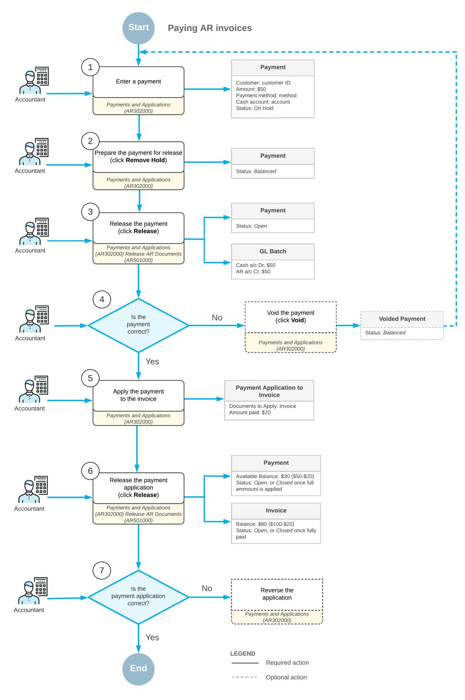

*Figure: Paying AR invoices*

#### **Voided Payments**

The system creates a document of this type when you void a document of the *Payment*, *Prepayment*, or *Balance WO* type that was erroneously recorded or is otherwise invalid. When you release a document of this type, the system reverses the original payment transactions. The system increases the customer's balance by the balance of the voided payment. For step-by-step instructions, see *To Void a [Payment](#page-147-2)*.

To identify documents of this type, the system uses the reference number of the voided payment.

### **Invoice Payments: Payment Processing Flow**

On the *[Payments and Applications](https://help-2025r1.acumatica.com/Help?ScreenId=ShowWiki&pageid=ae844bf4-1aef-42cd-9e2f-49b3ee1bc8d7)* (AR302000) form, you can create the following types of AR documents: *Payment*, *Prepayment*, and *Refund*. A document with the *Voided Payment* type is generated by the system only, but you can further process it by using this form. The processing flow described below applies to documents of all these types.

Documents with the *Balance WO* type can be only viewed on this form. For details on writing off credits, see *[Direct Write-Offs: General Information](https://help-2025r1.acumatica.com/Help?ScreenId=ShowWiki&pageid=c5b2deca-e691-48b3-8867-4683be0551b9)*.

In this topic, we use the term *payment* to describe documents of the *Payment*, *Prepayment*, and *Refund* types, if a type is not stated explicitly.

This topic focuses on the processing stages of a document and the statuses that indicates these stages.

#### **Processing Stages**

When you receive a payment from a customer, you create a corresponding document in the system. When you save the document for the first time, the system assigns a unique reference number to it for tracking purposes and a status that indicates the current state of the document within its processing flow.

The main stages are the following:

- 1. *Recording*: In this stage, you create a payment—that is, provide all the necessary information to the system. By default, the system assigns to the payment the *On Hold*, *Balanced*, or *Pending Processing* status (depending on the settings) when you save it for the first time. This status indicates that the user has finished editing the payment and it is ready to be taken off hold, released, or processed. Alternatively, if you click **Hold** on the form toolbar to indicate to the system that this payment is not ready to be released, the system changes the payment status to *On Hold*. For details, see *[Invoice Payments: Payment Recording](#page-121-1)*.
- 2. *Application*: In this stage, you specify the list of the outstanding documents to which the system should apply the payment. You can do this while you record the payment or aer you have released the payment. You can fully or partially apply the payment amount to an outstanding document, or distribute the payment amount among multiple outstanding documents. The system creates application records, which include the paid amount, for each included outstanding document. The system does not change the payment status during this stage; it remains *Balanced*, *On Hold* (if you clicked **Hold** on the form toolbar), or *Open* (if the payment has been released). For details, see *[Invoice Payments: Manual Payment Application](#page-123-1)*.
- 3. *Releasing a payment*: You can release a payment only if it has the *Balanced* status. When you release the payment, the system checks the available payment balance and processes the payment accordingly. If the available payment balance is zero (that is, if the payment has been fully applied to an outstanding document), the system changes the statuses of both the payment and the paid document to *Closed*. If the available payment balance is nonzero, the system changes the payment status to *Open*. This status indicates to users and to the system that the payment is ready to be applied to the outstanding documents of a customer. For details, see *[Invoice Payments: Release of Payments](#page-127-1)*.
- 4. *Releasing application records*: If you specify a list of outstanding documents for a payment with the *Open* status, you should release the application records aer you have finished distributing the payment amount

between the outstanding documents. You can fully or partially apply the payment amount to outstanding documents. When you release the applications, the system checks the available payment balance. Based on this data, the system processes the payment differently, in one of the following ways:

- If the payment amount is fully applied to an outstanding document, the system does the following: releases application records; changes the statuses of the payment and the paid document to *Closed*; and decreases the balances of the paid document and the payment. The system may change the balance of the customer, if documents with different currencies are involved.
- If the payment amount is partially applied, the system leaves the payment status as *Open*; it also decreases the balances of the paid document, the payment, and the customer. If some outstanding documents were fully paid with the applied amount, the system changes the status of the paid document to *Closed*.

In addition to the actions you perform during the main stages, you may need to do the following:

- Register finance charges that may accompany a payment. For details, see *[Registration of Finance Charges](https://help-2025r1.acumatica.com/Help?ScreenId=ShowWiki&pageid=ef935e3a-04a2-47a4-b999-c97eeedd8730)*.
- Correct a released payment by voiding it and recording the correct one. For step-by-step instructions, see *[To](#page-147-2) Void a [Payment](#page-147-2)*.
- Reserve a payment with the *Open* status by clicking **Hold** on the form toolbar for the payment. For details, see *[Reserving a Payment for Future Application](#page-127-2)* in *[Invoice Payments: Manual Payment Application](#page-123-1)*.
- Allocate a payment for a sales order if the *Inventory and Order Management* group of features is enabled on the *[Enable/Disable Features](https://help-2025r1.acumatica.com/Help?ScreenId=ShowWiki&pageid=c1555e43-1bc5-4f6f-ba9d-b323f94d8a6b)* (CS100000) form. For details, see *[Reserving Payments for Sales Orders](https://help-2025r1.acumatica.com/Help?ScreenId=ShowWiki&pageid=d0d85b37-8484-4a1d-8ccf-dc02ea6b187c)*.

#### **Affecting a Payment Document Flow**

You can use invoice-wide settings, located under the **Data EntrySettings** section on the **General** tab of the *[Accounts Receivable Preferences](https://help-2025r1.acumatica.com/Help?ScreenId=ShowWiki&pageid=f7b52067-5299-45e8-b601-485cd709f58b)* (AR101000) form, to change the processing flow of invoices. For details, see *[Accounts Receivable: Adjustment of AR Preferences](https://help-2025r1.acumatica.com/Help?ScreenId=ShowWiki&pageid=0dd8b5bc-c399-457e-b3cc-26e6d76fd23b)*.

In Acumatica ERP, you can require users to perform additional steps during the recording of a payment by using settings located under the **Data EntrySettings** section on the **General** tab of the *[Accounts Receivable Preferences](https://help-2025r1.acumatica.com/Help?ScreenId=ShowWiki&pageid=f7b52067-5299-45e8-b601-485cd709f58b)* (AR101000) form. For details, see *[Accounts Receivable: Adjustment of AR Preferences](https://help-2025r1.acumatica.com/Help?ScreenId=ShowWiki&pageid=0dd8b5bc-c399-457e-b3cc-26e6d76fd23b)*.

#### **Related Links**

- *AR Invoices: Tracking AR [Documents](#page-90-1)*
- *[Invoice Payments: Payment Recording](#page-121-1)*
- *[Invoice Payments: Manual Payment Application](#page-123-1)*
- *[Auto-Applying Payments: General Information](#page-195-2)*
- *[Invoice Payments: Release of Payments](#page-127-1)*
- *[Invoice Payments: Release of Application Records](#page-129-1)*
- *[Invoice Prepayments: Release of Prepayments](#page-151-1)*

### **Invoice Payments: Payment Recording**

In Acumatica ERP, you can create the following types of payment documents: *Payment*, *Prepayment*, and *Customer Refund*. The information in this topic applies to documents of all these types.

In this topic, the term *payment* is used for payment documents of the three mentioned types if a type is not stated explicitly.

In this topic, you will read about the forms you can use to create a payment, the structure of a payment document, and other details.

#### **Payment Creation Sources**

In Acumatica ERP, a user can manually enter an Accounts Receivable payment from the following forms:

- *[Payments and Applications](https://help-2025r1.acumatica.com/Help?ScreenId=ShowWiki&pageid=ae844bf4-1aef-42cd-9e2f-49b3ee1bc8d7)* (AR302000) form. You create a payment document here from scratch. For step-bystep instructions, see *[Refunds:](#page-177-2) To Create a Refund and Apply a Credit Memo to It*.
- *[Invoices and Memos](https://help-2025r1.acumatica.com/Help?ScreenId=ShowWiki&pageid=5e6f3b27-b7af-412f-a40a-1d4f4be70cba)* form (AR301000) form, by clicking **Pay** or **Apply**. The system opens the *[Payments and](https://help-2025r1.acumatica.com/Help?ScreenId=ShowWiki&pageid=ae844bf4-1aef-42cd-9e2f-49b3ee1bc8d7) [Applications](https://help-2025r1.acumatica.com/Help?ScreenId=ShowWiki&pageid=ae844bf4-1aef-42cd-9e2f-49b3ee1bc8d7)* form where a payment document with the *Payment* type is created automatically: The elements of the form are filled in with the customer information, the invoice amount is specified as the document amount, and the application record of the invoice is added. You simply release the payment the system has created, and the system releases the application record as well and closes both documents.

Also, a payment of the *Payment* type can be generated by the system (and available for working with on the *[Payments and Applications](https://help-2025r1.acumatica.com/Help?ScreenId=ShowWiki&pageid=ae844bf4-1aef-42cd-9e2f-49b3ee1bc8d7)* form) when you initiate the creation of payment documents for customers whose default payment methods are credit cards by using the *[Generate Payments](https://help-2025r1.acumatica.com/Help?ScreenId=ShowWiki&pageid=4bd38406-3d9c-4e77-85a7-6b89295f43e2)* (AR511000) form. For details, see *[Processing](#page-271-3) [Credit Card Payments](#page-271-3)*.

#### **Document Structure**

Regardless of how a payment document is created, it has the same groups of settings, which are described in this section:

- *Summary*: Settings that are located in the Summary area of the form define the general information required for issuing the payment. When you create a new document, the system inserts the current business date as the date of application and the corresponding post period. When you select the identifier of the customer account, the system uses the customer as a source to automatically fill in most settings needed for processing the payment. All settings filled in by the system can be manually overridden.
- *Financial details*: This group of settings, located on the **Financial** tab, defines the General Ledger accounts where the payment transactions are recorded aer a user releases the payment. The system fills in the values for these settings automatically when you select a customer account, but they can be manually overridden. When you create a new document, the system also inserts the current business date as the payment date and the corresponding post period.
- *Application details*: Each outstanding document that you want to pay with the payment is specified in a separate line of the table on the **Documents to Apply** tab. The payment document can be applied to multiple outstanding documents. For each line, you specify the amount to be paid in the **Amount Paid** column. For details, see *[Invoice Payments: Manual Payment Application](#page-123-1)*.
- *Balance details*: Read-only elements in the Summary area of the form display how the amount of the payment document has been distributed and currently available balance (the amount that is not applied). The system updates the values of these elements when you modify application details.

When you save the document for the first time, the system generates a unique reference number for the payment document in accordance with the numbering sequence assigned to corresponding payment document on the **General** tab of the *[Accounts Receivable Preferences](https://help-2025r1.acumatica.com/Help?ScreenId=ShowWiki&pageid=f7b52067-5299-45e8-b601-485cd709f58b)* (AR101000) form.

#### **Registration of Bank Charges**

If bank charges for customer payments are configured in your system, you can specify the amounts of these charges on each payment document that is processed by the bank on the **Charges** tab. The amount of finance charges is displayed in the Summary area in the following boxes:

- **Finance Charges**: The total of finance charges included in the payment amount. That is, the entry type used to record the charge has the **Deduct from Payment** check box cleared on the *Entry [Types](https://help-2025r1.acumatica.com/Help?ScreenId=ShowWiki&pageid=0253dfdd-b06b-4274-b44e-9c7a584b15f2)* (CA203000) form.
- **Deducted Charges**: The total of finance charges deducted from the payment amount. That is, the entry type used to record the charge has the **Deduct from Payment** check box selected on the *Entry [Types](https://help-2025r1.acumatica.com/Help?ScreenId=ShowWiki&pageid=0253dfdd-b06b-4274-b44e-9c7a584b15f2)* form.

For details, see *[Registration of Finance Charges](https://help-2025r1.acumatica.com/Help?ScreenId=ShowWiki&pageid=ef935e3a-04a2-47a4-b999-c97eeedd8730)*.

#### **Attachment of the Original Document**

For user reference, you can attach to each entered payment a scanned image of the original customer document or an electronic version of the customer document. For details, see *To Attach a File to a [Record](https://help-2025r1.acumatica.com/Help?ScreenId=ShowWiki&pageid=286cb1ea-a5df-48c8-a093-3ace3414b842)*.

#### **Related Links**

- *Cash [Account](https://help-2025r1.acumatica.com/Help?ScreenId=ShowWiki&pageid=53e82ded-c693-4d69-ad58-9cb15aff45cb) Types*
- *[Payment Methods for Customers](https://help-2025r1.acumatica.com/Help?ScreenId=ShowWiki&pageid=f490b2b8-d03a-4855-baec-d836f97ecb30)*
- *[Preparation of Deposits](https://help-2025r1.acumatica.com/Help?ScreenId=ShowWiki&pageid=323644f1-ea34-4377-92bc-c1fcb4a86d05)*
- *[Payments and Applications](https://help-2025r1.acumatica.com/Help?ScreenId=ShowWiki&pageid=ae844bf4-1aef-42cd-9e2f-49b3ee1bc8d7)*
- *[Invoices and Memos](https://help-2025r1.acumatica.com/Help?ScreenId=ShowWiki&pageid=5e6f3b27-b7af-412f-a40a-1d4f4be70cba)*

### **Invoice Payments: Manual Payment Application**

Aer you have received a payment document from a customer and recorded it in the system, you then need to apply this payment document to the customer's outstanding documents to close the sale.

When you receive a payment from a customer, in Acumatica ERP, you create a corresponding payment document of the *Payment* or *Prepayment* type on the *[Payments and Applications](https://help-2025r1.acumatica.com/Help?ScreenId=ShowWiki&pageid=ae844bf4-1aef-42cd-9e2f-49b3ee1bc8d7)* (AR302000) form. Payment documents of this type can be applied to the following types of outstanding documents: *Invoice*, *Debit Memo*, and *Overdue Charge*.

In this topic, you will read about how to apply a payment to a specific outstanding document or to multiple outstanding documents. The topic describes how to perform additional operations, such as giving a cash discount, changing a cross rate, writing off a balance, and applying a payment to outstanding documents that belong to child customer accounts.

#### **Paying a Specific Outstanding Document**

Usually a payment document that you receive from a customer references the outstanding document to which it should be applied. In this case, you can use one of the following forms as a starting point to pay the document:

- *[Invoices and Memos](https://help-2025r1.acumatica.com/Help?ScreenId=ShowWiki&pageid=5e6f3b27-b7af-412f-a40a-1d4f4be70cba)* (AR301000): You select the outstanding document here and then click **Pay** or **Apply** on the form toolbar. The system redirects you to the *[Payments and Applications](https://help-2025r1.acumatica.com/Help?ScreenId=ShowWiki&pageid=ae844bf4-1aef-42cd-9e2f-49b3ee1bc8d7)* form, where the system has filled in most of the settings of the new payment, which is almost ready for release. For step-by-step instructions, see *Invoice [Payments:](#page-135-2) To Enter a Payment for a Specific Invoice*.
- *[Payments and Applications](https://help-2025r1.acumatica.com/Help?ScreenId=ShowWiki&pageid=ae844bf4-1aef-42cd-9e2f-49b3ee1bc8d7)*: On this form, you record the payment you have received from the customer, specify the outstanding document or documents in the table on the **Documents to Apply** tab, and release the payment. For step-by-step instructions on recording a payment, see *Invoice [Payments:](#page-135-2) To Enter a [Payment for a Specific Invoice](#page-135-2)*.

In both cases, the system creates an application record (including the paid amount) for the outstanding document. When you release the payment, the system releases the application simultaneously.

You can track the history of payment applications on the **Application History** tab of the payment document.

#### **Paying Multiple Outstanding Documents**

You use the *[Payments and Applications](https://help-2025r1.acumatica.com/Help?ScreenId=ShowWiki&pageid=ae844bf4-1aef-42cd-9e2f-49b3ee1bc8d7)* form to pay multiple outstanding documents. In general, you perform the following steps:

- 1. You record a payment, which you may or may not release.
- 2. You form the list of documents to be paid. You can form it manually or you can direct the system to form the list of outstanding documents of the customer to be paid with the payment. For details, see the following sections: *[Forming the List of Outstanding Documents Manually](#page-124-0)* and *[Forming the List of Outstanding Documents](#page-124-1) [Automatically](#page-124-1)*.

- 3. You distribute the payment amount among the manually added outstanding documents or modify the paid amount filled in by the system, if needed, for each automatically added outstanding document. For details, see *[Distributing the Payment Amount](#page-125-0)*.
- 4. If you have released the payment before forming the list of applications, you click **Release** on the form toolbar and the system releases the application records you have created. If you have not released the payment yet, you click **Release**, and the system releases the payment and its application records.

You can track the history of payment applications by using the **Application History** tab of the payment document.

#### **Forming the List of Outstanding Documents Manually**

On the *[Payments and Applications](https://help-2025r1.acumatica.com/Help?ScreenId=ShowWiki&pageid=ae844bf4-1aef-42cd-9e2f-49b3ee1bc8d7)* form, you form the list of outstanding documents by adding documents to the table on the **Documents to Apply** tab one by one; you distribute the payment amount as you prefer. For step-bystep instructions, see *To Form a List of [Applications](#page-145-1) Manually*.

If there are open documents of the *Credit Memo* type, you can add them to the list only if the list will include some outstanding documents when you finish forming it. The system uses the balances of the added credit memos for application to an outstanding document. Thus, the system applies the sum of the payment and credit memo's balances to the sum of the outstanding documents' balances.

The system creates application records for each included outstanding document, with the amount applied specified in the **Amount Paid** column. When you release the payment, the system releases the application record simultaneously.

#### **Forming the List of Outstanding Documents Automatically**

When you create a new payment of the *Payment* or *Prepayment* type on the *[Payments and Applications](https://help-2025r1.acumatica.com/Help?ScreenId=ShowWiki&pageid=ae844bf4-1aef-42cd-9e2f-49b3ee1bc8d7)* (AR302000) form, as soon as you select the customer in the Summary area, the system forms the list of the customer's outstanding documents on the **Documents to Apply** tab. The system loads only open documents of the *Invoice*, *Debit Memo*, *Credit Memo*, and *Overdue Charge* type that do not have unreleased applications.

If the **Auto-Apply Payments** check box is selected for the customer in the **FinancialSettings** section on the **Financial** tab of the *[Customers](https://help-2025r1.acumatica.com/Help?ScreenId=ShowWiki&pageid=652929bc-9606-4056-aa6e-0c2d1147171b)* (AR303000) form, the system does not load any documents on the **Documents to Apply** tab of the *[Payments and Applications](https://help-2025r1.acumatica.com/Help?ScreenId=ShowWiki&pageid=ae844bf4-1aef-42cd-9e2f-49b3ee1bc8d7)* form automatically.

You can direct the system to load the list of outstanding documents. To begin this process, you click **Load Documents** on the table toolbar of the **Documents to Apply** tab. In the **Load Options** dialog box, which opens, you can specify any of the following selection criteria:

- The company and branch for which the documents were created.
- The date range of the documents to be loaded.
- The range of reference numbers of the documents to be loaded.
- The sort order in which the documents should be displayed. By default, documents are displayed in ascending order, sorted by due date and then reference number.

You can also specify the maximum number of documents to be loaded (in the **Max. Number of Rows** box) and indicate whether the **Amount Paid** column should be automatically filled in when the system loads the documents (by selecting the **Automatically Apply Amount Paid** check box). If this check box is selected, the system applies the payment amount as described in the *[Distributing the Payment Amount](#page-125-0)* section of this topic.

When you click the **Load** or **Reload** button in the dialog box, the system closes the dialog box and forms the list of outstanding documents that meet your selected criteria on the **Documents to Apply** tab. Clicking the **Load** button adds documents that match the selected criteria to any documents that have already been added to the table, whereas clicking the **Reload** button first removes any documents that are listed in the table and then loads only the documents that match the selected criteria.

If the customer account has open documents of the *Credit Memo* type, the system lists them at the top of the list on this tab. The balances of the open credit memos increase the balance that can be applied to outstanding documents.

#### **Distributing the Payment Amount**

When the system loads outstanding documents to the table on the **Documents to Apply** tab automatically (that is, when the customer is selected for the entered payment), the **Amount Paid** column is not filled in.

When you load outstanding documents to the table by clicking **Load Documents** on the table toolbar, specifying selection criteria in the **Load Options** dialog box, and clicking **Load** or **Reload** to close the dialog box, the **Amount Paid** column is filled in based on the value of the **Automatically Apply Amount Paid** check box in the dialog box as follows:

- If the check box was selected, depending on the value specified in the **Payment Amount** box in the Summary area, one of the following happens:
  - If **Payment Amount** is zero, the **Amount Paid** of the document in the row becomes equal to the **Balance** of the document.
  - If **Payment Amount** is nonzero, the payment amount is applied to the documents sequentially, starting with the first document displayed, and the **Amount Paid** of the listed document becomes equal to the lesser of the following: the document balance (in the **Balance** column of the row) and the available balance of the payment (in the **Available Balance** box of the Summary area).
- If the check box was cleared, the system does not fill in the **Amount Paid** column.

You can apply the payment amount to the documents added to the **Documents to Apply** tab automatically by clicking **Auto Apply** on the table toolbar. The system applies the payment amount to the documents as follows:

- 1. The system applies the available payment balance to the first document in the list.
- 2. If the available payment balance, including the balances of any open credit memos, has not been fully applied, the system applies the rest of the balance to the next document in the list and continues this process until the available payment balance is fully applied.

When you add an outstanding document to the table on the **Documents to Apply** tab manually, document by document, the system fills the **Amount Paid** column as follows:

- If the balance of the outstanding document is less than the payment available balance, the system fills the **Amount Paid** column with the document balance.
- If the balance of the outstanding document is more than the payment available balance, the system fills the **Amount Paid** column with the payment balance.
- If the payment amount is not specified and therefore the available balance of the payment is 0, the system fills in the **Amount Paid** column with the document balance and warns you that the payment is out of balance. You can specify a payment amount that is equal to the value the system added to the **Amount Paid** column. Alternatively, you can specify a smaller amount and adjust the value in the **Amount Paid** column accordingly. If you specify a larger amount, you can add other outstanding documents to fully apply the payment. You can instead click the **Refresh** button right of the **Payment Amount** box in the Summary area to replace the payment amount with the total of amounts of the documents selected for application on the **Documents to Apply** and **Orders to Apply** tabs.

In the Summary area of the form, you can see the balance of the payment that is available for further application in the **Available Balance** box and the balance that has been applied in the **Applied to Documents** box.

The system creates application records for each outstanding document for which the applied amount is specified in the **Amount Paid** column. When you release the payment, the system releases the application records simultaneously. For step-by-step instructions, see *Invoice Payments: To Load AR Documents [Automatically](#page-137-1)*.

#### **Correcting the List of Applications**

When you form the list of outstanding documents on the **Documents to Apply** tab, the system creates an application record for each line. You can add new documents and remove or modify already-added documents until you release the application records by clicking **Release** on the form toolbar.

When you release the application records, the system moves these records to the **Application History** tab, where you can view (but not modify) the list of the applied documents.

If you have mistakenly applied a customer payment or prepayment to the wrong document, you can correct an application record. If the application record has not yet been released, you simply remove the incorrect line from the table on the **Documents to Apply** tab.

If the application record has been released, you reverse the released application record on the **Application History** tab by clicking the mistaken record and then clicking **Reverse Application** on the table toolbar. When you click the button, the system does the following:

- Adds the reversed application record to the **Documents to Apply** tab with the negative application amount in the **Amount Paid** column
- Changes the status of the payment and of the applied document to *Open*
- Changes the available balance and the application amount in accordance with the amount of the application that was reversed

You then release the reversed application record, and the system moves it to the **Application History** tab.

If you have mistakenly applied a customer refund to the wrong document and released the refund with its applications, you can correct the application record similarly. The only difference is that a customer refund cannot have an available balance aer it was released. Thus, you must fully apply the available refund balance right aer you have reversed the incorrect application record. You then release both the reversed application records and the new ones.

For step-by-step instructions, see *To Correct an [Application](#page-146-1) Record*.

#### **Recording a Cash Discount**

You can give a customer a discount for early payment when you apply the payment amount to an outstanding document.

If you have configured credit terms for the customer that define the cash discount period and the discount amount, the system automatically calculates whether to add a cash discount. If the cash discount period of the document has not ended, the system fills in the **Cash DiscountTaken** column for the document with the discount amount aer you have added the document to the table on the **Documents to Apply** tab. You can change the discount amount if needed.

If the credit terms of the customer do not define any cash discount, you can fill in the **Cash DiscountTaken** column for the document with the discount amount aer you have added the document, and correct the applied amount in the **Amount Paid** column.

For details on configuring credit terms with a cash discount, see *Setup of Credit [Terms](https://help-2025r1.acumatica.com/Help?ScreenId=ShowWiki&pageid=bb0d243d-508c-4bf5-85b4-7b4fcc3d5fac)*.

#### **Writing Off a Balance**

If write-offs are enabled and configured in the system, as described in *[Direct Write-Offs: Write-Off Setup](https://help-2025r1.acumatica.com/Help?ScreenId=ShowWiki&pageid=7ccc5a43-dbd8-4d44-80f2-5ef857163e6d)*, you can write off an amount along with the application. For each document that you add for the application, you can specify the amount to write off in the **Balance Write-Off** column (specifying a positive value for the amount of a balance write-off and a negative value for the amount of a credit write-off) and the reason code in the **Write-Off Reason Code** column. The total amount of write-offs is displayed in the **Write-Off Amount** box in the Summary area.

Depending on your company's policy, you may need to use separate reason codes for balance write-offs and for credit write-offs. You define reason codes on the *[Reason Codes](https://help-2025r1.acumatica.com/Help?ScreenId=ShowWiki&pageid=fe53f1bf-3670-465e-8b7c-922d8246f123)* (CS211000) form, selecting the *Balance Write-Off* option in the **Usage** box for a balance write-off or the *Credit Write-Off* option for a credit write-off. Alternatively, you can configure one reason code for both types of write-offs. In this case, you can select either the *Balance Write-Off* or the *Credit Write-Off* option in the **Usage** box.

For example, suppose that you want to record a payment in the amount of \$100 for an invoice in the amount of \$99. (The customer overpaid \$1 and you want to write off this amount to close both the payment and the invoice.) You can write off \$1 when you enter a payment for this invoice on the *[Payments and Applications](https://help-2025r1.acumatica.com/Help?ScreenId=ShowWiki&pageid=ae844bf4-1aef-42cd-9e2f-49b3ee1bc8d7)* (AR302000) form by specifying -1 in the **Balance Write-Off** column and selecting a reason code for credit write offs in the **Write-Off Reason Code** column.

When you release applications of this type, the system does not create a document of the *Balance WO* type. The system stores write-off details in the application record and generates a separate transaction to post to general ledger accounts.

#### **Applying a Payment to Documents of Child Customer Accounts**

If the *Parent-Child Customer Relationship* feature is enabled on the *[Enable/Disable Features](https://help-2025r1.acumatica.com/Help?ScreenId=ShowWiki&pageid=c1555e43-1bc5-4f6f-ba9d-b323f94d8a6b)* (CS100000) form and parent-child relations between customer accounts are configured, you can add to the list of outstanding documents those that belong to child customer accounts. For details, see *[Managing Parent-Child Relationships](#page-25-2)*.

#### **Reserving a Payment for Future Application**

You can reserve an open payment for future application. To mark an open payment as reserved, on the *[Payments](https://help-2025r1.acumatica.com/Help?ScreenId=ShowWiki&pageid=ae844bf4-1aef-42cd-9e2f-49b3ee1bc8d7) [and Applications](https://help-2025r1.acumatica.com/Help?ScreenId=ShowWiki&pageid=ae844bf4-1aef-42cd-9e2f-49b3ee1bc8d7)* (AR302000) form, you click **Hold** on the form toolbar for the payment document with the *Open* status. The system changes the document status from *Open* to *Reserved*.

Reserved payments cannot be applied to outstanding documents and are excluded from the auto-application process. To release the payment from hold, click **Remove Hold** on the form toolbar.

### **Invoice Payments: Release of Payments**

In Acumatica ERP, payment documents that can be released manually have the following document types on the *[Payments and Applications](https://help-2025r1.acumatica.com/Help?ScreenId=ShowWiki&pageid=ae844bf4-1aef-42cd-9e2f-49b3ee1bc8d7)* (AR302000) form: *Payment*, *Prepayment*, *Customer Refund*, and *Voided Payment*. The information in this topic applies to documents of the *Payment* type.

This topic describes the forms you may use to release a payment and the details of releasing payments and their application records, as well as the details of the generation of the GL batch.

#### **Releasing a Payment**

In Acumatica ERP, if a payment has the *Balanced* status, you can release the payment by using one of the following forms:

- *[Payments and Applications](https://help-2025r1.acumatica.com/Help?ScreenId=ShowWiki&pageid=ae844bf4-1aef-42cd-9e2f-49b3ee1bc8d7)*: You release a payment and any of its applications by clicking the **Release** button on the form toolbar.
- *[Release AR Documents](https://help-2025r1.acumatica.com/Help?ScreenId=ShowWiki&pageid=78ad2d21-b6a8-46d0-8f2d-98dd0a23f75e)* (AR501000): You use this mass-processing form to release a particular payment or multiple payments.

If you have recorded bank charges for the payment, the system generates the respective transactions and includes them in the batch with the payment transactions. For details on bank charge transactions, see *[Finance Charge](https://help-2025r1.acumatica.com/Help?ScreenId=ShowWiki&pageid=438c4829-23c0-4de8-ab13-a5f83ebfe8c6) [Transactions](https://help-2025r1.acumatica.com/Help?ScreenId=ShowWiki&pageid=438c4829-23c0-4de8-ab13-a5f83ebfe8c6)*.

In addition to payment transactions that update the asset accounts, the batch may contain transactions generated by application records that were released along with the payment. For details, see *[Invoice Payments: Release of](#page-129-1) [Application Records](#page-129-1)*.

#### **Releasing a Payment Without Applications**

When you record a payment, you may not specify any outstanding documents on the **Documents to Apply** tab of the *[Payments and Applications](https://help-2025r1.acumatica.com/Help?ScreenId=ShowWiki&pageid=ae844bf4-1aef-42cd-9e2f-49b3ee1bc8d7)* form. Thus, the available balance of the payment is equal to the payment amount. When you release such a payment document, the system does the following:

- Changes the payment status to *Open*.
- Decreases the customer's balance by the payment amount.
- Generates a GL batch to update the involved asset accounts. For details, see *[Releasing a Payment](#page-127-3)*.

In this case, the system generates a GL batch that contains only payment transactions and transactions for any bank charges. For details, see *[Releasing a Payment](#page-127-3)*.

#### **Releasing a Partially Applied Payment**

When you record a payment, you may specify some outstanding documents on the **Documents to Apply** tab of the *[Payments and Applications](https://help-2025r1.acumatica.com/Help?ScreenId=ShowWiki&pageid=ae844bf4-1aef-42cd-9e2f-49b3ee1bc8d7)* form. The system creates application records for each document listed on the tab; the records include the applied amount. Thus, the available balance of the payment becomes less than the payment amount. When you release such a payment document, the system does the following:

- Changes the payment status to *Open*.
- Releases any application records.
- Decreases the balances of the paid documents. If the balance of a paid document becomes *0.00*, the system changes its status to *Closed*.
- Decreases the customer's balance by the paid amount.
- Decreases the customer's balance by the available payment balance.
- Generates a GL batch to update the involved asset accounts. For details, see *[Releasing a Payment](#page-127-3)*.

When you release a partially applied payment, the GL batch may contain, in addition to payment transactions, some transactions generated by its application records. For details, see *[Invoice Payments: Release of Application](#page-129-1) [Records](#page-129-1)*.

#### **Releasing a Fully Applied Payment**

When you record a payment, you may fully apply its available balance to one outstanding document or multiple outstanding documents.

You distribute the entire available payment balance among the outstanding documents you add to the table on the **Documents to Apply** tab of the *[Payments and Applications](https://help-2025r1.acumatica.com/Help?ScreenId=ShowWiki&pageid=ae844bf4-1aef-42cd-9e2f-49b3ee1bc8d7)* form. The system creates application records (which include the applied amount) for each document listed on the tab. Thus, the available payment balance becomes 0. When you release such a payment, the system does the following:

- Changes the payment status to *Closed*.
- Releases the application records.
- Decreases the balances of the paid documents. If the balance of a paid document becomes *0.00*, the system changes its status to *Closed*.
- Decreases the customer's balance by the paid amount.
- Generates a GL batch to update the involved asset accounts. For details, see *[Releasing a Payment](#page-127-3)*.

When you release a fully applied payment, the General Ledger batch may contain, in addition to payment transactions, some transactions generated by its application records. For details, see *[Invoice Payments: Release of](#page-129-1) [Application Records](#page-129-1)*.

#### **Releasing a Voided Payment**

When you void a payment document, the system creates a document with the *Voided Payment* type with the same reference number as the document you have voided. For step-by-step instructions, see *To Void a [Payment](#page-147-2)*.

When you release a void payment, the system does the following:

- Changes the status of the voided document to *Voided*.
- Releases any reversed application records.
- Increases the balances of the earlier paid documents. If the earlier paid documents were closed, the system changes their status to *Open*.
- Increases the customer's balance by the voided amount.
- Generates a GL batch to update the involved asset accounts with the reversed transactions. For details, see *[Releasing a Payment](#page-127-3)*.

When you release a void payment, the GL batch may contain, in addition to reversed payment transactions, some transactions generated by reversed application records. For details, see *[Invoice Payments: Release of Application](#page-129-1) [Records](#page-129-1)*.

#### **Releasing a Payment Associated with a Project**

When you release a payment document that has a project and project task specified on the **Financial** tab of the *[Payments and Applications](https://help-2025r1.acumatica.com/Help?ScreenId=ShowWiki&pageid=ae844bf4-1aef-42cd-9e2f-49b3ee1bc8d7)* (AR302000) form, the system generates the batch of transactions that are associated with the non-project code, which is specified on the *[Projects Preferences](https://help-2025r1.acumatica.com/Help?ScreenId=ShowWiki&pageid=de2ca225-4a0c-4129-b09d-3f3ed05198f9)* (PM101000) form, and no project task. That is, the generated transactions do not affect the project and project task.

### **Invoice Payments: Release of Application Records**

In most cases, when you release applications records, the system does not generate any transactions that need to be posted to the general ledger.

The system generates additional transactions when any of the following need to be recorded:

- The applied cash discount
- The written-off balance
- The realized gain or loss (RGOL) incurred if payments and outstanding documents are in a foreign currency
- The amount transferred between different AR subaccounts or between different branches for which balancing entries are needed in your system that are involved in an application

This topic describes the forms you may use to release application records of a payment document and the details of releasing application records, as well as the details of the generation of the GL batch.

#### **Releasing Payment Applications**

In Acumatica ERP, you can add application records to a payment document when you record the payment document and aer you have released it. In both cases, you can use either of the following forms when you need to release an application record:

- *[Payments and Applications](https://help-2025r1.acumatica.com/Help?ScreenId=ShowWiki&pageid=ae844bf4-1aef-42cd-9e2f-49b3ee1bc8d7)*: You release an application record for an open payment by clicking the **Release** button on the form toolbar.
- *[Release AR Documents](https://help-2025r1.acumatica.com/Help?ScreenId=ShowWiki&pageid=78ad2d21-b6a8-46d0-8f2d-98dd0a23f75e)* (AR501000): You use this mass-processing form to release the application records for a particular open payment or multiple open payments.

Each time you release an application record for a payment document, the system does the following:

- On the *[Payments and Applications](https://help-2025r1.acumatica.com/Help?ScreenId=ShowWiki&pageid=ae844bf4-1aef-42cd-9e2f-49b3ee1bc8d7)* form, sets the **Application Date** and **Application Period** for the payment to the date and the period, respectively, of the application record whose release closed the payment.
- Moves the application record from the **Documents to Apply** tab to the **Application History** tab.
- Generates any application transactions.
- Decreases the available payment balance for the applied amount. If the available payment balance becomes 0, the system changes the payment status to *Closed*.

When you add application records to a payment document with the *On Hold* or *Balanced* status and then release the payment document, the system simultaneously releases its application records. If the application records require some transactions to be recorded, the system adds these transactions to a General Ledger batch with the payment transactions. You can view the batch details by clicking the link in the **Batch Nbr.** box on the **Financial** tab of the *[Payments and Applications](https://help-2025r1.acumatica.com/Help?ScreenId=ShowWiki&pageid=ae844bf4-1aef-42cd-9e2f-49b3ee1bc8d7)* form or by clicking the link in the **Batch Number** column on the **Application History** tab of this form.

The system displays the batch number in the **Batch Number** column on the **Application History** tab even if there were no application transactions. In this case, the batch will contain only payment transactions.

When you add application records to a released payment document (with the *Open* status), you release only application records. If the application records require some transactions to be recorded, the system generates an additional General Ledger batch with the application transactions. You can view the batch details by clicking the link in the **Batch Number** column on the **Application History** tab of the *[Payments and Applications](https://help-2025r1.acumatica.com/Help?ScreenId=ShowWiki&pageid=ae844bf4-1aef-42cd-9e2f-49b3ee1bc8d7)* form.

#### **Releasing an Application with a Cash Discount**

When you add an invoice for which a cash discount is valid to the **Documents to Apply** tab, the system automatically fills in the **Cash DiscountTaken** column for the invoice with the cash discount amount defined by the credit terms associated with the invoice. You can decrease the cash discount amount, if needed. When you then release a payment with an application record that contains an applied cash discount, the system generates a batch of the following transactions.

| Account                     | Debit                | Credit                                   |
|-----------------------------|----------------------|------------------------------------------|
| Cash account                | Payment amount       | 0.00                                     |
| Accounts receivable account | 0.00                 | Payment amount + cash discount amount |
| Cash discount account       | Cash discount amount | 0.00                                     |

#### **Releasing an Application with a Written-Off Amount**

You write off some balance along with the application by specifying the amount and the reason code in the **Balance Write-Off** and **Write-Off Reason Code** columns, respectively. When you release a payment with an application record that contains a positive written-off amount, the system generates a batch of the following transactions.

| Account                     | Debit          | Credit                               |
|-----------------------------|----------------|--------------------------------------|
| Cash account                | Payment amount | 0.00                                 |
| Accounts receivable account | 0.00           | Payment amount + write-off amount |

| Account                                                              | Debit            | Credit |
|----------------------------------------------------------------------|------------------|--------|
| Reason code account (the account associated with the reason code) | Write-off amount | 0.00   |

If the payment amount is greater than the invoice amount to which this payment is applied, you can enter a credit write-off directly on the *[Payments and Applications](https://help-2025r1.acumatica.com/Help?ScreenId=ShowWiki&pageid=ae844bf4-1aef-42cd-9e2f-49b3ee1bc8d7)* (AR302000) form to write off a small overpaid amount and close both the payment and the invoice. If you do this, the amount you enter in the **Balance Write-Off** column should be a negative value and the reason code in the **Write-Off Reason Code** column should be the one specified for credit write-offs. When you release a payment with an application record that contains a negative written-off amount, the system generates a batch of the following transactions.

| Account                                                              | Debit          | Credit                               |
|----------------------------------------------------------------------|----------------|--------------------------------------|
| Cash account                                                         | Payment amount | 0.00                                 |
| Accounts receivable account                                          | 0.00           | Payment amount + write-off amount |
| Reason code account (the account associated with the reason code) | 0.00           | –(Write-off amount)                  |

#### **Releasing an Application with a RGOL**

Suppose that you apply a payment in a foreign currency to an outstanding document in the same foreign currency and the exchange rate on the invoice date is less than the exchange rate on the payment date. When you release the payment with its application record, the system generates a batch of the following transactions in the foreign currency.

| Account                         | Debit                                       | Credit                                      |
|---------------------------------|---------------------------------------------|---------------------------------------------|
| Cash account (foreign currency) | Payment amount (in the foreign currency) | 0.00                                        |
| Accounts receivable account     | 0.00                                        | Payment amount (in the foreign currency) |
| Realized gain / loss account    | 0.00                                        | 0.00                                        |

If you view the batch in the base currency by clicking the**View Base** button in the Summary area of the *[Journal](https://help-2025r1.acumatica.com/Help?ScreenId=ShowWiki&pageid=dda046bc-5946-407f-88f7-1c0c966fbe72) [Transactions](https://help-2025r1.acumatica.com/Help?ScreenId=ShowWiki&pageid=dda046bc-5946-407f-88f7-1c0c966fbe72)* (GL301000) form, the system displays the same transaction in the base currency.

| Account                         | Debit                                     | Credit                                               |
|---------------------------------|-------------------------------------------|------------------------------------------------------|
| Cash account (foreign currency) | Payment amount (in the base cur rency) | 0.00                                                 |
| Accounts receivable account     | 0.00                                      | Payment amount–RGOL amount (in the base currency) |
| Realized gain / loss account    | 0.00                                      | RGOL amount (in the base curren cy)               |

#### **Releasing an Application with Different AR Accounts**

Suppose that you recorded a payment document to some accounts receivable account and did not specify any application records. When you release this payment, the system generates the batch with the payment transactions as follows.

| Account                                       | Debit          | Credit         |
|-----------------------------------------------|----------------|----------------|
| Cash account                                  | Payment amount | 0.00           |
| Accounts receivable account of the payment | 0.00           | Payment amount |

You can view the batch details by clicking the link in the **Batch Nbr.** box on the **Financial** tab of the *[Payments and](https://help-2025r1.acumatica.com/Help?ScreenId=ShowWiki&pageid=ae844bf4-1aef-42cd-9e2f-49b3ee1bc8d7) [Applications](https://help-2025r1.acumatica.com/Help?ScreenId=ShowWiki&pageid=ae844bf4-1aef-42cd-9e2f-49b3ee1bc8d7)* form.

Then you apply this open payment to an outstanding document that was recorded to another AR account. When you release the application record, the system generates a batch of the following transactions.

| Account                                                    | Debit          | Credit         |  |  |  |  |
|------------------------------------------------------------|----------------|----------------|--|--|--|--|
| Accounts receivable account of the payment              | Payment amount | 0.00           |  |  |  |  |
| Accounts receivable account of the outstanding document | 0.00           | Payment amount |  |  |  |  |

You can view the batch details by clicking the link in the **Batch Number** column on the **Application History** tab of the *[Payments and Applications](https://help-2025r1.acumatica.com/Help?ScreenId=ShowWiki&pageid=ae844bf4-1aef-42cd-9e2f-49b3ee1bc8d7)* form.

### **Invoice Payments: Payment Receipts**

Aer a payment for an invoice has been processed, you can provide your customer with proof of purchase by generating a payment receipt for the released transaction. On the *[Payments and Applications](https://help-2025r1.acumatica.com/Help?ScreenId=ShowWiki&pageid=ae844bf4-1aef-42cd-9e2f-49b3ee1bc8d7)* (AR302000) form, you can print the payment receipt or send an email with it.

You can generate payment receipts for documents with the *Payment*, *Prepayment*, *Refund*, *Voided Payment*, and *Voided Refund* types.

You can use this functionality if either of the following conditions is met:

- The payment has been created with the *Credit Card*, *POS*, or *EFT* payment method, and has been captured and released.
- The payment has been created with the *Cash*, *Check*, or *Direct Deposit* payment method, and has been released.

The PDF attachment in the generated email includes the payment details. You can also print this PDF report.

#### **Functionality Setup**

To set up this functionality, do the following:

1. On the **Settings for Use in AR** tab of the *[Payment Methods](https://help-2025r1.acumatica.com/Help?ScreenId=ShowWiki&pageid=509285d1-cfae-4e87-95c3-a968451952e6)* (CA204000) form, select the**Send Payment Receipts Automatically** check box for each needed payment method.

With this check box selected, payment receipts for the specified payment method will be sent automatically to customers from the *[Payments and Applications](https://help-2025r1.acumatica.com/Help?ScreenId=ShowWiki&pageid=ae844bf4-1aef-42cd-9e2f-49b3ee1bc8d7)* (AR302000) form. Regardless of the state of this check box, users can also manually send payment receipts from this form.

2. On the **Mailing & Printing** tab of the *[Accounts Receivable Preferences](https://help-2025r1.acumatica.com/Help?ScreenId=ShowWiki&pageid=f7b52067-5299-45e8-b601-485cd709f58b)* (AR101000) form, make sure that the *PAY RECEIPT* mailing ID is shown in the **DefaultSources** table. The **Active** check box should be selected for this mailing ID.

This row in the table defines the mapping between the mailing and the email template. If your organization needs to change or update this mapping, a system administrator can do this on the *[Customer Classes](https://help-2025r1.acumatica.com/Help?ScreenId=ShowWiki&pageid=806e39d6-6f89-4e6c-9a24-61c6fb0c9a57)* (AR201000) or *[Customers](https://help-2025r1.acumatica.com/Help?ScreenId=ShowWiki&pageid=652929bc-9606-4056-aa6e-0c2d1147171b)* (AR303000) form.

3. On the same tab, add mailing recipients to the **Default Recipients** table.

#### **Automatic Generation of Receipts**

You use the *[Print/Email AR Documents](https://help-2025r1.acumatica.com/Help?ScreenId=ShowWiki&pageid=05451253-581e-459d-912e-ff983df762b9)* (AR508000) form to mass-process payment receipts and schedule the automatic sending of them to customers. To generate emails with payment receipts for invoice payments, perform the following steps:

- 1. On the *[Print/Email AR Documents](https://help-2025r1.acumatica.com/Help?ScreenId=ShowWiki&pageid=05451253-581e-459d-912e-ff983df762b9)* form, select *Email Payment Receipts* in the **Action** box.
- 2. In the Selection area, specify the selection criteria for documents.

The system displays documents of the following types: *Cash Sale*, *Cash Return*, *Payment*, *Prepayment*, *Voided Payment*, *Refund*, and *Voided Refund*. For payments, prepayments, and refunds displayed in the table, the **Emailed** check box is cleared on the **Financial** tab of the *[Payments and Applications](https://help-2025r1.acumatica.com/Help?ScreenId=ShowWiki&pageid=ae844bf4-1aef-42cd-9e2f-49b3ee1bc8d7)* (AR302000) form.

3. Select the Included check box in the row or rows for the needed documents and then click **Process** on the form toolbar. Alternatively, click **Process All** to process all documents.

The system generates an email message and attaches it to the document on the *[Payments and Applications](https://help-2025r1.acumatica.com/Help?ScreenId=ShowWiki&pageid=ae844bf4-1aef-42cd-9e2f-49b3ee1bc8d7)* form. Once the email has been created, the **Emailed** check box is selected for the document on the **Financial** tab of the *[Payments and Applications](https://help-2025r1.acumatica.com/Help?ScreenId=ShowWiki&pageid=ae844bf4-1aef-42cd-9e2f-49b3ee1bc8d7)* form.

To schedule the automatic sending of payment receipts, an administrative user should perform the following instructions:

- 1. On the *[Payment Methods](https://help-2025r1.acumatica.com/Help?ScreenId=ShowWiki&pageid=509285d1-cfae-4e87-95c3-a968451952e6)* (CA204000) form, select the**Send Payment Receipts Automatically** check box for the needed payment methods.
- 2. On the *[Print/Email AR Documents](https://help-2025r1.acumatica.com/Help?ScreenId=ShowWiki&pageid=05451253-581e-459d-912e-ff983df762b9)* (AR508000) form, create a schedule. Once the schedule is created, payment receipts will be automatically sent to customers based on this schedule. For more information about schedules, see *[Scheduling Automated Processing](https://help-2025r1.acumatica.com/Help?ScreenId=ShowWiki&pageid=87426450-3fdb-4248-b29c-e9cbf47cef6f)*.

#### **Manual Generation of Receipts**

On the *[Payments and Applications](https://help-2025r1.acumatica.com/Help?ScreenId=ShowWiki&pageid=ae844bf4-1aef-42cd-9e2f-49b3ee1bc8d7)* (AR302000) form, you generate payment receipts by doing either of the following:

• On the More menu of the form, clicking **Print Payment Receipt** to print the receipt in PDF format.

The system opens the printable document on the *[Payment Receipt](https://help-2025r1.acumatica.com/Help?ScreenId=ShowWiki&pageid=5885ccfc-0226-4b46-89ed-22135e106b6a)* (AR643000) report. The **Payment Details** section at the bottom of the report shows the document type, transaction date, payment method, and the total amount paid.

Aer printing the document, the system selects the **Printed** check box for it on the **Financial** tab of the *[Payments and Applications](https://help-2025r1.acumatica.com/Help?ScreenId=ShowWiki&pageid=ae844bf4-1aef-42cd-9e2f-49b3ee1bc8d7)* form.

• On the More menu of the form, clicking **Email Payment Receipt**.

The system generates an email message and attaches it to the form. Once the email has been created, the **Emailed** check box is selected for the document on the **Financial** tab of the *[Payments and Applications](https://help-2025r1.acumatica.com/Help?ScreenId=ShowWiki&pageid=ae844bf4-1aef-42cd-9e2f-49b3ee1bc8d7)* form.

### **Invoice Payments: Implementation Checklist**

To ensure that the system is configured properly for creating a payment and applying it to an invoice, make sure that the criteria listed in the table have been met in the system as described.

| Form                               | Criteria to Check                                                                                                                                                                                                                                                                | Notes |
|------------------------------------|----------------------------------------------------------------------------------------------------------------------------------------------------------------------------------------------------------------------------------------------------------------------------------|-------|
| Enable/Disable Features (CS100000) | Make sure the minimal features have been enabled as described in Company Without Branches: General Information, Company with Branches that Do Not Require Balancing: Gen eral Information, and Company with Branches that Require Balancing: General Information. |       |
| Customers (AR303000)               | Verify the existence of the customer accounts for the customers whose invoices you will pay. For details, see Customers: Implementa tion Activity.                                                                                                                      |       |

#### **Settings That Affect the Workflow**

The following settings and entities should be specified and defined, respectively:

- The following general ledger settings should be specified on the **PostingSettings** tab of the *[General Ledger](https://help-2025r1.acumatica.com/Help?ScreenId=ShowWiki&pageid=e4913d06-c511-4258-a0f9-f36c1b854e6b) [Preferences](https://help-2025r1.acumatica.com/Help?ScreenId=ShowWiki&pageid=e4913d06-c511-4258-a0f9-f36c1b854e6b)* (GL102000) form:
  - Make sure that the **Automatically Post on Release** check box is selected. This setting causes GL batches to be immediately posted aer they are released.
  - Clear the **Generate Consolidated Batches** check box to cause every AR transaction you enter to be posted as an individual batch to the general ledger. (When this check box is selected, the system consolidates into a single batch all transactions in the same currency posted to the same period for all documents being released.)
- The following accounts receivable settings should be specified on the **GeneralSettings** tab of the *[Accounts](https://help-2025r1.acumatica.com/Help?ScreenId=ShowWiki&pageid=f7b52067-5299-45e8-b601-485cd709f58b) [Receivable Preferences](https://help-2025r1.acumatica.com/Help?ScreenId=ShowWiki&pageid=f7b52067-5299-45e8-b601-485cd709f58b)* (AR101000) form:
  - Select the **Hold Documents on Entry** check box in the **Data EntrySettings** section. This setting gives the created AR invoices and credit memos the *On Hold* status.
  - Make sure that the **Automatically Post on Release** check box is selected in the **PostingSettings** section. This setting indicates that AR invoices and credit memos will be automatically posted to the general ledger once they are released.
  - Clear the **Require Payment Reference on Entry** check box in the **Data EntrySettings** section. With this check box cleared, you do not have to fill in payment reference information in the **Payment Ref.** box on the *[Payments and Applications](https://help-2025r1.acumatica.com/Help?ScreenId=ShowWiki&pageid=ae844bf4-1aef-42cd-9e2f-49b3ee1bc8d7)* (AR302000) form.

With these settings specified and entities defined, users in your company can record and process documents in Acumatica ERP quickly and accurately, with a minimum of manual actions.

### **Invoice Payments: Generated Transactions**

When you release a payment and its application, the system generates a general ledger batch to update the involved asset accounts with the payment transactions. The payment includes all the information the system needs to generate the batch. The following two accounts are usually involved:

- The asset account specified in the **AR Account** box on the **Financial** tab
- The cash account specified in the **Cash Account** box in the Summary area

The following payment transactions will be recorded to the general ledger when the payment is released.

| Account                     | Debit          | Credit         |
|-----------------------------|----------------|----------------|
| Cash account                | Payment amount | 0.00           |
| Accounts Receivable account | 0.00           | Payment amount |

You can view the batch details by clicking the link in the **Batch Nbr.** box on the **Financial** tab of the *[Payments and](https://help-2025r1.acumatica.com/Help?ScreenId=ShowWiki&pageid=ae844bf4-1aef-42cd-9e2f-49b3ee1bc8d7) [Applications](https://help-2025r1.acumatica.com/Help?ScreenId=ShowWiki&pageid=ae844bf4-1aef-42cd-9e2f-49b3ee1bc8d7)* (AR302000) form.

### **Invoice Payments: To Enter a Payment for a Specific Invoice**

The following activity will walk you through the process of creating a payment and applying it to an invoice.

This activity is based on the *U100* dataset. If you are using another dataset, or if any system settings have been changed in *U100*, these changes can affect the workflow of the activity and the results of the processing. To avoid any issues, restore the *U100* dataset to its initial state.

#### **Video Tutorial**

This video shows you the common process but may contain less detail than the activity has. If you want to repeat the activity on your own or you are preparing to take the certification exam, we recommend that you follow the instructions in the steps of the activity.

#### *[FEEDBACK](https://www.surveymonkey.com/r/BLBL7RJ?Video=Paying%20AR%20Invoices&Source=Open%20Uni&Course=F100)*

#### **Story**

Suppose that on January 30, 2025, the SweetLife Fruits & Jams company received a check for \$300 from one of its customers, which had purchased an offline training course on January 9, 2025.

Acting as a SweetLife accountant, you need to create the payment in the system and apply it to the \$300 invoice dated 1/9/2025.

#### **Process Overview**

In this activity, you will find the needed invoice on the *[Invoices and Memos](https://help-2025r1.acumatica.com/Help?ScreenId=ShowWiki&pageid=5e6f3b27-b7af-412f-a40a-1d4f4be70cba)* (AR301000) form and click **Pay** on the form toolbar to create a payment for it on the *[Payments and Applications](https://help-2025r1.acumatica.com/Help?ScreenId=ShowWiki&pageid=ae844bf4-1aef-42cd-9e2f-49b3ee1bc8d7)* (AR302000) form. You will then apply this payment to the invoice and release the payment with its application to the invoice.

#### **System Preparation**

To prepare the system, do the following:

- 1. Launch the Acumatica ERP website, and sign in to a company with the *U100* dataset preloaded. To sign in as an accountant, use the following credentials:
  - Username: *johnson*
  - Password: *123*
- 2. In the info area, in the upper-right corner of the top pane of the Acumatica ERP screen, make sure that the business date in your system is set to *1/30/2025*. If a different date is displayed, click the Business Date menu button and select *1/30/2025*. For simplicity, in this exercise, you will create and process all documents in the system on this business date.
- 3. On the Company and Branch Selection menu, also on the top pane of the Acumatica ERP screen, make sure that the *SweetLife Head Office and Wholesale Center* branch is selected. If it is not selected, click the Company and Branch Selection menu to view the list of branches that you have access to, and then click *SweetLife Head Office and Wholesale Center*.

#### **Step 1: Creating a Payment for a Specific Invoice**

To create a payment for a specific invoice, do the following:

- 1. Open the *[Invoices and Memos](https://help-2025r1.acumatica.com/Help?ScreenId=ShowWiki&pageid=5e6f3b27-b7af-412f-a40a-1d4f4be70cba)* (AR301000) form.
- 2. Find the \$300 invoice for the *COFFEESHOP* customer, which is dated 1/9/2025, and open it.
- 3. On the form toolbar, click **Pay**.

When you click this button, the system navigates to the *[Payments and Applications](https://help-2025r1.acumatica.com/Help?ScreenId=ShowWiki&pageid=ae844bf4-1aef-42cd-9e2f-49b3ee1bc8d7)* (AR302000) form, creates a new payment in the amount of the invoice's open balance, and inserts the information from the invoice into the payment. You can change this default payment information in the payment before release.

- 4. In the Summary area, make sure the following information is displayed:
  - **Application Date**: *1/30/2025*
  - **Application Period**: *01-2025*
  - **Description**: *Offline training*
  - **Payment Amount**: 300 (the amount you have received from the customer)
- 5. On the **Documents to Apply** tab, in the **Amount Paid** column for the invoice, leave the full amount to be applied, \$300, as shown in the following screenshot.

| <b>Payments and Applications</b> Payment - FourStar Coffee & Sweets Shop |                                                                                                                             |              |             |                              |  |                                       |              |  |                    |   |                                         |                |      |                                           |          |          | <b>PINOTES</b>                  | <b>ACTIVITIES</b> | <b>FILES</b>      | TOOLS $\sim$ |
|-----------------------------------------------------------------------------|-----------------------------------------------------------------------------------------------------------------------------|--------------|-------------|------------------------------|--|---------------------------------------|--------------|--|--------------------|---|-----------------------------------------|----------------|------|-------------------------------------------|----------|----------|---------------------------------|-------------------|-------------------|--------------|
| 周 B $\leftarrow$                                                      | $\Omega$                                                                                                                    | $^+$         | Õ 面      | $\mathsf{K}$ $\checkmark$ |  | $\rightarrow$ ≺                    | $\geq$       |  | <b>REMOVE HOLD</b> |   | $\cdots$                                |                |      |                                           |          |          |                                 |                   |                   |              |
| Type:                                                                       | Payment                                                                                                                     | $\checkmark$ |             | Customer:                    |  | COFFEESHOP - FourStar Coffee & Swee 2 |              |  |                    |   |                                         | Payment Amo    |      | 300.00 0                                  |          |          |                                 |                   |                   | $\lambda$    |
| Reference Nbr.:                                                             | $<$ NEW $>$                                                                                                                 | Q            | * Location: |                              |  | <b>MAIN - Primary Location</b>        |              |  |                    | ٩ |                                         | Applied to Doc |      | 300.00                                    |          |          |                                 |                   |                   |              |
| Status:                                                                     | On Hold                                                                                                                     |              |             | Payment Meth                 |  | <b>CHECK - Check Payment</b>          |              |  |                    | Q |                                         | Applied to Ord |      | 0.00                                      |          |          |                                 |                   |                   |              |
| * Application Date:                                                         | 1/30/2025                                                                                                                   | 自            |             | Card/Account                 |  |                                       |              |  |                    |   |                                         | Available Bala |      | 0.00                                      |          |          |                                 |                   |                   |              |
| * Application Pe                                                            | 01-2025                                                                                                                     | ρ            |             | * Cash Account:              |  | 10200WH - Wholesale Checking ٩     |              |  |                    |   | Write-Off Amo                           |                | 0.00 |                                           |          |          |                                 |                   |                   |              |
| Payment Ref.:                                                               | 0097                                                                                                                        |              |             |                              |  |                                       |              |  |                    |   |                                         | Finance Charg  |      | 0.00                                      |          |          |                                 |                   |                   |              |
|                                                                             |                                                                                                                             |              |             |                              |  |                                       |              |  |                    |   |                                         | Deducted Cha   |      | 0.00                                      |          |          |                                 |                   |                   |              |
|                                                                             |                                                                                                                             |              |             | Description:                 |  | Offline training                      |              |  |                    |   |                                         |                |      |                                           |          |          |                                 |                   |                   |              |
|                                                                             | <b>DOCUMENTS TO APPLY</b> SALES ORDERS <b>APPLICATION HISTORY</b> <b>FINANCIAL</b> <b>CHARGES</b> COMPLIANCE |              |             |                              |  |                                       |              |  |                    |   |                                         |                |      |                                           |          |          |                                 |                   |                   |              |
| $\pm$ $\times$ O                                                      | <b>LOAD DOCUMENTS</b>                                                                                                       |              |             | <b>AUTO APPLY</b>            |  | н                                     | $\mathbf{x}$ |  |                    |   |                                         |                |      |                                           |          |          |                                 |                   |                   |              |
| $\Box$ 80 n                                                           | <b>Branch</b>                                                                                                               |              | Doc. Type   | *Reference Nbr.           |  | <b>Inventory ID</b>                   |              |  | <b>Amount Paid</b> |   | Cash <b>Discount</b> <b>Taken</b> |                |      | Write-Off Write-Off Amount Reason Code | Date     | Due Date | Cash <b>Discount</b> Date |                   | <b>Cross Rate</b> | Balance      |
| $\omega$ D 罓                                                          | <b>HEADOFFICE</b>                                                                                                           |              | Invoice     | 000078                       |  |                                       |              |  | 300.00             |   | 0.00                                    |                | 0.00 | <b>BALWOFF</b>                            | 1/9/2025 | 2/8/2025 | 2/8/2025                        |                   | 1.00000000        | 0.00         |

*Figure: The payment applied to the invoice before release*

6. On the form toolbar, click **Remove Hold** and click **Save** to save the document.

#### **Step 2: Releasing the Payment and Its Application to the Invoice**

To release the payment and its application to the invoice, do the following:

- 1. While you are still on the *[Payments and Applications](https://help-2025r1.acumatica.com/Help?ScreenId=ShowWiki&pageid=ae844bf4-1aef-42cd-9e2f-49b3ee1bc8d7)* (AR302000) form, click **Release** on the form toolbar.
- 2. On the **Application History** tab, review the row that the system has added, and click the link in the **Batch Number** column.
- 3. The system opens the *Journal [Transactions](https://help-2025r1.acumatica.com/Help?ScreenId=ShowWiki&pageid=dda046bc-5946-407f-88f7-1c0c966fbe72)* (GL301000) form with the GL transaction that was generated aer the release of the payment.

### **Invoice Payments: To Load AR Documents Automatically**

In this activity, you will explore how the system loads AR documents for payment application and how payment amounts can be automatically applied to multiple documents. You will also review how multiple payments can be automatically applied to an AR document.

This activity is based on the *U100* dataset. If you are using another dataset, or if any system settings have been changed in *U100*, these changes can affect the workflow of the activity and the results of the processing. To avoid any issues, restore the *U100* dataset to its initial state.

#### **Story**

On January 30, 2025, you received a \$135 payment from the CoffeeShop company. Acting as a SweetLife accountant, you need to enter it in Acumatica ERP and apply it to the corresponding invoice.

You have also received a \$425 payment from the Good Food company for two of the outstanding invoices of the customer (in the amounts of \$200 and \$225, respectively). You need to enter the payment and apply it to the invoices.

CoffeeShop's accountant has asked you to use a \$1800 prepayment to settle invoices issued to the CoffeeShop company between January 1, 2025 and January 14, 2025. You need to identify the relevant invoices and apply the prepayment to them.

The CoffeeShop company has bought another offline course from SweetLife. For this purchase, you need to apply an invoice, a credit memo, and the remainder of the prepayment.

#### **Process Overview**

During the completion of this activity, on the *[Payments and Applications](https://help-2025r1.acumatica.com/Help?ScreenId=ShowWiki&pageid=ae844bf4-1aef-42cd-9e2f-49b3ee1bc8d7)* (AR302000) form, you will start entering a new payment from a customer and analyze how the system automatically loads the AR documents to which the payment can be applied. In the list of loaded documents, you will select an invoice for payment application, and then update the payment amount to reflect the invoice amount.

While still on the *[Payments and Applications](https://help-2025r1.acumatica.com/Help?ScreenId=ShowWiki&pageid=ae844bf4-1aef-42cd-9e2f-49b3ee1bc8d7)* form, you will enter a payment from a customer, review how the system automatically loads the AR documents to which the payment can be applied, and then explore how the payment amount can be automatically applied to the loaded documents.

Then on the same form, you will open an existing open prepayment, invoke the **Load Options** dialog box, and specify the selection criteria for the AR documents to be loaded for payment application. You will also analyze how the **Load** and **Reload** buttons determine whether the AR documents that have already been added to the table on

the **Documents to Apply** tab are kept or removed when you load AR documents by using the **Load Options** dialog box.

Finally, on the *[Invoices and Memos](https://help-2025r1.acumatica.com/Help?ScreenId=ShowWiki&pageid=5e6f3b27-b7af-412f-a40a-1d4f4be70cba)* (AR301000) form, you will create an invoice and load to the **Applications** tab the list of payments that can be applied to this invoice. You also explore how the auto-application of multiple payments works.

#### **System Preparation**

Perform the following initial actions to prepare the system:

- 1. Launch the Acumatica ERP website, and sign in as an accountant by using the following credentials:
  - Username: *johnson*
  - Password: *123*
- 2. In the info area, in the upper-right corner of the top pane of the Acumatica ERP screen, make sure that the business date in your system is set to *1/30/2025*. If a different date is displayed, click the Business Date menu button and select *1/30/2025*. For simplicity, in this lesson, you will create and process all documents in the system on this business date.
- 3. On the Company and Branch Selection menu, also on the top pane of the Acumatica ERP screen, make sure that the *SweetLife Head Office and Wholesale Center* branch is selected. If it is not selected, click the Company and Branch Selection menu button to view the list of branches that you have access to, and then click *SweetLife Head Office and Wholesale Center*.

#### **Step 1: Entering a Payment for a Particular Invoice**

To enter a payment for the \$135 invoice for the *COFFEESHOP* customer, do the following:

- 1. Open the *[Payments and Applications](https://help-2025r1.acumatica.com/Help?ScreenId=ShowWiki&pageid=ae844bf4-1aef-42cd-9e2f-49b3ee1bc8d7)* (AR302000) form.
- 2. On the form toolbar, click **Add New Record**.
- 3. In the Summary area of the form, select the *Payment* document type and the *COFFEESHOP* customer. Do not specify the payment amount yet.

On the **Documents to Apply** tab, notice that a list of AR documents is now displayed in the table.

The system has added all AR documents created for the *COFFEESHOP* customer that have not been closed and that have no unreleased payment applications. Also notice that the credit memo dated *1/23/2025* is displayed in the first row of the table. If there are any credit memos for the selected customer, the system always displays them at the top of the list.

4. In the list of loaded documents, find the \$135 invoice dated *1/10/2025*, and in the row of the invoice, select the unlabeled check box to select the invoice for payment application.

Notice that when you selected the check box, the outstanding invoice balance (that is, the value in the **Balance** column) became *0*, and the applied payment amount (that is, the amount in the **Amount Paid** column) changed to *135*. This means that the applied amount fully covered the outstanding amount of the invoice (that is, the invoice has been paid in full).

5. In the Summary area of the form, click the Refresh button right of the **Payment Amount** box.

The amount in the **Payment Amount** box has now been updated to reflect the amount of the selected invoice.

6. On the form toolbar, click**Save** to save your changes.

Notice that the table on the **Documents to Apply** tab now shows only the \$135 invoice to which you have applied the payment. All other AR documents that the system previously loaded have disappeared.

You do not have to process this payment any further. You have created it to observe how the system automatically loads AR documents for payment application and how you can quickly update the payment amount to reflect the amount applied to the documents.

#### **Step 2: Entering a Payment and Auto-Applying It to Multiple Invoices**

To enter a payment that covers multiple invoices for the *GOODFOOD* customer, do the following:

- 1. Open the *[Payments and Applications](https://help-2025r1.acumatica.com/Help?ScreenId=ShowWiki&pageid=ae844bf4-1aef-42cd-9e2f-49b3ee1bc8d7)* (AR302000) form.
- 2. In the Summary area of the form, create a new payment, and specify the following settings in the Summary area:
  - **Type**: *Payment*
  - **Application Date**: *1/30/2025* (selected by default)
  - **Customer**: *GOODFOOD*
  - **Payment Amount**: 425

On the **Documents to Apply** tab, notice that the system has added multiple invoices to which this payment can be applied.

3. On the table toolbar of the **Documents to Apply** tab, click **Auto Apply**.

In the Summary area, notice that the **Available Balance** of the payment has become *0*, and the **Applied to Documents** amount is now *425*, as shown in the following screenshot.

|                                                                                                                                                    |                                          | <b>Payments and Applications</b> Payment - GoodFood One Restaurant |                       |                                           |                                |                                                                   |                    |                                                 |             |                            |           |           |                                 |                   |         | <b>NOTES</b>               | <b>ACTIVITIES</b>                | <b>FILES</b> | $TOOLS$ - |
|----------------------------------------------------------------------------------------------------------------------------------------------------|------------------------------------------|-----------------------------------------------------------------------|-----------------------|-------------------------------------------|--------------------------------|-------------------------------------------------------------------|--------------------|-------------------------------------------------|-------------|----------------------------|-----------|-----------|---------------------------------|-------------------|---------|----------------------------|----------------------------------|--------------|-----------|
| $\leftarrow$                                                                                                                                       | 周                                        | n $\Omega$                                                         | 俞 $+$              | n. К ٠                              | ∢ $\mathcal{L}$             | Я                                                                 | <b>REMOVE HOLD</b> | $\cdots$                                        |             |                            |           |           |                                 |                   |         |                            |                                  |              |           |
| Type: Status:                                                                                                                                   | Reference Nbr.:                          | Payment <new> On Hold</new>                                    | $\check{}$ $\circ$ | Customer: * Location: Payment Meth. | <b>MAIN - Primary Location</b> | GOODFOOD - GoodFood One Restaurar <b>CHECK - Check Payment</b> | ρ Q             | Payment Amo Applied to Doc Applied to Ord |             | 425.00 ℃ 425.00 0.00 |           |           |                                 |                   |         |                            |                                  |              | $\sim$    |
|                                                                                                                                                    | * Application Date: * Application Pe. | 1/30/2023 01-2023                                                  | $\check{}$ Q       | Card/Account                              |                                |                                                                   |                    | Available Bala Write-Off Amo                 |             | 0.00 0.00               |           |           |                                 |                   |         |                            |                                  |              |           |
|                                                                                                                                                    | Payment Ref.                             | 0076                                                                  |                       | * Cash Account:                           |                                | 10200WH - Wholesale Checking                                      | $\circ$            | Finance Charg Deducted Cha                   |             | 0.00 0.00               |           |           |                                 |                   |         |                            |                                  |              |           |
| Description: <b>DOCUMENTS TO APPLY</b> <b>SALES ORDERS</b> <b>APPLICATION HISTORY</b> <b>CHARGES</b> COMPLIANCE <b>FINANCIAL</b> |                                          |                                                                       |                       |                                           |                                |                                                                   |                    |                                                 |             |                            |           |           |                                 |                   |         |                            |                                  |              |           |
| Ĉ.                                                                                                                                                 | $+$                                      | $\times$                                                              | <b>LOAD DOCUMENTS</b> | <b>AUTO APPLY</b>                         | H                              | $\mathbf{\overline{x}}$                                           |                    |                                                 |             |                            |           |           |                                 |                   |         |                            |                                  |              |           |
| <b>B &amp; D</b>                                                                                                                                   | D.                                       | <b>Branch</b>                                                         | Doc. Type             | *Reference Nbr.                        | *Line Nbr.                  | Inventory ID                                                   | Amount Paid     | Cash <b>Discount</b> Taken                | Amount Code | Write-Off Write-Off Reason | Date      | Due Date  | Cash <b>Discount</b> Date | <b>Cross Rate</b> | Balance | <b>Discount</b> Balance | <b>Cash Description</b>          |              |           |
| $0$ D                                                                                                                                              | ⊡                                        | <b>HEADOFFICE</b>                                                     | Invoice               | 000002                                    | $\mathbf{0}$                   |                                                                   | 200.00             | 0.00                                            |             | 0.00 BALWOFF               | 12/5/2022 | 1/4/2023  | 1/4/2023                        | 1.00000000        | 0.00    |                            | 0.00 Consulting                  |              |           |
| 0 0                                                                                                                                     | ☑                                        | <b>HEADOFFICE</b>                                                     | Invoice               | 000005                                    | $\bullet$                      |                                                                   | 45.00              | 0.00                                            | 0.00        | <b>BALWOFF</b>             | 1/25/2023 | 2/24/2023 | 2/24/2023                       | 1.00000000        | 156.74  |                            | 0.00 Orange and apple jam, local |              |           |
| 0 0                                                                                                                                     | ☑                                        | HEADOFFICE Invoice                                                    |                       | 000076                                    | $\bullet$                      |                                                                   | 180.00             | 0.00                                            |             | 0.00 BALWOFF               | 1/16/2023 | 2/15/2023 | 2/15/2023                       | 1.00000000        | 0.00    |                            | 0.00 Online training             |              |           |
| $0$ D                                                                                                                                              | п.                                       | <b>HEADOFFICE</b>                                                     | Invoice               | 000113                                    | $\mathbf{0}$                   |                                                                   | 0.00               | 0.00                                            |             | 0.00 BALWOFF               | 1/30/2023 | 3/1/2023  | 3/1/2023                        | 1.00000000        | 248.00  |                            | 0.00 On-site training 4 hours    |              |           |

#### *Figure: Payment auto-application to invoices*

The system has applied the full amount of the payment to the three invoices in the table as follows:

- The outstanding balances of two invoices with the earliest due dates are now *0* (as indicated in the **Balance** box), which means that the invoices have been paid in full.
- The third invoice, for *201.74* and dated *1/25/2025*, has been paid only in part. The payment balance available aer the application to the first two invoices (*45*) has been applied to the third invoice.

The system applies the payment balance to the documents in the table starting with the document having the earliest due date. If aer applying the payment to the first document, there is still available balance, the system applies it to the document whose due date is the earliest one among the rest. This process continues until the available payment balance becomes zero or until there are no more documents to which the payment can be applied.

The system always auto-applies the available payment balance to the documents in the table starting with the document whose due date is the earliest.

4. Delete the row with the \$201.74 invoice from the table.

5. On the table toolbar, click **Auto Apply**.

Notice that the system has reapplied the payment amount (\$425) to the three invoices in the table, and now the first two invoices are paid in full, as shown in the following screenshot.

| <b>Payments and Applications</b> Payment - GoodFood One Restaurant |                                          |                          |                     |                                           |                                   |                    |                                  |             |                            |           |           |                                 | <b>TH NOTES</b> | <b>ACTIVITIES</b> | <b>FILES</b>               | TOOLS $\star$                 |                     |
|-----------------------------------------------------------------------|------------------------------------------|--------------------------|---------------------|-------------------------------------------|-----------------------------------|--------------------|----------------------------------|-------------|----------------------------|-----------|-----------|---------------------------------|-----------------|-------------------|----------------------------|-------------------------------|---------------------|
| 罰 $\leftarrow$                                                     | o $\Omega$                            | Û $^{+}$              | $\mathsf{D}$ . K | $\rightarrow$ $\overline{\phantom{a}}$ | $\geq$                            | <b>REMOVE HOLD</b> |                                  |             |                            |           |           |                                 |                 |                   |                            |                               |                     |
| Type:                                                                 | Payment                                  | $\overline{\phantom{a}}$ | Customer:           |                                           | GOODFOOD - GoodFood One Restaurar | 1                  | Payment Amo                      |             | 425.00 ℃                   |           |           |                                 |                 |                   |                            |                               | $\hat{\phantom{a}}$ |
| Reference Nbr.                                                        | <new></new>                              | $\circ$                  | * Location:         | <b>MAIN - Primary Location</b>            |                                   | $\varphi$          | Applied to Doc                   |             | 425.00                     |           |           |                                 |                 |                   |                            |                               |                     |
| Status:                                                               | On Hold                                  |                          | Payment Meth.       |                                           | <b>CHECK - Check Payment</b>      | o                  | Applied to Ord                   |             | 0.00                       |           |           |                                 |                 |                   |                            |                               |                     |
| * Application Date: 1/30/2023                                         |                                          |                          | Card/Account        |                                           |                                   |                    | Available Bala                   |             | 0.00                       |           |           |                                 |                 |                   |                            |                               |                     |
| * Application Pe.                                                     | 01-2023                                  | Q                        |                     |                                           |                                   |                    | Write-Off Amo                    |             | 0.00                       |           |           |                                 |                 |                   |                            |                               |                     |
| Payment Ref.:                                                         | !!!!!!!!!!!!!!!!!!!!!!!!!!!!!!!!!!!!!!!! |                          | * Cash Account      |                                           | 10200WH - Wholesale Checking      | $\varphi$          | Finance Charg.                   |             | 0.00                       |           |           |                                 |                 |                   |                            |                               |                     |
|                                                                       |                                          |                          |                     |                                           |                                   |                    | Deducted Cha.                    |             | 0.00                       |           |           |                                 |                 |                   |                            |                               |                     |
|                                                                       |                                          |                          | Description:        |                                           |                                   |                    |                                  |             |                            |           |           |                                 |                 |                   |                            |                               |                     |
| <b>DOCUMENTS TO APPLY</b>                                             |                                          | <b>SALES ORDERS</b>      |                     | <b>APPLICATION HISTORY</b>                |                                   | <b>FINANCIAL</b>   | <b>CHARGES</b>                   | COMPLIANCE  |                            |           |           |                                 |                 |                   |                            |                               |                     |
|                                                                       |                                          |                          |                     |                                           |                                   |                    |                                  |             |                            |           |           |                                 |                 |                   |                            |                               |                     |
| Ō $_{+}$                                                           | $\times$                                 | <b>LOAD DOCUMENTS</b>    | <b>AUTO APPLY</b>   | $\vdash$                                  | $\bar{\mathbf{x}}$                |                    |                                  |             |                            |           |           |                                 |                 |                   |                            |                               |                     |
| <b>B &amp; D</b> $\Box$                                            | <b>Branch</b>                            | Doc. Type                | *Reference Nbr.  | *Line Nbr.                             | Inventory ID                   | Amount Paid     | Cash <b>Discount</b> Taken | Amount Code | Write-Off Write-Off Reason | Date      | Due Date  | Cash <b>Discount</b> Date | Cross Rate      | Balance           | <b>Discount</b> Balance | Cash Description              |                     |
| ☑ $\mathbf{a}$ D                                                   | <b>HEADOFFICE</b>                        | Invoice                  | 000002              | 0                                         |                                   | 200.00             | 0.00                             | 0.00        | <b>BALWOFF</b>             | 12/5/2022 | 1/4/2023  | 1/4/2023                        | 1.00000000      | 0.00              |                            | 0.00 Consulting               |                     |
| ☑ $0$ D                                                            | <b>HEADOFFICE</b>                        | Invoice                  | 000076              | $\bullet$                                 |                                   | 180.00             | 0.00                             | 0.00        | <b>BALWOFF</b>             | 1/16/2023 | 2/15/2023 | 2/15/2023                       | 1.00000000      | 0.00              |                            | 0.00 Online training          |                     |
| ☑ $> 0$ D                                                          | <b>HEADOFFICE</b>                        | Invoice                  | 000113              | $\mathbf{0}$                              |                                   | 45.00              | 0.00                             | 0.00        | <b>BALWOFF</b>             | 1/30/2023 | 3/1/2023  | 3/1/2023                        | 1.00000000      | 203.00            |                            | 0.00 On-site training 4 hours |                     |

#### *Figure: Payment auto-application aer an invoice has been removed*

You do not need to save or process this payment any further. You started entering it only to see how the system loads documents to which it can be applied and how auto-application of payment works.

#### **Step 3: Applying an Existing Prepayment to Multiple Invoices**

To apply a prepayment to multiple invoices for the *COFFEESHOP* customer, do the following:

1. On the *[Payments and Applications](https://help-2025r1.acumatica.com/Help?ScreenId=ShowWiki&pageid=ae844bf4-1aef-42cd-9e2f-49b3ee1bc8d7)* (AR302000) form, open the \$1,800 prepayment made by the *COFFEESHOP* customer.

On the **Documents to Apply** tab, notice that the system has not loaded to the table any AR documents to which this prepayment can be applied; the system automatically loads documents to this table only when you create a new payment or prepayment and select a customer in the Summary area of the form.

2. On the table toolbar, click **Load Documents**.

In the **Load Options** dialog box, which opens, you can specify the selection criteria for the documents to be loaded.

3. Leave the default settings and click **Load**.

The system has loaded AR documents (a credit memo and six invoices) to the table based on the default settings.

The invoice to which you applied the payment in Step 1 is not shown on the list because the system does not load to the table AR documents with unreleased applications.

Because the **Automatically Apply Amount Paid** check box was selected in the **Load Options** dialog box, the system has applied the available prepayment balance to the loaded documents, which is indicated by the unlabeled check box selected in the four rows of the table.

The system always auto-applies the available payment balance to the documents in the table starting with the document whose due date is the earliest.

- 4. On the table toolbar, click **Load Documents**.
- 5. In the **Load Options** dialog box, which opens, specify the following selection criteria:
  - **From Date**: *1/1/2025*
  - **To Date**: *1/14/2025*
- 6. Click **Load**.

Notice that the list of AR documents in the table has not changed. This is because when you click **Load** in the **Load Options** dialog box, the system adds AR documents matching the selected criteria to the documents in the table; the documents that are already present in the table are not removed, even if they do not match the selected criteria.

- 7. On the table toolbar, click **Load Documents** again.
- 8. In the **Load Options** dialog box, keep the current selection criteria, and click **Reload**.

Notice that now the table on the **Documents to Apply** tab contains only one invoice that matches the selection criteria specified in the **Load Options** dialog box. When you click **Reload** in this dialog box, the system removes any documents from the table and loads only the documents matching the selected criteria.

The invoice has been paid in full (*660* has been applied to it, as shown in the **Amount Paid** column), and the prepayment still has *1140* of available balance (displayed in the **Available Balance** box of the Summary area).

9. Save your changes to the prepayment.

10.On the form toolbar, click **Release**.

You must release this prepayment and its application at this point; otherwise, it will not be displayed in Step 4.

The released prepayment is shown in the following screenshot.

|                                                                 | <b>Payments and Applications</b> Prepayment 000059 - FourStar Coffee & Sweets Shop |                     |                         |                                       |                  |                |                              |                    |                                          | <b>PINOTES</b> | <b>ACTIVITIES</b>     | <b>FILES</b>          | $TOOLS$ + |          |                                 |  |         |
|-----------------------------------------------------------------|---------------------------------------------------------------------------------------|---------------------|-------------------------|---------------------------------------|------------------|----------------|------------------------------|--------------------|------------------------------------------|----------------|-----------------------|-----------------------|-----------|----------|---------------------------------|--|---------|
| 로 日 $\leftarrow$                                          | $\Omega$                                                                              | $+$ fill.        | n. $\mathsf{K}$ ٠ | $\geq$ ≺ $\rightarrow$          | <b>VOID</b>      | $\cdots$       |                              |                    |                                          |                |                       |                       |           |          |                                 |  |         |
| Type:                                                           | Prepayme -                                                                            |                     | Customer:               | COFFEESHOP - FourStar Coffee & Swee 2 |                  |                | Payment Amo                  | 1,800.00 $\circ$   |                                          |                |                       |                       |           |          |                                 |  | $\sim$  |
| Reference Nbr.                                                  | 000059                                                                                | Q                   | Location:               | <b>MAIN - Primary Location</b>        |                  |                | Applied to Doc               | 0.00               |                                          |                |                       |                       |           |          |                                 |  |         |
| Status:                                                         | Open                                                                                  |                     | Payment Meth.           | <b>CHECK - Check Payment</b>          |                  |                | Applied to Ord               | 0.00               |                                          |                |                       |                       |           |          |                                 |  |         |
| * Application Date: 1/30/2023                                   |                                                                                       | ٠.                  | Card/Account            |                                       |                  |                | Available Bala.              | 1,140.00           |                                          |                |                       |                       |           |          |                                 |  |         |
| * Application Pe 01-2023                                        |                                                                                       | $\mathfrak{a}$      |                         |                                       |                  |                | Write-Off Amo                | 0.00               |                                          |                |                       |                       |           |          |                                 |  |         |
| Payment Ref.:                                                   | 0021                                                                                  |                     | Cash Account:           | 10200WH - Wholesale Checking          |                  |                | Finance Charg                | 0.00               |                                          |                |                       |                       |           |          |                                 |  |         |
|                                                                 |                                                                                       |                     |                         |                                       |                  |                | Deducted Cha                 | 0.00               |                                          |                |                       |                       |           |          |                                 |  |         |
|                                                                 |                                                                                       |                     | Description:            | Consulting and training services      |                  |                |                              |                    |                                          |                |                       |                       |           |          |                                 |  |         |
| DOCUMENTS TO APPLY                                              |                                                                                       | SALES ORDERS        |                         | <b>APPLICATION HISTORY</b>            | <b>FINANCIAL</b> |                | <b>CHARGES</b> COMPLIANCE |                    |                                          |                |                       |                       |           |          |                                 |  |         |
| Ò                                                               | <b>REVERSE APPLICATION</b>                                                            | $\vdash$            | $\mathbf{x}$            |                                       |                  |                |                              |                    |                                          |                |                       |                       |           |          |                                 |  |         |
| !!!!!!!!!!!!!!!!!!!!!!!!!!!!!!!!!!!!!!!! <b>BB</b> Branch |                                                                                       | <b>Batch Number</b> | Doc. Type               | Reference N br          | Nbr. ID          | Line Inventory | Customer                     | <b>Amount Paid</b> | Cash <b>Discount</b> Taken         | Amount Date    | Write-Off Application | Application Period | Date      | Due Date | Cash <b>Discount</b> Date |  | Balance |
| <b>0 D HEADOFFICE</b>                                           |                                                                                       | AR000190            | Invoice                 | 880000                                |                  |                | COFFFESHOP                   | 660.00             | !!!!!!!!!!!!!!!!!!!!!!!!!!!!!!!!!!!!!!!! | 0.00           | 1/30/2023             | 01-2023               | 1/8/2023  | 2/7/2023 | 2/7/2023                        |  | 0.00    |

*Figure: The released prepayment applied to an invoice*

#### **Step 4: Creating an Invoice and Applying It to Multiple Payments**

To create an an AR invoice and apply it to multiple payments that already exist in the system, do the following:

- 1. Open the *[Invoices and Memos](https://help-2025r1.acumatica.com/Help?ScreenId=ShowWiki&pageid=5e6f3b27-b7af-412f-a40a-1d4f4be70cba)* (AR301000) form.
- 2. In the Summary area of the form, click **Add New Record**, and specify the following settings in the Summary area:
  - **Type**: *Invoice*
  - **Customer**: *COFFEESHOP*
  - **Date**: *1/30/2025* (selected by default)
- 3. On the **Details** tab, click **Add Row** on the table toolbar, and specify the following settings in the added row:
  - **Branch**: *HEADOFFICE* (selected by default)
  - **Inventory ID**: *OFLCOURSE*
  - **Quantity**: 3
  - **UOM**: *DAY* (selected by default)

• **Unit Price**: 45 (selected by default)

#### 4. On the **Applications** tab, click **Load Documents**.

Notice that the system has loaded a \$60 credit memo and a \$1140 prepayment that can be applied to the invoice.

5. Select the unlabeled check box in the rows of the credit memo and the prepayment, and save the invoice.

Notice that the system displays an error. When you select the unlabeled check box in the row of a payment, the payment's available amount is fully applied to the current AR document. In this case, the amount of the prepayment (\$1140) is greater than the outstanding amount of the invoice (\$75).

6. On the table toolbar, click **Auto Apply**.

Notice that the **Amount Paid** in the row of the prepayment has changed from *1140* to *75*. Now the total of the applied amounts of the credit memo and the prepayment is equal to the invoice amount, as shown in the following screenshot.

| <b>Invoices and Memos</b> Invoice - FourStar Coffee & Sweets Shop |                                     |                                            |               |                                |                                       |                      |                          |           | <b>PINOTES</b> | <b>ACTIVITIES</b>                | <b>FILES</b> | TOOLS $\sim$ |         |                     |
|----------------------------------------------------------------------|-------------------------------------|--------------------------------------------|---------------|--------------------------------|---------------------------------------|----------------------|--------------------------|-----------|----------------|----------------------------------|--------------|--------------|---------|---------------------|
| a B $\leftarrow$                                               | $\Omega$ $^+$                    | $\Omega$ . 圎 $\overline{\mathbf{K}}$ | ≺             | $\geq$ $\rightarrow$        | <b>REMOVE HOLD</b>                    | $\cdots$             |                          |           |                |                                  |              |              |         |                     |
| Type:                                                                | Invoice $\overline{\phantom{a}}$ | Customer:                                  |               |                                | COFFEESHOP - FourStar Coffee & Swee 2 | <b>Detail Total:</b> | 135.00                   |           |                |                                  |              |              |         | $\hat{\phantom{a}}$ |
| Reference Nbr.                                                       | $<\!\!NEW\!\!>$ $\circ$          | * Location:                                |               | <b>MAIN - Primary Location</b> | $\varphi$                             |                      | <b>Discount Total:</b>   | 0.00      |                |                                  |              |              |         |                     |
| Status:                                                              | On Hold                             | * Terms:                                   | 30D - 30 Days |                                | $\varphi$                             | <b>Tax Total:</b>    |                          | 0.00      |                |                                  |              |              |         |                     |
| * Date:                                                              | 1/30/2023 $\scriptstyle\star$    | * Due Date:                                | 3/1/2023      | $\overline{\phantom{a}}$       | Apply Retainage                       | Balance:             | 135.00                   |           |                |                                  |              |              |         |                     |
| * Post Period:                                                       | 01-2023 $\circ$                  | * Cash Discount.                           | 3/1/2023      | $\scriptstyle\star$            | Pay by Line                           |                      | Cash Discount:           | 0.00      |                |                                  |              |              |         |                     |
| Customer Ord.                                                        |                                     | * Project/Contract: X - Non-Project Code.  |               |                                | 00                                    |                      |                          |           |                |                                  |              |              |         |                     |
|                                                                      |                                     |                                            |               |                                |                                       |                      |                          |           |                |                                  |              |              |         |                     |
| Description:                                                         |                                     |                                            |               |                                |                                       |                      |                          |           |                |                                  |              |              |         |                     |
|                                                                      |                                     |                                            |               |                                |                                       |                      |                          |           |                |                                  |              |              |         |                     |
|                                                                      | <b>FINANCIAL</b>                    |                                            |               | <b>APPLICATIONS</b>            | COMPLIANCE                            |                      |                          |           |                |                                  |              |              |         |                     |
| <b>DETAILS</b>                                                       |                                     | <b>ADDRESSES</b> <b>TAXES</b>           |               |                                |                                       |                      |                          |           |                |                                  |              |              |         |                     |
| Ò $\times$ $^+$                                                | <b>LOAD DOCUMENTS</b>               | <b>AUTO APPLY</b>                          | $\vdash$      | $\mathbf{x}$                   |                                       |                      |                          |           |                |                                  |              |              |         |                     |
| $\Box$ Ω 图 0 <b>Branch</b>                                  |                                     | *Doc. Type                                 | *Reference    | Amount                         | Cash                                  | Write-Off            | Write-Off Reason Payment |           |                | <b>Balance Description</b>       | Currency     | Payment      | Payment | <b>Status</b>       |
|                                                                      |                                     | Nbr.                                       |               | Paid                           | <b>Discount</b> Taken              | Amount               | Code Date                |           |                |                                  |              | Period       | Ref.    |                     |
| ☑ 0 0                                                  | <b>HEADOFFICE</b>                   | 000068 <b>Credit Memo</b>               |               | 60.00                          | 0.0000                                | 0.00                 | <b>BALWOFF</b>           | 1/23/2023 | 0.00           | Credit memo for on-site lectures | <b>USD</b>   | 01-2023      |         | Open                |
| ☑ $> 0$ D                                                         | <b>HEADOFFICE</b>                   | Prepayment                                 | 000059        | 75.00                          | 0.0000                                | 0.00                 | <b>BALWOFF</b>           | 1/2/2023  | 1,065.00       | Consulting and training services | <b>USD</b>   | 01-2023      | 0021    | Open                |

#### *Figure: An invoice applied to multiple payments*

You do not need to save or process this invoice any further.

### **Invoice Payments: Mass Processing**

This topic explains the way you can release multiple payment applications, the application of a payment to multiple AR documents, and the application of multiple payments to a single AR document.

#### **Mass Release of Payments and Payment Applications**

Multiple payments can be released at the same time on the *[Release AR Documents](https://help-2025r1.acumatica.com/Help?ScreenId=ShowWiki&pageid=78ad2d21-b6a8-46d0-8f2d-98dd0a23f75e)* (AR501000) form. On this form, you select the unlabeled check boxes next to the payments to be processed and click **Release** on the form toolbar to release the selected payments and their applications to documents or click **Release All** to release all the payments and applications shown in the table.

The system creates a consolidated GL batch for all the released invoices and credit memos if the **Generate Consolidated Batches** check box is selected on the *[General Ledger Preferences](https://help-2025r1.acumatica.com/Help?ScreenId=ShowWiki&pageid=e4913d06-c511-4258-a0f9-f36c1b854e6b)* (GL102000) form.

#### **Application of a Payment to Multiple AR Documents**

You can apply a single payment to multiple documents at once on the *[Payments and Applications](https://help-2025r1.acumatica.com/Help?ScreenId=ShowWiki&pageid=ae844bf4-1aef-42cd-9e2f-49b3ee1bc8d7)* (AR302000) form by performing the following general steps:

1. On the **Documents to Apply** tab, you add the AR documents to be paid.

When you create a new payment of the *Payment* or *Prepayment* type on the *[Payments and Applications](https://help-2025r1.acumatica.com/Help?ScreenId=ShowWiki&pageid=ae844bf4-1aef-42cd-9e2f-49b3ee1bc8d7)* (AR302000) form, as soon as you select the customer in the Summary area, the system automatically loads to the **Documents to Apply** tab the AR documents to which this payment can be applied—that is, the customer's open AR documents of the *Invoice*, *Debit Memo*, *Credit Memo*, and *Overdue Charge* type that do not have unreleased applications.

If more than 100 eligible documents exist for the selected customer, the system does not load any documents; it suggests that the user should load documents by clicking **Load Documents** on the table toolbar.

You can add documents to the **Documents to Apply** tab manually in one of the following ways:

- On the table toolbar, you click **Add Row** to add a new row to the table, and in the row, you select the document.
- On the table toolbar, you click **Load Documents**. In the **Load Options** dialog box, which opens, you specify the criteria of the documents to be loaded (and if needed, the maximum number of documents you want to load), and you click the **Load** or **Reload** button. The **Load** button adds the documents that match the selected criteria to any documents that have already been added to the table, whereas the **Reload** button first removes any documents from the table and then loads only the documents that match the selected criteria.

The criteria that you can select in the **Load Options** dialog box include the company and branch, the range of the document dates, and the range of the document numbers. You can also select the order in which the documents loaded to the table should be displayed by using the following option buttons in the **Sort Order** section:

- **Due Date, Reference Nbr.**: To display the documents in ascending order, sorted first by due date and then by reference number
- **Doc. Date, Reference Nbr.**: To display the documents in ascending order, sorted first by document date and then by reference number
- **Reference Nbr.**: To display the documents in ascending order, sorted by reference number

You can also select or clear the **Automatically Apply Amount Paid** check box to indicate whether the payment should be immediately applied to the documents on loading. (If it is selected, when loading the documents, the system fills the **Amount Paid** column with the appropriate values. You can override these values, if needed.) This check box is selected by default.

2. You specify the payment amounts to be applied to particular listed AR documents.

Now that the documents to which you want to apply the payment have been added to the table on the **Documents to Apply** tab, you specify the amounts to be applied to each of the documents in one of the following ways:

- In the row for each document, you specify the payment amount to be applied in the **Amount Paid** column.
- On the table toolbar, you click **Auto Apply**, and the system applies the payment amount to the added documents, starting from the first document displayed in the list (even if the list has been sorted or filtered) until the payment is applied to all documents or until the payment's available balance (**Available Balance** in the Summary area for the payment) becomes zero.
- 3. You save or release the payment.

Once you have specified the amount to be applied to each document that you want to pay, you can release or save the payment. When the payment is released or saved with the *On Hold* or *Balanced* status, the

system removes from the table the documents that were added to the **Documents to Apply** tab but to which the payment has not been applied; only documents to which the payment has been applied are kept.

#### **Application of Multiple Payments to a Single AR Document**

When you are working with a particular AR document on the *[Invoices and Memos](https://help-2025r1.acumatica.com/Help?ScreenId=ShowWiki&pageid=5e6f3b27-b7af-412f-a40a-1d4f4be70cba)* (AR301000) form, you can apply multiple payments to it on the **Applications** tab by performing the following general steps:

1. You add the payments to be applied to the **Applications** tab.

For an unreleased invoice that you have created or opened on the *[Invoices and Memos](https://help-2025r1.acumatica.com/Help?ScreenId=ShowWiki&pageid=5e6f3b27-b7af-412f-a40a-1d4f4be70cba)* form, you can form the list of payments that can be applied to the invoice by clicking **Load Documents** on the toolbar of the **Applications** tab. The system loads all open payments for the customer selected in the invoice except for the payments that have unreleased applications. If more than 100 payments can be applied to the document, the list of payment documents is split into pages, with 100 payment documents per page.

2. You apply payment amounts to the AR document.

On the **Applications** tab, you can specify the amount of each payment to be applied to the AR document in one of the following ways:

- You specify the amount to be applied in the **Amount Paid** column for each listed payment that you want to apply.
- You click **Auto Apply** on the table toolbar. The system then applies the loaded payments to the document starting with the first payment displayed in the table (even if the rows have been sorted or filtered) until the document balance is paid in full or until there is no more payment balance available.
- 3. You save or release the invoice.

Once you have applied payments to the invoice, you can save or release it. When the invoice is released or saved, the system removes from the table the payments that were loaded to the **Applications** tab but have not been applied to the invoice; only payments that were applied are kept.

### **Invoice Payments: Related Reports and Inquiries**

This topic describes the reports, inquiries, and forms you may review to gather information about AR payments.

If you do not see a report or inquiry, this could mean that you have signed in to the system with a user account that does not have access rights to the form. Sign in as the *admin* user, or contact your system administrator.

#### **Reviewing the Customer Balance**

You can review the balance of a specific customer by running the *[AR Balance by Customer](https://help-2025r1.acumatica.com/Help?ScreenId=ShowWiki&pageid=79f89293-942a-435c-b3fc-3f0ba874a7e9)* (AR632500) report. To review payment applications along with documents, select the *Open + Current Period* report format and select the **Include Applications** check box on the **Report Parameters** tab. Document applications are listed under each document in the report. The **Applied** column shows the period to which the application was posted. The **Closed** column displays the period in which the document was closed. For open documents, the **Closed** column is empty.

For the *COFFEESHOP* customer, the report would show the payment applied to the invoice in the *01-2025* period.

If all the documents have been paid within a financial period, the customer's balance will be zero at the end of this period.

#### **Reviewing Payment Details**

Once you have released a payment and its application to an invoice, you can review the details of the payment by running the *[AR Register Detailed](https://help-2025r1.acumatica.com/Help?ScreenId=ShowWiki&pageid=3299e1f2-b865-496e-9573-b98d988ddd16)* (AR622000) report. When you run this report from the *[Payments and Applications](https://help-2025r1.acumatica.com/Help?ScreenId=ShowWiki&pageid=ae844bf4-1aef-42cd-9e2f-49b3ee1bc8d7)* (AR302000) form by clicking **AR Register Detailed** (under **Reports**) on the More menu, the report shows the details of the payment opened on this form. You can review the GL batch the system created when releasing the payment and the accounts that have been updated by the transaction.

### **To Form a List of Applications Manually**

You can apply a customer payment or prepayment to any number of invoices, debit memos, and overdue charges by using the *[Payments and Applications](https://help-2025r1.acumatica.com/Help?ScreenId=ShowWiki&pageid=ae844bf4-1aef-42cd-9e2f-49b3ee1bc8d7)* (AR302000) form. If there are open credit memos for the customer, they also can be used in payment application.

In the Summary area of the form, the **Available Balance** box holds the balance of the payment that is available for further application, and the **Applied to Documents** box contains the balance that has been applied.

#### **To Form a List of Outstanding Documents Manually**

- 1. Open the *[Payments and Applications](https://help-2025r1.acumatica.com/Help?ScreenId=ShowWiki&pageid=ae844bf4-1aef-42cd-9e2f-49b3ee1bc8d7)* (AR302000) form.
- 2. In the **Type** box of the Summary area, select *Payment* or *Prepayment*, depending on the document you want to apply.
- 3. In the **Reference Nbr.** box, select the reference number of the payment or prepayment you want to apply.
- 4. On the table toolbar of the **Documents to Apply** tab, click **Load Documents** to open the **Load Options** dialog box.
- 5. If needed, in the dialog box, select the customer documents by specifying any of the following criteria:
  - The company and branch to which the documents belong, in the **Company/Branch** box
  - The date range of the documents to be loaded, in the **From Date** and **To Date** boxes
  - The range of reference numbers of documents to be loaded, in the **From Ref. Nbr.** and **To Ref. Nbr.** boxes
  - The maximum number of documents to be selected from the database that comply with any other criteria you have specified, in the **Max. Number of Rows** box

You can also specify the way the system should order the documents on the list by selecting the appropriate option button under**Sort Order**. By default, the **Due Date, Reference Nbr.** option button is selected.

- 6. Leave the **Automatically Apply Amount Paid** check box selected to automatically apply the payment amount to the loaded documents.
- 7. Click **Load** or **Reload**.

On the **Documents to Apply** tab, the system loads the list of the open invoices and memos that match any criteria you have specified in the dialog box. The **Load** button adds the documents that match the selected criteria to any documents that have already been added to the table, whereas the **Reload** button first removes any documents from the table and then loads only the documents that match the selected criteria. If there are open credit memos, they are displayed at the top of the list. If you have specified no criteria, the system loads the documents according to the default sort order.

- 8. Apply the payment amount to the documents in the table and adjust the application amounts, if necessary, by doing any of the following:
  - Click **Auto Apply** on the table toolbar to apply the payment to the listed documents automatically. The system applies the payment amount, starting with the first document displayed in the table.
  - Select the unlabeled check box in the row of the document. The system updates the **Amount Paid** column with the document balance (that is, the value in the **Balance** column of the row.)

- Specify the application amount for the document in the **Amount Paid** column.
- 9. If the payment document for which you have formed the list of the outstanding documents has the *Balanced* status, you can proceed as follows:
  - To save the document with the *Balanced* status, on the form toolbar, click**Save**.
  - To release the payment document and its applications, on the form toolbar click **Release**.

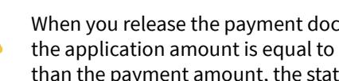

When you release the payment document, the status of the payment changes to *Closed* if the application amount is equal to the payment amount. If the application amount is less than the payment amount, the status of the released payment document changes to *Open*.

- 10.If the payment document for which you have formed the list of the outstanding documents has the *Open* status, you can proceed as follows:
  - To save the document with the *Open* status and the list of applications you have formed, on the form toolbar, click**Save**.
  - To release the applications, click **Release**. When the application records are released, the status of the payment changes to *Closed* if the application amount is equal to the payment amount. If the application amount is less than the payment amount, the status of the released payment document remains *Open*.

### **To Correct an Application Record**

If you have mistakenly applied a customer payment, prepayment, or refund to the wrong document, you can correct the application record.

Aer you have corrected the application record, you can apply the payment document to other documents. For more information, see *To Form a List of [Applications](#page-145-1) Manually* or *Invoice [Payments:](#page-137-1) To [Load AR Documents Automatically](#page-137-1)*.

You correct an application record differently depending on whether the application record has been released or not. In either case, you use the *[Payments and Applications](https://help-2025r1.acumatica.com/Help?ScreenId=ShowWiki&pageid=ae844bf4-1aef-42cd-9e2f-49b3ee1bc8d7)* (AR302000) form.

#### **To Remove an Application Record That Has Not Been Released**

- 1. Open the *[Payments and Applications](https://help-2025r1.acumatica.com/Help?ScreenId=ShowWiki&pageid=ae844bf4-1aef-42cd-9e2f-49b3ee1bc8d7)* (AR302000) form.
- 2. In the **Type** box of the Summary area, select the *Payment*, *Prepayment*, or *Customer Refund* document type.
- 3. In the **Reference Nbr.** box, select the document whose application record you want to correct.
- 4. On the **Documents to Apply** tab, delete the rows with the documents you do not need to apply.
- 5. On the form toolbar, click**Save**.

#### **To Reverse a Released Application Record**

- 1. Open the *[Payments and Applications](https://help-2025r1.acumatica.com/Help?ScreenId=ShowWiki&pageid=ae844bf4-1aef-42cd-9e2f-49b3ee1bc8d7)* (AR302000) form.
- 2. In the **Type** box of the Summary area, select the *Payment*, *Prepayment*, or *Customer Refund* document type.
- 3. In the **Reference Nbr.** box, select the number of the document whose application record you want to correct.
- 4. For each application you want to reverse, do the following:
  - a. On the **Application History** tab, select the required application.
  - b. On the table toolbar, click **Reverse Application**.

- c. On the form toolbar, click**Save**.
- 5. If you have reversed application records for a customer refund, you must fully apply its available balance before you complete the next step.
- 6. On the form toolbar, click **Release** to release the reversed application records.

### **To Reapply a Customer Payment to a Different Invoice**

You can reapply a customer payment or prepayment to one or more different invoices by using the *[Payments and](https://help-2025r1.acumatica.com/Help?ScreenId=ShowWiki&pageid=ae844bf4-1aef-42cd-9e2f-49b3ee1bc8d7) [Applications](https://help-2025r1.acumatica.com/Help?ScreenId=ShowWiki&pageid=ae844bf4-1aef-42cd-9e2f-49b3ee1bc8d7)* (AR302000) form.

#### **To Reapply Customer Payment to a Different Invoice**

- 1. Open the *[Payments and Applications](https://help-2025r1.acumatica.com/Help?ScreenId=ShowWiki&pageid=ae844bf4-1aef-42cd-9e2f-49b3ee1bc8d7)* (AR302000) form.
- 2. In the **Type** box of the Summary area, select *Payment* or *Prepayment*.
- 3. In the **Reference Nbr.** box, select the reference number of the payment or prepayment you want to reapply.
- 4. On the **Application History** tab, select the invoice you want to unapply from the payment or prepayment application, by clicking the appropriate row.
- 5. On the table toolbar of the **Application History** tab, click **Reverse Application**.

This action gives the payment application the *Open* status, and its unapplied balance and application amount change in accordance with the amount of the application reversed. The application you reversed will appear on the **Documents to Apply** tab.

- 6. Review the information on the **Documents to Apply** tab and in the Summary area.
- 7. Click **Release** on the form toolbar.

The payment or prepayment you selected in the Summary area will be unapplied from the invoice you selected on the **Application History** tab.

- 8. On the table toolbar, click **Add Row**
- 9. In the **Doc.Type** column, select *Invoice*.
- 10.In the **Reference Nbr.** column, select an invoice, to which you want to apply the payment or prepayment.
- 11.On the Summary area in the **Payment Ref.** box, enter the payment reference.
- 12.In the **Payment Amount** box, enter the total amount of the invoice to which the payment or prepayment should be applied.
- 13.On the form toolbar, click**Save**.

14.On the form toolbar, click **Release**.

Upon release of a customer payment, the status of the payment changes to *Closed* if the application amount is equal to the payment amount. If the application amount is less than the payment amount, the status of the released customer payment changes to *Open*.

### **To Void a Payment**

Incoming payments can be voided if errors were made or the payments are otherwise invalid. Voiding a payment reverses the original payment transactions. You can use the *[Payments and Applications](https://help-2025r1.acumatica.com/Help?ScreenId=ShowWiki&pageid=ae844bf4-1aef-42cd-9e2f-49b3ee1bc8d7)* (AR302000) form to void a customer payment or prepayment that has been applied to invoices.

#### **To Void a Customer Payment or Prepayment**

- 1. Open the *[Payments and Applications](https://help-2025r1.acumatica.com/Help?ScreenId=ShowWiki&pageid=ae844bf4-1aef-42cd-9e2f-49b3ee1bc8d7)* (AR302000) form.
- 2. In the **Type** box, select the *Payment* or *Prepayment* document type.
- 3. In the **Reference Nbr.** box, select the document you want to void.
- 4. On the form toolbar, click**Void**. The system does the following:
  - Reverses the payment application in full.
  - Changes the status of the payment document to *Voided*.
  - Creates a document with the *Voided Payment* type with the same reference number as the payment or prepayment. You use this document in the remaining steps of this procedure.
- 5. If needed, in the **Application Date** box, change the date of the voided payment. The date specified in this box should be the date when the voided payment is released and when the related batch was created.
- 6. On the form toolbar, click**Save** to save the voided payment.
- 7. On the form toolbar, click **Release** to release the document.

## **Processing Prepayments**

In this chapter, you will find general information on how to create and release prepayments, a checklist for system implementation, an activity that describes how to create a prepayment and apply it to an invoice, an activity that describes how to reverse a prepayment application, and report and inquiries that can be useful to find and view created transactions.

### **Invoice Prepayments: General Information**

A *prepayment* is a type of manual AR document (that is, a document created by a user) that records a company's financial relationship with customers. You use this document type if you want to distinguish customer payments from prepayments. The system displays the sum of all open customer payment documents with the *Prepayment* type separately in the **Prepayment Balance** box on the *[Customers](https://help-2025r1.acumatica.com/Help?ScreenId=ShowWiki&pageid=652929bc-9606-4056-aa6e-0c2d1147171b)* (AR303000) form. Also, balances of open prepayments decrease the customer's balance. You can apply outstanding documents to a prepayment before or aer you release it.

The customer prepayment balance is displayed with a minus sign in the **Prepayment Balance** box on the *[Customers](https://help-2025r1.acumatica.com/Help?ScreenId=ShowWiki&pageid=652929bc-9606-4056-aa6e-0c2d1147171b)* form.

You use the *[Payments and Applications](https://help-2025r1.acumatica.com/Help?ScreenId=ShowWiki&pageid=ae844bf4-1aef-42cd-9e2f-49b3ee1bc8d7)* (AR302000) form to create and process a document of this type.

To identify prepayments, the system uses the numbering sequence specified in the **Payment Numbering Sequence** box on the **GeneralSettings** tab of the *[Accounts Receivable Preferences](https://help-2025r1.acumatica.com/Help?ScreenId=ShowWiki&pageid=f7b52067-5299-45e8-b601-485cd709f58b)* (AR101000) form.

If the **Manual Numbering** check box is selected for the specified numbering sequence on the *[Numbering Sequences](https://help-2025r1.acumatica.com/Help?ScreenId=ShowWiki&pageid=a8d11c23-21f2-42a3-b17d-9637c9cf8031)* (CS201010), the system validates each new reference number you enter in order to prevent the creation of payments and prepayments with the same reference number.

#### **Learning Objectives**

From reading the topics in this chapter and completing the process activities, you will learn how to do the following:

- Enter a prepayment
- Apply the prepayment to an AR invoice
- Reverse an application of a prepayment to the wrong invoice

#### **Applicable Scenarios**

Prepayments can be created in the following cases:

- When you received a prepayment from a customer without applying it to any outstanding document
- When you want to enter a prepayment and apply it to AR documents

#### **Workflow of Processing a Prepayment**

This section provides an overview of the processing of a prepayment in Acumatica ERP. The diagram below shows the processing actions and the involved forms and documents.

Prepayment processing includes the following steps.

- 1. A user creates a prepayment from a customer on the *[Payments and Applications](https://help-2025r1.acumatica.com/Help?ScreenId=ShowWiki&pageid=ae844bf4-1aef-42cd-9e2f-49b3ee1bc8d7)* (AR302000) form, and the system assigns the prepayment document the *Balanced* status.
- 2. The user applies the created prepayment to a document or multiple documents that the system has loaded on the **Documents to Apply** tab.

If the prepayment should not be applied to any documents, the user clicks **Delete Row** on the **Documents to Apply** tab to remove the documents.

3. The user releases the prepayment and its application to the document by clicking **Release** on the *[Payments](https://help-2025r1.acumatica.com/Help?ScreenId=ShowWiki&pageid=ae844bf4-1aef-42cd-9e2f-49b3ee1bc8d7) [and Applications](https://help-2025r1.acumatica.com/Help?ScreenId=ShowWiki&pageid=ae844bf4-1aef-42cd-9e2f-49b3ee1bc8d7)* form.

The following diagram illustrates the workflow of processing a prepayment.

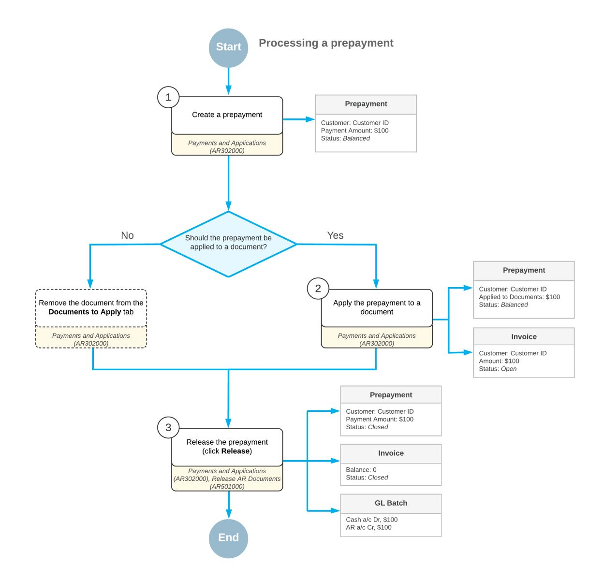

*Figure: Processing a prepayment*

### **Invoice Prepayments: Release of Prepayments**

In Acumatica ERP, payment documents that can be released manually have the following document types on the *[Payments and Applications](https://help-2025r1.acumatica.com/Help?ScreenId=ShowWiki&pageid=ae844bf4-1aef-42cd-9e2f-49b3ee1bc8d7)* (AR302000) form: *Payment*, *Prepayment*, *Prepayment Invoice*, *Customer Refund*, and *Voided Payment*. The information in this topic applies to documents of the *Prepayment* type.

This topic describes the forms you may use to release a prepayment and the details of releasing prepayments and their application records.

#### **Releasing a Prepayment**

In Acumatica ERP, if a prepayment has the *Balanced* status, you can release the prepayment by using one of the following forms:

- *[Payments and Applications](https://help-2025r1.acumatica.com/Help?ScreenId=ShowWiki&pageid=ae844bf4-1aef-42cd-9e2f-49b3ee1bc8d7)* (AR302000): You release a prepayment and any of its applications by clicking the **Release** button on the form toolbar.
- *[Release AR Documents](https://help-2025r1.acumatica.com/Help?ScreenId=ShowWiki&pageid=78ad2d21-b6a8-46d0-8f2d-98dd0a23f75e)* (AR501000): You use this mass-processing form to release a particular prepayment or multiple prepayments.

For details on the generated GL transactions, see *Invoice [Prepayments:](#page-154-2) Generated Transactions*.

#### **Releasing a Prepayment Without Applications**

When you record a prepayment, you may not specify any outstanding documents on the **Documents to Apply** tab of the *[Payments and Applications](https://help-2025r1.acumatica.com/Help?ScreenId=ShowWiki&pageid=ae844bf4-1aef-42cd-9e2f-49b3ee1bc8d7)* (AR302000) form. Thus, the available balance of the prepayment is equal to the prepayment amount. When you release such a prepayment, the system does the following:

- Changes the prepayment status to *Open*
- Increases the customer's prepayment balance by the prepayment amount
- Generates a GL batch to update the involved asset accounts

In this case, the system generates a GL batch that contains only prepayment transactions and transactions for any bank charges. For details, see *[Releasing a Prepayment](#page-151-2)* and *Invoice [Prepayments:](#page-154-2) Generated Transactions*.

#### **Releasing a Partially Applied Prepayment**

When you record a prepayment, you may specify some outstanding documents on the **Documents to Apply** tab of the *[Payments and Applications](https://help-2025r1.acumatica.com/Help?ScreenId=ShowWiki&pageid=ae844bf4-1aef-42cd-9e2f-49b3ee1bc8d7)* form. The system creates application records for each document listed on the tab; the records include the applied amount. Thus, the available balance of the prepayment becomes less than the prepayment amount. When you release such a prepayment, the system does the following:

- Changes the prepayment status to *Open*.
- Releases any application records.
- Decreases the balances of the paid documents. If the balance of a paid document becomes *0.00*, the system changes its status to *Closed*.
- Decreases the customer's balance for by paid amount.
- Increases the customer's prepayments balance by the available prepayment amount.
- Generates a General Ledger batch to update the involved asset accounts. For details, see *[Releasing a](#page-151-2) [Prepayment](#page-151-2)*.

For details on the generated batch, see *[Batch Generated for a Partially Applied Prepayment](#page-155-0)*.

#### **Releasing a Fully Applied Prepayment**

When you record a prepayment you may fully apply its available balance to any number of outstanding documents.

You distribute the entire available prepayment balance among the outstanding documents you add to the table on the **Documents to Apply** tab of the *[Payments and Applications](https://help-2025r1.acumatica.com/Help?ScreenId=ShowWiki&pageid=ae844bf4-1aef-42cd-9e2f-49b3ee1bc8d7)* form. The system creates application records (which include the applied amount) for each document listed on the tab. Thus, the available prepayment balance becomes 0. When you release such a prepayment, the system does the following:

- Changes the prepayment status to *Closed*.
- Releases the application records.
- Decreases the balances of the paid documents. If the balance of a paid document becomes *0.00*, the system changes its status to *Closed*.
- Decreases the customer's balance by the paid amount.
- Generates a GL batch to update the involved asset accounts.

For details on the generated batch, see *[Batch Generated for a Fully Applied Prepayment](#page-155-1)*.

#### **Releasing a Prepayment Associated with a Project**

When you release a prepayment document that has a project and project task specified on the **Financial** tab of the *[Payments and Applications](https://help-2025r1.acumatica.com/Help?ScreenId=ShowWiki&pageid=ae844bf4-1aef-42cd-9e2f-49b3ee1bc8d7)* (AR302000) form, the system generates the batch of transactions that are associated with the non-project code, which is specified on the *[Projects Preferences](https://help-2025r1.acumatica.com/Help?ScreenId=ShowWiki&pageid=de2ca225-4a0c-4129-b09d-3f3ed05198f9)* (PM101000) form, and no project task. That is, the generated transactions do not affect the project and project task.

### **Invoice Prepayments: Payment Receipts**

Aer a prepayment for an invoice has been processed, you can provide your customer with proof of purchase by generating a payment receipt for the released transaction. On the *[Payments and Applications](https://help-2025r1.acumatica.com/Help?ScreenId=ShowWiki&pageid=ae844bf4-1aef-42cd-9e2f-49b3ee1bc8d7)* (AR302000) form, you can print the payment receipt or send an email with it.

You can generate payment receipts for documents with the *Payment*, *Prepayment*, *Refund*, *Voided Payment*, and *Voided Refund* types.

You can use this functionality if either of the following conditions is met:

- The payment has been created with the *Credit Card*, *POS*, or *EFT* payment method, and has been captured and released.
- The payment has been created with the *Cash*, *Check*, or *Direct Deposit* payment method, and has been released.

The PDF attachment in the generated email includes the payment details. You can also print this PDF report.

#### **Functionality Setup**

To set up this functionality, do the following:

1. On the **Settings for Use in AR** tab of the *[Payment Methods](https://help-2025r1.acumatica.com/Help?ScreenId=ShowWiki&pageid=509285d1-cfae-4e87-95c3-a968451952e6)* (CA204000) form, select the**Send Payment Receipts Automatically** check box for each needed payment method.

With this check box selected, payment receipts for the specified payment method will be sent automatically to customers from the *[Payments and Applications](https://help-2025r1.acumatica.com/Help?ScreenId=ShowWiki&pageid=ae844bf4-1aef-42cd-9e2f-49b3ee1bc8d7)* (AR302000) form. Regardless of the state of this check box, users can also manually send payment receipts from this form.

2. On the **Mailing & Printing** tab of the *[Accounts Receivable Preferences](https://help-2025r1.acumatica.com/Help?ScreenId=ShowWiki&pageid=f7b52067-5299-45e8-b601-485cd709f58b)* (AR101000) form, make sure that the *PAY RECEIPT* mailing ID is shown in the **DefaultSources** table. The **Active** check box should be selected for this mailing ID.

> This row in the table defines the mapping between the mailing and the email template. If your organization needs to change or update this mapping, a system administrator can do it on the *[Customer Classes](https://help-2025r1.acumatica.com/Help?ScreenId=ShowWiki&pageid=806e39d6-6f89-4e6c-9a24-61c6fb0c9a57)* (AR201000) or *[Customers](https://help-2025r1.acumatica.com/Help?ScreenId=ShowWiki&pageid=652929bc-9606-4056-aa6e-0c2d1147171b)* (AR303000) form.

3. On the same tab, add mailing recipients to the **Default Recipients** table.

#### **Automatic Generation of Receipts**

You use the *[Print/Email AR Documents](https://help-2025r1.acumatica.com/Help?ScreenId=ShowWiki&pageid=05451253-581e-459d-912e-ff983df762b9)* (AR508000) form to mass-process payment receipts and schedule the automatic sending of them. To generate emails with payment receipts for invoice prepayments, perform the following steps:

- 1. On the *[Print/Email AR Documents](https://help-2025r1.acumatica.com/Help?ScreenId=ShowWiki&pageid=05451253-581e-459d-912e-ff983df762b9)* form, select *Email Payment Receipts* in the **Action** box.
- 2. In the Selection area, specify the selection criteria for documents.

The system displays documents of the following types: *Cash Sale*, *Cash Return*, *Payment*, *Prepayment*, *Voided Payment*, *Refund*, and *Voided Refund*. For payments, prepayments, and refunds displayed in the table, the **Emailed** check box is cleared on the **Financial** tab of the *[Payments and Applications](https://help-2025r1.acumatica.com/Help?ScreenId=ShowWiki&pageid=ae844bf4-1aef-42cd-9e2f-49b3ee1bc8d7)* (AR302000) form.

3. Select the Included check box in the row or rows for the needed documents and then click **Process** on the form toolbar. Alternatively, click **Process All** to process all documents.

The system generates an email message and attaches it to the document on the *[Payments and Applications](https://help-2025r1.acumatica.com/Help?ScreenId=ShowWiki&pageid=ae844bf4-1aef-42cd-9e2f-49b3ee1bc8d7)* form. Once the email has been created, the **Emailed** check box is selected for the document on the **Financial** tab of the *[Payments and Applications](https://help-2025r1.acumatica.com/Help?ScreenId=ShowWiki&pageid=ae844bf4-1aef-42cd-9e2f-49b3ee1bc8d7)* form.

To schedule the automatic sending of payment receipts, an administrative user should perform the following instructions:

- 1. On the *[Payment Methods](https://help-2025r1.acumatica.com/Help?ScreenId=ShowWiki&pageid=509285d1-cfae-4e87-95c3-a968451952e6)* (CA204000) form, select the**Send Payment Receipts Automatically** check box for the needed payment methods.
- 2. On the *[Print/Email AR Documents](https://help-2025r1.acumatica.com/Help?ScreenId=ShowWiki&pageid=05451253-581e-459d-912e-ff983df762b9)* (AR508000) form, create a schedule. Once the schedule is created, payment receipts will be automatically sent to customers based on this schedule. For more information about schedules, see *[Scheduling Automated Processing](https://help-2025r1.acumatica.com/Help?ScreenId=ShowWiki&pageid=87426450-3fdb-4248-b29c-e9cbf47cef6f)*.

#### **Manual Generation of Receipts**

On the *[Payments and Applications](https://help-2025r1.acumatica.com/Help?ScreenId=ShowWiki&pageid=ae844bf4-1aef-42cd-9e2f-49b3ee1bc8d7)* (AR302000) form, you generate payment receipts by doing either of the following:

• On the More menu of the form, clicking **Print Payment Receipt** to print the receipt in the PDF format.

The system opens the printable document on the *[Payment Receipt](https://help-2025r1.acumatica.com/Help?ScreenId=ShowWiki&pageid=5885ccfc-0226-4b46-89ed-22135e106b6a)* (AR643000) report. The **Payment Details** section at the bottom of the report shows the document type, transaction date, payment method, and the total amount paid.

Aer printing the document, the system selects the **Printed** check box for it on the **Financial** tab of the *[Payments and Applications](https://help-2025r1.acumatica.com/Help?ScreenId=ShowWiki&pageid=ae844bf4-1aef-42cd-9e2f-49b3ee1bc8d7)* form.

• On the More menu of the form, clicking **Email Payment Receipt**.

The system generates an email message and attaches it to the form. Once the email has been created, the **Emailed** check box is selected for the document on the **Financial** tab of the *[Payments and Applications](https://help-2025r1.acumatica.com/Help?ScreenId=ShowWiki&pageid=ae844bf4-1aef-42cd-9e2f-49b3ee1bc8d7)* form.

### **Invoice Prepayments: Implementation Checklist**

To ensure that the system has been configured properly for the processing of prepayments, make sure that the criteria listed in the table have been met in the system as described.

| Form                               | Criteria to Check                                                                                                                                                                                                                                                                 | Notes |
|------------------------------------|-----------------------------------------------------------------------------------------------------------------------------------------------------------------------------------------------------------------------------------------------------------------------------------|-------|
| Enable/Disable Features (CS100000) | Make sure the minimal features have been enabled, as described in Company Without Branches: General Information, Company with Branches that Do Not Require Balancing: Gen eral Information, and Company with Branches that Require Balancing: General Information. |       |
| Customers (AR303000)               | Be sure that the customer accounts for the customers for which you will create and process prepayments have been defined.                                                                                                                                                   |       |

#### **Settings That Affect the Workflow**

In general, you use accounts receivable forms specifically for sales made on credit. The following settings and entities should be specified and defined, respectively:

- The following general ledger settings should be specified on the **PostingSettings** tab of the *[General Ledger](https://help-2025r1.acumatica.com/Help?ScreenId=ShowWiki&pageid=e4913d06-c511-4258-a0f9-f36c1b854e6b) [Preferences](https://help-2025r1.acumatica.com/Help?ScreenId=ShowWiki&pageid=e4913d06-c511-4258-a0f9-f36c1b854e6b)* (GL102000) form:
  - Make sure that the **Automatically Post on Release** check box is selected. This setting causes GL batches to be immediately posted aer they are released.
  - Clear the **Generate Consolidated Batches** check box to cause every AR transaction you enter to be posted as an individual batch to the general ledger. (When this check box is selected, the system consolidates into a single batch all transactions in the same currency posted to the same period for all documents being released.)
- The following accounts receivable settings should be specified on the **GeneralSettings** tab of the *[Accounts](https://help-2025r1.acumatica.com/Help?ScreenId=ShowWiki&pageid=f7b52067-5299-45e8-b601-485cd709f58b) [Receivable Preferences](https://help-2025r1.acumatica.com/Help?ScreenId=ShowWiki&pageid=f7b52067-5299-45e8-b601-485cd709f58b)* (AR101000) form:
  - Select the **Hold Documents on Entry** check box in the **Data EntrySettings** section. This setting gives the created prepayments the *On Hold* status.
  - Clear the **Require Payment Reference on Entry** check box in the **Data EntrySettings** section. This setting means that you do not have to enter a payment reference number in the **Payment Ref.** box when creating a prepayment on the *[Payments and Applications](https://help-2025r1.acumatica.com/Help?ScreenId=ShowWiki&pageid=ae844bf4-1aef-42cd-9e2f-49b3ee1bc8d7)* (AR302000) form.
  - Make sure that the **Automatically Post on Release** check box is selected in the **PostingSettings** section. This setting causes prepayments to be automatically posted to the general ledger once they are released.

With these settings specified and entities defined, users in your company can record and process documents in Acumatica ERP quickly and accurately, with a minimum of manual actions.

### **Invoice Prepayments: Generated Transactions**

When you release a prepayment, the system generates a GL transaction to update the involved asset accounts with the prepayment transactions. The prepayment includes all the information the system needs to generate the transaction.

The following two accounts are usually involved:

- The AR account specified in the **Prepayment Account** box on the **GL Accounts** tab of the *[Customers](https://help-2025r1.acumatica.com/Help?ScreenId=ShowWiki&pageid=652929bc-9606-4056-aa6e-0c2d1147171b)* (AR303000) form for the customer. This account is filled in automatically in the **AR Account** box on the **Financial** tab of the *[Payments and Applications](https://help-2025r1.acumatica.com/Help?ScreenId=ShowWiki&pageid=ae844bf4-1aef-42cd-9e2f-49b3ee1bc8d7)* (AR302000) form for the prepayment.
- The cash account specified in the **Cash Account** box in the Summary area of the *[Payments and Applications](https://help-2025r1.acumatica.com/Help?ScreenId=ShowWiki&pageid=ae844bf4-1aef-42cd-9e2f-49b3ee1bc8d7)* form.

You may record customer prepayments to a designated AR account or to the same AR account to which payments are recorded. In the latter case, the system will generate a GL batch with transactions that are similar to payment transactions. For details, see *[Invoice Payments: Release of Payments](#page-127-1)*.

If you record customer payments and prepayments to separate AR accounts—that is, for the customer, the **AR Account** and **Prepayment Account** boxes contain different accounts on the **GL Accounts** tab of the *[Customers](https://help-2025r1.acumatica.com/Help?ScreenId=ShowWiki&pageid=652929bc-9606-4056-aa6e-0c2d1147171b)* form —the following prepayment transactions will be recorded to the general ledger when the prepayment is released.

| Account                                     | Debit             | Credit            |
|---------------------------------------------|-------------------|-------------------|
| Cash account                                | Prepayment amount | 0.00              |
| Accounts Receivable account for prepayments | 0.00              | Prepayment amount |

You can view the batch details by clicking the link in the **Batch Nbr.** box on the **Financial** tab of the *[Payments and](https://help-2025r1.acumatica.com/Help?ScreenId=ShowWiki&pageid=ae844bf4-1aef-42cd-9e2f-49b3ee1bc8d7) [Applications](https://help-2025r1.acumatica.com/Help?ScreenId=ShowWiki&pageid=ae844bf4-1aef-42cd-9e2f-49b3ee1bc8d7)* form.

If you have recorded bank charges for the payment, the system generates the respective transactions and includes them in the batch with the payment transactions. For details on bank charge transactions, see *[Finance Charge](https://help-2025r1.acumatica.com/Help?ScreenId=ShowWiki&pageid=438c4829-23c0-4de8-ab13-a5f83ebfe8c6) [Transactions](https://help-2025r1.acumatica.com/Help?ScreenId=ShowWiki&pageid=438c4829-23c0-4de8-ab13-a5f83ebfe8c6)*.

In addition to prepayment transactions that update the asset accounts, the batch may contain transactions generated by application records that were released along with the prepayment. For details, see *[Invoice Payments:](#page-129-1) [Release of Application Records](#page-129-1)*.

#### **Batch Generated for a Partially Applied Prepayment**

When you release a partially applied prepayment, the GL batch may contain, in addition to prepayment transactions, transactions generated by its application records.

If you record prepayments to a designated AR account, which is usually different from the AR account where outstanding documents are recorded, the following prepayment transactions will be recorded to the general ledger when the prepayment is released.

| Account                                         | Debit             | Credit                             |
|-------------------------------------------------|-------------------|------------------------------------|
| Cash account                                    | Prepayment amount | 0.00                               |
| Accounts Receivable account for prepay ments | 0.00              | Prepayment amount – paid amount |
| Accounts Receivable account for invoices        | 0.00              | Paid amount                        |

For details on the other application transactions, see *[Invoice Payments: Release of Application Records](#page-129-1)*.

#### **Batch Generated for a Fully Applied Prepayment**

If you record prepayments to a designated AR account that is different from the AR account where outstanding documents are recorded, and you release a fully applied prepayment and its application records, the system

records the prepayment amount to the AR account specified for the applied outstanding documents. The following transactions are recorded to the general ledger when the fully applied prepayment and its application records are released.

| Account                                  | Debit             | Credit            |
|------------------------------------------|-------------------|-------------------|
| Cash account                             | Prepayment amount | 0.00              |
| Accounts Receivable account for invoices | 0.00              | Prepayment amount |

When you release a fully applied prepayment, the GL batch may contain transactions generated by the prepayment's application records, in addition to prepayment transactions. For details on application transactions, see *[Invoice Payments: Release of Application Records](#page-129-1)*.

#### **Batch Generated for a Reversed Application to an Invoice**

When you release a reversing entry created by the system when you reverse application of a prepayment to an invoice, the system generates the following GL transaction.

| Account             | Debit             | Credit            |
|---------------------|-------------------|-------------------|
| Customer deposit    | 0.00              | Prepayment amount |
| Accounts Receivable | Prepayment amount | 0.00              |

### **Invoice Prepayments: To Process a Prepayment**

In this activity, you will learn how to create a prepayment and apply it to an invoice.

This activity is based on the *U100* dataset. If you are using another dataset, or if any system settings have been changed in *U100*, these changes can affect the workflow of the activity and the results of the processing. To avoid any issues, restore the *U100* dataset to its initial state.

#### **Story**

Suppose that the SweetLife Fruits & Jams company received a prepayment of \$2,300 from one of its customers, Morning Cafe (*MORNINGCAF*) on January 12, 2025. On January 31, SweetLife sold a juicer to Morning Cafe and an invoice for \$2,300 was entered in the system.

Acting as a SweetLife accountant, you need to create and release a prepayment, and later, apply this prepayment to the customer's invoice, and then release the prepayment application.

#### **Configuration Overview**

For the purposes of this activity, the following features have been enabled on the *[Enable/Disable Features](https://help-2025r1.acumatica.com/Help?ScreenId=ShowWiki&pageid=c1555e43-1bc5-4f6f-ba9d-b323f94d8a6b)* (CS100000) form:

- *Standard Financials*, which provides the standard financial functionality
- *Multibranch Support*, which supports multiple branches in your instance of Acumatica ERP
- *Multicompany Support*, which supports multiple companies within one tenant.

On the *[Accounts Receivable Preferences](https://help-2025r1.acumatica.com/Help?ScreenId=ShowWiki&pageid=f7b52067-5299-45e8-b601-485cd709f58b)* (AR101000) form, the **Hold Documents on Entry** check box has been selected in the **Data EntrySettings** section.

On the *[Customers](https://help-2025r1.acumatica.com/Help?ScreenId=ShowWiki&pageid=652929bc-9606-4056-aa6e-0c2d1147171b)* (AR303000) form, the *MORNINGCAF (Morning Cafe)* customer has been defined.

#### **Process Overview**

On the *[Payments and Applications](https://help-2025r1.acumatica.com/Help?ScreenId=ShowWiki&pageid=ae844bf4-1aef-42cd-9e2f-49b3ee1bc8d7)* (AR302000) form, you will create and release a prepayment for the needed customer. You will review the generated GL transaction on the *Journal [Transactions](https://help-2025r1.acumatica.com/Help?ScreenId=ShowWiki&pageid=dda046bc-5946-407f-88f7-1c0c966fbe72)* (GL301000) form. You will then apply the prepayment manually to the customer's invoice and release the prepayment application. Finally, on the *Journal [Transactions](https://help-2025r1.acumatica.com/Help?ScreenId=ShowWiki&pageid=dda046bc-5946-407f-88f7-1c0c966fbe72)* form, you will review the transaction generated on release of the prepayment application.

#### **System Preparation**

To prepare the system, do the following:

- 1. Launch the Acumatica ERP website, and sign in to a company with the *U100* dataset preloaded. To sign in as an accountant, use the following credentials:
  - Username: *johnson*
  - Password: *123*
- 2. In the info area, in the upper-right corner of the top pane of the Acumatica ERP screen, make sure that the business date in your system is set to *1/12/2025*. If a different date is displayed, click the Business Date menu button and select *1/12/2025*.
- 3. On the Company and Branch Selection menu, also on the top pane of the Acumatica ERP screen, make sure that the *SweetLife Head Office and Wholesale Center* branch is selected. If it is not selected, click the Company and Branch Selection menu to view the list of branches that you have access to, and then click *SweetLife Head Office and Wholesale Center*.

#### **Step 1: Creating and Releasing a Prepayment**

To create and release a prepayment, do the following:

1. Open the *[Payments and Applications](https://help-2025r1.acumatica.com/Help?ScreenId=ShowWiki&pageid=ae844bf4-1aef-42cd-9e2f-49b3ee1bc8d7)* (AR302000) form.

To open the form for creating a new record, type the form ID in the Search box, and on the Search form, point at the form title and click **New** right of the title.

- 2. On the form toolbar, click **Add New Record**, and specify the following settings in the Summary area:
  - **Type**: *Prepayment*
  - **Customer**: *MORNINGCAF*
  - **Application Date**: *1/12/2025* (inserted by default)
  - **Payment Amount**: 2300
  - **Description**: Juicer 15

When you create a new prepayment on the current form, as soon as you select the customer in the Summary area, the system forms the list of the customer's outstanding documents on the **Documents to Apply** tab. The system loads only open documents of the *Invoice*, *Debit Memo*, *Credit Memo*, and *Overdue Charge* type that do not have unreleased applications.

- 3. On the form toolbar, click **Remove Hold**, and then click **Release** to release the prepayment.
- 4. On the **Financial** tab, click the link in the **Batch Nbr.** box.
- 5. On the *Journal [Transactions](https://help-2025r1.acumatica.com/Help?ScreenId=ShowWiki&pageid=dda046bc-5946-407f-88f7-1c0c966fbe72)* (GL301000) form, which is opened, review the transaction that has been generated on the release of the prepayment.

The *10200* cash account specified for the prepayment has been debited with \$2,300, while the *22100 (Customer Deposit)* account specified for the customer as the prepayment account has been credited in the same amount.

#### **Step 2: Applying the Prepayment to an Invoice**

To apply the prepayment to an invoice, do the following:

- 1. In the info area, click the Business Date menu button and select *1/31/2025*.
- 2. While you are still on the *[Payments and Applications](https://help-2025r1.acumatica.com/Help?ScreenId=ShowWiki&pageid=ae844bf4-1aef-42cd-9e2f-49b3ee1bc8d7)* (AR302000) form with the prepayment opened, on the **Documents to Apply** tab, click **Add Row** on the table toolbar.
- 3. Specify the following settings in the added row:
  - **Doc.Type**: *Invoice*
  - **Reference Nbr.**: The invoice dated *1/31/2025* for the amount of \$2,300
  - **Amount Paid**: *2300* (inserted automatically by the system)

Notice that the system has automatically selected the unlabeled check box for the added row.

Alternatively, you can click **Load Documents** on the table toolbar; in the **Load Options** dialog box, which opens, you select the needed settings to load multiple documents and click **Load**.

4. On the form toolbar, click**Save** to save the changes.

The released prepayment applied to the invoice is shown in the following screenshot.

| <b>Payments and Applications</b> Prepayment 000079 - Morning Cafe |                       |                                 |                                     |                    |                                  |                | <b>PINOTES</b>             | <b>ACTIVITIES</b> <b>FILES</b> | $TOOLS$ $\sim$ |                                 |                   |         |
|----------------------------------------------------------------------|-----------------------|---------------------------------|-------------------------------------|--------------------|----------------------------------|----------------|----------------------------|-----------------------------------|----------------|---------------------------------|-------------------|---------|
| 圕 $\Box$ $\leftarrow$                                          | $\Omega$ $+$ 面  | o K $\check{~}$           | $\geq$ $\rightarrow$ ≺        | <b>RELEASE</b>     | <b>VOID</b> .                 |                |                            |                                   |                |                                 |                   |         |
| Type:                                                                | Prepayme v            | Customer:                       | MORNINGCAF - Morning Cafe           |                    | 0                                | Payment Amo    | $2,300.00$ $\circ$         |                                   |                |                                 |                   | $\sim$  |
| Reference Nbr.                                                       | 000079 Q           | Location:                       | <b>MAIN - Primary Location</b>      |                    |                                  | Applied to Doc | 2,300.00                   |                                   |                |                                 |                   |         |
| Status:                                                              | Open                  | Payment Meth                    | <b>CHECK - Check Payment</b>        |                    |                                  | Applied to Ord | 0.00                       |                                   |                |                                 |                   |         |
| * Application Date: 1/31/2025                                        | m                     | Card/Account                    |                                     |                    |                                  | Available Bala | 0.00                       |                                   |                |                                 |                   |         |
| * Application Pe                                                     | 01-2025 Q          | Cash Account:                   | 10200WH - Wholesale Checking        |                    |                                  | Write-Off Amo  | 0.00                       |                                   |                |                                 |                   |         |
| Payment Ref.:                                                        | 0096                  |                                 |                                     |                    |                                  | Finance Charg  | 0.00                       |                                   |                |                                 |                   |         |
|                                                                      |                       |                                 |                                     |                    |                                  | Deducted Cha   | 0.00                       |                                   |                |                                 |                   |         |
|                                                                      |                       | Description:                    | Juicer 15                           |                    |                                  |                |                            |                                   |                |                                 |                   |         |
| <b>DOCUMENTS TO APPLY</b>                                            |                       | <b>SALES ORDERS</b>             | <b>APPLICATION HISTORY</b>          | <b>FINANCIAL</b>   | <b>CHARGES</b>                   | COMPLIANCE     |                            |                                   |                |                                 |                   |         |
| Ò $\pm$ $\times$                                               | <b>LOAD DOCUMENTS</b> | <b>AUTO APPLY</b>               | $\mathbf{\overline{N}}$ $\vdash$ |                    |                                  |                |                            |                                   |                |                                 |                   |         |
| п D <b>B</b> 0                                                 | <b>Branch</b>         | *Reference Doc. Type Nbr. | <b>Inventory ID</b>                 | <b>Amount Paid</b> | Cash <b>Discount</b> Taken | Amount Code    | Write-Off Write-Off Reason | Date                              | Due Date       | Cash <b>Discount</b> Date | <b>Cross Rate</b> | Balance |
| ⊠ 0                                                               | <b>HEADOFFICE</b>     | 000084 Invoice               |                                     | 2,300.00           | 0.00                             | 0.00           | <b>BALWOFF</b>             | 1/31/2025                         | 3/2/2025       | 3/2/2025                        | 1.00000000        | 0.00    |

*Figure: The prepayment applied to the invoice before release of the prepayment application*

#### **Step 3: Releasing the Prepayment Application**

To release the prepayment application to the invoice, do the following:

- 1. While you are still on the *[Payments and Applications](https://help-2025r1.acumatica.com/Help?ScreenId=ShowWiki&pageid=ae844bf4-1aef-42cd-9e2f-49b3ee1bc8d7)* (AR302000) form, click **Release** on the form toolbar.
- 2. On the **Application History** tab, click the link in the **Batch Number** column.
- 3. On the *Journal [Transactions](https://help-2025r1.acumatica.com/Help?ScreenId=ShowWiki&pageid=dda046bc-5946-407f-88f7-1c0c966fbe72)* (GL301000) form, which is opened, review the transaction that has been generated on the release of the prepayment application.

The *22100 (Customer Deposit)* account specified for the customer as the prepayment account has been debited with \$2,300, while the *11000 (Accounts Receivable)* account specified for the customer has been credited in the same amount.

### **Invoice Prepayments: To Reverse an Application**

The following activity will walk you through the process of reversing a prepayment application to the wrong invoice.

This activity is based on the *U100* dataset. If you are using another dataset, or if any system settings have been changed in *U100*, these changes can affect the workflow of the activity and the results of the processing. To avoid any issues, restore the *U100* dataset to its initial state.

#### **Story**

Suppose that the SweetLife Fruits & Jams company received a prepayment from its customer (FourStar Coffee & Sweets Shop) in the amount of \$660 for consulting services and an AR clerk applied the prepayment to the wrong invoice on January 21, 2025.

Acting as a SweetLife accountant, you have to find this mistakenly applied application of \$660 in the system and reverse it.

#### **Configuration Overview**

For the purposes of this activity, the following features have been enabled on the *[Enable/Disable Features](https://help-2025r1.acumatica.com/Help?ScreenId=ShowWiki&pageid=c1555e43-1bc5-4f6f-ba9d-b323f94d8a6b)* (CS100000) form:

- *Standard Financials*, which provides the standard financial functionality
- *Multibranch Support*, which supports multiple branches in your instance of Acumatica ERP
- *Multicompany Support*, which supports multiple companies within one tenant.

On the *[Customers](https://help-2025r1.acumatica.com/Help?ScreenId=ShowWiki&pageid=652929bc-9606-4056-aa6e-0c2d1147171b)* (AR303000) form, the *COFFEESHOP (FourStar Coffee & Sweets Shop)* customer has been configured.

#### **Process Overview**

In this activity, you will open a prepayment on the *[Payments and Applications](https://help-2025r1.acumatica.com/Help?ScreenId=ShowWiki&pageid=ae844bf4-1aef-42cd-9e2f-49b3ee1bc8d7)* (AR302000) form, select the application to the wrong invoice, and reverse it. You will then release the reversing entry created by the system and review the generated GL transaction on the *Journal [Transactions](https://help-2025r1.acumatica.com/Help?ScreenId=ShowWiki&pageid=dda046bc-5946-407f-88f7-1c0c966fbe72)* (GL301000) form.

#### **System Preparation**

To prepare the system, do the following:

- 1. Launch the Acumatica ERP website, and sign in to a company with the *U100* dataset preloaded. To sign in as an accountant, use the following credentials:
  - Username: *johnson*
  - Password: *123*
- 2. In the info area, in the upper-right corner of the top pane of the Acumatica ERP screen, make sure that the business date in your system is set to *1/30/2025*. If a different date is displayed, click the Business Date menu button and select *1/30/2025*. For simplicity, in this activity, you will create and process all documents in the system on this business date.
- 3. On the Company and Branch Selection menu, also on the top pane of the Acumatica ERP screen, make sure that the *SweetLife Head Office and Wholesale Center* branch is selected. If it is not selected, click the

Company and Branch Selection menu to view the list of branches that you have access to, and then click *SweetLife Head Office and Wholesale Center*.

#### **Step 1: Reviewing an Incorrect Application and the Application Batch**

To review the application batch, do the following:

- 1. Open the Payments and Applications (AR3020PL) list of records.
- 2. If you applied any filters before on this form, click the **FilterSettings** button in the filtering area, click **Delete Row** in the dialog box that opens, and click **Apply** to close the dialog box.
- 3. Find a prepayment in the amount of \$660 for the *COFFEESHOP* customer as follows:
  - a. In the table, click the **Customer** column header, and in the dialog box that opens, specify the following settings:
    - **Equals**: Selected
    - Filter Value (the unlabeled box at the bottom of the dialog box): *COFFEESHOP*

Click **OK** to close the dialog box.

- b. Click the **Payment Amount** column header, and in the dialog box that opens, specify the following settings:
  - **Equals**: Selected
  - **Value**: 660

Click **OK** to close the dialog box.

- 4. Click the link in the **Reference Nbr.** column to open the prepayment on the *[Payments and Applications](https://help-2025r1.acumatica.com/Help?ScreenId=ShowWiki&pageid=ae844bf4-1aef-42cd-9e2f-49b3ee1bc8d7)* (AR302000) form.
- 5. On the **Application History** tab, click the link in the **Reference Nbr.** column, and on the *[Invoices and Memos](https://help-2025r1.acumatica.com/Help?ScreenId=ShowWiki&pageid=5e6f3b27-b7af-412f-a40a-1d4f4be70cba)* (AR301000) form that opens, review the invoice to which the prepayment has been applied mistakenly. Close the *[Invoices and Memos](https://help-2025r1.acumatica.com/Help?ScreenId=ShowWiki&pageid=5e6f3b27-b7af-412f-a40a-1d4f4be70cba)* form.
- 6. On the *[Payments and Applications](https://help-2025r1.acumatica.com/Help?ScreenId=ShowWiki&pageid=ae844bf4-1aef-42cd-9e2f-49b3ee1bc8d7)* form, click the link in the **Batch Number** column to open and review the application batch on the *Journal [Transactions](https://help-2025r1.acumatica.com/Help?ScreenId=ShowWiki&pageid=dda046bc-5946-407f-88f7-1c0c966fbe72)* (GL301000) form.

#### **Step 2: Reversing the Application**

To reverse the incorrect application, do the following:

- 1. On the *[Payments and Applications](https://help-2025r1.acumatica.com/Help?ScreenId=ShowWiki&pageid=ae844bf4-1aef-42cd-9e2f-49b3ee1bc8d7)* (AR302000) form, make sure that you are still viewing the prepayment that you reviewed in Step 1.
- 2. On the **Application History** tab, click **Reverse Application** on the table toolbar.

The system reverses the application of the \$660 prepayment to the invoice.

- 3. Save the prepayment. Notice that in the Summary area, the **Applied to Documents** box shows *-660.00*, and the **Available Balance** box shows *660.00*.
- 4. On the form toolbar, click **Release**.

The system creates a reversing batch that you can see on the **Application History** tab. The system also sets the statuses of the invoice and the prepayment to *Open* and increases their balances by \$660, as shown in the following screenshot.

| $\leftarrow$ | 뭐          | <b>Payments and Applications</b> 日                                                                      | ∽                                               | m +                      | Prepayment 000058 - FourStar Coffee & Sweets Shop n $\mathsf{K}$ $\checkmark$                        | ≺ ↘                                                                                                       | Я                                        | VOID $\cdots$                                   |                                                                                                                                 |                    |                                                          | <b>PINOTES</b>            | <b>ACTIVITIES</b> | <b>FILES</b>          | CUSTOMIZATION         | TOOLS $\star$ |
|--------------|------------|------------------------------------------------------------------------------------------------------------|-------------------------------------------------|-----------------------------|---------------------------------------------------------------------------------------------------------------|--------------------------------------------------------------------------------------------------------------|------------------------------------------|----------------------------------------------------|---------------------------------------------------------------------------------------------------------------------------------|--------------------|----------------------------------------------------------|---------------------------|-------------------|-----------------------|-----------------------|---------------|
| Type:        | Status:    | Reference Nbr. * Application Date: 1/30/2025 * Application Pe Payment Ref.: DOCUMENTS TO APPLY | Prepayme ~ 000058 Open 01-2025 0020 | Ω Ä o SALES ORDERS | Customer: Location: Payment Meth CHECK - Check Payment Card/Account Cash Account: Description: | MAIN - Primary Location 10200WH - Wholesale Checking Consulting services <b>APPLICATION HISTORY</b> |                                          | COFFEESHOP - FourStar Coffee & Swee 2 FINANCIAL | Payment Amo Applied to Doc Applied to Ord Available Bala Write-Off Amo Finance Charg Deducted Char CHARGES | COMPLIANCE         | 660.00 0.00 0.00 660.00 0.00 0.00 0.00 |                           |                   |                       |                       | $\lambda$     |
| Ò            |            | REVERSE APPLICATION                                                                                        |                                                 | $\vdash$                    | $\mathbf{\overline{x}}$                                                                                       |                                                                                                              |                                          |                                                    |                                                                                                                                 |                    |                                                          |                           |                   |                       |                       |               |
| <b>B</b> 0   | n.         | Branch                                                                                                     |                                                 | Batch Number             | Doc. Type                                                                                                     | Reference Nbr.                                                                                            | Nbr.                                     | Line Inventory ID                                  | Customer                                                                                                                        | <b>Amount Paid</b> |                                                          | Cash Discount Taken | Amount Date       | Write-Off Application | Application Period | Date          |
|              | $0$ $\Box$ | <b>HEADOFFICE</b>                                                                                          |                                                 | AR000120                    | Invoice                                                                                                       | 000065                                                                                                       | 0                                        |                                                    | COFFEESHOP                                                                                                                      | 660.00             |                                                          | 0.00                      | 0.00              | 1/21/2025             | 01-2025               | 1/21/2025     |
|              | 0 DI       | <b>HEADOFFICE</b>                                                                                          |                                                 | AR000207                    | Invoice                                                                                                       | 000065                                                                                                       | !!!!!!!!!!!!!!!!!!!!!!!!!!!!!!!!!!!!!!!! |                                                    | COFFEESHOP                                                                                                                      | $-660.00$          |                                                          | 0.00                      | 0.00              | 1/21/2025             | 01-2025               | 1/21/2025     |

*Figure: The reversing batch applied to the prepayment*

5. Click the link in the **Batch Number** column for the second row, and review the application batch on the *Journal [Transactions](https://help-2025r1.acumatica.com/Help?ScreenId=ShowWiki&pageid=dda046bc-5946-407f-88f7-1c0c966fbe72)* (GL301000) form, which opens.

### **Invoice Prepayments: Related Report and Inquiry Forms**

In the following sections, you can find details about the report and inquiry forms you may want to review to gather information about a customer's details and balance.

If you do not see a particular report or form that is described, you may have signed in to the system with a user account that does not have access rights to the report or form. Contact your system administrator to obtain access to any needed reports or forms.

#### **Reviewing the Customer Details**

On the *[Customer Details](https://help-2025r1.acumatica.com/Help?ScreenId=ShowWiki&pageid=2ed5542b-a76c-4cfd-9ee3-52c2f08a2692)* (AR402000) form, you can review the customer's details, including the prepayment balance shown in the **Prepayment Balance** box.

#### **Reviewing the Customer Balance**

You can review the balance of a specific customer by running the *[AR Balance by Customer](https://help-2025r1.acumatica.com/Help?ScreenId=ShowWiki&pageid=79f89293-942a-435c-b3fc-3f0ba874a7e9)* (AR632500) report. To review payment applications along with documents, select the *Open + Current Period* report format and select the **Include Applications** check box on the **Report Parameters** tab. Document applications are listed under each document in the report. The **Applied** column shows the period to which the application was posted. The **Closed** column displays the period in which the document was closed. For open documents, the **Closed** column is empty.

For the *COFFEESHOP* customer, the report would show the payment applied to the invoice in the *01-2025* period.

If all the documents have been paid within a financial period, the customer's balance will be zero at the end of this period.

## **Processing Prepayment Invoices**

In some countries, prepayments are subject to tax reporting requirements. When a company receives a prepayment from a customer, it is typically required to report taxes on that prepayment in its tax return for the period in which the prepayment was received. This means that the company must account for the prepayment tax as part of its overall tax obligations.

Additionally, in certain countries,a company must issue a document to a client (prior to issuing an invoice) upon which a prepayment for the ordered items will be made.

To help companies meet these requirements, Acumatica ERP offers the prepayment invoice functionality. With this functionality, you can create prepayment invoices for the items and services ordered. The system calculates taxes on each prepayment invoice. Once the prepayment invoice is paid, your company can report the taxes in the reporting period in which the prepayment was received. Later, you create an AR invoice for the items or services provided, and the prepayment invoice can be used as a payment for the sales invoice.

In this chapter, you will learn how to create and process prepayment invoices, and you will explore the GL transactions created in the system by this process.

### **Prepayment Invoices: General Information**

In some countries with value-added tax (VAT) regulations, companies are required to report taxes upon receiving prepayments from clients. Typically, prepayments should be reported in the company's tax filings for the period in which they were received.

In Acumatica ERP, with the *VAT Recognition on Prepayments* feature enabled on the *[Enable/Disable Features](https://help-2025r1.acumatica.com/Help?ScreenId=ShowWiki&pageid=c1555e43-1bc5-4f6f-ba9d-b323f94d8a6b)* (CS100000) form, you can create prepayment invoices with tax and taxable amounts and provide them to customers to request prepayment. Once a customer has paid a prepayment invoice, your company can use it for reporting taxes.

#### **Learning Objectives**

In this chapter, you will learn how to do the following:

- Create prepayment invoices
- Apply a payment to a prepayment invoice
- Apply a prepayment invoice to an accounts receivable invoice

#### **Applicable Scenarios**

You create a prepayment invoice if your company requires customers to make prepayments for sales orders and needs to provide customers with a document specifying the prepayment amount, as well as the taxable and tax amounts for each applicable tax. This process applies if prepayments are subject to tax reporting in the country where your company is operating.

#### **Overview of Prepayment Invoice Processing**

This section provides an overview of processing of a prepayment invoice in Acumatica ERP. The processing of a prepayment invoice typically involves the actions and generated documents shown in the following diagram.

The amounts mentioned in the diagram are provided as examples. The tax total is calculated based on tax settings that define the calculation of the tax amount on a document basis when the tax is not included in the document amount.

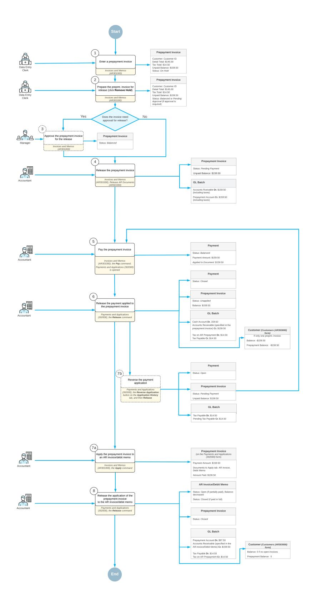

*Figure: Processing of a prepayment invoice*

First, a data entry clerk creates a new prepayment invoice on the *[Invoices and Memos](https://help-2025r1.acumatica.com/Help?ScreenId=ShowWiki&pageid=5e6f3b27-b7af-412f-a40a-1d4f4be70cba)* (AR301000) form (see Item 1 in the diagram). The prepayment invoice is assigned the *On Hold* status if the **Hold Documents on Entry** check box is selected on the *[Accounts Receivable Preferences](https://help-2025r1.acumatica.com/Help?ScreenId=ShowWiki&pageid=f7b52067-5299-45e8-b601-485cd709f58b)* (AR101000) form or approvals have been set up for prepayment

invoices. The system assigns the reference number to the prepayment invoice based on the numbering sequence specified in the **Prepayment Invoice NumberingSequence** box on the *[Accounts Receivable Preferences](https://help-2025r1.acumatica.com/Help?ScreenId=ShowWiki&pageid=f7b52067-5299-45e8-b601-485cd709f58b)* form.

Once the prepayment invoice is saved, the system calculates the total invoice amount including taxes and displays it in the **Unpaid Balance** box of the Summary area. The clerk clicks the **Remove Hold** button on the form toolbar to give the invoice the *Balanced* status (Item 2) so that it can be released. If the prepayment invoice requires approval, an assigned employee approves the prepayment invoice (Item 3) and the prepayment invoice is ready to be released. When the accountant releases the prepayment invoice (Item 4), the system assigns it the *Pending Payment* status and generates a batch to debit the Accounts Receivable account and credit the prepayment account in the amount of the prepayment invoice. The accountant can print the prepayment invoice or can send it to the customer by email by clicking **Print** or **Email** on the More menu of the *[Invoices and Memos](https://help-2025r1.acumatica.com/Help?ScreenId=ShowWiki&pageid=5e6f3b27-b7af-412f-a40a-1d4f4be70cba)* form.

Once the prepayment invoice is released, it can be paid. On the *[Invoices and Memos](https://help-2025r1.acumatica.com/Help?ScreenId=ShowWiki&pageid=5e6f3b27-b7af-412f-a40a-1d4f4be70cba)* form, an accountant clicks **Pay** on the form toolbar (Item 5). The system creates a payment application and opens it on the *[Payments and](https://help-2025r1.acumatica.com/Help?ScreenId=ShowWiki&pageid=ae844bf4-1aef-42cd-9e2f-49b3ee1bc8d7) [Applications](https://help-2025r1.acumatica.com/Help?ScreenId=ShowWiki&pageid=ae844bf4-1aef-42cd-9e2f-49b3ee1bc8d7)* (AR302000) form. On the **Documents to Apply** tab of this form, the prepayment invoice is displayed. The prepayment invoice can be paid fully or partially as follows:

• To pay the prepayment invoice in full, the accountant ensures that the system has inserted the amount of the unpaid balance of the prepayment invoice in the **Payment Amount** box of the Summary area and in the **Amount Paid** column of the **Documents to Apply** tab of the *[Payments and Applications](https://help-2025r1.acumatica.com/Help?ScreenId=ShowWiki&pageid=ae844bf4-1aef-42cd-9e2f-49b3ee1bc8d7)* form. The accountant releases the payment (Item 6).

On release, the system generates a batch to debit the company's cash account and credit the Accounts Receivable account. The batch also includes tax transactions debiting the Pending Tax Payable account and crediting the Tax Payable account. The payment is assigned the *Closed* status. On the **Application History** tab of the current form, the system has added the line with the reference numbers of the prepayment invoice and of the generated GL batch. The prepayment invoice has been assigned the *Unapplied* status, which means that you can apply the prepayment invoice to AR invoices or debit memos issued to the customer specified in the prepayment invoice. For a fully paid prepayment invoice, the available balance is displayed in the **Balance** box (which replaces the **Unpaid Balance** box once the prepayment invoice is paid) in the Summary area of the *[Invoices and Memos](https://help-2025r1.acumatica.com/Help?ScreenId=ShowWiki&pageid=5e6f3b27-b7af-412f-a40a-1d4f4be70cba)* form. The system also updates the customer's balance on the *[Customers](https://help-2025r1.acumatica.com/Help?ScreenId=ShowWiki&pageid=652929bc-9606-4056-aa6e-0c2d1147171b)* (AR303000) form.

• To apply a partial payment to the prepayment invoice, the accountant specifies the payment amount in the **Payment Amount** box of the Summary area and in the **Amount Paid** column on the **Documents to Apply** tab of the *[Payments and Applications](https://help-2025r1.acumatica.com/Help?ScreenId=ShowWiki&pageid=ae844bf4-1aef-42cd-9e2f-49b3ee1bc8d7)* form; the accountant then releases the application (Item 6). The generated GL batch includes tax transactions, with tax amounts calculated based on the partially paid amount. The payment is assigned the *Closed* status. The system removes the line on the **Documents to Apply** tab and adds a new line with the prepayment invoice on the **Application History** tab. The prepayment invoice keeps the *Pending Payment* status. The remaining invoice amount is specified in the **Unpaid Balance** box of the Summary area on the *[Invoices and Memos](https://help-2025r1.acumatica.com/Help?ScreenId=ShowWiki&pageid=5e6f3b27-b7af-412f-a40a-1d4f4be70cba)* form.

The unpaid balance of the prepayment invoice can be either paid or written off. To write off the unpaid balance of the invoice, the accountant clicks **Write Off Unpaid Balance** on the More menu of the *[Invoices](https://help-2025r1.acumatica.com/Help?ScreenId=ShowWiki&pageid=5e6f3b27-b7af-412f-a40a-1d4f4be70cba) [and Memos](https://help-2025r1.acumatica.com/Help?ScreenId=ShowWiki&pageid=5e6f3b27-b7af-412f-a40a-1d4f4be70cba)* form. The system creates the document of the *Credit Memo* type and opens it on the current form. On release of the credit memo, the system generates a GL transaction, which debits the customer's prepayment account and credits the Accounts Receivable account. For details, see *[Prepayment Invoices:](#page-166-1) [Correction of Prepayment Invoices](#page-166-1)*.

When the prepayment invoice has been fully paid, it can be applied to any number of accounts receivable invoices or debit memos. The accountant applies the prepayment invoice with the *Unapplied* status (Item 7a) to one AR invoice or debit memo in full or distributes the unapplied balance of the prepayment invoice to multiple invoices or debit memos of the customer. In the prepayment invoice, on the *[Invoices and Memos](https://help-2025r1.acumatica.com/Help?ScreenId=ShowWiki&pageid=5e6f3b27-b7af-412f-a40a-1d4f4be70cba)* form, the accountant clicks **Apply** on the form toolbar. The system opens the *[Payments and Applications](https://help-2025r1.acumatica.com/Help?ScreenId=ShowWiki&pageid=ae844bf4-1aef-42cd-9e2f-49b3ee1bc8d7)* form with the prepayment invoice selected in the Summary area. On the **Documents to Apply** tab, the accountant selects one or more AR invoice or debit memos of the customer. In the **Amount Paid** column of the tab, they specify the amount to be paid for the selected AR invoice or memo. Then on the form toolbar, they click **Release** (Item 8). On release, the system generates a batch to debit the prepayment account and credit the Accounts Receivable account. The batch also includes tax transactions debiting the Tax Payable account and crediting the Pending Tax Payable account.

The following impact on statuses and balances of prepayment invoices and AR invoices or debit memos can arise, depending on whether the AR invoice or debit memo is fully or partially paid and how much of the unapplied balance from the prepayment invoice is utilized (an AR invoice is used in this example):

- If the part of the AR invoice balance has been specified in the **Amount Paid** column on the **Documents to Apply** tab of the *[Payments and Applications](https://help-2025r1.acumatica.com/Help?ScreenId=ShowWiki&pageid=ae844bf4-1aef-42cd-9e2f-49b3ee1bc8d7)* form and the application has been released, the AR invoice keeps the *Open* status, and its balance is decreased by the amount paid. If the AR invoice has been paid in full, the invoice's status changes to *Closed*, and its balance is *0*.
- If the full available balance of the prepayment invoice has been applied to an AR invoice or multiple AR invoices, the status of the prepayment invoice changes to *Closed* and its available balance is *0*. If a part of the available balance of the prepayment invoice has been applied to an AR invoice or multiple invoices, the prepayment invoice's status remains *Unapplied*, and the remaining available balance specified in the **Available Balance** box of the Summary area of the *[Payments and Applications](https://help-2025r1.acumatica.com/Help?ScreenId=ShowWiki&pageid=ae844bf4-1aef-42cd-9e2f-49b3ee1bc8d7)* form is decreased.

On the **Application History** tab of the current form, the system has added a line with the details of the AR invoice and the reference number of the generated GL batch. The GL batch contains the reversed tax entries posted on application of the payment to the prepayment invoice. The system updates the customer balance on the *[Customers](https://help-2025r1.acumatica.com/Help?ScreenId=ShowWiki&pageid=652929bc-9606-4056-aa6e-0c2d1147171b)* form.

If a prepayment invoice has already been applied to an AR invoice or debit memo, the payment applied previously to the prepayment invoice cannot be reversed. To reverse a payment application, you must first reverse the application of the prepayment invoice to the AR invoice or debit memo, and then reverse the application of the payment to the prepayment invoice.

For details on the GL transactions generated on each stage of processing of a prepayment invoice, see *[Prepayment](#page-167-1) Invoices: Generated [Transactions](#page-167-1)*.

### **Prepayment Invoices: Correction of Prepayment Invoices**

In certain cases, a prepayment invoice may need to be voided or reversed. This could happen, for instance, if the items included in the prepayment invoice are no longer needed, or if the data entry clerk made an error while entering the specified amount.

#### **Writing Off the Unpaid Balance of Partially Paid Prepayment Invoices**

You can write off the unpaid balance of prepayment invoices that have not been paid in full.

To do this, on the *[Invoices and Memos](https://help-2025r1.acumatica.com/Help?ScreenId=ShowWiki&pageid=5e6f3b27-b7af-412f-a40a-1d4f4be70cba)* (AR301000) form, you open a prepayment invoice with the *Pending Payment* status. On the More menu (under **Corrections**), you click the **Write Off Unpaid Balance** command. The system creates a *Credit Memo* document with the *Write-off of prepayment invoice [Reference Nbr.]* description and opens it on the current form. On the **Details** tab, the credit memo has a single line that summarizes all detail lines of the prepayment invoice and displays the invoice's unpaid balance in the **Ext. Price** column. This amount cannot be edited. On the **Applications** tab, the system has added the related prepayment invoice.

On release of the credit memo, the system generates a GL transaction thst debits the customer's prepayment account and credits the Accounts Receivable account. The system specifies the transaction's reference number on the **Financial** tab of the current form. Once the credit memo is released, it is assigned the *Closed* status; the prepayment invoice still has the *Unapplied* status. The prepayment invoice can be applied to the customer's sales invoices or debit memos or linked to the customer's sales orders.

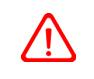

Prepayment invoices can be linked to sales orders if the *Inventory and Order Management* feature is enabled on the *[Enable/Disable Features](https://help-2025r1.acumatica.com/Help?ScreenId=ShowWiki&pageid=c1555e43-1bc5-4f6f-ba9d-b323f94d8a6b)* (CS100000) form.

You cannot reverse the application of the credit memo that was created during the write-off of the unpaid balance of a prepayment invoice.

#### **Voiding the Unpaid Prepayment Invoices**

You can void prepayment invoices with the *Pending Payment* status (those that have been released but not yet paid). The system voids a prepayment invoice by writing off its unpaid balance.

To do this, on the *[Invoices and Memos](https://help-2025r1.acumatica.com/Help?ScreenId=ShowWiki&pageid=5e6f3b27-b7af-412f-a40a-1d4f4be70cba)* (AR301000) form, you open the prepayment invoice with the *Pending Payment* status. On the More menu, you click **Write Off Unpaid Balance** under the **Corrections** section. The system creates a *Credit Memo* document with the *Voiding of prepayment invoice [Reference Nbr.]* description and opens it on the current form. On the **Details** tab, the credit memo has a single line that summarizes all detail lines of the prepayment invoice and displays the invoice's unpaid balance in the **Ext. Price** column. This amount cannot be edited. On the **Applications** tab, the system has added the related prepayment invoice.

On release of the credit memo, the system generates a GL transaction that debits the customer's prepayment account and credits the Accounts Receivable account. This GL transaction reverses the GL transaction that was generated on release of the prepayment invoice. The system specifies the reference number of the newly created transaction on the **Financial** tab of the current form. Once the credit memo is released,it is assigned the *Closed* status, and the prepayment invoice is assigned the *Voided* status.

You cannot reverse the application of the credit memo that was created during the write-off of the unpaid balance of a prepayment invoice.

### **Prepayment Invoices: Generated Transactions**

As you process a prepayment invoice, you start by creating and releasing this prepayment invoice. Then you apply a payment to the prepayment invoice, and finally, you apply the prepayment invoice to the AR invoice. To track the movements of invoice balances, including taxes, the system generates the GL transactions described in the following section.

#### **Transactions Generated for a Prepayment Invoice**

When you create and release a prepayment invoice, the system generates the following general ledger transactions.

| Account                     | Source of Account                                                                                                                        | Debit  | Credit |
|-----------------------------|------------------------------------------------------------------------------------------------------------------------------------------|--------|--------|
| Accounts Receivable account | Specified in the pre payment invoice in the AR Account box of the Financial tab on the Invoices and Memos (AR301000) form | Amount |        |
| Prepayment account          | Specified in the prepay ment invoice in the Pre payment Account box of the Financial tab on the Invoices and Mem osform   |        | Amount |

You can view the reference number of the GL batch in the prepayment invoice on the **Financial** tab of the *[Invoices](https://help-2025r1.acumatica.com/Help?ScreenId=ShowWiki&pageid=5e6f3b27-b7af-412f-a40a-1d4f4be70cba) [and Memos](https://help-2025r1.acumatica.com/Help?ScreenId=ShowWiki&pageid=5e6f3b27-b7af-412f-a40a-1d4f4be70cba)* form.

When you apply a payment to the prepayment invoice and release the application, the system generates the following general ledger transactions.

| Account                      | Source of Account                                                                                                                                | Debit      | Credit     |
|------------------------------|--------------------------------------------------------------------------------------------------------------------------------------------------|------------|------------|
| Cash account                 | Specified in the pay ment document, in the Cash Account box of the Summary area of the Payments and Appli cations (AR302000) form | Amount     |            |
| AR account                   | Specified in the prepay ment invoice in the AR Account box on the Fi nancial tab of the In voices and Memos form                     |            | Amount     |
| Tax on AR Prepayment account | For an applicable tax, specified in the Tax on AR Prepayment Ac count box of the GL Ac counts tab on theTaxes (TX205000) form     | Tax amount |            |
| Tax Payable account          | For an applicable tax, specified in the Tax Payable Account box of the GL Accounts tab on theTaxes form                              |            | Tax amount |

You can view the reference number of the GL batch in the payment document on the **Financial** and **Application History** tabs of the *[Payments and Applications](https://help-2025r1.acumatica.com/Help?ScreenId=ShowWiki&pageid=ae844bf4-1aef-42cd-9e2f-49b3ee1bc8d7)* form and in the prepayment invoice on the **Application History** tab of the *[Payments and Applications](https://help-2025r1.acumatica.com/Help?ScreenId=ShowWiki&pageid=ae844bf4-1aef-42cd-9e2f-49b3ee1bc8d7)* form.

When you apply the prepayment invoice to an AR invoice and release the application, the system generates the following general ledger transactions.

| Account            | Source of Account                                                                                                                      | Debit              | Credit             |
|--------------------|----------------------------------------------------------------------------------------------------------------------------------------|--------------------|--------------------|
| Prepayment account | Specified in the prepay ment invoice in the Pre payment Account box of the Financial tab on the Invoices and Memos form | Application amount |                    |
| AR account         | Specified in the AR in voice in the AR Account box of the Financial tab on the Invoices and Memos form                     |                    | Application amount |

| Account                      | Source of Account                                                                                                                 | Debit      | Credit     |
|------------------------------|-----------------------------------------------------------------------------------------------------------------------------------|------------|------------|
| Tax Payable account          | For an applicable tax, specified in the Tax Payable Account box of the GL Accounts tab on theTaxes form               | Tax amount |            |
| Tax on AR Prepayment account | For an applicable tax, specified in the Tax on AR Prepayment Ac count box of the GL Ac counts tab on theTaxes form |            | Tax amount |

You can view the reference number of the GL batch in the prepayment invoice on the **Application History** tab of the *[Payments and Applications](https://help-2025r1.acumatica.com/Help?ScreenId=ShowWiki&pageid=ae844bf4-1aef-42cd-9e2f-49b3ee1bc8d7)* form.

### **Prepayment Invoices: Related Reports and Inquiry Forms**

In the following sections, you can find details about the reports and inquiry forms you may want to review to gather information about the processing of prepayment invoices.

#### **Reviewing the Customer Balance**

When a prepayment invoice is released, the customer's balance is updated. You can view the prepayment balance of a customer on the *[Customer Details](https://help-2025r1.acumatica.com/Help?ScreenId=ShowWiki&pageid=2ed5542b-a76c-4cfd-9ee3-52c2f08a2692)* (AR402000) form. You can open this form directly or by clicking **Customer Details** (under **Inquiries**) on the More menu of the *[Invoices and Memos](https://help-2025r1.acumatica.com/Help?ScreenId=ShowWiki&pageid=5e6f3b27-b7af-412f-a40a-1d4f4be70cba)* (AR301000) or *[Payments and Applications](https://help-2025r1.acumatica.com/Help?ScreenId=ShowWiki&pageid=ae844bf4-1aef-42cd-9e2f-49b3ee1bc8d7)* (AR302000) form.

Unlike other documents, prepayment invoices are displayed on the *[Customer Details](https://help-2025r1.acumatica.com/Help?ScreenId=ShowWiki&pageid=2ed5542b-a76c-4cfd-9ee3-52c2f08a2692)* form in two lines:

- The first line shows the amount that has been posted to the customer's AR account; this amount has a positive sign.
- The second line shows the amount that has been posted to the customer's prepayment account; this amount has a negative sign.

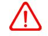

The **AR Account** and **AR Subaccount** columns are visible only if the *VAT Recognition on Prepayments* feature is enabled on the *[Enable/Disable Features](https://help-2025r1.acumatica.com/Help?ScreenId=ShowWiki&pageid=c1555e43-1bc5-4f6f-ba9d-b323f94d8a6b)* (CS100000) form.

#### **Reviewing the Accounts Receivable Details**

In the *[AR Register Detailed](https://help-2025r1.acumatica.com/Help?ScreenId=ShowWiki&pageid=3299e1f2-b865-496e-9573-b98d988ddd16)* (AR622000) report, you can view the details of all transactions related to accounts receivable that have been posted on the release of prepayment invoices. You open this report by clicking **AR Register Detailed**in the prepayment invoice on the More menu of the *[Invoices and Memos](https://help-2025r1.acumatica.com/Help?ScreenId=ShowWiki&pageid=5e6f3b27-b7af-412f-a40a-1d4f4be70cba)* (AR301000) or *[Payments](https://help-2025r1.acumatica.com/Help?ScreenId=ShowWiki&pageid=ae844bf4-1aef-42cd-9e2f-49b3ee1bc8d7) [and Applications](https://help-2025r1.acumatica.com/Help?ScreenId=ShowWiki&pageid=ae844bf4-1aef-42cd-9e2f-49b3ee1bc8d7)* (AR302000) form.

In the *[AR Edit Detailed](https://help-2025r1.acumatica.com/Help?ScreenId=ShowWiki&pageid=9b517c23-e989-422a-8933-0fdb2a388218)* (AR610500) report, you can view the details of accounts receivable documents that have been entered into the system but not released. You open this report by clicking **AR Edit Detailed** in the prepayment invoice on the More menu of the *[Invoices and Memos](https://help-2025r1.acumatica.com/Help?ScreenId=ShowWiki&pageid=5e6f3b27-b7af-412f-a40a-1d4f4be70cba)* (AR301000) form.

#### **Printing a Prepayment Invoice**

You can view and print a particular prepayment invoice, which you select by its reference number, by clicking **Run Report** on the report form toolbar on the *[Invoice/Memo](https://help-2025r1.acumatica.com/Help?ScreenId=ShowWiki&pageid=3e62d073-5d55-4ddc-8267-498ff184a5ba)* (AR641000) report form. You can also generate a printfriendly version of a prepayment invoice you are viewing on the *[Invoices and Memos](https://help-2025r1.acumatica.com/Help?ScreenId=ShowWiki&pageid=5e6f3b27-b7af-412f-a40a-1d4f4be70cba)* (AR301000) form by clicking **Print** on the More menu.

#### **Preparing Customer Statements**

Prepayment invoices of the *Pending Payment* status (if they have not been paid yet or have been partially paid) are included in statements. The unpaid balances of prepayment invoices are shown in statements with the positive sign. You can prepare statements on the *[Prepare Statements](https://help-2025r1.acumatica.com/Help?ScreenId=ShowWiki&pageid=9056278a-944c-4d4f-83a3-1496b2e1c90d)* (AR503000) form or view any generated statement of a particular customer on the *[Customer Statement History](https://help-2025r1.acumatica.com/Help?ScreenId=ShowWiki&pageid=ba6887cf-a0b9-44ff-afba-fb9a2e9a77e9)* (AR404600) form.

The total amount due shown in a statement does not match the customer's balance because the customer's balance includes the balances of the fully and partially paid prepayment invoices.

#### **Preparing Dunning Letters**

Prepayment invoices with the *Pending Payment* status (if they have not been paid yet or have been partially paid) are included in dunning letters. On the *[Prepare Dunning Letters](https://help-2025r1.acumatica.com/Help?ScreenId=ShowWiki&pageid=70b377c0-9444-4e75-9c19-45144c53d007)* (AR521000) form, you can generate dunning letters for customers that have unpaid and overdue invoices and unpaid prepayment invoices.

This functionality is available only if the *Dunning Letter Management* feature is enabled on the *[Enable/](https://help-2025r1.acumatica.com/Help?ScreenId=ShowWiki&pageid=c1555e43-1bc5-4f6f-ba9d-b323f94d8a6b) [Disable Features](https://help-2025r1.acumatica.com/Help?ScreenId=ShowWiki&pageid=c1555e43-1bc5-4f6f-ba9d-b323f94d8a6b)* (CS100000) form.

#### **Generating the AR Aging Reports**

All of the following reports show all AR documents in the system including unpaid or partially paid prepayment invoices (that is, prepayment invoices of the *Pending Payment* status) that are outstanding at the end of the specified period: *[AR Aging](https://help-2025r1.acumatica.com/Help?ScreenId=ShowWiki&pageid=01596f87-710b-4b01-abad-ab0932c27884)* (AR631000), *[AR Aging by Project](https://help-2025r1.acumatica.com/Help?ScreenId=ShowWiki&pageid=19b96a27-ee03-4081-971d-803baea6719c)* (AR631200), *[AR Aged Period-Sensitive](https://help-2025r1.acumatica.com/Help?ScreenId=ShowWiki&pageid=29b0c0da-d891-4f1e-9daa-7e440032682b)* (AR630500), *[AR](https://help-2025r1.acumatica.com/Help?ScreenId=ShowWiki&pageid=778c4489-a43c-4d02-afe2-0d67cb88cd40) [Aged Period-Sensitive by Project](https://help-2025r1.acumatica.com/Help?ScreenId=ShowWiki&pageid=778c4489-a43c-4d02-afe2-0d67cb88cd40)* (AR630600), *[AR Aging MC](https://help-2025r1.acumatica.com/Help?ScreenId=ShowWiki&pageid=3fb84a67-cce3-4efb-94a8-6ba37c15a392)* (AR631100).

The *[AR Aging MC](https://help-2025r1.acumatica.com/Help?ScreenId=ShowWiki&pageid=3fb84a67-cce3-4efb-94a8-6ba37c15a392)* report is available only if the *Multicurrency Accounting* feature is enabled on the *[Enable/Disable Features](https://help-2025r1.acumatica.com/Help?ScreenId=ShowWiki&pageid=c1555e43-1bc5-4f6f-ba9d-b323f94d8a6b)* (CS100000) form.

In these reports, the unpaid balances of prepayment invoices are included with the positive sign.

The **CustomerTotal** amount specified in reports does not match the customer's balance because the customer's balance includes the balances of the fully and partially paid prepayment invoices.

## **Processing Refunds**

In this chapter, you will find general information on how to process customers' refunds, a checklist for system implementation, an activity that describes how to create a refund and apply a credit memo to it, an activity that describes how to void a refund, an activity that describes how to create and partially apply a refund, and report and inquiries that can be useful to find and view created transactions.

### **Refunds: General Information**

In this topic, you will learn how to process AR documents with the *Refund* type.

#### **Learning Objectives**

In this chapter, you will learn how to do the following:

- Create a refund and fully apply a credit memo to it
- Void a refund
- Create a refund and partially apply a prepayment to the refund

#### **Applicable Scenarios**

Refunds can be created in the following cases:

- To record a refund to the customer for returned goods (this scenario is described in *[Refunds:](#page-177-2) To Create a [Refund and Apply a Credit Memo to It](#page-177-2)*)
- To record an overpaid amount
- To record an unused amount of a prepayment (this scenario is described in *[Refunds:](#page-181-1) To Create and Partially [Apply a Refund](#page-181-1)*)

Refunds can be voided if errors have been made or if the refunds are otherwise invalid. Voiding a refund reverses the original refund transactions. You can use the *[Payments and Applications](https://help-2025r1.acumatica.com/Help?ScreenId=ShowWiki&pageid=ae844bf4-1aef-42cd-9e2f-49b3ee1bc8d7)* (AR302000) form to void a refund that has been applied to customer payments, prepayments, or credit memos.

#### **Creation of a Refund**

To create and process a refund, you use the *[Payments and Applications](https://help-2025r1.acumatica.com/Help?ScreenId=ShowWiki&pageid=ae844bf4-1aef-42cd-9e2f-49b3ee1bc8d7)* (AR302000) form. Alternatively, you can use the *[Invoices and Memos](https://help-2025r1.acumatica.com/Help?ScreenId=ShowWiki&pageid=5e6f3b27-b7af-412f-a40a-1d4f4be70cba)* (AR301000) form, where you can select a credit memo and then click **Refund** (under **Processing**) on the More menu.

When you are recording a refund, you can apply its available balance fully or partially to an open payment, prepayment, credit memo, or sales order—or to multiple documents of these types—before or aer you release the refund. For step-by-step instructions, see *[Refunds:](#page-177-2) To Create a Refund and Apply a Credit Memo to It*. To perform a refund for a closed payment document, first reverse the applications of the payment document, and then create a refund for the payment document.

#### **Release of a Refund**

On the *[Payments and Applications](https://help-2025r1.acumatica.com/Help?ScreenId=ShowWiki&pageid=ae844bf4-1aef-42cd-9e2f-49b3ee1bc8d7)* (AR302000) form, you can create and release a document with the *Refund* type without applying it to another document. When the refund is released, its status is changed to *Open*, the refund has an open balance (that is, the **Available Balance** box shows a nonzero amount), and the refund can be applied to a payment, prepayment, or credit memo on the **Documents to Apply** tab.

If you release a refund that is fully applied to a document, the status of the refund is changed to *Closed* because its amount was fully applied. The balances of refunds with the *Refund* and *Voided Refund* types affect the customer's balance as a payment with a reverse sign.

When you release a refund to which documents have been applied, the system does the following:

- Releases the application records.
- Decreases the balances of the paid documents. If the balance of a paid document becomes zero, the system changes its status to *Closed*.
- Increases the customer's balance by the refund amount if the refund is applied to a document of the *Payment* or *Credit Memo* type.
- Decreases the customer's prepayment balance by the refund amount if the refund is applied to a payment document of the *Prepayment* type.
- Generates a GL batch to update the involved asset accounts.

#### **Application of a Refund**

You distribute the available refund balance among the open payment documents you add to the table on the **Documents to Apply** tab of the *[Payments and Applications](https://help-2025r1.acumatica.com/Help?ScreenId=ShowWiki&pageid=ae844bf4-1aef-42cd-9e2f-49b3ee1bc8d7)* (AR302000) form. The system creates application records for each document listed on the tab and includes the applied amount. You can edit the application amount in the **Amount Paid** column for each document. If you partially apply the refund amount to documents, aer the release of the applications, the refund will still have an open balance and will retain its *Open* status.

On the *[Invoices and Memos](https://help-2025r1.acumatica.com/Help?ScreenId=ShowWiki&pageid=5e6f3b27-b7af-412f-a40a-1d4f4be70cba)* (AR301000) form, a refund with the *Open* status can be applied to a credit memo if the credit memo has not been released. Regardless of the status of the credit memo and the refunds applied to it, all applications of documents to this credit memo are displayed on the **Applications** tab. For details, see *[AR Invoice](#page-111-1) [Correction:](#page-111-1) To Create a Credit Memo and Apply a Refund to It*.

#### **Correction of a Refund**

You can correct a released refund by voiding it and recording the correct refund. For step-by-step instructions, see *[Refunds:](#page-180-1) To Void a Refund*.

You void the refund on the *[Payments and Applications](https://help-2025r1.acumatica.com/Help?ScreenId=ShowWiki&pageid=ae844bf4-1aef-42cd-9e2f-49b3ee1bc8d7)* (AR302000) form by selecting the needed document of the *Refund* type and then clicking **Void** on the form toolbar. The system creates a document of the *Voided Refund* type with the same reference number as the refund has, and reverses the original refund.

Before you release the voided refund, you can change the date of the voided refund in the **Application Date** box in the Summary area of the form. The date you specify in this box should be the date when the voided refund is released and when the related batch was created. You can also enter a description of the voided refund in the **Description** box of the Summary area of the *[Payments and Applications](https://help-2025r1.acumatica.com/Help?ScreenId=ShowWiki&pageid=ae844bf4-1aef-42cd-9e2f-49b3ee1bc8d7)* form.

On release of the voided refund, the system changes the status of the refund to *Voided* and the status of the voided refund to *Closed*. On the **Application History** tab, you can see the original document to which the refund has been applied with a negative amount in the **Amount Paid** column.

If the original document for which the refund has been applied has the *Closed* status, when the refund is voided, the system changes the document's status to *Open*. You can again apply documents to the original document.

#### **Workflow of Processing Refunds**

The following diagram illustrates the workflow of creating a refund and fully applying a credit memo to it. (This process is described in *[Refunds:](#page-177-2) To Create a Refund and Apply a Credit Memo to It*.)

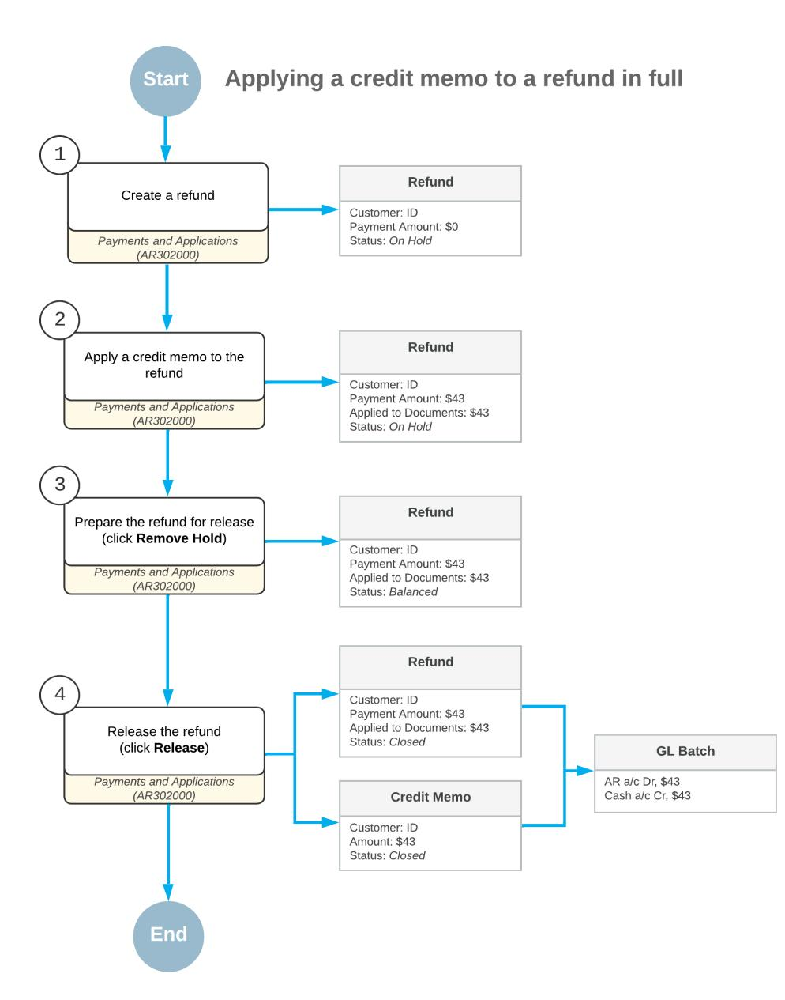

*Figure: Workflow of creating a refund and applying a credit memo to it in full*

The following diagram illustrates the workflow of creating a refund and partially applying it to a prepayment. (This process is described in *[Refunds:](#page-181-1) To Create and Partially Apply a Refund*.)

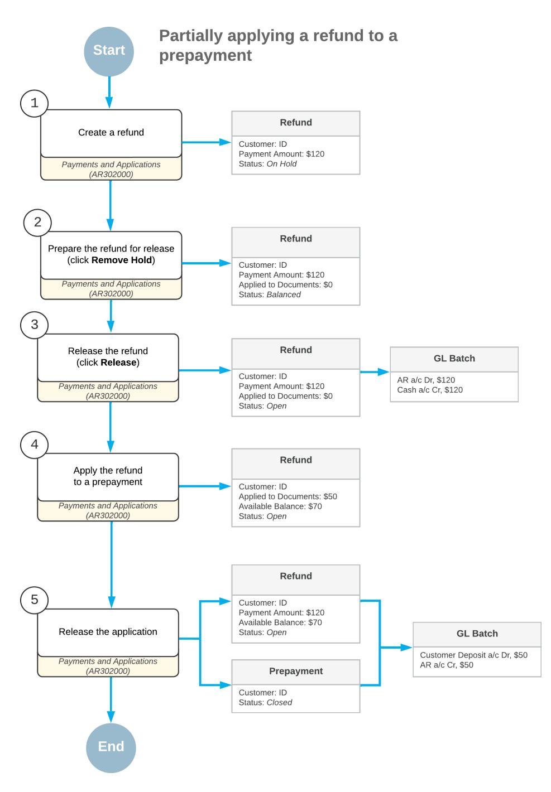

*Figure: Workflow of creating a refund and partially applying it to a prepayment*

### **Refunds: Payment Receipts**

Aer a refund to a customer has been processed, you can provide your customer with proof of purchase by generating a payment receipt for the released transaction. On the *[Payments and Applications](https://help-2025r1.acumatica.com/Help?ScreenId=ShowWiki&pageid=ae844bf4-1aef-42cd-9e2f-49b3ee1bc8d7)* (AR302000) form, you can print the payment receipt or send an email with it.

You can generate payment receipts for documents with the *Payment*, *Prepayment*, *Refund*, *Voided Payment*, and *Voided Refund* types.

You can use this functionality if either of the following conditions is met:

- The payment has been created with the *Credit Card*, *POS*, or *EFT* payment method, and has been captured and released.
- The payment has been created with the *Cash*, *Check*, or *Direct Deposit* payment method, and has been released.

The PDF attachment in the generated email includes the payment details. You can also print this PDF report.

#### **Functionality Setup**

To set up this functionality, do the following:

1. On the **Settings for Use in AR** tab of the *[Payment Methods](https://help-2025r1.acumatica.com/Help?ScreenId=ShowWiki&pageid=509285d1-cfae-4e87-95c3-a968451952e6)* (CA204000) form, select the**Send Payment Receipts Automatically** check box for each needed payment method.

With this check box selected, payment receipts for the specified payment method will be sent automatically to customers from the *[Payments and Applications](https://help-2025r1.acumatica.com/Help?ScreenId=ShowWiki&pageid=ae844bf4-1aef-42cd-9e2f-49b3ee1bc8d7)* (AR302000) form. Regardless of the state of this check box, users can also manually send payment receipts from this form.

2. On the **Mailing & Printing** tab of the *[Accounts Receivable Preferences](https://help-2025r1.acumatica.com/Help?ScreenId=ShowWiki&pageid=f7b52067-5299-45e8-b601-485cd709f58b)* (AR101000) form, make sure that the *PAY RECEIPT* mailing ID is shown in the **DefaultSources** table. The **Active** check box should be selected for this mailing ID.

This row in the table defines the mapping between the mailing and the email template. If your organization needs to change or update this mapping, a system administrator can do this on the *[Customer Classes](https://help-2025r1.acumatica.com/Help?ScreenId=ShowWiki&pageid=806e39d6-6f89-4e6c-9a24-61c6fb0c9a57)* (AR201000) or *[Customers](https://help-2025r1.acumatica.com/Help?ScreenId=ShowWiki&pageid=652929bc-9606-4056-aa6e-0c2d1147171b)* (AR303000) form.

3. On the same tab, add mailing recipients to the **Default Recipients** table.

#### **Automatic Generation of Receipts**

You use the *[Print/Email AR Documents](https://help-2025r1.acumatica.com/Help?ScreenId=ShowWiki&pageid=05451253-581e-459d-912e-ff983df762b9)* (AR508000) form to mass-process payment receipts and scheduling the automatic sending of them to customers. To generate emails with payment receipts for refunds, perform the following steps:

- 1. On the *[Print/Email AR Documents](https://help-2025r1.acumatica.com/Help?ScreenId=ShowWiki&pageid=05451253-581e-459d-912e-ff983df762b9)* form, select *Email Payment Receipts* in the **Action** box.
- 2. In the Selection area, specify the selection criteria for documents.

The system displays documents of the following types: *Cash Sale*, *Cash Return*, *Payment*, *Prepayment*, *Voided Payment*, *Refund*, and *Voided Refund*. For payments, prepayments, and refunds displayed in the table, the **Emailed** check box is cleared on the **Financial** tab of the *[Payments and Applications](https://help-2025r1.acumatica.com/Help?ScreenId=ShowWiki&pageid=ae844bf4-1aef-42cd-9e2f-49b3ee1bc8d7)* (AR302000) form.

3. Select the Included check box in the row or rows for the needed documents and then click **Process** on the form toolbar. Alternatively, click **Process All** to process all documents.

The system generates an email message and attaches it to the document on the *[Payments and Applications](https://help-2025r1.acumatica.com/Help?ScreenId=ShowWiki&pageid=ae844bf4-1aef-42cd-9e2f-49b3ee1bc8d7)* form. Once the email has been created, the **Emailed** check box is selected for the document on the **Financial** tab of the *[Payments and Applications](https://help-2025r1.acumatica.com/Help?ScreenId=ShowWiki&pageid=ae844bf4-1aef-42cd-9e2f-49b3ee1bc8d7)* form.

To schedule the automatic sending of payment receipts, an administrative user should perform the following instructions:

- 1. On the *[Payment Methods](https://help-2025r1.acumatica.com/Help?ScreenId=ShowWiki&pageid=509285d1-cfae-4e87-95c3-a968451952e6)* (CA204000) form, select the**Send Payment Receipts Automatically** check box for the needed payment methods.
- 2. On the *[Print/Email AR Documents](https://help-2025r1.acumatica.com/Help?ScreenId=ShowWiki&pageid=05451253-581e-459d-912e-ff983df762b9)* (AR508000) form, create a schedule. Once the schedule is created, payment receipts will be automatically sent to customers based on this schedule. For more information about schedules, see *[Scheduling Automated Processing](https://help-2025r1.acumatica.com/Help?ScreenId=ShowWiki&pageid=87426450-3fdb-4248-b29c-e9cbf47cef6f)*.

#### **Manual Generation of Receipts**

On the *[Payments and Applications](https://help-2025r1.acumatica.com/Help?ScreenId=ShowWiki&pageid=ae844bf4-1aef-42cd-9e2f-49b3ee1bc8d7)* (AR302000) form, you generate payment receipts by doing either of the following:

• On the More menu of the form, clicking **Print Payment Receipt** to print the receipt in PDF format.

The system opens the printable document on the *[Payment Receipt](https://help-2025r1.acumatica.com/Help?ScreenId=ShowWiki&pageid=5885ccfc-0226-4b46-89ed-22135e106b6a)* (AR643000) report. The **Payment Details** section at the bottom of the report shows the document type, transaction date, payment method, and the total amount paid.

Aer printing the document, the system selects the **Printed** check box for it on the **Financial** tab of the *[Payments and Applications](https://help-2025r1.acumatica.com/Help?ScreenId=ShowWiki&pageid=ae844bf4-1aef-42cd-9e2f-49b3ee1bc8d7)* form.

• On the More menu of the form, clicking **Email Payment Receipt**.

The system generates an email message and attaches it to the form. Once the email has been created, the **Emailed** check box is selected for the document on the **Financial** tab of the *[Payments and Applications](https://help-2025r1.acumatica.com/Help?ScreenId=ShowWiki&pageid=ae844bf4-1aef-42cd-9e2f-49b3ee1bc8d7)* form.

### **Refunds: Implementation Checklist**

To ensure that the system is configured properly for creating a refund, make sure that the criteria listed in the table have been met in the system as described.

| Form                               | Criteria to Check                                                                                                                                                                                                                                                                | Notes |
|------------------------------------|----------------------------------------------------------------------------------------------------------------------------------------------------------------------------------------------------------------------------------------------------------------------------------|-------|
| Enable/Disable Features (CS100000) | Make sure the minimal features have been enabled as described in Company Without Branches: General Information, Company with Branches that Do Not Require Balancing: Gen eral Information, and Company with Branches that Require Balancing: General Information. |       |
| Customers (AR303000)               | Verify the existence of the customer accounts for the customers whose refunds you will process. For details, see Customers: Imple mentation Activity.                                                                                                                   |       |

#### **Settings That Affect the Workflow**

The following settings and entities should be specified and defined, respectively:

- The following general ledger settings should be specified on the **PostingSettings** tab of the *[General Ledger](https://help-2025r1.acumatica.com/Help?ScreenId=ShowWiki&pageid=e4913d06-c511-4258-a0f9-f36c1b854e6b) [Preferences](https://help-2025r1.acumatica.com/Help?ScreenId=ShowWiki&pageid=e4913d06-c511-4258-a0f9-f36c1b854e6b)* (GL102000) form:
  - Make sure that the **Automatically Post on Release** check box is selected. This setting causes GL batches to be immediately posted aer they are released.
  - Clear the **Generate Consolidated Batches** check box to cause every AR transaction you enter to be posted as an individual batch to the general ledger. (When this check box is selected, the system consolidates into a single batch all transactions in the same currency posted to the same period for all documents being released.)
- The following accounts receivable settings should be specified on the **General** tab of the *[Accounts](https://help-2025r1.acumatica.com/Help?ScreenId=ShowWiki&pageid=f7b52067-5299-45e8-b601-485cd709f58b) [Receivable Preferences](https://help-2025r1.acumatica.com/Help?ScreenId=ShowWiki&pageid=f7b52067-5299-45e8-b601-485cd709f58b)* (AR101000) form:
  - Select the **Hold Documents on Entry** check box in the **Data EntrySettings** section. This setting gives the created AR invoices and credit memos the *On Hold* status.

- Make sure that the **Automatically Post on Release** check box is selected in the **PostingSettings** section. This setting indicates that AR invoices and credit memos will be automatically posted to the general ledger once they are released.
- Clear the **Require Payment Reference on Entry** check box in the **Data EntrySettings** section. With this check box cleared, you do not have to fill in payment reference information in the **Payment Ref.** box on the *[Payments and Applications](https://help-2025r1.acumatica.com/Help?ScreenId=ShowWiki&pageid=ae844bf4-1aef-42cd-9e2f-49b3ee1bc8d7)* (AR302000) form.

With these settings specified and entities defined, users in your company can record and process documents in Acumatica ERP quickly and accurately, with a minimum of manual actions.

### **Refunds: Generated Transactions**

The following refund transactions are recorded to the general ledger when the refund has been released.

| Account                     | Debit  | Credit |
|-----------------------------|--------|--------|
| Cash account                | 0.00   | Amount |
| Accounts Receivable account | Amount | 0.00   |

You can view the batch details by clicking the link in the **Batch Nbr.** box on the **Financial** tab of the *[Payments and](https://help-2025r1.acumatica.com/Help?ScreenId=ShowWiki&pageid=ae844bf4-1aef-42cd-9e2f-49b3ee1bc8d7) [Applications](https://help-2025r1.acumatica.com/Help?ScreenId=ShowWiki&pageid=ae844bf4-1aef-42cd-9e2f-49b3ee1bc8d7)* (AR302000) form.

If you have recorded bank charges to the refund, the system generates the respective transactions and includes them in the batch with the refund transactions. For details on bank charge transactions, see *[Finance Charge](https://help-2025r1.acumatica.com/Help?ScreenId=ShowWiki&pageid=438c4829-23c0-4de8-ab13-a5f83ebfe8c6) [Transactions](https://help-2025r1.acumatica.com/Help?ScreenId=ShowWiki&pageid=438c4829-23c0-4de8-ab13-a5f83ebfe8c6)*.

When you release a refund, the GL batch may contain, in addition to the refund transactions, some transactions generated by its application records. For details, see *[Invoice Payments: Release of Application Records](#page-129-1)*.

The following voided refund reverse batch is recorded to the general ledger when a voided refund is released.

| Account                     | Debit  | Credit |
|-----------------------------|--------|--------|
| Cash account                | Amount | 0.00   |
| Accounts Receivable account | 0.00   | Amount |

### **Refunds: To Create a Refund and Apply a Credit Memo to It**

In this activity, you will learn how to create a refund and apply a credit memo in full to it.

This activity is based on the *U100* dataset. If you are using another dataset, or if any system settings have been changed in *U100*, these changes can affect the workflow of the activity and the results of the processing. To avoid any issues, restore the *U100* dataset to its initial state.

#### **Video Tutorial**

This video shows you the common process but may contain less detail than the activity has. If you want to repeat the activity on your own or you are preparing to take the certification exam, we recommend that you follow the instructions in the steps of the activity.

#### *[FEEDBACK](https://www.surveymonkey.com/r/BLBL7RJ?Video=Processing%20Customer%20Refunds&Source=Open%20Uni&Course=F100)*

#### **Story**

Suppose that in January, HM's Bakery & Cafe (*HMBAKERY*) bought twelve jars of apple jam from the SweetLife Fruits & Jams company for a total amount of \$258 and returned two damaged jars. One of the SweetLife accountants has already created a credit memo in the system for the amount of the damaged goods (\$43).

Acting as the chief accountant of SweetLife, you need to create a refund for this credit memo.

#### **Configuration Overview**

For the purposes of this activity, the following features have been enabled on the *[Enable/Disable Features](https://help-2025r1.acumatica.com/Help?ScreenId=ShowWiki&pageid=c1555e43-1bc5-4f6f-ba9d-b323f94d8a6b)* (CS100000) form:

- *Standard Financials*, which provides the standard financial functionality
- *Multibranch Support*, which supports multiple branches in your instance of Acumatica ERP
- *Multicompany Support*, which supports multiple companies within one tenant.

On the *[Accounts Receivable Preferences](https://help-2025r1.acumatica.com/Help?ScreenId=ShowWiki&pageid=f7b52067-5299-45e8-b601-485cd709f58b)* (AR101000) form, the **Hold Documents on Entry** check box has been selected in the **Data EntrySettings** section.

On the *[Customers](https://help-2025r1.acumatica.com/Help?ScreenId=ShowWiki&pageid=652929bc-9606-4056-aa6e-0c2d1147171b)* (AR303000) form, the *HMBAKERY (HM's Bakery & Cafe)* customer has been defined.

#### **Process Overview**

In this process activity, on the *[Payments and Applications](https://help-2025r1.acumatica.com/Help?ScreenId=ShowWiki&pageid=ae844bf4-1aef-42cd-9e2f-49b3ee1bc8d7)* (AR302000) form, you will create a refund for which a credit memo has already been created. On the **Documents to Apply** tab of the form, you will select the credit memo for which the refund is being issued and apply it in full to the refund. Finally, you will release the refund and the application.

#### **System Preparation**

Before you perform the steps of this lesson, do the following:

- 1. Launch the Acumatica ERP website, and sign in as an accountant by using the following credentials:
  - Username: *johnson*
  - Password: *123*
- 2. In the info area, in the upper-right corner of the top pane of the Acumatica ERP screen, make sure that the business date in your system is set to *1/30/2025*. If a different date is displayed, click the Business Date menu button and select *1/30/2025*. For simplicity, in this activity, you will create and process all documents in the system on this business date.
- 3. On the Company and Branch Selection menu, also on the top pane of the Acumatica ERP screen, make sure that the *SweetLife Head Office and Wholesale Center* branch is selected. If it is not selected, click the Company and Branch Selection menu button to view the list of branches that you have access to, and then click *SweetLife Head Office and Wholesale Center*.

#### **Step 1: Creating the Refund**

To create the refund, do the following:

1. Open the *[Payments and Applications](https://help-2025r1.acumatica.com/Help?ScreenId=ShowWiki&pageid=ae844bf4-1aef-42cd-9e2f-49b3ee1bc8d7)* (AR302000) form.

To open the form for creating a new record, type the form ID in the Search box, and on the Search form, point at the form title and click **New** right of the title.

- 2. On the form toolbar, click **Add New Record**, and specify the following settings in the Summary area:
  - **Type**: *Refund*
  - **Customer**: *HMBAKERY*
  - **Payment Method**: *WIRE*
  - **Cash Account**: *10200WH (Wholesale Checking)*
  - **Application Date**: *1/30/2025* (inserted by default)
  - **Description**: Refund for damaged goods
- 3. On the form toolbar, click**Save**.

#### **Step 2: Applying a Credit Memo to the Refund in Full**

To apply a credit memo to the refund in full, do the following:

- 1. While you are still on the *[Payments and Applications](https://help-2025r1.acumatica.com/Help?ScreenId=ShowWiki&pageid=ae844bf4-1aef-42cd-9e2f-49b3ee1bc8d7)* (AR302000) form with the refund opened, on the **Documents to Apply** tab, click **Add Row**, and specify the following settings in the added row:
  - **Doc.Type**: *Credit Memo*
  - **Reference Nbr.**: The number corresponding to the existing credit memo in the amount of \$43
  - **Amount Paid**: *43* (filled in automatically)
- 2. In the Summary area, click the Refresh button right of the **Payment Amount** box.

Notice that the **Amount Paid** from the credit memo has been inserted as the payment amount for the refund.

3. On the form toolbar, click**Save** to save the refund, which is shown in the following screenshot.

| <b>Payments and Applications</b> Refund 000082 - HM's Bakery & Cafe |                       |              |                              |                   |                                                                   |                    |   |                                         |                |                                           |           |          | <b>PINOTES</b>                  | <b>ACTIVITIES</b> | <b>FILES</b> | TOOLS $\sim$   |
|------------------------------------------------------------------------|-----------------------|--------------|------------------------------|-------------------|-------------------------------------------------------------------|--------------------|---|-----------------------------------------|----------------|-------------------------------------------|-----------|----------|---------------------------------|-------------------|--------------|----------------|
| 圕 阊 $\leftarrow$                                                 | $\Omega$              | +            | O û $\check{~}$        | $\mathsf{K}$      | $\geq$ ≺ $\rightarrow$                                      | <b>REMOVE HOLD</b> |   | $\cdots$                                |                |                                           |           |          |                                 |                   |              |                |
| Type:                                                                  | Refund                | $\checkmark$ | Customer:                    |                   | HMBAKERY - HM's Bakery & Cafe                                     |                    | ∥ |                                         | Payment Amo    | 43.00 ①                                   |           |          |                                 |                   |              | $\sim$         |
| Reference Nbr.:                                                        | 000082                | $\circ$      | * Location:                  |                   | <b>MAIN - Primary Location</b>                                    |                    | Q |                                         | Applied to Doc | 43.00                                     |           |          |                                 |                   |              |                |
| Status:                                                                | On Hold               |              | Payment Meth.                |                   | WIRE - Wire Transfer                                              |                    | Q |                                         | Applied to Ord | 0.00                                      |           |          |                                 |                   |              |                |
| * Application Date:                                                    | 1/30/2025             | Ħ            | Card/Account                 |                   |                                                                   |                    |   |                                         | Available Bala | 0.00                                      |           |          |                                 |                   |              |                |
| * Application Pe                                                       | 01-2025               | Q            | * Cash Account:              |                   | 10200WH - Wholesale Checking                                      |                    | م |                                         | Write-Off Amo  | 0.00                                      |           |          |                                 |                   |              |                |
| Payment Ref.:                                                          |                       |              |                              |                   |                                                                   |                    |   |                                         | Finance Charg  | 0.00                                      |           |          |                                 |                   |              |                |
|                                                                        |                       |              |                              |                   |                                                                   |                    |   |                                         | Deducted Cha   | 0.00                                      |           |          |                                 |                   |              |                |
|                                                                        |                       |              | Description:                 |                   | Refund for damaged goods                                          |                    |   |                                         |                |                                           |           |          |                                 |                   |              |                |
| <b>DOCUMENTS TO APPLY</b> $\times$ Õ $^{+}$                   | <b>LOAD DOCUMENTS</b> |              | <b>SALES ORDERS</b>          | <b>AUTO APPLY</b> | <b>APPLICATION HISTORY</b> $\mathbf{\overline{X}}$ $\vdash$ | <b>FINANCIAL</b>   |   | <b>CHARGES</b>                          | COMPLIANCE     |                                           |           |          |                                 |                   |              |                |
| D 日 0 <b>Branch</b> п                                         |                       | Doc. Type    | Nbr.                         | *Reference        | <b>Inventory ID</b>                                               | <b>Amount Paid</b> |   | Cash <b>Discount</b> <b>Taken</b> |                | Write-Off Write-Off Amount Reason Code | Date      | Due Date | Cash <b>Discount</b> Date | <b>Cross Rate</b> |              | <b>Balance</b> |
| ☑ 0 D                                                            | <b>HEADOFFICE</b>     |              | <b>Credit Memo</b> 000071 |                   |                                                                   | 43.00              |   | 0.00                                    | 0.00           |                                           | 1/24/2025 |          |                                 | 1.00000000        |              | 0.00           |

*Figure: The refund created for HMBAKERY*

#### **Step 3: Releasing the Refund and its Application**

To release the refund and its application, do the following:

1. While you are still viewing the refund on the *[Payments and Applications](https://help-2025r1.acumatica.com/Help?ScreenId=ShowWiki&pageid=ae844bf4-1aef-42cd-9e2f-49b3ee1bc8d7)* (AR302000) form, on the form toolbar, click **Remove Hold**, and then click **Release**.

2. On the **Application History** tab, click the link in the **Batch Number** column to review the created batch on the *Journal [Transactions](https://help-2025r1.acumatica.com/Help?ScreenId=ShowWiki&pageid=dda046bc-5946-407f-88f7-1c0c966fbe72)* (GL301000) form.

### **Refunds: To Void a Refund**

In this activity, you will learn how to void a refund.

#### **Story**

Suppose that a refund for HM's Bakery & Cafe (*HMBAKERY*) that you created in the previous activity has to be voided (because the date is incorrect) so that a new refund can be created.

Acting as the chief accountant of SweetLife, you need to void the refund.

#### **Configuration Overview**

For the purposes of this activity, the following features have been enabled on the *[Enable/Disable Features](https://help-2025r1.acumatica.com/Help?ScreenId=ShowWiki&pageid=c1555e43-1bc5-4f6f-ba9d-b323f94d8a6b)* (CS100000) form:

- *Standard Financials*, which provides the standard financial functionality
- *Multibranch Support*, which supports multiple branches in your instance of Acumatica ERP
- *Multicompany Support*, which supports multiple companies within one tenant.

On the *[Accounts Receivable Preferences](https://help-2025r1.acumatica.com/Help?ScreenId=ShowWiki&pageid=f7b52067-5299-45e8-b601-485cd709f58b)* (AR101000) form, the **Hold Documents on Entry** check box has been selected in the **Data EntrySettings** section.

On the *[Customers](https://help-2025r1.acumatica.com/Help?ScreenId=ShowWiki&pageid=652929bc-9606-4056-aa6e-0c2d1147171b)* (AR303000) form, the *HMBAKERY (HM's Bakery & Cafe)* customer has been defined.

#### **Process Overview**

In this activity, you will void a refund on the *[Payments and Applications](https://help-2025r1.acumatica.com/Help?ScreenId=ShowWiki&pageid=ae844bf4-1aef-42cd-9e2f-49b3ee1bc8d7)* (AR302000) form, and review the document that the system creates.

In a production environment, you would first make sure that the needed refund has been created in the system, as described in *[Refunds:](#page-177-2) To Create a Refund and Apply a Credit Memo to It*.

#### **System Preparation**

Before you perform the steps of this lesson, do the following:

- 1. Launch the Acumatica ERP website, and sign in as an accountant by using the following credentials:
  - Username: *johnson*
  - Password: *123*
- 2. In the info area, in the upper-right corner of the top pane of the Acumatica ERP screen, make sure that the business date in your system is set to *1/30/2025*. If a different date is displayed, click the Business Date menu button and select *1/30/2025*. For simplicity, in this activity, you will create and process all documents in the system on this business date.
- 3. On the Company and Branch Selection menu, also on the top pane of the Acumatica ERP screen, make sure that the *SweetLife Head Office and Wholesale Center* branch is selected. If it is not selected, click the Company and Branch Selection menu button to view the list of branches that you have access to, and then click *SweetLife Head Office and Wholesale Center*.

4. Make sure that you have created a refund as described in *[Refunds:](#page-177-2) To Create a Refund and Apply a Credit [Memo to It](#page-177-2)*.

#### **Step 1: Voiding the Refund**

To void the refund with the incorrect date, do the following:

- 1. Open the *[Payments and Applications](https://help-2025r1.acumatica.com/Help?ScreenId=ShowWiki&pageid=ae844bf4-1aef-42cd-9e2f-49b3ee1bc8d7)* (AR302000) form.
- 2. In the **Type** box of the Summary area, select *Refund*.
- 3. In the **Reference Nbr.** box, select the reference number of the refund that you need to void (the refund you created in the *[Refunds:](#page-177-2) To Create a Refund and Apply a Credit Memo to It* activity).
- 4. On the form toolbar, click**Void**.

The system does the following:

- Reverses the refund in full.
- Changes the status of the refund to *Voided*. (The original refund is not shown on the form.)
- Creates a document with the *Voided Refund* type that has the same reference number as the refund has. (You will use this document in the remaining instructions of this activity.)
- 5. In the **Application Date** box of the Summary area, change the date of the voided refund to *1/31/2025*.

The date specified in this box should be the date when the voided refund is released (**Payment Date**) and when the related batch was created (**Transaction Date**).

#### **Step 2: Releasing the Voided Refund**

To release the voided refund, do the following:

- 1. On the form toolbar, click **Remove Hold**.
- 2. On the form toolbar, click **Release**. The following screenshot shows the released voided refund.

| <b>Payments and Applications</b>                                                                          | Voided Refund 000082 - HM's Bakery & Cafe                  |                                              |                               |                    |                 |                    |                                  |             |                       |                       |           | $\Box$ NOTES | <b>ACTIVITIES</b>               | <b>FILES</b> | $TOOLS$ -                          |
|-----------------------------------------------------------------------------------------------------------|------------------------------------------------------------|----------------------------------------------|-------------------------------|--------------------|-----------------|--------------------|----------------------------------|-------------|-----------------------|-----------------------|-----------|--------------|---------------------------------|--------------|------------------------------------|
| 圕 n $\leftarrow$                                                                                    | $\Omega$ $+$ 血                                       | n $\overline{\mathbf{K}}$ $\checkmark$ | $\epsilon$ $\rightarrow$   | $\geq$ $\cdots$ |                 |                    |                                  |             |                       |                       |           |              |                                 |              |                                    |
| Type:                                                                                                     | Voided Re ~                                                | Customer:                                    | HMBAKERY - HM's Bakery & Cafe |                    | $\Lambda$       | Payment Amo        | $-43.00$ $\circlearrowright$     |             |                       |                       |           |              |                                 |              | $\sim$                             |
| Reference Nbr.:                                                                                           | Q Location: 000082 <b>MAIN - Primary Location</b> |                                              |                               |                    | Applied to Doc  | 0.00               |                                  |             |                       |                       |           |              |                                 |              |                                    |
| Status:                                                                                                   | Closed                                                     | Payment Meth                                 | <b>WIRE - Wire Transfer</b>   |                    |                 | Applied to Ord     | 0.00                             |             |                       |                       |           |              |                                 |              |                                    |
| Application Date: 1/31/2025                                                                               |                                                            | Card/Account                                 |                               |                    |                 | Available Bala     | 0.00                             |             |                       |                       |           |              |                                 |              |                                    |
| Application Pe 01-2025                                                                                    |                                                            | Cash Account:                                | 10200WH - Wholesale Checking  |                    |                 | Write-Off Amo      | 0.00                             |             |                       |                       |           |              |                                 |              |                                    |
| Payment Ref.:                                                                                             |                                                            |                                              |                               |                    |                 | Finance Charg      | 0.00                             |             |                       |                       |           |              |                                 |              |                                    |
|                                                                                                           |                                                            |                                              |                               |                    |                 | Deducted Cha       | 0.00                             |             |                       |                       |           |              |                                 |              |                                    |
|                                                                                                           |                                                            | Description:                                 | Refund for damaged goods      |                    |                 |                    |                                  |             |                       |                       |           |              |                                 |              |                                    |
| DOCUMENTS TO APPLY Ò                                                                                   | $\mathbb{H}$ <b>REVERSE APPLICATION</b>                 | <b>SALES ORDERS</b> 図                     | <b>APPLICATION HISTORY</b>    | <b>FINANCIAL</b>   | <b>CHARGES</b>  | COMPLIANCE         |                                  |             |                       |                       |           |              |                                 |              |                                    |
| $\Box$ Branch 图 0                                                                                      | Batch Number                                            | Doc. Type                                    | Reference Nbr.             | Inventory ID    | Customer        | <b>Amount Paid</b> | Cash <b>Discount</b> Taken | Amount Date | Write-Off Application | Application Period | Date      | Due Date     | Cash <b>Discount</b> Date | Balance      | Cash <b>Discount</b> Balance |
| !!!!!!!!!!!!!!!!!!!!!!!!!!!!!!!!!!!!!!!! !!!!!!!!!!!!!!!!!!!!!!!!!!!!!!!!!!!!!!!! <b>HEADOFFICE</b> | AR000201                                                   | <b>Credit Memo</b>                           | 000071                        |                    | <b>HMBAKERY</b> | $-43.00$           | 0.00                             | 0.00        | 1/31/2025             | 01-2025               | 1/24/2025 |              |                                 | 43.00        | 0.00                               |

*Figure: The voided refund for the HMBAKERY customer*

### **Refunds: To Create and Partially Apply a Refund**

The following activity will walk you through the process of creating a refund and partially applying it to a prepayment.

This activity is based on the *U100* dataset. If you are using another dataset, or if any system settings have been changed in *U100*, these changes can affect the workflow of the activity and the results of the processing. To avoid any issues, restore the *U100* dataset to its initial state.

#### **Video Tutorial**

This video shows you the common process but may contain less detail than the activity has. If you want to repeat the activity on your own or you are preparing to take the certification exam, we recommend that you follow the instructions in the steps of the activity.

#### *[FEEDBACK](https://www.surveymonkey.com/r/BLBL7RJ?Video=Processing%20Customer%20Refunds&Source=Open%20Uni&Course=F100)*

#### **Story**

Suppose that in January 2025, one of the customers of SweetLife Fruits & Jams, Food Clever, returned goods for the amount of \$70. A credit memo has not been processed in the system yet, but SweetLife needs to refund the money. (Later, when a credit memo for this amount is created, this refund can be applied to this credit memo.) Also, the company had made a prepayment of \$400 for services, but the overpaid amount of \$50 needs to be refunded as well.

Acting as a SweetLife accountant, you need to create and release a refund for \$120, and apply \$50 of this refund to the \$400 prepayment.

#### **Configuration Overview**

In the *U100* dataset, the following configuration tasks have been performed to prepare the system for this activity to be performed:

- On the *[Accounts Receivable Preferences](https://help-2025r1.acumatica.com/Help?ScreenId=ShowWiki&pageid=f7b52067-5299-45e8-b601-485cd709f58b)* (AR101000) form, the **Hold Documents on Entry** check box has been selected in the **Data EntrySettings** section.
- On the *[Customers](https://help-2025r1.acumatica.com/Help?ScreenId=ShowWiki&pageid=652929bc-9606-4056-aa6e-0c2d1147171b)* (AR303000) form, the *FOODCLVR (Food Clever)* customer has been defined.
- On the *[Payments and Applications](https://help-2025r1.acumatica.com/Help?ScreenId=ShowWiki&pageid=ae844bf4-1aef-42cd-9e2f-49b3ee1bc8d7)* (AR302000) form, a \$400 prepayment for the Food Clever customer has been created.

#### **Process Overview**

In this activity, on the *[Payments and Applications](https://help-2025r1.acumatica.com/Help?ScreenId=ShowWiki&pageid=ae844bf4-1aef-42cd-9e2f-49b3ee1bc8d7)* (AR302000) form, you will create and release a refund. On the **Documents to Apply** tab, you will apply a part of this refund to the customer's prepayment and will release the application.

Finally, on the *Journal [Transactions](https://help-2025r1.acumatica.com/Help?ScreenId=ShowWiki&pageid=dda046bc-5946-407f-88f7-1c0c966fbe72)* (GL301000) form, you will review the GL transactions generated by the system on release of the refund and its application.

#### **System Preparation**

To prepare the system, do the following:

- 1. Launch the Acumatica ERP website, and sign in to a company with the *U100* dataset preloaded. You should sign in as an accountant by using the *johnson* username and the *123* password.
- 2. In the info area, in the upper-right corner of the top pane of the Acumatica ERP screen, make sure that the business date in your system is set to *1/30/2025*. If a different date is displayed, click the Business Date menu button and select *1/30/2025* on the calendar. For simplicity, in this activity, you will create and process all documents in the system on this business date.

3. On the Company and Branch Selection menu, on the top pane of the Acumatica ERP screen, select the *SweetLife Head Office and Wholesale Center* branch.

#### **Step 1: Creating and Releasing a Refund**

To create and release a refund, do the following:

1. Open the *[Payments and Applications](https://help-2025r1.acumatica.com/Help?ScreenId=ShowWiki&pageid=ae844bf4-1aef-42cd-9e2f-49b3ee1bc8d7)* (AR302000) form.

To open the form for creating a new record, type the form ID in the Search box, and on the Search form, point at the form title and click **New** right of the title.

- 2. On the form toolbar, click **Add New Record**, and specify the following settings in the Summary area:
  - **Type**: *Refund*
  - **Customer**: *FOODCLVR*
  - **Payment Method**: *WIRE*
  - **Cash Account**: *10200WH (Wholesale Checking)*
  - **Application Date**: *1/30/2025* (inserted by default)
  - **Description**: Returned goods
  - **Payment Amount**: 120
- 3. On the form toolbar, click**Save**.
- 4. On the form toolbar, click **Remove Hold** to give the refund the *Balanced* status.
- 5. On the form toolbar, click **Release** to release the refund.

In the Summary area, notice that the status of the refund is *Open* and the available balance is *120*, which means that the refund can be applied to documents.

#### **Step 2: Applying the Refund to a Prepayment and Releasing the Application**

To apply the open refund to a prepayment and release the application, do the following:

- 1. While you are still on the *[Payments and Applications](https://help-2025r1.acumatica.com/Help?ScreenId=ShowWiki&pageid=ae844bf4-1aef-42cd-9e2f-49b3ee1bc8d7)* (AR302000) form with the refund opened, on the **Documents to Apply** tab, click **Add Row**.
- 2. In the added row, specify the following settings:
  - **Doc.Type**: *Prepayment*
  - **Reference Nbr.**: The number of the prepayment with the amount of \$400 for the *FOODCLVR* customer.
  - **Amount Paid**: *50* (inserted automatically)
- 3. On the form toolbar, click**Save**.
- 4. On the form toolbar, click **Release** to release the application.

In the Summary area, notice that the refund retains the *Open* status and the available balance of the refund is *70*, as shown in the following screenshot.

| <b>Payments and Applications</b> Refund 000083 - Food Clever                                                                                                                                           |                        |                                                     |                                |                              |                 |                    |                                         |             |                       | P NOTES               | <b>ACTIVITIES</b> | <b>FILES</b> | TOOLS $\sim$        |
|-----------------------------------------------------------------------------------------------------------------------------------------------------------------------------------------------------------|------------------------|-----------------------------------------------------|--------------------------------|------------------------------|-----------------|--------------------|-----------------------------------------|-------------|-----------------------|-----------------------|-------------------|--------------|---------------------|
| 周 圕 $\leftarrow$                                                                                                                                                                                    | $\Omega$ $^{+}$     | n ाणि $\overline{\mathbf{K}}$ $\checkmark$ | ≺ $\rightarrow$             | $\geq$ <b>VOID</b>        | $\cdots$        |                    |                                         |             |                       |                       |                   |              |                     |
| Type:                                                                                                                                                                                                     | Refund $\checkmark$ | Customer:                                           | FOODCLVR - Food Clever         |                              | 0               | Payment Amo        | $120.00$ $\circ$                        |             |                       |                       |                   |              | $\hat{\phantom{a}}$ |
| Reference Nbr.:                                                                                                                                                                                           | 000083 ٥            | Location:                                           | <b>MAIN - Primary Location</b> |                              |                 | Applied to Doc     | 0.00                                    |             |                       |                       |                   |              |                     |
| Status:                                                                                                                                                                                                   | Open                   | Payment Meth WIRE - Wire Transfer                   |                                |                              |                 | Applied to Ord     | 0.00                                    |             |                       |                       |                   |              |                     |
| * Application Date:                                                                                                                                                                                       | 1/30/2025 Ä         | Card/Account                                        |                                |                              |                 | Available Bala     | 70.00                                   |             |                       |                       |                   |              |                     |
| * Application Pe 01-2025                                                                                                                                                                                  | Q                      | Cash Account:                                       |                                | 10200WH - Wholesale Checking |                 | Write-Off Amo      | 0.00                                    |             |                       |                       |                   |              |                     |
| Payment Ref.:                                                                                                                                                                                             |                        |                                                     |                                |                              |                 | Finance Charg      | 0.00                                    |             |                       |                       |                   |              |                     |
|                                                                                                                                                                                                           |                        |                                                     |                                |                              |                 | Deducted Cha       | 0.00                                    |             |                       |                       |                   |              |                     |
|                                                                                                                                                                                                           |                        | Description:                                        | <b>Returned goods</b>          |                              |                 |                    |                                         |             |                       |                       |                   |              |                     |
| <b>APPLICATION HISTORY</b> <b>DOCUMENTS TO APPLY</b> <b>SALES ORDERS</b> <b>FINANCIAL</b> <b>CHARGES</b> COMPLIANCE $\boxed{\mathbf{X}}$ <b>REVERSE APPLICATION</b> $\vdash$ Ò |                        |                                                     |                                |                              |                 |                    |                                         |             |                       |                       |                   |              |                     |
| $\Box$ <b>B</b> 0 Branch                                                                                                                                                                            | <b>Batch</b> Number | Doc. Type                                           | Reference Nbr.              | <b>Inventory ID</b>          | Customer        | <b>Amount Paid</b> | Cash <b>Discount</b> <b>Taken</b> | Amount Date | Write-Off Application | Application Period | Date              |              | Due Date            |
| <b>O</b> <b>n</b> <b>HEADOFFICE</b>                                                                                                                                                                 | AR000202               | Prepayment                                          | 000070                         |                              | <b>FOODCLVR</b> | 50.00              | 0.00                                    | 0.00        | 1/30/2025             | 01-2025               | 1/19/2025         |              |                     |

*Figure: A refund partially applied to a prepayment*

#### **Step 3: Reviewing the GL Transactions Generated by the System**

To review the GL transactions generated by the system on release of the refund and its application to the prepayment, do the following:

- 1. While you are still on the *[Payments and Applications](https://help-2025r1.acumatica.com/Help?ScreenId=ShowWiki&pageid=ae844bf4-1aef-42cd-9e2f-49b3ee1bc8d7)* (AR302000) form with the refund opened, open the **Financial** tab.
- 2. Click the link in the **Batch Nbr.** box to open the GL transaction generated on release of the refund.
- 3. On the *Journal [Transactions](https://help-2025r1.acumatica.com/Help?ScreenId=ShowWiki&pageid=dda046bc-5946-407f-88f7-1c0c966fbe72)* (GL301000) form, review the GL transaction.

The *10200 (Company Checking)* account has been credited in the amount of the refund (\$120), meaning that the balance of the company's checking account has been decreased. The *11000 (Accounts Receivable)* account has been debited in the amount of the refund, meaning that the balance of the company's AR account has been decreased.

- 4. On the *[Payments and Applications](https://help-2025r1.acumatica.com/Help?ScreenId=ShowWiki&pageid=ae844bf4-1aef-42cd-9e2f-49b3ee1bc8d7)* form, open the **Application History** tab.
- 5. Click the link in the **Batch Number** column to open the GL transaction generated on release of the refund's application to the prepayment.
- 6. On the *Journal [Transactions](https://help-2025r1.acumatica.com/Help?ScreenId=ShowWiki&pageid=dda046bc-5946-407f-88f7-1c0c966fbe72)* form, review the GL transaction.

The *11000 (Accounts Receivable)* account has been credited in the amount of the unused part of the prepayment (\$50). The *22100 (Customer Deposit)* account has been debited in the same amount.

### **Refunds: Related Reports and Forms**

This topic describes the reports and forms you may review to gather information about the balance of customers for whom you issue refunds.

If you do not see a report or inquiry, this could mean that you have signed in to the system with a user account that does not have access rights to the form. Sign in as the *admin* user, or contact your system administrator.

#### **Reviewing a Customer Balance and Documents**

You can review the balance and documents of a particular customer by clicking **Customer Details** (under **Inquiries**) on the More menu of the *[Payments and Applications](https://help-2025r1.acumatica.com/Help?ScreenId=ShowWiki&pageid=ae844bf4-1aef-42cd-9e2f-49b3ee1bc8d7)* (AR302000) form with the refund selected on it. The system navigates to the *[Customer Details](https://help-2025r1.acumatica.com/Help?ScreenId=ShowWiki&pageid=2ed5542b-a76c-4cfd-9ee3-52c2f08a2692)* (AR402000) form, where the balance of documents with the *Refund* and *Voided Refund* types affects the customer's balance as a payment with a reverse sign.

#### **Reviewing a Refund**

You can review a refund on the *[AR Register Detailed](https://help-2025r1.acumatica.com/Help?ScreenId=ShowWiki&pageid=3299e1f2-b865-496e-9573-b98d988ddd16)* (AR622000) form. To run the report, on the *[Payments and](https://help-2025r1.acumatica.com/Help?ScreenId=ShowWiki&pageid=ae844bf4-1aef-42cd-9e2f-49b3ee1bc8d7) [Applications](https://help-2025r1.acumatica.com/Help?ScreenId=ShowWiki&pageid=ae844bf4-1aef-42cd-9e2f-49b3ee1bc8d7)* (AR302000) form, you select the refund, and on the More menu (under **Reports**), you click **AR Register Detailed**.

## **Processing Credit Card Refunds**

The topics of this chapter describe how to create refunds for credit card payments.

### **Credit Card Refunds: General Information**

On the *[Payments and Applications](https://help-2025r1.acumatica.com/Help?ScreenId=ShowWiki&pageid=ae844bf4-1aef-42cd-9e2f-49b3ee1bc8d7)* (AR302000) form, you can quickly create customer refunds for documents of the *Payment*, *Prepayment*, and *Credit Memo* types. The system automatically populates settings based on the information from the payment, prepayment, or credit memo to which the refund will be applied.

#### **Learning Objectives**

In this chapter, you will learn how to process a refund for a payment paid by a credit card.

#### **Applicable Scenarios**

You process a refund of a credit card payment if the payment amount is greater than its applied amount and the payment retains its *Open* status.

For details of applying customer refunds to credit memos and prepayments, see *[Refunds: General Information](#page-171-2)*.

#### **Refunding of a Payment**

If a payment with the *Open* status is opened on the *[Payments and Applications](https://help-2025r1.acumatica.com/Help?ScreenId=ShowWiki&pageid=ae844bf4-1aef-42cd-9e2f-49b3ee1bc8d7)* (AR302000) form, when you click **Refund** on the More menu, the system performs the following actions:

1. Verifies that the payment does not have unreleased applications or unreleased documents of the *Voided Payment* type.

If at least one unreleased application or voided payment is found, the system displays an error, and the processing is terminated.

- 2. Creates a document of the *Refund* type.
- 3. Fills in the details of the refund with the default data and the copied information from the original payment.

If the *Integrated Card Processing* feature is enabled on the *[Enable/Disable Features](https://help-2025r1.acumatica.com/Help?ScreenId=ShowWiki&pageid=c1555e43-1bc5-4f6f-ba9d-b323f94d8a6b)* (CS100000) form, the **Application Date** of the refund must be at least one day later than the **Application Date** of the original payment, otherwise the transaction will not be processed by the processing center and the system will display an error.

4. Applies the refund to the original payment.

#### **Data Automatically Populated for a Refund**

The following tables list the data that is automatically populated when a refund is created from a payment on the *[Payments and Applications](https://help-2025r1.acumatica.com/Help?ScreenId=ShowWiki&pageid=ae844bf4-1aef-42cd-9e2f-49b3ee1bc8d7)* (AR302000) form.

#### *Table: Automatically Filled Data in the Summary Area*

| UI element | Description |
|------------|-------------|
| Type       | Refund.     |

| UI element                      | Description                                                                                                                                                                                                                                                                                                                                                                                  |  |  |  |  |
|---------------------------------|----------------------------------------------------------------------------------------------------------------------------------------------------------------------------------------------------------------------------------------------------------------------------------------------------------------------------------------------------------------------------------------------|--|--|--|--|
| Application Date                | The current business date.                                                                                                                                                                                                                                                                                                                                                                   |  |  |  |  |
| Customer                        | The customer of the original payment.                                                                                                                                                                                                                                                                                                                                                        |  |  |  |  |
| Location                        | The location of the original payment.                                                                                                                                                                                                                                                                                                                                                        |  |  |  |  |
| Payment Method                  | The payment method of the original payment.                                                                                                                                                                                                                                                                                                                                                  |  |  |  |  |
| Use Orig.Transaction for Refund | A check box that appears in the refund if unlinked refunds are allowed for the processing center. The check box is selected for card-based payment methods if the original payment has an active card transaction.                                                                                                                                                                     |  |  |  |  |
| Orig. Transaction               | The number of the original transaction, which is inserted if the original payment has an active card transaction.                                                                                                                                                                                                                                                                         |  |  |  |  |
| Card/Account Nbr.               | The customer payment method, which can be either of the following: • The customer payment method of the original card transaction if this transaction is active. • The customer payment method of the original payment if there is a val ue in the Card/Account Nbr. box in the original payment and there are no active card transactions associated with the payment. |  |  |  |  |
| Proc. Center ID                 | The identifier of the processing center, which can be either of the follow ing: • The ID of the processing center of the customer payment method if the customer payment method was identified and inserted in the Card/Ac count Nbr. box. • The ID of the processing center of the original card transaction, if the Card/Account Nbr. box is empty.                |  |  |  |  |
| Cash Account                    | The cash account of the original payment.                                                                                                                                                                                                                                                                                                                                                    |  |  |  |  |
| Currency                        | The currency of the original payment.                                                                                                                                                                                                                                                                                                                                                        |  |  |  |  |
| Payment Amount                  | The available balance of the original payment.                                                                                                                                                                                                                                                                                                                                               |  |  |  |  |

*Table: Automatically Filled Data on the Financial Tab*

| UI element    | Description                   |
|---------------|-------------------------------|
| Branch        | The customer's branch.        |
| AR Account    | The customer's AR account.    |
| AR Subaccount | The customer's AR subaccount. |

*Table: Automatically Filled Data on the Documents to Apply Tab*

| UI element | Description            |
|------------|------------------------|
| Branch     | The customer's branch. |

| UI element     | Description                                                |
|----------------|------------------------------------------------------------|
| Doc.Type       | The type of the original document (Payment or Prepayment). |
| Reference Nbr. | The reference number of the original payment.              |
| Customer       | The customer of the original payment.                      |
| Amount Paid    | The amount of the refund.                                  |
| Date           | The current business date.                                 |

### **Workflow of Processing a Credit Card Refund**

For a refund created for a credit card payment, the typical process involves the actions and generated documents shown in the following diagram.

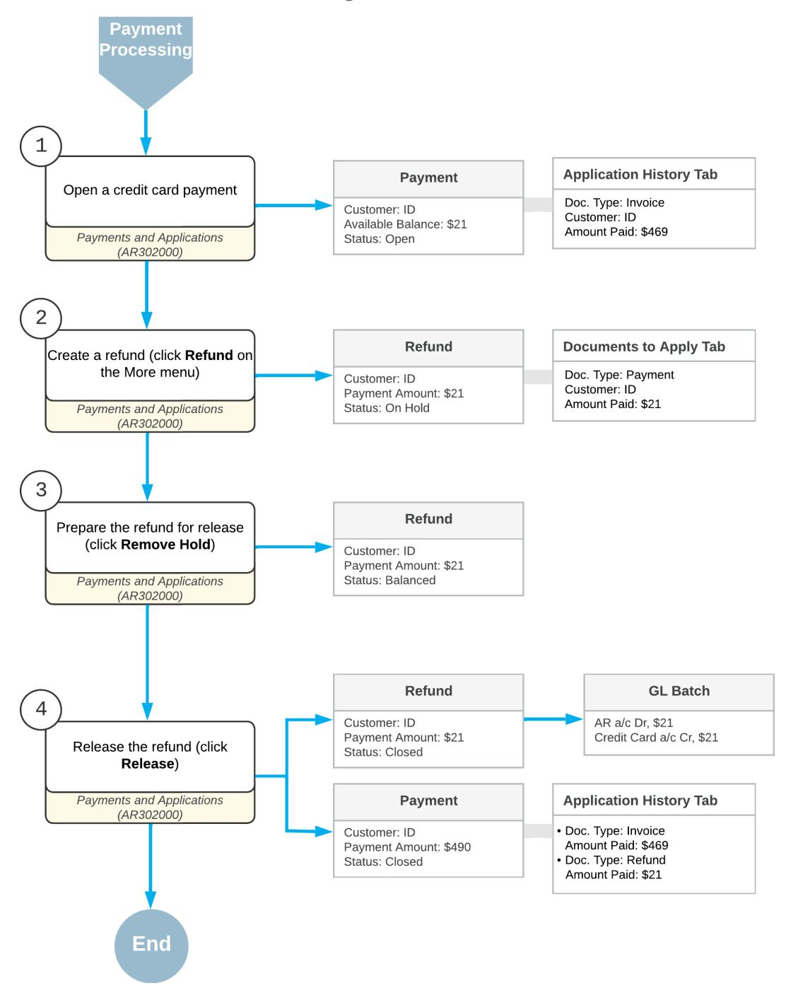

*Figure: The workflow of processing credit card refunds*

### **Credit Card Refunds: Implementation Checklist**

The following sections provide details you can use to ensure that the system is configured properly for creating a credit card refund, and to understand (and change, if needed) the settings that affect the processing workflow.

#### **Implementation Checklist**

We recommend that before you initially create a credit card refund, you make sure the features have been enabled, the settings have been specified, and entities have been created, as summarized in the following checklist.

| Form                                    | Criteria to Check                                                                                                                                                        | Notes |
|-----------------------------------------|--------------------------------------------------------------------------------------------------------------------------------------------------------------------------|-------|
| Enable/Disable Features (CS100000)      | Make sure the minimal features have been en abled as described in Preparing a Company for Implementation.                                                          |       |
| Customers (AR303000)                    | Verify the existence of the customer accounts for the customers whose credit card payment you will refund. For details, see Customers: Implementation Activity. |       |
| Payments and Applications (AR302000) | Make sure that the credit card payment, a part of which you are going to refund, has been created for the needed customer.                                         |       |

#### **Other Settings That Affect the Workflow**

You can affect the workflow of processing credit card refunds by specifying additional settings as follows:

- The following general ledger settings should be specified on the **PostingSettings** tab of the *[General Ledger](https://help-2025r1.acumatica.com/Help?ScreenId=ShowWiki&pageid=e4913d06-c511-4258-a0f9-f36c1b854e6b) [Preferences](https://help-2025r1.acumatica.com/Help?ScreenId=ShowWiki&pageid=e4913d06-c511-4258-a0f9-f36c1b854e6b)* (GL102000) form:
  - Make sure that the **Automatically Post on Release** check box is selected. This setting causes GL batches to be immediately posted aer they are released.
  - Clear the **Generate Consolidated Batches** check box to cause every AR transaction you enter to be posted as an individual batch to the general ledger. (When this check box is selected, the system consolidates into a single batch all transactions in the same currency posted to the same period for all documents being released.)
- The following accounts receivable settings should be specified on the **General** tab of the *[Accounts](https://help-2025r1.acumatica.com/Help?ScreenId=ShowWiki&pageid=f7b52067-5299-45e8-b601-485cd709f58b) [Receivable Preferences](https://help-2025r1.acumatica.com/Help?ScreenId=ShowWiki&pageid=f7b52067-5299-45e8-b601-485cd709f58b)* (AR101000) form:
  - Select the **Hold Documents on Entry** check box in the **Data EntrySettings** section. This setting gives the created AR invoices and credit memos the *On Hold* status.
  - Make sure that the **Automatically Post on Release** check box is selected in the **PostingSettings** section. This setting indicates that AR invoices and credit memos will be automatically posted to the general ledger once they are released.
  - Clear the **Require Payment Reference on Entry** check box in the **Data EntrySettings** section. With this check box cleared, you do not have to fill in payment reference information in the **Payment Ref.** box on the *[Payments and Applications](https://help-2025r1.acumatica.com/Help?ScreenId=ShowWiki&pageid=ae844bf4-1aef-42cd-9e2f-49b3ee1bc8d7)* (AR302000) form.

#### **Validation of Configuration**

To make sure that all configuration has been performed correctly, we recommend that in your system, you process credit card refunds by performing instructions similar to those described in *[Credit Card Refunds: Process Activity](#page-191-2)*.

### **Credit Card Refunds: Generated Transactions**

As you process credit card refunds, you create and release a document with the *Refund* type. To update the customer balance, the system generates the GL transaction described in the following section.

### **Transactions Generated for a Credit Card Refund**

When you create and release a refund for a credit card payment, the system generates the following general ledger transaction:

| Account             | Source of Account                                                                                                                | Debit  | Credit |
|---------------------|----------------------------------------------------------------------------------------------------------------------------------|--------|--------|
| Credit Card account | GL account linked to the cash account speci fied for the original payment on the Payments and Applications (AR302000) form | 00.00  | Amount |
| Accounts Receivable | The account specified in the AR Account box on the Financial tab of the Payments and Appli cations form                    | Amount | 00.00  |

You can view the reference number of the GL batch on the **Financial** tab of the *[Payments and Applications](https://help-2025r1.acumatica.com/Help?ScreenId=ShowWiki&pageid=ae844bf4-1aef-42cd-9e2f-49b3ee1bc8d7)* form.

### **Credit Card Refunds: Process Activity**

The following activity will walk you through the process of processing a refund for a credit card payment.

This activity is based on the *U100* dataset. If you are using another dataset, or if any system settings have been changed in *U100*, these changes can affect the workflow of the activity and the results of the processing. To avoid any issues, restore the *U100* dataset to its initial state.

#### **Story**

Suppose that on January 30, while reviewing customer payments, the accountant of SweetLife Fruits & Jams found that *HMBAKERY* overpaid \$21 for one of the invoices. Acting as the SweetLife accountant, you need to process a refund of \$21 to close the payment.

#### **Configuration Overview**

In the *U100* dataset, the following configuration tasks have been performed to prepare the system for this activity to be performed:

- On the *[Accounts Receivable Preferences](https://help-2025r1.acumatica.com/Help?ScreenId=ShowWiki&pageid=f7b52067-5299-45e8-b601-485cd709f58b)* (AR101000) form, the **Hold Documents on Entry** check box has been selected in the **Data EntrySettings** section.
- On the *[Customers](https://help-2025r1.acumatica.com/Help?ScreenId=ShowWiki&pageid=652929bc-9606-4056-aa6e-0c2d1147171b)* (AR303000) form, the *HMBAKERY (HM's Bakery & Cafe)* customer has been defined.
- On the *[Payments and Applications](https://help-2025r1.acumatica.com/Help?ScreenId=ShowWiki&pageid=ae844bf4-1aef-42cd-9e2f-49b3ee1bc8d7)* (AR302000) form, a \$490 payment with the available balance of \$21 has been created.

#### **Process Overview**

In this activity, you will disable the *Integrated Card Processing* feature on the *[Enable/Disable Features](https://help-2025r1.acumatica.com/Help?ScreenId=ShowWiki&pageid=c1555e43-1bc5-4f6f-ba9d-b323f94d8a6b)* (CS100000) form. On the *[Payments and Applications](https://help-2025r1.acumatica.com/Help?ScreenId=ShowWiki&pageid=ae844bf4-1aef-42cd-9e2f-49b3ee1bc8d7)* (AR302000) form, you will open a customer payment and create a *Refund* document for it by clicking **Refund** on the More menu. You will then release the refund and review the original payment with the invoice and the refund applied to it.

#### **System Preparation**

To prepare the system, do the following:

- 1. Launch the Acumatica ERP website, and sign in to a company with the *U100* dataset preloaded. You should sign in as Anna Johnson by using the *johnson* username and the *123* password.
- 2. In the info area, in the upper-right corner of the top pane of the Acumatica ERP screen, make sure that the business date in your system is set to *1/30/2025*. If a different date is displayed, click the Business Date menu button and select *1/30/2025* on the calendar. For simplicity, in this activity, you will create and process all documents in the system on this business date.
- 3. On the Company and Branch Selection menu, on the top pane of the Acumatica ERP screen, select the *SweetLife Head Office and Wholesale Center* branch.

#### **Step 1: Disabling the** *Integrated Card Processing* **Feature**

For the purposes of this activity, you need to disable the *Integrated Card Processing* feature to avoid the processing of credit card transaction by the processing center. To disable the feature, do the following:

- 1. Open the *[Enable/Disable Features](https://help-2025r1.acumatica.com/Help?ScreenId=ShowWiki&pageid=c1555e43-1bc5-4f6f-ba9d-b323f94d8a6b)* (CS100000) form.
- 2. On the form toolbar, click **Modify**.
- 3. In the *Third-Party Integrations* group of features, clear the **Integrated Card Processing** check box.
- 4. On the form toolbar, click **Enable**.

#### **Step 2: Creating a Refund**

To create a refund for the credit card payment, do the following:

- 1. Open the *[Payments and Applications](https://help-2025r1.acumatica.com/Help?ScreenId=ShowWiki&pageid=ae844bf4-1aef-42cd-9e2f-49b3ee1bc8d7)* (AR302000) form.
- 2. In the **Reference Nbr.** box, select a payment of the *HMBAKERY* customer dated *1/20/2025* in the amount of \$490.

Notice that the payment has the **Available Balance** of \$21.

- 3. On the **Application History** tab, review the document applied to this payment. An invoice in the amount of \$469 has been applied to the payment.
- 4. On the More menu (under **Processing**), click **Refund**.

The system creates a document with the *Refund* type and the **Payment Amount** of \$21, which is the available balance of the original payment. The boxes in the Summary area and on the **Financial** tab have been populated automatically with the settings of the original payment and the payment has been automatically applied to the refund.

- 5. On the form toolbar, click **Remove Hold** to give the refund the *Balanced* status.
- 6. On the form toolbar, click **Release** to release the refund.

The following screenshot illustrates the released refund with the payment applied to it.

| <b>Payments and Applications</b> Refund 000080 - HM's Bakery & Cafe |                                                                         |                                  |                                                        |                               |                  |                |                        |                    |                          |             | <b>PINOTES</b>        | <b>ACTIVITIES</b> | <b>FILES</b> | TOOLS $\sim$        |
|------------------------------------------------------------------------|-------------------------------------------------------------------------|----------------------------------|--------------------------------------------------------|-------------------------------|------------------|----------------|------------------------|--------------------|--------------------------|-------------|-----------------------|-------------------|--------------|---------------------|
| 뭐 日 $\leftarrow$                                                 | ×)                                                                      | 间 $\pm$                       | n $\mathsf{K}$ $\checkmark$                      | $\geq$ $\prec$ ≻        | VOID $\cdots$ |                |                        |                    |                          |             |                       |                   |              |                     |
|                                                                        |                                                                         |                                  |                                                        |                               |                  |                |                        |                    |                          |             |                       |                   |              |                     |
| Type:                                                                  | Refund                                                                  | $\checkmark$                     | Customer:                                              | HMBAKERY - HM's Bakery & Cafe |                  | 0              |                        | Payment Amo        | 21.00 $\circ$            |             |                       |                   |              | $\hat{\phantom{a}}$ |
| Reference Nbr.:                                                        | 000080                                                                  | Q                                | Location:                                              | MAIN - Primary Location       |                  |                |                        | Applied to Doc     | 0.00                     |             |                       |                   |              |                     |
| Status:                                                                | Closed                                                                  |                                  | Payment Meth                                           | VISA - Credit Card Payments   |                  |                | 0.00 Applied to Ord |                    |                          |             |                       |                   |              |                     |
|                                                                        | VISA ****.****.****.8888 Application Date: 1/30/2025 Card/Account |                                  |                                                        |                               |                  | Available Bala | 0.00                   |                    |                          |             |                       |                   |              |                     |
| Application Pe 01-2025                                                 |                                                                         |                                  | 10600WH - Wholesale Credit Card Accou Cash Account: |                               |                  |                |                        | Write-Off Amo      | 0.00                     |             |                       |                   |              |                     |
| Payment Ref.:                                                          |                                                                         |                                  |                                                        |                               |                  |                |                        | Finance Charg      | 0.00                     |             |                       |                   |              |                     |
|                                                                        |                                                                         |                                  |                                                        |                               |                  |                |                        | Deducted Char      | 0.00                     |             |                       |                   |              |                     |
|                                                                        |                                                                         |                                  | Description:                                           |                               |                  |                |                        |                    |                          |             |                       |                   |              |                     |
|                                                                        |                                                                         |                                  |                                                        |                               |                  |                |                        |                    |                          |             |                       |                   |              |                     |
| DOCUMENTS TO APPLY                                                     |                                                                         | SALES ORDERS                     |                                                        | <b>APPLICATION HISTORY</b>    | <b>FINANCIAL</b> | CHARGES        |                        | COMPLIANCE         |                          |             |                       |                   |              |                     |
| Ò                                                                      | REVERSE APPLICATION                                                     | $\left  \leftrightarrow \right $ | ⊠                                                      |                               |                  |                |                        |                    |                          |             |                       |                   |              |                     |
| D <b>B</b> 0 Branch                                              |                                                                         | <b>Batch Number</b>              | Doc. Type                                              | Reference                     | Inventory ID     |                | Customer               | <b>Amount Paid</b> | Cash                     |             | Write-Off Application | Application       |              | Date                |
|                                                                        |                                                                         |                                  |                                                        | Nbr.                          |                  |                |                        |                    | <b>Discount</b> Taken | Amount Date |                       | Period            |              |                     |
| 0 D                                                                 | <b>HEADOFFICE</b>                                                       | AR000208                         | Payment                                                | 000069                        |                  |                | <b>HMBAKERY</b>        | 21.00              | 0.00                     | 0.00        | 1/30/2025             | 01-2025           |              | 1/20/2025           |

*Figure: Refund with the payment applied to it*

7. Click the link in the **Reference Nbr.** column to open the original payment. On the *[Payments and Applications](https://help-2025r1.acumatica.com/Help?ScreenId=ShowWiki&pageid=ae844bf4-1aef-42cd-9e2f-49b3ee1bc8d7)* form with the payment opened, notice that the payment status has changed to *Closed*, because the \$469 invoice and the \$21 refund have been applied to the payment, as shown in the following screenshot.

|                                          | <b>Payments and Applications</b> Payment 000069 - HM's Bakery & Cafe                                       |                                                    |                   |                                          |                         |                 |                    |                           |             |                       |                       |           | $D$ NOTES | <b>ACTIVITIES</b>        | <b>FILES</b> | TOOLS $\blacktriangleright$ |
|------------------------------------------|---------------------------------------------------------------------------------------------------------------|----------------------------------------------------|-------------------|------------------------------------------|-------------------------|-----------------|--------------------|---------------------------|-------------|-----------------------|-----------------------|-----------|-----------|--------------------------|--------------|-----------------------------|
| n 뭐                                   | ↶ ÷ m                                                                                                   | ο $\checkmark$                                  | $\mathsf{K}$ ≺ | >1 $\rightarrow$                      | <b>VOID</b> $\cdots$ |                 |                    |                           |             |                       |                       |           |           |                          |              |                             |
| Type:                                    | Payment                                                                                                       | $\checkmark$                                       | Customer:         | HMBAKERY - HM's Bakery & Cafe            |                         | D               | Payment Amo        | 490.00 $\circ$            |             |                       |                       |           |           |                          |              | $\hat{\phantom{a}}$         |
| Reference Nbr.                           | 000069                                                                                                        | $\mathcal{L}$ Location:                         |                   | MAIN - Primary Location                  |                         |                 | Applied to Doc     | 0.00                      |             |                       |                       |           |           |                          |              |                             |
| Status:                                  | Closed                                                                                                        |                                                    |                   | Payment Meth VISA - Credit Card Payments |                         |                 | Applied to Ord     | 0.00                      |             |                       |                       |           |           |                          |              |                             |
| Application Date: 1/20/2025              |                                                                                                               |                                                    |                   | Card/Account  VISA: *****. *****. 8888   |                         |                 | Available Bala     | 0.00                      |             |                       |                       |           |           |                          |              |                             |
| Application Pe 01-2025                   |                                                                                                               |                                                    | Cash Account:     | 10600WH - Wholesale Credit Card Accou    |                         |                 | Write-Off Amo      | 0.00                      |             |                       |                       |           |           |                          |              |                             |
| Payment Ref.:                            |                                                                                                               |                                                    |                   |                                          |                         |                 | Finance Charg      | 0.00                      |             |                       |                       |           |           |                          |              |                             |
|                                          |                                                                                                               |                                                    |                   |                                          |                         |                 | Deducted Char.     | 0.00                      |             |                       |                       |           |           |                          |              |                             |
|                                          | Description:                                                                                                  |                                                    |                   |                                          |                         |                 |                    |                           |             |                       |                       |           |           |                          |              |                             |
|                                          | DOCUMENTS TO APPLY SALES ORDERS <b>APPLICATION HISTORY</b> <b>FINANCIAL</b> CHARGES COMPLIANCE |                                                    |                   |                                          |                         |                 |                    |                           |             |                       |                       |           |           |                          |              |                             |
| !!!!!!!!!!!!!!!!!!!!!!!!!!!!!!!!!!!!!!!! | REVERSE APPLICATION                                                                                           | $\bar{\mathbf{x}}$ $\left  \rightarrow \right $ |                   |                                          |                         |                 |                    |                           |             |                       |                       |           |           |                          |              |                             |
| <b>B &amp; D</b> Branch               |                                                                                                               | <b>Batch Number</b>                                | Doc. Type         | Reference Nbr.                        | Inventory ID            | Customer        | <b>Amount Paid</b> | Cash Discount Taken | Amount Date | Write-Off Application | Application Period | Date      | Due Date  | Cash Discount Date |              | Balance                     |
| <b>0 D</b>                               | <b>HEADOFFICE</b>                                                                                             | AR000172                                           | Invoice           | 000107                                   |                         | <b>HMBAKERY</b> | 469.00             | 0.00                      | $0.00 -$    | 1/20/2025             | 01-2025               | 1/12/2025 | 2/11/2025 | 2/11/2025                |              | 0.00                        |
| $0$ D                                    | <b>HEADOFFICE</b>                                                                                             | AR000208                                           | Refund            | 000080                                   |                         | HMBAKERY        | 21.00              | 0.00                      | $0.00 -$    | 1/30/2025             | 01-2025               | 1/30/2025 |           |                          |              | 0.00                        |

*Figure: Documents applied to the original payment*

### **Credit Card Refunds: Related Report and Forms**

This topic describes reports and forms you may review to gather information about the balance of customers for whom you issue credit card refunds.

If you do not see a report or inquiry, this could mean that you have signed in to the system with a user account that does not have access rights to a form. Sign in as the *admin* user, or contact your system administrator.

#### **Reviewing Customer Balance and Documents**

You can review the balance and documents of a particular customer by clicking **Customer Details** (under **Inquiries**) on the More menu of the *[Payments and Applications](https://help-2025r1.acumatica.com/Help?ScreenId=ShowWiki&pageid=ae844bf4-1aef-42cd-9e2f-49b3ee1bc8d7)* (AR302000) form with the refund selected on it. The system navigates to the *[Customer Details](https://help-2025r1.acumatica.com/Help?ScreenId=ShowWiki&pageid=2ed5542b-a76c-4cfd-9ee3-52c2f08a2692)* (AR402000) form where the balance of documents with the *Refund* and *Voided Refund* types affect the customer's balance as a payment with a reverse sign.

#### **Reviewing a Refund**

You can review a refund on the *[AR Register Detailed](https://help-2025r1.acumatica.com/Help?ScreenId=ShowWiki&pageid=3299e1f2-b865-496e-9573-b98d988ddd16)* (AR622000) form. To run the report, on the *[Payments and](https://help-2025r1.acumatica.com/Help?ScreenId=ShowWiki&pageid=ae844bf4-1aef-42cd-9e2f-49b3ee1bc8d7) [Applications](https://help-2025r1.acumatica.com/Help?ScreenId=ShowWiki&pageid=ae844bf4-1aef-42cd-9e2f-49b3ee1bc8d7)* (AR302000) form, you select the refund and on the More menu (under **Reports**), you click **AR Register Detailed**.

## **Auto-Applying Payments to Documents**

In this chapter, you will find general information on how to configure automatic application of open payments and prepayments to AR documents, a checklist for system implementation, and an activity that describes how to perform automatic payment application.

### **Auto-Applying Payments: General Information**

Manually applying payment documents to invoices may require a significant amount of time if your company sells a lot in a financial period. To ease this process, Acumatica ERP provides the functionality to automate the application of payment documents.

In this chapter, you will read about the auto-application options offered by the system, their configuration, and implementation details.

### **Learning Objectives**

In this chapter, you will learn how to do the following:

- Run the automatic payment application process
- Review and release the payment applications prepared by the system

#### **Applicable Scenarios**

You use auto-application of payments to AR documents in the following cases:

- You work with a customer who purchases very frequently; therefore, there are a lot of invoices and payments involved. For this customer, you can turn on automatic application of new payments to outstanding documents associated with the customer account. For details, see *[Auto-Application for a](#page-195-3) [Customer Account](#page-195-3)*.
- You want to apply all open payment documents recorded in the system to outstanding documents at some particular time, such as before preparing customer statements. You use the *[Auto-Apply Payments](https://help-2025r1.acumatica.com/Help?ScreenId=ShowWiki&pageid=80e27d28-4aa4-487a-b6c7-075e187319f5)* (AR506000) mass processing form for this purpose. For details, see *[Auto-Application for Multiple Documents](#page-196-0)*.
- It is common in your company to receive payments in advance and you want to apply open payments when you record the related invoice. For details on applying payments when recording invoices, see *[AR Invoices:](#page-86-1) [Invoice Recording](#page-86-1)*.

#### **Auto-Application for a Customer Account**

Suppose that your company has customers who purchase frequently and you want to save time on the application of their documents with the *Payment* type to outstanding documents. For such customers, you select the **Auto-Apply Payments** check box on the **General** tab of the *[Customers](https://help-2025r1.acumatica.com/Help?ScreenId=ShowWiki&pageid=652929bc-9606-4056-aa6e-0c2d1147171b)* (AR303000) form.

When you release a new payment (with the *Balanced* status) of one of these customers on the *[Payments and](https://help-2025r1.acumatica.com/Help?ScreenId=ShowWiki&pageid=ae844bf4-1aef-42cd-9e2f-49b3ee1bc8d7) [Applications](https://help-2025r1.acumatica.com/Help?ScreenId=ShowWiki&pageid=ae844bf4-1aef-42cd-9e2f-49b3ee1bc8d7)* (AR302000) form, the system automatically applies the payment to any outstanding documents of this customer. The system sorts outstanding documents in descending order by their due date and then their reference number.

For auto-application to occur, when you release the payment, it must not have any outstanding documents specified on the **Documents to Apply** tab.

The system forms the list of outstanding documents and distributes the payment amount as follows:

- 1. If the customer account has open documents of the *Credit Memo* type, the system adds them at the top of the list. The balances of the open credit memos increase the balance that can be applied to outstanding documents.
- 2. If the **Apply Payments to Overdue Charges First** check box is selected on the *[Accounts Receivable](https://help-2025r1.acumatica.com/Help?ScreenId=ShowWiki&pageid=f7b52067-5299-45e8-b601-485cd709f58b) [Preferences](https://help-2025r1.acumatica.com/Help?ScreenId=ShowWiki&pageid=f7b52067-5299-45e8-b601-485cd709f58b)* (AR101000) form and the customer account has open documents of the *Overdue Charge* type, the system distributes the available payment balance among these documents. If the available payment balance, including the balances of any open credit memos, has not been fully applied, the system searches for outstanding documents of other types.
- 3. If the customer account has outstanding documents, the system applies the available payment balance to the first document in the list. If the available payment balance, including the balances of any open credit memos, has not been fully applied, the system applies the rest of the balance to the next document in the list and continues this process until the available payment balance is fully applied.

If the *Multibranch Support* feature is enabled on the *[Enable/Disable Features](https://help-2025r1.acumatica.com/Help?ScreenId=ShowWiki&pageid=c1555e43-1bc5-4f6f-ba9d-b323f94d8a6b)* (CS100000) form, the system searches among all outstanding documents associated with the customer account, regardless of the branch specified for the documents.

The system creates application records for each paid outstanding document and releases the application records simultaneously with the payment.

#### **Auto-Application for Multiple Documents**

Before you prepare statements for your customers, we recommend that you apply open payment documents from customers to any corresponding invoices and calculate any overdue charges, to avoid incorrect calculation of aged balances. For a statement cycle, if the **Require Payment Application BeforeStatement Processing** check box is selected on the *[Statement Cycles](https://help-2025r1.acumatica.com/Help?ScreenId=ShowWiki&pageid=1cdb48ab-149c-4304-8268-91c0654e3474)* (AR202800) form, the system will issue a warning if you try to process statements while there are open payments of customers involved in the statement cycle.

You can review the list of open documents of the customers by using Acumatica ERP reports, as described in *[Invoice Payments: Payment Processing Flow](#page-120-1)*.

If there are open payments and credit memos, you can go through these documents one by one and apply them to the outstanding documents manually, as described in *[Invoice Payments: Manual Payment Application](#page-123-1)*, or you can use the *[Auto-Apply Payments](https://help-2025r1.acumatica.com/Help?ScreenId=ShowWiki&pageid=80e27d28-4aa4-487a-b6c7-075e187319f5)* (AR506000) mass processing form.

On this form, you select a statement cycle or multiple statement cycles to specify the group of customers for which the system will run the auto-application process. When you run the process (by clicking **Process** or **Process All** on the form toolbar), the system does the following for each customer that is assigned to the selected statement cycles:

- 1. Searches for all open payments and prepayments, and sorts these documents in ascending order by the document date, document type, and reference number. If you have selected the **Apply Credit Memos** check box on the form, the system includes open credit memos in the list of payments.
- 2. Searches for all open debit memos, invoices, and overdue charges, and sorts these documents in ascending order by due date. If the **Apply Payments to Overdue Charges First** check box is selected on the *[Accounts](https://help-2025r1.acumatica.com/Help?ScreenId=ShowWiki&pageid=f7b52067-5299-45e8-b601-485cd709f58b) [Receivable Preferences](https://help-2025r1.acumatica.com/Help?ScreenId=ShowWiki&pageid=f7b52067-5299-45e8-b601-485cd709f58b)* (AR101000) form, the system moves any overdue charges to the top of the list.
- 3. Applies any found credit memos (if included) and payments to the outstanding documents one by one by creating the corresponding application records, starting with the first credit memo or payment and the first outstanding document.
- 4. If you have selected the **Release Batch When Finished** check box on the form, releases application records and closes documents whose balance becomes 0. If this check box is cleared, you need to release application records manually for each payment on the *[Payments and Applications](https://help-2025r1.acumatica.com/Help?ScreenId=ShowWiki&pageid=ae844bf4-1aef-42cd-9e2f-49b3ee1bc8d7)* (AR302000) form or by using the *[Release AR Documents](https://help-2025r1.acumatica.com/Help?ScreenId=ShowWiki&pageid=78ad2d21-b6a8-46d0-8f2d-98dd0a23f75e)* (AR501000) mass processing form. For details, see *[Invoice Payments:](#page-127-1) [Release of Payments](#page-127-1)*.

If the **Automatically Post on Release** check box is selected on the *[Accounts Receivable](https://help-2025r1.acumatica.com/Help?ScreenId=ShowWiki&pageid=f7b52067-5299-45e8-b601-485cd709f58b) [Preferences](https://help-2025r1.acumatica.com/Help?ScreenId=ShowWiki&pageid=f7b52067-5299-45e8-b601-485cd709f58b)* form, the system also posts the released batches.

Aer the process is complete, for each payment, you can view the list of applications that have been saved but not yet released on the **Documents to Apply** tab of the *[Payments and Applications](https://help-2025r1.acumatica.com/Help?ScreenId=ShowWiki&pageid=ae844bf4-1aef-42cd-9e2f-49b3ee1bc8d7)* form. You can track the history of released payment applications by using the **Application History** tab of the form.

#### **Exclusion from the Automatic Application of Payments**

The system excludes payments and prepayments from the list of payments that can be applied to outstanding documents if they meet at least one of the following criteria:

- The open payment is linked to a sales order. That is, the payment has a reservation record or multiple reservation records on the **Orders to Apply** tab of the *[Payments and Applications](https://help-2025r1.acumatica.com/Help?ScreenId=ShowWiki&pageid=ae844bf4-1aef-42cd-9e2f-49b3ee1bc8d7)* (AR302000) form. For details, see *[Reserving Payments for Sales Orders](https://help-2025r1.acumatica.com/Help?ScreenId=ShowWiki&pageid=d0d85b37-8484-4a1d-8ccf-dc02ea6b187c)*.
- The open payment was put on hold. That is, a user clicked **Hold** on the form toolbar of the *[Payments and](https://help-2025r1.acumatica.com/Help?ScreenId=ShowWiki&pageid=ae844bf4-1aef-42cd-9e2f-49b3ee1bc8d7) [Applications](https://help-2025r1.acumatica.com/Help?ScreenId=ShowWiki&pageid=ae844bf4-1aef-42cd-9e2f-49b3ee1bc8d7)* form for the payment with the *Open* status, and the system changed the document status from *Open* to *Reserved*.

To release the payment from hold, click **Remove Hold** on the form toolbar.

Thus, the system ignores these payments when you record an invoice and want to perform an application, as well as when you initiate the auto-application process on the *[Auto-Apply Payments](https://help-2025r1.acumatica.com/Help?ScreenId=ShowWiki&pageid=80e27d28-4aa4-487a-b6c7-075e187319f5)* (AR506000) mass processing form.

### **Auto-Applying Payments: Auto-Application to Documents of Child Accounts**

If the *Parent-Child Customer Relationship* feature is enabled on the *[Enable/Disable Features](https://help-2025r1.acumatica.com/Help?ScreenId=ShowWiki&pageid=c1555e43-1bc5-4f6f-ba9d-b323f94d8a6b)* (CS100000) form and parent-child relations between customer accounts are configured, you can include the open documents of child accounts in the process of automatic payment application. On the *[Auto-Apply Payments](https://help-2025r1.acumatica.com/Help?ScreenId=ShowWiki&pageid=80e27d28-4aa4-487a-b6c7-075e187319f5)* (AR506000) mass processing form, in the **Include Child Documents** box, you can select the types of open documents of child accounts that should be included in the process of payment application. The system will process first the open documents of the child accounts and then the open documents of the parent account. For details, see *[Managing](#page-25-2) [Parent-Child Relationships](#page-25-2)*.

### **Auto-Applying Payments: Implementation Checklist**

The following sections provide details you can use to ensure that the system is configured properly for performing auto-application of payments, and to understand (and change, if needed) the settings that affect the processing workflow.

#### **Implementation Checklist**

We recommend that before you initially auto-apply payments or prepayments to customer documents, you make sure the needed features have been enabled, settings have been specified, and entities have been created, as summarized in the following checklist.

| Form                               | Criteria to Check                                                                                                                                                                                                                                                             |
|------------------------------------|-------------------------------------------------------------------------------------------------------------------------------------------------------------------------------------------------------------------------------------------------------------------------------|
| Enable/Disable Features (CS100000) | Make sure the minimal features have been enabled as described in Company Without Branches: General Information, Company with Branches that Do Not Re quire Balancing: General Information, and Company with Branches that Require Balancing: General Information. |
| Statement Cycles (AR202800)        | Make sure that the End of Month statement cycle has been configured.                                                                                                                                                                                                       |
| Customers (AR303000)               | Verify the existence of the customer accounts for the customers whose payments or prepayments you will auto-apply to documents. For details, see Customers: Implementation Activity.                                                                                 |
|                                    | Make sure that the EOM statement cycle has been se lected for the customer accounts in theStatement Cy cle ID box in the Financial Settings section on the Fi nancial tab of the current form.                                                                       |

#### **Other Settings That Affect the Workflow**

You can affect the workflow of the auto-application process by specifying additional settings on the **General Settings** tab of the *[Accounts Receivable Preferences](https://help-2025r1.acumatica.com/Help?ScreenId=ShowWiki&pageid=f7b52067-5299-45e8-b601-485cd709f58b)* (AR101000) form as follows:

- Select the **Hold Documents on Entry** check box in the **Data EntrySettings** section. This setting gives the created AR invoices and credit memos the *On Hold* status.
- Make sure that the **Automatically Post on Release** check box is selected in the **PostingSettings** section. This setting indicates that AR invoices and credit memos will be automatically posted to the general ledger once they are released.

### **Testing of Settings**

To make sure that all settings are configured correctly, we recommend that you perform the auto-application process as described in *[Auto-Applying Payments: Process Activity](#page-198-1)*.

### **Auto-Applying Payments: Process Activity**

The following activity will walk you through the process of configuring autoapplication of open payments and prepayments to documents, and of including credit memos to the autoapplication.

This activity is based on the *U100* dataset. If you are using another dataset, or if any system settings have been changed in *U100*, these changes can affect the workflow of the activity and the results of the processing. To avoid any issues, restore the *U100* dataset to its initial state.

#### **Story**

Suppose that the SweetLife Fruits & Jams company wants to introduce the autoapplication process to automatically apply open payments and prepayments to outstanding invoices and memos received from all its customers.

Acting as a SweetLife accountant, you want to set up the automatic application of the open payments and prepayments from the customers of the *EOM* statement cycle to open documents, and also include credit memos in the autoapplication process.

#### **Configuration Overview**

For the purposes of this lesson, the following features have been enabled on the *[Enable/Disable Features](https://help-2025r1.acumatica.com/Help?ScreenId=ShowWiki&pageid=c1555e43-1bc5-4f6f-ba9d-b323f94d8a6b)* (CS100000) form:

- *Standard Financials*, which provides the standard financial functionality
- *Multibranch Support*, which supports multiple branches in your instance of Acumatica ERP
- *Multicompany Support*, which supports multiple companies within one tenant

On the *[Customers](https://help-2025r1.acumatica.com/Help?ScreenId=ShowWiki&pageid=652929bc-9606-4056-aa6e-0c2d1147171b)* (AR303000) form, for multiple customers, the *End of Month* statement cycle has been configured on the *[Statement Cycles](https://help-2025r1.acumatica.com/Help?ScreenId=ShowWiki&pageid=1cdb48ab-149c-4304-8268-91c0654e3474)* (AR202800) form, which has then been selected in the**Statement Cycle ID** box in the **FinancialSettings** section on the **Financial** tab of the *[Customers](https://help-2025r1.acumatica.com/Help?ScreenId=ShowWiki&pageid=652929bc-9606-4056-aa6e-0c2d1147171b)* form.

#### **Process Overview**

In this activity, you will run the autoapplication process on the *[Auto-Apply Payments](https://help-2025r1.acumatica.com/Help?ScreenId=ShowWiki&pageid=80e27d28-4aa4-487a-b6c7-075e187319f5)* (AR506000) form. When the process is complete, you will review the list of the payments being applied on the *[Release AR Documents](https://help-2025r1.acumatica.com/Help?ScreenId=ShowWiki&pageid=78ad2d21-b6a8-46d0-8f2d-98dd0a23f75e)* (AR501000) form, review the applications generated for a particular prepayment on the *[Payments and Applications](https://help-2025r1.acumatica.com/Help?ScreenId=ShowWiki&pageid=ae844bf4-1aef-42cd-9e2f-49b3ee1bc8d7)* (AR302000) form, and release the applications on the *[Release AR Documents](https://help-2025r1.acumatica.com/Help?ScreenId=ShowWiki&pageid=78ad2d21-b6a8-46d0-8f2d-98dd0a23f75e)* form.

#### **System Preparation**

To prepare the system, do the following:

- 1. Launch the Acumatica ERP website, and sign in as an accountant by using the following credentials:
  - Username: *johnson*
  - Password: *123*
- 2. In the info area, in the upper-right corner of the top pane of the Acumatica ERP screen, make sure that the business date in your system is set to *2/28/2025*. If a different date is displayed, click the Business Date menu button and select *2/28/2025*.
- 3. On the Company and Branch Selection menu, also on the top pane of the Acumatica ERP screen, make sure that the *SweetLife Head Office and Wholesale Center* branch is selected. If it is not selected, click the Company and Branch Selection menu to view the list of branches that you have access to, and then click *SweetLife Head Office and Wholesale Center*.

#### **Step 1: Running Automatic Payment Application**

To run automatic payment application, do the following:

- 1. Open the *[Auto-Apply Payments](https://help-2025r1.acumatica.com/Help?ScreenId=ShowWiki&pageid=80e27d28-4aa4-487a-b6c7-075e187319f5)* (AR506000) form.
- 2. In the Selection area, specify the following parameters:
  - **Application Date**: *2/28/2025* (inserted by default)
  - **Apply Credit Memos**: Selected
  - **Release Batch When Finished**: Cleared
- 3. In the table, select the unlabeled check box for the *EOM* statement cycle and, on the form toolbar, click **Process**.
- 4. In the **Processing** pop-up window, which is opened, make sure that the processing ended successfully and click **Close**.

#### **Step 2: Reviewing the List of Applications**

To review the list of applications, do the following:

- 1. Open the *[Release AR Documents](https://help-2025r1.acumatica.com/Help?ScreenId=ShowWiki&pageid=78ad2d21-b6a8-46d0-8f2d-98dd0a23f75e)* (AR501000) form.
- 2. In the table, review the list of documents that have the *Open* status, as shown in the following screenshot.

|            | TOOLS $\star$ <b>Release AR Documents</b>                                                                 |        |                    |                   |                                          |                                |                        |               |           |                |          |                                     |  |
|------------|--------------------------------------------------------------------------------------------------------------|--------|--------------------|-------------------|------------------------------------------|--------------------------------|------------------------|---------------|-----------|----------------|----------|-------------------------------------|--|
|            | م Ò $\mathbf{x}$ Y O $\mathbb H$ ↶ <b>RELEASE ALL</b> <b>RELEASE</b> $\checkmark$ |        |                    |                   |                                          |                                |                        |               |           |                |          |                                     |  |
| <b>B</b> 0 | D                                                                                                            | $\Box$ | Type               | Reference Nbr. | Customer                                 | <b>Customer Name</b>           | Customer Order Nbr. | <b>Status</b> | Date      | Post Period |          | <b>Amount Description</b>           |  |
|            | 0                                                                                                            | ם      | <b>Credit Memo</b> | 000068            | <b>COFFEESHOP</b>                        | FourStar Coffee & Sweets Shop  |                        | Open          | 2/28/2025 | 02-2025        | 60.00    | Credit memo for on-site lectures    |  |
|            | 0                                                                                                            | D      | <b>Credit Memo</b> | 000071            | <b>HMBAKERY</b>                          | <b>HM's Bakery &amp; Cafe</b>  |                        | Open          | 2/28/2025 | 02-2025        | 43.00    | Returned 2 damaged jars             |  |
|            | 0 D                                                                                                       |        | <b>Credit Memo</b> | 000081            | <b>MORNINGCAF</b>                        | <b>Morning Cafe</b>            |                        | Open          | 2/28/2025 | 02-2025        | 110.00   | Credit memo for on-site lectures    |  |
|            | 0. D                                                                                                      |        | Payment            | 000065            | <b>ABAKERY</b>                           | Allen's Bakery                 | AR0003                 | Open          | 2/28/2025 | 02-2025        | 300.00   | Installation at the customer's site |  |
|            | O.                                                                                                           | D ⊔ | Payment            | 000066            | <b>ABAKERY</b>                           | <b>Allen's Bakery</b>          | AR0004                 | Open          | 2/28/2025 | 02-2025        | 100.00   | Miscellaneous charges               |  |
|            | 0 D                                                                                                       |        | Payment            | 000067            | <b>ABAKERY</b>                           | <b>Allen's Bakery</b>          | AR0005                 | Open          | 2/28/2025 | 02-2025        | 100.00   | <b>Cleaning charges</b>             |  |
|            | Q.                                                                                                           | D      | Payment            | 000069            | <b>HMBAKERY</b>                          | <b>HM's Bakery &amp; Cafe</b>  |                        | Open          | 2/28/2025 | 02-2025        | 490.00   |                                     |  |
|            | 0.                                                                                                           | D      | Prepayment         | 000057            | !!!!!!!!!!!!!!!!!!!!!!!!!!!!!!!!!!!!!!!! | <b>GoodFood One Restaurant</b> | 0019                   | Open          | 2/28/2025 | 02-2025        | 990.00   | On-site courses                     |  |
|            | O. D                                                                                                      |        | Prepayment         | 000059            | <b>COFFEESHOP</b>                        | FourStar Coffee & Sweets Shop  | 0021                   | Open          | 2/28/2025 | 02-2025        | 1,800.00 | Consulting and training services    |  |
|            | 0                                                                                                            | D      | Prepayment         | 000064            | <b>MORNINGCAF</b>                        | <b>Morning Cafe</b>            | 0023                   | Open          | 2/28/2025 | 02-2025        | 1,700.00 | Consulting and training services    |  |
|            | Q. D                                                                                                      |        | Prepayment         | 000070            | <b>FOODCLVR</b>                          | <b>Food Clever</b>             | 0025                   | Open          | 2/28/2025 | 02-2025        | 400.00   |                                     |  |

#### *Figure: List of documents automatically applied to payments*

- 3. Locate the prepayment for the Morning Cafe customer in the amount of \$1,700 and click the link in the **Reference Nbr.** column.
- 4. On the **Documents to Apply** tab of the *[Payments and Applications](https://help-2025r1.acumatica.com/Help?ScreenId=ShowWiki&pageid=ae844bf4-1aef-42cd-9e2f-49b3ee1bc8d7)* (AR302000) form that opens, review the list of invoices to which the prepayment will be applied.
- 5. To review the application for a credit memo, on the *[Release AR Documents](https://help-2025r1.acumatica.com/Help?ScreenId=ShowWiki&pageid=78ad2d21-b6a8-46d0-8f2d-98dd0a23f75e)* form, click the link in the **Reference Nbr.** column for the row with the \$110 credit memo of the *MORNINFCAF* customer. The credit memo opens on the *[Invoices and Memos](https://help-2025r1.acumatica.com/Help?ScreenId=ShowWiki&pageid=5e6f3b27-b7af-412f-a40a-1d4f4be70cba)* (AR301000) form.
- 6. On the **Applications** tab, review the application of the credit memo. The system has automatically applied the credit memo to the most recent outstanding invoice with a balance of \$940.

Because you did not select the **Release Batch When Finished** check box on the *[Auto-Apply](https://help-2025r1.acumatica.com/Help?ScreenId=ShowWiki&pageid=80e27d28-4aa4-487a-b6c7-075e187319f5) [Payments](https://help-2025r1.acumatica.com/Help?ScreenId=ShowWiki&pageid=80e27d28-4aa4-487a-b6c7-075e187319f5)* (AR506000) form, the applications to the documents have not been released yet and the prepayment still has the *Open* status.

#### **Step 3: Releasing the Prepared Applications**

To release the prepared applications, do the following:

- 1. While you are still on the *[Release AR Documents](https://help-2025r1.acumatica.com/Help?ScreenId=ShowWiki&pageid=78ad2d21-b6a8-46d0-8f2d-98dd0a23f75e)* (AR501000) form, on the form toolbar, click **Release All** to release the applications.
- 2. In the **Processing** pop-up window, which is opened, click the **Processed** tab and review the processed documents.
- 3. Click the link in the **Reference Nbr.** column for the \$1,700 prepayment to open it on the *[Payments and](https://help-2025r1.acumatica.com/Help?ScreenId=ShowWiki&pageid=ae844bf4-1aef-42cd-9e2f-49b3ee1bc8d7) [Applications](https://help-2025r1.acumatica.com/Help?ScreenId=ShowWiki&pageid=ae844bf4-1aef-42cd-9e2f-49b3ee1bc8d7)* (AR302000) form.

Notice that the prepayment's status has changed to *Closed*.

4. On the **Application History** tab, review the application of the prepayment to the invoices, also shown in the following screenshot.

| <b>Payments and Applications</b> Prepayment 000064 - Morning Cafe |                            |                        |                   |                                          |                         |                                    |                    |                                  |             |                       |                       |           |            |                                 | <b>PINOTES</b> | <b>ACTIVITIES</b>          | <b>FILES</b>                   | $TOOLS$ - |
|----------------------------------------------------------------------|----------------------------|------------------------|-------------------|------------------------------------------|-------------------------|------------------------------------|--------------------|----------------------------------|-------------|-----------------------|-----------------------|-----------|------------|---------------------------------|----------------|----------------------------|--------------------------------|-----------|
| 启 圕                                                               | $\Omega$ $+$            | 面 n $\checkmark$ | $\mathsf{K}$ ≺ | $\mathcal{H}$ $\rightarrow$           | <b>VOID</b> $\cdots$ |                                    |                    |                                  |             |                       |                       |           |            |                                 |                |                            |                                |           |
| Type:                                                                | Prepayme ~                 |                        | Customer          | MORNINGCAF - Morning Cafe                |                         | 0                                  | Payment Amo        | 1,700.00 $\circ$                 |             |                       |                       |           |            |                                 |                |                            |                                | $\hat{ }$ |
| Reference Nbr.                                                       | 000064                     | o                      | Location:         | <b>MAIN - Primary Location</b>           |                         |                                    | Applied to Doc     | 0.00                             |             |                       |                       |           |            |                                 |                |                            |                                |           |
| Status:                                                              | Closed                     |                        | Payment Meth.     | <b>CHECK - Check Payment</b>             |                         |                                    | Applied to Ord     | 0.00                             |             |                       |                       |           |            |                                 |                |                            |                                |           |
| Application Date: 2/28/2025                                          |                            |                        | Card/Account      |                                          |                         |                                    | Available Bala     | 0.00                             |             |                       |                       |           |            |                                 |                |                            |                                |           |
| Application Pe                                                       | 02-2025                    |                        | Cash Account:     | 10200WH - Wholesale Checking             |                         |                                    | Write-Off Amo      | 0.00                             |             |                       |                       |           |            |                                 |                |                            |                                |           |
| Payment Ref.:                                                        | 0023                       |                        |                   |                                          |                         |                                    | Finance Charg      | 0.00                             |             |                       |                       |           |            |                                 |                |                            |                                |           |
|                                                                      |                            |                        |                   |                                          |                         |                                    | Deducted Cha.      | 0.00                             |             |                       |                       |           |            |                                 |                |                            |                                |           |
|                                                                      |                            |                        | Description:      | Consulting and training services         |                         |                                    |                    |                                  |             |                       |                       |           |            |                                 |                |                            |                                |           |
| <b>DOCUMENTS TO APPLY</b>                                            |                            | <b>SALES ORDERS</b>    |                   | <b>APPLICATION HISTORY</b>               |                         | <b>FINANCIAL</b> <b>CHARGES</b> | COMPLIANCE         |                                  |             |                       |                       |           |            |                                 |                |                            |                                |           |
|                                                                      |                            |                        |                   |                                          |                         |                                    |                    |                                  |             |                       |                       |           |            |                                 |                |                            |                                |           |
| Ò                                                                    | <b>REVERSE APPLICATION</b> | $\mathbb{H}$           | $\mathbf{z}$      |                                          |                         |                                    |                    |                                  |             |                       |                       |           |            |                                 |                |                            |                                |           |
| B 0 D Branch                                                         |                            | Batch Number        | Doc. Type         | Reference Nbr.                        | Inventory ID.        | Customer                           | <b>Amount Paid</b> | Cash <b>Discount</b> Taken | Amount Date | Write-Off Application | Application Period | Date      | Due Date   | Cash <b>Discount</b> Date | Balance        | <b>Discount</b> Balance | <b>Cash Description</b>        |           |
| $> 0$ D                                                              | <b>HEADOFFICE</b>          | AR000207               | Invoice           | 000000049                                |                         | <b>MORNINGCAF</b>                  | 270.00             | 0.00                             |             | 0.00 2/28/2025        | 02-2025               | 9/17/2022 | 10/17/2022 | 10/17/2022                      | 4.730.00       | 0.00                       | <b>Consulting and training</b> |           |
| 0 0                                                       | <b>HEADOFFICE</b>          | AR000207               | Invoice           | 000079                                   |                         | <b>MORNINGCAF</b>                  | 760.00             | 0.00                             | 0.00        | 2/28/2025             | 02-2025               | 1/9/2025  | 2/8/2025   | 2/8/2025                        | 0.00           |                            | 0.00 Consulting services       |           |
| $0$ D                                                                | <b>HEADOFFICE</b>          | AR000207               | Invoice           | !!!!!!!!!!!!!!!!!!!!!!!!!!!!!!!!!!!!!!!! |                         | <b>MORNINGCAF</b>                  | 192.00             | 0.00                             | 0.00        | 2/28/2025             | 02-2025               | 1/16/2025 | 2/15/2025  | 2/15/2025                       | 748.00         | 0.00                       | On-site lectures               |           |
| $0$ D                                                                | <b>HEADOFFICE</b>          | AR000207               | Invoice           | 000085                                   |                         | <b>MORNINGCAF</b>                  | 46.00              | 0.00                             |             | 0.00 2/28/2025        | 02-2025               | 1/2/2025  | 2/1/2025   | 2/1/2025                        | 0.00           |                            | 0.00 On-site training          |           |
| <b>0</b> D HEADOFFICE                                                |                            | AR000207               | Invoice           | 000086                                   |                         | <b>MORNINGCAF</b>                  | 34.00              | 0.00                             | 0.00        | 2/28/2025             | 02-2025               | 1/14/2025 | 2/13/2025  | 2/13/2025                       | 0.00           | 0.00                       | <b>Video training</b>          |           |
| <b>0</b> D HEADOFFICE                                                |                            | AR000207               | Invoice           | 000106                                   |                         | <b>MORNINGCAF</b>                  | 199.00             | 0.00                             |             | 0.00 2/28/2025        | 02-2025               | 1/6/2025  | 2/5/2025   | 2/5/2025                        | 0.00           |                            | 0.00 On-site training          |           |
| $0$ D                                                                | <b>HEADOFFICE</b>          | AR000207               | Invoice           | 000109                                   |                         | <b>MORNINGCAF</b>                  | 199.00             | 0.00                             |             | 0.00 2/28/2025        | 02-2025               | 1/6/2025  | 2/5/2025   | 2/5/2025                        | 0.00           |                            | 0.00 Onsite training           |           |
|                                                                      |                            |                        |                   |                                          |                         |                                    |                    |                                  |             |                       |                       |           |            |                                 |                |                            |                                |           |

*Figure: Applications to the prepayment, which have been released*

- 5. In the **Processing** pop-up window, click the link in the **Reference Nbr.** column for the \$110 credit memo to open it on the *[Invoices and Memos](https://help-2025r1.acumatica.com/Help?ScreenId=ShowWiki&pageid=5e6f3b27-b7af-412f-a40a-1d4f4be70cba)* (AR301000) form.
- 6. On the **Applications** tab, review the application of the credit memo to the invoice.
- 7. Close the **Processing** pop-up window.

## **Processing AR Documents with Retainage**

In some industries, such as construction, a customer can retain a part of an invoice amount until the necessary work has been completed and pay the retained amount when all the terms of the agreement have been met. In Acumatica ERP, you can process invoices and credit memos with retained amounts if the *Retainage Support* feature is enabled on the *[Enable/Disable Features](https://help-2025r1.acumatica.com/Help?ScreenId=ShowWiki&pageid=c1555e43-1bc5-4f6f-ba9d-b323f94d8a6b)* (CS100000) form.

In this chapter, you will read about the configuration necessary for the processing of retainage, the processing flow of documents with retainage, and examples of the processing of invoices with retainage in Acumatica ERP. You will also find procedures related to documents with retainage.

## **Configuration of the Default Retainage Settings in the Accounts Receivable Subledger**

In this topic, you will read about how to set the preference settings related to retainage, how to configure classes for customers who retain amounts on invoices and credit memos, and how to configure particular customers (and customer locations) that retain amounts on documents.

#### **General Retainage Settings**

In the **RetainageSettings** section on the **General** tab of the *[Accounts Receivable Preferences](https://help-2025r1.acumatica.com/Help?ScreenId=ShowWiki&pageid=f7b52067-5299-45e8-b601-485cd709f58b)* (AR101000) form, you can do the following:

• To retain the taxes calculated on the retained amount, you select the **Retain Taxes** check box. The system calculates and reports the taxes of the documents with retainage and retainage documents separately. You then need to specify the tax accounts to be credited by the amounts of retained taxes, as described in the *[Configuration](#page-203-0) of Taxes* section.

If this check box is cleared, the full tax amount is paid on the document with retainage.

• To direct the system to automatically release retainage documents that you create on the *[Release AR](https://help-2025r1.acumatica.com/Help?ScreenId=ShowWiki&pageid=5b75a854-57ce-43a4-8d8b-87169bce3626) [Retainage](https://help-2025r1.acumatica.com/Help?ScreenId=ShowWiki&pageid=5b75a854-57ce-43a4-8d8b-87169bce3626)* (AR510000) form, you select the **Automatically Release Retainage Documents** check box.

To affect the generation of retainage documents on the *[Release AR Retainage](https://help-2025r1.acumatica.com/Help?ScreenId=ShowWiki&pageid=5b75a854-57ce-43a4-8d8b-87169bce3626)* (AR510000) form, in the **Data Entry Settings** section on the **General** tab, you can specify the following setting:

- Clear the **Hold Documents on Entry** check box to direct the system to automatically remove retainage documents from hold as soon as they are created. With this check box cleared, retainage documents will get the *Pending Approval* status if approvals are set up in your system for the needed document type, or the *Balanced* status if approvals are not used.
- Select the **Hold Documents on Entry** check box to direct the system to generate retainage documents with the *On Hold* status, irrespective of whether approvals are set up.

### **Configuration of Customer Classes**

If your company works with documents with retainage, you can specify for a customer class the default retainage receivable account and subaccount (if applicable) to record the money that customers of the class withheld from documents. You specify the account and subaccount in the **Retainage Receivable Account** and **Retainage ReceivableSub.** boxes, respectively, on the **GL Accounts** tab of the *[Customer Classes](https://help-2025r1.acumatica.com/Help?ScreenId=ShowWiki&pageid=806e39d6-6f89-4e6c-9a24-61c6fb0c9a57)* (AR201000) form.

If you have specified the default account and subaccount for a customer class, for customers of the class, the system inserts these values into the **Retainage Receivable Account** and **Retainage ReceivableSub.** boxes, respectively, on the **GL Accounts** tab of the *[Customers](https://help-2025r1.acumatica.com/Help?ScreenId=ShowWiki&pageid=652929bc-9606-4056-aa6e-0c2d1147171b)* (AR303000) form for newly added customers.

#### **Configuration of Particular Customers**

For each particular customer for which your company needs to retain a certain amount of each invoice or credit memo total, you can specify default settings as follows on the **General** tab of the *[Customers](https://help-2025r1.acumatica.com/Help?ScreenId=ShowWiki&pageid=652929bc-9606-4056-aa6e-0c2d1147171b)* (AR303000) form:

- To direct the system to apply retainage when you create a document for the customer, you select the **Apply Retainage** check box in the **RetainageSettings** section of the **General** tab. If this check box is selected, the **Apply Retainage** check box is selected by default for each invoice and credit memo of the customer on the *[Invoices and Memos](https://help-2025r1.acumatica.com/Help?ScreenId=ShowWiki&pageid=5e6f3b27-b7af-412f-a40a-1d4f4be70cba)* (AR301000) form. If this check box is cleared for the customer, the **Apply Retainage** check box is cleared for the invoices and credit memos of the customer on the *[Invoices and Memos](https://help-2025r1.acumatica.com/Help?ScreenId=ShowWiki&pageid=5e6f3b27-b7af-412f-a40a-1d4f4be70cba)* form by default, and you can select it manually to retain a part of amount of a particular document.
- If the **Apply Retainage** check box is selected, to specify the default percent to be retained from the line amount of each document of the customer, you specify the percent in the **Retainage Percent** box in the same section. The system enters this percent for each document of the customer in the **Default Retainage Percent** box on the **Retainage** tab on the *[Invoices and Memos](https://help-2025r1.acumatica.com/Help?ScreenId=ShowWiki&pageid=5e6f3b27-b7af-412f-a40a-1d4f4be70cba)* form, and this percent is applied by default to all lines on the **Details** tab.

If no Retainage Receivable account and subaccount (if subaccounts are used in your system) are specified for the class to which the customer is assigned, you can specify the account and subaccount in the **Retainage Receivable Account** and **Retainage ReceivableSub.** boxes, respectively, on the **GL Accounts** tab of the *[Customers](https://help-2025r1.acumatica.com/Help?ScreenId=ShowWiki&pageid=652929bc-9606-4056-aa6e-0c2d1147171b)* form. This account and subaccount you specify will be used to record the amount that the customer owes to your company for the invoices.

Also, if the system has inserted the Retainage Receivable account and subaccount (if applicable) specified for the customer class to which the customer is assigned, you can override the default account and subaccount of the class in the **Retainage Receivable Account** and **Retainage ReceivableSub.** boxes, respectively.

The default values provided for the customer can be overridden for a particular document.

#### **Configuration of a Particular Customer Location**

You can create and configure multiple customer locations only if the *Business Account Locations* feature is enabled on the *[Enable/Disable Features](https://help-2025r1.acumatica.com/Help?ScreenId=ShowWiki&pageid=c1555e43-1bc5-4f6f-ba9d-b323f94d8a6b)* (CS100000) form.

For the default location, the Retainage Receivable account and subaccount (if applicable) are those you have specified for the customer. If a customer has multiple locations and the**Same As Default Location's** check box is selected on the **GL Accounts** tab of the *[Customer Locations](https://help-2025r1.acumatica.com/Help?ScreenId=ShowWiki&pageid=61a8c6de-6a51-434b-8c2d-4304ec982ae0)* (AR303020) form for a non-default location, the nondefault location has the same the Retainage Receivable account and subaccount that were specified for the default location. You clear the**Same As Default Location's** check box to override the account and subaccount of a nondefault location in the **Retainage Receivable Account** and **Retainage ReceivableSub.** boxes, respectively.

The account and subaccount specified for the customer location selected in a document will be used by default to post retainage entries. The default values provided for the customer location can be overridden for a particular document.

#### **Configuration of Taxes**

If the taxes calculated on the retained amount are also retained—that is, if the **Retain Taxes** check box is selected on the *[Accounts Receivable Preferences](https://help-2025r1.acumatica.com/Help?ScreenId=ShowWiki&pageid=f7b52067-5299-45e8-b601-485cd709f58b)* (AR101000) form,—you have to specify the accounts for retained taxes. To do so, on the **GL Accounts** tab of the *[Taxes](https://help-2025r1.acumatica.com/Help?ScreenId=ShowWiki&pageid=692e30c9-e0af-4aa3-b0f6-f3ba190d257a)* (TX205000) form, you specify the tax payable account and subaccount in the **RetainageTax Payable Account** and **RetainageTax PayableSubaccount** boxes, respectively. This account and subaccount will be credited by the tax applied to the retained amount.

### **Processing Flow of AR Documents with Retainage**

If a customer retains a part of the amount of an invoice, to process the total amount of the invoice, at least two invoices are created in Acumatica ERP: the invoice with retainage and the *retainage invoice*. The invoice with retainage is paid during the period of time agreed upon between your company and the customer. The retainage invoice is an invoice that contains the retained amount or a part of the retained amount to be paid, and it is paid aer the contractual work has been finished. Multiple retainage invoices can be created for one invoice with retainage and a consolidated retainage invoice can be created for multiple invoices and invoice lines with retainage. Similarly, credit memos with retainage can be created manually on the *[Invoices and Memos](https://help-2025r1.acumatica.com/Help?ScreenId=ShowWiki&pageid=5e6f3b27-b7af-412f-a40a-1d4f4be70cba)* (AR301000) form or automatically from the *[Pro Forma Invoices](https://help-2025r1.acumatica.com/Help?ScreenId=ShowWiki&pageid=37f1ed00-a7d7-4161-9307-1337662b8550)* (PM307000) form with a negative total amount of a pro forma invoice. For these credit memos, the system calculates all retainage-related information (total retainage, unreleased retainage, and retained taxes) and creates a *retainage credit memo*. A consolidated credit memo can be created for multiple documents with retainage. For details about consolidated documents, see *[Consolidated](#page-206-1) [Retainage Documents](#page-206-1)*.

Retainage is not supported for AR documents created in a foreign currency.

In this topic, you will read about the general processing workflow of a document with retainage in Acumatica ERP (without taxes applied).

#### **The Processing Workflow of an Invoice with Retainage**

Typically, an AR invoice with retainage goes through the following states during its life cycle:

1. Entering the invoice with retainage and preparing the invoice for release: A data entry person creates the invoice with retainage in the system on the *[Invoices and Memos](https://help-2025r1.acumatica.com/Help?ScreenId=ShowWiki&pageid=5e6f3b27-b7af-412f-a40a-1d4f4be70cba)* (AR301000) form. The balance of this invoice equals the sum of the extended prices minus line discounts of the lines of the invoice reduced by the retainage amount. (If exclusive taxes are applied to the invoice, the total tax amount is also included in the balance amount.) The total amount of the invoice (which is shown on the **Retainage** tab) is the detail total amount plus the tax amount and the retained amount.

To correct previously billed amounts, it is possible to add invoice lines with negative amounts to an invoice with retainage. The system will calculate retainage amounts and taxable invoice lines based on the value specified in the **Ext. Price** column. For details, see *[Applying AR Payments to Particular Lines: General](#page-225-2) [Information](#page-225-2)*.

- 2. Releasing the invoice with retainage: An accountant releases the prepared invoice. The released invoice is assigned the *Open* status, affects the balances of the selected customer and the GL accounts, and requires further processing.
- 3. Receiving a payment for the invoice with retainage: The accountant enters a payment in the system to pay the invoice, and then processes and releases the payment. The system reduces the balance of the invoice by the amount paid. When the payment is released, the balance of the customer is reduced by the paid amount and the GL accounts are updated. The invoice still has the *Open* status.
- 4. Releasing a retainage: Once the work has been completed, the accountant releases the retainage for the invoice. A part of the retained amount or the full retained amount can be released. When the retainage is released, a retainage invoice with the *Balanced* status is created in the system; the status is *On Hold* if the **Hold Documents on Entry** check box is selected on the *[Accounts Receivable Preferences](https://help-2025r1.acumatica.com/Help?ScreenId=ShowWiki&pageid=f7b52067-5299-45e8-b601-485cd709f58b)* (AR101000) form. If multiple documents and document lines are selected for processing on the *[Release AR Retainage](https://help-2025r1.acumatica.com/Help?ScreenId=ShowWiki&pageid=5b75a854-57ce-43a4-8d8b-87169bce3626)* (AR510000) form, the system automatically creates a consolidated retainage invoice. For details, see *[Consolidated Retainage Documents](#page-206-1)*.

When the retainage invoice is released, the system updates the balances of the customer, the related GL accounts, and the unreleased retainage amount of the invoice with retainage.

5. Receiving a payment for the retainage invoice: The accountant enters a payment in the system for the retainage invoice, and then processes and releases the payment. The system reduces the balance of the retainage invoice by the amount paid. The balance of the customer is reduced by the paid amount and the GL accounts are updated.

If the full retained amount has been released and paid, the invoice with retainage is assigned the *Closed* status, and its unreleased and unpaid retainage amounts equal zero.

If a part of the retained amount has been released and paid, the invoice with retainage keeps the *Open* status. The system reduces the invoice's unreleased and unpaid retainage amounts by the retainage released and the retainage paid, respectively.

The accountant can reconcile the balance of unreleased retainage of the Retainage Receivable account with the general ledger by running the *[AR Retained Balance](https://help-2025r1.acumatica.com/Help?ScreenId=ShowWiki&pageid=d239d5cb-4304-46f9-abfe-09e28faffd72)* (AR635000) report for a specific financial period.

### **The Processing Workflow of a Credit Memo with Retainage**

Typically, a credit memo with retainage goes through the following states during its life cycle:

- 1. Entering a credit memo with retainage. A data entry person creates the credit memo with retainage manually on the *[Invoices and Memos](https://help-2025r1.acumatica.com/Help?ScreenId=ShowWiki&pageid=5e6f3b27-b7af-412f-a40a-1d4f4be70cba)* (AR301000) form. The balance of this credit memo equals the sum of the extended prices of the credit memo lines reduced by the retainage amount. The total amount of the credit memo (which is shown on the **Retainage** tab) is the detail total amount plus the tax amount and the retained amount.
- 2. Releasing the credit memo with retainage: An accountant releases the prepared credit memo. The released credit memo is assigned the *Open* status, affects the balance of the selected customer and the GL accounts, and requires further processing.
- 3. Applying the credit memo or its lines to a document with the *Payment*, *Prepayment*, *Refund*, or *Invoice* (if the credit memo is paid on the document level) type: An accountant applies the credit memo to one of these documents on the *[Payments and Applications](https://help-2025r1.acumatica.com/Help?ScreenId=ShowWiki&pageid=ae844bf4-1aef-42cd-9e2f-49b3ee1bc8d7)* (AR302000) form.

If the credit memo is paid by line, to apply its lines to an invoice, the accountant creates a payment on the *[Payments and Applications](https://help-2025r1.acumatica.com/Help?ScreenId=ShowWiki&pageid=ae844bf4-1aef-42cd-9e2f-49b3ee1bc8d7)* form, and then applies an invoice and the credit memo lines to this payment.

4. Releasing a retainage: The accountant releases the retainage for the credit memo. A part of the retained amount or the full retained amount can be released. When the retainage is released, a retainage credit memo with the *Balanced* status is created in the system; the status is *On Hold* if the **Hold Documents on Entry** check box is selected on the *[Accounts Receivable Preferences](https://help-2025r1.acumatica.com/Help?ScreenId=ShowWiki&pageid=f7b52067-5299-45e8-b601-485cd709f58b)* (AR101000) form. If multiple documents and document lines are selected for processing on the *[Release AR Retainage](https://help-2025r1.acumatica.com/Help?ScreenId=ShowWiki&pageid=5b75a854-57ce-43a4-8d8b-87169bce3626)* (AR510000) form, the system automatically creates a consolidated retainage credit memo if the resulting amount of the consolidated document is negative. For details, see *[Consolidated Retainage Documents](#page-206-1)*.

When the retainage credit memo is released, the system updates the balances of the customer, the related GL accounts, and the unreleased retainage amount of the credit memo with retainage.

#### **Reversal of Credit Memos with Retainage**

On reversal of a credit memo with the **Apply Retainage** check box selected, the system creates a reversing debit memo. On release of this reversing debit memo, on the **Retainage** tab of the *[Invoices and Memos](https://help-2025r1.acumatica.com/Help?ScreenId=ShowWiki&pageid=5e6f3b27-b7af-412f-a40a-1d4f4be70cba)* (AR301000) form, the **Unreleased Retainage**, **Released Retainage**, **Unpaid Retainage**, and **Paid Retainage** values are set to *0.00* for the debit memo and its lines. The same values of a reversed credit memo are also set to *0.00*.

A reversing debit memo cannot be reversed. A debit memo with the **Pay by Line** check box selected must be applied manually to a credit memo, so that both documents can be closed.

#### **Migrating AR Invoices or Credit Memos with Retainage**

In Acumatica ERP, you can enter and process fully or partially settled AR invoices or credit memos with retainage without affecting the general ledger. To do this, you add and process them in migration mode.

To turn on migration mode for the accounts receivable subledger, on the **General** tab (**Posting Settings** section) of the *[Accounts Receivable Preferences](https://training.acumatica.com/2023R2/(W(43))/Wiki/ShowWiki.aspx?wikiname=HelpRoot_FormReference&PageID=f7b52067-5299-45e8-b601-485cd709f58b)* (AR101000) form, an administrative user has to select the **Activate Migration Mode** check box and save this change.

The process of migrating and processing an AR invoice or credit memo with retainage includes the following general steps:

- 1. Adding an invoice or a credit memo with retainage: A data entry person creates a document of the *Invoice* or *Credit Memo* type with retainage on the *[Invoices and Memos](https://help-2025r1.acumatica.com/Help?ScreenId=ShowWiki&pageid=5e6f3b27-b7af-412f-a40a-1d4f4be70cba)* (AR301000) form. In the Summary of the form, the **Apply Retainage** check box should be selected. On the **Details** tab of the form, for each detail line, the data entry person enters an amount in the **Ext. Price** column and a retainage percent or a retainage amount in the **Retainage Percent** or **Retainage Amount** column, and saves the document.
- 2. Releasing an invoice or a credit memo with retainage: An accountant releases the migrated document with retainage. The released invoice or credit memo is assigned the *Open* status. In the **Amount** box of the Summary area, the system inserts the amount, which it calculates as the detail total minus the retainage total. The retained amount is specified in the **RetainageTotal** box of the Summary area. Releasing the document does not affect the balances of the GL accounts.
- 3. Releasing the retainage: The accountant releases the retainage for the invoice or credit memo on the *[Release AR Retainage](https://help-2025r1.acumatica.com/Help?ScreenId=ShowWiki&pageid=5b75a854-57ce-43a4-8d8b-87169bce3626)* form. When the retainage is released, a retainage invoice or credit memo with the *Balanced* status is created on the *[Invoices and Memos](https://help-2025r1.acumatica.com/Help?ScreenId=ShowWiki&pageid=5e6f3b27-b7af-412f-a40a-1d4f4be70cba)* form; alternatively, the document's status can be *On Hold* if the **Hold Documents on Entry** check box is selected on the *[Accounts Receivable Preferences](https://help-2025r1.acumatica.com/Help?ScreenId=ShowWiki&pageid=f7b52067-5299-45e8-b601-485cd709f58b)* (AR101000) form. If multiple documents and document lines are selected for processing on the *[Release](https://help-2025r1.acumatica.com/Help?ScreenId=ShowWiki&pageid=5b75a854-57ce-43a4-8d8b-87169bce3626) [AR Retainage](https://help-2025r1.acumatica.com/Help?ScreenId=ShowWiki&pageid=5b75a854-57ce-43a4-8d8b-87169bce3626)* (AR510000) form, the system automatically creates a consolidated retainage document. For details, see *[Consolidated Retainage Documents](#page-206-1)*.
- 4. Releasing the retainage invoice: In the retainage invoice, an accountant can correct the amount in the **Balance** box of the Summary area on the *[Invoices and Memos](https://help-2025r1.acumatica.com/Help?ScreenId=ShowWiki&pageid=5e6f3b27-b7af-412f-a40a-1d4f4be70cba)* form before releasing the invoice.

The retainage invoice is not released automatically when the system is in migration mode, even if the **Automatically Release Retainage Documents** check box is selected on the *[Accounts Receivable Preferences](https://training.acumatica.com/2023R2/(W(43))/Wiki/ShowWiki.aspx?wikiname=HelpRoot_FormReference&PageID=f7b52067-5299-45e8-b601-485cd709f58b)* form.

When the retainage document is released, the system updates the AR balance of the customer with the retained amount. The system adds the amount if it is an AR invoice and subtracts it if it is an AR credit memo. You can check the customer balance in the *[AR Balance by Customer](https://help-2025r1.acumatica.com/Help?ScreenId=ShowWiki&pageid=79f89293-942a-435c-b3fc-3f0ba874a7e9)* (AR632500) report.

### **Consolidated Retainage Documents**

In Acumatica ERP, the system can create a *consolidated retainage document* for multiple original documents that have the same customer and project.

A consolidated retainage document can be fully or partially consolidated. If multiple lines of documents related to the same customer and project are selected for processing on the *[Release AR Retainage](https://help-2025r1.acumatica.com/Help?ScreenId=ShowWiki&pageid=5b75a854-57ce-43a4-8d8b-87169bce3626)* (AR510000) form, the system will automatically create a consolidated retainage document for them.

A consolidated retainage document can be paid partially. The system will recalculate the **Paid/Adjusted Retainage** amount for each original invoice on the *[Invoices and Memos](https://help-2025r1.acumatica.com/Help?ScreenId=ShowWiki&pageid=5e6f3b27-b7af-412f-a40a-1d4f4be70cba)* (AR301000) form. Retained taxes are supported in consolidated retainage documents.

#### **Creation of Consolidated Retainage Documents**

On the *[Release AR Retainage](https://help-2025r1.acumatica.com/Help?ScreenId=ShowWiki&pageid=5b75a854-57ce-43a4-8d8b-87169bce3626)* (AR510000) form, the documents or document lines selected for processing are included in one consolidated retainage document if all of the following conditions are met:

- The *Payment Application by Line* feature is enabled on the *[Enable/Disable Features](https://help-2025r1.acumatica.com/Help?ScreenId=ShowWiki&pageid=c1555e43-1bc5-4f6f-ba9d-b323f94d8a6b)* (CS100000) form.
- More than one document or document line is selected for processing.
- In the original documents related to the selected documents or document lines, the following UI elements contain the same value.

| UI Element              | Location                                                                                    | Comments                                                                                                                                                                            |
|-------------------------|---------------------------------------------------------------------------------------------|-------------------------------------------------------------------------------------------------------------------------------------------------------------------------------------|
| Customer                | Summary area of the Invoices and Memos (AR301000) form                                   |                                                                                                                                                                                     |
| Project                 | Summary area of the Invoices and Memos form                                              | If the Contract Management feature is enabled, the box name is Project/Con tract.                                                                                             |
| Location                | Summary area of the Invoices and Memos form                                              |                                                                                                                                                                                     |
| Currency                | Summary area of the Invoices and Memos form                                              | Because retainage is not supported in foreign currency documents, all orig inal invoices have the same currency, which is the base currency of the origi nating branch. |
| Curr. RateType          | The Financial Settings section on the Fi nancial tab of the Customers (AR303000) form |                                                                                                                                                                                     |
| CustomerTax Zone     | The Tax Info section on the Financial tab of the Invoices and Memos form                 |                                                                                                                                                                                     |
| Tax Calculation Mode | The Tax Info section on the Financial tab of the Invoices and Memos form                 | This box is displayed if the Net/Gross Entry Mode feature is enabled.                                                                                                            |
| Tax Exemption Number | The Tax Info section on the Financial tab of the Invoices and Memos form                 |                                                                                                                                                                                     |
| Tax Exemption Type   | The Tax Info section on the Financial tab of the Invoices and Memos form                 |                                                                                                                                                                                     |
| Branch                  | The Link to GL section on the Financial tab of the Invoices and Memos form               | This is the originating branch of the document.                                                                                                                                  |
| AR Account              | The Link to GL section on the Financial tab of the Invoices and Memos form               |                                                                                                                                                                                     |
| AR Subaccount           | The Link to GL section on the Financial tab of the Invoices and Memos form               | This box is displayed if the Subac counts feature is enabled.                                                                                                                    |

If the *Payment Application by Line* feature is enabled on the *[Enable/Disable Features](https://help-2025r1.acumatica.com/Help?ScreenId=ShowWiki&pageid=c1555e43-1bc5-4f6f-ba9d-b323f94d8a6b)* form and only one document is selected on the *[Release AR Retainage](https://help-2025r1.acumatica.com/Help?ScreenId=ShowWiki&pageid=5b75a854-57ce-43a4-8d8b-87169bce3626)* form, a non-consolidated retainage document will be created. That is, for a line related to an original document with the **Pay by Line** check box cleared on the *[Invoices and Memos](https://help-2025r1.acumatica.com/Help?ScreenId=ShowWiki&pageid=5e6f3b27-b7af-412f-a40a-1d4f4be70cba)* form, the retainage document will also have the **Pay by Line** check box cleared. Thus, in some cases, an original document can have both consolidated and non-consolidated retainage documents.

The type of the consolidated retainage document (*Invoice* or *Credit Memo*) is determined by the sign of the resulting amount in the consolidated document. If the amount is positive, the type of the consolidated document is *Invoice*; if the amount is negative, the type of the consolidated document is *Credit Memo*.

If the original document has the **Pay by Line** check box cleared on the *[Invoices and Memos](https://help-2025r1.acumatica.com/Help?ScreenId=ShowWiki&pageid=5e6f3b27-b7af-412f-a40a-1d4f4be70cba)* form, the retainage amount from this document is shown in the consolidated retainage document as one line on the **Details** tab. If the original document has the **Pay by Line** check box selected, the retainage amount from this document is shown as multiple lines on the **Details** tab, depending on the number of lines selected for processing on the *[Release AR](https://help-2025r1.acumatica.com/Help?ScreenId=ShowWiki&pageid=5b75a854-57ce-43a4-8d8b-87169bce3626) [Retainage](https://help-2025r1.acumatica.com/Help?ScreenId=ShowWiki&pageid=5b75a854-57ce-43a4-8d8b-87169bce3626)* form.

When you click **Release Retainage** on the More menu of the *[Invoices and Memos](https://help-2025r1.acumatica.com/Help?ScreenId=ShowWiki&pageid=5e6f3b27-b7af-412f-a40a-1d4f4be70cba)* form, the system opens the *[Release AR Retainage](https://help-2025r1.acumatica.com/Help?ScreenId=ShowWiki&pageid=5b75a854-57ce-43a4-8d8b-87169bce3626)* form with the **Date** and **Post Period** boxes filled in by default with the current business date and period.

#### **Support of Retained Taxes in Consolidated Retainage Documents**

If the **Retain Taxes** check box is selected in the **RetainageSettings** section on the *[Accounts Receivable Preferences](https://help-2025r1.acumatica.com/Help?ScreenId=ShowWiki&pageid=f7b52067-5299-45e8-b601-485cd709f58b)* (AR101000) form, the system calculates retained taxes for consolidated retainage documents. If the same**Tax ID**, **Taxable Amount**, and **Tax Amount** are applied to multiple lines of a retainage document related to different original documents, on the**Taxes** tab of the *[Invoices and Memos](https://help-2025r1.acumatica.com/Help?ScreenId=ShowWiki&pageid=5e6f3b27-b7af-412f-a40a-1d4f4be70cba)* (AR301000) form, the tax amount will be summed for each tax ID in the **Retained Tax** column.

### **Examples of Processing Invoices with Retainage**

In this topic, you will find some examples of invoices with retainage being processed in the system.

#### **Processing an Invoice with Retainage and Without Taxes**

Suppose that a customer has hired your company to build a new building. On June 5, 2017, your company issues an invoice with a total amount of \$50,000 to the customer. By contract, it has been agreed upon that 20% of the total amount (\$10,000) is withheld by the customer until the contractual work is finished and the other part (\$40,000) is paid within 15 days. The responsible persons of your company enter and process the needed documents in the system, and the related General Ledger batches are created in the system.

The following table shows the journal entries of the General Ledger batch generated when the Accounts Receivable invoice is released.

| Account                      | Debit     | Credit    |
|------------------------------|-----------|-----------|
| Accounts Receivable account  | 40,000.00 | 00.00     |
| Retainage Receivable account | 10,000.00 | 00.00     |
| Project Income account       | 00.00     | 50,000.00 |

On June 12, 2017, the customer pays \$40,000 for the invoice with retainage. A batch with the following journal entries is created when the payment is released.

| Account                     | Debit     | Credit    |
|-----------------------------|-----------|-----------|
| Accounts Receivable account | 00.00     | 40,000.00 |
| Cash account                | 40,000.00 | 00.00     |

On December 4, 2017, the construction work has been completed. The accountant then releases the retainage that is, creates a retainage invoice in the system. When the retainage invoice is released, a batch with the following journal entries is created.

| Account                      | Debit     | Credit    |
|------------------------------|-----------|-----------|
| Retainage Receivable account | 00.00     | 10,000.00 |
| Accounts Receivable account  | 10,000.00 | 00.00     |

On December 15, 2017, the customer makes the final payment to your company. The following table shows the journal entries of the batch created for the released payment.

| Account                     | Debit     | Credit    |  |  |  |
|-----------------------------|-----------|-----------|--|--|--|
| Accounts Receivable account | 00.00     | 10,000.00 |  |  |  |
| Cash account                | 10,000.00 | 00.00     |  |  |  |

#### **Processing a Taxable Invoice with Retainage and if Taxes Are Not Retained**

Suppose that a customer has hired your company to build a new building. Taxes at the rate of 5% are applied to the invoice and should be calculated and reported for the original invoice (that is, it is not necessary to retain taxes calculated on the retained amount). On June 5, 2017, your company issues an invoice to the customer with a total amount before taxes of \$50,000. By contract, it has been agreed on that 20% of this amount (\$10,000) is withheld by the customer until the contractual work is finished and the other part (\$40,000) along with the full tax amount (\$2500) is paid within 15 days. The responsible persons of your company enter and process the needed documents in the system, and the related General Ledger batches are created in the system.

The following table shows the journal entries of the General Ledger batch generated when the Accounts Receivable invoice is released.

| Account                      | Debit     | Credit    |
|------------------------------|-----------|-----------|
| Accounts Receivable account  | 42,500.00 | 00.00     |
| Retainage Receivable account | 10,000.00 | 00.00     |
| Project Income account       | 00.00     | 50,000.00 |
| Tax Payable account          | 00.00     | 2,500.00  |

On June 12, 2017, the customer pays the invoice with retainage. A batch with the following journal entries is created for the payment.

| Account                     | Debit     | Credit    |
|-----------------------------|-----------|-----------|
| Accounts Receivable account | 00.00     | 42,500.00 |
| Cash account                | 42,500.00 | 00.00     |

On December 4, 2017, the construction work has been completed. The accountant then releases the retainage that is, creates a retainage invoice in the system. When the retainage invoice is released, a batch with the following journal entries is created.

| Account                      | Debit     | Credit    |
|------------------------------|-----------|-----------|
| Accounts Receivable account  | 10,000.00 | 00.00     |
| Retainage Receivable account | 00.00     | 10,000.00 |

On December 11, 2017, the customer makes the final payment to your company. The following table shows the journal entries of the batch created for the payment.

| Account                     | Debit     | Credit    |
|-----------------------------|-----------|-----------|
| Accounts Receivable account | 00.00     | 10,000.00 |
| Cash account                | 10,000.00 | 00.00     |

### **Processing a Taxable Invoice with Retainage if Taxes Are Retained**

Suppose that a customer has hired your company to build a new building. Taxes at the rate of 5% are applied to the invoice and should be calculated and reported separately for the original invoice and the retainage invoice. On June 5, 2017, your company issues an invoice to the customer with a total amount before taxes of \$50,000. By contract, it has been agreed that 20% of the total amount (\$10,000) is withheld by the customer until the contractual work is finished and the other part (\$40,000) is paid within 15 days. The responsible persons of your company enter and process the needed documents in the system, and the related General Ledger batches are created in the system.

The following table shows the journal entries of the General Ledger batch generated when the Accounts Receivable invoice is released.

| Account                       | Debit     | Credit    |
|-------------------------------|-----------|-----------|
| Accounts Receivable account   | 42,000.00 | 00.00     |
| Retainage Receivable account  | 10,500.00 | 00.00     |
| Project Income account        | 00.00     | 50,000.00 |
| Tax Payable account           | 00.00     | 2,000.00  |
| Retainage Tax Payable account | 00.00     | 500.00    |

On June 12, 2017, the customer pays \$42,000 for the invoice with retainage. A batch with the following journal entries is created for the payment.

| Account                     | Debit     | Credit    |
|-----------------------------|-----------|-----------|
| Accounts Receivable account | 00.00     | 42,000.00 |
| Cash account                | 42,000.00 | 00.00     |

On December 4, 2017, the construction work has been completed. The accountant then releases the retainage that is, creates a retainage invoice in the system. When the retainage invoice is released, a batch with the following journal entries is created.

| Account                       | Debit     | Credit    |
|-------------------------------|-----------|-----------|
| Accounts Receivable account   | 10,500.00 | 00.00     |
| Retainage Receivable account  | 00.00     | 10,500.00 |
| Tax Payable account           | 00.00     | 500.00    |
| Retainage Tax Payable account | 500.00    | 00.00     |

On December 11, 2017, the customer makes the final payment to your company. The following table shows the journal entries of the batch created for the payment.

| Account                     | Debit     | Credit    |
|-----------------------------|-----------|-----------|
| Accounts Receivable account | 00.00     | 10,500.00 |
| Cash account                | 10,500.00 | 00.00     |

#### **Related Links**

- *[Configuration of the Default Retainage Settings in the Accounts Receivable Subledger](#page-202-2)*
- *[Processing Flow of AR Documents with Retainage](#page-204-1)*
- *To Enter an Invoice with [Retainage](#page-217-1) (with Items' Quantities and Unit Costs)*
- *To Enter an Invoice with [Retainage](#page-218-1) (with Line Totals)*
- *To Create a Retainage Document (Release [Retainage\)](#page-221-1)*
- *To Create Multiple Retainage Documents (Release Retainage for Multiple [Documents\)](#page-222-1)*
- *[Invoices and Memos](https://help-2025r1.acumatica.com/Help?ScreenId=ShowWiki&pageid=5e6f3b27-b7af-412f-a40a-1d4f4be70cba)*
- *[Payments and Applications](https://help-2025r1.acumatica.com/Help?ScreenId=ShowWiki&pageid=ae844bf4-1aef-42cd-9e2f-49b3ee1bc8d7)*
- *[Release AR Retainage](https://help-2025r1.acumatica.com/Help?ScreenId=ShowWiki&pageid=5b75a854-57ce-43a4-8d8b-87169bce3626)*

## **AR Retainage Adjustment Cases**

In this topic, you will read about the cases when you may need to adjust retainage amounts, correct released retainage, and revert incorrect retainage documents. The following sections describe each case, the actions that should be taken, and the resulting documents that will be generated in the system.

#### **1. Retainage Amount Should be Increased**

Suppose that a \$1,000 AR invoice (original invoice) has been released. The retained amount is \$100 and the invoice amount is \$900. The retainage has not been released, that is, no retainage document has been created. This invoice should be corrected as follows: the invoice amount should be decreased to \$850, the retainage amount should be increased to \$150, and the total amount is the same (\$1,000).

#### **Actions to BeTaken**

To increase the retainage amount, you perform the following general instructions:

- 1. On the *[Invoices and Memos](https://help-2025r1.acumatica.com/Help?ScreenId=ShowWiki&pageid=5e6f3b27-b7af-412f-a40a-1d4f4be70cba)* (AR301000) form, you reverse the original invoice by clicking **Reverse and Apply to Memo** on the More menu.
- 2. On the same form, you create a new invoice specifying the correct retainage amount (\$150). For details, see *To Enter an Invoice with [Retainage](#page-217-1) (with Items' Quantities and Unit Costs)* and *To Enter an [Invoice](#page-218-1) with [Retainage](#page-218-1) (with Line Totals)*.

#### **Result**

Aer you have performed the instructions, the system will generate the following documents:

- A credit memo that reverses the original invoice. This document has the following settings on the *[Invoices](https://help-2025r1.acumatica.com/Help?ScreenId=ShowWiki&pageid=5e6f3b27-b7af-412f-a40a-1d4f4be70cba) [and Memos](https://help-2025r1.acumatica.com/Help?ScreenId=ShowWiki&pageid=5e6f3b27-b7af-412f-a40a-1d4f4be70cba)* form:
  - **Apply Retainage**: Selected
  - **DetailTotal**: *1000*
  - **Retained Amount**: *100*
  - **Amount**: *900*
  - **Balance**: *0*
  - **Original Document** (**Financial** tab): The reference number of the original invoice
  - **Applications** tab: The original invoice with retainage
- An invoice with the increased retainage amount. This document has the following settings on the *[Invoices](https://help-2025r1.acumatica.com/Help?ScreenId=ShowWiki&pageid=5e6f3b27-b7af-412f-a40a-1d4f4be70cba) [and Memos](https://help-2025r1.acumatica.com/Help?ScreenId=ShowWiki&pageid=5e6f3b27-b7af-412f-a40a-1d4f4be70cba)* form:
  - **Apply Retainage**: Selected
  - **DetailTotal**: *1000*
  - **Retained Amount**: *150*
  - **Amount**: *850*
  - **Balance**: *850*
  - **Original Retainage** (**Retainage** tab): *150*
  - **Unpaid Retainage**: (**Retainage** tab): *150*

#### **2. Retainage Amount Should be Decreased**

Suppose that a \$1,000 AR invoice (original invoice) has been released. The retained amount is \$100 and the invoice amount is \$900. The retainage has not been released, that is, no retainage document has been created. This invoice should be corrected as follows: the invoice amount should be increased to \$950, the retainage amount should be decreased to \$50, and the total amount is the same (\$1,000).

#### **Actions to BeTaken**

To decrease the retainage amount, you perform the following general instructions:

- 1. On the *[Invoices and Memos](https://help-2025r1.acumatica.com/Help?ScreenId=ShowWiki&pageid=5e6f3b27-b7af-412f-a40a-1d4f4be70cba)* (AR301000) form, you reverse the original invoice by clicking **Reverse and Apply to Memo** on the More menu.
- 2. On the same form, you create a new invoice specifying the correct retainage amount (\$50). For details, see *To Enter an Invoice with [Retainage](#page-217-1) (with Items' Quantities and Unit Costs)* and *To Enter an [Invoice](#page-218-1) with [Retainage](#page-218-1) (with Line Totals)*.

Aer you have performed the instructions, the system will generate the following documents:

- A credit memo that reverses the original invoice. This document has the following settings on the *[Invoices](https://help-2025r1.acumatica.com/Help?ScreenId=ShowWiki&pageid=5e6f3b27-b7af-412f-a40a-1d4f4be70cba) [and Memos](https://help-2025r1.acumatica.com/Help?ScreenId=ShowWiki&pageid=5e6f3b27-b7af-412f-a40a-1d4f4be70cba)* form:
  - **Apply Retainage**: Selected
  - **DetailTotal**: *1000*
  - **Retained Amount**: *100*
  - **Amount**: *900*
  - **Balance**: *0*
  - **Original Document** (**Financial** tab): The reference number of the original invoice
  - **Applications** tab: The original invoice with retainage
- An invoice with the decreased retainage amount. This document has the following settings on the *[Invoices](https://help-2025r1.acumatica.com/Help?ScreenId=ShowWiki&pageid=5e6f3b27-b7af-412f-a40a-1d4f4be70cba) [and Memos](https://help-2025r1.acumatica.com/Help?ScreenId=ShowWiki&pageid=5e6f3b27-b7af-412f-a40a-1d4f4be70cba)* form:
  - **Apply Retainage**: Selected
  - **DetailTotal**: *1000*
  - **Retained Amount**: *50*
  - **Amount**: *950*
  - **Balance**: *950*
  - **Original Retainage** (**Retainage** tab): *50*
  - **Unpaid Retainage**: (**Retainage** tab): *50*

#### **3. Retainage Amount Should be Adjusted for an Unreleased Retainage Invoice**

Suppose that an original invoice has been created correctly but you have released a greater or lower retainage amount. In other words, you released the retainage on the *[Release AR Retainage](https://help-2025r1.acumatica.com/Help?ScreenId=ShowWiki&pageid=5b75a854-57ce-43a4-8d8b-87169bce3626)* (AR510000) form and the system created a retainage document on the *[Invoices and Memos](https://help-2025r1.acumatica.com/Help?ScreenId=ShowWiki&pageid=5e6f3b27-b7af-412f-a40a-1d4f4be70cba)* (AR301000) form. This retainage document has an incorrect amount, but it has not yet been released.

#### **Actions to BeTaken**

To adjust the retainage amount, you perform the following general instructions:

- 1. On the *[Invoices and Memos](https://help-2025r1.acumatica.com/Help?ScreenId=ShowWiki&pageid=5e6f3b27-b7af-412f-a40a-1d4f4be70cba)* form, you find the retainage document with the incorrect amount.
- 2. You delete the document by clicking **Delete** on the form toolbar and clicking **OK** in the displayed dialog box.

#### **Result**

Because the retainage document has not been released yet, the **Unreleased Retainage** box on the **Retainage** tab of the *[Invoices and Memos](https://help-2025r1.acumatica.com/Help?ScreenId=ShowWiki&pageid=5e6f3b27-b7af-412f-a40a-1d4f4be70cba)* form remains unchanged for the original invoice.

#### **4. Retainage Amount Should be Increased for a Released Retainage Invoice**

Suppose that a \$1,000 AR invoice (original invoice) has been released. The retained amount is \$100 and the invoice amount is \$900. The retainage document has been released but its amount is \$90.

#### **Actions to BeTaken**

To release the correct retainage amount, you perform the following general instructions (scenario 1):

- 1. On the *[Invoices and Memos](https://help-2025r1.acumatica.com/Help?ScreenId=ShowWiki&pageid=5e6f3b27-b7af-412f-a40a-1d4f4be70cba)* (AR301000) form, you reverse the incorrect retainage document of \$90 by clicking **Reverse and Apply to Memo** on the More menu.
- 2. On the *[Release AR Retainage](https://help-2025r1.acumatica.com/Help?ScreenId=ShowWiki&pageid=5b75a854-57ce-43a4-8d8b-87169bce3626)* (AR510000) form, you release the correct retainage amount of \$100. For details, see *To Create a Retainage Document (Release [Retainage\)](#page-221-1)*.

Alternatively, you can perform the following steps (scenario 2):

- 1. On the *[Release AR Retainage](https://help-2025r1.acumatica.com/Help?ScreenId=ShowWiki&pageid=5b75a854-57ce-43a4-8d8b-87169bce3626)* form, you find the original invoice with the unreleased retainage of \$10.
- 2. You release this retainage by selecting the line for the document and clicking **Process** on the form toolbar. For details, see *To Create a Retainage Document (Release [Retainage\)](#page-221-1)*.

#### **Result**

If you have performed scenario 1, the system will generate the following documents:

- A credit memo of \$90 that reverses the original retainage invoice. This document has the following settings on the *[Invoices and Memos](https://help-2025r1.acumatica.com/Help?ScreenId=ShowWiki&pageid=5e6f3b27-b7af-412f-a40a-1d4f4be70cba)* form:
  - **Retainage Document**: Selected
  - **DetailTotal**: *90*
  - **Amount**: *90*
  - **Balance**: *0*
  - **Original Document** (**Financial** tab): The reference number of the original retainage invoice
- A retainage invoice with the correct retainage amount of \$100. This document has the following settings on the *[Invoices and Memos](https://help-2025r1.acumatica.com/Help?ScreenId=ShowWiki&pageid=5e6f3b27-b7af-412f-a40a-1d4f4be70cba)* form:
  - **Retainage Document**: Selected
  - **DetailTotal**: *100*
  - **Amount**: *100*
  - **Balance**: *100*
  - **Original Document** (**Financial** tab): The reference number of the original invoice with retainage

If you have performed scenario 2, the system will generate the following documents:

- A retainage invoice with the incorrect retainage amount of \$90. This document remains unchanged in the system. This document has the following settings on the *[Invoices and Memos](https://help-2025r1.acumatica.com/Help?ScreenId=ShowWiki&pageid=5e6f3b27-b7af-412f-a40a-1d4f4be70cba)* form:
  - **Retainage Document**: Selected
  - **DetailTotal**: *90*
  - **Amount**: *90*
  - **Balance**: *90*
  - **Original Document** (**Financial** tab): The reference number of the original invoice with retainage
- A retainage invoice with the amount of \$10. This document is generated in addition to the \$90 retainage invoice. This document has the following settings on the *[Invoices and Memos](https://help-2025r1.acumatica.com/Help?ScreenId=ShowWiki&pageid=5e6f3b27-b7af-412f-a40a-1d4f4be70cba)* form:
  - **Retainage Document**: Selected
  - **DetailTotal**: *10*
  - **Amount**: *10*
  - **Balance**: *10*
  - **Original Document** (**Financial** tab): The reference number of the original invoice with retainage

#### **5. Retainage Amount Should be Decreased for a Released Retainage Invoice**

Suppose that a \$1,000 AR invoice (original invoice) has been released. The retained amount is \$100 and the invoice amount is \$900. You needed to release \$30 of the retainage, but you released \$60 by mistake. The 60\$ retainage invoice has also been released.

#### **Actions to BeTaken**

To correct the released retainage amount, you perform the following general instructions:

- 1. On the *[Invoices and Memos](https://help-2025r1.acumatica.com/Help?ScreenId=ShowWiki&pageid=5e6f3b27-b7af-412f-a40a-1d4f4be70cba)* (AR301000) form, you reverse the incorrect retainage document of \$60 by clicking **Reverse and Apply to Memo** on the More menu.
- 2. On the *[Release AR Retainage](https://help-2025r1.acumatica.com/Help?ScreenId=ShowWiki&pageid=5b75a854-57ce-43a4-8d8b-87169bce3626)* (AP510000) form, you release the correct retainage amount of \$30. For details, see *To Create a Retainage Document (Release [Retainage\)](#page-221-1)*.

#### **Result**

Aer you have performed the instructions, the system will generate the following documents:

- A credit memo of \$60 that reverses the original retainage invoice. This document has the following settings on the *[Invoices and Memos](https://help-2025r1.acumatica.com/Help?ScreenId=ShowWiki&pageid=5e6f3b27-b7af-412f-a40a-1d4f4be70cba)* form:
  - **Retainage Document**: Selected
  - **DetailTotal**: *60*
  - **Amount**: *60*
  - **Balance**: *0*
  - **Original Document** (**Financial** tab): The reference number of the original retainage invoice
  - **Applications** tab: The original retainage invoice of \$60
- A retainage invoice with the correct retainage amount of \$30. This document has the following settings on the *[Invoices and Memos](https://help-2025r1.acumatica.com/Help?ScreenId=ShowWiki&pageid=5e6f3b27-b7af-412f-a40a-1d4f4be70cba)* form:
  - **Retainage Document**: Selected
  - **DetailTotal**: *30*
  - **Amount**: *30*
  - **Balance**: *30*
  - **Original Document** (**Financial** tab): The reference number of the original invoice with retainage

#### **6. The Retainage is Released for the Wrong Invoice but the Retainage Document Has Not Been**

#### **Released**

Suppose that a \$1,200 AR invoice (original invoice) has been released. The retained amount is \$100 and the invoice amount is \$1,100. You released the retained amount of \$100, but the retainage document is still in the *On Hold* status. Aer you generated the retainage document, you realized that you released retainage for the wrong invoice.

#### **Actions to BeTaken**

To correct the mistake and release retainage for the correct invoice, you perform the following general instructions:

- 1. On the *[Invoices and Memos](https://help-2025r1.acumatica.com/Help?ScreenId=ShowWiki&pageid=5e6f3b27-b7af-412f-a40a-1d4f4be70cba)* (AR301000) form, you find the incorrect retainage document with the *On Hold* status.
- 2. You delete the document by clicking **Delete** on the form toolbar and clicking **OK** in the displayed dialog box.
- 3. On the *[Release AR Retainage](https://help-2025r1.acumatica.com/Help?ScreenId=ShowWiki&pageid=5b75a854-57ce-43a4-8d8b-87169bce3626)* (AR510000) form, you release the retainage for the correct invoice. For details, see *To Create a Retainage Document (Release [Retainage\)](#page-221-1)*.

#### **Result**

Because the retainage document has not been released yet, the **Unreleased Retainage** box on the **Retainage** tab of the *[Invoices and Memos](https://help-2025r1.acumatica.com/Help?ScreenId=ShowWiki&pageid=5e6f3b27-b7af-412f-a40a-1d4f4be70cba)* form remains unchanged for the original invoice.

#### **7. The Retainage is Released for the Wrong Invoice and the Retainage Document Has Been**

#### **Released**

Suppose that a \$1,200 AR invoice (original invoice) has been released. The retained amount is \$100 and the invoice amount is \$1,100. You released the retained amount of \$100 and released the generated \$100 retainage document. Aer you released the retainage document, you realized that you released retainage for the wrong invoice.

#### **Actions to BeTaken**

To correct the mistake and release retainage for the correct invoice, you perform the following general instructions:

- 1. On the *[Invoices and Memos](https://help-2025r1.acumatica.com/Help?ScreenId=ShowWiki&pageid=5e6f3b27-b7af-412f-a40a-1d4f4be70cba)* (AR301000) form, you reverse the incorrect retainage document of \$100 by clicking **Reverse and Apply to Memo** on the More menu.
- 2. On the *[Release AR Retainage](https://help-2025r1.acumatica.com/Help?ScreenId=ShowWiki&pageid=5b75a854-57ce-43a4-8d8b-87169bce3626)* (AR510000) form, you release retainage for the correct invoice. For details, see *To Create a Retainage Document (Release [Retainage\)](#page-221-1)*.

#### **Result**

Aer you have performed the instructions, the system will generate the following documents:

- A credit memo of \$100 that reverses the wrong retainage invoice. This document has the following settings on the *[Invoices and Memos](https://help-2025r1.acumatica.com/Help?ScreenId=ShowWiki&pageid=5e6f3b27-b7af-412f-a40a-1d4f4be70cba)* form:
  - **Retainage Document**: Selected
  - **DetailTotal**: *100*
  - **Amount**: *100*
  - **Balance**: *0*
  - **Original Document** (**Financial** tab): The reference number of the original retainage invoice
  - **Applications** tab: The original retainage invoice of \$100
- A \$100 retainage invoice for the correct original invoice. This document has the following settings on the *[Invoices and Memos](https://help-2025r1.acumatica.com/Help?ScreenId=ShowWiki&pageid=5e6f3b27-b7af-412f-a40a-1d4f4be70cba)* form:
  - **Retainage Document**: Selected
  - **DetailTotal**: *100*
  - **Amount**: *100*
  - **Balance**: *100*
  - **Original Document** (**Financial** tab): The reference number of the correct original invoice with retainage

#### **8. Unreleased Retainage Should be Written Off**

Suppose that a \$1,000 AR invoice (original invoice) has been released. The retained amount is \$100 and the invoice amount is \$900. You released the retained amount of \$100 and released the retainage document. Later you found out that the \$100 retainage will never be paid and must be written off.

#### **Actions to BeTaken**

To write off the retainage document, you perform the following general instructions:

- 1. On the **Financial** tab of the *[Customers](https://help-2025r1.acumatica.com/Help?ScreenId=ShowWiki&pageid=652929bc-9606-4056-aa6e-0c2d1147171b)* (AR303000) form, you adjust the write-off limit of the customer by specifying *100* in the **Write-Off Limit** box.
- 2. On the *[Invoices and Memos](https://help-2025r1.acumatica.com/Help?ScreenId=ShowWiki&pageid=5e6f3b27-b7af-412f-a40a-1d4f4be70cba)* (AR301000) form, you find the retainage document of \$100 that must be written off.
- 3. On the More menu, you click **Write Off**.
- 4. On the *[Write Off Balances and Credits](https://help-2025r1.acumatica.com/Help?ScreenId=ShowWiki&pageid=b3b22769-6897-4576-a3e7-3b2afcc2be35)* (AR505000) form, which is opened, you click **Process**. For details, see *Direct [Write-Offs:](https://help-2025r1.acumatica.com/Help?ScreenId=ShowWiki&pageid=55b19a30-4e3f-460a-9801-18e4f56ffae4) To Process a Balance Write-Off*.

#### **Result**

Aer you have performed the instructions, the system will close the \$100 retainage invoice. The invoice will have the following settings on the *[Invoices and Memos](https://help-2025r1.acumatica.com/Help?ScreenId=ShowWiki&pageid=5e6f3b27-b7af-412f-a40a-1d4f4be70cba)* form:

- **Retainage Document**: Selected
- **DetailTotal**: *100*
- **Amount**: *100*

- **Balance**: *0*
- **Original Document** (**Financial** tab): The reference number of the original invoice with retainage
- **Applications** tab: A document with the *Balance WO* type and the **Amount Paid** of \$100

### **To Enter an Invoice with Retainage (with Items' Quantities and Unit Costs)**

You create an Accounts Receivable invoice by using the *[Invoices and Memos](https://help-2025r1.acumatica.com/Help?ScreenId=ShowWiki&pageid=5e6f3b27-b7af-412f-a40a-1d4f4be70cba)* (AR301000) form. You use this procedure if you are specifying items' quantities and unit costs in the detail lines of the invoice. If you are instead specifying the line total amounts in the detail lines, you should use *To Enter an Invoice with [Retainage](#page-218-1) (with Line [Totals\)](#page-218-1)*.

You can enter an invoice with retainage only if the *Retainage Support* feature is enabled on the *[Enable/](https://help-2025r1.acumatica.com/Help?ScreenId=ShowWiki&pageid=c1555e43-1bc5-4f6f-ba9d-b323f94d8a6b) [Disable Features](https://help-2025r1.acumatica.com/Help?ScreenId=ShowWiki&pageid=c1555e43-1bc5-4f6f-ba9d-b323f94d8a6b)* (CS100000) form.

#### **To Enter an Invoice with Retainage (with Items' Quantities and Unit Costs)**

- 1. Open the *[Invoices and Memos](https://help-2025r1.acumatica.com/Help?ScreenId=ShowWiki&pageid=5e6f3b27-b7af-412f-a40a-1d4f4be70cba)* (AR301000) form.
- 2. On the form toolbar, click **Add New Record** to initiate a database entry for a new document.
- 3. In the **Type** box of the Summary area, select *Invoice*.
- 4. In the **Date** box, change the current business date if needed.
- 5. In the **Customer** box, select the customer associated with the document.

The system fills in the following boxes automatically with the default settings of the selected customer: **Location**, **Terms**, **Due Date**, **Cash Discount Date**, **Apply Retainage**, and **Default Retainage Percent**. Review these settings, and make any needed changes.

- 6. If required, in the **Project/Contract** box, specify the project or contract with which this document is associated or the code indicating that this document is not associated with any project.
- 7. If the **Apply Retainage** check box is not already selected, select it.
- 8. Optional: In the **Description** box, add a brief description of the invoice.
- 9. On the **Details** tab, for each detail line of the invoice, click **Add Row** on the table toolbar, and do the following:
  - a. In the **Branch** column (if it appears), ensure that the system has specified the correct branch. Specify another branch, if needed.
  - b. If an item is involved, in the **Inventory ID** column, select the required item.
  - c. In the **Quantity** column, enter the quantity of the line item sold to the customer.
  - d. In the **Unit Price** column, enter the price of each specified unit of the item.
  - e. Check the **Retainage Percent** and **Retainage Amount** columns, and change the value in one of the columns if necessary. (The system will automatically change the value in the other column based on the value you specify.)
  - f. In the **Account** column, ensure that the specified account is correct.
  - g. In the **Subaccount** column (if it appears), ensure that the specified subaccount is correct.

10.If you want to save the document with the *On Hold* status, click **Hold** on the form toolbar.

11.If you want to save the document with the *Balanced* status, if the **Amount** box of the Summary area is available on the form, enter the total amount reduced by the retained amount of the invoice in this box. On the form toolbar, click **Remove Hold**.

12.On the form toolbar, click**Save**.

#### **Notes About the Procedure**

The notes in this section describe the nuances of the UI elements available on the form, such as when an element is required and when it is not, and when the system fills in settings by default. This section can include other notes.

Note the following about the Summary area of the form:

- The system fills in the **Post Period** box automatically, based on the specified document date.
- The **Location** box appears on the form and is required only if the *Business Account Location* feature is enabled on the *[Enable/Disable Features](https://help-2025r1.acumatica.com/Help?ScreenId=ShowWiki&pageid=c1555e43-1bc5-4f6f-ba9d-b323f94d8a6b)* (CS100000) form.
- The **Project/Contract** box appears on the form only if the *Project Accounting* feature is enabled on the *[Enable/Disable Features](https://help-2025r1.acumatica.com/Help?ScreenId=ShowWiki&pageid=c1555e43-1bc5-4f6f-ba9d-b323f94d8a6b)* form.
- The **Amount** box appears on the form and is required only if the**Validate DocumentTotals on Entry** check box is selected on the *[Accounts Receivable Preferences](https://help-2025r1.acumatica.com/Help?ScreenId=ShowWiki&pageid=f7b52067-5299-45e8-b601-485cd709f58b)* (AR101000) form.

Note the following about the **Details** tab:

- The **Branch** column appears only if the *Multibranch Support* feature is enabled on the *[Enable/Disable](https://help-2025r1.acumatica.com/Help?ScreenId=ShowWiki&pageid=c1555e43-1bc5-4f6f-ba9d-b323f94d8a6b) [Features](https://help-2025r1.acumatica.com/Help?ScreenId=ShowWiki&pageid=c1555e43-1bc5-4f6f-ba9d-b323f94d8a6b)* form.
- The system automatically calculates and inserts the value in the **Ext. Price** column based on the values that you have specified in the **Quantity** and **Unit Price** columns.
- In the **Account** column, the system specifies the sales account associated with the customer location if the **Inventory ID** column is empty. If you have specified an inventory item in the **Inventory ID** column, the system enters the sales account specified in the settings for the inventory item.
- In the **Subaccount** column, the system inserts the subaccount generated in accordance with the rule in the **Combine ExpenseSub. from** box on the *[Accounts Receivable Preferences](https://help-2025r1.acumatica.com/Help?ScreenId=ShowWiki&pageid=f7b52067-5299-45e8-b601-485cd709f58b)* form. You can manually change the subaccount if necessary.
- The **ProjectTask** column appears only if the *Project Accounting* feature is enabled on the *[Enable/Disable](https://help-2025r1.acumatica.com/Help?ScreenId=ShowWiki&pageid=c1555e43-1bc5-4f6f-ba9d-b323f94d8a6b) [Features](https://help-2025r1.acumatica.com/Help?ScreenId=ShowWiki&pageid=c1555e43-1bc5-4f6f-ba9d-b323f94d8a6b)* form.

For details on attaching scanned images of the supporting documents, see *To Attach a File to a [Record](https://help-2025r1.acumatica.com/Help?ScreenId=ShowWiki&pageid=286cb1ea-a5df-48c8-a093-3ace3414b842)*. For details on entering an invoice with retainage, which can be paid by line, see *To Enter an Invoice with [Retainage](#page-233-1) that Can Be [Paid by Line](#page-233-1)*.

### **To Enter an Invoice with Retainage (with Line Totals)**

You create an AR invoice by using the *[Invoices and Memos](https://help-2025r1.acumatica.com/Help?ScreenId=ShowWiki&pageid=5e6f3b27-b7af-412f-a40a-1d4f4be70cba)* (AR301000) form. You use this procedure if you are specifying line totals in the detail lines of the invoice. If you are instead specifying the items' quantities and unit costs in the detail lines, you should use *To Enter an Invoice with [Retainage](#page-217-1) (with Items' Quantities and Unit Costs)*.

You can enter an invoice with retainage only if the *Retainage Support* feature is enabled on the *[Enable/](https://help-2025r1.acumatica.com/Help?ScreenId=ShowWiki&pageid=c1555e43-1bc5-4f6f-ba9d-b323f94d8a6b) [Disable Features](https://help-2025r1.acumatica.com/Help?ScreenId=ShowWiki&pageid=c1555e43-1bc5-4f6f-ba9d-b323f94d8a6b)* (CS100000) form.

#### **To Enter an Invoice with Retainage (with Line Totals)**

- 1. Open the *[Invoices and Memos](https://help-2025r1.acumatica.com/Help?ScreenId=ShowWiki&pageid=5e6f3b27-b7af-412f-a40a-1d4f4be70cba)* (AR301000) form.
- 2. On the form toolbar, click **Add New Record** to initiate a database entry for a new document.
- 3. In the **Type** box of the Summary area, select *Invoice*.
- 4. In the **Date** box, change the current business date if needed.

5. In the **Customer** box, select the customer associated with the document.

The system fills in the following boxes automatically with the default settings of the selected customer: **Location**, **Terms**, **Due Date**, **Cash Discount Date**, **Apply Retainage**, and **Default Retainage Percent**. Review these settings, and make any needed changes.

- 6. If required, in the **Project/Contract** box, specify the project or contract with which this document is associated or the code indicating that this document is not associated with any project.
- 7. If the **Apply Retainage** check box is not already selected, select it.
- 8. Optional: In the **Description** box, add a brief description of the invoice.
- 9. On the **Details** tab, for each detail line of the invoice, click **Add Row** on the table toolbar, and do the following:
  - a. In the **Branch** column (if it appears), ensure that the system has specified the correct branch. Specify another branch, if needed.
  - b. In the **Ext. Price** column, enter the total amount (including retainage and before the line discounts) for the line.
  - c. Check the **Retainage Percent** and **Retainage Amount** columns, and change the value in one of the columns if necessary. (The system will automatically change the value in the other column based on the value you specify.)
  - d. In the **Account** column, ensure that specified account is correct.
  - e. In the **Subaccount** column (if it appears), ensure that the specified subaccount is correct.

10.If you want to save the document with the *On Hold* status, click **Hold** on the form toolbar.

11.If you want to save the document with the *Balanced* status, if the **Amount** box of the Summary area is available on the form, enter the total amount reduced by the retained amount of the invoice in this box. On the form toolbar, click **Remove Hold**.

12.On the form toolbar, click**Save**.

#### **Notes About the Procedure**

The notes in this section describe the nuances of the UI elements available on the form, such as when an element is required and when it is not, and when the system fills in settings by default. This section can include other notes.

Note the following about the Summary area of the form:

- The system fills in the **Post Period** box automatically, based on the specified document date.
- The **Location** box appears on the form and is required only if the *Business Account Location* feature is enabled on the *[Enable/Disable Features](https://help-2025r1.acumatica.com/Help?ScreenId=ShowWiki&pageid=c1555e43-1bc5-4f6f-ba9d-b323f94d8a6b)* (CS100000) form.
- The **Project** box appears on the form only if the *Project Accounting* feature is enabled on the *[Enable/Disable](https://help-2025r1.acumatica.com/Help?ScreenId=ShowWiki&pageid=c1555e43-1bc5-4f6f-ba9d-b323f94d8a6b) [Features](https://help-2025r1.acumatica.com/Help?ScreenId=ShowWiki&pageid=c1555e43-1bc5-4f6f-ba9d-b323f94d8a6b)* form.
- The **Amount** box appears on the form and is required only if the**Validate DocumentTotals on Entry** check box is selected on the *[Accounts Receivable Preferences](https://help-2025r1.acumatica.com/Help?ScreenId=ShowWiki&pageid=f7b52067-5299-45e8-b601-485cd709f58b)* (AR101000) form.

Note the following about the **Details** tab:

- The **Branch** column appears only if the *Multibranch Support* feature is enabled on the *[Enable/Disable](https://help-2025r1.acumatica.com/Help?ScreenId=ShowWiki&pageid=c1555e43-1bc5-4f6f-ba9d-b323f94d8a6b) [Features](https://help-2025r1.acumatica.com/Help?ScreenId=ShowWiki&pageid=c1555e43-1bc5-4f6f-ba9d-b323f94d8a6b)* form.
- In the **Account** column, the system specifies the sales account associated with the customer location if the **Inventory ID** column is empty.
- In the **Subaccount** column, the system inserts the subaccount generated in accordance with the rule in the **Combine ExpenseSub. from** box on the *[Accounts Receivable Preferences](https://help-2025r1.acumatica.com/Help?ScreenId=ShowWiki&pageid=f7b52067-5299-45e8-b601-485cd709f58b)* form. You can manually change the subaccount if necessary.

• The **Project** column appears only if the *Project Accounting* feature is enabled on the *[Enable/Disable Features](https://help-2025r1.acumatica.com/Help?ScreenId=ShowWiki&pageid=c1555e43-1bc5-4f6f-ba9d-b323f94d8a6b)* form.

For details on attaching scanned images of the supporting documents, see *To Attach a File to a [Record](https://help-2025r1.acumatica.com/Help?ScreenId=ShowWiki&pageid=286cb1ea-a5df-48c8-a093-3ace3414b842)*.

### **To Enter a Credit Memo with Retainage**

You create a credit memo with retainage by using the *[Invoices and Memos](https://help-2025r1.acumatica.com/Help?ScreenId=ShowWiki&pageid=5e6f3b27-b7af-412f-a40a-1d4f4be70cba)* (AR301000) form.

You can enter a credit memo with retainage only if the *Retainage Support* feature is enabled on the *[Enable/Disable Features](https://help-2025r1.acumatica.com/Help?ScreenId=ShowWiki&pageid=c1555e43-1bc5-4f6f-ba9d-b323f94d8a6b)* (CS100000) form.

#### **To Enter a Credit Memo with Retainage**

- 1. Open the *[Invoices and Memos](https://help-2025r1.acumatica.com/Help?ScreenId=ShowWiki&pageid=5e6f3b27-b7af-412f-a40a-1d4f4be70cba)* (AR301000) form.
- 2. On the form toolbar, click **Add New Record** to initiate a database entry for a new document.
- 3. In the **Type** box of the Summary area, select *Credit Memo*.
- 4. In the **Date** box, change the current business date if needed.
- 5. In the **Customer** box, select the customer associated with the document.

The system fills in the following boxes automatically with the default settings of the selected customer: **Location**, **Apply Retainage**, and **Pay by Line**.

- 6. If the **Apply Retainage** check box is not already selected, select it.
- 7. If you want to apply the credit memo on the line level, select the **Pay by Line** check box.
- 8. If required, in the **Project/Contract** box, specify the project or contract with which this document is associated or the code indicating that this document is not associated with any project.
- 9. Optional: In the **Description** box, add a brief description of the credit memo.
- 10.On the **Details** tab, for each detail line of the credit memo, click **Add Row** on the table toolbar, and do the following:
  - a. In the **Branch** column (if it appears), ensure that the system has specified the correct branch. Specify another branch, if needed.
  - b. In the **Ext. Price** column, enter the total amount (including retainage and before the line discounts) for the line.
  - c. Check the **Retainage Percent** and **Retainage Amount** columns, and change the value in one of the columns if necessary. (The system will automatically change the value in the other column based on the value you specify.)
  - d. In the **Account** column, ensure that specified account is correct.
  - e. In the **Subaccount** column (if it appears), ensure that the specified subaccount is correct.
- 11.If you want to save the document with the *On Hold* status, click **Hold** on the form toolbar.
- 12.If you want to save the document with the *Balanced* status, click **Remove Hold** on the form toolbar.
- 13.On the form toolbar, click**Save**.
- 14.To release the credit memo, click **Release** on the form toolbar.

#### **Notes About the Procedure**

The notes in this section describe the nuances of the UI elements available on the form, such as when an element is required and when it is not, and when the system fills in settings by default. This section can include other notes.

Note the following about the Summary area of the form:

- The system fills in the **Post Period** box automatically, based on the specified document date.
- The **Location** box appears on the form and is required only if the *Business Account Location* feature is enabled on the *[Enable/Disable Features](https://help-2025r1.acumatica.com/Help?ScreenId=ShowWiki&pageid=c1555e43-1bc5-4f6f-ba9d-b323f94d8a6b)* (CS100000) form.
- The **Project** box appears on the form only if the *Project Accounting* feature is enabled on the *[Enable/Disable](https://help-2025r1.acumatica.com/Help?ScreenId=ShowWiki&pageid=c1555e43-1bc5-4f6f-ba9d-b323f94d8a6b) [Features](https://help-2025r1.acumatica.com/Help?ScreenId=ShowWiki&pageid=c1555e43-1bc5-4f6f-ba9d-b323f94d8a6b)* form.

Note the following about the **Details** tab:

- The **Branch** column appears only if the *Multibranch Support* feature is enabled on the *[Enable/Disable](https://help-2025r1.acumatica.com/Help?ScreenId=ShowWiki&pageid=c1555e43-1bc5-4f6f-ba9d-b323f94d8a6b) [Features](https://help-2025r1.acumatica.com/Help?ScreenId=ShowWiki&pageid=c1555e43-1bc5-4f6f-ba9d-b323f94d8a6b)* form.
- In the **Account** column, the system specifies the sales account associated with the customer location if the **Inventory ID** column is empty.
- In the **Subaccount** column, the system inserts the subaccount generated in accordance with the rule in the **Combine ExpenseSub. from** box on the *[Accounts Receivable Preferences](https://help-2025r1.acumatica.com/Help?ScreenId=ShowWiki&pageid=f7b52067-5299-45e8-b601-485cd709f58b)* (AR101000) form. You can manually change the subaccount if necessary.
- The **ProjectTask** column appears only if the *Project Accounting* feature is enabled on the *[Enable/Disable](https://help-2025r1.acumatica.com/Help?ScreenId=ShowWiki&pageid=c1555e43-1bc5-4f6f-ba9d-b323f94d8a6b) [Features](https://help-2025r1.acumatica.com/Help?ScreenId=ShowWiki&pageid=c1555e43-1bc5-4f6f-ba9d-b323f94d8a6b)* form.

### **To Create a Retainage Document (Release Retainage)**

You release retainage for a particular invoice or a credit memo from which a part of an amount has been retained on the *[Invoices and Memos](https://help-2025r1.acumatica.com/Help?ScreenId=ShowWiki&pageid=5e6f3b27-b7af-412f-a40a-1d4f4be70cba)* (AR301000) form. When the retainage is released, for a positive **Retainage to Release** amount, the system creates a retainage invoice with the specified amount and opens it on the same form. For a negative **Retainage to Release** amount, the system creates a retainage credit memo.

#### **To Create a Retainage Document (Release Retainage)**

The following procedure is applicable for AR documents for which the **Pay by Line** check box is cleared on the *[Invoices and Memos](https://help-2025r1.acumatica.com/Help?ScreenId=ShowWiki&pageid=5e6f3b27-b7af-412f-a40a-1d4f4be70cba)* (AR301000) form.

To create a retainage document, do the following:

- 1. Open the *[Invoices and Memos](https://help-2025r1.acumatica.com/Help?ScreenId=ShowWiki&pageid=5e6f3b27-b7af-412f-a40a-1d4f4be70cba)* (AR301000) form.
- 2. In the **Type** box of the Summary area, select *Invoice* if you are releasing retainage for an invoice, or *Credit Memo* if you are releasing retainage for a credit memo.
- 3. In the **Reference Nbr.** box, select the reference number of the document with retainage for which you want to release retainage.
- 4. On the More menu (under **Processing**), click **Release Retainage**.
- 5. On the *[Release AR Retainage](https://help-2025r1.acumatica.com/Help?ScreenId=ShowWiki&pageid=5b75a854-57ce-43a4-8d8b-87169bce3626)* (AR510000) form, which opens, for the only row in the table, check the values in the **Retainage to Release** and **Percent to Release** columns. If necessary, change the value in one of the columns; the system automatically recalculates the value in the other one.
- 6. Select the Included check box for the row and click **Process** on the form toolbar.

The system creates a retainage invoice or a retainage credit memo on the *[Invoices and Memos](https://help-2025r1.acumatica.com/Help?ScreenId=ShowWiki&pageid=5e6f3b27-b7af-412f-a40a-1d4f4be70cba)* form and opens the document. Notice that for the created document, the**Transaction Descr.** column on the **Document Details** tab specifies that this is a retainage for a credit memo or for an invoice.

## **To Create Multiple Retainage Documents (Release Retainage for Multiple Documents)**

You release retainage for multiple documents (invoices and credit memos) from which a part of an amount has been retained on the *[Release AR Retainage](https://help-2025r1.acumatica.com/Help?ScreenId=ShowWiki&pageid=5b75a854-57ce-43a4-8d8b-87169bce3626)* (AR510000) form. When the retainage is released, for each invoice with retainage, the system creates a retainage invoice with the specified amount for each invoice with retainage selected for processing during this procedure. For each credit memo with retainage, the system creates a retainage credit memo.

#### **To Create Multiple Retainage Documents (Release Retainage for Multiple Documents)**

The following procedure is applicable for AR documents for which the **Pay by Line** check box is cleared on the *[Invoices and Memos](https://help-2025r1.acumatica.com/Help?ScreenId=ShowWiki&pageid=5e6f3b27-b7af-412f-a40a-1d4f4be70cba)* (AR301000) form.

To create multiple retainage documents, do the following:

- 1. Open the *[Release AR Retainage](https://help-2025r1.acumatica.com/Help?ScreenId=ShowWiki&pageid=5b75a854-57ce-43a4-8d8b-87169bce3626)* (AR510000) form.
- 2. In the Selection area, in the **Date** box, select the date for which you want to create the retainage documents.

The system fills in the **Post Period** box with the period of the selected date. You can change it, if necessary.

3. In the **Company/Branch** box, ensure that the system has specified the correct branch. By default, the system fills in the current branch. Specify another branch, company, company group, or clear the box to view documents with retainage for all companies, if needed.

This box appears on the form only if the *Multibranch Support* feature is enabled on the *[Enable/](https://help-2025r1.acumatica.com/Help?ScreenId=ShowWiki&pageid=c1555e43-1bc5-4f6f-ba9d-b323f94d8a6b) [Disable Features](https://help-2025r1.acumatica.com/Help?ScreenId=ShowWiki&pageid=c1555e43-1bc5-4f6f-ba9d-b323f94d8a6b)* (CS100000) form.

- 4. In the table, for each document for which you want to release retainage, check the **Percent to Release** or **Retainage to Release** column, and change the value in one of the columns, if necessary. The system recalculates the value in the other column.
- 5. Do one of the following:
  - To release retainage for all listed documents, click **Process All** on the form toolbar.
  - To release retainage for particular documents, select the unlabeled check boxes in the rows of the required documents in the list, and click **Process** on the form toolbar.

#### **To Create a Consolidated Retainage Document**

The system creates a consolidated retainage document automatically for multiple original documents that have the same customer and project. For details, see *[Consolidated Retainage Documents](#page-206-1)*.

The following procedure is applicable for AR documents for which the **Pay by Line** check box is selected on the *[Invoices and Memos](https://help-2025r1.acumatica.com/Help?ScreenId=ShowWiki&pageid=5e6f3b27-b7af-412f-a40a-1d4f4be70cba)* (AR301000) form.

To create a consolidated retainage document, do the following:

1. Open the *[Release AR Retainage](https://help-2025r1.acumatica.com/Help?ScreenId=ShowWiki&pageid=5b75a854-57ce-43a4-8d8b-87169bce3626)* (AR510000) form.

2. In the Selection area, in the **Date** box, select the date for which you want to create a consolidated retainage document.

The system fills in the **Post Period** box with the period of the selected date. You can change it, if necessary.

3. In the **Company/Branch** box, ensure that the system has specified the correct branch. By default, the system fills in the current branch. Specify another branch, company, company group, or clear the box to view documents with retainage for all companies, if needed.

This box appears on the form only if the *Multibranch Support* feature is enabled on the *[Enable/](https://help-2025r1.acumatica.com/Help?ScreenId=ShowWiki&pageid=c1555e43-1bc5-4f6f-ba9d-b323f94d8a6b) [Disable Features](https://help-2025r1.acumatica.com/Help?ScreenId=ShowWiki&pageid=c1555e43-1bc5-4f6f-ba9d-b323f94d8a6b)* (CS100000) form.

- 4. In the table, for each original document or document line, check the **Percent to Release** or **Retainage to Release** column, and change the value in one of the columns, if necessary. The system recalculates the value in the other column.
- 5. Select the unlabeled check boxes for each document or document line that you want to include in the consolidated retainage document.
- 6. On the form toolbar, click **Process**. The system creates a consolidated retainage invoice, which you can review on the *[Invoices and Memos](https://help-2025r1.acumatica.com/Help?ScreenId=ShowWiki&pageid=5e6f3b27-b7af-412f-a40a-1d4f4be70cba)* form.

On the **Details** tab, the table shows multiple lines for each line of the original document selected for processing on the *[Release AR Retainage](https://help-2025r1.acumatica.com/Help?ScreenId=ShowWiki&pageid=5b75a854-57ce-43a4-8d8b-87169bce3626)* form. The **Orig. Ref. Nbr.** column shows the reference numbers of the original documents.

### **To Release Retainage by the Same Percent for Multiple Lines**

On the *[Release AR Retainage](https://help-2025r1.acumatica.com/Help?ScreenId=ShowWiki&pageid=5b75a854-57ce-43a4-8d8b-87169bce3626)* (AR510000) form, you can reduce the unreleased retainage for a whole document (this might be the case if you select a document in the **Ref. Nbr.** box), multiple documents, or a project by a certain percent without specifying this percent manually for each line. For example, you can use this procedure in the following cases:

- You have created multiple AR documents (invoices and credit memos) for multiple projects and want to find all lines with retainage related to a specific project—and optionally related to a particular project task, account group, or cost code within the project—and release retainage for them.
- You want to reduce the unreleased retainage for a whole document or project by a certain percent and you do not want to specify this percent manually for each line.

#### You can

sort all the lines that the system displays in the table on this form by project, project task, account group, cost code, and inventory ID to release retainage for all lines with retainage related to a specific project or to any combination of project, project task, account group, cost code, and inventory ID.

If a document has the **Pay by Line** check box cleared on the *[Invoices and Memos](https://help-2025r1.acumatica.com/Help?ScreenId=ShowWiki&pageid=5e6f3b27-b7af-412f-a40a-1d4f4be70cba)* (AR301000) form, and at least one of its lines meets the selection criteria, the whole document is shown in the table.

To specify the retainage percent to be released, you enter it in the **Retainage Percent** box in the Selection area and the system copies this value to the **Percent to Release** column for all lines or documents. The total amount is displayed in the **Retainage to Release** box in the Selection area.

As a result of this procedure, the system creates one retainage document per original document.

#### **Before You Proceed**

Make sure that the *Payment Application by Line* feature has been enabled on the *[Enable/Disable Features](https://help-2025r1.acumatica.com/Help?ScreenId=ShowWiki&pageid=c1555e43-1bc5-4f6f-ba9d-b323f94d8a6b)* (CS100000) form.

#### **To Release Retainage with the Same Percent for Multiple Lines**

- 1. Open the *[Release AR Retainage](https://help-2025r1.acumatica.com/Help?ScreenId=ShowWiki&pageid=5b75a854-57ce-43a4-8d8b-87169bce3626)* (AR510000) form.
- 2. In the Selection area, in the **Date** box, select the date for which you want to create the retainage documents. The system fills in the **Post Period** box with the period of the selected date. You can change it, if necessary.
- 3. In the **Branch** box, ensure that the system has specified the branch for which you want document lines or documents to be listed. By default, the system fills in the current branch. Specify another branch, or clear the box to view documents with retainage for all branches, if needed.

This box appears on the form only if the *Multiple Branch Support* feature is enabled on the *[Enable/Disable Features](https://help-2025r1.acumatica.com/Help?ScreenId=ShowWiki&pageid=c1555e43-1bc5-4f6f-ba9d-b323f94d8a6b)* (CS100000) form.

- 4. In the **Customer** box, select the customer whose document lines and documents you want to view.
- 5. To further sort the lines shown in the table, use the following boxes in the Selection area:
  - **Project**: The project whose document lines you want to view.
  - **ProjectTask**: If a project has been specified, the project task for which you want to release retainage.
  - **Account Group**: The account group of the account specified for the document lines you want to view.
  - **Cost Code**: The cost code associated with the document lines you want to view.

This box appears on the form if the *Cost Codes* feature is enabled on the *[Enable/Disable Features](https://help-2025r1.acumatica.com/Help?ScreenId=ShowWiki&pageid=c1555e43-1bc5-4f6f-ba9d-b323f94d8a6b)* form.

- **Inventory ID**: The inventory ID of the item associated with the document lines you want to view.
- 6. In the **Retainage Percent** box in the Selection area, specify the retainage percent to be released for each line or document included in the processing.

Notice that the system automatically inserts the total amount to be released in the **Retainage to Release** box in the Selection area.

- 7. Do one of the following:
  - a. To release retainage for all lines in the table by using the specified retainage percent, click **Process All** on the form toolbar.
  - b. To release retainage for only particular lines or documents in the table by using the specified retainage percent, click the Included check box for each line or document for which you want to release retainage. Click **Process** on the form toolbar.

The system has generated retainage invoices or credit memos with the specified retainage percent for each original invoice or credit memo with lines included in processing.

## **Applying Payments to Particular Lines of AR Documents**

In many industries, organizations need to manage sales and payments at a granular level—that is, by the individual lines of AR documents.

Acumatica ERP gives you the ability to pay AR documents by individual lines. You can select how you want to apply payments: fully (to the entire document), partially (to a portion of the entire document), or to individual document lines.

### **Applying AR Payments to Particular Lines: General Information**

Some industries track the expenses and cash flows of particular projects with a high degree of granularity. Project expenses are recorded in the lines of an invoice, with each line corresponding to a specific combination of a project, project task, and cost code (if applicable). In Acumatica ERP, you can create an AR payment that pays particular lines (or one line) of any number of AR invoices.

You can use this functionality if the *Payment Application by Line* feature is enabled on the *[Enable/Disable Features](https://help-2025r1.acumatica.com/Help?ScreenId=ShowWiki&pageid=c1555e43-1bc5-4f6f-ba9d-b323f94d8a6b)* (CS100000) form.

#### **Learning Objectives**

In this chapter, you will learn how to do the following:

- Set up the functionality of paying AR documents by line
- Process an AR invoice that can be paid by line
- Enter a payment for particular lines of the AR invoice

#### **Applicable Scenarios**

You create AR documents that can be paid by line if you want the ability to see which lines of a particular invoice were covered by a partial payment or to pay invoices in that way.

#### **Configuration of Payment by Line**

For it to be possible to apply payments to individual lines, the needed configuration steps must be performed in Acumatica ERP as follows:

• The *Payment Application by Line* feature must be enabled on the *[Enable/Disable Features](https://help-2025r1.acumatica.com/Help?ScreenId=ShowWiki&pageid=c1555e43-1bc5-4f6f-ba9d-b323f94d8a6b)* (CS100000) form.

If you also want to give users the ability to track retainage by individual document lines, the *Retainage Support* feature should also be enabled. For details, see *To Enter an Invoice with [Retainage](#page-233-1) that Can Be Paid [by Line](#page-233-1)*.

Additionally, for each line to correspond to a particular cost code (as well as project and project task), the *Cost Code* feature must be enabled.

- Optional: In the settings of any customer class, you select the **Pay by Line** check box on the **General** tab (**Default FinancialSettings** section) of the *[Customer Classes](https://help-2025r1.acumatica.com/Help?ScreenId=ShowWiki&pageid=806e39d6-6f89-4e6c-9a24-61c6fb0c9a57)* (AR201000) form. With this setting, the ability to apply payments to individual lines of AR documents is turned on by default for newly created customers of the customer class. If this check box is selected for a class, when you create a customer and assign it to the class, the **Pay by Line** check box on the **Payment** tab of the *[Customers](https://help-2025r1.acumatica.com/Help?ScreenId=ShowWiki&pageid=652929bc-9606-4056-aa6e-0c2d1147171b)* (AR303000) form is selected by default. It can be cleared for a particular customer, if needed. (The customer setting is then used as the default setting for the AR document.)
- Optional: In the settings of any customer, you select the **Pay by Line** check box on the **Payment** tab (**Default FinancialSettings** section) of the *[Customers](https://help-2025r1.acumatica.com/Help?ScreenId=ShowWiki&pageid=652929bc-9606-4056-aa6e-0c2d1147171b)* form. This gives users the ability to apply payments to

individual lines of the AR documents of this customer. If a customer with this check box selected is specified for an invoice, the **Pay by Line** check box is selected by default on the *[Invoices and Memos](https://help-2025r1.acumatica.com/Help?ScreenId=ShowWiki&pageid=5e6f3b27-b7af-412f-a40a-1d4f4be70cba)* (AR301000) form.

You can turn on the ability to pay documents by line for any customer class and any customer both during initial configuration and at any time thereaer. You can also turn off this capability for any class or customer, if needed.

#### **Entry of Documents That Can be Paid by Line**

When you are entering an AR document (invoice or credit memo) that can be paid by line, you either select a customer for which the **Pay by Line** check box is selected or you select the **Pay by Line** check box for the document in the Summary area of the *[Invoices and Memos](https://help-2025r1.acumatica.com/Help?ScreenId=ShowWiki&pageid=5e6f3b27-b7af-412f-a40a-1d4f4be70cba)* (AR301000) form.

Then you add lines to the AR document on the **Details** tab, specifying the inventory ID, project task, and cost code (if the *Cost Codes* feature has been enabled) for each line, as well as any other settings you want to enter or change. The system inserts a line number for each line in the **Line Nbr.** column, which appears in the table when the **Pay by Line** check box is selected for a document.

When paying these documents on the *[Payments and Applications](https://help-2025r1.acumatica.com/Help?ScreenId=ShowWiki&pageid=ae844bf4-1aef-42cd-9e2f-49b3ee1bc8d7)* (AR302000) form, you can select separate lines of the same document in the table on the **Documents to Apply** tab, or you can add lines from different documents that are associated with the same customer. If a document line has been included in a payment that has not been released yet, that line cannot be included in a different payment. If a document with a payment applied to a document line has been released but the document line has not been fully paid, you can open another payment document (that is, other than the one applied to the document line) and select the document line to pay the remaining balance.

Aer you release the payment, you can view the unpaid balance of the original document in the **Balance** box in the Summary area of the *[Invoices and Memos](https://help-2025r1.acumatica.com/Help?ScreenId=ShowWiki&pageid=5e6f3b27-b7af-412f-a40a-1d4f4be70cba)* form.

Credit memo lines can be applied to documents with the *Payment*, *Prepayment*, and *Refund* types on the **Documents to Apply** tab of the *[Payments and Applications](https://help-2025r1.acumatica.com/Help?ScreenId=ShowWiki&pageid=ae844bf4-1aef-42cd-9e2f-49b3ee1bc8d7)* form.

Credit memos paid by line cannot be directly applied to invoices on the *[Payments and Applications](https://help-2025r1.acumatica.com/Help?ScreenId=ShowWiki&pageid=ae844bf4-1aef-42cd-9e2f-49b3ee1bc8d7)* form. To apply credit memo lines, you should create a payment on this form, and then apply an invoice and credit memo lines to this payment.

On the **Documents to Apply** tab of the *[Payments and Applications](https://help-2025r1.acumatica.com/Help?ScreenId=ShowWiki&pageid=ae844bf4-1aef-42cd-9e2f-49b3ee1bc8d7)* form, a positive value in the **Amount Paid** column increases the payment's available balance for the credit memo lines with positive balances; a negative value in this column decreases the payment's available balance for the credit memo lines with negative balances. In a refund, positive credit memo lines decrease the available balance, while negative credit memo lines increase it.

When the system loads documents for applications, positive credit memo lines and negative invoice lines are loaded and processed first because they increase the payment's available balance.

If you reverse applications of the positive credit memo lines, they will be processed in the same way as reversals of credit memos with the **Pay by Line** check box cleared. If you reverse applications of the negative credit memo lines, the lines will be processed in the same way as reversals of applications for positive invoice lines. The value in the **Amount Paid** column for reversals is always shown with opposite sign of that used for the original application.

You can also void payments and refunds applied to credit memo lines with the negative sign.

#### **Entry of Lines with a Negative Extended Price**

Invoices paid by line can have lines with a negative extended price. You create these invoice lines if you want to correct previously billed amounts in the scope of the next billing without having to create a credit memo. (If there will be no subsequent billing and you want to decrease the billed amount, you can create a credit memo.) For invoices with retainage, the retainage amounts and taxable invoice lines will be calculated by the system based on the value specified in the **Ext. Price** column on the **Details** tab of the *[Invoices and Memos](https://help-2025r1.acumatica.com/Help?ScreenId=ShowWiki&pageid=5e6f3b27-b7af-412f-a40a-1d4f4be70cba)* (AR301000) form.

When retainage is released for all lines of the original invoice, including negative lines, the system creates a retainage invoice on the *[Invoices and Memos](https://help-2025r1.acumatica.com/Help?ScreenId=ShowWiki&pageid=5e6f3b27-b7af-412f-a40a-1d4f4be70cba)* form with lines with negative and positive amounts, but the total amount is a positive value.

The system supports cash discounts for AR invoices that have lines with negative amounts.

#### **Application of Payments to Negative Document Lines**

The system processes negative amounts in invoice lines in the same way as it processes lines of credit memos.

A payment with only one negative line applied cannot be released. Such a payment should be applied to another positive line of the invoice; that is, the **Payment Amount** box on the *[Payments and Applications](https://help-2025r1.acumatica.com/Help?ScreenId=ShowWiki&pageid=ae844bf4-1aef-42cd-9e2f-49b3ee1bc8d7)* (AR302000) form should have a value greater than or equal to *0.00*.

You should apply payments and credit memos to and release retainage for an invoice or credit memo that can be paid by line—a document with the **Pay by Line** check box selected on the *[Invoices and Memos](https://help-2025r1.acumatica.com/Help?ScreenId=ShowWiki&pageid=5e6f3b27-b7af-412f-a40a-1d4f4be70cba)* (AR301000) form—even if the total balance or the unreleased retainage of the document is *0.00*, but the document lines have a balance or the document has unreleased retainage. (For these documents, the **Pay** and **Release Retainage** commands (under **Processing**) on the More menu of the *[Invoices and Memos](https://help-2025r1.acumatica.com/Help?ScreenId=ShowWiki&pageid=5e6f3b27-b7af-412f-a40a-1d4f4be70cba)* form, as well as the **Reference Number** selector on the *[Payments and Applications](https://help-2025r1.acumatica.com/Help?ScreenId=ShowWiki&pageid=ae844bf4-1aef-42cd-9e2f-49b3ee1bc8d7)* form are available.)

Documents that can be paid by line cannot have a document balance that is less than *0.00* or greater than the document balance before payment. For example, an invoice has the following lines and a balance of *600*:

- **Line Nbr.**: *1*, **Ext. Price**: –100
- **Line Nbr.**: *2*, **Ext. Price**: 200
- **Line Nbr.**: *3*, **Ext. Price**: 500

You cannot pay only Line 2 and Line 3 with a total balance of *700*, because in this case the document balance will become negative. Also, you cannot pay Line 1 separately, because in this case the document balance will become *700*, which is greater than its amount (\$600).

#### **Overview of Payment by Line**

When you create a payment for particular lines of an AR invoice, the process unfolds as follows:

- 1. On the *[Invoices and Memos](https://help-2025r1.acumatica.com/Help?ScreenId=ShowWiki&pageid=5e6f3b27-b7af-412f-a40a-1d4f4be70cba)* (AR301000) form, you create an invoice, selecting the **Pay by Line** check box in the Summary area, and then adding multiple lines to this invoice. For details, see *To Enter an [Invoice](#page-233-1) with [Retainage that Can Be Paid by Line](#page-233-1)*. You then release the invoice.
- 2. You create a payment on the *[Payments and Applications](https://help-2025r1.acumatica.com/Help?ScreenId=ShowWiki&pageid=ae844bf4-1aef-42cd-9e2f-49b3ee1bc8d7)* (AR302000) form. On this form, you select lines of the invoices associated with the selected customer and pay them in full or partially. If a document line has been included in a payment that has not been released yet, that line cannot be included in a different payment.

For details, see *To Apply a Credit Memo Paid by Line to an [Invoice](#page-234-1)*.

3. You release the payment; the system assigns the original AR document the *Closed* status if it has been paid in full (or the document retains the *Open* balance if it has been paid partially or it is an original invoice with unreleased and unpaid retainage). The system updates the amounts paid in the payment on the *[Payments](https://help-2025r1.acumatica.com/Help?ScreenId=ShowWiki&pageid=ae844bf4-1aef-42cd-9e2f-49b3ee1bc8d7) [and Applications](https://help-2025r1.acumatica.com/Help?ScreenId=ShowWiki&pageid=ae844bf4-1aef-42cd-9e2f-49b3ee1bc8d7)* form and the balances of all the lines of the AR document on the *[Invoices and Memos](https://help-2025r1.acumatica.com/Help?ScreenId=ShowWiki&pageid=5e6f3b27-b7af-412f-a40a-1d4f4be70cba)* form.

### **Applying AR Payments to Particular Lines: Implementation Checklist**

The following sections provide details you can use to ensure that the system is configured properly for processing AR documents that can be paid by line, and to understand (and change, if needed) the settings that affect the processing workflow.

#### **Implementation Checklist**

We recommend that before you initially apply payments to particular lines of AR documents, you make sure that the needed features have been enabled, settings have been specified, and entities have been created, as summarized in the following checklist.

| Form                                  | Criteria to Check                                                                                                                                                                                                                                                                                                                                                     |
|---------------------------------------|-----------------------------------------------------------------------------------------------------------------------------------------------------------------------------------------------------------------------------------------------------------------------------------------------------------------------------------------------------------------------|
| Enable/Disable Features (CS100000) | Make sure that the minimal features have been enabled, as described in Company Without Branches: General Information, Company with Branch es that Do Not Require Balancing: General Information, or Company with Branches that Require Balancing: General Information. Also, make sure that the Payment Application by Line feature has been en abled. |
| Customers (AR303000)                  | Verify the existence of the customer accounts for the customers whose in voice you will pay. For details, see Customers: Implementation Activity.                                                                                                                                                                                                                  |
| Payment Methods (CA204000)            | Make sure that a payment method with the Cash/Check means of payment has been created.                                                                                                                                                                                                                                                                             |

### **Other Settings That Affect the Workflow**

You can affect the workflow of paying AR documents by line by specifying additional settings as follows:

- Do the following on the **PostingSettings** tab of the *[General Ledger Preferences](https://help-2025r1.acumatica.com/Help?ScreenId=ShowWiki&pageid=e4913d06-c511-4258-a0f9-f36c1b854e6b)* (GL102000) form:
  - Make sure that the **Automatically Post on Release** check box is selected. This setting causes GL batches to be immediately posted aer they are released.
  - Clear the **Generate Consolidated Batches** check box to cause every AR transaction you enter to be posted as an individual batch to the general ledger. (When this check box is selected, the system consolidates into a single batch all transactions in the same currency posted to the same period for all documents being released.)
- Do the following on the **General** tab of the *[Accounts Receivable Preferences](https://help-2025r1.acumatica.com/Help?ScreenId=ShowWiki&pageid=f7b52067-5299-45e8-b601-485cd709f58b)* (AR101000) form:
  - Select the **Hold Documents on Entry** check box in the **Data EntrySettings** section. This setting gives the created AR documents the *On Hold* status.
  - Make sure that the **Automatically Post on Release** check box is selected in the **PostingSettings** section. This setting indicates that AR documents will be automatically posted to the general ledger once they are released.

### **Validation of Configuration**

To make sure that all configuration has been performed correctly, we recommend that in your system, you process documents paid by line by performing instructions similar to those described in *[Applying AR Payments to Particular](#page-230-1) [Lines: Process Activity](#page-230-1)*.

#### **Known Process Limitations**

The following limitations apply to the functionality of applying payments to particular lines:

• This functionality is not applicable in sales invoices generated from sales orders on the *[Sales Orders](https://help-2025r1.acumatica.com/Help?ScreenId=ShowWiki&pageid=19e4021c-1b84-49fd-be12-0320c5f1c7e5)* (SO301000) form and service orders generated on the *[Service Orders](https://help-2025r1.acumatica.com/Help?ScreenId=ShowWiki&pageid=6e5277d3-274e-45f5-b77d-4410ed736d21)* (FS300100) form. For these invoices, the **Pay by Line** check box is always cleared, regardless of the customer's settings, which means that payments can be applied to such documents on the document level, but not on the line level.

- If the *Projects* feature is enabled on the *[Enable/Disable Features](https://help-2025r1.acumatica.com/Help?ScreenId=ShowWiki&pageid=c1555e43-1bc5-4f6f-ba9d-b323f94d8a6b)* (CS100000) form, for a customer that has the **Pay by Line** check box selected, payments of sales invoices generated for sales orders will have the **Project** and **ProjectTask** columns empty on the *[Payments and Applications](https://help-2025r1.acumatica.com/Help?ScreenId=ShowWiki&pageid=ae844bf4-1aef-42cd-9e2f-49b3ee1bc8d7)* (AR302000) form. This is also because payments are applied to such documents on the document level, but not on the line level.
- This functionality is not applicable to taxable documents that have a tax zone of an external tax provider, such as Avalara, selected for them in the **CustomerTax Zone** box on the **Financial** tab of the *[Invoices and](https://help-2025r1.acumatica.com/Help?ScreenId=ShowWiki&pageid=5e6f3b27-b7af-412f-a40a-1d4f4be70cba) [Memos](https://help-2025r1.acumatica.com/Help?ScreenId=ShowWiki&pageid=5e6f3b27-b7af-412f-a40a-1d4f4be70cba)* (AR301000) form.
- In Acumatica ERP, users currently cannot apply VAT recalculated on cash discounts to AR documents for which the **Pay by Line** check box is selected on the *[Invoices and Memos](https://help-2025r1.acumatica.com/Help?ScreenId=ShowWiki&pageid=5e6f3b27-b7af-412f-a40a-1d4f4be70cba)* form.
- Group and document discounts are not supported for AR documents that have the **Pay by Line** check box selected on the *[Invoices and Memos](https://help-2025r1.acumatica.com/Help?ScreenId=ShowWiki&pageid=5e6f3b27-b7af-412f-a40a-1d4f4be70cba)* form.
- The **Reverse and Apply to Memo** command (under **Corrections**) on the More menu of the *[Invoices and](https://help-2025r1.acumatica.com/Help?ScreenId=ShowWiki&pageid=5e6f3b27-b7af-412f-a40a-1d4f4be70cba) [Memos](https://help-2025r1.acumatica.com/Help?ScreenId=ShowWiki&pageid=5e6f3b27-b7af-412f-a40a-1d4f4be70cba)* form cannot be used for a document with the **Pay by Line** check box selected.

For such a document, you should instead click **Reverse** (under **Corrections**) on the More menu and then create an application to a credit memo on the *[Payments and Applications](https://help-2025r1.acumatica.com/Help?ScreenId=ShowWiki&pageid=ae844bf4-1aef-42cd-9e2f-49b3ee1bc8d7)* form.

- An invoice with the **Pay by Line** check box selected cannot be applied to a credit memo on the **Applications** tab of the *[Invoices and Memos](https://help-2025r1.acumatica.com/Help?ScreenId=ShowWiki&pageid=5e6f3b27-b7af-412f-a40a-1d4f4be70cba)* form. You should apply this credit memo to document lines on the *[Payments](https://help-2025r1.acumatica.com/Help?ScreenId=ShowWiki&pageid=ae844bf4-1aef-42cd-9e2f-49b3ee1bc8d7) [and Applications](https://help-2025r1.acumatica.com/Help?ScreenId=ShowWiki&pageid=ae844bf4-1aef-42cd-9e2f-49b3ee1bc8d7)* form instead.
- The feature is not compatible with migration mode. If the **Activate Migration Mode** check box is selected in the **PostingSettings** section on the **General** tab of the *[Accounts Receivable Preferences](https://help-2025r1.acumatica.com/Help?ScreenId=ShowWiki&pageid=f7b52067-5299-45e8-b601-485cd709f58b)* (AR101000) form, the **Pay by Line** check box on the *[Invoices and Memos](https://help-2025r1.acumatica.com/Help?ScreenId=ShowWiki&pageid=5e6f3b27-b7af-412f-a40a-1d4f4be70cba)* form is cleared and unavailable for editing.
- If the *Invoice Rounding* feature is enabled on the *[Enable/Disable Features](https://help-2025r1.acumatica.com/Help?ScreenId=ShowWiki&pageid=c1555e43-1bc5-4f6f-ba9d-b323f94d8a6b)* (CS100000) form, the functionality of this feature is not applicable to documents that can be paid by line. That is, amounts in these documents cannot be rounded.
- Balance write-off cannot be performed at the line level. The remaining balance of a credit memo paid by line cannot be written off on the *[Write Off Balances and Credits](https://help-2025r1.acumatica.com/Help?ScreenId=ShowWiki&pageid=b3b22769-6897-4576-a3e7-3b2afcc2be35)* (AR505000) form. You should manually create a debit memo to write off the balance.

### **Applying AR Payments to Particular Lines: Generated Transactions**

As you apply payments to particular lines of AR documents, you create and process payments. To update customer balances, the system generates the GL transactions described in the following sections.

### **Transaction Generated for an AR Invoice**

When you create and release an AR invoice paid by line, the system generates the following general ledger transaction.

| Account                         | Source of Account                                                                                                      | Debit              | Credit           |
|---------------------------------|------------------------------------------------------------------------------------------------------------------------|--------------------|------------------|
| Accounts Receivable ac count | The customer's setting specified in the AR Ac count box on the GL Accounts tab of the Cus tomers (AR303000) form | Document amount | 0.00             |
| Sales Revenue account           | The customer's setting specified in the Sales Ac count box on the GL Accounts tab of the Cus tomers form         | 0.00               | Line 1 amount |

| Account               | Source of Account                                                                                              | Debit | Credit           |
|-----------------------|----------------------------------------------------------------------------------------------------------------|-------|------------------|
| Sales Revenue account | The customer's setting specified in the Sales Ac count box on the GL Accounts tab of the Cus tomers form | 0.00  | Line 2 amount |

On the **Financial** tab of the *[Invoices and Memos](https://help-2025r1.acumatica.com/Help?ScreenId=ShowWiki&pageid=5e6f3b27-b7af-412f-a40a-1d4f4be70cba)* (AR301000) form, the **Batch Nbr.** box shows the reference number of the GL batch. You can click this link to view the GL batch on the *Journal [Transactions](https://help-2025r1.acumatica.com/Help?ScreenId=ShowWiki&pageid=dda046bc-5946-407f-88f7-1c0c966fbe72)* (GL301000) form.

#### **Transaction Generated for an AR Payment**

When you create and release a payment that pays a invoice partially or in full, the system generates the following general ledger transaction.

| Account                         | Source of Account                                                                                                                                                  | Debit  | Credit |
|---------------------------------|--------------------------------------------------------------------------------------------------------------------------------------------------------------------|--------|--------|
| Checking account                | The GL account related to the checking account specified for the payment method on the Al lowed Cash Accounts tab of the Payment Meth ods (CA204000) form | Amount | 0.00   |
| Accounts Receivable ac count | The customer's setting specified in the AR Ac count box on the GL Accounts tab of the Cus tomers (AR303000) form                                             | 0.00   | Amount |

On the **Financial** tab of the *[Payments and Applications](https://help-2025r1.acumatica.com/Help?ScreenId=ShowWiki&pageid=ae844bf4-1aef-42cd-9e2f-49b3ee1bc8d7)* (AR302000) form, the **Batch Nbr.** box shows the reference number of the GL batch. You can click this link to view the GL batch on the *Journal [Transactions](https://help-2025r1.acumatica.com/Help?ScreenId=ShowWiki&pageid=dda046bc-5946-407f-88f7-1c0c966fbe72)* (GL301000) form.

### **Applying AR Payments to Particular Lines: Process Activity**

The following activity will walk you through the process of creating an AR invoice to be paid by line and partially paying some of its lines.

This activity is based on the *U100* dataset. If you are using another dataset, or if any system settings have been changed in *U100*, these changes can affect the workflow of the activity and the results of the processing. To avoid any issues, restore the *U100* dataset to its initial state.

#### **Story**

Suppose that on 1/30/2025, the SweetLife Fruits & Jams company provided services to Allen's Bakery for \$2,600. SweetLife wants the customer to pay \$1,200 for consulting services first. The other invoice lines can be paid later. On 2/1/2025, Allen's Bakery partially paid the invoice in the amount of \$1,200.

Acting as a SweetLife accountant, you need to create the AR invoice and enter a partial AR payment for one of its lines.

#### **Configuration Overview**

In the *U100* dataset, the following tasks have been performed to support this activity:

• The following features have been enabled on the *[Enable/Disable Features](https://help-2025r1.acumatica.com/Help?ScreenId=ShowWiki&pageid=c1555e43-1bc5-4f6f-ba9d-b323f94d8a6b)* (CS100000) form:

- *Standard Financials*, which provides the standard financial functionality
- *Multibranch Support*, which supports multiple branches in your instance of Acumatica ERP
- *Multicompany Support*, which supports multiple companies within one tenant
- *Payment Application by Line*, which enables the functionality of paying specific lines of AR documents

On the *[Accounts Receivable Preferences](https://help-2025r1.acumatica.com/Help?ScreenId=ShowWiki&pageid=f7b52067-5299-45e8-b601-485cd709f58b)* (AR101000) form, the **Hold Documents on Entry** check box has been selected in the **Data EntrySettings** section.

On the *[Customers](https://help-2025r1.acumatica.com/Help?ScreenId=ShowWiki&pageid=652929bc-9606-4056-aa6e-0c2d1147171b)* (AR303000) form, the *ABAKERY (Allen's Bakery)* customer has been configured. This customer has the *CHECK* payment method specified as the default one.

#### **Process Overview**

In this activity, you will first create an invoice with two lines on the *[Invoices and Memos](https://help-2025r1.acumatica.com/Help?ScreenId=ShowWiki&pageid=5e6f3b27-b7af-412f-a40a-1d4f4be70cba)* (AR301000) form. The invoice will have the **Pay by Line** check box selected, indicating that payments can be applied to separate lines of the invoice. On the *[Payments and Applications](https://help-2025r1.acumatica.com/Help?ScreenId=ShowWiki&pageid=ae844bf4-1aef-42cd-9e2f-49b3ee1bc8d7)* (AR302000) form, you will pay one line of the invoice. Finally, you will review the original invoice on the *[Invoices and Memos](https://help-2025r1.acumatica.com/Help?ScreenId=ShowWiki&pageid=5e6f3b27-b7af-412f-a40a-1d4f4be70cba)* form and its application to the payment on the *[Payments and](https://help-2025r1.acumatica.com/Help?ScreenId=ShowWiki&pageid=ae844bf4-1aef-42cd-9e2f-49b3ee1bc8d7) [Applications](https://help-2025r1.acumatica.com/Help?ScreenId=ShowWiki&pageid=ae844bf4-1aef-42cd-9e2f-49b3ee1bc8d7)* form.

#### **System Preparation**

Before you begin processing documents that are paid by line, do the following:

- 1. Launch the Acumatica ERP website with the *U100* dataset preloaded, and sign in as Anna Johnson by using the *johnson* username and the *123* password.
- 2. In the info area, in the upper-right corner of the top pane of the Acumatica ERP screen, make sure that the business date in your system is set to *1/30/2025*. If a different date is displayed, click the Business Date menu button and select *1/30/2025* on the calendar. For simplicity, in this activity, you will create and process all documents in the system on this business date.
- 3. On the Company and Branch Selection menu on the top pane of the Acumatica ERP screen, select the *SweetLife Head Office and Wholesale Center* branch.

#### **Step 1: Creating an AR Invoice**

To create an AR invoice bill that can be paid by line, do the following:

- 1. On the *[Invoices and Memos](https://help-2025r1.acumatica.com/Help?ScreenId=ShowWiki&pageid=5e6f3b27-b7af-412f-a40a-1d4f4be70cba)* (AR301000) form, add a new record.
- 2. In the Summary area, specify the following settings:
  - **Type**: *Invoice*
  - **Customer**: *ABAKERY*
  - **Date**: *1/30/2025* (inserted automatically)
  - **Post Period**: *01-2025*
  - **Pay by Line**: Selected
  - **Description**: Consulting services
- 3. On the table toolbar of the **Details** tab, click **Add Row**; specify the following settings in the added row:
  - **Branch**: *HEADOFFICE* (inserted by default)
  - **Line Nbr.**: *1* (inserted automatically)
  - **Inventory ID**: *CONSULT*
  - **Quantity**: 2
  - **Unit Price**: 600
  - **Ext. Price**: *1,200* (calculated automatically)

- **Account**: *40000 - Sales Revenue* (inserted automatically)
- 4. Click **Add Row** again and specify the following settings for the second row:
  - **Branch**: *HEADOFFICE* (inserted by default)
  - **Line Nbr.**: *2* (inserted automatically)
  - **Transaction Descr.**: Cleaning and additional services
  - **Ext. Price**: 1400
  - **Account**: *40000 - Sales Revenue* (inserted automatically)
- 5. On the form toolbar, click**Save**.
- 6. On the form toolbar, click **Remove Hold** and then click **Release** to release the invoice.

#### **Step 2: Entering a Payment for One Line of the Invoice**

To enter a payment for one line of the AR invoice, do the following:

- 1. On the *[Payments and Applications](https://help-2025r1.acumatica.com/Help?ScreenId=ShowWiki&pageid=ae844bf4-1aef-42cd-9e2f-49b3ee1bc8d7)* (AR302000) form, add a new record.
- 2. In the Summary area, specify the following settings:
  - **Type**: *Payment*
  - **Customer**: *ABAKERY*
  - **Application Date**: *2/1/2025*
  - **Application Period**: *02-2025* (inserted automatically)
  - **Payment Method**: *CHECK* (inserted automatically)
  - **Description**: Consulting services
- 3. In the table on the **Documents to Apply** tab, select line 1 of the invoice that you created in Step 1. The line has an amount of \$1,200.
- 4. In the **Payment Amount** box of the Summary area, enter 1200.
- 5. Click **Save** to save your changes.

The other documents are removed from the **Documents to Apply** tab.

6. On the form toolbar, click **Remove Hold** and then click **Release** to release the payment.

The system assigns the payment the *Closed* status. If the original invoice still has unpaid lines, it retains the *Open* status, and the **Balance** box in the Summary area of the *[Invoices and Memos](https://help-2025r1.acumatica.com/Help?ScreenId=ShowWiki&pageid=5e6f3b27-b7af-412f-a40a-1d4f4be70cba)* (AR301000) form displays the balance still due from the customer.

#### **Step 3: Reviewing the Original Invoice and Its Applications**

To review the original invoice, which has been partially paid, do the following:

1. On the *[Invoices and Memos](https://help-2025r1.acumatica.com/Help?ScreenId=ShowWiki&pageid=5e6f3b27-b7af-412f-a40a-1d4f4be70cba)* (AR301000) form, open the invoice that you created in Step 1.

The invoice retains the *Open* status because it still has unpaid lines. The **Balance** box in the Summary area displays the balance still due from the customer (\$1,400).

2. Go to the **Applications** tab.

The payment that has been applied to one invoice line is listed on the tab.

- 3. Click the link in the **Reference Nbr.** column to open the payment on the *[Payments and Applications](https://help-2025r1.acumatica.com/Help?ScreenId=ShowWiki&pageid=ae844bf4-1aef-42cd-9e2f-49b3ee1bc8d7)* (AR302000) form.
- 4. On the **Application History** tab, notice that line 1 of the invoice has been applied to the payment.

### **To Enter an Invoice with Retainage that Can Be Paid by Line**

You enter an AR invoice with retainage that can be paid by line on the *[Invoices and Memos](https://help-2025r1.acumatica.com/Help?ScreenId=ShowWiki&pageid=5e6f3b27-b7af-412f-a40a-1d4f4be70cba)* (AR301000) form. You use this procedure if you are specifying items' quantities and unit costs (as opposed to only line totals) in the detail lines of the invoice. To correct the amount of an original invoice with retainage, which has been released, you add a line with a negative extended price to an invoice.

You can enter an invoice with retainage to be paid by line only if the *Payment Application by Line* and *Retainage Support* features have been enabled on the *[Enable/Disable Features](https://help-2025r1.acumatica.com/Help?ScreenId=ShowWiki&pageid=c1555e43-1bc5-4f6f-ba9d-b323f94d8a6b)* (CS100000) form.

#### **To Enter an Invoice with Retainage that Can Be Paid by Line**

- 1. Open the *[Invoices and Memos](https://help-2025r1.acumatica.com/Help?ScreenId=ShowWiki&pageid=5e6f3b27-b7af-412f-a40a-1d4f4be70cba)* (AR301000) form.
- 2. On the form toolbar, click **Add New Record**.
- 3. In the **Type** box of the Summary area, select *Invoice*.
- 4. In the **Date** box, change the current business date, if needed.
- 5. In the **Customer** box, select the customer associated with the document.

The system fills in the following boxes automatically with the default settings of the selected customer: **Location**, **Terms**, **Due Date**, **Cash Discount Date**, and **Apply Retainage**. Review these settings, and make any needed changes.

- 6. If required, in the **Project/Contract** box, specify the identifier of the project or contract with which this document is associated or the code indicating that this document is not associated with any project.
- 7. If the **Apply Retainage** check box is not already selected, select it.
- 8. If the **Pay by Line** check box is not already selected, select it.
- 9. Optional: In the **Description** box, add a brief description of the invoice.
- 10.On the **Details** tab, for each detail line of the invoice, click **Add Row** on the table toolbar, and do the following:
  - a. In the **Branch** column (if it appears), ensure that the system has inserted the correct branch. Specify another branch, if needed.
  - b. In the **Inventory ID** column, select the required item.
  - c. In the **Quantity** column, enter the quantity of the item sold to the customer.
  - d. In the **Unit Price** column, enter the price of each specified unit of the item.
  - e. Check the **Retainage Percent** and **Retainage Amount** columns, and change the value in one of the columns if necessary. (The system will automatically change the value in the other column based on the value you specify.)
  - f. In the **Account** column, ensure that the specified account is correct.
  - g. In the **Subaccount** column (if it appears), ensure that the specified subaccount is correct.
- 11.(Optional): If you want to enter a line with a negative extended price, on the **Details** tab, do the following:
  - a. In the **Branch** column (if it appears), ensure that the system has specified the correct branch. Specify another branch, if needed.
  - b. In the **Ext. Price** column, enter the total amount for the line, which is a negative value.
  - c. In the **Account** column, ensure that specified account is correct.
  - d. In the **Subaccount** column (if it appears), ensure that the specified subaccount is correct.
- 12.If you want to save the document with the *On Hold* status, on the form toolbar, click **Hold**.

- 13.If you want to save the document with the *Balanced* status, if the **Amount** box of the Summary area is available on the form, enter the total amount minus the retained amount of the invoice in this box. On the form toolbar, click **Remove Hold**.
- 14.On the form toolbar, click**Save**.

#### **Notes About the Procedure**

The notes in this section describe the nuances of the UI elements available on the form, such as when an element is required and when it is not, and when the system fills in settings by default. This section can include other notes.

Note the following about the Summary area of the form:

- The system fills in the **Post Period** box automatically, based on the specified document date.
- The **Location** box appears on the form and is required only if the *Business Account Location* feature is enabled on the *[Enable/Disable Features](https://help-2025r1.acumatica.com/Help?ScreenId=ShowWiki&pageid=c1555e43-1bc5-4f6f-ba9d-b323f94d8a6b)* (CS100000) form.
- The **Project/Contract** box appears on the form only if the *Project Accounting* feature is enabled on the *[Enable/Disable Features](https://help-2025r1.acumatica.com/Help?ScreenId=ShowWiki&pageid=c1555e43-1bc5-4f6f-ba9d-b323f94d8a6b)* form.
- The **Amount** box appears on the form and is required only if the**Validate DocumentTotals on Entry** check box is selected on the *[Accounts Receivable Preferences](https://help-2025r1.acumatica.com/Help?ScreenId=ShowWiki&pageid=f7b52067-5299-45e8-b601-485cd709f58b)* (AR101000) form.

Note the following about the **Details** tab:

- The **Branch** column appears only if the *Multibranch Support* feature is enabled on the *[Enable/Disable](https://help-2025r1.acumatica.com/Help?ScreenId=ShowWiki&pageid=c1555e43-1bc5-4f6f-ba9d-b323f94d8a6b) [Features](https://help-2025r1.acumatica.com/Help?ScreenId=ShowWiki&pageid=c1555e43-1bc5-4f6f-ba9d-b323f94d8a6b)* form.
- The system automatically calculates and inserts the value in the **Ext. Price** column based on the values that you have specified in the **Quantity** and **Unit Price** columns.
- In the **Account** column, the system specifies the sales account specified in the settings for the inventory item.
- In the **Subaccount** column, the system inserts the subaccount generated in accordance with the rule in the **Combine ExpenseSub. from** box on the *[Accounts Receivable Preferences](https://help-2025r1.acumatica.com/Help?ScreenId=ShowWiki&pageid=f7b52067-5299-45e8-b601-485cd709f58b)* form. You can manually change the subaccount if necessary.
- The **ProjectTask** column appears only if the *Project Accounting* feature is enabled on the *[Enable/Disable](https://help-2025r1.acumatica.com/Help?ScreenId=ShowWiki&pageid=c1555e43-1bc5-4f6f-ba9d-b323f94d8a6b) [Features](https://help-2025r1.acumatica.com/Help?ScreenId=ShowWiki&pageid=c1555e43-1bc5-4f6f-ba9d-b323f94d8a6b)* form.

For details on attaching scanned images of the supporting documents, see *To Attach a File to a [Record](https://help-2025r1.acumatica.com/Help?ScreenId=ShowWiki&pageid=286cb1ea-a5df-48c8-a093-3ace3414b842)*.

### **To Apply a Credit Memo Paid by Line to an Invoice**

You use the *[Payments and Applications](https://help-2025r1.acumatica.com/Help?ScreenId=ShowWiki&pageid=ae844bf4-1aef-42cd-9e2f-49b3ee1bc8d7)* (AR302000) form to apply credit memo lines to invoices by paying them in one payment.

#### **To Apply a Credit Memo Paid by Line to an Invoice**

You create a credit memo with retainage and paid by line on the *[Invoices and Memos](https://help-2025r1.acumatica.com/Help?ScreenId=ShowWiki&pageid=5e6f3b27-b7af-412f-a40a-1d4f4be70cba)* (AR301000) form. For details, see *To Enter a Credit Memo with [Retainage](#page-220-1)*.

- 1. Open the *[Payments and Applications](https://help-2025r1.acumatica.com/Help?ScreenId=ShowWiki&pageid=ae844bf4-1aef-42cd-9e2f-49b3ee1bc8d7)* (AR302000) form.
- 2. On the form toolbar, click **Add New Record**, and specify the following settings in the Summary area:
  - In the **Type** box, select *Payment*.
  - In the **Customer** box, select the customer whose credit memo lines you want to apply.
  - In the **Application Date** box, review the payment date, and change it if necessary.

- Optional: In the **Description** box, enter the payment description.
- 3. On the **Documents to Apply** tab, review the document and document lines that the system has loaded automatically.
- 4. In the table, select the Included check boxes for the lines of one invoice, multiple invoices, and credit memos that you want to pay in one payment.
- 5. In the Summary area, click the Refresh button right of the **Payment Amount** box. The system will automatically update the **Payment Amount** box with the sum of the amounts in the selected invoices and invoice lines minus the amounts of the selected credit memo lines.
- 6. Click **Save** to save the changes.
- 7. To release the payment, on the form toolbar, click **Release**.

## **Processing Interbranch Invoices Without Balancing**

Multiple branches of a company may be involved in a single invoice. If branches do not require balancing, the general process and transactions are similar to those of a single-branch invoice.

In the topics of this chapter, you will find general information on invoices between branches that do not require balancing, an implementation checklist, an activity with instructions on how to process such an invoice, the details about generated transactions for the invoice, and information about reports and inquires that might be useful when you process such invoices.

### **Interbranch Invoices Without Balancing: General Information**

If a company consists of multiple branches, it may have invoices whose lines include goods or services that multiple branches of the company have provided to the customer. If branches use centralized accounting—that is, the *With Branches Not Requiring Balancing* type is selected on the *[Companies](https://help-2025r1.acumatica.com/Help?ScreenId=ShowWiki&pageid=fedad435-8496-4397-b8a3-50a473629f76)* (CS101500) form—you can enter invoices without configuration of additional balancing entries.

When you enter an interbranch invoice on the *[Invoices and Memos](https://help-2025r1.acumatica.com/Help?ScreenId=ShowWiki&pageid=5e6f3b27-b7af-412f-a40a-1d4f4be70cba)* (AR301000) form, you perform the same steps as you do when you add an invoice that involves only one branch, except that you specify the branch that earned the income for each line of the invoice in addition to specifying the originating branch for the invoice on the **Financial** tab. For details on creating an invoice, see *[AR Invoices: General Information](#page-80-2)*.

#### **Learning Objectives**

In this chapter, you will learn how to do the following:

- Process an invoice between branches that do not require balancing
- Review the balances of accounts involved in transactions

#### **Applicable Scenarios**

You create interbranch invoices if one branch bills a customer for goods or services provided by another branch or multiple branches of your company.

### **Interbranch Invoices Without Balancing: Implementation Checklist**

Before users begin processing invoices between branches that do not require balancing,you must make sure that the system has been configured properly and that all required entities have been created, as described in the following table.

| Form                                       | Settings to Check                                            | Notes |
|--------------------------------------------|--------------------------------------------------------------|-------|
| Enable/Disable Features (CS100000) form | Make sure that the following fea tures have been enabled: |       |
|                                            | • Standard Financials                                     |       |
|                                            | • Multibranch Support                                     |       |
|                                            | • Multicompany Support                                    |       |
|                                            | • Advanced Financials                                     |       |
|                                            | • Inter-Branch Transactions                               |       |

| Form                                          | Settings to Check                                                                                                                                                                   | Notes                                                                                            |  |  |
|-----------------------------------------------|-------------------------------------------------------------------------------------------------------------------------------------------------------------------------------------|--------------------------------------------------------------------------------------------------|--|--|
|                                               | Make sure that the minimum con figuration of the company has been performed.                                                                                                  |                                                                                                  |  |  |
| Chart of Accounts (GL202500) form             | Check whether the necessary ac counts have been created.                                                                                                                         |                                                                                                  |  |  |
| Company Financial Calendar (GL201100) form | Be sure that the periods for which invoices will be defined have a sta tus of Open.                                                                                           | You can generate the necessary pe riods on the Master Financial Calen dar (GL201000) form. |  |  |
| Customers (AR303000) form                     | Ensure that all needed customers— that is, all customers for which in voices between branches not re quiring balancing may be created— have been defined in the system. |                                                                                                  |  |  |

### **Settings That Can Affect the Processing Workflow**

The following settings on the *[Accounts Receivable Preferences](https://help-2025r1.acumatica.com/Help?ScreenId=ShowWiki&pageid=f7b52067-5299-45e8-b601-485cd709f58b)* (AR101000) form can affect the processing workflow:

- If the **Automatically Post on Release** check box is selected, the system posts transactions to the general ledger when AR documents are released. If this check box is cleared, you have to post the batch aer you release the AR document.
- If the **PostSummary on Updating GL** check box is selected, AR documents are posted to the general ledger with summarized row amounts if particular criteria are met. That is, if multiple lines in an AR document specify the same account and branch, then in the GL batch, these rows will be combined into one entry with the summarized amount. If this check box is cleared, the lines of the AR document will not be combined into one journal entry in the GL batch.
- If the **Hold Documents on Entry** check box is selected in the **Data EntrySettings** section, when new documents are entered, they are assigned the *On Hold* status. If the **Hold Documents on Entry** check box is cleared, the documents are assigned the *Balanced* status.
- If the **Validate DocumentTotals on Entry** check box is selected, the system adds the **Amount** box to the Summary area of the *[Invoices and Memos](https://help-2025r1.acumatica.com/Help?ScreenId=ShowWiki&pageid=5e6f3b27-b7af-412f-a40a-1d4f4be70cba)* (AR301000) form. To save a document with the *Balanced* status, you must enter the document total in this box aer reviewing the document. If this check box is cleared, the system automatically validates the batch when the status of the batch is *Balanced*.
- If the **Require Payment Reference on Entry** check box is selected, you must fill in the **Payment Ref.** box on the *[Invoices and Memos](https://help-2025r1.acumatica.com/Help?ScreenId=ShowWiki&pageid=5e6f3b27-b7af-412f-a40a-1d4f4be70cba)* form. If this check box is cleared, you can leave the **Payment Ref.** box blank.
- If the **Require Invoice/Memo Printing Before Release** check box is selected, you must print an AR invoice or memo before release for those customers who prefer to receive printed copies of the documents. That is, if the **Print Invoices** check box is selected on the *[Customers](https://help-2025r1.acumatica.com/Help?ScreenId=ShowWiki&pageid=652929bc-9606-4056-aa6e-0c2d1147171b)* (AR303000) form for a customer account, each invoice is created with the *Pending Print* status. If this check box is cleared, you can release the invoice without printing.
- If the **Require Invoice/Memo Emailing Before Release** check box is selected, you must send an email with an AR invoice or memo before release for those customers who prefer to receive copies of the documents by email. That is, if the**Send Invoices by Email** check box is selected on the *[Customers](https://help-2025r1.acumatica.com/Help?ScreenId=ShowWiki&pageid=652929bc-9606-4056-aa6e-0c2d1147171b)* form for a customer account, each invoice is created with the *Pending Email* status. If this check box is cleared, you can release the invoice without sending an email.

### **Interbranch Invoices Without Balancing: Generated Transactions**

When you release an invoice that involves branches that do not need to be balanced, the system generates a transaction in the general ledger. You can view the details of the batch associated with an invoice by clicking the link in the **Batch Nbr.** box on the **Financial** tab of the *[Invoices and Memos](https://help-2025r1.acumatica.com/Help?ScreenId=ShowWiki&pageid=5e6f3b27-b7af-412f-a40a-1d4f4be70cba)* (AR301000) form. The system opens the *Journal [Transactions](https://help-2025r1.acumatica.com/Help?ScreenId=ShowWiki&pageid=dda046bc-5946-407f-88f7-1c0c966fbe72)* (GL301000) form with the batch selected.

If an invoice bills a customer for goods provided by multiple branches that do not require balancing, the following accounts are involved in the GL transaction generated when the invoice is released:

- The AR account of the originating branch. The system uses the account specified in the **AR Account** box on the **Financial** tab of the *[Invoices and Memos](https://help-2025r1.acumatica.com/Help?ScreenId=ShowWiki&pageid=5e6f3b27-b7af-412f-a40a-1d4f4be70cba)* form. When an invoice is created, the system fills in this setting with the AR account specified for the customer location (if multiple business locations are used in the system) or specified for the customer (if a single location is used), but you can override this setting for a particular invoice.
- The sales account to be used for the transaction. This account is specified for each line of the invoice in the **Account** column on the **Details** tab of the *[Invoices and Memos](https://help-2025r1.acumatica.com/Help?ScreenId=ShowWiki&pageid=5e6f3b27-b7af-412f-a40a-1d4f4be70cba)* form. By default, the system inserts into this column either of the following sales accounts:
  - If a non-stock item is specified in the line, the sales account associated with the item on the **GL Accounts** tab of the *[Non-Stock Items](https://help-2025r1.acumatica.com/Help?ScreenId=ShowWiki&pageid=bf68dd4f-63d4-460d-8dc0-9152f2bd6bf1)* (IN202000) form
  - If a non-stock item is not specified in the line, the sales account specified for the customer location being billed (if multiple business locations are used in the system) or specified for the customer (if a single location is used)

You can override this setting for a particular invoice line.

For an invoice that involves two branches not requiring balancing, the following example demonstrates the GL transaction that is generated. In this example, *HEADOFFICE* is the originating branch that bills a customer for providing services and *RETAIL* is the destination branch that provides part of the services. The transaction shown below will be recorded to the general ledger when the invoice is released and the related batch is posted.

| Branch                          | Account                     | Debit  | Credit |
|---------------------------------|-----------------------------|--------|--------|
| HEADOFFICE - Originating Branch | 11000 - Accounts Receivable | 290.00 | 0.00   |
| HEADOFFICE - Originating Branch | 40000 - Sales Revenue       | 0.00   | 90.00  |
| RETAIL - Destination Branch     | 40000 - Sales Revenue       | 0.00   | 200.00 |

For an invoice that involves another branch of the company, one branch (the originating branch) bills a customer for the services that have been performed by another branch (the destination branch). In this example, HEADOFFICE is the originating branch that is billing the customer and RETAIL is the destination branch that is providing services. In this case, the following transaction will be recorded to the general ledger when the invoice is released and the related batch is posted.

| Branch                             | Account                     | Debit  | Credit |  |
|------------------------------------|-----------------------------|--------|--------|--|
| HEADOFFICE - Originating Branch | 11000 - Accounts Receivable | 290.00 | 0.00   |  |
| RETAIL - Destination Branch        | 40000 - Sales Revenue       | 0.00   | 290.00 |  |

### **Interbranch Invoices Without Balancing: Process Activity**

In this activity, you will learn how to create and process an invoice for items provided by multiple branches not requiring balancing and review account balances.

This activity is based on the *U100* dataset. If you are using another dataset, or if any system settings have been changed in *U100*, these changes can affect the workflow of the activity and the results of the processing. To avoid any issues, restore the *U100* dataset to its initial state.

#### **Story**

On March 1, 2025, the SweetLife Fruits & Jams company issued an invoice to the FourStar Coffee & Sweets Shop customer in the amount of \$290 for goods and services delivered to the customer by two branches that do not require balancing. The SweetLife Head Office and Wholesale Center branch has provided home canning training in the amount of \$90, and the SweetLife Store branch has provided fruits and berries in the amount of \$200.

Acting as a SweetLife accountant, you need to create an invoice in the system and then release it, which causes a batch to be generated for it.

### **Configuration Overview**

In the *U100* dataset, the following tasks have been performed to support this activity:

- On the *[Companies](https://help-2025r1.acumatica.com/Help?ScreenId=ShowWiki&pageid=fedad435-8496-4397-b8a3-50a473629f76)* (CS101500) form, the SweetLife company has been defined.
- On the *[Branches](https://help-2025r1.acumatica.com/Help?ScreenId=ShowWiki&pageid=b97ab72d-4ab4-4f02-b69c-f7f61b316ced)* (CS102000) form, the *HEADOFFICE* and *RETAIL* branches of the SweetLife company have been created.
- On the *[Chart of Accounts](https://help-2025r1.acumatica.com/Help?ScreenId=ShowWiki&pageid=85557f41-a4af-47a8-b198-2a01461ce9c3)* (GL202500) form, multiple accounts have been created.
- On the *[Ledgers](https://help-2025r1.acumatica.com/Help?ScreenId=ShowWiki&pageid=a5c9f3f5-7dc4-4b1b-a50c-396729a12e4e)* (GL201500) form, the *ACTUAL* ledger has been created.
- On the *[Customers](https://help-2025r1.acumatica.com/Help?ScreenId=ShowWiki&pageid=652929bc-9606-4056-aa6e-0c2d1147171b)* (AR303000) form, the *COFFEESHOP* customer has been created.

#### **Process Overview**

To process an interbranch invoice between branches that do not need to be balanced, you will create and release the invoice on the *[Invoices and Memos](https://help-2025r1.acumatica.com/Help?ScreenId=ShowWiki&pageid=5e6f3b27-b7af-412f-a40a-1d4f4be70cba)* (AR301000) form. You will then review the generated batch on the *[Journal](https://help-2025r1.acumatica.com/Help?ScreenId=ShowWiki&pageid=dda046bc-5946-407f-88f7-1c0c966fbe72) [Transactions](https://help-2025r1.acumatica.com/Help?ScreenId=ShowWiki&pageid=dda046bc-5946-407f-88f7-1c0c966fbe72)* (GL301000) form and check the account balances on the *[Account Summary](https://help-2025r1.acumatica.com/Help?ScreenId=ShowWiki&pageid=f54927e5-fec0-400a-bd19-5581de5aae35)* (GL401000) form.

Optionally, you will generate the trial balance report by using the *Trial Balance [Summary](https://help-2025r1.acumatica.com/Help?ScreenId=ShowWiki&pageid=12f38bf9-9ab2-4da3-a99f-df0443a33271)* (GL632000) report form.

#### **System Preparation**

Before you begin performing the steps of this activity, do the following:

- 1. Launch the Acumatica ERP website with the *U100* dataset preloaded, and sign in as an accountant Nenad Pasic by using the *pasic* username and the *123* password.
- 2. In the info area, in the upper-right corner of the top pane of the Acumatica ERP screen, make sure that the business date in your system is set to *3/1/2025*. If a different date is displayed, click the Business Date menu button and select *3/1/2025*.
- 3. On the Company and Branch Selection menu on the top pane of the Acumatica ERP screen, make sure that the *SweetLife Head Office and Wholesale Center* branch is selected. If it is not selected, click the Company

and Branch Selection menu to view the list of branches that you have access to, and then click *SweetLife Head Office and Wholesale Center*.

#### **Step 1: Creating and Processing an Invoice for Branches Not Requiring Balancing**

To create and process an AR invoice for goods and services provided by multiple branches (*HEADOFFICE* and *RETAIL*) that do not require balancing, do the following:

1. Open the *[Invoices and Memos](https://help-2025r1.acumatica.com/Help?ScreenId=ShowWiki&pageid=5e6f3b27-b7af-412f-a40a-1d4f4be70cba)* (AR301000) form.

To open the form for creating a new record, type the form ID in the Search box, and on the Search form, point at the form title and click **New** right of the title.

- 2. Click **Add New Record** on the form toolbar, and specify the following settings in the Summary area:
  - **Type**: *Invoice*
  - **Customer**: *COFFEESHOP*
  - **Date**: *3/1/2025* (inserted by default)
  - **Description**: Fruit Delivery and Home Canning Training
- 3. On the **Details** tab, click **Add Row**, and specify the following settings in the row you have added:
  - **Branch**: *HEADOFFICE*
  - **Transaction Descr.**: Home Canning Training
  - **Ext. Price**: 90
- 4. Add another row with the following settings:
  - **Branch**: *RETAIL*
  - **Transaction Descr.**: Fruit Delivery
  - **Ext. Price**: 200

Notice the *40000 - Sales Revenue* account has been specified in the **Account** column for both lines, because it is a sales account associated with the customer by default.

- 5. On the form toolbar, click**Save** to save the invoice.
- 6. On the form toolbar, click **Remove Hold** and then click **Release** to release the invoice.
- 7. On the **Financial** tab, notice that the originating branch of the invoice is *HEADOFFICE*, which is specified in the **Branch** box. The system has filled in the **Branch** box automatically with the branch to which you are signed in. Also, notice *11000 - Accounts Receivable* is specified in the **AR Account** box.
- 8. Click the link in the **Batch Nbr.** box, and review the GL batch, which is opened on the *Journal [Transactions](https://help-2025r1.acumatica.com/Help?ScreenId=ShowWiki&pageid=dda046bc-5946-407f-88f7-1c0c966fbe72)* (GL301000) form.

When you released the invoice, the system generated and posted the related GL transaction. The AR account of the originating branch of the invoice has been debited and accounts from each document line are credited in the destination branch specified in detail lines (see the following screenshot).

|    | <b>Journal Transactions</b> AR AR000192 - Fruit Delivery and Home Canning Training                                                   |                     |                   |          |                                          |               |                               |                     |              | <b>PNOTES</b>       | <b>ACTIVITIES</b> | <b>FILES</b> | TOOLS $\sim$                             |  |  |                               |
|----|-----------------------------------------------------------------------------------------------------------------------------------------|---------------------|-------------------|----------|------------------------------------------|---------------|-------------------------------|---------------------|--------------|---------------------|-------------------|--------------|------------------------------------------|--|--|-------------------------------|
| 周  |                                                                                                                                         | H $\Omega$       | $\pm$             | Ô 血   | $\mathsf{K}$ ≺ $\check{~}$         | $\rightarrow$ | $\geq$ $\cdots$            |                     |              |                     |                   |              |                                          |  |  |                               |
|    | <b>AR</b> Normal Module: Branch: HEADOFFICE - SweetLife Head Office an Type: $\checkmark$                             |                     |                   |          |                                          |               |                               |                     |              |                     |                   |              | $\hat{\phantom{a}}$                      |  |  |                               |
|    |                                                                                                                                         | Batch Number:       | AR000192 Q        |          | Ledger:                                  |               | <b>ACTUAL - Actual Ledger</b> |                     |              | Orig. Batch Number: |                   |              |                                          |  |  |                               |
|    | Status:                                                                                                                                 |                     | Posted            |          |                                          |               | Auto Reversing                | Reversing Entry     |              | Debit Total:        |                   | 290.00       |                                          |  |  |                               |
|    |                                                                                                                                         | Transaction D       | 3/1/2025          |          |                                          |               |                               |                     |              | Credit Total:       |                   | 290.00       |                                          |  |  |                               |
|    |                                                                                                                                         | Post Period:        | 03-2025           |          |                                          |               |                               |                     |              |                     |                   |              |                                          |  |  |                               |
|    |                                                                                                                                         |                     |                   |          |                                          |               |                               |                     |              |                     |                   |              |                                          |  |  |                               |
|    |                                                                                                                                         | Description:        |                   |          | Fruit Delivery and Home Canning Training |               |                               |                     |              |                     |                   |              |                                          |  |  |                               |
|    |                                                                                                                                         | <b>DETAILS</b>      |                   |          |                                          |               |                               |                     |              |                     |                   |              |                                          |  |  |                               |
|    | $\mathbf{x}$ Ò <b>VIEW SOURCE DOCUMENT</b> <b>RECLASSIFICATION HISTORY</b> $\div$ P $\times$ $\vdash$ $\Lambda$ |                     |                   |          |                                          |               |                               |                     |              |                     |                   |              |                                          |  |  |                               |
| 80 |                                                                                                                                         | D *Branch        |                   | *Account | Description                              |               | Ref. Number                   | Transaction Date | Quantity UOM |                     | Debit Amount   | Amount       | <b>Credit Transaction Description</b>    |  |  | <b>Non</b> <b>Billable</b> |
|    | 0                                                                                                                                       | ם                   | <b>HEADOFFICE</b> | 11000    | <b>Accounts Receivable</b>               |               | 000119                        | 3/1/2025            | 0.00         |                     | 290.00            | 0.00         | Fruit Delivery and Home Canning Training |  |  | $\Box$                        |
|    | 0                                                                                                                                       |                     | <b>HEADOFFICE</b> | 40000    | <b>Sales Revenue</b>                     |               | 000119                        | 3/1/2025            | 0.00         |                     | 0.00              | 90.00        | <b>Home Canning Training</b>             |  |  | $\Box$                        |
|    | 0                                                                                                                                       | <b>RETAIL</b> D. |                   | 40000    | <b>Sales Revenue</b>                     |               | 000119                        | 3/1/2025            | 0.00         |                     | 0.00              | 200.00       | <b>Fruit Delivery</b>                    |  |  | □                             |
|    |                                                                                                                                         |                     |                   |          |                                          |               |                               |                     |              |                     |                   |              |                                          |  |  |                               |

#### *Figure: GL transactions posted to different branches*

In the next step, you will check the balances of these accounts.

#### **Step 2: Reviewing the Account Balances**

To review the account balances for the branches in the *03-2025* financial period, do the following:

- 1. Open the *[Account Summary](https://help-2025r1.acumatica.com/Help?ScreenId=ShowWiki&pageid=f54927e5-fec0-400a-bd19-5581de5aae35)* (GL401000) form.
- 2. To review the account balances in the *HEADOFFICE* branch, in the Summary area, specify the following settings:
  - **Company/Branch**: *HEADOFFICE*
  - **Ledger**: *ACTUAL*
  - **Period**: *03-2025*
- 3. In the table, review the account balances. Notice the amount in the **CreditTotal** column for the *40000 Sales Revenue* account is \$90.00.
- 4. In the **Company/Branch** box of the Summary area, select *RETAIL* to review the account balances in the *RETAIL* branch.
- 5. In the table, review the account balances. Notice the amount in the **CreditTotal** column for the *40000 Sales Revenue* account is \$200.00.

Now you will review the balances for the financial period for the company as a whole.

#### **Step 3 (Optional): Reviewing the Balances for the Financial Period**

To review the balances for the *03-2025* financial period, do the following:

- 1. Open the *Trial Balance [Summary](https://help-2025r1.acumatica.com/Help?ScreenId=ShowWiki&pageid=12f38bf9-9ab2-4da3-a99f-df0443a33271)* (GL632000) report form.
- 2. On the **Report Parameters** tab, specify the following parameters:
  - **Company/Branch**: *SWEETLIFE*
  - **Ledger**: *ACTUAL*
  - **From Period**: *03-2025*
  - **To Period**: *03-2025*
  - **Suppress Zero Balances**: Selected
- 3. On the report form toolbar, click **Run Report**.

4. In the generated report, review the account balances. As you can see in the following screenshot, the amount in the **Debit** column for the *11000 - Accounts Receivable* account equals the amount in the **Credit** column for the *40000 - Sales Revenue* account.

| <b>Trial Balance Summary</b> Company/Branch: | <b>SWEETLIFE</b> |                                                       | From Period: 03-2025 <b>To Period:</b> 03-2025 |                          |              | Page: Date: | $1$ of $2$ 10/7/2024 6:17 AM |
|-------------------------------------------------|------------------|-------------------------------------------------------|---------------------------------------------------------|--------------------------|--------------|----------------|---------------------------------|
| Ledger:                                         | <b>ACTUAL</b>    |                                                       | <b>Suppress Zero Balances</b>                           |                          |              | User:          | <b>Nenad Pasic</b>              |
| <b>Account</b>                                  | <b>Type</b>      | <b>Description</b>                                    |                                                         | <b>Beginning Balance</b> | <b>Debit</b> | Credit         | <b>Ending Balance</b>           |
| 10100                                           | Asset            | <b>SweetStore Cash Register</b>                       |                                                         | 9.236.71                 | 0.00         | 0.00           | 9.236.71                        |
| 10200                                           | Asset            | Company Checking Account                              |                                                         | 863,596.13               | 0.00         | 0.00           | 863.596.13                      |
| 10210                                           | Asset            | Checking Account (KeyBank)                            |                                                         | 5.037.00                 | 0.00         | 0.00           | 5.037.00                        |
| 10300                                           | Asset            | <b>Company Savings Account</b>                        |                                                         | 498.853.01               | 0.00         | 0.00           | 498,853.01                      |
| 10600                                           | Asset            | <b>Credit Card Account</b>                            |                                                         | 748.00                   | 0.00         | 0.00           | 748.00                          |
| 11000                                           | Asset            | <b>Accounts Receivable</b>                            |                                                         | 33.446.91                | 290.00       | 0.00           | 33.736.91                       |
| 11010                                           | Asset            | <b>AR Accrual Account</b>                             |                                                         | 6.454.18                 | 0.00         | 0.00           | 6.454.18                        |
| 12100                                           | Asset            | <b>Inventory Asset</b>                                |                                                         | 226.871.42               | 0.00         | 0.00           | 226.871.42                      |
| 13200                                           | Asset            | Deposit to Vendor                                     |                                                         | 190.00                   | 0.00         | 0.00           | 190.00                          |
| 19000                                           | Asset            | Due from Related Entity                               |                                                         | 70.00                    | 0.00         | 0.00           | 70.00                           |
|                                                 |                  | <b>Assets Total</b>                                   |                                                         | 1,644,503.36             | 290.00       | 0.00           | 1,644,793.36                    |
| 20000                                           | Liability        | <b>Accounts Payable</b>                               |                                                         | 32.889.65                | 0.00         | 450.00         | 33,339.65                       |
| 20100                                           | Liability        | <b>Inventory Purchase Accrual</b>                     |                                                         | 956.14                   | 0.00         | 0.00           | 956.14                          |
| 20110                                           | Liability        | <b>Inventory Purchase Accrual for Direct Receipts</b> |                                                         | 108.063.66               | 0.00         | 0.00           | 108.063.66                      |
| 20200                                           | Liability        | <b>Landed Cost Accrual</b>                            |                                                         | 15.00                    | 0.00         | 0.00           | 15.00                           |
| 20300                                           | Liability        | <b>Deductions and Benefits</b>                        |                                                         | 3.372.95                 | 0.00         | 0.00           | 3.372.95                        |
| 22100                                           | Liability        | <b>Customer Deposit</b>                               |                                                         | 4,540.00                 | 0.00         | 0.00           | 4,540.00                        |
| 23015                                           | Liability        | <b>Accrued Expenses</b>                               |                                                         | 14.400.00                | 0.00         | 0.00           | 14,400.00                       |
| 23200                                           | Liability        | <b>Accrued Rent</b>                                   |                                                         | 1.200.00                 | 0.00         | 0.00           | 1.200.00                        |
| 24050                                           | Liability        | <b>Payroll Liabilities: Taxes</b>                     |                                                         | 9.406.76                 | 0.00         | 0.00           | 9.406.76                        |
| 24100                                           | Liability        | <b>Tax Payable</b>                                    |                                                         | 58.49                    | 0.00         | 0.00           | 58.49                           |
| 30100                                           | Liability        | <b>Capital Stock</b>                                  |                                                         | 700.000.00               | 0.00         | 0.00           | 700.000.00                      |
| 32000                                           | Liability        | <b>Retained Earnings</b>                              |                                                         | 926,762.91               | 0.00         | 0.00           | 926,762.91                      |
| 33000                                           | Liability        | Net Income                                            |                                                         | $-11,302.67$             | 450.00       | 290.00         | $-11.462.67$                    |
|                                                 |                  | <b>Liability Total</b>                                |                                                         | 1.790.362.89             | 450.00       | 740.00         | 1.790.652.89                    |
| 40000                                           | Income           | <b>Sales Revenue</b>                                  |                                                         | 52.853.15                | 0.00         | 290.00         | 53.143.15                       |
| 40010                                           | Income           | Sales - Freight                                       |                                                         | 11.00                    | 0.00         | 0.00           | 11.00                           |
| <b>Income Total</b>                             |                  |                                                       |                                                         | 52.864.15                | 0.00         | 290.00         | 53.154.15                       |
| 50000                                           | Expense          | COGS - Inventory                                      |                                                         | 8.061.61                 | 0.00         | 0.00           | 8.061.61                        |
| 52100                                           | <b>Expense</b>   | <b>Standard Cost Adjustments</b>                      |                                                         | $-67.50$                 | 0.00         | 0.00           | $-67.50$                        |
| 52600                                           | <b>Expense</b>   | <b>Cash Discount</b>                                  |                                                         | $-69.62$                 | 0.00         | 0.00           | $-69.62$                        |
| 54100                                           | <b>Expense</b>   | <b>Project Labor Expense</b>                          |                                                         | 1,520.00                 | 0.00         | 0.00           | 1.520.00                        |
| 54200                                           | <b>Expense</b>   | <b>Project Subcontract Expense</b>                    |                                                         | 1.150.00                 | 0.00         | 0.00           | 1.150.00                        |
| 61000                                           | <b>Expense</b>   | <b>Advertising Expense</b>                            |                                                         | 2.395.00                 | 0.00         | 0.00           | 2.395.00                        |
| 62400                                           | <b>Expense</b>   | Office Expense                                        |                                                         | 2,396.00                 | 450.00       | 0.00           | 2.846.00                        |
|                                                 |                  |                                                       |                                                         |                          |              |                |                                 |

#### *Figure: The account balances of the SWEETLIFE company specified for the financial period*

In this activity, you have created and processed an invoice between branches that do not require balancing, and you have learned how to review the relevant account balances.

### **Interbranch Invoices Without Balancing: Reports and Inquiries**

In this topic, you can find information about the reports and inquiries related to invoices between branches that do not need to be balanced.

#### **Reviewing the Details of an Unreleased Invoice**

When an invoice has not yet been released, you can review the details of the invoice by running the *[AR Edit Detailed](https://help-2025r1.acumatica.com/Help?ScreenId=ShowWiki&pageid=9b517c23-e989-422a-8933-0fdb2a388218)* (AR610500) report. When you run this report from the *[Invoices and Memos](https://help-2025r1.acumatica.com/Help?ScreenId=ShowWiki&pageid=5e6f3b27-b7af-412f-a40a-1d4f4be70cba)* (AR301000) form by clicking **AR Edit Detailed** on the More menu (under **Reports**), the report shows the details of the invoice you had been viewing. You can review what GL batch the system will create when you release the invoice, which accounts will be updated by the transaction, and how the customer's balance will be affected.

When you run this report directly from the report form, you specify the needed report parameters and can view a list of unreleased invoices based on these parameters.

#### **Reviewing the Details of a Released Invoice**

Once an invoice has been released, you can review the details of the invoice by running the *[AR Register Detailed](https://help-2025r1.acumatica.com/Help?ScreenId=ShowWiki&pageid=3299e1f2-b865-496e-9573-b98d988ddd16)* (AR622000) report. When you run this report from the *[Invoices and Memos](https://help-2025r1.acumatica.com/Help?ScreenId=ShowWiki&pageid=5e6f3b27-b7af-412f-a40a-1d4f4be70cba)* (AR301000) form by clicking **AR Register Detailed** on the More menu (under **Reports**), the report shows the details of the invoice you had been viewing. You can review the GL batch the system created when releasing the invoice and the accounts that have been updated by the transaction.

When you run this report directly from the report form, you specify the needed report parameters and can view a list of released invoices based on these parameters.

#### **Reviewing a Customer's Balance**

Aer an invoice has been released, you can review the customer's balance on the *[AR Balance by Customer](https://help-2025r1.acumatica.com/Help?ScreenId=ShowWiki&pageid=79f89293-942a-435c-b3fc-3f0ba874a7e9)* (AR632500) report. On this report form, you select *Open Documents* in the **Report Format** box and specify the needed financial period.

In the report, you can review the open documents and customer balances at the end of the period, grouped by customer and by AR account. When you release an invoice or credit memo, the system updates the customer balance. **Customer DocumentsTotal** is the total amount over all open documents for the customer.

#### **Reviewing a Customer's Information**

You can review the balances of a specific customer on the *[Customer Details](https://help-2025r1.acumatica.com/Help?ScreenId=ShowWiki&pageid=2ed5542b-a76c-4cfd-9ee3-52c2f08a2692)* (AR402000) form. When you open this inquiry from the *[Invoices and Memos](https://help-2025r1.acumatica.com/Help?ScreenId=ShowWiki&pageid=5e6f3b27-b7af-412f-a40a-1d4f4be70cba)* (AR301000) form by clicking **Customer Details** on the More menu (under **Inquiries**), the *[Customer Details](https://help-2025r1.acumatica.com/Help?ScreenId=ShowWiki&pageid=2ed5542b-a76c-4cfd-9ee3-52c2f08a2692)* form shows the outstanding balances of the selected customer and a list of this customer's documents that have the *Open* status. You can select the**Show All Documents** and **Include Unreleased Documents** check boxes in the Selection area of the form to expand the range of the listed documents.

#### **Printing an Invoice**

You can use the *[Invoice/Memo](https://help-2025r1.acumatica.com/Help?ScreenId=ShowWiki&pageid=3e62d073-5d55-4ddc-8267-498ff184a5ba)* (AR641000) report to generate a ready-to-print version of a particular invoice; you then click **Print** on the report toolbar to print the invoice.

To quickly run this report when you are processing a particular invoice on the *[Invoices and Memos](https://help-2025r1.acumatica.com/Help?ScreenId=ShowWiki&pageid=5e6f3b27-b7af-412f-a40a-1d4f4be70cba)* (AR301000) form, on the More menu (under **Printing and Emailing**), click **Print**.

## **Processing Interbranch Invoices with Balancing**

Multiple branches of a company may be involved in a single invoice. If branches require balancing, you should set up the proper processing of inter-branch transactions to eliminate the risk of balances being calculated incorrectly.

In the topics of this chapter, you will find general information on invoices between branches that require balancing, an implementation checklist, an activity with instructions on how to process these invoices, the details about generated transactions for the invoices, and information about reports and inquires that might be useful when you process these invoices.

### **Interbranch Invoices with Balancing: General Information**

If a company consists of multiple branches, it may have invoices whose lines include goods or services that multiple branches of the company have provided to the customer. If branches use separate accounting—that is, the *With Branches Requiring Balancing* type is selected on the *[Companies](https://help-2025r1.acumatica.com/Help?ScreenId=ShowWiki&pageid=fedad435-8496-4397-b8a3-50a473629f76)* (CS101500) form—you have to configure the system so that it generates balancing entries for these invoices.

When you enter an interbranch invoice on the *[Invoices and Memos](https://help-2025r1.acumatica.com/Help?ScreenId=ShowWiki&pageid=5e6f3b27-b7af-412f-a40a-1d4f4be70cba)* (AR301000) form, you perform the same steps as when you add an invoice for a single branch and specify the branch that earned the income for each line of the invoice in addition to specifying the originating branch for the invoice on the **Financial** tab. For details on creating an invoice, see *[AR Invoices: General Information](#page-80-2)*.

On posting of an interbranch transaction related to an invoice between branches that require balancing, the system adds a balancing entry to the batch according to the account mapping rules that have been specified in the system. For details, see *[Interbranch Account Mapping: General Information](https://help-2025r1.acumatica.com/Help?ScreenId=ShowWiki&pageid=96d6e9bb-8217-432e-80b2-a4cedf883723)*.

#### **Learning Objectives**

In this chapter, you will learn how to do the following:

- Process an invoice between branches that require balancing
- Review the balances of accounts involved in transactions

#### **Applicable Scenarios**

You create interbranch invoices if one branch bills a customer for goods or services provided by another branch or multiple branches of your company.

### **Interbranch Invoices with Balancing: Implementation Checklist**

Before users begin processing invoices between branches that require balancing, you must make sure that the system has been configured properly and that all required entities have been created, as described in the following table.

| Form                                            | Settings to Check                                                                         | Notes                                                                    |
|-------------------------------------------------|-------------------------------------------------------------------------------------------|--------------------------------------------------------------------------|
| Enable/Disable Features (CS100000) form      | Make sure that the following fea tures have been enabled:                              |                                                                          |
|                                                 | • Standard Financials                                                                  |                                                                          |
|                                                 | • Multi-Branch Support                                                                 |                                                                          |
|                                                 | • Advanced Financials • Inter-Branch Transactions                                |                                                                          |
|                                                 |                                                                                           |                                                                          |
|                                                 | Make sure that the minimum con figuration of the company has been                      |                                                                          |
|                                                 | performed.                                                                                |                                                                          |
| Chart of Accounts (GL202500) form               | Check whether the necessary ac counts have been created.                               |                                                                          |
| Inter-Branch Account Mapping (GL101010) form | Be sure that the account mapping rules have been specified for the                     | For details on defining these rules, see Interbranch Account Mapping: |
|                                                 | branches.                                                                                 | General Information.                                                     |
| Company Financial Calendar                      | Be sure that the periods for which                                                        | You can generate the necessary pe                                        |
| (GL201100) form                                 | invoices will be defined have a sta tus of Open.                                       | riods on the Master Financial Calen dar (GL201000) form.              |
| Customers (AR303000) form                       | Be sure that the periods for which invoices will be defined have a sta tus of Open. |                                                                          |

### **Settings That Can Affect the Processing Workflow**

The following settings on the *[Accounts Receivable Preferences](https://help-2025r1.acumatica.com/Help?ScreenId=ShowWiki&pageid=f7b52067-5299-45e8-b601-485cd709f58b)* (AR101000) form can affect the processing workflow:

- If the **Automatically Post on Release** check box is selected, the system posts transactions to the general ledger when AR documents are released. If this check box is cleared, you have to post the batch aer you release the AR document.
- If the **PostSummary on Updating GL** check box is selected, AR documents are posted to the general ledger with summarized row amounts if particular criteria are met. That is, if multiple lines in an AR document specify the same account and branch, then in the GL batch, these rows will be combined into one entry with the summarized amount. If this check box is cleared, the lines of the AR document will not be combined into one journal entry in the GL batch.
- If the **Hold Documents on Entry** check box is selected in the **Data EntrySettings** section, when new documents are entered, they are assigned the *On Hold* status. If the **Hold Documents on Entry** check box is cleared, the documents are assigned the *Balanced* status.
- If the **Validate DocumentTotals on Entry** check box is selected, the system adds the **Amount** box to the Summary area of the *[Invoices and Memos](https://help-2025r1.acumatica.com/Help?ScreenId=ShowWiki&pageid=5e6f3b27-b7af-412f-a40a-1d4f4be70cba)* (AR301000) form. To save a document with the *Balanced* status, you must enter the document total in this box aer reviewing the document. If this check box is cleared, the system automatically validates the batch when the status of the batch is *Balanced*.
- If the **Require Payment Reference on Entry** check box is selected, you must fill in the **Payment Ref.** box on the *[Invoices and Memos](https://help-2025r1.acumatica.com/Help?ScreenId=ShowWiki&pageid=5e6f3b27-b7af-412f-a40a-1d4f4be70cba)* form. If this check box is cleared, you can leave the **Payment Ref.** box blank.
- If the **Require Invoice/Memo Printing Before Release** check box is selected, you must print an AR invoice or memo before release for those customers who prefer to receive printed copies of the documents. That is, if the **Print Invoices** check box is selected on the *[Customers](https://help-2025r1.acumatica.com/Help?ScreenId=ShowWiki&pageid=652929bc-9606-4056-aa6e-0c2d1147171b)* (AR303000) form for a customer account,

each invoice is created with the *Pending Print* status. If this check box is cleared, you can release the invoice without printing.

• If the **Require Invoice/Memo Emailing Before Release** check box is selected, you must send an email with an AR invoice or memo before release for those customers who prefer to receive copies of the documents by email. That is, if the**Send Invoices by Email** check box is selected on the *[Customers](https://help-2025r1.acumatica.com/Help?ScreenId=ShowWiki&pageid=652929bc-9606-4056-aa6e-0c2d1147171b)* form for a customer account, each invoice is created with the *Pending Email* status. If this check box is cleared, you can release the invoice without sending an email.

### **Interbranch Invoices with Balancing: Generated Transactions**

When you release an invoice between branches that need to be balanced, the system generates a transaction in the general ledger. When this batch is posted, the system adds balancing entries to it. You can view the details of the batch associated with an invoice by clicking the link in the **Batch Nbr.** box on the **Financial** tab of the *[Invoices and](https://help-2025r1.acumatica.com/Help?ScreenId=ShowWiki&pageid=5e6f3b27-b7af-412f-a40a-1d4f4be70cba) [Memos](https://help-2025r1.acumatica.com/Help?ScreenId=ShowWiki&pageid=5e6f3b27-b7af-412f-a40a-1d4f4be70cba)* (AR301000) form. The system opens the *Journal [Transactions](https://help-2025r1.acumatica.com/Help?ScreenId=ShowWiki&pageid=dda046bc-5946-407f-88f7-1c0c966fbe72)* (GL301000) form with the batch selected.

If an invoice bills a customer for goods provided by multiple branches that require balancing, the following accounts are involved in the transaction generated when the invoice is released and the related batch is posted:

- The AR account of the originating branch. The system uses the account specified in the **AR Account** box on the **Financial** tab of the *[Invoices and Memos](https://help-2025r1.acumatica.com/Help?ScreenId=ShowWiki&pageid=5e6f3b27-b7af-412f-a40a-1d4f4be70cba)* form. When an invoice is created, the system fills in this setting with the AR account specified for the customer location (if multiple business locations are used in the system) or specified for the customer (if a single location is used), but you can override this setting for a particular invoice.
- The income account, which is specified for each line of the invoice in the **Account** column on the **Details** tab of the *[Invoices and Memos](https://help-2025r1.acumatica.com/Help?ScreenId=ShowWiki&pageid=5e6f3b27-b7af-412f-a40a-1d4f4be70cba)* form. By default, the system inserts into this column either of the following accounts:
  - If a non-stock item is specified in the line, the sales account associated with the item on the **GL Accounts** tab of the *[Non-Stock Items](https://help-2025r1.acumatica.com/Help?ScreenId=ShowWiki&pageid=bf68dd4f-63d4-460d-8dc0-9152f2bd6bf1)* (IN202000) form
  - If a non-stock item is not specified in the line, the sales account specified for the customer location being billed (if multiple business locations are used in the system) or specified for the customer (if a single location is used)

You can override this setting for a particular invoice line.

- The offset account to which the system will post the balancing entry in the originating branch; this account is specified in the **Offset Account** column on the**Transactions in the Originating Branch** tab of the *[Inter-](https://help-2025r1.acumatica.com/Help?ScreenId=ShowWiki&pageid=858e6eba-172d-46fa-879e-d6f69f5b190c)[Branch Account Mapping](https://help-2025r1.acumatica.com/Help?ScreenId=ShowWiki&pageid=858e6eba-172d-46fa-879e-d6f69f5b190c)* (GL101010) form for the destination branch.
- The offset account to which the system will post the balancing entry in the destination branch; this account is specified in the **Offset Account** column on the**Transactions in the Destination Branch** tab of the *[Inter-](https://help-2025r1.acumatica.com/Help?ScreenId=ShowWiki&pageid=858e6eba-172d-46fa-879e-d6f69f5b190c)[Branch Account Mapping](https://help-2025r1.acumatica.com/Help?ScreenId=ShowWiki&pageid=858e6eba-172d-46fa-879e-d6f69f5b190c)* form for the originating branch.

For an invoice that involves two branches that require balancing, the following example demonstrates the GL transaction that is generated. In this example, *MHEAD* is the originating branch that bills a customer for providing services and *MRETAIL* is the destination branch that provides part of the services. The transaction shown below will be recorded to the general ledger when the invoice is released and the related batch is posted.

| Branch                       | Account                         | Debit  | Credit |  |
|------------------------------|---------------------------------|--------|--------|--|
| MHEAD - Originating Branch   | 11000 - Accounts Receivable     | 600.00 | 0.00   |  |
| MHEAD - Originating Branch   | 40000 - Sales Revenue           | 0.00   | 100.00 |  |
| MRETAIL - Destination Branch | 40000 - Sales Revenue           | 0.00   | 500.00 |  |
| MHEAD - Originating Branch   | 19000 - Due from Related Entity | 0.00   | 500.00 |  |

| Branch                       | Account                       | Debit  | Credit |  |
|------------------------------|-------------------------------|--------|--------|--|
| MRETAIL - Destination Branch | 26000 - Due to Related Entity | 500.00 | 0.00   |  |

With the other applicable scenario for branches that require balancing, one branch (the originating branch) bills a customer for the services that have been performed by another branch (the destination branch). In this example, *MHEAD* is the originating branch that is billing the customer and *MRETAIL* is the destination branch that is providing services. In this case, the following transaction will be recorded to the general ledger when the invoice is released and the related batch is posted.

| Branch                       | Account                         | Debit  | Credit |
|------------------------------|---------------------------------|--------|--------|
| MHEAD - Originating Branch   | 11000 - Accounts Receivable     | 600.00 | 0.00   |
| MRETAIL - Destination Branch | 40000 - Sales Revenue           | 0.00   | 600.00 |
| MHEAD - Originating Branch   | 19000 - Due from Related Entity | 0.00   | 600.00 |
| MRETAIL - Destination Branch | 26000 - Due to Related Entity   | 600.00 | 0.00   |

### **Interbranch Invoices with Balancing: Process Activity**

In this activity, you will learn how to process an invoice for items provided by multiple branches that require balancing; you will then review account balances.

This activity is based on the *U100* dataset. If you are using another dataset, or if any system settings have been changed in *U100*, these changes can affect the workflow of the activity and the results of the processing. To avoid any issues, restore the *U100* dataset to its initial state.

### **Story**

On March 1, 2025, the Muffins & Cakes company issued an invoice to the GoodFood One Restaurant customer in the amount of \$600 for baking-related goods and services delivered to the customer by both branches. (Transactions for these branches require balancing.) The Muffins Head Office & Wholesale Center branch has provided baking classes in the amount of \$100, and the Muffins Retail Shop branch has provided ingredients for baking in the amount of \$500.

Acting as a Muffins accountant, you need to create an invoice in the system and then release the invoice, which causes a batch to be generated for it.

### **Configuration Overview**

In the *U100* dataset, the following tasks have been performed to support this activity:

- On the *[Companies](https://help-2025r1.acumatica.com/Help?ScreenId=ShowWiki&pageid=fedad435-8496-4397-b8a3-50a473629f76)* (CS101500) form, the *MUFFINS* company has been defined.
- On the *[Branches](https://help-2025r1.acumatica.com/Help?ScreenId=ShowWiki&pageid=b97ab72d-4ab4-4f02-b69c-f7f61b316ced)* (CS102000) form, the *MHEAD* and *MRETAIL* branches of the *MUFFINS* company have been created.
- On the *[Chart of Accounts](https://help-2025r1.acumatica.com/Help?ScreenId=ShowWiki&pageid=85557f41-a4af-47a8-b198-2a01461ce9c3)* (GL202500) form, multiple accounts have been created.
- On the *[Ledgers](https://help-2025r1.acumatica.com/Help?ScreenId=ShowWiki&pageid=a5c9f3f5-7dc4-4b1b-a50c-396729a12e4e)* (GL201500) form, the *MACTUAL* ledger has been created.
- On the *[Customers](https://help-2025r1.acumatica.com/Help?ScreenId=ShowWiki&pageid=652929bc-9606-4056-aa6e-0c2d1147171b)* (AR303000) form, the *GOODFOOD* customer has been created.

• On the *[Inter-Branch Account Mapping](https://help-2025r1.acumatica.com/Help?ScreenId=ShowWiki&pageid=858e6eba-172d-46fa-879e-d6f69f5b190c)* (GL101010) form, the account mapping rules between the Muffins & Cakes head office branch (*MHEAD*) and the Muffins & Cakes retail store branch (*MRETAIL*) have been defined.

#### **Process Overview**

To process an interbranch invoice for branches that need to be balanced, you will create and release the invoice on the *[Invoices and Memos](https://help-2025r1.acumatica.com/Help?ScreenId=ShowWiki&pageid=5e6f3b27-b7af-412f-a40a-1d4f4be70cba)* (AR301000) form. You will then review the generated batch on the *Journal [Transactions](https://help-2025r1.acumatica.com/Help?ScreenId=ShowWiki&pageid=dda046bc-5946-407f-88f7-1c0c966fbe72)* (GL301000) form and check the account balances on the *[Account Summary](https://help-2025r1.acumatica.com/Help?ScreenId=ShowWiki&pageid=f54927e5-fec0-400a-bd19-5581de5aae35)* (GL401000) form.

Optionally, you will generate the trial balance report by using the *Trial Balance [Summary](https://help-2025r1.acumatica.com/Help?ScreenId=ShowWiki&pageid=12f38bf9-9ab2-4da3-a99f-df0443a33271)* (GL632000) report form.

#### **System Preparation**

Before you begin performing the steps of this activity, do the following:

- 1. Launch the Acumatica ERP website with the *U100* dataset preloaded, and sign in as an accountant Nenad Pasic by using the *pasic* username and the *123* password.
- 2. In the info area, in the upper-right corner of the top pane of the Acumatica ERP screen, make sure that the business date in your system is set to *3/1/2025*. If a different date is displayed, click the Business Date menu button and select *3/1/2025*.
- 3. On the Company and Branch Selection menu on the top pane of the Acumatica ERP screen, select the *MHEAD - Muffins Head Office & Wholesale Center* branch.

#### **Step 1: Creating and Processing an Invoice Between Branches Requiring Balancing**

To create and process an AR invoice for goods and services provided by multiple branches (*MHEAD* and *MRETAIL*) that require balancing, do the following:

1. Open the *[Invoices and Memos](https://help-2025r1.acumatica.com/Help?ScreenId=ShowWiki&pageid=5e6f3b27-b7af-412f-a40a-1d4f4be70cba)* (AR301000) form.

To open the form for creating a new record, type the form ID in the Search box, and on the Search form, point at the form title and click **New** right of the title.

- 2. Click **Add New Record** on the form toolbar, and specify the following settings in the Summary area:
  - **Type**: *Invoice*
  - **Customer**: *GOODFOOD*
  - **Date**: *3/1/2025* (inserted by default)
  - **Description**: Baking product delivery
- 3. On the **Details** tab, click **Add Row**, and specify the following settings in the row you have added:
  - **Branch**: *MHEAD*
  - **Transaction Descr.**: Baking Class
  - **Ext. Price**: 100
- 4. Add another row with the following settings:
  - **Branch**: *MRETAIL*
  - **Transaction Descr.**: Ingredients for Baking
  - **Ext. Price**: 500

Notice that the *40000 - Sales Revenue* account has been specified in the **Account** column for both lines, because it is the sales account associated with the customer.

- 5. On the form toolbar, click**Save** to save the invoice.
- 6. On the form toolbar, click **Remove Hold** and then click **Release** to release the invoice.

- 7. On the **Financial** tab, notice the originating branch of the invoice is *MHEAD*, which is specified in the **Branch** box. The system has filled in the **Branch** box automatically with the branch to which you are signed in. Also, notice *11000 - Accounts Receivable* is specified in the **AR Account** box.
- 8. Click the link in the **Batch Nbr.** box, and review the GL batch, which the system has opened on the *[Journal](https://help-2025r1.acumatica.com/Help?ScreenId=ShowWiki&pageid=dda046bc-5946-407f-88f7-1c0c966fbe72) [Transactions](https://help-2025r1.acumatica.com/Help?ScreenId=ShowWiki&pageid=dda046bc-5946-407f-88f7-1c0c966fbe72)* (GL301000) form.

When you released the invoice, the system generated and posted the related GL transaction. The AR account of the originating branch of the invoice has been debited and accounts from each document line are credited in the destination branch specified in the related line. Notice that the system added the balancing entries to the batch during the posting process (see the following screenshot). The balancing entries have been created based on the mapping rule that has been configured on the *[Inter-Branch Account Mapping](https://help-2025r1.acumatica.com/Help?ScreenId=ShowWiki&pageid=858e6eba-172d-46fa-879e-d6f69f5b190c)* (GL101010) form.

|         | <b>Journal Transactions</b> <b>P NOTES</b> <b>ACTIVITIES</b> <b>FILES</b> TOOLS $\star$ AR AR000193 - Baking product delivery $\Box$ 뭐 $\overline{\mathsf{K}}$ n 侕 $\geq$ $\sim$ ≺ $\rightarrow$ $\checkmark$ $^+$ $\cdots$ |                      |                                |              |                            |                                          |                                       |                     |                      |                 |          |                     |                                       |                               |
|---------|--------------------------------------------------------------------------------------------------------------------------------------------------------------------------------------------------------------------------------------------------------------------------------|----------------------|--------------------------------|--------------|----------------------------|------------------------------------------|---------------------------------------|---------------------|----------------------|-----------------|----------|---------------------|---------------------------------------|-------------------------------|
|         | Module:                                                                                                                                                                                                                                                                        |                      | <b>AR</b>                      | $\checkmark$ | Branch:                    |                                          | MHEAD - Muffins Head Office & Wholesa |                     | Type:                | Normal          |          |                     |                                       | $\sim$                        |
|         |                                                                                                                                                                                                                                                                                | <b>Batch Number:</b> | $\circ$ AR000193 Ledger: |              |                            | MACTUAL - Accrual ledger for the Muffins |                                       |                     | Orig. Batch Number:  |                 |          |                     |                                       |                               |
| Status: |                                                                                                                                                                                                                                                                                | Posted               |                                |              |                            | Auto Reversing Reversing Entry           |                                       | <b>Debit Total:</b> |                      | 1,100.00        |          |                     |                                       |                               |
|         |                                                                                                                                                                                                                                                                                | Transaction D        | 3/1/2025                       |              |                            |                                          |                                       |                     | <b>Credit Total:</b> |                 | 1.100.00 |                     |                                       |                               |
|         |                                                                                                                                                                                                                                                                                | Post Period:         | 03-2025                        |              |                            |                                          |                                       |                     |                      |                 |          |                     |                                       |                               |
|         | Description: <b>Baking product delivery</b> <b>DETAILS</b>                                                                                                                                                                                                               |                      |                                |              |                            |                                          |                                       |                     |                      |                 |          |                     |                                       |                               |
|         | <b>VIEW SOURCE DOCUMENT</b> <b>RECLASSIFICATION HISTORY</b> $\mathbf{N}$ $\mathbf{f}$ $\times$ $\vdash$ О P                                                                                                                                               |                      |                                |              |                            |                                          |                                       |                     |                      |                 |          |                     |                                       |                               |
| R.      | - 66                                                                                                                                                                                                                                                                           | n *Branch         |                                | *Account     | <b>Description</b>         | Ref. Number                              | Transaction Date                   | Quantity UOM        |                      | Debit Amount | Amount   |                     | <b>Credit Transaction Description</b> | <b>Non</b> <b>Billable</b> |
|         | 0                                                                                                                                                                                                                                                                              | D <b>MHEAD</b>    |                                | 11000        | <b>Accounts Receivable</b> | 000120                                   | 3/1/2025                              | 0.00                |                      | 600.00          | 0.00     |                     | <b>Baking product delivery</b>        | п                             |
|         | 0                                                                                                                                                                                                                                                                              | <b>MHEAD</b> n    |                                | 40000        | <b>Sales Revenue</b>       | 000120                                   | 3/1/2025                              | 0.00                |                      | 0.00            | 100.00   | <b>Baking Class</b> |                                       | Ω                             |
|         | 0                                                                                                                                                                                                                                                                              | <b>MRETAIL</b>       |                                | 40000        | <b>Sales Revenue</b>       | 000120                                   | 3/1/2025                              | 0.00                |                      | 0.00            | 500.00   |                     | Ingredients for Baking                | $\Box$                        |
|         | 0                                                                                                                                                                                                                                                                              | <b>MHEAD</b> D    |                                | 19000        | Due from Related Entity    | 000120                                   | 3/1/2025                              | 0.00                |                      | 0.00            | 500.00   |                     | Balancing entry for: MHEAD            | $\Box$                        |
|         | 0                                                                                                                                                                                                                                                                              | <b>MRETAIL</b> D  |                                | 26000        | Due to Related Entity      | 000120                                   | 3/1/2025                              | 0.00                |                      | 500.00          | 0.00     |                     | Balancing entry for: MRETAIL          | □                             |

*Figure: GL balancing entries*

In the next step, you will check the balances of these accounts.

#### **Step 2: Reviewing the Account Balances**

To review the account balances for the branches in the *03-2025* financial period, do the following:

- 1. Open the *[Account Summary](https://help-2025r1.acumatica.com/Help?ScreenId=ShowWiki&pageid=f54927e5-fec0-400a-bd19-5581de5aae35)* (GL401000) form.
- 2. To review the account balances in the *MHEAD* branch, in the Summary area, specify the following settings:
  - **Company/Branch**: *MHEAD*
  - **Ledger**: *MACTUAL*
  - **Period**: *03-2025*
- 3. In the table, review the account balances. Notice the amount in the **DebitTotal** column for the *11000 - Accounts Receivable* account (\$600). Notice the amount in the **CreditTotal** column for the *19000 - Due from Related Entity* account (\$500) and the *40000 - Sales Revenue* account (\$100).
- 4. In the **Company/Branch** box of the Summary area, select *MRETAIL* to review the account balances in the *MRETAIL* branch.
- 5. In the table, review the account balances. Notice the amount in the **CreditTotal** column for the *40000 - Sales Revenue* account (\$500) and the amount in the **DebitTotal** column for the *26000 - Due to Related Entity* account (\$500).

Now you will review the balances for the financial period for the company as a whole.

#### **Step 3 (Optional): Reviewing the Balances for the Financial Period**

To review the balances for the *03-2025* financial period, do the following:

- 1. Open the *Trial Balance [Summary](https://help-2025r1.acumatica.com/Help?ScreenId=ShowWiki&pageid=12f38bf9-9ab2-4da3-a99f-df0443a33271)* (GL632000) report form.
- 2. To prepare this report for the *MHEAD* branch, on the **Report Parameters** tab, specify the following parameters:
  - **Company/Branch**: *MHEAD*
  - **Ledger**: *MACTUAL*
  - **From Period**: *03-2025*
  - **To Period**: *03-2025*
  - **Suppress Zero Balances**: Selected
- 3. On the report form toolbar, click **Run Report**.
- 4. In the generated report, review the account balances. Notice the amount in the **Debit** column for the *11000 - Accounts Receivable* account. Notice the amount in the **Credit** column for the *19000 - Due from Related Entity* account and the *40000 - Sales Revenue* account.
- 5. Run the same report for the whole company. To do so, in the **Company/Branch** box of the **Report Parameters** tab, select *MUFFINS*.
- 6. Review the account balances. Notice the amount in the **Credit** column for the *40000 - Sales Revenue* account and the amount in the **Debit** column for the *26000 - Due to Related Entity* account, which are shown in the following screenshot.

| <b>From Period:</b> 03-2025 03-2025 <b>To Period:</b> <b>Suppress Zero Balances</b> |                             |                          |                        | $1$ of $1$ 10/7/2024 6:26 AM <b>Nenad Pasic</b> |
|-------------------------------------------------------------------------------------------------|-----------------------------|--------------------------|------------------------|-------------------------------------------------------|
|                                                                                                 | <b>Beginning Balance</b>    | <b>Debit</b>             | <b>Credit</b>          | <b>Ending Balance</b>                                 |
|                                                                                                 | $-1,500.00$ 0.00 0.00 | 0.00 600.00 100.00 | 0.00 0.00 500.00 | $-1.500.00$ 600.00 $-400.00$                    |
|                                                                                                 | 0.00                        | 0.00                     | 350.00                 | $-1,300.00$ 350.00                                 |
|                                                                                                 | 70.00 $-1,570.00$        | 500.00 350.00         | 100.00 600.00       | $-330.00$ $-1,320.00$                              |
|                                                                                                 | $-1,500.00$                 | 850.00                   | 1,050.00               | $-1,300.00$                                           |
|                                                                                                 | 0.00                        | 0.00                     | 600.00                 | 600.00                                                |
|                                                                                                 | 0.00                        | 0.00                     | 600.00                 | 600.00                                                |
|                                                                                                 | 1.500.00 0.00 70.00   | 0.00 350.00 0.00   | 0.00 0.00 0.00   | 1.500.00 350.00 70.00 1.920.00               |
|                                                                                                 |                             | $-1,500.00$ 1,570.00  | 700.00 350.00       | Page: Date: User: 500.00 0.00             |

#### *Figure: The account balances of the MUFFINS company specified for the financial period*

In this activity, you have created and processed an invoice between branches that require balancing, and you have learned how to review the relevant account balances.

### **Interbranch Invoices with Balancing: Reports and Inquiries**

In this topic, you can find information about the reports and inquiries related to invoices between branches that require balancing.

#### **Reviewing the Details of an Unreleased Invoice**

When an invoice has not yet been released, you can review the details of the invoice by running the *[AR Edit Detailed](https://help-2025r1.acumatica.com/Help?ScreenId=ShowWiki&pageid=9b517c23-e989-422a-8933-0fdb2a388218)* (AR610500) report. When you run this report from the *[Invoices and Memos](https://help-2025r1.acumatica.com/Help?ScreenId=ShowWiki&pageid=5e6f3b27-b7af-412f-a40a-1d4f4be70cba)* (AR301000) form by clicking **AR Edit Detailed** on the More menu (under **Reports**), the report shows the details of the invoice you had been viewing. You

can review what GL batch the system will create when you release the invoice, which accounts will be updated by the transaction, and how the customer's balance will be affected.

When you run this report directly from the report form, you specify the needed report parameters and can view a list of unreleased invoices based on these parameters.

#### **Reviewing the Details of a Released Invoice**

Once an invoice has been released, you can review the details of the invoice by running the *[AR Register Detailed](https://help-2025r1.acumatica.com/Help?ScreenId=ShowWiki&pageid=3299e1f2-b865-496e-9573-b98d988ddd16)* (AR622000) report. When you run this report from the *[Invoices and Memos](https://help-2025r1.acumatica.com/Help?ScreenId=ShowWiki&pageid=5e6f3b27-b7af-412f-a40a-1d4f4be70cba)* (AR301000) form by clicking **AR Register Detailed** on the More menu (under **Reports**), the report shows the details of the invoice you had been viewing. You can review the GL batch the system created when releasing the invoice and the accounts that have been updated by the transaction.

When you run this report directly from the report form, you specify the needed report parameters and can view a list of released invoices based on these parameters.

#### **Reviewing a Customer's Balance**

Aer an invoice has been released, you can review the customer's balance on the *[AR Balance by Customer](https://help-2025r1.acumatica.com/Help?ScreenId=ShowWiki&pageid=79f89293-942a-435c-b3fc-3f0ba874a7e9)* (AR632500) report. On this report form, you select *Open Documents* in the **Report Format** box and specify the needed financial period.

In the report, you can review the open documents and customer balances at the end of the period, grouped by customer and by AR account. When you release an invoice or credit memo, the system updates the customer balance. **Customer DocumentsTotal** is the total amount over all open documents for the customer.

#### **Reviewing a Customer's Information**

You can review the balances of a specific customer on the *[Customer Details](https://help-2025r1.acumatica.com/Help?ScreenId=ShowWiki&pageid=2ed5542b-a76c-4cfd-9ee3-52c2f08a2692)* (AR402000) form. When you open this inquiry from the *[Invoices and Memos](https://help-2025r1.acumatica.com/Help?ScreenId=ShowWiki&pageid=5e6f3b27-b7af-412f-a40a-1d4f4be70cba)* (AR301000) form by clicking **Customer Details** on the More menu (under **Inquiries**), the *[Customer Details](https://help-2025r1.acumatica.com/Help?ScreenId=ShowWiki&pageid=2ed5542b-a76c-4cfd-9ee3-52c2f08a2692)* form shows the outstanding balances of the selected customer and a list of this customer's documents that have the *Open* status. You can select the**Show All Documents** and **Include Unreleased Documents** check boxes in the Selection area of the form to expand the range of the listed documents.

#### **Printing an Invoice**

You can use the *[Invoice/Memo](https://help-2025r1.acumatica.com/Help?ScreenId=ShowWiki&pageid=3e62d073-5d55-4ddc-8267-498ff184a5ba)* (AR641000) report to generate a ready-to-print version of a particular invoice; you then click **Print** on the report toolbar to print the invoice.

To quickly run this report when you are processing a particular invoice on the *[Invoices and Memos](https://help-2025r1.acumatica.com/Help?ScreenId=ShowWiki&pageid=5e6f3b27-b7af-412f-a40a-1d4f4be70cba)* (AR301000) form, on the More menu (under **Printing and Emailing**), click **Print**.

## **Processing an Invoice with Combined Subaccounts**

In this chapter, you will read about processing an AR invoice for which subaccounts will be combined automatically by the system, so that the user can enter this invoice more quickly. You will also find information on the transactions that are generated when the AR invoice is released and a process activity with an example of how the subaccounts are combined.

In Acumatica ERP, subaccounts can be used in the system if the *Subaccounts* feature is enabled on the *[Enable/](https://help-2025r1.acumatica.com/Help?ScreenId=ShowWiki&pageid=c1555e43-1bc5-4f6f-ba9d-b323f94d8a6b) [Disable Features](https://help-2025r1.acumatica.com/Help?ScreenId=ShowWiki&pageid=c1555e43-1bc5-4f6f-ba9d-b323f94d8a6b)* (CS100000) form.

### **Invoice with Combined Subaccounts: General Information**

If the *Subaccounts* feature is enabled on the *[Enable/Disable Features](https://help-2025r1.acumatica.com/Help?ScreenId=ShowWiki&pageid=c1555e43-1bc5-4f6f-ba9d-b323f94d8a6b)* (CS100000) form, and subaccounts have been configured, you can enter and process AR invoices in which lines are classified by using multiple subaccounts. To speed up the creation of these invoices, you set up a subaccount mask that determines how subaccounts are combined in accounts receivable documents, as described in *Combined [Subaccounts:](https://help-2025r1.acumatica.com/Help?ScreenId=ShowWiki&pageid=0538f8a0-0e2e-4b84-afc5-b5d5e97a2fd8) To Define a Subaccount Mask [for AR Documents](https://help-2025r1.acumatica.com/Help?ScreenId=ShowWiki&pageid=0538f8a0-0e2e-4b84-afc5-b5d5e97a2fd8)*.

In an AR document that is entered in the system, multiple subaccounts are involved, such as the subaccount associated with the item (if applicable) specified in the invoice line, the subaccount associated with the employee entering the document, and the subaccount associated with the customer specified in the invoice. With the combined subaccount functionality, the system inserts into each line a particular subaccount that is a combination of the segment values specified in the mask—that is, the system uses a subaccount mask to compose a new subaccount identifier consisting of the segment values of each of the specified subaccounts. When the AR invoice is released, the system tracks each line's extended price in the subaccount specified for the line.

When you enter an AR invoice on the *[Invoices and Memos](https://help-2025r1.acumatica.com/Help?ScreenId=ShowWiki&pageid=5e6f3b27-b7af-412f-a40a-1d4f4be70cba)* (AR301000) form, you perform the same steps as you do when you create an AR invoice that does not involve subaccounts. The system inserts the default subaccount for each line of the document according to the mask that is specified on the *[Accounts Receivable Preferences](https://help-2025r1.acumatica.com/Help?ScreenId=ShowWiki&pageid=f7b52067-5299-45e8-b601-485cd709f58b)* (AR101000) form. These subaccounts can be overridden. For details on processing an AR invoice, see *[Processing AR](#page-80-3) [Invoices](#page-80-3)*.

#### **Learning Objectives**

In this chapter, you will learn how to do the following:

- Process an AR invoice when combined subaccounts have been configured for AR documents
- Review a report that is broken down by subaccounts

#### **Applicable Scenarios**

You create an invoice manually when you need to enter a purchase of goods or services by a particular customer into the system; the system can create invoices automatically as a result of other processes as well. You then release the invoice that you have created and complete its processing in the system.

If subaccounts have been configured in your system, these invoices have to contain subaccounts in their lines. If a subaccount mask has been specified for AR documents, the system inserts subaccounts automatically.

### **Invoice with Combined Subaccounts: Implementation Checklist**

To ensure that the system has been configured properly for the processing of AR invoices, make sure that the criteria listed in the table have been met in the system as described.

| Form                                                              | Criteria to Check                                                                                                                                                                                                                                                                                                | Notes |
|-------------------------------------------------------------------|------------------------------------------------------------------------------------------------------------------------------------------------------------------------------------------------------------------------------------------------------------------------------------------------------------------|-------|
| Enable/Disable Features (CS100000) form                        | Make sure the Standard Financials and Subac counts(under Advanced Financials) features have been enabled.                                                                                                                                                                                                  |       |
| Multiple forms                                                    | Make sure that the minimum configuration of the company has been performed, as de scribed in Company Without Branches: Gen eral Information, Company with Branches that Do Not Require Balancing: General Information, and Company with Branches that Require Bal ancing: General Information. |       |
| Segmented Keys (CS202000) form, Segment Values (CS203000) form | Be sure that the SUBACCOUNTS segmented key has been configured to meet the compa ny's business needs, as described in Subac counts: General Information.                                                                                                                                                |       |
| Accounts Receivable Preferences (AR101000) form                | Make sure that a proper subaccount mask has been specified for AR documents, as de scribed in Combined Subaccounts: To Define a Subaccount Mask for AR Documents.                                                                                                                                       |       |
| Customers (AR303000)                                              | Be sure that the customer accounts have been defined for the customers for which you will create AR invoices.                                                                                                                                                                                              |       |
| Non-Stock Items (IN202000), Stock Items (IN202500)             | Verify the existence of the non-stock items or stock items (or both) that will be used when you are creating AR invoices. For details, see Non-Stock Item: Implementation Activity.                                                                                                                     |       |

### **Settings That Affect the Workflow**

For a streamlined workflow of processing AR invoices, we recommend that you specify various settings related to the general ledger and to accounts receivable.

Do the following on the **PostingSettings** tab of the *[General Ledger Preferences](https://help-2025r1.acumatica.com/Help?ScreenId=ShowWiki&pageid=e4913d06-c511-4258-a0f9-f36c1b854e6b)* (GL102000) form:

- Make sure that the **Automatically Post on Release** check box is selected. This setting causes GL batches to be immediately posted aer they are released.
- Clear the **Generate Consolidated Batches** check box to cause every AR transaction you enter to be posted as an individual batch to the general ledger. (When this check box is selected, the system consolidates into a single batch all transactions in the same currency posted to the same period for all documents being released.)

Do the following on the **GeneralSettings** tab of the *[Accounts Receivable Preferences](https://help-2025r1.acumatica.com/Help?ScreenId=ShowWiki&pageid=f7b52067-5299-45e8-b601-485cd709f58b)* (AR101000) form:

- Select the **Hold Documents on Entry** check box in the **Data EntrySettings** section. This setting causes the system to assign the *On Hold* status to the created AR invoices.
- Clear the **Require Payment Reference on Entry** check box in the **Data EntrySettings** section. With this setting, users do not have to enter a payment reference number in the **Payment Ref.** box when creating an AR invoice on the *[Invoices and Memos](https://help-2025r1.acumatica.com/Help?ScreenId=ShowWiki&pageid=5e6f3b27-b7af-412f-a40a-1d4f4be70cba)* (AR301000) form.

• Make sure that the **Automatically Post on Release** check box is selected in the **PostingSettings** section. This setting causes AR invoices to be automatically posted to the general ledger once they are released.

With these settings specified, users in your company can record and process documents in Acumatica ERP quickly and accurately, with a minimum of manual actions.

### **Invoice with Combined Subaccounts: Generated Transactions**

When you release an invoice, the system generates a transaction to reflect the sale in the general ledger. The invoice includes all the information the system needs to generate the transaction.

You can view the details of the transaction associated with the release of an invoice by clicking the link in the **Batch Nbr.** box on the **Financial Details** tab of the *[Invoices and Memos](https://help-2025r1.acumatica.com/Help?ScreenId=ShowWiki&pageid=5e6f3b27-b7af-412f-a40a-1d4f4be70cba)* (AR301000) form.

The following accounts are usually involved:

- The asset account, which is specified in the **AR Account** box on the **Financial Details** tab
- The income account specified for each line in the **Account** column on the **Document Details** tab

The subaccounts, which are combined according to the mask specified in the **CombineSalesSub. From** box on the *[Accounts Receivable Preferences](https://help-2025r1.acumatica.com/Help?ScreenId=ShowWiki&pageid=f7b52067-5299-45e8-b601-485cd709f58b)* (AR101000) form, are specified for the lines with the income account.

For a one-line invoice, the following transactions will be recorded to the general ledger when the invoice is released.

| Account                        | Subaccount | Debit  | Credit |
|--------------------------------|------------|--------|--------|
| Accounts Receivable account | 000-000    | 230.00 | 0.00   |
| Sales account                  | NSS-SLS    | 0.00   | 230.00 |

### **Invoice with Combined Subaccounts: Process Activity**

The following activity will walk you through the process of creating and releasing an AR invoice that contains combined subaccounts.

This activity is based on the *U100* dataset. If you are using another dataset, or if any system settings have been changed in *U100*, these changes can affect the workflow of the activity and the results of the processing. To avoid any issues, restore the *U100* dataset to its initial state.

#### **Story**

Suppose that today the GoodFood One Restaurant purchased four hours of on-site training from SweetLife Fruits & Jams and additional training materials that are not tracked in the system as non-stock items. Acting as the SweetLife accountant with the *pasic* user account, you need to create an AR invoice for the customer, release the invoice, and then review the balances of involved accounts broken down by subaccounts.

#### **Process Overview**

In this activity, you will create an invoice for the purchase on the *[Invoices and Memos](https://help-2025r1.acumatica.com/Help?ScreenId=ShowWiki&pageid=5e6f3b27-b7af-412f-a40a-1d4f4be70cba)* (AR301000) form. In the invoice, you will specify all relevant settings in the Summary area—including the customer and the credit terms. When the invoice is ready, you will release it by clicking **Release** on the form toolbar. You will then review the updated amounts of the accounts involved in the documents in the *Trial Balance [Detailed](https://help-2025r1.acumatica.com/Help?ScreenId=ShowWiki&pageid=0231cb61-a732-4527-bfae-c42642dd8983)* (GL632500) report.

#### **System Preparation**

Do the following to prepare the system for this activity:

- 1. In a tenant with the *U100* dataset preloaded, configure the subaccounts to be used in the system, as described in *[Subaccounts: Implementation Activity](https://help-2025r1.acumatica.com/Help?ScreenId=ShowWiki&pageid=64736a3d-89c3-41ca-b0a4-0af7bcb11372)*. In this configuration, you enable the appropriate feature to use subaccounts, define the structure of subaccounts, and specify the values for subaccount segments in the system.
- 2. In the same tenant, define the subaccount masks to be used in AR documents, as described in *[Combined](https://help-2025r1.acumatica.com/Help?ScreenId=ShowWiki&pageid=0538f8a0-0e2e-4b84-afc5-b5d5e97a2fd8) [Subaccounts:](https://help-2025r1.acumatica.com/Help?ScreenId=ShowWiki&pageid=0538f8a0-0e2e-4b84-afc5-b5d5e97a2fd8) To Define a Subaccount Mask for AR Documents*.
- 3. Sign in to the tenant as an accountant by using the following credentials:
  - Username: *pasic*
  - Password: *123*
- 4. In the info area, in the upper-right corner of the top pane of the Acumatica ERP screen, make sure that the business date in your system is set to *1/30/2025*. If a different date is displayed, click the Business Date menu button and select *1/30/2025*. For simplicity, in this process activity, you will create and process all documents in the system on this business date.
- 5. On the Company and Branch Selection menu, also on the top pane of the Acumatica ERP screen, make sure that the *SweetLife Head Office and Wholesale Center* branch is selected. If it is not selected, click the Company and Branch Selection menu to view the list of branches that you have access to, and then click *SweetLife Head Office and Wholesale Center*.

#### **Step 1: Creating an AR Invoice**

You will create an AR invoice to see how the combined subaccount functionality works. Do the following:

- 1. Open the *[Invoices and Memos](https://help-2025r1.acumatica.com/Help?ScreenId=ShowWiki&pageid=5e6f3b27-b7af-412f-a40a-1d4f4be70cba)* (AR301000) form.
- 2. Click **Add New Record** on the form toolbar, and specify the following settings in the Summary area:
  - **Type**: *Invoice*
  - **Customer**: *GOODFOOD*
  - **Terms**: *30D* (inserted by default based on the selected customer)
  - **Date**: *1/30/2025* (the current business date, which is inserted by default)
  - **Post Period**: *01-2025* (inserted by default based on the selected date)
  - **Description**: On-site training 4 hours
- 3. On the **Details** tab, click **Add Row**, and specify the following settings for the added row:
  - **Branch**: *HEADOFFICE*
  - **Inventory ID**: *OFLCOURSE*
  - **Quantity**: 4

The system has calculated the extended price (in the **Ext. Price** column) for 4 hours of training based on the default price of *OFLCOURSE* (\$180). Notice that the system has inserted the *40000 - Sales Revenue* account in the **Account** column for the line, which is the sales account of the item.

Also, notice that the system has inserted the *NSS-SLS* subaccount in the**Subaccount** column for this row. The system has composed this sales subaccount according to the subaccount mask specified on the *[Accounts Receivable Preferences](https://help-2025r1.acumatica.com/Help?ScreenId=ShowWiki&pageid=f7b52067-5299-45e8-b601-485cd709f58b)* (AR101000) form, which is *III-LLL*. The first segment of the combined subaccount was taken from the non-stock item of the line (as indicated by *III* in the mask), and the second segment was taken from the customer account of the invoice (as indicated by *LLL* in the mask).

- 4. On the **Details** tab, click **Add Row** again, and specify the following settings for the added row:
  - **Branch**: *HEADOFFICE*
  - **Transaction Description**: Additional training materials
  - **Ext. Price**: 50

Notice the *000-SLS* subaccount inserted in the**Subaccount** column for this row. Because no item has been specified for this line, the system inserted *000* as the first segment of the combined subaccount. The second segment was copied from the customer account.

5. On the form toolbar, click**Save**.

#### **Step 2: Releasing the AR Invoice**

To release the invoice, do the following:

- 1. While you are still viewing the invoice on the *[Invoices and Memos](https://help-2025r1.acumatica.com/Help?ScreenId=ShowWiki&pageid=5e6f3b27-b7af-412f-a40a-1d4f4be70cba)* (AR301000) form, click **Remove Hold** on the form toolbar.
- 2. On the form toolbar, click **Release** to release the invoice.

The system changes the status of the invoice to *Open*.

#### **Step 3: Reviewing the Sales Account in the Trial Balance Report**

To review the balance of the *40000* account and check the amounts the system tracked for each subaccount, do the following:

- 1. Open the *Trial Balance [Detailed](https://help-2025r1.acumatica.com/Help?ScreenId=ShowWiki&pageid=0231cb61-a732-4527-bfae-c42642dd8983)* (GL632500) form.
- 2. Make sure the following settings are specified:
  - **Company/Branch**: *HEADOFFICE*
  - **Ledger**: *Actual*
  - **Financial Period**: *01-2025*
- 3. On the form toolbar, click **Run Report**.
- 4. In the generated report, review the balances of the *40000* account. Notice the amount in the **Credit** column for the *000-SLS* and *NSS-SLS* subaccounts of this account (\$50 and \$180, respectively).

### **Invoice with Combined Subaccounts: Related Reports and Inquiries**

This topic describes reports and inquiry forms that you may want to review to gather information about AR invoices with subaccounts involved.

If you do not see a report or an inquiry form that is mentioned in this topic, this could mean that you have signed in to the system with a user account that does not have access rights to the report or inquiry form. Contact your system administrator.

#### **Reviewing the Details of an Unreleased Invoice**

When an invoice has not yet been released, you can review the details of the invoice by running the *[AR Edit Detailed](https://help-2025r1.acumatica.com/Help?ScreenId=ShowWiki&pageid=9b517c23-e989-422a-8933-0fdb2a388218)* (AR610500) report. When you run this report from the *[Invoices and Memos](https://help-2025r1.acumatica.com/Help?ScreenId=ShowWiki&pageid=5e6f3b27-b7af-412f-a40a-1d4f4be70cba)* (AR301000) form by clicking **AR Edit Detailed** on the More menu (under **Reports**), the report shows the details of the invoice you had been viewing. You

can review what GL batch the system will create when you release the invoice, which accounts will be updated by the transaction, and how the customer's balance will be affected.

When you run this report directly from the report form, you specify the needed report parameters and can view a list of unreleased invoices based on these parameters.

#### **Reviewing the Details of a Released Invoice**

Once an invoice has been released, you can review the details of the invoice by running the *[AR Register Detailed](https://help-2025r1.acumatica.com/Help?ScreenId=ShowWiki&pageid=3299e1f2-b865-496e-9573-b98d988ddd16)* (AR622000) report. When you run this report from the *[Invoices and Memos](https://help-2025r1.acumatica.com/Help?ScreenId=ShowWiki&pageid=5e6f3b27-b7af-412f-a40a-1d4f4be70cba)* (AR301000) form by clicking **AR Register Detailed** on the More menu (under **Reports**), the report shows the details of the invoice you had been viewing. You can review the GL batch the system created when releasing the invoice and the accounts that have been updated by the transaction.

When you run this report directly from the report form, you specify the needed report parameters and can view a list of released invoices based on these parameters.

#### **Reviewing a Customer's Balance**

Aer an invoice has been released, you can review the customer's balance on the *[AR Balance by Customer](https://help-2025r1.acumatica.com/Help?ScreenId=ShowWiki&pageid=79f89293-942a-435c-b3fc-3f0ba874a7e9)* (AR632500) report. On this report form, you select *Open Documents* in the **Report Format** box and specify the needed financial period.

In the report, you can review the open documents and customer balances at the end of the period, grouped by customer and by AR account. When you release an invoice or credit memo, the system updates the customer balance. **Customer DocumentsTotal** is the total amount over all open documents for the customer.

#### **Reviewing a Customer's Information**

You can review the balances of a specific customer on the *[Customer Details](https://help-2025r1.acumatica.com/Help?ScreenId=ShowWiki&pageid=2ed5542b-a76c-4cfd-9ee3-52c2f08a2692)* (AR402000) form. When you open this inquiry from the *[Invoices and Memos](https://help-2025r1.acumatica.com/Help?ScreenId=ShowWiki&pageid=5e6f3b27-b7af-412f-a40a-1d4f4be70cba)* (AR301000) form by clicking **Customer Details** on the More menu (under **Inquiries**), the *[Customer Details](https://help-2025r1.acumatica.com/Help?ScreenId=ShowWiki&pageid=2ed5542b-a76c-4cfd-9ee3-52c2f08a2692)* form shows the outstanding balances of the selected customer and a list of this customer's documents that have the *Open* status. You can select the**Show All Documents** and **Include Unreleased Documents** check boxes in the Selection area of the form to expand the range of the listed documents.

#### **Printing an Invoice**

You can use the *[Invoice/Memo](https://help-2025r1.acumatica.com/Help?ScreenId=ShowWiki&pageid=3e62d073-5d55-4ddc-8267-498ff184a5ba)* (AR641000) report to generate a ready-to-print version of a particular invoice; you then click **Print** on the report toolbar to print the invoice.

To quickly run this report when you are processing a particular invoice on the *[Invoices and Memos](https://help-2025r1.acumatica.com/Help?ScreenId=ShowWiki&pageid=5e6f3b27-b7af-412f-a40a-1d4f4be70cba)* (AR301000) form, on the More menu (under **Printing and Emailing**), click **Print**.

## **Processing Intercompany Sales**

The topics of this chapter describe how to process intercompany sales.

### **Intercompany Sales: General Information**

Once you have configured the intercompany sales functionality, the system can automatically create AP documents (bills, debit adjustments, and credit adjustments) in the purchasing company based on the AR documents (invoices, credit memos, and debit memos) that users create in the selling company.

#### **Learning Objectives**

In this chapter, you will learn how to do the following:

- Process an intercompany invoice and create an intercompany bill based on this invoice.
- Pay the intercompany bill.
- Process a payment for the intercompany invoice.

#### **Applicable Scenarios**

You use the intercompany sales functionality if there are multiple companies defined in the same tenant and one of the companies (the selling company) has rendered a service or sold goods to another company (the purchasing company). Each of these companies can consist of multiple branches. The selling company creates an AR document (invoice, debit memo, or credit memo) where the purchasing company is a customer. In the created AP document (bill, debit adjustment, or credit adjustment), the selling company should be specified as a vendor.

#### **Automatic Creation of AP Documents**

Once the intercompany sales functionality has been configured, as described in *[Intercompany Sales Setup:](https://help-2025r1.acumatica.com/Help?ScreenId=ShowWiki&pageid=4f8bfd07-a771-4b94-8b51-92fa2d1da3b0) [Implementation Activity](https://help-2025r1.acumatica.com/Help?ScreenId=ShowWiki&pageid=4f8bfd07-a771-4b94-8b51-92fa2d1da3b0)*, you can start processing sales documents between the selling and purchasing companies.

You can use the *[Generate Intercompany Documents](https://help-2025r1.acumatica.com/Help?ScreenId=ShowWiki&pageid=50e6ea07-42a0-4c44-884c-2e5f0b74474b)* (AP503500) form to mass-generate AP documents based on AR documents from the selling company or branch. The form lists the AR documents in the related company for which new AP documents can be generated. When you generate AP documents either by clicking **Process** or **Process All** on the form toolbar of this form or by clicking **Generate AP Document** on the More menu (under **Intercompany**) for an individual AR document on the *[Invoices and Memos](https://help-2025r1.acumatica.com/Help?ScreenId=ShowWiki&pageid=5e6f3b27-b7af-412f-a40a-1d4f4be70cba)* (AR301000) form, the system generates an AP document that corresponds to each AR document. For details, see *[Intercompany Sales Setup: Mapping Rules](https://help-2025r1.acumatica.com/Help?ScreenId=ShowWiki&pageid=038d4d1f-9554-487e-a3b8-1bc509e98a76)*.

Taxes are not copied to an AP document; instead, they are calculated based on the tax zone of the vendor (the originating branch of the AR document). If the total amount or the tax total amount of the AR document differs from the total amount and the tax total amount in the AP document, the system will display a warning message, but you will be able to release the AP document.

The system generates an AP document if the original AR document meets the following criteria:

- The document's customer has been extended from a company or branch.
- The document's type is *Invoice*, *Credit Memo*, or *Debit Memo*.
- The document is released.
- The **Exclude from Intercompany Processing** check box has been cleared for the document on the **Financial** tab (**Intercompany Invoicing** section) of the *[Invoices and Memos](https://help-2025r1.acumatica.com/Help?ScreenId=ShowWiki&pageid=5e6f3b27-b7af-412f-a40a-1d4f4be70cba)* form.

- The document has no related AP document. That is, the **Related AP Document** box is empty on the **Financial** tab (**Intercompany Invoicing** section) of the *[Invoices and Memos](https://help-2025r1.acumatica.com/Help?ScreenId=ShowWiki&pageid=5e6f3b27-b7af-412f-a40a-1d4f4be70cba)* form.
- The document has not been migrated.
- The document is not a retainage document and is not a document with retainage.
- The document is not a child document of an AR document with the *Multiple* installment credit terms.

For details of the mapping rules between AR and AP documents, see *[Intercompany Sales Setup: Mapping Rules](https://help-2025r1.acumatica.com/Help?ScreenId=ShowWiki&pageid=038d4d1f-9554-487e-a3b8-1bc509e98a76)*.

#### **Workflow of the Intercompany Sales**

For intercompany sales of non-stock items between the branches of two different companies, the typical process involves the actions and generated documents shown in the following diagram.

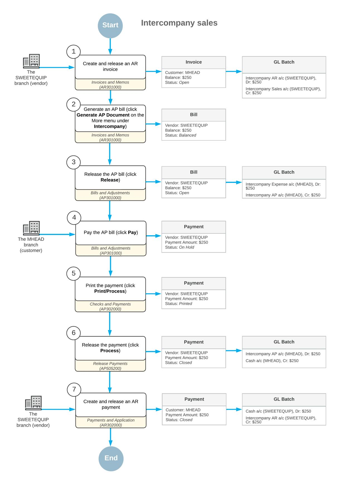

*Figure: Intercompany sales process*

### **Intercompany Sales: Implementation Checklist**

The following sections provide details you can use to ensure that the system is configured properly for performing intercompany sales, and to understand (and change, if needed) the settings that affect the processing workflow.

### **Implementation Checklist**

We recommend that before you initially perform intercompany sales, you make sure the needed features have been enabled, settings have been specified, and entities have been created, as summarized in the following checklist.

| Form                               | Criteria to Check                                                                                                                                                                                                                                                                                                                                                                                                           |
|------------------------------------|-----------------------------------------------------------------------------------------------------------------------------------------------------------------------------------------------------------------------------------------------------------------------------------------------------------------------------------------------------------------------------------------------------------------------------|
| Enable/Disable Features (CS100000) | Make sure that the following features have been enabled:                                                                                                                                                                                                                                                                                                                                                                    |
|                                    | • Standard Financials                                                                                                                                                                                                                                                                                                                                                                                                    |
|                                    | • Multibranch Support                                                                                                                                                                                                                                                                                                                                                                                                    |
|                                    | • Multicompany Support                                                                                                                                                                                                                                                                                                                                                                                                   |
|                                    | • Advanced Financials                                                                                                                                                                                                                                                                                                                                                                                                    |
|                                    | • Inter-Branch Transactions                                                                                                                                                                                                                                                                                                                                                                                              |
| Companies (CS101500)               | If you are going to extend as a customer or vendor any company that has the Without Branches company type, make sure that the company has been configured. For details, see Company Without Branches: To Config ure a Company Without Branches.                                                                                                                                                                    |
| Branches (CS102000)                | If you are going to extend as a customer or vendor any branches of com panies with the With Branches Not Requiring Balancing or With Branches Requiring Balancing company type, make sure that the companies have been configured. For details, see Company with Branches that Do Not Re quire Balancing: Implementation Activity and Company with Branches that Require Balancing: Implementation Activity. |
| Customer Classes (AR201000)        | Make sure that the customer class to be used for a customer extended from a company or branch has been defined. For details, see Accounts Receivable: To Create a Customer Class.                                                                                                                                                                                                                                     |
| Vendor Classes (AP201000)          | Make sure that the vendor class to be used for a vendor extended from a company or branch has been defined. For details, see Accounts Payable: To Create a Vendor Class.                                                                                                                                                                                                                                              |

#### **Other Settings That Affect the Workflow**

You can affect the workflow of intercompany sales by specifying additional settings as follows:

- To cause AR documents to be posted automatically, select the **Automatically Post on Release** check box on the **GeneralSettings** tab (**PostingSettings** section) of the *[Accounts Receivable Preferences](https://help-2025r1.acumatica.com/Help?ScreenId=ShowWiki&pageid=f7b52067-5299-45e8-b601-485cd709f58b)* (AR101000) form.
- To cause the ID of the default customer class to be inserted automatically when a company or branch has been extended to be a customer, select a customer class ID in the **Default Customer Class ID** box on the **GeneralSettings** tab (**Data EntrySettings** section) of the *[Accounts Receivable Preferences](https://help-2025r1.acumatica.com/Help?ScreenId=ShowWiki&pageid=f7b52067-5299-45e8-b601-485cd709f58b)* form. If this box is empty, you will have to specify a customer class for the new customer on the *[Customers](https://help-2025r1.acumatica.com/Help?ScreenId=ShowWiki&pageid=652929bc-9606-4056-aa6e-0c2d1147171b)* (AR303000) form.

- To cause the system to insert a sales account from the customer location to an AR invoice, in the **Use IntercompanySales Account From** box, select *Customer Location*. If *Inventory Item* is selected in this box, the system will insert the sales account specified in the**Sales Account** box on the **GL Accounts** tab of the *[Non-Stock Items](https://help-2025r1.acumatica.com/Help?ScreenId=ShowWiki&pageid=bf68dd4f-63d4-460d-8dc0-9152f2bd6bf1)* (IN202000) form for non-stock items.
- To cause new documents to be assigned the *On Hold* status when they are created, select the **Hold Documents on Entry** check box on the **GeneralSettings** tab (**Data EntrySettings** section) of the *[Accounts](https://help-2025r1.acumatica.com/Help?ScreenId=ShowWiki&pageid=f7b52067-5299-45e8-b601-485cd709f58b) [Receivable Preferences](https://help-2025r1.acumatica.com/Help?ScreenId=ShowWiki&pageid=f7b52067-5299-45e8-b601-485cd709f58b)* form. If the **Hold Documents on Entry** check box is cleared, the documents are assigned the *Balanced* status.
- To cause AP documents to be posted automatically, select the **Automatically Post on Release** check box on the **GeneralSettings** tab (**PostingSettings** section) of the *[Accounts Payable Preferences](https://help-2025r1.acumatica.com/Help?ScreenId=ShowWiki&pageid=c3f9353e-95e6-448d-bb3f-e20643879ec7)* (AP101000) form.
- To cause the ID of the default vendor class to be inserted automatically when a company or branch has been extended to be a vendor, select a vendor class ID in the **DefaultVendor Class ID** box on the **General Settings** tab (**Data EntrySettings** section) of the *[Accounts Payable Preferences](https://help-2025r1.acumatica.com/Help?ScreenId=ShowWiki&pageid=c3f9353e-95e6-448d-bb3f-e20643879ec7)* form. If this box is empty, you will have to specify a vendor class for the new vendor on the *[Vendors](https://help-2025r1.acumatica.com/Help?ScreenId=ShowWiki&pageid=a9584be3-f2bd-4d67-80d4-8041d809df56)* (AP303000) form.
- To cause the system to insert an expense account from the vendor location to an AP bill created from an AR invoice, in the **Use Intercompany Expense Account From** box, select *Vendor Location*. If *Inventory Item* is selected in this box, the system will insert the expense account specified in the **Expense Account** box on the **GL Accounts** tab of the *[Non-Stock Items](https://help-2025r1.acumatica.com/Help?ScreenId=ShowWiki&pageid=bf68dd4f-63d4-460d-8dc0-9152f2bd6bf1)* (IN202000) form for non-stock items.
- To cause new documents to be assigned the *On Hold* status when they are created, select the **Hold Documents on Entry** check box on the **GeneralSettings** tab (**Data EntrySettings** section) of the *[Accounts](https://help-2025r1.acumatica.com/Help?ScreenId=ShowWiki&pageid=c3f9353e-95e6-448d-bb3f-e20643879ec7) [Payable Preferences](https://help-2025r1.acumatica.com/Help?ScreenId=ShowWiki&pageid=c3f9353e-95e6-448d-bb3f-e20643879ec7)* form. If the **Hold Documents on Entry** check box is cleared, the documents are assigned the *Balanced* status.

#### **Validation of Configuration**

To make sure that all configuration has been performed correctly, we recommend that in your system, you process intercompany sales by performing instructions similar to those described in *[Intercompany](#page-263-1) Sales: To Process [an Intercompany Invoice](#page-263-1)*, *[Intercompany](#page-266-1) Sales: To Pay an Intercompany Bill*, and *[Intercompany](#page-268-1) Sales: To Pay an [Intercompany Invoice](#page-268-1)*.

### **Intercompany Sales: Generated Transactions**

As you perform intercompany sales, you create and process an AR invoice. To update the account balances, the system generates and posts the GL transactions described in the following sections.

### **Transaction Generated for an AR Invoice**

When you create and release an AR invoice, the system generates the following general ledger transaction:

| Branch                         | Account                                          | Debit  | Credit |
|--------------------------------|--------------------------------------------------|--------|--------|
| SWEETEQUIP (Selling branch) | 19010 - Accounts Receivable - Related Company | Amount | 00.00  |
| SWEETEQUIP (Selling branch) | 43000 - Related Company Sales                    | 00.00  | Amount |

You can view the reference number of the GL batch on the **Financial** tab of the *[Invoices and Memos](https://help-2025r1.acumatica.com/Help?ScreenId=ShowWiki&pageid=5e6f3b27-b7af-412f-a40a-1d4f4be70cba)* (AR301000) form.

#### **Transaction Generated for an AP Bill**

When the system creates an AP bill based on the AR invoice you created, the system generates the following general ledger transaction aer release of this bill:

| Branch                    | Account                                       | Debit  | Credit |
|---------------------------|-----------------------------------------------|--------|--------|
| MHEAD (Purchasing branch) | 26010 - Accounts Payable - Related Company | 00.00  | Amount |
| MHEAD (Purchasing branch) | 53100 - Intercompany Expenses                 | Amount | 00.00  |

You can view the reference number of the GL batch on the **Financial** tab of the *[Bills and Adjustments](https://help-2025r1.acumatica.com/Help?ScreenId=ShowWiki&pageid=956b4e51-3078-4d2d-85b3-65c080d95234)* (AP301000) form.

### **Transaction Generated for an AP Payment**

When you create and release an AP payment to pay the automatically generated AP bill, the system generates the following general ledger transaction:

| Branch                    | Account                                        | Debit  | Credit |
|---------------------------|------------------------------------------------|--------|--------|
| MHEAD (Purchasing branch) | 10200 - Company Checking Account               | 00.00  | Amount |
| MHEAD (Purchasing branch) | 26010 - Accounts Payable - Related Com pany | Amount | 00.00  |

You can view the reference number of the GL batch on the **Financial** tab of the *[Checks and Payments](https://help-2025r1.acumatica.com/Help?ScreenId=ShowWiki&pageid=81659f97-cb14-4a27-bc3e-0f67b3945613)* (AP302000) form.

#### **Transaction Generated for an AR Payment**

When you create and release an AR payment for an intercompany AR invoice, the system generates the following general ledger transaction:

| Branch                      | Account                                          | Debit  | Credit |
|-----------------------------|--------------------------------------------------|--------|--------|
| SWEETEQUIP (Selling branch) | 10200 - Company Checking Account                 | Amount | 00.00  |
| SWEETEQUIP (Selling branch) | 19010 - Accounts Receivable - Related Company | 00.00  | Amount |

You can view the reference number of the GL batch on the **Financial** tab of the *[Payments and Applications](https://help-2025r1.acumatica.com/Help?ScreenId=ShowWiki&pageid=ae844bf4-1aef-42cd-9e2f-49b3ee1bc8d7)* (AR302000) form.

### **Intercompany Sales: To Process an Intercompany Invoice**

The following activity will walk you through the processing of intercompany invoice between branches of two companies within the same tenant.

#### **Story**

Suppose that the Head Office of the Muffins & Cakes company has to purchase juicer installation services from the Service and Equipment Sales Center of SweetLife Fruits & Jams. The system administrator has set up the intercompany sales functionality to generate AP bills based on AR invoices.

Acting as an accountant of SweetLife, you need to create an AR invoice with the *MHEAD* branch as a customer, and automatically generate an AP bill based on this invoice.

#### **Configuration Overview**

In the *U100* dataset, the following tasks have been performed to support this activity:

- On the *[Enable/Disable Features](https://help-2025r1.acumatica.com/Help?ScreenId=ShowWiki&pageid=c1555e43-1bc5-4f6f-ba9d-b323f94d8a6b)* (CS100000) form, the following features have been enabled:
  - *Standard Financials*
  - *Multibranch Support*
  - *Multicompany Support*
  - *Advanced Financials*
  - *Inter-Branch Transactions*
- On the *[Companies](https://help-2025r1.acumatica.com/Help?ScreenId=ShowWiki&pageid=fedad435-8496-4397-b8a3-50a473629f76)* (CS101500) form, the *MUFFINS* and *SWEETLIFE* companies have been defined.
- On the *[Branches](https://help-2025r1.acumatica.com/Help?ScreenId=ShowWiki&pageid=b97ab72d-4ab4-4f02-b69c-f7f61b316ced)* (CS102000) form, the *SWEETEQUIP* and *MHEAD* branches have been defined.
- On the *[Non-Stock Items](https://help-2025r1.acumatica.com/Help?ScreenId=ShowWiki&pageid=bf68dd4f-63d4-460d-8dc0-9152f2bd6bf1)* (IN202000) form, the *INSTALL* non-stock item has been configured.

#### **Process Overview**

In this activity, on the *[Invoices and Memos](https://help-2025r1.acumatica.com/Help?ScreenId=ShowWiki&pageid=5e6f3b27-b7af-412f-a40a-1d4f4be70cba)* (AR301000) form, you will create an AR invoice, specifying *MHEAD* as the customer, and release the invoice. You will then cause the system to automatically create an AP bill based on the AR invoice by clicking **Generate AP Document** on the More menu. On the *[Bills and Adjustments](https://help-2025r1.acumatica.com/Help?ScreenId=ShowWiki&pageid=956b4e51-3078-4d2d-85b3-65c080d95234)* (AP301000) form, you will review the settings of the created bill and release it.

#### **System Preparation**

Before you begin performing the steps of this activity, do the following:

- 1. Launch the Acumatica ERP website with the *U100* dataset preloaded, and sign in as an accountant Nenad Pasic by using the *pasic* username and the *123* password.
- 2. In the info area, in the upper-right corner of the top pane of the Acumatica ERP screen, make sure that the business date in your system is set to *1/30/2025*. If a different date is displayed, click the Business Date menu button and select *1/30/2025* on the calendar. For simplicity, in this activity, you will create and process all documents in the system on this business date.
- 3. On the Company and Branch Selection menu on the top pane of the Acumatica ERP screen, select the *SWEETEQUIP - Service and Equipment Sales Center* branch.
- 4. Make sure the *SWEETEQUIP* branch has been extended as a vendor and the *MHEAD* branch has been extended as a customer, as described in *[Intercompany Sales Setup: Implementation Activity](https://help-2025r1.acumatica.com/Help?ScreenId=ShowWiki&pageid=4f8bfd07-a771-4b94-8b51-92fa2d1da3b0)*.

#### **Step 1: Processing an AR Invoice from the Selling Branch to the Purchasing Branch**

To process an AR invoice from *SWEETEQIP* to *MHEAD*, do the following:

1. Open the *[Invoices and Memos](https://help-2025r1.acumatica.com/Help?ScreenId=ShowWiki&pageid=5e6f3b27-b7af-412f-a40a-1d4f4be70cba)* (AR301000) form.

To open the form for creating a new record, type the form ID in the Search box, and on the Search form, point at the form title and click **New** right of the title.

- 2. On the form toolbar, click **Add New Record**, and in the Summary area, specify the following settings:
  - **Type**: *Invoice*
  - **Date**: *1/30/2025* (inserted by default)
  - **Customer**: *MHEAD*

This is the *MHEAD* branch of Muffins & Cakes that has been extended as a customer and to which *SWEETEQUIP*—the current branch, which has been extended as a vendor—provides services.

- **Location**: *MAIN* (inserted by default)
- **Description**: Installation services
- 3. On the **Details** tab, click **Add Row** on the table toolbar, and specify the following settings for the added row:
  - **Branch**: *SWEETEQUIP* (inserted by default)
  - **Inventory ID**: *INSTALL*
  - **Quantity**: 2.5
  - **Ext. Price**: *250* (inserted automatically)
  - **Account**: *43000 - Related Company Sales* (inserted automatically)

Because on the *[Accounts Receivable Preferences](https://help-2025r1.acumatica.com/Help?ScreenId=ShowWiki&pageid=f7b52067-5299-45e8-b601-485cd709f58b)* (AR101000) form, the **Use IntercompanySales Account From** box is set to *Customer Location*, the system has inserted the sales account specified on the **GL Accounts** tab of the *[Customer Locations](https://help-2025r1.acumatica.com/Help?ScreenId=ShowWiki&pageid=61a8c6de-6a51-434b-8c2d-4304ec982ae0)* (AR303020) form for the *MAIN* location of the selected customer.

- 4. On the form toolbar, click**Save**.
- 5. On the form toolbar, click **Remove Hold** to give the invoice the *Balanced* status.
- 6. On the form toolbar, click **Release** to release the AR invoice.

#### **Step 2: Automatically Creating an AP Bill Based on the AR Invoice**

To create an AP bill based on the AR invoice from *SWEETEQIP* to *MHEAD*, do the following:

1. While you are still on the *[Invoices and Memos](https://help-2025r1.acumatica.com/Help?ScreenId=ShowWiki&pageid=5e6f3b27-b7af-412f-a40a-1d4f4be70cba)* (AR301000) form with the invoice open, on the More menu (under **Intercompany**), click **Generate AP Document**. The system opens the *[Bills and Adjustments](https://help-2025r1.acumatica.com/Help?ScreenId=ShowWiki&pageid=956b4e51-3078-4d2d-85b3-65c080d95234)* (AP301000) form with an automatically created AP bill.

Notice that in the**Vendor** box of the Summary area, *SWEETEQUIP* is specified as the vendor.

2. On the **Details** tab, review the account specified in the **Account** column.

Because on the *[Accounts Payable Preferences](https://help-2025r1.acumatica.com/Help?ScreenId=ShowWiki&pageid=c3f9353e-95e6-448d-bb3f-e20643879ec7)* (AP101000) form, the **Use Intercompany Expense Account From** box is set to *Vendor Location*, the system has inserted the expense account specified on the **GL Accounts** tab of the *Vendor [Locations](https://help-2025r1.acumatica.com/Help?ScreenId=ShowWiki&pageid=aeeccc5c-465f-4bca-9cd7-a3c792da38e1)* (AP303010) form for the *MAIN* location of the selected vendor.

- 3. Open the **Financial** tab. In the **Related AR Document** box (**Intercompany Invoicing** section), notice that the system has inserted an invoice number. This is the document you created in Step 1, based on which the AP bill has been created.
- 4. On the form toolbar, click **Remove Hold**.
- 5. On the form toolbar, click **Release** to release the AP bill.
- 6. On the **Financial** tab, click the Edit button to the right of the **Related AR Document** box (**Intercompany Invoicing** section), and review the invoice that opens on the *[Invoices and Memos](https://help-2025r1.acumatica.com/Help?ScreenId=ShowWiki&pageid=5e6f3b27-b7af-412f-a40a-1d4f4be70cba)* form.
- 7. On the **Financial** tab, review the link to the AP bill that the system has inserted in the **Related AP Document** box (**Intercompany Invoicing** section), as shown in the following screenshot.

| <b>Invoices and Memos</b> 뭐 圕 ↶                                                                       | $\mathrm{+}$ 侕                                                                                                   | Invoice 000121 - Muffins Head Office & Wholesale Center K n ≺ $\checkmark$                                                                    | Ы ≻                                                                                                           | <b>PAY</b> $\cdots$                                                                                                                                                                                                                                                       |   | <b>P NOTES</b>                                                                                                                 | <b>ACTIVITIES</b>                                           | <b>FILES</b>                                                       | TOOLS $\star$       |
|----------------------------------------------------------------------------------------------------------------|---------------------------------------------------------------------------------------------------------------------|-----------------------------------------------------------------------------------------------------------------------------------------------------------|------------------------------------------------------------------------------------------------------------------|------------------------------------------------------------------------------------------------------------------------------------------------------------------------------------------------------------------------------------------------------------------------------|---|--------------------------------------------------------------------------------------------------------------------------------|-------------------------------------------------------------|--------------------------------------------------------------------|---------------------|
| Type: Reference Nbr.: Status: Date: Post Period: Customer Ord Description: <b>DETAILS</b> | Invoice $\checkmark$ Q 000121 Open 1/30/2025 01-2025 Installation services <b>FINANCIAL</b> | Customer: Location: Terms: * Due Date: * Cash Discount Project: ADDRESSES <b>TAXES</b>                                               | <b>MAIN - Primary Location</b> 30D - 30 Days 3/1/2025 3/1/2025 X - Non-Project Code. APPLICATIONS | MHEAD - Muffins Head Office & Wholesa 2 户 Pay by Line Ä COMPLIANCE                                                                                                                                                                                               | D | Detail Total: Line Discounts: Document Dis Retained Amo <b>Tax Total:</b> Amount: Balance: Cash Discount: |                                                             | 250.00 0.00 0.00 0.00 0.00 250.00 250.00 0.00 | $\hat{\phantom{a}}$ |
| LINK TO GL - Batch Nbr.: Branch: <b>AR Account:</b> Original Document: Workgroup ID: Owner:  |                                                                                                                     | AR000194 SWEETEQUIP - Service and Eqi 19010 - Accounts Receivable - R ASSIGNED TO ___________________________________ PRINT AND EMAIL OPTIONS |                                                                                                                  | <b>DEFAULT PAYMENT INFO</b> Payment Method: Card/Account Nbr.: Cash Account: TAX INFO ____________________________________ <b>Customer Tax Zone:</b> <b>INTERCOMPANY INVOICING.</b> <b>Related AP Document:</b> Exclude from Intercompany Processing |   | <b>Bill 000170</b>                                                                                                             | <b>CHECK - Check Payment</b> 10200EQ - Equipment Check Q | Q                                                                  | D                   |
| Printed Emailed                                                                                             |                                                                                                                     | Don't Print Don't Email                                                                                                                                |                                                                                                                  |                                                                                                                                                                                                                                                                              |   |                                                                                                                                |                                                             |                                                                    |                     |

*Figure: Link to the AP bill automatically created based on the AR invoice*

### **Intercompany Sales: To Pay an Intercompany Bill**

The following activity will walk you through the payment of an intercompany bill between branches of two companies within the same tenant.

#### **Story**

Suppose that the Head Office of the Muffins & Cakes company (*MHEAD*) that purchased juicer installation services from the *SWEETEQIUP* branch of SweetLife Fruits & Jams decided to pay for the services on February 15, 2025.

Acting as an accountant of Muffins & Cakes, you have to pay the previously created bill in the amount of \$250.

#### **Configuration Overview**

In the *U100* dataset, the following tasks have been performed to support this activity:

- On the *[Enable/Disable Features](https://help-2025r1.acumatica.com/Help?ScreenId=ShowWiki&pageid=c1555e43-1bc5-4f6f-ba9d-b323f94d8a6b)* (CS100000) form, the following features have been enabled:
  - *Standard Financials*
  - *Multibranch Support*
  - *Multicompany Support*
  - *Advanced Financials*
  - *Inter-Branch Transactions*

- On the *[Companies](https://help-2025r1.acumatica.com/Help?ScreenId=ShowWiki&pageid=fedad435-8496-4397-b8a3-50a473629f76)* (CS101500) form, the *MUFFINS* and *SWEETLIFE* companies have been defined.
- On the *[Branches](https://help-2025r1.acumatica.com/Help?ScreenId=ShowWiki&pageid=b97ab72d-4ab4-4f02-b69c-f7f61b316ced)* (CS102000) form, the *SWEETEQUIP* and *MHEAD* branches have been defined.

#### **Process Overview**

In this activity, on the *[Bills and Adjustments](https://help-2025r1.acumatica.com/Help?ScreenId=ShowWiki&pageid=956b4e51-3078-4d2d-85b3-65c080d95234)* (AP301000) form, you will open the bill you are going to pay and click **Pay** on the form toolbar. On the *[Checks and Payments](https://help-2025r1.acumatica.com/Help?ScreenId=ShowWiki&pageid=81659f97-cb14-4a27-bc3e-0f67b3945613)* (AP302000) form, you will review the created payment and click **Print/Process**. You will then print the payment on the *[Process Payments / Print Checks](https://help-2025r1.acumatica.com/Help?ScreenId=ShowWiki&pageid=e632860a-8905-424a-8e27-ad66cf9f64c7)* (AP505000) form and release it on the *[Release Payments](https://help-2025r1.acumatica.com/Help?ScreenId=ShowWiki&pageid=0a981976-131b-4150-81d0-19b54a46e510)* (AP505200) form. Finally, you will review the generated GL transaction on the *Journal [Transactions](https://help-2025r1.acumatica.com/Help?ScreenId=ShowWiki&pageid=dda046bc-5946-407f-88f7-1c0c966fbe72)* (GL301000) form.

#### **System Preparation**

Before you begin performing the steps of this activity, do the following:

- 1. Launch the Acumatica ERP website with the *U100* dataset preloaded, and sign in as an accountant Nenad Pasic by using the *pasic* username and the *123* password.
- 2. In the info area, in the upper-right corner of the top pane of the Acumatica ERP screen, make sure that the business date in your system is set to *2/15/2025*. If a different date is displayed, click the Business Date menu button, and select *2/15/2025* on the calendar. For simplicity, in this activity, you will create and process all documents in the system on this business date.
- 3. On the Company and Branch Selection menu on the top pane of the Acumatica ERP screen, select the *Muffins Head Office & Wholesale Center* branch.
- 4. Make sure the *SWEETEQUIP* branch has been extended as a vendor and the *MHEAD* branch has been extended as a customer, as described in *[Intercompany Sales Setup: Implementation Activity](https://help-2025r1.acumatica.com/Help?ScreenId=ShowWiki&pageid=4f8bfd07-a771-4b94-8b51-92fa2d1da3b0)*.
- 5. Make sure the intercompany invoice and an AP bill based on it have been processed, as described in *Intercompany Sales: To Process an [Intercompany](#page-263-1) Invoice*.

#### **Step: Paying an AP Bill Between Branches of Different Companies**

To pay the AP bill that was automatically generated from an AR invoice that recorded an intercompany sales of services, do the following:

- 1. Open the *[Bills and Adjustments](https://help-2025r1.acumatica.com/Help?ScreenId=ShowWiki&pageid=956b4e51-3078-4d2d-85b3-65c080d95234)* (AP301000) form.
- 2. In the **Reference Nbr.** box, select a bill for the *SWEETEQUIP* vendor and the amount of \$250.
- 3. On the form toolbar, click **Pay**. The system opens the *[Checks and Payments](https://help-2025r1.acumatica.com/Help?ScreenId=ShowWiki&pageid=81659f97-cb14-4a27-bc3e-0f67b3945613)* (AP302000) form.
- 4. In the Summary area, review the settings of the created payment. Make sure that the *10200MF Muffins Checking* account is selected in the **Cash Account** box.
- 5. On the **Documents to Apply** tab, make sure that the system has added the AP bill in the amount of \$250, which you are going to pay.
- 6. On the form toolbar, click **Remove Hold** to give the payment the *Pending Print* status.
- 7. On the form toolbar, click **Print/Process**.

The system opens the *[Process Payments / Print Checks](https://help-2025r1.acumatica.com/Help?ScreenId=ShowWiki&pageid=e632860a-8905-424a-8e27-ad66cf9f64c7)* (AP505000) form.

- 8. Review the details of the payment selected in the row with the unlabeled check box selected for it.
- 9. On the form toolbar, click **Process**.

A separate browser tab is opened showing the printable version of the payment.

10.Review the printable version of the payment and close the browser tab. (For the purposes of this activity, you do not need to actually print the check.)

- 11.On the *[Release Payments](https://help-2025r1.acumatica.com/Help?ScreenId=ShowWiki&pageid=0a981976-131b-4150-81d0-19b54a46e510)* (AP505200) form, which the system has opened, review the details of the payment you are going to release.
- 12.On the form toolbar, click **Process**.
- 13.Open the Checks and Payments (AP3020PL) list of records.
- 14.Open the payment you have just released. (It should be the top record in the table and have the *Closed* status.)
- 15.On the **Financial** tab, click the link in the **Batch Nbr.** column to review the batch generated by the system.
- 16.On the *Journal [Transactions](https://help-2025r1.acumatica.com/Help?ScreenId=ShowWiki&pageid=dda046bc-5946-407f-88f7-1c0c966fbe72)* (GL301000) form that the system opens, review the batch details.

When the payment was released, the GL account associated with the cash account of the *MHEAD* branch (*10200 - Company Checking Account*) was credited in the amount of the payment. The *26010 - Accounts Payable - Related Company* account specified in the bill was debited in the total amount of the bill.

### **Intercompany Sales: To Pay an Intercompany Invoice**

The following activity will walk you through the process of creating a payment for an intercompany invoice.

#### **Story**

Suppose that on February 15, 2025, the Head Office of the Muffins & Cakes (*MHEAD*) branch paid for the juicer installation services that it purchased from the Service and Equipment Sales Center (*SWEETEQUIP*) branch, and on February 18, 2025, the *SWEETEQUIP* branch received this payment.

Acting as an accountant of the *SWEETEQUIP* branch, you need to create an AR payment in the system to record this payment to the branch's cash account.

#### **Configuration Overview**

In the *U100* dataset, the following tasks have been performed to support this activity:

- On the *[Enable/Disable Features](https://help-2025r1.acumatica.com/Help?ScreenId=ShowWiki&pageid=c1555e43-1bc5-4f6f-ba9d-b323f94d8a6b)* (CS100000) form, the following features have been enabled:
  - *Standard Financials*
  - *Multibranch Support*
  - *Multicompany Support*
  - *Advanced Financials*
  - *Inter-Branch Transactions*
- On the *[Companies](https://help-2025r1.acumatica.com/Help?ScreenId=ShowWiki&pageid=fedad435-8496-4397-b8a3-50a473629f76)* (CS101500) form, the *MUFFINS* and *SWEETLIFE* companies have been defined.
- On the *[Branches](https://help-2025r1.acumatica.com/Help?ScreenId=ShowWiki&pageid=b97ab72d-4ab4-4f02-b69c-f7f61b316ced)* (CS102000) form, the *SWEETEQUIP* and *MHEAD* branches have been defined.

#### **Process Overview**

In this activity, you will open an intercompany invoice on the *[Invoices and Memos](https://help-2025r1.acumatica.com/Help?ScreenId=ShowWiki&pageid=5e6f3b27-b7af-412f-a40a-1d4f4be70cba)* (AR301000) form and create a payment for this invoice. Aer releasing the payment, you will review the generated GL transaction on the *[Journal](https://help-2025r1.acumatica.com/Help?ScreenId=ShowWiki&pageid=dda046bc-5946-407f-88f7-1c0c966fbe72) [Transactions](https://help-2025r1.acumatica.com/Help?ScreenId=ShowWiki&pageid=dda046bc-5946-407f-88f7-1c0c966fbe72)* (GL301000) form.

#### **System Preparation**

Before you begin performing the steps of this activity, do the following:

- 1. Launch the Acumatica ERP website with the *U100* dataset preloaded, and sign in as an accountant Nenad Pasic by using the *pasic* username and the *123* password.
- 2. In the info area, in the upper-right corner of the top pane of the Acumatica ERP screen, make sure that the business date in your system is set to *2/18/2025*. If a different date is displayed, click the Business Date menu button, and select *2/18/2025* on the calendar. For simplicity, in this activity, you will create and process all documents in the system on this business date.
- 3. On the Company and Branch Selection menu on the top pane of the Acumatica ERP screen, select the *Service and Equipment Sales Center* branch.
- 4. Make sure the *SWEETEQUIP* branch has been extended as a vendor and the *MHEAD* branch has been extended as a customer, as described in *[Intercompany Sales Setup: Implementation Activity](https://help-2025r1.acumatica.com/Help?ScreenId=ShowWiki&pageid=4f8bfd07-a771-4b94-8b51-92fa2d1da3b0)*.
- 5. Make sure an intercompany AR invoice has been processed, as described in *[Intercompany](#page-263-1) Sales: To Process [an Intercompany Invoice](#page-263-1)*.
- 6. Make sure the intercompany AP bill has been paid, as described in *[Intercompany](#page-266-1) Sales: To Pay an [Intercompany Bill](#page-266-1)*.

#### **Step: Paying an AR Invoice Between Branches of Different Companies**

To create an AR payment for an intercompany AR invoice, do the following:

- 1. Open the *[Invoices and Memos](https://help-2025r1.acumatica.com/Help?ScreenId=ShowWiki&pageid=5e6f3b27-b7af-412f-a40a-1d4f4be70cba)* (AR301000) form.
- 2. In the **Reference Nbr.** box, select an invoice with the amount of \$250 and the *MHEAD* customer (this is the invoice you created in *[Intercompany](#page-263-1) Sales: To Process an Intercompany Invoice*).
- 3. On the form toolbar, click **Pay**.
- 4. On the *[Payments and Applications](https://help-2025r1.acumatica.com/Help?ScreenId=ShowWiki&pageid=ae844bf4-1aef-42cd-9e2f-49b3ee1bc8d7)* (AR302000) form, which opens, make sure that the following settings are specified in the Summary area:
  - **Application Date**: *2/18/2025*
  - **Customer**: *MHEAD*
  - **Payment Method**: *CHECK* (inserted automatically)
  - **Cash Account**: *10200EQ Equipment Checking* (inserted automatically)
- 5. On the **Documents to Apply** tab, make sure that the system has inserted the invoice in the amount of \$250.
- 6. On the form toolbar, click **Remove Hold** to give the payment the *Balanced* status.
- 7. On the form toolbar, click **Release** to release the payment.
- 8. On the **Financial** tab, click the link in the **Batch Nbr.** box to review the generated GL transaction on the *Journal [Transactions](https://help-2025r1.acumatica.com/Help?ScreenId=ShowWiki&pageid=dda046bc-5946-407f-88f7-1c0c966fbe72)* (GL301000) form.

When the payment was released, the GL account associated with the cash account of the *SWEETEQUIP* branch (*10200 - Company Checking Account*) was debited in the amount of the payment. The *19010 - Accounts Receivable - Related Company* account specified in the invoice was credited in the total amount of the invoice.

### **Intercompany Sales: Mass Processing**

This topic explains how to automatically generate AP bills from multiple AR invoices.

#### **Mass Processing of AR Invoices**

You use the *[Generate Intercompany Documents](https://help-2025r1.acumatica.com/Help?ScreenId=ShowWiki&pageid=50e6ea07-42a0-4c44-884c-2e5f0b74474b)* (AP503500) form for the mass generation of AP documents based on AR documents from the selling company.

In the boxes of the Selection area of the form, you specify the selection criteria for the documents to be loaded in the table. You can also manage the process of generating AP documents by using the following check boxes:

- **Create AP Documents on Hold**: If this check box is selected, AP documents will be created with the *On Hold* status. If it is cleared, AP documents will be created with the *Balanced* or *Pending Approval* status, depending on whether approvals have been configured for accounts payable documents.
- **Create AP Documents in Specific Period**: If this check box is selected, AP documents will be created in the financial period that you specify in the **Fin. Period** box.
- **Copy Project Information to AP Document**: If this check box is selected, the project information (project code, cost code, and task ID) will be copied from the AR document to the AP document.

By default, full access rights to this form have been granted to the *AP Admin*, *AP Clerk*, and *Administrator* roles.

## **Processing Credit Card Payments**

With Acumatica ERP, your company can collect information about customer credit cards and update the information as needed. This information can be used to collect payments for the invoices of customers that prefer to pay by credit card. You can perform mass-processing of automatic payments, and you can manually initiate card payments for any payment document.

By using Acumatica ERP, you can also easily identify and handle failed transactions, voided transactions, and refunds.

Acumatica ERP no longer supports integration with the Authorize.Net processing center. On accounts receivable forms, the **Capture**, **Void**, **Refund**, and **Validate Card Payment** commands are available for existing payments with preliminarily authorized transactions. (The **Record Card Payment**, **Record and Capture Preauthorization**, and **ImportSettlement Batches** commands are also available.)

### **Card Payments**

Before processing payments, you configure processing centers in Acumatica ERP, as described in *[Configuring](https://help-2025r1.acumatica.com/Help?ScreenId=ShowWiki&pageid=d18515ef-37f2-4a33-b5cd-3fbe4c7b4545) [Payment Processing](https://help-2025r1.acumatica.com/Help?ScreenId=ShowWiki&pageid=d18515ef-37f2-4a33-b5cd-3fbe4c7b4545)*. This topic describes how the processing of card payments typically unfolds.

#### **Processing Payments**

Payments can be collected automatically from customers with default payment methods based on credit cards. For details on configuring automatic payment processing, see *[Automatic Payment Collection](#page-276-1)*.

For invoices that have credit card customer payment methods selected for the payments, you use the following forms to process payments:

- *[Generate Payments](https://help-2025r1.acumatica.com/Help?ScreenId=ShowWiki&pageid=4bd38406-3d9c-4e77-85a7-6b89295f43e2)* (AR511000) form: To generate payment documents for the invoices you select. You can select customer invoices that have due dates approaching or that are overdue and generate payment documents for selected invoices.
- *[Capture Payments](https://help-2025r1.acumatica.com/Help?ScreenId=ShowWiki&pageid=e7313247-41f1-4393-9d88-8fbe408b23ff)* (AR511500) form: To perform the mass-processing of customer payments by using the customers' default cards and a specific processing center.

For each customer with at least one valid credit card, any document may be paid by using the card, with the payment process initiated on a per-document basis. To process a payment for a particular document, use either of the following forms:

- *[Payments and Applications](https://help-2025r1.acumatica.com/Help?ScreenId=ShowWiki&pageid=ae844bf4-1aef-42cd-9e2f-49b3ee1bc8d7)* (AR302000): On this form, you create a payment by using a customer card as a payment method. You then click **Capture** on the form toolbar to initiate the payment process through the appropriate processing center. When the system receives a response about the capture transaction being successful, the system releases the payment.
- *[Cash Sales](https://help-2025r1.acumatica.com/Help?ScreenId=ShowWiki&pageid=f8e8a35f-4de7-40c0-8030-ebf9f7910119)* (AR304000): On this form, you create an invoice with a credit card payment method to record cash sales of goods that are paid immediately by credit card. You then click **Capture** on the form toolbar to initiate the payment process through an appropriate processing center. When the system receives a response about the capture transaction being successful, the system releases the cash sale invoice.

#### **Processing Payments from New Credit Cards**

In Acumatica ERP, you can enter information about a new credit card while processing a payment on the *[Payments](https://help-2025r1.acumatica.com/Help?ScreenId=ShowWiki&pageid=ae844bf4-1aef-42cd-9e2f-49b3ee1bc8d7) [and Applications](https://help-2025r1.acumatica.com/Help?ScreenId=ShowWiki&pageid=ae844bf4-1aef-42cd-9e2f-49b3ee1bc8d7)* (AR302000) form. For details on configuring a processing center for Acumatica Payments, see *[To](https://help-2025r1.acumatica.com/Help?ScreenId=ShowWiki&pageid=7f8613be-52c8-444a-9048-dcaece4aaad3) [Configure Acumatica Payments](https://help-2025r1.acumatica.com/Help?ScreenId=ShowWiki&pageid=7f8613be-52c8-444a-9048-dcaece4aaad3)*.

When you need to accept a payment from a customer's credit card that is not stored in Acumatica ERP, the processing of the payment occurs as follows:

- 1. You create a payment or prepayment on the *[Payments and Applications](https://help-2025r1.acumatica.com/Help?ScreenId=ShowWiki&pageid=ae844bf4-1aef-42cd-9e2f-49b3ee1bc8d7)* form and initiate the processing of a credit card payment by clicking **Capture** or **Authorize** on the More menu (under **Card Processing**).
- 2. Acumatica ERP displays the hosted form filled in with the payment amount and customer address.
- 3. You enter the new credit card data and initiate the payment.
- 4. Acumatica ERP sends the payment data to the processing center.
- 5. Acumatica ERP receives a response from the processing center; it then saves the transaction data, customer profile ID, and customer payment profile ID for further reference.

For details on entering a payment from a new credit card, see *To Enter a [Payment](#page-283-2) from a New Credit Card*.

#### **Processing Credit Card Transactions Held for Review by the Processing Center**

Some transactions are considered suspicious by the processing center, with the conditions defining which transactions should be held for review defined in the fraud detection terms of the specific processing center. If a user enters a suspicious transaction, Acumatica ERP displays a warning message, assigns the *Held for Review (Authorization)* or *Held for Review (Capture)* status to this payment, and assigns the *Held for Review* status to this transaction, which should then be approved. You can view these statuses in the following elements on the mentioned forms:

- The **Tran.Status** column in the **Card Processing** table on the **Payment Information** tab of the *[Invoices](https://help-2025r1.acumatica.com/Help?ScreenId=ShowWiki&pageid=0acc9738-f141-4ea0-a2be-f34ea9d1b63a)* (SO303000) form
- The **Tran.Status** column on the **Card Processing** tab of the *[Payments and Applications](https://help-2025r1.acumatica.com/Help?ScreenId=ShowWiki&pageid=ae844bf4-1aef-42cd-9e2f-49b3ee1bc8d7)* (AR302000) form
- The **Tran.Status** column on the **Card Processing** tab of the *[Cash Sales](https://help-2025r1.acumatica.com/Help?ScreenId=ShowWiki&pageid=f8e8a35f-4de7-40c0-8030-ebf9f7910119)* (AR304000) form
- The **Proc.Status** column on the *Validate Card [Payments](https://help-2025r1.acumatica.com/Help?ScreenId=ShowWiki&pageid=5998b9d7-04c2-49c1-acf3-b8807d77ff37)* (AR513000) form

Once a credit card transaction has received the *Held for Review* status, you should go to the processing center UI and approve or void the transaction. For details, see *To Process a [Transaction](#page-288-2) Held for Review by the Processing [Center](#page-288-2)*.

Aer the transaction has been processed in Acumatica Payments, on the *[Payments and Applications](https://help-2025r1.acumatica.com/Help?ScreenId=ShowWiki&pageid=ae844bf4-1aef-42cd-9e2f-49b3ee1bc8d7)* form, you click **Validate Card Payment** (under **Card Processing**) on the More menu. As a result, the system performs the following actions:

- 1. Updates the processing status of the transaction in the **ProcessingStatus** box of the Summary area.
- 2. On the **Card Processing** tab, adds an appropriate transaction record.
- 3. Does one of the following, depending on what type the transaction is and whether the transaction has been approved or voided:
  - For approved capture transactions: releases the payment, and for a payment from a new card, creates a customer payment method and assigns it to this payment.
  - For approved authorization transactions: creates a customer payment method for the payment from the new card, and assigns the payment method to this payment.

For details, see *To Process a [Transaction](#page-288-2) Held for Review by the Processing Center*.

You can update the processing status of multiple credit card transactions held for review by the processing center at once on the **Held for Review** tab of the *Validate Card [Payments](https://help-2025r1.acumatica.com/Help?ScreenId=ShowWiki&pageid=5998b9d7-04c2-49c1-acf3-b8807d77ff37)* (AR513000) form. The table on this tab displays the transactions held for review by all processing centers configured in Acumatica ERP. You can display only the transactions processed by a particular processing center by selecting the processing center in the **Proc. Center ID** box in the Selection area of the form. To update the payment processing status for individual credit card transactions, you select the unlabeled check box in the rows of the transactions and click**Validate** on the form toolbar. To update the payment processing status for all credit card transactions in the table, you click**Validate All** on the form toolbar. If the processing status of the credit card transaction changes as a result of the validation, the

transaction disappears from the table, and the transaction should be further processed as described earlier in this section.

To avoid manual validation of credit card transactions held for review by processing centers, you can set up an automation schedule that will run the validation process at specific intervals. You define a schedule on the *[Automation Schedules](https://help-2025r1.acumatica.com/Help?ScreenId=ShowWiki&pageid=76757610-2d0f-4ead-a948-d67da24ec116)* (SM205020) form, which you can open by clicking**Schedule > Add** on the toolbar of the *Validate Card [Payments](https://help-2025r1.acumatica.com/Help?ScreenId=ShowWiki&pageid=5998b9d7-04c2-49c1-acf3-b8807d77ff37)* form. For more information on automation schedules, see *[Automated Processing: General](https://help-2025r1.acumatica.com/Help?ScreenId=ShowWiki&pageid=8a6c65f2-2379-48e1-b249-fb70d8122c4e) [Information](https://help-2025r1.acumatica.com/Help?ScreenId=ShowWiki&pageid=8a6c65f2-2379-48e1-b249-fb70d8122c4e)*.

We recommend the following schedules for reviewing and processing credit card transactions held for review:

- Review credit card transactions marked as suspicious in the processing center as soon as possible, at least once a day.
- Run the validation process for individual credit card transactions as needed for the processing of particular payments with which these transactions are associated.
- Run the validation process for all transactions on the *Validate Card [Payments](https://help-2025r1.acumatica.com/Help?ScreenId=ShowWiki&pageid=5998b9d7-04c2-49c1-acf3-b8807d77ff37)* form at least once a day.

#### **Handling Failed Transactions**

By using Acumatica ERP inquiry forms, authorized users can view successful and failed credit card transactions and handle them properly. On the *Payment Method [Transaction](https://help-2025r1.acumatica.com/Help?ScreenId=ShowWiki&pageid=443d1925-36db-4b45-88a8-dcdb1f3fdea7) History* (AR406000) form, you can perform inquiries on transactions that occurred during a particular interval or with a particular credit card.

You can also review failed transactions by using the *[Payment Processing Log](https://help-2025r1.acumatica.com/Help?ScreenId=ShowWiki&pageid=618b7c1b-a855-4f3c-b77a-40d5f56fcf8e)* (AR406500) form. Note the response reason code from the processing center and the processing status of the failed transaction. If a transaction has failed because of a technical reason, such as a failed connection, repeat this transaction by using the *[Capture](https://help-2025r1.acumatica.com/Help?ScreenId=ShowWiki&pageid=e7313247-41f1-4393-9d88-8fbe408b23ff) [Payments](https://help-2025r1.acumatica.com/Help?ScreenId=ShowWiki&pageid=e7313247-41f1-4393-9d88-8fbe408b23ff)* (AR511500) form. If a transaction has failed because of card expiration or insufficient funds, review the credit card issue with the customer and, if the issue with the credit card has been resolved, capture the payment again, or reassign another card (if one is available) to the payment, and capture the payment by using the new card.

#### **Handling Transactions that Require Manual Processing**

In some cases, payment transactions cannot be processed automatically by the system. You may need to review and manually process such transactions in the following cases:

- A payment matches the criteria for automated processing, but cannot be processed because the processing center declined the transaction. These payments are removed from the automated queue and can remain unnoticed and cause delays in credit card processing.
- A payment does not match the criteria for automated processing, for example, it has no value specified in the **Card/Account Nbr.** box on the *[Payments and Applications](https://help-2025r1.acumatica.com/Help?ScreenId=ShowWiki&pageid=ae844bf4-1aef-42cd-9e2f-49b3ee1bc8d7)* (AR302000) form and has no transaction or its transaction has failed or expired. These can remain unnoticed and cause delays in credit card processing.
- A payment is held for review and requires immediate attention, because transactions held for review expire in a very short time period. These payments can remain unnoticed and cause loss of transactions.

You use the *[Card Payments Pending Review](https://help-2025r1.acumatica.com/Help?ScreenId=ShowWiki&pageid=6834185f-52e7-4b22-8053-9fc287d739fb)* (CA403000) form to review a list of AR documents that require manual processing. As soon as a document appears on the form, you should open the document on the *[Payments and](https://help-2025r1.acumatica.com/Help?ScreenId=ShowWiki&pageid=ae844bf4-1aef-42cd-9e2f-49b3ee1bc8d7) [Applications](https://help-2025r1.acumatica.com/Help?ScreenId=ShowWiki&pageid=ae844bf4-1aef-42cd-9e2f-49b3ee1bc8d7)* form or *[Cash Sales](https://help-2025r1.acumatica.com/Help?ScreenId=ShowWiki&pageid=f8e8a35f-4de7-40c0-8030-ebf9f7910119)* (AR304000) form and resolve the issues as follows:

- For a document that failed processing, you review the transaction in the processing center and in the system and can either try to repeat the transaction, record the transaction to the payment, or validate the payment.
- For a document that has issues with the credit card, you can contact the customer and ask them to add funds to the card account or provide a new payment method.

- For a document with a transaction held for review, you review the transaction in the processing center and validate the document in the system by clicking**Validate Card Payment** on the More menu of the *[Payments](https://help-2025r1.acumatica.com/Help?ScreenId=ShowWiki&pageid=ae844bf4-1aef-42cd-9e2f-49b3ee1bc8d7) [and Applications](https://help-2025r1.acumatica.com/Help?ScreenId=ShowWiki&pageid=ae844bf4-1aef-42cd-9e2f-49b3ee1bc8d7)* or *[Cash Sales](https://help-2025r1.acumatica.com/Help?ScreenId=ShowWiki&pageid=f8e8a35f-4de7-40c0-8030-ebf9f7910119)* form.
- For a document that failed validation aer import, you can review the applied documents on the **Application History** tab of the *[Payments and Applications](https://help-2025r1.acumatica.com/Help?ScreenId=ShowWiki&pageid=ae844bf4-1aef-42cd-9e2f-49b3ee1bc8d7)* form and process the payment manually.

When a document has been successfully processed, it disappears from the list on the *[Card Payments Pending](https://help-2025r1.acumatica.com/Help?ScreenId=ShowWiki&pageid=6834185f-52e7-4b22-8053-9fc287d739fb) [Review](https://help-2025r1.acumatica.com/Help?ScreenId=ShowWiki&pageid=6834185f-52e7-4b22-8053-9fc287d739fb)* form.

#### **Manually Recording Credit Card Authorizations Obtained Externally**

When you charge a customer for a particular invoice, perform a refund, or review a failed transaction, you can get the transaction number and an authorization code by calling the processing center. In this case, you can manually enter into the system the information received from the processing center for the transaction as follows:

- 1. By using the *[Payments and Applications](https://help-2025r1.acumatica.com/Help?ScreenId=ShowWiki&pageid=ae844bf4-1aef-42cd-9e2f-49b3ee1bc8d7)* (AR302000) form, you select the payment.
- 2. On the More menu (under **Card Processing**), you click **Record and Capture Preauthorization**. The **CC Payment with External Authorization** dialog box opens.
- 3. You enter the authorization number assigned by the processing center.
- 4. You click**Save** in the dialog box to save the data.

The system initiates the capture of the specified amount for the payment by using the entered authorization number.

#### **Processing Card Payments with Optional Saving of Payment Profiles**

You can configure the system in such a way that payment profile data is not saved when card payments are processed; optionally, the data could be saved if a customer wants it to be saved. The system can authorize, capture, refund, and void credit card payments for which a payment profile is not saved in the system.

To configure the system to not create payment profiles, when processing a payment with a particular processing center, do the following:

- 1. On the *[Processing Centers](https://help-2025r1.acumatica.com/Help?ScreenId=ShowWiki&pageid=e27d8932-6b69-4d7b-9b8e-198f13cc17e3)* (CA205000) form, select the needed processing center.
- 2. Clear the **Allow Saving Payment Profiles** check box. Click**Save** to save your changes.

When accepting card payments, the system will associate a payment with the credit card transaction without creating a customer payment method.

To configure the system to not save customer payment methods for customers of a particular customer class, do the following:

- 1. On the *[Customer Classes](https://help-2025r1.acumatica.com/Help?ScreenId=ShowWiki&pageid=806e39d6-6f89-4e6c-9a24-61c6fb0c9a57)* (AR201000) form, select the customer class for which you want to forbid the system to save customer payment methods.
- 2. On the **General** tab (**Credit Card ProcessingSettings** section), select *Never* in the **Save Payment Profiles** box.
- 3. Click **Save** to save your changes.

When accepting card payments from customers of this class, the system will associate a payment with the credit card transaction without creating a customer payment method.

To configure the system to create customer payment methods by a user's request, do the following:

- 1. On the *[Processing Centers](https://help-2025r1.acumatica.com/Help?ScreenId=ShowWiki&pageid=e27d8932-6b69-4d7b-9b8e-198f13cc17e3)* form, select the needed processing center.
- 2. Make sure that the **Allow Saving Payment Profiles** check box is selected. When accepting credit card payments, if the settings of the customer class allow it, the system will extract the payment profile ID from the processing center and create a customer payment method associated with the credit card.

- 3. On the *[Customer Classes](https://help-2025r1.acumatica.com/Help?ScreenId=ShowWiki&pageid=806e39d6-6f89-4e6c-9a24-61c6fb0c9a57)* form, select the customer class for which you want to configure optional saving of customer payment methods.
- 4. On the **General** tab (**Credit Card ProcessingSettings** section), select *Upon Confirmation* in the **Save Payment Profiles** box. Click**Save** to save your changes.

By default, the system will not save a payment profile when accepting a new card payment from a customer of the class, but you can manually indicate that the card for a particular payment or prepayment should be saved by selecting the**Save Card** check box, which appears on the *[Payments and Applications](https://help-2025r1.acumatica.com/Help?ScreenId=ShowWiki&pageid=ae844bf4-1aef-42cd-9e2f-49b3ee1bc8d7)* (AR302000) form when this option is selected. A customer payment method for the customer selected in the payment or prepayment will be created on the *[Customer Payment Methods](https://help-2025r1.acumatica.com/Help?ScreenId=ShowWiki&pageid=4293eea3-63d3-494e-8ee1-3d3f4a245ee1)* (AR303010) form. Credit cards matched to this customer can be processed on the *[Synchronize Cards](https://help-2025r1.acumatica.com/Help?ScreenId=ShowWiki&pageid=bb692829-43d6-4e17-8210-d15f04e3612a)* (CA206000) form.

#### **Managing Void and Refund Operations**

In some cases, you may need to void or refund a payment made by credit card.

To process such a transaction correctly, select a particular payment on the *[Payments and Applications](https://help-2025r1.acumatica.com/Help?ScreenId=ShowWiki&pageid=ae844bf4-1aef-42cd-9e2f-49b3ee1bc8d7)* form and do the following:

- For pre-authorized payments, on the More menu (under **Card Processing**), click **Void Card Payment**.
- For captured and released payments, click the**Void** button on the form toolbar, and then on the More menu, click **Void Card Payment**.
- For captured payments in the *Balanced* status, release the payment first, and then void it as you do for captured and released payments.

A transaction may be voided or canceled only within a brief time interval (generally about 24 hours)—aer the original transaction has been performed and before it has been settled. The system attempts to void the transaction first; if the transaction is declined by the processing center, the system attempts to perform a refund, which is a separate transaction that returns the paid amount to the card. The original document will include references to the resulting transaction and to all previous card processing transactions performed for the document.

To void a cash sale paid by a credit card, do the following:

- 1. On the *[Cash Sales](https://help-2025r1.acumatica.com/Help?ScreenId=ShowWiki&pageid=f8e8a35f-4de7-40c0-8030-ebf9f7910119)* (AR304000) form, select the transaction you want to void.
- 2. On the form toolbar, click the **Reverse** button.

The system creates a document with the *Cash Return* type.

3. On the More menu (under **Card Processing**), click **Void Card Payment**, and then click **Refund Card Payment**.

The voided transactions will be processed along with regular cash sales transactions.

#### **Processing Refunds Not Linked to the Original Card Transaction**

In some cases, you may need to process a card refund without linking it to any previous card transaction.

To allow unlinked refunds for a processing center, you do the following:

- 1. On the *[Processing Centers](https://help-2025r1.acumatica.com/Help?ScreenId=ShowWiki&pageid=e27d8932-6b69-4d7b-9b8e-198f13cc17e3)* (CA205000) form, select the needed processing center.
- 2. In the Summary area of the form, select the **Allow Unlinked Refunds** check box.

The processing center may require that you sign an additional agreement to be able to process unlinked refunds.

To process an unlinked refund, you do the following:

- 1. On the *[Payments and Applications](https://help-2025r1.acumatica.com/Help?ScreenId=ShowWiki&pageid=ae844bf4-1aef-42cd-9e2f-49b3ee1bc8d7)* (AR302000) form, create a document of the *Refund* type for a customer.
- 2. In the **Payment Method** box, select a card payment method associated with the processing center for which unlinked refunds are allowed.

The system displays the **Use Orig.Transaction for Refund** check box and the **Orig.Transaction** box under the **Payment Method** box.

- 3. Clear the **Use Orig.Transaction for Refund** check box.
- 4. In the **Card/Account Nbr.** box, select a card to which the payment should be refunded.
- 5. On the More menu (under **Card Processing**), click **Refund Card Payment**.

The system processes the refund without linking to the original card transaction.

### **Automatic Payment Collection**

With Acumatica ERP, you can configure automatic payment collection from customers, maintain up-to-date information about customer credit cards, notify customers about expiring credit cards by using template-based notifications, and deactivate expired cards.

In Acumatica ERP, automatic collection of customer payments can be configured as follows:

- Enable the *Integrated Card Processing* feature on the *[Enable/Disable Features](https://help-2025r1.acumatica.com/Help?ScreenId=ShowWiki&pageid=c1555e43-1bc5-4f6f-ba9d-b323f94d8a6b)* (CS100000) form.
- Subscribe to processing center services and configure access to them within Acumatica ERP. Processing centers will process card transactions. For details on configuring processing centers, see *[Configuring](https://help-2025r1.acumatica.com/Help?ScreenId=ShowWiki&pageid=d18515ef-37f2-4a33-b5cd-3fbe4c7b4545) [Payment Processing](https://help-2025r1.acumatica.com/Help?ScreenId=ShowWiki&pageid=d18515ef-37f2-4a33-b5cd-3fbe4c7b4545)*.
- In Acumatica ERP, configure payment methods, based on the card types accepted by the processing centers your company subscribes to.
- Enter information about customer cards. Acumatica ERP will maintain it securely, by using encryption and masking, so that sensitive customer data is fully protected.
- Maintain current information about customer cards. On a regular basis, search for expiring cards and notify the customers.

The steps required to configure automatic payment collection are discussed in more detail in the respective sections below.

#### **Enabling and Disabling the Integrated Card Processing Feature**

When the system administrator enables the *Integrated Card Processing* feature, all the UI elements and forms related to credit card processing are displayed in the system.

If the *Integrated Card Processing* feature has been disabled, the system behavior will change as follows:

• If there are unreleased documents that have credit card transactions, these documents will not be shown on the *[Release AR Documents](https://help-2025r1.acumatica.com/Help?ScreenId=ShowWiki&pageid=78ad2d21-b6a8-46d0-8f2d-98dd0a23f75e)* (AR501000) form, so an AR clerk should review each document manually by voiding or releasing the documents without processing a transaction in the system. In this case, the transactions will be processed in an external system, such as an ecommerce solution.

You will not be able to delete documents that have credit card transactions associated with them. On the *[Payments and Applications](https://help-2025r1.acumatica.com/Help?ScreenId=ShowWiki&pageid=ae844bf4-1aef-42cd-9e2f-49b3ee1bc8d7)* (AR302000) form, the system will display an error message if you try to delete such a document.

- The *Validate Card [Payments](https://help-2025r1.acumatica.com/Help?ScreenId=ShowWiki&pageid=5998b9d7-04c2-49c1-acf3-b8807d77ff37)* (AR513000) form will not be available in the system, so the documents that require validation can no longer be validated. These documents can be voided, released, or deleted, even if they required validation when the feature was in use.
- If a process runs an action that includes credit card processing, the system will display a warning message to inform you that the action could not be completed because the *Integrated Card Processing* feature is disabled.

With the *Integrated Card Processing* feature disabled, you can create documents with payment methods that have *Credit Card* selected in the **Means of Payment** box on the *[Payment Methods](https://help-2025r1.acumatica.com/Help?ScreenId=ShowWiki&pageid=509285d1-cfae-4e87-95c3-a968451952e6)* (CA204000) form. Documents associated with credit card payment methods will not require integrated processing.

If the *Integrated Card Processing* feature is disabled aer is was formerly used, the following actions related to processing of documents that have the *Pending Processing* status are recommended:

- If you are going to close financial periods that may have documents in the *Pending Processing* status, to review the documents, you should run the *Unreleased AR Documents* report on the *[Close Financial Periods](https://help-2025r1.acumatica.com/Help?ScreenId=ShowWiki&pageid=c2c5bb0b-afb1-4b9d-8828-f70ff8f07add)* (AR509000) form by clicking **Unreleased Documents** on the form toolbar.
- On the *[Sales Orders](https://help-2025r1.acumatica.com/Help?ScreenId=ShowWiki&pageid=19e4021c-1b84-49fd-be12-0320c5f1c7e5)* (SO301000) form, the sales orders that have the *Pending Processing* status should be further processed by sales managers as if the order payments had the *Balanced* status.

If the *Integrated Card Processing* feature is disabled, you should stop automation schedules, if any, for the following forms:

- *[Generate Payments](https://help-2025r1.acumatica.com/Help?ScreenId=ShowWiki&pageid=4bd38406-3d9c-4e77-85a7-6b89295f43e2)* (AR511000)
- *[Capture Payments](https://help-2025r1.acumatica.com/Help?ScreenId=ShowWiki&pageid=e7313247-41f1-4393-9d88-8fbe408b23ff)* (AR511500)
- *[Card Payments Pending Review](https://help-2025r1.acumatica.com/Help?ScreenId=ShowWiki&pageid=6834185f-52e7-4b22-8053-9fc287d739fb)* (CA403000)
- *[Deactivate Expired Cards](https://help-2025r1.acumatica.com/Help?ScreenId=ShowWiki&pageid=e3ffa106-2886-4056-8edd-dd145385635e)* (AR512500)
- *[Notify About Expiring Cards](https://help-2025r1.acumatica.com/Help?ScreenId=ShowWiki&pageid=c7a2193a-9a8f-46af-9cee-67eb1df55917)* (AR512000)
- *Payment Method [Transaction](https://help-2025r1.acumatica.com/Help?ScreenId=ShowWiki&pageid=443d1925-36db-4b45-88a8-dcdb1f3fdea7) History* (AR406000)
- *[Payment Processing Log](https://help-2025r1.acumatica.com/Help?ScreenId=ShowWiki&pageid=618b7c1b-a855-4f3c-b77a-40d5f56fcf8e)* (AR406500)
- *[Processing Centers](https://help-2025r1.acumatica.com/Help?ScreenId=ShowWiki&pageid=e27d8932-6b69-4d7b-9b8e-198f13cc17e3)* (CA205000)
- *[Synchronize Cards](https://help-2025r1.acumatica.com/Help?ScreenId=ShowWiki&pageid=bb692829-43d6-4e17-8210-d15f04e3612a)* (CA206000)
- *Validate Card [Payments](https://help-2025r1.acumatica.com/Help?ScreenId=ShowWiki&pageid=5998b9d7-04c2-49c1-acf3-b8807d77ff37)* (AR513000)
- *[Import Settlement Batches](https://help-2025r1.acumatica.com/Help?ScreenId=ShowWiki&pageid=52f2fb52-46f1-4896-8147-2d19b42acddb)*
- *[Settlement Batches](https://help-2025r1.acumatica.com/Help?ScreenId=ShowWiki&pageid=d2646c28-a56f-4dc0-946b-87ad17e6a458)* (CA307000)
- *[Credit Card Processing for Sales](https://help-2025r1.acumatica.com/Help?ScreenId=ShowWiki&pageid=383e9780-6da1-4f59-9585-fea564cd7880)* (SO507000)
- *Credit Card Payments With Multiple [Applications](https://help-2025r1.acumatica.com/Help?ScreenId=ShowWiki&pageid=b5fd53fe-6dec-4156-b535-d3874a67d78c)* (SO401000)

#### **Configuring Payment Methods Based on Cards**

For each type of credit card (such as Visa or MasterCard) that can be processed by the processing centers whose services your company is subscribed to, you use the *[Payment Methods](https://help-2025r1.acumatica.com/Help?ScreenId=ShowWiki&pageid=509285d1-cfae-4e87-95c3-a968451952e6)* (CA204000) form to configure a payment method specific to the type of credit cards. Acumatica ERP provides built-in elements for configuring payment methods based on various types of credit cards.

For each payment method based on a specific credit card type, you can specify which elements are used and which are not. For the elements to be used, you can specify which should be used as the card identifier, which elements should be encrypted and masked on display, and how each of these elements should be masked.

For additional details, see *[Payment Methods for Customers](https://help-2025r1.acumatica.com/Help?ScreenId=ShowWiki&pageid=f490b2b8-d03a-4855-baec-d836f97ecb30)*.

#### **Collecting Information on Customer Cards**

For each customer that will use credit cards to cover its payments automatically, users can enter information about the customer's cards on the *[Customer Payment Methods](https://help-2025r1.acumatica.com/Help?ScreenId=ShowWiki&pageid=4293eea3-63d3-494e-8ee1-3d3f4a245ee1)* (AR303010) form. One of the cards should be selected as the default customer payment method on the **PaymentSettings** tab of the *[Customers](https://help-2025r1.acumatica.com/Help?ScreenId=ShowWiki&pageid=652929bc-9606-4056-aa6e-0c2d1147171b)* (AR303000) form.

Acumatica ERP stores card numbers and other information encrypted in the database and masks this information when it is displayed on the forms. Sensitive data, such as the card's security code, is stored encrypted prior to the first successful authorization. Aer that, this data is deleted from the database, and subsequent transactions require no verification of the security code with the processing center.

#### **Collecting Payments**

Automatic payment collection can be initiated from the *[Capture Payments](https://help-2025r1.acumatica.com/Help?ScreenId=ShowWiki&pageid=e7313247-41f1-4393-9d88-8fbe408b23ff)* (AR511500) form, which allows the users to perform mass-processing of customer payments for invoices that have the specific credit terms assigned. For more details on processing payments, see *[Card Payments](#page-271-2)*.

The process of collecting payments by using credit cards may be assigned to an automation schedule to be performed at night or on weekends.

The automation schedule should be configured to process payments that do not have failed transactions on the **Credit Card Processing Info** tab of the *[Payments and Applications](https://help-2025r1.acumatica.com/Help?ScreenId=ShowWiki&pageid=ae844bf4-1aef-42cd-9e2f-49b3ee1bc8d7)*(AR302000) form. Otherwise, credit card payments with expired customer payment methods or incorrectly imported transactions will be processed by the automation schedule every time it is run and as a result, users will not be able to open the payments on the *[Payments and Applications](https://help-2025r1.acumatica.com/Help?ScreenId=ShowWiki&pageid=ae844bf4-1aef-42cd-9e2f-49b3ee1bc8d7)* form. For more information on automation schedules, see *[Automated Processing: General Information](https://help-2025r1.acumatica.com/Help?ScreenId=ShowWiki&pageid=8a6c65f2-2379-48e1-b249-fb70d8122c4e)*.

You can configure the system to process the credit card payments as deposits—each credit card transaction processed by a processing center is recorded to a clearing account associated with the bank account to which the processing center periodically transfers the collected payments as lump sums. Configuring credit card payments as deposits will make it easier to perform reconciliation of the bank account transactions with the bank statement. For details, see *[Deposits for Credit Card](https://help-2025r1.acumatica.com/Help?ScreenId=ShowWiki&pageid=c6f18954-0bea-40ee-85fc-493e3697e68f) [Payments](https://help-2025r1.acumatica.com/Help?ScreenId=ShowWiki&pageid=c6f18954-0bea-40ee-85fc-493e3697e68f)*.

### **Configuring a Synchronization Schedule for Validating Card Payments**

On the *Validate Card [Payments](https://help-2025r1.acumatica.com/Help?ScreenId=ShowWiki&pageid=5998b9d7-04c2-49c1-acf3-b8807d77ff37)* (AR513000) form, you can use a predefined synchronization schedule for validating card payments, which runs once a day. You can review the *Validate Card Payments* schedule on the *[Automation](https://help-2025r1.acumatica.com/Help?ScreenId=ShowWiki&pageid=76757610-2d0f-4ead-a948-d67da24ec116) [Schedules](https://help-2025r1.acumatica.com/Help?ScreenId=ShowWiki&pageid=76757610-2d0f-4ead-a948-d67da24ec116)* (SM205020) form.

The *Validate Card Payments* schedule has the following default settings on the *[Automation Schedules](https://help-2025r1.acumatica.com/Help?ScreenId=ShowWiki&pageid=76757610-2d0f-4ead-a948-d67da24ec116)* form:

- **Active**: Cleared
- **Executions to Keep in History**: *5*
- **Next Execution**: *<Date> 12:00 AM*

This setting is read-only but can be overridden on the**Schedule** tab.

This schedule can be configured by a user to which the *Administrator*, *AR Admin*, or *AR Clerk* role is assigned on the *[Users](https://help-2025r1.acumatica.com/Help?ScreenId=ShowWiki&pageid=834cc181-97fa-4db4-a7e0-3eaba142c166)* (SM201010).

On the *Validate Card [Payments](https://help-2025r1.acumatica.com/Help?ScreenId=ShowWiki&pageid=5998b9d7-04c2-49c1-acf3-b8807d77ff37)* form, to set up the predefined automation schedule, a system administrator should perform the following general instructions:

- 1. On the form toolbar, click**Schedules**.
- 2. In the **Automation Schedules** dialog box, which is opened, select *Validate Card Payments* in the **Screen ID** box.
- 3. Select the **Active** check box.
- 4. Specify the required settings for the schedule, and save the new schedule.

The *Validate Card Payments* schedule will run for all active processing centers to which it has been added. For details, see *To Schedule Validation of Card [Payments](#page-286-1)*.

#### **Maintaining Valid Card Information**

If your company has automatic payment collection configured, credit card expiration dates must be monitored closely. Use the following forms to manage expired cards and those that will expire soon:

- On the *[Notify About Expiring Cards](https://help-2025r1.acumatica.com/Help?ScreenId=ShowWiki&pageid=c7a2193a-9a8f-46af-9cee-67eb1df55917)* (AR512000) form, users can view the cards that will expire soon and send notifications to customers about approaching expiration dates on their cards.
- By using the *[Deactivate Expired Cards](https://help-2025r1.acumatica.com/Help?ScreenId=ShowWiki&pageid=e3ffa106-2886-4056-8edd-dd145385635e)* (AR512500) form, users can deactivate selected cards that have expired or all expired cards.

### **Credit Card Synchronization with Acumatica Payments**

Acumatica ERP supports the synchronization of credit cards registered in the Acumatica Payments processing center. During the process of synchronizing the new credit card data, a user can associate each credit card with a payment method and a customer in Acumatica ERP. Credit card synchronization can be required when a card has been registered in the processing center but has not yet been used in Acumatica ERP; it can also be required when you need mass upload of new credit cards from the processing center.

You use the *[Synchronize Cards](https://help-2025r1.acumatica.com/Help?ScreenId=ShowWiki&pageid=bb692829-43d6-4e17-8210-d15f04e3612a)* (CA206000) form to view a listing of the basic settings for all the credit cards defined in the processing center and not yet defined in Acumatica ERP, and to synchronize them with Acumatica ERP.

You can perform this processing manually or automatically.

#### **Manual Processing**

To perform manual processing, you complete the following instructions:

- 1. On the *[Synchronize Cards](https://help-2025r1.acumatica.com/Help?ScreenId=ShowWiki&pageid=bb692829-43d6-4e17-8210-d15f04e3612a)* (CA206000) form, you select a processing center with *Acumatica Payments Plug-In* in the **Processing Center** box.
- 2. You click **Load Card/Account Data** on the form toolbar.

Loading card data does not cause these results to be imported; instead, they are listed in the table of this form (one row per credit card), where you can make needed changes in the table before importing the data, saving the results as needed.

As it loads the data, Acumatica ERP checks for unsynchronized cards and customer profiles in the processing center, and automatically matches customers in Acumatica ERP to processing center profiles. During this auto-matching, it fills in the **Customer ID** and **Customer Name** columns of the rows.

- 3. Optional: You overwrite the values in the **Customer ID**, **Payment Method**, and **Cash Account** columns for each card.
- 4. You select the check boxes in the Included column for the cards that you want to import and click **Process** or **Process All** on the form toolbar.

The system imports the cards with all of the listed settings to Acumatica ERP as customer-specific payment methods that are maintained on the *[Customer Payment Methods](https://help-2025r1.acumatica.com/Help?ScreenId=ShowWiki&pageid=4293eea3-63d3-494e-8ee1-3d3f4a245ee1)* (AR303010) form.

When you select a customer in the **Customer ID** column, if the system finds multiple credit cards in the table that are likely to belong to this customer, it displays a dialog box listing all these cards. In this dialog box, you select all of the payment profiles to be assigned to this customer. For details, see *To [Synchronize](#page-283-3) Credit [Cards from Acumatica Payments to Acumatica ERP](#page-283-3)*.

#### **Automatic Processing**

You can set up the system to regularly load data from the processing center with new cards not defined in Acumatica ERP. On the *[Synchronize Cards](https://help-2025r1.acumatica.com/Help?ScreenId=ShowWiki&pageid=bb692829-43d6-4e17-8210-d15f04e3612a)* (CA206000) form, you can configure a schedule for the loading of data in the system by clicking**Schedules > Add** on the form toolbar. In the **Automation Schedules** dialog box, which is opened, you specify how oen you want the system to load data from the processing center. For details, see *[To](#page-284-1) [Schedule Automatic Loading of Card Data from External Processing Centers](#page-284-1)*.

### **Import of Credit Card Refunds**

Refunds that have been made to a customer's credit card in external ecommerce systems can be imported to Acumatica ERP via API calls that pass the list of documents to which the customer refunds should be applied along with application details. There are two ways of processing credit card refunds when they are imported to Acumatica ERP:

- A payment can be voided by the import process.
- A refund can be created and applied to a document or an order.

#### **The Import and Voiding of an Authorized Payment**

An authorized payment imported to Acumatica ERP from an external ecommerce system is displayed on the *[Payments and Applications](https://help-2025r1.acumatica.com/Help?ScreenId=ShowWiki&pageid=ae844bf4-1aef-42cd-9e2f-49b3ee1bc8d7)* (AR302000) form with the *Pre-authorized* processing status. Once this payment has been voided in the external ecommerce system and the *Void* transaction is imported, the payment is voided in Acumatica ERP. The processing status of this payment on the *[Payments and Applications](https://help-2025r1.acumatica.com/Help?ScreenId=ShowWiki&pageid=ae844bf4-1aef-42cd-9e2f-49b3ee1bc8d7)* form changes to *Pre-Auth.; Void/Refund Pending Validation* because the transaction received from the external ecommerce system requires validation from the processing center.

Once the *Void* transaction has been imported, the payment appears on the **Deferred Processing Required** tab of the *Validate Card [Payments](https://help-2025r1.acumatica.com/Help?ScreenId=ShowWiki&pageid=5998b9d7-04c2-49c1-acf3-b8807d77ff37)* (AR513000) form (where it has the *Unknown* processing status). To validate the payment, you select the unlabeled check box for it, and click**Validate** on the form toolbar.

If the validation is successful, on the *[Payments and Applications](https://help-2025r1.acumatica.com/Help?ScreenId=ShowWiki&pageid=ae844bf4-1aef-42cd-9e2f-49b3ee1bc8d7)* form, the processing status of the payment changes to *Voided*, and the payment status changes to *Voided*. If it fails, the processing status changes to *Pre-Auth.; Void Failed Validation*.

#### **The Import and Voiding of a Captured Payment**

If an external ecommerce system has been configured to capture payments, when a payment is imported to Acumatica ERP, on the *[Payments and Applications](https://help-2025r1.acumatica.com/Help?ScreenId=ShowWiki&pageid=ae844bf4-1aef-42cd-9e2f-49b3ee1bc8d7)* (AR302000) form, its processing status is set to *Captured*. If this payment is later refunded in the external ecommerce system and the *Void* or *Refund* transaction is imported to Acumatica ERP, the system changes the processing status of the payment to *Captured; Void/Refund Pending Validation*.

You should then further process this payment on the *Validate Card [Payments](https://help-2025r1.acumatica.com/Help?ScreenId=ShowWiki&pageid=5998b9d7-04c2-49c1-acf3-b8807d77ff37)* (AR513000) form, where it is displayed with the *Unknown* status, by clicking the unlabeled check box for this payment on the **Deferred Processing Required** tab and clicking**Validate** on the form toolbar.

In case of successful validation, on the *[Payments and Applications](https://help-2025r1.acumatica.com/Help?ScreenId=ShowWiki&pageid=ae844bf4-1aef-42cd-9e2f-49b3ee1bc8d7)* form, the system changes the payment status to *Voided*, creates and releases a document with the *Voided Payment* type, and displays a warning that a voided payment has been created. If the validation fails, the processing status is set to *Captured; Void/Refund Failed Validation*.

#### **The Import of a Refund with a Void Transaction**

For an imported transaction that has been captured but not settled with a bank yet (the transaction status of this transaction in the processing center is *Captured/Pending Settlement*), a refund is created.

When a captured but not settled payment is imported to Acumatica ERP from an external ecommerce system, its processing status on the *[Payments and Applications](https://help-2025r1.acumatica.com/Help?ScreenId=ShowWiki&pageid=ae844bf4-1aef-42cd-9e2f-49b3ee1bc8d7)* (AR302000) form is *Captured*. Once this payment is voided in the external ecommerce system and a refund with the *Void* transaction is imported to Acumatica ERP, the processing status of the payment on the *[Payments and Applications](https://help-2025r1.acumatica.com/Help?ScreenId=ShowWiki&pageid=ae844bf4-1aef-42cd-9e2f-49b3ee1bc8d7)* form changes to *Captured; Void/Refund Pending Validation* and the system displays a warning that the document has an unreleased application.

The user should further process the refund on the *Validate Card [Payments](https://help-2025r1.acumatica.com/Help?ScreenId=ShowWiki&pageid=5998b9d7-04c2-49c1-acf3-b8807d77ff37)* (AR513000) form by clicking the unlabeled check box for this refund on the **Deferred Processing Required** tab and clicking**Validate** on the form toolbar.

If a refund with the *Void* transaction is imported, the related payment should be validated on the *Validate Card [Payments](https://help-2025r1.acumatica.com/Help?ScreenId=ShowWiki&pageid=5998b9d7-04c2-49c1-acf3-b8807d77ff37)* form. If the transaction number of the *Void* transaction differs from the number of the payment transaction, the refund should be validated.

Aer the validation, the system changes the processing status of the payment on the *[Payments and Applications](https://help-2025r1.acumatica.com/Help?ScreenId=ShowWiki&pageid=ae844bf4-1aef-42cd-9e2f-49b3ee1bc8d7)* form to *Voided*. If the validation fails, the processing status is changed to *Captured; Void/Refund Failed Validation*.

If a refund has the processing status of *Voided*, the refund and the related payment will not have related bank transactions and will not be included in the bank statement used for reconciliation.

#### **The Import of a Refund with a Refund Transaction**

If a credit card transaction has been settled in an external ecommerce system (the transaction status of this transaction in the processing center is *Settled Successfully*), you can refund it in an external ecommerce system and import it to Acumatica ERP.

In this case, the processing status of the payment and the refund on the *[Payments and Applications](https://help-2025r1.acumatica.com/Help?ScreenId=ShowWiki&pageid=ae844bf4-1aef-42cd-9e2f-49b3ee1bc8d7)* (AR302000) form changes to *Captured; Void/Refund Pending Validation*, and you should further process the refund on the **Deferred Processing Required** tab of the *Validate Card [Payments](https://help-2025r1.acumatica.com/Help?ScreenId=ShowWiki&pageid=5998b9d7-04c2-49c1-acf3-b8807d77ff37)* (AR513000) form. Aer the validation, on the *[Payments and](https://help-2025r1.acumatica.com/Help?ScreenId=ShowWiki&pageid=ae844bf4-1aef-42cd-9e2f-49b3ee1bc8d7) [Applications](https://help-2025r1.acumatica.com/Help?ScreenId=ShowWiki&pageid=ae844bf4-1aef-42cd-9e2f-49b3ee1bc8d7)* form, the system changes the processing status of the refund to *Refunded*. If the validation fails, the processing status is changed to *Captured; Void/Refund Failed Validation*.

#### **Capture of a Previously Authorized Transaction in the Ecommerce System**

If a pre-authorized payment that has been imported to Acumatica ERP is then captured in the external ecommerce system, the processing status of the payment on the *[Payments and Applications](https://help-2025r1.acumatica.com/Help?ScreenId=ShowWiki&pageid=ae844bf4-1aef-42cd-9e2f-49b3ee1bc8d7)* (AR302000) form will change from *Pre-Authorized* to *Captured* during the next payment import.

In certain cases, an ecommerce manager may change an online order that has a pre-authorized payment and that has previously been imported from an external ecommerce system to Acumatica ERP. If the order amount has decreased as a result, we do not recommend that you capture the new amount in the ecommerce system. Once the updated order has been synchronized with Acumatica ERP, the payment amount applied to the order will change to the new order amount, and when the order is shipped, the new order amount will be captured in Acumatica ERP.

### **To Charge Customers for Invoices**

You can collect payments from customers credit cards by using the *[Generate Payments](https://help-2025r1.acumatica.com/Help?ScreenId=ShowWiki&pageid=4bd38406-3d9c-4e77-85a7-6b89295f43e2)* (AR511000) and *[Capture](https://help-2025r1.acumatica.com/Help?ScreenId=ShowWiki&pageid=e7313247-41f1-4393-9d88-8fbe408b23ff) [Payments](https://help-2025r1.acumatica.com/Help?ScreenId=ShowWiki&pageid=e7313247-41f1-4393-9d88-8fbe408b23ff)* (AR511500) forms.

First, on the Generate Payments form, you create payment documents for invoices, as described in the *To [Generate](#page-282-0) [Payment Documents](#page-282-0)* section of this document. Aer payment documents are created, you process them by using the *[Capture Payments](https://help-2025r1.acumatica.com/Help?ScreenId=ShowWiki&pageid=e7313247-41f1-4393-9d88-8fbe408b23ff)* form (see the *To Perform Mass Payment [Collection](#page-282-1)* section).

You can collect payments from credit cards only for customers with a default payment method based on credit cards and with credit terms that are the same as those selected for automatic billing. For more information, see *[Automatic Payment Collection](#page-276-1)*.

#### **To Generate Payment Documents**

- 1. Open the *[Generate Payments](https://help-2025r1.acumatica.com/Help?ScreenId=ShowWiki&pageid=4bd38406-3d9c-4e77-85a7-6b89295f43e2)* (AR511000) form.
- 2. In the Selection area, check the **Payment Date**. By default, the current date is selected, but you can select a different date.
- 3. If needed, to display overdue documents in the Selection area, select the **Overdue For** check box and specify the minimum number of overdue days.
- 4. If needed, to display documents that are due in less than the specified number of days, select the **Due In LessThan** check box and specify the number of days.
- 5. If needed, to display documents with cash discounts that have expired within some number of days in the past, select the **Cash Discount Expired Within Past** check box and specify the number of days in the accompanying box.
- 6. If needed, to display documents with cash discounts that will expire in fewer than some number of days, select the **Cash Discount Expires In LessThan** check box and specify the number of days in the accompanying box.
- 7. In the **Post Period** box, check the period to which payments will be posted.
- 8. Do one of the following:
  - To create payment documents for all listed in the table invoices, click **Process All** on the form toolbar.
  - To create payment documents for only particular invoices, select the unlabeled check boxes next to the needed lines and click **Process** on the form toolbar.

#### **To Perform Mass Payment Collection**

- 1. Open the *[Capture Payments](https://help-2025r1.acumatica.com/Help?ScreenId=ShowWiki&pageid=e7313247-41f1-4393-9d88-8fbe408b23ff)* (AR511500) form.
- 2. In the **Payment Date Before** box of the Selection area, specify the latest date of the payment documents you want to view in the table.
- 3. Optional: In the**Statement Cycle ID** box, select a statement cycle ID.
- 4. Optional: In the **Customer** box, select a customer.
- 5. Optional: In the **Payment Method** box, select the payment method to be used for payments.
- 6. Optional: In the **Processing Center ID** box, select the processing center ID.

If you specify a particular payment method and leave the **Processing Center ID** box blank, the default processing center will be used to display payment details.

- 7. Do one of the following:
  - To process all payment documents listed in the table, click **Process All** on the form toolbar.
  - To process only one or some payment documents from the list, select the appropriate unlabeled check boxes and click **Process** on the form toolbar.

### **To Enter a Payment from a New Credit Card**

You can enter information about a new credit card when you are processing a payment on the *[Payments and](https://help-2025r1.acumatica.com/Help?ScreenId=ShowWiki&pageid=ae844bf4-1aef-42cd-9e2f-49b3ee1bc8d7) [Applications](https://help-2025r1.acumatica.com/Help?ScreenId=ShowWiki&pageid=ae844bf4-1aef-42cd-9e2f-49b3ee1bc8d7)* (AR302000) form.

#### **Before You Proceed**

Make sure that the processing center has been configured with the **Accept Payments From New Card** check box selected in the Summary area of the *[Processing Centers](https://help-2025r1.acumatica.com/Help?ScreenId=ShowWiki&pageid=e27d8932-6b69-4d7b-9b8e-198f13cc17e3)* (CA205000) form.

#### **To Enter a Payment from a New Credit Card**

- 1. Open the *[Payments and Applications](https://help-2025r1.acumatica.com/Help?ScreenId=ShowWiki&pageid=ae844bf4-1aef-42cd-9e2f-49b3ee1bc8d7)* (AR302000) form.
- 2. On the form toolbar, click **Add New Record**.
- 3. In the **Type** box of the Summary area, select *Payment* or *Prepayment*.
- 4. In the **Customer** box, select a customer. The system uses the customer as a source to automatically fill in form elements with default values for the location, payment method, cash account, and other customerrelated settings.
- 5. In the **Location** box, check the customer location and change it if needed.
- 6. In the **Payment Method** box, select a payment method that is used for card payments.

Payment methods are set up on the *[Payment Methods](https://help-2025r1.acumatica.com/Help?ScreenId=ShowWiki&pageid=509285d1-cfae-4e87-95c3-a968451952e6)* (CA204000) form.

- 7. In the **Proc. Center ID** box, select a processing center that has been configured for accepting payments from new cards.
- 8. Make sure that the **New Card** check box is selected.
- 9. In the **Cash Account** box, select a cash account.

10.Optional: Add a brief description of the payment.

- 11.In the **Payment Amount** box, enter the total amount paid according to the customer document.
- 12.On the form toolbar, click**Save** to save the payment.
- 13.On the More menu (under **Card Processing**), click **Capture** or **Authorize** to initialize the processing of a credit card payment.
- 14.In the processing center form displayed by the system, enter the information about the new credit card, and click **Pay**.

The system saves the transaction data, along with the customer profile ID and the customer payment profile ID.

15.Optional: On the **Card Processing** tab, review the credit card payment information.

### **To Synchronize Credit Cards from Acumatica Payments to Acumatica ERP**

When you start working with the *[Synchronize Cards](https://help-2025r1.acumatica.com/Help?ScreenId=ShowWiki&pageid=bb692829-43d6-4e17-8210-d15f04e3612a)* (CA206000) form, the table on this form is empty. When you load credit card data to the form, the results are shown in the table, where you can work with the data and save it. You can then import all of the lines of data or only the lines you select.

#### **Before You Proceed**

Make sure that the *Integrated Card Processing* and *Acumatica Payments* features have been enabled on the *[Enable/](https://help-2025r1.acumatica.com/Help?ScreenId=ShowWiki&pageid=c1555e43-1bc5-4f6f-ba9d-b323f94d8a6b) [Disable Features](https://help-2025r1.acumatica.com/Help?ScreenId=ShowWiki&pageid=c1555e43-1bc5-4f6f-ba9d-b323f94d8a6b)* (CS100000) form. With these features enabled, the *[Synchronize Cards](https://help-2025r1.acumatica.com/Help?ScreenId=ShowWiki&pageid=bb692829-43d6-4e17-8210-d15f04e3612a)* form appears in the system.

#### **To Synchronize Credit Cards**

- 1. Open the *[Synchronize Cards](https://help-2025r1.acumatica.com/Help?ScreenId=ShowWiki&pageid=bb692829-43d6-4e17-8210-d15f04e3612a)* (CA206000) form.
- 2. In the **Processing Center** box of the Summary area, select a processing center with the *Acumatica Payments Plug-In* set up.
- 3. Optional: If you want to load all the credit cards to the table for possible processing, including the expired cards, select the **Load Expired Card Data** check box.
- 4. On the form toolbar, click **Load Card/Account Data**.

The system has matched the customers with their profiles in the processing center.

- 5. In the table, review the rows; if you do not want to import all of the listed customer-specific payment methods, select the Included check boxes (the unlabeled column with check boxes) in the rows of the customer-specific payment methods you want to import into the system.
- 6. On the form toolbar, do one of the following:
  - To import all the rows in the table into the system, click **Process All**.
  - To import the selected rows in the table into the system, click **Process**.

### **To Schedule Automatic Loading of Card Data from External Processing Centers**

You use the *[Synchronize Cards](https://help-2025r1.acumatica.com/Help?ScreenId=ShowWiki&pageid=bb692829-43d6-4e17-8210-d15f04e3612a)* (CA206000) form to schedule the process of automatic synchronization of credit cards from an external processing center, such as Acumatica Payments, to Acumatica ERP.

#### **Before You Proceed**

Make sure that the *Integrated Card Processing* feature has been enabled on the *[Enable/Disable Features](https://help-2025r1.acumatica.com/Help?ScreenId=ShowWiki&pageid=c1555e43-1bc5-4f6f-ba9d-b323f94d8a6b)* (CS100000) form. With this feature enabled, the *[Synchronize Cards](https://help-2025r1.acumatica.com/Help?ScreenId=ShowWiki&pageid=bb692829-43d6-4e17-8210-d15f04e3612a)* form appears in the system. Make sure that the *Acumatica Payments* feature has been enabled.

#### **To Schedule Automatic Synchronization**

- 1. Open the *[Synchronize Cards](https://help-2025r1.acumatica.com/Help?ScreenId=ShowWiki&pageid=bb692829-43d6-4e17-8210-d15f04e3612a)* (CA206000) form by searching for or navigating to it.
- 2. On the form toolbar, click**Schedules > Add**. This opens the *[Automation Schedules](https://help-2025r1.acumatica.com/Help?ScreenId=ShowWiki&pageid=76757610-2d0f-4ead-a948-d67da24ec116)* (SM205020) form.
- 3. On the *[Automation Schedules](https://help-2025r1.acumatica.com/Help?ScreenId=ShowWiki&pageid=76757610-2d0f-4ead-a948-d67da24ec116)* form, in the **Description** box, enter a description of the new schedule.
- 4. Make sure that *Synchronize Cards* is selected in the**Screen ID** box.
- 5. In the **Action Name** box, select the *Process All* action.

The schedule will invoke the *Load Card Data* action.

- 6. On the **Details** tab, specify the additional settings of the schedule:
  - a. Optional: In the**Starts On** box of the **Details** tab, select the start date. By default, the schedule execution starts on the current business date.
  - b. Optional: If you need to specify an expiration date for the schedule, clear the **No Expiration Date** check box, and specify the expiration date in the **Expires On** box.

- c. Do one of the following:
  - If you want to limit the number of executions, in the **Execution Limit** box, specify the number of times the schedule should be executed.
  - If you do not need to limit the number of executions, select the **No Execution Limit** check box.
- d. Optional: In the **Process with Branch** box, select the branch under which the schedule should be processed. For example, if documents are created by this schedule, the system creates these documents and specifies the selected branch for each document.
- e. Optional: Change the time zone in which the schedule will operate. By default, the time zone specified on the *[User Profile](https://help-2025r1.acumatica.com/Help?ScreenId=ShowWiki&pageid=8430c8b2-a79c-4f7b-9768-b0b7fad23a59)* (SM203010) form for the currently signed-in user is selected.
- 7. On the **Schedule** tab, specify the execution dates and time as follows:
  - a. Specify how oen the schedule execution should be performed:
    - To execute the schedule daily or every *x* days, do the following:
      - a. In the **ScheduleType** section, select **Daily**.
      - b. Optional: In the**Schedule Details** section, in the **Next Execution Date** box, select the date and time when the schedule should be executed next.
      - c. In the **Every x Day(s)** box, type the number of days between successive executions of the schedule.
    - To execute the schedule weekly or every *x* weeks, do the following:
      - a. In the **ScheduleType** section, select **Weekly**.
      - b. Optional: In the**Schedule Details** section, in the **Next Execution Date** box, select the date and time when the schedule should be executed next.
      - c. In the **Every x Week(s)** box, type the number of weeks between successive executions of the schedule.
      - d. Select the appropriate check boxes for the day or days of the week on which the schedule should be executed.
    - To execute the schedule monthly or every *x* months, do the following:
      - a. In the **ScheduleType** section, select **Monthly**.
      - b. Optional: In the**Schedule Details** section, in the **Next Execution Date** box, select the date and time when the schedule should be executed next.
      - c. In the **Every x Month(s)** box, type the number of months between successive executions of the schedule.
      - d. Select when the schedule should be executed: the day of the month, or the week in the month and the day of the week (such as the third Friday of the month).
    - To execute the schedule once per financial period or every *x* financial periods, perform the following steps:
      - a. In the **ScheduleType** section, select **By Financial Period**.
      - b. Optional: In the**Schedule Details** section, in the **Next Execution Date** box, select the date and time when the schedule should be executed next.
      - c. In the **Every x Period(s)** box, type the number of financial periods between successive executions of the schedule.
      - d. Select the appropriate option button to indicate when the schedules should be executed: at the end of the period, at the start of the period, or on a fixed day of the period (which you should specify if you select this option button).
  - b. In the **Execution Time** section, specify the particular time of the day to start and stop the processing as follows:
    - a. In the **Starts On** box, select the hour and minute when the first execution of the schedule should start.

- b. If you want the processing to be stopped at specific time or you want the processing to be repeated multiple times a day, in the**Stops On** box, select the hour and minute when the first execution of the schedule should stop.
- c. If execution of the schedule should be repeated multiple times a day, in the **Every** box, select the interval between successive executions of the schedule.
- d. In the **Next Execution Date** box, make sure the next execution time is correct.
- e. If you want the system to execute the schedule at exactly the time specified in the **Next Execution Time** box, select the **ExactTime** check box. If the check box is cleared, the system may shi the next execution time of the schedule by multiple minutes.
- 8. On the **FilterValues** tab, make sure that the following rows have been added to the table:
  - **Scheduled Synch**: Selected
  - **Load Expired Card Data**: Selected (to load expired cards) or cleared (to skip loading of expired cards)
- 9. On the **FilterValues** tab, click **Add Row** on the toolbar and specify the following settings for the added row:
  - **Field Name**: *Processing Center*
  - **Value**: The ID of the needed processing center

10.On the form toolbar, click**Save**.

### **To Schedule Validation of Card Payments**

You use the *Validate Card [Payments](https://help-2025r1.acumatica.com/Help?ScreenId=ShowWiki&pageid=5998b9d7-04c2-49c1-acf3-b8807d77ff37)* (AR513000) form to schedule validation of card payments.

#### **Before You Proceed**

Make sure that the *Integrated Card Processing* feature has been enabled on the *[Enable/Disable Features](https://help-2025r1.acumatica.com/Help?ScreenId=ShowWiki&pageid=c1555e43-1bc5-4f6f-ba9d-b323f94d8a6b)* (CS100000) form. With this feature enabled, the *Validate Card [Payments](https://help-2025r1.acumatica.com/Help?ScreenId=ShowWiki&pageid=5998b9d7-04c2-49c1-acf3-b8807d77ff37)* (AR513000) form appears in the system.

#### **To Schedule Automatic Validation of Card Payments**

- 1. Open the *Validate Card [Payments](https://help-2025r1.acumatica.com/Help?ScreenId=ShowWiki&pageid=5998b9d7-04c2-49c1-acf3-b8807d77ff37)* (AR513000) form by searching for or navigating to it.
- 2. On the form toolbar, click**Schedules > Add**. This opens the *[Automation Schedules](https://help-2025r1.acumatica.com/Help?ScreenId=ShowWiki&pageid=76757610-2d0f-4ead-a948-d67da24ec116)* (SM205020) form.
- 3. On the *[Automation Schedules](https://help-2025r1.acumatica.com/Help?ScreenId=ShowWiki&pageid=76757610-2d0f-4ead-a948-d67da24ec116)* form, in the **Description** box, enter a description of the new schedule.
- 4. Make sure that *Validate Card Payments* is selected in the**Screen ID** box.
- 5. In the **Action Name** box, make sure that the *Validate All* action is selected.
- 6. On the **Details** tab, specify the additional settings of the schedule:
  - a. Optional: In the**Starts On** box of the **Details** tab, select the start date. By default, the schedule execution starts on the current business date.
  - b. Optional: If you need to specify an expiration date for the schedule, clear the **No Expiration Date** check box, and specify the expiration date in the **Expires On** box.
  - c. Do one of the following:
    - If you want to limit the number of executions, in the **Execution Limit** box, specify the number of times the schedule should be executed.
    - If you do not need to limit the number of executions, select the **No Execution Limit** check box.
  - d. Optional: In the **Process with Branch** box, select the branch under which the schedule should be processed. For example, if documents are created by this schedule, the system creates these documents and specifies the selected branch for each document.

- e. Optional: Change the time zone in which the schedule will operate. By default, the time zone specified on the *[User Profile](https://help-2025r1.acumatica.com/Help?ScreenId=ShowWiki&pageid=8430c8b2-a79c-4f7b-9768-b0b7fad23a59)* (SM203010) form for the currently signed-in user is selected.
- 7. On the **Schedule** tab, specify the execution dates and time as follows:
  - a. Specify how oen the schedule execution should be performed:
    - To execute the schedule daily or every *x* days, do the following:
      - a. In the **ScheduleType** section, select **Daily**.
      - b. Optional: In the**Schedule Details** section, in the **Next Execution Date** box, select the date and time when the schedule should be executed next.
      - c. In the **Every x Day(s)** box, type the number of days between successive executions of the schedule.
    - To execute the schedule weekly or every *x* weeks, do the following:
      - a. In the **ScheduleType** section, select **Weekly**.
      - b. Optional: In the**Schedule Details** section, in the **Next Execution Date** box, select the date and time when the schedule should be executed next.
      - c. In the **Every x Week(s)** box, type the number of weeks between successive executions of the schedule.
      - d. Select the appropriate check boxes for the day or days of the week on which the schedule should be executed.
    - To execute the schedule monthly or every *x* months, do the following:
      - a. In the **ScheduleType** section, select **Monthly**.
      - b. Optional: In the**Schedule Details** section, in the **Next Execution Date** box, select the date and time when the schedule should be executed next.
      - c. In the **Every x Month(s)** box, type the number of months between successive executions of the schedule.
      - d. Select when the schedule should be executed: the day of the month, or the week in the month and the day of the week (such as the third Friday of the month).
    - To execute the schedule once per financial period or every *x* financial periods, perform the following steps:
      - a. In the **ScheduleType** section, select **By Financial Period**.
      - b. Optional: In the**Schedule Details** section, in the **Next Execution Date** box, select the date and time when the schedule should be executed next.
      - c. In the **Every x Period(s)** box, type the number of financial periods between successive executions of the schedule.
      - d. Select the appropriate option button to indicate when the schedules should be executed: at the end of the period, at the start of the period, or on a fixed day of the period (which you should specify if you select this option button).
  - b. In the **Execution Time** section, specify the particular time of the day to start and stop the processing as follows:
    - a. In the **Starts On** box, select the hour and minute when the first execution of the schedule should start.
    - b. If you want the processing to be stopped at specific time or you want the processing to be repeated multiple times a day, in the**Stops On** box, select the hour and minute when the first execution of the schedule should stop.
    - c. If execution of the schedule should be repeated multiple times a day, in the **Every** box, select the interval between successive executions of the schedule.
    - d. In the **Next Execution Date** box, make sure the next execution time is correct.

- e. If you want the system to execute the schedule at exactly the time specified in the **Next Execution Time** box, select the **ExactTime** check box. If the check box is cleared, the system may shi the next execution time of the schedule by multiple minutes.
- 8. On the **FilterValues** tab, click **Add Row** on the table toolbar and specify the following settings for the added row:
  - **Field Name**: *Proc. Center ID*
  - **Value**: Thee ID of the needed processing center
- 9. On the form toolbar, click**Save**.

### **To Process a Transaction Held for Review by the Processing Center**

This procedure describes how to process a credit card transaction held for review by the processing center. You perform this processing on the *[Payments and Applications](https://help-2025r1.acumatica.com/Help?ScreenId=ShowWiki&pageid=ae844bf4-1aef-42cd-9e2f-49b3ee1bc8d7)* (AR302000) form.

#### **To Process a Transaction Held for Review by the Processing Center**

- 1. Open the *[Payments and Applications](https://help-2025r1.acumatica.com/Help?ScreenId=ShowWiki&pageid=ae844bf4-1aef-42cd-9e2f-49b3ee1bc8d7)* (AR302000) form.
- 2. In the **Reference Nbr.** box, select the number of a payment with a transaction that was held for review.
- 3. On the **Card Processing** tab, review the transaction information, and note the transaction number in the **Proc. CenterTran. Nbr.** column.
- 4. Approve or void the transaction on the processing center's side as follows:
  - a. Sign in to the processing center's website using your credentials.
  - b. Search for and locate the transaction that has the transaction number you noted in Step 3, and click its transaction ID.
  - c. Review the detailed transaction information and approve or void the transaction.
- 5. On the *[Payments and Applications](https://help-2025r1.acumatica.com/Help?ScreenId=ShowWiki&pageid=ae844bf4-1aef-42cd-9e2f-49b3ee1bc8d7)* form, on the More menu (under **Card Processing**), click **Validate Card Payment**.
- 6. On the **Card Processing** tab, notice that another row has been added by the system. The specific content depends on which action you selected for this transaction as follows:
  - If you approved the transaction on the processing center's side, the transaction status has been set to *Approved*.
  - If you voided the transaction on the processing center's side, the transaction status has been set to *Voided*.

### **To Deactivate Expired Credit Cards**

You can view information on customer credit cards that have already expired or will expire soon and deactivate them using the *[Deactivate Expired Cards](https://help-2025r1.acumatica.com/Help?ScreenId=ShowWiki&pageid=e3ffa106-2886-4056-8edd-dd145385635e)* (AR512500) form.

#### **Before You Proceed**

Make sure that the *Integrated Card Processing* feature has been enabled on the *[Enable/Disable Features](https://help-2025r1.acumatica.com/Help?ScreenId=ShowWiki&pageid=c1555e43-1bc5-4f6f-ba9d-b323f94d8a6b)* (CS100000) form. With this feature enabled, the *[Deactivate Expired Cards](https://help-2025r1.acumatica.com/Help?ScreenId=ShowWiki&pageid=e3ffa106-2886-4056-8edd-dd145385635e)* form appears in the system.

#### **To Deactivate Expired Cards**

- 1. Open the *[Deactivate Expired Cards](https://help-2025r1.acumatica.com/Help?ScreenId=ShowWiki&pageid=e3ffa106-2886-4056-8edd-dd145385635e)* (AR512500) form.
- 2. Select the latest card expiration date in the **Expiration Date** box.
- 3. In the **Expired Within (Days)** box, specify the number of days of the time interval that ends on the date in the **Expiration Date** text box.
- 4. Optional: Specify a particular customer class in the **Customer Class** box. To view all customers, leave the box blank.
- 5. Optional: To view information on only expired credit cards associated with the default payment method of the customer, select the**Show Cards of Default Payment Method Only** check box.
- 6. Optional: To view information on only the cards for which customers were notified about the cards' coming expiration, select the**Show Cards of Notified Customers Only** check box.
- 7. Do one of the following:
  - To deactivate all the cards displayed in the table, click **Deactivate All** on the form toolbar.
  - To deactivate one or some listed cards, select the unlabeled check boxes of the cards you want to deactivate and, on the form toolbar, click **Deactivate**.

## **Managing Commissions**

In Acumatica ERP, you can configure the calculation of salespeople's commissions to fit your company's policies. You can specify whether commissions are calculated on a per-invoice or per-payment basis. Commission is calculated on the invoice amount for all salespeople associated with the invoice.

This functionality is available if the *Commissions* feature is enabled on the *[Enable/Disable Features](https://help-2025r1.acumatica.com/Help?ScreenId=ShowWiki&pageid=c1555e43-1bc5-4f6f-ba9d-b323f94d8a6b)* (CS100000) form.

This chapter provides information on configuring and processing salespeople's commissions.

### **Managing Commissions: General Information**

Commission configuration involves defining commission periods, creating salesperson accounts, assigning salespeople to customers, and specifying general commission calculation options.

You use the *[Salespersons](https://help-2025r1.acumatica.com/Help?ScreenId=ShowWiki&pageid=e06ff880-8391-413d-a5e2-540bd203d005)* (AR205000) form to define each salesperson's account. The**Salesperson ID** is the unique identifier of the salesperson. You should develop naming conventions for this identifier and use the *SALESPERSON* segmented key to define these requirements. For more information, see *[Segmented Identifiers](https://help-2025r1.acumatica.com/Help?ScreenId=ShowWiki&pageid=a2f667ab-0de9-4738-9f05-58e9cbfc1735)*.

On the *[Salespersons](https://help-2025r1.acumatica.com/Help?ScreenId=ShowWiki&pageid=e06ff880-8391-413d-a5e2-540bd203d005)* form, you also assign a default commission percentage to each salesperson. At the bottom of the form, you add a list of customers the salesperson works with and the commission percentages for customers that have a rate that is different from the default rate. (On a particular invoice, the salesperson's rate for the customer may be overridden.)

Generally, AR invoices, sales invoices, and sales orders contain information about the salespeople associated with the sale and their commissions.

#### **Learning Objectives**

In this chapter, you will learn how to do the following:

- Configure commissions in the system
- Enter a commissionable invoice
- Prepare and calculate a commission for a salesperson

#### **Applicable Scenarios**

You set up commissions in your system if you want to pay commissions to salespeople for released invoices or released payments for invoices.

#### **Commission Setup**

Generally, commission is calculated once in a commission period, just before the period is closed. In Acumatica ERP, you specify the commission period for all salespeople on the **General** tab of the *[Accounts Receivable](https://help-2025r1.acumatica.com/Help?ScreenId=ShowWiki&pageid=f7b52067-5299-45e8-b601-485cd709f58b) [Preferences](https://help-2025r1.acumatica.com/Help?ScreenId=ShowWiki&pageid=f7b52067-5299-45e8-b601-485cd709f58b)* (AR101000) form, with the following options available: *By Financial Period*, *Monthly*, *Quarterly*, and *Yearly*.

A document is assigned to the earliest open commission period unless its date is later than the period end date. Thus, if a document whose date is in a closed commission period appears in the system, the commission for it will be prepared in the currently open period.

Some businesses pay commissions calculated on invoice amounts, while other businesses pay commissions only aer customer payments have been received. In Acumatica ERP, you can select the option that fits your company's policy on the *[Accounts Receivable Preferences](https://help-2025r1.acumatica.com/Help?ScreenId=ShowWiki&pageid=f7b52067-5299-45e8-b601-485cd709f58b)* form, in the**Salesperson Commission By** box. The following options of commission calculation are available:

- *Invoice*: Commission is calculated on the invoice amount when the invoice is released.
- *Payment*: Commission is calculated for each full or partial payment made for the invoice when the payment is released. The commission base equals the paid amount.

#### **Commission Preparation**

Before calculating commissions to salespeople for the commission period, you need to collect commission information over all invoices that were released (or closed if commissions are based on paid invoices) during the commission period. Each document contains the commission details calculated based on the commission percentages of salespeople associated with the document. Commissions are prepared on the *[Calculate](https://help-2025r1.acumatica.com/Help?ScreenId=ShowWiki&pageid=4ab4a3f8-4c62-4720-a844-9f3f89a82c40) [Commissions](https://help-2025r1.acumatica.com/Help?ScreenId=ShowWiki&pageid=4ab4a3f8-4c62-4720-a844-9f3f89a82c40)* (AR505500) form.

Commissions can be prepared for only the earliest open period. You cannot prepare commissions for a period if the previous period has the *Open* or *Prepared* status.

During commission preparation, the documents (invoices or payments) for which commission details have been added to the salespeople's totals are marked as processed in the selected period.

Although commission is calculated on invoices or paid invoices, the corresponding commission transactions are not included in the batches generated for invoices or payments; commission amounts are stored with the appropriate documents. To actually pay commissions to the salespeople, you will need to enter all related transactions manually.

Once commissions have been prepared, the commission period should be closed on the *[Close Commission Period](https://help-2025r1.acumatica.com/Help?ScreenId=ShowWiki&pageid=1299b2ac-e6c5-486b-9240-54b92577cdd8)* (AR506500) form. On this form, you can also view information about commissions earned by salespeople during any of the closed commission periods.

#### **Commission Calculation**

To calculate commissions for the commission period, you use the *[Calculate Commissions](https://help-2025r1.acumatica.com/Help?ScreenId=ShowWiki&pageid=4ab4a3f8-4c62-4720-a844-9f3f89a82c40)* (AR505500) form.

In commission calculation for the open commission period, all invoices that match the conditions of commission calculation and have dates earlier than the ending date of period are included. Thus, you need not recalculate commission for the period if some of the related documents are entered into the system later; they will be included in the calculation for the next commission period. If salespeople were incorrectly specified on invoices for the period, you need to repeat the process of preparing the commissions for the commission period. To do this, you must first void the prepared commissions by using the *[Close Commission Period](https://help-2025r1.acumatica.com/Help?ScreenId=ShowWiki&pageid=1299b2ac-e6c5-486b-9240-54b92577cdd8)* (AR506500) form, and then prepare them again.

When the system calculates the commission amount, the cash discount taken in a credit memo is excluded from commission calculation if all of the following conditions are met:

- On the *[Accounts Receivable Preferences](https://help-2025r1.acumatica.com/Help?ScreenId=ShowWiki&pageid=f7b52067-5299-45e8-b601-485cd709f58b)* (AR101000) form,**Salesperson Commission By** is set to *Payment*.
- The credit memo has a cash discount and has been applied to a payment within the cash discount period.
- The credit memo contains lines with a salesperson specified for whom commission has been configured.

Suppose that the commission percentage is 2%, a \$1,000 credit memo with a \$30 cash discount is fully paid, the paid amount is \$970, and the cash discount is \$30. In this case, the amount deducted from the commission is calculated as \$970 \* 2% = \$19.40.

If commissions are calculated by payments, payment documents with the *Balance Write-Off* and *Voided Balance Write-Off* types are not included in the commission calculation. For example, if the invoice total is \$1,000, \$990 was paid, and \$10 was written off, the \$10 amount will be excluded from commission calculation.

#### **Selection of a Salesperson at the Document Level**

You can select a salesperson or multiple salespeople for a particular document or document line. To do this, you perform the following instructions on the *[Invoices and Memos](https://help-2025r1.acumatica.com/Help?ScreenId=ShowWiki&pageid=5e6f3b27-b7af-412f-a40a-1d4f4be70cba)* (AR301000), *[Invoices](https://help-2025r1.acumatica.com/Help?ScreenId=ShowWiki&pageid=0acc9738-f141-4ea0-a2be-f34ea9d1b63a)* (SO303000), or *[Sales Orders](https://help-2025r1.acumatica.com/Help?ScreenId=ShowWiki&pageid=19e4021c-1b84-49fd-be12-0320c5f1c7e5)* (SO301000) form:

1. For each document line on the **Details** tab, you specify a salesperson's ID in the**Salesperson ID** column.

If the selected customer has a default salesperson specified on the**Salespersons** tab of the *[Customers](https://help-2025r1.acumatica.com/Help?ScreenId=ShowWiki&pageid=652929bc-9606-4056-aa6e-0c2d1147171b)* (AR303000) form, the system inserts this salesperson's ID automatically, but you can override this setting.

2. In the **Commission %** column of the **Commissions** tab, you manually specify the needed commission percentage for each of the added salespeople. By default, the system will insert the customer-specific percentage specified on the**Salespersons** tab of the *[Customers](https://help-2025r1.acumatica.com/Help?ScreenId=ShowWiki&pageid=652929bc-9606-4056-aa6e-0c2d1147171b)* form, if one has been specified. The commission percentage for each salesperson is also displayed on the **Customers** tab of the *[Salespersons](https://help-2025r1.acumatica.com/Help?ScreenId=ShowWiki&pageid=e06ff880-8391-413d-a5e2-540bd203d005)* (AR205000) form. If no customer-specific percentage has been specified, the system will insert the commission percentage specified for the salesperson in the Summary area of the *[Salespersons](https://help-2025r1.acumatica.com/Help?ScreenId=ShowWiki&pageid=e06ff880-8391-413d-a5e2-540bd203d005)* form.

#### **Commission Recalculation**

If errors in assigning documents to salespeople are detected or important documents arrive later, you may need to recalculate commissions.

If commissions have been prepared for the period, you void on the *[Close Commission Period](https://help-2025r1.acumatica.com/Help?ScreenId=ShowWiki&pageid=1299b2ac-e6c5-486b-9240-54b92577cdd8)* (AR506500) form by clicking **Void Commissions** on the More menu.

If the period has been closed, you can reopen the period by clicking **Reopen Period** on the More menu of the *[Close](https://help-2025r1.acumatica.com/Help?ScreenId=ShowWiki&pageid=1299b2ac-e6c5-486b-9240-54b92577cdd8) [Commission Period](https://help-2025r1.acumatica.com/Help?ScreenId=ShowWiki&pageid=1299b2ac-e6c5-486b-9240-54b92577cdd8)* form and void the prepared commission.

You can reopen only the latest closed period, but only if commissions for later periods have not been prepared.

You then prepare commissions for the reopened period again and close the period.

### **Managing Commissions: Implementation Checklist**

The following sections provide details you can use to ensure that the system is configured properly for calculating salesperson commissions, and to understand (and change, if needed) the settings that affect the processing workflow.

#### **Implementation Checklist**

We recommend that before you initially set up commissions, you make sure that the needed features have been enabled, settings have been specified, and entities have been created, as summarized in the following checklist.

| Form                                  | Criteria to Check                                                                                                                                                                                                                                                                      |
|---------------------------------------|----------------------------------------------------------------------------------------------------------------------------------------------------------------------------------------------------------------------------------------------------------------------------------------|
| Enable/Disable Features (CS100000) | Make sure that the minimum set of features has been enabled, as de scribed in Company Without Branches: General Information, Company with Branches that Do Not Require Balancing: General Information, and Company with Branches that Require Balancing: General Information. |
| Customers (AR303000)                  | Make sure that the needed customer has been created, as described in Customers: General Information.                                                                                                                                                                                |

#### **Other Settings That Affect the Workflow**

You can affect the workflow of sales by specifying additional settings:

- The following general ledger settings should be specified on the **PostingSettings** tab of the *[General Ledger](https://help-2025r1.acumatica.com/Help?ScreenId=ShowWiki&pageid=e4913d06-c511-4258-a0f9-f36c1b854e6b) [Preferences](https://help-2025r1.acumatica.com/Help?ScreenId=ShowWiki&pageid=e4913d06-c511-4258-a0f9-f36c1b854e6b)* (GL102000) form:
  - The **Automatically Post on Release** check box should be selected. This setting causes GL batches to be immediately posted aer they are released.
  - The **Generate Consolidated Batches** check box should be cleared to cause every AR transaction you enter to be posted as an individual batch to the general ledger. (When this check box is selected, for all documents being released, the system consolidates into a single batch all transactions in the same currency posted to the same period.)
- The following accounts receivable settings should be specified on the **General** tab of the *[Accounts](https://help-2025r1.acumatica.com/Help?ScreenId=ShowWiki&pageid=f7b52067-5299-45e8-b601-485cd709f58b) [Receivable Preferences](https://help-2025r1.acumatica.com/Help?ScreenId=ShowWiki&pageid=f7b52067-5299-45e8-b601-485cd709f58b)* (AR101000) form:
  - The **Hold Documents on Entry** check box should be selected in the **Data EntrySettings** section. This setting gives the created AR invoices the *On Hold* status.
  - The **Automatically Post on Release** check box should be selected in the **PostingSettings** section. This setting indicates that AR invoices will be automatically posted to the general ledger once they are released.

#### **Validation of Configuration**

To make sure that all configuration has been performed correctly, we recommend that in your system, you prepare and calculate commissions by performing instructions similar to those described in *[Managing Commissions:](#page-293-1) [Process Activity](#page-293-1)*.

#### **Known Process Limitations**

Although commission is calculated on invoices or on full or partial payments for invoices, the corresponding commission transactions are not included in the transactions generated for invoices or payments. Commission amounts are stored with the appropriate documents. To actually pay commissions to the salespeople, you will need to enter all related transactions manually.

### **Managing Commissions: Process Activity**

The following activity will walk you through the process of setting up and calculating salesperson commissions.

This activity is based on the *U100* dataset. If you are using another dataset, or if any system settings have been changed in *U100*, these changes can affect the workflow of the activity and the results of the processing. To avoid any issues, restore the *U100* dataset to its initial state.

#### **Story**

Suppose that the management of SweetLife Fruits & Jams has decided to introduce commission payments to its salespeople. According to the company's commission plan, each salesperson will earn a monthly 10% commission on every sale. Commissions should be calculated on each invoice amount.

Further suppose that aer the plan became effective, Grace Norman sold training courses to one of the customers, Allen's Bakery, on 1/30/2025.

Acting as the SweetLife chief accountant, you need to set up commissions in the system, create an invoice with Grace Norman specified as a salesperson for it, and calculate this salesperson's commission for January.

#### **Configuration Overview**

In the *U100* dataset, the following tasks have been performed to support this activity:

- The following features have been enabled on the *[Enable/Disable Features](https://help-2025r1.acumatica.com/Help?ScreenId=ShowWiki&pageid=c1555e43-1bc5-4f6f-ba9d-b323f94d8a6b)* (CS100000) form:
  - *Standard Financials*, which provides the standard financial functionality
  - *Multibranch Support*, which supports multiple branches in your instance of Acumatica ERP
  - *Multicompany Support*, which supports multiple companies within one tenant

On the *[Accounts Receivable Preferences](https://help-2025r1.acumatica.com/Help?ScreenId=ShowWiki&pageid=f7b52067-5299-45e8-b601-485cd709f58b)* (AR101000) form, the **Hold Documents on Entry** check box has been selected in the **Data EntrySettings** section.

On the *[Customers](https://help-2025r1.acumatica.com/Help?ScreenId=ShowWiki&pageid=652929bc-9606-4056-aa6e-0c2d1147171b)* (AR303000) form, the *ABAKERY (Allen's Bakery)* customer has been defined.

On the *[Employees](https://help-2025r1.acumatica.com/Help?ScreenId=ShowWiki&pageid=dae5144b-49b3-43a4-bce0-93f31b3f2321)* (EP203000) form, the *Grace Norman* employee record has been created.

#### **Process Overview**

In this activity, you will perform the following steps:

- 1. On the *[Enable/Disable Features](https://help-2025r1.acumatica.com/Help?ScreenId=ShowWiki&pageid=c1555e43-1bc5-4f6f-ba9d-b323f94d8a6b)* (CS100000) form, enable the *Commissions* feature.
- 2. On the *[Accounts Receivable Preferences](https://help-2025r1.acumatica.com/Help?ScreenId=ShowWiki&pageid=f7b52067-5299-45e8-b601-485cd709f58b)* (AR101000) form, review the commission settings.
- 3. On the *[Salespersons](https://help-2025r1.acumatica.com/Help?ScreenId=ShowWiki&pageid=e06ff880-8391-413d-a5e2-540bd203d005)* (AR205000) form, create the salesperson and specify the default commission percentage for her.
- 4. On the *[Customers](https://help-2025r1.acumatica.com/Help?ScreenId=ShowWiki&pageid=652929bc-9606-4056-aa6e-0c2d1147171b)* (AR303000) form, update the customer's settings by specifying the default salesperson for the customer.
- 5. On the *[Invoices and Memos](https://help-2025r1.acumatica.com/Help?ScreenId=ShowWiki&pageid=5e6f3b27-b7af-412f-a40a-1d4f4be70cba)* (AR301000) form, create and release a commissionable invoice.
- 6. On the *[Calculate Commissions](https://help-2025r1.acumatica.com/Help?ScreenId=ShowWiki&pageid=4ab4a3f8-4c62-4720-a844-9f3f89a82c40)* (AR505500) form, prepare commissions for January.
- 7. On the *[Close Commission Period](https://help-2025r1.acumatica.com/Help?ScreenId=ShowWiki&pageid=1299b2ac-e6c5-486b-9240-54b92577cdd8)* (AR506500) form, close the commission period.

#### **System Preparation**

Before you begin the setup and calculation of commissions, do the following:

- 1. Launch the Acumatica ERP website with the *U100* dataset preloaded, and sign in as Anna Johnson by using the *johnson* username and the *123* password.
- 2. In the info area, in the upper-right corner of the top pane of the Acumatica ERP screen, make sure that the business date in your system is set to *1/30/2025*. If a different date is displayed, click the Business Date menu

button and select *1/30/2025* on the calendar. For simplicity, in this activity, you will create and process all documents in the system on this business date.

3. On the Company and Branch Selection menu on the top pane of the Acumatica ERP screen, select the *SweetLife Head Office and Wholesale Center* branch.

#### **Step 1: Enabling the Needed Feature**

To enable the *Commissions* feature, do the following:

- 1. Open the *[Enable/Disable Features](https://help-2025r1.acumatica.com/Help?ScreenId=ShowWiki&pageid=c1555e43-1bc5-4f6f-ba9d-b323f94d8a6b)* (CS100000) form.
- 2. On the form toolbar, click **Modify**.
- 3. Select the **Commissions** check box in the **Advanced Financials** group of features.
- 4. On the form toolbar, click **Enable** to enable the feature.

#### **Step 2: Reviewing the Accounts Receivable Preferences**

To review the commission-related settings, do the following:

- 1. Open the *[Accounts Receivable Preferences](https://help-2025r1.acumatica.com/Help?ScreenId=ShowWiki&pageid=f7b52067-5299-45e8-b601-485cd709f58b)* (AR101000) form.
- 2. On the **General** tab (**Salesperson Commission Settings** section), make sure that the following options are specified:
  - **Salesperson Commission By**: *Invoice*
  - **Commission Period Type**: *Monthly*

#### **Step 3: Specifying the Salesperson's Default Commission**

To create the salesperson and specify her default commission percentage, do the following:

- 1. On the *[Salespersons](https://help-2025r1.acumatica.com/Help?ScreenId=ShowWiki&pageid=e06ff880-8391-413d-a5e2-540bd203d005)* (AR205000) form, create a new record.
- 2. In the Summary area, specify the following settings:
  - **Salesperson ID**: GNORMAN
  - **Is Active**: Selected
  - **Name**: Grace Norman
  - **Default Commission %**: 10

This commission percentage can be overridden for a particular invoice.

- 3. On the **Customers** tab, click **New Row** on the table toolbar and specify the following settings in the added row:
  - **Customer**: *ABAKERY*
  - **Commission**: *10* (inserted automatically)

This step is optional because you have already specified the default commission percentage. On this tab, you can create a list of customers the salesperson works with, and specify the particular commission percentage for every customer if this percentage differs from the default one.

4. On the form toolbar, click**Save**.

#### **Step 4: Updating the Customer's Settings**

To specify Grace Norman as the default salesperson for the customer, do the following:

- 1. On the *[Customers](https://help-2025r1.acumatica.com/Help?ScreenId=ShowWiki&pageid=652929bc-9606-4056-aa6e-0c2d1147171b)* (AR303000) form, open the *ABAKERY* customer.
- 2. On the **Salespersons** tab, notice that Grace Norman has been added as a salesperson for this customer. Select the **Default** check box in this row, which is the only row on the tab.
- 3. On the form toolbar, click**Save**.

#### **Step 5: Creating a Commissionable Invoice**

To create an invoice in which Grace Norman's commission will be specified, do the following:

- 1. On the *[Invoices and Memos](https://help-2025r1.acumatica.com/Help?ScreenId=ShowWiki&pageid=5e6f3b27-b7af-412f-a40a-1d4f4be70cba)* (AR301000) form, create a new record.
- 2. In the Summary area, specify the following settings:
  - **Type**: *Invoice*
  - **Date**: *1/30/2025* (inserted automatically)
  - **Customer**: *ABAKERY*
  - **Description**: Training
- 3. On the **Details** tab, click **Add Row** on the table toolbar and specify the following settings in the added row:
  - **Branch**: *HEADOFFICE*
  - **Ext. Price**: 1590

Notice that the **Commissionable** check box is automatically selected for this row.

4. Go to the **Commissions** tab and review the settings on this tab.

Grace Norman has been added as a salesperson for this invoice, and the commission amount of \$159 has been calculated by the system.

5. On the form toolbar, click **Remove Hold** and then click **Release** to release the invoice.

#### **Step 6: Preparing Commissions**

To prepare commissions for Grace Norman, do the following:

- 1. Open the *[Calculate Commissions](https://help-2025r1.acumatica.com/Help?ScreenId=ShowWiki&pageid=4ab4a3f8-4c62-4720-a844-9f3f89a82c40)* (AR505500) form.
- 2. In the **Commission Period** box, make sure that *01-2025* is selected.

In the **Status** box, the status of the *01-2025* commission period is *Open*. It means that commissions can be prepared for this period.

- 3. Make sure that a record for Grace Norman is displayed in the table. On the table toolbar, click **Process All**.
- 4. In the warning dialog box that is displayed, click **OK**.

The system processes the commission and changes the status of the commission period to *Prepared*.

#### **Step 7: Closing the Commission Period**

To close the *01-2025* commission period, do the following:

- 1. Open the *[Close Commission Period](https://help-2025r1.acumatica.com/Help?ScreenId=ShowWiki&pageid=1299b2ac-e6c5-486b-9240-54b92577cdd8)* (AR506500) form.
- 2. Make sure that *01-2025* is displayed in the **Commission Period** box.

- 3. Make sure that the**Status** box contains *Prepared*. You can close the commission period only if it has this status.
- 4. Make sure that the table displays Grace Norman and her \$159 commission.
- 5. On the More menu, click **Close Period** to initiate the process of collecting commission information and then close the period.

If the operation completes successfully, the system changes the status of the commission period to *Closed*.

### **Managing Commissions: Related Inquiry Form**

In the following sections, you can find details about the inquiry form you may want to review to gather information about salespeople's commissions.

If you do not see a particular report or form that is described, you may have signed in to the system with a user account that does not have access rights to the report or form. Contact your system administrator to obtain access to any needed reports or forms.

#### **Reviewing Commission Details**

You can find a list of commissions for a specified commission period on the *[Commission Details](https://help-2025r1.acumatica.com/Help?ScreenId=ShowWiki&pageid=98f17b63-64a9-41f6-9e98-2708baa11439)* (AR403000) form. You can review commissions for a specific salesperson only or for a specific customer.

## **Performing Period-End Procedures**

Before you close a period in the subledger, you should make sure that there are no unreleased documents that are to be posted to this period. To close periods, you use the *[Close Financial Periods](https://help-2025r1.acumatica.com/Help?ScreenId=ShowWiki&pageid=c2c5bb0b-afb1-4b9d-8828-f70ff8f07add)* (AR509000) form. When you close a given financial period in the AR subledger, all preceding open periods will be closed in the subledger as well.

In this chapter, you will find general information on how to perform period-end procedures in accounts receivable and an activity that describes how to how to close a financial period.

### **Period-End Procedures: General Information**

Although you can close financial periods in the AR subledger and in the general ledger at the same time, you may decide to close periods in the AR subledger separately in your system. On the *[Manage Financial Periods](https://help-2025r1.acumatica.com/Help?ScreenId=ShowWiki&pageid=eedf2adf-6ddc-4c33-932b-de60275c547f)* (GL503000) form, you can find information about the status of periods.

#### **Learning Objectives**

In this chapter, you will learn how to close a period in accounts receivable.

#### **Applicable Scenarios**

You close financial periods in a separate subledger to prevent users from posting transactions to it.

#### **Closing of a Period in a Subledger**

Before you close a period in the subledger, you should make sure that there are no unreleased documents that are to be posted to this period. To close periods, you use the *[Close Financial Periods](https://help-2025r1.acumatica.com/Help?ScreenId=ShowWiki&pageid=c2c5bb0b-afb1-4b9d-8828-f70ff8f07add)* (AR506000) form. (Alternatively, you can close the periods in any subledger on the *[Manage Financial Periods](https://help-2025r1.acumatica.com/Help?ScreenId=ShowWiki&pageid=eedf2adf-6ddc-4c33-932b-de60275c547f)* (GL503000) form when you close the periods in the general ledger.) You can close a financial period only if there are no unreleased documents dated in this period.

In Acumatica ERP, if the **Restrict Access to Closed Periods** check box is selected on the *[General Ledger Preferences](https://help-2025r1.acumatica.com/Help?ScreenId=ShowWiki&pageid=e4913d06-c511-4258-a0f9-f36c1b854e6b)* (GL102000) form, only users assigned to the *Financial Supervisor* role on the *[User Roles](https://help-2025r1.acumatica.com/Help?ScreenId=ShowWiki&pageid=c2879f3c-3739-430a-b02b-c225f5480966)* (SM201005) form can post transactions to closed periods. If this check box is cleared, other users can post to closed periods as well.

When you close a given financial period in the AR subledger, all preceding open periods will be closed in the subledger as well.

You may need to reopen a financial period if it has been closed by mistake or if you need to post any adjustments to this period. For details, see *To Reopen a Financial Period in Accounts [Receivable](#page-300-1)*.

### **Period-End Procedures: Process Activity**

The following activity will walk you through the process of closing a financial period in accounts receivable.

This activity is based on the *U100* dataset. If you are using another dataset, or if any system settings have been changed in *U100*, these changes can affect the workflow of the activity and the results of the processing. To avoid any issues, restore the *U100* dataset to its initial state.

#### **Story**

Suppose that it is the end of March 2024, all the documents of the SweetLife Fruits & Jams company have been posted, and the financial period has to be closed to prevent system users from posting to this period.

Acting as the SweetLife accountant, you need to close the *03-2024* financial period in the accounts receivable subledger.

### **Configuration Overview**

For the purposes of this activity, the following features have been enabled on the *[Enable/Disable Features](https://help-2025r1.acumatica.com/Help?ScreenId=ShowWiki&pageid=c1555e43-1bc5-4f6f-ba9d-b323f94d8a6b)* (CS100000) form:

- *Standard Financials*, which provides the standard financial functionality
- *Multibranch Support*, which supports multiple branches in your instance of Acumatica ERP
- *Multicompany Support*, which supports multiple companies within one tenant.

#### **Process Overview**

To close a period in the accounts receivable subledger (and the periods preceding it, if any are open), you will use the *[Close Financial Periods](https://help-2025r1.acumatica.com/Help?ScreenId=ShowWiki&pageid=c2c5bb0b-afb1-4b9d-8828-f70ff8f07add)* (AR506000) form.

#### **System Preparation**

To prepare the system, do the following:

- 1. Launch the Acumatica ERP website, and sign in as an accountant by using the following credentials:
  - Username: *johnson*
  - Password: *123*
- 2. On the Company and Branch Selection menu, also on the top pane of the Acumatica ERP screen, make sure that the *SweetLife Head Office and Wholesale Center* branch is selected. If it is not selected, click the Company and Branch Selection menu to view the list of branches that you have access to, and then click *SweetLife Head Office and Wholesale Center*.

#### **Step: Closing the Financial Period in the AR Subledger**

To close the *03-2024* financial period in the accounts receivable subledger, do the following:

- 1. Open the *[Close Financial Periods](https://help-2025r1.acumatica.com/Help?ScreenId=ShowWiki&pageid=c2c5bb0b-afb1-4b9d-8828-f70ff8f07add)* (AR506000) form.
- 2. In the Summary area, specify the following settings:
  - **Company**: *SWEETLIFE* (inserted by default)
  - **Action**: *Close*
  - **To Year**: *2024*
- 3. In the table, click the unlabeled check box in the row with the *03-2024* period.

The check boxes for all the preceding periods are selected automatically and the periods will be closed as well, as shown in the following screenshot.

| <b>Close Financial Periods</b> |   |                                     |            |                            | <b>CUSTOMIZATION</b>                         |                    | TOOLS $\sim$      |                      |  |                                  |   |   |
|--------------------------------|---|-------------------------------------|------------|----------------------------|----------------------------------------------|--------------------|-------------------|----------------------|--|----------------------------------|---|---|
|                                | Ò | $\Omega$                            |            | <b>PROCESS</b>             | <b>PROCESS ALL</b>                           |                    | ে ⊘               | UNRELEASED DOCUMENTS |  | $\left  \leftrightarrow \right $ | . |   |
|                                |   | * Company: Action: * To Year: | From Year: |                            | SWEETLIFE - Sweet Q Close 2024 2024 |                    | $\checkmark$ م |                      |  |                                  |   | ^ |
| 冒                              | 0 | D                                   | П          | <b>Financial Period ID</b> |                                              | <b>Description</b> |                   |                      |  |                                  |   |   |
|                                | 0 | D                                   | ☑          | 01-2024                    |                                              | January            |                   |                      |  |                                  |   |   |
|                                | 0 | D                                   | ☑          | 02-2024                    |                                              | February           |                   |                      |  |                                  |   |   |
| ⋋                              | 0 | D                                   | ☑          | 03-2024                    |                                              | March              |                   |                      |  |                                  |   |   |
|                                | 0 | ◘                                   |            | 04-2024                    |                                              | April              |                   |                      |  |                                  |   |   |
|                                | 0 | D                                   |            | 05-2024                    |                                              | May                |                   |                      |  |                                  |   |   |
|                                | 0 | D                                   | ш          | 06-2024                    |                                              | June               |                   |                      |  |                                  |   |   |
|                                | 0 | ם                                   | . .        | 07-2024                    |                                              | July               |                   |                      |  |                                  |   |   |
|                                | 0 | ם                                   | П          | 08-2024                    |                                              | August             |                   |                      |  |                                  |   |   |
|                                | 0 | D                                   |            | 09-2024                    |                                              | September          |                   |                      |  |                                  |   |   |
|                                | 0 | D                                   |            | 10-2024                    |                                              | October            |                   |                      |  |                                  |   |   |

*Figure: The periods selected for closing in AR*

- 4. On the form toolbar, click **Unreleased Documents** to review if there are any unreleased documents in the selected periods. If unreleased documents exist in the system, the Unreleased AR Documents report is opened in a pop-up window. (If no unreleased documents exist, the system displays an appropriate message.)
- 5. Review the documents in the report (if it has been opened), and release them or reassign them to another financial period.
- 6. Return to the *[Close Financial Periods](https://help-2025r1.acumatica.com/Help?ScreenId=ShowWiki&pageid=c2c5bb0b-afb1-4b9d-8828-f70ff8f07add)* form. On the form toolbar, click **Process**. In the **Processing** pop-up window, which is opened, click **Close**.

The *03-2024* period and all the preceding periods have been closed in the system.

### **To Reopen a Financial Period in Accounts Receivable**

You may need to reopen a financial period if it has been closed by mistake or if you need to post any adjustments to this period. To reopen a financial period in the accounts receivable subledger, you use the *[Close Financial Periods](https://help-2025r1.acumatica.com/Help?ScreenId=ShowWiki&pageid=c2c5bb0b-afb1-4b9d-8828-f70ff8f07add)* (AR509000) form.

#### **To Reopen a Financial Period in Accounts Receivable**

- 1. Open the *[Close Financial Periods](https://help-2025r1.acumatica.com/Help?ScreenId=ShowWiki&pageid=c2c5bb0b-afb1-4b9d-8828-f70ff8f07add)* (AR509000) form.
- 2. In the **Company** box of the Selection area, select the company for which you want to reopen a financial period.

This box appears on the form if your organization does not use centralized management of financial periods —that is, the *Centralized Period Management* feature is disabled on the *[Enable/Disable Features](https://help-2025r1.acumatica.com/Help?ScreenId=ShowWiki&pageid=c1555e43-1bc5-4f6f-ba9d-b323f94d8a6b)* (CS100000) form.

3. In the **Action** box, select *Reopen*.

If the **Restrict Access to Closed Periods** check box is selected on the *[General Ledger](https://help-2025r1.acumatica.com/Help?ScreenId=ShowWiki&pageid=e4913d06-c511-4258-a0f9-f36c1b854e6b) [Preferences](https://help-2025r1.acumatica.com/Help?ScreenId=ShowWiki&pageid=e4913d06-c511-4258-a0f9-f36c1b854e6b)* (GL102000) form, this action is available to only users assigned to the *Financial Supervisor* role.

- 4. In the **From Year** box, select the year in which you want to reopen the financial period.
- 5. In the table, select the unlabeled check box in the row of the earliest period you want to reopen. The periods following this period will be selected by automatically.
- 6. Click **Process** on the form toolbar.

# **Appendix**

The appendix provides some reference information relevant for this document. The additional information in this section is a useful source for readers who need some reference material that is related to system forms and tables, as well as running reports.

#### **In this section:**

- *[Reports](#page-302-3)*
- *Form [Toolbar](#page-309-1) and More Menu*
- *Table [Toolbar](#page-316-1)*
- *[Glossary](https://help-2025r1.acumatica.com/Help?ScreenId=ShowWiki&pageid=a2c92852-5ae8-4f4b-bf82-7f70cca0fdfa)*

### **Reports**

In addition to offering a comprehensive collection of reports, Acumatica ERP gives you a high degree of control over each report.

On a typical report form, described in *[Report Form](#page-302-4)*, you can adjust the report settings to meet your specific informational needs. You can specify sorting and filtering options and select the data by using report-specific settings—such as financial period, ledger, and account—and configure additional processing settings for each report. The settings can be saved as a report template for later use. For details, see *To Run a [Report](https://help-2025r1.acumatica.com/Help?ScreenId=ShowWiki&pageid=d0531b2f-178f-4d70-8c4c-6bc897cd6c0a)* and *To [Create](https://help-2025r1.acumatica.com/Help?ScreenId=ShowWiki&pageid=5adbb4bd-4347-4f81-a1ff-4d4d47d1fb1b) a Report [Template](https://help-2025r1.acumatica.com/Help?ScreenId=ShowWiki&pageid=5adbb4bd-4347-4f81-a1ff-4d4d47d1fb1b)*.

Aer you run a report, the prepared report appears on your screen. You can print the report, export the report to a file, or send the report by email.

This chapter describes a typical report form and the main tasks related to using reports.

#### **In This Chapter**

- *[Report Form](#page-302-4)*
- *To Run a [Report](https://help-2025r1.acumatica.com/Help?ScreenId=ShowWiki&pageid=d0531b2f-178f-4d70-8c4c-6bc897cd6c0a)*
- *To Modify a Filter on a [Report](https://help-2025r1.acumatica.com/Help?ScreenId=ShowWiki&pageid=2513e10e-abb1-432e-85e0-a5e3f6cabf9c) Form*
- *To Create a Report [Template](https://help-2025r1.acumatica.com/Help?ScreenId=ShowWiki&pageid=5adbb4bd-4347-4f81-a1ff-4d4d47d1fb1b)*

### **Report Form**

Before you run a report, you specify the needed parameters on the report form. You can select a template and manually make selections that affect the information collected. Also, you can specify appropriate settings to print or email the finished report.

The following screenshot shows a typical report form.

| TOOLS $\star$ <b>Daily Sales Profitability</b>                     |                                                                                       |                        |  |  |  |
|-----------------------------------------------------------------------|---------------------------------------------------------------------------------------|------------------------|--|--|--|
| ↶ <b>RUN REPORT</b>                                                | REMOVE TEMPLATE <b>SAVE TEMPLATE</b> -11                                        |                        |  |  |  |
| Template $\times$ $\scriptstyle\rm\sim$ 2 □ Default □ Shared |                                                                                       |                        |  |  |  |
| <b>REPORT PARAMETERS</b>                                              | <b>EMAIL NOTIFICATIONS</b> ADDITIONAL SORT AND FILTERS PRINT AND EMAIL SETTINGS |                        |  |  |  |
| <b>Report Format</b>                                                  | <b>Detailed</b> $\checkmark$                                                       |                        |  |  |  |
| Company/Branch:                                                       | HEADOFFICE - SweetLife Head Offi v                                                    |                        |  |  |  |
| <b>From Date</b>                                                      | 2/1/2025 户                                                                         |                        |  |  |  |
| <b>To Date</b>                                                        | 2/20/2025 Ä                                                                        |                        |  |  |  |
| <b>Document Type</b>                                                  | $\checkmark$                                                                          | $\left 3\right\rangle$ |  |  |  |
| Warehouse:                                                            | Q                                                                                     |                        |  |  |  |
| Customer:                                                             | Q                                                                                     |                        |  |  |  |
| Inventory:                                                            | Q                                                                                     |                        |  |  |  |
|                                                                       | Released Transactions Only                                                            |                        |  |  |  |
|                                                                       | □ Completed Transactions Only                                                         |                        |  |  |  |

#### *Figure: Report form*

- 1. Report form toolbar
- 2. Selection area
- 3. Details area

#### **Report Form Toolbar**

The following table lists the buttons of the report form toolbar, which appears on the report form when you are configuring a report.

| Button              | Description                                                                                                              |
|---------------------|--------------------------------------------------------------------------------------------------------------------------|
| Cancel              | Clears any changes you have made on the report form and restores the default settings.                                   |
| Run Report          | Initiates data collection for the report and displays the generated report.                                              |
| SaveTemplate        | Gives you the ability to save the currently selected report as a template with all the select ed settings.            |
| Remove Tem plate | Removes the previously saved template. This button is available only when a template is specified on the report form. |

#### **Report Toolbar**

The following table lists the buttons of the report toolbar, which is shown on the generated report that you have run.

| Buttons    | Icon | Description                                                                |
|------------|------|----------------------------------------------------------------------------|
| Parameters |      | Navigates back to the report form to let you change the report parameters. |

| Buttons                 | Icon | Description                                                                                                                                                                                                    |
|-------------------------|------|----------------------------------------------------------------------------------------------------------------------------------------------------------------------------------------------------------------|
| Refresh                 |      | Refreshes the information displayed in the report (if any data changes were made).                                                                                                                             |
| Groups                  |      | Adds to the report a le pane where the report structure is shown. Click a report node to highlight the pertinent data in the right pane.                                                                   |
| View PDF / View HTML | /    | Displays the report as a PDF, or displays the report in HTML format. The available but ton depends on the current report view; if you're viewing a PDF, for instance, you will see the View HTML button. |
| First                   |      | Displays the first page of the report.                                                                                                                                                                         |
| Previous                |      | Displays the previous page.                                                                                                                                                                                    |
| Next                    |      | Displays the next page.                                                                                                                                                                                        |
| Last                    |      | Displays the last page of the report.                                                                                                                                                                          |
| Print                   |      | Opens the browser dialog box so you can print the report.                                                                                                                                                      |
| Send                    |      | Opens the Email Activity dialog box, which you use to send the report file (in the se lected format) to the specified email address.                                                                        |
| Export                  |      | Enables you to export the data in the selected format (Excel or PDF).                                                                                                                                          |

#### **Selection Area**

You use the elements in this area to select an existing template, which you can share with other users or use as your default report settings. You can also select the locale and the localization.

The elements of this area, which are available for all reports, are described in the following table.

| Element  | Description                                                                                                                                            |
|----------|--------------------------------------------------------------------------------------------------------------------------------------------------------|
| Template | The template to be used for the report. If any templates have been created and saved, you can select a template to use its settings for the report. |
| Default  | A check box that indicates (if selected) that the selected template is marked as the default one for you. A default template cannot be shared.      |

| Element      | Description                                                                                                                                                                                                                                                                                                            |
|--------------|------------------------------------------------------------------------------------------------------------------------------------------------------------------------------------------------------------------------------------------------------------------------------------------------------------------------|
| Shared       | A check box that indicates (if selected) that the selected template is shared with other users. A shared template cannot be marked as the default.                                                                                                                                                                  |
| Locale       | A locale that you select to indicate to the system that the report should be prepared with the data translated to the language associated with this locale. This box is displayed if there are multiple active locales in the system. For details, see Locales and Languages.                                    |
| Localization | The localization that is used for the report.                                                                                                                                                                                                                                                                          |
|              | This box appears on the form if the following conditions are met:                                                                                                                                                                                                                                                      |
|              | • The Canadian Localization or UK Localization feature is enabled on the Enable/Disable Features (CS100000) form.                                                                                                                                                                                                |
|              | • A localized version of the report exists in the system.                                                                                                                                                                                                                                                           |
|              | One of the following options can be selected in the box:                                                                                                                                                                                                                                                               |
|              | • None (default): Even though the report has a localized version, the report will be printed without any localization applied.                                                                                                                                                                                   |
|              | Canada: The Canadian version of the report will be printed. If the company in which you • are signed in has Canada selected in the Localization box on the Company Details tab (Configuration Settings section) on the Companies (CS101500) form, this setting is se lected by default in the current box. |
|              | To determine if a localized version of a report exists, the system checks the Site\ReportsDefault directory, the database, the ReportsCus tomized folder, and the ReportsDefault folder.                                                                                                                         |

#### **Report Parameters Tab**

The **Report Parameters** tab has sections where you can specify the contents of the report depending on the current report and vary in the following regards:

- Which elements are available on a particular report
- Whether elements contain default values
- Whether specific elements require values to be selected
- Whether elements may be le blank to let you display a broader range of data

### **Additional Sort and Filters Tab**

The **AdditionalSort and Filter** tab contains additional sorting and filtering conditions:

- **Additional sorting conditions**: Defines the sorting order. You can add a line, select one of the reportspecific properties, and select the *Descending* or *Ascending* sort order for the column.
- **Additional filtering conditions**: Defines the report filter. You can add a line, select one of the reportspecific properties, and define a condition and its value. The list of conditions include one-operand and two-operand conditions. To create a more complicated logical expression, you can use brackets and logical operations between brackets. For more information on creating filters, see *[Managing Advanced Filters](https://help-2025r1.acumatica.com/Help?ScreenId=ShowWiki&pageid=c621d79a-274d-4b72-a699-0e92d78a7b23)*. For detailed procedures on using ad hoc filters, see *[Reports: Process Activity](https://help-2025r1.acumatica.com/Help?ScreenId=ShowWiki&pageid=2b4d7aa8-25dc-4777-880a-fee2274990c7)*.

#### **Print and Email Settings Tab**

If you plan to print the report or save the report as a PDF, select the appropriate settings in the **PrintSettings** area.

#### *Table: Print Settings Section*

| Element                 | Description                                                          |
|-------------------------|----------------------------------------------------------------------|
| Deleted Records         | Selects the visibility of the data deleted from the database.        |
| Print All Pages         | Causes all pages of the report to be printed.                        |
| Print in PDF format     | Displays the report in PDF format.                                   |
| Compress PDF file       | Indicates that the system will generate a compressed PDF.            |
| Embed fonts in PDF file | Indicates that the system will generate the PDF with fonts embedded. |

If you plan to send the report as an email, in the **EmailSettings** area, specify the format in which the report will be sent, as well as the email subject, the recipients of copies of the report, and the email account of the recipient.

#### *Table: Email Settings Section*

| Field         | Description                                                                                                                                                                                                                 |  |
|---------------|-----------------------------------------------------------------------------------------------------------------------------------------------------------------------------------------------------------------------------|--|
| Format        | The format (HTML, PDF, or Excel) in which the report will be emailed.                                                                                                                                                       |  |
|               | Merge function for reports in Excel format is not supported. If you want to merge a report with other reports and send an aggregated report by email, you should select either the HTML or PDF format for the report. |  |
| Email Account | The email address of the recipient.                                                                                                                                                                                         |  |
| CC            | An additional addressee to receive a carbon copy (CC) of the email.                                                                                                                                                         |  |
| BCC           | The email address of a person to receive a blind carbon copy (BCC) of the email; an address entered in this box will be hidden from other recipients.                                                                    |  |
| Subject       | The subject of the email.                                                                                                                                                                                                   |  |

#### **Report Versions Tab**

If the report has multiple versions, you can select one of them.

This tab displays the data only to users assigned with report designer user role.

Report versions are designed in the Report Designer. To activate editing report versions, give the user report designer role.

*Table: Report Versions Tab Toolbar*

| Button  | Description                            |
|---------|----------------------------------------|
| Refresh | Refreshes the list of report versions. |

| Button | Description                                        |
|--------|----------------------------------------------------|
| Select | Temporarily activates the selected report version. |

#### **Email Notifications Tab**

The **Email Notifications** tab lists the email templates used to send the report.

#### *Table: Table Toolbar*

The table toolbar includes standard buttons and buttons that are specific to this table. For the list of standard buttons, see *Table [Toolbar](#page-316-1)*. The table-specific buttons are listed below.

| Button          | Description                                                                                                                                                                     |
|-----------------|---------------------------------------------------------------------------------------------------------------------------------------------------------------------------------|
| Schedule Report | Opens the Email Templates (SM204003) form, where you can select or create a new email template that can be used to send the report and specify a schedule for notifications. |
|                 | The button appears only if the user account to which you are signed in has at least the Insert level of access rights to the Email Templates (SM204003) form.                |

#### *Table: Table Columns*

| Column                   | Description                                                                                                     |
|--------------------------|-----------------------------------------------------------------------------------------------------------------|
| Email Template           | The email template to be used to generate the body of the email notification.                                   |
| Screen ID                | The identifier of the form whose elements are used as the source of specific placeholders for this template. |
| Recipients               | The email addresses of the people to receive the email. Use semicolons as separators be tween addresses.     |
| Report Template          | The template configured for the report.                                                                         |
| Report Template Owner | The name of the user who created the template.                                                                  |

#### **Related Links**

- *To Run a [Report](https://help-2025r1.acumatica.com/Help?ScreenId=ShowWiki&pageid=d0531b2f-178f-4d70-8c4c-6bc897cd6c0a)*
- *To Create a Report [Template](https://help-2025r1.acumatica.com/Help?ScreenId=ShowWiki&pageid=5adbb4bd-4347-4f81-a1ff-4d4d47d1fb1b)*
- *Types of [Filters](https://help-2025r1.acumatica.com/Help?ScreenId=ShowWiki&pageid=9371f240-f73a-4b7a-8f16-72add7be7b62)*
- *[Automation Schedule Statuses](https://help-2025r1.acumatica.com/Help?ScreenId=ShowWiki&pageid=97fb65d2-2303-4993-9351-b6fbe112c37d)*

### **Report**

Once you click **Run Report**, the prepared report appears on your screen. You can print the report, export the report to a file, or send the report by email.

The prepared report is displayed in the report view of the report form. For more information about setting up the report parameters and the parameters view of the report form, see *[Report Form](#page-302-4)*.

#### **Report Toolbar**

The following table lists report toolbar buttons.

| Buttons                 | Icon | Description                                                                                                                                                                                                    |
|-------------------------|------|----------------------------------------------------------------------------------------------------------------------------------------------------------------------------------------------------------------|
| Parameters              |      | Navigates back to the report form to let you change the report parameters.                                                                                                                                     |
| Refresh                 |      | Refreshes the information displayed in the report (if any data changes were made).                                                                                                                             |
| Groups                  |      | Adds to the report a le pane where the report structure is shown. Click a report node to highlight the pertinent data in the right pane.                                                                   |
| View PDF / View HTML | /    | Displays the report as a PDF, or displays the report in HTML format. The available but ton depends on the current report view; if you're viewing a PDF, for instance, you will see the View HTML button. |
| First                   |      | Displays the first page of the report.                                                                                                                                                                         |
| Previous                |      | Displays the previous page.                                                                                                                                                                                    |
| Next                    |      | Displays the next page.                                                                                                                                                                                        |
| Last                    |      | Displays the last page of the report.                                                                                                                                                                          |
| Print                   |      | Opens the browser dialog box so you can print the report.                                                                                                                                                      |
| Send                    |      | Opens the Email Activity dialog box, which you use to send the report file (in the cho sen format) to the specified email address.                                                                          |
| Export                  |      | Enables you to export the data in the chosen format (Excel or PDF).                                                                                                                                            |

#### **Related Links**

- *[Filters](https://help-2025r1.acumatica.com/Help?ScreenId=ShowWiki&pageid=fad0b170-9d7c-4851-8f73-4b841f977c0f)*
- *[Report](#page-307-1)*

### **Form Toolbar and More Menu**

The form toolbar, which is available on most forms, is located near the top of the form, under the form name (and record title, if the form has one), as shown in the following screenshot.

The form toolbar includes the following:

- Standard buttons (see Item 1 in the following screenshot), with the particular set of buttons depending on the specific form
- On some forms, form-specific buttons (Item 2)
- On some form, the More button (Item 3); clicking this button opens the More menu (Item 4), which contains additional form-specific commands

| Opportunities 000004 - A juicer with the installation and training for Lake Cafe                                                          |                                                                                                                                                                |                                                                                                   |                |  |           |                         |   |  |  |                          |                                                                           | 3                   |                                                              |                           | <b>PINOTES</b>                                                | <b>FILES</b> |                                                        |                 | <b>CUSTOMIZATION</b> | TOOLS $\blacktriangleright$ |  |  |  |
|----------------------------------------------------------------------------------------------------------------------------------------------|----------------------------------------------------------------------------------------------------------------------------------------------------------------|---------------------------------------------------------------------------------------------------|----------------|--|-----------|-------------------------|---|--|--|--------------------------|---------------------------------------------------------------------------|---------------------|--------------------------------------------------------------|---------------------------|---------------------------------------------------------------|--------------|--------------------------------------------------------|-----------------|----------------------|-----------------------------|--|--|--|
| $\Box$ $\Omega$ $\leftarrow$                                                                                                           | $+$                                                                                                                                                            |                                                                                                   | $\mathbb{O}$ . |  | 面         | $\overline{\mathsf{K}}$ | ◟ |  |  | <b>OPEN</b> $\geq$    |                                                                           | <b>CREATE QUOTE</b> |                                                              | $\cdots$                  |                                                               |              |                                                        |                 |                      |                             |  |  |  |
| Opportunity ID: Status: * Class ID: Stage:                                                                                          | 000004 $\circ$ <b>New</b> Location: $\circ$ $\sqrt{2}$ PROJECT - Project Sales Contact: Owner: Prospect $\overline{\phantom{a}}$ |                                                                                                   |                |  |           |                         |   |  |  | <b>Business Account:</b> | 2 LAKECAFE - MAIN - Prima                                           |                     |                                                              |                           | Processing Open $\bullet$ Close as Won Close as Lost |              | Activities <b>Create Task</b> <b>Create Note</b> |                 | $\sim$               |                             |  |  |  |
| * Estimated Close Date: * Subject:                                                                                                        |                                                                                                                                                                | 1/4/2021 $\overline{\phantom{a}}$ A juicer with the installation and training for Lake Cafe |                |  |           |                         |   |  |  |                          |                                                                           |                     | Other <b>Record Creation</b> <b>Recalculate Prices</b> |                           |                                                               |              |                                                        |                 |                      |                             |  |  |  |
| <b>ACTIVITIES</b> <b>DETAILS</b> <b>QUOTES</b> <b>FINANCIAL</b> <b>SHIPPING</b> CONTACT <b>CRM INFO</b> AT 1 |                                                                                                                                                                |                                                                                                   |                |  |           |                         |   |  |  |                          | <b>Create Quote</b> <b>Create Sales Order</b> <b>Create Account</b> |                     |                                                              | <b>Validate Addresses</b> |                                                               |              |                                                        |                 |                      |                             |  |  |  |
| <b>CREATE TASK</b> <b>CREATE EVENT</b> <b>CREATE EMAIL</b> CREATE ACTIVITY + PIN/UNPIN $\mathbb{H}$ $\mathcal{C}$          |                                                                                                                                                                |                                                                                                   |                |  |           |                         |   |  |  | <b>Create Contact</b>    |                                                                           |                     |                                                              |                           |                                                               |              |                                                        | $\triangledown$ |                      |                             |  |  |  |
| $\uparrow \qquad \qquad \uparrow$ $\uparrow$ $\uparrow$ $\uparrow$ D. 图 0 $\overline{\mathbf{k}}$                                   |                                                                                                                                                                | Type                                                                                              |                |  | * Summary |                         |   |  |  |                          | <b>Status</b>                                                             |                     | Start                                                        |                           | <b>Create Invoice</b>                                         |              |                                                        |                 |                      |                             |  |  |  |
|                                                                                                                                              |                                                                                                                                                                |                                                                                                   |                |  |           |                         |   |  |  |                          |                                                                           |                     |                                                              |                           |                                                               |              |                                                        |                 |                      |                             |  |  |  |
|                                                                                                                                              |                                                                                                                                                                |                                                                                                   |                |  |           |                         |   |  |  |                          |                                                                           |                     |                                                              |                           |                                                               |              |                                                        |                 |                      |                             |  |  |  |

#### *Figure: The form toolbar and the More menu*

You use the standard buttons on the form toolbar to navigate through entities that were created by using the current form, insert or delete an entity, use the clipboard, save the data you have entered, or cancel your work on the form.

A form toolbar on a particular form may include form-specific buttons in addition to standard buttons; it may also (or instead) include commands on the More menu. By using these form-specific buttons and commands, users can navigate to related records and forms, initiate specific actions, and perform modifications or processing related to the functionality of the form.

#### **Standard Form Toolbar Buttons**

The following table lists the standard buttons of the form toolbar. A form toolbar may include some or all of these buttons.

#### *Table: Standard Form Toolbar Buttons*

| Button                       | Icon | Description                                                                                                                                                                                                                                                                                                                                                                                                        |
|------------------------------|------|--------------------------------------------------------------------------------------------------------------------------------------------------------------------------------------------------------------------------------------------------------------------------------------------------------------------------------------------------------------------------------------------------------------------|
| Discard Changes and Close |      | Discards any unsaved changes made to the entity, and navigates to the list of records that is related to the current form.                                                                                                                                                                                                                                                                                      |
|                              |      | If the system opened the current form in a pop-up window (from a different form), this button is not displayed. To return to the original form, click Close.                                                                                                                                                                                                                                                 |
| Save & Close                 |      | Saves the changes made to the entity, and navigates to the list of records that is related to the current form.                                                                                                                                                                                                                                                                                                 |
| Save                         |      | Saves the changes made to the entity.                                                                                                                                                                                                                                                                                                                                                                              |
| Cancel                       |      | Depending on the context, does one of the following:                                                                                                                                                                                                                                                                                                                                                               |
|                              |      | • Discards any unsaved changes you have made to entities and retrieves the last saved version.                                                                                                                                                                                                                                                                                                               |
|                              |      | • Clears all changes and restores the default settings.                                                                                                                                                                                                                                                                                                                                                         |
| Add New Record               |      | Clears any values you've specified on the form, restores any default values, and initiates the creation of a new entity.                                                                                                                                                                                                                                                                                        |
| Delete                       |      | Deletes the currently selected entity, clears any values you have specified on the form, and populates elements with the default values that the system in serts when a new entity is created.                                                                                                                                                                                                               |
|                              |      | You can delete an entity only if it is not linked with another enti ty.                                                                                                                                                                                                                                                                                                                                         |
| Archive                      |      | Archives the document that is opened on the form. This button is available if archival is set up on the Archival Policy (SM200400) form for the type of the document open on the form and if the document meets the archival crite ria—that is, if the document is older than the retention period specified on the Archival Policy form and has been processed to completion or canceled.             |
|                              |      | For more information on archiving the documents, see Archiving Old Docu ments in the Acumatica ERP System Administration guide.                                                                                                                                                                                                                                                                                 |
| Extract                      |      | Extracts the archived document from the archive and makes the system use this document in day-to-day operations. This button is available if archival is set up on the Archival Policy (SM200400) form for the type of the document opened on the form is archived. For more information on archiving the documents, see Archiving Old Docu ments in the Acumatica ERP System Administration guide. |

#### Appendix | **312**

| Button                   | Icon | Description                                                                                                                                                                                                                                                                                                                                                                                                                                                                                                                                                                                                                                                           |
|--------------------------|------|-----------------------------------------------------------------------------------------------------------------------------------------------------------------------------------------------------------------------------------------------------------------------------------------------------------------------------------------------------------------------------------------------------------------------------------------------------------------------------------------------------------------------------------------------------------------------------------------------------------------------------------------------------------------------|
| Clipboard                |      | Provides menu commands you can use to do the following: • Copy: Copy the selected entity to the clipboard. • Paste: Paste an entity or template from the clipboard. • Save asTemplate: Create a template based on the selected entity. • Import from XML: Import an entity or a template from an .xml file. • Export to XML: Export the selected entity to an .xml file. For more information on templates and copy-and-paste operations in Acumatica ERP, see Using Forms. For more information on importing and ex porting .xml files, see Importing and Exporting Data to Excel and XML in the Acumatica ERP User Guide. |
| Go to First Record       |      | Displays the first entity (in the list of entities of the specific type) and its de tails.                                                                                                                                                                                                                                                                                                                                                                                                                                                                                                                                                                         |
| Go to Previous Record |      | Displays the previous entity and its details.                                                                                                                                                                                                                                                                                                                                                                                                                                                                                                                                                                                                                         |
| Go to Next Record        |      | Displays the next entity and its details.                                                                                                                                                                                                                                                                                                                                                                                                                                                                                                                                                                                                                             |
| Go to Last Record        |      | Displays the last entity (in the list of entities of the specific type) and its de tails.                                                                                                                                                                                                                                                                                                                                                                                                                                                                                                                                                                          |
| View Schedule            |      | Gives you the ability to schedule the processing. For more information, see Automated Processing: General Information.                                                                                                                                                                                                                                                                                                                                                                                                                                                                                                                                             |

#### **Inquiry Form Toolbar Buttons**

Acumatica ERP inquiry forms present data in a tabular format; they may also have selection criteria you can use to filter the data in the table. Predefined inquiry forms are provided as part of Acumatica ERP out of the box, and inquiry forms can be designed by a user with the appropriate access rights by using the Generic Inquiry tool (for details, see *[Managing Generic Inquiries](https://help-2025r1.acumatica.com/Help?ScreenId=ShowWiki&pageid=5737bca9-aebb-446d-9e1a-bc5fcfad6797)* in the Acumatica ERP Reporting Tools Guide). A form toolbar of an inquiry form contains both the standard form toolbar buttons (described in the table above) and the additional buttons described below.

| Button  | Icon | Description                                                                                                                                                    |
|---------|------|----------------------------------------------------------------------------------------------------------------------------------------------------------------|
| Refresh |      | Refreshes the inquiry data in the table.                                                                                                                       |
| Cancel  |      | Clears all changes (including selection criteria that has been specified, if the generic inquiry form has this criteria) and restores the default settings. |

| Button          | Icon | Description                                                                                                                                                                                                                       |
|-----------------|------|-----------------------------------------------------------------------------------------------------------------------------------------------------------------------------------------------------------------------------------|
| Add New Record  |      | Initiates the creation of a new entity.                                                                                                                                                                                           |
| Edit            |      | Opens the applicable data entry form with the selected record.                                                                                                                                                                    |
| Fit toScreen    |      | Expands the form to fit on the screen and adjusts the column widths propor tionally.                                                                                                                                           |
| Export to Excel |      | Exports the data to an Excel file. For more information, see Integration with Ex cel in the Acumatica ERP Getting Started Guide.                                                                                               |
| Filter Settings |      | Opens the Filter Settings dialog box, which you can use to define a new filter. After the filter has been created and saved, the corresponding tab appears on the table. For more information about filtering, see Filters. |

#### **The More Menu and Form-Specific Buttons**

If there are multiple form-specific commands on the form toolbar, they are displayed on a single menu—the More menu—and listed under descriptive categories, which makes it easier to find the needed menu command. On the More menu, you can easily define your favorite menu commands, which eases access to them.

On some forms, the system places a button (which is highlighted in green) on the form toolbar for the expected next command, which represents the likely next step to be performed on the selected record. The following screenshot, which shows the *Cash [Transactions](https://help-2025r1.acumatica.com/Help?ScreenId=ShowWiki&pageid=1e55821c-556b-4c3e-829c-95383eb2c8e2)* (CA304000) form, illustrates an example of the form toolbar and the More menu, which contains categories and menu commands.

|              | <b>Transactions</b> |                     | Cash Entry 000228 - 10200 Company Checking Account |          |                      |        |                          |   |                |                 |                         |               | $\overline{2}$ | $\lceil 3 \rceil$             | <b>PINOTES</b> | <b>ACTIVITIES</b> | <b>FILES</b>   | <b>CUSTOMIZATION</b> | TOOLS $\sim$           |
|--------------|---------------------|---------------------|----------------------------------------------------|----------|----------------------|--------|--------------------------|---|----------------|-----------------|-------------------------|---------------|----------------|-------------------------------|----------------|-------------------|----------------|----------------------|------------------------|
| $\leftarrow$ | 周                   | $\Box$              | $\Omega$                                           |          | 顶                    | n ٠ | $\overline{\mathsf{K}}$  | ∢ | ⋗              | $\geq$          | <b>RELEASE</b>          |               | <b>HOLD</b>    | $\cdots$                      |                |                   | 4              |                      |                        |
|              | Tran. Type:         |                     | <b>Cash Entry</b>                                  |          |                      |        |                          |   | * Tran. Date:  |                 | 5/26/2021               |               |                | Reports                       |                |                   | Corrections    |                      |                        |
|              | Reference Nbr.      |                     | 000228                                             | Q        |                      |        |                          |   | * Fin. Period: |                 | 05-2021                 | $\mathcal{L}$ |                | $\hat{\mathbf{x}}$ Activities |                |                   | Reverse        |                      |                        |
|              | Cash Account:       |                     | 10200 - Company Checking Account                   |          |                      |        |                          |   |                | Entry Type:     | <b>INTEREST - In</b>    |               |                |                               |                |                   |                |                      |                        |
|              | Currency:           |                     | <b>USD</b>                                         | 1.00     |                      |        | - VIEW BASE              |   |                | Disbursement/.  | Receipt                 |               |                | Processing                    |                |                   |                |                      |                        |
| Status:      |                     |                     | Balanced                                           |          |                      |        |                          |   |                | * Document Ref. | <b>INT-145</b>          |               |                | Hold                          |                |                   |                |                      |                        |
|              |                     |                     |                                                    |          |                      |        |                          |   | Owner:         |                 | EP00000002-             |               |                | Remove Hold                   | $6^{\circ}$    |                   |                |                      |                        |
|              | Description:        |                     |                                                    |          |                      |        |                          |   |                |                 |                         |               |                | Release ®          |                |                   |                |                      |                        |
|              |                     |                     | <b>TRANSACTION DETAILS</b>                         |          | <b>TAX DETAILS</b>   |        | <b>FINANCIAL DETAILS</b> |   |                |                 | <b>APPROVAL DETAILS</b> |               |                |                               |                |                   |                |                      |                        |
|              |                     | 1                   | $\times$                                           | $\vdash$ | $\boxed{\mathbf{x}}$ | 工      |                          |   |                |                 |                         |               |                |                               |                |                   |                |                      |                        |
| B 0          | D.                  | * Branch |                                                    | Item ID  |                      |        | <b>Description</b>       |   |                |                 |                         |               |                | Quantity                      | <b>UOM</b>     | Price             | Amount *Offset | Account              | <b>Account Descrip</b> |
| $\Omega$     | $\Box$              | PRODWHOLF           |                                                    |          |                      |        | Interest                 |   |                |                 |                         |               |                | 100                           |                | 20.00             | 20.00          | 49300                | Other Income: In       |

*Figure: The form toolbar of the Transactions form*

The numbered items in the screenshot indicate the following:

- 1. A highlighted button for the expected next command, which represents the next logical step to be performed on the record selected on the form
- 2. Another button for a command that is commonly performed on the form
- 3. The More button, which you click to open the More menu

- 4. The More menu with most form-specific menu commands and descriptive categories on it
- 5. The star icon, which is used to mark the individual user's favorite commands on the form
- 6. An unavailable command

#### **Favorite Commands**

Based on your role in the company and your job duties, you may use some commands more oen than others. On the form toolbar, you can specify these commands as favorites. This will cause the system to duplicate the commands as form toolbar buttons, easing access to them.

To add a command to the form toolbar as a button, you open the More menu, hover over the needed command, and click the star icon when it appears. The yellow color of the star indicates that the command has been added to your favorites, and a button for the command appears on the form toolbar immediately. The following example shows two commands that have been added to the user's favorites on the *[Invoices and Memos](https://help-2025r1.acumatica.com/Help?ScreenId=ShowWiki&pageid=5e6f3b27-b7af-412f-a40a-1d4f4be70cba)* (AR301000) form and thus added as buttons on the form toolbar.

| <b>RELEASE</b> $\Box$ $\bigcirc$ - $\geq$ <b>HOLD</b> <b>CUSTOMER DETAILS</b> 周 冊 $\pm$ $\overline{\mathsf{K}}$ $\rightarrow$ $\curvearrowleft$ ᄾ $\leftarrow$ Invoice Type: $\overline{\phantom{a}}$ Processing Intercompany | $\cdots$                                                                                         |
|-------------------------------------------------------------------------------------------------------------------------------------------------------------------------------------------------------------------------------------------------------------------------------------|--------------------------------------------------------------------------------------------------|
|                                                                                                                                                                                                                                                                                     |                                                                                                  |
| AR009654 Q Reference Nbr.: <b>Remove Hold</b> <b>Generate AP Document</b> <b>Balanced</b> Status: $\star$ Hold                                                                                                                                                    | <b>Related Documents</b> SO Invoice Pro Forma                                              |
| Approval 5/27/2021 * Date: $\overline{\phantom{a}}$ Release O 05-2021 * Post Period: <b>Remove Credit Hold</b> $\mathcal{Q}$ Pay Customer Ord <b>Credit Hold</b> $\star$ Release Retainage                                        | <b>Inquiries</b> <b>Customer Details</b>                                                      |
| <b>Printing and Emailing</b> Weekly Description: Corrections Print Reverse Email Reverse and Apply to Memo <b>FINANCIAL</b> <b>DETAILS</b> <b>ADDRES</b> Mark as Do not Email                                                                      | <b>Project Transactions</b> Reports <b>AR Edit Detailed</b> <b>AR Register Detailed</b> |
| Write Off $\mathcal{C}_{1}$ $\times$ P <b>VIEW DEFE</b> Reclassify GL Batch Other ョ <b>Inventory ID</b> *Branch <b>Add to Schedule</b> <b>Recalculate Prices</b> <b>Send Email</b> <b>PRODWHOLE</b> <b>SUPP OFF</b> $\mathbf{0}$ n  |                                                                                                  |

#### *Figure: Favorite commands on the More menu and the corresponding toolbar buttons*

Favorites are individual to each user account, specific to a particular form, and preserved across user sessions.

#### **Highlighted Buttons and Commands**

On some forms, the system applies predefined logic to commands for specific records. Based on this logic, the system may place a button on the form toolbar, highlight it using some color, or do both of these things.

If a command is the expected next command (that is, the command that is most likely to be clicked for a record with the current status), it is shown both on the form toolbar and on the More menu. The primary command on the form toolbar is highlighted in green (see Item 1 in the following screenshot), and on the More menu, it is marked with a green dot (Item 2). Below is an example of a cash transaction on the *Cash [Transactions](https://help-2025r1.acumatica.com/Help?ScreenId=ShowWiki&pageid=1e55821c-556b-4c3e-829c-95383eb2c8e2)* (CA304000) form that has the *On Hold* status (Item 3). Before you can process it, you need to remove it from hold. Because **Remove Hold** is the next logical command, it is displayed as a button on the form toolbar and highlighted in green.

| <b>Transactions</b> Cash Entry 000228 - 10200 Company Checking Account $\Xi$ $\boxdot$ $\Omega$ $\pm$ $\leftarrow$                                                                              | Õ 血 $\mathsf{K}$ $\geq$ ≺ $\mathcal{P}$ $\overline{\phantom{a}}$                                               | $\bigcap$ NOTES <b>REMOVE HOLD</b> $\cdots$                                     | <b>ACTIVITIES</b> <b>FILES</b> | TOOLS $\blacktriangleright$ <b>CUSTOMIZATION</b> |
|-------------------------------------------------------------------------------------------------------------------------------------------------------------------------------------------------------------------|----------------------------------------------------------------------------------------------------------------------------------|---------------------------------------------------------------------------------------|-----------------------------------|-----------------------------------------------------|
| Tran. Type: <b>Cash Entry</b> Reference Nbr.: 000228 $\mathcal{Q}$ Cash Account: 10200 - Company Checking Account 1.00 <b>USD</b> Currency: Status: On Hold 3 Description: | * Tran. Date: * Fin. Period: Entry Type: $\blacktriangleright$ VIEW BASE Disbursement/ * Document Ref.: Owner: | Reports <b>Activities</b> Processing Hold 12. Remove Hold ● Release | Reverse                           | Corrections                                         |
| <b>TRANSACTION DETAILS</b>                                                                                                                                                                                        | <b>FINANCIAL DETAILS</b> <b>APPROVAL DETAILS</b> <b>TAX DETAILS</b>                                                        |                                                                                       |                                   |                                                     |
| Ò $^{+}$ $\times$ $\vdash$ $\mathscr{D}$                                                                                                                                                              | $\mathbf{\overline{X}}$ 土                                                                                                     |                                                                                       |                                   |                                                     |
| 90 n *Branch Item ID                                                                                                                                                                                     | <b>Description</b>                                                                                                               | Quantity                                                                              | <b>UOM</b> Price               | Amount * Offset <b>Account</b>                   |
| <b>PRODWHOLE</b> n                                                                                                                                                                                             | Interest                                                                                                                         | 1.00                                                                                  | 20.00                             | 20.00 49300                                      |

*Figure: The highlighted command and the corresponding status*

#### **Unavailable Commands on the More Menu**

By default, on the More menu, the system displays all commands that could be available for the form, based on the system configuration. Some of these commands may be unavailable (that is, they are listed but cannot be clicked). These are the commands that are not applicable to the record based on its current status or other factors.

#### **The Responsive Form Toolbar and More Menu**

The form toolbar and the More menu have a responsive layout, meaning that they dynamically adjust to different screen sizes. When there is enough space, buttons for highlighted and favorite commands are displayed on the form toolbar. When the screen size decreases, the system moves the commands off the form toolbar one by one but keeps them on the More menu.

If there are multiple categories on the More menu, the categories and menu commands can be displayed in multiple columns on the More menu, depending on the screen size and the number of categories. When the screen size decreases, the system moves some categories and menu commands to the le to decrease the number of columns, and in the screens of the smallest size, all categories are displayed in one column. Below are two examples of the same menu in different screen sizes for a record on the *[Bills and Adjustments](https://help-2025r1.acumatica.com/Help?ScreenId=ShowWiki&pageid=956b4e51-3078-4d2d-85b3-65c080d95234)* (AP301000) form.

| <b>Bills and Adjustments</b> 周 $\Box$ $\leftarrow$                              | $\curvearrowleft$                                                                                                                                    | Bill 002862 - Empire BlueCross BlueShield O 侕 $\overline{\phantom{a}}$                               | <b>REMOVE HOLD</b>                                                                                                                              | <b>P</b> NOTES <b>ACTIVITIES</b> <b>RECALCULATE PRICES</b> <b>VENDOR DETAILS</b> | <b>FILES</b> <b>CUSTOMIZATION</b> AP EDIT DETAILED $\cdots$                                               | TOOLS $\blacktriangleright$ |
|------------------------------------------------------------------------------------------|------------------------------------------------------------------------------------------------------------------------------------------------------|---------------------------------------------------------------------------------------------------------------|-------------------------------------------------------------------------------------------------------------------------------------------------|-------------------------------------------------------------------------------------------|--------------------------------------------------------------------------------------------------------------------|-----------------------------|
| Type: Reference Nbr.: Status: $\star$ Date: * Post Period: * Vendor Ref.: | <b>Bill</b> $\mathbf{v}$ 002862 $\mathcal{Q}$ On Hold 5/27/2021 $\overline{\mathbf{v}}$ 05-2021 $\circ$ <b>REG 000472</b> | Vendor: * Location: Currency: * Terms: * Due Date: * Cash Discount 6/26/2021                   | <b>EBLUECROSS - Empire</b> <b>MAIN - Primary Location</b> $USD \quad \rho$ 1.00 30D - 30 Days 6/26/2021 $\Box$ App $\Box$ Pay | Processing Remove Hold O Hold Pre-release Release Pay           | Other Add to Schedule <b>Recalculate Prices</b> ÷ <b>Inquiries</b> <b>Vendor Details</b> $\star$ |                             |
| Description: <b>DETAILS</b> Ò $\mathscr{Q}$ 阊 *Branch n                | <b>Payroll Liabilities</b> <b>FINANCIAL</b> $\times$                                                                                           | <b>TAXES</b> <b>APPROVALS</b> <b>VIEW DEFERRALS</b> <b>Transaction Descr.</b> <b>Inventory ID</b> | <b>DISCOUNTS</b> AP <b>ADD PO RECEIPT</b> <b>ADD PC</b>                                                                                | Release Retainage Corrections Reverse Void <b>Reclassify GL Batch</b>         | Reports <b>AP Edit Detailed</b> ÷ <b>AP Register Detailed</b>                                             |                             |

*Figure: The form toolbar and More menu on a wide screen*

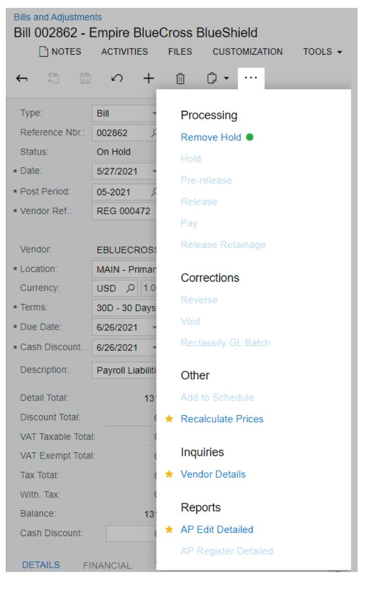

*Figure: The form toolbar and More menu on a narrow screen*

#### **Related Links**

- *[Integration with Excel](https://help-2025r1.acumatica.com/Help?ScreenId=ShowWiki&pageid=d4e757d5-bdf6-4d82-92e3-f26563d48ad4)*
- *To Copy a [Document](https://help-2025r1.acumatica.com/Help?ScreenId=ShowWiki&pageid=aa2b9a0f-794d-4dc7-80b4-14ed0702aea3) Contents to a New Document*
- *To Create a [Document](https://help-2025r1.acumatica.com/Help?ScreenId=ShowWiki&pageid=480487bd-b225-4065-9d82-97a3b68d7994) with a Template*

### **Table Toolbar**

Each table on an Acumatica ERP form, tab, dialog box, or page has a table toolbar, which contains the buttons you can use to work with the details or objects of the table. A toolbar, shown in the following screenshot, includes buttons that are specific to the table, standard buttons that most table toolbars have, and the search box (for some tables; for others, the search box is displayed in the filtering area).

|               | с  | ∽  | ⊢                                           | $\mathbf{x}$                      |                          |           |                       |               |                 |               |               |
|---------------|----|----|---------------------------------------------|-----------------------------------|--------------------------|-----------|-----------------------|---------------|-----------------|---------------|---------------|
|               |    |    | ALL RECORDS <b>ACTIVE</b>                |                                   |                          |           |                       |               |                 |               |               |
|               |    |    | Drag column header here to configure filter |                                   |                          |           |                       | a Y        | $\cdots$        |               | ρ             |
| 髙             | O, | D  | <b>Customer ID</b>                          | <b>Customer Name</b>              | Customer <b>Class</b> | Country   | City                  | Currenc ID | <b>Terms</b>    | <b>Status</b> |               |
| $\rightarrow$ | ा  | I٦ | <b>ABARTENDE</b>                            | <b>USA Bartending School</b>      | <b>KEY</b>               | <b>US</b> | <b>Little Falls</b>   | USD.          | 30 D | Active        |               |
|               | O  |    | <b>ABCHOLDING</b>                           | <b>ABC Holdings Inc.</b>          | <b>KEY</b>               | <b>US</b> | New York              | <b>USD</b>    | 30 D | Active        |               |
|               | ū  |    | !!!!!!!!!!!!!!!!!!!!!!!!!!!!!!!!!!!!!!!!    | <b>ABC Studios Inc.</b>           | <b>KEY</b>               | <b>US</b> | <b>New York</b>       | <b>USD</b>    | 30 D | Active        |               |
|               | Ù  |    | <b>ABCVENTURE</b>                           | <b>ABC Capital Ventures</b>       | <b>KEY</b>               | <b>US</b> | Philadelphia          | <b>USD</b>    | 30 D | Active        |               |
|               | Û  |    | <b>ACTIVESTAF</b>                           | <b>Active Staffing Service</b>    | <b>LOCAL</b>             | <b>US</b> | <b>New York</b>       | <b>USD</b>    | 30 D | Active        |               |
|               | Û. |    | ALPHABETLD                                  | <b>Alphabetland School Center</b> | LOCAL                    | <b>US</b> | <b>North Bellmore</b> | <b>USD</b>    | 30 D | Active        |               |
|               |    |    |                                             |                                   |                          |           |                       |               |                 |               |               |
|               |    |    | 1-6 of 103 records                          |                                   |                          |           |                       | K             | 1               | of 18 pages   | $\rightarrow$ |

#### *Figure: Table toolbar*

#### **Standard Table Toolbar Buttons**

The following table describes the standard table toolbar buttons. A table toolbar may include some or all of those buttons. If a table toolbar includes table-specific buttons, they are described in the reference help topic.

| Button                          | Icon | Description                                                                                                                                                                                           |
|---------------------------------|------|-------------------------------------------------------------------------------------------------------------------------------------------------------------------------------------------------------|
| Refresh                         |      | Refreshes the data in the table.                                                                                                                                                                      |
| Switch Between Grid and Form |      | Controls how the elements are displayed: in a table (grid) with rows and columns; or as separately arranged elements for one table row, with navigation tools you use to move between row data. |
| Add Row                         |      | Appends a new row to the table so you can define a new detail or object. The new row may contain some default values.                                                                              |
| Delete Row                      |      | Deletes the selected row or rows.                                                                                                                                                                     |

| Button                    | Icon | Description                                                                                                                                                                                                                                                                                                               |
|---------------------------|------|---------------------------------------------------------------------------------------------------------------------------------------------------------------------------------------------------------------------------------------------------------------------------------------------------------------------------|
| Move Row Up               |      | Moves the selected row one position up.                                                                                                                                                                                                                                                                                   |
| Move Row Down             |      | Moves the selected row one position down.                                                                                                                                                                                                                                                                                 |
| Fit toScreen              |      | Adjusts the table to the screen width and makes the column width proportional.                                                                                                                                                                                                                                            |
| Export to Excel           |      | Exports the data in the table to an Excel file. For more information, see Integration with Excel in the Acumatica ERP Getting Started Guide.                                                                                                                                                                           |
| Filter Settings           |      | Opens the Filter Settings dialog box, which you can use to define a new advanced filter. After you create and save the filter, the corresponding tab appears on the ta ble. For more information about filtering, see Filters. For details on the Filter Settings dialog box, see Filter Settings Dialog Box. |
| Load Records from File |      | Opens the File Upload dialog box, described in detail below, so you can locate and upload a local file for import. You can use this option to import data from an Excel spreadsheet (.xlsx) or .csv file. For the detailed procedure, see To Import Data from a Local File to a Table.                           |
| Search                    |      | A box in which you can type a word, part of a word, or multiple words. As you type, the system filters the contents of the table to display only rows that contain the string you have typed in any column.                                                                                                         |
| Download                  |      | Downloads the selected file.                                                                                                                                                                                                                                                                                              |

### **File Upload Dialog Box**

With the **File Upload** dialog box, you select a file of one of the supported formats (.csv or .xlsx) to import data from the file.

| Element                                  | Description                                                                                                                         |  |
|------------------------------------------|-------------------------------------------------------------------------------------------------------------------------------------|--|
| File Path                                | The path to the file you want to upload. To select the file, click Browse, and then find and select the file you want to upload. |  |
| The dialog box has the following button. |                                                                                                                                     |  |
| Upload                                   | Closes the dialog box and opens the Common Settings dialog box, where you specify the import settings.                           |  |

#### **Common Settings Dialog Box**

In the **Common Settings** dialog box, which opens if you click **Upload** in the **File Upload** dialog box, you specify the import settings for a file that you has selected in the **File Upload** dialog box.

| Element                                   | Description                                                                                                                                                                    |
|-------------------------------------------|--------------------------------------------------------------------------------------------------------------------------------------------------------------------------------|
| Separator Chars                           | The character that is used as the separator in the imported file.                                                                                                              |
|                                           | By default, the comma is used as the separator. You specify the separator character if the imported file uses any other separator.                                          |
|                                           | This box appears only if you import data from a .csv file.                                                                                                                     |
| Null Value                                | Optional. The value that is used to mark an empty column in the imported file. You speci fy the null value if the value in the imported file differs from the empty string. |
| Encoding                                  | The encoding that is used in the imported file.                                                                                                                                |
|                                           | This box appears only if you import data from a .csv file.                                                                                                                     |
| Culture                                   | The regional format that has been used to display the time, currency, and other measure ments in the imported file.                                                         |
| Mode                                      | The mode that determines which rows of the uploaded file will be imported into the ta ble. The following options are available:                                             |
|                                           | Update Existing: The rows already present in the table will be updated, and the rows • not present in the table will be added.                                           |
|                                           | • Bypass Existing: Only the new rows that are not present in the table will be imported. The rows that are already present in the table will not be updated.             |
|                                           | • Insert All Records: All the rows from the file will be imported into the table.                                                                                           |
|                                           | If you select this option, you may get duplicated rows because the sys tem does not check for duplicates when importing rows from the file.                                 |
| The dialog box has the following buttons. |                                                                                                                                                                                |
| OK                                        | Closes the dialog box and opens the Columns dialog box.                                                                                                                        |
| Cancel                                    | Closes the dialog box without importing the data from the file.                                                                                                                |

#### **Columns Dialog Box**

In the **Columns** dialog box, which opens if you click **OK** in the **Common Settings** dialog box, you match the columns in the imported file that you have selected in the **File Upload** dialog box to the columns in the Acumatica ERP table to which you are importing data.

| Element       | Description                                                         |
|---------------|---------------------------------------------------------------------|
| Column Name   | The name of the column in the uploaded file.                        |
| Property Name | The name of the corresponding column in the table in Acumatica ERP. |

| Element                                   | Description                                                     |  |
|-------------------------------------------|-----------------------------------------------------------------|--|
| The dialog box has the following buttons. |                                                                 |  |
| OK                                        | Closes the dialog box and imports the selected file.            |  |
| Cancel                                    | Closes the dialog box without importing the data from the file. |  |

#### **Related Links**

- *[Tables](https://help-2025r1.acumatica.com/Help?ScreenId=ShowWiki&pageid=87a128a5-1230-4584-8c7a-ad05bcd08b75)*
- *[Integration with Excel](https://help-2025r1.acumatica.com/Help?ScreenId=ShowWiki&pageid=d4e757d5-bdf6-4d82-92e3-f26563d48ad4)*
- *To [Import](https://help-2025r1.acumatica.com/Help?ScreenId=ShowWiki&pageid=96773e07-5811-474d-a088-243f76f48f61) Data from a Local File to a Table*