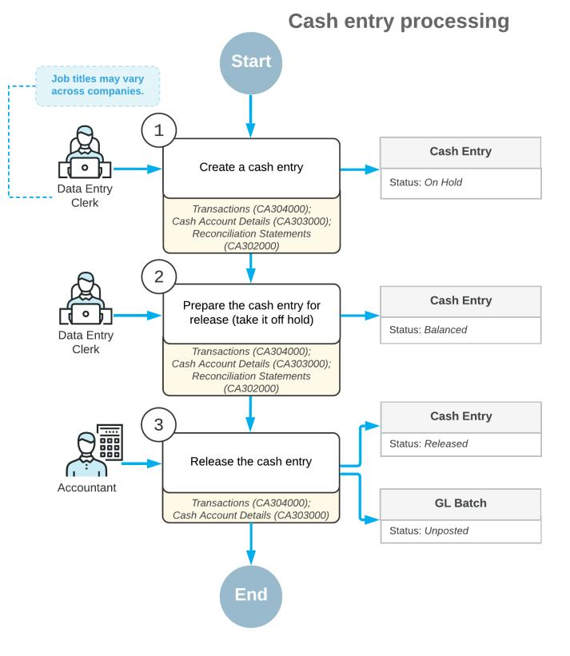
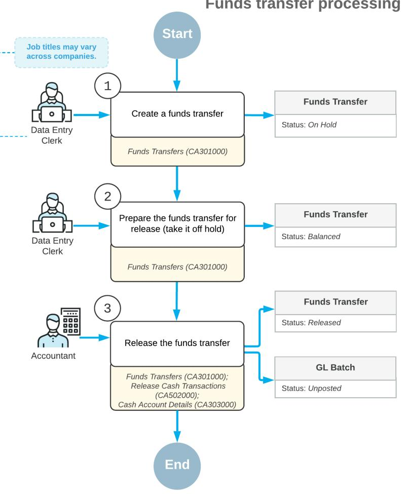
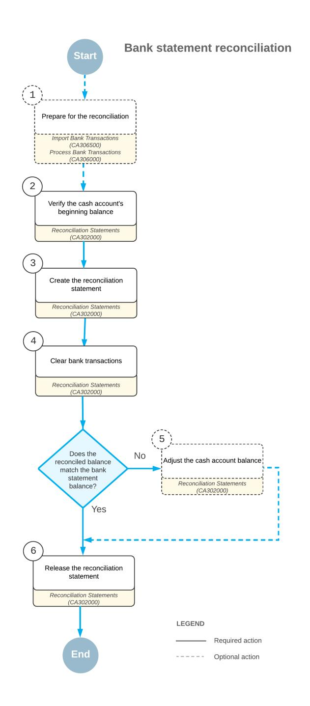
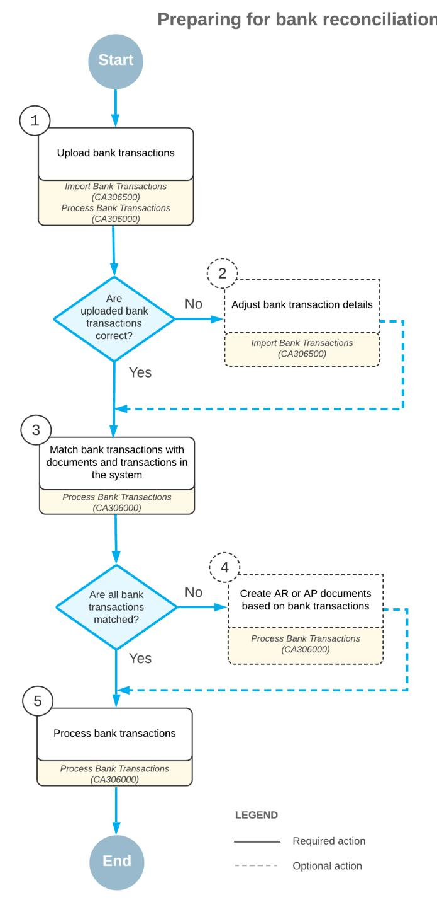
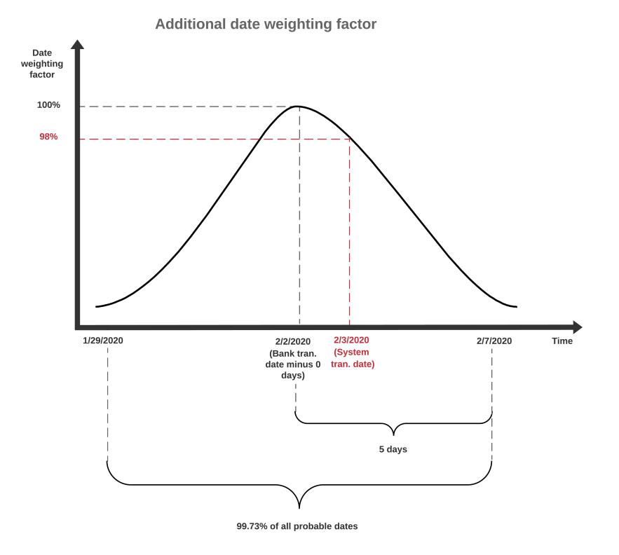

# **Cash Management 2025 R1**

| Copyright5                                              |  |
|---------------------------------------------------------|--|
| Cash Management Overview 6                              |  |
| Configuring Cash Accounts9                              |  |
| Cash Account Configuration9                             |  |
| Cash Account Types12                                    |  |
| Security of Cash Accounts 14                            |  |
| Entry Types16                                           |  |
| To Create a Cash Account18                              |  |
| To Run Recalculation of Cash Account Balances21         |  |
| To Change a Cash Account Identifier21                   |  |
| Managing Cash Transactions22                            |  |
| Cash Transaction Processing 22                          |  |
| Cash Entry Processing25                                 |  |
| Cash Transaction Monitoring 27                          |  |
| Cash Transaction Approval28                             |  |
| Cash Flow Forecasting30                                 |  |
| Managing Payment Methods32                              |  |
| Payment Methods for Customers 32                        |  |
| Payment Methods for Vendors34                           |  |
| Processing Cash Entries 38                              |  |
| Cash Entries: General Information38                     |  |
| Cash Entries: Adding Taxes 40                           |  |
| Cash Entries: Implementation Checklist 40               |  |
| Cash Entries: Generated Transactions41                  |  |
| Cash Entries: To Create a Disbursement Cash Entry 41    |  |
| Cash Entries: To Create a Receipt Cash Entry 43         |  |
| Cash Entries: Mass Processing of Documents45            |  |
| Cash Entries: Related Forms 46                          |  |
| To Quickly Record a Cash Transaction 46                 |  |
| To Release Multiple Cash Transactions 47                |  |
| To Correct a Cash Entry 48                              |  |
| Performing Funds Transfers50                            |  |
| Funds Transfers: General Information50                  |  |
| Funds Transfers: Correcting a Released Funds Transfer52 |  |

| Funds Transfers: Implementation Checklist52                                        |  |
|------------------------------------------------------------------------------------|--|
| Funds Transfers: Generated Transactions 53                                         |  |
| Funds Transfers: Process Activity54                                                |  |
| Funds Transfers: Mass Processing of Documents 57                                   |  |
| Funds Transfers: Related Forms57                                                   |  |
| To Correct a Funds Transfer 58                                                     |  |
| Processing Inter-Company Funds Transfers 59                                        |  |
| Intercompany Funds Transfers: General Information59                                |  |
| Intercompany Funds Transfers: Implementation Checklist 59                          |  |
| Intercompany Funds Transfers: Generated Transactions60                             |  |
| Intercompany Funds Transfers: Process Activity 61                                  |  |
| Intercompany Funds Transfers: Reports and Inquiries63                              |  |
| Tracking Cash Payments 64                                                          |  |
| Reclassification of Unknown Payments 64                                            |  |
| Reclassification Results66                                                         |  |
| Registration of Finance Charges 68                                                 |  |
| Finance Charge Transactions70                                                      |  |
| To Add Entry Types for Charges73                                                   |  |
| Preparation of Deposits73                                                          |  |
| Deposits for Credit Card Payments 77                                               |  |
| Deposit Configuration Example78                                                    |  |
| To Specify Charge Rates for a Clearing Account 81                                  |  |
| To Create a Deposit 81                                                             |  |
| To Release a Deposit 82                                                            |  |
| To Print a Deposit Slip83                                                          |  |
| To Void a Deposit83                                                                |  |
| Managing Bank Statements 84                                                        |  |
| Importing Transactions 84                                                          |  |
| To Import a Bank Statement in OFX, QBO, and QFX Formats 86                         |  |
| To Import a Bank Statement in Excel87                                              |  |
| Processing Imported Transactions 88                                                |  |
| Batch Payment Matching 94                                                          |  |
| Transaction Matching Settings 95                                                   |  |
| To Set Up Default Transaction Matching Settings 96                                 |  |
| To Set Up Transaction Matching Settings Applicable to a Particular Cash Account 97 |  |
| Performing Bank Reconciliation98                                                   |  |

| Bank Reconciliation: General Information98                              |  |
|-------------------------------------------------------------------------|--|
| Bank Reconciliation: Optional Reconciliation Operations 101             |  |
| Bank Reconciliation: Support for OFX and Other File Formats102          |  |
| Bank Reconciliation: Uploading and Processing of Bank Transactions 104  |  |
| Bank Reconciliation: Transaction Matching107                            |  |
| Bank Reconciliation: Approval of Reconciliation Statements110           |  |
| Bank Reconciliation: Implementation Checklist111                        |  |
| Bank Reconciliation: Related Reports 112                                |  |
| Bank Reconciliation: Mass Processing113                                 |  |
| Bank Reconciliation: Additional Information113                          |  |
| Performing Settlement of Credit Card Payments 118                       |  |
| To Set Up a Processing Center for Settlement of Credit Card Payments120 |  |
| To Import Settlement Batches121                                         |  |
| To Process Missing Transactions122                                      |  |
| To Manually Create a Bank Deposit123                                    |  |
| Closing Financial Periods in Cash Management 125                        |  |
| To Close Financial Periods in Cash Management 125                       |  |
| To Reopen a Financial Period in Cash Management 125                     |  |
| Appendix127                                                             |  |
| Reports 127                                                             |  |
| Report Form127                                                          |  |
| Report132                                                               |  |
| Form Toolbar and More Menu134                                           |  |
| Table Toolbar 141                                                       |  |
|                                                                         |  |

# **Copyright**

#### **© 2025 Acumatica, Inc.**

#### **ALL RIGHTS RESERVED.**

No part of this document may be reproduced, copied, or transmitted without the express prior consent of Acumatica, Inc.

3075 112th Avenue NE, Suite 200, Bellevue, WA 98004, USA

### **Restricted Rights**

The product is provided with restricted rights. Use, duplication, or disclosure by the United States Government is subject to restrictions as set forth in the applicable License and Services Agreement and in subparagraph (c)(1)(ii) of the Rights in Technical Data and Computer Soware clause at DFARS 252.227-7013 or subparagraphs (c)(1) and (c)(2) of the Commercial Computer Soware-Restricted Rights at 48 CFR 52.227-19, as applicable.

### **Disclaimer**

Acumatica, Inc. makes no representations or warranties with respect to the contents or use of this document, and specifically disclaims any express or implied warranties of merchantability or fitness for any particular purpose. Further, Acumatica, Inc. reserves the right to revise this document and make changes in its content at any time, without obligation to notify any person or entity of such revisions or changes.

### **Trademarks**

Acumatica is a registered trademark of Acumatica, Inc. HubSpot is a registered trademark of HubSpot, Inc. Microso Exchange and Microso Exchange Server are registered trademarks of Microso Corporation. All other product names and services herein are trademarks or service marks of their respective companies.

Soware Version: 2025 R1 Last Updated: 06/01/2025

## **Cash Management Overview**

The Cash Management module of Acumatica ERP helps you manage cash flows and forecast your cash position at any time and in multiple currencies. By using the Cash Management module, you can track a wide range of cash transactions and perform bank reconciliations quickly and easily. A single form, *[Cash Account Details](https://help-2025r1.acumatica.com/Help?ScreenId=ShowWiki&pageid=79eedc99-0a1b-4aef-a51c-fa4f2cfe7a3b)* (CA303000), gives you instant access to cash account balances and helps you streamline the processing of cash transactions that originate in the Accounts Payable and Accounts Receivable modules.

### **Support for Cash Accounts**

Each branch in a multibranch organization maintains its own cash accounts. To be able to maintain a unified chart of account for all branches, cash accounts are defined separately and linked to specific accounts (of the *Asset* type) on the chart of accounts. Thus, a multibranch company can have a unified chart of accounts—all the accounts on the chart are multibranch accounts, and each branch can have its own cash accounts, access to which is allowed only for the users who have access to the branch. Acumatica ERP supports different types of cash accounts, including bank accounts, clearing accounts for each bank account, and unknown payment accounts. For more information, see *[Configuring Cash Accounts](#page-8-2)*.

### **Multicurrency Support**

If multicurrency support is activated in your system, you can maintain cash accounts in different currencies, enter transactions in foreign currencies, and transfer funds from one cash account to another by using a special multicurrency cash-in-transit account. On any form, you can view amounts in the currency of denomination or in the base currency.

### **Multiple Entry Types**

User-defined entry types are used for correct processing and tracking of many different types of cash transactions entered in the Cash Management module. These transactions include cash deposits, cash withdrawals, adjustments, interest earnings and charges, bank fees, transfer service charges, processing center charges, and fees for processing credit cards. For additional details about the use of entry types, see the following topics:

- *Entry [Types](#page-15-1)*
- *[Registration of Finance Charges](#page-67-1)*

### **Flexible Payment Methods**

A payment method defines how incoming money is actually transferred from customers to your company and how outgoing money is moved from your company's cash accounts to the vendors. You can configure specific payment methods for use in the Accounts Payable module or the Accounts Receivable module, while other methods may be used in both modules. For payment methods, you can configure custom elements to store details of the method used by a particular customer or vendor. Information about particular methods in the system is stored encrypted. Also, you can set up masks to ensure that sensitive data, such as card numbers, is not displayed. For more information, see *[Managing Payment Methods](#page-31-2)*.

#### **Cash Transaction Approvals**

To implement effective control over cash flows, you can require approval of cash transactions before they can be released. With approvals configured in your system, when a user attempts to release a cash transaction, the system changes the transaction status to *Pending Approval* and assigns it to another user who is authorized to approve transactions. For more information, see *Cash [Transaction](#page-27-1) Approval*.

### **Petty Cash Management**

You can use the *[Cash Account Details](https://help-2025r1.acumatica.com/Help?ScreenId=ShowWiki&pageid=79eedc99-0a1b-4aef-a51c-fa4f2cfe7a3b)* form to effectively manage petty cash and monitor account balances. You can view the transaction history for a specific date range and switch between detailed views and daily summary views. Acumatica ERP tracks both the balance by the books and the cleared balance and gives you the ability to reconcile the balances and add cash-related transactions directly from the form. For details, see *Cash [Transaction](#page-26-1) Monitoring*.

### **Cash Forecasting**

In Acumatica ERP, you can view the 30-day cash flow forecasts calculated with the selected level of detail for a single cash account or for all cash accounts available in your system. By analyzing cash flow forecasts, you can avoid unexpected shortages in cash and properly plan your payments. For details, see *[Cash Flow Forecasting](#page-29-1)*.

### **Import of Bank Statements and Reconciliation of Accounts**

Acumatica ERP provides functionality that you can use to easily perform reconciliation of bank and cash accounts. To facilitate reconciliation with bank statements, you can import multiple statements from Excel files or files in OFX format, and match transactions manually or automatically by using adjustable criteria. Also, while performing reconciliation, you can apply payments to the documents available in the system. To make cash forecasts more accurate even in the middle of financial period, you can clear cash transactions with the bank by using any available information. For more information, see the following topics:

- *[Managing Bank Statements](#page-83-2)*
- *[Performing Bank Reconciliation](#page-97-2)*

### **Bank Deposits**

In Acumatica ERP, you can configure daily deposits if your company deposits customer payments to a bank regularly. With this functionality, you can create deposit slips for collected customer payments (such as checks and cash) and easily add appropriate bank charges; this makes it possible to match lines on bank statements to cash account transactions. For more information, see *[Preparation of Deposits](#page-72-2)*.

### **Reclassification of Payments**

Some of the transactions that appear on a bank statement cannot be entered into the system as regular payments because the customer or vendor is unknown or other details are unknown or unrecognizable. Such "unknown" payments are temporarily recorded as cash transactions of special entry types to a special-use cash account (an unknown payments account). Later, when details become known, these transactions can be reclassified as payments with appropriate transactions between the accounts involved (bank account, Accounts Receivable account, and unknown payments account) generated automatically. For details, see *[Reclassification of Unknown](#page-63-2) [Payments](#page-63-2)*.

### **Account Security**

To limit access to confidential bank account information to only a group of authorized users, you can use restriction groups. For more information, see *[Security of Cash Accounts](#page-13-1)* and *[Restriction Groups in Acumatica ERP](https://help-2025r1.acumatica.com/Help?ScreenId=ShowWiki&pageid=ad9a42c1-ff5d-4298-86d9-683039c18512)*.

### **Other Features and Options**

In addition, by using the module's extensive drill-down capabilities, you can quickly and conveniently access any transaction details. You also can use the Cash Management module to complete the following tasks:

• Maintain an unlimited number of cash accounts, including bank accounts.

- Maintain any number of banks as vendors. You can create a business account and locations for every bank involved and define entry types for bank charges to create adjustments quickly.
- Enter miscellaneous cash transactions on the fly while you perform funds transfer or reconcile bank statements, or before you release a daily deposit.
- Attach scanned images or electronic versions of any supporting documents to cash transactions or to specific lines of transactions.
- Select whether users may release Accounts Payable and Accounts Receivable transactions from the Cash Management module or only from their module of origin.
- Drill down to each document and view its details, no matter where the document has been created: in the Accounts Payable, Accounts Receivable, or Cash Management module.
- Close financial periods in Cash Management to prevent users from posting transactions to these periods and reopen financial periods that were closed by mistake.

## **Configuring Cash Accounts**

In Acumatica ERP, you can maintain as many cash accounts as you need to get a clear picture of your cash flow. To keep your chart of accounts simple, Acumatica ERP defines cash accounts separately rather than including them in the chart of accounts. You link cash accounts to accounts from the chart of accounts to track your cash transactions in the general ledger.

This chapter will help you understand what types of cash accounts you need for your business. It describes the configuration process of a cash account and the other entities that can be involved in recording cash transactions. Also, you will read about methods of restricting access to and visibility of cash accounts.

### **Cash Account Configuration**

In the Cash Management module, you work with cash accounts. Cash accounts are used to keep records of the outgoing and incoming payments and cash. To distinguish cash accounts maintained in the Cash Management module from accounts that are in the chart of accounts, we call the latter *GL accounts*, where *GL* represents the General Ledger module.

In this topic, you will read about the configuration process of cash accounts and the details of implementation, which may vary depending on your company's organization and financial operations.

### **Configuration of Cash Accounts**

You can create cash accounts that represent bank accounts, amounts of cash on hand, or amounts of cash in transit. The details of configuration depend on the type of cash account you need. For information about the types of cash accounts, see *Cash [Account](#page-11-1) Types*.

To track the transactions you record in the Cash Management module in the General Ledger module, you link each cash account to a GL account allocated for this purpose. Once a document that is related to a cash account is released, the system automatically generates transactions to be posted to the respective GL accounts in the General Ledger module.

In general, the configuration process of a cash account involves the following steps:

1. You decide which existing GL account you will record your cash transactions to, or you create a designated account for this purpose.

> If the *Multicurrency Accounting* feature is enabled in your system (on the *[Enable/Disable](https://help-2025r1.acumatica.com/Help?ScreenId=ShowWiki&pageid=c1555e43-1bc5-4f6f-ba9d-b323f94d8a6b) [Features](https://help-2025r1.acumatica.com/Help?ScreenId=ShowWiki&pageid=c1555e43-1bc5-4f6f-ba9d-b323f94d8a6b)* (CS100000) form), the currency of a cash account is taken from a GL account to be used for cash transactions, which must be denominated. For details on denominated accounts, see *[Denominated Accounts](https://help-2025r1.acumatica.com/Help?ScreenId=ShowWiki&pageid=28ad15c6-5f9b-4cc1-9c05-932b5dcf6a8f)*. If the feature is disabled, the currency of a cash account is taken from the branch it belongs to.

- 2. You create a cash account in the Cash Management module and link it to a GL account that you have allocated for this purpose. If you use branches and subaccounts in your system, you can link cash accounts from different branches or with different subaccounts to one GL account. Only one cash account can be created for the combination of a branch, a subaccount, and a GL account. For details, see *To [Create](#page-17-1) a Cash [Account](#page-17-1)*.
- 3. You run validation of the cash account balance in the Cash Management module, in case transactions were posted to the GL account before you created the cash account and linked it. Aer the validation is completed, all transactions posted to the GL account are tracked in the Cash Management module. Now you can record transactions in both the General Ledger and Cash Management modules, and the system automatically synchronizes the history of the cash account with the transactions in the GL account. For details, see *To Run [Recalculation](#page-20-2) of Cash Account Balances*.

This configuration is enough for you to start making funds transfers between your cash accounts. To be able to record transactions other than funds transfers (cash entry transactions and incoming and outgoing payments), you also need to perform the following steps:

- 1. You configure the following entities:
  - *Entry types*: You use entry types to classify cash transactions for correct processing. You can consider an entry type a transaction template—it defines the transaction type, the offset GL account and subaccount, and the processing details. Entry type settings are to be used as default settings for a transaction. With entry types configured to affect the balances of GL accounts only (that is, those for which the entry type parameter **Module** is set to *CA*), you can create transactions of the *Cash Entry* type to record bank interest earned, a bank service fee, or some office expenses. For details on entry types, see *Entry [Types](#page-15-1)*.
  - *Payment methods*: You use payment methods to define the way the money is transferred into and out of the organization. To be able to record money received from customers or paid to vendors, you need to specify payment methods for each customer and vendor individually and create entry types to be used in the Accounts Receivable and Accounts Payable modules. For details on payment methods, see *[Managing](#page-31-2) [Payment Methods](#page-31-2)*.
- 2. You associate entry types and payment methods with the appropriate cash accounts.

If you want to reconcile a cash account balance, the additional configuration is required. For details, see the *[Reconciliation of Cash Accounts](#page-10-0)* section in this topic.

### **Identifiers of Cash Accounts**

Identifiers for GL accounts are defined by the *ACCOUNT* segmented key, while identifiers for cash accounts are defined by the *CASHACCOUNT* segmented key. You can use the *[Segmented Keys](https://help-2025r1.acumatica.com/Help?ScreenId=ShowWiki&pageid=78bd7bd1-6bf6-409e-a8a5-8b18e8b80722)* (CS202000) form to define the structure of the *CASHACCOUNT* segmented key.

The *CASHACCOUNT* segmented key is not related to the *ACCOUNT* key, and you can define identifiers for cash accounts differently than identifiers of GL accounts. For example, you can define the *CASHACCOUNT* key as having an additional segment (with respect to the *ACCOUNT* key) to designate the branch that is the owner of the cash account. Then for the GL account 10101, you can have a cash account *10101-MN* in the Main branch and *10101- NR* in the North branch, both of which are linked to the 10101 account. Alternatively, you can define cash account identifiers to be like the identifiers of the GL accounts.

#### **Currency of Cash Accounts**

Each cash account is denominated in a particular currency. If the *Multicurrency Accounting* feature is disabled in your system on the *[Enable/Disable Features](https://help-2025r1.acumatica.com/Help?ScreenId=ShowWiki&pageid=c1555e43-1bc5-4f6f-ba9d-b323f94d8a6b)* (CS100000) form, the currency of a cash account is taken from the branch it belongs to. If the *Multicurrency Accounting* feature is enabled, you can maintain cash accounts for each currency used, because the currency is taken from a GL account used for cash transactions, which must be denominated. The balances of foreign currency cash accounts are maintained in the currency of denomination as well as in the base currency and should be periodically revalued in the base currency for the balance sheet. For details, see *[Denominated Accounts](https://help-2025r1.acumatica.com/Help?ScreenId=ShowWiki&pageid=28ad15c6-5f9b-4cc1-9c05-932b5dcf6a8f)* and *[Revaluation of Bank Accounts: General Information](https://help-2025r1.acumatica.com/Help?ScreenId=ShowWiki&pageid=6ba09554-2ff6-48bc-b19a-19427c1e09a4)*.

### **Balance of Cash Accounts**

In Acumatica ERP, the balance of a cash account can be presented in different ways. You can view the balance of the GL account linked to the cash account. This balance, called the **GL Balance** on the system interface, is calculated as the sum of all posted transactions for the selected financial period. Additionally, you can view the available balance of a cash account. This balance, called the **Available Balance** on the system interface, is calculated as the sum of all released and cleared receipts and disbursements, regardless of the selected date or financial period. The available balance is the amount of money you can spend right now.

You can control how the system calculates the available balance of cash accounts, by using settings in the **Receipts to Add to Available Balances** and **Disbursements to Deduct From Available Balances** sections (**GeneralSettings** tab) of the *[Cash Management Preferences](https://help-2025r1.acumatica.com/Help?ScreenId=ShowWiki&pageid=47321412-f6f6-4565-a2c5-d24ab8167e4b)* (CA101000) form. Both sections have the same set of settings. These

settings, listed below, control which receipts and disbursements will be included in the calculation of the available balance, in addition to the released and cleared receipts and disbursements:

- **Unreleased Uncleared**: You select this check box if you want the system to include receipts or disbursements with the *On Hold* or *Balanced* status and with the **Cleared** check box is not selected.
- **Unreleased Cleared**: You select this check box if you want the system to include receipts or disbursements with the *On Hold* or *Balanced* status and with the **Cleared** check box is selected.
- **Released Uncleared**: You select this check box if you want the system to include receipts or disbursements with the *Released* status and with the **Cleared** check box is not selected.

By having control over the calculation of the available balance, you can more effectively evaluate your funds when you prepare payments on the *[Prepare Payments](https://help-2025r1.acumatica.com/Help?ScreenId=ShowWiki&pageid=e3b526e3-8b12-4fa9-a5b2-2955e763f238)* (AP503000) form or move funds between accounts by using the *Funds [Transfers](https://help-2025r1.acumatica.com/Help?ScreenId=ShowWiki&pageid=814c5c8d-45bc-4e4d-98df-1b6785defc6c)* (CA301000) form.

### **Reconciliation of Cash Accounts**

Reconciliation of a cash account is a useful procedure in controlling cash transactions. You can keep records about cash transactions both in Acumatica ERP and in a third-party system (for instance, a bank where you have accounts) or in the form of cash register receipts. To reconcile the cash account, at the end of each financial period, you compare the system records with a bank statement or other documents confirming the transactions to find discrepancies between the account balances tracked by different means.

In Acumatica ERP, you mark cash accounts that require reconciliation by selecting the **Requires Reconciliation** check box and specifying the numbering sequence for the reconciliation statements in the **Reconciliation NumberingSequence** box on the *[Cash Accounts](https://help-2025r1.acumatica.com/Help?ScreenId=ShowWiki&pageid=10f71454-88f9-4d6c-8d09-32856d8c6741)* (CA202000) form. When this check box is selected for a cash account, the system behavior changes as follows:

- For each transaction recorded to this cash account, the system makes the **Cleared** check box available for modification.
- When you select the **Cleared** check box for a transaction, the system fills in the **Clear Date** box (of the transaction) with the current business date.
- The system displays the cash account in the list of available cash accounts on the *[Reconciliation Statements](https://help-2025r1.acumatica.com/Help?ScreenId=ShowWiki&pageid=4a3afa05-00a5-422f-be1c-d14827366139)* (CA302000) form and uses the specified numbering sequence to generate reference numbers for the statements.

For details on reconciliation of cash accounts, see *Bank [Reconciliation:](https://help-2025r1.acumatica.com/Help?ScreenId=ShowWiki&pageid=c5e018e0-46db-4f21-802d-5ce13b5c5ded) To Reconcile a Cash Account*.

### **Maintenance of Cash Accounts in a Multibranch Company**

If the organization has branches, each branch maintains its cash accounts separately from the cash accounts of other branches. To be able to maintain a unified chart of account for all branches, you define cash accounts separately and link them to specific GL accounts in the chart of accounts (you can link multiple cash accounts from different branches to one GL account). Thus, a multibranch company can have a unified chart of accounts—all the accounts on the chart can be used by all branches, and each branch can have its own cash accounts, access to which is allowed for only the users who have access to the branch.

Once cash accounts have been configured, cash documents in each branch are created for a cash account that belongs to the branch, but the transactions generated by these documents are posted to the GL account. Although the cash accounts are separated by branches, the GL account provides the consolidated balance over all linked cash accounts.

### **Usage of Subaccounts with Cash Accounts**

If you use subaccounts in your organization, you can also use these subaccounts with cash accounts for further analysis. You define the list of available subaccounts in the General Ledger module.

#### **Related Links**

• *To Change a Cash Account [Identifier](#page-20-3)*

- *To Create a Cash [Account](#page-17-1)*
- *To Run [Recalculation](#page-20-2) of Cash Account Balances*
- *Cash [Account](#page-11-1) Types*
- *[Security of Cash Accounts](#page-13-1)*

### **Cash Account Types**

In Acumatica ERP, you can configure cash accounts of different types that suit your company policy. The type of a cash account depends on the purpose you want to use this account for—for example, to record petty cash flow, or to temporarily store payments for future clearing or reclassification. Generally, cash accounts can be divided as follows:

- General-purpose cash accounts
- Bank cash accounts
- Clearing cash accounts
- Cash accounts for unknown payments
- Cash account for a corporate card

For details on configuring a cash account, see *To Create a Cash [Account](#page-17-1)*.

See the following sections for details about each type of a cash account, including its purpose, configuration, and maintenance.

### **General-Purpose Cash Accounts**

A general-purpose cash account, sometimes referred to as a *cash-on-hand account*, is one that you use to record transactions performed with cash you hold in a till. You record outgoing payments to vendors and incoming payments received from customers.

You link a general-purpose cash account to a General Ledger account of the *Asset* type to track transactions in the General Ledger module. To be able to record incoming and outgoing payments, you need to associate this cash account with payment methods and entry types that are configured for usage in the Accounts Receivable and Accounts Payable modules. For example, you may need entry types for cash advances, cash receipts, or customer payments.

If needed, you can create a separate general-purpose cash account to record coins and cash that the company keeps on hand for small purchases (sometimes referred to as a *petty cash account*). Periodically, petty cash is replenished and should be reconciled with the receipts (that is, with any paper trail that is kept).

### **Bank Cash Accounts**

A bank cash account is a cash account you use to record the financial transactions between your organization and the bank. You create a separate cash account for each bank account. For example, you may have a regular checking account and a savings account.

You link a bank cash account to a General Ledger account of the *Asset* type to trace transactions in the General Ledger module. To be able to record incoming and outgoing payments, you need to associate this cash account with the payment methods and entry types that are configured for use in the Accounts Receivable and Accounts Payable modules. For example, you can use an entry type to record interest income to your savings account and an entry type used to record bank charges to your regular checking account. Also, you can associate a bank (created as a vendor) with each bank cash account, for informational purposes.

If you plan to make deposits into this bank account, you need to associate it with a clearing cash account that is configured to temporarily hold the money before it is deposited. (Clearing cash accounts are described in the next section.)

Because each bank account is maintained by the bank, the bank's records over time may differ with those of your organization, so periodic reconciliations are required.

#### **Clearing Cash Account**

A clearing cash account is a cash account that you use to temporarily store payments, checks, and cash that will be eventually deposited to the bank (and, hence, transferred from these clearing accounts to the appropriate bank accounts). Clearing accounts should not be used for payments to vendors.

You associate a clearing cash account with a General Ledger account of the *Asset* type to track transactions in the General Ledger module. To be able to record incoming payments, you need to associate this cash account with payment methods that are based on the *Cash and Check* means of payment, used in the Accounts Receivable module, and involved in creating batch deposits. Clearing accounts should be set as the default cash accounts for associated payment methods.

To be able to transfer deposits from clearing accounts to a specific cash account that represents a bank account, you need to assign these clearing accounts to the respective bank cash accounts. You can provide recognizable names, such as *Non-Deposited Checks* for clearing accounts to be used for checks and *Cash to be Deposited* for clearing accounts to be used for cash. For clearing accounts, no entry types are specified, and reconciliation is not performed.

### **Cash Account for Unknown Payments**

You use a cash account for unknown payments to temporarily hold payments that cannot be entered as valid because the customer or vendor is unknown.

We recommend that you associate such a cash account with a General Ledger account of the *Liability* type to track transactions in the General Ledger module. To be able to record such payments, you need to associate this cash account with payment methods used in the Accounts Payable and Accounts Receivable module. Note, that an entry type that has an unknown payment account specified as the reclassification account should be associated with a bank cash account, to which you may receive such payments. Since accounts that temporarily store unknown payments are cash accounts denominated in specific currencies, special entry types should be created for each currency involved.

For more details about managing accounts for unknown payments, see *[Reclassification of Unknown Payments](#page-63-2)*.

#### **Cash Account for a Corporate Card**

You can also use a cash account to accrue expenses paid by a corporate credit card. You can use the same cash account for all corporate credit cards of the same currency or create separate cash accounts. If subaccounts are defined in your system, you can use them to distinguish transactions made with different credit cards of the same currency.

We recommend that you associate a cash account for a corporate card with a General Ledger account of the *Liability* type to track transactions in the General Ledger module. To be able to record payments, you need to associate this cash account with a payment method that represents a corporate credit card. For details, see *[Payment](#page-33-1) Methods for Vendors*.

#### **Related Links**

- *To Create a Cash [Account](#page-17-1)*
- *To Run [Recalculation](#page-20-2) of Cash Account Balances*
- *[Cash Account Configuration](#page-8-3)*
- *[Security of Cash Accounts](#page-13-1)*
- *Entry [Types](#page-15-1)*

### **Security of Cash Accounts**

Cash is a company's most liquid asset, which is why an organization must have adequate controls to secure it. In Acumatica ERP, you can control which users can view which particular cash accounts, as described in this topic.

In Acumatica ERP, you can configure groups with direct and inverse restriction. In this topic, for simplicity, groups with direct restriction are used in examples. You can use inverse restriction groups in the same way as you use direct restriction groups. For details on the types of restriction groups, see *Types of [Restriction](https://help-2025r1.acumatica.com/Help?ScreenId=ShowWiki&pageid=a72c11e3-e181-4412-a462-ce333721a1e9) Groups*.

### **Usage Scenarios**

The most common scenarios of managing the security of cash accounts are the following:

• Managing the visibility by branch: If your organization consists of multiple branches, you can allow users in each branch to work with only branch-specific cash accounts. For details, see *Visibility of Cash [Accounts](#page-13-2) by [Branch](#page-13-2)*.

You can configure multiple branches only if the *Multibranch Support* feature is enabled on the *[Enable/Disable Features](https://help-2025r1.acumatica.com/Help?ScreenId=ShowWiki&pageid=c1555e43-1bc5-4f6f-ba9d-b323f94d8a6b)* (CS100000) form. If the *Multibranch Support* feature is disabled, all cash accounts belong to a single branch and are visible to all users who are allowed to view the accounts, based on their membership in restriction groups.

• Managing the visibility by user: If only a limited number of users can work with cash accounts, you can configure the visibility of the cash accounts to only these users. For more information, see *[Visibility](#page-14-0) of Cash [Accounts by User](#page-14-0)*.

### **Visibility of Cash Accounts by Branch**

The visibility of a cash account can be restricted based on the branch to which the account belongs. Consider a user who is allowed to view multiple branches due to this user's assigned branch roles. On the data entry forms, this user can view the cash accounts of all the branches this user is allowed to view, based on the branch selected in the **Branch** box of the data entry form (which is filled by default with the branch to which the user is currently signed in).

To restrict the visibility of a cash account by branch, you should do the following:

1. On the *[Cash Accounts](https://help-2025r1.acumatica.com/Help?ScreenId=ShowWiki&pageid=10f71454-88f9-4d6c-8d09-32856d8c6741)* (CA202000) form, you select a cash account, select the **RestrictVisibility with Branch** check box, and save your changes.

With this check box selected, the cash account is visible to only users who can select the branch (specified for the cash account) in the **Branch** box on the data entry forms. (If the **RestrictVisibility with Branch** check box is cleared for a cash account, this cash account will be visible regardless of the selected branch.)

If the **Branch** box is absent on a data entry form, then the visibility of the cash account is defined by the branch to which the user is currently signed in.

2. You repeat this step for each cash account whose visibility you want to control.

You can control the visibility of cash accounts across branches regardless of the state of the *Multibranch Support* and *Inter-Branch Transactions* features. In all these cases, you control the visibility of a cash account by selecting or clearing the **RestrictVisibility with Branch** check box.

Alternatively, you can restrict access to cash accounts by using branch roles in the same way as for GL accounts. For details, see *[Account and Subaccount Security](https://help-2025r1.acumatica.com/Help?ScreenId=ShowWiki&pageid=7f4d2128-5ca0-4f40-84e1-11b0d51603de)*.

### **Visibility of Cash Accounts by User**

You can control the visibility of a specific cash account to users (that is, which users can view the account) with the help of restriction groups.

For example, suppose that there is only one accountant in your organization and only this person should work with a cash account in the system. To restrict the visibility of the cash account, you should do the following on the *[GL](https://help-2025r1.acumatica.com/Help?ScreenId=ShowWiki&pageid=51b5ba54-d95d-4099-b55c-c631acbb67fe) [Account Access](https://help-2025r1.acumatica.com/Help?ScreenId=ShowWiki&pageid=51b5ba54-d95d-4099-b55c-c631acbb67fe)* (GL104000) form:

- 1. You create a restriction group (for example, *Access to Cash Account*) with direct restriction.
- 2. You add to the group the user account of the accountant.
- 3. You add to the group the GL account the cash account is linked to.

We recommend that you carefully design and configure restriction groups containing accounts, so that a user can view the accounts he or she needs for work. Otherwise, a user may encounter problems with processing transactions of the linked cash accounts.

### **Forms for Security of Cash Accounts**

In the following table, you can find the list of the forms that you can use to manage restriction groups with cash accounts and the tasks that you can solve by using each form.

#### *Table: Forms for Security of Cash Accounts*

| Task                                                                                                                     | Form                                        |
|--------------------------------------------------------------------------------------------------------------------------|---------------------------------------------|
| To initially configure the visibility of a GL account to which a cash account is linked to users                      | GL Account Access (GL104000)                |
| To change the visibility of a GL account a cash account is linked to                                                  | Restriction Groups by GL Account (GL104020) |
| To change the visibility of a GL account to which a cash account is linked by a user in multiple restriction groups   | Restriction Groups by User (SM201035)       |
| To change the visibility of a GL account to which a cash account is linked by a branch in multiple restriction groups | Restriction Groups by Branch (GL103020)     |

For information about how to add or remove objects from a restriction group, see *[Operations with Restriction](https://help-2025r1.acumatica.com/Help?ScreenId=ShowWiki&pageid=af4b07a9-476a-4475-8183-8bffc9eb6947) [Groups](https://help-2025r1.acumatica.com/Help?ScreenId=ShowWiki&pageid=af4b07a9-476a-4475-8183-8bffc9eb6947)*.

#### **Related Links**

- *[Account and Subaccount Security](https://help-2025r1.acumatica.com/Help?ScreenId=ShowWiki&pageid=7f4d2128-5ca0-4f40-84e1-11b0d51603de)*
- *[Cash Account Configuration](#page-8-3)*
- *[Restriction Groups in Acumatica ERP](https://help-2025r1.acumatica.com/Help?ScreenId=ShowWiki&pageid=ad9a42c1-ff5d-4298-86d9-683039c18512)*
- *[Cash Accounts](https://help-2025r1.acumatica.com/Help?ScreenId=ShowWiki&pageid=10f71454-88f9-4d6c-8d09-32856d8c6741)*
- *[GL Account Access](https://help-2025r1.acumatica.com/Help?ScreenId=ShowWiki&pageid=51b5ba54-d95d-4099-b55c-c631acbb67fe)*
- *[Restriction Groups by Branch](https://help-2025r1.acumatica.com/Help?ScreenId=ShowWiki&pageid=b9e577ab-37ea-4f57-8d9a-cd53433e6edb)*
- *[Restriction Groups by GL Account](https://help-2025r1.acumatica.com/Help?ScreenId=ShowWiki&pageid=ab8f3b5b-a373-4d8e-9a42-49077b4f84f2)*
- *[Restriction Groups by User](https://help-2025r1.acumatica.com/Help?ScreenId=ShowWiki&pageid=a54bfd6b-d6c1-4eaa-86c6-21394a6099c8)*

## **Entry Types**

You use entry types to classify cash transactions for correct processing and to provide default values for transaction settings. Currently, entry types are user-defined only; future versions of Acumatica ERP may contain some predefined entry types.

An entry type functions like a transaction template, providing default values for a transaction and indicating how the transaction should be processed in the system. Before you define entry types, review your past cash transactions to determine the types that you normally generate, such as service charges, bank fees, wire transfer charges, manual Accounts Payable checks, and customer payments.

You need to configure separate entry types for each operation listed below:

- Recording cash entries in the Cash Management module that affect the balances of GL accounts. For details, see the *Entry Types for [Recording](#page-16-0) Cash Entries* section in this topic.
- Recording transactions in the Cash Management module that result in the creation of documents in the Accounts Receivable and Accounts Payable modules and affect the balances of customers and vendors. For details, see the *Entry Types for Recording [Transactions](#page-16-1)* section in this topic.
- Recording financial charges for processing funds transfers, bank deposits, AP payments, AR payments, and voided documents in the Cash Management, Accounts Receivable, and Accounts Payable modules. For details, see the *Entry Types for [Recording](#page-16-2) Finance Charges* section in this topic.
- Reclassifying payments in the Cash Management module. For more information, see the *Entry [Types](#page-17-2) for [Recording Unknown Payments](#page-17-2)* section in this topic.
- Creating adjustments during the reconciliation of bank statements in the Cash Management module, as described in *Bank [Reconciliation:](https://help-2025r1.acumatica.com/Help?ScreenId=ShowWiki&pageid=c5e018e0-46db-4f21-802d-5ce13b5c5ded) To Reconcile a Cash Account*.

In this topic, you will read about the configuration of entry types and the details of processing cash transactions that use entry types.

### **Configuration of Entry Types**

In general, the configuration of entry types consists of the following steps:

- 1. You determine which types of cash transactions you usually generate.
- 2. You create the required entry types by using the *Entry [Types](https://help-2025r1.acumatica.com/Help?ScreenId=ShowWiki&pageid=0253dfdd-b06b-4274-b44e-9c7a584b15f2)* (CA203000) form, specifying at least the following settings:
  - The entry type ID and description.
  - The type of transactions: *Receipt* to record money coming in, or *Disbursement* to record money going out.
  - The way the balances of General Ledger accounts, customer accounts, and vendor accounts are affected with a transaction based on this entry type—that is, one of the following options for the **Module** setting: *CA* (a transaction affects the balances of GL accounts only), *AP* (a transaction affects the balances of GL accounts and a vendor account), or *AR* (a transaction affects the balances of GL accounts and a customer account).
- 3. You associate the entry types you have created with the cash accounts that are involved in the respective cash transactions.

Aer configuration is done, you can proceed with recording cash transactions. The Acumatica ERP forms used for recording transactions that involve entry types are described for each particular entry type later in this topic and in the topics listed in the introduction.

### **Entry Types for Recording Cash Entries**

You use the *Cash [Transactions](https://help-2025r1.acumatica.com/Help?ScreenId=ShowWiki&pageid=1e55821c-556b-4c3e-829c-95383eb2c8e2)* (CA304000) form to record transactions that affect the balances of GL accounts. These transactions have the *Cash Entry* type. You can record customer payments, payments to vendors, bank charges, or interest earned. For details, see *[Cash Entry Processing](#page-24-1)*.

To configure an entry type for recording cash entries, you specify the following settings:

- The entry type ID and description
- The type of transaction—whether it is a *Receipt* (money in) or *Disbursement* (money out)
- The *CA* module
- Optional: The default offset account and subaccount (if any subaccounts are defined in the system)

Aer you have created the entry type for recording cash entries, you need to associate it with the cash accounts that are involved in the respective cash transactions.

### **Entry Types for Recording Transactions**

You use the **CreateTransaction** button on the *[Cash Account Details](https://help-2025r1.acumatica.com/Help?ScreenId=ShowWiki&pageid=79eedc99-0a1b-4aef-a51c-fa4f2cfe7a3b)* (CA303000) form to record a transaction for the cash account you select. On this form, you can record transactions that affect the balances of customers or vendors, as well as cash entry transactions. For details, see *[Cash Entry Processing](#page-24-1)*.

To configure an entry type for recording transactions that affect balances of vendors, you specify the following settings:

- The entry type ID and description
- The type of transaction—whether it is a *Receipt* (refund from a vendor) or *Disbursement* (payment to a vendor)
- The *AP* module
- Optionally, a vendor account (if you frequently record transactions that involve a particular vendor)

You don't need to specify a default offset account or subaccount, because the GL accounts of the vendor (specified in a transaction) are used by default.

To configure an entry type for recording transactions that affect balances of customers, you specify the following settings:

- The entry type ID and description
- The type of transaction—whether it is a *Receipt* (payment from a customer) or *Disbursement* (refund to a customer)
- The *AR* module
- Optionally, a customer account (if you frequently record transactions that involve a particular customer)

Here, too, there is no need to specify a default offset account or subaccount, because the GL accounts of the customer specified in the transaction are used by default.

Aer you have created the entry type for recording transactions, you need to associate it with the cash accounts that are involved in the respective cash transactions.

### **Entry Types for Recording Finance Charges**

You use the following forms to record various finance charges:

- *[Checks and Payments](https://help-2025r1.acumatica.com/Help?ScreenId=ShowWiki&pageid=81659f97-cb14-4a27-bc3e-0f67b3945613)* (AP302000): To add charges to payments, prepayments, adjustments, and refunds
- *[Cash Purchases](https://help-2025r1.acumatica.com/Help?ScreenId=ShowWiki&pageid=346e1395-7d30-4c25-b28b-7bcd824dcffd)* (AP304000): To add charges to cash purchases
- *[Payments and Applications](https://help-2025r1.acumatica.com/Help?ScreenId=ShowWiki&pageid=ae844bf4-1aef-42cd-9e2f-49b3ee1bc8d7)* (AR302000): To add charges to payments, prepayments, and returns

- *[Cash Sales](https://help-2025r1.acumatica.com/Help?ScreenId=ShowWiki&pageid=f8e8a35f-4de7-40c0-8030-ebf9f7910119)* (AR304000): To add charges to cash sales
- *Funds [Transfers](https://help-2025r1.acumatica.com/Help?ScreenId=ShowWiki&pageid=814c5c8d-45bc-4e4d-98df-1b6785defc6c)* (CA301000) To add expenses to funds transfers
- *[Bank Deposits](https://help-2025r1.acumatica.com/Help?ScreenId=ShowWiki&pageid=8e694735-9343-493e-98c0-cb2e5ceb32fd)* (CA305000) To add charges to bank deposits

For details on recording finance charges, see *[Registration of Finance Charges](#page-67-1)*.

To configure an entry type for recording finance charges, you specify the following settings:

- The entry type ID and a description that lets users easily identify the charge when they're applying it to payments
- The type of transaction—*Disbursement*
- The *CA* module
- The default offset GL account of the expense type and the appropriate subaccount (if subaccounts are used in your system)
- The indication to the system of whether the bank typically deducts the amount of this charge from the payment amount or does not deduct it—the **Deduct From Payment Amount** check box should be selected or cleared, respectively

The finance charges recorded in the Accounts Payable and Cash Management modules are always recorded as separate transactions.

Aer you have created the entry type for recording finance charges, you need to associate it with the cash accounts that are involved in the respective cash transactions.

### **Entry Types for Recording Unknown Payments**

You use the *Cash [Transactions](https://help-2025r1.acumatica.com/Help?ScreenId=ShowWiki&pageid=1e55821c-556b-4c3e-829c-95383eb2c8e2)* (CA304000) form to record unknown payments. Such transactions have the *Cash Entry* type. For details on further processing, see *[Reclassification of Unknown Payments](#page-63-2)*.

To configure an entry type for recording unknown payments, you specify the following settings:

- The entry type ID and description
- The type of transaction—whether it is a *Receipt* (money in) or *Disbursement* (money out) type

You should create separate entry types for incoming and outgoing unknown payments.

- The *CA* module
- The **Use for Payments Reclassification** check box selected
- The reclassification account (a cash account used to temporary store unknown payments)

The branch and default offset account and subaccount (if any subaccounts are defined in the system) are filled in automatically when you specify the reclassification account.

Aer you have created the entry type for recording unknown payments, you need to associate it with the cash accounts that are involved in the respective cash transactions.

### **To Create a Cash Account**

You use the *[Cash Accounts](https://help-2025r1.acumatica.com/Help?ScreenId=ShowWiki&pageid=10f71454-88f9-4d6c-8d09-32856d8c6741)* (CA202000) form to create a cash account.

### **Before You Proceed**

Do the following to make sure that all prerequisites are met before you create a cash account:

- Determine which type of cash account you want to create; for details on each type, see *Cash [Account](#page-11-1) Types*.
- Check the internal agreements your organization has about identifiers used for GL accounts and cash accounts. For information about cash account identifiers, see *[Cash Account Configuration](#page-8-3)*.
- Review the structure of subaccounts and the meanings of their segment values in your organization, and choose the subaccounts to be used for the cash accounts to be created.
- By using the *[Chart of Accounts](https://help-2025r1.acumatica.com/Help?ScreenId=ShowWiki&pageid=85557f41-a4af-47a8-b198-2a01461ce9c3)* (GL202500) form, verify the existence of the GL account to which you will link new cash accounts, or create a designated GL account for this purpose. The GL account type depends on the type of cash account you have decided to create.
- If this cash account is to be denominated to a foreign currency, review the types of exchange rates to be used for currency conversions and create a new rate if needed. For details, see *[Configuration](https://help-2025r1.acumatica.com/Help?ScreenId=ShowWiki&pageid=fce5bf02-bdfc-46d6-96cc-3d7ad15f9820) of Rate Types [and Rates: General Information](https://help-2025r1.acumatica.com/Help?ScreenId=ShowWiki&pageid=fce5bf02-bdfc-46d6-96cc-3d7ad15f9820)*.
- Consider how you want to restrict the visibility of the cash account. For details, see *[Security of Cash](#page-13-1) [Accounts](#page-13-1)*.

You can perform the following operations before or aer creating a cash account:

- By using the *Entry [Types](https://help-2025r1.acumatica.com/Help?ScreenId=ShowWiki&pageid=0253dfdd-b06b-4274-b44e-9c7a584b15f2)* (CA203000) form, create the entry types to be used for recording cash transactions to the cash account. For details, see *Entry [Types](#page-15-1)*.
- On the *[Payment Methods](https://help-2025r1.acumatica.com/Help?ScreenId=ShowWiki&pageid=509285d1-cfae-4e87-95c3-a968451952e6)* (CA204000) form, create the payment methods to be used with the cash account. For details, see *[Managing Payment Methods](#page-31-2)*.
- If you are creating a bank cash account and plan to make deposits, create clearing cash accounts to associate with the bank cash account. For details, see *Cash [Account](#page-11-1) Types*.

If you create the entry types, payment methods, and clearing cash accounts aer you have created the cash account, you need to associate them with the cash account by using the table toolbars of the **EntryTypes**, **Payment Methods**, and **Clearing Accounts** tabs on the *[Cash Accounts](https://help-2025r1.acumatica.com/Help?ScreenId=ShowWiki&pageid=10f71454-88f9-4d6c-8d09-32856d8c6741)* form.

### **To Create a Cash Account Linked to a GL Account**

- 1. Open the *[Cash Accounts](https://help-2025r1.acumatica.com/Help?ScreenId=ShowWiki&pageid=10f71454-88f9-4d6c-8d09-32856d8c6741)* (CA202000) form.
- 2. On the form toolbar, click **Add New Record**.
- 3. In the **Cash Account** box, type the identifier for the new cash account. If cash account identifiers in your system have multiple segments, type the segment values or select them from the list of allowed values.
- 4. In the **Account** box, select the GL account from the list of accounts available in the chart of accounts.
  - GL accounts configured as control accounts for a subledger do not appear in this list and cannot be selected. For more information on control accounts, see *[Control Accounts:](https://help-2025r1.acumatica.com/Help?ScreenId=ShowWiki&pageid=29cf6881-e21f-4130-94fb-f10bfd511ff7) [General Information](https://help-2025r1.acumatica.com/Help?ScreenId=ShowWiki&pageid=29cf6881-e21f-4130-94fb-f10bfd511ff7)*.
    - The system automatically fills in the **Currency** box with the appropriate value.
- 5. In the **Subaccount** box, select the subaccount to be used with this cash account.
- 6. In the **Branch** box, select the branch that will use this cash account.
- 7. If this cash account is denominated to a foreign currency, in the **Curr. RateType** box, select the type of exchange rate to be used for currency conversions.
- 8. In the **Description** box, type a description for the cash account.

- 9. Optional: Select the **Clearing Account** check box to indicate that the cash account is used to record undeposited payments.
- 10.Optional: Select the **Requires Reconciliation** check box to indicate that reconciliations are required for this account, and select a numbering sequence for these reconciliations in the **Reconciliation Numbering Sequence** box.
- 11.Optional: Select the **RestrictVisibility with Branch** check box to make this cash account visible to only a user signed in to the branch that is associated with this cash account.
- 12.Optional: Select the **Match BankTransactions to Batch Payments** check box to indicate that during the processing of the imported bank transactions, the system should search for a match among Accounts Payable batch payments (which group documents for further processing by a money transfer operator). For details, see *[Batch Payment Matching](#page-93-1)*.
- 13.Optional: If you are creating a bank account and have configured a vendor to represent a bank your company works with, in the **Bank ID** box, specify the vendor identifier for informational purposes.
- 14.Optional: If you have configured the payment methods to be used to record transactions to this cash account, on the **Payment Methods** tab, add the payment methods and specify the appropriate settings in the row for each payment you add. For details on these settings, see *[Payment Methods for Customers](#page-31-3)* and *[Payment](#page-33-1) Methods for Vendors*.
- 15.Optional: If you are creating a bank account and have configured the clearing accounts to hold nondeposited payments, on the **Clearing Accounts** tab, add these accounts to the table.
- 16.Optional: If you have configured the entry types to be used to record transactions to this cash account, on the **EntryTypes** tab, add them to the table.

You can define one entry type as the default one for this cash account by selecting the **Is Default** check box for it.

The system will fill in the default entry type on the *Cash [Transactions](https://help-2025r1.acumatica.com/Help?ScreenId=ShowWiki&pageid=1e55821c-556b-4c3e-829c-95383eb2c8e2)* (CA304000) and *[Funds](https://help-2025r1.acumatica.com/Help?ScreenId=ShowWiki&pageid=814c5c8d-45bc-4e4d-98df-1b6785defc6c) [Transfers](https://help-2025r1.acumatica.com/Help?ScreenId=ShowWiki&pageid=814c5c8d-45bc-4e4d-98df-1b6785defc6c)* (CA301000) form, and in the **QuickTransaction** dialog box on the *[Cash Account](https://help-2025r1.acumatica.com/Help?ScreenId=ShowWiki&pageid=79eedc99-0a1b-4aef-a51c-fa4f2cfe7a3b) [Details](https://help-2025r1.acumatica.com/Help?ScreenId=ShowWiki&pageid=79eedc99-0a1b-4aef-a51c-fa4f2cfe7a3b)* (CA303000) and *[Reconciliation Statements](https://help-2025r1.acumatica.com/Help?ScreenId=ShowWiki&pageid=4a3afa05-00a5-422f-be1c-d14827366139)* (CA302000) forms, but you can override this value.

- 17.Optional: On the **RemittanceSettings** tab, which appears if at least one of the payment methods specified for the cash account requires remittance information, in the**Value** column for each row, provide the required information. For details, see *[Setting Up ACH Payment Processing](https://help-2025r1.acumatica.com/Help?ScreenId=ShowWiki&pageid=020220b1-0c4f-4064-8d7e-25926da1f041)*.
- 18.On the form toolbar, click**Save**.
- 19.Open the *[Chart of Accounts](https://help-2025r1.acumatica.com/Help?ScreenId=ShowWiki&pageid=85557f41-a4af-47a8-b198-2a01461ce9c3)* (GL202500) form.
- 20.Make sure that the read-only **Cash Account** check box is selected for the GL account to which you linked the cash account you created.

This check box indicates that the new cash account has been successfully linked to the GL account and that all transactions of the GL account will be traced in the cash management subledger.

Aer a cash account is configured and linked to the selected GL account, you need to run validation of the cash account balance in the cash management subledger, in case transactions were posted to the GL account before you created the cash account and linked it. For details, see *To Run [Recalculation](#page-20-2) of Cash Account Balances*.

#### **Related Links**

- *To Run [Recalculation](#page-20-2) of Cash Account Balances*
- *[Cash Account Configuration](#page-8-3)*
- *Cash [Account](#page-11-1) Types*
- *[Security of Cash Accounts](#page-13-1)*

### **To Run Recalculation of Cash Account Balances**

You use the *[Recalculate Account Balances](https://help-2025r1.acumatica.com/Help?ScreenId=ShowWiki&pageid=8b80ee7f-a2bf-4723-a4a4-2c2456ec9859)* (CA503000) form to run recalculation of the balances of a cash account. You perform this process in case you have linked a newly created cash account to a GL account that already had transactions recorded to it.

### **To Run Recalculation of a Cash Account Balance**

- 1. Open the *[Recalculate Account Balances](https://help-2025r1.acumatica.com/Help?ScreenId=ShowWiki&pageid=8b80ee7f-a2bf-4723-a4a4-2c2456ec9859)* (CA503000) form.
- 2. In the **Fin. Period** box, select the financial period from which you want to start recalculating cash account balances.
- 3. Do one of the following:
  - To run the recalculation process for all listed cash accounts, click **Process All**.
  - To run the recalculation process for only selected cash accounts, select the unlabeled check boxes for the needed cash accounts, and click **Process**.

If the balances of the cash accounts were recalculated successfully, the system marks them with green check marks.

Aer the recalculation of cash account balances is completed successfully, all transactions posted to the GL account are tracked in the cash management subledger. You can still create GL batches that update the GL account directly in the general ledger. The system automatically synchronizes the history of the cash account with the transactions in the GL account.

#### **Related Links**

- *To Create a Cash [Account](#page-17-1)*
- *[Cash Account Configuration](#page-8-3)*
- *Cash [Account](#page-11-1) Types*

### **To Change a Cash Account Identifier**

You can change the identifier of a particular cash account on the *[Cash Accounts](https://help-2025r1.acumatica.com/Help?ScreenId=ShowWiki&pageid=10f71454-88f9-4d6c-8d09-32856d8c6741)* (CA202000) form.

### **To Change a Cash Account Identifier**

- 1. Open the *[Cash Accounts](https://help-2025r1.acumatica.com/Help?ScreenId=ShowWiki&pageid=10f71454-88f9-4d6c-8d09-32856d8c6741)* (CA202000) form.
- 2. In the **Cash Account** box, select the cash account whose identifier you want to change.
- 3. On the More menu (under **Other**), click **Change ID**.
- 4. In the **Cash Account** box of the**Specify New ID** dialog box, which opens, specify the new identifier of the cash account, and click **OK**.
- 5. On the form toolbar, click**Save**.

## **Managing Cash Transactions**

You can easily record transactions that affect cash: cash entries, funds transfers, and transfer-related expenses. These transactions do not involve customers or vendors and affect balances of general ledger accounts only.

Also, you can keep a check register. In addition to cash entries and funds transfers, you can record cash transactions that affect balances of customers or vendors (a prepayment to a vendor, a cash payment from a customer, or a refund).

### **Cash Transaction Processing**

On the *[Cash Account Details](https://help-2025r1.acumatica.com/Help?ScreenId=ShowWiki&pageid=79eedc99-0a1b-4aef-a51c-fa4f2cfe7a3b)* (CA303000) form, you can quickly add transactions that record customer payments, refunds received from vendors, bank charges and fees, cash withdrawals, and various adjustments. Also, you can use this form to monitor cash accounts and effectively manage cash transactions.

In this topic, you will read about how to quickly record cash transactions of any type and how the system processes them further.

### **Understanding Cash Transaction Types**

Depending on the purpose of the transaction, in the Cash Management module, you can record and process cash transactions of the following types:

- *Cash Entry*: You create a transaction of this type to record an operation made in cash, such as a bank charge, interest income, a customer payment, a payments to a vendor, or an unknown payments. Transactions of this type affect General Ledger accounts only.
- *Transfer In*: A transaction of this type is created when you record a funds transfer between cash accounts; it corresponds to the received funds to the destination account.
- *Transfer Out*: A transaction of this type is created when you record a funds transfer between cash accounts; it corresponds to the sent funds from the source account.

For one funds transfer, there is always one transaction of the *Transfer In* type and one transaction of the *Transfer Out* type. Transactions of these types affect General Ledger accounts. These transactions appear as transactions of the *Transfer* type on the *[Release Cash](https://help-2025r1.acumatica.com/Help?ScreenId=ShowWiki&pageid=e872692e-5c4c-4141-80f4-2f032e7cc241) [Transactions](https://help-2025r1.acumatica.com/Help?ScreenId=ShowWiki&pageid=e872692e-5c4c-4141-80f4-2f032e7cc241)* (CA502000) form.

- *Expense Entry*: If a funds transfer results in any financial charges being incurred, you can record a cash transaction of this type when you create the funds transfer. Transactions of this type affect General Ledger accounts.
- *Prepayment*: You create a transaction of this type to record an advance payment or down payment to a vendor if the payment was made in cash. Transactions of this type affect General Ledger accounts and vendor accounts in the Accounts Payable module.
- *Refund*: You create a transaction of this type to record a refund for a prepayment or debit adjustment if the refund was made in cash. Transactions of this type affect General Ledger accounts and vendor accounts in the Accounts Payable module.

You create a transaction of this type to record a cash refund for a payment, prepayment, or credit memo to a customer. Transactions of this type affect General Ledger accounts and customer accounts in the Accounts Receivable module.

• *Payment*: You create a transaction of this type to record an incoming customer payment that was made in cash. Transactions of this type affect General Ledger accounts and customer accounts in the Accounts Receivable module.

- *CA Deposit*: You create a transaction of this type if you want to deposit customer payments or vendor refunds into a cash account. Transactions of this type affect General Ledger accounts.
- *CA Void Deposit*: You create a transaction of this type if you want to void a released deposit. Transactions of this type affect the General Ledger accounts that were involved in the related deposit.

On the *[Cash Account Details](https://help-2025r1.acumatica.com/Help?ScreenId=ShowWiki&pageid=79eedc99-0a1b-4aef-a51c-fa4f2cfe7a3b)* form, you can quickly record transactions of the *Cash Entry*, *Prepayment*, *Refund*, and *Payment* types for a particular account, and track transactions of any type.

In Acumatica ERP, separate forms are specifically designed for recording *Cash Entry* transactions, funds transfer transactions, and deposit transactions. For details, see *[Cash Entry Processing](#page-24-1)*, *Funds Transfers: General [Information](#page-49-2)*, and *[Preparation of Deposits](#page-72-2)*.

### **Recording Cash Transactions**

Before you start recording cash transactions, make sure entry types, which serve as the templates of the transactions, are defined in your system. For details on entry types, see *Entry [Types](#page-15-1)*.

You can record a cash transaction by selecting a cash account for the transaction and clicking the **Create Transaction** button on the table toolbar of the *[Cash Account Details](https://help-2025r1.acumatica.com/Help?ScreenId=ShowWiki&pageid=79eedc99-0a1b-4aef-a51c-fa4f2cfe7a3b)* form. This invokes the **QuickTransaction** dialog box, where you can quickly add cash transactions that affect the balances of customers or vendors as well as of GL accounts. In the **EntryType** box of the dialog box, you specify the entry type of the cash transaction in accordance with the following:

- To create a cash transaction that affects the balances of vendor accounts, you specify an entry type with **Module** set to *AP* on the *Entry [Types](https://help-2025r1.acumatica.com/Help?ScreenId=ShowWiki&pageid=0253dfdd-b06b-4274-b44e-9c7a584b15f2)* (CA203000) form. Once the transaction is saved, it appears in the Cash Management module on the *[Cash Account Details](https://help-2025r1.acumatica.com/Help?ScreenId=ShowWiki&pageid=79eedc99-0a1b-4aef-a51c-fa4f2cfe7a3b)* form with the *Refund* type if it is a receipt, and with the *Prepayment* type if it is a disbursement with the *On Hold* status. In the Accounts Payable module, the system creates a corresponding document with the *Refund* or *Prepayment* type. You can further process the cash transaction in the Cash Management module and process the corresponding document in the Accounts Payable module.
- To create a cash transaction that affects the balances of customer accounts, you specify an entry type with **Module** set to *AR* on the *Entry [Types](https://help-2025r1.acumatica.com/Help?ScreenId=ShowWiki&pageid=0253dfdd-b06b-4274-b44e-9c7a584b15f2)* form. Once the transaction is saved, it appears in the Cash Management module on the *[Cash Account Details](https://help-2025r1.acumatica.com/Help?ScreenId=ShowWiki&pageid=79eedc99-0a1b-4aef-a51c-fa4f2cfe7a3b)* form with the *Payment* type if it is a receipt, and with the *Refund* type if it is a disbursement with the *On Hold* status. In the Accounts Receivable module, the system creates a corresponding document with the *Payment* or *Refund* type. You can further process the cash transaction from the Cash Management module and process the corresponding document in the Accounts Receivable module.
- To create a cash transaction that affects the balances of GL accounts only, you specify an entry type with **Module** set to *CA* on the *Entry [Types](https://help-2025r1.acumatica.com/Help?ScreenId=ShowWiki&pageid=0253dfdd-b06b-4274-b44e-9c7a584b15f2)* form. Once the transaction is saved, it appears in the Cash Management module with the *Cash Entry* type, regardless of whether it is a receipt or a disbursement. The transaction has the *Balanced* status by default; balanced transactions can be edited, saved, put on hold, or released.

You can select the **Hold Transactions on Entry** check box on the *[Cash Management](https://help-2025r1.acumatica.com/Help?ScreenId=ShowWiki&pageid=47321412-f6f6-4565-a2c5-d24ab8167e4b) [Preferences](https://help-2025r1.acumatica.com/Help?ScreenId=ShowWiki&pageid=47321412-f6f6-4565-a2c5-d24ab8167e4b)* form to create cash transactions with the *On Hold* status by default to prevent it from releasing and being posted to the general ledger. If this check box is selected, you can release from hold a cash transaction of the *Cash Entry* type by clearing the **Hold** check box in the dialog box.

For details on how cash transactions of the *Cash Entry* type are processed, see *[Cash Entry Processing](#page-24-1)*.

### **Processing Accounts Payable Documents**

Aer you save a cash transaction related to a refund, you have to apply the appropriate documents, such as prepayments or debit adjustments, to the refund in the Accounts Payable module. For more details on recording refunds, see *Bill [Prepayments:](https://help-2025r1.acumatica.com/Help?ScreenId=ShowWiki&pageid=a50b04f1-f769-4502-8f48-668f05096a2f) To Refund a Prepayment*.

The **Release AP Documents from CA Module** check box, which is located on the *[Cash Management Preferences](https://help-2025r1.acumatica.com/Help?ScreenId=ShowWiki&pageid=47321412-f6f6-4565-a2c5-d24ab8167e4b)* (CA101000) form, controls the processing of transactions that correspond to documents in the Accounts Payable module. If this check box is selected, documents are released from the Cash Management module; if this check box is cleared, documents can be released only in the Accounts Payable module.

Accounts Payable transactions may be posted when they are released if the **Automatically Post on Release** check box is selected on the *[Accounts Payable Preferences](https://help-2025r1.acumatica.com/Help?ScreenId=ShowWiki&pageid=c3f9353e-95e6-448d-bb3f-e20643879ec7)* form; otherwise, you need to post transactions manually by using the *Post [Transactions](https://help-2025r1.acumatica.com/Help?ScreenId=ShowWiki&pageid=dce8c656-0c7f-4bb9-af68-e9432317964c)* (GL502000) form. The system assigns reference numbers to the batches that implement the transactions in accordance with the numbering sequences used for Accounts Payable transactions specified in the **Batch NumberingSequence** box on the *[Accounts Payable Preferences](https://help-2025r1.acumatica.com/Help?ScreenId=ShowWiki&pageid=c3f9353e-95e6-448d-bb3f-e20643879ec7)* (AP101000) form. The system updates the account balances with the following transactions, based on whether the cash transaction is a receipt or a disbursement.

| Table: Receipt Cash Transaction (Accounts Payable) |  |
|----------------------------------------------------|--|
|----------------------------------------------------|--|

| Account                  | Debit  | Credit |
|--------------------------|--------|--------|
| Cash Account             | Amount | 0.00   |
| Accounts Payable Account | 0.00   | Amount |

#### *Table: Disbursement Cash Transaction (Accounts Payable)*

| Account                  | Debit  | Credit |
|--------------------------|--------|--------|
| Cash Account             | 0.00   | Amount |
| Accounts Payable Account | Amount | 0.00   |

When an Accounts Payable transaction is released, all the further processing of it is performed in the Accounts Payable module. Released vendor prepayments get the *Open* status and can be applied to a document, unapplied, or voided in this module. For details, see *[Bill Prepayments: General Information](https://help-2025r1.acumatica.com/Help?ScreenId=ShowWiki&pageid=4a4d967f-52ec-40c1-ac86-ecd522dd2b7a)*. Released refunds get the *Closed* status; they can be voided later if necessary.

### **Processing Accounts Receivable Documents**

Aer you save cash transactions related to refunds, you have to apply the appropriate documents, such as payments or credit memos, to the refund in the Accounts Receivable module. For more details on recording refunds, see *[Refunds:](https://help-2025r1.acumatica.com/Help?ScreenId=ShowWiki&pageid=90d571d6-946c-4a2e-9927-2438b8f65a38) To Create a Refund and Apply a Credit Memo to It*.

The **Release AR Documents from CA Module** check box, which is located on the *[Cash Management Preferences](https://help-2025r1.acumatica.com/Help?ScreenId=ShowWiki&pageid=47321412-f6f6-4565-a2c5-d24ab8167e4b)* form, controls the processing of transactions that correspond to documents in the Accounts Receivable module. If this check box is selected, documents are released from the Cash Management module; if this option is cleared, documents can be released only in the Accounts Receivable module.

Accounts Receivable transactions may be posted when they are released if the **Automatically Post on Release** check box is selected on the *[Accounts Receivable Preferences](https://help-2025r1.acumatica.com/Help?ScreenId=ShowWiki&pageid=f7b52067-5299-45e8-b601-485cd709f58b)* (AR100000) form; otherwise, you need to post transactions manually by using the *Post [Transactions](https://help-2025r1.acumatica.com/Help?ScreenId=ShowWiki&pageid=dce8c656-0c7f-4bb9-af68-e9432317964c)* form. The system assigns reference numbers to the batches that implement the transactions in accordance with the numbering sequences used for Accounts Receivable documents specified in the **Batch NumberingSequence** box on the *[Accounts Receivable Preferences](https://help-2025r1.acumatica.com/Help?ScreenId=ShowWiki&pageid=f7b52067-5299-45e8-b601-485cd709f58b)* (AR101000) form. The system updates the account balances with the following transactions, based on whether the cash transaction is a receipt or a disbursement.

#### *Table: Receipt Cash Transaction (Accounts Receivable)*

| Account      | Debit  | Credit |
|--------------|--------|--------|
| Cash Account | Amount | 0.00   |

| Account                     | Debit | Credit |
|-----------------------------|-------|--------|
| Accounts Receivable Account | 0.00  | Amount |

#### *Table: Disbursement Cash Transaction (Accounts Receivable)*

| Account                     | Debit  | Credit |
|-----------------------------|--------|--------|
| Cash Account                | 0.00   | Amount |
| Accounts Receivable Account | Amount | 0.00   |

When an Accounts Receivable transaction is released, all further processing of it is performed in the Accounts Receivable module. Released customer payments get the *Open* status and can be applied to a document, unapplied, or voided. Released refunds get the *Closed*; they can be voided later if necessary.

### **Recording and Processing Transactions During Bank Reconciliation**

You can quickly add cash-related transactions during the process of bank statement reconciliation by clicking **Create Adjustment** on the table toolbar of the *[Reconciliation Statements](https://help-2025r1.acumatica.com/Help?ScreenId=ShowWiki&pageid=4a3afa05-00a5-422f-be1c-d14827366139)* (CA302000) form and adding cash transaction details in the **QuickTransaction Entry** dialog box. For details on performing reconciliation, see *[Bank](https://help-2025r1.acumatica.com/Help?ScreenId=ShowWiki&pageid=c5e018e0-46db-4f21-802d-5ce13b5c5ded) [Reconciliation:](https://help-2025r1.acumatica.com/Help?ScreenId=ShowWiki&pageid=c5e018e0-46db-4f21-802d-5ce13b5c5ded) To Reconcile a Cash Account*.

### **Viewing Transaction Details**

On the *[Cash Account Details](https://help-2025r1.acumatica.com/Help?ScreenId=ShowWiki&pageid=79eedc99-0a1b-4aef-a51c-fa4f2cfe7a3b)* form, you can view all cash transactions for any cash account during the date range you specify. You can view the details of the generated documents by clicking the link corresponding to the transaction in the **Orig. Doc. Number** column. You can also view the details of the batch associated with a transaction by clicking the batch number in the **Batch Number** column.

Also, you can find and view Accounts Payable and Accounts Receivable documents directly in these modules by selecting the transaction reference numbers in the **Reference Nbr.** boxes on the *[Checks and Payments](https://help-2025r1.acumatica.com/Help?ScreenId=ShowWiki&pageid=81659f97-cb14-4a27-bc3e-0f67b3945613)* (AP302000) and *[Payments and Applications](https://help-2025r1.acumatica.com/Help?ScreenId=ShowWiki&pageid=ae844bf4-1aef-42cd-9e2f-49b3ee1bc8d7)* (AR302000) forms, respectively.

#### **Related Links**

- *[Cash Entry Processing](#page-24-1)*
- *Funds Transfers: General [Information](#page-49-2)*
- *Cash [Transaction](#page-27-1) Approval*
- *[Paying AR Invoices](https://help-2025r1.acumatica.com/Help?ScreenId=ShowWiki&pageid=c7d87529-f842-49c2-99de-b944cbe80a58)*
- *[Bill Prepayments: General Information](https://help-2025r1.acumatica.com/Help?ScreenId=ShowWiki&pageid=4a4d967f-52ec-40c1-ac86-ecd522dd2b7a)*
- *Bill [Prepayments:](https://help-2025r1.acumatica.com/Help?ScreenId=ShowWiki&pageid=a50b04f1-f769-4502-8f48-668f05096a2f) To Refund a Prepayment*
- *To Quickly Record a Cash [Transaction](#page-45-2)*
- *[Cash Management Preferences](https://help-2025r1.acumatica.com/Help?ScreenId=ShowWiki&pageid=47321412-f6f6-4565-a2c5-d24ab8167e4b)*
- *[Cash Account Details](https://help-2025r1.acumatica.com/Help?ScreenId=ShowWiki&pageid=79eedc99-0a1b-4aef-a51c-fa4f2cfe7a3b)*
- *[Checks and Payments](https://help-2025r1.acumatica.com/Help?ScreenId=ShowWiki&pageid=81659f97-cb14-4a27-bc3e-0f67b3945613)*
- *Entry [Types](https://help-2025r1.acumatica.com/Help?ScreenId=ShowWiki&pageid=0253dfdd-b06b-4274-b44e-9c7a584b15f2)*
- *[Payments and Applications](https://help-2025r1.acumatica.com/Help?ScreenId=ShowWiki&pageid=ae844bf4-1aef-42cd-9e2f-49b3ee1bc8d7)*
- *[Reconciliation Statements](https://help-2025r1.acumatica.com/Help?ScreenId=ShowWiki&pageid=4a3afa05-00a5-422f-be1c-d14827366139)*

### **Cash Entry Processing**

You can record cash entries—that is, cash transactions of the *Cash Entry* type—by creating a document on the *[Cash](https://help-2025r1.acumatica.com/Help?ScreenId=ShowWiki&pageid=1e55821c-556b-4c3e-829c-95383eb2c8e2) [Transactions](https://help-2025r1.acumatica.com/Help?ScreenId=ShowWiki&pageid=1e55821c-556b-4c3e-829c-95383eb2c8e2)* (CA304000) form, or quickly record them by using the *[Cash Account Details](https://help-2025r1.acumatica.com/Help?ScreenId=ShowWiki&pageid=79eedc99-0a1b-4aef-a51c-fa4f2cfe7a3b)* (CA303000) form.

Before you start recording cash entries, you need to create entry types, which serve as the templates of the transactions, and associate them with cash accounts. For details on the entry types, see *Entry Types for [Recording](#page-16-0) [Cash Entries](#page-16-0)*.

In this topic, you will read about how a cash entry is recorded and then processed by the system.

### **Recording a Cash Entry**

You create a cash entry by using the *Cash [Transactions](https://help-2025r1.acumatica.com/Help?ScreenId=ShowWiki&pageid=1e55821c-556b-4c3e-829c-95383eb2c8e2)* (CA304000) form. You select a cash account and an entry type, and change the transaction date and financial period, if needed. Then you add the transaction details. For each transaction detail, you can change the offset account if any default values are provided by the selected entry type, or select an offset account from the list of accounts if no default values are provided. When you save the cash entry, the system assigns it a reference number in accordance with the numbering sequence assigned to transactions in the**Transactions NumberingSequence** box on the *[Cash Management Preferences](https://help-2025r1.acumatica.com/Help?ScreenId=ShowWiki&pageid=47321412-f6f6-4565-a2c5-d24ab8167e4b)* (CA101000) form.

The system creates cash entries with the *Balanced* status by default. (That is, by default, the **Hold Transactions on Entry** check box on the *[Cash Management Preferences](https://help-2025r1.acumatica.com/Help?ScreenId=ShowWiki&pageid=47321412-f6f6-4565-a2c5-d24ab8167e4b)* form is cleared, so new cash entries are not put on hold.) Balanced transactions can be edited, saved, put on hold, or released.

### **Quickly Recording a Cash Entry**

You can quickly record a cash entry by selecting a cash account for the transaction, clicking the **CreateTransaction** button on the table toolbar of the *[Cash Account Details](https://help-2025r1.acumatica.com/Help?ScreenId=ShowWiki&pageid=79eedc99-0a1b-4aef-a51c-fa4f2cfe7a3b)* form and entering the transaction details in the **Quick Transaction** dialog box.

Also, you can quickly add a cash entry during the process of bank statement reconciliation by clicking **Create Adjustment** on the table toolbar of the *[Reconciliation Statements](https://help-2025r1.acumatica.com/Help?ScreenId=ShowWiki&pageid=4a3afa05-00a5-422f-be1c-d14827366139)* (CA302000) form. This invokes the **Quick Transaction** dialog box.

For details on quickly recording cash transactions, see *To Quickly Record a Cash [Transaction](#page-45-2)*.

#### **Placing a Cash Entry on Hold**

You can place a balanced cash entry on hold by clicking **Hold** on the toolbar of the *Cash [Transactions](https://help-2025r1.acumatica.com/Help?ScreenId=ShowWiki&pageid=1e55821c-556b-4c3e-829c-95383eb2c8e2)* (CA304000) form, to prevent it from being released and being posted to the general ledger. When you click **Hold**, the status of the cash entry changed to *On Hold*. A cash entry with this status can be edited, saved, or released from hold.

You can select the **Hold Transactions on Entry** check box on the *[Cash Management Preferences](https://help-2025r1.acumatica.com/Help?ScreenId=ShowWiki&pageid=47321412-f6f6-4565-a2c5-d24ab8167e4b)* (CA101000) form to create cash entries with the *On Hold* status by default.

### **Approving a Cash Entry**

You can configure cash transaction approval in your system so that authorized employees control the cash flow. If you have configured this approval, when a user attempts to release a transaction that requires approval, the system automatically assigns it to the appropriate employee or employees for approval, and the transaction is assigned the *Pending Approval* status, it keeps until it has been either approved by all the required employees or rejected. If an approver rejects the cash entry, the system changes its status to *On Hold*. If the entry has this status, a user may edit the cash entry and assign it for approval again.

To be able to configure cash transaction approval, you should enable the *Approval Workflow* feature on the *[Enable/](https://help-2025r1.acumatica.com/Help?ScreenId=ShowWiki&pageid=c1555e43-1bc5-4f6f-ba9d-b323f94d8a6b) [Disable Features](https://help-2025r1.acumatica.com/Help?ScreenId=ShowWiki&pageid=c1555e43-1bc5-4f6f-ba9d-b323f94d8a6b)* (CS100000) form. For details, see *Cash [Transaction](#page-27-1) Approval*.

#### **Releasing a Cash Entry**

You can release a balanced cash entry by using the following forms:

- *Cash [Transactions](https://help-2025r1.acumatica.com/Help?ScreenId=ShowWiki&pageid=1e55821c-556b-4c3e-829c-95383eb2c8e2)* (CA304000): You release the cash entry you are viewing by clicking **Release** on the form toolbar.
- *Release Cash [Transactions](https://help-2025r1.acumatica.com/Help?ScreenId=ShowWiki&pageid=e872692e-5c4c-4141-80f4-2f032e7cc241)* (CA502000): You use this form to release a particular cash transaction or multiple cash transactions. For details, see *To Release Multiple Cash [Transactions](#page-47-1) by Using the Release Cash [Transactions](#page-47-1) Form*.
- *[Cash Account Details](https://help-2025r1.acumatica.com/Help?ScreenId=ShowWiki&pageid=79eedc99-0a1b-4aef-a51c-fa4f2cfe7a3b)* (CA303000): You can also use this form to release a particular cash transaction or multiple cash transactions. For details, see *To Release Multiple Cash [Transactions](#page-47-2) by Using the Check [Register Form](#page-47-2)*.

When you release a cash entry, its status changes to *Released*, the system generates a batch, and the system posts it to the general ledger if the **Automatically Post to GL on Release** check box is selected on the *[Cash Management](https://help-2025r1.acumatica.com/Help?ScreenId=ShowWiki&pageid=47321412-f6f6-4565-a2c5-d24ab8167e4b) [Preferences](https://help-2025r1.acumatica.com/Help?ScreenId=ShowWiki&pageid=47321412-f6f6-4565-a2c5-d24ab8167e4b)* (CA101000) form. If this check box is cleared, you can post the cash entry manually by using the *Post [Transactions](https://help-2025r1.acumatica.com/Help?ScreenId=ShowWiki&pageid=dce8c656-0c7f-4bb9-af68-e9432317964c)* (GL502000) form. The system assigns reference numbers to the batches that implement the transactions in accordance with the numbering sequences used for cash transactions and updates the involved accounts with the transactions shown in the following tables, based on whether the cash transaction is a receipt or a disbursement and whether taxes were applied to the transaction.

### **Reversing a Cash Entry**

If you have added an incorrect cash entry and have released it, you can reverse the changes by generating a reversing cash entry from the incorrect one. When you create the reversing cash entry, the system generates a transaction with negative amounts to offset the original cash transaction. For details, see *To [Correct](#page-47-3) a Cash Entry*.

#### **Related Links**

- *Cash [Transaction](#page-27-1) Approval*
- *Entry [Types](#page-15-1)*
- *[Processing Cash Entries](#page-37-2)*
- *To Quickly Record a Cash [Transaction](#page-45-2)*
- *To Release Multiple Cash [Transactions](#page-46-1)*
- *To [Correct](#page-47-3) a Cash Entry*
- *[Cash Management Preferences](https://help-2025r1.acumatica.com/Help?ScreenId=ShowWiki&pageid=47321412-f6f6-4565-a2c5-d24ab8167e4b)*
- *[Cash Account Details](https://help-2025r1.acumatica.com/Help?ScreenId=ShowWiki&pageid=79eedc99-0a1b-4aef-a51c-fa4f2cfe7a3b)*
- *Entry [Types](https://help-2025r1.acumatica.com/Help?ScreenId=ShowWiki&pageid=0253dfdd-b06b-4274-b44e-9c7a584b15f2)*
- *Post [Transactions](https://help-2025r1.acumatica.com/Help?ScreenId=ShowWiki&pageid=dce8c656-0c7f-4bb9-af68-e9432317964c)*
- *Release Cash [Transactions](https://help-2025r1.acumatica.com/Help?ScreenId=ShowWiki&pageid=e872692e-5c4c-4141-80f4-2f032e7cc241)*
- *Cash [Transactions](https://help-2025r1.acumatica.com/Help?ScreenId=ShowWiki&pageid=1e55821c-556b-4c3e-829c-95383eb2c8e2)*

### **Cash Transaction Monitoring**

By using the *[Cash Account Details](https://help-2025r1.acumatica.com/Help?ScreenId=ShowWiki&pageid=79eedc99-0a1b-4aef-a51c-fa4f2cfe7a3b)* (CA303000) form, authorized users can monitor cash accounts and effectively manage cash transactions originating in the accounts payable, accounts receivable, and cash management subledgers.

This functionality provides instant access to the up-to-date balance of each cash account. The balance of each cash account is updated as each AP or AR document is released, cleared, or reconciled. You can get a per-day summary of a bank account or the complete list of documents and transactions created during the specified period. You also can drill down to individual AP, AR, or cash documents to view their details, and cash transactions can be added quickly from the form.

With immediate access to all cash transactions and an accurate "big-picture" view of each cash account, you and your authorized personnel can save time, manage the cash flow more effectively, and make informed business decisions.

### **Selecting the View**

You can use the Selection area of the *[Cash Account Details](https://help-2025r1.acumatica.com/Help?ScreenId=ShowWiki&pageid=79eedc99-0a1b-4aef-a51c-fa4f2cfe7a3b)* (CA303000) form to customize the transactions that will be shown in the table area. You can view a summary or detailed view of transaction information, so that you get the precise level of detail you need at the moment.

To view the summary of activities on the chosen cash account, select the**Show Summary** option in the Selection area of the form. The transactions in the list will be grouped by receipts and disbursements and by day of the week in the specified date range. (Dates without transactions will not be listed.) The summary view shows only the document date, the day of the week, the total amount of receipts and disbursements, and the ending balance for the day.

The detailed view, which you get when the check box for the**Show Summary** option is cleared, is the default view. This view displays all activity on the cash account during the specified period. With the detailed view, you can see the most thorough information about each transaction. This information includes the transaction's detailed description, its type, its status, and information about the vendor or customer associated with the document (if it's an Accounts Payable or Accounts Receivable document).

### **Selecting Transactions to Be Displayed**

The transactions displayed on the *[Cash Account Details](https://help-2025r1.acumatica.com/Help?ScreenId=ShowWiki&pageid=79eedc99-0a1b-4aef-a51c-fa4f2cfe7a3b)* (CA303000) form correspond to the date range specified in the Selection area. By default, the start and end dates are based on the default date range set for the cash management subledger on the *[Cash Management Preferences](https://help-2025r1.acumatica.com/Help?ScreenId=ShowWiki&pageid=47321412-f6f6-4565-a2c5-d24ab8167e4b)* (CA101000) form. The default start date is the first date of the current month, week, or financial period, depending on which of these is the default date range, and the default end date is the last date of the current date range. You can override these default settings to view any time interval.

In addition, the **Include Unreleased** check box in the Selection area of the *[Cash Account Details](https://help-2025r1.acumatica.com/Help?ScreenId=ShowWiki&pageid=79eedc99-0a1b-4aef-a51c-fa4f2cfe7a3b)* form controls whether transactions with the *On Hold* or *Balanced* status will be included in the displayed transactions:

- For the summary view, if this check box is selected, transactions with these statuses will be added to the totals of receipts and disbursements per day. If the check box is cleared, totals of receipts and disbursements are calculated only on the released transactions.
- For the detailed view, if this check box is selected, all documents associated with the cash account will be listed. If it is cleared, only released documents will be listed.

### **Entering Transactions Quickly**

On the *[Cash Account Details](https://help-2025r1.acumatica.com/Help?ScreenId=ShowWiki&pageid=79eedc99-0a1b-4aef-a51c-fa4f2cfe7a3b)* (CA303000) form (in both the detailed and summary views), you can access the **Quick Transaction Entry** dialog box by clicking the **CreateTransaction** button on the table toolbar. You use this dialog box to quickly add AP, AR, or cash transactions. For details, see *Cash [Transaction](#page-21-2) Processing*.

#### **Related Links**

- *Entry [Types](#page-15-1)*
- *[Cash Management Preferences](https://help-2025r1.acumatica.com/Help?ScreenId=ShowWiki&pageid=47321412-f6f6-4565-a2c5-d24ab8167e4b)*
- *Entry [Types](https://help-2025r1.acumatica.com/Help?ScreenId=ShowWiki&pageid=0253dfdd-b06b-4274-b44e-9c7a584b15f2)*
- *Funds [Transfers](https://help-2025r1.acumatica.com/Help?ScreenId=ShowWiki&pageid=814c5c8d-45bc-4e4d-98df-1b6785defc6c)*
- *Cash [Transactions](https://help-2025r1.acumatica.com/Help?ScreenId=ShowWiki&pageid=1e55821c-556b-4c3e-829c-95383eb2c8e2)*

### **Cash Transaction Approval**

A business needs to maintain effective control over cash flows. Your company ensures proper control by having accurate record-keeping, distinct separation of duties for persons handling disbursements and receipts, and periodic reconciliation of bank accounts.

### **Approval Setup**

With Acumatica ERP, approval of cash transactions can be configured easily. To configure cash transaction approval in your system, enable the *Approval Workflow* feature on the *[Enable/Disable Features](https://help-2025r1.acumatica.com/Help?ScreenId=ShowWiki&pageid=c1555e43-1bc5-4f6f-ba9d-b323f94d8a6b)* (CS100000) form. Select the **Active** check box on the **Approvals** tab of the *[Cash Management Preferences](https://help-2025r1.acumatica.com/Help?ScreenId=ShowWiki&pageid=47321412-f6f6-4565-a2c5-d24ab8167e4b)* (CA101000) form and specify the approval map created for cash transactions. You can create the approval maps by using the *[Assignment and](https://help-2025r1.acumatica.com/Help?ScreenId=ShowWiki&pageid=54d9618b-c27b-47d5-9748-24441084e99e) [Approval Maps](https://help-2025r1.acumatica.com/Help?ScreenId=ShowWiki&pageid=54d9618b-c27b-47d5-9748-24441084e99e)* (EP205500) form.

You can configure parallel approval by specifying more than one employee as an approver. In this case, one cash transaction can be assigned to multiple employees for approval, and it is considered approved when it gets approval from each authorized employee.

You can implement such strategies as the following to enforce internal control:

- Assigning receipts and disbursements to different employees for approval
- Assigning cash transactions with large amounts to one person or group for approval, and cash transactions with smaller amounts to another
- Assigning for approval only cash transactions with significant amounts; no approval is required for transactions with smaller amounts

For details on the setup of approvals, see *[Approval Configuration: General Information](https://help-2025r1.acumatica.com/Help?ScreenId=ShowWiki&pageid=ec768874-a269-45c3-89b6-ed447c48cece)*.

### **Release of Cash Transactions**

When a user attempts to release a cash transaction that requires approval, the system assigns the transaction to the employee or employees authorized to approve transactions of specific type. The system performs assignment automatically by using the approval map specified on the *[Cash Management Preferences](https://help-2025r1.acumatica.com/Help?ScreenId=ShowWiki&pageid=47321412-f6f6-4565-a2c5-d24ab8167e4b)* (CA101000) form.

If approval is required, cash transactions cannot be released without approval: When users attempt to release them, the transactions will be automatically assigned to specific employees for approval and will get the *Pending Approval* status, which they will keep until they have been approved by all the required employees.

If approval is not required, *Balanced* cash transactions can be released without approval.

### **Cash Transaction Processing with Approval Required**

Once you have configured cash transaction approval, when a user removes a cash transaction from hold, the system performs assignment for approval and gives the transaction the *Pending Approval* status. Transactions with this status can be displayed and approved on the *[Approvals](https://help-2025r1.acumatica.com/Help?ScreenId=ShowWiki&pageid=1fe1afcc-e676-466e-8c3f-cbf64857e32a)* (EP503010) form. If a user has access to this form, the system displays by default the transactions assigned to this user. The user can approve all listed transactions or only selected ones. If the user is a member of a higher-level workgroup, the user can also view and approve or reject escalated transactions from groups at lower levels.

Approval affects a transaction as follows:

- If it has been approved by only some of the required approvers, the transaction still has the *Pending Approval* status. If the employee who approved the transaction belongs to a group that is located at a higher level on the company tree than the groups of other approvers, the transaction's status will change to *Released*.
- If all required approvals have been performed, the transaction has the *Balanced* status.

If you are viewing a particular cash transaction on the *Cash [Transactions](https://help-2025r1.acumatica.com/Help?ScreenId=ShowWiki&pageid=1e55821c-556b-4c3e-829c-95383eb2c8e2)* (CA304000) form, you can approve or reject it. To do this, click **Approve** or **Reject** on the form toolbar. Approval information is shown on the **Approvals** tab of the *Cash [Transactions](https://help-2025r1.acumatica.com/Help?ScreenId=ShowWiki&pageid=1e55821c-556b-4c3e-829c-95383eb2c8e2)* form. You can view to whom the transaction was assigned, who actually approved it, and when approval occurred. A rejected transaction gets the *Rejected* status; it can be modified as needed (by clicking **Hold** on the form toolbar to give it the *On Hold* status) and assigned for approval again.

#### **Related Links**

- *[Approving Records](https://help-2025r1.acumatica.com/Help?ScreenId=ShowWiki&pageid=f4bf1749-cc54-4e4a-8acb-6997ac42cc6c)*
- *[Cash Management Preferences](https://help-2025r1.acumatica.com/Help?ScreenId=ShowWiki&pageid=47321412-f6f6-4565-a2c5-d24ab8167e4b)*
- *Cash [Transactions](https://help-2025r1.acumatica.com/Help?ScreenId=ShowWiki&pageid=1e55821c-556b-4c3e-829c-95383eb2c8e2)*
- *[Company](https://help-2025r1.acumatica.com/Help?ScreenId=ShowWiki&pageid=d6da67ae-145d-4eec-8732-74290afc7e74) Tree*
- *[Assignment and Approval Maps](https://help-2025r1.acumatica.com/Help?ScreenId=ShowWiki&pageid=54d9618b-c27b-47d5-9748-24441084e99e)*

### **Cash Flow Forecasting**

By analyzing cash flow forecasts, you can avoid unexpected shortages in cash and properly plan your payments. Cash flow forecasting is typically performed for a month or 30 days and can be done in any currency.

In Acumatica ERP, you can calculate a 30-day cash flow forecast by using the *[Cash Flow Forecast](https://help-2025r1.acumatica.com/Help?ScreenId=ShowWiki&pageid=6a9167bb-5e4b-4f09-818c-4c15f943d8f3)* (CA401000) form. To view a forecast for a single cash account, you select it in the **Cash Account** box. To view a forecast for all available cash accounts, you select the **All Cash Accounts** check box. You can click**View as a Report** to view the following information:

- The projected balance of the cash account in the **Cash Summary** section of the report
- The total amount of customer payments to be received on this day (that is, the date in the column) in the **Cash Receipts** section of the report
- The total amount of outgoing payments to be sent on this day (that is, the date in the column) in the **Cash Paid Out** section of the report

The more accurate your forecast is, the more useful it can be for planning your operations and understanding your cash position. In Acumatica ERP, you can control the level of detail to be used for cash flow forecasting. Also, to improve the quality of forecasts, you can manually enter expected cash transactions that are not yet confirmed by available documents.

### **Types of Documents To Be Included in the Forecast**

You can select the level of detail to be used for forecast calculation by using the elements in the Selection area of the *[Cash Flow Forecast](https://help-2025r1.acumatica.com/Help?ScreenId=ShowWiki&pageid=6a9167bb-5e4b-4f09-818c-4c15f943d8f3)* (CA401000) form. By default, released documents of the following types are included in the calculation:

- Bills and adjustments
- Invoices and memos (only the unapplied amounts)
- Accounts Receivable payments (only the application amounts)
- Vendor prepayments
- Customer prepayments

You can also include in the calculation the following documents with other statuses:

- Unreleased bills, adjustments, invoices, and memos
- Recurring documents scheduled for the dates within the forecast's 30-day period
- Unapplied payments

### **Processing of Documents Without a Cash Account Specified**

Some invoices and bills may be entered into the system with no cash accounts specified. To include these documents in a forecast, in the Selection area of the *[Cash Flow Forecast](https://help-2025r1.acumatica.com/Help?ScreenId=ShowWiki&pageid=6a9167bb-5e4b-4f09-818c-4c15f943d8f3)* (CA401000) form, select the **Include Documents Without Cash Account** check box.

In this case, before calculating the forecast, the system attempts to assign a cash account to each document without a cash account specified, based on the vendor or customer's default settings; aer this, some documents will still have no cash account assigned.

The system processes the documents with unassigned default cash accounts a bit differently as follows, depending on whether you run cash flow forecasting for a single selected cash account or for all cash accounts:

- Forecasting for a selected cash account: The system includes only the documents with the assigned cash account that matches the cash account. If the system fails to assign a cash account by using the default settings, it assigns the cash account selected for forecasting provided the branch of the document matches the branch of the cash account.
- Forecasting for all available cash accounts: The system adds the documents with the assigned cash accounts to the balances of respective cash accounts. If the system fails to assign a cash account to a document, it adds the document to the balance of the cash account specified in the **Default Cash Account** box (which is available if you select the **Include Documents Without Cash Account** check box).

### **Anticipated Cash Transactions**

Forecasts based only on the entered documents are not especially correct. To improve forecasts, you can manually enter information about expected cash flows received from external sources and not yet supported by available documents.

Using the *Anticipated Cash [Transactions](https://help-2025r1.acumatica.com/Help?ScreenId=ShowWiki&pageid=50e43f1b-01b6-4d39-bd97-d49b587aeb79)* (CA305500) form, you can select a cash account and enter the cash amounts you expect to collect or to pay out and the dates of these cash transactions.

These transactions will not be posted to the general ledger; they will be used only in the forecast calculations.

### **Conversion to the Specified Currency**

You can perform forecasts in any of the currencies defined in the system. On the *[Cash Flow Forecast](https://help-2025r1.acumatica.com/Help?ScreenId=ShowWiki&pageid=6a9167bb-5e4b-4f09-818c-4c15f943d8f3)* (CA401000) form, you select the forecast currency and the currency rate type. Conversion to the selected currency will be performed on a per-transaction basis.

#### **Related Links**

- *Anticipated Cash [Transactions](https://help-2025r1.acumatica.com/Help?ScreenId=ShowWiki&pageid=50e43f1b-01b6-4d39-bd97-d49b587aeb79)*
- *[Cash Flow Forecast](https://help-2025r1.acumatica.com/Help?ScreenId=ShowWiki&pageid=6a9167bb-5e4b-4f09-818c-4c15f943d8f3)*

## **Managing Payment Methods**

With Acumatica ERP, you can configure the payment methods that your organization uses to pay its vendors, as well as the payment methods that are used by customers to pay your organization. You configure these payment methods and then you use the payment methods for vendors in accounts payable and the payment methods for customers in accounts receivable.

The settings of a payment method to be used in accounts payable describe the way outgoing money is actually transferred from your organization to the vendor destination, such as by check, wire transfer, credit or debit card, cash, or bill of exchange.

The settings of a payment method to be used in accounts receivable describe the way incoming money is actually transferred to your company. You set up these payment methods, which in some cases (such as with cash and check) can be used for customer payments without more specific information being specified in the system. For other types of payment methods (such as credit card, debit card, or wire transfer), the payment method you define serves as a template that you use to easily define the customer payment methods that contain customer-specific information. You can enter this specific information when you set up the customer account or any time aerward.

This chapter will help you to understand what payment methods are, how they are used in Acumatica ERP, and how to configure payment methods.

### **Payment Methods for Customers**

In Acumatica ERP, you can configure payment methods for customers. The settings of these payment methods describe how the particular payment is done and provide the default cash account to be used to record payments. The system does not initiate the actual movement of money; it just holds the information about the payment.

In this topic, you will read about the general steps of setting up a payment method that describes how particular payment was done. You will also see examples of payment methods that can be used to record payments from customers. Also, the topic describes how you configure a payment method to make it available by default for use with all customer accounts.

### **General Payment Method Setup**

You use the *[Payment Methods](https://help-2025r1.acumatica.com/Help?ScreenId=ShowWiki&pageid=509285d1-cfae-4e87-95c3-a968451952e6)* (CA204000) form to configure payment methods. You perform the following general steps to set up a payment method:

1. On this form, you specify the required settings, such as the identifier, means of payment, and description.

We recommend that you use the *Cash/Check* means of payment for all payment methods that are used to describe how customers pay your organization.

2. You specify how you want to use the payment method: For customer payments, select the **Use in AR** check box.

The same payment method can be used to record incoming and outgoing payments; that is, you can select both the **Use in AR** and the **Use in AP** check boxes (or just one of the check boxes).

3. On the **Allowed Cash Accounts** tab, you add the cash accounts to be used with this payment method. Additionally, you can select the **AR Default** check box to define the cash account that is used by default for incoming payments.

You do not need to enable auto-numbering of payments (by using the **AR -Suggest Next Number** and the **AR Last Reference Number** columns), because incoming payments usually have their own numbers, which you enter in the **Payment Ref.** box on *[Payments and](https://help-2025r1.acumatica.com/Help?ScreenId=ShowWiki&pageid=ae844bf4-1aef-42cd-9e2f-49b3ee1bc8d7) [Applications](https://help-2025r1.acumatica.com/Help?ScreenId=ShowWiki&pageid=ae844bf4-1aef-42cd-9e2f-49b3ee1bc8d7)* (AR302000).

- 4. You activate the payment method—that is, select the **Active** check box.
- 5. You save the new payment method.

You follow these steps for all payment methods that are used to describe how customers pay your organization. These payment methods will differ primarily in their identifiers and their lists of allowed cash accounts.

### **Examples of Payment Methods**

Goods and services can be paid for in a variety of ways, including cash, checks, wire transfers, and credit or debit cards. You can configure the following types of payment methods to record payments from customers:

- Cash: To record incoming payments made with actual cash, you configure a payment method, which you base on the *Cash/Check* means of payment. You should associate the payment method with general cash accounts and petty cash accounts.
- Check: To record incoming payments made with checks, you configure a payment method and base it on the *Cash/Check* means of payment. You associate the payment method with bank cash accounts (that is, cash accounts that you use to record the financial transactions between your organization and the financial institution).
- Wire transfer: To record incoming payments made by wire transfer, you develop a payment method and base it on the *Cash/Check* means of payment. You associate the payment method with bank cash accounts.
- Credit or debit card: To record incoming payments made with a credit or debit card, you develop a payment method and associate it with bank cash accounts. This payment method should be based on the *Cash/ Check* means of payment. You do not use this payment method for actual payment processing, so there is no need to store credit card details (such as card number and expiration date) for each customer.

If you want to perform actual payment processing—initiating incoming payments from your customers that use credit or debit cards as payment methods—you can configure integration with Acumatica Payments. When you configure payment methods for this purpose, you use the *Credit Card* means of payment, which is designed to ease the setup of payment methods by credit or debit card. For details, see *[Configuring and](https://help-2025r1.acumatica.com/Help?ScreenId=ShowWiki&pageid=2a135f6c-cbea-45b0-8da9-2c832347b0a9) [Using Acumatica Payments](https://help-2025r1.acumatica.com/Help?ScreenId=ShowWiki&pageid=2a135f6c-cbea-45b0-8da9-2c832347b0a9)*.

### **Payment Methods for Customers and Customer Payment Methods**

You configure payment methods for customers in the cash management subledger of Acumatica ERP, but you use them in the accounts receivable subledger to record payments from the customers. To start using payment methods, you first need to associate a payment method with a particular customer.

Acumatica ERP eases this task, so that in most cases you do not need to associate each payment method with each of your customers. The system automatically associates with all customer accounts each payment method that is configured as follows on the *[Payment Methods](https://help-2025r1.acumatica.com/Help?ScreenId=ShowWiki&pageid=509285d1-cfae-4e87-95c3-a968451952e6)* (CA204000) form:

- The payment method is active—that is, the **Active** check box is selected.
- The payment method is based on the *Cash/Check* means of payment.
- The payment method is marked for use in accounts receivable—that is, the **Use in AR** check box is selected.

All payment methods for customers configured in this way will automatically appear on the **Payment Methods** tab of the *[Customers](https://help-2025r1.acumatica.com/Help?ScreenId=ShowWiki&pageid=652929bc-9606-4056-aa6e-0c2d1147171b)* (AR303000) form and can be used to record payments without additional configuration. If a payment method has the **Require Card/Account Number** check box cleared on the**Settings for Use in AR** tab, it is also added to the list of available payment methods. If you select this payment method when you are creating a payment on the *[Payments and Applications](https://help-2025r1.acumatica.com/Help?ScreenId=ShowWiki&pageid=ae844bf4-1aef-42cd-9e2f-49b3ee1bc8d7)* (AR302000) form, the system will prompt you to enter a card number or account number.

You can modify a payment method that has been associated with a particular customer automatically—for example, you can specify another cash account to record payments from this customer by using the *[Customer](https://help-2025r1.acumatica.com/Help?ScreenId=ShowWiki&pageid=4293eea3-63d3-494e-8ee1-3d3f4a245ee1) [Payment Methods](https://help-2025r1.acumatica.com/Help?ScreenId=ShowWiki&pageid=4293eea3-63d3-494e-8ee1-3d3f4a245ee1)* (AR303010) form. When you perform this modification, the system creates an instance of the payment method that is called a *customer payment method*. Customer payment methods are also displayed on the **Payment Methods** tab of the *[Customers](https://help-2025r1.acumatica.com/Help?ScreenId=ShowWiki&pageid=652929bc-9606-4056-aa6e-0c2d1147171b)* form with the **Override** check box selected to distinguish them from nonmodified payment methods for customers. For details, on creating customer payment methods, see *[Configuring](https://help-2025r1.acumatica.com/Help?ScreenId=ShowWiki&pageid=893fd0b5-794c-4996-82fb-316fc061a159) [Customer Payment Methods](https://help-2025r1.acumatica.com/Help?ScreenId=ShowWiki&pageid=893fd0b5-794c-4996-82fb-316fc061a159)*.

### **Payment Methods for Vendors**

You can configure payment methods that are used to pay vendors of your organization. The settings of a payment method describe how a particular payment was done and provide the default cash account to be used to record payments. The system does not initiate the actual movement of money; it just holds the information about the payment.

In this topic, you will read about the general steps of setting up a payment method. You will also see examples of payment methods that can be used to record payments to vendors.

### **General Payment Method Setup**

You use the *[Payment Methods](https://help-2025r1.acumatica.com/Help?ScreenId=ShowWiki&pageid=509285d1-cfae-4e87-95c3-a968451952e6)* (CA204000) form to configure payment methods. You perform the following general steps to set up a payment method:

1. On this form, you specify the required settings, such as the identifier, means of payment, and description.

We recommend that you use the *Cash/Check* means of payment for all payment methods that are used to describe how your organization pays vendors.

2. You specify how you want to use the payment method: For payments to vendors, select the **Use in AP** check box.

The same payment method can be used to record incoming and outgoing payments; that is, you can select both the **Use in AR** and the **Use in AP** check boxes (or just one of the check boxes).

- 3. On the **Allowed Cash Accounts** tab, you add the cash accounts to be used with this payment method. Additionally, you can select the **AP Default** check box to define the cash account that is used by default for outgoing payments.
- 4. Optionally, you can do any of the following for the payment method:
  - Enable automatic numbering of printed checks or other documents that confirm payment, by using the **AP -Suggest Next Number** and the **AP Last Reference Number** columns on the **Allowed Cash Accounts** tab.
  - Disable the requirement that each payment reference number must be unique, by clearing the **Require Unique Ref.** check box, which is selected by default and appears if the **Not Required** option is selected in the **Additional Processing** section on the**Settings for Use in AP** tab.
  - Configure printing of checks or other documents that confirm payment, by selecting the **Print Checks** option in the **Additional Processing** section on the**Settings for Use in AP** tab and specifying additional parameters in the **Check PrintingSettings** section (which appears on the right side of the tab).
  - Configure grouping of multiple payments into a batch that you will send to a money transfer operator, by selecting the **Create Batch Payments** option in the **Additional Processing** section on the**Settings for Use in AP** tab and specifying additional parameter in the **ExportSettings** section (which appears on the right side of the tab).
- 5. You activate the payment method—that is, select the **Active** check box.

6. You save the new payment method.

All of these payment methods, which are configured to describe how your organization pays vendors, are available for use at once with any vendor account.

### **Cash**

To record outgoing payments made with cash, you develop a payment method and base it on the *Cash/Check* means of payment. You associate the payment method with general cash accounts and petty cash accounts.

You can enable automatic numbering of outgoing payments for this payment method and configure the printing of documents that confirm payment if you provide any.

### **Check**

To record outgoing payments made with checks, you develop a payment method and base it on the *Cash/Check* means of payment. You associate the payment method with bank cash accounts.

You can configure automatic numbering and printing of outgoing checks for this payment method. You can specify how checks are printed and which report is to be used as a template.

### **Corporate Credit or Debit Card**

To record outgoing payments made with a corporate credit or debit card, you develop a payment method and associate the payment method with bank cash accounts, which provide the funds for outgoing payments. This payment method should be based on the *Cash/Check* means of payment because the *Credit Card* means of payment is designed to be used for configuring payment methods used in Accounts Receivable.

Payments that are made with a corporate credit or debit card usually are not numbered. Thus, on the *[Payment](https://help-2025r1.acumatica.com/Help?ScreenId=ShowWiki&pageid=509285d1-cfae-4e87-95c3-a968451952e6) [Methods](https://help-2025r1.acumatica.com/Help?ScreenId=ShowWiki&pageid=509285d1-cfae-4e87-95c3-a968451952e6)* (CA204000) form, make sure that the **Require Unique Payment Ref.** check box on the**Settings for Use in AP** tab is cleared (the check box is displayed if the **Not Required** option is selected in the **Additional Processing** section).

If you want to provide some document that confirms payment (for example, a remittance advice), you can configure the printing of such a document, but in this case you have to specify for each document a unique payment reference number because selecting the **Print Checks** option in the **Additional Processing** section makes the **Require Unique Payment Ref.** check box selected by default and unavailable.

#### **Wire Transfer**

To record outgoing payments made by wire transfer, you develop a payment method and base it on the *Cash/Check* means of payment. You associate the payment method with bank cash accounts, which provide funds for outgoing payments.

You can configure automatic numbering of the payments according to the numbering sequence used by the money transfer operator, and you can configure printing of documents that confirm payment.

If the money transfer operator does not provide a reference number for the payments, you can clear the **Require Unique Payment Ref.** check box on the**Settings for Use in AP** tab (the check box is displayed if the **Not Required** option is selected in the **Additional Processing** section) and create payments without reference numbers.

### **Batch Payments**

You can configure a payment method that you can use to group multiple payments into a batch and send this batch to a money transfer operator. Acumatica ERP provides you with a ready-for-use scenario for generating batches to be processed by an Automated Clearing House (ACH) operator. For details, see *[Setting Up ACH Payment Processing](https://help-2025r1.acumatica.com/Help?ScreenId=ShowWiki&pageid=020220b1-0c4f-4064-8d7e-25926da1f041)*.

### **Payment Reference Numbers and Their Automatic Generation**

Usually documents that confirm payment, especially checks, are assigned unique payment reference numbers. In Acumatica ERP, you can specify whether specifying a unique payment reference number for outgoing payments is required by using the **Require Unique Payment Ref.** check box that is displayed if the **Not Required** option is selected in the **Additional Processing** section on the**Settings for Use in AP** tab (on the *[Payment Methods](https://help-2025r1.acumatica.com/Help?ScreenId=ShowWiki&pageid=509285d1-cfae-4e87-95c3-a968451952e6)* form). If you select this check box for a payment method, you will have to specify a unique payment reference number for each payment made with this payment method.

Selecting the **Print Checks** or the **Create Batch Payments** options in the **Additional Processing** section makes the **Require Unique Payment Ref.** check box selected by default and unavailable.

You can enable automatic generation of a payment reference number for documents recorded to a particular cash account with any payment method used in the Accounts Payable module. You enable automatic numbering and specify the numbering rule for each cash account by using the **AP -Suggest Next Number** and the **AP Last Reference Number** columns on the **Allowed Cash Accounts** tab of the *[Payment Methods](https://help-2025r1.acumatica.com/Help?ScreenId=ShowWiki&pageid=509285d1-cfae-4e87-95c3-a968451952e6)* form. The generated number automatically appears in the **Payment Ref.** box on the *[Checks and Payments](https://help-2025r1.acumatica.com/Help?ScreenId=ShowWiki&pageid=81659f97-cb14-4a27-bc3e-0f67b3945613)* (AP302000) form when a user creates a new document and selects the cash account and the payment method for which the automatic numbering is configured.

Regardless of whether you enable automatic numbering, the user can manually specify a payment reference number. If you have configured the payment method so that documents must be printed, the system will require the user to enter a unique payment reference number in the **Next Check Number** box on the *[Process Payments /](https://help-2025r1.acumatica.com/Help?ScreenId=ShowWiki&pageid=e632860a-8905-424a-8e27-ad66cf9f64c7) [Print Checks](https://help-2025r1.acumatica.com/Help?ScreenId=ShowWiki&pageid=e632860a-8905-424a-8e27-ad66cf9f64c7)* (AP505000) form before printing the document.

If printing is not required for documents that confirm payment, the user can manually specify the payment reference number in the **Payment Ref.** box on the *[Checks and Payments](https://help-2025r1.acumatica.com/Help?ScreenId=ShowWiki&pageid=81659f97-cb14-4a27-bc3e-0f67b3945613)* form. In this case, the system requires and validates the uniqueness of each payment reference number only if the **Require Unique Payment Ref.** check box is selected for the payment method used.

### **Documents That Confirm Payment and Their Printing**

With Acumatica ERP, you can configure the payment method to require the printing of documents that confirm payment (in particular, checks). If you want to require the printing of checks, on the *[Payment Methods](https://help-2025r1.acumatica.com/Help?ScreenId=ShowWiki&pageid=509285d1-cfae-4e87-95c3-a968451952e6)* (CA204000) form, you select the **Print Checks** option button in the **Additional Processing** section on the**Settings for Use in AP** tab and specify the appropriate settings in the **Check PrintingSettings** section of the tab, which appears as soon as you click **Print Checks**.

If **Print Checks** is selected, the system requires a unique payment reference number for payments to be printed because the **Require Unique Payment Ref.** check box is selected by default and cannot be modified.

The system provides two reports that you can use as templates for printing checks; specify one of these in the **Remittance Report** box in the **Check PrintingSettings** section of the**Settings for Use in AP** tab:

- *[Check Form](https://help-2025r1.acumatica.com/Help?ScreenId=ShowWiki&pageid=5a90910d-a636-4c17-820f-27abdc5de4a1)* (AP640500): A check is printed without the remittance information (stub).
- *[Check Form with Remittance](https://help-2025r1.acumatica.com/Help?ScreenId=ShowWiki&pageid=e10d1a22-f5e5-48f1-9e7d-67d8dd1e6c68)* (AP641000): A check is printed with the remittance information. The maximum number of lines to be included in the stub is defined by the **Lines perStub** setting (also in the **Check PrintingSettings** section). If the number of lines exceeds this value, the remaining lines are to be printed on the stub of the next check papers, which are marked with the VOID line.

To avoid wasting check papers and numbers because you exceed the number of lines, you can configure the printing of remittance information on a separate paper by selecting the **Print Remittance Report** check box (also in the **Check PrintingSettings** section of the *[Payment Methods](https://help-2025r1.acumatica.com/Help?ScreenId=ShowWiki&pageid=509285d1-cfae-4e87-95c3-a968451952e6)* form) and specifying the *[Additional Remittance Form](https://help-2025r1.acumatica.com/Help?ScreenId=ShowWiki&pageid=9fb5aa26-3118-4385-a6d6-a8039b844a19)* (AP642000) report as the template. With this configuration, the system will print the allowed number of lines on the check and also print all the lines on a separate paper.

All three templates used for printing checks can be adjusted to correspond to the format of checks used by your organization. For details on modifying the reports, see the *[Acumatica Report Designer Guide](https://help-2025r1.acumatica.com/Help?ScreenId=ShowWiki&pageid=24b77bbe-0eb3-4d37-9350-071ae5743571)*. Also, you can create templates for printing any kind of document that confirms payment with a help of Report Designer.

## **Processing Cash Entries**

In the topics of this chapter, you will read about how to record cash entries of the *Disbursement* and *Receipt* types and how the system processes them further.

### **Cash Entries: General Information**

In Acumatica ERP, you can record cash entries—that is, transactions that affect cash but do not involve customers or vendors. Transactions of this type affect the balances of only general ledger accounts.

#### **Learning Objectives**

You will learn how to create a cash entry in Acumatica ERP.

### **Applicable Scenarios**

You create a transaction of the *Cash Entry* type when you need to record a cash operation, such as a bank charge, income from interest, or an unknown payment.

### **Types of Cash Entries**

Cash entries are used to record cash transactions, such as charges for transfers, bank service charges, or amounts earned on interest-bearing bank accounts or other investments. On the *Cash [Transactions](https://help-2025r1.acumatica.com/Help?ScreenId=ShowWiki&pageid=1e55821c-556b-4c3e-829c-95383eb2c8e2)* (CA304000) form, you specify the type of the cash entry, which is one of the following:

- *Receipt*: Increases the balance of the selected cash account. Entries of this type can include recording amounts earned on interest-bearing bank accounts or other investments.
- *Disbursement*: Decreases the balance of the selected cash account. This entry type includes transfer charges and bank service charges.

#### **Processing of a Cash Entry**

Cash entries are tracked in the system and available for viewing, editing, and releasing on the *Cash [Transactions](https://help-2025r1.acumatica.com/Help?ScreenId=ShowWiki&pageid=1e55821c-556b-4c3e-829c-95383eb2c8e2)* (CA304000) form. You can use any of the following forms as a starting point to enter the cash entry:

• The *Cash [Transactions](https://help-2025r1.acumatica.com/Help?ScreenId=ShowWiki&pageid=1e55821c-556b-4c3e-829c-95383eb2c8e2)* form itself: On this form, you select a cash account and an entry type, and you make any needed changes to the transaction date and financial period. Then you add the transaction details. For each transaction detail, you can change the offset account if any default values are provided by the selected entry type, or select an offset account from the list of accounts if no default values are provided.

When you are ready to release this transaction, you make sure that the cash entry is balanced (remove it from hold, if necessary, by clicking **Remove Hold** on the form toolbar), and click **Release**.

• *[Cash Account Details](https://help-2025r1.acumatica.com/Help?ScreenId=ShowWiki&pageid=79eedc99-0a1b-4aef-a51c-fa4f2cfe7a3b)* (CA303000): On this form, which lists transactions for the selected cash account, you select a cash account and click **CreateTransaction** on the table toolbar. In the **QuickTransaction** dialog box, which opens, you enter the transaction details. When you click**Save**, the system closes the dialog box and creates a transaction with the specified details on the *Cash [Transactions](https://help-2025r1.acumatica.com/Help?ScreenId=ShowWiki&pageid=1e55821c-556b-4c3e-829c-95383eb2c8e2)* form.

To release balanced cash entries (that is, those that are not on hold) on this form, you select the unlabeled check box for each needed cash entry and then click **Release** on the form toolbar. (Alternatively, you can release the cash entry at a later time on the *Cash [Transactions](https://help-2025r1.acumatica.com/Help?ScreenId=ShowWiki&pageid=1e55821c-556b-4c3e-829c-95383eb2c8e2)* form.)

If any listed cash entry has the *On Hold* status, you can click the link in the **Orig. Doc. Number** column for this cash entry. The system opens the *Cash [Transactions](https://help-2025r1.acumatica.com/Help?ScreenId=ShowWiki&pageid=1e55821c-556b-4c3e-829c-95383eb2c8e2)* form in a pop-up window, where you can

click **Remove Hold** on the form toolbar to take the cash entry off hold and then click **Release** on the form toolbar.

• *[Reconciliation Statements](https://help-2025r1.acumatica.com/Help?ScreenId=ShowWiki&pageid=4a3afa05-00a5-422f-be1c-d14827366139)* (CA302000): While you are using this form to work with a reconciliation statement, you can quickly record a cash transaction. To do this, you click **Create Adjustment** on the table toolbar, which invokes the **QuickTransaction** dialog box, where you specify the transaction details. When you click **Save**, the system closes the dialog box and creates a transaction with the specified details on the *[Cash](https://help-2025r1.acumatica.com/Help?ScreenId=ShowWiki&pageid=1e55821c-556b-4c3e-829c-95383eb2c8e2) [Transactions](https://help-2025r1.acumatica.com/Help?ScreenId=ShowWiki&pageid=1e55821c-556b-4c3e-829c-95383eb2c8e2)* form.

During processing, a cash entry can have the statuses listed in the following table.

#### *Table: Statuses of Cash Entries*

| Status           | Description                                                                                                                                                         |
|------------------|---------------------------------------------------------------------------------------------------------------------------------------------------------------------|
| On Hold          | The cash entry is being edited and cannot be released.                                                                                                              |
| Pending Approval | The cash entry requires approval. This status is used only if the Approval Workflow feature is enabled and approvals have been configured for cash transactions. |
| Balanced         | The cash entry is balanced and ready to be released.                                                                                                                |
| Released         | The cash entry has been released and the respective general ledger batch has been generated.                                                                     |

#### **Process Diagram**

The following diagram illustrates the workflow of cash entry processing.

*Figure: Cash entry processing*

### **Cash Entries: Adding Taxes**

On the *Cash [Transactions](https://help-2025r1.acumatica.com/Help?ScreenId=ShowWiki&pageid=1e55821c-556b-4c3e-829c-95383eb2c8e2)* (CA304000) form, taxes are applied to the cash entry based on the tax category of the items on the **Details** tab and the tax zone on the **Financial** tab. You can specify the default tax zone for a particular entry type on the *[Cash Accounts](https://help-2025r1.acumatica.com/Help?ScreenId=ShowWiki&pageid=10f71454-88f9-4d6c-8d09-32856d8c6741)* (CA202000) form, and the default tax categories can be specified for non-stock items used for cash transactions; these default settings can be overridden for a particular cash entry. You can view and edit the applied taxes on the**Taxes** tab of the *Cash [Transactions](https://help-2025r1.acumatica.com/Help?ScreenId=ShowWiki&pageid=1e55821c-556b-4c3e-829c-95383eb2c8e2)* form.

For details on processing cash entries with a sales tax applied, see *[Processing](https://help-2025r1.acumatica.com/Help?ScreenId=ShowWiki&pageid=5a218ff1-8881-410a-95da-268897fd5a90) Cash Entries with Taxes*. Also, see *[Tax](https://help-2025r1.acumatica.com/Help?ScreenId=ShowWiki&pageid=1271ca60-4b5d-41fe-ade3-bd05ded62026) [Zones and Categories: General Information](https://help-2025r1.acumatica.com/Help?ScreenId=ShowWiki&pageid=1271ca60-4b5d-41fe-ade3-bd05ded62026)* for more information on tax zones and tax categories.

### **Cash Entries: Implementation Checklist**

The following sections provide details you can use to ensure that the system is configured properly for creating cash entries, and to understand (and change, if needed) the settings that affect the processing workflow.

### **Implementation Checklist**

We recommend that before you initially create cash entries, you make sure the needed features have been enabled, settings have been specified, and entities have been created as summarized in the following checklist.

| Form                               | Tasks to Perform                                                                                                                                                                                                                                                                 | Note |
|------------------------------------|----------------------------------------------------------------------------------------------------------------------------------------------------------------------------------------------------------------------------------------------------------------------------------|------|
| Enable/Disable Features (CS100000) | Make sure the minimal features have been enabled as described in Company Without Branches: General Information, Company with Branches that Do Not Require Balancing: Gen eral Information, and Company with Branches that Require Balancing: General Information. |      |
| Cash Accounts (CA202000)           | Make sure the cash accounts used to record cash entries and funds transfers have been created as described in Cash Management: Cash Accounts.                                                                                                                           |      |
| Entry Types (CA203000)             | Make sure that the necessary entry types have been defined as described in Cash Manage ment: Entry Types.                                                                                                                                                                  |      |

### **Settings That Affect the Workflow**

If the following settings are specified on the *[Cash Management Preferences](https://help-2025r1.acumatica.com/Help?ScreenId=ShowWiki&pageid=47321412-f6f6-4565-a2c5-d24ab8167e4b)* (CA101000) form, they can affect the workflow of creating and processing a cash entry as follows:

- You can select the **Hold Transactions on Entry** check box in the **Data EntrySettings** section to create cash transactions with the *On Hold* status by default. If this check box is selected, you can remove a cash entry from hold by clicking **Remove Hold** for the cash entry on the relevant form.
- You can select the **Automatically Post to GL on Release** check box in the **Posting and ReleaseSettings** section. If this check box is selected, when you release a cash entry, the system generates a batch and automatically posts it to the general ledger. If the check box is cleared, on release of a cash entry, the system generates a batch, but instead of immediately posting it to the general ledger, it saves the batch

with *Unposted* status. You can post the batch with the *Unposted* status manually on the *Post [Transactions](https://help-2025r1.acumatica.com/Help?ScreenId=ShowWiki&pageid=dce8c656-0c7f-4bb9-af68-e9432317964c)* (GL502000) form.

### **Testing of Settings**

To make sure that all settings are configured correctly, we recommend that you create a cash entry by performing similar steps to those described in *Cash Entries: To Create a [Disbursement](#page-40-2) Cash Entry* and *Cash [Entries:](#page-42-1) To Create a [Receipt Cash Entry](#page-42-1)*.

### **Cash Entries: Generated Transactions**

When a cash entry is released, its status changes to *Released* and the system generates a batch to be posted to the general ledger.

The system updates the accounts involved with the transactions as shown in the following tables, based on whether the cash transaction is of the *Receipt* or *Disbursement* type.

#### *Table: Receipt Cash Transaction*

| Account        | Debit  | Credit |
|----------------|--------|--------|
| Cash account   | Amount | 0.00   |
| Offset account | 0.00   | Amount |

#### *Table: Disbursement Cash Transaction*

| Account        | Debit  | Credit |
|----------------|--------|--------|
| Cash account   | 0.00   | Amount |
| Offset account | Amount | 0.00   |

### **Cash Entries: To Create a Disbursement Cash Entry**

In this activity, you will learn how to create a cash entry of the *Disbursement* type.

This activity is based on the *U100* dataset. If you are using another dataset, or if any system settings have been changed in *U100*, these changes can affect the workflow of the activity and the results of the processing. To avoid any issues, restore the *U100* dataset to its initial state.

### **Video Tutorial**

This video shows you the common process but may contain less detail than the activity has. If you want to repeat the activity on your own or you are preparing to take the certification exam, we recommend that you follow the instructions in the steps of the activity.

*[FEEDBACK](https://www.surveymonkey.com/r/BLBL7RJ?Video=Processing%20Cash%20Entries&Source=Open%20Uni&Course=F100)*

### **Story**

As a SweetLife accountant, you need to register a \$15 service fee charged by your bank for a particular checking account, *Wholesale Checking*, on January 31, 2025.

### **Process Overview**

In this activity, you will create a disbursement cash entry for the bank service fee on the *Cash [Transactions](https://help-2025r1.acumatica.com/Help?ScreenId=ShowWiki&pageid=1e55821c-556b-4c3e-829c-95383eb2c8e2)* (CA304000) form. Then you will release the cash entry and review the generated GL transactions on the *[Journal](https://help-2025r1.acumatica.com/Help?ScreenId=ShowWiki&pageid=dda046bc-5946-407f-88f7-1c0c966fbe72) [Transactions](https://help-2025r1.acumatica.com/Help?ScreenId=ShowWiki&pageid=dda046bc-5946-407f-88f7-1c0c966fbe72)* (GL301000) form.

### **System Preparation**

To prepare the system, do the following:

- 1. Launch the Acumatica ERP website, and sign in to a company with the *U100* dataset preloaded. To sign in as an accountant, use the following credentials:
  - Username: *johnson*
  - Password: *123*
- 2. In the info area, in the upper-right corner of the top pane of the Acumatica ERP screen, click the Business Date menu button and select *1/31/2025*. For simplicity, in this activity, you will create and process all documents in the system on this business date.
- 3. On the Company and Branch Selection menu, also on the top pane of the Acumatica ERP screen, make sure that the *SweetLife Head Office and Wholesale Center* branch is selected. If it is not selected, click the Company and Branch Selection menu button to view the list of branches that you have access to, and then click *SweetLife Head Office and Wholesale Center*.
- 4. On the *[Cash Management Preferences](https://help-2025r1.acumatica.com/Help?ScreenId=ShowWiki&pageid=47321412-f6f6-4565-a2c5-d24ab8167e4b)* (CA101000) form, in the **Posting and ReleaseSettings** section, clear the **Automatically Post to GL on Release** check box. On the form toolbar, click**Save** to save your changes.

### **Step 1: Creating and Releasing a Disbursement Cash Entry**

To create a disbursement cash entry for the \$15 bank service fee charged to the *Wholesale Checking* account on January 31, 2025, do the following:

- 1. Open the *Cash [Transactions](https://help-2025r1.acumatica.com/Help?ScreenId=ShowWiki&pageid=1e55821c-556b-4c3e-829c-95383eb2c8e2)* (CA304000) form.
- 2. On the form toolbar, click **Add New Record**, and in the Summary area, specify the following settings:
  - **Cash Account**: *10200WH (Wholesale Checking)*
  - **Tran. Date**: *1/31/2025*
  - **Fin. Period**: *01-2025*
  - **EntryType**: *BANKFEE (Bank Fees)*

Notice that the value in the **Disbursement/Receipt** box is *Disbursement*. This is because you have selected a disbursement entry type.

- **Document Ref.**: 20250131
- **Description**: \$15 Bank Service Fee Paid for Checking Account in January
- 3. On the form toolbar, click **Remove Hold**.
- 4. On the **Details** tab, click **Add Row** on the table toolbar, and specify the following settings in the added row:
  - **Branch**: *HEADOFFICE* (inserted by default)
  - **Amount**: 15.00
  - **Offset Account**: *61100 (Bank Service Charges)*

- 5. On the form toolbar, click**Save** to save your changes.
- 6. On the form toolbar, click **Release** to release the cash entry. The system creates a batch to be posted to the general ledger. The released cash entry is shown in the following screenshot.

| <b>Cash Transactions</b> Cash Entry 000001 - 10200WH Wholesale Checking |                                                            |                              |                            |                           |                                  | $\bigcap$ NOTES             | <b>ACTIVITIES</b>             | <b>FILES</b> TOOLS $\sim$ |
|----------------------------------------------------------------------------|------------------------------------------------------------|------------------------------|----------------------------|---------------------------|----------------------------------|-----------------------------|-------------------------------|------------------------------|
| 回 圕 $\Omega$ $\leftarrow$ $^+$                                 | 面 n K $\checkmark$                                | $\geq$ $\rightarrow$ ≺ | <b>REVERSE</b>             | $\cdots$                  |                                  |                             |                               |                              |
| <b>Cash Entry</b> Tran. Type:                                           |                                                            | Tran. Date:                  | 1/31/2025                  |                           |                                  | Amount:                     | 15.00                         | $\sim$                       |
| Reference Nbr.: 000001                                                  | م                                                          | Fin. Period:                 | 01-2025                    |                           |                                  | <b>Tax Total:</b>           | 0.00                          |                              |
| Cash Account:                                                              | 10200WH - Wholesale Checking                               | Entry Type:                  | <b>BANKFEE - Bank Fees</b> |                           |                                  |                             |                               |                              |
| Released Status:                                                        |                                                            | Disbursement/                | <b>Disbursement</b>        |                           |                                  |                             |                               |                              |
|                                                                            |                                                            | Document Ref.:               | 20250131                   |                           |                                  |                             |                               |                              |
|                                                                            |                                                            | Owner:                       |                            | EP00000013 - Anna Johnson |                                  |                             |                               |                              |
| Description:                                                               | \$15 Bank Service Fee Paid for Checking Account in January |                              |                            |                           |                                  |                             |                               |                              |
| <b>DETAILS</b> <b>TAXES</b>                                             | <b>FINANCIAL</b>                                           |                              |                            |                           |                                  |                             |                               |                              |
| Ò $\mapsto$ D $\times$                                            | $\mathbf{x}$ 土                                          |                              |                            |                           |                                  |                             |                               |                              |
| D 80 *Branch Item ID                                              | <b>Description</b>                                         | Quantity                     | <b>UOM</b> Price        |                           | Amount *Offset <b>Account</b> | <b>Account Description</b>  | <b>Non</b> <b>Billable</b> | <b>Tax Category</b>          |
| 0 <b>HEADOFFICE</b> D                                                | <b>Bank Fees</b>                                           | 1.00                         | 15.0000                    | 15.00                     | 61100                            | <b>Bank Service Charges</b> | □                             |                              |

*Figure: The released Disbursement cash entry*

#### **Step 2: Reviewing the Generated GL Batch**

To review the GL transaction generated when you released the cash entry created in Step 1, do the following:

- 1. While you are still on the *Cash [Transactions](https://help-2025r1.acumatica.com/Help?ScreenId=ShowWiki&pageid=1e55821c-556b-4c3e-829c-95383eb2c8e2)* (CA304000) form, go to the **Financial** tab, and click the batch number to open the batch for review.
- 2. On the *Journal [Transactions](https://help-2025r1.acumatica.com/Help?ScreenId=ShowWiki&pageid=dda046bc-5946-407f-88f7-1c0c966fbe72)* (GL301000) form, which opens, review the batch that the system has generated.

Notice that the batch contains two journal entries that update GL accounts: a credit entry for the *10200 (Company Checking Account)* GL account, and the debit entry for the *61100 (Bank Service Charges)* GL account.

Because the **Automatically Post to GL on Release** check box is cleared in the **Posting and Release Settings** section of the *[Cash Management Preferences](https://help-2025r1.acumatica.com/Help?ScreenId=ShowWiki&pageid=47321412-f6f6-4565-a2c5-d24ab8167e4b)* (CA101000) form, the GL batch was released but not posted, and now has the *Unposted* status. In this activity, you will not post this batch to the general ledger so as not to update the balances of the accounts that might be used in other activities. However, in a production environment, you will post it by selecting the generated batch on the *Post [Transactions](https://help-2025r1.acumatica.com/Help?ScreenId=ShowWiki&pageid=dce8c656-0c7f-4bb9-af68-e9432317964c)* (GL502000) form and clicking **Post** on the form toolbar.

### **Cash Entries: To Create a Receipt Cash Entry**

In this activity, you will learn how to create a cash entry of the *Receipt* type.

This activity is based on the *U100* dataset. If you are using another dataset, or if any system settings have been changed in *U100*, these changes can affect the workflow of the activity and the results of the processing. To avoid any issues, restore the *U100* dataset to its initial state.

### **Video Tutorial**

This video shows you the common process but may contain less detail than the activity has. If you want to repeat the activity on your own or you are preparing to take the certification exam, we recommend that you follow the instructions in the steps of the activity.

#### *[FEEDBACK](https://www.surveymonkey.com/r/BLBL7RJ?Video=Processing%20Cash%20Entries&Source=Open%20Uni&Course=F100)*

#### **Story**

On January 31, 2025, SweetLife earned \$25 in bank interest on the *10300WH (Cathay Bank Savings)* account. As a SweetLife accountant, on January 31, you need to create a cash entry of the *Receipt* type to account for this amount.

### **Process Overview**

In this activity, you will first create the *Receipt* cash entry for interest earned on the *Cash [Transactions](https://help-2025r1.acumatica.com/Help?ScreenId=ShowWiki&pageid=1e55821c-556b-4c3e-829c-95383eb2c8e2)* (CA304000) form. Then you will post the created document to the general ledger and review the generated GL transaction on the *Journal [Transactions](https://help-2025r1.acumatica.com/Help?ScreenId=ShowWiki&pageid=dda046bc-5946-407f-88f7-1c0c966fbe72)* (GL301000) form.

### **System Preparation**

To prepare the system, do the following:

- 1. Launch the Acumatica ERP website, and sign in to a company with the *U100* dataset preloaded. To sign in as an accountant, use the following credentials:
  - Username: *johnson*
  - Password: *123*
- 2. In the info area, in the upper-right corner of the top pane of the Acumatica ERP screen, make sure that the business date in your system is set to *1/31/2025*. If a different date is displayed, click the Business Date menu button and select *1/31/2025*. For simplicity, in this activity, you will create and process all documents in the system on this business date.
- 3. On the Company and Branch Selection menu, also on the top pane of the Acumatica ERP screen, make sure that the *SweetLife Head Office and Wholesale Center* branch is selected. If it is not selected, click the Company and Branch Selection menu button to view the list of branches that you have access to, and then click *SweetLife Head Office and Wholesale Center*.
- 4. On the *[Cash Management Preferences](https://help-2025r1.acumatica.com/Help?ScreenId=ShowWiki&pageid=47321412-f6f6-4565-a2c5-d24ab8167e4b)* (CA101000) form, in the **Posting and ReleaseSettings** section, select the **Automatically Post to GL on Release** check box. On the form toolbar, click**Save** to save your changes.

### **Step 1: Creating and Releasing a Receipt Cash Entry**

To create a receipt cash entry for \$25 interest earned on the *Cathay Bank Savings* account on January 31, 2025, do the following:

- 1. Open the *Cash [Transactions](https://help-2025r1.acumatica.com/Help?ScreenId=ShowWiki&pageid=1e55821c-556b-4c3e-829c-95383eb2c8e2)* (CA304000) form.
- 2. On the form toolbar, click **Add New Record**, and in the Summary area, specify the following settings:
  - **Cash Account**: *10300WH* (*Cathay Bank Savings*)
  - **Tran. Date**: *1/31/2025*
  - **Fin. Period**: *01-2025*
  - **EntryType**: *INTEREST*

Notice that the value in the **Disbursement/Receipt** box is *Receipt*. This is because you have selected a receipt entry type.

- **Document Ref.**: 20250131
- **Description**: \$25 Interest Earned on Cathay Savings Account in January

3. On the **Details** tab, click **Add Row** on the table toolbar, and specify the following settings for the added row:

- **Branch**: *HEADOFFICE* (inserted by default)
- **Amount**: 25.00
- **Offset Account**: *49300 (Interest Income)*

The offset account specifies the account to be credited on release of the cash transaction. The default value is automatically inserted from the *INTEREST* cash entry type. You can override the default offset account for the cash account, if needed.

- 4. On the form toolbar, click **Remove Hold**.
- 5. On the form toolbar, click **Release** to release the cash entry. The system creates a batch to be posted to the general ledger. The released cash entry is shown in the following screenshot.

| <b>Cash Transactions</b>                                                         | Cash Entry 000002 - 10300WH Cathay Bank Savings           |                              |                            |                           |                     | <b>P</b> NOTES             | <b>ACTIVITIES</b>      | TOOLS $\sim$ <b>FILES</b> |
|----------------------------------------------------------------------------------|-----------------------------------------------------------|------------------------------|----------------------------|---------------------------|---------------------|----------------------------|------------------------|------------------------------|
| 日 뭐 $\Omega$ $\leftarrow$                                               | 血 n K $^+$ $\checkmark$                       | $\geq$ $\rightarrow$ ≺ | <b>REVERSE</b>             | $\cdots$                  |                     |                            |                        |                              |
| Cash Entry Tran. Type:                                                        |                                                           | Tran. Date:                  | 1/31/2025                  |                           |                     | Amount:                    | 25.00                  | $\sim$                       |
| Reference Nbr.: 000002                                                        | م                                                         | Fin. Period:                 | 01-2025                    |                           |                     | <b>Tax Total:</b>          | 0.00                   |                              |
| Cash Account:                                                                    | 10300WH - Cathay Bank Savings                             | Entry Type:                  | <b>INTEREST - Interest</b> |                           |                     |                            |                        |                              |
| Released Status:                                                              |                                                           | Disbursement/                | Receipt                    |                           |                     |                            |                        |                              |
|                                                                                  |                                                           | Document Ref.:               | 20250131                   |                           |                     |                            |                        |                              |
|                                                                                  |                                                           | Owner:                       |                            | FP00000013 - Anna Johnson |                     |                            |                        |                              |
| Description:                                                                     | \$25 Interest Earned on Cathay Savings Account in January |                              |                            |                           |                     |                            |                        |                              |
|                                                                                  |                                                           |                              |                            |                           |                     |                            |                        |                              |
| <b>DETAILS</b> <b>TAXES</b>                                                   | <b>FINANCIAL</b>                                          |                              |                            |                           |                     |                            |                        |                              |
| Ò $\left  \rightarrow \right $ $\boxtimes$ 土 $\times$ 0 $^{+}$ |                                                           |                              |                            |                           |                     |                            |                        |                              |
| D B *Branch                                                                | Item ID Description                                    | <b>UOM</b> Quantity       | Price                      | <b>Amount</b>             | * Offset Account | <b>Account Description</b> | Non <b>Billable</b> | <b>Tax Category</b>          |
| 0 <b>HEADOFFICE</b> D                                                      | Interest                                                  | 1.00                         | 25.0000                    | 25.00                     | 49300               | Interest Income            | п                      |                              |

*Figure: The released Receipt cash entry*

#### **Step 2: Reviewing the Generated GL Transaction**

To review the GL transaction generated by posting the cash entry you have created in Step 1, do the following:

- 1. While you are still on the *Cash [Transactions](https://help-2025r1.acumatica.com/Help?ScreenId=ShowWiki&pageid=1e55821c-556b-4c3e-829c-95383eb2c8e2)* (CA304000) form, open the **Financial** tab, and click the batch number to open the GL transaction for review.
- 2. On the *Journal [Transactions](https://help-2025r1.acumatica.com/Help?ScreenId=ShowWiki&pageid=dda046bc-5946-407f-88f7-1c0c966fbe72)* (GL301000) form, which opens, review the batch that the system has generated in the general ledger.

The batch contains two journal entries that update GL accounts: *Company Savings Account* is debited for \$25, and *Interest Income* is credited for the same amount. The batch was posted immediately on release of the cash entry document and now has the *Posted* status. You can navigate to the cash entry document from which the batch was generated by clicking**View Source Document** on the table toolbar.

### **Cash Entries: Mass Processing of Documents**

This topic explains how to release multiple cash entries at once.

### **Mass Release of Cash Entries**

You can release multiple cash transactions of the *Cash Entry* type as follows:

- On the *Release Cash [Transactions](https://help-2025r1.acumatica.com/Help?ScreenId=ShowWiki&pageid=e872692e-5c4c-4141-80f4-2f032e7cc241)* (CA502000) form, to release all listed documents, you click **Release All** on the form toolbar. Alternatively, to release only particular cash transactions, you can first select the unlabeled check box for each cash transaction that you want to release and then click **Release** on the form toolbar.
- On the *[Cash Account Details](https://help-2025r1.acumatica.com/Help?ScreenId=ShowWiki&pageid=79eedc99-0a1b-4aef-a51c-fa4f2cfe7a3b)* (CA303000) form, you first select the cash account and specify the date range for the cash transactions you want to view. Then you select the unlabeled check box for the cash transactions you want to release and click **Release** on the form toolbar to release the selected cash transactions.

The system releases the cash transactions and creates a batch of entries to be posted to the general ledger for each transaction. Depending on the posting settings specified on the *[Cash Management Preferences](https://help-2025r1.acumatica.com/Help?ScreenId=ShowWiki&pageid=47321412-f6f6-4565-a2c5-d24ab8167e4b)* (CA101000) form, one of the following occurs:

- If the **Automatically Post to GL on Release** check box is cleared, the batch is released. The batch is assigned the *Unposted* status.
- If the **Automatically Post to GL on Release** check box is selected, the batch is posted to the general ledger and is assigned the *Posted* status.

### **Cash Entries: Related Forms**

In the following section, you can find details about the forms you may want to review to gather information about cash entries.

If you do not see a particular report or form that is described, you may have signed in to the system with a user account that does not have access rights to the report or form. Contact your system administrator to obtain access to any needed reports or forms.

### **Viewing Cash Entry Details**

You can view cash entry details by using the following forms:

- *Cash [Transactions](https://help-2025r1.acumatica.com/Help?ScreenId=ShowWiki&pageid=1e55821c-556b-4c3e-829c-95383eb2c8e2)* (CA304000): You can enter, edit, and view cash entry details on this form, and you can view the associated GL batch (if the transaction has been released) by clicking the batch number on the **Financial** tab.
- *[Cash Account Details](https://help-2025r1.acumatica.com/Help?ScreenId=ShowWiki&pageid=79eedc99-0a1b-4aef-a51c-fa4f2cfe7a3b)* (CA303000): On this form, you can view all activity on any cash account during the date range you specify, including the applicable cash entries. For any cash entry in the table, you can also view the details of the associated GL batch by clicking the batch number in the **Batch Number** column.

### **To Quickly Record a Cash Transaction**

To quickly record a cash transaction, you use the **QuickTransaction** dialog box. You can invoke the dialog box in one of the following ways:

- By clicking the **CreateTransaction** button on the table toolbar of the *[Cash Account Details](https://help-2025r1.acumatica.com/Help?ScreenId=ShowWiki&pageid=79eedc99-0a1b-4aef-a51c-fa4f2cfe7a3b)* (CA303000) form.
- By clicking the **Create Adjustment** button on the table toolbar of the *[Reconciliation Statements](https://help-2025r1.acumatica.com/Help?ScreenId=ShowWiki&pageid=4a3afa05-00a5-422f-be1c-d14827366139)* (CA302000) form when you are performing the bank reconciliation of the cash account.

### **Before You Proceed**

Before you start recording a cash transaction, make sure all the necessary entry types are created on the *[Entry](https://help-2025r1.acumatica.com/Help?ScreenId=ShowWiki&pageid=0253dfdd-b06b-4274-b44e-9c7a584b15f2) [Types](https://help-2025r1.acumatica.com/Help?ScreenId=ShowWiki&pageid=0253dfdd-b06b-4274-b44e-9c7a584b15f2)* (CA203000) form and associated with cash accounts on the *[Cash Accounts](https://help-2025r1.acumatica.com/Help?ScreenId=ShowWiki&pageid=10f71454-88f9-4d6c-8d09-32856d8c6741)* (CA202000) form. For details on the entry types, see *Entry [Types](#page-15-1)*.

### **To Quickly Record a Cash Entry**

- 1. Open the *[Cash Account Details](https://help-2025r1.acumatica.com/Help?ScreenId=ShowWiki&pageid=79eedc99-0a1b-4aef-a51c-fa4f2cfe7a3b)* (CA303000) form.
- 2. In the **Cash Account** box of the Selection area, select the cash account for which you want to record the transaction.
- 3. On the table toolbar, click the **CreateTransaction** button.

The **QuickTransaction** dialog box opens.

- 4. In the **EntryType** box, select the entry type from the list of entry types defined for the cash account selected on the form from which you invoked the dialog box.
- 5. In the **Doc. Date** box, check the date of the cash transaction, and change it, if needed.

By default, the current date is selected in the box, but you can select another date. The **Fin. Period** box is filled in automatically based on the transaction date. Aer you have selected the transaction date, you can change the financial period of the transaction, if needed.

- 6. In the **Document Ref.** box, enter the document reference number that meets your internal requirements.
- 7. If you have selected an entry type whose value in the **Module** column of the lookup box is set to *CA*, check the **Offset Account** column. By default, the system fills in the column with the offset account specified for the selected entry type, but you can change the default account, if needed.
- 8. If you have selected an entry type whose value in the **Module** column of the lookup box is set to *AP* or *AR*, do the following:
  - a. In the **Business Account** box, select the account of the vendor or the customer used for the transaction.
  - b. In the **Location ID** box, check the vendor or customer location, and change it, if needed.
  - c. In the **Payment Method** box, check the method of payment. You can change it if multiple payment methods can be accepted.

Payment methods have to be created on the *[Payment Methods](https://help-2025r1.acumatica.com/Help?ScreenId=ShowWiki&pageid=509285d1-cfae-4e87-95c3-a968451952e6)* (CA204000) form to process cash transactions of the accounts payable and accounts receivable functionality.

9. If required, in the **Document Ref.** box, enter the reference number of the corresponding external document.

10.In the **Amount** box, enter the total amount of the transaction.

- 11.In the **Description** box, enter a brief description of the transaction.
- 12.Select the **Cleared** check box, if this transaction has been cleared.
- 13.Click **Save**, and close the **QuickTransaction** dialog box.

Aer you have saved a cash transaction, you can edit the created transaction, or release it if it is balanced, in the module specified for the entry type you selected. Also, you can release a particular or multiple balanced cash transactions on the *[Cash Account Details](https://help-2025r1.acumatica.com/Help?ScreenId=ShowWiki&pageid=79eedc99-0a1b-4aef-a51c-fa4f2cfe7a3b)* form.

### **To Release Multiple Cash Transactions**

You can release multiple cash transactions on the following forms, as described in detail in the following sections:

- The *Release Cash [Transactions](https://help-2025r1.acumatica.com/Help?ScreenId=ShowWiki&pageid=e872692e-5c4c-4141-80f4-2f032e7cc241)* (CA502000) form: For only for cash transactions that affect General Ledger accounts—that is, cash transactions of the *Cash Entry*, *Transfer*, *Expense Entry*, *CA Deposit*, and *CA Void Deposit* transaction types
- The *[Cash Account Details](https://help-2025r1.acumatica.com/Help?ScreenId=ShowWiki&pageid=79eedc99-0a1b-4aef-a51c-fa4f2cfe7a3b)* (CA303000) form: For all cash transactions

### **To Release Cash Transactions by Using the Release Cash Transactions Form**

- 1. Open the *Release Cash [Transactions](https://help-2025r1.acumatica.com/Help?ScreenId=ShowWiki&pageid=e872692e-5c4c-4141-80f4-2f032e7cc241)* (CA502000) form.
- 2. Do one of the following:
  - To release all listed documents, click **Release All** on the form toolbar.
  - To release only selected documents, select each document you want to release by selecting the appropriate unlabeled check box, and on the form toolbar, click **Release**.

### **To Release Cash Transactions by Using the Check Register Form**

- 1. Open the *[Cash Account Details](https://help-2025r1.acumatica.com/Help?ScreenId=ShowWiki&pageid=79eedc99-0a1b-4aef-a51c-fa4f2cfe7a3b)* (CA303000) form.
- 2. In the **Cash Account** box of the Summary area, select the cash account whose transactions you want to view.
- 3. In the **Start Date** and **End Date** boxes, specify the date range for which you want to view transactions.

By default, the start date and the end date are the first day and the last day of the current month, week, or financial period, depending on the option specified as the **Default Date Range** on the *[Cash Management](https://help-2025r1.acumatica.com/Help?ScreenId=ShowWiki&pageid=47321412-f6f6-4565-a2c5-d24ab8167e4b) [Preferences](https://help-2025r1.acumatica.com/Help?ScreenId=ShowWiki&pageid=47321412-f6f6-4565-a2c5-d24ab8167e4b)* (CA101000) form.

4. Select the documents you want to release by selecting the appropriate unlabeled check boxes, and on the form toolbar, click **Release**.

> To release transactions related to the Accounts Payable and Accounts Receivable modules on the *[Cash Account Details](https://help-2025r1.acumatica.com/Help?ScreenId=ShowWiki&pageid=79eedc99-0a1b-4aef-a51c-fa4f2cfe7a3b)* (CA303000) form, make sure the **Release AP Documents from CA Module** and **Release AR Documents from CA Module** check boxes are selected on the *[Cash](https://help-2025r1.acumatica.com/Help?ScreenId=ShowWiki&pageid=47321412-f6f6-4565-a2c5-d24ab8167e4b) [Management Preferences](https://help-2025r1.acumatica.com/Help?ScreenId=ShowWiki&pageid=47321412-f6f6-4565-a2c5-d24ab8167e4b)* form.

### **To Correct a Cash Entry**

To correct an incorrect transaction of the *Cash Entry* type, you create a reversing cash transaction, release it, and then create and release the correct transaction. You perform these actions on the *Cash [Transactions](https://help-2025r1.acumatica.com/Help?ScreenId=ShowWiki&pageid=1e55821c-556b-4c3e-829c-95383eb2c8e2)* (CA304000) form, as described in the procedure below.

Alternatively, to reverse an incorrect cash entry transaction, you can find the incorrect transaction on the *[Cash](https://help-2025r1.acumatica.com/Help?ScreenId=ShowWiki&pageid=79eedc99-0a1b-4aef-a51c-fa4f2cfe7a3b) [Account Details](https://help-2025r1.acumatica.com/Help?ScreenId=ShowWiki&pageid=79eedc99-0a1b-4aef-a51c-fa4f2cfe7a3b)* (CA303000) form, click the reference number of the transaction in the **Orig. Doc. Number** column to navigate to the *Cash [Transactions](https://help-2025r1.acumatica.com/Help?ScreenId=ShowWiki&pageid=1e55821c-556b-4c3e-829c-95383eb2c8e2)* form, and then perform Steps 3–5 of the procedure below.

### **To Reverse a Cash Entry Transaction**

- 1. Open the *Cash [Transactions](https://help-2025r1.acumatica.com/Help?ScreenId=ShowWiki&pageid=1e55821c-556b-4c3e-829c-95383eb2c8e2)* (CA304000) form.
- 2. Find the incorrect cash transaction by clicking the navigation buttons on the form toolbar until you see it. Alternatively, click the lookup icon in the **Reference Nbr.** box, find the cash transaction in one of the following ways, and double-click the row to open the transaction:
  - Type a reference number in the search box in the upper-right corner. As you type, the system filters the listed transactions to display only those that contain the text in the **Reference Nbr.** column.

- Click the column heading of a column you want to search, type a string in the search box, and press Enter. The system displays the items that contain the text in the column.
- 3. On the form toolbar, click **Reverse**.

If the transaction has already been reversed, the system displays a message that one or more reversing transactions have already been created. To continue, click **Yes** in the dialog box that opens.

The system creates and displays a reversing cash transaction with negative amounts, the same details as the original cash transaction, a link to the original transaction in the **Orig. Ref. Nbr.** box in the Summary area, and a status of *Balanced* by default (the **Hold Transactions on Entry** check box on the *[Cash](https://help-2025r1.acumatica.com/Help?ScreenId=ShowWiki&pageid=47321412-f6f6-4565-a2c5-d24ab8167e4b) [Management Preferences](https://help-2025r1.acumatica.com/Help?ScreenId=ShowWiki&pageid=47321412-f6f6-4565-a2c5-d24ab8167e4b)* (CA101000) form is cleared).

- 4. Make sure all the settings of the newly created transaction are correct, change them if necessary.
- 5. Optional: In the **Description** box, enter a description of the reversing cash transaction.
- 6. Optional: If the document was created with the *On Hold* status, on the form toolbar, click **Remove Hold** to give the document the *Balanced* status.
- 7. Click **Release** to release the reversing cash transaction.
- 8. In the **Orig. Ref. Nbr.** box in the Summary area, click the link to the original transaction. The transaction is opened in a pop-up window.
- 9. In the **ReversingTransactions** box in the Summary area, click the link showing the number of reversing transactions.

The system opens the list of reversing transactions in the *CA Reversing [Transactions](https://help-2025r1.acumatica.com/Help?ScreenId=ShowWiki&pageid=2a0ffd98-5d9c-4147-b452-386368da7cc3)* (CA659000) report.

Now that you have created and released the reversing cash transaction, you can create and release the corrected cash transaction.

## **Performing Funds Transfers**

In the topics of this chapter, you will read about recording and releasing a funds transfer.

### **Funds Transfers: General Information**

In Acumatica ERP, you can record cash transfers from one bank account to another, or between cash accounts that are linked to the same GL account and that represent the same bank account. When you record a funds transfer, you can also register a charge associated with it. For example, when you move funds between different bank accounts, you can immediately record a service fee associated with the transfer.

### **Learning Objectives**

You will learn how to record a funds transfer between cash accounts.

### **Applicable Scenarios**

You record a funds transfer when you need to redistribute funds between different companies or branches of your organization. You can also move funds from one bank account to another—for example, when you want to deposit funds from one of the company's checking accounts to a company savings account.

### **Processing of a Funds Transfer**

To process a funds transfer, you first create it on the *Funds [Transfers](https://help-2025r1.acumatica.com/Help?ScreenId=ShowWiki&pageid=814c5c8d-45bc-4e4d-98df-1b6785defc6c)* (CA301000) form. At any time aer creation, you can release the transfer on any of the following forms:

- *Funds [Transfers](https://help-2025r1.acumatica.com/Help?ScreenId=ShowWiki&pageid=814c5c8d-45bc-4e4d-98df-1b6785defc6c)*: You release the funds transfer you are viewing by clicking **Release** on the form toolbar.
- *Release Cash [Transactions](https://help-2025r1.acumatica.com/Help?ScreenId=ShowWiki&pageid=e872692e-5c4c-4141-80f4-2f032e7cc241)* (CA502000): You use this form to release a particular funds transfer or multiple funds transfers. On this form, funds transfers have the *Transfer* transaction type, and transactions that correspond to the same transfer have the same transaction number. To release all transactions of a particular funds transfer, you need to select only one transaction of it by selecting the unlabeled check box in the row of the transaction; when you release it by clicking **Release** on the form toolbar, the system releases the other transactions automatically.
- *[Cash Account Details](https://help-2025r1.acumatica.com/Help?ScreenId=ShowWiki&pageid=79eedc99-0a1b-4aef-a51c-fa4f2cfe7a3b)* (CA303000): You can use this form to release a particular funds transfer or multiple funds transfers. On this form, you start by selecting a cash account, which can be the source account or the destination account for your funds transfer. The system displays a list of transactions that includes the funds transfer transaction of the *Transfer Out* or *Transfer In* type, depending on whether the account you selected is a source or destination account, respectively. To release all transactions of the funds transfer, you need to select only one transaction of the funds transfer by selecting the unlabeled check box in the row of the transaction; when you click **Release** on the form toolbar, the system releases the other transactions automatically.

During processing, a funds transfer can have the following statuses.

| Status   | Description                                          |
|----------|------------------------------------------------------|
| On Hold  | The transfer is being edited and cannot be released. |
| Balanced | The transfer is balanced and can be released.        |

#### *Table: Statuses of Funds Transfers*

| Status   | Description                     |
|----------|---------------------------------|
| Released | The transfer has been released. |

#### **Addition of Expenses**

You can record transfer expenses and charges in a funds transfer by adding a row to the table on the *[Funds](https://help-2025r1.acumatica.com/Help?ScreenId=ShowWiki&pageid=814c5c8d-45bc-4e4d-98df-1b6785defc6c) [Transfers](https://help-2025r1.acumatica.com/Help?ScreenId=ShowWiki&pageid=814c5c8d-45bc-4e4d-98df-1b6785defc6c)* (CA301000) form and filling in the cash account, entry type, and any additional settings of the expense or charge. Before you record charges, make sure that an entry type is configured that provides the default details for the transaction, including the offset account and subaccount, if subaccounts are configured in your system. For more information, see *[Registration of Finance Charges](#page-67-1)*.

The expenses you record can include taxes. For the details about creating a funds transfer with taxable expenses, see *[Processing](https://help-2025r1.acumatica.com/Help?ScreenId=ShowWiki&pageid=228c3394-ff5c-4b3e-8961-91779918390e) Funds Transfers with Taxable Fees*.

### **Process Diagram**

The following diagram illustrates the workflow of funds transfer processing.

### **Funds Transfers: Correcting a Released Funds Transfer**

If you have released a funds transfer that you now realize is incorrect and you want to correct the transactions, you can reverse this transfer and then create a correct transfer. You reverse the funds transfer on the *Funds [Transfers](https://help-2025r1.acumatica.com/Help?ScreenId=ShowWiki&pageid=814c5c8d-45bc-4e4d-98df-1b6785defc6c)* (CA301000) form by selecting the needed transfer and then clicking **Reverse** on the form toolbar. (For instructions, see *To Correct a Funds [Transfer](#page-57-1)*.)

The system creates a reversed funds transfer on the same form, with the settings from the **Destination Account** section (Summary area) for the original transfer copied to the**Source Account** section for the created transfer. The system also copies the settings from the**Source Account** section for the original transfer to the **Destination Account** section for the created transfer.

For each expense associated with the original funds transfer and listed in the table of the form, when you reverse the transfer, in the reversed funds transfer, the system adds a reversed expense with a negative amount.

When you release the reversed funds transfer, the system changes the status of the created transfer to *Released* and records batches with transactions to the general ledger. The transactions recorded to the general ledger for the source and destination accounts are detailed in *Funds Transfers: Generated [Transactions](#page-52-1)*.

If an expense has been added to the reversed finds transfer, the system creates a GL transaction that debits the cash account and credits the bank charges account with the expense amount, as shown in the following table.

| Account              | Debit          | Credit         |
|----------------------|----------------|----------------|
| Cash account         | Expense amount | 0.00           |
| Bank charges account | 0.00           | Expense amount |

### *Table: Transactions for Reversed Expenses*

### **Funds Transfers: Implementation Checklist**

The following sections provide details you can use to ensure that the system is configured properly for performing funds transfers, and to understand (and change, if needed) the settings that affect the workflow of funds transfers processing.

### **Implementation Checklist**

We recommend that before you initially perform funds transfers, you make sure the needed features have been enabled, settings have been specified, and entities have been created, as summarized in the following checklist.

| Form                               | Tasks to Perform                                                    | Note |
|------------------------------------|---------------------------------------------------------------------|------|
| Enable/Disable Features (CS100000) | Make sure that the Standard Finan cials feature has been enabled |      |
| Chart of Accounts (GL202500)       | Check whether the necessary ac counts have been created.         |      |
| Cash Accounts (CA202000)           | Check whether the necessary cash accounts have been configured.  |      |

| Form                                     | Tasks to Perform                                                                               | Note                                                                                                                                                                                                   |
|------------------------------------------|------------------------------------------------------------------------------------------------|--------------------------------------------------------------------------------------------------------------------------------------------------------------------------------------------------------|
| Company Financial Calendar (GL201100) | Make sure that the periods during which funds transfers may occur have a status of Open. | You can generate the necessary pe riods on the Master Financial Calen dar (GL201000) form. For details on opening financial pe riods, see Opening Financial Peri ods: Process Activity. |

### **Other Settings That Affect the Workflow**

The following settings on the *[Cash Management Preferences](https://help-2025r1.acumatica.com/Help?ScreenId=ShowWiki&pageid=47321412-f6f6-4565-a2c5-d24ab8167e4b)* (CA101000) form can affect the processing workflow:

- If the **Automatically Post to GL on Release** check box is selected, the system posts transactions to the general ledger when cash management documents are released. If this check box is cleared, you have to post the batch aer you release the document.
- If the **Hold Transactions on Entry** check box is selected in the **Data EntrySettings** section, when new transactions and funds transfers are entered, they are assigned the *On Hold* status. If the **Hold Transactions on Entry** check box is cleared, the transactions and funds transfers are assigned the *Balanced* status.
- If the **Require Document Ref. Nbr. on Entry** check box is selected, you must fill in the **Document Ref.** box on the *Funds [Transfers](https://help-2025r1.acumatica.com/Help?ScreenId=ShowWiki&pageid=814c5c8d-45bc-4e4d-98df-1b6785defc6c)* (CA301000) form for new funds transfers. If this check box is cleared, you can decide whether to leave the **Document Ref.** box blank or fill it in.

### **Testing of Settings**

To make sure that all settings are configured correctly, we recommend that you perform funds transfers by performing similar steps to those described in *Funds [Transfers:](#page-53-1) Process Activity*.

### **Funds Transfers: Generated Transactions**

When you release a funds transfer, its status changes to *Released*, and the system generates the following batch of transactions to be posted to the general ledger.

| Account             | Debit           | Credit          |
|---------------------|-----------------|-----------------|
| Source account      | 0.00            | Transfer amount |
| Destination account | Transfer amount | 0.00            |

#### *Table: Transactions for Funds Transfers in Base Currency*

The system can generate separate transfer-in and transfer-out general ledger batches for a funds transfer. This can be done, for example, if the post periods of the transfer-out and transfer-in are different, the funds are first moved to the cash-in-transit account, and the funds are then moved from this account to the destination account.

#### *Table: Transfer-Out Batch of Transactions for Transfers with Differing Periods*

| Account        | Debit | Credit          |
|----------------|-------|-----------------|
| Source account | 0.00  | Transfer amount |

| Account                 | Debit           | Credit |
|-------------------------|-----------------|--------|
| Cash-in-Transit account | Transfer amount | 0.00   |

#### *Table: Transfer-In Batch of Transaction for Transfers with Differing Periods*

| Account                 | Debit           | Credit          |
|-------------------------|-----------------|-----------------|
| Cash-in-Transit account | 0.00            | Transfer amount |
| Destination account     | Transfer amount | 0.00            |

If you have added expenses for the funds transfer, the system generates a separate cash transaction when the funds transfer is released, and the following transactions are recorded to the general ledger.

#### *Table: Transactions for Expenses*

| Account              | Debit          | Credit         |
|----------------------|----------------|----------------|
| Cash account         | 0.00           | Expense amount |
| Bank charges account | Expense amount | 0.00           |

### **Funds Transfers: Process Activity**

In this activity, you will learn how to record a funds transfer from one checking account to another.

This activity is based on the *U100* dataset. If you are using another dataset, or if any system settings have been changed in *U100*, these changes can affect the workflow of the activity and the results of the processing. To avoid any issues, restore the *U100* dataset to its initial state.

### **Video Tutorial**

This video shows you the common process but may contain less detail than the activity has. If you want to repeat the activity on your own or you are preparing to take the certification exam, we recommend that you follow the instructions in the steps of the activity.

#### *[FEEDBACK](https://www.surveymonkey.com/r/BLBL7RJ?Video=Performing%20Funds%20Transfers&Source=Open%20Uni&Course=F100)*

### **Story**

In February 2025, one of SweetLife's branches, the Service and Equipment Sales Center, is planning on purchasing additional juicer equipment and parts. As the SweetLife accountant, you have approved the expenditures in the amount of \$70,000 for these items, which is roughly \$25,000 more than the amount available in the *10200EQ - Equipment Checking* cash account. To increase the available balance of the *10200EQ* cash account, you need to transfer \$25,000 from the *10200WH - Wholesale Checking* account.

#### **Process Overview**

In this activity, you will first review the available balances of the *10200WH* and *10200EQ* cash accounts on the *[Cash](https://help-2025r1.acumatica.com/Help?ScreenId=ShowWiki&pageid=37fa36c5-6e41-491a-ac25-78713d684055) [Account Summary](https://help-2025r1.acumatica.com/Help?ScreenId=ShowWiki&pageid=37fa36c5-6e41-491a-ac25-78713d684055)* (CA633000) report form. Then on the *Funds [Transfers](https://help-2025r1.acumatica.com/Help?ScreenId=ShowWiki&pageid=814c5c8d-45bc-4e4d-98df-1b6785defc6c)* (CA301000) form, you will record a funds transfer in the amount of \$25,500 from the *10200WH* cash account to the *10200EQ* cash account. Finally, you will

review the balances of both accounts on the *[Cash Account Details](https://help-2025r1.acumatica.com/Help?ScreenId=ShowWiki&pageid=79eedc99-0a1b-4aef-a51c-fa4f2cfe7a3b)* (CA303000) form to make sure the transfer is recorded correctly.

### **System Preparation**

To prepare the system, do the following:

- 1. Launch the Acumatica ERP website, and sign in to a company with the *U100* dataset preloaded. To sign in as an accountant, use the following credentials:
  - Username: *johnson*
  - Password: *123*
- 2. In the info area, in the upper-right corner of the top pane of the Acumatica ERP screen, click the Business Date menu button and select *2/1/2025*. For simplicity, in this activity, you will create and process all documents in the system on this business date.
- 3. On the Company and Branch Selection menu, also on the top pane of the Acumatica ERP screen, make sure that the *SweetLife Head Office and Wholesale Center* branch is selected. If it is not selected, click the Company and Branch Selection menu button to view the list of branches that you have access to, and then click *SweetLife Head Office and Wholesale Center*.
- 4. On the *[Cash Management Preferences](https://help-2025r1.acumatica.com/Help?ScreenId=ShowWiki&pageid=47321412-f6f6-4565-a2c5-d24ab8167e4b)* (CA101000) form, in the **Posting and ReleaseSettings** section, make sure that the **Automatically Post to GL on Release** check box is selected.

### **Step 1: Reviewing the Balances of the Source and Destination Cash Accounts**

To review the balances of the cash accounts, do the following:

- 1. Open the *[Cash Account Summary](https://help-2025r1.acumatica.com/Help?ScreenId=ShowWiki&pageid=37fa36c5-6e41-491a-ac25-78713d684055)* (CA633000) report form.
- 2. On the **Report Parameters** tab, specify the following parameters:
  - **Company/Branch**: *SWEETLIFE*
  - **From Date**: *1/1/2025*
  - **To Date**: *2/1/2025*
  - **Include Non-Cleared Transactions**: Selected
  - **Hide Details**: Selected
- 3. On the report form toolbar, click **Run Report**.
- 4. In the report, review the ending balances of the *10200WH* cash account and the *10200EQ* cash account.

#### **Step 2: Processing a Funds Transfer**

To process a funds transfer from the *10200WH* cash account to the *10200EQ* cash account, do the following:

- 1. Open the *Funds [Transfers](https://help-2025r1.acumatica.com/Help?ScreenId=ShowWiki&pageid=814c5c8d-45bc-4e4d-98df-1b6785defc6c)* (CA301000) form.
- 2. On the form toolbar, click **Add New Record**, and in the **Description** box of the Summary area, type Transferring \$25,500 to SWEETEQUIP.
- 3. In the **Source Account** section, specify the following settings:
  - **Account**: *10200WH Wholesale Checking*
  - **Transfer Date**: *2/1/2025*
  - **Amount**: 25500

These settings indicate that \$25,500 will be transferred from the *10200WH - Wholesale Checking* account on February 1, 2025.

Because this is an internal funds transfer that does not affect bank accounts, you have not indicated the reference number of the source document.

- 4. In the **Destination Account** section, specify the following settings:
  - **Account**: *10200EQ Equipment Checking*
  - **Receipt Date**: *2/1/2025*

These settings indicate that the funds will be transferred to the *10200EQ* account, which is defined as the checking account for the SweetLife Service and Equipment Sales Center, as shown in the following screenshot.

| <b>Funds Transfers</b>                                                    | Transferring \$25,500 to SWEETEQUIP |                        |                                     |                              |                              | <b>PINOTES</b>        | <b>ACTIVITIES</b> <b>FILES</b> | TOOLS $\star$              |
|---------------------------------------------------------------------------|-------------------------------------|------------------------|-------------------------------------|------------------------------|------------------------------|-----------------------|-----------------------------------|----------------------------|
| 圕 n $\leftarrow$                                                    | ↶ 间 $^+$                      | K n. $\check{~}$ | $\rightarrow$ $\geq$ ≺        | <b>REMOVE HOLD</b>           | $\cdots$                     |                       |                                   |                            |
| Transfer Numb                                                             | $<$ NEW $>$ Q                    | Description:           | Transferring \$25,500 to SWEETEQUIP |                              |                              |                       |                                   | ᄉ                          |
| Status:                                                                   | On Hold                             |                        |                                     |                              |                              |                       |                                   |                            |
| <b>SOURCE ACCOUNT</b>                                                     |                                     |                        |                                     |                              |                              |                       |                                   |                            |
| * Account:                                                                | 10200WH - Wholesale Checking        | Q                      | Clear Date:                         |                              |                              |                       |                                   |                            |
| * Transfer Date:                                                          | 2/1/2025 Ä                       | <b>Oleared</b>         | <b>GL Balance:</b>                  |                              | 805,632.63                   |                       |                                   |                            |
| Document Ref.:                                                            |                                     |                        | Available Balance:                  |                              | 803,726.63                   |                       |                                   |                            |
| Amount:                                                                   | 25.500.00                           |                        |                                     | <b>Base Currency Amount:</b> | 25,500.00                    |                       |                                   |                            |
| <b>DESTINATION ACCOUNT</b>                                                |                                     |                        |                                     |                              |                              |                       |                                   |                            |
| * Account:                                                                | 10200EQ - Equipment Checking        | Q                      | Clear Date:                         |                              | 2/1/2025                     |                       |                                   |                            |
| * Receipt Date:                                                           | 2/1/2025 Ä                       | <b>Cleared</b>         | GL Balance:                         |                              | 44,550.00                    |                       |                                   |                            |
| Document Ref.:                                                            |                                     |                        | Available Balance:                  |                              | 44,550.00                    |                       |                                   |                            |
| Amount:                                                                   | 25,500.00                           |                        |                                     | <b>Base Currency Amount:</b> | 0.00                         |                       |                                   |                            |
| $\mathbf{N}$ Ò $\left  \leftrightarrow \right $ $\times$ $^+$ |                                     |                        |                                     |                              |                              |                       |                                   |                            |
| *Cash Account D. B.                                                 | *Entry Type                         | <b>Description</b>     | Amount                              | <b>Tax Amount</b>            | <b>Total Amount Currency</b> | Currency Rate Ref. | <b>Document</b>                   | * Offset <b>Account</b> |
|                                                                           |                                     |                        |                                     |                              |                              |                       |                                   |                            |

#### *Figure: The created funds transfer*

- 5. On the form toolbar, click**Save** to save the funds transfer.
- 6. On the form toolbar, click **Remove Hold**, and then click **Release** to release the funds transfer.
- 7. Click the link in the **Batch Number** box, and review the transaction, which the system has opened on the *Journal [Transactions](https://help-2025r1.acumatica.com/Help?ScreenId=ShowWiki&pageid=dda046bc-5946-407f-88f7-1c0c966fbe72)* (GL301000) form.

In the **Module** box, *CA* means that the batch was generated from the cash management subledger. Notice that the batch contains a credit entry for the *HEADOFFICE* branch and a debit entry for *SWEETEQUIP*, whereas the GL account for both branches is the same: *10200*.

The system has posted the batch to the general ledger on release of the funds transfer because during the system preparation, you selected the **Automatically Post to GL on Release** check box on the *[Cash](https://help-2025r1.acumatica.com/Help?ScreenId=ShowWiki&pageid=47321412-f6f6-4565-a2c5-d24ab8167e4b) [Management Preferences](https://help-2025r1.acumatica.com/Help?ScreenId=ShowWiki&pageid=47321412-f6f6-4565-a2c5-d24ab8167e4b)* (CA101000) form.

### **Step 3: Reviewing the Balances of the Cash Accounts**

To see how the funds transfer is reflected in the cash accounts, do the following:

- 1. Open the *[Cash Account Details](https://help-2025r1.acumatica.com/Help?ScreenId=ShowWiki&pageid=79eedc99-0a1b-4aef-a51c-fa4f2cfe7a3b)* (CA303000) inquiry form.
- 2. In the Selection area, specify the following settings:
  - **Cash Account**: *10200EQ*
  - **Start Date**: *2/1/2025*
  - **End Date**: *2/1/2025*

- 3. In the table, notice the transaction of the *Transfer In* type. This type means that the cash account balance was increased in the amount displayed in the **Receipt** column.
- 4. In the **Ending Balance** column in the table for the transaction of the *Transfer In* type, notice the ending balance of the selected cash account, which was increased in the amount of the receipt.
- 5. In the Selection area, change the **Cash Account** to *10200WH*.
- 6. In the table, notice the transaction of the *Transfer Out* type. This type means that the cash account balance was decreased in the amount displayed in the **Disbursement** column.
- 7. In the **Ending Balance** column in the table for the transaction of the *Transfer Out* type, notice the ending balance of the selected cash account, which was decreased in the amount of the disbursement.

### **Funds Transfers: Mass Processing of Documents**

This topic explains how to release multiple funds transfers at once.

### **Mass Release of Funds Transfers**

You can release multiple funds transfers on the following forms:

- *Release Cash [Transactions](https://help-2025r1.acumatica.com/Help?ScreenId=ShowWiki&pageid=e872692e-5c4c-4141-80f4-2f032e7cc241)* (CA502000): You use this form to release a particular funds transfer or multiple funds transfers. On this form, transactions of funds transfers have the *Transfer* type, and transactions that correspond to the same transfer have the same transaction number. To release transactions that belong to multiple funds transfers at once, you need to select only one transaction for each funds transfer by selecting the unlabeled check box in the row of the transaction; when you release it by clicking **Release** on the form toolbar, the system releases the other transactions of the relevant funds transfers automatically. Alternatively, you can release all transactions by clicking **Release All** on the form toolbar.
- *[Cash Account Details](https://help-2025r1.acumatica.com/Help?ScreenId=ShowWiki&pageid=79eedc99-0a1b-4aef-a51c-fa4f2cfe7a3b)* (CA303000): You can use this form to release a particular funds transfer or multiple funds transfers. On this form, you start by selecting a cash account, which can be the source account or the destination account for your funds transfer. The system displays a list of transactions that includes the funds transfer transaction of the *Transfer Out* or *Transfer In* type, depending on whether the account you selected is a source or destination account, respectively. To release transactions that belong to multiple funds transfers, you need to select only one transaction by selecting the unlabeled check box in the row of the transaction; when you click **Release** on the form toolbar, the system releases the other transactions automatically.

### **Funds Transfers: Related Forms**

In the following sections, you can find details about the forms you may want to review to gather information about funds transfers.

If you do not see a particular report or form that is described, you may have signed in to the system with a user account that does not have access rights to the report or form. Contact your system administrator to obtain access to any needed reports or forms.

### **Reviewing Funds Transfer Details**

On the *Funds [Transfers](https://help-2025r1.acumatica.com/Help?ScreenId=ShowWiki&pageid=814c5c8d-45bc-4e4d-98df-1b6785defc6c)* (CA301000) form, you can review funds transfer details and the associated GL batches (of funds transfer that have been released) by clicking the batch numbers in the**Source Account** and **Destination Account** sections.

### **Reviewing Activity on Cash Accounts**

On the *[Cash Account Details](https://help-2025r1.acumatica.com/Help?ScreenId=ShowWiki&pageid=79eedc99-0a1b-4aef-a51c-fa4f2cfe7a3b)* (CA303000) form, you can view all activity on any cash account during the date range you specify, including any transactions of funds transfers generated for the selected cash account. You can also view the details of the associated GL batch by clicking the batch number in the **Batch Number** column.

### **To Correct a Funds Transfer**

If errors have been made in a funds transfer that has the *Released* status, you can correct these errors by reversing it. You use the *Funds [Transfers](https://help-2025r1.acumatica.com/Help?ScreenId=ShowWiki&pageid=814c5c8d-45bc-4e4d-98df-1b6785defc6c)* (CA301000) form to reverse the funds transfer.

### **To Reverse a Funds Transfer**

- 1. Open the *Funds [Transfers](https://help-2025r1.acumatica.com/Help?ScreenId=ShowWiki&pageid=814c5c8d-45bc-4e4d-98df-1b6785defc6c)* (CA301000) form.
- 2. In the **Transfer Number** box in the Summary area, select the number of the funds transfer that you want to reverse.
- 3. On the form toolbar, click **Reverse**.

The system creates a new funds transfer with the details of the original funds transfer reversed.

- 4. Click **Save**.
- 5. On the form toolbar, click **Remove Hold**.
- 6. On the form toolbar, click **Release** to release the funds transfer.

## **Processing Inter-Company Funds Transfers**

When an organization consists of multiple companies, it can transfer funds between its companies. The proper processing of inter-company transactions has to be set up to eliminate the risk balances being calculated incorrectly.

In the topics of this chapter, you will find general information on funds transfers between companies, an implementation checklist, an activity that shows instructions on how to process funds transfers, details of generated transactions for the funds transfers, and reports and inquires that might be useful when you process such funds transfers.

### **Intercompany Funds Transfers: General Information**

It may happen that you need to transfer funds from one company to another one within one tenant. When you enter an intercompany funds transfer on the *Funds [Transfers](https://help-2025r1.acumatica.com/Help?ScreenId=ShowWiki&pageid=814c5c8d-45bc-4e4d-98df-1b6785defc6c)* (CA301000) form, you perform the same steps as you do when you add a funds transfer of a single company, specifying the correct source account and destination account.

On posting of an intercompany transaction related to a funds transfer, an intercompany transfer, the system adds balancing entries to the batch according to the account mapping rules that have been specified in the system. For details, see *[Interbranch Account Mapping: General Information](https://help-2025r1.acumatica.com/Help?ScreenId=ShowWiki&pageid=96d6e9bb-8217-432e-80b2-a4cedf883723)*.

### **Learning Objectives**

In this chapter, you will learn how to process a funds transfer between companies.

### **Applicable Scenarios**

You create intercompany funds transfers in the following cases:

- If you want to redistribute funds among companies of your organization. For example, at the end of the financial period, the companies reconcile their due-to and due-from amounts to pay each other. This process is described in *[Intercompany](#page-60-1) Funds Transfers: Process Activity*.
- If you want to transfer funds between companies that use different base currencies. In this case, you process two payments: an outgoing payment in the source company and an incoming payment in the destination company.

### **Intercompany Funds Transfers: Implementation Checklist**

Before users begin processing funds transfers between companies, you must make sure that the system has been configured properly and that all required entities have been created, as described in the following table.

| Form                                            | Settings to Check                                                                                                                                          | Notes                                                                                            |
|-------------------------------------------------|------------------------------------------------------------------------------------------------------------------------------------------------------------|--------------------------------------------------------------------------------------------------|
| Enable/Disable Features (CS100000) form      | Make sure that the following fea tures have been enabled:                                                                                               |                                                                                                  |
|                                                 | • Standard Financials • Multibranch Support • Multicompany Support • Advanced Financials • Inter-Branch Transactions            |                                                                                                  |
| Multiple forms                                  | Make sure that the minimum con figuration of the companies has been performed.                                                                       |                                                                                                  |
| Cash Accounts(CA202000) form                    | Check whether the necessary cash accounts have been created, as de scribed in Cash Management: To Create Cash Accounts.                           |                                                                                                  |
| Inter-Branch Account Mapping (GL101010) form | Be sure that the account mapping rules have been defined for the companies, as described in Inter branch Account Mapping: General Information. |                                                                                                  |
| Company Financial Calendar (GL201100) form   | Make sure that the periods during which funds transfers may occur have a status of Open.                                                             | You can generate the necessary pe riods on the Master Financial Calen dar (GL201000) form. |

### **Settings That Can Affect the Processing Workflow**

The following settings on the *[Cash Management Preferences](https://help-2025r1.acumatica.com/Help?ScreenId=ShowWiki&pageid=47321412-f6f6-4565-a2c5-d24ab8167e4b)* (CA101000) form can affect the processing workflow:

- If the **Automatically Post to GL on Release** check box is selected, the system posts transactions to the general ledger when cash management documents are released. If this check box is cleared, you have to post the batch aer you release the document.
- If the **Hold Transactions on Entry** check box is selected in the **Data EntrySettings** section, when new transactions and funds transfers are entered, they are assigned the *On Hold* status. If the **Hold Transactions on Entry** check box is cleared, the transactions and funds transfers are assigned the *Balanced* status.
- If the **Require Document Ref. Nbr. on Entry** check box is selected, you must fill in the **Document Ref.** box on the *Funds [Transfers](https://help-2025r1.acumatica.com/Help?ScreenId=ShowWiki&pageid=814c5c8d-45bc-4e4d-98df-1b6785defc6c)* (CA301000) form for new funds transfers. If this check box is cleared, you can leave the **Document Ref.** box blank.

### **Intercompany Funds Transfers: Generated Transactions**

When you release a funds transfer between different companies, the system generates a transaction in the general ledger. When this batch is posted, the system adds balancing entries to it. You can view the details of the batch associated with a funds transfer by clicking the link in the **Batch Number** box of the *Funds [Transfers](https://help-2025r1.acumatica.com/Help?ScreenId=ShowWiki&pageid=814c5c8d-45bc-4e4d-98df-1b6785defc6c)* (CA301000) form. The system opens the *Journal [Transactions](https://help-2025r1.acumatica.com/Help?ScreenId=ShowWiki&pageid=dda046bc-5946-407f-88f7-1c0c966fbe72)* (GL301000) form with the batch selected.

For a funds transfer between different companies, the following accounts are involved in the GL transaction generated when the funds transfer is released and the related batch is posted:

- The account of the originating branch (that is, the branch from which the funds transfer originates). In the **Source Account** section of the *Funds [Transfers](https://help-2025r1.acumatica.com/Help?ScreenId=ShowWiki&pageid=814c5c8d-45bc-4e4d-98df-1b6785defc6c)* form, you select a cash account in the **Account** box, but in a GL transaction the system will use the GL account associated with the selected cash account.
- The account of the destination branch (that is, the branch that is receiving the funds transfer). In the **Destination Account** section of the *Funds [Transfers](https://help-2025r1.acumatica.com/Help?ScreenId=ShowWiki&pageid=814c5c8d-45bc-4e4d-98df-1b6785defc6c)* form, you select a cash account in the **Account** box, but in a GL transaction the system will use the GL account associated with the selected cash account.
- The offset account to which the system will post the balancing entry in the originating branch; this account is specified in the **Offset Account** column on the**Transactions in the Originating Branch** tab of the *[Inter-](https://help-2025r1.acumatica.com/Help?ScreenId=ShowWiki&pageid=858e6eba-172d-46fa-879e-d6f69f5b190c)[Branch Account Mapping](https://help-2025r1.acumatica.com/Help?ScreenId=ShowWiki&pageid=858e6eba-172d-46fa-879e-d6f69f5b190c)* (GL101010) form for the destination branch.
- The offset account to which the system will post the balancing entry in the destination branch; this account is specified in the **Offset Account** column on the**Transactions in the Destination Branch** tab of the *[Inter-](https://help-2025r1.acumatica.com/Help?ScreenId=ShowWiki&pageid=858e6eba-172d-46fa-879e-d6f69f5b190c)[Branch Account Mapping](https://help-2025r1.acumatica.com/Help?ScreenId=ShowWiki&pageid=858e6eba-172d-46fa-879e-d6f69f5b190c)* form for the destination branch.

For a funds transfer between companies, the following example demonstrates the transactions that are generated. In this example, *MHEAD* is the originating branch that transfers funds and *HEADOFFICE* is the destination branch to receive the transfer. The transaction shown below will be recorded to the general ledger when the funds transfer is released and the related batch is posted.

| Branch                             | Account                          | Debit | Credit |
|------------------------------------|----------------------------------|-------|--------|
| MHEAD - Originating Branch         | 10200 - Company Checking Account | 0.00  | 70.00  |
| HEADOFFICE - Destination Branch | 10200 - Company Checking Account | 70.00 | 0.00   |
| MHEAD - Originating Branch         | 19000 - Due from Related Entity  | 70.00 | 0.00   |
| HEADOFFICE - Destination Branch | 26000 - Due to Related Entity    | 0.00  | 70.00  |

### **Intercompany Funds Transfers: Process Activity**

In this activity, you will learn how to make a funds transfer between related companies of an organization.

This activity is based on the *U100* dataset. If you are using another dataset, or if any system settings have been changed in *U100*, these changes can affect the workflow of the activity and the results of the processing. To avoid any issues, restore the *U100* dataset to its initial state.

### **Story**

At the end of the *01-2025* period, the SweetLife Fruits & Jams and Muffins & Cakes companies need to reconcile their due-to and due-from accounts so that the companies can pay each other.

Acting as an accountant, you need to review the due-to and due-from accounts and create and release a funds transfer from one company to the other.

### **Configuration Overview**

In the *U100* dataset, the following tasks have been performed to support this activity:

- On the *[Companies](https://help-2025r1.acumatica.com/Help?ScreenId=ShowWiki&pageid=fedad435-8496-4397-b8a3-50a473629f76)* (CS101500) form, the *MUFFINS* and *SWEETLIFE* companies have been defined.
- On the *[Branches](https://help-2025r1.acumatica.com/Help?ScreenId=ShowWiki&pageid=b97ab72d-4ab4-4f02-b69c-f7f61b316ced)* (CS102000) form, the *MHEAD* branch of the *MUFFINS* company has been created, and the *HEADOFFICE* branch of the *SWEETLIFE* company has been created.
- On the *[Chart of Accounts](https://help-2025r1.acumatica.com/Help?ScreenId=ShowWiki&pageid=85557f41-a4af-47a8-b198-2a01461ce9c3)* (GL202500) form, multiple accounts have been created.
- On the *[Cash Accounts](https://help-2025r1.acumatica.com/Help?ScreenId=ShowWiki&pageid=10f71454-88f9-4d6c-8d09-32856d8c6741)* (CA202000) form, the *10200MF Muffins Checking* and *10200WH Wholesale Checking* cash accounts have been created.
- On the *[Inter-Branch Account Mapping](https://help-2025r1.acumatica.com/Help?ScreenId=ShowWiki&pageid=858e6eba-172d-46fa-879e-d6f69f5b190c)* (GL101010) form, the account mapping rules between the Muffins & Cakes head office branch (*MHEAD*) and the SweetLife head office branch (*HEADOFFICE*) have been defined.

### **Process Overview**

To process an intercompany funds transfer, you will create and release a funds transfer for the needed amount on the *Funds [Transfers](https://help-2025r1.acumatica.com/Help?ScreenId=ShowWiki&pageid=814c5c8d-45bc-4e4d-98df-1b6785defc6c)* (CA301000) form.

### **System Preparation**

Before you begin performing the steps of this activity, do the following:

- 1. Launch the Acumatica ERP website with the *U100* dataset preloaded, and sign in as an accountant Nenad Pasic by using the *pasic* username and the *123* password.
- 2. In the info area, in the upper-right corner of the top pane of the Acumatica ERP screen, make sure that the business date in your system is set to *1/31/2025*. If a different date is displayed, click the Business Date menu button and select *1/31/2025*.
- 3. On the Company and Branch Selection menu on the top pane of the Acumatica ERP screen, make sure that the *Muffins Head Office & Wholesale Center* branch is selected. If it is not selected, click the Company and Branch Selection menu to view the list of branches that you have access to, and then click *Muffins Head Office & Wholesale Center*.

### **Step: Processing a Funds Transfer Between Companies**

To process a funds transfer from the Muffins Head Office branch to the SweetLife Head Office branch, do the following:

1. Open the *Funds [Transfers](https://help-2025r1.acumatica.com/Help?ScreenId=ShowWiki&pageid=814c5c8d-45bc-4e4d-98df-1b6785defc6c)* (CA301000) form.

To open the form for creating a new record, type the form ID in the Search box, and on the Search form, point at the form title and click **New** right of the title.

- 2. On the form toolbar, click **Add New Record**, and in the **Description** box of the Summary area, type Intercompany payoff 01-2025.
- 3. In the **Source Account** section, specify the following settings:
  - **Account**: *10200MF Muffins Checking*
  - **Transfer Date**: *1/31/2025*
  - **Document Ref.**: 01312025
  - **Amount**: 70.00

These settings indicate to the system that \$70 will be transferred from the *10200MF - Muffins Checking* account on January 31, 2025. The document reference number is the number of the corresponding bank document.

- 4. In the **Destination Account** section, specify the following details:
  - **Account**: *10200WH Wholesale Checking*

#### • **Receipt Date**: *1/31/2025*

These settings indicate that the funds will be transferred to the *10200WH* account, which is defined as a cash account for the SweetLife company.

- 5. On the form toolbar, click**Save** to save the funds transfer.
- 6. On the form toolbar, click **Remove Hold** and then click **Release** to release the funds transfer.
- 7. Click the link in the **Batch Number** box and review the batch, which the system has opened on the *[Journal](https://help-2025r1.acumatica.com/Help?ScreenId=ShowWiki&pageid=dda046bc-5946-407f-88f7-1c0c966fbe72) [Transactions](https://help-2025r1.acumatica.com/Help?ScreenId=ShowWiki&pageid=dda046bc-5946-407f-88f7-1c0c966fbe72)* (GL301000) form.

Notice that the system added the balancing entries to the batch during the posting process. The balancing entries have been created based on the mapping rule that has been configured on the *[Inter-Branch Account](https://help-2025r1.acumatica.com/Help?ScreenId=ShowWiki&pageid=858e6eba-172d-46fa-879e-d6f69f5b190c) [Mapping](https://help-2025r1.acumatica.com/Help?ScreenId=ShowWiki&pageid=858e6eba-172d-46fa-879e-d6f69f5b190c)* (GL101010) form.

### **Intercompany Funds Transfers: Reports and Inquiries**

In this topic, you can find information about the reports and inquiries related to funds transfers between companies.

### **Finding a Released Funds Transfer**

On the *[CA Register](https://help-2025r1.acumatica.com/Help?ScreenId=ShowWiki&pageid=ef3ad519-bd0f-406e-843a-9ba909d6ccab)* (CA620500) report form, you can run this report for a particular financial period; you can then review the list of released cash documents and find the necessary funds transfer. On the report, you can click the link of the funds transfer to navigate to the *Funds [Transfers](https://help-2025r1.acumatica.com/Help?ScreenId=ShowWiki&pageid=814c5c8d-45bc-4e4d-98df-1b6785defc6c)* (CA301000) form, where you can view all the details of the funds transfer.

### **Viewing the Transactions for a Particular Account**

On the *[Account Details](https://help-2025r1.acumatica.com/Help?ScreenId=ShowWiki&pageid=517044d6-d4e9-406b-a40e-6139b9b53bd9)* (GL404000) form, you can view the balances and transactions for a particular account and a particular period. You can navigate to this form by clicking the account for which you want to see details in the **Account** column on the *[Account Summary](https://help-2025r1.acumatica.com/Help?ScreenId=ShowWiki&pageid=f54927e5-fec0-400a-bd19-5581de5aae35)* (GL401000) form.

### **Reviewing Trial Balances**

To view the information on the accounts involved in the inter-branch transactions for a particular financial period, you can use the following forms and reports:

- The *[Account Summary](https://help-2025r1.acumatica.com/Help?ScreenId=ShowWiki&pageid=f54927e5-fec0-400a-bd19-5581de5aae35)* (GL401000) form: To view summary information about all accounts for the selected financial period
- The *Trial Balance [Summary](https://help-2025r1.acumatica.com/Help?ScreenId=ShowWiki&pageid=12f38bf9-9ab2-4da3-a99f-df0443a33271)* (GL632000) report: To view the trial balance report with account balances at the end of the period
- The *Trial Balance [Detailed](https://help-2025r1.acumatica.com/Help?ScreenId=ShowWiki&pageid=0231cb61-a732-4527-bfae-c42642dd8983)* (GL632500) report: To get the trial balance report, including subaccount details (if applicable), for a particular period

## **Tracking Cash Payments**

In Acumatica ERP, you can easily manage and track cash payments to ease the reconciliation of cash accounts.

Financial institutions may record finance charges or deposits in different ways. For instance, a bank may record a finance charge applied to an incoming payment as a separate transaction, or the bank may simply deduct the charge amount from a payment. When a bank deducts the charge amount from a payment, it can be difficult to match a bank transaction to a document in the system because the transaction amount and the payment amount will differ by the amount of the applied charge. With deposits, a bank may record multiple deposited payments as one transaction, and it can be hard to find all the payments in the system that were included in the deposit.

You can configure the processing of cash payments in Acumatica ERP according to your business processes to ease the process of tracking cash and reconciling accounts.

This chapter will help you to understand how to configure and further process unknown payments, finance charges, and bank deposits.

### **Reclassification of Unknown Payments**

During a financial period, you can receive or download a list of the recent bank transactions, which helps you to clear documents in the system regularly. Regular reviews of such a list make visible to your company any transactions that you did not previously know about. These transactions include interest earned, bank charges, incoming Automated Clearing House (ACH) payments (direct debits), transactions with input errors, bounced checks, incoming wire transfers, and payments made automatically by the bank for standing orders. While you can easily identify some of these transactions, such as interest or bank charges, identification of others may take some time.

Acumatica ERP provides functionality that you can use to record payments without details when they arrive (or appear on the bank statement) to special accounts and reclassify them later by adding the details that have become known.

### **Configuring Processing of Unknown Payments**

To enable this functionality, you configure the processing of unknown payments. Because accounts that temporarily store unknown payments and bank accounts to which you will later reclassify these payments are cash accounts denominated to specific currencies, the processing of unknown payments must be configured separately for each currency involved. For each currency, complete the following steps to configure processing of unknown payments:

- 1. To temporarily hold unknown payments in the specific currency, create at least one General Ledger account by using the *[Chart of Accounts](https://help-2025r1.acumatica.com/Help?ScreenId=ShowWiki&pageid=85557f41-a4af-47a8-b198-2a01461ce9c3)* (GL202500) form . We recommend that this be an account of the *Liability* type with a name that reflects its intended use; for example, the name may include *Unknown Payments* or *Unrecognized Payments*.
- 2. Create a cash account by using the *[Cash Accounts](https://help-2025r1.acumatica.com/Help?ScreenId=ShowWiki&pageid=10f71454-88f9-4d6c-8d09-32856d8c6741)* (CA202000) form linked to the General Ledger account created in Step 1. For details, see *Cash [Account](#page-11-1) Types*.
- 3. On the *Entry [Types](https://help-2025r1.acumatica.com/Help?ScreenId=ShowWiki&pageid=0253dfdd-b06b-4274-b44e-9c7a584b15f2)* (CA203000) form, create separate entry types for the incoming and outgoing unknown payments made in this currency. For details, see *Entry [Types](#page-15-1)*.
- 4. By using the *[Cash Accounts](https://help-2025r1.acumatica.com/Help?ScreenId=ShowWiki&pageid=10f71454-88f9-4d6c-8d09-32856d8c6741)* (CA202000) form, bring up each bank account (to which you will later reclassify unknown payments) denominated to the specific currency and (on the **EntryTypes** tab) add the entry type created in Step 2 to the list of entry types allowed for the bank account.

Finally, on the **General** tab (**Reconciliation Settings** section) of the *[Cash Management Preferences](https://help-2025r1.acumatica.com/Help?ScreenId=ShowWiki&pageid=47321412-f6f6-4565-a2c5-d24ab8167e4b)* (CA101000) form, in the **Unrecognized ReceiptsType** box, specify the entry type to be used by default for unknown payments; this default entry type (of the *Receipt* or *Disbursement* type) can be the one associated with the currency used most oen by your customers.

Once the configuration is finished, you may proceed with the recording and further reclassification of the unknown payments.

### **Processing Unknown Payments**

When you detect an unknown payment on the bank statement, you process it as follows:

- 1. On the *Cash [Transactions](https://help-2025r1.acumatica.com/Help?ScreenId=ShowWiki&pageid=1e55821c-556b-4c3e-829c-95383eb2c8e2)* (CA304000) or *[Cash Account Details](https://help-2025r1.acumatica.com/Help?ScreenId=ShowWiki&pageid=79eedc99-0a1b-4aef-a51c-fa4f2cfe7a3b)* (CA303000) form, create a cash transaction and use the appropriate entry type for an unknown payment that appears on this bank account. The transaction records the unknown payment as if it is made from the unknown payment account (the offset account for the entry) to the bank cash account.
- 2. Once the details of the payment become known, on the *[Reclassify Payments](https://help-2025r1.acumatica.com/Help?ScreenId=ShowWiki&pageid=3a089f92-4c24-42cd-a507-b277e1824f9e)* (CA506500) form, specify the appropriate selection criteria to locate the payment. Once you locate the payment, specify its details, which at minimum should include the module of origin, the actual payer or recipient (that is, customer or vendor), the customer or vendor location, and the applicable payment method and release it. Upon release of the payment, the payment amount will be moved from the unknown payment account to the appropriate Accounts Payable or Accounts Receivable account. You can view the resulting document by clicking the **View Resulting Document** button on the form toolbar.

The system assigns to the resulting document the payment reference number specified in the **Document Ref.** box of the initial unknown payment.

Aer reclassification, you have the correct transaction between the cash account and the AR or AP account, which can be reconciled with the bank statement and traced in the customer or vendor documents, and the amount on the temporary account is reversed. For details, see *[Reclassification Results](#page-65-1)*.

### **Searching for Unknown Payments**

You use the *[Reclassify Payments](https://help-2025r1.acumatica.com/Help?ScreenId=ShowWiki&pageid=3a089f92-4c24-42cd-a507-b277e1824f9e)* (CA506500) form to view the released unrecognized payments (reclassified or not). As you record the unknown payments by using the dedicated entry type, you start your search by selecting the corresponding entry type in the **EntryType** box of the form. Then you can further narrow the results by specifying a cash account and date range. The system displays only released unknown payments that require reclassification and have been recorded by using the selected entry type to the specified account.

If you want to view payments that have been reclassified, you additionally select the**Show Reclassified** check box. The system displays the list of reclassified payments. You can view the resulting document by highlighting the needed record and clicking**View Resulting Document** on the form toolbar.

If you want to view recorded unknown payments that have not been released yet, you can use the following forms:

- *Cash [Transactions](https://help-2025r1.acumatica.com/Help?ScreenId=ShowWiki&pageid=1e55821c-556b-4c3e-829c-95383eb2c8e2)* (CA304000): You search for the payment by its reference number. You may specify the document reference number and the cash account as the filter criteria in the reference number selection window.
- *[Cash Account Details](https://help-2025r1.acumatica.com/Help?ScreenId=ShowWiki&pageid=79eedc99-0a1b-4aef-a51c-fa4f2cfe7a3b)* (CA303000): You search for the payment by selecting the cash account to which you have recorded it and the possible date range, and selecting the **Include Unreleased** check box. You may further narrow the results by filtering the table records by the value of the **Document Ref.** column.
- *Release Cash [Transactions](https://help-2025r1.acumatica.com/Help?ScreenId=ShowWiki&pageid=e872692e-5c4c-4141-80f4-2f032e7cc241)* (CA502000): You search for the payment by filtering the table records by cash account and transaction description.

You can release a balanced unknown payment by using all of the forms listed above.

#### **Related Links**

- *[Reclassification Results](#page-65-1)*
- *[Cash Accounts](https://help-2025r1.acumatica.com/Help?ScreenId=ShowWiki&pageid=10f71454-88f9-4d6c-8d09-32856d8c6741)*

- *[Chart of Accounts](https://help-2025r1.acumatica.com/Help?ScreenId=ShowWiki&pageid=85557f41-a4af-47a8-b198-2a01461ce9c3)*
- *Entry [Types](https://help-2025r1.acumatica.com/Help?ScreenId=ShowWiki&pageid=0253dfdd-b06b-4274-b44e-9c7a584b15f2)*
- *[Reclassify Payments](https://help-2025r1.acumatica.com/Help?ScreenId=ShowWiki&pageid=3a089f92-4c24-42cd-a507-b277e1824f9e)*
- *[Cash Management Preferences](https://help-2025r1.acumatica.com/Help?ScreenId=ShowWiki&pageid=47321412-f6f6-4565-a2c5-d24ab8167e4b)*

### **Reclassification Results**

You can view the results of your actions during each stage of the processing of unknown payments.

In this topic, you will read about the journal transactions and the documents the system generates when you record and reclassify the unknown payments.

### **Reclassifying Incoming Unknown Payments**

On the *[Cash Account Details](https://help-2025r1.acumatica.com/Help?ScreenId=ShowWiki&pageid=79eedc99-0a1b-4aef-a51c-fa4f2cfe7a3b)* (CA303000) form, you select the bank cash account to which you have recorded the unknown payment. In the table, you locate the record, and by clicking the batch number link, you can view the following journal transactions, which are generated when the incoming payment is initially created.

| Account                  | Debit  | Credit |
|--------------------------|--------|--------|
| Unknown Payments Account | 0.0    | Amount |
| (Bank) Cash Account      | Amount | 0.0    |

When you reclassify the incoming payment as an Accounts Receivable document, the system generates a customer payment with the *On Hold* status that you can view and edit on the *[Payments and Applications](https://help-2025r1.acumatica.com/Help?ScreenId=ShowWiki&pageid=ae844bf4-1aef-42cd-9e2f-49b3ee1bc8d7)* (AR302000) form. When you release the payment, the system updates the balances of the involved customer, of the corresponding Accounts Receivable account (which is specified for the customer on the **GL Accounts** tab of the *[Customers](https://help-2025r1.acumatica.com/Help?ScreenId=ShowWiki&pageid=652929bc-9606-4056-aa6e-0c2d1147171b)* (AR303000) form), and of the unknown payments account.

You can view the resulting journal transactions by clicking the batch number link on the **Financial** tab of the *[Payments and Applications](https://help-2025r1.acumatica.com/Help?ScreenId=ShowWiki&pageid=ae844bf4-1aef-42cd-9e2f-49b3ee1bc8d7)* form.

| Account                     | Debit  | Credit |
|-----------------------------|--------|--------|
| Unknown Payments Account    | Amount | 0.0    |
| Accounts Receivable Account | 0.0    | Amount |

When you reclassify the incoming payment as an Accounts Payable document, the system generates a vendor refund with the *On Hold* status that you can view and edit on the *[Checks and Payments](https://help-2025r1.acumatica.com/Help?ScreenId=ShowWiki&pageid=81659f97-cb14-4a27-bc3e-0f67b3945613)* (AP302000) form. To process the vendor refund in the system, you need to apply it against an open debit adjustment or prepayment, depending on the reason of the refund. (You have to create and process the appropriate document in the system, if such a document has not been recorded yet.) When you release the refund and its applications, the system updates the balances of the involved vendor, of the corresponding Accounts Payable account (which is specified for the vendor on the **GL Accounts** tab of the *[Vendors](https://help-2025r1.acumatica.com/Help?ScreenId=ShowWiki&pageid=a9584be3-f2bd-4d67-80d4-8041d809df56)* (AP303000) form) and of the unknown payments account.

You can view the resulting journal transactions by clicking the batch number link on the **Financial** tab of the *[Checks and Payments](https://help-2025r1.acumatica.com/Help?ScreenId=ShowWiki&pageid=81659f97-cb14-4a27-bc3e-0f67b3945613)* form.

| Account                  | Debit  | Credit |
|--------------------------|--------|--------|
| Unknown Payments Account | Amount | 0.0    |

| Account                  | Debit | Credit |
|--------------------------|-------|--------|
| Accounts Payable Account | 0.0   | Amount |

### **Reclassifying Outgoing Unknown Payments**

On the *[Cash Account Details](https://help-2025r1.acumatica.com/Help?ScreenId=ShowWiki&pageid=79eedc99-0a1b-4aef-a51c-fa4f2cfe7a3b)* form, you select the bank cash account to which you have recorded the unknown payment. In the table, you locate the record, and by clicking the batch number link, you can view the following journal transactions, which are generated when the outgoing payment is initially created.

| Account                  | Debit  | Credit |
|--------------------------|--------|--------|
| Unknown Payments Account | Amount | 0.0    |
| (Bank) Cash Account      | 0.0    | Amount |

When you reclassify the outgoing payment as a Accounts Receivable document, the system generates a customer refund with the *On Hold* status that you can view and edit on the *[Payments and Applications](https://help-2025r1.acumatica.com/Help?ScreenId=ShowWiki&pageid=ae844bf4-1aef-42cd-9e2f-49b3ee1bc8d7)* form. To process the customer refund in the system, you need to apply it against an open credit memo, payment, or prepayment, depending on the reason of the refund. (You have to create and process the appropriate document in the system, if such a document has not been recorded yet.) When you release the refund and its applications, the system updates the balances of the involved customer, of the corresponding AR account (which is specified for the customer on the **GL Accounts** tab of the *[Customers](https://help-2025r1.acumatica.com/Help?ScreenId=ShowWiki&pageid=652929bc-9606-4056-aa6e-0c2d1147171b)* form), and of the unknown payments account.

You can view the resulting journal transactions by clicking the batch number link on the **Financial** tab of the *[Payments and Applications](https://help-2025r1.acumatica.com/Help?ScreenId=ShowWiki&pageid=ae844bf4-1aef-42cd-9e2f-49b3ee1bc8d7)* form.

| Account                     | Debit  | Credit |
|-----------------------------|--------|--------|
| Unknown Payments Account    | 0.0    | Amount |
| Accounts Receivable Account | Amount | 0.0    |

When you reclassify the outgoing unknown payment as an Accounts Payable document, the system generates a prepayment with the *On Hold* status that you can view and edit on the *[Checks and Payments](https://help-2025r1.acumatica.com/Help?ScreenId=ShowWiki&pageid=81659f97-cb14-4a27-bc3e-0f67b3945613)* form. When you release the prepayment, the system updates the prepayment balance of the involved vendor and the balances of the corresponding AP account (which is specified for the vendor on the **GL Accounts** tab of *[Vendors](https://help-2025r1.acumatica.com/Help?ScreenId=ShowWiki&pageid=a9584be3-f2bd-4d67-80d4-8041d809df56)*) and of the unknown payments account.

You can view the resulting journal transactions by clicking the batch number link on the **Financial** tab of the *[Checks and Payments](https://help-2025r1.acumatica.com/Help?ScreenId=ShowWiki&pageid=81659f97-cb14-4a27-bc3e-0f67b3945613)* form.

| Account                  | Debit  | Credit |
|--------------------------|--------|--------|
| Unknown Payments Account | 0.0    | Amount |
| Accounts Payable Account | Amount | 0.0    |

### **Registration of Finance Charges**

Whenever you send payments (by check, wire transfer, or another payment method) to your vendors or receive these payments from your customers, the payments are processed by banks or other financial institutions, which generally apply processing fees and charges to each payment. Generally, the sending financial institution transfers the outgoing payments in full and charges the bank account of the payer for any applicable fees. The receiving financial institution deducts the charges and processing fees from the incoming payment amount. To facilitate accounting for these charges, in Acumatica ERP you can configure the finance charges that apply to AP and AR payments, customer refunds, and funds transfers.

In Acumatica ERP, you can configure the application of the bank charges depending on how the bank presents the charges on its statements to facilitate reconciliation with the bank statement.

In this topic, you will read about how to configure the collection of finance charges and to record collected charges.

### **Configuration of Finance Charges**

To facilitate accounting for the charges applied by each bank for payment processing, you perform the following steps:

- 1. Review the bank charges applied to your payments by different banks. To define the bank charges in the system, you use entry types that function like transaction templates. Determine whether you will use the same entry types for all banks or you need separate entry types for each bank. Consider creating a naming convention for the entry types.
- 2. By using the *[Chart of Accounts](https://help-2025r1.acumatica.com/Help?ScreenId=ShowWiki&pageid=85557f41-a4af-47a8-b198-2a01461ce9c3)* (GL202500) form, create or designate general ledger accounts of the expense type to be used to track bank charges. You will specify these accounts as offset accounts when you create entry types. Depending on your company's policies, you can use one account and multiple specific subaccounts for tracking the charges from all banks, or you can use multiple accounts and subaccounts.
- 3. Create the needed entry types by using the *Entry [Types](https://help-2025r1.acumatica.com/Help?ScreenId=ShowWiki&pageid=0253dfdd-b06b-4274-b44e-9c7a584b15f2)* (CA203000) form. For details, see *Entry [Types](#page-15-1)* and *[To](#page-72-3) Add Entry Types for [Charges](#page-72-3)*.
- 4. Make sure that for each bank that charges your company for payment processing, cash accounts have been configured on the *[Cash Accounts](https://help-2025r1.acumatica.com/Help?ScreenId=ShowWiki&pageid=10f71454-88f9-4d6c-8d09-32856d8c6741)* (CA202000) form.
- 5. Associate the created entry types with the bank accounts by using the **EntryTypes** tab of the *[Cash Accounts](https://help-2025r1.acumatica.com/Help?ScreenId=ShowWiki&pageid=10f71454-88f9-4d6c-8d09-32856d8c6741)* form. For details, see *To Create a Cash [Account](#page-17-1)*.

Aer the configuration is completed, you can use the created entry types to record bank charges for payments made by using the payment methods allowed for bank accounts. (Allowed payment methods are listed on the **Payment Methods** tab of the *[Cash Accounts](https://help-2025r1.acumatica.com/Help?ScreenId=ShowWiki&pageid=10f71454-88f9-4d6c-8d09-32856d8c6741)* form.)

Entry types are not directly linked to the vendor accounts of the particular banks.

### **Collection of Finance Charges**

Once the finance charges are configured, their amounts can be recorded on each payment that passes through the financial institution.

For accounts payable, you can add bank charges to payments by using the **Charges** tab on the following forms:

- *[Checks and Payments](https://help-2025r1.acumatica.com/Help?ScreenId=ShowWiki&pageid=81659f97-cb14-4a27-bc3e-0f67b3945613)* (AP302000): To add charges to AP payments
- *[Cash Purchases](https://help-2025r1.acumatica.com/Help?ScreenId=ShowWiki&pageid=346e1395-7d30-4c25-b28b-7bcd824dcffd)* (AP304000): To add charges to cash purchases

On the *[Checks and Payments](https://help-2025r1.acumatica.com/Help?ScreenId=ShowWiki&pageid=81659f97-cb14-4a27-bc3e-0f67b3945613)* form, finance charges cannot be created for vendor refunds, debit adjustments, and prepayments.

For each AP payment, in the Summary area of one of the forms listed above, you can view the original amount of the document and the total amount of finance charges.

For accounts receivable, you can add charges to customer payments by using the **Charges** tab of the following forms:

- *[Payments and Applications](https://help-2025r1.acumatica.com/Help?ScreenId=ShowWiki&pageid=ae844bf4-1aef-42cd-9e2f-49b3ee1bc8d7)* (AR302000): To add charges to customer payments, prepayments, and customer refunds
- *[Cash Sales](https://help-2025r1.acumatica.com/Help?ScreenId=ShowWiki&pageid=f8e8a35f-4de7-40c0-8030-ebf9f7910119)* (AR304000): To add charges to cash sales

On the *[Payments and Applications](https://help-2025r1.acumatica.com/Help?ScreenId=ShowWiki&pageid=ae844bf4-1aef-42cd-9e2f-49b3ee1bc8d7)* form, finance charges cannot be created for credit memos.

For each AR payment (on the respective form), you can view the original amount of the document, the total amount of finance charges, and the total amount of charges that the financial institution deducted from or applied to the payment amount.

Even if the specific finance charges were deducted from the customer payment, on either form, the original payment amount is shown, so that you can apply it to customer documents.

For cash management, you can add charges to funds transfers and deposits on the following forms:

- *Funds [Transfers](https://help-2025r1.acumatica.com/Help?ScreenId=ShowWiki&pageid=814c5c8d-45bc-4e4d-98df-1b6785defc6c)* (CA301000) To add expenses to funds transfers by clicking the **Add Expense** button on the table toolbar of the form
- *[Bank Deposits](https://help-2025r1.acumatica.com/Help?ScreenId=ShowWiki&pageid=8e694735-9343-493e-98c0-cb2e5ceb32fd)* (CA305000) To add charges to bank deposits on the **Charges** tab of the form

For each bank deposit, in the Summary area of the respective form, you can view the original deposit amount, the total amount of finance charges, and the total amount of the deposit.

For each funds transfer, you can view the transfer amount (in the Summary area) and the list of finance charges to be applied in the table of the respective form.

#### **Generation of Finance Charge Transactions**

On the release of each document with charges, the system generates a batch of transactions. You can view the batch for a document by clicking the batch reference number, which is displayed on the **Financial** tab of the form that was used to create the document. (These forms are described in the previous section.) The reference number of the batch generated for a funds transfer is displayed in the Summary area of the *Funds [Transfers](https://help-2025r1.acumatica.com/Help?ScreenId=ShowWiki&pageid=814c5c8d-45bc-4e4d-98df-1b6785defc6c)* form.

For details on finance charge transactions, see *Finance Charge [Transactions](#page-69-1)*.

#### **Related Links**

- *Entry [Types](#page-15-1)*
- *Finance Charge [Transactions](#page-69-1)*
- *To Add Entry Types for [Charges](#page-72-3)*
- *To Create a Cash [Account](#page-17-1)*
- *[Chart of Accounts](https://help-2025r1.acumatica.com/Help?ScreenId=ShowWiki&pageid=85557f41-a4af-47a8-b198-2a01461ce9c3)*
- *Funds [Transfers](https://help-2025r1.acumatica.com/Help?ScreenId=ShowWiki&pageid=814c5c8d-45bc-4e4d-98df-1b6785defc6c)*
- *[Bank Deposits](https://help-2025r1.acumatica.com/Help?ScreenId=ShowWiki&pageid=8e694735-9343-493e-98c0-cb2e5ceb32fd)*
- *[Payments and Applications](https://help-2025r1.acumatica.com/Help?ScreenId=ShowWiki&pageid=ae844bf4-1aef-42cd-9e2f-49b3ee1bc8d7)*
- *[Cash Sales](https://help-2025r1.acumatica.com/Help?ScreenId=ShowWiki&pageid=f8e8a35f-4de7-40c0-8030-ebf9f7910119)*
- *[Checks and Payments](https://help-2025r1.acumatica.com/Help?ScreenId=ShowWiki&pageid=81659f97-cb14-4a27-bc3e-0f67b3945613)*
- *[Cash Purchases](https://help-2025r1.acumatica.com/Help?ScreenId=ShowWiki&pageid=346e1395-7d30-4c25-b28b-7bcd824dcffd)*

## **Finance Charge Transactions**

On the release of each document with charges, the system generates a batch of transactions that update the cash account, the customer receivables account or vendor payable account, and the General Ledger expense accounts selected to accrue charges of the respective entry types (specified as an offset account). The system behavior differs depending on the module you use to record finance charges or the document for which you add charges.

### **Generation of Finance Charge Transactions for AP Documents**

When you release a document with charges in Accounts Payable module, the system generates a batch of transactions that update the cash account, the vendor payable account, and the General Ledger expense accounts specified as an offset accounts. Accounts are affected as shown below.

| Account                                    | Debit          | Credit         |
|--------------------------------------------|----------------|----------------|
| (Bank) Cash Account                        | Payment amount | 0.00           |
| AP Account                                 | 0.00           | Payment amount |
| (Bank) Cash Account                        | 0.00           | Charge amount  |
| Bank Charges and Fees (expense account) | Charge amount  | 0.00           |

### **Generation of Finance Charge Transactions for AR Payments**

You can define how the system should record finance charges for the payments made in Accounts Receivable based on whether you select the **Deduct From Payment** check box for the particular entry type on the *Entry [Types](https://help-2025r1.acumatica.com/Help?ScreenId=ShowWiki&pageid=0253dfdd-b06b-4274-b44e-9c7a584b15f2)* (CA203000) form, as described below.

If the bank deducts the amount of charges from the payment amounts and displays only the resulting amounts on the statements, select the check box for the entry type. For example, when you release an Accounts Receivable payment, the system generates the following transactions (this example displays only the basic transactions; for the complete list of possible transactions for an Accounts Receivable payment, see *[Invoice Payments: Release of](https://help-2025r1.acumatica.com/Help?ScreenId=ShowWiki&pageid=44a5dfdd-47f3-4bc8-b5b4-cf949a671813) [Payments](https://help-2025r1.acumatica.com/Help?ScreenId=ShowWiki&pageid=44a5dfdd-47f3-4bc8-b5b4-cf949a671813)*).

| Account                                    | Debit                         | Credit         |
|--------------------------------------------|-------------------------------|----------------|
| (Bank) Cash Account                        | Payment amount– Charge amount | 0.00           |
| AR Account                                 | 0.00                          | Payment amount |
| Bank Charges and Fees (expense account) | Charge amount                 | 0.00           |

If the financial institution presents the charges as separate transactions on its statements, you clear the **Deduct From Payment** check box for the appropriate entry types. The sample batch transactions for an Accounts Receivable payment are shown in the following table.

| Account                                    | Debit          | Credit         |
|--------------------------------------------|----------------|----------------|
| (Bank) Cash Account                        | Payment amount | 0.00           |
| (Bank) Cash Account                        | 0.00           | Charge amount  |
| AR Account                                 | 0.00           | Payment amount |
| Bank Charges and Fees (expense account) | Charge amount  | 0.00           |

### **Generation of Finance Charge Transactions for Customer Refunds**

For customer refunds created on the *[Payments and Applications](https://help-2025r1.acumatica.com/Help?ScreenId=ShowWiki&pageid=ae844bf4-1aef-42cd-9e2f-49b3ee1bc8d7)* (AR302000) form, the system generates a batch of transactions that update the AR account, the checking account, and the offset account. The amount of the finance charge can be either a positive or a negative value. When the refund is released, the positive amount of the charge will credit the cash account, and the negative amount of the charge will debit the cash account.

The sample transaction is shown in the following table.

| Account                                 | Debit         | Credit        |
|-----------------------------------------|---------------|---------------|
| Accounts Receivable account             | Refund amount | 0.00          |
| Bank Charges and Fees (expense account) | Charge amount | 0.00          |
| (Bank) Cash Account                     | 0.00          | Refund amount |
| (Bank) Cash Account                     | 0.00          | Charge amount |

When you void a refund on the *[Payments and Applications](https://help-2025r1.acumatica.com/Help?ScreenId=ShowWiki&pageid=ae844bf4-1aef-42cd-9e2f-49b3ee1bc8d7)* form, the system creates a document with the *Voided Refund* type. On the **Charges** tab of the form, the system automatically adds charges with the opposite sign of the values in the original refund. The sample transaction is shown in the following table.

| Account                                 | Debit         | Credit        |
|-----------------------------------------|---------------|---------------|
| (Bank) Cash Account                     | Refund amount | 0.00          |
| (Bank) Cash Account                     | Charge amount | 0.00          |
| Bank Charges and Fees (expense account) | 0.00          | Charge amount |
| Accounts Receivable account             | 0.00          | Refund amount |

### **Generation of Finance Charge Transactions for Funds Transfers**

For funds transfers, the system generates a batch of transactions that update the source cash account, the destination cash account, and the General Ledger expense account; the batch generates separate GL transactions for each registered expense. Accounts are affected as shown below.

| Account                                              | Debit           | Credit          |
|------------------------------------------------------|-----------------|-----------------|
| Source Cash Account                                  | 0.00            | Transfer amount |
| Destination Cash Account                             | Transfer amount | 0.00            |
| Cash Account (specified for regis tering expense) | 0.00            | Expense amount  |
| Bank Charges and Fees (expense account)           | Expense amount  | 0.00            |

### **Generation of Finance Charge Transactions for Bank Deposits**

Once the deposit is released, the system generates a batch of deposit-associated transactions to transfer the payment amounts from clearing accounts to the bank account, and to post the bank charges incurred for the deposit as expenses. The total amount of the bank charges will be deducted from the deposit amount. Accounts are affected as shown below.

| Account                                    | Debit                         | Credit           |
|--------------------------------------------|-------------------------------|------------------|
| (Bank) Cash Account                        | Deposit amount– Charge amount | 0.00             |
| Clearing Account                           | 0.00                          | Payment 1 amount |
| Clearing Account                           | 0.00                          | Payment 2 amount |
| Clearing Account                           | 0.00                          | Payment N amount |
| Bank Charges and Fees (expense account) | Charge amount                 | 0.00             |

To indicate to the system that bank charges should be posted as separate transactions in the batch, before you release the deposit, select the**Separate Charges** check box on the **Financial** tab of the *[Bank Deposits](https://help-2025r1.acumatica.com/Help?ScreenId=ShowWiki&pageid=8e694735-9343-493e-98c0-cb2e5ceb32fd)* (CA305000) form. In this case, accounts are affected as shown below.

| Account                                    | Debit          | Credit           |
|--------------------------------------------|----------------|------------------|
| (Bank) Cash Account                        | Deposit amount | 0.00             |
| (Bank) Cash Account                        | 0.00           | Charge amount    |
| Clearing Account                           | 0.00           | Payment 1 amount |
| Clearing Account                           | 0.00           | Payment 2 amount |
| Clearing Account                           | 0.00           | Payment N amount |
| Bank Charges and Fees (expense account) | Charge amount  | 0.00             |

### **To Add Entry Types for Charges**

You use the *Entry [Types](https://help-2025r1.acumatica.com/Help?ScreenId=ShowWiki&pageid=0253dfdd-b06b-4274-b44e-9c7a584b15f2)* (CA203000) form to configure entry types that you will use to register finance charges. For the steps of the configuration process, see *[Registration of Finance Charges](#page-67-1)*.

### **To Add Entry Types for Charges**

- 1. Open the *Entry [Types](https://help-2025r1.acumatica.com/Help?ScreenId=ShowWiki&pageid=0253dfdd-b06b-4274-b44e-9c7a584b15f2)* (CA203000) form.
- 2. On the table toolbar, click **Add Row** to append a new row to the table.
- 3. In the **EntryType ID** column of the new row, type an identifier for the new entry type.
- 4. In the **Description** column, provide a description that will let users easily identify the entry type.
- 5. In the **Disb./Receipt** column, select *Disbursement*.
- 6. In the **Module** column, select *CA* to specify that a transaction based on this entry type will affect the balances of GL accounts only.
- 7. In the **Default Offset Account** column, select the general ledger account of the expense type to keep records of the bank charges of this specific type.
- 8. In the **OffsetSubaccount** column, select the subaccount for recording charges of this specific type.
- 9. If the bank will deduct finance charges of this entry type from the accounts receivable payment amount, select the **Deduct From Payment** check box.

Once bank charges have been configured, you can apply them to payments by using the following forms:

- *[Checks and Payments](https://help-2025r1.acumatica.com/Help?ScreenId=ShowWiki&pageid=81659f97-cb14-4a27-bc3e-0f67b3945613)* (AP302000): To add charges to payments, prepayments, adjustments, and refunds
- *[Cash Purchases](https://help-2025r1.acumatica.com/Help?ScreenId=ShowWiki&pageid=346e1395-7d30-4c25-b28b-7bcd824dcffd)* (AP304000): To add charges to cash purchases
- *[Payments and Applications](https://help-2025r1.acumatica.com/Help?ScreenId=ShowWiki&pageid=ae844bf4-1aef-42cd-9e2f-49b3ee1bc8d7)* (AR302000): To add charges to payments, prepayments, refunds, and returns
- *[Cash Sales](https://help-2025r1.acumatica.com/Help?ScreenId=ShowWiki&pageid=f8e8a35f-4de7-40c0-8030-ebf9f7910119)* (AR304000): To add charges to cash sales
- *Funds [Transfers](https://help-2025r1.acumatica.com/Help?ScreenId=ShowWiki&pageid=814c5c8d-45bc-4e4d-98df-1b6785defc6c)* (CA301000): To add expenses to funds transfers
- *[Bank Deposits](https://help-2025r1.acumatica.com/Help?ScreenId=ShowWiki&pageid=8e694735-9343-493e-98c0-cb2e5ceb32fd)* (CA305000): To add charges to bank deposits

### **Preparation of Deposits**

When a business receives customer payments, employees oen record them to a specific cash account. However, the payments appear in the bank account later, when they are physically deposited. As a rule, businesses deposit customer checks and cash to the bank in bulk. Thus, during reconciliation of cash accounts with bank statements, employees oen have trouble matching up the individual payments going into a cash account with the summary amounts of the deposits on a bank statement, which have the dates of the deposits at the bank. These conditions create difficulties in accurately tracking cash on hand and reconciling the balances of cash accounts.

In Acumatica ERP, you use bank deposits to track customer payments that you deposit to the bank in bulk. When you enter into the system payments intended for such deposits, the payments are temporarily recorded to special *clearing* cash accounts. These accounts hold payments drawn from customers' Accounts Receivable accounts. Before you make a physical deposit to the bank, you create a deposit in Acumatica ERP and list within it all the payments and cash that make up the physical deposit. Aer you have made the deposit to the bank, you release the deposit in Acumatica ERP. As a result, the system generates a batch of transactions to move the payment amounts from clearing accounts to the bank account and to record the charges incurred as expenses.

In this topic, you will read about how to configure the processing of bank deposits, record a deposit in the system, and make any needed corrections.

### **Configuring Deposit Processing**

You configure the bank deposit processing by performing the following steps:

- 1. You create entry types for all applicable bank charges on deposits by using the *Entry [Types](https://help-2025r1.acumatica.com/Help?ScreenId=ShowWiki&pageid=0253dfdd-b06b-4274-b44e-9c7a584b15f2)* (CA203000) form. For details, see *[Registration of Finance Charges](#page-67-1)* and *Entry [Types](#page-15-1)*.
- 2. On the **EntryTypes** tab of the *[Cash Accounts](https://help-2025r1.acumatica.com/Help?ScreenId=ShowWiki&pageid=10f71454-88f9-4d6c-8d09-32856d8c6741)* (CA202000) form, you associate the created entry types with the bank cash account you use to deposit payments.
- 3. By using the *[Cash Accounts](https://help-2025r1.acumatica.com/Help?ScreenId=ShowWiki&pageid=10f71454-88f9-4d6c-8d09-32856d8c6741)* form, you create at least one clearing cash account to temporarily store the records of customer checks and cash you are going to deposit. The clearing account should be linked to a general ledger account of the *Asset* type denominated in a specific currency. You should create separate clearing cash accounts to store payments in different currencies. For more details, see *Cash [Account](#page-11-1) Types* and *To Create a Cash [Account](#page-17-1)*.
- 4. On the **Clearing Accounts** tab of the *[Cash Accounts](https://help-2025r1.acumatica.com/Help?ScreenId=ShowWiki&pageid=10f71454-88f9-4d6c-8d09-32856d8c6741)* form, you associate the created clearing cash accounts with the bank cash account you use to deposit payments in a specific currency. While associating these accounts, you should specify the entry types to be used to record bank charges and bank charge rates. Optionally, for each charge rate, you can specify a payment method used to record a deposited payment. The system will apply such a charge rate to only deposited payments recorded with this payment method. If a payment method is not specified, a charge rate is applied to deposited payments regardless of their payment method. For details, see *To Specify Charge Rates for a [Clearing](#page-80-2) Account*.
- 5. For the *Cash/Check* means of payment, you configure payment methods for customers on the *[Payment](https://help-2025r1.acumatica.com/Help?ScreenId=ShowWiki&pageid=509285d1-cfae-4e87-95c3-a968451952e6) [Methods](https://help-2025r1.acumatica.com/Help?ScreenId=ShowWiki&pageid=509285d1-cfae-4e87-95c3-a968451952e6)* (CA204000) form. On the **Allowed Cash Accounts** tab of the form, you assign a clearing account in the customer's currency as the cash account allowed for each method. If you are going to use this payment method mostly for recording payments to be deposited, you should mark it as the default by selecting the **AR Default** check box. For details, see *[Payment Methods for Customers](#page-31-3)*.

In most cases, these payment methods for customers are already present in the system by default, and you only need to associate a clearing account with the payment method.

6. For the *Credit Card* means of payment, you configure payment methods for customers on the *[Payment](https://help-2025r1.acumatica.com/Help?ScreenId=ShowWiki&pageid=509285d1-cfae-4e87-95c3-a968451952e6) [Methods](https://help-2025r1.acumatica.com/Help?ScreenId=ShowWiki&pageid=509285d1-cfae-4e87-95c3-a968451952e6)* form. On the **Allowed Cash Accounts** tab of the form, assign a clearing account in the customer's currency as the cash account allowed for each method. If you are going to use this payment method mostly for recording payments to be deposited, mark it as the default one by selecting the **AR Default** check box. For details, see *[Payment Methods for Customers](#page-31-3)*.

If you select the**Void Using Clearing Account** check box, you can add *Voided Payment* and*Voided Refund* documents to bank deposits, as well as documents of the following types if they have the *Voided* status: *Payment*, *Prepayment*, and *Refund*.

7. You make sure that the payment methods described in the Instructions 5 and 6 are available to customers that will pay by check, cash, or credit card. That is, you make sure that the payment method you have created is listed for each of these customers on the **Payment Methods** tab of the *[Customers](https://help-2025r1.acumatica.com/Help?ScreenId=ShowWiki&pageid=652929bc-9606-4056-aa6e-0c2d1147171b)* (AR303000) form.

You can adjust the precise configuration—the number of clearing accounts for the same bank account, and the number of payment methods with the same clearing account—to best fit your business and its customer base.

### **Processing Deposits**

Once bank deposit processing has been configured, you can use this functionality as follows:

1. **Collecting customer payments on clearing accounts**: When a customer payment is received, you enter it into the system on the *[Payments and Applications](https://help-2025r1.acumatica.com/Help?ScreenId=ShowWiki&pageid=ae844bf4-1aef-42cd-9e2f-49b3ee1bc8d7)* (AR302000) form and specify the payment method. Because the payment method is associated with a clearing account, you can select it in the **Cash Account** box to record the payment to this clearing account. (If the clearing cash account is marked as the default account for the selected payment method, the system will use it automatically.) When the clearing cash

account is selected, the system displays the **Deposit Aer** box on the form, where you should specify the starting date when the payment can be added to a deposit.

Also, once a cash sale is completed, you can record it to an appropriate clearing cash account.

- 2. **Collecting cash transactions on clearing accounts**: You can add to bank deposits miscellaneous deposits that are not related to customer payments. On the *Cash [Transactions](https://help-2025r1.acumatica.com/Help?ScreenId=ShowWiki&pageid=1e55821c-556b-4c3e-829c-95383eb2c8e2)* (CA304000) form, you create a cash transaction and select a clearing account in the **Cash Account** box of the Summary area. For this transaction, the system will automatically select the **Batch Deposit** check box in the **Payment Information** section on the **Financial** tab. When the cash transaction has been entered, you release it.
- 3. **Composing a deposit on the** *[Bank Deposits](https://help-2025r1.acumatica.com/Help?ScreenId=ShowWiki&pageid=8e694735-9343-493e-98c0-cb2e5ceb32fd)* **form**: When a deposit is being prepared for a particular bank, by using the *[Bank Deposits](https://help-2025r1.acumatica.com/Help?ScreenId=ShowWiki&pageid=8e694735-9343-493e-98c0-cb2e5ceb32fd)* (CA305000) form, you can create a new deposit in the system. You add payments and cash transactions to the deposit from the clearing account associated with the bank account. A deposit can include a consolidated cash amount to be deposited along with customer checks. You specify the cash account from which you want to deposit cash in the **Cash Drop Account** box and the amount of cash to be deposited in the **Cash Drop Amount** box.

You should select the**Void Using Clearing Account** check box on the *[Payment Methods](https://help-2025r1.acumatica.com/Help?ScreenId=ShowWiki&pageid=509285d1-cfae-4e87-95c3-a968451952e6)* to be able to add the following types of documents to bank deposits: *Voided Payment*, *Voided Refund*, and the following documents with the *Voided* status: *Payment*, *Prepayment*, and *Refund*.

A cash transaction added to a bank deposit affects the total amount of the bank deposit as follows, depending on the entry type specified for it on the *Cash [Transactions](https://help-2025r1.acumatica.com/Help?ScreenId=ShowWiki&pageid=1e55821c-556b-4c3e-829c-95383eb2c8e2)* form:

- *Disbursement* entry type: The cash transaction produces a credit entry for the clearing account. The amount of this entry is shown with a negative value in the **Deposit Amount** column on the **Payments** tab of the on the *[Bank Deposits](https://help-2025r1.acumatica.com/Help?ScreenId=ShowWiki&pageid=8e694735-9343-493e-98c0-cb2e5ceb32fd)* form. This amount is posted to the debit side of the deposit batch.
- *Receipt* entry type: The cash transaction produces a debit entry for the clearing account. The amount of this entry is shown as a positive value in the **Deposit Amount** column on the **Payments** tab of the *[Bank](https://help-2025r1.acumatica.com/Help?ScreenId=ShowWiki&pageid=8e694735-9343-493e-98c0-cb2e5ceb32fd) [Deposits](https://help-2025r1.acumatica.com/Help?ScreenId=ShowWiki&pageid=8e694735-9343-493e-98c0-cb2e5ceb32fd)* form. This amount is posted to the credit side of the deposit batch.

If you have reversed a cash transaction fully or partially on the *Cash [Transactions](https://help-2025r1.acumatica.com/Help?ScreenId=ShowWiki&pageid=1e55821c-556b-4c3e-829c-95383eb2c8e2)* form, both the original and reversing transactions will be available for selection in the **Add Payment to Deposit** dialog box on the *[Bank Deposits](https://help-2025r1.acumatica.com/Help?ScreenId=ShowWiki&pageid=8e694735-9343-493e-98c0-cb2e5ceb32fd)* form.

The system automatically applies charges to the bank deposit if you have specified charge rates on the **Clearing Accounts** tab of the *[Cash Accounts](https://help-2025r1.acumatica.com/Help?ScreenId=ShowWiki&pageid=10f71454-88f9-4d6c-8d09-32856d8c6741)* (CA202000) form for a clearing cash account associated with the bank cash account. You can also add a charge to the bank deposit manually on the **Charges** tab of the *[Bank Deposits](https://help-2025r1.acumatica.com/Help?ScreenId=ShowWiki&pageid=8e694735-9343-493e-98c0-cb2e5ceb32fd)* form.

- 4. **Composing a deposit on the** *[Settlement Batches](https://help-2025r1.acumatica.com/Help?ScreenId=ShowWiki&pageid=d2646c28-a56f-4dc0-946b-87ad17e6a458)* **form**: You can also prepare a bank deposit on the *[Settlement Batches](https://help-2025r1.acumatica.com/Help?ScreenId=ShowWiki&pageid=d2646c28-a56f-4dc0-946b-87ad17e6a458)* (CA307000) form by clicking **Create Deposit** on the form toolbar. On this form, payment documents with the following types can be included in a bank deposit: *Payment*, *Prepayment*, *Refund*, *Cash Sale*, *Cash Return*, *Voided Payment*, and *Voided Refund*. For these documents to be included in a bank deposit, the following conditions must be met:
  - The document has a clearing account linked to a processing center specified in the **Cash Account** box on the data entry form where the document is created. For this cash account, on the *[Cash Accounts](https://help-2025r1.acumatica.com/Help?ScreenId=ShowWiki&pageid=10f71454-88f9-4d6c-8d09-32856d8c6741)* (CA202000) form, the **Clearing Account** check box is selected and on the *[Processing Centers](https://help-2025r1.acumatica.com/Help?ScreenId=ShowWiki&pageid=e27d8932-6b69-4d7b-9b8e-198f13cc17e3)* (CA205000) form, this cash account is selected in the **Cash Account** box for the processing center.
  - For the payment, the **Batch Deposit** check box is selected on the **Financial** tab of the *[Payments and](https://help-2025r1.acumatica.com/Help?ScreenId=ShowWiki&pageid=ae844bf4-1aef-42cd-9e2f-49b3ee1bc8d7) [Applications](https://help-2025r1.acumatica.com/Help?ScreenId=ShowWiki&pageid=ae844bf4-1aef-42cd-9e2f-49b3ee1bc8d7)* or *[Cash Sales](https://help-2025r1.acumatica.com/Help?ScreenId=ShowWiki&pageid=f8e8a35f-4de7-40c0-8030-ebf9f7910119)* (AR304000) form.
  - The payment has not yet been deposited. On the **Financial** tab of the *[Payments and Applications](https://help-2025r1.acumatica.com/Help?ScreenId=ShowWiki&pageid=ae844bf4-1aef-42cd-9e2f-49b3ee1bc8d7)* or *[Cash](https://help-2025r1.acumatica.com/Help?ScreenId=ShowWiki&pageid=f8e8a35f-4de7-40c0-8030-ebf9f7910119) [Sales](https://help-2025r1.acumatica.com/Help?ScreenId=ShowWiki&pageid=f8e8a35f-4de7-40c0-8030-ebf9f7910119)* form, the **Batch Deposit Nbr.** box is empty or the deposit status is *Voided*.
  - On the *[Settlement Batches](https://help-2025r1.acumatica.com/Help?ScreenId=ShowWiki&pageid=d2646c28-a56f-4dc0-946b-87ad17e6a458)* form, the**SettlementStatus** of the payment transaction is *Settled Successfully* or *Refund Settled Successfully*.
- 5. **Printing the deposit slip**: If needed, you can run and print the *[Deposit Slip](https://help-2025r1.acumatica.com/Help?ScreenId=ShowWiki&pageid=971b9c6f-cf36-4622-b999-ff145b2b7a98)* (CA656500) report, which lists all the payments and the total amount of cash to be deposited. Also, the slip contains such information as the

deposit total with all bank charges deducted, the bank information (name, address, and account number), and the company name and address.

6. **Releasing the deposit**: Once the payments listed on the deposit slip are physically deposited to the bank, you can make changes to the deposit by using the *[Bank Deposits](https://help-2025r1.acumatica.com/Help?ScreenId=ShowWiki&pageid=8e694735-9343-493e-98c0-cb2e5ceb32fd)* form to match the list of payments accepted by the bank and to reflect all the charges applied by the bank; you can then release the deposit. The system by default calculates and adds the applicable bank charges associated with the clearing account. The user can change the rate of the applicable charges for the deposit, remove any of the charges, and add other charges. If the charges should not be deducted from the deposit amount, on the **Financial** tab, select the**Separate Charges** check box before you release the deposit.

Once the deposit is released, the system generates a batch of deposit-related transactions to transfer the payment amounts from clearing accounts to the bank account and to post the bank charges incurred for the deposit as expenses. The bank charges will be specified as a separate transaction in the batch if the**Separate Charges** option (for the deposit) has been selected; otherwise, their total amount will be deducted from the deposit amount.

### **Processing Postdated Checks**

Some customer checks are postdated, which means they have future dates. Although sending postdated checks is not a common practice, some customers occasionally send them. These checks should not be deposited to a bank earlier than the date on the check. When you record a postdated check by using the *[Payments and Applications](https://help-2025r1.acumatica.com/Help?ScreenId=ShowWiki&pageid=ae844bf4-1aef-42cd-9e2f-49b3ee1bc8d7)* (AR302000) form, specify the date when the check can be deposited in the **Deposit Aer** box on the form. When you prepare a deposit, in the table on the **Payments** tab of the *[Bank Deposits](https://help-2025r1.acumatica.com/Help?ScreenId=ShowWiki&pageid=8e694735-9343-493e-98c0-cb2e5ceb32fd)* (CA305000) form, the system does not list for selection payments that are dated aer the specified deposit date.

### **Voiding Deposits**

If necessary, you can void a deposit by using the**Void** button on the form toolbar of the *[Bank Deposits](https://help-2025r1.acumatica.com/Help?ScreenId=ShowWiki&pageid=8e694735-9343-493e-98c0-cb2e5ceb32fd)* (CA305000) form. The system creates a voided deposit with the same list of payments included and the same accounts and subaccounts involved.

### **Including Voided Payments in Deposits**

You may need to void a payment included in a deposit. The system does not allow you to void payments included in unreleased deposits, so you should delete these payments from the deposit and void them separately, or release the deposit and then void the payment. For a payment from a released deposit, you can use the**Void Using Clearing Account** check box on the**Settings for Use in AR** tab of the *[Payment Methods](https://help-2025r1.acumatica.com/Help?ScreenId=ShowWiki&pageid=509285d1-cfae-4e87-95c3-a968451952e6)* (CA204000) form for the payment method as follows to control exactly how the payment will be voided:

- If the **Void Using Clearing Account** check box is cleared, for a payment you void, the system creates the transactions between the accounts receivable account and the bank account to reflect the voided payment. You can use this check box state for payment methods based on checks if the bank handles voided checks by adjusting the deposit amounts.
- If the **Void Using Clearing Account** check box is selected, for a payment you void, the system creates the transactions between the accounts receivable account and the clearing account to reflect the voided payment. You can use this check box state for payment methods based on credit cards if the respective processing center processes voided transactions on your account with the center that matches this clearing account. Also, you can use this option for payment methods based on checks if the bank handles voided checks by creating separate transactions that do not affect the deposits.

### **Handling Payments Recorded by Mistake**

To ease the creation of deposits, you should assign to a clearing account only those payment methods whose payments should be deposited to the respective bank account. If unrelated payments are recorded to the clearing account, users will spend extra time selecting the proper payments for the deposit from a list of related and unrelated payments. If over time you detect that unrelated payments have been recorded to the clearing account

by mistake (and thus cannot be included in any deposit), remove the payments from the clearing account by voiding them and creating new ones with the proper cash accounts specified.

If you realize that the payments (cash sales) to be deposited were recorded to a cash account that is not a clearing account, you should void them and create new ones with the proper cash accounts specified.

#### **Related Links**

- *[Managing Payment Methods](#page-31-2)*
- *[Deposits for Credit Card Payments](#page-76-1)*
- *[Configuring Cash Accounts](#page-8-2)*
- *Entry [Types](#page-15-1)*
- *[Customer Payment Methods](https://help-2025r1.acumatica.com/Help?ScreenId=ShowWiki&pageid=4293eea3-63d3-494e-8ee1-3d3f4a245ee1)*
- *[Cash Management Preferences](https://help-2025r1.acumatica.com/Help?ScreenId=ShowWiki&pageid=47321412-f6f6-4565-a2c5-d24ab8167e4b)*
- *[Cash Accounts](https://help-2025r1.acumatica.com/Help?ScreenId=ShowWiki&pageid=10f71454-88f9-4d6c-8d09-32856d8c6741)*
- *[Payment Methods](https://help-2025r1.acumatica.com/Help?ScreenId=ShowWiki&pageid=509285d1-cfae-4e87-95c3-a968451952e6)*
- *[Bank Deposits](https://help-2025r1.acumatica.com/Help?ScreenId=ShowWiki&pageid=8e694735-9343-493e-98c0-cb2e5ceb32fd)*

### **Deposits for Credit Card Payments**

If a processing center that you work with transfers collected amounts as one payment to your bank account, you can configure credit card payments as deposits. The processing center processes the card transactions initiated in your system and records them to your account with the processing center, and at the end of the payment period, the center transfers the collected amounts to your bank account. In your system, you record the credit card payments to a clearing account associated with the bank account and then post them as a deposit to the bank account. Such deposits may require charges from both the bank and the processing center. However, you can configure the system to automatically apply charges from only one source. You can choose which charges (of a processing center or a bank) you configure to be automatically applied and which you will add manually. For example, if the processing center applies multiple charges and the charge amounts are usually deducted from the deposit total, it is more convenient to have the processing center charges applied automatically to the deposit and adding bank charges manually.

In this topic you will read about configuration of deposit processing for credit card payments and the process of recording such deposits.

### **Configuring Deposit Processing for Credit Card Payments**

To configure credit card deposits, perform the steps below:

- 1. By using the *Entry [Types](https://help-2025r1.acumatica.com/Help?ScreenId=ShowWiki&pageid=0253dfdd-b06b-4274-b44e-9c7a584b15f2)* (CA203000) form, create entry types for each of the fees and charges to be applied by the processing center and the bank.
- 2. On the **EntryTypes** tab of the *[Cash Accounts](https://help-2025r1.acumatica.com/Help?ScreenId=ShowWiki&pageid=10f71454-88f9-4d6c-8d09-32856d8c6741)* (CA202000) form, associate the created entry types with the bank cash account you use to deposit payments.
- 3. By using the *[Cash Accounts](https://help-2025r1.acumatica.com/Help?ScreenId=ShowWiki&pageid=10f71454-88f9-4d6c-8d09-32856d8c6741)* form, create a separate clearing cash account to temporarily store records of the card transactions processed by each processing center.
- 4. On the **Allowed Cash Accounts** tab of the *[Payment Methods](https://help-2025r1.acumatica.com/Help?ScreenId=ShowWiki&pageid=509285d1-cfae-4e87-95c3-a968451952e6)* (CA204000) form, associate the clearing accounts you created with the payment methods used by each processing center. On the**Settings for Use in AR** tab of the same form, make sure the**Void Using Clearing Account** check box is selected.
- 5. By using the **Clearing Accounts** tab of the *[Cash Accounts](https://help-2025r1.acumatica.com/Help?ScreenId=ShowWiki&pageid=10f71454-88f9-4d6c-8d09-32856d8c6741)* form, associate the clearing accounts to be used to record undeposited credit card payments with the bank cash account. As you do this, for each clearing account specify the entry types to be used to record charges and charge rates. Optionally, for each charge rate, you can specify a payment method used to record a deposited payment. The system will apply this charge rate to only deposited payments recorded with this payment method. If a payment method is not specified, the charge rate is applied to deposited payments regardless of their payment method.

You can configure only charges that are percentages of the deposit amounts.

Once configuration has been completed, you can process credit card payments as deposits.

### **Processing Deposits for Credit Card Payments**

The procedure of processing deposits for credit card payments is the same to the one described in *[Preparation of](#page-72-2) [Deposits](#page-72-2)*. You record credit card payments processed by a processing center to the respective clearing account, and at the end of a period when a processing center transfers collected payments to your bank account, you create a deposit in the system by using the *[Bank Deposits](https://help-2025r1.acumatica.com/Help?ScreenId=ShowWiki&pageid=8e694735-9343-493e-98c0-cb2e5ceb32fd)* (CA305000) form.

The charge rate you have specified for the clearing account is applied automatically and can be viewed on the **Charges** tab of the *[Bank Deposits](https://help-2025r1.acumatica.com/Help?ScreenId=ShowWiki&pageid=8e694735-9343-493e-98c0-cb2e5ceb32fd)* form. On this tab, you can add any other applicable charges. To deduct the charges from the deposit amount, make sure the**Separate Charges** check box is cleared (on the **Financial** tab of this form).

If the processing center charges monthly fees, you can create appropriate recurring bills and pay them by using the Accounts Payable module. For details, see *[Creating Recurring AP Documents](https://help-2025r1.acumatica.com/Help?ScreenId=ShowWiki&pageid=75fb5114-0cdb-42ce-9797-256e003e89ce)*.

The processing center deposits the collected amounts to the bank account, with a delay that depends on the processing center. You should release deposits on the last days of periods defined by the processing center or on the day when the processing center transfers money to your organization's bank account. For details on the transactions that are generated when you release a deposit, see *[Deposit Configuration Example](#page-77-1)*.

#### **Related Links**

- *[Configuring Cash Accounts](#page-8-2)*
- *Entry [Types](#page-15-1)*
- *[Preparation of Deposits](#page-72-2)*
- *[Managing Payment Methods](#page-31-2)*
- *[Configuring Payment Processing](https://help-2025r1.acumatica.com/Help?ScreenId=ShowWiki&pageid=d18515ef-37f2-4a33-b5cd-3fbe4c7b4545)*
- *[Customer Payment Methods](https://help-2025r1.acumatica.com/Help?ScreenId=ShowWiki&pageid=4293eea3-63d3-494e-8ee1-3d3f4a245ee1)*
- *[Cash Management Preferences](https://help-2025r1.acumatica.com/Help?ScreenId=ShowWiki&pageid=47321412-f6f6-4565-a2c5-d24ab8167e4b)*
- *[Cash Accounts](https://help-2025r1.acumatica.com/Help?ScreenId=ShowWiki&pageid=10f71454-88f9-4d6c-8d09-32856d8c6741)*
- *[Payment Methods](https://help-2025r1.acumatica.com/Help?ScreenId=ShowWiki&pageid=509285d1-cfae-4e87-95c3-a968451952e6)*
- *[Bank Deposits](https://help-2025r1.acumatica.com/Help?ScreenId=ShowWiki&pageid=8e694735-9343-493e-98c0-cb2e5ceb32fd)*

### **Deposit Configuration Example**

Suppose that your company works with a processing center. The processing center collects credit card payments from your customers and at the end of the month transfers collected amounts to your bank account. The processing center accepts payments made by using Visa and MasterCard. The processing center charges 2.9% per transaction made by using Visa and 3% per transaction made by using MasterCard. The bank charges \$0.20 per \$100 of the amount deposited by the processing center.

In this topic, you will read about how to configure deposit processing according the example, process the created deposit and view the generated transactions.

### **Configuration of Deposit Processing**

In Acumatica ERP, you create the following entities:

• General Ledger accounts: *Bank Account* of the *Asset* type; *Deposits from Customers* account of the *Asset* type; *Fees and Charges* account of the *Expense* type

- Entry types: *BANKCHAR* (*Disbursement* type of transactions, *CA* module, *Fees and Charges* offset account) for bank charges; *PROCCHAR* (*Disbursement* type of transactions, *CA* module, *Fees and Charges* offset account) for processing center charges
- Bank cash account: *Bank Cash Account* to deposit payments
- Clearing cash account: *Clearing Cash Account*, linked to the Deposits from Customers GL account, to temporarily store credit card payments
- Payment methods: Visa; MasterCard

Then you associate entry types with the bank account on the **EntryTypes** tab of the *[Cash Accounts](https://help-2025r1.acumatica.com/Help?ScreenId=ShowWiki&pageid=10f71454-88f9-4d6c-8d09-32856d8c6741)* (CA202000) form, and payment methods with the clearing cash account on the **Allowed Cash Accounts** tab of the *[Payment](https://help-2025r1.acumatica.com/Help?ScreenId=ShowWiki&pageid=509285d1-cfae-4e87-95c3-a968451952e6) [Methods](https://help-2025r1.acumatica.com/Help?ScreenId=ShowWiki&pageid=509285d1-cfae-4e87-95c3-a968451952e6)* (CA204000) form. Aer making and saving these associations, you specify processing charge rates for each payment method (as shown in the table below) by using the **Clearing Accounts** tab of *[Cash Accounts](https://help-2025r1.acumatica.com/Help?ScreenId=ShowWiki&pageid=10f71454-88f9-4d6c-8d09-32856d8c6741)* form.

| Clearing Account      | Payment Method | Charge Type | Charge Rate, % |
|-----------------------|----------------|-------------|----------------|
| Clearing Cash Account | Visa           | PROCCHAR    | 2.9            |
| Clearing Cash Account | MasterCard     | PROCCHAR    | 3.0            |

### **Deposit Creation**

Once the configuration is finished, you use the *[Payments and Applications](https://help-2025r1.acumatica.com/Help?ScreenId=ShowWiki&pageid=ae844bf4-1aef-42cd-9e2f-49b3ee1bc8d7)* (AR302000) form to record credit card payments processed by the processing center to the Clearing Cash Account. Suppose you have recorded the payments shown below.

| Payment Method | Amount |
|----------------|--------|
| Visa           | 100    |
| Visa           | 150    |
| Visa           | 210    |
| MasterCard     | 250    |

At the end of the month, the processing center transfers the collected payments to your bank account and sends you the statement, or you can view the list of transferred payments online if the processing center provides such a service.

You use the *[Bank Deposits](https://help-2025r1.acumatica.com/Help?ScreenId=ShowWiki&pageid=8e694735-9343-493e-98c0-cb2e5ceb32fd)* (CA305000) form to create a deposit according to the statement sent by the processing center. You add the recorded payments on the **Payments** tab. Once payments are added, you can view the charges applied by the system on the **Charges** tab. If you have added all the payments listed above, the applied charges are as follows.

| Charge   | Payment Method | Charge Rate, % | Chargeable Amount | Charge Amount |
|----------|----------------|----------------|----------------------|---------------|
| PROCCHAR | Visa           | 2.9            | 460                  | 13.34         |
| PROCCHAR | MasterCard     | 3.0            | 250                  | 7.50          |

In the Summary area of the *[Bank Deposits](https://help-2025r1.acumatica.com/Help?ScreenId=ShowWiki&pageid=8e694735-9343-493e-98c0-cb2e5ceb32fd)* form, you can see that the deposit total is \$710 and the total amount transferred to the bank is \$689.16. You save the deposit with the *Balanced* status and wait until the bank notifies you that the deposit is processed. You can wait for a bank statement or you can view the list of bank transactions online if the bank provides such a service.

#### **Deposit Release**

Suppose that the bank has confirmed the deposit processing and you have received a statement. You open the saved deposit and add the bank charges applied (on the **Charges** tab of the *[Bank Deposits](https://help-2025r1.acumatica.com/Help?ScreenId=ShowWiki&pageid=8e694735-9343-493e-98c0-cb2e5ceb32fd)* form). In our example the charge you add has the following settings.

| Charge   | Payment Method | Charge Rate, % | Chargeable Amount | Charge Amount |
|----------|----------------|----------------|----------------------|---------------|
| BANKCHAR | EMPTY          | 0.0            | 689.16               | 1.40          |

Once bank charges are added, you compare the deposit in the system with the confirmation document you have received from the bank. If the details are correct, you release the deposit. The system generates the transactions shown in the following table, which you can view by clicking the batch number on the **Financial** tab of the *[Bank](https://help-2025r1.acumatica.com/Help?ScreenId=ShowWiki&pageid=8e694735-9343-493e-98c0-cb2e5ceb32fd) [Deposits](https://help-2025r1.acumatica.com/Help?ScreenId=ShowWiki&pageid=8e694735-9343-493e-98c0-cb2e5ceb32fd)* form.

The **Separate Charges** check box is cleared on the **Financial** tab of *[Bank Deposits](https://help-2025r1.acumatica.com/Help?ScreenId=ShowWiki&pageid=8e694735-9343-493e-98c0-cb2e5ceb32fd)*. For details on the use of this check box, see *Finance Charge [Transactions](#page-69-1)*.

| Account                 | Debit Amount | Credit Amount |
|-------------------------|--------------|---------------|
| Deposits from Customers | 0.00         | 100.00        |
| Deposits from Customers | 0.00         | 150.00        |
| Deposits from Customers | 0.00         | 210.00        |
| Deposits from Customers | 0.00         | 250.00        |
| Bank Account            | 687.76       | 0.00          |
| Fees and Charges        | 13.34        | 0.00          |
| Fees and Charges        | 7.50         | 0.00          |
| Fees and Charges        | 1.40         | 0.00          |

#### **Related Links**

- *[Preparation of Deposits](#page-72-2)*
- *[Deposits for Credit Card Payments](#page-76-1)*
- *[Managing Payment Methods](#page-31-2)*
- *[Configuring Cash Accounts](#page-8-2)*
- *Entry [Types](#page-15-1)*
- *[Cash Accounts](https://help-2025r1.acumatica.com/Help?ScreenId=ShowWiki&pageid=10f71454-88f9-4d6c-8d09-32856d8c6741)*
- *[Payment Methods](https://help-2025r1.acumatica.com/Help?ScreenId=ShowWiki&pageid=509285d1-cfae-4e87-95c3-a968451952e6)*
- *[Bank Deposits](https://help-2025r1.acumatica.com/Help?ScreenId=ShowWiki&pageid=8e694735-9343-493e-98c0-cb2e5ceb32fd)*

### **To Specify Charge Rates for a Clearing Account**

You specify the charge rates to be applied by the system to a deposit when you associate a clearing cash account with a bank cash account on the **Clearing Accounts** tab of the *[Cash Accounts](https://help-2025r1.acumatica.com/Help?ScreenId=ShowWiki&pageid=10f71454-88f9-4d6c-8d09-32856d8c6741)* (CA202000) form.

### **To Specify the Charge Rates for a Clearing Account**

- 1. Open the *[Cash Accounts](https://help-2025r1.acumatica.com/Help?ScreenId=ShowWiki&pageid=10f71454-88f9-4d6c-8d09-32856d8c6741)* (CA202000) form.
- 2. In the **Cash Account** box, select the bank account to which you will record deposits.
- 3. On the **Clearing Accounts** tab, add each clearing account that will be used with the bank account as follows:
  - a. Click **Add Row** to add a row to the table.
  - b. In the **Clearing Account** column, select the clearing account.
  - c. Optional: In the **Payment Method** column, select the payment method to be used to record payments to be deposited. If a payment method is specified, the charge rate is applied only to payments recorded with this payment method. If you specify no method for this clearing account, the charge rate is applied to deposited payments regardless of their payment method.
  - d. In the **ChargeType** column, select the entry type to be used to record the charge.
  - e. In the **Charge Rate, %** column, type the rate of the charge, expressed as a percentage of the deposit amount.
- 4. On the form toolbar, click**Save**.

### **To Create a Deposit**

You use the *[Bank Deposits](https://help-2025r1.acumatica.com/Help?ScreenId=ShowWiki&pageid=8e694735-9343-493e-98c0-cb2e5ceb32fd)* (CA305000) form to create a deposit into a bank account. For details on bank deposits, see *[Preparation of Deposits](#page-72-2)*.

#### **Before You Proceed**

Before you start creating a cash transaction, make sure that all the necessary entry types have been created on the *Entry [Types](https://help-2025r1.acumatica.com/Help?ScreenId=ShowWiki&pageid=0253dfdd-b06b-4274-b44e-9c7a584b15f2)* (CA203000) form and associated with cash accounts on the *[Cash Accounts](https://help-2025r1.acumatica.com/Help?ScreenId=ShowWiki&pageid=10f71454-88f9-4d6c-8d09-32856d8c6741)* (CA202000) form. For details on entry types, see *Entry [Types](#page-15-1)*.

### **To Create a Deposit**

1. Open the *[Bank Deposits](https://help-2025r1.acumatica.com/Help?ScreenId=ShowWiki&pageid=8e694735-9343-493e-98c0-cb2e5ceb32fd)* (CA305000) form.

To open the form for creating a new record, type the form ID in the Search box, and on the Search form, point at the form title and click **New** right of the title.

- 2. On the form toolbar, click **Add New Record** to create a new deposit.
- 3. In the **Tran.Type** box, select *CA Deposit*.
- 4. In the **Cash Account** box, select the cash account to which the deposit will be posted.
- 5. In the **Document Ref.** box, enter the external reference number of the deposit (that is, the reference number the financial institution has assigned to the deposit).

- 6. If needed, in the **Cash Drop Account** box, select the cash account from which you also want to deposit some amount to the bank account.
- 7. If you have selected a cash drop account, in the **Cash Drop Amount** box, specify the amount that you want to deposit from the cash drop account.
- 8. In the **Deposit Date** box, change the date, if needed.

The **Fin. Period** box is filled in automatically, based on the selected document date.

- 9. If needed, in the **Description** box, enter a brief description of the deposit.
- 10.On the **Payments** tab, click **Add Payment**. The **Add Payment to Deposit** dialog box opens.

11.In the **Add Payment to Deposit** dialog box, do the following:

- a. If needed, in the **Clearing Account** box, select the clearing account where payments were recorded.
- b. If needed, in the **Payment Method**, select the payment method used for recording payments.
- c. In the **Start Date** box, change the start date of the time period for which you want to view payments, if needed.
- d. In the **End Date** box, change the end date of the time period for which you want to view payments, if needed.
- e. In the table, select the payments that are being deposited by selecting the appropriate unlabeled check boxes.
- f. Click **Add & Close** to exit the dialog box and add the selected payments to the **Payments** tab.
- 12.If needed, on the **Charges** tab, click **Add Row**, and for each charge that has been applied to the bank deposit specify the following settings:
  - **Charge**: The ID of the entry type of this bank charge.
  - **Payment Method**: The payment method of the deposited payments to which this charge should be applied.

If a payment method is not specified for this charge, the charge will be applied to all payments except for those for which another charge is specified.

- **Chargeable Amount**: The amount to be used as a base for the charge.
- **Charge Amount**: The amount of the charge.

For the clearing account associated with the bank cash account to which the deposit will be posted, you can also configure a charge rate that will be applied automatically by the system when you create a bank deposit for this clearing account.

13.On the form toolbar, click**Save** to save your changes.

### **To Release a Deposit**

To release a particular deposit, use the *[Bank Deposits](https://help-2025r1.acumatica.com/Help?ScreenId=ShowWiki&pageid=8e694735-9343-493e-98c0-cb2e5ceb32fd)* (CA305000) form, as described below.

### **To Release a Deposit**

- 1. Open the *[Bank Deposits](https://help-2025r1.acumatica.com/Help?ScreenId=ShowWiki&pageid=8e694735-9343-493e-98c0-cb2e5ceb32fd)* (CA305000) form.
- 2. Check the **Tran.Type** box, and change it, if needed.
- 3. In the **Reference Nbr.** box, select the deposit you want to release.
- 4. Check the status of the deposit (it should be *Balanced*).

5. On the form toolbar, click **Release**. The released document is assigned the *Released* status.

### **To Print a Deposit Slip**

You can print a selected deposit slip by using the *[Deposit Slip](https://help-2025r1.acumatica.com/Help?ScreenId=ShowWiki&pageid=971b9c6f-cf36-4622-b999-ff145b2b7a98)* (CA656500) report. You can navigate to this form as described in the procedure below, or you can print a deposit slip for a particular deposit by clicking **Print Deposit Slip** under **Reports** on the More menu of the *[Bank Deposits](https://help-2025r1.acumatica.com/Help?ScreenId=ShowWiki&pageid=8e694735-9343-493e-98c0-cb2e5ceb32fd)* (CA305000) form and performing Steps 5–6 of the following procedure.

### **To Print a Deposit Slip**

- 1. Open the *[Deposit Slip](https://help-2025r1.acumatica.com/Help?ScreenId=ShowWiki&pageid=971b9c6f-cf36-4622-b999-ff145b2b7a98)* (CA656500) form.
- 2. On the **Report Parameters** tab, check the **DocumentType** box, and change it, if needed.
- 3. In the **Reference Number** box, select the deposit you want to print.
- 4. On the form toolbar, click **Run Report**.
- 5. On the form toolbar of the generated report, click **Print**. The browser opens the **Print** dialog box with printing options.
- 6. Select the appropriate options to print the entire report or selected pages, and start printing.

### **To Void a Deposit**

Deposits can be voided if they contain errors. You can use the *[Bank Deposits](https://help-2025r1.acumatica.com/Help?ScreenId=ShowWiki&pageid=8e694735-9343-493e-98c0-cb2e5ceb32fd)* (CA305000) form to void a deposit.

### **To Void a Deposit**

- 1. Open the *[Bank Deposits](https://help-2025r1.acumatica.com/Help?ScreenId=ShowWiki&pageid=8e694735-9343-493e-98c0-cb2e5ceb32fd)* (CA305000) form.
- 2. Check the **Tran.Type** box, and change it to *CA Deposit*, if needed.
- 3. In the **Reference Nbr.** box, select the deposit you want to void.
- 4. On the form toolbar, click**Void**.

The system creates a document on this form with the *CA Void Deposit* type and the same reference number as the deposit. You use this document in the remaining steps of this procedure.

- 5. In the **Description** box, type a brief description.
- 6. On the form toolbar, click**Save** to save the voided payment.
- 7. On the form toolbar, click **Release**. The new document is assigned the *Released* status. The voided deposit is assigned the *Voided* status.

## **Managing Bank Statements**

If you are reconciling your cash accounts, you need quick and accurate tools to track third-party records and ensure that they match the transactions recorded in your system. Acumatica ERP offers you capabilities that ease the processes of importing, tracking, and matching the transactions tracked by other means.

If you are reconciling a bank account, you use a bank statement for the comparison. Because financial institutions offer a variety of online banking services, you do not need to wait for a monthly bank statement to track your banking transactions. You can instead download a list of recent banking transactions in a suitable format when you need them. Frequent importing and matching of bank transactions makes the reconciliation process much easier.

If you are reconciling a cash accounts other than a bank account (for instance, a petty cash account), you can upload the list of amounts confirmed with the cash register receipts or point-of-sale reports and similar reports.

This chapter will help you to understand how to import into the system transactions in various formats tracked by other means, and how to process the transactions further to ease the reconciliation process.

### **Importing Transactions**

With Acumatica ERP, you can quickly import the list of recent bank transactions or amounts confirmed by other documents, and the periodic statements.

For each cash account, for which transactions are imported, the system creates a bank statement (even if you upload just the list of amounts) that lists the uploaded transactions. The system assigns a reference number to this bank statement in accordance with the numbering sequence assigned to bank statements on the *[Cash](https://help-2025r1.acumatica.com/Help?ScreenId=ShowWiki&pageid=47321412-f6f6-4565-a2c5-d24ab8167e4b) [Management Preferences](https://help-2025r1.acumatica.com/Help?ScreenId=ShowWiki&pageid=47321412-f6f6-4565-a2c5-d24ab8167e4b)* (CA101000) form.

In this topic, you will read about the forms used to import transactions, the supported formats of the files to be uploaded, the setup of the import procedure for other file formats, and the manual entry of needed transactions.

### **Supported Formats**

In Acumatica ERP, you can upload transactions in files in the following formats:

- OFX (Open Financial Exchange), QBO (QuickBooks Online), and QFX (Quicken File eXchange): Acumatica ERP includes the *PX.Objects.CA.OFXStatementReader* import service, which parses uploaded files in these three supported formats to create bank statements. For details on uploading files in these formats, see *To [Import](#page-85-1) a [Bank Statement in OFX, QBO, and QFX Formats](#page-85-1)*.
- Excel: For details on uploading files in this format, see *To Import a Bank [Statement](#page-86-1) in Excel*.

The file format you use defines the preliminary steps you should take and the details of the import procedure.

### **The First Import of Transactions**

When you import transactions for the first time, the system creates the first bank statement. If you import a file in OFX, QBO, or QFX format, the values for**Statement Date**, **Start Balance Date**, **End Balance Date**, and **Ending Balance** boxes on the *Import Bank [Transactions](https://help-2025r1.acumatica.com/Help?ScreenId=ShowWiki&pageid=107c97e9-476d-403e-9a9e-8a2716855d14)* (CA306500) form are imported from the file. You have to specify the beginning balance of the first statement manually.

If you import transactions from Excel or enter them manually, you have to enter all these values manually.

If a bank statement that you are going to import does not include transaction reference numbers, make sure that the **Require Document Ref. Nbr. on Entry** check box is cleared on the *[Cash](https://help-2025r1.acumatica.com/Help?ScreenId=ShowWiki&pageid=47321412-f6f6-4565-a2c5-d24ab8167e4b) [Management Preferences](https://help-2025r1.acumatica.com/Help?ScreenId=ShowWiki&pageid=47321412-f6f6-4565-a2c5-d24ab8167e4b)* (CA101000) form.

### **Subsequent Imports of Transactions**

You can import files that contain transactions for multiple cash accounts or for one cash account. When you upload transactions, for each involved cash account, the system creates a bank statement that lists the uploaded transactions and assigns the reference number to this bank statement.

In Acumatica ERP, you can use the following forms to upload transactions:

• *Import Bank [Transactions](https://help-2025r1.acumatica.com/Help?ScreenId=ShowWiki&pageid=107c97e9-476d-403e-9a9e-8a2716855d14)*: You use this form to upload and view transactions for each bank statement that the system has created. When you use the form to upload a file with transactions for one cash account, the system displays the created statement on the form right away. When you use the form to upload a file with transactions for multiple cash accounts, the system does not display any of the created statements. To view one of the statements, you need to select the needed cash account and the reference number of the statement (the last uploaded statement will have the highest reference number).

Here, too, if you import a file in OFX, QBO, or QFX format, the system imports the values of the**Statement Date**, **Start Balance Date**, **End Balance Date**, and the **Ending Balance** boxes from the file. The system validates the value of**Start Balance Date** which should be equal to the end balance date of the previously imported statement.

These formats (OFX, QBO, and QFX) do not provide the beginning balance in bank statements. The system uses as the value of **Beginning Balance** the ending balance of the previous bank statement. Also, the system checks whether the beginning balance plus the total imported receipts minus the total imported disbursements agrees with the imported ending balance of the bank statement.

If you import bank transactions in Excel format, you need to manually enter the statement date, end balance date, and ending balance. The system uses as the beginning balance the ending balance of the previous bank statement. Similarly, as the start balance, it uses the end balance date of the previous bank statement.

Aer upload, you can manually edit bank transaction details before continuing to process the transactions in the system (matching and clearing them).

• *Process Bank [Transactions](https://help-2025r1.acumatica.com/Help?ScreenId=ShowWiki&pageid=5266e9a7-81af-4153-9907-3881fc710792)* (CA306000): You use this form primarily to process transactions from all the created statements for the selected cash account, but you can upload statements on this form as well. When you upload a file, the system does not display the transactions, regardless of the number of cash accounts in the file. To view the uploaded transactions, you need to select a cash account; the system then displays all the transactions uploaded for this cash account that have not been processed (matched and cleared) yet.

### **Setup of Import for Other Formats**

Your company may receive statements for cash accounts in formats that are both supported and not supported by Acumatica ERP formats. If your company has an import service to parse files in formats that are not supported, the service can be added to the list of import services in Acumatica ERP. For details, please consult Acumatica ERP support.

In such a case, you can define to the system an import service that is specific to a particular cash account. To do this, you need to select the **Import BankStatements toSingle Cash Account** check box on the **BankStatements** tab of the *[Cash Management Preferences](https://help-2025r1.acumatica.com/Help?ScreenId=ShowWiki&pageid=47321412-f6f6-4565-a2c5-d24ab8167e4b)* (CA101000) form. This causes the**Statement ImportService** box to be displayed on the *[Cash Accounts](https://help-2025r1.acumatica.com/Help?ScreenId=ShowWiki&pageid=10f71454-88f9-4d6c-8d09-32856d8c6741)* (CA202000) form, where you can specify the particular import service for the cash account. Also, if the check box is selected, a user can upload a file only aer selecting a cash account on the *[Import](https://help-2025r1.acumatica.com/Help?ScreenId=ShowWiki&pageid=107c97e9-476d-403e-9a9e-8a2716855d14) Bank [Transactions](https://help-2025r1.acumatica.com/Help?ScreenId=ShowWiki&pageid=107c97e9-476d-403e-9a9e-8a2716855d14)* or *Process Bank [Transactions](https://help-2025r1.acumatica.com/Help?ScreenId=ShowWiki&pageid=5266e9a7-81af-4153-9907-3881fc710792)* form (to make the **Upload File** button available on the toolbar of the form).

### **Foolproof Import Procedure**

If your company always receives separate files (in supported formats), each of which contains transactions for a single cash account, you can make the upload procedure more strict. In this case, by selecting the **Import Bank Statements toSingle Cash Account** check box on the **BankStatements** tab of the *[Cash Management Preferences](https://help-2025r1.acumatica.com/Help?ScreenId=ShowWiki&pageid=47321412-f6f6-4565-a2c5-d24ab8167e4b)* form, you can force the user to select a cash account before uploading a file. If the check box is selected, a user can upload a file only aer selecting a cash account on the *Import Bank [Transactions](https://help-2025r1.acumatica.com/Help?ScreenId=ShowWiki&pageid=107c97e9-476d-403e-9a9e-8a2716855d14)* and *Process Bank [Transactions](https://help-2025r1.acumatica.com/Help?ScreenId=ShowWiki&pageid=5266e9a7-81af-4153-9907-3881fc710792)* forms.

In this case, for each cash account for which you import transactions, in the**Statement ImportService** box on the *[Cash Accounts](https://help-2025r1.acumatica.com/Help?ScreenId=ShowWiki&pageid=10f71454-88f9-4d6c-8d09-32856d8c6741)* form, you also need to specify the *PX.Objects.CA.OFXStatementReader* import service.

### **Manual Entry of Transactions**

You can manually enter transactions for a specific account directly in the table on the *Import Bank [Transactions](https://help-2025r1.acumatica.com/Help?ScreenId=ShowWiki&pageid=107c97e9-476d-403e-9a9e-8a2716855d14)* form and save the list as a bank statement with a reference number.

### **To Import a Bank Statement in OFX, QBO, and QFX Formats**

If you have bank transactions in a file in OFX, QBO, or QFX format, you can import these transactions by clicking the **Upload File** button on the form toolbar of the *Import Bank [Transactions](https://help-2025r1.acumatica.com/Help?ScreenId=ShowWiki&pageid=107c97e9-476d-403e-9a9e-8a2716855d14)* (CA306500) form. During file uploading, the system creates a statement for each bank account listed in the file.

You can also perform this procedure by clicking the **Upload File** button on the *[Process Bank](https://help-2025r1.acumatica.com/Help?ScreenId=ShowWiki&pageid=5266e9a7-81af-4153-9907-3881fc710792) [Transactions](https://help-2025r1.acumatica.com/Help?ScreenId=ShowWiki&pageid=5266e9a7-81af-4153-9907-3881fc710792)* (CA306000) form.

This procedure describes how to import bank transactions from an OFX, QBO, or QFX file.

### **Before You Proceed**

Make sure that the *PX.Objects.CA.OFXStatementReader* import service is specified in the**Statement ImportService** box; the location of this box depends on whether the **Import BankStatements toSingle Cash Account** check box, located on the *[Cash Management Preferences](https://help-2025r1.acumatica.com/Help?ScreenId=ShowWiki&pageid=47321412-f6f6-4565-a2c5-d24ab8167e4b)* (CA101000) form, is selected:

- Selected: The import service is specified on the *[Cash Accounts](https://help-2025r1.acumatica.com/Help?ScreenId=ShowWiki&pageid=10f71454-88f9-4d6c-8d09-32856d8c6741)* (CA202000) form for each cash account for which you will import statements in one of these formats.
- Cleared: The import service is specified on the **BankStatements** tab of the *[Cash Management Preferences](https://help-2025r1.acumatica.com/Help?ScreenId=ShowWiki&pageid=47321412-f6f6-4565-a2c5-d24ab8167e4b)* form.

Also, make sure that the bank account identifier specified in the file is associated with the appropriate cash accounts in the system. That is, for the cash account for which you want to upload transactions, specify the bank account identifier in the **External Ref. Number** box on the *[Cash Accounts](https://help-2025r1.acumatica.com/Help?ScreenId=ShowWiki&pageid=10f71454-88f9-4d6c-8d09-32856d8c6741)* form. For instance, you can find the bank account identifier in the OFX file under the <ACCID> tag.

If you forget to specify the bank account identifier in the cash account settings and try to upload transactions, the system gives you a warning. The warning contains the bank account identifier from the file, which you can copy and paste to the settings for the cash account. You can then try to upload the file again.

### **To Import the Bank Statement**

1. Open the *Import Bank [Transactions](https://help-2025r1.acumatica.com/Help?ScreenId=ShowWiki&pageid=107c97e9-476d-403e-9a9e-8a2716855d14)* (CA306500) form.

- 2. Click **Upload File** on the from toolbar. The**Statement File Upload** dialog box is displayed.
- 3. In the dialog box, make sure that the **Upload file** option is selected.
- 4. By using the **Choose File** box, select the file with the statement. Click **Upload** to upload the file and close the dialog box.
- 5. Review statement details in the Summary area of the form and the list of imported transactions in the table.
- 6. Click **Save** on the form toolbar.

The system generates a reference number for the list of uploaded transactions in accordance with the numbering sequence assigned to bank statements on the *[Cash Management Preferences](https://help-2025r1.acumatica.com/Help?ScreenId=ShowWiki&pageid=47321412-f6f6-4565-a2c5-d24ab8167e4b)* form.

The procedure is similar if you use the *Process Bank [Transactions](https://help-2025r1.acumatica.com/Help?ScreenId=ShowWiki&pageid=5266e9a7-81af-4153-9907-3881fc710792)* form to import the bank statement.

You can review the list of imported transactions and manually edit transaction details. You can then process the imported transactions by using the *Process Bank [Transactions](https://help-2025r1.acumatica.com/Help?ScreenId=ShowWiki&pageid=5266e9a7-81af-4153-9907-3881fc710792)* form. For details, see *[Processing Imported](#page-87-1) [Transactions](#page-87-1)*.

### **To Import a Bank Statement in Excel**

If you have an Excel file with a single statement, on the *Import Bank [Transactions](https://help-2025r1.acumatica.com/Help?ScreenId=ShowWiki&pageid=107c97e9-476d-403e-9a9e-8a2716855d14)* (CA306500) form, you can import the bank transactions for this statement by clicking the **Load Records from File** standard button on the table toolbar.

This procedure describes how to import a single bank statement from a Microso Excel file directly into the table of this form.

If you have an Excel file that holds multiple statements, you can import these statements by using a scenario based on the built-in data provider for Excel files. To create this scenario, you use the *[Import](https://help-2025r1.acumatica.com/Help?ScreenId=ShowWiki&pageid=254e8347-6bac-469d-8f14-dbe383740475) [Scenarios](https://help-2025r1.acumatica.com/Help?ScreenId=ShowWiki&pageid=254e8347-6bac-469d-8f14-dbe383740475)* (SM206025) form. You can adjust the sample scenario for importing bank statements, which is available with the demo data supplied with Acumatica ERP.

#### **To Import the Bank Statement**

- 1. Open the *Import Bank [Transactions](https://help-2025r1.acumatica.com/Help?ScreenId=ShowWiki&pageid=107c97e9-476d-403e-9a9e-8a2716855d14)* (CA306500) form.
- 2. In the **Cash Account** box, select the bank account for which you want to import the statement.
- 3. In the **Statement Date** box, either leave the current business date or select another date.
- 4. In the **Start Balance Date** box, select the earliest date among the dates of the unreconciled documents.
- 5. In the **End Balance Date** box, select the latest date among the dates of the documents listed on the bank statement.
- 6. In the **Beginning Balance** box, specify the balance of the account on the start date.
- 7. In the **Ending Balance** box, specify the balance of the account on the end date.
- 8. On the form toolbar, click**Save**.

The system creates a blank statement and generates a reference number for it in accordance with the numbering sequence assigned to bank statements on the *[Cash Management Preferences](https://help-2025r1.acumatica.com/Help?ScreenId=ShowWiki&pageid=47321412-f6f6-4565-a2c5-d24ab8167e4b)* (CA101000) form.

- 9. On the table toolbar, click **Load Records from File**. The **File Upload** dialog box is displayed.
- 10.In the dialog box, by using the **File Path** box, select the file with the statement. Click **Upload** to upload the file and close the dialog box.

- 11.In the dialog boxes that the system brings up sequentially, proceed as follows:
  - a. In the **Common Settings** dialog box, in the **NullValue** box, type the character that is used as the null value in the source file.
  - b. In the **Culture** box, select the locale in which the data is presented in the source file. Click **OK** in the dialog box.
  - c. In the **Columns** dialog box that appears, perform mapping of the columns of the source file (the le column) to the columns available on the *Import Bank [Transactions](https://help-2025r1.acumatica.com/Help?ScreenId=ShowWiki&pageid=107c97e9-476d-403e-9a9e-8a2716855d14)* form. Click **OK** to close the dialog box and complete the import.
- 12.On the form toolbar, click**Save**.

In the table, you can review the list of imported transactions and manually edit transaction details. You can then process the imported transactions by using the *Process Bank [Transactions](https://help-2025r1.acumatica.com/Help?ScreenId=ShowWiki&pageid=5266e9a7-81af-4153-9907-3881fc710792)* form. For details, see *[Processing](#page-87-1) Imported [Transactions](#page-87-1)*.

### **Processing Imported Transactions**

During each financial period, you periodically import transactions and process the imported transactions—that is, match them with the documents in the system. This process eliminates discrepancies between transactions in the system and in the company's bank account or some other source (if the cash account reflects operations recorded in a third-party system, other than a bank). Processing of the imported transactions is the preliminary step before the reconciliation is performed on the *[Reconciliation Statements](https://help-2025r1.acumatica.com/Help?ScreenId=ShowWiki&pageid=4a3afa05-00a5-422f-be1c-d14827366139)* (CA302000) form. If the matched document for the transaction is found, the transaction is linked to the document, which is then marked as cleared—thus ready to be reconciled.

Also, users can mark documents (cash entries, payments to vendors, quick checks, incoming payments from customers, and cash sales) as cleared as they receive confirmation documents from a bank or third-party system by selecting the **Cleared** check box for each document on the form that was used to create the document: *[Cash Account Details](https://help-2025r1.acumatica.com/Help?ScreenId=ShowWiki&pageid=79eedc99-0a1b-4aef-a51c-fa4f2cfe7a3b)* (CA303000), *[Checks and Payments](https://help-2025r1.acumatica.com/Help?ScreenId=ShowWiki&pageid=81659f97-cb14-4a27-bc3e-0f67b3945613)* (AP302000), *[Cash Purchases](https://help-2025r1.acumatica.com/Help?ScreenId=ShowWiki&pageid=346e1395-7d30-4c25-b28b-7bcd824dcffd)* (AP304000), *[Payments and](https://help-2025r1.acumatica.com/Help?ScreenId=ShowWiki&pageid=ae844bf4-1aef-42cd-9e2f-49b3ee1bc8d7) [Applications](https://help-2025r1.acumatica.com/Help?ScreenId=ShowWiki&pageid=ae844bf4-1aef-42cd-9e2f-49b3ee1bc8d7)* (AR302000), or *[Cash Sales](https://help-2025r1.acumatica.com/Help?ScreenId=ShowWiki&pageid=f8e8a35f-4de7-40c0-8030-ebf9f7910119)* (AR304000). A user can select and clear the check box at any time.

Users can even manually clear and reconcile transactions on the *[Reconciliation Statements](https://help-2025r1.acumatica.com/Help?ScreenId=ShowWiki&pageid=4a3afa05-00a5-422f-be1c-d14827366139)* (CA302000) form skipping matching bank transactions on the *Process Bank [Transactions](https://help-2025r1.acumatica.com/Help?ScreenId=ShowWiki&pageid=5266e9a7-81af-4153-9907-3881fc710792)* (CA306000) form.

Despite being marked as cleared or reconciled, these documents do not have a link to an imported transaction and are also included in the matching process. When a document is matched to an imported transaction, the **Cleared** check box for this document is selected and becomes read-only.

If you imported a bank statement with transactions that had been already cleared or reconciled in the system and you do not want to process them on the *Process Bank [Transactions](https://help-2025r1.acumatica.com/Help?ScreenId=ShowWiki&pageid=5266e9a7-81af-4153-9907-3881fc710792)* form, you can hide these transactions by using the **HideTransaction** button on the *Import Bank [Transactions](https://help-2025r1.acumatica.com/Help?ScreenId=ShowWiki&pageid=107c97e9-476d-403e-9a9e-8a2716855d14)* (CA306500) form.

In this topic, you will read about the steps for matching transactions, the creation of missed documents, and the details of application.

#### **Steps for Matching Transactions**

On the *Process Bank [Transactions](https://help-2025r1.acumatica.com/Help?ScreenId=ShowWiki&pageid=5266e9a7-81af-4153-9907-3881fc710792)* (CA306000) form, you can match the imported transactions to the documents in the system. The goal of the matching process is to find a document in the system: a payment that is matched to an imported transaction, or an invoice for which a payment will be created to match to the transaction. When matches are found, the system processes matched transactions: It creates a link between the document and the imported transaction, and marks the document as cleared.

To make the matching easier and less time-consuming, we recommend that you perform the following steps:

1. On the **BankStatements** and **Relevance Calculation** tabs of the *[Cash Management Preferences](https://help-2025r1.acumatica.com/Help?ScreenId=ShowWiki&pageid=47321412-f6f6-4565-a2c5-d24ab8167e4b)* (CA101000) form, specify the settings the system will use for searching for matching documents and for calculating

the relevance rate (a measure of how closely a document matches the selected imported transaction). Alternatively, you can specify these settings in the**Transaction Match Settings** dialog box, which opens when on the *Process Bank [Transactions](https://help-2025r1.acumatica.com/Help?ScreenId=ShowWiki&pageid=5266e9a7-81af-4153-9907-3881fc710792)* form, you select a cash account and click **Match Settings** on the form toolbar. (The system applies these matching settings whenever matching is performed with the cash account selected on the form, regardless of which user is working on the form.) For details, see *[Transaction](#page-94-1) [Matching Settings](#page-94-1)*.

- 2. Optional: On the *Bank [Transaction](https://help-2025r1.acumatica.com/Help?ScreenId=ShowWiki&pageid=eaef2bcf-b05b-4339-9627-a4046cf0e70e) Rules* (CA204500) form, specify the rules that the system will use to automatically create documents to match those imported transactions for which documents are not found in the system. You can create such rules on the fly when performing manual matching on the *[Process](https://help-2025r1.acumatica.com/Help?ScreenId=ShowWiki&pageid=5266e9a7-81af-4153-9907-3881fc710792) Bank [Transactions](https://help-2025r1.acumatica.com/Help?ScreenId=ShowWiki&pageid=5266e9a7-81af-4153-9907-3881fc710792)* form and use the rules for the next imported transactions. For details, see *[Creation of](#page-91-0) [Transaction](#page-91-0) Rules*.
- 3. Run the automatic matching tool, which performs matching based on the available transaction information, such as amount, payee name, and date. The system uses the transaction information and matching settings that you have specified to calculate the match relevance rate first for each payment in the system that has the **Cleared** check box available for editing, and then for open invoices. If you have configured rules for document creation, the system tries to apply these rules to the transactions for which a match was not found. For details, see *[Automatic Matching](#page-88-0)*.
- 4. Validate and save the results of the automatic matching.
- 5. Perform manual matching for the remaining transactions (if any). If a match was not found in payments and invoices, you can specify the details of a document that should be created to match the transaction on the bank statement. Review and save the results. For more information, see *[Manual Matching](#page-89-0)*.
- 6. Validate and confirm the results of the matching. For details, see *[Confirmation of Results](#page-91-1)*.

The system allows automatic and manual matching of a transaction to a payment that is not released yet (a payment with the *Balanced* or *On Hold* status). If a transaction is matched to such a payment (manually or automatically), the system performs a check for the payment amount discrepancy before processing this document. For example, the system displays an error if a user first matches the transaction to an unreleased document, then changes the amount on that document, and then tries to process this line.

You can perform transaction matching in as many sessions as you need. You can save the result at any time to continue to work with it later.

In the following sections, you will read about the steps of the matching process in detail.

### **Automatic Matching**

We recommend that you always start matching with running the automatic matching process, to save time. On the *Process Bank [Transactions](https://help-2025r1.acumatica.com/Help?ScreenId=ShowWiki&pageid=5266e9a7-81af-4153-9907-3881fc710792)* (CA306000) form, select the cash account for which you want to perform matching and click **Auto-Match** on the form toolbar to run the process for the imported transactions. When you run the process, the system searches for possible matching payments, and for documents to which the payment could apply (bills or invoices). The system selects bank transactions that have not been matched yet and for which either of the following conditions is met with regard to the **Create** check box on the **Create Payment** tab in the right pane of the form:

- The check box is cleared.
- The check box is selected, and no other information has been entered on the **Create Payment** tab (where **Module** is *CA* and **EntryType ID** is le empty).

If no possible matching payments or documents to apply are found in the system, the system suggests that you create a payment.

The process uses the following marks to differentiate the current transaction matching status:

• The check box in the **Matched** column is selected: A candidate with high relevance has been found and matched automatically or the **Create** check box is selected and the details of the new payment are filled in automatically (according to the rules configured) on the **Create Payment** tab.

- The check box in the **Matched** column is cleared: A list of possible matches has been found, and the transaction is pending your review and decision.
- The transaction is marked by an exclamation point: No matches have been found and the system suggests that you create the payment, so the **Create** check box has been automatically selected on the **Create Payment** tab.

For each imported transaction, the system finds the matching document as follows:

- 1. To find the matching payments for an imported transaction, the system filters the cash account transactions by the specified matching settings and calculates the match relevance for the possible candidates. The relevance shows how similar the imported transaction is to a cash account transaction (or multiple transactions) in the system. The transactions are compared by three factors: the reference number, the transaction date (document date), and the payee name (if any). The candidates with high relevance are recognized as the best candidates and are matched automatically. If there is no best candidate found, the system displays a list of possible matches with the lower match relevance rate on the **Match to Payments** tab of the right pane. In this case, you need to review possible matches and decide whether to match an imported transaction to one of these matches or create a new document by using the **Create Payment** tab on the right pane.
- 2. To find a document to which the payments could apply, the system compares the payment amount with the amount of any outstanding documents with the same transaction sign (receipt or disbursement). The system never matches payments to invoices automatically (on the **Match to Invoices** tab). Therefore, aer

the system has found the invoice, the check box in the column for the imported transaction remains cleared, which means it hasn't been matched to any document yet and is pending your review and decision. For imported transactions that have no matches, the system suggests that you create the payment, so the **Create** check box has been automatically selected on the **Create Payment** tab of the right pane and the transaction is marked by an exclamation point.

Based on the match relevance thresholds specified in the **Auto-Match Thresholds** section of the**Transaction Match Settings** dialog box, a document is considered to be the best match to a bank transaction and is matched automatically if any of the following conditions is met:

- The document is the only match, and the document's match relevance specified in the **Match Relevance, %** column of the related tab is greater than the **Relative RelevanceThreshold** specified on the **Matching Settings** tab in the**Transaction Match Settings** dialog box.
- There are multiple matches, and the best match has a **Match Relevance, %** that is greater than the **Absolute RelevanceThreshold** specified on the **MatchingSettings** tab in the**Transaction Match Settings** dialog box.
- There are multiple matches, and the **Match Relevance, %** of the best match minus the **Match Relevance, %** of the second best match is greater than or equal to the **Relative RelevanceThreshold** specified on the **MatchingSettings** tab of the**Transaction Match Settings** dialog box.

Aer the automatic matching process is done, the matched imported transactions become excluded from the next run of the automatic matching process. To run the process for these transactions again, click **Unmatch** for a certain transaction or click **Unmatch All** to clear matches for all transactions at once.

### **Manual Matching**

Aer you have run the automatic matching process, the transactions pending your review and decision may be le.

To match transactions manually on the *Process Bank [Transactions](https://help-2025r1.acumatica.com/Help?ScreenId=ShowWiki&pageid=5266e9a7-81af-4153-9907-3881fc710792)* form, you select an imported transaction in the **BankTransactions to Match** table (le pane) and review the documents listed in the **Match to Payments** tab (if any). You then select the document that you consider to be the best match to the imported transaction and select the **Matched** check box of the document row on the tab to match it to the selected transaction.

If the matches were found among invoices, the system displays the list on the **Match to Invoices** tab (right pane). The system suggests documents (bills for disbursements and invoices to customers for receipts) with the exact amount as that of the imported transaction. Review the suggested documents and decide which one is the match. You can use transaction information, such as payee name, description, and transaction code (which may reveal a payment method) to help you make the decision. You then select the **Matched** check box of the document row that you consider to be the best match. You specify the settings to create the payment for the invoice in the system on the **Match to Invoices** tab. When you process the imported transaction, the system will create the payment based on the specified settings and immediately apply it to the matched invoice.

If a match was not found in payments and invoices, you can create a document to match the transaction on the **Create Payment** tab. To create a document for a transaction, select the **Create** check box on the **Create Payment** tab and add the required information by using the available boxes. For details, see the next section.

### **Payment Creation and Application**

By using the **Create Payment** tab on the *Process Bank [Transactions](https://help-2025r1.acumatica.com/Help?ScreenId=ShowWiki&pageid=5266e9a7-81af-4153-9907-3881fc710792)* form, for transactions with no match, you can create a new document of the needed type, which is determined by the module of origin and the type of transaction (receipt or disbursement). To create a new document or a transaction for an imported transaction with no match, select the **Create** check box and specify the required information on the **Create Payment** tab of the *Process Bank [Transactions](https://help-2025r1.acumatica.com/Help?ScreenId=ShowWiki&pageid=5266e9a7-81af-4153-9907-3881fc710792)* form. Aer all the details have been specified, you click**Save** on the form toolbar and the

system selects the check box in the column for the imported bank transaction.

You may attach a file to the new document or the transaction by dragging the file to the **Create Payment** tab area or clicking **Attach File > Add file ...** on the tab to open the **Upload File** dialog box.

If you create a payment (to match a transaction) that originates in the cash management subledger, you should specify an entry type. Make sure that all needed entry types are listed under the **EntryTypes** tab of the cash account for which you process imported transactions on the *[Cash Accounts](https://help-2025r1.acumatica.com/Help?ScreenId=ShowWiki&pageid=10f71454-88f9-4d6c-8d09-32856d8c6741)* form. While creating a payment, you can split a transaction amount into multiple document details by adding lines in the table. Each line represents a detail of the document to be created, and you can specify different offset accounts and subaccounts (if any) for each line. The sum of line amounts must be equal to the imported transaction amount. The **Amount Used** box displays the sum of line amounts, and the **Balance Le** box displays the imported transaction balance for which document details have not been added yet. Also, you can create a document with an unrecognized payment type, by selecting an entry type created for this purpose, for further reclassification of the created payment.

As you create a new document that originates in the accounts payable or accounts receivable subledger, you can apply the appropriate documents to it. For each document whose details are defined on the tab, you can select the documents to apply in the lower table. You can distribute the amount of the new payment among multiple invoices or apply the whole amount to one.

If the *Multicurrency Accounting* feature is enabled on the *[Enable/Disable Features](https://help-2025r1.acumatica.com/Help?ScreenId=ShowWiki&pageid=c1555e43-1bc5-4f6f-ba9d-b323f94d8a6b)* (CS100000), you can change the cross rate if needed, by adding to the table the **Cross Rate** column which is hidden by default.

To create the list of documents available for application, you can manually add documents to the table one by one, or you can click **Load Documents** on the table toolbar of the **Create Payment** tab and the system will suggest the documents with the closest pending amount.

If the details of an imported bank transaction include invoice number (the **Invoice Nbr.** box has a value), the system searches for an open invoice that has the same reference number aer you have selected the **Create** check box. If an invoice is found, the system fills in boxes on the **Create Payment** tab automatically with the data from the invoice and applies the payment amount to the invoice. Please note that the bank transaction amount may differ from the invoice total.

Additionally, when you create a new document that originates in the accounts receivable subledger to match a transaction of the *Receipt* type and apply the appropriate documents to this new document, you can write off some amount along with the application. This functionality is available if write-offs are enabled and configured in the system, as described in *[Direct Write-Offs: Write-Off Setup](https://help-2025r1.acumatica.com/Help?ScreenId=ShowWiki&pageid=7ccc5a43-dbd8-4d44-80f2-5ef857163e6d)*. For each document that you add for the application (that is, for each row in the table), you can specify the amount to write off in the **Balance Write-Off** box and the reason

code in the **Write-Off Reason Code** box. The total amount of write-offs is displayed in the **Write-Off Amount** box in the Payment Creation area.

You can use only reason codes that are used for balance write-off—that is, reason codes with the *Balance Write-off* option selected in the **Usage** box on the *[Reason Codes](https://help-2025r1.acumatica.com/Help?ScreenId=ShowWiki&pageid=fe53f1bf-3670-465e-8b7c-922d8246f123)* (CS211000) form.

When you click **Process** on the form toolbar, the system creates the new documents and performs application.

Once you have actually created the document, you will not be able to edit it or reapply it by using the *Process Bank [Transactions](https://help-2025r1.acumatica.com/Help?ScreenId=ShowWiki&pageid=5266e9a7-81af-4153-9907-3881fc710792)* form. To edit the document, you will have to use the data entry form specific to the type of the document.

### **Creation of Transaction Rules**

For new payments that originate in the cash management subledger, you can create a rule the system will use to automatically create new payments if the details of an imported transaction meet the conditions of the rule. You can define such rules before you perform the matching process by using the *Bank [Transaction](https://help-2025r1.acumatica.com/Help?ScreenId=ShowWiki&pageid=eaef2bcf-b05b-4339-9627-a4046cf0e70e) Rules* form, or you can define the rules on the fly when you manually match transactions. When you click **Create Rule** on the *[Process](https://help-2025r1.acumatica.com/Help?ScreenId=ShowWiki&pageid=5266e9a7-81af-4153-9907-3881fc710792) Bank [Transactions](https://help-2025r1.acumatica.com/Help?ScreenId=ShowWiki&pageid=5266e9a7-81af-4153-9907-3881fc710792)* form, the system navigates to the *Bank [Transaction](https://help-2025r1.acumatica.com/Help?ScreenId=ShowWiki&pageid=eaef2bcf-b05b-4339-9627-a4046cf0e70e) Rules* form. The system automatically fills boxes in the **Matching Criteria** section with the transaction details, and you need to specify output details only. You can clear or modify values in the **Matching Criteria** section if some of the transaction details cannot be used as criteria. For example, you can modify the transaction description by using wildcard characters (\* or ?) and the **Use Wildcards** check box, or clear the **Description** box.

For example, suppose that you know that the bank charge transactions usually are not greater than \$100 per transaction and appear with the *SRVCHG* transaction code in the bank statement. Therefore, you can define a rule to create *BANKCHARGE* cash entries in the system from the disbursement bank transactions that comply with these conditions.

### **Confirmation of Results**

When you have finished matching imported transactions, for transactions that are matched to a payment or an invoice, the check box in the **Matched** column is selected. Also, for transactions with no match, details of the new payment are specified and the exclamation point is no longer displayed. To confirm the matching results, click the **Process** button on the form toolbar.

During the processing, the system does the following:

- Sets the read-only **Cleared** check box for the matched payments in the system.
- Creates and applies payments for the matched invoices, releases the created payments and the applications, and sets the read-only **Cleared** check box for every processed document.
- Creates the documents based on the imported transactions for which a match was not found, releases the created documents and the applications (if any), and sets the read-only **Cleared** check box for every processed document.
- Sets the read-only check box in the **Matched** column for those imported transactions that are matched to payments or invoices.
- Sets the read-only check box in the **Matched** column and removes the exclamation point for those imported transactions for which new document details were specified.

Payments that the system creates during processing of the matched transactions are not subject for approval, even if the process of approval is set up.

Once processed, the imported transactions are excluded from future processing of matched lines and displayed on the *[Reconciliation Statements](https://help-2025r1.acumatica.com/Help?ScreenId=ShowWiki&pageid=4a3afa05-00a5-422f-be1c-d14827366139)* form marked as cleared and ready to be reconciled. Press ESC to refresh the information on the *Process Bank [Transactions](https://help-2025r1.acumatica.com/Help?ScreenId=ShowWiki&pageid=5266e9a7-81af-4153-9907-3881fc710792)* form, and the processed transactions no longer appear on the form.

### **Review of Processing Results**

You can review the processing result for the transaction in the corresponding bank statement by using the *[Import](https://help-2025r1.acumatica.com/Help?ScreenId=ShowWiki&pageid=107c97e9-476d-403e-9a9e-8a2716855d14) Bank [Transactions](https://help-2025r1.acumatica.com/Help?ScreenId=ShowWiki&pageid=107c97e9-476d-403e-9a9e-8a2716855d14)* form. You select a cash account and a reference number of an imported bank statement, the system displays the corresponding list of bank transactions. You can see whether a transaction was processed and its details of processing. For the matched transactions you can click the**View Matched Document** button on the table toolbar to view details of the matched document or batch.

You can also review processed bank transactions by using the *Bank [Transactions](https://help-2025r1.acumatica.com/Help?ScreenId=ShowWiki&pageid=b387021d-7499-49f3-84f6-a6605dca0720) History* (CA402000) form. You select a cash account and a date range for which you want to review processed bank transactions, the system displays the list of corresponding bank transactions. You can view whether a transaction was matched to an existing document in the system or a new document was created to match this transaction. A reference number of the matched document can be found in the **Reference Nbr** column, by clicking this number you navigate to the respective form where you can view document details.

### **Reversion of Processing Results**

You can revert the results of processing a transaction or multiple transactions by using the **Unmatch** or **Unmatch All** button on the table toolbar of the *Import Bank [Transactions](https://help-2025r1.acumatica.com/Help?ScreenId=ShowWiki&pageid=107c97e9-476d-403e-9a9e-8a2716855d14)* form.

You select a cash account and a reference number of an imported bank statement, and the system displays the corresponding list of bank transactions.

To roll back the results of processing of a single bank transaction, you select the unlabeled check box for the transaction and click **Unmatch**. For the selected bank transaction, the system clears the check boxes in the **Matched** and **Processed** columns, and removes the link to the matched document. The selected bank transaction becomes available for further processing on the *Process Bank [Transactions](https://help-2025r1.acumatica.com/Help?ScreenId=ShowWiki&pageid=5266e9a7-81af-4153-9907-3881fc710792)* form. Also, the system clears the **Cleared** check box and the **Clear Date** box on the relevant form of the matched document. If a document was included in a reconciliation statement, it will still have the **Cleared** check box selected. If a document was created to match the transaction, you should handle this document manually (for instance, voiding or matching the document).

To roll back the results of processing of all bank transactions that have been imported or added on this form for the current bank statement, you click **Unmatch All** on the table toolbar. The system clears the check boxes in the **Matched** and **Processed** columns, and removes the links to the matched documents. Bank transactions become available for further processing on the *Process Bank [Transactions](https://help-2025r1.acumatica.com/Help?ScreenId=ShowWiki&pageid=5266e9a7-81af-4153-9907-3881fc710792)* form. Also, the system clears the **Cleared** check box and the **Clear Date** box on the relevant forms for the matched documents. Documents that were included in a reconciliation statement will still have the **Cleared** check box selected. Documents that were created to match the transactions should be handled (for instance, voided or matched) manually.

#### **Related Links**

- *Importing [Transactions](#page-83-3)*
- *Bank [Reconciliation:](#page-103-1) Uploading and Processing of Bank Transactions*
- *[Batch Payment Matching](#page-93-1)*
- *To Set Up Default [Transaction](#page-95-1) Matching Settings*
- *Bank [Reconciliation:](https://help-2025r1.acumatica.com/Help?ScreenId=ShowWiki&pageid=61c25905-e211-4bfa-b4b3-0751c1428712) To Process a Bank Statement in OFX Format (Part 1)*
- *Import Bank [Transactions](https://help-2025r1.acumatica.com/Help?ScreenId=ShowWiki&pageid=107c97e9-476d-403e-9a9e-8a2716855d14)*
- *Process Bank [Transactions](https://help-2025r1.acumatica.com/Help?ScreenId=ShowWiki&pageid=5266e9a7-81af-4153-9907-3881fc710792)*
- *[Reconciliation Statements](https://help-2025r1.acumatica.com/Help?ScreenId=ShowWiki&pageid=4a3afa05-00a5-422f-be1c-d14827366139)*

### **Batch Payment Matching**

Because processing payments in a batch is a common practice, Acumatica ERP offers batch processing for both accounts payable and accounts receivable payments. You can group your payments to vendors in a batch and export this batch for further processing by a money transfer operator, such as ACH. Check and cash payments from your customers can be tracked by means of deposits. For details, see *[Payment](#page-33-1) Methods for Vendors* and *[Preparation](#page-72-2) [of Deposits](#page-72-2)*.

Financial institutions may report a payment batch as a single line on the bank statement or provide a detailed list of the payments included in a batch. Some banks offer their customers the choice if they want detailed reporting in the statement or not. Other banks always report in one of both ways and it can be different for accounts receivable and accounts payable.

In this topic, you will read about the clearing and reconciliation of batch payments in Acumatica ERP.

### **Accounts Payable Batch Payment Matching**

If your bank delivers a statement in which an Accounts Payable batch payment is reported as a single transaction, you should indicate to the system that during processing of the imported bank transactions on the *[Process Bank](https://help-2025r1.acumatica.com/Help?ScreenId=ShowWiki&pageid=5266e9a7-81af-4153-9907-3881fc710792) [Transactions](https://help-2025r1.acumatica.com/Help?ScreenId=ShowWiki&pageid=5266e9a7-81af-4153-9907-3881fc710792)* (CA306000) form, the system should search for a match among released Accounts Payable batch payments, as well as among individual payments. To do this, you select the **Match BankTransactions to Batch Payments** check box on the *[Cash Accounts](https://help-2025r1.acumatica.com/Help?ScreenId=ShowWiki&pageid=10f71454-88f9-4d6c-8d09-32856d8c6741)* (CA202000) form for the cash account that represents your bank account. Additionally, you may indicate to the system to search for a match also among the Accounts Payable batches that are not released yet, by selecting the **Allow Matching to Unreleased Batch Payments** check box on the **BankStatements** tab of the *[Cash Management Preferences](https://help-2025r1.acumatica.com/Help?ScreenId=ShowWiki&pageid=47321412-f6f6-4565-a2c5-d24ab8167e4b)* (CA101000) form.

If your bank reports a batch payment as a list of individual payments, make sure that the **Match Bank Transactions to Batch Payments** check box is cleared for the cash account that represents your bank account.

With the **Match BankTransactions to Batch Payments** check box selected, when you process imported transactions on the *Process Bank [Transactions](https://help-2025r1.acumatica.com/Help?ScreenId=ShowWiki&pageid=5266e9a7-81af-4153-9907-3881fc710792)* form and match (manually or automatically) a bank transaction to an Accounts Payable batch, the system clears the batch and all payments from this batch.

If you cannot find the particular AP batch on the *Process Bank [Transactions](https://help-2025r1.acumatica.com/Help?ScreenId=ShowWiki&pageid=5266e9a7-81af-4153-9907-3881fc710792)* form to match a bank transaction, check whether payments from this batch have been matched already to some other bank transactions. If at least one payment from an AP batch has been matched, the system does not display this batch on the *Process Bank [Transactions](https://help-2025r1.acumatica.com/Help?ScreenId=ShowWiki&pageid=5266e9a7-81af-4153-9907-3881fc710792)* form. You can clear the **Matched** check box for such a payment and perform the matching process once again.

Then when you prepare a reconciliation statement on the *[Reconciliation Statements](https://help-2025r1.acumatica.com/Help?ScreenId=ShowWiki&pageid=4a3afa05-00a5-422f-be1c-d14827366139)* (CA302000) form, the system displays this AP batch in the list of transactions instead of the individual payments from this batch.

When you save the reconciliation statement for the first time and the system assigns a reference number to it, the value of the **Match BankTransactions to Batch Payments** check box at this moment is preserved by the system for this particular statement. If you change the value of the check box aer the reconciliation statement was first saved, the system will display the **BankTransactions Are Matched to Batch Payments** check box on the *[Reconciliation Statements](https://help-2025r1.acumatica.com/Help?ScreenId=ShowWiki&pageid=4a3afa05-00a5-422f-be1c-d14827366139)* form. This check box will reflect the value of **Match BankTransactions to Batch Payments** at the moment when the statement was first saved. The system will handle AP batch payments based on the original setting before you first saved the reconciliation statement.

### **Bank Deposit Matching**

If your bank reports a deposit as a list of included payments, you should also record the individual payments in the system, so they can be easily reconciled with the lines in the bank statement.

If your bank reports deposits as a single line, we recommend that you use the bank deposit processing offered by Acumatica ERP. For details about the configuration and processing of deposits, see *[Preparation of Deposits](#page-72-2)*.

Aer you match (manually or automatically) a bank transaction to a deposit registered in the system and process matched bank transactions on the *Process Bank [Transactions](https://help-2025r1.acumatica.com/Help?ScreenId=ShowWiki&pageid=5266e9a7-81af-4153-9907-3881fc710792)* form, the system clears the deposit and all payments it includes.

Then when you prepare a reconciliation statement on the *[Reconciliation Statements](https://help-2025r1.acumatica.com/Help?ScreenId=ShowWiki&pageid=4a3afa05-00a5-422f-be1c-d14827366139)* form, the system displays the deposit in the list of transactions instead of the individual payments it includes.

#### **Related Links**

- *[Preparation of Deposits](#page-72-2)*
- *[Payment](#page-33-1) Methods for Vendors*
- *[Performing Bank Reconciliation](#page-97-2)*
- *[Setting Up ACH Payment Processing](https://help-2025r1.acumatica.com/Help?ScreenId=ShowWiki&pageid=020220b1-0c4f-4064-8d7e-25926da1f041)*
- *[Configuring Cash Accounts](#page-8-2)*

### **Transaction Matching Settings**

In Acumatica ERP, you can tailor the settings of the automatic matching process to suit your company's needs.

The automatic matching process uses the available information about imported transactions for searching matching documents and for calculating the relevance rate, which is a measure of how closely a document matches the selected transaction.

The default settings that the system uses for relevance calculation are specified on the **BankStatements** tab of the *[Cash Management Preferences](https://help-2025r1.acumatica.com/Help?ScreenId=ShowWiki&pageid=47321412-f6f6-4565-a2c5-d24ab8167e4b)* (CA101000) form. However, you can specify matching settings that apply to a particular cash account by using the**Transaction MatchingSettings** dialog box, which opens when you select the cash account and click **Match Settings** on the form toolbar of the *Process Bank [Transactions](https://help-2025r1.acumatica.com/Help?ScreenId=ShowWiki&pageid=5266e9a7-81af-4153-9907-3881fc710792)* (CA306000) form. These settings are applied when the cash account is selected on the form, regardless of the user working on the form.

During the matching process, the system uses the first two sections of the matching settings—**Disbursement Matching** and **Receipt Matching** on the **MatchingSettings** tab—to filter payments and expense receipts by date. The documents whose dates fall into the specified range are considered candidates for calculating the match relevance rate. You can also select the **Allow Matching to Credit Memo** check box to make the system match receipt bank transactions to AR credit memos prior to matching them to AP bills. The system uses the **Invoice Matching** section to filter invoices based on their due date or discount date or by cash account.

Then the system uses the settings specified on the **Relevance Calculation** tab—**Payment and Expense Receipt Relevance** and **Invoice Relevance**—to calculate the matching relevance for all documents. You can select the **Consider Empty Ref. Nbr. as Matching** check box to make the system automatically match bank transactions to cash transactions with empty reference numbers.

For each matching document, the system displays the calculated rate in the right column on the **Relevance Calculation** tab. The match relevance rate is between 0.00 and 100.00. The best match is the cash transaction with the highest rate or a significantly high rate (see the details in *[Bank Reconciliation: Additional Information](#page-112-2)*). The system uses the settings specified in the **Auto-Match Thresholds** section for automatically matching invoices and payments.

### **To Set Up Default Transaction Matching Settings**

On the *[Cash Management Preferences](https://help-2025r1.acumatica.com/Help?ScreenId=ShowWiki&pageid=47321412-f6f6-4565-a2c5-d24ab8167e4b)* (CA101000) form, you specify the default matching settings to be used by the automatic matching process on the *Process Bank [Transactions](https://help-2025r1.acumatica.com/Help?ScreenId=ShowWiki&pageid=5266e9a7-81af-4153-9907-3881fc710792)* (CA306000) form by performing the following instructions.

### **To Set Up Default Matching Settings**

- 1. Open the *[Cash Management Preferences](https://help-2025r1.acumatica.com/Help?ScreenId=ShowWiki&pageid=47321412-f6f6-4565-a2c5-d24ab8167e4b)* (CA101000) form.
- 2. On the **BankStatements** tab, review the settings and change them if needed as follows:
  - a. In the **Disbursement Matching** section, specify the number of days allowed before or aer the bank transaction date (or both) for transactions to be considered matching.
  - b. Optional: Select the **Allow Matching to Credit Memo** check box if you want to automatically match receipt bank transactions to AR credit memos.
  - c. In the **Receipt Matching** section, specify the number of days before or aer the bank transaction date (or both) allowed for transactions to be considered matching.
  - d. In the **Invoice Matching** section, select whether invoices should be matched by cash account or by discount and due dates by selecting the **Match by Cash Account** and **Match by Discount and Due Date** check boxes respectively. If you have selected the latter option, specify the needed number of days in the boxes of this section that become available.
  - e. In the **Other MatchingSettings** section, specify additional matching settings by selecting the needed check boxes.
  - f. In the **Auto-Match Thresholds** section, review the default values of absolute and relative thresholds and change them, if necessary.

The default values of the **Absolute RelevanceThreshold** box (75) and the **Relative RelevanceThreshold** box (25) are recommended values.

- 3. On the **Relevance Calculation** tab, review the settings and change them if needed as follows:
  - a. In the **Payment and Expense Receipt Relevance** section, specify the relative weights for matching payee names, document dates, reference numbers, and average delay for payments and estimated deviation to be used for relevance calculation. Depending on how the payments received from different customers and expenses vary, you should base these weights on the importance of each factor in identifying the documents.
  - b. Optional: Select the **Consider Empty Ref. Nbr. as Matching** check box if you want the system to automatically match transactions with empty reference numbers.
  - c. In the **Invoice Relevance** section, specify the relative weights for matching payee names, document dates, reference numbers, and average delay for invoice payments and estimated deviation to be used for relevance calculation.
- 4. Click **Save** on the form toolbar.

The saved settings will be applied on the *Process Bank [Transactions](https://help-2025r1.acumatica.com/Help?ScreenId=ShowWiki&pageid=5266e9a7-81af-4153-9907-3881fc710792)* form if no settings have been specified and saved on this form for a particular cash account.

#### **Related Links**

- *[Cash Management Preferences](https://help-2025r1.acumatica.com/Help?ScreenId=ShowWiki&pageid=47321412-f6f6-4565-a2c5-d24ab8167e4b)*
- *Process Bank [Transactions](https://help-2025r1.acumatica.com/Help?ScreenId=ShowWiki&pageid=5266e9a7-81af-4153-9907-3881fc710792)*

### **To Set Up Transaction Matching Settings Applicable to a Particular Cash Account**

You can define and save a specific set of matching settings that will be applied by the automatic matching process to a particular cash account selected on the *Process Bank [Transactions](https://help-2025r1.acumatica.com/Help?ScreenId=ShowWiki&pageid=5266e9a7-81af-4153-9907-3881fc710792)* (CA306000) form by performing the following instructions.

### **To Set Up Matching Settings to Be Used When a Particular Cash Account Is Selected**

- 1. Open the *Process Bank [Transactions](https://help-2025r1.acumatica.com/Help?ScreenId=ShowWiki&pageid=5266e9a7-81af-4153-9907-3881fc710792)* (CA306000) form.
- 2. In the Selection area, in the **Cash Account** box, specify the cash account for which you want to adjust matching settings.
- 3. On the form toolbar, click **Match Settings** to open the**Transaction Match Settings** dialog box.

This dialog box displays the settings that will be applied for the selected cash account. For cash accounts for which the matching settings were previously modified and saved in this dialog box, by you or another user, the saved matching settings are displayed. For other cash accounts, the default settings configured on the **BankStatements** *[Cash Management Preferences](https://help-2025r1.acumatica.com/Help?ScreenId=ShowWiki&pageid=47321412-f6f6-4565-a2c5-d24ab8167e4b)* (CA101000) form are displayed.

- 4. In the dialog box, review the settings and change them if needed as follows:
  - a. In the **Disbursement Matching** section, specify the number of days allowed before or aer the bank transaction date (or both) for transactions to be considered matching.
  - b. Optional: Select the **Allow Matching to Credit Memo** check box if you want to automatically match receipt bank transactions to AR credit memos.
  - c. In the **Receipt Matching** section, specify the number of days before or aer the bank transaction date (or both) allowed for transactions to be considered matching.
  - d. In the **Weights for Relevance Calculation** section, specify the relative weights for matching payee names, document dates, and reference numbers. Depending on how the payments received from different customers vary, you should base these weights on the importance of each factor in identifying the documents.
  - e. Optional: Select the **Consider Empty Ref. Nbr. as Matching** check box if you want the system to automatically match transactions with empty reference numbers.
  - f. In the **Date Range for Relevance Calculation** section, specify the average delay for payments and the estimated deviation to be used for relevance calculation.
- 5. Click **Save & Close**.

The settings are saved; they are effective only when the current cash account is selected on the *[Process](https://help-2025r1.acumatica.com/Help?ScreenId=ShowWiki&pageid=5266e9a7-81af-4153-9907-3881fc710792) Bank [Transactions](https://help-2025r1.acumatica.com/Help?ScreenId=ShowWiki&pageid=5266e9a7-81af-4153-9907-3881fc710792)* form (regardless of whether you or another user selects the cash account on the form). The default settings and the settings that have been saved for other cash accounts are not affected by these changes.

#### **Related Links**

- *[Cash Management Preferences](https://help-2025r1.acumatica.com/Help?ScreenId=ShowWiki&pageid=47321412-f6f6-4565-a2c5-d24ab8167e4b)*
- *Process Bank [Transactions](https://help-2025r1.acumatica.com/Help?ScreenId=ShowWiki&pageid=5266e9a7-81af-4153-9907-3881fc710792)*

## **Performing Bank Reconciliation**

One way you can maintain internal control over the company cash is by performing regular account reconciliations. Generally, the goal of reconciliation is to find discrepancies between account balances tracked by different means (in your company and by a third party), locate any errors, and make needed corrections or adjustments.

Reconciliation is performed primarily for cash accounts that represent bank accounts. Also, the balances of petty cash accounts can be reconciled with available documents, cash register receipts, or point-of-sale reports. Sometimes an accounts receivable balance can be reconciled with the records kept in a particular customer's system.

Reconciliation is usually done at the end of each period or more frequently. Regular reconciliations can reduce the number of errors on accounts and make it easier to find overlooked transactions, such as missing sales invoices or payments that have been lost in transit.

In this chapter, you will find general information on how to reconcile cash accounts, a checklist for system implementation, an activity that describes how to manually reconcile a cash account, an activity that describes how to process a bank statement in OFX format, and reports that can be useful to find and view created transactions.

### **Bank Reconciliation: General Information**

If you are reconciling your cash accounts, you need quick and accurate tools to ensure that the third-party records match the transactions—cash transactions, payments to vendors, quick checks, incoming payments from customers, and cash sales—recorded in your system. Acumatica ERP offers you capabilities that ease the processes of importing, tracking, and matching the transactions.

### **Learning Objectives**

You will learn how to reconcile a cash account with a statement from a third-party financial institution.

### **Applicable Scenarios**

If you are reconciling an account from a financial institution, you compare its statement to the transactions of the cash account as tracked in your system. Because financial institutions offer a variety of online banking services, you do not need to wait for a monthly statement; you can instead download a list of recent banking transactions in a suitable format as needed. Regular reconciliations can reduce the number of errors on accounts and make it easier to find overlooked transactions, such as missing sales invoices or checks that have been lost in transit.

If you are reconciling a cash account other than a bank account (for instance, a cash register account), you can upload a list of amounts that are confirmed with the cash register receipts or with point-of-sale (or similar) reports.

### **Steps of the Reconciliation Process**

In general, you perform the following steps when you reconcile each cash account:

- 1. *Preparing for the reconciliation*: During or aer each financial period, on the *Process Bank [Transactions](https://help-2025r1.acumatica.com/Help?ScreenId=ShowWiki&pageid=5266e9a7-81af-4153-9907-3881fc710792)* (CA306000) form, you clear transactions for the account as you receive information that the financial institution has processed them. For details, see *[Bank Reconciliation: Uploading and Processing of Bank](#page-103-1) [Transactions](#page-103-1)*.
- 2. *Verifying the beginning balance of the cash account*: At the end of the financial period, on the *[Reconciliation](https://help-2025r1.acumatica.com/Help?ScreenId=ShowWiki&pageid=4a3afa05-00a5-422f-be1c-d14827366139) [Statements](https://help-2025r1.acumatica.com/Help?ScreenId=ShowWiki&pageid=4a3afa05-00a5-422f-be1c-d14827366139)* (CA302000) form, you verify that the beginning balance of the cash account in Acumatica ERP matches the beginning balance on the bank statement (or on your record of the petty cash account); if

they do not match, you void the earlier statement and fix all errors. Also, you can review unreconciled transactions from previous financial periods and see which of them have been preliminarily cleared.

If a transaction has been matched to an entry on a bank statement on the *[Process Bank](https://help-2025r1.acumatica.com/Help?ScreenId=ShowWiki&pageid=5266e9a7-81af-4153-9907-3881fc710792) [Transactions](https://help-2025r1.acumatica.com/Help?ScreenId=ShowWiki&pageid=5266e9a7-81af-4153-9907-3881fc710792)* form, the **Cleared** check box is selected for the transaction on the *[Reconciliation](https://help-2025r1.acumatica.com/Help?ScreenId=ShowWiki&pageid=4a3afa05-00a5-422f-be1c-d14827366139) [Statements](https://help-2025r1.acumatica.com/Help?ScreenId=ShowWiki&pageid=4a3afa05-00a5-422f-be1c-d14827366139)* form. Also, a transaction is cleared if a user has selected the **Cleared** check box for it on the form where the transaction was entered.

- 3. *Creating the reconciliation statement*: You create a new reconciliation statement for the cash account on the *[Reconciliation Statements](https://help-2025r1.acumatica.com/Help?ScreenId=ShowWiki&pageid=4a3afa05-00a5-422f-be1c-d14827366139)* form and enter the statement balance—for instance, the ending balance from the bank statement.
- 4. *Clearing the transactions*: If you have used the *Process Bank [Transactions](https://help-2025r1.acumatica.com/Help?ScreenId=ShowWiki&pageid=5266e9a7-81af-4153-9907-3881fc710792)* form to clear bank transactions, on the *[Reconciliation Statements](https://help-2025r1.acumatica.com/Help?ScreenId=ShowWiki&pageid=4a3afa05-00a5-422f-be1c-d14827366139)* form, you click the **Reconcile Processed** button on the table toolbar, and the system selects the **Reconciled** check boxes in the table for all released documents that were processed on the *Process Bank [Transactions](https://help-2025r1.acumatica.com/Help?ScreenId=ShowWiki&pageid=5266e9a7-81af-4153-9907-3881fc710792)* form.

If you have been manually clearing transactions during the financial period for which you have created the reconciliation statement and are sure that the clearing is valid, you select the **Reconciled** check box for each cleared transaction.

If no transactions have been cleared, by using a bank statement or other paper documents confirming transactions, you compare the transactions to the lines of the bank statement by using transaction identifiers, dates, and amounts. For each confirmed transaction, you select the **Reconciled** check box.

You can perform reconciliation in as many sessions as you need. You can save the reconciliation statement at any time to continue to work with it later.

- 5. *Adjusting the cash account balance*: As you progress through the list on the *[Reconciliation Statements](https://help-2025r1.acumatica.com/Help?ScreenId=ShowWiki&pageid=4a3afa05-00a5-422f-be1c-d14827366139)* form, you can view the updated value of the difference between the reconciled balance of the cash account and the balance of the statement you have entered. You can create cash adjustments for transactions (such as bank interest or service charges) that have occurred but were not recorded to the account in Acumatica ERP. The reconciliation is finished when the difference between the reconciled balance of the cash account and the balance of the statement is zero. For details, see *[Adjustment of a Cash Account Balance](#page-100-1)*.
- 6. *Confirming the reconciliation results*: When you have finished comparing the cash account transactions to a bank statement on the *[Reconciliation Statements](https://help-2025r1.acumatica.com/Help?ScreenId=ShowWiki&pageid=4a3afa05-00a5-422f-be1c-d14827366139)* form and the difference between the reconciled balance of the cash account and the balance of the statement is zero, you save the reconciliation statement. You can now release the reconciliation statement, which confirms that the cash account balance is reconciled for the financial period. For details, see the *[Release of a Reconciliation Statement](#page-100-2)* section of this topic.

### **Process Diagram**

The following diagram illustrates the process of bank statement reconciliation if approvals have not been set up in the system. (For details about the workflow when approvals are set up, see *[Bank Reconciliation: Approval of](#page-109-1) [Reconciliation Statements](#page-109-1)*.)

*Figure: Bank statement reconciliation workflow*

### **Creation of the First Reconciliation Statement**

If you have never performed reconciliation for a particular account and then decide to start reconciling the account on a specific date (for example, when you are converting a cash account into a bank account), consider creating a first reconciliation statement that includes all the transactions that had been recorded to this account before this specific date and that were not recorded to another source.

To start the first reconciliation, you need to know the starting balance of your first reconciliation statement. On the *[Cash Account Details](https://help-2025r1.acumatica.com/Help?ScreenId=ShowWiki&pageid=79eedc99-0a1b-4aef-a51c-fa4f2cfe7a3b)* (CA303000) form, select the cash account and the date range for which the transactions are displayed (from the date of the first transaction to the date that immediately precedes the date of conversion). Make sure that all transactions that you are going to reconcile are posted to the general ledger. Then write down

the value of the **Ending Balance** box (in the Summary area)—this will be your first reconciliation statement balance, which you enter in the**Statement Balance** box on the *[Reconciliation Statements](https://help-2025r1.acumatica.com/Help?ScreenId=ShowWiki&pageid=4a3afa05-00a5-422f-be1c-d14827366139)* (CA302000) form.

You can use the *[Cash Account Summary](https://help-2025r1.acumatica.com/Help?ScreenId=ShowWiki&pageid=37fa36c5-6e41-491a-ac25-78713d684055)* (CA633000) report to find out the ending balance of a cash account.

When you know the balance of your first reconciliation statement, you create the reconciliation statement and mark the transactions as reconciled. When the reconciled balance and the statement balance are equal, you save and release the reconciliation statement.

When you are reconciling the account for the second time, if you detect transactions that should belong to the first statement, you void the first statement, add these transactions, and release the statement again.

### **Adjustment of a Cash Account Balance**

If you are reconciling a bank account, you compare the cash account transactions to the bank account records (which are usually found in a bank statement). Theoretically, the balance of the bank account should reconcile with the balance of the associated cash account as shown in your system. However, a transaction may be recorded on your books sooner or later than the bank actually reflects that change in the corresponding account. Also, the bank may invoke service charges of amounts that are not known in advance.

If you do not use automatic processing of the bank transactions, you may encounter a transaction that is in a bank statement, but is not recorded to the system. In Acumatica ERP, you can create cash adjustments for these transactions that have occurred but were not recorded to the account by clicking **Create Adjustment** on the table toolbar of the *[Reconciliation Statements](https://help-2025r1.acumatica.com/Help?ScreenId=ShowWiki&pageid=4a3afa05-00a5-422f-be1c-d14827366139)* (CA302000) form.

### **Release of a Reconciliation Statement**

You can release a balanced statement by clicking **Release** on the form toolbar of the *[Reconciliation Statement](https://help-2025r1.acumatica.com/Help?ScreenId=ShowWiki&pageid=b598fa0e-4cf8-4f21-b4c4-f54dfd9c6161) [History](https://help-2025r1.acumatica.com/Help?ScreenId=ShowWiki&pageid=b598fa0e-4cf8-4f21-b4c4-f54dfd9c6161)* (CA302010) or *[Reconciliation Statements](https://help-2025r1.acumatica.com/Help?ScreenId=ShowWiki&pageid=4a3afa05-00a5-422f-be1c-d14827366139)* (CA302000) form.

The released statement includes only documents for which the **Reconciled** check box is selected in the table on the *[Reconciliation Statements](https://help-2025r1.acumatica.com/Help?ScreenId=ShowWiki&pageid=4a3afa05-00a5-422f-be1c-d14827366139)* form. When you release the reconciliation statement, the system assigns a date and a reconciliation statement reference number to all transactions marked as reconciled; these transactions will not appear on any future reconciliation statement.

If transactions were not marked as reconciled but were marked as cleared, they will keep the *Cleared* status and will appear on subsequent statements until they are reconciled.

The amounts of unreleased transactions with the *Cleared* status affect the available balance of a cash account only if the **Unreleased Cleared** check box is selected in the **Receipts to Add to Available Balances** and **Disbursements to Deduct From Available Balances** sections of the *[Cash Management](https://help-2025r1.acumatica.com/Help?ScreenId=ShowWiki&pageid=47321412-f6f6-4565-a2c5-d24ab8167e4b) [Preferences](https://help-2025r1.acumatica.com/Help?ScreenId=ShowWiki&pageid=47321412-f6f6-4565-a2c5-d24ab8167e4b)* (CA101000) form. For details, see *[Cash Account Configuration](#page-8-3)*.

### **Bank Reconciliation: Optional Reconciliation Operations**

Reconciliation is the process of comparing the cash transactions recorded in the system to the records of the same transactions tracked by third parties or by other means. For instance, if you reconcile a bank account, you use the bank statements for comparison. To reconcile a petty cash account, you might use the cash register receipts or point-of-sale reports for reference.

In Acumatica ERP, you mark cash accounts that require reconciliation by selecting the **Requires Reconciliation** check box on the *[Cash Accounts](https://help-2025r1.acumatica.com/Help?ScreenId=ShowWiki&pageid=10f71454-88f9-4d6c-8d09-32856d8c6741)* (CA202000) form. For details, see *[Configuring Cash Accounts](#page-8-2)*.

In this topic, you will read about additional operations that will help you perform the reconciliation.

### **The Handling of Voided Transactions**

You can indicate to the system how you want to handle voided transactions by using the**Skip Voided Transactions** check box on the *[Cash Management Preferences](https://help-2025r1.acumatica.com/Help?ScreenId=ShowWiki&pageid=47321412-f6f6-4565-a2c5-d24ab8167e4b)* (CA101000) form.

If the check box is cleared, on the *[Reconciliation Statements](https://help-2025r1.acumatica.com/Help?ScreenId=ShowWiki&pageid=4a3afa05-00a5-422f-be1c-d14827366139)* (CA302000) form, the system includes in the list of transactions both the original transaction and the voided transaction. If the check box is selected, the system skips these transactions and does not include them in the reconciliation statement.

If a payment is released and reconciled at the end of a financial period and then the payment is voided in the next financial period, the system does not change the released reconciliation statement and does not skip the voided payment during reconciliation.

When you save a reconciliation statement for the first time and the system assigns the reference number to it, the value of the**Skip Voided Transactions** check box at this moment is preserved by the system for this statement. If you change the value of the check box aer saving the statement for the first time, the system will display the **Voided Transactions AreSkipped** check box on the *[Reconciliation Statements](https://help-2025r1.acumatica.com/Help?ScreenId=ShowWiki&pageid=4a3afa05-00a5-422f-be1c-d14827366139)* form. This check box reflects the value of**Skip Voided Transactions** at the moment when the statement was first saved. The system will handle voided transactions as this setting indicates.

If you want the system to handle the voided transactions the other way (that is, with the check box selected if it was cleared or cleared if it was selected), you need to delete the saved reconciliation statement, adjust the value of the **Skip Voided Transactions** check box, and create a new reconciliation statement.

### **The Voiding of a Reconciliation Statement**

Only one open reconciliation statement on the *[Reconciliation Statements](https://help-2025r1.acumatica.com/Help?ScreenId=ShowWiki&pageid=4a3afa05-00a5-422f-be1c-d14827366139)* (CA302000) form is allowed for each cash account. If you find an error in an earlier statement for a cash account, delete the open statement (which is not released), locate the last released statement, and void it. Voiding the statement removes the reconciliation marks from the documents and makes the documents available again for proper reconciliation. Note that voiding doesn't change the status of the documents that were created during the reconciliation process.

You can void a reconciliation statement that is incorrect. However, you can void and correct only the last reconciliation statement in a sequence of reconciliation statements. To correct an old reconciliation statement, you have to void all reconciliation statements that have been released aer the needed one. For example, if it is necessary to correct the March reconciliation statement aer the April reconciliation statement has been released, you have to void both the March statement and the April statement, correct and release the March reconciliation, and redo the April reconciliation. When you void a reconciliation statement, the transactions still have the **Cleared** check box selected. You can review the history of reconciliations for a certain cash account on the *[Reconciliation Statement](https://help-2025r1.acumatica.com/Help?ScreenId=ShowWiki&pageid=b598fa0e-4cf8-4f21-b4c4-f54dfd9c6161) [History](https://help-2025r1.acumatica.com/Help?ScreenId=ShowWiki&pageid=b598fa0e-4cf8-4f21-b4c4-f54dfd9c6161)* (CA302010) form.

### **Bank Reconciliation: Support for OFX and Other File Formats**

This information is provided for reference and is not required reading in this chapter.

You can import bank statements from Open Financial Exchange (OFX), QBO, QFX, and Excel files; the process of importing bank statements is similar for these formats. In *Bank [Reconciliation:](https://help-2025r1.acumatica.com/Help?ScreenId=ShowWiki&pageid=61c25905-e211-4bfa-b4b3-0751c1428712) To Process a Bank Statement in OFX [Format \(Part 1\)](https://help-2025r1.acumatica.com/Help?ScreenId=ShowWiki&pageid=61c25905-e211-4bfa-b4b3-0751c1428712)*, you will import bank statements for one cash account from the files in OFX format. However, an OFX file may contain one bank statement or multiple bank statements for the same cash account or multiple cash accounts. The periods of transactions listed in the file must be in chronological order and should not intersect to

avoid duplicating transactions. Duplicate transactions cannot be imported; if you attempt to import duplicates, the system shows an error during the process of importing bank statements.

OFX Versions 1.x and 2.x are supported; the file provided for the activity complies with OFX 2.1.1. The account currency that is specified in CURDEF in the OFX file must match the currency of the cash account in the system.

To import a single bank statement from an Excel file, you can upload the records directly to the table on the *Process Bank [Transactions](https://help-2025r1.acumatica.com/Help?ScreenId=ShowWiki&pageid=5266e9a7-81af-4153-9907-3881fc710792)* (CA306000) form. If you want to import multiple bank statements from a single Excel file, you have to compose an import scenario for bank statements and use the import scenario to import the bank statements into the *Process Bank [Transactions](https://help-2025r1.acumatica.com/Help?ScreenId=ShowWiki&pageid=5266e9a7-81af-4153-9907-3881fc710792)* form.

The system supports import of bank transactions from the STMTRS and CCSTMTRS OFX aggregates. The bank statement **End Balance Date** and the **Ending Balance** are imported from the LEDGERBAL OFX aggregate. The system imports a transaction as a receipt if the transaction amount is positive and as a disbursement if the amount is negative. The transaction type TRNTYPE is imported for informational purposes and does not affect the sign of the imported transaction. The following table shows the transaction properties by which the system compares the imported bank transactions with the transactions in the system.

| Match Setting | OFX STMTTRN Element                                               | Acumatica ERP Documents and Transactions                                                                                            | Imported Bank Trans action |
|---------------|-------------------------------------------------------------------|----------------------------------------------------------------------------------------------------------------------------------------|-------------------------------|
| Ref. Nbr      | CHECKNUM, REFNUM, or FITID if the previous ones are missing | Document Ref. for bank de posits, cash entries, and funds transfers; Payment Ref. for AP and AR payments                      | Ext. Ref. Nbr.                |
| Doc. Date     | DTPOSTED                                                          | Deposit Date for bank de posits; Transaction Date for cash entries and GL batches; and Payment Date for AP and AR payments | Tran. Date                    |
| Doc. Payee    | PAYEE NAME or STMT TRN NAME if PAYEE NAME is missing        | Company Name of the vendor or customer account in AP and AR payments                                                             | Payee Name (hidden column) |

#### *Table: Transaction comparison properties*

The following table shows the information imported to Acumatica ERP from OFX.

*Table: Information imported from OFX*

| Imported Field     | OFX Element        |
|--------------------|--------------------|
| Single statement   | STMTRS or CCSTMTRS |
| Start Balance Date | DTSTART            |
| End Balance Date   | DTEND              |
| Statement Date     | LEDGERBAL DTASOF   |
| Ending Balance     | LEDGERBAL BALAMT   |

| Imported Field | OFX Element                                                                                                                                                                                                |
|----------------|------------------------------------------------------------------------------------------------------------------------------------------------------------------------------------------------------------|
| Currency       | CURDEF if the Ignore Currency Check on Bank Statement Import check box is cleared on the Cash Management Prefer ences (CA101000) form; otherwise, the currency from the bank statement is ignored |

### **Bank Reconciliation: Uploading and Processing of Bank Transactions**

If your bank provides bank statements in Open Financial Exchange (OFX), QuickBooks Online (QBO), QFX, or Excel format, you process these statements by completing the steps described in the following sections.

### **Uploading of Bank Transactions**

In Acumatica ERP, you can use the following forms to upload transactions:

• *Import Bank [Transactions](https://help-2025r1.acumatica.com/Help?ScreenId=ShowWiki&pageid=107c97e9-476d-403e-9a9e-8a2716855d14)* (CA306500): You use this form to upload and view transactions for each bank statement. When you use the form to upload a file with transactions for a cash account, the system immediately creates a document that represents the statement and displays the created statement on the form. When you use the form to upload a file with transactions for multiple cash accounts, the system does not display any of the created statements. To view one of the statements, you need to select the needed cash account and the reference number of the statement.

If you are importing a file in OFX, QBO, or QFX format, the system imports the values to be inserted in the **Statement Date**, **Start Balance Date**, **End Balance Date**, and **Ending Balance** boxes from the file. The system validates the value of**Start Balance Date**, making sure it is equal to the end balance date of the previously imported statement.

With the OFX, QBO, and QFX formats, the beginning balance of bank statements is not provided. Instead, the system uses the ending balance of the previous bank statement as the value in the **Beginning Balance** box. Also, the system checks whether the beginning balance plus the total imported receipts minus the total imported disbursements agrees with the imported ending balance of the bank statement.

If you are importing bank transactions in Excel format, you need to manually enter the statement date, end balance date, and ending balance. The system uses the ending balance of the previous bank statement as the beginning balance. Similarly, it uses the end balance date of the previous bank statement as the start balance.

Aer uploading transactions, you can manually edit the transaction details provided by the bank before continuing to process the transactions in the system (matching and clearing them).

• *Process Bank [Transactions](https://help-2025r1.acumatica.com/Help?ScreenId=ShowWiki&pageid=5266e9a7-81af-4153-9907-3881fc710792)* (CA306000): You use this form primarily to match and clear transactions from all the created statements for a selected cash account, but you can upload statements on this form as well. When you upload a file, the system does not display the transactions, regardless of the number of cash accounts in the file. To view the uploaded transactions, you need to select a cash account; the system then displays all the transactions uploaded for this cash account that have not been processed (matched and cleared) yet.

When you are importing transactions for the first time, the system creates the first bank statement. If you are importing a file in OFX, QBO, or QFX format, the values to be inserted in**Statement Date**, **Start Balance Date**, **End Balance Date**, and **Ending Balance** boxes on the *Import Bank [Transactions](https://help-2025r1.acumatica.com/Help?ScreenId=ShowWiki&pageid=107c97e9-476d-403e-9a9e-8a2716855d14)* form are imported from the file; you have to specify the beginning balance of the first statement manually.

If you are importing transactions from Excel or entering them manually, you have to enter all these values manually.

### **Document Creation**

On the *Process Bank [Transactions](https://help-2025r1.acumatica.com/Help?ScreenId=ShowWiki&pageid=5266e9a7-81af-4153-9907-3881fc710792)* (CA306000) form, for the bank transactions that have no matches to any transaction that exists in the system, you can specify the details of documents that need to be created as you process transactions. To do so, on the **Create Payment** tab, you select a transaction that is marked as not matched and create a document.

On the **Create Payment** tab, in addition to creating a document, you can create a write-off with a positive amount or a negative amount. When you are matching a bank transaction to a customer's AR invoice, a write-off with a positive amount can be used to record an amount underpaid by the customer and a negative amount can be used to record an amount overpaid by the customer.

The steps for recording a write-off are the following:

- 1. In the Summary area of the **Create Payment** tab, you select the following settings:
  - **Module**: *AR*
  - **Business Account**: A customer whose payment you are matching to an invoice
- 2. You click **Load Documents** so that the system loads the documents and displays them in the table or you click **Add Row** to add the needed document to the table.

| Column                | Settings                                                                                                                                     |  |
|-----------------------|----------------------------------------------------------------------------------------------------------------------------------------------|--|
| Amount Paid           | The amount specified in the bank transaction.                                                                                                |  |
| Balance Write-Off     | Either of the following values:                                                                                                              |  |
|                       | • A negative value: An overpaid amount to be written off, for example -1.50.                                                           |  |
|                       | • A positive value: An underpaid amount to be written off, for example 2.00.                                                           |  |
| Write-Off Reason Code | Either of the following values:                                                                                                              |  |
|                       | CRWOFF - Credit Write Off if the write-off is a negative value • • BALWOFF - Balance Write Off if the write-off is a positive value |  |

3. In the row with the needed invoice, you specify the following settings:

On the **Create Payment** tab, you can create an AR payment or AR refund applied to an invoice or credit memo, or with an open balance, that is not applied to any document. An AR refund can be created for a bank transaction with the *Disbursement* type.

For details on processing customer refunds with an open balance, see *[Refunds:](https://help-2025r1.acumatica.com/Help?ScreenId=ShowWiki&pageid=ebc17e9f-20bc-4791-b2b6-8993d5b70e1c) To Create and Partially [Apply a Refund](https://help-2025r1.acumatica.com/Help?ScreenId=ShowWiki&pageid=ebc17e9f-20bc-4791-b2b6-8993d5b70e1c)*.

### **Bank Transaction Processing**

You initiate the processing of the matched transactions on the *Process Bank [Transactions](https://help-2025r1.acumatica.com/Help?ScreenId=ShowWiki&pageid=5266e9a7-81af-4153-9907-3881fc710792)* (CA306000) form by clicking **Process** on the form toolbar. On the *Process Bank [Transactions](https://help-2025r1.acumatica.com/Help?ScreenId=ShowWiki&pageid=5266e9a7-81af-4153-9907-3881fc710792)* form, you perform the clearing of documents. The le pane displays unprocessed transactions imported from bank statements; you need to review these transactions.

The right pane contains the following tabs:

• **Match to Payments**: Shows the payments that the system has evaluated as matching the transaction selected in the table on the le pane.

- **Match to Invoices**: Displays the invoices that the system has evaluated as matching the transaction selected in the table on the le pane.
- **Create Payment** tab: Can be used to quickly create a new document of the appropriate type for the transaction selected in the table on the le pane if it has no match.

For the bank transactions that had no match and for which you have specified information, the system creates the documents and transactions based on the specified information, releases the documents and transactions, and selects the read-only **Cleared** check box for every created document and transaction.

The settings of a payment method determine how the payment date is set for a payment document with the payment method selected. For the payment method, if the**Set Payment Date to BankTransaction Date** check box is selected on the *[Payment Methods](https://help-2025r1.acumatica.com/Help?ScreenId=ShowWiki&pageid=509285d1-cfae-4e87-95c3-a968451952e6)* (CA204000) form, when you match a bank transaction to an unreleased AR or AP payment document that is based on the payment method, the date of the payment document is set to the date of the bank transaction.

On the *Import Bank [Transactions](https://help-2025r1.acumatica.com/Help?ScreenId=ShowWiki&pageid=107c97e9-476d-403e-9a9e-8a2716855d14)* (CA306500) form, the **Processed** check box is selected for the transactions that have been processed.

### **Process Diagram**

The following diagram illustrates the process of uploading and processing bank transactions.

*Figure: Preparing for bank reconciliation*

### **Bank Reconciliation: Transaction Matching**

You match transactions for the account to which the bank statement is uploaded by using the *[Process Bank](https://help-2025r1.acumatica.com/Help?ScreenId=ShowWiki&pageid=5266e9a7-81af-4153-9907-3881fc710792) [Transactions](https://help-2025r1.acumatica.com/Help?ScreenId=ShowWiki&pageid=5266e9a7-81af-4153-9907-3881fc710792)* (CA306000) form. The le pane displays the not-yet-processed transactions imported from bank statements; you need to review these transactions. The tabs on the right pane show the possible matches for bank transactions. By clicking **Auto-Match** on the form toolbar, you run the auto-matching process for the bank transactions: the system searches for possible matching payments and for documents to which the payment could be applied.

When completing a bank reconciliation, you may need to export selected bank transactions to an Excel file. For example, you can export unmatched bank transactions and email them to the responsible employees for investigation. To export transactions, you first select the criteria in the Filter box on the table toolbar in the le pane of the *Process Bank [Transactions](https://help-2025r1.acumatica.com/Help?ScreenId=ShowWiki&pageid=5266e9a7-81af-4153-9907-3881fc710792)* form. You then click the **Export to Excel** button.

### **Auto-Matching**

In Acumatica ERP, the automatic matching process uses the available information about imported transactions when searching for matching documents and calculating the relevance rate, which is a measure of how closely a document matches the selected transaction. When you run the auto-matching process, the system searches for possible matching payments and for documents to which it can apply each transaction. If it does not find possible matching payments or documents for application, the system suggests that you create a payment. To run automatching, you click **Auto-Match** on the form toolbar of the *Process Bank [Transactions](https://help-2025r1.acumatica.com/Help?ScreenId=ShowWiki&pageid=5266e9a7-81af-4153-9907-3881fc710792)* (CA306000) form.

To find the matching payments for a bank transaction, the system filters the cash account transactions by the specified match settings and calculates the match relevance for the possible candidates. The relevance shows how similar the bank transaction is to one cash account transaction or multiple transactions in the system. The transactions are compared by three factors: the reference number, the transaction date (document date), and the payee name (if any). The candidates with high relevance are recognized as the best candidates and are matched automatically.

Aer the auto-matching process is done, the matched transactions become excluded from the next run of the auto-matching process. If you need to rerun the auto-matching process for these transactions, click **Unmatch** for a particular transaction or click **Unmatch All** to clear matches for all transactions at the same time, and then click **Auto-Match** again.

### **Matching to Multiple Documents**

It is not uncommon that a company receives one bulk transaction that includes several documents from different customers or vendors. In this case, they might need to match them all to one bank transaction in the system instead of matching one bank transaction to one bank document. In Acumatica ERP, you can match one bank transaction to multiple documents (invoices, credit memos, payments, bills, debit adjustments, receipts, and disbursements). The sum of the matched document amounts minus the amount of credit memos for AR documents or of debit adjustments for AP documents must be equal to the amount of the bank transaction.

To perform multiple matching, you use the following check boxes on the *Process Bank [Transactions](https://help-2025r1.acumatica.com/Help?ScreenId=ShowWiki&pageid=5266e9a7-81af-4153-9907-3881fc710792)* (CA306000) form:

- On the **Match to Payments** tab: **Match to Multiple Payments** and **Match to Receipts and Disbursements**
- On the **Match to Invoices** tab: **Match to Multiple Documents**

Aer you select the appropriate check boxes on the **Match to Payments** or **Match to Invoices** tab, you start selecting the **Matched** check box next to the documents you want to match to the selected bank transaction. With every document you select, the system updates the values in the **Matched Amount** and **Unmatched Amount** boxes respectively. You need to proceed matching until the sum of the amounts of the selected documents becomes the same as the amount of the bank transaction—that is, until **Matched Amount** equals **Transaction Amount**. Only then the matching is successfully completed, and you can process it.

On the **Match to Invoices** tab, you can match one bank transaction to any number of invoices and credit memos (from a single customer or multiple customers that are in a parent-child relationship) and immediately create a cash transaction for one associated charge. Also, you can match one bank transaction to any number of bills and debit adjustments from a vendor.

To match a selected bank transaction to an invoice and enter a charge, you perform the following steps on the **Match to Invoices** tab of the *Process Bank [Transactions](https://help-2025r1.acumatica.com/Help?ScreenId=ShowWiki&pageid=5266e9a7-81af-4153-9907-3881fc710792)* form:

- 1. You select the **Match to Multiple Documents** check box. The system displays the list of outstanding invoices for matching.
- 2. You select the **Matched** check box in the row of an invoice to be matched to the selected bank transaction. The table is refreshed with the invoices of the selected customer and its child companies.
- 3. You select an entry type in the **ChargeType** box and fill in the **Charge Amount** box. The amount entered in this box updates the values in the **Matched Amount** and **Unmatched Amount** boxes.
- 4. When the **Matched Amount** becomes equal to the**Transaction Amount**, you start the processing of the transaction.

When the matched transaction is processed, the system creates a payment and applies it to the matched documents. Based on the charge type and charge amount that you have specified, on the *Cash [Transactions](https://help-2025r1.acumatica.com/Help?ScreenId=ShowWiki&pageid=1e55821c-556b-4c3e-829c-95383eb2c8e2)* (CA304000) form, the system creates a cash transaction with the following settings:

- **Tran. Date**: The date of the original bank transaction.
- **EntryType**: The entry type selected as the charge type.
- **Document Ref.**: The external reference number of the original bank transaction.
- **Price**: The price, which is calculated as follows:
  - If the *Net/Gross Entry Mode* feature is enabled, the price is calculated as if the *Gross* tax calculation mode was set up.
  - If the *Net/Gross Entry Mode* feature is disabled, the price is calculated as the charge amount minus the amount of exclusive charge taxes.
- **Amount**: The amount, which is calculated as follows:
  - If the *Net/Gross Entry Mode* feature is enabled, the amount is calculated as if the *Gross* tax calculation mode was set up.
  - If the *Net/Gross Entry Mode* feature is disabled, the amount is calculated as the charge amount minus the amount of exclusive charge taxes.
- **Tax Zone**: The tax zone of the entry type and cash account.
- **Tax Category**: The default tax category of the tax zone.

When the cash transaction is created, taxes are automatically recalculated, and the transaction is automatically released.

Adding charges as described in this topic is recommended only if Acumatica ERP is used for tax calculation. If an external tax provider is used, taxes on the cash transaction will be calculated incorrectly.

Aer the matching is completed, if you want to see the details and the amounts of the matched receipts and disbursements, you view them in the table on the *Bank [Transactions](https://help-2025r1.acumatica.com/Help?ScreenId=ShowWiki&pageid=b387021d-7499-49f3-84f6-a6605dca0720) History* (CA402000) form.

### **Matching of Disbursements**

In the **Disbursement Matching** section of the **BankStatements** tab on the *[Cash Management Preferences](https://help-2025r1.acumatica.com/Help?ScreenId=ShowWiki&pageid=47321412-f6f6-4565-a2c5-d24ab8167e4b)* (CA101000) form, you specify the settings for matching of AP documents to bank transactions.

If you want to allow matching of disbursement transactions to AR credit memos, you select the **Allow Matching to Credit Memo** check box. If this check box is selected, on the **Match to Payments** tab of the *[Process Bank](https://help-2025r1.acumatica.com/Help?ScreenId=ShowWiki&pageid=5266e9a7-81af-4153-9907-3881fc710792) [Transactions](https://help-2025r1.acumatica.com/Help?ScreenId=ShowWiki&pageid=5266e9a7-81af-4153-9907-3881fc710792)* (CA306000) form, the system will select credit memos and bills as possible matches for disbursement transactions. The same types of documents will be selected during the auto-matching process. When the processing is completed, for each disbursement transaction matched to a credit memo, the system will create an AR document with the *Refund* type.

If the check box is cleared (the default value), disbursement bank transactions are allowed to be matched to AP bills only.

### **Matching of Receipts**

In the **Receipt Matching** section of the **BankStatements** tab on the *[Cash Management Preferences](https://help-2025r1.acumatica.com/Help?ScreenId=ShowWiki&pageid=47321412-f6f6-4565-a2c5-d24ab8167e4b)* (CA101000) form, you specify the settings for matching of AR documents to bank transactions.

If you want to allow matching of receipt transactions to AP debit adjustments, you select the **Allow Matching to Debit Adjustment** check box. If this check box is selected, on the **Match to Invoices** tab of the *[Process Bank](https://help-2025r1.acumatica.com/Help?ScreenId=ShowWiki&pageid=5266e9a7-81af-4153-9907-3881fc710792) [Transactions](https://help-2025r1.acumatica.com/Help?ScreenId=ShowWiki&pageid=5266e9a7-81af-4153-9907-3881fc710792)* (CA306000) form, the system will select debit adjustments and invoices as possible matches for receipt transactions. The same types of documents will be selected during the auto-matching process. When the processing is completed, for each receipt transaction matched to a debit adjustment, the system will create an AP document with the *Refund* type and copy the **Ext. Ref. Nbr.** setting form the **Match to Invoices** tab to the document's **Payment Ref.**.

If the check box is cleared (the default value), receipt bank transactions are allowed to be matched to AR invoices only.

### **Matching of Documents with a Cash Discount**

On the *Process Bank [Transactions](https://help-2025r1.acumatica.com/Help?ScreenId=ShowWiki&pageid=5266e9a7-81af-4153-9907-3881fc710792)* (CA306000) form, matching of documents with cash discounts is supported. A bank transaction is matched to an invoice with a cash discount based on the following rules:

- If the **Transaction Date** of the bank transaction is earlier than or the same as the **Cash Discount Date** of the invoice, the amount of the bank transaction equals the invoice amount minus the cash discount amount
- If the **Transaction Date** of the bank transaction is later than the **Cash Discount Date** of the invoice, the amount of the bank transaction is equal to the invoice amount

The auto-matching process follows the same rules.

### **Bank Reconciliation: Approval of Reconciliation Statements**

System administrators can set up the approval of reconciliation statements to fit the organization's internal control and financial audit procedures. For details on the setup of reconciliation statement approvals, see *[Specific](https://help-2025r1.acumatica.com/Help?ScreenId=ShowWiki&pageid=96eb7917-b324-4dd1-82be-3fe7e6ff5277) [Approvals: Reconciliation Statements](https://help-2025r1.acumatica.com/Help?ScreenId=ShowWiki&pageid=96eb7917-b324-4dd1-82be-3fe7e6ff5277)*.

This functionality is available in the system if the *Approval Workflow* feature is enabled on the *[Enable/Disable](https://help-2025r1.acumatica.com/Help?ScreenId=ShowWiki&pageid=c1555e43-1bc5-4f6f-ba9d-b323f94d8a6b) [Features](https://help-2025r1.acumatica.com/Help?ScreenId=ShowWiki&pageid=c1555e43-1bc5-4f6f-ba9d-b323f94d8a6b)* (CS100000) form.

If this feature is enabled, the workflow of reconciliation statement processing includes the following steps:

- 1. The user working with the reconciliation statement clicks **Remove Hold** on the form toolbar of the *[Reconciliation Statements](https://help-2025r1.acumatica.com/Help?ScreenId=ShowWiki&pageid=4a3afa05-00a5-422f-be1c-d14827366139)* (CA302000) form.
- 2. The system checks whether any approval maps are active on the *[Cash Management Preferences](https://help-2025r1.acumatica.com/Help?ScreenId=ShowWiki&pageid=47321412-f6f6-4565-a2c5-d24ab8167e4b)* (CA101000) form and are applicable to the reconciliation statement.
- 3. If no approval maps are found (or approval is not applicable for this reconciliation statement), the system sets the status of the reconciliation statement to *Balanced*, and no further workflow steps are performed related to approvals.
- 4. If there is at least one approval map, the system does the following:
  - a. Checks whether the reconciliation statement is balanced. If it is not, the system displays an error message, and the reconciliation statement's status remains *On Hold*.
  - b. If the reconciliation statement is balanced, sets its status to *Pending Approval*.
  - c. Adds a record with the *Pending* status to the **Approvals** tab for each approver on the *[Reconciliation](https://help-2025r1.acumatica.com/Help?ScreenId=ShowWiki&pageid=4a3afa05-00a5-422f-be1c-d14827366139) [Statements](https://help-2025r1.acumatica.com/Help?ScreenId=ShowWiki&pageid=4a3afa05-00a5-422f-be1c-d14827366139)* form.
  - d. Saves the reconciliation statement.

- 5. If an approver rejects the reconciliation statement, the system does the following:
  - a. Opens the **Enter Reason** dialog box so that the approver can enter the reason if the **Reason for Rejection** box contains *Is Optional* or *Is Required* for the approval map on the **Rule Actions** tab of the *[Approval Maps](https://help-2025r1.acumatica.com/Help?ScreenId=ShowWiki&pageid=d97cb216-f487-4ec9-a561-d5034fd3b8b3)* (EP205015) form.
  - b. Sets the status of the reconciliation statement to *Rejected* and saves the statement.
  - c. Sets the status of the approval record to *Rejected* on the **Approvals** tab of the *[Reconciliation Statements](https://help-2025r1.acumatica.com/Help?ScreenId=ShowWiki&pageid=4a3afa05-00a5-422f-be1c-d14827366139)* form.
- 6. If an approver approves the reconciliation statement, the system does the following:
  - a. Opens the **Enter Reason** dialog box so that the approver can enter the reason if the **Reason for Approval** box contains *Is Optional* or *Is Required* for the approval map on the **Rule Actions** tab of the *[Approval Maps](https://help-2025r1.acumatica.com/Help?ScreenId=ShowWiki&pageid=d97cb216-f487-4ec9-a561-d5034fd3b8b3)* form.
  - b. Sets the status of the approval record to *Approved* on the **Approvals** tab of the *[Reconciliation Statements](https://help-2025r1.acumatica.com/Help?ScreenId=ShowWiki&pageid=4a3afa05-00a5-422f-be1c-d14827366139)* form.
  - c. If the current approver is the last one, sets the status of the reconciliation statement to *Balanced*. If there are additional approvers, the reconciliation statement maintains the *Pending Approval* status.
  - d. Saves the reconciliation statement.

### **Bank Reconciliation: Implementation Checklist**

The following sections provide details you can use to ensure that the system is configured properly for reconciling cash accounts with bank statements, and to understand (and change, if needed) the settings that affect the processing workflow.

#### **Implementation Checklist**

We recommend that before you initially perform bank reconciliation, you make sure the needed features have been enabled, settings have been specified, and entities have been created, as summarized in the following checklist.

| Form                                       | Tasks to Perform                                                                                                                                                                 | Note                                                                                                                                                                                                              |
|--------------------------------------------|----------------------------------------------------------------------------------------------------------------------------------------------------------------------------------|-------------------------------------------------------------------------------------------------------------------------------------------------------------------------------------------------------------------|
| Enable/Disable Features (CS100000) form | Make sure that the following feature has been enabled: Standard Financials.                                                                                                   |                                                                                                                                                                                                                   |
| Chart of Accounts (GL202500) form       | Check whether the necessary accounts have been created. For details, see Gener al Ledger: Chart of Accounts.                                                               |                                                                                                                                                                                                                   |
| Cash Accounts (CA202000) form              | Check whether the necessary cash ac counts have been configured.                                                                                                              | You need to configure a cash account only when you perform the reconciliation for the first time.                                                                                                        |
| Cash Management Preferences (CA101000)  | On the Bank Statement Settings tab in the Import Settings section, make sure that PX.Objects.CA.OFXStatementReader is selected in the Statement Import Ser vice box. | This setting is required for pro cessing a bank statement in Open Financial Exchange (OFX) format, which you can do in Bank Reconciliation: To Process a Bank Statement in OFX Format (Part 1). |

### **Other Settings That Affect the Workflow**

You can affect the workflow of bank reconciliation by specifying additional settings on the *[Cash Management](https://help-2025r1.acumatica.com/Help?ScreenId=ShowWiki&pageid=47321412-f6f6-4565-a2c5-d24ab8167e4b) [Preferences](https://help-2025r1.acumatica.com/Help?ScreenId=ShowWiki&pageid=47321412-f6f6-4565-a2c5-d24ab8167e4b)* (CA101000) form as follows:

- To cause cash transactions to be automatically posted to the general ledger once they are released, make sure that the **Automatically Post to GL on Release** check box is selected in the **Posting and Release Settings** section on the **General** tab.
- To cause the system to assign the *On Hold* status to the created cash transactions, make sure that the **Hold Transactions on Entry** check box in the **Data EntrySettings** section on the **General** tab is selected.

If you want data to be imported on the *Import Bank [Transactions](https://help-2025r1.acumatica.com/Help?ScreenId=ShowWiki&pageid=107c97e9-476d-403e-9a9e-8a2716855d14)* (CA306500) form only aer a user selects the applicable cash account, on the **BankStatements** tab of the *[Cash Management Preferences](https://help-2025r1.acumatica.com/Help?ScreenId=ShowWiki&pageid=47321412-f6f6-4565-a2c5-d24ab8167e4b)* form, you should also select the **Import BankStatement toSingle Cash Account** check box.

If you want the system to automatically update the date of an unreleased AR or AP payment document to the bank transaction date when bank transactions are processed on the *Process Bank [Transactions](https://help-2025r1.acumatica.com/Help?ScreenId=ShowWiki&pageid=5266e9a7-81af-4153-9907-3881fc710792)* (CA306000) form, you should select the**Set Payment Date to BankTransaction Date** check box on the *[Payment Methods](https://help-2025r1.acumatica.com/Help?ScreenId=ShowWiki&pageid=509285d1-cfae-4e87-95c3-a968451952e6)* (CA204000) form for the payment method that is specified for the document. You should clear this check box if for this payment method, the **Integrated Processing** check box is selected on the**Settings to Use in AR** tab of the form.

### **Testing of Settings**

To make sure that all configuration has been performed correctly, we recommend that you test the performing of bank reconciliations by performing similar steps to those described in *Bank [Reconciliation:](https://help-2025r1.acumatica.com/Help?ScreenId=ShowWiki&pageid=c5e018e0-46db-4f21-802d-5ce13b5c5ded) To Reconcile a Cash [Account](https://help-2025r1.acumatica.com/Help?ScreenId=ShowWiki&pageid=c5e018e0-46db-4f21-802d-5ce13b5c5ded)* and *Bank [Reconciliation:](https://help-2025r1.acumatica.com/Help?ScreenId=ShowWiki&pageid=61c25905-e211-4bfa-b4b3-0751c1428712) To Process a Bank Statement in OFX Format (Part 1)*.

### **Bank Reconciliation: Related Reports**

In the following sections, you can find details about the reports you may want to review to gather information for bank reconciliation.

If you do not see a particular report or form that is described, you may have signed in to the system with a user account that does not have access rights to the report or form. Contact your system administrator to obtain access to any needed reports or forms.

### **Reviewing a Reconciliation Statement**

You can review a reconciliation statement for a particular cash account by running the reconciliation statement report on the *[Reconciliation Statement](https://help-2025r1.acumatica.com/Help?ScreenId=ShowWiki&pageid=7e76dfb0-e559-4906-922d-5bccfc8a43bf)* (CA627000) form. You can also run this report by clicking **Reconciliation Statement Report** (under **Reports**) on the More menu of the *[Reconciliation Statements](https://help-2025r1.acumatica.com/Help?ScreenId=ShowWiki&pageid=4a3afa05-00a5-422f-be1c-d14827366139)* (CA302000) form with a reconciliation statement selected. The report shows reconciled and unreconciled disbursements and receipts, the beginning balance of the bank statement, and the cash account balance as of the statement date.

### **Reviewing a Summary and Details of Reconciliations**

On the *[Reconciliation Register](https://help-2025r1.acumatica.com/Help?ScreenId=ShowWiki&pageid=4dc6d727-080e-41b2-aa22-c461a264be1d)* (CA623500) and *[Reconciliation Register Details](https://help-2025r1.acumatica.com/Help?ScreenId=ShowWiki&pageid=6c4514b9-6535-424d-9b01-276c24f9ec7c)* (CA624000) forms, you can review the summary and detailed information about bank reconciliations for a selected cash account within the specified range of dates.

### **Bank Reconciliation: Mass Processing**

This topic describes the mass processing that you can perform on the *Process Bank [Transactions](https://help-2025r1.acumatica.com/Help?ScreenId=ShowWiki&pageid=8e70bc64-a5af-4750-bb3e-a0f7a4e71ebd)* (CA501000) form.

### **Running Auto-Matching for Bank Transactions of Multiple Cash Accounts**

You can use the *Process Bank [Transactions](https://help-2025r1.acumatica.com/Help?ScreenId=ShowWiki&pageid=8e70bc64-a5af-4750-bb3e-a0f7a4e71ebd)* (CA501000) form to auto-match the bank transactions of multiple cash accounts. To do this, you select the needed accounts in the table; then on the form toolbar, you click **Auto-Match** to match the selected accounts or **Auto-Match All** to auto-match all the accounts.

The results of the matching are saved automatically and you need to process them manually on the *[Process Bank](https://help-2025r1.acumatica.com/Help?ScreenId=ShowWiki&pageid=5266e9a7-81af-4153-9907-3881fc710792) [Transactions](https://help-2025r1.acumatica.com/Help?ScreenId=ShowWiki&pageid=5266e9a7-81af-4153-9907-3881fc710792)* (CA306000) form, as is the case when you are matching bank transactions to a single cash account. The system navigates to the *Process Bank [Transactions](https://help-2025r1.acumatica.com/Help?ScreenId=ShowWiki&pageid=5266e9a7-81af-4153-9907-3881fc710792)* (CA306000) form when you click the needed account number in the table of the *Process Bank [Transactions](https://help-2025r1.acumatica.com/Help?ScreenId=ShowWiki&pageid=8e70bc64-a5af-4750-bb3e-a0f7a4e71ebd)* (CA501000) form.

### **Creating an Automation Schedule for the Matching of Bank Transactions**

On the *Process Bank [Transactions](https://help-2025r1.acumatica.com/Help?ScreenId=ShowWiki&pageid=8e70bc64-a5af-4750-bb3e-a0f7a4e71ebd)* (CA501000) form, you can schedule the automated processing of bank transactions by using automated schedules. To initiate the scheduling process, you click**Schedules > Add** on the form toolbar. You can also set up this scheduling on the *[Automation Schedules](https://help-2025r1.acumatica.com/Help?ScreenId=ShowWiki&pageid=76757610-2d0f-4ead-a948-d67da24ec116)* (SM205020) form.

For details on automation schedules, see *[Automated Processing: General Information](https://help-2025r1.acumatica.com/Help?ScreenId=ShowWiki&pageid=8a6c65f2-2379-48e1-b249-fb70d8122c4e)*.

### **Bank Reconciliation: Additional Information**

This topic provides additional information about and examples of the comparison of transactions by particular factors and the calculation of matching relevance. This information is provided for reference and is not required reading.

### **Comparison Example**

For example, suppose that when you are processing bank transactions uploaded from a bank statement for February 2020, the *Process Bank [Transactions](https://help-2025r1.acumatica.com/Help?ScreenId=ShowWiki&pageid=5266e9a7-81af-4153-9907-3881fc710792)* (CA306000) form shows two transactions that have been automatically matched to the cash account transactions in the system (see the following screenshot). The remainder of the section describes how the match candidates have been found and how the best candidate has been selected for each of the transactions.

This topic describes the match relevance calculation only for the **Match to Payments** tab (in the right pane of the *Process Bank [Transactions](https://help-2025r1.acumatica.com/Help?ScreenId=ShowWiki&pageid=5266e9a7-81af-4153-9907-3881fc710792)* form).

| $\leftarrow$                                                                                                                        |                 | Process Bank Transactions SAVE & CLOSE | 周 $\curvearrowleft$             | AUTO-MATCH | <b>PROCESS</b>           | MATCH SETTINGS | UPI OAD FILE                      |  |  |                          |            |                          |                |               |        | CUSTOMIZATION   | TOOLS $\sim$  |
|-------------------------------------------------------------------------------------------------------------------------------------|-----------------|-------------------------------------------|------------------------------------|------------|--------------------------|----------------|-----------------------------------|--|--|--------------------------|------------|--------------------------|----------------|---------------|--------|-----------------|---------------|
|                                                                                                                                     | * Cash Account: |                                           | 10200 - Company Checking Account Q |            |                          |                |                                   |  |  | <b>MATCH TO PAYMENTS</b> |            | MATCH TO INVOICES        | CREATE PAYMENT |               |        |                 |               |
| $\triangledown$ HIDE TRANSACTION <b>UNMATCH</b> UNMATCH ALL $\left  \rightarrow \right $ All Records Ò $\cdot$ |                 |                                           |                                    |            |                          | O              | $\left  \rightarrow \right $      |  |  |                          |            |                          |                | $\circ$       |        |                 |               |
| 高口                                                                                                                                  |                 | Ext. Ref. Nbr.                         | *Tran. Date                     | Receipt    | Disbursement Card Number |                | Tran, Desc                        |  |  | <b>E</b> Matched         | Relevance, | Match *Orig. Doc. Number | *Doc. Date     | Document Ref. | Module | Tran. Type      | Description   |
| $\Box$                                                                                                                              | $\boxdot$       | 1231                                      | 2/2/2020                           | 9,000,00   | 0.00                     |                | Deposited checks                  |  |  | $\Box$                   |            | 89.604 GL001546          | 2/3/2020       | 1231          | GL     | <b>GL Entry</b> | Deposit #1231 |
| $\Box$                                                                                                                              | ☑               | 1627                                      | 2/3/2020                           | 0.00       | 2.300.00                 |                | Payment to Arktak Networks        |  |  |                          |            |                          |                |               |        |                 |               |
| $\bullet$ D                                                                                                                         |                 | 1628                                      | 2/10/2020                          | 0.00       | 7,500.00                 |                | Payment to Datacenter Services    |  |  |                          |            |                          |                |               |        |                 |               |
| $\bullet$ D                                                                                                                         | π               | 010101                                    | 2/15/2020                          | 8,500.00   | 0.00                     |                | Wire transfer from Kamm System F  |  |  |                          |            |                          |                |               |        |                 |               |
| $\bullet$ D                                                                                                                         | п               | 0009                                      | 2/28/2020                          | 0.00       | 50.00                    |                | KeyBank Service fee February 2020 |  |  |                          |            |                          |                |               |        |                 |               |

*Figure: Automatically matched transactions*

There can be multiple transactions that could match a single transaction from the bank statement. The system searches for possible candidates, which are payments (shown later in this example) and invoices for which payments are expected, by considering whether they meet the following conditions:

- The transaction amount in the system is equal to the transaction amount in the bank statement.
- The payment date falls within the range specified in the **Days Before BankTransaction Date** and **Days Aer BankTransaction Date** boxes on the **MatchingSettings** tab of the**Transaction MatchingSettings** dialog box.
- The sign of the amount (that is, whether the transaction is a receipt or disbursement in the cash account) is the same as the sign of the amount in the bank statement.

Each transaction that meets all these conditions appears on the **Match to Payments** tab.

If the **Allow Matching to Credit Memo** check box is selected on the **BankStatements** tab of the *[Cash](https://help-2025r1.acumatica.com/Help?ScreenId=ShowWiki&pageid=47321412-f6f6-4565-a2c5-d24ab8167e4b) [Management Preferences](https://help-2025r1.acumatica.com/Help?ScreenId=ShowWiki&pageid=47321412-f6f6-4565-a2c5-d24ab8167e4b)* (CA101000) form, the system will automatically match disbursement bank transactions to credit memos by the reference number prior to matching them to AP bills.

You can modify the matching settings that apply to the current matching process and experiment with them to find the best values for the relevance calculation in your case. Aer that, you can specify the resulting values as the default ones on the **BankStatements** tab of the *[Cash Management](https://help-2025r1.acumatica.com/Help?ScreenId=ShowWiki&pageid=47321412-f6f6-4565-a2c5-d24ab8167e4b) [Preferences](https://help-2025r1.acumatica.com/Help?ScreenId=ShowWiki&pageid=47321412-f6f6-4565-a2c5-d24ab8167e4b)* form.

### **Match Relevance Calculation**

The match relevance percent, shown in the **Match Relevance, %** column of the **Match to Payments** tab of the *Process Bank [Transactions](https://help-2025r1.acumatica.com/Help?ScreenId=ShowWiki&pageid=5266e9a7-81af-4153-9907-3881fc710792)* (CA306000) form, shows how likely it is that the transaction in the system corresponds to the transaction in the bank statement. The match relevance ranges between 0% and 100%, and the best match is the transaction with the highest (or a significantly high) match relevance percent.

The match relevance is calculated based on the matching settings, which are specified in the**Transaction MatchingSettings** dialog box (**Relevance Calculation** tab) of the *Process Bank [Transactions](https://help-2025r1.acumatica.com/Help?ScreenId=ShowWiki&pageid=5266e9a7-81af-4153-9907-3881fc710792)* form. On this tab, in the **Payment and Expense Receipt Relevance** section, you specify the relative weight of the three factors used to calculate the likelihood:

- Reference number (in the **Ref. Nbr. Weight** box)
- Date of the document (in the **Doc. Date Weight** box)
- Payee information (in the **Doc. Payee Weight** box)

For each of these factors, you specify the percent or weight of the factor the system should use when it calculates the match relevance. Before calculating the match relevance, the system applies to the document date factor an additional weighting by the number of days the transaction in the bank statement usually appears aer it has been processed in the system. Also, if the **Consider Empty Ref. Nbr. as Matching** check box is selected, the system matches bank transactions with empty reference numbers to cash transactions with empty reference numbers.

The additional weighting settings for the date are the following:

- **Payment Clearing Average Delay**: Here you specify the number of days the payment is usually delayed (compared to the document date in the system) before it appears in the bank statement.
- **Estimated Deviation (Days)**: Here you specify the number of days before and aer the average delay date, which includes almost all of the possible dates of the transactions in the system that could match the transaction in the bank statement. A date that is outside of the date range with the specified number of days is unlikely to be the date of the bank transaction.

The match relevance calculation formula of a candidate transaction, which is indicated as R below, is the following.

where:

- *R*: The match relevance rate of a candidate transaction
- *Wi*: Factor weights
- *r(Doc.Date)*: Additional weighting function, calculated as follows:

$$
r\left(Doc, Date\right) = \frac{f_{m,\sigma}(x)}{f_{m,\sigma}(m)} \int_{where} f_{m,\sigma}\left(x\right) = \frac{1}{\sigma \sqrt{2\pi}} e^{-\frac{(x-m)^2}{2\sigma^2}}
$$

- *x*: The number of days the bank statement transaction is later than expected
- *m*: Payment clearing average delay in days
- : Estimated deviation in days

For the first bank transaction in the following screenshot, with external reference number *1231* (\$9000 deposit), a possible match has been found based on the reference number and transaction date.

|              | Process Bank Transactions <b>CUSTOMIZATION</b> TOOLS $\sim$                                |                   |                        |                                    |                          |                                             |  |                    |                          |            |                          |                |               |        |                 |               |
|--------------|--------------------------------------------------------------------------------------------------|-------------------|------------------------|------------------------------------|--------------------------|---------------------------------------------|--|--------------------|--------------------------|------------|--------------------------|----------------|---------------|--------|-----------------|---------------|
| $\leftarrow$ |                                                                                                  | SAVE & CLOSE      | 周 $\curvearrowleft$ | AUTO-MATCH                         | PROCESS                  | MATCH SETTINGS UPLOAD FILE               |  |                    |                          |            |                          |                |               |        |                 |               |
|              | * Cash Account:                                                                                  |                   |                        | 10200 - Company Checking Account P |                          |                                             |  |                    | <b>MATCH TO PAYMENTS</b> |            | MATCH TO INVOICES        | CREATE PAYMENT |               |        |                 |               |
| Ò            | HIDE TRANSACTION <b>UNMATCH</b> UNMATCH ALL $\left  \rightarrow \right $ All Records |                   |                        |                                    |                          | $\triangledown$ $\overline{\phantom{a}}$ |  | $\rightarrow$ Ò |                          |            |                          |                |               |        | $\circ$         |               |
| 高口           | $\overline{\phantom{a}}$                                                                         | Ext. Ref. Nbr. | *Tran. Date         | Receipt                            | Disbursement Card Number | Tran, Desc                                  |  |                    | <b>Ed</b> Matched        | Relevance, | Match *Orig, Doc. Number | *Doc. Date     | Document Ref. | Module | Tran. Type      | Description   |
| $\Box$       | 図                                                                                                | 1231              | 2/2/2020               | 9,000.00                           | 0.00                     | Deposited checks                            |  |                    | $\Box$                   |            | 89.604 GL001546          | 2/3/2020       | 1231          | GL     | <b>GL Entry</b> | Deposit #1231 |
| $\Box$       | ☑                                                                                                | 1627              | 2/3/2020               | 0.00                               | 2.300.00                 | Payment to Arktak Networks                  |  |                    |                          |            |                          |                |               |        |                 |               |
| $\bullet$ D  |                                                                                                  | 1628              | 2/10/2020              | 0.00                               | 7,500.00                 | Payment to Datacenter Services              |  |                    |                          |            |                          |                |               |        |                 |               |
| $\bullet$ D  |                                                                                                  | 010101            | 2/15/2020              | 8,500.00                           | 0.00                     | Wire transfer from Kamm System F            |  |                    |                          |            |                          |                |               |        |                 |               |
| $\bullet$ D  | $\Box$                                                                                           | 0009              | 2/28/2020              | 0.00                               | 50.00                    | KeyBank Service fee February 2020           |  |                    |                          |            |                          |                |               |        |                 |               |

*Figure: A possible match for the 1231 transaction*

When calculating the relevance percent, the system has used the settings specified in the**Transaction Match Settings** dialog box (see the screenshot).

| <b>Transaction Match Settings</b> <b>UNMATCH</b> UNMATCH ALL HIDE TRANSACTION $\rightarrow$ MATCHING SETTINGS <b>RELEVANCE CALCULATION</b> $\checkmark$ Ext. Ref. *Tran. Disbursement Card Num Receipt Nbr. Date PAYMENT AND EXPENSE RECEIPT RELEVANCE. 0.00 ☑ 1231 2/2/2020 9,000.00 $\frac{0}{0}$ Ref. Nbr. Weight: 70.00 70.00 $\boxdot$ 1627 2/3/2020 0.00 2,300.00 Consider Empty Ref. Nbr. as Matching $\Box$ 0.00 1628 2/10/2020 7,500.00 Doc. Date Weight: $\%$ : 20.00 20.00 $\Box$ 0.00 010101 2/15/2020 8,500.00 Doc. Payee Weight: $\%$ : 10.00 10.00 $\Box$ 0009 2/28/2020 0.00 50.00 Payment Clearing Average Delay: 0.00 Estimated Deviation (Days): 5.00 <b>INVOICE RELEVANCE .</b> $\%$ : Invoce Nbr. Weight: 87.50 87.50 Doc. Date Weight: $\%$ : 0.00 0.00 Doc. Payee Weight: $\%$ : 12.50 12.50 Average Payment Delay: 0.00 Estimated Deviation (Days): 2.00 |             | * Cash Account: |  | 10200 - Company Checking Account Q |  | <b>MATCH TO PAYMENTS</b> | MATCH TO INVOICES |
|-------------------------------------------------------------------------------------------------------------------------------------------------------------------------------------------------------------------------------------------------------------------------------------------------------------------------------------------------------------------------------------------------------------------------------------------------------------------------------------------------------------------------------------------------------------------------------------------------------------------------------------------------------------------------------------------------------------------------------------------------------------------------------------------------------------------------------------------------------------------------------------------------------------------------------------------------------------------------------------------------------------------------------------------------------------------------------------------------------------|-------------|-----------------|--|------------------------------------|--|--------------------------|-------------------|
|                                                                                                                                                                                                                                                                                                                                                                                                                                                                                                                                                                                                                                                                                                                                                                                                                                                                                                                                                                                                                                                                                                             | $\circ$     |                 |  |                                    |  |                          |                   |
|                                                                                                                                                                                                                                                                                                                                                                                                                                                                                                                                                                                                                                                                                                                                                                                                                                                                                                                                                                                                                                                                                                             |             |                 |  |                                    |  |                          |                   |
|                                                                                                                                                                                                                                                                                                                                                                                                                                                                                                                                                                                                                                                                                                                                                                                                                                                                                                                                                                                                                                                                                                             | BD          |                 |  |                                    |  |                          |                   |
|                                                                                                                                                                                                                                                                                                                                                                                                                                                                                                                                                                                                                                                                                                                                                                                                                                                                                                                                                                                                                                                                                                             | $\Box$      |                 |  |                                    |  |                          |                   |
|                                                                                                                                                                                                                                                                                                                                                                                                                                                                                                                                                                                                                                                                                                                                                                                                                                                                                                                                                                                                                                                                                                             | $\Box$      |                 |  |                                    |  |                          |                   |
|                                                                                                                                                                                                                                                                                                                                                                                                                                                                                                                                                                                                                                                                                                                                                                                                                                                                                                                                                                                                                                                                                                             | $\Box$      |                 |  |                                    |  |                          |                   |
|                                                                                                                                                                                                                                                                                                                                                                                                                                                                                                                                                                                                                                                                                                                                                                                                                                                                                                                                                                                                                                                                                                             | $\bullet$ D |                 |  |                                    |  |                          |                   |
|                                                                                                                                                                                                                                                                                                                                                                                                                                                                                                                                                                                                                                                                                                                                                                                                                                                                                                                                                                                                                                                                                                             |             |                 |  |                                    |  |                          |                   |
|                                                                                                                                                                                                                                                                                                                                                                                                                                                                                                                                                                                                                                                                                                                                                                                                                                                                                                                                                                                                                                                                                                             |             |                 |  |                                    |  |                          |                   |
|                                                                                                                                                                                                                                                                                                                                                                                                                                                                                                                                                                                                                                                                                                                                                                                                                                                                                                                                                                                                                                                                                                             |             |                 |  |                                    |  |                          |                   |
|                                                                                                                                                                                                                                                                                                                                                                                                                                                                                                                                                                                                                                                                                                                                                                                                                                                                                                                                                                                                                                                                                                             |             |                 |  |                                    |  |                          |                   |
|                                                                                                                                                                                                                                                                                                                                                                                                                                                                                                                                                                                                                                                                                                                                                                                                                                                                                                                                                                                                                                                                                                             |             |                 |  |                                    |  |                          |                   |
|                                                                                                                                                                                                                                                                                                                                                                                                                                                                                                                                                                                                                                                                                                                                                                                                                                                                                                                                                                                                                                                                                                             |             |                 |  |                                    |  |                          |                   |
|                                                                                                                                                                                                                                                                                                                                                                                                                                                                                                                                                                                                                                                                                                                                                                                                                                                                                                                                                                                                                                                                                                             |             |                 |  |                                    |  |                          |                   |
|                                                                                                                                                                                                                                                                                                                                                                                                                                                                                                                                                                                                                                                                                                                                                                                                                                                                                                                                                                                                                                                                                                             |             |                 |  |                                    |  |                          |                   |
|                                                                                                                                                                                                                                                                                                                                                                                                                                                                                                                                                                                                                                                                                                                                                                                                                                                                                                                                                                                                                                                                                                             |             |                 |  |                                    |  |                          |                   |
|                                                                                                                                                                                                                                                                                                                                                                                                                                                                                                                                                                                                                                                                                                                                                                                                                                                                                                                                                                                                                                                                                                             |             |                 |  |                                    |  |                          |                   |
|                                                                                                                                                                                                                                                                                                                                                                                                                                                                                                                                                                                                                                                                                                                                                                                                                                                                                                                                                                                                                                                                                                             |             |                 |  |                                    |  |                          |                   |

#### *Figure: Relevance calculation settings for payments*

The reference number of the possible match in the system is the same as the reference number of the bank transaction. The date of the possible match in the system is *2/3/2020*, which falls within the date range of 99.73% probable dates of the bank transaction. The probable date range is 1/29/2020 through 2/7/2020, as shown in the diagram below. The bank transaction date is one day before the transaction date in the system. Because the date is shied, the additional weighting function for the date is equal to 0.98, which is the normalized value of the Gaussian distribution with the mean of 0 (**Payment Clearing Average Delay**) and the standard deviation of 5 (**Estimated Deviation (Days)**). As the result, the match relevance rate for the transaction is 70 \* 1 + 20 \* 0.98 + 10 \* 0 = 89.604, where the factors are the reference number, document date, and payee, respectively. The calculation of the additional date weighting factor is illustrated in the diagram below.

#### *Figure: Additional date weighting factor*

The two automatically matched transactions have a high relevance by which the system has recognized them as the best candidates:

- The transaction with reference number *1231* has a relevance of 89.604.
- The transaction with reference number *1627* has a relevance of 90.769.

To have the largest number of transactions matched automatically, you can adjust the weights of the match relevance factors by which the system calculates the match relevance.

### **Rules for Selecting the Best Match**

On the **Match to Payments** tab of the *Process Bank [Transactions](https://help-2025r1.acumatica.com/Help?ScreenId=ShowWiki&pageid=5266e9a7-81af-4153-9907-3881fc710792)* (CA306000) form, based on the calculated match relevance, the system selects the best match according to the following rules:

- 1. The best match is the transaction with the highest match relevance rate if it is greater than the **Absolute MatchingThreshold** value, which is 75 by default and can be overridden.
- 2. If no transactions have a match relevance rate that is 75 or greater, the best match is the transaction with the highest match relevance and the difference between its match relevance and the match relevance of any other document is higher than the **Relative MatchingThreshold** value, which is 20 by default and can be overridden. For example, if two transactions were found, one with a relevance of 25 and the other with a relevance of 50, the transaction with the relevance 50 would be matched.
- 3. If only one transaction is found, the transaction is the best match if its match relevance is higher than the value of the **Relative MatchingThreshold**.
- 4. If no previous rule has been applied, there is no best match for the transaction in the bank statement.

If you want to change the matching settings and run the auto-matching process again, you need to clear the results of the previous auto-matching. To do this, on the *Process Bank [Transactions](https://help-2025r1.acumatica.com/Help?ScreenId=ShowWiki&pageid=5266e9a7-81af-4153-9907-3881fc710792)* (CA306000) form, click **Unmatch All** on the table toolbar, and then click **Auto-Match** on the form toolbar to rerun the process of auto-matching.

# **Performing Settlement of Credit Card Payments**

With Acumatica ERP, you do not need to manually record deposits of credit card payments to the bank account. The system automatically creates bank deposits based on payments settled with a bank.

The system imports settlement batches from a processing center and creates bank deposits based on these batches. A *settlement batch* is a group of transactions that have been submitted together for settlement with a bank. The total amount of the settlement batch will be deposited into a bank account. A settlement batch of transactions has the following mandatory settings on the *[Settlement Batches](https://help-2025r1.acumatica.com/Help?ScreenId=ShowWiki&pageid=d2646c28-a56f-4dc0-946b-87ad17e6a458)* (CA307000) form:

- **Reference Nbr.**: A batch reference number generated automatically by the system
- **Status**: The status in Acumatica ERP: *Pending Import*, *Error*, *Processing*, *Pending Review*, *Processed*, or *Deposited*
- **Proc. Center ID**: A link to the processing center
- **Ext. Batch ID**: The batch ID returned by the GetSettledBatchList function from the processing center
- **SettlementTime**: The date and time when the batch was settled, expressed in UTC
- **SettlementState**: The state of the batch in the processing center—*Settled Successfully* or *Settlement Error*
- **Transaction Count**: The total number of transactions
- **AllTransactions** tab: A linked list of transactions

### **Configuration of Automatic Settlement of Credit Card Payments**

To enable the importing of settlement batches from a particular processing center, on the *[Processing Centers](https://help-2025r1.acumatica.com/Help?ScreenId=ShowWiki&pageid=e27d8932-6b69-4d7b-9b8e-198f13cc17e3)* (CA205000) form, you select the **ImportSettlement Batches** check box. With this check box selected, payments from this processing center will be marked as cleared aer the import of a settlement batch.

To cause the system to automatically create bank deposits aer importing the settlement batch, you select the **Automatically Create Bank Deposits** check box and specify a cash account in the **Deposit Account** check box. For details, see *To Set Up a [Processing](#page-119-1) Center for Settlement of Credit Card Payments*.

### **Import of Settlement Batches**

On the *[Import Settlement Batches](https://help-2025r1.acumatica.com/Help?ScreenId=ShowWiki&pageid=52f2fb52-46f1-4896-8147-2d19b42acddb)* (CA507000) form, you start the import process by clicking the **Import Batches** button on the form toolbar. The import of settlement batches can be started if there is no previous import in progress for the selected processing center.

| Status             | Description                                                                                                                               |
|--------------------|-------------------------------------------------------------------------------------------------------------------------------------------|
| Pending Import     | A batch has been created, and the import of transactions has not yet started or has ended without all the transactions being imported. |
| Error              | An error has occurred during import.                                                                                                      |
| Processing         | Transactions are being imported from the processing center or are being matched to transactions in Acumatica ERP.                      |
| Pending Processing | The processing of some transactions has resulted in an error, and the processing of the batch should be repeated.                      |
| Pending Review     | Automatic processing has finished, but some transactions are miss ing.                                                                 |

A settlement batch can have one of the following statuses.

| Status    | Description                                                                                                          |
|-----------|----------------------------------------------------------------------------------------------------------------------|
| Processed | All transactions in the settlement batch have been matched to trans actions in Acumatica ERP or have been hidden. |
| Deposited | A bank deposit based on the settlement batch has been released, or there are no payments to deposit.              |

Import of transactions starts automatically for all batches that have the *Pending Import* status. For details, see *[To](#page-120-1) [Import Settlement Batches](#page-120-1)*.

### **Matching of Transactions**

When all the transactions have been imported, on the *[Import Settlement Batches](https://help-2025r1.acumatica.com/Help?ScreenId=ShowWiki&pageid=52f2fb52-46f1-4896-8147-2d19b42acddb)* (CA507000) form, the system starts the matching of transactions for all batches with the *Processing* or *Pending Processing* status. The following actions are performed for each transaction in the batch:

- The system searches for a document with the corresponding credit card transaction.
- If the document is not found, the batch transaction status is set to *Missing*.
- If the document is found, it is linked to the batch transaction, and the transaction status is set to *Processed*.
- If the transaction status in the document is different from the status in the settlement batch, the credit card transaction is validated.
- If the transaction in the batch has the *Settled Successfully* or *Refund Settled Successfully* status, the **Cleared** check box is selected for the document.

If all transactions have the *Processed* or *Hidden* status, the status of the settlement batch is set to *Processed*.

### **Creation of a Bank Deposit**

When the status of the settlement batch is changed from *Processing* to *Processed* and the **Automatically Create Bank Deposit** check box is selected for the processing center on the *[Processing Centers](https://help-2025r1.acumatica.com/Help?ScreenId=ShowWiki&pageid=e27d8932-6b69-4d7b-9b8e-198f13cc17e3)* (CA205000) form, the system automatically creates a bank deposit. If the batch's status is changed from *Pending Review* to *Processed*, you should create a deposit manually by clicking **Create Deposit** on the form toolbar of the *[Settlement Batches](https://help-2025r1.acumatica.com/Help?ScreenId=ShowWiki&pageid=d2646c28-a56f-4dc0-946b-87ad17e6a458)* (CA307000) form. For more details, see *To [Manually](#page-122-1) Create a Bank Deposit*.

In either case, the system creates a bank deposit from all payments and cash sales linked to the settlement batch that meet the following criteria:

- The cash account is a clearing account of the deposit account.
- The payment has not been deposited yet.
- The settlement state of the transactions specified in the**SettlementState** box on the *[Import Settlement](https://help-2025r1.acumatica.com/Help?ScreenId=ShowWiki&pageid=52f2fb52-46f1-4896-8147-2d19b42acddb) [Batches](https://help-2025r1.acumatica.com/Help?ScreenId=ShowWiki&pageid=52f2fb52-46f1-4896-8147-2d19b42acddb)* (CA507000) form is either *Settled Successfully* or *Refund Settled Successfully*.

A bank deposit is created with the following settings specified in the Summary area of the *[Bank Deposits](https://help-2025r1.acumatica.com/Help?ScreenId=ShowWiki&pageid=8e694735-9343-493e-98c0-cb2e5ceb32fd)* (CA305000) form.

| Box       | Value                                                                                                                                                                                    |
|-----------|------------------------------------------------------------------------------------------------------------------------------------------------------------------------------------------|
| Tran.Type | CA Deposit                                                                                                                                                                               |
| Status    | On Hold if the Hold Transactions on Entry check box is selected on the Cash Management Preferences (CA101000) form Balanced if the Hold Transactions on Entry check box is cleared |

| Box           | Value                                                                                                     |
|---------------|-----------------------------------------------------------------------------------------------------------|
| Cash Account  | The account specified in the Deposit Account box on the Preferences tab of the Processing Centers form |
| Deposit Date  | The date specified in theSettlement Time box for the settlement batch on the Settlement Batches form   |
| Fin. Period   | The financial period of the Deposit Date                                                                  |
| Document Ref. | The document reference number, which is determined by auto-numbering                                      |
| Description   | Deposit of settlement batch from <processing center="">. <deposit date=""></deposit></processing>         |

If the settlement report includes fees, the system groups all transactions by fee type. The system adds a charge to the bank deposit for each group of fees and specifies the following settings in the table on the **Charges** tab of the *[Bank Deposits](https://help-2025r1.acumatica.com/Help?ScreenId=ShowWiki&pageid=8e694735-9343-493e-98c0-cb2e5ceb32fd)* form:

| Column            | Value                                                                                                                                            |
|-------------------|--------------------------------------------------------------------------------------------------------------------------------------------------|
| Charge Amount     | The sum of the amounts in theTotal Fee column on the Settlement Batches form for the group                                                    |
| Chargeable Amount | The sum of the amounts in the Amount column on the Settlement Batches form for the group                                                      |
| Payment Method    | Blank                                                                                                                                            |
| Charge            | The entry type linked to the fee type on the Fees tab of the Processing Cen ters form (both Disbursement and Receipt entry types can be used) |

The link to the bank deposit is saved in the settlement batch and is shown in the **Bank Deposit** box on the *[Settlement Batches](https://help-2025r1.acumatica.com/Help?ScreenId=ShowWiki&pageid=d2646c28-a56f-4dc0-946b-87ad17e6a458)* form. When the deposit is released, the status of the linked settlement batch is set to *Deposited*. If the deposit is voided, the status of the linked settlement batch is set to *Processed*.

## **To Set Up a Processing Center for Settlement of Credit Card Payments**

On the *[Processing Centers](https://help-2025r1.acumatica.com/Help?ScreenId=ShowWiki&pageid=e27d8932-6b69-4d7b-9b8e-198f13cc17e3)* (CA205000) form, you specify the settings of the processing center that you will use for automatic settlement of credit card payments.

### **Before You Begin**

The processing center you wish to set up for automatic settlement must already be defined in the system. For an example of processing center setup, see *To Configure [Acumatica](https://help-2025r1.acumatica.com/Help?ScreenId=ShowWiki&pageid=7f8613be-52c8-444a-9048-dcaece4aaad3) Payments*.

### **To Set Up a Processing Center for Settlement of Credit Card Payments**

- 1. Open the *[Processing Centers](https://help-2025r1.acumatica.com/Help?ScreenId=ShowWiki&pageid=e27d8932-6b69-4d7b-9b8e-198f13cc17e3)* (CA205000) form.
- 2. In the **Proc. Center ID** box of the Summary area, select a processing center.
- 3. Make sure that the **Active** check box is selected in the Summary area.

- 4. Open the **Preferences** tab.
- 5. In the **Settlement** section, select the **ImportSettlement Batches** check box.
- 6. In the **ImportStart Date** box, specify the start date for which you want to import batches.
- 7. Select the **Automatically Create Bank Deposits** check box.
- 8. In the **Deposit Account** box, select the cash account to which the settlement batch will be deposited.

You can select non-clearing accounts only, that is, accounts that have the **Clearing Account** check box cleared for them on the *[Cash Accounts](https://help-2025r1.acumatica.com/Help?ScreenId=ShowWiki&pageid=10f71454-88f9-4d6c-8d09-32856d8c6741)* (CA202000) form.

9. Optional: On the **Fees** tab, specify an entry type for each fee type that can be included in the settlement report.

You can add fees associated with the *Disbursement* and *Receipt* entry types. Only one line for each fee type can be added in the table on this tab.

If the settlement report includes a fee with a type that is not mapped to an entry type, the bank deposit will not be created.

10.On the form toolbar, click**Save** to save your changes.

### **To Import Settlement Batches**

On the *[Import Settlement Batches](https://help-2025r1.acumatica.com/Help?ScreenId=ShowWiki&pageid=52f2fb52-46f1-4896-8147-2d19b42acddb)* (CA507000) form, you start the import of settlement batches from a processing center to Acumatica ERP.

#### **Before You Proceed**

Make sure that the processing center from which you are going to import transactions has been set up, as described in *To Set Up a [Processing](#page-119-1) Center for Settlement of Credit Card Payments*.

### **To Import Settlement Batches from a Processing Center**

- 1. Open the *[Import Settlement Batches](https://help-2025r1.acumatica.com/Help?ScreenId=ShowWiki&pageid=52f2fb52-46f1-4896-8147-2d19b42acddb)* (CA507000) form.
- 2. In the **Proc. Center ID** box of the Summary area, select the processing center from which you want to import batches.

If there is only one active processing center in the system, it is selected in this box by default.

- 3. Optional: In the **Import BatchesThrough** box, change the default value filled in by the system to specify the date up to which the batches should be imported.
- 4. On the form toolbar, click **Import Batches** to start the import process.
- 5. On the **All Records** and **Unprocessed Batches** tabs, review the results of the import.
- 6. To review a particular batch, on either of these tabs, click the link in the **Reference Number** column. The system navigates to the *[Settlement Batches](https://help-2025r1.acumatica.com/Help?ScreenId=ShowWiki&pageid=d2646c28-a56f-4dc0-946b-87ad17e6a458)* (CA307000) form, where you can view the batch's statistics and lists of transactions.

You can set up an import schedule by clicking**Schedules > Add** on the form toolbar of the *[Import](https://help-2025r1.acumatica.com/Help?ScreenId=ShowWiki&pageid=52f2fb52-46f1-4896-8147-2d19b42acddb) [Settlement Batches](https://help-2025r1.acumatica.com/Help?ScreenId=ShowWiki&pageid=52f2fb52-46f1-4896-8147-2d19b42acddb)* form. The system opens the *[Automation Schedules](https://help-2025r1.acumatica.com/Help?ScreenId=ShowWiki&pageid=76757610-2d0f-4ead-a948-d67da24ec116)* (SM205020) form in a pop-up window, where you can set up an automatic schedule. For more details, see *[Automated Processing:](https://help-2025r1.acumatica.com/Help?ScreenId=ShowWiki&pageid=8a6c65f2-2379-48e1-b249-fb70d8122c4e) [General Information](https://help-2025r1.acumatica.com/Help?ScreenId=ShowWiki&pageid=8a6c65f2-2379-48e1-b249-fb70d8122c4e)*.

### **To Process Missing Transactions**

The **MissingTransactions** tab of the *[Settlement Batches](https://help-2025r1.acumatica.com/Help?ScreenId=ShowWiki&pageid=d2646c28-a56f-4dc0-946b-87ad17e6a458)* (CA307000) form, which you access from the *[Import](https://help-2025r1.acumatica.com/Help?ScreenId=ShowWiki&pageid=52f2fb52-46f1-4896-8147-2d19b42acddb) [Settlement Batches](https://help-2025r1.acumatica.com/Help?ScreenId=ShowWiki&pageid=52f2fb52-46f1-4896-8147-2d19b42acddb)* (CA507000) form, shows missing transactions—those that were recorded by the processing center but not found in Acumatica ERP. You can perform multiple processing tasks with missing transactions, as detailed below.

### **To Record a Transaction in the System**

To record a missing transaction in the system (that is, create a document based on the transaction), do the following:

- 1. Open the *[Import Settlement Batches](https://help-2025r1.acumatica.com/Help?ScreenId=ShowWiki&pageid=52f2fb52-46f1-4896-8147-2d19b42acddb)* (CA507000) form.
- 2. In the **Proc. Center ID** box of the Summary area, select the processing center for which you want to record a missing transaction.

If there is only one active processing center in the system, it is selected in this box by default.

- 3. On the **All Records** tab, find the needed batch in the table, and click the link in the **Reference Number** column. The system opens the batch on the *[Settlement Batches](https://help-2025r1.acumatica.com/Help?ScreenId=ShowWiki&pageid=d2646c28-a56f-4dc0-946b-87ad17e6a458)* (CA307000) form.
- 4. Open the **MissingTransactions** tab.
- 5. In the table, select the Included check box for the transaction you want to record.
- 6. On the table toolbar, click **Record**. The system opens the *[Payments and Applications](https://help-2025r1.acumatica.com/Help?ScreenId=ShowWiki&pageid=ae844bf4-1aef-42cd-9e2f-49b3ee1bc8d7)* (AR302000) form with the appropriate document type filled in by default in the**Type** box of the Summary area and some of the transaction settings populated.
- 7. On the *[Payments and Applications](https://help-2025r1.acumatica.com/Help?ScreenId=ShowWiki&pageid=ae844bf4-1aef-42cd-9e2f-49b3ee1bc8d7)* form, fill in other needed document settings, and make sure that the document amount is the same as the transaction amount.
- 8. On the form toolbar, click **Release** to release the document.

### **To Hide a Transaction**

To hide a missing transaction in the system (that is, exclude it from further processing), do the following:

- 1. Open the *[Import Settlement Batches](https://help-2025r1.acumatica.com/Help?ScreenId=ShowWiki&pageid=52f2fb52-46f1-4896-8147-2d19b42acddb)* (CA507000) form.
- 2. In the **Proc. Center ID** box of the Summary area, select the processing center for which you want to hide a missing transaction.

If there is only one active processing center in the system, it is selected in this box by default.

- 3. On the **All Records** tab, find the needed batch in the table, and click the link in the **Reference Number** column. The system opens the batch on the *[Settlement Batches](https://help-2025r1.acumatica.com/Help?ScreenId=ShowWiki&pageid=d2646c28-a56f-4dc0-946b-87ad17e6a458)* (CA307000) form.
- 4. Open the **MissingTransactions** tab.
- 5. In the table, select the Included check box for the transaction you want to exclude from processing.

You can select this check box for multiple transactions to exclude more than one transaction from processing.

- 6. On the table toolbar, click **Hide**.
- 7. In the warning dialog box that the system displays, click **Yes**.

The transaction is no longer shown in the list on the **MissingTransactions** tab, but you can view it on the **All Transactions** tab, where it has the *Hidden* status.

To include the hidden transaction in processing again, on the **AllTransactions** tab, select the Included check box for this transaction, and click **Unhide** on the table toolbar.

### **To Restart the Matching Process for All Missing Transactions in a Batch**

To restart the matching process for all transactions listed on the **MissingTransactions** tab, do the following:

- 1. Open the *[Import Settlement Batches](https://help-2025r1.acumatica.com/Help?ScreenId=ShowWiki&pageid=52f2fb52-46f1-4896-8147-2d19b42acddb)* (CA507000) form.
- 2. In the **Proc. Center ID** box of the Summary area, select the processing center whose missing transactions you want to match.

If there is only one active processing center in the system, it is selected in this box by default.

- 3. On the **All Records** tab, find the needed batch in the table, and click the link in the **Reference Number** column. The system opens the batch on the *[Settlement Batches](https://help-2025r1.acumatica.com/Help?ScreenId=ShowWiki&pageid=d2646c28-a56f-4dc0-946b-87ad17e6a458)* (CA307000) form.
- 4. Open the **MissingTransactions** tab.
- 5. On the table toolbar, click **Match**.

### **To Manually Create a Bank Deposit**

On the *[Settlement Batches](https://help-2025r1.acumatica.com/Help?ScreenId=ShowWiki&pageid=d2646c28-a56f-4dc0-946b-87ad17e6a458)* (CA307000) form, if the selected settlement batch has the *Processed* status, you can create a bank deposit based on the transactions selected automatically by the system. Only transactions with the *Settled Successfully* and *Refund Settled Successfully* settlement states will be included in the bank deposit.

If you have specified a fee type on the **Fees** tab of the *[Processing Centers](https://help-2025r1.acumatica.com/Help?ScreenId=ShowWiki&pageid=e27d8932-6b69-4d7b-9b8e-198f13cc17e3)* (CA205000) form and the settlement batch includes fees, they will be imported with the documents in this batch and included in the bank deposit as charges on the **Charges** tab of the *[Bank Deposits](https://help-2025r1.acumatica.com/Help?ScreenId=ShowWiki&pageid=8e694735-9343-493e-98c0-cb2e5ceb32fd)* (CA305000) form.

If needed, once you have created a bank deposit, you can manually add to it a document that is linked to a transaction with the *Voided* settlement status.

### **To Create a Bank Deposit for a Settlement Batch**

- 1. Open the *[Import Settlement Batches](https://help-2025r1.acumatica.com/Help?ScreenId=ShowWiki&pageid=52f2fb52-46f1-4896-8147-2d19b42acddb)* (CA507000) form.
- 2. On the **All Records** tab, find the needed batch in the table, and click the link in the **Reference Number** column. The system opens the batch on the *[Settlement Batches](https://help-2025r1.acumatica.com/Help?ScreenId=ShowWiki&pageid=d2646c28-a56f-4dc0-946b-87ad17e6a458)* (CA307000) form.
- 3. On the form toolbar, click **Create Deposit**. The system creates a deposit and inserts its identifier, which is a link, in the **Bank Deposit** box of the Summary area.
- 4. Click the link in the **Bank Deposit** box.

5. The system opens the *[Bank Deposits](https://help-2025r1.acumatica.com/Help?ScreenId=ShowWiki&pageid=8e694735-9343-493e-98c0-cb2e5ceb32fd)* (CA305000) form in a pop-up window, where you can review the settings of the bank deposit.

The created bank deposit has the *On Hold* status if the **Hold Transactions on Entry** check box is selected on the *[Cash Management Preferences](https://help-2025r1.acumatica.com/Help?ScreenId=ShowWiki&pageid=47321412-f6f6-4565-a2c5-d24ab8167e4b)* (CA101000) form and the *Balanced* status if the **Hold Transactions on Entry** check box is cleared.

- 6. Optional: To take the bank deposit off hold, click **Remove Hold** on the form toolbar.
- 7. To release the bank deposit (which you can do if it has the *Balanced* status), click **Release** on the form toolbar.

## **Closing Financial Periods in Cash Management**

The closing of each financial period in the cash management subledger is a technical procedure that you must perform before closing the same period in the general ledger. You close financial periods to prevent users from posting transactions to these periods. For details, see *[Closing Financial Periods: General Information](https://help-2025r1.acumatica.com/Help?ScreenId=ShowWiki&pageid=46030371-514f-42d2-a83b-7976ec093ed9)*.

### **To Close Financial Periods in Cash Management**

To close any number of financial periods in the cash management subledger, you use the *[Close Financial Periods](https://help-2025r1.acumatica.com/Help?ScreenId=ShowWiki&pageid=c6fc2284-7d00-43c2-a9ef-e265bc0ee8ce)* (CA506000) form, as described in this topic. (Alternatively, you can close the periods in any subledger on the *[Manage Financial Periods](https://help-2025r1.acumatica.com/Help?ScreenId=ShowWiki&pageid=eedf2adf-6ddc-4c33-932b-de60275c547f)* (GL503000) form when you close the periods in the general ledger.) You can close a financial period only if there are no unreleased documents dated in this period.

In Acumatica ERP, if the **Restrict Access to Closed Periods** check box is selected on the *[General Ledger Preferences](https://help-2025r1.acumatica.com/Help?ScreenId=ShowWiki&pageid=e4913d06-c511-4258-a0f9-f36c1b854e6b)* (GL102000) form, only users assigned to the *Financial Supervisor* role on the *[User Roles](https://help-2025r1.acumatica.com/Help?ScreenId=ShowWiki&pageid=c2879f3c-3739-430a-b02b-c225f5480966)* (SM201005) form can post transactions to closed periods. If this check box is cleared, other users can post to closed periods as well.

To open any form, you can navigate to it or search for it (by its name or by its form ID without periods). For more information about search capabilities, see *[Search](https://help-2025r1.acumatica.com/Help?ScreenId=ShowWiki&pageid=09ed14e6-3600-4d60-8267-66531025f5c3)*.

### **To Close Financial Periods in Cash Management**

- 1. Open the *[Close Financial Periods](https://help-2025r1.acumatica.com/Help?ScreenId=ShowWiki&pageid=c6fc2284-7d00-43c2-a9ef-e265bc0ee8ce)* (CA506000) form.
- 2. In the **Company** box of the Selection area, select the company for which you want to close a financial period.

This box appears on the form if your organization does not use centralized management of financial periods—that is, if the *Centralized Period Management* feature is disabled on the *[Enable/Disable Features](https://help-2025r1.acumatica.com/Help?ScreenId=ShowWiki&pageid=c1555e43-1bc5-4f6f-ba9d-b323f94d8a6b)* (CS100000) form.

- 3. In the **Action** box, select *Close*.
- 4. If you need to close financial periods in more than one financial year, in the**To Year** box, select the latest year.
- 5. Select the unlabeled check box in the row of the latest period you want to close. The periods preceding this period are selected automatically.
- 6. Optional: To review unreleased cash management documents for the selected period or periods, click **Unreleased Documents** on the form toolbar.

The system displays either the Unreleased CA Documents report or a message that there are no unreleased documents in the period or periods.

7. On the form toolbar, click **Process** to close the selected period or periods, or click **Process All** to close all the periods in the list.

### **To Reopen a Financial Period in Cash Management**

You may need to reopen a financial period if it has been closed by mistake or if you need to post any adjustments to this period. To reopen a financial period in the cash management subledger, you use the *[Close Financial Periods](https://help-2025r1.acumatica.com/Help?ScreenId=ShowWiki&pageid=c6fc2284-7d00-43c2-a9ef-e265bc0ee8ce)* (CA506000) form.

To open any form, you can navigate to it or search for it (by its name or by its form ID without periods). For more information about search capabilities, see *[Search](https://help-2025r1.acumatica.com/Help?ScreenId=ShowWiki&pageid=09ed14e6-3600-4d60-8267-66531025f5c3)*.

### **To Reopen a Financial Period in Cash Management**

- 1. Open the *[Close Financial Periods](https://help-2025r1.acumatica.com/Help?ScreenId=ShowWiki&pageid=c6fc2284-7d00-43c2-a9ef-e265bc0ee8ce)* (CA506000) form.
- 2. In the **Company** box of the Selection area, select the company for which you want to reopen a financial period.

This box appears on the form if your organization does not use centralized management of financial periods—that is, if the *Centralized Period Management* feature is disabled on the *[Enable/Disable Features](https://help-2025r1.acumatica.com/Help?ScreenId=ShowWiki&pageid=c1555e43-1bc5-4f6f-ba9d-b323f94d8a6b)* (CS100000) form.

3. In the **Action** box, select *Reopen*.

If the **Restrict Access to Closed Periods** check box is selected on the *[General Ledger](https://help-2025r1.acumatica.com/Help?ScreenId=ShowWiki&pageid=e4913d06-c511-4258-a0f9-f36c1b854e6b) [Preferences](https://help-2025r1.acumatica.com/Help?ScreenId=ShowWiki&pageid=e4913d06-c511-4258-a0f9-f36c1b854e6b)* (GL102000) form, this action is available to only users assigned to the *Financial Supervisor* role.

- 4. In the **From Year** box, select the year in which you want to reopen the financial period.
- 5. Select the unlabeled check box in the row of the earliest period you want to reopen. The periods following this period will be selected automatically.
- 6. Click **Process** on the form toolbar.

# **Appendix**

The appendix provides some reference information relevant for this document. The additional information in this section is a useful source for readers who need some reference material that is related to system forms and tables, as well as running reports.

#### **In this section:**

- *[Reports](#page-126-3)*
- *Form [Toolbar](#page-133-1) and More Menu*
- *Table [Toolbar](#page-140-1)*
- *[Glossary](https://help-2025r1.acumatica.com/Help?ScreenId=ShowWiki&pageid=a2c92852-5ae8-4f4b-bf82-7f70cca0fdfa)*

### **Reports**

In addition to offering a comprehensive collection of reports, Acumatica ERP gives you a high degree of control over each report.

On a typical report form, described in *[Report Form](#page-126-4)*, you can adjust the report settings to meet your specific informational needs. You can specify sorting and filtering options and select the data by using report-specific settings—such as financial period, ledger, and account—and configure additional processing settings for each report. The settings can be saved as a report template for later use. For details, see *To Run a [Report](https://help-2025r1.acumatica.com/Help?ScreenId=ShowWiki&pageid=d0531b2f-178f-4d70-8c4c-6bc897cd6c0a)* and *To [Create](https://help-2025r1.acumatica.com/Help?ScreenId=ShowWiki&pageid=5adbb4bd-4347-4f81-a1ff-4d4d47d1fb1b) a Report [Template](https://help-2025r1.acumatica.com/Help?ScreenId=ShowWiki&pageid=5adbb4bd-4347-4f81-a1ff-4d4d47d1fb1b)*.

Aer you run a report, the prepared report appears on your screen. You can print the report, export the report to a file, or send the report by email.

This chapter describes a typical report form and the main tasks related to using reports.

### **In This Chapter**

- *[Report Form](#page-126-4)*
- *To Run a [Report](https://help-2025r1.acumatica.com/Help?ScreenId=ShowWiki&pageid=d0531b2f-178f-4d70-8c4c-6bc897cd6c0a)*
- *To Modify a Filter on a [Report](https://help-2025r1.acumatica.com/Help?ScreenId=ShowWiki&pageid=2513e10e-abb1-432e-85e0-a5e3f6cabf9c) Form*
- *To Create a Report [Template](https://help-2025r1.acumatica.com/Help?ScreenId=ShowWiki&pageid=5adbb4bd-4347-4f81-a1ff-4d4d47d1fb1b)*

### **Report Form**

Before you run a report, you specify the needed parameters on the report form. You can select a template and manually make selections that affect the information collected. Also, you can specify appropriate settings to print or email the finished report.

The following screenshot shows a typical report form.

| TOOLS $\star$ <b>Daily Sales Profitability</b>                      |                                                                                       |   |  |  |  |
|------------------------------------------------------------------------|---------------------------------------------------------------------------------------|---|--|--|--|
| ↶ REMOVE TEMPLATE <b>RUN REPORT</b> 1 <b>SAVE TEMPLATE</b> |                                                                                       |   |  |  |  |
| Template $\times$ $\scriptstyle\rm\sim$ 2 □ Default □ Shared  |                                                                                       |   |  |  |  |
| <b>REPORT PARAMETERS</b>                                               | ADDITIONAL SORT AND FILTERS PRINT AND EMAIL SETTINGS <b>EMAIL NOTIFICATIONS</b> |   |  |  |  |
| <b>Report Format</b>                                                   | <b>Detailed</b> $\checkmark$                                                       |   |  |  |  |
| Company/Branch:                                                        | HEADOFFICE - SweetLife Head Offi v                                                    |   |  |  |  |
| <b>From Date</b>                                                       | 2/1/2025 Ä                                                                         |   |  |  |  |
| <b>To Date</b>                                                         | 2/20/2025 Ħ                                                                        |   |  |  |  |
| <b>Document Type</b>                                                   | $\checkmark$                                                                          | 3 |  |  |  |
| Warehouse:                                                             | Q                                                                                     |   |  |  |  |
| Customer:                                                              | Q                                                                                     |   |  |  |  |
| Inventory:                                                             | Q                                                                                     |   |  |  |  |
|                                                                        | Released Transactions Only                                                            |   |  |  |  |
|                                                                        | Completed Transactions Only                                                           |   |  |  |  |
|                                                                        |                                                                                       |   |  |  |  |

#### *Figure: Report form*

- 1. Report form toolbar
- 2. Selection area
- 3. Details area

### **Report Form Toolbar**

The following table lists the buttons of the report form toolbar, which appears on the report form when you are configuring a report.

| Button              | Description                                                                                                              |
|---------------------|--------------------------------------------------------------------------------------------------------------------------|
| Cancel              | Clears any changes you have made on the report form and restores the default settings.                                   |
| Run Report          | Initiates data collection for the report and displays the generated report.                                              |
| SaveTemplate        | Gives you the ability to save the currently selected report as a template with all the select ed settings.            |
| Remove Tem plate | Removes the previously saved template. This button is available only when a template is specified on the report form. |

#### **Report Toolbar**

The following table lists the buttons of the report toolbar, which is shown on the generated report that you have run.

| Buttons    | Icon | Description                                                                |
|------------|------|----------------------------------------------------------------------------|
| Parameters |      | Navigates back to the report form to let you change the report parameters. |

| Buttons                 | Icon | Description                                                                                                                                                                                                    |
|-------------------------|------|----------------------------------------------------------------------------------------------------------------------------------------------------------------------------------------------------------------|
| Refresh                 |      | Refreshes the information displayed in the report (if any data changes were made).                                                                                                                             |
| Groups                  |      | Adds to the report a le pane where the report structure is shown. Click a report node to highlight the pertinent data in the right pane.                                                                   |
| View PDF / View HTML | /    | Displays the report as a PDF, or displays the report in HTML format. The available but ton depends on the current report view; if you're viewing a PDF, for instance, you will see the View HTML button. |
| First                   |      | Displays the first page of the report.                                                                                                                                                                         |
| Previous                |      | Displays the previous page.                                                                                                                                                                                    |
| Next                    |      | Displays the next page.                                                                                                                                                                                        |
| Last                    |      | Displays the last page of the report.                                                                                                                                                                          |
| Print                   |      | Opens the browser dialog box so you can print the report.                                                                                                                                                      |
| Send                    |      | Opens the Email Activity dialog box, which you use to send the report file (in the se lected format) to the specified email address.                                                                        |
| Export                  |      | Enables you to export the data in the selected format (Excel or PDF).                                                                                                                                          |

### **Selection Area**

You use the elements in this area to select an existing template, which you can share with other users or use as your default report settings. You can also select the locale and the localization.

The elements of this area, which are available for all reports, are described in the following table.

| Element  | Description                                                                                                                                            |
|----------|--------------------------------------------------------------------------------------------------------------------------------------------------------|
| Template | The template to be used for the report. If any templates have been created and saved, you can select a template to use its settings for the report. |
| Default  | A check box that indicates (if selected) that the selected template is marked as the default one for you. A default template cannot be shared.      |

| Element      | Description                                                                                                                                                                                                                                                                                                            |
|--------------|------------------------------------------------------------------------------------------------------------------------------------------------------------------------------------------------------------------------------------------------------------------------------------------------------------------------|
| Shared       | A check box that indicates (if selected) that the selected template is shared with other users. A shared template cannot be marked as the default.                                                                                                                                                                  |
| Locale       | A locale that you select to indicate to the system that the report should be prepared with the data translated to the language associated with this locale. This box is displayed if there are multiple active locales in the system. For details, see Locales and Languages.                                    |
| Localization | The localization that is used for the report.                                                                                                                                                                                                                                                                          |
|              | This box appears on the form if the following conditions are met:                                                                                                                                                                                                                                                      |
|              | • The Canadian Localization or UK Localization feature is enabled on the Enable/Disable Features (CS100000) form.                                                                                                                                                                                                |
|              | • A localized version of the report exists in the system.                                                                                                                                                                                                                                                           |
|              | One of the following options can be selected in the box:                                                                                                                                                                                                                                                               |
|              | • None (default): Even though the report has a localized version, the report will be printed without any localization applied.                                                                                                                                                                                   |
|              | • Canada: The Canadian version of the report will be printed. If the company in which you are signed in has Canada selected in the Localization box on the Company Details tab (Configuration Settings section) on the Companies (CS101500) form, this setting is se lected by default in the current box. |
|              | To determine if a localized version of a report exists, the system checks the Site\ReportsDefault directory, the database, the ReportsCus tomized folder, and the ReportsDefault folder.                                                                                                                         |

### **Report Parameters Tab**

The **Report Parameters** tab has sections where you can specify the contents of the report depending on the current report and vary in the following regards:

- Which elements are available on a particular report
- Whether elements contain default values
- Whether specific elements require values to be selected
- Whether elements may be le blank to let you display a broader range of data

### **Additional Sort and Filters Tab**

The **AdditionalSort and Filter** tab contains additional sorting and filtering conditions:

- **Additional sorting conditions**: Defines the sorting order. You can add a line, select one of the reportspecific properties, and select the *Descending* or *Ascending* sort order for the column.
- **Additional filtering conditions**: Defines the report filter. You can add a line, select one of the reportspecific properties, and define a condition and its value. The list of conditions include one-operand and two-operand conditions. To create a more complicated logical expression, you can use brackets and logical operations between brackets. For more information on creating filters, see *[Managing Advanced Filters](https://help-2025r1.acumatica.com/Help?ScreenId=ShowWiki&pageid=c621d79a-274d-4b72-a699-0e92d78a7b23)*. For detailed procedures on using ad hoc filters, see *[Reports: Process Activity](https://help-2025r1.acumatica.com/Help?ScreenId=ShowWiki&pageid=2b4d7aa8-25dc-4777-880a-fee2274990c7)*.

### **Print and Email Settings Tab**

If you plan to print the report or save the report as a PDF, select the appropriate settings in the **PrintSettings** area.

#### *Table: Print Settings Section*

| Element                 | Description                                                          |
|-------------------------|----------------------------------------------------------------------|
| Deleted Records         | Selects the visibility of the data deleted from the database.        |
| Print All Pages         | Causes all pages of the report to be printed.                        |
| Print in PDF format     | Displays the report in PDF format.                                   |
| Compress PDF file       | Indicates that the system will generate a compressed PDF.            |
| Embed fonts in PDF file | Indicates that the system will generate the PDF with fonts embedded. |

If you plan to send the report as an email, in the **EmailSettings** area, specify the format in which the report will be sent, as well as the email subject, the recipients of copies of the report, and the email account of the recipient.

#### *Table: Email Settings Section*

| Field         | Description                                                                                                                                                                                                                 |
|---------------|-----------------------------------------------------------------------------------------------------------------------------------------------------------------------------------------------------------------------------|
| Format        | The format (HTML, PDF, or Excel) in which the report will be emailed.                                                                                                                                                       |
|               | Merge function for reports in Excel format is not supported. If you want to merge a report with other reports and send an aggregated report by email, you should select either the HTML or PDF format for the report. |
| Email Account | The email address of the recipient.                                                                                                                                                                                         |
| CC            | An additional addressee to receive a carbon copy (CC) of the email.                                                                                                                                                         |
| BCC           | The email address of a person to receive a blind carbon copy (BCC) of the email; an address entered in this box will be hidden from other recipients.                                                                    |
| Subject       | The subject of the email.                                                                                                                                                                                                   |

### **Report Versions Tab**

If the report has multiple versions, you can select one of them.

This tab displays the data only to users assigned with report designer user role.

Report versions are designed in the Report Designer. To activate editing report versions, give the user report designer role.

*Table: Report Versions Tab Toolbar*

| Button  | Description                            |
|---------|----------------------------------------|
| Refresh | Refreshes the list of report versions. |

| Button | Description                                        |
|--------|----------------------------------------------------|
| Select | Temporarily activates the selected report version. |

### **Email Notifications Tab**

The **Email Notifications** tab lists the email templates used to send the report.

#### *Table: Table Toolbar*

The table toolbar includes standard buttons and buttons that are specific to this table. For the list of standard buttons, see *Table [Toolbar](#page-140-1)*. The table-specific buttons are listed below.

| Button          | Description                                                                                                                                                                     |
|-----------------|---------------------------------------------------------------------------------------------------------------------------------------------------------------------------------|
| Schedule Report | Opens the Email Templates (SM204003) form, where you can select or create a new email template that can be used to send the report and specify a schedule for notifications. |
|                 | The button appears only if the user account to which you are signed in has at least the Insert level of access rights to the Email Templates (SM204003) form.                |

#### *Table: Table Columns*

| Column                   | Description                                                                                                     |
|--------------------------|-----------------------------------------------------------------------------------------------------------------|
| Email Template           | The email template to be used to generate the body of the email notification.                                   |
| Screen ID                | The identifier of the form whose elements are used as the source of specific placeholders for this template. |
| Recipients               | The email addresses of the people to receive the email. Use semicolons as separators be tween addresses.     |
| Report Template          | The template configured for the report.                                                                         |
| Report Template Owner | The name of the user who created the template.                                                                  |

#### **Related Links**

- *To Run a [Report](https://help-2025r1.acumatica.com/Help?ScreenId=ShowWiki&pageid=d0531b2f-178f-4d70-8c4c-6bc897cd6c0a)*
- *To Create a Report [Template](https://help-2025r1.acumatica.com/Help?ScreenId=ShowWiki&pageid=5adbb4bd-4347-4f81-a1ff-4d4d47d1fb1b)*
- *Types of [Filters](https://help-2025r1.acumatica.com/Help?ScreenId=ShowWiki&pageid=9371f240-f73a-4b7a-8f16-72add7be7b62)*
- *[Automation Schedule Statuses](https://help-2025r1.acumatica.com/Help?ScreenId=ShowWiki&pageid=97fb65d2-2303-4993-9351-b6fbe112c37d)*

### **Report**

Once you click **Run Report**, the prepared report appears on your screen. You can print the report, export the report to a file, or send the report by email.

The prepared report is displayed in the report view of the report form. For more information about setting up the report parameters and the parameters view of the report form, see *[Report Form](#page-126-4)*.

### **Report Toolbar**

The following table lists report toolbar buttons.

| Buttons                 | Icon | Description                                                                                                                                                                                                    |
|-------------------------|------|----------------------------------------------------------------------------------------------------------------------------------------------------------------------------------------------------------------|
| Parameters              |      | Navigates back to the report form to let you change the report parameters.                                                                                                                                     |
| Refresh                 |      | Refreshes the information displayed in the report (if any data changes were made).                                                                                                                             |
| Groups                  |      | Adds to the report a le pane where the report structure is shown. Click a report node to highlight the pertinent data in the right pane.                                                                   |
| View PDF / View HTML | /    | Displays the report as a PDF, or displays the report in HTML format. The available but ton depends on the current report view; if you're viewing a PDF, for instance, you will see the View HTML button. |
| First                   |      | Displays the first page of the report.                                                                                                                                                                         |
| Previous                |      | Displays the previous page.                                                                                                                                                                                    |
| Next                    |      | Displays the next page.                                                                                                                                                                                        |
| Last                    |      | Displays the last page of the report.                                                                                                                                                                          |
| Print                   |      | Opens the browser dialog box so you can print the report.                                                                                                                                                      |
| Send                    |      | Opens the Email Activity dialog box, which you use to send the report file (in the cho sen format) to the specified email address.                                                                          |
| Export                  |      | Enables you to export the data in the chosen format (Excel or PDF).                                                                                                                                            |

#### **Related Links**

- *[Filters](https://help-2025r1.acumatica.com/Help?ScreenId=ShowWiki&pageid=fad0b170-9d7c-4851-8f73-4b841f977c0f)*
- *[Report](#page-131-1)*

### **Form Toolbar and More Menu**

The form toolbar, which is available on most forms, is located near the top of the form, under the form name (and record title, if the form has one), as shown in the following screenshot.

The form toolbar includes the following:

- Standard buttons (see Item 1 in the following screenshot), with the particular set of buttons depending on the specific form
- On some forms, form-specific buttons (Item 2)
- On some form, the More button (Item 3); clicking this button opens the More menu (Item 4), which contains additional form-specific commands

| Opportunities 000004 - A juicer with the installation and training for Lake Cafe                        |                                                                                                                             |      |                     |  |                                 |                                                             |                        |                                    |                       |                                                               |                     |                                                        | 3        |                                                                           |        | <b>PINOTES</b> | <b>FILES</b>              |  |  | <b>CUSTOMIZATION</b> |  | TOOLS $\blacktriangleright$ |                 |
|------------------------------------------------------------------------------------------------------------|-----------------------------------------------------------------------------------------------------------------------------|------|---------------------|--|---------------------------------|-------------------------------------------------------------|------------------------|------------------------------------|-----------------------|---------------------------------------------------------------|---------------------|--------------------------------------------------------|----------|---------------------------------------------------------------------------|--------|----------------|---------------------------|--|--|----------------------|--|-----------------------------|-----------------|
| $\Box$ $\Omega$ $\leftarrow$                                                                         | $+$                                                                                                                         |      | $\mathbb{O}$ .      |  | 面                               | $\overline{\mathsf{K}}$                                     | ◟                      |                                    | <b>OPEN</b> $\geq$ |                                                               | <b>CREATE QUOTE</b> |                                                        | $\cdots$ |                                                                           |        |                |                           |  |  |                      |  |                             |                 |
| Opportunity ID: Status: * Class ID: Stage:                                                        | 000004 $\circ$ <b>New</b> $\circ$ $\sqrt{2}$ PROJECT - Project Sales Prospect $\overline{\phantom{a}}$ |      |                     |  | Location: Contact: Owner: | 2 <b>Business Account:</b> LAKECAFE - MAIN - Prima |                        |                                    |                       | Processing Open $\bullet$ Close as Won Close as Lost |                     | Activities <b>Create Task</b> <b>Create Note</b> |          |                                                                           | $\sim$ |                |                           |  |  |                      |  |                             |                 |
| * Estimated Close Date: * Subject:                                                                      | 1/4/2021 $\overline{\phantom{a}}$ A juicer with the installation and training for Lake Cafe                           |      |                     |  |                                 |                                                             | <b>Record Creation</b> | Other <b>Recalculate Prices</b> |                       |                                                               |                     |                                                        |          |                                                                           |        |                |                           |  |  |                      |  |                             |                 |
| <b>ACTIVITIES</b> <b>DETAILS</b>                                                                        |                                                                                                                             |      | <b>QUOTES</b>       |  |                                 | CONTACT                                                     |                        | <b>CRM INFO</b>                    | <b>FINANCIAL</b>      |                                                               | <b>SHIPPING</b>     | AT 1                                        |          | <b>Create Quote</b> <b>Create Sales Order</b> <b>Create Account</b> |        |                | <b>Validate Addresses</b> |  |  |                      |  |                             |                 |
| <b>CREATE TASK</b> $\mathcal{C}$                                                                        |                                                                                                                             |      | <b>CREATE EVENT</b> |  |                                 |                                                             | <b>CREATE EMAIL</b>    |                                    | CREATE ACTIVITY +     |                                                               | PIN/UNPIN           | $\mathbb{H}$                                           |          | <b>Create Contact</b>                                                     |        |                |                           |  |  |                      |  |                             | $\triangledown$ |
| $\uparrow \qquad \qquad \uparrow$ $\uparrow$ $\uparrow$ $\uparrow$ D. 图 0 $\overline{\mathbf{k}}$ |                                                                                                                             | Type |                     |  | * Summary                       |                                                             |                        |                                    |                       | <b>Status</b>                                                 |                     | Start                                                  |          | <b>Create Invoice</b>                                                     |        |                |                           |  |  |                      |  |                             |                 |
|                                                                                                            |                                                                                                                             |      |                     |  |                                 |                                                             |                        |                                    |                       |                                                               |                     |                                                        |          |                                                                           |        |                |                           |  |  |                      |  |                             |                 |
|                                                                                                            |                                                                                                                             |      |                     |  |                                 |                                                             |                        |                                    |                       |                                                               |                     |                                                        |          |                                                                           |        |                |                           |  |  |                      |  |                             |                 |

#### *Figure: The form toolbar and the More menu*

You use the standard buttons on the form toolbar to navigate through entities that were created by using the current form, insert or delete an entity, use the clipboard, save the data you have entered, or cancel your work on the form.

A form toolbar on a particular form may include form-specific buttons in addition to standard buttons; it may also (or instead) include commands on the More menu. By using these form-specific buttons and commands, users can navigate to related records and forms, initiate specific actions, and perform modifications or processing related to the functionality of the form.

### **Standard Form Toolbar Buttons**

The following table lists the standard buttons of the form toolbar. A form toolbar may include some or all of these buttons.

#### *Table: Standard Form Toolbar Buttons*

| Button                       | Icon | Description                                                                                                                                                                                                                                                                                                                                                                                            |
|------------------------------|------|--------------------------------------------------------------------------------------------------------------------------------------------------------------------------------------------------------------------------------------------------------------------------------------------------------------------------------------------------------------------------------------------------------|
| Discard Changes and Close |      | Discards any unsaved changes made to the entity, and navigates to the list of records that is related to the current form.                                                                                                                                                                                                                                                                          |
|                              |      | If the system opened the current form in a pop-up window (from a different form), this button is not displayed. To return to the original form, click Close.                                                                                                                                                                                                                                     |
| Save & Close                 |      | Saves the changes made to the entity, and navigates to the list of records that is related to the current form.                                                                                                                                                                                                                                                                                     |
| Save                         |      | Saves the changes made to the entity.                                                                                                                                                                                                                                                                                                                                                                  |
| Cancel                       |      | Depending on the context, does one of the following:                                                                                                                                                                                                                                                                                                                                                   |
|                              |      | • Discards any unsaved changes you have made to entities and retrieves the last saved version.                                                                                                                                                                                                                                                                                                   |
|                              |      | • Clears all changes and restores the default settings.                                                                                                                                                                                                                                                                                                                                             |
| Add New Record               |      | Clears any values you've specified on the form, restores any default values, and initiates the creation of a new entity.                                                                                                                                                                                                                                                                            |
| Delete                       |      | Deletes the currently selected entity, clears any values you have specified on the form, and populates elements with the default values that the system in serts when a new entity is created.                                                                                                                                                                                                   |
|                              |      | You can delete an entity only if it is not linked with another enti ty.                                                                                                                                                                                                                                                                                                                             |
| Archive                      |      | Archives the document that is opened on the form. This button is available if archival is set up on the Archival Policy (SM200400) form for the type of the document open on the form and if the document meets the archival crite ria—that is, if the document is older than the retention period specified on the Archival Policy form and has been processed to completion or canceled. |
|                              |      | For more information on archiving the documents, see Archiving Old Docu ments in the Acumatica ERP System Administration guide.                                                                                                                                                                                                                                                                     |
| Extract                      |      | Extracts the archived document from the archive and makes the system use this document in day-to-day operations. This button is available if archival is set up on the Archival Policy (SM200400) form for the type of the document opened on the form is archived.                                                                                                                           |
|                              |      | For more information on archiving the documents, see Archiving Old Docu ments in the Acumatica ERP System Administration guide.                                                                                                                                                                                                                                                                     |

#### Appendix | **136**

| Button                   | Icon | Description                                                                                                                                                                                                                                                                                                                                                                                                                                                                                                                                                                                                                                                           |
|--------------------------|------|-----------------------------------------------------------------------------------------------------------------------------------------------------------------------------------------------------------------------------------------------------------------------------------------------------------------------------------------------------------------------------------------------------------------------------------------------------------------------------------------------------------------------------------------------------------------------------------------------------------------------------------------------------------------------|
| Clipboard                |      | Provides menu commands you can use to do the following: • Copy: Copy the selected entity to the clipboard. • Paste: Paste an entity or template from the clipboard. • Save asTemplate: Create a template based on the selected entity. • Import from XML: Import an entity or a template from an .xml file. • Export to XML: Export the selected entity to an .xml file. For more information on templates and copy-and-paste operations in Acumatica ERP, see Using Forms. For more information on importing and ex porting .xml files, see Importing and Exporting Data to Excel and XML in the Acumatica ERP User Guide. |
| Go to First Record       |      | Displays the first entity (in the list of entities of the specific type) and its de tails.                                                                                                                                                                                                                                                                                                                                                                                                                                                                                                                                                                         |
| Go to Previous Record |      | Displays the previous entity and its details.                                                                                                                                                                                                                                                                                                                                                                                                                                                                                                                                                                                                                         |
| Go to Next Record        |      | Displays the next entity and its details.                                                                                                                                                                                                                                                                                                                                                                                                                                                                                                                                                                                                                             |
| Go to Last Record        |      | Displays the last entity (in the list of entities of the specific type) and its de tails.                                                                                                                                                                                                                                                                                                                                                                                                                                                                                                                                                                          |
| View Schedule            |      | Gives you the ability to schedule the processing. For more information, see Automated Processing: General Information.                                                                                                                                                                                                                                                                                                                                                                                                                                                                                                                                             |

### **Inquiry Form Toolbar Buttons**

Acumatica ERP inquiry forms present data in a tabular format; they may also have selection criteria you can use to filter the data in the table. Predefined inquiry forms are provided as part of Acumatica ERP out of the box, and inquiry forms can be designed by a user with the appropriate access rights by using the Generic Inquiry tool (for details, see *[Managing Generic Inquiries](https://help-2025r1.acumatica.com/Help?ScreenId=ShowWiki&pageid=5737bca9-aebb-446d-9e1a-bc5fcfad6797)* in the Acumatica ERP Reporting Tools Guide). A form toolbar of an inquiry form contains both the standard form toolbar buttons (described in the table above) and the additional buttons described below.

| Button  | Icon | Description                                                                                                                                                    |
|---------|------|----------------------------------------------------------------------------------------------------------------------------------------------------------------|
| Refresh |      | Refreshes the inquiry data in the table.                                                                                                                       |
| Cancel  |      | Clears all changes (including selection criteria that has been specified, if the generic inquiry form has this criteria) and restores the default settings. |

| Button          | Icon | Description                                                                                                                                                                                                                       |
|-----------------|------|-----------------------------------------------------------------------------------------------------------------------------------------------------------------------------------------------------------------------------------|
| Add New Record  |      | Initiates the creation of a new entity.                                                                                                                                                                                           |
| Edit            |      | Opens the applicable data entry form with the selected record.                                                                                                                                                                    |
| Fit toScreen    |      | Expands the form to fit on the screen and adjusts the column widths propor tionally.                                                                                                                                           |
| Export to Excel |      | Exports the data to an Excel file. For more information, see Integration with Ex cel in the Acumatica ERP Getting Started Guide.                                                                                               |
| Filter Settings |      | Opens the Filter Settings dialog box, which you can use to define a new filter. After the filter has been created and saved, the corresponding tab appears on the table. For more information about filtering, see Filters. |

### **The More Menu and Form-Specific Buttons**

If there are multiple form-specific commands on the form toolbar, they are displayed on a single menu—the More menu—and listed under descriptive categories, which makes it easier to find the needed menu command. On the More menu, you can easily define your favorite menu commands, which eases access to them.

On some forms, the system places a button (which is highlighted in green) on the form toolbar for the expected next command, which represents the likely next step to be performed on the selected record. The following screenshot, which shows the *Cash [Transactions](https://help-2025r1.acumatica.com/Help?ScreenId=ShowWiki&pageid=1e55821c-556b-4c3e-829c-95383eb2c8e2)* (CA304000) form, illustrates an example of the form toolbar and the More menu, which contains categories and menu commands.

|              | <b>Transactions</b> |                     | Cash Entry 000228 - 10200 Company Checking Account |          |                      |        |                          |   |                |                 |                         |               | $\overline{2}$ | $\lceil 3 \rceil$             | <b>PINOTES</b> | <b>ACTIVITIES</b> | <b>FILES</b>   | <b>CUSTOMIZATION</b> | TOOLS $\sim$           |
|--------------|---------------------|---------------------|----------------------------------------------------|----------|----------------------|--------|--------------------------|---|----------------|-----------------|-------------------------|---------------|----------------|-------------------------------|----------------|-------------------|----------------|----------------------|------------------------|
| $\leftarrow$ | 周                   | $\Box$              | $\Omega$                                           |          | 顶                    | n ٠ | $\overline{\mathsf{K}}$  | ∢ | ⋗              | $\geq$          | <b>RELEASE</b>          |               | <b>HOLD</b>    | $\cdots$                      |                |                   | 4              |                      |                        |
|              | Tran. Type:         |                     | <b>Cash Entry</b>                                  |          |                      |        |                          |   | * Tran. Date:  |                 | 5/26/2021               |               |                | Reports                       |                |                   | Corrections    |                      |                        |
|              | Reference Nbr.      |                     | 000228                                             | Q        |                      |        |                          |   | * Fin. Period: |                 | 05-2021                 | $\mathcal{L}$ |                | $\hat{\mathbf{x}}$ Activities |                |                   | Reverse        |                      |                        |
|              | Cash Account:       |                     | 10200 - Company Checking Account                   |          |                      |        |                          |   |                | Entry Type:     | <b>INTEREST - In</b>    |               |                |                               |                |                   |                |                      |                        |
|              | Currency:           |                     | <b>USD</b>                                         | 1.00     |                      |        | - VIEW BASE              |   |                | Disbursement/.  | Receipt                 |               |                | Processing                    |                |                   |                |                      |                        |
| Status:      |                     |                     | Balanced                                           |          |                      |        |                          |   |                | * Document Ref. | <b>INT-145</b>          |               |                | Hold                          |                |                   |                |                      |                        |
|              |                     |                     |                                                    |          |                      |        |                          |   | Owner:         |                 | EP00000002-             |               |                | Remove Hold                   | $6^{\circ}$    |                   |                |                      |                        |
|              | Description:        |                     |                                                    |          |                      |        |                          |   |                |                 |                         |               |                | Release ®          |                |                   |                |                      |                        |
|              |                     |                     | <b>TRANSACTION DETAILS</b>                         |          | <b>TAX DETAILS</b>   |        | <b>FINANCIAL DETAILS</b> |   |                |                 | <b>APPROVAL DETAILS</b> |               |                |                               |                |                   |                |                      |                        |
|              |                     | 1                   | $\times$                                           | $\vdash$ | $\boxed{\mathbf{x}}$ | 工      |                          |   |                |                 |                         |               |                |                               |                |                   |                |                      |                        |
| B 0          | D.                  | * Branch |                                                    | Item ID  |                      |        | <b>Description</b>       |   |                |                 |                         |               |                | Quantity                      | <b>UOM</b>     | Price             | Amount *Offset | Account              | <b>Account Descrip</b> |
| $\Omega$     | $\Box$              | PRODWHOLF           |                                                    |          |                      |        | Interest                 |   |                |                 |                         |               |                | 100                           |                | 20.00             | 20.00          | 49300                | Other Income: In       |

*Figure: The form toolbar of the Transactions form*

The numbered items in the screenshot indicate the following:

- 1. A highlighted button for the expected next command, which represents the next logical step to be performed on the record selected on the form
- 2. Another button for a command that is commonly performed on the form
- 3. The More button, which you click to open the More menu

- 4. The More menu with most form-specific menu commands and descriptive categories on it
- 5. The star icon, which is used to mark the individual user's favorite commands on the form
- 6. An unavailable command

#### **Favorite Commands**

Based on your role in the company and your job duties, you may use some commands more oen than others. On the form toolbar, you can specify these commands as favorites. This will cause the system to duplicate the commands as form toolbar buttons, easing access to them.

To add a command to the form toolbar as a button, you open the More menu, hover over the needed command, and click the star icon when it appears. The yellow color of the star indicates that the command has been added to your favorites, and a button for the command appears on the form toolbar immediately. The following example shows two commands that have been added to the user's favorites on the *[Invoices and Memos](https://help-2025r1.acumatica.com/Help?ScreenId=ShowWiki&pageid=5e6f3b27-b7af-412f-a40a-1d4f4be70cba)* (AR301000) form and thus added as buttons on the form toolbar.

| <b>RELEASE</b> $\Box$ $\bigcirc$ - $\geq$ <b>HOLD</b> <b>CUSTOMER DETAILS</b> 周 冊 $\pm$ $\overline{\mathsf{K}}$ $\rightarrow$ $\curvearrowleft$ ᄾ $\leftarrow$ Invoice Type: $\overline{\phantom{a}}$ Processing Intercompany | $\cdots$                                                                                         |
|-------------------------------------------------------------------------------------------------------------------------------------------------------------------------------------------------------------------------------------------------------------------------------------|--------------------------------------------------------------------------------------------------|
|                                                                                                                                                                                                                                                                                     |                                                                                                  |
| AR009654 Q Reference Nbr.: !!!!!!!!!!!!!!!!!!!!!!!!!!!!!!!!!!!!!!!! <b>Generate AP Document</b> <b>Balanced</b> Status: $\star$ Hold                                                                                                                              | <b>Related Documents</b> SO Invoice Pro Forma                                              |
| Approval 5/27/2021 * Date: $\overline{\phantom{a}}$ Release O 05-2021 * Post Period: <b>Remove Credit Hold</b> $\mathcal{Q}$ Pay Customer Ord <b>Credit Hold</b> $\star$ Release Retainage                                        | <b>Inquiries</b> <b>Customer Details</b>                                                      |
| <b>Printing and Emailing</b> Weekly Description: Corrections Print Reverse Email Reverse and Apply to Memo <b>FINANCIAL</b> <b>DETAILS</b> <b>ADDRES</b> Mark as Do not Email                                                                      | <b>Project Transactions</b> Reports <b>AR Edit Detailed</b> <b>AR Register Detailed</b> |
| Write Off $\mathcal{C}_{1}$ $\times$ P <b>VIEW DEFE</b> Reclassify GL Batch Other ョ <b>Inventory ID</b> *Branch <b>Add to Schedule</b> <b>Recalculate Prices</b> <b>Send Email</b> <b>PRODWHOLE</b> <b>SUPP OFF</b> $\mathbf{0}$ n  |                                                                                                  |

#### *Figure: Favorite commands on the More menu and the corresponding toolbar buttons*

Favorites are individual to each user account, specific to a particular form, and preserved across user sessions.

### **Highlighted Buttons and Commands**

On some forms, the system applies predefined logic to commands for specific records. Based on this logic, the system may place a button on the form toolbar, highlight it using some color, or do both of these things.

If a command is the expected next command (that is, the command that is most likely to be clicked for a record with the current status), it is shown both on the form toolbar and on the More menu. The primary command on the form toolbar is highlighted in green (see Item 1 in the following screenshot), and on the More menu, it is marked with a green dot (Item 2). Below is an example of a cash transaction on the *Cash [Transactions](https://help-2025r1.acumatica.com/Help?ScreenId=ShowWiki&pageid=1e55821c-556b-4c3e-829c-95383eb2c8e2)* (CA304000) form that has the *On Hold* status (Item 3). Before you can process it, you need to remove it from hold. Because **Remove Hold** is the next logical command, it is displayed as a button on the form toolbar and highlighted in green.

| <b>Transactions</b> Cash Entry 000228 - 10200 Company Checking Account $\begin{array}{c} \square \\ \square \end{array}$ $\Box$ 血 $\curvearrowleft$ $\leftarrow$ $\pm$                          | Õ $\mathsf{K}$ $\geq$ ≺ $\mathcal{P}$ $\overline{\phantom{a}}$                                                    | <b>P</b> NOTES <b>REMOVE HOLD</b> $\cdots$                                                                           | <b>ACTIVITIES</b> <b>FILES</b> | TOOLS $\blacktriangledown$ <b>CUSTOMIZATION</b> |  |  |  |  |  |  |
|----------------------------------------------------------------------------------------------------------------------------------------------------------------------------------------------------------------------|----------------------------------------------------------------------------------------------------------------------------------|----------------------------------------------------------------------------------------------------------------------------|-----------------------------------|----------------------------------------------------|--|--|--|--|--|--|
| Tran. Type: <b>Cash Entry</b> Reference Nbr.: 000228 $\mathcal{Q}$ Cash Account: 10200 - Company Checking Account 1.00 <b>USD</b> Currency: Status: On Hold l 3. Description: | * Tran. Date: * Fin. Period: Entry Type: $\blacktriangleright$ VIEW BASE Disbursement/ * Document Ref.: Owner: | Reports Corrections <b>Activities</b> Reverse Processing Hold $\mathfrak{p}$ Remove Hold ● Release |                                   |                                                    |  |  |  |  |  |  |
| <b>TRANSACTION DETAILS</b> <b>TAX DETAILS</b> <b>FINANCIAL DETAILS</b> <b>APPROVAL DETAILS</b>                                                                                                              |                                                                                                                                  |                                                                                                                            |                                   |                                                    |  |  |  |  |  |  |
| $\mathbf{\overline{X}}$ رم $\vdash$ $\times$ $\mathscr{D}$ 90 n. *Branch <b>Item ID</b>                                                                                                      | 土 <b>Description</b>                                                                                                          | Quantity                                                                                                                   | <b>UOM</b> Price               | Amount * Offset <b>Account</b>                  |  |  |  |  |  |  |
| <b>PRODWHOLE</b> $\omega$ D                                                                                                                                                                                    | Interest                                                                                                                         | 1.00                                                                                                                       | 20.00                             | 20.00 49300                                     |  |  |  |  |  |  |

*Figure: The highlighted command and the corresponding status*

### **Unavailable Commands on the More Menu**

By default, on the More menu, the system displays all commands that could be available for the form, based on the system configuration. Some of these commands may be unavailable (that is, they are listed but cannot be clicked). These are the commands that are not applicable to the record based on its current status or other factors.

### **The Responsive Form Toolbar and More Menu**

The form toolbar and the More menu have a responsive layout, meaning that they dynamically adjust to different screen sizes. When there is enough space, buttons for highlighted and favorite commands are displayed on the form toolbar. When the screen size decreases, the system moves the commands off the form toolbar one by one but keeps them on the More menu.

If there are multiple categories on the More menu, the categories and menu commands can be displayed in multiple columns on the More menu, depending on the screen size and the number of categories. When the screen size decreases, the system moves some categories and menu commands to the le to decrease the number of columns, and in the screens of the smallest size, all categories are displayed in one column. Below are two examples of the same menu in different screen sizes for a record on the *[Bills and Adjustments](https://help-2025r1.acumatica.com/Help?ScreenId=ShowWiki&pageid=956b4e51-3078-4d2d-85b3-65c080d95234)* (AP301000) form.

| <b>Bills and Adjustments</b> 周 $\Box$ $\leftarrow$                              | $\curvearrowleft$                                                                                                                                    | Bill 002862 - Empire BlueCross BlueShield O 侕 $\overline{\phantom{a}}$                               | <b>REMOVE HOLD</b>                                                                                                                              | <b>P</b> NOTES <b>ACTIVITIES</b> <b>RECALCULATE PRICES</b> <b>VENDOR DETAILS</b> | <b>FILES</b> <b>CUSTOMIZATION</b> AP EDIT DETAILED $\cdots$                                               | TOOLS $\blacktriangleright$ |
|------------------------------------------------------------------------------------------|------------------------------------------------------------------------------------------------------------------------------------------------------|---------------------------------------------------------------------------------------------------------------|-------------------------------------------------------------------------------------------------------------------------------------------------|-------------------------------------------------------------------------------------------|--------------------------------------------------------------------------------------------------------------------|-----------------------------|
| Type: Reference Nbr.: Status: $\star$ Date: * Post Period: * Vendor Ref.: | <b>Bill</b> $\mathbf{v}$ 002862 $\mathcal{Q}$ On Hold 5/27/2021 $\overline{\mathbf{v}}$ 05-2021 $\circ$ <b>REG 000472</b> | Vendor: * Location: Currency: * Terms: * Due Date: * Cash Discount 6/26/2021                   | <b>EBLUECROSS - Empire</b> <b>MAIN - Primary Location</b> $USD \quad \rho$ 1.00 30D - 30 Days 6/26/2021 $\Box$ App $\Box$ Pay | Processing Remove Hold O Hold Pre-release Release Pay           | Other Add to Schedule <b>Recalculate Prices</b> ÷ <b>Inquiries</b> <b>Vendor Details</b> $\star$ |                             |
| Description: <b>DETAILS</b> Ò $\mathscr{Q}$ 阊 *Branch n                | <b>Payroll Liabilities</b> <b>FINANCIAL</b> $\times$                                                                                           | <b>TAXES</b> <b>APPROVALS</b> <b>VIEW DEFERRALS</b> <b>Transaction Descr.</b> <b>Inventory ID</b> | <b>DISCOUNTS</b> AP <b>ADD PO RECEIPT</b> <b>ADD PC</b>                                                                                | Release Retainage Corrections Reverse Void <b>Reclassify GL Batch</b>         | Reports <b>AP Edit Detailed</b> ÷ <b>AP Register Detailed</b>                                             |                             |

*Figure: The form toolbar and More menu on a wide screen*

*Figure: The form toolbar and More menu on a narrow screen*

#### **Related Links**

- *[Integration with Excel](https://help-2025r1.acumatica.com/Help?ScreenId=ShowWiki&pageid=d4e757d5-bdf6-4d82-92e3-f26563d48ad4)*
- *To Copy a [Document](https://help-2025r1.acumatica.com/Help?ScreenId=ShowWiki&pageid=aa2b9a0f-794d-4dc7-80b4-14ed0702aea3) Contents to a New Document*
- *To Create a [Document](https://help-2025r1.acumatica.com/Help?ScreenId=ShowWiki&pageid=480487bd-b225-4065-9d82-97a3b68d7994) with a Template*

### **Table Toolbar**

Each table on an Acumatica ERP form, tab, dialog box, or page has a table toolbar, which contains the buttons you can use to work with the details or objects of the table. A toolbar, shown in the following screenshot, includes buttons that are specific to the table, standard buttons that most table toolbars have, and the search box (for some tables; for others, the search box is displayed in the filtering area).

|                                             | $\mathbf{x}$ с ⊢ ∽                                       |    |                                          |                                   |                          |               |                       |               |                 |               |  |
|---------------------------------------------|-------------------------------------------------------------------|----|------------------------------------------|-----------------------------------|--------------------------|---------------|-----------------------|---------------|-----------------|---------------|--|
|                                             | ALL RECORDS <b>ACTIVE</b>                                      |    |                                          |                                   |                          |               |                       |               |                 |               |  |
|                                             | a Y Drag column header here to configure filter $\cdots$ |    |                                          |                                   |                          |               |                       | ρ             |                 |               |  |
| 髙                                           | O,                                                                | D  | <b>Customer ID</b>                       | <b>Customer Name</b>              | Customer <b>Class</b> | Country       | City                  | Currenc ID | <b>Terms</b>    | <b>Status</b> |  |
| $\rightarrow$                               | ा                                                                 | I٦ | <b>ABARTENDE</b>                         | <b>USA Bartending School</b>      | <b>KEY</b>               | <b>US</b>     | <b>Little Falls</b>   | USD.          | 30 D | Active        |  |
|                                             | O                                                                 |    | <b>ABCHOLDING</b>                        | <b>ABC Holdings Inc.</b>          | <b>KEY</b>               | <b>US</b>     | New York              | <b>USD</b>    | 30 D | Active        |  |
|                                             | ū                                                                 |    | !!!!!!!!!!!!!!!!!!!!!!!!!!!!!!!!!!!!!!!! | <b>ABC Studios Inc.</b>           | <b>KEY</b>               | <b>US</b>     | <b>New York</b>       | <b>USD</b>    | 30 D | Active        |  |
|                                             | Ù                                                                 |    | <b>ABCVENTURE</b>                        | <b>ABC Capital Ventures</b>       | <b>KEY</b>               | <b>US</b>     | Philadelphia          | <b>USD</b>    | 30 D | Active        |  |
|                                             | Û                                                                 |    | <b>ACTIVESTAF</b>                        | <b>Active Staffing Service</b>    | <b>LOCAL</b>             | <b>US</b>     | <b>New York</b>       | <b>USD</b>    | 30 D | Active        |  |
|                                             | Û.                                                                |    | ALPHABETLD                               | <b>Alphabetland School Center</b> | LOCAL                    | <b>US</b>     | <b>North Bellmore</b> | <b>USD</b>    | 30 D | Active        |  |
|                                             |                                                                   |    |                                          |                                   |                          |               |                       |               |                 |               |  |
| 1-6 of 103 records K 1 of 18 pages |                                                                   |    |                                          |                                   |                          | $\rightarrow$ |                       |               |                 |               |  |

#### *Figure: Table toolbar*

### **Standard Table Toolbar Buttons**

The following table describes the standard table toolbar buttons. A table toolbar may include some or all of those buttons. If a table toolbar includes table-specific buttons, they are described in the reference help topic.

| Button                          | Icon | Description                                                                                                                                                                                           |
|---------------------------------|------|-------------------------------------------------------------------------------------------------------------------------------------------------------------------------------------------------------|
| Refresh                         |      | Refreshes the data in the table.                                                                                                                                                                      |
| Switch Between Grid and Form |      | Controls how the elements are displayed: in a table (grid) with rows and columns; or as separately arranged elements for one table row, with navigation tools you use to move between row data. |
| Add Row                         |      | Appends a new row to the table so you can define a new detail or object. The new row may contain some default values.                                                                              |
| Delete Row                      |      | Deletes the selected row or rows.                                                                                                                                                                     |

| Button                    | Icon | Description                                                                                                                                                                                                                                                                                                               |
|---------------------------|------|---------------------------------------------------------------------------------------------------------------------------------------------------------------------------------------------------------------------------------------------------------------------------------------------------------------------------|
| Move Row Up               |      | Moves the selected row one position up.                                                                                                                                                                                                                                                                                   |
| Move Row Down             |      | Moves the selected row one position down.                                                                                                                                                                                                                                                                                 |
| Fit toScreen              |      | Adjusts the table to the screen width and makes the column width proportional.                                                                                                                                                                                                                                            |
| Export to Excel           |      | Exports the data in the table to an Excel file. For more information, see Integration with Excel in the Acumatica ERP Getting Started Guide.                                                                                                                                                                           |
| Filter Settings           |      | Opens the Filter Settings dialog box, which you can use to define a new advanced filter. After you create and save the filter, the corresponding tab appears on the ta ble. For more information about filtering, see Filters. For details on the Filter Settings dialog box, see Filter Settings Dialog Box. |
| Load Records from File |      | Opens the File Upload dialog box, described in detail below, so you can locate and upload a local file for import. You can use this option to import data from an Excel spreadsheet (.xlsx) or .csv file. For the detailed procedure, see To Import Data from a Local File to a Table.                           |
| Search                    |      | A box in which you can type a word, part of a word, or multiple words. As you type, the system filters the contents of the table to display only rows that contain the string you have typed in any column.                                                                                                         |
| Download                  |      | Downloads the selected file.                                                                                                                                                                                                                                                                                              |

### **File Upload Dialog Box**

With the **File Upload** dialog box, you select a file of one of the supported formats (.csv or .xlsx) to import data from the file.

| Element                                  | Description                                                                                                                         |  |  |  |
|------------------------------------------|-------------------------------------------------------------------------------------------------------------------------------------|--|--|--|
| File Path                                | The path to the file you want to upload. To select the file, click Browse, and then find and select the file you want to upload. |  |  |  |
| The dialog box has the following button. |                                                                                                                                     |  |  |  |
| Upload                                   | Closes the dialog box and opens the Common Settings dialog box, where you specify the import settings.                           |  |  |  |

### **Common Settings Dialog Box**

In the **Common Settings** dialog box, which opens if you click **Upload** in the **File Upload** dialog box, you specify the import settings for a file that you has selected in the **File Upload** dialog box.

| Element         | Description                                                                                                                                                                    |  |  |  |  |
|-----------------|--------------------------------------------------------------------------------------------------------------------------------------------------------------------------------|--|--|--|--|
| Separator Chars | The character that is used as the separator in the imported file.                                                                                                              |  |  |  |  |
|                 | By default, the comma is used as the separator. You specify the separator character if the imported file uses any other separator.                                          |  |  |  |  |
|                 | This box appears only if you import data from a .csv file.                                                                                                                     |  |  |  |  |
| Null Value      | Optional. The value that is used to mark an empty column in the imported file. You speci fy the null value if the value in the imported file differs from the empty string. |  |  |  |  |
| Encoding        | The encoding that is used in the imported file.                                                                                                                                |  |  |  |  |
|                 | This box appears only if you import data from a .csv file.                                                                                                                     |  |  |  |  |
| Culture         | The regional format that has been used to display the time, currency, and other measure ments in the imported file.                                                         |  |  |  |  |
| Mode            | The mode that determines which rows of the uploaded file will be imported into the ta ble. The following options are available:                                             |  |  |  |  |
|                 | Update Existing: The rows already present in the table will be updated, and the rows • not present in the table will be added.                                           |  |  |  |  |
|                 | • Bypass Existing: Only the new rows that are not present in the table will be imported. The rows that are already present in the table will not be updated.             |  |  |  |  |
|                 | • Insert All Records: All the rows from the file will be imported into the table.                                                                                           |  |  |  |  |
|                 | If you select this option, you may get duplicated rows because the sys tem does not check for duplicates when importing rows from the file.                                 |  |  |  |  |
|                 | The dialog box has the following buttons.                                                                                                                                      |  |  |  |  |
| OK              | Closes the dialog box and opens the Columns dialog box.                                                                                                                        |  |  |  |  |
| Cancel          | Closes the dialog box without importing the data from the file.                                                                                                                |  |  |  |  |

### **Columns Dialog Box**

In the **Columns** dialog box, which opens if you click **OK** in the **Common Settings** dialog box, you match the columns in the imported file that you have selected in the **File Upload** dialog box to the columns in the Acumatica ERP table to which you are importing data.

| Element       | Description                                                         |
|---------------|---------------------------------------------------------------------|
| Column Name   | The name of the column in the uploaded file.                        |
| Property Name | The name of the corresponding column in the table in Acumatica ERP. |

| Element                                   | Description                                                     |
|-------------------------------------------|-----------------------------------------------------------------|
| The dialog box has the following buttons. |                                                                 |
| OK                                        | Closes the dialog box and imports the selected file.            |
| Cancel                                    | Closes the dialog box without importing the data from the file. |

#### **Related Links**

- *[Tables](https://help-2025r1.acumatica.com/Help?ScreenId=ShowWiki&pageid=87a128a5-1230-4584-8c7a-ad05bcd08b75)*
- *[Integration with Excel](https://help-2025r1.acumatica.com/Help?ScreenId=ShowWiki&pageid=d4e757d5-bdf6-4d82-92e3-f26563d48ad4)*
- *To [Import](https://help-2025r1.acumatica.com/Help?ScreenId=ShowWiki&pageid=96773e07-5811-474d-a088-243f76f48f61) Data from a Local File to a Table*